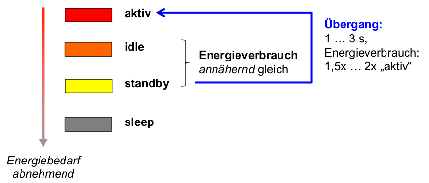
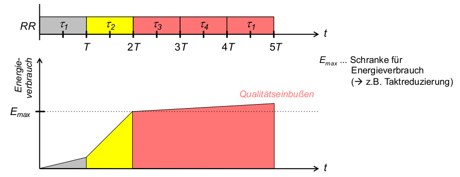
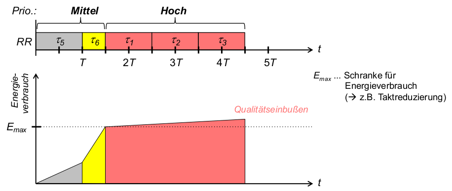
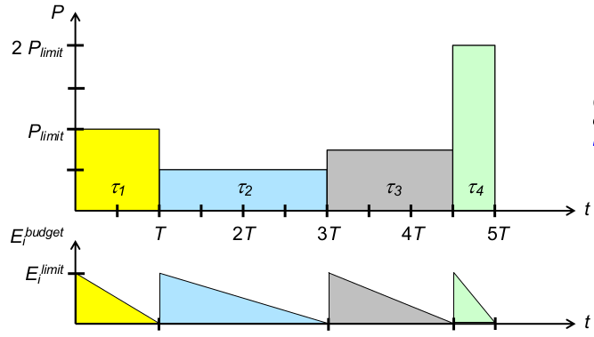
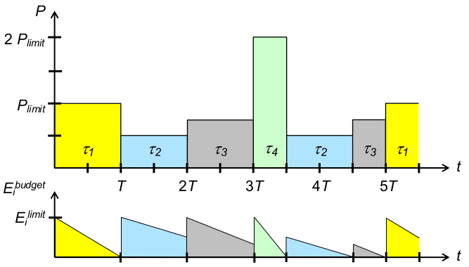
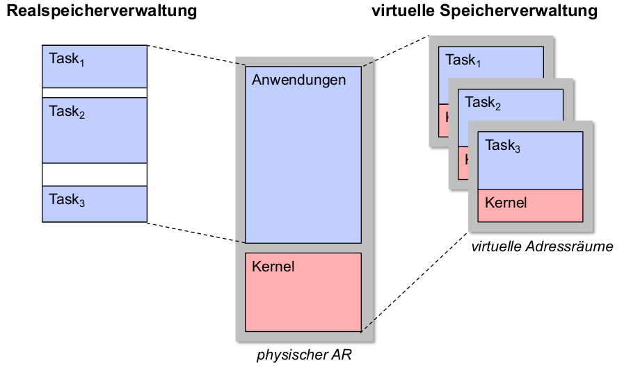
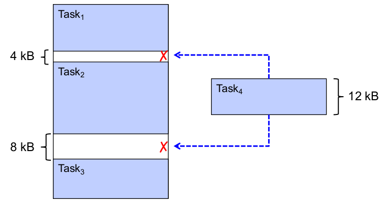
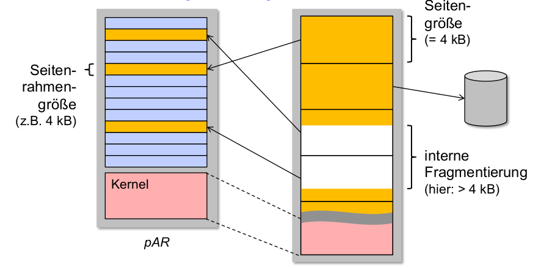

# Einführung
Betriebssysteme stecken nicht nur in Einzelplatzrechnern, sondern z.B. auch in:
- Informationssystemen
  - Gesundheitswesen
  - Finanzdienstleister
- Verkehrsmanagement-Systemen
  - Eisenbahn
  - Flugwesen
- Kommunikationssystemen
  - Mobilfunk
  - Raumfahrt
- eingebettetenSystemen
  - Multimedia
  - Fahrzeugsysteme
  - Sensornetze
- ... $\rightarrow$ verschiedenste Anforderungen!

Konsequenz: Spezialbetriebssysteme für Anforderungen wie ...
- Robustheit
- Echtzeitfähigkeit
- Energieeffizienz
- Sicherheit
- Adaptivität
- ...

Gegenstand dieser Vorlesung: Konstruktionsrichtlinien für solche ,,High-End Betriebssysteme''

## Funktionale und nichtfunktionale Eigenschaften
- Beispiel: Autokauf ,,Mit unserem Fahrzeug können Sie einkaufen fahren!''
- Beispiel: Handykauf ,,Mit unserem Telefon können Sie Ihre Freunde und Familie anrufen!''

- Anforderungen (Requirements)
    - Funktionale und nichtfunktionale Eigenschaften (eines Produkts, z.B. Softwaresystems) entstehen durch Erfüllung von funktionalen und nichtfunktionalen Anforderungen
- funktionale Eigenschaft
    - legt fest, was ein Produkt tun soll.
    - Bsp Handykauf: Das Produkt soll Telefongespräche ermöglichen.
- eine nichtfunktionale Eigenschaft (NFE)
    - legt fest, wie es dies tun soll, also welche sonstigen Eigenschaften das Produkt haben soll.
    - Bsp Handykauf: Das Produkt soll klein, leicht, energiesparend, strahlungsarm, umweltfreundlich,... sein.
- andere Bezeichnungen nichtfunktionaler Eigenschaften
    - Qualitäten bzw. Qualitätsattribute (eines Software-Produkts):
        - Nichtfunktionale Anforderungen bzw. Eigenschaften eines Software-Systems bzw. -Produkts oft auch als seine Qualitäten bezeichnet.
        - einzelne realisierte Eigenschaft ist demzufolge ein Qualitätsattribut (quality property) dieses Systems bzw. Produkts.
    - Weitere in der Literatur zu findende Begriffe in diesem Zusammenhang:
        - Non-functionalrequirements/properties
        - Constraints
        - Quality ofservice(QoS) requirements
        - u.a.
- ,,~ilities''
    - im Englischen: nichtfunktionale Eigenschaften eines Systems etc. informell auch als seine „ilities“ bezeichnet, hergeleitet von Begriffen wie
        - Stability
        - Portability
        - ...
    - im Deutschen: ( ,,itäten'',,,barkeiten'', ... möglich aber sprachästhetisch fragenswert)
        - Portab-ilität , Skalier-barkeit, aber: Offen-heit , Performanz, ...

## Konsequenzen für Betriebssysteme
### Hardwarebasis
Einst: Einprozessor-Systeme

Heute:
- Mehrprozessor-Systeme
- hochparallele Systeme
- neue Synchronisationsmechanismen erforderlich
- $\rightarrow$ unterschiedliche Hardware und deren Multiplexing aufgrund unterschiedlicher nichtfunktionaler Eigenschaften

### Betriebssystemarchitektur
Einst: Monolithische und Makrokernel-Architekturen

Heute:
- Mikrokernel(-basierte) Architekturen
- Exokernelbasierte Architekturen ( Library-Betriebssysteme )
- Virtualisierungsarchitekturen
- Multikernel-Architekturen
- $\rightarrow$ unterschiedliche Architekturen aufgrund unterschiedlicher nichtfunktionaler Eigenschaften

### Ressourcenverwaltung
Einst: sog. Batch-Betriebssysteme: Stapelverarbeitung von Jobs (FIFO, Zeitgarantie: irgendwann)

Heute:
- Echtzeitgarantien für Multimedia und Safety-kritische Anwendungen (Unterhaltung, Luft-und Raumfahrt, autonomes Fahren)
- echtzeitfähige Scheduler, Hauptspeicherverwaltung, Ereignismanagement, Umgangmit Überlast und Prioritätsumkehr ...
- $\rightarrow$ unterschiedliche Ressourcenverwaltung aufgrund unterschiedlicher nichtfunktionaler Eigenschaften

### Betriebssystemabstraktionen
- zusätzliche Abstraktionen und deren Verwaltung ...
  - ... zur Reservierung von Ressourcen ($\rightarrow$ eingebettete Systeme)
  - ... zur Realisierung von QoS-Anforderungen ($\rightarrow$ Multimediasysteme)
  - ... zur Erhöhung der Ausfallsicherheit ($\rightarrow$ verfügbarkeitskritische Systeme)
  - ... zum Schutz vor Angriffen und Missbrauch ($\rightarrow$ sicherheitskritische Systeme)
  - ... zum flexiblen und modularen Anpassen des Betriebssystems ($\rightarrow$ hochadaptive Systeme)
- $\rightarrow$ höchst diverse Abstraktionen von Hardware aufgrund unterschiedlicher nichtfunktionaler Eigenschaften

### Betriebssysteme als Softwareprodukte
- Betriebssystem:
    - eine endliche Menge von Quellcode, indiziert durch Zeilennummern: MACOSX = $\{0, 1, 2, ..., 4399822, ...\}$
    - ein komplexes Softwareprodukt ...welches insbesondere allgemeinen Qualitätsanforderungen an den Lebenszyklusvon Softwareprodukten unterliegt!
- an jedes Softwareprodukt gibt es Anforderungen an seine Nutzung und Pflege $\rightarrow$ Evolutionseigenschaften
- diese können für Betriebssysteme höchst speziell sein (Korrektheitsverifikation, Wartung, Erweiterung, ...)
- $\rightarrow$ spezielle Anforderungen an das Softwareprodukt Betriebssystem aufgrund unterschiedlicher nichtfunktionaler Eigenschaften

## NFE von Betriebssystemen
Funktionale Eigenschaften (= Funktionen, Aufgaben) ... von Betriebssystemen:
- Betriebssysteme: sehr komplexe Softwareprodukte
- Ein Grund hierfür: besitzen Reihe von differenzierten Aufgaben - also funktionale Eigenschaften

Grundlegende funktionale Eigenschaften von Betriebssystemen:
1. **Hardware-Abstraktion** (Anwendungen/Programmierern eine angenehme Ablaufumgebung auf Basis der Hardware bereitstellen)
2. **Hardware-Multiplexing** (gemeinsame Ablaufumgebung zeitlich oder logisch getrennt einzelnen Anwendungen zuteilen)
3. **Hardware-Schutz** (gemeinsame Ablaufumgebung gegen Fehler und Manipulation durch Anwendungen schützen)

Nichtfunktionale Eigenschaften (Auswahl) von Betriebssystemen:
- Laufzeiteigenschaften
  - Sparsamkeit und Effizienz
  - Robustheit
  - Verfügbarkeit
  - Sicherheit (Security)
  - Echtzeitfähigkeit
  - Adaptivität
  - Performanz
- Evolutionseigenschaften
  - Wartbarkeit
  - Portierbarkeit
  - Offenheit
  - Erweiterbarkeit

Klassifizierung: Nichtfunktionale Eigenschaften unterteilbar in:
1. Laufzeiteigenschaften (execution qualities)
    - zur Laufzeit eines Systems beobachtbar
    - Beispiele: ,,security'' (Sicherheit), ,,usability'' (Benutzbarkeit), ,,performance''
    (Performanz), ...
2. Evolutionseigenschaften (evolution qualities)
    - charakterisieren (Weiter-) Entwicklung- und Betrieb eines Systems
    - Beispiele: ,,testability'' (Testbarkeit), ,,extensibility'' (Erweiterbarkeit) usw.
- liegen in statischer Struktur eines Softwaresystems begründet

## Inhalte der Vorlesung
Auswahl sehr häufiger NFE von Betriebssystemen:
- Sparsamkeit und Effizienz
- Robustheit
- Verfügbarkeit
- Sicherheit (Security)
- Echtzeitfähigkeit
- Adaptivität
- Performanz
  
Diskussion jeder Eigenschaft: (Bsp.: Echtzeitfähigkeit)
- Motivation, Anwendungsgebiete, Begriffsdefinition(en) (Bsp.: Multimedia- und eingebettete Systeme)
- Mechanismen und Abstraktionen des Betriebssystems (Bsp.: Fristen, Deadline-Scheduler)
- unterstützende Betriebssystem-Architekturkonzepte (Bsp.: Mikrokernel)
- ein typisches Beispiel-Betriebssystem (Bsp.: QNX)
- Literaturliste


# Sparsamkeit und Effizienz
## Motivation
Sparsamkeit (Arbeitsdefinition): Die Eigenschaft eines Systems, seine Funktion mit minimalem Ressourcenverbrauchauszuüben.

Hintergrund: sparsamer Umgang mit einem oder mehreren Ressourcentypen = präziser: Effizienz bei Nutzung dieser Ressourcen

Effizienz: Der Grad, zu welchem ein System oder eine seiner Komponenten seine Funktion mit minimalem Ressourcenverbrauch ausübt. (IEEE)

Entwurfsentscheidungen für BS:
1. Wie muss bestimmter Ressourcentyp verwaltet werden, um Einsparungen     zu erzielen?
2. Welche Erweiterungen/Modifikationen des Betriebssystems (z.B. neue Funktionen, Komponenten, ...) sind hierfür notwendig?

Konkretisierung: Ressource, welche sparsam verwendet wird.

Beispiele:
- mobile Geräte: Sparsamkeit mit Energie
- kleine Geräte, eingebettete Systeme:
  - Sparsamkeit mit weiteren Ressourcen, z.B. Speicherplatz
  - Betriebssystem (Kernel + User Space): geringer Speicherbedarf
  - optimale Speicherverwaltung durch Betriebssystem zur Laufzeit
- Hardwareoptimierungen im Sinne der Sparsamkeit:
  - Baugrößenoptimierung(Platinen-und Peripheriegerätegröße)
  - Kostenoptimierung(kleine Caches, keine MMU, ...)
  - massiv reduzierte HW-Schnittstellen (E/A-Geräte, Peripherie, Netzwerk)

Mobile und eingebettete Systeme (eine kleine Auswahl)
- mobile Rechner-Endgeräte
  - Smartphone, Smartwatch
  - Laptop-/Tablet-PC
- Weltraumfahrt und -erkundung
- Automobile
  - Steuerung von Motor-und Bremssystemen
  - Fahrsicherheit
  - Insasseninformation (und –unterhaltung)
  - (teil-) autonomes Fahren
- verteilte Sensornetze (WSN)
- Chipkarten
- Multimedia-und Unterhaltungselektronik
  - eBookReader
  - Spielkonsolen
  - Digitalkameras

Beispiel: Weltraumerkundung
- Cassini-Huygens (1997–2017)
  - Radionuklidbatterien statt Solarzellen
  - Massenspeicher: SSDs statt Magnetbänder
- Rosetta (2004–2016)
  - 31 Monate im Energiesparmodus
- Opportunity (2003–2019)
  - geplante Missionsdauer: 90 d
  - Missionsdauer insgesamt: >> 5000 d
- Hayabusa (2003–2010)
  - Beschädigung der Energieversorgung
  - Energiesparmodus: um 3 Jahre verzögerte Rückkehr
- Voyager 1 (1977 bis heute)
  - erste Flugphase: periodisch 20 Monate Standby, 20 Stunden Messungen
  - liefert seit 40 Jahren Daten

## Energieeffizienz
Hardwaremaßnahmen
- zeitweiliges Abschalten/Herunterschalten momentan nicht benötigter
Ressourcen, wie
1. Laufwerke: CD/DVD, ..., Festplatte
2. Hauptspeicherelemente
3. (integrierte/externe) Peripherie: Monitor, E/A-Geräte, ...

Betriebssystemmechanismen
1. Dateisystem-E/A:energieeffizientes Festplatten-Prefetching(2.2.1)
2. CPU-Scheduling: energieeffizientes Scheduling(2.2.2)
3. Speicherverwaltung:minimale Leistungsaufnahme durchSpeicherzugriffe mittels Lokalitätsoptimierung [DGMB07]
4. Netzwerk:energiebewusstes Routing
5. Verteiltes Rechnen auf Multicore-Prozessoren: temperaturabhängige Lastverteilung
6. ...

### Energieeffiziente Dateizugriffe
Hardwarebedingungen: Magnetplatten (HDD), Netzwerkgeräte, DRAM-ICs,... sparen nur bei relativ langen Inaktivitätsintervallen Energie.

- Aufgabe: Erzeugen kurzer, intensiver Zugriffsmuster $\rightarrow$ lange Inaktivitätsintervalle (für alle Geräte mit geringem Energieverbrauch im Ruhezustand)
- Beobachtung bei HDD-Geräten: i.A. vier Zustände mit absteigendem Energieverbrauch:
    1. Aktiv: einziger Arbeitszustand
    2. Idle (Leerlauf): Platte rotiert, aber Plattenelektronik teilweise abgeschaltet
    3. Standby: Rotation abgeschaltet
    4. Sleep: gesamte restliche Elektronik abgeschaltet
- ähnliche, noch stärker differenzierte Zustände bei DRAM (vgl. [DGMB07] )

Energiezustände beim Betrieb von Festplatten:
- 
- Schlussfolgerung: durch geringe Verlängerungen des idle - Intervalls kann signifikant der Energieverbrauch reduziert werden.

#### Prefetching-Mechanismus
- Prefetching („Speichervorgriff“, vorausschauendes Lesen) & Caching
  - Standard-Praxis bei moderner Datei-E/A
  - Voraussetzung: Vorwissen über benötigte Folge von zukünftigen Datenblockreferenzen (z.B. Blockadressen für bestimmte Dateien, gewonnen durch Aufzeichnung früherer Zugriffsmuster beim Start von Anwendungen -Linux: readahead syscall)
  - Ziel: Performanzverbesserungdurch Durchsatzerhöhung u. Latenzzeit-Verringerung
  - Idee: Vorziehen möglichst vieler E/A-Anforderungen an Festplatte + zeitlich gleichmäßige Verteilung der verbleibenden
  - Umsetzung: Caching (Zwischenspeichern) dieser vorausschauend gelesenen Blöcke in ungenutzten Hauptspeicherseitenrahmen ( pagecache )
- Folge: Inaktivitätsintervalle überwiegend sehr kurz $\rightarrow$ Energieeffizienz ...?
- Zugriffsoperation: (durch Anwendung)
  - access(x) ... greife (lesend/schreibend) auf den Inhalt von Festplattenblock x im Page Cache zu
- Festplattenoperationen:
  - fetch(x) ... hole Block x nach einem access(x) von Festplatte
  - prefetch(x) ... hole Block x ohne access(x) von Festplatte
  - beide Operationen schreiben x in einen freien Platz des Festplattencaches; falls dieser voll ist ersetzen sie einen der Einträge gemäß fester Regeln $\rightarrow$ Teil der (Pre-) Fetching-Strategie
- Beispiel für solche Strategien: Anwendung ...
  - mit Datenblock-Referenzstrom A, B, C, D, E, F, G, ...
  - mit konstanter Zugriffsdauer: 10 Zeiteinheiten je Blockzugriff
  - Cache-Kapazität: 3 Datenblöcke
  - Zeit zum Holen eines Blocks bei Cache-Miss: 1 Zeiteinheit
- Beispiel: Traditionelles Prefetching
  - Fetch-on-demand-Strategie (kein vorausschauendes Lesen)
  - Strategie entsprechend Prefetching- Regeln nach Cao et al. [CFKL95] (= traditionelle Disk-Prefetching- Strategie)
  - traditionelle Prefetching-Strategie: bestimmt
    - wann ein Datenblock von der Platte zu holen ist (HW-Zustand aktiv )
    - welcher Block zu holen ist
    - welcher Block zu ersetzen ist
  - Regeln für diese Strategie:
    1. Optimales Prefetching: Jedes _prefetch_ sollte den nächsten Block im Referenzstrom in den Cache bringen, der noch nicht dort ist.
    2. Optimales Ersetzen: Bei jedem ersetzenden _prefetch_ sollte der Block überschrieben werden, der am spätesten in der Zukunft wieder benötigt wird.
    3. „Richte keinen Schaden an“: Überschreibe niemals Block A um Block B zu holen, wenn A vor B benötigt wird.
    4. Erste Möglichkeit: Führe nie ein ersetzendes _prefetch_ aus, wenn dieses schon vorher hätte ausgeführt werden können.
- Energieeffizientes Prefetching
  - Optimale Ersetzungsstrategie und 3 unterschiedliche Prefetching-Strategien:
  - Fetch-on-demand-Strategie:
    - Laufzeit: 66 ZE für access(A) ... access(F) , 7 Cache-Misses
    - Disk-Idle-Zeit: 6 Intervalle zu je 10 ZE
  - Strategie entsprechend Prefetching-Regeln [CFKL95] (traditionelle Disk-Prefetching-Strategie):
    - Laufzeit: 61 ZE für access(A) ... access(F) , 1 Cache-Miss
    - Disk-Idle-Zeit: 5 Intervalle zu je 9 ZE und 1 Intervall zu 8 ZE (= 53 ZE)
  - Energieeffiziente Prefetching-Strategie, die versucht Länge der Disk-Idle-Intervalle zu maximieren:
    - gleiche Laufzeit und gleiche Anzahl Cache-Misses wie traditionelles Prefetching
    - Disk-Idle-Zeit: 2 Intervalle zu 27 bzw. 28 ZE (= 55 ZE)
- Auswertung: Regeln für energieeffiziente Prefetching-Strategie nach Papathanasiou elal.: [PaSc04]
  1. Optimales Prefetching: Jedes _prefetch_ sollte den nächsten Block im Referenzstrom in den Cache bringen, der noch nicht dort ist.
  2. Optimales Ersetzen: Bei jedem ersetzenden _prefetch_ sollte der Block überschrieben werden, der am spätesten in der Zukunft wieder benötigt wird.
  3. „Richte keinen Schaden an“: Überschreibe niemals Block A um Block B zu holen, wenn A vor B benötigt wird.
  4. Maximiere Zugriffsfolgen: Führe immer dann nach einem _fetch_ oder _prefetch_ ein weiteres _prefetch_ aus, wenn Blöcke für eine Ersetzung geeignet sind. (i.S.v. Regel 3)
  5. Beachte Idle-Zeiten: Unterbrich nur dann eine Inaktivitätsperiode durch ein _prefetch_ , falls dieses sofort ausgeführt werden muss, um einen Cache-Miss zu vermeiden.

Allgemeine Schlussfolgerungen
1. Hardware-Spezifikation nutzen: Modi, in denen wenig Energie verbraucht wird
2. Entwicklung von Strategien, die langen Aufenthalt in energiesparenden Modi ermöglichen , und dabei Leistungsparameter in vertretbarem Umfang reduzieren
3. Implementieren dieser Strategien in Betriebssystemmechanismen zur Ressourcenverwaltung

### Energieeffizientes Prozessormanagement
Hardware-Gegebenheiten
- z.Zt. meistgenutzte Halbleitertechnologie für Prozessor-Hardware: CMOS ( Complementary Metal Oxide Semiconductor)
- Komponenten für Energieverbrauch: $P = P_{switching} + P_{leakage} + ...$
  - $P_{switching}$: für Schaltvorgänge notwendige Leistung
  - $P_{leakage}$: Verlustleistung durch verschiedene Leckströme
  - ...: weitere Einflussgrößen (technologiespezifisch)

#### Hardwareseitige Maßnahmen
Schaltleistung: $P_{switching}$
- Energiebedarf kapazitiver Lade-u. Entladevorgänge während des Schaltens
- für momentane CMOS-Technologie i.A. dominanter Anteil am Energieverbrauch
- Einsparpotenzial: Verringerung von
  1. Versorgungsspannung (quadratische Abhängigkeit!)
  2. Taktfrequenz
- Folgen:
  1. längere Schaltvorgänge
  2. größere Latenzzwischen Schaltvorgängen
- Konsequenz: Energieeinsparung nur mit Qualitätseinbußen(direkt o. indirekt) möglich
  - Anpassung des Lastprofils ( Zeit-Last-Kurve? Fristen kritisch? )
  - Beeinträchtigung der Nutzererfahrung( Reaktivität kritisch? Nutzungsprofil? )

Verlustleistung: $P_{leakage}$
- Energiebedarf baulich bedingter Leckströme
- Fortschreitende Hardware-Miniaturisierung $\Rightarrow$ zunehmender Anteil von $P_{leakage}$ an P
- Beispielhafte Größenordnungen zum Einsparpotenzial:
    | Schaltkreismaße | Versorgungsspannung | $P_{leakage}/P$ |
    | --------------- | ------------------- | --------------- |
    | 180 nm          | 2,5 V               | 0,              |
    | 70 nm           | 0,7 V               | 0,              |
    | 22 nm           | 0,4 V               | > 0,5           |
- Konsequenz: Leckströme kritisch für energiesparenden Hardwareentwurf

#### Regelspielraum: Nutzererfahrung
- Nutzererwartung: wichtigstes Kriterium zur (subjektiven) Bewertung von auf einem Rechner aktiven Anwendungen durch Nutzer  $\rightarrow$ Nutzerwartung bestimmt Nutzererfahrung
- Typ einer Anwendung
  - entscheidet über jeweilige Nutzererwartung
    1. Hintergrundanwendung (z.B. Compiler); von Interesse: Gesamt-Bearbeitungsdauer, Durchsatz
    2. Echtzeitanwendung(z.B. Video-Player, MP3-Player); von Interesse: „flüssiges“ Abspielen von Video oder Musik
    3. Interaktive Anwendung (z.B. Webbrowser); von Interesse: Reaktivität, d.h. keine (wahrnehmbare) Verzögerung zwischen Nutzer-Aktion und Rechner-Reaktion
  - Insbesondere kritisch: Echtzeitanwendungen, interaktive Anwendungen

Reaktivität
- Reaktion von Anwendungen
  - abhängig von sog. Reaktivität des Rechnersystems ≈ durchschnittliche Zeitdauer, mit der Reaktion eines Rechners auf eine (Benutzerinter-) Aktion erfolgt
- Reaktivität: von Reihe von Faktoren abhängig, z.B.:
  1. von **Hardware** an sich
  2. von **Energieversorgung** der Hardware (wichtig z.B. Spannungspegel an verschiedenen Stellen)
  3. von **Software-Gegebenheiten** (z.B. Prozess-Scheduling, Speichermanagement, Magnetplatten-E/A-Scheduling, Vorgänge im Fenstersystem, Arten des Ressourcen-Sharing usw.)

Zwischenfazit: Nutzererfahrung
- bietet Regelspielraum für Hardwareparameter ( $\rightarrow$ Schaltleistung) $\rightarrow$ Versorgungsspannung, Taktfrequenz
- Betriebssystemmechanismen zum energieeffizienten Prozessormanagement müssen mit Nutzererfahrung(jeweils erforderlicher Reaktivität) ausbalanciert werden (wie solche Mechanismen wirken: 2.2.3)
- Schnittstelle zu anderen NFE:
  - Echtzeitfähigkeit
  - Performanz
  - Usability
  - ...

#### Energieeffizientes Scheduling
- so weit besprochen: Beschränkung des durchschnittlichen Energieverbrauchs eines Prozessors
- offene Frage zum Ressourcenmultiplexing: Energieverbrauch eines Threads/Prozesses?
- Scheduling-Probleme beim Energiesparen:
  1. Fairness (der Energieverteilung)?
  2. Prioritätsumkehr?
- Beispiel: Round Robin (RR) mit Prioritäten (Hoch, Mittel, Niedrig)
- Problem 1: Unfaire Energieverteilung
  - Beschränkung des Energieverbrauchs (durch Qualitätseinbußen, schlimmstenfalls Ausfall)ab einem oberen Schwellwert $E_{max}$
  - Problem: energieintensive Threads behindern alle nachfolgenden Threads trotz gleicher Priorität  $\rightarrow$ Fairnessmaß von RR (gleiche Zeitscheibenlänge T ) untergraben
    - 
- Problem 2: energieintensive Threads niedrigerer Priorität behindern später ankommende Threads höherer Priorität
    - 

Energiebewusstes RR: Fairness
- Begriffe:
  - $E_i^{budget}$ ... Energiebudget von $t_i$
  - $E_i^{limit}$ ... Energielimit von $t_i$
  - $P_{limit}$ ... Leistungslimit: maximale Leistungsaufnahme [Energie/Zeit]
  - $T$ ... resultierende Zeitscheibenlänge
- Strategie 1: faire Energieverteilung (einheitliche Energielimits)
  - 
  - $1\leq i\leq 4: E_i^{limit} = P_{limit}* T$
  - (Abweichungen = Wichtung der Prozesse $\rightarrow$ bedingte Fairness)

Energiebewusstes RR: Reaktivität
- faire bzw. gewichtete Aufteilung begrenzter Energie optimiert Energieeffizienz
- Problem: lange, wenig energieintensive Threads verzögern Antwort-und Wartezeiten kurzer, energieintensiver Threads
  - Lösung im Einzelfall: Wichtung per $E_i^{limit}$
  - globale Reaktivität ( $\rightarrow$ Nutzererfahrung bei interaktiven Systemen) ...?
- Strategie 2: maximale Reaktivität (  $\rightarrow$ klassisches RR)
  - 

Energiebewusstes RR: Reaktivität und Fairness
- Problem: sparsame Threads werden bestraft durch Verfallen des ungenutzten Energiebudgets
- Idee: Ansparen von Energiebudgets  $\rightarrow$ mehrfache Ausführung eines Threads innerhalb einer Scheduling-Periode
- Strategie 3: Reaktivität, dann faire Energieverteilung
  - 

##### Implementierungsfragen
- Scheduling-Zeitpunkte?
  - welche Accounting-Operationen (Buchführung über Budget)?
  - wann Accounting-Operationen?
  - wann Verdrängung?
- Datenstrukturen?
  - ... im Scheduler  $\rightarrow$ Warteschlange(n)?
  - ... im Prozessdeskriptor?
- Kosten ggü. klassischem RR? (durch Prioritäten...?)

- Pro:
  - Optimierung der Energieverteilung nach anwendungsspezifischen Schedulingzielen( $\rightarrow$ Strategien)
  - Berücksichtigung von prozessspezifischen Energieverbrauchsmustern möglich:fördert Skalierbarkeit i.S.v. Lastadaptivität, indirekt auch Usability ( $\rightarrow$ Nutzererfahrung)
- Kontra:
  - zusätzliche sekundäre Kosten: Energiebedarf des Schedulers, Energiebedarf zusätzlicher Kontextwechsel, Implementierungskosten (Rechenzeit, Speicher)
  - Voraussetzung hardwareseitig: Monitoring des Energieverbrauchs (erforderliche/realisierbare Granularität...? sonst: Extrapolation?)
- **generelle Alternative:** energieintensive Prozesse verlangsamen  $\rightarrow$ Regelung der CPU-Leistungsparameter (Versorgungsspannung) (auch komplementär zum Schedulingals Maßnahme nach Energielimit-Überschreitung)
- Beispiel: Synergie nichtfunktionaler Eigenschaften
  - Performanz nur möglich durch Parallelität $\rightarrow$ Multicore-Hardware
  - Multicore-Hardware nur möglich mit Lastausgleich und Lastverteilungauf mehrere CPUs
  - dies erfordert ebenfalls Verteilungsstrategien: „Energy-aware Scheduling“ (Linux-Strategie zur Prozessorallokation -nicht zeitlichem Multiplexing!)

### Systemglobale Energieeinsparungsmaßnahmen
- Traditionelle Betriebssysteme: Entwurf so, dass zu jedem Zeitpunkt Spitzen-Performanzangestrebt
- Beobachtungen:
  - viele Anwendungen benötigen keine Spitzen-Performanz
  - viele Hardware-Komponenten verbringen Zeit in Leerlaufsituationen bzw. in Situationen, wo keine Spitzen-Performanz erforderlich
- Konsequenz (besonders für mobile Systeme) :
  - Hardware mit Niedrigenergiezuständen(Prozessoren und Magnetplattenlaufwerke, aber auch DRAM, Netzwerkschnittstellen, Displays, ...)
  - somit kann Betriebssystem **Energie-Management** realisieren

#### Hardwaretechnologien
- DPM: Dynamic Power Management
  - versetzt leerlaufende/unbenutzte Hardware-Komponenten selektiv in Zustände mit niedrigem Energieverbrauch
  - Zustandsübergänge durch Power-Manager (in Hardware) gesteuert, dem bestimmte _DPM-_ Strategie (Firmware) zugrunde liegt, um gutes Verhältnis zwischen Performanz/Reaktivität und Energieeinsparung zu erzielen
- DVS: Dynamic Voltage Scaling
  - effizientes Verfahren zur dynamischen Regulierungvon Taktfrequenz gemeinsammit Versorgungsspannung
  - Nutzung quadratischer Abhängigkeitder dynamischen Leistung von Versorgungsspannung
  - Steuerung/Strategien: Softwareunterstützungnotwendig!

Dynamisches Energiemanagement (DPM)- Strategien (Klassen) bestimmt, wann und wie lange eine Hardware-Komponente sich in Energiesparmodusbefinden sollte
- Greedy: Hardware-Komponente sofort nach Erreichen des Leerlaufs in Energiesparmodus, „Aufwecken“ durch neue Anforderung
- Time-out: Energiesparmodus erst nachdem ein definiertes Intervall im Leerlauf, „Aufwecken“ wie bei Greedy-Strategien
- Vorhersage: Energiesparmodus sofort nach Erreichen des Leerlaufs, wenn Heuristik vorhersagt,dass Kosten gerechtfertigt
- Stochastisch: Energiesparmodus auf Grundlage eines stochastischen Modells

Spannungsskalierung (DVS)
- Ziel: Unterstützung von DPM-Strategien durch Maßnahmen auf Ebene von Compiler, Betriebssystem und Applikationen:
  - **Compiler**
    - kann Informationen zur Betriebssystem-Unterstützung bezüglich Spannungs-Einstellung in Anwendungs-Code einstreuen,
    - damit zur Laufzeit Informationen über jeweilige Arbeitslast verfügbar
- **Betriebssystem (prädiktives Energiemanagement)**
    - kann Benutzung verschiedener Ressourcen (Prozessor usw.) beobachten
    - kann darüber Vorhersagen tätigen
    - kann notwendigen Performanzbereich bestimmen
- **Anwendungen**
    - können Informationen über jeweils für sie notwendige Performanz liefern
- $\rightarrow$ Kombination mit energieefizientemScheduling!

## Speichereffizienz
- ... heißt: Auslastung des verfügbaren Speichers
  - oft implizit: Hauptspeicherauslastung (memoryfootprint)
  - besonders für kleine/mobile Systeme: Hintergrundspeicherauslastung
- Maße zur Konkretisierung:
  - zeitliche Dimension: Maximum vs. Summe genutzten Speichers?
  - physischer Speicherverwaltung?  $\rightarrow$ Belegungsanteil pAR
  - virtuelle Speicherverwaltung?  $\rightarrow$ Belegungsanteil vAR
- Konsequenzen für Ressourcenverwaltung durch BS:
  - Taskverwaltung (Accounting, Multiplexing, Fairness, ...)
  - Programmiermodell, API (besonders: dynamische Speicherreservierung)
  - Sinnfrage und ggf. Strategien virtueller Speicherverwaltung (VMM)
- Konsequenzen für Betriebssystem selbst:
  - minimaler Speicherbedarfdurch Kernel
  - minimale Speicherverwaltungskosten (durch obige Aufgaben)

### Hauptspeicherauslastung
- 

Problem: externe Fragmentierung
- 
- Lösungen:
  - First Fit, Best Fit, WorstFit, Buddy
  - Relokation
- Kompromissloser Weg: kein Multitasking!

Problem: interne Fragmentierung
- 
- Lösung:
  - Seitenrahmengröße verringern
  - Tradeoff: dichter belegte vAR $\rightarrow$ größere Datenstrukturen für Seitentabellen!

- direkter Einfluss des Betriebssystems auf Hauptspeicherbelegung:
  - $\rightarrow$ Speicherbedarf des Kernels
  - statische(Minimal-) Größe des Kernels (Anweisungen + Daten)
  - dynamischeSpeicherreservierung durch Kernel
  - bei Makrokernel: Speicherbedarf von Gerätecontrollern (Treibern)!

weitere Einflussfaktoren: Speicherverwaltungskosten
- VMM: Seitentabellengröße $\rightarrow$ Mehrstufigkeit
- Metainformationen über laufende Programme: Größe von Taskkontrollblöcken( Prozess-/Threaddeskriptoren ...)
- dynamische Speicherreservierung durch Tasks

##### Beispiel 1: sparsam
Prozesskontrollblock (PCB, Metadatenstruktur des Prozessdeskriptors) eines kleinen Echtzeit-Kernels („DICK“):
```cpp
// Process Control Block (PCB)
struct pcb {
  char name[MAXLEN +1]; // process name
  proc (*addr)(); // first instruction
  int type; // process type
  int state; // process state
  long dline; // absolute deadline
  int period; // period
  int prt; // priority
  int wcet; // worst-case execution time
  float util; // processor utilization
  int *context;
  proc next;
  proc prev;
};
```

##### Beispiel 2: eher nicht sparsam
Linux Prozesskontrollblock (taskstruct):
```cpp
struct task_struct {
  volatile long state; /* - 1 unrunnable, 0 runnable, >0 stopped */
  void *stack;
  atomic_t usage;
  unsigned int flags; /* per process flags, defined below */
  unsigned int ptrace;
#ifdef CONFIG_SMP
  struct llist_node wake_entry;
  int on_cpu;
#endif
  int on_rq;
// SCHEDULING INFORMATION
  int prio, static_prio, normal_prio;
  unsigned int rt_priority;
  const struct sched_class *sched_class;
// Scheduling Entity
  struct sched_entity se;
  struct sched_rt_entity rt;
#ifdef CONFIG_CGROUP_SCHED
  struct task_group *sched_task_group;
#endif
#ifdef CONFIG_PREEMPT_NOTIFIERS
  struct hlist_head preempt_notifiers; /* list of struct preempt_notifier */
#endif
  unsigned char fpu_counter;
#ifdef CONFIG_BLK_DEV_IO_TRACE
  unsigned int btrace_seq;
#endif
  unsigned int policy;
  cpumask_t cpus_allowed;
#ifdef CONFIG_PREEMPT_RCU
  int rcu_read_lock_nesting;
  char rcu_read_unlock_special;
  struct list_head rcu_node_entry;
  struct rcu_node *rcu_blocked_node;
#endif /* #ifdef CONFIG_TREE_PREEMPT_RCU */
#ifdef CONFIG_RCU_BOOST
  struct rt_mutex *rcu_boost_mutex;
#endif /* #ifdef CONFIG_RCU_BOOST */
#if defined(CONFIG_SCHEDSTATS) || defined(CONFIG_TASK_DELAY_ACCT)
  struct sched_info sched_info;
#endif
  struct list_head tasks;
#ifdef CONFIG_SMP
  struct plist_node pushable_tasks;
#endif
// virtual address space reference
  struct mm_struct *mm, *active_mm;
#ifdef CONFIG_COMPAT_BRK
  unsigned brk_randomized:1;
#endif
#if defined(SPLIT_RSS_COUNTING)
  struct task_rss_stat rss_stat;
#endif
/* task state */
  int exit_state;
  int exit_code, exit_signal;
  int pdeath_signal; /* The signal sent when the parent dies */
  unsigned int jobctl; /* JOBCTL_*, siglock protected */
  unsigned int personality;
  unsigned did_exec:1;
  unsigned in_execve:1;/* Tell the LSMs that the process is doing an * execve */
  unsigned in_iowait:1;
/* Revert to default priority/policy when forking */
  unsigned sched_reset_on_fork:1;
  unsigned sched_contributes_to_load:1;
#ifdef CONFIG_GENERIC_HARDIRQS
/* IRQ handler threads */
  unsigned irq_thread;
#endif
  pid_t pid;
  pid_t tgid;
#ifdef CONFIG_CC_STACKPROTECTOR
/* Canary value for the -fstack-protector gcc feature */
  unsigned long stack_canary;
#endif
// Relatives
  struct task_struct __rcu *real_parent; /* real parent process */
  struct task_struct __rcu *parent; /* recipient of SIGCHLD, wait4() reports */
/* children/sibling forms the list of my natural children */
  struct list_head children; /* list of my children */
  struct list_head sibling; /* linkage in my parent's children list */
  struct task_struct *group_leader; /* threadgroup leader */
  struct list_head ptraced;
  struct list_head ptrace_entry;
/* PID/PID hash table linkage. */
  struct pid_link pids[PIDTYPE_MAX];
  struct list_head thread_group;
  struct completion *vfork_done; /* for vfork() */
  int __user *set_child_tid;
...
  unsigned long timer_slack_ns;
  unsigned long default_timer_slack_ns;
  struct list_head *scm_work_list;
#ifdef CONFIG_FUNCTION_GRAPH_TRACER
/* Index of current stored address in ret_stack */
  int curr_ret_stack;
/* Stack of return addresses for return function tracing */
  struct ftrace_ret_stack *ret_stack;
/* time stamp for last schedule */
  unsigned long long ftrace_timestamp;
...
```

### Hintergrundspeicherauslastung
Einflussfaktoren des Betriebssystems:
- statische Größe des Kernel-Images, welches beim Bootstrapping gelesen wird
- statische Größe von Programm-Images (Standards wie ELF)
- statisches vs. dynamisches Einbinden von Bibliotheken: Größe von Programmdateien
- VMM: Größe des Auslagerungsbereichs (inkl. Teilen der Seitentabelle!) für Anwendungen
- Modularisierung (zur Kompilierzeit) des Kernels: gezielte Anpassung an Einsatzdomäne möglich
- Adaptivität (zur Kompilier-und Laufzeit) des Kernels: gezielte Anpassung an sich ändernde Umgebungsbedingungen möglich ($\rightarrow$ Cassini-Huygens-Mission)


# Robustheit und Verfügbarkeit
# Sicherheit
# Echtzeitfähigkeit
# Adaptivität
# Performanz und Parallelität
# Zusammenfassung


# Literatur
- NFE in Betriebssystemen
    - Eeles, Peter; Cripps, Peter: The Process of Software Architecting
- Funktionale Eigenschaften eines Betriebssystem
    - Tanebaum, Andrews; Bos, Herbert: Modern Operating Systems
    - Tanebaum, Andrews; Woodhull, Alberts: Operating Systems Design and Implementation
    - Stallings, William: Operating Systems: Internals and Design Principles
- Energieeffizienz
  - GUPTA, RAJESHK.; IRANI, SANDY; SHUKLA, SANDEEPK.; SHUKLA, SANDEEPK.: Formal Methods for Dynamic Power Management
  - RANGANATHAN, PARTHASARATHY: Recipe for efficiency: principles of power-aware computing
  - SIMUNIC, TAJANA; BENINI, LUCA; GLYNN, PETER; DEMICHELI, GIOVANNI: Dynamic Power Management for Portable Systems
- Effiziente Hauptspeicherverwaltung
  - DINIZ, BRUNO; GUEDES, DORGIVAL; MEIRA, WAGNER, JR.; BIANCHINI, RICARDO: Limiting the Power Consumption of Main Memory
- Traditionelles Festplatten-Prefetching
  - CAO, PEI; FELTEN, EDWARDW.; KARLIN, ANNAR.; LI, KAI: A Study ofIntegrated Prefetching and Caching Strategies
- Effizienter Betrieb von Festplatten
  - PAPATHANASIOU, ATHANASIOSE.; SCOTT, MICHAELL.: Energy Efficient Prefetching and Caching
- Energieeffizientes Scheduling
  - KLEE, CHRISTOPH: Design and Analysis of Energy-Aware Scheduling Policies
- Energieeffiziente Betriebssysteme
  - LANG, CLEMENS: Components for Energy-Efficient Operating Systems
  - YAN, LE; ZHONG, LIN; JHA, NIRAJK.: Towards a Responsive, Yet Power-efficient, Operating System: A Holistic Approach
  - YAN, LE; ZHONG, LIN; JHA, NIRAJK.: User-perceived Latency Driven Voltage Scaling for Interactive Applications
- Eingebettete Systeme
  - MANLEY, JOHNH.: Embedded Systems, MARCINIAK, J. J.(Hrsg.)
- TinyOS
  - KELLNER, SIMON; BELLOSA, FRANK: Energy Accounting Support in TinyOS
  - KELLNER, SIMON: Flexible Online Energy Accounting in TinyOS