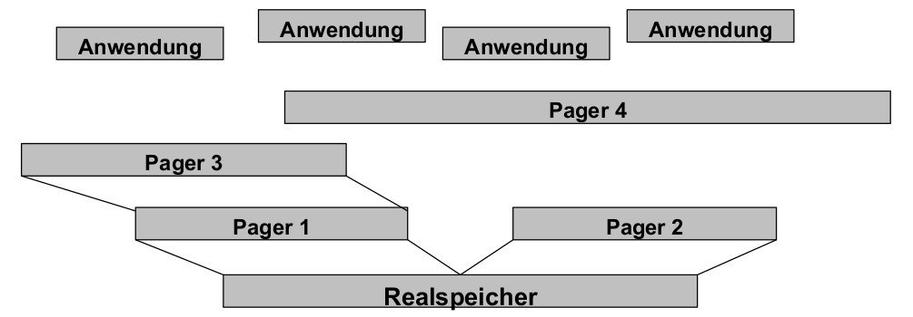

# Einführung
Betriebssysteme stecken nicht nur in Einzelplatzrechnern, sondern z.B. auch in:
- Informationssystemen
  - Gesundheitswesen
  - Finanzdienstleister
- Verkehrsmanagement-Systemen
  - Eisenbahn
  - Flugwesen
- Kommunikationssystemen
  - Mobilfunk
  - Raumfahrt
- eingebettetenSystemen
  - Multimedia
  - Fahrzeugsysteme
  - Sensornetze
- ... $\rightarrow$ verschiedenste Anforderungen!

Konsequenz: Spezialbetriebssysteme für Anforderungen wie ...
- Robustheit
- Echtzeitfähigkeit
- Energieeffizienz
- Sicherheit
- Adaptivität
- ...

Gegenstand dieser Vorlesung: Konstruktionsrichtlinien für solche ,,High-End Betriebssysteme''

## Funktionale und nichtfunktionale Eigenschaften
- Beispiel: Autokauf ,,Mit unserem Fahrzeug können Sie einkaufen fahren!''
- Beispiel: Handykauf ,,Mit unserem Telefon können Sie Ihre Freunde und Familie anrufen!''

- Anforderungen (Requirements)
    - Funktionale und nichtfunktionale Eigenschaften (eines Produkts, z.B. Softwaresystems) entstehen durch Erfüllung von funktionalen und nichtfunktionalen Anforderungen
- funktionale Eigenschaft
    - legt fest, was ein Produkt tun soll.
    - Bsp Handykauf: Das Produkt soll Telefongespräche ermöglichen.
- eine nichtfunktionale Eigenschaft (NFE)
    - legt fest, wie es dies tun soll, also welche sonstigen Eigenschaften das Produkt haben soll.
    - Bsp Handykauf: Das Produkt soll klein, leicht, energiesparend, strahlungsarm, umweltfreundlich,... sein.
- andere Bezeichnungen nichtfunktionaler Eigenschaften
    - Qualitäten bzw. Qualitätsattribute (eines Software-Produkts):
        - Nichtfunktionale Anforderungen bzw. Eigenschaften eines Software-Systems bzw. -Produkts oft auch als seine Qualitäten bezeichnet.
        - einzelne realisierte Eigenschaft ist demzufolge ein Qualitätsattribut (quality property) dieses Systems bzw. Produkts.
    - Weitere in der Literatur zu findende Begriffe in diesem Zusammenhang:
        - Non-functionalrequirements/properties
        - Constraints
        - Quality ofservice(QoS) requirements
        - u.a.
- ,,~ilities''
    - im Englischen: nichtfunktionale Eigenschaften eines Systems etc. informell auch als seine ,,ilities'' bezeichnet, hergeleitet von Begriffen wie
        - Stability
        - Portability
        - ...
    - im Deutschen: ( ,,itäten'',,,barkeiten'', ... möglich aber sprachästhetisch fragenswert)
        - Portab-ilität , Skalier-barkeit, aber: Offen-heit , Performanz, ...

## Konsequenzen für Betriebssysteme
### Hardwarebasis
Einst: Einprozessor-Systeme

Heute:
- Mehrprozessor-Systeme
- hochparallele Systeme
- neue Synchronisationsmechanismen erforderlich
- $\rightarrow$ unterschiedliche Hardware und deren Multiplexing aufgrund unterschiedlicher nichtfunktionaler Eigenschaften

### Betriebssystemarchitektur
Einst: Monolithische und Makrokernel-Architekturen

Heute:
- Mikrokernel(-basierte) Architekturen
- Exokernelbasierte Architekturen ( Library-Betriebssysteme )
- Virtualisierungsarchitekturen
- Multikernel-Architekturen
- $\rightarrow$ unterschiedliche Architekturen aufgrund unterschiedlicher nichtfunktionaler Eigenschaften

### Ressourcenverwaltung
Einst: sog. Batch-Betriebssysteme: Stapelverarbeitung von Jobs (FIFO, Zeitgarantie: irgendwann)

Heute:
- Echtzeitgarantien für Multimedia und Safety-kritische Anwendungen (Unterhaltung, Luft-und Raumfahrt, autonomes Fahren)
- echtzeitfähige Scheduler, Hauptspeicherverwaltung, Ereignismanagement, Umgangmit Überlast und Prioritätsumkehr ...
- $\rightarrow$ unterschiedliche Ressourcenverwaltung aufgrund unterschiedlicher nichtfunktionaler Eigenschaften

### Betriebssystemabstraktionen
- zusätzliche Abstraktionen und deren Verwaltung ...
  - ... zur Reservierung von Ressourcen ($\rightarrow$ eingebettete Systeme)
  - ... zur Realisierung von QoS-Anforderungen ($\rightarrow$ Multimediasysteme)
  - ... zur Erhöhung der Ausfallsicherheit ($\rightarrow$ verfügbarkeitskritische Systeme)
  - ... zum Schutz vor Angriffen und Missbrauch ($\rightarrow$ sicherheitskritische Systeme)
  - ... zum flexiblen und modularen Anpassen des Betriebssystems ($\rightarrow$ hochadaptive Systeme)
- $\rightarrow$ höchst diverse Abstraktionen von Hardware aufgrund unterschiedlicher nichtfunktionaler Eigenschaften

### Betriebssysteme als Softwareprodukte
- Betriebssystem:
    - eine endliche Menge von Quellcode, indiziert durch Zeilennummern: MACOSX = $\{0, 1, 2, ..., 4399822, ...\}$
    - ein komplexes Softwareprodukt ...welches insbesondere allgemeinen Qualitätsanforderungen an den Lebenszyklusvon Softwareprodukten unterliegt!
- an jedes Softwareprodukt gibt es Anforderungen an seine Nutzung und Pflege $\rightarrow$ Evolutionseigenschaften
- diese können für Betriebssysteme höchst speziell sein (Korrektheitsverifikation, Wartung, Erweiterung, ...)
- $\rightarrow$ spezielle Anforderungen an das Softwareprodukt Betriebssystem aufgrund unterschiedlicher nichtfunktionaler Eigenschaften

## NFE von Betriebssystemen
Funktionale Eigenschaften (= Funktionen, Aufgaben) ... von Betriebssystemen:
- Betriebssysteme: sehr komplexe Softwareprodukte
- Ein Grund hierfür: besitzen Reihe von differenzierten Aufgaben - also funktionale Eigenschaften

Grundlegende funktionale Eigenschaften von Betriebssystemen:
1. **Hardware-Abstraktion** (Anwendungen/Programmierern eine angenehme Ablaufumgebung auf Basis der Hardware bereitstellen)
2. **Hardware-Multiplexing** (gemeinsame Ablaufumgebung zeitlich oder logisch getrennt einzelnen Anwendungen zuteilen)
3. **Hardware-Schutz** (gemeinsame Ablaufumgebung gegen Fehler und Manipulation durch Anwendungen schützen)

Nichtfunktionale Eigenschaften (Auswahl) von Betriebssystemen:
- Laufzeiteigenschaften
  - Sparsamkeit und Effizienz
  - Robustheit
  - Verfügbarkeit
  - Sicherheit (Security)
  - Echtzeitfähigkeit
  - Adaptivität
  - Performanz
- Evolutionseigenschaften
  - Wartbarkeit
  - Portierbarkeit
  - Offenheit
  - Erweiterbarkeit

Klassifizierung: Nichtfunktionale Eigenschaften unterteilbar in:
1. Laufzeiteigenschaften (execution qualities)
    - zur Laufzeit eines Systems beobachtbar
    - Beispiele: ,,security'' (Sicherheit), ,,usability'' (Benutzbarkeit), ,,performance''
    (Performanz), ...
2. Evolutionseigenschaften (evolution qualities)
    - charakterisieren (Weiter-) Entwicklung- und Betrieb eines Systems
    - Beispiele: ,,testability'' (Testbarkeit), ,,extensibility'' (Erweiterbarkeit) usw.
- liegen in statischer Struktur eines Softwaresystems begründet

## Inhalte der Vorlesung
Auswahl sehr häufiger NFE von Betriebssystemen:
- Sparsamkeit und Effizienz
- Robustheit
- Verfügbarkeit
- Sicherheit (Security)
- Echtzeitfähigkeit
- Adaptivität
- Performanz
  
Diskussion jeder Eigenschaft: (Bsp.: Echtzeitfähigkeit)
- Motivation, Anwendungsgebiete, Begriffsdefinition(en) (Bsp.: Multimedia- und eingebettete Systeme)
- Mechanismen und Abstraktionen des Betriebssystems (Bsp.: Fristen, Deadline-Scheduler)
- unterstützende Betriebssystem-Architekturkonzepte (Bsp.: Mikrokernel)
- ein typisches Beispiel-Betriebssystem (Bsp.: QNX)
- Literaturliste


# Sparsamkeit und Effizienz
## Motivation
Sparsamkeit (Arbeitsdefinition): Die Eigenschaft eines Systems, seine Funktion mit minimalem Ressourcenverbrauchauszuüben.

Hintergrund: sparsamer Umgang mit einem oder mehreren Ressourcentypen = präziser: Effizienz bei Nutzung dieser Ressourcen

Effizienz: Der Grad, zu welchem ein System oder eine seiner Komponenten seine Funktion mit minimalem Ressourcenverbrauch ausübt. (IEEE)

Entwurfsentscheidungen für BS:
1. Wie muss bestimmter Ressourcentyp verwaltet werden, um Einsparungen     zu erzielen?
2. Welche Erweiterungen/Modifikationen des Betriebssystems (z.B. neue Funktionen, Komponenten, ...) sind hierfür notwendig?

Konkretisierung: Ressource, welche sparsam verwendet wird.

Beispiele:
- mobile Geräte: Sparsamkeit mit Energie
- kleine Geräte, eingebettete Systeme:
  - Sparsamkeit mit weiteren Ressourcen, z.B. Speicherplatz
  - Betriebssystem (Kernel + User Space): geringer Speicherbedarf
  - optimale Speicherverwaltung durch Betriebssystem zur Laufzeit
- Hardwareoptimierungen im Sinne der Sparsamkeit:
  - Baugrößenoptimierung(Platinen-und Peripheriegerätegröße)
  - Kostenoptimierung(kleine Caches, keine MMU, ...)
  - massiv reduzierte HW-Schnittstellen (E/A-Geräte, Peripherie, Netzwerk)

Mobile und eingebettete Systeme (eine kleine Auswahl)
- mobile Rechner-Endgeräte
  - Smartphone, Smartwatch
  - Laptop-/Tablet-PC
- Weltraumfahrt und -erkundung
- Automobile
  - Steuerung von Motor-und Bremssystemen
  - Fahrsicherheit
  - Insasseninformation (und -unterhaltung)
  - (teil-) autonomes Fahren
- verteilte Sensornetze (WSN)
- Chipkarten
- Multimedia-und Unterhaltungselektronik
  - eBookReader
  - Spielkonsolen
  - Digitalkameras

Beispiel: Weltraumerkundung
- Cassini-Huygens (1997-2017)
  - Radionuklidbatterien statt Solarzellen
  - Massenspeicher: SSDs statt Magnetbänder
- Rosetta (2004-2016)
  - 31 Monate im Energiesparmodus
- Opportunity (2003-2019)
  - geplante Missionsdauer: 90 d
  - Missionsdauer insgesamt: >> 5000 d
- Hayabusa (2003-2010)
  - Beschädigung der Energieversorgung
  - Energiesparmodus: um 3 Jahre verzögerte Rückkehr
- Voyager 1 (1977 bis heute)
  - erste Flugphase: periodisch 20 Monate Standby, 20 Stunden Messungen
  - liefert seit 40 Jahren Daten

## Energieeffizienz
Hardwaremaßnahmen
- zeitweiliges Abschalten/Herunterschalten momentan nicht benötigter
Ressourcen, wie
1. Laufwerke: CD/DVD, ..., Festplatte
2. Hauptspeicherelemente
3. (integrierte/externe) Peripherie: Monitor, E/A-Geräte, ...

Betriebssystemmechanismen
1. Dateisystem-E/A:energieeffizientes Festplatten-Prefetching(2.2.1)
2. CPU-Scheduling: energieeffizientes Scheduling(2.2.2)
3. Speicherverwaltung:minimale Leistungsaufnahme durchSpeicherzugriffe mittels Lokalitätsoptimierung [DGMB07]
4. Netzwerk:energiebewusstes Routing
5. Verteiltes Rechnen auf Multicore-Prozessoren: temperaturabhängige Lastverteilung
6. ...

### Energieeffiziente Dateizugriffe
Hardwarebedingungen: Magnetplatten (HDD), Netzwerkgeräte, DRAM-ICs,... sparen nur bei relativ langen Inaktivitätsintervallen Energie.

- Aufgabe: Erzeugen kurzer, intensiver Zugriffsmuster $\rightarrow$ lange Inaktivitätsintervalle (für alle Geräte mit geringem Energieverbrauch im Ruhezustand)
- Beobachtung bei HDD-Geräten: i.A. vier Zustände mit absteigendem Energieverbrauch:
    1. Aktiv: einziger Arbeitszustand
    2. Idle (Leerlauf): Platte rotiert, aber Plattenelektronik teilweise abgeschaltet
    3. Standby: Rotation abgeschaltet
    4. Sleep: gesamte restliche Elektronik abgeschaltet
- ähnliche, noch stärker differenzierte Zustände bei DRAM (vgl. [DGMB07] )

Energiezustände beim Betrieb von Festplatten:
- 
- Schlussfolgerung: durch geringe Verlängerungen des idle - Intervalls kann signifikant der Energieverbrauch reduziert werden.

#### Prefetching-Mechanismus
- Prefetching (,,Speichervorgriff'', vorausschauendes Lesen) & Caching
  - Standard-Praxis bei moderner Datei-E/A
  - Voraussetzung: Vorwissen über benötigte Folge von zukünftigen Datenblockreferenzen (z.B. Blockadressen für bestimmte Dateien, gewonnen durch Aufzeichnung früherer Zugriffsmuster beim Start von Anwendungen -Linux: readahead syscall)
  - Ziel: Performanzverbesserungdurch Durchsatzerhöhung u. Latenzzeit-Verringerung
  - Idee: Vorziehen möglichst vieler E/A-Anforderungen an Festplatte + zeitlich gleichmäßige Verteilung der verbleibenden
  - Umsetzung: Caching (Zwischenspeichern) dieser vorausschauend gelesenen Blöcke in ungenutzten Hauptspeicherseitenrahmen ( pagecache )
- Folge: Inaktivitätsintervalle überwiegend sehr kurz $\rightarrow$ Energieeffizienz ...?
- Zugriffsoperation: (durch Anwendung)
  - access(x) ... greife (lesend/schreibend) auf den Inhalt von Festplattenblock x im Page Cache zu
- Festplattenoperationen:
  - fetch(x) ... hole Block x nach einem access(x) von Festplatte
  - prefetch(x) ... hole Block x ohne access(x) von Festplatte
  - beide Operationen schreiben x in einen freien Platz des Festplattencaches; falls dieser voll ist ersetzen sie einen der Einträge gemäß fester Regeln $\rightarrow$ Teil der (Pre-) Fetching-Strategie
- Beispiel für solche Strategien: Anwendung ...
  - mit Datenblock-Referenzstrom A, B, C, D, E, F, G, ...
  - mit konstanter Zugriffsdauer: 10 Zeiteinheiten je Blockzugriff
  - Cache-Kapazität: 3 Datenblöcke
  - Zeit zum Holen eines Blocks bei Cache-Miss: 1 Zeiteinheit
- Beispiel: Traditionelles Prefetching
  - Fetch-on-demand-Strategie (kein vorausschauendes Lesen)
  - Strategie entsprechend Prefetching- Regeln nach Cao et al. [CFKL95] (= traditionelle Disk-Prefetching- Strategie)
  - traditionelle Prefetching-Strategie: bestimmt
    - wann ein Datenblock von der Platte zu holen ist (HW-Zustand aktiv )
    - welcher Block zu holen ist
    - welcher Block zu ersetzen ist
  - Regeln für diese Strategie:
    1. Optimales Prefetching: Jedes _prefetch_ sollte den nächsten Block im Referenzstrom in den Cache bringen, der noch nicht dort ist.
    2. Optimales Ersetzen: Bei jedem ersetzenden _prefetch_ sollte der Block überschrieben werden, der am spätesten in der Zukunft wieder benötigt wird.
    3. ,,Richte keinen Schaden an'': Überschreibe niemals Block A um Block B zu holen, wenn A vor B benötigt wird.
    4. Erste Möglichkeit: Führe nie ein ersetzendes _prefetch_ aus, wenn dieses schon vorher hätte ausgeführt werden können.
- Energieeffizientes Prefetching
  - Optimale Ersetzungsstrategie und 3 unterschiedliche Prefetching-Strategien:
  - Fetch-on-demand-Strategie:
    - Laufzeit: 66 ZE für access(A) ... access(F) , 7 Cache-Misses
    - Disk-Idle-Zeit: 6 Intervalle zu je 10 ZE
  - Strategie entsprechend Prefetching-Regeln [CFKL95] (traditionelle Disk-Prefetching-Strategie):
    - Laufzeit: 61 ZE für access(A) ... access(F) , 1 Cache-Miss
    - Disk-Idle-Zeit: 5 Intervalle zu je 9 ZE und 1 Intervall zu 8 ZE (= 53 ZE)
  - Energieeffiziente Prefetching-Strategie, die versucht Länge der Disk-Idle-Intervalle zu maximieren:
    - gleiche Laufzeit und gleiche Anzahl Cache-Misses wie traditionelles Prefetching
    - Disk-Idle-Zeit: 2 Intervalle zu 27 bzw. 28 ZE (= 55 ZE)
- Auswertung: Regeln für energieeffiziente Prefetching-Strategie nach Papathanasiou elal.: [PaSc04]
  1. Optimales Prefetching: Jedes _prefetch_ sollte den nächsten Block im Referenzstrom in den Cache bringen, der noch nicht dort ist.
  2. Optimales Ersetzen: Bei jedem ersetzenden _prefetch_ sollte der Block überschrieben werden, der am spätesten in der Zukunft wieder benötigt wird.
  3. ,,Richte keinen Schaden an'': Überschreibe niemals Block A um Block B zu holen, wenn A vor B benötigt wird.
  4. Maximiere Zugriffsfolgen: Führe immer dann nach einem _fetch_ oder _prefetch_ ein weiteres _prefetch_ aus, wenn Blöcke für eine Ersetzung geeignet sind. (i.S.v. Regel 3)
  5. Beachte Idle-Zeiten: Unterbrich nur dann eine Inaktivitätsperiode durch ein _prefetch_ , falls dieses sofort ausgeführt werden muss, um einen Cache-Miss zu vermeiden.

Allgemeine Schlussfolgerungen
1. Hardware-Spezifikation nutzen: Modi, in denen wenig Energie verbraucht wird
2. Entwicklung von Strategien, die langen Aufenthalt in energiesparenden Modi ermöglichen , und dabei Leistungsparameter in vertretbarem Umfang reduzieren
3. Implementieren dieser Strategien in Betriebssystemmechanismen zur Ressourcenverwaltung

### Energieeffizientes Prozessormanagement
Hardware-Gegebenheiten
- z.Zt. meistgenutzte Halbleitertechnologie für Prozessor-Hardware: CMOS ( Complementary Metal Oxide Semiconductor)
- Komponenten für Energieverbrauch: $P = P_{switching} + P_{leakage} + ...$
  - $P_{switching}$: für Schaltvorgänge notwendige Leistung
  - $P_{leakage}$: Verlustleistung durch verschiedene Leckströme
  - ...: weitere Einflussgrößen (technologiespezifisch)

#### Hardwareseitige Maßnahmen
Schaltleistung: $P_{switching}$
- Energiebedarf kapazitiver Lade-u. Entladevorgänge während des Schaltens
- für momentane CMOS-Technologie i.A. dominanter Anteil am Energieverbrauch
- Einsparpotenzial: Verringerung von
  1. Versorgungsspannung (quadratische Abhängigkeit!)
  2. Taktfrequenz
- Folgen:
  1. längere Schaltvorgänge
  2. größere Latenzzwischen Schaltvorgängen
- Konsequenz: Energieeinsparung nur mit Qualitätseinbußen(direkt o. indirekt) möglich
  - Anpassung des Lastprofils ( Zeit-Last-Kurve? Fristen kritisch? )
  - Beeinträchtigung der Nutzererfahrung( Reaktivität kritisch? Nutzungsprofil? )

Verlustleistung: $P_{leakage}$
- Energiebedarf baulich bedingter Leckströme
- Fortschreitende Hardware-Miniaturisierung $\Rightarrow$ zunehmender Anteil von $P_{leakage}$ an P
- Beispielhafte Größenordnungen zum Einsparpotenzial:
    | Schaltkreismaße | Versorgungsspannung | $P_{leakage}/P$ |
    | --------------- | ------------------- | --------------- |
    | 180 nm          | 2,5 V               | 0,              |
    | 70 nm           | 0,7 V               | 0,              |
    | 22 nm           | 0,4 V               | > 0,5           |
- Konsequenz: Leckströme kritisch für energiesparenden Hardwareentwurf

#### Regelspielraum: Nutzererfahrung
- Nutzererwartung: wichtigstes Kriterium zur (subjektiven) Bewertung von auf einem Rechner aktiven Anwendungen durch Nutzer  $\rightarrow$ Nutzerwartung bestimmt Nutzererfahrung
- Typ einer Anwendung
  - entscheidet über jeweilige Nutzererwartung
    1. Hintergrundanwendung (z.B. Compiler); von Interesse: Gesamt-Bearbeitungsdauer, Durchsatz
    2. Echtzeitanwendung(z.B. Video-Player, MP3-Player); von Interesse: ,,flüssiges'' Abspielen von Video oder Musik
    3. Interaktive Anwendung (z.B. Webbrowser); von Interesse: Reaktivität, d.h. keine (wahrnehmbare) Verzögerung zwischen Nutzer-Aktion und Rechner-Reaktion
  - Insbesondere kritisch: Echtzeitanwendungen, interaktive Anwendungen

Reaktivität
- Reaktion von Anwendungen
  - abhängig von sog. Reaktivität des Rechnersystems ≈ durchschnittliche Zeitdauer, mit der Reaktion eines Rechners auf eine (Benutzerinter-) Aktion erfolgt
- Reaktivität: von Reihe von Faktoren abhängig, z.B.:
  1. von **Hardware** an sich
  2. von **Energieversorgung** der Hardware (wichtig z.B. Spannungspegel an verschiedenen Stellen)
  3. von **Software-Gegebenheiten** (z.B. Prozess-Scheduling, Speichermanagement, Magnetplatten-E/A-Scheduling, Vorgänge im Fenstersystem, Arten des Ressourcen-Sharing usw.)

Zwischenfazit: Nutzererfahrung
- bietet Regelspielraum für Hardwareparameter ( $\rightarrow$ Schaltleistung) $\rightarrow$ Versorgungsspannung, Taktfrequenz
- Betriebssystemmechanismen zum energieeffizienten Prozessormanagement müssen mit Nutzererfahrung(jeweils erforderlicher Reaktivität) ausbalanciert werden (wie solche Mechanismen wirken: 2.2.3)
- Schnittstelle zu anderen NFE:
  - Echtzeitfähigkeit
  - Performanz
  - Usability
  - ...

#### Energieeffizientes Scheduling
- so weit besprochen: Beschränkung des durchschnittlichen Energieverbrauchs eines Prozessors
- offene Frage zum Ressourcenmultiplexing: Energieverbrauch eines Threads/Prozesses?
- Scheduling-Probleme beim Energiesparen:
  1. Fairness (der Energieverteilung)?
  2. Prioritätsumkehr?
- Beispiel: Round Robin (RR) mit Prioritäten (Hoch, Mittel, Niedrig)
- Problem 1: Unfaire Energieverteilung
  - Beschränkung des Energieverbrauchs (durch Qualitätseinbußen, schlimmstenfalls Ausfall)ab einem oberen Schwellwert $E_{max}$
  - Problem: energieintensive Threads behindern alle nachfolgenden Threads trotz gleicher Priorität  $\rightarrow$ Fairnessmaß von RR (gleiche Zeitscheibenlänge T ) untergraben
    - 
- Problem 2: energieintensive Threads niedrigerer Priorität behindern später ankommende Threads höherer Priorität
    - 

Energiebewusstes RR: Fairness
- Begriffe:
  - $E_i^{budget}$ ... Energiebudget von $t_i$
  - $E_i^{limit}$ ... Energielimit von $t_i$
  - $P_{limit}$ ... Leistungslimit: maximale Leistungsaufnahme [Energie/Zeit]
  - $T$ ... resultierende Zeitscheibenlänge
- Strategie 1: faire Energieverteilung (einheitliche Energielimits)
  - 
  - $1\leq i\leq 4: E_i^{limit} = P_{limit}* T$
  - (Abweichungen = Wichtung der Prozesse $\rightarrow$ bedingte Fairness)

Energiebewusstes RR: Reaktivität
- faire bzw. gewichtete Aufteilung begrenzter Energie optimiert Energieeffizienz
- Problem: lange, wenig energieintensive Threads verzögern Antwort-und Wartezeiten kurzer, energieintensiver Threads
  - Lösung im Einzelfall: Wichtung per $E_i^{limit}$
  - globale Reaktivität ( $\rightarrow$ Nutzererfahrung bei interaktiven Systemen) ...?
- Strategie 2: maximale Reaktivität (  $\rightarrow$ klassisches RR)
  - 

Energiebewusstes RR: Reaktivität und Fairness
- Problem: sparsame Threads werden bestraft durch Verfallen des ungenutzten Energiebudgets
- Idee: Ansparen von Energiebudgets  $\rightarrow$ mehrfache Ausführung eines Threads innerhalb einer Scheduling-Periode
- Strategie 3: Reaktivität, dann faire Energieverteilung
  - 

##### Implementierungsfragen
- Scheduling-Zeitpunkte?
  - welche Accounting-Operationen (Buchführung über Budget)?
  - wann Accounting-Operationen?
  - wann Verdrängung?
- Datenstrukturen?
  - ... im Scheduler  $\rightarrow$ Warteschlange(n)?
  - ... im Prozessdeskriptor?
- Kosten ggü. klassischem RR? (durch Prioritäten...?)

- Pro:
  - Optimierung der Energieverteilung nach anwendungsspezifischen Schedulingzielen( $\rightarrow$ Strategien)
  - Berücksichtigung von prozessspezifischen Energieverbrauchsmustern möglich:fördert Skalierbarkeit i.S.v. Lastadaptivität, indirekt auch Usability ( $\rightarrow$ Nutzererfahrung)
- Kontra:
  - zusätzliche sekundäre Kosten: Energiebedarf des Schedulers, Energiebedarf zusätzlicher Kontextwechsel, Implementierungskosten (Rechenzeit, Speicher)
  - Voraussetzung hardwareseitig: Monitoring des Energieverbrauchs (erforderliche/realisierbare Granularität...? sonst: Extrapolation?)
- **generelle Alternative:** energieintensive Prozesse verlangsamen  $\rightarrow$ Regelung der CPU-Leistungsparameter (Versorgungsspannung) (auch komplementär zum Schedulingals Maßnahme nach Energielimit-Überschreitung)
- Beispiel: Synergie nichtfunktionaler Eigenschaften
  - Performanz nur möglich durch Parallelität $\rightarrow$ Multicore-Hardware
  - Multicore-Hardware nur möglich mit Lastausgleich und Lastverteilungauf mehrere CPUs
  - dies erfordert ebenfalls Verteilungsstrategien: ,,Energy-aware Scheduling'' (Linux-Strategie zur Prozessorallokation -nicht zeitlichem Multiplexing!)

### Systemglobale Energieeinsparungsmaßnahmen
- Traditionelle Betriebssysteme: Entwurf so, dass zu jedem Zeitpunkt Spitzen-Performanzangestrebt
- Beobachtungen:
  - viele Anwendungen benötigen keine Spitzen-Performanz
  - viele Hardware-Komponenten verbringen Zeit in Leerlaufsituationen bzw. in Situationen, wo keine Spitzen-Performanz erforderlich
- Konsequenz (besonders für mobile Systeme) :
  - Hardware mit Niedrigenergiezuständen(Prozessoren und Magnetplattenlaufwerke, aber auch DRAM, Netzwerkschnittstellen, Displays, ...)
  - somit kann Betriebssystem **Energie-Management** realisieren

#### Hardwaretechnologien
- DPM: Dynamic Power Management
  - versetzt leerlaufende/unbenutzte Hardware-Komponenten selektiv in Zustände mit niedrigem Energieverbrauch
  - Zustandsübergänge durch Power-Manager (in Hardware) gesteuert, dem bestimmte _DPM-_ Strategie (Firmware) zugrunde liegt, um gutes Verhältnis zwischen Performanz/Reaktivität und Energieeinsparung zu erzielen
- DVS: Dynamic Voltage Scaling
  - effizientes Verfahren zur dynamischen Regulierungvon Taktfrequenz gemeinsammit Versorgungsspannung
  - Nutzung quadratischer Abhängigkeitder dynamischen Leistung von Versorgungsspannung
  - Steuerung/Strategien: Softwareunterstützungnotwendig!

Dynamisches Energiemanagement (DPM)- Strategien (Klassen) bestimmt, wann und wie lange eine Hardware-Komponente sich in Energiesparmodusbefinden sollte
- Greedy: Hardware-Komponente sofort nach Erreichen des Leerlaufs in Energiesparmodus, ,,Aufwecken'' durch neue Anforderung
- Time-out: Energiesparmodus erst nachdem ein definiertes Intervall im Leerlauf, ,,Aufwecken'' wie bei Greedy-Strategien
- Vorhersage: Energiesparmodus sofort nach Erreichen des Leerlaufs, wenn Heuristik vorhersagt,dass Kosten gerechtfertigt
- Stochastisch: Energiesparmodus auf Grundlage eines stochastischen Modells

Spannungsskalierung (DVS)
- Ziel: Unterstützung von DPM-Strategien durch Maßnahmen auf Ebene von Compiler, Betriebssystem und Applikationen:
  - **Compiler**
    - kann Informationen zur Betriebssystem-Unterstützung bezüglich Spannungs-Einstellung in Anwendungs-Code einstreuen,
    - damit zur Laufzeit Informationen über jeweilige Arbeitslast verfügbar
- **Betriebssystem (prädiktives Energiemanagement)**
    - kann Benutzung verschiedener Ressourcen (Prozessor usw.) beobachten
    - kann darüber Vorhersagen tätigen
    - kann notwendigen Performanzbereich bestimmen
- **Anwendungen**
    - können Informationen über jeweils für sie notwendige Performanz liefern
- $\rightarrow$ Kombination mit energieefizientemScheduling!

## Speichereffizienz
- ... heißt: Auslastung des verfügbaren Speichers
  - oft implizit: Hauptspeicherauslastung (memoryfootprint)
  - besonders für kleine/mobile Systeme: Hintergrundspeicherauslastung
- Maße zur Konkretisierung:
  - zeitliche Dimension: Maximum vs. Summe genutzten Speichers?
  - physischer Speicherverwaltung?  $\rightarrow$ Belegungsanteil pAR
  - virtuelle Speicherverwaltung?  $\rightarrow$ Belegungsanteil vAR
- Konsequenzen für Ressourcenverwaltung durch BS:
  - Taskverwaltung (Accounting, Multiplexing, Fairness, ...)
  - Programmiermodell, API (besonders: dynamische Speicherreservierung)
  - Sinnfrage und ggf. Strategien virtueller Speicherverwaltung (VMM)
- Konsequenzen für Betriebssystem selbst:
  - minimaler Speicherbedarfdurch Kernel
  - minimale Speicherverwaltungskosten (durch obige Aufgaben)

### Hauptspeicherauslastung
- 

Problem: externe Fragmentierung
- 
- Lösungen:
  - First Fit, Best Fit, WorstFit, Buddy
  - Relokation
- Kompromissloser Weg: kein Multitasking!

Problem: interne Fragmentierung
- 
- Lösung:
  - Seitenrahmengröße verringern
  - Tradeoff: dichter belegte vAR $\rightarrow$ größere Datenstrukturen für Seitentabellen!

- direkter Einfluss des Betriebssystems auf Hauptspeicherbelegung:
  - $\rightarrow$ Speicherbedarf des Kernels
  - statische(Minimal-) Größe des Kernels (Anweisungen + Daten)
  - dynamischeSpeicherreservierung durch Kernel
  - bei Makrokernel: Speicherbedarf von Gerätecontrollern (Treibern)!

weitere Einflussfaktoren: Speicherverwaltungskosten
- VMM: Seitentabellengröße $\rightarrow$ Mehrstufigkeit
- Metainformationen über laufende Programme: Größe von Taskkontrollblöcken( Prozess-/Threaddeskriptoren ...)
- dynamische Speicherreservierung durch Tasks

##### Beispiel 1: sparsam
Prozesskontrollblock (PCB, Metadatenstruktur des Prozessdeskriptors) eines kleinen Echtzeit-Kernels (,,DICK''):
```cpp
// Process Control Block (PCB)
struct pcb {
  char name[MAXLEN +1]; // process name
  proc (*addr)(); // first instruction
  int type; // process type
  int state; // process state
  long dline; // absolute deadline
  int period; // period
  int prt; // priority
  int wcet; // worst-case execution time
  float util; // processor utilization
  int *context;
  proc next;
  proc prev;
};
```

##### Beispiel 2: eher nicht sparsam
Linux Prozesskontrollblock (taskstruct):
```cpp
struct task_struct {
  volatile long state; /* - 1 unrunnable, 0 runnable, >0 stopped */
  void *stack;
  atomic_t usage;
  unsigned int flags; /* per process flags, defined below */
  unsigned int ptrace;
#ifdef CONFIG_SMP
  struct llist_node wake_entry;
  int on_cpu;
#endif
  int on_rq;
// SCHEDULING INFORMATION
  int prio, static_prio, normal_prio;
  unsigned int rt_priority;
  const struct sched_class *sched_class;
// Scheduling Entity
  struct sched_entity se;
  struct sched_rt_entity rt;
#ifdef CONFIG_CGROUP_SCHED
  struct task_group *sched_task_group;
#endif
#ifdef CONFIG_PREEMPT_NOTIFIERS
  struct hlist_head preempt_notifiers; /* list of struct preempt_notifier */
#endif
  unsigned char fpu_counter;
#ifdef CONFIG_BLK_DEV_IO_TRACE
  unsigned int btrace_seq;
#endif
  unsigned int policy;
  cpumask_t cpus_allowed;
#ifdef CONFIG_PREEMPT_RCU
  int rcu_read_lock_nesting;
  char rcu_read_unlock_special;
  struct list_head rcu_node_entry;
  struct rcu_node *rcu_blocked_node;
#endif /* #ifdef CONFIG_TREE_PREEMPT_RCU */
#ifdef CONFIG_RCU_BOOST
  struct rt_mutex *rcu_boost_mutex;
#endif /* #ifdef CONFIG_RCU_BOOST */
#if defined(CONFIG_SCHEDSTATS) || defined(CONFIG_TASK_DELAY_ACCT)
  struct sched_info sched_info;
#endif
  struct list_head tasks;
#ifdef CONFIG_SMP
  struct plist_node pushable_tasks;
#endif
// virtual address space reference
  struct mm_struct *mm, *active_mm;
#ifdef CONFIG_COMPAT_BRK
  unsigned brk_randomized:1;
#endif
#if defined(SPLIT_RSS_COUNTING)
  struct task_rss_stat rss_stat;
#endif
/* task state */
  int exit_state;
  int exit_code, exit_signal;
  int pdeath_signal; /* The signal sent when the parent dies */
  unsigned int jobctl; /* JOBCTL_*, siglock protected */
  unsigned int personality;
  unsigned did_exec:1;
  unsigned in_execve:1;/* Tell the LSMs that the process is doing an * execve */
  unsigned in_iowait:1;
/* Revert to default priority/policy when forking */
  unsigned sched_reset_on_fork:1;
  unsigned sched_contributes_to_load:1;
#ifdef CONFIG_GENERIC_HARDIRQS
/* IRQ handler threads */
  unsigned irq_thread;
#endif
  pid_t pid;
  pid_t tgid;
#ifdef CONFIG_CC_STACKPROTECTOR
/* Canary value for the -fstack-protector gcc feature */
  unsigned long stack_canary;
#endif
// Relatives
  struct task_struct __rcu *real_parent; /* real parent process */
  struct task_struct __rcu *parent; /* recipient of SIGCHLD, wait4() reports */
/* children/sibling forms the list of my natural children */
  struct list_head children; /* list of my children */
  struct list_head sibling; /* linkage in my parent's children list */
  struct task_struct *group_leader; /* threadgroup leader */
  struct list_head ptraced;
  struct list_head ptrace_entry;
/* PID/PID hash table linkage. */
  struct pid_link pids[PIDTYPE_MAX];
  struct list_head thread_group;
  struct completion *vfork_done; /* for vfork() */
  int __user *set_child_tid;
...
  unsigned long timer_slack_ns;
  unsigned long default_timer_slack_ns;
  struct list_head *scm_work_list;
#ifdef CONFIG_FUNCTION_GRAPH_TRACER
/* Index of current stored address in ret_stack */
  int curr_ret_stack;
/* Stack of return addresses for return function tracing */
  struct ftrace_ret_stack *ret_stack;
/* time stamp for last schedule */
  unsigned long long ftrace_timestamp;
...
```

### Hintergrundspeicherauslastung
Einflussfaktoren des Betriebssystems:
- statische Größe des Kernel-Images, welches beim Bootstrapping gelesen wird
- statische Größe von Programm-Images (Standards wie ELF)
- statisches vs. dynamisches Einbinden von Bibliotheken: Größe von Programmdateien
- VMM: Größe des Auslagerungsbereichs (inkl. Teilen der Seitentabelle!) für Anwendungen
- Modularisierung (zur Kompilierzeit) des Kernels: gezielte Anpassung an Einsatzdomäne möglich
- Adaptivität (zur Kompilier-und Laufzeit) des Kernels: gezielte Anpassung an sich ändernde Umgebungsbedingungen möglich ($\rightarrow$ Cassini-Huygens-Mission)

## Architekturentscheidungen
- bisher betrachtete Mechanismen: allgemein für alle BS gültig
- ... typische Einsatzgebiete sparsamer BS: eingebettete Systeme
- eingebettetes System: (nach [Manl94] )
  - Computersystem, das in ein größeres technisches System, welches nicht zur Datenverarbeitung dient,physisch eingebunden ist.
  - Wesentlicher Bestandteil dieses größeren Systems hinsichtlich seiner Entwicklung, technischer Ausstattung sowie seines Betriebs.
  - Liefert Ausgaben in Form von (menschenlesbaren)Informationen, (maschinenlesbaren)Daten zur Weiterverarbeitung und Steuersignalen.
- BS für eingebettete Systeme: spezielle, anwendungsspezifische Ausprägung der Aufgaben eines ,,klassischen'' Universal-BS
  - reduzierter Umfang von HW-Abstraktion, generell: hardwarenähere Ablaufumgebung
  - begrenzte (extrem: gar keine) Notwendigkeit von HW-Multiplexing & -Schutz
- daher eng verwandte NFE: Adaptivitätvon sparsamen BS
- sparsame Betriebssysteme:
  - energieeffizient ~ geringe Architekturanforderungen an energieintensive Hardware (besonders CPU, MMU, Netzwerk)
  - speichereffizient ~ Auskommen mit kleinen Datenstrukturen (memory footprint)
- Konsequenz: geringe logische Komplexität des Betriebssystemkerns
- sekundär: Adaptivität des Betriebssystemkerns

### Makrokernel (monolithischer Kernel)

- User Space:
  - Anwendungstasks
  - CPU im unprivilegiertenModus (Unix ,,Ringe'' 1...3)
  - Isolation von Tasks durch Programmiermodell(z.B. Namespaces) oder VMM(private vAR)
- Kernel Space:
  - Kernelund Gerätecontroller (Treiber)
  - CPU im privilegierten Modus (Unix ,,Ring'' 0)
  - keine Isolation (VMM: Kernel wird in alle vAR eingeblendet)

### Mikrokernel

- User Space:
  - Anwendungstasks, Kernel-und Treiber tasks ( Serverprozesse, grau)
  - CPU im unprivilegiertenModus
  - Isolation von Tasks durch VMM
- Kernel Space:
  - funktional minimaler Kernel(μKernel)
  - CPU im privilegierten Modus
  - keine Isolation (Kernel wird in alle vAR eingeblendet)

### Architekturkonzepte im Vergleich
- Makrokernel:
  - ✓ vglw. geringe Kosten von Kernelcode (Energie, Speicher)
  - ✓ VMM nicht zwingend erforderlich
  - ✓ Multitasking ($\rightarrow$ Prozessmanagement!)nicht zwingend erforderlich
  - ✗ Kernel (inkl. Treibern) jederzeit im Speicher
  - ✗ Robustheit, Sicherheit, Adaptivität
- Mikrokernel:
  - ✓ Robustheit, Sicherheit, Adaptivität
  - ✓ Kernelspeicherbedarf gering, Serverprozesse nur wenn benötigt ($\rightarrow$ Adaptivität)
  - ✗ hohe IPC-Kosten von Serverprozessen
  - ✗ Kontextwechselkosten von Serverprozessen
  - ✗ VMM, Multitasking i.d.R. erforderlich 

## Beispiel-Betriebssysteme
### TinyOS
- Beispiel für sparsame BS im Bereich eingebetteter Systeme
- verbreitete Anwendung: verteilte Sensornetze (WSN)
- ,,TinyOS'' ist ein quelloffenes, BSD-lizenziertes Betriebssystem
- das für drahtlose Geräte mit geringem Stromverbrauch, wie sie in
    - Sensornetzwerke, ($\rightarrow$  Smart Dust)
    - Allgegenwärtiges Computing,
    - Personal Area Networks,
    - intelligente Gebäude,
    - und intelligente Zähler.
- Architektur:
  - grundsätzlich: monolithisch (Makrokernel) mit Besonderheiten:
  - keine klare Trennung zwischen der Implementierung von Anwendungen und BS (wohl aber von deren funktionalen Aufgaben!)
  - $\rightarrow$ zur Laufzeit: 1 Anwendung + Kernel
- Mechanismen:
  - kein Multithreading, keine echte Parallelität
  - $\rightarrow$ keine Synchronisation zwischen Tasks
  - $\rightarrow$ keine Kontextwechsel bei Taskwechsel
  - Multitasking realisiert durch Programmiermodell 
  - nicht-präemptives FIFO-Scheduling
  - kein Paging$\rightarrow$ keine Seitentabellen, keine MMU
- in Zahlen:
  - Kernelgröße: 400 Byte
  - Kernelimagegröße: 1 - 4 kByte
  - Anwendungsgröße: typisch ca. 15 kB, Datenbankanwendung: 64 kB
- Programmiermodell:
  - BS und Anwendung werden als Ganzes übersetzt: statische Optimierungen durch Compilermöglich (Laufzeit, Speicherbedarf)
  - Nebenläufigkeit durch ereignisbasierte Kommunikation zw. Anwendung und Kernel
    - $\rightarrow$  command: API-Aufruf, z.B. EA-Operation (vglb. Systemaufruf)
    - $\rightarrow$  event: Reaktion auf diesen durch Anwendung
  - sowohl commands als auch events : asynchron
- Beispieldeklaration:
    ```cpp
    interface Timer {
      command result_t start(char type, uint32_t interval);
      command result_t stop();
      event result_t fired();
    }
    interface SendMsg {
      command result_t send(uint16_t address, uint8_t length, TOS_MsgPtr msg);
      event result_t sendDone(TOS_MsgPtr msg, result_t success);
    }
    ```

### RIOT
[RIOT-Homepage: http://www.riot-os.org]
- ebenfalls sparsames BS,optimiert für anspruchsvollere Anwendungen (breiteres Spektrum)
- ,,RIOT ist ein Open-Source-Mikrokernel-basiertes Betriebssystem, das speziell für die Anforderungen von Internet-of-Things-Geräten (IoT) und anderen eingebetteten Geräten entwickelt wurde.''
  - Smartdevices,
  - intelligentes Zuhause, intelligente Zähler,
  - eingebettete Unterhaltungssysteme
  - persönliche Gesundheitsgeräte,
  - intelligentes Fahren,
  - Geräte zur Verfolgung und Überwachung der Logistik.
- Architektur:
  - halbwegs: Mikrokernel
  - energiesparendeKernelfunktionalität:
    - minimale Algorithmenkomplexität
    - vereinfachtes Threadkonzept $\rightarrow$ keine Kontextsicherung erforderlich
    - keine dynamische Speicherallokation
    - energiesparende Hardwarezustände vom Scheduler ausgelöst (inaktive CPU)
  - Mikrokerneldesign unterstützt komplementäre NFE: Adaptivität, Erweiterbarkeit
  - Kosten: IPC (hier gering!)
- Mechanismen:
  - Multithreading-Programmiermodell
  - modulare Implementierung von Dateisystemen, Scheduler, Netzwerkstack
- in Zahlen:
  - Kernelgröße: 1,5 kByte
  - Kernelimagegröße: 5 kByte

Implementierung
- ... kann sich jeder mal ansehen (keine spezielle Hardware, beliebige Linux-Distribution, FreeBSD, macOSX mit git ):
  ```bash
  $ git clone git://github.com/RIOT-OS/RIOT.git
  $ cd RIOT
  $ cd examples/default/
  $ make all
  $ make term
  ```
- startet interaktive Instanz von RIOT als ein Prozess des Host-BS
- Verzeichnis RIOT: Quellenzur Kompilierung des Kernels, mitgelieferte Bibliotheken, Gerätetreiber, Beispielanwendungen; z.B.:
  - RIOT/core/include/thread.h: Threadmodell, Threaddeskriptor
  - RIOT/core/include/sched.h,
  - RIOT/core/sched.c: Implementierung des (einfachen) Schedulers
- weitere Infos: riot-os.org/api


# Robustheit und Verfügbarkeit
## Motivation
-  allgemein: verlässlichkeitskritischeAnwendungsszenarien
  - Forschung in garstiger Umwelt
  - Weltraumerkundung
  - hochsicherheitskritische Systeme:
    - Rechenzentren von Finanzdienstleistern
    - Rechenzentren von Cloud-Dienstleistern
  - hochverfügbare System:
    - all das bereits genannte
    - öffentliche Infrastruktur(Strom, Fernwärme, ...)
  - HPC (high performancecomputing)

## Allgemeine Begriffe
-  Verlässlichkeit, Zuverlässigkeit (dependability)
  - übergeordnete Eigenschaft eines Systems [ALRL04]
  - Fähigkeit, eine Leistungzu erbringen, der man berechtigterweise vertrauen kann
- Taxonomie: umfasst entsprechend Definition die Untereigenschaften
    1. Verfügbarkeit (availability)
    2. Robustheit (robustness, reliability
    3. (Funktions-) Sicherheit (safety)
    4. Vertraulichkeit (confidentiality)
    5. Integrität (integrity)
    6. Wartbarkeit (maintainability) (vgl.: evolutionäre Eigenschaften)
- 1., 4. & 5. auch Untereigenschaften von IT-Sicherheit (security)
- $\rightarrow$ nicht für alle Anwendungen sind alle Untereigenschaften erforderlich

### Robustheitsbegriff
-  Teil der primären Untereigenschaften von Verlässlichkeit: Robustheit (robustness, reliability)
-  Ausfall: beobachtbare Verminderung der Leistung, die ein System tatsächlich erbringt, gegenüber seiner als korrekt spezifizierten Leistung
-  Robustheit: Verlässlichkeit unter Anwesenheit externer Ausfälle (= Ausfälle, deren Ursache außerhalb des betrachteten Systems liegt)
-  im Folgenden: kurze Systematik der Ausfälle ...

### Fehler und Ausfälle ...
-  Fehler $\rightarrow$ fehlerhafter Zustand $\rightarrow$ Ausfall
  - grundlegende Definitionen dieser Begriffe (ausführlich: [ALRL04, AvLR04] ):
    - Ausfall (failure): liegt vor, wenn tatsächliche Leistung(en), die ein System erbringt, von als korrekt spezifizierter Leistung abweichen
    - fehlerhafter Zustand ( error ): notwendige Ursacheeines Ausfalls (nicht jeder error muss zu failure führen)
    - Fehler ( fault ): Ursache für fehlerhaften Systemzustand ( error ), z.B. Programmierfehler
  - 

### ... und ihre Vermeidung
- Umgang mit ...
  - faults:
    - Korrektheit testen
    - Korrektheit beweisen($\rightarrow$ formale Verifikation)
  - errors:
    - Maskierung, Redundanz
    - Isolationvon Subsystemen
    - $\rightarrow$ Isolationsmechanismen
  - failures:
    - Ausfallverhalten (neben korrektem Verhalten) spezifizieren
    - Ausfälle zur Laufzeit erkennen und Folgen beheben, abschwächen...
    - $\rightarrow$ Micro-Reboots

## Fehlerhafter Zustand
- interner und externer Zustand (internal & external state)
  - externer Zustand (einer Systems oder Subsystems): der Teil des Gesamtzustands, der an externer Schnittstelle (also für das umgebende (Sub-) System) sichtbar wird
  - interner Zustand: restlicher Teilzustand
  - (tatsächlich) erbrachte Leistung: zeitliche Folge externer Zustände
- Beispiele für das System ( Betriebssystem-) Kernel :
  - Subsysteme: Dateisystem, Scheduler, E/A, IPC, ..., Gerätetreiber
  - fault : Programmierfehler im Gerätetreiber
  - externer Zustand des Treibers (oder des Dateisystems, Schedulers, E/A, IPC, ...) ⊂ interner Zustand des Kernels
  - 

### Fehlerausbreitung und (externer) Ausfall
-  Wirkungskette:
  -[X] Treiber-Programmierfehler (fault)
  -[X] fehlerhafter interner Zustand des Treibers (error)
    - Ausbreitung dieses Fehlers ( failure des Treibers)
    - = fehlerhafter externer Zustand des Treibers
    - = fehlerhafter interner Zustand des Kernels( error )
    - = Kernelausfall!( failure )
  - [X] Auswirkung: fehlerhafter interner Zustand eines weiteren Kernel-Subsystems (z.B. error des Dateisystems)
- $\rightarrow$ Robustheit: Isolationsmechanismen
- 

## Isolationsmechanismen
- im Folgenden: Isolationsmechanismen für robuste Betriebssysteme
  - durch strukturierte Programmierung
  - durch Adressraumisolation
- es gibt noch mehr: Isolationsmechanismen für sichere Betriebssysteme
  - all die obigen...
  - durch kryptografische Hardwareunterstützung: Enclaves
  - durch streng typisierte Sprachen und managed code 
  - durch isolierte Laufzeitumgebungen: Virtualisierung

### Strukturierte Programmierung
Monolithisches BS... in historischer Reinform:
-  Anwendungen
-  Kernel
  - gesamte BS-Funktionalität
  - programmiert als Sammlung von Prozeduren
  - jede darf jede davon aufrufen
  - keine Modularisierung
  - keine definierten internen Schnittstellen

#### Monolithisches Prinzip
- Ziel: Isolation zwischen Anwendungen und Betriebssystem
- Mechanismus: Prozessor-Privilegierungsebenen ( user space und kernel space )
- Konsequenz für Strukturierung des Kernels: Es gibt keine Strukturierung des Kernels ...
- ... jedenfalls fast: Ablauf eines Systemaufrufs (Erinnerung)
  - 

#### Strukturierte Makrokernarchitektur
- Resultat: schwach strukturierter (monolithischer) Makrokernel
- 
  - nach [TaWo05], S. 45
-  Weiterentwicklung:
  - Schichtendifferenzierung ( layered operating system )
  - Modularisierung (Bsp.: Linux-Kernel)
    | Kernelcode                |
    | ------------------------- |
    | VFS                       |
    | IPC, Dateisystem          |
    | Scheduler, VMM            |
    | Dispatcher, Gerätetreiber |
-  Modularer Makrokernel:
  - alle Kernelfunktionen in Moduleunterteilt (z.B. verschiedene Dateisystemtypen) $\rightarrow$ Erweiterbarkeit, Wartbarkeit, Portierbarkeit
  - klar definierte Modulschnittstellen(z.B. virtualfilesystem, VFS )
  - Module zur Kernellaufzeit dynamisch einbindbar ($\rightarrow$ Adaptivität)

#### Fehlerausbreitung beim Makrokernel
-  strukturierte Programmierung:
  - ✓ Wartbarkeit
  - ✓ Portierbarkeit
  - ✓ Erweiterbarkeit
  - O (begrenzt) Adaptivität
  - O (begrenzt) Schutz gegen statische Programmierfehler: nur durch Compiler (z.B. C private, public)
  - ✗ kein Schutz gegen dynamische Fehler
  - $\rightarrow$ Robustheit...?
-  nächstes Ziel: Schutz gegen Laufzeitfehler... $\rightarrow$ Laufzeitmechanismen

### Adressraumisolation
- zur Erinnerung: private virtuelle Adressräume zweier Tasks ($i\not= j$)
  - 
- private virtuelle vs. physischer Adresse
  - 

#### Private virtuelle Adressräume und Fehlerausbreitung
- korrekte private vAR ~ kollisionsfreie Seitenabbildung!
- Magie in Hardware: MMU (BS steuert und verwaltet...)
- Robustheit: Was haben wir von privaten vAR?
  - ✓ nichtvertrauenswürdiger (i.S.v. potenziell nicht korrekter) Code kann keine beliebigen physischen Adressen schreiben (er erreicht sie ja nicht mal...)
  - ✓ Kommunikation zwischen nvw. Code (z.B. Anwendungstasks) muss durch IPC-Mechanismen explizit hergestellt werden (u.U. auch shared memory)
    - $\rightarrow$ Überwachung und Validierung zur Laufzeit möglich
  - ✓ Kontrollfluss begrenzen: Funktionsaufrufe können i.A. (Ausnahme: RPC) keine AR-Grenzen überschreiten
    - $\rightarrow$ BS-Zugriffssteuerungkann nicht durch Taskfehler ausgehebelt werden
    - $\rightarrow$ unabsichtliche Terminierungsfehler(unendliche Rekursion) erschwert ...

#### Was das für den Kernel bedeutet
- private virtuelle Adressräume
  - gibt es schon so lange wie VMM
  - gab es lange nur auf Anwendungsebene
  - $\rightarrow$ keine Isolation zwischen Fehlern innerhalb des Kernels!
  - 
- nächstes Ziel: Schutz gegen Kernelfehler (Gerätetreiber)... $\rightarrow$ BS-Architektur

## Mikrokernelarchitektur
- Fortschritt ggü. Makrokernel:
  - Strukturierungskonzept:
    - strenger durchgesetzt durch konsequente Isolation voneinander unabhängiger Kernel-Subsysteme
    - zur Laufzeit durchgesetzt $\rightarrow$ Reaktion auf fehlerhafte Zustände möglich!
  - zusätzlich zu vertikaler Strukturierung des Kernels: horizontale Strukturierungeingeführt
    - $\rightarrow$ funktionale Einheiten: vertikal (Schichten)
    - $\rightarrow$ isolierteEinheiten: horizontal (private vAR)
- Idee:
  - Kernel (alle BS-Funktionalität) $\rightarrow$ μKernel (minimale BS-Funktionalität)
  - Rest (insbes. Treiber): ,,gewöhnliche'' Anwendungsprozesse mit Adressraumisolation
  - Kommunikation: botschaftenbasierteIPC (auch client-server operating system )
  - Nomenklatur: Mikrokernelund Serverprozesse

### Modularer Makrokernel vs. Mikrokernel
- ![Abb. nach [Heis19]](Assets/AdvancedOperatingSystems-modularer-makrokernel.png)
-  minimale Kernelfunktionalität:
  - keine Dienste, nur allgemeine Schnittstellenfür diese
  - keine Strategien, nur grundlegende Mechanismenzur Ressourcenverwaltung
-  neues Problem: minimales Mikrokerneldesign
  - ,,Wir haben 100 Leute gefragt...'': Wie entscheide ich das?
- ![Abb. nach [Heis19]](Assets/AdvancedOperatingSystems-modularer-makrokernel-2.png)
  - Ablauf eines Systemaufrufs
  - schwarz: unprivilegierteInstruktionen
  - blau:privilegierte Instruktionen
  - rot:Übergang zwischen beidem (μKern $\rightarrow$ Kontextwechsel!)

#### Robustheit von Mikrokernen
- = Gewinn durch Adressraumisolation innerhalb des Kernels
  - ✓ kein nichtvertrauenswürdiger Code im kernelspace , der dort beliebige physische Adressen manipulieren kann
  - ✓ Kommunikation zwischen nvw. Code (nicht zur zwischen Anwendungstasks)muss durch IPC explizit hergestellt werden $\rightarrow$ Überwachung und Validierung zur Laufzeit
  - ✓ Kontrollfluss begrenzen: Zugriffssteuerung auch zwischen Serverprozessen, zur Laufzeit unabhängiges Teilmanagement von Code (Kernelcode) möglich (z.B.: Nichtterminierung erkennen)
- Neu:
  - ✓ nvw. BS-Code muss nicht mehr im kernelspace (höchste Prozessorprivilegierung) laufen
  - ✓ verbleibender Kernel (dessen Korrektheit wir annehmen): klein, funktional weniger komplex, leichter zu entwickeln, zu testen, evtl. formal zu verifizieren
  - ✓ daneben: Adaptivitätdurch konsequentere Modularisierung des Kernels gesteigert

### Mach
- Mikrokernel-Design: Erster Versuch
  - Carnegie Mellon University (CMU), School of Computer Science 1985 - 1994
- ein wenig Historie
  - UNIX (Bell Labs) - K. Thompson, D. Ritchie
  - BSD (U Berkeley) - W. Joy
  - System V - W. Joy
  - Mach (CMU) - R. Rashid
  - MINIX - A. Tanenbaum
  - NeXTSTEP (NeXT) - S. Jobs
  - Linux - L. Torvalds
  - GNU Hurd (FSF) - R. Stallman
  - Mac OS X (Apple) - S. Jobs

#### Mach: Ziele
Entstehung
- Grundlage:
  - 1975: Aleph(BS des ,,Rochester Intelligent Gateway''), U Rochester
  - 1979/81: Accent (verteiltes BS), CMU
- gefördert durch militärische Geldgeber:
  - DARPA: Defense AdvancedResearch Projects Agency
  - SCI: Strategic Computing Initiative

Ziele
- Mach 3.0 (Richard Rashid, 1989): einer der ersten praktisch nutzbaren μKerne
- Ziel: API-Emulation(≠ Virtualisierung!)von UNIX und -Derivaten auf unterschiedlichen Prozessorarchitekturen
- mehrere unterschiedliche Emulatoren gleichzeitig lauffähig
  - Emulation außerhalb des Kernels
  - jeder Emulator:
    - Komponente im Adressraum des Applikationsprogramms
    - 1...n Server, die unabhängig von Applikationsprogramm laufen

Mach-Server zur Emulation
- ![Abb.: [TaBo15]](Assets/AdvancedOperatingSystems-mach-server.png)
- Emulation von UNIX-Systemen mittels Mach-Serverprozessen
 
μKernel-Funktionen
1. Prozessverwaltung
2. Speicherverwaltung
3. IPC-und E/A-Dienste, einschließlich Gerätetreiber

unterstützte Abstraktionen ($\rightarrow$ API, Systemaufrufe):
1. Prozesse
2. Threads
3. Speicherobjekte
4. Ports (generisches, ortstransparentes Adressierungskonzept; vgl. UNIX ,,everything is a file'')
6. Botschaften
7. ... (sekundäre, von den obigen genutzte Abstraktionen)

Architektur
- 

- Systemaufrufkosten:
  - IPC-Benchmark (1995): i486 Prozessor, 50 MHz
  - Messung mit verschiedenen Botschaftenlängen( x - Werte)
  - ohne Nutzdaten (0 Byte Botschaftenlänge): 115 μs (Tendenz unfreundlich ...)
  - 
- Bewertung aus heutiger Sicht:
  - funktional komplex
  - 153 Systemaufrufe
  - mehrere Schnittstellen, parallele Implementierungen für eine Funktion
  - $\rightarrow$ Adaptivität (Auswahl durch Programmierer)
- Fazit:
  - zukunftsweisender Ansatz
  - langsame und ineffiziente Implementierung

Lessons Learned
-  erster Versuch:
  - Idee des Mikrokernelsbekannt
  - Umsetzung: Designkriterienweitgehend unbekannt
-  Folgen für Performanz und Programmierkomfort: [Heis19]
  - ✗ ,,complex''
  - ✗ ,,inflexible''
  - ✗ ,,slow''
- wir wissen etwas über Kosten: IPC-Performanz, Kernelabstraktionen
- wir wissen noch nichts über guten μKern-Funktionsumfangund gute Schnittstellen...
- $\rightarrow$ nächstes Ziel!

### L4
- Made in Germany:
  - Jochen Liedtke (GMD, ,,Gesellschaft für Mathematik und Datenverarbeitung''), Betriebssystemgruppe (u.a.): J. Liedtke, H. Härtig, W. E. Kühnhauser
  - Symposium on Operating Systems Principles 1995 (SOSP '95): ,,On μ-Kernel Construction'' [Lied95]
- Analyse des Mach-Kernels:
  1. falsche Abstraktionen
  2. unperformanteKernelimplementierung
  3. prozessorunabhängige Implementierung
      - Letzteres: effizienzschädliche Eigenschaft eines Mikrokernels
      - Neuimplementierung eines (konzeptionell sauberen!) μ-Kerns kaum teurer als Portierung auf andere Prozessorarchitektur

L3 und L4
-  Mikrokerne der 2. Generation
  - zunächst L3, insbesondere Nachfolger L4: erste Mikrokerne der 2. Generation
- vollständige Überarbeitung des Mikrokernkonzepts: wesentliche Probleme der 1. Generation (z.B. Mach) vermieden
- Bsp.: durchschnittliche Performanz von User-Mode IPC in L3 ggü. Mach: Faktor 22 zugunsten L3
  - heute: verschiedene Weiterentwicklungen von L4 (bezeichnet heute Familie ähnlicher Mikrokerne)
  
  | First generation                                    | Second Generation                                    | Third generation                                    |
  | --------------------------------------------------- | ---------------------------------------------------- | --------------------------------------------------- |
  | Eg Mach [87]                                        | Eg L4 [95]                                           | seL4 [09]                                           |
  |  |  |  |
  | 180 syscalls                                        | ~7 syscalls                                          | ~3 syscalls                                         |
  | 100 kLOC                                            | ~10 kLOC                                             | 9 kLOC                                              |
  | 100 $\mu s$ IPC                                     | ~1 $\mu s$ IPC                                       | $0,2-1 \mu s$ IPC                                   |

#### Mikrokernel-Designprinzipien
- Was gehört in einen Mikrokern?
  - Liedtke: Unterscheidung zwischen Konzepten und deren Implementierung
  - bestimmende Anforderungen an beide:
    - Konzeptsicht $\rightarrow$ Funktionalität,
    - Implementierungssicht $\rightarrow$ Performanz
  - $\rightarrow$ 1. μKernel-Generation: Konzept durch Performanzentscheidungen aufgeweicht
  - $\rightarrow$ Effekt in der Praxis genau gegenteilig: schlechte (IPC-) Performanz!

> ,,The determining criterion used is functionality, not performance. More precisely, a concept is tolerated inside the μ-kernel only if moving it outside the kernel, i.e. permitting competing implementations, would prevent the implementation of the systems‘s required functionality .'' [Jochen Liedtke]

Designprinzipien für Mikrokernel-Konzept:
- $\rightarrow$ Annahmen hinsichtlich der funktionalen Anforderungen:
1. System interaktive und nicht vollständig vertrauenswürdige Applikationen unterstützen ($\rightarrow$ HW-Schutz, -Multiplexing),
2. Hardware mit virtueller Speicherverwaltung und Paging

Designprinzipien:
1. Autonomie: ,,Ein Subsystem (Server)muss so implementiert werden können, dass es von keinem anderen Subsystem gestört oder korrumpiert werden kann.''
2. Integrität: ,,Subsystem (Server) $S_1$ muss sich auf Garantien von $S_2$ verlassen können. D.h. beide Subsysteme müssen miteinander kommunizieren können, ohne dass ein drittes Subsystem diese Kommunikation stören, fälschen oder abhören kann.''

L4: Speicherabstraktion
- Adressraum: Abbildung, die jede virtuelle Seite auf einen physischen Seitenrahmen abbildet oder als ,,nicht zugreifbar'' markiert
- Implementierung über Seitentabellen, unterstützt durch MMU-Hardware
- Aufgabe des Mikrokernels (als gemeinsame obligatorische Schicht aller Subsysteme): muss Hardware-Konzept des Adressraums verbergen und durch eigenes Adressraum-Konzept überlagern (sonst Implementierung von VMM-Mechanismen durch Server unmöglich)
- Mikrokernel-Konzept des Adressraums:
  - muss Implementierung von beliebigen virtuellen Speicherverwaltungs-und -schutzkonzepten oberhalb des Mikrokernels (d.h. in den Subsystemen) erlauben
  - sollte einfach und dem Hardware-Konzept ähnlich sein
- Idee: abstrakte Speicherverwaltung
  - rekursive Konstruktion und Verwaltung der Adressräume auf Benutzer-(Server-)Ebene
  - Mikrokernel stellt dafür genau drei Operationen bereit:
    1. grant(x) - Server $S$ überträgt Seite $x$ seines AR in AR von Empfänger $S‘$
    2. map(x) - Server $S$ bildet Seite $x$ seines AR in AR von Empfänger $S‘$ ab
    3. flush(x) - Server $S$ entfernt (flusht) Seite x seines AR aus allen fremden AR

Hierarchische Adressräume
- Rekursive Konstruktion der Adressraumhierarchie
  - Server und Anwendungenkönnen damit ihren Klienten Seiten des eigenen Adressraumes zur Verfügung stellen
  - Realspeicher: Ur-Adressraum, vom μKernel verwaltet
  - Speicherverwaltung(en), Paging usw.: vollständig außerhalb des μ-Kernels realisiert
  - 

L4: Threadabstraktion
- Thread
  - innerhalb eines Adressraumesablaufende Aktivität
  - $\rightarrow$ Adressraumzuordnung ist essenziell für Threadkonzept (Code + Daten)
    - Bindung an Adressraum: dynamisch oder fest
    - Änderung einer dynamischen Zuordnung: darf nur unter vertrauenswürdiger Kontrolle erfolgen (sonst: fremde Adressräume les- und korrumpierbar)
- Designentscheidung
  - $\rightarrow$ Autonomieprinzip
  - $\rightarrow$ Konsequenz: Adressraumisolation
  - $\rightarrow$ entscheidender Grund zur Realisierung des Thread-Konzepts innerhalb des Mikrokernels

IPC
- Interprozess-Kommunikation
  - Kommunikation über Adressraumgrenzen: vertrauenswürdig kontrollierte Aufhebung der Isolation
  - $\rightarrow$ essenziell für (sinnvolles) Multitasking und -threading
- Designentscheidung
  - $\rightarrow$ Integritätsprinzip
  - $\rightarrow$ wir haben schon: vertrauenswürdige Adressraumisolation im μKernel
  - $\rightarrow$ grundlegendes IPC-Konzepts innerhalb des Mikrokernels (flexibel und dynamisch durch Server erweiterbar, analog Adressraumhierarchie)

Identifikatoren
- Thread-und Ressourcenbezeichner
  - müssen vertrauenswürdig vergeben (authentisch und i.A. persistent) und verwaltet(eindeutig und korrekt referenzierbar)werden
  - $\rightarrow$ essenziell für (sinnvolles) Multitasking und -threading
  - $\rightarrow$ essenziell für vertrauenswürdige Kernel-und Server-Schnittstellen
- Designentscheidung
  - $\rightarrow$ Integritätsprinzip
  - $\rightarrow$ ID-Konzept innerhalb des Mikrokernels (wiederum: durch Server erweiterbar)

Lessons Learned
1. Ein minimaler Mikrokernel
    - soll Minimalmenge an geeigneten Abstraktionenzur Verfügung stellen:
    - flexibel genug, um Implementierung beliebiger Betriebssysteme zu ermöglichen
    - Nutzung umfangreicher Mengeverschiedener Hardware-Plattformen
2. Geeignete, funktional minimale Mechanismen im μKern:
    - Adressraum mit map-, flush-, grant-Operation
    - Threadsinklusive IPC
    - eindeutige Identifikatoren
3. Wahl der geeigneten Abstraktionen:
    - kritischfür Verifizierbarkeit ( $\rightarrow$ Robustheit), Adaptivität und optimierte Performanz des Mikrokerns
4. Bisherigen μ-Kernel-Abstraktionskonzepte:
    1. ungeeignete
    2. zu viele
    3. zu spezialisierte u. inflexible Abstraktionen
5. Konsequenzen für Mikrokernel-Implementierung
    - müssen für jeden Prozessortyp neu implementiert werden
    - sind deshalb prinzipiell nicht portierbar $\rightarrow$ L3-und L4-Prototypen by J. Liedtke: 99% Assemblercode
6. innerhalb eines Mikrokernels sind
    1. grundlegende Implementierungsentscheidungen
    2. meiste Algorithmen u. Datenstrukturen
    - von Prozessorhardware abhängig

- Fazit:
  - Mikrokernelmit akzeptabler Performanz: hardwarespezifische Implementierung minimalerforderlicher, vom Prozessortyp unabhängiger Abstraktionen
  - 

Heutige Bedeutung
- nach Tod von J. Liedtke (2001) auf Basis von L4 zahlreiche moderne BS
- L4 heute: Spezifikation eines Mikrokernels (nicht Implementierung)
- 
-  Einige Weiterentwicklungen:
  - TU Dresden (Hermann Härtig): Neuimplementierung in C++ (L4/Fiasco), Basis des Echtzeit-Betriebssystems DROPS, der VirtualisierungsplattformNOVA (genauer: Hypervisor) und des adaptiven BS-Kernels Fiasco.OC
  - University ofNew South Wales (UNSW), Australien (Gernot Heiser):
    - Implementierung von L4 auf verschiedenen 64 - Bit-Plattformen, bekannt als L4/MIPS, L4/Alpha
    - Implementierung in C (Wartbarkeit, Performanz)
    - Mit L4Ka::Pistachio bisher schnellste Implementierung von botschaftenbasierterIPC (2005: 36 Zyklen auf Itanium-Architektur)
    - seit 2009: seL4, erster formal verifizierter BS-Kernel (d.h. mathematisch bewiesen, dass Implementierung funktional korrekt ist und nachweislich keinen Entwurfsfehler enthält)

Zwischenfazit
-  Begrenzung von Fehlerausbreitung ( $\rightarrow$ Folgen von errors ):
  - konsequent modularisierte Architektur aus Subsystemen
  - Isolationsmechanismen zwischen Subsystemen
-  Konsequenzen für BS-Kernel:
  - statische Isolation auf Quellcodeebene $\rightarrow$ strukturierte Programmierung
  - dynamische Isolation zur Laufzeit $\rightarrow$ private virtuelle Adressräume
  - Architektur, welche diese Mechanismen komponiert: Mikrokernel
-  Was haben wir gewonnen?
  - ✓ Adressraumisolation für sämtlichen nichtvertrauenswürdigen Code
  - ✓ keine privilegierten Instruktionen in nvw. Code (Serverprozesse)
  - ✓ geringe Größe (potenziell: Verifizierbarkeit) des Kernels
  - ✓ neben Robustheit: Modularitätund Adaptivitätdes Kernels
- Und was noch nicht?
  - ✗ Behandlung von Ausfällen ( $\rightarrow$ abstürzende Gerätetreiber ...)

## 3.5 Micro-Reboots
-  Beobachtungen am Ausfallverhalten von BS:
  - Kernelfehler sind (potenziell) fatal für gesamtes System
  - Anwendungsfehler sind es nicht
  - $\rightarrow$ kleiner Kernel = geringeres Risiko von Systemausfällen
  - $\rightarrow$ durch BS-Code in Serverprozessen: verbleibendes Risiko unabhängiger Teilausfälle von BS-Funktionalität (z.B. FS, Treiberprozesse, GUI, ...)
-  Ergänzung zu Isolationsmechanismen:
  - Mechanismen zur Behandlung von Subsystem-Ausfällen
  - = Mechanismen zur Behandlung Anwendungs-, Server- und Gerätetreiberfehlen
- $\rightarrow$ Micro-Reboots

Ansatz
-  wir haben:
  - kleinen, ergo vertrauenswürdigen (als fehlerfrei angenommenen)μKernel
  - BS-Funktionalität in bedingt vertrauenswürdigen Serverprozessen (kontrollierbare, aber wesentlich größere Codebasis)
  - Gerätetreiber und Anwendungen in nicht vertrauenswürdigen Prozessen (nicht kontrollierbare Codebasis)
-  wir wollen:
  - Systemausfälle verhindern durch Vermeidung von errors im Kernel $\rightarrow$ höchste Priorität
  - Treiber-und Serverausfälle minimieren durch Verbergen ihrer Auswirkungen $\rightarrow$ nachgeordnete Priorität (Best-Effort-Prinzip)
- Idee:
  - Systemausfälle $\rightarrow$ μKernel
  - Treiber-und Serverausfälle $\rightarrow$ Neustart durch spezialisierten Serverprozess

Beispiel: Ethernet-Treiberausfall
- 
- schwarz: ausfallfreie Kommunikation
- rot: Ausfall und Behandlung
- blau: Wiederherstellung nach Ausfall

Beispiel: Dateisystem-Serverausfall
- 
- schwarz: ausfallfreie Kommunikation
- rot: Ausfall und Behandlung
- blau: Wiederherstellung nach Ausfall

## Beispiel-Betriebssystem: MINIX
-  Ziele:
  - robustes Betriebssystems
  - $\rightarrow$ Schutz gegen Sichtbarwerden von Fehlern(= Ausfälle) für Nutzer
  - Fokus auf Anwendungsdomänen: Endanwender-Einzelplatzrechner (Desktop, Laptop, Smart*) und eingebettete Systeme
  - Anliegen: Robustheit > Verständlichkeit > geringer HW-Bedarf
-  aktuelle Version: MINIX 3.3.0

Architektur
- Kommunikationsschnittstellen ...
  - 
  - ... für Anwendungen (weiß): Systemaufrufe im POSIX-Standard
  - ... für Serverprozesse (grau):
    - untereinander: IPC (botschaftenbasiert)
    - mit Kernel: spezielle MINIX-API (kernel calls), für Anwendungsprozesse gesperrt
-  Betriebssystem-Serverprozesse:
  - 
  - Dateisystem (FS)
  - Prozessmanagement (PM)
  - Netzwerkmanagement (Net)
  - Reincarnation Server (RS) $\rightarrow$ Micro-Reboots jeglicher Serverprozesse
  - (u. a.) ...
-  Kernelprozesse:
  - systemtask
  - clocktask

Reincarnation Server
- Implementierungstechnik für Micro-Reboots:
- Prozesse zum Systemstart ( $\rightarrow$ Kernel Image): system, clock, init, rs
  - system, clock: Kernelprogramm
  - init: Bootstrapping (Initialisierung von rs und anderer BS-Serverprozesse), Fork der Login-Shell (und damit sämtlicher Anwendungsprozesse)
  - rs: Fork sämtlicher BS-Serverprozesse, einschließlich Gerätetreiber
- 

MINIX: Ausprobieren
- [ausführliche Dokumentation](https://wiki.minix3.org/doku.php?id=www:getting-started:start)
- [vorkompiliertes Kernel-Image zum Installieren (VirtualBox, VMWare, ...)](https://wiki.minix3.org/doku.php?id=www:download:start)

## Verfügbarkeit
- komplementäre NFE zu Robustheit: Verfügbarkeit ( availability )
  - Zur Erinnerung: Untereigenschaften von Verlässlichkeit
  1. Verfügbarkeit (availability)
  2. Robustheit (robustness, reliability)
- Beziehung:
  - Verbesserung von Robustheit $\Rightarrow$ Verbesserung von Verfügbarkeit
  - Robustheitsmaßnahmen hinreichend , nicht notwendig (hochverfügbare Systeme können sehr wohl von Ausfällen betroffen sein...)
- eine weitere komplementäre NFE:
  - Robustheit $\Rightarrow$ Sicherheit (security)

Allgemeine Definition: Der Grad, zu welchem ein System oder eine Komponente funktionsfähig und zugänglich (erreichbar) ist,wann immer seine Nutzung erforderlichist. (IEEE)

genauer quantifiziert:
- Der Anteil an Laufzeit eines Systems, in dem dieses seine spezifizierte Leistung erbringt.
- 
- Availability= Total Uptime/ Total Lifetime= MTTF / (MTTF + MTTR)
  - MTTR: Mean Time to Recovery ... Erwartungswert für TTR
  - MTTF: Mean Time to Failure ... Erwartungswert für TTF
- einige Verfügbarkeitsklassen:
    | Verfügbarkeit | Ausfallzeit pro Jahr | Ausfallzeit pro Woche |
    | ------------- | -------------------- | --------------------- |
    | 90%           | > 1 Monat            | ca. 17 Stunden        |
    | 99%           | ca. 4 Tage           | ca. 2 Stunden         |
    | 99,9%         | ca. 9 Stunden        | ca. 10 Minuten        |
    | 99,99%        | ca. 1 Stunde         | ca. 1 Minute          |
    | 99,999%       | ca. 5 Minuten        | ca. 6 Sekunden        |
    | 99,9999%      | ca. 2 Sekunden       | << 1 Sekunde          |
- Hochverfügbarkeitsbereich (gefeierte ,,five nines'' availability)
-  Maßnahmen:
  - Robustheitsmaßnahmen
  - Redundanz
  - Ausfallmanagement

### QNX Neutrino: Hochverfügbares Echtzeit-BS
Überblick QNX:
- Mikrokern-Betriebssystem
- primäres Einsatzfeld: eingebettete Systeme, z.B. Automobilbau
- Mikrokernarchitektur mit Adressraumisolation für Gerätetreiber
- (begrenzt) dynamische Micro-Rebootsmöglich
- $\rightarrow$ Maximierung der Uptime des Gesamtsystems

Hochverfügbarkeitsmechanismen:
1. ,,High-Avalability-Manager'': Laufzeit-Monitor, der Systemdienste oder Anwendungsprozesse überwacht und neustartet $\rightarrow$ μReboot-Server
2. ,,High-Availability-Client-Libraries'': Funktionen zur transparenten automatischen Reboot für ausgefallene Server-Verbindungen

# Sicherheit

## Motivation
Medienberichte zu IT-Sicherheitsvorfällen:
- 27.-28.11.2016: Ausfälle von über 900.000 Kundenanschlüssen der Deutschen Telekom
  - Bundesamt für Sicherheit in der Informationstechnik (BSI): weltweiter Angriff auf ausgewählte Fernverwaltungsports von DSL-Routern, um angegriffene Geräte mit Schadsoftware zu infizieren
  - Angreiferziel: Missbrauch der Hardware für eigentliche Angriffe (Botnet)
- 15.05.-06.06.2019: Ransomware-Angriff zur Erpressung der Heise Verlagsgruppe
  - Infektion eines Rechners im lokalen Netz durch Malware in eMail-Anhang (Trojaner)
  - Täuschung des Nutzers: Schadcode mit Administratorrechten ausgeführt (Spezialfall von Malware: _Root Kit_)
  - Malwareziel: Verschlüsselungvon Nutzerdaten
  - Angreiferziel: Erspressungvon Lösegeld für Entschlüsselung

Was sichere Betriebssysteme erreichen können ... und was nicht: [youtube](https://www.youtube.com/watch?v=opRMrEfAIiI&t=)

## Terminologie
Achtung zwei unterschiedliche ,,Sicherheiten''

1. Security (IT-Sicherheit, Informationssicherheit)
    - Ziel: Schutz **des** Rechnersystems
    - hier besprochen
    - Systemsicherheit
2. Safety (Funktionale Sicherheit, Betriebssicherheit)
    - Ziel: Schutz **vor** einem Rechnersystem
    - an dieser Stelle nicht besprochen

Eine (unvollständige) Taxonomie:
- 

## Sicherheitsziele
Allgemeines Ziel von IT-Sicherheit i.S.v. Security ...
  ein Rechnersystem sicher zu machen gegen Schäden durch zielgerichtete Angriffe, insbesondere in Bezug auf die Informationen, die in solchen Systemen gespeichert, verarbeitet und übertragen werden. (Programme sind somit ebenfalls als Informationen zu verstehen.)

Cave! Insbesondere für Sicherheitsziele gilt: Daten $\not=$ Informationen

Sicherheitsziele: sukzessive Konkretisierungen dieser Allgemeinformel hinsichtlich anwendungsspezifischer Anforderungen

##### Abstrakte Ziele:
1. Vertraulichkeit (Confidentiality)
2. Integrität (Integrity)
3. Verfügbarkeit (Availability)
4. Authentizität (Authenticity)
5. Verbindlichkeit = Nichtabstreitbarkeit (Non-repudiability)

Abstrakte Ziele dienen zur Ableitung konkreter Sicherheitsziele. Wir definieren sie als Eigenschaften von gespeicherten oder übertragenen Informationen ...
- Vertraulichkeit: ... nur für einen autorisierten Nutzerkreis zugänglich (i.S.v. interpretierbar) zu sein.
- Integrität: ... vor nicht autorisierter Veränderung geschützt zu sein.
- Verfügbarkeit: ... autorisierten Nutzern in angemessener Frist zugänglich zu sein.
- Authentizität: ... ihren Urheber eindeutig erkennen zu können.
- Verbindlichkeit: ... sowohl integer als auch authentisch zu sein.

##### Schadenspotenzial
1. Vandalismus, Terrorismus
  - reine Zerstörungswut
2. Systemmissbrauch
  - illegitime Ressourcennutzung, Ziel i.d.R.: hocheffektive Folgeangriffe
  - Manipulationvon Inhalten ($\rightarrow$  Desinformation)
3. (Wirtschafts-) Spionage und Diebstahl
  - Verlust der Kontrolle über kritisches Wissen ($\rightarrow$ Risikotechnologien)
  - immense wirtschaftliche Schäden ($\rightarrow$ Technologieführer, Patentinhaber)
  - z.B. Diebstahl von industriellem Know-How
4. Betrug, persönliche Bereicherung
  - wirtschaftliche Schäden
5. Sabotage, Erpressung
  - Außerkraftsetzen lebenswichtiger Infrastruktur (z.B. schon Registrierkassen)
  - Erpressung von ausgewählten (oder schlicht großen ) Zielgruppen durch vollendete, reversible Sabotage ($\rightarrow$ Verschlüsselung von Endanwenderinformationen)

##### Bedrohungen
1. Eindringlinge (intruders)
     - im engeren Sinne menschliche Angreifer ( ,,Hacker'' ), deren Angriff eine technische Schwachstelleausnutzt ( exploit )
2. Schadsoftware (malicious software, malware)
     - durch Ausnutzung einer (auch menschlichen) Schwachstelle zur Ausführung gebrachte Programme, die (teil-) automatisierte Angriffe durchführen
     - Trojanische Pferde (trojan horses): scheinbar nützliche Software, die verborgene Angriffsfunktionalität enthält
     - Viren, Würmer (viruses, worms): Schadsoftware, die Funktionalität zur eigenen Vervielfältigung und/oder Modifikation beinhaltet
     - Logische Bomben (logicbombs): Code-Sequenz in trojanischen Pferden, deren Aktivierung an System-oder Datumsereignisse gebunden ist
     - Root Kits
3. Bots und Botnets
     - (weit-) verteilt ausgeführte Schadsoftware
     - eigentliches Ziel i.d.R. nicht das jeweils infizierte System

##### Professionelle Malware: Root Kit
- Programm-Paket, das unbemerkt Betriebssystem (und ausgewählte Anwendungen) modifiziert, um Administratorrechte zu erlangen
  - Administrator-bzw. Rootrechte: ermöglichen Zugriff auf alle Funktionen und Dienste eines Betriebssystems
  - Angreifer erlangt vollständige Kontrolle des Systems und kann
    - Dateien (Programme) hinzufügen bzw. ändern
    - Prozesse überwachen
    - über die Netzverbindungen senden und empfangen
    - bei all dem Hintertüren für Durchführung und Verschleierung zukünftiger Angriffe platziere
  - Ziele eines Rootkits:
    - seine Existenz verbergen
    - zu verbergen, welche Veränderungen vorgenommen wurden
    - vollständige und irreversible Kontrolle über BS zu erlangen
- Ein erfolgreicher Root-Kit-Angriff ...
  - ... kann jederzeit
  - ... mit hochaktuellem und systemspezifischem Wissen über Schwachstellen
  - ... vollautomatisiert, also reaktiv unverhinderbar
  - ... unentdeckbar
  - ... nicht reversibel
  - ... die uneingeschränkte Kontrolle über das Zielsystem erlangen.
- Voraussetzung: eine einzige Schwachstelle...

##### Schwachstellen
1. Passwort (begehrt: Administrator-Passwörter...)
  - ,,erraten''
  - zu einfach, zu kurz, usw.
  - Brute-Force-Angriffe mit Rechnerunterstützung
  - Abfangen ( eavesdropping )
  - unverschlüsselte Übertragung (verteilte Systeme) oder Speicherung
2. Programmierfehler (Speicherfehler...!)
  - im Anwenderprogrammen
  - in Gerätemanagern
  - im Betriebssystem
3. Mangelhafte Robustheit
  - keine Korrektur fehlerhafter Eingaben
  - buffer overrun/underrun (,, Heartbleed'' )
4. Nichttechnische Schwachstellen
  - physisch, organisatorisch, infrastrukturell
  - menschlich ($\rightarrow$ Erpressung, socialengineering )

##### Zwischenfazit
- Schwachstellen sind unvermeidbar
- Bedrohungen sind unkontrollierbar
  - ... und nehmen tendeziellzu!

Beides führt zu operationellen Risiken beim Betrieb eines IT-Systems

$\rightarrow$  Aufgabe der Betriebssystemsicherheit: Auswirkungen operationeller Risiken reduzieren (wo diese nicht vermieden werden können...)

Wie dies geht: Security Engineering

## Sicherheitspolitiken
- Herausforderung: korrekte Durchsetzung von Sicherheitspolitiken
- Vorgehensweise: Security Engineering

||
|---|---
Sicherheitsziele| Welche Sicherheitsanforderungen muss das Betriebssystem erfüllen?
Sicherheitspolitik| Durch welche Strategien soll es diese erfüllen? ($\rightarrow$ Regelwerk)
Sicherheitsmechanismen|Wie implementiert das Betriebssystem seine Sicherheitspolitik?
Sicherheitsarchitektur| Wo implementiert das Betriebssystem seine Sicherheitsmechanismen (und deren Interaktion)?

##### Sicherheitspolitiken und -modelle
Kritischfür korrekten Entwurf, Spezifikation, Implementierung der Betriebssystem-Sicherheitseigenschaften!

Begriffsdefinitionen:
- Sicherheitspolitik (Security Policy): Eine Menge von Regeln, die zum Erreichen eines Sicherheitsziels dienen.
- Sicherheitsmodell (Security Model): Die formale Darstellung einer Sicherheitspolitik zum Zweck
  - der Verifikation ihrer Korrektheit
  - der Spezifikation ihrer Implementierung.

##### Zugriffssteuerungspolitiken
... geben Regeln vor, welche durch Zugriffssteuerungsmechanismen in BS durchgesetzt werden müssen.

Zugriffssteuerung (access control): Steuerung, welcher Nutzer oder Prozess mittels welcher Operationen auf welche BS-Ressourcen zugreifen darf (z.B.: Anwender darf Textdateien anlegen, Administrator darf Dateisysteme montieren und System-Logdateien löschen, systemd - Prozess darf Prozessdeskriptoren manipulieren, ...)

Zugriffssteuerungspolitik: konkrete Regeln, welche die Zugriffssteuerung in einem BS beschreiben

Zugriffssteuerungsmodell: Sicherheitsmodell einer Zugriffssteuerungspolitik

Zugriffssteuerungsmechanismus: Implementierung einer Zugriffssteuerungspolitik

##### Beispiele für BS-Zugriffssteuerungspolitiken
klassifiziert nach Semantik der Politikregeln:
- IBAC (Identity-basedAccess Control): Politik spezifiziert, welcher Nutzer an welchen Ressourcen bestimmte Rechte hat.
  - Bsp.: ,,Nutzer Anna darf Brief.docx lesen, aber nicht schreiben.''
- TE (Type-Enforcement): Politik spezifiziert Rechte durch zusätzliche Abstraktion (Typen): welcher Nutzertyp an welchem Ressourcentyp bestimmte Rechte hat.
  - Bsp.: ,,Nutzer vom Typ Administrator dürfen Dateien vom Typ Log lesen und schreiben.''
- MLS (Multi-Level Security): Politik spezifiziert Rechte, indem aus Nutzern und Ressourcen hierarchische Klassen (Ebenen, ,,Levels'') gleicher Kritikalität im Hinblick auf Sicherheitsziele gebildet werden.
  - Bsp.: ,,Nutzer der Klasse nicht vertrauenswürdig dürfen Dateien der Klasse vertraulich nicht lesen.''
- DAC (Discretionary Access Control, auch: wahlfreie Zugriffssteuerung ): Aktionen der Nutzer setzen die Sicherheitspolitik (oder wesentliche Teile davon) durch. Typisch: Begriff des Eigentümers von BS-Ressourcen.
  - Bsp.: ,,Der Eigentümer einer Datei bestimmt (bzw. ändert), welcher Nutzer welche Rechte daran hat.''
- MAC (MandatoryAccess Control, auch: obligatorische Zugriffssteuerung ): Keine Beteiligung der Nutzer an der Durchsetzungeiner (zentral administrierten) Sicherheitspolitik.
  - Bsp.: ,,Anhand ihres Dateisystempfads bestimmt das Betriebssystem, welcher Nutzer welche Rechte an einer Datei hat.''

##### Einige Beispiele ...
|| DAC| MAC
|---|---|---|
IBAC |Unixoide,Linux, Windows| Linux AppArmor, Mac OS Seatbelt
TE |-| SELinuxEnterprise Linux (RHEL), RedHat
MLS |Windows UAC |SELinux, TrustedBSD

... und ein Verdacht
Eindruck der Effektivität von DAC: ,,[...] so the theory goes. By extension, yes, there may be less malware, but that will depend on whether users keep UAC enabled, which depends on whether developers write software that works with it and that users stop viewing prompts as fast-clicking exercises and actually consider whether an elevation request is legitimate.'' (Jesper M. Johansson, TechNet Magazine)
[https://technet.microsoft.com/en-us/library/2007.09.securitywatch.aspx, Stand: 10.11.2017]

### Traditionell: DAC, IBAC
Auszug aus der Unix-Sicherheitspolitik:
- es gibt Subjekte (Nutzer, Prozesse) und Objekte (Dateien, Sockets ...)
- jedes Objekt hat einen Eigentümer
- Eigentümer legen Zugriffsrechte an Objekten fest ($\rightarrow$ DAC)
- es gibt drei Zugriffsrechte: read, write, execute
- je Objekt gibt es drei Klassen von Subjekten, für die individuell Zugriffsrechte vergeben werden können: Eigentümer (,,u''), Gruppe (,,g''), Rest der Welt (,,o'')

In der Praxis:
- identitätsbasierte (IBAC), wahlfreie Zugriffssteuerung (DAC)
- hohe individuelle Freiheit der Nutzer bei Durchsetzung der Politik
- hohe Verantwortung ( ,,Welche Nutzer werden jemals in Gruppe vsbs sein...?'' )

```bash
-rw- rw- r-- 1 amthor vsbs 397032 2017-11-19 12:12 paper.pdf
```

##### Modellierung: Zugriffsmatrix
| acm |paper.pdf |aos-05.pptx |gutachten.tex |worse-engine
|---|---|---|---|---|
kühnhauser| rw| - |rw |rx
schlegel |rw| - |- |rx
amthor |rw| rw| - |rx
krause|r|-|-|-

- acm (access control matrix): Momentaufnahme der globalen Rechteverteilung zu einem definierten ,,Zeitpunkt t''
- Korrektheitskriterium: Wie kann sich dies nach t möglicherweise ändern...? (HRU-Sicherheitsmodell)[HaRU76]

##### Modellkorrektheit: Rechteausbreitung
- Änderungsbeispiel: kühnhauser nimmt krause in Gruppe vsbs auf ...
- Rechteausbreitung ( privilegeescalation ), hier verursacht durch eine legale Nutzeraktion ($\rightarrow$ DAC)
  - (Sicherheitseigenschaft: HRU Safety , $\rightarrow$ ,,Systemsicherheit'')

### Modern: MAC, MLS
Sicherheitspolitik der Windows UAC ( user account control):
- es gibt Subjekte (Prozesse) und Objekte (Dateisystemknoten)
- jedem Subjekt ist eine Integritätsklasse zugewiesen:
  - Low: nicht vertrauenswürdig (z.B. Prozesse aus ausführbaren Downloads)
  - Medium: reguläre Nutzerprozesse, die ausschließlich Nutzerdaten manipulieren
  - High: Administratorprozesse, die Systemdaten manipulieren können
  - System: (Hintergrund-) Prozesse, die ausschließlich Betriebssystemdienste auf Anwenderebene implementieren (etwa der Login-Manager)
- jedem Objekt ist analog eine dieser Integritätsklassen zugewiesen (Kritikalität von z.B. Nutzerdaten vs. Systemdaten)
- sämtliche DAC-Zugriffsrechte (die gibt es auch) müssen mit einer Hierarchie der Integritätsklassen konsistent sein ($\rightarrow$ ein bisschen MAC)
- Nutzer können diese Konsistenzanforderung selektiv außer Kraft setzen ($\rightarrow$ DAC)

##### MAC-Modellierung: Klassenhierarchie
Beispiel: Modelliert durch Relation $\leq$: gleich oder kritischer als

$\leq=\{( High , Medium ), ( High , Low ), ( Medium , Low ), ( High , High ), ( Medium , Medium ), ( Low , Low )\}$
- repräsentiert Kritikalität hinsichtlich des Sicherheitsziels Integrität (Biba-Sicherheitsmodell) [Biba77]
- wird genutzt, um legale Informationsflüsse zwischen Subjekten und Objekten zu modellieren $\rightarrow$ Schutz vor illegalem Überschreiben
- leitet Zugriffsrechte aus Informationsflüssen ab:
  - Prozess Datei: schreiben
  - Prozess Datei: lesen

##### DAC-Modellierung: Zugriffsmatrix


##### Modellkorrektheit: Konsistenz
- Korrektheitskriterium: Garantiert die Politik, dass acm mit $\leq$ jederzeit konsistent ist? ( BLP Security ) [BeLa76]
- elevation-Mechanismus: verändert nach Nutzeranfrage ($\rightarrow$ DAC) sowohl acm als auch $\leq\rightarrow$ konsistenzerhaltend?
- andere BS-Operationen: verändern unmittelbar nur acm (z.B. mittels Dateisystemmanagement) $\rightarrow$ konsistenzerhaltend?

## Autorisierungsmechanismen
Begriffsdefinitionen:
- Sicherheitsmechanismen: Datenstrukturen und Algorithmen, welche die Sicherheitseigenschaften eines Betriebssystems implementieren.
  - $\rightarrow$ Sicherheitsmechanismen benötigt man zur Herstellung jeglicher Sicherheitseigenschaften (auch jener, die in unseren Modellen implizit angenommen werden!)
  - Nutzerauthentisierung ( login - Dientsprogramm, Passwort-Hashing, ...)
  - Autorisierungsinformationen (Metainformationen über Rechte, MLS-Klassen, TE-Typen, ...)
  - Autorisierungsmechanismen (Rechteprüfung, Politikadministration, ...)
  - kryptografische Mechanismen (Verschlüsselungsalgorithmen, Hashfunktionen, ...)
- Auswahl im Folgenden: Autorisierungsmechanismen und -informationen

### Traditionell: ACLs, SUID
Autorisierungsinformationen:
- müssen Subjekte (Nutzer) bzw. Objekte (Dateien, Sockets ...) mit Rechten assoziieren $\rightarrow$ Implementierung der Zugriffsmatrix ( acm ), diese ist:
  - groß ($\rightarrow$ Dateianzahl auf Fileserver)
  - dünn besetzt
  - in Größe und Inhalt dynamisch veränderlich
  - $\rightarrow$ effiziente Datenstruktur?
- Lösung: verteilte Implementierung der acm als Spaltenvektoren, deren Inhalt in den Objekt-Metadaten repräsentiert wird: Zugriffssteuerungslisten ( Access Control Lists , ACLs)

##### ACLs: Linux-Implementierung
- objektspezifischer Spaltenvektor = Zugriffssteuerungsliste
- Dateisystem-Metainformationen: implementiert in I-Nodes
```bash
-rw- rw- r-- 1 amthor vsbs 397032 2017-11-19 12:12 paper.pdf
```

#### ACLs: Linux-Implementierung
Modell einer Unix acm ...
||lesen |schreiben | ausführen
---|---|---|---|
Eigentümer (,,u'') | ja |ja |ja
Rest der Welt (,,o'') |ja |nein| ja
Gruppe (,,g'') |ja |nein |ja

- 3 - elementige Liste
- 3 - elementige Rechtemenge
- $\rightarrow$ 9 Bits
- dessen Implementierung kodiert in 16-Bit-Wort: 1 1 1 1 0 1 1 0 1
- ... und dessen Visualisierung in Linux:
  
```bash
$ ls -alF
drwxr-xr-x  2 amthor amthor 4096    2017-11-16 12:01 ./
drwxr-xr-x 31 amthor amthor 4096    2017-11-07 12:42 ../
-rw-rw-r--  1 amthor vsbs   397032  2017-11-19 12:12 paper.pdf
-rw-------  1 amthor amthor 120064  2017-02-07 07:56 draft.tex
```

##### Autorisierungsmechanismen: ACL-Auswertung
Subjekte = Nutzermenge eines Linux-Systems... besteht aus Anzahl registrierter Nutzer
- jeder hat eindeutige UID (userID), z.B. integer- Zahl
- Dateien, Prozesse und andere Ressourcenwerden mit UID des Eigentümersversehen
  - bei Dateien: Teil des I-Nodes
  - bei Prozessen: Teil des PCB (vgl. Grundlagen ,,Betriebssysteme'')
  - standardmäßiger Eigentümer: derjenige, eine Ressource erzeugt hat 
 
Nutzergruppen (groups)
- jeder Nutzer wird durch Eintrag in einer Systemdatei ( /etc/group ) einer oder mehreren Gruppen zugeordnet($\rightarrow$ ACL: ,, g '' Rechte)

Superuser oder root... hat grundsätzlich uneingeschränkte Rechte.
- UID = 0
- darf insbesondere alle Dateien im System lesen, schreiben, ausführen; unabhängig von ACL

##### ACL-Implementierung
- ACLs:
  - in welchen Kerneloperationen?
  - welche Kernelschnittstellen (Rechte prüfen, ändern)?
  - welche Datenstrukturen, wo gespeichert?
- acm und ACLs:
  - Vorteile der Listenimplementierung?
  - Nachteile ggü. zentral implementierter Matrix? (DAC vs. MAC, Administration, Analyse ...)
- $\rightarrow$ Übung 2

##### Nutzerrechte $\rightarrow$  Prozessrechte
bisher: Linux-Sicherheitspolitik formuliert Nutzerrechte an Dateien (verteilt gespeichert in ACLs)

Durchsetzung: basiert auf Prozessrechten
- Annahme: Prozesse laufen mit UID des Nutzers, welcher sie gestartet hat und repräsentieren Nutzerintention und Nutzerberechtigungen i.S.d. Sicherheitspolitik
- technisch bedeutet dies: ein Nutzer beauftragt einen anderen Prozess, sich zu dublizieren( fork() ) und das gewünschte Programm auszuführen ( exec*() )
- Vererbungsprinzip: 

##### Autorisierungsmechanismen: Set-UID
konsequente Rechtevererbung:
- Nutzer können im Rahmen der DAC-Politik ACLs manipulieren
- Nutzer können (i.A.) jedoch keine Prozess-UIDs manipulieren
- $\rightarrow$ und genau so sollte es gem. Unix-Sicherheitspolitik auch sein!

Hintergrund:
- Unix-Philosophie ,, everythingisa file '': BS-Ressourcen wie Sockets, IPC-Instanzen, E/A-Gerätehandler als Datei repräsentiert $\rightarrow$ identische Schutzmechanismen zum regulären Dateisystem
- somit: Autorisierungsmechanismen zur Begrenzung des Zugriffs auf solche Geräte nutzbar (Bsp.: Zugriffe verschiedener Prozesse auf einem Drucker müssen koordiniert, ggf. eingeschränkt werden)
- dazu muss
  - _root_ bzw. zweckgebundener Nutzer Eigentümer des Druckers sein
  - ACL als `rw- --- ---` gesetzt sein

Folge:
- Nutzerprozesse könnten z.B. nicht drucken ...

Lösung: Mechanismus zur Rechtedelegation
- implementiert durch ein weiteres ,,Recht'' in ACL: SUID-Bit (,, setUID'' )
- Programmausführung modifiziert Kindprozess, so dass UID des Programmeigentümers (im Bsp.: root ) seine Rechte bestimmt
- Technik: eine von UID abweichende Prozess-Metainformation ($\rightarrow$ PCB) effektive UID (eUID) wird tatsächlich zur Autorisierung genutzt
- `-rws rws r-x 1 root root 2 2011-10-01 16:00 print`

Strategie für sicherheitskritische Linux-Programme
- Eigentümer: root
- SUID-Bit: gesetzt
- per eUID delegiert root seine Rechte an genau solche Kindprozesse, die SUID-Programme ausführen
- Folge: Nutzerprozesse können Systemprogramme (und nur diese) ohne permanente root - Rechte ausführen

Weiteres Beispiel: passwd
- ermöglicht Nutzern Ändern des (eigenen) Anmeldepassworts
- Schreibzugriff auf /etc/shadow (Password-Hashes) erforderlich ... Schutz der Integrität anderer Nutzerpasswörter?
- Lösung: `-rws rws r-x 1 root root 1 2005-01-20 10:00 passwd$
- passwd - Programm (und nur dieses!) wird mit root-Rechten ausgeführt ()... und passwd schreibt ja nur unseren eigenen Passwort-Hash)

##### Beispiel passwd
- Problem: privilegierter Zugriff durch unprivilegierte Anwendung
  - 
- Standard Linux Lösung:
  - 

### Modern: SELinux
- Ursprung
  - Anfang 2000er Jahre: sicherheitsfokussiertes Betriebssystemprojekt für US-amerikanische NSA [LoSm01]
  - Implementierung des (eigentlich)μKernel-Architekturkonzepts Flask
  - heute: Open Source, Teil des mainline Linux Kernels
- Klassische UNIXoide: Sicherheitspolitik fest im Kernel implementiert
  - I-Nodes, PCBs, ACLs, UID, GID, SUID, ...
- Idee SELinux: Sicherheitspolitikals eigene BS-Abstraktion
  - zentrale Datenstruktur für Regeln, die erlaubte Zugriffe auf ein SELinux-System definiert
  - erlaubt Modifikation und Anpassung an verschiedene Sicherheitsanforderungen $\rightarrow$ NFE Adaptivität ...

##### SELinux-Sicherheitsmechanismen
BS-Komponenten
- Auswertung der Sicherheitspolitik: Security- Server , implementiert als Linux-Kernelmodul(Technik: LSM, Linux Security Module ); $\rightarrow$  entscheidet über alle Zugriffe auf alle Objekte
- Durchsetzung der Sicherheitspolitik : LSM Hooks (generische Anfrage-Schnittstellen in allen BS-Funktionen)
- Administration der Sicherheitspolitik: geschrieben in Textform, muss zur Laufzeit in Security Server installiert werden


##### SELinux-Sicherheitspolitik
Repräsentation der Sicherheitspolitik:
- physisch: in spezieller Datei, die alle Regeln enthält (in maschinenlesbarer Binärdarstellung), die der Kernel durchsetzen muss
- diese Datei wird aus Menge von Quelldateien in einer Spezifikationssprache für SELinux-Sicherheitspolitiken kompiliert
- diese ermöglicht anforderungsspezifische SELinux-Politiken: können (und müssen) sich von einem SELinux-System zum anderen wesentlich unterscheiden
- Politik wird während des Boot-Vorgangs in Kernel geladen

##### Politiksemantik
Regeln einer SELinux-Sicherheitspolitiken, Semantische Konzepte(Auswahl):
- Type Enforcement (TE)
- Typisierung von
  - Subjekten: Prozesse
  - Objekten der Klassen: Dateien, Sockets, EA-Geräteschnittstellen, ...
- Rechte delegation durch Retypisierung(vgl. Unix-SUID!)
- 

##### Autorisierungsinformationen
Security Context: Respräsentiert SELinux-Autorisierungsinformationen für jedes Objekt:
```bash
$ ps -Z
cox:doctor_r:shell_t:s0-s0:c0.c255 4056 pts/2 00:00:00 bash
$ ls -Z /etc/shadow
system_u:object_r:shadow_t:s0 /etc/shadow
```
- Semantik:
  - Prozess bash läuft (momentan) mit Typ `shell_t`
  - Datei shadow hat (momentan) den Typen `shadow_t`.


##### Autorisierungsregeln
... werden systemweit festgelegt in dessen Sicherheitspolitik ($\rightarrow$ MAC):

Access Vector Rules
- definieren Autorisierungsregeln basierend auf Subjek-/Objekttypen
- Zugriffe müssen explizit gewährt werden ( default-deny )
  ```bash
  allow shell_t passwd_exec_t : file { execute };
  allow passwd_t shadow_t : file { read write };
  ```
- Semantik: Erlaube( ''allow” ) ...
  - jedem Prozess mit Typ `shell_t`
  - ausführenden Zugriff (benötigt die Berechtigung `{execute}`),
  - auf Dateien (also Objekte der Klassefile)
  - mit Typ `passwd_exec_t`.

##### Autorisierungsmechanismen: passwd Revisited
Klassischer Anwendungsfall für SELinux-TE: Passwort ändern

Lösung: Retypisierung bei Ausführung
- Prozess wechselt in einen aufgabenspezifischen Typ `passwd_t`
- $\rightarrow$ massiv verringertes Missbrauchspotenzial!
- 

##### SELinux: weitere Politiksemantiken
- hier nur gezeigt: Überblick über TE
- außerdem relevant für SELinux-Politiken (und deren Administration...):
  - Einschränkung von erlaubten Typtransitionen (Welches Programm darf mit welchem Typ ausgeführt werden?)
  - weitere Abstraktionsschicht: rollenbasierte Regeln (RBAC)
  - $\rightarrow$ Schutz gegen nicht vertrauenswürdige Nutzer (vs. nvw. Software)
- Ergebnis:
  - ✓ extrem feingranulare, anwendungsspezifische Sicherheitspolitik zur Vermeidung von privilege escalation Angriffen
  - ✓ obligatorische Durchsetzung ($\rightarrow$ MAC, zusätzlich zu Standard-Unix-DAC)
  - O Softwareentwicklung: Legacy-Linux-Anwendungen laufen ohne Einschränkung, jedoch
  - ✗ Politikentwicklung und -administrationkomplex!

##### Weitere Informationen zu SELinux
$\rightarrow$ MAC-Mechanismen à la SELinux sind heutzutage in vielerlei Software bereits zu finden:
- Datenbanksoftware (SEPostgreSQL)
- Betriebssysteme für mobile Geräte (FlaskDroid)
- sehr wahrscheinlich: zukünftige, sicherheitsorientierte BS...

## Isolationsmechanismen
- bekannt: Isolationsmechanismen für robuste Betriebssysteme
  - strukturierte Programmierung
  - Adressraumisolation
- nun: Isolationsmechanismen für sichere Betriebssysteme
  - all die obigen...
  - kryptografische Hardwareunterstützung: Intel SGX Enclaves
  - sprachbasiert:
    - streng typisierte Sprachen und _managed code_ : Microsoft Singularity [HLAA05]
    - speichersichere Sprachen (Rust) + Adressraumisolation (μKernel): [RedoxOS](https://www.redox-os.org/)
  - isolierte Laufzeitumgebungen: Virtualisierung (Kap. 6)

##### Intel SGX
- SGX: Software Guard Extensions [CoDe16]
- Ziel: Schutz von sicherheitskritischen Anwendungen durch vollständige, hardwarebasierte Isolation
- $\rightarrow$ strenggenommen kein BS-Mechanismus: Anwendungen müssen dem BS nicht mehr vertrauen! (AR-Schutz, Wechsel von Privilegierungsebenen, ...)
- Annahmen/Voraussetzungen:
  1. sämtliche Software nicht vertrauenswürdig (potenziell durch Angreifer kontrolliert)
  2. Kommunikation mit dem angegriffenen System nicht vertrauenswürdig (weder vertraulich noch verbindlich)
  3. kryptografische Algorithmen (Verschlüsselung und Signierung) sind vertrauenswürdig, also nicht für den Angreifer zu brechen
  4. Ziel der Isolation: Vertraulichkeit, Integrität und Authentizität(nicht Verfügbarkeit) von Anwendungen (Code) und den durch sie verarbeiteten Informationen

##### Enclaves
- Idee: geschützter Speicherbereich für Teilmenge der Seiten (Code und Daten) einer Task: Enclave Page Cache (EPC)
- Prozessor (und nur dieser) ver-und entschlüsselt EPC-Seiten
- 
- Enclaves: Erzeugung
  - Erzeugen: App. $\rightarrow$ Syscall $\rightarrow$ BS-Instruktion an CPU (ECREATE)
  - Seiten hinzufügen: App. $\rightarrow$ Syscall $\rightarrow$ BS-Instruktion an CPU (EADD)
    - Metainformationen für jede hinzugefügte Seite als Teil der EPC-Datenstruktur (u.a.: Enklave - ID, Zugriffsrechte, vAR-Adresse)
  - Initialisieren: App. $\rightarrow$ Syscall $\rightarrow$  BS-Instruktion an CPU (EINIT)
    - finalisiert gesamten Speicherinhalt für diese Enclave
    - CPU erzeugt Hashwert = eindeutige Signatur des Enclave - Speicherinhalts
    - falls BS bis zu diesem Punkt gegen Integrität der Anwendung verstoßen hat: durch Vergleich mit von dritter Seite generiertem Hashwert feststellbar!
- Enclave - Zustandsmodell (vereinfacht) :
  - 
- Zugriff: App. $\rightarrow$ CPU-Instruktionen in User Mode (EENTER, EEXIT)
  - CPU erfordert, dass EPC-Seiten in vARder zugreifenden Task
  - 

##### SGX: Licht und Schatten
- Einführung 2015 in Skylake - Mikroarchitektur
- seither in allen Modellen verbaut, jedoch nicht immer aktiviert
- Nutzer bislang: Demos und Forschungsprojekte, Unterstützung durch einige Cloud-Anbieter, (noch) keine größeren Märkte erschlossen
- Konzept hardwarebasierter Isolation ...
  - ✓ liefert erstmals die Möglichkeit zur Durchsetzung von Sicherheitspolitiken auf Anwendungsebene
  - O setzt Vertrauen in korrekte (und nicht böswillige) Hardwarevoraus
  - O Dokumentation und Entwicklerunterstützung (im Ausbau ...)
  - ✗ schützt mittels Enclaves einzelne Anwendungen, aber nicht das System
  - ✗ steckt hinsichtlich praktischer Eigenschaften noch in den Anfängen (vgl. μKernel...):
    - Performanz [WeAK18]
    - Speicherkapazität(max. Größe EPC: 128 MiB, davon nur 93 MiBnutzbar)
    - $\rightarrow$ komplementäre NFE: Speichereffizienz!

## Sicherheitsarchitekturen
Sicherheitsarchitektur... ist die Softwarearchitektur (Platzierung, Struktur und Interaktion) der Sicherheitsmechanismen eines IT-Systems.

- Voraussetzung zum Verstehen jeder Sicherheitsarchitektur:
  - Verstehen des Referenzmonitorprinzips
  - frühe Forschungen zu Betriebssystemsicherheit in 1970er-1980er Jahren durch US-Verteidigungsministerium
  - Schlüsselveröffentlichung: Anderson-Report(1972)[Ande72]
  - $\rightarrow$ fundamentalen Eigenschaften zur Charakterisierung von Sicherheitsarchitekturen
- Begriffe des Referenzmonitorprinzips kennen wir schon:
  - Abgrenzung passiver Ressourcen (in Form einzelner Objekte, z.B. Dateien)
  - von Subjekten (aktiven Elementen, z.B. laufenden Programmen, Prozessen) durch Betriebssystem

### Referenzmonitorprinzip
- Idee:
  - $\rightarrow$ sämtliche Autorisierungsentscheidungen durch einen zentralen (abstrakten) Mechanismus = Referenzmonitor
  - Bewertet jeden Zugriffsversuch eines Subjekts auf Objekt durch Anwendung einer Sicherheitspolitik (security policy)
    - $\rightarrow$ vgl. SELinux
  - somit: Architekturbeschreibung, wie Zugriffe auf Ressourcen (z.B. Dateien) auf solche Zugriffe, die Sicherheitspolitik erlaubt, eingeschränkt werden
- Autorisierungsentscheidungen
  - basieren auf sicherheitsrelevanten Eigenschaften jedes Subjekts und jedes Objekts
  - einige Beispiele kennen wir schon:
    - Nutzname, Unix-Gruppe
    - Prozess-ID, INode-Nummer
    - SELinux-Typ
- Architekturkomponenten in a nutshell:
  - ![nach [MaMC06], S.6](Assets/AdvancedOperatingSystems-Referenzmonitorprinzip.png)

Definierende Eigenschaften: Referenzmonitor ist eine Architekturkomponenten, die
- (RM 1) bei sämtlichen Subjekt/Objekt-Interaktionen involviert sind
  - $\rightarrow$  Unumgehbarkeit ( total mediation )
- (RM 2) geschützt sind vor unautorisierter Manipulation
  - $\rightarrow$  Manipulationssicherheit ( tamperproofness )
- (RM 3) hinreichend klein und wohlstrukturiert sind, um formalen Analysemethoden zugänglich zu sein
  - $\rightarrow$  Verifizierbarkeit ( verifyability )

##### Referenzmonitor in Betriebssystemen
Nahezu alle Betriebssysteme implementieren irgendeine Form eines Referenzmonitors [Jaeg11] und können über Begriffe, wie
  - Subjekte
  - Objekte
  - Regeln einer Sicherheitspolitik
charakterisiert sowie auf
  - Unumgehbarkeit
  - Manipulationssicherheit
  - Verifizierbarkeit
ihrer Sicherheitsarchitektur hin untersucht werden

Beispiel: Standard- Linux
- Subjekte (generell Prozesse)
  - haben reale (und effektive) Nutzer-Identifikatoren (UIDs)
- Objekte (verschiedene Systemressourcen, genutzt für Speicherung, Kommunikation: Dateien, Directories, Sockets, SharedMemory usw.)
  - haben ACLs (,,rwxrw----'')
- Regeln der Sicherheitspolitik, die durch den Referenzmonitor (hier Kernel) unterstützt werden
  - hart codiert, starr
- Sicherheitsattribute, die durch diese Regeln zur Prüfung genutzt werden (z.B. Zugriffsmodi)
  - Objekten zugeordnet
  - modifizierbar

Man beurteile die Politikimplementierung in dieser Architektur bzgl.:
  - Unumgehbarkeit
  - Manipulationssicherheit
  - Verifizierbarkeit

##### Referenzmonitorimplementierung: Flask
( Flask - Architekturmodell)

![Abb. nach \[Spen07\] S. 139, Bild 11.1](Assets/AdvancedOperatingSystems-referenzmonitor-flask.png)

##### SELinux-Architektur: Security Server
- Security Server: Laufzeitumgebung für Politik in Schutzdomäne des Kerns
- Objektmanager: implementiert in allen BS-Dienstenmittels,, Linux Security Module Framework ''
  - jedes Subsystemvon SELinux , das zuständig für
    1. Erzeugung neuer Objekte
    2. Zugriff auf existierende Objekte
  - Beispiele:
    1. Prozess-Verwaltung (behandelte Objekte: hauptsächlich Prozesse)
    2. Dateisystem (behandelte Objekte: hauptsächlich Dateien)
    3. Networking/Socket-Subsystem     (behandelte Objekte: [verschiedene Typen von] Sockets)
    4. u.a.

SELinux-Architektur: Objektklassen
- Objektmanager zur Verwaltung verschiedener Objektklassen
- spiegeln Diversität und Komplexität von Linux BS-Abtraktionen wider:
  - Dateisysteme: file, dir, fd, filesystem, ...
  - Netzwerk: netif, socket, tcp_socket, udp_socket, ...
  - IPC: msgq, sem, shm, ...
  - Sonstige: process, system, ...
  - ...

Dateisystem als Objektmanager
- Durch Analyse von Linux - Dateisystem und zugehöriger API wurden zu überwachenden Objektklassen identifiziert:
  - ergibt sich unmittelbar aus Linux-API:
    - Dateien
    - Verzeichnisse
    - Pipes
  - feingranularere Objektklassen für durch Dateien repräsentierte Objekte (Unix-Prinzip: ,,everythingisa file''!):
    - reguläre Dateien
    - symbolische Links
    - zeichenorientierte Geräte
    - blockorientierte Geräte
    - FIFOs
    - Unix-Domain Sockets (lokale Sockets)
-  Permissions (Zugriffsrechte)
  - für jede Objektklasse: Menge an Permissions definiert, um Zugriffe auf Objekte dieser Klasse zu kontrollieren
  - Permissions: abgeleitet aus Dienstleistungen, die Linux-Dateisystem anbietet
  - $\rightarrow$ Objektklassen gruppieren verschiedene Arten von Zugriffsoperationen auf verschiende Arten von Objekten
  - z.B. Permissions für alle ,,Datei''-Objektklassen (Auswahl ...): read, write, append, create, execute, unlink
  - für ,,Verzeichnis''-Objektklasse: add_name, remove_name, reparant, search, rmdir 

### Trusted Computing Base (TCB)
Begriff zur Bewertung von Referenzmonitorarchitekturen: TCB ( Trusted Computing Base )
- = die Hard-und Softwarefunktionen eines IT-Systems, die notwendig und hinreichend sind, um alle Sicherheitsregeln durchzusetzen.
- besteht üblicherweise aus
  1. Laufzeitumgebung der Hardware(nicht E/A-Geräte)
  2. verschiedenen Komponenten des Betriebssystem-Kernels
  3. Benutzerprogrammen mit sicherheitsrelevanten Rechten (bei Standard-UNIX/Linux-Systemen: diejenigen mit root-Rechten)
- Betriebssystemfunktionen, die Teil der TCB sein müssen, beinhalten Teile
  - des Prozessmanagements
  - des Speichermanagements
  - des Dateimanagements
  - des E/A-Managements
  - alle Referenzmonitorfunktionen

# Echtzeitfähigkeit
# Adaptivität
# Performanz und Parallelität
# Zusammenfassung


# Literatur
- NFE in Betriebssystemen
    - Eeles, Peter; Cripps, Peter: The Process of Software Architecting
- Funktionale Eigenschaften eines Betriebssystem
    - Tanebaum, Andrews; Bos, Herbert: Modern Operating Systems
    - Tanebaum, Andrews; Woodhull, Alberts: Operating Systems Design and Implementation
    - Stallings, William: Operating Systems: Internals and Design Principles
- Energieeffizienz
  - GUPTA, RAJESHK.; IRANI, SANDY; SHUKLA, SANDEEPK.; SHUKLA, SANDEEPK.: Formal Methods for Dynamic Power Management
  - RANGANATHAN, PARTHASARATHY: Recipe for efficiency: principles of power-aware computing
  - SIMUNIC, TAJANA; BENINI, LUCA; GLYNN, PETER; DEMICHELI, GIOVANNI: Dynamic Power Management for Portable Systems
- Effiziente Hauptspeicherverwaltung
  - DINIZ, BRUNO; GUEDES, DORGIVAL; MEIRA, WAGNER, JR.; BIANCHINI, RICARDO: Limiting the Power Consumption of Main Memory
- Traditionelles Festplatten-Prefetching
  - CAO, PEI; FELTEN, EDWARDW.; KARLIN, ANNAR.; LI, KAI: A Study ofIntegrated Prefetching and Caching Strategies
- Effizienter Betrieb von Festplatten
  - PAPATHANASIOU, ATHANASIOSE.; SCOTT, MICHAELL.: Energy Efficient Prefetching and Caching
- Energieeffizientes Scheduling
  - KLEE, CHRISTOPH: Design and Analysis of Energy-Aware Scheduling Policies
- Energieeffiziente Betriebssysteme
  - LANG, CLEMENS: Components for Energy-Efficient Operating Systems
  - YAN, LE; ZHONG, LIN; JHA, NIRAJK.: Towards a Responsive, Yet Power-efficient, Operating System: A Holistic Approach
  - YAN, LE; ZHONG, LIN; JHA, NIRAJK.: User-perceived Latency Driven Voltage Scaling for Interactive Applications
- Eingebettete Systeme
  - MANLEY, JOHNH.: Embedded Systems, MARCINIAK, J. J.(Hrsg.)
- TinyOS
  - KELLNER, SIMON; BELLOSA, FRANK: Energy Accounting Support in TinyOS
  - KELLNER, SIMON: Flexible Online Energy Accounting in TinyOS
- Verlässlichkeitsbegriff, Fehlermodell:
  - [ALRL04] AVIŽIENIS, ALGIRDAS; LAPRIE, JEAN-CLAUDE; RANDELL, BRIAN; LANDWEHR, CARL: Basic Concepts and Taxonomy of Dependable and Secure Computing. In: IEEE Trans. Dependable Secur. Comput. https://doi.org/10.1109/TDSC.2004.2
  - [AvLR04] AVIŽIENIS, ALGIRDAS; LAPRIE, JEAN-CLAUDE; RANDELL, BRIAN: Dependability and Its Threats: A Taxonomy. In: JACQUART, R.(Hrsg.): Building theInformation Society , IFIP International Federation for Information Processing : Springer US, 2004, https://doi.org/10.1007/978
- DeepSpace 1 Remote Debugging:
  - GARRET, RON: Lispingat JPL. URL http://www.flownet.com/gat/jpl-lisp.html
- Kernelarchitekturdesign und Mikrokernelprinzip:
  - [Heis19] HEISER, GERNOT: COMP9242 Advanced Operating Systems. Lecture Slides UNSW Australia, 2019. Courtesy of Gernot Heiser, UNSW. https://www.cse.unsw.edu.au/~cs9242/19/lectures.shtml
  - [TaBo15] TANENBAUM, ANDREWS; WOODHULL, ALBERTS: Operating Systems Design and Implementation. 3. Aufl. UpperSaddleRiver, NJ, USA: Prentice-Hall, Inc., 2005 
- Mikrokerneldesign, L4:
  - [Lied95] LIEDTKE, JOCHEN: On μ-Kernel Construction. In: Operating Systems Review. Special issue for the Fifteenth ACM Symposium on Operating System Principles Bd. 29 (1995), https://doi.org/10.1145/224056.224075
- MINIX:
  - HERDER, JORRITN.; BOS, HERBERT; GRAS, BEN; HOMBURG, PHILIP; TANENBAUM, ANDREWS.: MINIX 3: A Highly Reliable, Self-repairing Operating System. In: ACM SIGOPS Operating Systems Review https://doi.org/10.1145/1151374.1151391
  - TANENBAUM, ANDREWS. APPUSWAMY, RAJA; BOS, HERBERTJ. ; CAVALLARO, LORENZO; GIUFFRIDA, CRISTIANO; HRUBY, TOMAS; HERDER, JORRIT; VANDERKOUWE, ERIK; U.A.: MINIX 3: Status Report and Current Research. In: login: The USENIX Magazine Bd. 35 (2010) https://www.usenix.org/publications/login/june- 2010
  - [TaWo05] TANENBAUM, ANDREWS; WOODHULL, ALBERTS: Operating Systems Design and Implementation. 3. Aufl. UpperSaddleRiver, NJ, USA: Prentice-Hall, Inc.
- Sicherheitsbedrohungen:
  - [Stal18] STALLINGS, WILLIAM: Operating Systems: Internals and Design Principles. Pearson, 2018
- Sicherheitsmodelle:
  - [Amth16] AMTHOR, PETER: The Entity LabelingPattern for Modeling Operating Systems Access Control. In: OBAIDAT, S. M.; LORENZ, P.(Hrsg.): E-Business and Telecommunications: 12th International Joint Conference, ICETE 2015, Colmar, France, http://dx.doi.org/10.1007/978-3-319-30222-5_13
  - [BeLa76] BELL, D. ELLIOTT; LAPADULA, LEONARDJ.: Secure Computer System: Unified Exposition and MulticsInterpretation (Technical Report Nr. AD-A023 588): MITRE, 1976
  - [Biba77] BIBA, KENNETHJ.: IntegrityConsiderationsforSecure Computer Systems (Technical Report Nr. ESD-TR-76-372). Bedford, Massachusetts: MITRE, 1977 http://seclab.cs.ucdavis.edu/projects/history/papers/biba75.pdf (digitalisierte Fassung von 1975)
  - [HaRU76] HARRISON, MICHAELA.; RUZZO, WALTERL.; ULLMAN, JEFFREYD.: Protectionin Operating Systems. In: Communications oftheACM Bd. 19 (1976), Nr.8, S. 461 - 471 http://doi.acm.org/10.1145/360303.360333
- SELinux:
  - [LoSm01] LOSCOCCO, PETERA.; SMALLEY, STEPHEND.: Integrating Flexible Support for Security Policies into the Linux Operating System. In: COLE, C.(Hrsg.): Proceedings of the FREENIX Track: 2001 USENIX Annual Technical Conference. Berkeley, CA, USA: USENIX Association
  - [MaMC06] MAYER, FRANK; MACMILLAN, KARL; CAPLAN, DAVID: SELinux by Example: Using Security Enhanced Linux (Prentice Hall Open Source Software Development Series). UpperSaddle River, NJ, USA: PrenticeHall PTR, 2006
  - [Spen07] SPENNEBERG, RALF: SELinux & AppArmor: Mandatory Access Control für Linux einsetzen und verwalten. 1. Aufl. München: Addison-Wesley Verlag, 2007
- Microsoft Singularity:
  - [HLAA05] HUNT, GALEN; LARUS, JAMES; ABADI, MARTIN; AIKEN, MARK; BARHAM, PAUL; FÄHNDRICH, MANUEL; HAWBLITZEL, CHRIS; HODSON, ORION; U.A.: An Overview of the Singularity Project (Nr. MSR-TR-2005-135): Microsoft Research, Redmond, 2005 http://research.microsoft.com/pubs/52716/tr-2005-135.pdf
- Intel SGX:
  - [CoDe16] COSTAN, VICTOR; DEVADAS, SRINIVAS: Intel SGX Explained , 2016. Published: Cryptology ePrintArchive, Report 2016/086 https://eprint.iacr.org/2016/086.pdf
  - [WeAK18] WEICHBRODT, NICO; AUBLIN, PIERRE-LOUIS; KAPITZA, RÜDIGER: Sgx-perf: A Performance Analysis Tool forIntel SGX Enclaves. In: Proceedingsofthe19th International Middleware Conference , Middleware ’18. New York, NY, USA: ACM, 2018. Rennes, France, S. 201 - 213 http://doi.acm.org/10.1145/3274808.3274824
Referenzmonitor:
  - [Ande72] ANDERSON, JAMESP.: Computer Security Technology Planning Study (Nr. ESD-TR-73-51). HanscomAFB, Bedford, MA, USA: Air Force Electronic Systems Division, 1972
  - [Jaeg11] JAEGER, TRENT: Reference Monitor. In: VANTILBORG, H. C. A.; JAJODIA, S.(Hrsg.): Encyclopedia of Cryptography and Security. Boston, MA: Springer US, 2011, S. 1038 - 1040 http://www.cse.psu.edu/~trj1/cse543-s15/docs/refmon.pdf 