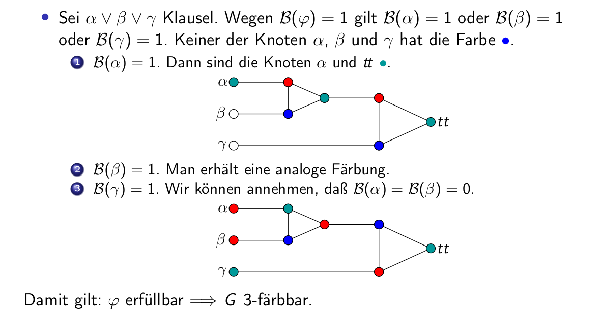

- [Einführung](#einführung)
  - [Grundfrage](#grundfrage)
  - [Probleme (als Abbildung)](#probleme-als-abbildung)
  - [(beschränkte) Resourcen](#beschränkte-resourcen)
- [Grundbegriffe](#grundbegriffe)
  - [Chomsky Hierarchie](#chomsky-hierarchie)
- [Rechtslineare Sprachen](#rechtslineare-sprachen)
  - [endliche Automaten (Maschinen)](#endliche-automaten-maschinen)
  - [Reguläre Ausdrücke](#reguläre-ausdrücke)
  - [Zusammenfassung](#zusammenfassung)
  - [Nicht-Reguläre Sprachen](#nicht-reguläre-sprachen)
    - [Konkrete nicht-reguläre Sprachen](#konkrete-nicht-reguläre-sprachen)
    - [Pumping Lemma (auswendig lernen!)](#pumping-lemma-auswendig-lernen)
    - [Myhill-Nerode Äquivalenz](#myhill-nerode-äquivalenz)
  - [Minimalautomat](#minimalautomat)
    - [Algorithmus Minimalautomat](#algorithmus-minimalautomat)
  - [Entscheidbarkeit](#entscheidbarkeit)
    - [Wortproblem](#wortproblem)
    - [Leerheitsproblem](#leerheitsproblem)
    - [Endlichkeitsproblem](#endlichkeitsproblem)
    - [Schnittproblem](#schnittproblem)
    - [Inklusionsproblem](#inklusionsproblem)
    - [Äquivalenzproblem](#äquivalenzproblem)
    - [Effizientbetrachtung](#effizientbetrachtung)
    - [Pumping Lemma mit Alphabet aus einem Zeichen](#pumping-lemma-mit-alphabet-aus-einem-zeichen)
    - [Spielschema oder anderes Schema in Prüfung gefirdert](#spielschema-oder-anderes-schema-in-prüfung-gefirdert)
    - [Produktbildung von zwei regulären Sprachen. Wenn die erste Sprache als Startzustand da leere Wort enthält, muss man den Startzustand der zweiten Sprache beibehalten?](#produktbildung-von-zwei-regulären-sprachen-wenn-die-erste-sprache-als-startzustand-da-leere-wort-enthält-muss-man-den-startzustand-der-zweiten-sprache-beibehalten)
- [Kontextfreie Sprachen](#kontextfreie-sprachen)
  - [Ableitungsbäume](#ableitungsbäume)
  - [Linksableitung](#linksableitung)
  - [kontextfreie Sprachen sind kontext-sensitiv](#kontextfreie-sprachen-sind-kontext-sensitiv)
  - [Chomsky Normalform](#chomsky-normalform)
  - [Der Cocke-Younger-Kasami- oder CYK-Algorithmus](#der-cocke-younger-kasami--oder-cyk-algorithmus)
  - [Kellerautomaten](#kellerautomaten)
  - [die Greibach-Normalform](#die-greibach-normalform)
  - [Von Grammatiken zu PDAs](#von-grammatiken-zu-pdas)
  - [Von PDAs zu Grammatiken](#von-pdas-zu-grammatiken)
  - [PDAs mit Endzuständen](#pdas-mit-endzuständen)
  - [Deterministisch kontextfreie Sprachen](#deterministisch-kontextfreie-sprachen)
  - [Abschlusseigenschaften](#abschlusseigenschaften)
  - [das Pumping Lemma für kontextfreie Sprachen](#das-pumping-lemma-für-kontextfreie-sprachen)
  - [das Lemma von Ogden (William Ogden)](#das-lemma-von-ogden-william-ogden)
  - [Entscheidbarkeit](#entscheidbarkeit-1)
  - [2. dann zeige $W\supseteq W_{|V|}$](#2-dann-zeige-wsupseteq-w_v)
    - [Unentscheidbarkeit bei kontextfreien Sprachen](#unentscheidbarkeit-bei-kontextfreien-sprachen)
    - [Entscheidbarkeit bei deterministisch kontextfreien Sprachen](#entscheidbarkeit-bei-deterministisch-kontextfreien-sprachen)
    - [Unentscheidbarkeit bei deterministisch kontextfreien Sprachen](#unentscheidbarkeit-bei-deterministisch-kontextfreien-sprachen)
  - [Zusammenfassung kontextfreie Sprachen](#zusammenfassung-kontextfreie-sprachen)
- [Berechenbarkeit](#berechenbarkeit)
  - [Loop-Berechenbarkeit](#loop-berechenbarkeit)
    - [(K+) viele Loop-berechenbare Funktionen](#k-viele-loop-berechenbare-funktionen)
    - [(A+) viele Abschlusseigenschaften](#a-viele-abschlusseigenschaften)
  - [Primitiv-rekursive Funktionen](#primitiv-rekursive-funktionen)
  - [Argument K- gegen die Loop Vermutung](#argument-k--gegen-die-loop-vermutung)
    - [Ackermann Funktion](#ackermann-funktion)
  - [While Programme](#while-programme)
    - [Gödels Vermutung](#gödels-vermutung)
  - [GoTo Programme](#goto-programme)
    - [Ein kleiner Ausflug - Kleenesche Normalform](#ein-kleiner-ausflug---kleenesche-normalform)
  - [Turing Berechenbarkeit](#turing-berechenbarkeit)
    - [Beispiel einer Turingmaschine (intuitiv)](#beispiel-einer-turingmaschine-intuitiv)
  - [Beispiel Turingmaschine (formal)](#beispiel-turingmaschine-formal)
    - [Mehrband Tunringmaschine](#mehrband-tunringmaschine)
  - [Ausflug: Zählermaschine](#ausflug-zählermaschine)
- [Entscheidbarkeit](#entscheidbarkeit-2)
  - [Halteproble](#halteproble)
  - [Reduktion](#reduktion)
  - [Rechnen mit Kodierungen](#rechnen-mit-kodierungen)
  - [Satz von Rice](#satz-von-rice)
  - [Semi Entscheidbarkeit](#semi-entscheidbarkeit)
  - [Universelle Turing Maschine](#universelle-turing-maschine)
  - [Totale berechenbare Funktionen](#totale-berechenbare-funktionen)
  - [Einige unentscheidbare Probleme](#einige-unentscheidbare-probleme)
      - [Kontextfreie Sprachen](#kontextfreie-sprachen-1)
- [Komplexitätstheorie](#komplexitätstheorie)
  - [Zusammenfassung Berechenbarkeitstheorie](#zusammenfassung-berechenbarkeitstheorie)
  - [Die zentrale Frage der Komplexitätstheorie](#die-zentrale-frage-der-komplexitätstheorie)
  - [Komplexitätsklassen](#komplexitätsklassen)
    - [Deterministische Zeitklassen](#deterministische-zeitklassen)
      - [Einige typische Probleme in P](#einige-typische-probleme-in-p)
        - [Erreichbarkeit](#erreichbarkeit)
        - [Euler-Kreise](#euler-kreise)
    - [Deterministische Platzklassen](#deterministische-platzklassen)
      - [Einige typische Probleme in PSPACE: Erfüllbarkeit](#einige-typische-probleme-in-pspace-erfüllbarkeit)
      - [Einige typische Probleme in PSPACE: Hamilton-Kreise](#einige-typische-probleme-in-pspace-hamilton-kreise)
      - [Einige typische Probleme in PSPACE: 3-Färbbarkeit](#einige-typische-probleme-in-pspace-3-färbbarkeit)
      - [Zusammenfassung: typische Probleme](#zusammenfassung-typische-probleme)
  - [Nichtdeterministische Turingmaschinen](#nichtdeterministische-turingmaschinen)
    - [Determinisierbarkeit von NTM](#determinisierbarkeit-von-ntm)
    - [Nichtdeterministische Zeitklassen](#nichtdeterministische-zeitklassen)
    - [Nichtdeterministische Platzklassen](#nichtdeterministische-platzklassen)
  - [Typische Probleme, 2. Versuch](#typische-probleme-2-versuch)
  - [Polynomialzeit-Reduktionen](#polynomialzeit-reduktionen)
  - [NP-Vollständigkeit](#np-vollständigkeit)
  - [Weitere NP-vollständige Probleme](#weitere-np-vollständige-probleme)
    - [3-SAT ist NP-vollständig](#3-sat-ist-np-vollständig)
    - [3C ist NP-vollständig](#3c-ist-np-vollständig)
    - [DHC ist NP-vollständig](#dhc-ist-np-vollständig)
    - [HC ist NP-vollständig](#hc-ist-np-vollständig)
    - [TSP ist NP-vollständig](#tsp-ist-np-vollständig)
  - [Zusammenfassung](#zusammenfassung-1)

Literaturempfehlung: Theoretische Informatik - kurz gefasst, Uwe Schöning, Spektrum Akademischer Weg

# Einführung
## Grundfrage
Welche Probleme können mit unseren begrenzten Resourcen gelöst werden und welche nicht?

bzw

Wo ist die grenze der Problemlösung mit unseren Resourcen?

## Probleme (als Abbildung)
f: Menge der mögl Eingaben $\rightarrow$ Menge der mögl Ausgaben

Spezialfall A={0,1} heißt Entscheidungsproblem. Sie ist gegeben durch die Menge der Eingaben. 

Mengen nennt man "Sprachen"

## (beschränkte) Resourcen
- Art des Speicherzugriffs
- Art der Steuereinheit (deterministisch?)
- Dauer der Berechnung
- Größe des Speichers 

# Grundbegriffe
Natürliche Zahlen $\N = {0,1,2,3,...}$

> Definition: Für eine Menge X ist X* die Menge der endlichen Folgen über X.

> Definition: Ein Alphabet ist eine endliche nichtleere Menge.

üblicherweise heißen Alphabete hier: $\sum, \Gamma, \Delta$
Ist $\sum$ Alphabet, so nennen wir die Elemente oft Buchstaben.
Ist $\sum$ ein Alphabet, so heißen die Elemente von $\sum*$ auch Wörter über $\sum$ (auch String/Zeichenkette)

Beispiele:
- Alphabete:{0},{0,1,2},...{A,K,S,0,1,2,3,4,5,6,7,8,9}, {groß,klein}
- keine Alphabete: $\emptyset, \N, Q$
- Das Alphabet{0,1,2}hat also die drei Buchstaben 0, 1 und 2.
- Das Alphabet{groß,klein}hat die zwei Buchstabengroßundklein
- (0),()und(1,2,0,0) sind also Wörter über dem Alphabet{0,1,2}.
- (groß),(klein,groß),(klein,groß,klein)und()sind Wörter überdem Alphabet{groß,klein}.
- (1,2,0,0) wird geschrieben als  1 2 0 0
- (1) wird geschrieben als1
- () wird geschrieben als $\epsilon$ (dasleere Wort)
- (klein,groß,klein) wird geschrieben als klein.groß.klein

> Definition: Sind $u=(a_1, a_2, ...a_n)$ und $v=(b_1, b_2,...,b_n)$ Wörter, so ist $u*v$ das Wort $(a_1,a_2,...a_n,b_1,b_2,...,b_n)$; es wird als Verkettung/Konkatenation von u und v bezeichnet.

An Stelle von $u*v$ schreibt man auch $uv$

Beobachtung: $\sum* x \sum* \rightarrow \sum*$ ist eine Abbildung
- Assoziativ: $u*(w*v)=(u*w)*v$
- neutrales Element: $\epsilon * u = u * \epsilon = u$

Kürzer: $(\sum, *, \epsilon)$ ist ein Monoid

> Definition: Für $\omega \in \sum*$ und $n\in \N$ ist $w^n$ induktiv definiert

$w^n=\epsilon \text{ falls } n=0; \omega*\omega^{n-1} \text{ falls } n>0$

> Definition: Seien y,w Wörter über $\sum$. Dann heißt
- Präfix/Anfangsstück von w, wenn es $z\in\sum*$ gibt mit $yz=w$
- Infix/Faktor von w, wenn es $x,z \in \sum*$ gibt mit $xyz=w$
- Suffix/Endstück von w, wenn es $x\in \sum*$ gibt mit $xy=w$

> Definition: Sei $\sum$ ein Alphabet. Teilmengen von $\sum*$ werden formale Sprachen über $\sum$ genannt.

> Definition: Eine Menge L ist eine formale Sprache wenn es ein Alphabet $\sum$ gibt, so dass L formale Sprache über $\sum$ ist (d.h. $L\subseteq \sum*$)

> Definition: Sind $L_1$ und $L_2$ Sprachen, so heißt die Sprache $L_1 L_2={w | \exists w_1 \in L_1, w_2 \in L_2: w=w_1 w_2}$ die Konkatenation/Verkettung von $L_1$ und $L_2$.

Beispiele:
- ${0}*{1}*={0^i1^j | i,j>0}
- ${0}\cup {1}{0,1}*$ ist die Menge der Binärzahlen
  
- Die Verkettung von Sprachen ist assoziativ
- es gibt ein neutrales Element $\epsilon$
- es gibt ein auslöschendes Element $\emptyset$

> Definition: Sei L Sprache und $n\in\N$. Dann ist $L^n$ induktiv definiert:
$L^n = {\epsilon} \text{ falls } n=0; LL^{n-1} \text{ falls } n>0$

> Definition: Sei L eine Sprache. Dann ist $L*=\bigcup_{n\geq 0} L^n$ der Kleene-Abschluss oder die Kleene-Iteration von L. Weiter ist $L+ = \bigcup_{n\geq 0} L^n$

$L+ = L* L* = L* * L$

Beobachtung: Sei $\sum$ Alphabet.
- Sind $L_1$ und $L_2$ Sprachen über $\sum$, so auch die Verkettung $L_1L_2$, die Kleene-Iteration $L_1*$, die positive Iteration $L_1+$, die Vereinigung $L_1\cup L_2$, die Differenz $L_1 \ L_2$ und der Schnitt $L_1 \cap L_2$.
- $\emptyset, \sum, \sum*$ sind Sprachen über $\sum$

Prioritätsregeln für Operationen auf Sprachen
- Potenz/Iteration binden stärker als Konkatenation
- Konkatenation stärker als Vereinigung/Durchschnitt/Differenz
Sprechweise: "Klasse" von Sprachen ( nicht "Menge")


> Definition: Grammatiken sind ein Mittel um alle syntaktisch korrekten Sätze (hier Wörter) einer Sprache zu erzeugen.
- in spitzen Klammern: Variable
- ohne spitze Klammern: Terminale

Bsp: 
- [Satz]->[Subjekt][Prädikat][Objekt]
- [Subjekt]->[Artikel][Attribut][Substantiv]
- [Artikel]->e | der | die | das

Eine Folge aus Terminalen nennt man eine Ableitung. Die Ableitung beweist, dass ein Satz zur Sprache gehört, die von der Grammatik erzeugt wird. Mithilfe der Grammatik ist es möglich, unendlich viele Sätze zu erzeugen.

D.h. die zur Grammatik gehörende Sprache ist unendlich.

Grammatiken besitzen Regeln der Form: linke Seite -> rechte Seite

Sowohl auf der linken, als auch auch der rechten Seite können zwei Tpyen von Symbolen vorkommen
- Nicht-Terminale (oder Variablen), aus denen noch weitere Wortbestandteile abgeleitet werden sollen
- Terminale (die "eigentlichen" Symbole)


> Definition: Eine Grammatik G ist ein 4-Tupel $G=(V, \sum, P, S)$ das folgende Bedingungen erfüllt
- V ist eine endliche Menge von Nicht-Terminalen oder Variablen
- $\sum$ ist ein Alphabet (Menge der Terminale) mit $V\cap \sum= \varnothing$, d.h. kein Zeichen ist gleichzeitig Terminal und Nicht-Terminal
- $P\subseteq (V\cup \sum)^+ \times (v\cup\sum)^*$ ist eine endliche Menge von Regeln oder Produktionen (Produktionsmenge)
- $S\in V$ ist das Startsymbol/ die Startvariable oder das Axiom

Jede Grammatik hat nur endlich viele Regeln!

Konventionen:
- Variablen sind Großbuchstaben (Elemente aus V)
- Terminale sind Kleinbuchstaben (Elemente aus $\sum$)

> Definition: Sei $G=(V, \sum, P, S)$ eine Grammatik und seien $u,v\in (V\cup \sum)^+$. Wir schreiben $u\Rightarrow_G v$ falls eine Produktion $(l,r)\in P$ und Wörter $x,y\in(V\cup\sum)^*$ existieren mit $u=xly$ und $v=xry$.

- Sprechweise: "v wird aus u abgeleitet"
- ist die Grammatik klar, so schreibt man $u\Rightarrow v$
- für $(l,r)\in P$ schreibt man auch $l\rightarrow r$

> Definition: Sei $G=(V, \sum, P, S)$  eine Grammatik. Eine **Ableitung** ist eine endliche Folge von Wörtern
>
> Ein **Wort** $w\in (V\cup\sum)^*$ heißt Satzform, wenn es eine Ableitung gibt, deren letztes Wort w ist.
>
> Die **Sprache** $L(G)={w\in \sum^* | S\Rightarrow_G^* w}$ aller Satzformen aus $\sum^*$ heißt von G erzeugte Sprache.

Dabei ist $\Rightarrow_G^*$ der reflexive und transitive Abschluss von $\Rightarrow_G$. D.h. die von G erzeugte Sprache L(G) besteht genau aus den Wörtern, die in beliebig vielen Schritten aus S abgeleitet werden können und nur aus Terminalen besteht.

Bemerkung: Für ein $u\in(V\cup\sum)^*$ kann es entweder gar kein, ein oder mehrere v geben mit $u\Rightarrow_G v$. Ableiten ist also kein deterministischer sondern ein nichtdeterministoscher Prozess. Mit anderen Worten: $\Rightarrow_G$ ist keine Funktion.

Nichtdeterminismus kann verursacht werden durch:
- eine Regel ist an zwei verschiednen Stellen anwendbar
- Zwei verschiedene Regeln sind anwendbar (entweder an der gleichen Stelle oder an verschiedenen Stellen)

- es kann beliebig lange Ableitungen geben, die nie zu einem Wort aus Terminalsymbolen führt
- manchmal können Ableitungen in einer Sackgasse enden, d.h. obwohl noch nichtterminale in einer Satzformen vorkommen, ist keine Regel mehr anwendbar.

## Chomsky Hierarchie
- Typ 0 (Chomsky-0): Jede Grammatik ist vom Typ 0 (Semi-Thue-System)
- Typ 1: Eine Regel heißt kontext-sensitiv, wenn es Wörter $u,v,w\in(V\cup\sum)^*,|v|>0$ und ein Nichtterminal $A\in V$ gibt mit $l=uAw$ und $r=uvw$. Eine Grammatik ist vom Typ 1 (oder kontext-sensitiv) falls
  - alle Regeln aus P kontext-sensitiv sind
  - $(S\rightarrow \epsilon)\in P$ die einzige nicht kontext-sensitive Regel in P ist und S auf keiner rechten Seite einer Regel aus P vorkommt
- Typ 2: eine Regel $(l\rightarrow r)$ heißt kontext-frei wenn $l\in V$ und $r\in (V\cup \sum)^*$ gilt. Eine Grammatik ist vom Typ 2, falls sie nur kontext-freie Regeln enthält
- Typ 3: Eine Regl ist rechtslinear, wenn $l\in V$ und $r\in \sum V\cup {\epsilon}$ gilt. Eine Grammatik ist vom Typ 3 wenn sie nur rechtslineare Regeln enthält

> Definition: Eine Sprache heißt vom Typ i ($i\in \{0,1,2,3\}$) falls es eine Typ-i-Grammatik gibt mit $L(G)=L$. Wir bezeichnen mit $L$, die Klasse der Sprache vom Typ i. 

Eine Sprache vom Typ i nennt man auch rekursiv aufzählbar (i=0, RE), kontext-sensitiv (i=1, CS), kontext-frei (i=2, CF) oder rechtslinear (i=3, REG).

Bemerkung:
- jede Typ-3/2/1-Grammatik ist vom Typ 0
- jede Typ-3-Grammatik ist vom Typ 2
- Regeln der Form $A\rightarrow \epsilon$ können in Typ 2 und 3 aber nicht in Typ 1 vorkommen

> Satz: Es gibt einen Algorithmus, der als Eingabe eine Typ-1-Grammatik G und ein Wort w bekommst und nach endlicher Zeit entscheidet ob $w\in L(G)$ gilt.


# Rechtslineare Sprachen
werden durch Typ 3 erzeugt

## endliche Automaten (Maschinen)
anderer blickwinkel für rechtslineare Sprachen (ohne Speichereinheit)
Eingabe: Folge von " Buchstaben"

> Definition: ein deterministischer endlicher Automat M ist ein 5-Tupel $M=(Z, \sum, z_0, \delta, E)$
- $Z$ eine endliche Menge von Zuständen
- $\sum$ das Eingabealphabet (mit $Z\cap\sum = \emptyset$)
- $z_0\in Z$ der Start/Anfangszustand
- $\delta: Z \times \sum \rightarrow Z$ die Überführungs/Übergangsfunktion
- $E\subseteq Z$ die Menge der Endzustände

Abkürzung: DFA (deterministic finite automaton)

Bsp:
- $Z={0,1}$
- $\sum = \{a,b\}$
- $z_0=0$
- $\delta(0,a)=\delta(1,b)=1, \delta(1,a)=\delta(0,b)=0$
- $E={0}$

in DFA darf es nur einen einzigen Startzustand geben!
im Graphendiagramm: jeder Knoten hat die anzahl der alphabete als kanten

die (einmal lesende) $\delta$ Funktion wird verallgemeinert: $\hat{\delta}$, die die Übergänge für ganze Wörter ermittelt

> Definition: Zu einem gegebenen DFA definieren wir die Funktion $\hat{\delta}: Z \times \sum^* \rightarrow Z$ induktiv wie folgt, wobei $z\in Z$, $w\in\sum^+$ und $a\in \sum$:
- $\hat{\delta}(z, \epsilon) = z$
- $\hat{\delta}(z,aw)= \hat{\delta}(\delta(z,a),w)$

Der Zustand $\hat{\delta}(z,w)$ ergibt sich indem man vom Zustand z aus dem Pfad folgt der mit w beschriftet ist.

> Definition: die von einem DFA **akzeptierte Sprache** ist: $L(M)={w\in\sum^* | \hat{\delta}(z_0,w)\in E}$

d.h. wenn der Pfad der im Anfangszuststand beginnt nach den Übergangen durch w-markierte Pfade in einem Endzustand endet

> Definition: Eine Sprache $L \supseteq \sum^*$ ist regulär, wenn es einen DFA mit $L(M)=L$ gibt. 
(wird von einem DFA akzeptiert)


> Proposition: Jede reguläre Sprache ist rechtslinear
Beweis: sei M ein DFA, definiere eine Typ-3 Grammatik G wie folgt:
- $V=Z$
- $S=z_0$
- $P={z\rightarrow a \delta(z,a) | z\in Z, a\in \sum} \cup {z\rightarrow \epsilon | z\in E}$ (Regeln abgeleitet aus Graphen mit Kanten; letzte Regel um ENdzustand in ein Terminal zu wandeln).

Behauptung: für alle $z,z'\in Z$ und $w\in \sum^*$ gilt: $z\Rightarrow^*_G wz' \Leftrightarrow \hat{\delta} (z,w)=z'$. Beweis durch Induktion über $|w|$.
Für $w\in\sum^*$ gilt dann $w\in L(G) \Leftrightarrow \exist z\in V: z_0\Rightarrow^*_G wz \Rightarrow_G w \Leftrightarrow \exists z\in Z:\hat{\delta}(z_o, w)=z$ und $Zz\rightarrow \epsilon)\in P \leftrightarrow \hat{\delta}(z_0, w)\in E \leftrightarrow w\in L(M)$

ALso ist $L(M)=L(G)$ und damit rechtslinear

DFAs sind deterministisch, Grammatiken nichtdeterministisch

erweiterte DFA um Nichtdeterminismus zu NFAs (nichtdeterministic finite automaton)

> Definition: ein nichtdeterministischer endlicher Automat M ist ein 5-Tupel $M=(Z,\sum,S,\delta,E)$ mit
- $Z$ ist eine endliche Menge von Zuständen
- $\sum$ ist das Eingabealphabet
- $S\subseteq Z$ die Menge der Startzustände (können mehrere sein)
- $\delta: Z \times \sum \rightarrow P(Z)$ ist die (Menge der) Überführungs/Übergangsfunktion
- $E\subseteq Z$ die Menge der Endzustände

$P(Z)={Y | Y \subseteq Z}$ ist die Potenzmenge von Z (die Menge aller Teilmengen von Z). Diese Menge wird manchmal auch mit "2^Z$ bezeichnet

Bsp
- $\delta={2,3}$ heißt aus einem Zustand gibt es zwei mögliche Wege mit gleicher belegung
- $\delta=\emptyset$ heißt es gibt keinen Weg aus dem Zustand

> Definition: Zu einem gegebenen NFA M definieren wir die Funktion $\hat{\delta}:P(Z)\times \sum^* \rightarrow P(Z)$ induktiv wie folgt, woebei $Y \subseteq Z$, $w\in \sum^*$ und $a\in\sum$: $\hat{\delta}(Y,\epsilon)=Y$, $\hat{\delta}(Y,aw)=\hat{delta}(\bigcup \delta(z,a),w)$

> Definition: die von einem NFA M akzeptierte Sprache ist $L(M)={w\in \sum^* | \hat{\delta}(S,w)\cap E \not = \emptyset}$
( Das Wort wird akzeptiert wenn es mindestens einen Pfad vom anfangs in den endzustand gibt)

> Proposition: Jede von einem NFA akzeptierte Sprache ist regulär
Zustände des DFA sind Mengen von Zuständen des NFA, daher auch Potzenmengenkonstruktion

$w\in L(M') \leftrightarrow \hat\gamma (S,w)\in F \leftrightarrow \hat\delta(S,w)\cap E\not = \emptyset \leftrightarrow w\in L(M)$ und damit $l(M')=L(M)$

> Proposition: Zu jeder rechtslinearen Grammatik G gibt es einen NFA M mit $L(G)=L(M)$

> Satz: Sei $\sum$ ein Alphabet und $L\subseteq \sum^*$ eine Sprache. Dann sind äquivalent
> 1. L ist regulär (d.h. von einem DFA akzeptiert)
> 2. L wird von einem NFA akzeptiert
> 3. L ist rechtslinear (d.h. von einer Typ-3 Grammatik erzeugt)

verschiedene Modelle zur Beschreibung regulärer  Sprachen:
- *Rechtslineare Grammatiken*: Verbindung zu Chomsky-Hierarchie, erzeugen Sprachen, wenig geeignet für Entscheidung, ob Wort zu Sprache gehört
- *NFAs*: kompakte Darstellungen von Sprachen, intuitive graphische Darstellung; wenig geeignet für Entscheidung, ob Wort zu Sprache gehört
- *DFAs*:u.U. exponentiell größer als NFA bzw. Grammatik; gut geeignet für Entscheidung, ob Wort zu Sprache gehört

> Definition: Gegeben sei eine Klasse K und ein n-stelliger Operator $\otimes : K^n \rightarrow K$. Man sagt, eine Klasse $K'\subseteq K$ ist unter $\otimes$ abgeschlossen, wenn für beliebige Elemente $k_1,k_2,...,k_n\in K'$ gilt $\otimes (k_1,k_2,...,k_n)\in K'$

> Satz: Wenn $L\subseteq \sum^*$ eine reguläre Sprache ist, dann ist auch $\sum^* \backslash L$ regulär

Beweis: Da L regulär ist, gibt es einen DFA M mit $L(M)=L$. In diesem vertauschen wir die End- und Nicht-Endzustände, d.h. $M'=(Z,\sum ,z_0, \delta, Z\backslash E)$. Dann gilt für $w\in\sum^*$:
$$w\in\sum^* \backslash L \leftrightarrow w\not \in L(M) \leftrightarrow \hat{\delta}(z_0, w)\not \in E \leftrightarrow \hat{\delta}(z_0, w)\in Z\backslash E \leftrightarrow w\in L(M')$$

> Satz: Wenn $L_1$ und $L_2$ reguläre Sprachen sind, dann ist auch $L_1 \cup L_2$ regulär.

Beweis: Es gibt NFAs M für $i=1,2$ mit $L(M_i)=L_i$: $M=(Z_1 \cup Z_2, \sum, S_1\cup S_2, \delta, E_1\cup E_2)$ wobei $\delta(z,a)=\delta_1(z,a) \text{ für } z\in Z_1; \delta_2(z,a) \text{ für } z\in Z_2$

> Satz: Wenn $L_1$ und $L_2$ reguläre Sprachen sind, dann ist auch $L_1 \cap L_2$ regulär.

Beweis: es gilt $L_1 \cap L_2 = \overline{\overline{L_1}\cup \overline{L_2}}$ und die Klasse der regulären Sprache unter Komplement und Vereinigung ist abgeschlossen.

Bemerkung: wird $L_i$ von dem NFA M akzeptiert so existiert ein DFA mit $2^{2 |Z_1| + 2 |Z_2|}$ Zuständen, der $L(M_1)\cap L(M_2)$ akzeptiert. Es gibt eine Konstruktion die mit $|Z_1|*|Z_2|$ Zuständen auskommt.\\
In dieser Konstruktion werden die zwei Automaten miteinander synchronisiert und quasi "parallelgeschaltet". Dies erfolgt durch das Bilden des Kreuzprodukt. Seien $M_i$ NFAs mit $L(M_i)=L_i$. Betrachte den NFA $M=(Z_1 \times Z_2, \sum, S_1 \times S_2, \delta, E_1 \times E_2)$


> Satz: Wenn $L_1$ und $L_2$ reguläre Sprachen sind, dann ist auch $L_1L_2$ regulär

Beweis: Es gibt NFAs $M_i$ mit $L(M_i)=L_i$ o.B.d.A $Z_1\cap Z_2 =\emptyset$. Verknüpfe nun $M_1$ und $M_2$ sequentiell zu einem NFA $M=(Z_1 \cup Z_2, \sum, S,\delta, E_2)$. 

$$S=\begin{cases} S_1 &\quad\text{ für } \epsilon \not = L_1 \\ S_1\cup S_2 &\quad\text{ für } \epsilon \in L_1 \end{cases}$$

$$\delta(z,a)= \begin{cases} 
\delta_2(z,a) &\quad\text{für } z\in Z_2 \\ 
\delta_1(z,a) &\quad\text{für } z\in Z_1 \text{ mit } \delta_1\cap E_1 =\emptyset \\ 
\delta_1(z,a)\cup S_2 &\quad\text{für } z\in Z_1 \text{ mit } E_1 \not = \emptyset \end{cases}$$

> Satz: Wenn L eine reguläre Sprache ist, dann ist auch $L^+$ regulär

Beweis: es gibt einen NFA M mit $L(M)=L$

Betrachte den NFA M' mit $\begin{cases}
\delta(z,a) &\text{ falls } \delta(z,a)\cap E = \varnothing \\
\delta(z,a)\cup S &\text{ sonst } \end{cases}$

Behauptung: für alle $Y\subseteq Z$ und $w\in\sum^+$ gilt $\top{\sigma}(Y,w)=\top{sigma}(Y,w)\cup \bigcup \top{\sigma}(S, u_n)$


> Satz: Wenn L eine reguläre Sprache ist, dann ist auch $L^*$ regulär.

Beweis: Nach dem Lemma zuvor ist $L^+$ regulär. Da auch ${\epsilon}$ regulär ist folgt mit ${\epsilon}\cup L^+ = L^0 \cup \bigcup L^n = L^*$

## Reguläre Ausdrücke
reguläre Ausdrücke erlauben es, die regulären Sprachen kompakt in "Textform" zu beschreiben

> Definition: Die Menge $Reg(\sum)$ der **regulären Ausdrücke über dem Alphabet $\sum$** ist die kleinste Menge mit folgenden Eigenschaften:
> - $\varnothing \in Reg(\sum), \lambda \in Reg(\sum), \sum \subseteq Reg(\sum)$
> - Wenn $\alpha, \beta \in Reg(\sum)$, dann auch $(\alpha * \beta), (\alpha + \beta), (\alpha^*)\in Reg(\sum)$

- für $\alpha * \beta$ schreibt man oft $\alpha\beta$
- für $\alpha + \beta$ schreibt man auch $\alpha|\beta$

Beispiel: $\sum={a,b,c,d}: \lambda ((ab)b) ((a+d)a) ((((ab)a)) + ((ba)b*))$

> Definition: Für einen regulären Ausdruck $\alpha \in Reg(\sum)$ ist die Sprache $L(\alpha)\subseteq \sum^*$ induktiv definiert
$$L(\alpha)=\begin{cases}
\varnothing &\text{ falls } alpha=\not O \\
{\epsilon} &\text{ falls } \alpha = \lambda \\
{a} &\text{ falls } \alpha=a\in \sum \\
L(\beta)\cup L(\gamma) &\text{ falls } \alpha =(\beta + \gamma)\\
L(\beta)L(\gamma) &\text{ falls } \alpha=(\beta*\gamma)\\
(L(\beta))^* &\text{ falls } \alpha=(\beta^*)
\end{cases}$$

Klammern sparen:
- äußere Klammern weglassen
- bei Operatoren auf gleicher Ebene weglassen

Präferenzregel:
- $*$ bindet stärker als $\times$
- $\times$ bindet stärker als $+$

Wo tauchen reguläre Ausdrücke auf:
- Suchen und Ersetzten
- Pattern Matching
- Übersetzung (von Programmiersprachen): Lexikalische Analyse

> Proposition: zu jedem regulären Ausdruck $\gamma$ gibt es einen NFA M mit $L(\gamma)=L(M)$

Beweis: per Induktion über den Aufbau von $\gamma$

> Proposition: zu jedem DFA M gibt es einen regulären Ausdruck $\gamma$ mit $L(M)=L(\gamma)$

Beweis: Sei M ein DFA. Konstruiere einen regulären Ausdruck mit $\gamma$ mit $L(M)=L(\gamma)$. Für ein Wort $w\in \sum^*$ sei $Pref(w)={u\in\sum^* | \exists v:w = uv, \epsilon\not= u\not= w}$ die Menge aller nicht-leeren echten Präfixe von w.

Sei $L\subseteq \sum^*$ eine Sprache, dann sind äquivalent
- L ist regulär, d.h. es gibt einen DFA M mit $L(M)=L$
- es gibt einen NFA M mit $L(M)=L$
- L ist rechtslinear, d.h. es gibt eine rechtslineare Grammatik G mit $L(G)=L$
- Es gibt einen regulären Ausdruck $\gamma$ mit $L(\gamma)=L$

## Zusammenfassung
- Rechtslineare Grammatiken
  - Verbindung zur Chomsky Hierarchie
  - erzeugen Sprachen
  - nicht geeignet, um zu entscheiden, ob ein gegebenes Wort zur Sprache gehört
- NFA
  - erlauben kleine Kompakte Darstellung
  - intuitive graphische Notation
  - nicht geeignet, um zu entscheiden, ob ein gegebenes Wort zur Sprache gehört
- DFA
  - für effiziente Beantwortung der Frage, ob ein Wort zur Sprache gehört
  - sind uU exponentiell größer als NFA
- Reguläre Ausdrücke
  - erlauben kompakte Darstellung in Textform

## Nicht-Reguläre Sprachen
ist vielleicht jede Sprache regulär? Zeige für jede Alphabet $\sum$
1. es gibt nur abzählbar unendlich viele Sprachen über $\sum$, die Sprache einer Grammatik sind
2. Es gibt überabzählbar viele Sprachen über $\sum$

> Lemma: Für jedes Alphabet $\sum$ ist die Menge $\{L(G) | \text{G Grammatik über} \sum\}$ abzählbar unendlich.

$|P(\sum^*)\cap RE|=|RE|=|\N|$

> Satz: Für jedes Alphabet $\sum$ ist die Menge $P(\sum^*)={L|L \text{Sprache über} \sum}$ überabzählbar, d.h. es gibt keine bijektive Funktion $F:\N \rightarrow P(\sum^*)$.

Beweis: Indirekte "Diagonalisierung" auf die bijektive Funktion $F:\N\rightarrow P(\sum^*)$

> Korollar: Für jedes Alphabet $\sum$ existiert eine Sprache L über $\sum$, die von keiner Grammatik G erzeugt wird.

### Konkrete nicht-reguläre Sprachen
Um zu zeigen, dass eine konkrete Sprache L regulär ist, kann man
- einen NFA M angeben mit $L(M)=L$, oder
- eine rechtslineare Grammatik G angeben mit $L(G)=L$, oder
- einen regulären Ausdruck $\gamma$ angeben mit $L(\gamma)=L$, oder
- zeigen, dass $L=L_1 \cap L_2$ ist und $L_1$ und $L_2$ regulär sind, oder
- ...

### Pumping Lemma (auswendig lernen!)
Wenn L eine reguläre Sprache ist, dann gibt es $n\leq 1$ derart, dass für alle $x\in L$ mit $|x|\geq n$ gilt: es gibt Wörter $u,v,w \in \sum^*$ mit:
1. $x=uvw$
2. $|uv|\leq n$
3. $|v|\geq 1$
4. $uv^i w\in L$ für alle $i\geq 0$

Dieses Lemma spricht nicht über Automaten, sondern nur über die Eigenschaften der Sprache. Es ist geeignet, Aussagen über Nicht-Regularität zu machen. Dabei ist es aber nur eine notwendige Bedingung. Es kann nicht genutzt werden, um die Regularität einer Sprache L zu zeigen.

### Myhill-Nerode Äquivalenz
Ein zweites Verfahren um Nicht-Regularität zu zeigen. Dieses kann auch genutzt werden um Regularität zu beweisen. 

> Definition Myhill-Nerode-Äquivalenz: Für eine Sprache $L\subseteq \sum^*$ definieren wir eine binäre Relation $R_L \subseteq \sum^* \times \sum^*$ wie folgt: Für alle $x,y\in \sum^*$ setze $(x,y)\in R_L$ genau dann, wenn $\forall z \in \sum^* :(xy\in L \leftrightarrow yz \in L)$ gilt. Wir schreiben hierfür auch $x R_L y$.

Beispiel: Gegeben sei die Sprache $L=\{ w\in \{a,b\}^*: |w|_a gerade\}$. Seien $x,z\in \{a,b\}^*$. Betrachte zwei Fälle:
- $|z|_a$ gerade: $xz\in L \leftrightarrow |xz|_a$ gerade $\leftrightarrow |x|_a$ gerade
- $|z|_a$ ungerade: $xz\in L \leftrightarrow |xz|_a$ gerade $\leftrightarrow |x|_a$ ungerade
also: $x R_L y \leftrightarrow |x|_a \equiv |y|_a$

> Lemma: Sei $L \subseteq \sum^*$ eine Sprache
> - die binäre Relation $R_L$ ist eine Äquivalenzrelation
> - aus $x R_L y$ und $a\in\sum$ folgt $xa R_L ya$

> Definition: Für eine Sprache L und ein Wort $x\in \sum^*$ ist $[x]_L=\{y\in\sum^* | x R_L y \}$ die Äquivalenzklasse von x. Ist L klar, so schreiben wir einfacher $[x]$.

Beispiel Äquivalentklassen für $R_L$ mit der Sprache $L=\sum^*\{abc\}$
- $[\epsilon]=\{w\in\{a,b,c\}^* | \text{kein nichtleerer Präfix von abc ist Suffix von w} \}$
- $[a]=\{w\in\{a,b,c\}^* | \text{w endet auf a}\}$
- $[ab]=\{w\in\{a,b,c\}^* | \text{w endet auf ab}\}$
- $[abc]=\{w\in\{a,b,c\}^* | \text{w endet auf abc}\}$


Der Index $index(R)$ von R ist die Anzahl der Äquivalenzklassen von R: $index(R)=|\{[x]:x \in A \} | \in \N \cup \{\infty\}$

> Satz von Myhill-Nerode: Sei L eine Sprache. L ist regulär $\leftrightarrow index(R_L)< \infty$
(d.h. nur wenn die Myhill-Nerode-Äquivalenz endliche Klassen hat)

Beweis:
- "$\Rightarrow$": Sei L regulär -> es gibt DFA M mit $L(M)=L$...
- "$\Leftarrow$": sei $index(R_L)< \infty$ -> Definiere einen DFA $M_L=(\{[x_1],...,[x_n]\},\sum,[\epsilon],\sigma,\{[w]|w\in L\})$
  

## Minimalautomat
Es gibt bekanntlich sehr verschiedene endliche Beschreibungen einer regulären Sprache. Diese können ineinander übersetzt werden aber eine einzelne Sprache kann auch durch verschiedene DFAs dargestellt werden.

Gibt es einen "besten DFA" bzw was macht einen Automaten besser? D.h. gibt es einen DFA mit möglichst wenig Zuständen?

> Definition: Ein DFA M heißt reduziert, wenn es für jeden Zustand $z \in Z$ ein Wort $x_z\in \sum^*$ gibt mit $\hat{\sigma}(l, x_z)=z$

Wenn in einem DFA M aus Startzustand X und Y dieselben Sprachen akzeptiert werden, heißen diese "erkennungsäquivalent" und werden "verschmolzen" (es entsteht M'). M und M' akzeptieren diesselbe Sprache. Sind keine Zustände mehr erkennungsäquivalent können keine weiteren verschmolzen werden und es gibt keinen DFA der mit weniger Zuständen L(M) akzeptiert

> Definition: Sei M ein DFA. Zwei Zustände $z,z'\in Z$ heißen erkennungsäquivalent (in Zeichen $z\equiv z'$) wenn für jedes Wort $w\in \sum^*$ gilt: $\hat{\sigma}(z,w)\in E \leftrightarrow \hat{\sigma}(z',w)\in E$

> Lemma: Sei M ein DFA, $z,z'\in Z$ und $a\in \sum$:
> - $\equiv$ ist eine Äquivalenzrelation auf Z
> - $z\equiv z'$ impliziert $(z\in E \leftrightarrow z'\in E)$
> - $z\equiv z'$ impliziert $\hat{\sigma}(z,a)\equiv \sigma(z',a)$

> Definition: Sei M ein DFA. Dann ist $M'=(Z_{\equiv},\sum, [z_0],\sigma', E')$ mit
> - $\sigma'([z],a)=[\sigma (z,a)]$ für $z\in Z$ und $a\in \sum$ und
> - $E'=\{[z]|z\in E\}$
> 
> der Quotient von M bzgl $\equiv$
(es wird nicht mehr jeder einzelne Fall betrachtet sondern "ganze Gruppen"; Bsp Sitz->Reihe)

> Lemma: Ist M ein DFA und M' sein Quotient bzgl. $\equiv$, so ist M' ein DFA mit $L(M)=L(M')$

Es bleibt zu zeigen, dass $\sigma'$ wohldefiniert ist $\rightarrow z\equiv z' \rightarrow \sigma (z,a)\equiv \sigma (z',a) \rightarrow [\sigma (z,a)]=[\sigma (z',a)]$. Also ist M' tatsächlich ein DFA.

> Definition: Seien $M_i$ DFAs (für $i\in\{1,2\}$) und $f:Z_1 \rightarrow Z_2$ eine Funktion. Dann ist f ein Homomorphismus von $M_1$ auf $M_2$, falls gilt:
> - $f(l_1)=l_2$
> - $f(\sigma_1(z,a))=\sigma_2(f(z),a)$ für alle $z\in Z_1$ und $a\in \sum$
> - $z\in E_1 \leftrightarrow f(z)\in E_2$ für alle $z\in Z_1$ (bildet Endzustände aufeinander ab)

> Satz: Seien $M_i$ reduzierte DFAs mit $L(M_1)=L(M_2)$. Sei weiter $M_2'$ der Quotient von $M_2$ bzgl $\equiv$. Dann existiert ein surjektiver Homomorphismus von $M_1$ auf $M_2'$

- die Abbildung f ist surjektiv (auf $M_2$). Und damit ist $M_2 < M_1$
- die Abbildung f ist ein Homomorphismus

> Satz: Seien $M_1$ und $M_2$ reduzierte DFAs mit $L(M_1)=L(M_2)$. Sei $M_1'$ der Quotient von M bzgl $\equiv$
> - $M_2$ hat wenigstens so viele Zustände wie $M_1'$
> - Hat $M_2$ genauso viele Zustände wie $M_1'$, so sind $M_2$ und $M_1'$ bis auf Umbennenung der Zustände identisch (sie sind Isomorph)

> Folgerung: Seien $M_1$ und $M_2$ reduzierte DFAs mit $L(M_1)=L(M_2)$. Seien $M_1'$ und $M_2'$ die Quotienten bzgl $\equiv$. Dann sind $M_1'$ und $M_2'$ isomorph, d.h. für jede reguläre Sprache gibt es (bis auf Umbenennung der Zustände) genau einen minimalen DFA

Um den minimalen DFA zu erhalten bildet man den Quotienten eines beliebigen zur Sprache passenden DFA.

> Satz: Für einen reduzierten DFA M wird ein Paar ${z,z'}\subseteq Z$ mit $z\not = z'$ genau dann durch den Markierungsalgorithmus markiert werden, wenn $z\not \equiv z'$

### Algorithmus Minimalautomat
Eingabe: reduzierter DFA M\\
Ausgabe: Menge der Paare erkennungsäquivalenter Zustände
1. Stelle eine Tabelle aller ungeordneten Zustandspaare $\{z,z'\}$ mit $z\not = z'$ auf
2. Markiere alle Paare $\{z,z'\}$ mit $z\in E$ und $z'\not\in E$
3. Markiere ein beliebiges unmarkiertes Paar $\{z,z'\}$, für das es ein $a\in\sum$ gibt, sodass $\{\sigma(z,a),\sigma(z',a)\}$ bereits markiert ist (falls möglich)
4. Wiederhole den vorherigen Schritt, bis sich keine Änderung in der Tabelle mehr ergibt

> Satz: Für einen gegebenen reduzierten DFA M markiert der Minimierungsalgorithmus ein $\{z,z'\}(z,z'\in Z, z\not=z')$ genau dann, wenn $z\not\equiv z'$

## Entscheidbarkeit
Fragestellungen/Probleme für reguläre Sprachen

### Wortproblem
Gilt $w\in L$ für eine gegebene reguläre Sprache L und $w\in\sum^*$

Eingabe: DFA M und $w\in\sum^*$

Verfahren: Verfolge die Zustandsübergänge von M, die durch die Symbole $a_1,...,a_n$ vorgegeben sind.


### Leerheitsproblem
Gilt $L=\varnothing$ für eine gegebene reguläre Sprache L?

Eingabe: NFA M

Verfahren: Sei $G=(Z,\rightarrow)$ der gerichtete Graph mit $z\rightarrow z' \leftrightarrow \exists a \in \sum: z'\in\sigma(z,a)$. Dann gilt $L(M)\not =\varnothing$ genau dann, wenn es in dem Graphen G einen Pfad von einem Knoten aus S zu einem Knoten aus E gibt. Dies kann zB mit dem Algorithmus von Dijkstra entschieden werden.


### Endlichkeitsproblem
Ist eine gegebene reguläre Sprache L endlich?

Eingabe: NFA M

Verfahren: Sei $G=(Z,\rightarrow)$ wieder der gerichtete Graph mit $z\rightarrow z' \leftrightarrow \exists a \in\sum:z'\in\sigma(z,a)$. Dann gilt L(M) ist genau dann unendlich, wenn es $z\in Z,z_0\in S$ und $z_1\in E$ gibt mit $z_0\rightarrow^* z \rightarrow^+ z \rightarrow^* z_1$. D.h. z liegt auf einem Zyklus, ist von einem Startzustand aus erreichbar und von z kann ein Endzustand erreicht werden. Dies kann wieder mit dem Algorithmus von Dijkstra entschieden werden.

### Schnittproblem
Gilt $L_1\cap L_2=\varnothing$ für gegebene reguläre $L_1,L_2$?

Eingabe: NFAs $M_1$ und $M_2$

Verfahren: Konstruiere aus $M_1$ und $M_2$ einen NFA M mit $L(M)=L(M_1)\cap L(M_2)$. Teste ob $L(M)=\varnothing$

### Inklusionsproblem
Gilt $L_1 \subseteq L_2$ für gegebene reguläre $L_1,L_2$?

Eingabe: NFAs $M_1$ und $M_2$

Verfahren: Aus $M_1$ und $M_2$ kann ein NFA M mit $L(M)=\bar{L(M_2)}\cap L(M_1)$ konstruieren. Es gilt $L(M_1)\subseteq L(M_2)$ genau dann, wenn $L(M)=\varnothing$.

### Äquivalenzproblem
Gilt $L_1=L_2$ für gegebene reguläre $L_1,L_2$?

Eingabe: NFAs $M_1$ und $M_2$

Verfahren 1: es gilt $L(M_1)=L(M_2)$ genau dann, wenn $L(M_1)\subseteq L(M_2)$ und $L(M_2)\subseteq L(M_1)$.

Verfahren 2: bestimme zu $M_i (i\in\{1,2\})$ den äquivalenten minimalen DFA $N_i$. Dann gilt $L(M_1)=L(M_2)$ genau dann, wenn $N_1$ und $N_2$ isomorph sind (d.h. sie können durch Umbennenung der Zustände ineinander überführt werden).

### Effizientbetrachtung
Die Komplexität der oben beschriebenen Verfahren sehr unterschiedlich ausfallen. Bei Eingabe der regulären Sprache als NFA bzw DFA ergeben sich die folgenden Zeitschranken:

| Problem | NFA | DFA |
| Wort~   | polynomiell | linear |
| Leerheits~| polynomiell | polynomiell |
| Endlichkeits~ | polynomiell | polynomiell |
| Schnitt~ | polynomiell | polynomiell |
| Inklusions~ | exponentiell | polynomiell |
| Äquivalenz~ | exponentiell | polynomiell |

Es spricht viel dafür, dass die exponentiellen Zeitschranken nicht durch polynomielle ersetzt werden können.

Anwendung: Verifikation
- zwei Prozesse 1 und 2 wollen auf eine gemeinsame Ressource zugreifen
- jeder Prozess hat einen kritischen Bereich in dem auf die Ressource zugegriffen wird. Nur ein Prozess darf sich im kritischen Bereich befinden
- es stehen gemeinsame Variablen zur Verfügung über die sich die Prozesse synchronisieren können
- wir möchten zeigen,d ass der wechselseitige Ausschluss gewährleistet ist und eine gewisse Fairnessbedingung eingehalten wird
- betrachtung der Prozesse als Wort
  - jeder Ablauf eines Prozesses ist ein Wort, die Menge der Abläufe ist eine Sprache
  - ebenso ist die Menge der Abläufe des Gesamtsystems eine Sprache
  - auch die Menge der erlaubten/verbotenen Abläufe ist eine Sprache
- damit ist das Inklusionsproblem/Schnittproblem $L_{Sys}\subseteq L_{Spec}$ zu lösen

### Pumping Lemma mit Alphabet aus einem Zeichen 
$\sum=\{a\}$, $L(M)=\{a\} regulär \rightarrow \exists n \geq 1 \forall z\in Z(M)$ mit $|z|\geq n$, z.B. $n=3$

Bei geschickter Wahl von n ist das Pumping Lemma nicht voll ausführbar und ist korrekt.
Wenn n endlich ist gibt es ein z das Länger ist.

(Sind alle endlichen Sprachen regulär? Ja, jede Sprache ist aufgebaut aus der verknüpfung von einelementigen Sprachen; diese selbst sind regulär.)

### Spielschema oder anderes Schema in Prüfung gefirdert
kann noch keine aussage dazu treffen, Klausur existiert noch nicht. Jedoch grundsätzlich: es wird auswendig gelernt! Sätze/Definitionen etc werden mit Lückentext abgefragt. Ein großer Teil der Aufgaben orientiert sich an den Übungsaufgaben.

### Produktbildung von zwei regulären Sprachen. Wenn die erste Sprache als Startzustand da leere Wort enthält, muss man den Startzustand der zweiten Sprache beibehalten?
Bei Automaten die nicht das leere Wort akzeptieren unter umständen, bei Automaten die kein leeres Wort akzeptieren nicht.

- es gibt (in dieser Vorlesung) keine unendlich langen Wörter

# Kontextfreie Sprachen
bei Kontext-freien Grammatiken haben alle Produktionen die Form $A\rightarrow w$ mit $A\in V$ und $w\in (V\cup \sum)^*$.

Anwendung kontext-freier Sprachen: Beschreibung der Syntax von Programmiersprachen (besonders höheren Sprachen). Viele der Techniken daher interessant für den Compilerbau

Bemerkung: die natürliche Sprache hat viele kontext-freie Bestandteile, ist aber nicht wirklich kontext-frei.

## Ableitungsbäume
Ein Ableitungsbaum wird aus den Ableitungen einer Grammatik gebildet. Die Blätter (von links nach rechts) bilden immer den letzten Abbildungsschritt. Unterschiedliche Ableitungen können unterschiedliche Bäume konstruieren während diese das gleiche Wort ableiten.

> Definition: Sei G eine kontext-freie Grammatik und $X\in V\cup \sum$. Ein X-Ableitungsbaum ist ein gerichteter, geordneter Baum T mit Wurzel, dessen Knoten mit Elementen von $V\cup\sum\cup\{\epsilon\}$ beschriftet sind, wobei:
> - die Wurzel mit X beschriftet ist
> - Knoten $v$ mit $a\in\sum\cup\{\epsilon\}$ beschriftet $\Rightarrow$ v ist ein Blatt
> - Knoten $v$ mit $A\in V$ beschriftet und kein Blatt $\Rightarrow$
>   - es gibt eine Produktion $A\rightarrow X_1...X_r$ mit $X_1...X_r\in\sum\cup V$ $(r\geq 1)$ sodass die Nachfolgerknoten von $v$ mit $X_1,X_2,...,X_r$ beschriftet sind
>   - oder es gibt Produktion $A\rightarrow \epsilon$ und $v$ hat genau einen Nachfolger; dieser ist mit $\epsilon$ beschriftet
> - Das Blattwort $\alpha(T)$ des X-Ableitungsbaumes T erhält man, indem man die Beschriftungen der Blätter von links nach rechts betrachtet. Ein Ableitungsbaum ist ein S-Ableitungsbaum.
> - ein X-Ableitungsbaum ist vollständig, wenn seine Blätter mit Elementen von $\sum\cup\{\epsilon\}$ beschriftet sind.

> Lemma: Sei $G$ eine kontext-freie Grammatik, $X\in V\cup\sum, w\in(V\bigcup\sum)^*$. Dann sind äquivalent:
> - $X\rightarrow^* w$
> - es gibt einen X-Ableitungsbaum T mit $w=\alpha(T)$

Die Ableitung innerhalb eines Ableitungsbaumes ist die Verkettung der Ableitungen seiner Unterbäume. $\alpha(T)=\alpha(X_1)\cap \alpha(X_2)\cap...\cap\alpha(X_3)=...$

## Linksableitung
Zu jedem Ableitungsbaum kann es eine oder mehrere Ableitungen geben. 
> Definition: Eine Ableitung heißt Linksableitung wenn in jedem Schritt das am weitesten links stehende Nichtterminal ersetzt wird.

Analog werden Rechtsableitungen definiert.

Ableitungsbäume und Linksableitungen für w entsprechen einander eineindeutig, genauer:
> Satz: Die Konstruktion ist eine Bijektion der Menge der Linksableitungen von Wörtern aus $\sum^*$ auf die Menge der vollständigen Ableitungsbäume.

Aus Linksableitungen (nicht-Linksableitungen) können auch Rechtsableitungen erzeugt werden (und umgekehrt) ohne die Ableitung zu verändern.

Es gibt auch Wörter, mit verschiedenen Linksableitungen (und damit unterschiedlichen Ableitungsbäumen). Da der Ableitungsbaum Strukturinformationen über das Wort wiedergibt ist dies nicht erwünscht.
> Definition: Eine Kontextfreie Grammatik G heißt mehrdeutig, wenn es zwei verschiedene vollständige Ableitungsbäume $T$ und $T'$ gibt mit $\alpha(T)=\alpha(T')$.
> Sonst heißt G eindeutig, d.h. G ist eindeutig wenn jedes Wort $w\in L(G)$ genau eine Ableitung besitzt.
> Eine Kontextfreie Sprache heißt inhärent mehrdeutig, wenn jede kontextfreie Grammatik mit $L=L(G)$ mehrdeutig ist

## kontextfreie Sprachen sind kontext-sensitiv
> Lemma: aus einer kontextfreien Grammatik G kann eine kontextsensitive und gleichzeitig kontextfreie Grammatik G' berechnet werden mit $L(G)=L(G')$

Sprachen: Regulär < Kontextfrei < Kontextsensitiv < RE < alle

> Folgerung: Es gibt einen Algorithmus, der als Eingabe eine Typ-2-Grammatik G und ein Wort $w\in\sum^*$ bekommt und nach endlicher Zeit entscheidet, ob $w\in L(G)$ gilt.

## Chomsky Normalform
> Definition: Eine kontextfreie Grammatik g ist in Chomsky Normalform, falls
> - alle Produktionen von G die Form $A\rightarrow AB$ oder $A\rightarrow a$ haben
> - oder alle Produktionen von G die Form $A\rightarrow BC$ oder $A\rightarrow a$ oder $S\rightarrow\epsilon$ haben und S nie auf der rechten Seite einer Produktion vorkommt.

Beobachtung: Sei G in Chomsky Normalform und T ein Ableitungsbaum eines Wortes w der Länge n. Dann gilt:
- jeder innere Knoten hat genau 2 mit Nichtterminalen beschriftete Kinder oder genau ein mit einem Terminal beschriftetes Kind und
- es gibt n Blätter
Also hat T genau $3n-1$ viele Knoten

> Satz: Zu jeder kontextfreien Grammatik gibt es eine Grammatik G' in Chomsky Normalform mit $L(G)=L(G')$

Mit dieser Grammatik weiß man genau die Länge die man benötigt um ein Wort abzuleiten

## Der Cocke-Younger-Kasami- oder CYK-Algorithmus
Sei G kontextfreie Grammatik.  Gesucht ist ein Algorithmus mit dessen Hilfe wir entscheiden können, ob ein gegebenes Wort zu L(G) gehört.

1. Versuch sei kontextsensitiv, dann werden diejenigen Wörter berechnet, die sich in < w vielen schritten ableiten lassen und getestet ob w darunter ist. Dieses Verfahren hat also exponentielle Laufzeit
2. heutiges Ziel: polynomiieller Algorithmus; Vorraussetzung: Die grammatik ist in Chomsky Normalform

Idee: Gegeben sei ein Wort $w\in\sum^*$. Wir wollen feststellen, aus welchen Nichtterminalen es abgeleitet werden kann.
- Möglichkeit 1: $w=a\in\sum$, d.h. w besteht aus einem einzigen Alphabetsymbol. Dann kann w nur aus denjenigen Nichtterminalen A abgeleitet werden, für die es eine Produktion $A\rightarrow a4 gibt.
- Möglichkeit 2: $w=a_1...a_n$ mit $n\geq 2$. Zunächst muss eine Produktion $A\rightarrow BC$ angewandt werden, dann muss  ein Teil $a_1...a_k$ des Wortes aus B und der andere Teil $a_{k+1}...a_n$ des Wortes aus C abgeleitet werden. Es ist jedoch nicht klar, wo das Wort w geteilt werden musss, d.h. wie groß die Position k ist! Probiere alle möglichen k's durch.

Um Mehraufwand zu vermeiden, verwenden wir die Methode der dynamischen Programmierung, d.h.
- berechne zunächst alle Nichtterminale aus denen sich Faktoren der Länge 1 ableiten lassen
- berechne dann alle Nichtterminale, aus denen sich Faktoren der Länge 2 (3,4,...) ableiten lassen
- zuletzt berechne alle Nichtterminale, aus denen sich w ableiten lässt
Das Wort w liegt genau dann in der von der Grammatik erzeugten Sprache, wenn S sich unter diesen Nichtterminalen befindet.

Komplexität des CYK-Algorithmus:\\
sei $n=|w|$ die Länge dees Wortes, das untersucht wird. Die größe der Grammatik wird als konstant angesehen. Dann gilt:
- $O(n^2)$ Tabellenfelder müssen ausgefüllt werden
- für das Ausfüllen jedes Tablellenfeldes müssen höchstens n Paare anderer Felder betrachtet werden
Daher ergibt sich insgesamt als Zeitkomplexität $O(n^3)$.


## Kellerautomaten
um ein Automatenmodell für Kontextfreie Sprachen zu erhalten
- führen wir daher einen keller oder Pushdown-Speicher ein, auf dem sich eine beliebig lange Sequenz von Zeichen befinden darf
- beim Einlesen eines neuen Zeichens wird das oberste Zeichen des Kellers gelesen und durch eine (evtl. leere) Sequenz von Zeichen ersetzt. An anderen Stellen kann der Keller nicht gelesen/geändert werden
- im Rechnermodell
  - Art des Speicherzugriffs: Kellerspeicher
  - Art der Steuereinheit: nichtdeterministisch
- der Keller
  - Zu beginn einer jeden Berechnung enhält der Keller genau das Kellerinitialisierungszeichen #
  - der Keller ist nicht beschränkt und kann beliebig wachsen, es gibt aleo unendlich viele Mögliche Kellerinhalte. Mit anderen Worten: im gegensatz zu endlichen Automaten haben Kellerautomaten unendlich viele interne "Zustände"
  - die von uns betrachteten Kellerautomaten akzeptieren immer mit leerem Keller (in diesem Fall gibt es auch keine Übergangsmöglichkeiten mehr).

(Pushdown: nur oben etwas darauflegen, wenn etwas weggenommen wird ist es immer auf derselben Höhe. Bsp Mensadamen Teller)

> Definition: Ein Kellerautomat M ist ein 6-Tupel $M=(Z,\sum,\Gamma, z_0, \delta, \#)$, wobei
> - Z die endliche Menge der Zustände
> - $\sum$ das Eingabealphabet
> - $\Gamma$ das Kelleralphabet
> - $z_o\in Z$ der Startzustand
> - $\delta: Z \times (\sum \cup \{\epsilon\})\times \Gamma \rightarrow P_{\epsilon}Z\times\Gamma^*)$ die Überführungsfunktion

Bemerkung: $P_{\epsilon}Z\times\Gamma^*)$ bezeichnet die Menge aller endlichen Teilmengen von $Z\times\Gamma^*$

Abkürzungen: PDA (pushdown automaton) oder NPDA (nondeterministic pushown automaton)

> Definition: Ein **Konfiguration** eines PDA ist ein Tripel $k\in Z \times \sum^* \times \Gamma^*$
- $z\in Z$ ist der aktuelle Zustand
- $w\in\sum$ ist der noch zu lesende Teil der Eingabe
- $\gamma \in \Gamma^*$ ist der aktuelle Kellerinhalt. Dabei steht das oberste Kellerzeichen ganz links
 
Übergänge zwischen Konfigurationen ergeben sich aus der Überführungsfunktion $\delta$

> Definition: Seien $\gamma\in\Gamma^*, A_1B_1,...,B_k\in\Gamma, w, w'\in\sum^*$ und $z,z'\in Z$. Dann gilt $(z,w,A\gamma)\rightarrow (z',w', B_1...B_{k\gamma})$ genau dann, wenn es $a\in\sum \cup\{\epsilon\}$ gibt mit $w=aw'$ und $(z',B_1...B_k)\in\delta(z,a,A)$

> Definition: Sei M ein PDA. Dann ist die von M **akzeptierte Sprache**: $L(M)=\{x\in\sum^* | \text{es gibt } z\in Z $\text{mit} (z_0, x, \#) [...] ^*(z,\epsilon, \epsilon)\}$

Übergänge zwischen Konfigurationen ergeben sich aus der Überführungsfunktion $\delta$:
- seien $\gamma\in\Gamma, A,B_1...B_2\in\Gamma, w,w'\in\sum^*, z,z'\in Z$. Dann gilt $(z,w,A\gamma)\vdash (z',w',B_1...B_{k\gamma})$ genau dann, wenn es $a\in\sum\cup\{\epsilon\}$ gibt mit $w=aw'$ und $(z',B_1...B_k)\in\delta(z,a,A)$
- gilt $a\in\sum$ so wird ein Zeichen der Eingabe gelesen. Falls $a=\epsilon$ gilt, so nicht
- $(z',B_1...B_k)\in\delta(z,a,A)$
  - Zeichen a wird gelesen
  - Zustand ändert sich von z nach z'
  - Symbol A wird durch mehrere neue Symbole ersetzt
- $(z',BA)\in\delta(z,a,A)$
  - Zeichen a wird gelesen
  - Zustand ändert sich von z nach z'
  - Symbol B wird zusätzlich auf den Keller gelegt
- $(z',B)\in\delta(z,a,A)$
  - Zeichen a wird gelesen
  - Zustand ändert sich von z nach z'
  - Symbol A auf dem Keller wird durch B ersetzt
- $(z',A)\in\delta(z,a,A)$
  - Zeichen a wird gelesen
  - Zustand ändert sich von z nach z'
  - Keller bleibt unverändert
- $(z',\epsilon)\in\delta(z,a,A)$
  - Zeichen a wird gelesen
  - Zustand ändert sich von z nach z'
  - Symbol A wird vom Keller gelöscht

> Definition: Sei M ein PDA. Dann ist die von M akzeptierte Sprache $L(M)=\{x\in\sum^* | \text{ es gibt } z\in Z \text{ mit } (z_0,x,\#)\vdash^* (z,\epsilon,\epsilon)\}$

D.h. die akzeptierte Sprache enthält diejenigen Wörter, mit deren Hilfe es möglich ist den Keller vollständig zu leeren. Da Kellerautomaten jedoch nicht-deterministisch sind, kann es auch Berechnungen für dieses Wort geben, die den Keller nicht leeren.

Idee: statt auf das Zeichen \$ zu warten, kann sich der Automat jederzeit nicht-deterministisch entscheiden, in den Zustand $z_2$(=Keller abbauen) überzugehen (d.h. eine Konfiguration kann mehrere Nachfolgerkonfigurationen haben).

## die Greibach-Normalform
Wir haben als nächstes zu zeigen, dass jede kontextfreie Sprache von einem PDA akzeptiert werden kann. Hierzu wandeln wir die kontextfreie Grammatik zunächst in eine Grammatik in Greibach Normalform um
> Definition: eine kontextfreie Grammatik G ist in **Greibach Normalform** falls alle Produktionen aus P folgende Form haben: $A\rightarrow aB_1B_2...B_k$, mit $k\in \N$, $A,B_1,...,B_k\in V$ und $a\in \sum$
Die Greibach Normalform garantiert, dass bei jedem Ableitungsschritt genau ein Alphabetsymbol entsteht.

> Satz: aus einer kontextfreien Grammatik G kann eine kontextfreie Grammatik G' in Greibach Normalform berechnetwerden mit $L(G')=L(G)\ \{\epsilon\}$.

## Von Grammatiken zu PDAs
Konstruktion: Sei G eine kontextfreie Grammatik in Greibach Normalform. Konstruiere den PDA $M_G$:
- $Z=\{l\}$ es gibt nur einen Zustand
- $\Gamma = V$ die Nichtterminalen der Grammatik bilden das Kelleralphabet
- $\delta(l,a,A)=\{(l,B_1...B_k) | (A\rightarrow aB_1...B_k) \in P\}$ für $a\in\sum, A\in V$ und $\delta(l,\epsilon,A)=\varnothing$ für $A\in V$ es gibt keine $\epsilon$-Transition
- $\#=S$ das Kellerinitialisierungssymbol ist das Startsymbol der Grammatik

> Lemma: $L(G)\subseteq L(M_G)$ und $L(M_G)\supseteq L(G)$, es folgt $L(M_G)=L(G)$

> Jede kontextfreie Sprache L ist Sprache eines PDA M mit nur einem Zustand. Gilt $\epsilon\not\in L$, so werden keine $\epsilon$-Transitionen benötigt

Sei L kontextfrei. Dann existiert eine Grammatik G in Greibach-Normalform mit $L(G)=L\backslash \{\epsilon\}$. Nach den beiden gezeigten Lemmata existiert eine PDA M mit einem Zustand, ohne $\epsilon$-Transitionen und mit $L(M)=L(G)=L\backslash\{\epsilon\}$. Gilt $\epsilon\not\in L$, so ist Proposition bewiesen.

Beispiel: 
G hat die Regeln $S\rightarrow 0SES | 0ES | 0SE | 0E$ und $E\rightarrow 1$
| Linksableitung | PDA Berechnung | Regelbildung |
| -- | -- | -- |
| $S\Rightarrow 0SE$    | $(\iota, 001011, S) \vdash (\iota, 01011, SE)$ | $(\iota, SE)\in\delta(\iota, 0, S)$ |
| $S\Rightarrow 00ESE$  | $\vdash (\iota,1011, ESE)$  | $(\iota, ES)\in\delta(\iota, 0, S)$       |
| $S\Rightarrow 001SE$  | $\vdash (\iota, 011, SE)$   | $(\iota, \epsilon)\in\delta(\iota, 1,E)$  |
| $S\Rightarrow 0010EE$ | $\vdash (\iota, 11, EE)$    | $(\iota, E)\in\delta(\iota, 0, S)$ |
| $S\Rightarrow 00101E$ | $\vdash (\iota, 1, E)$      | $(\iota, \epsilon)\in\delta(\iota,1,E)$ |
| $S\Rightarrow 001011$ | $\vdash (\iota, \epsilon, \epsilon)$ | $(\iota,\epsilon)\in\delta(\iota, 1, E)$ |

- die vorgestellte Methode heißt LL-Parsing: Berechnung des PDA entsprechen Linksableitung und Wort wird von links nach rechts gelesen oder Top-Down-Parsing: Ableitungsbaum wird an der Wurzel beginnend erzeugt
- aus Grammatik Regeln $A\rightarrow aU | aV$ entsteht der Nichtdeterminisumus. LL(1)-Grammatiken enthalten keine solche Regeln, sodass $M_G$ deterministisch wird
- allgemein: in LL(k)-Grammatiken legen die nächsten k zu lesenden Buchstaben fest, welche Regel angewant wird - auch dann kann man einen deterministischen PDAs konstruieren
- LR-Parsing oder Bottom-Up-Parsing sind alternative Methoden, einen PDA aus einer kontextfreien Grammatik zu konstruieren, auch LR(k)-Grammatiken führen zu deterministischen PDAs


## Von PDAs zu Grammatiken
Ziel/Idee: kontextfreie Grammatik G, so dass für alle $w\in\sum^*$: $(i,w,A,)\vdash^*(j,\epsilon, \epsilon)$ gdw $_iA_j \Rightarrow w$

Konstruktion: Sei M ein PDA. Konstruiere die kontextfreie Grammatik $G_M=(V,\sum,P,S)$:
- $V=\{S\}\cup (Z\times\Gamma\times Z)$
- folgende Produktionen
  - $S\rightarrow (\iota, \#, z)$ für alle $z \in Z$
  - $(z_0,A,z_{k+1})\rightarrow a(z_1,B_1,z_2)(z_2,B_2,z_3)...(z_k,B_k,z_{k+1})$ f.a. $z_0\in Z, A\in\Gamma,a\in\sum\cup\{\epsilon\}, (z_1,B_1B_2...B_k)\in\delta(z_0,a,A)$ und $z_2,...,z_{k+1}\in Z$

> Lemma: Für alle $z,z'\in Z,A\in\Gamma$ und $w\in\sum^*$ gilt $(z,w,A)\vdash^*(z',\epsilon,\epsilon)\Rightarrow (z,A,z')\Rightarrow w$

> Ist M ein PDA, so ist L(M) kontextfrei

> Satz: Sei L eine Sprache. Dann sind äquivalent
> - L ist kontextfrei
> - es gibt einen PDA M mit $L(M)=L$
> - es gibt einen PDA M mit nur einem Zustand und $L(M)=L$. Gilt $\epsilon\not\in L$, so sind diese Aussagen äquivalent zu
> - es gibt einen PDA M mit nur einem Zustand und ohne eine $\epsilon$-Transitionen, so dass $L(M)=L$ gilt

## PDAs mit Endzuständen
> Definition: Ein Kellerautomat mit Endzuständen oder PDAE ist ein 7-Tupel M, wobei $(Z,\sum,\Gamma, \iota, \delta, \#)$ ein PDa und $E\subseteq Z$ eine Menge von Endzuständen ist

> Definition: Sei M ein PDAE. Die von M akzeptierte Sprache ist $L(M)=\{w\in\sum^* | \text{es gibt } e\in E \text{ und } \gamma\in\Gamma^* \text{ mit } (\iota, w,\#)\vdash^* (e,\epsilon,\gamma)\}$

PDAEs akzeptieren also so, wie es NFAs tun: Der Inhalt des Kellers nach dem kompletten Lesen der Eingabe ist irrelevant, es kommt nur auf den erreichten Zustand an.

> Lemma: Jede kontextfreie Sprache wird von einem PDAE akzeptiert

> Lemma: Ist M ein PDAE, so wird L(M) von einem PDA akzeptiert, ist also kontextfrei

> Satz: Eine Sprache L ist genau dann kontextfrei, wenn sie von einem PDAE akzeptiert wird

> Satz: Seien L eine kontextfreie und R eine reguläre Sprache. Dann ist $L\cap R$ kontextfrei

## Deterministisch kontextfreie Sprachen
> Definition: ein deterministischer Kellerautomat oder DPDA ist ein PDAE M, so dass für alle $z\in Z, a\in\sum, A\in\Gamma$ gilt: $|\delta(z,a,A)|+|\delta(z,\epsilon,A)|\leq 1$.

> Definition: eine Sprache L ist deterministisch kontextfrei, wenn es einen deterministischen Kellerautomaten M gibt mit $L(M)=L$

- Ziel: ist $L\subseteq \sum^*$ deterministisch kontextfrei, so auch $\sum^*\backslash L$\\
- Beweisidee: vertausche die akzeptierenden und die nichtakzeptierenden Zustände\\
- Problem: es kann Wörter w geben, die vom DPDA M nicht vollständig gelesen werden, weil
    - der Keller leer ist, bevor das Eingabewort vollständig gelesen wurde
    - es keine passende Anweisung gibt
    - M in eine endlose Folge von $\epsilon$-Transitionen gerät, ohne das Wort bis zu Ende zu lesen
- vorläufiges Ziel, ein äquivalenter DPDA M':
    - M' den Keller niemals leert
    - M' niemals blockiert
    - M' erlaubt keine endlosen Folgen von $\epsilon$-Transitionen
- Lösungen:
    - Füge neues Kellerinitialisierungssymbol ein, wird dieses gesehen, so blockiere
    - Wenn sich neuer DPDA M' in Zustand $z_{abl}$ befindet, so liest er Wort zu Ende und akzeptiert nicht
    - Wenn sich M' in Zustand $z_{akz}$ befindet, so liest er Wort zu Ende. Ist das restliche Wort $\epsilon$, so akzeptiert er, ist es nicht $\epsilon$, so wechselt er in $z_{abl}$ (und akzeptiert also nicht).

> Lemma: Sei M ein DPDA. Dann existiert ein DPDA $M_1$ mit $L(M)=L(M_1)$, so dass $M_1$ den Keller nie vollständig leert.

> Lemma: Zu jedem DPDA M existiert ein DPDA M' mit $L(M)=L(M')$, so dass M' jedes Wort w bis zum Ende liest

> Satz: Ist $L\subseteq \sum^*$ deterministisch kontextfrei, so auch $\sum^*\backslash L$

> Satz: aus einem DPDA M kann ein DPDA M' berechnet werden mit $L/M')=\sum^*\backslash L(M)$

## Abschlusseigenschaften
Erinnerung: Die Klasse der **regulären Sprachen** ist abgeschlossen unter
- Vereinigung ($L_1, L_2 \text{ regulär } \Rightarrow L_1\cup L_2 \text{ regulär }$)
- Schnitt ($L_1, L_2  \text{ regulär } \Rightarrow L_1\cap L_2 \text{ regulär }$)
- Komplement ($L \text{ regulär }\Rightarrow \sum^*\backslash L  \text{ regulär }$)
- Produkt/Konkatenation ($L_1, L_2 \text{ regulär }\Rightarrow L_1L_2 \text{ regulär }$ )
- Stern-Operation ($L \text{ regulär }\Rightarrow L^* \text{ regulär }$ )

Satz: die Klasse der **kontextfreien Sprachen** ist abgeschlossen unter
- Vereinigung ($L_1, L_2 \text{ kontextfrei } \Rightarrow L_1\cup L_2 \text{ kontextfrei }$)
- Produkt/Konkatenation ($L_1, L_2 \text{ kontextfrei }\Rightarrow L_1L_2 \text{ kontextfrei }$ )
- Stern-Operation ($L \text{ kontextfrei }\Rightarrow L^* \text{ kontextfrei }$ )
- 
die Klasse der kontextfreien Sprachen ist **nicht** abgeschlossen unter
- Schnitt ($L_1, L_2  \text{ kontextfrei } \Rightarrow L_1\cap L_2 \text{ kontextfrei }$)
- Komplement ($L \text{ kontextfrei }\Rightarrow \sum^*\backslash L  \text{ kontextfrei }$)
- 
es folgt
- Es gibt kontextfreie Sprachen, die nicht deterministisch kontextfrei sind.

## das Pumping Lemma für kontextfreie Sprachen
Idee: Man versucht auszunutzen, daß eine kontextfreie Sprache von einer Grammatik mit endlich vielen Nichtterminalen erzeugt werden muss. Das bedeutet auch: wenn ein Ableitungsbaum ausreichend tief ist, so gibt es einen Ast, der ein Nichtterminal mehrfach enthält. Die durch diese zwei Vorkommen bestimmten Teilbäume werden wir „pumpen“.

Pumping Lemma (Bar-Hillel, Perles, Shamir ’61):
```
Wenn L eine kontextfreie Sprache ist,
dann gibt es n>= 1 derart,
  daß für alle z in L mit |z| >= n gilt:
    es gibt Wörter u, v , w , x, y in SUM mit
      (i)   z = uvwxy ,
      (ii)  |vwx| <= n,
      (iii) |vx| >= 1 und
      (iv)  uv^i  wx^i y in L für alle i >= 0
```
Dieses Lemma spricht nicht über kontextfreie Grammatiken, sondern nur über die Eigenschaften der Sprache. Daher ist es dazu geeignet, Aussagen über Nicht-Kontextfreiheit zu machen.

- alle Sprachen, enthalten
  - Typ-0-Sprachen, enthalten
    - Typ-1-Sprachen (kontext sensitiv), enthalten
      - Typ-2-Sprachen (kontext frei), enthalten
        - Typ-3-Sprachen (rechtslinear)

Spielschema: Wir (die Beweiser) wollen zeigen, daß die Sprache L nicht kontextfrei ist. Dazu müssen wir das folgende Spiel (gegen den Gegner) gewinnen
1. G wählt eine Zahl $n\geq 1$
2. B wählt ein $z\in L$ mit $|z|\geq n$
3. G wählt u,v,w,x,y mit 
   1. $z=uvwxy$
   2. $|vwx|\leq n$
   3. $|vx|\geq 1$
4. B wählt ein i und zeigt, dass $uv^i wx^i y \not\in L$

Die Sprache L ist nicht kontextfrei, falls B unabhängig von den Wahlen von G in Runden 1 und 3 immer so wählen kann (in Runden 2 und 4), dass schließlich  $uv^i wx^i \not\in L$ gilt

Beispiel: $L=\{w2w| w\in\{0,1\}^*\}$ ist nicht kontextfrei

## das Lemma von Ogden (William Ogden)
Wenn L eine kontextfreie Sprache ist, dann gibt es $n\geq 1$ derart, dass für alle $z\in L$, in denen n Positionen markiert sind, gilt: es gibt Wörter $u,v,w,x,y\in\sum^*$ mit
1. $z=uvwxy$
2. v oder x enthält wenigstens eine der Markierungen oder
3. $uv^i wx^i y \in L$ für alle $i\geq 0$

## Entscheidbarkeit
Wir geben Algorithmen an, mit denen übliche Probleme für kontextfreie Sprachen gelöst werden können.
> Wortproblem für eine kontextfreie Sprache $L$. Gegeben $w\in\sum^*$. Gilt $w\in L$?

Ist die kontextfreie Sprache L durch eine kontextfreie Grammatik in Chomsky-Normalform gegeben, so kann das Wortproblem mit dem CYK-Algorithmus in Zeit $O(|w|^3)$ gelöst werden. 
Ist L durch einen deterministischen PDA gegeben, so kann das Wortproblem für L sogar in Zeit $O(n)$ gelöst werden.

> Uniformes Wortproblem für kontextfreie Sprachen: Gegeben kontextfreie Grammatik G und Wort $w\in\sum^*$. Gilt $w\in L(G)$?

Lösung:
- berechne kontextfreie Grammatik G' in Chomsky Normalform mit $L(G)=L(G')$
- Wende CYK-Algorithmus auf die Frage $w\in L(G')$ an

> Leerheitsproblem für kontextfreie Sprachen: Gegeben eine kontextfreie Grammatik $G=(V,\sum,P,S)$. Gilt $L(G)=\varnothing$

Lösung: Sei $W=\{A\in V | \exists w\in\sum^*: A\Rightarrow_G^* w\}$ die Menge aller produktiven Nichtterminale. Dann gilt $L(G)\not= \varnothing \leftrightarrow S\in W$. Berechnung von W: 
$W_0:=\{A\in V | \exists w\in\sum^*:(A\rightarrow w)\in P\}$

`for i=0 to |V| do`

  $W_{i+1}:= W_i \cup \{A\in V | \exists v \in (\sum\cup W_i)^* : (A\rightarrow v)\in P\}$
  
`endfor`

---
Beispiel
G sei kontextfreie Grammatik mit folgenden Produktionen:
- S -> AC
- A -> BC
- B -> CA | b
- C -> a
  
Wir haben
1. $W_0={B,C}$
2. $W_1={A,B,C}$
3. $W_2=W_3=W_4=W_5={S,A,B,C}$
4. 
Also sind alle Nichtterminale produktiv. Insbesondere gilt $L(G)\not=\varnothing$

> Behauptung: $W_{|V|}$ ist die Menge der produktiven Nichtterminale W

Beweis: 
1. zunächst $W_i\subseteq W$ per Induktion über i beweisen
2. dann zeige $W\supseteq W_{|V|}$
---

> Endlichkeitsproblem für kontextfreie Sprachen: Gegeben eine kontextfreie Grammatik G. Ist $L(G)$ endlich?

O.E. können wir annehmen, daß G in Chomsky-Normalform ist. Wir definieren einen Graphen $(W , E )$ auf der Menge der produktiven Nichtterminale mit folgender Kantenrelation: $E=\{(A,B)\in W\times W | \exists C \in W: (A\rightarrow BC)\in P \text{ oder } (A\rightarrow CB)\in P\}$

Beobachtung: $(A,B)\in E$ gilt genau dann, wenn es einen vollständigen A-Ableitungsbaum gibt, so daß B ein Kind der Wurzel beschriftet.


### Unentscheidbarkeit bei kontextfreien Sprachen
Folgende Probleme sind für kontextfreie Sprachen nicht entscheidbar, d.h. es gibt kein entsprechendes Verfahren (vgl. Abschnitt „Unentscheidbare Probleme“):
- Universalitätsproblem: Gegeben eine kontextfreie Grammatik G . Gilt $L(G ) =\sum^*$?
- Äquivalenzproblem: Gegeben zwei kontextfreie Grammatiken $G_1$ und $G_2$. Gilt $L(G_1)=L(G_2)$?
- (Inhärente) Mehrdeutigkeit: Gegeben eine kontextfreie Grammatik G. Ist G (inhärent) mehrdeutig?
- Komplementierbarkeit: Gegeben eine kontextfreie Grammatik G. Ist $\sum^*\backslash L(G)$ kontextfrei?
- Determinisierbarkeit: Gegeben ein PDA M. Existiert ein DPDA M' mit $L(M) = L(M')$?
- Regularität: Gegeben ein PDA M. Ist $L(M)$ regulär?

### Entscheidbarkeit bei deterministisch kontextfreien Sprachen
Folgende Probleme sind entscheidbar:
- Regularität: Gegeben ein deterministischer Kellerautomat P. Ist $L(P)$ regulär?
- Äquivalenzproblem: Gegeben zwei deterministische Kellerautomaten $P_1$ und $P_2$. Gilt $L(P_1) = L(P_2)$?
- Universalitätsproblem: Gegeben ein deterministischer Kellerautomat P. Gilt $L(P) = \sum^*$?

Bemerkung: Die anderen Probleme der vorherigen Sektion sind für DPDAs trivial:
- Jede deterministisch kontextfreie Sprache hat eine eindeutige Grammatik.
- Das Komplement jeder deterministisch kontextfreien Sprache ist wieder kontextfrei.
- Zu jedem DPDA existiert ein äquivalenter DPDA.

### Unentscheidbarkeit bei deterministisch kontextfreien Sprachen
Folgende Probleme sind für deterministische Kellerautomaten nicht entscheidbar:
- Inklusionsproblem: Gegeben zwei deterministische Kellerautomaten $P_1$ und $P_2$ . Gilt $L(P_1)\subseteq L(P_2)$?
- Schnittproblem: Gegeben zwei deterministische Kellerautomaten $P_1$ und $P_2$. Gilt $L(P_1)\backslash L(P_2) = \varnothing$?

Damit sind diese Probleme auch für allgemeine kontextfreie Sprachen unentscheidbar.
Das folgende Schnittproblem ist jedoch entscheidbar:
- Gegeben eine kontextfreie Grammatik $G_1$ und eine rechtslineare Grammatik $G_2$. Gilt $L(G_1)\cap L(G_2)=\varnothing$?


## Zusammenfassung kontextfreie Sprachen
- durch kontextfreie Grammatiken erzeugt, durch PDAs bzw. PDAEs erkannt, LL-Parsing
- Chomsky- und Greibach-Normalform, Pumping-Lemma, CYK-Algorithmus
- Klasse der 
  - abgeschlossen unter Vereinigung, Verkettung, Iteration, Schnitt mit reg. Sprachen; 
  - nicht abgeschlossen unter Komplement und Schnitt
- Algorithmen für Wortproblem, Leerheit, Endlichkeit; es gibt keinen Algorithmus für Äquivalenz usw.
- Klasse der det. kontextfreien Sprachen abgeschlossen unter Komplement,
  - es gibt Algorithmus für Äquivalenz,
  - es gibt keine Algorithmen für Schnitt- und Inklusionsproblem

# Berechenbarkeit
Welche Funktionen $\N\rightarrow \N$ können von einem Algorithmus berechnet werden?

> Intuitiver Berechenbarkeitsbegriff: Eine Funktion $f:\N^k\rightarrow\N$ ist intuitiv berechenbar, wenn es einen Algorithmus gibt, der f berechnet, d.h.
> - das Verfahren erhält $(n_1,..., n_k)$ als Eingabe,
> - terminiert nach endlich vielen Schritten
> - und gibt $f(n_1,...,n_k )$ aus.

Behauptung: Es gibt eine totale Funktion $f:\N\rightarrow\N$, die nicht intuitiv berechenbar ist.

Begründung: Wir nehmen zusätzlich an, daß es ein Alphabet gibt, so dass jeder Algorithmus als Wort über beschrieben werden kann.
Sei $P\subseteq\Gamma^*$ die Menge der syntaktisch korrekten Algorithmenbeschreibungen. 
Wörter aus $\Gamma^*\backslash P$ fassen wir als "Algorithmenbeschreibungen mit syntaktischen Fehlern" auf. Für $w\in\Gamma^*$ definieren wir eine Funktion $[[w]]:\N\rightarrow\N$ wie folgt: 
Gilt $w\in P$, so ist $[[w]]:\N\rightarrow\N$ die von der Algorithmenbeschreibung $w$ berechnete Funktion. 
Andernfalls setze $[[w]](n) = 0$ für alle $n\in\N$.

Wir nehmen o.E. $\Gamma={0,1,...,b,1}$ an. Für $w= a_k a_{k-1}... a_1 a_0\in\Gamma^*$ sei $(w)_b = b^{k+1}+ \sum_{k\geq i \geq 0} a_ib^i-1$.
Dann ist $w\rightarrow (w)_b$ eine Bijection von $\Gamma^*$ auf $\N$; sei $w:\N\rightarrow\Gamma^*$ die Umkehrabbildung, d.h. $w(n)$ ist die "n-te Algorithmenbeschreibung (u.U. mit syntaktischen Fehlern)". Wir definieren die Funktion $f:\N\rightarrow\N$ gemäß $f(n) =[[w(n)]](n) + 1$.
Sei jetzt $w\in\Gamma^*$. Mit $n=(W)_b$ gilt $w=w(n)$, dann haben wir $[[w]](n)\not=[[w]](n)+1=[[w(n)]](n)+1=f(n)$. 
Die Funktion f ist also keine der Funktionen $[[w]]$, insbesondere wird sie von keinem der Algorithmen mit Beschreibung in P berechnet.

## Loop-Berechenbarkeit
Wir betrachten eine einfache Programmiersprache.
- Die Programme haben Variablen, die mit natürlichen Zahlen belegt sind. Diesen Variablen dürfen arithmetische Ausdrücke (mit Konstanten, Variablen, Inkrementierungen und Dekrementierungen) zugewiesen werden.
- Außerdem enthalten die Programme ein Schleifenkonstrukt.

Syntaktische Komponenten für Loop-Programme
- Variablen: $x_1, x_2, x_3 ,...$
- Trennsymbole: $;$ und $:=$
- Operatorsymbole: $+$,$\div$
- Konstanten: 0 und 1
- Schlüsselwörter: loop, do, end

> Definition: Ein Loop-Programm ist von der Form
> - $x_i := c, x_i := x_j + c, x_i := x_j \div c$ mit $c\in\{0, 1\}$ und $i, j$ (Wertzuweisung) oder
> - $P_1 ; P_2$, wobei $P_1$ und $P_2$ Loop-Programme sind (sequentielle Komposition) oder
> - loop $x_i$ do P end, wobei P ein Loop-Programm ist und i 1.

Informelle Beschreibung der Semantik
- Ein Loop-Programm, das eine k-stellige Funktion berechnen soll, startet mit den Parametern in den Variablen $x_1,...,x_k$. Alle anderen Variablen haben den Startwert 0. Das Ergebnis liegt bei Terminierung in $x_1$.
- Interpretation der Wertzuweisungen:
  - $x_i := c, x_i := x_j + c$, wie üblich
  - $x_i := x_j \div c$, modifizierte Subtraktion: falls $c > x_j$, so ist das Resultat gleich 0, sonst $x_j-c$
- Sequentielle Komposition $P_1; P_2:$ erst $P_1$, dann $P_2$ ausführen.
- loop $x_i$ do P end: das Programm P wird so oft ausgeführt, wie die Variable $x_i$ zu Beginn angibt.

> Definition: Die modifizierte Subtraktion $\div$ ist definiert durch $\div: \N^2 \rightarrow \N: (m,n)\rightarrow max(0,m-n)$

> Definition: Für jedes Loop-Programm P, in dem keine Variable $x_i$ mit $i>k$ vorkommt, definieren wir zunächst eine Funktion $[[P]]_k:\N^k\rightarrow \N^k$ durch Induktion über den Aufbau von P 

> Definition: Eine Funktion $f:\N^k\rightarrow\N$ (mit $k\geq 0$) heißt loop-berechenbar, falls es ein $l\geq k$ und ein Loop-Programm P, in dem höchstens die Variablen $\forall n_1,...,n_k\in\N:f(n_1,...,n_k)=\pi_1^l([[P]]_l(n_1,...,n_k,0,...,0))$.

> Loop-Vermutung: Eine Funktion $\N^k\rightarrow \N$ mit $k \geq 0$ ist genau dann intuitiv berechenbar, wenn sie loop-berechenbar ist.

Dies ist keine mathematische, sonderen eine erkenntnistheoretische Vermutung, denn der Begriff „intuitiv berechenbar“ ist nicht genau definiert. Natürlich ist jede loop-berechenbare Funktion auch intuitiv berechenbar. Folgende Argumente können mich davon überzeugen, daß die Loop-Vermutung falsch ist, d.h. daß es intuitiv berechenbare Funktionen gibt, die nicht loop-berechenbar sind:
- (K) Gib eine konkrete Funktion an, überzeuge mich, daß sie intuitiv berechenbar ist, und beweise, daß sie nicht loop-berechenbar ist.
- (A) Gib Abschlußeigenschaften an, überzeuge mich, daß die Klasse der intuitiv berechenbaren Funktionen sie erfüllt, und beweise, daß die Klasse der loop-berechenbaren Funktionen sie nicht erfüllt.

Umgekehrt kann die Loop-Vermutung nur gestützt werden, wie z.B. physikalische Gesetze gestützt werden: Versuche, die Loop-Vermutung zu widerlegen, und scheitere dabei.Mit anderen Worten:
- (K+) Beweise von vielen Funktionen, daß sie loop-berechenbar sind.
- (A+) Beweise von vielen Abschlußeigenschaften, daß die Klasse der loop-berechenbaren Funktionen sie erfüllt.

### (K+) viele Loop-berechenbare Funktionen
Loop-Programme können gewisse Programmkonstrukte simulieren, die in der Syntax nicht enthalten sind.
- Simulation von if $x_1 = 0$ then A end ($x_n$ sei neue Variable)
- Simulation von if $x_1 \not= 0$ then A end ($x_n$ sei neue Variable)
- Simulation von $x_i := x_j + x_k$ ($x_n$ sei neue Variable)
- Simulation von $x_i := x_j \div x_k$ ($x_n$ sei neue Variable)
- Simulation von $x_i := x_j * x_k$ ($x_n$ sei neue Variable)
- Simulation von if $x_i\leq x_j$ then A end (x n sei neue Variable)
- Simulation von $x_i := x_j \text{ div } x_k$ ($x_n$ ist neue Variable)

### (A+) viele Abschlusseigenschaften
Lemma: Sind $f:\N^k\rightarrow \N$ und $g_i:\N^l\rightarrow \N$ für alle $leq i \leq k$ loop-berechenbar, so auch die Funktion $f\circ (g_1,...,g_k):\N^l\rightarrow\N:\bar{n}=(n_1,...,n_l)\rightarrow f(g_1(\bar{n}), g_2(\bar{n}),...,g_k(\bar{n}))$.
Die Abbildung $(f,g_1,g_2,...,g_k)\rightarrow f\circ(g_1,...,g_k)$ wird als Substitution bezeichnet. Das Lemma sagt also, daß die Klasse der loop-berechenbaren Funktionen unter der Substitution abgeschlossen ist.

> Lemma: Ist die Funktion $f:\N^k\rightarrow\N$ mit $k\geq 1$ loop-berechenbar, so auch die Funktion $g:\N^k\rightarrow\N$ mit
> $g(x_1,...,x_k)=\begin{cases}min\{x\leq x_1 | f(x,x_2,...,x_k)=0\} \text{ falls diese Menge nicht leer}\\ 0 \text{ sonst}\end{cases}$

Die Abbildung $f\rightarrow g$ wird als beschränkter min-Operator bezeichnet. Das Lemma sagt also, daß die Klasse der loop-berechenbaren Funktionen unter dem beschränkten min-Operator abgeschlossen ist.

> Definition: Seien $k\geq 0, \N^k\rightarrow \N$ und $h:\N^{k+2}$. Die Funktion $f:\N^{k+1}\rightarrow\N$ mit $f(0,n_2,...,n_{k+2})=g(n_2,...,n_{k+1})$ und $f(m+1, n_2,...,n_{k+1})=h(f(m,n_2,...,n_{k+1}),m,n_2,...,n_{k+1})$ ensteht aus g und h mittels Rekursion.

Das bedeutet, daß die Rekursion immer terminiert und wohldefiniert ist. Sind g und h intuitiv berechenbar, so sicher auch f . Also sollte auch die Klasse der loop-berechenbaren Funktionen unter Rekursion abgeschlossen sein.

> Lemma: Sind $k\geq 0,g:\N^k\rightarrow\N$ und $h:\N^{k+2}\rightarrow\N$ loop-berechenbar und geht $f:\N^{k+1}\rightarrow\N$ durch Rekursion aus g und h hervor, so ist auch f loop-berechenbar.

> Hilberts Vermutung (1926): Eine Funktion $\N^k\rightarrow\N$ mit $k\geq 0$ ist genau dann intuitiv berechenbar, wenn sie primitiv rekursiv ist. 

## Primitiv-rekursive Funktionen
Loop-Programme sind vereinfachte imperative Programme und stehen für imperative Programmiersprachen, bei denen Programme als Folgen von Befehlen aufgefaßt werden.
Parallel dazu gibt es jedoch auch funktionale Programme, deren Hauptbestandteil die rekursive Definition von Funktionen ist. Es gibt auch Berechnungsbegriffe, die sich eher an funktionalen Programmen orientieren. Zum Beispiel die hier behandelten primitiv rekursiven Funktionen.

Definition: Die primitiv rekursiven Funktionen sind induktiv wie folgt definiert:
- Alle konstanten Funktionen der Form $k_c:\N^0\rightarrow\N:()\rightarrow c$ (für ein festes $c\in\N$) sind primitiv rekursiv.
- Alle Projektionen der Form $\pi_i^k:\N^k\rightarrow\N: (n_1,..., n_k)\rightarrow n_i$ (mit $1\geq i\geq k$) sind primitiv rekursiv.
- Die Nachfolgerfunktion $s:\N\rightarrow\N: n\rightarrow n + 1$ ist primitiv rekursiv.
- Wenn $f:\N^k\rightarrow\N$ und $g_11,...,g_k:\N^l\rightarrow\N$ (mit $k,l\geq 0$) primitiv rekursiv sind, dann ist auch die Funktion $f(g_1,..., g_k):\N^l\rightarrow\N$ primitiv rekursiv (Substitution).
- Sind $g:\N^k\rightarrow\N$ und $h:\N^{k+2}\rightarrow\N$ primitiv rekursiv (mit $k\geq 0$) und entsteht $f:\N^{k+1}\rightarrow\N$ aus g und h mittels Rekursion, so ist auch f primitiv rekursiv (Rekursion).

Hilberts Vermutung $\Rightarrow$ Loop Vermutung
> Lemma: Jede primitiv rekursive Funktion $F:\N^r \rightarrow \N$ ist loop-berechenbar

Beweis: Durch Induktion über den Aufbau von F zeigen wir, dass F loop-berechenbar ist.

Hilberts Vermutung $\Leftarrow$ Loop Vermutung
> Lemma: Seien $f,g:\N^{k+1}\rightarrow \N$ Funktionen, so dass g durch den beschränkten min-Operator aus f hervorgeht. Ist f primitiv rekursiv, so auch g.

> Definition: Seien $f,g: \N^{k+1}\rightarrow\N$ Funktionen mit 
> $$g(m,\bar{n})= \begin{cases} 1 \quad\text{falls } \exists i\leq m: f(i,\bar{n}\geq 1) \\ 0 \quad\text{sonst} \end{cases}$$ 
> für alle $\bar{n}\in\N^k$. Wir sagen, g geht durch den beschränkten Existenzwuantor aus f hervor.

> Lemma: Ist $f:\N^{k+1}\rightarrow\N$ eine primitiv rekursiv Funktion und geht g durch den beschränkten Existenzquantor aus f hervor, so ist auch g primitiv rekursiv.

## Argument K- gegen die Loop Vermutung
Behauptung: Es gibt eine intuitiv berechenbare Funktion $\N\rightarrow\N$ die nicht loop-berechenbar ist (und damit auch nicht primitiv rekursiv).

### Ackermann Funktion
eine Funktion die intuitiv berechenbar ist aber nicht primitiv rekursiv

Grundidee:
1. $(m,n)\rightarrow m+1$
2. $(m,n)\rightarrow m+n = m+ 1+ 1 +1...$
3. $(m,n)\rightarrow m*n = m+m+m...$
4. $(m,n)\rightarrow m^m$ (n-mal "hoch m")
5. usw.

Loop berechenbare Funktionen können sehr schnell wachsen, die Ackermann Funktion wächst jedoch noch schneller!

Konstruktion: Für $f:\N\rightarrow\N$ sei $F(f)=g:\N\rightarrow\N$ definiert durch $$g(y)=\begin{cases} f(1)\quad\text{falls } y=0\\ f(g(y-1)) \quad\text{falls } y>0\end{cases}$$ Also ist $F:\N^{\N}\rightarrow\N^{\N}$ Funktion, die numerische Funktionen auf numerische Funktionen abbildet. Wir definieren nun ein Folge von Funktionen $ack_x:\N\rightarrow\N$ für $x\in\N$:
- $ack_0:\N\rightarrow\N:y\rightarrow y+1$
- $ack_{x+1}=F(ack_x), d.h.
  - $ack_{x+1}(y) = \begin{cases} ack_x(1) \quad\text{falls } y=0\\ ack_x(ack_{x+1}(y-1)) \quad\text{falls } y>0 \end{cases}$

> Definition: Die Funktion $ack:\N^2\rightarrow\N$ mit $ack(x,y,)=ack_x(y)$ heißt Ackermann Funktion

> Lemma: Ist $x>0$ und $y\in\N$ so gilt $ack_x(y)=(ack_{x-1})^{y+1}(1)$.

> Behauptung: Die Ackermann Funktion $ack$ ist intuitiv berechenbar.
> Begründung: folgender Algorithmus
```cpp
function A(x,y: integer): integer
  if x == 0 then return y+1;
  h = 1;
  for(i=1; i <= y+1; i++)
    h=A(x-1, h)
  return h;
```

Monotonie-Lemma: Für alle $x,y,x',y'\in\N$ mit $x\leq x',y\leq y'$ und $(x,y)\not =(x',y')$ gilt $ack_x(y)< ack_{x'}(y')$.

> Definition: Sei P Loop-Programm mit Variablen $x_1,x_2,...,x_n$. Für Anfangswerte $(n_i)$ seien $(n'_i)$ die Werte der Variablen bei Programmende.
> $$f_p:\N\rightarrow\N: n\rightarrow max\{\sum_{1\leq i\leq l} n'_i | \sum_{1\leq i \leq l} n_i\leq n \}$$

> Satz: Die Ackermann Funktion ist nicht berechenbar
Beweis indirekt: Angenommen P wäre Loop-Programm, das $ack$ berechnet. Nach Beschränkungslemma existiert $k\in\N$ mit $f_p(m)< ack_k(m)$, damit $ack_k(k)\leq f_p(2k)< ack_k(2k)$ im Widerspruch zum Monotonielemma. 

## While Programme
Syntaktische Komponenten für While Programme: wie Loop Programme, nur Schlüsselwort loop durch while ersetzt.

> Definition: Ein While Programm ist von der Form
> - $x_i=c; x_i=x_j+c; x_i=x_j-c$ mit $c\in\{0,1\}$ und $i,j\geq 1$ (Wertzuweisung) oder
> - $P_1;P_2$, wobei $P_1$ und $P_2$ bereits While Programme sind (sequentielle Komposition) oder
> - while $x_i\not = 0$ do P end, wobei P ein While Programm ist und $i\geq 1$.

Intuition: Programm P wird so oft ausgeführt, bis der Wert von $x_i$ gleich 0 ist.

Da while-Schleifen nicht unbedingt terminieren, berechnen While-Programme i.a. keine totalen, sondern nur partielle Funktionen:
> Definition: Seien $r\in\N und $D\subseteq\N^r$. Eine Funktion $f:D\rightarrow\N$ heißt partielle Funktion von $\N^r$ nach $\N$. Wir schreiben hierfür $f:\N^r --\rightarrow\N$.

> Definition: wie bei Loop Programmen definieren wir zunächst für jedes While Programm P in dem keine Variable $x_i$ mit $i>k$ vorkommt induktiv eine partielle Abbildung $[[P]]_k:\N^k--\rightarrow\N^k$. Hierfür sei $\bar{n}\in\N^k$
> - $[[x_i=c]]_k(n_1,...,n_k)=(m_1,...,m_k)$ genau dann, wenn $m_i=c$ und $m_l=n_l$ für $l\not = i$
> - $[[x_i=x_j \pm c]]_k(n_1,...,n_k)=(m_1,...,m_k)$ genau dann, wenn $m_i=n_j\pm c$ und $m_l=n_l$ für $l\not = i$
> - $[[P_1; P_2]]_k(\bar{n})$ ist genau dann definiert, wenn $\bar{m}=[[P_1]]_k(\bar{n})\in\N^k$ und $[[P_2]]_k(\bar{m})$ definiert sind. In diesem Falle gilt $[[P_1; P_2]]_k(\bar{n})=[[P_2]]_k([[P_1]]_k(\bar{n}))$, sonst undefiniert.

> Definition: Eine partielle Funktion $f:\N^k--\rightarrow\N$ heißt while Berechenbar, falls es ein $l\geq k$ und ein While Programm P, in dem höchstens die Variablen $x_1,...,x_l$ vorkommen, gibt, sodass für alle $n_1,...,n_k\in\N$ gilt:
> - $f(n_1,...,n_k)$ definiert $\leftrightarrow [[P]]_l(n_1,...,n_k,0,...,0)$ definiert
> - Falls $f(n_1,...,n_k)$ definiert ist, gilt $f(n_1,...,n_k)=\pi_1^l ([[P]]_l(n_1,...,n_k,0,...,0))$.

> Lemma: Jede loop-berechenbare Funktion ist auch while-Berechenbar

Die While-Vermutung: eine partielle Funktion $\N^k--\rightarrow\N$ ist gneua dann intuitiv berechenbar, wenn sie while-berechenbar ist.
Da jede loop-berechenbare Funktion auch while-berechenbar ist, haben wir schon „viele“ while-berechenbare Funktionen. Außerdem kann man zeigen, daß die Ackermann-Funktion while-berechenbar ist.

### Gödels Vermutung
Eine partielle Funktion $\N^k--\rightarrow\N$ ist gneau dann intuitiv berechenbar, wenn sie $\mu$-rekursiv ist.
> Definition $\mu$-rekurisve Funktion: Sei $f:\N^{k+1}--\rightarrow\N$ eine partielle Funktion. Dann ist $\mu f:\N^k--\rightarrow\N$ definiert durch $\mu f(n_1,...,n_k)= min\{m| f(m,n_1,...,n_k)=0 \text{ und } \forall x< m: f(x,n_1,...,n_k) \text{ definiert } \}$. Dabei ist min $\varnothing$ undefiniert. Wir sagen, dass die Funktion $\mu f$ aus f durch den $\mu$-Operator hervorgeht.

> Definition: Die Klasse der $\mu$-rekursiven Funktionen ist rekursiv definiert:
> - Alle konstanten Funktionen $k_m:\N^0\rightarrow\N:()\rightarrow m$, alle Projektionen $\pi_i^k:\N^k\rightarrow \N: (n_1,...,n_k)\rightarrow n_i$ und die Nachfolgerfunktion $s:\N\rightarrow \N:n\rightarrow n+1$ sind $\mu$-rekursiv.
> - Sind $f:\N^k--\rightarrow\N$ und $g_1,...,g_k:\N^r--\rightarrow\N$ $\mu$-rekursiv, so auch $F:\N^r--\rightarrow\N$ mit $F(n) = f(g_1(\bar{n}),..., g_k(\bar{n}))$ (wobei $F(n)$ genau dann definiert ist, wenn $g_i(n)$ für alle i definiert ist und wenn f auf diesen Werten definiert ist).
> - Jede partielle Funktion f , die durch Rekursion aus $\mu$-rekursiven Funktionen entsteht, ist $\mu$-rekursiv.
> - Ist f $\mu$-rekursiv, so auch $\mu f$.

Durch den $\mu$-Operator können auch echt partielle Funktionen erzeugt werden.

## GoTo Programme
- Die While-Programme abstrahieren strukturierte („höhere“) Programmiersprachen, d.h. while-berechenbare Funktionen sind durch Programme einer „höheren“ Programmiersprache berechenbar.
- $\mu$-rekursive Funktionen sind durch Programme einer funktionalen Programmiersprache berechenbar.

> Definition: Ein GoTo Programm ist eine endliche nichtleere File $P=A_1;A_2;...;A_m$ von Anweisungen $A_i$ der folgenden Form:
> - $x_i=c, x_i=x_j+c, x_i=x_j-c$ mit $c\in\{0,1\}$ und $i,j\geq 1$
> - goto l mit $0\leq l\leq m$ (unbedingter Sprung)
> - if $x_i=0$ then l mit $i\geq 1$ und $0\leq l \leq m$ (bedingter Sprung)

> Definition: Sei $P=A_1;A_2;...;A_m$ ein Goto Programm, in dem keine Variable $x_i$ mit $i>k$ vorkommt. Eine Konfiguration von P ist ein $(k+1)$-Tupel $(n_1,n_2,...,n_k,p)\in\N^k\times\{0,1,...,m\}$, wobei $n_i$ die Belegung der Variablen $x_i$ und p den Wert des Programmzählers beschreibt.

> Definition: $[[P]]_k(\bar{n})$ ist definiert, falls es $\bar{n'}\in\N^k$ gibt mit $(\bar{n},1)\vdash_P^* (\bar{n'},0)$. In diesem Fall gilt $[[P]]_k(\bar{n})=\bar{n'}$

> Definition: Eine partielle Funktion $f:\N^k--\rightarrow\N$ heißt Goto berechenbar, falls es ein $l\geq k$ und ein Goto Programm P, in dem keine Variable $x_i$ mit $i>l$ vorkommt, gibt, sodass für alle $\bar{n}\in\N^k$ gilt:
> - $f(n)$ definiert $\leftrightarrow [[P]]_l(\bar{n},0,...,0)$ definiert
> - Falls $f(\bar{n})$ definiert ist, gilt $f(\bar{n})=\pi_1^l ([[P]]_l(\bar{n},0,...,0))$

> Definition: Seien $P=A_1;A_2;...;A_m;$ ein GoTo Programm und $(\bar{n},p), (\bar{n'},p')$ zwei Konfigurationen. Wir setzen $(\bar{n},p)\vdash_P (\bar{n'},p'), falls $p>0$ und eine der folgenden Bedingungen gilt:
> - $A_p=(x_i=c), n'_i=c, n'_l=n_l \text{ für } l\not\ =i \text { und } p'=p+1$
> - $A_p=(x_i=x_j+c), n'_i=n_j+c, n'_l=n_l \text{ für } l\not\ =i \text{ und } p'=p+1$
> - $A_p=(x_i=x_j-c), n'_i=n_j-c, n'_l=n_l \text{ für } l\not\ =i \text{ und } p'=p+1$
> - $A_p=(goto l), \bar{n'}=\bar{n} \text{ und } p'=l$
> - $A_p=(if x_i=0 then l), n_i=0, \bar{n'}=\bar{n}, p'=l$
> - $A_p=(if x_i=0 then l), n_i\not=0, \bar{n'}=\bar{n}, p'=p+1$

### Ein kleiner Ausflug - Kleenesche Normalform
Die Simulation von Goto-Programmen durch While-Programme verwendet nur eine while-Schleife (falls man if ... then als elementares Konstrukt erlaubt).

Das bedeutet: Ein While-Programm kann durch Umwandlung in ein Goto-Programm und Zurückumwandlung in ein While-Programm in ein äquivalentes While-Programm mit nur einer While-Schleife umgewandelt werden (Kleenesche Normalform für While- Programme).
Die analoge Aussage für Loop-Programme gilt nicht (siehe Beweis, daß die Ackermann-Funktion nicht loop-berechenbar ist).

## Turing Berechenbarkeit
Eigenschaften von Turingmaschinen:
- Wie endliche bzw. Kellerautomaten lesen Turingmaschinen eine Eingabe von einem Band und haben endlich viele Zustände.
- Im Unterschied zu endlichen und Kellerautomaten
  - kann der Lese- und Schreibkopf sich nach links und rechts bewegen,
  - Zeichen überschreiben und
  - das Band außerhalb der Eingabe verwenden.
- Vergleich mit "Rechnendem":
  - sich Notizen machen auf beliebig viel Papier, das linear angeordnet gedacht wird (= das Band),
  - sich endlich viel merken (= endlich viele Zustände),
  - nur einen begrenzten Teil seiner Notizen auf einmal überblicken (= der Lese- und Schreibkopf befindet sich immer auf genau einem Feld) und sich nur blätternd durch seine Notizen bewegen (= der Lese- und Schreibkopf bewegt sich höchstens einen Schritt nach rechts bzw. links).
  -  Außerdem arbeitet er mechanisch.

> Church-Turing-These: Eine partielle Funktion $\N^k--\rightarrow \N$ ist genau dann intuitiv berechenbar, wenn sie Turing-berechenbar ist.

### Beispiel einer Turingmaschine (intuitiv)
Turingmaschine, die eine Binärzahl auf dem Band um eins inkrementiert.
Idee:
- Kopf der Turingmaschine steht zunächst auf dem am weitesten links befindlichen (höchstwertigen) Bit der Binärzahl.
- Kopf nach rechts laufen lassen, bis ein Leerzeichen gefunden wird.
- Dann wieder nach links laufen und jede 1 durch 0 ersetzen, solange bis eine 0 oder ein Leerzeichen auftaucht.
- Dieses Zeichen dann durch 1 ersetzen, bis zum Zahlanfang laufen und in einen Endzustand übergehen.

> Definition: Eine Turingmaschine (TM) ist ein 7-Tupel $M=(Z,\sum, \Phi, \delta, z_o, \Box, E)$, weobei
> - $\sum$ das Eingabealphabet
> - $\Phi$ mit $\Phi\supseteq\sum$ und $\Phi\cap Z\not= 0$ das Arbeits- oder Bandalphabet,
> - $z_0\in Z$ der Startzustand,
> - $\delta:Z\times\Phi\rightarrow(Z\times\Phi\times\{L,N,R\})$ die Überführungsfunktion
> - $\Box\in\Phi/\sum$ das Leerzeichen oder Blank und
> - $E\subseteq Z$ die Menge der Endzustände ist

ein Berechnungsschritt: Falls Lesekopf der TM im Zustand z auf dem Symbol a steht:
- schlägt die Anweisung $(z',b,x)=\delta(z,a)$ in "Tabelle" nach
- wechselt in den Zustand $z'$
- überschreibt a durch b
- führt Kopfbewegung aus
  - Kopf nach links, falls $x=L$
  - Kopf belibt stehen, falls $x=N$
  - Kopf nach rechts, falls $x=R$

## Beispiel Turingmaschine (formal)
TM zur Inkrementierung einer Binärzahl: $M=(\{z_0,z_1,z_2,z_e\},\{0,1\},\{0,1,\Box\},\delta, z_0, \Box, \{z_e\})$ mit folgender Überfürhungsfunktion:
- $z_0$: Zahlende finden
    $$\delta(z_0,0)=(z_0,0,R), \delta(z_0,1)=(z_0,1,R), \delta(z,_0,\Box)=(z_1,\Box,L)$$
- $z_1$: 1 und 0 vertauschen
    $$\delta(z_1,0)=(z_2,1,L), \delta(z_1,1)=(z_1,0,L), \delta(z_1,\Box)=(z_e, 1, N)$$
- $z_2$: zurück zum Zahlanfang
    $$\delta(z_2,0)=(z_2,0,L), \delta(z_2,1)=(z_2,1,L), \delta(z_2,\Box)=(z_e, \Box, R)$$
- $z_e$: Endzustand
    $$\delta(z_e,0)=(z_e,0,N), \delta(z_e,1)=(z_e,1,N), \delta(z_e,\Box)=(z_e, \Box, N)$$

> Definition: Eine Konfiguration einer Turingmaschine ist ein Wort $k\in\Phi^*Z\Phi^+$
Bedeutung: k=uzv
- $u\in\Phi^*$ ist Abschnitt des Bandes vor Kopfposition der bereits besucht wurde
- $z\in Z$ ost aktueller Zustand
- $c\in\Phi^+$ ist Abschnitt des Bandes ab Kopfposition, der Besicht wurde oder im Bereich des Eingabewortes liegt.

Übergangsrelation $\vdash_M$, die beschreibt welche Konfigurationsübergänge möglich sind:
- Keine Bewegung: $\quad a_1\dots a_mzb_1b_2\dots b_n \vdash_M a_1\dots a_mz'cb_2\dots b_n$
- Schritt nach Links: $\quad a_1\dots a_mzb_1b_2\dots b_n \vdash_M a_1\dots z'a_mcb_2\dots b_n$
- Schritt nach Links am linken Bandende: $\quad zb_1b_2\dots b_n\vdash_m z'\Box cb_2\dots b_n$
- Schritt nach Rechts: $\quad a_1\dots a_mzb_1b_2\dots b_n \vdash_M a_1\dots a_mcz'b_2\dots b_n$
- Schritt nach Rechts am rechten Bandende: $\quad a_1\dots a_m zb_1\vdash_M a_1\dots a_m cz'\Box$

> Definition: Sei $M=(Z,\sum,\Phi,\delta,z_o,\Box,E)$ eine TM und k eine Konfiguration. Dann heißt k Haltekonfiguration falls für alle Konfigurationen $k'$ gilt: $k\vdash_M k'\Rightarrow k=k'$ (d.h. ist %k=uzav$, so gilt $\delta(z,a)=(z,a,N)$). Die Haltekonfiguration k ist akzeptierend, wenn zusätzlich $k\in\Box^*E\sum^*\Box^*$ gilt.

> Definition: Sei $M=(Z,\sum,\Phi,\delta,z_o,\Box,E)$ eine TM. Die von M berechnete partielle Funktion $f_M:\sum^*--\rightarrow \sum^*$ erfüllt f+r alle $x,y\in\sum^*: f_M(x)=y\leftrightarrow \exists z_e \in E,i,j,\in\N:z_0x\Box \vdash_M^* \Box^i z_e y\Box^j$ und $\Box^iz_ey\Box^j$ ist Haltekonfiguration.

> Definition: Eine partielle Funktion $f:\sum^*--\rightarrow\sum^*$ heißt Turing berechenbar, wenn es eine TM M gibt mti $g_M=f$.

> Definition: Sei $f:\N^k--\rightarrow\N$ eine partielle Funktion. Definiere eine partielle Funktion $F:\{0,1,\#\}^*--\rightarrow\{0,1,\#\}^*$ durch $F(w)=\begin{cases} bin(f(n_1,\dots ,n_k)) \quad\text{ falls } w=bin(n_1)\#bin(n_2)\#\dots \#bin(n_k) \text{ und } f(n_1,\dots,n_k) \text{ definiert} \\ \text{undefiniert} \quad{text{ sonst }}\end{cases}$. Dann heißt f Turing berechenbar, wenn F Turing berechenbar ist.
> (Für $n\in\N$ sei $bin(n)$ die Binärdarstellung der Zahl n)

### Mehrband Tunringmaschine
- Eine Mehrband-Turingmaschine besitzt $k(k\geq 1)$ Bänder mit k unabhängigen Köpfen, aber nur eine Steuereinheit.
- Aussehen der Übergangsfunktion: $\delta:Z\times\Phi^k\rightarrow (Z\times\Phi^k\times\{L,N,R\}^k)$ (ein Zustand, k Bandsymbole, k Bewegungen)
- Die Ein- und Ausgabe stehen jeweils auf dem ersten Band. Zu Beginn und am Ende (in einer akzeptierenden Haltekonfiguration) sind die restlichen Bänder leer.

> Satz: Zu jeder Mehrband Turingmaschine M gibt es eine (Einband) Turingmaschine M' die diesselbe Funktion löst
Beweis:
- Simulation mittels Einband-Turingmaschine durch Erweiterung des Alphabets: Wir fassen die übereinanderliegenden Bandeinträge zu einem Feld zusammen und markieren die Kopfpositionen auf jedem Band durch $\ast$. Neues Bandalphabet: $\Phi'=\sum\uplus\{\Box\}\uplus (\Phi\times\{\ast, \diamond\})^k$
- Alphabetsymbol der Form $(a,\ast,b,\diamond,c,\ast,...)\in(\Phi\times\{\ast,\diamond\})^k$ bedeutet: 1. und 3. Kopd anwesen ($\ast$ Kopf anwesend, $\diamond$ Kopf nicht anwesend)

Beispiel: Die Funktion $*$ ist Turing-berechenbar.
Beweisidee: Wir verwenden eine 4-Band-Turingmaschine, deren 1. Band am Anfang den Inhalt $bin(x)\#bin(y)$ enthält.
1. Schritt: schreibe $bin(x)$ auf 2., $bin(y )$ auf 3. und $0$ auf 1. Band, danach stehen die Köpfe am rechten Rand der jeweiligen Inschriften
2. Schritt: in jedem Unterschritt
   1. bewegt sich 2. Kopf eine Stelle nach links (bis er 2 liest),
   2. wird (falls 2. Kopf eine 1 liest) die Summe von 1. und 3. Band auf 4. Band geschrieben,
   3. wird Inhalt des 4. Bandes auf 1. Band kopiert und
   4. wird eine 0 an Beschriftung des 3. Bandes angehängt.

Ähnlich sind $mod$ und $div$ mit fester Anzahl von Bändern Turing Berechenbar

Problem: Was passiert, wenn $g(n)$ nicht definiert ist? Nach Definition erreicht M g dann keine Haltekonfiguration aus $\Box^*E\sum^*\Box^*$. Hierfür gibt es zwei Möglichkeiten:
1. $M_g$ erreicht keine Haltekonfiguration („terminiert nicht“) (okay)
2. $M_g$ terminiert in einer Haltekonfiguration, die nicht zu $\Box^*E\sum^*\Box^*$ gehört (problematisch)

> Satz: Sei $g:\sum^*--\rightarrow\sum^*$ eine Turing-berechenbare partielle Funktion. Dann wird g von einer TM M berechnet, für die gilt: $\forall x\in\sum^*\forall k$ Haltekonfiguration: $z_ox\Box\vdash_M^* k\Rightarrow k\in \Box^*E\sum^*\Box^*$.

- Neuer Fehlerzustand $\perp$ mit $\delta(\perp,a)=(\perp,a,R)$ ("im Fehlerzustand läuft die Maschine immer weiter nach rechts")
- neues Bandsymbol $\tilde{\Box}$, lässt M immer $\tilde{\Box}$ an Stelle von $\Box$ schreiben.

> Satz: Sind $f:\N^k--\rightarrow\N$ und $g_1,g_2,\dots,g_k:\N^l--\rightarrow\N$ Turing berechenbar, so auch die partielle Funktion $f(g_1,g_2,\dots,g_k):\N^l--\rightarrow\N$

> Lemma: jede Turing berechenbare Funkion ist while-berechenbar

> Lemma: jede Turing berechenbare Funktion ist goto-berechenbar

## Ausflug: Zählermaschine
Jede Turing-berechenbare Funktion $\N--\rightarrow\N$ ist durch ein Goto-Programm berechenbar, das
- nur die Variablen $x_1,x_2$ und $x_3$ und
- nur die Wertzuweisungen $x_i := x_i\pm ± 1$ (für $i\in\{1, 2, 3\}$) verwendet.
Diese eingeschränkten Programme heißen 3-Zähler-Maschinen. Ist $f:\N--\rightarrow\N$ Turing-berechenbar, so ist $\N--\rightarrow\N:2^n\rightarrow2^{f(n)}$ durch eine 2-Zähler- oder Minsky-Maschine berechenbar (aber $n\rightarrow2^n$ kann nicht durch eine Minsky-Maschine berechnet werden).


# Entscheidbarkeit
Formal ist ein Entscheidungsproblem eine Sprache (die Menge aller "Probleminstanzen", auf die die Antwort "ja" sein muss).

Das allgemeine Wortproblem ist die Menge $\{(G,w)|w\in L(G), G \text{ Chomsky Grammatik} \}$, weobei die Paare $(G,w)$ geeignet als Zeichenkette kodiert werden müssen.

Das Schnittproblem für kontextfreie Grammatiken ist die Menge $\{(G_1,G_2)| G_1,G_2 \text{ kontextfreie Grammatiken }, L(G_1)\cap L(G_2) \}$

Das allgemeine Halteproblem ist die Menge aller Paare $(M,x)$, wobei M eine TM ist und $x\in\{0,1\}^*$, so dass M bei EIngabe von x hält.

> Definition: Eine Sprache $L\subseteq\sum^*$ hei entscheidbar, falls die charakteristische Funktion von L, d.h. die Funktion $\chi_L:\sum^*\rightarrow\{0,1\}$ mit $\chi_L(w= = \begin{cases} 1 \quad\text{ falls } w\in L \\ 0 \quad\text{ falls } w\not\in L \end{cases}$ berechenbar ist. Eine Sprache die nicht entscheidbar ist, heißt unentscheidbar.

## Halteproble
Unser Ziel ist es nun zu beweisen, daß das Halteproblem unentscheidbar ist. Halteproblem (informell):
- Eingabe: Turing-Maschine M und deren Eingabe x.
- Frage: Hält M auf x?
Dazu werden wir jedoch zunächst genauer definieren, wie eine Turing-Maschine kodiert werden kann, um als Eingabe einer berechenbaren Funktion verwendet zu werden.
- Ziel: Kodierung von Turing-Maschinen über dem Alphabet $\sum = \{0, 1\}$.
- Annahme: alle Elemente von $\Phi$ (Bandalphabet) bzw. $Z$ (Zustandsmenge) sind durchnummeriert und Endzustände ($E$) haben großen Index
  - Um die berechnete Funktion zu bestimmen, reichen die Kenntnis von $\delta$ und $E$ (bzw. m).
- Kodierung der TM: Konkatenation aller Wörter w für $z_i\in Z$ in beliebiger Reihenfolge, gefolgt von $01^{m+1}$ (um Endzustände zu kodieren)
- Dekodierung: Fixiere zunächst eine TM $\hat{M}$. Sei $w\in L_{TM}$; mit $M_w$ bezeichnen wir die Turing Maschine, die die Kodierung w hat. Falls w nicht die Kodierung einer Turing Maschine ist, so setzten wir $M_w=\hat{M}$.

> Definition: das allgemeine Halteproblem ist die Sprache $H=\{w\#x | w\in L_{TM}, x\in\{0,1\}^*, M_w \text{ angesetzt auf x hält}\}$

> Definition: das spezielle Halteproblem ist die Sprache $K=\{w\in L_{TM} | M_w \text{ angesetzt auf w hält}\}$

> Satz: Das spezielle Halteproblem ist unentscheidbar

## Reduktion
Wir haben die Unentscheidbarkeit eines Problems, des speziellen Halteproblems, nachgewiesen.
Daraus sollen weitere Unentscheidbarkeitsresultate gewonnen werden.
Dies erfolgt mit Argumentationen folgender Art:
1. Wenn man Problem B lösen könnte, dann könnte man auch A lösen. (Reduktionsschritt).
2. Daraus folgt, daß B schwieriger bzw. allgemeiner ist als A ($A\leq B$).
3. Wir wissen jedoch bereits, daß A unentscheidbar ist.
4. Also muss das schwierigere Problem B auch unentscheidbar sein.

> Definition: Seien $A\subseteq\sum^*,B\subseteq\Phi^*$. Eine Reduktion von A auf B ist eine totale und berechenbare Funktion $f:\sum^*\rightarrow\Phi^*$, so dass für alle $w\in\sum^*$ gilt: $w\in A\leftrightarrow f(x)\in B$. A heißt auf B reduzierbar (in Zeichen $A\leq B$), falls es eine Reduktion von A auf B gibt.

> Lemma: Seien $A, B\subseteq\sum^*,a\leq B$ und sei B entscheidbar. Dann ist auch A entscheidbar.

Kochrezept um die Unentscheidbarkeit eines Problems B zu zeigen
- Finde ein geeignetes Problem A, von dem bekannt ist, daß es unentscheidbar ist. (Bisher kennen wir nur das spezielle Halteproblem K , wir werden allerdings bald weitere geeignete Probleme kennenlernen.)
- Finde eine geeignete Funktion f , die A auf B reduziert.
- Dann folgt, daß B unentscheidbar ist.

> Satz: Das allgemeine Halteproblem ist unentscheidbar

## Rechnen mit Kodierungen
Sei M eine Turing-Maschine und $x\in\{0, 1\}^*$. Dann existiert eine Turing-Maschine M', die, wenn sie mit leerem Band gestartet wird, zunächst x auf das Band schreibt und dann M simuliert. 
Frage: Können wir aus einem Kode w für M und dem Wort x einen q Kode w' für M' berechnen?

> Lemma: Es gibt eine berechenbare Funktion $f:\{0,1,\#\}^*\rightarrow L_{TM}$, so dass für alle $w\in L_{TM}$ und $x,y,\in\{0,1\}^*$ gilt: $\phi_{f(w\#x)}(y)=\phi_w(xy)$

> Satz: Das Halteproblem auf leerem Band ist unentscheidbar

## Satz von Rice
Jede Eigenschaft der von einer Turing Maschine berechneten Funktion ist unentscheidbar. Das bedeutet, es gibt keine Methode, mit der man für alle Turing-Maschinen verlässliche Aussagen über die ihnen berechneten Funktionen machen kann

> Satz von Rice: Sei $R$ die Klasse aller Turing-berechenbaren Funktionen $\{0,1\}^*--\rightarrow\{0,1\}^*$, $\Omega$ die nirgendwo definierte Funktion und sei $S\subseteq R$ mit $\Omega\in S$ und $\not = R$. Dann ist die Sprache $C(S)=\{w\in L_{TM} | \phi_w\in S\}$ unentscheidbar.

Beweis:
1. $\Omega \in S$: Dann ist $C(S)$ nach dem Satz unentscheidbar
2. $\Omega \not\in S$: Dann gilt $\Omega\in R\backslash S$ und $R\backslash S\not = R$. Nach dem Satz von Rice ist $C(R\backslash S)$ also unentscheidbar und damit auch $C(S)$

Konsequenzen aus dem Satz von Rice:
Folgende Probleme sind unentscheidbar
- Konstante Funktion: $\{w \in L_{TM} | \phi_w \text{ ist konstante Funktion}\}$
- Identität: $\{w\in L_{TM} | \phi_w \text{ ist Identitätsfunktion}\}$
- Totale Funktion: $\{w\in L_{TM} | \phi_w \text{ ist totale Funktion}\}$
- Überall undefinierte Funktion: $\{w\in L_{TM} | \phi_w=\Omega \}$

Der Satz von Rice erlaubt es, Unentscheidbarkeitsresultate für die Eigenschaften der von einer Turing-Maschine berechneten Funktion zu zeigen, nicht jedoch für andere Eigenschaften einer Turing-Maschine (wie z.B. die Anzahl ihrer Zustände oder die Größe des Bandalphabets).
Konsequenz des Satzes von Rice für die Verifikation von Programmen: Kein Programm kann  automatisch die Korrektheit von Software überprüfen.

## Semi Entscheidbarkeit
Auch wenn das Halteproblem bei leerer Eingabe $H_0$ unentscheidbar ist, so kann doch nach endlicher Zeit festgestellt werden, daß die Maschine $M_w$ bei leerer Eingabe anhält - $H_0$ ist also "halb-" oder "semi-entscheidbar".
> Definition: Eine Sprache $L\subseteq \sum^*$ heißt semi-entscheidbar, falls die "halbe" charakteristische Funktion von L, d.h. die partielle Funktion $X'_L:\sum^* --\rightarrow \{1\}$ mit $x'_L=\begin{cases} 1 \quad\text{ falls } w\in L\\ undef. \quad\text{ falls } w\not\in L \end{cases}$ berechenbar ist.

Bei Semi-Entscheidbarkeit erlaubt man also, dass die berechnete Funktion $x'_L$ im negativen Fall undefiniert ist, d.h. keine Antwort zurückkommt.

Bei jeder Eingabe rechnet die Maschine und gibt im Fall $w\in L$ nach endlicher Zeit "Ja" aus. Falls $w \not\in L$ gilt, so terminiert die Maschine nicht. Das heißt, man kann sich nie sicher sein, ob nicht doch irgendwann "Ja" ausgegeben wird, da die Antwortzeit der Maschine nicht beschränkt ist.

Beispiel: Sei G eine Grammatik, dann ist L(G) semi-entscheidbar
- Um $x'_{L(G)}$ zu berechnen, geht die Turing Maschine wie folgt vor
- sei $v_p,v_1,...$ die längenlexikographische Aufzählung von $(V\cup\sum\cup\{\#\})^*$.
- Teste nacheinander, für jedes n, ob $v_n=w_0\#w_1\#...\#w_k$ mit $w_0=S,w_i\Rightarrow w_{i+1}$ für alle $1\leq i \leq k$ und $w_k=w$
- Ist dies der Fall, so terminiere mit Ausgabe 1, sonst betrachte $v_{n+1}$.

> Satz: Ein Problem $L\subseteq \sum^*$ ist gneua dann entscheidbar, wenn sowohl L als auch $\bar{L}=\sum^*\backslash L$ semi-entscheidbar sind.
1. $w\in L$, dann existiert $t\in\N$, so dass $M_L$ nach t Schritten terminiert. Wegen $w\not\in\bar{L}$ terminiert $M_{\bar{L}}$ niemals.
2. $w\not\in L$, dann existiert $t\in\N$, so dass $M_{\bar{L}}$ nach t Schritten terminiert. Wegen $w\not\in L$ terminiert $M_L$ niemals.

Dieses letzte Argument heißt mitunter "Schwalbenschwanz-Argument".

> Satz: Sei $L\subseteq \sum^*$ eine nichtleere Sprache. Dann sind äquivalent:
> - L ist semi-entscheidbar
> - L wird von einer Turing-Maschine akzeptiert
> - L ist vom Typ 0 (d.h. von einer Grammatik erzeugt)
> - L ist Bild einer berechenbaren partiellen Funktion $\sum^*--\rightarrow\sum^*$
> - L ist Bild einer berechenbaren totalen Funktion $\sum^*--\rightarrow\sum^*$
> - L ist rekursiv aufzählbar
> - L ist Definitionsbereich einer berechenbaren partiellen Funktion $\sum^*--\rightarrow\sum^*$

> Definition: Sei $M$ eine Turing Maschine. DIe von M akzeptierte Sprache ist $L(M)=\{ w\in\sum^* | \text{es gibt akzept. Haltekonf. mit } z_0w\Box\vdash_M^* k\}$.

> Definition: Eine Sprache $L\subseteq \sum^*$ heißt rekursiv aufzählbar, falls $L\not\in\varnothing$ oder es eine totale und berechenbare Funktion $f:\N\rightarrow\sum^*$ gibt mit $L=\{f(n)| n\in\N\}=\{f(0), f(1),f(2),...\}$.

Beispiel: Sei M TM und L die Menge der Konfigurationen, die M bei Eingabe des leeren Wortes erreicht. Die Funktion $f:\N\rightarrow\Gamma^*Z\Gamma^+$ mit $f(n)$ ist die Konfiguration, die M bei EIngabe des leeren Wortes nach n Schritten erreicht, ist berechenbar und total und sie erfüllt $L=\{f(n)|n\in\N\}$. Also ist L rekursiv aufzählbar.

Die Sprachen vom Typ 0 heißen rekursiv aufzählbar, weil es genau die rekursiv aufzählbaren sind.

## Universelle Turing Maschine
Wir wollen jetzt zeigen, daß es eine Turing-Maschine gibt, die jede Turing-Maschine simulieren kann, wenn deren Kodierung gegeben ist.

Problem: Bandalphabete sind beliebig groß, die zu konstruierende universelle TM hat aber ein festes Bandalphabet.

Lösung: Kodiere Buchstaben des Bandalphabets als Wörter über $\{0, 1, 2\}$ mit $\Box = 2$. Ab jetzt nehmen wir an, daß wir immer dieses Bandalphabet haben.

> Definition: Eine Turing Maschine U heißt universelle Turing Maschine, wenn sie die folgende partielle Funktion berechnet. $\{0,1\}^*--\rightarrow\{0,1\}^*$
> $$y\rightarrow\begin{cases} \phi_w(x) \quad\text{ falls } y=w000x,w\in L_{TM},x\in\{0,1\}^* \\ undef. \quad\text{ sonst}\end{cases}$$
- U hält bei Eingabe $w000x$ genau dann, wenn $M_w$ bei Eingabe x hält
- U akzeptiert $w000x$ genau dann, wenn $M_w$ das Wort x akzeptiert

> Satz: Es gibt eine universelle Turing Maschine
Beweis: eine Turing Maschine mit drei Bändern. 
- 1.Band: Kode w der zu simulierenden Turing Maschine $M_w$
- 2.Band: aktueller Zustand der zu simulierenden Turing Maschine $M_w$
- 3.Band: augenblicklicher Bandinhalt der Turing Maschine $M_w$
1. Initialisierung: auf 1.Band steht w000x mit $w\in L_{TM}$. Kopiere x auf 3.Band und lösche 000x auf erstem, schreibe 010 auf 2.Band
2. Simulation: stehen auf 2.Band $01^{i+1}0$ und auf 3. an Kopfposition j, so suche auf 1.Band Anweisung $(z_{i'},a_{j'},y)=\delta(z_i,a_j)$ und schreibe $01^{i'+1}0$ auf 2.Band; ersetzte j an Kopfposition auf 3.Band durch $j'$; bewege 3.Kopf entsprechend y nah rechts, links oder aber auch nicht.
3. Aufräumen: bei Erreichen einer akzeptierenden Haltekonfiguration auf 3.Band

> Satz: das spezielle Halteproblem $K=\{w\in L_{TM} | M_w \text{ angesetzt auf w hält}\}$ ist semi-entscheidbar.

> Satz: es gibt eine Grammatik G, deren Wortproblem $L(G)$ unentscheidbar ist.

Folgerung: es gibt eine Typ-0 Sprache, die nicht vom Typ 1 ist.

> Satz: das allgemeine Wortproblem $A=\{(G,w) | \text{ G ist Grammatik mit } w\in L(G)\}$ ist unentscheidbar.

## Totale berechenbare Funktionen
Gesucht ist eine „Programmiersprache“, in der genau die totalen berechenbaren Funktionen programmierbar sind.
1. Idee: nimm einfach $TOT := \{w\in L_{TM} | \phi_w ist total\}$. Problem: nach dem Satz von Rice ist $TOT$ nicht entscheidbar.
2. Idee: $TOT$ ist verschwenderisch, denn für jede totale berechenbare Funktion gibt es viele „Programme“. Vielleicht können wir ja geschickt einige „Programme“ verbieten, um die gesuchte Programmiersprache zu finden. 
 
Gesucht ist also $C\subseteq TOT \subseteq L_{TM}$, so dass $\{ \phi_w | w\in C \} = \{\phi_w | w \in TOT\}$ die Menge der totalen berechenbaren Funktionen ist.
- es gibt keine "Programmiersprache" mit auch nur semi-entscheidbarer Syntax, in der genau die totalen berechenbaren Funktionen programmierbar sind
- $TOT$ ist nicht einmal semi-entscheidbar
- indirekt nehmen wir an, dass C semi-entscheidbar ist
  - dann existiert eine totale berechenbare Funktion $f:\{0,1\}^*\rightarrow\{0,1\}^*$ mit Bild C
  - neue Funktion $g:\{0,1\}^*\rightarrow\{0,1\}^*:w\vdash 1\phi_{f(w)}(w)$

## Einige unentscheidbare Probleme
Posts Korrespondenzproblem (PCP): ein kombinatorisches Problem auf Wörtern, wichtiges (Hilfs-)Problem, um damit die Unentscheidbarkeit anderer Probleme zu zeigen

> Definition:
> 1. Ein Korrespondezsystem ist eine endliche Folge von Paaren $K=((x_1,y_1),(x_2,y_2),...,(x_k,y_k))$ mit $x_i,y_i\in\sum^+$ für alle $1\leq i \leq k$ (dabei ist $\sum$ ein beliebiges Alphabet)
> 2. Eine Lösung von K ist eine endliche Folge von Indizes $i_1,i_2,...,i_n \in \{1,2,...,k\}$ mit $n\geq 1$ und $x_{i1} x_{i2} ... x_{in}=y_{i1} y_{i2}... y_{in}$.
> 3. MPCP ("modifiziertes PCP") ist die Menge der Korrespondezsysteme, die eine Lösung mit $i_1=1$ besitzen
> 4. PCP ist die Menge der Korrespondenzsysteme, die eine Lösung besitzen
 
Ziel: die Menge PCP ist unentscheidbar, dazu $h_0\leq MPCP \leq PCP$

Beispiel: Ist das folgende Korrespondezsystem lösbar?
$x_1=0, x_2=1, x_3=0101, y_1=010, y_2=101, y_3=01$
Eine mögliche Lösung ist (3,3,1,2): $\begin{cases} 01 01|010 1|0|1 \\ 01|01|010|1 0 1 \end{cases}$

> Lemma: MPCP $\leq$ PCP 

Beweis: sei $K=((x_1,y_1)...(x_k,y_k))$ Korrespondenzsystem über $\sum$ mit $\$ \in \sum$ für $w=a_1a_2...a_m\in\sum^*$: $\overrightarrow{w}=a_1\$ a_2\$ ...a_m\$, \overleftarrow{w}=\$ a_1\$ a_2\$ ...a_m, w^{\leftrightarrow}=\$ a_1\$ a_2\$ ...a_m\$$. Setzte $f(K)=((\overrightarrow{x_1},\overleftarrow{y_1}),(\overrightarrow{x_2},\overleftarrow{y_2}),...,(\overrightarrow{x_k},\overleftarrow{y_k}),(x_1^{\leftrightarrow},\overleftarrow{y_1}),(\$,\$\$))$ da f berechenbar ist, ist noch $k\in MPCP \leftrightarrow f(K)\in PCP$ zu zeigen: 
- $\Rightarrow$ Sei $k\in MPCP$, dann exisitert Lösung $1,i_2,...,i_n$ von K. Also ist $k+1,i_2,...,i_n,k+2$ Lösung von $f(K)$, d.h. $F(K)\in PCP$.
- $\Leftarrow$ Sei nun $f(K)\in PCP$, dann existiert Lösung $i_1,i_2,...,i_n$ von $f(K)$. Eine Lösung von K erhält man indem man in der Folge $i_1,i_2,...,i_n$ 
  - alle Vorkommen von $k+1$ durch 1 ersetzt und
  - alle Vorkommen von $k+2$ streicht
Vergleich der ersten Buchstaben liefert $i_1\in\{k+1,k+2\}$. Also erhaltebn wir $i_1=k+1$ und damit $i'_1=1$, d.h. $K\in MPCP$

Wir werden nun $H_0 \leq MPCP$ zeigen, d.h. aus (dem Kode) einer Turing Maschine M werden wir ein Korrespondenzsystem $K(M)$ berechnen mit "M hält bei leerer Eingabe $\leftrightarrow$ $K(M)$ hat keine Lösung mit $i_1=1$."
Wir können annehmen, dass die TM M nur anhält, wenn sie sich in Endzustand E und der Kopf sich am Anfang des beschrifteten Bandes befindet.
$K(M)$ hat folgende Wortpaare:
- $(x_1,y_1)=(\#,\#\triangleright z_0 \Box\triangleleft)$ ist erstes Wortpaar
- Kopierpaare $(a,a)$ für $a\in\Gamma\cup\{\triangleright,\triangleleft\}$
- Überführungspaare $(z,z'\in Z,a,b,c\in\Gamma)$
- Löschpaare $(azb,zb)$ und $(zba,zb)$ für alle $z\in E, a,b\in\Gamma$ mit $\sigma(z,b)=(zb,N)$
- Abschlusspaare $(\triangleright za \triangleleft \#,\#)$ für alle $z\in E,a,\in\Gamma$ mit $\sigma(z,a)=(z,a,N)$

> Lemma Die Abbildung K , die der Turing-Maschine M das Korrespondenzsystem $K(M)$ zuordnet, ist eine Reduktion von $H_0$ auf $MPCP$, es gilt also $H_0\leq MPCP$.

M hält bei leerer Eingabe $\Rightarrow K(M) \in MPCP$. umgekehrte Implikation wird ähnlich gezeigt (aber wir tun dies hier nicht). damit: Die Abbildung K , die jeder Turing-Maschine ein Korrespondenzsystem zuordnet, ist eine Reduktion von $H_0$ auf $MPCP$ $\rightarrow H_0 \leq MPCP$.

> Satz (Emil Post, 1947): PCP ist unentscheidbar. (T. Neary 2015: 5 Paare reichen hierfür.)

> Satz: PCP ist semi-entscheidbar.

Beweis: Probiere erst alle Indexfolgen der Länge 1 aus, dann alle Indexfolgen der Länge 2,... Falls irgendwann eine passende Indexfolge gefunden wird, so gib 1 aus.

> Korollar: Das Komplement $\bar{PCP}$ von PCP ist nicht semi-entscheidbar.

Beweis: PCP unentscheidbar und semi-entscheidbar $\rightarrow \bar{PCP}$ nicht semi-entscheidbar

#### Kontextfreie Sprachen
Wort- und Leerheitsproblem haben wir auch für Kellerautomaten gelöst. Wir werden zeigen, daß u.a. die restlichen Probleme für Kellerautomaten nicht semi-entscheidbar (und damit nicht entscheidbar) sind. Dazu zeigen wir:
- $\bar{PCP} \leq Reg_{PDA}$
- $\bar{PCP} \leq Schn_{DPDA} \leq Inkl_{DPDA} \leq Univ_{PDA} \leq EQ_{PDA}$
- $Univ_{PDA} \leq Eq_{DFA,PDA}$
- $Univ_{PDA} \leq Inkl_{DFA,PDA}$

Zunächst daher eine Konstruktion, die Korrespondenzsysteme mit Kellerautomaten in Beziehung setzt.
Konstruktion: Sei $K=((x_1,y_1),...,(x_k,y_k))$ Korrespondenzsystem über $\sum$. Setze:
- $\Gamma=\sum\cup\{1,2,...,k,\$\}$
- $X_k=\{i_n i_{n-1}... i_1\$ x_{i1} x_{i2} ... x_{in} | n\geq 1, 1,\leq i_1,i_2,...,i_n\leq k\}$
- $Y_K=\{i_n i_{n-1}... i_1\$ y_{i1} y_{i2} ... y_{in} | n\geq 1, 1,\leq i_1,i_2,...,i_n\leq k\}$
Daraus enstehen:
- Behauptung 1: Aus einem Korrespondenzsystem K können deterministische Kellerautomaten (=DPDA) $P_X$ und $P_Y$ berechnet werden mit $L(P_X)=X_K$ und $L(P_Y)=Y_K$
- Behauptung 2: Aus einem Korrespondenzsystem K kann ein Kellerautomat (=PDA) $P_K$ berechnet werden mit $L(P_K)=\Gamma^*\backslash (X_K\cap Y_K)$
- Behauptung 3: Sei K Korrespondenzsystem. Dann sind äquivalent:
    1. K hat eine Lösung.
    2. $X_K\cap Y_K \not=\varnothing$
    3. $X_K\cap Y_K$ ist unendlich
    4. $X_K\cap Y_K$ ist nicht regulär

> Satz: Das Regularitätsproblem für PDAs $Reg_{PDA} = \{P | \text{P PDA mit L(P) regulär}\}$ ist nicht semi-entscheidbar.

Beweis: Zeige $\bar{PCP}\leq Reg_{PDA}$

> Satz (Stearns 1967): Das Regularitätsproblem für DPDAs $Reg_{DPDA} = \{ P | \text{P DPDA mit L(P) regulär}\}$ ist entscheidbar.

> Satz: Das Schnittproblem für DPDAs $Schn_{DPDA} = \{(P_1, P_2 ) | P_1, P_2 \text{ DPDAs mit } L(P_1)\cap L(P_2) = \varnothing\}$ ist nicht semi-entscheidbar.

- Korollar: Das Inklusionsproblem für DPDAs $Inkl_{DPDA}=\{(P_1,P_2)| P_1,P_2 \text{ DPDAs mit } L(P_1)\subseteq L(P_2)\}$ ist nicht semi-entscheidbar
- Korollar: Das Universalitätsproblem für PDAs $Univ_{PDA} =\{ P PDA| L(P)=\sum^*\}$
- Korollar: Das Äquivalenzproblem für PDAs $Eq_{PDA} =\{(P_1,P_2) | P_1,P_2 \text{ PDA mit } L(P_1)=L(P_2)\}$
- Korollar: Die folgenden Probleme sind nicht semi entscheidbar: $Eq_{DFA,PDA}=\{(M,P)| M DFA, P PDA \text{ mit } L(M)=L(P)\}$, $Inkl_{DFA,PDA}=\{(M,P)| M DFA, P PDA \text{ mit } L(M)\subseteq L(P)\}$
- Bemerkung: Das folgende Problem ist hingegen entscheidbar $Inkl_{PDA,DFA}=\{(P,M)| P PDA, M DFA \text{ mit } L(P)\subseteq L(M)\}$
- Bemerkung: Für DPDAs sind diese Probleme entscheidbar $Eq_{DFA,DPDA} = \{(M,P)| M DFA, P DPDA \text{ mit } L(M)=L(P)\}$, $Inkl_{DFA,DPDA} =\{(M,P)| M DFA, P DPDA \text{ mit } L(M)\subseteq L(P)\}$

# Komplexitätstheorie
## Zusammenfassung Berechenbarkeitstheorie
> Church-Turing These: Die Funktionen, die durch Turingmaschinen bzw. While/Goto-Programme berechnet werden können, sind genau die intuitiv berechenbaren Funktionen.

> Unentscheidbarkeit: Probleme, die nicht durch Turing-Maschinen gelöst werden können, sind damit prinzipiell unlösbar (wenn auch u.U. semi-entscheidbar). Beispiele:
> - die verschiedenen Versionen des Halteproblems
> - Posts Korrespondenzproblem
> - das Schnitt- und verwandte Probleme über kontextfreie Sprachen

## Die zentrale Frage der Komplexitätstheorie
Welche Funktionen $\N\rightarrow\N$ können von einem effizienten Algorithmus berechnet werden? 
Gilt das vielleicht für alle berechenbaren Funktionen? 
vorweggenommene Antwort: nein

Für welche Sprachen L kann das Wortproblem („$w\in L$?“) von einem effizienten Algorithmus gelöst werden?
Gilt das vielleicht für alle entscheidbaren Sprachen?
vorweggenommene Antwort: nein

Zunächst: Wie zeigt man diese negativen Resultate? Was heißt überhaupt „die Funktion $f:\N\rightarrow\N$ kann von einem effizienten Algorithmus berechnet werden“ bzw. „das Wortproblem kann von einem effizienten Algorithmus gelöst werden“?

> Intuitiver Effizienzbegriff: Das Wortproblem einer Sprache L ist effizient entscheidbar, wenn es einen Algorithmus gibt, der die Antwort auf die Frage „Gehört das Wort w zu L?“ „mit geringen Ressourcen“ (Zeit, Speicherplatz) bestimmt. „mit geringen Ressourcen“ heißt hier, daß die benötigten Ressourcen nur moderat mit der Eingabelänge $|w|$ wachsen.

## Komplexitätsklassen
In Algorithmenvorlesungen haben Sie zu analysieren gelernt, welche Ressourcen (Zeit, Platz) ein gegebener Algorithmus benötigt.
Hier untersuchen wir, welche Ressourcen die Lösung eines gegebenen Problems benötigt. Wir sind insbesondere an Aussagen der Gestalt „Jeder Algorithmus benötigt wenigstens ...“ interessiert. 
Hierzu werden wir Probleme in Komplexitätsklassen einordnen.

### Deterministische Zeitklassen
> Definition: Sei $f:\N\rightarrow\N$ eine monotone Funktion. Die Klasse $TIME(f)$ besteht aus allen Sprachen L, für die es eine Turingmaschine M gibt mit:
> - M berechnet die charakteristische Funktion von L.
> - Für jede Eingabe $w\in\sum^*$ erreicht M von der Startkonfiguration $z_0 w\Box$ aus nach höchstens $f(|w|)$ Rechenschritten eine akzeptierende Haltekonfiguration (und gibt 0 oder 1 aus, je nachdem ob $w\not\in L$ oder $w\in L$ gilt).

Poly = Menge aller Funktionen $\N\rightarrow\N$, die durch ein Polynom mit Koeffizienten aus N beschrieben sind.

Definition
$$P = \bigcup_{f\in Poly} TIME(f)$$
$$EXPTIME = \bigcup_{f\in Poly} TIME(2^f)$$
$$2EXPTIME = \bigcup_{f\in Poly} TIME(2^{2^{f}})...$$
offensichtlich gilt $P \subseteq EXPTIME \subseteq 2EXPTIME \subseteq ...$

Kritische Frage: Warum werden diese Klassen nicht mit Mehrband-Turingmaschinen, mit GOTO- oder mit While-Programmen definiert?
- Mehrband-Turingmaschinen: Wir haben gezeigt, daß sich jede Mehrband-TM M durch eine TM M 0 simulieren läßt. Eine Analyse des Beweises liefert, daß jede Berechnung der Länge n von M durch eine Berechnung der Länge  n 2 von M 0 simuliert wird.
- Konsequenz: definiert man die Klassen P, EXPTIME usw. mit Mehrband-TM, so erhält man dieselbe Klasse von Problemen.

erweiterte While-Programme: Wir erlauben auch Zuweisungen der Form $x_i:=x_j+x_k$ oder $x_i:=x_j*x_k$.
- Beispiel: $x_2:=2; LOOP x_1 DO x_2:=x_2*x_2 END$
- Zeitbedarf dieses Programms:
  - Dieser Algorithmus führt $x_1$ viele Multiplikationen aus. Wenn die elementaren Anweisungen wie $x_i:= x_j * x_k$ eine Zeiteinheit benötigen, ist der Zeitbedarf also $x_1$ (uniformes Kostenmaß).
  - Dieser Algorithmus berechnet die Funktion $x_2\rightarrow 2^{2^{x_1}}$. Um dieses Ergebnis niederzuschreiben, werden $2^{x_1}$ Bits (und damit Zeiteinheiten) benötigt. Wenn die elementaren Anweisungen wie $x_i := x_j * x_k \text{ in } \log(x_j + x_k)$ Zeiteinheiten ausgeführt werden, ist der Zeitbedarf $O(2^{x_1})$ (logarithmisches Kostenmaß).
  - Das logarithmische Kostenmaß ist realistischer, da jedes Bit eines Operanden „angefaßt“ werden muß (sind die behandelten Zahlen aber beschränkt, so unterscheiden sich logarithmisches und uniformes Kostenmaß nur um einen konstanten Faktor).
  - Unser Beweis, daß die while-berechenbaren Funktionen genau die Turing-berechenbaren sind, verlängert die Berechnungen nur um einen polynomiellen Faktor.
- Konsequenz: definiert man die Klassen P, EXPTIME usw. mit erweiterten While- oder Goto-Programmen und dem logarithmischen Kostenmaß, so erhält man dieselbe Klasse von Problemen.

#### Einige typische Probleme in P
##### Erreichbarkeit
> Definition: REACH ist die Menge der gerichteten Graphen mit zwei ausgezeichneten Knoten s und t, in denen es einen Pfad von s nach t gibt.

> Satz: REACH ist in P. (Beweis: z.B. mit Dijkstras Algorithmus)

##### Euler-Kreise
> Definition: EC ist die Menge der ungerichteten Graphen, die einen Eulerkreis (d.h. einen Kreis, der jede Kante genau einmal durchläuft) enthalten.

> Satz (Euler 1707-1783, 1736): Ein Graph $(V,E)$ enthält einen Eulerkreis genau dann, wenn er höchstens eine Zusammenhangskomponente mit $>1$ Knoten enthält und jeder Knoten geraden Grad hat (d.h. jeder Knoten hat eine gerade Anzahl von Nachbarn).

Folgerung: EC ist in P, denn die genannten Bedingungen lassen sich in polynomieller Zeit prüfen.

> Die erweiterte Church-Turing These: P umfaßt die Klasse der effizient lösbaren Probleme.

Begründung: Für jedes „effizient lösbare“ Problem gibt es sicher einen Polynomialzeit-Algorithmus. Dieser läßt sich nach der Church-Turing These auf eine Turingmaschine übertragen. Dabei tritt wohl nur eine polynomielle Verlangsamung auf.

### Deterministische Platzklassen
> Definition: Sei $f:\N\rightarrow\N$ eine monotone Funktion. Die Klasse $SPACE(f )$ besteht aus allen Sprachen L, für die es eine Turingmaschine M gibt mit:
> - M berechnet die charakteristische Funktion von L.
> - Für jede Eingabe $w\in\sum^*$ hat jede von der Startkonfiguration $z_0 w\Box$ aus erreichbare Konfiguration höchstens die Länge $f(|w|)$.

Definition
$$PSPACE = \bigcup_{f\in Poly} SPACE(f)$$
$$EXPSPACE = \bigcup_{f\in Poly} SPACE(2^f)$$
$$2EXPSPACE = \bigcup_{f\in Poly} SPACE(2^{2^{f}})...$$
offensichtlich gilt $PSPACE \subseteq EXPSPACE \subseteq 2EXPSPACE \subseteq ...$

Beobachtung: Es gilt $P\subseteq PSPACE \subseteq EXPTIME \subseteq EXPSPACE \subseteq 2EXPTIME \subseteq ...$

#### Einige typische Probleme in PSPACE: Erfüllbarkeit
Wir betrachten aussagenlogische Formeln, wie z.B. $(x_1\vee x_2\vee\neg x_3)\wedge(x_1\vee\neg x_2\vee x_3)\wedge(\neg x_1\vee x_2\vee\neg x_3)\wedge(\neg x_1\vee \neg x_2\vee x_3)$ (dies ist eine Formel in konjunktiver Normalform).

Solche Formeln lassen sich z.B. durch Wörter über dem Alphabet $\{a,\vee,\wedge,\neg,),(\}$ kodieren (die atomare Formel $x_i$ wird durch das Wort $a^{i+1}$ kodiert).
Zur Erinnerung (Grundlagen und diskrete Strukturen): Eine aussagenlogische Formel $\phi$ ist erfüllbar, falls es eine Belegung der atomaren Formeln mit 0, 1 gibt, so daß die gesamte Formel sich zu 1 auswertet.
> Definition: SAT ist die Menge der erfüllbaren aussagenlogischen Formeln.
> 
> Beobachtung: SAT 2 PSPACE

Beweisidee: Sei $\phi$ eine aussagenlogische Formel, in der die atomaren Formeln $x_1,...,x_n$ vorkommen. Algorithmus: teste nacheinander jede der $2^n$ vielen Belegungen der
atomaren Formeln mit Wahrheitswerten 0 und 1. Platzbedarf:
- man muß die aktuell untersuchte Belegung hinschreiben (also n Bits)
- man muß jede Teilformel durch 0 oder 1 ersetzen (also $|\phi|$)
- insgesamt: Platz $O(|\phi|)$

#### Einige typische Probleme in PSPACE: Hamilton-Kreise
> Definition: HC ist die Menge der ungerichteten Graphen, die einen Hamiltonkreis (d.h. einen Kreis, der jeden Knoten genau einmal besucht) enthalten.

> Beobachtung: HC 2 PSPACE

Beweisidee: Sei $G=(V,E)$ ein ungerichteter Graph und $n = |V|$.
Algorithmus: teste nacheinander die $n!$ vielen Bijektionen $\{1,2,...,n\}\rightarrow V$ , ob sie einen Kreis beschreiben.
Platzbedarf: 
- man muß die aktuelle Bijektion hinschreiben (also $n * log(n) \leq n^2$ Bits)
- man muß nacheinander für jedes i testen, ob $f(i), f(i + 1)$ und ob $(f(n),f(1))$ Kanten sind (Platz $O(\log n)$)
- Damit gesamter Platzbedarf: $\leq cn^2$ für ein geeignetes $c\in\N$.

#### Einige typische Probleme in PSPACE: 3-Färbbarkeit
> Definition 3C: 3C ist die Menge der ungerichteten Graphen, deren Knoten sich mit drei Farben färben lassen, so daß benachbarte Knoten unterschiedliche Farben haben.

> Beobachtung: $3C \in PSPACE$

Beweisidee: Sei $G=(V,E)$ ein ungerichteter Graph und $n = |V|$. 
Algorithmus: teste nacheinander die $3^n$ vielen Färbungen $V\rightarrow\{rot, blau, grün\}$.
Platzbedarf:
- aktuelle Abbildung (also $O(n)$ Bits)
- Man muß nacheinander für jede Kante $(i, j)$ testen, ob $f(i) \not = f(j)$ (Platz $O(\log n)$)
- Damit gesamter Platzbedarf: $\leq cn$ für ein geeignetes $c\in\N$.

#### Zusammenfassung: typische Probleme
Die Algorithmen hatten die Form: „Teste alle ...“, wobei
- es exponentiell viele Kandidaten gab und
- jeder einzelne Kandidat in polynomieller Zeit getestet werden konnte.

nichtdeterministischer „Algorithmus“:
1. rate einen Kandidaten
2. teste diesen.

Dieser läuft dann in Polynomialzeit.
Um diese Beobachtung zu formalisieren, führen wir jetzt nichtdeterministische Turingmaschinen ein.

## Nichtdeterministische Turingmaschinen
Konfigurationen, Berechnungsschritte, Haltekonfigurationen, akzeptierende Haltekonfigurationen werden analog zu Turingmaschinen definiert.
> Definition: Sei M NTM. Die von M akzeptierte Sprache ist $L(M) = \{w\in\sum^* | \text{ es gibt akzept. Haltekonf. k mit } z_0 w\Box \vdash_M^* k\}$.

Bemerkung:
- Gilt $w\in L(M)$, so existieren u.U. trotzdem
  - nicht akzeptierende Haltekonfigurationen k mit $z_0 w\Box\vdash_M^* k$ und
  - unendliche Berechnungen von $z_0 w\Box$ aus.
- NTM akzeptieren Sprachen, berechnen aber keine Funktionen!

### Determinisierbarkeit von NTM
> Satz: Zu jeder nichtdeterministischen Turingmaschine gibt es eine Turingmaschine, die dieselbe Sprache akzeptiert.

Beweis: Sei $M=(Z,\sum,\Phi,\delta,z_0,\Box,E)$ eine NTM, d.h. $\delta: Z\times\phi \rightarrow P(Z\times \Gamma \times \{L,N,R\})$.

Idee: Wir konstruieren eine TM $M_d$, die bei Eingabe $x\in\sum^*$ systematisch nach einer erfolgreichen Berechnung von M sucht.

Sei $\# \not\in Z \cup \Gamma$ ein neues Symbol.

Eine erfolgreiche Berechnung von M mit Eingabe x ist ein Wort der Form $k_0\#k_1\#...k_{m-1}\#k_m$ mit folgenden Eigenschaften:
1. $k_0, k_1,..., k_m\in\Gamma^*Z\Gamma^+$ sind Konfigurationen von M,
2. $k_0 = z_0 x\Box$ ist Initialkonfiguration bei Eingabe von x,
3. $k_0\vdash_M k_{i+1}$ gilt für alle $0\leq i < m$ und
4. $k_m \in \Box^*E\Gamma^+$ ist akzeptierende Haltekonfiguration.

Offensichtlich gilt $x\in L(M)$ genau dann, wenn eine erfolgreiche Berechnung von M mit Eingabe x existiert.
Es gibt eine Turingmaschine $M'$, die bei Eingabe von $x\$ w\in\sum^*\$(Z\cup\Gamma\cup\{\#\})^*$ feststellt, ob w eine erfolgreiche Berechnung von M mit Eingabe x ist:
Hierzu muss M' lediglich die vier Eigenschaften (1)-(4) überprüfen.

Die zu konstruierende TM $M_d$ geht systematisch der Reihe nach alle Wörter $w\in(Z\cup\Gamma\cup\{\#\})^*$ durch und überprüft jedesmal (mittels $M_0$), ob w eine erfolgreiche Berechnung von M mit Eingabe x ist.
“Systematisch der Reihe nach” kann hier z.B. mittels einer längenlexikographischen Ordnung realisiert werden.
Sei zunächst eine beliebige lineare Ordnung auf dem Alphabet $\Omega = Z \cup\Gamma\cup\{\#\}$.
Die zu $\preceq$ gehörende längenlexikographische Ordnung $\preceq_{leex}$ folgt definiert: Für $u, v \in\Omega^*$ gilt $u\preceq_{llex} v$ genau dann, wenn
- $|u| < |v|$ oder
- $|u| = |v|$ und es gibt $x,y,z\in\Omega^*,a,b\in\Omega \text{ mit } u=xay, v=xbz, a\preceq b$

Grobstruktur der Turingmaschine $M_d$:
1. Initialisiere hinter der Eingabe x auf dem Band ein Wort $w\in (Z\cup\Gamma\cup\{\#\})^*$ mit $\epsilon$
2. Überprüfe mittels M', ob w eine erfolgreiche Berechnung von M mit Eingabe x ist. Falls ja, gehe in eine akzeptierende Haltekonfiguration über, sonst gehe zu (3)
3. Inkrementiere w, d.h. überschreibe w mit dem längenlexikographisch nächsten Wort (d.h. w wird durch das kleinste Wort w' mit $w\preceq_{llex} w'$ ersetzt und dieses kleinste Wort existiert!).
4. Gehe zu (2).

dann gilt:
- $x\in L(M)$
- gdw. es erfolgreiche Berechnung von M mit Eingabe x gibt
- gdw. $M'$ in Schritt (2) irgendwann Erfolg meldet
- gdw. $M_d$ in eine akzeptierende Haltekonfiguration gerät
- sonst wird Sprung in (4) unendlich oft ausgeführt, d.h. $M_d$ hält nicht.

Folgerung: Eine Sprache ist genau dann semi-entscheidbar, wenn sie von einer nichtdeterministischen Turingmaschine akzeptiert wird.
Beweis: L semi-entscheidbar $\leftrightarrow$ L von TM akzeptiert $\leftrightarrow$ L von NTM akzeptiert

### Nichtdeterministische Zeitklassen
> Definition: Sei $f:\N\rightarrow\N$ eine monotone Funktion. Die Klasse $NTIME(f)$ besteht aus allen Sprachen L, für die es eine nichtdeterministische Turingmaschine M gibt mit:
> - M akzeptiert L.
> - Für jede Eingabe $w\in\sum^*$ hält M auf jeden Fall nach $f(|w|)$ vielen Schritten.

Definition
$$NP = \bigcup_{f\in Poly} NTIME(f)$$
$$NEXPTIME = \bigcup_{f\in Poly} NTIME(2^f)$$
$$2NEXPTIME = \bigcup_{f\in Poly} NTIME(2^{2^{f}})...$$

> Lemma: $NP \subseteq PSPACE, NEXPTIME \subseteq EXPSPACE, 2NEXPTIME \subseteq 2EXPSPACE ...$

Beweis: Sei $A\in NP$.
Dann existieren $f\in Poly$ und f-zeitbeschränkte NTM M, die A akzeptiert.
Die NTM M benötigt also höchstens den Platz $f(n) + n$. Sei weiter $M_d$ die im Beweis von "Determinisierbarkeit von NTM" konstruierte äquivalente TM. Sie benötigt
maximal den Platz $f(n)* (f(n) + n)\in Poly$. Also gilt $A\in PSPACE$, d.h. $NP \subseteq PSPACE$.
Analog kann $NEXPTIME \subseteq EXPSPACE, 2NEXPTIME \subseteq 2EXPSPACE...$ usw. gezeigt werden.

### Nichtdeterministische Platzklassen
> Definition: Sei $f:\N\rightarrow\N$ eine monotone Funktion. Die Klasse $NSPACE(f)$ besteht aus allen Sprachen L, für die es eine nichtdeterministische Turingmaschine M gibt mit:
- M akzeptiert L.
- Für jede Eingabe $w\in\sum^*$ folgt $|k| \leq f(|w|)$ aus $z_0 w\Box\vdash_M^* k$.

> Satz von Kuroda (1964): Sei L eine Sprache. Dann sind äquivalent
> 1. L ist kontextsensitiv (d.h. vom Typ 1)
> 2. $L\in NSPACE(n)$

> Satz von Savitch (1970): Für jede super-lineare monotone Funktion $f:\N\rightarrow\N$ gilt $NSPACE (f(n))\subseteq SPACE((f(n))^2)$.

Damit haben wir die folgende Struktur der Komplexitätsklassen:
1. P
2. NP
3. PSPACE = NPSPACE
4. EXPTIME
5. NEXPTIME
6. EXPSPACE = NEXPSPACE

Ziel dieser Vorlesung: Wer SAT „schnell“ lösen kann, der kann alle Probleme in NP (von denen es sehr viele gibt) „schnell“ lösen.

## Typische Probleme, 2. Versuch
> Satz: SAT 2 NP

Beweis: Sei ' eine aussagenlogische Formel, in der die atomaren Formeln $x_1,...,x_n$ vorkommen. Eine nichtdeterministische Turingmaschine „rät“ nun in einer ersten Phase eine Belegung $B:\{x_1,...,x_n\}\rightarrow\{0, 1\}$:
- Im ersten Schritt schreibt sie $x_1$ auf das Band und danach nichtdeterministisch 0 oder 1.
- Im zweiten Schritt schreibt sie $x_2$ auf das Band und danach nichtdeterministisch 0 oder 1.
- Im dritten Schritt ...

Nach n Schritten steht ein Wort der Form $x_1 b_1 x_2 b_2 ...x_n b_n$ mit $b_1,...,b_n\in\{0, 1\}$ auf dem Band.
Dieses Wort kodiert die Belegung B mit $B(x_i) = b_i$ für $1\leq i \leq n$.
In einer zweiten Phase kann die Turingmaschine nun den Wert $B(\phi)$ deterministisch ausrechnen, indem die Formel $\phi$ einmal von links nach rechts durchlaufen, jede atomare Formel $x_i$ durch den Wert $B(x_i ) = b_i$ aus dem in der ersten Phase erzeugten „Belegungswort“ ersetzt, und dann die Formel „ausgerechnet“ wird.

Die Maschine geht in eine akzeptierende Haltekonfiguration, wenn sie bei der Auswertung 1 erhält, sonst geht sie in eine nicht akzeptierende
Haltekonfiguration. Dies benötigt höchstens $|\phi|^3$ Schritte, die TM hält also auf jeden Fall nach $O(|\phi|^3)$ Schritten.
Außerdem gibt es genau dann eine akzeptierende Berechnung, wenn $\phi$ erfüllbar ist.

Analog kann man zeigen:
> Satz: DHC, 3C 2 NP

Beweis: rate in polynomieller Zeit eine Lösung und überprüfe in polynomieller Zeit, daß es sich tatsächlich um eine solche handelt.

## Polynomialzeit-Reduktionen
Erinnerung: Reduktionen erlauben es, Probleme bzgl. der „Schwere der Lösbarkeit“ zu vergleichen.
Allerdings sind sie für entscheidbare Probleme nicht sehr aussagekräftig:
> Fakt: Seien $A, B \subset \sum^*$ entscheidbare Sprachen mit $\varnothing\not= B\not= \sum^*$. Dann gilt $A \leq B$.

Wir werden jetzt Polynomialzeit-Reduktionen betrachten, die einen genaueren Vergleich der „Schwere der Lösbarkeit“ ermöglichen.

Definition
1. Eine Funktion $f:\sum^*\rightarrow\Gamma^*$ ist polynomial berechenbar, falls eine Turingmaschine M und ein Polynom $p(n)\in Poly$ existieren, so dass für alle $w\in\sum^*$ gilt: Wenn M mit der Eingabe w gestartet wird, hält M nach höchstens $p(|w|)$ vielen Schritten mit der Ausgabe $f(w)$ an.
2. Eine Sprache $A\subseteq\sum^*$ ist polynomial reduzierbar auf eine Sprache $B\subseteq \Gamma^*$ (kurz $A\subseteq_P B$), falls eine polynomial berechenbare Funktion $f:\sum^*\rightarrow\Gamma^*$ existiert mit $\forall w\in\sum^*:(w\in A\leftrightarrow f(w)\in b)$.

> Lemma: Wenn $A\leq_P B$ und $B\in P$ (bzw. $B\in NP$), dann gilt $A\in P$ (bzw. $A\in NP$).

Beweis: Sei zunächst $A\leq_P B$ und $B\in P$. Dann existieren Polynome $p(n)$ und $q(n)$ sowie Turingmaschinen $M$ und $N$ mit folgenden Eigenschaften:
- $M$ berechnet aus einer Eingabe $w\in\sum^*$ in Zeit $p(|w|)$ ein Wort $f(w)$, so dass gilt $w\in A\leftrightarrow f(w)\in B$. 
  Beachte: Da die Maschine $M$ in $p(|w|)$ Schritten nur eine Ausgabe der Länge höchstens $p(|w|)+|w|$ erzeugen kann, gilt $f(w)\leq p(|w|) + |w|$.
- N akzeptiert die Sprache B in Zeit $q(n)$.

Eine Turingmaschine für die Sprache A arbeitet dann bei einer Eingabe w wie folgt:
1. Berechne $f(w)$ (Zeitbedarf: $p |w|$).
2. Simuliere die Maschine N auf $f(w)$ (Zeitbedarf: $q |f(w)|$). Der gesamte Zeitbedarf ist also $p |w| + q |f(w)| \leq p|w| + q(p|w| + |w|)$, was wieder ein Polynom ist.
Die Aussage für die Klasse NP kann genauso bewiesen werden.

## NP-Vollständigkeit
> Definition: Eine Sprache B ist NP-hart, falls für alle $A\in NP$ gilt: $A \leq_P B$ (A ist mindestens so schwer wie jedes Problem in NP). Eine Sprache ist NP-vollständig, falls sie zu NP gehört und NP-hart ist.

Intuition:
- NP-vollständige Sprachen sind die schwierigsten Sprachen in NP.
- Ist B NP-vollständig, so gilt $NP = \{ \text{A Sprache } | A \leq_P B \}$

Noch wissen wir gar nicht, ob es überhaupt NP-vollständige Probleme gibt.

Zunächst aber noch ein einfaches Resultat:
> Lemma: Wenn B NP-vollständig ist, dann gilt: $P = NP\leftrightarrow B \in P$.

Beweis:
- $"\Rightarrow"$: Sei $P = NP$. Da B NP-vollständig ist, folgt $B\in NP = P$.
- $"\Leftarrow"$: Sei $B\in P$ und sei $A\in NP$ beliebig. Da B NP-vollständig ist, folgt $A\leq_P B \in P$. Also gilt $NP\subseteq P$ und damit $NP = P$.

> Satz (Stephen Cook & Leonid Levin): SAT ist NP-vollständig.

Dieser Satz besagt insbesondere, daß es ein natürliches NP-vollständiges Problem gibt.
Beweisstrategie: Sei $A\subseteq\sum^*$ in $NP\Rightarrow \exists$ Polynom $p$ und $p(n)$-zeitbeschränkte NTM M, die A akzeptiert o.E. habe jede Berechnung bei Eingabe von w genau die Länge $p(|w|)$. Aus $w\in\sum^*$ konstruieren wir aussagenlogische Formel $\phi_w$ mit $w\in A$
- gdw. es gibt akzeptierende Berechnung $C_0 \vdash_M C_1 \vdash_M ... \vdash_M C_{p(|w|)}$ bei Eingabe von w 
- gdw. $\phi_w$ ist erfüllbar, d.h. $\phi_w\in SAT$

da $\phi_w$ polynomial berechnet werden kann, ist Abbildung $w\rightarrow\phi_w$ Polynomialzeitreduktion von A auf SAT, d.h. $A\leq_P SAT$.

Seien $\Gamma= \{a_0, a_1,...,a_l\}$ Bandalphabet, $Z=\{z_0,...,z_k\}$ Menge der Zustände der NTM $M$ und $w=b_1 b_2...b_n\in\sum^*$. Wir verwenden die folgenden atomaren Formeln:

Atomformel | Indizes | intendierte Bedeutung 
-- | -- | --
$zust_{t,z}$  | $0 \leq t \leq p(n); z \in Z$ | nach t Schritten befindet sich TM im Zustand z
$pos_{t,i}$   | $0 \leq t \leq p(n); -p(n) \in i \in p(n)$ | nach t Schritten befindet sich Kopf auf Position i
$band_{t,i,a}$| $0 \leq t \leq p(n); -p(n) \in i \in p(n); a\in\Gamma$ | nach t Schritten steht in Zelle i der Buchstabe a

Ziel: Formel $\phi_w=\land_{1\leq i\leq 5} \phi_w^i$, so dass für alle Belegungen B gilt: $B(\phi_w)=1 \leftarrow B$ „kodiert“ akzeptierende Berechnung von M bei Eingabe von w .

> Lemma: Aus $n\in\N$ kann eine aussagenlogische Formel $\gamma_n(x_0,...,x_n)$ in Zeit $O(n^3)$ berechnet werden, so dass
- $|\gamma_n|\in O(n^3)$ und
- für alle Belegungen B gilt: $B(\gamma_n) = 1$ gdw. $B(x_i) = 1$ für genau ein $i$ mit $0\leq i \leq n$
  
Beweis: $\gamma_n = \lor_{0\leq i \leq n} x_i \wedge \land_{0\leq i< j \leq n} \neg(x_i\wedge x_j)$
- erste Teilformel: wenigstens ein $x_i$ ist wahr
- zweite Teilformel: es gibt nicht zwei verschiedene atomare Formeln, die wahr sind
- also: $B(n)=1$ gdw. $B(x_i)=1$ für genau ein $i$
- $|\gamma_n| \leq c*(n + 1)^2 + d*(n + 1)^3 \in O(n^3)$ für gewisse $c$ und $d$

$\phi_w^1$ ist die folgende Formel: $\land_{0\leq t\leq p(n)} [\gamma_k(zust_{t,z_0}, zust_{t,z_1},... zust_{t,z_k}) \wedge \gamma_{2p(n)}(pos_{t,-p(n)}, pos_{t,-p(n)+1}, ... pos_{t,p(n)}) \wedge \land_{-p(n)\leq i \leq p(n)} \gamma_l(band_{t,i,a_0}, band_{t,i,a_1},... band_{t,i,a_l} )]$
Sie sagt aus: zu jedem Zeitpunkt $t$ mit $0\leq t \leq p(n)$ gilt:
- die TM ist in genau einem Zustand (erste Zeile)
- der Kopf ist an genau einer Position (zweite Zeile)
- an jeder Position zwischen $p(n)$ und $p(n)$ steht genau ein Symbol aus (letzte Zeile)

$\phi_w^2$ ist die folgende Formel: $zust_{0,z_0} \wedge pos_{0,0} \wedge \land_{0\leq i < n} band_{0,i,b_{i+1}} \wedge \land_{-p(n)\leq i <0 \text{ oder } n\leq i \leq p(n)} band_{0,i,\Box}$.
Sie sagt aus: zum Zeitpunkt 0 gilt:
- die TM ist im Initialzustand $z_0$,
- der Kopf befindet sich auf der Position 0,
- auf den Positionen $0,1,...,n_1$ steht das Wort $w = b_1 b_2...b_n$ und
- auf restlichen Positionen zwischen $p(n)$ und $p(n)$ steht 2.
D.h. die Formel sagt aus, daß TM in Anfangskonfiguration mit Eingabe w startet.

$\phi_w^3$ ist die folgende Formel: $\land[(zust_{t,a} \wedge pos_{t,i} \wedge band_{t,i,a}) \rightarrow \lor(zust_{t+1,z'} \wedge pos_{t+1,i+y} \wedge band_{t+1,i,a'})]$.
Sie sagt aus: wenn zum Zeitpunkt t die Maschine im Zustand z ist und das Zeichen a auf Position i liest, so existiert eine Anweisung $(z_0, a_0, M)\in (a, z)$, so dass Maschine zum Zeitpunkt $t+1$ im Zustand $z_0$ ist, an Position i das Symbol $a_0$ steht, und der Kopf sich entsprechend bewegt hat.

$\phi_w^4$ ist die folgende Formel: $\land_{(a)}((\neg pos_{t,i} \wedge band_{t,i,a}) \rightarrow band_{t+1,i,a})$ wobei $(a)$ für $0\leq t < t < p(n),\neg p(n)\leq i \leq p(n), a\in\Gamma$ steht. Sie sagt aus: wenn zum Zeitpunkt t der Kopf nicht an Position i steht, so wird dieses Symbol im nächsten Zeitpunkt nicht geändert.

$\phi_w^5$ ist die folgende Formel: $\lor_{(a)}(pos_{p(n),i} \wedge zust_{p(n),z} \wedge band_{p(n),i,a} \wedge \land band_{p(n),j,\Box})$. wobei $(a)$ für $-p(n)\leq i \leq p(n), z\in E, a\in\Gamma$ mit $\delta(z,a)\supseteq\{(z,a,N)\}$ steht. 
Sie sagt aus, daß sich die TM zum Zeitpunkt $p(n)$ in einer akzeptierenden Haltekonfiguration befindet.
Damit ist die Konstruktion von $\phi_w = \phi_w^1 \wedge \phi_w^2 \wedge \phi_w^3 \wedge \phi_w^4 \wedge \phi_w^5$ abgeschlossen
Noch zu zeigen:
- $w\in A$ gdw. $\phi_w$ erfüllbar
- Die Abbildung $w\rightarrow \phi_w$ ist polynomial berechenbar.

zu zeigen: $w\in A \rightarrow \phi_w$ erfüllbar
Sei $w\in A$. Dann existiert akzeptierende Berechnung von M bei Eingabe von w, diese hat die Länge $p(n)$. Da sich Kopf höchstens $p(n)$ viele Schritte bewegen kann, sind in jeder Konfiguration höchstens die Positionen $p(n)$ bis $p(n)$ beschrieben. Mit in der Tabelle weiter oben angegebener Bedeutung der atomaren Formeln wird jede der Teilformeln $\phi_w^i$ wahr, also auch $\phi_w$.
Sei nun B Belegung der Variablen mit $B(\phi_w) = 1$
- da $B(\phi_w^1) = 1$, bestimmen die Werte der atomaren Formeln $zust_{t,q}, pos_{t,i}$ und $band_{t,i,a}$ für jeden Zeitpunkt $0\leq t \leq p(n)$ eine Konfiguration $C_t$
- da $B(\phi_w^2) = 1$, ist $C_0$ die Anfangskonfiguration bei Eingabe von w
- wegen $B(\phi_w^3 \wedge \phi_w^4) = 1$ gilt $C_t \vdash_M C_{t+1}$ für alle $0\leq i < p(n)$
- wegen $B(\phi_w^5) = 1$ ist $C_{p(n)}$ akzeptierende Konfiguration, also wird w von M akzeptiert, d.h. $w\in L(M) = A$.

Länge von $\phi_w$: es gibt Konstanten $c_i\leq 1$ mit $|\phi_w^i| \leq c_i*p(|w|)^3$ für alle $i\in\{1,2,3,4,5\}$, also $|\phi_w|\in O(p(|w|)^3)$.
Aufgrund der einfachen Struktur von $\phi_w$ wird nur Zeit $|\phi_w|$ benötigt, um diese Formel auszurechnen.

Zusammenfassung:
- Die von uns betrachteten typischen Problem sind in NP.
- Ein Problem ist NP-vollständig, wenn es zu NP gehört und sich jedes Problem aus NP in polynomieller Zeit darauf reduzieren läßt, es also „eines der schwersten Probleme in NP ist“.
- Satz von Cook-Levin: SAT is NP-vollständig.
- Wer also SAT „schnell“ lösen kann, der kann alle Probleme in NP (von denen es sehr viele gibt) „schnell“ lösen.

## Weitere NP-vollständige Probleme
Nicht nur SAT, sondern auch viele andere Probleme sind NP-vollständig, d.h. für jedes dieser Probleme A gilt:
  Wer A „schnell“ lösen kann, der kann alle Probleme in NP „schnell“ lösen.

Wir betrachten nun folgende Reduktionen und weisen dadurch nach, dass alle diese Probleme NP-hart sind (sie sind auch in NP und damit NP-vollständig).
$SAT \leq_P 3-SAT \leq_P 3C$ und $3-SAT \leq_P DHC \leq_P HC \leq_P TSP$
- 3-SAT: Ist eine aussagenlogische Formel in konjunktiver Normalform mit $\leq 3$ Literalen pro Klausel erfüllbar?
- 3C: Ist ein ungerichteter Graph drei-färbbar?
- DHC: Enthält ein gerichteter Graph einen Hamiltonkreis?
- HC: Enthält ein ungerichteter Graph einen Hamiltonkreis?
- TSP: Travelling Salesman Problem

### 3-SAT ist NP-vollständig
Ein Literal ist eine möglicherweise negierte atomare Formel, d.h. eine Formel der Form $x_i$ oder $\neg x_i$. Eine Klausel ist eine Disjunktion von Literalen, z.B. ($x_1 \vee \neg x_2 \vee x_3$).
> Erfüllbarkeitsproblem 3-SAT
> - EINGABE: eine aussagenlogische Formel $\phi$ in konjunktiver Normalform mit höchstens drei Literalen pro Klausel.
> - FRAGE: Hat $\phi$ eine erfüllende Belegung?

> Definition 3-SAT: 3-SAT ist die Menge der erfüllbaren aussagenlogischen Formeln in konjunktiver Normalform mit höchstens drei Literalen pro Klausel.

Beispiel: Die Formel $\phi= (x_1\vee\neg x_2)\wedge (x_1\wedge x_2 \wedge x_3) \wedge\neg x_1 \wedge\neg x_3$ ist in der geforderten Form und hat keine erfüllende Belegung. Das heißt $\phi\not = 3-SAT$.

> Satz: Das Problem 3-SAT ist NP-vollständig.

Beweis: Wie SAT ist auch 3-SAT in NP. Für die NP-Härte reicht es, SAT $\leq_P$ 3-SAT zu zeigen (da SAT nach dem Satz von Cook-Levin NP-hart ist). Wir müssen also in polynomieller Zeit aus einer beliebigen Formel $\phi$ eine Formel $\phi'$ in KNF mit höchstens drei Literalen pro Klausel bestimmen, so dass $\phi$  erfüllbar $\leftrightarrow \phi'$ erfüllbar

Beispiel: $\phi=(x_1 \vee\neg x_2)\vee(x_2 \wedge x_3)$
1. Schritt: Betrachte die Formel $\phi$ als Baum, dessen innere Knoten mit den Operatoren $\vee, \wedge$ und $\neg$ und dessen Blätter mit atomaren Formeln $x_i$ beschriftet sind.
2. Schritt: Ordne jedem inneren Knoten eine neue atomare Formeln $y_0, y_1, y_2,...$ zu. Der Wurzel wird $y_0$ zugeordnet.
3. Schritt: für jeden inneren Knoten bilden wir eine Formel und betrachten deren Konjunktion (zusammen mit der Formel $y_0$):
   - ist $y_i$ die Beschriftung eines inneren Knotens mit Operator $\neg$ und $u$ die des Kindes, so betrachte Formel $y_\leftrightarrow\neg u$
   - ist $y_i$ die Beschriftung eines inneren Knotens mit binärem Operator und sind $u, v$ die Beschriftungen der Kinder, so betrachte Formel $y_i\leftrightarrow u\circ v$
   - In unserem Beispiel ergibt sich: $(y_0\leftrightarrow(y_1\vee y_2))\wedge(y_1\leftrightarrow(x_1\vee y_3))\wedge(y_2\leftrightarrow(x_2\wedge x_3))\wedge(y_3\leftrightarrow\neg x_2)\wedge y_0$. Beachte: die so konstruierte Formel ist erfüllbar gdw. $\phi$ erfüllbar
4. Schritt: Forme diese Formel in die verlangte konjunktive Normalform mit maximal drei Literalen pro Klausel um: $y\leftrightarrow (u\vee v)\equiv(\neg y\vee u\vee v)\wedge(\neg u\vee y)\wedge(\neg v\vee y)$. Damit erhält man eine Formel $\phi'$, die genau dann erfüllbar ist, wenn $\phi$ erfüllbar ist. Außerdem wurden alle Umformungsschritte mit nur polynomialem Aufwand durchgeführt.

Wir haben gezeigt:
> Satz: Die Probleme SAT und 3-SAT sind NP-vollständig.

Das heißt, schon Formeln in KNF mit höchstens drei Literalen pro Klausel enthalten „die volle Schwierigkeit des Erfüllbarkeitsproblems“ SAT. Was ist mit noch einfacher aussehenden Formeln?
- DNF: Das Erfüllbarkeitsproblem ist in P.
- 2-SAT: Formeln in KNF, die höchstens zwei Literale pro Klausel enthalten?

> Satz: Es ist in Polynomialzeit entscheidbar, ob eine Formel $\phi$ in KNF mit höchstens zwei Literalen pro Klausel erfüllbar ist. 
Beweisidee: konstruieren gerichteten Graphen G:
- Für jede atomare Formel $x$ aus $\phi$ gibt es die Knoten $x$ und $\neg x$.
- Für jede Klausel $\alpha\vee\beta$ in $\phi$ gibt es Kanten $\~\alpha\rightarrow\beta$ und $\~\beta\rightarrow\alpha$, wobei $\~x =\neg x$ und $\~\neg x=x$ gelte.

Dann sind äquivalent:
1. $\phi$ ist nicht erfüllbar.
2. es gibt atomare Formel $x$ und Pfad $x\rightarrow^*\neg x \rightarrow^* x$ (d.h., $x$ und $\neg x$ liegen in derselben starken Zusammenhangskomponente).

Dies kann in Polyomialzeit entschieden werden.

Wir haben gezeigt:
> Satz
>- Die Erfüllbarkeitsprobleme SAT und 3-SAT sind NP-vollständig.
>- Das Erfüllbarkeitsproblem 2-SAT ist in P.

Die Grenze zwischen „einfachen“ und „schwierigen“ Formeln liegt also zwischen Formeln in KNF mit höchstens zwei bzw. höchstens drei Literalen pro Klausel.

### 3C ist NP-vollständig
k-Färbbarkeit von Graphen
- EINGABE: Ein ungerichteter Graph $G = (V , E )$.
- FRAGE: Gibt es Zuordnung von k verschiedenen Farben zu Knoten in V, so dass keine zwei benachbarten Knoten $v_1,v_2$ dieselbe Farbe haben?

> Definition kC: kC ist die Menge der ungerichteten Graphen, die sich mit k Farben färben lassen.

Ein Graph ist genau dann 2-färbbar, wenn er bipartit ist. Das Problem 2C ist also in P.

> Satz: Das Problem 3C ist NP-vollständig.

Beweis: $3C\in NP$ ist einfach zu sehen, da eine Färbung geraten und in polynomieller Zeit überprüft werden kann, ob sie die Bedingungen erfüllt. Für die NP-Härte zeigen wir $3-SAT \leq_P 3C$: Wir bestimmen dazu eine Reduktionsfunktion, die einer gegebenen Formel $\phi$ einen gerichteten Graphen G zuordnet, so dass $\phi$ genau dann erfüllbar ist, wenn G drei-färbbar ist.
Dabei können wir davon ausgehen, dass $\phi$ in konjunktiver Normalform ist und höchstens drei Literale pro Klausel hat.

Sei also $\phi$ Formel in KNF, deren Klauseln genau drei Literale enthalten (ggf. ersetze z.B. $x_1\vee x_2$ durch $x_1\vee x_2\vee x_2$). Der Graph G setzt sich wie folgt zusammen:
- ein zentrales Dreieck
- für jede atomare Formel x das folgende Atomformel-Dreieck (das den Knoten z des zentralen Dreiecks enthält)
- für jede Klausel $\alpha\vee\beta\vee\gamma$ den folgenden Klausel-Teilgraphen (der die Knoten $tt$ des zentralen und $\alpha,\beta$ und $\gamma$ der Atomformel-Dreiecke enthält)





### DHC ist NP-vollständig
> DHC - Gerichteter Hamiltonkreis
> - EINGABE: ein gerichteter Graph $G = (V , E )$ mit Knotenmenge $V$ und Kantenmenge $E\supseteq V\times V$.
> - FRAGE: Besitzt der Graph G einen Hamiltonkreis, d.h. kann man den Graphen so durchlaufen, dass jeder Knoten genau einmal besucht wird?

> Definition DHC: DHC ist die Menge der gerichteten Graphen, die einen Hamiltonkreis enthalten.

Beispiele: für Graphen mit und ohne Hamiltonkreis


Man kennt keine Charakterisierung dieser Graphen wie im Satz über die Existenz von Eulerkreisen (obwohl man seit 1857 danach sucht)

> Satz: Das Problem DHC ist NP-vollständig.

Beweis: zunächst gilt $DHC\in NP$, denn man kann einen Hamilton-Kreis raten und in polynomieller Zeit prüfen, ob es sich tatsächlich um einen handelt.
noch zu zeigen ist NP-Härte, wofür $3-SAT\leq_P DHC$ ausreicht. Wir bestimmen dazu eine Reduktionsfunktion, die einer gegebenen Formel $\phi$ einen gerichteten Graphen G zuordnet, so dass $\phi$ genau dann erfüllbar ist, wenn G einen Hamiltonkreis besitzt.
Dabei können wir davon ausgehen, dass $\phi$ in konjunktiver Normalform ist und höchstens drei Literale pro Klausel hat.

Sei also $\phi$ Formel in KNF mit Klauseln $c_1,c_2,...,c_M$ und atomaren Formeln $x_1,x_2,...,x_N$.
Ziel: Berechnung eines gerichteten Graphen G in polynomieller Zeit, der genau dann einen Hamilton-Kreis enthält, wenn $\phi$ erfüllbar ist. Der Graph G enthält
- für jede Klausel $c_j$ einen Knoten $C_j(1\leq j \leq M)$ und
- für jede atomare Formel $x_i$ das folgende „Diamantengadget“ $D_i (1\leq i\leq N)$
  

Die Diamantengadgets $D_i$ werden „in einem Ring angeordnet“ durch Kanten $(t_i,s_{i+1})$ (für alle $1\leq i < N$) und $(t_N,s_1)$.
$\rightarrow$ jeder Hamiltonkreis muß die Gadgets in der Reihenfolge $D_1, D_2,...,D_N$ durchlaufen und jedes Gadget von rechts nach links oder umgekehrt
- Idee: Durchlauf von $D_i$ von links nach rechts kodiert „die atomare Formel $x_i$ wird mit 1 belegt“, Durchlauf von $D_i$ von rechts nach links kodiert „die atomare Formel $x_i$ wird mit 0 belegt“ 
  - damit: Hamiltonkreise in diesem „Ring“ entsprechen den Belegungen der atomaren Formeln $x_1,...,x_N$
  - Enthält die Klausel $c_j$ das Literal $x_i$ , so füge Kantenzug $v_{i,j}\rightarrow C_j \rightarrow v_{i,j+1}$ hinzu
- Idee: Durchlauf von $D_i$ von links nach rechts hieß „atomare Formel $x_i$ mit 1 belegt“, also Klausel $c_j$ wahr - und der ihr zugeordnete Knoten $C_j$ kann im Hamiltonkreis beim Durchlauf von $D_i$ besucht werden
  - Enthält die Klausel $c_j$ das Literal $\neg x_i$, so füge Kantenzug $v_{i,j+1}\rightarrow C_j\rightarrow v_{i,j}$ hinzu
- Idee: Durchlauf von $D_i$ von rechts nach links hieß „atomare Formel $x_i$ mit 0 belegt“, also Klausel $c_j$ wahr - und der ihr zugeordnete Knoten $C_j$ kann im Hamiltonkreis beim Durchlauf von $D_i$ besucht werden

Damit gilt für den so definierten Graphen G:
- G hat Hamilton-Kreis $\leftrightarrow\phi$ ist erfüllbar
- G kann aus $\phi$ in polynomieller Zeit berechnet werden.
also: $3-SAT \leq_P DHC$, womit folgt, daß DHC NP-hart und damit NP-vollständig ist.

### HC ist NP-vollständig
Im nächsten Schritt zeigen wir, dass auch das analoge Problem für ungerichtete Graphen NP-vollständig ist.

> HC - Ungerichteter Hamiltonkreis
> - EINGABE: ein ungerichteter Graph $G=(V,E)$ mit Knotenmenge $V$ und Kantenmenge $E\supseteq \binom{V}{2} = \{X\subseteq V | |X|=2\}$.
> - FRAGE: Besitzt der Graph G einen Hamiltonkreis, d.h. kann man den Graphen so durchlaufen, dass jeder Knoten genau einmal besucht wird?

> Definition HC: ist die Menge der ungerichteten Graphen, die einen Hamiltonkreis enthalten.

> Satz: Das Problem HC ist NP-vollständig.

- Beweis: $HC\in NP$ ist einfach zu sehen, da ein Hamilton-Kreis geraten und in polynomieller Zeit überprüft werden kann, daß es sich in der Tat um einen Hamilton-Kreis handelt. Für die NP-Härte reicht es, $DHC\leq_P HC$ zu zeigen. Daher müssen wir zu jedem gerichteten Graphen G einen ungerichteten Graphen $G'$ konstruieren, so dass G genau dann einen Hamiltonkreis hat, wenn $G'$ einen Hamiltonkreis hat.
- Idee: Ersetze einen Knoten mit ein- und ausgehenden Kanten wie folgt
  

### TSP ist NP-vollständig
Wir zeigen nun, daß auch das Travelling-Salesman-Problem NP-vollständig ist.

> TSP - Travelling Salesman
> - EINGABE: eine $n\times n$-Matrix $M = (M_{i,j})$ von Entfernungen zwischen $n$ Städten und eine Zahl $d$.
> - FRAGE: Gibt es eine Tour durch alle Städte, die maximal die Länge d hat? Das heißt, gibt es eine Indexfolge $i_1,...,i_m$, so dass gilt:
>   - $\{i_1,...,i_m\} = \{1,...,n\}$ (jede Stadt kommt vor)
>   - $M_{i_1,i_2} + M_{i_2,i_3} +...+ M_{i_{m-1},i_m} + M_{i_m,i_1} \leq d$ (die Länge Tour ist höchstens d)

> Satz: Das Problem TSP ist NP-vollständig.
- Beweis: $TSP\in NP$ ist einfach zu sehen, da eine Indexfolge geraten und in polynomieller Zeit überprüft werden kann, ob sie die Bedingungen erfüllt.
- Für die NP-Härte zeigen wir $HC\leq_P TSP$: Sei $G=(V,E)$ ein ungerichteter Graph, o.E. $V=\{1,...,n\}$. Wir konstruieren dazu folgende Matrix: $M_{i,j}=\begin{cases} 1\quad\text{ falls } \{i,j\}\in E\\ 2 \quad\text{ falls }\not\in E\end{cases}$
- Außerdem setzen wir $d=n$.

Zusammenfassung: Wer 3-SAT, 3C, DHC, HC, oder TSP „schnell“ lösen kann, der kann alle Probleme in NP „schnell“ lösen.

## Zusammenfassung
- Man kann entscheidbare Probleme klassifizieren bezüglich der Ressourcen, die zu ihrer Lösung benötigt werden (Zeit, Platz).
- Man unterscheidet insbesondere zwischen Problemen, die in Polynomialzeit gelöst werden können (Probleme in P) und Problemen, bei denen in Polynomialzeit überprüft werden kann, ob eine geratene und polynomial große Lösung korrekt ist (Probleme in NP).
- Die schwersten Probleme in der Komplexitätsklasse NP heißen NP-vollständig. Viele natürliche Problem fallen in diese Klasse. Für sie gibt es keine bekannten polynomialen Algorithmen.
- Klassifiziert man die entscheidbaren Probleme bzgl. ihres Platzbedarfs, so erhält man Klassen wie PSPACE und EXPSPACE, die ebenfalls natürliche vollständige Probleme enthalten.

> Church-Turing These:  Die Church-Turing These besagt, dass die Funktionen, die durch Turingmaschinen bzw. While-/Goto-Programme berechnet werden können, genau die intuitiv berechenbaren Funktionen sind. 

> Unentscheidbarkeit: Probleme, die nicht durch Turing-Maschinen gelöst werden können, sind damit prinzipiell unlösbar (wenn auch u.U. semi-entscheidbar).

> Erweiterte Church-Turing These: Die erweiterte Church-Turing These besagt, dass die Funktionen, die durch Turingmaschine bzw. While-/Goto-Programme in Polynomialzeit berechnet werden können, genau die intuitiv und effizient berechenbaren Funktionen sind.

> NP und darüber: Probleme, die durch Turing-Maschinen nicht in Polynomialzeit gelöst werden können, sind damit prinzipiell nicht effizient lösbar.