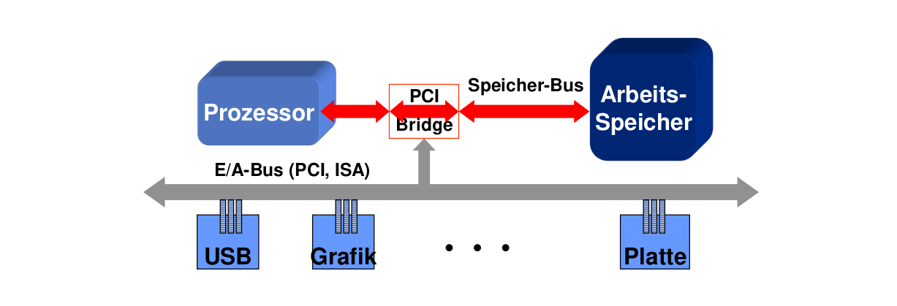
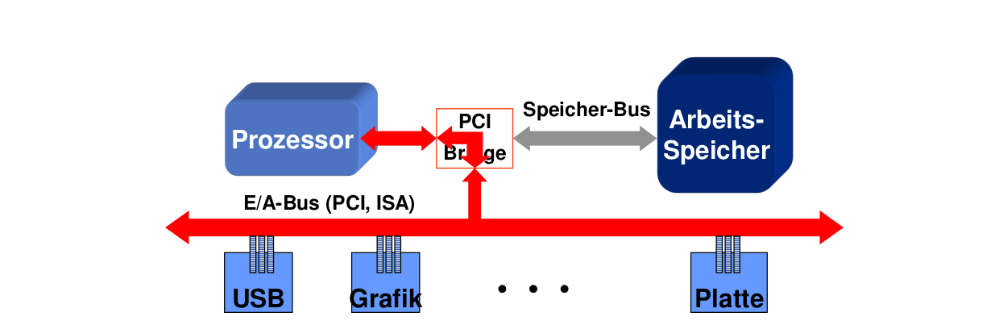

- [Einführung](#einführung)
  - [Extrem breites Anwendungsspektrum](#extrem-breites-anwendungsspektrum)
  - [Funktionale und nicht-Funktionale Eigenschaften](#funktionale-und-nicht-funktionale-eigenschaften)
    - [Funktionale Eigenschaften (= Funktionen, Aufgaben)](#funktionale-eigenschaften--funktionen-aufgaben)
    - [Nichtfunktionale Eigenschaften](#nichtfunktionale-eigenschaften)
  - [Blick in Betriebssystem-Zoo](#blick-in-betriebssystem-zoo)
- [Prozessormanagement: Prozesse und Threads](#prozessormanagement-prozesse-und-threads)
  - [Grundsätzliches](#grundsätzliches)
  - [Prozesserzeugung](#prozesserzeugung)
    - [Was geschieht bei der Prozesserzeugung](#was-geschieht-bei-der-prozesserzeugung)
    - [Prozesserzeugung: notwenige Vorraussetzungen](#prozesserzeugung-notwenige-vorraussetzungen)
    - [Prozesserzeugung: Namensvergabe](#prozesserzeugung-namensvergabe)
    - [Prozesserzeugung: Stammbaumpflege](#prozesserzeugung-stammbaumpflege)
    - [Prozesserzeugung: Allokation (Zuordnung) von Ressourcen](#prozesserzeugung-allokation-zuordnung-von-ressourcen)
    - [Prozesserzeugung: Management Datenstrukturen](#prozesserzeugung-management-datenstrukturen)
    - [Aktionen des Prozessmanagements](#aktionen-des-prozessmanagements)
    - [Prozessterminierung](#prozessterminierung)
  - [Threads](#threads)
- [Scheduling](#scheduling)
  - [Das Problem](#das-problem)
  - [Aufgabe der Zustandsmodelle](#aufgabe-der-zustandsmodelle)
  - [Scheduleraktivierung](#scheduleraktivierung)
  - [Scheduling Strategien](#scheduling-strategien)
    - [Batch-System („Stapelverarbeitungs“-System)](#batch-system-stapelverarbeitungs-system)
    - [Interaktives System](#interaktives-system)
      - [Einbeziehung von Prioritäten](#einbeziehung-von-prioritäten)
    - [Schedulingziele in Echtzeitsystemen](#schedulingziele-in-echtzeitsystemen)
  - [Zusammenfassung](#zusammenfassung)
- [Privilegierungsebenen](#privilegierungsebenen)
- [Kommunikation und Synchronisation](#kommunikation-und-synchronisation)
  - [Elementare Konzepte](#elementare-konzepte)
  - [Algorithmen zum wechselseitigen Ausschluss](#algorithmen-zum-wechselseitigen-ausschluss)
  - [Synchronisations- & Kommunikationsmechanismen](#synchronisations---kommunikationsmechanismen)
    - [(binäre) Semaphore](#binäre-semaphore)
    - [Hoare'sche Monitore](#hoaresche-monitore)
  - [weitere Konzepte](#weitere-konzepte)
    - [Transaktionaler Speicher](#transaktionaler-speicher)
    - [Botschaften](#botschaften)
    - [Fernaufrufe (Remote Procedure Calls, RPCs)](#fernaufrufe-remote-procedure-calls-rpcs)
    - [Systemaufrufe](#systemaufrufe)
    - [Ereignismanagement](#ereignismanagement)
    - [IPC Modell](#ipc-modell)
    - [pop-up-Thread-Modell](#pop-up-thread-modell)
    - [Implementierungstechniken](#implementierungstechniken)
  - [Zusammenfassung](#zusammenfassung-1)
- [Speichermanagement](#speichermanagement)
  - [Speichertechnologien und -klassen](#speichertechnologien-und--klassen)
    - [Was muss Arbeitsspeicher können?](#was-muss-arbeitsspeicher-können)
    - [Layout des (physischen) Arbeitsspeichers: 50er Jahre](#layout-des-physischen-arbeitsspeichers-50er-jahre)
    - [Layout des physischen Arbeitsspeichers: 60er Jahre](#layout-des-physischen-arbeitsspeichers-60er-jahre)
  - [Relokation](#relokation)
  - [Swapping](#swapping)
  - [Virtueller Speicher](#virtueller-speicher)
    - [Virtuelles Speichermanagement (VMM)](#virtuelles-speichermanagement-vmm)
    - [Begriffe](#begriffe)
    - [Abbildung $vm_p$](#abbildung-vm_p)
    - [Memory Management Units (MMUs)](#memory-management-units-mmus)
    - [Seitenabbildungstabellen](#seitenabbildungstabellen)
    - [Seitenaustausch-Algorithmen](#seitenaustausch-algorithmen)
      - [First-In , First-Out (FIFO)](#first-in--first-out-fifo)
      - [Second Chance (Variante des FIFO-Algorithmus)](#second-chance-variante-des-fifo-algorithmus)
      - [Least Recently Used (LRU)](#least-recently-used-lru)
      - [Working Set](#working-set)
      - [WSClock](#wsclock)
    - [Zusammenfassung](#zusammenfassung-2)
  - [Segmentierung](#segmentierung)
  - [VMM- Abstraktionen in der Praxis](#vmm--abstraktionen-in-der-praxis)
  - [Zusammenfassung](#zusammenfassung-3)
- [Dateisystem](#dateisystem)
  - [Dateimodelle](#dateimodelle)
    - [Aufgabe: Präzise Festlegung der Semantik der Abstraktion „Datei“](#aufgabe-präzise-festlegung-der-semantik-der-abstraktion-datei)
    - [Aufgabe: Identifikation von Dateien mittels symbolischer Namen](#aufgabe-identifikation-von-dateien-mittels-symbolischer-namen)
    - [Datei-Attribute](#datei-attribute)
    - [Operationen auf Dateien](#operationen-auf-dateien)
    - [Zusammenfassung Dateimodelle](#zusammenfassung-dateimodelle)
  - [Dateisysteme](#dateisysteme)
    - [Speichermedien](#speichermedien)
    - [Management-Datenstrukturen auf Speichermedien](#management-datenstrukturen-auf-speichermedien)
      - [Verzeichnisse](#verzeichnisse)
      - [Freiliste](#freiliste)
      - [Superblock](#superblock)
  - [Datenstrukturen u. Algorithmen des Betriebssystems](#datenstrukturen-u-algorithmen-des-betriebssystems)
- [Netzwerkmanagement](#netzwerkmanagement)
- [E/A Systeme](#ea-systeme)
  - [Hardware Prinzipien](#hardware-prinzipien)
    - [Kommunikationsmuster mit einem Controller](#kommunikationsmuster-mit-einem-controller)
    - [E/A- Adressräume](#ea--adressräume)
    - [Memory Mapped E/A](#memory-mapped-ea)
  - [Software Prinzipien](#software-prinzipien)
  - [Zusammenfassung](#zusammenfassung-4)
- [High-End-Betriebssysteme](#high-end-betriebssysteme)
  - [Was sind High-End- Betriebssysteme?](#was-sind-high-end--betriebssysteme)
  - [Sicherheit](#sicherheit)
    - [Ein Beispiel: SELinux](#ein-beispiel-selinux)
  - [Robustheit](#robustheit)
  - [Abschließend](#abschließend)
- [Abschließende Zusammenfassung und Schwerpunkte](#abschließende-zusammenfassung-und-schwerpunkte)

# Einführung
worauf es ankommt:
- Korrektheit
- Sicherheit
- Verfügbarkeit
- Skalierbarkeit
- Echtzeitfähigkeit
- Robustheit
- Sparsamkeit

## Extrem breites Anwendungsspektrum
- funktionale Eigenschaften
  - Authentisierung, Verschlüsselung
  - Fahrzeug/Verkehrsmanagement
  - Informationsmanagement
  - Kommunikationsmanagement
- nichtfunktionale Eigenschaften
  - Sicherheit
  - Korrektheit
  - Echtzeitfähigkeit
  - Skalierbarkeit
  - Offenheit
  - Sparsamkeit
  - Verfügbarkeit
  - Robustheit

mit vielen Gemeinsamkeiten
- Architekturprinzipien
- Programmierparadigmen

voller individueller Strategien mit teils konfligierenden Zielen
- Performanz $\leftrightarrow$ Robustheit 
- Echtzeitfähigkeit $\leftrightarrow$ Effizienz

$\Rightarrow$ spezialisierte Betriebssystem-Familien1. Einführung

## Funktionale und nicht-Funktionale Eigenschaften
Beispiel Essen: 
- funktionale Eigenschaft: es soll satt machen
- nichtfunktional: Geschmack, Aussehen,...

### Funktionale Eigenschaften (= Funktionen, Aufgaben)
- Betriebssysteme: sehr komplexe Softwareprodukte
- Ein Grund für diese Komplexität: besitzen Reihe von Aufgaben - also funktionale Eigenschaften
- Hauptaufgaben dabei:
  1. Verwalten der Resourcen des Systems (Hard-u. Software-Ressourcen) 
  2. Transformation der „hässlichen“ Hardwareschnittstellen in angenehme nutzerfreundliche Schnittstelle (Betriebssystem als „Erweiterung“ der Maschine, auch Hardware + BS = „virtuelle Maschine“)
  3. Dabei für beide Aufgaben: Schaffung sinnvoller Abstraktionen(Prozess, Datei,... $\rightarrow$ Softwareressourcen)

### Nichtfunktionale Eigenschaften
Wie - mit welchen speziellen weiteren Eigenschaften sollen die funktionalen Eigenschaften realisiert werden. Z.B. schon genannt:
- Echtzeitfähigkeit: Betriebssystem-Komponenten, -Algorithmen usw. mit solchen Eigenschaften realisieren, dass Betriebssystem insgesamt echtzeitfähig ist
- Robustheit: Betriebssystem-Komponenten, -Algorithmen usw. mit solchen Eigenschaften realisieren, dass Betriebssystem insgesamt robust ist
- usw

## Blick in Betriebssystem-Zoo
- Mainframe Betriebssystem
  - performante E/A
  - Massendatenverarbeitung
- Server Betriebssystem
  - viele Klienten, permanente Kommunikation
  - Web Server, Fileshare
- Parallelrechner Betriebssystem
  - Number Crunching, parallele Algorithmen mit hohem Rechenbedarf
  - schnelle IPC
- Desktop/Laptop Betriebssystem
  - Interaktivität/Responsivität
- Echtzeit Betriebssystem
  - Einhaltung zeitlicher Garantien, Safety
  - Fahrzeug-, Anlagensteuerung
- Eingebettete Systeme
  - in Fahrzeugen, Kaffeemaschinen, Telefonen...
  - z.T. Spezialaufgaben

# Prozessormanagement: Prozesse und Threads
## Grundsätzliches
1. Computer bearbeiten Aufgaben in wohldefinierten Arbeitsabläufen (beschrieben durch Programme/Algorithmen)
2. bei abarbeitung von Programmen entstehen oft Wartesituationen
3. Wartezeiten sind ~ relativ zur Prozessorgeschwindigkeit ~ gigantisch (1 Sek ~ 10 Milliarden Prozessorzyklen)
4. statt zu warten, lässt sich besseres tun (parallele Ausführung mehrerer Aufgaben)
5. Parallelität geht nicht immer (vorraussetzung Nebenläufigkeit)

Begriffe
1. Aktivitäten heißen nebenläufig, wenn zwischen ihnen keine kausalen abhängigkeiten bestehen
2. Aktivitäten heißen parallel, wenn sie zeitlich überlappend druchgeführt werden


> Definition Prozess: Ein Prozess ist eine Abstraktion zur vollständigen Beschreibung einer sequenziell ablaufenden Aktivität

parallele Aktivitäten werden repräsentiert durch parallele Prozesse

> Prozess = betriebssystem-Abstraktion zur Ausführung von programmen

> Prozessmodelle: definieren konkrete Prozesseigenschaften

> Prozessmanagement: Komponente eines Betriebssystems, die Prozessmodell dieses Betriebssystems implementiert

> Aufgabe: präzise Definition der Betriebssystem-Abstraktion "Prozess"
(definiert durch Semantik und nichtfunktionale Eigenschaften; implementiert durch Datenstrukturen/Algorithmen)

> Prozesserzeugung: Erzeugen einer Programmablaufumgebung

## Prozesserzeugung
### Was geschieht bei der Prozesserzeugung
1. Prüfen notwendiger Vorraussetzungen (Rechte, Ressoucenverfügbarkeit,...)
2. Namensvergabe und "Stammbaumpflege"
3. Allokation von Ressourcen (Arbeitsspeicher, Prozessorzeit)
4. Anlegen von Managementstrukturen (belegte Ressourcen, Laufzetmanagement)

### Prozesserzeugung: notwenige Vorraussetzungen
1. Rechte: zur Prozesserzeugung und Ressourcenallokation (Kontingente)
2. Ressourcenverfügbarkeit (Arbeitsspeicher, Rechenzeit, Kommunikation)
3. Sicherheit (Authentizität und Integrität des auszuführenden Programms)
4. bei Echtzeitbetriebssystem
    - Erfüllung von Ressourcenanforderung
    - Einhaltung gegebener Garantien
5. Fairness (Quoten)
6. robustheit/Überlastvermeidung (Lastsituation)

### Prozesserzeugung: Namensvergabe
Identifikation ist positive ganze Zahl durch Vergabe Algorithmus. Kann nach Terminierung eines Prozesses erneut vergeben werden
- eindeutig: zu einem Zeitpunkt bzgl aller existierenden Prozesse
- nicht unbedingt eindeutig: für zeitlich nicht überlappende Prozesse
- erst recht nicht eindeutig: über Systemgrenze hinweg

### Prozesserzeugung: Stammbaumpflege
Abstammungsbeziehung: definieren Eltern/Kind Hierarchie
1. Prozess erzeugt weitere Prozesse: Kinder
2. diese wiederum erzeugen weitere Prozesse usw
-> baumartige Abstammungshierarchie
Nutzung: Rechte und Verantwortlichkeiten

Verwaiste Prozesse -> Adoption (durch Urprozess)

### Prozesserzeugung: Allokation (Zuordnung) von Ressourcen
1. Arbeitsspeicher
   1. Größe: Wie viel Arbeitsspeicher benötigt der Prozess?
   2. Zeitpunkt: zu welchem Zeitpunkt? Echtzeiteigenschaften (Planbarkeit) oder Performanz (proaktivität)?
   3. Isolation: wie ist er geschützt? (Robustheit, Sicherheit, Korrektheit)
2. Prozessorzeit
   1. in Prozessmodellen echtzeitfähiger Systeme: Größe und Zeitpunkt
   2. in Prozessmodellen ohne diese Eigenschaften: dynamisches ad-hoc-Scheduling

für richtige Initialisierung: präzise Formatvereinbarung zwischen
- Linker (Programmdatei-Produzent)
- Prozessmanagement des BS (Programmdatei Nutzer)

1. das a.out-Format (veraltet; ursprünglich Unix Format)
2. das Mach Object File Format (Mach-O; heutiger Standard für OS X, iOS)
3. das Executable and Link(age/able) Format (ELF; heutiger Linux standard)

### Prozesserzeugung: Management Datenstrukturen
Buchführung über sämtliche zum management notwendigen Informationen
- Prozessidentifikation
- Rechtemanagement
- Speichermanagement
- Prozessormanagement
- Kommunikationsmanagement

a. Prozessdeskriptor (process control block ~ PCB)
b. Prozessdeskriptortabelle: Deskriptioren sämtlicher Prozesse

| Prozessormanagement (Prozessdeskriptor) | |
| Identifikation | eindeutige Prozessbezeichnung; einordnung in Abstammungshierarchie |
| Scheduling | Informationen für Schedulingalgorithmen |
| Prozessorkontext | gesichert bei Verdrängung des Prozesses, restauriert bei Reaktivierung |
| Ereignismanagement | what if... |
| Accounting (Kontoführung) | zur Prioritätsbestimmung, Statisik, kostenberechnung |
| Virtueller Adressraum | Beschreibung des Speicherlayouts | 
| Kernel Stack | Prozedurmanagement innerhalb des BS | 
| Rechtemanagement | |
| Allgemeines Ressourcenmanagement | Filedeskriptoren, Socketdeskriptoren,... |

### Aktionen des Prozessmanagements
- Prüfen notweniger Vorraussetzungen
- Namensvergabe und Stammbaum
- Allokation von Ressourcen
- Anlegen von Managementdatenstrukturen (Prozessdeskriptor)

### Prozessterminierung
durch
- Aufgabe erledigt
- Fehler aufgetreten
- durch Nutzer/Eigentümer geschlossen
- ...

1. Freigabe der Ressourcen
2. Benachrichtigung der "Eltern"
3. Adoption der "Kinder"

## Threads
Naive Lösung: für jede nebenläufige Aktivität einen Prozess erstellen. Jedoch hat ein Prozess:
- Kosten des Managements
- kosten der isolation
- Kosten der Kommunikation

$\rightarrow$ Parallelität mittels Prozessen ist teuer (revidiertes Prozessmodell)

Daher suche nach kostengünstigerem Modell zur Parallelisierung nebenläufiger Aktivitäten

> Definition Prozess: Ein (Multithread-) Prozess ist eine vollständige Beschreibung einer ablaufenden Aktivität. Dazu gehört insbesondere 
> 1. Das ablaufende Programm
> 2. zugeordnete Betriebsmittel
> 3. Rechte
> 4. prozessinterne parallele Aktivitäten (Threads) und ihre Bearbeitungszustände

> Definition Thread: ist eine sequenzielle Aktivität im Betriebsmittelkontext (d.h. innerhalb) eines Prozesses

parallele Aktivitäten innerhalb eines Prozesses werden durch parallele Threads repräsentiert.

Anmerkung:
1. **Eigentümer von Ressourcen und Rechten** sind immer noch prozesse
2. das **Programm eines Prozesses** kann nun Code für mehr als eine sequenzielle Aktivität enthalten
3. **Gegenstand der Prozesszuteilung** sind nun Threads
4. das **ursprüngliche Prozessmodell** ist eine Spezialisierung dieses Modells (ein Prozess mit genau einem Thread)
5. ein **Prozessdescriptor** (PCB) eines Multithread-Prozessmodells enhält alle Informationen des PCBs eines Single-Thread-Prozessmodells plus Informationen über alle seine Threads
6. ein **TCB** enthält lediglich den Threadszustand und den Ablaufkontext

Threads werden daher oft als *Leichtgewichtprozesse* bezeichnet


Threads treten in verschiedenen Varianten auf
1. komfortabel (integriert in Programmiersprache)
2. "zu Fuß" (durch Bibiliotheken oder API)

Implementierungsebenen
1. Prozessmodell des Betriebssystems ist Multithread Modell
   - Thread Implementierung im Betriebssystem
   - das Betriebssystem hat Kenntnis über Threads
   - Kernel Level Threads (KLTs)
2. Prozessmodell des Betriebssystems ist Single-Thread-Modell
   - Thread Implementierung auf Anwendungsebene
   - nur auf Endbenutzer-Ebene ist Kenntnis über Threads
   - User Level Thread (ULTs)

| Pro KLT | Pro ULT |
| Performanz durch Parallelität | Performanz durch geringen Overhead |
| Nutzung von Mehrprozessor/Mehrkernarchitektur | Thread Management ohne Systemaufrufe | 
| ein blockierender Systemaufruf in einem Thread blockiert nicht auch gleichzeitig alle anderen Threads des gleichen Prozesses | Thread Umschaltung ohne Mitwirkung des Betriebssystems |
| | Individualität: anwendungsindividuelle Thread Schedulingstrategien möglich | 
| | Portabilität | 

es gibt Work-Arounds: alle gefährlichen Systemaufrufe einpacken (in Pakete)

Wahl zwischen ULT- und KLT hängt ab von:
1. Vorraussetzung: Prozessmodell des Betriebssystems Multithread Modell?
2. Anwendungsprofil: E/A-Profil, Parallelität, Portabilität, Individualität

# Scheduling
## Das Problem
Anzahl der Aktivitäten >> Anzahl der Prozessoren
- nicht alle können gleichzeitig arbeiten
- eine Auswahl muss getroffen werden
- Auswahlstrategie: Schedunling-Strategie/Algorithmus
- die Betriebssystem Komponente Scheduler
- Ziel: Effizientes Ressourcenmanagement

Threads können
- aktiv sein (besitzt einen Prozessor)
- rechenbereit sein (Bsp. hätte gerne einen Prozessor)
- kurzfristig warten (Bsp. benötigt keinen Prozesoor aber Arbeitsspeicher)
- langfristig warten (Bsp. benötigt länger keinen Prozessor/Arbeitsspeicher)

Threadzustände im 3/5-Zustandsmodell
- bereit: kann aktiv werden, sobald Prozessor frei wird
- aktiv: besitzt einen Prozessor, arbeitet
- blockiert: wartet auf Ereignis (Timer Ablauf,...)
- frisch: erzeugt, Betriebsmittel/Rechte zum Ablauf fehlen noch
- beendet: Betriebsmittel in der Freigabephase

Folge: effizientes Ressourcenmanagement benötigt präzise Informationen über Threadzustände.

## Aufgabe der Zustandsmodelle
Beschreibung:
- des Ablaufzustands von Threads (aktiv/bereit/wartend)
- der mögliche Zustandsübergänge (z.B. bereit->aktiv)

Nutzung
- jeder Thread ist zu jedem Zeitpunkt in genau einem dieser Zustände
- jeder Thread wechselt seinen Zustand gemäß der im Modell definierten Zustandsübergänge, hervorgerufen durch z.B. Zuteilung eines Prozessors
- Ressourcenmanagement: nutz Zustand als Informationsquelle für Entscheidungen

Beschreibungsmittel: endliche deterministische Automaten
- Menge der annehmbaren Zustände ist endlich
- Folgezustand ist immer eindeutig bestimmt

## Scheduleraktivierung
Wann wird die letzte Scheduling-Entscheidung überprüft?
1. Prozess/Thread erzeugung (neuer, rechenbereiter Thread)
2. Threadterminierung, Threadblockierung (ein Prozessor wird frei)
3. Ereigniseintritt (Thread wird rechenbereit)
4. Wechsel von Prioritäten (in prioritätenbastierten Schedulingalgorithmen)
5. periodisch (in zeitscheibenbasierten Schedulingalgorithmen)

Ein Kontextwechsel umfasst:
- bei Wechsel zwischen Threads desselben Prozesses
  - Stackkontext
  - Prozessorregister
  - floating point unit (hohe Kosten) (FPU)
- zusätzlicher Wechsel zwischen Threads verschiedener Prozesse
  - Speicherlayout (sehr hohe Kosten)
- starke Auswirkungen auf
  - Gesamtperformanz
  - Reaktivität
  - Echtzeiteigenschaften

Kostenfaktor FPU
- Kopieren des FPU-Kontexts: sehr viele Register (sofortkosten)
  - Realisierung: "faul"
  - Hardware hilft: FPU Protection
- Auswirkung
  - nur ein Thread benutzt FPU: tatsächliches Sichern erfolgt nie
  - wenige Threads benutzen FPU: tatsächliches Sichern minimiert

## Scheduling Strategien
Strategische Ziele
- abhängig vom Einsatzfeld eines Betriebssystems
  - Echtzeitsysteme: Einhaltung von Fristen
  - interaktive Systeme: Reaktivität
  - Serversysteme: Reaktivität, E/A-Performanz
  - Batch-Verarbeitungssysteme: Durchsatz
- ergänzt durch allgemeine Ziele
  - Fairness: Threads bekommen einen fairen Anteil an Rechenzeit
  - Lastbalancierung: alle Systemkomponenten (CPUs, Speicher, E/A-Peripherie) sind gleichmäßig ausgelastet
  - Overhead: z.B. wenig Prozesswechsel
- Ausbalancierung mehrerer Ziele
  - multikriterielle Optimierungsaufgabe, i.d.R. NP-vollständig
  - heuristische Scheduling-Algorithmen

Typische Muster aktiver Threadphasen:
- CPU lastig (mathematische Berechnung, Verschlüsselung,...)
- E/A lastig (interaktiver Prozess, ...)
- periodische Last (Echtzeitvideoverarbeitung, ...)
- chaotische Last (server mit inhomogenen Diensten)

Differenzierte Scheduling-Strategien
- nutzen Wissen über Lastmuster zur Optimierung, z.B.
  1. Einhaltung von Fristen
  2. Minimierung der Thread/Prozesswechsel

### Batch-System („Stapelverarbeitungs“-System)
- Aufträge: in Gruppen („Stapel“) eingeteilt u. so verarbeitet
- Abarbeitung: ohne aktive Mitwirkung eines Benutzers (Gegensatz: interaktiv)
- ursprünglich: frühe Entwicklungsstufe von Betriebssystemen

Ziele hier
1. Auslastung teurer Betriebsmittel (i.d.R. Maximierung der CPU-Auslastung)
2. Minimierung der Scheduling-Kosten (wenig Prozesswechsel, kurze Laufzeit des Scheduling-Algorithmus)
3. Maximierung des Durchsatzes (erledigte Arbeit / Zeit)

zwei der bekannteren:
1. First Come, First Served (FCFS)
   - in Reihenfolge, in der Threads rechenbereit werden
   - extrem einfache Strategie, guter Durchsatz
   - nicht immer sehr klug
2. Shortest Remaining Time Next (SRTN)
   - Prozessor erhält Thread mit voraussichtlich kürzester Restrechenzeit
   - preemptiv* ) , d.h. Threads können von konkurrierenden Threads verdrängt werden
   - (Schätzwert über) Restlaufzeit muss vorliegen

### Interaktives System
- Benutzer: kann bei Programmabarbeitung in Aktivitäten des Computers eingreifen
- Abarbeitung: mit aktiver Mitwirkung eines Benutzers (Gegensatz: batch processing)
- fortgeschrittenere Betriebssystem-Technik

Ziele hier
1. Minimierung von Reaktionszeiten (subjektiver Eindruck von Performanz)
2. Fairness (mehrere Benutzer/Klienten)

Algorithmen: Round Robin Varianten
  - jeder Thread: bekommt ein gleich großes Teil „des Kuchens“: die Zeitscheibe
  - einfach zu implementieren (1 Warteschlange, Uhr)
  - geringe Algorithmuskosten (O(1): FIFO-Warteschlange, Ring)
  - schnelle Entscheidungen (O(1): Nr. 1 aus Warteschlange)
  - notwendiges Wissen gering (CPU-Nutzungsdauer des aktiven Threads)

#### Einbeziehung von Prioritäten
Ziel: Ausdrucksmöglichkeit der Wichtigkeit von Threads
1. niedrig: z.B.
  - Dämonen (die z.B. im Hintergrund Emails abrufen)
  - Putzarbeiten (z.B. Defragmentierung)
2. hoch: z.B.
  - auf Aufträge reagierende Threads (z.B. in Servern)
  - auf Benutzereingaben reagierende Threads (z.B. aktives Fenster einer GUI)
  - unter Echtzeitbedingungen arbeitende Threads (z.B. Motormanagement, DVD-Spieler)

Idee(n)
1. jeder Thread: erhält individuelle Priorität
2. Threads der höchsten Prioritäten: erhalten einen Prozessor
3. zwischen Threads gleicher Priorität: Round-Robin

viele Varianten dieses Schemas
- statische Prioritäten, z.B. in
  - planbaren Echtzeitsystemen (Autoradio: Reaktion auf Stationswechseltaste hat Vorrang vor Senderfeldstärkenüberwachung)
  - kommerziellen Rechenzentren (wer mehr zahlt, ist eher an der Reihe)
- dynamische Prioritäten, abhängig z.B. von
  - verbrauchter CPU-Zeit (Verhinderung der Dominanz)
  - E/A-Intensität
  - Wartegrund

### Schedulingziele in Echtzeitsystemen
Finden einer Bearbeitungsreihenfolge (ein „Schedule“),
- die Fristen einhält
- deren Berechnung ökonomisch ist (Kosten des Scheduling-Algorithmus)
- die selbst ökonomisch ist (Minimierung der Threadwechsel)
- die sich (evtl.) an wechselnde Lastmuster anpasst

Verbreitete Algorithmen
- EDF: früheste Frist zuerst (earliest deadline first)
  - für dynamische Lasten
  - wird ein Thread rechenbereit, so „nennt“ er seine nächste Deadline (Frist)
  - von allen bereiten Threads ist immer derjenige mit der frühesten Deadline aktiv (dringend=wichtig)
  - Folglich
    - arbeitet der Algorithmus mit dynamischen Prioritäten → adaptiv
    - ist die Thread-Priorität um so höher, je näher dessen Frist liegt
    - ist er preemptiv
  - Voraussetzung: kausale und zeitliche Unabhängigkeit der Threads (keine wechselseitige Blockierung)
- RMS: Raten-monotones Scheduling (rate-monotonic scheduling)
  - für periodische Lasten (z.B. Mischpult, DVD-Spieler, technische Prozesse)
  - wird ein Thread rechenbereit, so „nennt“ er seine Periodendauer
  - von allen bereiten Threads ist immer derjenige mit der kürzesten Periodendauer aktiv
  - Folglich:
    - arbeitet der Algorithmus mit statischen Prioritäten
    - ist die Thread-Priorität um so höher, je kürzer die Periodendauer ist
    - ist er preemptiv
  - Voraussetzung: periodische Threads; kausale und zeitliche Unabhängigkeit der Threads

## Zusammenfassung
Anzahl der Threads >> Anzahl der Prozessoren
- nicht alle können gleichzeitig rechnen
- eine Auswahl muss getroffen werden
- → Auswahlstrategie: Schedulingalgorithmen

# Privilegierungsebenen
Problematik: Anwendungsprozesse und Betriebssystem nutzen gemeinsame (Hardware-)Ressourcen

Schutz vor fehlerbedingten oder bösartigen räumlichen/zeitlichen Wechselwirkungen

2 Konzepte
1. private Adressräume
2. Zugriffsschutz auf Arbeitsspeicherbereiche

Verhinderung zeitlicher Wechselwirkungen
- Ursache: Prozesse geben freiwillig keine Prozessoren auf
- Umgang damit
  - periodische Aktivierungen preemptiver Scheduler (Uhr)
  - Scheduler-Aktivierungen durch asynchrone Ereignisse
- kritisch also: Operationen zum Abschalten von
  1. Uhr
  2. Ereignismanagement
- weitere kritische Operationen
  1. Veränderung des Speicherlayouts
  2. Veränderung kritischer Prozessorkontrollregister
  3. Zugriff auf E/A-Geräte
- notwendig: Schutz kritischer Operationen des Instruktionssatzes

Lösungskonzept: Privilegierungsebenen ablaufender Aktivitäten, z.B.
  - „kernel mode“ (≈ Betriebssystem-Modus)
  - „user mode“ (Nutzer-Modus)
- ermöglichen: Durchsetzung von Regeln:
  - „Nur eine im „kernel mode“ ablaufende Aktivität hat Zugriff auf ...“
- Privilegierungsebenen steuern Rechte ...
  1. zur Ausführung privilegierter Prozessorinstruktionen
  2. zur Konfiguration des Arbeitsspeicher-Layouts
  3. zum Zugriff auf Arbeitsspeicherbereiche
  4. zum Zugriff auf E/A-Geräte

Realisierung: abhängig von Prozessorarchitektur
- in Ringen 0 (höchste Priorität) bis 3 (niedrigste Priorität)

Implementierung: Hardware-Unterstützung
- aktuelle Privilegierungsebene ist
  - Teil des Prozessor-Statusregisters: „Current Privilege Level“ (CPL)
  - Grundlage der Hardware-Schutzmechanismen; permanente Überwachung
    - der ausgeführten Instruktionen
    - der Arbeitsspeicherzugriffe
    - der E/A-Peripheriezugriffe
- Modifikation des CPLs nur
  1. durch privilegierte Instruktionen
  2. bei Beginn und Abschluss
    - des Aufrufs von Systemdiensten
    - einer Ereignisbehandlung

Botschaften
- jede auf Privilegierungsebene < 3 ablaufende Aktivität hat Zugriff auf kritische Ressourcen
- jede auf Privilegierungsebene 0 ablaufende Aktivität hat Zugriff auf
  1. sämtliche Ressourcen eines Prozessors
    - sämtliche Instruktionen (z.B. HALT)
    - sämtliche Prozessorregister (z.B. Prozessor-Status-Register (PSR) )
  2. MMU-Register zur Arbeitsspeicherkonfiguration 
  3. sämtliche Register der E/A-Peripherie

Sämtliche Schutz- und Sicherheitsmechanismen von
- Anwendungsprozessen
- Betriebssystem
beruhen elementar auf 2 Bits: „Current Privilege Level“ (CPL) im Prozessor-Status-Register (PSR)


# Kommunikation und Synchronisation
## Elementare Konzepte
Beispiele:
- Aufträge an Geräte und (Dienstleistungs-)Prozesse, z.B.
- Kooperative Arbeit von Betriebssystem-Komponenten
- Arbeit verschiedener Betriebssystemkomponenten mit (gemeinsamen) Management-Datenstrukturen
- Interaktionen zwischen Anwendungsprozessen

Die Auftragstabelle ist eine (Software-)Ressource.
- Problem: ein Fehler entsteht dadurch, dass zwei (oder mehr) Prozesse oder Threads „durcheinander“ auf der Ressource arbeiten
- Lösung: Unkoordiniertes Arbeiten mit der Ressource muss verhindert werden!
Erst wenn ein Prozess (oder Thread) seine Arbeit mit der Ressource vollständig abgeschlossen hat, darf der nächste aktiv werden.
Die Befehlsfolge innerhalb der Prozesse, während deren Abarbeitung auf die Ressource zugegriffen wird, ist ein kritischer Abschnitt. 
- Außerdem: genauere Betrachtung eines einzelnen Auftrags; kann aus mehreren Komponenten bestehen
- Problem: durch „unkoordiniertes“ Arbeiten mehrerer Threads kann es auch bei den Auftrags-Einträgen zu Inkonsistenzen kommen

Fazit:
- Gesamte Arbeit an Auftragstabelle ist kritischer Abschnitt.
- Nur 1 Thread darf zu einem Zeitpunkt mit Auftragstabelle arbeiten.
- Erst wenn dieser Arbeit beendet hat, darf ein neuer Thread mit der Auftragstabelle arbeiten.

Definitionen:\\
Es gibt Ressourcen, die als ganzes oder bzgl. einzelner Operationen nur exklusiv, d.h. zu einem Zeitpunkt nur durch einen einzigen Thread nutzbar sind.
1. Eine Phase, in der ein Thread eine exklusive Operation auf einer Ressource ausführt, heißt kritischer Abschnitt.
2. Kritische Abschnitte erfordern den wechselseitigen Ausschluss (die Isolation) konkurrierender Threads bzw. Prozesse.

Beispiel 2: Kommunikation von 2 Prozessen über gemeinsamen Speicherbereich („Erzeuger-Verbraucher-Problem“)
- Problembeschreibung:
  - Ein Prozess schreibt Daten in den Speicherbereich ...
  - Der zweite Prozess liest diese Daten ...
  - Die Datenmenge ist so umfangreich, dass dieser Vorgang mehrmals (abstrahiert: unendlich oft) wiederholt werden muss.
- 1. Problem (Puffer voll, Puffer leer); unterschiedliche Geschwindigkeiten von Erzeuger und Verbraucher
- 2. Problem (Puffer wird gerade benutzt); gleichzeitiges Lesen und Schreiben des selben Pufferelements

## Algorithmen zum wechselseitigen Ausschluss
Genauere Definition des Problems (Annahmen)
1. konkurrierende Threads arbeiten asynchron, z.B. in einer unendlichen Schleife
2. dabei betreten und verlassen sie irgendwann einen kritischen Abschnitt
3. Betreten und Verlassen dieses Abschnitts: wird durch Algorithmen organisiert, die den kritischen Abschnitt umgeben (Entry/Exit-Code)

Grundsätzliche Anforderungen
1. Korrektheit: In einem kritischen Abschnitt befindet sich zu jedem Zeitpunkt höchstens ein Thread (**wechselseitiger Ausschluss**).
2. Lebendigkeit: Falls ein Thread einen kritischen Abschnitt betreten möchte, dann betritt (irgendwann) (irgend-) ein Thread diesen Abschnitt. [Folglich kann **irgendwann** auch der erstgenannte Thread **den kritischen Abschnitt betreten**.]
3. Verhungerungsfreiheit: **Kein Thread wartet für immer** vor einem kritischen Abschnitt.

Wechselseitiger Ausschluss: ein erster (naiver) Versuch
- Ideen
  1. während Benutzung des Puffers: wird dieser als „busy“ markiert
  2. bei Vorfinden eines so markierten Puffers: wird gewartet
- Verhungern: z.B. bei Pseudoparallelität (fortwährende Unterbrechung des Writers im kritischen Abschnitt)

## Synchronisations- & Kommunikationsmechanismen
- Austausch von Daten zwischen Prozessen $\rightarrow$ Kommunikation (Inter-Prozess-Kommunikation, IPC)
- Abweichende Geschwindigkeiten von Sender und Empfänger $\rightarrow$ Synchronisation

Betrachtete Mechanismen:
- Semaphore
- Hoare ́sche Monitore
- Transaktionalen Speicher
- Botschaften
- Fernaufrufe

### (binäre) Semaphore
Idee: Flagge
- mit 2 Zuständen
    1. frei
    2. belegt
- mit 2 atomaren Operationen
    1. belegen: P( Semaphorname ) („Passeren“)
    2. freigeben: V (Semaphorname) („Vriegeven“)
- Sämtliche Nutzer dieses kritischen Abschnitts müssen diese semaphore verwenden (Entry-/Exit-Code, Türwächter)
- besser: kein aktives Warten

```cpp
// pic ← codePicFromCamStream();
if bufferBusy.zustand = frei then
bufferBusy.zustand ← belegt
else
bufferBusy.warteliste ← aufrufer
fi
//write(buffer, pic);
if bufferBusy.warteliste = leer then
bufferBusy.zustand ← frei
else
bufferBusy.warteliste.vorne.continue
fi
```

Implementierung von Semaphoren z.B. als Klasse (Objekt-Orientiert),
- die die Methoden P und V exportiert
- mit einer lokalen Thread-Warteliste
- mit (aus dem Maschinenraum) importierten Operationen atomicBegin und atomicEnd, die Atomarität herstellen
```cpp
P(semaphore s) {
  atomicBegin(s);
  if (s.zustand = frei)
    s.zustand ← belegt;
  else
    s.warteliste ← aufrufer;
      scheduler.suspend(aufrufer);
  fi
  atomicEnd(s);
}

V(semaphore s) {
  atomicBegin(s);
  if (s.warteliste = leer)
    s.zustand ← frei;
  else
    scheduler.continue
      (s.warteliste.vorne)
  fi
  atomicEnd(s);
}
```

Unterstützung durch Hardware: die TSL-Operation
- Atomarität
- Ausschluss paralleler Ausführung → TestAndSetLock („TSL“) im Instruktionssatz eines Prozessors
```cpp
atomicBegin(s):
TSL s.state, callingThread.Id // try to get lock
CMP s.state, callingThread.Id // did I get it?
JZE gotIt // yes
CALL scheduler.yield // optional in manycores, mandatory
// in monocores: yield processor
JMP atomicBegin // try again
gotIt: RET // got it, may enter critical region
```

Nutzung von Semaphoren:
- Multi-Thread-Anwendungen (Webserver, PowerPoint, etc.)
- auf Betriebssystem Ebene von allen nebenläufigen Aktivitäten

Implementierung
- im Ressourcenmanagement des Betriebssystems
- mit Hilfe des „Maschinenraums“: atomicBegin(s), atomicEnd(s)

!ungelöst: Geschwindigkeitsdifferenz
```cpp
//Writer-Thread:
forever do { 
  codePicFromCamStream(pic);
  P(bufferEmpty);
  P(bufferBusy);
  write(buffer,pic);
  V(bufferBusy);
  V(bufferFull);
}
```
- bufferBusy: verhindert gleichzeitigen Zugriff
- bufferEmpty: gibt Weg frei, wenn der Puffer leer ist
- bufferFull: gibt Weg frei, wenn er gefüllt ist

Mehrwertiger Semaphor (oder Zählsemaphor) mit mehreren Semaphoren; maximaler Sem-Wert = n, bestimmt maximale Anzahl von Threads, die gleichzeitig aktiv sein können

Zusammenfassend:
| bei Eintritt in kritischen Abschnitt | Bei Verlassen eines kritischen Abschnitts |
| -- | -- |
| P(Sem) - binärer Semaphor | V(Sem) - binärer Semaphor |
| Down(Sem) - Zählsemaphor | Up(Sem) - Zählsemaphor |
| Wait(Sem) - allgemein |  Signal(Sem) - allgemein |
| Haben die gleiche Wirkung auf den Wert des Semaphors: | Haben die gleiche Wirkung auf den Wert des Semaphors: |
| - Dekrementieren, bis Wert „Null“ erreicht | - Inkrementieren des Semaphorwertes |
| - Trifft ein Thread auf den Wert „Null“, wird dieser blockiert (und in eine Warteliste eingefügt) | |
| - Nimmt der Semaphor wieder einen Wert > 0 an, setzt (normalerweise) erster Thread in Warteliste fort | |

### Hoare'sche Monitore
- Problem bei Anwendung von Semaphoren: Softwarequalität
- Problematisch in größeren Systemen:
  - Synchronisationsoperationen (P und V)
    - umgeben kritische Operationen (z.B. read/write)
    - müssen explizit gesetzt werden

Korrektheitsproblem. Die unabdingbare
  - Vollständigkeit
  - Symmetrie
der P- und V-Operationen ist schwierig erreichbar und nachweisbar.

- Die Idee: implizite/automatische Synchronisation kritischer Operationen
- Der Weg: Nutzung des Prinzips der Datenabstraktion
  - Zusammenfassung von Daten, darauf definierten Operationen und der Zugriffssynchronisation zu einem abstrakten Datentyp, dessen Operationen wechselseitigen Ausschluss garantieren
  - Zugriff auf Daten: über implizit synchronisierende Operationen („Inseln der Ruhe“ in turbulenten Multithread-Umgebungen)
  - Die kritischen Abschnitte und die zugehörigen Daten liegen jetzt in einem durch einen Monitor geschütztem Bereich

Aufrufer muss nicht wissen
1. ob Synchronisation nötig ist
2. mit welchen Mechanismen dies erfolgen muss
3. welche Regeln dabei gelten

Ziel der Regeln\\
Wechselseitiger Ausschlusses der Monitoroperationen ⟺ zu jedem Zeitpunkt ist höchstens ein Thread in einem Monitor aktiv
1. Jede Monitoroperation ist am Eingang und an den Ausgängen durch einen Türsteher gesichert
2. Das Betreten des Monitors erfolgt nur mit dessen Zustimmung („Anklopfen“)
3. Falls ein anderer Thread im Monitor aktiv ist, wird die Zustimmung verweigert und der anklopfende Thread suspendiert ( $\approx$ P-Operation)
4. Wenn ein Thread den Monitor verlässt, wird ein wartender Thread eingelassen (fortgesetzt), ( $\approx$ V-Operation)
5. Gerät ein Thread innerhalb einer Monitoroperation in eine Wartesituation (Warten auf Bedingungsvariable), so verlässt er den Monitor
6. Bevor ein auf eine Bedingung wartender Thread fortgesetzt wird, muss er wieder am Türsteher vorbei

Implementierung der Regeln basierend auf Semaphoren
- je Monitor: ein Semaphor
- jede Operation eines Monitors enthält
  - am Eingang: eine P-Operation
  - an jedem (!) Ausgang: eine V-Operation
$\rightarrow$ wechselseitiger Ausschluss

Bedingungsvariable „Puffer nicht voll“, „Puffer nicht leer“ mit 2 Operationen:
1. Warten auf das Vorliegen der Bedingung
2. Signalisieren des Vorliegens der Bedingung
$\rightarrow$ Monitore mit Bedingungsvariablen

Monitore: komfortabler Mantel für Semaphore

Allgemeines Erzeuger/Verbraucher-Problem
Lösung 2er Aspekte der Synchronisation
1. wechselseitiger Ausschluss der Zugriffe auf gemeinsame Daten („buffer“)
    - durch wechselseitigen Ausschluss von Monitoroperationen
    - kurzzeitiges Ausbremsen
2. Anpassung unterschiedlicher Geschwindigkeiten von Erzeuger und Verbraucher
    - durch Warten auf und Signalisieren von Bedingungen (nonFull, nonMt)
    - längerfristiges Ausbremsen

Methoden und Mechanismen verwendbar für
1. Threads und Prozesse innerhalb eines Betriebssysteme
2. Threads innerhalb eines Anwendungsprozesses
3. Anwendungsprozesse untereinander (notwendig: gemeinsamer Speicher!)

## weitere Konzepte
### Transaktionaler Speicher
Problem: Semaphore/ Hoare‘sche Monitore lösen das Problem wechselseitigen Ausschlusses durch Sperren.
damit: Verhinderung paralleler Abläufe (da in einem kritischen Abschnitt jeweils nur ein Thread aktiv sein kann, werden gegebenenfalls weitere Threads blockiert, und somit für bestimmte Zeit von der Bearbeitung ausgeschlossen, d.h. also zeitweilig gestoppt)

Lange Zeit war Performanz sehr bequem/ Wachsende Leistung der Hardware durch:
1. Erhöhung der Taktfrequenz
2. Erhöhung der Transistorzahl
    - Pipelining: Zerlegung und fließbandartige parallele Abarbeitung einzelner Instruktionen
    - Hyperthreading: Lückenfüllung in den Pipelines durch Füttern aus verschiedenen Threads
    - spekulative Ausführung von Instruktionsfolgen
    - Arbeitsspeichercaches
    - TLBs
- für Software weitgehend unsichtbar
- vertraute sequenzielle Programmierparadigmen ausreichend

Diese Ära ist beendet
1. physikalische Aspekte der Energieverteilung/Wärmeableitung auf Chip; Limitierung der Steigerung der Taktfrequenz
2. logische Aspekte der Instruktionsausführung; Limitierung spekulativer Ausführung und Instruktionsparallelität
Weitere Leistungssteigerung
- durch Paradigmenwechsel der Prozessorarchitektur: Multicore-Prozessoren
- dadurch bedingt: Paradigmenwechsel der Software: Parallele (und verteilte) Algorithmen

Parallele Algorithmen
- erfordern:
  - hochparallele, sperrenfreie Synchronisationsmodelle
  - Konzept: transaktionaler Speicher
- Beobachtung:
  - nicht jede konkurrente Benutzung kritischer Abschnitte durch mehr als 1 Thread verursacht Fehler
- Pessimistische Herangehensweise:
  - „Aussperren“ weiterer Threads (z.B. durch Semaphore u. Monitore)
  - Dadurch: ausgesperrte Threads werden am Weiterkommen gehindert (Performanzverluste besonders bei intensiver Parallelarbeit)
- Optimistische Herangehensweise:
  - Kein „Aussperren“ von Threads (z.B. durch Semaphore u. Monitore)
  - Hinterher: Untersuchung auf Fehler und Korrektur, z.B. durch erneuten Versuch
- Geeignete Verfahrensweise:
  - Kombination mit Transaktionen (-> transaktionaler Speicher)
- Transaktionen:
  - stammen aus der Datenbanktechnik
  - ermöglichen u.a.: Zurückfahren fehlerhaft ausgeführter Programmabschnitte (genannt Transaktionen) u. Wiederholung von deren Ausführung auf elegante Weise

### Botschaften
Problem: Semaphore/Hoare‘sche Monitore/Transaktionaler Speicher erfordern zu ihrer Implementierung gemeinsamen Speicher der Beteiligten

Gibt es nicht
1. falls die Beteiligten auf unterschiedlichen Rechnern ablaufen
2. falls die Beteiligten disjunkte Adressräume besitzen
3. in lose gekoppelten Multiprozessor-Architekturen
Hierfür: muss ein anderes Kommunikationsparadigma her

2 elementare Operationen
1. Senden einer Botschaft an einen Empfänger
    `send(IN Empfänger, IN Botschaft)`
2. Empfangen einer Botschaft von einem Absender
    `receive(OUT Absender, OUT Botschaft)`

Anmerkungen
- genutzt: für Kommunikation zwischen
  - Prozessen innerhalb eines (Mikrokern-) Betriebssystems
  - Anwendungsprozesse untereinander (Klienten, Server)
- Betriebssysteme: implementieren send/receive-IPC
- Anwendungsprozesse: nutzen Bibliotheken oder Betriebssystem-Dienste,

### Fernaufrufe (Remote Procedure Calls, RPCs)
- Problem
  - Datenmodell des send/receive-Modells: Zeichenfolge $\rightarrow$ sehr primitiv
  - gewohnte Datenmodelle z.B. aus Programmiersprachen $\rightarrow$ Signaturen (Methodenaufruf, typisierte Parameterlisten)
- Idee: Anpassung eines
  - anwendungsnahen,
  - unkomplizierten und
  - vertrauten
- Kommunikationsmodells an die Eigenschaften verteilter Systeme:
  - Prozedurfernaufruf (Remote Procedure Call, RPC)
  - Methodenfernaufruf (Remote Method Invocation, RMI $\rightarrow$ Objekt-orientiert)

Grundidee dieser Architekturform
1. elementare Betriebssystem-Funktionalität: 
    - in sehr kleinem, hochprivilegiertem Betriebssystemkern (  Kern)
    - typische Aufgaben: Threads, Adressräume, IPC
2. weniger elementare Aufgaben:
    -schwächer privilegiert ( reguläre Anwendungssysteme = „Nutzerprozesse“)
3. Folgen
     - Isolation der Betriebssystem-Komponenten
       - → Robustheit (Fehlerisolation)
       - → IT-Sicherheit [Security] (TCB-Größe) $\rightarrow$ TCB: Trusted Computing Base
       - → Korrektheit (Verifizierbarkeit)
       - → Adaptivität (Auf- und Abskalierung der Systemfunktionalität)
       - → Kommunikationskosten

Kommunikationskosten
- Prozeduraufruf: monolithische Architektur: innerhalb eines Adressraums
- Prozedurfernaufruf: $\mu$-Kern-Architektur: über Adressraumgrenzen hinweg

### Systemaufrufe
Problem: Kommunikation Anwendungsprozess ↔ BS
- BS stellt zahlreiche Dienste bereit (Linux  250, Apple OS X  500); z.B.
  - Prozesserzeugung (fork)
  - Programmausführung (exec∗)
  - Dateimanagement (open, close, read, write)
  - Kommunikation (msg∗, socket, shm∗)
- In diesem Abschnitt: Aufrufmethoden und -mechanismen

1. Wünsche des Anwendungsentwicklers
    - Bequemlichkeit
    - Performanz (hohe Aufruffrequenz, tausende pro Sekunde)
2. Wünsche des Betriebssystem-Entwicklers
    - Sicherheit
    - Robustheit
- reguläre Prozeduraufrufe: erfüllen Kriterien nicht (isolierte Adressräume, Privilegien, Programmiersprachen)
- Prozedurfernaufrufe:
  - bequem, performant, sicher, robust
  - teuer
- gesucht: leichtgewichtiges RPC-Modell

1. Problem: Unterschiedliche Programmiersprachen
    - kein einheitliches Format der Aufrufparameter (Reihenfolge, Format)
    - Lösung: normierte Parameterstruktur und Datentyprepräsentation zwischen Anwendungsprogramm und Betriebssystem
      - definiert durch: API-Spezifikation des Betriebssystems
      - implementiert durch: zwischengeschaltete Bibliothek
      - (z.B. libc; Stellvertreter-Prozeduren, Urform heutiger Middleware-Stubs)
2. Problem: Separate Namensräume
    - „do_sys_write“ liegt nicht im Namensraum des Anwendungsprozesses
    - Lösung: Einigung auf Namenskonventionen („push(write_C)“)
3. Problem: Separate Adressräume/Adressraumbereiche
    - kein direkter Zugriff auf Parameter seitens der aufgerufenen Prozedur
    - Lösung:
      - Parameter-Datenstruktur auf User-Stack
      - performante Alternative: in Registern
4. Problem: Privilegienwechsel User→Kernel→User
    - TRAP/RTT-Mechanismus (ReTurn from Trap)

Kosten: Systemaufruf = Prozeduraufruf+X
X=
1. Standardisierung der Parameterübergabe
    - Kosten gering bei Übergabe in Registern (  reguläre Prozedur)
2. Isolation
    - Privilegienwechsel durch Interrupt ( TRAP/RTT )
    - je  100 Taktzyklen (Kontextsicherung)
    - Verlust der Sprungziel-Vorausberechnungen
    - Verlust spekulativer Ausführungen
    - sehr teuer
    - Optimierung (seit Pentium 2): SysEnter/SysCall-Instruktionen
- Kosten gegenüber regulärem Prozeduraufruf: heute ca. Faktor 2

### Ereignismanagement
Das Problem: Betriebssystemen laufen sehr viele Aktivitäten parallel ab
1. Ausführung von Anwendungsprogrammen
2. Management von Prozessor-, Speicher-, Kommunikations-Ressourcen
3. Bedienung der E/A-Peripherie
dabei: entstehen immer wieder Situationen, in denen auf unterschiedlichste Ereignisse reagiert werden muss, z.B.
- Timerablauf
- Benutzereingaben (Maus, Tastatur)
- Eintreffen von Daten von Netzwerken, Festplatten, ...
- Einlegen/stecken von Datenträgern
- Aufruf von Systemdiensten
- Fehlersituationen

- Qualitativ
  - Windows-System (Laptop), gestartete GUI
  - Jederzeit: können ca. 400 verschiedene Ereignisse eintreten
- Quantitativ
  - MacOS MacBook Pro
  - allein Systemaufruf-Ereignisse („SysEnter“) > 1.000.000/sek
- $\rightarrow$ Umgangsformen mit Ereignissen

Umgangsformen mit Ereignissen
1. „busy waiting“
    - spezialisierte Threads innerhalb des BS prüfen andauernd Ereigniseintritt
    - sehr kurze Reaktionszeit
    - ineffiziente Prozessornutzung
    - hoher Energieverbrauch
    - akzeptabel bei
      - bekannt kurzen Wartezeiten
      - Multiprozessormaschinen, falls
        - ausreichend Prozessoren vorhanden sind
        - ausreichend Energie vorhanden ist
2. „periodic testing“
    - spezialisierte Threads prüfen hin und wieder den Ereigniseintritt
    - je nach Prüfperiode
      - lang: fragliche Reaktionszeit
      - kurz: fragliche Effizienz der Prozessornutzung
    - akzeptabel bei: relaxten Reaktionszeitanforderungen
3. Unterbrechungen („Interrupts“)
    - Benachrichtigung über Ereignis
    - Zur Wirksamkeit dieser Technik
      - Verhältnis Anzahl Festplattenoperationen zu CPU-Operationen
      - Laptop: ca. 1:10.000.000

Ereignisklassen
1. E/A-Gerätemeldung („ich habe fertig“, „ich habe Fehler“)
2. Timer-Ablauf
3. Ausfall der Hardware (Stromausfall, Speicher-Paritätsfehler)
4. Fehlverhalten ablaufender Programme , z.B.
    - Ausführung privilegierter oder illegaler Instruktionen
    - Zugriff auf geschützte Speicheradressen
    - arithmetischer Überlauf (z.B. „$2^{40}* 2^{40}$ “ bei 64-Bit-Arithmetik)
    - Division durch 0
5. Seitenfehler (bei virtueller Speicherverwaltung, s.u.)
6. explizit per Programm ausgelöste Ereignisse („TRAP“)

Ereignisquellen
1. Hardware: E/A-Geräte, Uhren, CPU, MMU, ALU, FPU
2. Software: Instruktionen wie TRAP, SysCall
Technisch: Signalisierung z.B. durch „5 Volt an Prozessorbeinchen“
Programmiermodell: HW/SW-Schnittstelle?

Programmiermodelle zur Unterbrechungsbehandlung
- Idee
  - Verknüpfung von (HW-)Interrupts mit (SW-)Abstraktionen;
  1. Prozeduren (→ inline Prozeduraufrufmodell)
  2. IPC-Operationen (→ IPC-Modell)
  3. Threads (→ pop-up Thread Modell)
- Wirkung
  - Interrupt ↷ Ausführung der assoziierten Abstraktion, z.B.
  1. Interrupt Nr. 42: ↷ rufe Prozedur „InterruptHandler_42()“ auf
  2. Interrupt Nr. 42: ↷ sende Botschaft „Interrupt 42“ an einen Thread
  3. Interrupt Nr. 42: ↷ erzeuge Thread „Interrupt_42_Thread“

Das inline-Prozeduraufrufmodell
- Interruptbehandlungen: besitzen syntaktisches Aussehen einer Prozedur:
  - „Handlerprozeduren“ (interrupt service routines (ISRs))
- Ablauf der Interruptbehandlung: erzwungener Prozeduraufruf
  - kein Threadwechsel, sondern
  1. Unterbrechung des Tuns des momentan ablaufenden Threads
  2. Sicherung seines Ablaufkontexts (Lesezeichen: IP, SP, PSR, ...)
  3. Versetzen des Threads in Ablaufkontext der Unterbrechungsbehandlung (z.B. andere Privilegierungsebene)
  4. Ausführung der Handlerprozedur (untergeschobener (inline-) Prozeduraufruf)
  5. Restauration des Threads in den unterbrochenen Ablaufkontext (beim Lesezeichen)
- Planung der Interruptbehandlung:
  - Prozedurname mit Interruptquelle assoziieren
  - Interruptvektortabelle
  - es gibt: viele unterschiedliche Interruptquellen
  - es gibt: entsprechend viele unterschiedliche Reaktionen auf Interrupts
- Aufruf der zugehörigen Handlerprozedur:
  - wir haben: ein konkretes Interruptsignal: „5 Volt“ und eine Nummer $\rightarrow$ Hardwareebene
  - wir möchten: die Ausführung der zugehörigen Handlerprozedur im Betriebssystem, z.B. im Timer-Management $\rightarrow$ Softwareebene

Problem also: geeignete Hardware/Softwareschnittstelle

Lösung: Die Interruptvektor-Tabelle (IVT): Assoziationen („Interruptvektoren“) der Form
  - Interruptquelle → Handlerprozedur (ISR)
  - Interruptquelle: Nummer
  - Handlerprozedur: Code oder Codeadresse
  - Speicherort: BS und Interrupthardware bekannt; Varianten:
    1. fester Ort: z.B. im Arbeitsspeicher, beginnend bei Adresse 0
    2. variabel: lokalisiert über Adressregister (Interruptvektor Adressregister, IVA)
  - Format: (HW-)architekturspezifisch, dem Betriebssystem bekannt
  - erstellt:
    - in früher Boot-Phase des Systems
    - als Ergebnis einer Analyse möglicher Interrupt-Quellen (z.B. vorhandene E/A-Geräte) (BIOS, UEFI)

Fazit des inline-Prozeduraufrufmodells
1. Unterbrechungsbehandlung: durch Interrupt Service Routinen
2. Planung: in Interruptvektor-Tabelle
3. Ablauf: erzwungener Prozeduraufruf
      1. Sicherung des Ablaufkontexts des momentan aktiven Threads
      2. Auswahl der Handlerprozedur gemäß IVT-Eintrag
      3. Ausführung der Handlerprozedur durch untergeschobenen Prozeduraufruf
      4. Restaurierung des unterbrochenen Tuns des Threads

### IPC Modell
2-stufig
1. Stufe der Interruptbehandlung: erzeugt IPC-Operation
2. Stufe der Interruptbehandlung: Reaktion auf diese IPC-Operation
- Interrupts: abgebildet auf reguläre IPC-Operationen
- Interruptbehandlungen: sind reguläre Reaktionen der IPC-Adressaten
- zeitliche Kalkulierbarkeit und Kürze der primären Interruptbehandlung (Echtzeitsysteme!)

Planung
- IPC-Erzeugung mit Interruptquelle verknüpfen → Interruptvektor
- Beim Interrupt
    1. Stufe:
        - I. Unterbrechung des momentan aktiven Threads
        - II. Erzeugen der IPC-Operation, z.B. Senden einer Botschaft (klein – passt in IVT, sehr schnell)
        - III. Fortsetzung des unterbrochenen Threads
    2. Stufe: IPC-Adressat, z.B. Thread eines Gerätemanagers, reagiert auf IPC

### pop-up-Thread-Modell
2-stufig
1. Stufe der Interruptbehandlung: erzeugt Thread
2. Stufe der Interruptbehandlung: erfolgt in diesem Thread
- Interruptsignale: abgebildet auf Thread-Erzeugungen
- Interruptbehandlungen: sind reguläre Thread-Abläufe
- zeitliche Kalkulierbarkeit und Kürze der primären Interruptbehandlung (Echtzeitsysteme!)

Planung
- Thread-Erzeugung mit Interruptquelle verknüpfen → Interruptvektor
- Beim Interrupt
  1. Stufe:
      - I. Unterbrechung des momentan aktiven Threads
      - II. Erzeugen des Threads (klein – passt in IVT, sehr schnell)
      - III. Fortsetzung des unterbrochenen Threads
  2. Stufe:
      - Thread (z.B. in Gerätemanager) wird (irgendwann) vom Scheduler aktiviert


### Implementierungstechniken 
Ablauf
1. Ereignis entsteht: z.B. auf E/A-Geräteplatine, in MMU, in SW ...
2. Interruptsignal wird (evtl. über Kommunikationsbus) Prozessor zugestellt
3. Prozessor schließt Ausführung der laufenden Instruktion ab (falls möglich)
4. Prozessor sichert Ablaufkontext des aktiven Threads
5. Prozessor stellt Ablaufkontext der Interruptbehandlung her
    - dazu benötigt er minimal: Adresse der Interrupt-Behandlungsroutine
    - dies: setzt vorherige Einplanung in der IVT voraus
6. Fortsetzung des aktiven Threads im neuen Kontext der Interrupt-Behandlung; dabei u.U. Wechsel der Privilegierungsebene
7. der neue Kontext
    - führt Code in der IVT aus
    - dies ist je nach Interrupt-Programmiermodell: Aufruf einer Prozedur, Erzeugung einer IPC-Operation, Erzeugung eines Threads
8. bei Abschluss (RTI):
    - Rückversetzen des aktiven Threads in den gesicherten Ablaufkontext; dabei u.U. Rückkehr zur vorherigen Privilegierungsebene

Was bleibt der Software?
- Definition der Interrupt-Behandlungsalgorithmen (in Form von Prozeduren, IPC-Reaktionen, Threads; oft Teil des BS-E/A-Systems)
- Vorausplanung der Interrupt-Behandlungen in der IVT
  - Bootphase
  - Nachladen von Gerätemanagern

Die Realität ist häufig komplexer
1. Interruptquellen besitzen unterschiedliche Wichtigkeit
    - Priorisierung (Eignung der 3 Modelle?)
2. Echtzeiteigenschaften (zeitlich garantierte Reaktion auf Ereignisse)
    1. Unterbrechbarkeit der Interruptbehandlung durch höherpriore Interrupts
    2. geschachtelte Interruptbehandlung (Eignung der 3 Modelle?)
3. moderne Prozessorarchitekturen (superskalare (intern parallele)
    - Prozessoren) arbeiten mit spekulativer und paralleler Instruktionsausführung
    - viele Instruktionen befinden sich zum Unterbrechungszeitpunkt in unterschiedlichen Bearbeitungszuständen
    - Sicherung/Wiederaufsetzung des unterbrochenen Ablaufkontexts (HW) komplex und zeitaufwändig

Fazit soweit
- 100e von Ereignissen jede Sekunde
  - erfordert: effizientes und ökonomisches Ereignismanagement
- die Hardware hilft
  1. Schnittstelle: IVT
  2. Unterbrechungsmanagement
- Software: 3 alternative Programmiermodelle
  1. eine Prozedur wird aufgerufen
  2. eine Botschaft wird gesendet
  3. ein Thread wird erzeugt
- Wahl abhängig von
  1. Echtzeiteigenschaften
  2. Performanzanforderungen

Asynchrone Signalisierungsmechanismen außerhalb von Betriebssystemen
1. Meldung von Ereignissen (terminierte Kindprozesse, Ausführung illegaler Instruktionen, Speicherschutzverletzungen ...)
2. Stoppen, Fortsetzen, Abbruch von Prozessen

Umgang damit
1. Definition von ESRs (event service routines) in Anwendungssystemen;
deren syntaktische Form z.B. in C: Prozeduren (inline-Modell)
2. Planung der Ereignisreaktion
    1. Reaktionstyp festlegen
        - a) ignorieren
        - b) Prozessabbruch
        - c) ESR-Aufruf
    2. im letzteren Fall: Verknüpfen einer ESR mit einem Ereignis per Systemaufruf (z.B. in Unix: signal( <Ereignisnummer>, <ESR> ) )
    3. Betriebssystem: merkt sich Anbindung im Prozessdeskriptor (Ereignismanagement, „Handler-Vektor“; = Interruptvektortabelle) PD
    4. bei Ereigniseintritt: untergeschobener Prozeduraufruf (durch Modifikation des IP*-Registers (Anfang der ESR-Prozedur))
    5. nach Prozedurende: Fortsetzen an unterbrochener Stelle

Auslösung von Ereignissen durch
1. Hardware (z.B. Speicherzugriffsfehler, arithmetischer Fehler)
2. Betriebssystem (z.B. Prozessmanagement: Terminierung von Kindprozessen)
3. andere Benutzerprozesse (API-Aufruf) (z.B. in Unix: kill( <Prozess-Id>, <Ereignisnummer> ) )

bei Auftreten des Ereignisses; erfolgt gemäß obiger Planung
- a) ignorieren
- b) Prozessabbruch
- c) ESR-Aufruf
    1. inline-Prozeduraufruf der ESR-Prozedur
    2. Rückkehr zum unterbrochen Kontext nach dessen Ende

Zusammenfassung Ereignismanagement/Botschaften
1. Ereignismanagement erlaubt:
    - schnelle
    - effiziente
    - hardwareunterstützte
    - Reaktionen auf synchrone und asynchrone Ereignisse
2. Programmiermodelle: Abbildung von Ereignissen auf
   1. erzwungene Prozeduraufrufe
   2. IPC-Operationen
   3. Threaderzeugung
3. Planung: durch Definition der ISR und Eintrag in IVT
4. analoges Konzept auf Anwendungsebene , z.B.
    - Unix-Signale
    - Apple Events

## Zusammenfassung
IPC: Kommunikation und Synchronisation
  - Semaphore und Hoare‘sche Monitore: blockierend, pessimistisch 
  - transaktionaler Speicher: neu, optimistisch, transaktional
  - Botschaften: kein gemeinsamer Speicher, Datentransport
  - Fernaufrufe, Systemaufrufe: „Spezialisierungen“
  - Ereignismanagement: Interrupts, Unterbrechungen auf Anwendungsebene


# Speichermanagement
Ideale Speichermedien sind
- beliebig schnell und
- beliebig groß und
- beliebig billig und
- persistent (speichern Daten ohne andauernde Energiezufuhr)

Reale Speichermedien sind
- schnell, teuer, flüchtig oder 
- langsam, preiswert, persistent oder
- eine Vielzahl von Schattierungen dazwischen

Fazit: Speicherhierarchie
- Speichermanagement: Management dieser Speicherhierarchie

## Speichertechnologien und -klassen
- Prozessorregister, Cache-Speicher
  - sehr schnell (Pikosek., 10 11 -10 12 Zugriffe/s)
  - sehr teuer → klein (≈ KByte-MByte)
  - flüchtig
- Arbeitsspeicher
  - schnell (Nanosekunden, ≈ 10 10 Zugriffe/s)
  - weniger teuer → mittelgroß (≈ GByte)
  - flüchtig
- Flash-EEPROM (SSDs, USB-Sticks)
  - langsam (Mikrosekunden, 10 8 Zugriffe/s)
  - preiswert → groß (≈ GByte-TByte)
  - persistent
- Magnetplatten, optische Medien, Archivierungsbänder
  - langsam (Mikro-/Millisekunden, 10 6 -10 8 Zgr./s)
  - mittel bis sehr groß (≈ GByte-PByte)
  - persistent

### Was muss Arbeitsspeicher können?
- Prozesse: Programmcode, statische Daten, dynamische Daten, Stack
  - Struktur
  - Typisierung
- große Prozesse -> Größe
- parallele, potentiell fehlerhafte/unfreundliche Prozesse -> Isolation

### Layout des (physischen) Arbeitsspeichers: 50er Jahre
Merkmale:
- extrem einfaches Speichermanagement (fester Adressbereich für Anwendungsprogramm)
- keine Hardware-Unterstützung
- Betriebssystem: Bibliothek
- Problem: zu jedem Zeitpunkt nur ein Programm

### Layout des physischen Arbeitsspeichers: 60er Jahre
Merkmale:
- einfaches Speichermanagement (Freiliste, first-fit oder best-fit-Vergabe)
- parallele Prozesse

Bezahlt mit
- Verletzbarkeit: Zugriff auf Speicherbereiche fremder Prozesse
- Enge: weniger Raum für einzelne Prozesse
- Komplexität:
  - Wachsen von Prozessen problematisch
  - keine feste Startadresse; Erzeugung von
    - Codeadressen (Sprünge, Prozeduraufrufe)
    - Datenadressen (Variablen
  
-> Relokation

## Relokation
Ziele
1. Platzieren eines Prozesses an beliebigen Speicheradressen
2. Verschieben zwecks Vergrößerung/Speicherbereinigung

Idee
1. sämtliche Speicheradressen in einem Programm werden
  - vom Compiler/Linker relativ zur Speicheradresse „0“ berechnet
  - als „Relativadressen“ markiert
2. beim Anlegen/Verschieben eines Prozesses werden markierte Adressen aktualisiert (= Relokation):
    `tatsächliche Adresse = Relativadresse + Prozessanfangsadresse`

Realisierung
- per Software → durch Betriebssystem beim Erzeugen/Verschieben
- per Hardware → durch Offset-Register zur Laufzeit: „my first MMU“

Erreicht
1. Anlegen eines Prozesses an beliebiger Adresse
2. Verschiebbarkeit
( gegen Enge und Verletzbarkeit hilft Relokation nicht)

Bezahlt mit
- entweder: verteuertem Programmstart (wenn Startadresse bekannt):
  - Aktualisierung der Relativadressen per Software (Betriebssystem-Prozessmanagement)
- oder: höheren Hardware- und Laufzeitkosten:
  - mini-MMU mit Offset-Register
  - Adressumrechnung bei jedem Speicherzugriff

## Swapping
Ziel: Beseitigung der Enge 
- Schaffen von freiem Arbeitsspeicher durch Auslagerung von Prozessen
- Erstes Auftauchen einer Speicherhierarchie

Erreicht: mehr Platz (gegen Verletzbarkeit hilft Relokation nicht)

Bezahlt mit:
1. Prozesswechsel werden teurer
    - Aus/Einlagerungszeiten
    - Relokation bei Wiedereinlagerung an neue Adresse
2. fortschreitende Zerstückelung des Arbeitsspeichers
    - Verluste durch Verschnitt
3. der pro Prozess adressierbare Speicherbereich wird durch Swapping nicht größer (limitiert durch physische Arbeitsspeichergröße)
    - virtueller Speicher

## Virtueller Speicher
Idee: Jeder Prozess erhält einen privaten, sehr großen Arbeitsspeicher

Damit
- besitzt jeder Prozess einen riesigen Vorrat an Speicheradressen
- bei $2^{Adressenlänge}$ = Anzahl Speicheradressen gilt: sämtliche von einem Prozess erzeugbaren Speicheradressen (sein Adressraum)
  - gehören per Definition: zu seinem eigenen Arbeitsspeicher
  - dadurch: keine Möglichkeit des Zugriffs auf Arbeitsspeicher anderer Prozesse
- ist keine Relokation mehr notwendig

Problem: so viel Speicher können wir physisch gar nicht bauen (es gibt nicht einmal $2^64$ Atome im Sonnensystem!!)
Lösung:
- Betriebssysteme lügen (vermitteln Prozessen eine Illusion)
- virtuelle Adressräume

### Virtuelles Speichermanagement (VMM)
ist die Realisierung dieser Idee durch
1. Abstraktionen physischen Arbeitsspeichers:
    - private virtuelle Adressräume
2. Abbildungen $vm_p$:
    - virtueller Adressraum → physischer Adressraum
3. MMUs:
    - Hardware, die diese Abbildungen effizient implementiert

Ausgangsidee: Jeder Prozess p besitzt einen privaten, großen virtuellen Adressraum $VA_p$ (z.B. 2 64 adressierbare Speicherzellen). 
Damit 
1. ist es nicht mehr eng
2. können Prozesse sich gegenseitig nicht mehr verletzen

### Begriffe
> Adressraum: Ein Adressraum ist eine (endliche) Menge von Adressen
> - Menge aller Postadressen einer Stadt
> - Menge aller IP-Adressen
> - die natürlichen Zahlen 0 ... 2 64 -1

> Adressraum eines Prozesses: Der Adressraum eines Prozesses (im Kontext des VMMs) ist die Menge aller ihm zur Verfügung stehender Arbeitsspeicheradressen

> physischer Adressraum: Ein physischer Adressraum (PA) ist die Menge aller Adressen eines physischen (realen) Speichers

> virtueller Adressraum: Ein virtueller Adressraum (VA) ist die Menge aller Adressen eines virtuellen Speichers; im Allgemeinen gilt: |VA|>>|PA|

> virtueller Speicher: ist eine Abstraktion physischen Speichers zwecks Vortäuschung großer physischer Adressräume

> virtuelles Speichermanagement (besser: Management virtueller Speicher): befasst sich mit der Abbildung virtueller auf physische Adressräume

### Abbildung $vm_p$
Realisierung: Jeder virtuelle Adressraum $VA_p$ wird mittels einer individuellen Abbildung $vm_p: VA_p \rightarrow PA$ auf den physischen Adressraum PA abgebildet (siehe: „Speicherlayout“). 

Eigenschaften der Abbildung $vm_p$
1. Definitionsbereich
    - $VA_p$ sehr groß
    - $\exists$ unbenutzte/undefinierte Adressbereiche
    - $vm_p$ partiell
2. Realisierung
    - $|VA_p | >> |PA|$
    - Abwesenheit (Seitenfehler, s.u.)
    - $vm_p$ nicht zu jedem Zeitpunkt vollständig gültig
3. Isolation
    - Adressen verschiedener virtueller Adressräume werden nie zum selben Zeitpunkt auf dieselbe Adresse des physischen Adressraums abgebildet

Aufgaben des virtuellen Memory Management (VMM): Realisierung der Abbildung $vm_{pi}: VA_{pi} \rightarrow PA$ einschließlich
- Definitionsbereich: $vm_{pi} partiell
- Anwesenheitskontrolle: $vm_{pi} nicht immer gültig
- Isolation und Kommunikation: Injektivität
- Zugriffsschutz: lesen/schreiben/ausführen

... bei jedem einzelnen Speicherzugriff!

Effizienz
- massive Unterstützung durch Hardware (MMU)
- Mengenreduktion: sowohl $VA_{pi}\rightarrow PA$ als auch die Definition von Zugriffsrechten
  - erfolgen nicht für jede virtuelle Adresse individuell
  - sondern in größeren Einheiten („Seiten“); typische Größe 4 oder 8 KByte

### Memory Management Units (MMUs)
Integration in die Hardware-Architektur im Zugriffspfad: Prozessor (virtuelle Adressen) → Speicher (physische Adressen)

Abbildung $vm_p: VA_p\rightarrow PA$ in der MMU
1. Aufteilung jedes virtuellen Prozessadressraums in Seiten gleicher Größe (typisch 4 oder 8 KByte)
2. Aufteilung des physischen Adressraums in Seitenrahmen gleicher Größe
3. Seite eines virtuellen Prozessadressraums mit Seitenrahmen des physischen Adressraums assoziieren („Fliesen legen“): die Seiten(abbildungs)tabelle
   
$\rightarrow$ Realisierung der Abbildung $vm_p: VA_p\rightarrow PA$ seitenweise

### Seitenabbildungstabellen
Beispiel (mit kleinen Zahlen)
- Seitengröße: 2 KByte
- Größe des VA: 2^14 =16 KByte (→ 8 Seiten, virtuelle Adressen haben 14 Bit)
- Größe des PA: 2^13 =8 KByte (→ 4 Seitenrahmen, phys. Adressen haben 13 Bit )

Prinzipieller Aufbau eines Seitentabelleneintrags (davon gibt es genau einen je Seite eines virtuellen Adressraums):
`| Rahmennummer im Arbeitsspeicher (PA) | anwesend | benutzt | verändert | Schutz | Caching |`

Seitenattribute
1. anwesend: Indikator, ob Seite im Arbeitsspeicher liegt („present“-Bit)
2. benutzt: Indikator, ob auf die Seite zugegriffen wurde („used/referenced“- Bit )
3. verändert: Indikator, ob Seite „schmutzig“ ist („dirty/ modified “-Bit)
4. Schutz: erlaubte Zugriffsart je Privilegierungsebene („access control list“)
5. Caching: Indikator, ob Inhalt der Seite ge“cached“ werden darf

Von MMU und BS gemeinsam genutzte Datenstruktur: HW/SW Schnittstelle
- von MMU bei jedem Speicherzugriff genutzt zur
  - Prüfung auf Präsenz der die Zugriffsadresse enthaltenden Seite
  - Prüfung der Rechte des Zugreifers (Privilegierungsebene und Zugriffsart vs. Schutz)
  - Umrechnung der virtuellen in die physische Adresse
- vom BS verändert
  - bei jedem Adressraumwechsel (Prozesswechsel; Grundlage: Adressraum-Beschreibung im Prozessdeskriptor)
  - beim Einlagern/Auslagern einer Seite (present-Bit, phys. (Seitenrahmen-)Adresse)
  - bei Rechteänderungen
- von der MMU verändert: zur Lieferung statistischer Informationen
  - bei einem Zugriff auf eine Seite (used-Bit)
  - bei einem Schreibzugriff auf eine Seite (dirty-Bit)
- vom BS genutzt: zum effizienten Speichermanagement
  - z.B. zum Finden selten genutzter Seiten bei Arbeitsspeicher-Engpässen (used-Bit)
  - z.B. müssen nur veränderte Seiten bei Freigabe zurückgeschrieben werden (dirty-Bit)

Problem: VMM „is not for free“
1. Speicher: Seitentabellen können sehr sehr groß werden
2. Performanz: je Speicherzugriff (mehrere) Zugriff(e) auf Seitentabelle
3. algorithmische Komplexität: Auftreten von Seitenfehlern (Zugriff auf abwesende Seiten) bei vollständig belegtem physischen Arbeitsspeicher:
      1. Untersuchung: Welche Seite soll verdrängt werden?
      2. Ausführen: Seitenaustauschalgorithmen
      3. viele Prozesse können gleichzeitig aktiv sein: jederzeit kann ein Seitenfehler („Page Fault“) auftreten

Lösungen
1. mehrstufige Seitentabellen: basieren auf Beobachtung, dass Adressräume häufig nur dünn besetzt sind
2. alternative Datenstrukturen
      1. gesehen: mehrstufige, baumstrukturierte Seitentabellen
          - grundsätzlich beliebige Baumtiefe
          - können selbst dem Paging unterliegen (belegen dann zwar Adressraum, jedoch physischen Speicher nur dann, wenn sie tatsächlich gebraucht werden)
          - Nachteil: Performanz; mehrere Tabellenzugriffe zur Umrechnung einer virtuellen Adresse erforderlich, evtl. dabei erneut Seitenfehler
      2. invertierte Seitentabellen (1 Eintrag je physischer Seite)
          - Nachteil: virtuelle Adresse kann nicht mehr als Index zum Finden des Tabelleneintrags verwendet werden → aufwendige Suchoperationen
      3. gehashte Seitentabellen
      4. guarded page tables
3. Seitentabelle in schnellem Register-Array (innerhalb der MMU)
    - schnell (keine Speicherzugriffe für Adressumrechnung)
    - teuer in der Realisierung (Hardware-Kosten)
    - teuer bei Prozess-(Adressraum-)Wechsel (Umladen)
    - sinnvoll daher nur für relativ kleine Tabellen
4. Seitentabellen im Arbeitsspeicher, Ort in Adressregister
    - schnelle Prozesswechsel (keine Rekonfigurierung der MMU, lediglich Aktualisieren des Adressregisters)
    - skaliert für große Seitentabellen
    - hohe Adressumrechnungskosten (Zugriff(e) auf Arbeitsspeicher)
5. Seitentabellen im Arbeitsspeicher, Ort in Adressregister, plus Caching von Seitentabelleneinträgen
    - „TLBs“ (Translation Look-aside Buffer)
    - Aufbewahren benutzter Tabelleneinträge
    - basiert auf Lokalität von Speicherzugriffen
    - reduziert Adressumrechnungskosten speichergehaltener Seitentabellen


Translation Look-aside Buffer (TLB)
- schneller Cache-Speicher für Seitentabelleneinträge
- lokalisiert in der MMU
- Aufbau eines Cacheeintrags identisch dem eines Seitentabelleneintrags
- Cache-Management:
    1. Invalidierung bei Adressraumwechsel erforderlich!
        - Sekundärkosten eines Adressraumwechsels durch „kalten“ TLB
    2. cache-refill bei TLB-miss aus Seitentabelle
        1. durch MMU-Hardware („Page Table Walker“, automatisch)
        2. durch Betriebssystem (nach Aufforderung durch MMU (Interrupt))

Ablauf einer Seitenfehlerbehandlung
1. Erkennung durch MMU (present-Bit in Seitentabelleneintrag)
2. Anfertigungung einer Seitenfehlerbeschreibung
3. Auslösung eines Seitenfehler-Interrupts; hierdurch:
      - a) Unterbrechung der auslösenden Instruktion (mittendrin!)
      - b) Aufruf der Seitenfehlerbehandlung (ISR des VMM); dort:
        - Suche eines freien Seitenrahmens
          - evtl. explizit freimachen (auslagern);
          - Auswahl: strategische Entscheidung durch Seitenaustauschalgorithmus
        - Einlagern der fehlenden Seite vom Hintergrundspeicher
          - z.B. von lokaler Festplatte
          - z.B. über LAN von Server
        - Aktualisierung des Seitentabelleneintrags (physische Adresse, present-Bit)
4. Fortsetzung des unterbrochenen Prozesses

### Seitenaustausch-Algorithmen
Problem: Seitenfehler bei vollständig belegtem physischen Arbeitsspeicher

Strategie: Welche Seite wird verdrängt?

Optimale Strategie: Auslagerung derjenigen Arbeitsspeicherseite, deren ...
1. nächster Gebrauch am weitesten in der Zukunft liegt (dazu müsste man Hellseher sein)
2. Auslagerung nichts kostet, dazu müsste man wissen, ob eine Seite seit ihrer Einlagerung verändert wurde
 
im Folgenden: einige Algorithmen, die sich diesem Optimum annähern
1. First-In, First-Out (FIFO)
2. Second-Chance
3. Least Recently Used (LRU)
4. Working Set / WSClock

#### First-In , First-Out (FIFO)
- Annahme: Je länger eine Seite eingelagert ist, desto weniger wahrscheinlich ist ihre zukünftige Nutzung
- Strategie: Auslagerung der ältesten Seite
- Realisierung
  - Einlagerungsreihenfolge merken, z.B. durch FIFO-organisierte Seitenliste
  - Auslagerung derjenigen Seite, die am „out“-Ende der Liste steht
- Wertung
  - einfacher Algorithmus
  - effizient implementierbar (Komplexität: Listenoperationen in O(1))
- Beobachtung: soeben ausgelagerte Seiten werden oft wieder benötigt
  - Annahme stimmt oft nicht (entfernt z.B. alte, aber oft benutzte Seiten)

#### Second Chance (Variante des FIFO-Algorithmus)
- Annahme
  -statt: Je länger eine Seite eingelagert ist, desto weniger wahrscheinlich ist ihre zukünftige Nutzung
  - nun: Je länger eine Seite nicht mehr benutzt wurde, desto weniger wahrscheinlich ist ihre zukünftige Nutzung
- Strategie
  - Eine FIFO-gealterte Seite bekommt eine 2. Chance, falls die Seite während des Alterns benutzt wurde (used-Bit der MMU)
  - Verjüngungskur:
    1. Umsortieren der Seite ans junge Ende der FIFO-Liste,
    2. Löschen des used-Bits
- Wertung
  - einfacher Algorithmus
  - effizient implementierbar
    - used-Bit der MMU
    - Listenoperationen in O(1)
  - bessere Ergebnisse im Vergleich zu FIFO → die „Kur“ wirkt
    - zutreffendere Seitenmerkmale berücksichtigt: Zeitpunkt der letzten Nutzung
  - aber immer noch sehr grobgranular: 16 GByte physischer Adressraum u. 4 KByte Seitengröße: ~4.000.000 Seiten im physischen Adressraum -> Prüfintervall ~ 4.000.000 Seitenfehler

#### Least Recently Used (LRU)
- Annahme: Je länger eine Seite nicht mehr benutzt wurde, desto weniger wahrscheinlich ist ihre zukünftige Nutzung (also dieselbe wie 2 nd Chance)
- Strategie: Feinere Granularität: genauere Nutzungszeitpunkte je Seite
- Notwendiges Wissen: ist teuer
  1. Speicher: Nutzungszeitpunkte für jede Seite des Prozess-Adressraums (einige Millionen)
  2. Laufzeit: Aktualisierung bei jedem Speicherzugriff (einige Milliarden/Sekunde)
- Griff in die Trickkiste
  - Hardware-Unterstützung speziell für diesen Algorithmus (MMU)
    - eine logische Uhr
      - tickt bei jeder ausgeführten Prozessorinstruktion
      - wird bei jedem Arbeitsspeicherzugriff in den Seitentabelleneintrag der betroffenen Seite eingetragen
    - die am längsten nicht mehr benutzte Seite hat dann den ältesten Uhrenstand
  - Software-Realisierungen: Annäherung des Hardware-Tickers

Variante 1
- jeder Seitentabelleneintrag erhält Zählerfeld
- periodisch (nicht bei jedem Zugriff, wäre zu teuer) wird für residente Seiten
    1. used-Bit zu diesem Zähler addiert
    2. used-Bit anschließend gelöscht
- Ergebnis
  - recht effizient implementierbar
  - Zählerwert: nur Annäherung der Nutzungshäufigkeit
  - daher: suboptimale Ergebnisse

Variante 2
- jeder Seitentabelleneintrag erhält Zählerfeld (wie eben)
- periodisch wird
    1. der Zähler aber gealtert: nach rechts verschoben (= Division durch 2)
    2. das used-Bit jetzt in das höchstwertige Bit des Zählers geschrieben
    3. das used-Bit anschließend gelöscht
- Ergebnis
  - recht effizient implementierbar
  - Zähler: enthält jetzt einen Alterungsfaktor
  - Annäherung an Zeitpunkt der letzten Nutzung
  - bessere Annäherung an LRU-Grundannahme
  - bessere Ergebnisse

#### Working Set
- Annahmen
    1. Arbeitsspeicher-Zugriffsmuster von Prozessen besitzen „hot spots“: Bereiche, innerhalb derer fast sämtliche Zugriffe stattfinden
    2. hot spots: bewegen sich während des Prozessablaufs relativ langsam durch den virtuellen Adressraum
    3. die zu den hot spots eines Prozesses gehörenden Seiten nennt man seine Arbeitsmenge (Working Set) 
- Idee
    1. Zugriffe auf Seiten der Arbeitsmenge: sind erheblich wahrscheinlicher als auf nicht zur Arbeitsmenge gehörende Seiten
    2. Auslagerungskandidaten: sind Seiten, die zu keiner der Arbeitsmengen irgendeines Prozesses gehören

Bestimmung der Arbeitsmenge eines Prozesses
1. Wann gehört eine Seite dazu? Beobachtung der Speicherzugriffe
2. Wann tut sie es nicht mehr? Beobachtungs-Zeitfenster der Größe

> Definition: Die Arbeitsmenge $W_p (t, \tau)$ eines Prozesses p zum Zeitpunkt t ist die Menge der virtuellen Seiten, die p innerhalb des Intervalls $[t-\tau , t]$ benutzt hat.

Quantifizierung von $\tau$:
- asymptotisches Verhalten
- für $\tau$ existieren sinnvolle Schranken

Beobachtung von Arbeitsspeicherzugriffen: ist teuer
- Speicher: Zeitpunkt der letzten Nutzung für jede Seite eines VA (Linux: Billionen/VA)
- Zeit: Aktualisierung bei jedem Speicherzugriff (Milliarden/Sekunde)
- also auch hier gesucht: gute Annäherung (vgl. LRU)

Schema der Implementierung
- wir brauchen
    1. used-Bit der MMU
    2. virtuelle Laufzeit der Prozesse
- das VMM
    1. stempelt benutzte Seiten (used-Bit) periodisch mit virtueller Laufzeit des Eigentümers (prozessindividuell)
    2. löscht deren used-Bits

- Wir kennen damit (ungefähr) die Zeitpunkte der letzten Nutzung aller Seiten aller Prozesse (ausgedrückt in virtueller Prozesslaufzeit).
- Wir können damit ausrechnen: Die Arbeitsmengen aller Prozesse
- Wir nutzen diese nun zur Bestimmung von Auslagerungskandidaten
- Wann? → Genau dann wenn
    1. ein Seitenfehler auftritt und
    2. kein Seitenrahmen (im Arbeitsspeicher) frei ist
- Wie?
    1. Bestimmung der Arbeitsmenge $W_p$ eines Prozesses p zum Zeitpunkt t mit
        - $z_s$ als Zeitstempel einer Seite $s\in VA_p$
        - $v_p(t)$ als virtueller Prozesszeit von p zum Zeitpunkt t
        - $\tau$ als Beobachtungsintervall gilt:
        - $s\in W_p(t,\tau)\leftrightarrow z_s\geq v_p(t)-\tau$
    2. Bestimmung der Auslagerungskandidaten
        - Seite s ist Auslagerungskandidat zum Zeitpunkt t $\leftrightarrow$ s gehört zu keiner Arbeitsmenge, d.h.
        - $s\not\in\bigcup_{p\in P} W_p(t,\tau)$
        - $\exists$ kein Kandidat: Auswahl gemäß LRU-Regel
        - $\exists$ mehrere Kandidaten: Auslagerungskosten berücksichtigen (dirty-Bit)

Algorithmus zur Kandidatenbestimmung:
```cpp
for p in P
  W_p ← null;
  for s in PA
    if s in VA_p OR z_s >= v_p(t)-tau then W_p ← W_p + {s};
kandSet ← PA-U + W_p ;
```

Bewertung:
- bei zutreffender Grundannahme (hot spots): sehr gute Ergebnisse
- Effizienz: Arbeitsmenge kann schon vor einer Prozessreaktivierung eingelagert werden („prepaging“)
  - schneller Prozessanlauf
- Kosten
  - periodisch:
      1. Löschen der used-Bits sämtlicher PA-Seiten
      2. Stempeln (z.B. 16GB → 2 21 Seiten, verteilt auf die Seitentabellen der Prozesse)
  - je Suche eines Auslagerungskandidaten
    - Bestimmung sämtlicher Working Sets: $O(|P|*|PA|)$
    - Bestimmung der Auslagerungskandidaten: $PA- U_{p\in P} W_p$

2 Methoden zur Kostenreduzierung
1. Trennung
    - Seitentabellen der Prozesse und
    - Seitentabelle zur Buchführung der Zeitstempel (nur auf Seiten im PA kann überhaupt zugegriffen werden)
    - Reduzierung der Tabellenzugriffe bei Stempeln und W p –Bildung
2. Nutzung von Informationen der letzten Suche (soo viel hat sich seitdem nicht geändert)
    - Reduzierung der Suchoperationsanzahl
- WSClock , der heute wohl meistgebrauchte Paging-Algorithmus

#### WSClock
Umsetzung:
- Zeitstempel-Datenstruktur: ringartige Liste der Seiten im physischen Adressraum („Uhren-Zifferblatt“)
- Kandidatensuche: je Seite Zugehörigkeit zum Working Set prüfen
- Zustandsinformationen: Ende der letzten Suche (Uhrzeiger)
- Stopp der Suche: sobald eine Seite $s\not\in U_{p\in P} W_p$ gefunden wird

- Beobachtung: hot spots → individuelle Arbeitsmenge je Prozess
- Idee: Verdrängung von nicht zu einer Arbeitsmenge gehörenden Seiten
- Realisierung: Arbeitsmengenbildung über Zeitstempel der letzten Nutzung

effizient implementiert durch
1. Zeitstempel virtueller Prozesslaufzeit in den Seitentabellen (Hardware)
2. periodische Inspektion des used-Bits (vgl. LRU)
3. Nutzung vorausgegangener Scan-Ergebnisse durch zifferblattartige Datenstruktur der Seiten im physischen Adressraum

### Zusammenfassung
- Ziele:
   1. großer Arbeitsspeicher  virtuelle Adressräume
   2. Isolation von Prozessen  private Adressräume
- Methoden und Techniken
  - Abbildung vm p : VA p → PA
  - effizient implementiert durch MMU: Seitentabellen
    1. Abbildung: $vm_p: VA_p\rightarrow PA$
    2. Zugriffsüberwachung: Rechte, Anwesenheit
    3. Statistik: used, dirty
- Problembereiche
  1. sehr große Seitentabellen/Adressräume: mehrstufige (/invertierte/gehashte) Seitentabellen
  2. Zugriffszeit auf Seitentabelle: TLBs
  3. $|VA_p| >> |PA|$: Paging, Seitenaustauschalgorithmen

## Segmentierung
Das Problem: Arbeitsspeicher aus Sicht eines Prozesses -> strukturiert, typisiert

Probleme des Speichermanagements der Compiler und Linker
- Bibliotheken
  - a) dynamisch gebunden: Adressen (Code, Daten) zur Übersetzungszeit unbekannt
  - b) gemeinsame Nutzung: Relokation der Adressen zur Nutzungszeit nicht möglich
- Speichertypen
  - vom Compiler organisierte statische Datensegmente (Programmvariablen)
  - vom Compiler organisierte dynamische Datensegmente (Stacks)
  - vom Prozess zur Laufzeit organisierte dynamische Datensegmente (Heaps) („new“: malloc, shared segments)

Dies alles in einem eindimensionalen, linearen Adressraum

Strukturierung des Arbeitsspeichers → Zweidimensionales Adressraum-Layout
- n Segmente (z.B.16384 bei Intel Pentium Architektur)
- je Segment eigener linearer Adressraum, z.B. Adressen 0..2 32 -1
- je Segment individuelle Schutzmöglichkeiten, z.B. rw oder x

Aufbau einer Arbeitsspeicheradresse eines Programms (erzeugt vom Compiler/Linker): 2-dimensional

Gewinn
1. typisierte Segmente (Code, Daten, Stack) mit dediziertem Zugriffsschutz
     - Robustheit, Sicherheit
2. je Segment beginnen Adressen bei 0
    - komfortabel für Compiler/Linker, gemeinsame Nutzung (Bibliotheken, IPC)
3. viele Segmente
    - Organisierbarkeit; Shared Libraries, DLLs

## VMM- Abstraktionen in der Praxis
Wir kennen nun die Abstraktionen des VMMs zum Umgang mit physischem Speicher:
1. private Adressräume
     - schaffen Illusion individuellen Arbeitsspeichers je Prozess
2. virtuelle Adressräume
     - schaffen Illusion beliebig großen Arbeitsspeichers
3. Segmente
    - schaffen Abstraktion typisierten 2-dimensionalen Arbeitsspeichers
4. Schutzmechanismen auf Seiten- und Segmentebene

Nutzung von Sicherheits- und Robustheitseigenschaften
- Standard: Isolation
  1. Anwendungsprozesse untereinander
  2. Anwendungs- und Systemprozesse

## Zusammenfassung
1. viele Prozesse
    - Relokation, Swapping
2. Prozess-Adressraum >> physischer Adressraum
    - virtueller Speicher
3. Isolation von Anwendungsprozessen
    - private Adressräume
4. strukturierter und typisierter 2D-Arbeitsspeicher
    - Segmentierung
5. differenzierter Zugriffsschutz auf Segmente und Seiten
    - schützt Prozesse vor eigenen Fehlern
    - schützt Betriebsystem vor Anwendungsprozessen
6. effiziente Realisierungen:
    - Hardware: MMUs

Adressraum-Layout beeinflusst massiv
1. Sicherheitseigenschaften
2. Robustheitseigenschaften
3. Korrektheitseigenschaften
4. Performanzeigenschaften

Architekturprinzipien
1. monolithische Betriebssystem-Architekturen
    - großer, monolithischer Betriebssystem-Adressraum
    - aus Performanzgründen oft in private Adressräume der Anwendungsprozesse eingeblendet (s. Linux-Beispiel)
2. mikrokernbasierte Architekturen
    - feingranulare Adressraum-Isolation, auch zwischen Betriebssystem-Komponenten

# Dateisystem
Prozesse
- verarbeiten Informationen,
- speichern diese,
- rufen diese ab,
  - deren Lebenszeit >> Lebenszeit Prozesse → Persistenz
  - deren Datenvolumen >> Arbeitsspeicher → Größe
  - zur gemeinsamen Nutzung → individuelle Zugriffsrechte
- benötigt wird: geeignetes Paradigma
  - Datei: Betriebssystem-Abstraktion zum Management persistenter Daten
  - Dateisystem: „Aktenschrank“, der Dateien enthält

## Dateimodelle
### Aufgabe: Präzise Festlegung der Semantik der Abstraktion „Datei“
Varianten unterscheiden sich durch:
1. Dateinamen; z.B.
    - Typtransparenz („kap4.pptx“ vs. „kap4“)
    - Ortstransparenz („C:\Users\maier“ vs. „/Users/maier“)
    - Struktur (flach, hierarchisch)
2. Dateiattribute; z.B.
    - Sicherheitsattribute,
    - Zugriffsstatistiken
3. Operationen auf Dateien
    - Erzeugen,
    - Löschen,
    - Lese/Schreiboperationen

### Aufgabe: Identifikation von Dateien mittels symbolischer Namen
Namensmerkmale
1. Grundmerkmale
    - verwendbare Zeichen, Groß/Kleinschreibungssensitivität, Längenbeschränkungen, ...
2. Typtransparenz
    - Windows-Familie: explorer.exe, kap4.pdf, LadyInBlack.flac
    - Unix-Familie: explorer, kap4, LadyInBlack
3. Ortstransparenz
    - Windows: C:\Users\maier
    - Mac OS X, Linux: /Users/maier
4. Namensstruktur

Hierarchischer Namensraum: Kennen wir schon; z.B.
- Postadressen: Land/Stadt/Straße/Hausnummer/Name
- große Dateianzahlen: Beherrschbarkeit
1. Eindeutigkeit
    - vorlesungen/bs/kap1 vs. vorlesungen/va/kap1
2. Eingrenzung von Sichten (Mehrbenutzersysteme)
    - /Users/schindler vs. /Users/amthor
- Darstellung: baumartige Strukturen
  - „Pfadnamen“ = Pfade im Namensraum

Varianten
1. unstrukturiert: lineare Bytefolgen (Linux, Windows, Mac OS X)
2. satz- oder baumstrukturiert, indexsequenziell (Mainframes)

Unstrukturierte Dateien (= das Unix/Windows/-Modell)
- Datei: Bytefolge
  - keinerlei inhaltliche/strukturelle Interpretation durch Betriebssystem
  - elementares Model
    - hohe Flexibilität
    - performant realisierbar
    - manchmal: auch mühevoll, z.B.
      - Speicherung strukturierter Daten wie Bankkonten
      - Datenstrukturen aus Programmen etc.

Strukturierte Dateien (Mainframe-Dateisysteme)
- oft genutzte Standard-Strukturen
  - satzstrukturiert, baumstrukturiert, indexsequenziell
  - komfortabel, anwendungsnah
  - Vorstufe der DBMS-Schemata
- z.B. satzstrukturiert oder baumstrukturiert mit Schlüsseln

### Datei-Attribute
Sicherheitsattribute
- Standard seit 50 Jahren: wahlfreie Zugriffssteuerung (Discretionary Access Control [DAC])
1. Eigentümer, Gruppe
2. Zugriffssteuerungslisten: Listen mit Benutzern und Rechten
    - z.B. Unix: Eigentümer, Gruppe, Rest der Welt; jeweils rwx-Flags
    - z.B. NTFS, Mac OS EFS: Listen von Paaren (Name, Rechte), (etwas) leistungsfähiger
- jüngere, leistungsfähigere Dateisysteme (SELinux, TrustedBSD, SEAndroid): obligatorische Zugriffssteuerung (Mandatory Access Control [MAC])
1. Klassifikationen (z.B. „öffentlich/vertraulich/geheim“)
2. Sicherheitslabel (z.B. Zugehörigkeit zu Organisationseinheit, örtliche Beschränkungen)

Weitere Attribute
1. Zugriffsstatistiken; Datum
    - der Erstellung
    - des letzten Lesezugriffs
    - des letzten Schreibzugriffs
2. Nutzungszähler

### Operationen auf Dateien
Benutzung von Dateien: Operationen der Betriebssystem-API

| Operationen (Systemaufrufe) | Typische Parameter|
| -- | -- |
| Erzeugen (create, open) | Name, Attribute -> Filedesckriptor (fd) |
| Löschen (unlink) | Name |
| Öffnen (open) | Name, Zugriffsart -> fd |
| Schließen (close) | fd |
| Inhalt lesen (read) | fd, Anzahl Bytes (,Position)-> Daten |
| Inhalt schreiben (write) | fd, Anzahl Bytes (, Position), Daten |
| Positionszeiger setzten (Iseek) | fd, Position |
| in virtuellen AR einbinden (mmap) | fd, virtuelle Adresse |
| Attribute lesen (stat) | Name -> Attribute |
| Attribute setzten (chmod/own/grp) | Name, Attribute |

(in Klammern die Namen der Unix-API)

 Syntax und Semantik: BS-spezifisch, definiert in API-Spezifikation

### Zusammenfassung Dateimodelle 
- unterscheiden sich durch
    1. Namen und Namensräume (hierarchisch, Semantik)
    2. Dateistrukturen (un-, satz- oder baumstrukturiert)
    3. Attribute (Zugriffsschutz (Eigentümer, Zugriffsrechte, Klassifikationen, Zugriffsstatistiken)
    4. Operationen (Semantik von Erzeugen, Löschen, Lese/Schreiboperationen)
- werden implementiert: durch Dateisysteme

## Dateisysteme
Problem
  1. schnelles
  2. effizientes
  3. robustes
  4. sicheres
Speichern und Wiederfinden von Dateien auf persistenten Speichermedien

Dateisystem $\approx$ Aktenschrank, bestehend aus
1. Metadaten: Datenstrukturen zum Management der Nutzdaten
2. Nutzdaten der Dateien
3. Algorithmen, die ein Dateisystem realisieren
4. 
Verbreitete „Aktenschrank“-Typen:
- FAT (File Allocation Table): QDOS, MS-DOS (1978)
- NTFS (New Technology File System): Windows 2000/XP/Vista/7+
- HFS+ (Mac OS Extended (journaled)): Mac OS, APFS: iOS
- Ext∗ (Extended File System (∗=4: journaled)): Linux, IBM AIX
- NFS (Network File System): Sun; Unix-Systeme, Windows-Systeme, ...
- ISO 9660 für optische Speichermedien

### Speichermedien
- Physisches Layout von **Magnetplattenlaufwerken**
    1. Plattengeometrie: Sektoren, Spuren; mehrere Lagen: Oberflächen
    2. Sektoren: elementare Zugriffseinheiten, z.B. 1024 Byte groß
- Sektor eindeutig identifiziert durch 3D-Adresse (Sektornummer, Spurnummer, Oberflächennummer)
- Zugriffszeiten (Desktop/Server Laufwerke, 2017)
  - Rotationszeit = 4-8 Millisekunden (10.000 min -1 )
  - Armpositionierzeit = 4-8 Millisekunden (voller Schwenk, 200-400 Armpositionierungen/Sek)
  - Zugriffszeit auf Sektor
    - abhängig von Lage des Sektors in Relation zur aktuellen
    - Rotationsposition der Platte
    - Schwenkposition des Armes
    - Größenordnung bei heutigen PC-typischen Laufwerken: 6-12 Millisekunden
    - kein wahlfreier Speicher !!
  - Datenrate = 40-170 MByte/Sekunde
    - um Größenordnungen langsamer als Arbeitsspeicher !!

SSDs vs. Magnetplatten (2017)
1. wahlfreier Zugriff (c.g.s.)
2. erheblich geringerer Stromverbrauch (technologieabhängig, 10%)
3. erheblich geringere Zugriffszeiten, 5%
4. erheblich höhere Datenraten, Faktor 3
5. erheblich teurer, Faktor 5-10

### Management-Datenstrukturen auf Speichermedien
- Ziele
   1. Speichern
   2. Wiederfinden
   von Dateien; schnell, effizient, robust, sicher
- Management-Datenstrukturen (Metadatenstrukturen)
- Datenstrukturen zur Organisation der Nutzdaten
    1. Informationen über das Dateisystem selbst
    2. Inhaltsverzeichnisse
    3. Informationen über individuelle Dateien

Informationen über individuelle Dateien: i-Nodes
- i-Node: Metainformationen über genau eine Datei (allg.: persistentes Objekt)
- abhängig von konkretem Dateisystem:
    1. enthaltene Informationen
    2. Layout
    3. Größe (≥ 128 Byte, teils >>)
- beim Lesen von Dateien
    1. i-Node-Index der Datei besorgen (aus Verzeichnis, s.u.)
    2. mit diesem Index: i-Node in der i-Node-Tabelle finden
    3. aus dem i-Node lesen:
        - a) Schutzinformationen (Sicherheitsattribute)
        - b) Adressen der Nutzdaten
- beim Erzeugen von Dateien create(“/home/anna/ProjectXBoard“,<Schutzinformationen>)
    1. Suche nach freiem i-Node in der i-Node-Tabelle
    2. Dateiinfos in i-Node schreiben (z.B. Struktur, Schutzinformationen)
    3. Name und i-Node-Index in Verzeichnis eintragen
- beim Schreiben von Daten
    1. Adressierungsinformationen im i-Node aktualisieren
- bei der Freigabe von Dateien
    1. Verzeichniseintrag löschen
    2. falls letzter Verzeichniseintrag dieser Datei (↑Referenzzähler):
        - a) i-Node in i-Node-Tabelle als „frei“ markieren
        - b) Ressourcen (belegte Sektoren) freigeben


#### Verzeichnisse
Aufgabe: Symbolische, hierarchische Namen ⟼ eindeutige Objekt-Id (=i-Node-Index)
- Idee
    1. Verzeichnis: Abbildung
        - symbolischer Namensraum → Objektnamensraum
        - Pfadnamenskomponente ⟼ Objekt-Id
    2. alle Verzeichnisse gemeinsam: Abbildung
        - hierarchischer symbolischer Namensraum → Objektnamensraum
        - Pfadname ⟼ Objekt-Id
- in Graph-Notation
  - symbolischer Namensraum: baumähnlicher Graph
    - Knoten: Verzeichnisse
    - Kanten: attributiert mit Namen
  - Pfadname: Folge von Kantennamen
- Realisierung: Verzeichnis = Menge von Paaren (Name, i-Node-Index)

#### Freiliste
Management-Datenstruktur für freien Speicher
- Sektoren sind
  1. entweder in Benutzung; enthalten dann
    - a) Nutzdaten von Dateien oder Verzeichnissen
    - b) Metadaten, z.B. i-Nodes
  2. oder frei
- alle freien Plattensektoren: Freiliste
- Organisation
  - z.B. als Bitmap, je Plattensektor ein Bit (frei/belegt)
  - z.B. als B-Baum (HFS)
    - effiziente Suche von Mustern
      - zusammenhängende Bereiche
      - benachbarte Bereiche
      - Bereiche bestimmter Größe

#### Superblock
Einstiegspunkt eines Dateisystems
- erzeugt: bei Erstellung eines Dateisystems („mkfs“, „formatieren“)
- steht: an wohldefiniertem Ort (direkt hinter (eventuellem) Boot-Sektor)
- enthält: Schlüsselparameter
    1. Name des Dateisystems
    2. Typ (NTFS, Ext ∗ , HFS, ...) → Layout der Metadaten
    3. Größe und Anzahl Sektoren
    4. Ort und Größe der i-Node-Tabelle
    5. Ort und Größe der Freiliste
    6. i-Node-Nummer des Wurzelverzeichnisses
- wird als erstes beim Öffnen („montieren“, s.u.) eines Dateisystems vom Betriebssystem gelesen:
  - Typ: passende Betriebssystem-Komponente
  - i-Node-Liste, Freiliste: Metadaten zum Management
  - Wurzelverzeichnis: logischer Einstiegspunkt

## Datenstrukturen u. Algorithmen des Betriebssystems
Ablauf eines Dateizugriffs
1. Anwendungsprogramm
2. im Folgenden: beteiligte Datenstrukturen und Algorithmen des Betriebssystems

`fd=open(“/home/jim“, O_RDONLY);`
Pfadnamenauflösung
1. Lesen des i-Nodes des Wurzelverzeichnisses (Superblock)
2. Lesen der Nutzdaten des Wurzelverzeichnisses: Suchen von „home“
3. Lesen des i-Nodes von „home“
4. Lesen der Nutzdaten des „home“-Verzeichnisses: Suchen von „jim“
5. Lesen des i-Nodes von „jim“: Prüfen der Rechte zum Lesen (O_RDONLY)
6. Anlegen eines Filedeskriptors im Prozess-Deskriptor,
7. Rückgabe von dessen Index (fd) an Aufrufer

`read(fd, &buffer, nbytes);`
Transfer von nbytes aus der geöffneten Datei fd zur Variablen buffer
1. Rechteprüfung
2. Zugriff auf Nutzdatenadressen im i-Node über fd-Tabelle im Prozessdeskriptor; Ergebnis: Sektornummer(n) auf Speichermedium
3. Auftrag an Gerätetreiber: „Transfer der Sektoren in den BS-Cache“
4. Nach Fertigstellung (Interrupt):
    - Kopie des Caches nach buffer,
    - Rückgabe der Anzahl der tatsächlich gelesenen Bytes / Fehler

Alternative Zugriffsmethode: per VMM
- `mmap(start, length, PROT_READ, MAP_PRIVATE, fd, offset);`
- Einblenden einer Datei in (eigenen) Adressraum: vm p , Kap. 3
- Zugriffsoperationen: sind reguläre Arbeitsspeicherzugriffe
- Zugriff auf Medium: durch reguläre Seitenfehlerbehandlung des VMMs

Vergleich Bsp Kontozugriff

read/write 
```bash
struct konto_t konto;
off_t kontoOffset;
fd=open(“kontodatei“, O_RDWR);
kontoOffset = kontoNr*sizeof(konto_t);
lseek(fd,kontoOffset);
read(fd, &konto, sizeof(konto_t));
konto.stand = 0;
lseek(fd,kontoOffset);
write(fd, &konto, sizeof(konto_t));
``` 
=> 6 Operationen

mmap
```bash
struct konto_t kontenDB[kontenZahl];
fd=open(“kontodatei“, O_RDWR);
mmap(&kontenDB, ... , RW, ..., fd, 0);
kontenDB[kontoNr].stand = 0;
``` 
=> 1 Operation 


- read/write
  - Umständliche Benutzung
  - jede Operation erfordert Kopieren (teuer!)
  - Caching des Dateisystems wird genutzt
  - kleinste Transfereinheit 1 Sektor
- mmap
  - direkter Zugriff auf Daten, implizite Leseoperationen per VMM
  - keine Kopieroperationen
  - VMM, working set, wird genutzt
  - kleinste Transfereinheit 1 Seite

- close(fd)
  1. Freigabe des Filedeskriptors im Prozess-Deskriptor
  2. Zurückschreiben der gecachten Informationen (i-Node, Nutzdaten)
      - implizit, im Rahmen des Dateisystem-internen Cachemanagements (Alterung)
      - explizit, durch fsync()
- munmap(start,length)
  1. hebt Assoziation zwischen Datei und Arbeitsspeicher auf (vm p )
      - weitere Zugriffe: Speicherzugriffsfehler
  2. Zurückschreiben modifizierter Seiten
      - implizit, im Rahmen des regulären Pagings (Verlassen des working sets)
      - explizit, durch msync()

# Netzwerkmanagement
Räumlich verteilte Systeme
- Arbeitsplatzrechner, Server, Laptops, Smartphones, dedizierte IT-Geräte
- Kommunikationsmedien (LANs, WLANs, WANs; diverse Technologien)

Verteilte Dienste und Anwendungen
- Email, Web
- Netzwerk-Dateisysteme, ssh
- Grid-Computing, Cloud-Computing
- Energieinfrastrukturmanagementsysteme

Rechnergrenzen überschreitende Kommunikation
- ein geeignetes Paradigma muss her
- Socket: standardisierte Betriebssystem-Abstraktion zur Botschaften basierten Kommunikation in heterogenen verteilten Systemen

(Berkeley * -)Sockets
- botschaftenbasiert, send/receive-Modell
- komplex in der Nutzung, da
  1. universell: Implementierungsbasis anwendungsnäherer Modelle (RPC, RMI, Blackboards, Tuple Spaces, ... → Kommunikationsmodelle)
  2. problemspezifisch konfigurierbar hinsichtlich
    - Synchronität (send/receive-Operationen)
    - Verlässlichkeit (Garantien über Zustellung, Reihenfolgeerhalt)
    - Kommunikationsdomäne (Internet, lokales System, Novell-Netz, ...)

Die Socket-Abstraktion:
- Socket: Steckdose ins Netzwerk (Betriebssystem-)Objekt, zu dem gesendet oder von dem empfangen wird)
- mit Socket assoziiert:
    1. Name (z.B. IP-Adresse in der Internet-Domäne, Port-Nummer)
    2. Protokoll (z.B. TCP, UDP)
- Kommunikation: über Socket-Paare

Betriebssystem-Integration
- Socket als Betriebssystem-Abstraktion: Teil der API
- BS-Komponente: Integrationsrahmen für Protokollimplementierungen
- Darstellung: Rahmen, den Betriebssysteme zur Integration von Protokollen bieten

Socketframework des Betriebssystems
- auf Anwendungsebene implementierte, Sockets nutzende Protokolle (smtp, http, ftp, ...)
- Kommunikationsframework im Betriebssystem
    1. Socket-Level
    2. TCP/UDP/...-Level
    3. IP-Level
    4. Netzwerktreiber
    5. Gerätecontroller-Hardware ("Netzwerkkarten")
   
  werden die 7 Ebenen des ISO/OSI-Schichtenmodells implementiert

Zusammenfassung
- Betriebssystem-Abstraktion zur (Rechnergrenzen überschreitenden) Kommunikation
- botschaftenorientiertes Kommunikationsmodell
- vielfältig konfigurierbar (Protokolle, Verlässlichkeit, Synchronität, ...)
- weitgehend unabhängig von Netzwerk-Technologien
- als Betriebssystem-Abstraktion Teil der API
- Betriebssystem-Komponente: Integrationsrahmen für Protokollimplementierungen

# E/A Systeme
85% der Ausfälle heutiger Standard-Betriebssysteme haben ihre Ursache im E/A-System!

Programmierung eines Plattenlaufwerks
- Geräteschnittstelle
  - ein Bündel von Steuerungs-, Status-, Adress- und Datenregistern
  - erreichbar über bestimmte (s.u.) Adressen
- Typische Operationen
  - Start/Stopp/Zustandsabfrage des Spindelmotors
  - Positionierung des Lese/Schreibkopfes
  - Datentransferoperationen (bspw. Toshiba Laptop-Laufwerk)
- Nach Abschluss einer Operation: Ergebnisanalyse
  - 23 Status- und Fehlerbits, verteilt über diverse Kontroll- und Statusregister
  - Traum eines jeden Softwareentwicklers

Umgang damit
1. Kapselung gerätespezifischer Merkmale
  - Anzahl, Layout und Adressen der Steuerungs-, Status- und Adressregister
  - Gerätekommandos und Timing
  - Fehler und Fehlerbehandlung in gerätespezifischen Softwarekomponenten → Gerätemanager („Treiber“)
2. hierauf aufbauende Abstraktionsschichten

## Hardware Prinzipien
- Prinzipieller Aufbau von E/A-Geräten: Hardware/Software-Interface (Programmierschnittstelle): Controllerregister
- Programmierparadigma: Lesen und Schreiben von Steuerungs- und Datenregistern
  
### Kommunikationsmuster mit einem Controller
Das Betriebssystem (Gerätemanager)
1. schreibt einen Befehlscode in ein Steuerungsregister
2. schreibt Parameter in Datenregister
3. setzt Interrupt-Enable-Bit des Steuerungsregisters
4. setzt go-Bit des Kontrollregisters
Wenn die Operation ausgeführt ist: Die Controller-Hard/Firmware
1. löscht go- und Interrupt-Enable-Bits
2. schreibt Ergebnis/Fehlercode in Statusregister
3. setzt ready-Bit
4. löst (evtl.) Interrupt aus

Wie "sieht" ein Betriebssystem diese Geräte-Register?
- adressiert: über Arbeitsspeicheradressen
- 2 Varianten
  - in separatem E/A Adressraum (I/O Address Space)
    - Zugriff: über spezielle Operationen (Prozessor-Instruktionssatz) auf
    - "I/O-Ports"
  - in regulärem physischen Adressraum (Memory Mapped I/O)
    - Zugriff: durch Einblendung in regulären virtuellen Adressraum
    - Nutzung regulärer virtueller Adressen

### E/A- Adressräume
E/A-Adressraumzugriff über 2 (privilegierte!) Prozessorinstruktionen:
  - `IN R8, #0x42` liest im E/A-Adressraum das auf Adresse 0x42 liegende Controllerregister `(I/O-Port 42_16)` ins Prozessorregister R8
  - `OUT #0x42,R8` schreibt den Inhalt von Prozessorregister R8 in das im E/A-Adressraum auf Adresse `42_16` liegende Controllerregister

Technik: PCI-Bridge
- Bridge-Stellung bei Zugriff auf regulären physischen Speicher:
  
- Bridge-Stellung bei Zugriff auf E/A-Adressen:
  
- Bridge-Umschaltung
  - Benachrichtigen der PCI-Bridge durch eigene Busleitung
  - veranlasst durch "IN"- und "OUT"-Instruktionen
- Probleme hiermit
  - IN/OUT sind Operationen im Prozessorinstruktionssatz
    - stehen in höheren Programmiersprachen nicht direkt zur Verfügung
    - (Teile der) Gerätemanagementsoftware in nativem Code des Prozessors
  - Schutzkonzept des E/A-Adressraums:
    - ist die Privilegierung der IN/OUT-Operationen (IO Privilege Level)
    - extrem grobgranular:
      - jeder Gerätemanager hat Zugriff auf sämtliche Geräte
      - keine Isolation nicht vertrauenswürdiger Gerätemanager
      - keine Fehlerisolation
      - nicht sicher, nicht robust

### Memory Mapped E/A
Controllerregisterzugriff über reguläre physische Arbeitsspeicheradressen

Schutzkonzept
  - Abbildung verschiedener Geräte auf verschiedene Seiten des PA
  - Abbildung dieser Seiten in die verschiedenen privaten VAe der Gerätemanager
    - Isolation nicht vertrauenswürdiger Treibersoftware
    - Robustheit, Sicherheit, kleine TCB (Mikrokernarchitekturen!)

Technik
- Zugriff auf Controllerregister:
  - Konfiguration der PCI-Bridge beim Booten: "alle Adressen > 0xFF00... sind E/A-Register"
- E/A-Controllerregister sind hier Teil des Arbeitsspeichers
  - Arbeitsspeicher: unterliegt i.A. Caching-Mechanismen
  - MMU: muss „nicht cachebare Seiten“ kennen (Cache bekommt Veränderungen der Controllerregister durch Gerät nicht mit!)
- Varianten in der Praxis
    1. reiner E/A-Adressraum
    2. reine memory mapped I/O
    3. Hybridansätze (z.B. Pentium-Architektur): sowohl als auch

## Software Prinzipien
- E/A-Operationen dauern – vergleichsweise – lange
  - Wartesituationen
- ökonomische Überbrückung
  - Prozessor: führt andere Aktivitäten durch
- am Ende einer E/A-Operation
  - Prozessor: erhält Nachricht (Interrupt)
  - von E/A-Controllern erzeugt
  - über Kommunikationsbusse dem Prozessor zugestellt, dort
    - asynchrone Unterbrechung des regulären Prozessablaufs
    - Start der ISRs der Gerätemanager

Gerätemanager ("Treiber")
- gerätespezifische Software mit direktem Zugriff auf HW-Ressourcen
- Komponenten:
    1. Auftragsannahme
      - Schnittstelle zu höheren BS-Ebenen (Reader/Writer-Queues)
      - Kommunikation mit Gerät (Controller-HW): Auftragserteilung
    2. Ergebnisanalyse (ISR)
      - Kommunikation mit Gerät (Controller-HW): Interruptbehandlung
      - Kommunikation mit höheren BS-Ebenen: Ergebnisrückgabe

BS-Integration
- im Maschinenraum
- Integrationsrahmen für gerätespezifische Software

In heutigen Standardbetriebssystemen
- nehmen Gerätemanager ca. 80% der Distributionssoftware ein
  - Hardware spezifische Konfiguration
- liegt die Ursache ca. 85% aller Systemausfälle in (Fremd-) Gerätemanagern:
  - Komplexität der Programmierung: zeitliche Bedingungen, Parallelität, Synchronisation
  - Diversität des Gerätezoos
  - Diversität der HW- und Gerätemanager-Hersteller
  - Innovationsfreudigkeit und time-to-market → Bananensoftware
- Massive Robustheits- und Sicherheitsprobleme !

Problemfolgen
1. Management der Schwachstellen
    - Treiberzertifizierung (automatisierte Korrektheitsanalysen)
    - Flicken "42 wichtige Updates stehen bereit" ...
2. Architekturprinzipien robuster und sicherer Systeme (→ Kap. 7)
    - Isolation nicht verifizierter verifizierbarer (Treiber-)Software
    - Ausfallerkennung und -behandlung
      - Treiberwrapping, micro-reboot
      - Mikrokernarchitekturen

## Zusammenfassung
HW-Programmierung mittels
- Controller-Register
  - in E/A-Adressräumen
  - im Arbeitsspeicher (Memory Mapped E/A)
  - Isolation, Robustheit, Sicherheit
- Interruptsystem
  - asynchrone Benachrichtigungen

Software-Prinzipien
- Gerätemanager (Treiber)
  - Auftragsmanagement
  - ISRs

# High-End-Betriebssysteme
## Was sind High-End- Betriebssysteme?
In-etwa-Übersetzung: „Fortgeschrittene“ Betriebssysteme (engl. „Advanced Operating Systems“)

Es geht um:
- „Einbau“ nichtfunktionaler Eigenschaften
- neue Konzepte für die Architektur von Betriebssystemen
- neue Abstraktionen innerhalb von Betriebssystemen
- ...

Wir greifen 2 nichtfunktionale Eigenschaften von Betriebssystemen heraus, die insbesondere damit zu tun haben, dass kein (Betriebs)System vollständig fehlerfrei ist! und eine wichtige Notwendigkeit besteht in der **Reduktion operationaler Risiken Verantwortbarkeit**

## Sicherheit
Das Problem: Paradigmatische Grundlagen heutiger Mainstream-Betriebssysteme stammen aus den 60er Jahren des letzten Jahrtausends (Prozesse, Dateien, Kommunikation, ...)

Die Folge: Für viele kritische Anwendungsgebiete
- unzulängliche Paradigmen
- schwache Implementierungen
- unzureichende Sicherheit (engl. Security – nicht Safety!!) z.B. gegen Hacker, Spionage, Sabotage ...
  
High End: Paradigmenwechsel

### Ein Beispiel: SELinux
Ziel: Security Enhanced Linux
1. state-of-the-art Betriebssystem
2. state-of-the-art Sicherheitsparadigmen

Idee: durch Sicherheitspolitik gesteuertes Betriebssystem

Technischer Ansatz (z.B.) SELinux = Linux + Sicherheitspolitiken

Sicherheitspolitiken in SELinux
- neue Betriebssystem-Abstraktion (die erste seit 50 Jahren)
- absolute Kontrolle über kritische Funktionen des Betriebssystems
- spezifiziert durch Regelmenge
- implementiert durch die SELinux-Sicherheitsarchitektur

SELinux-Sicherheitsarchitektur
- Security Server (strategische Komponente): Laufzeitumgebung für Sicherheitspolitik in Schutzdomäne des BS-Kerns
- Interzeptoren (Politikdurchsetzung): vollständige Kontrolle
  
Spezifikation einer Sicherheitspolitik
- Sicherheitspolitik: Regelmenge der Art
  ```
    allow <user_dom>
    <apps_dom>: <mailer>
    allow <execute>
    <auth_dom> <auth_dom>: <passwd> <write>
  ```
- kritisch
  - Korrektheit (100.000 Regeln ...)
  - Vollständigkeit
  - Widerspruchsfreiheit
- Security Engineering
  - Politikspezifikation
  - Politikanalyse
  - Sicherheitsarchitekturen

## Robustheit
Ziel: Tolerierung unvorhergesehener Fehler und Ausfälle

Auch hier ein Beispiel: Architekturprinzipien
1. monolithische Architektur
  - BS-Komponenten zusammengefasst zu
    - einem Programmsystem
    - in einem Adressraum
  - Kommunikation untereinander mittels Prozeduraufrufen
  - Fehlerausbreitung: innerhalb des (großen) BS-Adressraums
2. Mikrokernarchitektur
  - BS-Komponenten bilden
    - separate Funktionseinheiten
    - mit individuellen Adressräumen
  - Kommunikation: mittels Prozedurfernaufrufen
  - Fehlerausbreitung: gestoppt an Adressraumgrenze(n)

Folgen
1. Korrektheit
    - Fehlerausbreitung
    - Aussagekraft formaler Verifikation von BS-Komponenten
2. Robustheit
    - Fehlerisolation
    - Fehlerbehebung (vgl. Micro-Reboot)

## Abschließend
Risikoszenarien und High-End Betriebssysteme
- IT-Sicherheit & Security Engineering
  - Design von Sicherheitseigenschaften und Architekturen
- AOS
  - (z.B. Robustheit)
  - Konzepte, Architekturen, Algorithmen

# Abschließende Zusammenfassung und Schwerpunkte
1. Betriebssysteme
    - Spektrum der Anwendungsszenarien
    - Spektrum der Aufgaben
    - funktionale u. nichtfunktionale Eigenschaften von Betriebssystemen
2. Prozessormanagement
  1. Prozesse u. Threads
      - Betriebssystem-Abstraktion „Prozess“
      - Prozessmodelle
      - Prozessmanagement und Prozessdeskriptor
      - Threads, Multithread-Prozessmodelle u. Threaddeskriptor
  2. Prozesse u. Threads
      - Betriebssystem-Abstraktion „Prozess“
      - Prozessmodelle
      - Prozessmanagement und Prozessdeskriptor
      - Threads u. Thread-Typen
      - Multithread-Prozessmodelle u. Threaddeskriptor
  3. Scheduling u. Scheduling-Strategien
      - Scheduling: Notwendigkeit, Sinn u. Grundaufgabe
      - Zustandsmodelle
      - Kontextwechsel
      - diverse Scheduling-Strategien
  4. Privilegierungsebenen
      - Prozessormodi: Zweck u. Handhabung
3. Kommunikation & Synchronisation
  1. Kommunikation und Synchronisation
      - Kritische Abschnitte u. wechselseitiger Ausschluss
      - Mechanismen zur Kommunikation u. Synchronisation
  2. Botschaften und Botschaften basierte Kommunikation
      - Motivation
      - elementare Operationen
      - Fernaufrufe (RPCs)
      - Systemaufrufe
  3. Ereignismanagement
      - Notwendigkeit des Ereignismanagement
      - Umgangsformen mit Ereignissen
      - Interrupts und Programmiermodelle zum Umgang damit
      - Interrupt-Vektor(en) und Interrupt-Service-Routinen
      - Interrupts auf Anwendungsebene
4. Speichermanagement
  1. Speichermedien
      - Speichertechnologien u. deren Eigenschaften
      - Speicherhierarchien
      - Arbeitsspeicher, Relokation u. Swapping
  2. Virtueller Speicher und dessen Management
      - Virtuelle Prozessadressräume und physischer Adressraum
      - Abbildungen aus virtuellen Adressräumen in den physischen Adressraum
      - Seiten(abbildungs)tabellen: Funktion u. Aufbau
      - Seitentabelleneinträge
      - Funktion von MMU und TLB
      - Seitenfehler u. Seitenfehlerbehandlung
      - Seitenaustauschalgorithmen
  3. Segmentierung
      - Prinzip
      - Sinn der Segmentierung
      - Segmentierung u. Paging
4. Dateisysteme 
  1. Motivation
  2. Dateimodelle
      - Dateinamen
      - Dateistrukturen
      - Dateiattribute
      - Operationen auf Dateien
  3. Speichermedien: Magnetplatten u. SSDs
  4. Management-Datenstrukturen
      - i-Nodes
      - Verzeichnisse
      - Superblock u. Freilisten
5. Netzwerkmanagement
  1. Verteilte Systeme
  2. Socket-Abstraktion
6. E/A Systeme
  1. Hardware-Prinzipien
      - Geräteschnittstelle
      - E/A-Adressräume
      - Memory-Mapped E/A
  2. Software-Prinzipien
      - Treiber (Gerätemanager): Funktion u. Struktur
      - Treiber-Integration ins Betriebssystem
      - Problemzonen
7. High End Betriebssysteme
  1. Nichtfunktionale Eigenschaften von Betriebssystemen
      - Sicherheit u. SELinux-Ansatz
      - Robustheit
  2. Betriebssystem-Architekturen
      - Makrokerne u. Mikrokerne
