# Einführung - Übersicht Bildverarbeitungsprozess

## Bildverarbeitung
Bildverarbeitung / Bildanalyse
- Wissenschaft von der algorithmischen Verarbeitung von Informationen in Bildern
- Ziel: Ableitung relevanter (nützlicher) Parameter
- Anwendung in nahezu allen Bereichen von Wissenschaft und Technik, Medizin und Alltag

Vorlesung BVM
- Grundlagen der Digitalen Bildverarbeitung
- Anwendungsfokus: Medizinische Bildverarbeitung

Anwendungsfelder digitaler Bildverarbeitung
- Medizinische Diagnostik und Therapie
    - Röntgen, CT, DSA, PET, SPECT, Ultraschall, MRI, fMRI, OCT
- Biolog. Bildgebung
    - Histologie, Mikroskopie, Zählung, Klassifikation u. Morphologie von Zellen, Bewegungsanalyse, Wachstum
- Forensik / Rechtsmedizin
    - Fingerabdruck, Gesichtserkennung
- Mensch-Maschine-Kommunikation / Robotik
    - Gestenerkennung, Zeichensprache, Orientierung im Raum
- Dokumentenverarbeitung
    - Automatische Texterkennung (OCR), Scannen, Archivieren, Fotografie
- Industrie / Materialforschung
    - Qualitätssicherung, automatisches Zählen, Komponentenerkennung
- Remote Sensing
    - Ernte, Wetter, Vermessung, Militär, Astronomie

Medizinische Bildverarbeitung
- Anwendungsfelder
    - Diagnose
    - Screening
    - OP-Planung
    - Bestrahlungsplanung
    - Ausbildung
- Eigenschaften
    - Große Komplexität / multimodal (verschiedene bildgebende Verfahren)
    - Variabilität der Objekte /individuelle Unterschiede
    - Große Bedeutung feinster Strukturen
    - Dreidimensionale / dynamische Bilddaten
    - Vergleichbarkeit mit Standardfällen
    - Hohe Robustheit notwendig

Modellgestützte Interpretation
- Bildinformationen
    - Modell- bzw. anwendungsspezifische Interpretation des Bildes
    - Bild nur unter Erwartungshaltung bzw. mit Hilfe eines Modells interpretierbar
    - Können verfälscht oder widersprüchlich sein
- Bildrestauration
    - ''Pin Cushion'' Verzerrung, ''Barrel'' Verzerrung
    - Verzerrung durch Bewegung (Restauration durch inverse Filterung)
    - Fokussierungsunschärfe
    - Verrauschtes Bild -> Gauß-Filter
    - ,,Salz und Pfeffer'' Rauschen -> Medianfilter
    - Kontraständerung
- Bildregistrierung
- Segmentierung
    - Schwellwertsegmentierung
    - Erkennung von Kreisen (Hough-Transformation)
- Merkmale und Klassifikation

## Vorlesungsinhalt
0. Einführung
    - Bildverarbeitungsprozess
1. Bildrepräsentation und Bildeigenschaften
    - Ortsbereich
    - Spektralbereich
    - Diskrete 2D-Faltung
2. Bildvorverarbeitung
    - Bildrestauration
    - Bildregistrierung
    - Bildverbesserung
3. Segmentierung
    - Pixel- bzw. histogrammbasierteSegmentierung
    - Regionen-basierte Segmentierung
    - Kantenbasierte Segmentierung
    - Wasserscheidentransformation
    - Modellbasierte Segmentierung
4. Morphologische Operationen
    - Morphologische Basisoperationen
    - Entfernen von Segmentierungsfehlern
    - Bestimmung von Formmerkmalen
5. Merkmalsextraktion und Klassifikation
    - RegionenbasierteMerkmale
    - Formbasierte Merkmale
    - Einführung in die Klassifikation

# Bildrepräsentation und Bildeigenschaften im Ortsbereich
## Ortsbereich
### Kontinuierliche Bilder
####  Wiederholung: Kontinuierliche Signale
##### Das kontinuierliche Signal
Definition: $x(t)\in\mathbb{R}$ eindimensionale Funktion
- kontinuierliche Zeitvariable $t\in\mathbb{R}$
- Funktionswert x = kontinuierlicher Signalwert (Spannung, Strom, ...)

##### Dirac Stoß
- Definition: $\inf_{-\infty}^{\infty} \delta(t) dt=1$, $\delta(t)=\begin{cases}\rightarrow\infty\quad \text{ für } t=0\\ 0\quad\text{ für } t\not= 0\end{cases}$
- Approximation (Definition): $\delta(t)=lim_{\epsilon\rightarrow 0} \frac{1}{\epsilon}* rect(\frac{t}{\epsilon})$
- Symmetrie $\delta(-t)=\delta(t)$
- Stoßgewicht $\inf_{-\infty}^{\infty} a\delta(t)dt = a$
- Ausblendeigenschaft (Siebeigenschaft) $u(t)*\delta(t-\tau)=u(\tau)*\delta(t-\tau)$
- Faltung $\inf_{-\infty}^{\infty} u(t)*\delta(t-\tau)d\tau = u(t)*\delta(t)=u(t)$
- Verschiebung $u(t)*\delta(t-\tau)=u(t-\tau)$
- Fourier Transformierte $\delta(t) \laplace 1$, $1\Laplace \delta(f)$

##### 1D Faltung
- Definition: $u_1(t)*u_2(t)=\inf_{-\infty}{\infty} u_1(\tau) * u_2(t-\tau) d\tau$
- Kommutativgesetz: $u_1(t)*u_2(t)=u_2(t)*u_1(t)$
- Assoziativgesetz: $[u_1(t)*u_2(t)]*u_3(t)=u_1(t)*[u_2(t)*u_3(t)]$
- Distributivgesetz: $u_1(t)*[u_2(t)+u_3(t)]= u_1(t)*u_2(t) + u_1(t)*u_3(t)$
- Neutrales Element: (Einheitselement) $u(t)*\delta(t)=\inf_{-\infty}^{\infty} u(\tau)*\delta(t-\tau)d\tau = u(t)$
- 

##### LTI (Linear Time-Invariant) Systeme
- $x(t)\rightarrow LTI System g(t) \rightarrow y(t)$
- Eingang/Ausgang: $y(t)=x(t)*g(t) \fourier Y(f)=X(f)*G(f)$
- Kausalität $g(t)=0$ gilt falls $t<0$
- BIBO Stabilität $\inf_{-\infty}^{\infty} |g(t)|dt < \infty$
- Sprungantwort / Stoßantwort
  - $h(t)=\inf_{-\infty}^t g(\tau)d\tau$
  - $g(t)=\frac{d}{dt} h(t)$

#### Kontinuierliche Bilder
Das kontinuierliche Bild: Definition als 2D-Grauwertfunktion

Definition: $g(x, y) \in\mathbb{R} \rightarrow$ zweidimensionale Funktion
- g: Funktionswert = kontinuierlicher Grauwert (Lichtstärke oder Schwächung von Röntgenstrahlung)
- kontinuierliche Ortsvariablen $x$ und $y$: $x,y\in\mathbb{R}$

Alternativ: $g(\underline{r})\in\mathbb{R}$ mit $\underline{r}=\binom{x}{y}\in\mathbb{R}^2$ mit Ortsvektor $\underline{r}$ 

Bild als 2D Grauwertfunktion: 

Beispiel 2D Rechteck
- $g(x,y)=rect(x,y)=\begin{cases} 1\quad\text{ für } |x,y|\leq 0,5\\ 0 \quad\text{ sonst}\end{cases}$
- $g(x,y)=rect(x,y)=rect(x)*rect(y)=g_1(x)*g_2(y)$
- ...ist eine separierbare Funktion, d.h. $g(x,y)=g_1(x)*g_2(y)$
- 
  
Beispiel: 2D Rechteck skaliert
- $g(x,y)=rect(\frac{x}{\epsilon_x}, \frac{y}{\epsilon_y})=\begin{cases} 1\quad\text{ für } |\frac{x}{\epsilon_x},\frac{y}{\epsilon_y}\leq 0,5 \\ 0\quad\text{ sonst } \end{cases}$
- $g(x,y)=rect(\frac{x}{\epsilon_x}= rect(\frac{x}{\epsilon_x}) * rect(\frac{y}{\epsilon_y})$
- ... ist eine separierbare Funktion, d.h.: $g(x,y)=g_1(x)*g_2(y)$
- 

Beispiel: Approximation des 2D Dirac-Stoßes
- $\delta(x,y)=lim_{\epsilon\rightarrow 0} \frac{1}{\epsilon^1} * rect(\frac{x}{\epsilon},\frac{y}{\epsilon})$
- ... ist ebenso separierbar, d.h.: $\delta(x,y)=\delta(x)*\delta(y)$
- 

2D-Dirac-Stoß
- Definition: $\delta(x,y)=\begin{cases} \rightarrow\infty \quad\text{ für } x,y=0 \\ 0 \quad\text{ für } x,y\not=0\end{cases}$
- $\inf_{-\infty}^{\infty} \inf_{-\infty}^{\infty} \delta(x,y)dx dy=1$
- Verschobener Dirac-Stoß: $\delta(x-v, y-\eta)$
  - 
- Abtasteigenschaft (Ausblendeigenschaft)
  - 
  - weil $\inf_{-\infty}^{\infty} \inf_{-\infty}^{\infty} \delta(x,y)dx dy=1$
  - $g(v,\eta)=\inf_{-\infty}^{\infty} \inf_{-\infty}^{\infty} g(x,y) * \delta(x-v, y-\eta) dx dy$
  - Mit Hilfe eines um $v, \eta$ verschobenen 2D-Dirac-Stoßes lässt sich $g(x,y)$ an den Ortskoordinaten $v,\eta$ abtasten $\rightarrow g(v,\eta)$
- 2D-Faltung mit Dirac Stoß: $g(x,y)=\inf_{-\infty}^{\infty} \inf_{-\infty}^{\infty}  g(x,y) * \delta(x-v, y-\eta) dv d\eta = g(x,y) ** \delta(x,y)$
  - Die Faltung eines Bildes $g(x,y)$ mit dem 2D-Dirac-Stoß ergibt wieder das Bild $g(x,y)$.
  - $\delta(x,y)=$ Einheitselement (neutrales Element) der 2D Faltung

#### Lineare kontinuierliche Operatoren / Point Spread Function

Eigenschaft: $g_2(x,y)=U\{g_1(x,y)\}$

Linearität: $O\{a_1g_{11} (x,y) +a_2g_{22}(x,y)\}=a_1*O\{g_{11}(x,y)\} + a_2*O\{g_{22}(x,y)\}$

Ein- / Ausgangsbeziehung: $g_2(x,y) = Ο\{g_1(x,y)\}= \inf_{-\infty}^{\infty}\inf_{-\infty}^{\infty} g_1(v,\eta)*O\{\delta(x-v,y-\eta)\} dv dn$

Impulsantwort (Point Spread Function) $g_2(x,y)=\inf_{-\infty}^{\infty}\inf_{-\infty}^{\infty} g_1(v,\eta)*h(x,y,v,\eta)dv d\eta$

Für räumlich invariante (verschiebungsinvariante) Operatoren gilt: $h(x,y,v,\eta)=O\{\delta(x-v,y-\eta)\}=h(x-v,y-\eta)$

2D-Faltung mit der Impulsantwort des linearen Operators (Point SpreadFunction): $g_2(x,y)=\inf_{-\infty}^{\infty}\inf_{-\infty}^{\infty} g_1(v,\eta)*h(x-v,y-\eta)dv dn = g_1(x,y) * * h(x,y)$

##### Point Spread Function (PSF)
Beispiel Fokussierungsunschärfe

Beispiel Bewegung

### Digitale Bilder
#### Diskretisierung und Quantisierung
##### Digitalisierung: Diskretisierung der Ortsvariablen

Abtastfunktion: $s(x,y)=\sum_{m=-\infty}^{\infty} \sum_{n=-\infty}^{\infty} \delta(x-m*\Delta x, y-n*\Delta y)$

Abtastung: $g_A(x,y)=s(x,y)*g(x,y)=\sum_{n=-\infty}^{\infty} \sum_{m=-\infty}^{\infty} g(m*\Delta x, n*\Delta y)* \delta(x-m*\Delta x, y-n*\Delta y)= A_{\Delta x, \Delta y}\{g(x,y)\}$

Repräsentation des ortsdiskreten Bildes unabhängig von $\Delta x, \Delta y$: $\rightarrow g_A(m,n)$ (,,2D-Zahlenfolge'')
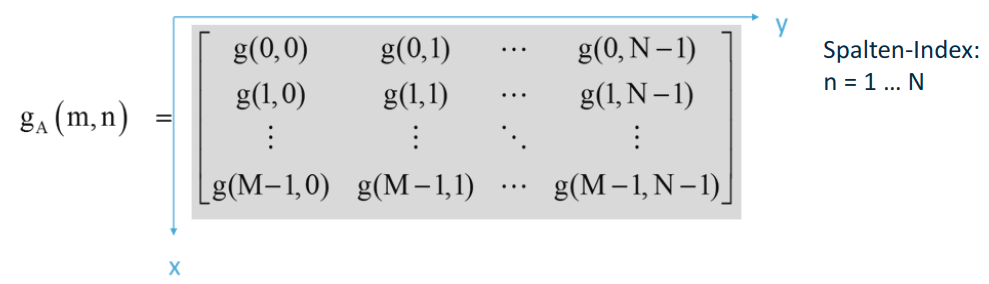

##### Digitalisierung: Quantisierung der Grauwerte
$q(g)=[\frac{g-g_{min}}{g_{max}-g_{min}} * (q_{max}-q_{min}) +q_{min}]_{mathbb{N}}$ (Runden auf nächste natürliche Zahl)

häufig wird $q_{min}=0$ gewählt: $q(g)=[\frac{g-g_{min}}{g_{max}-g_{min}}*q_{max}]_{mathbb{N}}$

$q_{max}=2^N -1$, $N$ Auflösung des AD-Wandlers

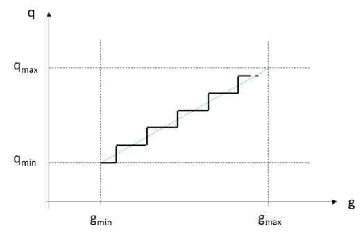

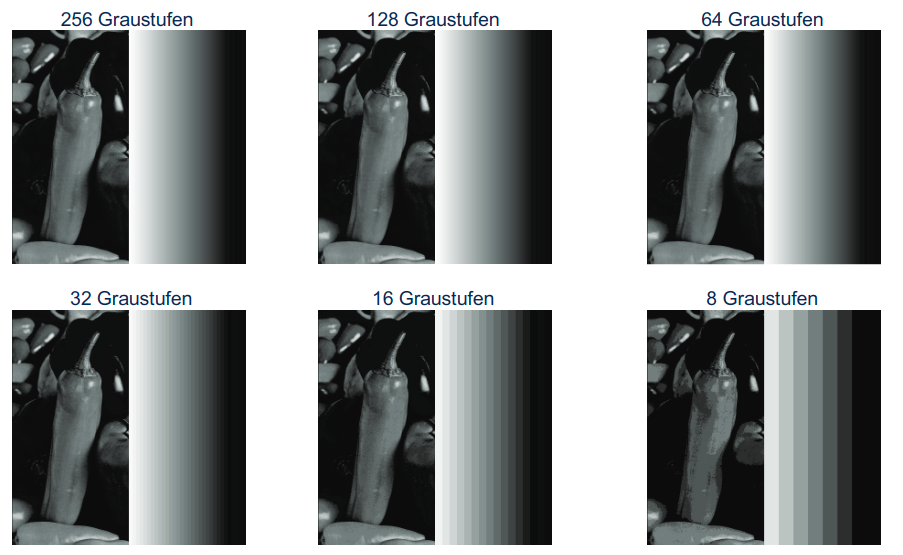

##### Digitale Bildrepräsentation
Pixel 

Grauwertbild 

Falschfarbendarstellung 

#### Nachbarschaft, Pfad, Zusammenhang und Distanzmaße
Nachbarschaften
- 4er-Nachbarschaft
    - Nachbarpixel: gemeinsame Kante
    - 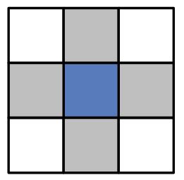
- 8er-Nachbarschaft
    - Nachbarpixel: gemeinsame Kante oder Ecke
    - 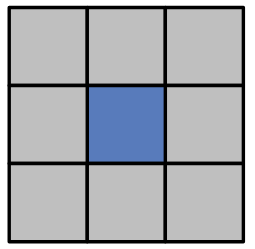
- Regelmäßige 2D-Gitter
  - Dreieckgitter
    - 
    - 3-Nachbarschaft
    - 12-Nachbarschaft
  - Quadratisches Gitter 
    - 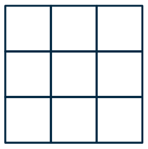
    - 4-Nachbarschaft
    - 8-Nachbarschaft
  - Hexagonales Gitter
    - 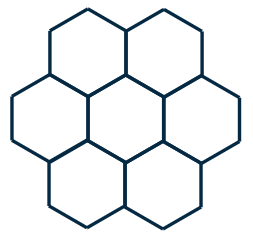
    - 6-Nachbarschaft

**Pfad:**
- Zwei Pixel $P_A(m_A,n_A)$ und $P_B(m_B,n_B)$ sind durch einen Pfad verbunden, falls es eine Folge von benachbarten Pixeln $(P_A, P_1, ..., P_B)$ gibt, für die eine Homogenitätsbedingung (z.B. alle Pixel haben gleichen Grauwert, d.h. $g(P_A)=g(P_1)=...=g(P_B))$ gilt.
- Offener Pfad: $P_A \not= P_B$
- Geschlossener Pfad: $P_A = P_B$
- Pfade sind an Nachbarschaftsdefinitionen gebunden!

**Zusammenhang:** Eine Menge von Pixeln ist zusammenhängend, wenn zwischen zwei beliebigen Pixeln ein Pfad existiert.

Zusammenhang: Definition gemäß Nachbarschaftsbeziehung
- Zusammenhang gemäß 4-Nachbarschaft
  - Die beiden grauen Regionen sind unter 4-Nachbarschaft nicht zusammenhängend (kein verbindender Pfad vorhanden).
  - Der Hintergrund ist unter Annahme der komplementären8-Nachbarschaft zusammenhängend.
  - 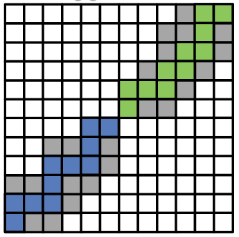
- Zusammenhang gemäß 8-Nachbarschaft
  - Die beiden grauen Regionen sind unter 8-Nachbarschaft zusammenhängend (verbindender Pfad vorhanden).
  - Der Hintergrund ist unter Annahme der komplementären4-Nachbarschaft nicht zusammenhängend.
  - 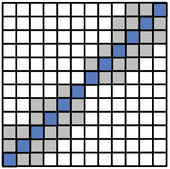
- Die Nachbarschaftsdefinitionen in Vorder-und Hintergrund sollten komplementär sein!

**Rand:**
- Der Rand einer zusammenhängenden Pixelmenge $M$ ist eine Folge von Pixeln in $M$, die mindestens einen Nachbarn haben, der nicht zu $M$ gehört.
- Die Randpixel gehören somit zu $M$ dazu.
- Der Rand ist ein zusammenhängender Pfad und deshalb auch an eine Nachbarschaftsdefinition gebunden.

Rand: Definition gemäß Nachbarschaftsbeziehung
- Rand in 4 - Nachbarschaft zum Hintergrund
    - Jedes Randpixel hat mind. einen Nachbarn in 4-Nachbarschaft, der nicht zu M gehört.
    - Rand = zusammenhängender Pfad gemäß 8-Nachbarschaft
    - 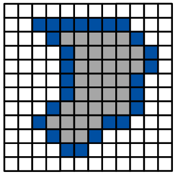
- Rand in 8 - Nachbarschaft zum Hintergrund
    - Jedes Randpixel hat mind. einen Nachbarn in 8-Nachbarschaft, der nicht zu M gehört.
    - Rand = zusammenhängender Pfad gemäß 4-Nachbarschaft
    - 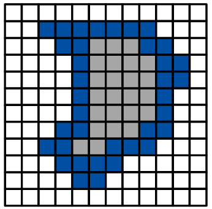

##### Distanzmaße zwischen zwei Pixeln
Euklidische Distanz
- Länge der direkten Verbindung
- $D_E= ||P_1-P_2||_2=\sqrt{(m_1-,_2)^2 + (n_1-n_2)^2}$
- Euklidische Norm $N=2$, $p=2$
- 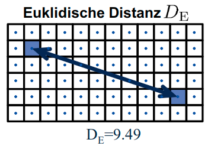

Manhattan-Distanz (City-Block)
- Länge des kürzesten Pfades unter 4er-Nachbarschaft
- $D_4=||P_1-P_2||_1=|m_1 - m_2|+|n_1-n_2|$
- Summennorm $N=2$, $p=1$
- 

Schachbrett-Distanz
- Länge des kürzesten Pfades unter 8er-Nachbarschaft
- $D_8 = ||P_1-P_2||_{\infty} = max\{|m_1-m_2|, |n_1 -n_2|\}$
- Maximalnorm $N=2$, $p=\infty$
- 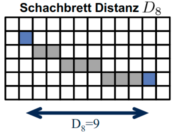

Normangabe der Distanzmaße
- p-Norm: $||x||_p = (\sum_{i=1}^N |x_i|^p )^{\frac{1}{p}}$ mit $x_1=m_1-m_2$ und $x_2=n_1-n_2$
- Euklidische Norm: $N=2, p=2$, $D_E=(\sum_{i=1}^2 |x_i|^2)^{frac{1}{2}}=\sqrt{x_1^2 + x_2^2}$
- Summennorm: $N=2, p=1$, $D_4=(\sum_{i=1}^2 |x_i|)= x_1+x_2$
- Maximalnorm: $N=2, p=\infty$, $D_8=lim_{p\rightarrow\infty}(x^p_{max} + (ax_{max})^p)^{\frac{1}{p}} = lim_{p\rightarrow\infty} (x_{max}^p (1+a^p))^{\frac{1}{p}} = x_{max}$ mit $a<1$ weil $lim_{p\rightarrow\infty}(a^p)=0$
- $D_8\leq D_E \leq D_4$ 
  - 
  - 
  - 
- Schachbrett Distanz $\leq$ Euklidische Distanz $\leq$ Manhatten Distanz

# Literaturempfehlungen
- Wilhelm Burger and MarkJ. Burge, ,,Digitale Bildverarbeitung – eine algorithmische Einführung mit Java'', Springer, 3. Auflage, 2015
- Klaus D. Tönnies, ,,Grundlagen der Bildverarbeitung'', Pearson Studium, 1. Auflage, 2005
- Heinz Handels, ,,Medizinische Bildverarbeitung'', Vieweg+Teubner, 2. Auflage, 2009
- Bernd Jähne, ,,Digitale Bildverarbeitung'', Springer, 6. Auflage, 2005
- Angelika Erhardt, ,,Einführung in die Digitale Bildverarbeitung'', Vieweg+Teubner, 1.Auflage, 2008
- Rafael C. Gonzales and Richard E. Woods, ,,Digital Image Processing'', Pearson International, 3. Edition,2008
- Geoff Dougherty, ,,Digital Image Processing for Medical Applications'', Cambridge University Press, 1. Edition, 2009
- William K. Pratt, ,,DigitalImageProcessing'', Wiley, 4. Edition, 2007
- John L. Semmlow, ,,Biosignal and Medical Image Processing'', CRCPress, 2. Edition, 2009