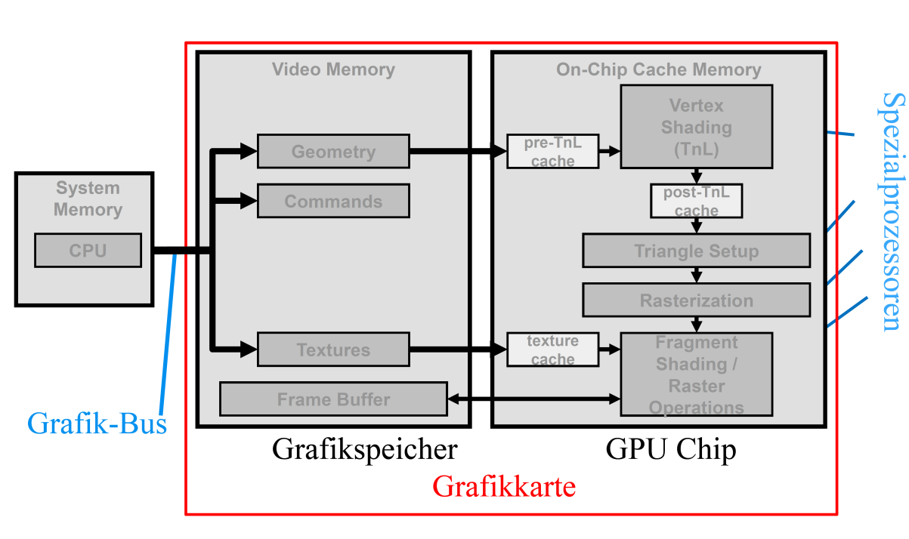

Computergrafik ist in erster Linie Bildsynthese mit dem Computer!

dabei zu lösende Teilaufgaben:
- identifizierung relevanter mathematischer Funktionen
- Umsetzung passender/effizienter Algorithmen und Datenstrukturen
- Erzeugung virtueller Umgebungen
- Kompromisse zwischen Genauigkeit und Berechnungsaufwand

Aspekte der Computergrafik
- Mathematik
- Rasterkonvertierung
- Physik
- Physiologie
- Bildverarbeitung

# Grundlagen der Vektorgeometrie
## Grundlagen
### Vektorräume und Vektorrechnung
- ein Vektor $\vec{x}$ wird definiert als Element eines n-dimensionalen Zahlenraums
- ein Vektor wird als Zahlentupel (skalarer Wert) dargestellt, entweder als Zeilenvektor oder Spaltenvektor
- der Spaltenvektor wird auch $\vec{x}^t$ (Transponierte von x) genannt (und umgekehrt)
- Verallgemeinerung von Vektoren als Matrizen und Tensoren
- Tensoren dienen der Darstellung (Datenstruktur) von grafischen Objekten und Transformationen aber auch von Signalen, Farben und Bildern
- Vektoralgebra ist ein mächtiges Mittel zur Datenverarbeitung in der Vektorgeometrie

$\vec{x}=(x_1,x_2,...,x_n)$ oder $\vec{x}^T=\begin{pmatrix}x_1 \\ x_2 \\ ... \\ x_n \end{pmatrix}$

**Multiplikation**: Multiplikation eines Vektors mit einer skalaren Größe resultiert wiederum in einen Vektor

$\vec{q}=\alpha * \vec{x} = (\alpha *x_1, \alpha *x_2,...)$

**Addition**: Das Addieren zweier Vektoren im selben Vektorraum ergibt wieder einen Vektor

$\vec{x}+\vec{r}=(x_1+r_1, x_2+r_2,...)$

**Linearkombination**: Die Linearkomination mehrerer Vektoren ergibt einen Vektor

$\vec{o} = (\alpha * \vec{p})+(\beta *\vec{q})+(\gamma * \vec{r})$

**Lineare Unabhängigkeit**: eine Menge von Vektoren heißt linear unabhängig wenn keiner von ihnen als Linearkombination der anderen erzeugt werden kann.

**Länge** (Betrag) eines Vektors: $\vec{p}=(x,y,z): |\vec{p}|=\sqrt{x^2+y^2+z^2}$ Der Abstand zwischen zwei Punkten ist gleich der Länge des Differenzvektors

**Skalarprodukt**: $\vec{x}*\vec{r}=\sum_{i=0}^{n-1} x_i*r_i$ Das Skalarprodukt ist somit ein skalarer Zahlenwert. – Aus der Definition folgt u.a. die beiden Vektoren m ̈ussen dieselbe Anzahl Koordinaten haben.Senkrecht zu einander stehende Vektoren $\vec{x}$ und \vec{r} ergeben immer das Skalarprodukt Null.

**Winkel**: Ein Winkel $\phi$ zwischen den Vektoren $\vec{a}$ und $\vec{b}$ aus: $\vec{a}*\vec{b}=|\vec{a}|*|\vec{b}|*cos(\phi)$ mit $cos(\phi)=\frac{\vec{a}*\vec{b}}{|\vec{a}|*|\vec{b}|}$

Diese Winkelbestimmung ist im Bereich -180° bis +180° vorzeichenunabhängig, da $cos(\phi)=cos(-\phi)$. Es können also nur Winkel im Bereich $0 \geq \phi \geq \pi$

**Vektorprodukt** (Kreuzprodukt): Das Vektorprodukt $\vec{a}\times\vec{b}$ ist ein Vektor. 
$$\vec{a}\times\vec{b} = \begin{pmatrix} a_y b_z - a_z b_y \\ a_z b_x - a_x b_z \\ a_x b_y - a_y b_x \end{pmatrix}$$
Die Richtung des resultierenden Vektors ist senkrecht auf $\vec{a}$ und auf $\vec{b}$. Das Vorzeichen hängt von der Reihenfolge der Vektoren ab: $\vec{a}\times \vec{b}=-\vec{b}\times \vec{a}$. 
Entsprechend der Rechte-Hand-Regel ergibt eine Drehung von a nach b im Uhrzeigersinn ein negatives Vorzeichen und entgegen dem Uhrzeigersinn ein positives.

**Betrag des Kreuzprodukts**: Der Betrag des Vektors $(|\vec{a}\times\vec{b}|)$ ist gleich der Fläche des durch $\vec{a}$ und $\vec{b}$ aufgespannten Parallelogramms (Fläche = Basis * Höhe des Parallelogramms):
$$|\vec{a}\times\vec{b}|=|\vec{a}|*|\vec{b}|*sin(\phi) =|\vec{a}|·h$$
Der Winkel $\beta$ lässt sich also aus dem Kreuzprodukt ableiten. Aus dem Kreuzprodukt resultiert ein orientierungsabhängiges Vorzeichen. Es gilt: $sin(-\phi)=-sin(\phi)$

**Matrizen**: Matrizen sind Tupel von Vektoren aus demselben Vektorraum. Die Verallgemeinerung einer Matrix, nämlich ein Tupel von Matrizen wird auch Tensor genannt. Daher sind Matrizen und Vektoren spezielle Tensoren.

**Matrizenmultiplikation**: Jede Koordinate des resultierenden Vektors berechnet man als Skalarprodukt des entsprechenden Zeilenvektors der Matrix mit dem Vektor: 
$$r_i = A_i * \vec{x} = \sum_{k=1}^n a_{ik}*x_k$$
Vektoren werden als Spaltenvektor geschrieben und stehen bei der Multiplikation immer rechts der Matrix.
Bei einer entsprechenden Multiplikation für Zeilenvektoren würde die Matrix rechts stehen und wäre transponiert.

Die Koeffizienten der resultierenden Matrix $c_{ij}$ entsprechen dem Skalarprodukt der i-ten Zeile $A_i$ und der j-ten Spalte $B_j$ von A resp B.

Entsprechend der Definition für Skalarprodukte muss die Matrix A gleich viele Spalten haben wie Matrix B Zeilen. Es können folglich n x m-Matrizen mit m x o-Matrizen multipliziert werden, was in einer n x o-Matrix resultiert.

**Einheitsmatrix E**: Die Einheitsmatrix ist eine (quadratische) n x n-Matrix welche nur in der diagonalen Einsen als Koeffizienten und sonst überall Nullen enthält. Die Multiplikation einer Einheitsmatrix mit einem Vektor $\vec{x}$ lässt den Vektor unverändert, gleiches gilt für die Multiplikation mit einer Matrix ($E*\vec{x}=\vec{x}$).

**Inverse $A^{-1}$**: Die Inverse der Matrix A wird als $A^{-1}$ notiert. Sie ist definiert durch $A*A^{-1}=E$. Eine Inverse existiert nur für quadratische n x n-Matrizen welche aus n linear unabhängigen Vektoren zusammengesetzt ist.

**Transposition** von Matrizen: $(A*B)^T = B^T * A^T$

**Assoziativität**: Die Matrixmultiplikation ist immer assoziativ $A*(B*C)=(A*B)*C$

**Inversion**: $(A*B)^{-1} = B^{-1}*A^{-1}$

**Kommutativität**: ist im Allgemeinen bei Matrixmultiplikation nicht gewährleistet $A*B \not = B*A$

### Kartesische Koordinaten
Dreidimensionales kartesisches Koordinatensystem werden aufgespannt durch die drei linear unabhängigen Einheitsvektoren $\vec{x}$,$\vec{y}$ und $\vec{z}$.

3D-Punktobjekte werden durch Vektoren im $\R^3$ repräsentiert. Diese Vektoren werden Ortsvektoren genannt, da Sie einen Ort im Raum repräsentieren. Die Koordinaten eines Vektors sind wiederum eine senkrechte Projektion des Vektors auf die Koordinatenachse.

**Drehsinn**: Koordinatensysteme haben einen Drehsinn (positiv/negativ). Rechte-Hand-Regel: Daumen ist Rotationsachse, Fingerspitze zeigt positive Richtung.

### Elemente der Geometrie
Objekte werden als Linearkombination von Orts- und Richtungsvektoren zusammengesetzt. (Bsp Unendliche Gerade, Liniensegment,...)

Beachte: Orts und Richtungsvektoren haben die gleiche Darstellung im kartesischen Vektorraum, müssen aber unterschiedlich behandelt werden. Z.B. eine Translation einer Geraden darf sich nur auf den Orts- nicht auf den Richtungsvektor auswirken. Die Rotation muss auf beide Teile angewendet werden, etc.

**Ebenen**: Eine unbegrenzte Ebene p kann wiederum als Linearkombination aus Ortsvektor $\vec{q}$ und zwei linear unabhängigen Richtungsvektoren $\vec{r}$ und $\vec{s}$ definiert werden $p=\vec{q}+\alpha*\vec{r}+\beta * \vec{s}$

**Dreieck**: Punkte A,B und C $\vec{A}+\alpha*(B-A)+\beta*(C-A)$

## Transformationen 2D
Ziel der Transformation im Allgemeinen: Einheitliche Beschreibung der Transformation durch einheitliche Transformationsmatrizen
- alle auf iene Punktmenge anzuwendende Matrizen können dann vor der Anwendung auf die Punkte in einer Gesamtmatrix zusammengefasst werden
- auf jeden Punkt ist statt mehrerer Matrixoperationen nur noch eine anzuwenden
- effizientere Berechnung der Transformation

Arten:

**Translation**: Verschiebung eines mehrere Punkte P um den Vektor $\vec{t}$

**Skalierung**: Stauchung oder Streckung eines Objekts bezüglich des Koordinatenursprungs $P'=S*P$ (univorm vs nichtuniform).

**Spiegelung**: Spezialfall der Skalierung 
- an der x-Achse $S=\begin{pmatrix} 1 & 0 \\ 0 & -1 \end{pmatrix}$ (Vorzeichenumkehr für y-Koordinaten)
- an der y-Achse $S=\begin{pmatrix} -1 & 0 \\ 0 & 1 \end{pmatrix}$ (Vorzeichenumkehr für x-Koordinaten)
- am Ursprung $S=\begin{pmatrix} -1 & 0 \\ 0 & -1 \end{pmatrix}$ (entspricht Spiegelung an x-und y-Achse)

**Scherung**: Positionsabhängige Stauchung oder Streckung (Objekte ändern die Form, sind nicht starr) Punkte auf einer Geraden liegen aber auch nach der Scherung wieder auf einer Geraden (Eigenschaft von affinen Abbildungen):
$S=\begin{pmatrix} 1 & S_x \\ S_y & 1 \end{pmatrix}$

**Rotation mit Polarkoordinaten**: Die Rotation eines Punktes $P=(x,y)$ mit dem Drehwinkel $\theta$ um den Nullpunkt lässt sich einfacher über Polarkoordinaten $(r,\phi)$ herleiten. Der gedrehte Punkt wird dann $P'=(r,\phi+\theta)$

$r=\sqrt{x^2+y^2}$, $x=r* cos(\phi)$, $y=r* sin(\phi)$

$$\binom{x'}{y'}=\begin{pmatrix} cos(\theta) & -sin(\theta) \\ sin(\theta) & cos(\theta)\end{pmatrix}*\binom{x}{y}$$ 

Somit gilt $p'=R_\theta * P$

**Koordinatentransformation**: Ein Punkt P soll in ein gedrehtes (lokales) Koordinatensystem transformiert werden. Die lokalen Koordinaten erhält man durch Projektion des Punktes auf die lokalen Achsen (Skalarprodukte). Die lokalen Koordinatenachsen sind als Vektoren im Ursprungskoordinatensystem definiert. Sie stehen senkrecht aufeinander und haben die Länge 1. Die Koordinaten-Transformation kann als Matrixmultiplikation realisiert werden.
$$P' =T*P = \begin{pmatrix} x_x & x_y\\ y_x & y_y \end{pmatrix} * \binom{P_x}{P_y}$$

**Zusammenfassung**: Viele zweidimensionale Transformationen lassen sich als 2x2 Matrizen darstellen (ausnahme Translation). Um verschiedene Transformationen durch Operationen auszudrücken und Fallunterscheidungen vorzubeugen werden homogene Vektorräume verwendet.

## Homogene Vektorräume
Ein kartesischer Punkt $P_k$ mit dem Ortsvektor $(x',y')$ wird im homogenen Vektorraum durch eine zusätzliche Dimension w, als 3-Tupel $(x,y,w)$ dargestellt. Ein homogener Vektor $(x,y,w)$ entspricht dem kartesischen Vektor $(\frac{x}{w},\frac{y}{w})$.
Die homogene Komponente w kann dabei frei gewählt werden: Alle Punkte $P_H$ auf der unendlichen Geraden $(0,0,0)(x',y',1)$ entsprechen demselben kartesichen Vektor $(x',y')$ (Zentralprojektion auf kartesischer Ebene).

In vielen Anwendungsfällen wird bei Ortsvektoren im homogenen Vektorraum $w=1$ gewählt (1="Punkt", 0="Richtung"; kartesische Zahlenebene).

**Skalare Multiplikation** verändert das kartesische Äquivalent nicht: $\alpha * P_h = (\alpha*x, \alpha*y, \alpha*w)$ (Spezialfall 0 !)

**Translation**: Die Multiplikation mit einer Matrix A muss dasselbe Ergebnis liefern, wie eine Addition eines Translationsvektors $(\Delta x, \Delta y)$ zum kartesischen Punkt: $A*P=P+(\Delta x, \Delta y)$

Die Herleitung einer Matrix für A erfolgt durch folgendes Gleichungssystem für die Koeffizienten der Matrix:
$$\begin{pmatrix} a_{11} & a_{12} & a_{13}\\ a_{21} & a_{22} & a_{23}\\ a_{31} & a_{32} & a_{33} \end{pmatrix} * \begin{pmatrix}x \\ y \\ 1 \end{pmatrix} = \begin{pmatrix}x+\Delta x \\ y+\Delta y \\ 1\end{pmatrix}$$

**Skalierung, Projektion, Spiegelung** können durch folgende Matrix dargestellt werden: 
$$\begin{pmatrix} F_x & 0 & 0 \\ 0 & F_y & 0 \\ 0 & 0 & 1 \end{pmatrix} * \begin{pmatrix} x \\ y \\ 1 \end{pmatrix} = \begin{pmatrix} F_x*x \\ F_y*y \\ 1 \end{pmatrix}$$

Für eine Skalierung gilt $F_x,F_y>0$, für uniforme Skalierung gilt zusätzlich $F_X=F_y$. 

Mit $F_x=0$ oder $F_y=0$ kann eine Projektion auf die y-, bzw x-Achse ausgedrückt werden. Eine Projektion ist keine Skalierung im eigentlichen Sinne (und nicht invertierbar).

$F_x=-1$ oder $f_y=-1$ entspricht einer Spiegelung an der y- bzw x-Achse. Sind beide Faktoren $F_x=F_y=-1$, wird damit eine Spiegelung am Ursprung ausgedrückt. Eine Spiegelung ist invers zu sich selbst.


**Scherung** wird durch folgende Matrix repräsentiert:
$$\begin{pmatrix} 1 & a & 0 \\ 0 & 1 & 0 \\ 0 & 0 & 1 \end{pmatrix} * \begin{pmatrix} x \\ y \\ w \end{pmatrix} = \begin{pmatrix} x+a*y \\ y \\ w \end{pmatrix}$$

Sie bewirkt eine Translation der Punkte in x-Richtung, proportional zum Wert der y-Koordinate. Ein Rechteck wird dabei zu einem Parallelogramm verformt. Diese Transformation kann auch durch eine nicht uniforme Skalierung in einem gedrehten Raum realisiert werden (zusammen mit entsprechender Rotationsfunktion).


**Rotation**: Die Herleitung ist analog zur Rotation für kartesische Vektoren (die 2x2 Untermatrix ist identisch zum kartesischen Fall). Die w-Koordinate für Ortsvektoren bleibt durch Anwendung der Matrix unverändert.
$$R_\theta *P= \begin{pmatrix}cos(\theta) & -sin(\theta) & 0 \\ sin(\theta) & cos(\theta) & 0 \\ 0 & 0 & 1 \end{pmatrix} * \begin{pmatrix}x & y & 1 \end{pmatrix} = \begin{pmatrix} x cos(\theta) - y sind(\theta)\\ x sin(\theta)+y cos(\theta)\\ 1 \end{pmatrix}$$

Verknüpfung von Transformationen: Da sowohl die Rotation R als auch die Translation T sich als 3x3-Matrizen darstellen lassen, kann man die beiden Operationen durch Matrixmultiplikation in einer 3x3-Matrix verknüpfen. Man beachte, dass Matrixmultiplikationen zwar assoziativ, im Allgemeinen jedoch nicht kommutativ sind: $T*R*{Haus} = R*T*{Haus}$

### 2D Transformation mit Fixpunkten
Ein Objekt soll um einen Frei Wählbaren Pivotpunkt P gedreht werden. Für diese Transformation gibt es noch keine direkte Matrizenform. Daher wird die Operation aus bekannten Operationen zusammengesetzt
1. verschiebe von P in den Ursprung (Translation $T_{-P}$)
2. rotiere um Ursprung ($R_{90}$)
3. Translation zurück ($T_{+P}$)
In Matrixform sieht die Operation wie folgt aus: $T_{+P}*R_{90}*T_{+P}*{Objekt}$

Da die Matrixmultiplikation assoziativ ist, können zuerst die Matrizen multipliziert und dann auf das Polygon angewendet werden. Dies bewirkt dieselbe Transformation, ist viel eleganter und auch effizienter als einzelne Matrizen anzuwenden.


### Inverse Transformation
Eine inverse Translationsmatrix konstruiert man indem man bei der früher hergeleiteten Translationsmatrix den negativen Verschiebungsvektor einsetzt: $T_{\Delta x, \Delta y}^{-1} = T_{-\Delta x, -\Delta y}$

Korrektheit ergibt sich durch $T^{-1}*T=E$.

### Inverse Skalierung
definiert durch die Matrix:
$$S_{F_x, F_y}^{-1}=S_{\frac{1}{F_x},\frac{1}{F_y}}=\begin{pmatrix} \frac{1}{F_x} &0&0\\ 0&\frac{1}{F_y}&0\\ 0&0&1 \end{pmatrix}$$

### Inverse Rotation
ergibt sich als Drehung im Uhrzeigersinn 
$$R_{-\theta} = \begin{pmatrix} cos(\theta) & sin(\theta) & 0 \\ -sin(\theta) & cos(\theta) & 0 \\ 0 & 0 & 1 \end{pmatrix} = R_{\theta}^{T}$$

### Invertierung von verknüpften Transformationen
Die inverse Matrix der drei verknüpften Operationen A,B,C ergibt: $(A*B*C)^{-1}=C^{-1}*B^{-1}*A^{-1}$

D.h. die inverse Matrix ist die Verknüpfung der inversen Einzeloperation in umgekehrter Reihenfolge (Undo-Operation). DIe Korrektheit der Formel ergibt sich aus der folgenden Gleichung unter Anwendung des Assoziativgesetztes der Matrixmultiplikation $(ABC)^{-1}*ABC=E$

### Affine Abbildung
Affine Abbildungen sind Teilmengen der homogenen Abbildungen. Durch entsprechende Wahl von reellwertigen Koeffizienten können die bis hier eingeführten homogenen Transformationen der Ebene dargestellt werden.
$$\begin{pmatrix}a_1 & b_1 & c_1\\a_2 &b_2 & c_2\\ 0&0&1\end{pmatrix}*\begin{pmatrix} x_1\\y_1\\1\end{pmatrix}= \begin{pmatrix}x_1'\\y_1'\\1 \end{pmatrix}$$

- die letzte Zeile der affinen Matrix bleibt immer 0,0,1
- paralleles bleibt bei affinen Abbildungen stets parallel

Eine Zerlegung einer beliebigen affinen Transformation in die speziellen Transformationen (Rotation, Translation, Skalierung, Scherung) ist im Allgemeinen nicht eindeutig möglich. Die Summe der Parameter für Translation (2 Parameter) Rotation (1 Parameter), Skalierung (2 Parameter), Scherung (2 Parameter) beträgt 7 von denen allerdings nur 6 unabhängig sein können, da die Matrix 6 Koeffizienten besitzt. Daraus kann lässt sich schließen, dass einige Transformationen aus anderen Transformationen zusammengesetzt werden können. Z.B. Scherung aus Rotation und nicht uniformer Skalierung oder umgekehrt Rotation aus Scherungund nicht uniformer Skalierung.

**Affine Abbildung zwischen zwei Dreiecken** kann zwischen zwei beliebig gewählten Dreiecken in der Ebene definiert werden. 3 Punkte (6 Koordinaten) führen zu 6 Gleichungen zum Bestimmen der 6 Koeffizienten der affinen Abbildung (a,b,c,d,e,f).

### Transformation auf Orts- und Richtungsvektor
Richtungsvektoren können als Differenz zweier Ortsvektoren hergeleitet werden. Richtungsvektoren entsprechen kartesischen Punkten im Unendlichen. Sie werden auch uneigentliche Punkte genannt.

Eine Translations-Matrix wirkt sich nur auf Ortsvektoren aus. Richtungsvekoren bleiben bei Translation unverändert. Da bei der Berechnung nicht zwischen Orts- und Richtungsvektoren unterschiedenwerden lassen sich verknüpfte Transformationen effizient berechnen.

### Zusammenfassung bisher
- durch den "Kunstgriff" werden Transformationen vereinheitlicht und damit vereinfacht
- 2D kartesische Vektoren werden im 3D homogenen Vektorraum dargestellt
- wichtige Transformationen können einheitlich durch 3x3 Matrizen dargestellt werden
- Orts- und Richtungsvektoren werden unterschiedlich dargestellt aber mit der selben Transformationsmatrix automatisch korrekt und effizient transformiert.

## Homogene Transformation in 3D
Analog zum 2D Fall wird der Vektorraum um eine zusätzliche Dimension erweitert (Koordinate w).

3 Dimensionale kartesische koordinaten werden durch eine 4-dimensionale homogeen Vektorraum repräsentiert; er wird als 4-Tupel dargestellt. In vielen Anwendungsfällen wir w=1 gewählt (karteische Hyperebene).

Affine Abbildungen lassen die w-Koordinate unverändert

### Ebenen
- lassen sich grundsätzlich auch als Referenzpunkt und Richtung speichern
- für Berechnungen ist folgende Repräsentation sinnvoll: (a,b,c,d) wobei (a,b,c)=(nx,ny,nz) und d der Abstand der Ebene zum Ursprung. Dann ist für einen in der Ebene enthaltenen Punkt das Skalarprodukt aus Ebene und Punkt gleich 0

1. Ebene definiert durch 3 Punkte
   $$\begin{pmatrix}
    x_1 & x_2 & x_3 & 0\\
    y_1 & y_2 & y_3 & 0\\ 
    z_1 & z_2 & z_3 & 0\\
    1 & 1 & 1 & 1
    \end{pmatrix}$$
2. Translation um Vektor $(\Delta x, \Delta y,\Delta z)$
   $$\begin{pmatrix}
    1 & 0 & 0 & \Delta x\\
    0 & 1 & 0 & \Delta y\\ 
    0 & 0 & 1 & \Delta z\\
    0 & 0 & 0 & 1
    \end{pmatrix}$$
3. Skalierung um Faktor $F_x,F_y,F_z$
   $$\begin{pmatrix}
    F_y & 0 & 0 & 0\\
    0 & F_y & 0 & 0\\ 
    0 & 0 & F_z & 0\\
    0 & 0 & 0 & 1
    \end{pmatrix}$$
4. Rotation um z-Achse
   $$\begin{pmatrix}
    cos(\theta) & -sin(\theta) & 0 & 0\\
    sin(\theta) & \cos(\theta) & 0 & 0\\ 
    0 & 0 & 1 & 0\\
    0 & 0 & 0 & 1
    \end{pmatrix}$$
5. Rotation um die x-Achse
   $$\begin{pmatrix}
    1 & 0 & 0 & 0\\
    0 & cos(\theta) & -sin(\theta) & 0\\ 
    0 & sin(\theta) & cos(\theta) & 0\\
    0 & 0 & 0 & 1
    \end{pmatrix}$$
6. Rotation um die y-Achse
   $$\begin{pmatrix}
    cos(\theta) & 0 & sin(\theta) & 0\\
    0 & 1 & 0 & 0\\ 
    -sin(\theta) & 0 & cos(\theta) & 0\\
    0 & 0 & 0 & 1
    \end{pmatrix}$$

### Kommutativität
allgemein sind Transformationen nicht kommutativ; außnahme bilden zwei Rotationen um die selbe Achse

### Kameratransformation
Kamera ist definiert durch
- Lage des Augpunktes E (in Weltkoordinaten)
- Blickrichtung D
- Oben-Vektor U ("view up vector", senkrecht zu D)

## Projektion
3D Objekt auf eine Ebene projiezieren:
- Teil der Kameratransformation
- erfolgt meist in Kamerakoordinaten
- Projektionsarten
  - Parallelprojektion (z.B. Ansicht von oben) stets affine Projektion
  - zentralperspektivische Projektion (Zentralperspektive) keine affine Projektion, d.h. im Allgemeinen bleibt paralleles nicht parallel

### Orthogonale Projektion
- einfachste der Parallelprojektionen
- Projektionsebene ist parallel zur XY Ebene
- Projektionsrichtung hier stets parallel zur z-Achse (rechtwinklig zur Projektionsebene)
- z Koordinaten werden auf gleichen Wert gesetzt (z.B. 0 ist dann die Projektionsmatrix)
- Anwendung: $O'=P*R*T*O$ wenn T und R die Transformationsschritte der Kameraprojektion sind und O das Objekt in Weltkoordinaten
$$P=\begin{pmatrix}
    1&0&0&0\\
    0&1&0&0\\
    0&0&0&0\\
    0&0&0&1
    \end{pmatrix}$$

### Schiefwinklige Parallelprojektion
- typische Parallelprojektion mit 2 Parametern
- Projektionsebene ist parallel zur XY Ebene
- Projektionsrichtung hat zwei Freiheitsgrade und ist typischerweise nicht orthogonal zur Projektionsebene (d.h. schiefwinklig)
- Projektionsrichtung (Schiefe) ist über 2 Winkel parametrisierbar
- Herleitung
    $P=\begin{pmatrix}
        1 & 0 & -cos(\alpha)*f & 0 \\
        0 & 1 & -sin(\alpha)*f & 0 \\
        0 & 0 & 0 & 0 \\
        0 & 0 & 0 & 1 
      \end{pmatrix}$$
- es gilt: $x'=x-cos(\alpha)*f*z$ und $y'=y-sin(\alpha)*f*z$


### Zentralperspektive
- entspricht einer Lochkamera bzw etwa dem "einäugigen" Sehen
- Augpunkt im Ursprung des Kamerakoordinatensystems
- Projektionsfläche ist eine Ebene parallel zu XY Ebene
- Eigenschaften
  - perspektivische Verkürzung
  - parallele Linien des Objekts fluchten oft in einen Fluchtpunkt

$$\begin{pmatrix} d&0&0&0\\ 0&d&0&0 \\ 0&0&0&1 \\ 0&0&1&0 \end{pmatrix} * \begin{pmatrix}x\\y\\z\\1\end{pmatrix} = \begin{pmatrix} d*x\\ d*y\\ 1 \\ z \end{pmatrix} \rightarrow \begin{pmatrix} \frac{d*x}{z} \\ \frac{d*y}{z} \\ \frac{1}{z} \end{pmatrix}$$

Fluchtpunkte
- hat ein Modell parallele Kanten oder parallele Striche in Texturen, dann ergibt sich für jede solche Richtung r in der Abbildung ein Fluchtpunkt, auf den diese parallelen Kanten/Striche hinzu zu laufen scheinen
- es gibt jedoch Ausnahmen, bei denen Paralleles in der Abbildung Parallel bleibt (z.B. horizontale Kanten der Schwellen in der Abbildung)
- Da es beliebig viele Richtungen geben kann, sind auch beliebig viele Fluchtpunkte in einem Bild möglich
- Rotationen können Fluchtpunkte ändern, Translationen jedoch nicht

Ermittlung eines Fluchtpunktes: Wird aus einer Richtung r und dem Aufpunkt eine Gerade definiert, dann schneidet diese Gerade die Projektionsfläche im Fliuchtpunkt für die Richtung r.

- Eine Richtung r, die in der Projektionsfläche enthalten ist, führt zu einer Gerade durch den Augpunkt, welche nie die Projektionsfläche schneidet. Alle Linien mit einer solchen Richtung bleiben folglich parallel
- Der Fluchtpunkt der Richtung r ist abhängig von 1. dieser Richtung, 2. der Projektionsfläche und 3. dem Augpunkt
- Nur wenn eines der 3 obigen Elemente geändert wird, ändert sich die Lage des Fluchtpunktes von r
- da Verschiebungen von Objekten weder deren Richtungen, den Augpunkt oder die Projektionsebene verändern, belibt die Lage der Fluchtpunkte bei Verschiebungen stets erhalten
- Die Rotation eines Objektes ändert im Allgemeinen die im Objekt enthaltenen Richtungen und damit auch deren Fluchtpunkt


### Zusammenfassung
- Mittels Matrixmultiplikation kann eine Folge unterschiedlicher 3D-Transformationen in einer einzigen 4x4-Matrix zusammengefasst werden. Dies schließt Projektionsmatrizen (Abbildung von 3D nach 2D) mit ein.
- Affine Abbildungen lassen die w-Koordinate unverändert. Bei Parallelprojektionen ist das so.
- Die perspektivische Kameratransformation ist eine allgemeine homogene Matrix und keine affine Abbildung. Die w-Koordinate kann dadurch verändert werden. Zur Rückführung in kartesische Koordinaten ist eine Division durch die w-Koordinate erforderlich!
- Bei zentralperspektivischer Projektion ergibt sich pro Schar paralleler Kanten/Texturlinien/etc jeweils ein Fluchtpunkt (Spezialfall: Richtung ist parallel zur Projektionsebene, dann Fluchtpunkt im Unendlichen). Durch Rotation eines Objektes (relativ zur Kamera) ändert sich im Allgemeinen die Lage der Fluchtpunkte. Neben dem gestalterischen Aspekt (Bildkomposition) spielen Fluchtpunkte bei der Bilderkennung (z.B. Berechnung der Ausrichtung von 3D-Objekten) eine Rolle


# Modellierung
## Geometrische Modellierung
### Grundlagen
Bei der geometrischen Modellierung geht es im allgemeinen um die computergestütze Beschreibung der Form geometrischer Objekte

Objekte:
- Beschreibung von dreidimensionalen geometrischen Formen
- verschiedenste Formate existieren, meistens eine Gruppierung der geometrischen Eigenschaften (Eckpunkte, Kanten, Flächen)

Dateiformate:
- für das speichern der dreidimensionalen geometrischen Formen gibt es verschiedenste Dateiformate
- STL: ist beispielweise Standard für viele CAD Systeme
- OBJ: weitverbreitetes Dateiformat


### B-Rep
B-Rep = Boundary Representation: Für die Beschreibung dreidimensionaler Festkörper gibt es mehrere Möglichkeiten. Ein Standard ist die Boundary Representation, eine Modellgeschreibung durch die festlegung begrenzender Oberflächen
- Darstellungsform eines Flächen- oder Volumenmodells
- beschreibt Objekt durch begrenzende Oberflächen
- sind schnell verarbeitbar
- Definition eines Ojekts erfolgt über einen vef-Graph (vertex, edge, face)
  - Knotenliste: beinhaltet Koordinatenpunkt
  - Kantenliste: für jede Kante werden zwei Punkte referenziert
  - Flächenliste: für jede Fläche wird Reihenfolge von Kanten angegeben


## Szenengraph
Szene (Computergrafik)
- eine dreidimensionale Beschreibung von Objekten, Lichtquellen und Materialeigenschaften
- setzt virtuellen Betrachter voraus, sowie dessen Position und Blickwinkel

Szenegraph:
- hierarchische Gruppierung der Objekte in einer Szene
- somit eine objektorientierte Datenstruktur
- aus graphentheoretischer Sich: gerichteter Graph ohne Kreise


## Rendering
Beim rendern erfolgt eine Bilderzeugung aus einer gegebenen Szene. Der Weg von der Szene bis zum fertigen Bild erfolgt dabei über eine sogenannte **Render-Pipeline**:

Geometrisches Objekt-> Transformieren-> Vertex Shader-> Raster Konvertierung-> Fragment Shader-> Ausgabebild

### Vertex Shader
- verarbeitet alle Eckpunkte (Vertices) des 3D-Modells
- für jeden Vertex wird dieser Shader im Normalfall einmal aufgerufen
- ermöglicht eine Beeinflussung der Objektform
- Hauptaufgabe ist die Transformation der virtuellen 3D Position auf 2D koordinaten für den Bildschirm
- Input
  - Vertices aller relevanter Objekte der Szene
  - gewünschte Transformation
- Output
  - auf Bildschirm projizierte 2D Koordinaten
  - zugehörige Tiefeninformationen

Alle Transformationen die auf ein Vertex wirken und die anschließende Projektion wird als eine sogenannte MVP-Matrix zusammengefasst.

### Model View Projection
Gegeben:
- Modell als Vertices mit kartesischen 3D koordinaten und definierten Dreiecken
- Kamera (3D Position, Ausrichtung) welche das Modell betrachtet
Gesucht:
- transformierte Position
- Rendering des Modells aus Sicht der Kamera

$\rightarrow$ benötigen Abbildung von 3D-Vertexkoordinaten auf 2D-Kamerabildkoordinaten

Umsetzung:
- zuerst Transformation von Modellraum (gegebenen Koordinaten) in Weltkoordinaten (Model)
- danach Transformation in Kameraraum, für einfachere Projektion (View)
- abschließende projektion auf Kamerabildebene und Umrechnung in Bildraum (Projektion)

Model: $M=T*R*S$ (Transformation in Weltkoordinaten)

View: $V=T_V^{-1}*R_V^{-1}$ (Transformation in Kameraraum)

Kameraraum:
- Kamera sitzt im ursprung (0,0,0)
- hat keine Rotation

Projektion: P
- Bildebenenprojektion kann durch Zentralperspektivische Projektionsmatrix erfolgen
- Frustum (Kamerasichtfeld) legt fest welche Objekte im Sichtfeld liegen und somit in der Bildebene sichtbar sind

Ergebnis
- Zusammenfassung der Transformation ergibt die Model-View-Projektion-Matrix $P*V*M=MVP_{Matrix}$
- Anwendung der MVP-Matrix auf alle Vertices eines Modells $p_m$ ergibt die notwendige Bildraumprojektion des Modells: $p'_m=P*V*M*p_m$
- Vorteile: die MVP-Matrix muss nur einmal berechnet werden und kann auf alle Vertices eines Modells angewandt werden

### Zusammenfassung
- geometrische Modellierung zur Beschreibung von Objekten
- Anwendung der Transformation
- Projektion der Objekte auf den Bildschirm

## Effiziente geometrische Algorithmen und Datenstrukturen
### Bintree
- effizientes Suchen und Einfügen in eindimensionale Domänen
- logarithmische Komplexität pro Zugriff möglich
- Gefahr: lineare Komplexität, wenn nicht balanciert

analog zu Quad- und Octrees:
- typisch ost Teilung in Mitte (bisektion)
- Bereiche mit homogenem Inhalt (gleiche Farbe/ keine Elemente) werden nicht weiter unterteilt
- Komprimierungseffekt

### Quadtree
- eine (meist quadratische) Fläche kann bei Bedarf in vier gleichgroße Quadranten unterteilt werden
- Bedarf entsteht, wenn die Fläche keine homogenen Eigenschaften aufweist (z.B. bei unterschiedlich gefärbten Pixeln). D.h. Flächen (bzw Quadranten) werden solange unterteilt, bis sie homogen sind
- Anwendung
  - Geometrische 2D Objekte können in hierarischische Struktur einsortiert werden, wodurch die räumliche Suche nach diesen Objekten beschleunigt wird
  - Effiziente Speicherung von Rasterbildern wird möglich (Komprimierung, da nur strukturierte Bereiche unterteilt werden)


### Octree
Jeder Knoten hat 0 oder 8 Kindknoten. Damit wird bei Bedarf ein 3D Bereich in 8 Unterbereiche unterteilt. Geometrische Objekte (z.B. 3D Punkte) können in diese hierarchische Strukturen einsortiert werden, wodurch die räumliche Suche nach diesen Punkten beschleunigt wird.

Beispiel Punktsuche:\\
Suche einen Punkt mit Koordinaten (x,y,z) im Octree. Rekursive Suche von der Wurzel. In jedem Schritt wird einer von 8 möglichen Pfaden im Teilbaum ausgewählt -> Zeitaufwand Tiefe des Baumes O(log n)

### KD Tree
- mehrdimensionaler binärer Baum (k-dimensional)
- unterteilt z.B. abwechselnd in x-,y-, und z-Richtung (deshalb binärer Baum)
- Teilung nicht zwangsläufig mittig (wie bei Octre) -> an Daten angepasst
- jeder neue Punkt teilt den Bereich in dem er einsortiert wird; pro Hierarchiestufe stets wechsel der Teilungsrichtung
- ein Octree lässt sich auf einen kd-Baum abbilden, beide Baumarten haben daher vergleichbare Eigenschaften

KD-Baum mit der Median-Cut Strategie:\\
Der Median-Cut teilt Daten in zwei gleich großen Hälften. Damit wird der Baum garantiert balanciert und die tiefe wird minimal. Damit wird das O(log n) Verhalten garantiert. Probleme können bei lokalen Häufungen (Cluster) auftreten. Die Mediancut Strategie bewirkt eine degenerierte globale Teilung des Gesamtraumes aufgrund von lokalen Situationen. Dies wirkt sich ungünstig bei der Suche weit weg vom Cluster aus
- vollständig balanciert
- unnötige Unterteilung weit weg vom Cluster (Artefakt)

Vergleich Middlecut-Strategie:
- nicht balanciert
- keine Unterteilung weit weg vom Cluster

Praxis: Kompromiss Strategie, Mischung zwischen Median und Mitte. Bei Situations-Analyse: Explizite Abkapselung des Clusters. Außerdem: In (2D, 3D) kann man natürlich das strikt zyklische Abwechseln der Achsen aufgeben und bei fast ebenen/linearen Strukturen lokal nur noch in zwei bzw 1 Richtung(en) unterteilen!

### BSP Tree
Verallgemeinerung des kd-Baums. Trennebenen sind nicht nur achsenparallel. Unterteilung in beliebigen Richtungen, adaptiv an Modellflächen angepasst.

Beachte: Trennebenen die an einer Objektebene anliegen können dennoch weiter wegliegende Objekte schneiden.

BSP-Tree führt bei konvexen Polyedern zu entarteten Bäumen

### Hüllkörper Hierarchie
#### AABB (Axia-Aligned-Bounding-Box)
sehr einfache Abfrage (nur ein Vergleich < in jeder Koordinatenrichtung, wie bei kd-Baum) einfach zu erstellen (min, max), dafür nicht optimale Packungsdichte bei schräger Lage der Objekte.

#### OBB (Oriented Bounding Boxes)
passen sich besser der räumlichen Ausrichtungen an, lassen sich auch leicht transformieren (Rotation bei Animation). Jedoch schwieriger zu erstellen (Wahl der Richtung), komplexere Überlappungsberechnung (Transformation, Ebenengleichung).
D.h. OBB-trees werden typischerweise weniger tief, weniger räumliche Abfragen dafür wesentlich mehr Berechnungsaufwand pro Rekursionsstufe. 

#### KDOP (k-dimensional Discretly Oriented Polytopes)
Polyeder mit festen vorgegebenen Richtungen (z.B. 45 Grad). Eigenschaften zwischen AABB und OBB. Bessere Raumausnützung als AABB, weniger Transformationene als OBB.

#### BS (Bounding Spheres)
Schnelle 3D Überlappungstest (Abstand der Mittelpunkte < Summe der Radien). Langgezogene Objekte können mit mehreren Hüllkugeln (Bounding Spheres) begrenz werden um besseren Füllgrad zu erreichen. BS sind bis auf die Lage der Kugelmittelpunkte invariant gegenüber Rotation (eignen sich für Kollisionserkennung bewegter Objekte/ Echtzeit-Computer-Animation).

#### weitere Anwendungsfälle
- Kollisionserkennung in Computeranmiation (Computerspiele). Reduktion der potenziellen Kollisionspaare durch räumliche Trennung
- Beschleunigung des Echtzeitrenderings großer Datenmengen. Reduktion des Aufwands durch Culling (Weglassen)

### Ray Picking mit KD Baum
Raytracing/Strahlverfolgung, Ray picking mit KD-Baum: Vorverarbeitun, abspeicherung von Objekten (Dreiecken) im kd-Baum O(n log n)

Strahl/Objektschnitt: (als rekursive Suche im kd-Baum)

treeIntersect(p,d): Findet Schnittpunkt des Strahls (Punkt p, Richtung d) mit den im Baum gepseicherten Dreiecken und liefert die Beschreibung des nächsten Schnittpunktes bzw t=unendlich, falls kein Schnittpunkt existiert.

triangleIntersect(node,p,d): Findet Schnittpunkt des Strahles (Punkt p, Richtung d) mit einer Menge von Dreiecken in node

subdivide(node, p, d, tmin, tmax): Findet rekursiv den nächstgelegenen Schnittpunkt (kleinstes t) des Strahls (p,d) mit den Dreiecken in oder unterhalb von node im Parameterbereich tmin ...tmax

### Aufwandsabschätzung bzgl Dreiecksanzahl
Komplexität Strahl Objektschnitt (Extremfälle + typischer Fall)
1. Extremfall (beinahe) kovexes Objekt (max 2 Schnitte möglich)
  - hat ca die Komplexität einer räumlichen Punktsuche, also dem Aufwand zur Untersuchung einer Baumzelle (finden + dortige Dreiecke testen) O(log n)
2. Extremfall "Polygonnebel" (viele sehr kleine Dreiecke im Such-Volumen)
  - Annahme: alle Zellen enthalten konstante kleine Anzahl von Dreiecken -> Aufwand proportional zur Anzahl durchlaufener Baumzellen
  - Anzahl dieser Zellen ist proportional zur Länge des Strahls durchs Volumen, da der 1. Schnitt sehr wahrscheinlich mitten im Volumen oder gar nicht stattfindet -> Anzahl ist proportional zur Seitenlänge des Suchvolumens
  - bei n Dreiecken im Suchvolumen ist die Anzahl t der zu untersuchenden Zellen also ca $t=O(\sqrt{n})$ -> Suchaufwand pro Strahl folglich $O(\sqrt{n} log (n))$

typische Szene: Suchaufwand fast immer wesentlich besser als O(n). Aufwand oft zwischen beiden extremen, bei mittlerer Dichte sogar eher O(log n).

### Aufwandsabschätzung in fps
Effektiver Zeitauwand für Raytracing (RT):
- absoluter Gesamtaufwand zum Raytracing einer Szene (z.B. in ms) ist (auch) proportional zur Anzahl der Strahlen
- Annahme: 1 Strahl pro Pixel (keine Rekursion), typische Bildgröße sei 1 Mio Pixel, Szene haben mittlere Komplexität (1 Mio Polygone)
- Performancebeispiel:
  - Stand 2006, PC mit 1 CPU ca 1 Mio Strahlen/Sek -> 1 fps
  - Stand 2019, PC mit "RTX 2080 Sup23" ca 10 Giga Strahlen/Sek -> 10000 fps
- rekursives RT (Reflexion, Brechung, Schattenstrahlen etc) entsprechend mehr Strahlen, d.h. weniger Performance
- Parallelisierung einfach möglich (z.B. da Pixel voneinander unabhängig berechenbar) -> früher CPU-basiert, heute eher GPU
- 2019 mit entsprechender Hardware: rekursives Echtzeit Raytracing möglich

### Heurisitk zur Unterteilung
Surface Area Heuristic (SAH):
- Annahme: Strahl i, trifft Zelle j mit Wahrscheinlichkeit P(i,j), zudem sei $n_j$ die Anzahl Dreiecke in Zelle j,
- Aufwand für Raytracing pro Zelle proportional zur Baumtiefe ( O(log n) für balancierte Bäume, wird nicht weiter betrachtet) sowie die Anzahl der dortigen Dreiecke $n_j$; beachte $n_j$ wird hier nicht als konstant angenommen -> Gesamtaufwand für Strahl i sei also $\sum(P(i,j)*n_j)$

Heuristik: große Zellen mit wenigen Dreiecken, senken Gesamtaufwand
- Schätzung: P(i,j) ist etwa proportional zur Oberfläche einer Zelle (auf großer Oberfläche treffen mehr Strahlen auf)
- die SAH optimiert auf jeder Teilstufe im Baum das Produkt der Zellgröße mal Anzahl Dreiecke im Teilbaum. Für den kD-Baum gilt bei der Unterteilung des Bereichs D in Richtung k: $D_k = D_{k_links} + D_{k_rechts}$

Bei ungleicher Verteilung der Dreiecke (z.B. Cluster) enthalten dann große Zellen wenige oder keine Dreiecke und Baum ist nicht balanciert -> implizite Abtrennung des Clusters vom Rest des Baums (vgl Middle-Cut-Strategie)

### Behandlung ausgedehnter Objekte
Problematik: Abspeicherung ausgedehnter Objekte

Punkte haben keine Ausdehnung und können an einem eindeutigen Ort im kD-Baum abgelegt sein. Ausgedehnte Objekte (Kreise, Kugeln, Rechtecke, Dreiecke, Hüllquader, etc) können räumlich mehrere Blatt-Zellen überlappen. Ein solches Objekt müsste dann in mehreren Blattzellen einsortiert sein.

1. Ansatz: Auftrennung von Objekten, d.h. Objekte müssen an der Zellgrenze aufgeteilt werden. Einsortierung der Teilobjekte in passende Zellen. Geht gut für Dreiecke
2. Ansatz: Keine Unterscheidung zwischen Blattknoten und inneren Knoten. In diesem Ansatz werden Objekte soweit oben im Baum einsortiert, dass sie keine Zellgrenze schneiden. Nachteil: auch relativ kleine Objekte müssen in große Zellen einsortiert werden, wenn sie deren Unterteilungsgrenze schneiden
3. Ansatz: Loose Octree (überlappende Zellen): die Zellen des Octrees werden so vergrößert, dass sie mit ihren direkten Nachbarn in jeder Richtung um 50% überlappen. Objekte, die im einfachen Octree aufgrund ihrer Größe Grenzen schneiden würden, können im Loose Octree in den Zwischenknoten gespeichert werden. Ein Objekt mit Durchmesser bis zu $\frac{D}{2^L}$ kann auf der Ebene L abgelegt werden. Eine Suche im Loose Octree muss daher außer der direkt betroffenen Zelle auch die überlappenden direkten Nachbarn berücksichtigen. Dadurch vergrößert sich der Aufwand einer Suche um einen konstantne Faktor. Beachte: Die asymptotosche Komplexität (O-Notation) ist dadurch nicht beeinflusst.

# Rastergrafik
## Rasterkonversion grafischer Objekte
Algorithmus zum Zeichnen einer Strecke:\\
Endpunktkoordinaten sind nach Projektion in die Bildebene passend auf die Fensterkoordinaten skaliert und auf ganzzahlige Werte (Pixelkoordinaten) gerundet.

## Midpoint Algorithmus
- von J. Bresenham 1965 bei IBM entwickelt
- Grundidee: Effizient durch Verwendung von Ganzzahlen, Vermeiden von Multiplikation/Division sowie Nutzung einer inkrementellen Arbeitsweise

Die Linie geht zwischen den Endpunkten nicht durch ganzzahlige Gitterpunkte. Da nur ganzzahlige Pixel-Koordinaten gesetzt werden können müssten auch zwischenpunkte zuerst genau berechnet werden und dann auf ganzzahlige Pixelwerte gerundet werden. Dies ist unzuverlässig und ineffizient. Zur Herleitung des effizienten Bresenham-Algorithmus führen wir den Mittelpunkt M als Referenzpunkt ein. Fernser seinen der jeweils aktuellen Punkt P, der rechts von im liegende E (east) und der rechts oben liegende NE north-east) benannt.
- die Linie wird als Funktion $y=f(x)$ repräsentiert: $y=\frac{\delta y}{\delta x}*x+B$
- in implizierter Form: $d: F(x,y)=\delta y*x-\delta x*y+B*\delta x = 0$
- für Punkte aud der Linie wird $F(x,y)=0$
- für Punkte unterhalb der Linie wird $F(x,y)>0$
- für Punkte oberhalb der Linie wird $F(x,y)<0$

Herleitung mit Einschränkung:\\
Steigung der Linie m ($1 < m < 1$), Mittelpunkt M = Punkt vertikal zwischen zwei möglichen Pixeln E und NE. Ausgehend von bereits gesetzten Pixel P auf der Linie für den nächsten Mittelpunkt M. Für gefundenen Mittelpunkt, berechne die Distanzfunktion d. Daraus Kriterium zur Wahl des nächsten Pixels: Falls $F(x_p + 1, y_p+\frac{1}{2})>0$ wird das nächste Pixel NE, andernfalls E.

Insgesamt acht verschiedene Fälle:
1. Oktant($\delta y < \delta x$)
2. Oktant($\delta y > \delta x$)
3. Oktant($\frac{\delta y}{\delta x}<  0$)
4. Oktant($\frac{\delta y}{\delta x}< -1$)
5. -8. Oktant($\delta x < 0$)

## Anti Aliasing
Effekte der Rasterisierung: Aliasing
- Treffenstufeneffekt bei gerasterten Linien
- Regelmäßigkeiten werden verstärkt vom Auge wahrgenommen

Das Auflösungsvermögen des Auges für Punkte sei e. Strukturen wie Linien (bestehend aus vielen Punkten) werden durch Mittelwertbildung (Fitting) vom auge viel genauer als e lokalisiert. Eine Stufe wird umso eher erkannt, jelänger die angrenzenden Segmente sind.

### Grundlagen
Grundidee des Anti-Aliasing
1. Original der Linie
2. Statt der Linie wird ein Rechteck mit der Breite von einem Pixel betrachtet
3. Graustufen der darunter liegenden Pixelflächen entsprechen dem jeweiligen Überdekckungsgrad

Praktische Umsetzung mit vereinfachtem/effizienterem Algorithmus
1. Rasterkonvertierung der Linie bei doppelter örtlicher Auflösung (Supersampling)
2. Replizieren der Linie (vertikal und/oder horizontal) um Linienbreite näherungsweise zu erhalten
3. Bestimmmung des Überdeckungsgrades pro Pixel in der ursprünglichen Auflösung (Downsampling)
4. Bestimmung des Farbwertes entsprechend des Überdeckungsgrades

Problem:
- Ausgabe von Linien/Polygonen auf Rastergeräten muss auf vorgegebenem Raster erfolgen
- Farbvariation ist zwar möglich, Farbberechnung muss aber effizient erfolgen

Ohne Antialiasing:
- es erfolgt ein einfacher Test über die Pixelkoordinate
- verwendet Farbe in der Pixelmitte

Ideales Antialiasing: Hat wegen der beliebig komplexen Geometrie allgemein einen sehr/zu hohen Aufwand!

Ansatz für eine "reale Lösung"
- eine ideale Berechnung von Farbwerten nach dem Überdeckungsgrad ist allgemein beliebig aufwendig und daher praktisch irrelevant
- Gesucht werden Ansätze mit gut abschätzbarem/konstanten Aufwand
- "reales" Antialiasing beruht in der Regel auf der Verwendung von mehreren Samples pro Pixel, d.h. Berechnung dieser n Samples statt nur einem (typisch: n-facher Aufwand)

### Supersampling + Downsampling
Beim Supersampling-Ansatz wird die Graphik zunächst in höherer Auflösung gerendert (z.B. 4-fach), und dann aus den Samples ein Farbwert gemittelt (z.B. per arithmetischem Mittel).
Wie wirksam ist das Antialiasing bei 4x-Supersampling
- Ohne Anti-Aliasing kommt pro Pixel genau eine Sampleposition zum Zuge. Das Pixel wird demnach gefärbt oder nicht gefärbt: Das sind zwei mögliche Stufen.
- Bei vier Subpixeln können minimal 0 und maximal 4 Subpixel im (Makro-)Pixel gesetzt sein, d.h. es sind Intensitäten von 0%, 25%, 50%, 75% oder 100% möglich (nur 5 Abstufungen)!
- Der Zusammenhang ist einfach: Es gibt immer eine Abstufung mehr als Subpixel pro Pixel.
- Beim idealen Antialiasing entsprechend Flächenbedeckungsgrad gibt es "beliebig" viele Abstufungen (aus Aufwandsgründen aber praktisch nicht relevant).
- Gibt es eine Formabhängigkeit? Ja, z.B. bei 45° gibt es z.B. nur eine Zwischenstufe, und zwar je nach Phasenlage mit 25% oder 75% → Kante "pumpt" bei Objektbewegung.

### Supersampling + Rotated Grids
Minderung der Formabhängigkeit → Supersampling mit Rotated Grids
- Kleine Winkel zu den Achsen führen zu langen "Stufen" der digitalen Polygonkante
- Bessere Verhältnisse der Grauabstufung ergeben sich für flache Winkel, wenn statt des "ordered grid" ein "rotated grid" für das Supersampling verwendet wird.
- Rotated grids sind dafür bei anderen Winkeln etwas schlechter als das ordered grid. Dies wird aber kaum wahrgenommen, da dort die Treppen der digitalen Geraden kürzer sind.

Vorteile:
- Gute Grauabstufung bei sehr flachen Kanten zur Zeilen- oder Spaltenrichtung.
- Optimaler Winkel liegt bei ca. 20 ◦ − 30 ◦ (z.B. arctan(0.5) ≈ 26, 6 ◦ ).
- Sehr dünne Linien (dünner als 1 Pixel) bleiben auch bei Bewegung zusammenhängend bzw. sichtbar (Vermeidung von "Line Popping").


### Supersampling + Multisampling
Realisierung der Subpixelberechnung durch einen Superbackbuffer (Supersampling in entsprechend großem Buffer) oder mehrere Multisamplebuffer (Multisampling in mehrere Buffer der ursprünglichen Größe):
1. Superbackpuffer
    - Nachteil (bei rotated grid): Anpassung der Rasterkonvertierung an verschobene Positionen erforderlich
    - Vorteil: Verwendung von mehr Texturinformation (Textur wird subpixelgerecht eingetragen)
2. Multisamplebuffer
    - Mehrfachrendering in normaler Größe mit leicht versetzter Geometrie (Vertexverschiebung pro Sub-Bild)
    - Vorteil: keine Veränderung im Rendering
    - Nachteil: nur ein Texturwert pro Makro-/Sub-Pixel

Gezielter Ressourceneinsatz:
1. Kantenglättung:
    - Effizienzsteigerung durch Beschränkung auf reine Kantenglättung möglich!
    - Kanten vs. Flächen: Anzahl der Kantenpixel oft wesentlich kleiner als Anzahl der Flächenpixel
    - Aliasing bei Kanten/Mustern in Texturen schon beim Auslesen der Werte aus der Pixeltextur unterdrückbar
    - Kantenpixel bekannt als: separate Linien oder Berandung von Polygonen/Dreiecken
2. adaptives Samplen:
    - statt feste Anzahl von Samples kann die Anzahl nach dem Bedarf gesteuert werden

### Quincunx Verfahren
Quincunx → Überfilterung

Ausgangspunkt ist das 2x Multisampling mit rotated grid! Entsprechend dem Grundprinzip des Anti-Aliasings sollen Aliasingartefakte durch Erzeugung höher aufgelöster Information reduziert werden. Bei dem vorausgesetzten Muster ist der Informationszuwachs durch die doppelte Anzahl von Samples gekennzeichnet, egal wie ausgewertet wird!

Quincunx-Verfahren:
- Information für die Kantenglättung beruht nach wie vor auf 2 Subpixeln
- Entspricht einer zusätzlichen Tiefpass-Überfilterung. Durch die Unschärfe sehen Polygonkanten glatter aus.
- Harte Kanten sind gar nicht mehr möglich, dadurch wird auch "Zappeln" an Polygonrändern reduziert.
- Aber Nachteil: Texturinformation, die nur zu 2 Subpixeln gehört, wird verschmiert !

### Pseudozufälliges Supersampling
Kombinationen und Pseudozufälliges Supersampling:
- Grundsätzlich ist die Kombination von Supersampling, Multisampling und Quincunx möglich und einige Graphikkarten unterstützen solche Überlegungen in jeweils festgelegten Grenzen (ordered oder rotated grid, gemischtes Sampling, Downsampling-Ansatz). Der Gewinn hält sich bisher in Grenzen, bei unqualifiziertem Mix ergeben sich eher Nachteile.
- Bei Überwindung der für Füllrate und Bandbreite gegebenen Grenzen überwiegen die Vorteile des Supersamplings.
- Ordered grid und rotated grid weisen bei bestimmten Strukturklassen Vor- und Nachteile auf. Die verbleibenden Artefakte wiederholen sich bei großen Flächen, so dass derartige Muster vom Menschen oft als störend empfunden werden. → aus diesen und ähnlichen Überlegungen → Ansätze für die Weiterentwicklung:
    - pseudozufällige Auswahl von Abtastmustern für das Supersampling
    - nachträgliche Abminderung regelmäßiger Strukturen durch vorsichtiges Verrauschen (Rauschfilter)
    - entfernungsabhängiges Antialiasing

pseudozufällig:
- Samples können nur an n vordefinierten Positionen stattfinden (Sample-Positionsmuster).
- Je nach Methode werden daraus m Positionen für das Samplen zufällig ausgewählt (beachte: m < n)
- Anzahl der Muster als kombinatorisches Problem: m aus n (ohne Wiederholungen)

### abschließende Betrachtung zum Downsampling:
Beim Anti-Aliasing zur Glättung von Polygonkanten kommt für das Downsampling die Mittelwertbildung in Frage (lineare Filterung (2x – AA), bilineare Filterung (4x – AA)), gleichgültig ob ordered oder rotated grid. Beim pseudozufälligen Supersampling ist entsprechend der "frei gewählten" Positionen der "Subpixel" zu modifizieren (z.B. Gewichte nach Abstand der Abfragepositionen zur Makropixelposition).


## Polygonfüllalgorithmus
Ansatz:
- finde die Pixel innerhalb des Polygons
- weise ihnen Farbe zu
- dabei zeilenweises Vorgehen, pro Rasterlinie:
- für jede Polygonkante:
  - schneide die Polygonkante mit der aktuellen Bildzeile (→ $x_s$ )
  - füge Schnittpunkt $x_s$ in eine Liste ein
- sortiere Schnittpunkte der aktuellen Bildzeile in x-Richtung
- Paritätsregel: fülle die Pixel jeweils zwischen ungeradem und nächstem geraden Schnittpunkt (Pixel zwischen geraden und ungeraden Schnittpunkten aber nicht!)

Beachte: Die Schnittpunkte in floating point zu berechnen und zu runden ist ineffizient. Wir suchen, ähnlich wie beim Bresenham-Algorithmus, einen inkrementellen Ansatz mit Ganzzahl-Arithmetik.

Allgemeinere Sicht auf die Füll- bzw. Auswahlstrategie: Ein Pixel wird mit der Farbe des Polygons gefüllt, das sich rechts von ihm befindet. Sollte dort eine Kante sein, so wird die Farbe des oberen Polygons verwendet. 
Grundsätzlich könnten beliebige Richtungen als Referenzrichtung zur Farbbestimmung gewählt werden. Dann müssten die zuvor besprochenen Regeln oder der gesamte Algorithmus entsprechend angepasst werden.

Effiziente Ermittlung der Schnittpunkte von Polygonkante und Rasterzeile:
- Vorbetrachtungen:
  - Polygonkanten werden stets von unten nach oben bearbeitet
  - horizontale Polygonkanten müssen nicht bearbeitet werden (geschieht in Scanline) → im Algorithmus stets m ungleich 0
  - $d_y = y_1 - y_0$ ist stets positiv (auch nie 0)
  - $d_x = x_1 - x_0$ kann positiv und negativ sein
  - damit können 4 Bereiche unterschieden werden
- Idee
  - Berechnung von x bzw y: $y=y_0+m(x-x_0)$,$y=y_0+\frac{y_1-y_0}{x_1-x_0}(x-x_0)$,$x=x_0+\frac{1}{m}(y-y_0)$, $x=x_0+\frac{x_1-x_0}{y_1-y_0}(y-y_0)$
  - Zwar sind die x- bzw. y-Werte immer noch nicht ganzzahlig, jedoch können sie als rationale Zahlen explizit mit Zähler und Nenner repräsentiert werden.
  - Die Rundung (nächstes x oder y erreicht?) kann inkrementell ermittelt werden.
  - Die Rundungsregel für Bruchwerte hängt davon ab, ob es eine linke oder rechte Kante ist. Links wird z.B. aufgerundet (Pixel ist auf oder rechts v. der Kante).


Edge-Tabelle:
- Verkettete Liste (oder Array, siehe unten) für die nicht horizontalen Kanten.
- Sortierung nach der Scan-Line, wo die Kanten beginnen (unteres Ende, $y_0$ ).
- Innerhalb der Scan-Line wiederum Liste (nach $x_0$-Werten sortiert). Je nach Implementierung werden z.B. $x_0 , y_1$ , sowie Zähler und Nenner gespeichert.

Active-Edge-Tabelle:
- Die AET speichert alle Kanten, die die gegenwärtige Scan-Linie schneiden.
- Die Liste hat die gleiche Struktur wie eine Zeile der ET.
- Die Kanten werden gelöscht, wenn das obere Ende der Kante erreicht ist.

Bemerkung zu Scan Convert Polygon:
1. Es existiert immer eine gerade Anzahl Kanten. Bei konvexen Polygonen sind immer null oder zwei Kanten in der AET. Die Sortierung ist dadurch trivial bzw. entfällt bei konvexen Polygonen. Bei vielen Grafikbibliotheken (z.B. OpenGL) beschränkt man sich auf konvexe Polygone. Nichtkonvexe Polygone müssen daher vorher in konvexe Komponenten zerlegt werden. Dafür ist das Füllen dieser Polygone danach effizienter.
2. Dieser Teil entspricht einem Schleifendurchlauf der Prozedur EdgeScan. Die Unterscheidung zwischen linker und rechter Kante wird beim Auffüllen der Pixel gemacht.

Bemerkungen zur Effizienz:\\
Der Polygonfüllalgorithmus ist zentraler Bestandteil jeder Grafikbibliothek für Rastergrafik. Für Echtzeitanwendungen ist Effizienz essentiell. Ein Polygon belegt
meistens viel mehr Pixel als es Eckpunkte bzw. Kanten besitzt. Deshalb sind effiziente per-Pixel-Operationen besonders wichtig. Der Rechenaufwand sollte folglich möglichst vermieden werden (mit fallender Priorität):
- pro Pixel (Annahme: sehr häufig auszuführen, deshalb möglichst effizient)
- pro Rasterzeile
- pro Kante (hier sollte möglichst viel vorberechnet werden, um pro Rasterzeile bzw. Pixel Rechenzeit zu sparen)
Neben der reinen Rasterisierung des Polygons existieren Erweiterungen des inkrementellen Ansatzes für effiziente Berechnungen in der 3D-Grafik, z.B.:
- Füllen des Z-Buffers (Tiefenwertberechnung)
- lineare Interpolation beim Gouraud Shading (Farbwertberechnungen)

### Füllmuster
Füllen eines Polygons mit einem Pattern statt mit einem konstanten Farbwert
- benutze dazu BITMAPs:
  - 2-dimensionales Array
  - besteht aus M Spalten und N Zeilen
  - BITMAP = ARRAY [0 · · · M − 1, 0 · · · N − 1]

Anwendung des Backsteinmusters bei einem Polygon:
```cpp
drawPoly(Polygon poly, Pattern pat){
  foreach pixelPosition x, y in poly
    poly.set(x, y, pat[x mod pat.width, y mod pat.height]);
}
```

### Dithering
Grundidee: Ersetzen "genauer" Farbwerte durch grobe Quantisierung
- gegeben sei Tabelle (z.B. Lookup-Table) von im Output zulässigen Farben
- Durchlaufen aller Pixel (mit genauen Werten) beginnend links oben
- pro Pixel P die beste Ersetzung in Tabelle finden + setzen
- verursachten Fehler ∆ jeweils nach Schema auf unbearbeitete Nachbarpixel in der (noch) genauen Repräsentation verteilen

bei kleinen Bildern mit hoher Auflösung ist Dithering kaum wahrnehmbar

Dithering vs. Anti-Aliasing:\\ Anti-Aliasing und Dithering sind komplementär zueinander:
- Anti-Aliasing erhöht die empfundene räumlich Auflösung durch Anwendung von Zwischenwerten in der Grau-, bzw. Farbabstufung
- Dithering erhöht die Farbauflösung (verringert die empfundene Farbquantisierung) durch das Verteilen des Quantisierungsfehlers auf mehrere Pixel → Verringerung der räumlichen Auflösung.
- Beispiele zur Anwendung von Dithering:
  - verlustbehaftete Bildkompression (z.B. GIF)
  - Drucker (Halbtonverfahren) – benötigt eine feine Auflösung des Druckrasters


# Farbräume
## Motivation
Wie (und wie gut) lässt sich der visuelle Eindruck der physischen Realität durch eine Bildanzeige technisch reproduzieren? Bzw durch Computergrafik simulieren?

Ziel realistische Darstellung von Bildern:
- möglichst genaue Reproduktion von Farben und Helligkeitswerten (auf der Bildfläche)
- Ziel existiere schon bevor es Computergrafik gab (Photorealistische Malereien)

Ziel der Computergrafik:
- die technische Realisierung eines digitalen Bildes mit Hilfe des Computers aufeinem Bildschirm oder Druck,
- dazu Herleitung einer systematischen Repräsentation des Bildes als mathematisches Modell, bzw in einer Datenstruktur sowie ihre physische Reproduktion

## Farbwahrnehmung
Verschiedene Aspekte zum Verständnis des menschlichen visuellen Systems (Farbe, Helligkeit, Bild,...)
- Phänonmenologische Betrachtung: Hell- und Farbempfinden als Sinneseindruck beschreiben. Einiges kann dadurch bereits qualitativ erschlossen werden
- Phisiologie des menschlichen visuellen Systems: (Rezeptoren des Auges und neuronale Verschaltung) Dies hilft beim Verstehen der Wahrnehmung der physischen Realität und der Herleitung von exakten Farbraummodellen
- Physik: Licht als elektromagnetische Strahlung
- 
### Phänomenologisch
- Tageslicht kann als weiß bzw grau mit unterschiedlichen Helligkeiten, jedoch unbunt (farblos) empfunden werden
- Abwesenheit von Licht wird als schwarz empfunden (zB Nachthimmel)
- Regenbogen wird als bunt mit verschiedenen Farbtönen empfunden: Rot, Orange, Gelb, Grün, Cyan, Blau, Violett,...


### Farbton
- Zwischen den grob unterscheidbaren Farbtönen des Regenbogens lassen sich zwischenstufen orten, welche eine praktisch stufenlose Farbpalette ergeben
- direkt nebeneinanderliegende Farben im Farbspektrum werden als ähnlich empfunden 
- wieder andere Farben werden als sehr unterschiedlich empfunden
- mit dieser Beobachtung lassen sich Farbwerte ordnen (Dimensionen des Farbtons als eine der Dimensionen zur Beschreibung von Farbwerten)
- All diese Farben ist jedoch gemein, dass sie als sehr bunt empfunden werden (voll gesättigte Farben im Gegensatz zu Grautönen)

### Farbsättigung
- Zwischen bunten Farben und Grau lassen sich Zwischenstufen finden
- Pastelltöne sind zwar weniger bunt aber nicht völlig farblos (Farbwerte sind noch unterscheidbar)
- Grauton (keine Farbwerte unterscheidbar)
- zu jedem einzelnen bunten Farbton können Abstufungen von Pastelltönen bis zum gänzlich unbunten Grau zugeordnet werden
  - diese Abstufung nennen wir Sättigung der Farbe
  - Links maximal gesättigte Farbe, rechts völlig ungesättigte Farbe (grau)
- In jeder Zeile wird der gesättigte Farbton als nicht prinzipiell anders als die zugehörige Pastellfarbe empfunden (aber weniger bunt) nur weniger gesättigt
- 
### Helligkeitsstufen
- Zu jedem Farbton (gesättigt oder nicht) können unterschiedliche Helligkeitsabstufungen bis zum tiefen Schwarz zugeordnet werden
  - links maximale Helligkeit, rechts dunkelster Wert (schwarz)
  - in jeder Zeile werden die hellen Farbtöne als nicht prinzipiell anders als die zugehörigen dunkleren Farbtöne empfunden
  - im schwarzen sind ebenfalls keine Farbtöne mehr unterscheidbar

### Zusammenfassung
damit haben wir phänomenologisch drei unabhängige Richtungen identifiziert, die wir den Farbeindrücken zuordnen können:
- Farbton (Hue)
- Farbsättigung (Saturation)
- Helligkeit (Lightness)

## Das Modell der Farben
> Definition DIN 5033: Farbe ist die Empfindung eines dem Auge strukturlos erscheinenden Teils eines Gesichtsfeldes, durch die sich dieser Teil bei einäugiger Beobachtung mit unbewegtem Auge von einem gleichzeitig gesehenem, ebenfalls strukturlos angrenzendem bezirk allein unterscheidet.
> Farbe (in unbunter Umgebung) ist durch Helligkeit, Buntton und Sättigung eindeutig bestimmt. Dieses oder ein ähnliches dreidimensionales (3D) Modell ist für das Verständnis der Farbe erforderlich


### HSL Farbraum
bzw HSB, HSV, HSI

Mit den gewonnen Erkenntnissen wir der HSL Farbraum definiert:
- Farbton: **H**ue
- Sättigung: **S**aturation
- Helligkeit: **L**ightness/**B**rightness/**V**alue/**I**ntensity
Da sich die Dimension des Farbtons periodisch wiederholt wird das System oft als Winkelkoordinate eines Polarkooridnaten-Systems in der HS-Ebene, bzw dreidimensional als Zylinderkoordinaten HSl darstellt.

Darstellungsformen: Die Darstellungsform des HSL Farbraums ist nicht fest vorgeschrieben. Eine Darstellung als (Doppel)-Kegel oder sechseitige (Doppel-) Pyramide ist ebenso möglich.

Der HSl Farbraum entspricht zumindest grob unserer Farbwahrnehmung. Daher eignet er sich zur intuitiven und qualitativen Einstellung von Farben in Illustrationsgrafiken
- Relative Skala 0..255
- Quantisierbarkeit der Farben und Helligkeit z.B. beruhend auf physiologischen Messungen
- Bezug zur Physik des Lichtes (Energie, Spektrum)

### RGB Farbraum
> Hypothese, dass Farbsehen auf drei Arten von Sinneszellen beruht (rot, grün, blau) ~ T. Young, 1807

> ein und diesselbe Farbwahrnehmung kann durch unendlich viele unterschiedliche Farbreize erzeugt werden, Farbwahrnehmungen sind durch drei beliebige, linear unabhängige Größen darstellbar. ~ Graßmann, 1853

Im menschlichen Auge befinden sich Zäpfchen, welche mit unterschiedlicher Empfindlichkeit auf die verschiedenen Wellenlängen des Lichtes reagieren. Es gilt: gleicher Reiz heißt gleiche Farbwahrnehmung

Beispiel für Reizung durch monochromatisches Licht (Laser) einer bestimmten Stärke:
- $r=0,2R(\lambda)4
- $y=0,5R(\lambda)+0,3G(\lambda)$
- $g=0,2R(\lambda)+0,5G(\lambda)$
- $b=0,02B(\lambda)$

Farberzeugung durch Mischung:
$$1,9r + 0,6g = 0,38R(\lambda)+0,12R(\lambda)+0,3G(\lambda)=0,5R(\lambda)+0,3G(\lambda) = y$$

geschichtliche/physikalische Aspekte:
- Sonnenlicht ist eine Mischung von einzelnen Farben
- Korpuskular- bzw Emissiontheorie
- Spektralfarben sind objektive Eigenschaften des Lichtes
- Prisma spaltet das weiße (Sonnen-) Licht in Spektralfarben
- durch Sammellinse lässt sich aus dem Spektrum wieder weißes Licht erzeugen
- kammartige Ausblendung führt zu bunten Mischfarben

Additive Farbmischung in RGB:\\
Mit den Grundfarben Rot, Grün und Blau können weitere bekannte Farben additiv gemischt werden (Rot+Blau=Magenta). Weitere Zwischenfarbtöne können durch kontinuierliches Variieren der Anteile der Grundfarben gemischt werden (alle Pastellfarben und Graustufen)

Bestimmen der Anteile der Mischfarben:\\
- zur Mischung beliebiger Farben verwenden wir die experimentiell bestimmten drei Empfindlichkeitskurven: R,G,B und zugehörige Lichtquellen r,g,b
- alle 3 Lichtquellen zusammen ergeben weiß wahrgenommenes Licht: r=g=b=1~weiß (muss gut abgestimmt werden -> Weißabgleich)
- wir können damit einen dreidimensionalen Farbraum (RGB-Farbraum) aufspannen
- die Lage einer monochromatischen Lichtwuelle $x(\lambda_0)$ in diesem RGB Farbraum lässt sich wie folgt berechnen: $x(\lambda_0)=p*r+\gamma*g+\beta*b$
- Achtung: die Lösung hängt von den Wellenlängen der verwendeten Grundfarben r,g,b (Primärvalenzen) ab. Nimmt man andere Grundfarben, ergeben sich andere Werte für $p,\gamma,\beta$
- RGB ist nicht gleich RGB! Man muss "eigentlich" immer die Wellenlängen der verwendeten Grundfarben r,g und b mit angeben!

Innere Farbmischung: $F=p*r + \gamma*g + \beta*b$

Äußere Farbmischung:\\
die gemischte Farbe Cyan wird zwar als derselbe Buntton wie die Referenzfarbe F wahrgenommen, jedoch weniger gesättigt. Um die beiden Farben gleich aussehen zu lassen wird der Referenzfarbe F etwas Rot beigemischt. Damit sind beide Farben gleich ungesättigt. Das Verfahren wird äußere Farbmischung genannt: $F=p*r + \gamma *g - \beta *b$.
Um die aus Blau und Grün gemischte Farbe Cyan voll gesättigt aussehend zu lassen, müsste Rot aus der Mischfarbe subtrahiert werden. Dies ist allerdings technisch nicht realisierbar. Durch die negative Farbvalenz wird das Modell jedoch theoretisch konsistent und es lassen sich alle Farben durch Mischen von Rot, Grün und Blau darstellen. Daraus wird ein vollstänfiges RGB-Farbmodell abgeleitet.

Idee:
- es werden drei linear-unabhängige Größen benötigt
  - zur beschreibung der Farbempfindung
  - zur (technischen) Reproduktion der Farbempfindung
- zunächst werden folgende Werte gewertet
  - die additive Mischung als Reproduktionsmethode
  - drei Primärfarben Rot, Grün, Blau
- drei linear unabhängige Größen spannen stets einen 3D Raum auf
  - die RGB Werte werden den drei ortogonalen Achsen dieses Raumes zugeordnet

Darstellung des RGB Farbraums:
- alle mit drei Farblichtquellen technisch (additiv) erzeugbaren Farben liegen innerhalb eines Würfels
- Im Koordinatenursprung befindet sich Schwarz, diagonal gegenüber weiß.
- auf der Raumdiagonalen liegen dazwischen die Graustufen

Bei entsprechender Normierung liegen die vom RGB Farbsynthesesystem erzeugbare Farben im Einheitswürfel. Zunächst wird der Begriff Intensität eingeführt: $I=\frac{R+G+B}{3}$. Der Ausschnitt aus der Ebene konstanter Intensität, der im Einheitswürfel liegt, wird im Interesse der einfachen Darstellung als Farbebene (Farbtafel) genutzt. Dabei bleibt die Ordnung der Farbvalenzen erhalten. Die Länge |F| der Farbvalenz bzw die Intensität geht verloren.
Die in der Ebene konstanter Intensität liegenden Werte definieren die Chrominanz durch welche die Farbwertanteile erfasst werden (zwei reichen aus da 2D). Es kann auch die Projektion der Ebene auf RG (grau überlagert) als Farbtafel genutzt werden, ohne die Ordnung der Farborte zu stören. Vorteil: orthonoales rg-System

RGB Farbtafel:\\
Alle Farben gleicher Buntheit (unterscheiden sich nur in der Länge von F) führen zum gleichen Farbort, der durch die Farbwertantwile r,g,b beschrieben wird:
$$r=\frac{R}{R+G+B}, g=\frac{G}{R+G+B}, b=\frac{B}{R+G+B} \leftrightarrow r+g+b=1$$

Aus dem rechten Teil der Gleichung folgt mit $b=1-r-g$, dass sich die Buntheit allein durch r und g darstellen lässt (entspricht $\R^2$).
Die Farbwertanteile lassen sich bei bekanntem Farbort in der Farbtafel nach der angegebenen Konstruktionsvorschrift ermitteln oder direkt ablesen.


### CIE System
Um eine Relation zwischen der menschlichen Farbwahrnehmung und den physikalischen ursachen des Farbreizes herzustellen, wurde das CIE-Normvalenzsystem von der Internationalen Beleuchtungskommission (CIE) definiert. Es stellt die Gesammtheit der wahrnehmbaren Farben dar.

Farbkörperunterschiede:\\
Es finden sich Unterschiede welche Farbbereiche nach dem CIE Normalvalenzsystem von den jeweiligen Systemen dargestellt werden können:
- menschliche Farbwahrnehmung ca 2-6 Mio Farben
- Monitor: ca 1/3 davon. Bei Monitoren wird die additive Farbmischung verwendet, da die einzelnen Lichtquellen aufsummiert werden.
- Druckprozess: meist deutlich weniger Farben. Bei Druckernwerden einzelne Farbschichten auf Papier gedruckt und das resultierende Bild wird über die subtraktive Farbmischung bestimmt.

Subtraktive Farbmischung:\\
Je nachdem welche Farbe ein Material hat, werden entsprechende Farbanteile absorbiert oder reflektiert. Eine gelbe Oberfläche sieht gelb aus, das sie das Blau aus weißem Licht absorbiert, aber Rot und Grün reflektiert.

Achtung: Dies gilt nur für die Bestrahlung mit weißem Licht. Wird beispielsweise ein gelbes Blatt mit blauem Licht bestrahlt, dann wirkt es schwarz, da das blaue Licht vom gelben Blatt absorbiert wird.

# Licht \& Reflexion
## Strahlung
Grundfrage: Was ist Licht?
- Teil der elektromagnetischen Strahlung
- ist für das menschliche Auge wahrnehmbar
- Lichtspektrum liegen zwischen 380 nm und 780 nm
- Farbe entspricht der Wellenlänge
- längere Wellenlängen = weniger Photonenenergie
- durch Überlagerungen vieler Frequenzen erscheint das Licht weiß

Radiometrie:
- Wissenschaft von der Messung elektromagnetischer Strahlung
- Größen sind physikalische Einheiten (ohne Berücksichtigung des menschl. Sehens)
  
Photometrie:
- Messverfahren im Wellenlängenbereich des sichtbaren Lichtes (Messung mithilfe eines Photometers)
- lassen sich aus den radiometrischen Größen, bei bekanntem Spektrum bestimmen
- berücksichtigen die wellenlängenabhängige Empfindlichkeit des Auges

Photon:
- Elementarteilchen der elektromagnetischen Wechselwirkung
- besitzen keine Masse
- Energie und Impuls sind proportional zur Frequenz
- kürzere Wellenlänge = höhere Frequenz = höhere Energie

Strahlungsenergie (radiant energy):
- durch Strahlung (elektromagnetische Wellen) übertragene Energie
- entspricht dem Produkt von Photonenanzahl und der Energie der Photonen
- Formelzeichen : Q
- Einheit: J (Joule)
- photometrisches Äquivalent: Lichtmenge (luminous energy)

Strahlungsleistung (auch Strahlungsfluss, engl. radiant flux, radiant power):
- transportierte Strahlungsenergie in einer bestimmten Zeit
- Formelzeichen : $\phi$
- Einheit: W (Watt)
- Berechnung: $\phi = \frac{Q}{t}$
- photometrisches Äquivalent: Lichtstrom (luminous flux, luminous power)

Zusammenhang zwischen Radiometrie und Photometrie:\\
In der Radiometrie wird sich mit objektiven Messgrößen beschäftigt, in der Photometrie gibt es jeweils eine entsprechende Messgrößen, bei denen die spektrale Empfindlichkeit des menschlichen Auges mit einfließt.
- Beispiel:
  - radiometrisch: Strahlungsleistung $\phi_e$ gemessen in Watt W
  - photometrisch: Lichtstrom $\phi_v$ gemessen in Lumen lm
- Verknüpfung von Radiometrie und Photometrie erfolgt über das photometrische Strahlungsäquivalent: $K =\frac{\phi_v}{\phi_e}$
- gibt die Empfindlichkeit des menschlichen Auges an
- radiometrische Größe: Index $_e$ für energetisch
- photometrische Größe: Index $v_$ für visuell
Die radiometrischen Größen gewichtet mit dem photometrischen Strahlungsäquivalent K sind somit die photometrischen Größen.

Ausbreitung eines Strahls:
- geradlinig von einer Quelle zum Ziel,
- Richtung ändert sich durch Brechung
- an Oberflächen tritt Reflexion und Streuung auf
- eine Strahlungsquelle sendet dabei Strahlen in alle Raumrichtungen unter einem gewissen Raumwinkel aus

### Raumwinkel
Der Steradiant ist eine Maßeinheit für den Raumwinkel, der von der Mitte M einer Kugel mit Radius r aus gesehen eine Fläche von $r^2$ auf der Kugeloberfläche einnimmt. $\Omega=\frac{Fläche}{Radius^2}=\frac{A}{r^2}sr$
Eine komplette Kugeloberfläche $A_k$ beträgt allg. $A_k = 4\pi r^2$, entspricht also einem Raumwinkel $\Omega$ von $\frac{A_k}{r^2}= 4\pi r\approx 12,5sr$. Ein Steradiant =1sr entspricht einem Öffnungswinkel $\alpha$ von ca. 65,54°

### Strahlstärke
- auch Intensität, engl. radiant intensity
- Strahlungsleistung die in eine Raumrichtung mit Raumwinkel $\Omega$ emittiert wird
- Formelzeichen : I
- Berechnung: $I=\frac{\phi}{\Omega}$
- photometrisches Äquivalent: Lichtstärke (luminous intensity)

Beispiel: Berechnen Sie die Strahlstärke einer Lampe mit einem Öffnungswinkel von 180° und einer Strahlungsleistung von 20W.
$$\alpha=180°\rightarrow A=2\pi r^2; \phi =20W; \Omega=\frac{A}{r^2}=2\pi ; I_e=\frac{\phi_e}{\Omega}=\frac{20}{2\pi}\approx 3,2 \frac{W}{sr}$$

### Räumliche Ausbreitung
Energieübertragung zwischen zwei Flächen:
Eine Fläche $A_r$ strahlt Licht auf eine Fläche $A_i$ ab.\\
Frage: Wie viel Lichtleistung von einer infinitesimalen abstrahlenden Fläche $A_r$ wird auf einer Fläche $A_i$ empfangen?
- der Abstand zwischen den beiden infinitesimalen Flächen beträgt r
- die Flächen stehen nicht notwendigerweise senkrecht zur Ausbreitungsrichtung des Lichts (gerade Verbindungslinie zwischen den Flächen)
- Wir projizieren daher die abstrahlende und die empfangende Fläche jeweils in Ausbreitungsrichtung. Die projizierten Flächen nennen wir $A'_r$ und $A'_i$.
- Wir betrachten Punktlichtquellen von der abstrahlenden Fläche $A_r$ , welche ihre Strahlungsleistung in den Raumwinkel $\Omega$ abgeben.
- $\Omega$ ist somit die in Abstrahlrichtung reduzierte Fläche $A'_i$ , projiziert auf die Einheitskugel: $\Omega=\frac{A'_i}{r^2}$
  - Die übertragene Energie nimmt quadratisch zu r ab

### Strahldichte
- engl. radiance
- Strahlstärke welche von einer Sendefläche $A_r$ in eine bestimmte Richtung abgegeben wird
- Formelzeichen : L
- photometrisches Äquivalent: Leuchtdichte (auch Luminanz, engl. luminance)
- Berechnung: $L = \frac{I}{A'_r}=\frac{I}{\cos(\phi_r)*A_r} = \frac{\phi}{\cos(\phi_r)*A_r*\Omega}$
- $\phi_r$ ist der Winkel zwischen der Normalen n und der Abstrahlrichtung (von der abstrahlenden Fläche $A_r$ zur empfangenden $A_i$)

Leuchtdichte (Luminanz) als Vorstufe der Helligkeit:
- Strahlungsleistung bewertet mit der spektralen Empfindlichkeitsfunktion des menschlichen Auges für das Hellempfinden
- Das menschliche Auge hat seine maximale Empfindlichkeit, bei einer Wellenlänge von 555 nm (gelbgrün)
- 1 Lumen ist definiert als der Lichtstrom einer 1,464 mW starken 555-nm-Lichtquelle mit 100% Lichtausbeute.


### Bestrahlungsstärke
- auch Strahlungsflussdichte, engl. irradiance
- Strahlungsleistung durch die bestrahlte Fläche $A_i$ bzw. Strahlstärke die auf die Empfängerfläche trifft
- Formelzeichen : E
- Berechnung: $E =\frac{\Phi}{A_i}$
- photometrisches Äquivalent: Beleuchtungsstärke (auch Lichtstromdichte, engl. illuminance)
- erweitert: $E=\frac{\Phi}{A_i}=\frac{L*\cos(\phi_i)*\cos(\phi_r)*A_r}{r^2}$

### Zusammenfassung
Radiometrische (physikalische) und Photometrische (unter Berücksichtigung des menschlichen Auges) Größen

| Symbol | Radiometrie (energetisch $_e$) | Photometrie (visuell $_v$ ) |
| -- | -- | -- |
| $Q$ | Strahlungsenergie $Joule$ | Lichtmenge $lm*s$ |
| $\Phi$ | Strahlungsleistung Watt $W$ | Lichtstrom Lumen $lm$ |
| $I$ | Strahlstärke $\frac{w}{sr}$ | Lichtstärke Candela $cd$ |
| $E$ | Bestrahlungsstärke $\frac{W}{m^2}$ | Beleuchtungsstärke Lux $\frac{lm}{m^2}$ |
| $L$ | Strahldichte $\frac{w}{sr*m^2}$ | Leuchtdichte $\frac{cd}{m^2}$ |


## Reflexion
Nach dem Auftreffen auf einer opaken Oberfläche wird die Strahlung spektral
unterschiedlich stark und geometrisch auf unterschiedliche Weise reflektiert. Es
können 2 Idealfälle der Reflexion unterschieden werden:
- ideal spiegelnde Reflexion (Einfallswinkel = Ausfallswinkel)
- ideal diffuse Reflexion

Aus den zwei Idealfällen der reflexion werden weitere (gemischte) Fälle abgeleitet:
- spekuläre Reflexion (diffus und gerichtete Reflexion)
- gemischte Reflexion: ideal diffus, gerichtet diffus und ideal spiegelnd

Bei der Betrachtung der Reflexion ist offensichtlich die Art der Bestrahlung und
insbesondere auch die Richtung der Einstrahlung zu beachten.


### Diffuse Reflexion


Lichtquelle im Unendlichen; Irradiance $E=\frac{A'_i}{A_i}I_{in}=I_{in}\cos(\phi)$

Eingestrahlte Strahlstärke I in durch $A'_i$ verteilt sich durch die Projektion auf die größere Fläche $A_i$ Die Bestrahlungsstärke E (Irradiance) ist dadurch proportional zum Vergrößerungsfaktor der Fläche abgeschwächt.

In Richtung Betrachter reflektierte Strahlstärke $I_{out}$ Aufgrund von Interferenz phasengleicher Lichtstrahlen → Projektion auf Normalenrichtung $\frac{I_{out}}{E_{refl}}=\cos(\phi)$
- Senkrecht zur Oberfläche: Maximale Kohärenz (Addition)
- Parallel zur Oberfläche: n Keine Kohärenz (Auslöschung)


Annahme kohärentes Licht: Parallel zur reflektierenden Oberfläche findet sich zu jeder Punktlichtquelle immer eine gleichphasige Punktlichtquelle im Abstand $\frac{\lambda}{2}$
- Auslöschung parallel zur Fläche,


$$\frac{A_r}{A'_r}=\frac{1}{\cos(\phi)} \rightarrow L=\frac{I_{out}}{\cos(\phi)}=I_{refl}$$
Ein Betrachter mit flachem Blickwinkel sieht Licht aus größerer Fläche $A_r$ durch Kombination dieser Effekte, kürzt sich der Einfluss des Betrachterwinkels $\cos(\phi)$ weg und es bleibt nur der Einfluss des Lichteinfallswinkels übrig: Strahldichte des reflektierten Lichtes: $L=I_{in}*k_d(\lambda)*\cos(\phi)$

### Spekuläre Reflexion
Spekuläre (gestreut spiegelnde) Reflexion:
- Speckles (Fleckchen), bzw. (Micro-) Facetten sind einzeln jeweils "ideal"
- spiegelnd: Einfallswinkel $\phi$ = neg. Ausfallswinkel = $-\phi$.
- Die Ausrichtung der Microfacetten weichen von der Gesamtflächennormalen ab. → Statistische Abweichung von der Flächennormalen (z. B. Gauß-Verteilung)
- dadurch Streuung des Lichts (Keule) um den Winkel $\theta$ der idealen Spiegelung herum
- Je größer der Winkel $\theta$ zwischen idealer Spiegelrichtung und Richtung zum Betrachter, desto schwächer ist die Reflexion
- Modellierung meist per $\cos^k(\theta$)$ (Phong-Beleuchtungsmodell) - nicht physikalisch begründet.


Gestreute Spiegelung im Phong Modell mit $L=I*k_s*\cos^k(\theta)$
- glänzende Oberfläche: großer Exponent k (16,...,128); kleine Streuung $\epsilon$
- matte Oberfläche: kleiner Exponent k (1,...,2); große Streuung $\epsilon$

Energieerhaltung $\rightarrow$ Verhinderung der Abnahme bei großen Exponenten $\rightarrow$ Für die Energieerhaltung wird ein zusätzlicher Normierungsfaktor benötigt:
- physikalisch nicht korrekt:  $L=I*k_s*\cos^k(\theta)$
- gebräuchliche Normierung $\frac{k+2}{2\pi}$ somit: $L=I*k_s*\frac{k+2}{2\pi}*cos^k(\theta)$

### Remittierende Flächen
- Wegen der spektralen Unterschiede bei der Reflexion bleiben wir bei den spektralen physikalischen (radiometrischen) Größen!
- Erst im Auge bzw. im Bildsensor erfolgt die Wandlung in die wellenlängenintegralen photometrischen (colorimetrischen) Größe!

Zunächst ideal diffus remittierende weiße Flächen $(\beta(\lambda) = 1)$:
- Die von den Quellen in die Fläche $dA$ eingetragene Leistung führt zu einer Bestrahlungsstärke $E_{\lambda}$
- Bei vollständiger Reflexion $\beta(\lambda) = 1$ ist $E_{\lambda} = R_{\lambda}$ (spektrale Radiosity, spezifische spektrale Ausstrahlung).
- Der zugehörige spektrale Strahlungsfluss $d\phi = R_{\lambda} * dA = E_{\lambda} * dA$ wird bei ideal diffusen streuenden Oberflächen gleichmäßig über den Halbraum verteilt, wobei die Strahldichte (Lambertsches Gesetz) konstant ist.


## BRDF: Bidirektionale Reflexionsverteilungsfunktion
### Bidirektionale Reflexion
- englisch Bidirectional Reflectance Distribution Function, BRDF
- eine Funktion für das Reflexionsverhalten von Oberflächen eines Materials unter beliebigen Einfallswinkeln
- Ziel: Oberfläche möglichst realistisch und physikalisch korrekt darstellen
- nach gewählter Genauigkeit sehr komplex
- in der Computergrafik wird meist eine vereinfachte Variante gewählt um Rechenzeit zu sparen
- erstmals 1965 definiert (Fred Nicodemus): $\f_r(\omega_i, \omega_r)=\frac{dL_r(\omega_r)}{dE_i(\omega_i)}=\frac{dL_r(\omega_r)}{L_i(\omega_i)\cos(\theta_i)d\omega_i}$
- Eine BRDF beschreibt wie eine gegebene Oberfläche Licht reflektiert.
- Das Verhältnis von reflektierter Strahldichte (radiance) $L_r$ in eine Richtung $\vec{\omega}_r$ zur einfallenden Bestrahlungsstärke (irradiance) $E_i$ aus einer Richtung $\vec{\omega}_i$ wird "bidirectional reflectance distribution function"(BRDF) genannt.
  - $p(\lambda)=\frac{L_r}{E_i}=[\frac{1}{sr}]$
- Die BRDF (für jeden Punkt x) ist eine 5-dimensionale skalare Funktion: $p(\lambda, \phi_e, \theta_e, \phi_i, \theta_i)$
- Keine Energie-Einheiten, nur Verhältniszahl!
- Kann durch Messung für verschiedene Materialien bestimmt werden (Messkamera/Normbeleuchtung)
- Eigenschaften der BRDF:
  - Reziprozität: $\roh(\lambda)$ ändert sich nicht, wenn Einfalls- und Ausfallsrichtung vertauscht werden (wichtig für Ray-Tracing).
  - $\roh(\lambda)$ kann anisotrop sein, d.h. der Anteil des reflektierten Lichtes ändert sich, wenn bei gleicher Einfalls- undAusfallsrichtung die Fläche um die Normale gedreht wird (Textilien, gebürstete Metalle, Metalleffektlacke)
  - Superposition gilt, d.h. mehrere Quellen überlagern sich linear.

Es ist in der Computergrafik üblich, die bidirektionale Reflektivität als Gemisch von ambienten, diffusen und spekularen Komponenten $\roh_d, \roh_s$ aufzufassen und
einen ambienten Anteil $\roh_a$ zu addieren. Für eine Menge Q von Lichtquellen berechnen wir damit die gesamte reflektierte Strahlstärke: $L_r=p_a*E_a+\sum_{1\leq j \leq Q} E_j * (k_d*p_d + k_s*p_s)$ mit $k_d+k_s=1$ und Q= Anzahl der Lichtquellen

### Rendering-Equation
Für ambiente und gerichtete Lichtquellen aus der Hemisphäre ergibt sich eine spezielle Form der BRDF, die Render-Gleichung (Jim Kajiya 1986):
- eine BRDF mit Integral über alle Lichtquellen (bzw. Hemisphären)
- $L_r=p_a + \int_{Omega} L*(k_d*p_d+k_s*p_s) \omega_i*n d\Omega$


### Strahlungsquellenarten
- Ambiente Strahlung:
  - es ist keine "eigentliche" Quelle zuordenbar
  - stark vereinfachtes Modell für die Streuung der Atmosphäre, für viele "durchmischte" Strahlungsquellen, für indirekte Reflexionen
  - Strahlung kommt von allen Seiten "Die Quelle ist überall und nirgends"
  - keine Abhängigkeit von Winkeln und Entfernungen
  - Beschreibung nur indirekt durch konstante Bestrahlungsstärke (Irradiance) von Flächen möglich
  - $E=\frac{\Phi}{A}=E_a$
- Parallele Strahlung:
  - Strahlung ist gerichtet und parallel (kollimiertes Licht, Strahlungsquelle im Unendlichen, Sonnenlicht)
  - für derartige Quellen lässt sich kein Ort (aber uneigentlicher Ort, Richtung) angeben
  - Wichtig sind die Richtung und die Strahlungsleistung, bezogen auf die senkrecht zur Ausbreitungsrichtung stehende Fläche (spezifische Ausstrahlung oder Radiosity $R_e$) $R=E_q=\frac{\Phi}{A_q}$
  - für die Schattierungsrechnung lässt sich die Bestrahlungsstärke $E_e$ der Oberfläche (Flächenelement dA) berechnen: $E=\frac{\Phi}{A}=\frac{E_q*A_q}{A}=E_q*\cos(\phi) = E_q*V_I^T*n$
- Ideale Punktlichtquelle:
  - für die Punktquelle ist der Ort bekannt und die Strahlstärke in alle Richtungen konstant: $I=\frac{\Phi}{\Omega}=konstant$
  - die Bestrahlungsstärke eines physikalischen vorliegenden, beliebig orientierten Flächenelementes A ergibt sich zu:
    - $E=\frac{\Phi}{A}=\frac{I*\Omega}{A}, \Omega=\frac{A}{r^2}*\cos(\phi)*\omega_r \rightarrow E=\frac{I}{r^2}*\cos(\phi)*\omega_r$
  - zum Ausgleich der Adaptionsfähigkeit des menschlichen Auges wird in der Computergrafik oft der folgende Ansatz verwendet:
    - $E=\frac{I}{c_1+c_2*|r|+c_3*r^2}*\cos(\phi)*\omega_r$
- Remittierende Flächen (radiometrische Betrachtung):
  - Zur Berechnung der von der reflektierenden Fläche weitergegebenen Strahldichte L sind die weiter oben berechneten Bestrahlungsstärken E für die unterschiedlichen Quellen mit dem Faktor $\frac{\beta(\lambda)}{\pi\omega_r}$ zu bewerten

| Quelle | Reflexion | Spektale Strahldichte $L(\lambda)$ |
| -- | -- | -- |
| ambient | diffus | $L(\lambda)=\frac{E(\lambda)}{\pi\omega_r}*\beta(\lambda)$ |
| gerichtet | diffus | $L(\lambda)=\frac{E(\lambda)}{\pi\omega_r}*\cos(\phi)*\beta(\lambda)$ |
| punktförmig | diffus | $L(\lambda) = \frac{I(\lambda)}{\pi r^2 }*\cos(\phi)*\beta(\lambda)$ |
| gerichtet diffus | diffus | $L(\lambda)=\frac{I(\lambda)}{\pi r^2 }* \cos^m(\theta)*\cos(\phi)*\beta(\lambda)$ |


## Beleuchtungsmodelle
Ein Beleuchtungsmodell ist eine Verfahren in der Computergrafik welches das Verhalten von Licht simuliert. Die Simulation unterscheidet dabei zwischen lokaler und globaler Beleuchtung:
- Lokale Beleuchtungsmodelle:
  - simulieren das Verhalten von Licht auf den einzelnen Materialoberflächen
  - nur Beleuchtungseffekte welche direkt durch Lichtquellen auf einzelnen Objekt entstehen
  - indirekte Beleuchtung bleibt zunächst unberücksichtigt
- Globale Beleuchtungsmodelle:
  - simulieren die Ausbreitung von Licht innerhalb der Szene
  - dabei wird die Wechselwirkung in der Szene beachtet (Schatttenwurf, Spiegelung, indirekte Beleuchtung)

### Phong-Modell
- lokales Beleuchtungsmodell (lässt sich durch BRDF beschreiben)
- eignet sich zur Darstellung von glatten, plastikähnlichen Oberflächen
- baut nicht auf physikalischen Grundlagen auf
- widerspricht dem Energieerhaltungssatz
- Reflexion des Lichts = ambienter+ ideal diffuser + ideal spiegelnder Reflexion


- Allgemein: $L=I_{out}=I_{ambient}+I_{diffus}+I_{specular}$
- Ambiente: $I_{ambient}=I_a * k_a$ mit $I_a$ Intensität des Lichtes und $k_a$ Materialkonstante
- Diffus: $I_{diffus}=I_{in}*k_d*\cos(\phi)$ mit $I_{in}$ Lichtstärke der Punktlichtquelle; $k_d$ empirischem Reflexionsfaktor; $\phi$ Winkel zwischen Oberflächennormale und Richtung des einfallenden Lichtstrahls
- Spiegelnd: $I_{specular}=I_{in}*k_s*\frac{n+2}{2\pi}*\cos^n({\theta})$ mit
  - $I_{in}$ Lichtstärle des eingallendes Lichtstrahls der Punktlichtquelle
  - $k_s$ empirisch bestimmter Reflexionsfaktor
  - $\theta$ Winkel zwischen idealer Reflexionsrichtung des Lichtstrahls und Blickrichtung
  - $n$ konstante Exponent zur Beschreibung der Oberflächenbeschaffenheit
  - $\frac{n+2}{2\pi}$ Normalisierungsfaktor zur Helligkeitsregulierung
- Vollständige Formel: $I_{out}=I_a*k_a+I_{in}*k_d*\cos(\phi)+I_{in}*k_s*\frac{n+2}{2\pi}*\cos^n(\theta)$

Unterschiedliche Definitionen sind möglich, z.B. mit mehrere Lichtquellen:
- jeweiligen Komponenten für jede Lichtquelle separat berechnet
- diese werden anschließend aufsummiert

### Cook-Torrance
- Physik-basierte spekulare Reflexion:
- Microfacetten: Grundidee ähnlich Phong-Modell
- Statistische Abweichung der Microfacetten von der Flächennormalen (z. B. Beckmann-Verteilung)
- Streuung des Lichts (Keule) um den Winkel der idealen Spiegelung herum
- Berücksichtigt auch die gegenseitigen Abschattung (insbesondere bei flachen Lichtstrahlen)
- Vollständig physikbasiertes Modell, keine willkürlichen Reflexionskonstanten
- Aufwendige Berechnung (verschiedene Näherungsformeln existieren)
- Beckmann-Verteilung: $l_{spec}=\frac{exp(-\frac{tan^2(\alpha)}{m^2})}{\pi m^2 cos^4 (\alpha)}$, $\alpha=arccos(N*H)$

# Schattierungsverfahren
## Direkte Schattierung
Bisher:
- Zerlegung gekrümmter Flächen in Polygone (meist Drei- oder Vierecke)
- Positionen der (Eck-)Punkte und Normalen im 3D sowie der Punkte im 2D-Bild sind bekannt (per Matrixmultiplikation für Transformationen und Projektion)
- Pixelpositionen für Polygone/Dreiecke im Bild per Scanline-Algorithmus
- lokale Beleuchtungsmodelle für 3D-Punkte (z.B. per Phong-Beleuchtungsmodell)

Jetzt: Wie kommt Farbe (effizient) in die Pixel?
- Wie oft muss lokales Beleuchtungsmodell bei n Pixeln im Dreieck angewendet werden?

| Verfahren  | Anz. | Idee |
| -- | -- | -- |
| Flat-Shading | 1 | eine Berechnung, dann gleiche Farbe für alle Pixel des Dreiecks/Polygons verwenden |
| Gouraud-Shading | 3 | pro Eckpunkt eine Farbe berechnen, dann lineare Interpolation (pro Dreieck) für jedes Pixel |
| Phong-Shading | n | eine Berechnung pro Pixel, davor aber jeweils lineare Interpolation der Normalen pro Pixel |

→ Phong-Beleuchtungsmodell in jedem der obigen Shading-Verfahren nutzbar
→ hier nur direkte Schattierung (nur lokal, wo sind die Lichtquellen), d.h. nicht global (wie bei Radiosity & Raytracing)

### Flat-Shading
Arbeitsweise des Flat-Shadings
- stets nur 1 Farbwert pro (ebener) Fläche,
- Stelle der Berechnung frei wählbar (möglichst repräsentativ),
- repräsentativ wäre z.B.: Punkt (Ort mit Normale) in der Mitte der Fläche
- $\rightarrow$ trivial für Drei- und Vierecke? → für Dreiecke und konvexe Vierecke!

Auswirkungen
- "flaches" Aussehen und Helligkeitssprünge an den Kanten, das ist:
  - schlecht für Fotorealismus,
  - gut für abstraktere technische Darstellungen und
  - u.U. wichtig für realistische Darstellung kantiger Körper (insbes. wenn pro Eckpunkt nur eine Normale modelliert ist).
- schneller als die anderen Verfahren,
- u.U. genauso gut wie z.B. Phong-Shading, wenn z.B.:
  - das Objekt sehr fein modelliert wurde oder
  - sehr weit entfernt ist
- $\rightarrow$ d.h. nur ca. 1 Pixel pro Polygon/Dreieck gerendert wird (n==1)

### Gouraud-Shading
- Gouraud-Shading [H. Gouraud 1971] schattiert Dreiecke (bzw. aus Dreiecken zusammengesetzte Polygone) kontinuierlich,
- beseitigt damit die Diskontinuitäten des Flat-Shadings,
- meist gleiche Normalen pro Vertex, d.h. pro Dreieck wirken oft 3 verschiedene Richtungsvektoren statt nur eine Normale (Dreiecksmitte) wie beim Flat-Shading und
- lineare Interpolation der Schattierung (Intensitäten) im Inneren des Dreiecks aus den 3 Farbwerten der Eckpunkte.
- Es werden "Normalenvektoren" $n_i$ für jeden Eckpunkt $P_i$ des Polygons ermittelt bzw. ausgelesen.
- Die Herleitung der "Normalenvektoren" $n_i$ ist aus der Originaloberfläche (z.B. Zylinder, Kegel, Bèzier-Fläche) oder Nachbarpolygonen möglich.
- Für jeden Eckpunkt: Berechnung der Beleuchtungsintensität $I_i$ (z. B. nach dem Phong-Beleuchtungsmodell).
- Normalen $n_i$ der Eckpunkte werden entweder direkt aus den Flächen (z.B. Regelgeometrien, bei Kugel z.B. Richtung des Radiusvektors) oder aus den Flächennormalen der benachbarten Polygone durch flächengewichtete Mittelung berechnet.
- Die Schattierungsrechnung (RGB-Werte) erfolgt für die Eckpunkte und liefert die reflektierte Leuchtdichte $I_i$ . Zur Erinnerung, das Phong-Beleuchtungsmodell:
  - $I_{out}=I_a*k_a+I_{in}*k_d*\cos(\phi)+I_{in}*k_s*\frac{n+2}{2\pi}*\cos^n(\theta)$
  - $\cos(\phi)=V^T_I*n_i$, $cos^n(\theta)=(V^T_r * V_e)^n$
- Nach Anwendung des Beleuchtungsmodells an den Eckpunkten (auch Vertex-Shading genannt)
- Bei der Rasterkonvertierung wird zwischen den Eckwerte $I_i$ linear interpoliert und damit die Intensität jedes Pixels der Rasterlinie berechnet (Intensität I steht hier für die Leuchtdichte oder für Farbwerte usw.)
- Die Interpolation erfolgt nach dem gleichen arithmetischen Muster wie die Interpolation der x-Werte beim Polygonfüllalgorithmus, bzw. der $1/z$-Werte im z-Buffer-Verfahren (d. h. inkrementell, mit Ganzzahlarithmetik).
- Für farbige Oberflächen werden die Leuchtdichten an den Polygonecken durch RGB-Werte beschrieben und ebenso zwischen den Ecken linear interpoliert.
- Resultat: Kontinuierlich schattierte dreidimensionale Oberflächen


Artefakte des Gouraud-Shading, bedingt durch die lineare Interpolation:
- Fehlen von gut ausgeprägten Glanzlichtern (verwischt oder verschwunden)
- Mach-Band-Effekt: ((helle) Bänder) Kontrastverstärkung durch das Auge an den Übergängen zwischen Polygonen
- Diese Artefakte werden im Folgenden genauer untersucht.

#### Fehlende Glanzlichter
Auf Grund der linearen Interpolation von Intensitäten können Glanzlichter, die auf spekulare Reflexion zurückzuführen sind, verloren gehen oder abgeschwächt/verschmiert werden. Das wird umso kritischer, je spitzer die spekulare Reflexion ist (großes n im $\cos^n$- Term).

Feinere Unterteilung der Oberfläche verbessert Resultat


#### Mach-Band-Effekt
Die lineare Interpolation der Leuchtdichte zwischen den Polygonkanten entlang der Rasterlinie führt zu einem Verlauf, der durch plötzliche Änderungen im Anstieg der Intensität gekennzeichnet ist (nicht stetig differenzierbar).

Der Mach-Band-Effekt: physiologisches Phänomen (Ernst Mach, 1865)
- Bei Sprüngen in der Helligkeitsänderung (c0-Stetigkeit, c1-Unstetigkeit, typisch für Approximation durch ebene Polygone beim Gouraud-Shading, z.B. Zylinder) stört dieser Effekt u. U. erheblich.
- Gleiche Information benachbarter Rezeptoren wirkt bei der weiteren visuellen Verarbeitung lateral hemmend auf die lokale Lichtempfindung.
- Modellhaft entstehen neben dem eigentlichen Helleindruck auch "Signale", die dem Helligkeitsgradienten (erste Ableitung) und dem Laplacefilter-Output (Laplacian of Gaussian / LoG, zweite Ableitung) entsprechen.
- Die Empfindung wird insgesamt nicht nur durch die Lichtintensität selbst, sondern auch durch die Überlagerung mit ihrer ersten und zweiten räumlichen Ableitung bestimmt.
- Das führt zu einer Verstärkung von Konturen an "Sprungkanten" (c0-Unstetigkeiten, Intensitätssprünge). In der dunklen Fläche zeigt sich eine dunklere, in den hellen Flächen eine hellere Kantenlinie. Dort, wo Konturen vorhanden sind, ist das vorteilhaft (evolutionäre Entwicklung der menschlichen visuellen Wahrnehmung), obwohl Täuschungen damit verbunden sind (photometrischer Eindruck).

- zunächst Kanten: Liegen eine helle und eine dunkle Fläche nebeneinander, beobachtet man einen dunklen Streifen auf der dunkleren Seite und einen hellen Streifen auf der helleren Seite (Kontrastverstärkung).
- Bei einer Abfolge von Flächen unterschiedlicher Graufärbung, die in sich keine Farbgraduierung haben, beobachten wir entlang der Grenzen machsche Streifen (nach Ernst Mach 1865). Dabei handelt es sich um helle und dunkle Streifen, die den Kontrast zwischen den Flächen verstärken. [Quelle: Wikipedia]

### Phong-Shading
Phong-Shading [Phong 1975]:
- Lineare Interpolation der Normalenvektoren zwischen den Polygonecken anstelle von Interpolation der Intensitätswerte (bei Grafikkarten/-software als Pixelshader bekannt).
- Exakte Berechnung der $\cos^n$-Funktion im Phong-Beleuchtungsmodell für jedes Pixel : Glanzlichter werden erhalten!
- Keine Diskontinuität der ersten Ableitung: Mach-Band-Effekt wird vermieden!


## 3D-Rendering
Soll nur ein konvexes Objekt gerendert werden, dann ist die Entscheidung, welche Flächen zu zeichnen sind, einfach anhand der jeweiligen Normalen möglich.\\
Annahme: mehrere konvexe Objekte oder auch konkave Objekte sollen gerendert werden. Verdeckungen sind also möglich!
- Korrekte Behandlung von Verdeckungen bedarf spezieller Ansätze/Datenstrukturen (Lösung des Reihenfolgeproblems).
- Rein opake Szenen sind typischerweise wesentlich leichter zu implementieren als (teilweise) transparente (zusätzlich ein Berechnungsproblem).
- Zeichenreihenfolge ist teilweise wichtig (z.B. von hinten nach vorn), 
- Algorithmen/Ansätze unterscheiden sich auch in der Granularität/Genauigkeit was auf einmal gezeichnet/sortiert wird:
  - Objekte (ganze Objekte nach z-Position sortieren, dann jeweils zeichnen...)
  - allg. (d.h. ggfs. überlappende) Polygone: Painters-Algorithmus,
  - überlappungsfreie Dreiecke/Polygone: Depth-Sort-Algorithmus,
  - Pixel: Z-Buffer-Verfahren (oft auch in Verbindung mit Obj.-Sort.)
- Beliebte Testszene sind sich zyklisch überlappende Dreicke, z.B.

### Painter’s-Algorithmus
- Gegeben sei eine 3D-Szene, bestehend aus grauen Polygonen mit diffus reflektierender Oberfläche, sowie eine gerichtete Lichtquelle.
- Für jedes Polygon wird die reflektierte Strahldichte L auf Basis des eingestrahlten Lichts (Richtung & Stärke) und der Flächennormale berechnet:
  - $I_{out} = L = I_{in}* k_d * \cos(\phi)$
- Die Polygone werden mittels perspektivischer Kameratransformation (4 x 4 Matrix) in das Kamera-Koordinatensystem (Bildraum) transformiert und nach absteigendem z-Wert (Distanz des Polygonschwerpunkts zum Betrachter) sortiert.
- Die sortierten Polygone werden der Reihe nach (entfernte zuerst) mit dem 2D-Polygonfüllalgorithmus in das Pixelraster der x/y-Bildebene konvertiert.
- Die Pixel für jedes Polygon werden per Overwrite-Modus mit dem Farbwert L (nach obiger Berechnung) im Bildspeicher gespeichert.
- Die Verdeckungsprobleme lösen sich durch die Reihenfolge quasi automatisch.

Gleichnis: Der Algorithmus arbeitet wie ein Maler, der zuerst den Hintergrund und dann Schritt für Schritt das jeweils weiter vorn liegende Objekt (oder Polygon bzw. Dreieck) zeichnet - und dabei die dahinterliegenden verdeckt. ABER, potentielle Probleme des Painter’s-Algorithmus: selbst bei Dreiecken sind trotzdem falsche Verdeckungen möglich!

### Depth-Sort-Algorithmus
- Unterteilung in sich nicht überlappende und vollständig überdeckende Teilpolygone
- Ist in der Projektionsebene durch gegenseitigen Schnitt aller Polygone möglich (allerdings blickabhängig – muss in jedem Bild neu berechnet werden!).
- Die sichtbaren Teilpolygone können nun ausgegeben werden:
  - Zeichnen der nicht überlappenden Teilpolygone
  - Von den sich vollständig überlappenden Teilpolygonen wird nur das vordere gezeichnet.


- Eine einfache, nicht blickwinkelabhängige Unterteilung tut es in diesem Falle auch!
- Die Teilpolygone sollten dabei möglichst nicht größer sein als der Tiefenunterschied, damit sie in jeder Situation eindeutig sortiert werden können!
- Die 6 Teilpolygone können mittels Painter‘s Algorithmus korrekt sortiert und dargestellt werden

Anwendungsbereiche des Painter's Algorithmus / Depth-Sort Algorithmus:
- Einfache Szenen, kleine Objekte, die sich in den z-Werten hinreichend unterscheiden.
- Dort, wo keine Hardware-Unterstützung für 3D-Rendering angeboten wird (begrenzter Speicher, keine Z-Buffer Unterstützung).
- Viele 2D-Grafiksystem bieten bereits Polygonfüllverfahren an.
- Ähnliche Vorgehensweise wird auch für das Schattieren von semi-transparenten Flächen notwendig (s. später)!

Als Sortierverfahren für Echtzeitsysteme eignet sich z.B. "Insertion-Sort":
- Begründung: Von Bild zu Bild ändert sich die Tiefenwerte (und damit die Reihenfolge) der Polygone relativ wenig. Damit sind die Polygone beim nächsten Bild bereits mehr oder weniger vorsortiert (nur wenige Polygone) müssen neu einsortiert werden. Die Komplexität von Insertion-Sort wird bei bereits sortierten Listen linear (O-Notation / best case).
- Folglich tritt beim Painters-Algorithmus der best case sehr häufig ein (außer beim ersten Bild, wo man vom average case ausgehen kann– hier wird die Komplexität quadratisch).

### Z-Buffer-Verfahren
- Einer der einfachsten "visible surface"-Algorithmen (CATMULL 1974)
- Probleme des Painters-Algorithmus werden überwunden durch zusätzliche Berechnung des z-Wertes für jeden Punkt jedes Polygons und Speicherung des zur Projektionsebene nächstliegenden Farb- und Z-Wertes.
- Dazu ist ein zusätzlicher Speicher (z-Buffer) für jedes Pixel notwendig.
- Es sind weder Vorsortieren von Objekten noch Polygonzerlegung erforderlich (wenn alle Objekte opak sind).

Initialisierung: Für alle Pixel
- Setze Farbe auf Hintergrundfarbe (z.B. Weiß)
- Setze alle Z -Werte auf $\infty$ (max. ganzzahliger Wert)
- Setze Z min auf Wert der Near-Plane

Für alle Polygone (im 3D-Kamerakoordinatensystem)
- Rasterumwandlung in der Projektionsebene ($x_p/y_p$ Koordinaten) durch modifizierten 2D-Polygonfüllalgorithmus. Modifiziert heißt: zusätzliche Berechnung des z-Wertes für jedes Pixel
- Anwendung einer Write Pixel ZB-Prozedur:
  - Wenn der z-Wert des aktuellen Pixels (im abzuarbeitenden Polygon) kleiner als der bereits abgespeicherte z-Wert ($z_p$) an dieser Position ist, wird im z-Buffer bei $x_p , y_p$ die Farbe sowie $z_p$ ) überschrieben (mit den neuen Werten).
  - Sonst: alte Werte im Speicher bleiben erhalten
- Die näher an der Kamera liegen Pixel überschreiben somit die weiter weg liegenden.
- Pixelgenaue Sichtbarkeitsbestimmung und -behandlung der Polygone

Berechnen der z-Werte durch lineare Interpolation:
- Die Tiefenwerte sind auch nach der Ansichten-Transformation (View-Transformation) zunächst nur für die Eckpunkte gegeben.
- Zunächst erfolgt die lineare Interpolation der z-Werte entlang der Polygonkanten $P_i P_j$ für die y-Position der gerade aktuellen Scanline
- Danach wird mit dem Füllen der Bildzeile (z.B. durch einen konventionellen Polygonfüll-Algorithmus) die Interpolation der z-Werte entsprechend der x-Position in der Scanline (Bildzeile) fortgesetzt (pixelgenaues Befüllen des z-Buffers).

Berechnung der z-Werte eines Pixels x/y:
- Die y-Koordinate reicht zur Interpolation von $z_A$ und $z_B$ (Strahlensatz).
- Pixel-z-Wert $z_p$ wird äquivalent ermittelt, allerdings die Interpolationskoordinate jetzt x (y = const für die Rasterlinie)
- Die Werte $z_A, z_B, x_A, x_B$, in $z_p$ werden gleichzeitig mit den $x_A$-Werten (Schnitte) von einer Rasterlinie zur nächsten inkrementiert (s. Polygonfüllalgorithmus)
- Die Brüche bleiben in allen Ausdrücken rational. 
- Die Ausdrücke für die z-Werte haben identische Form wie die der x-Werte beim Polygonfüllalgorithmus.

Immer Ganzzahlarithmetik! (ähnlich wie x-Werte im Polygonfüllagorithmus)

Beispiel: Mögliche Berechnungen eines Tiefenwertes der Pixel\\
- Als Beispiel dient hier eine Tischplatte (Rechteck, Größe 3m x 1m) in der Perspektive 
- Achtung: Eine lineare Interpolation der z-Werte im Bildraum (links) ist nicht wirklich korrekt! (höchstens als Näherung, OK für kleine nahe Flächen)
- $\frac{1}{z}$ kann exakt linear in x- & y-Richtung interpoliert werden (Abbildung rechts).
- Da $z_1$ abnimmt, wenn z zunimmt, muss aber der z-Test invertiert werden!
- positive Auswirkung: Tiefeninfos naher Obj. werden mit höherer z-Genauigkeit gespeichert als weiter von der Kamera entfernte. Statistisch gesehen gibt es damit weniger "z-Fighting“-Effekte (z.B. bei Bewegungen willkürliche Farbwechsel zwischen den Farben von Objekten mit nahezu der selben Tiefeninfo im z-Buffer).


- Das Ergebnis des Z-Buffer-Verfahrens ist vergleichbar mit dem Painters-Algorithmus.
- Es ist jedoch bei opaken Objekten keine vorgängige Sortierung der Polygone nötig. Sie können in beliebiger Reihenfolge gezeichnet werden.
- Die Interpolation der 1/z-Werte erfolgt im Polygonfüll-Algorithmus durch wenige Ganzzahl-Operationen (wie bei den x-Werten)
- Das Verfahren ist pixelgenau: Es werden auch zyklisch sich überlappende (und sogar räumlich sich durchdringende) Polygone korrekt dargestellt.
- Kaum Mehraufwand gegenüber dem 2D-Polygonfüllalgorithmus!
- Mögliches Problem: Korrekte Berücksichtigung von Transparenzen!

### Transparenz
Alpha-Blending-Verfahren: 
- Annahme: Verwendung eines Z-Buffers 
- Mit dem Alpha-Blending-Verfahren kann die transparente Überlagerung zweier Objekte im Bildspeicher wie folgt gelöst werden
  - $C_f$ Farbe des Objekts im Vordergrund (kleinster z-Wert),
  - $\alpha$ Opazität der Vordergrundfarbe, Wert zwischen 0 und 1 (bzw. 100%),
  - $C_b$ Hintergrundfarbe (die im Bildspeicher für das entsprechende Pixel zuletzt eingetragene Farbe)
- Die resultierende Farbe C ergibt sich zu: $C=\alpha*C_f+(1-\alpha)*C_b$
- Für Alpha-Blending wird der Bildspeicher (mit z-Buffer) um den Opazitätswert $\alpha$ erweitert:
  - Speicherbedarf pro Pixel typischerweise mindestens 48 Bit: R + G + B + Z + $\alpha$.
  - Bei einer Auflösung des Bildschirms von 1.000.000 Pixel benötigen wir ca. 6MB Speicher.
  - z-Wert und $\alpha$-Wert des Vordergrund Objektes werden nach dem Alpha-Blending in den Bildspeicher übernommen!


- Reines Z-Buffering (ohne $\alpha$) ignoriert alle Objektepixel, die weiter entfernt sind als vorn liegende Objektpixel (siehe rechts, hier ist die Reihenfolge egal).
- Bei Berücksichtigung von $\alpha$-Werten (Transparenzen) ist die Renderreihenfolge für korrekte Ergebnisse aber sehr wichtig! (siehe Mitte bzw. links)

- Erläuterung zum Transparenz-Problem: 
  - Die Formel für $\alpha$-Blending berücksichtigt nur die Überlagerung des aktuellen Objektes mit dem davor existierenden Bildschirminhalt. Wird ein dazwischenliegendes Objekt nachträglich gezeichnet, dann kann die Farbe nicht korrekt bestimmt werden. Dies passiert aber beim Z-Buffering, da die Zeichenreihenfolge der Polygone beliebig ist. 
- **Im Beispiel**
  - Die opake grüne Kreisscheibe liegt zwischen dem hinteren Objekt (blau) und dem transparenten vorderen Objekt (rot), wird aber als letztes gerendert. → Grün kann Blau nicht mehr verdecken, denn Blau wurde zuvor schon mit Rot verrechnet (ist nun mit "vorderer" z-Koordinate im Z-Buffer hinterlegt). Dort, wo die grüne Kreisscheibe hinter dem transparenten Rot (bzw. dem nun Rot-Blau) liegt wird ein nicht korrekter Blauanteil gezeigt. Auch der weiße Hintergrund kann hinter dem transparenten Rot (insgesamt ein transparentes Rosa) nicht mehr vom Grün verdeckt werden!
- algorithmische Lösung des Problems: 
  - Zuerst: Darstellung aller opaken Objekte ($\alpha$ = 1) nach dem Z-Buffering (reihenfolgeunabhängig)
  - Dann Sortieren aller semitransparenten Polygone nach der Tiefe und Zeichnen nach dem Painters-Algorithmus unter Berücksichtigung des Z-Buffers mittels Alpha-Blending!
  - Restfehler: sich zyklisch überlappende oder sich durchdringende semi-transparente Flächen → exakte Behandlung durch die vorn beschriebenen Maßnahmen (Unterteilung der Polygone notwendig!)

# Globale Beleuchtung
- BRDF: physikbasiertes, lokales Reflektionsmodell (Lichtquelle auf Material) → Funktion von Einfalls-, Betrachterwinkel, Wellenlänge (bzw. -breiche)
- Rendergleichung (Kajiya) = BRDF, Integral über alle Lichtquellen (bzw. Hemisphäre)
- Approximation durch lokales Phong-Beleuchtungsmodell → für "einfache" Materialien und Lichtquellen "korrekt genug"
- direkte (lokale) Schattierungsverfahren (Flat-, Gouraud- und Phong-Shading)
- Was noch fehlt: Interreflektionen zwischen Objekten...
  - globale Beleuchtung, d.h. jede Fläche kann als Lichtquelle dienen

## Ray-Tracing
einfaches Ray-Tracing: Strahlenverfolgung, nicht rekursiv
- Strahlen vom Augpunkt (Ursprung des Kamerakoordinatensystems) durch jedes Pixel des Rasters senden → keine Löcher
- Schnittpunktberechnung mit allen Objekten → Schnittpunkt mit dem größtem z-Wert stammt vom sichtbaren Objekt
- Strahlverfolgung (Anwendung des BRDF-Reziprozitätsprinzips) und Aufsummierung der (Lichtquellen-)Anteile aufgrund von material- und geometrieabhängigen Parametern (ggf. neben Relflektion auch Brechung) → Ergebnis: Helligkeits-/Farbwert pro Pixel
- Bestimmung der diffusen und spekularen Lichtreflexion nach dem Phong-Beleuchtungsmodell
- Bis hier nur einfache, lokale Beleuchtung (keine Spiegelung, Schatten, indirekte Beleuchtung)! → Vorzüge des RT kommen erst bei rekursivem Raytracing zum Tragen!


### Rekursiver Ansatz
- Berechnung von Sekundärstrahlen am Auftreffpunkt (Reflexions- und Schattenfühler)
- Annäherung der Interreflektionen (mehrfache Reflexion zwischen den Objekten) durch ideale Spiegelung, d.h. Spiegelung des primären Strahls an $\bar{n}$ im Auftreffpunkt und Erzeugung des sekundären Strahls
- beim Auftreffen des Strahls auf ein weiteres Objekt B Berechnung der diffusen und spekularen Reflexion der jeweiligen Lichtquelle (Schattenfühler, Phong-Modell) sowie Erzeugung eines weiteren Strahls durch ideale Spiegelung
- Addition der Sekundärstrahlen an Objekt B zum Farbwert des Pixel am Objekt A (Anteil bei jeder weiteren Rekursion meistens fallend, da reflektierter Anteil bei jeder Reflexion abgeschwächt wird) → Rekursion kann abgebrochen werden, wenn Beitrag vernachlässigbar!


### Brechungseffekte
Transparenz unter Berücksichtigung der Brechung beim Ray-Tracing: Richtung des gebrochenen Strahls berechnet sich aus dem Einfallswinkel zum Normalenvektor sowie den material- und wellenlängenabhängen Brechungsindices.
$$\eta_{e\lambda}*sin(\theta_e) = \eta_{t\lambda}*sin(\theta_t)$$
Beispiel Luft-Glas: $\eta_{Luft, rot}*sin(\theta_{Luft})=\eta_{Glas,rot}*sin(\theta_{Glas}) \Rightarrow 1.0*sin(30°)=1.5*sin(\theta_{Glas})\rightarrow \theta_{Glas} \approx arcsin(\frac{sin(30°)}{1.5})\approx 20°$


Die Farbe im betrachteten Punkt wird nicht durch die Farbe von Hintergrundobjekt B1 (wie im Fall nichtbrechender Transparenz) sondern durch die Farbe von B2 beeinflusst!

Berechnung des Einheitsvektors $\vec{V}_t(\vec{V}_e,n,\theta_t)$ in Richtung der Brechung:
- An Grenzflächen mit unterschiedlichen Brechungsindizes tritt neben der Transparenz ($\vec{V}_t$) auch Reflexion (Komponente mit der Richtung $\vec{V}_r$) auf.
- $\vec{M}$ ist ein Einheitsvektor (Länge=1) mit der Richtung von $\vec{n}*\cos(\theta_e)-\vec{V}_e$ und 
- es gilt: $\vec{M}*sin(\theta_e)=\vec{n}*\cos(\theta_e)-\vec{V}_e \rightarrow \vec{M}=\frac{\vec{n}*\cos(\theta_e)-\vec{V}_e}{\sin(\theta_e)}$
- Effekte an transparentem Material:
  - Simulation brechungsbedingter Verzerrungen wird so möglich (z.B. bei optischen Linsen, Wasser).
  - Transparentes und reflektierendes Material erzeugt 2 weiter zu verfolgende Sekundärstrahlen.


### Erweiterungen
Unzulänglichkeiten des einfachen rekursiven Ansatzes:
- Reale Objekte sind eher diffus spekular, d.h. ein ganzes Set von Sekundärstrahlen wäre zu verfolgen.
- Die ideale Spiegelung zur Erzeugung von Sekundärstrahlen ist eine sehr starke Vereinfachung
- Aus der Umkehrbarkeit von Licht- und Beleuchtungsrichtung ließe sich eine Menge von Sekundarstrahlen aus dem Phong-Modell $(\cos^n(\theta)$-Term) ermitteln.
- Aus Aufwandsgründen (rein theoretisch wären unendlich viele Sekundärstrahlen zu berücksichtigen) muss vereinfacht werden, z.B. Monte-Carlo-Ray-Tracing

**Monte Carlo Ray-Tracing**:
- Reflexion ist selten ideal spekular, meist entsteht ein Bündel von Strahlen
- Ansatz: Verfolgung mehrerer "zufälliger" Sekundärstrahlen, deren Beitrag zum Farbwert des Pixel statistisch gewichtet wird.
- Je gestreuter die Reflexion, um so mehr Sekundärstrahlen sind nötig. Sehr breite Remissionskeulen oder gar diffuse Interreflexionen sind wegen des Aufwandes nicht (bzw. nur schwer) behandelbar.

Beleuchtungsphänomen Kaustik:
- Das Licht der Lichtquelle werde zuerst spekular, dann diffus reflektiert. Beispiel: Lichtstrahlen, die von Wasserwellen reflektiert auf eine diffuse Wand auftreffen.
- Vom Auge bzw. Pixel ausgehendes Ray Tracing versagt wegen des vorzeitigen Abbruchs der Rekursion am diffus remittierenden Objekt.
- Inverses Ray Tracing [Watt/Watt 1992] : Man erzeugt einen von der Lichtquelle ausgehenden Strahl und reflektiert diesen an glänzenden Oberflächen. Auch Photon Mapping kann hier helfen.
- Die reflektierten Lichtstrahlen wirken als zusätzliche Lichtquellen, die dann zu diffusen Reflexionen führen können.

Optimierungsmöglichkeiten (einfache Hüllgeometrien, Raumzerlegung, ...):
- Berechnung von achsenparallelen Hüllquadern (Bounding Boxes) oder Hüllkugeln (Bounding Spheres) um Objekte aus mehreren Polygonen.
  - Zunächst Test, ob der Strahl die Hülle schneidet und falls ja
  - → Schnittpunktberechnung von Strahl mit allen Polygonen in der Hülle
  - → zunächst Berechnung des Schnittpunktes mit der jeweiligen Polygonebene
  - → danach effizienter Punkt-im-Polygon-Test
- Effiziente Zugriffsstruktur auf die Hüllquader: Bäume für rekursive Zerlegungen des 3D-Raumes (Octrees), Binary-Space-Partition-Trees
- Verwendung von direktem, hardware-unterstützten Rendering (z.B. Gouraud- oder Phong-Shading) anstelle von einfachem, nichtrekursivem Ray-Tracing, nur bei Bedarf Erzeugung von Sekundärstrahlen.
- Verwendung von Hardware mit RTX-Unterstützung

### Zusammenfassung
Anwendung:
- Erzeugung realistischerer Bilder als bei lokalem Shading, da indirekte (spekuläre) Beleuchtungsphänomene physikalisch (geometr. und radiometr.) viel genauer als bei direkter Schattierung berechnet werden können.
- Ray-Tracing ist aufgrund der hohen Komplexität für interaktive Anwendungen (oft noch) wenig geeignet (hardware- und szenenabhängig), mögliche Lösung: Vorberechnung der Bildsequenzen im Stapel-Betrieb (batch mode)
  - Fotorealistisches Visualisieren (Designstudien usw.)
  - Computeranimation in Filmen
- Interaktive Programme (CAD, Spiele) verwenden noch eher direktes Rendering mit Texturen (shadow map, environment map) um Schatten, Spiegeleffekte oder Brechung zu simulieren. 
- Aufwendige Teiloperation: Geometrischer Schnitt im Raum:
  - für jedes Pixel: Berechnung des Schnittes eines Strahles mit potentiell allen Objekten der Szene (einfaches Ray-Tracing, ohne Rekursion)
  - z.B. Bildschirm mit 1.000 x 1.000 Pixeln und 1.000 Objekten
  - **Rekursives Ray-Tracing** für den ideal spiegelnden Fall: Anzahl der Operationen wächst zusätzlich, d.h. Multiplikation des Aufwandes mit der Anzahl der Reflexionen und Refraktionen und Lichtquellen (Schattenfühler) → für ca. 4 Rekursionsstufen bei 2 Lichtquellen haben wir etwa $4*(2 + 1) = 12$ Millionen Strahlen, was schon bei 1.000 Objekten 12 Milliarden Schnittoperationen bedeutet.
  - **Monte-Carlo-Ray-Tracing** für die Approximation diffuser Anteile: Weiteres Anwachsen der Anzahl an erforderlichen Operationen durch zusätzliche Verfolgung sehr vieler Sekundärstrahlen (durchschnittlich 10 pro Reflexion) → Mehrere 100 Millionen bis Milliarden Strahlen (bzw. Billionen Schnittoperationen)
  - Durch **effiziente räumliche Suchstrukturen** kann die Anzahl der tatsächlich auszuführenden Schnittoperationen wesentlich reduziert werden. Die Anzahl der Schnitte steigt nicht mehr linear (sondern etwa logarithmisch) mit der Anzahl der Objekte (siehe räumliche Datenstrukturen). Damit ist auch bei großen Szenen nur noch die Anzahl der Strahlen wesentlich → je nach Bildauflösung und Verfahren, mehrere Millionen bis Milliarden Strahlen!
- Eigenschaften des Ray-Tracing-Verfahrens:
  - Implementierung ist konzeptionell einfach + einfach parallelisierbar.
  - Hohe Komplexität durch Vielzahl der Strahlen, deshalb meistens Beschränkung auf wenige Rekursionen.
  - Exponentielle Komplexität bei Monte-Carlo-Ray-Tracing bzw. wenn alle Objekte gleichzeitig transparent (Brechung) und reflektierend sind.
- Resultat:
  - RT ist sehr gut geeignet, wenn die spiegelnde Reflexion zwischen Objekten (und/oder die Brechung bei transparenten Objekten) frei von Streuung ist.
  - Die diffuse Reflexion zwischen Objekten wird beim Ray-Tracing durch ambiente Terme berücksichtigt. Eine bessere Beschreibung dieser Zusammenhänge ist mit Modellen der Thermodynamik möglich.
- Weitere Ansätze:
  - Cone-Tracing - statt eines Strahles wird ein Kegel verwendet, der die Lichtverteilung annähert [Watt/Watt 1992].
  - Radiosity (siehe Abschnitt weiter unten)
  - Photon Mapping (nächster Abschnitt)

## Photon Mapping
- Verfahren von Henrik Wann Jensen 1995 veröffentlicht
- angelehnt an Teichencharakter des Lichts
- 2-stufiges Verfahren
- Quelle: Vorlesung von Zack Waters, Worcester Polytechnic Inst.


1. Phase: Erzeugung der Photon Map
     1. Photonenverteilung in der Szene: Von der Lichtquelle ausgestrahlte Photonen werden zufällig in der Szene gestreut. Wenn ein Photon eine Oberfläche trifft, kann ein Teil der Energie absorbiert, reflektiert oder gebrochen werden.
     2. Speichern der Photonen in der Photon Map Daten enthalten also u.a. Position und Richtung beim Auftreffen sowie Energie für die Farbkanäle R,G,B
        - Photon wird in 3D-Suchstruktur (kd-Baum) gespeichert (Irradiance cache) 
        - Reflektionskoeffizienten als Maß für Reflektionswahrscheinlichkeit (analog Transmissionswahrscheinlichkeit) 
        - dafür: Energie bleibt nach Reflexion unverändert. Neue Richtung wird statistisch auf Basis der BRDF gewählt.
2. Phase: Aufsammeln der Photonen aus Betrachtersicht (gathering)
   - Verwende Ray-Tracing um für den Primärstrahl von der Kamera durch einen Pixel den Schnittpunkt x mit der Szene zu bestimmen. Basierend auf den Informationen aus der Photon Map werden für x folgende Schritte ausgeführt:
       1. Sammle die nächsten N Photonen um x herum auf durch Nächste-Nachbar-Suche in der Photon Map (N = konst., z. B. 10)
       2. S sei die (kleinste) Kugel, welche die N Photonen enthält.
       3. Für alle Photonen: dividiere die Summe der Energie der gesammelten Photonen durch die Fläche von S (→ Irradiance) und multipliziere mit der  BRDF angewendet auf das Photon.
       4. Dies ergibt die reflektierte Strahldichte, welche von der Oberfläche (an der Stelle x) in Richtung des Beobachters abgestrahlt wird.

## Radiosity
Grundprinzip des Radiosity-Verfahrens:
- Ansatz: Erhaltung der Lichtenergie in einer geschlossenen Umgebung
- Die Energierate, die eine Oberfläche verlässt, wird Radiosity (spezifische Ausstrahlung) genannt.
- Die gesamte Energie, die von einer Oberfläche (Patch, Polygon) emittiert oder reflektiert wird, ergibt sich aus Reflexionen oder Absorptionen anderer Oberflächen (Patches, Polygone).
- Es erfolgt keine getrennte Behandlung von Lichtquellen und beleuchteten Flächen, d.h. alle Lichtquellen werden als emittierende Flächen modelliert.
- Da nur diffuse Strahler (Lambertstrahler) betrachtet werden, herrscht Unabhängigkeit der Strahldichte vom Blickwinkel vor.
- Die Lichtinteraktionen werden im 3D-Objektraum (ohne Berücksichtigung der Kamera) berechnet.
- Danach lassen sich beliebig viele Ansichten schnell ermitteln (Ansichtstransformation, perspektivische Projektion, Verdeckungsproblematik, Interpolation).

Die gesamte von Patch $A_s$ stammende Strahldichte an der Stelle von $dA_r$ ist: $L_r=\beta_r(\lambda)*\int_{A_s}\frac{L_s}{\pi * r^2}*\cos(\theta_s)*\cos(\theta_r)*dA_s$ (s=Sender, r=Reveiver)


Für das Polygon $A_r$ ist die mittlere Strahldichte zu ermitteln!
$$L_r=\beta_r(\lambda)*\frac{1}{A_r}*\int_{A_r}\int_{A_s}\frac{L_s}{\pi*r^2}*\cos(\theta_s)*\cos(\theta_r)*dA_s*dA_r$$
Die Geometrieanteile aus dieser Gleichung werden als Formfaktoren bezeichnet (+Sichtbarkeitsfaktor $H_{sr}$).
$$F_{sr}=\frac{1}{A_R}\int_{A_r}\int_{A_s}\frac{\cos(\theta_s)*\cos(\theta_r)}{\pi*r^2}*H_{sr}*dA_s*dA_r, H_{sr}=\begin{cases}1\rightarrow A_s \text{ sichtbar}\\ 0\rightarrow A_s \text{ unsichtbar}\end{cases}$$
Für Flächen, die klein im Verhältnis zu ihrem Abstand sind, ergibt sich eine Vereinfachung des Formfaktors. In diesem Fall können die Winkel $\theta_s,\theta_r$ und Radius r über den zu integrierenden Flächen als konstant (Mittelwerte) angenommen werden.
$$F_{sr}=A_S \frac{\cos(\theta_s)*cos(\theta_r)}{\pi*r^2}*H_{sr}$$

Bei dicht benachbarten Flächen gelten die obigen, vereinfachenden Annahmen u.U. nicht mehr. Es müsste exakt gerechnet oder in diesen Bereichen feiner untergliedert werden. 
Wird statt $\beta \lambda \beta$ vereinfachend ein konstanter Remissionsfaktor R (R diff im monochromatischen Fall oder $R_{diff R}, R_{diffG}, R_{diffB}$ für die drei typischen Farbkanäle) eingeführt, so ergibt sich zwischen der Strahldichte $L_r$ der bestrahlten Fläche und der Strahldichte $L_s$ der bestrahlenden Fläche der folgende Zusammenhang: $L_r=R_r*F_sr*L_s$

Jedes Patch wird nun als opaker Lambertscher (d.h. ideal diffuser) Emitter und Reflektor betrachtet (d.h. alle Lichtquellen werden genauso wie einfache remittierende Flächen behandelt, allerdings mit emittierendem Strahldichte-Term $L_{emr}$). $L_r=L_{emr}+R_r*\sum_S F_{sr}*L_s$

Es ergibt sich schließlich als Gleichungssystem:
$$ \begin{pmatrix}  1-R_1F_{11} & -R_1F_{12} &...$ -R_1F_{1n}\\ 1-R_2F_{21} & -R_2F_{22} &...$ -R_2F_{2n}\\ \vdots  & \vdots  & \ddots & \vdots  \\  1-R_nF_{n1} & -R_nF_{n2} &...$ -R_nF_{nn}\end{pmatrix}*\begin{pmatrix}L_1\\L_2\\\vdots\\L_n\end{pmatrix} = \begin{pmatrix} L_{em1}\\L_{em2}\\\vdots\\L_{emn}\end{pmatrix}$$
Das Gleichungssystem ist für jedes Wellenlängenband, das im Beleuchtungsmodell betrachtet wird, zu lösen ($R_r, R_{rR}, R_{rG}, R_{rB}, L_{emr}$ sind im Allgemeinen wellenlängenabhängig).

### Adaptives Refinement
Adaptives Radiosity-Verfahren:
- vereinfachte Formfaktor-Berechnung ist ungenau bei eng beieinander liegenden Flächenstücken (z. B. in der Nähe von Raumecken), oder bei kontrastreichen Übergängen)
- deshalb adaptive Unterteilung solcher Flächen in feinere Polygone

Im adaptiven Radiosity-Verfahren werden deshalb große Flächen (insbesondere dort wo Flächen relativ hell sind im Vergleich zur Nachbarfläche → kontrastreiche Übergänge) unterteilt. Die Notwendigkeit wird durch erste Berechnung mit grober Unterteilung geschätzt.

### Progressive Refinement
- das Radiosity-Verfahren ist sehr aufwendig (Bestimmung aller Formfaktoren, Anwendung des Gauß-Seidel-Verfahrens zum Lösen des Gleichungssystems)
- jedoch viel weniger Samples als Monte-Carlo-Raytracing (1 mal pro Kachel-Paar mal Anzahl Interationen)!
- beim progressive Refinement ist die inkrementelle Approximation des Ergebnisses des exakten Algorithmus durch ein vereinfachtes Verfahren wünschenswert
- ein entsprechender Algorithmus, der die Patches einzeln behandelt, stammt von Cohen, Chen, Wallace und Greenberg
- akkumuliert mehr Energie in jedem Schritt, verletzt Gleichgewicht der Strahlung → Korrektur notwendig:
      $L_r^{k+1}=L_{emr} + R_r*\sum_s F_{sr}* L_s^k$


### Radiosity Eigenschaften
- ausschließlich Berücksichtigung der diffusen Reflexion
- blickwinkelunabhängig, direkt im 3D-Raum arbeitend
- realistische Schattenbilder, insbesondere Halbschatten (viele, bzw. flächig ausgedehnte Lichtquellen)
- sehr rechenintensiv, deshalb meist Vorausberechnung einer Szene in 3D
- → Beleuchtungsphänomene wie z.B. indirektes Licht (besonders augenfällig in Innenräumen, Museen, Kirchen, Theaterbühnen usw.) sind mit Radiosity sehr gut/realistisch darstellbar.
- → die Kombination von Radiosity und Ray Tracing (und ggfs. anderen Verfahren/Filtern etc) ermöglicht computergenerierte Szenen mit sehr hohem Grad an Realismus.

## Zusammenfassung
- BRDF für physikbasierte, lokale Berechnung der Reflexion von Lichtquellen als Funktion von Einfallswinkel und Betrachterwinkel (evtl. wellenlängenabhängig, oder einfach durch RGB) 
- Rendergleichung (Kajiya) = BRDF, Integral über alle Lichtquellen (bzw. Hemisphäre)
- für indirekte Beleuchtung / Global Illumination: (verschiedene algorithmische Verfahren unter Verwendung der lokalen Beleuchtung (BRDF)
  - (rekursives) Raytracing (einfache Spiegelung, Brechung, Schatten)
  - Monte Carlo RT, (gestreute Spiegelung, diffuse Reflexion), Backward Ray Tracing (Kaustik), Photon Mapping → jedoch extrem rechenaufwendig!)
  - Radiosity (indirekte diffuse Reflexion – sichtunabhängige Voraus-berechnung in 3D für statische Szenen)
- verschiedene Verfahren können kombiniert werden um die globale Beleuchtungsphänomene effizienter zu berechnen. – z. B. Radiosity + Ray Tracing: Indirekte diffuse Beleuchtung + Spiegelung und Schatten, etc.

# Texture Mapping
## Bildbasiertes Rendering
### Überblick
- typische Anwendung: Applizieren von 2D-Rasterbildern auf 3D-Modellen
  - Beispiele: Hausfassade, Holz-, Marmor-, Steintexturen, Tapeten, Stoffe etc.
- 3D-Objekte mit relativ einfachen Polygonen modelliert. - Details als Texturen, (d.h. als Raster-Bilder) – gelegentlich "Impostor" genannt.
- Texture-Mapping als Erweiterung des einfachen Pattern-Filling (siehe. Polygonfüllalgorithmus)
- als Verallgemeinerung auch Image-based Rendering genannt
- Verwendung unterschiedlicher 3D-Transformationen und Beleuchtungsarten
  - Spezielle Effekte! (Reflexionen, Schatten, ..)

Erzeugung von Texturen:
- "reale" Texturen aus realen rasterisierten/digitalen Fotografien (aus Pixeln = "Picture-Elementen" werden Texel = "Texturelemente") vs.
- "berechnete" Texturen → synthetische Computergrafik-Bilder:
  - vorberechnete reguläre Texturen (basieren auf Texeln) vs.
  - nach Bedarf erzeugte statistische bzw. prozedurale Texturen (Absamplen von mathematischen Beschreibungen, ggf. beliebig genau)

Anwendung von Texturen - Grundprinzipien:
- Transformation des Texturraums in den Bildraum der Darstellung: Verwendung unterschiedlicher geometrischer Transformationen (je nach Anwendungszweck)
- Resampling: transformiertes Texturraster wird aufs Bildraster "gerundet"
- Filtern: Verhindern/Abmildern von resampling-basierten Aliasing-Effekten
- Beleuchtung: RGB-Werte der Textur dienen als Materialattribute bei der Beleuchtungsrechnung
  
Unterschiedliche Arten des Texturmappings (Transformationsfunktion):
- Parametrisches Mapping: Ein Rasterbild wird auf ein 3D-Polygon aufgebracht, indem man den Eckpunkten (x,y,z) des Polygons 2D-Texturkoordinaten (u,v) explizit zuordnet.
  - affines Texturmapping: direkte affine Abbildung der Textur auf projizierte Polygone im Bildraum
  - perspektivisches Texturmapping: Zwischenabbildung der Textur in den 3D-Objektraum und perspektivische Projektion in den Bildraum
- Projektives Texturmapping: Verwendung unterschiedlicher Projektionsarten (parallel, perspektivisch, eben, zylindrisch, sphärisch)
- Environment-Mapping: Spiegelung der Textur an der Oberfläche (bzw. Refraktion) mit entsprechender Verzerrung
  - Transformation abhängig von Kameraposition!

### Affines Texturemapping
Durch Zuordnung von 3 Punkten im Bildraster zu den entsprechenden 3 Punkten im Texturraster erhält man ein Gleichungssystem mit 6 Gleichungen und 6 Unbekannten $(a_u , b_u , c_u , a_v , b_v , c_v )$:
- $P_1: u_1=a_u*x_1+b_u*y_1+c_u; v_1=a_v*x_1+b_v*y_1+c_v$
- $P_2: u_2=a_u*x_2+b_u*y_2+c_u; v_2=a_v*x_2+b_v*y_2+c_v$
- $P_3: u_3=a_u*x_3+b_u*y_3+c_u; v_3=a_v*x_3+b_v*y_3+c_v$

Für jedes Pixel(x,y) im Polygon: Resampling der Textur(u,v) bei der Rasterkonvertierung (Polygonfüllalgorithmus)

Für jedes Pixel(x,y) finde die Texturkoordinaten(u,v), d.h.:
- Rückwärtstransformation vom Ziel zum Original → keine Löcher im Bild!
- ABER: Texturkoordinaten können übersprungen oder wiederholt werden!
- Störsignale (Aliasing) → Filterung notwendig!

Affines Mapping der Vertices x,y auf u,v → lineare Interpolation der u/v-Texturkoordinaten zwischen den Vertices für jedes Pixel (ähnlich wie RGB- bzw. Z-Werte im Polygonfüllalgorithmus, durch Ganzzahlarithmetik)


Problem: Durch affine 2D-Abbildungen können nur Transformationen wie Rotation, Skalierung, Translation, Scherung in der Bild-Ebene abgebildet werden, aber keine Perspektive! → Abbildungsfehler zwischen den Eckpunkten! (kleine Dreiecke → kleiner Fehler!)

### Perspektivisches Texture-Mapping
Beispiel: affine 3D-Abbildung der Textur per 4x4-Matrix auf 3D-Modell: 
Texturraum → Objektraum: Rotation, Translation, Skalierung (...) dann Objektraum → Bildraum: Projektion (selbe wie bei Geometrieprojektion)


entspricht affinem Textur-Mapping mit einem zusätzlichen Zwischenschritt, der Bestimmung der Objektraumkoordinaten:
- Matrix $M_{to}$: Koordinatentransformation vom Texturraum in den 3D- Objektraum (affine Abb.: 3D-Translation, -Rotation, -Skalierung)
- Matrix $M_{oi}$ : Koordinatentransformation vom Objektraum in den Bildraum (Kameratransformation, perspektivische Abbildung)
- Matrix $M_{ti}$: gesamte Koordinatentransformation vom Texturraum direkt in den Bildraum: $M_{ti} = M_{to}*M_{oi}$
- Matrix $M_{ti}^{−1}$: Inverse Koordinatentransformation vom Bildraum zurück in den Texturraum

→ 4x4-Matrix für homogene Koordinaten. Perspektivische Abbildung im Bildraum durch Division durch z, für jedes Pixel (wesentlich aufwendiger als lineare Interpolation)

Vergleich: Perspektivisches / Affines Texture Mapping:
- perspektivisches Textur-Mapping liefert auch bei perspektivischer Ansicht geometrisch korrekte Bilder
- etwas höherer Berechnungsaufwand pro Polygon, da für jedes Polygon zwei Transformationsmatrizen und eine inverse 4x4-Matrix bestimmt werden müssen
- wesentlich höherer Berechnungsaufwand pro Pixel: Matrixmultiplikation plus (floating-point) Division!
- bei affinem Textur-Mapping können hingegen einfach die Texturkoordinaten (u/v) zwischen den Polygonecken linear interpoliert werden:
  - ähnlich wie bei anderen Attributen (z. B. x-Koordinate (s. Edge-Scan), r/g/b-Werte (s. Gouraud-Shading), Tiefenwerte (1/z) funktioniert dies inkrementell und mit Ganzzahlarithmetik (als Teil des Polygonfüllalgorithmus)
  - je kleiner die Polygone im Bild, desto kleiner der Fehler beim affinen Texturemapping (Ansatz: feinere Unterteilung der Polygone in kleinere Dreiecke → dafür jedoch mehr Polygone!)

### Textur-Mapping mit Polygon-Schattierung
Eingliederung in die Render Pipeline
- Bestimmung der zum Polygon gehörenden sichtbaren Pixel im Bildraum (Polygonfüllalgorithmus)
- Ermittlung der zur jeder Pixelkoordinate gehörenden Texturkoordinate mit Hilfe der inversen Transformationsmatrix $M_{ti}_{−1}$
- Ermittlung der Farbe des zu setzenden Pixels aus dem Texturraster (und gegebenenfalls weitere Schattierung aus der Beleuchtungsrechnung)
- Beleuchtungsrechnung, z.B.: Multiplikation der Helligkeit einer beleuchteten diffusen weißen Oberfläche mit den r/g/b-Werten der Textur (Lambert Modell)


### Weitere Texturarten
- Texturen mit Transparenz: RGBA-Wert zu jedem Pixel gespeichert, d.h. beim Rendern wird Alpha Blending mit der Hintergrundfarbe angewendet
- Video Texture: zeitlich veränderliche Textur, d.h. dynamische Veränderungen wie z.B. Feuer, Rauch (mit Alpha-Blending über Hintergrund / Billboard) oder Fernseher in der Wohnung mit Programm“ (ohne Alpha-Blending)
- Solid Textures:
  - Textur als 3D-Array (u/v/w-Koordinaten, bzw. Voxel) → gespeicherte RGB(A)-Werte pro Voxel
  - Abbildung über affine 3D-Transformation xyz auf uvw
  - beim Rendern entweder auf Vertices angewendet und dann für Pixel linear interpoliert oder für jedes Pixel einzeln angewendet (Pixelshader)
  - Anwendungsbsp.: Schnitt durch Material (z.B. Massivholz, Marmor) oder Volume Rendering (Überlagerung von Schichten) mit Alpha Blending, z.B. Computertomoraphie (CT-Daten)
  - ggfs. auch Videotextur als Spezialfall einer Solid Texture: Zeit als 3. Dim.

### Projektives Textur-Mapping
Berechnung der Texturkoordinaten aus der aktuellen Position der einzelnen Polygone (Analogie: Projektion eines Diapositivs auf ein räumliches Objekt)

Beispiel: Parallelprojektion mit fixer Position des Projektors zum Objekt
- 2D-Textur (Bsp. Gitter aus Millimeterskalen)
- Parallelprojektion der Textur auf einen Zylinder mit abgeschrägten Endflächen
- Projektion ist relativ zum Objekt definiert, d.h. die Textur bewegt sich mit dem Körper, sofern man diesen bewegt
- markierte Bereiche (1 bzw. 2) haben auf Zylinder stets identische Positionen
- keine explizite Zuordnung von uv-Koordinaten zu Polygoneckpunkten notwendig, weniger Modellieraufwand!

Anwendungsbeispiele für projektives Textur-Mapping (Parallel- oder Zentralprojektion):
- Darstellung geometrischer Eigenschaften (geometrische Details, parallel, fixe Position des Projektors zum Objekt, senkrecht zur Fläche)
- einfache Darstellung von Parameterlinien (sofern die Textur senkrecht auf die Projektionsebene projiziert wird, parallel, fixiert bezgl. Objekt)
- Simulation eines Lichtkegels (Repräsentation der Leuchtdichteverteilung der Lichtquelle (Lichtfeld) als Rasterbild in einer Textur, zentral, fix in Weltkoordinaten)

Zylindrisches Textur-Mapping:
- radiale Projektion der Textur-Koordinaten auf eine Zylinderoberfläche
- visueller Effekt für zylinderähnliche Objekte ähnlich zu parametrischem Textur-Mapping, z.B. Etikett auf Flasche, Dose, etc.

Sphärisches Textur-Mapping:
- Zentralprojektion der Textur-Koordinaten auf eine Kugeloberfläche
- Vorteil des projektiven Texturmappings: Eine explizite Zuordnung der 3D-Punkte zu Texturkoordinaten mit stetiger Fortsetzung der Parametrisierung an den Polygongrenzen entfällt → weniger Modellieraufwand!

### Environment Mapping
Spezialfall des projektiven Textur-Mapping:
- Simulation der Reflexion der Umgebung an einer reflektierenden Fläche
- Darstellung abhängig von der Position des Betrachters sowie von den Normalen der reflektierenden Fläche
- Textur entspricht der Lichtquelle für die Beleuchtung durch die Umgebung (Environment Map): Sphere Map bzw. Cube Map

Mapping der Textur auf die spiegelnde Oberfläche:
- Aussenden eines Strahls vom Auge auf einen Punkt der spiegelnden Oberfläche
- Ermittlung der Reflexionsrichtung entsprechend dem Einfallswinkel des Strahl zur Flächennormale
- damit Bestimmung des zu reflektierenden Punktes in der Umgebung, d. h. des entsprechenden Textur-Pixels aus der Environment Map

Grundannahme beim Environment Mapping:
- relativ große Entfernung der reflektierten Objekte von der spiegelnden Fläche

Erzeugung einer Cube Map-Textur:
- Aufteilung der Environment Map in sechs Bereiche, die den sechs Flächen eines Würfels um die spiegelnde Fläche herum entsprechen
- Rendern der Umgebung sechs mal mit einem Kamera-Sichtfeld von jeweils 90 Grad aus dem Mittelpunkt des Würfels
- Alternativ: Digitale Aufnahme und Einpassen der sechs Flächen mittels Image Warping in die jeweiligen Zonen der Environment Map
- Strahlverfolgung: Sehstrahl wird an den Eckpunkten des Objekts (entsprechend den Normalen) gespiegelt und dreidimensional mit den 6 Wänden der Cube Map geschnitten.
- Daraus ergibt sich eine Zuordnung von Objektkoordinaten (x/y/z) und Texturkoordinaten (u/v). 
- Die Transformation kann wie beim perspektivischen Texturmapping berechnet werden und beim Rasterisieren für die dazwischen liegenden Pixel angewendet werden.
- Effekt ähnlich wie bei Raytracing, jedoch geometrisch angenähert (gespiegelte Objekte sind nur als 2D-Raster-Bild repräsentiert)
- keine aufwändigen Strahl-Objektschnitte (wie beim Raytracing) notwendig (Sehstrahl wird von den dargestellten Dreiecksecken zurückgerechnet!)
- Näherung wird ungenau, wenn das spiegelnde Objekt weit weg ist von der Kameraposition, welche für die Generierung der Cube-Map verwendet wurde
- nur Einfachreflexion
- Cube Maps können dynamisch (durch Offline-Rendering in Texturbuffer) generiert werden. Dadurch auch bewegte gespiegelte Objekte in Echtzeit darstellbar
- Beachte: gespiegeltes Dreieck kann auf zwei oder mehrere Wände der Cube Map fallen. Dies kann durch mehrfaches Mapping und Clipping gelöst werden.

Environment Mapping [Haeberli/Segal 1993] für Kugel und Torus: 
- Unterschiedliche Ausrichtung der Objektoberfläche sorgt für korrekte Verzerrung der spiegelnden Objekte. Die Darstellung der spiegelnden Objekte (Geometrie und Material) steht beim Environment-Mapping im Vordergrund und nicht die korrekte geom. Darstellung gespiegelter Objekte!
- Alle Raumrichtungen werden auf der Kugeloberfläche abgebildet. Je nach Aufnahmegeometrie mehr oder weniger großer blinder Fleck“ hinter der Kugel.


Erstellung einer Spherical-Environment-Map-Textur:
- spiegelnde Kugel in der Mitte einer Szene
- Fotografie der Kugel mit einer Kamera sehr großer (unendlicher) Brennweite aus großem (unendlichem) Abstand (parallele Projektionsstrahlen)
- Entstehung einer kreisförmigen Region in der Textur-Map mit den Tangenten jeweils an den Außenkanten
- Texturwerte außerhalb des Kreises werden nicht benötigt
- Wahl der Blickrichtung(-en) wichtig für spätere Anwendung!

Anwendung einer Spherical Environment Map:
- Zur Bestimmung der Texturkoordinate eines dargestellten Punktes wird zuerst die Normale n an diesem Punkt bestimmt.
- Die Normale n wird auf die x/y- Ebene projiziert. Die Koordinaten des projizierten Normalenvektors entsprechen den Texturkoordinaten in der Sphere Map, welche die an dieser Stelle reflektierte Umgebung zeigt.
- Merke: Die Reflexion ist nicht von der Lage des reflektierenden Punktes abhängig (nur von der Normalenrichtung).

Environment Map in latitude-/longitude-Koordinaten:
- Spiegelung wird aus Richtung des gespiegelten Strahls in Winkelkoordinaten (lat/long) berechnet
- entweder pro Pixel (Pixel-Shader) oder pro Vertex mit anschließender (linearer) Interpolation pro Pixel
- keine Berücksichtigung der Position des spiegelnden Objekts 
- korrekt nur für unendlich entfernte gespiegelte Objekte → geeignet zur Spiegelung weit entfernter Objekte (Landschaften, große Räume auf relativ kleinen Objekten)


High-dynamic Range Imaging (HDRI) Env-Maps:
- enthalten "gesamte Dynamik" des Lichts (als Floating Point Farbwerte)
    - Wesentlich realistischere Bilder!
- Tone Mapping: berechnete HDRI-Bilder werden anschließend auf die Dynamik des Monitors reduziert
- Refraktion / Brechung mit Environment Maps:
  - wie Spiegelung, jedoch Sekundärstrahl aus Sehstrahl über Brechungsindex und Oberflächennormale, statt gespiegelt
  - Beispiel: Glas als Polygonflächen mit Rückseite + Normalen (2-fache Brechung!) + Spiegelung als Multi-Pass (Überlagerung zweier Effekte)
  - kann im Zusammenhang mit Cube-Maps, Spherical oder Lat/Long Environment Maps angewendet werden


## Mip-Mapping
Was? aus Originaltextur Bildung einer Menge jeweils kleinerer Texturen (halbe Kantenlänge)

Wozu? Vermeidung/Abmilderung von Aliasing-Effekten durch "Vorfilterung" und Anwendung der passend aufgelösten Textur(-en) (1 Pixel ≈ 1 Texel) per bilinearer Filterung oder trilinearer Filterung

### Sampling-Artefakte
Aliasing-Effekte durch Koordinatentransformation:
- Pixel der Textur und Pixel des dargestellten Bildes weisen (aufgrund der Bildtransformation) im Allgemeinen unterschiedliche Rastergrößen auf.
- simpler Ansatz: Berechnung der transformierten Texturkoordinaten als Floating-Point-Werte und Rundung auf ganze Zahlen
- bei inverser Transformation vom Zielbild zurück zur Textur dann keine Lücken im Bild, aber die Pixel der Textur können ausgelassen oder mehrfach verwendet werden (Bildpixel werden genau einmal angewendet)
- durch das Resampling der Textur auf das resultierende Bildraster entstehen oft Aliasing-Artefakte
  
Zwei wesentlich unterschiedliche Situationen:
- Abbildung mehrerer Texturpixel auf ein Bildpixel (Unterabtastung) oder
- Abbildung eines Texturpixels auf mehrere Bildpixel ( Überabtastung)
  - Filteroperationen zur Interpolation der Bildpixel-Färbung in jedem Fall notwendig, insbesondere bei der Unterabtastung wird ein vorheriges Tiefpassfiltern und Resampling notwendig!
  - Ansonsten Verletzung des Abtasttheorems / Nyquistfrequenz!

Beispiel perspektivische Verkürzung der Schachbretttextur:
- in Realität eigentlich starke Verkleinerung der Textur bei größerer Entfernung!
- → Moiré Muster - Originaltextur ist an diesen entfernten Stellen im Bild zur Laufzeit nicht mehr erkennbar (Unterabtastung, aus mehreren Texeln, welche "hinter einem Pixel liegen“, wird nur einer ausgwählt)
  - Treppenstufen im Nahbereich resultieren aus Überabtastung (mehrere Pixel teilen selben Texel)
- Lösung: Textur muss vorher passend durch Tiefpassfilter in der Auflösung reduziert werden → Aufbau und Anwendung einer Mip-Map
- Ziel der Mip-Map: stets 1 Texel pro Pixel bereitstellen


### Aufbau
- In 3D-Szenen können Körper mit der selben Textur vom Betrachter unterschiedlich weit weg sein. → im Bild oft Unterabtastung (Minification) oder Überabtastung (Magnification) und entsprechende Aliasing-Effekte durchs Resampling!
- Ansatz: Vorberechnung derselben Textur für verschiedene Entfernungen
  - Stufe 1: volle Auflösung
  - Stufe 2: halbe Auflösung in jeder Richtung $(1/2)$
  - ...
  - Stufe k: Auflösung $(1/2)^k$
  - Stufe n: niedrigste Auflösung (je 1 Pixel für z.B. R, G und B)
- Speicherbedarf:
  - (hypothetische) Annahme: Anordnung im Array (getrennt f. RGB) → Alle niedrigen Auflösungen verbrauchen zusammen nur ein Viertel des Speicherplatzes
  - Mip steht für lat. multum in parvo = viel (Information) auf wenig (Speicherplatz)
  - niedrige Auflösungsstufen werden durch Filterung aus den höheren berechnet:
    - einfach: z.B. Mittelwert aus 4 Pixeln (Box-Filter) oder
    - aufwendiger: z.B.: Gaußfilter (siehe Kap. Bildverarb.)

### Anwendung
- Beispiel: OpenGL-Filteroperationen im Bildraum (zur Laufzeit ausgeführt):
  - GL_NEAREST: Annahme des Wertes des nächstliegenden Textur-Pixels
  - GL_LINEAR: bilineare Interpolation: gewichteter linearer Durchschnitt aus einem 2x2-Feld der am nächsten liegenden Texturpixel
- Genauere Interpolationsverfahren (z.B. bikubisch) gelten als zu aufwendig für Echtzeitanwendung
- Beispiel für stark vergrößerte Textur:
  - Aus der Nähe betrachtet, wird das Texturraster auf dem Bildraster entsprechend skaliert (vergrößert).
  - durch Runden der Texturkoordinaten (d.h. ohne Filterung)
  - mit bilinearem Filter gewichtete Texturfarbwerte proportional zum Abstand vom gerundeten Koordinatenwert

### Zusammenfassung
Aufbau der Mip-Map (als Vorverarbeitungsschritt beim Rendering):
- Speicherung der Originaltextur
- rekursive Speicherung der geringer aufgelösten Texturen (je 1/2 Kantenlänge) bis hinunter zu einem einzelnen Pixel

Vorteile:
- Filter-Operationen können bei Initialisierung der Textur vorausberechnet werden
- nur ein Drittel zusätzlicher Speicherplatzbedarf

Darstellung mit Mip-Map Texturen (zur Laufzeit)
- Auswahl der passenden Auflösungsstufe k Skalierung berechnet aus der Entfernung zum Betrachter und der perspektivischen Verkürzung (siehe Kameratransf.): $d/z = (1/2)^k \rightarrow k = log_2(z)-log_2(d)$
- Transformation der Pixel zwischen den Textur-Eckkoordinaten der gewählten Auflösung auf das Polygon im Bildraum
- typ. Verwendung der linearen Filter zur Vermeidung von Aliasing-Effekten durch Trilineare Filterung: zusätzlich zu bilinearem Filteren in einer Mip-Map-Stufe wird linear gewichtet zwischen zwei Mip-Map-Stufen (auf-, bzw. abgerundete Werte von k) interpoliert: z. B. wenn $k = 2.3 \rightarrow 30\% Anteil_{k=3}$ und $70\% Anteil_{k=2}$


### Anti-Aliasing
Anti-Aliasing durch trilineare Filterung:
- Durch die perspektivische Verkürzung wird eine weiter hinten liegende Textur verkleinert und im Vordergrund vergrößert. Bei einer Skalierung kleiner als 1 überspringt die gerundete inverse Texturtransformation Pixel in der Textur (minification). Die im Bildraum gesampelten Texturpixel werden somit "willkürlich" ausgewählt. Dadurch können Treppenstufen und Moiré-Muster entstehen (Aliasing-Effekt: linkes Bild). Durch Mip-Mapping werden an diesen Stellen geringer aufgelöste (gefilterte) Texturen verwendet (Rechtes Bild: Mit Mip-Mapping und tri-linearer Filterung wird ein Anti- Aliasing-Effekt erreicht)
- Vergrößerte Darstellung: Trilinearen Filterung = lineare Filterung zwischen den zwei aufeinander-folgenden (am besten passenden) Mip-Map-Stufen + bilineare Filterung in jeder der beiden Stufen. → Kantenglättung, Tiefpassfilter (Mittelwert / hier Grauwerte)


### Rip-Maps
Anisotrope Filterung: 
- z.B. bei flacher Aufsicht ist die Verkleinerung in y-Richtung viel stärker als in x-Richtung!
- Ohne spezielle Maßnahmen für diesen Fall müsste jeweils die Mip-Map-Stufe mit der kleinsten Auflösung verwendet werden, sonst treten wieder Aliasing-Artefakte auf! 
- → Dies führt zur unscharfen Texturabbildung.
- Abhilfe: Anisotrope Mip-Maps (= Rip-Maps, Rectangular Mip-Maps)

Anisotropic Mip-Map (Rip-Map):
- Verschiedene Auflösungsstufen in x- und y-Richtung werden erzeugt, sodass für jede Situation die richtige Auflösung gefunden werden kann ohne beim Resampling das Abtast-theorem zu verletzen.
- Aber: Vierfacher Speicherbedarf gegenüber höchster Auflösung (statt 1,33 - s. MipMap)


## Weitere Texturarten
### Bump-Map
- Reliefartige Texturen: Herkömmliche Texturen sehen aus der Distanz zwar akzeptabel aus, von Nahem betrachtet erscheinen sie flach.
- Grund: keine korrekte 3D-Beleuchtung, Abschattung, keine Verdeckung, etc.
- Idee: Verwendung zusätzlicher Texturen, welche Tiefeinformationen beinhalten

- Bump Map: Offset zur Polygonebene in Richtung der Normale als Grauwert“ der Textur kodiert
- Polygon: als Schnitt mit Normalenrichtung
- Anwendung des Offsets auf Polygonfläche (Drehung): Die Normale wird als Gradient der Bumpmap berechnet. Die Beleuchtung wird daraus wie bei der Normalmap pro Pixel berechnet.
- Ein Offset“ wird nicht berücksichtigt! → Als Konturen nicht erkennbar!


### Normal-Map
- Normal-Map: Normalen Vektor x/y/z als RGB-Wert kodiert
- Polygon: als Schnitt mit Normalenrichtung
- Anwendung der Normal-Map auf Polygonfläche: Die Normale der N-Map modifiziert die Flächennormale (räumliche Drehung). Bei der Beleuchtungsberechnung wird für jedes Pixel die modifizierte Normale verwendet.
- Ein "Offset" wird nicht berücksichtigt! → Als Konturen nicht erkennbar!

### Parallax-Map
- Parallax Map Tomomichi Kaneko et al. 2001
- Ausgangsdaten: Bump Map
- Die u/v-Koordinaten der angezeigten Textur werden Entsprechend der Blickrichtung beim Look-up um $\delta u = h · \tan(\phi)$ verschoben. Die daraus resultierende Verzerrung verstärkt den 3D-Effekt, allerding ohne korrekte Berücksichtigung der Verdeckung
- Anwendung des Offsets auf Polygonfläche (Drehung): Anwendung der Bump Map des Offests auf Polygonfläche (räuml. Drehung der Modellkoord.) Die Normale wird als Gradient der Bumpmap berechnet. Die Beleuchtung wird daraus wie bei der Normalmap pro Pixel berechnet.

### Displacement-Map
- Ausgang: Wiederum Bump Map, jedoch Bestimmen des korrekten Schnitts eines Sehstrahls mit der Bump Map durch iterative Suche des Schnittpunktes
- Finde $u_0$ , sodass $u-u' = h(u') * \tan(\phi)$ mittels Bisektion entlang dem Sehstrahl
- Bei Mehrdeutigkeit: Finde $u_0$ am weitesten weg von $u$ → korrekte Verdeckung
- Silhouetten: Auch u/v-Koordinaten außerhalb der Polygongrenzen müssen berücksichtigt werden!
  - aufwendige Shader Programme nötig

### Zusammenfassung
- DECAL (Abziehbild) RGBA-Werte ohne Berücksichtigung der Beleuchtung (emmisiv, evtl. mit Alpha Wert (A) für transparente Anteile)
- DIFFUSE: RGB-Werte werden als diffuser Farbanteil mit Beleuchtung verrechnet
- Graustufen: Helligkeitsweit wird mit dem diffusen Materialfarben mutlipliziert.
- Specular Map: Wie bei Diffuse Texture Map, jedoch für spekulären Anteil
- Normal Map: Normalisierte Normalenrichtung (als 2farbiges Rasterbild). Dient zur Modulierung der Flächennormalen und wird bei der Beleuchtung berücksichtigt. Farbwerte kommen aus der Materialkonstante des Polygons, oder aus der Diffuse Map (bzw. Specular Map). Ergibt aus der Ferne eine dreidimensionalen (reliefartige) Struktur.
- Bump Map: Statt der Normalen wird eine Erhöhung (in Richtung der Normalen) kodiert (grauwertiges Rasterbild). Die Normalenrichtung wird daraus als Gradient (Differenz zweier benachbarter Pixel) bei der Darstellung abgeleitet. Danach Beleuchtung wie Normal Map.
- Parallax Map: zusätzlich Pixelverschiebung als Funktion der Höhe und Kamerarichtung

## Shadow Mapping
1. Durchgang: 
     - Erzeugen der Shadow Map
     - Darstellung (mit z-Werten) aus Sicht der Lichtquelle
     - Kamera Koordinaten in der Lichtquelle zentriert (Matrix L)
     - z-Puffer als Textur speichern
2. Durchgang:
    - Kamera Ansicht: View Matrix: V (ebenfalls mit z-Puffer)
    - → Um den Schatten zu erzeugen benötigen wir Shader mit Lookup in der Shadow Map-Textur:
    - 4x4-Matrix: $M = V^{-1}*L$


Shadow map look-up:
- Transformiere jedes Pixel aus dem Kameraraum in den Lichtraum
- $p'=L*V^{-1}*p$
- Vergleiche transformierte z-Werte $(p'_z)$ mit den z-Werten der Shadow Map $(z_s)$
  - $(p'_z>z_s)$: im Schatten – keine Beleuchtung von der Lichtquelle
  - sonst: Punkt ist von der Lichtquelle her sichtbar, wende Beleuchtung in der Schattierung des Pixels an

### Probleme
Z-fighting beim Schattentest:
- Schattentest $(p_z' <= z_s )$ sollte für beleuchtete Pixel korrekt $(p'_z = z_s)$ ergeben.
- Aufgrund der Rechenungenauigkeit der Fließkomma-Arithmetik wird Gleichheit selten erreicht!
- Beleuchtete Polygone schatten sich teilweise selbst ab.
- Lösung: kleiner Offset im Schattentest: $IF (p'_z <= z_s + Offset...)$
- durch das Offset wird sichergestellt, dass keine falschen Schatten entstehen

Uniform Shadow-Map
- Probleme: zu niedrige Auflösung der Shadow Map im Nahbereich, Großteil der Shadow Map ist irrelevant für Kameraansicht

Perspektive Shadow-Map
- adaptive schiefsymtetrische Projektion; nicht uniforme perspektive Shadow Map

## Zusammenfassung
- Transformation des Texturraums in den Bildraum der Darstellung: 
  - Verwendung unterschiedlicher geometrische Transformationen (z. B affin, perspektivisch, Env. Maps, etc.) 
  - Anwendung immer als inverse Transformation!
- Resampling + Rekonstruktion: Das transformierte Texturraster wird nach der Transformation durch das Bildraster neu abgetastet.
- Filter: Verhindern bzw. Abmildern von Aliasing-Effekten, verursacht durch Resampling.
  - Lösung: Tiefpass-Filter vor der Transformation: Mipmapping, Anisotrope Filter.
  - Beim Abtasten (Rekonstruktion):Trilineare Filterung in x, y, und k (Mip-Map-Stufe)
- Texturinhalt als Material, Beleuchtung, Geometrie interpretiert

# Grafik (GPU) Pipeline
- algorithmisches Konzept, sowie Realisierung der Grafikkartenhardware ist vergleichbar mit Fließband
- spezialisierte Arbeitsstationen (Spezialprozessoren)
- jedes geometrische Objekt durchläuft Arbeitsstationen sequenziell
- Arbeitsschritte können dadurch gleichzeitig auf verschiedenen Daten ausgeführt werden

## Bestandteile
Programm API -> Treiber -> Vertex-Verarbeitung -> Primitivenbehandlung -> Rasterisierung & Interpolation -> Fragment Verarbeitung -> Rasteroperation -> Bildspeicher

## Allgemeines
- Anwendungsprogramm:
  - läuft auf der CPU,
  - definiert Daten und Befehlsabfolge,
  - greift dazu über das Grafik-API (Application Programming Interface, z. B. OpenGL, Direct3D) auf die Grafikkarte zu
- Treiber: übersetzt die Grafikbefehle des Programms in die Maschinensprache der speziellen Grafikhardware (Graphics Processing Unit / GPU, z.B. von nVidia, AMD oder Intel)
- Befehle und Daten werden über den Bus (z.B. PCI-Express) von der CPU auf die GPU übertragen
- OpenGL-Pipeline: Abarbeitung der Grafikbefehle auf der GPU
- Ausgabe des Bildspeichers auf dem Monitor
- typischer OpenGL "Draw"-Befehl (im Anwendungsprogramm via OpenGL-API aufgerufen)
  ```bash
  glBegin(GL Polygon);
    glVertex3f (1.0, 1.0, 0.0);
    glVertex3f (0.0, 1.0, 0.0);
    ...
  glEnd();
  ```
- Treiber schickt Daten/Befehle an die GPU (z. B. via PCIe -Bus)
- Funktionsausführung auf der GPU ist dann abhängig vom aktuellen Zustand (OpenGL State Machine bzw. den gewählten Shadern):
  - z. B. vorher definierter Primitivtyp (hier GL Polygon), Transformation, Lichtquellen, Interpolationsart (z.B. Gouraud Shading vs. Flat Shading)

Abarbeitungsreihenfolge auf der GPU:
- Empfangen der Vertices in einer geordneten Sequenz.
- Vertexverarbeitung via Vertex Shader. Jeder Input-Vertex im Datenstrom wird in einen Output-Vertex transformiert und beleuchtet.
- Primitive culling (Verwerfen wenn nicht sichtbar) und clipping (Abschneiden der Polygone am Rand)
- Rasterkonvertierung (Polygon Filling) und Interpolation der Attributwerte (x-Koordinate, 1/z, R, G, B, Texturkoordinaten u/v, ...)
- Die Daten jedes Fragmentes (Pixel/Subpixel) wird mit einem Fragment Shader verarbeitet. Zu jedem Fragment gehört eine Anzahl Attribute.
- Per-Sample Operationen: Blending (Alpha-Blending bei Transparenz), Tiefen- und Stencil- Operationen ...


## Vertex-Verarbeitung
- Transformationen:
  - Modell-Transformation, Kamera-Transformation (Model View Matrix) → Matrixmultiplikationen → Skalarprodukt
- Beleuchtung (Lighting):
  - Lichtquellen, diffuses & spekuläres Material: (Gouraud Shading) Lambert, Phong-Modell → Skalarprodukt
- Skalarprodukte (Gleitkomma-Multiplikationen und Additionen) werden durch viele parallele Prozessoren auf der GPU effizient verarbeitet.

## Primitive & Primitivenbehandlung


## Rasterkonvertierung
- Edge Tables bereits erzeugt (Polygonsetup in Primitivenbeh.)
- Rasterkonvertierung/Interpolation entspricht der Scan-Line-Konvertierung (s. Polygonfüllalgoritmus), generiert Pixel (Fragments)
- Interpolation der x-Werte der Kanten (siehe left edge scan /bzw. right edge scan)
- pro Scan Line: inkrementiere x-Wert (left edge, right edge) (OpenGL behandelt nur konvexe Polygone/Dreiecke – d. h. immer 2 Kanten pro Bildzeile!)
- lineare Interpolation weiterer Attribute:
  - z (1/z)-Werte,
  - RGB-Werte (Gouraud Shading),
  - Texturkoordinaten u/v (affines Texturmapping),
  - Normalen (Phong Shading)
- sehr wenige Ganzzahloperationen pro Pixel/Bildzeile 
- Ausnahmen: z. B. perspektivische Texture Maps (FP-Division!)


## Fragment-Verarbeitung
Weiterverarbeitung auf Basis der interpolierten Attribute im Fragment Shader

Beispiel: Phong-Shading
  - Berechnung des Phong-Beleuchtungsmodells auf Basis der vorher linear interpolierten Fragmentnormalen, -position und Materialdaten sowie der Daten der Lichtquellen und Kameraposition

## Rasteroperationen
- Abschließende Auswahl/Zusammenfassung der berechneten Fragmentdaten (pro Pixel)
- Beispiel: nicht transparente Objekte, Übernahme der Farbwerte mit z-Position, welche am dichtesten an der Kamera ist (z-Buffer)
- Beispiel: 
  - transparente Objekte (z.B. Glashaus), lineares Blending zwischen schon existierenden Farbwerten und neuesten entsprechend der Transparenz
  - z.B. 40% Transparenz (bzw. 60% Opakheit) für rotes Quadrat $\begin{pmatrix} R & G & B \end{pmatrix} = \begin{pmatrix} 0,6*1+0,4*0 & 0,6*0+0,4*0 & 0,6*0+0,4*1 \end{pmatrix} = \begin{pmatrix} 0,6 & 0 & 0,4 \end{pmatrix}$


## Performance
Einfaches Modell zur Bestimmung der Rechenzeit T:
$T = a * \text{Anzahl Vertices} + b * \text{Anzahl Bildpixel}$ (a = Aufwand pro Vertex, b = Aufwand pro Pixel)

- Grafikkarten geben ihre Performance an in:
  - Anzahl Polygone / Sekunde (Polygone mit kleiner Pixelanzahl)
  - Anzahl verarbeitete Pixel / Sekunde
  - z.B. ca. 100 Millionen Polygone/sec à 10 Pixel / Polygon (mit Texturen, tri-lineare Filterung, etc. mehrere Milliarden Pixel / s (Gouraud Shader) (Angaben: nVidia Geforce 6800 - Jahr 2005)
- Problem der Grafik-Pipeline: Flaschenhals! - Langsamste Operation hält Pipeline auf (bestimmt Durchsatz) → Zwei extreme Situationen:
  - Vertex-limited: viele Vertices, kleine Polygone (wenige Pixel), einfache lineare Interpolation der Vertex-Attribute pro Fragment (kleines b )
  - Fill rate limited: anspruchsvolle Fragment-Shader (großes b), weniger dafür große Polygone (viele Pixel)
- Außerdem: Grafikspeicher-Zugriffe sind teuer (Latenz und Bandbreite beachten!) z.B. Auslesen gerenderter Bilder aus dem Grafikspeicher 
- Eine für die Grafikkarte angegebene Performance (z. B. 100 Mio Polygone/sec bei G-Force 6800) ist nur unter unrealistisch günstigen Bedingungen zu erreichen.
  - d. h. z.B. nicht 100 Mio. unterschiedliche Polygone mit 1 fps (wegen Speicherbandbreite für Vertexzugriffe)
  - auch nicht 10.000 Polygone mit 10.000 fps (da Framebuffer-Reset teuer)
  - Herstellerangaben gelten nur unter optimalen Bedingungen (z. B. 10 Pixel / projiziertem Polygon)!
  - realistisch (verschieden große Polygone) → ca. 1 Mio Polygone mit 10 fps (10 Mio Polygone/s) = 10% der Peak Performance!

$$\text{Durchsatz (fps)} \approx \text{Konst.} / \text{Polygonanzahl}$$
- unter realitischem Durchsatz: Begrenzung durch Bildspeicher
- über realisitschem Durchsatz: Begrenzung durch Geometriespeicher

## Hardware-Architektur



# Bildverarbeitung
## Operationen auf dem Bildraster
Problem der Vorwärtstransformation:
- Farbwerte sitzen im Zielbild an nicht ganzzahligen Koordinaten, das Ausgabegerät benötigt aber Farbwerte in einem Raster (ganzzahlige Koordinaten)
- durch Runden können Löcher im Bild entstehen, einige Pixel werden u. U. mehrfach belegt


Problemdiskussion: 
- 45° - Drehung eines 3x3 Pixel großen Quadrates $\rightarrow$ Den Koodinaten (-1,1) und (1,1) beinhalten 2 Pixel aus dem Original (0,2) ist kein Pixelzugeordnet!
- Runden: führt zu Ausfallartefakten, da bestimmte Zielbildpixel je nach Transformation nicht erreicht werden
- Betrachtung eines Bildes aus 2 Kamerapositionen (Stereo)
  - Bild aus verschiedenen Kameraperspektiven betrachtet.
  - Beide Kameras sind auf den gleichen Punkt FP gerichtet.
  - Die unterschiedlichen Pixel des Quellbildes werden an unterschiedliche Positionen in den beiden Zielbildern (jeweils Kamerabild in Kamerakoordinatensystem) abgebildet (Vorwärtstransformation).
  - Störstrukturen bei Skalierung auf jeweils beiden Bildern

Lösungs-Idee: Inverse Transformation
- inverse Transformation, d.h. indirekte Methode
- da jedes Pixel im Zielbild B an der Position (k, l) Ausgangspunkt der Rechnung ist, bleibt keines unbelegt
- keine Löcher mehr!
- Problem: Auch das Quellbild A ist nur an ganzzahligen Rasterpunkten i,j gegeben. Wie ermittelt man A(x,y) aus den Pixeln A(i,j) im Umfeld von x,y? Wie groß muss das Umfeld sein? → Resamplingproblem (Wiederabtastung)

Lösungsansatz: Rückwärtstransformation der Pixelkoordinaten
- Inverse Transformation der Koordination vom Zielbild + Sampling im Originalbild
- Es entstehen zwar keine Lücken im Zielbild, aber durch Rundung nichtganzzahliger Pixelkoordinaten auf den nächstenganzzahligen Wert können dennoch Aliasing-Artefakte entstehen: $B(k.l)=A(h^{-1}(k,l)$
  - einzelne Pixel im Originalbild werden öfter gesampelt als andere
  - einige Pixel im Originalbild werden ausgelassen!
  


Rückwärtstransformation der Pixelkoordinaten mit Interpolation benachbarter Pixel:
- Inverse Transformation der Koordination vom Zielbild + Sampling im Originalbild
- bei nicht ganzzahligen Pixelkoordinaten kann man zwischen den benachbarten Pixelwerten im Originalbild interpolieren (RGB-Werte)
  - Rekonstruktion eines genaueren Zwischenwertes / Antialiasing
- dadurch werden die scharfen (aber ungenau positionierten Flächengrenzen) zwar unscharf. . .
- aber die wahrgenommenen Grenzen zwischen schwarzen und weißen Flächen können so zwischen den ganzzahligen Pixelwerten positioniert werden
- die empfundene Genauigkeit wird durch Antialiasing sogar erhöht!


Rückwärtstransformation bei doppelter Auflösung des Zielbildes:
- Vergleich mit exakter Darstellung nur bei doppelter Auflösung möglich

Verkleinern eines Bildes durch Skalierung
- Inverse Transformation der Koordination vom Zielbild + Sampling im Originalbild
  - auch hier entstehen zwar keine Lücken im Zielbild beim Transformieren zusammenhängender Bilder
  - aber beim Sampeln im Originalbild entstehen Aliasing-Artefakte:
    - z.B. Auslassen jedes zweiten Pixels im Originalbild → Zielbild wird uniform weiß (oder schwarz)
- exakte Lösung wäre nur bei doppelter Auflösung möglich
- jedoch Auflösung im Zielbild begrenzt, gute Näherung muss gefunden werden
- Näherung durch Sampeln und Interpolation mehrerer Nachbarpixel führt zu möglicher Lösung


Fazit:
- Vorwärtstransformation:
  - gesuchte Farbwerte im Zielbild liegen nicht immer an ganzzahligen Koordinaten
  - durch Rundung können Lücken im Zielbild entstehen
- Rückwärtstransformation:
  - es entstehen keine Lücken im Zielbild, dennoch können (Sampling) Artefakte (Aliasing) auftreten
  - diese Artefakte können durch Interpolation mehrerer Pixel teilweise abmildert werden


## Frequenzraum
Um das Thema Sampling und Rekonstruktion und Aliasing-Artefakte besser verstehen zu können und um eine möglichst optimale (und theoretisch begründbare) Lösung zu finden machen wir einen Ausflug in die Signaltheorie und digitale Filter.
Zur Beschreibung der Filtereigenschaften wird der Frequenzraum des Bildes eingeführt.
Def.: Frequenz ist die Wiederholrate eines periodischen Signals. Bei zeitabhängigen Signalen S(t) gibt die Frequenz an, wie oft sich das Signal pro Sekunde wiederholt: $f(Hertz)=\frac{1}{t}$

Ein Bild ist im zweidimensionalen Ortsraum definiert:
- Farb-/Helligkeitswert als Funktion des Ortes W(x,y)
- Bei ortsabhängigen Signalen (z.B. Bildmustern) ist mit Frequenz gemeint, nach welcher Distanz (in Pixeln gemessen) sich das Muster im Bild wiederholt.
- Die Umwandlung vom Ortsraum in den Frequenzraum (und umgekehrt) geschieht durch eine Fourier-Transformation.
  - damit kann ein Bild im Frequenzraum f definiert werden
  - $S(f)$ wird Spektrum genannt
  


Beispiel: 2D-Spektrum eines Schachbrettmusters
- Kleinstes auf einem Pixelraster darstellbares Muster hat Durchmesser von 2 Pixel (d.h. 0,5 Wiederholungen pro Pixel)
- Höchste darstellbare Frequenz $f_x = f_y = 0,5 \text{Pixel}^{-1}$
- Diese Frequenz nennt man Nyquist-Frequenz!

Bildraster als P-dimensionaler Vektorraum:
- Das diskrete Grauwertbild $F (i* \delta x, j * \delta y )$ habe M Spalten und N Zeilen
- $P = M * N$ (=Anzahl Bildpunkte) ist damit die Dimension des Primärdatenraumes des Bildes
- Wir stellen uns bewusst das Bild aus Punkten zusammengesetzt vor, d.h.
  - wir können von $M * N$ Basisbildern der Dimension $M * N$ ausgehen, in denen jeweils nur ein Pixel den Wert 1 (weiß) besitzt (alle anderen Pixel Schwarz = 0)
  - diese Basisbilder sind damit alle orthonormal → Wichtungsfaktoren durch inneres Produkt!
  - sie ergeben in der grauwertgewichteten Summe das diskrete Bild F
  


Vektoroperationen im Bildraum:
- Mit der mathematischen Definition eines Rasterbildes als Vektor in einem hochdimensionalen Vektorraum, lassen sich viele Bildoperationen als Vektoroperatoren elegant darstellen:
  - z.B. Skalarprodukte zwischen zwei Bildern (Linearkombination lineare Unabhängigkeit)
  - Basistransformation: Ganze Bilder (als Vektoren) dienen als Basis eines transformierten Bildraumes.
  - Die neuen Basisvektoren müssen linear unanhängig sein und idealerweise orthonormal zueinander stehen.
  - Eine Basistransformation entspricht einer "Drehung" des Vektorraumes um den Nullpunkt.

### Transformation
Jedes Pixel im gedrehten Raum entspricht einem Bild im Ursprungs-Raum.
Jedes Bild ist eine Linearkombination der Basisvektoren, entspricht also einer gewichteten Addition von Bildern im Ursprungsraum.


4 neue Basisvektoren $B_i$ (2 x 2 Pixel), welche unterschiedliche Frequenzen darstellen:


(Weiß=+1; Schwarz=-1; Grau=0)

Die 4 Basisvektoren stehen orthonormal zueinander. Test mittels paarweisen Skalar-produkten: $B_iB_k=\begin{cases}1 \text{ falls } i=k\\ 0 \text{ sonst }\end{cases}$.
Jedes einzelne Pixel aber auch jedes Bild kann als Linearkombination aus 4 Basisvektoren $B_1$ bis $B_4$ konstruiert werden: $P=a*B_1+b*B_2+c*B_3+d*B_4$
- Gleichungssystem: 4 Gleichungen für die Koeffizienten a,b,c,d 
- Berechnung der Frequenzanteile a bis d über Lösung des Gleichungssystems oder Projektion von P auf $B_1$ bis $B_4$ (mittels Skalarprodukt): $a=P*B_1$


Bsp: $a=P*B_1 = <-1, 1, -1, -1><\frac{1}{2}, \frac{1}{2}, \frac{1}{2}, \frac{1}{2}> = -1*\frac{1}{2}+1*\frac{1}{2}-1*\frac{1}{2}-1*\frac{1}{2} = -1$


### DCT - Discrete Cosinus Transformation
- Spezielle Basistransformation: Cosinus Transformation
- Jedes Pixel im Cosinus Raum entspricht einem Bild mit Cosinus-Funktionen verschiedener Frequenzen oder Phasen (in x- oder y-Richtung)
  - Links oben: Frequenz = Null (Durchschnittswert des Bildes)
  - Rechts unten: Anteil der höchsten Frequenz
- Der Cosinus Raum bildet ein Orthonormalsystem
- ein Pixelbild im Ursprungsraum lässt sich zusammensetzen als gewichtete Addition von Bildern mit unterschiedlichen Frequenzen → Spektralzerlegung
- Ähnlich funktioniert die Fouriertransformation (Sinus und Cosinustransformation)


### Fouriertransformation
- Grundidee: jede beliebige periodische Funktion lässt sich darstellen als Summe von $\sin$ und $\cos$ Funktionen unterschiedlicher Frequenzen
- Transformation: verändert eine Funktion nicht, sondern stellt sie nur anders dar
- Transformation ist umkehrbar: somit existiert auch eine inverse Fourier-Transformation
- Hochpassfilter: ausblenden der tiefen Frequenzen im Frequenzraum
  
- Tiefpassfilter: ausblenden der hohen Frequenzen im Frequenzraum
  


### Signalrekonstruktion
- die Abtastfrequenz viel höher als die Signalfrequenz im Original
- Konkret: Die Signalfrequenz liegt unter der halben Abtastfrequenz, der sogenannten Nyquistfrequenz
- Samplingtheorem von Nyquist:
  - Signale unterhalb der Nyquistfrequenz der Samples können rekonstruiert werden
  - andererseits: Signale oberhalb der Nyquistfrequenz können nicht rekonstruiert werden
    - stattdessen entsteht ein völlig fremdes Signal, welches mit dem Original offensichtlich nichts mehr zu tun hat
    - Aliasing-Effekt (entsteht z. B. auch bei digitalen Tonaufnahmen von hohen Frequenzen, wenn die Samplingrate für diese Frequenzen zu niedrig ist)


### Anitaliasing
- Aliasing bei Bildern entsteht u.a. bei der Kameraaufnahme von diskreten, digitalen Bildern, wenn das Bild in Bezug auf das Abtastraster zu hohe Frequenzen enthält (Verletzung des Abtasttheorems).
- die höchste zulässige Frequenz wird als Nyquistfrequenz bezeichnet
  - sie ist gleich der halben Abtastfrequenz:$K_{x,Nyqu}=\frac{1}{2*\delta x}, x = Pixelabstand$
  - zum besseren Verständnis des Grundproblems noch mal drei Beispiele nebeneinander:
      
  - Nachträgliches Filtern kann das Aliasing nicht mehr beseitigen.
- Rekonstruktion eines Signals mittels Interpolation durch Erzeugen weiterer Samples zwischen den gemessenen Samples mittels eines Interpolationsalgorithmus (Supersampling)
- z.B. durch polynomiale Interpolation (mehrere Nachbarsamples)
  - Dennoch entsteht ein etwas gestörtes Signal (hier nicht harmonische Verzerrung / Modulation)
  - → Aliasing-Effekt, allerdings in abgemildertem Umfang

Bei der eingangs vorgeschlagenen Rückwärtstransformation (vom Zielbild zurück ins Originalbild) ist die Samplingrate durch das Zielbild bestimmt (d.h. ein Sample pro Pixel im Zielbild). 
Wir können damit das Aliasing Phänomen besser erklären: Bei der Verkleinerung um ein Faktor 2 ist die Samplingrate im Originalbild nur halb so groß wie die
Nyquistfrequenz des Originalbildes! ($0,25 Pixel^{-1}$ statt $0,5 Pixel^{-1}$).
Beim Sampeln mit zu niedriger Samplingrate (unterhalb der Nyquistfrequenz) kann das Originalbild nicht mehr rekonstruiert werden. Es entstehen Aliasingeffekte: Das Zielbild wird  uniform weiß (oder schwarz, wenn Original um ein Pixel verschoben wird).
Der Begriff der Nyquistfrequenz erklärt das bekannte Phänomen und verweist auf mögliche Lösungen.

Aliasing kann bei der Ausgabe von Graphiken oder Bildinhalten auf Ausgabegeräten entstehen, denn dieser Prozess ist in der Regel mit einer Rasterung (Rasterisation) verbunden.
- Dies betrifft die Computergraphik vielerorts und steht deshalb hier im Mittelpunkt!
- Aliasing entsteht in der Computergraphik insbesondere dann, wenn die Originale in viel höherer Auflösung vorliegen als das Raster des Ausgabegerätes (z.B. hochaufgelöste Bilder, feinste Texturen, aber auch beim Raytracing kleinster Objekte (Strahlverfolgung = Sampling), etc.)
- Aliasing kann auch bei digitalen Fotografien von kleinteiligen (analogen) Mustern entstehen.
- Da sich Aliasing-Artefakte nicht nachträglich beseitigen lassen, kann Anti-Aliasing nicht erst dann ansetzen, wenn das Bild bereits fertig gerendert ist.
- Beachte: Tiefpassfilterung muss deshalb immer vor dem Resampling angewendet werden.

### Anwendung Tiefpassfilter
Um Bild (durch **Koordinatentransformation**) korrekt rekonstruieren zu können, müssen wir zuerst im Originalbild die hohen Frequenzen, die oberhalb der Nyquistfrequenz des Zielbildes liegen, eliminieren.

Um Bild (durch **inverse Transformation**) korrekt rekonstruieren zu können müssen wir:
1. Zuerst im Originalbild die hohen Frequenzen, die oberhalb der Samplingrate des Zielbildes transformiert in das Originalbild liegen, eliminieren.
2. Danach Sampling des gefilterten Originalbildes durch inverse Transformation jedes Pixels im Zielbild

→ Die höchsten Frequenzen des Originalbildes können aufgrund der zu geringen Auflösung im Zielbild ohnehin nicht dargestellt werden. Dieser Ansatz findet die beste Lösung unter den gegebenen Umständen. 

Achtung! Reihenfolge ist wichtig: Wenn man zuerst sampelt und dann das Zielbild filtert, lässt sich u.U. die Originalinformation (wenn dort Frequenzen oberhalb der Nyquistfrequenz enthalten sind) nicht mehr rekonstruieren!

## Rekonstruktionsfilter
Die oben beschriebene Filterung im Frequenzraum erfordert eine Fouriertransformation des Bildes in den Frequenzraum. Nach Eliminierung der hohen Frequenzen ist die Rücktransformation erforderlich. Dies ist noch sehr aufwendig!

Das selbe Ergebnis können wir einfacher erreichen, indem wir die Filterfunktion vom Frequenzraum in den Ortsraum transformieren (durch eine inverse Fouriertransformation) und dann direkt im Ortsraum anwenden:
- Box-Filter = ideales Tiefpass-Filter in Frequenzraum; eliminiert alle Frequenzen oberhalb
- Boxfilter im FR = sinc-Funktion im Ortsraum (Fouriertransformierte der Rechtecksf.) $sinc(x)=\frac{sin(x)}{x}$

Rekonstruktion von Zwischenpixelwerten durch Interpolation benachbarter Pixel:
- Inverse Transformation der Koordination vom Zielbild + Sampling im Originalbild
- Bei einer Vergrößerung findet hierbei eine Überabtastung statt (d. h. das Signal im Originalbild liegt unter der halben Nyquistfrequenz der Samplingrate des Zielbildes)
- Zur genauen Rekonstruktion von Zwischenwerten kann man interpolieren, d.h. ein gewichtetes Mittel zwischen Werten der benachbarten Pixel im Originalbild berechnen
- Dadurch werden die scharfen (aber ungenau positionierten Flächengrenzen) zwar unscharf... Aber die wahrgenommene Genauigkeit nimmt zu → Antialiasing
- Zur Gewichtung können ebenfalls Filterfunktionen im Ortsraum verwendet werden – Cut-off-Frequenz = Nyquistfrequenz im Originalbild (z. B. lineare Interpolation oder Nearest Neighbor, Sinc Funktion, etc.)

### Exakte Interpolation
Rekonstruktionsfilter (supersampling) per Sinc-Funktion (Exakte Interpolation):
- Inverse Transformation: $B(k, l) = A(h^{-1} \{k, l\}) = A(x, y )$
- Interpolationsansatz 1 für das Resampling: 
  - gewichtete Überlagerung der Abtastwerte aus der lokalen Umgebung des Quellbildes. Die Gewichte werden durch Interpolationsfunktionen festgelegt. Die Interpolations-funktionen bestimmen die Qualität des Zielbildes (Störungen, Artefakte).
  - $A(x,y)=\sum_{i=-\infty}^{\infty}\sum_{j=-\infty}^{\infty}A(i,j) * f_{int}(x-i, y-j)$
  - Filterkern $f_{int}$ ist zentriert um das Pixel $A(x, y)$
  - Filter ist selbst auch als Rasterbild definiert

Anwendung der Filter auf Bildinformationen: 
$$G(x,y)=\sum_{m=-size}^{size} \sum_{n=-size}^{size} F(x+m, y+n) * H(m,n)$$
mit Ausgabebild $G(x,y)$, Eingabebild $F(x+m,y+n)$ und Filterkern $H(m,n)$

Beispiel 3x3 Spalttiefpass (Boxfilter im Ortsraum):
- $m=(-1,1), n=(-1,1)$
- $H=\frac{1}{9} \begin{pmatrix} 1&1&1\\ 1&1&1 \\ 1&1&1 \end{pmatrix}$
- einfache Mittelwertbildung der Nachbarpixel → unscharfes Bild und hochfrequente Artefakte
- Faltungsoperatoren zur Tiefpassfilterung → Beispiel Rauschunterdrückung

Beispiel Filterfern: 5x5 Binominalfilter

$H_{5x5} =\frac{1}{256} * \begin{pmatrix} 1\\4\\6\\4\\1 \end{pmatrix} \begin{pmatrix} 1&4&6&4&1 \end{pmatrix}=\frac{1}{256} \begin{pmatrix} 1&4&6&4&1\\ 4&16&24&16&4\\ 6&24&36&24&6\\ 4&16&24&16&4\\ 1&4&6&4&1 \end{pmatrix}$

Interpolatiponsansatz 1 / Methode 1: Exakte Interpolation
- Hinreichend bandbegrenzte Bilder lassen sich theoretisch exakt interpolieren: Multiplikation des Quellbild-spektrum mit Rechtecktiefpass im Frequenzbereich
- Im Ortsbereich führt das auf eine diskrete Faltung mit der sinc-Funktion.
- In der Theorie gibt es keinerlei Störungen / keine Artefakte.
- Praxisproblem: die sinc-Funktion ist unendlich ausgedehnt!

Sinc-Filter: Das Sinc-Filter ist zwar theoretisch ideal (scharfe Grenze im Frequenzraum) doch gilt dies nur bei gleichmäßiger Abtastung über der Nyquist-Frequenz, was in der Computergrafik meist nicht realisierbar ist. Besonders bei Kanten führt der Sinc-Filter zu starken Ringing-Artefakten. 
Die Sinc-Funktion einen unendlichen Träger, sodass zur Berechnung des Farbwerts eines Pixels alle Abtastwerte des Bildes herangezogen werden müssen. Ein einfaches Abschneiden der Sinc-Funktion (Lanczos-Filter) führt zu schlechten Ergebnissen.

**Box-Filter**: 
- Alle Abtastwerte innerhalb eines um das Pixel gelegte Quadrat (meist mit der Kantenlänge von einem Pixelabstand) haben die gleiche Gewichtung: → Mittelwertbildung
- Das Box-Filter liefert im Allgemeinen schlechte Ergebnisse, da seine Fourier-Transformierte eine Sinc-Funktion ist, die den gewünschten Frequenzbereich nur schlecht isoliert

**Kegel-Filter**: 
- Beim Kegel-Filter fällt die Gewichtung mit zunehmender Distanz zum Pixel linear ab. 
- Es liefert etwas bessere Ergebnisse als das Box-Filter
- Artefakte sind noch vorhanden, aber deutlich abgeschwächt!

**Gauß-Filter**: 
- Beim Gauß-Filter wird zur Rekonstruktion eine Gauß-Funktion verwendet. Die Fouriertransformierte einer Gauß-Funktion ist wieder eine Gauß-Funktion. 
- Dieser Filter führt zu Unschärfe (höhere Frequenzen, auch unterhalb der Nyquistfrequenz werden zu stark abgeschwächt), 
- dafür werden aber Aliasing-Effekte sehr gut unterdrückt

**Mitchell-Netravali-Filter**: 
- sind stückweise kubische Filter mit vier Pixel breiten Trägern. 
- Sie sind durch zwei freie Parameter änderbar und wurden speziell dafür entworfen, die aus Rekonstruktionsfiltern resultierenden Artefakte zu untersuchen.
- Bei geeigneter Parameterwahl liefern die Filter einen guten Kompromiss zwischen Unschärfe, Anisotropie und Ringing. 
- Die Mitchell-Netravali-Filter werden auch als bikubische Filter bezeichnet, z. B. kubische B-Splines, o. Ä.

### Nearest Neighbour
- Einfache Übernahme des geometrisch nächsten Nachbarn aus dem Quellbild.
- Entspricht der Faltung mit einem Rechteck der Breite$\delta x$ im Ortsbereich, d.h. Multiplikation des periodifizierten Bildspektrums mit einer Sinc-Funktion im Frequenzbereich.
- Ergebnis: Massive Störungen (Artefakte) durch skalierte, z.T. phasengespiegelte Reste von periodifizierten Frequenzanteilen. Verunschärfungen halten sich in Grenzen, da die entsprechende sinc-Funktion bei der Nyquistfrequenz noch nicht wesentlich abgefallen ist. Die unsymmetrische Operation führt zu frequenzabhängigen, örtlichen Verschiebungen.

### Bilinearer Interpolation
- Entspricht der Faltung mit einem Dreieck der Breite $2*\delta x$ im Ortsbereich, d.h. Multiplikation des periodifizierten Bildspektrums mit einer $sinc^2$-Funktion im Frequenzbereich.
- Reduziertes Aliasing / Artefakte durch schnelleren Abfall der $sinc^2$-Funktion gegenüber sinc, merkliche Verunschärfung durch stärkeren Abfall bei der Nyquistfrequenz. Außermittige Interpolation führt zu frequenzabhängigen örtlichen Verschiebungen (Achtung bei Messanwendungen).

### Weitere Filter
- Filter zur Hoch- bzw. Bandpassfilterung:
- Anwendung: z.B. Kantenextraktion
- Sobelgradient: $H_{xS} =\begin{pmatrix} 1&0&-1\\ 2&0&-2\\ 1&0&-1\end{pmatrix}, H_{yS}=\begin{pmatrix} 1&2&1\\ 0&0&0\\ -1&-2&-1 \end{pmatrix}$
- Differenzbildung (Ableitung) → hohe Frequenzen werden verstärkt!
- im Gegensatz dazu sind Tiefpassfilter Integralfilter = gewichtete Summe der Nachbarpixel

### Zusammenfassung/Kontrollfragen
1. Grundlagen der Bildverarbeitung und Signaltheorie helfen beim Verständnis der Möglichkeiten und Grenzen der Darstellung und Transformation von Bildern.
2. Hohe Frequenz (oberhalb der halben Abtastfrequenz / Nyquistfrequenz) führen zu Artefakten (Aliasing!) – Das Signal lässt sich aus den Samples nicht mehr korrekt rekonstruieren.
3. Hohe Frequenzen müssen daher vor dem Sampling / Resampling herausgefiltert werden!
4. Die Fouriertransformation und die CosinusTransformation sind solche Basistransformationen, welche das Bild in den Frequenzraum / (Phasenraum) transformieren.
  
5. Frage: Was verstehen wir unter einer Basistransformation des Bildraumes? Welche Eigenschaften haben die neuen Basisvektoren (notwendigerweise / idealerweise)?
6. Frage: Was versteht man unter einem Tiefpassfilter? (Anwendung im Frequenzraum, bzw. Ortsraum)
7. Frage: Was ist ein Rekonstruktionsfilter? Wo wird es angewendet? Bezug zu Aussage 2?
8. Frage: Welches sind Qualitätsunterschiede von Tiefpass-Filterfuntionen (Sinc, Linear, Gauß, Mitchell-Netravali)?