# Motivation und Überblick

mobiler Content
- Bücher sind schon länger mobil
- Mobile Musik wurde ab 1979 populär
- Auch die Bilder bewegen sich seit den 1950ern mobil

Cloud-Computing
- Mobiler Internet-Zugang, Smartphones und Cloud-Dienste (z.B. Amazon AWS) ermöglichen neuartige Anwendungen
- Nutzen von Amazons Cloud-Diensten im Programmierprojekt. Z.B.
  - Serverless: https://aws.amazon.com/de/lambda/
  - Amplify: https://aws-amplify.github.io/
  - KI Dienste wie z.B. Bilderkennung: https://aws.amazon.com/de/rekognition/
- Das Backend einer Social-Media-App wie boombazoo

Programmierprojekt z.B. mit
- Android Studio 
  - Native Apps für Android mit Java)
  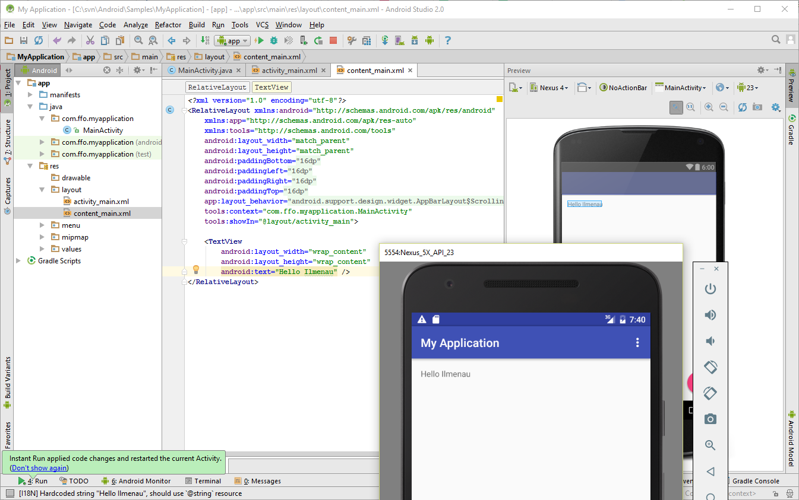
  - [How to Build Your First App in Android Studio 3 Tutorial](https://www.youtube.com/watch?v=UQlDjsfiQ-k)
- Flutter: https://flutter.dev/
  - Native Apps für Android und iOS
  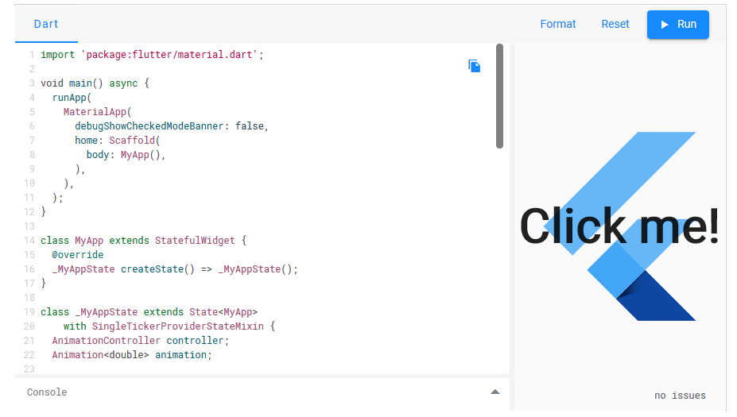
- React Native https://reactnative.dev/
  - Native Apps für Android, iOS programmiert in JavaScript mit Visual Studio Code
  - Einfaches Testen mit [Expo](https://expo.io/)
  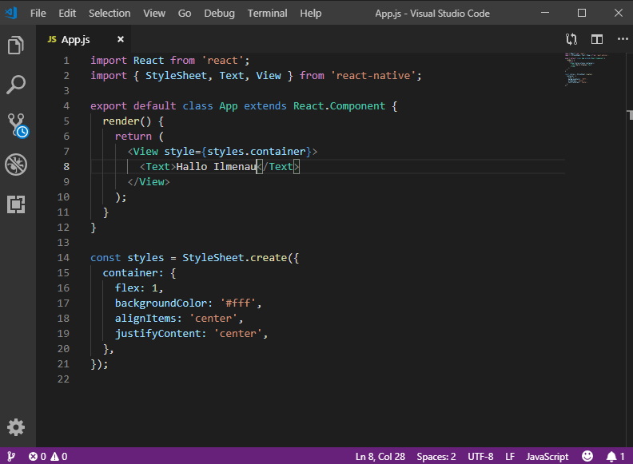

# Mobile Geräte - Smartphones
Überblick
- Mobiles Intelligentes Endgerät
  - Festlegungen
  - Definitionen
- Eine Historie
  - Mobilfunk
  - Die Geräte selbst
- Zukunft?

Mobiles Intelligentes Endgerät
- Mobiles Intelligentes Endgerät = Smartphone?
- Drei Fragen sollen zuerst beantwortet
  - Was soll ein sogenanntes Endgerät können?
  - Was ist unter "mobil" zu verstehen?
  - Was macht ein Endgerät intelligent bzw. smart?

Was sollte ein Endgerät können?
- Content wiedergeben
    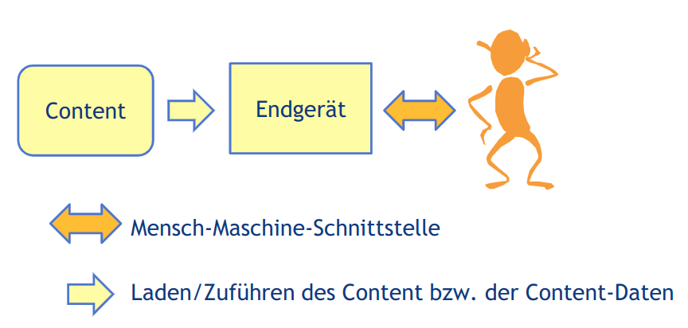
    - $\leftrightarrow$ Mensch-Maschine-Schnittstelle
    - $\rightarrow$ Laden/Zuführen des Content bzw. der Content-Daten

Was sollte ein Endgerät können?
- Elektronische Kommunikation ermöglichen

Was ist unter mobil zu verstehen?
- Mobile Endgeräte ermöglichen die ...
    - mobile Nutzung von Content
    - mobile elektronische Kommunikation
    - Verarbeitung der Nutzer- und Gerätemobilität
- Was ist nicht mobil? keine mobile Nutzung; tragbar aber nicht mobil nutzbar

Was macht ein Endgerät intelligent?
- Ein intelligentes (=smart) Endgerät:
    - Ist/enthält ein(en) freiprogrammierbarer Rechner
    - Hat einen Internet-Zugang
- Ein intelligentes (=smart) Endgerät kann somit:
  - Content erstellen und über das Internet bereitstellen
  - Content aus dem Internet laden
  - Content weiterverarbeiten

## Geschichte des Mobilfunks bis LTE
- Der Anfang 1918 und 1926
    - Bei der Reichsbahn in Deutschland
- Erste Generation
    - A-Netz 1958
    - B-Netz 1972
    - C-Netz 1985
- GSM ab 1992, 2. Generation (2G), D und E-Netz
  - GPRS (General Packet Radio)
- UMTS, 3. Generation (3G)
- LTE
- [Geschichte des Mobilfunks](http://www.youtube.com/watch?v=oqFEAAYw9RQ)
- [#kurzerklärt: Was ist 5G?](http://www.youtube.com/watch?v=q4mQUgJzkZE)

## Historische Geräte - 1. Generation
- A-Netz: A-Netz Funktelefon (Hersteller: Fa. TeKaDe Nürnberg, 1963)
- C-Netz: Autotelefon Motorola CM451 von 1990

## Historische Geräte - Meilensteine
- Das erste Handy: Motorola DynaTAC, 1983 (Prototype 1973)
- Das erste GSM Handy für die Massen: Nokia 1011, 10.11.1992
- Das erste WAP-Handy: Nokia 7110, 1999
- Das erste App-Handy: iPhone, 2007

Weitere Informationen
- [Vintage Mobiles](http://www.gsmhistory.com/vintage-mobiles)
- [Die Meilensteine in der Geschichte der Handys und Mobilfunktelefone](http://www.startmobile.net/die-meilensteine-in-der-geschichte-der-handys-und-mobilfunktelefone/)
- [History of mobile phones][http://en.wikipedia.org/wiki/History_of_mobile_phones](http://en.wikipedia.org/wiki/History_of_mobile_phones)
- [Geschichte der Mobiltelefonie in Deutschland](http://de.wikipedia.org/wiki/Mobilfunk#Geschichte_der_Mobiltelefonie_in_Deutschland)

## Die nahe Zukunft - Wearables?
- Wear OS  by Google
- Samsung Gear S3
- Apple Watch 4 mit EKG

- [Introduction to Wear OS by Google Development](http://www.youtube.com/watch?v=penkgJBJdv4)
- [Hands-On With the ECG Feature for Apple Watch Series 4!](http://www.youtube.com/watch?v=jdRXLES7ajY)
- [Samsung Gear S3 im Test](http://www.youtube.com/watch?v=PQCcV8gIi4I)

# Mobile Geräte - Betriebssysteme
## Was ist ein Betriebssystem?
Ein Betriebssystem ist eine Zusammenstellung von Computerprogrammen, die die Systemressourcen eines Computers wie Arbeitsspeicher, Festplatten, Ein- und Ausgabegeräte verwaltet und diese Anwendungsprogrammen zur Verfügung stellt.

Das Betriebssystem bildet dadurch die Schnittstelle zwischen den Hardwarekomponenten und der Anwendungssoftware des Benutzers.

[Andrew S. Tanenbaum: Moderne Betriebssysteme](Andrew S. Tanenbaum: Moderne Betriebssysteme. 3., aktualisierte Auflage, Pearson Studium, ISBN 978-3-8273-7342-7)
[http://de.wikipedia.org/wiki/Betriebssystem](http://de.wikipedia.org/wiki/Betriebssystem)

## PDA- und Smartphone-Betriebssysteme
- Android ... (Marktanteil 03/2020 Internet Nutzung weltweit: 72,3%)
- Apple iOS ... (Marktanteil ...: 27,0%)
- Windows 10 Mobile ... (Marktanteil ...: 0,1%)
- BlackBerry OS und BlackBerry 10 ... (Marktanteil ...: 0,01%)
- [Palm OS](http://de.wikipedia.org/wiki/Palm_OS): Betriebssystem für Palm-Handhelds
- Symbian ...
- Sailfish OS: Ex-Nokia-Leute haben [Jolla](http://de.wikipedia.org/wiki/Jolla) gegründet
- [Tizen](http://de.wikipedia.org/wiki/Tizen) : ein freies OS, Samsungs Smartwatches nutzen es
- [Ubuntu Touch](http://de.wikipedia.org/wiki/Ubuntu_Touch): mobile Benutzeroberfläche für Ubuntu
- Kein Betriebssystem: Java Micro Edition (Java ME) ...

MIDP-Java ME (kein Betriebssystem)
- Überblick
    - MIDP (Mobile Information Device Profile) ist ein Profil der Java Micro Edition (Java ME), das speziell auf die Fähigkeiten kleiner Mobilgeräte wie Mobiltelefon oder PDA ausgelegt wurde. Es umfasst daher Funktionen zur Ansteuerung und Abfrage von Einhandtastaturen, Miniaturbildschirmen, flüchtigem und nicht-flüchtigem Speicher im Kilobyte-Bereich etc.
    - MIDP-Applikationen heißen MIDlets
- Historie/Versionen:
    - MIDP 1.0 (JSR 37) - Approved 19. September 2000
    - MIDP 2.0 (JSR 118) - Approved 20. November 2002
    - MIDP 3.0 (JSR 271) - Approved 9. Dezember 2009 (keine Bedeutung mehr)
- BlackBerry setzte bis Version 7 auf MIDP 2.0

## Symbian
- Überblick
    - Das Handy-OS Symbian hat seine Ursprünge in der 32-Bit-EPOC-Plattform von Psion;
       diese wurde in einem 1998 gegründetem Konsortium mit dem Namen Symbian von
       den Mobilfunkunternehmen Ericsson, Motorola, Nokia und Psion eingesetzt und
       weiterentwickelt.
    - Die Symbian Ltd. wurde später vollständig durch Nokia übernommen und in eine
       gemeinnützige Organisation, die Symbian Foundation, überführt. Nokia erwarb im
       Dezember 2008 sämtliche Rechte und übertrug sie an die Symbian Foundation.
       Diese erklärte Symbian im Februar 2010 zur Open Source-Lösung.
    - Die Unterstützung durch Nokia wurde Ende 2012
       komplett eingestellt.
- Technik
    - Symbian hat vieles mit Desktop-Betriebssystemen gemein, z. B. präemptives Multitasking, Multithreading und Speicherschutz.
- User Interface
    - Zuerst AVKON (Serie 60),
    - ab Symbian^3 die Qt Oberfläche
- Historie und Geräte (Beispiele)
    - Symbian OS v6.0: Nokia 9210 Communicator, 2001
    - Symbian OS v6.1: N-Gage (Nokia Spielekonsole), 2003
    - Symbian OS v7: Nokia Communicator 9500, 2004
    - Symbian OS v8: Nokia N72, 2006
    - Symbian OS v9.1: Nokia N71,N73, N91, 2006
    - Symbian OS v9.2 (Serie 60 3rd Edition): Nokia E90, N95, 2007
    - Symbian OS v9.3: Nokia N78, N96, 2008
    - Symbian OS v9.4 / Symbian^1: Nokia N97, 2009, erste Version der Symbian Plattform und als solche keine eigentliche Veröffentlichung der Symbian Foundation. Beinhaltet das "alte" Symbian OS und S60 5th Edition. Es ist nicht als Open Source verfügbar.
    - Symbian^3 / Symbian "Anna": Nokia N8, 2010, Open-Source
    - Nokia Belle: Nokia 808 PureView, 2012
    - [http://nokiamuseum.info/](http://nokiamuseum.info/)

## BlackBerry 
- Überblick
    - Das Blackberry OS (bis zur fünften Ausgabe bekannt als Blackberry Device Software, auch bekannt als Research In Motion OS) ist ein proprietäres, kostenlos nutzbares (Freeware) Multitasking-Betriebssystem für Smartphones. Es wird von dem Unternehmen Blackberry (ehemals Research In Motion) für dessen Geräte der Marke Blackberry entwickelt. Apps können im zugehörigen Blackberry-World-Store erworben werden. Der Nachfolger von Blackberry OS heißt Blackberry 10.
    - Blackberry OS wurde inzwischen durch Blackberry 10 auf QNX-Basis ersetzt. Im August 2013 hat BlackBerry mit dem 9720 noch ein Einsteiger-Smartphone mit BlackBerry OS 7.1 vorgestellt.
- Technik
    - Es ist in C++ programmiert und bietet eine Java-Umgebung (J2ME - MIDP) mit speziellen Schnittstellen zum Betrieb von (Dienst-/Anwendungs-)Programmen. Drittentwicklern steht eine spezielle Programmierschnittstelle zur Verfügung. Integraler und bekanntester Bestandteil der Funktionalität sind die E-Mail-Funktionen der Plattform.
    - Laut Gartner war es mit **17,5 Prozent Marktanteil im Jahr 2010** eines der bedeutendsten Betriebssysteme für Mobiltelephone.
- Historie und Geräte (Beispiele)
    - Das erste Modell der Reihe, der Blackberry 850, 1999
    - [http://en.wikipedia.org/wiki/List_of_BlackBerry_Products](http://en.wikipedia.org/wiki/List_of_BlackBerry_Products)
    - [http://en.wikipedia.org/wiki/BlackBerry_OS#1.0](http://en.wikipedia.org/wiki/BlackBerry_OS#1.0)
- BlackBerry 10
    - Das System wurde am 19. Oktober 2011 auf der hauseigenen Entwicklerkonferenz DevCon in San Francisco vorgestellt und basiert zu großen Teilen auf dem Betriebssystem QNX und dessen Microkernel. Blackberry 10 ersetzt das klassische Blackberry OS komplett. Das erste Gerät des Herstellers mit dem neuen Betriebssystem war das Blackberry Z10, 2013
    - Version 10.2 bietet Unterstützung von Android Apps (seit 2014)
    - Version 10.3 unterstützt offiziell den Amazon Appstore
    - [http://en.wikipedia.org/wiki/BlackBerry_10](http://en.wikipedia.org/wiki/BlackBerry_10)
    - _In April, 2016 BlackBerry announced that they will no longer release new_
       _BlackBerry 10 devices to solely focus on Google Android devices_

## Windows Phone, Windows 10 Mobile
- Windows Phone 7 = Windows CE
    - Die Entwicklung von Windows Phone wurde Anfang September 2010 abgeschlossen
- Microsoft Windows Phone 8 bzw. 8.1
    - Im Gegensatz zum Vorgänger Windows Phone 7 basiert es nicht länger auf Windows CE, sondern demselben Windows-NT-Kernel wie Windows 8 und Windows RT.
    - Windows Phone 8 wurde am 20. Juni 2012 auf der Windows Phone Summit in San Francisco vorgestellt.
    - [http://de.wikipedia.org/wiki/Microsoft_Windows_Phone_8](http://de.wikipedia.org/wiki/Microsoft_Windows_Phone_8)
- Windows 10 Mobile
    - Nachfolger von Windows Phone 8.1
    - Wurde stark an die Desktop-Version angelehnt
    - Weiterentwicklung wurde 2017 beendet
    - **Supportende:** 14. Januar 2020
    - https://de.wikipedia.org/wiki/Microsoft_Windows_10_Mobile

## iOS 
- Überblick und Historie
    - iOS (früher iPhone OS oder iPhone Software) ist ein von Apple entwickeltes mobiles Betriebssystem für das iPhone, das iPad, den iPod touch und den Apple TV der 2. und 3. Generation.
    - Im Gegensatz zu Apples Konkurrenten wird iOS nur auf eigener Hardware von Apple eingesetzt. iOS basiert auf einem "Mac OS X"-Kern bzw. Darwin-Betriebssystem, welches wiederum auf einen Unix-Kern zurückgeht.
    - Das ursprüngliche Betriebssystem wurde am 9. Januar 2007 zusammen mit dem iPhone auf der MacWorld Conference and Expo vorgestellt. Damals bezeichnete Steve Jobs "iOS" noch als ein "Mac OS, welches auf dem iPhone läuft". iPhone OS (iOS) unterstützte zu diesem Zeitpunkt noch keine Apps von externen Entwicklern.
    - Am 6. März 2008 veröffentlichte Apple dann das SDK für iOS, um Drittentwicklern die Möglichkeit zu geben, Apps für iOS entwickeln zu können.
    - Die damit entwickelten Apps lassen sich ausschließlich im ebenfalls mit iPhone OS 2.0 neu eingeführten App Store veröffentlichen.
- Versionen
    - [http://de.wikipedia.org/wiki/Apple_iOS#Versionen](http://de.wikipedia.org/wiki/Apple_iOS#Versionen)
- User Interface / Bedienkonzept
    - UI Toolkit ist Cocoa Touch im Unterschied zum OS X's Cocoa. Das UI ist nicht mit OS X kompatibel.
    - Das Bedienkonzept von iOS ist möglichst einfach gehalten. Somit beschränkt es sich fast ausschließlich auf den Home-Bildschirm, auch Springboard genannt. iOS wird fast ausschließlich über den Multitouchbildschirm gesteuert, nur das Sperren und Ausschalten des Geräts wird mit dem Lockbutton ausgelöst, und das Beenden von Anwendungen (genannt Apps) mit dem Homebutton. Dieser kann das Gerät ebenso wie der Lockbutton aus dem Standby-Modus aufwecken. iOS ist darauf ausgelegt mit allen anderen Apple-Produkten zusammenzuarbeiten. Es unterstützt Multi-Touch mit bis zu fünf Fingern. Multitouch wird teilweise zur Gestensteuerung verwendet, so lassen sich beispielsweise Apps durch Gesten schließen oder wechseln.

## Android
- Überblick
    - Android ist sowohl ein Betriebssystem als auch eine Software-Plattform für mobile Geräte wie Smartphones, Mobiltelefone, Netbooks und Tablet-Computer, die von der Open Handset Alliance (gegründet von Google) entwickelt wird. Basis ist der Linux-Kernel. Bei Android handelt es sich um freie Software, die quelloffen entwickelt wird.
- Der Anfang
    - Im Sommer 2005 kaufte Google das im Herbst 2003 von Andy Rubin gegründete Unternehmen Android. Ursprünglich war Android ausschließlich zur Steuerung von Digitalkameras gedacht. Am 5. November 2007 gab Google bekannt, gemeinsam mit 33 anderen Mitgliedern der Open Handset Alliance ein Mobiltelefon-Betriebssystem namens Android zu entwickeln. Seit dem 21. Oktober 2008 ist Android offiziell verfügbar.
    - Als erstes Gerät mit Android als Betriebssystem kam am 22. Oktober 2008 das HTC Dream unter dem Namen T-Mobile G1 in den USA auf den Markt. Dass bereits dieses erste Gerät auf das Global Positioning System (GPS) zugreifen konnte und mit Bewegungssensoren ausgestattet war, gehörte zum Konzept von Android.
- [Oberfläche](http://de.wikipedia.org/wiki/Android_%28Betriebssystem%29#Oberfl.C3.A4che_und_Bedienung)
- Architektur
    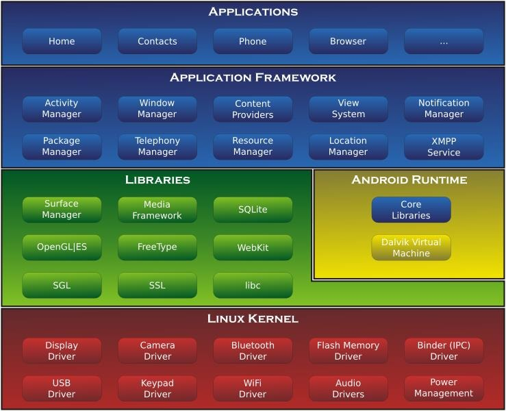
    Android baute anfangs auf dem Linux-Kernel 2.6 auf, ab Android 4.x auf einen Kernel der 3.x-Serie. Er ist für die Speicherverwaltung und Prozessverwaltung zuständig und stellt die Schnittstelle zum Abspielen von Multimedia und der Netzwerkkommunikation dar. Außerdem bildet er die Hardwareabstraktionsschicht für den Rest der Software und stellt die Gerätetreiber für das System.
- [Versionen](https://de.wikipedia.org/wiki/Liste_von_Android-Versionen)
- Java
    - Anwendungen für die Android-Plattform werden in der Regel in Java geschrieben.
    - Die Java-Laufzeitumgebung von Android basiert auf der Dalvik Virtual Machine, einer von Google-Mitarbeiter Dan Bornstein entwickelten virtuellen Maschine. Die Dalvik-VM ähnelt funktional der normalen Java-VM, beide führen sogenannten Byte-Code aus. Einer der wesentlichen Unterschiede ist die zugrundeliegende virtuelle Prozessorarchitektur.
    - Die Java-VM basiert auf einem Kellerautomaten; Dalvik-VM hingegen ist eine Registermaschine. Durch die sich unterscheidende Prozessorarchitektur sind die Kompilate normaler Java-Compiler nicht für die Dalvik-VM geeignet, dennoch konnte Google auf die bestehenden Java-Entwicklungswerkzeuge zurückgreifen.
    - Da das Prozessormodell des Kellerautomaten besonders einfach ist, wird es üblicherweise für die Übersetzerzwischensprache verwendet. Die meisten realen Prozessoren sind heute aber Registermaschinen (x86- und die ARM- Prozessoren). Registerarchitekturen sind oft effizienter. Dalvik nimmt die Umwandlung des Kellerautomatencodes in die Registermaschinencodes schon zur Übersetzungszeit vorweg. Dafür wird das Werkzeug dx (Dalvik Cross-Assembler).

## Fuchsia von Google
- Im Gegensatz zu Android nicht auf einen Linux-Kernel basierend
- Fuchsia als Echtzeitbetriebssystem basiert auf den Mikrokernel Zircon
- Läuft auf verschiedenen Mobiltelefonen und PCs
- Noch unklar, ob und wann Fuchsia Android ersetzen soll.
- In der Zwischenzeit kann man sich Flutter ansehen: https://flutter.dev/
  - Vergleichbar mit React Native

## Wear OS
- Wear OS (bis zum 16.3.18 Android Wear) wurde vom Betriebssystem Android abgeleitet und speziell für Smartwatches und andere Wearables entwickelt.
- Es wurde am 18. März 2014 erstmal präsentiert. Laut Hersteller bietet es Google-Now-Funktionen im Gehäuse einer Armbanduhr.
       - Mit Google-Now erhält man Karten mit hilfreichen Informationen für den Tagesablauf - und das sogar, bevor man danach sucht
       - Seit 2017 ist Android Wear 2.0 verfügbar.
       - Seit 2018 unbenannt in "Wear OS by Google"
- https://de.wikipedia.org/wiki/Wear_OS
- Für den Entwickler
    - https://developer.android.com/training/wearables
    - Tutorial: [http://www.smartwatch.me/t/tutorial-how-to-develop-android-wear-apps-for-](http://www.smartwatch.me/t/tutorial-how-to-develop-android-wear-apps-for-beginners-part-1-setup/684)

## Weitere Informationen
- [Betriebssystem](http://de.wikipedia.org/wiki/Betriebssystem)
- [PDA- und Smartphone-Betriebssysteme](http://de.wikipedia.org/wiki/Liste_von_Betriebssystemen#PDA-_und_Smartphone-Betriebssysteme)
- [Mobile Information Device Profile](http://en.wikipedia.org/wiki/Mobile_Information_Device_Profile)
- [http://developer.nokia.com/community/wiki/MIDP_2.0](http://developer.nokia.com/community/wiki/MIDP_2.0)
- [Symbian OS](http://de.wikipedia.org/wiki/Symbian-Plattform)
- [BlackBerry OS](http://en.wikipedia.org/wiki/BlackBerry_OS)
- [BlackBerry 10](http://en.wikipedia.org/wiki/BlackBerry_10)
- [Apple iOS](http://de.wikipedia.org/wiki/Apple_iOS)
- [Android](http://de.wikipedia.org/wiki/Android_%28Betriebssystem%29)
- [Wear OS](https://developer.android.com/training/wearables)

# Apps - Entwurf und Programmierung
Überblick
- Was ist eine App?
- Verschiedene Grundtypen
    - Native App, Web-App und hybride App
- User-Interface (UI) Prototype Design
- Unterschiedliche Wege der Programmierung  und ausgewählte Entwicklungssysteme
  - Native, für ein Betriebssystem angepasst
  - Native, für mehrere Betriebssysteme
  - Hybride

## Was ist eine App?
App steht für den englischen Begriff application (bzw. Applikation). Und bezeichnet damit eine Anwendungssoftware (bzw. ein Anwendungsprogramm). Anwendungsprogramme (wie z.B. Textverarbeitung oder Computerspiele) dienen der Lösung von Anwenderproblemen. Anwendungssoftware grenzt sich von Systemsoftware und systemnaher Unterstützungssoftware (wie z.B. Betriebssysteme oder Compiler) ab.
Im Deutschen wird die Abkürzung App seit dem Erscheinen des Apple App Stores (2008) fast ausschließlich mit mobiler App gleichgesetzt, also Anwendungssoftware für Mobilgeräte wie Smartphones und Tablet-Computer. Apple hat diese Kurzform von Application eingeführt.
Sicherlich auch mit bewusster Anspielung auf den Firmennamen Apple.
Inzwischen versucht Microsoft unter Windows 8/10 auch Desktop-Anwendungen als Apps zu bezeichnen.
Hier steht App weiterhin nur für Anwendungssoftware für Mobilgeräte.
[http://de.wikipedia.org/wiki/Anwendungssoftware](http://de.wikipedia.org/wiki/Anwendungssoftware)

## Zwei App-Grundtypen
|            | Native App                                                                                                                                                                                                                                          | Web-App                                                                                                                                                                                                                                            | Hybrid                                                                                                                                                                                                                                                                                               |
| ---------- | --------------------------------------------------------------------------------------------------------------------------------------------------------------------------------------------------------------------------------------------------- | -------------------------------------------------------------------------------------------------------------------------------------------------------------------------------------------------------------------------------------------------- | ---------------------------------------------------------------------------------------------------------------------------------------------------------------------------------------------------------------------------------------------------------------------------------------------------- |
|            | Eine App, die speziell für ein einzelnes Betriebssystem ausschließlich mit dem vom Betriebssystem-Anbieter hierfür breitgestellten SDK (System Development Kit) entwickelt wurde. Wird über App-Stores verbreitet und auf dem Endgerät installiert. | Eine Web-App läuft komplett im Browser ab. Eine Web-App wird als Web-Seite vom Web-Server geladen. Neben HTML wird CSS und JavaScript genutzt.                                                                                                     | Eine hybride App, ist eine native App, die für die Darstellung der Oberfläche eine Browser-Komponente nutzt. Der größte Teil der App ist in HTML, CSS und JavaScript erstellt. Nativer Code, der über JavaScript der Oberfläche zu gänglich ist, ermöglicht den Zugriff auf native Gerätefunktionen. |
| Vorteile:  | Eine native App kann die über das jeweilige Betriebssystems angebotenen Hardware-Ressourcen optimal nutzen. Native Apps können daher sehr performant und Ressourcen-sparend sein.                                                                   | Da HTML, CSS und JavaScript auf allen Betriebssystemen standardisiert sind, laufen Web-Apps auf allen Systemen. Dies reduziert die Entwicklungskosten.                                                                                             | Als native App, kann die hybride App, alle über das jeweilige Betriebssystems angebotenen Hardware-Ressourcen nutzen. Sie kann über App-Stores verbreitet werden. Die Oberfläche und die Interaktionslogik sind für alle Betriebssysteme gleich. Dies reduziert die Entwicklungskosten.              |
| Nachteile: | Native Apps müssen für jedes Betriebssystem getrennt entwickelt werden. Die Entwicklungskosten sind daher sehr hoch.                                                                                                                                | HTML, CSS und JavaScript müssen vom Browser interpretiert werden. Daher ist die Performanz gering. Der Browser kann nicht auf alle Hardware-Ressourcen (wie z.B. Kamera und Datei-System) zugreifen. Kann nicht über App-Stores verbreitet werden. | HTML, CSS und JavaScript müssen vom Browser interpretiert werden. Daher ist die Performanz/Reaktionszeit der Oberfläche oft zu gering.                                                                                                                                                               |

## User-Interface (UI) Prototype Design
Wireframe / Mock-Up
- Wireframes (Drahtgerüst) oder Mock-Ups (Attrape) werden dazu benutzt, um einen sehr frühen konzeptuellen (nicht funktionsfähigen) Prototypen eines App-Frontends darzustellen. Navigation und Nutzerführung und wesentliche Inhaltsbereiche sollten Teil dieses Skeletts sein.
- Im Gegensatz zu statischen Wireframes ermöglichen dynamische Wireframes die Navigation zwischen den einzelnen Ansichten.
- Beispiele
  - [Balsamiq](http://www.balsamiq.com)
  - [Proto.io](http://www.proto.io)
  - [InVision](http://www.invisionapp.com)
  - [Fluid UI](https://www.fluidui.com)
  - [UXPin](http://www.uxpin.com)
  - [Pencil](http://pencil.evolus.vn/)
- [Wireframing Basics: The Easy Way to Get Started](http://www.youtube.com/watch?v=aqdn7vVKygA)
- [What is a Wireframe?](http://www.youtube.com/watch?v=T0vt3nLZKks)

## Entwicklungsumgebungen
- IDEs für Apps
    - [Xcode von Apple für iOS](https://developer.apple.com/xcode/)
    - [Android Studio](https://developer.android.com/studio/)
    - [Visual Studio IDE Community 2019 für Windows und Mac](https://visualstudio.microsoft.com)
    - [Visual Studio Code (Universal IDE)](https://code.visualstudio.com)
- Cross-Plattform
    - [React Native](https://reactnative.dev/)
    - [Xamarin](http://www.xamarin.com)
    - [Flutter](https://flutter.dev)
- Hybrid
    - [Apache Cordova](http://cordova.apache.org/)
- Ganz anders (cool, online grafisch):
    - [App Inventor](http://appinventor.mit.edu/explore/get-started)

## Xcode (Version 11)
IDE von Apple zur Erstellung nativer Apps für sämtliche iOS Geräte. Leider nur für Mac verfügbar.

Xcode hat inzwischen eine sehr gute Unterstützung bei der Erstellung des UI und der Verknüpfung mit dem Code.

Xcode ist kostenlos.

Die Programmierung erfolgt ab Version 6 in Swift. Aktuell in der Version 5.

[iOS Tutorial: How to make an iPhone App (Xcode 9, Swift 4, iOS 12)](https://www.youtube.com/watch?v=5b91dFhZz0g)

## Android Studio 3.x
Google hat auf Basis von IntelliJ das Android Studio entwickelt.
Android Studio löste die für Java spezialisierte OpenSource IDE Eclipse ab.

Das Android SDK beinhaltet auch einen Emulator, der flexibel für verschiedene Geräte angepasst werden kann.

[How to Build Your First App in Android Studio 3.1.1 Tutorial Hello World!](https://www.youtube.com/watch?v=UQlDjsfiQ-k)

## Xamarin
Die Entwickler von Mono (quelloffene Implementierung des .NET Framework) gründeten im Jahr 2011 die Firma Xamarin. Xamarin wurde im Februar 2016 von Microsoft übernommen. Xamarin ist nun Bestandteil von Visual Studio.

Mit der Programmiersprache C# können Entwickler iOS-, Android- und Windows-Apps schreiben. Der Quellcode kann für alle Plattformen gemeinsam benutzt werden.

Xamarin Platfrom Mit den Komponenten Xamarin.iOS und Xamarin.Android ist es möglich, native Apps für iOS, Android und Windows in C# entweder mit Xamarin Studio oder Visual Studio zu entwickeln.

Xamarin.Forms erlaubt portable Bedienelemente zu verwenden (über XAML), welche die eigentlichen Bedienelemente von Android, iOS und Windows Phone aufrufen.

[https://de.wikipedia.org/wiki/Xamarin]

[Creating a Simple Xamarin App](http://www.youtube.com/watch?v=gm-RgfdaISU)

## Visual Studio Community 2019
(mit Xamarin.forms)

Visual Studio und Xamarin Studio nutzen das Android SDK, um native Android Apps zu erstellen. Native iOS Apps können mit Xamarin Studio für den Mac oder Visual Studio erstellt werden. Visual Studio benötigt dazu einen Mac (mit Xcode und Xamarin) im lokalen Netzwerk.

## Apache Cordova
- Apache Cordova (PhoneGap)
- Eine Plattform zur Erstellung von nativen Apps für alle mobilen Betriebssysteme
- Hybride App aus Web-App und nativen Teil
- Web-App Programmierung mit HTML5
- [Getting Started With Visual Studio Tools For Apache Cordova](https://docs.microsoft.com/en-us/visualstudio/cross-platform/tools-for-cordova/first-steps/build-your-first-app)

## Cross-Plattform
- React-Native von FB
    - Native Apps für Android und iOS
    - Native UIs
    - Weit verbreitet
    - Programmierung in JavaScript
          - JavaScript wird in der App ausgeführt. Ermöglicht Hot Code Reloading
    - Web-Apps mit React
       - Wissen kann genutzt werden, um Web-Apps zu entwickeln
- Flutter von Google
  - Native Apps für Android und iOS
  - Native UIs
  - Noch neu
  - Programmierung in Dart
    - Just In Time compilation (JIT) ermöglicht Hot Code Reloading
    - Wird in ARM bzw. x86 Code übersetzt. Beste Performance.
  - Web Apps? Googles Angular ist ganz anders

## Weitere Informationen
- [Anwendungssoftware (Apps)](http://de.wikipedia.org/wiki/Anwendungssoftware)
- [iOS Human Interface Guidelines](https://developer.apple.com/design/human-interface-guidelines/ios/overview/themes/)
- [Swift](http://de.wikipedia.org/wiki/Swift_%28Programmiersprache%29)
- [Download von Visual Studio Code](https://code.visualstudio.com/download)

# Was ist (mobile) Content?
Überblick
- Was ist Content?
    - Content-Typen
- Was ist mobiler Content?
- User-generated Content
- Open Data

## Was ist Content?
Seit etwa Mitte der 1990er Jahre wird im deutschen Sprachraum im Zusammenhang mit den Neuen Medien und später dem Internet der Anglizismus **Content** (englisch _der Gehalt_ , _der Inhalt_ ) als Synonym für (digitalisierten) Medieninhalt verwendet.

Medieninhalte (Content) werden von der Infrastruktur eines Mediums (wie z.B. dem Fernsehen) abgegrenzt. Der Content von YouTube ist beispielsweise nicht die Plattform als ganzes, sondern die Gesamtheit der abrufbaren Videos mit ihren Beschreibungen und Nutzerkommentaren.

Content ist das, was für den Konsumenten einen Wert bzw. Nutzen darstellt. Content ist Information die über ein Medium (den Kanal) übermittelt wird. Das Medium (z.B. das Fernsehen, YouTube ...) stellt ohne den Content keinen Nutzen für den Konsumenten dar.

Was passiert mit Content?
- Content wird ...
    - produziert, 
    - gespeichert, 
    - übertragen 
    - und konsumiert

### Content-Typen bzw. Medientypen
Die Daten des Contents werden als Datei gespeichert bzw. als Stream übertragen. Der Internet Media Type, auch MIME-Type (nach der Spezifikation Multipurpose Internet Mail Extensions) oder Content-Type (nach dem Namen des Feldes), klassifiziert die Content-Daten.

Der Internet Media Type besteht aus zwei Teilen: der Angabe eines Medientyps und der Angabe eines Subtyps. Z.B. image/png Es gibt folgende Medientypen:
- _application_ - für uninterpretierte binäre Daten, Mischformate oder Informationen, die von einem bestimmten Programm verarbeitet werden sollen
- _audio_ - für Audiodaten
- _example_ - Beispiel-Medientyp für Dokumentationen
- _image_ - für Grafiken
- _message_ - für Nachrichten, beispielsweise _message/rfc822_
- _model_ - für Daten, die mehrdimensionale Strukturen repräsentieren
- _multipart_ - für mehrteilige Daten
- _text_ - für Text
- _video_ - für Videomaterial

## Was ist mobiler Content?
Mobiler Content kann auf einem mobilen Endgerät mobil genutzt werden.
Content sollte in der Regel für die mobile Nutzung speziell aufbereitet (umgewandelt) werden. Bei Bildern muss möglicherweise die Größe angepasst werden. Nicht jeder Content (z.B. längere Videos oder Spielfilme) ist für mobile Nutzung geeignet.

## User-generated Content (UGC)
User-generated Content (UGC) ist Content, der nicht vom Anbieter der Plattform, sondern von dessen Nutzern erstellt wird. Konsumenten (Consumer) sind gleichzeitig Produzenten (Producer).
Diese Verbindung wird auch Prosumer genannt. Häufig ist UGC eine Erscheinungsform von Crowdsourcing. Beispiele von UGC sind z.B. Kommentarfunktionen in Blogs, Videoportale wie YouTube oder auch Wikipedia.

## Open Data
Open Data bedeutet die freie Verfügbar- und Nutzbarkeit von Daten (bzw. Content), typischerweise öffentlicher bzw. staatlicher Einrichtungen. Man geht dabei davon aus, dass durch die freie
Zugänglichmachung, vorteilhafte Entwicklungen wie z.B. Open Government gefördert werden.

Offene Daten sind sämtliche Datenbestände, die im Interesse der Allgemeinheit der Gesellschaft ohne jedwede Einschränkung zur freien Nutzung, zur Weiterverbreitung und zur freien Weiterverwendung frei zugänglich gemacht werden. Zu denken wäre etwa an Lehrmaterial, Geodaten, Statistiken, Verkehrsinformationen, wissenschaftliche Publikationen, medizinische Forschungsergebnisse oder Hörfunk- und Fernsehsendungen.

In der Regel verwenden die Anbieter von "Open Data" Lizenzmodelle, die auf Copyright, Patente oder andere proprietäre Rechte weitgehend verzichten.

[Vorstellung Open Data Portal Österreich](http://www.youtube.com/watch?v=lPIyCIFjZro)

Open Data Portale
- [Deutschland](https://www.govdata.de/)
- [Deutsche Bahn](http://data.deutschebahn.com/)
- [U.S.A](https://www.data.gov/)
    - [APIs](https://www.data.gov/developers/apis)
- [Chicago](https://data.cityofchicago.org/)
    - [Crime Map](https://data.cityofchicago.org/Public-Safety/Crimes-Map/dfnk-7re6)
- [GeoNames](http://www.geonames.org/)

### Weitere Informationen
- [Load resources from a remote URL using React Native](https://reactnative.dev/docs/network)
- [Medieninhalt (Content)](http://de.wikipedia.org/wiki/Medieninhalt)
- [Content](http://en.wikipedia.org/wiki/Content_(media_and_publishing))
- [What is Content?](http://www.toprankblog.com/2013/03/what-is-content/)
- [Internet Media Type](http://de.wikipedia.org/wiki/Internet_Media_Type)
- [IANA MIME Media Type List](http://www.iana.org/assignments/media-types/media-types.xhtml)
- [User-generated Content](http://de.wikipedia.org/wiki/User-generated_content)
- [Open Data](http://de.wikipedia.org/wiki/Open_Data)
- [Open Data Network](http://opendata-network.org/)

# Urheberrecht im Wandel der Zeit
Überblick
- Idee des Urheberrechts
- Geschichte des Urheberrechts
- Fair Use
- Creative Commons

## Vor dem Urheberrecht
- Bis zur Erfindung des Buchdrucks mit beweglichen Metall-Lettern durch Johannes Gutenberg um 1440
- Bücher wurden einzeln hergestellt, verkauft und bezahlt
- Schriftsteller, Maler, Bildhauer und Architekten wurden wie Handwerker behandelt
- Sie wurden für Ihre Arbeit entlohnt und hatten darüber hinaus keine weiteren Ansprüche
- Ein Buch durfte zwar nicht gestohlen, wohl aber abgeschrieben werden
- Der Rang eines Künstlers wurde mehr nach seinen handwerklichen Fertigkeiten und nicht nach der Originalität seiner Werke bemessen

## Schutz der Verleger
- Nach der Erfindung des Buchdrucks wurde es viel einfacher Kopien in großer Anzahl herzustellen.
- Autoren waren schon froh, wenn der Drucker bzw. Verleger auch ihnen etwas dafür zahlte.
- Andere Drucker druckten bald aber die Werke nach, ohne dem Autor etwas zu zahlen.
- Nachdrucker waren gegenüber den Erstdruckern im Vorteil 
- Nachdruckern machten oft Fehler beim Nachdruck 
- Drucker erbaten von der Obrigkeit Sonderrechte (Privilegien), die das Nachdrucken für eine bestimmte Zeit verboten.
- Die Obrigkeit hatte ein gleiches Interesse (Zensur). Dies gelang in Frankreich mit seiner absolutistischen Struktur besser als in Deutschland.
- Diese Privilegien dienten aber in erster Linie dem Schutz der Verleger zur Sicherung ihres Absatzes

## Anfänge des Urheberrechts ...
- ... 1710 in England
    Im Statute of Anne, wurde das Recht des Autors an seinem Werk erstmals formuliert, das zuvor bei den Verlegern gelegen hatte. [http://www.copyrighthistory.com/anne.html]
    Zweck war laut Präambel "the Encouragement of Learning", also die Förderung der Bildung. Dieser Zweck sollte verwirklicht werden, indem das exklusive Druckrecht (right to copy) den jeweiligen Autoren oder den Erwerbern dieses Rechts für die im Gesetz bestimmte Zeiteingeräumt wurde. 
    Des weiteren sollte die Gelehrten angeregt werden, nützliche Bücher zu verfassen (»Encouragement of Learned Men to Compose and Write useful Books«); 
    Für neue Werke begrenzte das Gesetz die Schutzfrist auf 14 Jahre. Nach deren Ablauf stand dem lebenden Autor eine Verlängerung um weitere 14 Jahre zu.
- [Urheberrecht im Internet - Erklärfilm](https://www.youtube.com/watch?v=P3hFho5dtC0)
- Deutschland 19. und 20. Jahrhundert
  - In Preußen kam es 1837 zu einem entsprechenden Schutz
      - Zuerst ein Schutz von 10 Jahren. 1845 auf 30 Jahre nach dem Tod des Autors verlängert.
  - 1870 wurde im Norddeutschen Bund ein allgemeiner Urheberrechtsschutz eingeführt, den das Deutsche Reich 1871 übernahm.
- In West-Deutschland wurde am 9. September 1965 das deutsche Urheberrechtsgesetz (UrhG) verkündet.
  - Urheberfrist wurde auf 70 Jahre nach dem Tod des Urhebers festgelegt. Damit wurde Deutschland international zu einem Vorreiter im Bezug auf die Verlängerung von Urheberrechtsfristen. Zugleich wurde allerdings auch die Privatkopie wieder legalisiert, die in den 50er Jahren durch Gerichtsentscheidungen entgegen dem damaligen Gesetzeswortlaut aufgehoben wurde.

## Neue Entwicklungen
- 1996 wurde im Rahmen der Weltorganisation für geistiges Eigentum (WIPO) der WIPO-Urheberrechtsvertrag (WTC) und der WIPO-Vertrag über Darbietungen und Tonträger (WPPT) unterzeichnet.
    - Es bildet den Rahmen für die Anpassung der nationalen Urheberrechtsgesetze an die Anforderungen digitaler Netzmedien.
    - Das Vervielfältigungsrecht wurde gestärkt, und das Speichern von Werken im Computer wurde ausdrücklich unter diesem Recht subsumiert.
    - Recht auf Zugänglichmachung. Die Übertragung und bereits das Anbieten von Werken im Internet ist nur mit Zustimmung der Urheber zulässig.
    - Juristischer Schutz technischer Schutzmaßnahmen. Komponenten, deren Zweck es ist, Kopierschutzmechanismen der Rechteinhaber zu umgehen sind verboten. Es ist auch verboten, die Wirkungsweise dieser Komponenten zu beschreiben, so dass sie nachgebaut werden können. Hierdurch wird das Urheberrecht auch zu einem Technologiekontrollrecht.
    - Juristischer Schutz von Copyright Management Information. Auch die Veränderung, Fälschung oder Löschung von Informationen, die den Urheber oder den Konsumenten identifizieren oder die erlaubten Nutzungsformen festlegen, sind verboten.
- 1998 in den USA mit dem Digital Millennium Copyright Act umgesetzt
- Die EU setzt den WIPO-Vertrag am 22. Mai 2001 in der Richtlinie 2001/29/EG um
- 2003 folgt Deutschland mit seiner Urheberrechts-Novelle
    - "Wirksame technische Maßnahmen zum Schutz eines nach diesem Gesetz geschützten Werkes oder eines anderen nach diesem Gesetz geschützten Schutzgegenstandes dürfen ohne Zustimmung des Rechtsinhabers nicht umgangen werden, ... (Absatz 1 des neu ins Urheberrechtsgesetz aufgenommenen §95a)
    - ...Technische Maßnahmen sind wirksam, soweit durch sie die Nutzung eines geschützten Werkes oder eines anderen nach diesem Gesetz geschützten Schutzgegenstandes von dem Rechtsinhaber durch eine Zugangskontrolle, einen Schutzmechanismus wie Verschlüsselung, Verzerrung oder sonstige Umwandlung oder einen Mechanismus zur Kontrolle der Vervielfältigung, die die Erreichung des Schutzziels sicherstellen, unter Kontrolle gehalten wird."
- 2008 der "2. Korb" der Novelle
    - Erhalt der Privatkopie, aber: "Wenn für den Nutzer der Tauschbörse offensichtlich ist, dass es sich um ein rechtswidriges Angebot im Internet handelt, darf er keine Privatkopie davon herstellen."
    - Es gibt keine Durchsetzung der Privatkopie gegen Kopierschutz

## Schranken des Urheberrechts
Schranken des Urheberrechts ist die gesetzliche Bezeichnung für diejenigen Vorschriften des deutschen Urheberrechts, die einen **Ausgleich** zwischen den **Interessen des Urhebers** , dem prinzipiell das ausschließliche Nutzungsrecht eingeräumt ist, und gegenläufigen Interessen (der Nutzer) schaffen sollen.

Systematisch lassen sich die Schranken in Begrenzungen zugunsten einzelner Nutzer, der Kulturwirtschaft sowie der Allgemeinheit einteilen. Darunter sind beispielsweise die Erlaubnis der Vervielfältigung zu eigenem Gebrauch, die Entlehnungsfreiheit (so z.B. die Zitate) sowie die Gestattung der öffentlichen Wiedergabe im Lehrbetrieb.

[http://de.wikipedia.org/wiki/Schranken_des_Urheberrechts](http://de.wikipedia.org/wiki/Schranken_des_Urheberrechts)

## Urheberrechtsreform der Europäischen Union
- [Die Diskussion in Wikipedia](https://de.wikipedia.org/wiki/Urheberrechtsreform_der_Europ%C3%A4ischen_Union)
- [Webschau: EU-Urheberrechtsreform und Artikel 13 - pro und kontra](https://irights.info/webschau/webschau-eu-urheberrechtsreform-und-artikel-13-pro-und-kontra/29417)
- [Rat stimmt für Artikel 13 / Artikel 17 - Wieso stimmen die Agrarminister ab? | RA Christian Solmecke](https://www.youtube.com/watch?v=PBsrFJdyfVo)

## Urheberrecht versus Copyright
Im Copyright-Law des U.S. Rechtssystems werden im Gegensatz zum kontinentaleuropäischen Urheberrecht, welches Schöpfer und seine ideelle Beziehung zum Werk in den Mittelpunkt stellt, die ökonomischen Aspekte in den Mittelpunkt gestellt.

Im Gegensatz zum Urheberrecht in Deutschland musste das Copyright bis 1989 in den USA explizit angemeldet werden und erlosch 75 Jahre nach der Eintragung in das zentrale Copyright-Verzeichnis. Inzwischen gilt in den USA für neue Werke ein Schutz bis 70 Jahre nach dem Tod des Urhebers bzw. 95 Jahre für Firmen (Copyright Term Extension Act). Eine Anmeldung des Copyrights bei der Library of Congress ist für den Erwerb des Rechts nach aktueller Gesetzeslage nicht erforderlich, kann aber zum Beispiel bei der Geltendmachung von Schadensersatz vorteilhaft sein.

## Fair Use
Als Fair Use (deutsch Angemessene Verwendung) bezeichnet man eine Rechtsdoktrin des anglo-amerikanischen Urheberrechts-Systems (z.B. US-amerikanisches Copyright), die bestimmte, nicht autorisierte Nutzungen von geschütztem Material zugesteht, sofern sie der öffentlichen Bildung und der Anregung geistiger Produktionen dienen.

Die Doktrin erfüllt eine vergleichbare Funktion wie die Schrankenbestimmungen des kontinentaleuropäischen Urheberrechts.

Im amerikanischen Rechtsraum gestattet Fair Use neben Zitaten etwa auch Parodien auf ein urheberrechtlich geschütztes Werk, aber nicht Satiren. Eine Parodie als solche muss sehr eng mit dem Original verknüpft sein, ansonsten gilt sie als eine nicht erlaubte Satire.

## Creative Commons
- Hintergrund: Die Werke eines Urhebers sind normalerweise urheberrechtlich geschützt. Der Urheber kann aber entscheiden, dass er Werke anderen Menschen zur Verfügung stellt, ohne dass sie ausdrücklich um Erlaubnis fragen müssen. Dazu veröffentlicht er die Werke mit einem entsprechenden Hinweis, dass er zum Beispiel das Recht zum Kopieren, Verändern und Wiederveröffentlichen jedermann zugesteht.

- Was ist Creative Commons (CC)? CC (englisch für schöpferisches Gemeingut, Kreativallmende) ist eine gemeinnützige Organisation, die 2001 in den USA (durch Lawrence Lessig) gegründet wurde. Sie veröffentlicht verschiedene Standard-Lizenzverträge, mit denen ein Autor der Öffentlichkeit auf einfache Weise Nutzungsrechte an seinen Werken einräumen kann.

- Bei der Suche nach einer passenden Lizenz für Weiterverwertung konnte man sich ursprünglich drei Entscheidungsfragen stellen lassen:
  - Soll die Nennung des Urhebers vorgeschrieben werden?
  - Ist kommerzielle Nutzung erlaubt?
  - Sind Veränderungen erlaubt? Wenn ja, nur bei der Verwendung derselben Lizenz?
- Daraus ergaben sich zwölf Lizenzmöglichkeiten. 
  - Antwortete man mit "nein" auf die erste Frage und auf die zweite und dritte mit "ja", so gibt man sein Werk in die Public Domain. 
  - Antwortet man auf die dritte Frage stattdessen mit "nur bei Verwendung derselben Lizenz", erhält man etwas Ähnliches zur GPL.
  - [Erklärung der CC-Lizenzkombinationen](https://www.youtube.com/watch?v=Qal5LlrffRw)

### Rechtemodule
| Kürzel | Name des Moduls                                     | Kurzerklärung                                                                                                                           |
| ------ | --------------------------------------------------- | --------------------------------------------------------------------------------------------------------------------------------------- |
| by     | Namensnennung (englisch:Attribution)                | Der Name des Urhebers muss genannt werden.                                                                                              |
| nc     | Nicht kommerziell (Non-Commercial)                  | Das Werk darf nicht für kommerzielle Zwecke verwendet werden, womit nach EU-Recht auch der Verkauf zum Selbstkostenpreis verboten wird. |
| nd     | Keine Bearbeitung ( No Derivatives)                 | Das Werk darf nicht verändert werden.                                                                                                   |
| sa     | Weitergabe unter gleichen Bedingungen (Share Alike) | Das Werk muss nach Veränderungen unter der gleichen Lizenz weitergegeben werden.                                                        |

### Weitere Informationen
- [Geschichte der Urheberrechts](http://de.wikipedia.org/wiki/Geschichte_des_Urheberrechts)
- [Statute of Anne](http://de.wikipedia.org/wiki/Statute_of_Anne)
- [Statute of Anne](http://www.copyrighthistory.com/anne.html)
- [http://irights.info/](http://irights.info/)
- [Creative Commons](http://de.wikipedia.org/wiki/Creative_Commons)

# Geschäftsmodelle und Cloud-Dienste
Überblick
- Geschäftsmodelle mit Content
- Content-Geschäftsmodelltypen
- Abgrenzung von öffentlichen Gütern
- Wert und Kosten von Content
- Erlösmodelle und Erlösformen
- Cloud-Dienste

## Geschäftsmodelle mit Content
- Ein Geschäftsmodell beschreibt modellhaft, wie ein Unternehmen Werte auf einem Markt erzielt.
- Ein **Verwertungsmodell** ist ein Geschäftsmodell, für geistiges Eigentum. Content basiert auf geistigem Eigentum.
- Ein Geschäftsmodell wird durch drei Hauptkomponenten charakterisiert:
  - Der Architektur von Produkten, Dienstleistungen und Informationsflüssen, welche auch eine Darstellung der beteiligten Wirtschaftsakteure und deren Rollen beinhaltet.
  - Den potentiellen Nutzen, den das Unternehmen für die verschiedenen Wirtschaftsakteure bietet.
  - Das Erlösmodell, welches aufzeigt, aus welchen Quellen und auf welche Weise sich das Unternehmen finanziert.
- Content-Geschäftsmodelle variieren bei:
    - Datei-Download
    - Online-Konsum/Streaming
    - Peer-to-peer (P2P) und Superdistribution
    - Download mit DRM (Verleih, Abo, Pay-per-track)

## Abgrenzung von öffentlichen Gütern
- Content-Geschäftsmodelle beruhen darauf, dass Rivalität und Ausschließbarkeit bei der Nutzung von Content ermöglicht werden kann.

||| Ausschließbarkeit | |
| --- | --- | --- | --- |
|| | Ja | Nein
|**Rivalität?**| Ja | Individualgut oder auch privates Gut (z. B. Kleidung, Speiseeis) | Allmendegut oder auch Quasikollektivgut (z. B. Fischbestände der Weltmeere, öffentliche Straßen)
|| Nein | Klubkollektivgut oder auch natürliche Ressource (z. B. Kabelfernsehen, Feuerschutz) | Öffentliches Gut oder auch reines Kollektivgut (z. B. frei zugängliches Wissen, Nationale Verteidigung, Rechtsordnung, Währungssystem)

## Wert von Content
Soll ein spezielles Content-Geschäftsmodell erfolgreich sein, muss es die drei verschiedene Wertebegriffe Warenwert, Gebrauchswert und Tauschwert in Einklang bringen und dabei auch das bestehende Wertverständnis der Konsumenten beachten.

## Kosten für Content
- Stückkostendegression bei Content (Beispiel)

## Erlösmodelle und Erlösformen
- Die Erlöse für Content bestimmen den Wert und die Nachhaltigkeit eines Geschäftsmodells

| Direkt |Direkt | Direkt | Indirekt | Indirekt |
| --- | --- | --- | --- | --- |
| Nutzungsabhängig | Nutzungsunabhängig| Nutzungsunabhängig | von Unternehmen | vom Staat |
|                                                                                          | Einmalig                                                  | Regelmäßig wiederkehrend           |
| Einzeltransaktionen nach Leistungsmenge (Pay-per-use) oder Leistungsdauer (Pay-per-time) | Abschlussgebühren, Lizenzgebühren, Decoder- bzw. App-Kauf | Abonnement, Sonstige Grundgebühren | Werbung, Sponsoring, Kommission / Provisionen / Querfinanz. Sonstige | Subventionen |

## Einordnung von Cloud-Diensten
| Traditionell      |                   |                  | Cloud            |             |            |
| ----------------- | ----------------- | ---------------- | ---------------- | ----------- | ---------- |
| **On-Premise**    | **Colocation**    | **Hosting**      | **IaaS^1**       | **PaaS^2**  | **SaaS^3** |
| Data              | Data              | Data             | Data             | Data        | Data       |
| Application       | Application       | Application      | Application      | Application |
| Databases         | Databases         | Databases        | Databases        |
| Operating System  | Operating System  | Operating System | Operating System |
| Virtualization    | Virtualization    | Virtualization   |
| Physical Servers  | Physical Servers  |
| Network & Storage | Network & Storage |
| Data Center       |

- ^1 IaaS : Infrastructure-as-a-Service,
- ^2 PaaS : Platform-as-a-Service
- ^3 SaaS : Software-as-a-Service

Was ist Amazon Web Services (AWS)?
- AWS ist der Cloud-Marktführer und technologische Vorreiter
- AWS war zuerst IaaS und dann PaaS
- AWS ist aber auch inzwischen SaaS

## Der Cloud Markt 2019
- EC2 von Amazon Web Services (EC2 = Elastic Cloud Compute)
- Virtualisierte Server
    - Können in Minuten bereitgestellt werden
    - Man kann Server in der genau passenden Größe bekommen
- Flexible Preismodelle
    - Man zahlt nur die Zeit, die der Server läuft
    - Man zahlt nur die benötigte Hardware

# Distribution über AppStore und Google-Play
Überblick
- Ohne App Store
- Mit App Store
- App Store Guidelines
- Einreichung bei Apple
- Jailbreak
- Einreichung bei Google Play
- Und bei Microsoft

## Wie geht es ohne?!
Bevor Apps populär wurden, wurde Software bereits online vertrieben. Software wurde häufig unmittelbar vom Entwickler zum Nutzer der Software vertrieben. Bestellung und Bezahlung ging vom Nutzer direkt an den Entwickler. Entwickler hatten große Freiheiten. Problem für den Software-Nutzer: Bei jedem Entwickler war die Distribution und Bezahlung der Software anders. Es gab keine zentrale Stelle, bei der es alle Software gab.

## Apple fügt den App Store dazwischen
Apple führt den zentralen App Store ab iOS 2.0 ein. Alle Entwickler müssen ihre Apps hierüber vertreiben. Alle Apps werden von Apple geprüft. Der Entwickler ist sehr eingeschränkt. Der Entwickler erhält 70% des Verkaufspreises. Direktvertrieb nur für zeitlich limitierte Test-Versionen.

## App Store Guidlines
- Die App muss Apple's App Store Guidelines befolgen, damit sie von Apple angenommen wird.
    https://developer.apple.com/app-store/review/guidelines/
- Was Apple zu Beispiel nicht haben möchte
    - We will reject incomplete app bundles and binaries that crash
    - Don’t simply copy the latest popular app on the App Store, or make some minor changes to another app’s name or UI and pass it off as your own.
    - Your app should include features, content, and UI that elevate it beyond a repackaged website.
    - Apps that appear confusingly similar to an existing Apple product, interface, or advertising theme will be rejected
    - Apps containing pornographic material, defined by Webster's Dictionary as "explicit descriptions or displays of sexual organs or activities intended to stimulate erotic rather than aesthetic or emotional feelings", will be rejected

## Einreichung bei Apple im Überblick
- Um eine App über den Apple App Store verbreiten zu können, benötigt der Entwickler einen Apple Developer Account und muss Mitglied im iOS Developer Programm sein.
- Für die Einreichung wird benötigt:
    - Eindeutige App ID
    - Distribution Certificate & Private Key (im Apple Developer
       Center erzeugt)
    - Distribution Provisioning Profile
    - Optional: Push Notification Certificate
    - Icons und Loading Screens
- [How To Submit An App To App Store - Xcode 10](http://www.youtube.com/watch?v=qqtW7YrmSJQ)

## Test einer iOS App
- Mit der App TestFlight
- https://developer.apple.com/testflight/

## iOS Jailbreak
**Jailbreak** bezeichnet das nicht-autorisierte Entfernen von Nutzungsbeschränkungen bei Geräten der Informationstechnik, deren Hersteller bestimmte Funktionen serienmäßig gesperrt hat. Der Begriff entstand ursprünglich mit Bezug auf die Virtualisierungsumgebung von FreeBSD. Populär wurde er jedoch erst durch den Jailbreak der iOS-Geräte, da Apple ein striktes "Closed World"-Geschäftsmodell verfolgt - was unter anderem bedeutet, dass auf den Geräten ausschließlich Software aus dem firmeneigenen App Store installiert werden kann. 

Bei Geräten mit Linux- oder dem damit verwandten Android-Betriebssystem ist eher der umgangssprachliche Begriff "Rooten" gebräuchlich. 
Mittels entsprechender Software wird bei einem Jailbreak das Betriebssystem Apple iOS (bis iOS 7 öffentlich zugänglich) modifiziert, um Zugriff (sogenannte Root-Rechte) auf interne Funktionen sowie das Dateisystem zu erhalten. Im Serienzustand der Geräte ist dieses hingegen nicht möglich. Anschließend wird von den meisten Jailbreaking-Programmen eine Softwareverwaltung (meistens **Cydia** ) aufgespielt, mit welcher beliebige, auch vom Hersteller Apple nicht freigegebene Software installiert werden kann. Da iOS auf dem Unix-artigen Betriebssystem Darwin basiert, erhält der Benutzer mit dem Jailbreak gleichzeitig Administrator-Zugriff auf ein vollwertiges Unix-Betriebssystem. Dieses kann etwa über Kommandozeilen-Tools genutzt werden.

[http://de.wikipedia.org/wiki/Jailbreak_(iOS)](http://de.wikipedia.org/wiki/Jailbreak_(iOS))

## Einreichung Google Play im Überblick
- Android Apps (*.apk) können auch direkt an die App-Nutzer verteilt werden. Google Play ist nicht der einzige "App Store” für Android Apps. Google Play ist aber bei den meisten Android-Geräten vorinstalliert.
- Registrierung bei der Google Play Developer Console
- Einreichung Google Play im Detail
    - Im Detail gibt es einiges zu beachten:
    - [How to Upload Android Apps to Google Play Store](http://www.youtube.com/watch?v=GCmXjdp--HM)

## Und bei Microsoft?
- Microsoft hat sich an Apple orientiert. Auch bei Microsoft geht nichts am Store vorbei:
  - https://docs.microsoft.com/de-de/windows/uwp/publish/
  - https://developer.microsoft.com/de-de/store/register

# Payed-Content und In-App-Payment
Überblick
- Bezahlsysteme
- Bezahlsysteme und Payed-Content
- Abrechnungsmethoden
- Ausgewählte Bezahlsysteme
- Apples App Store ist ein Bezahlsystem
- Apples In-App-Payment
- Consumable und Non-Consumable
- Abonnements (subscription)
- Google Play Billing Library

## Bezahlsysteme
Bezahlsysteme für Content sind spezialisierte Vermittler und Dienstleister. Sie stehen zwischen Käufer und Content-Anbieter.

## Bezahlsysteme und Payed-Content
- Bezahlsysteme ermöglichen erst Payed-Content (bezahlten Content)
- Da bei Content die Transaktionshöhe oft sehr gering ist (ein Song für 99 Cent), können Transaktionen beim Bezahlsystem gebündelt werden, um so die Kosten für den Content-Anbieter zu senken.
- Neue Abrechnungsmodelle (z.B. Abonnement) können vom Bezahlsystem angeboten werden. Hierbei werden Transaktionen zyklisch wiederkehrend vom Bezahlsystem veranlasst.
- Der technische Aufwand bei Content-Anbieter kann reduziert werden, da er nicht alle Abrechnungsmodelle und Bezahlverfahren selbst umsetzen muss.
- Der Mangel an Vertrauen in kleine Content-Anbieter könnte zum Problem werden. Durch ein zwischengeschaltetes bekanntes Bezahlsystem können Bedenken der Käufer reduziert werden.

## Abrechnungsmethoden
- Vorkasse/Überweisung: Bevor der Content-Anbieter den Content ausliefert, muss der Käufer den vollen Betrag überweisen. Diese Abrechnungsmethode bietet dem Händler maximale Sicherheit, da der Kunde eine Überweisung kaum stornieren kann. Diese Methode ist bei Content unüblich, da der Käufer die Banklaufzeiten erst abwarten muss, bevor er den Content erhält. Das Bezahlsystem _Sofortüberweisung_ schaltet sich bei einer Online-Überweisung zwischen Käufer und Käuferbank und kann somit den Content-Anbieter unmittelbar nach der Überweisung mitteilen, dass die Zahlung zu seinem Gunsten erfolgreich war.
- Rechnung: Der Käufer zahlt erst nach Erhalt der Ware. Bei der Abrechnung von Content wird diese Methode nicht eingesetzt.
- Lastschrift: Der Käufer autorisiert den Content-Anbieter bzw. das Bezahlsystem (meist durch Übermittlung der Bankverbindung), den festgelegten Rechnungsbetrag vom Käuferkonto abzubuchen. Aus Sicht des Verbraucherschutzes bietet eine Lastschrift eine ähnliche Sicherheit wie eine Rechnung, da sie vom Käufer nach dem Kauf ohne Angaben von Gründen storniert werden kann. Daher besteht keine Zahlungsgarantie für den Content-Anbieter. Sie gehört allerdings zu den kostengünstigsten Abrechnungsmethoden.
- Kreditkarte: Der Käufer teilt dem Content-Anbieter bzw. Bezahlsystem seine Kreditkartendaten (Nummer, Gültigkeitsdauer) mit, die von diesem zur Abrechnung mit dem zwischengeschalteten Kreditkartenunternehmen benutzt werden. Dieses Verfahren bietet keine Zahlungsgarantie, da ohne Unterschrift keine wirkliche Zahlungsverpflichtung für den Karteninhaber besteht. Die Kreditkartennummer ist auch nicht als ein Geheimnis zwischen Käufer und Kartengesellschaft einzustufen, das den berechtigten Karteninhaber nach außen authentifiziert, da sie auf allen Abrechnungsbelegen gedruckt wird. Dieses Problem wurde durch die Einführung der dreistelligen Kartenprüfnummer entschärft. Diese Prüfnummer erscheint auf keinem Beleg und wird beim Kauf zusätzlich angegeben.
- Inkasso per Telefon bzw. Handy: Hier wird der Rechnungsbetrag über die Telefonrechnung beglichen. Entweder über den Anruf einer Mehrwertnummer oder das Senden einer SMS-Nachricht (sog. Premium-SMS) an eine spezielle Mobilfunknummer. Es fallen nicht nur die normalen Verbindungskosten an, sondern darüber hinaus zusätzliche Entgelte, die die jeweilige Telefongesellschaft an den Content-Anbieter weiterleitet. Bei einer SMS löst bspw. ein bestimmter einzugebender Text eine Aktion aus. Mit dieser SMS wird auch die Handy-Nummer des Kunden übermittelt, an die der Anbieter entweder den Content direkt sendet oder es wird eine SMS mit einem Einmalcode zurückgeschickt. Das Inkasso durch die Telefongesellschaft zählt zu den teuersten Methoden. Dem Content-Anbieter bleiben oft weniger als 50%.
- Freischaltkarten: Vor dem eigentlichen Kauf von Content muss der Kunde zuerst eine Rubbelkarte (Scratchcard) erwerben. Mit der auf dieser Karte freizurubbelnden Buchstaben-Ziffern-Kombination erhält der Käufer Zugriff auf ein anonymes Konto, dessen Stand gleich dem Kaufpreis der Freischaltkarte ist. Durch Eingabe dieser Buchstaben-Ziffern-Kombination autorisiert der Käufer Zahlungen. Dieses Verfahren ist von den Prepaid-Handys her bekannt. Die Freischaltkarte ist nahezu die einzige Möglichkeit, Content vollständig anonym zu bezahlen.

## Ausgewählte Bezahlsysteme
- Paypal: Mit einem PayPal-Account können Zahlungen anderer PayPal-Nutzer entgegen genommen werden (Peer-to-Peer-Zahlung). Möchte man eine solche Peer-to-Peer-Zahlung innerhalb von PayPal durchführen, so muss man nur die E-Mail-Adresse des Zahlungsempfängers wissen. Im PayPal-System gibt man dann diese Adresse, den Betrag und einen Betreff ein und löst per Klick die Transaktion aus. Der Empfänger wird von PayPal per E-Mail über den Eingang einer Zahlung informiert.
- Click&Buy (gibt es nicht mehr): Im Unterschied zu den kontenbasierten Systemen ist click&buy ein Inkasso/Billing-System, welches auf Content beschränkt ist. Die einzelnen Rechnungsbeträge werden gesammelt und am Monatsende per Lastschrift abgebucht bzw. der Kreditkarte belastet und an die jeweiligen Händler überwiesen.
- Paysafecard: Die Firma Paysafecard vertreibt Freischaltkarten (Rubbelkarten), für Zahlungen im Internet. Das Prinzip ist analog zu den Prepaid-Karten für Mobiltelefone.
- Amazon Payments: Amazon wickelt inzwischen auch für andere Online-Shops Zahlungen ab. Der Käufer nutzt hierbei zur Zahlung seine Daten aus dem Amazon-Account.

## Apples App Store ist ein Bezahlsystem
- Der App Store ist sein eigenes Bezahlsystem
    - Der App Store wurde 2008 aus dem Apple iTunes Music Store abgeleitet. Für die Inbetriebnahme eines iPhones ist ein Account im App Store zwingend notwendig. Da es Musik bei iTunes nie kostenlos gab, hat Apple bei der Anmeldung schon immer die Kreditkartendaten abgefragt. Erst später ermöglichte Apple (wegen der kostenlosen Apps) auch eine Anmeldung ohne Kreditkarte.
- Was bedeutet das für den App-Entwickler?
    - Er muss sich nicht um die Abwicklung der Bezahlung kümmern.
    - Viele Apple Nutzer vertrauen Apple. Hat der Nutzer einmal ein App bezahlt, ist der Vorgang bei der nächsten App der Gleiche. Unbekannte Entwickler profitieren hiervon.
    - Der App-Entwickler erhält 70% des Netto-Verkaufspreises von Apple. Also 58 Cent für eine 99 Cent App.

## In-App-Payment
- Seit iOS 3.0 ermöglicht Apple allen App-Entwicklern Payed-Content über ihre App zu verkaufen
  - Die Entwickler dürfen Content in ihren Apps allerding **nur** über Apple verkaufen. Andernfalls wird die App nicht im App Store angenommen.
  - Es ist nicht erlaubt physische Produkte über das In-App-Payment abzurechnen.
  - Erotik und anderer von Apple untersagten Inhalte dürfen nicht abgerechnet werden
  - Entwickler können einen Content-Shop und einen Content-Player in einer App verbinden
  - Entwickler können bestimmte Funktionen ihrer App gegen Bezahlung freischalten lassen
  - Entwickler können Online-Dienste und Zugang zu Datenbanken abrechnen lassen

## Consumable und Non-Consumable
- Consumable Products (verbrauchbar)
    Content, der sich verbraucht, wie z.B. VoIP Gesprächsminuten
- Non-Consumable Products (nicht verbrauchbar)
    Content, der erhalten bleibt und auf allen Geräten eines Nutzers verfügbar ist. Beispiele sind E-Books, Spiele-Level oder zusätzliche freigeschaltete App-Funktionen.
    
|                                               | Non-consumable       | Consumable |
| --------------------------------------------- | -------------------- | ---------- |
| Wie oft kann es gekauft werden                | einmal               | mehrmals   |
| Taucht im signierten Beleg des App Stores auf | jedes mal            | einmalig   |
| Synchronisiert über alle Geräte eines Nutzers | ja, durch das System | nein       |
| Kann wiederhergestellt werden                 | ja                   | nein       |

## Abonnements (subscription)
- Non-renewable subscription
    Erlauben den Verkauf von Dienstleistungen mit einer begrenzten Laufzeit. Z.B. den zeitlich begrenzten Zugang zu einer Datenbank mit historischen Fotos. Die App muss dafür sorgen, dass der Zugang auf allen Geräten eines Nutzers möglich ist. Diese Option kann gut genutzt werden, wenn der Nutzer auf dem Server des Content-Anbieters einen eigenen Acount hat. Ablauf und Dauer des Abo muss die App (bzw. der Server) durchsetzen.
- Auto-renewable subscription
    Analog zu non-consumable products sind diese Abos unbegrenzt auf alle Geräten eines Nutzers verfügbar. Es können regelmäßig neue Inhalte (z.B. die tägliche Tageszeitung) geliefert werden, zu denen der Nutzer Zugang erhält, während das Abo aktiv ist. Diese Abos haben ein Ablaufdatum, welches automatisch durch das System verlängert wird, sofern der Nutzer nicht dies ablehnt.

## Google Play Billing Library
- Der Google-Play-Store hat die Funktionalität, die Apple bietet, ebenfalls zur Verfügung. Dort wird es über die Google Play Billing Library umgesetzt.
- Android-Nutzer sind allerdings von Google nicht wie die Apple-Nutzer von Anfang an zum Bezahlen erzogen worden. Das macht es für Content-Anbieter schwieriger.
- Erst seit Mitte 2013 sind flächendeckend Google-Play- Store Rubbelkarten im Handel verfügbar. Dies ermöglicht es nun auch Jugendlichen, ohne Kreditkarte, Apps und Content bei Google Play zu bezahlen.

[Use the Google Play Billing Library](https://developer.android.com/google/play/billing)

## Weitere Informationen
- [Jürgen Nützel: Die informatorischen Aspekte virtueller Güter und Waren (Kapitel 5), Oktober 2006 im Unversitätsverlag Ilmenau,](http://www.juergen-nuetzel.de/habilitation.html)
- [In-App Purchase for Developers](https://developer.apple.com/in-app-purchase/)

# Digital Rights Management
Überblick
- Symmetrische Verschlüsselung von Content
- Lizenzen (oder Rechteobjekte)
- Public-Key-Kryptographie
- Zertifikate
- Kryptographische Hash-Funktion
- RSA-Verfahren
- DRM-Referenz-Modell

Verschlüsselung von Content
- Content-Daten werden verschlüsselt
    - Anbieter verteilt nur verschlüsselte Nutzdaten
    - Verschlüsselung und Entschlüsselung mit dem gleichen Schlüssel, z.B. mit AES (Advanced Encryption Standard)
    - Schlüssel wird getrennt und geheim übermittelt

## Symmetrische Verschlüsselung
- Einfacher Algorithmus: Bitweise Addition (XOR)

  - Beispiel: Verschlüsselung
    - Content-Daten = 11 = 1011
    - Schlüssel = 9 = 1001
    - Daten = Content XOR Schlüssel = 1011 XOR 1001 = 0010 = 2
  - Beispiel: Entschlüsselung
    - Verschl. Content-Daten = 2 = 0010
    - Schlüssel = 9 = 1001
    - Content-Daten = Verschl AND Schlüssel = 0010+1001 = 1011
- XOR: One-Time-pad, Block Schlüssel
    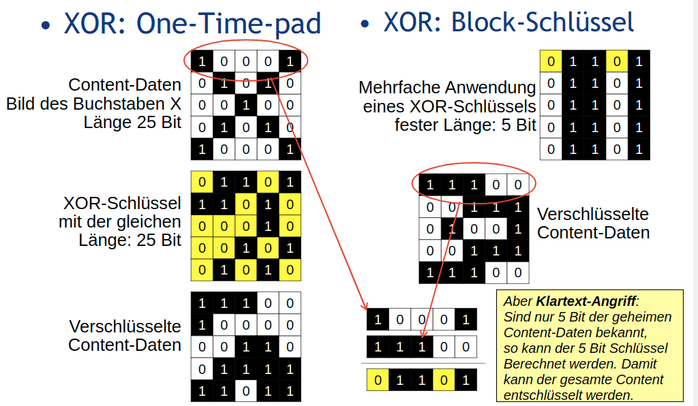
- Blockweise Verschlüsselung
    - XOR kann in der Praxis nur einmalig (one-time pad) angewendet werden (Klartext-Angriff gelingt)
    - Gute symmetrische Verfahren wie AES ermöglichen die wiederholte Anwendung des Schlüssels (Erklärung!)
    - Blocklänge und Schlüssellänge z.B. 128 oder 256 Bit
    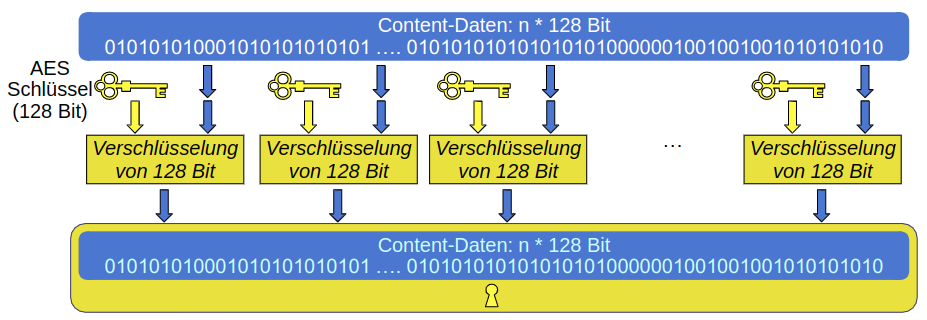
    
## AES - Advanced Encryption Standard
- Standard nach dem Verfahren von Rijndael
    - In 2000 Sieger eines Wettbewerbs der NIST
    - 128 Bit Blocklänge mit 128, 192 oder 256 Bit Schlüssel
    - Realisierung in Hardware und Software sehr schnell
    - Je nach Schlüssellänge: 10, 12 oder 14 Runden
    - Frei von Patenten und unentgeltlich nutzbar
    - Details: https://en.wikipedia.org/wiki/Advanced_Encryption_Standard

## Kontrolle über den Schlüssel
- Schlüssel wird im Endgerät kontrolliert
    - Der DRM-Controller kontrolliert die Verwendung des Schlüssels
    - Schlüssel muss vor dem Nutzer verborgen bleiben
    - DRM-Controller darf nicht vom Nutzer umprogrammiert werden
    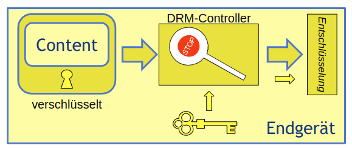

## Lizenzen (oder Rechteobjekte)
- Lizenzen enthalten den Schlüssel und eine Rechtebeschreibung
  - Verschlüsselte Content-Daten sind ohne Lizenz wertlos
  - Rechtebeschreibung legt die zulässige Nutzungsart (z.B. abspielen) und Nutzungsdauer (z.B. 3 mal oder in den nächsten 48h) fest
  - Verschlüsselte Nutzdaten können und sollen kopiert werden
  - Lizenzen sind an das Endgerät gebunden (Weitergabe unmöglich oder wirkungslos)

## Public-Key-Kryptographie
- Grundprinzip
    - Es gibt zwei Schlüssel (=Schlüsselpaar)
    - Was mit dem einen verschlüsselt wird kann nur mit dem anderen entschlüsselt werden (=asymmetrisch)
    - Der eine Schlüssel heißt öffentlich: Public Key
    - Der andere Schlüssel heißt privat: Private Key

## Anwendungen bei DRM
- Geheime Übertragung des CEK:
    - Endgerät fordert von einem Lizenz-Server den passenden Schlüssel für die Content-Daten an.
    - Lizenz-Server verschlüsselt den CEK (Content Encryption Key) mit dem öffentlichen Schlüssel des Endgerätes

## Geheime Übertragung des CEK
Sequenz-Diagramm
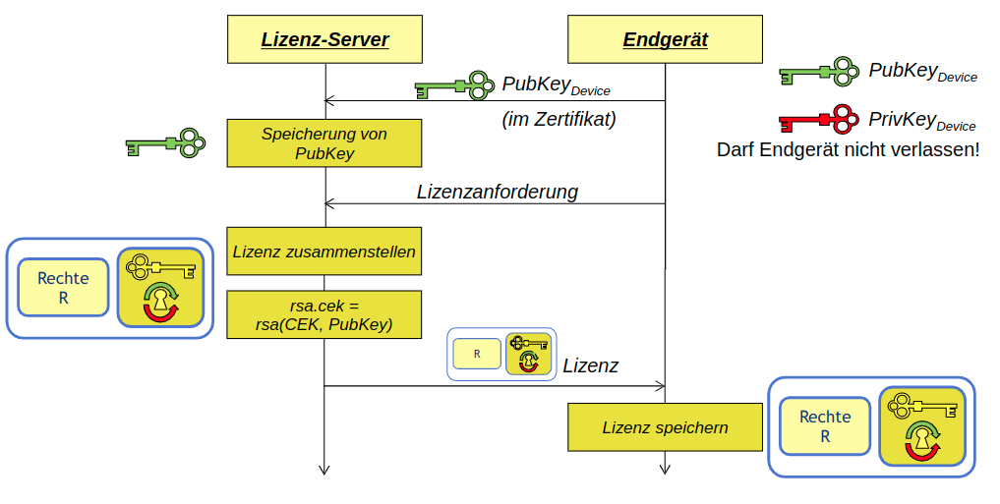

## Allgemeine Anwendungen
- Beispiel: Verschlüsselte E-Mail oder SSL
    - Sender einer geheimen E-Mail (z.B.) verschlüsselt diese mit dem öffentlichen Schlüssel des Empfängers
    - Da asymmetrische Verfahren langsam sind, wird der Inhalt (Nutzdaten) mit einem schnellen symmetrischen Algorithmus (z.B. AES) verschlüsselt. Der symmetrische Schlüssel wird mit dem öffentlichen Schlüssel des Empfängers verschlüsselt. (=hybrid)
- Digitale Signatur
    - Integrität von Nachrichten und Authentizität von Kommunikationspartner muss sichergestellt werden
    - Ausgetauschte (nicht verschlüsselte) Dokumente (z.B. Rechte in der Lizenz, oder eine App) dürfen nicht verändert werden
    - Beteiligte Kommunikationspartner (z.B. Endgerät und Server) müssen sich über den jeweils anderen sicher sein können
    - Einsatz von Zertifikaten (z.B. nach X.509)
    - Prinzip vereinfacht: Der Sender überträgt das Dokument doppelt. Einmal unverschlüsselt. Ein zweites mal mit seinem privaten Schlüssel verschlüsselt.
    - Besser: Sender verschlüsselt mit seinem privaten Schlüssel nur eine Prüfsumme (Hash-Wert, Details später) des Dokumentes.

## Authentizität durch Zertifikate
- Wie kann der Lizenz-Server dem Endgerät vertrauen?
  - Dem öffentliche Schlüssel alleine darf man noch nicht trauen
  - Von einer offiziellen Instanz (CA - Certification Authority) ausgestellte Zertifikate bieten Abhilfe
- Was ist ein Zertifikat (nach X.509)?
  - Der öffentliche Schlüssel und
  - Ein Datensatz über den Besitzer des Schlüssel
  - Beides zusammen wurde von einer CA digital signiert
  - Das Zertifikat der CA kann beigefügt sein
- Zertifikatsketten
  - Der Aussteller des Zertifikates besitzt ein eigenes Zertifikat

## Kryptographische Hash-Funktion
- ... wird für die digitale Signatur benötigt
    - Wird auch Streuwertfunktion genannt
    - Die Hash-Funktion ist eine Funktion, die zu einer Eingabe aus einer (üblicherweise) großen Quellmenge eine Ausgabe aus einer (im Allgemeinen) kleineren Zielmenge (die Hash-Werte, meist eine Teilmenge der natürlichen Zahlen) erzeugt.
- Dabei muss gelten:
    - Kollisionsfreiheit
       - Es darf nicht effizient möglich sein, zwei Quellelemente mit demselben Hash-Wert zu finden.
    - Unumkehrbarkeit
       - Zu der Funktion gibt es keine effizient berechenbare Umkehrfunktion, mit der es möglich wäre, für ein gegebenes Zielelement ein passendes Quellelement zu finden

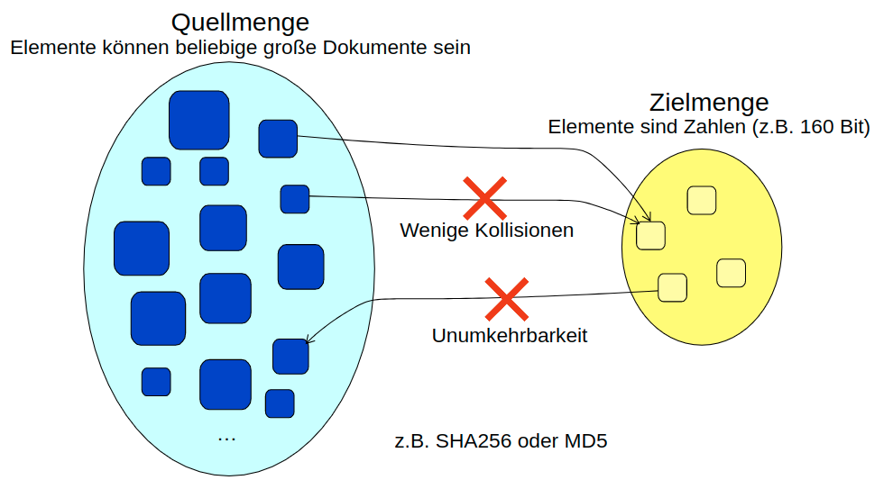

## Sicherung der Integrität & Authentizität
- ... der Lizenz durch digitale Signatur
    - Mit dem Private Key des Lizenz-Servers wird ein über die Rechte und Schlüssel errechneter Hash-Wert verschlüsselt
    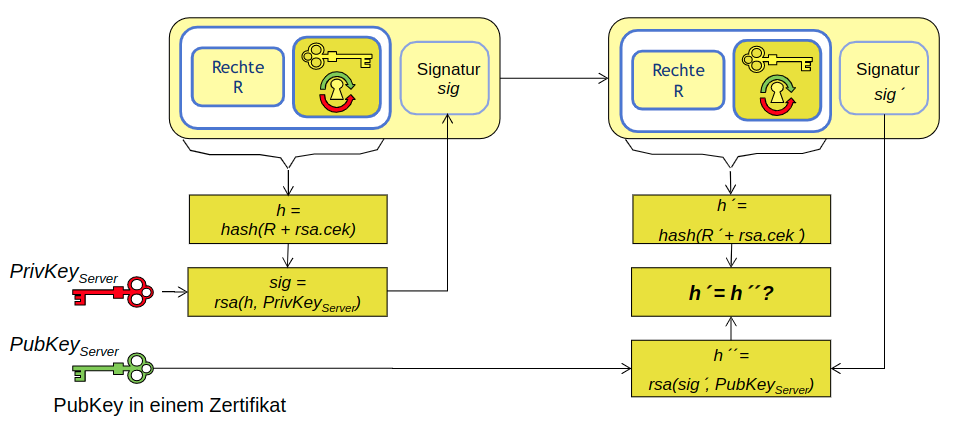

## Das RSA-Verfahren
- RSA (Rivest, Shamir, Adleman)
- Idee: Multiplikation ist einfach. Die Umkehrung, die Faktorisierung, ist schwierig
- Nehme zwei etwa gleich lange Primzahlen: $p$ und $q$ (Beispiel: $p=11, q=13$)
- Berechne $n = p*q$ ($n = 143$)
- Berechne $\phi(n) = (p-1)*(q-1)$ ($=120$)
- Wähle $e$ (23) mit $ggT(e,\phi(n)) = 1$
- Berechne $d$ so, dass $e * d ≡ 1 mod \phi(n)$ gilt, $e * d = k * \phi(n) + 1$ ($d = 47$ mit $k = 9$)
       - Public Key: $(n,e) (143, 23)$
       - Private Key: $(n,d) (143, 47)$
       - Verschlüsselung mit Public Key:
          - $C = K^e \text{ mod } n$
          - $2 = 723 \text{ mod } 143$
       - Entschlüsselung mit Private Key:
          - $K = C^d \text{ mod } n$
          - $7 = 2^{47} \text{ mod } 143$
       - Damit n im praktischen Anwendungsfall nicht in p und q faktorisiert werden kann, muss n aktuell eine 1024 bis 2048 bit lange Zahl sein !!

Ein 1024 bit RSA-Schlüsselpaar
- $n = 151117088560515543543583509112099097962003663556607044995537346278481881284114992437661794727300361132467861422736444261887801298612841233509930473048074186874048225374579833810514168500718834144275902347213750223932752522075922296123467024433402797906496071473309891192170853187418104035346071158728163015279$
- $e = 65537$ (fast immer gleich, damit öffentlich)
- $d = 28437784048962238102491957487823949450926822751173149303904086113989304391061388249899795754639293129785100552765744038968250811233229640247157674658618774782653583162649400546666901513074991074038701463640676643839991675942131621634153560437455148272957188215773487794300919331597374861906548026671091235657$

## Referenz-Modell für DRM-Systeme
- DRM-Referenz-Modell
  1. Download des Contents
  2. Content wird geöffnet
  3. DRM-Controller fordert eine Lizenz an
  4. Lizenz wird geöffnet
  5. Der private Geräteschlüssel wird benötigt
  6. Nutzungszähler werden geprüft und angepasst. Entschlüsselter Content wird decodiert

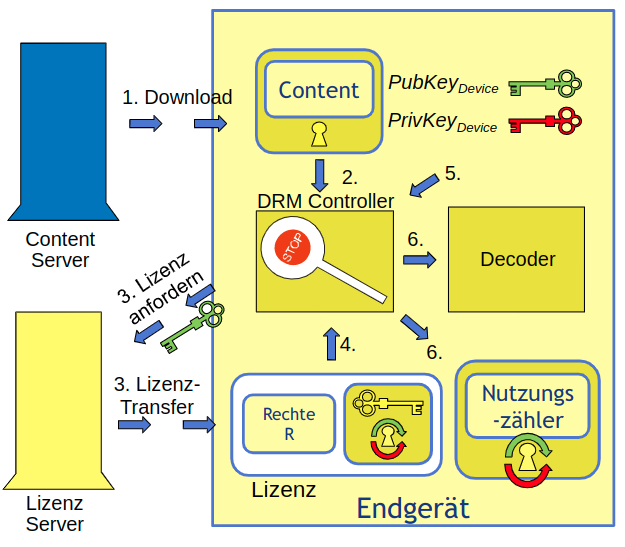

## Zusammenfassung
- Content ist symmetrisch verschlüsselt
    - Content-Daten sind ohne Schlüssel (CEK) wertlos
    - Im unverschlüsselten Teil steht die Adresse des Lizenz-Servers
- Schlüssel wird in der Lizenz transportiert
    - Lizenz enthält Rechtebeschreibung
    - Rechte werden im DRM-Controller ausgewertet
- Asymmetrische Kryptographie
    - Nachrichten (z.B. Rechtebeschreibungen) werden von beiden Seiten signiert
    - Zertifikate werden eingesetzt
    - Schlüssel (CEK) in der Lizenz wird vom Server mit dem öffentlichen Schlüssel des Endgerätes verschlüsselt
    - Der private Endgeräteschlüssel ist der Sicherheitsanker

## Weitere Informationen
- [Jürgen Nützel: Die informatorischen Aspekte virtueller Güter und Waren, Oktober 2006 im Unversitätsverlag Ilmenau](http://www.juergen-nuetzel.de/habilitation.html)
- [Jürgen Nützel: Digital Rights Management (Seite 28 - 49), in Die Privatkopie, herausgegeben von Frank Fechner, 2007, Universitätsverlag Ilmenau, ISBN 978-3-939473-06-0](https://www.db-thueringen.de/receive/dbt_mods_00007543)
- [http://de.wikipedia.org/wiki/One-Time-Pad](http://de.wikipedia.org/wiki/One-Time-Pad)
- [http://de.wikipedia.org/wiki/Advanced_Encryption_Standard](http://de.wikipedia.org/wiki/Advanced_Encryption_Standard)
- Reinhard Wobst: Abenteuer Kryptologie. 3. Auflage, Addison-Wesley, München 2003
- [http://de.wikipedia.org/wiki/Digitale_Signatur](http://de.wikipedia.org/wiki/Digitale_Signatur)
- [The Internet Society: RFC 3280 Internet X.509 Public Key Infrastructure](http://www.ietf.org/rfc/rfc3280.txt)
- [http://de.wikipedia.org/wiki/Digitales_Zertifikat](http://de.wikipedia.org/wiki/Digitales_Zertifikat)
- [http://de.wikipedia.org/wiki/RSA-Kryptosystem](http://de.wikipedia.org/wiki/RSA-Kryptosystem)

# Mobile Entrepreneurship
## Unternehmertum
Der Begriff Unternehmertum (engl. **entrepreneurship** , von frz. entreprendre), auch Unternehmergeist, Gründertum, Gründerszene oder Gründerkultur, beschäftigt sich als wirtschaftswissenschaftliche Teildisziplin mit dem Gründungsgeschehen oder der Gründung von neuen Organisationen als Reaktion auf identifizierte Möglichkeiten und als Ausdruck spezifischer Gründerpersönlichkeiten, die ein persönliches Kapitalrisiko tragen.
[Wikipedia](https://de.wikipedia.org/wiki/Unternehmertum)

## Zielgruppe und Einschränkung
- Zielgruppe:
    - Einzelpersonen und Mini-Teams (2-3 Personen)
    - Noch keine Unternehmer
    - Haben eine erste Version einer App entwickelt
- Einschränkungen
    - Kein Ersatz für den eigenen Business-Plan

## Fragen
- Bin ich ein/e Unternehmer/in?
    - Möchte ich Geld verdienen?
    - Möchte ich neue Kunden gewinnen?
- Was ist mein Geschäftsmodell?
- Welche Rechtsform?
- Wie komme ich an nötiges Kapital?

## Geschäftsmodell (Empfehlung)
- Wo kommen 1000 bis 3000 Euro im Monat her?
    - Tipp: Wenige, dafür aber zahlungskräftige Kunden!
- Entwickeln Sie zuerst ein B2B-Geschäftsmodell
    - B2B: Business-to-Business (Firmen sind Kunden)
    - B2C: Business-to-Consumer (Privatpersonen sind Kunden)
- Beispiel für B2B-Geschäftsmodell:
    - App: Findet für Allergiker die richtige Zeit zum Joggen
    - Mögliche Firmen-Kunden: Krankenkassen, Sportartikel-Hersteller ...
    - Entwickeln Sie ein White-Label-Konzept, um Ihre App mehreren Krankenkassen und Herstellern zu "verkaufen"
    - Betreiben Sie benötigte Server gegen Gebühr selbst.

Rechtsform (wenn es ernst wird)
- Gründen Sie eine Unternehmergesellschaft (UG):
  - https://de.wikipedia.org/wiki/Unternehmergesellschaft_(haftungsbeschr%C3%A4nkt)
  - Vorstufe einer GmbH
  - Bis 3 Gründer sehr einfach.

Wie komme ich an das nötige Kapital?
- Durststrecke bis zum ersten B2B-Kunden selbst finanzieren
- Crowdfunding oder Crowdinvesting
    - Übersicht: https://www.startplatz.de/crowdfunding-plattformen/
