# Motivation und Grundlagen
## Aufgaben und Komponenten eines DBMS
Prinzipien: Die neun Codd’schen Regeln
1. Integration: einheitliche, nichtredundante Datenverwaltung
2. Operationen: Speichern, Suchen, Ändern
3. Katalog: Zugriffe auf Datenbankbeschreibungen im Data Dictionary
4. Benutzersichten
5. Integritätssicherung: Korrektheit des Datenbankinhalts
6. Datenschutz: Ausschluss unauthorisierter Zugriffe
7. Transaktionen: mehrere DB-Operationen als Funktionseinheit
8. Synchronisation: parallele Transaktionen koordinieren
9. Datensicherung: Wiederherstellung von Daten nach Systemfehlern

Betrachtete Fragestellung
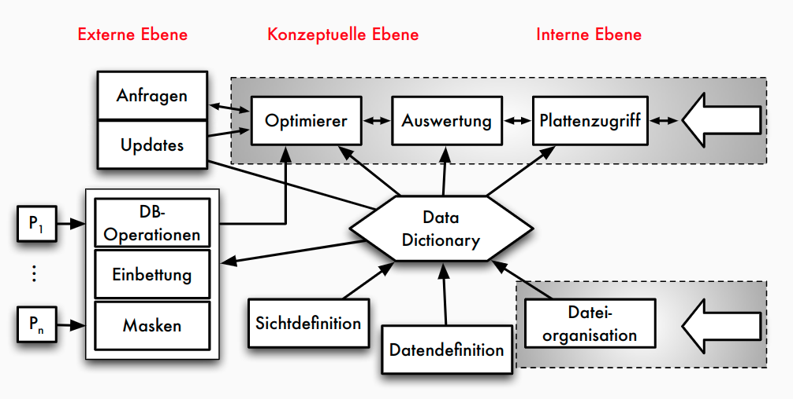

**Zentrale Komponenten**
- **Anfrageverarbeitung** : Planung, Optimierung und Ausführung deklarativer Anfragen
- **Transaktionsverwaltung** : Koordination und Synchronisation von Transaktionen, Durchführung von Änderungen, Sicherung der ACID-Eigenschaften
- **Speichersystem** : Organisation der Daten im Hauptspeicher und auf dem Externspeicher für effizienten Zugriff und Persistenz

## Relationale vs. nicht-relationale DBMS
**Relationale DBMS**
- Basis: **Relationenmodell** = Daten in Tabellen strukturiert
- Beziehungen über Werte (= Fremdschlüssel),
    Integritätsbedingungen
- **SQL** als standardisierte Anfragesprache
- kommerziell erfolgreichstes Datenmodell: Oracle, IBM DB2,
    MS SQL Server, SAP HANA, ...

| WEINE | WeinID            | Name | Farbe | Jahrgang    | Weingut |
| ----- | ----------------- | ---- | ----- | ----------- | ------- |
| 1042  | La Rose Grand Cru | Rot  | 1998  | Château ... |
| 2168  | Creek Shiraz      | Rot  | 2003  | Creek       |
| 3456  | Zinfandel         | Rot  | 2004  | Helena      |
| 2171  | Pinot Noir        | Rot  | 2001  | Creek       |
| 3478  | Pinot Noir        | Rot  | 1999  | Helena      |
| 4711  | Riesling Reserve  | Weiß | 1999  | Müller      |
| 4961  | Chardonnay        | Weiß | 2002  | Bighorn     |

**Kritik an RDBMS / SQL**
- nicht skalierbar
    - Normalisierung von Relationen, viele Integritätsbedingungen zu prüfen
    - kann man in RDBMS auch vermeiden!
- starre Tabellen nicht flexibel genug
    - schwach typisierte Tabellen (Tupel weichen in den tatsächlich genutzten Attributen ab)
          - viele Nullwerte wenn alle potentiellen Attribute definiert
          - alternativ Aufspaltung auf viele Tabellen
          - Schema-Evolution mit **alter table** unflexibel
    - tatsächlich in vielen Anwendungen ein Problem
- Integration von spezifischen Operationen (Graphtraversierung, Datenanalyse-Primitive) mit Stored Procedures zwar möglich führt aber oft zu schwer interpretierbarem Code

**NoSQL-Systeme**
- Datenmodelle
    - KV-Stores
    - Wide Column Stores
    - Dokumenten-orientierte Datenhaltung
    - Graph-Speicher
    - ...
- Anfragesprache -> unterschiedliche Ansätze:
    - einfache funktionale API
    - Programmiermodell für parallele Funktionen
    - angelehnt an SQL-Syntax
    - ...
- Beispiele
  - dokumentenorientierte Datenbanksysteme: MongoDB
      - semistrukturierte Dokumente in JSON- bzw. BSON-Format
      - Anfragen: CRUD erweitert um dokumentspezifische Suche
  - Graph-Datenbanksysteme: Neo4j
      - Property Graphen als Datenmodell: Knoten und Kanten mit Eigenschaften
      - Anfragesprache Cypher
      - Muster der Form "Knoten -> Kante -> Knoten ..."

## OLTP, OLAP und HTAP
### OLTP vs OLAP
|                            | Online Transactional Processing (OLTP)                                            | Online Analytical Processing (OLAP)                          |
| -------------------------- | --------------------------------------------------------------------------------- | ------------------------------------------------------------ |
|                            | -> Klassische operative Informationssysteme                                       | -> Data Warehouse                                            |
|                            | Erfassung und Verwaltung von Daten                                                | Analyse im Mittelpunkt = entscheidungsunterstützende Systeme |
|                            | Verarbeitung unter Verantwortung der jeweiligen Abteilung                         | Langandauernde Lesetransaktionen auf vielen Datensätzen      |
|                            | Transaktionale Verarbeitung: kurze Lese-/ Schreibzugriffe auf wenigen Datensätzen | Integration, Konsolidierung und Aggregation der Daten        |
|                            | ACID-Eigenschaften                                                                |                                                              |
|                            |                                                                                   |
| **Anfragen**               |                                                                                   |
| Fokus                      | Lesen, Schreiben, Modifizieren, Löschen                                           | Lesen, periodisches Hinzufügen                               |
| Transaktionsdauer und -typ | kurze Lese- / Schreibtransaktionen                                                | langandauernde Lesetransaktionen                             |
| Anfragestruktur            | einfach strukturiert                                                              | komplex                                                      |
| Datenvolumen einer Anfrage | wenige Datensätze                                                                 | viele Datensätze                                             |
| Datenmodell                | anfrageflexibel                                                                   | analysebezogen                                               |
| Antwortzeit                | msecs ...secs                                                                     | secs ...min                                                  |
|                            |                                                                                   |
| **Daten**                  |                                                                                   |
| Datenquellen               | meist eine                                                                        | mehrere                                                      |
| Eigenschaften              | nicht abgeleitet, zeitaktuell, autonom, dynamisch                                 | abgeleitet / konsolidiert, historisiert, integriert, stabil  |
| Datenvolumen               | MByte ...GByte                                                                    | GByte ...TByte ...PByte                                      |
| Zugriffe                   | Einzeltupelzugriff                                                                | Tabellenzugriff (spaltenweise)                               |

**OLTP: Beispiel**
```sql
BEGIN ;
SELECT KundenNr INTO KNr
FROM Kunden WHERE email = '...';
INSERT INTO BESTELLUNG VALUES (KNr, BestNr, 1);
UPDATE Artikel SET Bestand = Bestand-1
WHERE ArtNr = BestNr;
COMMIT TRANSACTION ;
```

**OLAP: Beispiel**
```sql
SELECT DISTINCT ROW Zeit.Dimension AS Jahr,
    Produkt.Dimension AS Artikel,
    AVG(Fact.Umsatz) AS Umsatzdurchschnitt,
    Ort.Dimension AS Verkaufsgebiet
FROM (Produktgruppe INNER JOIN Produkt ON Produktgruppe.
    [Gruppen-Nr] = Produkt.[Gruppen-ID]) INNER JOIN
    ((((Produkt INNER JOIN [Fact.Umsatz] ON Produkt.[Artikel-Nr]
    = [Fact.Umsatz].[Artikel-Nr]) INNER JOIN Order ON
    [Fact.Umsatz].[Bestell-Nr]= Order.[Order-ID]) INNER JOIN
    Zeit.Dimension ON Orders.[Order-ID] =
    Zeit.Dimension.[Order-ID]) INNER JOIN Ort.Dimension ON
    Order.[Order-ID] = Ort.Dimension.[Order-ID]) ON
    Produktgruppe.[Gruppen-Nr] = Produkt.[Gruppen-ID]
GROUP BY Produkt.Dimension.Gruppenname, Ort.Dimension.Bundesland,
Zeit.Dimension.Jahr;
```

### HTAP
- HTAP = Hybrid Transactional and Analytics Processing
- Ziel: schnellere Geschäftsentscheidungen durch "Echtzeit"-Verarbeitung
- OLAP und OLTP auf der gleichen Datenbank: naheliegend aber große technische Herausforderung
    - sehr unterschiedliche Workloads (Anfrage- und Lastprofile)
    - Transaktionsverwaltung: gegenseitige Beeinflussung von Änderungs- und Leseoperationen reduzieren
    - unterschiedliche Datenorganisation (physisch, logisch)
- Herausforderungen
  - Analytical (OLAP) und Transactional processing (OLTP)
    - verschiedene Zugriffscharakterisiken
    - verschiedene Performance-Ziele (Latenz vs. Durchsatz)
  - => Unterschiedliche Optimierungen notwendig

## Disk- vs. Main-Memory-Systeme**
**Traditionelle Annahmen**
- Daten sollen dauerhauft aufbewahrt werden
- Datenbank >> Hauptspeicher
- Disk >> Hauptspeicher
- Hauptspeicher = flüchtiger (volatiler) Speicher
- Disk-IO dominiert Kosten

**Speicherhierarchie**
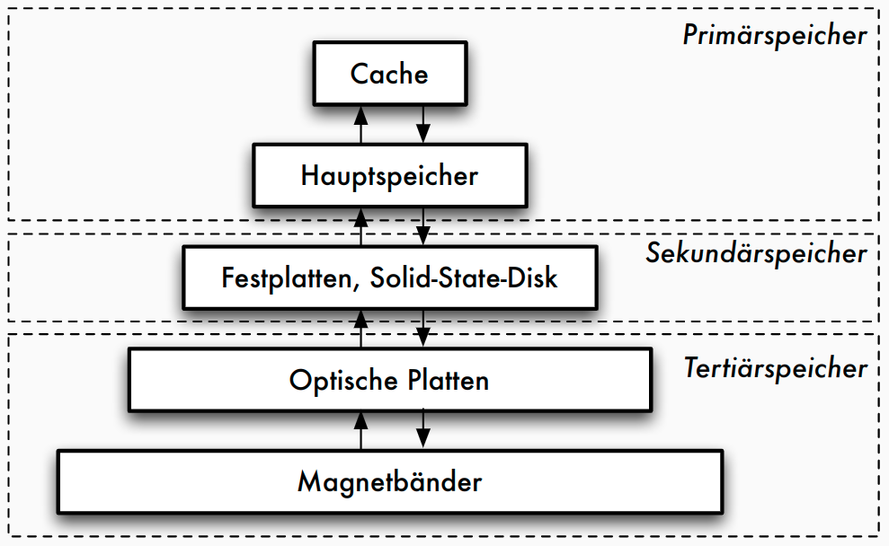

**Eigenschaften von Speichermedien**
|                 | Primär   | Sekundär  | Tertiär      |
| --------------- | -------- | --------- | ------------ |
| Geschwindigkeit | schnell  | langsam   | sehr langsam |
| Preis           | teuer    | preiswert | billig       |
| Stabilität      | flüchtig | stabil    | stabil       |
| Größe           | klein    | groß      | sehr groß    |
| Granulate       | fein     | grob      | grob         |

**Speichermedien**
- **Primärspeicher**
    - Primärspeicher: Cache und Hauptspeicher
    - sehr schnell, Zugriff auf Daten fein granular: theoretisch jedes Byte adressierbar (Cachelines)
- **Sekundärspeicher**
    - Sekundärspeicher oder Online-Speicher
    - meist Plattenspeicher, nicht-flüchtig
    - Granularität des Zugriffs gröber: Blöcke, oft 512 Bytes
    - Zugriffslücke: Faktor 10^5 langsamerer Zugriff
- **Tertiärspeicher**
    - Zur langfristigen Datensicherung (Archivierung) oder kurzfristigen Protokollierung (Journale)
    - üblich: optische Platten, Magnetbänder
    - "Offline-Speicher" meist Wechselmedium
    - Nachteil: Zugriffslücke extrem groß


**Transferraten HDD vs. SSD**
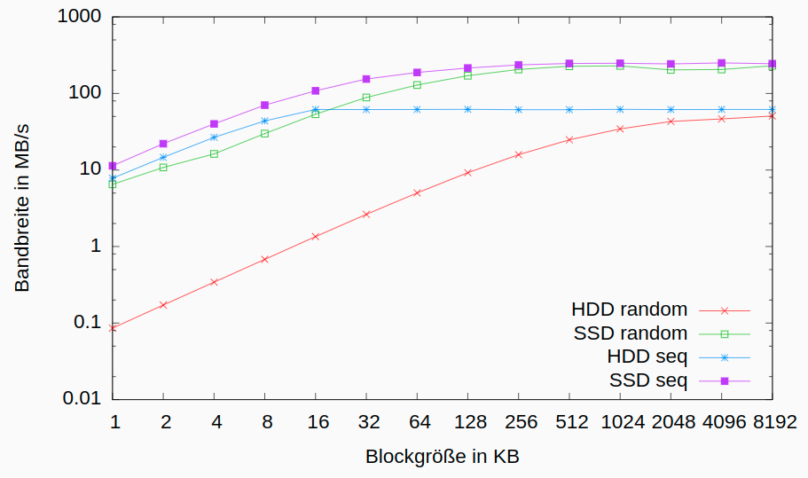

**Konsequenz für disk-basierte Systeme**
- blockbasierter Zugriff mit typischen Blockgrößen ≥ 4 KB
- speziell für Magnetplatten Optimierung auf sequentielle Zugriffe
       - Disklayout: Organisation der Daten auf der Disk = fortlaufende Folge von Blöcken
       - sequentielles Lesen und Schreiben
- Zugriffslücke zwischen Hauptspeicher und Disk durch Caching verbergen (Lokalität von Zugriffen ausnutzen)

**Main-Memory-Datenbanken**
- klassische Annahmen nicht mehr zutreffend:
    - Systeme mit Hauptspeicher im TB-Bereich verfügbar
    - Datenbank kann komplett im Hauptspeicher gehalten werden (muss aber dennoch persistent sein)
- **Main-Memory-** oder **Hauptspeicher-** Datenbanken: Ausnutzung der großen Hauptspeicher und Multicore-Architekturen
       - Beispiele: SAP HANA, Oracle TimesTen, SQL Server Hekaton, Hyper, MemSQL, ...
       - Besonderheiten: hauptspeicheroptimierte Datenstrukturen (Main-Memory-Scans), Persistenz trotz volatilem Speicher, Datenkompression, Nebenläufigkeitskontrolle


## Klassische 5-Schichtenarchitektur
**Fünf-Schichtenarchitektur**
- Architektur für klassische DBMS
- basierend auf Idee von Senko 1973
- Weiterentwicklung von Härder 1987
- Umsetzung im Rahmen des IBM-Prototyps _System R_
- genauere Beschreibung der Transformationskomponenten
    - schrittweise Transformation von Anfragen/Änderungen bis hin zu Zugriffen auf Speichermedien
    - Definition der Schnittstellen zwischen Komponenten

**5-Schichtenarchitektur: Funktionen**
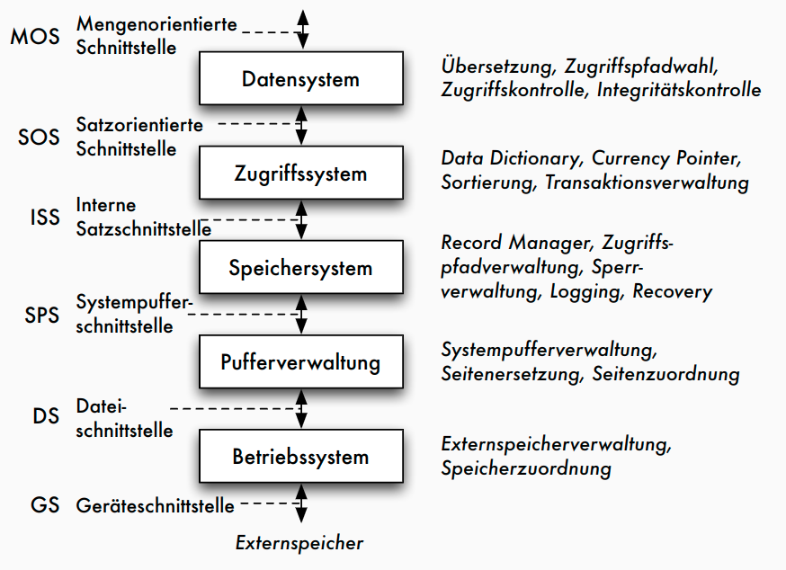

**5-Schichtenarchitektur: Objekte**
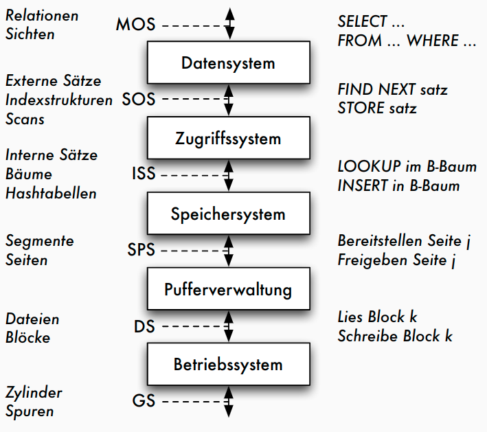

Erläuterungen
- mengenorientierte Schnittstelle **MOS** :
    - deklarative Datenmanipulationssprache auf Tabellen und Sichten (etwa SQL)
- durch Datensystem auf satzorientierte Schnittstelle **SOS** umgesetzt:
       - navigierender Zugriff auf interner Darstellung der Relationen
       - manipulierte Objekte: typisierte Datensätze und interne Relationen sowie logische Zugriffspfade (Indexe)
       - Aufgaben des Datensystems: Übersetzung und Optimierung von SQL-Anfragen
- durch Zugriffssystem auf interne Satzschnittstelle **ISS** umgesetzt:
       - interne Tupel einheitlich verwalten, ohne Typisierung
       - Speicherstrukturen der Zugriffspfade (konkrete Operationen auf B+-Bäumen und Hashtabellen), Mehrbenutzerbetrieb mit Transaktionen
- durch Speichersystem Datenstrukturen und Operationen der ISS auf interne Seiten eines virtuellen linearen Adressraums umsetzen
       - Manipulation des Adressraums durch Operationen der Systempufferschnittstelle **SPS**
       - Typische Objekte: interne Seiten, Seitenadressen
       - Typische Operationen: Freigeben und Bereitstellen von Seiten, Seitenwechselstrategien, Sperrverwaltung, Schreiben des Logs
- durch Pufferverwaltung interne Seiten auf Blöcke der Dateischnittstelle **DS** abbilden
       - Umsetzung der DS-Operationen auf Geräteschnittstelle erfolgt durch BS

## Neue Entwicklungen
Anforderungen aus neuen Anwendungen
- Nicht-Standard-Datenmodelle (siehe NoSQL-Systeme)
- flexibler Umgang mit Datenstrukturen (JSON, Schema on Read, ...)
- beschränkte (Lookups) vs. erweiterte (z.B. Graphoperationen, Datenanalysen) Anfragefunktionalität
- Skalierbarkeit zu Big Data (massiv parallele/verteilte Systeme)
- dynamische Daten / Datenströme
- ...

**Entwicklungen im Hardware-Bereich**
- Multicore- und Manycore-Prozessoren: 64+ Cores
    - Nutzung erfordert Parallelisierungstechniken und Nebenläufigkeitskontrolle
- Memory Wall: Hauptspeicherzugriff als Flaschenhals
    - RAM-Zugriff 60 ns, L1-Cache: 4 CPU-Zyklen -> Cache-optimierte Strukturen
- Datenbank-Accelerators
    - Hardware-unterstütztes Datenmanagement: FPGA, GPU als Coprozessoren, Highspeed-Netzwerk, SSDs als zusätzliche Cache-Ebene, ...
- Persistenter Memory: nicht-volatiler Speicher
    - Instant Restart / Recovery von Main-Memory-Datenbanken

**Zusammenfassung**
- Datenmanagementfunktionalitäten in vielen Softwaresystemen erforderlich
- nicht auf Implementierung kompletter DBMS beschränkt, sondern für nahezu alle datenintensiven Systeme: auch in Suchmaschinen, Datenanalyseanwendungen, eingebetteten Systemen, Visualisierungssystemen, Steuerungssystemen, Entwicklungsumgebungen, ...
- gemeinsame Aufgaben / Komponenten: Datenorganisation und -verwaltung (Indexstrukturen), Transaktionsverwaltung / Nebenläufigkeitskontrolle / Recovery, Anfrageverarbeitung
- betrifft Datenstrukturen und Algorithmen

# Speicherstrukturen für Datenbanken
## Speicher- und Sicherungsmedien
Speichermedien
- verschiedene Zwecke:
    - Daten zur Verarbeitung bereitstellen
    - Daten langfristig speichern (und trotzdem schnell verfügbar halten)
    - Daten sehr langfristig und preiswert archivieren unter Inkaufnahme etwas längerer Zugriffszeiten
- Speicherhierarchie:
    1. Extrem schneller Prozessor mit Registern
    2. Sehr schneller Cache-Speicher
    3. Schneller Hauptspeicher
    4. Langsamer Sekundärspeicher mit wahlfreiem Zugriff
    5. Sehr langsamer Nearline-Tertiärspeicher bei dem die Speichermedien automatisch bereitgestellt werden
    6. Extrem langsamer Offline-Tertiärspeicher, bei dem die Speichermedien per Hand bereitgestellt werden

Zugriffslücke in Zahlen
- Zugriffslücke: Unterschiede in den Zugriffsgeschwindigkeiten auf den verschiedenen Speicherebenen

| Speicherart              | Zugriffszeit | CPU cycles | typische Kapazität         |
| ------------------------ | ------------ | ---------- | -------------------------- |
| CacheSpeicher            | 6 ns         | 12         | 256 KB (L2) bis 32 MB (L3) |
| Hauptspeicher            | 60 ns        | 120        | 1 GB bis 1.5 TB            |
| Zugriffslücke $10^5$     |              |            |
| Magnetplattenspeicher    | 8-12 ms      | 16*10^6    | 160 GB bis 4 TB            |
| Platten-Farm oder -Array | 12 ms        | 24*10^6    | im TB- bis PB-Bereich      |

Typische Merkmale von Sekundärspeicher
| Merkmal         | Kapazität | Latenz  | Bandbreite           |
| --------------- | --------- | ------- | -------------------- |
| 1983            | 30 MB     | 48.3 ms | 0.6 MB/s             |
| 1994            | 4.3 GB    | 12.7 ms | 9 MB/s               |
| 2003            | 73.4 GB   | 5.7 ms  | 86 MB/s              |
| 2009            | 2 TB      | 5.1 ms  | 95 MB/s              |
| 2019 SSD (NVMe) | 2 TB      | ??      | seq.read 3.500 MB/s  |
|                 |           | ??      | seq.write 1.600 MB/s |

Solid State Disk (SSD)
- basierend auf EEPROMs in NAND- oder NOR-Technologie
- Arrays (=Flash-Block mit ca. 128 KB) von Speicherzellen, entweder ein Bit (SLC) oder 2-4 Bit (MLC)
- MLC sind langsamer und haben verkürzte Lebensdauer
- initial ist jedes Bit auf 1 gesetzt, durch Reprogrammieren auf 0
- Löschen zurück auf 1 nur für ganzen Block
- Konsequenz: langsames Löschen (Lesen = 25 μs, Löschen = 2 ms), begrenzte Lebensdauer (ca. 100.000    Lösch-Schreib-Zyklen)
- Schnittstelle: SATA oder PCIe (NVMe)

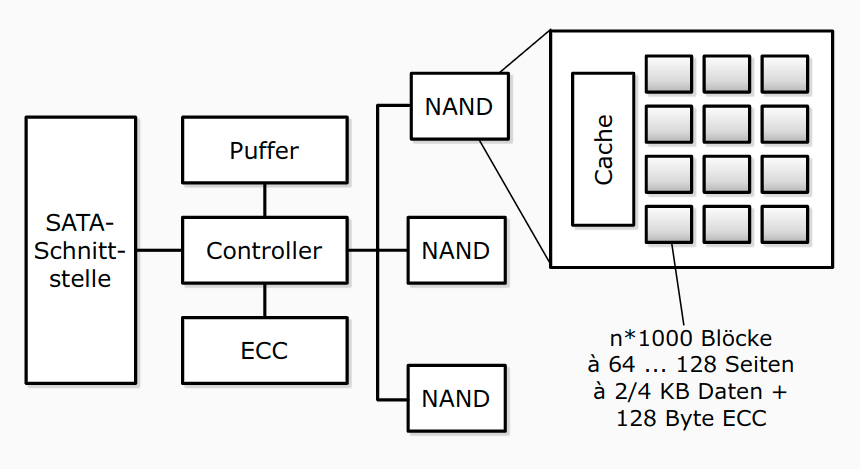

SSDs in DBMS
- klassische, auf sequenzielles Lesen ausgerichtete, Strategien von DBMS nutzen die Stärken von Flash-Speicher nicht aus
- kleinere Blockgrößen lassen sich effizient adressieren, sollten aber ein Vielfaches der Flash-Seiten sein
- wahlfreie Lesezugriffe sind effizienter als auf Magnetplatten, sollten aber auf Größen von ca. 4 bis 16 MB begrenzt werden
- konkurrierende IO-Zugriffe sind bis zu einem gewissen Maße ohne negativen Performanzeinfluss durchführbar

**Speicherarrays: RAID**
- Kopplung billiger Standardplatten unter einem speziellen Controller zu einem einzigen logischen Laufwerk
- Verteilung der Daten auf die verschiedenen physischen Festplatten übernimmt Controller
- zwei gegensätzliche Ziele:
    - Erhöhung der Fehlertoleranz (Ausfallsicherheit, Zuverlässigkeit) durch Redundanz
    - Effizienzsteigerung durch Parallelität des Zugriffs

Erhöhung der Fehlertoleranz
- Nutzung zusätzlicher Platten zur Speicherung von Duplikaten (Spiegeln) der eigentlichen Daten => bei Fehler: Umschalten auf Spiegelplatte
- bestimmte RAID-Levels (1, 0+1) erlauben eine solche Spiegelung
- Alternative: Kontrollinformationen wie Paritätsbits nicht im selben Sektor wie die Originaldaten, sondern auf einer anderen Platte speichern
- RAID-Levels 2 bis 6 stellen durch Paritätsbits oder Error Correcting Codes (ECC) fehlerhafte Daten wieder her
- ein Paritätsbit kann einen Plattenfehler entdecken und bei Kenntnis der fehlerhaften Platte korrigieren

Erhöhung der Effizienz
- Datenbank auf mehrere Platten verteilen, die parallel angesteuert werden können => Zugriffszeit auf große Datenmengen verringert sich fast linear mit der Anzahl der verfügbaren Platten
- Verteilung: bit-, byte- oder blockweise
- höhere RAID-Levels (ab Level 3) verbinden Fehlerkorrektur und block- oder bitweises Verteilen von Daten
- Unterschiede:
    - schnellerer Zugriff auf bestimmte Daten
    - höherer Durchsatz für viele parallel anstehende Transaktionen durch eine Lastbalancierung des Gesamtsystems


RAID-Levels

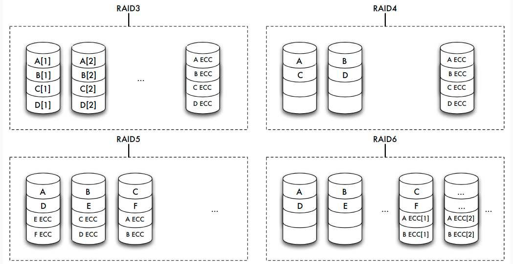

| Level | Striping blockweise | Striping bitweise | Kopie | Parität | Parität dedizierte Platte | Parität verteilt | Erkennen mehrerer Fehler |
| ----- | ------------------- | ----------------- | ----- | ------- | ------------------------- | ---------------- | ------------------------ |
| 0     | √                   |
| 1     |                     |                   | √     |
| 0+1   | √                   |                   | √     |
| 2     |                     | √                 |       | √       |
| 3     |                     | √                 |       | √       | √                         |
| 4     | √                   |                   |       | √       | √                         |
| 5     | √                   |                   |       | √       |                           | √                |
| 6     | √                   |                   |       | √       |                           |                  | √                        |

**Sicherungsmedien: Tertiärspeicher**
- weniger oft benutzte Teile der Datenbank, die eventuell sehr großen Umfang haben (Text, Multimedia) "billiger" speichern als auf Magnetplatten
- aktuell benutzte Datenbestände zusätzlich sichern (archivieren)
- Tertiärspeicher: Medium austauschbar
    - offline: Medien manuell wechseln (optische Platten, Bänder)
    - nearline: Medien automatisch wechseln (_Jukeboxes_, _Bandroboter_)

Langzeitarchivierung
- Lebensdauer, Teilaspekte:
- physische Haltbarkeit des Mediums garantiert die Unversehrtheit der Daten: 
  - 10 Jahre für Magnetbänder, 
  - 30 Jahre für optische Platten, 
  - Papier???
- Vorhandensein von Geräten und Treibern garantiert die Lesbarkeit von Daten: 
  - Geräte für Lochkarten oder 8-Zoll-Disketten?
- zur Verfügung stehende Metadaten garantieren die Interpretierbarkeit von Daten
- Vorhandensein von Programmen, die auf den Daten arbeiten können, garantieren die Wiederverwendbarkeit von Daten


## Struktur des Hintergrundspeichers
Verwaltung des Hintergrundspeichers
- Abstraktion von Speicherungs- oder Sicherungsmediums
- Modell: Folge von Blöcken
    
- Alternativen:
    - jede Relation oder jeder Zugriffspfad in genau einer Betriebssystem-Datei
    - ein oder mehrere BS-Dateien, DBS verwaltet Relationen und Zugriffspfade selbst innerhalb dieser Dateien
    - DBS steuert selbst Magnetplatte an und arbeitet mit den Blöcken in ihrer Ursprungsform ( _raw device_ )
- Warum nicht immer BS-Dateiverwaltung?
    - Betriebssystemunabhängigkeit
    - In 32-Bit-Betriebssystemen: Dateigröße 4 GB maximal
    - BS-Dateien auf maximal einem Medium
    - betriebssystemseitige Pufferverwaltung von Blöcken des Sekundärspeichers im Hauptspeicher genügt nicht den Anforderungen des Datenbanksystems

Blöcke und Seiten
- Zuordnung der physischen Blöcke zu Seiten
- meist mit festen Faktoren: 1, 2, 4 oder 8 Blöcke einer Spur auf eine Seite
- hier: "ein Block — eine Seite"
- höhere Schichten des DBS adressieren über Seitennummer

Dienste des Dateisystems
- Allokation oder Deallokation von Speicherplatz
- Holen oder Speichern von Seiteninhalten
- Allokation möglichst so, dass logisch aufeinanderfolgende Datenbereiche (etwa einer Relation) auch möglichst in aufeinanderfolgenden Blöcken der Platte gespeichert werden
- Nach vielen Update-Operationen: Reorganisationsmethoden
- Freispeicherverwaltung: doppelt verkettete Liste von Seiten

Abbildung der Datenstrukturen
- Abbildung der konzeptuellen Ebene auf interne Datenstrukturen
- Unterstützung durch Metadaten (im Data Dictionary, etwa das interne Schema)

| Konz. Ebene      | Interne Ebene   | Dateisystem/Platte |
| ---------------- | --------------- | ------------------ |
| Relationen ->    | Log. Dateien -> | Phys. Dateien      |
| Tupel ->         | Datensätze ->   | Seiten/Blöcke      |
| Attributwerte -> | Felder ->       | Bytes              |

- Beispiel: jede Relation in je einer logischen Datei, diese insgesamt in einer einzigen physischen Datei


## Seiten, Sätze und Adressierung
### Seite
- Block:
    - kleinste adressierbare Einheit auf Externspeicher
    - Zuordnung zu Seiten im Hauptspeicher
- Aufbau von Seiten
    - Header
       - Informationen über Vorgänger- und Nachfolger-Seite
       - eventuell auch Nummer der Seite selbst
       - Informationen über Typ der Sätze
       - freier Platz
    - Datensätze
    - unbelegte Bytes

Seitenorganisation
- Organisation der Seiten: doppelt verkettete Liste
- freie Seiten in Freispeicherverwaltung
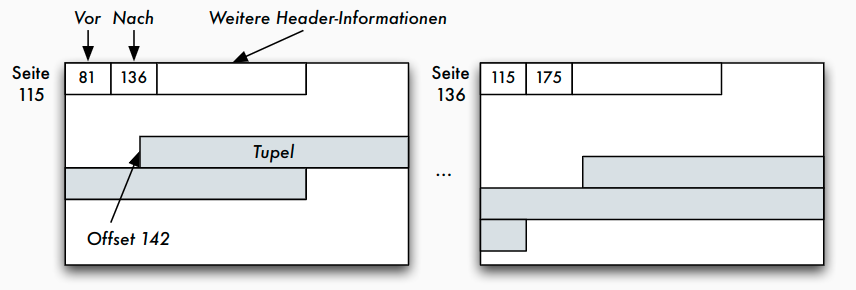

Seite: Adressierung der Datensätze
- adressierbare Einheiten
    - Zylinder
    - Spuren
    - Sektoren
    - Blöcke oder Seiten
    - Datensätze in Blöcken oder Seiten
    - Datenfelder in Datensätzen
- Beispiel: Adresse eines Satzes durch Seitennummer und Offset (relative Adresse in Bytes vom Seitenanfang)

Seitenzugriff als Flaschenhals
- Maß für die Geschwindigkeit von Datenbankoperationen: Anzahl der Seitenzugriffe auf dem Sekundärspeicher (wegen Zugriffslücke)
- Faustregel: Geschwindigkeit des Zugriffs ⇐ Qualität des Zugriffspfades ⇐ Anzahl der benötigten Seitenzugriffe
- Hauptspeicheroperationen nicht beliebig vernachlässigbar


Einpassen von Datensätzen auf Blöcke
- Datensätze (eventuell variabler Länge) in die aus einer fest vorgegebenen Anzahl von Bytes bestehenden Blöcke einpassen: Blocken
- Blocken abhängig von variabler oder fester Feldlänge der Datenfelder
       - Datensätze mit variabler Satzlänge: höherer Verwaltungsaufwand beim Lesen und Schreiben, Satzlänge immer wieder neu ermitteln
       - Datensätze mit fester Satzlänge: höherer Speicheraufwand

Verschiedene Satztypen


Sätze fester Länge
- SQL: Datentypen fester und variabler Länge
    - _char(n)_ Zeichenkette der festen Länge _n_
    - _varchar(n)_ Zeichenkette variabler Länge mit der Maximallänge _n_
- Aufbau der Datensätze, falls alle Datenfelder feste Länge:
    1. Verwaltungsblock mit Typ eines Satzes (wenn unterschiedliche Satztypen auf einer Seite möglich) und Löschbit
    2. Freiraum zur Justierung des Offset
    3. Nutzdaten des Datensatzes

Sätze variabler Länge
- im Verwaltungsblock nötig: Satzlänge _l_, um die Länge des Nutzdaten-Bereichs _d_ zu kennen
    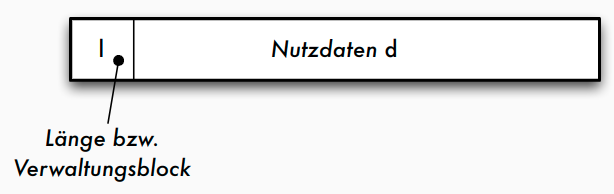
- Strategie a)
    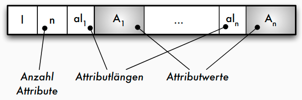
- Strategie b)
    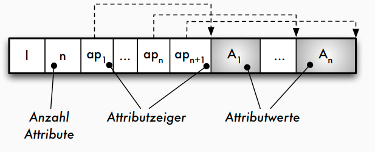

Speicherung von Sätzen variabler Länge
- Strategie a): Jedes Datenfeld variabler Länge $A_i$ beginnt mit einem _Längenzeiger $al_i$, der angibt, wie lang das folgende Datenfeld ist
- Strategie b): Am Beginn des Satzes wird nach dem Satz-Längenzeiger _l_ und der Anzahl der Attribute ein Zeigerfeld $ap_1 ,..., ap_n$ für alle variabel langen Datenfelder eingerichtet
- Vorteil Strategie b): leichtere Navigation innerhalb des Satzes (auch für Sätze in Seiten => TID)

Anwendung variabel langer Datenfelder
- "Wiederholgruppen": Liste von Werten des gleichen Datentyps
       - Zeichenketten variabler Länge wie _varchar(n)_ sind Wiederholgruppe mit _char_ als Basisdatentyp, mathematisch also die Kleene’sche Hülle $(char)∗$
       - Mengen- oder listenwertige Attributwerte, die im Datensatz selbst denormalisiert gespeichert werden sollen (Speicherung als geschachtelte Relation oder Cluster-Speicherung), bei einer Liste von _integer_ -Werten wäre dies $(integer)∗$
       - Adressfeld für eine Indexdatei, die zu einem Attributwert auf mehrere Datensätze zeigt (Sekundärindex), also $(pointer)∗$

Blockungstechniken: Nichtspannsätze
- jeder Datensatz in maximal einem Block
    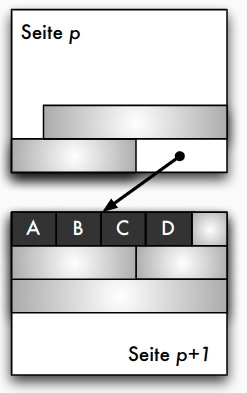
- Standardfall (außer bei BLOBs oder CLOBs)

Blockungstechniken: Spannsätze
- Spannsätze: Datensatz eventuell in mehreren Blöcken
    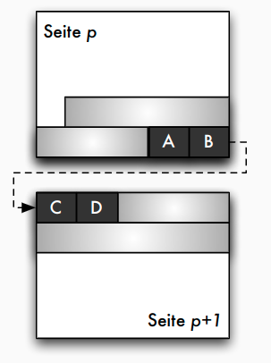

Adressierungstechniken
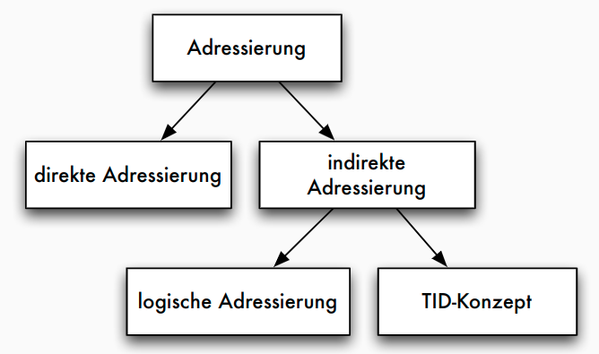

Adressierung: TID-Konzept
- Tupel-Identifier (TID) ist Datensatz-Adresse bestehend aus Seitennummer und Offset
- Offset verweist innerhalb der Seite bei einem Offset-Wert von _i_ auf den _i_ -ten Eintrag in einer Liste von Tupelzeigern (Satzverzeichnis), die am Anfang der Seite stehen
- Jeder Tupel-Zeiger enthält Offsetwert
- Verschiebung auf der Seite: sämtliche Verweise von außen bleiben unverändert
- Verschiebungen auf eine andere Seite: statt altem Datensatz neuer TID-Zeiger
- diese zweistufige Referenz aus Effizienzgründen nicht wünschenswert: Reorganisation in regelmäßigen Abständen


TID-Konzept: einstufige Referenz
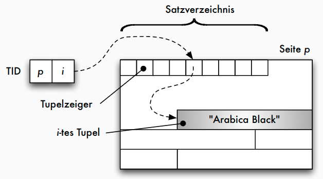

TID-Konzept: zweistufige Referenz
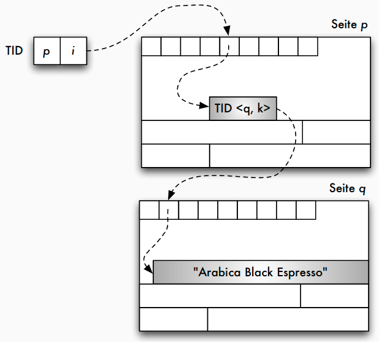

## Alternative Speichermodelle
- bisher klassisches N-äres Speichermodell (NSM), auch "row store"
- Vorteile:
    - gesamter Datensatz kann mit einem Seitenzugriff gelesen werden
    - leichte Änderbarkeit einzelner Attributwerte
- Nachteil:
    - werden nur wenige Attributwerte benötigt, müssen trotzdem immer alle Attributwerte gelesen werden -> unnötiger IO-Aufwand
- Alternativen: spaltenorientierte Speichermodelle
    - Zerlegung einer _n_ -stelligen Relation in eine Menge von Projektionen (z.B. binäre Relation)
    - Identifikation (und Rekonstruktion) über eine Schlüsselspalte oder Position

Spaltenorientierte Datenorganisation
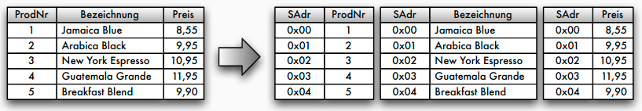

Alternative Speichermodelle: DSM
- Decomposition Storage Model (DSM) -> column stores
    - alle Werte einer Spalte (Attribut) werden hintereinander gespeichert
    - Adressierung über Position
        
- Kompression einfach möglich (z.B. Run length encoding)
- effizientere Scanoperationen (Feldoperationen -> bessere Cache-Nutzung)
- jedoch: Updateoperationen sind komplexer, Lesen aller Spalten aufwendiger
- Einsatz bei leseoptimierten Datenbanken

Ein Full-Table-Scan in NSM
- Im NSM-Modell stehen alle Tupel einer Tabelle sequenziell hintereinander auf einer Datenbankseite.
  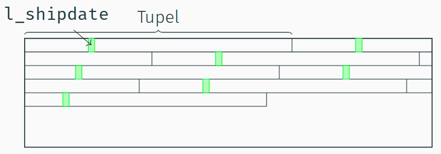

Ein "Full-Table-Scan" in DSM
- Im DSM-Modell stehen alle Werte eines Attributs sequenziell hintereinander auf einer Datenbankseite.
    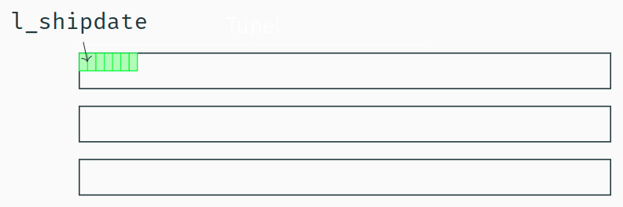
- Alle Daten, die für den "l_shipdate Scan" geladen werden sind
auch dafür relevant.

Alternative Speichermodelle: PAX
- Partition Attributes Across (PAX) als Kompromiss
    - NSM: alle Spalten eines Satzes auf der gleichen Seite
    - DSM: vertikale Partitionierung, Miniseiten für jeweils eine Spalte
    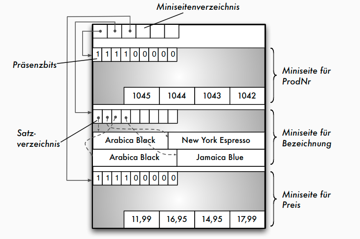

## Main-Memory-Strukturen
Speicherstrukturen für Main-Memory-Datenbanken
- Vermeidung der seiten-basierten Indirektion (über Seitenadresse, Puffer)
- Hauptspeicherzugriffe als neuer Bottleneck ("Memory Wall")
- Cache-freundliche Datenstruktur: Hauptspeicherzugriffe tatsächlich nicht byteweise, sondern in Cachelines (64 Bytes)
- Speicherlayout: Row Store vs. Column Store - abhängig vom Workload (Reduzierung der Cache Misses)
- ggf. Partitionierung für Multicore-Systeme
- Kompression der Daten zur Reduktion des Speicherbedarfs
- Persistenz weiterhin notwendig, z.B. über Logging
- Bsp.: In-Memory-Datenstruktur für relationale Column Stores
       - pro Spalte = Feld von Attributwerten
       - Kompression der Attributwerte (siehe Kapitel 8)
       - ggf. Strukturierung in Segmemten (Chunks) für bessere Speicherverwaltung, NUMA-Effekte


## Speicherorganisation in konkreten DBMS
Oracle: Datenbankstruktur
    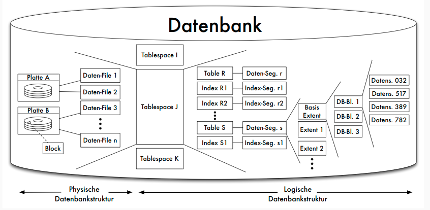

Oracle: Blöcke
    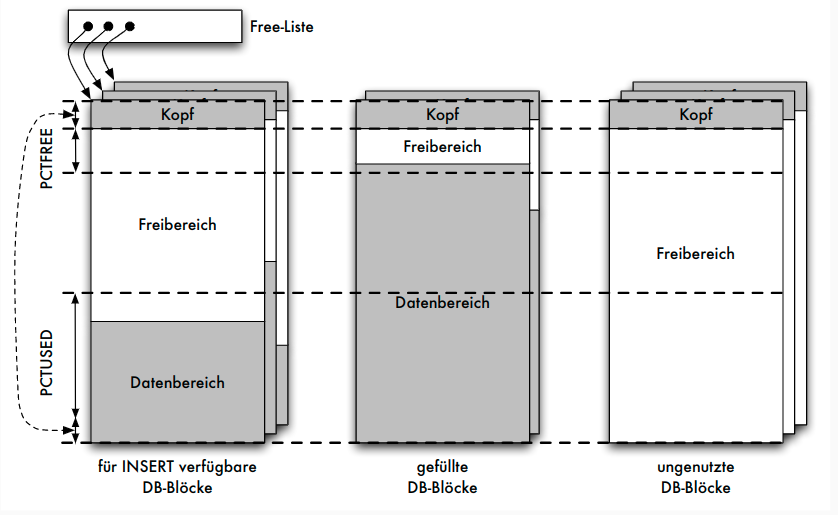

Oracle: Aufbau von Datensätzen
    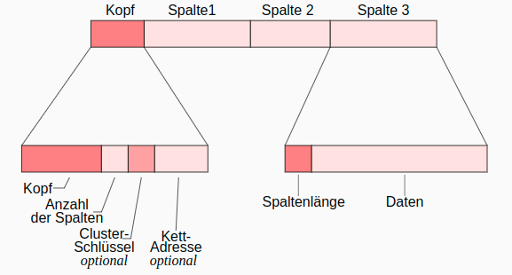
- Kettadresse für _Row Chaining_ : Verteilung und Verkettung zu großer Datensätze (> 255 Spalten) über mehrere Blöcke
- row id = (data object identifier, data file identifier, block identifier, row identifier)

Zusammenfassung
- Speicherhierarchie und Zugriffslücke
- Speicher- und Sicherungsmedien
- Hintergrundspeicher: Blockmodell
- Einpassen von Sätzen in Seiten
- Satzadressierung: TID-Konzept

# Caching und Pufferverwaltung
## Aufgaben
Aufgaben der Pufferverwaltung
- Puffer: ausgezeichneter Bereich des Hauptspeichers
- in Pufferrahmen gegliedert, jeder Pufferrahmen kann Seite der Platte aufnehmen
- Aufgaben:
    - Pufferverwaltung muss angeforderte Seiten im Puffer suchen => effizienteSuchverfahren
    - parallele Datenbanktransaktionen: geschickte Speicherzuteilung im Puffer
    - Puffer gefüllt: adäquate Seitenersetzungsstrategien
    - Unterschiede zwischen einem Betriebssystem-Puffer und _einem Datenbank-Puffer_
    - spezielle Anwendung der Pufferverwaltung: Schattenspeicherkonzept
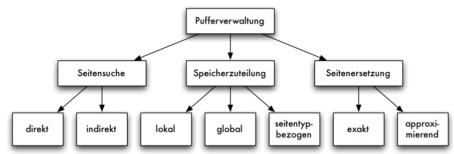

Mangelnde Eignung des BS-Puffers
- Natürlicher Verbund von Relationen _A_ und _B_ (zugehörige Folge von Seiten: _Ai_ bzw. _Bj_ )
- Implementierung: _Nested-Loop_
    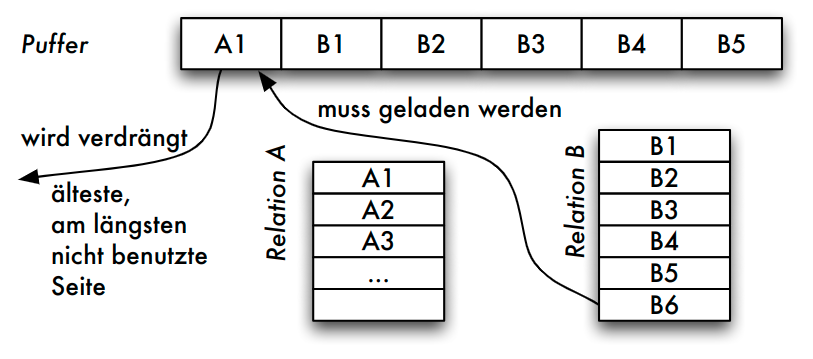
- Ablauf
    - FIFO: $A_1$ verdrängt, da älteste Seite im Puffer
    - LRU: $A_1$ verdrängt, da diese Seite nur im ersten Schritt beim Auslesen des ersten Vergleichstupels benötigt wurde
- Problem
    - im nächsten Schritt wird das zweite Tupel von $A_1$ benötigt
    - weiteres "Aufschaukeln": um $A_1$ laden zu können, muss $B_1$ entfernt werden (im nächsten Schritt benötigt) usw.

## Suche von Seiten und Speicherzuteilung
Suchen einer Seite
- Direkte Suche:
    - ohne Hilfsmittel linear im Puffer suchen
- Indirekte Suche:
    - Suche nur noch auf einer kleineren Hilfsstruktur
    - _unsortierte und sortierte Tabelle_ : alle Seiten im Puffer vermerkt
    - _verkettete Liste_ : schnelleres sortiertes Einfügen möglich
    - _Hashtabelle_ : bei geschickt gewählter Hashfunktion günstigster Such- und Änderungsaufwand
