# Motivation und Grundlagen
## Aufgaben und Komponenten eines DBMS
Prinzipien: Die neun Codd’schen Regeln
1. Integration: einheitliche, nichtredundante Datenverwaltung
2. Operationen: Speichern, Suchen, Ändern
3. Katalog: Zugriffe auf Datenbankbeschreibungen im Data Dictionary
4. Benutzersichten
5. Integritätssicherung: Korrektheit des Datenbankinhalts
6. Datenschutz: Ausschluss unauthorisierter Zugriffe
7. Transaktionen: mehrere DB-Operationen als Funktionseinheit
8. Synchronisation: parallele Transaktionen koordinieren
9. Datensicherung: Wiederherstellung von Daten nach Systemfehlern

Betrachtete Fragestellung


**Zentrale Komponenten**
- **Anfrageverarbeitung** : Planung, Optimierung und Ausführung deklarativer Anfragen
- **Transaktionsverwaltung** : Koordination und Synchronisation von Transaktionen, Durchführung von Änderungen, Sicherung der ACID-Eigenschaften
- **Speichersystem** : Organisation der Daten im Hauptspeicher und auf dem Externspeicher für effizienten Zugriff und Persistenz

## Relationale vs. nicht-relationale DBMS
**Relationale DBMS**
- Basis: **Relationenmodell** = Daten in Tabellen strukturiert
- Beziehungen über Werte (= Fremdschlüssel),
    Integritätsbedingungen
- **SQL** als standardisierte Anfragesprache
- kommerziell erfolgreichstes Datenmodell: Oracle, IBM DB2,
    MS SQL Server, SAP HANA, ...

| WEINE | WeinID            | Name | Farbe | Jahrgang    | Weingut |
| ----- | ----------------- | ---- | ----- | ----------- | ------- |
| 1042  | La Rose Grand Cru | Rot  | 1998  | Château ... |
| 2168  | Creek Shiraz      | Rot  | 2003  | Creek       |
| 3456  | Zinfandel         | Rot  | 2004  | Helena      |
| 2171  | Pinot Noir        | Rot  | 2001  | Creek       |
| 3478  | Pinot Noir        | Rot  | 1999  | Helena      |
| 4711  | Riesling Reserve  | Weiß | 1999  | Müller      |
| 4961  | Chardonnay        | Weiß | 2002  | Bighorn     |

**Kritik an RDBMS / SQL**
- nicht skalierbar
    - Normalisierung von Relationen, viele Integritätsbedingungen zu prüfen
    - kann man in RDBMS auch vermeiden!
- starre Tabellen nicht flexibel genug
    - schwach typisierte Tabellen (Tupel weichen in den tatsächlich genutzten Attributen ab)
          - viele Nullwerte wenn alle potentiellen Attribute definiert
          - alternativ Aufspaltung auf viele Tabellen
          - Schema-Evolution mit **alter table** unflexibel
    - tatsächlich in vielen Anwendungen ein Problem
- Integration von spezifischen Operationen (Graphtraversierung, Datenanalyse-Primitive) mit Stored Procedures zwar möglich führt aber oft zu schwer interpretierbarem Code

**NoSQL-Systeme**
- Datenmodelle
    - KV-Stores
    - Wide Column Stores
    - Dokumenten-orientierte Datenhaltung
    - Graph-Speicher
    - ...
- Anfragesprache -> unterschiedliche Ansätze:
    - einfache funktionale API
    - Programmiermodell für parallele Funktionen
    - angelehnt an SQL-Syntax
    - ...
- Beispiele
  - dokumentenorientierte Datenbanksysteme: MongoDB
      - semistrukturierte Dokumente in JSON- bzw. BSON-Format
      - Anfragen: CRUD erweitert um dokumentspezifische Suche
  - Graph-Datenbanksysteme: Neo4j
      - Property Graphen als Datenmodell: Knoten und Kanten mit Eigenschaften
      - Anfragesprache Cypher
      - Muster der Form "Knoten -> Kante -> Knoten ..."

## OLTP, OLAP und HTAP
### OLTP vs OLAP
|                            | Online Transactional Processing (OLTP)                                            | Online Analytical Processing (OLAP)                          |
| -------------------------- | --------------------------------------------------------------------------------- | ------------------------------------------------------------ |
|                            | -> Klassische operative Informationssysteme                                       | -> Data Warehouse                                            |
|                            | Erfassung und Verwaltung von Daten                                                | Analyse im Mittelpunkt = entscheidungsunterstützende Systeme |
|                            | Verarbeitung unter Verantwortung der jeweiligen Abteilung                         | Langandauernde Lesetransaktionen auf vielen Datensätzen      |
|                            | Transaktionale Verarbeitung: kurze Lese-/ Schreibzugriffe auf wenigen Datensätzen | Integration, Konsolidierung und Aggregation der Daten        |
|                            | ACID-Eigenschaften                                                                |                                                              |
|                            |                                                                                   |
| **Anfragen**               |                                                                                   |
| Fokus                      | Lesen, Schreiben, Modifizieren, Löschen                                           | Lesen, periodisches Hinzufügen                               |
| Transaktionsdauer und -typ | kurze Lese- / Schreibtransaktionen                                                | langandauernde Lesetransaktionen                             |
| Anfragestruktur            | einfach strukturiert                                                              | komplex                                                      |
| Datenvolumen einer Anfrage | wenige Datensätze                                                                 | viele Datensätze                                             |
| Datenmodell                | anfrageflexibel                                                                   | analysebezogen                                               |
| Antwortzeit                | msecs ...secs                                                                     | secs ...min                                                  |
|                            |                                                                                   |
| **Daten**                  |                                                                                   |
| Datenquellen               | meist eine                                                                        | mehrere                                                      |
| Eigenschaften              | nicht abgeleitet, zeitaktuell, autonom, dynamisch                                 | abgeleitet / konsolidiert, historisiert, integriert, stabil  |
| Datenvolumen               | MByte ...GByte                                                                    | GByte ...TByte ...PByte                                      |
| Zugriffe                   | Einzeltupelzugriff                                                                | Tabellenzugriff (spaltenweise)                               |

**OLTP: Beispiel**
```sql
BEGIN ;
SELECT KundenNr INTO KNr
FROM Kunden WHERE email = '...';
INSERT INTO BESTELLUNG VALUES (KNr, BestNr, 1);
UPDATE Artikel SET Bestand = Bestand-1
WHERE ArtNr = BestNr;
COMMIT TRANSACTION ;
```

**OLAP: Beispiel**
```sql
SELECT DISTINCT ROW Zeit.Dimension AS Jahr,
    Produkt.Dimension AS Artikel,
    AVG(Fact.Umsatz) AS Umsatzdurchschnitt,
    Ort.Dimension AS Verkaufsgebiet
FROM (Produktgruppe INNER JOIN Produkt ON Produktgruppe.
    [Gruppen-Nr] = Produkt.[Gruppen-ID]) INNER JOIN
    ((((Produkt INNER JOIN [Fact.Umsatz] ON Produkt.[Artikel-Nr]
    = [Fact.Umsatz].[Artikel-Nr]) INNER JOIN Order ON
    [Fact.Umsatz].[Bestell-Nr]= Order.[Order-ID]) INNER JOIN
    Zeit.Dimension ON Orders.[Order-ID] =
    Zeit.Dimension.[Order-ID]) INNER JOIN Ort.Dimension ON
    Order.[Order-ID] = Ort.Dimension.[Order-ID]) ON
    Produktgruppe.[Gruppen-Nr] = Produkt.[Gruppen-ID]
GROUP BY Produkt.Dimension.Gruppenname, Ort.Dimension.Bundesland,
Zeit.Dimension.Jahr;
```

### HTAP
- HTAP = Hybrid Transactional and Analytics Processing
- Ziel: schnellere Geschäftsentscheidungen durch "Echtzeit"-Verarbeitung
- OLAP und OLTP auf der gleichen Datenbank: naheliegend aber große technische Herausforderung
    - sehr unterschiedliche Workloads (Anfrage- und Lastprofile)
    - Transaktionsverwaltung: gegenseitige Beeinflussung von Änderungs- und Leseoperationen reduzieren
    - unterschiedliche Datenorganisation (physisch, logisch)
- Herausforderungen
  - Analytical (OLAP) und Transactional processing (OLTP)
    - verschiedene Zugriffscharakterisiken
    - verschiedene Performance-Ziele (Latenz vs. Durchsatz)
  - => Unterschiedliche Optimierungen notwendig

## Disk- vs. Main-Memory-Systeme**
**Traditionelle Annahmen**
- Daten sollen dauerhauft aufbewahrt werden
- Datenbank >> Hauptspeicher
- Disk >> Hauptspeicher
- Hauptspeicher = flüchtiger (volatiler) Speicher
- Disk-IO dominiert Kosten

**Speicherhierarchie**


**Eigenschaften von Speichermedien**
|                 | Primär   | Sekundär  | Tertiär      |
| --------------- | -------- | --------- | ------------ |
| Geschwindigkeit | schnell  | langsam   | sehr langsam |
| Preis           | teuer    | preiswert | billig       |
| Stabilität      | flüchtig | stabil    | stabil       |
| Größe           | klein    | groß      | sehr groß    |
| Granulate       | fein     | grob      | grob         |

**Speichermedien**
- **Primärspeicher**
    - Primärspeicher: Cache und Hauptspeicher
    - sehr schnell, Zugriff auf Daten fein granular: theoretisch jedes Byte adressierbar (Cachelines)
- **Sekundärspeicher**
    - Sekundärspeicher oder Online-Speicher
    - meist Plattenspeicher, nicht-flüchtig
    - Granularität des Zugriffs gröber: Blöcke, oft 512 Bytes
    - Zugriffslücke: Faktor 10^5 langsamerer Zugriff
- **Tertiärspeicher**
    - Zur langfristigen Datensicherung (Archivierung) oder kurzfristigen Protokollierung (Journale)
    - üblich: optische Platten, Magnetbänder
    - "Offline-Speicher" meist Wechselmedium
    - Nachteil: Zugriffslücke extrem groß


**Transferraten HDD vs. SSD**


**Konsequenz für disk-basierte Systeme**
- blockbasierter Zugriff mit typischen Blockgrößen ≥ 4 KB
- speziell für Magnetplatten Optimierung auf sequentielle Zugriffe
       - Disklayout: Organisation der Daten auf der Disk = fortlaufende Folge von Blöcken
       - sequentielles Lesen und Schreiben
- Zugriffslücke zwischen Hauptspeicher und Disk durch Caching verbergen (Lokalität von Zugriffen ausnutzen)

**Main-Memory-Datenbanken**
- klassische Annahmen nicht mehr zutreffend:
    - Systeme mit Hauptspeicher im TB-Bereich verfügbar
    - Datenbank kann komplett im Hauptspeicher gehalten werden (muss aber dennoch persistent sein)
- **Main-Memory-** oder **Hauptspeicher-** Datenbanken: Ausnutzung der großen Hauptspeicher und Multicore-Architekturen
       - Beispiele: SAP HANA, Oracle TimesTen, SQL Server Hekaton, Hyper, MemSQL, ...
       - Besonderheiten: hauptspeicheroptimierte Datenstrukturen (Main-Memory-Scans), Persistenz trotz volatilem Speicher, Datenkompression, Nebenläufigkeitskontrolle


## Klassische 5-Schichtenarchitektur
**Fünf-Schichtenarchitektur**
- Architektur für klassische DBMS
- basierend auf Idee von Senko 1973
- Weiterentwicklung von Härder 1987
- Umsetzung im Rahmen des IBM-Prototyps _System R_
- genauere Beschreibung der Transformationskomponenten
    - schrittweise Transformation von Anfragen/Änderungen bis hin zu Zugriffen auf Speichermedien
    - Definition der Schnittstellen zwischen Komponenten

**5-Schichtenarchitektur: Funktionen**


**5-Schichtenarchitektur: Objekte**


Erläuterungen
- mengenorientierte Schnittstelle **MOS** :
    - deklarative Datenmanipulationssprache auf Tabellen und Sichten (etwa SQL)
- durch Datensystem auf satzorientierte Schnittstelle **SOS** umgesetzt:
       - navigierender Zugriff auf interner Darstellung der Relationen
       - manipulierte Objekte: typisierte Datensätze und interne Relationen sowie logische Zugriffspfade (Indexe)
       - Aufgaben des Datensystems: Übersetzung und Optimierung von SQL-Anfragen
- durch Zugriffssystem auf interne Satzschnittstelle **ISS** umgesetzt:
       - interne Tupel einheitlich verwalten, ohne Typisierung
       - Speicherstrukturen der Zugriffspfade (konkrete Operationen auf B+-Bäumen und Hashtabellen), Mehrbenutzerbetrieb mit Transaktionen
- durch Speichersystem Datenstrukturen und Operationen der ISS auf interne Seiten eines virtuellen linearen Adressraums umsetzen
       - Manipulation des Adressraums durch Operationen der Systempufferschnittstelle **SPS**
       - Typische Objekte: interne Seiten, Seitenadressen
       - Typische Operationen: Freigeben und Bereitstellen von Seiten, Seitenwechselstrategien, Sperrverwaltung, Schreiben des Logs
- durch Pufferverwaltung interne Seiten auf Blöcke der Dateischnittstelle **DS** abbilden
       - Umsetzung der DS-Operationen auf Geräteschnittstelle erfolgt durch BS

## Neue Entwicklungen
Anforderungen aus neuen Anwendungen
- Nicht-Standard-Datenmodelle (siehe NoSQL-Systeme)
- flexibler Umgang mit Datenstrukturen (JSON, Schema on Read, ...)
- beschränkte (Lookups) vs. erweiterte (z.B. Graphoperationen, Datenanalysen) Anfragefunktionalität
- Skalierbarkeit zu Big Data (massiv parallele/verteilte Systeme)
- dynamische Daten / Datenströme
- ...

**Entwicklungen im Hardware-Bereich**
- Multicore- und Manycore-Prozessoren: 64+ Cores
    - Nutzung erfordert Parallelisierungstechniken und Nebenläufigkeitskontrolle
- Memory Wall: Hauptspeicherzugriff als Flaschenhals
    - RAM-Zugriff 60 ns, L1-Cache: 4 CPU-Zyklen -> Cache-optimierte Strukturen
- Datenbank-Accelerators
    - Hardware-unterstütztes Datenmanagement: FPGA, GPU als Coprozessoren, Highspeed-Netzwerk, SSDs als zusätzliche Cache-Ebene, ...
- Persistenter Memory: nicht-volatiler Speicher
    - Instant Restart / Recovery von Main-Memory-Datenbanken

**Zusammenfassung**
- Datenmanagementfunktionalitäten in vielen Softwaresystemen erforderlich
- nicht auf Implementierung kompletter DBMS beschränkt, sondern für nahezu alle datenintensiven Systeme: auch in Suchmaschinen, Datenanalyseanwendungen, eingebetteten Systemen, Visualisierungssystemen, Steuerungssystemen, Entwicklungsumgebungen, ...
- gemeinsame Aufgaben / Komponenten: Datenorganisation und -verwaltung (Indexstrukturen), Transaktionsverwaltung / Nebenläufigkeitskontrolle / Recovery, Anfrageverarbeitung
- betrifft Datenstrukturen und Algorithmen

# Speicherstrukturen für Datenbanken
## Speicher- und Sicherungsmedien
Speichermedien
- verschiedene Zwecke:
    - Daten zur Verarbeitung bereitstellen
    - Daten langfristig speichern (und trotzdem schnell verfügbar halten)
    - Daten sehr langfristig und preiswert archivieren unter Inkaufnahme etwas längerer Zugriffszeiten
- Speicherhierarchie:
    1. Extrem schneller Prozessor mit Registern
    2. Sehr schneller Cache-Speicher
    3. Schneller Hauptspeicher
    4. Langsamer Sekundärspeicher mit wahlfreiem Zugriff
    5. Sehr langsamer Nearline-Tertiärspeicher bei dem die Speichermedien automatisch bereitgestellt werden
    6. Extrem langsamer Offline-Tertiärspeicher, bei dem die Speichermedien per Hand bereitgestellt werden

Zugriffslücke in Zahlen
- Zugriffslücke: Unterschiede in den Zugriffsgeschwindigkeiten auf den verschiedenen Speicherebenen

| Speicherart              | Zugriffszeit | CPU cycles | typische Kapazität         |
| ------------------------ | ------------ | ---------- | -------------------------- |
| CacheSpeicher            | 6 ns         | 12         | 256 KB (L2) bis 32 MB (L3) |
| Hauptspeicher            | 60 ns        | 120        | 1 GB bis 1.5 TB            |
| Zugriffslücke $10^5$     |              |            |
| Magnetplattenspeicher    | 8-12 ms      | 16*10^6    | 160 GB bis 4 TB            |
| Platten-Farm oder -Array | 12 ms        | 24*10^6    | im TB- bis PB-Bereich      |

Typische Merkmale von Sekundärspeicher
| Merkmal         | Kapazität | Latenz  | Bandbreite           |
| --------------- | --------- | ------- | -------------------- |
| 1983            | 30 MB     | 48.3 ms | 0.6 MB/s             |
| 1994            | 4.3 GB    | 12.7 ms | 9 MB/s               |
| 2003            | 73.4 GB   | 5.7 ms  | 86 MB/s              |
| 2009            | 2 TB      | 5.1 ms  | 95 MB/s              |
| 2019 SSD (NVMe) | 2 TB      | ??      | seq.read 3.500 MB/s  |
|                 |           | ??      | seq.write 1.600 MB/s |

Solid State Disk (SSD)
- basierend auf EEPROMs in NAND- oder NOR-Technologie
- Arrays (=Flash-Block mit ca. 128 KB) von Speicherzellen, entweder ein Bit (SLC) oder 2-4 Bit (MLC)
- MLC sind langsamer und haben verkürzte Lebensdauer
- initial ist jedes Bit auf 1 gesetzt, durch Reprogrammieren auf 0
- Löschen zurück auf 1 nur für ganzen Block
- Konsequenz: langsames Löschen (Lesen = 25 μs, Löschen = 2 ms), begrenzte Lebensdauer (ca. 100.000    Lösch-Schreib-Zyklen)
- Schnittstelle: SATA oder PCIe (NVMe)


SSDs in DBMS
- klassische, auf sequenzielles Lesen ausgerichtete, Strategien von DBMS nutzen die Stärken von Flash-Speicher nicht aus
- kleinere Blockgrößen lassen sich effizient adressieren, sollten aber ein Vielfaches der Flash-Seiten sein
- wahlfreie Lesezugriffe sind effizienter als auf Magnetplatten, sollten aber auf Größen von ca. 4 bis 16 MB begrenzt werden
- konkurrierende IO-Zugriffe sind bis zu einem gewissen Maße ohne negativen Performanzeinfluss durchführbar

**Speicherarrays: RAID**
- Kopplung billiger Standardplatten unter einem speziellen Controller zu einem einzigen logischen Laufwerk
- Verteilung der Daten auf die verschiedenen physischen Festplatten übernimmt Controller
- zwei gegensätzliche Ziele:
    - Erhöhung der Fehlertoleranz (Ausfallsicherheit, Zuverlässigkeit) durch Redundanz
    - Effizienzsteigerung durch Parallelität des Zugriffs

Erhöhung der Fehlertoleranz
- Nutzung zusätzlicher Platten zur Speicherung von Duplikaten (Spiegeln) der eigentlichen Daten => bei Fehler: Umschalten auf Spiegelplatte
- bestimmte RAID-Levels (1, 0+1) erlauben eine solche Spiegelung
- Alternative: Kontrollinformationen wie Paritätsbits nicht im selben Sektor wie die Originaldaten, sondern auf einer anderen Platte speichern
- RAID-Levels 2 bis 6 stellen durch Paritätsbits oder Error Correcting Codes (ECC) fehlerhafte Daten wieder her
- ein Paritätsbit kann einen Plattenfehler entdecken und bei Kenntnis der fehlerhaften Platte korrigieren

Erhöhung der Effizienz
- Datenbank auf mehrere Platten verteilen, die parallel angesteuert werden können => Zugriffszeit auf große Datenmengen verringert sich fast linear mit der Anzahl der verfügbaren Platten
- Verteilung: bit-, byte- oder blockweise
- höhere RAID-Levels (ab Level 3) verbinden Fehlerkorrektur und block- oder bitweises Verteilen von Daten
- Unterschiede:
    - schnellerer Zugriff auf bestimmte Daten
    - höherer Durchsatz für viele parallel anstehende Transaktionen durch eine Lastbalancierung des Gesamtsystems


RAID-Levels
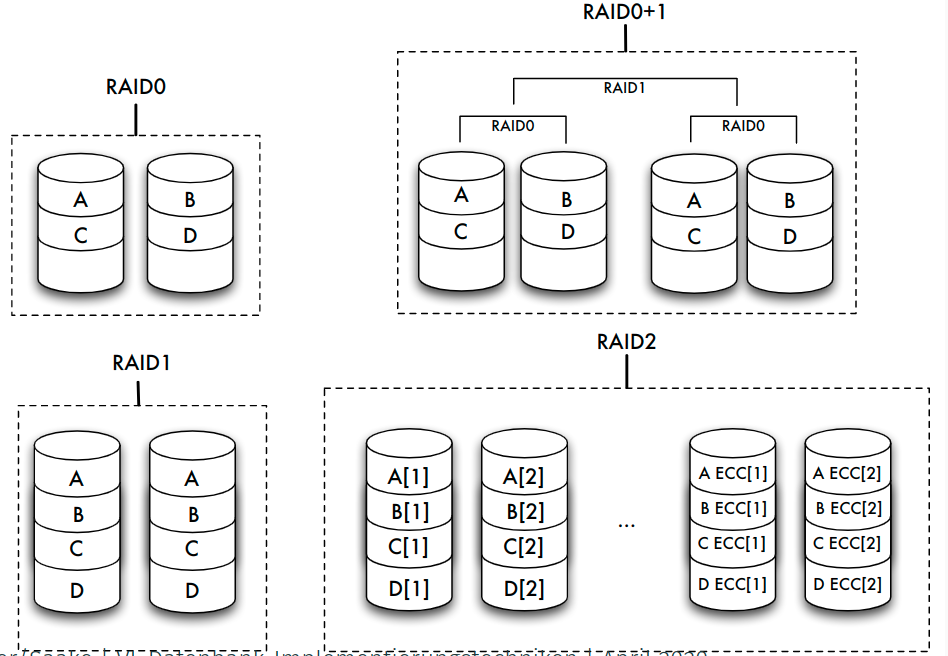


| Level | Striping blockweise | Striping bitweise | Kopie | Parität | Parität dedizierte Platte | Parität verteilt | Erkennen mehrerer Fehler |
| ----- | ------------------- | ----------------- | ----- | ------- | ------------------------- | ---------------- | ------------------------ |
| 0     | √                   |
| 1     |                     |                   | √     |
| 0+1   | √                   |                   | √     |
| 2     |                     | √                 |       | √       |
| 3     |                     | √                 |       | √       | √                         |
| 4     | √                   |                   |       | √       | √                         |
| 5     | √                   |                   |       | √       |                           | √                |
| 6     | √                   |                   |       | √       |                           |                  | √                        |

**Sicherungsmedien: Tertiärspeicher**
- weniger oft benutzte Teile der Datenbank, die eventuell sehr großen Umfang haben (Text, Multimedia) "billiger" speichern als auf Magnetplatten
- aktuell benutzte Datenbestände zusätzlich sichern (archivieren)
- Tertiärspeicher: Medium austauschbar
    - offline: Medien manuell wechseln (optische Platten, Bänder)
    - nearline: Medien automatisch wechseln (_Jukeboxes_, _Bandroboter_)

Langzeitarchivierung
- Lebensdauer, Teilaspekte:
- physische Haltbarkeit des Mediums garantiert die Unversehrtheit der Daten: 
  - 10 Jahre für Magnetbänder, 
  - 30 Jahre für optische Platten, 
  - Papier???
- Vorhandensein von Geräten und Treibern garantiert die Lesbarkeit von Daten: 
  - Geräte für Lochkarten oder 8-Zoll-Disketten?
- zur Verfügung stehende Metadaten garantieren die Interpretierbarkeit von Daten
- Vorhandensein von Programmen, die auf den Daten arbeiten können, garantieren die Wiederverwendbarkeit von Daten


## Struktur des Hintergrundspeichers
Verwaltung des Hintergrundspeichers
- Abstraktion von Speicherungs- oder Sicherungsmediums
- Modell: Folge von Blöcken
    
- Alternativen:
    - jede Relation oder jeder Zugriffspfad in genau einer Betriebssystem-Datei
    - ein oder mehrere BS-Dateien, DBS verwaltet Relationen und Zugriffspfade selbst innerhalb dieser Dateien
    - DBS steuert selbst Magnetplatte an und arbeitet mit den Blöcken in ihrer Ursprungsform ( _raw device_ )
- Warum nicht immer BS-Dateiverwaltung?
    - Betriebssystemunabhängigkeit
    - In 32-Bit-Betriebssystemen: Dateigröße 4 GB maximal
    - BS-Dateien auf maximal einem Medium
    - betriebssystemseitige Pufferverwaltung von Blöcken des Sekundärspeichers im Hauptspeicher genügt nicht den Anforderungen des Datenbanksystems

Blöcke und Seiten
- Zuordnung der physischen Blöcke zu Seiten
- meist mit festen Faktoren: 1, 2, 4 oder 8 Blöcke einer Spur auf eine Seite
- hier: "ein Block — eine Seite"
- höhere Schichten des DBS adressieren über Seitennummer

Dienste des Dateisystems
- Allokation oder Deallokation von Speicherplatz
- Holen oder Speichern von Seiteninhalten
- Allokation möglichst so, dass logisch aufeinanderfolgende Datenbereiche (etwa einer Relation) auch möglichst in aufeinanderfolgenden Blöcken der Platte gespeichert werden
- Nach vielen Update-Operationen: Reorganisationsmethoden
- Freispeicherverwaltung: doppelt verkettete Liste von Seiten

Abbildung der Datenstrukturen
- Abbildung der konzeptuellen Ebene auf interne Datenstrukturen
- Unterstützung durch Metadaten (im Data Dictionary, etwa das interne Schema)

| Konz. Ebene      | Interne Ebene   | Dateisystem/Platte |
| ---------------- | --------------- | ------------------ |
| Relationen ->    | Log. Dateien -> | Phys. Dateien      |
| Tupel ->         | Datensätze ->   | Seiten/Blöcke      |
| Attributwerte -> | Felder ->       | Bytes              |

- Beispiel: jede Relation in je einer logischen Datei, diese insgesamt in einer einzigen physischen Datei


## Seiten, Sätze und Adressierung
### Seite
- Block:
    - kleinste adressierbare Einheit auf Externspeicher
    - Zuordnung zu Seiten im Hauptspeicher
- Aufbau von Seiten
    - Header
       - Informationen über Vorgänger- und Nachfolger-Seite
       - eventuell auch Nummer der Seite selbst
       - Informationen über Typ der Sätze
       - freier Platz
    - Datensätze
    - unbelegte Bytes

Seitenorganisation
- Organisation der Seiten: doppelt verkettete Liste
- freie Seiten in Freispeicherverwaltung


Seite: Adressierung der Datensätze
- adressierbare Einheiten
    - Zylinder
    - Spuren
    - Sektoren
    - Blöcke oder Seiten
    - Datensätze in Blöcken oder Seiten
    - Datenfelder in Datensätzen
- Beispiel: Adresse eines Satzes durch Seitennummer und Offset (relative Adresse in Bytes vom Seitenanfang)

Seitenzugriff als Flaschenhals
- Maß für die Geschwindigkeit von Datenbankoperationen: Anzahl der Seitenzugriffe auf dem Sekundärspeicher (wegen Zugriffslücke)
- Faustregel: Geschwindigkeit des Zugriffs ⇐ Qualität des Zugriffspfades ⇐ Anzahl der benötigten Seitenzugriffe
- Hauptspeicheroperationen nicht beliebig vernachlässigbar


Einpassen von Datensätzen auf Blöcke
- Datensätze (eventuell variabler Länge) in die aus einer fest vorgegebenen Anzahl von Bytes bestehenden Blöcke einpassen: Blocken
- Blocken abhängig von variabler oder fester Feldlänge der Datenfelder
       - Datensätze mit variabler Satzlänge: höherer Verwaltungsaufwand beim Lesen und Schreiben, Satzlänge immer wieder neu ermitteln
       - Datensätze mit fester Satzlänge: höherer Speicheraufwand

Verschiedene Satztypen
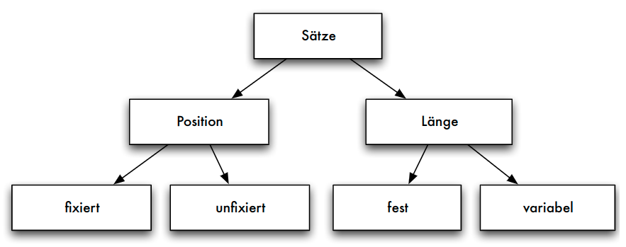

Sätze fester Länge
- SQL: Datentypen fester und variabler Länge
    - _char(n)_ Zeichenkette der festen Länge _n_
    - _varchar(n)_ Zeichenkette variabler Länge mit der Maximallänge _n_
- Aufbau der Datensätze, falls alle Datenfelder feste Länge:
    1. Verwaltungsblock mit Typ eines Satzes (wenn unterschiedliche Satztypen auf einer Seite möglich) und Löschbit
    2. Freiraum zur Justierung des Offset
    3. Nutzdaten des Datensatzes

Sätze variabler Länge
- im Verwaltungsblock nötig: Satzlänge _l_, um die Länge des Nutzdaten-Bereichs _d_ zu kennen
    
- Strategie a)
    
- Strategie b)
    

Speicherung von Sätzen variabler Länge
- Strategie a): Jedes Datenfeld variabler Länge $A_i$ beginnt mit einem _Längenzeiger $al_i$, der angibt, wie lang das folgende Datenfeld ist
- Strategie b): Am Beginn des Satzes wird nach dem Satz-Längenzeiger _l_ und der Anzahl der Attribute ein Zeigerfeld $ap_1 ,..., ap_n$ für alle variabel langen Datenfelder eingerichtet
- Vorteil Strategie b): leichtere Navigation innerhalb des Satzes (auch für Sätze in Seiten => TID)

Anwendung variabel langer Datenfelder
- "Wiederholgruppen": Liste von Werten des gleichen Datentyps
       - Zeichenketten variabler Länge wie _varchar(n)_ sind Wiederholgruppe mit _char_ als Basisdatentyp, mathematisch also die Kleene’sche Hülle $(char)∗$
       - Mengen- oder listenwertige Attributwerte, die im Datensatz selbst denormalisiert gespeichert werden sollen (Speicherung als geschachtelte Relation oder Cluster-Speicherung), bei einer Liste von _integer_ -Werten wäre dies $(integer)∗$
       - Adressfeld für eine Indexdatei, die zu einem Attributwert auf mehrere Datensätze zeigt (Sekundärindex), also $(pointer)∗$

Blockungstechniken: Nichtspannsätze
- jeder Datensatz in maximal einem Block
    
- Standardfall (außer bei BLOBs oder CLOBs)

Blockungstechniken: Spannsätze
- Spannsätze: Datensatz eventuell in mehreren Blöcken
    

Adressierungstechniken


Adressierung: TID-Konzept
- Tupel-Identifier (TID) ist Datensatz-Adresse bestehend aus Seitennummer und Offset
- Offset verweist innerhalb der Seite bei einem Offset-Wert von _i_ auf den _i_ -ten Eintrag in einer Liste von Tupelzeigern (Satzverzeichnis), die am Anfang der Seite stehen
- Jeder Tupel-Zeiger enthält Offsetwert
- Verschiebung auf der Seite: sämtliche Verweise von außen bleiben unverändert
- Verschiebungen auf eine andere Seite: statt altem Datensatz neuer TID-Zeiger
- diese zweistufige Referenz aus Effizienzgründen nicht wünschenswert: Reorganisation in regelmäßigen Abständen


TID-Konzept: einstufige Referenz


TID-Konzept: zweistufige Referenz


## Alternative Speichermodelle
- bisher klassisches N-äres Speichermodell (NSM), auch "row store"
- Vorteile:
    - gesamter Datensatz kann mit einem Seitenzugriff gelesen werden
    - leichte Änderbarkeit einzelner Attributwerte
- Nachteil:
    - werden nur wenige Attributwerte benötigt, müssen trotzdem immer alle Attributwerte gelesen werden -> unnötiger IO-Aufwand
- Alternativen: spaltenorientierte Speichermodelle
    - Zerlegung einer _n_ -stelligen Relation in eine Menge von Projektionen (z.B. binäre Relation)
    - Identifikation (und Rekonstruktion) über eine Schlüsselspalte oder Position

Spaltenorientierte Datenorganisation


Alternative Speichermodelle: DSM
- Decomposition Storage Model (DSM) -> column stores
    - alle Werte einer Spalte (Attribut) werden hintereinander gespeichert
    - Adressierung über Position
        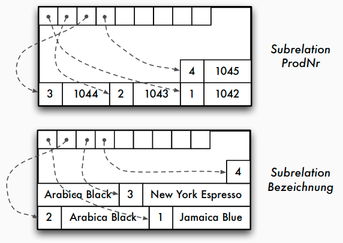
- Kompression einfach möglich (z.B. Run length encoding)
- effizientere Scanoperationen (Feldoperationen -> bessere Cache-Nutzung)
- jedoch: Updateoperationen sind komplexer, Lesen aller Spalten aufwendiger
- Einsatz bei leseoptimierten Datenbanken

Ein Full-Table-Scan in NSM
- Im NSM-Modell stehen alle Tupel einer Tabelle sequenziell hintereinander auf einer Datenbankseite.
  

Ein "Full-Table-Scan" in DSM
- Im DSM-Modell stehen alle Werte eines Attributs sequenziell hintereinander auf einer Datenbankseite.
    
- Alle Daten, die für den "l_shipdate Scan" geladen werden sind
auch dafür relevant.

Alternative Speichermodelle: PAX
- Partition Attributes Across (PAX) als Kompromiss
    - NSM: alle Spalten eines Satzes auf der gleichen Seite
    - DSM: vertikale Partitionierung, Miniseiten für jeweils eine Spalte
    

## Main-Memory-Strukturen
Speicherstrukturen für Main-Memory-Datenbanken
- Vermeidung der seiten-basierten Indirektion (über Seitenadresse, Puffer)
- Hauptspeicherzugriffe als neuer Bottleneck ("Memory Wall")
- Cache-freundliche Datenstruktur: Hauptspeicherzugriffe tatsächlich nicht byteweise, sondern in Cachelines (64 Bytes)
- Speicherlayout: Row Store vs. Column Store - abhängig vom Workload (Reduzierung der Cache Misses)
- ggf. Partitionierung für Multicore-Systeme
- Kompression der Daten zur Reduktion des Speicherbedarfs
- Persistenz weiterhin notwendig, z.B. über Logging
- Bsp.: In-Memory-Datenstruktur für relationale Column Stores
       - pro Spalte = Feld von Attributwerten
       - Kompression der Attributwerte (siehe Kapitel 8)
       - ggf. Strukturierung in Segmemten (Chunks) für bessere Speicherverwaltung, NUMA-Effekte


## Speicherorganisation in konkreten DBMS
Oracle: Datenbankstruktur
    

Oracle: Blöcke
    

Oracle: Aufbau von Datensätzen
    
- Kettadresse für _Row Chaining_ : Verteilung und Verkettung zu großer Datensätze (> 255 Spalten) über mehrere Blöcke
- row id = (data object identifier, data file identifier, block identifier, row identifier)

Zusammenfassung
- Speicherhierarchie und Zugriffslücke
- Speicher- und Sicherungsmedien
- Hintergrundspeicher: Blockmodell
- Einpassen von Sätzen in Seiten
- Satzadressierung: TID-Konzept

# Caching und Pufferverwaltung
## Aufgaben
Aufgaben der Pufferverwaltung
- Puffer: ausgezeichneter Bereich des Hauptspeichers
- in Pufferrahmen gegliedert, jeder Pufferrahmen kann Seite der Platte aufnehmen
- Aufgaben:
    - Pufferverwaltung muss angeforderte Seiten im Puffer suchen => effizienteSuchverfahren
    - parallele Datenbanktransaktionen: geschickte Speicherzuteilung im Puffer
    - Puffer gefüllt: adäquate Seitenersetzungsstrategien
    - Unterschiede zwischen einem Betriebssystem-Puffer und _einem Datenbank-Puffer_
    - spezielle Anwendung der Pufferverwaltung: Schattenspeicherkonzept


Mangelnde Eignung des BS-Puffers
- Natürlicher Verbund von Relationen _A_ und _B_ (zugehörige Folge von Seiten: _Ai_ bzw. _Bj_ )
- Implementierung: _Nested-Loop_
    
- Ablauf
    - FIFO: $A_1$ verdrängt, da älteste Seite im Puffer
    - LRU: $A_1$ verdrängt, da diese Seite nur im ersten Schritt beim Auslesen des ersten Vergleichstupels benötigt wurde
- Problem
    - im nächsten Schritt wird das zweite Tupel von $A_1$ benötigt
    - weiteres "Aufschaukeln": um $A_1$ laden zu können, muss $B_1$ entfernt werden (im nächsten Schritt benötigt) usw.

## Suche von Seiten und Speicherzuteilung
Suchen einer Seite
- Direkte Suche:
    - ohne Hilfsmittel linear im Puffer suchen
- Indirekte Suche:
    - Suche nur noch auf einer kleineren Hilfsstruktur
    - _unsortierte und sortierte Tabelle_ : alle Seiten im Puffer vermerkt
    - _verkettete Liste_ : schnelleres sortiertes Einfügen möglich
    - _Hashtabelle_ : bei geschickt gewählter Hashfunktion günstigster Such- und Änderungsaufwand


Speicherzuteilung im Puffer
- bei mehreren parallel anstehenden Transaktionen
    - Lokale Strategien: Jeder Transaktion bestimmte disjunkte Pufferteile verfügbar machen (Größe statisch vor Ablauf der Transaktionen oder dynamisch zur Programmlaufzeit entscheiden)
    - Globale Strategien: Zugriffsverhalten aller Transaktionen insgesamt bestimmt Speicherzuteilung (gemeinsam von mehreren Transaktionen referenzierte Seiten können so besser berücksichtigt werden)
    - Seitentypbezogene Strategien: Partition des Puffers: Pufferrahmen für Datenseiten, Zugriffspfadseiten, Data-Dictionary-Seiten, usw. - eigene Ersetzungstrategien für die jeweiligen Teile möglich

## Seitenersetzungsstrategien
- Speichersystem fordert Seite $E_2$ an, die nicht im Puffer vorhanden ist
- Sämtliche Pufferrahmen sind belegt
- vor dem Laden von _E_ 2 Pufferrahmen freimachen
- nach den unten beschriebenen Strategien Seite aussuchen
- Ist Seite in der Zwischenzeit im Puffer verändert worden, so wird sie nun auf Platte zurückgeschrieben
- Ist Seite seit Einlagerung in den Puffer nur gelesen worden, so kann sie überschrieben werden (verdrängt)

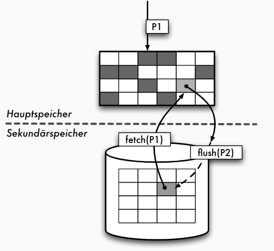

Seitenersetzung in DBMS
- Fixieren von Seiten (Pin oder Fix):
    - Fixieren von Seiten im Puffer verhindert das Verdrängen
    - speziell für Seiten, die in Kürze wieder benötigt werden
- Freigeben von Seiten (Unpin oder Unfix):
    - Freigeben zum Verdrängen
    - speziell für Seiten, die nicht mehr benötigt werden
- Zurückschreiben einer Seite:
    - Auslösen des Zurückschreibens für geänderte Seiten bei Transaktionsende

Seitenersetzung: Verfahren
- grundsätzliches Vorgehen beim Laden einer Seite:
    - Demand-paging-Verfahren: genau eine Seite im Puffer durch angeforderte Seite ersetzen
    - Prepaging-Verfahren: neben der angeforderten Seite auch weitere Seiten in den Puffer einlesen, die eventuell in der Zukunft benötigt werden (z.B. bei BLOBs sinnvoll)
- Ersetzen einer Seite im Puffer:
    - optimale Strategie: Welche Seite hat maximale Distanz zu ihrem nächsten Gebrauch? (nicht realisierbar, zukünftiges Referenzverhalten nicht vorhersehbar) -> Realisierbare Verfahren besitzen keine Kenntnisse über das zukünftige Referenzverhalten
    - Zufallsstrategie: jeder Seite gleiche Wiederbenutzungswahrscheinlichkeit zuordnen

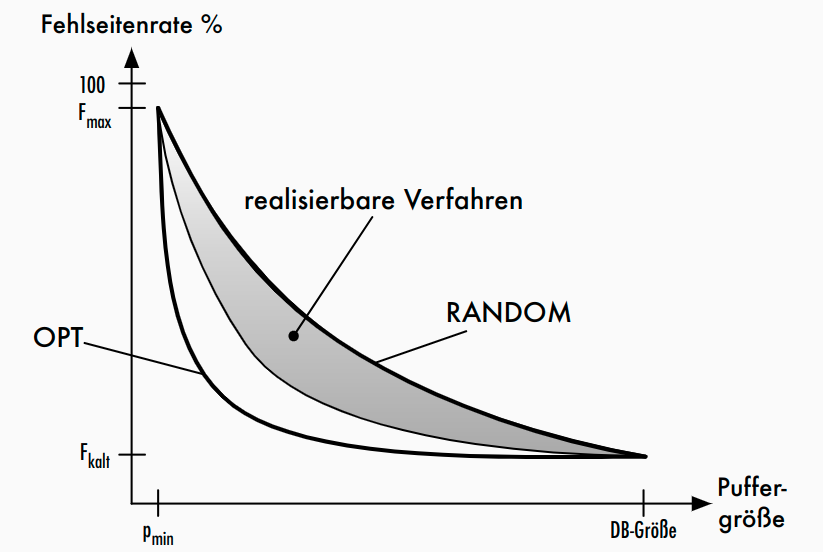

Fehlseitenrate
$$F=1-p(\frac{1-F_{kalt}}{p_{DB}}) * 100%$$
- $p$: Puffergröße
- $p_{DB}$: Puffergröße, die gesamte Datenbank umfasst
- $F_{kalt}$: Fehlseitenrate beim Kaltstart (d.h. leerer Puffer) -> Verhältnis von Anzahl der in den Puffer geladenen Seiten zur Anzahl der Referenzierungen

- Gute, realisierbare Verfahren sollen vergangenes Referenzverhalten auf Seiten nutzen, um Erwartungswerte für Wiederbenutzung schätzen zu können
       - besser als Zufallsstrategie
       - Annäherung an optimale Strategie


Merkmale gängiger Strategien
- Alter der Seite im Puffer:
    - Alter einer Seite nach Einlagerung (die globale Strategie (G))
    - Alter einer Seite nach dem letztem Referenzzeitpunkt (die Strategie des jüngsten Verhaltens (J))
    - Alter einer Seite wird nicht berücksichtigt (-)
- Anzahl der Referenzen auf Seite im Puffer:
    - Anzahl aller Referenzen auf eine Seite (die globale Strategie (G))
    - Anzahl nur der letzten Referenzen auf eine Seite (die Strategie des jüngsten Verhaltens (J))
    - Anzahl der Referenzen wird nicht berücksichtigt (-)


Gängige Strategien
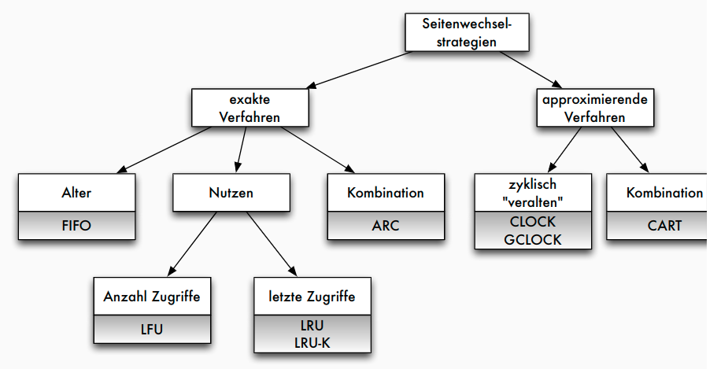

Klassifikation gängiger Strategien
| Verfahren                        | Prinzip                                                             | Alter | Anzahl |
| -------------------------------- | ------------------------------------------------------------------- | ----- |
| FIFO                             | älteste Seite ersetzt                                               | G     | -      |
| LFU (least fre-quently used)     | Seite mit geringster Häufigkeit ersetzen                            | -     | G      |
| LRU (least recently used)        | Seite ersetzen, die am längsten nicht referenziert wurde (System R) | J     | J      |
| DGCLOCK (dyn. generalized clock) | Protokollierung der Ersetzungshäufigkeiten wichtiger Seiten         | G     | JG     |
| LRD (least reference density)    | Ersetzung der Seite mit geringster Referenzdichte                   | JG    | G      |

Beispiel
- Folge von Seitenanforderungen #1, #2 ...
- Puffer der Größe 6
    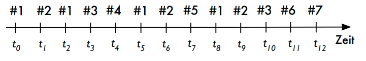
- Ablauf mit
    - FIFO ...
    - LFU ...

### LRU: Least Recently Used
- Idee: Seite im Puffer ersetzen, die am längsten nicht mehr referenziert wurde
- Implementierung:
    - Liste oder Stack von Seiten
    - Puffer-Hit bewegt Seite zur MRU-Position (Most Recently Used)
    - Seite am Ende wird verdrängt
    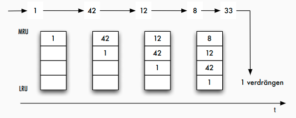
- Varianten:
    - durch Interpretation der Pin-Operation: Least Recently Referenced bzw. Least Recently Unfixed
    - durch Berücksichtigung der letzten $k$ Referenzierungen (d.h. auch Häufigkeit): LRU-K

LRU: Probleme
- Lock Contention in Multitasking-Umgebungen
    - Zugriff auf LRU-Liste/Stack und Bewegung der Seite erfordert exklusiven Zugriff auf Datenstruktur
    - aufwendige Operation
- berücksichtigt nur Alter jedoch nicht Häufigkeit
    - oft gelesene Seiten mit langen Pausen zwischen den Zugriffen werden nicht adäquat berücksichtigt
- "Zerstörung" des Puffers durch Scan-Operator
    - Seiten werden nur einmalig gelesen, verdrängen jedoch andere (ältere) Seiten


Lock Contention bei der Pufferverwaltung
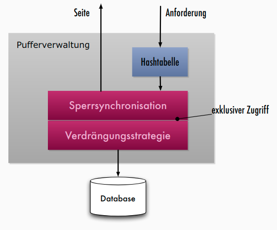
- Sperren = Latches: leichtgewichtige (wenige CPU-Instruktionen) Objekte für kurzzeitige Sperren

Approximierende Verfahren
- Idee:
    - Vereinfachung der benötigten Datenstruktur durch Approximation
    - Effektivität (Trefferrate) vs. Skalierbarkeit (Anzahl der Threads)
- CLOCK: Approximation der Historie durch Bit-Schieberegister der Länge _k_
       - $k= 0$: FIFO
       - $k\rightarrow\infty$: LRU
       - typisch: $k = 1$

### CLOCK
- Seite mit Benutzt-Bit; bei Referenzierung auf "1" setzen
- bei Seitenfehler:
    - zyklische Suche
    - Seite mit "0" verdrängen
    - sonst Setzen auf "0"
    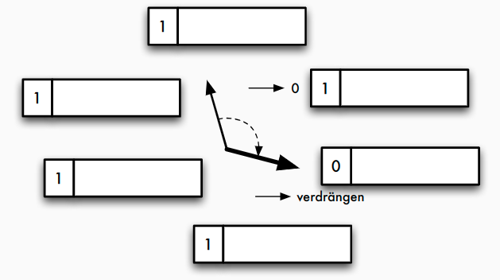

### GCLOCK
- Verbesserung: Benutzt-Bit durch Referenzzähler _RC_ ersetzen; Dekrementierung bei Suche
- weitere Verbesserungen:
    - Initialisierung des Referenzzählers
    - Inkrementierung des Zählers
    - seitentypspezifische Maßnahmen (für Typ _i_ : Seitengewicht $E_i$ bei Erstreferenzierung, $W_i$ bei weiterer Referenzierung)
    - Altern
- Varianten: Seite _j_ von Typ _i_
    - $GCLOCK(V1): RC_j := E_i ; RC_j := RC_j + W_i$
    - $GCLOCK(V2): RC_j := E_i ; RC_j := W_i$ (speziell für $W_i\geq E_i$)

### DGCLOCK
- weitere Verbesserung: globaler Zähler $GC$ und Normierung der aktuellen Referenzzähler $RC$
    1. Initialisierung: $RC_j := GC$
    2. Referenzierung von Seite $j : GC := GC + 1 ; RC_j := RC_j + GC$
    3. bei Überschreiten $GC > MIN : \forall j : RC_j := RC_j / C$

### ARC
- Adaptive Replacement Cache: neues Verfahren, das Nachteile von LRU vermeidet
- Prinzip:
    - Puffergröße _c_
    - Pufferverzeichnis für 2 _c_ Seiten: _c_ Pufferseiten + _c_ History-Seiten
    - Liste _L_ 1 : "recency" = kurzfristiger Nutzen-> Seiten, die kürzlich einmal gelesen wurden
    - Liste _L_ 2 : "frequency" = langfristiger Nutzen -> Seiten, die kürzlich mehrmals gelesen wurden
- Ausgangspunkt: einfache Verdrängungsstrategie DBL(2 _c_ )
    - Ersetze die LRU-Seite in $L_1$, wenn $|L_1| = c$ , sonst ersetze LRU-Seite in $L_2$
    - Ziel: Größenausgleich zwischen $L_1$ und $L_2$
    - Zugriff Seite $p$: wenn Treffer -> $p$ wird MRU in $L_2$ , sonst in $L_1$

Von DBL(2c) zu ARC
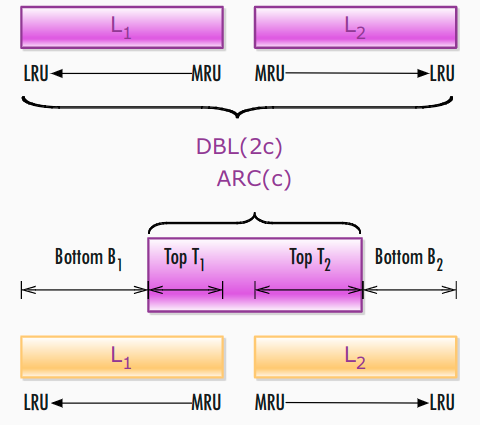
- Parameter $p$ mit $0\leq p \leq c$
    - $T_1$ enthält $p$ Seiten, $T_2$ enthält $c-p$ Seiten
- Wahl von $p$?

ARC: Algorithmus
- Seitenanforderungen: $x_1,x_2 ,..., x_t ,...$
- $p = 0, T_1 , B_1 , T_2 ,B_2$ sind initial leer
    - Fall 1: $x_t \in T_1 \cup T_2$ /* Puffer-Hit */
        - Bewege $x_t$ zu MRU von $T_2$
    - Fall 2: $x_t \in B_1$
        - Anpassung: $p = min\{ p +\delta_1,c\}$ mit $\delta_1 = \begin{cases} 1\quad\text{ wenn } |B_1|\geq |B_2| \\ \frac{|B_2|}{|B_1|} \quad\text{ sonst}\end{cases}$
        - $REPLACE(x_t,p)$
        - Bewege $x_t$ von $B_1$ zu MRU von $T_2$
    - Fall 3: $x_t \in B_2$
      - Anpassung: $p = max\{ p - \delta_2, 0 \}$ mit $\delta_2 = \begin{cases} 1\quad\text{ wenn } |B_2|\geq |B_1| \\ \frac{|B_1|}{|B_2|} \quad\text{ sonst}\end{cases}$
      - $REPLACE(x_t,p)$
      - Bewege $x_t$ von $B_2$ zu MRU von $T_2$
    - Fall 4: $x_t \not\in T_1 \cup B_1 \cup T_2 \cup B_2$
      - 4.A: $|L_1| = c$
        - Wenn $|T_1|<c$, lösche LRU in $B_1$, $REPLACE(x_t,p)$
        - sonst /* $B_1 = \varnothing$ */ lösche LRU in $T_1$
      - 4.B: $|L_1|<c$
        - Wenn $|L_1|+|L_2|\geq c$ , lösche LRU in $B_2$, $REPLACE(x_t,p)$
      - Bewege $x_t$ zu MRU in $T_1$

ARC: $REPLACE(x_t, p)$

    if $|T_1|>p$ oder ($x_t\in B_2$ und $|T_1|=p$)
        Lösche LRU-Seite in $T_1$ und bewege sie zu MRU in $B_1$
    else
        Lösche LRU-Seite in $T_2$ und bewege sie zu MRU in $B_2$
    endif

ARC: Beispiel
1. erstmalige Anforderung der Seiten $#1$ und $#2$: Aufnahme in
    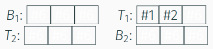
2. nächsten Referenzierung von $#1$: Übernahme in $T_2$-Liste
    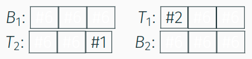
3. Seitenanforderungen $#3$, $#4$, $#1$; mit $#2$ wird diese in $T_2$ bewegt; Platz für Seite $#5$:
    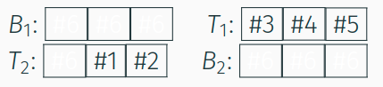
4. Beantwortung der Seitenanforderungen $#1$ und $#2$ aus $T_2$
5. neu angeforderten Seiten $#5$ und $#6$ in $T_1$
    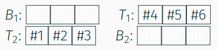
6. Seitenanforderung $#7$: Verdrängen von $#4$ aus $T_1$ in $B_1$
    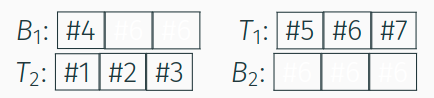

ARC: Eigenschaften
- kontinuierliche Anpassung von Parameter $p$
    - Lernraten $\delta_1$ und $\delta_2$
    - "Investieren in Liste mit dem meisten Profit"
- Berücksichtigung von Alter und Häufigkeit
    - durch zwei Listen $L_1$ und $L_2$
- Scan-Resistenz
    - einmalig gelesene Seiten nur in $L_1$, niemals in $L_2$
- Vermeidung von Lock Contention durch approximierende Varianten (CAR, CART, ...)

## Fazit
- Pufferverwaltungsstrategie mit großem Einfluss auf Performance
- in kommerziellen Systemen meist LRU mit Variationen
- besondere Behandlung von Full-Table-Scans
- weiterer Einflussfaktor: Puffergröße
- Indikator: Trefferrate (engl. _hit ratio_ )
    $$hit\_ratio = \frac{\text{Anz. log. Zugriffe} - \text{Anz. phys. Zugriffe}}{\text{Anz. log. Zugriffe}}$$
- 5-Minuten-Regel (Gray, Putzolu 1997):
    Daten, die in den nächsten 5 Min. wieder referenziert werden, sollten im Hauptspeicher gehalten werden

# Indexierung von Daten
## Klassifikation der Speichertechniken
Einordnung in 5-Schichten-Architektur
- **Speichersystem** fordert über Systempufferschnittstelle Seiten an
- interpretiert diese als interne Datensätze
- interne Realisierung der logischen Datensätze mit Hilfe von Zeigern, speziellen Indexeinträgen und weiteren Hilfsstrukturen
- Zugriffssystem abstrahiert von der konkreten Realisierung

Klassifikation der Speichertechniken
- Kriterien für Zugriffsstrukturen oder Zugriffsverfahren:
    - organisiert interne Relation selbst (Dateiorganisationsform) oder zusätzliche Zugriffsmöglichkeit auf bestehende interne Relation (Zugriffspfad)
    - Art der Zuordnung von gegebenen Attributwerten zu Datensatz-Adressen: Schlüsselvergleich = Zuordnung von Schlüsselwert zu Adresse über Hilfsstruktur; Schlüsseltransformation = Berechnung der Adresse aus Schlüsselwert (z.B. über Hashfunktion)
    - Arten von Anfragen, die durch Dateiorganisationsformen und Zugriffspfade effizient unterstützt werden können
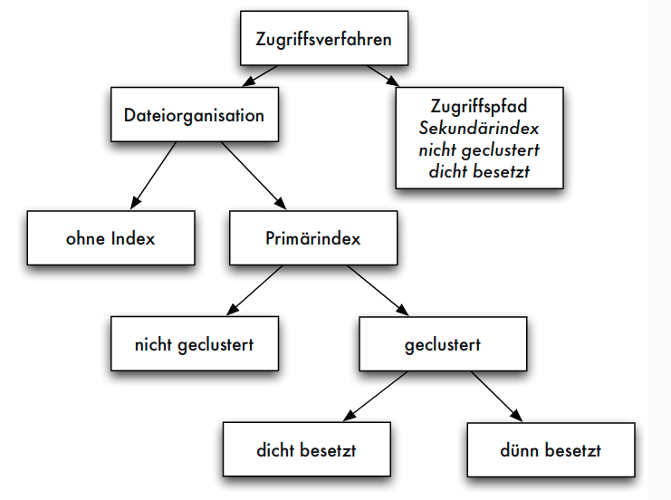

Dünn- vs. dichtbesetzter Index
- dünnbesetzter Index: nicht für jeden Zugriffsattributwert _K_ ein Eintrag in Indexdatei sondern z.B. nur für _Seitenanführer_ einer sortierten Relation
- dichtbesetzter Index: für jeden Datensatz der internen Relation ein Eintrag in Indexdatei

Geclusterter vs. nicht-geclusterter Index
- geclusterter Index: in der gleichen Form sortiert wie interne Relation
- nicht-geclusterter Index: anders organisiert als interne Relation
- Primärindex oft dünnbesetzt und geclustert
- jeder dünnbesetzte Index ist auch geclusterter Index, aber nicht umgekehrt
- Sekundärindex kann nur dichtbesetzter, nicht-geclusterter Index sein (auch: invertierte Datei)
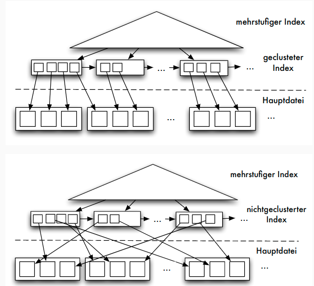

Statische vs. dynamische Struktur
- statische Zugriffsstruktur: optimal nur bei bestimmter (fester) Anzahl von verwaltenden Datensätzen
- dynamische Zugriffsstruktur: unabhängig von der Anzahl der Datensätze optimal
       - dynamische Adresstransformationsverfahren verändern dynamisch Bildbereich der Transformation
       - dynamische Indexverfahren verändern dynamisch Anzahl der Indexstufen => in DBS üblich

Klassifikation
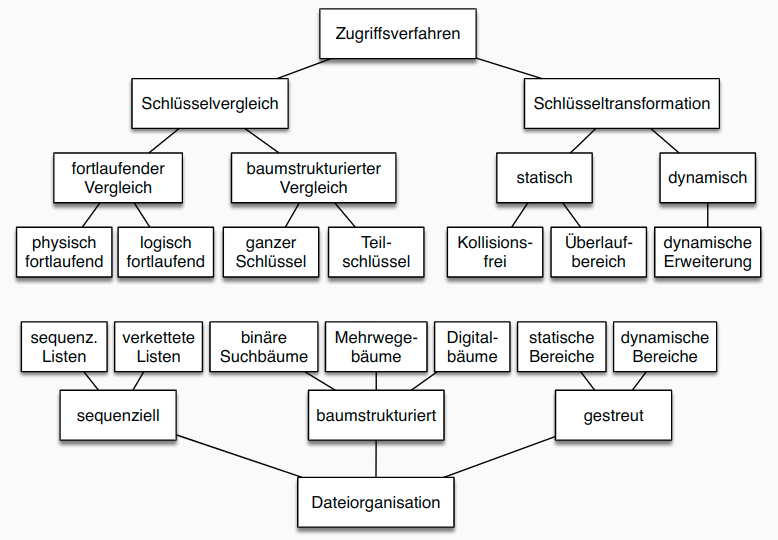


## Statische Verfahren
- Heap, indexsequenziell, indiziert-nichtsequenziell
- oft grundlegende Speichertechnik in RDBS
- direkte Organisationsformen: keine Hilfsstruktur, keine Adressberechnung (Heap, sequenziell)
- statische Indexverfahren für Primärindex und Sekundärindex


Statische Verfahren: Überblick
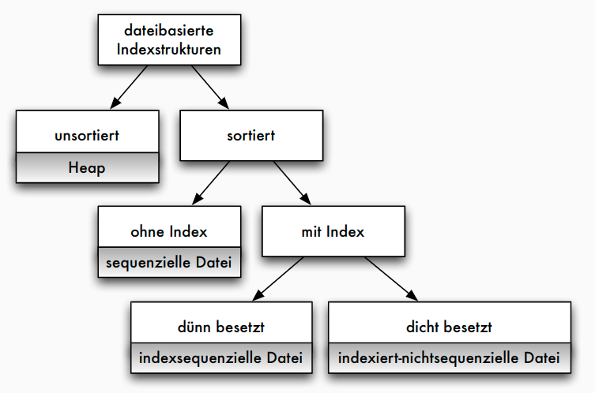

### Heap
Organisation
- völlig unsortiert speichern
- physische Reihenfolge der Datensätze ist zeitliche Reihenfolge der Aufnahme von Datensätzen
    |      |       |            |     |
    | ---- | ----- | ---------- | --- | -------- |
    | 8832 | Max   | Mustermann | ... | 9.1.2003 |
    | 5588 | Beta  | Alpha      | ... | 7.3.1978 |
    | 4711 | Gamma | Delta      | ... | 2.5.1945 |

Operationen
- insert: Zugriff auf letzte Seite der Datei. Genügend freier Platz => Satz anhängen. Sonst nächste freie Seite holen
- delete: lookup, dann Löschbit auf 0 gesetzt
- lookup: sequenzielles Durchsuchen der Gesamtdatei, maximaler Aufwand (Heap-Datei meist zusammen mit Sekundärindex eingesetzt; oder für sehr kleine Relationen)
- Komplexitäten:
    - Neuaufnahme von Daten $O(1)$
    - Suchen $O(n)$

### Sequenzielle Speicherung
- sortiertes Speichern der Datensätze
    |      |       |            |     |
    | ---- | ----- | ---------- | --- | -------- |
    | 4711 | Gamma | Delta      | ... | 2.5.1945 |
    | 5588 | Beta  | Alpha      | ... | 7.3.1978 |
    | 8832 | Max   | Mustermann | ... | 9.1.2003 |

Sequenzielle Datei: Operationen
- insert: Seite suchen, Datensatz einsortieren => beim Anlegen oder sequenziellen Füllen einer Datei jede Seite nur bis zu gewissem Grad (etwa 66%) füllen
- delete: Aufwand bleibt
- Folgende Dateiorganisationsformen:
    - schnelleres lookup
    - mehr Platzbedarf (durch Hilfsstrukturen wie Indexdateien)
    - mehr Zeitbedarf bei insert und delete
- klassische Indexform: indexsequenzielle Dateiorganisation

## Indexsequenzielle Dateiorganisation
- Kombination von sequenzieller Hauptdatei und Indexdatei: indexsequenzielle Dateiorganisationsform
- Indexdatei kann geclusterter, dünnbesetzter Index sein
- mindestens zweistufiger Baum
    - Blattebene ist Hauptdatei (Datensätze)
    - jede andere Stufe ist Indexdatei
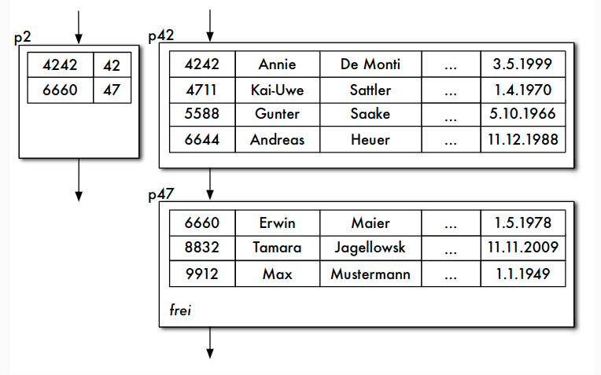

Aufbau der Indexdatei
- Datensätze in Indexdatei: _(Primärschlüsselwert, Seitennummer)_ zu jeder Seite der Hauptdatei genau ein Index-Datensatz in Indexdatei
- Problem: "Wurzel" des Baumes bei einem einstufigen Index nicht nur eine Seite
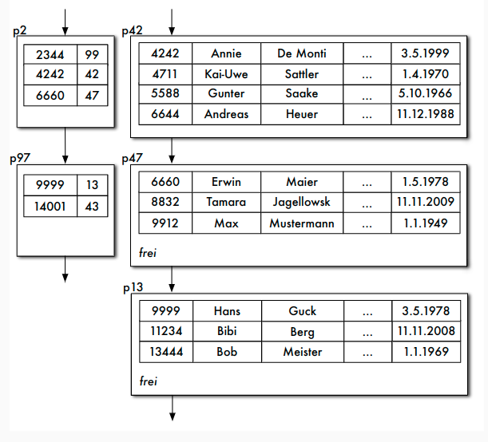


Mehrstufiger Index
- Optional: Indexdatei wieder indexsequenziell verwalten
- Idealerweise: Index höchster Stufe nur noch eine Seite
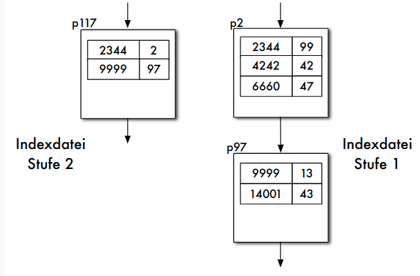

lookup bei indexsequenziellen Dateien
- lookup-Operation sucht Datensatz zum Zugriffsattributwert _w_
- Indexdatei sequenziell durchlaufen, dabei $(v_1,s)$ im Index gesucht mit $v_1\leq w$:
    - $(v_1,s)$ ist letzter Satz der Indexdatei, dann kann Datensatz zu _w_ höchstens auf dieser Seite gespeichert sein (wenn er existiert)
    - nächster Satz $(v_2,s′)$ im Index hat $v_2 > w$ , also muss Datensatz zu _w_, wenn vorhanden, auf Seite _s_ gespeichert sein
- $(v_1,s)$ überdeckt Zugriffsattributwert _w_

insert bei indexsequenziellen Dateien
- insert: zunächst mit lookup Seite finden
- Falls Platz, Satz sortiert in gefundener Seite speichern; Index anpassen, falls neuer Satz der erste Satz in der Seite
- Falls kein Platz, neue Seite von Freispeicherverwaltung holen; Sätze der "zu vollen" Seite gleichmäßig auf alte und neue Seite verteilen; für neue Seite Indexeintrag anlegen
- Alternativ neuen Datensatz auf Überlaufseite zur gefundenen Seite

delete bei indexsequenziellen Dateien
- delete: zunächst mit lookup Seite finden
- Satz auf Seite löschen (Löschbit auf 0)
- erster Satz auf Seite: Index anpassen
- Falls Seite nach Löschen leer: Index anpassen, Seite an Freispeicherverwaltung zurück

Probleme indexsequenzieller Dateien
- stark wachsende Dateien: Zahl der linear verketteten Indexseiten wächst; automatische Anpassung der Stufenanzahl nicht vorgesehen
- stark schrumpfende Dateien: nur zögernde Verringerung der Index- und Hauptdatei-Seiten
- unausgeglichene Seiten in der Hauptdatei (unnötig hoher Speicherplatzbedarf, zu lange Zugriffszeit)


Indiziert-nichtsequenzieller Zugriffspfad
- zur Unterstützung von Sekundärschlüsseln
- mehrere Zugriffpfade dieser Form pro Datei möglich
- einstufig oder mehrstufig: höhere Indexstufen wieder indexsequenziell organisiert

Aufbau der Indexdatei
- Sekundärindex, dichtbesetzter und nicht-geclusteter Index
- zu jedem Satz der Hauptdatei Satz $(w,s)$ in der Indexdatei
- _w_ Sekundärschlüsselwert, _s_ zugeordnete Seite
    - entweder für ein _w_ mehrere Sätze in die Indexdatei aufnehmen
    - oder für ein _w_ Liste von Adresse in der Hauptdatei angeben
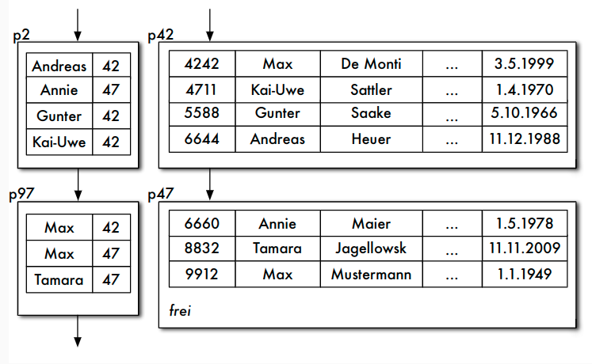

Operationen
- lookup: _w_ kann mehrfach auftreten, Überdeckungstechnik nicht benötigt
- insert: Anpassen der Indexdateien
- delete: Indexeintrag entfernen

Probleme statischer Verfahren
- unzureichende Anpassung an wachsende/schrumpfende Datenmengen
- schlechte Ausnutzung von Speicher nach Seitensplits
- Bevorzugung bestimmter Attribute (Schlüssel)
- daher in den folgenden Kapiteln:
    - bessere Datenstrukturen zur Schlüsselsuche als zusätzlicher Zugriffspfad = Approximation einer Funktion Schlüssel -> Speicheradresse, z.B. über Baumverfahren
    - Erweiterung von Hashverfahren um Anpassung des Bildbereichs = dynamische Hashverfahren
    - Behandlung von zusammengesetzten Schlüsseln = multidimensionale Zugriffsverfahren, z.B. multidimensionale Bäume oder raumfüllende Kurven

# Baumbasierte Indexstrukturen
## Baumverfahren
- Stufenanzahl dynamisch verändern
- wichtigste Baumverfahren: B-Bäume und ihre Varianten
- B-Baum-Varianten sind noch "allgegenwärtiger" in heutigen Datenbanksystemen als SQL
- SQL nur in der relationalen und objektrelationalen Datenbanktechnologie verbreitet; B-Bäume überall als Grundtechnik eingesetzt

Baumverfahren: Überblick
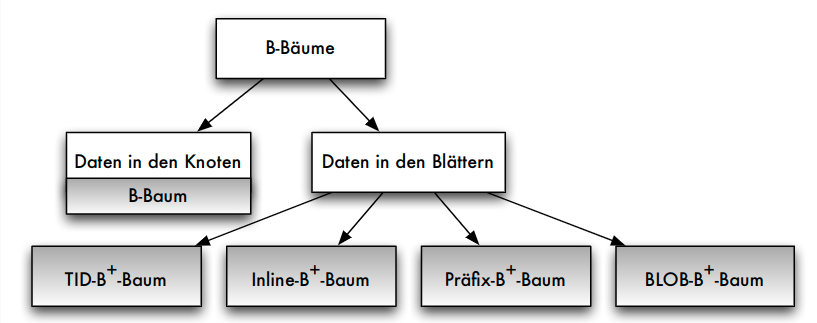

## B-Bäume
- Ausgangspunkt: ausgeglichener, balancierter Suchbaum
- Ausgeglichen oder balanciert: alle Pfade von der Wurzel zu den Blättern des Baumes gleich lang
- Hauptspeicher-Implementierungsstruktur: binäre Suchbäume, beispielsweise AVL-Bäume von Adelson-Velskii und Landis
- Datenbankbereich: Knoten der Suchbäume zugeschnitten auf Seitenstruktur des Datenbanksystems
- mehrere Zugriffsattributwerte auf einer Seite
- Mehrwegebäume

Prinzip des B-Baumes
- B-Baum von Bayer (B für balanciert, breit, buschig, Bayer, NICHT: binär)
- dynamischer, balancierter Indexbaum, bei dem jeder Indexeintrag auf eine Seite der Hauptdatei zeigt
- Mehrwegebaum völlig ausgeglichen, wenn
  1. alle Wege von Wurzel bis zu Blättern gleich lang
  2. jeder Knoten gleich viele Indexeinträge
- vollständiges Ausgleichen zu teuer, deshalb B-Baum-Kriterium:
    Jede Seite außer der Wurzelseite enthält zwischen $m$ und $2m$ Einträge.

Definition B-Baum
- Ordnung eines B-Baumes ist minimale Anzahl der Einträge auf den Indexseiten außer der Wurzelseite
- Bsp.: B-Baum der Ordnung 8 fasst auf jeder inneren Indexseite zwischen 8 und 16 Einträgen
- Def.: Ein Indexbaum ist ein B-Baum der Ordnung $m$ , wenn er die folgenden Eigenschaften erfüllt:
    1. Jede Seite enthält höchstens $2m$ Elemente.
    2. Jede Seite, außer der Wurzelseite, enthält mindestens $m$ Elemente. 
    3. Jede Seite ist entweder eine Blattseite ohne Nachfolger oder hat $i+1$ Nachfolger, falls $i$ die Anzahl ihrer Elemente ist.
    4. Alle Blattseiten liegen auf der gleichen Stufe.

Eigenschaften des B-Baumes
- $n$ Datensätze in der Hauptdatei => in $log_m(n)$ Seitenzugriffen von der Wurzel zum Blatt
- Durch Balancierungskriterium wird Eigenschaft nahe an der vollständigen Ausgeglichenheit erreicht (1. Kriterium vollständig erfüllt, 2. Kriterium näherungsweise)
- Kriterium garantiert 50% Speicherplatzausnutzung
- einfache, schnelle Algorithmen zum Suchen, Einfügen und Löschen von Datensätzen (Komplexität von $O(log_m(n))$)

Suchen in B-Bäumen
- lookup wie in statischen Indexverfahren
- Startend auf Wurzelseite Eintrag im B-Baum ermitteln, der den gesuchten Zugriffsattributwert $w$ überdeckt => Zeiger verfolgen, Seite nächster Stufe laden
- Suchen: 38, 20, 6
- 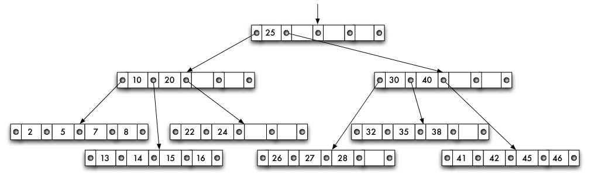

Einfügen in B-Bäumen
- Einfügen eines Wertes _w_
    - mit lookup entsprechende Blattseite suchen
    - passende Seite $n<2m$ Elemente, _w_ einsortieren
    - passende Seite $n=2m$ Elemente, neue Seite erzeugen,
       - ersten _m_ Werte auf Originalseite
       - letzten _m_ Werte auf neue Seite
       - mittleres Element auf entsprechende Indexseite nach oben
    - eventuell dieser Prozess rekursiv bis zur Wurzel

Einfügen in einen B-Baum: Beispiel
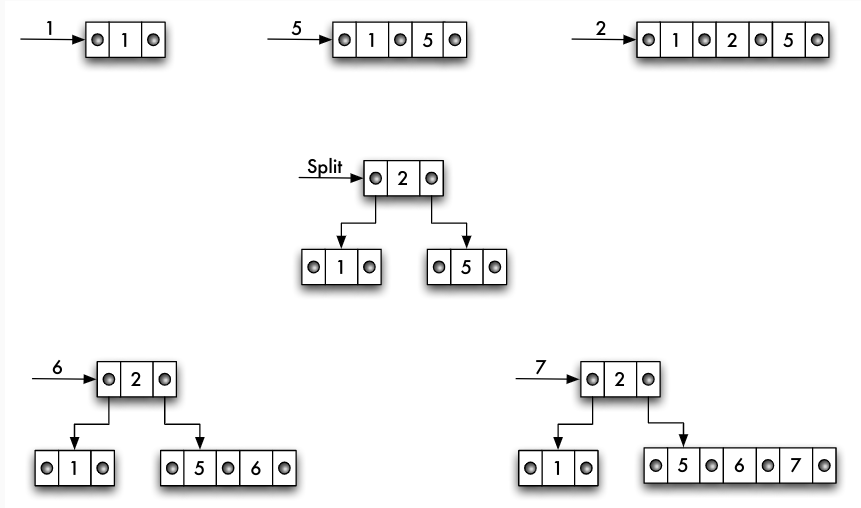
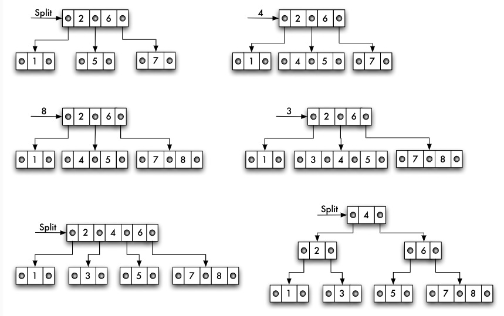

Löschen in B-Bäumen
- bei weniger als $m$ Elementen auf Seite: Unterlauf
- Löschen eines Wertes $w$ : Bsp.: 24; 28, 38, 35
    - mit lookup entsprechende Seite suchen
    - $w$ auf Blattseite gespeichert => Wert löschen, eventuell Unterlauf behandeln
    - $w$ nicht auf Blattseite gespeichert => Wert löschen, durch lexikographisch nächstkleineres Element von einer Blattseite ersetzen, eventuell auf Blattseite => Unterlauf
- Unterlaufbehandlung
    - Ausgleichen mit der benachbarten Seite (benachbarte Seite $n$ Elemente mit $n>m$)
    - oder Zusammenlegen zweier Seiten zu einer (Nachbarseite $n=m$ Elemente), das "mittlere" Element von Indexseite darüber dazu, auf Indexseite eventuell => Unterlauf
- Einfügen des Elementes 22; Löschen von 22
    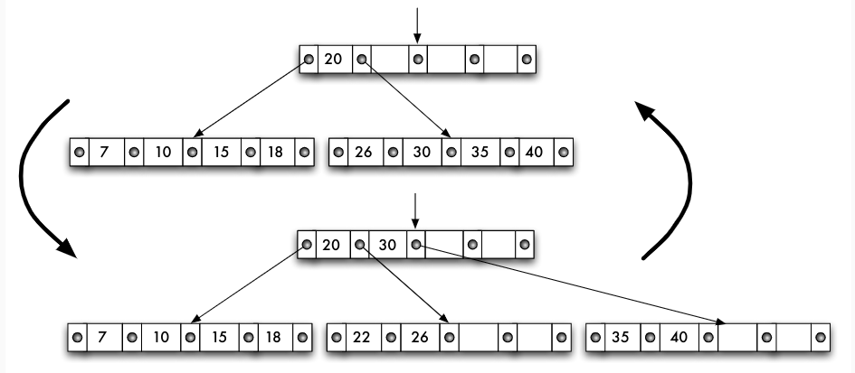

Komplexität der Operationen
- Aufwand beim Einfügen, Suchen und Löschen im B-Baum immer $O(log_m(n))$ Operationen
- entspricht genau der "Höhe" des Baumes
- Konkret: Seiten der Größe 4 KB, Zugriffsattributwert 32 Bytes, 8-Byte-Zeiger: zwischen 50 und 100 Indexeinträge pro Seite; Ordnung dieses B-Baumes 50
- 1.000.000 Datensätze: $log_{50}(1000000) = 4$ Seitenzugriffe im schlechtesten Fall
- Wurzelseite jedes B-Baumes normalerweise im Puffer: 3 Seitenzugriffe

## B+-Baum
Varianten
- B+-Bäume: nur Blattebene enthält Daten -> Baum ist hohl
- B∗-Bäume: Aufteilen von Seiten vermeiden durch "Shuffle"
- Präfix-B-Bäume: Zeichenketten als Zugriffsattributwerte, nur Präfix indexieren

B+-Baum: Motivation
- B-Baum: Wie/wo werden Nicht-Schlüsseldaten (Tupel, TIDs) gespeichert?
       - Zusammen mit Schlüsseln in allen Knoten?
       - Problem beim Traversieren des Baumes, z.B. bei Bereichsanfragen
    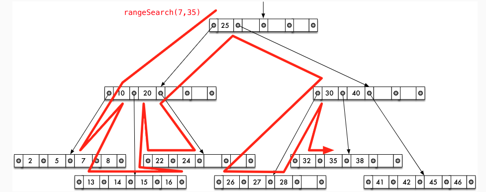

B+-Baum
- in der Praxis am häufigsten eingesetzte Variante des B-Baumes:
       - effizientere Änderungsoperationen, insb. Löschen
       - Verringerung der Baumhöhe
- Änderungen gegenüber B-Baum
    - in inneren Knoten nur noch Zugriffsattributwert und Zeiger auf nachfolgenden Seite der nächsten Stufe; nur Blattknoten enthalten neben Zugriffsattributwert die Daten (Datensätze bzw. Verweise auf Datensätze in der Hauptdatei)
    - Knoten der Blattebene sind untereinander verkettet für effiziente Unterstützung von Bereichsanfragen

B+-Baum: Aufbau
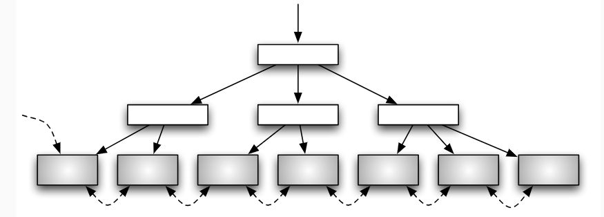

Ordnung; Operationen
- Ordnung für B+-Baum: $(x,y), x$ Mindestbelegung der Indexseiten, $y$ Mindestbelegung der Blattseiten
- delete gegenüber B-Baum effizienter ("Ausleihen" eines Elementes von der Blattseite entfällt)
- Zugriffsattributwerte in inneren Knoten können sogar stehenbleiben
- häufig als Primärindex eingesetzt
- B+-Baum ist dynamische, mehrstufige, indexsequenziellen Datei

B+-Baum: Blattebene mit Verweisen
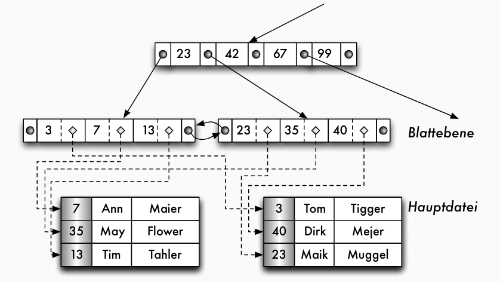

B+-Baum: Datenstrukturen
```cpp
BPlusBranchNode =record of
    nkeys: int;
    ptrs: array[0 .. nkeys ] of PageNum;
    keys: array[1 .. nkeys ]of KeyType;
    level: int;
/* Level= 1 zeigt an, dass die ptrs auf Blätter zeigen */
end;
```
```cpp
BPlusLeafNode = record of
    nkeys: int;
    keys: array[1 .. nkeys ]of KeyType;
    payload: array[1 .. nkeys ]of LoadType ; /* Daten bzw. TIDs */
    nextleaf: PageNum;
end;
```

Operationen im B+-Baum
- lookup: wie im B-Baum jedoch immer bis zur Blattebene
- $search(u,o)$: Lookup für unteren Wert $u$ , Traversieren auf der Blattebene bis zum oberen Wert $o$
- $insert$: ähnlich zum B-Baum
    - im Fall des Split bei Überlaufbehandlung wird nur ein Separatorschlüssel im Elternknoten eingefügt
    - z.B. Kopie des kleinsten Schlüsselwertes des "rechten" Kindknotens oder geeigneter Wert zwischen beiden Knoten
- $delete$: ähnlich zum B-Baum, jedoch
    - Löschen der Daten zunächst nur auf Blattebene
    - bei Unterlauf: entweder Ausgleich mit Nachbarknoten oder Vereinigen mit Nachbarknoten; ggf. Anpassen (Ausgleich) oder Löschen (Vereinigen) des Separatorschlüssels
    - alternativ: Unterlauf akzeptieren und durch spätere inserts oder Reorganisation auflösen

Weitere Entwurfsentscheidungen für B+-Baum
- Schlüsselsuche im Knoten: sequenzielle Suche vs. binäre Suche vs. Interpolation Search
- Knotengröße: Maximieren der Anzahl der Vergleiche (Knotennutzen) pro I/O-Zeiteinheit

| Seitengröße (KB) | Sätze/Seite | Knotennutzen | I/O-Zeit (ms) | Nutzen/Zeit |
| ---------------- | ----------- | ------------ | ------------- | ----------- |
| 4                | 143         | ≈7           | 5,020         | 1,427       |
| 16               | 573         | ≈ 9          | 5,080         | 1,804       |
| 64               | 2.294       | ≈ 11         | 5,320         | 2,098       |
| 128              | 4.588       | ≈ 12         | 5,640         | 2,157       |
| 256              | 9.175       | ≈ 13         | 6,280         | 2,096       |
| 1024             | 36.700      | ≈ 15         | 10,120        | 1,498       |
| 4096             | 146.801     | ≈ 17         | 25,480        | 0,674       |
[Literatur](G. Graefe: Modern B-Tree Techniques, Foundations and Trends in Databases, 2010)

- Konsistenzprüfung während der Traversierung
    - mögliche Inkonsistenzen durch Speicherfehler, konkurrierende Änderungen + Implementierungsfehler, ...
- Cache-Optimierung: Knotenstruktur, Kompression (Präfix-/Suffix Truncation)
- Pointer Swizzling: zur Ersetzung der logischen Seitennummern durch physische Adressen
- Knotengröße: bei großen Puffern kann großer Teil der inneren Knoten im Puffer gehalten werden -> größere Knoten (im MB-Bereich) sinnvoll
- Verzögern des Splits bei Überlaufbehandlung: Ausgleichen mit Nachbarknoten soweit möglich; verbessert Auslastung der Knoten
- zusätzliche Verweise zwischen Knoten
    - z.B. zwischen inneren Knoten der gleichen Ebene, zu Elternknoten, etc.
    - ermöglichen Konsistenzchecks, aber erschweren Sperren für Nebenläufigkeitskontrolle

## Weitere Varianten
Präfix-B-Baum
- B-Baum über Zeichenkettenattribut
    - lange Schlüssel in inneren Knoten -> hoher Speicherplatzbedarf
    - vollständige Schlüssel eigentlich nicht notwendig, da nur "Wegweiser"
- Idee: Verwaltung von Trennwerten -> Präfix-B-Baum
    - in inneren Knoten nur Trennwerte, die lexikographisch zwischen den Werten liegen
    - möglichst kurze Trennwerte, z.B. kürzester eindeutiger Präfix
    
    - aber: Beispiel "Vandenberg" und "Vandenbergh"

Mehr-Attribut-B-Baum
- B-Baum ist eindimensionale Struktur, jedoch können mehrere Attribute als kompositer Schlüssel indexiert werden
  `create index NameIdx on KUNDE(Name, Vorname)`
- allerdings: Attribute werden bei partial-match-Anfragen nicht gleich behandelt!
- Alternative: raumfüllende Kurven -> multidimensionale Indexstrukturen
    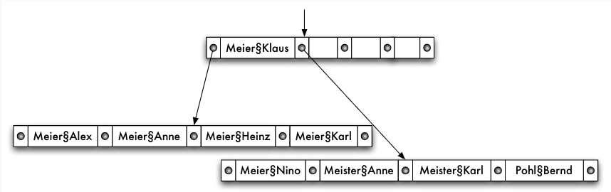
    
## Optimierungen für moderne Hardware
Optimierungspotential
- Verbesserung der Cache-Trefferrate
    - Organisation der Datenstruktur entsprechend Cacheline (Größe, Anordnung der Daten)
    - In-Place-Update im Hauptspeicher -> Cache-Invalidierung: verändertes Update Handling
    - Pointer Swizzling
- Berücksichtigung der Storage-Eigenschaften
    - SSD vs. HDD
    - Bevorzugung sequentieller Schreiboperationen
    - spezielle Berücksichtigung für Main-Memory-Indexe
- Synchronisation in Multicore-Umgebungen
    - Lock/Latch-freie Operationen


CSB+-Baum
- =Cache Sensitive B+ Tree (Rao, Ross: Making B+-Trees Cache Conscious in Main Memory, SIGMOD 2000)
- "Cache-Freundlichkeit" durch
    1. Platzsparen im Knoten -> mehr relevante Daten im Cache
    2. Eliminieren von Zeigern für 1. und Reduzierung von Zeigerarithmetik
- Ansatz: veränderte Struktur der inneren Knoten
    - Zeiger auf ersten Kindknoten
    - alle Kindknoten eines Knotens sind in einem zusammenhängenden Speicherbereich (Knotengruppe) allokiert und werden über einenOffsetadressiert
    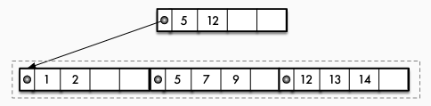

Bw-Baum
- = Buzzword Tree (Levandoski, Lomet, Sengupta: The Bw-Tree: A B-tree for New Hardware Platforms, ICDE 2013)
- Ziele: Cache-Freundlichkeit, Multicore-CPUs, Flash-Speichereigenschaften
- Techniken
    - überwiegend Latch-freie Operationen, stattdessen atomare CAS-Instruktionen
    - spezifische Struktur-Modifikationsoperationen: Folge von atomaren Modifikationen, Blink-ähnliche Struktur
    - Delta-Updates und Log Structured Storage (LSS)
        - Änderungen an Seiten/Knoten werden nicht direkt ausgeführt, sondern in Delta-Records pro Knoten erfasst
        - keine Synchronisation für Zugriff auf Seiten notwendig
        - Seite kann auch nach Änderung im Cache verbleiben
        - Seiten + Delta Records werden periodisch konsolidiert
        - Log Structured Storage -> später!
    - Mapping-Tabelle: logische Seitennummern in
      - (a) Offset im Flash-Speicher
      - (b) Zeiger im Hauptspeicher

## LSM-Baum
- = Log Structured Merge Tree (O’Neil, Cheng, Gawlick, O’Neil: The log-structured merge-tree (LSM-tree). Acta Informatica. 33 (4): 351-385, 1996)
- Ziel: höherer Schreibdurchsatz durch Eliminierung verstreuter In-Place-Updates
- Einsatz in diversen NoSQL-Systemen: HBase, Cassandra, BigTable, LevelDB, RocksDB, ...
- Grundidee
    - Batches von Schreiboperationen werden sequentiell in Indexdateien gespeichert, d.h. Sortieren vor Schreiben auf Externspeicher (Log Structured)
    - Neue Updates werden in neuen Indexdateien gespeichert
    - Indexdateien werden periodisch zusammengefügt (Merge)
    - Leseoperationen müssen alle Indexdateien konsultieren
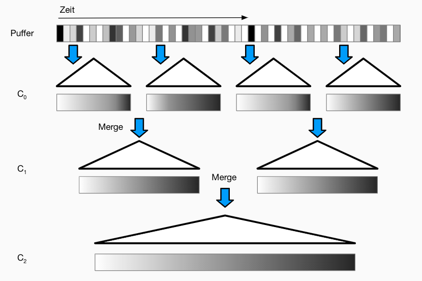

LSM-Baum: Realisierung
- Main-Memory-Baum $C_0$ als Puffer, sortiert nach Schlüsseln, z.B. als AVL- oder RB-Baum
  - bei Erreichen eines gegebenen Füllgrads -> Herausschreiben auf Disk (siehe unten)
  - ergänzt um Write Ahead Logging auf Disk für Wiederherstellung nach Systemfehler
- mehrere Append-only, disk-basierte Indexe $C_1, C_2,...,$ ebenfalls sortiert nach Schlüssel (z.B. als B-Baum)
  - effiziente Unterstützung von Scans (Schlüsselsuche)
  - Merge in einem Schritt
- Aktualität der Indexe: $C_0,C_1,...,C_n$

LSM-Baum: Verdichtung
- wenn bestimmte Anzahl von Dateien erzeugt wurden (z.B. 5 Dateien je 100 Datensätze), werden diese in eine Datei gemischt (1 Datei mit 500 Sätzen)
- sobald 5 Dateien mit 500 Sätzen vorliegen, dann Mischen in eine Datei
- usw.
- Nachteil: große Anzahl von Dateien, die alle durchsucht werden müssen

LSM-Baum: Ebenenweise Verdichtung
1. pro Ebene wird eine bestimmte Zahl von Dateien verwaltet, partitioniert nach Schlüsseln (keine Überlappung der Schlüssel) -> Suche nur in einer Datei notwendig
2. Ausnahme: erste Ebene (Überlappung erlaubt)
3. Mischen der Dateien jeweils in die nächsthöhere Ebene: Auswahl einer Datei und Aufteilen der Sätze -> Platz für neue Daten schaffen

LSM-Baum: Lesezugriffe
- grundsätzlich: Verbesserung der Schreibperformance zulasten der Leseperformance
  - Suche in allen Indexen $C_0,C_1,...,C_n$ notwendig
- Vermeiden unnötiger Lesevorgänge durch Bloom-Filter pro Index oder pro Run
  - (probabilistische) Datenstruktur zum Feststellen, ob Objekt in einer Menge enthalten ist
  - Bit-Feld: Objekt wird über $k$ Hashfunktionen auf $k$ Bits abgebildet, die auf 1 gesetzt werden
  - Prüfen auf Enthaltensein: Hashfunktionen anwenden -> Wenn alle $k$ Bits $= 1$, dann ist Objekt enthalten
  - aber falsch-positive Werte möglich!
  - können ebenfalls durch Mischen kombiniert werden
  - [Quelle](Bloom: Space/Time Trade-offs in Hash Coding with Allowable Errors. CACM, 13(7):422-426, 1970)

## Zusammenfassung
- B+-Baum als "Arbeitspferd" für Indexing
- Standardoperationen: Suche, Einfügen, Löschen
- noch nicht betrachtet: Nebenläufigkeitskontrolle und Wiederherstellung im Fehlerfall
- diverse Varianten und Optimierungen
- LSM-Baum für schreibintensive Workloads
