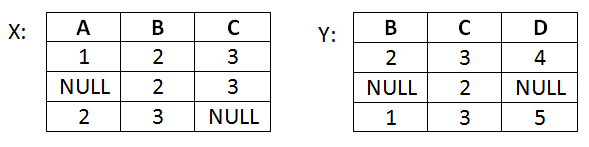
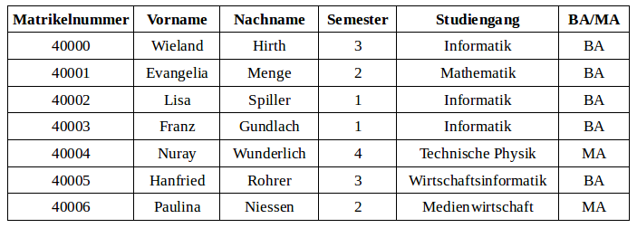
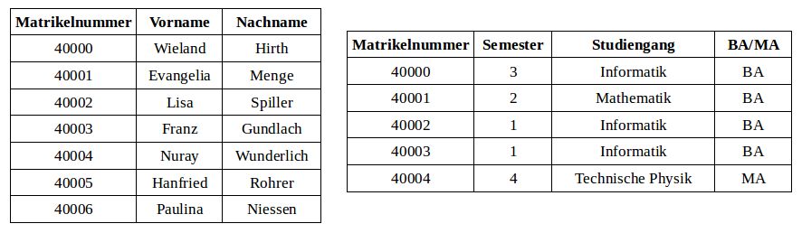
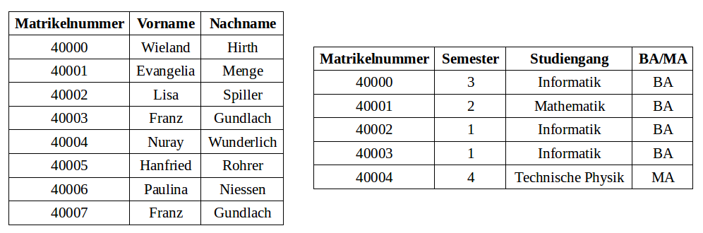
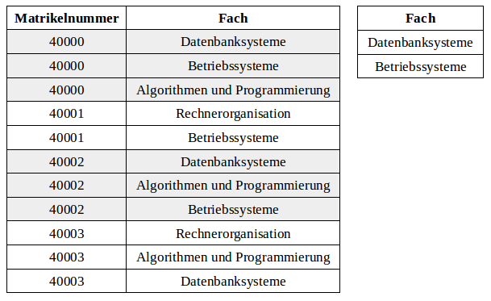
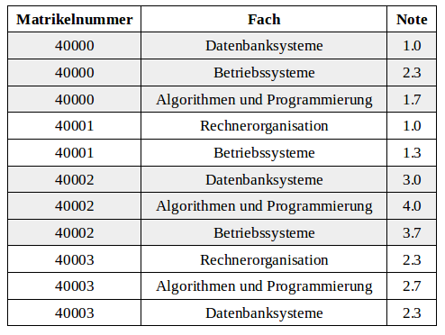

# Relationenmodell
## Welche der folgenden Aussagen über das Relationenmodell sind korrekt?
- [X] Das Relationenschema beschreibt den "Kopf der Tabelle", d.h. die Attribute, welche alle Tupel miteinander teilen.
- [X] Im Vergleich zu Tabellen sind Relationen duplikatfrei.
- [ ] Ein Attribut ist eine Zeile in der Relation, ein Tupel ist wiederum eine Spalte der Relation.
- [X] Tupel bestehen aus Attributwerten, wobei die zugehörigen Attribute vom Relationenschema vorgegeben sind.
- [ ] Unter dem Relationenschema werden alle Tupel zusammengefasst. Die Attribute werden von der Relation beschrieben.
- [ ] Relationen können Duplikate enthalten, d.h. mehrere völlig gleiche Einträge sind möglich.
- [X] Ein Attribut ist eine Spalte in der Relation, ein Tupel ist wiederum eine Zeile der Relation.

## Welche der folgenden Aussagen über Eigenschaften von Schlüsseln in Relationen sind korrekt?
- [X] Schlüssel dienen dazu, Tupel anhand ihrer Attribute eindeutig zu identifizieren, d.h. zwei Tupel mit gleichem Schlüssel sind nicht erlaubt.
- [X] Attribute können Schlüssel sein, dabei darf immer nur ein einzelnes Attribut als Schlüssel definiert sein.
- [ ] Attribute können Schlüssel sein, dabei sind auch kombinierte Attribute als Schlüssel erlaubt.
- [ ] Tupel können Schlüssel sein, dabei darf immer nur ein einzelnes Tupel als Schlüssel definiert sein.
- [ ] Schlüssel werden bei einer grafischen Darstellung üblicherweise durch Einkreisen gekennzeichnet.
- [ ] Tupel können Schlüssel sein, dabei sind auch kombinierte Tupel als Schlüssel erlaubt.
- [ ] Schlüssel werden verwendet, um Tupel in Relationen eindeutig wiederzufinden, d.h., Anfragen beziehen sich immer auf Schlüssel der Tupel.
- [X] Schlüssel werden bei einer grafischen Darstellung üblicherweise durch Unterstreichung gekennzeichnet.
- [ ] Schlüssel werden bei einer grafischen Darstellung üblicherweise durch ein Schlüsselsymbol gekennzeichnet.

## Welche der folgenden Aussagen über Fremdschlüssel sind korrekt?
- [ ] Fremdschlüssel sind niemals (Primär-)Schlüssel der eigenen Relation.
- [ ] Fremdschlüssel sind in jeder Relation notwendig, da sonst "einsame" Relationen entstehen, die sich mit keiner fremden Relation vereinen lassen.
- [X] Fremdschlüssel verweisen ausschließlich auf Attribute, die (Primär-)Schlüssel sind.
- [ ] Fremdschlüssel sind auch automatisch (Primär-)Schlüssel der eigenen Relation.
- [X] Fremdschlüssel gehören zu den Integritätsbedingungen.
- [ ] Fremdschlüssel verweisen immer auf beliebige Attribute fremder Relationen (d.h. nicht auf Attribute der eigenen Relation).
- [X] Fremdschlüssel können (Primär-)Schlüssel der eigenen Relation sein, dies ist aber nicht zwingend notwendig.
- [X] Fremdschlüssel sind optional, d.h. es kann Relationen ohne Fremdschlüssel geben.

## Welche Fachwörter gehören zum Relationenmodell?
- [X] Attribut
- [X] Wertebereich
- [ ] Wertepaar
- [X] Tupel
- [ ] Datensatz
- [X] Relation
- [ ] Eintrag
- [ ] Zeile

# Datendefinition
## Welche der folgenden Aussagen sind korrekt?
- [x] Um Tabellen zu löschen, wird der Befehl "drop table" genutzt.
- [ ] Beim Erstellen von Tabellen ist der Wertebereich einer Spalte optional anzugeben, ansonsten entscheidet SQL selbst.
- [ ] Beim Löschen einer Tabelle bleibt das Relationenschema in der Datenbank erhalten, da nur die Daten (Tupel) entfernt werden.
- [ ] Mit delete table können bestehende Tabellen gelöscht werden.
- [x] Optionale Anweisungen im create table Befehl (wie z.B. Integritätsbedingungen) werden in eckigen Klammern [ ] angegeben, beispielsweise [foreign key] für Fremdschlüssel.

## Welche der folgenden Aussagen über Datentypen sind korrekt?
- [ ] Der Datentyp `varchar(10)` erlaubt nur einstellige Zahlen von 0 bis 9.
- [ ] Der Datentyp `varchar(5)` erlaubt nur exakt 5 Zeichen, um z.B. bei der Postleitzahl keine Zahl mit nur vier oder sechs Ziffern zu erlauben.
- [x] Der Datentyp `varchar(100)` erlaubt maximal 100 Zeichen.

## Welche der folgenden Aussagen über Nullwerte sind korrekt?
- [x] Ein Tupel, welches nur aus Null-Werten besteht, ist in SQL aufgrund der Primärschlüsseleigenschaft nicht möglich.
- [ ] Null als SQL Datentyp wird als leerer String interpretiert.
- [ ] Mittels not null kann ausgeschlossen werden, dass ein Datentyp auf 0 gesetzt wird (insbesondere wichtig bei Division, da sonst durch 0 geteilt würde).
- [x] Primärschlüssel müssen nicht mit not null gekennzeichnet werden, da sie per Definition immer einen Wert haben.
- [x] Null in SQL bedeutet, dass ein Attributwert nicht eingetragen wurde.

## Welche Schlüsselwörter bzw. Zusätze können in einer Anweisung zum Erstellen einer Tabelle vorkommen?
- [ ] REQUIRED
- [ ] OPTIONAL
- [x] FOREIGN KEY
- [x] UNIQUE
- [ ] UNKNOWN
- [x] PRIMARY KEY
- [x] NOT NULL

## Welche der SQL-Anweisungen definiert eine Tabelle?
- [x] `CREATE  TABLE  Tabellenname  (  Attribut1  Wertebereich1 ,  Attribut2 Wertebereich2 ,  . . . )`
- [ ] `CREATE  Tabellenname  (  Attribut1  Wertebereich1 ,  Attribut2  Wertebereich2 ,  . . . )`
- [ ] `TABLE  Tabellenname  CREATE  WITH  ( Attribut1  Wertebereich1 ,  . . .  )`

# Grundoperationen
## Welche der folgenden Aussagen über die Relationenalgebra sind korrekt?
- [x] Durch Anfrageoperationen können aus vorhandenen Relationen neue Ergebnistabellen erstellt werden.
- [ ] Operationen der Relationenalgebra haben eine feste Ausführungsreihenfolge (wie z.B. in der Mathematik "Punkt vor Strichrechnung" erfolgt). So wird beispielsweise eine Projektion oder Selektion immer vor einem Verbund berechnet, damit der Verbund auf somit reduzierten Relationen schneller ein Ergebnis liefern kann.
- [ ] Operationen der Relationenalgebra beschreiben Inhalte der Datenbank, wie beispielsweise Tupel.
- [x] Anfrageoperationen der Relationenalgebra ermöglichen das "Rechnen mit Tabellen".

## An der Universität gibt es eine Relation mit den relevanten Daten aller Studierenden wie Matrikelnummer, Name, Email, Fakultät, Studiengang usw. Der Dekan der Fakultät IA möchte zum Sommerfest einladen und die Studierenden seiner Fakultät per Mail informieren. Für die Suche der Mail-Adressen benötigt er folgende Operation/en der Relationenalgebra:
- [ ] nur die Projektion
- [x] die Selektion und die Projektion
- [ ] nur die Selektion
- [ ] die Selektion und die Vereinigung

## Welche Operationen der Relationenalgebra verknüpfen zwei Relationen zu einer Ergebnisrelation, deren Schema mehr Attribute als jedes einzelne Schema der Ausgangsrelationen enthält?
- [x] natürlicher Verbund
- [ ] Selektion
- [ ] Vereinigung
- [x] Kreuzprodukt

## Welche Operationen der Relationenalgebra liefern im Allgemeinen eine Ergebnisrelation mit einer geringeren Anzahl von Tupeln als die Ausgangsrelation(en)?
- [x] Selektion
- [x] Differenz
- [ ] Kreuzprodukt
- [x] Durchschnitt

## Welche der folgenden Aussagen über Operatoren sind korrekt?
- [x] Die Selektion wählt Zeilen (Tupel) der Tabelle aus, während man über die Projektion Spalten (bestimmte Attribute) anfragen kann.
- [ ] Der Projektionsoperator entfernt standardmäßig keine doppelten (gleichen) Tupel in der Ergebnisrelation.
- [x] Mit der Umbenennung lassen sich Attribute umbenennen, was gerade für Mengenoperationen sinnvoll ist.
- [x] Der Selektionsoperator liefert niemals doppelte (gleiche) Tupel in der Ergebnisrelation zurück.
- [x] Unäre Operationen erhalten eine Tabelle als Eingabe und liefern eine einzelne Tabelle als Ergebnis zurück.
- [x] Ein natürlicher Verbund über zwei Tabellen verknüpft diese über ihre gemeinsamen Attribute, da diese üblicherweise den gleichen Datentyp teilen.
- [ ] Die Selektion wählt Spalten (bestimmte Attribute) der Tabelle aus, während man über die Projektion einzelne Zeilen (Tupel) anfragen kann.
- [ ] Beim natürlichen Verbund werden Tupel ohne Partner beim Verknüpfen zweier Tabellen mit Nullwerten in den anderen Attributen aufgefüllt, damit keine Daten im Ergebnis verloren gehen.
- [ ] Wird die Umbenennung als Operator angewandt, ist die Namensänderung eines Attributes dauerhaft in der Datenbank gespeichert.
- [x] Die Reihenfolge der Operatoren (Selektion vor Projektion oder umgekehrt) bei einer Kombination hat keinen Einfluss auf die Ergebnisrelation, nur auf die Performance (Geschwindigkeit) der Anfrage (immer vorausgesetzt, es treten keine Konflikte mit dem Schema auf, z.B. wenn ein nötiges Attribut der Selektionsbedingung vorher entfernt wird).

# SQL
## Welche Schlüsselwörter der SQL-Anfragesprache gehören unbedingt (mindestens) zur Formulierung einer Anfrage?
- [ ] `SELECT,  FROM,  NATURAL JOIN`
- [X] `SELECT,  FROM`
- [ ] `SELECT,  FROM,  WHERE`
- [ ] `SELECT,  DISTINCT,  FROM`

## Alle Kunden, die die Reise mit der Nummer 4712 gebucht haben, sollen mit einer Nachricht über Veränderungen im Reiseverlauf informiert werden. Welche der SQL-Anfragen liefert eine korrekte Liste von Mail-Adressen der Kunden?
- [X] `SELECT Mail FROM Kunde, Buchung WHERE Kunde.KdNr = Buchung.KdNr AND ReiseNr = 4712`
- [ ] `SELECT Mail FROM Kunde, Buchung WHERE ReiseNr = 4712`
- [X] `SELECT Mail FROM Kunde NATURAL JOIN Buchung WHERE ReiseNr = 4712`

# Änderungsoperationen
## Ein Geldinstitut hat zur Verwaltung der Kundendaten eine Relation mit dem Schema 
`R( Konto , Kunde , Guthaben , Kreditrahmen )`  
Eine Rechnung soll bezahlt werden. Der Kunde mit dem Konto A soll 150 Euro an die Firma mit dem Konto X überweisen. Welche Aktionen müssen auf der Datenbank des Geldinstituts ausgeführt werden?

- [x] Änderung (UPDATE) des Guthabens von Konto A und Änderung (UPDATE) des Guthabens von Konto X.
- [ ] Änderung (UPDATE) des Guthabens von Konto A und Einfügen (INSERT) auf Konto X.
- [ ] Löschen (DELETE) des Betrages vom Guthaben des Kontos A und Einfügen (INSERT) auf Konto X.

## Angestellte einer Firma sollen eine Gehaltserhöhung von 5 Prozent bekommen. Allerdings soll davon nur die Entwicklungsabteilung profitieren. Welche der folgenden SQL-Anweisungen realisiert genau das?

- [ ] `UPDATE  Angestellte SET Gehalt = Gehalt * 1.05` 
- [ ] `UPDATE  Gehalt SET Gehalt = Gehalt * 1.05`
- [x] `UPDATE  Angestellte SET Gehalt = Gehalt * 1.05 WHERE  Abteilung = ‘Entwicklung‘`
- [ ] `UPDATE  TABLE  Angestellte SET Gehalt = Gehalt * 1.05 WHERE  Abteilung = ‘Entwicklung‘`

## Welche der folgenden SQL-Anweisungen sind korrekte Einfüge-Anweisungen für die Tabelle Angestellte mit dem Schema (Name, Vorname, Qualifikation, Abteilung)?
Hinweis: Neue Mitarbeiter werden in der Tabelle Neueinstellungen mit dem Schema (Name, Vorname, Geburtsdatum, Adresse, Beruf) erfasst und später Abteilungen zugeordnet und bei den Angestellten eingetragen.  

- [x] `INSERT INTO Angestellte (Name, Vorname, Abteilung) VALUES (‘Franke‘, ‘Felix‘, ‘Labor‘)`
- [ ] `INSERT INTO TABLE Angestellte VALUES (‘Franke‘, ‘Felix‘, ‘Chemiker‘, ‘Labor‘)`
- [x] `INSERT INTO Angestellte VALUES (‘Franke‘, ‘Felix‘, ‘Chemiker‘, ‘Labor‘)`
- [ ] `INSERT INTO Angestellte VALUES (‘Franke‘, ‘Felix‘, ‘Labor‘)`
- [x] `INSERT INTO Angestellte (Name, Vorname, Abteilung) (SELECT Name, Vorname, ‘Labor’ FROM Neueinstellungen WHERE Beruf = ‘Chemiker’)`
- [x] `INSERT INTO Angestellte (Name, Vorname, Qualifikation, Abteilung) VALUES (‘Franke‘, ‘Felix‘, ‘Chemiker‘, ‘Labor')`

# Datenbankmodellen
## Welche der folgenden Aussagen über Datenbankmodelle sind korrekt?
- [ ] SQL gehört mit seinen CREATE TABLE, UPDATE und INSERT Operationen zu den klassischen Entwurfsmodellen (wie auch das ER-Diagramm), da Änderungen im Entwurf leicht umsetzbar sind.
- [x] SQL ist wie das Relationenmodell ein sogenanntes Realisierungsmodell, da Anfragen in SQL (SELECT... FROM...) konkrete Ergebnisse aus der Datenbank liefern.
- [ ] Datenbankmodelle sind besonders gut für das Beschreiben großer Datenmengen mit dynamischer Struktur geeignet, da sich häufige Änderungen des Schemas zentral verwalten lassen.
- [x] Das Datenbankmodell beschreibt die Datenbank, bzw. das Schema der Datenbank.
- [ ] Jedes Datenbankmanagementsystem (DBMS) verwendet exakt ein Datenbankmodell, welches sämtliche Details über die Art der Implementierung theoretisch beschreibt.

## Was wird von Datenbankmodellen beschrieben?
- [x] Statische Eigenschaften, wie Objekte (z.B. Relationen)
- [x] Integritätsbedingungen (z.B. Primärschlüssel)
- [ ] Statistische Eigenschaften (z.B. Größe des Datenbestandes)
- [ ] Redundanz, wie Sicherungskopien (z.B. Tabellen)
- [ ] Progressive Eigenschaften (z.B. Tupel)
- [x] Dynamische Eigenschaften, wie Operatoren (z.B. Selektion)

# Entities und Beziehungen
## Welche der folgenden Aussagen über Entities und Entity-Typen sind korrekt?
- [x] Entity-Typen werden graphisch durch Rechtecke gekennzeichnet.
- [ ] Entities werden graphisch durch Kreise gekennzeichnet.
- [ ] Entities beschreiben Objekte einer Datenbank genauer. Beispielsweise könnten bei einer Student-Relation typischerweise die Entities Matrikelnummer, Name oder Adresse entstehen.
- [x] Entity-Typen sind Objekte in der Datenbank und können daher im Allgemeinen mit Relationen des Relationenmodells gleichgesetzt werden.
- [ ] Entities können im Gegensatz zu Werten direkt dargestellt werden, wie z.B. ein Student oder Dozent, welcher direkt als Tupel in der Datenbank eingefügt wurde.
- [ ] Entities werden graphisch durch Rauten gekennzeichnet.
- [x] Entity-Typen verallgemeinern Entities. So könnte ein Entity "Datenbanksysteme" des Entity-Typs "Vorlesung" diese konkretisieren.

## Welche der folgenden Aussagen über Attribute sind korrekt?
- [x] Wie auch im Relationenmodell wird der Primärschlüssel (Attribut) des Entities graphisch durch Unterstreichung gekennzeichnet.
- [x] Attribute modellieren Eigenschaften von Entities, wie die Farbe eines Weines oder das Alter eines Studierendens.
- [x] Im Gegensatz zum Relationenmodell kann beim ER-Modell nur ein einzelnes Attribut eines Entities Schlüssel sein.
- [x] Aus möglichen Schlüsselkandidaten wird der Primärschlüssel eines Entities gebildet.
- [x] Ein Attribut des ER-Modells kann in ein Attribut einer Relation überführt werden.
- [x] Im Gegensatz zum Entity-Typ mit Entities und dem Relationship-Typ mit Relationships gibt es im ER-Modell standardmäßig zu Attributen keinen Attribut-Typ.

## Welche der folgenden Aussagen über Beziehungen und Beziehungstypen sind korrekt?
- [x] Relationships können ebenso wie Entities eigene Attribute haben.
- [ ] Ein Beziehungstyp verbindet mindestens zwei Entitiy-Typen miteinander, niemals jedoch einen Entity-Typ mit sich selbst (n>=2).
- [x] Die Ausprägung einer Beziehung wird als Teilmenge des Kreuzprodukts der teilnehmenden Entities dargestellt.
- [ ] Relationships entstehen immer zwischen einzelnen Attributen (wie z.B. der Matrikelnummer einer Studenten-Relation und Prüfung-Relation) und können somit Fremdschlüssel-Bedingungen umsetzen.

# Beziehungstypen
## Welche der folgenden Aussagen zu/über Beziehungstypen sind korrekt?
- [x] Binäre Beziehungstypen treten häufiger auf als mehrstellige Beziehungstypen.
- [ ] Binäre Beziehungstypen sind einfacher zu modellieren und zu verstehen als mehrstellige Beziehungstypen.
- [x] Angaben zur Kardinalität bei einem Beziehungstyp R( E1 [0,1], E2 [1,*] ) ersetzen die Charakteristik N:1.
- [ ] Mehrstellige Beziehungstypen lassen sich gleichwertig durch mehrere binäre Beziehungstypen darstellen.
- [x] Jede Beziehung eines binären Beziehungstyps stellt einen Zusammenhang zwischen zwei Objekten der beiden beteiligten Entity-Typen dar.
- [ ] Beziehungstypen lassen sich durch Angaben zur Funktionalität, wie 1:1, 1:N oder M:N, vollständig charakterisieren.

## Es gibt einen Beziehungstyp arbeiten zwischen Mitarbeitern und Projekten. Dieser sei wie folgt charakterisiert:
`arbeiten ( Mitarbeiter [0, 1], Projekte [2, 10] )`
Welche Aussagen lassen sich daraus ableiten?
- [x] Es gibt Mitarbeiter, die an keinem Projekt arbeiten.
- [x] Ein Projekt hat wenigstens 2 Mitarbeiter.
- [ ] Ein Mitarbeiter arbeitet an genau einem Projekt.
- [ ] Jeder Mitarbeiter arbeitet an mindestens 2 Projekten, aber höchstens an 10 Projekten.
- [ ] Es muss mindestens 2 Projekte geben.
- [x] Ein Projekt hat maximal 10 Mitarbeiter.
- [x] Ein Mitarbeiter arbeitet nur an einem Projekt. Nur so kann man sich voll konzentrieren.

# Weiteren Konzepten
## In einem Unternehmen werden zur Modellierung der Geschäftsabläufe und zur Datensammlung die Entity-Typen Fahrzeuge, LKW, PKW und Baufahrzeuge definiert. Welche Aussagen sind zutreffend?
- [x] Die Entity-Typen sind durch IST-Beziehungen miteinander "verbunden".
- [ ] Die Entity-Typen sind Teile eines mehrstelligen Beziehungstyps.
- [x] Es gibt Objekte (Entitys), die mehr als einer Objektmenge angehören.
- [ ] Zwischen Fahrzeugen und den anderen Entity-Typen besteht jeweils ein 1:N-Beziehungstyp.
- [x] Es kann Fahrzeuge geben, die zu keinem der anderen Entity-Typen eine Beziehung haben.
- [ ] Hat das Unternehmen je 5 LKW, PKW und Baufahrzeuge, dann hat es genau 15 Fahrzeuge.

## Es gibt zwei Entity-Typen: Zeitungen und (Zeitungs-)Ausgaben. Welche Aussagen sind zutreffend?
- [ ] Jede Zeitung hat genau eine Ausgabe.
- [x] Jede Ausgabe gehört zu genau einer Zeitung.
- [ ] Die Zeitungen sind ein abhängiger Entity-Typ, denn ohne Ausgaben kann die Zeitung nicht existieren.
- [x] Die Ausgaben sind abhängig von der Existenz der Zeitung, d.h. die Ausgaben sind ein abhängiger Entity-Typ.
- [x] Eine Zeitung hat mehrere Ausgaben.
- [ ] Eine Ausgabe kann zu einer Zeitung gehören, muss es aber nicht.

# Phasen des Datenbankentwurfs
## Welche der folgenden Aussagen über generelle Anforderungen an den Datenbankentwurf sind richtig?
- [ ] Vernünftigerweise werden Daten so gespeichert, dass sie direkt zugreifbar sind und keine Ableitung aus anderen Daten erfordern.
- [x] Daten sollen möglichst nicht-redundant gespeichert werden, d.h. nicht mehrfach, um Konsistenzprobleme wie das "Vergessen" von Änderungen zu vermeiden.
- [x] Anwendungsdaten sollen sich aus Daten der Datenbank möglichst effizient ableiten lassen, z.B. der Gewinn aus den Bestellungen.
- [ ] Daten sollen möglichst redundant gespeichert werden, d.h. mehrfach, um die Erreichbarkeit und Verfügbarkeit zu verbessern (z.B. wenn bei einer Naturkatastrophe ein Teil der Datenbank nicht mehr erreichbar ist).

## Welche der folgenden Aussagen über das Phasenmodell sind korrekt?
- [x] Das ER-Modell kann in der Phase des konzeptuellen Entwurfs genutzt werden.
- [ ] Die Anforderungsanalyse ist eine optionale erste Phase und wird nur dann eingesetzt, wenn eine völlig neue Datenbank erstellt werden soll.
- [ ] SQL kann als Modell für den konzeptuellen Entwurf eingesetzt werden, dank Befehlen wie CREATE TABLE, UPDATE, INSERT usw.
- [x] In der konzeptuellen Entwurfsphase werden Sichten behandelt, die festlegen, welcher Datenbanknutzer später Zugang zu welchen Daten erhalten soll. Dabei werden auch Konflikte zwischen den Sichten betrachtet.
- [x] Der Verteilungsentwurf ist optional und wird dann eingesetzt, wenn eine Datenbank über mehrere Knoten (Orte, Systeme, etc.) verteilt werden soll.

# Weiteren Vorgehen beim Entwurf
## Welche der folgenden Aussagen über das weitere Vorgehen beim Datenbankentwurf ist korrekt?
- [ ] Nach dem physischen Entwurf folgt der konzeptuelle Entwurf und schließlich der logische Entwurf, z.B. SQL in das ER-Modell und schließlich in das Relationenmodell.
- [ ] Nach dem konzeptuellen Entwurf folgt der physische Entwurf und schließlich der logische Entwurf, z.B. ER-Modell in SQL und schließlich in das Relationenmodell.
- [x] Nach dem konzeptuellen Entwurf folgt der logische Entwurf und schließlich der physische Entwurf, z.B. ER-Modell ins Relationenmodell und schließlich in SQL.

## Welche der folgenden Aussagen über Sichten sind korrekt?
- [ ] Es gibt Integrationskonflikte, die sich nicht auflösen lassen und eine vollständige Neuerstellung des Datenbankentwurfs erfordern.
- [ ] Sichten können direkt nach ihrer Erstellung in das Gesamtschema überführt werden, da Konflikte (wie z.B. Überlappungen) bei der Integration nicht entstehen können.
- [x] Nach der Erstellung von Sichten müssen diese auf Konflikte überprüft werden, ehe sie in ein Gesamtschema überführt werden können.

## Welche der folgenden Aussagen sind korrekt?
- [x] In der Phase der Datendefinition werden auch die Datentypen der Attribute deklariert, z.B. Integer oder Varchars.
- [ ] Am Ende des logischen Entwurfs steht immer genau ein einzelnes Relationenschema, welches dann an den nächsten Schritt (Datendefinition) weitergegeben wird.
- [x] Im logischen Entwurf kann das konzeptuelle Schema (z.B. ER-Diagramm) in ein relationales Schema überführt werden. Dies wird anschließend noch verfeinert, z.B. durch Normalisierung.
- [x] Bei der Datendefinition werden auch Integritätsbedingungen (Fremdschlüssel, etc.) umgesetzt.
- [x] Im physischen Entwurf wird die Performance für Datenzugriffe verbessert, z.B. durch die Verwendung von Indexstrukturen.

# Kapazitätserhaltenden Abbildung
## Welche der folgenden Aussagen über Abbildungen sind korrekt?
- [ ] Eine kapazitätserhaltende Abbildung lässt sich immer erreichen, indem Schlüssel beider Entities zum Schlüssel der Beziehung gemacht werden statt nur einer von beiden.
- [ ] Eine kapazitätserhöhende Abbildung kann durch eine kapazitätsvermindernde Abbildung ausgeglichen werden.
- [x] Eine Abbildung ist kapazitätserhaltend, wenn sich hinterher genau dieselben Daten speichern lassen wie vorher.

# ER-auf-RM-Abbildung
## Welche der folgenden Aussagen über die Abbildung vom ER-Modell in das Relationenmodell sind korrekt?
- [ ] Primärschlüssel der beteiligten Entity-Typen werden in das Relationenschema der Beziehung übernommen und sind dort ebenfalls Primärschlüssel.
- [x] Verschiedene Kardinalitäten können durch die geeignete Wahl von Schlüsseln ausgedrückt werden.
- [ ] Es können neue Schlüssel entstehen, d.h. aus Attributen, die im ER-Modell zuvor kein Schlüssel waren.
- [ ] Nur Entity-Typen ergeben je eine Relation bzw. ein Relationenschema, Attribute und Beziehungstypen nicht.
- [ ] In einer 1:N Beziehung wird der Primärschlüssel vom Entity-Typen der 1-Seite übernommen.

## Welche der folgenden Aussagen über Verschmelzungen von Relationenschemata sind korrekt?
- [x] Beim Verschmelzen von zwingenden Beziehungen können niemals NULL-Werte entstehen.
- [x] Beim Verschmelzen einer 1:N Beziehung sind hinterher noch zwei Relationenschemata übrig, das verschmolzene Schema und das Schema auf der 1-Seite.
- [x] Nur bei einer 1:1 Beziehung können beide Entity-Relationenschemata in ein einzelnes Schema verschmolzen werden.
- [ ] Optionale Beziehungen können einfach verschmolzen (zusammengefasst) werden, da es bei diesen keine Rolle spielt, ob sie im späteren Schema noch vorhanden sind.

## Welche der folgenden Aussagen über abhängige Entity-Typen sind korrekt?
- [x] Bei abhängigen Entities erhält die abhängige Entität im Relationenschema zusätzlich den Primärschlüssel der Entität, von der sie abhängig ist.
- [x] Der Primärschlüssel der abhängigen Entität muss zwingend aus dem eigenen Schlüssel und dem der übergeordneten Entität gebildet werden.
- [x] Bei abhängigen Entities ergibt die Beziehung zur übergeordneten Entität kein eigenes Relationenschema.

## Welche der folgenden Aussagen sind korrekt?
- [x] In einer IST-Beziehung bildet die Beziehung kein eigenes Relationenschema.
- [ ] In einer IST-Beziehung kann ein Relationenschema entstehen, welches keinen Schlüssel enthält.
- [x] Bei rekursiven funktionalen Beziehungen entstehen in den Beziehungen Fremdschlüssel auf die eigene Relation.

## Welche der folgenden Aussagen über mehrstellige Beziehungen sind korrekt?
- [x] Der Primärschlüssel der mehrstelligen Beziehung (bestehend aus den Primärschlüsseln aller beteiligten Entity-Typen) ist zugleich Fremdschlüssel auf die jeweiligen - [ ] Primärschlüssel der beteiligten Entity-Typen.
- [x] In mehrstelligen Beziehungen bilden alle Primärschlüssel der beteiligten Entity-Typen gemeinsam den Primärschlüssel der Beziehung.
- [ ] In mehrstelligen Beziehungen (M:N:K) kann der Primärschlüssel aus den Primärschlüsseln der beteiligten Entity-Typen gewählt werden.

# Zielmodell
## Welche der folgenden Aussagen über das Relationenmodell sind korrekt?
- [x] Relationen enthalten keine Duplikate.
- [x] Der Primärschlüssel ist ein ausgezeichneter Schlüssel, der Tupel eindeutig identifiziert.
- [ ] Eine Domäne beschreibt Elemente eines Wertebereichs.
- [ ] Die minimale Menge, die Attribute eindeutig identifiziert, heißt Oberschlüssel.
- [x] Das Datenbankschema ist eine Menge von Relationenschemata, ein Relationenschema ist eine Menge von Attributen.

# Relationalen DB-Entwurf
## Welche der folgenden Ziele werden bei der Verfeinerung des Relationenmodells angestrebt?
- [x] Redundanzvermeidung
- [x] Abhängigkeitstreue
- [x] Verbundtreue
- [ ] Änderungstreue
- [ ] Duplikatbildung
- [ ] Resonanzvermeidung

## Welche der folgenden Operationen können zu Anomalien führen?
- [x] INSERT
- [x] UPDATE
- [ ] CREATE TABLE
- [ ] SELECT ... FROM ...
- [x] DELETE

## Welche der folgenden Aussagen über funktionale Abhängigkeiten sind korrekt?
- [x] Für Schlüssel X gilt zweierlei: Abhängigkeit X->Relationenschema, sowie X ist minimal.
- [ ] X->X, d.h. X bestimmt sich selbst, ist aus Trivialitätsgründen nicht erlaubt.
- [ ] Bei der Ableitung von funktionalen Abhängigkeiten X->Y sowie Y->Z gilt auch Z->X (Ringschluss).
- [x] X->Y bedeutet: Haben zwei Tupel gleiche Werte in Attribut X, sind ihre Werte für Attribut Y auch gleich.

# Normalformen
## Welche der folgenden Aussagen über Normalformen sind korrekt?
- [ ] Normalformen minimieren globale Redundanzen zwischen den Relationen.
- [x] Normalformen vermeiden Redundanzen und Anomalien.
- [x] Eigenschaften von Relationenschemata werden von Normalformen bestimmt.
- [ ] Normalformen stellen sicher, dass alle Anwendungsdaten aus den Basisrelationen hergeleitet werden können.
- [x] In Normalformen sind bestimmte Kombinationen von funktionalen Abhängigkeiten verboten.

## Welche der folgenden Aussagen über die ersten drei Normalformen sind richtig?
- [x] Die zweite Normalform eliminiert partielle Abhängigkeiten, d.h. ein Attribut ist bereits funktional von einem Teil des Schlüssels abhängig.
- [ ] Wenn die beiden funktionalen Abhängigkeiten X->Y und Y->Z existieren (Transitivität), wird diese immer in der dritten Normalform entfernt.
- [ ] In der ersten Normalform liegen alle Attribute nullfrei vor, d.h. ohne NULL Attributwerte.
- [ ] Die zweite Normalform eliminiert transitive Abhängigkeiten, d.h. im Allgemeinen wenn Attribut A das Attribut B bestimmt und B das Attribut C bestimmt.
- [x] Die dritte Normalform eliminiert partielle Abhängigkeiten, d.h. ein Attribut ist bereits funktional von einem Teil des Schlüssels abhängig.
- [x] Die Normalformen bauen aufeinander auf, d.h. die zweite Normalform enthält auch die Anforderungen der ersten Normalform, usw.
- [x] Die erste Normalform fordert, dass alle Attribute atomar vorliegen, wie z.B. als Integer oder als Double.
- [x] Die dritte Normalform eliminiert transitive Abhängigkeiten, d.h. im Allgemeinen wenn Attribut A das Attribut B bestimmt und B das Attribut C bestimmt.

## Welche der folgenden Aussagen über die Boyce-Codd-Normalform (BCNF) sind korrekt?
- [ ] Die Verbundtreue wird von der BCNF nicht garantiert.
- [x] Die BCNF eliminiert im Gegensatz zur dritten Normalform jegliche transitive Abhängigkeiten.
- [x] Die Abhängigkeitstreue wird von der BCNF nicht garantiert.
- [ ] Die BCNF eliminiert im Gegensatz zur dritten Normalform jegliche partielle Abhängigkeiten.

## Welche der folgenden Aussagen über Minimalität sind korrekt?
- [x] Die Minimalität versucht, andere Kriterien (wie Normalformen) mit möglichst wenigen Schemata zu erreichen.
- [ ] Die Minimalität versucht, andere Kriterien (wie Normalformen) so umzusetzen, dass die Schemata möglichst klein sind.
- [x] Die Minimalität befasst sich mit globalen Redundanzen, d.h. Redundanzen, die alle Relationen betreffen.
- [ ] Die Minimalität befasst sich mit lokalen Redundanzen, d.h. Redundanzen, die innerhalb einer Relation auftreten.

# Transformationseigenschaften
## Was bedeutet die Eigenschaft "Verbundtreue" im Rahmen des relationalen Entwurfs?
- [x] Die Originalrelation kann nach der Dekomposition aus den zerlegten Relationen mit natürlichen Verbundoperationen zurückgewonnen werden.
- [ ] Eine Dekomposition ist immer verbundtreu.
- [ ] Bei der Zerlegung eines Relationenschemas in mehrere kleinere muss beachtet werden, dass jeweils zwei davon ein gemeinsames Attribut als Grundlage für spätere Verbundoperationen haben.
- [ ] Bei der Dekomposition werden keine funktionalen Abhängigkeiten zerstört.

## Gegeben sei ein relationales Schema 
$R = \{ A B C D E \}$ mit genau einem Schlüssel $K = \{\{ AC \}\}$. Durch Dekomposition entstehen $R_1 = \{ A B C \}$ mit dem Schlüssel $K_1 = \{\{ AC \}\}$ und $R_2 = \{ C D E \}$ mit dem Schlüssel $K_2 = \{\{ C \}\}$
- [ ] Die Zerlegung ist abhängigkeitstreu, aber nicht verbundtreu.
- [x] Die Zerlegung ist nicht abhängigkeitstreu und nicht verbundtreu.
- [ ] Die Zerlegung erfüllt alle Transformationseigenschaften. Sie ist abhängigkeitstreu und verbundtreu.
- [ ] Die Zerlegung ist verbundtreu, aber nicht abhängigkeitstreu.

# weiteren Abhängigkeiten
Welche der folgenden Aussagen zu mehrwertigen Abhängigkeiten sind korrekt?
- [x] Ein Schema in vierter Normalform (4NF) enthält nur noch triviale MVDs.
- [ ] Mehrwertige Abhängigkeiten steigern den Wert eines relationalen Schemas. Sie sind ausdrucksstärker als einfache funktionale Abhängigikeiten.
- [x] Für eine Relation r zum Schema R mit den Attributen XYZ bedeutet die MVD X →→ Y Folgendes: Wenn $(x1, y1, z1)$ und $(x1, y2, z2)$ Tupel der Relation r sind, so sind auch $(x1, y2, z1)$ und $(x1, y1, z2)$ Tupel der Relation r.
- [x] Mehrwertige Abhängigkeiten können als Folge der Forderungen der 1. Normalform entstehen.
- [ ] Triviale MVDs kann man beim Schema-Entwurf vernachlässigen.

# Rechnen mit FDs
## Welche der folgenden Aussagen sind korrekt?
- [x] Bei der Hüllenbildung werden alle funktionalen Abhängigkeiten (FDs) gefunden, die sich aus einer gegebenen Menge an FDs ableiten lassen.
- [x] Für die Hüllenbildung können Ableitungsregeln (Reflexivität, Transitivität, etc.) genutzt werden.
- [x] Aus den funktionalen Abhängigkeiten A->B und B->C kann auch A->C impliziert werden.

## Welche der folgenden Aussagen über Ableitungsregeln sind korrekt?
- [ ] Bei der Dekomposition (F4) können bei gegebener funktionaler Abhängigkeit AB->CD auch die FDs AB->C und AB->D abgeleitet werden.
- [x] Es lässt sich immer die funktionale Abhängigkeit A->∅ (leere Menge) bilden.
- [x] Durch Reflexivität (F1) lässt sich immer die funktionale Abhängigkeit A->A bilden.
- [x] Durch die Vereinigung (F5) können die funktionalen Abhängigkeiten A->B und A->C zu A->BC zusammengefasst werden.
- [x] Bei der Augmentation (F2) können zu einer gegebenen Abhängigkeit A->B immer zusätzliche Attribute hinzugenommen werden, wie beispielsweise AC->BC.
- [ ] Aus der Transitivität (F3) lässt sich bei den gegebenen funktionalen Abhängigkeiten A->B und B->C auch C->A ableiten.
- [x] Bei der Dekomposition (F4) können bei gegebener funktionaler Abhängigkeit AB->CD auch die FDs A->CD und B->CD abgeleitet werden.

## Welche der folgenden Aussagen über B-Axiome bzw. RAP-Regeln ist richtig?
- [x] Die Regelmenge ist vollständig, da alle Armstrong-Axiome daraus hergeleitet werden können.
- [ ] Die Regelmenge ist im Gegensatz zu den Armstrong-Axiomen nicht vollständig, da diese nur aus drei Regeln (Reflexivität, Akkumulation und Projektivität) besteht.


## Welche der folgenden Aussagen über das Membership-Problem sind richtig?
- [ ] Das modifizierte Membership-Problem ist ebenso wie das Membership-Problem nicht in linearer Zeit lösbar (O(n²)).
- [x] Der Member-Algorithmus mit der CLOSURE-Funktion löst das Membership-Problem.
- [x] Beim modifizierten Membership-Problem wird überprüft, ob bei der funktionalen Abhängigkeit A->B das Attribut B zur Attributmenge gehört, welche von A bestimmt wird.
- [x] Das Membership-Problem fragt, ob sich eine bestimmte funktionale Abhängigkeit (FD) aus einer gegebenen Menge an FDs ableiten lässt.
- [x] Der Member-Algorithmus mit der CLOSURE-Funktion löst das modifizierte Membership-Problem.

## Welche der folgenden Aussagen über Überdeckungen ist korrekt?
- [x] Ein Attribut ist unwesentlich, wenn es nach seiner Entfernung aus den funktionalen Abhängigkeiten die Hülle nicht verändert hat.
- [ ] Eine Links- bzw. Rechtsreduktion entfernt unnötige (triviale) funktionale Abhängigkeiten mit dem Ziel der Minimalität.
- [ ] Die leere Menge ist ein Beispiel für eine immer gültige minimale Überdeckung.
- [x] Es soll beim Vergleich zweier Mengen von funktionalen Abhängigkeiten (FDs) eine Überdeckung gefunden werden, die minimal ist bzgl. ihrer FD-Anzahl und Attributen in den FDs.
- [x] Wenn sich zwei Mengen funktionaler Abhängigkeiten überdecken, sind sie äquivalent.

## Welche der nachfolgenden Aussagen über Äquivalenzklassen sind richtig?
- [ ] Damit zwei funktionale Abhängigkeiten in der gleichen Äquivalenzklasse landen, müssen diese eine äquivalente rechte Seite haben, z.B. A->C, B->C.
- [x] Damit zwei funktionale Abhängigkeiten in der gleichen Äquivalenzklasse landen, müssen diese eine äquivalente linke Seite haben, z.B. A->B, A->C.
- [ ] Für eine ringförmige Überdeckung muss zu den funktionalen Abhängigkeiten A->B, B->A und A->C zusätzlich C->A gelten.
- [x] Die funktionalen Abhängigkeiten A->B, B->C, C->A sowie A->D bilden eine ringförmige Überdeckung.

# Mehr zu Normalformen
Wir betrachten ein erweitertes Relationenschema $R = ( R, K )$ und die FD-Menge F über R. Welche Aussagen zur 2. Normalform sind zutreffend?
- [x] In 2NF gibt es keine partiellen funktionalen Abhängigkeiten von Nichtschlüsselattributen vom Schlüssel, und die 1NF ist erfüllt.
- [ ] Das Schema R ist in 2NF, wenn jedes Nicht-Primattribut von R voll von jedem Schlüssel von R abhängt.
- [x] Das Schema R ist in 2NF, wenn R in 1NF ist und jedes Nicht-Primattribut von R voll von jedem Schlüssel von R abhängt.
- [ ] In 2NF sind die partiellen funktionalen Abhängigkeiten beseitigt.

# Entwurfsverfahren
Welche Aussagen sind zutreffend?
- [ ] Die Synthese dient zur Wiederherstellung der ursprünglichen Relation durch Verschmelzen.
- [ ] Synthese und Dekomposition sind unterschiedliche Entwurfsverfahren, aber das Ergebnis ist das gleiche Datenbankschema.
- [x] Synthese und Dekomposition sind Verfahren zum Entwurf eines Datenbankschemas.
- [ ] Synthese und Dekomposition erzeugen ein "optimales" Datenbankschema, das alle Entwurfskriterien erfüllt.
- [x] Die Dekomposition wird angewandt zur Erzeugung eines Datenbankschemas in 3NF durch Zerlegung.
- [x] Synthese und Dekomposition sind Schema-Entwurfsverfahren mit Vor- und Nachteilen bzgl. der Entwurfskriterien.

Welches der Entwurfsverfahren gewährleistet die Abhängigkeitstreue (Kriterium T1)?
- [ ] nur die Dekomposition
- [ ] keines der Verfahren
- [x] nur die Synthese
- [ ] beide Verfahren

Welches der Entwurfsverfahren entwirft ein Schema in 3NF (Kriterium S1)?
- [ ] nur die Dekomposition
- [x] beide Verfahren
- [ ] nur die Synthese
- [ ] keines

Welches der Entwurfsverfahren erzeugt ein Datenbankschema, das verbundtreu (Kriterium T2) ist?
- [ ] keines
- [x] Die Dekomposition erfüllt das Kriterium.
- [ ] Beide Verfahren sind in jedem Fall verbundtreu.
- [x] Die Synthese KANN das Kriterium erfüllen.

Welches der Verfahren erzeugt ein minimales Datenbankschema (Kriterium S2)?
- [ ] beide Verfahren
- [ ] keiner
- [x] nur die Synthese
- [ ] nur die Dekomposition

# Verbunden
Welche der folgenden Aussagen über den natürlichen Verbund in SQL sind korrekt?
- [ ] Die gewählte Variante des Joins (JOIN...ON..., JOIN...USING..., etc.) in einer Anfrage beeinflusst die Ausführungszeit der Anfrage deutlich.
- [ ] Gegeben sind die Relationen X ( A , B , C , D ) und Y ( A , B , E , F ). Das Ergebnis von "... FROM X, Y WHERE X.A=Y.A" ist identisch zum Ergebnis von "... FROM X NATURAL JOIN Y".
- [x] "SELECT * FROM Tabelle1, Tabelle2" liefert das Kreuzprodukt.
- [x] Wenn in zwei miteinander verbundenen Tabellen gemeinsame Attribute vorkommen, die im SELECT explizit angefragt werden, braucht es immer einen Präfix vor dem - [ ] Attributnamen (z.B. SELECT Tabelle1.gemeinsames_Attribut).

# Selektionen
Gegeben ist folgende Anfrage über der Tabelle Student:`SELECT * FROM Student WHERE Vorname like 'E_%';` Was liefert diese Anfrage als Ergebnis zurück?
- [ ] Alle Tupel der Student Tabelle, deren Vornamen mit E beginnt.
- [ ] Alle Tupel der Student Tabelle, deren Vornamen mit E beginnen und mindestens drei Buchstaben lang sind.
- [ ] Alle Vornamen von Tupeln der Student Tabelle, die mit E beginnen.
- [x] Alle Tupel der Student Tabelle, deren Vornamen mit E beginnen und mindestens zwei Buchstaben lang sind.
- [ ] Die Anfrage ist nicht ausführbar (Semantikfehler).

Gegeben ist folgende Anfrage über der Tabelle Student:
```sql
   SELECT *
   FROM Student
   WHERE Matrikelnummer between 40000 and (
      SELECT Matrikelnummer
      FROM Student
      WHERE Matrikelnummer between 40002 and 40002
   );
```
Was liefert diese Anfrage als Ergebnis zurück?
- [x] Die Studenten mit Matrikelnummer 40000, 40001 und 40002.
- [ ] Den Studenten mit Matrikelnummer 40001.
- [ ] Ein leeres Ergebnis.
- [ ] Die Studenten mit Matrikelnummer 40001 und 40002.
- [ ] Die Anfrage ist nicht ausführbar (Semantikfehler).
- [ ] Die Studenten mit Matrikelnummer 40000 und 40001.

# Mengenoperationen
Gegeben sind die Relationen 


Welche der folgenden SQL-Anweisungen erzeugt die Tupel der Relation T mit dem Schema von T?
- [x] select * from R intersect corresponding by (A, C) S
- [x] select * from ( ( select A, C from R ) intersect (select A, C from S) )
- [ ] select * from R intersect S
- [x] select * from R intersect corresponding S

# Geschachtelten Anfragen I
Gegeben seien die Relationen `Student ( MatrNr, Name, Studiengang )` und `Prüfungen ( MatrNr, Fach, Datum, Note )`.
Welche der SQL-Anweisungen ergibt die Matrikelnummern MatrNr der Studierenden, die noch keine Prüfung abgelegt haben?
- [ ] `SELECT MatrNr FROM Prüfungen WHERE MatrNr  NOT IN ( SELECT MatrNr FROM Student )`
- [ ] `SELECT * FROM Prüfungen EXCEPT CORRESPONDING Student`
- [x] `SELECT * FROM Student EXCEPT CORRESPONDING BY (MatrNr) Prüfungen`
- [x] `SELECT MatrNr FROM Student WHERE MatrNr NOT IN ( SELECT MatrNr  FROM Prüfungen )`
- [x] `SELECT * FROM Student EXCEPT CORRESPONDING Prüfungen`
- [ ] `SELECT * FROM Student WHERE MatrNr NOT IN ( SELECT * FROM Prüfungen )`

# Skalaren Ausdrücken
Es gibt in der Datenbank folgendes Schema: `Student ( Matrikelnummer, Vorname, Nachname, Semester )`
Nun wird folgende SQL-Anfrage (in SQLite) ausgeführt: `SELECT * FROM Student WHERE SUBSTR( Matrikelnummer, 5 ) = '2';`
Was liefert diese Anfrage zurück?
- [x] Alle Studenten, deren Matrikelnummer mindestens eine 2 enthält.
- [ ] Alle Studenten mit zwei Matrikelnummern.
- [ ] Alle Studenten, deren Matrikelnummer auf eine gerade Zahl endet.
- [ ] Auf jeden Fall ein leeres Ergebnis.
- [ ] Alle Studenten, deren Matrikelnummer mit einer 2 endet.

Es gibt in der Datenbank folgendes Schema: `Student ( Matrikelnummer, Vorname, Nachname, Semester )`
Nun wird folgende SQL-Anfrage (in SQLite) ausgeführt:
```sql
   SELECT Matrikelnummer, (
      CASE Semester
      WHEN '1' THEN 'Ersti'
                      ELSE  'Kein Ersti'
      END) Klassifizierung
   FROM   Student
   WHERE Klassifizierung = 'Ersti'
   AND      Matrikelnummer % 2 = 0;
```
Was ist das Ergebnis?
- [ ] Matrikelnummer und Klassifizierung von Studenten mit Matrikelnummern die eine 2 enthalten und im ersten Semester sind.
- [ ] Matrikelnummern von Studenten mit geraden Matrikelnummern im ersten Semester.
- [ ] Das Ergebnis ist identisch zu folgender SQL-Anfrage: 
    ```sql
        SELECT Matrikelnummer, Semester
        FROM   Student
        WHERE Semester = '1'
        AND      Matrikelnummer % 2 = 0;
    ```
- [ ] Matrikelnummer und Klassifizierung von Studenten mit Matrikelnummern die auf 0 enden und im ersten Semester sind.
- [x] Matrikelnummer und Klassifizierung von Studenten mit geraden Matrikelnummern im ersten Semester.

# Geschachtelten Anfragen II
Gegeben sei eine Relation für Prüfungsanmeldungen mit dem Schema `Anmeldung ( MatrNr, Name, FachNr, Datum )`. Gesucht sind Studenten, die sich zu zwei oder mehr Prüfungen angemeldet haben.
Welche der SQL-Anfragen beantwortet die Frage korrekt?
- [x] `SELECT  MatrNr FROM  Anmeldung  A WHERE  EXISTS  ( SELECT  * FROM  Anmeldung  B WHERE  B.MatrNr = A.MatrNr AND  B.FachNr <> A.FachNr )`
- [x] `SELECT  MatrNr FROM  Anmeldung  A ,  Anmeldung  B WHERE  A.MatrNr = B.MatrNr  AND  B.FachNr <> A.FachNr`
- [ ] Keine der Anfragen ist geeignet, denn es wird eine Funktion zum Zählen benötigt.
- [x] `SELECT  MatrNr FROM  Anmeldung  A WHERE  A.MatrNr  IN  ( SELECT  B.MatrNr FROM  Anmeldung  B WHERE  B.FachNr <> A.FachNr )`

Gegeben seien zwei Relationen `Student ( MatrNr , Name , Studgang )` und `Prüfung ( MatrNr , Fach , FürStudgang , Note )`. 
Gesucht sind Studenten, die schon eine, mehrere oder - idealerweise - alle Prüfungen in ihrem Studiengang absolviert haben.
Welche SQL-Anfragen sind geeignet?
- [x] `SELECT  Name FROM  Student  S WHERE  MatrNr  IN  ( SELECT  MatrNr FROM  Prüfung  P WHERE  P.FürStudgang = S.Studgang )`
- [ ] Keine Anfrage ist geeignet.
- [ ] `SELECT  Name FROM  Student  S WHERE  MatrNr <= ALL  ( SELECT  MatrNr FROM  Prüfung  P WHERE  P.FürStudgang = S.Studgang )`
- [x] `SELECT  Name FROM  Student  S WHERE  MatrNr  = ANY  ( SELECT  MatrNr FROM  Prüfung  P WHERE  P.FürStudgang = S.Studgang )`

# Aggregatfunktionen und Gruppierung
Welche der folgenden Aussagen über Aggregatfunktionen und Gruppierung sind korrekt?
- [ ] SUM(*) aggregiert über alle Spalten einer Tabelle.
- [ ] Aggregatfunktionen lassen sich wie in der Mathematik auch im SQL-Standard schachteln, z.B. SUM(COUNT(*)).
- [x] Ein Aggregat wie z.B. SUM kann als Argument auch einen skalaren Ausdruck bekommen, z.B. SUM(Attribut_A+Attribut_B).
- [ ] Um die Anzahl von verschiedenen Werten eines Attributs zu bekommen, kann "SELECT COUNT(DISTINCT Attribut) ..." verwendet werden.
- [x] COUNT(*) zum Bestimmen der Anzahl von Tupeln zählt NULL-Werte als Tupel mit.
- [x] Um die Anzahl von verschiedenen Werten eines Attributs zu bekommen, kann "SELECT DISTINCT COUNT(Attribut) ..." verwendet werden.
- [ ] Enthält eine Tabelle NULL-Werte, gibt die Funktion MIN immer NULL zurück.


Gesucht ist die Anzahl von Prüfungen, die jeder Student bereits abgelegt hat, zusammen mit seinem Vornamen.
Das Schema der Datenbank sieht wie folgt aus:
```sql
   Student ( Matrikelnummer, Vorname, Nachname, Semester )
   Pruefung ( Matrikelnummer, FachID, Datum, Note )
```
Welche der folgenden SQL-Anfragen liefert das gewünschte Ergebnis?
Wählen Sie eine Antwort:
- [ ] 
   ```sql
   SELECT Vorname, Anzahl
   FROM (
      SELECT COUNT(*) AS Anzahl
      FROM Pruefung NATURAL JOIN Student
      GROUP BY (Matrikelnummer)
   ) NATURAL JOIN Student
   ```
- [x] 
      ```sql
         SELECT Vorname, COUNT(*)
         FROM Pruefung, Student
         GROUP BY (Matrikelnummer)
         ```
         ```sql
         SELECT Vorname, COUNT(*)
         FROM Pruefung NATURAL JOIN Student
         GROUP BY (Matrikelnummer, Vorname)
      ```
- [ ] 
   ```sql
   SELECT Vorname, Anzahl
   FROM (
      SELECT COUNT(*) AS Anzahl
      FROM Pruefung NATURAL JOIN Student
      GROUP BY (Matrikelnummer)
   )
   ```
- [ ] 
   ```sql
   SELECT Vorname, COUNT(*)
   FROM Pruefung NATURAL JOIN Student
   ```

Das Schema der Datenbank sieht wie folgt aus:
```sql
   Student ( Matrikelnummer, Vorname, Nachname, Semester )
   Pruefung ( Matrikelnummer, FachID, Datum, Note )
```
Gegeben ist folgende SQL-Anfrage:
```sql
   SELECT Vorname, Anzahl
   FROM (
      SELECT Vorname, COUNT(*) AS Anzahl
      FROM Pruefung NATURAL JOIN Student
      GROUP BY (Matrikelnummer)
   )
   GROUP BY Vorname
   HAVING Anzahl > 2
```
Was errechnet diese Anfrage? Wählen Sie eine Antwort:
- [ ] Anzahl von Matrikelnummern mit Vornamen von Studenten, die mindestens drei unterschiedliche Matrikelnummern besitzen.
- [ ] Die Anzahl von Studenten, die mindestens drei Prüfungen hatten.
- [ ] Die Anzahl von erfolgten Prüfungen sowie Vornamen von Studenten, deren Prüfung von mindestens zwei weiteren Studenten abgelegt wurde.
- [x] Vorname und Anzahl von abgelegten Prüfungen von Studenten, die mindestens drei Prüfungen hatten.
- [ ] Vornamen mit der Anzahl von durchgeführten Prüfungen von Studenten, deren Note schlechter als 2 war.

# Äußere Verbunde


Nun wird folgende Anfrage ausgeführt:
```sql
   SELECT A, X.B, D
      FROM X LEFT JOIN Y  ON X.B = Y.B
```
Welche der nachfolgenden Tupel sind im Ergebnis enthalten?
Wählen Sie eine oder mehrere Antworten:
- [x] (2, 3, NULL)
- [ ] (1, 2, NULL)
- [x] (1, 2, 4)
- [ ] (NULL, 1, 5)
- [x] (NULL, 2, 4)
- [ ] (NULL, 2, 3, 4)
- [ ] (NULL, 1, 3, 5)
- [ ] (1, 2, 3, 4)
- [ ] (NULL, 2, 3, NULL)
- [ ] (2, 3, NULL, NULL)

# Sortierung
Welche der folgenden Aussagen über Sortierung in SQL sind richtig?
- [ ] Das SQL-Konstrukt zum Sortieren heißt ORDERED BY.
- [x] Das Attribut, über welches sortiert wird, muss nicht zwingend in der SELECT-Klausel vorkommen.
- [ ] Die Sortierung nach einem Aggregat (SUM, AVG, etc.) ist nicht erlaubt.
- [x] Das SQL-Konstrukt zum Sortieren heißt ORDER BY.
- [x] Das SQL-Konstrukt zur Sortierung steht immer am Ende der SQL-Anfrage.
- [ ] Das SQL-Konstrukt zum Sortieren heißt ORDER WITH.
- [ ] Das SQL-Konstrukt zur Sortierung kommt direkt nach dem FROM und vor den WHERE-Bedingungen.

# Behandlung von Nullwerten
Welche der folgenden Aussagen über Nullwerte sind korrekt?
- [ ] Boole'sche Ausdrücke (true/false) entarten bei NULL-Werten zu vierwertiger Logik (true/false/known/unknown).
- [ ] Da NULL-Werte keinen sinnvollen Wert enthalten, kann auch nicht nach NULL-Werten ausgewählt werden.
- [ ] In allen Aggregatfunktionen werden NULL-Werte entfernt, ehe das Aggregat (wie z.B. COUNT(*)) berechnet wird.
- [ ] Wird ein NULL-Wert mit einem anderen Wert verglichen, ist das Ergebnis immer NULL.
- [ ] In skalaren Ausdrücken (wie z.B. "1+NULL+3") werden NULL-Werte ignoriert. Das Ergebnis des Beispiels würde zu 1+3=4 ausgewertet.
- [x] COUNT(*) zählt auch NULL-Werte mit.

# Rekursion
Welche der folgenden Aussagen über benannte Anfragen sind richtig?
- [ ] "WITH ... AS ..."-Tabellen dürfen nur ein einziges Mal in nachfolgenden FROM-Klauseln auftauchen.
- [ ] "WITH Name AS (SELECT Vorname FROM Student) SELECT * FROM Name" als SQL-Anfrage ist syntaktisch nicht korrekt.
- [ ] "WITH ... AS ..."-Tabellen werden dauerhaft in der Datenbank gespeichert.
- [x] Nach "WITH ... AS" folgt immer ein SELECT, also z.B. "WITH Name AS (SELECT...)".
- [x] Zusätzliche Spaltenbezeichner, wie z.B. "A, B, C" bei "WITH X (A, B, C) AS..." sind optional.
- [x] Mit "WITH ... AS ..." lassen sich temporäre Ergebnistabellen erstellen, die in der gleichen SQL-Anfrage nutzbar sind.

Welche der folgenden Aussagen über Rekursion sind korrekt?
- [x] Rekursive SQL-Anfragen können endlos laufen, enden also möglicherweise nie.
- [ ] Es ist nicht möglich, eine rekursive SQL-Anfrage so zu formulieren, dass sie niemals terminiert (endet).
- [ ] Die Rekursionstiefe in SQL ist im Datenbankmanagementsystem begrenzt und lässt sich vom Nutzer in seiner Anfrage nicht weiter reduzieren.

# Kriterien für Anfragesprachen
Welche der Aussagen sind inhaltlich korrekt?
- [x] Unter dem Sichtnamen ist nur die Berechnungsvorschrift (d.h. die Anfrage) abgelegt. Die Ergebnisrelation kann wiederholt mit den gerade aktuellen Daten berechnet werden.
- [ ] Ein Snapshot ist eine einmalig formulierte Anfrage. Das Ergebnis wird nicht gespeichert (wegen Redundanz).
- [ ] Nur Anfragen und Snapshots berechnen eine Ergebnisrelation.

Anfragesprachen sollen einer Menge von Kriterien genügen. Diese Kriterien werden im Folgenden mit anderen Worten als im Skript beschrieben. Welche der Interpretationen sind korrekt?
- [ ] sicher: Jede Anfrage liefert ein sicheres Ergebnis.
- [x] abgeschlossen: Das Anfrageergebnis verlässt nicht den Rahmen des Modells.
- [ ] effizient: Jedes Anfrageergebnis wird schnellstmöglich angezeigt.
- [ ] optimierbar: Die beste Strategie für die Formulierung von Anfragen ist die Vermeidung von Verschachtelungen bzw. Unteranfragen.
- [x] adäquat: Alle Konstrukte im Rahmen des Modells sind nutzbar / werden unterstützt.
- [x] orthogonal: Operationen sind in ähnlichen Situationen auch ähnlich anwendbar.
- [ ] deskriptiv: Eine Anfrage muss das Anliegen der Suche verständlich beschreiben können.
- [ ] ad-hoc: Anfragen sind jederzeit formulierbar.
- [ ] eingeschränkt und vollständig: Die Anfragesprache sollte nicht zu viele und auch nicht zu wenige Operationen beinhalten.
- [ ] mengenorientiert: Zum Ergebnis einer Anfrage gehört im Allgemeinen eine Menge von Tupeln.

# Anfragealgebren
Welche der folgenden Aussagen sind korrekt?
- [x] Der Schnitt ∩ zwischen den Relationen X und Y lässt sich durch die Differenz ausdrücken: $X \cap Y = X - (X - Y)$.
- [x] Die Projektion π blendet Spalten in Tabellen aus.
- [x] Die Differenz - liefert die Tupel der ersten Tabelle, die in der zweiten Tabelle nicht vorhanden sind.
- [ ] Die Addition + verknüpft Tabellen miteinander.
- [ ] Die Selektion σ entfernt Spalten in Tabellen.
- [x] Das Kreuzprodukt zwischen den Relationen X und Y kann durch die Umbenennung der Attribute von X und einen darauffolgenden natürlichen Verbund zwischen X und Y ausgedrückt werden.
- [x] Durch die Umbenennung β heißen Attribute temporär anders als zuvor.


Gegeben ist die folgende Relation Studenten:

Welche der folgenden Aussagen sind richtig?
- [ ] π_Studiengang (Studenten) liefert exakt fünf Zeilen zurück.
- [ ] π_Studiengang (Studenten) liefert genau so viele Zeilen zurück wie die Studentenrelation besitzt, da die Projektion nur Spalten auswählt.
- [ ] π_Matrikelnummer (π_Vorname (Studenten)) liefert die Spalten Matrikelnummer und Vorname der Studentenrelation.
- [x] π_Matrikelnummer (π_Vorname (Studenten)) liefert ein leeres Ergebnis.
- [ ] π_Matrikelnummer (π_Vorname (Studenten)) liefert nur die Spalte Matrikelnummer der Studentenrelation.
- [x] π_Studiengang (Studenten) liefert exakt so viele Zeilen zurück wie π BA/MA (Studenten).


Gegeben ist die folgende Relation Studenten:

Welche der folgenden Aussagen sind richtig?
- [ ] σ_Semester > 1 (π_Matrikelnummer (Studenten)) liefert dasselbe Ergebnis wie π_Matrikelnummer (σ_Semester > 1 (Studenten)) (Kommutativität).
- [ ] σ_Matrikelnummer = Semester (Studenten) ist syntaktisch nicht erlaubt.
- [x] σ_Semester > 1 (σ_Matrikelnummer < 40004 (Studenten)) liefert dasselbe Ergebnis wie σ_Matrikelnummer < 40004 (σ_Semester > 1 (Studenten)) (Kommutativität).
- [x] σ_Studiengang="Informatik" (Studenten) liefert drei Tupel zurück.
- [x] σ_Semester > 1 (σ_Matrikelnummer < 40004 (Studenten)) liefert dasselbe Ergebnis wie σ_Semester > 1 ∧ Matrikelnummer < 40004 (Studenten).
- [ ] σ_Studiengang="Informatik" (Studenten) liefert ein Tupel zurück (Duplikateliminierung).

Gegeben sind die folgenden Relationen Studenten (links) und Studium (rechts):

Welche der folgenden Aussagen sind korrekt?
- [ ] (π_Matrikelnummer (Studenten)) ⋈ (π_Vorname,Nachname (Studenten)) ergibt wieder die ursprüngliche Relation Studenten.
- [ ] Studenten ⋈ Studium liefert hier sieben Ergebnistupel.
- [x] (π_Matrikelnummer (Studenten)) ⋈ (π_Matrikelnummer (Studium)) hat dieselbe Anzahl von Ergebnistupeln wie Studenten ⋈ Studium (ohne Projektionen).
- [ ] Studenten ⋈ Studium liefert dasselbe wie Studenten ∪ Studium.
- [x] Studenten ⋈ Studium liefert dasselbe wie Studium ⋈ Studenten.
- [x] Das gemeinsame Verbundattribut ist die Matrikelnummer.
- [x] Studenten ⋈ Studium liefert hier fünf Ergebnistupel.
- [ ] (π_Vorname,Nachname (Studenten)) ⋈ (π_Semester,Studiengang,BA/MA (Studium)) liefert dasselbe Ergebnis wie das Kreuzprodukt ✕ zwischen Studenten und Studium.

Gegeben sind die folgenden Relationen Studenten (links) und Studium (rechts):

Welche der folgenden Aussagen sind korrekt?
- [x] (π_Matrikelnummer,Vorname (Studenten)) ∪ (β_Vorname←Studiengang (π_Matrikelnummer,Studiengang (Studium))) hat zwei Attribute im Ergebnis.
- [x] β_MatNr←Matrikelnummer (Studenten) ⋈ (Studium) erzwingt ein kartesisches Produkt (Kreuzprodukt ✕) zwischen den beiden Relationen.
- [ ] (π_Matrikelnummer,Vorname (Studenten)) ∪ (β_Vorname←Studiengang (π_Matrikelnummer,Studiengang (Studium))) liefert 7 Tupel.
- [ ] β_MatNr←Matrikelnummer (Studenten) ⋈ (Studenten) liefert genausoviele Tupel wie in der Studenten-Ausgangsrelation vorhanden sind.
- [ ] (π_Matrikelnummer,Vorname (Studenten)) ∪ (β_Vorname←Studiengang (π_Matrikelnummer,Studiengang (Studium))) hat vier Attribute im Ergebnis.
- [ ] β_Nachname←Name (Studenten) benennt das Attribut Nachname in Name um.
- [x] β_Name←Nachname (Studenten) benennt das Attribut Nachname in Name um.
- [x] (π_Matrikelnummer,Vorname (Studenten)) ∪ (β_Vorname←Studiengang (π_Matrikelnummer,Studiengang (Studium))) liefert 12 Tupel. 

# Erweiterungen der Relationenalgebra
Welche der folgenden Fragen zu Verbundoperationen sind richtig?
- [ ] Der Gleichverbund (Equi-Join) kann immer über einen natürlichen Verbund erreicht werden.
- [x] Der Semi-Verbund (Semi-Join) reduziert das Verbundergebnis auf die Attribute einer der beteiligten Relationen.
- [x] Der natürliche Verbund verknüpft Relationen über gleichnamige Attribute.
- [x] Der natürliche Verbund kann immer über einen Gleichverbund (Equi-Join) erreicht werden.
- [x] Der Theta-Verbund (Theta-Join) erlaubt beliebige Verbundbedingungen über beliebige Attribute der Relationen, wie z.B. A > B.
- [ ] Der Gleichverbund (Equi-Join) erlaubt beliebige Verbundbedingungen über beliebige Attribute der Relationen, wie z.B. A > B.
- [x] Der Semi-Verbund (Semi-Join) kann durch einen einfachen natürlichen Verbund mit anschließender geeigneter Projektion der Attribute erreicht werden.

Anmerkung:
- "⋈" ist ein natürlicher Verbund (Natural Join),
- "⊐▷◁⊏" ist ein voller äußerer Verbund (Full Outer Join),
- "⊐▷◁" ist ein linker äußerer Verbund (Left Outer Join),
- "▷◁⊏" ist ein rechter äußerer Verbund (Right Outer Join).
Welche der folgenden Aussagen über Verbunde (Joins) sind richtig?
- [x] In einem vollen äußeren Verbund (Full Outer Join) kommt jedes Tupel der beiden Ausgangsrelationen mindestens einmal vor.
- [x] Bei äußeren Verbunden können Nullwerte entstehen, allerdings nicht zwingend in jedem Fall.
- [x] Gegeben sind zwei beliebige Relationen R und S. Folgende beiden Ausdrücke sind äquivalent:
  1) (R ⊐▷◁⊏ S) ∩ (R ⋈ S)
  2) (R ⋈ S)
- [ ] Bei äußeren Verbunden entstehen prinzipiell immer Nullwerte.
- [x] Gegeben sind zwei beliebige Relationen R und S. Folgende beiden Ausdrücke sind äquivalent:
  1) (R ⊐▷◁ S) ∩ (R ▷◁⊏ S)
  2) (R ⋈ S)
- [x] Gegeben sind zwei beliebige Relationen R und S. Folgende beiden Ausdrücke sind äquivalent:
  1) (R ⊐▷◁⊏ S)
  2) (R ⊐▷◁ S) ∪ ( R ▷◁⊏ S).

Gegeben sind folgende Relationen Prüfungen (links) und Fach_Auszug (rechts):

Welche der folgenden Aussagen sind richtig?
- [x] (Prüfungen ÷ Fach_Auszug) ermittelt die Studenten (Tupel), die sowohl das Fach Datenbanksysteme als auch Betriebssysteme bereits abgelegt haben.
- [ ] Das Relationenschema des Ergebnisses E von (Prüfungen ÷ Fach_Auszug) ergibt sich zu "E (Matrikelnummer)".
- [x] (Prüfungen ÷ Fach_Auszug) enthält zwei Tupel im Ergebnis.
- [ ] (Prüfungen ÷ Fach_Auszug) enthält sechs Tupel im Ergebnis.
- [x] Das Relationenschema des Ergebnisses E von (Prüfungen ÷ Fach_Auszug) ergibt sich zu "E (Matrikelnummer, Fach)".
- [ ] Der Divisionsoperator gehört zur minimalen Relationenalgebra.
- [ ] Der Divisionsoperator lässt sich nicht durch eine Kombination anderer Operatoren der Relationenalgebra ausdrücken. 

Gegeben ist die folgende Relation Prüfungen:

Welche der nachfolgenden Aussagen sind korrekt?
Wählen Sie eine oder mehrere Antworten:
- [x] Der Ausdruck π_{Matrikelnummer, besteNote} (σ_{Fächeranzahl>2} (γ_{MIN(Note)←besteNote, COUNT(Fach)←Fächeranzahl, Matrikelnummer} (Prüfungen))) sucht die beste Note für jeden Studenten (Matrikelnummer), der bereits drei oder mehr Fächer als Prüfung abgelegt hat.
- [ ] Eine Gruppierung γ ohne Funktion und ohne Attribute ist nicht erlaubt.
- [x] Eine Gruppierung γ ohne Funktion und ohne Attribute liefert die Ausgangsrelation, z.B. "γ (Prüfungen)" entspräche (Prüfungen).
- [x] Der Ausdruck π_{Matrikelnummer, besteNote} (σ_{Fächeranzahl>2} (γ_{MIN(Note)←besteNote, COUNT(Fach)←Fächeranzahl, Matrikelnummer} (Prüfungen))) liefert als Ergebnis drei Tupel mit den Werten ('40000', 1.0), ('40002', 3.0) und ('40003', 2.3) zurück.
- [x] Eine Gruppierung γ ohne Attribute berechnet die gegebenen Funktionen auf der gesamten Relation und liefert entsprechend ein einziges Ergebnis pro Funktion zurück, z.B. für "γ_{MIN(Note)}(Prüfungen)" wäre das Ergebnis ein Tupel mit einem Attribut und dem Attributwert 1.0.
- [ ] Der Ausdruck π_{Matrikelnummer, besteNote} (σ_{Fächeranzahl>2} (γ_{MIN(Note)←besteNote, COUNT(Fach)←Fächeranzahl, Matrikelnummer} (Prüfungen))) sucht unter allen Studenten (Matrikelnummer) denjenigen mit der besten Note in mindestens drei Fächern.
- [ ] Eine Gruppierung γ ohne Attribute ist nicht erlaubt.
- [ ] Der Ausdruck π_{Matrikelnummer, besteNote} (σ_{Fächeranzahl>2} (γ_{MIN(Note)←besteNote, COUNT(Fach)←Fächeranzahl, Matrikelnummer} (Prüfungen))) liefert als Ergebnis das Tupel ('40000', 1.0) zurück.

# Anfragekalkülen
Welche der folgenden Aussagen über Kalküle sind richtig?
- [ ] Anfragen im Kalkül sind im Gegensatz zu SQL-Anfragen prinzipiell sicher.
- [x] Der Ausdruck {x | x ∈ STUDENT ∧ x.Matrikelnummer = '12345'} gehört zum Tupelkalkül.
- [x] Zu jedem Ausdruck im Tupelkalkül kann ein Ausdruck im Bereichskalkül gefunden werden, ebenso umgekehrt (Bereichskalkül ins Tupelkalkül).
- [x] Zu jedem Ausdruck in der Relationenalgebra lässt sich ein adäquater Ausdruck im Tupelkalkül oder Bereichskalkül finden.
- [x] Ein Kalkülausdruck formuliert eine Datenbankanfrage theoretisch.
- [ ] Der Ausdruck {x | x ∈ STUDENT ∧ x.Matrikelnummer = '12345'} gehört zum Bereichskalkül.
- [x] Der Ausdruck {y | STUDENT(x, y, z) ∧ x = '12345'} gehört zum Tupelkalkül.
- [ ] Der Ausdruck {y | STUDENT(x, y, z) ∧ x = '12345'} gehört zum Bereichskalkül.

Welche der folgenden Aussagen über Sicherheit in Kalkülen sind korrekt?
- [ ] Eine Anfrage ist sicher, wenn der Datenbankzustand nicht unbefugt manipuliert werden kann.
- [x] Es gibt sichere Anfragen, die nicht syntaktisch sichere Anfragen sind.
- [ ] Eine Anfrage ist sicher, wenn der geänderte Datenbankzustand nicht von Fremden eingesehen werden kann.
- [ ] Es gibt syntaktisch sichere Anfragen, die nicht sichere Anfragen sind.
- [ ] Die Anfrage {x, y | y = 10 ∧ x < 0 ∧ x < 10} ist sicher (Regeln der Arithmetik).
- [x] Eine Anfrage ist sicher, wenn sie für jeden beliebigen Datenbankzustand ein endliches Ergebnis liefert.

Gegeben ist folgendes Relationenschema:
```sql
   STUDENT ( Matrikelnummer, Vorname, Nachname, Semester )
   PRUEFUNG ( Matrikelnummer, Fach, Datum, Note )
```
Hierzu kommt folgender Ausdruck der Relationenalgebra:
   $\sigma_{Datum=14.12.2017} (PRUEFUNG) \bowtie (\pi_{Matrikelnummer, Nachname} (STUDENT))$
Welcher der folgenden Ausdrücke im Tupelkalkül liefert ein äquivalentes Ergebnis?
- [ ] { s.Matrikelnummer, s.Nachname | s ∈ STUDENT ∧ p ∈ PRUEFUNG ∧ s.Matrikelnummer = p.Matrikelnummer ∧ p.Datum = '14.12.2017' }
- [ ] { m, n | STUDENT(m, _ , n , s) ∧ PRUEFUNG(m, _ , d , _ ) ∧ d = '14.12.2017' }
- [ ] { s.Matrikelnummer, s.Nachname | s ∈ STUDENT ∧ p ∈ PRUEFUNG ∧ p.Datum = '14.12.2017' }
- [ ] { s.Matrikelnummer, s.Nachname | s ∈ STUDENT ∧ p ∈ PRUEFUNG }
- [ ] { s.Matrikelnummer, s.Nachname, p.Fach, p.Datum, p.Note | s ∈ STUDENT ∧ p ∈ PRUEFUNG ∧ s.Matrikelnummer = p.Matrikelnummer ∧ p.Datum = '14.12.2017' ∧ ¬s.Vorname ∧ ¬s.Semester }
- [x] { s.Matrikelnummer, s.Nachname, p.Fach, p.Datum, p.Note | s ∈ STUDENT ∧ p ∈ PRUEFUNG ∧ s.Matrikelnummer = p.Matrikelnummer ∧ p.Datum = '14.12.2017' }

# Bereichskalkül
Gegeben ist folgendes Relationenschema:
```sql
   STUDENT ( Matrikelnummer, Vorname, Nachname, Semester )
   PRUEFUNG ( Matrikelnummer, Fach, Datum, Note )
```
Hierzu kommt folgender Ausdruck im Bereichskalkül: $\{ v, n | STUDENT ( m, v, _ , s ) \wedge PRUEFUNG ( m, _ , d , n ) \wedge s > 3 \}$
Welche der folgenden Aussagen sind richtig?
- [ ] Statt dem Ausdruck "s > 3" könnte die Bedingung auch direkt in STUDENT eingesetzt werden, d.h. $STUDENT ( m, v, _ , >3 )$.
- [ ] Es entsteht das Kreuzprodukt zwischen STUDENT und PRUEFUNG, da eine Verbundbedingung fehlt.
- [x] Ausgegeben werden Vornamen und Noten von Studenten, die mindestens im vierten Semester sind.
- [ ] Im Tupelkalkül würde dasselbe Ergebnis durch ${x.Vorname, y.Note | x ∈ STUDENT ∧ y ∈ PRUEFUNG ∧ x.Semester > 3}$ ausgedrückt.
- [x] Statt "d" kann hier auch ein Unterstrich "_" verwendet werden, da "d" nirgends im Kalkül verwendet wird.
- [x] In der Relationenalgebra würde dasselbe Ergebnis durch $\pi_{Vorname,Note}(\sigma_{Semester>3}(Student \bowtie Pruefung))$ ausgedrückt.
- [x] Die Variablennamen (z.B. "m") können frei gewählt werden, sofern keine Zusammenhänge verloren gehen.

Gegeben ist wieder folgendes Relationenschema:
```sql
   STUDENT ( Matrikelnummer, Vorname, Nachname, Semester )
   PRUEFUNG ( Matrikelnummer, Fach, Datum, Note )
```
Dazu gesucht werden die Vor- und Nachnamen von Studenten, die in der Prüfung zum Fach "Datenbanksysteme" besser als 2.0 abgeschnitten haben.
Welche der folgenden Ausdrücke im Bereichskalkül ermitteln dieses Ergebnis?
- [x] $\{x, y | STUDENT ( a, x, y, _ ) ∧ PRUEFUNG ( b, f, _, z ) ∧ z < 2.0 ∧ f = "Datenbanksysteme" ∧ a=b\}$
- [x] $\{Vorname, Nachname | STUDENT ( Matrikelnummer, Vorname, Nachname, Semester ) ∧ PRUEFUNG ( Matrikelnummer, Fach, Datum, Note ) ∧ Note < 2.0 ∧ Fach = "Datenbanksysteme"\}$
- [x] $\{x, y | STUDENT ( m, x, y, _ ) ∧ PRUEFUNG ( m, "Datenbanksysteme", _, z ) ∧ z < 2.0\}$
- [x] $\{x, y | STUDENT ( a, x, y, b ) ∧ PRUEFUNG ( a, f, c, z ) ∧ z < 2.0 ∧ f = "Datenbanksysteme"\}$
- [ ] $\{x, y | STUDENT ( a, x, y, _ ) ∧ PRUEFUNG ( b, f, _, < 2.0 ) ∧ f = "Datenbanksysteme" ∧ a=b\}$
- [ ] $\{x, y | STUDENT ( _ , x, y, _ ) ∧ PRUEFUNG ( _ , "Datenbanksysteme", _, z ) ∧ z < 2.0\}$
- [x] $\{x, y | STUDENT ( m, x, y, _ ) ∧ PRUEFUNG ( m, f, _, z ) ∧ z < 2.0 ∧ f = "Datenbanksysteme"\}$

Gegeben ist noch einmal folgendes Relationenschema:
```sql
   STUDENT ( Matrikelnummer, Vorname, Nachname, Semester )
   PRUEFUNG ( Matrikelnummer, Fach, Datum, Note )
```
Hierzu kommt folgender Ausdruck der Relationenalgebra:
- [ ] $\sigma_{Datum=14.12.2017} (PRUEFUNG) \bowtie (\pi_{Matrikelnummer, Nachname} (STUDENT))$
- [ ] Welcher der folgenden Ausdrücke im Bereichskalkül liefert ein äquivalentes Ergebnis?
- [ ] $\{ m, n, f, d | STUDENT(m, _ , n , s) ∧ PRUEFUNG(x, f , d , n ) ∧ d = '14.12.2017' ∧ m = x \}$
- [ ] $\{ m, n, f, d | STUDENT(m, _ , n , s) ∧ PRUEFUNG(m, f , d , n ) ∧ d = '14.12.2017' \}$
- [x] $\{ m, n, f, d, o | STUDENT(m, _ , n , s) ∧ PRUEFUNG(m, f , d , o ) ∧ d = '14.12.2017' \}$
- [ ] $\{ m, n | STUDENT(m, _ , _ , s) ∧ PRUEFUNG(m, _ , d , n ) ∧ d = '14.12.2017' \}$
- [ ] $\{ m, n | STUDENT(m, _ , n , s) ∧ PRUEFUNG(m, _ , d , _ ) ∧ d = '14.12.2017' \}$

# Transaktionen, Integrität und Trigger
## Kontrollfragen zu Grundbegriffen
Welche der folgenden Aussagen sind richtig?
- [x] Die Typintegrität sowie Schlüssel und Fremdschlüssel stellen Integritätsbedingungen im Relationenmodell dar.
- [x] Integritätsbedingungen können bestimmte Datenbankänderungen erlauben oder verbieten.
- [ ] Integritätsbedingungen beziehen sich ausschließlich auf Datenbankzustände (Ist-Stand und Wird-Zu-Stand).
- [ ] Integritätsbedingungen gibt es nicht im Relationenmodell, nur in SQL.
- [x] Integritätsbedingungen sichern die Korrektheit der Datenbank.

## Transaktionsbegriff
Welche der folgenden Aussagen über Transaktionen sind richtig?
- [x] Bei einer Transaktion wird der vorliegende Datenbankzustand in einen anderen (evtl. gleichen) Datenbankzustand überführt.
- [x] Für jede Transaktion auf der Datenbank gilt das ACID-Prinzip.
- [ ] Datenbank-Konsistenz zu Beginn einer Transaktion kann nicht garantiert werden, lediglich nach Ende einer Transaktion.
- [ ] Das ACID-Prinzip betrifft nur bestimmte Transaktionen (z.B. schreibende Transaktionen).
- [ ] Eine Transaktion überführt die Datenbank immer in einen veränderten Datenbankzustand.
- [x] Eine Transaktion kann als eine Folge von Operationen gesehen werden.
- [x] Konsistenz der Datenbank herrscht sowohl vor Beginn als auch nach Ende jedweder Transaktion.
- [ ] Eine Transaktion ist äquivalent zu einer Operation auf der Datenbank.

Welche der nachfolgenden Forderungen gehören zum ACID-Prinzip?
- [ ] Kausalität
- [x] Dauerhaftigkeit
- [x] Isolation
- [x] Atomarität
- [ ] Inversivität
- [ ] Abhängigkeit
- [x] Konsistenz
- [x] Integritätserhaltung
- [ ] Distributivität
- [ ] Reversivität
- [x] Persistenz
- [ ] Plausibilität

Welche Probleme entstehen bei Mehrbenutzerbetrieb der Datenbank?
- [ ] Dirty Harry (Illegales Lesen)
- [x] Dirty Read (Abhängigkeiten von nicht freigegebenen Daten)
- [x] Phantom-Problem
- [ ] Ghost Transaction (Geist-Problem)
- [x] Nonrepeatable Read (Inkonsistentes Lesen)
- [ ] Overload (Überladung)
- [x] Lost Update (Verlorengegangenes Ändern)
- [ ] Dropped Operation (Verlorene Änderung)

Was beschreibt der Begriff der Serialisierbarkeit bei Transaktionen?
- [ ] Seriell ausgeführte Transaktionen sind serialisierbar genau dann wenn ACID-Prinzipien eingehalten werden.
- [ ] Eine verschränkte Ausführung von Transaktionen heißt serialisierbar, wenn die Verschränkung sicher ist.
- [ ] Eine verschränkte Ausführung von Transaktionen ist genau dann serialisierbar, wenn deren Datenzugriffe parallel ausgeführt werden können.
- [x] Mehrere Transaktionen sind serialisierbar, wenn ihre verschränkte Ausführung denselben Effekt wie ihre serielle Ausführung hat.
- [ ] Mehrere Transaktionen sind serialisierbar, wenn ihre Operationen disjunkt sind.

## Integritätsbedingungen in SQL
Welche der folgenden Aussagen sind korrekt?
- [ ] Mit Check-Klauseln lassen sich Überprüfungszeitpunkte für Bedingungen festlegen.
- [x] Mit Create Domain können Wertebereiche für Attribute definiert werden.
- [x] Mit Check-Klauseln lassen sich attributspezifische Bedingungen realisieren, z.B. "Alter > 1900".
- [x] Mit Assertions können Bedingungen festgelegt werden, die zu jeder Zeit für die Datenbank gelten müssen.
- [ ] Assertions überprüfen Fremdschlüsselbedingungen nach Datenbankänderungen.

## Trigger
Welche der folgenden Aussagen beschreiben Trigger?
- [x] Trigger lösen beim Eintreten von bestimmten Ereignissen automatisch aus.
- [ ] Trigger können nur bei Insert-Operationen eingesetzt werden.
- [x] Trigger der Datenbank bestehen aus Anweisungen bzw. Prozeduren.
- [x] Trigger erzwingen Integritätsbedingungen.
- [ ] Trigger wirken einmalig nach jeder ausgeführten Änderung, z.B. nach dem abgeschlossenen Einfügen von fünf neuen Tupeln.

Was lässt sich beim Einsatz von Triggern angeben?
- [x] Trigger können vor oder nach einer Änderung auslösen.
- [ ] Trigger können Primärschlüssel oder Fremdschlüssel als zusätzliche Integritätssicherung angeben.
- [x] Trigger können für Anweisungen entweder die alten Tupel vor der Änderung oder die neuen Tupel nach der Änderung referenzieren.
- [ ] Trigger können zeitlichen oder räumlichen Bezug haben.
- [x] Trigger können einmal nach jeder gesamten Änderung oder auch für jede Einzeländerung auslösen, d.h. pro Tupel.

# Sichten und Zugriffskontrolle
## Sichtenkonzept
Welche Vorteile bietet die Verwendung von Sichten in einer Datenbank?
- [ ] Sichten ermöglichen eine physische Datenunabhängigkeit, beispielsweise eine Änderung der Indexstruktur, was keine Auswirkungen auf das Datenbankschema hat.
- [x] Sichten erlauben die Kategorisierung von Nutzern (z.B. Verwaltung, Einkauf, Fertigung,...), wodurch bestimmte Nutzer nicht alle Daten sehen müssen.
- [x] Durch Sichten können (aus Gründen der Zugriffskontrolle) Daten ausgeblendet werden.
- [ ] Sichten erleichtern Änderungen der Datenbank, da diese nur Ausschnitte der Daten enthalten und somit nicht der ganze Datenbestand geändert werden muss.
- [x] Sichten ermöglichen eine logische Datenunabhängigkeit, beispielsweise um ein Attribut in der Datenbankstruktur zu ändern, was der Anwender nicht mitbekommen soll.
- [x] Sichten können Anwendern erlauben, einfachere Anfragen an die Datenbank zu stellen.
- [ ] Sichten erlauben eine automatische Anfragetransformation, beispielsweise Aggregatfunktionen zu schachteln (z.B. maximaler Durchschnittspreis).

Gegeben ist folgende Relation: `Pruefung ( Matrikelnummer , Fach , Pruefer , Datum , Note )`
Nun wird über folgendes SQL-Konstrukt eine Sicht definiert:
```sql
   CREATE VIEW Sichtbeispiel AS
      SELECT Fach, AVG(Note)
      FROM Pruefung
      GROUP BY Fach
```
Welche der folgenden Behauptungen werden durch diese Sicht umgesetzt?
- [ ] Die Sicht Sichtbeispiel hätte auch durch folgendes SQL-Konstrukt erstellt werden können:
   ```sql
   CREATE TABLE Sichtbeispiel (
      Fach VARCHAR(255),
      Durchschnitt DOUBLE
   );
   INSERT INTO Sichtbeispiel (Fach, Durchschnitt)
      SELECT Fach, AVG(Note)
      FROM Pruefung
      GROUP BY Fach
   ```
- [x] Mit dieser Sicht wurden individuelle Studenten und Prüfer anonymisiert (Datenschutz).
- [x] Nutzer dieser Sicht würden nicht merken, wenn z.B. das Attribut Pruefer aus der Tabelle Pruefung entfernt würde (logische Datenunabhängigkeit).
- [ ] Die Sicht veraltet und muss aktualisiert werden, wenn in der Tabelle Pruefung ein weiteres Tupel eingefügt wird.
- [x] Diese Sicht erlaubt Nutzern eine kürzere SQL-Anfrage zur Durchschnittsnote eines Fachs zu stellen.

## Änderungen auf Sichten
Änderungen auf Sichten sind ein sehr wichtiges Problemfeld. Welche Kriterien lassen sich an diese Änderungen stellen?
- [x] Der Nutzer einer Sicht sieht die vollzogene Änderung (die auf der darunterliegenden Basisdatenbank ausgeführt wird) direkt in seiner Sicht.
- [ ] Änderungen sollen so schnell wie möglich an der Basisdatenbank unter der Sicht vollzogen werden.
- [x] Änderungen sollen so wenig wie möglich an der Basisdatenbank unter der Sicht verändern.
- [ ] Änderungen durch Sichten dürfen die Basisdatenbank auf keinen Fall verändern (Konsistenzproblem).
- [ ] Änderungen über Sichten führen prinzipiell zu Konsistenzproblemen, die geeignet behandelt werden müssen.
- [x] Änderungen auf einer aus Datenschutzgründen erstellten Sicht dürfen ausgeblendete Teile der Basisdatenbank (z.B. Name-Attribut) nicht betreffen.
- [x] Wird eine Änderung über eine Sicht ausgeführt, darf somit keine Integritätsbedingung (z.B. Attribut NOT NULL) der Basisdatenbank verletzt werden.

Was beschreibt eine Projektionssicht?
- [x] Eine Projektionssicht verwendet nur einen Teil aller Attribute einer Relation.
- [ ] Eine Projektionssicht enthält neue Tupel, welche in der ursprünglichen Relation nicht enthalten sind.
- [ ] Eine Projektionssicht verwendet immer Attribute mehrerer Relationen.
- [ ] Eine Projektionssicht enthält (meist) nur einen Teil der Tupel einer Relation.
- [ ] Eine Projektionssicht enthält alle Tupel der Relation, allerdings werden die Attributbezeichnungen verändert.

Was beschreibt eine Selektionssicht?
- [x] Eine Selektionssicht enthält (meist) nur einen Teil der Tupel einer Relation.
- [ ] Eine Selektionssicht verwendet nur einen Teil aller Attribute einer Relation.
- [ ] Eine Selektionssicht enthält neue Tupel, welche in der ursprünglichen Relation nicht enthalten sind.
- [ ] Eine Selektionssicht verwendet immer Attribute mehrerer Relationen.
- [ ] Eine Selektionssicht enthält alle Tupel der Relation, allerdings werden die Attributbezeichnungen verändert.

Was beschreibt eine Verbundsicht?
- [x] Eine Verbundsicht verwendet immer Attribute mehrerer Relationen.
- [ ] Eine Verbundsicht enthält neue Tupel, welche in der ursprünglichen Relation nicht enthalten sind.
- [ ] Eine Verbundsicht verwendet nur einen Teil aller Attribute einer Relation.
- [ ] Eine Verbundsicht enthält alle Tupel der Relation, allerdings werden die Attributbezeichnungen verändert.
- [ ] Eine Verbundsicht enthält (meist) nur einen Teil der Tupel einer Relation.

Was beschreibt eine Aggregationssicht?
- [ ] Eine Aggregationssicht verwendet immer Attribute mehrerer Relationen.
- [ ] Eine Aggregationssicht enthält (meist) nur einen Teil der Tupel einer Relation.
- [ ] Eine Aggregationssicht enthält alle Tupel der Relation, allerdings werden die Attributbezeichnungen verändert.
- [ ] Eine Aggregationssicht verwendet nur einen Teil aller Attribute einer Relation.
- [x] Eine Aggregationssicht enthält neue Tupel, welche in der ursprünglichen Relation nicht enthalten sind.

Gegeben ist folgendes Relationenschema: `Student ( Matrikelnummer , Name , Adresse , Semester )` mit der Zusatzbedingung, dass der Name des Studenten nicht NULL sein darf. Nun wird eine Sicht darauf erzeugt:
```sql
   CREATE VIEW Beispielsicht AS
   SELECT Matrikelnummer, Semester, Maximum
   FROM Student, (
      SELECT MAX(Semester) AS Maximum
      FROM Student )
   WHERE Matrikelnummer BETWEEN 40000 AND 50000
```
Welche der folgenden Operationen auf dieser Sicht führen prinzipiell zu keinen Problemen?
- [ ] 
   ```sql
      UPDATE Beispielsicht
      SET Maximum = 5
      WHERE Matrikelnummer = 45678
   ```
- [x] `SELECT DISTINCT Maximum FROM Beispielsicht`
- [ ] `SELECT Name FROM Beispielsicht`
- [x] 
   ```sql
   UPDATE Beispielsicht
   SET Semester = 4
   WHERE Matrikelnummer = 45678
   ```
- [ ] `INSERT INTO Beispielsicht VALUES (53212, 1, 7)`
- [ ] `INSERT INTO Beispielsicht VALUES (41234, 4, NULL)`
- [ ] `DELETE FROM Beispielsicht WHERE Matrikelnummer < 40000`
- [x] `DELETE FROM Beispielsicht WHERE Semester = 1`

## Rechtevergabe
Welche der folgenden Aussagen im Zusammenhang mit Rechten und Datenbanknutzung sind korrekt?
- [ ] Die Rechte des Datenbankadministrators sind uneingeschränkt.
- [ ] Einmal erworbene Rechte verbleiben für immer beim Nutzer.
- [ ] Für die Vergabe von Rechten an Nutzer ist nur der Datenbankadministrator (DBA) zuständig, d.h. Rechte kann man nur vom DBA erhalten.
- [x] Erworbene Rechte können nur unter besonderen Umständen an andere Nutzer weitergegeben werden.
- [ ] Erworbene Rechte können jederzeit an andere, bedürftige Nutzer weitergegeben werden.
- [x] Rechte können in der Datenbank "wandern", d.h. über unübersichtliche Weitergabe-Optionen bei unberechtigten Nutzern ankommen.
- [ ] Die Vergabe von Rechten ist nur im Zusammenhang mit Sichten ein sinnvolles Konzept, da so der Schutz von sensiblen Daten realisiert werden kann.

## Privacy
Welche der folgenden Aussagen im Zusammenhang mit dem Schutz der Privatsphäre sind korrekt?
’- [ ] Die k-Anonymität ist ein Verfahren zur Anonymisierung von jeweils k Tupeln in Detaildatensammlungen, wobei k möglichst groß zu wählen ist.
- [x] ’Ein Problem bei statistischen Datensammlungen ist das Erspähen von Einzeldaten durch eine Menge geschickt kombinierter Anfragen.
’- [x] Daten zur Privatsphäre dürfen nur in besonders definierten Ausnahmefällen von dafür Befugten eingesehen werden.
- [ ] Probleme mit dem Schutz der Privatsphäre in großen Datensammlungen sind durch eine Vielzahl von Strategien und Verfahren leicht zu beherrschen.

Es existiere eine Relation Professoren mit den Attributen Rang, Gehalt und weiteren.
Nehmen wir an, Sie haben die Erlaubnis, im SELECT-Teil einer Anfrage ausschließlich die Operationen $SUM( )$ und $COUNT( )$ zu verwenden.
Sie möchten nun das Gehalt eines bestimmten Professors herausfinden, von dem Sie wissen, dass sein Rang „W3“ ist und er den höchsten Verdienst aller W3-Professoren hat.
Wird Ihnen das mit den folgenden Anfragen und etwas Ausdauer gelingen?
```sql
SELECT  COUNT(*)  AS  AnzProfW3,  SUM(Gehalt)  AS  SumGehW3 FROM  Professoren WHERE  Rang = ‘W3’

SELECT  COUNT(*)  AS  AnzProf,  SUM(Gehalt)  AS  SumGeh FROM  Professoren WHERE  Rang = ‘W3’
      AND  Gehalt < Faktor * ( SELECT  SUM(Gehalt) / COUNT(*) FROM  Professoren WHERE  Rang = ‘W3’ )
```
Die zweite Anfrage wird wiederholt gestellt und dabei der Wert der „Variablen“ Faktor variiert.
- [ ] Nein, die Rechte sind ausreichend eingeschränkt.
- [x] Ja, man kann es schaffen.

(Um das gesuchte Gehalt zu bestimmen, muss man den Faktor nur schrittweise erhöhen - und zwar so lange, bis AnzProf = AnzProfW3 - 1 ist. Die Differenz von SumGehW3 und SumGeh ist dann der gesuchte Betrag.)

# NoSQL
## Motivation und Datenmodelle
Was sind Gründe für die Verwendung einer NoSQL Datenbank?
- [x] Flexibilität in der Form der Daten, z.B. der genutzten Attribute von Tupeln
- [ ] Konsistenzerhaltung (ACID-Prinzip)
- [ ] Mehr mögliche Integritätsbedingungen (Trigger, Schlüssel,...)
- [x] Reduzierte Komplexität (Integritätsbedingungen, Tabellenformate, ...)
- [x] Bessere Skalierung bei großen Datenmengen
- [x] Wegen spezieller Anwendungen (Graph-Datenbanken, Data Mining, ...)
- [ ] Datenschutz (Sichten können ausgehebelt werden)
- [ ] Geschwindigkeit bei wenig Daten (wenige Tabellen und Nutzer)

## KV-Stores und Wide Column Stores
Welche der folgenden Aussagen über KV-Stores sind richtig?
- [ ] Daten in einem KV-Store lassen sich nur schwer anfragen, da keine Schlüssel wie in relationalen DBS definiert sind.
- [ ] KV-Stores sind besonders gut für Tripel geeignet, d.h. dreiwertigen Daten.
- [x] In einem KV-Store gespeicherte Tupel sind deutlich flexibler hinsichtlich ihrer genutzten Attribute, verglichen mit einer relationalen DB.
- [x] "KV"-Store steht für eine "Key, Value" Datenbank und erlaubt das Speichern von Daten unter einem zugehörigen Schlüssel.
- [ ] Anfragen an KV-Stores sind grundsätzlich komplexer verglichen mit SQL-Anfragen.

Welche der folgenden Aussagen über Wide Column Stores sind korrekt?
- [x] In Wide Column Stores werden Daten durch Listen verwaltet.
- [x] Wide Column Stores können problemlos Tupel mit neuen Attributen hinzufügen.
- [ ] Tupel in Wide Column Stores ersetzen (wie in relationalen DBS auch) fehlende Attributwerte durch NULL-Werte.
- [x] Wide Column Stores gehören zu den KV-Stores.
- [ ] Wide Column Stores sind besonders gut für strukturierte Tupel geeignet, die alle hinsichtlich ihrer Attribute gleich sind.
- [ ] Wide Column Stores können effizient eingesetzt werden, wenn Tupel viele Attribute besitzen die nicht NULL sind.

## Document Stores
Welche der folgenden Aussagen trifft auf Document Stores zu?
- [ ] Document Stores enthalten unstrukturierte Dokumente, z.B. ausgefüllte Formulare.
- [x] Document Stores sind besonders gut für die Speicherung von schemafreien Daten geeignet, d.h. Daten mit unterschiedlichen Spalten-Attributen.
- [x] Document Stores können verschachtelte Daten (Hierarchien) verwalten.
- [x] Document Stores sind eine Form von KV-Stores.
- [ ] Anfragen an Document Stores sind durch die Form der Dokumente komplexer als reguläre SQL Anfragen.

## Graph Stores
Welche der nachfolgenden Aussagen über Graph Stores sind richtig?
- [x] Graph Stores erlauben die effiziente Ausführung graphbasierter Algorithmen wie z.B. der Breitensuche oder der Ermittlung des kürzesten Pfades.
- [x] Graph Stores sind besonders gut geeignet, um Beziehungen zwischen Objekten darzustellen.
- [ ] Anfragen an Graph Stores können SQL benutzen.
- [ ] Daten in Graph Stores lassen sich nicht in relationalen DBS speichern.

# Anwendungsprogrammierung mit Datenbanken
## Programmiersprachenanbindung
Welche der folgenden Aussagen sind richtig?
- [x] Ein Cursor-Konzept erlaubt die Verwendung eines Iterators innerhalb eines Anwendungsprogrammes, um über das Anfrageergebnis der Datenbank zu "laufen".
- [x] In der Programmiersprachenanbindung geht es um die Verknüpfung von Programmiersprachen (Anwendungen) mit Datenbanken.
- [ ] Durch das Cursor-Konzept kann die Datenbank direkt auf das Anwendungsprogramm zugreifen.
- [ ] Drei Varianten zur Kopplung zwischen Anwendung und Datenbank existieren: (1) Enge Kopplung (Anwendung ist Datenbank), (2) nahe Kopplung (Anwendung greift auf Datenbank zu) und (3) lose Kopplung (Anwendung benötigt keine Datenbank).
- [ ] Unter Programmiersprachenanbindung versteht man in diesem Kontext die Kombination von Umgangssprache und SQL.
- [x] Es gibt drei Varianten der Kopplung zwischen Anwendung und Datenbank: (1) Die Einbettung der Datenbank in die Anwendung, (2) eine Schnittstelle zwischen beiden, und (3) eine Weiterentwicklung der Sprache der Datenbank.

## JDBC
Welche der folgenden Antworten sind richtig?
- [ ] JDBC unterstützt Anfragen, allerdings keine Transaktionssemantik (BEGIN, COMMIT, ABORT,...).
- [ ] JDBC ist eine Java-Datenbank.
- [ ] Fehler in JDBC lassen sich nicht abfangen, die Datenbank kann durch JDBC Befehle jedoch keinen inkonsistenten Zustand erreichen.
- [x] JDBC ist eine Java-Schnittstelle zu einer Datenbank.
- [ ] In JDBC werden drei Phasen durchlaufen: (1) Funktionen der Datenbank übermitteln, (2) Ergebnisse zusammenfassen und (3) Resultat der Anwendung zurückgeben.
- [ ] JDBC erlaubt ausschließlich lesenden Zugriff auf die Datenbank (SELECT).
- [x] Ein typischer Ablauf in JDBC besteht darin, (1) sich mit der Datenbank zu verbinden, (2) eine SQL-Anfrage zu senden und (3) Anfrageergebnisse zu verarbeiten.

## SQLJ
Welche der folgenden Antworten sind korrekt?
- [x] Im Gegensatz zu JDBC erlaubt SQLJ direkt bei der Eingabe die Überprüfung der SQL-Anfrage auf Tippfehler.
- [x] SQLJ ermöglicht SQL-Anfragen direkt in Java zu schreiben.
- [ ] Anfragen in SQLJ können keine Nullwerte erfassen.
- [ ] JDBC nutzt SQLJ um Anfragen an die Datenbank zu übermitteln.
- [ ] Der SQL-Teil von SQLJ ist strikt von Java (z.B. Datentypen wie Strings, Integer,...) getrennt.

## LINQ
Welche der folgenden Aussagen ist richtig?
- [x] In LINQ wird eine Datenbanksprache wie z.B. SQL in eine Programmiersprache (z.B. C#) eingebettet.
- [ ] LINQ ist eine Schnittstelle zwischen der Datenbank und einer Programmiersprache, wie JDBC.
- [ ] LINQ stellt eine Spracherweiterung einer Datenbanksprache dar.

## Objekt-relationalem Mapping
Welche der folgenden Aussagen sind richtig?
- [x] Im Objekt-relationalen Mapping werden Relationen (Tabellen) in Klassen umgewandelt.
- [x] Hibernate: Werte von Attributen eines Tupels können mittels "set" und "get" Methoden manipuliert werden.
- [x] Hibernate: Anfragen benötigen keine SELECT Klausel, da die Ergebnisse Objekte darstellen.
- [ ] Hibernate: Anfragen benötigen keine FROM Klausel, da nur auf Objekten gearbeitet wird.
- [x] Hibernate: Basiert auf Java und stellt eine Verbindung zwischen Java-Objekten und Tupeln einer Datenbank her.
- [ ] Unter Objekt-relationalem Mapping versteht man die logische Überführung von Datenbankobjekten in Datenformate (Integer, Strings,...) der Programmiersprache.

## prozeduralen SQL-Erweiterungen
Welche der folgenden Aussagen sind korrekt?
- [x] SQL/PSM ist eine Sprachenerweiterung der Datenbank.
- [x] PSM speichert Prozeduren und Funktionen.
- [ ] SQL/PSM kann als eine Einbettung der Datenbank in eine Programmiersprache verstanden werden.
- [x] SQL/PSM unterstützt Schleifen, bedingte Verzweigungen (if) und Exception-Handling.
- [ ] SQL/PSM stellt eine Schnittstelle zwischen der Programmsprache und der Datenbank dar.
- [ ] SQL/PSM unterstützt kein Cursor-Konzept.
