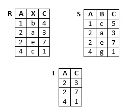

# Relationenmodell
## Welche der folgenden Aussagen über das Relationenmodell sind korrekt?
- [X] Das Relationenschema beschreibt den "Kopf der Tabelle", d.h. die Attribute, welche alle Tupel miteinander teilen.
- [X] Im Vergleich zu Tabellen sind Relationen duplikatfrei.
- [ ] Ein Attribut ist eine Zeile in der Relation, ein Tupel ist wiederum eine Spalte der Relation.
- [X] Tupel bestehen aus Attributwerten, wobei die zugehörigen Attribute vom Relationenschema vorgegeben sind.
- [ ] Unter dem Relationenschema werden alle Tupel zusammengefasst. Die Attribute werden von der Relation beschrieben.
- [ ] Relationen können Duplikate enthalten, d.h. mehrere völlig gleiche Einträge sind möglich.
- [X] Ein Attribut ist eine Spalte in der Relation, ein Tupel ist wiederum eine Zeile der Relation.

## Welche der folgenden Aussagen über Eigenschaften von Schlüsseln in Relationen sind korrekt?
- [X] Schlüssel dienen dazu, Tupel anhand ihrer Attribute eindeutig zu identifizieren, d.h. zwei Tupel mit gleichem Schlüssel sind nicht erlaubt.
- [X] Attribute können Schlüssel sein, dabei darf immer nur ein einzelnes Attribut als Schlüssel definiert sein.
- [ ] Attribute können Schlüssel sein, dabei sind auch kombinierte Attribute als Schlüssel erlaubt.
- [ ] Tupel können Schlüssel sein, dabei darf immer nur ein einzelnes Tupel als Schlüssel definiert sein.
- [ ] Schlüssel werden bei einer grafischen Darstellung üblicherweise durch Einkreisen gekennzeichnet.
- [ ] Tupel können Schlüssel sein, dabei sind auch kombinierte Tupel als Schlüssel erlaubt.
- [ ] Schlüssel werden verwendet, um Tupel in Relationen eindeutig wiederzufinden, d.h., Anfragen beziehen sich immer auf Schlüssel der Tupel.
- [X] Schlüssel werden bei einer grafischen Darstellung üblicherweise durch Unterstreichung gekennzeichnet.
- [ ] Schlüssel werden bei einer grafischen Darstellung üblicherweise durch ein Schlüsselsymbol gekennzeichnet.

## Welche der folgenden Aussagen über Fremdschlüssel sind korrekt?
- [ ] Fremdschlüssel sind niemals (Primär-)Schlüssel der eigenen Relation.
- [ ] Fremdschlüssel sind in jeder Relation notwendig, da sonst "einsame" Relationen entstehen, die sich mit keiner fremden Relation vereinen lassen.
- [X] Fremdschlüssel verweisen ausschließlich auf Attribute, die (Primär-)Schlüssel sind.
- [ ] Fremdschlüssel sind auch automatisch (Primär-)Schlüssel der eigenen Relation.
- [X] Fremdschlüssel gehören zu den Integritätsbedingungen.
- [ ] Fremdschlüssel verweisen immer auf beliebige Attribute fremder Relationen (d.h. nicht auf Attribute der eigenen Relation).
- [X] Fremdschlüssel können (Primär-)Schlüssel der eigenen Relation sein, dies ist aber nicht zwingend notwendig.
- [X] Fremdschlüssel sind optional, d.h. es kann Relationen ohne Fremdschlüssel geben.

## Welche Fachwörter gehören zum Relationenmodell?
- [X] Attribut
- [X] Wertebereich
- [ ] Wertepaar
- [X] Tupel
- [ ] Datensatz
- [X] Relation
- [ ] Eintrag
- [ ] Zeile

# Datendefinition
## Welche der folgenden Aussagen sind korrekt?
- [x] Um Tabellen zu löschen, wird der Befehl "drop table" genutzt.
- [ ] Beim Erstellen von Tabellen ist der Wertebereich einer Spalte optional anzugeben, ansonsten entscheidet SQL selbst.
- [ ] Beim Löschen einer Tabelle bleibt das Relationenschema in der Datenbank erhalten, da nur die Daten (Tupel) entfernt werden.
- [ ] Mit delete table können bestehende Tabellen gelöscht werden.
- [x] Optionale Anweisungen im create table Befehl (wie z.B. Integritätsbedingungen) werden in eckigen Klammern [ ] angegeben, beispielsweise [foreign key] für Fremdschlüssel.

## Welche der folgenden Aussagen über Datentypen sind korrekt?
- [ ] Der Datentyp `varchar(10)` erlaubt nur einstellige Zahlen von 0 bis 9.
- [ ] Der Datentyp `varchar(5)` erlaubt nur exakt 5 Zeichen, um z.B. bei der Postleitzahl keine Zahl mit nur vier oder sechs Ziffern zu erlauben.
- [x] Der Datentyp `varchar(100)` erlaubt maximal 100 Zeichen.

## Welche der folgenden Aussagen über Nullwerte sind korrekt?
- [x] Ein Tupel, welches nur aus Null-Werten besteht, ist in SQL aufgrund der Primärschlüsseleigenschaft nicht möglich.
- [ ] Null als SQL Datentyp wird als leerer String interpretiert.
- [ ] Mittels not null kann ausgeschlossen werden, dass ein Datentyp auf 0 gesetzt wird (insbesondere wichtig bei Division, da sonst durch 0 geteilt würde).
- [x] Primärschlüssel müssen nicht mit not null gekennzeichnet werden, da sie per Definition immer einen Wert haben.
- [x] Null in SQL bedeutet, dass ein Attributwert nicht eingetragen wurde.

## Welche Schlüsselwörter bzw. Zusätze können in einer Anweisung zum Erstellen einer Tabelle vorkommen?
- [ ] REQUIRED
- [ ] OPTIONAL
- [x] FOREIGN KEY
- [x] UNIQUE
- [ ] UNKNOWN
- [x] PRIMARY KEY
- [x] NOT NULL

## Welche der SQL-Anweisungen definiert eine Tabelle?
- [x] `CREATE  TABLE  Tabellenname  (  Attribut1  Wertebereich1 ,  Attribut2 Wertebereich2 ,  . . . )`
- [ ] `CREATE  Tabellenname  (  Attribut1  Wertebereich1 ,  Attribut2  Wertebereich2 ,  . . . )`
- [ ] `TABLE  Tabellenname  CREATE  WITH  ( Attribut1  Wertebereich1 ,  . . .  )`

# Grundoperationen
## Welche der folgenden Aussagen über die Relationenalgebra sind korrekt?
- [x] Durch Anfrageoperationen können aus vorhandenen Relationen neue Ergebnistabellen erstellt werden.
- [ ] Operationen der Relationenalgebra haben eine feste Ausführungsreihenfolge (wie z.B. in der Mathematik "Punkt vor Strichrechnung" erfolgt). So wird beispielsweise eine Projektion oder Selektion immer vor einem Verbund berechnet, damit der Verbund auf somit reduzierten Relationen schneller ein Ergebnis liefern kann.
- [ ] Operationen der Relationenalgebra beschreiben Inhalte der Datenbank, wie beispielsweise Tupel.
- [x] Anfrageoperationen der Relationenalgebra ermöglichen das "Rechnen mit Tabellen".

## An der Universität gibt es eine Relation mit den relevanten Daten aller Studierenden wie Matrikelnummer, Name, Email, Fakultät, Studiengang usw. Der Dekan der Fakultät IA möchte zum Sommerfest einladen und die Studierenden seiner Fakultät per Mail informieren. Für die Suche der Mail-Adressen benötigt er folgende Operation/en der Relationenalgebra:
- [ ] nur die Projektion
- [x] die Selektion und die Projektion
- [ ] nur die Selektion
- [ ] die Selektion und die Vereinigung

## Welche Operationen der Relationenalgebra verknüpfen zwei Relationen zu einer Ergebnisrelation, deren Schema mehr Attribute als jedes einzelne Schema der Ausgangsrelationen enthält?
- [x] natürlicher Verbund
- [ ] Selektion
- [ ] Vereinigung
- [x] Kreuzprodukt

## Welche Operationen der Relationenalgebra liefern im Allgemeinen eine Ergebnisrelation mit einer geringeren Anzahl von Tupeln als die Ausgangsrelation(en)?
- [x] Selektion
- [x] Differenz
- [ ] Kreuzprodukt
- [x] Durchschnitt

## Welche der folgenden Aussagen über Operatoren sind korrekt?
- [x] Die Selektion wählt Zeilen (Tupel) der Tabelle aus, während man über die Projektion Spalten (bestimmte Attribute) anfragen kann.
- [ ] Der Projektionsoperator entfernt standardmäßig keine doppelten (gleichen) Tupel in der Ergebnisrelation.
- [x] Mit der Umbenennung lassen sich Attribute umbenennen, was gerade für Mengenoperationen sinnvoll ist.
- [x] Der Selektionsoperator liefert niemals doppelte (gleiche) Tupel in der Ergebnisrelation zurück.
- [x] Unäre Operationen erhalten eine Tabelle als Eingabe und liefern eine einzelne Tabelle als Ergebnis zurück.
- [x] Ein natürlicher Verbund über zwei Tabellen verknüpft diese über ihre gemeinsamen Attribute, da diese üblicherweise den gleichen Datentyp teilen.
- [ ] Die Selektion wählt Spalten (bestimmte Attribute) der Tabelle aus, während man über die Projektion einzelne Zeilen (Tupel) anfragen kann.
- [ ] Beim natürlichen Verbund werden Tupel ohne Partner beim Verknüpfen zweier Tabellen mit Nullwerten in den anderen Attributen aufgefüllt, damit keine Daten im Ergebnis verloren gehen.
- [ ] Wird die Umbenennung als Operator angewandt, ist die Namensänderung eines Attributes dauerhaft in der Datenbank gespeichert.
- [x] Die Reihenfolge der Operatoren (Selektion vor Projektion oder umgekehrt) bei einer Kombination hat keinen Einfluss auf die Ergebnisrelation, nur auf die Performance (Geschwindigkeit) der Anfrage (immer vorausgesetzt, es treten keine Konflikte mit dem Schema auf, z.B. wenn ein nötiges Attribut der Selektionsbedingung vorher entfernt wird).

# SQL
## Welche Schlüsselwörter der SQL-Anfragesprache gehören unbedingt (mindestens) zur Formulierung einer Anfrage?
- [ ] `SELECT,  FROM,  NATURAL JOIN`
- [X] `SELECT,  FROM`
- [ ] `SELECT,  FROM,  WHERE`
- [ ] `SELECT,  DISTINCT,  FROM`

## Alle Kunden, die die Reise mit der Nummer 4712 gebucht haben, sollen mit einer Nachricht über Veränderungen im Reiseverlauf informiert werden. Welche der SQL-Anfragen liefert eine korrekte Liste von Mail-Adressen der Kunden?
- [X] `SELECT Mail FROM Kunde, Buchung WHERE Kunde.KdNr = Buchung.KdNr AND ReiseNr = 4712`
- [ ] `SELECT Mail FROM Kunde, Buchung WHERE ReiseNr = 4712`
- [X] `SELECT Mail FROM Kunde NATURAL JOIN Buchung WHERE ReiseNr = 4712`

# Änderungsoperationen
## Ein Geldinstitut hat zur Verwaltung der Kundendaten eine Relation mit dem Schema 
`R( Konto , Kunde , Guthaben , Kreditrahmen )`  
Eine Rechnung soll bezahlt werden. Der Kunde mit dem Konto A soll 150 Euro an die Firma mit dem Konto X überweisen. Welche Aktionen müssen auf der Datenbank des Geldinstituts ausgeführt werden?

- [x] Änderung (UPDATE) des Guthabens von Konto A und Änderung (UPDATE) des Guthabens von Konto X.
- [ ] Änderung (UPDATE) des Guthabens von Konto A und Einfügen (INSERT) auf Konto X.
- [ ] Löschen (DELETE) des Betrages vom Guthaben des Kontos A und Einfügen (INSERT) auf Konto X.

## Angestellte einer Firma sollen eine Gehaltserhöhung von 5 Prozent bekommen. Allerdings soll davon nur die Entwicklungsabteilung profitieren. Welche der folgenden SQL-Anweisungen realisiert genau das?

- [ ] `UPDATE  Angestellte SET Gehalt = Gehalt * 1.05` 
- [ ] `UPDATE  Gehalt SET Gehalt = Gehalt * 1.05`
- [x] `UPDATE  Angestellte SET Gehalt = Gehalt * 1.05 WHERE  Abteilung = ‘Entwicklung‘`
- [ ] `UPDATE  TABLE  Angestellte SET Gehalt = Gehalt * 1.05 WHERE  Abteilung = ‘Entwicklung‘`

## Welche der folgenden SQL-Anweisungen sind korrekte Einfüge-Anweisungen für die Tabelle Angestellte mit dem Schema (Name, Vorname, Qualifikation, Abteilung)?
Hinweis: Neue Mitarbeiter werden in der Tabelle Neueinstellungen mit dem Schema (Name, Vorname, Geburtsdatum, Adresse, Beruf) erfasst und später Abteilungen zugeordnet und bei den Angestellten eingetragen.  

- [x] `INSERT INTO Angestellte (Name, Vorname, Abteilung) VALUES (‘Franke‘, ‘Felix‘, ‘Labor‘)`
- [ ] `INSERT INTO TABLE Angestellte VALUES (‘Franke‘, ‘Felix‘, ‘Chemiker‘, ‘Labor‘)`
- [x] `INSERT INTO Angestellte VALUES (‘Franke‘, ‘Felix‘, ‘Chemiker‘, ‘Labor‘)`
- [ ] `INSERT INTO Angestellte VALUES (‘Franke‘, ‘Felix‘, ‘Labor‘)`
- [x] `INSERT INTO Angestellte (Name, Vorname, Abteilung) (SELECT Name, Vorname, ‘Labor’ FROM Neueinstellungen WHERE Beruf = ‘Chemiker’)`
- [x] `INSERT INTO Angestellte (Name, Vorname, Qualifikation, Abteilung) VALUES (‘Franke‘, ‘Felix‘, ‘Chemiker‘, ‘Labor')`

# Datenbankmodellen
## Welche der folgenden Aussagen über Datenbankmodelle sind korrekt?
- [ ] SQL gehört mit seinen CREATE TABLE, UPDATE und INSERT Operationen zu den klassischen Entwurfsmodellen (wie auch das ER-Diagramm), da Änderungen im Entwurf leicht umsetzbar sind.
- [x] SQL ist wie das Relationenmodell ein sogenanntes Realisierungsmodell, da Anfragen in SQL (SELECT... FROM...) konkrete Ergebnisse aus der Datenbank liefern.
- [ ] Datenbankmodelle sind besonders gut für das Beschreiben großer Datenmengen mit dynamischer Struktur geeignet, da sich häufige Änderungen des Schemas zentral verwalten lassen.
- [x] Das Datenbankmodell beschreibt die Datenbank, bzw. das Schema der Datenbank.
- [ ] Jedes Datenbankmanagementsystem (DBMS) verwendet exakt ein Datenbankmodell, welches sämtliche Details über die Art der Implementierung theoretisch beschreibt.

## Was wird von Datenbankmodellen beschrieben?
- [x] Statische Eigenschaften, wie Objekte (z.B. Relationen)
- [x] Integritätsbedingungen (z.B. Primärschlüssel)
- [ ] Statistische Eigenschaften (z.B. Größe des Datenbestandes)
- [ ] Redundanz, wie Sicherungskopien (z.B. Tabellen)
- [ ] Progressive Eigenschaften (z.B. Tupel)
- [x] Dynamische Eigenschaften, wie Operatoren (z.B. Selektion)

# Entities und Beziehungen
## Welche der folgenden Aussagen über Entities und Entity-Typen sind korrekt?
- [x] Entity-Typen werden graphisch durch Rechtecke gekennzeichnet.
- [ ] Entities werden graphisch durch Kreise gekennzeichnet.
- [ ] Entities beschreiben Objekte einer Datenbank genauer. Beispielsweise könnten bei einer Student-Relation typischerweise die Entities Matrikelnummer, Name oder Adresse entstehen.
- [x] Entity-Typen sind Objekte in der Datenbank und können daher im Allgemeinen mit Relationen des Relationenmodells gleichgesetzt werden.
- [ ] Entities können im Gegensatz zu Werten direkt dargestellt werden, wie z.B. ein Student oder Dozent, welcher direkt als Tupel in der Datenbank eingefügt wurde.
- [ ] Entities werden graphisch durch Rauten gekennzeichnet.
- [x] Entity-Typen verallgemeinern Entities. So könnte ein Entity "Datenbanksysteme" des Entity-Typs "Vorlesung" diese konkretisieren.

## Welche der folgenden Aussagen über Attribute sind korrekt?
- [x] Wie auch im Relationenmodell wird der Primärschlüssel (Attribut) des Entities graphisch durch Unterstreichung gekennzeichnet.
- [x] Attribute modellieren Eigenschaften von Entities, wie die Farbe eines Weines oder das Alter eines Studierendens.
- [x] Im Gegensatz zum Relationenmodell kann beim ER-Modell nur ein einzelnes Attribut eines Entities Schlüssel sein.
- [x] Aus möglichen Schlüsselkandidaten wird der Primärschlüssel eines Entities gebildet.
- [x] Ein Attribut des ER-Modells kann in ein Attribut einer Relation überführt werden.
- [x] Im Gegensatz zum Entity-Typ mit Entities und dem Relationship-Typ mit Relationships gibt es im ER-Modell standardmäßig zu Attributen keinen Attribut-Typ.

## Welche der folgenden Aussagen über Beziehungen und Beziehungstypen sind korrekt?
- [x] Relationships können ebenso wie Entities eigene Attribute haben.
- [ ] Ein Beziehungstyp verbindet mindestens zwei Entitiy-Typen miteinander, niemals jedoch einen Entity-Typ mit sich selbst (n>=2).
- [x] Die Ausprägung einer Beziehung wird als Teilmenge des Kreuzprodukts der teilnehmenden Entities dargestellt.
- [ ] Relationships entstehen immer zwischen einzelnen Attributen (wie z.B. der Matrikelnummer einer Studenten-Relation und Prüfung-Relation) und können somit Fremdschlüssel-Bedingungen umsetzen.

# Beziehungstypen
## Welche der folgenden Aussagen zu/über Beziehungstypen sind korrekt?
- [x] Binäre Beziehungstypen treten häufiger auf als mehrstellige Beziehungstypen.
- [ ] Binäre Beziehungstypen sind einfacher zu modellieren und zu verstehen als mehrstellige Beziehungstypen.
- [x] Angaben zur Kardinalität bei einem Beziehungstyp R( E1 [0,1], E2 [1,*] ) ersetzen die Charakteristik N:1.
- [ ] Mehrstellige Beziehungstypen lassen sich gleichwertig durch mehrere binäre Beziehungstypen darstellen.
- [x] Jede Beziehung eines binären Beziehungstyps stellt einen Zusammenhang zwischen zwei Objekten der beiden beteiligten Entity-Typen dar.
- [ ] Beziehungstypen lassen sich durch Angaben zur Funktionalität, wie 1:1, 1:N oder M:N, vollständig charakterisieren.

## Es gibt einen Beziehungstyp arbeiten zwischen Mitarbeitern und Projekten. Dieser sei wie folgt charakterisiert:
`arbeiten ( Mitarbeiter [0, 1], Projekte [2, 10] )`
Welche Aussagen lassen sich daraus ableiten?
- [x] Es gibt Mitarbeiter, die an keinem Projekt arbeiten.
- [x] Ein Projekt hat wenigstens 2 Mitarbeiter.
- [ ] Ein Mitarbeiter arbeitet an genau einem Projekt.
- [ ] Jeder Mitarbeiter arbeitet an mindestens 2 Projekten, aber höchstens an 10 Projekten.
- [ ] Es muss mindestens 2 Projekte geben.
- [x] Ein Projekt hat maximal 10 Mitarbeiter.
- [x] Ein Mitarbeiter arbeitet nur an einem Projekt. Nur so kann man sich voll konzentrieren.

# Weiteren Konzepten
## In einem Unternehmen werden zur Modellierung der Geschäftsabläufe und zur Datensammlung die Entity-Typen Fahrzeuge, LKW, PKW und Baufahrzeuge definiert. Welche Aussagen sind zutreffend?
- [x] Die Entity-Typen sind durch IST-Beziehungen miteinander "verbunden".
- [ ] Die Entity-Typen sind Teile eines mehrstelligen Beziehungstyps.
- [x] Es gibt Objekte (Entitys), die mehr als einer Objektmenge angehören.
- [ ] Zwischen Fahrzeugen und den anderen Entity-Typen besteht jeweils ein 1:N-Beziehungstyp.
- [x] Es kann Fahrzeuge geben, die zu keinem der anderen Entity-Typen eine Beziehung haben.
- [ ] Hat das Unternehmen je 5 LKW, PKW und Baufahrzeuge, dann hat es genau 15 Fahrzeuge.

## Es gibt zwei Entity-Typen: Zeitungen und (Zeitungs-)Ausgaben. Welche Aussagen sind zutreffend?
- [ ] Jede Zeitung hat genau eine Ausgabe.
- [x] Jede Ausgabe gehört zu genau einer Zeitung.
- [ ] Die Zeitungen sind ein abhängiger Entity-Typ, denn ohne Ausgaben kann die Zeitung nicht existieren.
- [x] Die Ausgaben sind abhängig von der Existenz der Zeitung, d.h. die Ausgaben sind ein abhängiger Entity-Typ.
- [x] Eine Zeitung hat mehrere Ausgaben.
- [ ] Eine Ausgabe kann zu einer Zeitung gehören, muss es aber nicht.

# Phasen des Datenbankentwurfs
## Welche der folgenden Aussagen über generelle Anforderungen an den Datenbankentwurf sind richtig?
- [ ] Vernünftigerweise werden Daten so gespeichert, dass sie direkt zugreifbar sind und keine Ableitung aus anderen Daten erfordern.
- [x] Daten sollen möglichst nicht-redundant gespeichert werden, d.h. nicht mehrfach, um Konsistenzprobleme wie das "Vergessen" von Änderungen zu vermeiden.
- [x] Anwendungsdaten sollen sich aus Daten der Datenbank möglichst effizient ableiten lassen, z.B. der Gewinn aus den Bestellungen.
- [ ] Daten sollen möglichst redundant gespeichert werden, d.h. mehrfach, um die Erreichbarkeit und Verfügbarkeit zu verbessern (z.B. wenn bei einer Naturkatastrophe ein Teil der Datenbank nicht mehr erreichbar ist).

## Welche der folgenden Aussagen über das Phasenmodell sind korrekt?
- [x] Das ER-Modell kann in der Phase des konzeptuellen Entwurfs genutzt werden.
- [ ] Die Anforderungsanalyse ist eine optionale erste Phase und wird nur dann eingesetzt, wenn eine völlig neue Datenbank erstellt werden soll.
- [ ] SQL kann als Modell für den konzeptuellen Entwurf eingesetzt werden, dank Befehlen wie CREATE TABLE, UPDATE, INSERT usw.
- [x] In der konzeptuellen Entwurfsphase werden Sichten behandelt, die festlegen, welcher Datenbanknutzer später Zugang zu welchen Daten erhalten soll. Dabei werden auch Konflikte zwischen den Sichten betrachtet.
- [x] Der Verteilungsentwurf ist optional und wird dann eingesetzt, wenn eine Datenbank über mehrere Knoten (Orte, Systeme, etc.) verteilt werden soll.

# Weiteren Vorgehen beim Entwurf
## Welche der folgenden Aussagen über das weitere Vorgehen beim Datenbankentwurf ist korrekt?
- [ ] Nach dem physischen Entwurf folgt der konzeptuelle Entwurf und schließlich der logische Entwurf, z.B. SQL in das ER-Modell und schließlich in das Relationenmodell.
- [ ] Nach dem konzeptuellen Entwurf folgt der physische Entwurf und schließlich der logische Entwurf, z.B. ER-Modell in SQL und schließlich in das Relationenmodell.
- [x] Nach dem konzeptuellen Entwurf folgt der logische Entwurf und schließlich der physische Entwurf, z.B. ER-Modell ins Relationenmodell und schließlich in SQL.

## Welche der folgenden Aussagen über Sichten sind korrekt?
- [ ] Es gibt Integrationskonflikte, die sich nicht auflösen lassen und eine vollständige Neuerstellung des Datenbankentwurfs erfordern.
- [ ] Sichten können direkt nach ihrer Erstellung in das Gesamtschema überführt werden, da Konflikte (wie z.B. Überlappungen) bei der Integration nicht entstehen können.
- [x] Nach der Erstellung von Sichten müssen diese auf Konflikte überprüft werden, ehe sie in ein Gesamtschema überführt werden können.

## Welche der folgenden Aussagen sind korrekt?
- [x] In der Phase der Datendefinition werden auch die Datentypen der Attribute deklariert, z.B. Integer oder Varchars.
- [ ] Am Ende des logischen Entwurfs steht immer genau ein einzelnes Relationenschema, welches dann an den nächsten Schritt (Datendefinition) weitergegeben wird.
- [x] Im logischen Entwurf kann das konzeptuelle Schema (z.B. ER-Diagramm) in ein relationales Schema überführt werden. Dies wird anschließend noch verfeinert, z.B. durch Normalisierung.
- [x] Bei der Datendefinition werden auch Integritätsbedingungen (Fremdschlüssel, etc.) umgesetzt.
- [x] Im physischen Entwurf wird die Performance für Datenzugriffe verbessert, z.B. durch die Verwendung von Indexstrukturen.

# Kapazitätserhaltenden Abbildung
## Welche der folgenden Aussagen über Abbildungen sind korrekt?
- [ ] Eine kapazitätserhaltende Abbildung lässt sich immer erreichen, indem Schlüssel beider Entities zum Schlüssel der Beziehung gemacht werden statt nur einer von beiden.
- [ ] Eine kapazitätserhöhende Abbildung kann durch eine kapazitätsvermindernde Abbildung ausgeglichen werden.
- [x] Eine Abbildung ist kapazitätserhaltend, wenn sich hinterher genau dieselben Daten speichern lassen wie vorher.

# ER-auf-RM-Abbildung
## Welche der folgenden Aussagen über die Abbildung vom ER-Modell in das Relationenmodell sind korrekt?
- [ ] Primärschlüssel der beteiligten Entity-Typen werden in das Relationenschema der Beziehung übernommen und sind dort ebenfalls Primärschlüssel.
- [x] Verschiedene Kardinalitäten können durch die geeignete Wahl von Schlüsseln ausgedrückt werden.
- [ ] Es können neue Schlüssel entstehen, d.h. aus Attributen, die im ER-Modell zuvor kein Schlüssel waren.
- [ ] Nur Entity-Typen ergeben je eine Relation bzw. ein Relationenschema, Attribute und Beziehungstypen nicht.
- [ ] In einer 1:N Beziehung wird der Primärschlüssel vom Entity-Typen der 1-Seite übernommen.

## Welche der folgenden Aussagen über Verschmelzungen von Relationenschemata sind korrekt?
- [x] Beim Verschmelzen von zwingenden Beziehungen können niemals NULL-Werte entstehen.
- [x] Beim Verschmelzen einer 1:N Beziehung sind hinterher noch zwei Relationenschemata übrig, das verschmolzene Schema und das Schema auf der 1-Seite.
- [x] Nur bei einer 1:1 Beziehung können beide Entity-Relationenschemata in ein einzelnes Schema verschmolzen werden.
- [ ] Optionale Beziehungen können einfach verschmolzen (zusammengefasst) werden, da es bei diesen keine Rolle spielt, ob sie im späteren Schema noch vorhanden sind.

## Welche der folgenden Aussagen über abhängige Entity-Typen sind korrekt?
- [x] Bei abhängigen Entities erhält die abhängige Entität im Relationenschema zusätzlich den Primärschlüssel der Entität, von der sie abhängig ist.
- [x] Der Primärschlüssel der abhängigen Entität muss zwingend aus dem eigenen Schlüssel und dem der übergeordneten Entität gebildet werden.
- [x] Bei abhängigen Entities ergibt die Beziehung zur übergeordneten Entität kein eigenes Relationenschema.

## Welche der folgenden Aussagen sind korrekt?
- [x] In einer IST-Beziehung bildet die Beziehung kein eigenes Relationenschema.
- [ ] In einer IST-Beziehung kann ein Relationenschema entstehen, welches keinen Schlüssel enthält.
- [x] Bei rekursiven funktionalen Beziehungen entstehen in den Beziehungen Fremdschlüssel auf die eigene Relation.

## Welche der folgenden Aussagen über mehrstellige Beziehungen sind korrekt?
- [x] Der Primärschlüssel der mehrstelligen Beziehung (bestehend aus den Primärschlüsseln aller beteiligten Entity-Typen) ist zugleich Fremdschlüssel auf die jeweiligen - [ ] Primärschlüssel der beteiligten Entity-Typen.
- [x] In mehrstelligen Beziehungen bilden alle Primärschlüssel der beteiligten Entity-Typen gemeinsam den Primärschlüssel der Beziehung.
- [ ] In mehrstelligen Beziehungen (M:N:K) kann der Primärschlüssel aus den Primärschlüsseln der beteiligten Entity-Typen gewählt werden.

# Zielmodell
## Welche der folgenden Aussagen über das Relationenmodell sind korrekt?
- [x] Relationen enthalten keine Duplikate.
- [x] Der Primärschlüssel ist ein ausgezeichneter Schlüssel, der Tupel eindeutig identifiziert.
- [ ] Eine Domäne beschreibt Elemente eines Wertebereichs.
- [ ] Die minimale Menge, die Attribute eindeutig identifiziert, heißt Oberschlüssel.
- [x] Das Datenbankschema ist eine Menge von Relationenschemata, ein Relationenschema ist eine Menge von Attributen.

# Relationalen DB-Entwurf
## Welche der folgenden Ziele werden bei der Verfeinerung des Relationenmodells angestrebt?
- [x] Redundanzvermeidung
- [x] Abhängigkeitstreue
- [x] Verbundtreue
- [ ] Änderungstreue
- [ ] Duplikatbildung
- [ ] Resonanzvermeidung

## Welche der folgenden Operationen können zu Anomalien führen?
- [x] INSERT
- [x] UPDATE
- [ ] CREATE TABLE
- [ ] SELECT ... FROM ...
- [x] DELETE

## Welche der folgenden Aussagen über funktionale Abhängigkeiten sind korrekt?
- [x] Für Schlüssel X gilt zweierlei: Abhängigkeit X->Relationenschema, sowie X ist minimal.
- [ ] X->X, d.h. X bestimmt sich selbst, ist aus Trivialitätsgründen nicht erlaubt.
- [ ] Bei der Ableitung von funktionalen Abhängigkeiten X->Y sowie Y->Z gilt auch Z->X (Ringschluss).
- [x] X->Y bedeutet: Haben zwei Tupel gleiche Werte in Attribut X, sind ihre Werte für Attribut Y auch gleich.

# Normalformen
## Welche der folgenden Aussagen über Normalformen sind korrekt?
- [ ] Normalformen minimieren globale Redundanzen zwischen den Relationen.
- [x] Normalformen vermeiden Redundanzen und Anomalien.
- [x] Eigenschaften von Relationenschemata werden von Normalformen bestimmt.
- [ ] Normalformen stellen sicher, dass alle Anwendungsdaten aus den Basisrelationen hergeleitet werden können.
- [x] In Normalformen sind bestimmte Kombinationen von funktionalen Abhängigkeiten verboten.

## Welche der folgenden Aussagen über die ersten drei Normalformen sind richtig?
- [x] Die zweite Normalform eliminiert partielle Abhängigkeiten, d.h. ein Attribut ist bereits funktional von einem Teil des Schlüssels abhängig.
- [ ] Wenn die beiden funktionalen Abhängigkeiten X->Y und Y->Z existieren (Transitivität), wird diese immer in der dritten Normalform entfernt.
- [ ] In der ersten Normalform liegen alle Attribute nullfrei vor, d.h. ohne NULL Attributwerte.
- [ ] Die zweite Normalform eliminiert transitive Abhängigkeiten, d.h. im Allgemeinen wenn Attribut A das Attribut B bestimmt und B das Attribut C bestimmt.
- [x] Die dritte Normalform eliminiert partielle Abhängigkeiten, d.h. ein Attribut ist bereits funktional von einem Teil des Schlüssels abhängig.
- [x] Die Normalformen bauen aufeinander auf, d.h. die zweite Normalform enthält auch die Anforderungen der ersten Normalform, usw.
- [x] Die erste Normalform fordert, dass alle Attribute atomar vorliegen, wie z.B. als Integer oder als Double.
- [x] Die dritte Normalform eliminiert transitive Abhängigkeiten, d.h. im Allgemeinen wenn Attribut A das Attribut B bestimmt und B das Attribut C bestimmt.

## Welche der folgenden Aussagen über die Boyce-Codd-Normalform (BCNF) sind korrekt?
- [ ] Die Verbundtreue wird von der BCNF nicht garantiert.
- [x] Die BCNF eliminiert im Gegensatz zur dritten Normalform jegliche transitive Abhängigkeiten.
- [x] Die Abhängigkeitstreue wird von der BCNF nicht garantiert.
- [ ] Die BCNF eliminiert im Gegensatz zur dritten Normalform jegliche partielle Abhängigkeiten.

## Welche der folgenden Aussagen über Minimalität sind korrekt?
- [x] Die Minimalität versucht, andere Kriterien (wie Normalformen) mit möglichst wenigen Schemata zu erreichen.
- [ ] Die Minimalität versucht, andere Kriterien (wie Normalformen) so umzusetzen, dass die Schemata möglichst klein sind.
- [x] Die Minimalität befasst sich mit globalen Redundanzen, d.h. Redundanzen, die alle Relationen betreffen.
- [ ] Die Minimalität befasst sich mit lokalen Redundanzen, d.h. Redundanzen, die innerhalb einer Relation auftreten.

# Transformationseigenschaften
## Was bedeutet die Eigenschaft "Verbundtreue" im Rahmen des relationalen Entwurfs?
- [x] Die Originalrelation kann nach der Dekomposition aus den zerlegten Relationen mit natürlichen Verbundoperationen zurückgewonnen werden.
- [ ] Eine Dekomposition ist immer verbundtreu.
- [ ] Bei der Zerlegung eines Relationenschemas in mehrere kleinere muss beachtet werden, dass jeweils zwei davon ein gemeinsames Attribut als Grundlage für spätere Verbundoperationen haben.
- [ ] Bei der Dekomposition werden keine funktionalen Abhängigkeiten zerstört.

## Gegeben sei ein relationales Schema 
$R = \{ A B C D E \}$ mit genau einem Schlüssel $K = \{\{ AC \}\}$. Durch Dekomposition entstehen $R_1 = \{ A B C \}$ mit dem Schlüssel $K_1 = \{\{ AC \}\}$ und $R_2 = \{ C D E \}$ mit dem Schlüssel $K_2 = \{\{ C \}\}$
- [ ] Die Zerlegung ist abhängigkeitstreu, aber nicht verbundtreu.
- [x] Die Zerlegung ist nicht abhängigkeitstreu und nicht verbundtreu.
- [ ] Die Zerlegung erfüllt alle Transformationseigenschaften. Sie ist abhängigkeitstreu und verbundtreu.
- [ ] Die Zerlegung ist verbundtreu, aber nicht abhängigkeitstreu.

# weiteren Abhängigkeiten
Welche der folgenden Aussagen zu mehrwertigen Abhängigkeiten sind korrekt?
- [x] Ein Schema in vierter Normalform (4NF) enthält nur noch triviale MVDs.
- [ ] Mehrwertige Abhängigkeiten steigern den Wert eines relationalen Schemas. Sie sind ausdrucksstärker als einfache funktionale Abhängigikeiten.
- [x] Für eine Relation r zum Schema R mit den Attributen XYZ bedeutet die MVD X →→ Y Folgendes: Wenn $(x1, y1, z1)$ und $(x1, y2, z2)$ Tupel der Relation r sind, so sind auch $(x1, y2, z1)$ und $(x1, y1, z2)$ Tupel der Relation r.
- [x] Mehrwertige Abhängigkeiten können als Folge der Forderungen der 1. Normalform entstehen.
- [ ] Triviale MVDs kann man beim Schema-Entwurf vernachlässigen.

# Rechnen mit FDs
## Welche der folgenden Aussagen sind korrekt?
- [x] Bei der Hüllenbildung werden alle funktionalen Abhängigkeiten (FDs) gefunden, die sich aus einer gegebenen Menge an FDs ableiten lassen.
- [x] Für die Hüllenbildung können Ableitungsregeln (Reflexivität, Transitivität, etc.) genutzt werden.
- [x] Aus den funktionalen Abhängigkeiten A->B und B->C kann auch A->C impliziert werden.

## Welche der folgenden Aussagen über Ableitungsregeln sind korrekt?
- [ ] Bei der Dekomposition (F4) können bei gegebener funktionaler Abhängigkeit AB->CD auch die FDs AB->C und AB->D abgeleitet werden.
- [x] Es lässt sich immer die funktionale Abhängigkeit A->∅ (leere Menge) bilden.
- [x] Durch Reflexivität (F1) lässt sich immer die funktionale Abhängigkeit A->A bilden.
- [x] Durch die Vereinigung (F5) können die funktionalen Abhängigkeiten A->B und A->C zu A->BC zusammengefasst werden.
- [x] Bei der Augmentation (F2) können zu einer gegebenen Abhängigkeit A->B immer zusätzliche Attribute hinzugenommen werden, wie beispielsweise AC->BC.
- [ ] Aus der Transitivität (F3) lässt sich bei den gegebenen funktionalen Abhängigkeiten A->B und B->C auch C->A ableiten.
- [x] Bei der Dekomposition (F4) können bei gegebener funktionaler Abhängigkeit AB->CD auch die FDs A->CD und B->CD abgeleitet werden.

## Welche der folgenden Aussagen über B-Axiome bzw. RAP-Regeln ist richtig?
- [x] Die Regelmenge ist vollständig, da alle Armstrong-Axiome daraus hergeleitet werden können.
- [ ] Die Regelmenge ist im Gegensatz zu den Armstrong-Axiomen nicht vollständig, da diese nur aus drei Regeln (Reflexivität, Akkumulation und Projektivität) besteht.


## Welche der folgenden Aussagen über das Membership-Problem sind richtig?
- [ ] Das modifizierte Membership-Problem ist ebenso wie das Membership-Problem nicht in linearer Zeit lösbar (O(n²)).
- [x] Der Member-Algorithmus mit der CLOSURE-Funktion löst das Membership-Problem.
- [x] Beim modifizierten Membership-Problem wird überprüft, ob bei der funktionalen Abhängigkeit A->B das Attribut B zur Attributmenge gehört, welche von A bestimmt wird.
- [x] Das Membership-Problem fragt, ob sich eine bestimmte funktionale Abhängigkeit (FD) aus einer gegebenen Menge an FDs ableiten lässt.
- [x] Der Member-Algorithmus mit der CLOSURE-Funktion löst das modifizierte Membership-Problem.

## Welche der folgenden Aussagen über Überdeckungen ist korrekt?
- [x] Ein Attribut ist unwesentlich, wenn es nach seiner Entfernung aus den funktionalen Abhängigkeiten die Hülle nicht verändert hat.
- [ ] Eine Links- bzw. Rechtsreduktion entfernt unnötige (triviale) funktionale Abhängigkeiten mit dem Ziel der Minimalität.
- [ ] Die leere Menge ist ein Beispiel für eine immer gültige minimale Überdeckung.
- [x] Es soll beim Vergleich zweier Mengen von funktionalen Abhängigkeiten (FDs) eine Überdeckung gefunden werden, die minimal ist bzgl. ihrer FD-Anzahl und Attributen in den FDs.
- [x] Wenn sich zwei Mengen funktionaler Abhängigkeiten überdecken, sind sie äquivalent.

## Welche der nachfolgenden Aussagen über Äquivalenzklassen sind richtig?
- [ ] Damit zwei funktionale Abhängigkeiten in der gleichen Äquivalenzklasse landen, müssen diese eine äquivalente rechte Seite haben, z.B. A->C, B->C.
- [x] Damit zwei funktionale Abhängigkeiten in der gleichen Äquivalenzklasse landen, müssen diese eine äquivalente linke Seite haben, z.B. A->B, A->C.
- [ ] Für eine ringförmige Überdeckung muss zu den funktionalen Abhängigkeiten A->B, B->A und A->C zusätzlich C->A gelten.
- [x] Die funktionalen Abhängigkeiten A->B, B->C, C->A sowie A->D bilden eine ringförmige Überdeckung.

# Mehr zu Normalformen
Wir betrachten ein erweitertes Relationenschema $R = ( R, K )$ und die FD-Menge F über R. Welche Aussagen zur 2. Normalform sind zutreffend?
- [x] In 2NF gibt es keine partiellen funktionalen Abhängigkeiten von Nichtschlüsselattributen vom Schlüssel, und die 1NF ist erfüllt.
- [ ] Das Schema R ist in 2NF, wenn jedes Nicht-Primattribut von R voll von jedem Schlüssel von R abhängt.
- [x] Das Schema R ist in 2NF, wenn R in 1NF ist und jedes Nicht-Primattribut von R voll von jedem Schlüssel von R abhängt.
- [ ] In 2NF sind die partiellen funktionalen Abhängigkeiten beseitigt.

# Entwurfsverfahren
Welche Aussagen sind zutreffend?
- [ ] Die Synthese dient zur Wiederherstellung der ursprünglichen Relation durch Verschmelzen.
- [ ] Synthese und Dekomposition sind unterschiedliche Entwurfsverfahren, aber das Ergebnis ist das gleiche Datenbankschema.
- [x] Synthese und Dekomposition sind Verfahren zum Entwurf eines Datenbankschemas.
- [ ] Synthese und Dekomposition erzeugen ein "optimales" Datenbankschema, das alle Entwurfskriterien erfüllt.
- [x] Die Dekomposition wird angewandt zur Erzeugung eines Datenbankschemas in 3NF durch Zerlegung.
- [x] Synthese und Dekomposition sind Schema-Entwurfsverfahren mit Vor- und Nachteilen bzgl. der Entwurfskriterien.

Welches der Entwurfsverfahren gewährleistet die Abhängigkeitstreue (Kriterium T1)?
- [ ] nur die Dekomposition
- [ ] keines der Verfahren
- [x] nur die Synthese
- [ ] beide Verfahren

Welches der Entwurfsverfahren entwirft ein Schema in 3NF (Kriterium S1)?
- [ ] nur die Dekomposition
- [x] beide Verfahren
- [ ] nur die Synthese
- [ ] keines

Welches der Entwurfsverfahren erzeugt ein Datenbankschema, das verbundtreu (Kriterium T2) ist?
- [ ] keines
- [x] Die Dekomposition erfüllt das Kriterium.
- [ ] Beide Verfahren sind in jedem Fall verbundtreu.
- [x] Die Synthese KANN das Kriterium erfüllen.

Welches der Verfahren erzeugt ein minimales Datenbankschema (Kriterium S2)?
- [ ] beide Verfahren
- [ ] keiner
- [x] nur die Synthese
- [ ] nur die Dekomposition

# Verbunden
Welche der folgenden Aussagen über den natürlichen Verbund in SQL sind korrekt?
- [ ] Die gewählte Variante des Joins (JOIN...ON..., JOIN...USING..., etc.) in einer Anfrage beeinflusst die Ausführungszeit der Anfrage deutlich.
- [ ] Gegeben sind die Relationen X ( A , B , C , D ) und Y ( A , B , E , F ). Das Ergebnis von "... FROM X, Y WHERE X.A=Y.A" ist identisch zum Ergebnis von "... FROM X NATURAL JOIN Y".
- [x] "SELECT * FROM Tabelle1, Tabelle2" liefert das Kreuzprodukt.
- [x] Wenn in zwei miteinander verbundenen Tabellen gemeinsame Attribute vorkommen, die im SELECT explizit angefragt werden, braucht es immer einen Präfix vor dem - [ ] Attributnamen (z.B. SELECT Tabelle1.gemeinsames_Attribut).

# Selektionen
Gegeben ist folgende Anfrage über der Tabelle Student:`SELECT * FROM Student WHERE Vorname like 'E_%';` Was liefert diese Anfrage als Ergebnis zurück?
- [ ] Alle Tupel der Student Tabelle, deren Vornamen mit E beginnt.
- [ ] Alle Tupel der Student Tabelle, deren Vornamen mit E beginnen und mindestens drei Buchstaben lang sind.
- [ ] Alle Vornamen von Tupeln der Student Tabelle, die mit E beginnen.
- [x] Alle Tupel der Student Tabelle, deren Vornamen mit E beginnen und mindestens zwei Buchstaben lang sind.
- [ ] Die Anfrage ist nicht ausführbar (Semantikfehler).

Gegeben ist folgende Anfrage über der Tabelle Student:
```sql
   SELECT *
   FROM Student
   WHERE Matrikelnummer between 40000 and (
      SELECT Matrikelnummer
      FROM Student
      WHERE Matrikelnummer between 40002 and 40002
   );
```
Was liefert diese Anfrage als Ergebnis zurück?
- [x] Die Studenten mit Matrikelnummer 40000, 40001 und 40002.
- [ ] Den Studenten mit Matrikelnummer 40001.
- [ ] Ein leeres Ergebnis.
- [ ] Die Studenten mit Matrikelnummer 40001 und 40002.
- [ ] Die Anfrage ist nicht ausführbar (Semantikfehler).
- [ ] Die Studenten mit Matrikelnummer 40000 und 40001.

# Mengenoperationen
Gegeben sind die Relationen 


Welche der folgenden SQL-Anweisungen erzeugt die Tupel der Relation T mit dem Schema von T?
- [x] select * from R intersect corresponding by (A, C) S
- [x] select * from ( ( select A, C from R ) intersect (select A, C from S) )
- [ ] select * from R intersect S
- [x] select * from R intersect corresponding S

# Geschachtelten Anfragen I
Gegeben seien die Relationen `Student ( MatrNr, Name, Studiengang )` und `Prüfungen ( MatrNr, Fach, Datum, Note )`.
Welche der SQL-Anweisungen ergibt die Matrikelnummern MatrNr der Studierenden, die noch keine Prüfung abgelegt haben?
- [ ] `SELECT MatrNr FROM Prüfungen WHERE MatrNr  NOT IN ( SELECT MatrNr FROM Student )`
- [ ] `SELECT * FROM Prüfungen EXCEPT CORRESPONDING Student`
- [x] `SELECT * FROM Student EXCEPT CORRESPONDING BY (MatrNr) Prüfungen`
- [x] `SELECT MatrNr FROM Student WHERE MatrNr NOT IN ( SELECT MatrNr  FROM Prüfungen )`
- [x] `SELECT * FROM Student EXCEPT CORRESPONDING Prüfungen`
- [ ] `SELECT * FROM Student WHERE MatrNr NOT IN ( SELECT * FROM Prüfungen )`

# Skalaren Ausdrücken
Es gibt in der Datenbank folgendes Schema: `Student ( Matrikelnummer, Vorname, Nachname, Semester )`
Nun wird folgende SQL-Anfrage (in SQLite) ausgeführt: `SELECT * FROM Student WHERE SUBSTR( Matrikelnummer, 5 ) = '2';`
Was liefert diese Anfrage zurück?
- [x] Alle Studenten, deren Matrikelnummer mindestens eine 2 enthält.
- [ ] Alle Studenten mit zwei Matrikelnummern.
- [ ] Alle Studenten, deren Matrikelnummer auf eine gerade Zahl endet.
- [ ] Auf jeden Fall ein leeres Ergebnis.
- [ ] Alle Studenten, deren Matrikelnummer mit einer 2 endet.

Es gibt in der Datenbank folgendes Schema: `Student ( Matrikelnummer, Vorname, Nachname, Semester )`
Nun wird folgende SQL-Anfrage (in SQLite) ausgeführt:
```sql
   SELECT Matrikelnummer, (
      CASE Semester
      WHEN '1' THEN 'Ersti'
                      ELSE  'Kein Ersti'
      END) Klassifizierung
   FROM   Student
   WHERE Klassifizierung = 'Ersti'
   AND      Matrikelnummer % 2 = 0;
```
Was ist das Ergebnis?
- [ ] Matrikelnummer und Klassifizierung von Studenten mit Matrikelnummern die eine 2 enthalten und im ersten Semester sind.
- [ ] Matrikelnummern von Studenten mit geraden Matrikelnummern im ersten Semester.
- [ ] Das Ergebnis ist identisch zu folgender SQL-Anfrage: 
    ```sql
        SELECT Matrikelnummer, Semester
        FROM   Student
        WHERE Semester = '1'
        AND      Matrikelnummer % 2 = 0;
    ```
- [ ] Matrikelnummer und Klassifizierung von Studenten mit Matrikelnummern die auf 0 enden und im ersten Semester sind.
- [x] Matrikelnummer und Klassifizierung von Studenten mit geraden Matrikelnummern im ersten Semester.

# Geschachtelten Anfragen II
Gegeben sei eine Relation für Prüfungsanmeldungen mit dem Schema `Anmeldung ( MatrNr, Name, FachNr, Datum )`. Gesucht sind Studenten, die sich zu zwei oder mehr Prüfungen angemeldet haben.
Welche der SQL-Anfragen beantwortet die Frage korrekt?
- [x] `SELECT  MatrNr FROM  Anmeldung  A WHERE  EXISTS  ( SELECT  * FROM  Anmeldung  B WHERE  B.MatrNr = A.MatrNr AND  B.FachNr <> A.FachNr )`
- [x] `SELECT  MatrNr FROM  Anmeldung  A ,  Anmeldung  B WHERE  A.MatrNr = B.MatrNr  AND  B.FachNr <> A.FachNr`
- [ ] Keine der Anfragen ist geeignet, denn es wird eine Funktion zum Zählen benötigt.
- [x] `SELECT  MatrNr FROM  Anmeldung  A WHERE  A.MatrNr  IN  ( SELECT  B.MatrNr FROM  Anmeldung  B WHERE  B.FachNr <> A.FachNr )`

Gegeben seien zwei Relationen `Student ( MatrNr , Name , Studgang )` und `Prüfung ( MatrNr , Fach , FürStudgang , Note )`. 
Gesucht sind Studenten, die schon eine, mehrere oder - idealerweise - alle Prüfungen in ihrem Studiengang absolviert haben.
Welche SQL-Anfragen sind geeignet?
- [x] `SELECT  Name FROM  Student  S WHERE  MatrNr  IN  ( SELECT  MatrNr FROM  Prüfung  P WHERE  P.FürStudgang = S.Studgang )`
- [ ] Keine Anfrage ist geeignet.
- [ ] `SELECT  Name FROM  Student  S WHERE  MatrNr <= ALL  ( SELECT  MatrNr FROM  Prüfung  P WHERE  P.FürStudgang = S.Studgang )`
- [x] `SELECT  Name FROM  Student  S WHERE  MatrNr  = ANY  ( SELECT  MatrNr FROM  Prüfung  P WHERE  P.FürStudgang = S.Studgang )`
