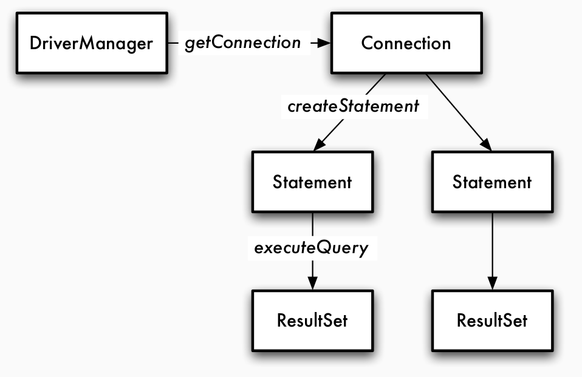
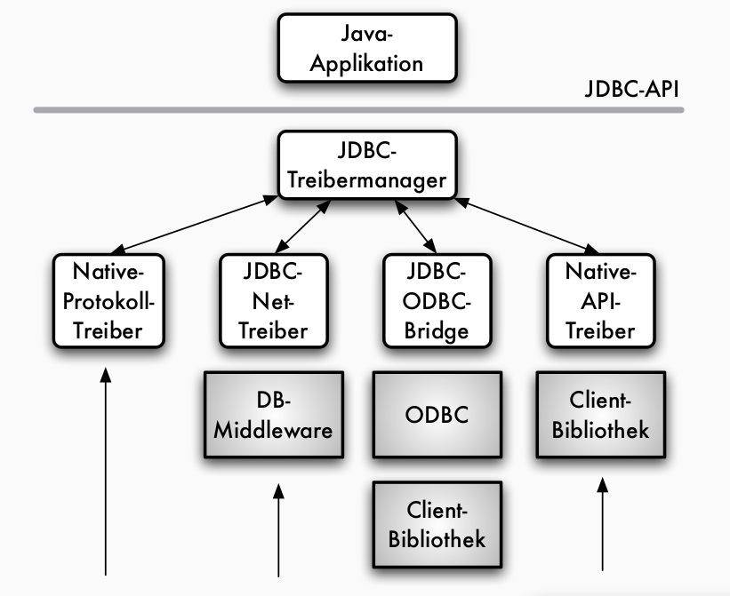
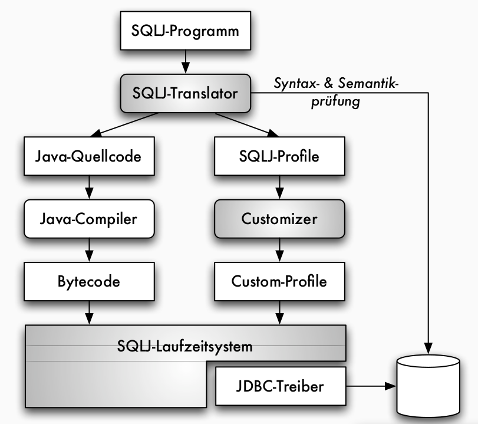
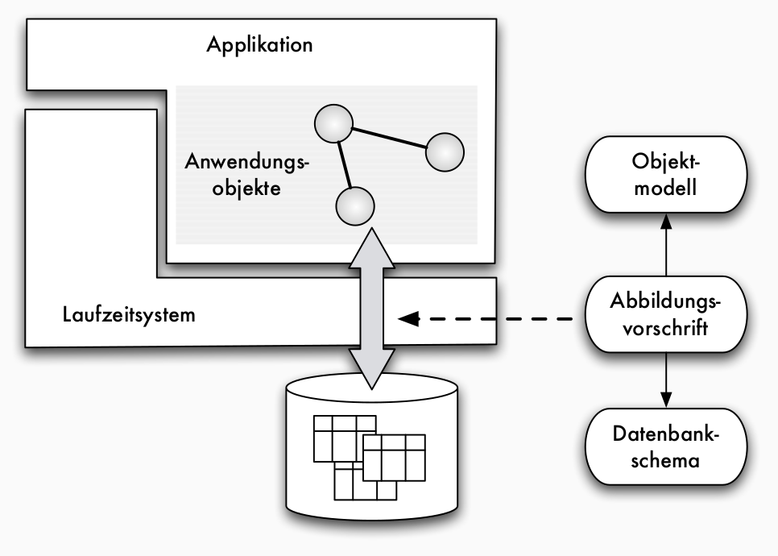
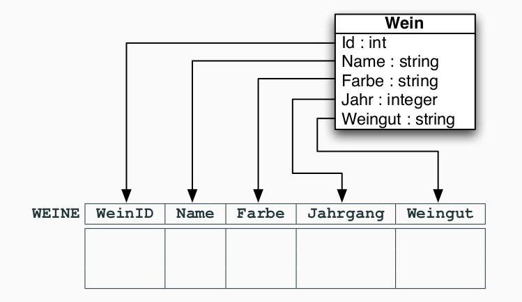
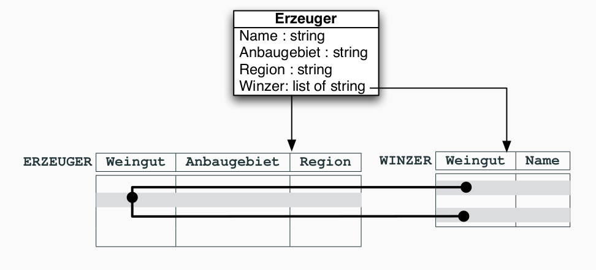

# Was sind Datenbanken - Grundlegende Konzepte
## Überblick
- Daten = logisch gruppierte Informationseinheiten
- Bank = Sicherheit vor Verlust, Dienstleistung für mehrere Kunden, (langfristige) Aufbewahrung

Ohne Datenbanken:
- jedes Anwendungssystem verwaltet seine eigenen Daten
- Daten sind (redundant) mehrfach gespeichert
- Probleme
  - Verschwenden von Speicherplatz
  - "vergessen" von Änderungen
  - keine zentrale "genormte" Datenerhaltung
- größere Mengen von Daten nicht effizient verarbeitet
- mehrere Benutzer können nicht parallel auf den gleichen Daten arbeiten, ohne sich zu stören
- Anwendungsprogrammierer/Benutzer können Anwendungen nicht programmieren/benutzen ohne ... zu kennen (keine Datenunabhängigkeit)
  - interne Dartstellung der Daten
  - Speichermedien oder Rechner
- Datenschutz und   Datensicherheit

### Datenintegration durch Datenbanksystem
Anwendungen greifen über Datenbankmanagementsystem auf Datenbank zu.

Datenbankmanagementsystem (DBMS): Software zur Verwaltung von Datenbanken

Datenbank (DB): strukturierter, von DBMS verwalteter Datenbestand

Datenbanksystem (DBS) = DBMS + DB

## Architekturen
die neun Codd'schen Regeln
1. Integration: einheitliche, nichtredundante Datenverwaltung
2. Operationen: Speichern, Suchen, Ändern
3. Katalog: Zugriffe auf Datenbankbeschreibungen im Data Dictionary
4. Benutzersichten
5. Integritätssicherung: Korrektheit des Datenbankinhalts
6. Datenschutz: Ausschluss unauthorisierter Zugriffe
7. Transaktionen: mehrere DB-Operationen als Funktionseinheit
8. Synchronisation: parallele Transaktionen koordinieren
9. Datensicherung: Wiederherstellung von Daten nach Systemfehlern

Ziele:
- Trennung von Modellierungssicht und interner Speicherung
- Portierbarkeit
- Tuning vereinfachen
- standardisierte Schnittstellen

Schemata:
- Konzeptuelles Schema (Ergebnis der Dateidefinition)
- Internes Schema (Festlegung der Dateiorganisation und Zugriffspfade = Index)
- Externes Schema (Ergebnis der Sichtdefinition)
- Anwendungsprogramm (Ergebnis der Anwendungsprogrammierung)

- Trennung Schema-Instanz
  - Schema: Metadaten, Datenbeschreibung
  - Instanz: Anwenderdaten, Datenbankzustand

Datenunabhängigkeit:
- Stabilität der Benutzerschnittstelle gegen Änderungen
- physisch: Änderung der Dateiorganisation und Zugriffspfade haben keinen Einfluss auf das konzeptuelle Schema
- logisch: Änderung am konzeptuellen und gewissen externen Schemata haben keine Auswirkungen auf andere externe Schemata und Anwendungsprogramme

Aufteilung der Funktionalitäten einer Anwendung
- Präsentation und Benutzerinteraktion
- Anwendungslogik („Business“-Logik)
- Datenmanagementfunktionen (Speichern, Anfragen, ...).

Architektur von Datenbankanwendungen typischerweise auf Basis des Client-Server-Modells (Server=Datenbanksystem).

### 3 Schichten Architektur (ANSI-SPARC-Architektur) 
Klassifizierung der Komponenten
- Definitionskomponenten: Datendefinition, Dateiorganisation, Sichtdefinition
- Programmierkomponenten: DB-Programmierung mit eingebetteten DB-Operationen
- Benutzerkomponenten: Anwendungsprogramme, Anfrage und Update interaktiv
- Transformationskomponenten: Optimierer, Auswertung, Plattenzugriffssteuerung
- Data Dictionary (Datenwörterbuch): Aufnahme der Daten aus Definitionskomponenten, Versorgung der anderen Komponenten

### 5 Schichten Architektur
Verfeinerung der Transformation
- Datensystem: Übersetzung, Zugriffspfadwahl
- Zugriffssystem: Logische Zugriffspfade, Schemakatalog, Sortierung, Transaktionsverwaltung
- Speichersystem Speicherungsstrukturen, Zugriffspfadverwaltung, Sperrverwaltung, Logging, Recovery
- Pufferverwaltung: Systempufferverwaltung, Seitenersetzung, Seitenzuordnung
- Betriebssystem: Externspeicherverwaltung, Speicherzuordnung

## Einsatzgebiete
- Klassische Einsatzgebiete:
  - viele Objekte (15000 Bücher, 300 Benutzer, 100 Ausleihvorgänge pro Woche, ...)
  - wenige Objekttypen (BUCH, BENUTZER, AUSLEIHUNG)
  - etwa Buchhaltungssysteme, Auftragserfassungssysteme, Bibliothekssysteme, ...
- Aktuelle Anwendungen: E-Commerce, entscheidungsunterstützende Systeme (Data Warehouses, OLAP), NASA’s Earth Observation System (Petabyte-Datenbanken), Data Mining

Datenbankgrößen:
- eBay Data Warehouse: 10PB
  - Teradata DBMS, 72 Knoten, 10.000 Nutzer,
  - mehrere Millionen Anfragen/Tag
- WalMart Data Warehouse: 2,5PB
  - Teradata DBMS, NCR MPP-Hardware;
  - Produktinfos (Verkäufe etc.) von 2.900 Märkten;
  - 50.000 Anfragen/Woche
- Facebook: 400TB
  - x.000 MySQL-Server
  - Hadoop/Hive, 610 Knoten, 15 TB/Tag
- US Library of Congress 10-20TB
  - nicht digitalisiert

## Historisches
- Wissensbanksysteme
  - Daten in Tabellenstrukturen
  - Stark deklarative DML, integrierte Datenbankprogrammiersprache
- Objektorientierte Datenbanksysteme
  - Daten in komplexeren Objektstrukturen (Trennung Objekt und seine Daten)
  - Deklarative oder navigierende DML
  - Oft integrierte Datenbankprogrammiersprache
  - Oft keine vollständige Ebenentrennung

- Neue Hardwarearchitekturen
  - Multicore-Prozessoren, Hauptspeicher im TB-Bereich: In-Memory-Datenbanksysteme (z.B. SAP HANA)
- Unterstützung für spezielle Anwendungen
  - Cloud-Datenbanken: Hosting von Datenbanken, Skalierbare Datenmanagementlösungen (Amazon RDS, Microsoft Azure)
• Datenstromverarbeitung: Online-Verarbeitung von Live-Daten, z.B. Börseninfos, Sensordaten, RFID-Daten, ...(StreamBase, MS StreamInsight, IBM Infosphere Streams)
  - Big Data: Umgang mit Datenmengen im PB-Bereich durch hochskalierbare, parallele Verarbeitung, Datenanalyse (Hadoop, Hive, Google Spanner & F1, ...)
- NoSQL-Datenbanken („Not only SQL“):
  - nicht-relationale Datenbanken, flexibles Schema (dokumentenzentriert)
  - „leichtgewichtig“ durch Weglassen von SQL-Funktionalitäten wie Transaktionen, mächtige deklarative Anfragesprachen mit Verbunden etc.
  - Beispiele: CouchDB, MongoDB, Cassandra, ...


# Relationale Datenbanken - Daten als Tabellen
## Relationen für tabellarische Daten
Konzeptuell: Datenbank = Menge von Tabellen (= Relationen)

- „Tabellenkopf“: Relationenschema
- Eine Zeile der Tabelle: Tupel; Menge aller Einträge: Relation
- Eine Spaltenüberschrift: Attribut
- Ein Eintrag: Attributwert

Integritätsbedingungen: Schlüssel
- Attribute einer Spalte identifizieren eindeutig gespeicherte Tupel: Schlüsseleigenschaft
- auch Attributkombinationen können Schlüssel sein!
- Schlüssel können durch Unterstreichen gekennzeichnet werden
- Schlüssel einer Tabelle können in einer anderen (oder derselben!) Tabelle als eindeutige Verweise genutzt werden: 
  - Fremdschlüssel, referenzielle Integrität
- ein Fremdschlüssel ist ein Schlüssel in einer „fremden“ Tabelle

## SQL-Datendefinition
### CREATE table
Wirkung dieses Kommandos ist sowohl
- die Ablage des Relationenschemas im Data Dictionary, als auch
- die Vorbereitung einer „leeren Basisrelation“ in der Datenbank

### DROP table
komplettes Löschen einer Tabelle (Inhalt und Eintrag im Data
Dictionary)

### Mögliche Wertebereiche in SQL
- integer (oder auch integer4, int),
- smallint (oder auch integer2),
- float(p) (oder auch kurz float),
- decimal(p,q) und numeric(p,q) mit jeweils q Nachkommastellen,
- character(n) (oder kurz char(n), bei n = 1 auch char) für Zeichenketten (Strings) fester Länge n,
- character varying(n) (oder kurz varchar(n) für Strings variabler Länge bis zur Maximallänge n,
- bit(n) oder bit varying(n) analog für Bitfolgen, und
- date, time bzw. datetime für Datums-, Zeit- und kombinierte Datums-Zeit-Angaben

Beispiel:
```sql
create table WEINE (
  WeinID int,
  Name varchar(20) not null,
  Farbe varchar(10),
  Jahrgang int,
  Weingut varchar(20),
  primary key(WeinID),
  foreign key(Weingut) references ERZEUGER(Weingut))
```
- primary key kennzeichnet Spalte als Schlüsselattribut
- foreign key kennzeichnet Spalte als Fremdschlüssel
- not null schließt in bestimmten Spalten Nullwerte als Attributwerte aus
- null repräsentiert die Bedeutung „Wert unbekannt“, „Wert nicht anwendbar“ oder „Wert existiert nicht“, gehört aber zu keinem Wertebereich
- null kann in allen Spalten auftauchen, außer in Schlüsselattributen und den mit not null gekennzeichneten


## Grundoperationen: Die Relationenalgebra
- Anfrageoperationen auf Tabellen
  - Basisoperationen auf Tabellen, die die Berechnung von neuen Ergebnistabellen aus gespeicherten Datenbanktabellen erlauben
  - Operationen werden zur sogenannten Relationenalgebra zusammengefasst
  - Mathematik: Algebra ist definiert durch Wertebereich sowie darauf definierten Operationen
    - für Datenbankanfragen entsprechen die Inhalte der Datenbank den Werten, Operationen sind dagegen Funktionen zum Berechnen der Anfrageergebnisse
  - Anfrageoperationen sind beliebig kombinierbar und bilden eine Algebra zum „Rechnen mit Tabellen“ – die Relationenalgebra

- Selektion $\sigma$: Auswahl von Zeilen einer Tabelle anhand eines Selektionsprädikats
- Projektion $\pi$: Auswahl von Spalten durch Angabe einer Attributliste
  - Die Projektion entfernt doppelte Tupel
- Verbund $\bowtie$ (engl. join): verknüpft Tabellen über gleichbenannte Spalten, indem er jeweils zwei Tupel verschmilzt, falls sie dort gleiche Werte aufweisen
  - Tupel, die keinen Partner finden (dangling tuples), werden eliminiert
- Umbenennung $\beta$: Anpassung von Attributnamen mittels Umbenennung
- Vereinigung $r_1 \cup r_2$ von zwei Relationen $r_1$ und $r_2$: 
  - Gesamtheit der beiden Tupelmengen
  - Attributmengen beider Relationen müssen identisch sein
- Differenz $r_1 − r_2$ eliminiert die Tupel aus der ersten Relation, die auch in der zweiten Relation vorkommen
- Durchschnitt $r_1 \cap r_2$: ergibt die Tupel, die in beiden Relationen gemeinsam vorkommen


## SQL als Anfragesprache
```sql
SELECT farbe FROM weine WHERE Jahrgang = 2002
```
- SQL hat Multimengensemantik — Duplikate in Tabellen werden in SQL nicht automatisch unterdrückt!
  - Mengensemantik durch distinct
- Verknüpfung von Tabellen
  - Kreuzprodukt: `` select * from Weine, Erzeuger``
  - Verbund: `` select * from Weine natural join Erzeuger``
  - Verbund mit Bedingung: `` select * from Weine, Erzeuger where Weine.Weingut = Erzeuger.Weingut``
- Kombination von Bedingungen
- Vereinigung in SQL explizit mit union

## Änderungsoperationen in SQL
- insert: Einfügen eines oder mehrerer Tupel in eine Basisrelation oder Sicht
  - `` INSERT INTO table (attribut) VALUE (ausdruck) ``
  - optionale Attributliste ermöglicht das Einfügen von unvollständigen Tupeln
  - nicht alle Attribute angegeben ⇝ Wert des fehlenden Attribut Land wird null
- update: Ändern von einem oder mehreren Tupel in einer Basisrelation oder Sicht
  - `` UPDATE relation SET attribut=ausdruck ``
- delete: Löschen eines oder mehrerer Tupel aus einer Basisrelation oder Sicht
  - `` DELETE FROM table WHERE id=123 ``
  - Löschoperationen können zur Verletzung von Integritätsbedingungen führen!

Lokale und globale Integritätsbedingungen müssen bei Änderungsoperationen automatisch vom System überprüft werden


# Datenbankentwurf im ER-Modell
## Datenbankmodelle
> **Datenbankmodell**: Ein Datenbankmodell ist ein System von Konzepten zur Beschreibung von Datenbanken. Es legt Syntax und Semantik von Datenbankbeschreibungen für ein Datenbanksystem fest.

Datenbankbeschreibungen = Datenbankschemata

1. statische Eigenschaften
  1. Objekte
  2. Beziehungen
  - inklusive der Standard-Datentypen, die Daten über die Beziehungen und Objekte darstellen können,
2. dynamische Eigenschaften wie
  1. Operationen
  2. Beziehungen zwischen Operationen,
1. Integritätsbedingungen an
  1. Objekte
  2. Operationen

Datenbankmodelle im Überblick
- HM: hierarchisches Modell, NWM: Netzwerkmodell, RM: Relationenmodell
- NF 2 : Modell der geschachtelten (Non-First-Normal-Form = NF 2 ) Relationen, eNF 2 : erweitertes NF 2 -Modell
- ER: Entity-Relationship-Modell, SDM: semantische Datenmodelle
- OODM / C++: objektorientierte Datenmodelle auf Basis objektorientierter Programmiersprachen wie C++, 
  - OEM: objektorientierte Entwurfsmodelle (etwa UML), 
  - ORDM: objektrelationale Datenmodelle

## ER Modell
- **Entity**: Objekt der realen oder der Vorstellungswelt, über das Informationen zu speichern sind, z.B. Produkte (Wein, Katalog), Winzer oder Kritiker; aber auch Informationen über Ereignisse, wie z.B. Bestellungen 
- **Relationship**: beschreibt eine Beziehung zwischen Entities, z.B. ein Kunde bestellt einen Wein oder ein Wein wird von einem Winzer angeboten
- **Attribut**: repräsentiert eine Eigenschaft von Entities oder Beziehungen, z.B. Name eines Kunden, Farbe eines Weines oder Datum einer Bestellung
  - Attribute modellieren Eigenschaften von Entities oder auch Beziehungen
  - alle Entities eines Entity-Typs haben dieselben Arten von Eigenschaften; Attribute werden somit für Entity-Typen deklariert
- **Werte**: primitive Datenelemente, die direkt darstellbar sind
  - Wertemengen sind beschrieben durch Datentypen, die neben einer Wertemenge auch die Grundoperationen auf diesen Werten charakterisieren
  - ER-Modell: vorgegebene Standard-Datentypen, etwa die ganzen Zahlen int, die Zeichenketten string, Datumswerte date etc.
  - jeder Datentyp stellt Wertebereich mit Operationen und Prädikaten dar
- **Entities** sind die in einer Datenbank zu repräsentierenden Informationseinheiten
  - im Gegensatz zu Werten nicht direkt darstellbar, sondern nur über ihre Eigenschaften beobachtbar
  - Entities sind eingeteilt in Entity-Typen, etwa $E_1 , E_2,...$
- **Schlüsselattribute**: Teilmenge der gesamten Attribute eines Entity-Typs $E(A_1,... , A_m)$
  - in jedem Datenbankzustand identifizieren die aktuellen Werte der Schlüsselattribute eindeutig Instanzen des Entity-Typs E
  - bei mehreren möglichen Schlüsselkandidaten: Auswahl eines Primärschlüssels
- **Beziehungstypen**: Beziehungen zwischen Entities werden zu Beziehungstypen zusammengefasst
  - Beziehungen können ebenfalls Attribute besitzen


Merkmale von Beziehungen
- Stelligkeit oder Grad:
  - Anzahl der beteiligten Entity-Typen
  - häufig: binär
  - Beispiel: Lieferant liefert Produkt
- Kardinalität oder Funktionalität:
  - Anzahl der eingehenden Instanzen eines Entity-Typs
  - Formen: 1:1, 1:n, m:n
  - stellt Integritätsbedingung dar
  - Beispiel: maximal 5 Produkte pro Bestellung

- 1:1 Beziehung
  - jedem Entity $e_1$ vom Entity-Typ $E_1$ ist maximal ein Entity $e_2$ aus $E_2$ zugeordnet und umgekehrt
  - Bsp: Prospekt *beschreibt* Produkt 
- 1:N Beziehung
  - jedem Entity $e_1$ aus $E_1$ sind beliebig viele Entities $E_2$ zugeordnet, aber zu jedem Entity $e_2$ gibt es maximal ein $e_1$ aus $E_1$
  - Bsp: Lieferant *liefert* Produkte, Mutter *hat* Kinder
- N:1 Beziehung
  - invers zu 1:N, auf funktionale Beziehung
- M:N Bezeihung
  - keine Restriktionen
  - Bsp: Bestellung *umfasst* Produkte

[min,max]-Notation
- schränkt die möglichen Teilnahmen von Instanzen der beteiligten Entity-Typen an der Beziehung ein, indem ein minimaler und ein maximaler Wert vorgegeben wird
- Spezielle Wertangabe für $max_i$ ist ∗

Kardinalitätsangaben
- [0, ∗] legt keine Einschränkung fest (default)
- $R(E_1 [0, 1], E_2 )$ entspricht einer (partiellen) funktionalen Beziehung $R : E_1 \rightarrow E_2$ , da jede Instanz aus $E_1$ maximal einer Instanz aus $E_2$ zugeordnet ist
- totale funktionale Beziehung wird durch $R(E_1 [1, 1], E_2 )$ modelliert
- Beispiele:
  - partielle funktionale Beziehung: $lagert_in(Produkt[0,1],Fach[0,3])$
  - totale funktionale Beziehung: $liefert(Lieferant[0,*],Produkt[1,1])$

## Weitere Konzepte im ER Modell
- abhängiger Entity-Typ: Identifikation über funktionale Beziehungen (Bsp x "gehört zu" y)
- Spezialisierungs-/Generalisierungsbeziehung oder auch *IST*-Beziehung
  - E1 *IST* E2
  - entspricht semantisch einer injektiven funktionalen Beziehung
  - Attribute des Entity-Typs E2 treffen auch auf E1 zu: "vererbte" Attribute
  - nicht nur Atrributsdeklarationen vererben sich, sondern auch jeweils die aktuellen Werte für eine Instanz
  - Kardinalitätsangabe immer: $IST(E_1[1,1], E_2[0,1])$
  - Jede Instanz von E1 nimmt genau einmal an der Ist-Beziehung teil, während Instanzen des Obertyps E2 nicht teilnehmen müssen

Die Konzepte im Überblick:
| **Begriff** | **Informale Bedeutung** |
| -- | -- |
| Entity | zu repräsentierende Informationseinheit |
| Entity Typ | Gruppierung von Entitys mit gleichen Eigenschaften |
| Beziehungstyp | Gruppierung von Beziehungen zwischen Entitys |
| Attribut | datenwertige Eigenschaft eines Entitys oder einer Beziehung |
| Schlüssel | identifizierende Eigenschaft von Entitys |
| Kardinalitäten | Einschränkung von Beziehungstypen bezüglich der mehrfachen Teilnahme von Entitys an der Beziehung |
| Stelligkeit | Anzahl der an einem Beziehungstyp beteiligten Entity Typen |
| funktionale Beziehungen | Beziehungstyp mit Funktionseigenschaften |
| abhängige Entitys | Entitys, die nur abhängig von anderen Entitys existieren können |
| IST Beziehung | Spezialisierung von Entity Typen |
| Optionalität | Attribute oder Funktionale Beziehungen als partielle Funktionen |


# Datenbankentwurf
## Phasen des Datenbankentwurfs
- Datenerhaltung für mehrere Anwendungssysteme und mehrere Jahre
- Anforderungen an Entwurf:
  - Anwendungsdaten jeder Anwendung sollen aus Daten der Datenbank ableitbar sein (mögl effizient)
  - nur "vernünftige" Daten sollen gespeichert werden
  - nicht-redundante Speicherung

### Phasenmodell
Anforderungsanalyse $\leftrightarrow$ Konzeptioneller Entwurf  $\leftrightarrow$ Verteilungsentwurf $\leftrightarrow$ Logischer Entwurf $\leftrightarrow$ Datendefinition $\leftrightarrow$ Physischer Entwurf $\leftrightarrow$ Implementierung & Wartung

### Anforderungsanalyse
- Vorgehensweise: Sammeln des Informationsbedarfs in den Fachabteilungen
- Ergebnis: 
  - informale Beschreibung des Fachproblems (Texte, Tabellen, Formblätter,...)
  - Trennen der Informationen über Daten (Datenanalyse) von den Informationen über Funktionen (Funktionsanalyse)
- "Klassischer" Entwurf: nur Datenanalyse und Folgeschritte
- Funktionsentwurf: siehe Methoden des Software Engineering

### Konzeptioneller Entwurf
- erste Formale Beschreibung des Fachproblems
- Sprachmittel: semantisches Datenmodell
- Vorgehensweise:
  - Modellierung von Sichen z.B. für verschiedene Fachabteilungen
  - Analyse der vorliegenden Sichten in Bezug auf Konflikte
  - Integration der Sichten in ein Gesamtschema
- Phasen:
  - Sichtentwurf
  - Sichtanalyse
  - Sichtintegration
- Ergebnis: konzeptionelles Gesamtschema (z.B. ER Schema)

#### weiteres Vorgehen beim Entwurf
- ER-Modellierung von verschiedenen Sichten auf Gesamtinformation, z.B. für verschiedene Fachabteilungen eines Unternehmens -> konzeptueller Entwurf
- Verteilungsentwurf bei verteilter Speicherung
- Abbildung auf konkretes Implementierungsmodell -> logischer Entwurf
- Datendefinition, Implementierung und Wartung -> physischer Entwurf

#### Sichtintegration
- Analyse der vorliegenden Sichten in Bezug auf Konflikte
- Integration der Sichten in ein Gesamtschema

#### Integrationskonflikte
- Namenskonflikte: Homonyme/Synonyme
- Typkonflikte: verschiedene Strukturen für das gleiche Element
- Wertebereichskonflikte: verschiedene Wertebereiche für ein Element
- Bedingungskonflikte: z.B. verschiedene Schlüssel für ein Element
- Strukturkonflikte: gleicher Sachverhalt durch unterschiedliche Konstrukte ausgedrückt

### Verteilungsentwurf
- sollen Daten auf mehreren Rechnern verteilt vorliegen, muss Art und Weise der verteilten Speicherung festgelegt werden
  - horizontale Verteilung z.B. Kunden 1-1000 und Kunden 10001-20000
  - vertikale Verteilung z.B. Adresse in DB1, Konto in DB2

### Logischer Entwurf
- Sprachmittel: Datenmodell des ausgewählten "Realisierungs"DBMS
- Vorgehensweise
    1. (automatische) Transformation des konzeptionellen Schemas z.B. ER -> relationales Modell
    2. Verbesserung des relationalen Schemas anhand von Gütekriterien
- Ergebnis: logisches Schema

### Datendefinition
- Umsetzung des logischen Schemas in ein konkretes Schema
- Sprachmittel: DDL und DML eines DBMS
  - Datenbankdeklaration in der DDL des DBMS
  - Realisierung der Integritätssicherung
  - Definition der Benutzersichten

### Physischer Entwurf
- Ergänzen des physischen Entwurfs um Zugriffsunterstützung bzgl Effizienzverbesserung, z.B. Definition von Indexen
- Index:
  - Zugriffspfad: Datenstruktur für zusätzlichen, schlüsselbasierten Zugriff auf Tupel
  - meist als B*-Baum realisiert
- Sprachmittel: Speicherstruktursprache SSL

Indexe in SQL, z.B.: ```create index WeinIdx on WEINE (Name)```

Notwendigkeit für Zugriffspfade:
- Beispiel: Tabelle mit 100GB Daten, Festplattentransferrate ca 50MB/s
- Operation: Suchen eines Tupels (Selektion)
- Implementierung: sequentielles Durchsuchen
- Aufwand: 102.500/50 = 2048 sec ~ 34 Minuten

### Implementierung & Wartung
- Wartung
- weitere Optimierung der physischen Ebene
- Anpassung an neue Anforderungen und Systemplattformen
- Portierung auf neue Datenbankmanagementsysteme
- etc


## Kapazitätserhaltende Abbildungen
Umsetzung des konzeptionellen Schemas
- Umsetzung auf logisches Schema
- Erhaltung der Informationskapazität
- Kapazitäts**erhöhende** Abbildung: Abbildung auf R mit genau einem Schlüssel K ( K={{A},{B}} )
- Kapazitäts**vermindernde** Abbildung: Relationsschema mit einem Schlüssel
- Kapazitäts**erhaltende** Abbildung: kapazitätserhaltend mit Schlüssel beider Entity Typen im Relationsschema als neuer Schlüssel

## ER-auf-RM Abbildung
### ER Abbildung auf Relationen
- Entity-Typen und Beziehungstypen: jeweils auf Relationenschemata
- Attribute: Attribute des Relationenschemas, Schlüssel werden übernommen
- Kardinalitäten der Beziehungen: durch Wahl der Schlüssel bei den zugehörigen Relationenschemata ausgedrückt
- in einigen Fällen: Verschmelzen der Relationenschemata von Entity- und Beziehungstypen
- zwischen den verbleibenden Relationenschemata diverse Fremdschlüsselbedingungen einführen

### Abbildung von Beziehungstypen
- neues Relationenschema mit allen Attributen des Beziehungstyps, zusätzlich Übernahme aller Primärschlüssel der beteiligten Entity-Typen
- Festlegung der Schlüssel:
  - m:n-Beziehung: beide Primärschlüssel zusammen werden Schlüssel im neuen Relationenschema
  - 1:n-Beziehung: Primärschlüssel der n-Seite (bei der funktionalen Notation die Seite ohne Pfeilspitze) wird Schlüssel im neuen Relationenschema
  - 1:1-Beziehung: beide Primärschlüssel werden je ein Schlüssel im neuen Relationenschema, der Primärschlüssel wird dann aus diesen Schlüsseln gewählt
- optionale Beziehungen ([0,1] oder [0,n]) werden nicht verschmolzen
- bei Kardinalitäten [1,1] oder [1,n] (zwingende Beziehungen) Verschmelzung möglich:
  - 1:n-Beziehung: das Entity-Relationenschema der n-Seite kann in das Relationenschema der Beziehung integriert werden
  - 1:1-Beziehung: beide Entity-Relationenschemata können in das Relationenschema der Beziehung integriert werden

## Übersicht über Transformationen
| ER Konzept | wird abgebildet auf relationales Konzept |
| -- | -- |
| Entity Typ $E_i$      | Relationsenschema $R_i$ |
| Attribute von $E_i$   | Attribute von $R_i$     |
| Primärschlüssel $P_i$ | Primärschlüssel $P_i$   |
| Beziehungstyp         | Relationenschema, Attribute $P_1,P_2$ |
| dessen Attribute      | weitere Attribute       |
| 1:n                   | $P_2$ wird Primärschlüssel der Beziehung |
| 1:1                   | $P_1$ und $P_2$ werden Schlüssel der Beziehung |
| m:n                   | $P_1 \cup P_2$ wird Primärschlüssel der Beziehung |
| IST Beziehung         | $R_1$ erhält zusätzlichen Schlüssel $P_2$ |

# Relationaler Entwurf
## Zielmodell des logischen Entwurfs

Begriffe des Relationenmodells
| Begriff | Informale Bedeutung |
| -- | -- |
| Attribut | Spalte einer Tabelle |
| Wertebereich | mögliche Werte eines Attributs (auch Domäne) |
| Attributwert | Element eines Wertebereichs |
| Relationenschema | Menge von Attributen | 
| Relation | Menge von Zeilen einer Tabelle |
| Tupel | Zeile einer Tabelle |
| Datenbankschema | Menge von Relationenschemata |
| Datenbank | Menge von Relationen (Basisrelationen) |
| Schlüssel | minimale Menge von Attributen, deren Werte ein Tupel einer Tabelle eindeutig identifizieren |
| Primärschlüssel | ein beim Datenbankentwurf ausgezeichneter Schlüssel |
| Fremdschlüssel | Attributmenge, die in einer anderen Relation Schlüssel ist |
| Fremdschlüsselbedingung | alle Attributwerte des Fremdschlüssels tauchen in der anderen Relation als Werte des Schlüssels auf |

Formalisierung Relationenmodell
- Attribute und Domänen
  - $U$ nichtleere, endliche Menge: Universum
  - $A\in U$: Attribut
  - $D = {D_1,..., D_m}$ Menge endlicher, nichtleerer Mengen: jedes $D_i$: Wertebereich oder Domäne
  - total definierte Funktion $dom:U \rightarrow D$
  - $dom(A)$: Domäne von A
  - $w \in dom(A)$: Attributwert für A
- Relationenschemata und Relationen
  - $R\subseteq U$: Relationenschema
  - Relation $r$ über $R = {A_1,..., A_n}$ (kurz: $r(R)$) ist endliche Menge von Abbildungen $t:R \rightarrow \bigcup_{i=1}^{m} D_i$, Tupel genannt
  - Es gilt $t(A) \in dom(A)$ ($t(A)$ Restriktion von $t$ auf $A \in R$)
  - für $X\subseteq R$ analog $t(X)$ X-Wert von $t$
  - Menge aller Relationen über $R: REL(R) := {r | r(R)}$
- Datenbankschema und Datenbank
  - Menge von Relationenschemata $S := {R_1,..., R_p }:$ Datenbankschema
  - Datenbank über $S$: Menge von Relationen $d:={r_1,..., r_p}$, wobei $r_i (R_i)$
  - Datenbank $d$ über $S: d(S)$
  - Relation $r\in d$: Basisrelation

Integritätsbedingung
- Identifizierende Attributmenge $K:= {B_1,..., B_k } \subseteq R: \forall t_1, t_2 \in r [t_1 \not = t_2 \Rightarrow \exists B \in K: t_1(B) \not = t_2(B)]$
- Schlüssel: ist minimale identifizierende Attributmenge
- Primattribut: Element eines Schlüssels
- Primärschlüssel: ausgezeichneter Schlüssel
- Oberschlüssel oder Superkey: jede Obermenge eines Schlüssels (= identifizierende Attributmenge)
- Fremdschlüssel: $X(R_1)\rightarrow Y(R_2)$


## Relationaler DB-Entwurf
**Redundanzen** in Basisrelationen sind aus mehreren Gründen unerwünscht:
- Redundante Informationen belegen unnötigen Speicherplatz
- Änderungsoperationen auf Basisrelationen mit Redundanzen nur schwer korrekt umsetzbar: 
  - wenn eine Information redundant vorkommt, muss eine Änderung diese Information in allen ihren Vorkommen verändern
  - mit normalen relationalen Änderungsoperationen und den in
    - relationalen Systemen vorkommenden lokalen
    - Integritätsbedingungen (Schlüsseln) nur schwer realisierbar

Funktionale Abhängigkeit zwischen Attributemengen X und Y
> Wenn in jedem Tupel der Relation der Attributwert unter den X-Komponenten den Attributwert unter den Y-Komponenten festlegt.
- Unterscheiden sich zwei Tupel in den X-Attributen nicht, so haben sie auch gleiche Werte für alle Y-Attribute
- Notation für funktionale Abhängigkeit (FD, von functional dependency): X → Y

> Ziel des Datenbankentwurfs: alle gegebenen funktionalen Abhängigkeiten in Schlüsselabhängigkeiten umformen, ohne dabei semantische Information zu verlieren

## Normalformen
Schemaeigenschaften
- Relationenschemata, Schlüssel und Fremdschlüssel so wählen, dass
    1. alle Anwendungsdaten aus den Basisrelationen hergeleitet werden können,
    2. nur semantisch sinnvolle und konsistente Anwendungsdaten dargestellt werden können und
    3. die Anwendungsdaten möglichst nicht-redundant dargestellt werden.
- Hier: Forderung 3
  - Redundanzen innerhalb einer Relation: Normalformen
  - globale Redundanzen: Minimalität

Normalformen
- legen Eigenschaften von Relationenschemata fest
- verbieten bestimmte Kombinationen von funktionalen Abhängigkeiten in Relationen
- sollen Redundanzen und Anomalien vermeiden

1. Erste Normalform
    - erlaubt nur atomare Attribute in den Relationenschemata, d.h. als Attributwerte sind Elemente von Standard-Datentypen wie integer oder string erlaubt, aber keine Konstruktoren wie array oder set
2. Zweite Normalform
    - Zweite Normalform eliminiert derartige partielle Abhängigkeiten bei Nichtschlüsselattributen
    - partielle Abhängigkeit liegt vor, wenn ein Attribut funktional schon von einem Teil des Schlüssels abhängt
    - Beispielrelation in 2 NF
        - R1(Name, Weingut, Preis)
        - R2(Name, Farbe)
        - R3(Weingut, Anbaugebiet, Region)
3. Dritte Normalform
    - eliminiert (zusätzlich) transitive Abhängigkeiten
    - etwa Weingut $\rightarrow$ Anbaugebiet und Anbaugebiet $\rightarrow$ Region in Relation
    - man beachte: 3 NF betrachtet nur Nicht-Schlüsselattribute als Endpunkt transitiver Abhängigkeiten
    - Beispielrelation in 3NF, transitive Abhängigkeit in R3, d.h. R3 verletzt 3NF
      - R3_1(Weingut, Anbaugebiet)
      - R3_2(Anbaugebiet, Region)

> Dritte Normalform: 
> - $A \in R$ heißt transitiv abhängig von X bezüglich F genau dann, wenn es ein $Y\subseteq R$ gibt mit $X \rightarrow Y, Y \not\rightarrow X, Y \rightarrow A, A \not\in XY$
> - erweitertes Relationenschema $R=(R, \bf{K})$ ist in 3 NF bezüglich F genau dann, wenn $\not\exists A \in R$:
>   - A ist Nicht-Primattribut in R
>   - $\wedge A$ transitiv abhängig von einem $K\in \bf{K}$ bezüglich $F_i$.
>   - Nicht-Primattribut: A ist in keinem Schlüssel von R enthalten

> Boyce-Kodd-Normalform (Verschärfung der 3NF): Eliminierung transitiver Abhängigkeiten auch zwischen Primattributen
- $\not\exists A \in R$: A transitiv abhängig von einem $K\in\bf{K}$ bezüglich F

Minimalität
- Global Redundanzen vermeiden
- andere Kriterien (wie Normalformen) mit möglichst wenig Schemata erreichen
- Beispiel: Attributmenge ABC, FD-Menge ${A \rightarrow B, B \rightarrow C}$

Übersicht
| Kennung | Schemaeigenschaft | Kurzcharakteristik |
| -- | -- | -- |
| | 1 NF | nur atomare Attribute |
| | 2 NF | keine partielle Abhängigkeit eines Nicht-Primattributes von einem Schlüssel |
| S1 | 3 NF | keine transitive Abhängigkeit eines Nicht-Primattributs von einem Schlüssel |
| | BCNF | keine transitive Abhängigkei eines Attributes von einem Schlüssel |
| S2 | Minimalität | minimale Anzahl von Relationsschemata, die die anderen Eigenschaften erfüllt |

## Transformationseigenschaften
- bei einer Zerlegung einer Relation in mehrere Relationen ist darauf zu achten, dass
    1. nur semantisch sinvolle und konsistente Anwendungsdaten dargestellt (Abhängigkeitstreue) und
    2. alle Anwendungsdaten aus den Basisrelationen hergeleitet werden können (Verbundtreue)
- Abhänggikeitstreue (Kennung T1)
  - alle gegebenen Abhängigkeiten sind durch Schlüssel repräsentiert
  - eine Menge von Abhängigkeiten kann äquivalent in eine zweite Menge von Abhängigkeiten transformiert werden
  - spezieller: in die Menge der Schlüsselabhängigkeiten, da diese vom Datenbanksystem effizient überprüft werden kann
    - die Menge der Abhängigkeiten soll äquivalent zu der Menge der Schlüsselbedingungen im resultierenden Datenbankschema sein
    - Äquivalenz sichert zu, dass mit den Schlüsselabhängigkeiten semantisch genau die gleichen Integritätsbedingungen ausgedrückt werden wie mit den funktionalen oder anderen Abhängigkeiten vorher
  - S charakterisiert vollständig F (oder: ist abhängigkeitstreu bezüglich F) genau dann, wenn $F\equiv \{K\rightarrow R | (R,\bf{K})\in S, K\in\bf{K}\}$
- Verbundtreue (Kennung T2)
  - Originalrelationen können durch den Verbund der Basisrelationen wiedergewonnen werden
  - zur Erfüllung des Kriteriums der Normalformen müssen Relationenschemata teilweise in kleinere Relationenschemata zerlegt werden
  - für Beschränkung auf „sinnvolle“ Zerlegungen gilt Forderung, dass die Originalrelation wieder aus den zerlegten Relationen mit dem natürlichen Verbund zurückgewonnen werden kann
    - Zerlegung des Relationenschemas $R = ABC$ in $R_1 = AB$ und $R_2 = BC$
    - Dekomposition bei Vorliegen der Abhängigkeiten $F = \{A \rightarrow B, C \rightarrow B\}$ ist nicht verbundtreu
    - dagegen bei Vorliegen von $F′ = \{A \rightarrow B, B \rightarrow C\}$ verbundtreu

> Verbundtreue: Die Dekomposition einer Attributmenge $X$ in $X_1,..., X_p$ mit $X = \bigcup_{i=1}^p X_i$ heißt verbundtreu ($\pi \bowtie$-treu, lossless) bezüglich einer Menge von Abhängigkeiten F über X genau dann, wenn $\forall r \in SAT_X(F) : \pi_{X_1}(r) \bowtie ··· \bowtie \pi_{X_p}(r) = r$ gilt.

## Weitere Abhängigkeiten
- Mehrwertige Abhängigkeit (kurz: MVD)
  - innerhalb einer Relation r wird einem Attributwert von X eine Menge von Y-Werten zugeordnet, unabhängig von den Werten der restlichen Attribute $\rightarrow$ Vierte Normalform
  - Folge der 1NF: Mehrwertige Abhängigkeiten erzeugen Redundanz
    - eine (oder mehrere) Gruppe von Attributwerten ist von einem Schlüssel bestimmt, unabhängig von anderen Attributen
    - Resultat: Redundanz durch Bildung aller Kombinationen
  - wünschenswerte Schemaeigenschaft bei Vorliegen von MVDs: vierte Normalform
    - fordert die Beseitigung derartiger Redundanzen: keine zwei MVDs zwischen Attributen einer Relation
    - Elimination der rechten Seite einer der beiden mehrwertigen Abhängigkeiten,
    - linke Seite mit dieser rechten Seite in neue Relation kopiert
- Verbundabhängigkeit (kurz: JD)
  - R kann ohne Informationsverlust in $R_1,..., R_p$ aufgetrennt werden: $\bowtie [R_1,..., R_p]$
- Inklusionsabhängigkeit (kurz: IND)
  - auf der rechten Seite einer Fremdschlüsselabhängigkeit nicht unbedingt der Primärschlüssel einer Relation

> Vierte Normalform: erweitertes Relationenschema $R = (R, \bf{K})$ ist in vierter Normalform (4NF) bezüglich M genau dann, wenn für alle $X\rightarrow\rightarrow Y \in M^+$ gilt: $X\rightarrow\rightarrow Y$ ist trivial oder $X\supseteq K$ für ein $K\in\bf{K}$


# Relationale Theorie
## Rechnen mit FDs
- gilt für f über R $SAT_R(F)\subseteq SAT_R(f)$, dann impliziert F die FD f (kurz: $F|= f$)
- Hüllenbildung: Ermittlung aller funktionalen Abhängigkeiten, die aus einer gegebenen FD_Menge abgeleitet werden können
- Hülle: $F_R^+ := \{ f | (f \text{ FD über R} ) \wedge F |= f\}$

Ableitungsregel:
- F1: Reflexivität $X\supseteq Y \Rightarrow X\rightarrow Y$
- F2: Augumentation $\{X\rightarrow Y\}\Rightarrow XZ\rightarrow YZ, \text{ sowie } XZ\rightarrow Y$
- F3: Transitivität $\{ X\rightarrow Y,Y\rightarrow Z\}\Rightarrow X\rightarrow Y$
- F4: Dekomposition $\{X\rightarrow YZ\} \Rightarrow X\rightarrow Y$
- F5: Vereinigung $\{X\rightarrow Y, X\rightarrow Z\}\Rightarrow X\rightarrow YZ$
- F6: Pseudotransitivität $\{X\rightarrow Y, WY\rightarrow Z\}\Rightarrow WX\rightarrow Z$

F1-F3 bekannt als Armstrong-Axiome (sound, complete)
- gültig (sound): Regeln leiten keine FDs ab, die logisch nicht impliziert
- vollständig (complete): alle implizierten FDs werden abgeleitet
- unabhängig (independent) oder  auch bzgl. ⊆ minimal: keine Regel kann weggelassen werden

Alternative Regelmenge
- B-Axiome oder RAP-Regeln
  - R Reflexivität $\{\}\Rightarrow X\rightarrow X$
  - A Akkumulation $\{X\rightarrow YZ, Z\rightarrow AW\}\Rightarrow X\rightarrow YZA$
  - P Projektivität $\{X\rightarrow YZ\}\Rightarrow X\rightarrow Y$
- Regelmenge ist vollständig, da Armstrong-Axiome daraus abgeleitet werden können

> Membership Problem: Kann eine bestimmte FD $X\rightarrow Y$ aus der vorgegebenen Menge F abgeleitet werden, d.h. wird sie von F impliziert? $X\rightarrow Y \in F^+$
- Hülle einer Attributmenge X bzgl. F ist $X^+_F := \{A | X\rightarrow A \in F^+\}$
- Membership-Problem kann durch das modifizierte Problem $Y\subseteq X_F^+$ in linearer Zeit gelöst werden

Überdeckungen
- F heißt äquivalent zu G; oder
- F Überdeckung von G; kurz: $F\equiv G$ falls $F^+=G^+$
- verschiedene Formen von Überdeckung: nicht-redundant, reduziert, minimal, ringförmig

Reduktionsoperationen
- Ziel: Entfernen überflüssiger Attribute auf linker bzw. rechter Seite von FDs
- Linksreduktion: entfernt unwesentliche Attribute auf der linken Seite einer FD
- Rechtsreduktion: entsprechend auf der rechten Seite
- erw. Relationenschema $R = (R, K)$, FD-Menge F über R, A ist ein Attribut aus R und $X\rightarrow Y$ eine FD aus F 
> Unwesentliche Attribute
> A heißt unwesentlich in $X\rightarrow Y$ bzgl. F, wenn
>- $X=AZ,Z\not= X \Rightarrow (F-\{X\rightarrow Y\})\cup \{Z\rightarrow Y\} \equiv F$ oder
>- $Y=AW, W\not=Y\Rightarrow (F-\{X\rightarrow Y\})\cup \{X\rightarrow W\} \equiv F$
- A kann also aus der FD $X\rightarrow Y$ entfernt werden, ohne dass sich die Hülle von F ändert
- FD $X\rightarrow Y$ heißt linksreduziert, wenn kein Attribut in X unwesentlich ist
- FD $X\rightarrow Y$ heißt rechtsreduziert, wenn kein Attribut in Y unwesentlich ist

Minimale Überdeckung
- Eine minimale Überdeckung ist eine Überdeckung, die eine minimale Anzahl von FDs enthält
- Auswahl der kleinsten aller nicht-redundanten Überdeckungen
- FD-Menge F heißt minimal gdw. $\forall F' [F'\equiv \Rightarrow |F|\leq |F'|]$
- Bestimmung etwa durch reduzierte Überdeckung mit anschließender Äquivalenzklassenbildung (später)

Äquivalenzklassen
- FDs mit äquivalenten linken Seiten werden zu einer Äquivalenzklasse zusammengefasst
- FDs $X_1 \rightarrow Y_1$ und $X_2\rightarrow Y_2$ liegen in einer Äquivalenzklasse, wenn $X_1\rightarrow X_2$ und $X_2\rightarrow X_1$ gelten
- In einigen Fällen können nun zwei solche FDs in einer Äquivalenzklasse zu einer FD $X\rightarrow Y_1 Y_2$ zusammengefasst werden
- Da die FDs einer Äquivalenzklasse in die Form $X_1\rightarrow X_2, X_2\rightarrow X_3,..., X_n\rightarrow X_1, X_1\rightarrow Y$ überführt werden können, nennt man eine Überdeckung dieser Form eine ringförmige Überdeckung
- linke Seiten sind äquivalent, wenn sie sich gegenseitig funktional bestimmen


## Mehr zu Normalformen
- partielle Abhängigkeit liegt vor, wenn ein Attribut funktional schon von einem Teil des Schlüssels abhängt
- Hinweis: partiell abhängiges Attribut stören nur, wenn es kein Primattribut ist
- 2NF formal: erweitertes Relationenschema $R = (R, K)$, FD-Menge F über R

> Zweite Normalform
> - Y hängt partiell von X bzgl. F ab, wenn die FD $X\rightarrow Y$ nicht linksreduziert ist
> - Y hängt voll von X ab, wenn die FD $X\rightarrow Y$ linksreduziert ist
> - R ist in 2NF, wenn R in 1NF ist und jedes Nicht-Primattribut von R voll von jedem Schlüssel von R abhäng

## Entwurfsverfahren
Ziele:
- Universum $U$ und FD-Menge F gegeben
- lokal erweitertes Datenbankschema $S=\{(R_1, K_1),...,(R_p, K_p)\}$ berechnen mit
  - T1: S charakterisiert vollständig F
  - S1: S ist in 3NF bezüglich F
  - T2: Dekomosition von $U$ in $R_1,...,R_p$ ist verbundtreu bezüglich F
  - S2: Minimalität, d.h. $\not\exists S':S'$ erfüllt T1,S1,T2 und $|S'|<|S|$

Dekomposition:
- Geg.: initiales Universalrelationenschema $R = (U, K(F))$ mit allen Attributen und einer von erfassten FDs F über R implizierten Schlüsselmenge
  - Attributmenge U und eine FD-Menge F
  - suche alle $K\rightarrow U$ mit K minimal, für die $K\rightarrow U \in F^+$ gilt $(K(F))$
- Ges.: Zerlegung in $D = \{R_1, R_2,... \}$ von 3NF-Relationenschemata
- Beispiel:
  - initiales Relationenschema $R=ABC$
  - funktionale Abhängigkeiten $F=\{A\rightarrow B, B\rightarrow C\}$
  - Schlüssel $K=A$
- Bewertung
  - Vorteile: 3NF, Verbundtreue
  - Nachteile: restliche Kriterien nicht, reihenfolgeabhängig, NP-vollständig (Schlüsselsuche)

Details zum Syntheseverfahren
- Prinzip: Synthese formt Original-FD-Menge F in resultierende Menge von Schlüsselabhängigkeiten G so um, dass $F\equiv G$ gilt
- „Abhängigkeitstreue“ im Verfahren verankert
- 3NF und Minimalität wird auch erreicht, reihenfolgeunabhängig
- Zeitkomplexität: quadratisch

Syntheseverfahren für Relationenschema R mit FDs F
- Ges.: verlustfreie und abhängigkeitstreue Zerlegung in $R_1,... R_n$, wobei alle $R_i$ in 3NF sind
- Bilde Äquivalentklassen $C_i$ von FD aus $\hat{F}$ mit gleichen oder äquivalenten linken Seiten, d.h. $C_i=\{X_i\rightarrow A_{i1},X_i\rightarrow A_{i2},...\}$. Bilde zu jeder Äquivalenzklasse $C_i$ ein Schema der Form $R_{Ci}=\{X_i\cup \{A_{i1}\}\cup \{A_{i2}\}\cup ... \}$. Falls keines der Schemata $R_{Ci}$ enthält einen Schlüssel von R, erzeuge weiteres Relationenschema $R_K$ mit Attributen aus R, die Schlüssel bilden
- Beispiel
  - FD-Menge $F=\{A\rightarrow B, AB\rightarrow C, A\rightarrow C, B\rightarrow A, C\rightarrow E\}$
  - minimale Überdeckung $\hat{F}=\{A\rightarrow B,B\rightarrow C, B\rightarrow A, C\rightarrow E\}$
  - Zusammenfassung zu Äquivalenzklassen $C_1=\{A\rightarrow B,B\rightarrow C, B\rightarrow A\}, C_2=\{C\rightarrow E\}$
  - Syntheseergebnis: $(ABC,\{\{A\},\{B\}\}),(CE,\{C\})$

Erreichung der Verbundtreue
- Erreichen der Verbundtreue durch einfachen „Trick“:
  - Erweitern der Original-FD-Menge F um $U\rightarrow \delta$ um Dummy-Attribut $\delta$
  - $\delta$ wird nach Synthese entfernt
- Beispiel: $\{A\rightarrow B, C\rightarrow E\}$
  - Syntheseergebnis $(AB, \{A\}), (CE, \{C\})$ ist nicht verbundtreu, da Universalschlüssel in keinem Schema enthalten ist
  - Dummy-FD $ABCE\rightarrow \delta$; reduziert auf $AC\rightarrow\delta$
  - liefert drittes Relationenschema $(AC,\{AC\})$


# Die relationale Anfragesprache SQL
## Aufbau von SQL-Anfragen
- `select`
  - Projektionsliste
  - Festlegung der Projektionsattribute
  - arithmetische Operationen und Aggregatfunktionen
  - Attribute der hinter from stehenden Relationen, optional mit Präfix, der Relationennamen oder Namen der Tupelvariablen angibt
  - arithmetische Ausdrücke über Attributen dieser Relationen und passenden Konstanten
  - Aggregatfunktionen über Attributen dieser Relationen
  - Spezialfall der Projektionsliste: * ,liefert alle Attribute der Relation(en) aus dem from-Teil
  - distinct eliminiert Duplikate
- `from`
  - zu verwendende Relationen, evtl. Umbenennungen
  - einfachste Form; hinter jedem Relationennamen kann optional eine Tupelvariable stehen
- `where`
  - Selektions-, Verbundbedingungen
  - Geschachtelte Anfragen (wieder ein SFW-Block)

### Verbunde
- bei mehr als einer Relation wird das kartesische Produkt gebildet:
    `select * from WEINE, ERZEUGER`
- alle Kombinationen werden ausgegeben!
- Einführung von Tupelvariablen erlaubt mehrfachen Zugriff auf eine Relation:
    `select * from WEINE w1, WEINE w2`
    - Spalten lauten dann:
    `w1.WeinID, w1.Name, w1.Farbe, w1.Jahrgang, w1.Weingut, w2.WeinID, w2.Name, w2.Farbe, w2.Jahrgang, w2.Weingut`
- Natürlicher Verbund in SQL92
    `select * from WEINE, ERZEUGER where WEINE.Weingut = ERZEUGER.Weingut`
- Verbund mit "join"; kennen mehrere explizite Verbundoperatoren (engl. join);  als Abkürzung für die ausführliche Anfrage mit Kreuzprodukt aufzufassen
    `select * from WEINE natural join ERZEUGER`
    - Verbund mit beliebigem Prädikat: `select * from WEINE join ERZEUGER on WEINE.Weingut = ERZEUGER.Weingut`
    - Gleichverbund mit using: `select * from WEINE join ERZEUGER using (Weingut)`
- Kreuzprodukt `select * from WEINE, ERZEUGER`
- als cross join `select * from WEINE cross join ERZEUGER`
- "Zwischenrelationen" aus SQL-Operationen oder einem SFW-Block können über Tupelvariablen mit Namen versehen werden
    `select Ergebnis.Weingut from (WEINE natural join ERZEUGER) as Ergebnis`
- Präfixe für Eindeutigkeit `select Name, Jahrgang, ERZEUGER.Weingut from WEINE natural join ERZEUGER`
- bei der Verwendung von Tupelvariablen, kann der Name einer Tupelvariablen zur Qualifizierung eines Attributs benutzt werden:
    `select w1.Name, w2.Weingut from WEINE w1, WEINE w2`

### Selektionen
- where Klausel: `select ...from ... where bedingung`
  - Formen der Bedingung:
    - Vergleich eines Attributs mit einer Konstanten: `attribut θ konstante`
    - mögliche Vergleichssymbole θ abhängig vom Wertebereich; etwa =, <>, >, <, >= sowie <=.
    - Vergleich zwischen zwei Attributen mit kompatiblen Wertebereichen: `attribut1 θ attribut2`
    - logische Konnektoren or, and und not
- Verbundbedingung
  - Verbundbedingung hat die Form: `relation1.attribut = relation2.attribut`
  - Beispiel: `select Name, Jahrgang, ERZEUGER.Weingut from WEINE, ERZEUGER where WEINE.Weingut = ERZEUGER.Weingut`
- Bereichsselektion
  - `attrib between konstante_1 and konstante_2`
  - ist Abkürzung für `attrib ≥ konstante_1 and attrib ≤ konstante_2`
  - schränkt damit Attributwerte auf das abgeschlossene Intervall $[konstante_1 , konstante_2 ]$ ein
  - Beispiel: `select * from WEINE where Jahrgang between 2000 and 2005`
- Ungewissheitsselektion
  - Notation `attribut like spezialkonstante`
  - Mustererkennung in Strings (Suche nach mehreren Teilzeichenketten)
  - Spezialkonstante kann die Sondersymbole `%` und `_` beinhalten  
    - `%` steht für kein oder beliebig viele Zeichen
    - `_` steht für genau ein Zeichen
  - Beispiel: `select * from WEINE where Name like 'La Rose%'`

### Mengenoperationen
Mengenoperationen erfordern kompatible Wertebereiche für Paare korrespondierender Attribute:
- beide Wertebereiche sind gleich oder
- beide sind auf character basierende Wertebereiche (unabhängig von der Länge der Strings) oder
- beide sind numerische Wertebereiche (unabhängig von dem genauen Typ) wie integer oder float
- Ergebnisschema := Schema der „linken“ Relation
```sql
select A, B, C from R1 
union 
select A, C, D from R2
```

- Vereinigung, Durchschnitt und Differenz als union, intersect und except
- orthogonal einsetzbar:
- `select * from (select Weingut from ERZEUGER except select Weingut from WEINE)`
- äquivalent zu `select * from ERZEUGER except corresponding WEINE`
- über corresponding by-Klausel: Angabe der Attributliste, über die Mengenoperation ausgeführt wird
- `select * from ERZEUGER except corresponding by (Weingut) WEINE`
- bei Vereinigung: Defaultfall ist Duplikateliminierung (union distinct); ohne Duplikateliminierung durch union all

### Geschachtelte Anfragen
Schachtelung von Anfragen
- für Vergleiche mit Wertemengen notwendig:
- Standardvergleiche in Verbindung mit den Quantoren all ($\forall$) oder any ($\exists$)
- spezielle Prädikate für den Zugriff auf Mengen, in und exists
- in-Prädikat und geschachtelte Anfragen
  - Notation: `attribut in ( SFW-block )`
  - Beispiel: `select Name from WEINE where Weingut in (select Weingut from ERZEUGER where Region = 'Bordeaux')`
  - Auswertung von geschachtelten Anfragen
      1. Auswertung der inneren Anfrage zu den Weingütern aus Bordeaux
      2. Einsetzen des Ergebnisses als Menge von Konstanten in die äußere Anfrage hinter in
      3. Auswertung der modifizierten Anfrage
      `select Name from WEINE where Weingut in ( 'Château La Rose', 'Château La Pointe')`
  - interne Auswertung: Umformung in einen Verbund
    `select Name from WEINE natural join ERZEUGER where Region = 'Bordeaux'`
- Negation des in-Prädikats
  - Simulation des Differenzoperators $^π Weingut^{(ERZEUGER)}- ^π Weingut^{(WEINE)}$ durch SQL-Anfrage
    `select Weingut from ERZEUGER where Weingut not in ( select Weingut from WEINE )`


### Mächtigkeit des SQL-Kerns
| Relationenalgebra  | SQL |
| -- | -- |
| Projektion | select distinct | 
| Selektion | where ohne Schachtelung | 
| Verbund | from, where\\ from mit join oder natural join |
| Umbenennung | from mit Tupelvariable; as | 
| Differenz | where mit Schachtelung\\ except corresponding |
| Durchschnitt | where mit Schachtelung\\ intersect corresponding |
| Vereinigung | union corresponding |

## Erweiterungen des SFW-Blocks
Erweiterungen des SFW-Blocks
- innerhalb der from-Klausel weitere Verbundoperationen (äußerer Verbund),
- innerhalb der where-Klausel weitere Arten von Bedingungen und Bedingungen mit Quantoren,
- innerhalb der select-Klausel die Anwendung von skalaren Operationen und Aggregatfunktionen,
- zusätzliche Klauseln group by und having
- rekursive Anfragen

### Skalare Ausdrücke
Umbenennung von Spalten: `ausdruck as neuer-name`
- skalare Operationen auf
  - numerischen Wertebereichen: etwa +, −, ∗ und /,
  - Strings: Operationen wie char_length (aktuelle Länge eines Strings), die Konkatenation ∥ und die Operation substring (Suchen einer Teilzeichenkette an bestimmten Positionen des Strings),
  - Datumstypen und Zeitintervallen: Operationen wie current_date (aktuelles Datum), current_time (aktuelle Zeit), +, − und ∗
- bedingte Ausdrücke
- Typkonvertierung
- skalare Ausdrücke können mehrere Attribute umfassen
- Anwendung ist tupelweise: pro Eingabetupel entsteht ein Ergebnistupel
- Ausgabe der Namen aller Grand Cru-Weine
    `select substring(Name from 1 for (char_length(Name) - position('Grand Cru' in Name))) from WEINE where Name like '%Grand Cru'`
- Annahme: zusätzliches Attribut HerstDatum in WEINE
    `alter table WEINE add column HerstDatum date update WEINE set HerstDatum = date '2004-08-13' where Name = 'Zinfandel'`
  - Anfrage:
      `select Name, year(current_date - HerstDatum) as Alter from WEINE`

### Bedingte Ausdrücke
- case-Anweisung: Ausgabe eines Wertes in Abhängigkeit von der Auswertung eines Prädikats
    `case when prädikat_1 then ausdruck_1 ... when prädikat_n−1 then ausdruck_n−1 [ else ausdruck_n ] end`
- Einsatz in select- und where-Klausel
    `select case when Farbe = 'Rot' then 'Rotwein' when Farbe = 'Weiß' then 'Weißwein' else 'Sonstiges' end as Weinart, Name from WEINE`

### Typkonvertierung
- explizite Konvertierung des Typs von Ausdrücken 
    `cast(ausdruck as typname)`
- Beispiel: int-Werte als Zeichenkette für Konkatenationsoperator
    `select cast(Jahrgang as varchar) || 'er ' || Name as Bezeichnung from WEINE`

### Quantoren und Mengenvergleiche
- Quantoren: all, any, some und exists
- Notation
    `attribut θ { all | any | some } ( select attribut from ...where ...)`
- all: where-Bedingung wird erfüllt, wenn für alle Tupel des inneren SFW-Blocks der θ-Vergleich mit attribut true wird
- any bzw. some: where-Bedingung wird erfüllt, wenn der θ-Vergleich mit mindestens einem Tupel des inneren SFW-Blocks true wird
- Bestimmung des ältesten Weines
    `select * from WEINE where Jahrgang <= all ( select Jahrgang from WEINE)`
- alle Weingüter, die Rotweine produzieren
    `select * from ERZEUGER where Weingut = any ( select Weingut from WEINE where Farbe = 'Rot')`

### Vergleich von Wertemengen
- Test auf Gleichheit zweier Mengen allein mit Quantoren nicht möglich
- Beispiel: „Gib alle Erzeuger aus, die sowohl Rot- als auch Weißweine produzieren.“
- falsche Anfrage `select Weingut from WEINE where Farbe = 'Rot' and Farbe = 'Weiß'`
- richtige Anfrage `select w1.Weingut from WEINE w1, WEINE w2 where w1.Weingut = w2.Weingut and w1.Farbe = 'Rot' and w2.Farbe = 'Weiß'`

### Das exists/not exists-Prädikat
- einfache Form der Schachtelung
    `exists ( SFW-block )`
- liefert true, wenn das Ergebnis der inneren Anfrage nicht leer ist
- speziell bei verzahnt geschachtelten (korrelierte) Anfragen sinnvoll
  - in der inneren Anfrage wird Relationen- oder Tupelvariablen-Name aus dem from-Teil der äußeren Anfrage verwendet

### Verzahnt geschachtelte Anfragen
Weingüter mit 1999er Rotwein
```sql
select * from ERZEUGER
where 1999 in (
select Jahrgang from WEINE
where Farbe='Rot' and
WEINE.Weingut = ERZEUGER.Weingut)
```
konzeptionelle Auswertung
1. Untersuchung des ersten ERZEUGER-Tupels in der äußeren Anfrage (Creek) und Einsetzen in innere Anfrage
2. Auswertung der inneren Anfrage
3. Weiter bei 1. mit zweitem Tupel ...

## Aggregatfunktionen und Gruppierungen
- Aggregatfunktionen berechnen neue Werte für eine gesamte Spalte, etwa die Summe oder den Durchschnitt der Werte einer Spalte
- Beispiel: Ermittlung des Durchschnittspreises aller Artikel oder des Gesamtumsatzes über alle verkauften Produkte
- bei zusätzlicher Anwendung von Gruppierung: Berechnung der Funktionen pro Gruppe, z.B. der Durchschnittspreis pro Warengruppe oder der Gesamtumsatz pro Kunde
- Aggregatfunktionen in Standard-SQL:
  - count: berechnet Anzahl der Werte einer Spalte oder alternativ (im Spezialfall count(∗)) die Anzahl der Tupel einer Relation
  - sum: berechnet die Summe der Werte einer Spalte (nur bei numerischen Wertebereichen)
  - avg: berechnet den arithmetischen Mittelwert der Werte einer Spalte (nur bei numerischen Wertebereichen)
  - max bzw. min: berechnen den größten bzw. kleinsten Wert einer Spalte
- Argumente einer Aggregatfunktion:
  - ein Attribut der durch die from-Klausel spezifizierten Relation,
  - ein gültiger skalarer Ausdruck oder
  - im Falle der count-Funktion auch das Symbol ∗
- vor dem Argument (außer im Fall von count(∗)) optional auch die Schlüsselwörter distinct oder all
  - distinct: vor Anwendung der Aggregatfunktion werden doppelte Werte aus der Menge von Werten, auf die die Funktion angewendet wird
  - all: Duplikate gehen mit in die Berechnung ein (Default-Voreinstellung)
  - Nullwerte werden in jedem Fall vor Anwendung der Funktion aus der Wertemenge eliminiert (außer im Fall von count(∗))
- Beispiel: Anzahl der Weine:
  `select count(*) as Anzahl from WEINE`
- Beispiel: Anzahl der verschiedenen Weinregionen:
  `select count(distinct Region) from ERZEUGER`
- Weine, die älter als der Durchschnitt sind:
  `select Name, Jahrgang from WEINE where Jahrgang < ( select avg(Jahrgang) from WEINE)`
- Schachtelung von Aggregatfunktionen nicht erlaubt
  `select f 1 (f 2 (A)) as Ergebnis from R ...` -- (falsch!); 
  mögliche Formulierung: `select f 1 (Temp) as Ergebnis from ( select f 2 (A) as Temp from R ...)`

- Aggregatfunktionen in where-Klausel
  - Aggregatfunktionen liefern nur einen Wert ⇝ Einsatz in Konstanten-Selektionen der where-Klausel möglich
  - alle Weingüter, die nur einen Wein liefern:
    `select * from ERZEUGER e where 1 = ( select count(*) from WEINE w where w.Weingut = e.Weingut )`

- group by und having
  - Notation
    - select ...
    - from ...
    - [where ...]
    - [group by attributliste ]
    - [having bedingung ]
  - Beispiel
    - Regionen mit mehr als einem Wein
      `select Region, count(*) as Anzahl from ERZEUGER natural join WEINE group by Region having count(*) > 1`

### Äußere Verbunde
- outer join übernimmt alle Tupel beider Operanden (Langfassung: full outer join)
- left outer join bzw. right outer join übernimmt alle Tupel des linken bzw. des rechten Operanden
- äußerer natürlicher Verbund jeweils mit Schlüsselwort natural, also z.B. natural left outer join

### Sortierung
order by attributliste

select w1.Name, count(*) as Rang
from WEINE w1, WEINE w2
where w1.Jahrgang <= w2.Jahrgang
group by w1.Name, w1.WeinID
having count(*) <= 4
order by Rang

### Nullwerte
- skalare Ausdrücke: Ergebnis null, sobald Nullwert in die Berechnung eingeht
- in allen Aggregatfunktionen bis auf count(∗) werden Nullwerte vor Anwendung der Funktion entfernt
- fast alle Vergleiche mit Nullwert ergeben Wahrheitswert unknown (statt true oder false)
- Ausnahme: is null ergibt true, is not null ergibt false
- Boolesche Ausdrücke basieren dann auf dreiwertiger Logik
- Null-Selektion wählt Tupel aus, die bei einem bestimmten Attribut Nullwerte enthalten
  - Notation `attribut is null`


## Rekursion
- Anwendung: Bill of Material-Anfragen, Berechnung der transitiven Hülle (Flugverbindungen etc.)
- Formulierung über erweiterte with recursive-Anfrage
  - Notation
    ```sql
    with recursive rekursive-tabelle as (
      anfrage-ausdruck -- rekursiver Teil
    )
    [traversierungsklausel] [zyklusklausel]
    anfrage-ausdruck -- nicht rekursiver Teil
    ```
- Sicherheit (= Endlichkeit der Berechnung) ist wichtige Anforderung an Anfragesprache
  - Behandlung in SQL
    - Begrenzung der Rekursionstiefe
    - Zyklenerkennung

# Grundlagen von Anfragen: Algebra & Kalkül
## Kriterien für Anfragesprachen
- bisher: Relationenschemata mit Basisrelationen, die in der Datenbank gespeichert sind
- jetzt: „abgeleitete“ Relationenschemata mit virtuellen Relationen, die aus den Basisrelationen berechnet werden (Basisrelationen bleiben unverändert)

Begriffe
- Anfrage: Folge von Operationen, die aus den Basisrelationen eine Ergebnisrelation berechnet
  - Ergebnisrelation interaktiv auf dem Bildschirm anzeigen oder
  - per Programm weiterverarbeiten („Einbettung“)
- Sicht: Folge von Operationen, die unter einem Sichtnamen langfristig abgespeichert wird und unter diesem Namen wieder aufgerufen werden kann; ergibt eine Sichtrelation
- Snapshot: Ergebnisrelation einer Anfrage, die unter einem Snapshot-Namen abgelegt wird, aber nie ein zweites Mal (mit geänderten Basisrelationen) berechnet wird (etwa Jahresbilanzen)

Kriterien für Anfragesprachen
- Ad-Hoc-Formulierung: Benutzer soll eine Anfrage formulieren können, ohne ein vollständiges Programm schreiben zu müssen
- Deskriptivität: Benutzer soll formulieren „Was will ich haben?“ und nicht „Wie komme ich an das, was ich haben will?“
- Mengenorientiertheit: jede Operation soll auf Mengen von Daten gleichzeitig arbeiten, nicht navigierend nur auf einzelnen Elementen („one-tuple-at-a-time“)
- Abgeschlossenheit: Ergebnis ist wieder eine Relation und kann wieder als Eingabe für die nächste Anfrage verwendet werden
- Adäquatheit: alle Konstrukte des zugrundeliegenden Datenmodells werden unterstützt
- Orthogonalität: Sprachkonstrukte sind in ähnlichen Situationen auch ähnlich anwendbar
- Optimierbarkeit: Sprache besteht aus wenigen Operationen, für die es Optimierungsregeln gibt 
- Effizienz: jede Operation ist effizient ausführbar (im Relationenmodell hat jede Operation eine Komplexität ≤ O(n 2 ), n Anzahl der Tupel einer Relation).
- Sicherheit: keine Anfrage, die syntaktisch korrekt ist, darf in eine Endlosschleife geraten oder ein unendliches Ergebnis liefern
- Eingeschränktheit: (folgt aus Sicherheit, Optimierbarkeit, Effizienz) Anfragesprache darf keine komplette Programmiersprache sein
- Vollständigkeit: Sprache muss mindestens die Anfragen einer Standardsprache ausdrücken können

## Anfragealgebren
- Mathematik: Algebra definiert durch Wertebereich und auf diesem definierte Operatoren
- für Datenbankanfragen: Inhalte der Datenbank sind Werte, und Operatoren definieren Funktionen zum Berechnen von Anfrageergebnissen
  - Relationenalgebra
  - Algebra-Erweiterungen

Relationenalgebra
- Spalten ausblenden: Projektion π
- Zeilen heraussuchen: Selektion σ
- Tabellen verknüpfen: Verbund (Join) ⋊
- Tabellen vereinigen: Vereinigung ∪
- Tabellen voneinander abziehen: Differenz −
- Spalten umbenennen: Umbenennung β (wichtig für ⋊ und ∪, −)

Projektion
- Syntax $\pi_{Attributmenge}(Relation)$
- Semantik $\pi_X (r) := \{t(X) | t \in r\}$
  - für r(R) und X ⊆ R Attributmenge in R
- Eigenschaft für Y ⊆ X ⊆ R
  - $\pi_Y (\pi_X (r)) = \pi_Y (r)$
- Achtung: π entfernt Duplikate (Mengensemantik)

Selektion
- Syntax $\sigma_{Bedingung} (Relation)$
- Semantik (für A ∈ R) $\sigma_{A=a}(r) := \{t \in r | t(A) = a\}$
- Konstantenselektion $Attribut θ Konstante$
  - boolesches Prädikat θ ist = oder$\not=$, bei linear geordneten Wertebereichen auch ≤, <, ≥ oder >
- Attributselektion $Attribut1 θ Attribut2$
- logische Verknüpfung mehrerer Konstanten- oder Attribut-Selektionen mit ∧, ∨ oder ¬
- Eigenschaften
  - Kommutativität $\sigma_{A=a}(\sigma_{B=b} (r)) = \sigma_{B=b} (\sigma_{A=a} (r))$
  - falls $A\in X, X \subseteq R: \pi_X(\sigma_{A=a} (r)) = \sigma_{A=a} (\pi_{X} (r))$
  - Distributivität bzgl. ∪, ∩, − $\sigma_{A=a} (r \cup s) = \sigma_{A=a} (r) \cup \sigma_{A=a} (s)$
- Verbund
  - Syntax des (natürlichen) Verbundes (engl.: natural join) $Relation1 \bowtie Relation2$
  - Semantik $r_1 \bowtie r_2 := {t | t(R_1\cup  R_2 ) \vee [\forall i \in \{1, 2\}\exists t_i ∈ r_i : t_i = t(R_i )]}$
  - Verbund verknüpft Tabellen über gleichbenannten Spalten bei gleichen Attributwerten
  - Schema für $r(R) \bowtie r(S)$ ist Vereinigung der Attributmengen $RS = R \cup S$
  - aus $R_1 \cap R_2 = \{\}$ folgt $r_1\bowtie r_2 = r_1 \times r_2$
  - Kommutativität: r 1 ⋊ r 2 = r 2 ⋊ r 1
  - Assoziativität: (r 1 ⋊ r 2 ) ⋊ ⋉ r 3 = r 1 ⋉ (r 2 ⋊ r 3 )
  - daher erlaubt: $\bowtie_{i=1}^p r_i$
- Umbenennung
  - Syntax $\beta_{neu\leftarrow alt} (Relation)$
  - Semantik $\beta_{B\leftarrow A} (r) := \{t' | \exists t \in r : t' (R - A) = t(R - A) \vee t'(B) = t(A)\}$
  - ändert Attributnamen von alt in neu 
- Berechnung des Kreuzproduktes
  - natürlicher Verbund entartet zum Kreuzprodukt, wenn keine gemeinsamen Attribute existieren
  - Erzwingen durch Umbenennung
  - Kreuzprodukt + Selektion simuliert natürlichen Verbund

Unabhängigkeit und Vollständigkeit
- Minimale Relationenalgebra: Ω = π, σ, ⋊, β, ∪ und −
- unabhängig: kein Operator kann weggelassen werden ohne Vollständigkeit zu verlieren
- andere unabhängige Menge: ⋉ und β durch × ersetzen
- Relationale Vollständigkeit: jede andere Menge von Operationen genauso mächtig wie Ω
- strenge relationale Vollständigkeit: zu jedem Ausdruck mit Operatoren aus Ω gibt es einen Ausdruck auch mit der anderen Menge von Operationen

## Erweiterungen der Relationenalgebra
Verbundvarianten
- Gleichverbund (engl. equi-join): Gleichheitsbedingung über explizit angegebene und evtl. verschiedene Attribute
  - $r(R) \bowtie_{C=D} r(S)$
- Theta-Verbund (engl. θ-join): beliebige Verbundbedingung
  - $r(R) \bowtie_{C>D} r(S)$
- Semi-Verbund: nur Attribute eines Operanden erscheinen im Ergebnis
  - $r(L) \bowtie r(R) = \pi_L (r(L) \bowtie r(R))$
- äußere Verbunde (engl. outer join)
  - voller äußerer Verbund übernimmt alle Tupel beider Operanden
  - linker äußerer Verbund übernimmt alle Tupel des linken Operanden
  - rechter äußerer Verbund übernimmt alle Tupel des rechten Operanden

Problem: Quantoren
- Allquantor in Relationenalgebra ausdrücken, obwohl in Selektionsbedingungen nicht erlaubt
- Division (kann aus Ω hergeleitet werden)

> Division: Die ganzzahlige Division ist in dem Sinne die Inverse zur Multiplikation, indem sie als Ergebnis die größte Zahl liefert, für die die Multiplikation mit dem Divisor kleiner ist als der Dividend.
Analog gilt: $r = r_1 / r_2$ ist die größte Relation, für die $r \bowtie r_2 \subseteq r_1$ ist.

Gruppierungsoperator γ
- erweitert Attributschema von r(R) um neue Attribute, die mit den Funktionsanwendungen $f_1 (x_1 ), f_2 (x_2 ),..., f_n (x_n )$ korrespondieren
- Anwendung der Funktionen $f_i (x_i)$ auf die Teilmenge derjenigen Tupel von $r(R)$ die gleiche Attributwerte für die Attribute A haben

## Anfragekalküle
- Kalkül: eine formale logische Sprache zur Formulierung von Aussagen
- Ziel: Einsatz eines derartigen Kalküls zur Formulierung von Datenbank-Anfragen
- Logikbasierter Ansatz:
  - Datenbankinhalte entsprechen Belegungen von Prädikaten einer Logik
  - Anfragen abgeleiteten Prädikaten

Ein allgemeiner Kalkül
- Motivation: mathematische Notation $\{x^2 | x \in\N \vee x^3 > 0 \vee x^3 < 1000\}$
- Anfrage hat die Form $\{f(\bar{x}) | p(\bar{x})\}$
  - x bezeichnet Menge von freien Variablen $x = \{x_1:D_1,...,x_n:D_n\}$
  - Funktion f bezeichnet Ergebnisfunktion über $\bar{x}$
  - p Selektionsprädikat über freien Variablen $\bar{x}$
- Ergebnisbestimmung einer Anfrage
  - Bestimme aller Belegungen der freien Variablen in x, für die das Prädikat p wahr wird.
  - Wende Funktion f auf die durch diese Belegungen gegebenen Werte an.
- Unter welchen Umständen liefern Kalkülanfragen endliche Ergebnisse? → Sicherheit von Anfragen

Relationale Kalküle
- Bereichskalkül: Variablen nehmen Werte elementarer Datentypen (Bereiche) an
  - Terme:
    - Konstanten, etwa 42 oder 'MZ-4'
    - Variablen zu Datentypen, etwa x Datentypangabe erfolgt in der Regel implizit und wird nicht explizit deklariert! 
    - Funktionsanwendung $f(t_1,...,t_n )$: Funktion f, Terme $t_i$ , etwa $plus(12, x)$ bzw. in Infixnotation $12 + x$
  - Atomare Formeln:
    - Prädikatanwendung $\Theta(t_1,...,t_n ), \Theta\in\{<, >, \leq, \geq, \not = , =,...\}$
      - Datentypprädikat, Terme $t_i$ 
      - Zweistellige Prädikate wie üblich in Infix-Notation.
      - Beispiele: $x = y$, $42 > x$ oder $3 + 7 = 11$.
    - Prädikatanwendungen für Datenbankprädikate, notiert als $R(t_1,...,t_n)$ für einen Relationennamen R
      - Voraussetzung: n muss die Stelligkeit der Relation R sein und alle $t_i4 müssen vom passenden Typ sein
      - Beispiel: `ERZEUGER(x, ’Hessen’, z)`
    - Formeln wie üblich $\vee, \wedge, \neg, \forall, \exists$
  - Anfragen: $\{x_1,..., x_n | \phi(x_1,..., x_n )\}$
    - $\phi$ ist Formel über den in der Ergebnisliste aufgeführten Variablen $x_1$ bis $x_n$
    - Ergebnis ist eine Menge von Tupeln
    - Tupelkonstruktion erfolgt implizit aus den Werten der Variablen in der Ergebnisliste
- Basiskalkül
  - Einschränkung des Bereichskalküls:
    - Wertebereich: ganze Zahlen
    - Datentypprädikate werden wie bei der Relationenalgebra auf Gleichheit und elementare Vergleichsoperatoren eingeschränkt
    - Funktionsanwendungen sind nicht erlaubt; nur Konstanten dürfen neben Bereichsvariablen als Terme verwendet werden
- Tupelkalkül: Variablen variieren über Tupelwerte (entsprechend den Zeilen einer Relation)
  - Grundlage von SFW-Anfragen in SQL
  - Variablen sind tupelwertig
  - Beispiel: $\{w | w\in WEINE \vee w.Farbe = 'Rot'\}$

Motivation: Die Sprache QBE
- „Query by Example“
- Anfragen in QBE: Einträge in Tabellengerüsten
- Intuition: Beispieleinträge in Tabellen
- Vorläufer verschiedener tabellenbasierter Anfrageschnittstellen kommerzieller Systeme
- basiert auf logischem Kalkül mit Bereichsvariablen

> Semantisch sichere Anfragen: Anfragen, die für jeden Datenbankzustand $\sigma(R)$ ein endliches Ergebnis liefern

> Semantische Sicherheit Semantische Sicherheit ist im Allgemeinen nicht entscheidbar!

> Syntaktische Sicherheit: Jede freie Variable $x_i$ muss überall in $\phi(x_1,...)$ durch positives Auftreten $x_i = t$ oder $R(. . . , x_i , . . . )$ an endliche Bereiche gebunden werden.
- Syntaktisch sichere Anfragen: Anfragen, die syntaktischen Einschränkungen unterliegen, um die semantische Sicherheit zu erzwingen.
- Bindung an endliche Bereiche muss für die ganze Bedingung gelten, also insbesondere für alle Zweige einer Disjunktion

## Eigenschaften des Bereichskalküls
- Ausdrucksfähigkeit des Bereichskalküls: Bereichskalkül ist streng relational vollständig, d.h. zu jedem Term τ der Relationenalgebra gibt es einen äquivalenten (sicheren) Ausdruck η des Bereichskalküls.

# Transaktionen, Integrität und Trigger
## Grundbegriffe
Integritätsbedingung (engl. integrity constraint oder assertion): Bedingung für die „Zulässigkeit“ oder „Korrektheit“

1. Typintegrität
    - SQL erlaubt Angabe von Wertebereichen zu Attributen
    - Erlauben oder Verbieten von Nullwerten
2. Schlüsselintegrität
    - Angabe eines Schlüssels für eine Relation
3. Referentielle Integrität
    - die Angabe von Fremdschlüsseln

## Transaktionsbegriff
Beispiel:
- Platzreservierung für Flüge gleichzeitig aus vielen Reisebüros → Platz könnte mehrfach verkauft werden, wenn mehrere Reisebüros den Platz als verfügbar identifizieren
- überschneidende Kontooperationen einer Bank
- statistische Datenbankoperationen → Ergebnisse sind verfälscht, wenn während der Berechnung Daten geändert werden

> Transaktion: Eine Transaktion ist eine Folge von Operationen (Aktionen), die die Datenbank von einem konsistenten Zustand in einen konsistenten, eventuell veränderten, Zustand überführt, wobei das ACID-Prinzip eingehalten werden muss.
- Aspekte:
  - Semantische Integrität: Korrekter (konsistenter) DB-Zustand nach Ende der Transaktion
  - Ablaufintegrität: Fehler durch "gleichzeitigen" Zugriff mehrerer Benutzer auf dieselben Daten vermeiden

ACID-Eigenschaften
- Atomicity (Atomarität): Transaktion wird entweder ganz oder gar nicht ausgeführt
- Consistency (Konsistenz oder auch Integritätserhaltung): Datenbank ist vor Beginn und nach Beendigung einer Transaktion jeweils in einem konsistenten Zustand
- Isolation (Isolation): Nutzer, der mit einer Datenbank arbeitet, sollte den Eindruck haben, dass er mit dieser Datenbank alleine arbeitet
- Durability (Dauerhaftigkeit / Persistenz): nach erfolgreichem Abschluss einer Transaktion muss das Ergebnis dieser Transaktion „dauerhaft“ in der Datenbank gespeichert werden

Kommandos einer Transaktionssprache
- Beginn einer Transaktion: Begin-of-Transaction-Kommando BOT (in SQL implizit!)
- commit: die Transaktion soll erfolgreich beendet werden
- abort: die Transaktion soll abgebrochen werden

Vereinfachtes Modell für Transaktion
- Repräsentation von Datenbankänderungen einer Transaktion
  - `read(A,x)`: weise den Wert des DB-Objektes A der Variablen x zu
  - `write(x, A)`: speichere den Wert der Variablen x im DB-Objekt A
- Beispiel einer Transaktion T:
  - `read(A, x); x := x − 200; write(x, A);`
  - `read(B, y); y := y + 100; write(y, B);`
- Ausführungsvarianten für zwei Transaktionen T_1 , T_2 :
  - seriell, etwa T_1 vor T_2
  - „gemischt“, etwa abwechselnd Schritte von T_1 und T_2
- Probleme im Mehrbenutzerbetrieb
  - Inkonsistentes Lesen: Nonrepeatable Read
    - Variablen/Speicher ändert sich durch fertigstellen anderer Transaktionen während des Ablaufs
  - Abhängigkeiten von nicht freigegebenen Daten: Dirty Read
    - T_1 ändert X
    - T_2 liest X und rechnet damit
    - T_1 bricht ab und setzt änderung zurück
    - Ergebnis von T_2 ist damit falsch
  - Das Phantom-Problem
    - durch `insert` ändert sich `select` ergebnis; nachfolgende rechnungen auf vorherigen abruf sind falsch
  - Verlorengegangenes Ändern: Lost Update
    - updates gehen verloren, wenn gleiche Variablen gleicheitig beschrieben werden (oder kurz nacheinander)

> Serialisierbarkeit: Eine verschränkte Ausführung mehrerer Transaktionen heißt serialisierbar, wenn ihr Effekt identisch zum Effekt einer (beliebig gewählten) seriellen Ausführung dieser Transaktionen ist.
- Schedule: "Ablaufplan" für Transaktion, bestehend aus Abfolge von Transaktionsoperationen

## Transaktionen in SQL
Aufweichung von ACID in SQL: Isolationsebenen
```sql
set transaction
  [ { read only | read write }, ]
  [isolation level
    { read uncommitted |
      read committed |
      repeatable read |
      serializable }, ]
  [ diagnostics size ...]
```
Standardeinstellung:
```sql
set transaction read write,
  isolation level serializable
```

Bedeutung der Isolationsebenen
- **read uncommitted**
  - schwächste Stufe: Zugriff auf nicht geschriebene Daten, nur für read only Transaktionen
  - statistische und ähnliche Transaktionen (ungefährer Überblick, nicht korrekte Werte)
  - keine Sperren → effizient ausführbar, keine anderen Transaktionen werden behindert
- **read committed**: nur Lesen endgültig geschriebener Werte, aber nonrepeatable read möglich
- **repeatable read**: kein nonrepeatable read, aber Phantomproblem kann auftreten
- **serializable**: garantierte Serialisierbarkeit


## Integritätsbedingungen in SQL
- **not null**: Nullwerte verboten
- **default**: Angabe von Default-Werten
- **check** ( search-condition ):
    - Attributspezifische Bedingung (in der Regel Ein-Tupel-Integritätsbedingung) 
    - Festlegung weitere lokale Integritätsbedingungen innerhalb der zu definierenden Wertebereiche, Attribute und Relationenschemata
    - Beispiel:
      ```sql
      create table WEINE (
        WeinID int primary key,
        Name varchar(20) not null,
        Jahr int check(Jahr between 1980 and 2010),
        ...
      )
      ```
- **primary key**: Angabe eines Primärschlüssel
- **foreign key** ( Attribut(e) ) **references** Tabelle( Attribut(e) ): Angabe der referentiellen Integrität
- **create domain**: Festlegung eines benutzerdefinierten Wertebereichs
    - Beispiel:
      ```sql
        create domain WeinFarbe varchar(4)
          default 'Rot'
          check (value in ('Rot', 'Weiß', 'Rose'))

        create table WEINE ( WeinID int primary key, Name varchar(20) not null, Farbe WeinFarbe, ...)
      ```

Erhaltung der referentiellen Integrität
- Überprüfung der Fremdschlüsselbedingungen nach Datenbankänderungen
- Überprüfungsmodi von Bedingungen
  - `on update | delete`: Angabe eines Auslöseereignisses, das die Überprüfung der Bedingung anstößt
  - `cascade | set null | set default | no action`: Kaskadierung: Behandlung einiger Integritätsverletzungen pflanzt sich über mehrere Stufen fort, z.B. Löschen als Reaktion auf Verletzung der referentieller Integrität
  - `deferred | immediate` legt Überprüfungszeitpunkt für eine Bedingung fest
    - `deferred`: Zurückstellen an das Ende der Transaktion
    - `immediate`: sofortige Prüfung bei jeder relevanten Datenbankänderung
  - Beispiel: `... foreign key (Weingut) references ERZEUGER (Weingut) on delete cascade`

Die assertion-Klausel
- Assertion: Prädikat, das eine Bedingung ausdrückt, die von der Datenbank immer erfüllt sein muss
- Syntax (SQL:2003) `create assertion name check ( prädikat )`

## Trigger
- Trigger: Anweisung/Prozedur, die bei Eintreten eines bestimmten Ereignisses automatisch vom DBMS ausgeführt wird
- Anwendung:
  - Erzwingen von Integritätsbedingungen („Implementierung“ von Integritätsregeln)
  - Auditing von DB-Aktionen
  - Propagierung von DB-Änderungen
- Definition:
  ```sql
    create trigger ...
    after Operation
    Anweisungen
  ```
- Beispiel: Einfügen von neuen Aufträgen
  ```sql
  create trigger Auftragszählung+
    on insertion of Auftrag A:
    update Kunde
    set AnzAufträge = AnzAufträge + 1
    where KName = new A.KName

  create trigger Auftragszählung-
    on deletion ...:
    update ...- 1 ...
  ```
- Spezifikation von
  - Ereignis und Bedingung für Aktivierung des Triggers
  - Aktion(en) zur Ausführung
- Syntax in SQL:2003 festgelegt
  ```sql
  create trigger Name
  after | before Ereignis
  on Relation
  [ when Bedingung ]
  begin atomic SQL-Anweisungen end
  ```
- verfügbar in den meisten kommerziellen Systemen (aber mit anderer Syntax)
- Weitere Angaben bei Triggern
  - **for each row** bzw. **for each statement**: Aktivierung des Triggers für jede Einzeländerungen einer mengenwertigen Änderung oder nur einmal für die gesamte Änderung
  - **before** bzw. **after**: Aktivierung vor oder nach der Änderung
  - **referencing new as** bzw. **referencing old as**: Binden einer Tupelvariable an die neu eingefügten bzw. gerade gelöschten („alten“) Tupel einer Relation ⇝ Tupel der Differenzrelationen

Integritätssicherung durch Trigger
1. Bestimme Objekt $o_i$ , für das die Bedingung $\phi$ überwacht werden soll
  - i.d.R. mehrere $o_i$ betrachten, wenn Bedingung relationsübergreifend ist
  - Kandidaten für $o_i$ sind Tupel der Relationsnamen, die in $\phi$ auftauchen
2. Bestimme die elementaren Datenbankänderungen $u_{ij}$ auf Objekten $o_i$ , die $\phi$ verletzen können
  - Regeln: z.B. Existenzforderungen beim Löschen und Ändern prüfen, jedoch nicht beim Einfügen etc.
3. Bestimme je nach Anwendung die Reaktion $r_i$ auf Integritätsverletzung
  - Rücksetzen der Transaktion (rollback)
  - korrigierende Datenbankänderungen
4. Formuliere folgende Trigger:
  `create trigger t-phi-ij after u ij on o i when ¬φ begin r i end`
5. Wenn möglich, vereinfache entstandenen Trigger

Trigger in Oracle: Arten
- Prädikat zur Einschränkung (when)
- Zugriff auf altes (:old.col) bzw. neues (:new.col) Tupel
  - für delete: nur (:old.col)
  - für insert: nur (:new.col)
  - in when-Klausel nur (new.col) bzw. (old.col)
- Transaktionsabbruch durch raise_application_error(code, message)
- Unterscheidung der Art der DML-Anweisung
  - `if deleting then ... end if;`
  - `if updating then ... end if;`
  - `if inserting then ... end if;`

## Schemaevolution
- Änderung eines Datenbankschemas durch neue/veränderte Anforderungen
  - Hinzufügen oder Löschen von Tabellen, Spalten, Integritätsbedingungen
  - Umbenennen oder Datentypänderungen
- erfordert oft auch Anpassung/Übertragung der vorhandenen Datenbank ⇝ Datenbankmigration
- leider nur eingeschränkte Unterstützung durch DB-Werkzeuge (DDL + Export/Import der Daten)

- SQL-DDL zum Löschen von Tabellen
  - Löschen von Tabellendefinitionen (beachte Unterschied zu delete)
    `drop table relationenname [ restrict | cascade ]`
  - cascade: erzwingt Löschen aller Sichten und Integritätsbedingungen, die zu dieser Basisrelation gehören
  - restrict (Defaultfall): das drop-Kommando wird zurückgewiesen, falls noch solche Sichten und Integritätsbedingungen existieren
- SQL-DDL zur Änderung von Tabellen
  - `alter table relationenname modifikation`
  - **add column spaltendefinition** fügt eine neue Spalte hinzu; alle bereits in der Tabelle existierenden Tupel erhalten als Wert der neuen Spalte den angegebenen Defaultwert bzw. den null-Wert
  - **drop column spaltenname** löscht die angegebene Spalte (inkl. restrict- bzw. cascade)
  - **alter column spaltenname set default defaultwert** verändert Defaultwert der Spalte
- Änderung von Integritätsbedingungen
  - nachträgliches Hinzufügen/Löschen von Tabellenbedingungen über **alter table**
  - Vergabe von Namen für Bedingungen über constraint bed-name-Klausel
    ```sql
    alter table WEINE
      add constraint WeinBed_Eindeutig
      unique (Name, Weingut)
    ```
  - Löschen über Namen `alter table WEINE drop constraint WeinBed_Eindeutig`

# Sichten und Zugriffskontrolle
## Sichtenkonzept
> Sichten: virtuelle Relationen (bzw virtuelle Datenbankobjekte in anderen Datenmodellen) (englisch view)
- Sichten sind externe DB-Schemata folgend der 3-Ebenen-Schemaarchitektur
  - Sichtdefinition
    - Relationenschema (implizit oder explizit)
    - Berechnungsvorschrift für virtuelle Relation, etwa SQL-Anfrage
- Vorteile
  - Vereinfachung von Anfragen für den Benutzer der Datenbank, etwa indem oft benötigte Teilanfragen als Sicht realisiert werden
  - Möglichkeit der Strukturierung der Datenbankbeschreibung, zugeschnitten auf Benutzerklassen
  - logische Datenunabhängigkeit ermöglicht Stabilität der Schnittstelle für Anwendungen gegenüber Änderungen der Datenbankstruktur
  - Beschränkung von Zugriffen auf eine Datenbank im Zusammenhang mit der Zugriffskontrolle
- Probleme
  - automatische Anfragetransformation
  - Durchführung von Änderungen auf Sichten
- Definition von Sichten in SQL
  ```sql
    create view SichtName [ SchemaDeklaration ]
    as SQLAnfrage
    [ with check option ]
  ```
- Beispiel: alle Rotweine aus Bordeaux
  ```sql
  create view Rotweine as
    select Name, Jahrgang, WEINE.Weingut
    from WEINE natural join ERZEUGER
    where Farbe = 'Rot' and Region = 'Bordeaux'
  ```

## Änderungen auf Sichten
Kriterien für Änderungen auf Sichten
- Effektkonformität: Benutzer sieht Effekt als wäre die Änderung auf der Sichtrelation direkt ausgeführt worden
- Minimalität: Basisdatenbank sollte nur minimal geändert werden, um den erwähnten Effekt zu erhalten
- Konsistenzerhaltung: Änderung einer Sicht darf zu keinen Integritätsverletzungen der Basisdatenbank führen
- Respektierung des Datenschutzes: Wird die Sicht aus Datenschutzgründen eingeführt, darf der bewusst ausgeblendete Teil der Basisdatenbank von Änderungen der Sicht nicht betroffen werden

Projektionssicht: $WNW:=\pi_{WeinID, Name, Weingut}(WEINE)$
- in sql mit create view Anweisung
  `create view WNW as select WeinID, Name, Weingut from WEINE`
- Änderungsanweisung für die Sicht WNW:
  `insert into WNW values (3333, 'Dornfelder', 'Müller')`
  - Problem der Konsistenzerhaltung falls Farbe oder Jahrgang als not null deklariert!

Selektionssichten: $WJ:=\sigma_{Jahrgang>2000}(\pi_{WeinID, Jahrgang}(WEINE))$
  ```sql
  create view WJ as
  select WeinID, Jahrgang
  from WEINE
  where Jahrgang > 2000
  ```

Kontrolle der Tupelmigration
```sql
create view WJ as
select WeinID, Jahrgang
from WEINE
where Jahrgang > 2000
with check option
```

Verbundsichten $WE := WEINE \bowtie ERZEUGER$
- In SQL:
  ```sql
  create view WE as
  select WeinID, Name, Farbe, Jahrgang,
    WEINE.Weingut, Anbaugebiet, Region
  from WEINE, ERZEUGER
  where WEINE.Weingut = ERZEUGER.Weingut
  ```
- Änderungsoperationen hier in der Regel nicht eindeutig übersetzbar:
  `insert into WE values (3333, 'Dornfelder', 'Rot', 2002, 'Helena', 'Barossa Valley', 'Südaustralien')`
- Änderung wird transformiert zu
  `insert into WEINE values (3333, 'Dornfelder', 'Rot', 2002, 'Helena')`
- plus Änderung auf ERZEUGER !

Aggregierungssichten
  ```sql
  create view FM (Farbe, MinJahrgang) as
  select Farbe, min(Jahrgang)
  from WEINE
  group by Farbe
  ```
- Folgende Änderung ist nicht eindeutig umsetzbar:
  ```sql
  update FM
  set MinJahrgang = 1993
  where Farbe = 'Rot'
  ```

Klassifikation der Problembereiche
1. Verletzung der Schemadefinition (z.B. Einfügen von Nullwerten bei Projektionssichten)
2. Datenschutz: Seiteneffekte auf nicht-sichtbaren Teil der Datenbank vermeiden (Tupelmigration, Selektionssichten)
3. nicht immer eindeutige Transformation: Auswahlproblem 
4. Aggregierungssichten (u.a.): keine sinnvolle Transformation möglich
5. elementare Sichtänderung soll genau einer atomaren Änderung auf Basisrelation entsprechen: 1:1-Beziehung zwischen Sichttupeln und Tupeln der Basisrelation (kein Herausprojizieren von Schlüsseln)

SQL-92-Standard
- Integritätsverletzende Sichtänderungen nicht erlaubt
- datenschutzverletzende Sichtänderungen: Benutzerkontrolle (with check option)
- Sichten mit nicht-eindeutiger Transformation: Sicht nicht änderbar (SQL-92 restriktiver als notwendig)

Einschränkungen für Sichtänderungen
- änderbar nur Selektions- und Projektionssichten (Verbund und Mengenoperationen nicht erlaubt)
- 1:1-Zuordnung von Sichttupeln zu Basistupeln: kein distinct in Projektionssichten
- Arithmetik und Aggregatfunktionen im select-Teil sind verboten
- genau eine Referenz auf einen Relationsnamen im from-Teil erlaubt (auch kein Selbstverbund)
- keine Unteranfragen mit „Selbstbezug“ im where-Teil erlaubt (Relationsname im obersten SFW-Block nicht in from-Teilen von Unteranfragen verwenden)
- group by und having verboten
- seit SQL:2003 Aufhebung einiger Einschränkungen, insbesondere
  - updates auf union all-Sichten (ohne Duplikateliminierung)
  - Inserts in Verbundsichten mit Primär-/Fremdschlüsselbeziehungen (mit einigen Einschränkungen)
  - Updates auf Verbundsichten mit Cursor 

Alternative: Sichtänderungen mit Instead-of-Triggern
- Definition von Triggern auf Sichten zur anwendungsspezifischen Propagierung der Änderungen auf die Basistabellen
```sql
create view V_WEINERZEUGER as
  select * from WEINE natural join ERZEUGER;
create trigger V_WEINERZEUGER_Insert
  instead of insert on V_WEINERZEUGER
referencing new as N
for each row
begin
  insert into WEINE values (:N.WeinID, :N.Name,
  :N.Farbe, :N.Jahrgang, :N.Weingut);
end;
```

Auswertung von Anfragen an Sichten
- select: Sichtattribute evtl. umbenennen bzw. durch Berechnungsterm ersetzen
-  from: Namen der Originalrelationen
- konjunktive Verknüpfung der where-Klauseln von Sichtdefinition und Anfrage (evtl. Umbenennungen)
- Vorsicht bei Aggregationssichten!
  - having versus where
  - keine geschachtelten Aggregationen in SQL

## Rechtevergabe
- Zugriffsrechte (AutorisierungsID, DB-Ausschnitt, Operation)
- AutorisierungsID ist interne Kennung eines „Datenbankbenutzers“
- Datenbank-Ausschnitte: Relationen und Sichten
- DB-Operationen: Lesen, Einfügen, Ändern, Löschen

```sql
grant Rechte
on Tabelle
to BenutzerListe
[with grant option]
```
- In Rechte-Liste: all bzw. Langform all privileges oder Liste aus select, insert, update, delete
- Hinter on: Relationen- oder Sichtname
- Hinter to: Autorisierungsidentifikatoren (auch public, group)
- spezielles Recht: Recht auf die Weitergabe von Rechten (with grant option)

Autorisierung für public: „Jeder Benutzer kann seine Aufträge sehen und neue Aufträge einfügen (aber nicht löschen!).“
```sql
create view MeineAufträge as
select *
from AUFTRAG
where KName = user;
grant select, insert
on MeineAufträge
to public;
```

Zurücknahme von Rechten
```sql
revoke Rechte
on Tabelle
from BenutzerListe
[restrict | cascade ]
```
- restrict: Falls Recht bereits an Dritte weitergegeben: Abbruch von revoke
- cascade: Rücknahme des Rechts mittels revoke an alle Benutzer propagiert, die es von diesem Benutzer mit grant erhalten haben


## Privacy-Aspekte
> Privacy (Privatsphäre): das Recht jedes Einzelnen auf einen geschützten privaten Raum, der von anderen nur in definierten Ausnahmefällen verletzt werden darf
- elektronische Autobahn-Mautsysteme: Überwachung von Fahrzeugen
- Kreditkartenaktivitäten und diverse Payback- bzw. Rabattkarten: Kaufverhalten von Kunden
- Mobilfunksysteme: Bewegungsprofile der Nutzer
- RFID-Technologie: etwa im Einzelhandel Kaufverhalten, Warenflüsse, etc.

Statistische Datenbanken
- Datenbanken, in denen die Einzeleinträge dem Datenschutz unterliegen, aber statistische Informationen allen Benutzern zugänglich sind
- statistische Information = aggregierte Daten (Durchschnittseinkommen etc.)
- Problem: Gewinnung von Einzelinformationen durch indirekte Anfragen
  - Abhilfe: keine Anfragen, die weniger als n Tupel selektieren
  - Abhilfe: statistische Anfragen nicht erlauben, die paarweise einen Durchschnitt von mehr als m vorgegebenen Tupeln betreffen
> Sind nur Ergebnisse von Aggregatfunktionen erlaubt, dann benötigt eine Person 1 + (n − 2)/m Anfragen, um einen einzelnen Attributwert zu ermitteln

> k-Anonymität: ein bestimmter Sachverhalt kann nicht zwischen einer vorgegebenen Anzahl k von Tupeln unterschieden werden
- für viele Zwecke (klinische Studien etc.) werden auch Detaildaten (Mikrodaten) benötigt
  - weitere Zuordnungen (Namen etc.) etwa durch Verbund mit anderen Daten möglich?
  - Lösung: Data Swapping (??)
    - Vertauschen von Attributwerten einzelner Tupel
    - statistische Analysen noch gültig?
  - eine Anfrage nach einer beliebigen Kombination von Alter, Geschlecht, Familienstand und Postleitzahl liefert entweder eine leere Relation oder mindestens k Tupel
- Ansätze
  - Generalisierung: Attributwerte durch allgemeinere Werte ersetzen, die einer Generalisierungshierarchie entnommen sind
    - die Verallgemeinerung des Alters einer Person zu Altersklassen: $\{35, 39\} \rightarrow 30-40$
    - Weglassen von Stellen bei Postleitzahlen: $\{ 39106, 39114 \}\rightarrow 39***$
  - Unterdrücken von Tupeln: Löschen von Tupeln, welche die k-Anonymität verletzen und damit identifizierbar sind

# NoSQL Datenbanken
## Motivation für NoSQL
- NoSQL = Not only SQL
- im Umfeld vieler aktueller Buzzwords
  - NoSQL
  - Big Data
  - BASE
  - ...
- oft einfach als Etikett einer Neuentwicklung eines DBMS pauschal vergeben

Was ist NoSQL?
- SQL - No!
  - SQL-Datenbanken sind zu komplex, nicht skalierbar, ...
  - man braucht was einfacheres!
- Not only SQL
  - SQL-Datenbanken haben zu wenig (oder die falsche) Funktionalität
  - Operationen auf Graphen, Data Mining Operatoren, ...
- New SQL
  - SQL-Datenbanken sind (software-technisch) in die Jahre gekommen
  - eine neue Generation von DBMS muss her (ohne die etablierten Vorteile von SQL zu ignorieren)

Kritik an RDBMS / SQL
- nicht skalierbar
  - Normalisierung von Relationen, viele Integritätsbedingungen zu prüfen
  - kann man in RDBMS auch vermeiden!
- starre Tabellen nicht flexibel genug
  - schwach typisierte Tabellen (Tupel weichen in den tatsächlich genutzten Attributen ab)
  - viele Nullwerte wenn alle potentiellen Attribute definiert
  - alternativ Aufspaltung auf viele Tabellen
  - Schema-Evolution mit alter table skaliert bei Big Data nicht
  - tatsächlich in vielen Anwendungen ein Problem
- Integration von spezifischen Operationen (Graphtraversierung, Data-Mining-Primitive) mit Stored Procedures zwar möglich führt aber oft zu schwer interpretierbarem Code


## Datenmodelle für NoSQL
Datenmodelle für NoSQL
- KV-Stores
- Wide Column Stores
- Dokumenten-orientierte Datenhaltung
- Graph-Speicher
- ...

Anfragesprachen für NoSQL
- unterschiedliche Ansätze:
- einfache funktionale API
- Programmiermodell für parallele Funktionen
- angelehnt an SQL-Syntax
- ...

## KV-Stores und Wide Column
Datenmodell: Key-Value-Stores
- Key-Value-Store: binäre Relationen, bestehend aus
  - einem Zugriffsschlüssel (dem Key) und
  - den Nutzdaten (dem Value)
- Nutzdaten
  - binäre Daten ohne Einschränkung,
  - Dateien oder Dokumente, → Document Databases
  - oder schwachstrukturierte Tupel → Wide Column Store
- Anfragen an KV-Stores
  - einfache API
    ```sql
    store.put(key, value)
    value = store.get(key)
    store.delete(key)
    ```
  - aufgesetzte höherer Sprache angelehnt an SQL
    - Map-Reduce: Framework zur Programmierung paralleler Datenaggregation auf KV-Stores
- Beispielsysteme für KV-Stores
  - Amazon DynamoDB
  - Riak

Datenmodell: Wide Column
- Basisidee: KV-Store mit schwachstrukturiertem Tupel als Value
- Value = Liste von Attributname-Attributwert-Paaren
  - schwache Typisierung für Attributwerte (auch Wiederholgruppen)
- nicht alle Einträge haben die selben Attributnamen
  - offene Tupel
  - Hinzufügen eines neuen Attributs unproblematisch
  - Nullwerte aus SQL ersetzt durch fehlende Einträge
- Beispiel in DynamoDB
- Anfragen bei Wide Column
  - CRUD: Create, Read, Update und Delete
  - in DynamoDB
    - *PutItem* fügt einen neuen Datensatz mit der gegebenen Attribut-Wert-Liste ein bzw. ersetzt einen existierenden Datensatz mit gleichem Schlüssel.
    - *GetItem*-Operation liest alle Felder eines über einen Primärschlüssel identifizierten Datensatzes.
    - *Scan* erlaubt einen Lauf über alle Datensätze mit Angabe von Filterkriterien.
  - Aufruf über HTTP oder aus Programmiersprachen heraus


## Document Stores
Datenmodell: dokumentenorientierte Speicherung
- Basisidee: KV-Store mit (hierarchisch) strukturiertem Dokument als Value
- strukturiertes Dokument:
  - JSON-Format: geschachtelte Wide Column-Daten
  - XML (eher unüblich auf KV-Stores)
- Anfragen bei dokumentenorientierter Speicherung
  - CRUD erweitert um dokumentspezifische Suche
  - Beispiele (MongoDB mit BSON statt JSON) `db.kritiker.find({Name: "Bond"})`
- Beispielsysteme für dokumentenorientierte Speicherung
  - MongoDB
  - CouchDB

## Graph Stores
Graph-Datenmodelle: Grundlagen
- spezielle Form der Datenrepräsentation = Graphen, insb. Beziehungen zwischen Objekten
- Anwendungsgebiete:
  - Transportnetze
  - Networking: Email-Verkehr, Mobilfunk-Nutzer
  - Soziale Netzwerke: Eigenschaften, Communities
  - Web: Verlinkte Dokumente
  - Chemie: Struktur chemischer Komponenten
  - Bioinformatik: Proteinstrukturen, metabolische Pathways, Genexpressionen
- Graph $G = (V, E)$
  - $V$: Menge der Knoten (vertices)
  - $E \subseteq V \times V$: Menge der Kanten (edges)
  - Kanten können mit Gewicht versehen werden
- Adjazenzmatrix
  - Repräsentation von Graphen durch Matrix (Knoten als Zeilen und Spalten)
  - ungerichteter Graph: symmetrische Matrix
  - ungewichteter Graph: Zellen nur 0 oder 1
- Knotengrad
  - Eigenschaft eines Knotens: Anzahl der verbundenen Knoten
  - bei gerichteren Graphen: Unterscheidung in Eingangs- und Ausgangsgrad
- Traversierung
  - Tiefensuche (DFS): zunächst rekursiv alle Kindknoten besuchen bevor alle Geschwisterknoten besucht werden
    - Bestimmung der Zusammenhangskomponente
    - Wegsuche um Labyrinth
  - Breitensuche (BFS): zunächst alle Geschwisterknoten besuchen bevor die Kindknoten besucht werden
    - Bestimmung des kürzesten Weges

Subjekt-Prädikat-Objekt-Modell: RDF
- Sprache zur Repräsentation von Informationen über (Web)-Ressourcen
- Ziel: automatisierte Verarbeitung
- zentraler Bestandteil von Semantic Web, Linked (Open) Data
- Repräsentation von Daten, aber auch Wissensrepräsentation (z.B. Ontologie)

Ontologien
- Ontologie = formale Spezifikation einer Konzeptualisierung, d.h. einer Repräsentation von Begriffen (Konzepten) und deren Beziehungen
- Anwendung: Annotation von Daten, semantische Suche

RDF: Graphen & Tripel
  - Graph = Menge von Tripeln, die Aussagen über Web-Ressourcen repräsentieren
  - Identifikation der Web-Ressourcen über Uniform Resource Identifier (URI)
  - Tripel: subjekt prädikat objekt .
  - Beispiel `<http://weindb.org/weine/2171> \ ` und `<http://weindb.org/ontologie/name> "Pinot Noir".`
  - Subjekt: URI-Referenz, d.h. Ressource, auf die sich die Aussage bezieht
  - Prädikat: Eigenschaft, ebenfalls in Form einer URI-Referenz
  - Objekt: Wert der Eigenschaft als Literal (Konstante) oder URI- Referenz
- abkürzende Notation für Namensräume über Präfixe:
    ```sql
      prefix wo: <http://weindb.org/ontologie/>
      prefix weine: <http://weindb.org/weine/>
      weine:2171 wo:name "Pinot Noir".
    ```
- Komplexe Graphen
  - mehrere Aussagen zum gleichen Subjekt
  - Objekte nicht nur Literale sondern selbst Objekte (URI)
    ```sql
    weine:2171 wo:name "Pinot Noir".
    weine:2171 wo:farbe "Rot".
    weine:2171 wo:jahrgang "1999".
    weine:2171 wo:erzeuger werzeuger:567 .
    ```
- Repräsentation, Schema und Vokabulare
  - Repräsentation von RDF-Daten: N-Tripel, RDF/XML
  - RDF Schema:
    - objektorientierte Spezifikationssprache
    - erweitert RDF um Typsystem: Definition von Klassen und Klassenhierarchien mit Eigenschaften, Ressourcen als Instanzen von Klassen
    - RDF Schema ist selbst RDF-Spezifikation
  - Beispiel RDF Schema
    ```sql
    Wein rdf:type rdfs:Class .
    Schaumwein rdf:type rdfs:Class .
    Schaumwein rdfs:subClassOf Wein .
    Name rdf:type rdf:Property .
    Jahrgang rdf:type rdf:Property .
    Jahrgang rdfs:domain Wein .
    Jahrgang rdfs:range xsd:integer .
    ```
  - für komplexere Ontologien: OWL (Web Ontology Language)
  - Vokabular: vordefinierte Klassen und Eigenschaften
    - Bsp: Dublin Core (Metadaten für Dokumente), FOAF (Soziale Netze), ...
    - wichtig z.B. für Linked Open Data

SPARQL als RDF-Anfragesprache
- SPARQL Protocol And RDF Query Language: Anfragesprache für RDF
- W3C-Recommendation
- unterschiedliche Implementierungen möglich:
  - Aufsatz für SQL-Backends (z.B. DB2, Oracle)
  - Triple Stores (RDF-Datenbank)
  - SPARQL-Endpoints
- syntaktisch an SQL angelehnt, aber Unterstützung für Graph-Anfragen
- SPARQL-Elemente
  - Grundelemente: select-where-Block und Tripelmuster `?wein wo:name ?name .`
  - Auswertung: finden aller Belegungen (Bindung) für Variable (?name) bei Übereinstimmung mit nicht-variablen Teilen
    ```sql
    <http://weindb.org/weine/2171> wo:name "Pinot Noir".
    <http://weindb.org/weine/2168> wo:name "Creek Shiraz".
    <http://weindb.org/weine/2169> wo:name "Chardonnay".
    ```
- SPARQL: Basic Graph Pattern
  - Graphmuster (BGP = Basic Graph Pattern): Kombination von Tripelmustern über gemeinsame Variablen
    ```sql
    ?wein wo:name ?name .
    ?wein wo:farbe ?farbe .
    ?wein wo:erzeuger ?erzeuger .
    ?erzeuger wo:weingut ?ename .
    ```
  - Einsatz in SPARQL-Anfragen im where-Teil
    ```sql
    select ?wein ?name ?farbe ?ename
    where { ?wein wo:name ?name .
      ?wein wo:farbe ?farbe .
      ?wein wo:erzeuger ?erzeuger .
      ?erzeuger wo:weingut ?ename . }
    ```
- SPARQL: Weitere Elemente
  - filter: Filterbedingungen für Bindungen
  - optional: optionale Muster – erfordern nicht zwingend ein Matching
    ```sql
    prefix wo: <http://weindb.org/ontologie/>
    select ?name
    where { ?wein wo:name ?name . }
      optional { ?wein wo:jahrgang ?jahrgang } .
      filter ( bound(?jahrgang) && ?jahrgang < 2010 )
    ```
- Property-Graph-Modell
  - Knoten und (gerichtete) Kanten mit Eigenschaften (Properties)
  - nicht streng typisiert, d.h. Eigenschaften als Name-Wert-Paare
  - Unterstützung in diversen Graph-Datenbanksystemen: neo4j, Microsoft Azure Cosmos DB, OrientDB, Amazon, Neptune, ...
  - Property-Graph-Modell in Neo4j
    - Elemente: Nodes, Relationships, Properties, Labels
    - Properties = Key-Value-Paare: Key (=String), Value (=Java-Datentypen + Felder)
    - Nodes mit Labels (≈ Klassenname)
    - Relationships: sind gerichtet, mit Namen und ggf. Properties
  - Anfragen auf Graphen
    - keine Standardsprache
    - aber wiederkehrende Grundelemente
      - Graph Matching: Knoten, Kanten, Pfade (siehe BGP in SPARQL)
      - Filter für Knoten- und Kanteneigenschaften
      - Konstruktion neuer Graphen
    - Anfragen in Cypher
      - Basis: Muster der Form „Knoten → Kante → Knoten ...“ `(von)-[:relationship]->(nach)`
      - Beschränkung über Label und Properties `(e:ERZEUGER)-[:LIEGT_IN]->(a:ANBAUGEBIET {gebiet: 'Napa Valley' } )`
      - Klauseln
        - match: Beispielmuster für Matching
        - return: Festlegung der Rückgabedaten (Projektion)
        - where: Filterbedingung für „gematchte“ Daten
        - create: Erzeugen von Knoten oder Beziehungen
        - set: Ändern von Property-Werten

Zusammenfassung
- NoSQL als Oberbegriff für diverse Datenbanktechniken
- große Bandbreite: von einfachen KV-Stores bis zu Graphdatenbanken
- höhere Skalierbarkeit / Performance gegenüber SQL-DBMS meist durch Einschränkungen erkauft
- Abschwächung von ACID-Eigenschaften
- begrenzte Anfragefunktionalität
- Nicht-Standard bzw. proprietäre Schnittstellen

# Anwendungsprogrammierung
Lernziele:
- Wissen zu Konzepten und Schnittstellen zum Zugriff auf SQL-Datenbanken aus Programmiersprachen heraus
- Verständnis prozeduraler Schnittstellen am Beispiel von JDBC
- Kenntnisse zu Embedded SQL und prozeduralen SQL-Erweiterungen
- Grundverständnis objektrelationaler Abbildungen

## Programmiersprachenanbindung
Kopplungsarten:
- prozedurale oder CALL-Schnittstellen (call level interface)
  - Beispiele: SQL/CLI, ODBC, JDBC, ...
- Einbettung einer DB-Sprache in Programmiersprachen
  - statische Einbettung: Vorübersetzer-Prinzip ⇝ SQL-Anweisungen zur Übersetzungszeit festgelegt
  - Beispiele: Embedded SQL, SQLJ
  - dynamische Einbettung ⇝ Konstruktion von SQL-Anweisungen zur Laufzeit
- Spracherweiterungen und neue Sprachentwicklungen
  - Beispiele: SQL/PSM, PL/SQL, Transact-SQL, PL/pgSQL
- Cursor-Konzept
  - Cursor: Iterator über Liste von Tupeln (Anfrageergebnis)

## JDBC
- Datenbankzugriffsschnittstelle für Java
- abstrakte, datenbankneutrale Schnittstelle
- vergleichbar mit ODBC
- Low-Level-API: direkte Nutzung von SQL
- Java-Package java.sql
  - DriverManager: Einstiegspunkt, Laden von Treibern
  - Connection: Datenbankverbindung
  - Statement: Ausführung von Anweisungen über eine Verbindung
  - ResultSet: verwaltet Ergebnisse einer Anfrage, Zugriff auf einzelne Spalten





### Ablauf
1. Aufbau einer Verbindung zur Datenbank
    - Angabe der Verbindungsinformationen
    - Auswahl und Laden des Treibers
2. Senden einer SQL-Anweisung
    - Definition der Anweisung
    - Belegung von Parametern
3. Verarbeiten der Anfrageergebnisse
    - Navigation über Ergebnisrelation
    - Zugriff auf Spalten

### Verbindungsaufbau
1. Treiber laden `Class.forName("com.company.DBDriver");`
2. Verbindung herstellen
    ```java
    String url = "jdbc:subprotocol:datasource";
    Connection con = DriverManager.getConnection
      (url, "scott", "tiger");
    ```

JDBC-URL spezifiziert
- Datenquelle/Datenbank
- Verbindungsmechanismus (Protokoll, Server und Port)

### Anfrageausführung
1. Anweisungsobjekt (Statement) erzeugen `Statement stmt = con.createStatement();`
2. Anweisung ausführen
    ```java
    String query = "select Name, Jahrgang from WEINE";
    ResultSet rSet = stmt.executeQuery(query);
    ```

Klasse java.sql.Statement
- Ausführung von Anfragen (SELECT) mit executeQuery
- Ausführung von Änderungsanweisungen (DELETE, INSERT, UPDATE) mit executeUpdate

### Ergebnisverarbeitung
1. Navigation über Ergebnismenge (Cursor-Prinzip)
    ```java
    while (rSet.next()) {
      // Verarbeitung der einzelnen Tupel
      ...
    }
    ```
2. Zugriff auf Spaltenwerte über getType-Methoden
    - über Spaltenindex `String wName = rSet.getString(1);`
    - über Spaltenname `String wName = rSet.getString("Name");`

### Fehlerbehandlung
- Fehlerbehandlung mittels Exception-Mechanismus
- SQLException für alle SQL- und DBMS-Fehler
```java
try {
  // Aufruf von JDBC-Methoden
  ...
} catch (SQLException exc) {
  System.out.println("SQLException: " +
    exc.getMessage());
}
```

### Änderungsoperationen
- DDL- und DML-Operationen mittels executeUpdate
- liefert Anzahl der betroffenen Zeilen (für DML-Operationen)
```java
Statement stmt = con.createStatement();
int rows = stmt.executeUpdate(
  "update WEINE set Preis = Preis * 1.1 " +
  "where Jahrgang < 2000");
```

### Transaktionssteuerung
- Methoden von Connection
  - commit ()
  - rollback ()
- Auto-Commit-Modus
  - implizites Commit nach jeder Anweisung
  - Transaktion besteht nur aus einer Anweisung
  - Umschalten mittels setAutoCommit (boolean)

## SQLJ
### Embedded SQL für Java
- Einbettung von SQL-Anweisungen in Java-Quelltext
- Vorübersetzung des erweiterten Quelltextes in echten Java-Code durch Translator sqlj
- Überprüfung der SQL-Anweisungen
  - korrekte Syntax
  - Übereinstimmung der Anweisungen mit DB-Schema
  - Typkompatibilität der für Datenaustausch genutzten Variablen
- Nutzung von JDBC-Treibern


Anweisungen
- Kennzeichnung durch #sql Deklarationen
- Klassendefinitionen für Iteratoren
- SQL-Anweisungen: Anfragen, DML- und DDL-Anweisungen `#sql { SQL-Operation };`
- Beispiel: `#sql { insert into ERZEUGER (Weingut, Region) values ( 'Wairau Hills', 'Marlborough') };`

Host-Variablen
- Variablen einer Host-Sprache (hier Java), die in SQL-Anweisungen auftreten können
- Verwendung: Austausch von Daten zwischen Host-Sprache und SQL
- Kennzeichnung durch ":variable"
- Beispiel:
  ```java
  String name;
  int weinID = 4711;
  #sql { select Name into :name
    from WEINE where WeinID = :weinID };
  System.out.println("Wein = " + name);
  ```
- Nullwerte: Indikatorvariable `":variable:indvar"`

### Iteratoren
1. Deklaration des Iterators `#sql public iterator WeinIter(String Name, String Weingut, int Jahrgang);`
2. Definition des Iteratorobjektes `WeinIter iter;`
3. Ausführung der Anweisung `#sql iter = { select Name, Weingut, Jahrgang from WEINE };`
4. Navigation
    ```java
    while (iter.next()) {
      System.out.println(iter.Name() + " " iter.Weingut());
    }
    ```

Dynamic SQL: SQL-Statements als zur Laufzeit konstruierte Strings
```java
exec sql begin declare section;
    AnfrageString char(256) varying;
exec sql end declare section;
exec sql declare AnfrageObjekt statement;
AnfrageString = 'delete from WEINE where WeinID = 4711';
...
exec sql prepare AnfrageObjekt from :AnfrageString;
exec sql execute AnfrageObjekt;
```

## LINQ
Language Integrated Query (LINQ)
- Einbettung einer DB-Sprache (SQL) in eine Programmiersprache (C#)
- spezielle Klassenmethoden
    ```java
    IEnumerable<string> res = weine
    .Where(w => w.Farbe == "Rot")
    .Select(w => new { w.Name });
    ```
- eigene Sprachkonstrukte (ab C# 3.0)
    ```java
    IEnumerable<op> res = from w in weine
    where w.Farbe == "Rot"
    select new { w.Name };
    ```

## Objekt-relationales Mapping
- Einsatz von
  - relationalen Backends (SQL-DBMS)
  - objektrelationalen Anwendungen, Applikationsservern, Middleware, ...
- Implementierung von „Geschäftslogik“ in Form von Objekten (Kunde, Bestellung, Vorgang, ...)
  - z.B. als Java Bean, CORBA-Objekt
- erfordert: Abbildung Klasse ↔ Relation
- Aspekte:
  - konzeptionelle Abbildung
  - Laufzeitunterstützung
- Technologien/Produkte: JDO, Hibernate, ADO.NET Entity Framework...



Klassen und Tabellen
- OO: Klasse definiert Eigenschaften von Objekten (Intension) + umfasst Menge aller Objekte (Extension)
- RM: Relation umfasst alle Tupel, Relationenschema beschreibt Struktur
- naheliegend: Klasse = Tabelle
- aber: Normalisierung zerlegt Relationen!
  - 1 Klasse = 1 Tabelle
  - 1 Klasse = n Tabellen
  - n Klassen = 1 Tabelle
- Beispiel 

Beziehungen
- eingebetteter Fremdschlüssel in der Relation der Klasse, d.h. der Identifikator des assoziierten Objektes wird als Fremdschlüssel in zusätzlichen Spalten gespeichert
- Fremdschlüsseltabellen: die Beziehungsinstanz wird als Tupel mit den Schlüsseln der beteiligten Objekte repräsentiert
- Abbildung der in Beziehung stehenden Klassen auf eine einzelne Tabelle: Verletzung der Normalformen
- konkrete Abbildung
  - 1:1-Beziehungen: eingebettete Fremdschlüssel
  - 1:n-Beziehungen: eingebettete Fremdschlüssel oder Fremdschlüsseltabellen
  - Beziehungen mit Attributen: Fremdschlüsseltabellen
  - m:n-Beziehungen: Fremdschlüsseltabellen
  - Drei- und mehrstellige Beziehungen: Fremdschlüsseltabellen
- 

Hibernate
- Java-Framework für objekt-relationales Mapping
- Idee: Abbildung von Java-Objekten auf Tupel einer relationalen Datenbank
- Prinzip: Java-Klasse + Abbildungsvorschrift ⇝ SQL-Tabelle
- keine expliziten SQL-Anweisungen nötig!
- Unterstützung der Navigation über Beziehungen (automatisches Nachladen der referenzierten Objekte)
- Anfragen über eigene Sprache (HQL bzw. QBC/QBE)
- Beispiel
  ```java
  public class Wein {
    private int id;
    private String name;
    private String farbe;
    private int jahr;
    private String weingut;

    public void setName(String n) { name = n; }
    public String getName() { return name; }
    public void setFarbe(String f) { farbe = f; }
    public String getFarbe() { return farbe; }
    public void setJahr(int j) { jahr = j; }
    public int getJahr() { return jahr; }
    ...
  }
  ```
- Deklaration der Abbildung in einer XML-Mapping-Datei
- Abbildungsvorschrift wird zur Systemlaufzeit interpretiert
  ```xml
    <hibernate-mapping>
    <class name="Wein" table="WEINE">
    <id name="id">
    <generator class="native" />
    </id>
    <property name="name" />
    <property name="farbe" />
    <property name="jahr" column="jahrgang"/>
    <property name="weingut" />
    </class>
    </hibernate-mapping>
  ```

Objekterzeugung
```java
Transaction tx = null;

Wein wein = new Wein();
wein.setName("Pinot Noir");
wein.setFarbe("Rot");
wein.setJahr(1999);
wein.setWeingut("Helena");

try {
  tx = session.beginTransaction();
  session.save(wein);
  tx.commit();
} catch (HibernateException exc) {
  if (tx != null) tx.rollback();
}
```

Anfragen
- Anfragen über Hibernate-eigene Anfragesprache HQL
- Formulierung auf dem konzeptuellen Schema (Java-Klassen)
- Select-Klausel nicht benötigt (Ergebnisse sind immer Objekte)
- Beispiel
  ```java
  Query query = session.createQuery("from Wein where Farbe = 'Rot'");
  Iterator iter = query.iterate();
  while (iter.hasNext()) {
    Wein wein = (Wein) iter.next();
    ...
  }
  ```

## Prozedurale SQL-Erweiterungen: SQL/PSM
- SQL-Standard für prozedurale Erweiterungen
- PSM: Persistent Stored Modules
  - gespeicherte Module aus Prozeduren und Funktionen 
  - Einzelroutinen
  - Einbindung externer Routinen (implementiert in C, Java, ...)
  - syntaktische Konstrukte für Schleifen, Bedingungen etc.
  - Basis für Methodenimplementierung für objektrelationale Konzepte

Vorteile gespeicherter Prozeduren
- bewährtes Strukturierungsmittel
- Angabe der Funktionen und Prozeduren erfolgt in der Datenbanksprache selbst; daher nur vom DBMS abhängig
- Optimierung durch DBMS möglich
- Ausführung der Prozeduren erfolgt vollständig unter Kontrolle des DBMS
- zentrale Kontrolle der Prozeduren ermöglicht eine redundanzfreie Darstellung relevanter Aspekte der Anwendungsfunktionalität
- Konzepte und Mechanismen der Rechtevergabe des DBMS können auf Prozeduren erweitert werden
- Prozeduren können in der Integritätssicherung verwendet werden (etwa als Aktionsteil von Triggern)

Variablendeklaration
- Variablen vor Gebrauch deklarieren
- Angabe von Bezeichner und Datentyp
- optional mit Initialwert
```java
declare Preis float;
declare Name varchar(50);
declare Menge int default 0;
```

### Ablaufkontrolle
- Zuweisung `set var = 42;`
- Bedingte Verzweigungen
  ```java
  if Bedingung then Anweisungen
    [ else Anweisungen ] end if;
  ```
- Schleifen
  ```java
  loop Anweisungen end loop;
  while Bedingung do
    Anweisungen end while;
  repeat Anweisungen
    until Bedingung end repeat;
  ```
- Schleifen mit Cursor
  ```java
  for SchleifenVariable as CursorName cursor for
    CursorDeklaration
  do
    Anweisungen
  end for;
  ```

Ablaufkontrolle Beispiel:
```java
declare wliste varchar(500) default ' ';
declare pos integer default 0;

for w as WeinCurs cursor for
  select Name from WEINE where Weingut = 'Helena'
do
  if pos > 0 then
    set wliste = wliste || ',' || w.Name;
  else
    set wliste = w.Name;
  end if;
  set pos = pos + 1;
end for;
```

### Ausnahmebehandlung
- Auslösen einer Ausnahme (Condition) `signal ConditionName;`
- Deklarieren von Ausnahmen
  ```java
  declare fehlendes_weingut condition;
  declare ungueltige_region
    condition for sqlstate value '40123';
  ```
- Ausnahmebehandlung
  ```java
  begin
    declare exit handler for ConditionName
    begin
      -- Anweisungen zur Ausnahmebehandlung
    end
      -- Anweisungen, die Ausnahmen auslösen können
  end
  ```

### Funktionen
- Funktionsdefinition
  ```java
  create function geschmack (rz int)
    returns varchar(20)
  begin
    return case
      when rz <= 9 then 'Trocken'
      when rz > 9 and rz <= 18 then 'Halbtrocken'
      when rz > 18 and rz <= 45 then 'Lieblich'
      else 'Süß'
    end
  end
  ```
- Aufruf innerhalb einer Anfrage
  ```java
  select Name, Weingut, geschmack(Restzucker) from WEINE
  where Farbe = 'Rot' and geschmack(Restzucker) = 'Trocken'
  ```
- Nutzung außerhalb von Anfragen `set wein_geschmack = geschmack (12);`

### Prozeduren
- Prozedurdefinition
```java
create procedure weinliste (in erz varchar(30),
  out wliste varchar(500))
begin
  declare pos integer default 0;
  for w as WeinCurs cursor for
    select Name from WEINE where Weingut = erz
  do
    -- siehe Beispiel von Folie 12-40
  end for;
end; end;
```

Nutzung über call-Anweisung
```java
declare wliste varchar(500);
call weinliste ('Helena', wliste);
```

Zugriffscharakteristik
- Eigenschaften von Prozeduren, die Anfrageausführung und -optimierung beeinflussen
  - **deterministic**: Routine liefert für gleiche Parameter gleiche Ergebnisse
  - **no sql**: Routine enthält keine SQL-Anweisungen
  - **contains sql**:Routine enthält SQL-Anweisungen (Standard für SQL-Routinen)
  - **reads sql data**: Routine führt SQL-Anfragen (select-Anweisungen) aus
  - **modifies sql data**: Routine, die DML-Anweisungen (insert, update, delete) enthält

## Zusammenfassung
- Verbindung zwischen SQL und imperativen Sprachen
- Call-Level-Schnittstelle vs. Embedded SQL
- objektrelationales Mapping
- SQL/PSM: imperative Erweiterungen von SQL → Implementierung von Funktionen und Prozeduren