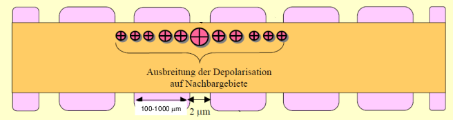
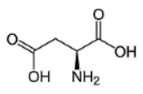
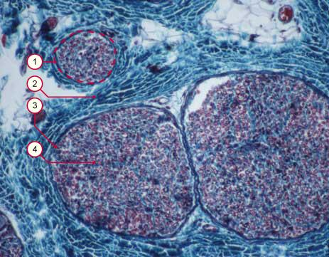

Einführung in die Neurowissenschaft

# Einführung
## Was ist Neurowissenschaft?
Die Neurowissenschaft untersucht den Aufbau , die Funktion sowie die phylogenetische und ontogenetische Entwicklung des Nervensystems auf systemischer, zellulärer und molekularer Ebene. Damit sind die strukturellen Grundlagen und die physiologischen Mechanismen aller Leistungen des Nervensystems, einschließlich höherer kognitiver Funktionen, Gegenstand dieser Wissenschaft.

Neurowissenschaft / die Neurowissenschaften
- Neuroanatomie: untersucht Struktur auf allen Ebenen
- Neurophysiologie: untersucht Funktion auf allen Ebenen
- Neurologie: untersucht Erkrankungen des Nervensystems
- Biopsychologie: untersucht biologische Basis psychologischer Prozesse

(Das ist eine der möglichen Einteilungen!)

## Beziehung zu anderen Lehrveranstaltungen
- Anatomie & Physiologie
  - Allgemeine biologische Grundlagen
  - Berührungspunkte besonders beim endokrinologischen System, Bewegungsapparat und Verdauungssystem
- Neurobiologische Informationsverarbeitung
  - Neuronen: Funktionsweise/Aufbau
  - Neuronale Schaltkreise
  - Neuronale Modelle
- Neuroinformatik
  - Neuronale Modelle
- Bildgebung, Messtechnik
  - Messung von neurobiologischen Signalen

## Das Nervensystem im Gesamtorganismus
- Das Nervensystem ist ein Organsystem der höheren Tiere
- Es realisiert eine Grundeigenschaft des Lebens: die Reizbarkeit
- Information aus der Umwelt und aus dem Organismus wird verarbeitet und in Verhalten umgesetzt.

## Das Nervensystem im Gesamtorganismus
- Das Nervensystem interagiert eng mit allen anderen Organsystemen 
- Eine besondere Rolle spielt das Hormonsystem (endokrines System)
- 

## Gliederung des Nervensystems
Zentrales Nervensystem (Gehirn und Rückenmark)
- $\leftrightarrow$ Peripheres Nervensystem
    - $\leftrightarrow$ Senso-motorisches Nervensystem (Afferenzen und Efferenzen)
      - $\leftrightarrow$ Umwelt
    - $\leftrightarrow$ Autonomes Nervensystem (Afferenzen, symp. u. parasymp. Efferenzen)
    - $\leftrightarrow$ Andere Organsysteme

## Zentrales Nervensystem
- 
- 
- 

## Sensomotorisches Nervensystem
- Efferenzen - vom ZNS zu Muskeln und Drüsen
- Afferenzen - von Sinnesrezeptoren zum ZNS

## Autonomes Nervensystem
(auch vegetativ oder viszeral)

## Zellen
Neuronen (Nervenzellen)
- Azevedo et al. J. Comp. Neurol. 2009
  - im Hirn: $86*10^6$ 
  - im Cortex: $16*10^9$
- Zellkörper mit Dendriten (Fortsätzen) $\rightarrow$ Integration von Information
- Axon/ Neurit (Nervenfaser) $\rightarrow$ Weiterleitung von Information
- Synapse $\rightarrow$ Übertragung von Information (elektrisch und chemisch)

Glia (im Hirn Anzahl etwa gleich der Anzahl der Neuronen)
- Informationsverarbeitung und -weiterleitung, zusammen mit Neuronen
- Stütz-und Transportfunktion
- Stoffwechselfunktion, Versorgung der Neuronen
- Abwehr-und Immunfunktion
- Bildung von Markscheiden (Isolation der Axone)

## Gewebe
Zentralnervensystem
- 

Peripheres Nervensystem
- Ganglien, Plexus (Neuron. Zellkörper + Glia)
- Nerven (Nervenfasern + Glia)

# Mikroanatomische und physiologische Grundlagen
## Zellen
- $75...100*10^{12}$ im Körper: Protoplasma, umgeben von Zellmembran
- Zusammenschluss zu Geweben und Organen
- 

1. Nucleolus
2. Zellkern
      - enthält Erbinformation
3. Ribosomen
        - Exprimierung der Erbinformation (Proteinsynthese)
4. Vesikel
        - Speicherung und Transport von Substanzen (z.B. Proteine oder Neurotransmitter)
5. raues endoplasmatisches Reticulum
        - vielfältige Aufgaben: Proteinsynthese, Ca-Speicherung, Enzym/Hormon-Bildung
6. Golgi-Apparat
7. Mikrotubuli
8. glattes endoplasmatisches Retikulum
        - vielfältige Aufgaben: Proteinsynthese, Ca-Speicherung, Enzym/Hormon-Bildung
9. Mitochondrien
        - erzeugen Energie (ADP $\rightarrow$ ATP)
10. Lysosom
        - Aufspaltung von Polymeren (,,Verdauung'')
11. Zytosol
        - Zellflüssigkeit
12. Peroxisom
13. Zentriolen

## Zellen im Nervensystem
- Nervengewebe
  - 
  - besteht aus Neuronen und Glia
- Neuronen
  - 
  - erregbare Zellen
  - verbunden durch Nervenfasern
  - Kommunikation über Synapsen
  - Informationstransfer elektrisch und chemisch
  - Hirn: $86*10^9$
  - Cortex: $16*10^9$
  - Azevedo et al. J. Comp. Neurol. 2009; abweichend in Birbaumer/Schmidt
- Glia
  - 
  - Stützung/Ernährung/Homöostase
  - Bildung von Myelinscheiden
  - Beiträge zur Informationsverarbeitung
  - Hirn: $86*10^9$
  - Cortex: $61*10^9$

## Neuronen
### grundsätzlicher Aufbau

- Synapsen: Kontaktstellen zwischen Neuronen und anderen Neuronen oder Muskel/Drüsenzellen
- Zellmembran: Semipermeable Membran um das Neuron (Lipid-Doppelschicht - guter elektrischer Isolator)
- Axonshügel: Kegelförmiger Übergang zwischen Zellkörper und Axon
- Dendriten: Kurze, vom Zellkörper ausgehende Fortsätze, an denen die meiste synaptischen Impulsübertragungen von anderen Neuronen ankommen
- Axon: Langer dünner Fortsatz, der Information vom Neuron fortleitet
- Myelin: Lipidreiche Substanz, die viele Axone umgibt
- Ranviersche Schnürringe: Einschnürungen zwischen myelinisierten Abschnitten des Axons.Synapsen: Kontaktstellen zwischen Neuronen und anderen Neuronen oder Muskel/Drüsenzellen

### morphologische Vielfalt

- Soma: $\O 5-100 \mu m$
- Dendriten: Länge einige $100\mu m$
- Axon: wenige $\mu m$ bis mehrere Meter. Kann stark verzweigt sein.

### grundsätzliche Funktionsweise
- Membranruhepotential $~ -70 mV$
- Synapsen setzen Neurotransmitter frei
- Neurotransmitter durchqueren synaptischen Spalt und erhöhen oder verringern Membranpotential
    - $\rightarrow$ Postsynaptische Potentiale mit zeitl./räuml. Ausdehnung
    - $\rightarrow$ räuml./zeitliche Integration von Input
- Bei Überschreitung einer Schwelle ($~ -65 mV$) am Axonshügel wird ein Aktionspotential ausgelöst
- AP pflanzt sich mit $0.3-100 m/s$ fort (aktive Übertragung)
- Wenn das AP eine Synapse erreicht, werden Neurotransmitter ausgeschüttet.

### Membranpotential
- Intrazellulärer Raum: Erhöhte Konzentration von K+ (20...100fach) und organischen Anionen
- Extrazellulärer Raum: Erhöhte Konzentration von Na+ (5...15fach) und Cl-(20...100fach)
- Ionenpumpen: halten Konzentrationsgefälle aufrecht
- Ruhe-Membranpotential -55...-100 mV (je nach Zelltyp)

### Ionenaustausch
1. Diffusion: Ionen, wie andere Teilchen auch, bewegen sich entlang des Konzentrationsgradienten
    - Wenn die Membran für die jeweilige Ionenart durchlässig ist, bewegen sich K+ und A- aus der Zelle, sowie Na+ und Cl- in die Zelle
2. Elektrischer Ionenstrom: Ionen sind geladene Teilchen und bewegen sich entlang des Potentialgradienten
    - Wenn die Membran für die jeweilige Ionenart durchlässig ist, bewegen sich K+ und Na+ in die Zelle, sowie Cl- und A- aus der Zelle
3. Aktiver Ionenaustausch: Ionen werden unter Energieverbrauch durch Ionenpumpen durch die Membran transportiert
    - z.B. befördert die Natrium-Kalium-Pumpe unter ATP-Verbrauch K+ in die Zelle und Na+ heraus.

1.+2.: durch Ionenkanäle - spezielle Eiweißmoleküle in der Membran, gesteuert durch elektrische oder metabolische Prozesse

### Aktionspotential
1. Membranpotential wird angehoben.
2. Bei etwa $-50..-60$ mV öffnen die Natriumkanäle und Na+ strömt in die Zelle
3. Membranpotential steigt plötzlich auf $+20..30$ mV $\rightarrow$ Depolarisation
4. Nach ca. 1 ms schließen Natriumkanäle und Kaliumkanäle öffnen. K+ strömt aus der Zelle
5. Membranpotential fällt, zunächst unter das Ausgangsniveau $\rightarrow$  Re/Hyperpolarisation

Wird das Membranpotential durch eine äußere Ursache über einen Schwellwert gehoben, regiert die Zelle mit einem kurzen nadelförmigen Impuls.

- Aktionspotentiale sind (für den gleichen Zelltyp) immer gleich $\rightarrow$  Information ist in Impulsrate kodiert
- Maximale Impulsrate ist etwa 500 pro Sekunde.
- Refraktärzeit: Unerregbarkeit der Zellen nach Auslösung eines AP
  - Absolute Refraktärzeit: totale Unerregbarkeit, ca. 2 ms.
  - Relative Refraktärzeit: Auslösung verkleinerter APs, mehrere ms.

## Axonale Erregungsfortleitung
unmyelinisierte Axone
1. Na+-Kanäle noch blockiert $\rightarrow$ kein neues Aktionspotential
2. Schwellwer überschritten $\rightarrow$ Na+ Kanäle öffnen, neues Aktionspotential

Aktionspotentiale breiten sich entlang von Axonen, in der Regel vom Axonshügel zur Synapse, aus.
- Warum nicht über Soma und Dendriten? Na+ Kanäle gibt es in der Regel nur am Axonshügel und Axon.
- Warum nur in eine Richtung? Na+ haben eine Refraktärzeit, die das Zurücklaufen der Welle verhindert.
- Ausbreitungsgeschwindigkeit hängt quadratisch von der Axonsdicke ab: $\O 1 \mu m\rightarrow 1 m/s; \O 2 \mu m\rightarrow 4 m/s$

saltatorische Erregungsleitung
- Durchmesser des Axons: je größer der Durchmesser, desto schneller die Ausbreitung
- Umhüllung durch Myelinschicht (Markscheiden): Erregung springt von Schnürring zu Schnürring $\rightarrow$ Saltatorische Erregunsleitung
- Myelinscheide: verhindert Ionenaustausch (Schwann-Zelle im PNS, Oligodendrozyt im ZNS)
- 

## Myelinscheiden
- 
- gebildet von Oligodendrozyten im Gehirn und Rückenmark und von Schwann-Zellen in der Peripherie
- markhaltige (10...120 m/sek) und marklose (0,3...3 m/sek) Fasern

Klinik -> Multiple Sklerose:
- Abbau der Myelinschicht im ZNS
- Sensibilitätsstörungen, Muskelschwäche, Missempfindungen, Sehstörungen
- Ursachen unbekannt, wahrscheinlich Autoimmunerkrankung, Erbfaktor spielt eine Rolle
- befällt hauptsächlich Erwachsene zwischen 20 und 40 Jahren

## Chemische Synapsen

Erreicht ein AP den Endknopf,
- $Ca^{2+}$-Kanäle öffnen sich, $Ca^{2+}$ strömt in die Zelle
- Vesikel bewegen sich zur Membran und öffnen sich (Exocytose)
- Neurotransmitter werden ausgeschüttet, überqueren den synaptischen Spalt
- Neurotransmitter aktivieren Rezeptoren
- Ionenkanälen werden direkt oder indirekt beeinflusst.
- Beeinflussung des Membranpotentials (Postsynaptische Potentiale).
- Wiederaufnahme oder Abbau der Neurotransmitter

Gerichteter Informationstransfer von Zelle zu Zelle $\rightarrow$  ,,Diodenfunktion''

Informationstransfer ist modifizierbar $\rightarrow$  ,,Transistorfunktion''

Verfügbarkeit, Aktivierbarkeit und Wiederaufnahme von Neurotransmittern, Blockierung von Neurorezeptoren, usw.

präsynaptisch $\rightarrow$ Informationsfluss $\rightarrow$ postsynaptisch

- axo-dentritisch: enden auf dendritischen Dornen (spines);häufig
- axo-somatisch: häufig
- dendro-dentrisch: können Signale in beide Richtungen übertragen
- axo-axonisch: können präsynaptische Inhibition vermitteln

## Ungerichtete Synapsen
Neurotransmittermoleküle werden diffus aus Erweiterungen entlang des Axons und seiner Verzweigungen freigesetzt.

## Postsynaptisches Potential
$V(t)=\sum_s w_s*K_s(t) \otimes m_s(t)$ mit
- $V(t)$: Potential Axonshügel
- $w_s$: synaptisches Gewicht
- $K_s$: synaptische Antwort
- $m_s$: Impulsraten Synapsen
- $\sum$: räumliche Integration
- $\otimes$: zeitliche Integration

Depolarisation
- Reiz senkt Potential ($-70$ auf $-67$)
- Feuerwahrscheinlichkeit $\uparrow$
 
Hyperpolarisation
- Reiz hebt Potential ($-70$ auf $-73$)
- Feuerwahrscheinlichkeit $\downarrow$

## Zeitliche und räumliche Integration
- Postsynaptische Potentiale sind abgestufte Antworten 
  - proportional zur Stärke des auslösenden Signals
  - zwei simultane EPSPs addieren sich und rufen ein größeres EPSP hervor
- Postsynaptische Potentiale breiten sich passiv aus 
  - sehr schnell, werden bei der Ausbreitung abgeschwächt
  - Einfluss von Synapsen hängt von Position ab
  - zwei EPSPs, die in rascher Folge ausgelöst werden, addieren sich und rufen ein größeres EPSP hervor

## Elektrische Synapsen
(gap junctions)

- Direkter Ionenaustausch von Zelle zu Zelle
- Aus sogenannten Connexinen zusammengesetzt
- Porendurchmesser $< 2nm \rightarrow$  kleine Moleküle werden ausgetauscht
- Austausch von Ionen (elektrische Leitung)
- Austausch von ,,second messengers'' (z.B. $Ca^{2+}$ )

Räumlicher Aufbau
- Zytosol
- Membran
- Extrazell. Raum
- Membran
- Zytosol

## Neurotransmitter
Neurotransmitter sind Substanzen, die an (chemischen) Synapsen ausgeschüttet werden und andere Zellen (Neuronen, Muskelzellen, etc.) spezifisch beeinflussen.

Neurotransmitter ...
- werden in Neuronen synthetisiert
- liegen in der präsynaptischen Endknöpfen vor und werden in genügend großer Menge freigesetzt, um eine spezifische Wirkung hervorzurufen
- ... entfalten dieselbe Wirkung bei exogener Applikation der Substanz
- ... können durch einen spezifischen Mechanismus wieder entfernt werden

## Neurorezeptoren
Ionotrope Rezeptoren
- Chemisch gesteuerte Ionenkanäle in der postsynaptischen Membran
- Bei Bindung öffnet oder schließt sich der Ionenkanal und induziert dadurch augenblicklich das postsynaptische Potential

Metabotrope Rezeptoren
- Häufiger
- Wirkung langsamer und variabler
- Bindung des Neurotransmitter an G-Protein - Untereinheit löst sich im Zellinneren
- Bindet an Ionenkanal und löst AP aus, ...
- ... oder Synthese eines weiteren Botenstoffes (second messenger)

## Die Catecholamine: Dopamin, Epinephrin, Norepinephrin
- sind Produkte eines gemeinsamen Biosyntheseweges (aus Tyrosin/Phenylanalin über L-Dopa)
- sind chemisch eng miteinander verwandt (gemeinsames Merkmal: Catecholring)
    - 

## Das dopaminerge System
Dopamin: erregender oder hemmender Neurotransmitter

Rezeptoren: D1+D5 erregend, D2-D4 hemmend

Dopaminbahnen:
1. Nigro-striatales System: Projektionen von Substantia nigra zu Basalganglien (u.a. Nucleus caudatus)
    - Bewegungsinitialisierung und -koordinierung (extrapyramidales System)
    - Ausfall: Parkinson
    - Überfunktion: Hyperkinese/ Hypertonus, z.B. Huntington
2. Mesolimbisches/mesocorticales System: Projektionen von ventralem Tegmentum zu höheren Hirnregionen, Großhirn und limbisches System
    - Vermittlung von motivationell-emotionalen Einflüssen, Belohnung, Lernen und Gedächtnisbildung
    - Überfunktion: Schizophrenie (?)
3. Tubero-hypophyseales System: Projektionen von Hypothalamus zu Hypophyse
    - Hormonausschüttung

## Das noradrenerge System
Norepinethrin/Noradrenalin: Neurotransmitter im ZNS u. Sympathikus

Rezeptoren (=Adrenalin): $\alpha_1$ , $\alpha_2$ , $\beta_1$ , $\beta_2$ , $\beta_3$ (komplexe ,,second messenger'' Effekte)

- noradrenerge Neuronen im Hirnstamm, besonders im Locus Caeruleus
- Projektionen auf sympatische Neurone im Rückenmark, sowie in Hypothalamus, Thalamus, Cerebellum, limbisches System und Cortex
- Aufmerksamkeitssteigerung, führt zu vermehrter Erregung, Angst, Vigilanz; sympathische Aktivität
- 

## Die Indolamine: Serotonin
- Auch 5-Hydroxytryptamin (5-HT)
- Ausgangssubstanz Tryptophan
- Wird auch über die Nahrung aufgenommen: Walnüssen, Bananen, Tomaten, Kakao etc.
- Chemisches Merkmal: Indol-Doppelring

## Das serotonerge System
Serotonin: Neurotransmitter im gesamten Nervensystem

Mindestens 14 verschiedene Rezeptoren - vielfältige Wirkungen im gesamten Nervensystem

- überall im Körper, 95% im Magen-Darm-Trakt
- serotonerge Neuronen im Hirnstamm, in den Raphé-Kernen
- Projektionen ähnlich universell wie beim noradrenergen System
- Funktionen vielfältig, insbesondere allgemeine Stimmung

## Aminosäuren: Glutamat, Aspartat, Glyzin, GABA
- Im Kontrast zu Acetylcholin und Aminen, die i.d.R. nur in bestimmten Neuronen hergestellt werden können, sind Aminosäuren universelle zelluläre Bestandteile
- gehören zu den wichtigsten und am weitesten verbreiteten Neurotransmittern im ZNS
  
Glutamat: 
- wichtigster erregender Neurotransmitter im ZNS, auch häufiger Nahrungsbestandteil
- 

Aspartat: 
- erregender Neurotransmitter im ZNS, insbes. im Kleinhirn u. Hippocampus. Wirkt ähnlich wie Glutamat.
- 
  
Glycin: 
- hemmender Neurotransmitter in Rückenmark und Hirnstamm 
- 

Gamma-Amino-Buttersäure (GABA): 
- wichtigster hemmender Neurotransmitter im ZNS
- 

## Acetylcholin
- Erregender Neurotransmitter im zentralen und peripheren Nervensystem
- Vielfältige Rezeptoren: muscarinische (metabotrop) und nicotinische (ionotrop)
- Signalübertragung zwischen Motorneuronen und Muskelzellen (in motorischen Endplatten)
- Signalübertragung im autonomen Nervensystem

- Muscarinische Rezeptoren
  - metabotrop
  - Untertypen: M1, M2, M3, M4, M5
  - weit verbreitet im Gehirn (besonders in verschiedenen Strukturen des Vorderhirns)
  - Zielorgane des parasympathischen Systems
- Nicotinische Rezeptoren
  - Ionotrop
  - Muskelzellen
  - sympathisches und parasympathisches Nervensystem
  - Gehirn
  - Rezeptoren an Muskelzellen und neuronale Rezeptoren sind pharmakologisch unterschiedlich
  - Bsp: Rauchen: psychologische Effekte von Nicotin (im Gehirn) jedoch keine Muskelkontraktionen

## Histamin
- Synthese aus der Aminosäure Histidin
- 

## Neuroaktive Peptide
- große Zahl (mehr als 100)
- oft sowohl Hormon als auch Neurotransmitter
- Neuropeptide sind Spaltprodukte von größeren, inaktiven Vorstufen, diese werden im Zellkörper gebildet und anschließend zum Axonterminal transportiert

## Neurotransmitter - Übersicht
| Neurotransmitter | Postsynaptischer Effekt         | Vorläufer         |
| ---------------- | ------------------------------- | ----------------- |
| Acetylcholin     | Exzitatorisch                   | Cholin+Azetyl-CoA |
| Glutamat         | Exzitatorisch                   | Glutamin          |
| GABA             | Inhibitorisch                   | Glutamat          |
| Glyzin           | Inhibitorisch                   | Serin             |
| Catecholamine    | Exzitatorisch                   | Tyrosin           |
| Serotonin (5-HT) | Exzitatorisch                   | Tryptophan        |
| Histamin         | Exzitatorisch                   | Histidin          |
| Neuropeptide     | Exzitatorisch und Inhibitorisch | Aminosäuren       |

## Psychopharmaka, Neurotoxine und Drogen
Substanzen beeinflussen synaptische Übertragung

- Agonisten
    - Erleichtern die Aktivierung der Synapsen eines bestimmten Neurotransmitters
- Antagonisten
    - Hemmen die Aktivierung der Synapsen eines bestimmten Neurotransmitters

### Wirkmechanismen Agonisten
1. Neurotransmitter Synthese $\uparrow$ (z.B. durch Erhöhung der Menge von Vorläufersubstanzen)
2. Neurotransmitter Menge $\uparrow$ durch Zerstörung abbauender Enzyme
3. Steigerung der Neurotransmitter-Freisetzung
4. Bindung an, und damit Blockierung von, Autorezeptoren
5. Blockierung von Abbau oder Wiederaufnahme von Neurotransmitter
6. Bindung an und Aktivierung von postsynaptischen Rezeptoren

### Wirkmechanismen Antagonisten
1. Neurotransmitter Synthese $\downarrow$ (z.B. durch Zerstörung synthetisierender Enzyme)
2. Austreten von Neurotransmitter aus Vesikeln, was zur Zerstörung durch Enzyme führt
3. Blockierung der Neurotransmitter-Freisetzung
4. Aktivierung von Autorezeptoren
5. Bindung an, und Blockierung von, postsynaptischen Rezeptoren

### Beispiel: Psychopharmaka
Monoaminoxidase (MAO)-Hemmer zur Behandlung affektiver Störungen (Depression)
- Phenelzin, Tranylcypromin, Isocarboxazid
- Wirkprinzip
  - MAO zerstört Neurotransmitter außerhalb der Vesikel.
  - Durch MAO-Hemmung werden akut die Mengen an Noradrenalin, Dopamin und Serotonin erhöht.
- Erst durch adaptive Veränderungen in der Rezeptordichte und der Second-Messenger-Kette wird der klinische Effekt erreicht.

### Beispiel: Neurotoxine
Atropin - Muskarinantagonist

z.B. Atropa belladonna (Tollkirsche)

- Mittelalter
  - beliebtes Gift in der Politik und bei Familienintrigen
  - Kosmetik: Erweiterung der Pupillen 
- Moderne
  - Augenarzt: Erweiterung der Pupillen, um das Innere der Augen besser sehen zu können
  - Gegengift für cholinerge Agonisten
  - Kreislaufstillstand oder Bradykardie

- Symptome - Blockierung Parasympathicus
  - Herzrasen, Bronchienerweiterung
  - Pupillenweitung
  - Hemmung Magen/Darmtätigkeit

blockiert M1-3 Acetylcholin-Rezeptoren

### Beispiel: Drogen
Cocain - Monoamin-Wiederaufnahmehemmer

verstärkt Dopamin-, Norepinephrin- und Serotoninaktivität

Wirkung
- Euphorie, gesteigerte Leistungsfähigkeit
- Unterdrückung Hunger u. Müdigkeit
- in hohen Dosen: Angst, Paranoia
- Lokalanästhetikum

Gefährlichkeit
- zweitstärkstes Abhängigkeitspotential und physischer Schaden nach Heroin (Nutt et al., The Lancet 2007)
- durch schnelle Abfolge von Euphorie und Depression hohes Potential zu psychischer Abhängigkeit

Erythroxylum coca 
- erstmalig isoliert in der Mitte des 19. Jahrhunderts
- Bis 1906 250mg/l in Coca-Cola (das sind 2-4 Dosen)

## Glia-Zellen im Zentralnervensystem
- Vielfältige Funktion: Stützung (,,Bindegewebe''), Ernährung. Homöostase, Myelinbildung, Informationsverarbeitung, etc.
- stellen die Hälfte der Hirnzellen und 80% der Cortexzellen

Microgliozyten (Hortega-Zellen)
- sehr vielfältige Formen
- Amöboid beweglich
- Abräum- und Abwehrfunktion

Astrozyten
- kurzstrahlige Astrozyten in grauer Substanz
- Langstrahlige (fasrige) Astrozyten in weißer Substanz
- Gliafüßchen bilden geschlossene Schicht um Kapillaren
- Kontrolle Ionen- und Flüssigkeitsgleichgewicht
- Stütz- und Transportfunktion
- Abgrenzungsfunktion: um Kapillaren: Blut-Hirn-Schranke an Hirnoberfläche, Synapsen u. Ranvierschen Knoten
- Sind teilungsfähig und bilden Glianarben

Ependymzellen
- Auskleidung Hirnventrikel und Rückenmarkskanal

Oligodendrogliozyten
- eng an Neuronen angelagert
- Stoffwechelfunktion für Neuronen
- Bilden Markscheide für ZNS-Neuronen

Schwann-Zelle
- Eng an Neuronen angelagert
- Stoffwechselfunktion für Neuronen
- Bilden Markscheide für PNS Neuron
- Beteiligt an Nervenregeneration

Periphere Nerven
- 
- 
  1. Nervenfaszikel
  2. Epineurum
  3. Perineurum
  4. Nervenfasern mit Endoneurum
- 
    1. Zellkern der Schwann Zelle
    2. Neurofilamente
    3. Mikrotubuli
    4. Myelinscheide
    5. Axon
    6. Basalmembran

## Synaptische Verbindung zu Effektoren
Motorische Endplatten: Chemische Synapsen, arbeiten mit Acetylcholin, verbinden Neuronen und Muskelfasern.

- ionotrop: $Ca^{2+}$ , K+, Na+
- Depolarisation
- $\rightarrow$ Aktionspot. in Muskelzelle
- $\rightarrow$ $Ca^{2+}$ -Einstrom
- $\rightarrow$ Kontraktion