Biosignalverarbeitung
- [Sensorik](#sensorik)
  - [Klassifikation von Sensoren](#klassifikation-von-sensoren)
  - [Druck, Dehnung und Kraft](#druck-dehnung-und-kraft)
  - [Durchfluss, Volumen](#durchfluss-volumen)
  - [Optische Sensoren](#optische-sensoren)
  - [Akustische Sensoren](#akustische-sensoren)
  - [Sensoren für elektrische Größen](#sensoren-für-elektrische-größen)
    - [Elektrochemische Grundlagen](#elektrochemische-grundlagen)
    - [Elektroden der Diagnostik](#elektroden-der-diagnostik)
    - [Elektroden der Therapie](#elektroden-der-therapie)
  - [Sensoren für magnetische Größen](#sensoren-für-magnetische-größen)
    - [Messprinzipien](#messprinzipien)
    - [Gradiometer](#gradiometer)
    - [SQUID](#squid)
- [Verstärkung und analoge Filterung](#verstärkung-und-analoge-filterung)
  - [Eigenschaften von Biosignalen und Störungen](#eigenschaften-von-biosignalen-und-störungen)
    - [Entstehung der Biosignale, biologische Signalquellen](#entstehung-der-biosignale-biologische-signalquellen)
    - [Biologische und technische Störquellen](#biologische-und-technische-störquellen)
      - [Eigenschaften technischer Störungen](#eigenschaften-technischer-störungen)
      - [Eigenschaften biologischer Störungen](#eigenschaften-biologischer-störungen)
  - [Medizinische Messverstärker](#medizinische-messverstärker)
    - [Dynamik, Linearität](#dynamik-linearität)
    - [Eigenrauschen](#eigenrauschen)
    - [Frequenzgang](#frequenzgang)
  - [Differenzverstärker](#differenzverstärker)
    - [Funktionsprinzip](#funktionsprinzip)
    - [Differenz- und Gleichtaktverhalten](#differenz--und-gleichtaktverhalten)
  - [Instrumentationsverstärker](#instrumentationsverstärker)
    - [Mehrstufiger Verstärker](#mehrstufiger-verstärker)
    - [Hoher Eingangswiderstand](#hoher-eingangswiderstand)
    - [Hohe Gleichtaktunterdrückung](#hohe-gleichtaktunterdrückung)
  - [Isolationsverstärker](#isolationsverstärker)
    - [Funktionsprinzip](#funktionsprinzip-1)
    - [Galvanische Trennung und ihre Auswirkung](#galvanische-trennung-und-ihre-auswirkung)
    - [Datenübertragung, Modulation und Demodulation](#datenübertragung-modulation-und-demodulation)
  - [Guardingtechnik](#guardingtechnik)
    - [Funktionsprinzip](#funktionsprinzip-2)
    - [Realisierung](#realisierung)
  - [Aktive Elektroden](#aktive-elektroden)
    - [Funktionsprinzip](#funktionsprinzip-3)
    - [Störungsresistenz](#störungsresistenz)
    - [Gleichtaktunterdrückung](#gleichtaktunterdrückung)
  - [Analoge Filter](#analoge-filter)
    - [Passive Filter](#passive-filter)
      - [Grundlagen der Filtertheorie](#grundlagen-der-filtertheorie)
      - [Filterentwurf](#filterentwurf)
    - [Aktive Filter](#aktive-filter)
  - [Linearer Phasenfrequenzgang](#linearer-phasenfrequenzgang)
- [Signalkonditionierung, Abtastung und Digitalisierung](#signalkonditionierung-abtastung-und-digitalisierung)
  - [Pegelanpassung](#pegelanpassung)
  - [Abstastung, Aliasing](#abstastung-aliasing)
  - [Digitalisierung](#digitalisierung)
    - [Prinzipien der AD Wandlung](#prinzipien-der-ad-wandlung)
    - [Breitbandige Wandler](#breitbandige-wandler)
  - [Telemetrie](#telemetrie)
    - [Analoge Übertragung](#analoge-übertragung)
    - [Digitale Übertragung](#digitale-übertragung)
- [Digitale Filterung](#digitale-filterung)
  - [IIR-Filter](#iir-filter)
  - [FIR-Filter](#fir-filter)
    - [Realisierung digitaler Filter - FIR](#realisierung-digitaler-filter---fir)
  - [Realisierung digitaler Filter - programm](#realisierung-digitaler-filter---programm)
    - [Realisierung digitaler Filter - DSP](#realisierung-digitaler-filter---dsp)
  - [CAD digitaler Filter](#cad-digitaler-filter)
  - [Adaptive Filter](#adaptive-filter)

# Sensorik
Im Normalfall werden Sensoren verwendet, die eine physikalische oder chemische Größe in ein elektrisches Signal umwandeln bzw. eine elektrische Größe beeinflussen, die weiter verarbeitet werden können. Eine Umwandlung der Energieform der Biosignale ist notwendig. Selbst bei Sensoren für elektrische Größen ist eine Umwandlung (von Ionenleitung zur Elektronenleitung) nötig.

Weitere Sensorengruppen, wie Temperatur-und chemische Sensoren werden hier nicht behandelt, da ihre Dynamik aus Sicht der BSA vernachlässigbar gering ist.

## Klassifikation von Sensoren
Ein Sensor (lateinisch 'sensus': Gefühl) oder Fühler ist ein technisches Bauteil, das die physikalischen oder chemischen Eigenschaften (z.B. Wärmestrahlung, Temperatur, Feuchtigkeit, Druck, Schall, Helligkeit, Magnetismus, Beschleunigung, Kraft, elektrisches Potential) erfassen und in ein elektronisches oder ein anderes geeignetes Signal umwandeln kann.

Man unterscheidet zwischen aktiven und passiven Sensoren
- Aktiver Sensor: gibt eine Spannung oder einen Strom ab, wobei er für seine Funktion elektrische Energie benötigt oder eine Energieart in die elektrische umwandelt. Er wirkt wie eine elektrische Signalquelle (z.B. Phototransistor)
- Passiver Sensor: ändert elekttrische Größen (z.B. den Widerstand des Dehnmessstreifens in Abhängigkeit von der Dehnung) ohne Energiezufuhr von außen.

Auflösung von Sensoren:
- temporal: Zeitabstand zwischen Messungen (z.B. Geigerzähler, Aktionspotentiale)
- spektral: Abstand von Spektrallinien (z.B. Wärmebildkamera, Infrarotsensor, Spektralphotometer)
- räumlich: räumlicher Abstand (z.B. EEG, Ultraschall, CT/MRT)
- und alle Kombinationen (z.B. spatialtemporale Auflösung in einem Frequenzband)

Klassifikation nach Messgröße:
- Physikalisch: Kraft, Druck, Moment, Durchfluss
- Elektrizität: Potential, Strom, Impedanz
- Magnetismus: Fluss, Induktion
- Optik/Licht: spektrale Dämpfung, Extinktion
- Chemisch: Partialdruck von Gasen, Zucker, Hämoglobin
- Akustik: Herzschalltöne, Atmung
- Temperatur: Körpertemperatur

## Druck, Dehnung und Kraft
Dehnmessstreifen (DMS)
- Messprinzip: Dehnungsabhängiger Widerstand
- Realisierung: Widerstandsdraht oder Halbleiter als Gitter auf Träger
- Messbare Größen: Kraft, Druck, Moment
- Anwendung in der Medizintechnik: Atmungsdiagnostik, Fahrradergometer, Diagnostik des Bewegungsapparates
- Signaleigenschaftem
  - passiver Sensor - thermisches und/oder Halbleiter-Rauschen
  - empfindlich gegen NF-elektrische/magnetische und HF-elektromagnetische Felder
  - temperaturabhängig vor allem Halbleiter
  - Übertragungseigenschaften abhängig von der Sensorkopplung
  - Signaldynamik abhängig von Masse und Technologie

Grundlage ist der piezoresestive Widerstandseffekt: Durch Zug/Druck nimmt der elektrische Widerstand zu/ab
- $R=\rho\frac{l}{A}=\rho\frac{4l}{d^2\pi}$, $\rho$ spez. Widerstand, $l$ Drahtlänge, $d$ Drahtdurchmesser
- $R+\delta R=(\rho+\delta\rho)\frac{4(l+\delta l)}{(d-\delta d)^2\pi}$; davon ist $(l+\delta l)$ relevant für die Dehnungsmessung


Die Widerstandsänderung ist linear abhängig von der Temperaturabhängigkeit des spez. Widerstandes, jedoch nicht linear abhängig von der mechanisch bedingten Änderung der
Abmessungen. Natürlich hängen die Längenänderung und die des Durchmessers zusammen. Der konkrete Zusammenhang ist jedoch durch die Konstruktion und das Material gegeben und kann nicht verallgemeinert werden. Da für die Messung allein die Längenänderung von Interesse ist, wird im weiteren nur diese betrachtet.

- $\frac{\delta R}{R}=k\frac{\delta l}{l}=k*\epsilon$, $\epsilon$-relative Dehnung
- $\epsilon=\frac{F}{EA}$, $F=\frac{\delta R}{R}*\frac{EA}{k}$, E-Elastizitätsmodul
- In der Praxis aus Kostengründen und wegen geringer Temperaturabhängigkeit meistens Konstant an (54% Cu, 45% Ni, 1% Mn mit $k=2,05$) verwendet

Messverfahren: Widerstandsmessung mit Brückenschaltung
- Wheatstone'sche Brücke: $U_A\rightarrow 0|_R \Rightarrow \frac{R_x}{R_V}=\frac{R_2}{R_1}$
- $R_X=R_V\frac{R_2}{R_1}$
- 
- Warum wird Rx mit Wheatstone-Brücke und nicht klassisch über Stromeinspeisung und Spannungsmessung bestimmt?
  - Das Messsignal (Ua) ist stärker bzw. die Empfindlichkeit der Messanordnung ist höher als bei einer reinen Strom/Spannungsmessung, außerdem ist Temperaturkompensation möglich. 
  - Starkes Messsignal ist sinnvoll wegen der immer vorhandenen Störungen vom Netz und Leitungen, die direkt auf die Kabel der Messanordnung wirken.

Folien-DMS:
- Widerstandsdraht mit ca $20\mu m$ Durchmesser oder Halbleiter
- Träger Acrylharz, Epoxydharz, Polyamid
- 

Dehnungsmessrosette:
- Messung in drei Richtungen
- 

Wie man an diesen Konstruktionsbeispielen gut erkennen kann, bilden die Leitungen ungewollterweise eine Antenne, die alle vorhandenen Störungen aus der Umgebung aufnimmt, vor allem Netzeinstreuung, Mobilfunk und Computernetze.

Aufbau von Massebezogenen und Massefreien Messungen:


Messspannung von $U_{R5}$ in der massebezogenen Schaltung

Bei massebezogener Messung - auch Single-End genannt, da gegen Masse - werden die Störungen direkt dem Messsignal überlagert, so dass später eine Trennung ohne aufwendige Signalverarbeitung kaum möglich ist.

Massebezogne eBrückenspannung (rot, blau) und Indikatorspannung $U_d$ (grün)

Einen großen Teil der Netzstörung bilden die elektrostatischen (kapazitiv eingekoppelten) Felder, die Gleichtaktcharakter haben. Diese lassen sich also durch Differenzbildung -hier mit einer Wheatstonschen Brücke -zum Teil eliminieren.

## Durchfluss, Volumen
- Massendurchfluss
  - $\dot m=\frac{dm}{dt}$
  - $[\dot m]=\frac{kg}{h};\frac{g}{s}$
  - industriell relevante Größe, z.B. Kraftstoffe, Luftverbrauch im Motor
- Volumendurchfluss
  - $\dot V=\frac{dV}{dt}$
  - $[\dot V]=\frac{m^3}{h};\frac{l}{min}$
  - wichtige Messgröße in der medizinischen Messtechnik: Blutfluss, Atmung, Gastrointestinalapparat
- Der Durchfluss eines Mediums ist eine der wichtigsten Größen in der technischen und medizinischen Messtechnik. Technisch vor allem der Massendurchfluss, medizinisch der Volumendurchfluss, da medizinisch grundsätzlich die Volumina diagnostisch relevante Größe darstellen.
- Bei bekannter durchflossener Fläche wird der Volumenfluss über die Geschwindigkeitsmessung ermittelt
  - $\dot V=\frac{dV}{dt}=\frac{A*dl}{dt}= A*v$
  - Reale Verteilung der Geschwindigkeit ist Parabel mit Maximum in der Mitte $\rightarrow$ Gemessene Geschwindigkeit ist die mittlere Geschwindigkeit
- In der Medizin kann weder eine Geschwindigkeitsverteilung - wie in der Technik - erzwungen werden, noch kann sie vollständig erfasst werden. Daher misst man tatsächlich nur eine ,,mittlere'' Geschwindigkeit, wobei der Begriff ,,mittlere'' hier nicht ganz korrekt ist, da die tatsächliche Verteilung nach wie vor unbekannt ist.
- Messprinzip Druckdifferentmessung nach Gesetz von Hagen-Poiseuille
  - $\dot V=\frac{dV}{dt}\frac{\pi d^4}{128\mu}*\frac{\delta p}{l}$
  - $d$ - Durchmesser der Kappilare
  - $\delta p=p_A - p_B$ - Druckdifferenz über der Kapillare, abhängigkeit von der Strömungsgeschwindigkeit
  - $l$ - Länge der Kapilalre
  - $\mu$ - Viskosität des Mediums
  - 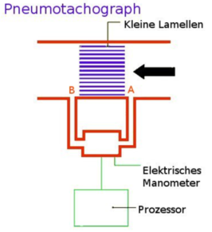
  - Bsp: 10% Verengung der Kapillare $\rightarrow$ 34% Reduktion des Durchsatzes, d.h. im Blutkreislauf Anstieg des Blutdrucks um 34%
  - Bei externen Sensoren der Durchflussmessung kann man die Messbedingungen relativ klar vorgeben, z.B. im Pneumotachographen. Man erzwingt kapillare Strömung, der Strömungswiderstand und die Fläche sind bekannt, so dass aus der Druckdifferenz direkt auf den Durchfluss geschlossen werden kann.
- Anwendung in der Medizintechnik
  - Messung aller vitaler Lungenvolumina
  - Messung des Blutflusses
- Nachteile des Messprinzips
  - zusätzlicher Strömungswiderstand verfälscht das Ergebnis
  - bei Temperaturunterschieden Kappilaren-Medium Tröpfchenbildung
  - geringer Dynamikbereich (1:10)
  - niedrige Messgenauigkeit wegen Turbulenzen an Kapillarenden
  - direkter Kontakt mit Medium
- Ultraschall-Geschwindigkeitsmessung nach dem Laufzeitverfahren
  - $v=\frac{T_2-T_1}{T_1 T_2}*\frac{L}{2\ cos\ \alpha}$
  - $v$ - mittlere Strömungsgeschwindigkeit des Mediums
  - $T_1$ - Laufzeit des Ultraschalls mit der Strömung
  - $T_2$ - Laufzeit des Ultraschalls gegen die Strömung
  - $L$ - Länge des Ultraschall-Pfades
  - $\alpha$ - Winkel zwischen der Strömung und dem Ultraschall-Pfad
  - 
  - Vorteile
    - kein Kontakt mit dem Medium, insbesondere Blutbahnen
    - Installation und Messung ohne Unterbrechnung des Flusses
  - Nachteile
    - invasive Methode, da Blutgefäß freigelegt werden muss
    - Ungenauigkeit wegen der Verfomung der Blutgefäße
  - Signaleigenschafte
    - verrauscht wegen Streuung im Medium, Sensorrauschen
    - Echo statisch verteilt wegen Geschwindigkeitsprofil
- Ultraschall-Geschwindigkeitsmessung nach dem Dopplerverfahren
  - $f_D=f\frac{c}{c-v} \Rightarrow v=c\frac{f-f_D}{f_D}$
  - $c$ - Ausbreitungsgeschwindigkeit des Ultraschalls im Medium
  - $f$ - Originalfrequenz der Signalquelle
  - $f_D$ - gemessene Frequenz (Beobachter)
  - $v$ - Geschwindigkeit der Signalquelle
  - 
  - 
  - Anm: Feste Blutbestandteile (Blutkörperchen) reflektieren die Schallwellen und sind somit für den Ultraschall-Empfänger bewegte Signalquellen
- signalanalytisch relevante Eigenschaften
  - Flussgeschwindigkeit ungleichmäßig verteilt
  - im technischen Bereich konstruktiv beherrschbar (Messkammer, Durchmesser, Material)
  - im medizinischen Bereich kein Einfluss auf die Gefäße, daher relativ ungenaue Messung der mittleren Geschwindgkeit

## Optische Sensoren
Optische und Strahlungsquellen
- Kaltlichtquelle: in der Endoskopie, bläuliches Tageslicht wegen der Farbtreue
- Diagnostische Laser: in der Ophthalmologie, Urologie, inneren Medizin, Dermatologie
- Leuchtdioden: in der Photoplethysomographie (Pulsoximetrie)
- Röntgen-, Gamma-, UV- und IR-Strahler: in der diagnostischen Bildgebung
- Inspektionslicht: in der HNO (Halogenstrahler)

Signalanalytisch wichtige Eigenschafte
- Temperaturstrahler: sind träge, daher statisches, konstantes Licht
- Halbleiter (Leuchtdioden), Laser und Leuchtstoffröhren sind gepulste Quellen - mit dem Auge nicht wahrnehmbar, aber analytisch unter Umständen sehr problematisch

Optische Sensoren
- Phototransistor: in Flachbilddetektoren der Radiologie
- Kamerachips: in den Endoskopen
- Szintillatoren: in Gamma-Kameras
- Photovervielfacher (SEV) in Laser-Fluroszenzsystemen

Sensoreigenschaften
- starkes Eigenrauschen, typisch für Halbleiter, ,,Dunkelstrom''
- hohe Temperaturabhängigkeit, ist materialbedingt, variable Parameter
- ungünstige Dynamikeigenschaften, Nachleuchten durch Trägheit, systemanalytisch lange Impulsantwort

Beispiel Optischer Sensor CMOS Kamera LOGLUX i5
- wahlfreier Pixelzugriff
- CameraLink oder FireWire Datenschnittstelle
- Auflösung 1280x1024 Pixel, 10 bit Graustufen
- $>100$ dB Kontrast-/Dynamikumfang
- ca 36 fps bei Vollbild; höhere Bildrate bei kleinerem Bildfeld bis ca 1500 fps
- Vorverarbeitung der Bilddaten mittels integrierter LUT (look-up-tables) möglich
- spektraler Arbeitsbereich 400-1000nm

Optische Messmethoden gewinnen in der Medizin immer mehr an Bedeutung, vor allem, weil sie nichtinvasiv sind und daher patientenfreundlich. Mit der Kombination von Spektralfotometrie und Photoplethysmografie kann die Sauerstoffsättigung bestimmt werden. Dazu ist es notwendig, Gewebe durchzustrahlen, welches mit arteriellem Blut versorgt wird. Sehr verbreiten ist die Transmissionsmessung -d.h., das Gewebe wird durchstrahlt, was den Anforderungen an eine Messanordnung entsprechend der Theorie noch am nächsten kommt. Eine Alternative wurde notwendig, da der Finger u.U. nicht versorgt wird, z.B. beim Schock: Die Reflexionsmessung, bei der das Licht über einem Flächenknochen eingestrahlt und das reflektierte erfasst wird.
- 
- 
- 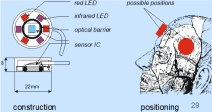

Signal am Photodetektor
- Multiplex bzw. sequentielle Abtastung
- Rauschen (Optoelektronik)
- Umgebungslicht, insbesondere Leuchtstoffröhren
- 

Signal am Demultiplexer
- DC ca 95-98%
- AC nach DC Subtraktion verstärkt
- 

Für die Signalverarbeitung bedeutet die Analyse des empfangenen Signals eine komplexe Herausforderung: Die Störungen, das Rauschen und das Umgebungslicht (vor allem im OP), sind enorm stark, so dass ihre Trennung vom Signal schwierig ist. Hinzu kommt, dass das Nutzsignal im unteren Prozentbereich des gesamten empfangenen Signals liegt, so dass hier das SNR um weitere zwei Dekaden schlechter wird.

An diesem Beispiel eines realen Pulsoximetriesignals kann man die realen Eigenschaften erkennen: 
- 
  - Der DC-Anteil, der im Grunde durch eine Tiefpassfilterung gewonnen wird, ist real ein stark schwankender gleitender Mittelwert (unterer Verlauf).
  - Der AC-Anteil (oberer Verlauf) zeigt ebenfalls starke Schwankungen. Um dem Mediziner einen einigermaßen stabilen Messwert zu bieten, sind mehrere Schritte der SV notwendig
- 
  - Pulsbreite 1ms, analoger Tiefpass 10kHz, Abtastrate 10 ksps
  - Zunächst müssen aus dem Multiplexsignal die aktuellen Signalpegel für das rote und infrarote Licht sowie für das Umgebungslicht gewonnen werden: Durch die 10fache Überabtastung stehen für Rot und Infrarot zunächst elf Messwerte zur Verfügung. Dieser Umfang an Messdaten ist für eine Pegelbestimmung mit dem Mittelwert zu gering, daher wird der Median verwendet. Nach der Medianbildung liegen die Signalpegel für weitere Berechnung vor.
- 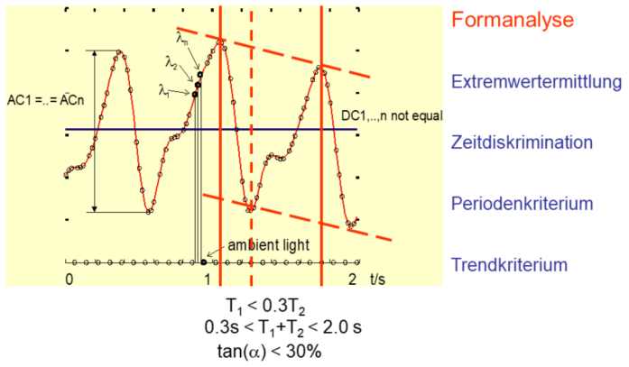
  - Die gewonnenen Signalpegel werden nun einer Signalanalyse unterzogen. Die Analyse bei einer Wellenlänge ist ausreichend, da die Signalform bei allen qualitativ identisch ist. Für die Bestimmung des AC-Pegels werden die Extrema detektiert. Aus der Physiologie ist bekannt, dass die Anstiegszeit der Pulswelle höchstens 30% der Gesamtzeit beträgt, so dass eine Prüfung im Zeitfenster folgt. Weiterhin ist der Bereich der Periode bekannt, diese Prüfung folgt im nächsten Schritt. Durch Artefakte, vor allem durch Bewegung, entstehen Schwankungen der Basislinie. Nach einem empirische ermittelten Kriterium wird ein Trend von bis zu 30% vor der Berechnung akzeptiert.

## Akustische Sensoren
Physiologischer Schall (Herztöne, Atmungsapparat) liegt im hörbaren Bereich, so dass hier Methoden eingesetzt werden, die aus der allgemeinen Akustik bekannt sind. 
Konventionelle Mikrophontechnik mit spezifischer Signalverarbeitung
- Verstärkung im tieffrequenten Bereich mit linearer Phase
- Richtcharakteristik umschaltbar bzw einstellbar, mechanisch bereits in den ältesten Stetoskopen
- spektrale Filterung für typische Geräusche, wie Herzklappen, Pfeifen in der Lunge, etc
- Merkmalserkennung in computerbasierter Auswertung, Mustererkennung typischer pathologisch bedingter Geräusche

Beim Ultraschall (CW,PW,Doppler) handelt es sich um mechanische Schwingungen bis in den zweistelligen Megahertzbereich ( ca. 30MHz). Hier müssen aufwendige Methoden der SV angewandt und entwickelt werden, die primär -d.h. bis zum Übergang in den physiologischen Bereich bzw. zur Bildgebung -eher in der Nachrichtentechnik und Stochastik ihren Ursprung haben: Signaldetektion, Korrelationsrechnung, Histogramme, Signalzerlegung. 
Signalanalytisch wichtige Eigenschaften:
- bei CW (Continous Wave) keine Tiefeninformation verfügbar, Information über Dopplerfrequenz mit hoher Variationsbreite, stochastischer Charakter mit viel Rauschen
- bei PW (pulsed Wave) Auflösung von der Signalverarbeitung entscheidend abhängig, da physikalische Grenzen lange erreicht
- in der Doppler-Technologie beides (CW und PW) vereint, daher Summe aller Vor- und Nachteile

## Sensoren für elektrische Größen
### Elektrochemische Grundlagen
- Dieser Sensortyp dient der Erfassung der elektrischen Aktivität des Menschen
- Der Mensch produziert elektrische Signale, daher ist keine Umwandung der Energieform notwendig
- Der Mensch ist elektrisch gesehen ein Volumentleiter der 2. Art - ein Elektrolyt oder ein Ionenleiter
- Das Messsystem ist mit metallischen Leitern aufgebaut - Leiter der 1. Art, Elektronenleiter
- daher ist die Schaffung einer Schnittstelle notwendig - die Elektrode
- 
  - $mM \Leftrightarrow mM^+ + me^-$
  - $K_k A_a\Leftrightarrow kK^+ + aA^-$
  - $\leftarrow$: Reduktion; $\rightarrow$: Oxidation
  - Dynamisches Gleichgewicht an den Phasengrenzen
  - An der Phasengrenze der beiden Leitertypen entwickelt sich -ähnlich wie in einem Halbleiter -eine Raumladungszone. Die freien Elektronen im Metall und die Kationen des Elektrolyts ziehen sich an und bilden an der Grenze eine Doppelschicht. Je nach der chemischen Zusammensetzung des Elektrolyts und des Metalls finden unterschiedlich starke chemische Reaktionen statt, die beim dynamischen Gleichgewicht die sog. Elektrodenspannung bilden. Funktionell handelt es sich hierbei also um ein ungewolltes Voltaisches Element.

### Elektroden der Diagnostik
- aus signalanalytischer Sicht Eingangsdaten
- aus messtechnischer Sicht Systemeingang

| Ziele                                 | Realisierbarkeit                                |
| ------------------------------------- | ----------------------------------------------- |
| geringe Elektrodenspannung            | durch Materialwahl (AgAgCl)                     |
| geringer Drift der Elektrodenspannung | physiologisch bedingt, daher kaum beeinflussbar |
| geringes Eigenrauschen                | Materialwahl und Technologie                    |

Aus signalanalytischer Sicht sind die Ziele ganz klar vorgegeben. In der Praxis muss jedoch immer ein Kompromiss zwischen diesen Zielen und den Anforderungen der Anwendung und Praktikabilität gefunden werden: Wie diese Beispiele zeigen, hängt die Konstruktion der Elektrode von ihrer Bestimmung ab und daraus ergeben sich auch die Signaleigenschaften. So z.B. muss eine subkutane EMG-Elektrode die Form eine Nadel haben und aus einem Edelmetall sein. Dies hat zur Folge, dass die EMG-Elektroden relativ schlechte Signaleigenschaften aufweist: Riesige Elektrodenimpedanz (bis einige MOhm), stark kapazitives Verhalten, sehr hohe Elektrodenspannung (bis in den Voltbereich). Im Vergleich dazu haben die EKG-Elektroden -vor allem auf Grund ihrer großen Fläche und des Materials (AgAgCl, NaCl) -sehr günstige Eigenschaften: Niedrige Elektrodenimpedanz (kOhm-Bereich), sehr tieffrequent (bis DC), niedrige Elektrodenspannung (um 100 mV).


### Elektroden der Therapie
- aus signalanalytischer Sicht Ausgangsdaten
- aus messtechnischer Sicht Systemausgang

| Ziele                       | Realisierbarkeit                    |
| --------------------------- | ----------------------------------- |
| geringe Impedanz            | durch Materialwahl (beschichtet Cu) |
| geringer Drift der Impedanz | physiologisch bedingt               |
| Langzeitstabilität          | Materialwahl und Technologie        |

Ebensowichtig wie die Eigenschaften der diagnostischen Elektroden, sind es auch die der therapeutischen Elektroden. Dies liegt darin begründet, dass die Therapie von den zuvor analysierten diagnostischen Daten abhängt -natürlich im signalanalytischen Sinne, denn medizinisch ist es immer so. Man muss sich also bei der gewählten Therapie darauf verlassen können, dass das, was man auf die Elektrode schickt, so auch am biologischen Objekt ankommt. Diese Forderung technologisch umzusetzen ist ungleich leichter als bei diagnostischen Elektroden, denn hier können relative große Flächen mit gutem Kontaktmaterial verwendet werden.


## Sensoren für magnetische Größen
### Messprinzipien
Um einen Eindruck über die Signalstärke (eher Signalschwäche) der biomagnetischen Signale zu bekommen, wird mit dem natürlichen Erdfeld verglichen, obwohl dieses für den Biomagnetismus eigentlich gar kein Problem darstellt. Störend sind die vom Menschen gemachten magnetischen Felder, vor allem die vom Stromversorgungsnetz, die jedoch weit über dem magnetischen Erdfeld liegen.
1. Das stärkste Biosignal, das MKG, liegt 6 Dekaden unter dem Erdfeld (120dB), und weitere 2...3 Dekaden unter den technischen Feldern.
2. MEG -7 Dekaden, oder 140dB,
3. evozierte Felder -8 Dekaden oder 160dB

- $10^0T$: MR-Tomographie-Magnete
- $10^{-5}T$: Erdfeld
- $10^{-6}T$: Zivilisationsfelder (Rauschen)
- $10^{-9}T$: magn. Kontamination der Lunge
- $10^{-10}T$: Magnetkardiogramm
- $10^{-12}T$: Magnetoenzephalogramm
- $10^{-13}T$: evozierte kortikale Aktivität
- $10^{-15}T$: SQUID System Rauschen

Biomagnetische Signale sind sehr schwach (SNR< -120dB). Mehrere Maßnahmen zur SNR-Anhebung notwendig
- Abschirmung des Messkreises gegen Störfelder (dickwandige Kammer aus $\mu$-Metallen)
- Ausnutzung der Feldeigenschaften - Gradiometer
- Spezialtechnologie der Signalverstärker - SQUID

### Gradiometer
Prinzip:
- Störfelder meist ferne Quellen, Biologische Strukuren nahe Quellen
- ferne Quellen produzieren annährend homogenes Feld
- nahe Quellen Produzieren inhomogenes Feld
- mit Gradiometer wird die erste bzw zweite räumliche Ableitung gebildet, dadurch wird homogenes Störfeld unterdrückt
- 
- 
- homogenes Fernfeld (Störung, blau): $u=u_2-u_1=0$
- inhomogenes Nahfeld (Biosignalquelle, rot): $u=u_2-u_1<>0$

### SQUID


Das supraleitende Quanteninterferenzgerät (SQUID) besteht aus zwei Supraleitern, die durch dünne Isolierschichten getrennt sind und zwei parallele Josephson-Kontakte bilden. Das Gerät kann als Magnetometer konfiguriert werden, um unglaublich kleine Magnetfelder zu erkennen - klein genug, um die Magnetfelder in lebenden Organismen zu messen. SQUID wurden zur Messung der Magnetfelder in Mäusehirnen verwendet, um zu testen, ob ihr Magnetismus ausreicht, um ihre Navigationsfähigkeit auf einen inneren Kompass zurückzuführen. [Quelle](http://hyperphysics.phy-astr.gsu.edu/hbase/Solids/Squid.html)

# Verstärkung und analoge Filterung
## Eigenschaften von Biosignalen und Störungen

### Entstehung der Biosignale, biologische Signalquellen
- Analysegegenstand: Sensorisches, motorisches und zentrales Nervensystem
- Grundbaustein: Nervenzelle, Neuron. Einzelne Neurone kaum untersuchbar, im Einzelfall mit Mikroelektroden, dennoch für die Gesamtheit wenig Bedeutung. Wichtiger sind Untersuchungen an Neuronenverbänden und -strängen, z.B. motorische Steuerung von Muskeln in den Extremitäten. Hier haben die Nerven überschaubare und anatomisch sowie elektrophysiologisch gut bekannte Struktur.
- am Neuronausgang - Axon: Aktionspotentiale
- am Neuroneingang - Synapsen: EPSP/IPSP (exzitatorische und inhibitorische postsynaptische Potentiale)

- Sensorisches System ist deutlich komplexer, vor allem das akustische und das visuelle. So hat die Retina allein mehrere Millionen Sensoren (Stäbchen und Zapfen), die mit Ganglienzellen verbunden sind und bereits vor Ort relativ einfache Informationsverarbeitung durchführen.
- Zahlenmäßig und daher in auch in seiner Komplexität ist das größte das zentrale Nervensystem (ZNS), das aus ca. 10 Milliarden Neuronen besteht, die funktionelle und anatomische Zentren bilden aber zeitlich stark variierende Eigenschaften aufweisen.
- Signalanalytisch ist das Grundelement das Aktionspotential (AP), das vom Neuron nach Erreichen der Reizschwelle an seinen Eingängen über das Axon nach außen bzw. an andere Neurone abgegeben wird. Die Synapsen empfangen die Aktionspotentiale von anderen Neuronen und bewerten diese je nach Zustand mit EPSP oder IPSP, die von sich aus starken Veränderungen unterliegen. Im EEG sind die AP deutlich unterrepräsentiert (nur etwa 10% des EEG), wesentlicher Anteil bilden die PSP. Dies ist unter anderem durch den Tiefpasscharakter des Schädels bedingt, das die hochfrequenten AP unterdrückt.


Ein medizinisch und auch signalanalytisch besonders interessantes Signal ist das EKG: Medizinische Indikation ergibt sich allein aus der besonderen Stellung des Herzens in der Physiologie als des Motors des Kreislaufs. Signalanalytisch ist es deswegen interessant, da es unter reproduzierbaren Messbedingungen (Extremitätenableitungen) formkonstanten Signalverlauf zeigt. Das EKG wurde entsprechend seiner elektromedizinischen Bedeutung extensiv untersucht, zahlreiche Erkrankungen und Schäden werden anhand typischer Formveränderungen des EKG diagnostiziert. Die Signalquelle des EKG ist das räumlich zwar recht komplizierte, aber anatomisch qualitativ konstante Reizleitungssystem des Herzens. Zur Ableitung des EKG werden standardmäßig 3-, 6-oder 12-kanalige Extremitäten-und Brustwandsysteme verwendet.


Projektion der Reizausbreitung auf einen längs zur Herzachse liegenden Vektor (vertikal): Zu beachten ist, dass durch die Differenzbildung an zwei Punkten an der Körperoberfläche damit mathematisch die erste räumliche Ableitung (oder auch der erste Gradient) gebildet wird. Das hat zur Folge, dass die Ableitung nicht nur in Phasen der Ruhe (vor der P-Welle), sondern auch bei maximaler Erregung ( PQ-und ST-Strecke) Null ist. Wellen und Zacken im EKG sind Ausdruck der räumlich-zeitlichen Veränderung im Reizleitungssystem.


Zur Ableitung des EEG werden wie beim EKG standardisierte Elektrodensysteme verwendet. Allerdings ist die anatomische Zuordnung hier ungleich schwieriger, denn die einzigen einigermaßen stabilen anatomischen Bezugspunkte sind das Nasion und das Inion. Es ist jedoch bekannt, dass die Lage des Gehirns in Bezug auf diese Punkte individuell stark unterschiedlich ist und im Zentimeterbereich liegt, so dass eine genaue Zuordnung der Elektroden zu Funktionszentren gar nicht möglich ist. Die Dichte der Elektroden in der Praxis liegt höchstens bei 10% NI, d.h. im Schnit bei etwa 3cm. Eine höhere Dichte bringt keine zusätzliche Information, da der Schädel als räumlicher Tiefpass funktioniert und keine höhere Auflösung erlaubt.

Aus Sicht der Signalanalyse ist es besonders wichtig zu wissen, unter welchen Messbedingungen das EEG abgeleitet wurde. Im Idealfall wird unipolar gegen verbundene Ohren oder Hals abgeleitet. Aus unipolaren Daten lassen sich die bipolaren Ableitungen einfach berechnen, umgekehrt geht das jedoch nicht. Auf jeden Fall ist zu klären, wie die Verschaltung des EEG-Verstärkers und der Elektroden realisiert wurde. Vermeintlich elegante Tricks, wie hardwaremäßige CAR sind auf jeden Fall zu meiden, ebenso Antialiasingfilter mit nichtlinearer Phase.


Das EEG wird in in fünf typische Bereiche unterteilt: delta (0..4Hz), theta (4-7Hz), alpha (8..13Hz), beta (13..30Hz), gamma (>30Hz). Diese Bereiche sind typisch für bestimmte physiologischen (Schlaf, Konzentration, Entspannung) und pathologischen Bilder. Für die Signalanalyse ist wichtig, dass die Bereiche nicht gleichzeitig vorhanden sind, einer ist immer dominant, was die Analyse leicht vereinfacht.


### Biologische und technische Störquellen
| periodische                       | transiente                |
| --------------------------------- | ------------------------- |
| öffentliches Stromversorgungsnetz | Spannungsspitzen im Netz  |
| Straßenbahn                       | Bewegungen im Messbereich |
| Monitore                          | Schaltvorgänge            |
| Kommunikationsnetze               | Lastschwankungen          |
| Rotierende Maschinen              |
| Sender inkl. Funktelefon          |

1.Das biomedizinische Messsystem ist von vielen Störquellen umgeben, die meisten sind dem Bereich der Medienversorgung, Industrie, Verkehr und Nachrichtentechnik zuzuschreiben. Für die BSA sind periodische (Versorgungsnetz, Monitore) und quasiperiodische (rotierende Maschinen, Straßenbahn) Störungen noch ein vergleichsweise geringes Problem, denn diese lassen sich gezielt mit spektralen Filtern in der analogen Messkette oder digital nach ADC unterdrücken.
2.Wesentlich schwieriger ist die Situation, wenn transiente Störungen vorliegen, denn diese haben im Allgemeinen einen unbekannten, einmaligen und daher nicht reproduzierbaren Verlauf. Solange die transiente Störung die Signalerfassung nicht beeinträchtigt (durch Übersteuerung des Messverstärkers) und deutlich von der Signalform abweicht (z.B. Ausgleichsvorgang mi EKG), kann sie mit relativ einfachen Mitteln beseitigt werden, dennoch im Allgemeinen ist dies kaum möglich.


Die häufigste -weil immer vorhanden- ist die Netzstörung. Selbst batteriebetriebene portable Messgeräte sind von dieser Störung betroffen. Da die Frequenz der Störung aber bekannt ist, kann sie -falls keine Übersteuerung vorliegt- mit einer Bandsperre reduziert werden. Allerdings sollte nicht die früher übliche ,,50 Hz -Filter'' Taste verwendet werden, denn diese Filter haben einen nichtlinearen Phasenfrequenzgang und können das Biosignal deutlich verfälschen. Bei der heutigen Technologie werden ausschließlich digitale Filter verwendet.

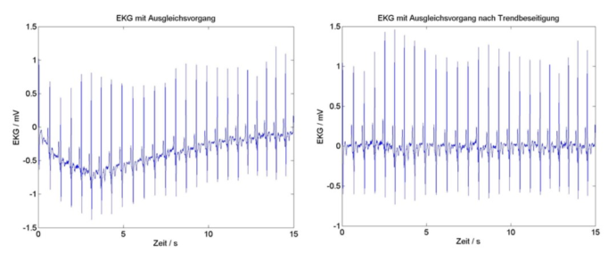
Eine sehr häufige transiente Störung im medizinischen Bereich ist die Bewegungsartefakte. Jegliche Bewegung im Messbereich erzeugt in der empfindlichen medizinischen Messtechnik Ausgleichsvorgänge. Wenn die Signalform gut bekannt ist, wie z.B. beim EKG, so lässt sich eine langsame Artefakte durch Hochpassfilterung beseitigen.
- Maximal $f_{0,01}=0,5 Hz$ Patienten-Monitor EKG (nicht oberhalb)
- Maximal $f_{0,02}=0,05Hz$ Diagnostischer Monitor bei EKG (nicht oberhalb)

Ob ein Biosignal gewollt ist oder eine Störung darstellt, ist von der Messaufgabe abhängig:
- soll das EKG gemessen werden, ist das EMG eine Störung
- soll das EEG gemessen werden, ist das EKG eine Störung
- soll das EOG gemessen werden, ist das EEG eine Störung

Prinzipielles Problem: Biologische Störquellen lassen sich nicht abschalten und kaum unterdrücken

Aus Sicht der BSA gestaltet sich das Problem der Störungen wesentlich schwieriger als bei technischen Störungen. Erstens, die Biosignalquellen befinden sich innerhalb des Körpers, daher können sie weder abgeschirmt noch abgeschaltet werden. Zweitens, das biologische Signalspektrum ist für alle Biosignale in etwa gleich, streckt sich von 0 bis etwa 1kHz aus und weist ein Maximum bei etwa 100Hz auf. Daher können biologische Störsignale mit spektralen Filtern allein nicht beseitigt werden.

Ein weiteres -messmethodisches -Problem besteh darin, dass man Biosignale nicht pauschal in Nutz-und Störsignale trennen kann. Es ist vielmehr die Messaufgabe, an Hand der man diese Klassifikation vornehmen muss.

#### Eigenschaften technischer Störungen
| periodische Störungen                                                                | transiente Störungen                                                |
| ------------------------------------------------------------------------------------ | ------------------------------------------------------------------- |
| NF-magnetische Felder nicht eliminierbar durch Schirmung, erzeugen Differenzspannung | kaum eliminierbar, da Signalform unbekannt und nicht reproduzierbar |
| NF-elektrische Felder gut beherrschbar, erzeugen Gleichtaktstörungen                 | bestenfalls Detektion möglich, Messdaten nicht korrigierbar         |
| HF-Felder immer mehr vorhanden (Kommunikationsnetze), Abschirmung unwirtschaftlich   |

1. Naturgemäß erzeugen niederfrequente magnetische Felder am Verstärkereingang Differenzspannungen, die direkt mit dem Biosignal überlagert werden, so dass sie mit der üblichen Verstäkertechnik nicht reduziert werden können. Hinzu kommt, dass auch eine Abschirmung nicht viel bringt, da in diesem Frequenzbereich mehrere 10- Zentimeter dicke Eisenplatten verwendet werden müssten, was in der Praxis nicht realisierbar ist. Da die niederfrequenten elektrischen (kapazitiv eingekoppelten) Störfelder Gleichtaktsignale sind, können sie zum Teil gut durch die Differenzverstärkertechnik reduziert werden. In immer höheren Maße stören hochfrequente Felder, vor allem aus dem Mobilfunk, Datennetzen, WLAN, Bluetooth, etc. Eine Abschirmung ist im normalen Praxisbetrieb unwirtschaftlich, so dass eine Reduktion der Störung allein durch Maßnahmen der EMV zu erreichen ist.
2. Wie schon erwähnt, transiente Störungen sind im Grunde nicht beherrschbar, da sie eigentlich nicht bekannt und nicht vorhersehbar sind. Mit Methoden der BSA ist zum Teil ihre Detektion möglich, wenn z.B. der Messbereich oder das Spektrum des Biosignals nachweislich verlassen wird. Diese Detektion kann allerdings nur dazu genutzt werden, die beeinträchtigten Daten zu verwerfen, eine Korrektur ist nicht möglich.


#### Eigenschaften biologischer Störungen
- Spektral alle Biosignale im selben Band (0...100Hz)
- Nichtlineare Verkopplung der Biosignale verhindern Trennung mit herkömmlichen Methoden
- Kein Biosignal deterministisch und reproduzierbar
- Transiente bzw apperiodische und instationäre Biosignale nicht qualifizierbar
- Eine Trennung kaum möglich, bestenfalls eine Reduktion (z.B. Abschwächung des EMG im EKG)

Das größte Problem bei der Reduktion von biologischen Störsignalen ist ihre funktionelle Verkopplung und physikalische Überlagerung im Volumenleiter Mensch. Die funktionelle Verkopplung (z.B. Einfluss der Atmung auf die Herzrate) ist nicht abschaltbar, ist nichtlinear und qualitativ unbekannt bzw. mit Methoden der BSA nicht beschreibbar. Außerdem sind die Verkopplungen in ihrer Komplexität weitgehend unerforscht und höchstens in Ansätzen dokumentiert.

Man kann im Einzelfall den Einfluss eines Biosignals auf ein anderes zum Teil reduzieren. So z.B. ist bekannt, dass das EMG ein breitbandiges und vor allem hochfrequentes Signals ist, während das EKG seine Hauptanteile eher im niederfrequenten Bereich besitzt. Daher kann man den Einfluss des EMG mit einem relativ einfachen Tiefpass reduzieren, allerdings auch auf Kosten der Beeinträchtigung des EKG.


## Medizinische Messverstärker
### Dynamik, Linearität
Messverstärker Anforderungen:
- Linearität im Arbeitsbereich
- Linearer Phasenfrequenzgang
- Geringes Eigenrauschen
- Hohe Gleichtaktunterdrückung
- Übersteuerungsfestigkeit

1. Mit Linearität im Arbeitsbereich ist die statische Linearität des Verstärkers gemeint, also die statische Beziehung zwischen der Ausgans-zu der Eingangsspannung $U_a/U_e$.
2. Mit linearem Phasengang ist die dynamische Linearität gemeint, also die Erhaltung der Signalform bei der Verstärkung. Beim nichtlinearen Phasengang wird die Veränderung der Signalform fälschlicherweise auch als ,,lineare Verzerrung'' bezeichnet, wohl in Anlehnung an die nichtlinearen Verzerrungen im Arbeitsbereich.
3. Das Eigenrauschen des Messverstärkers ist ein sehr wichtiger Parameter vor allem in der medizinischen Messtechnik, denn das Rauschen liegt im Bereich der zu messenden Signale im unteren Mikrovoltbereich. Ausgerechnet das 1/f-Halbleiterrauschen liegt dort, wo die Biosignale ihren wesentlichen Spektralanteil aufweisen.
4. Wie schon erwähnt, ein wesentlicher Teil der beherrschbaren technischen Störungen bilden die Gleichtaktsignale. Daher wird von den Messverstärkern eine hohe CMRR gefordert, die nicht unter 100dB liegen sollte.
5. Die Empfindlichkeit eines Verstärkers allein ist noch kein hinreichendes Kriterium. Ein medizinischer Verstärker muss übersteuerungsfest sein, damit er nicht schon beim ersten Defibrilationsimpuls oder bei der ersten OP mit HF-Gerät seine Dienste aufgibt. Und dies zu gewährleisten ist für die Elektroniker eine echte Herausforderung: Es gilt nämlich das Ziel, einen Verstärker aufzubauen, der im Mikrovoltbereich arbeitet, dennoch bei Spannungen von mehreren 100V (Defibrilation) oder HF-Leistungen (um 100W) nicht beschädigt wird und zeitnah seinen Arbeitsbereich wiederfindet.


Die Pegel der Biosignale sind gut bekannt, so dass den Arbeitsbereich des Verstärkers vorzugeben, kein Problem darstellt. So wird dieser Bereich für das EKG etwa zwischen - 5 und +5 mV liegen. Als Reserve bis zur Begrenzung sollte man mindestens 50% des Arbeitsbereiches vorsehen.

### Eigenrauschen


Das Halbleiterrauschen (1/f) erreicht bei etwa 10Hz den Pegel des weißen (Widerstands-) Rauschens. Da aber in diesem Bereich die meiste Energie der Biosignale liegt, ist es beim Schaltungsentwurf wichtiger, geeignete Halbleiter auszusuchen als sich auf die Minimierung des Widerstandsrauschens zu beschränken. Da die Auswahl an guten Halbleitern sehr begrenzt ist und dadurch den Entwicklern deutliche technologische Grenzen gesetzt sind, versuchen einige Konstrukteure und Hersteller die Eigenschaften ihrer Technik dadurch zu beschönigen, dass sie das Spektrum nach unten durch einen Hochpass begrenzen und erst dann die Rauschspannung messen und angeben. Daher muss man bei den Vergleichen verschiedener Techniken an dieser Stelle sehr vorsichtig vorgehen. Beispielsweise ist ein Verstärker, der angeblich nur 2uV Rauschspannung erzeugt aber erst bei 1Hz beginnt sicher nicht besser, als einer mit 3uV Rauschspannung dafür aber bereits ab 0.1Hz verstärkt.

### Frequenzgang
Linearer Phasenfrequenzgang: Keine Formverzerrung
- Gruppenlaufzeit: $d(f)=const.$
- Phasenfrequenzgang: $\phi(f)=\int d(f)df=\varphi_0*f$

Die wichtigste Eigenschaft der Biosignale, die von Medizinern diagnostisch genutzt wird, ist ihre Signalform. Daher lautet eine der grundlegenden Anforderungen an die Messtechnik und die BSA, dass die Signalform nicht verfälscht werden darf. Das bedeutet, dass sowohl im analogen als auch im digitalen Teil des Messsystems die Gruppenlaufzeit konstant sein muss. Daraus lässt sich die Forderung herleiten, dass der Phasengang linear sein muss, zumindest im Übertragungsbereich.

## Differenzverstärker
### Funktionsprinzip
Vollkommene Symmetrie (DV und Signalanbindung)
- 
- Vg ist Quelle der massebezogenen Störung. Die Störspannung gelangt auf beide Eingänge über Streukapazitäten, deren Impedanzen mit R4 und R5 simuliert werden, in gleicher Phase und im Idealfall auch mit gleichem Pegel. Die Störsignale an den Eingängen U10 und U20 sind also gleich, werden daher als Gleichtaktsignale bezeichnet.
- Vd ist die gewünschte massefreie Spannung (aus Sicht der Signalquelle zählen R4 und R5 nicht als Masseverbindung, die ,,hängt in der Luft'', floating source). Die Signalquelle Vd liegt direkt zwischen den Eingängen an, erzeugt daher eine Differenzspannung (siehe Funktionsprinzip eines Differenzverstärkers: Durch die Verkopplung der beiden Zweige T1 und T2 hat eine Zunahme der Eingangsspannung U10 Abnahme von Ud1 und Zunahme von Ud2, analog gilt das für U20. Daher liegt zwischen Ud1 und Ud2 die verstärkte Differenz von U10 und U20 an).
- Betrachtet man Ud1 und Ud2 massebezogen, so liegen überlagerte Gleichtakt- und Differenzspannungen an (unterer Grafik). Betrachtet man die verstärkte Spannung massefrei (also als Differenz zwischen Ud1 und Ud2), so verschwindet durch die Differenzbildung die Gleichtaktstörung und die gewünschte Differenzspannung bleibt übrig.
- Alle bisherigen Erläuterungen gelten nur im Idealfall: Sowohl der Verstärker ist ideal symmetrisch (identische Transistoren und Widerstände), als auch die Einkopplung der Gleichtaktstörung erfolgt ideal symmetrisch (über R4 und R5).

Symmetrie im DV, asymmetrische (realistische) Signalanbindung
- 
- In der Realität lassen sich zwar Verstärker bauen, die an das Ideal gut herankommen.
- Die Einkopplung der Gleichtaktstörung ist jedoch immer unsymmetrisch, es ist unmöglich, im Messkreis Symmetrie herzustellen (R4 und R5 unterschiedlich). Daher wird aus der ihrem Wesen nach Gleichtaktstörung zum Teil eine Differenzstörung. Und die Differenzstörung erscheint in der Ausgangsspannung Ud1-Ud2 zwangsläufig auch.
- Das heißt, in der Realität wird der Gleichtaktanteil der Störung zwar unterdrückt, aber der zur Differenz gewordene Anteil bleibt am Ausgang bestehen.


### Differenz- und Gleichtaktverhalten
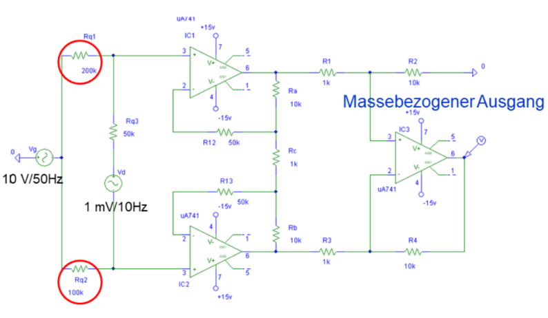
- $SNR_{in} = \frac{U_{d\_in}}{U_{g\_in}}=\frac{1mV}{10V}=10^{-4}\approx -80dB$
- $V_g$: Gleichtaktstörung (Netz)
- $V_d$: Nutzsignal (EKG) 
- Heute werden Differenzverstärker meistens als integrierte analoge Schaltungen mit OPVs eingesetzt. Da der Ausgang massefrei ist, folgt eine zweite Stufe zur Differenzbildung (IC3), die am Ausgang eine -wie üblich -massebezogene Spannung liefert. Diese Anordnung wird als Instrumentationsverstärker bezeichnet (instrumenation amplifier) und ist auch integriert verfügbar.
- Am Eingang liegt eine realistische Situation vor: Das gewünschte Signal hat den Pegel von 1mV (EKG), die Netzstörung erreicht (auch mehr als) 10V. Daher ist der SNR am Eingang sehr niedrig, -80dB.
- 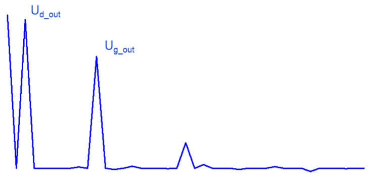
- $CMRR=\frac{U_{d\_out}}{U_{g\_out}}*\frac{U_{g\_in}}{U_{d\_in}}=\frac{200mV}{20mV} *\frac{10V}{1mV}=10^5\approx 100dB$
- Führt man mit dem Ausgangssignal des Verstärkers Spektralanalyse durch, so stellt man fest, dass die Netzstörung am Ausgang 20mV beträgt, während das gewünschte Signal 200mV erreicht, also der SNR am Ausgang ist 10 bzw. 20dB. Da der SNR am Eingang - 80dB betrug, wurde eine SNR-Verbesserung von 100dB erreicht. Diese Verbesserung ist auf die Gleichtaktunterdrückung selbst bei Asymmetrie am Eingang zurückzuführen, so dass in diesem Fall das CMRR identisch der SNR-Verbesserung ist. (Common-Mode Rejection Ratio, Gleichtaktunterdrückung, muss in der Medizintechnik laut Katalog mindestens 100dB, besser 120dB erreichen).

## Instrumentationsverstärker
Der Instrumentationsverstärker (IV) ist ein mehrstufiger Verstärker, von dem in der medizinischen Messtechnik ein hoher Eingangswiderstand (besser als 100MOhm) und eine hohe CMRR (besser 100dB) gefordert wird.

### Mehrstufiger Verstärker
- 
- Die erste Stufe ist der Eingangs-Differenzverstärker mit massefreiem Ausgang; die Ausgangsspannung ergibt sich aus der Differenz der Ausgangsspannungen von IC1 und IC2. Die zweite Stufe verstärkt zusätzlich und bezieht die verstärkte Spannung auf Masse, so dass am Ausgang massebezogene, verstärkte Eingangsdifferenz vorliegt.
- V1: $u_{ad}=A*u_{ed}+B*u_{eg}$, $u_{ag}=C*u_{eg}+D+u_{ed}$, 
  - $A/B=F$: Diskriminationsfaktor
  - $A/C=H$: Rejektionsfaktor 
- V2:
  - $u_a=V_d u_{ed}+\frac{V_d}{CMR}u_{eg}=V_d(A u_{ed}+\frac{A}{F} u_{eg})+\frac{V_d}{CMR}\frac{A}{H} u_{eg}$
  - $u_a|_{u_{ed}=0} = V_d A(\frac{1}{F}+\frac{1}{CMR*H}) u_{eg}$
  - die gesamt-Gleichtaktunterdrückung eines mehrstufigen Verstärkers ist abhängig im Wesentlichen von der ersten (Eingangs-) Stufe
- Berechnet man die Ausgangsspannung in Abhängigkeit von der Eingangs-Gleichtaktspannung und von den Verstärkerparametern, so zeigt sich, dass für den CMRR die erste Stufe (wie auch bei anderen Parametern, z.B. Eigenrauschen) entscheidend ist, die folgenden Stufen sind unwesentlich beteiligt. Daher wird in der ersten Stufe der höchste Entwicklungsaufwand getrieben.

### Hoher Eingangswiderstand
- 
- $R^{(1)}_{ed}=2R_D+R_C\approx 2R_D$
- $R^{(2)}_{ed}=R_1+R_3<<R_D$
- Theoretisch würde zur Ableitung von Biosignalen die zweite Stufe allein reichen, denn sie selbst verstärkt die Differenzspannung an ihrem Eingang (R1 und R3). Allerdings ist der Eingangswiderstand der zweiten Stufe für Biosignale viel zu niedrig. Eine zusätzliche Stufe mit hohem Eingangswiderstand ist daher notwendig, die außerdem noch wesentlich zur Verstärkung beiträgt.

### Hohe Gleichtaktunterdrückung
- 
- rot: OPs integriert
- blau: Widerstände getrimmt
- Gute Eigenschaften sind nur mit integrierter Technologie und getrimmten Widerständen erreichbar. Daher werden bis auf einige speziellen Ausnahmen ausschließlich integrierte IV eingesetzt.

## Isolationsverstärker
Aus Sicherheitsgründen bzw. wegen zu hoher Spannungen ist es in der Medizin, aber auch z.B. in der Leistungselektronik, oft notwendig, den Messkreis von der Umgebung galvanisch zu trennen, ihn also bezugsfrei schweben zu lassen (floating circuit).

### Funktionsprinzip
- 
- Das Prinzip ist einfach: Alle Signalverbindungen und die Stromversorgung werden getrennt und entweder optisch oder transformatorisch über eine Isolationsbarriere realisiert. Da Biosignale sehr tieffrequent sind, müssen sie für die Übertragung moduliert bzw. demoduliert werden. Der Hardwareaufwand steigt enorm. Dennoch stehen heute bereits integrierte Isolationsverstärker zur Verfügung.

### Galvanische Trennung und ihre Auswirkung
- 
- Durch die galvanische Trennung wird die Patientensicherheit enorm verbessert. Allerdings werden aus Sicht der Biosignalanalyse keine Verbesserungen erreicht, die Signaleingenschaften werden u.U. sogar noch schlechter. Der Grund sind die immer vorhandenen Streukapazitäten, die natürlich auch nach der galvanischen Trennung immer noch vorhanden sind und so Störungen in den Messkreis einkoppeln. Der notwendige Modem erzeugt weitere Störungen und Verzerrungen des gewünschten Signals.

### Datenübertragung, Modulation und Demodulation
- 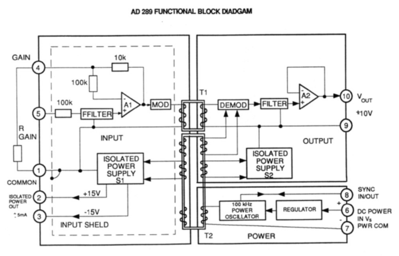
- Realisierungsbeispiel von Analog Devices.

## Guardingtechnik
### Funktionsprinzip
- 
- Eine wirkungsvolle Massnahme zur Störungsreduktion ist die Abschirmung der Messkabel, die in der Medizin bis zu zwei Metern Länge haben können (EKG) und damit gute aber unterwünschte Antennen realisieren. Der Schirm und das Messkabel bilden eine relativ große Kapazität von bis zu 100pF. Die Impedanz dieser Kapazität liegt parallel zum Eingangswiderstand des Verstärkers (untere Grafik) und reduziert diesen erheblich, wie man an den Verläufen des Messtromes erkennen kann: Während ohne Schirmung der Messstrom 100nA beträgt, steigt er auf 300nA bei Schirmung an, der Eingangswiderstand wurde also auf ein Drittel seines ursprünglichen Wertes reduziert und das ist inakzeptabel.
- 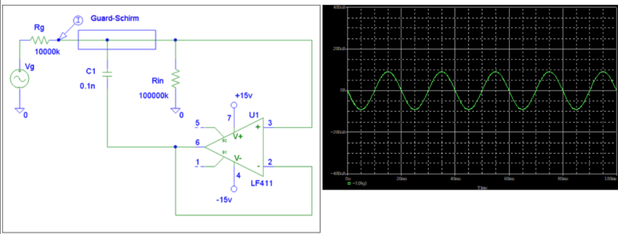
- Prinzip: Die Eingangsspannung wird über den Impedanzwandler an den Schirm gelegt. Die Schirmkapazität ist zwar immer noch vorhanden, über ihr liegt aber keine Spannungsdifferenz mehr an, also fließt auch kein Strom. Damit erscheint die Impedanz der Schirmkapazität vom Eingang her theoretisch unendlich groß, praktisch nah dran. Früher als Bootstrap-Prinzip bekannt.
- Die Impedanz der Kapazität wurde dynamisch idealerweise beseitigt, ist also theoretisch von den Eingangsklemmen nicht sichtbar. Die Kapazität ist aber nach wie vor physisch vorhanden! Diese Tatsache ist für bestimmte Fragestellungen sehr wichtig, z.B. Analyse bei implusartigen Störungen, bei den der Verstärker es natürlich dynamisch nicht schafft, den Impuls in Echtzeit auf den Schirm zu führen.

### Realisierung
- 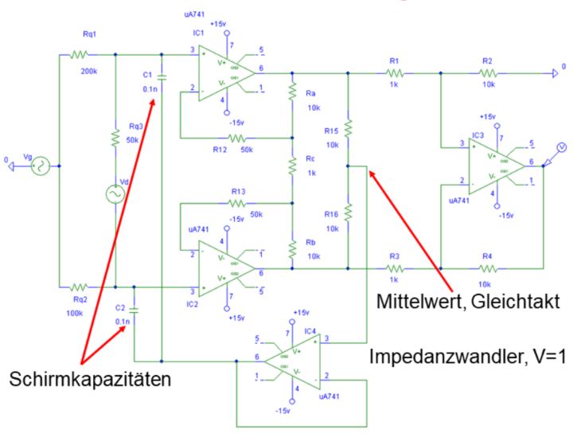
- Schaltungstechnisch lässt sich Guarding mit einem zusätzlichen OPV (IC4) im IV realisieren. In diesem Fall wird nicht jeder Kanal einzeln, sondern alle mit dem Gleichtaktsignal belegt. Das spart Hardware und ist ausreichend, denn kritisch ist der Gleichtakt-Eingangswiderstand, während der Differenz-Eingangswiderstand nicht von Bedeutung ist.

## Aktive Elektroden
### Funktionsprinzip
- 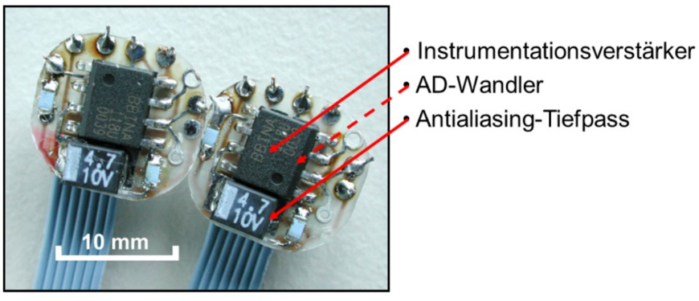
- Lösungsansatz: Verstärkung und Digitalisierung direkt auf Elektrode. Datenübertragung robust gegen Störungen, da binär
- Problem: Zuführung des Bezugspotentials notwendig

### Störungsresistenz
- Aktive Elektroden technologisch aufwendig, haben aber Vorteile bei Störungen, die direkt auf die Messanordnung wirken
  - Elektrode: Drift der Polarisationsspannung kompensierbar
  - Kabel: unempfindlich gegen kapazitiv, induktiv und HF-eingekoppelte Störungen
  - Verstärkereingang: durch kürzste Wege zum Sensor keine direkte Beeinträchtigung der Eingangskreise
  - Unsymmetrie: lässt sich in Rückkopplung computergesteuert reduzieren bzw. eliminieren
- die Übertragung ist digital, daher störungsresistent und distanzunabhängig

### Gleichtaktunterdrückung
Die unter 2.4.1 hergeleitete Gleichtaktunterdrückung gilt nicht pauschal, bei aktiven Elektroden ist Differenzierung notwendig
- Aktive Elektroden meistens mit Verstärkung $V=1$
- daher CMR rechnerisch gleich 1, theoretisch zu niedrig
- prinzipbedingt starke Unterdrückung der Stör-Gleichtaktsignale
- daher praktisch sehr gute CMRR von 100dB und mehr

## Analoge Filter
Das Unterscheidungskriterium ist, ob ein aktives Bauelement im Filter eingesetzt wird, d.h. ob es die Filtercharakteristik direkt beeinflusst. Dies ist der Fall bei allen rückgekoppelten Filtern mit Transistoren oder Operationsverstärkern. Dagegen ist ein Filter (z.B. RC-Tiefpass 1. Ordnung), dem ein OV als Impedanzwandler folgt, kein aktives Filter.

### Passive Filter
#### Grundlagen der Filtertheorie
- 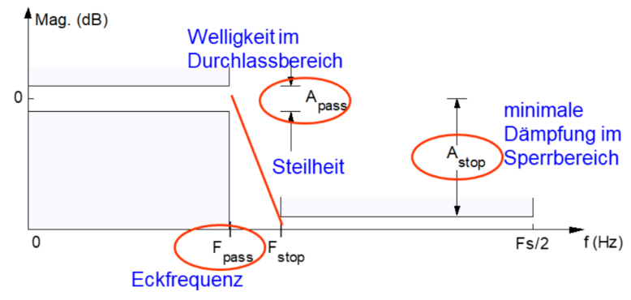
- Bei spektralen Filtern werden folgende Parameter verwendet, um die Filtercharakteristik zu beschreiben:
  - Die Eckfrequenz, oder Grenzfrequenz: Frequenz $F_{pass}$, bei der der Durchlassbereich in die Filterflanke übergeht und bei der die Übertragung um 3dB bzw. auf 70% der Übertragung vom Durchlassbereiche abgesunken ist.
  - Die Sperrfrequenz $F_{stop}$, bei der die geforderte Dämpfung im Sperrbereich erreicht wird. Übergangsband Fstop-Fpass, auch transition band, ist der Übergangsbereich vom Durchlass-in das Sperrband, auch Filterflanke genannt.
  - Steilheit ist Maß für die Filterflanke in dB/Hz. Grundsätzlich gilt, je steiler, umso besser. Hängt hauptsächlich von der Filterordnung ab.
  - Welligkeit im Durchlassbereich Apass gibt an, im welchen Bereich die Übertragung im Durchlassbereich schwankt. Üblich ist weniger als 1dB, um 3dB ist für niedrige Ansprüche ausreichend.
  - Minimale Dämpfung Astop gibt die garantierte Dämpfung an. Hängt hauptsächlich von der Filterordnung ab.
  - Fs/2 ist die halbe Abtastrate oder die Nyquistfrequenz.
- 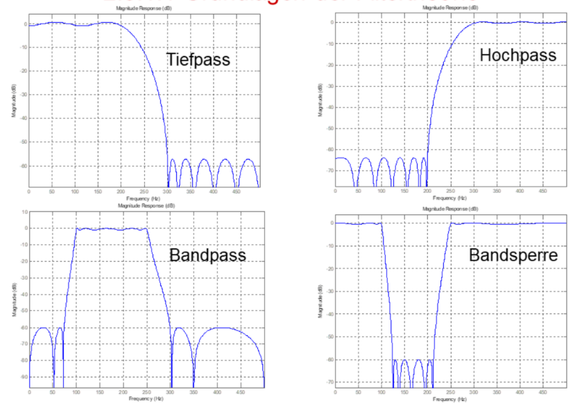
- Die Filtertheorie unterscheidet vier Grundtypen, siehe oben. Die Filtertheorie bietet ein Instrumentarium zum Entwurf von Filtern, vor allem aber für den nachrichtentechnischen Bereich, d.h. L-C-Kombinationen, also schwingfähige Systeme. Im Spektralbereich der Biosignale werden fast ausschließlich RC-Filter verwendet. Die Vorgehensweise beim klassischen Filterentwurf ist über die Schaltungsanalyse, also faktisch in einem Iterationsverfahren: Grundbausteine der spektralen Filter sind bekannt und mit diesen versucht man die gewünschte Charakteristik iterativ durch hinzufügen von Elementen und anschließender Analyse zu erreichen. Im analogen Bereich ist es kaum möglich, eine Filtercharakteristik vorzugeben und nach irgendeiner Methode die Schaltung als Ergebnis zu erhalten, der Entwurf ist daher sehr intuitiv und routineorientiert. Die Schaltungssynthese reduziert sich dann lediglich auf die Entnormung der Modelle auf konkrete Bauelemente.
  - Übertragungsfunktion $G(j\omega)=\frac{U_2(j\omega)}{U_1(j\omega)}=|G(j\omega)|*e^{j\omega\phi}$
  - Amplitudenfrequenzgang $|G(j\omega)|=\sqrt{Re\{G(j\omega)\}^2 +Im\{G(j\omega)\}^2}$
  - Phasenfrequenzgang $\phi(\omega)=arctan\frac{IM\{G(j\omega)\}}{Re\{G(j\omega)\}}$
  - Grenzfrequenz $\omega_g=\frac{1}{RC}$
- Üblicherweise werden die Filter über ihre Übertragungsfunktion beschrieben, wobei auch äquivalente Beschreibungen möglich sind -Impulsantwort im digitalen Bereich, Pole-Nullstellen-Diagramme, seltener Zustandsgleichungen.
- Aus Sicht der BSA sind entscheidend die Beschreibungen über den Amplituden- und Phasenfrequenzgang.

#### Filterentwurf
- passive Bauelemente
  - R,C,L
  - mechanische Resonatoren
  - Quarzfilter
  - akustische Oberflächenwellenfilter
- im spektralen Bereich der Biosignale (0...1kHz) nur R und C
- Als Bauelemente zum Filterbau kommen neben R,C und L weitere Alternativen in Frage, die vor allem auf der mechanischen bzw. geometrischen Stabilität der schwingenden Anordnung aufbauen: piezokeramische und Quarzfilter oder akustische OWF.
- Im Spektralbereich der Biosignale kommen jedoch nur R-C-Kombinationen in Frage.
- Beispiele: oben ein zweikreisiger Parallelschwingkreis, der zur Schmalbandfilterung in der Nachrichtentechnik eingesetzt wird. Unten ein Phasenschiebernetzwerk, z.B. in einem RC-Generator.
  - 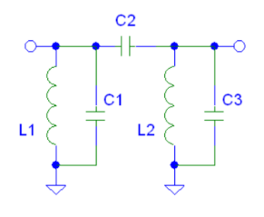
  - 

### Aktive Filter
- 
- 
- $R_{0a}=(\epsilon-1)R_0$, $u_a=\epsilon*u_e$ $\Rightarrow$ Filtertyp mit $R_0$ einstellbar
    |            | Bessel  | Butterworth | Tschebyscheff (1,5dB) |
    | ---------- | ------- | ----------- | --------------------- |
    | $\epsilon$ | $1,267$ | $1,586$     | $2,482$               |
    | $\gamma$   | $0,618$ | $1,0$       | $1,663$               |
- Durch die Verwendung von OVs, die eine definierte Gegenkopplung ermöglichen, ist es mit relativ einfachen Mitteln möglich, effektive Filter zu konstruieren, die mit passiven Bauelementen allein um Größenordnungen komplizierter wären. Die beliebteste Entwurfstechnik ist die mit Hilfe von kaskadierten Stufen 2. Ordnung, auch im digitalen Bereich. Filter 2.Ordnung sind übersichtlich strukturiert, die Bauelemente müssen nicht mühsam ausgesucht und ausgemessen werden, die Eigenschaften sind sehr gut bekannt und bequem einstellbar, so dass eine kompliziertere Filterstruktur - z.B. Antialiasing-Tiefpass 8. Ordnung - durch einfache Kaskadierung (Serienschaltung) realisierbar ist. Natürlich muss man bei der Kaskadierung beachten, dass jede Stufe bei ihrer Grenzfrequenz 3dB-Abfall verursacht, so dass man die Kette entsprechend dimensionieren muss.
- Sehr vorteilhaft ist in dieser Schaltung, dass der Filtertyp bequem durch die Veränderung (Durchstimmung) eines einzigen Widerstandes über alle drei Basischarakteristiken eingestellt werden kann, sonst ist keine Veränderung der Schaltung notwendig.
- die Basistypen sind folgende:
  - Bessel, mit relativ flacher Flanke,
  - Butterworth, mit wenig Welligkeit im Durchlassbereich, steilere Flanke als Bessel,
  - Tschebysheff, mit steilster Flanke und Welligkeit im Durchlassbereich.
  - 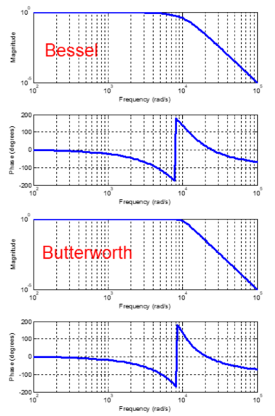
  - 
  - Bessel: niedrigste Flankensteilheit, konstante Gruppenlaufzeit
- Von allen drei hat nur Bessel konstante Gruppenlaufzeit, die in der BSA zwingend notwendig ist bei Echtzeitanwendungen. Folgen nichtkonstanter Gruppenlaufzeit sind u.a. Formverzerrungen, wie später gezeigt wird.
- 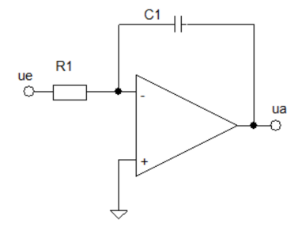
  - $\tau=RC$
- 
  - $\tau=\frac{1}{f_S}*\frac{C_3}{C_2}$
- Konventionell werden aktive Filter -am häufigsten der Antialiasing-Tiefpass vor dem AD-Wandler -mit Hilfe von OVs und RC-Netzwerken realisiert.
- Eine sehr elegante Alternative bieten die Filter mit geschalteten Kapazitäten: An Stelle des Widerstandes am Eingang befindet sich eine Kapazität, die im Takt von fs zwischen Eingang und dem OV umgeschaltet wird. Der mittlere Strom, der mit C3 integriert wird, hängt also von der Schaltfrequenz und dem Kapazität C2 ab. Daher ergibt sich die Zeitkonstante aus den beiden Kapazitäten, die auf dem Chip integriert sind und aus der Abtastfrequenz. Man kann also die Zeitkonstante allein durch Veränderung der Schaltfrequenz einstellen, ohne ein Bauelement der Schaltung ändern zu müssen.
- 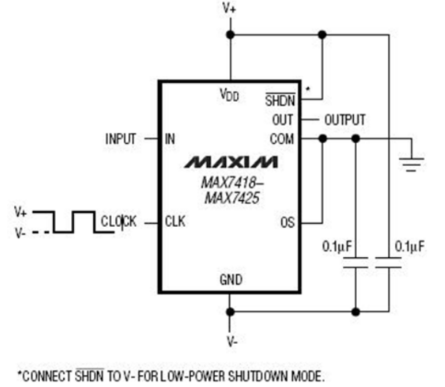
  - Antianliasing-Tiefpass mit integriertem Filter 5. Ordnung
  - kein RC-Netzwerk
  - Grenzfrequenz abhängig nur vom Takt, daher durchstimmbar
  - Eine Lösung für SC-Filter bietet u.a. Maxim, siehe oben. Die Kapazitäten sind allein zum Abblocken der Spannungsversorgung notwendig, für die Filterung selbst sind sie nicht notwendig.
  - Der Takt muss den vorgeschriebenen Pegeln entsprechen, sonst ist es gleichgültig, aus welcher Quelle er geliefert wird.

## Linearer Phasenfrequenzgang
- 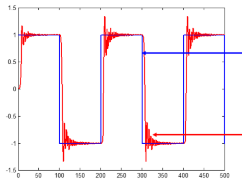
  - blau: das Eingangssignal
  - rot: Ausgangssignal
  - das Eingangssignal erscheint am Ausgang eines Tschebysheff-Filters wegen nichtkonstanter Gruppenlaufzeit verzerrt

In vielen Bereichen der Technik (Nachrichtentechnik, Messdatenerfassung in Technik und Natur, Medizin) ist die Signalform der wichtigste Signalparameter. Daher ist es zwingend notwendig dafür zu sorgen, dass sie vom Messsystem nicht verzerrt wird. Notwendige, aber nicht hinreichende Bedingung für die Erhaltung der Signalform ist konstante Gruppenlaufzeit. Konstante Gruppenlaufzeit heißt, dass alle spektralen Anteile des Signals im System um gleiche Zeit verzögert werden. Ist diese Zeit nicht gleich, so erscheinen z.B. höherfrequente Anteil am Ausgang später als niederfrequente. Das obige Beispiel zeigt diesen Sachverhalt: Die Flanke eines Rechtecks ist ein zeitlich sehr schneller Vorgang, spektral demzufolge breitbandig von tiefen bis zu sehr hohen Frequenzen. Die hohen Frequenzen werden aber mehr verzögert als tiefe, was dazu führt, dass der Flanke am Ausgang hochfrequentes Nachschwingen folgt. Es wird demnach eine Signalform am Ausgang vorgetäuscht, die es am Eingang gar nicht gab.

Die Form der Biosignale ist diagnostisch relevant, Formverzerrungen können zur falschen Diagnose führen
- 
- Der selbe Effekt tritt bspw. bei der EKG-Filterung mit einem Butterworth-Filter auf: Dieser Filtertyp besitzt einen nichtlinearen Phasenfrequenzgang, also nichtkonstante Gruppenlaufzeiten. Diese führen dazu, dass die hochfrequenten Anteile des QRS- Komplexes deutlich verspätet erscheinen, was in der Signalform schnelles Nachschwingen zur Folge hat. Dieser Effekt kann unter Umständen zur falschen Diagnose mit entsprechenden Folgen führen.
- 
- Das Original-EKG (schwarz) wurde mit einem IIR-Filter -das grundsätzlich einen nichtlinearen Phasengang hat -gefiltert und über das Original geschrieben (rot). Die relativ kurze Verzögerung der R-Zacke ist zunächst positiv und gewollt, damit das EKG in Echtzeit verarbeitet werden kann. Die Nachschwingungen nach der S-Zacke sind jedoch, wie beschrieben, sehr ungünstig.
- Das Spektrogramm des Original-EKG zeigt die ganz typische Energieverteilung in der t-f-Ebene: Die P-und T-Welle liegen im tieffrequenten Bereich bis ca. 10Hz. Die R-Zacke ist deutlich kürzer und hat Impulscharakter, so dass sie spektral wesentlich breiter ist und höhere Frequenzen beinhaltet, hier bis 50Hz, ohne Filterung bis 100Hz.
- Das Spektrogramm des gefilterten Signals (oben rechts) zeigt den typischen Effekt nichtkonstanter Laufzeit: Die Frequenzen(-gruppen), die höher als ca. 20Hz liegen, werden deutlich verzögert und erzeugen das schnelle Nachschwingen.

# Signalkonditionierung, Abtastung und Digitalisierung
## Pegelanpassung
Pegelanpassung notwendig für
- massebezogene Eingänge von ADC (+/- 1V...+/-10V)
- standardisierte Schnittstellen (0...1V, z.B. Schreiber)
- verkabelte Übertragung zur Zentrale (Elektrodenbrause bei EEG)

Realisierung mit 
- Pegelschieber
- programmierbare Verstärker (integierte analoge Elektronik)
- automatische Verstärkungsregelung (Rückkopplung)

massefreie und massebezogene Signale
- 
- biologisches Objekt - Volumenleiter, immer kann nur Potentialdifferenz abgeleitet werden, d.h. massefrei (symmetrisch)
- bei der Verstärkung, spätestens bei der AD-Wandlung, Massebezug notwendig
- Wegen Störungen massefreie (symmetrische) analoge Strecke möglichst durchgängig bis zum ADC (verdrillte Leitungen, Differenzverstärker)
  
## Abstastung, Aliasing
Antastung im technischen Sinne ist die Erfassung des momentanen Wertes eines Signals zu definierten Zeitpunkten.
Üblicherweise ist das Signal zeitkontinuierlich, nach der Abtastung liegt eine zeitdiskrete Variante des Signals vor
- kontinuierliches Signal 
- zeitdiskretes Signal 

Abtastung ist mathematisch eine Multiplikation des Signals mit einer Folge von Dirac-Pulsen: $y(t)=x(t)*\sum_{n=-\infty}^{\infty}\sigma(t-nT_A)$ ($T_A$ ist die Abtastperiode)

Eine Multiplikation von zwei Signalen im Zeitbereich entspricht der Faltung ihrer Spektren im Frequenzbereich (und umgekehrt): $Y(\omega)=X(\omega)*\sum_{n=-\infty}^{\infty} \sigma(\omega-n\frac{1}{T_A})$


- Das EKG ist natürlich digitalisiert, um es hier darstellen zu können. Die Abbildung entspricht jedoch einer Aufzeichnung unter realen Bedingungen.
- stark instationäres Signal mit scharfer R-Zacke. Daraus ergibt sich ein periodisches Spektrum, da die R-Zacke einen nahezu impulsartigen Verlauf hat. Beachten Sie die Beziehung zwischen impulsartigen Vorgängen in der Zeit und ihrem Spektrum.


- Um Überlappung (Aliasing) der Spektren und Mehrdeutigkeiten zu vermeiden, muss gelten: $\frac{1}{T_A}\geq 2*f_{max}$
- Nyquist-Frequenz entspricht der halben Grundfrequenz der Abtastrate, sie begrenzt nach oben das bei Null beginnende sog. Basisband. Das Basisband ist der Frequenzbereich, in dem man bei der Signalanalyse arbeitet. Damit das gespiegelte Spektrum nicht bis ins Basisband reicht und dadurch das Vorhandensein real nichtexistenter Signalkomponenten vortäuscht, muss gewährleistet werden, dass die halbe AR höher liegt, als die höchste Frequenz des Signals, d.h. die AR muss mindestens doppelt so hoch sein, die die höchste vorhandene Frequenz.
- Die periodische Wiederholung des Spektrums nach der Abtastung hat folgende praktische Bedeutung: Da sich das Spektrum mit jeder Harmonischen der AR wiederholt und gespiegelt wird, kann man ein bandbegrenztes Signal ins Basisband holen. So wäre bspw. denkbar, das zwischen 500 und 625 Hz liegendes EKG abzutasten und im Basisband zu verarbeiten. Dazu später ein Beispiel mit AM-modulierten EKG

Ein aus Film und Fernsehen bekanntes Beispiel zur Verletzung des Abtasttheorems:
- 
- Annahme: Ein Rad mit 8 Speichen dreht sich so, dass der Wagen sich mit 28.3 km/h bewegt, die Drehfrequenz des Rades beträgt demnach 2.5Hz. $v=28,3\frac{km}{s}=7,85\frac{m}{s}$, $f=\frac{v}{U}=\frac{7,85m/s}{3,14m}=2,5Hz$
- Die Periode, mit der die Speichen einen Referenzpunkt passieren (oben) beträgt 50ms bei einer Wiederholrate von 20/s $f_s=8*f=20Hz\Rightarrow T_s=50ms$
- Entsprechend der Fernsehnorm werden 25 Bilder pro Sekunde aufgenommen, die Periode ist also 40ms. $f_A=25fps\Rightarrow=40ms$
- Entsprechend der Faltung beim Abtasten entstehen zwei Frequenzen -5 und 20, wobei nur die -5Hz im Basisband liegen. Das bedeutet praktisch, dass man das Rad langsam nach hinten drehen sieht. $f_{SA}=f_A\pm f_S=-5/20 Hz$
- reale Effekte: Räder (Auto), Stroboskopeffekt in Industriehallen mit Leuchtstoffröhren an rotierenden Maschinen

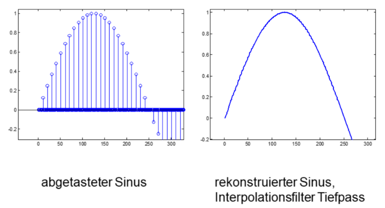
Oft wird nach der Abtastung und anschließenden Signalverarbeitung das Ergebnis im ursprünglichen Bereich des Signals benötigt. Dazu ist die sog. Rekonstruktion notwendig, also eine Übertragung aus dem Analyse-in den Originalbereich. Zur Rekonstruktion ist allgemein eine Interpolation zwischen den diskreten Punkten notwendig, oder aus Sicht der Filtertheorie die Anwendung eines Interpolationsfilters. Das einfachste Interpolationsfilter ist ein Tiefpass in Nähe der höchsten Signalfrequenz. Wurde bei der Abtastung das Abtasttheorem verletzt, so treten im rekonstruierten Signal Komponenten auf, die im Originalsignal nicht vorhanden waren, siehe oben.

Dieser Effekt kann auch im Fernsehen beobachtet werden: Tragen die Sprecher z.B. ein Hemd mit einem sehr feinen Strichmuster, so reicht die Bildschirmauflösung -d.h. die räumliche Abtastrate -nicht aus, um das Muster richtig zu erfassen und am Fernsehmonitor entsteht sog. Moiree, d.h. großflächige Farbmuster, die es in der Realität nicht gibt.


- $y(t)=x(t)*\sum^{\infty}_{n=-\infty} \sigma(t-nT_A) \Leftrightarrow Y(\omega)=X(\omega)*\sum^{\infty}_{n=-\infty}\sigma(\omega-n\frac{1}{T_A})$
- Übergang aus dem kontinuierlichen Zeitbereich in eine Folge, d.h. Entkopplung von der Abtastperiode
- $y(n)=y(nT_A) \Leftrightarrow Y(k)=Y(k\omega_A/M)=\sum_{n=1}^M y(nT_A)^{-jkn/M}$
- $Y(K)\Leftrightarrow FFT(y(n))\Rightarrow$ normierte Frequenz $\omega\in(0,2\pi)\vee f\in(0,1)$
- Nyquist Frequenz $\omega_N=\pi$, $f_N=0,5$
- Nach der Abtastung und Digitalisierung hat das Signal die Form einer Zahlenfolge bzw. eines Vektors oder Matrix. Ist die Abtastrate unbekannt, so ist das Signal auch nicht mehr reproduzierbar. Da sich aber Analysen und digitale Filterung grundsätzlich auch ohne Kenntnis der Abtastrate durchführen lassen, wird die sog. normierte Frequenz eingeführt, die bei der Rekonstruktion durch eine reale Abtastrate ersetzt wird.


- $EKG_{AM}=EKG*sin(\omega_c t)$
- Beispiel zum Abtasttheorem: Das EKG wird für eine Kabelübertragung mit einem Träger bei 10kHz multipliziert, was nachrichtentechnisch einer Amplitudenmodulation entspricht. Das Spektrum spiegelt sich um den Träger herum, ähnlich wie bei der Abtastung. Hier gibt es allerdings nur eine Spiegelung, da der Träger eine Harmonische ist und somit im Spektrum nur eine Nadel darstellt. Es entstehen zwei Seitenbänder, das obere und das untere. Beide sind hinsichtlich des Informationsgehaltes völlig identisch.
- Die Frage ist nun zu beantworten, wie hoch die Abtastrate für ein solches Signal sein muss.

Abtasttheorem Kotelnikov, Channon ($T_A=1/2f_{max}$)
- hinreichende/notwendige Bedingung
- hinreichend aber nicht notwendig $AR\geq 22ksps$
- $Y(\omega)=X(\omega)*\sum^{\infty}_{n=-\infty} \sigma(\omega-n\frac{1}{T_A})$
- notwendig und hinreichend: $AR\geq 2ksps$
- 
- Da die höchste Frequenz im Signal 11kHz beträgt, müsste die Abtastrate mind. 22ksps betragen. Dies ist eine hinreichende, aber keine notwendige Bedingung. Denn bezieht man sich auf die Wiederholung des Spektrums um jede Harmonische der Abtastrate, wird eine AR von 2ksps ausreichen. Damit passt eine Wiederholung des Spektrums in das Basisband, in wir ja analysieren.

Pulsamplitudenmodulation (PAM)
- nach Sample & Hold
  - Zeit diskret
  - Pegel analog
- 
- Die Abtastung (sample & hold) entspricht nachrichtentechnisch der PAM: die Werte treten in definierten Abständen entsprechend dem Pulsbreite (Abtastperiode) auf und haben einen kontinuierlichen Wertebereich. Allerdings spielt diese Modulationsart in der Nachrichtentechnik keine praktische Rolle, wichtig ist sie für die Theorie.

Mehrkanalsystem - Simultansampling
- 
- Oft werden in der Technik und vor allem in der Medizin mehrkanalige Messsysteme benötigt. Für die Analyse ist von entscheidender Bedeutung, dass der zeitliche Zusammenhang der Kanäle identisch, oder zumindest bekannt ist. Beim echten Simultansampling werden alle Kanalsignale zum selben Zeitpunkt abgetastet und sequentiell digitalisiert. Damit reicht im Normalfall ein ADC für alle Kanäle.
- 
  - alle Kanäle im selben Augenblick abgetastet, echtes Simultansampling
- 
  - Um den HW-Aufwand zu minimieren, werden die Kanalsignale sequentiell abgetastet und digitalisiert, dabei kann die Einsparung an Elektronik beachtlich sein. Signalanalytisch kann sie jedoch problematisch sein: Aus der Signalsequenz wird das Simultansignal über die Laufzeitkorrektur in der FFT zurückgerechnet. Bei zeitkritischen Vorgängen ist diese Alternative zu verwerfen, da die durch die sequentielle Abtastung verlorengegangenen Signalteile durch Rückrechnung nicht mehr zu retten sind.
- 
  - Versatz der Kanäle um $T_A/N$
  - Rechnerische Korrektur der Abtastzeit (nicht-online-fähig)
  - $X^*(j\omega)=X(j\omega)^{j\omega T_A/N}$

## Digitalisierung
### Prinzipien der AD Wandlung
Einrampenverfahren, Single-Slope-Conversion
- 
- Ur steigt aus dem negativen Bereich an, kreuzt es die Null, so wird K1 positiv. Da K2 noch positiv ist, da Ur unterhalb von Ue liegt, öffnet das Äquivalenzgatter = das Tor & und der Zähler beginnt zu zählen.
- Erreicht Ur den Pegel von Ue, so wird K2 negativ bzw. logisch Null, = schließt und das Tor & geht zu, der Zähler hört auf zu zählen. Der erreichte Zählerstand ist damit proportional der Spannung Ue.
- Vorteile: Einfach, wenig Aufwand, relativ schnell. Nachteil: stark temperaturabhängig, da Zählgrenzen von Analogwerten bestimmt. Wandelzeit abhängig von der Eingangsspannung.

Zweirampenverfahren, Dual-Slope-Conversion
- 
- In Phase 1 Aufladung durch die Eingangsspannung Ue über konstante Zeit. Damit ist der integrierte Wert proportional zur Ue.
- In Phase 2 Entladung mit konstanter Referenzspannung Ur bis zum Erreichen von Null. Damit ist die Entladezeit proportional Ue. Die Entladezeit wird digital gezählt, damit ist der Digitalwert am Ende proportional Ue.
- Vorteil: durch gespiegelte analoge Integration Temperatureinfluß weitgehend reduziert, da durch Auf-und Abintegrieren die Fehlerquellen mit entgegengesetzten Vorzeichen. Gute Genauigkeit von bis zu 16 bit. Nachteil: Wandlerzeit abhängig von Ue, daher nicht konstant.

Sukzessive Approximation
- 
- Im Wesentlichen eine DA-Wandlung mit vorgeschaltetem Komparator. Macht Sinn, weil DA-Wandler präziser herstellbar als herkömmliche ADC.
- Prinzip: Das Steuerwerk beginnt mit dem MSB und schaltet die Bits bis zum LSB so lange um, bis die beste Approximation von Ue erreicht wurde, daher sukzessive Appr.
- Ablauf: ist bei MSB=1 die DAC-Spannung höher als Ue, so wird MSB=0 gesetzt, da der Komparator anzeigt, dass die DAC-Spannung zu hoch war. Ist bei MSB-1=1 die DAC-Spannung niedriger als Ue, so bleibt MSB-1=1 und das nächste Bit folgt. Es wird also sukzessive bis zum LSB nach der besten Annäherung gesucht.
- Vorteil: DAC technologisch präziser herstellbar als ADC. Konstante Wandlungszeit, daher planbar im Zeitregime. Gute Auflösung (bis 18bit), relativ schnell und preiswert.

Delta-Sigma-Wandlung
- 
- Beim Delta-Modulator handelt es sich um einen Ein-Bit-Wandler: Sobald das Eingangssignal x(t) die aufintegrierte bereits digitale Folge xD(t) über/unterschreitet, wird das Bit gesetzt/rückgesetzt. Damit erreicht man, dass das integrierte Binärsignal dem Eingangssignal mit höchstens einer Schrittweite als Fehler folgt.
- 
- Im Demodulator müssen die bei der Modulation durchgeführten Schritte invertiert werden: Der Integrator im Modulator wirkt insgesamt wegen der Rückführung differenzierend, so dass im Demodulator integriert werden muss. Wegen der Taktung muss im Demodulator noch ein Tiefpass folgen um das Signal zu glätten.
- Zwischen dem Modulator und dem Demodulator liegt die Übertragungsstrecke (Telemetrie, Multimedia, usw.). Unter der Annahme, dass sie linear ist, kann die Integration vom Demod nach vorn zum Mod vor den Summierer verlagert werden. Damit können beide Integratoren zu einem hinter dem Summierer zusammengefasst werden. Auf diese Weise entsteht der Delta-Sigma-Wandler (Differenz-Integration-1-Bit-Modulator).
- 
- Durch die Vorlagerung des Integrators reduziert sich der Demodulator (signalanalytisch) auf einen Tiefpass.
- 
- Diese Grafik zeigt die typischen Zeitverläufe im D-S-Modulator. Wie man bereits an der Blockstruktur erkennen konnte, handelt es sich -wie bei sukzessiver Approximation - um einen rückgekoppelten Kreis mit negativer Rückführung. In Anlehnung an die Regelungstechnik kann man demnach die Funktion so verstehen, dass die Bits im Bitstream so gesetzt werden, dass der Mittelwert des Ausgangs (siehe Integrator im Zeitverlauf) gegen Null bzw. einen Referenzwert läuft. Das digitale Ausgangssignal (Bitstream) ist qualitativ identisch mit eine Pulsbreitenmodulierten Signal, allerdings mit quantisiertem Pulsverhältnis. Das gleitende Mittel eines solchen Signals entspricht dem Originalsignal.
- Die erforderliche Taktrate ergibt sich aus der gewünschten Auflösung. So z.B. bei einer CD, die mit einer Abtastrate von 44,1kHz arbeitet und mit 16bit digitalisiert, kann der Takt des DS-Wandlers weit über 10MHz liegen (Oversamplingrate von 200).

Flash-Converter, Parallelwandler
- 
- Am anderen Ende der Skala liegen die Flash-Converter. Diese sind sehr schnell, arbeiten weit in den Videobereich von über 100MHz hinein. Das geht natürlich nur auf Kosten der Parallelität, was bedeutet, dass für jede Quantisierungsstufe ein Komparator vorhanden sein muss. Für eine Bitbreite von 8bit werden also 256 Komparatoren benötigt. Dies ist heute integriert machbar aber auch schon die Obergrenze.

### Breitbandige Wandler


|                   |                                             |
| ----------------- | ------------------------------------------- |
| Resolution (Bits) | 24 bit                                      |
| T-Put Rate        | 1kSPS                                       |
| Kanäle            | 5                                           |
| Supply V          | Single(+3), Single(+3.3), Single(+5)        |
| Pwr Diss (max)    | 7mW                                         |
| Interface         | Ser, SPI                                    |
| Ain Range         | (2Vref/PGA Gain) p-p, Uni (Vref)/(PGA Gain) |
| SNR (dB)          | 137dB                                       |
| Pkg Type          | DIP, SOIC, SOP                              |

## Telemetrie
### Analoge Übertragung
- Direkt: verstärktes Signal auf kurze Entfernung, z.B. von der EEG-Brause zum Hauptverstärker
- Analoge Modulation über Kabel, z.B. EKG über Audiokarte im PC und Internet
- Analoge Modulation kabellos, z.B. Telemetriedaten von mobilen Patientenmonitoren (WLAN, Bluetooth, IR)
- 
- Das Prinzip der AM besteht darin, dass ein harmonischer Träger (Begriff der Nachrichtentechnik, das tragende Signal, die tragende elektromagnetische Welle) vom Modulationssignal so beeinflusst wird, dass seine momentane Amplitude dem Pegel des Modulationssignals entspricht.
  - Mathematisch und bei tiefen Frequenzen auch elektronisch einfach über Multiplikation des Trägers mit dem Modulationssignal realisierbar. Im HF-Bereich zur Ausstrahlung über Antenne über aufwendige Modulationsschaltungen und Leistungsverstärker.
  - Das AM-Signal ist sehr störungsempfindlich, da Störungen direkt auf die Amplitude wirken, außerdem wird es als elektromagnetische Welle von aktuellen Ausbreitungsbedingungen beeinflusst. Für niedrige Ansprüche auf akustische Qualität akzeptabel z.B. Mittelwellen-Rundfunk oder Kurzwellen-Funk. Für Messtechnik als Trägermedium nicht geeignet. AM kann in ersten Stufen eines mehrkanaligen Systems eingesetzt werden (Untermodulatoren), in den keine Störungen von außen auftreten und welche die notwendige Bandbreite sehr sparsam nutzen im Vergleich zur FM
- 
- Im Spektrum des AM-Signals ist es sichtbar, dass die notwendige Bandbreite doppelt so groß ist wie die des Modulationssignals EKG. Diese ließe sich nochmal halbieren, also auf die ursprüngliche Bandbreite reduzieren, da das informationstragende Spektrum im AM-Signal doppelt vorhanden ist, daher auch die Bezeichnung DSB (double side band). Würde man z.B. die linke Hälfte wegfiltern, bliebe nur das eine zur Informationsübetragung notwendige Band übrig, daher die Bezeichnung SSB (single side band).
- 
- Bei der FM wird die Trägerfrequenz moduliert, d.h. die Momentanfrequenz des FM-Signals hängt vom aktuellen Pegel des Modulationssignals EKG ab. Wie die rechte Grafik zeigt, die Amplitude des FM-Signals ist konstant, die Dichte der Nulldurchgänge nimmt mit dem Pegel des Modulationssignals zu. Rechts ist in Zeitlupe der QRS-Komplex des EKG dargestellt (100ms der ersten Herzaktion aus der linken Grafik). Die hohe Amplitude der R-Zacke erzeugt im FM-Signal hohe Frequenzen (zwischen ca. 15ms und 65ms), während links und rechts der R-Zacke sichtbar tiefere Frequenzen vorliegen.
- Die FM ist besonders gut für Übertragungen sowohl kabelgebunden als auch kabellos (Telemetrieband 433MHz) geeignet, da sie sehr unempfindlich gegen Amplitudenstörungen ist -die Information ist allein in der Häufigkeit der Nulldurchgänge kodiert.
- 
- Ein wesentlicher Nachteil der FM ist die sehr hohe erforderliche Bandbreite des FM-Signals: diese beträgt das 10 bis 20-fache der Bandbreite des Modulationssignals. Beim EKG können daher Bandbreiten von bis zu 20kHz notwendig sein. Wie die rechte Grafik zeigt, erstreckt sich das Spektrum weit hinter die Nyquistfrequenz (2000Hz) aus, so dass man es vor der Abtastung mit einem Antialiasinftiefpass beschränken bzw. mit einer viel höheren Abtastrate abtasten müsste.

### Digitale Übertragung
binäre Übertragung, PCM
- 
- Die einfachste binäre Übertragung ist die PCM: nach Begrenzung des Spektrums nach oben bei 3.4 kHz bleibt ein Band von ca. 300 Hz bis 3.4 kHz übrig.
  - Nach der Abtastung mit 8 ksps liegt also ein zeitdiskretes wertanaloges Signal vor, entspricht der Puls-Amplituden-Modulation.
  - Nach der AD-Wandlung mit 8 bit und P/S-Wandlung liegt ein serielles, binäres Signal vor, das PCM-Signal.
  - Das PCM-Signal wird über Leistungsverstärker und Leitungsanpassung auf das Kabel gelegt, z.B. ISDN.
  - Nicht eingezeichnet ist die Kompression, die die Dynamik des Sprachsignals begrenzt und die Reduktion der Bitbreite und damit der Übertragungskapazität ermöglicht.
- 
- Zur Übertragung über vorhandene Telefonkanäle ist es notwendig, die Pulse (z.B. der PCM) im Übertragungsband zur transportieren. Dazu werden der logischen Nullen und Einsen zwei verschiedene Frequenzen zugeteilt, die im Sender und im Empfänger gleich sind. Nach diesem Prinzip funktionieren die einfachen PC-Kommunikations-Modems.
- Natürlich kann man auch mehr Frequenzen zuweisen, z.B. mit 16 unterschiedlichen Frequenzen könnte man direkt Hexadezimalzahlen übertragen. Die rechte Grafik zeigt eine solche Alternative mit 16 verschiedenen Frequenzen (horizontal Zeit, vertikal Frequenz, Darstellung als Spektrogramm). Allerdings wurde hier das EKG nicht kodiert, sondern zur Veranschaulichung als 1-aus-16-Wert übertragen.

Klassifikation digitaler Filter nach ihrer Impulsantwort als LTI-System (Linear Time Invariant)
- IIR (Infinite Impulse Response)
  - Funktionales Äquivalent zu analogen Filtern
  - Im allg. nichtlinearer Phasenfrequenzgang
- FIR (Finite Impulse Response)
  - Filtertypen realisierbar, die es in der analogen Welt nicht gibt (Hilbert, Allpass, adaptive Filter)
  - Linearer Phasenfrequenzgang realisierbar

Die Klassifikation nach der Länge der Impulsantwort (IR) orientiert sich allein nach praktischen Gesichtspunkten.
- Durch die rekursive Struktur der IIR-Filter ist deren Impulsantwort (IR) nicht nur theoretisch, sondern auch praktisch unendlich lang. IIR werden auf Grund ihrer Struktur auch Rekursivfilter genannt. IIR haben eine sehr interessante Eigenschaft: 
  - Rein theoretisch -und mit entsprechender Genauigkeit vielleicht auch praktisch -wäre damit ein unendlich langer Datenspeicher eines Zeitverlaufs realisierbar, denn der letzte Wert am Filterausgang reicht immer aus, um den Wert am Filtereingang zu berechnen. 
  - Problematisch ist der i.A. nichtlineare Phasengang, der für Formanalyse unzulässig ist.
- Selbst FIR-Filter haben theoretisch unendlich lange IR, damit sie aber realisierbar sind, wird diese nach einer bestimmte Länge abgeschnitten und ist damit endlich. Diese Filter werden in der Form eines Koeffizientenvektors realisiert und daher als Transversalfilter bezeichnet. Die Typenbreite der FIR-Filter ist ungleich größer als bei IIR, da mit diesen Filtertypen realisierbar sind, die es in der analogen Welt gar nicht gibt. Mit der Transversalstruktur der FIR ist die Linearität des Phasenganges gewährleistet. Im Vergleich zu IIR-Filtern haben FIR um Größenordnungen mehr Filterkoeffizienten.

# Digitale Filterung
IIR - Infinite Impulse Response
- 
- $y(t)=g(t)*x(t)=\int_{-\infty}^{\infty} g(\tau)x(t-\tau) d\tau$
- $Y(j\omega)=G(j\omega)* X(j\omega)$
- 
- $g(t)=\frac{1}{\tau}exp(-t/\tau)$
- $G(j\omega)=\frac{1}{1+j\omega\tau}$
- Im analogen Zeitbereich ergibt sich der Filterausgang aus der Faltung der Impulsantwort mit dem Eingangssignal. Entsprechend der FT ist dies äquivalent der Multiplikation von Spektren im f-Bereich.
- Am Beispiel eines TP erster Ordnung soll veranschaulicht werden, wie ein digitaler IIR entworfen werden kann: Die Impulsantwort ist eine fallende e-Funktion, im f-Bereich ein T1-Glied.

## IIR-Filter
- 
  - $q_0=5, q=exp(-T/\tau) = 0,61$
- zeitdiskret (nach Abtastung)
  - $g_a(t)=q_0(\delta(t)+q\delta(t-T)+q^2\delta(t-2T)+...)$
  - $FT\{\delta(t-T)\}=e^{-j\omega T}$
  - $G_a(j\omega)=q_0(1+qe^{-j\omega T}+ q^2e^{-2j\omega T}...)$
  - $G_a(j\omega)=q_0\frac{1}{1-qe^{-j\omega T}}$
  - Z-Transformation $z=e^{j\omega T} \Rightarrow G(z)=q_0\frac{1}{1-qz^{-t}}$ Verzögerung um $T_A$
- In Anlehnung an die sog. Impulsantwort-Invariant-Technik wird die IR abgetastet, es liegt also zeitdiskrete Version der IR vor. Diese lässt sich als exponentielle Folge beschreiben.
- Die FT der Zeitverschiebung ist bekannt, damit gibt es ein Äquivalent der Reihe im f-Bereich.
- Über Näherungsrechnung lässt sich die geometrische Folge im f-Bereich zu einem Quotienten zusammenfassen.
- Nun wird der Übergang aus zeitanalogem in den zeitdiskreten Bereich vollzogen -über die z-Transformation.
- Aus Sicht der Realisierung des digitalen Filters ist die z-Transformation besonders anschaulich -der Exponent über z gibt die Anzahl der Einheitsverzögerungen als Vielfaches der Abtastperiode an.
- Filter der Ordnung N: $G(z)=\frac{k_1}{1-q_1z^{-1}}+\frac{k_2}{1-q_2z^{-1}}+...+\frac{k_N}{1-q_Nz^{-1}}$
- gemeinsamer Nenner: $G(z)=\frac{b_0+g_1z^{-1}+...+b_mz^{-m}}{1+a_1z^{-1}+a_2z^{-2}+...+a_nz^{-n}}=\frac{Y(z)}{X(z)}$
- $Y(z)+a_1z^{-1} Y(z)+... =b_0X(z)+b_1z^{-1}X(z)+...$
- zeitkontinuierlich $y(t)+a_1y(t-T)+... = b_0x(t)+b_1x(t-T)+...$
- Sequenz: $y(n)=b_0x(n) +b_1x(n-1)+.... -a_1y(n-1)-a_2y(n-2)-...$
- Nun wird das Vorgehen auf ein beliebiges Filter verallgemeinert: Natürlich sind die IIR im allgemeinen viel komplizierter, als ein TP 1. Ordnung. Jedoch lässt sich jede IR auf eine Summe von abklingenden e-Funktionen zurückführen (siehe Regelung), so dass die Verallgemeinerung nach diesem Schema möglich ist.
- Bringt man die Formel auf den gemeinsamen Nenner, so kann man sie in Terme für den Eingang x und den Ausgang y trennen.
- Transformiert man die Formel in den zeitanalogen Bereich zurück, so lässt sich überprüfen, ob die gewünschte Übertragungsfunktion erreicht wurde.
- Überträgt man die Formel in den zeitdiskreten Bereich, so erhält man eine Rekursionsformel für den Ausgang $y(n)$.

IIR-Filter rekursiv
- $y(n)=\sum_{i=0}^{N} b_ix(n-i) - \sum_{i=1}{N} a_iy(n-i)$
- 
- $y(n)=\sum_{i=0}^N b_ix(n-i) - \sum_{i=1}^N a_iy(n-i) = b_0x(n)+ \sum_{i=1}^N [b_ix(n-i) - a_iy(n-i)]$
- 

Entwurf eines IIR-Filters
1. Übertragungsfunktion $G(j\omega)$ des Analogfilters
2. Kontinuierliche Impulsantwort $g(t)$ des Analogfilters
3. Aus der kontinuierlichen Impulsantwort $g(t)$ abgetastete Impulsantwort $g(nT)$
4. Aus der Reihe für $g(nT)$ die z-Übertragungsfunktion $G(z)$ des gesuchten IIR-Filters
5. Aus $G(z)$ durch Rücktransformation in den Zeitbereich die Rekursionsformel für das Ausgangssignal $y(n)$

Entwurf eines IIR-Filter - Beispiel
```matlab
% Analoger Tiefpass bei 45 Hz
[b,a] = butter(3, 2*pi*45, 'low', 's'); % Polynomformel für Butterworth-Tiefpass
sys = tf(b,a); % Transformation des Polynoms in die Übertragungsfunktion

figure
impulse(sys) % Impulsantwort der Übertragungsfunktion
hold $ Bild halten zum Vergleich mit der Matlab-Impuls-Varianz

[bz,az]= impinvar(b,a,250) % Matlab Funktion zur Diskretisierung
impz(250*bz, az, [], 250) % Darstellung der diskreten Impulsantwort

%Partialbruchzerlegung der analogen Formulierung
[r,p,k]= residue(b,a)

% Inverse Laplace Transformation für die analoge Impulsantowrt
% Vereinfachend kann für s=jw ersetzt werden
gil=(282.7*exp(-282.7*t) + (-141.4-81.6*sqrt(-1))*exp((-141.4+244.8*sqrt(-1))*t) + (-141.4+81.6*sqrt(-1))*exp((-141.4-244.8*sqrt(-1))*t))

% abgetastete Impulsantwort
tax = (0:15000-1)/250/1000;
gab = 0.004 * ((282.7 * exp(-287.7 * tax) + (-141.4-81.6 * sqrt(-1))* exp((-141.4+244.8*sqrt(-1))*tax) + (-141.4+81.6*sqrt(-1))* exp((-141.4-244.8*sqrt(-1))*tax)));
figure
plot(tax,gab), title('abgetastete Impulsantwort Butterworth 3. Ordnung')

% Polynomdarstellung
[bg ag] = residue(0.004*[282.7(-141.4-81.6*sqrt(-1))(-141.4+81.6*sqrt(-1))], [exp(-282.7/250) exp((-141.4+244.8*sqrt(-1))/250) exp((-141.4 -244.8 *sqrt(-1))/250)], [0])
figure
impz(bg,ag,[],250)
figure
freqz(bg,ag)
```

Eigenschaften von IIR-Filtern
- IIR-Filter lassen sich aus analogen Filtern direkt herleiten, d.h. IIR-Filter haben einen analogen ,,Prototypen''
- mit IIR diesselben analogen Filter im digitalen Bereich
- IIR-Filter haben i.a. keinen linearen Phasenfrequenzgang, Nullphase nur bei gespiegelter Filterung

## FIR-Filter
- kein rekursiver Anteil: $G(z)=\frac{b_0+b_1z^{-1}+...+b_mz^{-m}}{1}=\frac{Y(z)}{X(z)}$
- zeitdiskrete Realisierung: $Y(z)=b_0X(z)+b_1z^{-1}X(z)+...$
- analoge Faltung: $y(t)=b_0x(t)+b_1x(t-T)+...$
- diskrete Faltung: $y(n)=b_0x(n)+b_1x(n-1)+...$
- Filterkoeffizienten gleich der abgetasteten Impulsantwort: $g(t)=b_0\delta(t)+b_1\delta(t-T)+...+b_L\delta(t-NT)$

$$y(n)=\sum_{i=0}^N b_ix(n-i)$$
- 

Entwurf eines FIR-Filters
1. Definition des Freqzenzgangs $G(j\omega)$ eines idealen analogen Filters
2. Berechnung der Impulsantwort $g(t)$ des analogen Filters
3. Abtastung der Impulsantwort $g(nT)$ des idealen FIR-Filters
4. Definition eines Fenstertyps (Rechteck, Hanning, Hamming) und Begrenzung der Impulsantwort $g(nT)$ durch das Fenster
5. Verschiebung der Impulsantwort so, dass der Filter kausal wird
6. Die Filterkoeffizienten $b_i$ sind identisch mit den Werten der begrenzten und verschobenen Impulsantwort

Eigenschaften von FIR-Filtern
- kein analoges Gegenstück
- exklusive Übertragungsfunktion (Hilbert, Allpass)
- Länge und Koeffizienten völlig frei wählbar
- ideale Filter mit definierbarem Fehler realisierbar
- linear- und nullphasige Filter realisierbar

- 
- Impulsantwort des idealen Tiefpasses: die ersten 501 Filterkoeffizienten
  - 
- Digitaler Tiefpass der Länge $L=501$
  - 
  - Durch die Beschneidung der IR-Länge weicht die Filtercharakteristik in Abhängigkeit von der tatsächlichen Länge ab. Hier wird die gewünschte Grenzfrequenz mit 501 Filterkoeffizienten noch ganz gut erreicht (bis ca. -40dB).
- Gibb's Effekt
  - 
  - Je kürzer die Impulsantwort abgeschnitten wird, umso mehr kommt der sog. Gibb‘s-Effekt zum Tragen. Dieser präsentiert sich damit, dass die Filtercharakteristik immer welliger wird. Im praktischen Einsatz weitgehend akzeptabel.

Phasenfrequenzgang von FIR Filtern
- ideale Phase identisch Null - nullphasiger Filter, nur off-line, kausales Filter um halbe Länge zeitverschoben
- konstante Gruppenlaufzeit - lineare Phase, on-line-fähig: $\phi(\omega)=-\omega\tau$
- definierter Phasenverlauf - Allpass
- In der echtzeitfähigen Signalverarbeitung mit FIR beträgt die Gruppenlaufzeit die halbe Filterlänge, und das unabhängig von der Frequenz(!). Dies wird deutlich, wenn man sich die kanonische Form anschaut. Damit ist gewährleistet, dass der Phasenfrequenzgang linear ist und es zu keinen Formverzerrungen kommt.


- Dieses Beispiel eines Tiefpasses mit 63 Filterkoeffizienten zeigt ein realisierbares Filter.
- Im Zeitverlauf des EKG vor (blau) und nach (rot) der Filterung ist die durch die halbe Filterlänge verursachte Verzögerung gut erkennbar. Für Patientenmonitoring wäre eine solche Verzögerung akzeptabel, für Aufgaben der Echtzeitanalyse z.B. im Herzschrittmacher nicht mehr.
- Gruppenlaufzeit: $\tau(\omega)=L*T_A=31*T_A$
- Phasenfrequenzband: $\phi(\omega)=-2\pi*LT_A$

### Realisierung digitaler Filter - FIR
- 
- Die FIR-Impulsantworten sind symmetrisch, während die eine Hälfte immer im zeitnegativen, also im nichtkausalen Bereich liegt. Ein kausales Filter lässt sich nur realisieren, wenn es um die negative Hälfte in den positiven Bereich verschoben wird. Dann erhält man reale Ausgangsdaten, die allerdings zum Eingangssignal um die Zeit verschoben sind, die der halben Filterlänge entspricht. In diesem Beispiel ,,hängen'' die Ausgangsdaten dem Eingang um zwei Samples -zeitlich also um zwei Abtastperioden - hinterher.
- Anm.: Der Index 1 bei y sagt nur aus, dass es der erste Ausgangswert ist. Auf der Zeitachse liegt er neben dem Index 3 von x. Es mussten also zwei Werte von x hineinlaufen in das Filter, bevor überhaupt der erste Ausgangswert erschien.
- Die diskrete Faltung ist der Kern der DSP (digitale Signalprozessoren), da im Normalfall in Echtzeit gefiltert werden muss, welches Filter auch immer verwendet wird. Daher haben DSP einen on-chip Multiplikator und Addierer.
- 
- 
- 
  - Ausgangssignal kürzer um die Filterlänge-1 bei ungerader Anzahl der Filterkoeffizienten

## Realisierung digitaler Filter - programm
- 
  - Filterung mit FIR entspricht einer diskreten Faltung, so dass sie sich algorithmisch einfach mit zwei verschachtelten Schleifen realisieren lässt, wie hier mit einem Matlab-Programm gezeigt.
  - In diesem Beispiel hat die FIR-IR 15 Koeffizienten, das Ausgangssignal wird also um 7 Abtastperioden verschoben sein und um 14 Werte kürzer.
  - Da beim FIR die Filterkoeffizienten identisch mit der IR sind, erhält man nach der FFT direkt die spektrale Filterfunktion.
- 
  - Im Zeitverlauf des weißen Rauschens ist erkennbar, dass das gefilterte Signal (rot) kürzer und nach links verschoben ist. Für einen zeitlichen Vergleich der beiden Signale wäre es notwendig, mit geeigneten Maßnahmen Zeitgleichheit herzustellen, z.B. durch Verschiebung des gefilterten Signals um (die verlorene) halbe Länge nach rechts. Oder durch Auffüllen von jeweils (L-1)/2 Nullen links und rechts des Eingangssignals wird erreicht, dass das gefilterte Signal gleich lang und zeitgleich erscheint.
  - Der Spektrenvergleich bestätigt, dass es sich hier um einen Tiefpass handelt.

### Realisierung digitaler Filter - DSP
Zum Vergleich konventioneller CPU und eines DSP soll hier ein Überblick über die Architekturen folgen:
- 
  - Konventionelle CPU bzw. PCs bauen auf der ältesten, von Neumann -Architektur auf.
  - Hardwaremäßig vorteilhaft, dass nur ein Speicher benötigt wird, allerdings passiert es in der Programmentwicklung immer wieder, dass man mit nicht korrekt organisierten Daten Programme überschreibt. Passiert dies zufällig, so kann das Debugging zur Lebensaufgabe werden.
- 
  - Die Harvard-Architektur löst das Überschreibungsproblem durch Trennung von Instruktionen und Daten in zwei Speicher. Außerdem können hier Zugriffe parallel erfolgen, womit die Geschwindigkeit enorm gesteigert wird.
- 
  - Da in der DSV die Algorithmen weitgehend identisch sind, kann die Abfolge der Instruktionen mit guter Wahrscheinlichkeit ,,vorhergesagt'' werden, so dass sich mehrere vorab im instruction cache der CPU befinden, dekodiert und zur Abarbeitung in der pipeline vorbereitet sind. Vor allem für die Echtzeitverarbeitung ist es sinnvoll, die Daten nicht von der CPU mit der Außenwelt zu organisieren, sondern über einen I/O-Controller direkt vom Speicher aus, also mit einer Art DMA. Der Datenspeicher muss natürlich über zwei Zugangsports verfügen, sog. dual-port-RAM.
- 
  - Bei der sog. Tiger-Sharc-Architektur (geschütze Marke von AD) werden Daten in zwei Speichern gelagert. Das hat den Vorteil eines parallelen Zugriffs auf Instruktionen und zwei Datenblöcke, da in den Algorithmen der DSV überwiegend zwei Operatoren in einer Instruktion verarbeitet werden. Damit steigt die Rechengeschwindigkeit noch mal enorm.
  - 
  - Eine typische Architektur des AD-TigerSharcs: Zu beachten sind insbesondere drei Adress-und Datenbusse sowie der Vier-Port-Speicher.

## CAD digitaler Filter
- 
- Die DSPs werden vorwiegend im Assembler programmiert, um die höchstmögliche Geschwindigkeit zu erreichen. Vor allem für Entwicklungszwecke werden jedoch auch höhere Sprachen verwendet, vor allem C und C++, sowie CAD-Pakete, wie z.B. Matlab. Durch die Koordination zwischen Mathworks und TI entstand ein sehr leistungsfähiges und effektives Entwicklungstool, mit dem man von Matlab aus direkt auf die DSP-Boards von TI zugreifen kann.
- Hier folgt ein Beispiel zu ersten Entwicklungsschritten von Filtern im Akustikbereich: Zunächst wird die Startmelodie von Windows vom Netz gestört, durch Abspielen kann dies überprüft werden.
- Mit dem fdatool wird zunächst ein IIR-Filter entworfen, eigene Entwürfe sind an dieser Stelle empfehlenswert.
- die gestörte Melodie wird gefiltert und gespiegelt
    ```
    winfilt = filter(b,a,winfufz)
    sound(winfilt, Fs)
    ```
- Ergebnis ist unbefriedigend, Überprüfung des Filters
    ```
    figure(1), plot(winfilt)
    dirac = zeros(1,1000);
    dirac(1) = 1;
    iir= filter(b,a,dirac);
    figure(2),plot(iir)
    ```
- Filter ist instabil -> Neuentwurf notwendig
  - Parameter: Bandstop, Equiripple, FIR; Fs=8000 Hz, Fpass1=30Hz, Fstop1=45Hz, Fstop2=55Hz, Fpass2=70Hz, Apass1=3dB, Astop=40dB, Apass2=3dB
  - Filterentwurf: b=Vektor der Länge 3553
  ```
  winfilt = filter(Num, 1, winfufz)
  sound(winfilt, Fs)
  ```
- Man kann natürlich eigene diskrete Faltung schreiben und verwenden, mit der Matlab-Funktion filter(b,a,x) geht es viele effektiver.
- Das abgespielte Signal entspricht nicht dem Ziel, undefiniertes Geräusch ist das Ergebnis.
- Das Filter muss überprüft werden. Im Plot des gefilterten Signals wird schnell deutlich, welches Problem aufgetreten ist: Das Signal verläßt den normalen Wertebereich und sogar auch den Zahlenbereich. Fazit ist, das Filter ist instabil. Selbst wenn das fdatool behauptet, das Filter wäre stabil, so stimmt das nur für den Entwurf. Die Stabilität ist auch eine Frage des gefilterten Signals und wird hier eben nicht gewährleistet. Das Problem in diesem konkreten Fall ist, dass die geforderte Bandsperre sehr schmal und bei sehr niedriger Frequenz im Vergleich zur Abtastrate liegt (Breite 10 Hz bei 50Hz Mittenfrequenz und Abtastrate 22050sps), so dass die relative Frequenz gerade nur 0.0023 und die Bandbreite nur 0.00045 betragen. Bei so niedrigen Werten ist ein Filterentwurf sehr problematisch. Der sicherste Ausweg aus diesem Problem ist ein FIR-Filter, das immer stabil ist, denn es hat keine Rückführung. - Die geforderte Bandsperre wird einigermaßen erfüllt, was aber auf Kosten der Filterlänge geht, die hier mit 1776 Koeffizienten schon beachtlich ist. Durch Abspielen kann man sich überzeugen, dass dieses mal das Ziel erreicht wurde.


Bei der realisierten Filterlänge von 1776 und der Abtastrate von 22050 kommt es zu einer Verzögerung des gefilterten Signals um 38ms, wie man insbesondere im rechten Bild gut erkennen kann. Im Normalfall bzw. bei geringen Ansprüchen wäre diese Verzögerung akzeptabel. Für zeitkritische Methoden der DSV (z.B. Quellenortung bzw. - verfolgung, Beamforming, adaptive Rauschunterdrückung) wäre das jedoch zu viel, wenn man bedenkt, dass der Schall in der Luft in dieser Zeit 12.m Strecke zurücklegt oder es sich um 38 Perioden einer 1kHz-Schwingung handelt.

## Adaptive Filter
- 
  - FIR-Filterlänge = $2L+1$
  - Filterausgang: $y(n)=w(-L)x(n-L)+...+ w(L)x(n+L)= \overline{x}^T \overline{w}$
  - Modellfunktion, Sollsignal, desired response: $d(n)$
  - Fehlersignal, error: $e(n)=d(n)-y(n)$
- Das adaptive Filter ist ein Rückgekoppeltes System mit negativer Rückkopplung, so dass -ähnlich wie bei Regelkreisen -auch Stabilitätsbedingungen eingehalten werden müssen.
- Die einfachste Variante eines adaptiven Filters (AF) ist ein FIR mit der Länge $2L+1$, das man mathematisch mit einem Vektor w beschreiben kann. Grundsätzlich kann der Eingangsvektor x physisch ein Spaltenvektor sein, dann entsprechend die Filterkoeffizienten der Wichtung von Signalen in parallel liegenden Kanälen, üblich in der spatialen Signalverarbeitung, kommt im nächsten Kapitel. Oder x ist ein Zeilenvektor, d.h. er wird als Analysefenster temporal über ein Signal geschoben, ist also ein Filter im üblichen Sinne der temporalen Filterung. Die physikalische Anordnung ist jedoch für die Herleitung an dieser Stelle irrelevant, im weiteren gehen wir wegen der einheitlichen Schreibweise von einem Spaltenvektor aus, wie üblich in der Signalverarbeitung.
- Der Ausgang entspricht der Faltung des Filtervektors mit dem Eingangssignal im Punkt n, jeweils L samples nach links und rechts bzw. nach oben und unten.
- $d(n)$ ist die desired response, regelungstechnisch das Sollsignal oder analytisch das Modell.
- Aus der Differenz von $d(n)$ und $y(n)$ wird das Errorsignal gebildet, das von einem Adaptionsalgorithmus ausgewertet wird und die Filterkoeffizienten dann von dem Algorithmus so verändert, dass der Fehler gegen Null konvergiert.

- Errorsignal (Zeitindex weggelassen, daher auch spatial gültig): $e=d-y=d-\overline{x}^T \overline{w}$
- Quadrat des Errorsignals: $e^2=d^2-2d\overline{x}^T\overline{w}+\overline{w}^T\overline{x}\overline{x}^T\overline{w}$
- Erwartungswert: $F=E\{e^2\}=E\{d^2\}-2E\{d\overline{x}^T\overline{w}\}+E\{\overline{w}^T\overline{x}\overline{x}^T\overline{w}\}$
- Wiener Filter: $E\{d\overline{x}\}=\overline{w}E\{\overline{x}\overline{x}^T\}$
  - $\overline{w}=R^{-1}*p$, R = Autokovarianzmatrix, p = Kreuzkovarianzvektor
  - $W=\frac{p_{xd}}{p_{xx}}$, $p_xd=$ Kreuzleistungsdichte, $p_{xx}=$ Autoleistungsdichte
- Das Errorsignal ist ein Skalar, ergibt sich aus der Differenz der desired response (auf der Position n) und dem Skalarprodukt des Eingangsvektors mit den Filtervektor (Filterkoeffizienten)
- Man geht hier vom stationären Fall der Signalstatistik aus, so dass primär nicht der Momentanwert des Errors Null sein soll, sondern seine Energie bzw. Leistung. Dazu wird der Error zunächst quadriert (zweite Potenz ist Maß für Energie bzw. Leistung).
- Der Erwartungswert des Fehlers F (praktisch der quadratische Mittelwert) soll minimal werden, dann entspricht der Filterausgang der Modellfunktion.
- Man bildet die erste Ableitung des Fehlers F nach den Filterkoeffizienten (w für weights) und setzt diese gleich Null. Die Lösung dieser Gleichung ergibt das Wiener-oder Optimalfilter.
- Das Wienerfilter kann im Originalbereich mit Hilfe von Auto-und Kreuzkovarianzen beschrieben werden,
- oder im Spektralbereich mit Auto-und Kreuzleistungsdichte (siehe Regelungstechnik und Modellbildung)

- Schätzung des Erwartungswertes des Fehlerquadrats: $E\{e^2\}\approx \frac{1}{M}\sum_{i=1}^M e_i^2$
- Schätzung des Erwartungswertes der Autokorrelationsmatrix: $R=E\{x*x^T\}\approx\begin{pmatrix} x(0)x(0) &...& x(0)x(M-1)\\ ...\\ x(M-1)x(0)& ...& x(M-1)x(M-1)\end{pmatrix}$
- Schätzung des Erwartungswertes des Kreuzkorrelationsvektors: $p=E\{dx\}\approx dx$

- kontinuierliche Zeit
  - Kreuzkorrelationsfunktion: $r_{xd}(\tau)=lim_{T\rightarrow\infty}\frac{1}{2T}\int_{-T}^T x(\tau)d(t+\tau)dt$
  - Autokorrelationsfunktion: $r_{xx}(\tau)=r_{xd}(\tau)|_{d=x}$
  - Kreuzleistungsdichte: $S_{xd}(f)=\int_{-\infty}^{\infty} r_{xd}(\tau)e^{-i2\pi ft}dt$
  - Autoleistungsdichte: $S_{xx}(f)=S_{xd}(f)|_{d=x}$
- diskrete Zeit
  - Kreuzkorrelationsfunktion: $r_{xd}(m)=\frac{1}{N}\sum_{n=1}^N x(n)d(n+m)$
  - Autokorrelationsfunktion: $r_{xx}(m)=r_{xd}(m)|_{d=x}$
  - Kreuzleistungsdichte: $S_{xd}(k)=\frac{1}{M}\sum_{m=0}^{M-1} r_{xd}(m)e^{-i2\pi km}$
  - Autoleistungsdichte: $S_{xx}(k)=S_{xd}(k)|_{d=x}$

Proleme bei der Realisierung des optimalen Filters
- Inverse Autokovarianzmatrix - rechentechnisches Problem
- Leistungsspektrum berechenbar, aber nur im stationären Fall
- Warum ein unbekanntes Signal filtern, wenn das gesuchte als Sollsignal bekannt ist
  - Wiener Filter existiert nur theoretisch
  - Das Wienerfilter zu realisieren ist in der Praxis sehr schwierig. Die Berechnung der inversen Autokovarianzmatrix stößt schon bei niedrigen Rangordnungen (etwa N=10) auf ihre Grenzen.
  - Das Leistungsspektrum gilt nur für den stationären Fall, den wir bei Biosignalen auch nicht nur annähernd haben.
  - Schließlich stellt sich die pragmatische Frage: Wenn wir genau wissen, wonach wir suchen -den das muss für die Modellfunktion bekannt sein -warum sollten wird danach dann noch suchen?
  - Dennoch hat das Wienerfilter für die Filtertheorie grundlegende Bedeutung und kann in modifizierten Varianten auch umgesetzt werden.

Stochastischer Prozess: Ensemble, Sequenz von Zufallsvariablen
- $X=\{X(n-m),...,X(n),....,X(n+m)\}$
- 
- Starke Stationarität: die Verteilungen der Zufallsvariablen sind identisch
- Die Annahme der starken Stationarität ist zwar für viele Methoden der Signalstatistik notwendig (i.i.d. = independent identically distributed). Sie kann aber pratkisch nicht erfüllt bzw. geprüft werden.

Schwache Stationarität
- $E\{x_t\}=\mu$
- $var(x_t)<\infty$
- $cov(x_{t1}, x_{t2})$
- Da die Annahme der Gleichheit von Verteilungen der Zufallsgrößen real nicht geprüft werden kann, wird sie auch nicht gefordert. Faktisch müssen nur die Momente erster und zweiter Ordnung zeitlich konstant sein.
- Dies wiederum ist für die signalanalytische Praxis oft zu wenig, da Momente dritter und vierter Ordnung nicht gleich sein müssen (Schiefe, Exzess).

Praktikable Koeffizientenberechnung - LMS
- alternativer Weg zum Fehlerminimum - über den Gradienten: $\Delta_j=\frac{\delta F(\bar{w})}{\delta \bar{w}}|_{w=w_j}$
- Schätzung des Gradienten über den aktuellen Wert: $\hat{\Delta}_j=\frac{\delta(e_j^2(\bar{w}))}{\delta \bar{w}}|_{w=w_j} =we_j \frac{\delta e_j}{\delta \bar{w}}|_{w=w_j}=-2e_j \bar{x}_j$
- Rekursionsformel für Filterkoeffizienten $\bar{w}_{j+1}=\bar{w}_j + 2\mu e_j \bar{x}_j$
- $\mu$: Adoptionskonstante; $\lambda_{max}$: größter Eigenwert der Autokovarianzmatrix; $\frac{1}{\lambda_{max}}>\mu >0$
- praktisch, Obergrenze gegeben durch Signalenergie: $\frac{1}{\sum_{j=0}^N x^2(j)}>\mu >0$
- Die Fehlerfunktion $F(w)$ ist eine ($2L+1$ -dimensionale) Parabel, deren Minimum der Optimallösung entspricht. Es gibt mehrere Wege, dieses Minimum zu erreichen. An dieser Stelle leiten wir die Optimallösung mit Hilfe des sehr anschaulichen LMS-Algorithmus her (LMS - Least-Mean-Square, Methode der kleinsten Quadrate).
- Da der Weg zum Optimum über die inverse Autokovarianzmatrix und über die Leistungsdichten verbaut ist, nähern wir uns dem Minimum der Parabel mit Hilfe des Gradienten iterativ. Der Gradient ist mathematisch über die partiellen Ableitungen der Parameter definiert. Das stößt in der Praxis -vor allem bei der Online-Analyse -bald an Grenzen, da der Erwartungswert über längere Zeit ermittelt werden müsste.
- Daher schätzt man den Gradienten aus dem aktuellen Fehler, faktisch lässt man also die Mittelwertbildung weg. Das kann man unter der Annahme der Stationarität machen. Der geschätzte Gradient ergibt sich dann allein aus dem Produkt des Fehlers und des Eingangsvektors.
- Nun kann man den Gradienten dazu nutzen, mit hinreichend kleinen, durch die Adaptionskonstante bestimmten, Schritten auf das Minimum zu konvergieren.
- Die Stabilitätsbedingung ergibt sich aus dem größten Eigenwert der Autokovarianzmatrix. In der Praxis wird die wesentlich einfacher zu berechnende Signalenergie verwendet, die größer ist als der Eigenwert und damit die Stabilität auch hinreichend sicher gewährleistet.

Reale Aufname: IPG, periodische Störung, Rauschen
- 
- Ein reales IPG wurde nachträglich mit additiven simulierten Störungen (50 Hz, 75 Hz, Rauschen) stark gestört (Amplitude der Harmonischen $A=1$, Effektivwert des Rauschens 20).
- Eine Modellfunktion liegt daher vor.
- Das gefilterte Signal erreicht relativ schnell die Qualität des Originals.
- Basiert auf der Übung 5.4 des Buches Biosignalverarbeitung/Elektrische Biosignale in der Medizintechnik

Adaptiver Muster-Filter
- 
- $x(n)$: reales Signal
- $e(n)$: Fehler
- $d(n)$: ungestörtes Muster (woher?)
- $y(n)$: Filterausgang
- Funktion: Im Ausgang $y(n)$ erscheinen diejenigen Signalanteile von $x(n)$, die gut mit $d(n)$ korrelieren
- Im stationären Fall und nach erfolgter Konvergenz kann man davon ausgehen, dass der Filterausgang diejenigen Anteile von $x(n)$ enthält, die mit $d(n)$ gut korrelieren. Das funktioniert natürlich nur, wenn man das Mustersignal ganz genau kennt und vorgeben kann.
- Woher aber sollen wir das Mustersignal nehmen, wenn es ja gestört und verrauscht am Filtereingang vorliegt? Fazit ist, ein solches Filter ist nicht realisierbar bzw. macht keinen Sinn, wenn das Muster vorliegt.

Adaptiver Noise Canceller -  ein praktikables adaptives Filter
- 
- $ref$: Rauschreferenz
- $err$: Signal
- $prim$: Signal + Rauschen
- $out$: Rauschen
- In der praktischen Analyse ist es sehr oft so, dass man zwar kein Mustersignal hat, dafür aber eine Rauschreferenz, d.h. genügend Information über das Störsignal ohne Anteile des gewünschten Signals. Die Aufgabe jetzt heißt also, wenn wir schon kein Mustersignal haben, dann können wir versuchen, die Störung zu beseitigen, wenn wir sie kennen. Im Idealfall ist die Störung eliminiert und das gewünschte Signal bleibt übrig.
- Hierzu werden die Filteranschlüsse umfunktioniert: Der Filtereingang wird zur Rauschreferenz, hier wird die vorliegende Störung eingespeist, die allerdings keine Anteile des gewünschten Signals enthalten darf. Dies ist aber bei technischen Störungen bei Biosignalverarbeitung kein wesentliches Problem.
- Der Eingang für Mustersignal wird zum Primäreingang, in den das gestörte aber noch unbekannte Wunschsignal eingespeist wird.
- Entsprechend dem Funktionsprinzip erscheint am Filterausgang der Teil vom Referenzeingang, der gut mit dem Primärsignal korreliert -die Störung, in diesem Beispiel die Netzstörung. Da aber das Primärsignal mit dem Referenzsignal nicht korreliert, muss das gesuchte Signal als Rest -als Errorsignal -übrig bleiben. Demzufolge ist der eigentliche Ausgang eines ANC das ursprüngliche Errorsignal.
- Man kann folgende Überlegung anstellen: Am Filterausgang liegen die Signalanteile vom Filtereingang an, die gut mit dem Primäreingang korrelieren. Das Filter stellt sich relativ langsam auf die Optimallösung ein, denn es geht vom stationären Prozess aus und konvergiert auf das Optimum mit der Adaptionskonstante tau zu. Wenn man nun des gestörte Signal auf den primären Eingang legt und auf den Referenzeingang statt der Rauschreferenz -die nicht immer verfügbar ist -das gleiche, jedoch zeitlich verschobenes Signal, so ändert sich die Lage für die stationäre und gut korrelierende Störung nicht -sie ist in beiden, dem Referenz-und dem Primäreingang enthalten. Demzufolge wird sie auch am Ausgang des Filters -wie mit Rauschreferenz erscheinen. Also wird sich die Störung aus dem Errorsignal wie mit Referenz wegfiltern und übrig bleibt das gewünschte Signal, auch ohne die Notwendigkeit, eine Störungsreferenz bereitstellen zu müssen. Das funktioniert natürlich nur so lange, wie zeitverschobene Anteile des gewünschten Signals miteinander bei der konkreten Zeitverschiebung unkorreliert sind, daher kommt der Wahl des Zeitversatzes entscheidende Bedeutung zu. Allerdings ist es nicht möglich, streng mathematisch oder pauschal eine gute Verschiebung anzugeben. Diese wird -wie auch die Adaptionskonstante -eher nach empirischen Gesichtspunkten (,,nach Gefühl'') eingestellt.

Adaption des ANC vom IPG
- IPG gestört periodisch und stochastisch (50Hz, 75 Hz, Rauschen)
- Startwert für Gewichte $w(50)$ und $w(52)$ mit $L=101$ bei $(0,0)$
- Variabilität höher bei größerer Adaptionskonstante
- Variabilität niedriger bei kleinerer Adaptionskonstante
- 
- Verläufe der Gewichte des Signals 
  - 
- Zeitverlauf
  - 

Beispiel:
- 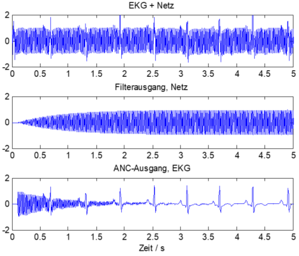
- Der ANC enthält nach abgeschlossener Konvergenz die Impulsantwort des optimalen Filters. Im Falle einer Netzstörung ist es also ein sehr schmaler Bandpass bei der Netzfrequenz bzw. die Impulsantwort ist identisch der Harmonischen der Netzfrequenz.

Beispiel
- 
- $\mu=0,02$, $L=101$
- Der ANC wurde zur Trennung des fötalen EKG (fEKG) vom maternalen mEKG. Zur Gewinnung des fEKG wird das abdominale EKG (aEKG, vom Bauch) benötigt, das mEKG wird konventionell an Extremitäten abgeleitet. Das fEKG (untere Grafik) ist nur schlecht erkennbar und vom mEKG selbst nach zahlreichen empirischen zweidimensionalen Optimierungen der Filterlänge und der Adaptionskonstante noch immer stark gestört. Die Ursache liegt darin, dass beide Signale (Störung und gestörtes Signal) stark instationär sind, die für die Konvergenz zur optimalen Lösung notwendige Bedingung der Stationarität mindestens eines Signalanteils ist hier nicht erfüllt.

EKG mit Matched Filter
- 
- In bestimmten Messsituationen (Ruhe EKG vor Fahrradergometrie) liegt eine Musterfunktion (Template) vor.
- Für signalanalytische korrekte Detektion/Filterung müssen Signal (EKG) sowie Template (Muster) weißes Spektrum haben
- Zum Prewhitening wird LMS mit binärem Gradienten verwendet. Die selben Filterkoeffizienten filtern auch das Template für das MF
- Lineare Prädikation: $x_p[k]=a_1x[k-1]+a_2x[k-2]+...+a_nx[k-n]$
- Residualfehler ist weiß: $x_{err}[k]=x[k]-x_p[k]$
- Robuster LMS mit binärem Gradienten: $w[k+1]=w[k]+\mu*sng(e[k]x[k])$


- Da Biosignale relativ tieffrequente Signale sind (Energiemaximum zwischen 10 Hz und 100 Hz), führt Prewhitening zur relativen Anhebung der hochfrequenten Anteile (grüne Kurve oben) sowie des breitbandigen Rauschens.
- Wegen der relativen Anhebung hochfrequenten Anteile haben Prewhitener implizit einen Hochpass-Charakter. Dies kann man gut im Vergleich der blauen (Original) und der grünen Kurven erkennen: Die tieffrequenten Anteile (,,langsame Wellen'') sind nach Prewhitening deutlich reduziert.

Template nach QRS
- 
- QRS Template wird aus den letzten 9 detektierten Komplexen berechnet
- das Template wird mit dem adaptiven Filter gefiltert, mit dem das EKG geweißt wurde
- mit dem geweißten Template wird das geweißte EKG gefiltert
- 
- Durch das Prewhitening und nach dem MF (matched filter) ist die Signalform des Biosignals zum Teil stark verändert. Daher eignet sich das MF nur zur Detektion von Biosignalkomponenten, nicht aber zur diagnostischen Kurvenvermessung.
- Das MF ist der empfindlichste und sicherste Detektor von bekannten Mustern.
