# Logik
Die Logik 
- versucht, gültige Argumentationen von ungültigen zu unterscheiden,
- hat Anwendungen in der Informatik,
- formalisiert die zu untersuchenden Aussagen und
- beschränkt sich auf einen wohldefinierten Teil der möglichen Aussagen => es gibt verschiedene "Logiken", z.B. "Aussagen-" und "Prädikatenlogik"
    - daneben: 
      - temporale Logiken (Mastervorlesung "Verifikation")
      - modale Logiken
      - epistemische Logiken
      - ...


## Syllogismen
Aristoteles (384-322 v.Chr.) untersuchte das Wesen der Argumentation und des logischen Schließens mit dem Ziel, korrekte von inkorrekten Argumenten zu unterscheiden.
Verschiedene Werke, u.a. Analytica priora, Analytica posteriora.

Aristoteles nennt die logischen Schlußfolgerungen Syllogismen (griechisch: "Zusammenrechnung").

Ein Syllogismus ist eine Aussage, in der bestimmte Dinge [die Prämissen] behauptet werden und in der etwas anderes [die Konsequenz], unumgänglich aus dem Behaupteten folgt. Mit dem letzten Satz meine ich, dass die Prämissen die Konsequenz zum Resultat haben, und damit meine ich, dass keine weitere Prämisse erforderlich ist, um die Konsequenz unumgänglich zu machen.

#### Beispiele
```
Wenn alle Menschen sterblich sind und
Sokrates ein Mensch ist,
dann ist Sokrates sterblich.
```
```
Wenn eine Zahl gerade und größer als zwei ist,
dann ist sie keine Primzahl.
```
```
Wenn die Leitzinsen hoch sind,
dann sind die Börsianer unzufrieden.
```

Aristoteles identifizierte einige zulässige Syllogismen, die Scholastiker fügten weitere hinzu:

(Barbara)
```
Alle Dackel sind Hunde                  Alle P sind M
Alle Hunde sind Tiere                   Alle M sind S
Dann sind alle Dackel Tiere             Alle P sind S
```

(Cesare)
```
Keine Blume ist ein Tier                Kein P ist M
Alle Hunde sind Tiere                   Alle S sind M
Dann ist keine Blume ein Hund           Kein P ist S
```

(Darapti)
```
Alle Delfine leben im Meer              Alle M sind P
Alle Delfine sind Säugetiere            Alle M sind S
Dann leben einige Säugetiere im Meer    Einige S sind P
```

### Kalküle
Gottfried Wilhelm Leibniz (1646-1716) wollte korrekte von inkorrekten Argumentationsketten unterscheiden. Hierzu sollte ein Kalkül entwickelt werden, in dem alle korrekten Argumentationsketten ermöglicht sind (und keine inkorrekten).

David Hilbert (1862-1943) entwickelte solche Kalküle.
Diese "Hilbertkalküle" sind sehr verschieden von üblichen Argumentationsmustern.

Gerhard Gentzen (1909-1945) entwickelte Kalküle des "natürlichen Schließens", die übliche Argumentationsmuster formalisieren.

### Die Aussagenlogik
George Boole (1815 - 1864) entwickelte einen Kalkül zum Rechnen mit atomare Aussagen, die entweder wahr oder falsch sein können.

Verknüpfung durch Operatoren(und, oder, nicht, wenn-dann... ).

### Die Prädikatenlogik (Ende des 19. Jahrhunderts)
Gottlob Frege (1848-1925), Giuseppe Peano (1858-1932) und Bertrand Russell (1872-1970)entwickelten die Logik zur Grundlage der Mathematik, als formale Basis für die Vermeidung von Widersprüchen.
Entwicklung der Prädikatenlogik, die erlaubt:
- Beziehungen zwischen "Objekten" zu beschreiben
- existentielle Aussagen zu treffen: "es gibt ein x, so dass... "
- universelle Aussage zu treffen: "für jedes x gilt, dass... "


## Logik in der Informatik
Claude Shannon (1916 - 2001) benutzt die Aussagenlogik 1937, um elektromechanische Schaltkreise zu beschreiben und zu optimieren.

Allen Newell (1927-1992), Herbert Simon (1916-2001) und Alan Robinson (1930-2016) entwickelten 1950-1960 die ersten Systeme für die Automatisierung des logischen Schließens als Werkzeug der Künstlichen Intelligenz.

- Schaltkreisentwurf: Schaltkreise lassen sich durch logische Formeln darstellen -> Entwurf und Optimierung von Schaltungen
- Modellierung und Spezifikation: Eindeutige Beschreibung von komplexen Systemen
- Verifikation: Beweisen, dass ein Programm das gewünschte Verhalten zeigt
- Datenbanken: Formulierung von Anfragen an Datenbanken -> Abfragesprache SQL (Structured Query Language)
- (klassische) Künstliche Intelligenz:
    - Planung
    - Mensch-Maschine Kommunikation
    - Theorembeweiser: Der Computer beweist mathematische Sätze -> automatischer Beweis von wichtigen Sätzen im Bereich der Booleschen Algebren
- Logische Programmiersprachen


Außerdem: Logik ist ein Paradebeispiel für Syntax und formale Semantik

Edsger W. Dijkstra (1920-2002): Informatik = VLSAL (Very large scale application of logics)

Die Logik
- versucht, gültige Argumentationen von ungültigen zu unterscheiden,
- hat Anwendungen in der Informatik,
- formalisiert die zu untersuchenden Aussagen 

### Probleme mit natürlicher Sprache
1. Problem: Zuordnung von Wahrheitswerten zu natürlichsprachigen Aussagen ist problematisch.
    - Beispiele:
      - Ich habe nur ein bißchen getrunken.
      - Sie hat sich in Rauch aufgelöst.
      - Das gibt es doch nicht!
      - Rache ist süß.
2. Problem: Natürliche Sprache ist oft schwer verständlich.
    - Beispiel: Auszug aus der "Analytica Priora" von Aristoteles
    - Die Aussage: Wenn der Mittelbegriff sich universell auf Ober- oder Untersatz bezieht, muss ein bestimmter negativer Syllogismus resultieren, immer wenn der Mittelbegriff sich universell auf den Obersatz bezieht, sei es positiv oder negativ, und besonders wenn er sich auf den Untersatz bezieht und umgekehrt zur universellen Aussage.
    - Der Beweis: Denn wenn M zu keinem N gehört, aber zu einem O, ist es notwendig, dass N zu einem O nicht gehört. Denn da die negative Aussage umsetzbar ist, wird N zu keinem M gehören: Aber es war erlaubt, dass M zu einem O gehört: Deshalb wird N zu einem O nicht gehören: Denn das Ergebnis wird durch die erste Figur erreicht. Noch einmal: Wenn M zu allen N gehört, aber nicht zu einem O, ist es notwendig, dass N nichtzu einem O gehört: Denn wenn N zu allen O gehört und M auch alle N-Eigenschaften zugeschrieben werden, muss M zu allen O gehören: Aber wir haben angenommen, dass M zu einem O nicht gehört. Und wenn M zu allen N gehört, aber nicht zu allen O, können wir folgern, dass N nicht zu allen O gehört: Der Beweis ist der gleiche wie der obige. Aber wenn M alle O-Eigenschaften zugeschrieben werden, aber nicht alle N-Eigenschaften, wird es keinen Syllogismus geben.
3. Problem:Natürliche Sprache ist mehrdeutig.
    - Beispiel: "Ich sah den Mann auf dem Berg mit dem Fernrohr."
        - (((Ich sah den Mann) auf dem Berg) mit dem Fernrohr)
        - ((Ich sah (den Mann auf dem Berg)) mit dem Fernrohr)
        - ((Ich sah den Mann) (auf dem Berg mit dem Fernrohr))
        - (Ich sah ((den Mann auf dem Berg) mit dem Fernrohr))
        - (Ich sah (den Mann (auf dem Berg mit dem Fernrohr)))
4. Problem:Natürliche Sprache hängt von Kontext ab.
```
Die Beatles sind Musiker
Paul McCartney ist ein Beatle
Paul McCartney ist ein Musiker
```
```
Die Beatles sind vier
Paul McCartney ist ein Beatle
Paul McCartney ist vier
```

# Kapitel 1: Aussagenlogik
Beispiel

Ein Gerät besteht aus einem Bauteil A, einem Bauteil B und einem roten Licht. Folgendes ist bekannt:
1. Bauteil A oder Bauteil B (oder beide) sind kaputt.
2. Wenn Bauteil A kaputt ist, dann ist auch Bauteil B kaputt.
3. Wenn Bauteil B kaputt ist und das rote Licht leuchtet, dann ist Bauteil A nicht kaputt.
4. Das rote Licht leuchtet.

Zur Formalisierung verwenden wir folgende Abkürzungen:
- RL (rotes Licht leuchtet),
- AK (Bauteil A kaputt),
- BK (Bauteil B kaputt),
- $\vee$ (oder),
- $\rightarrow$ (wenn, dann),
- $\wedge$ (und) und
- $\lnot$ (nicht).

Damit können wir unser Wissen kompakter hinschreiben:
1. $AK \vee BK$
2. $AK \rightarrow BK$
3. $(BK \wedge RL)\rightarrow \lnot AK$
4. $RL$

Aus den vier Aussagen lassen sich weitere Aussagen neue Aussagen bilden
5. Falls $AK$ gilt, so folgt aus $AK\rightarrow BK$, dass $BK$ gilt.
6. Falls $BK$ gilt, so gilt natürlich $BK$.
7. Da $AK \vee BK$ gilt, folgt aus (5) und (6), dass $BK$ in jedem Fall gilt.
8. Es gilt auch $RL$.
9. Also gilt $BK\wedge RL$ (aus (7) und (8)).
10. Es gilt auch $(BK \wedge RL)\rightarrow\lnot AK$.
11. Also gilt $\lnot AK$ (aus (9) und (10)).

Damit sind wir überzeugt, dass das Bauteil A heil ist.

Den Beweis, dass das Teil A heil ist, werden wir als "Beweisbaum" formalisieren:

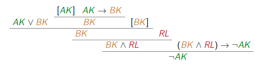

In der Aussagenlogik gehen wir von "Aussagen" aus, denen wir (zumindest prinzipiell) Wahrheitswerte zuordnen können.

## Beispiele
- Die Summe von 3 und 4 ist 7.
- Jana reagierte aggressiv auf Martins Behauptungen.
- Jede gerade natürliche Zahl>2 ist Summe zweier Primzahlen.
- Alle Marsmenschen mögen Pizza mit Pepperoni.
- Albert Camus était un écrivain français.
- In theory, practically everything is possible.

Für diese Aussagen verwenden wir dieatomaren Formeln $p,q,r$ bzw. $p_0,p_1,...$

Die Aussagen werden durch "Operatoren" verbunden. Beispiele
- ... und...
- ... oder...
- nicht...
- wenn... dann...
- entweder... oder... , aber nicht beide.
- mehr als die Hälfte der Aussagen ... gilt.

Für solche zusammengesetzten Aussagen verwenden wir $\varphi,\psi$ usw.

Durch die Wahl der erlaubten Operatoren erhält man unterschiedliche "Logiken".

Da der Wahrheitswert einer zusammengesetzten Aussage nur vom Wahrheitswert der Teilaussagen abhängen soll, sind Operatoren wie "weil" oder "obwohl" nicht zulässig.


## Syntax der Aussagenlogik
Eine atomare Formel hat die Form $p_i$ (wobei $i\in\mathbb{N}=\{0,1,...\}$). 
Formeln werden durch folgenden induktiven Prozess definiert:
1. Alle atomaren Formeln und $\bot$ sind Formeln.
2. Falls $\varphi$ und $\psi$ Formeln sind, sind auch $(\varphi\wedge\psi),(\varphi\wedge\psi)$($\varphi \rightarrow\psi$)und $\lnot\varphi$Formeln.
3. Nichts ist Formel, was sich nicht mittels der obigen Regeln erzeugen läßt.
   
Beispielformel: $\lnot((\lnot p_4 \vee p_1)\wedge\bot)$

Bezeichnungen:
- Falsum: $\bot$
- Konjunktion: $\wedge$
- Disjunktion: $\vee$
- Implikation: $\rightarrow$
- Negation: $\lnot$

Abkürzungen
$p,q,r...$ statt $p_0,p_1,p_2...$

$(\bigvee_{i=1}^n \varphi_i$ statt $(...((\varphi_1\vee\varphi_2)\vee\varphi_3)\vee...\vee\varphi_n)$

$(\bigwedge_{i=1}^n \varphi_i)$ statt $(...((\varphi_1\wedge\varphi_2)\wedge\varphi_3)\wedge...\wedge\varphi_n)$

$(\varphi \leftrightarrow \psi)$ statt $((\varphi\rightarrow\psi)\wedge(\psi\rightarrow\varphi))$


Präzedenz der Operatoren:
- $\leftrightarrow$ bindet am schwächsten
- $\rightarrow$...
- $\vee$...
- $\wedge$...
- $\lnot$ bindet am stärksten

Es gilt also z.B.: $(\alpha\leftrightarrow\beta\vee\lnot\gamma\rightarrow\sigma\wedge\lnot\eta) = (\alpha\leftrightarrow ((\beta\vee\lnot\gamma)\rightarrow(\sigma\wedge\lnot\eta)))$

Dennoch: Zu viele Klammern schaden i.A. nicht.


## Natürliches Schließen
Ein (mathematischer) Beweis zeigt, wie die Behauptung aus den Voraussetzungen folgt.  
Analog zeigt ein "Beweisbaum" (= "Herleitung" = "Deduktion"), wie eine Formel der Aussagenlogik aus Voraussetzungen (ebenfalls Formeln der Aussagenlogik) folgt.  
Diese "Deduktionen" sind Bäume, deren Knoten mit Formeln beschriftet sind: 
- an der Wurzel steht die Behauptung (= Konklusion $\varphi$) 
- an den Blättern stehen Voraussetzungen (= Hypothesen oder Annahmen aus $\Gamma$) 
- an den inneren Knoten stehen "Teilergebnisse" und "Begründungen" 

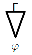

## Konstruktion von Deduktionen
Aus der Annahme der Aussage $\varphi$ folgt $\varphi$ unmittelbar: eine triviale Deduktion

$\varphi$ mit Hypothesen $\{\varphi\}$ und Konklusion $\varphi$.  

Folgend werden wir 
- überlegen, wie aus "einfachen mathematischen Beweisen" umfangreichere entstehen können und 
- parallel dazudefinieren, wie aus einfachen Deduktionen umfangreichere konstruiert werden können. 

### Konjunktion
#### Konjunktionseinführung in math. Beweisen
Ein mathematischer Beweis einer Aussage "$\varphi$ und $\psi$" sieht üblicherweise so aus: 
- "Zunächst zeige ich $\varphi$: ... (hier steckt die eigentliche Arbeit)  
- Jetzt zeige ich $\psi$: ... (nochmehr eigentliche Arbeit)  
- Also haben wir "$\varphi$ und $\psi$" gezeigt. qed" 

#### Konjunktionseinführung (ausführlich)
Ist D eine Deduktion von $\varphi$ mit Hypothesen aus $\Gamma$ und ist E eine Deduktion von $\psi$ mit Hypothesen aus $\Gamma$, so ergibt sich die folgende Deduktion von $\varphi\wedge\psi$ mit Hypothesen aus $\Gamma$:

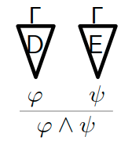

Kurzform: $\frac{\varphi\quad\psi}{\varphi\wedge\psi} (\wedge I)$ 

#### Konjunktionselimination (ausführlich)
Ist D eine Deduktion von $\varphi\wedge\psi$ mit Hypothesen aus $\Gamma$, so ergeben sich die folgenden Deduktionen von $\varphi$ bzw. von $\psi$ mit Hypothesen aus $\Gamma$:

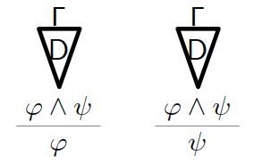

Kurzform: $\frac{\varphi\wedge\psi}{\varphi} (\wedge E_1) \quad\quad \frac{\varphi\wedge\psi}{\psi} (\wedge E_2)$

#### Beispiel
Wir zeigen $\varphi\wedge\psi$ unter der Hypothese $\psi\wedge\varphi$:...

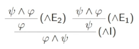

Dies ist eine Deduktion mit Konklusion $\varphi\wedge\psi$ und Hypothese $\psi\wedge\varphi$ (zweimal verwendet).

### Implikation
#### Implikationseinführung in math. Beweisen
Ein mathematischer Beweis einer Aussage "Aus $\varphi$ folgt $\psi$" sieht üblicherweise so aus:  
- "Angenommen, $\varphi$ gilt.
- Dann ... (hier steckt die eigentliche Arbeit).  
- Damit gilt $\psi$.  
- Also haben wir gezeigt, dass $\psi$ aus $\varphi$ folgt. qed"

Die Aussage $\varphi$ ist also eine "temporäre Hypothese". 

#### Implikationseinführung (ausführlich)
Ist D eine Deduktion von $\psi$ mit Hypothesen aus $\Gamma\cup\{\varphi\}$, so ergibt sich die folgende Deduktion von $\varphi\rightarrow\psi$ mit Hypothesen aus $\Gamma$:

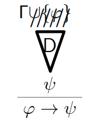

Kurzform 
$$[\varphi]$$ 
$$\vdots$$ 
$$\frac{\psi}{\varphi\rightarrow\psi} (\rightarrow I)$$

Beispiel: ... Dies ist eine Deduktion von $\varphi\rightarrow\varphi$ ohne Hypothesen. 

#### Implikationselimination in math. Beweisen
Ein mathematischer Beweis einer Aussage "$\psi$ gilt" über eine Hilfsaussage sieht so aus:
- "Zunächst zeigen wir, dass $\varphi$ gilt: ...
- Dann beweisen wir, dass $\psi$ aus $\varphi$ folgt: ...
- Also haben wir $\psi$ gezeigt. qed"

#### Implikationselimination oder modus ponens (ausführlich)
Ist D eine Deduktion von $\varphi$ mit Hypothesen aus $\Gamma$ und ist E eine Deduktion von $\varphi\rightarrow\psi$ mit Hypothesen aus $\Gamma$, so ergibt sich die folgende Deduktion von $\psi$ mit Hypothesen aus $\Gamma$:

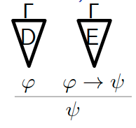

Kurzform: $\frac{\varphi\quad \varphi\rightarrow\psi}{\psi} (\rightarrow E)$

#### Beispiel
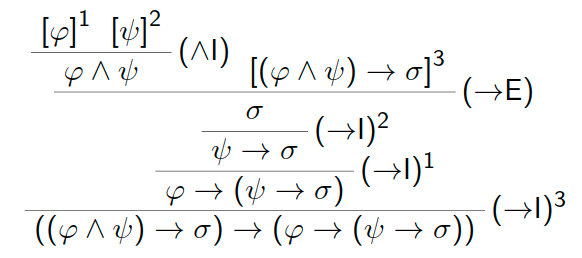

Bemerkung: die Indizes 1, 2 und 3 machen deutlich, welche Hypothese bei welcher Regelanwendung gestrichen wurde. Deduktionen können recht groß werden.

Diese Deduktion hat keine Hypothesen!


### Disjunktion
#### Disjunktionselimination oder Fallunterscheidung in math. Beweisen
Ein mathematischer Beweis einer Aussage "$\sigma$ gilt" mittels Fallunterscheidung sieht üblicherweise so aus:
- "Zunächst zeigen wir, dass $\varphi\vee\psi$ gilt: ...
- Gilt $\varphi$, so gilt $\sigma$, denn ...
- Gilt $\psi$, so gilt ebenfalls $\sigma$, denn ...
- Also haben wir gezeigt, dass $\sigma$ gilt. qed"  

Die Aussagen $\varphi$ und $\psi$ sind also wieder "temporäre Hypothesen".

#### Disjunktionselimination oder Fallunterscheidung (ausführlich)
Ist D eine Deduktion von $\varphi\vee\psi$ mit Hypothesen aus $\Gamma$, ist E eine Deduktion von $\sigma$ mit Hypothesen aus $\Gamma\cup\{\varphi\}$und ist F eine Deduktion von $\sigma$ mit Hypothesen aus $\Gamma\cup\{\psi\}$, so ergibt sich die folgende Deduktion von $\sigma$ mit Hypothesen aus $\Gamma$:

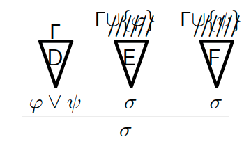

Disjunktionselimination Kurzform: 
$$\quad [\psi] \quad[\varphi]$$
$$\quad \vdots \quad\vdots$$
$$\frac{\varphi\vee\psi \quad\sigma \quad\sigma}{\sigma} (\vee E)$$

Disjunktionseinführung (Kurzform)
$$\frac{\varphi}{\varphi\vee\psi} (\vee I_1) \quad \frac{\psi}{\varphi\vee\psi} (\vee I_2)$$

### Negation
#### Negationseinführung in math. Beweisen
Ein mathematischer Beweis einer Aussage "$\varphi$ gilt nicht" sieht so aus:  
- "Angenommen,$\varphi$gilt.  
- Dann folgt $0=1$, denn .... Mit anderen Worten, dies führt zu einem Widerspruch.
- Also haben wir gezeigt, dass $\varphi$ nicht gilt. qed"  
- 
Die Aussage $\varphi$ ist also wieder eine "temporäre Hypothese". 

#### Negationseinführung (ausführlich)
Ist D eine Deduktion von $\bot$ mit Hypothesen aus $\Gamma\cup\{\varphi\}$, so ergibt sich die folgende Deduktion von $\lnot\varphi$ mit Hypothesen aus $\Gamma$:  

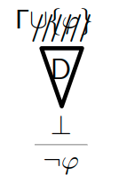

Kurzform:
$$[\varphi]$$
$$\vdots$$
$$\frac{\bot}{\lnot\varphi} (\lnot I)$$

#### Negationselimination (ausführlich)
Ist D eine Deduktion von $\lnot\varphi$ mit Hypothesen aus $\Gamma$ und ist E eine Deduktion von $\varphi$ mit Hypothesen aus $\gamma$, so ergibt sich die folgende Deduktion von $\bot$ mit Hypothesen aus $\Gamma$:

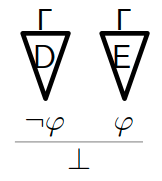

Kurzform: $\frac{\lnot\varphi \quad \varphi}{\bot} (\lnot E)$

### Falsum
Hat man "$0=1$" bewiesen, so ist man bereit, alles zu glauben: ex falso sequitur quodlibet

ausführlich: Ist D eine Deduktion von $\bot$ mit Hypothesen aus $\Gamma$, so ergibt sich die folgende Deduktion von $\varphi$ mit Hypothesen aus $\Gamma$: 

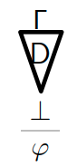

Kurzform: $\frac{\bot}{\varphi} (\bot)$

#### math. Widerspruchsbeweis
Ein indirekter Beweis einer Aussage "$\varphi$ gilt" sieht üblicherweise so aus:
- "Angenommen, $\varphi$ gilt nicht, d.h. $\lnot\varphi$ gilt.
- Dann folgt $0=1$, d.h. ein Widerspruch.  
- Also haben wir gezeigt, dass $\varphi$ gilt. qed"
 
Die Aussage $\lnot\varphi$ ist also wieder eine "temporäre Hypothese".

#### reductio ad absurdum (ausführlich)
Ist D eine Deduktion von $\bot$ mit Hypothesen aus $\Gamma\cup\{\lnot\varphi\}$, so ergibt sich die folgende Deduktion von $\varphi$ mit Hypothesen aus $\Gamma$:

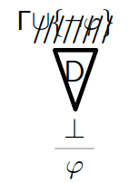

Kurzform: 
$$[\lnot\varphi]$$
$$\vdots$$
$$\frac{\bot}{\varphi} (raa)$$

## Regeln des natürlichen Schließens
> Definition
> 
> Für eine Formelmenge $\Gamma$ und eine Formel $\varphi$ schreiben wir $\Gamma\Vdash\varphi$ wenn es eine Deduktion gibt mit Hypothesen aus $\Gamma$ und Konklusion $\varphi$. Wir sagen "$\varphi$ ist eine syntaktische Folgerung von $\Gamma$".
> 
> Eine Formel $\varphi$ ist ein Theorem, wenn $\varnothing\Vdash\varphi$ gilt.

### Bemerkung
$\Gamma\Vdash\varphi$ sagt (zunächst) nichts über den Inhalt der Formeln in $\Gamma\cup\{\varphi\}$ aus, sondern nur über die Tatsache, dass $\varphi$ mithilfe des natürlichen Schließens aus den Formeln aus $\Gamma$ hergeleitet werden kann.

Ebenso sagt "$\varphi$ ist Theorem" nur, dass $\varphi$ abgeleitet werden kann, über "Wahrheit" sagt dieser Begriff (zunächst) nichts aus.

### Satz
Für alle Formeln $\varphi$ und $\psi$ gilt $\{\lnot(\varphi\vee\psi)\}\Vdash\lnot\varphi\wedge\lnot\psi$.

Beweis: Wir geben eine Deduktion an...
- $\{\lnot\varphi\wedge\lnot\psi\}\Vdash\lnot(\varphi\vee\psi)$
    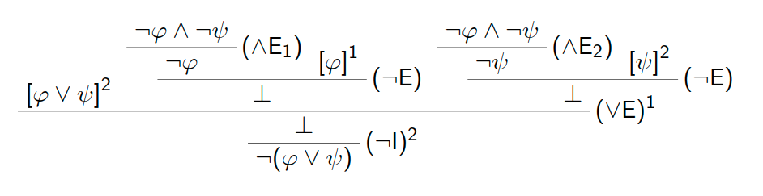
- $\{\lnot\varphi\vee\lnot\psi\}\Vdash\lnot(\varphi\wedge\psi)$
    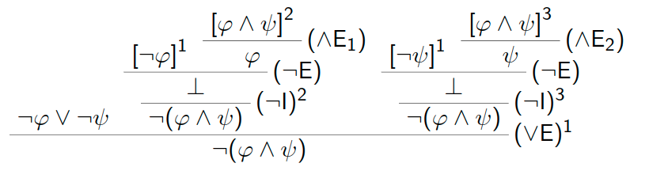
- $\{\varphi\vee\psi\} \Vdash \psi\vee\varphi$
    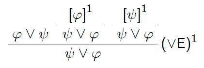

### Satz
Für jede Formel $\varphi$ ist $\lnot\lnot\varphi\rightarrow\varphi$ ein Theorem.

Beweis: Wir geben eine Deduktion mit Konklusion $\lnot\lnot\varphi\rightarrow\varphi$ ohne Hypothesen an...

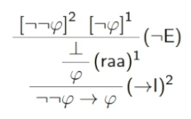

### Satz
Für jede Formel $\varphi$ ist $\varphi\vee\lnot\varphi$ ein Theorem.

Beweis: Wir geben eine Deduktion mit Konklusion $\varphi\vee\lnot\varphi$ ohne Hypothesen an...

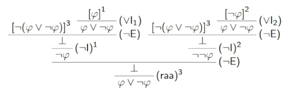

Bemerkung: Man kann beweisen, dass jede Deduktion der letzten beiden Theoreme die Regel (raa) verwendet, sie also nicht "intuitionistisch" gelten. 

### Satz
$\{\lnot(\varphi\wedge\psi)\}\Vdash\lnot\varphi\vee\lnot\psi$

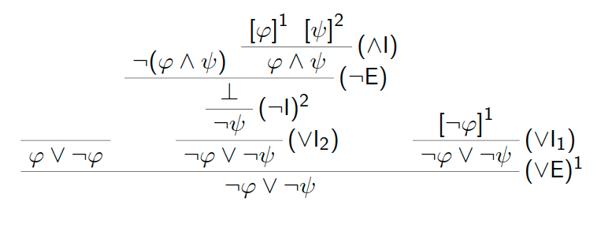

## Semantik
Formeln sollen Verknüpfungen von Aussagen widerspiegeln, wir haben dies zur Motivation der einzelnen Regeln des natürlichen Schließens genutzt.
Aber die Begriffe „syntaktische Folgerung“ und „Theorem“ sind rein syntaktisch definiert.

Erst die jetzt zu definierende „Semantik“ gibt den Formeln „Bedeutung“.

Idee der Semantik: wenn man jeder atomaren Formel $p_i$ einen Wahrheitswertzuordnet, so kann man den Wahrheitswert jeder Formel berechnen.

Es gibt verschiedene Möglichkeiten, Wahrheitswerte zu definieren:
- zweiwertige oder Boolesche Logik $B=\{0,1\}$: Wahrheitswerte „wahr“=1 und „falsch“= 0
- dreiwertige Kleene-Logik $K_3=\{0,\frac{1}{2},1\}$: zusätzlicher Wahrheitswert „unbekannt“$=\frac{1}{2}$
- Fuzzy-Logik $F=[0,1]$: Wahrheitswerte sind „Grad der Überzeugtheit“
- unendliche Boolesche Algebra $B_R$= Menge der Teilmengen von $\mathbb{R}$; $A\subseteq\mathbb{R}$ ist „Menge der Menschen, die Aussage für wahr halten“
- Heyting-Algebra $H_R$= Menge der offenen Teilmengen von $\mathbb{R}$
    - Erinnerung: $A\subseteq\mathbb{R}$ offen, wenn $\forall a\in A\exists\epsilon >0:(a-\epsilon,a+\epsilon)\subseteq A$, d.h., wenn $A$ abzählbare Vereinigung von offenen Intervallen $(x,y)$ ist.

Beispiele:
- offen: $(0,1), \mathbb{R}_{>0}, \mathbb{R}\backslash\{0\}, \mathbb{R}\backslash\mathbb{N}$
- nicht offen: $[1,2), \mathbb{R}_{\geq 0}, \mathbb{Q}, \mathbb{N}, \{\frac{1}{n} | n\in\mathbb{N}\}, \mathbb{R}\backslash\mathbb{Q}$


Sei W eine Menge von Wahrheitswerten.\\
Eine W-Belegung ist eine Abbildung $B:V\rightarrow W$, wobei $V\subseteq\{p_0 ,p_1 ,...\}$ eine Menge atomarer Formeln ist.

Die W-Belegung $B:V\rightarrow W$ paßt zur Formel $\phi$, falls alle atomaren Formeln aus $\phi$ zu V gehören.

Sei nun B eine W-Belegung. Was ist der Wahrheitswert der Formel $p_0\vee p_1$ unter der Belegung B?

Zur Beantwortung dieser Frage benötigen wir eine Funktion $\vee_W :W\times W\rightarrow W$ (analog für $\wedge,\rightarrow,\lnot$).

## Wahrheitswertebereiche
> Definition: Sei W eine Menge und $R\subseteq W\times W$ eine binäre Relation.
- R ist reflexiv, wenn $(a,a)\in R$ für alle $a\in W$ gilt.
- R ist antisymmetrisch, wenn $(a,b),(b,a)\in R$ impliziert, dass $a=b$ gilt (für alle $a,b\in W$).
- R ist transitive, wenn $(a,b),(b,c)\in R$ impliziert, dass $(a,c)\in R$ gilt (für alle $a,b,c\in W$).
- R ist eine Ordnungsrelation, wenn R reflexiv, antisymmetrisch und transitiv ist. In diesem Fall heißt das Paar $(W,R)$ eine partiell geordnete Menge.

Beispiel
1. Sei $\leq$ übliche Ordnung auf $\mathbb{R}$und $W\subseteq\mathbb{R}$. Dann ist $(W,\leq)$ partiell geordnete Menge.
2. Sei $X$ eine Menge und $W\subseteq P(X)$. Dann ist $(W,\subseteq)$ partiell geordnete Menge.
3. Sei $W=P(\sum ∗)$ und $\leq_p$ die Relation „es gibt Polynomialzeitreduktion“ (vgl. „Automaten, Sprachen und Komplexität“). Diese Relation ist reflexiv, transitiv, aber nicht
antisymmetrisch (denn $3-SAT\leq_p HC$ und $HC\leq_p_3-SAT$).

> Definition: Sei $(W,\leq)$ partiell geordnete Menge, $M\subseteq W$ und $a\in W$.
- a ist obere Schranke von $M$, wenn $m\leq a$ für alle $m\in M$ gilt.
- a ist kleinste obere Schranke oder Supremum von $M$, wenn $a$ obere Schranke von $M$ ist und wenn $a\leq b$ für alle oberen Schranken $b$ von $M$ gilt. Wir schreiben in diesem Fall $a=sup \ M$.
- a ist untere Schranke von $M$, wenn $a\leq m$ für alle $m\in M$ gilt.
- a ist größte untere Schranke oder Infimum von $M$, wenn a untere Schranke von $M$ ist und wenn $b\leq a$ für alle unteren Schranken $b$ von $M$ gilt. Wir schreiben in diesem Fall $a=inf\ M$.

Beispiel
1. betrachte $(W,\leq)$ mit $W=\mathbb{R}$ und $\leq$ übliche Ordnung auf $\mathbb{R}$.
   - Dann gelten $sup[0,1] = sup(0,1) =1$.
   - $sup\ W$ existiert nicht (denn $W$ hat keine obere Schranke).
2. betrachte $(W,\subseteq)$ mit $X$ Menge und $W =P(X)$.
   - $sup\ M=\bigcup_{A\in M} A$ für alle $M\subseteq W$
3. betrachte $(W,\subseteq)$ mit $W=\{\{0\},\{1\},\{0,1,2\},\{0,1,3\}\}$.
   - $sup\{\{0\},\{0,1,2\}\}=\{0,1,2\}$
   - $\{0,1,2\}$ und $\{0,1,3\}$ sind die oberen Schranken von $M=\{\{0\},\{1\}\}$, aber $M$ hat kein Supremum

> Definition: Ein (vollständiger) Verband ist eine partiell geordnete Menge $(W,\leq)$, in der jede Menge $M\subseteq W$ ein Supremum $sup\ M$ und ein Infimum $inf\ M$ hat.
In einem Verband $(W,\leq)$ definieren wir:
- $0_W = inf\ W$ und $1_W= sup\ W$
- $a\wedge_W b= inf\{a,b\}$ und $a\vee_W b= sup\{a,b\}$ für $a,b\in W$

Bemerkung: In jedem Verband $(W,\leq)$ gelten $0_W= sup\ \varnothing$ und $1_W= inf\ \varnothing$ (denn jedes Element von $W$ ist obere und untere Schranke von $\varnothing$).

> Definition: Ein Wahrheitswertebereich ist ein Tupel $(W,\leq,\rightarrow W,\lnot W)$, wobei $(W,\leq)$ ein Verband und $\rightarrow W:W^2 \rightarrow W$ und $\lnot W:W\rightarrow W$  Funktionen sind.

### Beispiel
- Der Boolesche Wahrheitswertebereich B ist definiert durch die Grundmenge $B=\{0,1\}$, die natürliche Ordnung $\leq$ und die Funktionen $\lnot_B (a) = 1-a$, $\rightarrow_B(a,b) = max(b, 1 -a)$. Hier gelten:
    - $0_B=0$, $1_B= 1$, 
    - $a\wedge_B b= min(a,b)$, $a\vee_B b= max(a,b)$
- Der Kleenesche Wahrheitswertebereich $K_3$ ist definiert durch die Grundmenge $K_3=\{0,\frac{1}{2},1\}$ mit der natürlichen Ordnung $\leq$ und durch die Funktionen $\lnot_{K_3} (a) = 1 -a $, $\rightarrow_{K_3} (a,b) = max(b, 1-a)$. Hier gelten:
  - $\lnot_{K_3} = 0$, $1_{K_3} = 1$
  - $a\wedge_{K_3} b= min(a,b)$, $a\vee_{K_3} b= max(a,b)$
- Der Wahrheitswertebereich F der Fuzzy-Logik ist definiert durch die Grundmenge $F=[0,1]\subseteq\mathbb{R}$ mit der natürlichen Ordnung $\leq$ und durch die Funktionen $\lnot_F (a) = 1-a$, $\rightarrow_F (a,b) = max(b, 1-a)$. Hier gelten:
  - $0_F= 0$, $1_F= 1$
  - $a\wedge_F b= min(a,b)$, $a\vee_F b= max(a,b)$
- Der Boolesche Wahrheitswertebereich $B_R$ ist definiert durch die Grundmenge $B_R=\{A|A\subseteq \mathbb{R}\}$ mit der Ordnung $\subseteq$ und durch die Funktionen $\lnot_{B_R} (A) =\mathbb{R}\backslash A$, $\rightarrow_{B_R} (A,B) = B\cup\mathbb{R}\backslash A$. Hier gelten:
  - $0_{B_R}=\varnothing$, $1_{B_R}=\mathbb{R}$
  - $A\wedge_{B_R} B=A\cap B$, $A\vee_{B_R} B=A\cup B$
- Der Heytingsche Wahrheitswertebereich $H_R$ ist definiert durch die Grundmenge $H_{mathbb{R}} =\{A\subseteq\mathbb{R} | \text{A ist offen}\}$, die Ordnung $\subseteq$ und durch die Funktionen $\lnot_{H_R} (A) = Inneres(\mathbb{R}\backslash A)$, $\rightarrow_{H_R} (A,B) =Inneres(B\cup \mathbb{R}\backslash A)$. Hier gelten:
  - $0_{H_R}=\varnothing$, $1_{H_R}=\mathbb{R}$
  - $A\wedge_{H_R} B= A\cap B$, $A\vee_{H_R} B=A\cup B$
  - Erinnerung: $Inneres(A) =\{a\in A|\exists \epsilon > 0 : (a-\epsilon,a+\epsilon)\subseteq A\}$
  - Beispiele: $Inneres((0,1))=(0,1)=Inneres([0,1]),Inneres(N)=\varnothing,Inneres(\mathbb{R}_{\geq 0}) = \mathbb{R}_{> 0}$


Sei W ein Wahrheitswertebereich und B eine W-Belegung. Induktiv über den Formelaufbau definieren wir den Wahrheitswert $\hat{B}(\phi)\in W$ jeder zu $B$ passenden Formel $\phi$:
- $\hat{B}(\bot) = 0_W$
- $\hat{B}(p) = B(p)$ falls $p$ eine atomare Formel ist
- $\hat{B}((\phi\wedge \psi )) = \hat{B}(\phi)\wedge_W \hat{B}(\psi )$
- $\hat{B}((\phi\vee \psi )) = \hat{B}(\phi)\vee_W \hat{B}(\psi )$
- $\hat{B}((\phi\rightarrow \psi )) = \rightarrow W(\hat{B}(\phi),\hat{B}(\psi ))$
- $\hat{B}(\lnot\phi) = \lnot W(\hat{B}(\phi))$

Wir schreiben im folgenden $B(\phi)$ anstatt $\hat{B}(\phi)$.

Beispiel: Betrachte die Formel $\phi= ((p\wedge q)\rightarrow (q\wedge p))$.
- Für eine beliebige B-Belegung $B:\{p,q\}\rightarrow B$ gilt $B((p\wedge q)\rightarrow (q\wedge p)) = max(B(q\wedge p), 1 -B(p\wedge q)) = max(min(B(q),B(p)), 1 -min(B(p),B(q))) = 1 = 1_B$
- Für die $K_3$-Belegung $B:\{p,q\}\rightarrow K_3$ mit $B(p) =B(q) = \frac{1}{2}$} gilt $B((p\wedge q)\rightarrow (q\wedge p)) = max(B(q\wedge p), 1 -B(p\wedge q))= max(min(B(q),B(p)), 1 -min(B(p),B(q))) = \frac{1}{2} \not= 1_{K_3}$
- analog gibt es eine F-Belegung $B:\{p,q\}\rightarrow F$, so dass $B((p\wedge q)\rightarrow (q\wedge p)) \not = 1_F$ gilt.
- Für eine beliebige $H_{mathbb{R}}$-Belegung $B:\{p,q\}\rightarrow H_R$ gilt $B((p\wedge q)\rightarrow (q\wedge p)) = Inneres(B(q\wedge p)\cup \mathbb{R}\backslash B(p\wedge q)) = Inneres((B(q)\cap B(p))\cup \mathbb{R}\backslash (B(p)\cap B(q))) = Inneres(\mathbb{R}) = \mathbb{R} = 1_{H_R}$

## Folgerung und Tautologie
Sei W ein Wahrheitswertebereich.
Eine Formel $\phi$ heißt eine W-Folgerung der Formelmenge $\Gamma$, falls für jede W-Belegung B, die zu allen Formeln aus $\Gamma \cup\{\phi\}$ paßt, gilt:
    $inf\{B(\gamma )|\gamma \in \Gamma \}\leq B(\phi)$

Wir schreiben $\Gamma \Vdash W\phi$, falls $\phi$ eine W-Folgerung von $\Gamma$ ist.

Bemerkung: Im Gegensatz zur Beziehung $\Gamma \vdash \phi$, d.h. zur syntaktischen Folgerung, ist $\Gamma \Vdash W \phi$ eine semantische Beziehung.

Eine W-Tautologie ist eine Formel $\phi$ mit $\varnothing \Vdash W\phi$, d.h. $B(\phi) = 1_W$ für alle passenden W-Belegungen B (denn $inf\{\hat{B}(\gamma )|\gamma \in \varnothing \}= inf \varnothing = 1_W)$.

Wahrheitstafel für den Booleschen Wahrheitswertebereich B:

| RL  | AK  | BK  | $AK\vee BK$ | $AK\rightarrow BK$ | $(BK\wedge RL)\rightarrow\lnot AK$ | RL  | $\lnot AK$ |
| --- | --- | --- | ----------- | ------------------ | ---------------------------------- | --- | ---------- |
| 0   | 0   | 0   | 0           | 1                  | 1                                  | 0   | 1          |
| 0   | 0   | 1   | 1           | 1                  | 1                                  | 0   | 1          |
| 0   | 1   | 0   | 1           | 0                  | 1                                  | 0   | 0          |
| 0   | 1   | 1   | 1           | 1                  | 1                                  | 0   | 0          |
| 1   | 0   | 0   | 0           | 1                  | 1                                  | 1   | 1          |
| 1   | 0   | 1   | 1           | 1                  | 1                                  | 1   | 1          |
| 1   | 1   | 0   | 1           | 0                  | 1                                  | 1   | 0          |
| 1   | 1   | 1   | 1           | 1                  | 0                                  | 1   | 0          |


Wir erhalten also $\{(AK\vee BK),(AK\rightarrow BK), ((BK\wedge RL)\rightarrow \lnot AK),RL\} \Vdash_B \lnot AK$
und können damit sagen: 

„Wenn die Aussagen „Bauteil A oder Bauteil B ist kaputt“ und „daraus, dass Bauteil A kaputt ist, folgt, dass Bauteil B kaputt ist“ und... wahr sind, ... dann kann man die Folgerung ziehen: die Aussage „das Bauteil A ist heil“ ist wahr.“

Erinnerung aus der ersten Vorlesung: $\{(AK\vee BK),(AK\rightarrow BK), ((BK\wedge RL)\rightarrow \lnot AK),RL\} \vdash  \lnot AK$

Beispiel
Sei $\phi$ beliebige Formel mit atomaren Formeln in V.
- Sei $B:V\rightarrow B$ eine B-Belegung. Dann gilt
  
    $B(\lnot\lnot\phi\rightarrow\phi) = \rightarrow B(\lnot B\lnot B(B(\phi)),B(\phi)) = max(B(\phi), 1 -( 1 -( 1 -B(\phi)))) = max(B(\phi), 1 -B(\phi)) = 1 = 1_B$.

    Also ist $\lnot\lnot\phi\rightarrow\phi$ eine B-Tautologie (gilt ebenso für den Wahrheitswertebereich $B_R$).
- Sei $B:V\rightarrow H_R$ eine $H_R$-Belegung mit $B(\phi) =R\backslash\{0\}$. Dann gelten
    - $B(\lnot\phi) = Inneres(\mathbb{R}\backslash B(\phi)) = Inneres(\{0\}) =\varnothing$
    - $B(\lnot\lnot\phi) = Inneres(\mathbb{R}\backslash B(\lnot\phi)) = Inneres(\mathbb{R}) = \mathbb{R}$
    - $B(\lnot\lnot\phi\rightarrow\phi) = \rightarrow_{H_R} (B(\lnot\lnot\phi),B(\phi)) = \rightarrow_{H_R} (\mathbb{R},\mathbb{R}\backslash \{0\}) = Inneres(\mathbb{R}\backslash\{0\}\cup\mathbb{R}\backslash\mathbb{R}) = \mathbb{R}\backslash\{0\}\not =\mathbb{R}= 1_{H_R}$

    Also ist $\lnot\lnot\phi\rightarrow\phi$ keine $H_R$-Tautologie (gilt ebenso für die Wahrheitswertebereiche $K_3$ und $F$).
- Sei $B:V\rightarrow B$ eine B-Belegung. Dann gilt 

    $B(\phi\vee\lnot\phi) = max(B(\phi), 1 -B(\phi)) = 1 = 1_B$.

    Also ist $\phi\vee\lnot\phi$ eine B-Tautologie (gilt ebenso für den Wahrheitswertebereich $B_R$).
- Sei $B:V\rightarrow H_R$ eine $H_R$-Belegung mit $B(\phi)=\mathbb{R}\backslash\{0\}$. Dann gilt
    $B(\phi\vee\lnot\phi) = B(\phi)\cup B(\lnot\phi) = \mathbb{R}\backslash\{0\}\cup \varnothing \not= 1_{H_R}$.

    Also ist $\phi\vee\lnot\phi$ keine $H_R$-Tautologie (gilt ebenso für die Wahrheitswertebereiche $K_3$ und $F$).
- Sei $B:V\rightarrow B$ eine B-Belegung. Dann gilt
  
    $B(\lnot\phi\rightarrow\bot) = \rightarrow_B(B(\lnot\phi$),B(\bot)) = max(0,1-B(\lnot \phi)) = 1 -( 1 -B(\phi)) =B(\phi)$.
    
    Also haben wir $\{\lnot\phi\rightarrow\bot\}\Vdash B\phi$ und $\{\phi\}\Vdash B\lnot \phi\rightarrow\bot$.
  - Ebenso erhält man:
    - $\{\lnot\phi\rightarrow\bot\}\Vdash_{K_3} \phi$
    - $\{\phi\}\Vdash_{K_3} \lnot\phi\rightarrow\bot$
    - $\{\lnot\phi\rightarrow\bot\}\Vdash_F\phi$
    - $\{\phi\}\Vdash F\lnot\phi\rightarrow\bot$ 
- Sei $B:D\rightarrow H_R$ eine $H_R$-Belegung mit $B(\phi) =\mathbb{R}\backslash\{0\}$. Dann gilt
    $B(\lnot\phi\rightarrow\bot) = Inneres(B(\bot )\cup \mathbb{R}\backslash B(\lnot\phi))= Inneres(\varnothing \cup \mathbb{R}\backslash\varnothing)= \mathbb{R} \not\supseteq B(\phi)$.

    also $\{\lnot\phi\rightarrow\bot\}\not\Vdash_{H_R} \phi$.

    Es gilt aber $\{\phi\}\Vdash_{H_R}\lnot \phi\rightarrow\bot$.

Zusammenfassung der Beispiele

|                                                    | B   | $B_R$ | $K_3$ | F   | $H_R$ |                                                   |
| -------------------------------------------------- | --- | ----- | ----- | --- | ----- | ------------------------------------------------- |
| $\varnothing\Vdash_W\lnot\lnot\phi\rightarrow\phi$ | √   | √     | –     | –   | –     | $\varnothing\vdash \lnot\lnot\phi\rightarrow\phi$ |
| $\varnothing\Vdash_W\phi\vee\lnot\phi$             | √   | √     | –     | –   | –     | $\varnothing\vdash\phi\vee\lnot\phi$              |
| $\{\lnot\phi\rightarrow\bot\}\Vdash_W\phi$         | √   | √     | √     | √   | –     | $\{\lnot\phi\rightarrow\bot\}\vdash\phi$          |
| $\{\phi\}\Vdash_W\lnot\phi\rightarrow\bot$         | √   | √     | √     | √   | √     | $\{\phi\}\vdash\lnot\phi\rightarrow\bot$          |

- $√$ in Spalte W:W-Folgerung gilt
- $-$ in Spalte W:W-Folgerung gilt nicht


> Überblick: Wir haben definiert
- $\Gamma\vdash\phi$ syntaktische Folgerung
  - Theorem („hypothesenlos ableitbar“)
- $\Gamma\Vdash_W \phi$ (semantische) W-Folgerung
  - W-Tautologie („wird immer zu $1_W$ ausgewertet“)

Frage: Was ist die Beziehung zwischen diesen Begriffen, insbes. zwischen „Theorem“ und „W-Tautologie“? Da z.B. B-Folgerung $\not =K_3$-Folgerung, hängt die Anwort von W ab.

## Korrektheit
Können wir durch mathematische Beweise zu falschen Aussagenkommen?

Können wir durch das natürliche Schließen zu falschen Aussagen kommen?

Existiert eine Menge $\Gamma$ von Formeln und eine Formel $\varphi$ mit $\Gamma\vdash\varphi$ und $\Gamma\not\Vdash_W \varphi$? Für welche Wahrheitswertebereiche W?

Frage für diese Vorlesung: Für welche Wahrheitswertebereiche W gilt
$$\Gamma\vdash\varphi\Rightarrow\Gamma\vdash_W \varphi$$ 
bzw.
$\varphi$ ist Theorem $\Rightarrow\varphi$ ist W-Tautologie?

Beispiel: Betrachte den Kleeneschen Wahrheitswertebereich $K_3$.
- Sei $p$ atomare Formel.
  $\frac{[p]^4}{p\rightarrow p}$
  Also gilt $\varnothing\vdash p\rightarrow p$, d.h. $p\rightarrow p$ ist Theorem.
- Sei $B$ $K_3$-Belegung mit $B(p)=\frac{1}{2}$. Dann gilt $B(p\rightarrow p) = max(B(p), 1-B(p)) =\frac{1}{2}$, also $inf\{B(\gamma)|\gamma\in\varnothing\}= 1 >\frac{1}{2} = B(p\rightarrow p)$.
    Damit haben wir gezeigt $\varnothing\not\Vdash_{K_3} p\rightarrow p$.

Die Implikation $\Gamma\vdash\varphi\Rightarrow\Gamma\vdash_W \varphi$ gilt also NICHT für den Kleeneschen Wahrheitswertebereich $W=K_3$ und damit auch NICHT für den Wahrheitswertebereich der Fuzzy-Logik $F$.

> Korrektheitslemma für nat. Schließen & Wahrheitswertebereich B
> 
> Sei $D$ eine Deduktion mit Hypothesen in der Menge $\Gamma$ und Konklusion $\varphi$. Dann gilt $\Gamma\vdash_B \varphi$, d.h. $inf\{B(\gamma)|\gamma\in\Gamma\}\leq B(\varphi)$ für alle passenden B-Belegungen $B$.

Beweis: Induktion über die Größe der Deduktion $D$ (d.h. Anzahl der Regelanwendungen).
- I.A.: die kleinste Deduktion $D$ hat die Form $\varphi$ mit Hypothese $\varphi$ und Konklusion $\varphi$. Sei $B$ passendeB-Belegung. Hypothesen von $D$ in $\Gamma\Rightarrow\varphi\in\Gamma\Rightarrow inf\{B(\gamma)|\gamma\in\Gamma\}\leq B(\varphi)\Rightarrow\Gamma\vdash_B \varphi$ 
- I.V.: Behauptung gelte für alle Deduktionen, die kleiner sind als $D$.
- I.S.: Wir unterscheiden verschiedene Fälle, je nachdem, welche Regel als letzte angewandt wurde.
  - $(\wedge I)$ Die Deduktion hat die Form $\frac{\alpha\quad\beta}{\alpha\wedge\beta}$
    mit $\varphi=\alpha\wedge\beta$. Sei $B$ passende B-Belegung. Nach IV gelten $inf\{B(\gamma)|\gamma\in\Gamma\}\leq B(\alpha)$ und $inf\{B(\gamma)|\gamma\in\Gamma\}\leq B(\beta)$
    und damit
    $inf\{B(\gamma)|\gamma\in\Gamma\}\leq B(\alpha)\wedge_B B(\beta)=B(\alpha\wedge\beta) =B(\varphi)$.
    Da $B$ beliebig war, haben wir $\Gamma\vdash_B \varphi$ gezeigt.
  - $(\vee E)$ Die Deduktion $D$ hat die Form $\frac{\alpha\vee\beta\quad\phi\quad\phi}{\phi}$
    Also gibt es Deduktion $E$ mit Hypothesen in $\Gamma$ und Konklusion $\alpha\vee\beta$ und Deduktionen $F$ und $G$ mit Hypothesen in $\Gamma\cup\{\alpha\}$ bzw. $\Gamma\cup\{\beta\}$ und Konklusion $\varphi$. Sei $B$ passende B-Belegung. Nach IV gelten
    $inf\{B(\gamma)|\gamma\in\Gamma\}\leq B(\alpha\vee\beta)$ (1)
    $inf\{B(\gamma)|\gamma\in\Gamma\cup\{\alpha\}\}\leq B(\varphi)$ (2)
    $inf\{B(\gamma)|\gamma\in\Gamma\cup\{\beta\}\}\leq B(\varphi)$ (3)
    Wir unterscheiden zwei Fälle:
    - $B(\alpha)\leq B(\beta)$:
        $inf\{B(\gamma)|\gamma\in\Gamma\}\leq B(\alpha\vee\beta) =B(\alpha)\vee_B B(\beta) =B(\beta)$ impliziert
        $inf\{B(\gamma)|\gamma\in\Gamma\}= inf\{B(\gamma)|\gamma\in\Gamma\cup\{\beta\}\}\leq B(\varphi)$
    - $B(\alpha)>B(\beta)$: analog
        Da $B$ beliebig war, haben wir $\Gamma\vdash_B \varphi$ gezeigt.
  - $(\rightarrow I)$ Die DeduktionDhat die Form $\frac{\beta}{\alpha\rightarrow\beta}$
    mit $\varphi=\alpha\rightarrow\beta$. Sei $B$ eine passende B-Belegung. Nach IV gilt
    $inf\{B(\gamma)|\gamma\in\Gamma\cup\{\alpha\}\}\leq B(\beta)$
    Wir unterscheiden wieder zwei Fälle:
    - $B(\alpha)=0:inf\{B(\gamma)|\gamma\in\Gamma\}\leq 1 =\rightarrow_B(B(\alpha),B(\beta)) = B(\alpha\rightarrow\beta) =B(\varphi)$
    - $B(\alpha)=1:inf\{B(\gamma)|\gamma\in\Gamma\}=inf\{B(\gamma)|\gamma\in\Gamma\cup\{\alpha\}\}\leq B(\beta) =\rightarrow_B (B(\alpha),B(\beta)) = B(\alpha\rightarrow\beta) =B(\varphi)$
    Da $B$ beliebig war, habe wir $\Gamma\vdash_B \varphi$ gezeigt.
  - $(raa)$ Die DeduktionDhat die Form $\frac{\bot}{\phi}$
    Sei $B$ eine passende B-Belegung. Nach IV gilt $inf\{B(\gamma)|\gamma\in\Gamma\cup\{\lnot\varphi\}\}\leq B(\bot) = 0$.
    Wir unterscheiden wieder zwei Fälle:
    - $inf\{B(\gamma)|\gamma\in\Gamma\}=0$: dann gilt $inf\{B(\gamma)|\gamma\in\Gamma\}\leq B(\varphi)$.
    - $inf\{B(\gamma)|\gamma\in\Gamma\}=1$: Wegen $inf\{B(\gamma)|\gamma\in\Gamma\cup\{\lnot\varphi\}\}=0$ folgt $0 =B(\lnot\varphi)=\lnot_B (B(\varphi))$ und daher $B(\varphi)=1\geq inf\{B(\gamma)|\gamma\in\Gamma\}$.
    Da $B$ beliebig war, haben wir $\Gamma\vdash_B \varphi$ gezeigt.

Ist die letzte Schlußregel in der Deduktion $D$ von der Form $(\wedge I), (\vee E), (\rightarrow I)$ oder $(raa)$, so haben wir die Behauptung des Lemmas gezeigt. Analog kann dies für die verbleibenden Regeln getan werden.

> Korrektheitssatz für natürliches Schließen & Wahrheitswertebereich $B$
> 
> Für jede Menge von Formeln $\Gamma$ und jede Formel $\varphi$ gilt $\Gamma\vdash\varphi\Rightarrow\Gamma\vdash_B\varphi$.

Beweis: Wegen $\Gamma\vdash\varphi$ existiert eine Deduktion $D$ mit Hypothesen in $\Gamma$ und Konklusion $\varphi$. Nach dem Korrektheitslemma folgt $\Gamma\vdash_B \varphi$.


> Korollar: Jedes Theorem ist eine B-Tautologie.

> Korrektheitssatz für natürliches Schließen & Wahrheitswertebereich $B$
> 
> Für jede Menge von Formeln $\Gamma$ und jede Formel $\varphi$ gilt  $\Gamma\vdash\varphi\Rightarrow\Gamma\vdash_{B_\mathbb{R}}\varphi$.

Beweis:
1. Variante: verallgemeinere den Beweis von Korrektheitslemma und Korrektheitssatz für $B$ auf $B_\mathbb{R}$ (Problem: wir haben mehrfach ausgenutzt, dass $B=\{0,1\}$ mit $0<1$)
2. Variante: Folgerung aus Korrektheitssatz für $B$.

> Korollar: Jedes Theorem ist eine $B_\mathbb{R}$-Tautologie.

> Korrektheitslemma für nat. Schließen & Wahrheitswertebereich  $H_{mathbb{R}}$ 
> 
> Sei $D$ eine Deduktion mit Hypothesen in der Menge $\Gamma$ und Konklusion $\varphi$, die die Regel $(raa)$ nicht verwendet. Dann gilt $\Gamma\vdash_{H_\mathbb{R}}\varphi$.

Beweis: ähnlich zum Beweis des Korrektheitslemmas für den Wahrheitswertebereich B. Nur die Behandlung der Regel $(raa)$ kann nicht übertragen werden.

Beispiel: Sei $p$ eine atomare Formel.
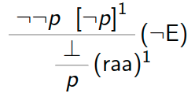
Also gilt $\{\lnot\lnot p\}\vdash p$, d.h. $p$ ist syntaktische Folgerung von $\lnot\lnot p$.
- Sei $B$ $H_{mathbb{R}}$-Belegung mit $B(p)=\mathbb{R}\backslash\{0\}$.
- $\Rightarrow B(\lnot\lnot p) =\mathbb{R}\not\subseteq \mathbb{R}\backslash\{0\}=B(p)$
- $\Rightarrow\lnot\lnot p\not\Vdash_{H_{mathbb{R}}} p$, d.h. $p$ ist keine $H_{mathbb{R}}$ -Folgerung von $\lnot\lnot p$.

> Korrektheitssatz für nat. Schließen & Wahrheitswertebereich $H_{mathbb{R}}$ 
> 
> Für jede Menge von Formeln $\Gamma$ und jede Formel $\varphi$ gilt $\Gamma\vdash\varphi$ ohne $(raa)$ $\Rightarrow\Gamma\vdash_{H_{mathbb{R}}}\varphi$.
 
> Korollar: Jedes $(raa)$-frei herleitbare Theorem ist eine $H_{mathbb{R}}$-Tautologie.

Folgerung: Jede Deduktion der Theoreme $\lnot\lnot\varphi\rightarrow\varphi$ und $\varphi\vee\lnot\varphi$ ohne Hypothesen verwendet $(raa)$.


## Vollständigkeit
Können wir durch mathematische Beweise zu allen korrekten Aussagen kommen?

Können wir durch das natürliche Schließen zu allen korrekten Aussagen kommen?

Existiert eine Menge $\Gamma$ von Formeln und eine Formel $\varphi$ mit $\Gamma\vdash_W\varphi$ und $\Gamma\not\vdash\varphi$? Für welche Wahrheitswertebereiche $W$?

Frage für diese Vorlesung: Für welche Wahrheitswertebereiche $W$ gilt $\Gamma\vdash_W \varphi\Rightarrow\Gamma\vdash\varphi$ bzw. $\varphi$ ist $W$-Tautologie $\Rightarrow\varphi$ ist Theorem?

### Plan
- Sei $W$ einer der Wahrheitswertebereiche $B,K_3 ,F ,B_\mathbb{R}, H_{mathbb{R}}$.
- z.z. ist $\Gamma\vdash_W\varphi\Rightarrow\Gamma\vdash\varphi$.
- dies ist äquivalent zu $\Gamma\not\vdash\varphi\Rightarrow\Gamma\not\Vdash_W \varphi$.
- hierzu gehen wir folgendermaßen vor:
  - $\Gamma \not\Vdash_W\varphi$ 
  - $\Leftrightarrow$ $\Gamma\cup\{\lnot\varphi\}$ konsistent
  - $\Rightarrow$ $\exists\Delta\subseteq\Gamma\cup\{\lnot\varphi\}$ maximal konsistent 
  - $\Rightarrow$ $\Delta$ erfüllbar
  - $\Rightarrow$ $\Gamma\cup\{\lnot\varphi\}$ erfüllbar
  - $\Leftrightarrow$ $\Gamma\not\Vdash_B \varphi$
  - $\Rightarrow$ $\Gamma\not\Vdash\varphi$   

### Konsistente Mengen
> Definition
> 
> Sei $\Gamma$ eine Menge von Formeln. $\Gamma$ heißt inkonsistent, wenn $\Gamma\vdash\bot$ gilt. Sonst heißt $\Gamma$ konsistent.

> Lemma
> 
> Sei $\Gamma$ eine Menge von Formeln und $\varphi$ eine Formel. Dann gilt $\Gamma\not\vdash\varphi \Leftrightarrow \Gamma\cup\{\lnot\varphi\}$ konsistent.

Beweis: Wir zeigen „$\Gamma\vdash\varphi\Leftrightarrow \Gamma\cup\{\lnot\varphi\}$ inkonsistent“:
- Richtung „$\Rightarrow$“, gelte also $\Gamma \vdash \varphi$.
  - $\Rightarrow$ es gibt Deduktion $D$ mit Hypothesen in $\Gamma$ und Konklusion $\varphi$
  - $\Rightarrow$ Wir erhalten die folgende Deduktion mit Hypothesen in $\Gamma\cup\{\lnot\varphi\}$ und Konklusion $\bot$: $\frac{\lnot\varphi\quad\varphi}{\bot}$
  - $\Rightarrow\Gamma\cup\{\lnot\varphi\}\vdash\bot$, d.h.$\Gamma\cup\{\lnot\varphi\}$ ist inkonsistent.
- Richtung „$\Leftarrow$“, sei also $\Gamma\cup\{\lnot\varphi\}$ inkonsistent.
  - $\Rightarrow$ Es gibt Deduktion $D$ mit Hypothesen in $\Gamma\cup\{\lnot\varphi\}$ und Konklusion $\bot$.
  - $\Rightarrow$ Wir erhalten die folgende Deduktion mit Hypothesen in $\Gamma$ und Konklusion $\varphi$: $\frac{\bot}{\varphi}$
  - $\Gamma\vdash\varphi$

### Maximal konsistente Mengen
> Definition
> 
> Eine Formelmenge $\Delta$ ist maximal konsistent, wenn sie konsistent ist und wenn gilt „$\sum\supseteq\Delta$ konsistent $\Rightarrow\sum = \Delta$“.

> Satz
> 
> Jede konsistente Formelmenge $\Gamma$ ist in einer maximal konsistenten Formelmenge $\Delta$ enthalten.

Beweis: Sei $\varphi_1,\varphi_2,...$ eine Liste aller Formeln (da wir abzählbar viele atomare
Formeln haben, gibt es nur abzählbar viele Formeln)

Wir definieren induktiv konsistente Mengen $\Gamma_n$:
- Setze $\Gamma_1 = \Gamma$ 
- Setze $\Gamma_{n+1}= \begin{cases} \Gamma_n\cup\{\varphi_n\}\quad\text{ falls diese Menge konsistent} \\ \Gamma_n \quad\text{sonst}\end{cases}$

Setze nun $\Delta =\bigcup_{n\geq 1} \Gamma_n$.
1. Wir zeigen indirekt, dass $\Delta$ konsistent ist: Angenommen, $\Delta\vdash\bot$.
   - $\Rightarrow$ Es gibt Deduktion $D$ mit Konklusion $\bot$ und endlicher Menge von Hypothesen $\Delta'\subseteq\Delta$.
   - $\Rightarrow$ Es gibt $n\geq 1$ mit $\Delta'\subseteq\Gamma_n$
   - $\Rightarrow \Gamma_n\vdash\bot$, zu $\Gamma_n$ konsistent. Also ist $\Delta$ konsistent.
2. Wir zeigen indirekt, dass $\Delta$ maximal konsistent ist. Sei also $\sum\supseteq\Delta$ 
konsistent. Angenommen, $\sum\not=\Delta$.
   - $\Rightarrow$ es gibt $n\in N$ mit $\varphi_n\in\sum\backslash\Delta$
   - $\Rightarrow \Gamma_n\cup\{\varphi_n\}\subseteq\Delta\cup\sum= \sum$ konsistent.
   - $\Rightarrow \varphi_n \in\Gamma_{n+1}\subseteq \Delta$, ein Widerspruch, d.h. $\Delta$ ist max. konsistent.

> Lemma 1
> 
> Sei $\Delta$ maximal konsistent und gelte $\Delta\vdash\varphi$. Dann gilt $\varphi\in\Delta$.

Beweis:
1. Zunächst zeigen wir indirekt, dass $\Delta\cup\{\varphi\}$ konsistent ist:
   - Angenommen, $\Delta\cup\{\varphi\}\vdash\bot$.
   - $\Rightarrow$ $\exists$ Deduktion $D$ mit Hypothesen in $\Delta\cup\{\varphi\}$ und Konklusion $\bot$.
   - $\Delta\vdash \varphi \Rightarrow \exists$ Deduktion $E$ mit Hypothesen in $\Delta$ und Konklusion $\varphi$.
   - $\Rightarrow$ Wir erhalten die folgende Deduktion: $\frac{\Delta \frac{\Delta}{\varphi}}{\bot}$

    Also $\Delta\vdash\bot$, ein Widerspruch zur Konsistenz von $\Delta$. Also ist $\Delta\cup\{\varphi\}$ konsistent.

2. Da $\Delta\cup\{\varphi\}\supseteq\Delta$ konsistent und $\Delta$ maximal konsistent ist, folgt $\Delta=\Delta\cup\{\varphi\}$, d.h. $\varphi\in\Delta$.

> Lemma 2
> 
> Sei $\Delta$ maximal konsistent und $\varphi$ Formel. Dann gilt $\varphi\not\in\Delta\Leftrightarrow\lnot\varphi\in\Delta$.

Beweis:
- Zunächst gelte $\lnot\varphi\in\Delta$. Angenommen, $\varphi\in\Delta$. Dann haben wir die Deduktion $\frac{\lnot\varphi\quad\varphi}{\bot}$ und damit $\Delta\vdash\bot$, was der Konsistenz von $\Delta$ widerspricht.
- Gelte nun $\varphi\not\in\Delta$.
  - $\Rightarrow$ $\Delta(\Delta\cup\{\varphi\}\Rightarrow\Delta\cup\{\varphi\}$ inkonsistent (da $\Delta$ max. konsistent)
  - $\Rightarrow$ Es gibt Deduktion $D$ mit Hypothesen in $\Delta\cup\{\varphi\}$ &Konklusion $\bot$.
  - $\Rightarrow$ Wir erhalten die folgende Deduktion: $\frac{\bot}{\lnot\varphi}$
  - $\Rightarrow$ $\Delta\vdash\lnot\varphi\Rightarrow\lnot\varphi\in\Delta$ (nach Lemma 1)

## Erfüllbare Mengen

> Definition
> 
> Sei $\Gamma$ eine Menge von Formeln. $\Gamma$ heißt erfüllbar, wenn es eine passende B-Belegung $B$ gibt mit $B(\gamma) = 1_B$ für alle $\gamma\in\Gamma$.

Bemerkung
- Die Erfüllbarkeit einer endlichen Menge $\Gamma$ ist entscheidbar:
    - Berechne Menge $V$ von in $\Gamma$ vorkommenden atomaren Formeln
    - Probiere alle B-Belegungen $B:V\rightarrow B$ durch
- Die Erfüllbarkeit einer endlichen Menge $\Gamma$ ist NP-vollständig (Satz von Cook)

> Satz
> Sei $\Delta$  eine maximal konsistente Menge von Formeln. Dann ist $\Delta$ erfüllbar.

Beweis: Definiere eine B-Belegung $B$ mittels $B(p_i) = \begin{cases} 1_B \quad\text{ falls } p_i\in\Delta \\ 0_B \quad\text{ sonst. } \end{cases}$
Wir zeigen für alle Formeln $\varphi: B(\varphi) = 1_B \Leftarrow\Rightarrow\varphi\in\Delta$ (*)

Der Beweis erfolgt per Induktion über die Länge von $\varphi$.

1. I.A.: hat $\varphi$ die Länge 1, so ist $\varphi$ atomare Formel. Hier gilt (*) nach Konstruktion von $B$.
2. I.V.: Gelte (*) für alle Formeln der Länge $<n$.
3. I.S.: Sei $\varphi$ Formel der Längen$>1$. $\Rightarrow$ Es gibt Formeln $\alpha$ und $\beta$ der Länge$<n$ mit $\varphi\in\{\lnot\alpha,\alpha\wedge\beta,\alpha\vee\beta,\alpha\rightarrow\beta\}$.
    - Wir zeigen (*) für diese vier Fälle einzeln auf den folgenden Folien.
    - Zur Erinnerung: $\Delta$ max. konsistent, $\varphi$ Formel
      - Lemma 1: $\Delta\vdash\varphi\Rightarrow\varphi\in\Delta$
      - Lemma 2: $\varphi\not\in\Delta\Leftarrow\Rightarrow\lnot\varphi\in\Delta$ 

1. $\varphi =\lnot\alpha$.
   $B(\varphi) = 1_B \Leftarrow\Rightarrow B(\alpha) = 0_B \Leftarrow\Rightarrow \alpha\not\in\Delta\Leftarrow\Rightarrow \Delta \owns\lnot\alpha =\varphi$
2. $\varphi =\alpha\wedge\beta$.
  - $B(\varphi) = 1_B \Rightarrow B(\alpha) =B(\beta) = 1_B \Rightarrow\alpha,\beta\in\Delta\Rightarrow\Delta\vdash\varphi$ denn $\frac{\alpha\quad\beta}{\alpha\wedge\beta}$ ist Deduktion $\Rightarrow\varphi\in\Delta$.
  - $\varphi$ $\in$ $\Delta$ 
  $\Rightarrow\Delta\vdash\alpha$ und $\Delta\vdash\beta$ denn $\frac{\varphi}{\alpha}$ und $\frac{\varphi}{\beta}$ sind Deduktionen. $\Rightarrow\alpha,\beta\in\Delta\Rightarrow B(\alpha),B(\beta) = 1_B=\Rightarrow B(\varphi) = 1_B$
3. $\varphi =\alpha\vee\beta$.
  - $B(\varphi) = 1_B \Rightarrow B(\alpha) = 1_B$ oder $B(\beta) = 1_B$
    - angenommen, $B(\alpha) = 1_B \Rightarrow\alpha\in\Delta\Rightarrow\Delta\vdash\varphi$ denn $\frac{\alpha}{\varphi}$ ist Deduktion $\Rightarrow\varphi\in\Delta$
    - angenommen, $B(\alpha) = 0_B \Rightarrow B(\beta) = 1_B$. weiter analog.
  - $\varphi\in\Delta$. Dann gilt $\Delta\cup\{\lnot\alpha ,\lnot\beta\}\vdash \bot$ aufgrund der Deduktion
    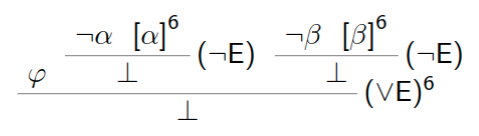
    Da $\Delta$ konsistent ist, folgt $\Delta\not=\Delta\cup\{\lnot\alpha,\lnot\beta\}$ und damit $\lnot\alpha\in\Delta$ oder $\lnot\beta\in\Delta$.
    $\Rightarrow\alpha\in\Delta$ oder $\beta\in\Delta$ nach Lemma 2
    $\Rightarrow B(\alpha) = 1_B$ oder $B(\beta) =1_B$
    $\Rightarrow B(\varphi) = 1_B$.
4. $\varphi = \alpha\rightarrow\beta$.
  - $B(\varphi) = 1_B \Rightarrow B(\alpha) = 0_B$ oder $B(\beta) = 1_B \Rightarrow\lnot\alpha\in\Delta$ oder $\beta\in\Delta$
    Aufgrund nebenstehender Deduktionen gilt in beiden Fällen $\Delta\vdash\alpha\rightarrow\beta\Rightarrow\varphi\in\Delta$
    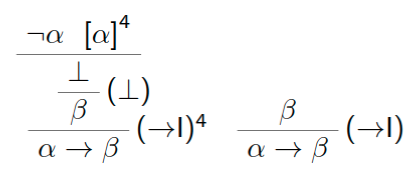
  - $\varphi\in\Delta$.
    Angenommen, $B(\varphi) = 0_B = \Rightarrow B(\alpha) = 1_B, B(\beta) = 0_B$ 
    $\Rightarrow\alpha\in\Delta, \beta\not\in\Delta \Rightarrow \lnot\beta\in\Delta$
    Aufgrund der nebenstehenden Deduktion gilt $\Delta\vdash\bot$, d.h. $\Delta$ ist inkonsistent, im Widerspruch zur Annahme. $\Rightarrow B(\varphi) = 1_B$
    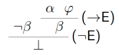


> Lemma
> 
> Sei $\Gamma$ eine Menge von Formeln und $\varphi$ eine Formel. Dann gilt $\Gamma\not\Vdash_B\varphi\Leftarrow\Rightarrow\Gamma\cup\{\lnot \varphi\}$ erfüllbar.

Beweis: $\Gamma\not\Vdash_B\varphi$ 
$\Leftarrow\Rightarrow$ es gibt passende B-Belegung $B$ mit $inf\{B(\gamma)|\gamma\in\Gamma\} \not\leq_B B(\varphi)$
$\Leftarrow\Rightarrow$ es gibt passende B-Belegung $B$ mit $inf\{B(\gamma)|\gamma\in\Gamma\}= 1_B$ und $B(\varphi)=0_B$
$\Leftarrow\Rightarrow$ es gibt passende B-Belegung $B$ mit $B(\gamma) = 1_B$ für alle $\gamma\in\Gamma$ und $B(\lnot\varphi) = 1_B$
$\Leftarrow\Rightarrow \Gamma\cup\{\lnot\varphi\}$ erfüllbar

> Beobachtung: 
> Sei $W$ einer der Wahrheitswertebereiche $B, K_3, F, H_R$ und $B_R,\Gamma$ eine Menge von Formeln und $\varphi$ eine Formel. Dann gilt $\Gamma\Vdash W\varphi\Rightarrow\Gamma\Vdash B\varphi$.

Beweis: Sei $B$ beliebige B-Belegung, die zu jeder Formel in $\Gamma\cup\{\varphi\}$ paßt. definiere W-Belegung $B_W$ durch $B_W(pi) = \begin{cases} 1_W \quad\text{ falls } B(p_i) = 1_B \\ 0_W \quad\text{ sonst} \end{cases}$.
per Induktion über die Formelgröße kann man für alle Formeln $\psi$, zu denen $B$ paßt, zeigen:
$B_W(\psi) = \begin{cases} 1_W \quad\text{ falls } B(\psi) = 1_B \\ 0_W \quad\text{ sonst.} \end{cases}$ (*)

Wir unterscheiden zwei Fälle:
- $inf\{B(\gamma)|\gamma\in\Gamma\}= 1_B \Rightarrow inf\{B_W(\gamma)|\gamma\in\Gamma\} = 1_W$ (wegen (*))
  $\Rightarrow 1_W = B_W(\varphi)$ (wegen $\Gamma\Vdash_W\varphi$)
  $\Rightarrow 1_B = B(\varphi)$ (wegen (*))
  $\Rightarrow inf\{B(\gamma)|\gamma\in\Gamma\} = 1_B \leq B(\varphi)$ und
- $inf\{B(\gamma)|\gamma\in\Gamma\} \not= 1_B \Rightarrow inf\{B(\gamma)|\gamma\in\Gamma\}= 0_B$
  $\Rightarrow inf\{B(\gamma)|\gamma\in\Gamma\}= 0_B \leq B(\varphi)$.

Da $B$ beliebig war, gilt $\Gamma\Vdash_B \varphi$.

> Satz (Vollständigkeitssatz)
> 
> Sei $\Gamma$ eine Menge von Formeln, $\varphi$ eine Formel und $W$ einer der Wahrheitswertebereiche $B,K_3 , F, B_R$ und $H_R$. Dann gilt $\Gamma\Vdash_W\varphi \Rightarrow \Gamma\vdash\varphi$.
> Insbesondere ist jede W-Tautologie ein Theorem.

Beweis: indirekt
- $\Gamma\not\Vdash$
- $\Gamma\cup\{\lnot\varphi\}$ konsistent
- $\exists\Delta\supseteq\Gamma\cup\{\lnot\varphi\}$ maximal konsistent
- $\Rightarrow\Delta$ erfüllbar
- $\Gamma\cup\{\lnot\varphi\}$ erfüllbar
- $\Gamma\not\Vdash_B \varphi$  
- $\Gamma\not\Vdash_W \varphi$ 

## Vollständigkeit und Korrektheit
> Satz
> 
> Seien $\Gamma$ eine Menge von Formeln und $\varphi$ eine Formel. Dann gilt $\Gamma\vdash\varphi\Leftarrow\Rightarrow\Gamma\Vdash_B \varphi$.
> Insbesondere ist eine Formel genau dann eine B-Tautologie, wenn sie ein Theorem ist.

Beweis: Folgt unmittelbar aus Korrektheitssatz und Vollständigkeitssatz.

> Bemerkung:
> - gilt für jede „Boolesche Algebra“, z.B. $B_R$
> - $\Gamma\vdash\varphi$ ohne ($raa$) $\Leftarrow\Rightarrow\Gamma\Vdash_{H_R} \varphi$ (Tarksi 1938)


### Folgerung 1: Entscheidbarkeit
> Satz: die Menge der Theoreme ist entscheidbar.

Beweis: Sei $\varphi$ Formel und $V$ die Menge der vorkommenden atomaren Formeln. Dann gilt $\varphi$ Theorem
- $\Leftarrow\Rightarrow\varphi$ B-Tautologie
- $\Leftarrow\Rightarrow$ für alle Abbildungen $B:V\rightarrow\{0_B, 1_B\}$ gilt $B(\varphi) = 1_B$

Da es nur endlich viele solche Abbildungen gibt und $B(\varphi)$ berechnet werden kann, ist dies eine entscheidbare Aussage.

### Folgerung 2: Äquivalenzen und Theoreme
> Definition
> 
> Zwei Formeln $\alpha$ und $\beta$ heißen äquivalent $(\alpha\equiv\beta)$, wenn für alle passenden B-Belegungen $B$ gilt: $B(\alpha) =B(\beta)$.

> Satz: Es gelten die folgenden Äquivalenzen:
> 1. $p_1 \vee p_2 \equiv p_2 \vee p_1$
> 2. $(p_1 \vee p_2 )\vee p_3 \equiv p_1 \vee (p_2 \vee p_3 )$
> 3. $p_1 \vee (p_2 \wedge p_3 )\equiv (p_1 \vee p_2 )\wedge (p_1 \vee p_3 )$
> 4. $\lnot(p_1 \vee p_2 )\equiv\lnot p_1 \wedge\lnot p_2$
> 5. $p_1 \vee p_1 \equiv p_1$
> 6. $(p_1 \wedge \lnot p_1 )\vee p_2 \equiv p_2$
> 7. $\lnot\lnot p_1\equiv p_1$
> 8. $p_1 \wedge\lnot p_1 \equiv\bot$ 
> 9. $p_1 \vee\lnot p_1 \equiv\lnot\bot$ 
> 10. $p_1 \rightarrow p_2 \equiv \lnot p_1 \vee p_2$

Beweis: Wir zeigen nur die Äquivalenz (3): 
Sei $B$ beliebige B-Belegung, die wenigstens auf $\{p_1, p_2, p_3\}$ definiert ist.
Dazu betrachten wir die Wertetabelle:
| $B(p_1)$ | $B(p_2)$ | $B(p_3)$ | $B(p_1\vee(p_2\wedge p_3))$ | $B((p_1\vee p_2)\wedge(p_1 \vee p_3 ))$ |
| -------- | -------- | -------- | --------------------------- | --------------------------------------- |
| $0_B$    | $0_B$    | $0_B$    | $0_B$                       | $0_B$                                   |
| $0_B$    | $0_B$    | $1_B$    | $0_B$                       | $0_B$                                   |
| $0_B$    | $1_B$    | $0_B$    | $0_B$                       | $0_B$                                   |
| $0_B$    | $1_B$    | $1_B$    | $1_B$                       | $1_B$                                   |
| $1_B$    | $0_B$    | $0_B$    | $1_B$                       | $1_B$                                   |
| $1_B$    | $0_B$    | $1_B$    | $1_B$                       | $1_B$                                   |
| $1_B$    | $1_B$    | $0_B$    | $1_B$                       | $1_B$                                   |
| $1_B$    | $1_B$    | $1_B$    | $1_B$                       | $1_B$                                   |

Die anderen Äquivalenzen werden analog bewiesen.

Aus dieser Liste von Äquivalenzen können weitere hergeleitet werden:

Beispiel: Für alle Formeln $\alpha$ und $\beta$ gilt $\lnot(\alpha\wedge\beta)\equiv\lnot\alpha\vee\lnot\beta$.

Beweis: $\lnot(\alpha\wedge\beta) \equiv \lnot(\lnot\lnot\alpha\wedge\lnot\lnot\beta) \equiv \lnot\lnot(\lnot\alpha\vee\lnot\beta) \equiv \lnot\alpha\vee\lnot\beta$ 

> Bemerkung
> Mit den üblichen Rechenregeln für Gleichungen können aus dieser Liste alle gültigen Äquivalenzen hergeleitet werden.

#### Zusammenhang zw. Theoremen und Äquivalenzen
> Satz
> 
> Seien $\alpha$ und $\beta$ zwei Formeln. Dann gilt $\alpha\equiv\beta\Leftarrow\Rightarrow(\alpha\leftrightarrow\beta)$ ist Theorem.

Beweis: $\alpha\equiv\beta$
- $\Leftarrow\Rightarrow$  für alle passenden B-Belegungen $B$ gilt $B(\alpha)=B(\beta)$
- $\Leftarrow\Rightarrow \{\alpha\}\Vdash_B\beta$ und $\{\beta\}\Vdash_B \alpha$ 
- $\Leftarrow\Rightarrow \{\alpha\}\vdash\beta$ und $\{\beta\}\vdash\alpha$ (nach Korrektheits- und Vollständigkeitssatz)

es bleibt z.z., dass dies äquivalent zu $\varnothing\vdash(\alpha\leftrightarrow\beta)$ ist.
- $\Rightarrow$: Wir haben also Deduktionen mit Hypothesen in $\{\alpha\}$ bzw. in $\{\beta\}$ und Konklusionen $\beta$ bzw.$\alpha$. Es ergibt sich eine hypothesenlose Deduktion von $\alpha\leftrightarrow\beta$:
    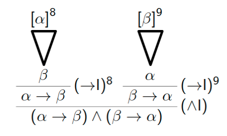
- $\Leftarrow$: Wir haben also eine hypothesenlose Deduktion von $\alpha\leftrightarrow\beta$. Es ergeben sich die folgenden Deduktionen mit Hypothesen $\beta$ bzw. $\alpha$ und Konklusionen $\alpha$ bzw. $\beta$:
    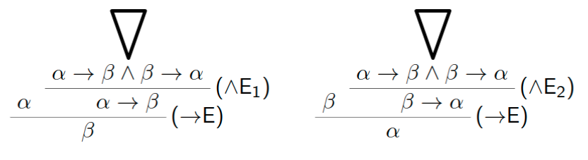

> Satz
> 
> Sei $\alpha$ eine Formel. Dann gilt $\alpha$ ist Theorem $\Leftarrow\Rightarrow\alpha\equiv\lnot\bot$.

Beweis: $\alpha$ ist Theorem
- $\Leftarrow\Rightarrow\alpha$ ist B-Tautologie (Korrektheits- und Vollständigkeitssatz)
- $\Leftarrow\Rightarrow$ für alle passenden B-Belegungen $B$ gilt $B(\alpha) = 1_B$
- $\Leftarrow\Rightarrow$ für alle passenden B-Belegungen $B$ gilt $B(\alpha) =B(\lnot\bot)$
- $\Leftarrow\Rightarrow\alpha\equiv\lnot\bot$ 

### Folgerung 3: Kompaktheit
> Satz
> 
> Sei $\Gamma$ eine u.U. unendliche Menge von Formeln und $\varphi$ eine Formel mit $\Gamma\Vdash_B\varphi$. Dann existiert $\Gamma′\subseteq\Gamma$ endlich mit $\Gamma′\Vdash_B \varphi$.

Beweis: $\Gamma\Vdash_B\varphi$ 
- $\Rightarrow\Gamma\vdash\varphi$ (nach dem Vollständigkeitssatz)
- $\Rightarrow$ es gibt Deduktion von $\varphi$ mit Hypothesen $\gamma_1,...,\gamma_n\in\Gamma$
- $\Rightarrow\Gamma′=\{\gamma_1,...,\gamma_n\}\subseteq\Gamma$ endlich mit $\Gamma′\vdash\varphi$
- $\Rightarrow\Gamma′\Vdash_B\varphi$ (nach dem Korrektheitssatz).

> Folgerung (Kompaktheits- oder Endlichkeitssatz)
> 
> Sei $\Gamma$ eine u.U. unendliche Menge von Formeln. Dann gilt $\Gamma$ unerfüllbar $\Leftarrow\Rightarrow\exists\Gamma′\subseteq\Gamma$ endlich: $\Gamma′$ unerfüllbar

Beweis: $\Gamma$ unerfüllbar
- $\Leftarrow\Rightarrow\Gamma\cup\{\lnot\bot\}$ unerfüllbar
- $\Leftarrow\Rightarrow\Gamma\Vdash_B\bot$
- $\Leftarrow\Rightarrow$ es gibt $\Gamma′\subseteq\Gamma$ endlich: $\Gamma′\Vdash_B\bot$
- $\Leftarrow\Rightarrow$ es gibt $\Gamma′\subseteq\Gamma$ endlich: $\Gamma′\cup\{\lnot\bot\}$ unerfüllbar
- $\Leftarrow\Rightarrow$ es gibt $\Gamma′\subseteq\Gamma$ endlich: $\Gamma′$ unerfüllbar


### 1. Anwendung des Kompaktheitsatzes: Färbbarkeit
> Definition
> 
> Ein Graph ist ein Paar $G=(V,E)$ mit einer Menge $V$ und $E\subseteq\binom{V}{2} =\{X\subseteq V:|V$\Vdash$ 2 \}$.
> Für $W\subseteq V$ sei $G\upharpoonright_W= (W,E\cap\binom{W}{2})$ der von $W$ induzierte Teilgraph.
> Der Graph G ist 3-färbbar, wenn es eine Abbildung $f:V\rightarrow\{1,2,3\}$ mit $f(v)\not=f(w)$ für alle $\{v,w\}\in E$.

Bemerkung: Die 3-Färbbarkeit eines endlichen Graphen ist NP-vollständig

> Satz
> Sei $G= (N,E)$ ein Graph. Dann sind äquivalent
> 1. $G$ ist 3-färbbar.
> 2. Für jede endliche Menge $W\subseteq N$ ist $G\upharpoonright_W$ 3-färbbar.

Beweis:
- $1.\Rightarrow 2.$ trivial
- $2.\Rightarrow 1.$ Sei nun, für alle endlichen Menge $W\subseteq N$, der induzierte Teilgraph $G\upharpoonright_W$ 3-färbbar.

Wir beschreiben zunächst mit einer unendlichen Menge $\Gamma$ von Formeln, dass eine 3-Färbung existiert:
- atomare Formeln $p_{n,c}$ für $n\in N$ und $c\in\{1,2,3\}$ (Idee: der Knoten n hat die Farbe c)
- $\Gamma$ enthält die folgenden Formeln:
  - für alle $n\in N:p_{n, 1} \vee p_{n, 2} \vee p_{n, 3}$ (der Knoten n ist gefärbt)
  - für alle $n\in N:\bigwedge_{1\leq c< d \leq 3} \lnot(p_{n,c} \wedge p_{n,d})$ (der Knoten n ist nur mit einer Farbe gefärbt)
  - für alle $\{m,n\}\in E: \bigwedge_{1\leq c\leq 3} \lnot(p_{m,c} \wedge p_{n,c})$ (verbundene Knoten m und n sind verschieden gefärbt)


Behauptung: Jede endliche Menge $\Delta\subseteq\Gamma$ ist erfüllbar.

Begründung:
- Da $\Delta$ endlich ist, existiert endliche Menge $W\subseteq N$, so dass jede atomare Formel in $\Delta$ die Form $p_{n,c}$ für ein $n\in W$ und ein $c\in\{1,2,3\}$ hat.
- Nach Annahme existiert $f_W:W\rightarrow\{1,2,3\}$ mit $f_W(m) \not=f(n)$ f.a. $\{m,n\}\in E\cap\binom{W}{2}$.
- Definiere $B:\{p_{n,c}|n\in W, 1 \leq c\leq 3\}\rightarrow\{0,1\}$ durch $B(p_{n,c}) = \begin{cases} 1 \quad\text{ falls } f_W(n) = c \\ 0 \quad\text{ sonst.} \end{cases}$
- Diese Belegung erfüllt $\Delta$, d.h. $\Delta$ ist erfüllbar, womit die Behauptung gezeigt ist.

Nach dem Kompaktheitssatz ist also $\Gamma$ erfüllbar.
Sei $B$ erfüllende Belegung. Für $n\in N$ existiert genau ein $c\in\{1,2,3\}$ mit $B(p_{n,c}) =1$. Setze $f(n) =c$. Dann ist $f$ eine gültige Färbung des Graphen $G$.

### 2. Anwendung des Kompaktheitsatzes: Parkettierungen
Idee: Gegeben ist eine Menge von quadratischen Kacheln mit gefärbten Kanten. Ist es möglich, mit diesen Kacheln die gesamte Ebene zu füllen,so dass aneinanderstoßende Kanten gleichfarbig sind?

Berühmtes Beispiel: Mit diesen 11 Kacheln kann die Ebene gefüllt werden, aber dies ist nicht periodisch möglich.


> Definition
> 
> Ein Kachelsystem besteht aus einer endlichen Menge C von „Farben“ und einer Menge K von Abbildungen $\{N,O,S,W\}\rightarrow C$ von „Kacheln“.
> Eine Kachelung von $G\subseteq Z\times Z$ ist eine Abbildung $f:G\rightarrow K$ mit
> - $f(i,j)(N) =f(i,j+ 1 )(S)$ für alle $(i,j),(i,j+ 1 )\in G$
> - $f(i,j)(O) =f(i+ 1 ,j)(W)$ für alle $(i,j),(i+ 1 ,j)\in G$

> Satz
> 
> Sei $K$ ein Kachelsystem. Es existiert genau dann eine Kachelung von $Z\times Z$, wenn für jedes $n\in N$ eine Kachelung von $\{(i,j) :|i|,|j| \leq n\}$ existiert.

Beweis: 
- $\Rightarrow$: trivial
- $\Leftarrow$: Wir beschreiben zunächst mit einer unendlichen Menge $\Gamma$ von Formeln, dass eine Kachelung existiert:
  atomare Formeln $p_{k,i,j}$ für $k\in K$ und $i,j\in Z$ (Idee: an der Stelle $(i,j)$ liegt die Kachel $k$, d.h. $f(i,j) =k$)
  Für alle $(i,j)\in Z$ enthält $\Gamma$ die folgenden Formeln:
  - eine der Kacheln aus $K$ liegt an der Stelle $(i,j):\bigvee_{k\in K} p_{k,i,j}$
  - es liegen nicht zwei verschiedene Kacheln an der Stelle $(i,j): \bigwedge_{k,k′\in K,k\not=k′} \lnot(p_{k,i,j}\wedge p_{k′,i,j})$
  - Kacheln an Stellen $(i,j)$ und $(i,j+1)$ „passen übereinander“: $\bigvee_{k,k′\in K,k(N)=k′(S)} (p_{k,i,j}\wedge p_{k′,i,j+1})$
  - Kacheln an Stellen $(i,j)$ und $(i+1,j)$ „passen nebeneinander“: $\bigvee_{k,k′\in K,k(W)=k′(O)} (p_{k,i,j}\wedge p_{k′,i+1,j})$

Sei nun $\Delta\subseteq\Gamma$ endlich.
- $\Rightarrow$ es gibt $n\in N$, so dass $\Delta$ nur atomare Formeln der Form $p_{k,i,j}$ mit $|i|,|j|\leq n$ enthält.
- Voraussetzung $\Rightarrow$ es gibt Kachelung $g:\{(i,j) :|i|,|j| \leq n\}\rightarrow K$ für $k\in K$ und $|i|,|j|\leq n$ definiere $B(p_{k,i,j}) = \begin{cases} 1_B \quad\text{ falls } g(i,j) =k \\ 0_B \quad\text{ sonst} \end{cases}$
- $\Rightarrow B(\sigma) = 1_B$ für alle $\sigma\in\Delta$ (da $g$ Kachelung)
- Also haben wir gezeigt, dass jede endliche Teilmenge von $\Gamma$ erfüllbar ist.
- Kompaktheitssatz $\Rightarrow$ es gibt B-Belegung $B$ mit $B(\gamma) = 1_B$ für alle $\gamma\in\Gamma$
- $\Rightarrow$ es gibt Abbildung $f:Z\times Z\rightarrow K$ mit $f(i,j) =k \Leftarrow\Rightarrow B(p_{k,i,j}) = 1_B$.
- Wegen $B\Vdash\Gamma$ ist dies eine Kachelung.

Weitere Anwendungen des Kompaktheitsatzes
- abz. partielle Ordnungen sind linearisierbar
- abz. Gleichungssystem über $\mathbb{Z}_2$ lösbar $\Leftarrow\Rightarrow$ jedes endliche Teilsystem lösbar
- Heiratsproblem
- Kőnigs Lemma (Übung)
- ...

Bemerkung: Der Kompaktheitssatz gilt auch, wenn die Menge der atomaren Formeln nicht abzählbar ist. Damit gelten die obigen Aussagen allgemeiner:
- 3-Färbbarkeit: beliebige Graphen
- Linearisierbarkeit: beliebige partielle Ordnungen
- Lösbarkeit: beliebig große Gleichungssysteme über $\mathbb{Z}_2$
- ...


## Erfüllbarkeit
> Erfüllbarkeitsproblem
> 
> Eingabe: Formel $\Gamma$ 
> 
> Frage: existiert eine B-Belegung $B$ mit $B(\Gamma) = 1_B$.

- offensichtlicher Algorithmus: probiere alle Belegungen durch (d.h. stelle Wahrheitswertetabelle auf)$\rightarrow$ exponentielle Zeit
- „Automaten, Sprachen und Komplexität“: das Problem ist NP-vollständig
- nächstes Ziel:spezielle Algorithmen für syntaktisch eingeschränkte Formeln $\Gamma$
- Spätere Verallgemeinerung dieser Algorithmen (letzte Vorlesung des Logik-Teils von „Logik und Logikprogrammierung“) bildet Grundlage der logischen Programmierung.

### Hornformeln (Alfred Horn, 1918–2001)
> Definition
> 
> Eine Hornklausel hat die Form $(\lnot\bot\wedge p_1\wedge p_2\wedge ... \wedge p_n)\rightarrow q$ für $n\geq 0$, atomare Formeln $p_1 ,p_2 ,... ,p_n$ und $q$ atomare Formel oder $q=\bot$.
> Eine Hornformel ist eine Konjunktion von Hornklauseln.

Schreib- und Sprechweise
- $\{p_1,p_2 ,... ,p_n\}\rightarrow q$ für Hornklausel $(\lnot\bot\wedge p_1 \wedge p_2 \wedge ...\wedge p_n)\rightarrow q$
 insbes. $\varnothing\rightarrow q$ für $\lnot\bot\rightarrow q$
- $\{(M_i\rightarrow q_i)| 1 \leq i\leq n\}$ für Hornformel $\bigwedge_{1 \leq i \leq n} (M_i\rightarrow q_i)$

Bemerkung, in der Literatur auch:
- $\{\lnot p_1,\lnot p_2 ,... ,\lnot p_n,q\}$ für $\{p_1 ,... ,p_n\}\rightarrow q$ mit $q$ atomare Formel
- $\{\lnot p_1,\lnot p_2 ,... ,\lnot p_n\}$ für $\{p_1 ,... ,p_n\}\rightarrow\bot$ 
- $\Box$ für $\varnothing\rightarrow\bot$, die „leere Hornklausel“

### Markierungsalgorithmus
- Eingabe: eine endliche Menge $\Gamma$ von Hornklauseln.
1. while es gibt in $\Gamma$ eine Hornklausel $M\rightarrow q$, so dass alle $p\in M$ markiert sind und $q$ unmarkierte atomare Formel ist:
   do markiere $q$ (in allen Hornklauseln in $\Gamma$)
2. if $\Gamma$ enthält eine Hornklausel der Form $M\rightarrow\bot$, in der alle $p\in M$ markiert sind
    then return „unerfüllbar“
    else return „erfüllbar“

Beweis einer Folgerung: Beispiel
- Ziel ist es, die folgende Folgerung zu zeigen: $\{(AK\vee BK),(AK\rightarrow BK),(BK\wedge RL\rightarrow\lnot AK),RL\}\Vdash\lnot AK$
- Lemma: man muß Unerfüllbarkeit der folgenden Menge zeigen: $\{(AK\vee BK),(AK\rightarrow BK),(BK\wedge RL\rightarrow \lnot AK),RL,\lnot\lnot AK\}$
- Dies ist keine Menge von Hornklauseln!
- Idee: ersetze $BK$ durch $\lnot BH$ in allen Formeln.
- Ergebnis:
  - Aus $AK\vee BK$ wird $\lnot BH\vee AK\equiv BH\rightarrow AK\equiv\{BH\}\rightarrow AK$.
  - Aus $AK\rightarrow BK$ wird $AK\rightarrow\lnot BH\equiv\lnot AK\vee\lnot BH\equiv AK\wedge BH\rightarrow\bot\equiv\{AK,BH\} \rightarrow\bot$.
  - Aus $BK\wedge RL\rightarrow\lnot AK$ wird $\lnot BH\wedge RL\rightarrow\lnot AK\equiv BH\vee\lnot RL\vee\lnot AK\equiv RL\wedge AK\rightarrow BH\equiv\{RL,AK\}\rightarrow BH$
  - $RL\equiv (\varnothing\rightarrow RL)$
  - $\lnot\lnot AK\equiv (\varnothing\rightarrow AK)$
- Wir müssen also zeigen, dass die folgende Menge von Hornklauseln unerfüllbar ist:
    $\{\{BH\}\rightarrow AK,\{AK,BH\}\rightarrow\bot,\{RL,AK\}\rightarrow BH,\varnothing\rightarrow RL,\varnothing\rightarrow AK\}$

Der Markierungsalgorithmus geht wie folgt vor:
1. Runde: markiere $RL$ aufgrund der Hornklausel $\varnothing\rightarrow RL$
2. Runde: markiere $AK$ aufgrund der Hornklausel $\varnothing\rightarrow AK$
3. Runde: markiere $BH$ aufgrund der Hornklausel $\{RL,AK\}\rightarrow BH$

dann sind keine weiteren Markierungen möglich.

In der Hornklausel $\{AK,BH\}\rightarrow\bot$ sind alle atomaren Formeln aus $\{AK,BH\}$ markiert. Also gibt der Algorithmus aus, dass die Menge von Hornklauseln nicht erfüllbar ist.

Nach unserer Herleitung folgern wir, dass das Teil $A$ heil ist.

1. Der Algorithmus terminiert: 
   in jedem Durchlauf der while-Schleife wird wenigstens eine atomare Formel markiert. Nach endlich vielen Schritten terminiert die Schleife also.
2. Wenn der Algorithmus eine atomare Formelqmarkiert und wenn $B$ eine B-Belegung ist, die $\Gamma$ erfüllt, dann gilt $B(q) = 1_B$.
    Beweis: wir zeigen induktiv über $n$: Wenn $q$ in einem der ersten $n$ Schleifendurchläufe markiert wird, dann gilt $B(q) = 1_B$.
  - I.A. Die Aussage gilt offensichtlich für $n=0$.
  - I.S. werde die atomare Formel $q$ in einem der ersten $n$ Schleifendurchläufe markiert. Dann gibt es eine Hornklausel $\{p_1,p_2 ,... ,p_k\}\rightarrow q$, so dass $p_1 ,... ,p_k$ in den ersten $n-1$ Schleifendurchläufen markiert wurden. Also gilt $B(p_1)=...=B(p_k) = 1_B$ nach IV. 
    Da $B$ alle Hornformeln aus $\Gamma$ erfüllt, gilt insbesondere $B(\{p_1 ,p_2 ,... ,p_k\}\rightarrow q) = 1_B$ und damit $B(q) = 1_B$.
3. Wenn der Algorithmus „unerfüllbar“ ausgibt, dann ist $\Gamma$ unerfüllbar.
    Beweis: indirekt, wir nehmen also an, dass der Algorithmus „unerfüllbar“ ausgibt, $B$ aber eine B-Belegung ist, die $\Gamma$ erfüllt.
    Sei $\{p_1 ,... ,p_k\}\rightarrow\bot$ die Hornklausel aus $\Gamma$, die die Ausgabe „unerfüllbar“ verursacht (d.h. die atomaren Formeln $p_1 ,... ,p_k$ sind markiert).
    Nach 2. gilt $B(p_1) =...=B(p_k) = 1_B$, also $B(\{p_1 ,p_2 ,... ,p_k\}\rightarrow\bot) = 0_B$ im Widerspruch zur Annahme, dass $B$ alle Hornklauseln aus $\Gamma$ erfüllt.
    Also kann es keine erfüllende B-Belegung von $\Gamma$ geben.
4. Wenn der Algorithmus „erfüllbar“ ausgibt, dann erfüllt die folgende B-Belegung alle Formeln aus $\Gamma$:
    $B(p_i)=\begin{cases} 1_B \quad\text{ der Algorithmus markiert } p_i \\ 0_B \quad\text{ sonst} \end{cases}$
    Beweis:
      - Sei $M\rightarrow q$ eine beliebige Hornklausel aus $\Gamma$.
      - Ist ein $p\in M$ nicht markiert, so gilt $B(\bigwedge_{p\in M} p) = 0_B$ und damit $B(M\rightarrow q) = 1_B$.
      - Sind alle $p\in M$ markiert, so wird auch $q$ markiert, also $B(q) = 1_B$ und damit $B(M\rightarrow q) = 1_B$.
      - Gilt $q=\bot$, so existiert unmarkiertes $p\in M$ (da der Algorithmus sonst „unerfüllbar“ ausgegeben hätte), also $B(M\rightarrow\bot) = 1_B$ wie im ersten Fall.
    Also gilt $B(M\rightarrow q) = 1_B$ für alle Hornklauseln aus $\Gamma$, d.h. $\Gamma$ ist erfüllbar.

> Satz
> 
> Sei $\Gamma$ endliche Menge von Hornklauseln. Dann terminiert der Markierungsalgorithmus mit dem korrekten Ergebnis.

Beweis: Die Aussagen 1.-4. beweisen diesen Satz.

Bemerkungen:
- Mit einer geeigneten Implementierung läuft der Algorithmusin linearer Zeit.
- Wir haben sogar gezeigt, dass bei Ausgabe von „erfüllbar“ eine erfüllende B-Belegung berechnet werden kann.

### SLD-Resolution
> Definition
> 
> Sei $\Gamma$ eine Menge von Hornklauseln. Eine SLD-Resolution aus $\Gamma$ ist eine Folge $(M_0\rightarrow\bot,M_1\rightarrow\bot,... ,M_m\rightarrow\bot)$ von Hornklauseln mit
> - $(M_0\rightarrow\bot)\in\Gamma$ 
> - für alle $0\leq n<m$ existiert $(N\rightarrow q)\in\Gamma$ mit $q\in M_n$ und $M_{n+1} = M_n\backslash\{q\}\cup N$

Beispiel: 
- $\Gamma =\{\{BH\}\rightarrow AK,\{AK,BH\}\rightarrow\bot,\{RL,AK\}\rightarrow BH,\varnothing\rightarrow RL,\varnothing\rightarrow AK\}$
- $M_0 =\{AK,BH\}$
- $M_1 =M_0 \backslash\{BH\}\cup\{RL,AK\}=\{RL,AK\}$
- $M_2 =M_1 \backslash\{RL\}\cup\varnothing =\{AK\}$
- $M_3 =M_2 \backslash\{AK\}\cup\varnothing =\varnothing$ 

> Lemma A
>
> Sei $\Gamma$ eine (u.U. unendliche) Menge von Hornklauseln und $(M_0\rightarrow\bot, M_1\rightarrow\bot,... , M_m\rightarrow\bot)$ eine SLD-Resolution aus $\Gamma$ mit $M_m=\varnothing$. Dann ist $\Gamma$ nicht erfüllbar.

Beweis: 
- indirekt: angenommen, es gibt B-Belegung $B$ mit $B(N\rightarrow q) = 1_B$ für alle $(N\rightarrow q)\in\Gamma$.
- Wir zeigen für alle $0\leq n\leq m$ per Induktion über n: es gibt $p\in M_n$ mit $B(p) = 0_B$ (4)
- I.A.: $n=0:(M_0 \rightarrow\bot,...)$ SLD-Resolution $\Rightarrow(M_0\rightarrow\bot)\in\Gamma$
  - $\Rightarrow B(M_0\rightarrow\bot) = 1_B$
  - $\Rightarrow$ es gibt $p\in M_0$ mit $B(p) = 0_B$
- I.V.: sei $n<m$ und $p\in M_n$ mit $B(p) = 0_B$
- I.S.: $(... ,M_n\rightarrow\bot,M_{n+ 1}\rightarrow\bot,...)$ SLD-Resolution $\Rightarrow$ es gibt $(N\rightarrow q)\in\Gamma$ mit $M_{n+1} =M_n\backslash\{q\}\cup N$ und $q\in M_n$. Zwei Fälle werden unterschieden:
    1. $p\not=q$: dann gilt $p\in M_{n+1}$ mit $B(p) = 0_B$
    2. $p=q:(N\rightarrow q)\in\Gamma\Rightarrow B(N\rightarrow q) = 1_B$ es gibt $p′\in N\subseteq M_{n+1}$ mit $B(p′)=0_B$
  in jedem der zwei Fälle gilt also (4) für $n+1$.
- Damit ist der induktive Beweis von (4) abgeschlossen.
- Mit $m=n$ haben wir insbesondere "es gibt $p\in M_m$ mit $B(p) = 0_B$" im Widerspruch zu $M_m=\varnothing$. Damit ist der indirekte Beweis abgeschlossen.

> Lemma B
> 
> Sei $\Gamma$ eine (u.U. unendliche) unerfüllbare Menge von Hornklauseln. Dann existiert eine SLD-Resolution $(M_0\rightarrow\bot,...,M_m\rightarrow\bot)$ aus $\Gamma$ mit $M_m=\varnothing$.

Beweis: Endlichkeitssatz: es gibt $\Delta\subseteq\Gamma$ endlich und unerfüllbar. Bei Eingabe von$\Delta$ terminiert Markierungsalgorithmus mit „unerfüllbar“
- $r\geq 0...$ Anzahl der Runden
- $q_i...$ Atomformel, die in $i$ Runde markiert wird $(1\leq i\leq r)$

Behauptung: Es gibt $m\leq r$ und SLD-Resolution $(M_0\rightarrow\bot,...,M_m\rightarrow\bot)$ aus $\Delta$ mit $M_m=\varnothing$ und $M_n\subseteq\{q_1,q_2,... ,q_{r-n}\}$ f.a. $0\leq n\leq m$. (5)

Beweis der Behauptung: Wir konstruieren die Hornklauseln $M_i\rightarrow\bot$ induktiv:
- I.A.: Da der Markierungsalgorithmus mit „unerfüllbar“ terminiert, existiert eine Hornklausel $(M_0\rightarrow\bot)\in\Gamma$ mit $M_0\subseteq\{q_1,... ,q_{r- 0}\}$. $(M_0\rightarrow\bot)$ ist SLD-Resolution aus $\Delta$, die (5) erfüllt.
- I.V.: Sei $n\leq r$ und $(M_0\rightarrow\bot,... ,M_n\rightarrow\bot)$ SLD-Resolution, so dass (5) gilt.
- I.S.: wir betrachten drei Fälle:
  1. Fall $M_n=\varnothing$: mit $m:=n$ ist Beweis der Beh. abgeschlossen.
  2. Fall $n=r$: Nach (5) gilt $M_n\subseteq\{q_1,...,q_{r-n}\}=\varnothing$. Mit $m:=n$ ist der Beweis der Beh. abgeschlossen.
  3. Fall $n<r$ und $M_n \not=\varnothing$. Sei $k$ maximal mit $q_k\in M_n\subseteq\{q_1,q_2,... ,q_{r-n}\}$. Also existiert $(N\rightarrow q_k)\in\Delta$, so dass $N\subseteq\{q_1,... ,q_{k-1}\}$. Setze $M_{n+1}=M_n\backslash\{q_k\}\cup N\subseteq\{q_1,... ,q_{k-1}\}\subseteq\{q_1,...,q_{r-(n+1)}\}$.

Damit ist der induktive Beweis der Beh. abgeschlossen, woraus das Lemma unmittelbar folgt.

> Satz
> 
> Sei $\Gamma$ eine (u.U. unendliche) Menge von Hornklauseln. Dann sind äquivalent:
> 1. $\Gamma$ ist nicht erfüllbar.
> 2. Es gibt eine SLD-Resolution $(M_0\rightarrow\bot,M_1\rightarrow\bot,... ,M_m\rightarrow\bot)$ aus $\Gamma$ mit $M_m=\varnothing$.

Beweis: Folgt unmittelbar aus Lemmata A und B.

Beispiel: $\Gamma=\{\{a,b\}\rightarrow\bot,\{a\}\rightarrow c, \{b\}\rightarrow c,\{c\}\rightarrow a,\varnothing\rightarrow b$; alle SLD-Resolutionen aus$\Gamma$ kann man durch einen Baum beschreiben:
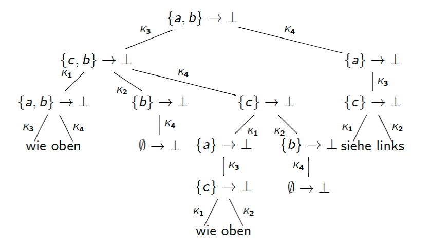

Die Suche nach einer SLD-Resolution mit $M_m=\varnothing$ kann grundsätzlich auf zwei Arten erfolgen:
- Breitensuche:
  - findet SLD-Resolution mit $M_m=\varnothing$ (falls sie existiert), da Baum endlich verzweigend ist (d.h. die Niveaus sind endlich)
  - hoher Platzbedarf, da ganze Niveaus abgespeichert werden müssen (in einem Binärbaum der Tiefe $n$ kann es Niveaus der Größe $2^n$ geben)
- Tiefensuche:
  - geringerer Platzbedarf (in einem Binärbaum der Tiefe $n$ hat jeder Ast die Länge $\leq n$)
  - findet existierende SLD-Resolution mit $M_m=\varnothing$ nicht immer (siehe Beispiel)

## Zusammenfassung Aussagenlogik
- Das natürliche Schließen formalisiert die „üblichen“ Argumente in mathematischen Beweisen.
- Unterschiedliche Wahrheitswertebereiche formalisieren unterschiedliche Vorstellungen von „Wahrheit“.
- Das natürliche Schließen ist vollständig und korrekt für den Booleschen Wahrheitswertebereich.
- Der Markierungsalgorithmus und die SLD-Resolution sind praktikable Verfahren, um die Erfüllbarkeit von Hornformeln zu bestimmen.

# Kapitel 2: Prädikatenlogik

Beispiel: Graphen
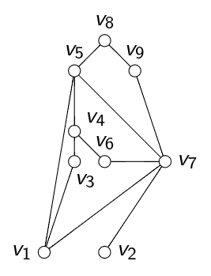
Um über diesen Graphen Aussagen in der Aussagenlogik zu machen, verwenden wir Formeln $\varphi_{i,j}$ für $1\leq i,j\leq 9$ mit $\varphi_{i,j}=\begin{cases} \lnot\bot\quad\text{ falls} (v_i,v_j) Kante\\ \bot\quad\text{ sonst}\end{cases}$
- Die aussagenlogische Formel $\bigvee_{1\leq i,j\leq 9} \varphi_{i,j}$ sagt aus, dass der Graph eine Kante enthält.
- Die aussagenlogische Formel $\bigwedge_{1\leq i\leq 9} \bigvee_{1\leq j\leq 9} \varphi_{i,j}$ sagt aus, dass jeder Knoten einen Nachbarn hat
- Die aussagenlogische Formel $\bigvee_{1\leq i,j,k\leq 9 verschieden} \varphi_{i,j}\wedge\varphi_{j,k}\wedge\varphi_{k,i}$ sagt aus, dass der Graph ein Dreieck enthält.
Man kann so vorgehen, wenn der Graph bekannt und endlich ist. Sollen analoge Aussagen für einen anderen Graphen gemacht werden, so ist die Kodierungsarbeit zu wiederholen.

Beispiel: Datenbanken
- Im folgenden reden wir über die Studenten und die Lehrenden in Veranstaltungen zur Theoretischen Informatik in diesem Semester. Betrachte die folgenden Aussagen:
  - Jeder ist Student oder wissenschaftlicher Mitarbeiter oder Professor.
  - Dietrich Kuske ist Professor.
  - Kein Student ist Professor.
  - Jeder Student ist jünger als jeder Professor.
  - Es gibt eine Person, die an den Veranstaltungen „Logik und Logikprogrammierung“ und „Algorithmen und Datenstrukturen“ teilnimmt.
  - Es gibt eine Person, die kein wissenschaftlicher Mitarbeiter ist und nicht an beiden Veranstaltungen teilnimmt.
  - Jeder Student ist jünger als die Person, mit der er am besten über Informatik reden kann.
- Um sie in der Aussagenlogik machen zu können, müssen wir atomare Aussagen für „Hans ist Student“, „Otto ist jünger als Ottilie“ usw. einführen. Dies ist nur möglich, wenn
  1. alle involvierten Personen bekannt sind und fest stehen und
  2. es nur endlich viele involvierte Personen gibt.
- Sollen analoge Aussagen für das vorige oder das kommende Jahr gemacht werden, so ist die gesamte Kodierungsarbeit neu zu machen.


## Kodierung in einer „Struktur“
- Grundmenge: Die Studenten und die Lehrenden in Veranstaltungen zur Theoretischen Informatik in diesem Sommersemester
- Teilmengen:
  - $S(x)$ „x ist Student“
  - $LuLP(x)$ „x nimmt an der Veranstaltung LuLP teil“
  - $AuD(x)$ „x nimmt an der Veranstaltung AuD teil“
  - $Pr(x)$ „x ist Professor“
  - $WM(x)$ „x ist wissenschaftlicher Mitarbeiter“
- Relationen:
  - $J(x,y)$ „x ist jünger als y“
- Funktion:
  - $f(x)$ ist diejenige Person (aus dem genannten Kreis), mit der x am besten über Informatik reden kann.
- Konstante:
  - $dk$ Dietrich Kuske

Die in der Aussagenlogik nur schwer formulierbaren Aussagen werden nun
- Für alle $x$ gilt $S(x)\vee WM(x)\vee Pr(x)$
- $Pr(dk)$
- Für alle $x$ gilt $S(x)\rightarrow\lnot Pr(x)$
- Für alle $x$ und $y$ gilt $(S(x)\wedge Pr(y))\rightarrow J(x,y)$
- Es gibt ein $x$ mit $LuLP(x)\wedge AuD(x)$
- Es gibt ein $x$ mit $((\lnot LuLP(x)\vee\lnot AuD(x))\wedge\lnot WM(x))$
- Für alle $x$ gilt $S(x)\rightarrow J(x,f(x))$

Bemerkung: Diese Formulierungen sind auch brauchbar, wenn die Grundmenge unendlich ist. Sie sind auch unabhängig vom Jahr (im nächsten Jahr können diese Folien wieder verwendet werden).

Ziel
- Wir wollen in der Lage sein, über Sachverhalte in „Strukturen“ (Graphen, Datenbanken, relle Zahlen, Gruppen... ) zu reden.
- Dabei soll es „Relationen“ geben, durch die das Enthaltensein in einer Teilmenge oder Beziehungen zwischen Objekten ausgedrückt werden können (z.B. $S(x),J(x,y),...$ )
- Weiter soll es „Funktionen“ geben, durch die Objekte (oder Tupel von Objekten) auf andere Objekte abgebildet werden (z.B. $f$)
- Nullstellige Funktionen (ohne Argumente): Konstante (z.B. $dk$)

Fragen
- Nach welchen Regeln bildet man korrekte Formeln?
- Was ist eine Struktur?
- Wann hat eine Aussage in einer Struktur eine Bedeutung (ist „sinnvoll“)?
- Wann „gilt“ eine Aussage in einer Struktur?
- Gibt es Formeln, die in allen Strukturen gelten?
- Kann man solche Formeln algorithmisch identifizieren? Gibt es einen Beweiskalkül wie das natürliche Schließen oder die SLD-Resolution?
- .........

## Syntax der Prädikatenlogik
Formeln machen Aussagen über Strukturen. Dabei hat es keinen Sinn zu fragen, ob eine Formel, die über Studenten etc. redet, im Graphen $G$ gilt.

> Definition
> 
> Eine Signatur ist ein Tripel $\sum=(\Omega, Rel,ar)$, wobei $\Omega$ und $Rel$ disjunkte Mengen von Funktions- und Relationsnamen sind und $ar:\Omega\cup Rel\rightarrow\mathbb{N}$ eine Abbildung ist.

Beispiel: $\Omega=\{f,dk\}$ mit $ar(f) =1,ar(dk)=0$ und $Rel=\{S,LuLP,AuD,Pr,WM,J\}$ mit $ar(S) =ar(LuLP) =ar(AuD) =ar(Pr) =ar(WM) =1 undar(J) = 2$ bilden die Signatur der Datenbank von vorhin.
- typische Funktionsnamen: $f, g, a, b...$ mit $ar(f),ar(g) > 0$ und $ar(a) =ar(b) = 0$
- typische Relationsnamen: $R,S,...$

> Definition
> 
> Die Menge der Variablen ist $Var=\{x_0,x_1 ,...\}$. 

> Definition
> 
> Sei $\sum$ eine Signatur. Die Menge $T_{\sum}$ der $\sum$-Terme ist induktiv definiert:
> 1. Jede Variable ist ein Term, d.h. $Var\subseteq T_{\sum}$
> 2. ist $f\in\Omega$ mit $ar(f)=k$ und sind $t_1,...,t_k\in T_{\sum}$, so gilt $f(t_1,...,t_k)\in T_{\sum}$
> 3. Nichts ist $\sum$-Term, was sich nicht mittels der obigen Regeln erzeugen läßt.

Beispiel:In der Signatur der Datenbank von vorhin haben wir u.a. die folgenden Terme:
- $x_1$ und $x_8$
- $f(x_0)$ und $f(f(x_3))$
- $dk()$ und $f(dk())$ - hierfür schreiben wir kürzer $dk$ bzw. $f(dk)$


> Definition
> 
> Sei $\sum$ Signatur. Die atomaren $\sum$-Formeln sind die Zeichenketten der Form
> - $R(t_1,t_2,...,t_k)$ falls $t_1,t_2,...,t_k\in T_{\sum}$ und $R\in Rel$ mit $ar(R)=k$ oder
> - $t_1=t_2$ falls $t_1,t_2\in T_{\sum}$ oder
> - $\bot$.

Beispiel: In der Signatur der Datenbank von vorhin haben wir u.a. die folgenden atomaren Formeln:
- $S(x_1)$ und $LuLP(f(x4))$
- $S(dk)$ und $AuD(f(dk))$

> Definition
> 
> Sei $\sum$ Signatur. $\sum$-Formeln werden durch folgenden induktiven Prozeß definiert:
> 1. Alle atomaren $\sum$-Formeln sind $\sum$-Formeln.
> 2. Falls $\varphi$ und $\Psi$ $\sum$-Formeln sind, sind auch $(\varphi\wedge\Psi)$,$(\varphi\vee\Psi)$ und $(\varphi\rightarrow\Psi)$ $\sum$-Formeln.
> 3. Falls $\varphi$ eine $\sum$-Formel ist, ist auch $\lnot\varphi$ eine $\sum$-Formel.
> 4. Falls $\varphi$ eine $\sum$-Formel und $x\in Var$, so sind auch $\forall x\varphi$ und $\exists x\varphi$ $\sum$-Formeln.
> 5. Nichts ist $\sum$-Formel, was sich nicht mittels der obigen Regeln erzeugen läßt.

Ist die Signatur $\sum$ aus dem Kontext klar, so sprechen wir einfach von Termen, atomaren Formeln bzw.Formeln.

Beispiel:In der Signatur der Datenbank von vorhin haben wir u.a. die folgenden Formeln:
- $\forall x_0 (S(x_0)\vee WM(x_0)\vee Pr(x_0))$
- $Pr(dk)$
- $\forall x_3 (S(x_3)\rightarrow\lnot Pr(x_3))$
- $\forall x_0 \forall x_2 ((S(x_0)\wedge Pr(x_2))\rightarrow J(x_0,x_2))$
- $\exists x_1 (LuLP(x_1)\wedge AuD(x_1))$
- $\exists x_2 ((\lnot LuLP(x_2)\vee\lnot AuD(x_2))\wedge\lnot WM(x_2))$
- $\forall x_1 (S(x_1)\rightarrow J(x_1,f(x_1)))$

Wir verwenden die aus der Aussagenlogik bekannten Abkürzungen, z.B. steht $\varphi\leftrightarrow\Psi$ für $(\varphi\rightarrow\Psi)\wedge(\Psi\rightarrow\varphi)$.

Zur verbesserten Lesbarkeit fügen wir mitunter hinter quantifizierten Variablen einen Doppelpunkt ein, z.B. steht $\exists x\forall y:\varphi$ für $\exists x\forall y\varphi$ 

Ebenso verwenden wir Variablennamen $x$,$y$,$z$ u.ä.

Präzedenzen: $\lnot,\forall x,\exists x$ binden am stärksten

Beispiel: $(\lnot\forall x:R(x,y)\wedge\exists z:R(x,z))\rightarrow P(x,y,z)$ steht für $((\lnot(\forall x:R(x,y))\wedge\exists z:R(x,z))\rightarrow P(x,y,z))$

## Aufgabe
Im folgenden seien
- $P$ ein-stelliges, $Q$ und $R$ zwei-stellige Relationssymbole,
- $a$ null-stelliges und $f$ ein-stelliges Funktionssymbol und
- $x,y$ und $z$ Variable.

Welche der folgenden Zeichenketten sind Formeln?
|                                               |     |
| --------------------------------------------- | --- |
| $\forall x P(a)$                              |     |
| $\forall x\exists y(Q(x,y)\vee R(x))$         |     |
| $\forall x Q(x,x)\rightarrow\exists x Q(x,y)$ |     |
| $\forall x P(f(x))\vee\forall$ x Q(x,x)$      |     |
| $\forall x(P(y)\wedge\forall y P(x))$         |     |
| $P(x) \rightarrow\exists x Q(x,P(x))$         |     |
| $\forall f\exists x P(f(x))$                  |     |

> Definition
> 
> Sei $\sum$ eine Signatur. Die Menge $FV(\varphi)$ der freien Variablen einer $\sum$-Formel $\varphi$ ist induktiv definiert:
> - Ist $\varphi$ atomare $\sum$-Formel, so ist $FV(\varphi)$ die Menge der in $\varphi$ vorkommenden Variablen.
> - $FV(\varphi\Box\Psi) =FV(\varphi)\cup FV(\Psi)$ für $\Box\in\{\wedge,\vee,\rightarrow\}$
> - $FV(\lnot\varphi) =FV(\varphi)$
> - $FV(\exists x\varphi) =FV(\forall x\varphi) =FV(\varphi)\backslash\{x\}$.
> Eine $\sum$-Formel $\varphi$ ist geschlossen oder ein $\sum$-Satz, wenn $FV(\varphi)=\varnothing$ gilt.

Was sind die freien Variablen der folgenden Formeln? Welche Formeln sind Sätze?
|                                                                         | Formel? | Satz? |
| ----------------------------------------------------------------------- | ------- | ----- |
| $\forall x P(a)$                                                        |         |       |
| $\forall x Q(x,x)\rightarrow\exists x Q(x,y)$                           |         |       |
| $\forall x P(x)\vee\forall x Q(x,x)$                                    |         |       |
| $\forall x(P(y)\wedge\forall y P(x))$                                   |         |       |
| $\forall x(\lnot\forall y Q(x,y)\wedge R(x,y))$                         |         |       |
| $\exists z(Q(z,x)\vee R(y,z))\rightarrow\exists y(R(x,y)\wedge Q(x,z))$ |         |       |
| $\exists x(\lnot P(x)\vee P(f(a)))$                                     |         |       |
| $P(x)\rightarrow\exists x P(x)$                                         |         |       |
| $\exists x\forall y((P(y)\rightarrow Q(x,y))\vee\lnot P(x))$            |         |       |
| $\exists x\forall x Q(x,x)$                                             |         |       |

Semantik der Prädikatenlogik
- Erinnerung: Die Frage „Ist die aussagenlogische Formel $\varphi$ wahr oder falsch?“ war sinnlos, denn wir wissen i.a. nicht, ob die atomaren Aussagen wahr oder falsch sind.
- Analog: Die Frage „Ist die prädikatenlogische Formel $\varphi$ wahr oder falsch?“ ist sinnlos, denn wir wissen bisher nicht, über welche Objekte, über welche „Struktur“ $\varphi$ spricht.

> Definition
> 
> Sei $\sum$ eine Signatur. Eine $\sum$-Struktur ist ein Tupel $A=(U_A,(f^A)_{f\in\Omega},(R^A)_{R\in Rel})$, wobei
> - $U_A$ eine nichtleere Menge, das Universum,
> - $R^A\supseteq U_A^{ar(R)}$ eine Relation der Stelligkeit $ar(R)$ für $R\in Rel$ und
> - $f^A:U_A^{ar(f)}\rightarrow U_A$ eine Funktion der Stelligkeit $ar(f)$ für $f\in\Omega$ ist.

Bemerkung: $U_A^0=\{()\}$.
- Also ist $a^A:U_A^0\rightarrow U_A$ für $a\in\Omega$ mit $ar(a)=0$ vollständig gegeben durch $a^A(())\in U_A$. Wir behandeln 0-stellige Funktionen daher als Konstanten.
- Weiterhin gilt $R^A=\varnothing$ oder $R^A=\{()\}$ für $R\in Rel$ mit $ar(R)=0$.

Beispiel: Graph
- Sei $\sum=(\Omega ,Rel,ar)$ mit $\Omega=\varnothing ,Rel=\{E\}$ und $ar(E)=2$ die Signatur der Graphen.
- Um den Graphen als $\sum$-Struktur $A=(UA,EA)$ zu betrachten, setzen wir
  - $UA=\{v_1,v_2,...,v_9\}$ und
  - $EA=\{(v_i,v_j)|(v_i,v_j) ist Kante\}$

Im folgenden sei $\sum$ eine Signatur, A eine $\sum$-Struktur und $ρ:Var\rightarrow U_A$ eine Abbildung (eine Variableninterpretation).
Wir definieren eine Abbildung $ρ′:T\sum\rightarrow U_A$ induktiv für $t\in T_{\sum}$:
- ist $t\in Var$, so setze $ρ′(t) =ρ(t)$
- ansonsten existieren $f\in\Omega$ mit $ar(f)=k$ und $t_1,...,t_k\in T_{\sum}$ mit $t=f(t_1,...,t_k)$. Dann setze $ρ′(t) =f^A(ρ′(t_1),...,ρ′(t_k))$.
Die Abbildung $ρ′$ ist die übliche „Auswertungsabbildung“.
Zur Vereinfachung schreiben wir auch $ρ(t)$ an Stelle von $ρ′(t)$.

Beispiel:
- Seien $A=(R,f^A,a^A)$ mit $f^A$ die Subtraktion und $a$ nullstelliges Funktionssymbol mit $a^A=10$. Seien weiter $x,y\in Var$ mit $ρ(x)=7$ und $ρ(y)=-2$. Dann gilt $ρ(f(a,f(x,y))) =ρ(a)-(ρ(x)-ρ(y)) =a^A-(ρ(x)-ρ(y)) = 1$
- Seien $A= (Z,f^A,a^A)$ mit $f^A$ die Maximumbildung, $a$ nullstelliges Funktionssymbol mit $a^A=10$. Seien weiter $x,y\in Var$ mit $ρ(x)=7$ und $ρ(y)=-2$. In diesem Fall gilt $ρ(f(a,f(x,y))) = max(ρ(a),max(ρ(x),ρ(y)) = max(a^A,max(ρ(x),ρ(y))) = 10$

Bemerkung: Wir müssten also eigentlich noch vermerken, in welcher Struktur $ρ(t)$ gebildet wird – dies wird aber aus dem Kontext immer klar sein.

Für eine $\sum$-Formel $\varphi$ definieren wir die Gültigkeit in einer $\sum$-Struktur $A$ unter der Variableninterpretation $ρ$ (in Zeichen: $A\Vdash_ρ\varphi$) induktiv:
- $A\Vdash_ρ\bot$ gilt nicht.
- $A\Vdash_ρ R(t_1,...,t_k)$ falls $(ρ(t_1),...,ρ(t_k))\in R^A$ für $R\in Rel$ mit $ar(R)=k$ und $t_1,...,t_k\in T_{\sum}$.
- $A\Vdash_ρ t_1 =t_2$ falls $ρ(t_1) =ρ(t_2)$ für $t_1,t_2\in T_{\sum}$.

Für $\sum$-Formeln $\varphi$ und $\Psi$ und $x\in Var$:
- $A\Vdash_p \varphi\wedge\Psi$ falls $A\Vdash_p\varphi$ und $A\Vdash_p \Psi$.
- $A\Vdash_p \varphi\vee\Psi$ falls $A\Vdash_p\varphi$ oder $A\Vdash_p\Psi$ .
- $A\Vdash_p \varphi\rightarrow\Psi$ falls nicht $A\Vdash_p\varphi$ oder $A\Vdash_p\Psi$ .
- $A\Vdash_p \lnot\varphi$ falls $A\Vdash_p \varphi$ nicht gilt.
- $A\Vdash_p \exists x\varphi$ falls ???
- $A\Vdash_p \forall x\varphi$ falls ???

Für $x\in Var$ und $a\in U_A$ sei $ρ[x\rightarrow a]:Var\rightarrow U_A$ die Variableninterpretation, für die gilt $(ρ[x\rightarrow a])(y) = \begin{cases} ρ(y) \quad\text{ falls } x\not=y \\ a \quad\text{ sonst } \end{cases}$
- $A\Vdash_p \exists x\varphi$ falls es $a\in U_A$ gibt mit $A\Vdash_{p[x\rightarrow a]}\varphi$.
- $A\Vdash_p \forall x\varphi$ falls $A\Vdash_{p[x\rightarrow a]}\varphi$ für alle $a\in U_A$.

> Definition
> 
> Sei $\sum$ eine Signatur, $\varphi$ eine $\sum$-Formel, $\Delta$ eine Menge von $\sum$-Formeln und $A$ eine $\sum$-Struktur.
> - $A\Vdash\varphi$ ($A$ ist Modell von $\varphi$) falls $A\Vdash_p\varphi$ für alle Variableninterpretationen $ρ$ gilt.
> - $A\Vdash\Delta$ falls $A\Vdash\Psi$ für alle $\Psi\in\Delta$.


Aufgaben
- Sei $A$ die Struktur, die dem vorherigen Graphen entspricht
- Welche der folgenden Formeln $\varphi$ gelten in $A$, d.h. für welche Formeln gilt $A\Vdash_p\varphi$ für alle Variableninterpretationen $ρ$?
  1. $\exists x\exists y:E(x,y)$
  2. $\forall x\exists y:E(x,y)$
  3. $\exists x\forall y:(x\not=y\rightarrow E(x,y))$
  4. $\forall x\forall y:(x\not=y\rightarrow E(x,y))$
  5. $\exists x\exists y\exists z:(E(x,y)\wedge E(y,z)\wedge E(z,x))$
- In der Prädikatenlogik ist es also möglich, die Eigenschaften vom Anfang des Kapitels auszudrücken, ohne den Graphen direkt in die Formel zu kodieren.

> Definition
>
> Sei $\sum$ eine Signatur, $\varphi$ eine $\sum$-Formel, $\Delta$ eine Menge von $\sum$-Formeln und $A$ eine $\sum$-Struktur.
> - $\Delta$ ist erfüllbar, wenn es $\sum$-Struktur $B$ und Variableninterpretation $ρ:Var\rightarrow U_B$ gibt mit $B\Vdash_ρ\Psi$ für alle $\Psi\in\Delta$.
> - $\varphi$ ist semantische Folgerung von $\Delta(\Delta\Vdash\varphi)$ falls für alle $\sum$-Strukturen $B$ und alle Variableninterpretationen $ρ:Var\rightarrow U_B$ gilt: 
>     Gilt $B\Vdash_ρ\Psi$ für alle $\Psi\in\Delta$, so gilt auch $B\Vdash_ρ \varphi$.
> - $\varphi$ ist allgemeingültig, falls $B\Vdash ρ\varphi$ für alle $\sum$-Strukturen $B$ und alle Variableninterpretationen $ρ$ gilt.

Bemerkung: $\varphi$ allgemeingültig gdw. $\varnothing\Vdash\varphi$ gdw. $\{\lnot\varphi\}$ nicht erfüllbar. Hierfür schreiben wir auch $\Vdash\varphi$.

Beispiel: Der Satz $\varphi=(\forall x:R(x)\rightarrow\forall x:R(f(x)))$ ist allgemeingültig.

Beweis: Sei $\sum$ Signatur, so dass $\varphi$  $\sum$-Satz ist. Sei $A$ $\sum$-Struktur und $ρ$ Variableninterpretation. Wir betrachten zwei Fälle:
1. Falls $A\not\Vdash_ρ\forall x R(x)$, so gilt $A\Vdash_p\varphi$.
2. Wir nehmen nun $A\Vdash_p\forall x R(x)$ an. Sei $a\in U_A$ beliebig und $b=f^A(a)$.
   $A\Vdash_p\forall x R(x) \Rightarrow A\Vdash_{p[x\rightarrow b]} R(x) \Rightarrow RA\owns (p[x\rightarrow b])(x) = b = f^A(a) = (ρ[x\rightarrow a])(f(x)) \Rightarrow A\Vdash_{p[x\rightarrow a]}R(f(x))$.
   Da $a\in U_A$ beliebig war, haben wir also $A\Vdash_p\forall x:R(f(x))$.
   Also gilt auch in diesem Fall $A\Vdash_p\varphi$.
Da $A$ und $ρ$ beliebig waren, ist $\varphi$ somit allgemeingültig.

Beispiel: 
- Der Satz $\varphi =\exists x(R(x)\rightarrow R(f(x)))$ ist allgemeingültig.
- Beweis: Sei $\sum$ Signatur, so dass $\varphi$ $\sum$-Satz ist. Sei $A$ $\sum$-Struktur und $ρ$ Variableninterpretation. Wir betrachten wieder zwei Fälle:
  1. Angenommen, $R^A=U_A$. Sei $a\in U_A$ beliebig.
      - $\Rightarrow f^A(a)\in R^A$
      - $\Rightarrow A\Vdash_{p[x\rightarrow a]} R(f(x))$
      - $\Rightarrow A\Vdash_{p[x\rightarrow a]} R(x)\rightarrow R(f(x))$
      - $\Rightarrow A\Vdash_p\varphi$.
  2. Ansonsten existiert $a\in U_A\backslash R^A$.
      - $\Rightarrow A\not\Vdash_{p[x\rightarrow a]} R(x)$
      - $\Rightarrow A\Vdash_{p[x\rightarrow a]} R(x)\rightarrow R(f(x))$
      - $\Rightarrow A\Vdash_p \varphi$.
  Da $A$ und $ρ$ beliebig waren, ist $\varphi$ somit allgemeingültig.

Aufgabe
| | a: allgemeingültig  | e: erfüllbar  | u: unerfüllbar |
| --- | --- | --- | --- |
$P(a)$ | | | | 
$\exists x:(\lnot P(x)\vee P(a))$ | | | 
$P(a)\rightarrow\exists x:P(x)$ | | | 
$P(x)\rightarrow\exists x:P(x)$ | | | 
$\forall x:P(x)\rightarrow\exists x:P(x)$ | | | 
$\forall x:P(x)\wedge\lnot\forall y:P(y)$ | | | 
$\forall x:(P(x,x)\rightarrow\exists x\forall y:P(x,y))$  | | | 
$\forall x\forall y:(x=y\rightarrow f(x) =f(y))$ | | | 
$\forall x\forall y:(f(x) =f(y)\rightarrow x=y)$ | | | 
$\exists x\exists y\exists z:(f(x) =y\wedge f(x) =z\wedge y \not=z)$ | | | 
$\exists x\forall x:Q(x,x)$ | | | 

## Substitutionen
> Definition
>
> Eine Substitution besteht aus einer Variable $x\in Var$ und einem Term $t\in T_{\sum}$, geschrieben $[x:=t]$.

Die Formel $\varphi[x:=t]$ ist die Anwendung der Substitution $[x:=t]$ auf die Formel $\varphi$. Sie entsteht aus $\varphi$, indem alle freien Vorkommen von $x$ durch $t$ ersetzt werden. Sie soll das über $t$ aussagen, was $\varphi$ über $x$ ausgesagt hat.
Dazu definieren wir zunächst induktiv, was es heißt, die freien Vorkommen von $x$ im Term $s\in T_{\sum}$ zu ersetzen:
- $x[x:=t] =t$
- $y[x:=t] =y$ für $y\in Var\backslash\{x\}$
- $(f(t_1 ,...,t_k))[x:=t] =f(t_1 [x:=t],...t_k[x:=t])$ für $f\in\Omega$ mit $ar(f) =k$ und $t_1,...,t_k\in T_{\sum}$ 

> Lemma
>
> Seien $\sum$ Signatur, $A$ $\sum$-Struktur, $ρ:Var\rightarrow U_A$ Variableninterpretation, $x\in Var$ und $s,t\in T_{\sum}$. Dann gilt $ρ(s[x:=t])=ρ[x\rightarrow ρ(t)](s)$.

Beweis: Induktion über den Aufbau des Terms $s$ (mit $ρ′=ρ[x\rightarrow ρ(t)]$ ):
- $s=x:ρ(s[x:=t])=ρ(t) =ρ′(x) =ρ′(s)$
- $s\in Var\backslash\{x\}:ρ(s[x:=t])=ρ(s) =ρ′(s)$
- $s=f(t_1 ,...,t_k):ρ((f(t_1 ,...,t_k))[x:=t])= ρ(f(t_1[x:=t],...,t_k[x:=t]))= f^A(ρ(t_1[x:=t]),...,ρ(t_k[x:=t])) = f^A(ρ′(t_1),...,ρ′(t_k))= ρ′(f(t_1 ,...,t_k))=ρ′(s)$

Die Definition von $s[x:=t]$ kann induktiv auf $\sum$-Formeln fortgesetzt werden:
- $(t_1 =t_2 )[x:=t] = (t_1 [x:=t] =t_2 [x:=t])$ für $t_1 ,t_2 \in T_{\sum}$ 
- $(R(t_1 ,...,t_k))[x:=t] =R(t_1 [x:=t],...,t_k[x:=t])$ für $R\in Rel$ mit $ar(R) =k$ und $t_1 ,...,t_k\in T_{\sum}$ 
- $\bot[x:=t] =\bot$ 

Für $\sum$ -Formeln $\varphi$ und $\Psi$ und $y\in Var$:
- $(\varphi\Box\Psi)[x:=t]=\varphi [x:=t]\Box\Psi[x:=t]$ für $\Box\in\{\wedge,\vee,\rightarrow\}$
- $(\lnot\varphi)[x:=t] = \lnot(\varphi[x:=t])$
- $(Qy\varphi)[x:=t] = \begin{cases} Qy\varphi[x:=t] \quad\text{ falls } x\not=y \\ Qy\varphi \quad\text{ falls } x=y \end{cases} \text{ für } Q\in\{\exists,\forall\}$.

Beispiel: $(\exists x P(x,f(y))\vee\lnot\forall yQ(y,g(a,h(z))))[y:=f(u)] = (\exists x P(x,f(f(u)))\vee\lnot\forall yQ(y,g(a,h(z))))$

$\varphi [x:=t]$ „soll das über $t$ aussagen, was $\varphi$ über $x$ ausgesagt hat.“

Gegenbeispiel: Aus $\exists y$ $Mutter(x) =y$ mit Substitution $[x:=Mutter(y)]$ wird $\exists y$ Mutter$(Mutter(y)) =y$.

> Definition
> 
> Sei $[x:=t]$ Substitution und $\varphi$ $\sum$-Formel. Die Substitution $[x:=t]$ heißt für $\varphi$ zulässig, wenn für alle $y\in Var$ gilt: $y$ Variable in $t\Rightarrow\varphi$ enthält weder $\exists y$ noch $\forall y$

> Lemma
> 
> Sei $\sum$ Signatur, A $\sum$-Struktur, $ρ:Var\rightarrow U_A$ Variableninterpretation, $x\in Var$ und $t\in T_{\sum}$. Ist die Substitution $[x:=t]$ für die $\sum$-Formel $\varphi$ zulässig, so gilt $A\Vdash_p\varphi [x:=t]\Leftrightarrow  A\Vdash_{p[x\rightarrow ρ(t)]}\varphi$.

Beweis: Induktion über den Aufbau der Formel $\varphi$ (mit $ρ'=ρ[x\rightarrow ρ(t)])$:
- $\varphi = (s_1 =s_2)$:
  - $A\Vdash_p(s_1 =s_2)[x:=t] \Leftrightarrow A\Vdash_p s_1[x:=t] =s_2[x:=t]$
  - $\Leftrightarrow ρ(s_1[x:=t]) =ρ(s_2[x:=t])\Leftrightarrow ρ'(s_1) =ρ'(s_2)$
  - $\Leftrightarrow A\Vdash_{p′} s_1 =s_2$
  - andere atomare Formeln analog
- $\varphi =\varphi_1\wedge\varphi_2$:
  - $A\Vdash_p(\varphi_1\wedge\varphi_2)[x:=t] \Leftrightarrow A\Vdash_p\varphi_1 [x:=t]\wedge\varphi_2[x:=t]$
  - $\Leftrightarrow A\Vdash_p\varphi_1[x:=t]$ und $A\Vdash_p\varphi_2[x:=t]$
  - $\Leftrightarrow A\Vdash_{p′}\varphi_1$ und $A\Vdash_{p′}\varphi_2$
  - $\Leftrightarrow A\Vdash_{p′}\varphi_1\wedge\varphi_2$
  - $\varphi=\varphi_1\vee\varphi_2,\varphi =\varphi_1\rightarrow\varphi_2$ und $\varphi=\lnot\psi$ analog
- $\varphi=\forall y\psi$:
  - Wir betrachten zunächst den Fall $x=y$: 
    - $A\Vdash_p(\forall x\psi)[x:=t]\Leftrightarrow A\Vdash_p\forall x\psi \Leftrightarrow A\Vdash_{p′}\forall x\psi$ (denn $x\not\in FV(\forall x\psi)$ )
  - Jetzt der Fall $x\not=y$:
    - Für $a\in U_A$ setze $ρ_a=ρ[y\rightarrow a]$. Da $[x:=t]$ für $\varphi$ zulässig ist, kommt $y$ in $t$ nicht vor. Zunächst erhalten wir
    - $ρ_a[x\rightarrow ρ_a(t)] = ρ_a[x\rightarrow ρ(t)]$ da $y$ nicht in $t$ vorkommt
    - $=ρ[y\rightarrow a][x\rightarrow ρ(t)] = ρ[x\rightarrow ρ(t)][y\rightarrow a]$ da $x\not=y$
    - Es ergibt sich $A\Vdash_p(\forall y\psi)[x:=t]\Leftrightarrow A\Vdash_p\forall y(\psi[x:=t])$ (wegen $x\not=y$)
    - $\Leftrightarrow A\Vdash_{pa}\psi[x:=t]$ für alle $a\in U_A$
    - $\Leftrightarrow A\Vdash_{pa[x\rightarrow ρ_a(t)]}\psi$ für alle $a\in U_A$
    - $\Leftrightarrow A\Vdash_{p[x\rightarrow ρ(t)][y\rightarrow a]}\psi$ für alle $a\in U_A$
    - $\Leftrightarrow A\Vdash_{p[x\rightarrow ρ(t)]}\forall y\psi$ 
- $\varphi=\exists y\psi$ : analog

## Natürliches Schließen
Wir haben Regeln des natürlichen Schließens für aussagenlogische Formeln untersucht und für gut befunden. Man kann sie natürlich auch für prädikatenlogische Formeln anwenden.

Beispiel: Für alle $\sum$-Formel $\varphi$ und $\psi$ gibt es eine Deduktion mit Hypothesen in $\{\lnot\varphi\wedge\lnot\psi\}$ und Konklusion $\lnot(\varphi\vee\psi)$: 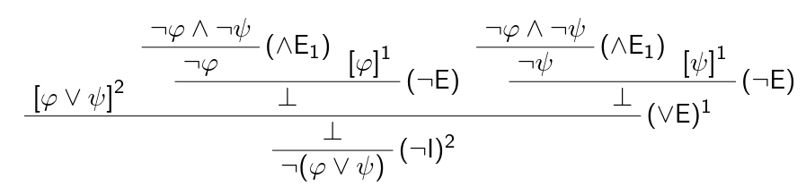

## Korrektheit
Können wir durch mathematische Beweise zu falschen Aussagen kommen? Können wir durch das natürliche Schließen zu falschen Aussagen kommen? Existiert eine Menge $\Gamma$ von $\sum$-Formeln und eine $\sum$-Formel $\varphi$ mit $\Gamma\vdash\varphi$ und
$\Gamma\not\Vdash\varphi$?

Frage: Gilt $\Gamma\vdash\varphi\Rightarrow \Gamma\Vdash\varphi$ bzw. $\varphi$ ist Theorem $\Rightarrow\varphi$ ist allgemeingültig?

Der Beweis des Korrektheitslemmas für das natürliche Schließen kann ohne große Schwierigkeiten erweitert werden. Man erhält

> Lemma V0
> 
> Sei $\sum$ eine Signatur, $\Gamma$ eine Menge von $\sum$-Formeln und $\varphi$ eine $\sum$-Formel.
> Sei weiter $D$ eine Deduktion mit Hypothesen in $\Gamma$ und Konklusion $\varphi$, die die Regeln des natürlichen Schließens der Aussagenlogik verwendet. Dann gilt $\Gamma\Vdash\varphi$.

Umgekehrt ist nicht zu erwarten, dass aus $\Gamma\Vdash\varphi$ folgt, dass es eine Deduktion mit Hypothesen in $\Gamma$ und Konklusion $\varphi$ gibt, denn die bisher untersuchten Regeln erlauben keine Behandlung von $=,\forall$ bzw. $\exists$. Solche Regeln werden wir jetzt einführen.

Zunächst kümmern wir uns um Atomformeln der Form $t_1 =t_2$. Hierfür gibt es die zwei Regeln $(R)$ und $(GfG)$:

> Reflexivität (ausführlich)
> 
> Für jeden Termt ist $\frac{}{t=t}$ eine hypothesenlose Deduktion mit Konklusion $t=t$. 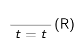

> Gleiches-für-Gleiches in mathematischen Beweisen
> 
> ,,Zunächst zeige ich, dass $s$ die Eigenschaft $\varphi$ hat:...
> Jetzt zeige ich $s=t$:...
> Also haben wir gezeigt, dass $t$ die Eigenschaft $\varphi$ hat. qed''
> 
> Gleiches-für-Gleiches (ausführlich)
> Seien $s$ und $t$ Terme und $\varphi$ Formel, so dass die Substitutionen $[x:=s]$ und $[x:=t]$ für $\varphi$ zulässig sind. Sind $D$ und $E$ Deduktionen mit Hypothesen in $\Gamma$ und Konklusionen $\varphi[x:=s]$ bzw. $s=t$, so ist das folgende eine Deduktion mit Hypothesen in $\Gamma$ und Konklusion $\varphi[x:=t]$: 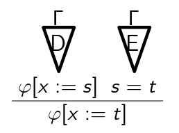
> 
> Gleiches-für-Gleiches (Kurzform)
> 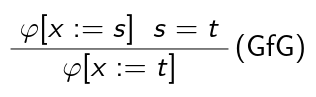
> Bedingung: über keine Variable aus $s$ oder $t$ wird in $\varphi$ quantifiziert

Die folgenden Beispiele zeigen, dass wir bereits jetzt die üblichen Eigenschaften der Gleichheit (Symmetrie, Transitivität, Einsetzen) folgern können.

Beispiel: Seien $x$ Variable, $s$ Term ohne $x$ und $\varphi=(x=s)$.
- Da $\varphi$ quantorenfrei ist, sind die Substitutionen $[x:=s]$ und $[x:=t]$ für $\varphi$ zulässig.
- Außerdem gelten $\varphi[x:=s] = (s=s)$ und $\varphi[x:=t] = (t=s)$.
- Also ist das folgende eine Deduktion: 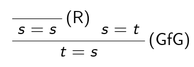
- Für alle Termesundthaben wir also $\{s=t\}\vdash t=s$.

Beispiel: Seien $x$ Variable, $r,s$ und $t$ Terme ohne $x$ und $\varphi=(r=x)$.
- Da $\varphi$ quantorenfrei ist, sind die Substitutionen $[x:=s]$ und $[x:=t]$ für $\varphi$ zulässig.
- Außerdem gelten $\varphi[x:=s]=(r=s)$ und $\varphi[x:=t]=(r=t)$.
- Also ist das folgende eine Deduktion: 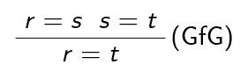
- Für alle Terme $r,s$ und $t$ haben wir also $\{r=s,s=t\}\vdash r=t$.

Beispiel: Seien $x$ Variable, $s$ und $t$ Terme ohne $x$,$f$ einstelliges Funktionssymbol und $\varphi=(f(s)=f(x))$.
- Da $\varphi$ quatorenfrei ist, sind die Substitutionen $[x:=s]$ und $[x:=t]$ für $\varphi$ zulässig.
- Außerdem gelten $\varphi[x:=s]=(f(s)=f(s))$ und $\varphi[x:=t]=(f(s)=f(t))$.
- Also ist das folgende eine Deduktion: 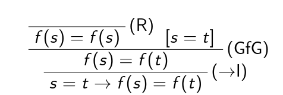

> Lemma V1
> 
> Sei $\sum$ eine Signatur, $\Gamma$ eine Menge von $\sum$-Formeln und $\varphi$ eine $\sum$-Formel.
> Sei weiter $D$ eine Deduktion mit Hypothesen in $\Gamma$ und Konklusion $\varphi$, die die Regeln des natürlichen Schließens der Aussagenlogik, $(R)$ und $(GfG)$ verwendet. Dann gilt $\Gamma\Vdash\varphi$.

Beweis: Wir erweitern den Beweis des Korrektheitslemmas bzw. des Lemmas V0, der Induktion über die Größe der Deduktion $D$ verwendete. 
- Wir betrachten nur den Fall, dass $D$ die folgende Form hat: 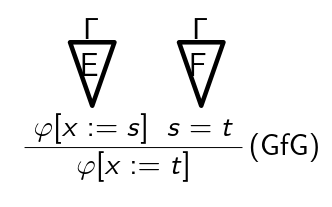
- Da dies Deduktion ist, sind die Substitutionen $[x:=s]$ und $[x:=t]$ für $\varphi$ 
zulässig, d.h. in $\varphi$ wird über keine Variable aus $s$ oder $t$ quantifiziert.
- $E$ und $F$ kleinere Deduktionen $\Rightarrow\Gamma\Vdash\varphi[x:=s]$ und $\Gamma\Vdash s=t$
- Seien A $\sum$-Struktur und $ρ$ Variableninterpretation mit $A\Vdash_p\gamma$ für alle $\gamma\in\Gamma$.
  - $\Rightarrow A\Vdash_p\varphi[x:=s]$ und $A\Vdash_p s=t$
  - $\Rightarrow A\Vdash_{p[x\rightarrow ρ(s)]}\varphi$ und $ρ(s) =ρ(t)$
  - $\Rightarrow A\Vdash_{p[x\rightarrow ρ(t)]}\varphi$
  - $\Rightarrow A\Vdash_p \varphi[x:=t]$
- Da $A$ und $ρ$ beliebig waren mit $A\Vdash_p\gamma$ für alle $\gamma\in\Gamma$ haben wir $\Gamma\Vdash\varphi[x:=t]$ gezeigt.
