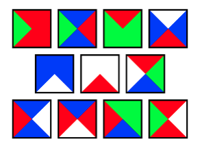

# Logik
Die Logik 
- versucht, gültige Argumentationen von ungültigen zu unterscheiden,
- hat Anwendungen in der Informatik,
- formalisiert die zu untersuchenden Aussagen und
- beschränkt sich auf einen wohldefinierten Teil der möglichen Aussagen => es gibt verschiedene "Logiken", z.B. "Aussagen-" und "Prädikatenlogik"
    - daneben: 
      - temporale Logiken (Mastervorlesung "Verifikation")
      - modale Logiken
      - epistemische Logiken
      - ...


## Syllogismen
Aristoteles (384-322 v.Chr.) untersuchte das Wesen der Argumentation und des logischen Schließens mit dem Ziel, korrekte von inkorrekten Argumenten zu unterscheiden.
Verschiedene Werke, u.a. Analytica priora, Analytica posteriora.

Aristoteles nennt die logischen Schlußfolgerungen Syllogismen (griechisch: "Zusammenrechnung").

Ein Syllogismus ist eine Aussage, in der bestimmte Dinge [die Prämissen] behauptet werden und in der etwas anderes [die Konsequenz], unumgänglich aus dem Behaupteten folgt. Mit dem letzten Satz meine ich, dass die Prämissen die Konsequenz zum Resultat haben, und damit meine ich, dass keine weitere Prämisse erforderlich ist, um die Konsequenz unumgänglich zu machen.

#### Beispiele
```
Wenn alle Menschen sterblich sind und
Sokrates ein Mensch ist,
dann ist Sokrates sterblich.
```
```
Wenn eine Zahl gerade und größer als zwei ist,
dann ist sie keine Primzahl.
```
```
Wenn die Leitzinsen hoch sind,
dann sind die Börsianer unzufrieden.
```

Aristoteles identifizierte einige zulässige Syllogismen, die Scholastiker fügten weitere hinzu:

(Barbara)
```
Alle Dackel sind Hunde                  Alle P sind M
Alle Hunde sind Tiere                   Alle M sind S
Dann sind alle Dackel Tiere             Alle P sind S
```

(Cesare)
```
Keine Blume ist ein Tier                Kein P ist M
Alle Hunde sind Tiere                   Alle S sind M
Dann ist keine Blume ein Hund           Kein P ist S
```

(Darapti)
```
Alle Delfine leben im Meer              Alle M sind P
Alle Delfine sind Säugetiere            Alle M sind S
Dann leben einige Säugetiere im Meer    Einige S sind P
```

### Kalküle
Gottfried Wilhelm Leibniz (1646-1716) wollte korrekte von inkorrekten Argumentationsketten unterscheiden. Hierzu sollte ein Kalkül entwickelt werden, in dem alle korrekten Argumentationsketten ermöglicht sind (und keine inkorrekten).

David Hilbert (1862-1943) entwickelte solche Kalküle.
Diese "Hilbertkalküle" sind sehr verschieden von üblichen Argumentationsmustern.

Gerhard Gentzen (1909-1945) entwickelte Kalküle des "natürlichen Schließens", die übliche Argumentationsmuster formalisieren.

### Die Aussagenlogik
George Boole (1815 - 1864) entwickelte einen Kalkül zum Rechnen mit atomare Aussagen, die entweder wahr oder falsch sein können.

Verknüpfung durch Operatoren(und, oder, nicht, wenn-dann... ).

### Die Prädikatenlogik (Ende des 19. Jahrhunderts)
Gottlob Frege (1848-1925), Giuseppe Peano (1858-1932) und Bertrand Russell (1872-1970)entwickelten die Logik zur Grundlage der Mathematik, als formale Basis für die Vermeidung von Widersprüchen.
Entwicklung der Prädikatenlogik, die erlaubt:
- Beziehungen zwischen "Objekten" zu beschreiben
- existentielle Aussagen zu treffen: "es gibt ein x, so dass... "
- universelle Aussage zu treffen: "für jedes x gilt, dass... "


## Logik in der Informatik
Claude Shannon (1916 - 2001) benutzt die Aussagenlogik 1937, um elektromechanische Schaltkreise zu beschreiben und zu optimieren.

Allen Newell (1927-1992), Herbert Simon (1916-2001) und Alan Robinson (1930-2016) entwickelten 1950-1960 die ersten Systeme für die Automatisierung des logischen Schließens als Werkzeug der Künstlichen Intelligenz.

- Schaltkreisentwurf: Schaltkreise lassen sich durch logische Formeln darstellen -> Entwurf und Optimierung von Schaltungen
- Modellierung und Spezifikation: Eindeutige Beschreibung von komplexen Systemen
- Verifikation: Beweisen, dass ein Programm das gewünschte Verhalten zeigt
- Datenbanken: Formulierung von Anfragen an Datenbanken -> Abfragesprache SQL (Structured Query Language)
- (klassische) Künstliche Intelligenz:
    - Planung
    - Mensch-Maschine Kommunikation
    - Theorembeweiser: Der Computer beweist mathematische Sätze -> automatischer Beweis von wichtigen Sätzen im Bereich der Booleschen Algebren
- Logische Programmiersprachen


Außerdem: Logik ist ein Paradebeispiel für Syntax und formale Semantik

Edsger W. Dijkstra (1920-2002): Informatik = VLSAL (Very large scale application of logics)

Die Logik
- versucht, gültige Argumentationen von ungültigen zu unterscheiden,
- hat Anwendungen in der Informatik,
- formalisiert die zu untersuchenden Aussagen 

### Probleme mit natürlicher Sprache
1. Problem: Zuordnung von Wahrheitswerten zu natürlichsprachigen Aussagen ist problematisch.
    - Beispiele:
      - Ich habe nur ein bißchen getrunken.
      - Sie hat sich in Rauch aufgelöst.
      - Das gibt es doch nicht!
      - Rache ist süß.
2. Problem: Natürliche Sprache ist oft schwer verständlich.
    - Beispiel: Auszug aus der "Analytica Priora" von Aristoteles
    - Die Aussage: Wenn der Mittelbegriff sich universell auf Ober- oder Untersatz bezieht, muss ein bestimmter negativer Syllogismus resultieren, immer wenn der Mittelbegriff sich universell auf den Obersatz bezieht, sei es positiv oder negativ, und besonders wenn er sich auf den Untersatz bezieht und umgekehrt zur universellen Aussage.
    - Der Beweis: Denn wenn M zu keinem N gehört, aber zu einem O, ist es notwendig, dass N zu einem O nicht gehört. Denn da die negative Aussage umsetzbar ist, wird N zu keinem M gehören: Aber es war erlaubt, dass M zu einem O gehört: Deshalb wird N zu einem O nicht gehören: Denn das Ergebnis wird durch die erste Figur erreicht. Noch einmal: Wenn M zu allen N gehört, aber nicht zu einem O, ist es notwendig, dass N nichtzu einem O gehört: Denn wenn N zu allen O gehört und M auch alle N-Eigenschaften zugeschrieben werden, muss M zu allen O gehören: Aber wir haben angenommen, dass M zu einem O nicht gehört. Und wenn M zu allen N gehört, aber nicht zu allen O, können wir folgern, dass N nicht zu allen O gehört: Der Beweis ist der gleiche wie der obige. Aber wenn M alle O-Eigenschaften zugeschrieben werden, aber nicht alle N-Eigenschaften, wird es keinen Syllogismus geben.
3. Problem:Natürliche Sprache ist mehrdeutig.
    - Beispiel: "Ich sah den Mann auf dem Berg mit dem Fernrohr."
        - (((Ich sah den Mann) auf dem Berg) mit dem Fernrohr)
        - ((Ich sah (den Mann auf dem Berg)) mit dem Fernrohr)
        - ((Ich sah den Mann) (auf dem Berg mit dem Fernrohr))
        - (Ich sah ((den Mann auf dem Berg) mit dem Fernrohr))
        - (Ich sah (den Mann (auf dem Berg mit dem Fernrohr)))
4. Problem:Natürliche Sprache hängt von Kontext ab.
```
Die Beatles sind Musiker
Paul McCartney ist ein Beatle
Paul McCartney ist ein Musiker
```
```
Die Beatles sind vier
Paul McCartney ist ein Beatle
Paul McCartney ist vier
```

# Kapitel 1: Aussagenlogik
Beispiel

Ein Gerät besteht aus einem Bauteil A, einem Bauteil B und einem roten Licht. Folgendes ist bekannt:
1. Bauteil A oder Bauteil B (oder beide) sind kaputt.
2. Wenn Bauteil A kaputt ist, dann ist auch Bauteil B kaputt.
3. Wenn Bauteil B kaputt ist und das rote Licht leuchtet, dann ist Bauteil A nicht kaputt.
4. Das rote Licht leuchtet.

Zur Formalisierung verwenden wir folgende Abkürzungen:
- RL (rotes Licht leuchtet),
- AK (Bauteil A kaputt),
- BK (Bauteil B kaputt),
- $\vee$ (oder),
- $\rightarrow$ (wenn, dann),
- $\wedge$ (und) und
- $\lnot$ (nicht).

Damit können wir unser Wissen kompakter hinschreiben:
1. $AK \vee BK$
2. $AK \rightarrow BK$
3. $(BK \wedge RL)\rightarrow \lnot AK$
4. $RL$

Aus den vier Aussagen lassen sich weitere Aussagen neue Aussagen bilden
5. Falls $AK$ gilt, so folgt aus $AK\rightarrow BK$, dass $BK$ gilt.
6. Falls $BK$ gilt, so gilt natürlich $BK$.
7. Da $AK \vee BK$ gilt, folgt aus (5) und (6), dass $BK$ in jedem Fall gilt.
8. Es gilt auch $RL$.
9. Also gilt $BK\wedge RL$ (aus (7) und (8)).
10. Es gilt auch $(BK \wedge RL)\rightarrow\lnot AK$.
11. Also gilt $\lnot AK$ (aus (9) und (10)).

Damit sind wir überzeugt, dass das Bauteil A heil ist.

Den Beweis, dass das Teil A heil ist, werden wir als "Beweisbaum" formalisieren:


In der Aussagenlogik gehen wir von "Aussagen" aus, denen wir (zumindest prinzipiell) Wahrheitswerte zuordnen können.

## Beispiele
- Die Summe von 3 und 4 ist 7.
- Jana reagierte aggressiv auf Martins Behauptungen.
- Jede gerade natürliche Zahl>2 ist Summe zweier Primzahlen.
- Alle Marsmenschen mögen Pizza mit Pepperoni.
- Albert Camus était un écrivain français.
- In theory, practically everything is possible.

Für diese Aussagen verwenden wir dieatomaren Formeln $p,q,r$ bzw. $p_0,p_1,...$

Die Aussagen werden durch "Operatoren" verbunden. Beispiele
- ... und...
- ... oder...
- nicht...
- wenn... dann...
- entweder... oder... , aber nicht beide.
- mehr als die Hälfte der Aussagen ... gilt.

Für solche zusammengesetzten Aussagen verwenden wir $\varphi,\psi$ usw.

Durch die Wahl der erlaubten Operatoren erhält man unterschiedliche "Logiken".

Da der Wahrheitswert einer zusammengesetzten Aussage nur vom Wahrheitswert der Teilaussagen abhängen soll, sind Operatoren wie "weil" oder "obwohl" nicht zulässig.


## Syntax der Aussagenlogik
Eine atomare Formel hat die Form $p_i$ (wobei $i\in\mathbb{N}=\{0,1,...\}$). 
Formeln werden durch folgenden induktiven Prozess definiert:
1. Alle atomaren Formeln und $\bot$ sind Formeln.
2. Falls $\varphi$ und $\psi$ Formeln sind, sind auch $(\varphi\wedge\psi),(\varphi\wedge\psi)$($\varphi \rightarrow\psi$)und $\lnot\varphi$Formeln.
3. Nichts ist Formel, was sich nicht mittels der obigen Regeln erzeugen läßt.
   
Beispielformel: $\lnot((\lnot p_4 \vee p_1)\wedge\bot)$

Bezeichnungen:
- Falsum: $\bot$
- Konjunktion: $\wedge$
- Disjunktion: $\vee$
- Implikation: $\rightarrow$
- Negation: $\lnot$

Abkürzungen
$p,q,r...$ statt $p_0,p_1,p_2...$

$(\bigvee_{i=1}^n \varphi_i$ statt $(...((\varphi_1\vee\varphi_2)\vee\varphi_3)\vee...\vee\varphi_n)$

$(\bigwedge_{i=1}^n \varphi_i)$ statt $(...((\varphi_1\wedge\varphi_2)\wedge\varphi_3)\wedge...\wedge\varphi_n)$

$(\varphi \leftrightarrow \psi)$ statt $((\varphi\rightarrow\psi)\wedge(\psi\rightarrow\varphi))$


Präzedenz der Operatoren:
- $\leftrightarrow$ bindet am schwächsten
- $\rightarrow$...
- $\vee$...
- $\wedge$...
- $\lnot$ bindet am stärksten

Es gilt also z.B.: $(\alpha\leftrightarrow\beta\vee\lnot\gamma\rightarrow\sigma\wedge\lnot\eta) = (\alpha\leftrightarrow ((\beta\vee\lnot\gamma)\rightarrow(\sigma\wedge\lnot\eta)))$

Dennoch: Zu viele Klammern schaden i.A. nicht.


## Natürliches Schließen
Ein (mathematischer) Beweis zeigt, wie die Behauptung aus den Voraussetzungen folgt.  
Analog zeigt ein "Beweisbaum" (= "Herleitung" = "Deduktion"), wie eine Formel der Aussagenlogik aus Voraussetzungen (ebenfalls Formeln der Aussagenlogik) folgt.  
Diese "Deduktionen" sind Bäume, deren Knoten mit Formeln beschriftet sind: 
- an der Wurzel steht die Behauptung (= Konklusion $\varphi$) 
- an den Blättern stehen Voraussetzungen (= Hypothesen oder Annahmen aus $\Gamma$) 
- an den inneren Knoten stehen "Teilergebnisse" und "Begründungen" 


## Konstruktion von Deduktionen
Aus der Annahme der Aussage $\varphi$ folgt $\varphi$ unmittelbar: eine triviale Deduktion

$\varphi$ mit Hypothesen $\{\varphi\}$ und Konklusion $\varphi$.  

Folgend werden wir 
- überlegen, wie aus "einfachen mathematischen Beweisen" umfangreichere entstehen können und 
- parallel dazudefinieren, wie aus einfachen Deduktionen umfangreichere konstruiert werden können. 

### Konjunktion
#### Konjunktionseinführung in math. Beweisen
Ein mathematischer Beweis einer Aussage "$\varphi$ und $\psi$" sieht üblicherweise so aus: 
- "Zunächst zeige ich $\varphi$: ... (hier steckt die eigentliche Arbeit)  
- Jetzt zeige ich $\psi$: ... (nochmehr eigentliche Arbeit)  
- Also haben wir "$\varphi$ und $\psi$" gezeigt. qed" 

#### Konjunktionseinführung (ausführlich)
Ist D eine Deduktion von $\varphi$ mit Hypothesen aus $\Gamma$ und ist E eine Deduktion von $\psi$ mit Hypothesen aus $\Gamma$, so ergibt sich die folgende Deduktion von $\varphi\wedge\psi$ mit Hypothesen aus $\Gamma$:


Kurzform: $\frac{\varphi\quad\psi}{\varphi\wedge\psi} (\wedge I)$ 

#### Konjunktionselimination (ausführlich)
Ist D eine Deduktion von $\varphi\wedge\psi$ mit Hypothesen aus $\Gamma$, so ergeben sich die folgenden Deduktionen von $\varphi$ bzw. von $\psi$ mit Hypothesen aus $\Gamma$:


Kurzform: $\frac{\varphi\wedge\psi}{\varphi} (\wedge E_1) \quad\quad \frac{\varphi\wedge\psi}{\psi} (\wedge E_2)$

#### Beispiel
Wir zeigen $\varphi\wedge\psi$ unter der Hypothese $\psi\wedge\varphi$:...


Dies ist eine Deduktion mit Konklusion $\varphi\wedge\psi$ und Hypothese $\psi\wedge\varphi$ (zweimal verwendet).

### Implikation
#### Implikationseinführung in math. Beweisen
Ein mathematischer Beweis einer Aussage "Aus $\varphi$ folgt $\psi$" sieht üblicherweise so aus:  
- "Angenommen, $\varphi$ gilt.
- Dann ... (hier steckt die eigentliche Arbeit).  
- Damit gilt $\psi$.  
- Also haben wir gezeigt, dass $\psi$ aus $\varphi$ folgt. qed"

Die Aussage $\varphi$ ist also eine "temporäre Hypothese". 

#### Implikationseinführung (ausführlich)
Ist D eine Deduktion von $\psi$ mit Hypothesen aus $\Gamma\cup\{\varphi\}$, so ergibt sich die folgende Deduktion von $\varphi\rightarrow\psi$ mit Hypothesen aus $\Gamma$:


Kurzform 
$[\varphi]$
$\vdots$
$\frac{\psi}{\varphi\rightarrow\psi} (\rightarrow I)$

Beispiel: ... Dies ist eine Deduktion von $\varphi\rightarrow\varphi$ ohne Hypothesen. 

#### Implikationselimination in math. Beweisen
Ein mathematischer Beweis einer Aussage "$\psi$ gilt" über eine Hilfsaussage sieht so aus:
- "Zunächst zeigen wir, dass $\varphi$ gilt: ...
- Dann beweisen wir, dass $\psi$ aus $\varphi$ folgt: ...
- Also haben wir $\psi$ gezeigt. qed"

#### Implikationselimination oder modus ponens (ausführlich)
Ist D eine Deduktion von $\varphi$ mit Hypothesen aus $\Gamma$ und ist E eine Deduktion von $\varphi\rightarrow\psi$ mit Hypothesen aus $\Gamma$, so ergibt sich die folgende Deduktion von $\psi$ mit Hypothesen aus $\Gamma$:


Kurzform: $\frac{\varphi\quad \varphi\rightarrow\psi}{\psi} (\rightarrow E)$

#### Beispiel


Bemerkung: die Indizes 1, 2 und 3 machen deutlich, welche Hypothese bei welcher Regelanwendung gestrichen wurde. Deduktionen können recht groß werden.

Diese Deduktion hat keine Hypothesen!


### Disjunktion
#### Disjunktionselimination oder Fallunterscheidung in math. Beweisen
Ein mathematischer Beweis einer Aussage "$\sigma$ gilt" mittels Fallunterscheidung sieht üblicherweise so aus:
- "Zunächst zeigen wir, dass $\varphi\vee\psi$ gilt: ...
- Gilt $\varphi$, so gilt $\sigma$, denn ...
- Gilt $\psi$, so gilt ebenfalls $\sigma$, denn ...
- Also haben wir gezeigt, dass $\sigma$ gilt. qed"  

Die Aussagen $\varphi$ und $\psi$ sind also wieder "temporäre Hypothesen".

#### Disjunktionselimination oder Fallunterscheidung (ausführlich)
Ist D eine Deduktion von $\varphi\vee\psi$ mit Hypothesen aus $\Gamma$, ist E eine Deduktion von $\sigma$ mit Hypothesen aus $\Gamma\cup\{\varphi\}$und ist F eine Deduktion von $\sigma$ mit Hypothesen aus $\Gamma\cup\{\psi\}$, so ergibt sich die folgende Deduktion von $\sigma$ mit Hypothesen aus $\Gamma$:


Disjunktionselimination Kurzform: 
$\quad [\psi] \quad[\varphi]$
$\quad \vdots \quad\vdots$
$\frac{\varphi\vee\psi \quad\sigma \quad\sigma}{\sigma} (\vee E)$

Disjunktionseinführung (Kurzform)
$\frac{\varphi}{\varphi\vee\psi} (\vee I_1) \quad \frac{\psi}{\varphi\vee\psi} (\vee I_2)$

### Negation
#### Negationseinführung in math. Beweisen
Ein mathematischer Beweis einer Aussage "$\varphi$ gilt nicht" sieht so aus:  
- "Angenommen,$\varphi$gilt.  
- Dann folgt $0=1$, denn .... Mit anderen Worten, dies führt zu einem Widerspruch.
- Also haben wir gezeigt, dass $\varphi$ nicht gilt. qed"  
- 
Die Aussage $\varphi$ ist also wieder eine "temporäre Hypothese". 

#### Negationseinführung (ausführlich)
Ist D eine Deduktion von $\bot$ mit Hypothesen aus $\Gamma\cup\{\varphi\}$, so ergibt sich die folgende Deduktion von $\lnot\varphi$ mit Hypothesen aus $\Gamma$:  


Kurzform:
$[\varphi]$
$\vdots$
$\frac{\bot}{\lnot\varphi} (\lnot I)$

#### Negationselimination (ausführlich)
Ist D eine Deduktion von $\lnot\varphi$ mit Hypothesen aus $\Gamma$ und ist E eine Deduktion von $\varphi$ mit Hypothesen aus $\gamma$, so ergibt sich die folgende Deduktion von $\bot$ mit Hypothesen aus $\Gamma$:


Kurzform: $\frac{\lnot\varphi \quad \varphi}{\bot} (\lnot E)$

### Falsum
Hat man "$0=1$" bewiesen, so ist man bereit, alles zu glauben: ex falso sequitur quodlibet

ausführlich: Ist D eine Deduktion von $\bot$ mit Hypothesen aus $\Gamma$, so ergibt sich die folgende Deduktion von $\varphi$ mit Hypothesen aus $\Gamma$: 


Kurzform: $\frac{\bot}{\varphi} (\bot)$

#### math. Widerspruchsbeweis
Ein indirekter Beweis einer Aussage "$\varphi$ gilt" sieht üblicherweise so aus:
- "Angenommen, $\varphi$ gilt nicht, d.h. $\lnot\varphi$ gilt.
- Dann folgt $0=1$, d.h. ein Widerspruch.  
- Also haben wir gezeigt, dass $\varphi$ gilt. qed"
 
Die Aussage $\lnot\varphi$ ist also wieder eine "temporäre Hypothese".

#### reductio ad absurdum (ausführlich)
Ist D eine Deduktion von $\bot$ mit Hypothesen aus $\Gamma\cup\{\lnot\varphi\}$, so ergibt sich die folgende Deduktion von $\varphi$ mit Hypothesen aus $\Gamma$:


Kurzform: 
$[\lnot\varphi]$
$\vdots$
$\frac{\bot}{\varphi} (raa)$

## Regeln des natürlichen Schließens
> Definition
> 
> Für eine Formelmenge $\Gamma$ und eine Formel $\varphi$ schreiben wir $\Gamma\Vdash\varphi$ wenn es eine Deduktion gibt mit Hypothesen aus $\Gamma$ und Konklusion $\varphi$. Wir sagen "$\varphi$ ist eine syntaktische Folgerung von $\Gamma$".
> 
> Eine Formel $\varphi$ ist ein Theorem, wenn $\varnothing\Vdash\varphi$ gilt.

### Bemerkung
$\Gamma\Vdash\varphi$ sagt (zunächst) nichts über den Inhalt der Formeln in $\Gamma\cup\{\varphi\}$ aus, sondern nur über die Tatsache, dass $\varphi$ mithilfe des natürlichen Schließens aus den Formeln aus $\Gamma$ hergeleitet werden kann.

Ebenso sagt "$\varphi$ ist Theorem" nur, dass $\varphi$ abgeleitet werden kann, über "Wahrheit" sagt dieser Begriff (zunächst) nichts aus.

### Satz
Für alle Formeln $\varphi$ und $\psi$ gilt $\{\lnot(\varphi\vee\psi)\}\Vdash\lnot\varphi\wedge\lnot\psi$.

Beweis: Wir geben eine Deduktion an...
- $\{\lnot\varphi\wedge\lnot\psi\}\Vdash\lnot(\varphi\vee\psi)$
    
- $\{\lnot\varphi\vee\lnot\psi\}\Vdash\lnot(\varphi\wedge\psi)$
    
- $\{\varphi\vee\psi\} \Vdash \psi\vee\varphi$
    

### Satz
Für jede Formel $\varphi$ ist $\lnot\lnot\varphi\rightarrow\varphi$ ein Theorem.

Beweis: Wir geben eine Deduktion mit Konklusion $\lnot\lnot\varphi\rightarrow\varphi$ ohne Hypothesen an...


### Satz
Für jede Formel $\varphi$ ist $\varphi\vee\lnot\varphi$ ein Theorem.

Beweis: Wir geben eine Deduktion mit Konklusion $\varphi\vee\lnot\varphi$ ohne Hypothesen an...


Bemerkung: Man kann beweisen, dass jede Deduktion der letzten beiden Theoreme die Regel (raa) verwendet, sie also nicht "intuitionistisch" gelten. 

### Satz
$\{\lnot(\varphi\wedge\psi)\}\Vdash\lnot\varphi\vee\lnot\psi$


## Semantik
Formeln sollen Verknüpfungen von Aussagen widerspiegeln, wir haben dies zur Motivation der einzelnen Regeln des natürlichen Schließens genutzt.
Aber die Begriffe "syntaktische Folgerung" und "Theorem" sind rein syntaktisch definiert.

Erst die jetzt zu definierende "Semantik" gibt den Formeln "Bedeutung".

Idee der Semantik: wenn man jeder atomaren Formel $p_i$ einen Wahrheitswertzuordnet, so kann man den Wahrheitswert jeder Formel berechnen.

Es gibt verschiedene Möglichkeiten, Wahrheitswerte zu definieren:
- zweiwertige oder Boolesche Logik $B=\{0,1\}$: Wahrheitswerte "wahr"=1 und "falsch"= 0
- dreiwertige Kleene-Logik $K_3=\{0,\frac{1}{2},1\}$: zusätzlicher Wahrheitswert "unbekannt"$=\frac{1}{2}$
- Fuzzy-Logik $F=[0,1]$: Wahrheitswerte sind "Grad der Überzeugtheit"
- unendliche Boolesche Algebra $B_R$= Menge der Teilmengen von $\mathbb{R}$; $A\subseteq\mathbb{R}$ ist "Menge der Menschen, die Aussage für wahr halten"
- Heyting-Algebra $H_R$= Menge der offenen Teilmengen von $\mathbb{R}$
    - Erinnerung: $A\subseteq\mathbb{R}$ offen, wenn $\forall a\in A\exists\epsilon >0:(a-\epsilon,a+\epsilon)\subseteq A$, d.h., wenn $A$ abzählbare Vereinigung von offenen Intervallen $(x,y)$ ist.

Beispiele:
- offen: $(0,1), \mathbb{R}_{>0}, \mathbb{R}\backslash\{0\}, \mathbb{R}\backslash\mathbb{N}$
- nicht offen: $[1,2), \mathbb{R}_{\geq 0}, \mathbb{Q}, \mathbb{N}, \{\frac{1}{n} | n\in\mathbb{N}\}, \mathbb{R}\backslash\mathbb{Q}$


Sei W eine Menge von Wahrheitswerten.\\
Eine W-Belegung ist eine Abbildung $B:V\rightarrow W$, wobei $V\subseteq\{p_0 ,p_1 ,...\}$ eine Menge atomarer Formeln ist.

Die W-Belegung $B:V\rightarrow W$ paßt zur Formel $\phi$, falls alle atomaren Formeln aus $\phi$ zu V gehören.

Sei nun B eine W-Belegung. Was ist der Wahrheitswert der Formel $p_0\vee p_1$ unter der Belegung B?

Zur Beantwortung dieser Frage benötigen wir eine Funktion $\vee_W :W\times W\rightarrow W$ (analog für $\wedge,\rightarrow,\lnot$).

## Wahrheitswertebereiche
> Definition: Sei W eine Menge und $R\subseteq W\times W$ eine binäre Relation.
- R ist reflexiv, wenn $(a,a)\in R$ für alle $a\in W$ gilt.
- R ist antisymmetrisch, wenn $(a,b),(b,a)\in R$ impliziert, dass $a=b$ gilt (für alle $a,b\in W$).
- R ist transitive, wenn $(a,b),(b,c)\in R$ impliziert, dass $(a,c)\in R$ gilt (für alle $a,b,c\in W$).
- R ist eine Ordnungsrelation, wenn R reflexiv, antisymmetrisch und transitiv ist. In diesem Fall heißt das Paar $(W,R)$ eine partiell geordnete Menge.

Beispiel
1. Sei $\leq$ übliche Ordnung auf $\mathbb{R}$und $W\subseteq\mathbb{R}$. Dann ist $(W,\leq)$ partiell geordnete Menge.
2. Sei $X$ eine Menge und $W\subseteq P(X)$. Dann ist $(W,\subseteq)$ partiell geordnete Menge.
3. Sei $W=P(\sum ∗)$ und $\leq_p$ die Relation "es gibt Polynomialzeitreduktion" (vgl. "Automaten, Sprachen und Komplexität"). Diese Relation ist reflexiv, transitiv, aber nicht
antisymmetrisch (denn $3-SAT\leq_p HC$ und $HC\leq_p_3-SAT$).

> Definition: Sei $(W,\leq)$ partiell geordnete Menge, $M\subseteq W$ und $a\in W$.
- a ist obere Schranke von $M$, wenn $m\leq a$ für alle $m\in M$ gilt.
- a ist kleinste obere Schranke oder Supremum von $M$, wenn $a$ obere Schranke von $M$ ist und wenn $a\leq b$ für alle oberen Schranken $b$ von $M$ gilt. Wir schreiben in diesem Fall $a=sup \ M$.
- a ist untere Schranke von $M$, wenn $a\leq m$ für alle $m\in M$ gilt.
- a ist größte untere Schranke oder Infimum von $M$, wenn a untere Schranke von $M$ ist und wenn $b\leq a$ für alle unteren Schranken $b$ von $M$ gilt. Wir schreiben in diesem Fall $a=inf\ M$.

Beispiel
1. betrachte $(W,\leq)$ mit $W=\mathbb{R}$ und $\leq$ übliche Ordnung auf $\mathbb{R}$.
   - Dann gelten $sup[0,1] = sup(0,1) =1$.
   - $sup\ W$ existiert nicht (denn $W$ hat keine obere Schranke).
2. betrachte $(W,\subseteq)$ mit $X$ Menge und $W =P(X)$.
   - $sup\ M=\bigcup_{A\in M} A$ für alle $M\subseteq W$
3. betrachte $(W,\subseteq)$ mit $W=\{\{0\},\{1\},\{0,1,2\},\{0,1,3\}\}$.
   - $sup\{\{0\},\{0,1,2\}\}=\{0,1,2\}$
   - $\{0,1,2\}$ und $\{0,1,3\}$ sind die oberen Schranken von $M=\{\{0\},\{1\}\}$, aber $M$ hat kein Supremum

> Definition: Ein (vollständiger) Verband ist eine partiell geordnete Menge $(W,\leq)$, in der jede Menge $M\subseteq W$ ein Supremum $sup\ M$ und ein Infimum $inf\ M$ hat.
In einem Verband $(W,\leq)$ definieren wir:
- $0_W = inf\ W$ und $1_W= sup\ W$
- $a\wedge_W b= inf\{a,b\}$ und $a\vee_W b= sup\{a,b\}$ für $a,b\in W$

Bemerkung: In jedem Verband $(W,\leq)$ gelten $0_W= sup\ \varnothing$ und $1_W= inf\ \varnothing$ (denn jedes Element von $W$ ist obere und untere Schranke von $\varnothing$).

> Definition: Ein Wahrheitswertebereich ist ein Tupel $(W,\leq,\rightarrow W,\lnot W)$, wobei $(W,\leq)$ ein Verband und $\rightarrow W:W^2 \rightarrow W$ und $\lnot W:W\rightarrow W$  Funktionen sind.

### Beispiel
- Der Boolesche Wahrheitswertebereich B ist definiert durch die Grundmenge $B=\{0,1\}$, die natürliche Ordnung $\leq$ und die Funktionen $\lnot_B (a) = 1-a$, $\rightarrow_B(a,b) = max(b, 1 -a)$. Hier gelten:
    - $0_B=0$, $1_B= 1$, 
    - $a\wedge_B b= min(a,b)$, $a\vee_B b= max(a,b)$
- Der Kleenesche Wahrheitswertebereich $K_3$ ist definiert durch die Grundmenge $K_3=\{0,\frac{1}{2},1\}$ mit der natürlichen Ordnung $\leq$ und durch die Funktionen $\lnot_{K_3} (a) = 1 -a $, $\rightarrow_{K_3} (a,b) = max(b, 1-a)$. Hier gelten:
  - $\lnot_{K_3} = 0$, $1_{K_3} = 1$
  - $a\wedge_{K_3} b= min(a,b)$, $a\vee_{K_3} b= max(a,b)$
- Der Wahrheitswertebereich F der Fuzzy-Logik ist definiert durch die Grundmenge $F=[0,1]\subseteq\mathbb{R}$ mit der natürlichen Ordnung $\leq$ und durch die Funktionen $\lnot_F (a) = 1-a$, $\rightarrow_F (a,b) = max(b, 1-a)$. Hier gelten:
  - $0_F= 0$, $1_F= 1$
  - $a\wedge_F b= min(a,b)$, $a\vee_F b= max(a,b)$
- Der Boolesche Wahrheitswertebereich $B_R$ ist definiert durch die Grundmenge $B_R=\{A|A\subseteq \mathbb{R}\}$ mit der Ordnung $\subseteq$ und durch die Funktionen $\lnot_{B_R} (A) =\mathbb{R}\backslash A$, $\rightarrow_{B_R} (A,B) = B\cup\mathbb{R}\backslash A$. Hier gelten:
  - $0_{B_R}=\varnothing$, $1_{B_R}=\mathbb{R}$
  - $A\wedge_{B_R} B=A\cap B$, $A\vee_{B_R} B=A\cup B$
- Der Heytingsche Wahrheitswertebereich $H_R$ ist definiert durch die Grundmenge $H_{mathbb{R}} =\{A\subseteq\mathbb{R} | \text{A ist offen}\}$, die Ordnung $\subseteq$ und durch die Funktionen $\lnot_{H_R} (A) = Inneres(\mathbb{R}\backslash A)$, $\rightarrow_{H_R} (A,B) =Inneres(B\cup \mathbb{R}\backslash A)$. Hier gelten:
  - $0_{H_R}=\varnothing$, $1_{H_R}=\mathbb{R}$
  - $A\wedge_{H_R} B= A\cap B$, $A\vee_{H_R} B=A\cup B$
  - Erinnerung: $Inneres(A) =\{a\in A|\exists \epsilon > 0 : (a-\epsilon,a+\epsilon)\subseteq A\}$
  - Beispiele: $Inneres((0,1))=(0,1)=Inneres([0,1]),Inneres(N)=\varnothing,Inneres(\mathbb{R}_{\geq 0}) = \mathbb{R}_{> 0}$


Sei W ein Wahrheitswertebereich und B eine W-Belegung. Induktiv über den Formelaufbau definieren wir den Wahrheitswert $\hat{B}(\phi)\in W$ jeder zu $B$ passenden Formel $\phi$:
- $\hat{B}(\bot) = 0_W$
- $\hat{B}(p) = B(p)$ falls $p$ eine atomare Formel ist
- $\hat{B}((\phi\wedge \psi )) = \hat{B}(\phi)\wedge_W \hat{B}(\psi )$
- $\hat{B}((\phi\vee \psi )) = \hat{B}(\phi)\vee_W \hat{B}(\psi )$
- $\hat{B}((\phi\rightarrow \psi )) = \rightarrow W(\hat{B}(\phi),\hat{B}(\psi ))$
- $\hat{B}(\lnot\phi) = \lnot W(\hat{B}(\phi))$

Wir schreiben im folgenden $B(\phi)$ anstatt $\hat{B}(\phi)$.

Beispiel: Betrachte die Formel $\phi= ((p\wedge q)\rightarrow (q\wedge p))$.
- Für eine beliebige B-Belegung $B:\{p,q\}\rightarrow B$ gilt $B((p\wedge q)\rightarrow (q\wedge p)) = max(B(q\wedge p), 1 -B(p\wedge q)) = max(min(B(q),B(p)), 1 -min(B(p),B(q))) = 1 = 1_B$
- Für die $K_3$-Belegung $B:\{p,q\}\rightarrow K_3$ mit $B(p) =B(q) = \frac{1}{2}$} gilt $B((p\wedge q)\rightarrow (q\wedge p)) = max(B(q\wedge p), 1 -B(p\wedge q))= max(min(B(q),B(p)), 1 -min(B(p),B(q))) = \frac{1}{2} \not= 1_{K_3}$
- analog gibt es eine F-Belegung $B:\{p,q\}\rightarrow F$, so dass $B((p\wedge q)\rightarrow (q\wedge p)) \not = 1_F$ gilt.
- Für eine beliebige $H_{mathbb{R}}$-Belegung $B:\{p,q\}\rightarrow H_R$ gilt $B((p\wedge q)\rightarrow (q\wedge p)) = Inneres(B(q\wedge p)\cup \mathbb{R}\backslash B(p\wedge q)) = Inneres((B(q)\cap B(p))\cup \mathbb{R}\backslash (B(p)\cap B(q))) = Inneres(\mathbb{R}) = \mathbb{R} = 1_{H_R}$

## Folgerung und Tautologie
Sei W ein Wahrheitswertebereich.
Eine Formel $\phi$ heißt eine W-Folgerung der Formelmenge $\Gamma$, falls für jede W-Belegung B, die zu allen Formeln aus $\Gamma \cup\{\phi\}$ paßt, gilt:
    $inf\{B(\gamma )|\gamma \in \Gamma \}\leq B(\phi)$

Wir schreiben $\Gamma \Vdash W\phi$, falls $\phi$ eine W-Folgerung von $\Gamma$ ist.

Bemerkung: Im Gegensatz zur Beziehung $\Gamma \vdash \phi$, d.h. zur syntaktischen Folgerung, ist $\Gamma \Vdash W \phi$ eine semantische Beziehung.

Eine W-Tautologie ist eine Formel $\phi$ mit $\varnothing \Vdash W\phi$, d.h. $B(\phi) = 1_W$ für alle passenden W-Belegungen B (denn $inf\{\hat{B}(\gamma )|\gamma \in \varnothing \}= inf \varnothing = 1_W)$.

Wahrheitstafel für den Booleschen Wahrheitswertebereich B:

| RL  | AK  | BK  | $AK\vee BK$ | $AK\rightarrow BK$ | $(BK\wedge RL)\rightarrow\lnot AK$ | RL  | $\lnot AK$ |
| --- | --- | --- | ----------- | ------------------ | ---------------------------------- | --- | ---------- |
| 0   | 0   | 0   | 0           | 1                  | 1                                  | 0   | 1          |
| 0   | 0   | 1   | 1           | 1                  | 1                                  | 0   | 1          |
| 0   | 1   | 0   | 1           | 0                  | 1                                  | 0   | 0          |
| 0   | 1   | 1   | 1           | 1                  | 1                                  | 0   | 0          |
| 1   | 0   | 0   | 0           | 1                  | 1                                  | 1   | 1          |
| 1   | 0   | 1   | 1           | 1                  | 1                                  | 1   | 1          |
| 1   | 1   | 0   | 1           | 0                  | 1                                  | 1   | 0          |
| 1   | 1   | 1   | 1           | 1                  | 0                                  | 1   | 0          |


Wir erhalten also $\{(AK\vee BK),(AK\rightarrow BK), ((BK\wedge RL)\rightarrow \lnot AK),RL\} \Vdash_B \lnot AK$
und können damit sagen: 

"Wenn die Aussagen "Bauteil A oder Bauteil B ist kaputt" und "daraus, dass Bauteil A kaputt ist, folgt, dass Bauteil B kaputt ist" und... wahr sind, ... dann kann man die Folgerung ziehen: die Aussage "das Bauteil A ist heil" ist wahr."

Erinnerung aus der ersten Vorlesung: $\{(AK\vee BK),(AK\rightarrow BK), ((BK\wedge RL)\rightarrow \lnot AK),RL\} \vdash  \lnot AK$

Beispiel
Sei $\phi$ beliebige Formel mit atomaren Formeln in V.
- Sei $B:V\rightarrow B$ eine B-Belegung. Dann gilt
  
    $B(\lnot\lnot\phi\rightarrow\phi) = \rightarrow B(\lnot B\lnot B(B(\phi)),B(\phi)) = max(B(\phi), 1 -( 1 -( 1 -B(\phi)))) = max(B(\phi), 1 -B(\phi)) = 1 = 1_B$.

    Also ist $\lnot\lnot\phi\rightarrow\phi$ eine B-Tautologie (gilt ebenso für den Wahrheitswertebereich $B_R$).
- Sei $B:V\rightarrow H_R$ eine $H_R$-Belegung mit $B(\phi) =R\backslash\{0\}$. Dann gelten
    - $B(\lnot\phi) = Inneres(\mathbb{R}\backslash B(\phi)) = Inneres(\{0\}) =\varnothing$
    - $B(\lnot\lnot\phi) = Inneres(\mathbb{R}\backslash B(\lnot\phi)) = Inneres(\mathbb{R}) = \mathbb{R}$
    - $B(\lnot\lnot\phi\rightarrow\phi) = \rightarrow_{H_R} (B(\lnot\lnot\phi),B(\phi)) = \rightarrow_{H_R} (\mathbb{R},\mathbb{R}\backslash \{0\}) = Inneres(\mathbb{R}\backslash\{0\}\cup\mathbb{R}\backslash\mathbb{R}) = \mathbb{R}\backslash\{0\}\not =\mathbb{R}= 1_{H_R}$

    Also ist $\lnot\lnot\phi\rightarrow\phi$ keine $H_R$-Tautologie (gilt ebenso für die Wahrheitswertebereiche $K_3$ und $F$).
- Sei $B:V\rightarrow B$ eine B-Belegung. Dann gilt 

    $B(\phi\vee\lnot\phi) = max(B(\phi), 1 -B(\phi)) = 1 = 1_B$.

    Also ist $\phi\vee\lnot\phi$ eine B-Tautologie (gilt ebenso für den Wahrheitswertebereich $B_R$).
- Sei $B:V\rightarrow H_R$ eine $H_R$-Belegung mit $B(\phi)=\mathbb{R}\backslash\{0\}$. Dann gilt
    $B(\phi\vee\lnot\phi) = B(\phi)\cup B(\lnot\phi) = \mathbb{R}\backslash\{0\}\cup \varnothing \not= 1_{H_R}$.

    Also ist $\phi\vee\lnot\phi$ keine $H_R$-Tautologie (gilt ebenso für die Wahrheitswertebereiche $K_3$ und $F$).
- Sei $B:V\rightarrow B$ eine B-Belegung. Dann gilt
  
    $B(\lnot\phi\rightarrow\bot) = \rightarrow_B(B(\lnot\phi$),B(\bot)) = max(0,1-B(\lnot \phi)) = 1 -( 1 -B(\phi)) =B(\phi)$.
    
    Also haben wir $\{\lnot\phi\rightarrow\bot\}\Vdash B\phi$ und $\{\phi\}\Vdash B\lnot \phi\rightarrow\bot$.
  - Ebenso erhält man:
    - $\{\lnot\phi\rightarrow\bot\}\Vdash_{K_3} \phi$
    - $\{\phi\}\Vdash_{K_3} \lnot\phi\rightarrow\bot$
    - $\{\lnot\phi\rightarrow\bot\}\Vdash_F\phi$
    - $\{\phi\}\Vdash F\lnot\phi\rightarrow\bot$ 
- Sei $B:D\rightarrow H_R$ eine $H_R$-Belegung mit $B(\phi) =\mathbb{R}\backslash\{0\}$. Dann gilt
    $B(\lnot\phi\rightarrow\bot) = Inneres(B(\bot )\cup \mathbb{R}\backslash B(\lnot\phi))= Inneres(\varnothing \cup \mathbb{R}\backslash\varnothing)= \mathbb{R} \not\supseteq B(\phi)$.

    also $\{\lnot\phi\rightarrow\bot\}\not\Vdash_{H_R} \phi$.

    Es gilt aber $\{\phi\}\Vdash_{H_R}\lnot \phi\rightarrow\bot$.

Zusammenfassung der Beispiele

|                                                    | B   | $B_R$ | $K_3$ | F   | $H_R$ |                                                   |
| -------------------------------------------------- | --- | ----- | ----- | --- | ----- | ------------------------------------------------- |
| $\varnothing\Vdash_W\lnot\lnot\phi\rightarrow\phi$ | √   | √     | -     | -   | -     | $\varnothing\vdash \lnot\lnot\phi\rightarrow\phi$ |
| $\varnothing\Vdash_W\phi\vee\lnot\phi$             | √   | √     | -     | -   | -     | $\varnothing\vdash\phi\vee\lnot\phi$              |
| $\{\lnot\phi\rightarrow\bot\}\Vdash_W\phi$         | √   | √     | √     | √   | -     | $\{\lnot\phi\rightarrow\bot\}\vdash\phi$          |
| $\{\phi\}\Vdash_W\lnot\phi\rightarrow\bot$         | √   | √     | √     | √   | √     | $\{\phi\}\vdash\lnot\phi\rightarrow\bot$          |

- $√$ in Spalte W:W-Folgerung gilt
- $-$ in Spalte W:W-Folgerung gilt nicht


> Überblick: Wir haben definiert
- $\Gamma\vdash\phi$ syntaktische Folgerung
  - Theorem ("hypothesenlos ableitbar")
- $\Gamma\Vdash_W \phi$ (semantische) W-Folgerung
  - W-Tautologie ("wird immer zu $1_W$ ausgewertet")

Frage: Was ist die Beziehung zwischen diesen Begriffen, insbes. zwischen "Theorem" und "W-Tautologie"? Da z.B. B-Folgerung $\not =K_3$-Folgerung, hängt die Anwort von W ab.

## Korrektheit
Können wir durch mathematische Beweise zu falschen Aussagenkommen?

Können wir durch das natürliche Schließen zu falschen Aussagen kommen?

Existiert eine Menge $\Gamma$ von Formeln und eine Formel $\varphi$ mit $\Gamma\vdash\varphi$ und $\Gamma\not\Vdash_W \varphi$? Für welche Wahrheitswertebereiche W?

Frage für diese Vorlesung: Für welche Wahrheitswertebereiche W gilt
$\Gamma\vdash\varphi\Rightarrow\Gamma\vdash_W \varphi$
bzw.
$\varphi$ ist Theorem $\Rightarrow\varphi$ ist W-Tautologie?

Beispiel: Betrachte den Kleeneschen Wahrheitswertebereich $K_3$.
- Sei $p$ atomare Formel.
  $\frac{[p]^4}{p\rightarrow p}$
  Also gilt $\varnothing\vdash p\rightarrow p$, d.h. $p\rightarrow p$ ist Theorem.
- Sei $B$ $K_3$-Belegung mit $B(p)=\frac{1}{2}$. Dann gilt $B(p\rightarrow p) = max(B(p), 1-B(p)) =\frac{1}{2}$, also $inf\{B(\gamma)|\gamma\in\varnothing\}= 1 >\frac{1}{2} = B(p\rightarrow p)$.
    Damit haben wir gezeigt $\varnothing\not\Vdash_{K_3} p\rightarrow p$.

Die Implikation $\Gamma\vdash\varphi\Rightarrow\Gamma\vdash_W \varphi$ gilt also NICHT für den Kleeneschen Wahrheitswertebereich $W=K_3$ und damit auch NICHT für den Wahrheitswertebereich der Fuzzy-Logik $F$.

> Korrektheitslemma für nat. Schließen & Wahrheitswertebereich B
> 
> Sei $D$ eine Deduktion mit Hypothesen in der Menge $\Gamma$ und Konklusion $\varphi$. Dann gilt $\Gamma\vdash_B \varphi$, d.h. $inf\{B(\gamma)|\gamma\in\Gamma\}\leq B(\varphi)$ für alle passenden B-Belegungen $B$.

Beweis: Induktion über die Größe der Deduktion $D$ (d.h. Anzahl der Regelanwendungen).
- I.A.: die kleinste Deduktion $D$ hat die Form $\varphi$ mit Hypothese $\varphi$ und Konklusion $\varphi$. Sei $B$ passendeB-Belegung. Hypothesen von $D$ in $\Gamma\Rightarrow\varphi\in\Gamma\Rightarrow inf\{B(\gamma)|\gamma\in\Gamma\}\leq B(\varphi)\Rightarrow\Gamma\vdash_B \varphi$ 
- I.V.: Behauptung gelte für alle Deduktionen, die kleiner sind als $D$.
- I.S.: Wir unterscheiden verschiedene Fälle, je nachdem, welche Regel als letzte angewandt wurde.
  - $(\wedge I)$ Die Deduktion hat die Form $\frac{\alpha\quad\beta}{\alpha\wedge\beta}$
    mit $\varphi=\alpha\wedge\beta$. Sei $B$ passende B-Belegung. Nach IV gelten $inf\{B(\gamma)|\gamma\in\Gamma\}\leq B(\alpha)$ und $inf\{B(\gamma)|\gamma\in\Gamma\}\leq B(\beta)$
    und damit
    $inf\{B(\gamma)|\gamma\in\Gamma\}\leq B(\alpha)\wedge_B B(\beta)=B(\alpha\wedge\beta) =B(\varphi)$.
    Da $B$ beliebig war, haben wir $\Gamma\vdash_B \varphi$ gezeigt.
  - $(\vee E)$ Die Deduktion $D$ hat die Form $\frac{\alpha\vee\beta\quad\phi\quad\phi}{\phi}$
    Also gibt es Deduktion $E$ mit Hypothesen in $\Gamma$ und Konklusion $\alpha\vee\beta$ und Deduktionen $F$ und $G$ mit Hypothesen in $\Gamma\cup\{\alpha\}$ bzw. $\Gamma\cup\{\beta\}$ und Konklusion $\varphi$. Sei $B$ passende B-Belegung. Nach IV gelten
    $inf\{B(\gamma)|\gamma\in\Gamma\}\leq B(\alpha\vee\beta)$ (1)
    $inf\{B(\gamma)|\gamma\in\Gamma\cup\{\alpha\}\}\leq B(\varphi)$ (2)
    $inf\{B(\gamma)|\gamma\in\Gamma\cup\{\beta\}\}\leq B(\varphi)$ (3)
    Wir unterscheiden zwei Fälle:
    - $B(\alpha)\leq B(\beta)$:
        $inf\{B(\gamma)|\gamma\in\Gamma\}\leq B(\alpha\vee\beta) =B(\alpha)\vee_B B(\beta) =B(\beta)$ impliziert
        $inf\{B(\gamma)|\gamma\in\Gamma\}= inf\{B(\gamma)|\gamma\in\Gamma\cup\{\beta\}\}\leq B(\varphi)$
    - $B(\alpha)>B(\beta)$: analog
        Da $B$ beliebig war, haben wir $\Gamma\vdash_B \varphi$ gezeigt.
  - $(\rightarrow I)$ Die DeduktionDhat die Form $\frac{\beta}{\alpha\rightarrow\beta}$
    mit $\varphi=\alpha\rightarrow\beta$. Sei $B$ eine passende B-Belegung. Nach IV gilt
    $inf\{B(\gamma)|\gamma\in\Gamma\cup\{\alpha\}\}\leq B(\beta)$
    Wir unterscheiden wieder zwei Fälle:
    - $B(\alpha)=0:inf\{B(\gamma)|\gamma\in\Gamma\}\leq 1 =\rightarrow_B(B(\alpha),B(\beta)) = B(\alpha\rightarrow\beta) =B(\varphi)$
    - $B(\alpha)=1:inf\{B(\gamma)|\gamma\in\Gamma\}=inf\{B(\gamma)|\gamma\in\Gamma\cup\{\alpha\}\}\leq B(\beta) =\rightarrow_B (B(\alpha),B(\beta)) = B(\alpha\rightarrow\beta) =B(\varphi)$
    Da $B$ beliebig war, habe wir $\Gamma\vdash_B \varphi$ gezeigt.
  - $(raa)$ Die DeduktionDhat die Form $\frac{\bot}{\phi}$
    Sei $B$ eine passende B-Belegung. Nach IV gilt $inf\{B(\gamma)|\gamma\in\Gamma\cup\{\lnot\varphi\}\}\leq B(\bot) = 0$.
    Wir unterscheiden wieder zwei Fälle:
    - $inf\{B(\gamma)|\gamma\in\Gamma\}=0$: dann gilt $inf\{B(\gamma)|\gamma\in\Gamma\}\leq B(\varphi)$.
    - $inf\{B(\gamma)|\gamma\in\Gamma\}=1$: Wegen $inf\{B(\gamma)|\gamma\in\Gamma\cup\{\lnot\varphi\}\}=0$ folgt $0 =B(\lnot\varphi)=\lnot_B (B(\varphi))$ und daher $B(\varphi)=1\geq inf\{B(\gamma)|\gamma\in\Gamma\}$.
    Da $B$ beliebig war, haben wir $\Gamma\vdash_B \varphi$ gezeigt.

Ist die letzte Schlußregel in der Deduktion $D$ von der Form $(\wedge I), (\vee E), (\rightarrow I)$ oder $(raa)$, so haben wir die Behauptung des Lemmas gezeigt. Analog kann dies für die verbleibenden Regeln getan werden.

> Korrektheitssatz für natürliches Schließen & Wahrheitswertebereich $B$
> 
> Für jede Menge von Formeln $\Gamma$ und jede Formel $\varphi$ gilt $\Gamma\vdash\varphi\Rightarrow\Gamma\vdash_B\varphi$.

Beweis: Wegen $\Gamma\vdash\varphi$ existiert eine Deduktion $D$ mit Hypothesen in $\Gamma$ und Konklusion $\varphi$. Nach dem Korrektheitslemma folgt $\Gamma\vdash_B \varphi$.


> Korollar: Jedes Theorem ist eine B-Tautologie.

> Korrektheitssatz für natürliches Schließen & Wahrheitswertebereich $B$
> 
> Für jede Menge von Formeln $\Gamma$ und jede Formel $\varphi$ gilt  $\Gamma\vdash\varphi\Rightarrow\Gamma\vdash_{B_\mathbb{R}}\varphi$.

Beweis:
1. Variante: verallgemeinere den Beweis von Korrektheitslemma und Korrektheitssatz für $B$ auf $B_\mathbb{R}$ (Problem: wir haben mehrfach ausgenutzt, dass $B=\{0,1\}$ mit $0<1$)
2. Variante: Folgerung aus Korrektheitssatz für $B$.

> Korollar: Jedes Theorem ist eine $B_\mathbb{R}$-Tautologie.

> Korrektheitslemma für nat. Schließen & Wahrheitswertebereich  $H_{mathbb{R}}$ 
> 
> Sei $D$ eine Deduktion mit Hypothesen in der Menge $\Gamma$ und Konklusion $\varphi$, die die Regel $(raa)$ nicht verwendet. Dann gilt $\Gamma\vdash_{H_\mathbb{R}}\varphi$.

Beweis: ähnlich zum Beweis des Korrektheitslemmas für den Wahrheitswertebereich B. Nur die Behandlung der Regel $(raa)$ kann nicht übertragen werden.

Beispiel: Sei $p$ eine atomare Formel.

Also gilt $\{\lnot\lnot p\}\vdash p$, d.h. $p$ ist syntaktische Folgerung von $\lnot\lnot p$.
- Sei $B$ $H_{mathbb{R}}$-Belegung mit $B(p)=\mathbb{R}\backslash\{0\}$.
- $\Rightarrow B(\lnot\lnot p) =\mathbb{R}\not\subseteq \mathbb{R}\backslash\{0\}=B(p)$
- $\Rightarrow\lnot\lnot p\not\Vdash_{H_{mathbb{R}}} p$, d.h. $p$ ist keine $H_{mathbb{R}}$ -Folgerung von $\lnot\lnot p$.

> Korrektheitssatz für nat. Schließen & Wahrheitswertebereich $H_{mathbb{R}}$ 
> 
> Für jede Menge von Formeln $\Gamma$ und jede Formel $\varphi$ gilt $\Gamma\vdash\varphi$ ohne $(raa)$ $\Rightarrow\Gamma\vdash_{H_{mathbb{R}}}\varphi$.
 
> Korollar: Jedes $(raa)$-frei herleitbare Theorem ist eine $H_{mathbb{R}}$-Tautologie.

Folgerung: Jede Deduktion der Theoreme $\lnot\lnot\varphi\rightarrow\varphi$ und $\varphi\vee\lnot\varphi$ ohne Hypothesen verwendet $(raa)$.


## Vollständigkeit
Können wir durch mathematische Beweise zu allen korrekten Aussagen kommen?

Können wir durch das natürliche Schließen zu allen korrekten Aussagen kommen?

Existiert eine Menge $\Gamma$ von Formeln und eine Formel $\varphi$ mit $\Gamma\vdash_W\varphi$ und $\Gamma\not\vdash\varphi$? Für welche Wahrheitswertebereiche $W$?

Frage für diese Vorlesung: Für welche Wahrheitswertebereiche $W$ gilt $\Gamma\vdash_W \varphi\Rightarrow\Gamma\vdash\varphi$ bzw. $\varphi$ ist $W$-Tautologie $\Rightarrow\varphi$ ist Theorem?

### Plan
- Sei $W$ einer der Wahrheitswertebereiche $B,K_3 ,F ,B_\mathbb{R}, H_{mathbb{R}}$.
- z.z. ist $\Gamma\vdash_W\varphi\Rightarrow\Gamma\vdash\varphi$.
- dies ist äquivalent zu $\Gamma\not\vdash\varphi\Rightarrow\Gamma\not\Vdash_W \varphi$.
- hierzu gehen wir folgendermaßen vor:
  - $\Gamma \not\Vdash_W\varphi$ 
  - $\Leftrightarrow$ $\Gamma\cup\{\lnot\varphi\}$ konsistent
  - $\Rightarrow$ $\exists\Delta\subseteq\Gamma\cup\{\lnot\varphi\}$ maximal konsistent 
  - $\Rightarrow$ $\Delta$ erfüllbar
  - $\Rightarrow$ $\Gamma\cup\{\lnot\varphi\}$ erfüllbar
  - $\Leftrightarrow$ $\Gamma\not\Vdash_B \varphi$
  - $\Rightarrow$ $\Gamma\not\Vdash\varphi$   

### Konsistente Mengen
> Definition
> 
> Sei $\Gamma$ eine Menge von Formeln. $\Gamma$ heißt inkonsistent, wenn $\Gamma\vdash\bot$ gilt. Sonst heißt $\Gamma$ konsistent.

> Lemma
> 
> Sei $\Gamma$ eine Menge von Formeln und $\varphi$ eine Formel. Dann gilt $\Gamma\not\vdash\varphi \Leftrightarrow \Gamma\cup\{\lnot\varphi\}$ konsistent.

Beweis: Wir zeigen "$\Gamma\vdash\varphi\Leftrightarrow \Gamma\cup\{\lnot\varphi\}$ inkonsistent":
- Richtung "$\Rightarrow$", gelte also $\Gamma \vdash \varphi$.
  - $\Rightarrow$ es gibt Deduktion $D$ mit Hypothesen in $\Gamma$ und Konklusion $\varphi$
  - $\Rightarrow$ Wir erhalten die folgende Deduktion mit Hypothesen in $\Gamma\cup\{\lnot\varphi\}$ und Konklusion $\bot$: $\frac{\lnot\varphi\quad\varphi}{\bot}$
  - $\Rightarrow\Gamma\cup\{\lnot\varphi\}\vdash\bot$, d.h.$\Gamma\cup\{\lnot\varphi\}$ ist inkonsistent.
- Richtung "$\Leftarrow$", sei also $\Gamma\cup\{\lnot\varphi\}$ inkonsistent.
  - $\Rightarrow$ Es gibt Deduktion $D$ mit Hypothesen in $\Gamma\cup\{\lnot\varphi\}$ und Konklusion $\bot$.
  - $\Rightarrow$ Wir erhalten die folgende Deduktion mit Hypothesen in $\Gamma$ und Konklusion $\varphi$: $\frac{\bot}{\varphi}$
  - $\Gamma\vdash\varphi$

### Maximal konsistente Mengen
> Definition
> 
> Eine Formelmenge $\Delta$ ist maximal konsistent, wenn sie konsistent ist und wenn gilt "$\sum\supseteq\Delta$ konsistent $\Rightarrow\sum = \Delta$".

> Satz
> 
> Jede konsistente Formelmenge $\Gamma$ ist in einer maximal konsistenten Formelmenge $\Delta$ enthalten.

Beweis: Sei $\varphi_1,\varphi_2,...$ eine Liste aller Formeln (da wir abzählbar viele atomare
Formeln haben, gibt es nur abzählbar viele Formeln)

Wir definieren induktiv konsistente Mengen $\Gamma_n$:
- Setze $\Gamma_1 = \Gamma$ 
- Setze $\Gamma_{n+1}= \begin{cases} \Gamma_n\cup\{\varphi_n\}\quad\text{ falls diese Menge konsistent} \\ \Gamma_n \quad\text{sonst}\end{cases}$

Setze nun $\Delta =\bigcup_{n\geq 1} \Gamma_n$.
1. Wir zeigen indirekt, dass $\Delta$ konsistent ist: Angenommen, $\Delta\vdash\bot$.
   - $\Rightarrow$ Es gibt Deduktion $D$ mit Konklusion $\bot$ und endlicher Menge von Hypothesen $\Delta'\subseteq\Delta$.
   - $\Rightarrow$ Es gibt $n\geq 1$ mit $\Delta'\subseteq\Gamma_n$
   - $\Rightarrow \Gamma_n\vdash\bot$, zu $\Gamma_n$ konsistent. Also ist $\Delta$ konsistent.
2. Wir zeigen indirekt, dass $\Delta$ maximal konsistent ist. Sei also $\sum\supseteq\Delta$ 
konsistent. Angenommen, $\sum\not=\Delta$.
   - $\Rightarrow$ es gibt $n\in N$ mit $\varphi_n\in\sum\backslash\Delta$
   - $\Rightarrow \Gamma_n\cup\{\varphi_n\}\subseteq\Delta\cup\sum= \sum$ konsistent.
   - $\Rightarrow \varphi_n \in\Gamma_{n+1}\subseteq \Delta$, ein Widerspruch, d.h. $\Delta$ ist max. konsistent.

> Lemma 1
> 
> Sei $\Delta$ maximal konsistent und gelte $\Delta\vdash\varphi$. Dann gilt $\varphi\in\Delta$.

Beweis:
1. Zunächst zeigen wir indirekt, dass $\Delta\cup\{\varphi\}$ konsistent ist:
   - Angenommen, $\Delta\cup\{\varphi\}\vdash\bot$.
   - $\Rightarrow$ $\exists$ Deduktion $D$ mit Hypothesen in $\Delta\cup\{\varphi\}$ und Konklusion $\bot$.
   - $\Delta\vdash \varphi \Rightarrow \exists$ Deduktion $E$ mit Hypothesen in $\Delta$ und Konklusion $\varphi$.
   - $\Rightarrow$ Wir erhalten die folgende Deduktion: $\frac{\Delta \frac{\Delta}{\varphi}}{\bot}$

    Also $\Delta\vdash\bot$, ein Widerspruch zur Konsistenz von $\Delta$. Also ist $\Delta\cup\{\varphi\}$ konsistent.

2. Da $\Delta\cup\{\varphi\}\supseteq\Delta$ konsistent und $\Delta$ maximal konsistent ist, folgt $\Delta=\Delta\cup\{\varphi\}$, d.h. $\varphi\in\Delta$.

> Lemma 2
> 
> Sei $\Delta$ maximal konsistent und $\varphi$ Formel. Dann gilt $\varphi\not\in\Delta\Leftrightarrow\lnot\varphi\in\Delta$.

Beweis:
- Zunächst gelte $\lnot\varphi\in\Delta$. Angenommen, $\varphi\in\Delta$. Dann haben wir die Deduktion $\frac{\lnot\varphi\quad\varphi}{\bot}$ und damit $\Delta\vdash\bot$, was der Konsistenz von $\Delta$ widerspricht.
- Gelte nun $\varphi\not\in\Delta$.
  - $\Rightarrow$ $\Delta(\Delta\cup\{\varphi\}\Rightarrow\Delta\cup\{\varphi\}$ inkonsistent (da $\Delta$ max. konsistent)
  - $\Rightarrow$ Es gibt Deduktion $D$ mit Hypothesen in $\Delta\cup\{\varphi\}$ &Konklusion $\bot$.
  - $\Rightarrow$ Wir erhalten die folgende Deduktion: $\frac{\bot}{\lnot\varphi}$
  - $\Rightarrow$ $\Delta\vdash\lnot\varphi\Rightarrow\lnot\varphi\in\Delta$ (nach Lemma 1)

## Erfüllbare Mengen

> Definition
> 
> Sei $\Gamma$ eine Menge von Formeln. $\Gamma$ heißt erfüllbar, wenn es eine passende B-Belegung $B$ gibt mit $B(\gamma) = 1_B$ für alle $\gamma\in\Gamma$.

Bemerkung
- Die Erfüllbarkeit einer endlichen Menge $\Gamma$ ist entscheidbar:
    - Berechne Menge $V$ von in $\Gamma$ vorkommenden atomaren Formeln
    - Probiere alle B-Belegungen $B:V\rightarrow B$ durch
- Die Erfüllbarkeit einer endlichen Menge $\Gamma$ ist NP-vollständig (Satz von Cook)

> Satz
> Sei $\Delta$  eine maximal konsistente Menge von Formeln. Dann ist $\Delta$ erfüllbar.

Beweis: Definiere eine B-Belegung $B$ mittels $B(p_i) = \begin{cases} 1_B \quad\text{ falls } p_i\in\Delta \\ 0_B \quad\text{ sonst. } \end{cases}$
Wir zeigen für alle Formeln $\varphi: B(\varphi) = 1_B \Leftarrow\Rightarrow\varphi\in\Delta$ (*)

Der Beweis erfolgt per Induktion über die Länge von $\varphi$.

1. I.A.: hat $\varphi$ die Länge 1, so ist $\varphi$ atomare Formel. Hier gilt (*) nach Konstruktion von $B$.
2. I.V.: Gelte (*) für alle Formeln der Länge $<n$.
3. I.S.: Sei $\varphi$ Formel der Längen$>1$. $\Rightarrow$ Es gibt Formeln $\alpha$ und $\beta$ der Länge$<n$ mit $\varphi\in\{\lnot\alpha,\alpha\wedge\beta,\alpha\vee\beta,\alpha\rightarrow\beta\}$.
    - Wir zeigen (*) für diese vier Fälle einzeln auf den folgenden Folien.
    - Zur Erinnerung: $\Delta$ max. konsistent, $\varphi$ Formel
      - Lemma 1: $\Delta\vdash\varphi\Rightarrow\varphi\in\Delta$
      - Lemma 2: $\varphi\not\in\Delta\Leftarrow\Rightarrow\lnot\varphi\in\Delta$ 

1. $\varphi =\lnot\alpha$.
   $B(\varphi) = 1_B \Leftarrow\Rightarrow B(\alpha) = 0_B \Leftarrow\Rightarrow \alpha\not\in\Delta\Leftarrow\Rightarrow \Delta \owns\lnot\alpha =\varphi$
2. $\varphi =\alpha\wedge\beta$.
  - $B(\varphi) = 1_B \Rightarrow B(\alpha) =B(\beta) = 1_B \Rightarrow\alpha,\beta\in\Delta\Rightarrow\Delta\vdash\varphi$ denn $\frac{\alpha\quad\beta}{\alpha\wedge\beta}$ ist Deduktion $\Rightarrow\varphi\in\Delta$.
  - $\varphi$ $\in$ $\Delta$ 
  $\Rightarrow\Delta\vdash\alpha$ und $\Delta\vdash\beta$ denn $\frac{\varphi}{\alpha}$ und $\frac{\varphi}{\beta}$ sind Deduktionen. $\Rightarrow\alpha,\beta\in\Delta\Rightarrow B(\alpha),B(\beta) = 1_B=\Rightarrow B(\varphi) = 1_B$
3. $\varphi =\alpha\vee\beta$.
  - $B(\varphi) = 1_B \Rightarrow B(\alpha) = 1_B$ oder $B(\beta) = 1_B$
    - angenommen, $B(\alpha) = 1_B \Rightarrow\alpha\in\Delta\Rightarrow\Delta\vdash\varphi$ denn $\frac{\alpha}{\varphi}$ ist Deduktion $\Rightarrow\varphi\in\Delta$
    - angenommen, $B(\alpha) = 0_B \Rightarrow B(\beta) = 1_B$. weiter analog.
  - $\varphi\in\Delta$. Dann gilt $\Delta\cup\{\lnot\alpha ,\lnot\beta\}\vdash \bot$ aufgrund der Deduktion
    
    Da $\Delta$ konsistent ist, folgt $\Delta\not=\Delta\cup\{\lnot\alpha,\lnot\beta\}$ und damit $\lnot\alpha\in\Delta$ oder $\lnot\beta\in\Delta$.
    $\Rightarrow\alpha\in\Delta$ oder $\beta\in\Delta$ nach Lemma 2
    $\Rightarrow B(\alpha) = 1_B$ oder $B(\beta) =1_B$
    $\Rightarrow B(\varphi) = 1_B$.
4. $\varphi = \alpha\rightarrow\beta$.
  - $B(\varphi) = 1_B \Rightarrow B(\alpha) = 0_B$ oder $B(\beta) = 1_B \Rightarrow\lnot\alpha\in\Delta$ oder $\beta\in\Delta$
    Aufgrund nebenstehender Deduktionen gilt in beiden Fällen $\Delta\vdash\alpha\rightarrow\beta\Rightarrow\varphi\in\Delta$
    
  - $\varphi\in\Delta$.
    Angenommen, $B(\varphi) = 0_B = \Rightarrow B(\alpha) = 1_B, B(\beta) = 0_B$ 
    $\Rightarrow\alpha\in\Delta, \beta\not\in\Delta \Rightarrow \lnot\beta\in\Delta$
    Aufgrund der nebenstehenden Deduktion gilt $\Delta\vdash\bot$, d.h. $\Delta$ ist inkonsistent, im Widerspruch zur Annahme. $\Rightarrow B(\varphi) = 1_B$
    


> Lemma
> 
> Sei $\Gamma$ eine Menge von Formeln und $\varphi$ eine Formel. Dann gilt $\Gamma\not\Vdash_B\varphi\Leftarrow\Rightarrow\Gamma\cup\{\lnot \varphi\}$ erfüllbar.

Beweis: $\Gamma\not\Vdash_B\varphi$ 
$\Leftarrow\Rightarrow$ es gibt passende B-Belegung $B$ mit $inf\{B(\gamma)|\gamma\in\Gamma\} \not\leq_B B(\varphi)$
$\Leftarrow\Rightarrow$ es gibt passende B-Belegung $B$ mit $inf\{B(\gamma)|\gamma\in\Gamma\}= 1_B$ und $B(\varphi)=0_B$
$\Leftarrow\Rightarrow$ es gibt passende B-Belegung $B$ mit $B(\gamma) = 1_B$ für alle $\gamma\in\Gamma$ und $B(\lnot\varphi) = 1_B$
$\Leftarrow\Rightarrow \Gamma\cup\{\lnot\varphi\}$ erfüllbar

> Beobachtung: 
> Sei $W$ einer der Wahrheitswertebereiche $B, K_3, F, H_R$ und $B_R,\Gamma$ eine Menge von Formeln und $\varphi$ eine Formel. Dann gilt $\Gamma\Vdash W\varphi\Rightarrow\Gamma\Vdash B\varphi$.

Beweis: Sei $B$ beliebige B-Belegung, die zu jeder Formel in $\Gamma\cup\{\varphi\}$ paßt. definiere W-Belegung $B_W$ durch $B_W(pi) = \begin{cases} 1_W \quad\text{ falls } B(p_i) = 1_B \\ 0_W \quad\text{ sonst} \end{cases}$.
per Induktion über die Formelgröße kann man für alle Formeln $\psi$, zu denen $B$ paßt, zeigen:
$B_W(\psi) = \begin{cases} 1_W \quad\text{ falls } B(\psi) = 1_B \\ 0_W \quad\text{ sonst.} \end{cases}$ (*)

Wir unterscheiden zwei Fälle:
- $inf\{B(\gamma)|\gamma\in\Gamma\}= 1_B \Rightarrow inf\{B_W(\gamma)|\gamma\in\Gamma\} = 1_W$ (wegen (*))
  $\Rightarrow 1_W = B_W(\varphi)$ (wegen $\Gamma\Vdash_W\varphi$)
  $\Rightarrow 1_B = B(\varphi)$ (wegen (*))
  $\Rightarrow inf\{B(\gamma)|\gamma\in\Gamma\} = 1_B \leq B(\varphi)$ und
- $inf\{B(\gamma)|\gamma\in\Gamma\} \not= 1_B \Rightarrow inf\{B(\gamma)|\gamma\in\Gamma\}= 0_B$
  $\Rightarrow inf\{B(\gamma)|\gamma\in\Gamma\}= 0_B \leq B(\varphi)$.

Da $B$ beliebig war, gilt $\Gamma\Vdash_B \varphi$.

> Satz (Vollständigkeitssatz)
> 
> Sei $\Gamma$ eine Menge von Formeln, $\varphi$ eine Formel und $W$ einer der Wahrheitswertebereiche $B,K_3 , F, B_R$ und $H_R$. Dann gilt $\Gamma\Vdash_W\varphi \Rightarrow \Gamma\vdash\varphi$.
> Insbesondere ist jede W-Tautologie ein Theorem.

Beweis: indirekt
- $\Gamma\not\Vdash$
- $\Gamma\cup\{\lnot\varphi\}$ konsistent
- $\exists\Delta\supseteq\Gamma\cup\{\lnot\varphi\}$ maximal konsistent
- $\Rightarrow\Delta$ erfüllbar
- $\Gamma\cup\{\lnot\varphi\}$ erfüllbar
- $\Gamma\not\Vdash_B \varphi$  
- $\Gamma\not\Vdash_W \varphi$ 

## Vollständigkeit und Korrektheit
> Satz
> 
> Seien $\Gamma$ eine Menge von Formeln und $\varphi$ eine Formel. Dann gilt $\Gamma\vdash\varphi\Leftarrow\Rightarrow\Gamma\Vdash_B \varphi$.
> Insbesondere ist eine Formel genau dann eine B-Tautologie, wenn sie ein Theorem ist.

Beweis: Folgt unmittelbar aus Korrektheitssatz und Vollständigkeitssatz.

> Bemerkung:
> - gilt für jede "Boolesche Algebra", z.B. $B_R$
> - $\Gamma\vdash\varphi$ ohne ($raa$) $\Leftarrow\Rightarrow\Gamma\Vdash_{H_R} \varphi$ (Tarksi 1938)


### Folgerung 1: Entscheidbarkeit
> Satz: die Menge der Theoreme ist entscheidbar.

Beweis: Sei $\varphi$ Formel und $V$ die Menge der vorkommenden atomaren Formeln. Dann gilt $\varphi$ Theorem
- $\Leftarrow\Rightarrow\varphi$ B-Tautologie
- $\Leftarrow\Rightarrow$ für alle Abbildungen $B:V\rightarrow\{0_B, 1_B\}$ gilt $B(\varphi) = 1_B$

Da es nur endlich viele solche Abbildungen gibt und $B(\varphi)$ berechnet werden kann, ist dies eine entscheidbare Aussage.

### Folgerung 2: Äquivalenzen und Theoreme
> Definition
> 
> Zwei Formeln $\alpha$ und $\beta$ heißen äquivalent $(\alpha\equiv\beta)$, wenn für alle passenden B-Belegungen $B$ gilt: $B(\alpha) =B(\beta)$.

> Satz: Es gelten die folgenden Äquivalenzen:
> 1. $p_1 \vee p_2 \equiv p_2 \vee p_1$
> 2. $(p_1 \vee p_2 )\vee p_3 \equiv p_1 \vee (p_2 \vee p_3 )$
> 3. $p_1 \vee (p_2 \wedge p_3 )\equiv (p_1 \vee p_2 )\wedge (p_1 \vee p_3 )$
> 4. $\lnot(p_1 \vee p_2 )\equiv\lnot p_1 \wedge\lnot p_2$
> 5. $p_1 \vee p_1 \equiv p_1$
> 6. $(p_1 \wedge \lnot p_1 )\vee p_2 \equiv p_2$
> 7. $\lnot\lnot p_1\equiv p_1$
> 8. $p_1 \wedge\lnot p_1 \equiv\bot$ 
> 9. $p_1 \vee\lnot p_1 \equiv\lnot\bot$ 
> 10. $p_1 \rightarrow p_2 \equiv \lnot p_1 \vee p_2$

Beweis: Wir zeigen nur die Äquivalenz (3): 
Sei $B$ beliebige B-Belegung, die wenigstens auf $\{p_1, p_2, p_3\}$ definiert ist.
Dazu betrachten wir die Wertetabelle:
| $B(p_1)$ | $B(p_2)$ | $B(p_3)$ | $B(p_1\vee(p_2\wedge p_3))$ | $B((p_1\vee p_2)\wedge(p_1 \vee p_3 ))$ |
| -------- | -------- | -------- | --------------------------- | --------------------------------------- |
| $0_B$    | $0_B$    | $0_B$    | $0_B$                       | $0_B$                                   |
| $0_B$    | $0_B$    | $1_B$    | $0_B$                       | $0_B$                                   |
| $0_B$    | $1_B$    | $0_B$    | $0_B$                       | $0_B$                                   |
| $0_B$    | $1_B$    | $1_B$    | $1_B$                       | $1_B$                                   |
| $1_B$    | $0_B$    | $0_B$    | $1_B$                       | $1_B$                                   |
| $1_B$    | $0_B$    | $1_B$    | $1_B$                       | $1_B$                                   |
| $1_B$    | $1_B$    | $0_B$    | $1_B$                       | $1_B$                                   |
| $1_B$    | $1_B$    | $1_B$    | $1_B$                       | $1_B$                                   |

Die anderen Äquivalenzen werden analog bewiesen.

Aus dieser Liste von Äquivalenzen können weitere hergeleitet werden:

Beispiel: Für alle Formeln $\alpha$ und $\beta$ gilt $\lnot(\alpha\wedge\beta)\equiv\lnot\alpha\vee\lnot\beta$.

Beweis: $\lnot(\alpha\wedge\beta) \equiv \lnot(\lnot\lnot\alpha\wedge\lnot\lnot\beta) \equiv \lnot\lnot(\lnot\alpha\vee\lnot\beta) \equiv \lnot\alpha\vee\lnot\beta$ 

> Bemerkung
> Mit den üblichen Rechenregeln für Gleichungen können aus dieser Liste alle gültigen Äquivalenzen hergeleitet werden.

#### Zusammenhang zw. Theoremen und Äquivalenzen
> Satz
> 
> Seien $\alpha$ und $\beta$ zwei Formeln. Dann gilt $\alpha\equiv\beta\Leftarrow\Rightarrow(\alpha\leftrightarrow\beta)$ ist Theorem.

Beweis: $\alpha\equiv\beta$
- $\Leftarrow\Rightarrow$  für alle passenden B-Belegungen $B$ gilt $B(\alpha)=B(\beta)$
- $\Leftarrow\Rightarrow \{\alpha\}\Vdash_B\beta$ und $\{\beta\}\Vdash_B \alpha$ 
- $\Leftarrow\Rightarrow \{\alpha\}\vdash\beta$ und $\{\beta\}\vdash\alpha$ (nach Korrektheits- und Vollständigkeitssatz)

es bleibt z.z., dass dies äquivalent zu $\varnothing\vdash(\alpha\leftrightarrow\beta)$ ist.
- $\Rightarrow$: Wir haben also Deduktionen mit Hypothesen in $\{\alpha\}$ bzw. in $\{\beta\}$ und Konklusionen $\beta$ bzw.$\alpha$. Es ergibt sich eine hypothesenlose Deduktion von $\alpha\leftrightarrow\beta$:
    
- $\Leftarrow$: Wir haben also eine hypothesenlose Deduktion von $\alpha\leftrightarrow\beta$. Es ergeben sich die folgenden Deduktionen mit Hypothesen $\beta$ bzw. $\alpha$ und Konklusionen $\alpha$ bzw. $\beta$:
    

> Satz
> 
> Sei $\alpha$ eine Formel. Dann gilt $\alpha$ ist Theorem $\Leftarrow\Rightarrow\alpha\equiv\lnot\bot$.

Beweis: $\alpha$ ist Theorem
- $\Leftarrow\Rightarrow\alpha$ ist B-Tautologie (Korrektheits- und Vollständigkeitssatz)
- $\Leftarrow\Rightarrow$ für alle passenden B-Belegungen $B$ gilt $B(\alpha) = 1_B$
- $\Leftarrow\Rightarrow$ für alle passenden B-Belegungen $B$ gilt $B(\alpha) =B(\lnot\bot)$
- $\Leftarrow\Rightarrow\alpha\equiv\lnot\bot$ 

### Folgerung 3: Kompaktheit
> Satz
> 
> Sei $\Gamma$ eine u.U. unendliche Menge von Formeln und $\varphi$ eine Formel mit $\Gamma\Vdash_B\varphi$. Dann existiert $\Gamma′\subseteq\Gamma$ endlich mit $\Gamma′\Vdash_B \varphi$.

Beweis: $\Gamma\Vdash_B\varphi$ 
- $\Rightarrow\Gamma\vdash\varphi$ (nach dem Vollständigkeitssatz)
- $\Rightarrow$ es gibt Deduktion von $\varphi$ mit Hypothesen $\gamma_1,...,\gamma_n\in\Gamma$
- $\Rightarrow\Gamma′=\{\gamma_1,...,\gamma_n\}\subseteq\Gamma$ endlich mit $\Gamma′\vdash\varphi$
- $\Rightarrow\Gamma′\Vdash_B\varphi$ (nach dem Korrektheitssatz).

> Folgerung (Kompaktheits- oder Endlichkeitssatz)
> 
> Sei $\Gamma$ eine u.U. unendliche Menge von Formeln. Dann gilt $\Gamma$ unerfüllbar $\Leftarrow\Rightarrow\exists\Gamma′\subseteq\Gamma$ endlich: $\Gamma′$ unerfüllbar

Beweis: $\Gamma$ unerfüllbar
- $\Leftarrow\Rightarrow\Gamma\cup\{\lnot\bot\}$ unerfüllbar
- $\Leftarrow\Rightarrow\Gamma\Vdash_B\bot$
- $\Leftarrow\Rightarrow$ es gibt $\Gamma′\subseteq\Gamma$ endlich: $\Gamma′\Vdash_B\bot$
- $\Leftarrow\Rightarrow$ es gibt $\Gamma′\subseteq\Gamma$ endlich: $\Gamma′\cup\{\lnot\bot\}$ unerfüllbar
- $\Leftarrow\Rightarrow$ es gibt $\Gamma′\subseteq\Gamma$ endlich: $\Gamma′$ unerfüllbar


### 1. Anwendung des Kompaktheitsatzes: Färbbarkeit
> Definition
> 
> Ein Graph ist ein Paar $G=(V,E)$ mit einer Menge $V$ und $E\subseteq\binom{V}{2} =\{X\subseteq V:|V$\Vdash$ 2 \}$.
> Für $W\subseteq V$ sei $G\upharpoonright_W= (W,E\cap\binom{W}{2})$ der von $W$ induzierte Teilgraph.
> Der Graph G ist 3-färbbar, wenn es eine Abbildung $f:V\rightarrow\{1,2,3\}$ mit $f(v)\not=f(w)$ für alle $\{v,w\}\in E$.

Bemerkung: Die 3-Färbbarkeit eines endlichen Graphen ist NP-vollständig

> Satz
> Sei $G= (N,E)$ ein Graph. Dann sind äquivalent
> 1. $G$ ist 3-färbbar.
> 2. Für jede endliche Menge $W\subseteq N$ ist $G\upharpoonright_W$ 3-färbbar.

Beweis:
- $1.\Rightarrow 2.$ trivial
- $2.\Rightarrow 1.$ Sei nun, für alle endlichen Menge $W\subseteq N$, der induzierte Teilgraph $G\upharpoonright_W$ 3-färbbar.

Wir beschreiben zunächst mit einer unendlichen Menge $\Gamma$ von Formeln, dass eine 3-Färbung existiert:
- atomare Formeln $p_{n,c}$ für $n\in N$ und $c\in\{1,2,3\}$ (Idee: der Knoten n hat die Farbe c)
- $\Gamma$ enthält die folgenden Formeln:
  - für alle $n\in N:p_{n, 1} \vee p_{n, 2} \vee p_{n, 3}$ (der Knoten n ist gefärbt)
  - für alle $n\in N:\bigwedge_{1\leq c< d \leq 3} \lnot(p_{n,c} \wedge p_{n,d})$ (der Knoten n ist nur mit einer Farbe gefärbt)
  - für alle $\{m,n\}\in E: \bigwedge_{1\leq c\leq 3} \lnot(p_{m,c} \wedge p_{n,c})$ (verbundene Knoten m und n sind verschieden gefärbt)


Behauptung: Jede endliche Menge $\Delta\subseteq\Gamma$ ist erfüllbar.

Begründung:
- Da $\Delta$ endlich ist, existiert endliche Menge $W\subseteq N$, so dass jede atomare Formel in $\Delta$ die Form $p_{n,c}$ für ein $n\in W$ und ein $c\in\{1,2,3\}$ hat.
- Nach Annahme existiert $f_W:W\rightarrow\{1,2,3\}$ mit $f_W(m) \not=f(n)$ f.a. $\{m,n\}\in E\cap\binom{W}{2}$.
- Definiere $B:\{p_{n,c}|n\in W, 1 \leq c\leq 3\}\rightarrow\{0,1\}$ durch $B(p_{n,c}) = \begin{cases} 1 \quad\text{ falls } f_W(n) = c \\ 0 \quad\text{ sonst.} \end{cases}$
- Diese Belegung erfüllt $\Delta$, d.h. $\Delta$ ist erfüllbar, womit die Behauptung gezeigt ist.

Nach dem Kompaktheitssatz ist also $\Gamma$ erfüllbar.
Sei $B$ erfüllende Belegung. Für $n\in N$ existiert genau ein $c\in\{1,2,3\}$ mit $B(p_{n,c}) =1$. Setze $f(n) =c$. Dann ist $f$ eine gültige Färbung des Graphen $G$.

### 2. Anwendung des Kompaktheitsatzes: Parkettierungen
Idee: Gegeben ist eine Menge von quadratischen Kacheln mit gefärbten Kanten. Ist es möglich, mit diesen Kacheln die gesamte Ebene zu füllen,so dass aneinanderstoßende Kanten gleichfarbig sind?

Berühmtes Beispiel: Mit diesen 11 Kacheln kann die Ebene gefüllt werden, aber dies ist nicht periodisch möglich.


> Definition
> 
> Ein Kachelsystem besteht aus einer endlichen Menge C von "Farben" und einer Menge K von Abbildungen $\{N,O,S,W\}\rightarrow C$ von "Kacheln".
> Eine Kachelung von $G\subseteq Z\times Z$ ist eine Abbildung $f:G\rightarrow K$ mit
> - $f(i,j)(N) =f(i,j+ 1 )(S)$ für alle $(i,j),(i,j+ 1 )\in G$
> - $f(i,j)(O) =f(i+ 1 ,j)(W)$ für alle $(i,j),(i+ 1 ,j)\in G$

> Satz
> 
> Sei $K$ ein Kachelsystem. Es existiert genau dann eine Kachelung von $Z\times Z$, wenn für jedes $n\in N$ eine Kachelung von $\{(i,j) :|i|,|j| \leq n\}$ existiert.

Beweis: 
- $\Rightarrow$: trivial
- $\Leftarrow$: Wir beschreiben zunächst mit einer unendlichen Menge $\Gamma$ von Formeln, dass eine Kachelung existiert:
  atomare Formeln $p_{k,i,j}$ für $k\in K$ und $i,j\in Z$ (Idee: an der Stelle $(i,j)$ liegt die Kachel $k$, d.h. $f(i,j) =k$)
  Für alle $(i,j)\in Z$ enthält $\Gamma$ die folgenden Formeln:
  - eine der Kacheln aus $K$ liegt an der Stelle $(i,j):\bigvee_{k\in K} p_{k,i,j}$
  - es liegen nicht zwei verschiedene Kacheln an der Stelle $(i,j): \bigwedge_{k,k′\in K,k\not=k′} \lnot(p_{k,i,j}\wedge p_{k′,i,j})$
  - Kacheln an Stellen $(i,j)$ und $(i,j+1)$ "passen übereinander": $\bigvee_{k,k′\in K,k(N)=k′(S)} (p_{k,i,j}\wedge p_{k′,i,j+1})$
  - Kacheln an Stellen $(i,j)$ und $(i+1,j)$ "passen nebeneinander": $\bigvee_{k,k′\in K,k(W)=k′(O)} (p_{k,i,j}\wedge p_{k′,i+1,j})$

Sei nun $\Delta\subseteq\Gamma$ endlich.
- $\Rightarrow$ es gibt $n\in N$, so dass $\Delta$ nur atomare Formeln der Form $p_{k,i,j}$ mit $|i|,|j|\leq n$ enthält.
- Voraussetzung $\Rightarrow$ es gibt Kachelung $g:\{(i,j) :|i|,|j| \leq n\}\rightarrow K$ für $k\in K$ und $|i|,|j|\leq n$ definiere $B(p_{k,i,j}) = \begin{cases} 1_B \quad\text{ falls } g(i,j) =k \\ 0_B \quad\text{ sonst} \end{cases}$
- $\Rightarrow B(\sigma) = 1_B$ für alle $\sigma\in\Delta$ (da $g$ Kachelung)
- Also haben wir gezeigt, dass jede endliche Teilmenge von $\Gamma$ erfüllbar ist.
- Kompaktheitssatz $\Rightarrow$ es gibt B-Belegung $B$ mit $B(\gamma) = 1_B$ für alle $\gamma\in\Gamma$
- $\Rightarrow$ es gibt Abbildung $f:Z\times Z\rightarrow K$ mit $f(i,j) =k \Leftarrow\Rightarrow B(p_{k,i,j}) = 1_B$.
- Wegen $B\Vdash\Gamma$ ist dies eine Kachelung.

Weitere Anwendungen des Kompaktheitsatzes
- abz. partielle Ordnungen sind linearisierbar
- abz. Gleichungssystem über $\mathbb{Z}_2$ lösbar $\Leftarrow\Rightarrow$ jedes endliche Teilsystem lösbar
- Heiratsproblem
- Kőnigs Lemma (Übung)
- ...

Bemerkung: Der Kompaktheitssatz gilt auch, wenn die Menge der atomaren Formeln nicht abzählbar ist. Damit gelten die obigen Aussagen allgemeiner:
- 3-Färbbarkeit: beliebige Graphen
- Linearisierbarkeit: beliebige partielle Ordnungen
- Lösbarkeit: beliebig große Gleichungssysteme über $\mathbb{Z}_2$
- ...


## Erfüllbarkeit
> Erfüllbarkeitsproblem
> 
> Eingabe: Formel $\Gamma$ 
> 
> Frage: existiert eine B-Belegung $B$ mit $B(\Gamma) = 1_B$.

- offensichtlicher Algorithmus: probiere alle Belegungen durch (d.h. stelle Wahrheitswertetabelle auf)$\rightarrow$ exponentielle Zeit
- "Automaten, Sprachen und Komplexität": das Problem ist NP-vollständig
- nächstes Ziel:spezielle Algorithmen für syntaktisch eingeschränkte Formeln $\Gamma$
- Spätere Verallgemeinerung dieser Algorithmen (letzte Vorlesung des Logik-Teils von "Logik und Logikprogrammierung") bildet Grundlage der logischen Programmierung.

### Hornformeln (Alfred Horn, 1918-2001)
> Definition
> 
> Eine Hornklausel hat die Form $(\lnot\bot\wedge p_1\wedge p_2\wedge ... \wedge p_n)\rightarrow q$ für $n\geq 0$, atomare Formeln $p_1 ,p_2 ,... ,p_n$ und $q$ atomare Formel oder $q=\bot$.
> Eine Hornformel ist eine Konjunktion von Hornklauseln.

Schreib- und Sprechweise
- $\{p_1,p_2 ,... ,p_n\}\rightarrow q$ für Hornklausel $(\lnot\bot\wedge p_1 \wedge p_2 \wedge ...\wedge p_n)\rightarrow q$
 insbes. $\varnothing\rightarrow q$ für $\lnot\bot\rightarrow q$
- $\{(M_i\rightarrow q_i)| 1 \leq i\leq n\}$ für Hornformel $\bigwedge_{1 \leq i \leq n} (M_i\rightarrow q_i)$

Bemerkung, in der Literatur auch:
- $\{\lnot p_1,\lnot p_2 ,... ,\lnot p_n,q\}$ für $\{p_1 ,... ,p_n\}\rightarrow q$ mit $q$ atomare Formel
- $\{\lnot p_1,\lnot p_2 ,... ,\lnot p_n\}$ für $\{p_1 ,... ,p_n\}\rightarrow\bot$ 
- $\Box$ für $\varnothing\rightarrow\bot$, die "leere Hornklausel"

### Markierungsalgorithmus
- Eingabe: eine endliche Menge $\Gamma$ von Hornklauseln.
1. while es gibt in $\Gamma$ eine Hornklausel $M\rightarrow q$, so dass alle $p\in M$ markiert sind und $q$ unmarkierte atomare Formel ist:
   do markiere $q$ (in allen Hornklauseln in $\Gamma$)
2. if $\Gamma$ enthält eine Hornklausel der Form $M\rightarrow\bot$, in der alle $p\in M$ markiert sind
    then return "unerfüllbar"
    else return "erfüllbar"

Beweis einer Folgerung: Beispiel
- Ziel ist es, die folgende Folgerung zu zeigen: $\{(AK\vee BK),(AK\rightarrow BK),(BK\wedge RL\rightarrow\lnot AK),RL\}\Vdash\lnot AK$
- Lemma: man muß Unerfüllbarkeit der folgenden Menge zeigen: $\{(AK\vee BK),(AK\rightarrow BK),(BK\wedge RL\rightarrow \lnot AK),RL,\lnot\lnot AK\}$
- Dies ist keine Menge von Hornklauseln!
- Idee: ersetze $BK$ durch $\lnot BH$ in allen Formeln.
- Ergebnis:
  - Aus $AK\vee BK$ wird $\lnot BH\vee AK\equiv BH\rightarrow AK\equiv\{BH\}\rightarrow AK$.
  - Aus $AK\rightarrow BK$ wird $AK\rightarrow\lnot BH\equiv\lnot AK\vee\lnot BH\equiv AK\wedge BH\rightarrow\bot\equiv\{AK,BH\} \rightarrow\bot$.
  - Aus $BK\wedge RL\rightarrow\lnot AK$ wird $\lnot BH\wedge RL\rightarrow\lnot AK\equiv BH\vee\lnot RL\vee\lnot AK\equiv RL\wedge AK\rightarrow BH\equiv\{RL,AK\}\rightarrow BH$
  - $RL\equiv (\varnothing\rightarrow RL)$
  - $\lnot\lnot AK\equiv (\varnothing\rightarrow AK)$
- Wir müssen also zeigen, dass die folgende Menge von Hornklauseln unerfüllbar ist:
    $\{\{BH\}\rightarrow AK,\{AK,BH\}\rightarrow\bot,\{RL,AK\}\rightarrow BH,\varnothing\rightarrow RL,\varnothing\rightarrow AK\}$

Der Markierungsalgorithmus geht wie folgt vor:
1. Runde: markiere $RL$ aufgrund der Hornklausel $\varnothing\rightarrow RL$
2. Runde: markiere $AK$ aufgrund der Hornklausel $\varnothing\rightarrow AK$
3. Runde: markiere $BH$ aufgrund der Hornklausel $\{RL,AK\}\rightarrow BH$

dann sind keine weiteren Markierungen möglich.

In der Hornklausel $\{AK,BH\}\rightarrow\bot$ sind alle atomaren Formeln aus $\{AK,BH\}$ markiert. Also gibt der Algorithmus aus, dass die Menge von Hornklauseln nicht erfüllbar ist.

Nach unserer Herleitung folgern wir, dass das Teil $A$ heil ist.

1. Der Algorithmus terminiert: 
   in jedem Durchlauf der while-Schleife wird wenigstens eine atomare Formel markiert. Nach endlich vielen Schritten terminiert die Schleife also.
2. Wenn der Algorithmus eine atomare Formelqmarkiert und wenn $B$ eine B-Belegung ist, die $\Gamma$ erfüllt, dann gilt $B(q) = 1_B$.
    Beweis: wir zeigen induktiv über $n$: Wenn $q$ in einem der ersten $n$ Schleifendurchläufe markiert wird, dann gilt $B(q) = 1_B$.
  - I.A. Die Aussage gilt offensichtlich für $n=0$.
  - I.S. werde die atomare Formel $q$ in einem der ersten $n$ Schleifendurchläufe markiert. Dann gibt es eine Hornklausel $\{p_1,p_2 ,... ,p_k\}\rightarrow q$, so dass $p_1 ,... ,p_k$ in den ersten $n-1$ Schleifendurchläufen markiert wurden. Also gilt $B(p_1)=...=B(p_k) = 1_B$ nach IV. 
    Da $B$ alle Hornformeln aus $\Gamma$ erfüllt, gilt insbesondere $B(\{p_1 ,p_2 ,... ,p_k\}\rightarrow q) = 1_B$ und damit $B(q) = 1_B$.
3. Wenn der Algorithmus "unerfüllbar" ausgibt, dann ist $\Gamma$ unerfüllbar.
    Beweis: indirekt, wir nehmen also an, dass der Algorithmus "unerfüllbar" ausgibt, $B$ aber eine B-Belegung ist, die $\Gamma$ erfüllt.
    Sei $\{p_1 ,... ,p_k\}\rightarrow\bot$ die Hornklausel aus $\Gamma$, die die Ausgabe "unerfüllbar" verursacht (d.h. die atomaren Formeln $p_1 ,... ,p_k$ sind markiert).
    Nach 2. gilt $B(p_1) =...=B(p_k) = 1_B$, also $B(\{p_1 ,p_2 ,... ,p_k\}\rightarrow\bot) = 0_B$ im Widerspruch zur Annahme, dass $B$ alle Hornklauseln aus $\Gamma$ erfüllt.
    Also kann es keine erfüllende B-Belegung von $\Gamma$ geben.
4. Wenn der Algorithmus "erfüllbar" ausgibt, dann erfüllt die folgende B-Belegung alle Formeln aus $\Gamma$:
    $B(p_i)=\begin{cases} 1_B \quad\text{ der Algorithmus markiert } p_i \\ 0_B \quad\text{ sonst} \end{cases}$
    Beweis:
      - Sei $M\rightarrow q$ eine beliebige Hornklausel aus $\Gamma$.
      - Ist ein $p\in M$ nicht markiert, so gilt $B(\bigwedge_{p\in M} p) = 0_B$ und damit $B(M\rightarrow q) = 1_B$.
      - Sind alle $p\in M$ markiert, so wird auch $q$ markiert, also $B(q) = 1_B$ und damit $B(M\rightarrow q) = 1_B$.
      - Gilt $q=\bot$, so existiert unmarkiertes $p\in M$ (da der Algorithmus sonst "unerfüllbar" ausgegeben hätte), also $B(M\rightarrow\bot) = 1_B$ wie im ersten Fall.
    Also gilt $B(M\rightarrow q) = 1_B$ für alle Hornklauseln aus $\Gamma$, d.h. $\Gamma$ ist erfüllbar.

> Satz
> 
> Sei $\Gamma$ endliche Menge von Hornklauseln. Dann terminiert der Markierungsalgorithmus mit dem korrekten Ergebnis.

Beweis: Die Aussagen 1.-4. beweisen diesen Satz.

Bemerkungen:
- Mit einer geeigneten Implementierung läuft der Algorithmusin linearer Zeit.
- Wir haben sogar gezeigt, dass bei Ausgabe von "erfüllbar" eine erfüllende B-Belegung berechnet werden kann.

### SLD-Resolution
> Definition
> 
> Sei $\Gamma$ eine Menge von Hornklauseln. Eine SLD-Resolution aus $\Gamma$ ist eine Folge $(M_0\rightarrow\bot,M_1\rightarrow\bot,... ,M_m\rightarrow\bot)$ von Hornklauseln mit
> - $(M_0\rightarrow\bot)\in\Gamma$ 
> - für alle $0\leq n<m$ existiert $(N\rightarrow q)\in\Gamma$ mit $q\in M_n$ und $M_{n+1} = M_n\backslash\{q\}\cup N$

Beispiel: 
- $\Gamma =\{\{BH\}\rightarrow AK,\{AK,BH\}\rightarrow\bot,\{RL,AK\}\rightarrow BH,\varnothing\rightarrow RL,\varnothing\rightarrow AK\}$
- $M_0 =\{AK,BH\}$
- $M_1 =M_0 \backslash\{BH\}\cup\{RL,AK\}=\{RL,AK\}$
- $M_2 =M_1 \backslash\{RL\}\cup\varnothing =\{AK\}$
- $M_3 =M_2 \backslash\{AK\}\cup\varnothing =\varnothing$ 

> Lemma A
>
> Sei $\Gamma$ eine (u.U. unendliche) Menge von Hornklauseln und $(M_0\rightarrow\bot, M_1\rightarrow\bot,... , M_m\rightarrow\bot)$ eine SLD-Resolution aus $\Gamma$ mit $M_m=\varnothing$. Dann ist $\Gamma$ nicht erfüllbar.

Beweis: 
- indirekt: angenommen, es gibt B-Belegung $B$ mit $B(N\rightarrow q) = 1_B$ für alle $(N\rightarrow q)\in\Gamma$.
- Wir zeigen für alle $0\leq n\leq m$ per Induktion über n: es gibt $p\in M_n$ mit $B(p) = 0_B$ (4)
- I.A.: $n=0:(M_0 \rightarrow\bot,...)$ SLD-Resolution $\Rightarrow(M_0\rightarrow\bot)\in\Gamma$
  - $\Rightarrow B(M_0\rightarrow\bot) = 1_B$
  - $\Rightarrow$ es gibt $p\in M_0$ mit $B(p) = 0_B$
- I.V.: sei $n<m$ und $p\in M_n$ mit $B(p) = 0_B$
- I.S.: $(... ,M_n\rightarrow\bot,M_{n+ 1}\rightarrow\bot,...)$ SLD-Resolution $\Rightarrow$ es gibt $(N\rightarrow q)\in\Gamma$ mit $M_{n+1} =M_n\backslash\{q\}\cup N$ und $q\in M_n$. Zwei Fälle werden unterschieden:
    1. $p\not=q$: dann gilt $p\in M_{n+1}$ mit $B(p) = 0_B$
    2. $p=q:(N\rightarrow q)\in\Gamma\Rightarrow B(N\rightarrow q) = 1_B$ es gibt $p′\in N\subseteq M_{n+1}$ mit $B(p′)=0_B$
  in jedem der zwei Fälle gilt also (4) für $n+1$.
- Damit ist der induktive Beweis von (4) abgeschlossen.
- Mit $m=n$ haben wir insbesondere "es gibt $p\in M_m$ mit $B(p) = 0_B$" im Widerspruch zu $M_m=\varnothing$. Damit ist der indirekte Beweis abgeschlossen.

> Lemma B
> 
> Sei $\Gamma$ eine (u.U. unendliche) unerfüllbare Menge von Hornklauseln. Dann existiert eine SLD-Resolution $(M_0\rightarrow\bot,...,M_m\rightarrow\bot)$ aus $\Gamma$ mit $M_m=\varnothing$.

Beweis: Endlichkeitssatz: es gibt $\Delta\subseteq\Gamma$ endlich und unerfüllbar. Bei Eingabe von$\Delta$ terminiert Markierungsalgorithmus mit "unerfüllbar"
- $r\geq 0...$ Anzahl der Runden
- $q_i...$ Atomformel, die in $i$ Runde markiert wird $(1\leq i\leq r)$

Behauptung: Es gibt $m\leq r$ und SLD-Resolution $(M_0\rightarrow\bot,...,M_m\rightarrow\bot)$ aus $\Delta$ mit $M_m=\varnothing$ und $M_n\subseteq\{q_1,q_2,... ,q_{r-n}\}$ f.a. $0\leq n\leq m$. (5)

Beweis der Behauptung: Wir konstruieren die Hornklauseln $M_i\rightarrow\bot$ induktiv:
- I.A.: Da der Markierungsalgorithmus mit "unerfüllbar" terminiert, existiert eine Hornklausel $(M_0\rightarrow\bot)\in\Gamma$ mit $M_0\subseteq\{q_1,... ,q_{r- 0}\}$. $(M_0\rightarrow\bot)$ ist SLD-Resolution aus $\Delta$, die (5) erfüllt.
- I.V.: Sei $n\leq r$ und $(M_0\rightarrow\bot,... ,M_n\rightarrow\bot)$ SLD-Resolution, so dass (5) gilt.
- I.S.: wir betrachten drei Fälle:
  1. Fall $M_n=\varnothing$: mit $m:=n$ ist Beweis der Beh. abgeschlossen.
  2. Fall $n=r$: Nach (5) gilt $M_n\subseteq\{q_1,...,q_{r-n}\}=\varnothing$. Mit $m:=n$ ist der Beweis der Beh. abgeschlossen.
  3. Fall $n<r$ und $M_n \not=\varnothing$. Sei $k$ maximal mit $q_k\in M_n\subseteq\{q_1,q_2,... ,q_{r-n}\}$. Also existiert $(N\rightarrow q_k)\in\Delta$, so dass $N\subseteq\{q_1,... ,q_{k-1}\}$. Setze $M_{n+1}=M_n\backslash\{q_k\}\cup N\subseteq\{q_1,... ,q_{k-1}\}\subseteq\{q_1,...,q_{r-(n+1)}\}$.

Damit ist der induktive Beweis der Beh. abgeschlossen, woraus das Lemma unmittelbar folgt.

> Satz
> 
> Sei $\Gamma$ eine (u.U. unendliche) Menge von Hornklauseln. Dann sind äquivalent:
> 1. $\Gamma$ ist nicht erfüllbar.
> 2. Es gibt eine SLD-Resolution $(M_0\rightarrow\bot,M_1\rightarrow\bot,... ,M_m\rightarrow\bot)$ aus $\Gamma$ mit $M_m=\varnothing$.

Beweis: Folgt unmittelbar aus Lemmata A und B.

Beispiel: $\Gamma=\{\{a,b\}\rightarrow\bot,\{a\}\rightarrow c, \{b\}\rightarrow c,\{c\}\rightarrow a,\varnothing\rightarrow b$; alle SLD-Resolutionen aus$\Gamma$ kann man durch einen Baum beschreiben:


Die Suche nach einer SLD-Resolution mit $M_m=\varnothing$ kann grundsätzlich auf zwei Arten erfolgen:
- Breitensuche:
  - findet SLD-Resolution mit $M_m=\varnothing$ (falls sie existiert), da Baum endlich verzweigend ist (d.h. die Niveaus sind endlich)
  - hoher Platzbedarf, da ganze Niveaus abgespeichert werden müssen (in einem Binärbaum der Tiefe $n$ kann es Niveaus der Größe $2^n$ geben)
- Tiefensuche:
  - geringerer Platzbedarf (in einem Binärbaum der Tiefe $n$ hat jeder Ast die Länge $\leq n$)
  - findet existierende SLD-Resolution mit $M_m=\varnothing$ nicht immer (siehe Beispiel)

## Zusammenfassung Aussagenlogik
- Das natürliche Schließen formalisiert die "üblichen" Argumente in mathematischen Beweisen.
- Unterschiedliche Wahrheitswertebereiche formalisieren unterschiedliche Vorstellungen von "Wahrheit".
- Das natürliche Schließen ist vollständig und korrekt für den Booleschen Wahrheitswertebereich.
- Der Markierungsalgorithmus und die SLD-Resolution sind praktikable Verfahren, um die Erfüllbarkeit von Hornformeln zu bestimmen.

# Kapitel 2: Prädikatenlogik

Beispiel: Graphen

Um über diesen Graphen Aussagen in der Aussagenlogik zu machen, verwenden wir Formeln $\varphi_{i,j}$ für $1\leq i,j\leq 9$ mit $\varphi_{i,j}=\begin{cases} \lnot\bot\quad\text{ falls} (v_i,v_j) Kante\\ \bot\quad\text{ sonst}\end{cases}$
- Die aussagenlogische Formel $\bigvee_{1\leq i,j\leq 9} \varphi_{i,j}$ sagt aus, dass der Graph eine Kante enthält.
- Die aussagenlogische Formel $\bigwedge_{1\leq i\leq 9} \bigvee_{1\leq j\leq 9} \varphi_{i,j}$ sagt aus, dass jeder Knoten einen Nachbarn hat
- Die aussagenlogische Formel $\bigvee_{1\leq i,j,k\leq 9 verschieden} \varphi_{i,j}\wedge\varphi_{j,k}\wedge\varphi_{k,i}$ sagt aus, dass der Graph ein Dreieck enthält.
Man kann so vorgehen, wenn der Graph bekannt und endlich ist. Sollen analoge Aussagen für einen anderen Graphen gemacht werden, so ist die Kodierungsarbeit zu wiederholen.

Beispiel: Datenbanken
- Im folgenden reden wir über die Studenten und die Lehrenden in Veranstaltungen zur Theoretischen Informatik in diesem Semester. Betrachte die folgenden Aussagen:
  - Jeder ist Student oder wissenschaftlicher Mitarbeiter oder Professor.
  - Dietrich Kuske ist Professor.
  - Kein Student ist Professor.
  - Jeder Student ist jünger als jeder Professor.
  - Es gibt eine Person, die an den Veranstaltungen "Logik und Logikprogrammierung" und "Algorithmen und Datenstrukturen" teilnimmt.
  - Es gibt eine Person, die kein wissenschaftlicher Mitarbeiter ist und nicht an beiden Veranstaltungen teilnimmt.
  - Jeder Student ist jünger als die Person, mit der er am besten über Informatik reden kann.
- Um sie in der Aussagenlogik machen zu können, müssen wir atomare Aussagen für "Hans ist Student", "Otto ist jünger als Ottilie" usw. einführen. Dies ist nur möglich, wenn
  1. alle involvierten Personen bekannt sind und fest stehen und
  2. es nur endlich viele involvierte Personen gibt.
- Sollen analoge Aussagen für das vorige oder das kommende Jahr gemacht werden, so ist die gesamte Kodierungsarbeit neu zu machen.


## Kodierung in einer "Struktur"
- Grundmenge: Die Studenten und die Lehrenden in Veranstaltungen zur Theoretischen Informatik in diesem Sommersemester
- Teilmengen:
  - $S(x)$ "x ist Student"
  - $LuLP(x)$ "x nimmt an der Veranstaltung LuLP teil"
  - $AuD(x)$ "x nimmt an der Veranstaltung AuD teil"
  - $Pr(x)$ "x ist Professor"
  - $WM(x)$ "x ist wissenschaftlicher Mitarbeiter"
- Relationen:
  - $J(x,y)$ "x ist jünger als y"
- Funktion:
  - $f(x)$ ist diejenige Person (aus dem genannten Kreis), mit der x am besten über Informatik reden kann.
- Konstante:
  - $dk$ Dietrich Kuske

Die in der Aussagenlogik nur schwer formulierbaren Aussagen werden nun
- Für alle $x$ gilt $S(x)\vee WM(x)\vee Pr(x)$
- $Pr(dk)$
- Für alle $x$ gilt $S(x)\rightarrow\lnot Pr(x)$
- Für alle $x$ und $y$ gilt $(S(x)\wedge Pr(y))\rightarrow J(x,y)$
- Es gibt ein $x$ mit $LuLP(x)\wedge AuD(x)$
- Es gibt ein $x$ mit $((\lnot LuLP(x)\vee\lnot AuD(x))\wedge\lnot WM(x))$
- Für alle $x$ gilt $S(x)\rightarrow J(x,f(x))$

Bemerkung: Diese Formulierungen sind auch brauchbar, wenn die Grundmenge unendlich ist. Sie sind auch unabhängig vom Jahr (im nächsten Jahr können diese Folien wieder verwendet werden).

Ziel
- Wir wollen in der Lage sein, über Sachverhalte in "Strukturen" (Graphen, Datenbanken, relle Zahlen, Gruppen... ) zu reden.
- Dabei soll es "Relationen" geben, durch die das Enthaltensein in einer Teilmenge oder Beziehungen zwischen Objekten ausgedrückt werden können (z.B. $S(x),J(x,y),...$ )
- Weiter soll es "Funktionen" geben, durch die Objekte (oder Tupel von Objekten) auf andere Objekte abgebildet werden (z.B. $f$)
- Nullstellige Funktionen (ohne Argumente): Konstante (z.B. $dk$)

Fragen
- Nach welchen Regeln bildet man korrekte Formeln?
- Was ist eine Struktur?
- Wann hat eine Aussage in einer Struktur eine Bedeutung (ist "sinnvoll")?
- Wann "gilt" eine Aussage in einer Struktur?
- Gibt es Formeln, die in allen Strukturen gelten?
- Kann man solche Formeln algorithmisch identifizieren? Gibt es einen Beweiskalkül wie das natürliche Schließen oder die SLD-Resolution?
- .........

## Syntax der Prädikatenlogik
Formeln machen Aussagen über Strukturen. Dabei hat es keinen Sinn zu fragen, ob eine Formel, die über Studenten etc. redet, im Graphen $G$ gilt.

> Definition
> 
> Eine Signatur ist ein Tripel $\sum=(\Omega, Rel,ar)$, wobei $\Omega$ und $Rel$ disjunkte Mengen von Funktions- und Relationsnamen sind und $ar:\Omega\cup Rel\rightarrow\mathbb{N}$ eine Abbildung ist.

Beispiel: $\Omega=\{f,dk\}$ mit $ar(f) =1,ar(dk)=0$ und $Rel=\{S,LuLP,AuD,Pr,WM,J\}$ mit $ar(S) =ar(LuLP) =ar(AuD) =ar(Pr) =ar(WM) =1 undar(J) = 2$ bilden die Signatur der Datenbank von vorhin.
- typische Funktionsnamen: $f, g, a, b...$ mit $ar(f),ar(g) > 0$ und $ar(a) =ar(b) = 0$
- typische Relationsnamen: $R,S,...$

> Definition
> 
> Die Menge der Variablen ist $Var=\{x_0,x_1 ,...\}$. 

> Definition
> 
> Sei $\sum$ eine Signatur. Die Menge $T_{\sum}$ der $\sum$-Terme ist induktiv definiert:
> 1. Jede Variable ist ein Term, d.h. $Var\subseteq T_{\sum}$
> 2. ist $f\in\Omega$ mit $ar(f)=k$ und sind $t_1,...,t_k\in T_{\sum}$, so gilt $f(t_1,...,t_k)\in T_{\sum}$
> 3. Nichts ist $\sum$-Term, was sich nicht mittels der obigen Regeln erzeugen läßt.

Beispiel:In der Signatur der Datenbank von vorhin haben wir u.a. die folgenden Terme:
- $x_1$ und $x_8$
- $f(x_0)$ und $f(f(x_3))$
- $dk()$ und $f(dk())$ - hierfür schreiben wir kürzer $dk$ bzw. $f(dk)$


> Definition
> 
> Sei $\sum$ Signatur. Die atomaren $\sum$-Formeln sind die Zeichenketten der Form
> - $R(t_1,t_2,...,t_k)$ falls $t_1,t_2,...,t_k\in T_{\sum}$ und $R\in Rel$ mit $ar(R)=k$ oder
> - $t_1=t_2$ falls $t_1,t_2\in T_{\sum}$ oder
> - $\bot$.

Beispiel: In der Signatur der Datenbank von vorhin haben wir u.a. die folgenden atomaren Formeln:
- $S(x_1)$ und $LuLP(f(x4))$
- $S(dk)$ und $AuD(f(dk))$

> Definition
> 
> Sei $\sum$ Signatur. $\sum$-Formeln werden durch folgenden induktiven Prozeß definiert:
> 1. Alle atomaren $\sum$-Formeln sind $\sum$-Formeln.
> 2. Falls $\varphi$ und $\Psi$ $\sum$-Formeln sind, sind auch $(\varphi\wedge\Psi)$,$(\varphi\vee\Psi)$ und $(\varphi\rightarrow\Psi)$ $\sum$-Formeln.
> 3. Falls $\varphi$ eine $\sum$-Formel ist, ist auch $\lnot\varphi$ eine $\sum$-Formel.
> 4. Falls $\varphi$ eine $\sum$-Formel und $x\in Var$, so sind auch $\forall x\varphi$ und $\exists x\varphi$ $\sum$-Formeln.
> 5. Nichts ist $\sum$-Formel, was sich nicht mittels der obigen Regeln erzeugen läßt.

Ist die Signatur $\sum$ aus dem Kontext klar, so sprechen wir einfach von Termen, atomaren Formeln bzw.Formeln.

Beispiel:In der Signatur der Datenbank von vorhin haben wir u.a. die folgenden Formeln:
- $\forall x_0 (S(x_0)\vee WM(x_0)\vee Pr(x_0))$
- $Pr(dk)$
- $\forall x_3 (S(x_3)\rightarrow\lnot Pr(x_3))$
- $\forall x_0 \forall x_2 ((S(x_0)\wedge Pr(x_2))\rightarrow J(x_0,x_2))$
- $\exists x_1 (LuLP(x_1)\wedge AuD(x_1))$
- $\exists x_2 ((\lnot LuLP(x_2)\vee\lnot AuD(x_2))\wedge\lnot WM(x_2))$
- $\forall x_1 (S(x_1)\rightarrow J(x_1,f(x_1)))$

Wir verwenden die aus der Aussagenlogik bekannten Abkürzungen, z.B. steht $\varphi\leftrightarrow\Psi$ für $(\varphi\rightarrow\Psi)\wedge(\Psi\rightarrow\varphi)$.

Zur verbesserten Lesbarkeit fügen wir mitunter hinter quantifizierten Variablen einen Doppelpunkt ein, z.B. steht $\exists x\forall y:\varphi$ für $\exists x\forall y\varphi$ 

Ebenso verwenden wir Variablennamen $x$,$y$,$z$ u.ä.

Präzedenzen: $\lnot,\forall x,\exists x$ binden am stärksten

Beispiel: $(\lnot\forall x:R(x,y)\wedge\exists z:R(x,z))\rightarrow P(x,y,z)$ steht für $((\lnot(\forall x:R(x,y))\wedge\exists z:R(x,z))\rightarrow P(x,y,z))$

## Aufgabe
Im folgenden seien
- $P$ ein-stelliges, $Q$ und $R$ zwei-stellige Relationssymbole,
- $a$ null-stelliges und $f$ ein-stelliges Funktionssymbol und
- $x,y$ und $z$ Variable.

Welche der folgenden Zeichenketten sind Formeln?
|                                               |      |
| --------------------------------------------- | ---- |
| $\forall x P(a)$                              | ja   |
| $\forall x\exists y(Q(x,y)\vee R(x))$         | nein |
| $\forall x Q(x,x)\rightarrow\exists x Q(x,y)$ | ja   |
| $\forall x P(f(x))\vee\forall$ x Q(x,x)$      | ja   |
| $\forall x(P(y)\wedge\forall y P(x))$         | ja   |
| $P(x) \rightarrow\exists x Q(x,P(x))$         | nein |
| $\forall f\exists x P(f(x))$                  | nein |

> Definition
> 
> Sei $\sum$ eine Signatur. Die Menge $FV(\varphi)$ der freien Variablen einer $\sum$-Formel $\varphi$ ist induktiv definiert:
> - Ist $\varphi$ atomare $\sum$-Formel, so ist $FV(\varphi)$ die Menge der in $\varphi$ vorkommenden Variablen.
> - $FV(\varphi\Box\Psi) =FV(\varphi)\cup FV(\Psi)$ für $\Box\in\{\wedge,\vee,\rightarrow\}$
> - $FV(\lnot\varphi) =FV(\varphi)$
> - $FV(\exists x\varphi) =FV(\forall x\varphi) =FV(\varphi)\backslash\{x\}$.
> Eine $\sum$-Formel $\varphi$ ist geschlossen oder ein $\sum$-Satz, wenn $FV(\varphi)=\varnothing$ gilt.

Was sind die freien Variablen der folgenden Formeln? Welche Formeln sind Sätze?
|                                                                         | freie Variablen? | Satz? |
| ----------------------------------------------------------------------- | ---------------- | ----- |
| $\forall x P(a)$                                                        | nein             | ja    |
| $\forall x Q(x,x)\rightarrow\exists x Q(x,y)$                           | y                | nein  |
| $\forall x P(x)\vee\forall x Q(x,x)$                                    | nein             | ja    |
| $\forall x(P(y)\wedge\forall y P(x))$                                   | y                | nein  |
| $\forall x(\lnot\forall y Q(x,y)\wedge R(x,y))$                         | y                | nein  |
| $\exists z(Q(z,x)\vee R(y,z))\rightarrow\exists y(R(x,y)\wedge Q(x,z))$ | x,y,z            | nein  |
| $\exists x(\lnot P(x)\vee P(f(a)))$                                     | nein             | ja    |
| $P(x)\rightarrow\exists x P(x)$                                         | x                | nein  |
| $\exists x\forall y((P(y)\rightarrow Q(x,y))\vee\lnot P(x))$            | x                | nein  |
| $\exists x\forall x Q(x,x)$                                             | nein             | ja    |

Semantik der Prädikatenlogik
- Erinnerung: Die Frage "Ist die aussagenlogische Formel $\varphi$ wahr oder falsch?" war sinnlos, denn wir wissen i.a. nicht, ob die atomaren Aussagen wahr oder falsch sind.
- Analog: Die Frage "Ist die prädikatenlogische Formel $\varphi$ wahr oder falsch?" ist sinnlos, denn wir wissen bisher nicht, über welche Objekte, über welche "Struktur" $\varphi$ spricht.

> Definition
> 
> Sei $\sum$ eine Signatur. Eine $\sum$-Struktur ist ein Tupel $A=(U_A,(f^A)_{f\in\Omega},(R^A)_{R\in Rel})$, wobei
> - $U_A$ eine nichtleere Menge, das Universum,
> - $R^A\supseteq U_A^{ar(R)}$ eine Relation der Stelligkeit $ar(R)$ für $R\in Rel$ und
> - $f^A:U_A^{ar(f)}\rightarrow U_A$ eine Funktion der Stelligkeit $ar(f)$ für $f\in\Omega$ ist.

Bemerkung: $U_A^0=\{()\}$.
- Also ist $a^A:U_A^0\rightarrow U_A$ für $a\in\Omega$ mit $ar(a)=0$ vollständig gegeben durch $a^A(())\in U_A$. Wir behandeln 0-stellige Funktionen daher als Konstanten.
- Weiterhin gilt $R^A=\varnothing$ oder $R^A=\{()\}$ für $R\in Rel$ mit $ar(R)=0$.

Beispiel: Graph
- Sei $\sum=(\Omega ,Rel,ar)$ mit $\Omega=\varnothing ,Rel=\{E\}$ und $ar(E)=2$ die Signatur der Graphen.
- Um den Graphen als $\sum$-Struktur $A=(UA,EA)$ zu betrachten, setzen wir
  - $UA=\{v_1,v_2,...,v_9\}$ und
  - $EA=\{(v_i,v_j)|(v_i,v_j) ist Kante\}$

Im folgenden sei $\sum$ eine Signatur, A eine $\sum$-Struktur und $\rho:Var\rightarrow U_A$ eine Abbildung (eine Variableninterpretation).
Wir definieren eine Abbildung $\rho′:T\sum\rightarrow U_A$ induktiv für $t\in T_{\sum}$:
- ist $t\in Var$, so setze $\rho′(t) =\rho(t)$
- ansonsten existieren $f\in\Omega$ mit $ar(f)=k$ und $t_1,...,t_k\in T_{\sum}$ mit $t=f(t_1,...,t_k)$. Dann setze $\rho′(t) =f^A(\rho′(t_1),...,\rho′(t_k))$.
Die Abbildung $\rho′$ ist die übliche "Auswertungsabbildung".
Zur Vereinfachung schreiben wir auch $\rho(t)$ an Stelle von $\rho′(t)$.

Beispiel:
- Seien $A=(R,f^A,a^A)$ mit $f^A$ die Subtraktion und $a$ nullstelliges Funktionssymbol mit $a^A=10$. Seien weiter $x,y\in Var$ mit $\rho(x)=7$ und $\rho(y)=-2$. Dann gilt $\rho(f(a,f(x,y))) =\rho(a)-(\rho(x)-\rho(y)) =a^A-(\rho(x)-\rho(y)) = 1$
- Seien $A= (Z,f^A,a^A)$ mit $f^A$ die Maximumbildung, $a$ nullstelliges Funktionssymbol mit $a^A=10$. Seien weiter $x,y\in Var$ mit $\rho(x)=7$ und $\rho(y)=-2$. In diesem Fall gilt $\rho(f(a,f(x,y))) = max(\rho(a),max(\rho(x),\rho(y)) = max(a^A,max(\rho(x),\rho(y))) = 10$

Bemerkung: Wir müssten also eigentlich noch vermerken, in welcher Struktur $\rho(t)$ gebildet wird - dies wird aber aus dem Kontext immer klar sein.

Für eine $\sum$-Formel $\varphi$ definieren wir die Gültigkeit in einer $\sum$-Struktur $A$ unter der Variableninterpretation $\rho$ (in Zeichen: $A\Vdash_\rho\varphi$) induktiv:
- $A\Vdash_\rho\bot$ gilt nicht.
- $A\Vdash_\rho R(t_1,...,t_k)$ falls $(\rho(t_1),...,\rho(t_k))\in R^A$ für $R\in Rel$ mit $ar(R)=k$ und $t_1,...,t_k\in T_{\sum}$.
- $A\Vdash_\rho t_1 =t_2$ falls $\rho(t_1) =\rho(t_2)$ für $t_1,t_2\in T_{\sum}$.

Für $\sum$-Formeln $\varphi$ und $\Psi$ und $x\in Var$:
- $A\Vdash_p \varphi\wedge\Psi$ falls $A\Vdash_p\varphi$ und $A\Vdash_p \Psi$.
- $A\Vdash_p \varphi\vee\Psi$ falls $A\Vdash_p\varphi$ oder $A\Vdash_p\Psi$ .
- $A\Vdash_p \varphi\rightarrow\Psi$ falls nicht $A\Vdash_p\varphi$ oder $A\Vdash_p\Psi$ .
- $A\Vdash_p \lnot\varphi$ falls $A\Vdash_p \varphi$ nicht gilt.
- $A\Vdash_p \exists x\varphi$ falls ???
- $A\Vdash_p \forall x\varphi$ falls ???

Für $x\in Var$ und $a\in U_A$ sei $\rho[x\rightarrow a]:Var\rightarrow U_A$ die Variableninterpretation, für die gilt $(\rho[x\rightarrow a])(y) = \begin{cases} \rho(y) \quad\text{ falls } x\not=y \\ a \quad\text{ sonst } \end{cases}$
- $A\Vdash_p \exists x\varphi$ falls es $a\in U_A$ gibt mit $A\Vdash_{p[x\rightarrow a]}\varphi$.
- $A\Vdash_p \forall x\varphi$ falls $A\Vdash_{p[x\rightarrow a]}\varphi$ für alle $a\in U_A$.

> Definition
> 
> Sei $\sum$ eine Signatur, $\varphi$ eine $\sum$-Formel, $\Delta$ eine Menge von $\sum$-Formeln und $A$ eine $\sum$-Struktur.
> - $A\Vdash\varphi$ ($A$ ist Modell von $\varphi$) falls $A\Vdash_p\varphi$ für alle Variableninterpretationen $\rho$ gilt.
> - $A\Vdash\Delta$ falls $A\Vdash\Psi$ für alle $\Psi\in\Delta$.


Aufgaben
- Sei $A$ die Struktur, die dem vorherigen Graphen entspricht
- Welche der folgenden Formeln $\varphi$ gelten in $A$, d.h. für welche Formeln gilt $A\Vdash_p\varphi$ für alle Variableninterpretationen $\rho$?
  1. $\exists x\exists y:E(x,y)$
  2. $\forall x\exists y:E(x,y)$
  3. $\exists x\forall y:(x\not=y\rightarrow E(x,y))$
  4. $\forall x\forall y:(x\not=y\rightarrow E(x,y))$
  5. $\exists x\exists y\exists z:(E(x,y)\wedge E(y,z)\wedge E(z,x))$
- In der Prädikatenlogik ist es also möglich, die Eigenschaften vom Anfang des Kapitels auszudrücken, ohne den Graphen direkt in die Formel zu kodieren.

> Definition
>
> Sei $\sum$ eine Signatur, $\varphi$ eine $\sum$-Formel, $\Delta$ eine Menge von $\sum$-Formeln und $A$ eine $\sum$-Struktur.
> - $\Delta$ ist erfüllbar, wenn es $\sum$-Struktur $B$ und Variableninterpretation $\rho:Var\rightarrow U_B$ gibt mit $B\Vdash_\rho\Psi$ für alle $\Psi\in\Delta$.
> - $\varphi$ ist semantische Folgerung von $\Delta(\Delta\Vdash\varphi)$ falls für alle $\sum$-Strukturen $B$ und alle Variableninterpretationen $\rho:Var\rightarrow U_B$ gilt: 
>     Gilt $B\Vdash_\rho\Psi$ für alle $\Psi\in\Delta$, so gilt auch $B\Vdash_\rho \varphi$.
> - $\varphi$ ist allgemeingültig, falls $B\Vdash \rho\varphi$ für alle $\sum$-Strukturen $B$ und alle Variableninterpretationen $\rho$ gilt.

Bemerkung: $\varphi$ allgemeingültig gdw. $\varnothing\Vdash\varphi$ gdw. $\{\lnot\varphi\}$ nicht erfüllbar. Hierfür schreiben wir auch $\Vdash\varphi$.

Beispiel: Der Satz $\varphi=(\forall x:R(x)\rightarrow\forall x:R(f(x)))$ ist allgemeingültig.

Beweis: Sei $\sum$ Signatur, so dass $\varphi$  $\sum$-Satz ist. Sei $A$ $\sum$-Struktur und $\rho$ Variableninterpretation. Wir betrachten zwei Fälle:
1. Falls $A\not\Vdash_\rho\forall x R(x)$, so gilt $A\Vdash_p\varphi$.
2. Wir nehmen nun $A\Vdash_p\forall x R(x)$ an. Sei $a\in U_A$ beliebig und $b=f^A(a)$.
   $A\Vdash_p\forall x R(x) \Rightarrow A\Vdash_{p[x\rightarrow b]} R(x) \Rightarrow RA\owns (p[x\rightarrow b])(x) = b = f^A(a) = (\rho[x\rightarrow a])(f(x)) \Rightarrow A\Vdash_{p[x\rightarrow a]}R(f(x))$.
   Da $a\in U_A$ beliebig war, haben wir also $A\Vdash_p\forall x:R(f(x))$.
   Also gilt auch in diesem Fall $A\Vdash_p\varphi$.
Da $A$ und $\rho$ beliebig waren, ist $\varphi$ somit allgemeingültig.

Beispiel: 
- Der Satz $\varphi =\exists x(R(x)\rightarrow R(f(x)))$ ist allgemeingültig.
- Beweis: Sei $\sum$ Signatur, so dass $\varphi$ $\sum$-Satz ist. Sei $A$ $\sum$-Struktur und $\rho$ Variableninterpretation. Wir betrachten wieder zwei Fälle:
  1. Angenommen, $R^A=U_A$. Sei $a\in U_A$ beliebig.
      - $\Rightarrow f^A(a)\in R^A$
      - $\Rightarrow A\Vdash_{p[x\rightarrow a]} R(f(x))$
      - $\Rightarrow A\Vdash_{p[x\rightarrow a]} R(x)\rightarrow R(f(x))$
      - $\Rightarrow A\Vdash_p\varphi$.
  2. Ansonsten existiert $a\in U_A\backslash R^A$.
      - $\Rightarrow A\not\Vdash_{p[x\rightarrow a]} R(x)$
      - $\Rightarrow A\Vdash_{p[x\rightarrow a]} R(x)\rightarrow R(f(x))$
      - $\Rightarrow A\Vdash_p \varphi$.
  Da $A$ und $\rho$ beliebig waren, ist $\varphi$ somit allgemeingültig.

Aufgabe
|                                                                      | allgemeingültig | erfüllbar | unerfüllbar |
| -------------------------------------------------------------------- | --------------- | --------- | ----------- |
| $P(a)$                                                               | nein            | ja        | nein        |
| $\exists x:(\lnot P(x)\vee P(a))$                                    | ja              | ja        | nein        |
| $P(a)\rightarrow\exists x:P(x)$                                      | ja              | ja        | nein        |
| $P(x)\rightarrow\exists x:P(x)$                                      | ja              | ja        | nein        |
| $\forall x:P(x)\rightarrow\exists x:P(x)$                            | ja              | ja        | nein        |
| $\forall x:P(x)\wedge\lnot\forall y:P(y)$                            | nein            | nein      | ja          |
| $\forall x:(P(x,x)\rightarrow\exists x\forall y:P(x,y))$             | nein            | ja        | nein        |
| $\forall x\forall y:(x=y\rightarrow f(x) =f(y))$                     | ja              | ja        | nein        |
| $\forall x\forall y:(f(x) =f(y)\rightarrow x=y)$                     | nein            | ja        | nein        |
| $\exists x\exists y\exists z:(f(x) =y\wedge f(x) =z\wedge y \not=z)$ | nein            | nein      | ja          |
| $\exists x\forall x:Q(x,x)$                                          | nein            | ja        | nein        |

## Substitutionen
> Definition
>
> Eine Substitution besteht aus einer Variable $x\in Var$ und einem Term $t\in T_{\sum}$, geschrieben $[x:=t]$.

Die Formel $\varphi[x:=t]$ ist die Anwendung der Substitution $[x:=t]$ auf die Formel $\varphi$. Sie entsteht aus $\varphi$, indem alle freien Vorkommen von $x$ durch $t$ ersetzt werden. Sie soll das über $t$ aussagen, was $\varphi$ über $x$ ausgesagt hat.
Dazu definieren wir zunächst induktiv, was es heißt, die freien Vorkommen von $x$ im Term $s\in T_{\sum}$ zu ersetzen:
- $x[x:=t] =t$
- $y[x:=t] =y$ für $y\in Var\backslash\{x\}$
- $(f(t_1 ,...,t_k))[x:=t] =f(t_1 [x:=t],...t_k[x:=t])$ für $f\in\Omega$ mit $ar(f) =k$ und $t_1,...,t_k\in T_{\sum}$ 

> Lemma
>
> Seien $\sum$ Signatur, $A$ $\sum$-Struktur, $\rho:Var\rightarrow U_A$ Variableninterpretation, $x\in Var$ und $s,t\in T_{\sum}$. Dann gilt $\rho(s[x:=t])=\rho[x\rightarrow \rho(t)](s)$.

Beweis: Induktion über den Aufbau des Terms $s$ (mit $\rho′=\rho[x\rightarrow \rho(t)]$ ):
- $s=x:\rho(s[x:=t])=\rho(t) =\rho′(x) =\rho′(s)$
- $s\in Var\backslash\{x\}:\rho(s[x:=t])=\rho(s) =\rho′(s)$
- $s=f(t_1 ,...,t_k):\rho((f(t_1 ,...,t_k))[x:=t])= \rho(f(t_1[x:=t],...,t_k[x:=t]))= f^A(\rho(t_1[x:=t]),...,\rho(t_k[x:=t])) = f^A(\rho′(t_1),...,\rho′(t_k))= \rho′(f(t_1 ,...,t_k))=\rho′(s)$

Die Definition von $s[x:=t]$ kann induktiv auf $\sum$-Formeln fortgesetzt werden:
- $(t_1 =t_2 )[x:=t] = (t_1 [x:=t] =t_2 [x:=t])$ für $t_1 ,t_2 \in T_{\sum}$ 
- $(R(t_1 ,...,t_k))[x:=t] =R(t_1 [x:=t],...,t_k[x:=t])$ für $R\in Rel$ mit $ar(R) =k$ und $t_1 ,...,t_k\in T_{\sum}$ 
- $\bot[x:=t] =\bot$ 

Für $\sum$ -Formeln $\varphi$ und $\Psi$ und $y\in Var$:
- $(\varphi\Box\Psi)[x:=t]=\varphi [x:=t]\Box\Psi[x:=t]$ für $\Box\in\{\wedge,\vee,\rightarrow\}$
- $(\lnot\varphi)[x:=t] = \lnot(\varphi[x:=t])$
- $(Qy\varphi)[x:=t] = \begin{cases} Qy\varphi[x:=t] \quad\text{ falls } x\not=y \\ Qy\varphi \quad\text{ falls } x=y \end{cases} \text{ für } Q\in\{\exists,\forall\}$.

Beispiel: $(\exists x P(x,f(y))\vee\lnot\forall yQ(y,g(a,h(z))))[y:=f(u)] = (\exists x P(x,f(f(u)))\vee\lnot\forall yQ(y,g(a,h(z))))$

$\varphi [x:=t]$ "soll das über $t$ aussagen, was $\varphi$ über $x$ ausgesagt hat."

Gegenbeispiel: Aus $\exists y$ $Mutter(x) =y$ mit Substitution $[x:=Mutter(y)]$ wird $\exists y$ Mutter$(Mutter(y)) =y$.

> Definition
> 
> Sei $[x:=t]$ Substitution und $\varphi$ $\sum$-Formel. Die Substitution $[x:=t]$ heißt für $\varphi$ zulässig, wenn für alle $y\in Var$ gilt: $y$ Variable in $t\Rightarrow\varphi$ enthält weder $\exists y$ noch $\forall y$

> Lemma
> 
> Sei $\sum$ Signatur, A $\sum$-Struktur, $\rho:Var\rightarrow U_A$ Variableninterpretation, $x\in Var$ und $t\in T_{\sum}$. Ist die Substitution $[x:=t]$ für die $\sum$-Formel $\varphi$ zulässig, so gilt $A\Vdash_p\varphi [x:=t]\Leftrightarrow  A\Vdash_{p[x\rightarrow \rho(t)]}\varphi$.

Beweis: Induktion über den Aufbau der Formel $\varphi$ (mit $\rho'=\rho[x\rightarrow \rho(t)])$:
- $\varphi = (s_1 =s_2)$:
  - $A\Vdash_p(s_1 =s_2)[x:=t] \Leftrightarrow A\Vdash_p s_1[x:=t] =s_2[x:=t]$
  - $\Leftrightarrow \rho(s_1[x:=t]) =\rho(s_2[x:=t])\Leftrightarrow \rho'(s_1) =\rho'(s_2)$
  - $\Leftrightarrow A\Vdash_{p′} s_1 =s_2$
  - andere atomare Formeln analog
- $\varphi =\varphi_1\wedge\varphi_2$:
  - $A\Vdash_p(\varphi_1\wedge\varphi_2)[x:=t] \Leftrightarrow A\Vdash_p\varphi_1 [x:=t]\wedge\varphi_2[x:=t]$
  - $\Leftrightarrow A\Vdash_p\varphi_1[x:=t]$ und $A\Vdash_p\varphi_2[x:=t]$
  - $\Leftrightarrow A\Vdash_{p′}\varphi_1$ und $A\Vdash_{p′}\varphi_2$
  - $\Leftrightarrow A\Vdash_{p′}\varphi_1\wedge\varphi_2$
  - $\varphi=\varphi_1\vee\varphi_2,\varphi =\varphi_1\rightarrow\varphi_2$ und $\varphi=\lnot\psi$ analog
- $\varphi=\forall y\psi$:
  - Wir betrachten zunächst den Fall $x=y$: 
    - $A\Vdash_p(\forall x\psi)[x:=t]\Leftrightarrow A\Vdash_p\forall x\psi \Leftrightarrow A\Vdash_{p′}\forall x\psi$ (denn $x\not\in FV(\forall x\psi)$ )
  - Jetzt der Fall $x\not=y$:
    - Für $a\in U_A$ setze $\rho_a=\rho[y\rightarrow a]$. Da $[x:=t]$ für $\varphi$ zulässig ist, kommt $y$ in $t$ nicht vor. Zunächst erhalten wir
    - $\rho_a[x\rightarrow \rho_a(t)] = \rho_a[x\rightarrow \rho(t)]$ da $y$ nicht in $t$ vorkommt
    - $=\rho[y\rightarrow a][x\rightarrow \rho(t)] = \rho[x\rightarrow \rho(t)][y\rightarrow a]$ da $x\not=y$
    - Es ergibt sich $A\Vdash_p(\forall y\psi)[x:=t]\Leftrightarrow A\Vdash_p\forall y(\psi[x:=t])$ (wegen $x\not=y$)
    - $\Leftrightarrow A\Vdash_{pa}\psi[x:=t]$ für alle $a\in U_A$
    - $\Leftrightarrow A\Vdash_{pa[x\rightarrow \rho_a(t)]}\psi$ für alle $a\in U_A$
    - $\Leftrightarrow A\Vdash_{p[x\rightarrow \rho(t)][y\rightarrow a]}\psi$ für alle $a\in U_A$
    - $\Leftrightarrow A\Vdash_{p[x\rightarrow \rho(t)]}\forall y\psi$ 
- $\varphi=\exists y\psi$ : analog

## Natürliches Schließen
Wir haben Regeln des natürlichen Schließens für aussagenlogische Formeln untersucht und für gut befunden. Man kann sie natürlich auch für prädikatenlogische Formeln anwenden.

Beispiel: Für alle $\sum$-Formel $\varphi$ und $\psi$ gibt es eine Deduktion mit Hypothesen in $\{\lnot\varphi\wedge\lnot\psi\}$ und Konklusion $\lnot(\varphi\vee\psi)$: 

## Korrektheit
Können wir durch mathematische Beweise zu falschen Aussagen kommen? Können wir durch das natürliche Schließen zu falschen Aussagen kommen? Existiert eine Menge $\Gamma$ von $\sum$-Formeln und eine $\sum$-Formel $\varphi$ mit $\Gamma\vdash\varphi$ und
$\Gamma\not\Vdash\varphi$?

Frage: Gilt $\Gamma\vdash\varphi\Rightarrow \Gamma\Vdash\varphi$ bzw. $\varphi$ ist Theorem $\Rightarrow\varphi$ ist allgemeingültig?

Der Beweis des Korrektheitslemmas für das natürliche Schließen kann ohne große Schwierigkeiten erweitert werden. Man erhält

> Lemma V0
> 
> Sei $\sum$ eine Signatur, $\Gamma$ eine Menge von $\sum$-Formeln und $\varphi$ eine $\sum$-Formel.
> Sei weiter $D$ eine Deduktion mit Hypothesen in $\Gamma$ und Konklusion $\varphi$, die die Regeln des natürlichen Schließens der Aussagenlogik verwendet. Dann gilt $\Gamma\Vdash\varphi$.

Umgekehrt ist nicht zu erwarten, dass aus $\Gamma\Vdash\varphi$ folgt, dass es eine Deduktion mit Hypothesen in $\Gamma$ und Konklusion $\varphi$ gibt, denn die bisher untersuchten Regeln erlauben keine Behandlung von $=,\forall$ bzw. $\exists$. Solche Regeln werden wir jetzt einführen.

Zunächst kümmern wir uns um Atomformeln der Form $t_1 =t_2$. Hierfür gibt es die zwei Regeln $(R)$ und $(GfG)$:

> Reflexivität (ausführlich)
> 
> Für jeden Termt ist $\frac{}{t=t}$ eine hypothesenlose Deduktion mit Konklusion $t=t$. 

> Gleiches-für-Gleiches in mathematischen Beweisen
> 
> ,,Zunächst zeige ich, dass $s$ die Eigenschaft $\varphi$ hat:...
> Jetzt zeige ich $s=t$:...
> Also haben wir gezeigt, dass $t$ die Eigenschaft $\varphi$ hat. qed''
> 
> Gleiches-für-Gleiches (ausführlich)
> Seien $s$ und $t$ Terme und $\varphi$ Formel, so dass die Substitutionen $[x:=s]$ und $[x:=t]$ für $\varphi$ zulässig sind. Sind $D$ und $E$ Deduktionen mit Hypothesen in $\Gamma$ und Konklusionen $\varphi[x:=s]$ bzw. $s=t$, so ist das folgende eine Deduktion mit Hypothesen in $\Gamma$ und Konklusion $\varphi[x:=t]$: 
> 
> Gleiches-für-Gleiches (Kurzform)
> 
> Bedingung: über keine Variable aus $s$ oder $t$ wird in $\varphi$ quantifiziert

Die folgenden Beispiele zeigen, dass wir bereits jetzt die üblichen Eigenschaften der Gleichheit (Symmetrie, Transitivität, Einsetzen) folgern können.

Beispiel: Seien $x$ Variable, $s$ Term ohne $x$ und $\varphi=(x=s)$.
- Da $\varphi$ quantorenfrei ist, sind die Substitutionen $[x:=s]$ und $[x:=t]$ für $\varphi$ zulässig.
- Außerdem gelten $\varphi[x:=s] = (s=s)$ und $\varphi[x:=t] = (t=s)$.
- Also ist das folgende eine Deduktion: 
- Für alle Termesundthaben wir also $\{s=t\}\vdash t=s$.

Beispiel: Seien $x$ Variable, $r,s$ und $t$ Terme ohne $x$ und $\varphi=(r=x)$.
- Da $\varphi$ quantorenfrei ist, sind die Substitutionen $[x:=s]$ und $[x:=t]$ für $\varphi$ zulässig.
- Außerdem gelten $\varphi[x:=s]=(r=s)$ und $\varphi[x:=t]=(r=t)$.
- Also ist das folgende eine Deduktion: 
- Für alle Terme $r,s$ und $t$ haben wir also $\{r=s,s=t\}\vdash r=t$.

Beispiel: Seien $x$ Variable, $s$ und $t$ Terme ohne $x$,$f$ einstelliges Funktionssymbol und $\varphi=(f(s)=f(x))$.
- Da $\varphi$ quatorenfrei ist, sind die Substitutionen $[x:=s]$ und $[x:=t]$ für $\varphi$ zulässig.
- Außerdem gelten $\varphi[x:=s]=(f(s)=f(s))$ und $\varphi[x:=t]=(f(s)=f(t))$.
- Also ist das folgende eine Deduktion: 

> Lemma V1
> 
> Sei $\sum$ eine Signatur, $\Gamma$ eine Menge von $\sum$-Formeln und $\varphi$ eine $\sum$-Formel.
> Sei weiter $D$ eine Deduktion mit Hypothesen in $\Gamma$ und Konklusion $\varphi$, die die Regeln des natürlichen Schließens der Aussagenlogik, $(R)$ und $(GfG)$ verwendet. Dann gilt $\Gamma\Vdash\varphi$.

Beweis: Wir erweitern den Beweis des Korrektheitslemmas bzw. des Lemmas V0, der Induktion über die Größe der Deduktion $D$ verwendete. 
- Wir betrachten nur den Fall, dass $D$ die folgende Form hat: 
- Da dies Deduktion ist, sind die Substitutionen $[x:=s]$ und $[x:=t]$ für $\varphi$ 
zulässig, d.h. in $\varphi$ wird über keine Variable aus $s$ oder $t$ quantifiziert.
- $E$ und $F$ kleinere Deduktionen $\Rightarrow\Gamma\Vdash\varphi[x:=s]$ und $\Gamma\Vdash s=t$
- Seien A $\sum$-Struktur und $\rho$ Variableninterpretation mit $A\Vdash_p\gamma$ für alle $\gamma\in\Gamma$.
  - $\Rightarrow A\Vdash_p\varphi[x:=s]$ und $A\Vdash_p s=t$
  - $\Rightarrow A\Vdash_{p[x\rightarrow \rho(s)]}\varphi$ und $\rho(s) =\rho(t)$
  - $\Rightarrow A\Vdash_{p[x\rightarrow \rho(t)]}\varphi$
  - $\Rightarrow A\Vdash_p \varphi[x:=t]$
- Da $A$ und $\rho$ beliebig waren mit $A\Vdash_p\gamma$ für alle $\gamma\in\Gamma$ haben wir $\Gamma\Vdash\varphi[x:=t]$ gezeigt.

### $\forall$ in math. Beweisen
Ein mathematischer Beweis einer Aussage "für alle $x$ gilt $\varphi$" sieht üblicherweise so aus:
  "Sei $x$ beliebig, aber fest. Jetzt zeige ich $\varphi$ (hier steckt die eigentliche Arbeit). Da $x$ beliebig war, haben wird "für alle $x$ gilt $\varphi$" gezeigt. qed"

> $\forall$ -Einführung
>
> Sei $D$ eine Deduktion mit Hypothesen in $\Gamma$ und Konklusion $\varphi$ und sei $x$ eine Variable, die in keiner Formel aus $\Gamma$ frei vorkommt. Dann ist das folgende eine Deduktion
mit Hypothesen in $\Gamma$ und Konklusion $\forall x\varphi: \frac{\phi}{\forall x\varphi}$
> 
> Bedingung: $x$ kommt in keiner Hypothese frei vor

> Lemma V2
> 
> Sei $\sum$ eine Signatur, $\Gamma$ eine Menge von $\sum$-Formeln und $\varphi$ eine $\sum$-Formel.
> Sei weiter $D$ eine Deduktion mit Hypothesen in $\Gamma$ und Konklusion $\varphi$, die die Regeln des natürlichen Schließens der Aussagenlogik, (R), (GfG) und ($\forall$ -I) verwendet. Dann gilt $\Gamma\Vdash\varphi$.

Beweis: Betrachte die folgende Deduktion $D$
- Insbesondere ist $x$ keine freie Variable einer Formel aus $\Gamma$ und es gilt nach IV $\Gamma\Vdash\varphi$
- Sei nun $A$ $\sum$-Struktur und $\rho$ Variableninterpretation mit $A\Vdash_p y$ für alle $y\in\Gamma$.
- Zu zeigen ist $A\Vdash_p \forall x\varphi$:
  - Sei also $a\in U_A$ beliebig.
  - $\Rightarrow$ für alle $y\in\Gamma$ gilt $A\Vdash_{p[x\rightarrow a]} y$ da $x\not\in FV(y)$ und $A\Vdash_p y$
  - $\Rightarrow A\Vdash_{\rho[x\rightarrow a]}\varphi$
  - Da $a\in U_A$ beliebig war, haben wir $A\Vdash_\rho\forall x\varphi$ gezeigt
- Da $A$ und $\rho$ beliebig waren mit $A\Vdash_\rho\Gamma$ für alle $\gamma\in\Gamma$ haben wir also $\Gamma\Vdash\forall x\varphi$ gezeigt.

### $\forall$ -Elimination in math. Beweisen
Ein mathematischer Beweis einer Aussage "t erfüllt $\varphi$" kann so aussehen:
  "Zunächst zeige ich $\forall x\varphi$ (hier steckt die eigentliche Arbeit). Damit erfüllt insbesondere $t$ die Aussage$\varphi$ , d.h., wir haben "$t$ erfüllt $\varphi$" gezeigt. qed"

> $\forall$ -Elimination
>
> Sei $D$ eine Deduktion mit Hypothesen in $\Gamma$ und Konklusion $\forall x\varphi$ und seit Term, so dass Substitution [x:=t] für $\varphi$ zulässig ist.
> Dann ist das folgende eine Deduktion mit Hypothesen in $\Gamma$ und Konklusion $\varphi[x:=t]:\frac{\forall x\varphi}{\varphi[x:=t]}$
>
> Bedingung: über keine Variable aus $t$ wird in $\varphi$ quantifiziert

> Lemma V3
> 
> Sei $\sum$ eine Signatur, $\Gamma$ eine Menge von $\sum$-Formeln und $\varphi$ eine $\sum$-Formel.
> Sei weiter $D$ eine Deduktion mit Hypothesen in $\Gamma$ und Konklusion $\varphi$, die die Regeln des natürlichen Schließens der Aussagenlogik, (R), (GfG), ($\forall$-I) und ($\forall$-E) verwendet. > Dann gilt $\Gamma\Vdash\varphi$.

Beweis: Analog zum Beweis von Lemma V2.

### $\exists$ in math. Beweisen
Ein Beweis von "$\sigma$ gilt" kann so aussehen:
  "Zunächst zeige ich $\exists x\varphi$ (hier steckt Arbeit). Jetzt zeige ich, dass $\sigma$ immer gilt, wenn$\varphi$ gilt (mehr Arbeit). Damit gilt $\sigma$. qed"

> $\exists$ -Elimination
> 
> Sei $\Gamma$ eine Menge von Formeln, die die Variable $x$ nicht frei enthalten und enthalte die Formel $\sigma$  die Variabel $x$ nicht frei. Wenn $D$ eine Deduktion mit Hypothesen in $\Gamma$ und Konklusion $\exists x\varphi$ und $E$ eine Deduktion mit Hypothesen in $\Gamma $\cup$\{\varphi\}$ und Konklusion $\sigma$ ist, dann ist das folgende eine Deduktion mit Hypothesen in $\Gamma$ und Konklusion $\sigma:\frac{\exists x\varphi \quad\quad \sigma}{\sigma}$
> 
> Bedingung: $x$ kommt in den Hypothesen und in $\sigma$ nicht frei vor

> Lemma V4
> Sei $\sigma$ eine Signatur, $\Gamma$ eine Menge von $\sum$-Formeln und $\varphi$ eine $\sigma$ -Formel. 
> Sei weiter $D$ eine Deduktion mit Hypothesen in $\Gamma$ und Konklusion $\varphi$, die die Regeln des natürlichen Schließens der Aussagenlogik, (R), (GfG), ($\forall$-I), ($\forall$-E) und ($\exists$-E) verwendet. Dann gilt $\Gamma\Vdash\varphi$.

Beweis: Sei $D$ die folgende Deduktion
- Insbesondere kommt $x$ in den Formeln aus $\Gamma\cup\{\sigma\}$ nicht frei vor. Außerdem gelten nach IV $\Gamma\Vdash\exists x\varphi$ und $\Gamma\cup\{\varphi\}\Vdash\sigma$.
- Sei nun $A$ $\sigma$-Struktur und $\rho$ Variableninterpretation mit $A\Vdash_\rho\Gamma$ für alle $\gamma\in\Gamma$.
- Zu zeigen ist $A\Vdash_\rho\sigma$:
  - Wegen $A\Vdash_\rho\exists x\varphi$ existiert $a\in U_A$ mit $A\Vdash_{\rho[x\rightarrow a]}\varphi$.
  - $x$ kommt in Formeln aus $\Gamma$ nicht frei vor $\Rightarrow A\Vdash_{\rho[x\rightarrow a]}\gamma$ für alle $\gamma\in\Gamma$.
  - Aus $\Gamma\cup\{\varphi\}\Vdash\sigma$ folgt $A\Vdash_{\rho[x\rightarrow a]}\sigma$.
  - Da $x\not\in FV(\sigma)$ erhalten wir $A\Vdash_\rho \sigma$.
- Da $A$ und $\rho$ beliebig waren mit $A\Vdash_\rho\gamma$ für alle $\gamma\in\Gamma$ haben wir also $\Gamma\Vdash\sigma$ gezeigt.

### $\exists$ -Einführung in math. Beweisen
Ein mathematischer Beweis einer Aussage "es gibt ein $x$, das $\varphi$ erfüllt" sieht üblicherweise so aus: "betrachte dieses $t$ (hier ist Kreativität gefragt). Jetzt zeige ich, daß $t\varphi$ erfüllt (u.U. harte Arbeit). Also haben wir "es gibt ein $x$, das $\varphi$ erfüllt" gezeigt. qed"

> $\exists$ -Einführung
> 
> Sei die Substitution $[x:=t]$ für die Formel $\varphi$ zulässig.
> Sei weiter $D$ eine Deduktion mit Hypothesen in $\Gamma$ und Konklusion $\varphi[x:=t]$.
> Dann ist das folgende eine Deduktion mit Hypothesen in $\Gamma$ und Konklusion $\exists x\varphi:\frac{\varphi[x:=t]}{\exists x\varphi}$
> 
> Bedingung: über keine Variable in $t$ wird in $\varphi$ quantifiziert

> Korrektheitslemma für das natürliche Schließen in der Prädikatenlogik
> 
> Sei $\sigma$ eine Signatur, $\Gamma$ eine Menge von $\sum$-Formeln und $\varphi$ eine $\sigma$ -Formel.
> Sei weiter $D$ eine Deduktion mit Hypothesen in $\Gamma$ und Konklusion $\varphi$, die die Regeln des natürlichen Schließens der Aussagenlogik, (R), (GfG), ($\forall$-I), ($\forall$-E), ($\exists$ -E) und ($\exists$ -I) verwendet. Dann gilt $\Gamma\Vdash\varphi$.

Beweis: analog zu obigen Beweisen.

### Regeln des natürlichen Schließens (Erweiterung)
- ($R$): $\frac{}{t=t}$
- (GfG): $\frac{\varphi[x:=s] \quad\quad s=t}{\varphi[x:=t]}$ (über keine Variable aus $s$ oder $t$ wird in $\varphi$ quantifiziert)
- ($\forall$-I): $\frac{\varphi}{\forall x\varphi}$ (x nicht frei in Hypothesen)
- ($\forall$-E): $\frac{\forall x\varphi}{\varphi[x:=t]}$ (über keine Variable aus $t$ wird in $\varphi$ quantifiziert)
- ($\exists$-I): $\frac{\varphi [x:=t]}{\exists x\varphi}$ (über keine Variable aus $t$ wird in $\varphi$  quantifiziert)
- ($\exists$-I): $\frac{\exists x\varphi\quad\quad \sigma}{\sigma}$ ($x$ kommt in Hypothesen und $\sigma$ nicht frei vor)

> Definition
> 
> Für eine Menge $\Gamma$ von $\sum$-Formeln und eine $\sum$-Formel $\varphi$ schreiben wir $\Gamma\vdash\varphi$ wenn es eine Deduktion gibt mit Hypothesen in $\Gamma$ und Konklusion $\varphi$. Wir sagen "$\varphi$ ist eine syntaktische Folgerung von $\Gamma$".
> Eine Formel $\varphi$ ist ein Theorem, wenn $\varnothing\vdash\varphi$ gilt.

Bemerkung: $\Gamma\vdash\varphi$ sagt (zunächst) nichts über den Inhalt der Formeln in $\Gamma\cup\{\varphi\}$ aus, sondern nur über den Fakt, dass $\varphi$ mithilfe des natürlichen Schließens aus den Formeln aus $\Gamma$ hergeleitet werden kann.
Ebenso sagt "$\varphi$ ist Theorem" nur, dass $\varphi$ abgeleitet werden kann, über "Wahrheit" sagt dieser Begriff (zunächst) nichts aus.
Wir haben aber "en passant" das folgende gezeigt:

> Korrektheitssatz
> 
> Für eine Menge von $\sum$-Formeln $\Gamma$ und eine $\sum$-Formel $\varphi$ gilt $\Gamma\vdash\varphi \Rightarrow \Gamma\Vdash\varphi$.

Beispiel: Seien $\varphi$ Formel und $x$ Variable. Dann gelten $\{\lnot\exists x\varphi\}\Vdash\forall x\lnot\varphi$ und $\{\forall x\lnot\varphi\}\Vdash\lnot\exists x\varphi$.
- Beweis: 

Beispiel: Seien $\varphi$ Formel und $x$ Variable. Dann gelten $\{\lnot\forall x\varphi\}\Vdash \exists x\lnot\varphi$ und $\{\exists x\lnot\varphi\}\Vdash\lnot\forall x\varphi$.
- Beweis: 

## Vollständigkeit
Können wir durch mathematische Beweise zu allen korrekten Aussagen kommen?
Können wir durch das natürliche Schließen zu allen korrekten Aussagen kommen?

Existiert eine Menge $\Gamma$ von $\sum$-Formeln und eine $\sum$-Formel $\varphi$ mit $\Gamma\Vdash\varphi$ und $\Gamma\not\vdash\varphi$?

Frage: Gilt $\Gamma\Vdash\varphi \Rightarrow \Gamma\vdash\varphi$ bzw. $\varphi$ ist allgemeingültig $\Rightarrow\varphi$ ist Theorem?

Plan: 
- z.z. ist $\Gamma\Vdash\varphi \Rightarrow \Gamma\vdash\varphi$.
- dies ist äquivalent zu $\Gamma\not\vdash\varphi \Rightarrow \Gamma\not\Vdash\varphi$.
- hierzu geht man folgendermaßen vor:
  - $\Gamma\not\vdash\varphi$
  - $\Leftrightarrow \Gamma\cup\{\lnot\varphi\}$ konsistent
  - $\Rightarrow \exists\Delta\supseteq\Gamma\cup\{\lnot\varphi\}$ maximal konsistent
  - $\Rightarrow \exists\Delta^+ \supseteq\Delta$ maximal konsistent mit Konkretisierung
  - $\Rightarrow \Delta^+$ erfüllbar
  - $\Rightarrow \Delta$ erfüllbar
  - $\Rightarrow \Gamma\cup\{\lnot\varphi\}$ erfüllbar
  - $\Leftrightarrow \Gamma\cup\{\lnot\varphi\}$ 

> Definition
>
> Eine Menge $\Delta$ von Formeln hat Konkretisierungen, wenn für alle $\exists x\varphi\in\Delta$ ein variablenloser Term $t$ existiert mit $\varphi[x:=t]\in\Delta$.

> Satz
>
> Sei $\Delta$ eine maximal konsistente Menge von $\sum$-Formeln. Dann existiert eine Signatur $\sum^+ \supseteq\sum$ und eine maximal konsistente Menge von $\sum^+$-Formeln mit Konkretisierungen, so dass $\Delta\subseteq\Delta^+$.

Beweis: Wir konstruieren induktiv Signaturen $\sum_n$, maximal konsistente Menge von $\sum_n$-Formeln $\Delta_n$ und konsistente Mengen von $\sum_{n+1}$-Formeln $\Delta′_{n+1}$ mit
- $\sum =\sum_0 \subseteq\sum_1 \subseteq\sum_2...$ und
- $\Delta = \Delta_0 \subseteq \Delta′_1 \subseteq\Delta_1 \subseteq\Delta′_2...$
und setzen dann
- $\sum^+ =\bigcup_{n\geq 0} \sum_n$ und $\Delta^+ = \bigcup_{n\geq 0} \Delta_n$

1. IA: $\sum_0 := \sum$ , $\Delta_0:=\Delta$
2. IV: Sei $n\geq 0$ und $\Delta_n$ maximal konsistente Menge von $\sum_n$-Formeln. $\psi=\exists x\varphi$, ein "neues" Konstantensymbol $c_{\psi}$
3. IS: $\sum_{n+1}$: alle Symbole aus $\sum_n$ und, für jede Formel $\psi\in\Delta_n$ der Form $\Delta′_{n+1}:= \Delta_n\cup\{\varphi[x:=c_{\psi}]|\psi=\exists x\varphi\in\Delta_n\}$
    - ohne Beweis: $\Delta′_{n+1}$ ist konsistent
    - Idee: Ist $\varphi$ $\sum_n$-Formel mit $\Delta′_{n+1}\vdash\varphi$, so gilt $\Delta_n\vdash\varphi$.
    - Konsistenz von $\Delta′_{n+1}$ folgt mit $\varphi=\bot$
    - Analog zum Satz aus Vorlesung 4 existiert $\Delta_{n+1}\supseteq \Delta'_{n+1}$ maximal konsistent
- Damit ist die Konstruktion der Signaturen $\sum_n$ und der maximal konsistenten Mengen $\Delta_n$  von $\sum_n$-Formeln abgeschlossen.
- noch z.z.: $\Delta^+$ hat Konkretisierungen und ist maximal konsistent
  - $\Delta^+$ hat Konkretisierungen: Sei $\psi=\exists x\varphi\in\Delta^+$
    - $\Rightarrow$ es gibt $n\geq 0$ mit $\psi\in\Delta_n$
    - $\Rightarrow \varphi[x:=c_{\psi}]\in\Delta′_{n+1}\subseteq \Delta_{n+1}\subseteq\Delta^+$.
  - Konsistenz: (indirekt) angenommen, $\Delta^+\vdash\bot$
    - Da jede Deduktion endlich ist, existiert $\Gamma\subseteq\Delta^+$ endlich mit $\Gamma\vdash\bot$.
    - $\Rightarrow$ es gibt $n\geq 0$ mit $\Gamma\subseteq\Delta_n$
    - $\Rightarrow \Delta_n\vdash\bot$ - im Widerspruch zur Konsistenz von $\Delta_n$.
  - maximale Konsistenz: (indirekt) angenommen, $\Delta^+$ ist nicht maximal konsistent
    - $\Rightarrow$ es gibt $\Gamma\not\subseteq\Delta^+$ konsistent
    - $\Rightarrow$ es gibt $\varphi\in\Gamma\backslash\Delta^+$
    - $\Rightarrow$ $\Delta^+\cup\{\varphi\}\subseteq\Gamma$ konsistent
    - $\varphi$ ist $\sum^+$-Formel $\Rightarrow$ es gibt $n\geq 0$, so dass $\varphi$ eine $\sum_n$-Formel ist.
    - $\Delta_n$ maximal konsistente Menge von $\sum_n$-Formeln
    - $\Rightarrow$ $\varphi\in\Delta_n\subseteq\Delta^+$ oder $\lnot\varphi\in\Delta_n\subseteq\Delta^+$
    - $\Rightarrow$ $\lnot\varphi\in\Delta^+\subseteq\Gamma$
    - Also $\varphi,\lnot\varphi\in\Gamma$, im Widerspruch zur Konsistenz von $\Gamma$.

> Satz
> 
> Sei $\Delta^+$ maximal konsistente Menge von $\sum^+$-Formeln mit Konkretisierungen. Dann ist $\Delta^+$ erfüllbar.

Beweisidee: Sei $T$ die Menge der variablenlosen $\sum^+$-Terme. Auf $T$ definieren wir eine Äquivalenzrelation $∼$ durch $s∼t\Leftrightarrow \Delta^+\vdash(s=t)\Leftrightarrow (s=t)\in\Delta^+$
Sei $A$ die folgende $\sum^+$-Struktur:
- $U_A:=T/∼$ ist die Menge der $∼$-Äquivalenzklassen
- $R^A=\{([t_1],...,[t_k])|t_1 ,...,t_k\in T,R(t_1,...,t_k)\in\Delta^+\}$ für alle Relationssymbole R aus $\sum^+$
- $f^A([t_1],...,[t_k]) = [f(t_1,...,t_k)]$ für alle $t_1,...,t_k\in T$ und alle Funktionssymbole $f$ aus $\sum^+$ (Bemerkung: dies ist wohldefiniert)
Dann gilt tatsächlich $A\Vdash\Delta^+$.

> Satz: Vollständigkeitssatz der Prädikatenlogik
> 
> Sei $\Gamma$ eine Menge von $\sum$-Formeln und $\varphi$ eine $\sum$-Formel. Dann gilt $\Gamma\Vdash\varphi \Rightarrow \Gamma\vdash\varphi$.
> Insbesondere ist jede allgemeingültige Formel ein Theorem.

Beweis:indirekt
- $\Gamma\not\vdash\varphi$
- $\Gamma\cup\{\lnot\varphi\}$ konsistent 
- $\Gamma\cup\{\lnot\varphi\}$ erfüllbar
- $\exists\Delta\supseteq\Gamma\cup\{\lnot\varphi\}$ maximal konsistent 
- $\exists\Delta^+\supseteq\Delta$ maximal konsistent mit Konkretisierungen
- $\Delta^+$ erfüllbar
- $\Delta$ erfüllbar
- $\Gamma\not\Vdash\varphi$ 

Bemerkung
- Dieser Satz ist (im wesentlichen) der berühmte Gödelsche Vollständigkeitssatz von 1930.
- Der obige Beweis wurde von Leon Henkin 1949 veröffentlicht.

Wir haben gleichzeitig gezeigt:
> Satz
> 
> Sei $\Gamma$ höchstens abzählbar unendliche und konsistente Menge von Formeln. Dann hat $\Gamma$ ein höchstens abzählbar unendliches Modell.

Beweis: $\Gamma$ konsistent heißt $\Gamma\not\vdash\bot$. Obiger Beweis gibt ein Modell $A$ von $\Gamma\cup\{\lnot\bot\}$ an. Wir zeigen, dass diese Struktur $A$ höchstens abzählbar unendlich ist:
- Sei $\sum$ Signatur der Relations- und Funktionssymbole aus $\Gamma$.
- $|\Gamma|\leq \mathbb{N}_0 \Rightarrow |\sum|\leq \mathbb{N}_0$
- $\Rightarrow |\sum_n|\leq \mathbb{N}_0$ und $|\Delta_n|\leq \mathbb{N}_0$ für alle $n\geq 0$
- $\Rightarrow |\sum^+|,|\Delta^+| \leq\mathbb{N}_0$
- $\Rightarrow |T| \leq\mathbb{N}_0$
- $\Rightarrow A$ hat $\leq\mathbb{N}_0$ viele Elemente
- $\Rightarrow \Gamma\cup\{\lnot\bot\}$ hat ein höchstens abzählbar unendliches Modell
- $\Rightarrow \Gamma$ hat ein höchstens abzählbar unendliches Modell

## Vollständigkeit und Korrektheit für die Prädikatenlogik
> Satz
> 
> Seien $\Gamma$ eine Menge von $\sum$-Formeln und $\varphi$ eine $\sum$-Formel. Dann gilt $\Gamma\vdash\varphi\Leftrightarrow \Gamma\Vdash\varphi$.
> Insbesondere ist eine $\sum$-Formel genau dann allgemeingültig, wenn sie ein Theorem ist.

Beweis: Folgt unmittelbar aus Korrektheitssatz und Vollständigkeitssatz.

### Folgerung 1: Kompaktheit
> Satz
> 
> Seien $\Gamma$ eine u.U. unendliche Menge von $\sum$-Formeln und $\varphi$ eine $\sum$-Formel mit $\Gamma\Vdash\varphi$. Dann existiert $\Gamma'\subseteq\Gamma$ endlich mit $\Gamma'\Vdash\varphi$.

Beweis: $\Gamma\Vdash\varphi$
- $\Gamma\vdash\varphi$ (nach dem Vollständigkeitssatz)
- es gibt Deduktion von $\varphi$ mit Hypothesen $\gamma_1,...,\gamma_n\in\Gamma$
- $\Gamma′=\{\gamma_1,...,\gamma_n\}\subseteq\Gamma$ endlich mit $\Gamma′\vdash\varphi$
- $\Gamma′\vdash\varphi$ (nach dem Korrektheitssatz).

> Folgerung (Kompaktheits- oder Endlichkeitssatz)
> 
> Sei $\Gamma$ eine u.U. unendliche Menge von $\sum$-Formeln. Dann gilt $\Gamma$ erfüllbar $\Leftrightarrow \forall\Gamma′\subseteq\Gamma$ endlich: $\Gamma′$ erfüllbar

Beweis:
- $\Gamma$ unerfüllbar
- $\Leftrightarrow \Gamma\cup\{\lnot\bot\}$ unerfüllbar
- $\Leftrightarrow \Gamma\Vdash\bot$
- $\Leftrightarrow$ es gibt $\Gamma′\subseteq\Gamma$ endlich: $\Gamma′\Vdash\bot$
- $\Leftrightarrow$ es gibt $\Gamma′\subseteq\Gamma$ endlich: $\Gamma′\cup\{\lnot\bot\}$ unerfüllbar
- $\Leftrightarrow$ es gibt $\Gamma′\subseteq\Gamma$ endlich: $\Gamma′$ unerfüllbar

> Satz
> 
> Sei $\Delta$ eine u.U. unendliche Menge von $\sum$-Formeln, so dass für jedes $n\in\mathbb{N}$ eine endliche Struktur $A_n$ mit $A_\Vdash\Delta$ existiert, die wenigstens $n$ Elemente hat.
> Dann existiert eine unendliche Struktur $A$ mit $A\Vdash\Delta$.

Beweis: für $n\in\mathbb{N}$ setze $\varphi_n=\exists x_1 \exists x_2 ...\exists x_n \bigwedge_{1\leq i< j \leq n} x_i \not= x_j$
- und $\Gamma =\Delta\cup\{\varphi_n | n\geq 0\}$.
- Für $\Gamma′\subseteq\Gamma$ endlich existiert $n\in\mathbb{N}$ mit $\varphi_m\not\in\Gamma′$ für alle $m\geq n$ 
- $\Rightarrow A_n\Vdash\Gamma′$, d.h. jede endliche Teilmenge von $\Gamma$ ist erfüllbar.
- $\Rightarrow$ es gibt Struktur $A$ mit $A\Vdash\Gamma$
- $\Rightarrow$ A hat $\geq n$ Elemente (für alle $n\in\mathbb{N}$)

### Folgerung 2: Löwenheim-Skolem
> Frage: Gibt es eine Menge $\Gamma$ von $\sum$-Formeln, so dass für alle Strukturen $A$ gilt: $A\Vdash\Gamma \Leftrightarrow A\cong (\mathbb{R},+,*, 0 , 1 )$?

> Satz von Löwenheim-Skolem
> 
> Sei $\Gamma$ erfüllbare und höchstens abzählbar unendliche Menge von $\sum$-Formeln. Dann existiert ein höchstens abzählbar unendliches Modell von $\Gamma$.

Beweis:
- $Gamma$ erfüllbar $\Rightarrow \Gamma\not\Vdash\bot$
- $\Rightarrow$ $\Gamma\not\vdash\bot$, d.h. $\Gamma$ konsistent
- $\Rightarrow \Gamma$ hat ein höchstens abzählbar unendliches Modell.

Die Frage auf der vorherigen Folie muß also verneint werden:
- angenommen, $\Gamma$ wäre eine solche Menge
- $\Rightarrow |\Gamma|\leq \mathbb{N}_0$
- $\Rightarrow \Gamma$ hat ein höchstens abzählbar unendliches Modell $A$
- $\Rightarrow A\not\cong (\mathbb{R},+,*, 0 , 1 )$


### Folgerung 3: Semi-Entscheidbarkeit
> Satz
> 
> Die Menge der allgemeingültigen $\sum$-Formeln ist semi-entscheidbar.

Beweis:Sei$\varphi$ $\sum$-Formel. Dann gilt
- $\varphi$ allgemeingültig
- $\Leftrightarrow \varphi$ Theorem
- $\Leftrightarrow$ Es gibt hypothesenlose Deduktion mit Konklusion $\varphi$ 

Ein Semi-Entscheidungsalgorithmus kann also folgendermaßen vorgehen: 
Teste für jede Zeichenkette $w$ nacheinander, ob sie hypothesenlose Deduktion mit Konklusion $\varphi$ ist. Wenn ja, so gib aus "$\varphi$ ist allgemeingültig". Ansonsten gehe zur nächsten Zeichenkette über.

### Der Satz von Church
Jetzt zeigen wir, daß dieses Ergebnis nicht verbessert werden kann: Die Menge der allgemeingültigen $\sum$-Formeln ist nicht entscheidbar.
Wegen $\varphi$ allgemeingültig $\Leftrightarrow\lnot\varphi$ unerfüllbar reicht es zu zeigen, dass die Menge der erfüllbaren Sätze nicht entscheidbar ist.
Genauer zeigen wir dies sogar für "Horn-Formeln":

> Definition
>
> Eine Horn-Formel ist eine Konjunktion von $\sum$-Formeln der Form 
> $\forall x_1 \forall x_2 ...\forall x_n((\lnot\bot \wedge\alpha_1\wedge\alpha_2\wedge...\wedge\alpha_m)\rightarrow\beta)$,
> wobei $\alpha_1,...,\alpha_m$ und $\beta$ atomare $\sum$-Formeln sind.

Unser Beweis reduziert die unentscheidbare Menge PCP auf die Menge der erfüllbaren Horn-Formeln.

Im folgenden sei also $I=((u_1,v_1),(u_2,v_2),...,(u_k,v_k))$ ein Korrespondenzsystem und $A$ das zugrundeliegende Alphabet. 
Hieraus berechnen wir eine Horn-Formel $\varphi_I$, die genau dann erfüllbar ist, wenn $I$ keine Lösung hat.
Wir betrachten die Signatur $\sum= (\Omega,Rel,ar)$ mit 
- $\Omega=\{e\}\cup\{f_a|a\in A\}$ mit $ar(e) =0$ und $ar(f_a) =1$ für alle $a\in A$.
- $Rel=\{R\}$ mit $ar(R)=2$.

Zur Abkürzung schreiben wir $f_{a_1 a_2 ...a_n} (x)$ für $f_{a_1}(f_{a_2}(...(f_{a_n}(x))...))$ für alle $a_1,a_2,...,a_n\in A$ und $n\geq 0$ (insbes. steht $f_{\epsilon}(x)$ für $x$).

Zunächst betrachten wir die folgende Horn-Formel $\psi_I$:
- $\wedge \bigwedge_{1\leq j \leq k}^{R(e,e)} \forall x,y(R(x,y)\rightarrow R(f_{u_j}(x),f_{v_j}(y)))$
- $\wedge \bigwedge_{a\in A} \forall x(e=f_a(x)\rightarrow \bot)$

Beispiel: Betrachte die $\sum$-Struktur $A$ mit Universum $U_A=A^*$
- $e^A=\epsilon$
- $f_a^A(u) =au$
- $R^A=\{(u_{i1} u_{i2} ...u_{in},v_{i1} v_{i2} ...v_{in})|n\geq 0 , 1\geq i_1,i_2,...,i_n\geq k\}$
- Für $u,v\in A^*$ gilt $f_u^A(v) =uv$.
- Dann gilt $A\Vdash \psi_I$.

> Lemma
> 
> Angenommen, das Korrespondenzsystem $I$ hat keine Lösung. Dann ist die Horn-Formel $\varphi_I=\psi_I \wedge \forall x(R(x,x)\rightarrow x=e)$ erfüllbar.

Beweis: Sei $A$ die obige Struktur mit $A\Vdash\psi_I$.
- Um $A\Vdash\forall x(R(x,x)\rightarrow x=e)$ zu zeigen, sei $w\in U_A$ beliebig mit $(w,w)\in R^A$.
- Die Definition von $R^A$ sichert die Existenz von $n\geq 0$ und $1\leq i_1,i_2,...,i_n\leq k$ mit $u_{i1} u_{i2}...u_{in}=w=v_{i1} v_{i2} ...v_{in}$.
- Da $I$ keine Lösung hat, folgt $n=0$ und damit $w=\epsilon$.

> Lemma
> 
> Sei $B$ Struktur mit $B\Vdash\psi_I$. Dann gilt $(f_{u_{i_1} u_{i_2} ...u_{i_n}}^B (e^B),f_{v_{i_1} v_{i_2}...v_{i_n}}^B(e^B))\in R^B$ für alle $n\geq 0, 1\leq i_1,i_2,...,i_n \leq k$.

Beweis: per Induktion über $n\geq 0$.
- IA: für $n=0$ gelten $f_{u_{i_1} u_{i_2} ...u_{i_n}}^B(e^B) =e^B$ und $f_{v_{i_1} v_{i_2}...v_{i_n}}^B(e^B) =e^B$ 
  - und damit $(f_{u_{i_1} u_{i_2} ...u_{i_n}}^B(e^B), f_{v_{i_1} v_{i_2}...v_{i_n}}^B(e^B) \in R^B$
  - wegen $B\Vdash\psi_I$.
- IS: Seien $n>0$ und $1\leq i_1 ,i_2 ,...,i_n\leq k$.
  - Mit $u=u_{i2} u_{i3} ...u_{in}$ und $v=v_{i2} v_{i3} ...v_{in}$ gilt nach IV $(f_u^B(e^B),f_v^B(e^B))\in R^B$. Wegen $B\Vdash\psi_I$ folgt $f_{u_{i_1} u_{i_2} ...u_{i_n}}^B(e^B), f_{v_{i_1} v_{i_2}...v_{i_n}}^B(e^B) = (f_{u_{i1}}^B (f_u^B(e^B)),f_{v_{i1}}^B (f_v^B(e^B)))\in RB$.

> Lemma
> 
> Angenommen, $(i_1,...,i_n)$ ist eine Lösung von $I$. Dann ist die $\sum$-Formel $\varphi_I$ unerfüllbar.

> Satz
>
> Die Menge der unerfüllbaren Horn-Formeln ist nicht entscheidbar.

Beweis: Die Abbildung $I\rightarrow\varphi_I$ ist berechenbar.

Nach den vorherigen Lemmata ist sie eine Reduktion von PCP auf die Menge der unerfüllbaren Horn-Formeln. Da PCP unentscheidbar ist (vgl. Automaten, Sprachen und Komplexität), ist die Menge der unerfüllbaren Horn-Formeln unentscheidbar.

> Folgerung (Church 1936)
> 
> Die Menge der allgemeingültigen $\sum$-Formeln ist nicht entscheidbar.

Beweis: Eine $\sum$-Formel $\varphi$ ist genau dann unerfüllbar, wenn $\lnot\varphi$ allgemeingültig ist. Also ist $\varphi\rightarrow\lnot\varphi$ eine Reduktion der unentscheidbaren Menge der unerfüllbaren $\sum$-Formeln auf die Menge der allgemeingültigen $\sum$-Formeln, die damit auch unentscheidbar ist.

Allgemeingültige $\sum$-Formeln gelten in allen Strukturen. Was passiert, wenn wir uns nur auf "interessante" StrukturenAeinschränken (z.B. auf eine konkrete), d.h. wenn wir die Theorie $Th(A)$ von $A$ betrachten?


## Theorie der natürlichen Zahlen
> Definition
> 
> Sei $A$ eine Struktur. Dann ist $Th(A)$ die Menge der prädikatenlogischen $\sum$-Formeln $\varphi$ mit $A\Vdash\varphi$. Diese Menge heißt die(elementare) Theorie von $A$.

Beispiel: Sei $N= (N,\leq,+,*, 0 , 1 )$. Dann gelten
- $(\forall x\forall y:x+y=y+x)\in Th(N)$
- $(\forall x\exists y:x+y= 0 )\not\in Th(N)$
- aber $(\forall x\exists y:x+y= 0 )\in Th((Z,+, 0 ))$.

> Lemma
>
> Die Menge $Th(N)$ aller Sätze $\varphi$ mit $N\Vdash\varphi$ ist nicht entscheidbar.

> Zahlentheoretisches Lemma
>
> Für alle $n\in N,x_0,x_1,...,x_n\in N$ existieren $c,d\in N$, so dass für alle $0\leq i\leq n$ gilt: $x_i=c\ mod ( 1 +d*(i+ 1 ))$.

Beweis:Setze $m= max\{n,x_0,x_1 ,...,x_n\}$ und $d=2*3*4...(m+1)$. Dann sind die Zahlen $1+d, 1+d*2,..., 1 +d*(n+1)$ paarweise teilerfremd. Nach dem Chinesischen Restsatz folgt die Existenz
einer natürlichen Zahl $c$.

Bemerkung: Es gibt $\sum$-Formeln
- $mod(x_1,x_2 ,y)$ mit $N\Vdash_{\alpha} mod \Leftrightarrow \alpha (x_1) mod\alpha (x_2) =\alpha (y)$.
- $γ(x_1 ,x_2 ,x_3 ,y)$ mit $N\Vdash_{\alpha} γ\Leftrightarrow \alpha(x_1) mod(1+\alpha(x_2)*(\alpha (x3)+1)) =\alpha (y)$.

> Satz
>
> Sei $A$ eine Struktur, so dass $Th(A)$ semi-entscheidbar ist. Dann ist $Th(A)$ entscheidbar.

> Korollar
> Die Menge $TH(N)$ der Aussagen $\varphi$ mit $N\Vdash\varphi$ ist nicht semi-entscheidbar.

> Korollar (1. Gödelscher Unvollständigkeitssatz)
> 
> Sei $Gamma$ eine semi-entscheidbare Menge von Sätzen mit $N\Vdash\gamma$ für alle $\gamma\in\Gamma$. Dann existiert ein Satz $\varphi$ mit $\Gamma\not\vdash\varphi$ und $\Gamma\not\vdash\lnot\varphi$ (d.h. "$\Gamma$ ist nicht vollständig").

## 2. Semi Entscheidungsverfahren für allgemeingültige Formeln
bekanntes Verfahren mittels natürlichem Schließen: Suche hypothesenlose Deduktion mit Konklusion $\psi$.

Jetzt alternatives Verfahren, das auf den Endlichkeitssatz der Aussagenlogik zurückgreift:
- Berechne aus $\sum$-Formel $\psi$ eine Menge E von aussagenlogischen Formeln mit $E$ unerfüllbar $\Leftrightarrow\lnot\psi$ unerfüllbar $\Leftrightarrow\psi$ allgemeingültig
- Suche endliche unerfüllbare Teilmenge $E'$ von $E$

Kern des Verfahrens ist es also, aus $\sum$-Formel $\varphi$ eine Menge $E$ aussagenlogischer Formeln zu berechnen mit $\varphi$ unerfüllbar $\Leftrightarrow$ E unerfüllbar.

Hierzu werden wir die Formel $\varphi$ zunächst in zwei Schritten (Gleichungsfreiheit und Skolem-Form) vereinfachen, wobei die Formel erfüllbar bzw unerfüllbar bleiben muss.

> Definition
> 
> Zwei $\sum$-Formeln $\varphi$ und $\psi$ heißen erfüllbarkeitsäquivalent, wenn gilt: $\varphi$ ist erfüllbar $\Leftrightarrow\psi$ ist erfüllbar

Unsere Vereinfachungen müssen also erfüllbarkeitsäquivalente Formeln liefern.

### Elimination von Gleichungen
> Definition
> 
> Eine $\sum$-Formel ist gleichungsfrei, wenn sie keine Teilformel der Form $s=t$ enthält. 

Ziel: aus einer $\sum$ Formel $\varphi$ soll eine erfüllbarkeitsäquivalente gleichungsfreue Formel $\varphi'$ berechnet werden

Bemerkung: Man kann i.a. keine äquivalente gleichungsfreie Formel $\varphi'$ angeben, da es eine solche z.B. zu $\varphi=(\forall x\forall y:x=y)$ nicht gibt.

Idee: Die Formel $\varphi'$ entsteht aus $\varphi$, indem alle Teilformeln der Form $x=y$ durch $GI(x,y)$ ersetzt werden, wobei $GI$ ein neues Relationssymbol ist.

Notationen
- Sei $\sum=(\Omega,Rel,ar)$ endliche Signatur und $\varphi$ $\sum$-Formel
- $\sum_{GI} = (\Omega, Rel\bigcup^+\{GI\},ar_{GI})$ mit $ar_{GI}(f)$ für alle $f\in\Omega\cup Rel$ und $ar_{GI}(GI)=2$
- Für eine $\sum$-Formel $\varphi$ bezeichnet $\varphi_{GI}$ die $\sum_{GI}$-Formel, die aus $\varphi$ entsthet, indem alle Vorkommen und Teilformen $s=t$ durch $GI(s,t)$ ersetzt werden.

Behauptung: $\varphi$ erfüllbar $\Rightarrow \varphi_{GI}$ erfüllbar

Behauptung: es gilt nicht $\varphi$ erfüllbar $\Leftarrow\varphi_{GI}$ erfüllbar

> Definition
>
> Sei A eine $\sum$-Struktur und $\sim$ eine binäre Relation auf $U_A$. Die Relation $\sim$ heißt Kongruenz auf A, wenn gilt:
> - $\sim$ ist eine Äquivalentrelation (d.h. reflexiv, transitiv und symmetrisch)
> - für alle $f\in\Omega$ mit $k=ar(f)$ und alle $a_1,b_1,...,a_k,b_k\in U_A$ gilt $a_1\sim b_1,a_2\sim b_2,...,a_k\sim b_k\Rightarrow f^A(a_1,...,a_k)\sim f^A(b_1,...,b_k)$
> - für alle $R\in Rel$ mit $k=ar(R)$ und alle $a_1,b_1,...,a_k,b_k\in U_A$ gilt $a_1\sim b_1,...,a_k\sim b_k,(a_1,...,a_k)\in R^A\Rightarrow (b_1,...,b_k)\in R^A$.

> Definition
>
> Sei $A$ eine $\sum$-Struktur und $\sim$ eine Kongruenz auf A.
> 1. Für $a\in U_A$ sei $[a]=\{b\in U_A|a\sim b\}$ die Äquivalenzklasse von a bzgl $\sim$.
> 2. Dann definieren wir den Quotienten $B=A\backslash \sim$ von $A$ bzgl $\sim$ wie folgt:
>   - $U_B=U_A\backslash\sim = \{[a]|a\in U_A\}$
>   - Für jedes $f\in\Omega$ mit $ar(f)=k$ und alle $a_1,...,a_k\in\U_A$ setzten wir $f^B([a_1],...,[a_k])=[f^A(a_1,...,a_k)]$
>   - für jede $R\in Rel$ mit $ar(R)=k$ setzten wir $R^B=\{([a_1],[a_2],...,[a_k])|(a_1,...,a_k)\in R^A\}$
> 3. Sei $p:Var\rightarrow U_A$ Variableninterpretation. Dann definieren die Variableninterpretation $p\backslash\sim: Var\rightarrowU_B:x\rightarrow[p(x)]$.

Veranschaulichung: 

> Lemma 1
> 
> Sei A Struktur, $p:Var\rightarrow U_A$ Variableninterpretation und $\sim$ Kongruenz. Seien weiter $B=A\backslash\sim$ und $p_B=p\backslash\sim$. Dann gilt für jeden Term $:[p(t)]=p_B(t)$

Beweis: per Induktion über den Aufbau des Terms t

> Lemma 2
>
> Sei $A$ $\sum$-Struktur, $\sim$ Kongruenz und $B=A\backslash\sim$. Dann gilt für alle $R\in Rel$ mit $k=ar(R)$ und alle $c_1,...,c_k\in U_A$: $([c_1],[c_2],...,[c_k])\in R^B\Leftrightarrow (c_1,c_2,...,c_k)\in R^A$

> Satz
> 
> Seien $A$ $\sum_{GI}$-Struktur und $p:Var\rightarrow U_A$ Variableninterpretation, so dass $\sim=GI^A$ Kongruenz auf A ist. 
> Seien $B=A\backslash\sim$ und $p_B=p\backslash\sim$.
> Dann gilt für alle $\sum$-Formeln $\varphi: A\Vdash_p \varphi_{GI} \Leftrightarrow B\Vdash_{p_B} \varphi$

Beweis: per Induktion über den Aufbau der Formel $\varphi$

> Lemma
> 
> Aus einer endlichen Signatur $\sum$ kann ein gleichungsfreuer Horn-Satz $Kong_{\sum}$ über $\sum_{GI}$ berechnet werden, so dass für alle $\sum_{GI}$-Strukturen $A$ gilt: $A\Vdash Kong_{\sum} \Leftrightarrow GI^A$ ist eine Kongruenz

> Satz
> 
> Aus einer endlichen Signatur $\sum$ und einer $\sum$-Formel $\varphi$ kann eine gleichungsfreie und erfüllbarkeitsäquivalente $\sum_{GI}$-Formel $\varphi'$ berechnet werden. Ist $\varphi$ Horn Formel, so ist auch $\varphi'$ Horn Formel.

Beweis: Setzte $\varphi' =\varphi_{GI}\wedge Kong_{\sum}$ und zeige: $\varphi$ erfüllbar $\Leftrightarrow \varphi'$ erfüllbar.

## Skolemform
Ziel: Jede $\sum$-Formel $\varphi$ ist erfüllbarkeitsäquivalent zu einer $\sum$′-Formel $\varphi′=\forall x_1\forall x_2 ...\forall x_k \psi$, wobei $\psi$ kein Quantoren enthält, $\varphi′$ heißt in Skolemform.

Bemerkung: Betrachte die Formel $\exists x\exists y E(x,y)$. Es gibt keine Formel in Skolemform, die hierzu äquivalent ist.

2 Schritte:
1. Quantoren nach vorne (d.h. Pränexform)
2. Existenzquantoren eliminieren

> Definition
> 
> Zwei $\sum$-Formeln $\varphi$ und $\psi$ sind äquivalent (kurz:$\varphi\equiv\psi$), wenn für alle $\sum$-Strukturen $A$ und alle Variableninterpretationen $\rho$ gilt: $A\Vdash_\rho\psi \Lefrightarrow $\Leftrightarrow$ A\Vdash_\rho\psi$.

> Lemma
> 
> Seien $Q\in\{\exists ,\forall\}$ und $\oplus\in\{\wedge,\vee,\rightarrow,\leftarrow\}$. Sei $\varphi= (Qx \alpha)\oplus\beta$ und sei $y$ eine Variable, die weder in $\alpha$ noch in $\beta$ vorkommt. Dann gilt
> $\varphi \equiv \begin{cases} Qy(\alpha[x:=y]\oplus\beta) \text{ falls } \oplus\in\{\wedge,\vee,\leftarrow\}\\ \forall y(\alpha[x:=y]\rightarrow\beta) \text{ falls } \oplus=\rightarrow,Q=\exists \\ \exists y(\alpha[x:=y]\rightarrow\beta) \text{ falls }\oplus=\rightarrow,Q=\forall\end{cases}$

Notwendigkeit der Bedingung "$y$ kommt weder in $\alpha$ noch in $\beta$ vor":
- $(\exists x:f(x) \not =f(y))\wedge\beta \not\equiv\exists y: (f(y) \not =f(y)\wedge\beta)$
- $(\exists x:\lnot P(x))\wedge P(y)\not\equiv \exists y: (\lnot P(y) \wedge P(y))$

> Lemma
>
> Seien $Q\in\{\exists,\forall\}$ und $\oplus\in\{\wedge,\vee,\rightarrow,\leftarrow\}$. Sei $\varphi= (Qx\alpha)\oplus\beta$ und sei $y$ eine Variable, die weder in $\alpha$ noch in $\beta$ vorkommt. Dann gilt $\varphi\equiv\begin{cases} Qy(\alpha[x:=y]\oplus\beta) \text{ falls }\oplus\in\{\wedge,\vee,\leftarrow\} \\ \forall y(\alpha[x:=y]\rightarrow\beta) \text{ falls }\oplus=\rightarrow,Q=\exists \\ \exists y(\alpha[x:=y]\rightarrow\beta) \text{ falls }\oplus=\rightarrow,Q=\forall \end{cases}$

Beweis: (für den Fall $Q=\exists$ und $\oplus=\wedge$)
- Seien $A$ $\sum$-Struktur und $\rho$ Variableninterpretation.
- Für $a\in U_A$ setze $\rho_a:=\rho[y\rightarrow a]$.
- Dann gilt $\rho_a[x\rightarrow \rho_a(y)](z) =\rho[x\rightarrow a](z)$ für alle $z\not=y$


Wir erhalten also
- $A\vdash_\rho (\exists x\alpha)\wedge\beta$
- $\Leftrightarrow A\vdash_\rho (\exists x\alpha) $ und $A\vdash_\rho \beta$
- $\Leftrightarrow$ (es gibt $a\in U_A$ mit $A\vdash_{\rho[x\rightarrow a]}\alpha$) und (es gilt $A\vdash_\rho \beta$)
- $\Leftrightarrow$ es gibt $a\in U_A$ mit ($A\vdash_{\rho[x\rightarrow a]}\alpha$ und $A\vdash_\rho \beta$)
- $\Leftrightarrow$ es gibt $a\in U_A$ mit
  - $A\vdash_{\rho_a[x\rightarrow \rho_a(y)]}\alpha$ (da $y$ in $\alpha$ nicht vorkommt)
  - $A\vdash_{\rho_a} \beta$ (da $y$ in $\beta$ nicht vorkommt)
- $\Leftrightarrow$ es gibt $a\in U_A$ mit
  - $A\vdash_{\rho_a} \alpha[x:=y]$
  - $A\vdash_{\rho_a} \beta$
- $\Leftrightarrow$ es gibt $a\in U_A$ mit $A\vdash_{\rho[y\rightarrow a]}\alpha[x:=y]\wedge\beta$
- $\Leftrightarrow A\vdash_\rho \exists y(\alpha[x:=y]\wedge\beta)$

> Satz
> 
> Aus einer endlichen Signatur $\sum$ und einer $\sum$-Formel $\varphi$ kann eine äquivalente $\sum$-Formel $\varphi′=Q_1 x_1 Q_2 x_2 ...Q_k x_k \psi$ (mit $Q_i\in\{\exists,\forall\},\psi$ quantorenfrei und $x_i$ paarweise verschieden) berechnet werden. Eine Formel $\varphi′$ dieser Form heißt Pränexform.
> Ist $\varphi$ gleichungsfrei, so ist auch $\varphi′$ gleichungsfrei.

Beweis: Der Beweis erfolgt induktiv über den Aufbau von $\varphi$:
- I.A. $\varphi$ ist atomare Formel: Setze $\varphi′=\varphi$.
- I.S. 
  - $\varphi=\lnot\psi$ : Nach I.V. kann Formel in Pränexform $\psi\equiv Q_1 x_1 Q_2 x_2 ...Q_m x_m \psi′$ berechnet werden. Mit $\forall=\exists$ und $\exists=\forall$ setze $\varphi′=Q_1 x_1 Q_2 x_2 ...Q_m x_m\lnot\psi′$.
  - $\varphi=\exists x\psi$: Nach I.V. kann Formel in Pränexform $\psi\equiv Q_1 x_1 Q_2 x_2 ...Q_m x_m \psi′$ berechnet werden. Setze $\varphi′= \begin{cases} \exists x Q_1 x_1 Q_2 x_2 ...Q_m x_m\psi′\text{ falls }x\not\in\{x_1,x_2,...,x_m\}\\ Q_1 x_1 Q_2 x_2 ...Q_m x_m\psi′\text{ sonst}\end{cases}$
  - $\varphi=\alpha\wedge\beta$: Nach I.V. können Formeln in Pränexform $\alpha\equiv Q_1 x_1 Q_2 x_2 ...Q_mx_m \alpha_0; \beta\equiv Q_1′y_1 Q_2′y_2 ...Q_n′y_n \beta_0$ berechnet werden. 

Ziel: Berechnung einer erfüllbarkeitsäquivalenten Formel in Skolemform

Idee:
1. wandle Formel in Pränexform um
2. eliminiere $\exists$-Quantoren durch Einführen neuer Funktionssymbole

Konstruktion: Sei $\varphi=\forall x_1\forall x_2...\forall x_m\exists y\psi$ Formel in Pränexform (u.U. enthält $\psi$ weitere Quantoren). Sei $g\not\in\Omega$ ein neues m-stelliges Funktionssymbol.
Setze $\varphi′=\forall x_1\forall x_2...\forall x_m \psi[y:=g(x_1,...,x_m)]$.
Offensichtlich hat $\varphi$′einen Existenzquantor weniger als $\varphi$. Außerdem ist $\varphi′$ keine $\sum$-Formel (denn sie verwendet $g\not\in\Omega$), sondern Formel über einer erweiterten Signatur.

> Lemma
> 
> Die Formeln $\varphi$ und $\varphi′$ sind erfüllbarkeitsäquivalent.

Beweis: "$\Leftarrow$" Sei $A′$ Struktur und $\rho′$ Variableninterpretation mit $A′\vdash_{\rho′}\varphi′$. Wir zeigen $A′\vdash_{\rho′}\varphi$. Hierzu seien $a_1,...,a_m\in U_{A′}$ beliebig.

> Satz
> 
> Aus einer Formel $\varphi$ kann man eine erfüllbarkeitsäquivalente Formel $\varphi$ in Skolemform berechnen. Ist $\varphi$ gleichungsfrei, so auch $\varphi$.

Beweis: Es kann zu $\varphi$ äquivalente Formel $\varphi_0 =Q_1 x_1 Q_2 x_2 ...Q_{\iota}  x_{\iota}   \psi$ in Pränexform berechnet werden (mit $n\leq {\iota}  $ Existenzquantoren). Durch wiederholte Anwendung des vorherigen Lemmas erhält man Formeln $\varphi_1,\varphi_2,...\varphi_n$ mit
- $\varphi_i$ und $\varphi_{i+1}$ sind erfüllbarkeitsäquivalent
- $\varphi_{i+1}$ enthält einen Existenzquantor weniger als $\varphi_i$
- $\varphi_{i+1}$ ist in Pränexform
- ist $\varphi_i$ gleichungsfrei, so auch $\varphi_{i+1}$

Dann ist $\bar{\varphi}=\varphi_n$ erfüllbarkeitsäquivalente (ggf. gleichungsfreie) Formel in Skolemform.

## Herbrand-Strukturen und Herbrand-Modelle
Sei $\sum= (\Omega,Rel,ar)$ eine Signatur. Wir nehmen im folgenden an, dass $\Omega$ wenigstens ein Konstantensymbol enthält.

Das Herbrand-Universum $D(\sum)$ ist die Menge aller variablenfreien $\sum$-Terme.

Beispiel: $\Omega =\{b,f\}$ mit $ar(b) =0$ und $ar(f) =1$. Dann gilt $D(\sum) =\{b,f(b),f(f(b)),f(f(f(b))),...\}$

Eine $\sum$-Struktur $A=(UA,(fA)f\in\Omega,(RA)R\in Rel)$ ist eine Herbrand-Struktur, falls folgendes gilt:
1. $UA=D(\sum)$,
2. für alle $f\in\Omega$ mit $ar(f)=k$ und alle $t_1,t_2,...,t_k\in D(\sum)$ ist $f^A(t_1,t_2,...,t_k) =f(t_1,t_2,...,t_k)$.

Für jede Herbrand-Struktur $A$, alle Variableninterpretationen $\rho$ und alle variablenfreien Terme $t$ gilt dann $\rho(t) =t$.

Ein Herbrand-Modell von $\varphi$ ist eine Herbrand-Struktur, die gleichzeitig ein Modell von $\varphi$ ist.

> Satz
>
> Sei $\varphi$ eine gleichungsfreie Aussage in Skolemform. $\varphi$ ist genau dann erfüllbar, wenn $\varphi$ ein Herbrand-Modell besitzt.

Beweis: 
- Falls $\varphi$ ein Herbrand-Modell hat, ist $\varphi$ natürlich erfüllbar.
- Sei nun $\varphi=\forall y_1...\forall y_n\psi$ erfüllbar. Dann existieren eine $\sum$-Struktur $A=(U_A,(f^A)_{f\in\Omega},(R^A)_{R\in Rel})$ und eine Variableninterpretation $\rho$ mit $A\vdash_\rho \varphi$.

#### Plan des Beweises
Wir definieren eine Herbrand-Struktur $B=(D(\sum),(f^B)_{f\in\Omega},(R^B)_{R\in Rel})$:
- Seien $f\in\Omega$ mit $ar(f)=k$ und $t_1,...,t_k\in D(\sum)$. Um eine Herbrand-Struktur $B$ zu konstruieren setzen wir $f^B(t_1,...,t_k) =f(t_1,...,t_k)$
- Sei $R\in Rel$ mit $ar(R)=k$ und seien $t_1,...,t_k\in D(\sum)$. Dann setze $(t_1,...,t_k)\in RB:\Leftrightarrow (\rho(t_1),...,\rho(t_k))\in RA$.

Sei $\rho_B:Var \rightarrow D(\sum)$ beliebige Variableninterpretation.

##### Behauptung 1: 
Ist $\psi$ eine quantoren- und gleichungsfreie Aussage, so gilt $A\vdash_\rho\psi \Leftrightarrow B\vdash_{\rhoB} \psi$. Diese Behauptung wird induktiv über den Aufbau von $\psi$ gezeigt.

##### Intermezzo
Behauptung 1 gilt nur für quantorenfreie Aussagen

$\sum = (\Omega,Rel,ar)$ mit $\Omega =\{a\},ar(a) =0$ und $Rel=\{E\},ar(E) =2$.
Betrachte die Formel $\varphi=\forall x(E(x,x)\wedge E(a,a))$ in Skolemform.
$A\vdash_\rho \varphi$ mit $U^A=\{a^A,m\}$ und $E^A=\{(m,m),(a^A,a^A)\}$.
Die konstruierte Herbrand-Struktur $B:U_B=D(\sum) =\{a\}$ und $E^B=\{(a,a)\}$.

Betrachte nun die Formel $\psi=\forall x,y E(x,y)$. Dann gilt $B\vdash_{\rhoB}\psi$ und $A\not\vdash_\rho \psi$.

Für allgemeine Formeln in Skolemform (also u.U. mit Quantoren) können wir also Behauptung 1 nicht zeigen, sondern höchstens die folgende Abschwächung.

##### Behauptung 2:
Ist $\psi$ eine gleichungsfreie Aussage in Skolemform, so gilt $A\vdash_\rho \psi \Rightarrow B\vdash_{\rhoB}\psi$.
(hieraus folgt dann $B\vdash_{\rhoB}\varphi$ wegen $A\vdash_\rho \varphi$)

Diese Behauptung wird induktiv über die Anzahl $n$ der Quantoren in $\psi$ bewiesen.

## Die Herbrand-Expansion
verbleibende Frage: Wie erkennt man, ob eine gleichungsfreie Aussage in Skolemform ein Herbrand-Modell hat?

Beispiel: Seien $\sum=(\{a,f\},\{P,R\},ar)$ und $\varphi=\forall x\forall$ y (P(a,x)\wedge\lnot R(f(y)))$. 
Jedes Herbrand-Modell A von $\varphi$
- hat als Universum das Herbrand-Universum $D(\sum)=\{a,f(a),f^2 (a),...\}=\{f^n(a)|n\geq 0\}$
- erfüllt $f^A(f^n(a))= f^{n+1} (a)$ für alle $n\geq 0$
  
Um ein Herbrand-Modell zu konstruieren, müssen (bzw. können) wir für alle Elemente $s,t,u\in D(\sum)$ unabhängig und beliebig wählen, ob $(s,t)\in P^A$ und $u\in R^A$ gilt.
Wir fassen dies als "aussagenlogische B-Belegung" B der "aussagenlogischen atomaren Formeln" $P(s,t)$ bzw. $R(u)$ auf.

Jede solche aussagenlogische B-Belegung $B$ definiert dann eine Herbrand-Struktur $A_B$:
- $P^{A_B} = \{(s,t)\in D(\sum)^2 |B(P(s,t))= 1\}$
- $R^{A_B} = \{u\in D(\sum) |B(R(u))= 1\}$

Mit $\varphi=\forall x\forall y(P(a,x)\wedge\lnot R(f(y)))$ gilt dann $A_B \Vdash_\rho \varphi$ 
- $\Leftrightarrow A_B \Vdash_{\rho[x\rightarrow f^m(a)][y\rightarrow f^n(a)]} P(a,x)\wedge\lnot R(f(y))$ f.a. $m,n\geq 0$
- $\Leftrightarrow (a,fm(a))\in P^{A_B}$ und $f^{n+1}(a)\not\in R^{A_B}$ f.a. $m,n\geq 0$
- $\Leftrightarrow B(P(a,f^m(a)))= 1$ und $B(R(f^{n+1} (a)))= 0$ f.a. $m,n\geq 0$
- $\Leftrightarrow B(P(a,f^m(a))\wedge\lnot R(f^{n+1} (a)))= 1$ f.a. $m,n\geq 0$

Also hat $\varphi$ genau dann ein Herbrand-Modell, wenn es eine erfüllende B-Belegung $B$ der Menge aussagenlogischer Formeln $E(\varphi)=\{P(a,f^m(a))\wedge\lnot R(f^{n+1}(a)) | m,n\geq 0\}$ gibt.

Beispiellösung: Setzt $B(P(s,t))= 1$ und $B(R(s))= 0$ für alle $s,t\in D(\sum)$.

Diese B-Belegung erfüllt $E(\varphi)$ und "erzeugt" die Herbrand-Struktur $A_B$ mit $P^{A_B}=D(\sum)^2$ und $R^{A_B}=\varnothing$.

Nach obiger Überlegung gilt $A_B\Vdash\varphi$, wir haben also ein Herbrand-Modell von $\varphi$ gefunden.


Sei $\varphi=\forall y_1\forall y_2...\forall y_n\psi$ gleichungsfreie Aussage in Skolemform.

Ziel: Konstruktion einer Menge aussagenlogischer Formeln, die genau dann erfüllbar ist, wenn $\varphi$  ein Herbrand-Modell hat.

Die Herbrand-Expansion von $\varphi$  ist die Menge der Aussagen $E(\varphi)=\{\psi[y_1:=t_1][y_2:=t_2]...[y_n:=t_n]|t_1,t_2,...,t_n\in D(\sum)\}$

Die Formeln von $E(\varphi)$ entstehen also aus $\psi$, indem die (variablenfreien) Terme aus $D(\sum)$ in jeder möglichen Weise in $\psi$ substituiert werden.

Wir betrachten die Herbrand-Expansion von $\varphi$ im folgenden als eine Menge von aussagenlogischen Formeln.

Die atomaren Formeln sind hierbei von der Gestalt $P(t_1,...,t_k)$ für $P\in Rel$ mit $ar(P)=k$ und $t_1,...,t_k\in D(\sum)$.

> Konstruktion
>
> Sei $B:\{P(t_1,...,t_k)|P\in Rel,k=ar(P),t_1,...,t_k\in D(\sum)\}\rightarrow B$ eine
B-Belegung. Die hiervon induzierte Herbrand-Struktur $A_B$ ist gegeben durch $P^{A_B} = \{(t_1,...,t_k)|t_1,...,t_k\in D(\sum),B(P(t_1,...,t_k))= 1\}$ für alle $P\in Rel$ mit $ar(P)=k$.

> Lemma
>
> Für jede quantoren- und gleichungsfreie Aussage $\alpha$ und jede Variableninterpretation $\rho$ in $A_B$ gilt $A_B\Vdash_\rho\alpha \Leftrightarrow B(\alpha)= 1$.

Beweis: 
- per Induktion über den Aufbau von $\alpha$
- I.A. $\alpha$ ist atomar, d.h. $\alpha= P(t_1,...,t_k)$ mit $t_1,...,t_k$ variablenlos $A_B\Vdash_\rho \alpha\Leftrightarrow (\rho(t_1),\rho(t_2),...,\rho(t_k))\in P^{A_B}\Leftarrow B(\alpha)= 1$
- I.S.
  - $\alpha=\beta\wedge\gamma: A_B\Vdash_\rho \alpha\Leftrightarrow A_B \Vdash_\rho\beta$ und $A_B\Vdash_\rho\gamma \Leftrightarrow B(\beta)=B(\gamma)= 1 \Leftrightarrow B(\alpha)= 1$
  - $\alpha=\beta\vee\gamma$: analog
  - $\alpha=\beta\rightarrow\gamma$: analog
  - $\alpha=\lnot\beta$: analog

> Lemma
>
> Sei $\varphi=\forall y_1 \forall y_2 ...\forall y_n\psi$ gleichungsfreie Aussage in Skolemform. Sie hat genau dann ein Herbrand-Modell, wenn die Formelmenge $E(\varphi)$ (im aussagenlogischen Sinn) erfüllbar ist.

Beweis: Seien $A$ Herbrand-Struktur und $\rho$ Variableninterpretation. Sei $B$ die B-Belegung mit $B(P(t_1,...,t_k))= 1\Leftrightarrow(t_1,...,t_k)\in P^A$ für alle $P\in Rel$ mit $k=ar(P)$ und $t_1,...,t_k\in D(\sum)$. Dann gilt $A=A_B$.

> Satz von Gödel-Herbrand-Skolem
>
> Sei $\varphi$ gleichungsfreie Aussage in Skolemform. Sie ist genau dann erfüllbar, wenn die Formelmenge $E(\varphi)$ (im aussagenlogischen Sinn) erfüllbar ist.

Beweis: $\varphi$ erfüllbar $\Leftrightarrow$ $\varphi$  hat ein Herbrand-Modell $\Leftrightarrow$  $E(\varphi)$ ist im aussagenlogischen Sinne erfüllbar.

> Satz von Herbrand
>
> Eine gleichungsfreie Aussage $\varphi$ in Skolemform ist genau dann unerfüllbar, wenn es eine endliche Teilmenge von $E(\varphi)$ gibt, die (im aussagenlogischen Sinn) unerfüllbar ist.
> 
> (Jacques Herbrand (1908-1931))

Beweis: $\varphi$ unerfüllbar $\Leftrightarrow$ $E(\varphi)$ unerfüllbar $\Leftrightarrow$ es gibt $M\subseteq E(\varphi)$ endlich und unerfüllbar


## Algorithmus von Gilmore
Sei $\varphi$ gleichungsfreie Aussage in Skolemform und sei $\alpha_1,\alpha_2,\alpha_3,...$ eine Aufzählung von $E(\varphi)$.

Eingabe: $\varphi$ 
```
n:=0;
repeat n := n +1;
until { alpha_1, alpha_2,..., alpha_n } ist unerfüllbar;
  (dies kann mit Mitteln der Aussagenlogik, z.B. Wahrheitswertetabelle, getestet werden)
Gib "unerfüllbar" aus und stoppe.
```

Folgerung: Sei $\varphi$  eine gleichungsfreie Aussage in Skolemform. Dann gilt:
- Wenn die Eingabeformel $\varphi$ unerfüllbar ist, dann terminiert der Algorithmus von Gilmore und gibt "unerfüllbar" aus.
- Wenn die Eingabeformel $\varphi$ erfüllbar ist, dann terminiert der Algorithmus von Gilmore nicht, d.h. er läuft unendlich lange.

Beweis: unmittelbar mit Satz von Herbrand

Zusammenfassung: alternative Semi-Entscheidungsverfahren für die Menge der allgemeingültigen Formeln.
- Berechne aus $\psi$ eine zu $\lnot\psi$ erfüllbarkeitsäquivalente gleichungsfreie Formel $\varphi$ in Skolemform.
- Suche mit dem Algorithmus von Gilmore nach einer endlichen Teilmenge $E′$ von $E(\varphi)$, die unerfüllbar ist.


## Berechnung von Lösungen
Beispiel 
  - $\gamma = \forall x,y (R(x,f(y))\wedge R(g(x),y))$
  - $\varphi = \forall x,yR(x,y)$
- Gilt $\{\gamma\}\Vdash\varphi$? nein, denn $A\Vdash\gamma\wedge\lnot\varphi$ mit 
  - $A=(\mathbb{N},f^A,g^A,R)$
  - f^A(n)=g^A(n)=n+1$ für alle $n\in\mathbb{N}$
  - $R^A = \mathbb{N}^2 \backslash\{( 0 , 0 )\}$
- Gibt es variablenfreie Terme $s$ und $t$ mit $\{\gamma\}\Vdash R(s,t)$?
  - ja: z.B. $(s,t)=(g(f(a)),g(a))$ oder $(s,t)=(g(a),g(a))$ oder $(s,t)=(a,f(b))$
- Kann die Menge aller Termpaare $(s,t)$ (d.h. aller "Lösungen") mit $\{\gamma\}\Vdash R(s,t)$ effektiv und übersichtlich angegeben werden?
  - Wegen $\{\gamma\}\Vdash R(s,t) \Leftrightarrow\gamma\wedge\lnot R(s,t)$ unerfüllbar ist die gesuchte Menge der variablenfreien Terme $(s,t)$ semi-entscheidbar, d.h. durch eine Turing-Maschine beschrieben.
- Im Rest des Logikteils der Vorlesung "Logik und Logikprogrammierung" wollen wir diese Menge von Termpaaren "besser" beschreiben (zumindest in einem Spezialfall, der die Grundlage der logischen Programmierung bildet).

> Erinnerung
>
> Eine Horn-Klausel der Prädikatenlogik ist eine Aussage der Form $\forall x_1\forall x_2...\forall x_n ((\lnot\bot\wedge\alpha_1 \wedge\alpha_2 \wedge...\wedge\alpha_m)\rightarrow\beta)$, mit $m\geq 0$, atomaren Formeln $\alpha_1,...,\alpha_m$ und $\beta$ atomare Formel oder $\bot$.

Aufgabe:
$\varphi_1,...,\varphi_n$ gleichungsfreie Horn-Klauseln, $\psi(x_1,x_2,...,x_{\iota} )=R(t_1,...,t_k)$ atomare Formel, keine Gleichung. Bestimme die Menge der Tupel $(s_1,...,s_{\iota} )$ von variablenfreien Termen mit $\{\varphi_1,...,\varphi_n\}\Vdash\psi(s_1,...,s_{\iota} )=R(t_1,...,t_k)[x_1:=s_1]...[x_{\iota} :=s_{\iota} ]$, d.h., für die die folgende Formel unerfüllbar ist: $\bigwedge_{1\leq i\leq n} \varphi_i \wedge \lnot\psi(s_1,...,s_{\iota} ) \equiv \bigwedge_{1\leq i\leq n} \varphi_i\wedge(\psi(s_1,...,s_{\iota} )\rightarrow\bot)$

Erinnerung
- Eine Horn-Formel der Prädikatenlogik ist eine Konjunktion von Horn-Klauseln der Prädikatenlogik.
- Eine Horn-Klausel der Aussagenlogik ist eine Formel der Form $(\lnot\bot\wedge q_1\wedge q_2 \wedge...\wedge q_m)\rightarrow r$ mit $m\geq 0$, atomaren Formeln $q_1,q_2,...,q_m, r$ atomare Formel od. $\bot$.

Beobachtung
- Wir müssen die Unerfüllbarkeit einer gleichungsfreien Horn-Formel der Prädikatenlogik testen.
- Ist $\varphi$ gleichungsfreie Horn-Klausel der Prädikatenlogik, so ist $E(\varphi)$ eine Menge von Horn-Klauseln der Aussagenlogik.

Schreib- und Sprechweise
- $\{\alpha_1,\alpha_2,...,\alpha_n\}\rightarrow\beta$ für Horn-Klausel der Prädikatenlogik $(\lnot\bot\wedge\alpha_1 \wedge\alpha_2\wedge...\wedge\alpha_n)\rightarrow\beta$ insbes. $\varnothing\rightarrow\beta$ für $\lnot\bot\rightarrow\beta$
- $\{(N_i\rightarrow\beta_i) | 1\leq i\leq m\}$ für Horn-Formel $\bigwedge_{1\leq i\leq m} (N_i\rightarrow\beta_i)$

Folgerung: Sei $\varphi =\bigwedge_{1\leq i\leq n} \varphi_i$ gleichungsfreie Horn-Formel der Prädikatenlogik. Dann ist $\varphi$ genau dann unerfüllbar, wenn $\bigcup_{1\leq i\leq n} E(\varphi_i)$ im aussagenlogischen Sinne unerfüllbar ist.

Beweis: Für $1\leq i\leq n$ sei $\varphi_i=\forall x_1^i,x_2^i,...,x_{m_i}^i \psi_i$.
Zur Vereinfachung nehme wir an, daß die Variablen $x_j^i$ für $1\leq i\leq n$ und $1\leq j\leq m_i$ paarweise verschieden sind.

Folgerung: Eine gleichungsfreie Horn-Formel der Prädikatenlogik $\varphi=\bigwedge_{1\leq i\leq n} \varphi_i$ ist genau dann unerfüllbar, wenn es eine SLD-Resolution $(M_0\rightarrow\bot,M_1\rightarrow\bot,...,M_m\rightarrow\bot)$ aus $\bigcup_{1\leq i\leq n} E(\varphi_i)$ mit $M_m =\varnothing$ gibt.

## Substitutionen
Eine verallgemeinerte Substitution $\sigma$ ist eine Abbildung der Menge der Variablen in die Menge aller Terme, so daß nur endlich viele Variable $x$ existieren mit $\sigma(x) \not=x$.

Sei $Def(\sigma)=\{x\ Variable|x\not =\sigma(x)\}$ der Definitionsbereich der verallgemeinerten Substitution $\sigma$. Für einen Term $t$ definieren wir den Term $t\sigma$ (Anwendung der verallgemeinerten Substitution $\sigma$ auf den Term $t$) wie folgt induktiv:
- $x\sigma=\sigma(x)$
- $[f(t_1 ,... ,t_k)]\sigma=f(t_1\sigma,... ,t_k\sigma)$ für Terme $t_1,... ,t_k,f\in\Omega$ und $k=ar(f)$
Für eine atomare Formel $\alpha=P(t_1 ,... ,t_k)$ (d.h. $P\in Rel,ar(P) =k,t_1 ,... ,t_k$ Terme) sei $\alpha\sigma = P(t_1\sigma,... ,t_k\sigma)$

Verknüpfungvon verallgemeinerten Substitutionen: Sind $\sigma_1$ und $\sigma_2$ verallgemeinerte Substitutionen, so definieren wir eine neue verallgemeinerte Substitution $\sigma_1 \sigma_2$ durch $(\sigma_1 \sigma_2)(x) = (x\sigma_1)\sigma_2$.

Beispiel: Sei $x$ Variable und $t$ Term. Dann ist $\sigma$ mit
$\sigma(y) =\begin{cases} t \quad\text{ falls } x=y \\ y \quad\text{ sonst }\end{cases}$
eine verallgemeinerte Substitution. Für alle Terme $s$ und alle atomaren Formeln $\alpha$ gilt
$s\sigma=s[x:=t]$ und $\alpha\sigma=\alpha[x:=t]$.
Substitutionen sind also ein Spezialfall der verallgemeinerten Substitutionen.

Beispiel: Die verallgemeinerte Substitution $\sigma$ mit $Def(\sigma)=\{x,y,z\}$ und $\sigma(x) =f(h(x′)), \sigma(y) =g(a,h(x′)), \sigma(z) =h(x′)$ ist gleich der verallgemeinerten Substitution $[x:=f(h(x′))] [y:=g(a,h(x′))] [z:=h(x′)] = [x:=f(z)] [y:=g(a,z)] [z:=h(x′)]$.
Es kann sogar jede verallgemeinerte Substitution $\sigma$ als Verknüpfung von Substitutionen der Form $[x:=t]$ geschrieben werden.
Vereinbarung: Wir sprechen ab jetzt nur von "Substitutionen", auch wenn wir "verallgemeinerte Substitutionen" meinen.

> Lemma
>
> Seien $\sigma$ Substitution, $x$ Variable und $t$ Term, so dass 
> - (i) $x\not\in Def(\sigma)$ und
> - (ii) $x$ in keinem der Terme $y\sigma$ mit $y\in Def(\sigma)$ vorkommt.
> Dann gilt $[x:=t]\sigma=\sigma[x:=t\sigma]$.

Beispiele: Im folgenden sei $t=f(y)$.
- Ist $\sigma=[x:=g(z)]$, so gilt $x[x:=t]\sigma=t\sigma=t\not=g(z) =g(z)[x:=t\sigma] =x\sigma[x:=t\sigma]$.
- Ist $\sigma= [y:=g(x)]$, so gilt $y[x:=t]\sigma=y\sigma=g(x) \not=g(f(g(x)))= g(x) [x:=t\sigma] =y\sigma[x:=t\sigma]$.
- Ist $\sigma= [y:=g(z)]$, so gelten $Def([x:=t]\sigma) =\{x,y\}=Def(\sigma[x:=t\sigma]),[x:=t]\sigma(x) =f(g(z)) =\sigma[x:=t\sigma]$ und $[x:=t]\sigma(y) =\sigma(z) =\sigma[x:=t\sigma]$, also $[x:=t]\sigma=\sigma[x:=t\sigma]$.

Beweis: Wir zeigen $y[x:=t]\sigma=y\sigma[x:=t\sigma]$ für alle Variablen $y$.
- $y=x$: Dann gilt $y[x:=t]\sigma=t\sigma$. Außerdem $y\sigma=x$ wegen $y=x\not\in Def(\sigma)$ und damit $y\sigma[x:=t\sigma]=x[x:=t\sigma]=t\sigma$.
- $y\not =x$: Dann gilt $y[x:=t]\sigma=y\sigma$ und ebenso $y\sigma[x:=t\sigma]=y\sigma$, da $x$ in $y\sigma$ nicht vorkommt.

## Unifikator/Allgemeinster Unifikator
Gegeben seien zwei gleichungsfreie Atomformeln $\alpha$ und $\beta$. Eine Substitution $\sigma$ heißt Unifikator von $\alpha$ und $\beta$, falls $\alpha\sigma=\beta\sigma$.

Ein Unifikator $\sigma$ von $\alpha$ und $\beta$ heißt allgemeinster Unifikator von $\alpha$ und $\beta$, falls für jeden Unifikator $\sigma′$ von $\alpha$ und $\beta$ eine Substitution $\tau$ mit $\sigma′=\sigma \tau$ existiert.

Aufgabe: Welche der folgenden Paare $(\alpha,\beta)$ sind unifizierbar?
| $\alpha$ | $\beta$ | Ja  | Nein |
| --- | --- | --- | --- |
| $P(f(x))$ | $P(g(y))$ | |
| $P(x)$ |$P(f(y))$||
|$Q(x,f(y))$| $Q(f(u),z)$||
|$Q(x,f(y))$| $Q(f(u),f(z))$||
|$Q(x,f(x))$| $Q(f(y),y)$||
|$R(x,g(x),g^2 (x))$| $R(f(z),w,g(w))$ ||

### Zum allgemeinsten Unifikator
Eine Variablenumbenennung ist eine Substitution $\rho$, die $Def(\rho)$ injektiv in die Menge der Variablen abbildet.

> Lemma
>
> Sind $\sigma_1$ und $\sigma_2$ allgemeinste Unifikatoren von $\alpha$ und $\beta$, so existiert eine Variablenumbenennung $\rho$ mit $\sigma_2=\sigma_1 \rho$.

Beweis: $\sigma_1$ und $\sigma_2$ allgemeinste Unifikatoren $\Rightarrow$ es gibt Substitutionen $\tau_1$ und $\tau_2$ mit $\sigma_1\tau_1 =\sigma_2$ und $\sigma_2\tau_2 =\sigma_1$.
Definiere eine Substitution $\rho$ durch:
$\rho(y) =\begin{cases} y\tau_1 \quad\text{ falls es x gibt, so dass y in } x\sigma_1 \text{ vorkommt}\\ y \quad\text{ sonst }\end{cases}$
Wegen $Def(\rho)\subseteq Def(\tau_1)$ ist $Def(\rho)$ endlich, also $\rho$ eine Substitution.
- Für alle Variablen $x$ gilt dann $x\sigma_1 \rho=x\sigma_1 \tau_1 =x\sigma_2$ und daher $\sigma_2 =\sigma_1 \rho$.
- Wir zeigen, dass $\rho(y)$ Variable und $\rho$ auf $Def(\rho)$ injektiv ist: Sei $y\in Def(\rho)$. Dann existiert Variable $x$, so dass $y$ in $x\sigma_1$ vorkommt. Es gilt $x\sigma_1 =x\sigma_2\tau_2=x\sigma_1\tau_1\tau_2$, und damit $y=y\tau_1 \tau_2 =y\rho \tau_2 =\rho(y)\tau_2$, d.h. $\rho(y)$ ist Variable, die Abbildung $\rho:Def(\rho)\rightarrow\{z|z\ Variable\}$ ist invertierbar (durch $\tau_2$) und damit injektiv.

### Unifikationsalgorithmus
- Eingabe: Paar$(\alpha,\beta)$ gleichungsfreier Atomformeln $\sigma:=$ Substitution mit $Def(\sigma)=\varnothing$ (d.h. Identität)
- while $\alpha\sigma\not =\beta\sigma$ do
  - Suche die erste Position, an der sich $\alpha\sigma$ und $\beta\sigma$ unterscheiden
  - if keines der beiden Symbole an dieser Position ist eine Variable
  - then stoppe mit "nicht unifizierbar"
  - else sei $x$ die Variable und $t$ der Term in der anderen Atomformel (möglicherweise auch eine Variable)
    - if $x$ kommt in $t$ vor
    - then stoppe mit "nicht unifizierbar"
    - else $\sigma:=\sigma[x:=t]$
- endwhile
- Ausgabe: $\sigma$

> Satz
>
> - (A) Der Unifikationsalgorithmus terminiert für jede Eingabe.
> - (B) Wenn die Eingabe nicht unifizierbar ist, so terminiert der Unifikationsalgorithmus mit der Ausgabe "nicht unifizierbar".
> - (C) Wenn die Eingabe $(\alpha,\beta)$ unifizierbar ist, dann findet der Unifikationsalgorithmus einen allgemeinsten Unifikator von $\alpha$ und $\beta$.

(C) besagt insbesondere, daß zwei unifizierbare gleichungsfreie Atomformeln (wenigstens) einen allgemeinsten Unifikator haben. Nach dem Lemma oben haben sie also genau einen allgemeinsten Unifikator (bis auf Umbenennung der Variablen).

Die drei Teilaussagen werden in getrennten Lemmata bewiesen werden.

> Lemma (A)
> Der Unifikationsalgorithmus terminiert für jede Eingabe($\alpha$, $\beta$).

Beweis: Wir zeigen, daß die Anzahl der in $\alpha\sigma$ oder $\beta\sigma$ vorkommenden Variablen in jedem Durchlauf der while-Schleife kleiner wird.
Betrachte hierzu einen Durchlauf durch die while-Schleife.
Falls der Algorithmus in diesem Durchlauf nicht terminiert, so wird $\sigma$ auf $\sigma[x:=t]$ gesetzt.
Hierbei kommt $x$ in $\alpha\sigma$ oder in $\beta\sigma$ vor und der Term $t$ enthält $x$ nicht.
Also kommt $x$ weder in $\alpha\sigma[x:=t]$ noch in $\beta\sigma[x:=t]$ vor.

> Lemma (B)
> Wenn die Eingabe nicht unifizierbar ist, so terminiert der Unifikationsalgorithmus mit der Ausgabe "nicht unifizierbar".

Beweis: Sei die Eingabe $(\alpha,\beta)$ nicht unifizierbar.
Falls die Bedingung $\alpha\sigma\not=\beta\sigma$ der while-Schleife irgendwann verletzt wäre, so wäre $(\alpha,\beta)$ doch unifizierbar (denn $\sigma$ wäre ja ein Unifikator).
Da nach Lemma (A) der Algorithmus bei Eingabe $(\alpha,\beta)$ terminiert, muss schließlich "nicht unifizierbar" ausgegeben werden.

> Lemma (C1)
> Sei $\sigma′$ ein Unifikator der Eingabe $(\alpha,\beta)$, so dass keine Variable aus $\alpha$ oder $\beta$ auch in einem Term aus $\{y\sigma′|y\in Def(\sigma′)\}$ vorkommt. Dann terminiert der Unifikationsalgorithmus erfolgreich und gibt einen Unifikator $\sigma$ von $\alpha$ und $\beta$ aus. Außerdem gibt es eine Substitution $\tau$ mit $\sigma′=\sigma\tau$.

Beweis:
- Sei $N\in\mathbb{N}$ die Anzahl der Durchläufe der while-Schleife (ein solches $N$ existiert, da der Algorithmus nach Lemma (A) terminiert).
- Sei $\sigma_0$ Substitution mit $Def(\sigma_0) =\varnothing$, d.h. die Identität. Für $1\leq i\leq N$ sei $\sigma_i$ die nach dem $i$-ten Durchlauf der while-Schleife berechnete Substitution $\sigma$.
- Für $1\leq i\leq N$ sei $x_i$ die im $i$-ten Durchlauf behandelte Variable $x$ und $t_i$ der entsprechende Term $t$.
- Für $0\leq i\leq N$ sei $\tau_i$ die Substitution mit $\tau_i(x)=\sigma′(x)$ für alle $x\in Def(\tau_i) =Def(\sigma′)\backslash\{x_1,x_2,...,x_i\}$.

Behauptung:
1. Für alle $0\leq i\leq N$ gilt $\sigma′=\sigma_i\tau_i$.
2. Im $i$-ten Durchlauf durch die while-Schleife $(1\leq i\leq N)$ terminiert der Algorithmus entweder erfolgreich (und gibt die Substitution $\sigma_N$ aus) oder der Algorithmus betritt die beiden else-Zweige.
3. Für alle $0\leq i\leq N$ enthalten $\{\alpha\sigmai,\beta\sigma_i\}$ und $T_i=\{y\tau_i|y\in Def(\tau_i)\}$ keine gemeinsamen Variablen.

Aus dieser Behauptung folgt tatsächlich die Aussage des Lemmas:
- Nach (2) terminiert der Algorithmus erfolgreich mit der Substitution $\sigma_N$. Daher gilt aber $\alpha\sigma_N=\beta\sigma_N$, d.h. $\sigma_N$ ist ein Unifikator.
- Nach (1) gibt es auch eine Substitution $\tau_n$ mit $\sigma′=\sigma_N\tau_n$.

> Lemma (C)
> Sei die Eingabe $(\alpha,\beta)$ unifizierbar. Dann terminiert der Unifikationsalgorithmus erfolgreich und gibt einen allgemeinsten Unifikator $\sigma$ von $\alpha$ und $\beta$ aus.

Beweis: Sei $\sigma′$ ein beliebiger Unifikator von $\alpha$ und $\beta$. Sei $Y=\{y_1,y_2,... ,y_n\}$ die Menge aller Variablen, die in $\{y\sigma′|y\in Def(\sigma′)\}$ vorkommen.
Sei $Z=\{z_1,z_2,...,z_n\}$ eine Menge von Variablen, die weder in $\alpha$ noch in $\beta$ vorkommen.
Sei $\rho$ die Variablenumbenennung mit $Def(\rho)=Y\cup Z,\rho(y_i) =z_i$ und $\rho(z_i)=y_i$ für alle $1\leq i\leq n$.
Dann ist auch $\sigma′\rho$ ein Unifikator von $\alpha$ und $\beta$ und keine Variable aus $\alpha$ oder $\beta$ kommt in einem der Terme aus $\{y\sigma′\rho|y\in Def(\sigma′)\}$ vor.
Nach Lemma (C1) terminiert der Unifikationsalgorithmus erfolgreich mit einem Unifikator $\sigma$ von $\alpha$ und $\beta$, so dass es eine Substitution $\tau$ gibt mit $\sigma′\rho=\sigma\tau$.
Also gilt $\sigma′=\sigma(\tau\rho^{-1})$.
Da $\sigma′$ ein beliebiger Unifikator von $\alpha$ und $\beta$ war und da die Ausgabe $\sigma$ des Algorithmus nicht von $\sigma′$ abhängt, ist $\sigma$ also ein allgemeinster Unifikator.

> Satz
>
> - (A) Der Unifikationsalgorithmus terminiert für jede Eingabe.
> - (B) Wenn die Eingabe nicht unifizierbar ist, so terminiert der Unifikationsalgorithmus mit der Ausgabe "nicht unifizierbar".
> - (C) Wenn die Eingabe $(\alpha,\beta)$ unifizierbar ist, dann findet der Unifikationsalgorithmus immer einen allgemeinsten Unifikator von $\alpha$ und $\beta$.

(C) besagt insbesondere, daß zwei unifizierbare gleichungsfreie Atomformeln(wenigstens) einen allgemeinsten Unifikator haben. Damit haben sie aber genau einen allgemeinsten Unifikator (bis auf Umbenennung der Variablen).

## Prädikatenlogische SLD-Resolution
Erinnerung
- Eine Horn-Klausel der Prädikatenlogik ist eine Aussage der Form $\forall x_1 \forall x_2... \forall x_n ((\lnot\bot \wedge\alpha_1 \wedge\alpha_2 \wedge...\wedge\alpha_m)\rightarrow\beta)=\Psi$ mit $m\geq 0$, atomaren Formeln $\alpha_1,...,\alpha_m$ und $\beta$ atomare Formel oder $\bot$. Sie ist definit, wenn $\beta\not =\bot$.
- $E(\varphi) =\{\Psi[x_1 :=t_1 ][x_2 :=t_2 ]...[x_n:=tn]|t_1 ,t_2 ,...,t_n\in D(\sigma)\}$
- Eine Horn-Klausel der Aussagenlogik ist eine Formel der Form $(\lnot\bot\wedge q_1 \wedge q_2 \wedge... \wedge q_m)\rightarrow r$ mit $m\geq 0$, atomaren Formeln $q_1,q_2,...,q_m,r$ atomare Formel oder $\bot$.

Schreib- und Sprechweise: 
Für die Horn-Klausel der Prädikatenlogik $\forall x_1...\forall x_n(\lnot\bot \wedge \alpha_1 \wedge \alpha_2 \wedge...\wedge \alpha_m)\rightarrow\beta$ schreiben wir kürzer $\{\alpha_1,\alpha_2,...,\alpha_m\}\rightarrow\beta$. 
insbes. $\varnothing\rightarrow\beta$ für $\forall x_1...\forall x_n(\lnot\bot\rightarrow\beta)$

Erinnerung: 
Sei $\Gamma$ eine Menge von Horn-Klauseln der Aussagenlogik. Eine aussagenlogische SLD-Resolution aus $\Gamma$ ist eine Folge $(M_0 \rightarrow\bot,M_1 \rightarrow\bot,...,M_m\rightarrow\bot)$ von Hornklauseln mit
- $(M_0\rightarrow\bot)\in\Gamma$ und
- für alle $0\leq n<m$ existiert $(N\rightarrow q)\in\Gamma$ mit $q\in M_n$ und $M_{n+1} =M_n\backslash\{q\}\cup N$

> Definition
>
> Sei $\Gamma$ eine Menge von gleichungsfreien Horn-Klauseln der Prädikatenlogik. Eine SLD-Resolution aus $\Gamma$ ist eine Folge $((M_0\rightarrow\bot,\sigma_0),(M_1\rightarrow\bot,\sigma_1),...,(M_m\rightarrow\bot,\sigma_m))$ von Horn-Klauseln und Substitutionen mit
> - $(M_0\rightarrow\bot)\in\Gamma$ und $Def(\sigma_0)=\varnothing$
> - für alle $0\leq n<m$ existieren $\varnothing\not=Q\subseteq M_n,(N\rightarrow\alpha)\in\Gamma$ und Variablenumbenennung $\rho$, so dass
>   - $(N\cup\{\alpha\})\rho$ und $M_n$ variablendisjunkt sind,
>   - $\sigma_{n+1}$ ein allgemeinster Unifikator von $\alpha\rho$ und $Q$ ist und 
>   - $M_{n+1} = (M_n\Q\cup N\rho)\sigma_{n+1}$.

Ziel: 
Seien $\Gamma=\{\varphi_1,...,\varphi_n\}$ Menge gleichungsfreier Horn-Klauseln, $\Psi(x_1,x_2 ,...,x_{\iota}) =R(t_1 ,...,t_k)$ atomare Formel, keine Gleichung und $(s_1,...,s_{\iota})$ Tupel variablenloser Terme.
Dann sind äquivalent:
1. $\Gamma\Vdash\Psi(s_1,...,s_{\iota}).
2. Es gibt eine SLD-Resolution $((M_n\rightarrow\bot,\sigma_n))_{0\leq n\leq m}$ aus $\Gamma\cup\{M_0\rightarrow\bot\}$ mit $M_0=\{\Psi(x_1,...,x_{\iota})\}$ und $M_m=\varnothing$ und eine Substitution $\tau$, so dass $s_i=x_i\sigma_0 \sigma_1 ...\sigma_m\tau$ für alle $1\leq i\leq \iota$ gilt.

> Lemma
>
> Sei $\Gamma$ Menge von gleichungsfreien Horn-Klauseln der Prädikatenlogik und $(M_n \rightarrow\bot,\sigma_n))_{0\leq n\leq m}$ eine SLD-Resolution aus $\Gamma\cup\{M_0\rightarrow\bot\}$ mit $M_m=\varnothing$.
> Dann gilt $\Gamma\Vdash\Psi\sigma_0 \sigma_1\sigma_2...\sigma_m$ für alle $\Psi\in M_0$.

Konsequenz:
$\Gamma=\{\varphi_1,...,\varphi_n\},M_0 =\{\Psi(x_1,...,x_{\iota})\},\tau$ Substitution, so dass $s_i=x_i \sigma_0 \sigma_1 \sigma_2 ...\sigma_m \tau$ variablenlos für alle $1\leq i \leq \iota$. Nach dem Lemma gilt also $\Gamma \Vdash\Psi(x_1,...,x_{\iota})\sigma_0 ...\sigma_m$ und damit $\Gamma\Vdash\Psi(x_1 ,...,x_{\iota} )\sigma_0 ...\sigma_m\tau=\Psi(s_1,...,s_{\iota} )$.
Die Implikation $(2)\Rightarrow (1)$ des Ziels folgt also aus diesem Lemma.

> Lemma
>
> Sei $\Gamma$ eine Menge von definiten gleichungsfreien Horn-Klauseln der Prädikatenlogik, sei $M\rightarrow\bot$ eine gleichungsfreie Horn-Klausel und sei $\nu$ Substitution, so dass $M\nu$ variablenlos ist und $\Gamma\Vdash M\nu$ gilt. Dann existieren eine prädikatenlogische SLD-Resolution $((M_n \rightarrow\bot,\sigma_n))_{0 \leq n\leq m}$ und eine Substitution $\tau$ mit $M_0=M,M_m=\varnothing$ und $M_0 \sigma_0 \sigma_1... \sigma_m \tau=M_{\nu}$.

Konsequenz:
$\Gamma=\{\varphi_1,...,\varphi_n\},M=\{\psi(x_1 ,...,x_{\iota})\},s_1,...,s_\iota}$ variablenlose Terme, so dass $\{\varphi_1 ,...,\varphi_n\}\Vdash\psi(s_1,...,s_{\iota}) =\psi(x_1 ,...,x_{\iota})\nu$ mit $\nu(x_i)=s_i$. Dann existieren SLD-Resolution und Substitution $\tau$ mit $M_0\sigma 0...\sigma_m\tau=M\nu=\{\psi (s_1,...,s_{\iota} )\}$.
Die Implikation $(1)\Rightarrow (2)$ des Ziels folgt also aus diesem Lemma.


> Satz
>
> Sei $\Gamma$ eine Menge von definiten gleichungsfreien Horn-Klauseln der Prädikatenlogik, sei $M\rightarrow\bot$ eine gleichungsfreie Horn-Klausel und sei $\nu$ Substitution, so dass $M\nu$ variablenlos ist. Dann sind äquivalent:
> - $\Gamma\Vdash M\nu$
> - Es existieren eine SLD-Resolution $((M_n\rightarrow\bot,\sigma_n))_{0\leq n\leq m}$ aus $\Gamma\cup\{M\nu\rightarrow\bot\}$ und eine Substitution $\tau$ mit $M_0=M,M_m=\varnothing$ und $M_0\sigma_0\sigma_1...\sigma_m\tau=M\nu$.

Konsequenz: 
$\Gamma =\{\varphi_1,...,\varphi_n\},M_0 =\{\psi(x_1,...,x_{\iota})\}=\{R(t_1,t_2,...,t_k)\}$. Durch SLD-Resolutionen können genau die Tupel variablenloser Terme gewonnen werden, für die gilt:
$\{\varphi_1,...,\varphi_n\}\Vdash\psi (s_1,...,s_{\iota})$

## Zusammenfassung Prädikatenlogik
- Das natürliche Schließen formalisiert die "üblichen" Argumente in     mathematischen Beweisen.
- Das natürliche Schließen ist vollständig und korrekt.
- Die Menge der allgemeingültigen Formeln ist semi-entscheidbar, aber nicht entscheidbar.
- Die Menge der Aussagen, die in $(\mathbb{N},+,*,0,1)$ gelten, ist nicht     semi-entscheidbar.
- Die SLD-Resolution ist ein praktikables Verfahren, um die Menge der     "Lösungen" $(s_1,...,s_{\iota})$ von $\Gamma\Vdash\psi(s_1,...,s_{\iota})$ zu bestimmen (wobei $\Gamma$ Menge von gleichungsfreien Horn-Klauseln und $\psi$ Konjunktion von gleichungsfreien Atomformeln sind.

# Logische Programmierung
## Einführung in die Künstliche Intelligenz (KI)
Ziel: Mechanisierung von Denkprozessen

Grundidee (nach G.W. Leibniz)
1. lingua characteristica - Wissensdarstellungssprache
2. calculus ratiocinator - Wissensverarbeitungskalkül

**Teilgebiete der KI** 
- Wissensrepräsentation
- maschinelles Beweisen (Deduktion)
- KI-Sprachen: Prolog, Lisp
- Wissensbasierte Systeme
- Lernen (Induktion)
- Wissensverarbeitungstechnologien (Suchtechniken, fallbasiertes Schließen, Multiagenten-Systeme)
- Sprach- und Bildverarbeitung

## Logische Grundlagen
### PROLOG - ein "Folgerungstool"
Sei $M$ eine Menge von Aussagen, $H$ eine Hypothese.

$H$ folgt aus $M(M \Vdash H)$, falls jede Interpretation, die zugleich alle Elemente aus $M$ wahr macht (jedes Modell von M), auch $H$ wahr macht.
Für endliche Aussagenmengen $M=\{A_1, A_2, ... , A_n\}$ bedeutet das:
$M \Vdash H$, gdw. $ag(\bigwedge_{i=1}^n A_i\rightarrow A)$ bzw. (was dasselbe ist) $kt(\bigwedge_{i=1}^n A_i \wedge \lnot A)$
 
### Aussagen in PROLOG: HORN-Klauseln des PK1


$A(X_1,...,X_n), A_i(X_1,...,X_n)$ quantorfreie Atomformeln, welche die allquantifizierten Variablen $X_1,...,X_n$ enthalten können

Varianten / Spezialfälle
1. Regeln (vollständige HORN-Klauseln)
      $\forall X_1... \forall X_n(A(X_1,...,X_n)\leftarrow \bigwedge_{i=1}^n A_i(X_1,...,X_n))$
2. Fakten (HORN-Klauseln mit leerem Klauselkörper)
      $\forall X_1...\forall X_n(A(X_1,...,X_n)\leftarrow true)$
3. Fragen (HORN-Klauseln mit leerem Klauselkopf)
      $\forall X_1...\forall X_n(false \leftarrow \bigwedge_{i=1}^n A_i(X_1,...,X_n))$
4. leere HORN-Klauseln (mit leeren Kopf & leerem Körper)
      $false\leftarrow true$


Effekte der Beschränkung auf HORN-Logik
1. Über HORN-Klauseln gibt es ein korrektes und vollständiges Ableitungsverfahren.
    - $\{K_1, ...,K_n\} \Vdash H$ , gdw. $\{K_1,...,K_n\} \vdash_{ROB} H$
1. Die Suche nach einer Folge von Resolutionsschritten ist algorithmisierbar.
    - Das Verfahren "Tiefensuche mit Backtrack" sucht systematisch eine Folge, die zur leeren Klausel führt.
    - Rekursive und/oder metalogische Prädikate stellen dabei die Vollständigkeit in Frage.
3. Eine Menge von HORN-Klauseln mit nichtleeren Klauselköpfen ist stets erfüllbar; es lassen sich keine Widersprüche formulieren.
    - $K_1 \wedge K_2...\wedge K_n \not= false$

Die systematische Erzeugung von (HORN-) Klauseln
1. Verneinungstechnischen Normalform (VTNF): $\lnot$ steht nur vor Atomformeln
    - $\lnot\lnot A\equiv A$
2. Erzeugung der Pränexen Normalform (PNF): $\forall, \exists$ stehen vor dem Gesamtausdruck
    - $\forall X A(X) \rightarrow B \equiv \exists X(A(X)\rightarrow B)$
    - $\exists X A(X) \rightarrow B \equiv \forall X(A(X)\rightarrow B)$
3. Erzeugung der SKOLEM‘schen Normalform (SNF): $\exists$ wird eliminiert
    Notation aller existenzquantifizierten Variablen als Funktion derjenigen allquantifizierten Variablen, in deren Wirkungsbereich ihr Quantor steht. Dies ist keine äquivalente - , wohl aber eine die Kontradiktorizität erhaltende Umformung.
4. Erzeugung der Konjunktiven Normalform (KNF)
    Durch systematische Anwendung des Distributivgesetzes $A\vee (B\wedge C)\equiv (A\vee B)\wedge(A\vee C)$ lässt sich aus der SNF $\forall X_1...\forall X_n A(X_1,...,X_n)$ stets die äquivalente KNF $\forall X_1...\forall X_n((L_1^1\vee...\vee L_1^{n_1})\wedge...\wedge(L_m^1\vee...\vee L_m^{n_m}))$ erzeugen. Die $L_i^k$ sind unnegierte oder negierte Atomformeln und heißen positive bzw. negative Literale.
5. Erzeugung der Klauselform (KF)
    Jede der Elementardisjunktionen $(L_1^j \vee...\vee L_1^{j_k})$ der KNF kann man als äquivalente Implikation (Klausel) $(L_i^j \vee...\vee L_i^{j_m})\leftarrow(L_1^{j_{m+1}}\wedge ...\wedge L_1^{j_k})$ notieren, indem man alle positiven Literale $L_i^j,...,L_i^{j_m}$ disjunktiv verknüpft in den DANN-Teil (Klauselkopf) und alle negativen Literale $L_i^{j_{m+1}},...,L_i^{j_k}$ konjunktiv verknüpft in den WENN-Teil (Klauselkörper) notiert.
6. Sind die Klauseln aus Schritt 5. HORN?
    In dem Spezialfall, dass alle Klauselköpfe dabei aus genau einem Literal bestehen, war die systematische Erzeugung von HORN-Klauseln erfolgreich; anderenfalls gelingt sie auch nicht durch andere Verfahren. 
    Heißt das etwa, die HORN-Logik ist eine echte Beschränkung der Ausdrucksfähigkeit? Richtig, das heißt es.

Im Logik-Teil dieser Vorlesung lernten Sie eine Resolutionsmethode für Klauseln kennenlernen
- ... deren Algorithmisierbarkeit allerdings an der "kombinatorischen Explosion" der Resolutionsmöglichkeiten scheitert, aber ...
- ... in der LV "Inferenzmethoden" können Sie noch ein paar "Tricks" kennenlernen, die "Explosion" einzudämmen


### Inferenz in PROLOG: Resolution nach ROBINSON
gegeben:
- Menge von Regeln und Fakten M $M=\{K_1,...,K_n\}$
- negierte Hypothese $\lnot H$ $\lnot H\equiv \bigwedge_{i=1}^m H_i \equiv false \rightarrow \bigwedge_{i=1}^m H_i$
  
Ziel: Beweis, dass $M \Vdash H$. $kt(\bigwedge_{i=1}^n K_i \wedge \lnot H)$

Eine der Klauseln habe die Form $A\leftarrow \bigwedge_{k=1}^p B_k$. ($A,B_k$- Atomformeln)

Es gebe eine Substitution (Variablenersetzung) $\nu$ für die $A$ und eines der $H_i$ (etwa $H_l$) vorkommenden Variablen, welche $A$ und $H_l$ syntaktisch identisch macht.

$M\equiv \bigwedge_{i=1}^n K_i\wedge \lnot(\bigwedge_{i=1}^m H_i)$ ist kontradiktorisch ($kt\ M‘$), gdw. $M‘$ nach Ersetzen von $H$ durch $\bigwedge_{i=1}^{l-1}\nu(H_i)\wedge\bigwedge_{k=1}^p\nu(B_k)\wedge\bigwedge_{i=l+1}^m \nu(H_i)$ noch immer kontradiktorisch ist.

Jetzt wissen wir also, wie man die zu zeigende Kontradiktorizität auf eine andere - viel kompliziertere Kontradiktorizität zurückführen kann. 
Für $p=0$ und $m=1$ wird es allerdings trivial.
Die sukzessive Anwendung von Resolutionen muss diesen Trivialfall systematisch herbeiführen: 

> Satz von ROBINSON
> 
> $M'\equiv\bigwedge_{i=1}^n K_i\wedge \lnot H$ ist kontradiktorisch ($kt\ M‘$), gdw. durch wiederholte Resolutionen in endlich vielen Schritten die negierte Hypothese $\lnot H\equiv false \leftarrow H$ durch die leere Klausel $false\leftarrow true$ ersetzt werden kann.

Substitution
- Eine (Variablen-) Substitution $\nu$ einer Atomformel $A$ ist eine Abbildung der Menge der in $A$ vorkommenden Variablen $X$ in die Menge der Terme (aller Art: Konstanten, Variablen, strukturierte Terme).
- Sie kann als Menge von Paaren $[Variable,Ersetzung]$ notiert werden: $\nu=\{[x,t]: x\in X, t=\nu(x)\}$
- Für strukturierte Terme wird die Substitution auf deren Komponenten angewandt: $\nu(f(t_1,...,t_n)) = f(\nu(t_1),...,\nu(t_n))$
- Verkettungsoperator $\circ$ für Substitutionen drückt Hintereinander-anwendung aus: $\sigma\circ\nu(t)=\sigma(\nu(t))$
- Substitutionen, die zwei Terme syntaktisch identisch machen, heißen Unifikator: $\nu$unifiziert zwei Atomformeln (oder Terme) $s$ und $t$ (oder: heißt Unifikator von $s$ und $t$), falls dessen Einsetzung $s$ und $t$ syntaktisch identisch macht.

#### Unifikation
Zwei Atomformeln $p(t_{11},...,t_{1n})$ und $p_2(t_{21},...,t_{2n})$ sind unifizierbar, gdw.
- sie die gleichen Prädikatensymbole aufweisen ($p_1= p_2$),
- sie die gleichen Stelligkeiten aufweisen ($n = m$) und
- die Terme $t_{1i}$ und $t_{2i}$ jeweils miteinander unifizierbar sind.

Die Unifizierbarkeit zweier Terme richtet sich nach deren Sorte:
1. Zwei Konstanten $t_1$ und $t_2$ sind unifizierbar, gdw. $t_1= t_2$
2. Zwei strukturierte Terme $f(t_{11},...,t_{1n})$ und $f(t_{21},...,t_{2n})$ sind unifizierbar, gdw.
    - sie die gleichen Funktionssymbole aufweisen ($f_1= f_2$),
    - sie die gleichen Stelligkeiten aufweisen ($n=m$) und
    - die Terme $t_{1i}$ und $t_{2i}$ jeweils miteinander unifizierbar sind.
3. Eine Variable $t_1$ ist mit einer Konstanten oder einem strukturierten Term $t_2$ unifizierbar. $t_1$ wird durch $t_2$ ersetzt (instanziert): $t_1:= t_2$
4. Zwei Variablen $t_1$ und $_2$ sind unifizierbar und werden gleichgesetzt: $t_1:=t_2$ bzw. $t_2:= t_1$

Genügt "irgendein" Unifikator? 
- ein Beispiel
  - $K_1: p(A,B)\leftarrow q(A)\wedge r(B)$
  - $K_2:q(c)\leftarrow true$
  - $K_3:r(d)\leftarrow true$
  - $\lnot H: false\leftarrow p(X,Y)$
- Unifikatoren für $H_1^0$ und Kopf von $K_1$:
  - $\nu^1 = \{[X,a],[Y,b],[A,a],[B,b]\}$
  - $\nu^2 =\{[X,a],[Y,B],[A,a]\}$
  - $\nu^3 =\{[X,A],[Y,b],[B,b]\}$
  - $\nu^4=\{[A,X],[B,Y]\}$ ...
- Obwohl $\{K_1, K_2, K_3\}\Vdash H$, gibt es bei Einsetzung von $\nu^1$, $\nu^2$ und $\nu^3$ keine Folge von Resolutionsschritten, die zur leeren Klausel führt.
- Bei Einsetzung von $\nu^4$ hingegen gibt es eine solche Folge.
- Die Vollständigkeit des Inferenzverfahrens hängt von der Wahl des "richtigen" Unifikators ab.
- Dieser Unifikator muss möglichst viele Variablen variabel belassen. Unnötige Spezialisierungen versperren zukünftige Inferenzschritte.
- Ein solcher Unifikator heißt **allgemeinster Unifikator** bzw. "most general unifier" (m.g.u.).

> Allgemeinster Unifikator 
> 
> Eine Substitution heißt allgemeinster Unifikator (most general unfier; m.g.u.) zweier (Atomformeln oder) Terme $s$ und $t$ ($\nu= m.g.u.(s,t)$), gdw.
> 1. die Substitution $\nu$ ein Unifikator von $s$ und $t$ ist und
> 2. für jeden anderen Unifikator $\sigma$ von $s$ und $t$ eine nichtleere und nicht identische Substitution $\tau$ existiert, so dass $\sigma=\tau\circ\nu$ ist.
> graphisch betrachtet: 

Der Algorithmus zur Berechnung des m.g.u. zweier Terme $s$ und $t$ verwendet Unterscheidungsterme: Man lese $s$ und $t$ zeichenweise simultan von links nach rechts. Am ersten Zeichen, bei welchem sich $s$ und $t$ unterscheiden, beginnen die Unterscheidungsterme $s*$ und $t*$ und umfassen die dort beginnenden (vollständigen) Teilterme.

Algorithmus zur Bestimmung des allgemeinsten Unifikators 2er Terme

- input: s, t
- output: Unifizierbarkeitsaussage, ggf. $\nu= m.g.u.( s , t )$
- $i:=0;\nu_i:=\varnothing;s_i:=s; t_i=t$
- Start: $s_i$ und $t_i$ identisch?
  - ja $\Rightarrow$ s und t sind unifizierbar, $\nu=\nu_i=m.g.u.(s,t)$ (fertig)
  - nein $\Rightarrow$ Bilde die Unterscheidungsterme $s_i^*$ und $t_i^*$
    - $s_i^*$ oder $t_i^*$ Variable?
      - nein $\Rightarrow$ $s$ und $t$ sind nicht unifizierbar (fertig)
      - ja $\Rightarrow$ sei (o.B.d.A.) $s_i^*$ eine Variable
        - $s_i^* \subseteq t_i^*$? (enthält $t_i^*$ die Variable $s_i^*$?)
          - ja $\Rightarrow$ $s$ und $t$ sind nicht unifizierbar (fertig)
          - nein $\Rightarrow$ 
            - $\nu':=\{[s,t']: [s,t]\in\nu, t':=t|_{s*\rightarrow t*}\}\cup \{[s_i^*, t_i^*]\}$
            - $s':=\nu'(s_i); t':=\nu'(t_i); i:=i+1;$
            - $\nu_i:=\nu'; s_i:=s'; t_i:=t';$ 
            - gehe zu Start

## Logische Programmierung
### Einordnung des logischen Paradigmas


"deskriptives" Programmierparadigma =
1. Problembeschreibung
    - Die Aussagenmenge $M =\{K_1,...,K_n\}$, über denen gefolgert wird, wird in Form von Fakten und Regeln im PK1 notiert.
    - Eine mutmaßliche Folgerung (Hypothese) $H$ wird in Form einer Frage als negierte Hypothese hinzugefügt.
2. (+) Programmverarbeitung 
    - Auf der Suche eines Beweises für $M \Vdash H$ werden durch mustergesteuerte Prozedur-Aufrufe Resolutions-Schritte zusammengestellt.
    - Dem "Programmierer" werden (begrenzte) Möglichkeiten gegeben, die systematische Suche zu beeinflussen.

### Syntax
Syntax von Klauseln
| | Syntax | Beispiel
| --- | --- | --- |
Fakt | praedikatensymbol(term,...term). | liefert(xy_ag,motor,vw).
Regel | praedikatensymbol(term,...term) :- praedikatensymbol(term,...term) ,... , praedikatensymbol(term,...term). | konkurrenten(Fa1,Fa2) :- liefert(Fa1,Produkt,_),liefert(Fa2,Produkt,_).
Frage | ?- praedikatensymbol(term,...term) , ... ,praedikatensymbol(term,...term). | ?- konkurrenten(ibm,X), liefert(ibm,_,X).

Syntax von Termen
| | | Syntax | Beispiele | 
| --- | --- | --- | --- |
Konstante | Name | Zeichenfolge, beginnend mit Kleinbuchstaben, die Buchstaben, Ziffern und \_ enthalten kann. | otto\_1 , tisch, hund
|| beliebige Zeichenfolge in "..." geschlossen | "Otto", "r@ho"
|| Sonderzeichenfolge | €%&§$€
| Zahl | Ziffernfolge, ggf. mit Vorzeichen, Dezimalpunkt und Exponentendarstellung | 3, -5, 1001, 3.14E-12
Variable | allg. | Zeichenfolge, mit Großbuchstaben oder \_ beginnend | X, Was, _alter
| anonym | Unterstrich | \_
strukturierter Term | allg. | funktionssymbol( term , ... , term ) | nachbar(chef(X))
| Liste | leere Liste | [ ]
| | $[term|restliste]$ | $[mueller|[mayer|[]]]$
|| $[term , term , ... , term ]$ | $[ mueller, mayer, schulze ]$

BACKUS-NAUR-Form
- PROLOG-Programm ::= Wissensbasis Hypothese
- Wissensbasis ::= Klausel | Klausel Wissensbasis
- Klausel ::= Fakt | Regel
- Fakt ::= Atomformel.
- Atomformel ::= Prädikatensymbol (Termfolge)
- Prädikatensymbol ::= Name
- Name ::= Kleinbuchstabe |Kleinbuchstabe Restname | "Zeichenfolge" | Sonderzeichenfolge
- RestName ::= Kleinbuchstabe | Ziffer | _ | Kleinbuchstabe RestName | Ziffer RestName | _ RestName
- ...

### PROLOG aus logischer Sicht
Was muss der Programmierer tun? 
- Formulierung einer Menge von Fakten und Regeln (kurz: Klauseln), d.h. einer Wissensbasis $M\equiv\{K_1,...,K_n\}$
- Formulierung einer negierten Hypothese (Frage, Ziel) $\lnot H\equiv\bigwedge_{i=1}^m H_i \equiv false\leftarrow \bigwedge_{i=1}^m H_i$

Was darf der Programmierer erwarten? 
- Dass das "Deduktionstool" PROLOG $M \Vdash H$ zu zeigen versucht, d.h. $kt(\bigwedge_{i=1}^n K_i\wedge \lnot H)$ )
- ..., indem systematisch die Resolutionsmethode auf $\lnot H$ und eine der Klauseln aus $M$ angewandt wird, solange bis $\lnot H\equiv false\leftarrow true$ entsteht

#### Formulierung von Wissensbasen
1. Beispiel 1 (BSP1.PRO)
- Yoshihito und Sadako sind die Eltern von Hirohito.
  - vater_von(yoshihito,hirohito).
  - mutter_von(sadako,hirohito).
- Kuniyoshi und Chikako sind die Eltern von Nagako.
  - vater_von(kunioshi,nagako).
  - mutter_von(chikako,nagako).
- Akihito‘s und Hitachi‘s Eltern sind Hirohito und Nagako.
  - vater_von(hirohito,akihito).
  - vater_von(hirohito,hitachi).
  - mutter_von(nagako,akihito).
  - mutter_von(nagako,hitachi).
- Der Großvater ist der Vater des Vaters oder der Vater der Mutter.
  - grossvater_von(G,E) :- vater_von(G,V), vater_von(V,E).
  - grossvater_von(G,E) :-vater_von(G,M),mutter_von(M,E).
- Geschwister haben den gleichen Vater und die gleiche Mutter.
  - geschwister(X,Y) :- vater_von(V,X), vater_von(V,Y), mutter_von(M,X), mutter_von(M,Y).

Visual Prolog benötigt aber einen Deklarationsteil für Datentypen und Aritäten der Prädikate, der für die o.g. Wissensbasis so aussieht:
```
domains
  person = symbol
predicates
  vater_von(person,person)        % bei nichtdeterministischen Prädikaten
  mutter_von(person,person).      % kann man "nondeterm" vor das
  grossvater_von(person,person)   % Prädikat schreiben, um die
  geschwister(person,person)      % Kompilation effizienter zu machen
clauses
  < Wissensbasis einfügen und Klauseln gleichen Kopfprädikates gruppieren>
goal
  < Frage ohne "?-" einfügen>
```

2. Beispiel 2 (BSP2.PRO)
- Kollegen Meier und Müller arbeiten im Raum 1, Kollege Otto im Raum 2 und Kollege Kraus im Raum 3.
  - arbeitet_in(meier,raum_1).
  - arbeitet_in(mueller,raum_1).
  - arbeitet_in(otto,raum_2).
  - arbeitet_in(kraus,raum_3).
- Netzanschlüsse gibt es in den Räumen 2 und 3.
  - anschluss_in(raum_2).
  - anschluss_in(raum_3).
- Ein Kollege ist erreichbar, wenn er in einem Raum mit Netzanschluss arbeitet.
  - erreichbar(K) :- arbeitet_in(K,R),anschluss_in(R).
- 2 Kollegen können Daten austauschen, wenn sie im gleichen Raum arbeiten oder beide erreichbar sind. 
  - koennen_daten_austauschen(K1,K2) :- arbeitet_in(K1,R),arbeitet_in(K2,R).
  - koennen_daten_austauschen(K1,K2) :- erreichbar(K1),erreichbar(K2).

Deklarationsteil
```
domains
  person, raum: symbol
predicates
  arbeitet_in(person,raum)
  ansluss_in(raum)
  erreichbar(person)
  koennen_daten_austauschen(person,person)
clauses
  ...
goal
  ...
```

#### Verarbeitung Logischer Programme
##### Veranschaulichung ohne Unifikation


Tiefensuche mit Backtrack:
Es werden anwendbare Klauseln für das erste Teilziel gesucht. Gibt es ...
- ... genau eine, so wird das 1. Teilziel durch deren Körper ersetzt.
- ... mehrere, so wird das aktuelle Ziel inklusive alternativ anwendbarer Klauseln im Backtrack-Keller abgelegt und die am weitesten oben stehende Klausel angewandt.
- ... keine (mehr), so wird mit dem auf dem Backtrack-Keller liegendem Ziel die Bearbeitung fortgesetzt.
  
Dies geschieht solange, bis
- das aktuelle Ziel leer ist oder
- keine Klausel (mehr) anwendbar ist und der Backtrack-Keller leer ist.


##### Veranschaulichung mit Unifikation


Zusätzliche Markierung der Kanten mit der Variablenersetzung (dem Unifikator).


### PROLOG aus prozeduraler Sicht
Beispiel: die "Hackordnung"
1. chef_von(mueller,mayer).
2. chef_von(mayer,otto).
3. chef_von(otto,walter).
4. chef_von(walter,schulze).
5. weisungsrecht(X,Y) :- chef_von(X,Y).
6. weisungsrecht(X,Y) :- chef_von(X,Z), weisungsrecht(Z,Y).
   
> Deklarative Interpretation 
In einem Objektbereich $I=\{mueller, mayer, schulze, ...\}$ bildet das Prädikat $weisungsrecht(X,Y)$ $[X,Y]$ auf wahr ab, gdw.
- das Prädikat $chef_von(X,Y)$ das Paar $[X,Y]$ auf wahr abbildet oder
- es ein $Z\in I$ gibt, so dass
  - das Prädikat $chef_von(X,Z)$ das Paar $[X,Z]$ auf wahr abbildet und
  - das Prädikat $weisungsrecht(Z,Y)$ das Paar $[Z,Y]$ auf wahr abbildet.

> Prozedurale Interpretation 
Die Prozedur $weisungsrecht(X,Y)$ wird abgearbeitet, indem
1. die Unterprozedur $chef_von(X,Y)$ abgearbeitet wird. Im Erfolgsfall ist die Abarbeitung beendet; anderenfalls werden
2. die Unterprozeduren $chef_von(X,Z)$ und $weisungsrecht(Z,Y)$ abgearbeitet; indem systematisch Prozedurvarianten beider Unterprozeduren aufgerufen werden.Dies geschieht bis zum Erfolgsfall oder erfolgloser erschöpfender Suche.


| deklarative Interpretation | prozedurale Interpretation |
| --- | --- |
Prädikat | Prozedur
Ziel | Prozeduraufruf
Teilziel | Unterprozedur
Klauseln mit gleichem Kopfprädikat | Prozedur-varianten
Klauselkopf | Prozedurkopf
Klauselkörper | Prozedurrumpf

Die Gratwanderung zwischen Wünschenswertem und technisch Machbarem erfordert mitunter "Prozedurales Mitdenken", um
1. eine gewünschte Reihenfolge konstruktiver Lösungen zu erzwingen,
2. nicht terminierende (aber - deklarativ, d.h. logisch interpretiert - völlig korrekte) Programme zu vermeiden,
3. seiteneffektbehaftete Prädikate sinnvoll einzusetzen,
4. (laufzeit-) effizienter zu programmieren und
5. das Suchverfahren gezielt zu manipulieren.

Programm inkl. Deklarationsteil (BSP3.PRO)
```
domains
  person = symbol
predicates
  chef_von(person,person)
  weisungsrecht(person,person)
clauses
  chef_von(mueller,mayer).
  chef_von(mayer,otto).
  chef_von(otto,walter).
  chef_von(walter,schulze).
  weisungsrecht(X,Y) :- chef_von(X,Y).
  weisungsrecht(X,Y) :- chef_von(X,Z), weisungsrecht(Z,Y).
goal
  weisungsrecht(Wer,Wem).
```

Prädikate zur Steuerung der Suche nach einer Folge von Resolutionsschritten! 

!(cut)
Das Prädikat $!/0$ ist stets wahr. In Klauselkörpern eingefügt verhindert es ein Backtrack der hinter $!/0$ stehenden Teilziele zu den vor $!/0$ stehenden Teilzielen sowie zu alternativen Klauseln des gleichen Kopfprädikats. Die Verarbeitung von $!/0$ schneidet demnach alle vor der Verarbeitung verbliebenen Lösungswege betreffenden Prozedur ab.

Prädikate zur Steuerung der Suche: $!/0$


Prädikate zur Steuerung der Suche nach einer Folge von Resolutionsschritten 
**fail**
Das Prädikat $fail/0$ ist stets falsch. In Klauselkörpern eingefügt löst es ein Backtrack aus bzw. führt zum Misserfolg, falls der Backtrack-Keller leer ist, d.h. falls es keine verbleibenden Lösungswege (mehr) gibt.


### Listen und rekursive Problemlösungsstrategien
Listen 
1. $[]$ ist eine Liste.
2. Wenn $T$ ein Term und $L$ eine Liste ist, dann ist
   1. $[T|L]$ eine Liste.
   2. $T.L$ eine Liste. (ungebräuchlich)
   3. $.(T,L)$ eine Liste. (ungebräuchlich)
   Das erste Element $T$ heißt Listenkopf, $L$ heißt Listenkörper oder Restliste.
3. Wenn $t_1, ... ,t_n$ Terme sind, so ist $[t_1,...,t_n]$ eine Liste.
4. Weitere Notationsformen von Listen gibt es nicht.


Listen als kompakte Wissensrepräsentation: ein bekanntes Beispiel (BSP5.PRO)
- arbeiten_in([meier, mueller], raum_1).
  - arbeitet_in(meier, raum_1).
  - arbeitet_in(mueller, raum_1).
- arbeitet_in(otto, raum_2).
  - arbeiten_in([otto], raum_2 ).
- arbeitet_in(kraus, raum_3).
  - arbeiten_in([kraus], raum_3 ).
- anschluesse_in([raum_2, raum_3]).
  - anschluss_in(raum_2).
  - anschluss_in(raum_3).

**Rekursion** in der Logischen Programmierung
Eine Prozedur heißt (direkt) rekursiv, wenn in mindestens einem der Klauselkörper ihrer Klauseln ein erneuter Aufruf des Kopfprädikates erfolgt.
Ist der Selbstaufruf die letzte Atomformel des Klauselkörpers der letzten Klausel dieser Prozedur - bzw. wird er es durch vorheriges "Abschneiden" nachfolgender
Klauseln mit dem Prädikat $!/0$ - , so spricht man von Rechtsrekursion ; anderenfalls von Linksrekursion.
Eine Prozedur heißt indirekt rekursiv, wenn bei der Abarbeitung ihres Aufrufes ein erneuter Aufruf derselben Prozedur erfolgt.

Wissensverarbeitung mit Listen: (BSP5.PRO)
- erreichbar(K) :- arbeitet_in(K,R), anschluss_in(R).
  - erreichbar(K) :- anschluesse_in(Rs), member(R, Rs), arbeiten_in(Ks, R), member(K, Ks).
- koennen_daten_austauschen(K1,K2) :- arbeitet_in(K1,R),arbeitet_in(K2,R).
  - koennen_daten_austauschen(K1,K2) :- arbeiten_in(Ks,_),member(K1,Ks), member(K2,Ks).
- koennen_daten_austauschen(K1,K2) :- erreichbar(K1),erreichbar(K2).
  - koennen_daten_austauschen(K1,K2) :- erreichbar(K1),erreichbar(K2).

BSP5.PRO
```
domains
  person, raum = symbol
  raeume = raum*
  personen = person*
predicates
  arbeiten_in(personen, raum)
  anschluesse_in(raeume)
  erreichbar(person)
  koennen_daten_austauschen(person,person)
  member(person,personen)
  member(raum,raeume)
clauses
  ... (siehe oben)
  member(E,[E|_]).
  member(E,[_|R]) :- member(E,R).
goal
  erreichbar(Wer).
```

**Unifikation 2er Listen**
1. Zwei leere Listen sind (als identische Konstanten aufzufassen und daher) miteinander unifizierbar.
1. Zwei nichtleere Listen $[K_1|R_1]$ und $[K_2|R_2]$ sind miteinander unifizierbar, wenn ihre Köpfe ($K_1$ und $K_2$) und ihre Restlisten ($R_1$ und $R_2$) jeweils miteinander unifizierbar sind.
3. Eine Liste $L$ und eine Variable $X$ sind miteinander unifizierbar, wenn die Variable selbst nicht in der Liste enthalten ist. Die Variable $X$ wird bei erfolgreicher Unifikation mit der Liste $L$ instanziert: $X:=L$.


**Differenzlisten:** eine intuitive Erklärung
Eine Differenzliste $L_1 - L_2$ besteht aus zwei Listen $L_1$ und $L_2$ und wird im allgemeinen als $[L_1,L_2]$ oder (bei vorheriger Definition eines pre- bzw. infix notierten Funktionssymbols
-/2) als $-(L_1,L_2)$ bzw. $L_1-L_2$ notiert.

Sie wird (vom Programmierer, nicht vom PROLOG-System!) als eine Liste interpretiert, deren Elemente sich aus denen von $L_1$ abzüglich derer von $L_2$ ergeben. Differenzlisten verwendet man typischerweise, wenn häufig Operationen am Ende von Listen vorzunehmen sind.

Eine Definition
1. Die Differenz aus einer leeren Liste und einer (beliebigen) Liste ist die leere Liste: $[] - L = []$
2. Die Differenz aus einer Liste $[E|R]$ und der Liste $L$, welche $E$ enthält, ist die Liste $D$,
wenn die Differenz aus $R$ und $L$ (abzügl. $E$) die Liste $D$ ist: $[E|R]-L = D$, wenn $E\in L$ und $R-(L-[E]) = D$
3. Die Differenz aus einer Liste $[E|R]$ und einer Liste $L$, welche $E$ nicht enthält, ist die Liste $[E|D]$, wenn die Differenz aus $R$ und $L$ die Liste $D$ ist: $[E|R] - L = [E|D]$, wenn $E\in L$ und $R-L=D$

Differenzlisten: Ein Interpreter $interpret(Differenzliste,Interpretation)$ (BSP6.PRO)
1. $interpret([[],_],[]).$ 
2. $interpret([[E|R],L] , D ) :- loesche(E , L, L1),! , interpret( [ R , L1 ] , D ).$
3. $interpret([[E|R],L] , [E|D] ) :- interpret([R,L],D).$
4. $loesche(E, [E|R], R) :-!.$
5. $loesche(E, [K|R], [K|L]) :- loesche(E,R,L).$

### Prolog-Fallen
#### Nicht terminierende Programme 
Ursache: "ungeschickt" formulierte (direkte oder indirekte) Rekursion

##### Alternierende Zielklauseln
Ein aktuelles Ziel wiederholt sich und die Suche nach einer Folge von Resolutionsschritten endet nie:
1. $liegt_auf(X,Y) :- liegt_unter(Y,X).$
2. $liegt_unter(X,Y) :- liegt_auf(Y,X).$
- $?- liegt_auf( skript, pult ).$
- logisch korrekte Antwort: nein
- tatsächliche Antwort: keine
Logische Programmierung

oder die Suche nach Resolutionsschritten endet mit einem Überlauf des Backtrack-Kellers: (BSP8.PRO)
1. $liegt_auf(X,Y) :- liegt_unter(Y,X).$
2. $liegt_auf( skript , pult ).$
3. $liegt_unter(X,Y) :- liegt_auf(Y,X).$
- $?- liegt_auf( skript , pult ).$
- logisch korrekte Antwort: ja
- tatsächliche Antwort: keine

##### Expandierende Zielklauseln 
Das erste Teilziel wird in jeden Resolutionsschritt durch mehrere neue Teilziele ersetzt; die Suche endet mit einem Speicherüberlauf: (BSP9.PRO)
1. $liegt_auf( notebook , pult ).$
2. $liegt_auf( skript , notebook ).$
3. $liegt_auf(X,Y) :- liegt_auf(X,Z), liegt_auf(Z,Y).$
- $?- liegt_auf( handy , skript ).$
- logisch korrekte Antwort: nein
- tatsächliche Antwort: keine

Auch dieses Beispiel lässt sich so erweitern, dass die Hypothese offensichtlich aus der Wissensbasis folgt, die Umsetzung der Resolutionsmethode aber die Vollständigkeit zerstört:
1. $liegt_auf( notebook , pult ).$
2. $liegt_auf( skript , notebook ).$
3. $liegt_auf(X,Y) :- liegt_auf(X,Z), liegt_auf(Z,Y).$
4. $liegt_auf( handy , skript ).$
- $?- liegt_auf( handy , pult ).$
- logisch korrekte Antwort: ja
- tatsächliche Antwort: keine

Auch dieses Beispiel zeigt, dass das Suchverfahren "Tiefensuche mit Backtrack" die Vollständigkeit des Inferenzverfahrens zerstört.

#### Metalogische Prädikate und konstruktive Lösungen
Das Prädikat $not/1$ hat eine Aussage als Argument und ist somit eine Aussage über eine Aussage, also metalogisch.
I.allg. ist $not/1$ vordefiniert, kann aber mit Hilfe von $call/1$ definiert werden. $call/1$ hat Erfolg, wenn sein Argument - als Ziel interpretiert - Erfolg hat.

Beispiel (BSP10.PRO):
1. $fleissig(horst).$
2. $fleissig(martin).$
3. $faul(X) :- not( fleissig(X) ).$
4. $not(X) :- call(X), !, fail.$
5. $not( _ ).$
- $?- faul(horst).$ Antwort: nein
- $?- faul(alex).$ Antwort: ja
- $?- faul(Wer).$ Antwort: nein

Widerspruch ... und Beweis der Unvollständigkeit durch Metalogik

### Typische Problemklassen für die Anwendung der Logischen Programmierung
#### Rekursive Problemlösungsstrategien
> Botschaft  1
> Man muss ein Problem nicht in allen Ebenen überblicken, um eine Lösungsverfahren zu programmieren. Es genügt die Einsicht,
> 1. wie man aus der Lösung eines einfacheren Problems die Lösung des präsenten Problems macht und
> 2. wie es im Trivialfall zu lösen ist.

**Türme von Hanoi**
Es sind N Scheiben von der linken Säule auf die mittlere Säule zu transportieren, wobei die rechte Säule als Zwischenablage genutzt wird. Regeln: 
1. Es darf jeweils nur eine Scheibe transportiert werden.
2. Die Scheiben müssen mit fallendem Durchmesser übereinander abgelegt werden.

(doppelt) rekursive Lösungsstrategie:
- $N = 0:$ Das Problem ist gelöst.
- $N > 0:$
  1. Man löse das Problem für N-Scheiben, die von der Start-Säule zur Hilfs-Säule zu transportieren sind.
  2. Man lege eine Scheibe von der Start- zur Ziel-Säule.
  3. Man löse das Problem für N-Scheiben, die von der Hilfs-Säule zur Ziel-Säule zu transportieren sind.
  
Prädikate 
- $hanoi(N)$ löst das Problem für N Scheiben
- $verlege(N,Start,Ziel,Hilf)$ verlegt N Scheiben von Start nach Ziel unter Nutzung von Hilf als Ablage

Die Regeln zur Kodierung der Strategie (BSP11.PRO)
- $hanoi( N ) :- verlege( N , s1 , s2 , s3 ).$
- $verlege( 0 , _ , _ , _ ).$
- $verlege( N , S , Z , H ) :-$
  - $N1 = N - 1,$
  - $verlege( N1 , S , H , Z ),$
  - $write("Scheibe von ", S," nach ", Z),$
  - $verlege( N1 , H , Z , S ).$

#### Sprachverarbeitung mit PROLOG
> Botschaft  2
> Wann immer man Objekte mit Mustern vergleicht, z.B.
> 1. eine Struktur durch "Auflegen von Schablonen" identifiziert,
> 2. Gemeinsamkeiten mehrerer Objekte identifiziert, d.h. "eine Schablone entwirft" oder
> 3. "gemeinsame Beispiele für mehrere Schablonen" sucht, 
> mache man sich den Unifikations-Mechanismus zu nutzen.

- Eine kontextfreie Grammatik (Chomsky-Typ 2) besteht aus
   1. einem Alphabet A, welches die terminalen (satzbildenden) Symbole enthält 
   2. einer Menge nichtterminaler (satzbeschreibender) Symbole N (= Vokabular abzüglich des Alphabets: $N = V \backslash A$)
   3. einer Menge von Ableitungsregeln $R\subseteq N\times (N\cup A)^*$
   4. dem Satzsymbol $S\in N$
- ... und in PROLOG repräsentiert werden durch
   1. 1-elementige Listen, welche zu satzbildenden Listen komponiert werden: $[der],[tisch],[liegt],...$
   2. Namen, d.h. mit kleinem Buchstaben beginnende Zeichenfolgen: $nebensatz,subjekt,attribut,...$
   3. PROLOG-Regeln mit $l\in N$ im Kopf und $r\in(N\cup A)^*$ im Körper
   4. einen reservierten Namen: $satz$

Ein Ableitungsbaum beschreibt die grammatische Struktur eines Satzes. Seine Wurzel ist das Satzsymbol, seine Blätter in Hauptreihenfolge bilden den Satz.


1. Alphabet $ministerium, rektorat, problem, das, loest, ignoriert, verschaerft$
2. nichtterminale Symbole $satz, subjekt, substantiv, artikel, praedikat,objekt$
3. Ableitungsregeln (in BACKUS-NAUR-Form)
    - $satz ::= subjekt praedikat objekt$
    - $subjekt ::= artikel substantiv$
    - $objekt ::=  artikel substantiv$
    - $substantiv ::= ministerium | rektorat | problem$
    - $artikel ::= das$
    - $praedikat ::= loest | ignoriert | verschaerft$
4. Satzsymbol $satz$

Verketten einer Liste von Listen
```
% die Liste ist leer
verkette( [ ] , [ ] ) .

% das erste Element ist eine leere Liste
verkette( [ [ ] | Rest ] , L ) :-
  verkette( Rest , L ).

% das erste Element ist eine nichtleere Liste
verkette([ [K | R ] | Rest ] , [ K | L ] ) :-
  verkette( [ R | Rest ] , L ).4
```

#### Die "Generate - and - Test" Strategie
> Botschaft  3
> Es ist mitunter leichter (oder überhaupt erst möglich), für komplexe Probleme
> 1. eine potentielle Lösung zu "erraten" und dazu
> 2. ein Verfahren zu entwickeln, welches diese Lösung auf Korrektheit testet, 
> als zielgerichtet die korrekte Lösung zu entwerfen. Hierbei kann man den Backtrack-Mechanismus nutzen.

Strategie: Ein Prädikat $moegliche_loesung(L)$ generiert eine potentielle Lösung, welche von einem Prädikat $korrekte_loesung(L)$ geprüft wird:
- Besteht $L$ diesen Korrektheitstest, ist eine Lösung gefunden. 
- Fällt $L$ bei diesem Korrektheitstest durch, wird mit Backtrack das Prädikat $moegliche_loesung(L)$ um eine alternative potentielle Lösung ersucht.
(vgl.: Lösen NP-vollständiger Probleme, Entscheidung von Erfüllbarkeit)

ein Beispiel: konfliktfreie Anordnung von $N$ Damen auf einem $N\times N$ Schachbrett (BSP13.PRO)
- eine Variante: Liste strukturierter Terme
  - $[dame(Zeile,Spalte),...,dame(Zeile,Spalte)]$
  - $[dame(1,2), dame(2,4), dame(3,1), dame(4,3) ]$
- noch eine Variante: Liste von Listen
  - $[[Zeile, Spalte] , ... , [Zeile,Spalte] ]$
  - $[ [1,2] , [2,4] , [3,1] , [4,3] ]$
- ... und noch eine (in die Wissensdarstellung etwas "natürliche" Intelligenz investierende, den Problemraum enorm einschränkende) Variante: Liste der Spaltenindizes
  - $[ Spalte_zu_Zeile_1, ..., Spalte_zu_Zeile_N ]$
  - $[ 2, 4, 1, 3 ]$

#### Heuristische Problemlösungsmethoden
> Botschaft  4
> Heuristiken sind 
> 1. eine Chance, auch solche Probleme einer Lösung zuzuführen, für die man keinen (determinierten) Lösungsalgorithmus kennt und
> 2. das klassische Einsatzgebiet zahlreicher KI-Tools - auch der Logischen Programmierung.

Was ist eine Heuristik? Worin unterscheidet sich eine heuristische Problemlösungsmethode von einem Lösungsalgorithmus?

Heuristiken bewerten die Erfolgsaussichten alternativer Problemlösungsschritte. Eine solche Bewertung kann sich z.B. ausdrücken in
- einer quantitativen Abschätzung der "Entfernung" zum gewünschten Ziel oder der "Kosten" für das Erreichen des Ziels,
- einer quantitativen Abschätzung des Nutzens und/oder der Kosten der alternativen nächsten Schritte,
- eine Vorschrift zur Rangordnung der Anwendung alternativer Schritte, z.B. durch Prioritäten oder gemäß einer sequenziell abzuarbeitenden Checkliste.

Ein Beispiel: Das Milchgeschäft meiner Großeltern in den 40er Jahren
- Der Milchhof liefert Milch in großen Kannen.
- Kunden können Milch nur in kleinen Mengen kaufen.
- Es gibt nur 2 Sorten geeichter Schöpfgefäße; sie fassen 0.75 Liter bzw. 1.25 Liter.
- Eine Kundin wünscht einen Liter Milch.
1. Wenn das große Gefäß leer ist, dann fülle es.
2. Wenn das kleine Gefäß voll ist, dann leere es.
3. Wenn beides nicht zutrifft, dann schütte so viel wie möglich vom großen in das kleine Gefäß.

Prädikat $miss_ab(VolGr, VolKl, Ziel, InhGr, InhKl)$ mit
- VolGr -  Volumen des großen Gefäßes
- VolKl -  Volumen des kleinen Gefäßes
- Ziel - die abzumessende (Ziel-) Menge
- InhGr - der aktuelle Inhalt im großen Gefäß
- InhKl - der aktuelle Inhalt im kleinen Gefäß

Beispiel-Problem: $?- miss_ab( 1.25 , 0.75 , 1 , 0 , 0 )4$

#### Pfadsuche in gerichteten Graphen
> Botschaft  5
> 1. Für die systematische Suche eines Pfades kann der Suchprozess einer Folge von Resolutionsschritten genutzt werden. Man muss den Suchprozess nicht selbst programmieren.
> 2. Für eine heuristische Suche eines Pfades gilt Botschaft 4: Sie ist das klassische Einsatzgebiet zahlreicher KI-Tools - auch der Logischen Programmierung.

Anwendungen
- Handlungsplanung, z.B.
  - Suche einer Folge von Bearbeitungsschritten für ein Produkt, eine Dienstleistung, einen "Bürokratischen Vorgang"
  - Suche eines optimalen Transportweges in einem Netzwerk von Straßen-, Bahn-, Flugverbindungen
- Programmsynthese = Handlungsplanung mit ...
  - ... Schnittstellen für die Datenübergabe zwischen "Handlungsschritten" (= Prozeduraufrufen) und
  - ... einem hierarchischen Prozedurkonzept, welches die Konfigurierung von "Programmbausteinen" auf mehreren Hierarchie-Ebenen

Ein Beispiel: Suche einer zeitoptimalen Flugverbindung (BSP15.PRO)
- Repräsentation als Faktenbasis $verbindung(Start,Zeit1,Ziel,Zeit2,Tag).$
- Start -  Ort des Starts
- Zeit1 - Zeit des Starts
- Ziel - Ort der Landung
- Zeit2 - Zeit der Landung
- Tag - 0, falls Zeit1 und Zeit2 am gleichen Tag und 1 ansonsten
- möglich:
  - $verbindung(fra,z(11,45),ptb,z(21,0),0).$
  - $verbindung(fra,z(11,15),atl,z(21,25),0).$
  - $verbindung(ptb,z(24,0),orl,z(2,14),1).$
  - $verbindung(atl,z(23,30),orl,z(0,54),1).$

In einer dynamischen Wissensbasis wird die bislang günstigste Verbindung in Form eines Faktes $guenstigste([ v(Von,Zeit1,Nach,Zeit2,Tag), ... ], Ankunftszeit, Tag ).$ festgehalten und mit den eingebauten Prädikaten $assert(<Fakt>)$ - zum Einfügen des Faktes - und $retract (<Fakt>)$ - zum Entfernen des Faktes - bei Bedarf aktualisiert. 
Zum Beispiel $guenstigste([v(fra,z(11,45),ptb,z(21,00),0),v(ptb,z(24,0),orl,z(2,14),1)],z(2,14),1).$ erklärt den Weg über Pittsburgh zum bislang günstigsten gefundenen Weg.

#### "Logeleien" als Prolog-Wissensbasen
> Botschaft 6
> 1. "Logeleien" sind oft Aussagen über Belegungen von Variablen mit endlichem Wertebereich, ergänzt um eine Frage zu einem nicht explizit gegebenen Wert.
> 2. Dabei handelt es sich um Grunde um eine Deduktionsaufgabe mit einer Hypothese zu einem mutmaßlichen Wert der gesuchten Variablen. Deshalb ist es oft auch mit dem "Deduktionstool" Prolog lösbar, denn Prolog tut im Grunde nichts anderes als ein ziel-gerichtetes "Durchprobieren" legitimer Deduktionsschritte im "Generate - and - Test" - Verfahren.

Beispiel das "Zebra-Rätsel"(BSP16.PRO):
1. Es gibt fünf Häuser.
2. Der Engländer wohnt im roten Haus.
3. Der Spanier hat einen Hund.
4. Kaffee wird im grünen Haus getrunken.
5. Der Ukrainer trinkt Tee.
6. Das grüne Haus ist (vom Betrachter aus gesehen) direkt rechts vom weißen Haus.
7. Der Raucher von Atem-Gold-Zigaretten hält Schnecken als Haustiere.
8. Die Zigaretten der Marke Kools werden im gelben Haus geraucht.
9. Milch wird im mittleren Haus getrunken.
10. Der Norweger wohnt im ersten Haus.
11. Der Mann, der Chesterfields raucht, wohnt neben dem Mann mit dem Fuchs.
12. Die Marke Kools wird geraucht im Haus neben dem Haus mit dem Pferd.
13. Der Lucky-Strike-Raucher trinkt am liebsten Orangensaft.
14. Der Japaner raucht Zigaretten der Marke Parliament.
15. Der Norweger wohnt neben dem blauen Haus.

Jedes Haus ist in einer anderen Farbe gestrichen und jeder Bewohner hat eine andere Nationalität, besitzt ein anderes Haustier, trinkt ein von den anderen Bewohnern verschiedenes Getränk und raucht eine von den anderen Bewohnern verschiedene Zigarettensorte. Fragen:
- Wer trinkt Wasser?
- Wem gehört das Zebra?
```
loesung(WT, ZB) :-
  haeuser(H), nationen(N), getraenke(G), tiere(T), zigaretten(Z),aussagentest(H,N,G,T,Z), !, wassertrinker(N,G,WT), zebrabesitzer(N,T,ZB).
tiere(X) :- permutation([fuchs, hund, schnecke, pferd, zebra],X).
nationen([norweger|R]) :- permmutation([englaender, spanier, ukrainer, japaner], R). % erfüllt damit Aussage 10
getraenke(X) :- permutation([kaffee, tee, milch, osaft, wasser], X), a9(X). % erfüllt damit Aussage 9
zigaretten(X) :- permmutation([atemgold,kools,chesterfield, luckystrike, parliament], X).
haeuser(X) :- permutation([rot, gruen, weiss, gelb, blau], X), a6(X).
% parmutation/2, fuege_ein/3: siehe BSP13-PRO
wassertrinker([WT| _ ], [wasser| _ ], WT ) :- !.
wassertrinker([ _ |R1], [ _ |R2],WT) :- wassertrinker(R1, R2, WT).
zebrabesitzer([ZB| _ ], [zebra| _ ], ZB) :- !.
zebrabesitzer([ _ |R1], [ _ |R2],ZB) :- zebrabesitzer(R1, R2, ZB).
aussagentest(H,N,G,T,Z) :-
  a2(H,N), a3(N,T), a4(H,G), a5(N,G), a7(Z,T), a8(H,Z), a11(Z,T), a12(Z,T),a13(Z,G), a14(N,Z), a15(H,N).
  
a2([rot| _ ], [englaender| _ ]) :- !
.a2([ _ |R1], [ _ |R2]) :- a2(R1, R2).
a3([spanier| _ ], [hund| _ ]) :- !.
a3([ _ |R1], [ _ |R2]) :- a3(R1, R2).
a4([gruen| _ ], [kaffee| _ ]) :- !.
a4([ _ |R1], [ _ |R2]) :- a4(R1, R2).
a5([ukrainer| _ ], [tee| _ ]) :- !.
a5([ _ |R1], [ _ |R2]) :- a5(R1, R2).
a6([weiss, gruen| _ ]) :- !.
a6([weiss| _ ]) :- !, fail.a6([ _ |R]) :- a6(R).
a7([atemgold| _ ], [schnecke| _ ]) :- !.
a7([ _ |R1], [ _ |R2]) :- a7(R1, R2).
a8([gelb| _ ], [kools| _ ]) :- !.
a8([ _ |R1], [ _ |R2]) :- a8(R1, R2).
a9([ _ , _ , milch, _ , _ ]).
a11([chesterfield| _ ], [ _ ,fuchs| _ ]) :-!.
a11([ _ , chesterfield| _ ], [fuchs| _ ]) :- !.
a11([ _ |R1], [ _ |R2]) :- a11(R1, R2).
a12([kools| _ ], [ _ , pferd| _ ]) :- !.
a12([ _ , kools| _ ], [pferd| _ ] ) :- !.
a12([ _ |R1], [ _ |R2]) :- a12(R1, R2).
a13([luckystrike| _ ], [osaft| _ ]) :- !.
a13([ _ |R1], [ _ |R2]) :- a13(R1, R2).
a14([japaner| _ ], [parliament| _ ]) :- !.
a14([ _ |R1], [ _ |R2]) :- a14(R1, R2).
%a15([blau| _ ], [ _, norweger| _ ]) :- !.
a15([ _ , blau| _ ], [norweger| _ ]) :- !.
%a15([ _ |R1], [ _ |R2]) :- a15(R1, R2).

?- loesung(Wassertrinker, Zebrabesitzer).
```

Beispiel SUDOKU (BSP17.PRO):
- Liste 9-elementliger Listen, die (von links nach rechts) die Zeilen (von oben nach unten)repräsentieren
- Elemente einer jeden eine Zeile repräsentierenden Liste:
  - Ziffer, falls dort im gegebenen Sudoku eine Ziffer steht
  - Anonyme Variable andernfalls

#### Tools für die formale Logik
> Botschaft 7
> Auch in der formalen Logik gibt es Deduktionsaufgaben, bei der Variablenbelegungen gesucht sind, welche eine Aussage wahr machen:
> 1. Meist geschieht das durch systematische Auswertung der Aussage, wozu das Suchverfahren von Prolog genutzt werden kann.
> 2. Auch hier geht es oft um gesuchte Werte für Variablen. Deshalb ist es oft auch mit dem "Deduktionstool" Prolog lösbar, denn Prolog tut im Grunde nichts anderes als ein ziel-gerichtetes "Durchprobieren" legitimer Deduktionsschritte im "Generate - and - Test" - Verfahren.

Repräsentation von Aussagen als PROLOG-Term:
- true, false: atom(true), atom(false)
- $A1\wedge A2$: und(A1,A2)
- $A1\vee A2$: oder(A1,A2)
- $\lnot A$: nicht(A)
- $A1\rightarrow A2$: wenndann(A1,A2)
- $A1\leftarrow A2$: dannwenn(A1,A2)
- $A1\leftrightarrow A2$: gdw(A1,A2)

Erfüllbarkeitstest: 
- $?- erfuellbar(gdw(wenndann(nicht(oder(atom(false),atom(X))),atom(Y)), atom(Z))).$
- X=true, Y=_, Z=true ; steht für 2 Modelle (eines mit Y = true und eines mit Y = false)
- X=false, Y=true, Z=true

Ketten von Konjunktionen und Disjunktionen als PROLOG-Listen:
- $A1\wedge A2\wedge ... \wedge An$: und verkettung([A1,A2, ..., An])
- $A1\vee A2\vee ...\vee An$: oder verkettung([A1,A2, ..., An])

Erfüllbarkeitstest: 
- $?- erfuellbar(undverkettung([true,X,Y,true]))$
- X = true Y = true
- $?- erfuellbar(oderverkettung([false,X,Y,false]))$
- X = true Y = _
- X = _ Y = true

Repräsentation von Termen als PROLOG-Term:
- Wert: atom(<reelle Zahl>)
- $A1\wedge A2$: und(A1,A2)
- $A1\vee A2$: oder(A1,A2)
- $\lnot A$: nicht(A)
- $A1\rightarrow A2$: wenndann(A1,A2)
- $A1\leftarrow A2$: dannwenn(A1,A2)
- $A1\leftrightarrow A2$: gdw(A1,A2)
- $A1\wedge A2\wedge ... \wedge An$: und verkettung([A1,A2, ..., An])
- $A1\vee A2\vee ...\vee An$: oder verkettung([A1,A2, ..., An])

Termauswertung: 
- $?- hat_wert(und(atom(0.5),oder(atom(0.7),atom(0.3))),X).$
- X=0.5

Termauswertung unter Vorgabe des Wertebereiches:
- $?- hat_wert([0,0.3, 0.5, 0.7, 1], und(atom(X),oder(atom(0.5),atom(0.7))),Wert).$
- X=0, Wert=0
- X=0.3, Wert=0.3
- X=0.5, Wert=0.5
- X=0.7, Wert=0.7
- X=1, Wert=0.7

