- [Einleitung](#einleitung)
  - [Was ist eine Bedrohung in einem Kommunikationsnetz?](#was-ist-eine-bedrohung-in-einem-kommunikationsnetz)
  - [Sicherheitsziele in Abhängigkeit von der Anwendungsumgebung](#sicherheitsziele-in-abhängigkeit-von-der-anwendungsumgebung)
  - [Sicherheitsziele technisch definiert](#sicherheitsziele-technisch-definiert)
  - [Technisch definierte Bedrohungen](#technisch-definierte-bedrohungen)
  - [Bedrohungen und technische Sicherheitsziele](#bedrohungen-und-technische-sicherheitsziele)
  - [Analyse der Netzwerksicherheit](#analyse-der-netzwerksicherheit)
  - [Angriffe auf die Kommunikation auf der Nachrichtenebene](#angriffe-auf-die-kommunikation-auf-der-nachrichtenebene)
  - [Schutzmaßnahmen gegen Bedrohungen der Informationssicherheit](#schutzmaßnahmen-gegen-bedrohungen-der-informationssicherheit)
  - [Kommunikationssicherheit: Einige Terminologie](#kommunikationssicherheit-einige-terminologie)
  - [Sicherheitsdienste - Überblick](#sicherheitsdienste---überblick)
  - [Sicherheitsunterstützende Mechanismen](#sicherheitsunterstützende-mechanismen)
  - [Kryptologie - Definition und Terminologie](#kryptologie---definition-und-terminologie)
  - [Kryptologie - einige historische Anmerkungen](#kryptologie---einige-historische-anmerkungen)
- [Grundlagen der Kryptographie](#grundlagen-der-kryptographie)
  - [Kryptographische Algorithmen: Überblick](#kryptographische-algorithmen-überblick)
  - [Angriff auf die Kryptographie](#angriff-auf-die-kryptographie)
  - [Kryptoanalyse](#kryptoanalyse)
    - [Brute-Force-Angriff](#brute-force-angriff)
    - [Wie groß ist groß?](#wie-groß-ist-groß)
    - [Wichtige Eigenschaften von Verschlüsselungsalgorithmen](#wichtige-eigenschaften-von-verschlüsselungsalgorithmen)
  - [Klassifizierung von Verschlüsselungsalgorithmen: Drei Dimensionen](#klassifizierung-von-verschlüsselungsalgorithmen-drei-dimensionen)
  - [Kryptographische Algorithmen - Überblick](#kryptographische-algorithmen---überblick)
- [Symmetrische Kryptographie](#symmetrische-kryptographie)
  - [Symmetrische Verschlüsselung](#symmetrische-verschlüsselung)
  - [Symmetrische Blockchiffren - Verschlüsselungsarten](#symmetrische-blockchiffren---verschlüsselungsarten)
  - [Der Datenverschlüsselungsstandard (DES)](#der-datenverschlüsselungsstandard-des)
    - [DES - Einzelne Iteration](#des---einzelne-iteration)
    - [DES - Entschlüsselung](#des---entschlüsselung)
    - [DES - Sicherheit](#des---sicherheit)
    - [Erweiterung der Schlüssellänge von DES durch Mehrfachverschlüsselung](#erweiterung-der-schlüssellänge-von-des-durch-mehrfachverschlüsselung)
  - [Der fortgeschrittene Verschlüsselungsstandard AES](#der-fortgeschrittene-verschlüsselungsstandard-aes)
    - [AES - Sicherheit](#aes---sicherheit)
  - [Der Stromchiffre-Algorithmus RC4](#der-stromchiffre-algorithmus-rc4)
  - [KASUMI](#kasumi)
    - [KASUMI - Sicherheitsdiskussion](#kasumi---sicherheitsdiskussion)
- [Asymmetrische Kryptographie](#asymmetrische-kryptographie)
  - [Einige mathematische Hintergründe](#einige-mathematische-hintergründe)
  - [Der RSA Public Key Algorithmus](#der-rsa-public-key-algorithmus)
  - [Einige weitere mathematische Hintergründe](#einige-weitere-mathematische-hintergründe)
  - [Diffie-Hellman-Schlüsselaustausch](#diffie-hellman-schlüsselaustausch)
  - [ElGamal Algorithmus](#elgamal-algorithmus)
  - [Elliptische Kurven Kryptographie](#elliptische-kurven-kryptographie)
    - [Gruppenelemente](#gruppenelemente)
    - [Punktaddition](#punktaddition)
    - [Grundlagen des ECC - Algebraische Addition](#grundlagen-des-ecc---algebraische-addition)
    - [Multiplikation](#multiplikation)
    - [Kurven über $\mathbb{Z}_p$](#kurven-über-mathbbz_p)
    - [Berechnen Sie die y-Werte in $\mathbb{Z}_p$](#berechnen-sie-die-y-werte-in-mathbbz_p)
    - [Addition und Multiplikation in $\mathbb{Z}_p$](#addition-und-multiplikation-in-mathbbz_p)
    - [Foundations of ECC - Größe der erzeugten Gruppen](#foundations-of-ecc---größe-der-erzeugten-gruppen)
    - [ECDH](#ecdh)
    - [EC-Version des ElGamal-Algorithmus](#ec-version-des-elgamal-algorithmus)
    - [Sicherheit](#sicherheit)
    - [Weitere Anmerkungen](#weitere-anmerkungen)
  - [Schlussfolgerung](#schlussfolgerung)
- [Modifikationsprüfwerte](#modifikationsprüfwerte)
  - [Motivation](#motivation)
  - [Kryptographische Hash-Funktionen](#kryptographische-hash-funktionen)
  - [Nachrichten-Authentifizierungs-Codes (MAC)](#nachrichten-authentifizierungs-codes-mac)
  - [Ein einfacher Angriff gegen einen unsicheren MAC](#ein-einfacher-angriff-gegen-einen-unsicheren-mac)
  - [Anwendungen für kryptographische Hash-Funktionen und MACs](#anwendungen-für-kryptographische-hash-funktionen-und-macs)
  - [Angriffe basierend auf dem Geburtstagsphänomen](#angriffe-basierend-auf-dem-geburtstagsphänomen)
  - [Übersicht über die gebräuchlichen MDCs](#übersicht-über-die-gebräuchlichen-mdcs)
  - [Gemeinsame Struktur von kryptografischen Hash-Funktionen](#gemeinsame-struktur-von-kryptografischen-hash-funktionen)
  - [Der Message Digest 5](#der-message-digest-5)
  - [Der sichere Hash-Algorithmus SHA-1](#der-sichere-hash-algorithmus-sha-1)
  - [Der sichere Hash-Algorithmus SHA-3](#der-sichere-hash-algorithmus-sha-3)
  - [Cipher Block Chaining Message Authentication Codes](#cipher-block-chaining-message-authentication-codes)
  - [Konstruktion eines MAC aus einem MDC](#konstruktion-eines-mac-aus-einem-mdc)
  - [Authentifizierte Verschlüsselung mit zugehörigen Daten (AEAD) Modi](#authentifizierte-verschlüsselung-mit-zugehörigen-daten-aead-modi)
    - [Galois/Zähler-Modus (GCM) [MV04]](#galoiszähler-modus-gcm-mv04)
    - [Kleiner Exkurs: Rechenoperationen in $GF(2^n)$](#kleiner-exkurs-rechenoperationen-in-gf2n)
  - [SpongeWrap](#spongewrap)
- [Zufallszahlengenerierung](#zufallszahlengenerierung)
  - [Aufgaben der Schlüsselverwaltung](#aufgaben-der-schlüsselverwaltung)
  - [Zufalls- und Pseudo-Zufallszahlengenerierung](#zufalls--und-pseudo-zufallszahlengenerierung)
  - [Zufallszahlengenerierung](#zufallszahlengenerierung-1)
  - [Statistische Tests für Zufallszahlen](#statistische-tests-für-zufallszahlen)
  - [Sichere Pseudo-Zufallszahlengenerierung](#sichere-pseudo-zufallszahlengenerierung)
  - [CSPRNG-Sicherheit ist eine große Sache!](#csprng-sicherheit-ist-eine-große-sache)
- [Kryptographische Protokolle](#kryptographische-protokolle)
  - [Anwendungen von kryptographischen Protokollen](#anwendungen-von-kryptographischen-protokollen)
  - [Schlüsselaustausch](#schlüsselaustausch)
  - [Authentifizierung der Datenherkunft](#authentifizierung-der-datenherkunft)
  - [Authentifizierung von Entitäten](#authentifizierung-von-entitäten)
  - [Notation kryptographischer Protokolle](#notation-kryptographischer-protokolle)
  - [Das Needham-Schroeder-Protokoll](#das-needham-schroeder-protokoll)
  - [Das Otway-Rees-Protokoll](#das-otway-rees-protokoll)
  - [Kerberos](#kerberos)
    - [Kerberos für mehrere Domänen](#kerberos-für-mehrere-domänen)
    - [Kerberos Version 5](#kerberos-version-5)
  - [Fortgeschrittene Methoden zur Passwortauthentifizierung](#fortgeschrittene-methoden-zur-passwortauthentifizierung)
  - [PAKE-Schemata: EKE](#pake-schemata-eke)
    - [Sicherheitsdiskussion](#sicherheitsdiskussion)
    - [DH-EKE](#dh-eke)
    - [Sicherheitsdiskussion 2](#sicherheitsdiskussion-2)
    - [SRP](#srp)
    - [SRP - Dialog](#srp---dialog)
    - [SRP - Diskussion](#srp---diskussion)
  - [X.509 - Einführung](#x509---einführung)
    - [X.509 - Zertifikate mit öffentlichem Schlüssel](#x509---zertifikate-mit-öffentlichem-schlüssel)
    - [X.509 - Zertifikatsketten & Zertifikatshierarchie](#x509---zertifikatsketten--zertifikatshierarchie)
    - [X.509 - Zertifikatssperrung](#x509---zertifikatssperrung)
    - [X.509 - Authentifizierungsprotokolle](#x509---authentifizierungsprotokolle)
  - [Formale Validierung von kryptographischen Protokollen](#formale-validierung-von-kryptographischen-protokollen)
- [Zugriffskontrolle](#zugriffskontrolle)
  - [Was ist Zugangskontrolle?](#was-ist-zugangskontrolle)
  - [Sicherheitspolitik](#sicherheitspolitik)
  - [Klassische Computersubjekte, Objekte und Zugriffsarten](#klassische-computersubjekte-objekte-und-zugriffsarten)
  - [Sicherheitskennzeichen](#sicherheitskennzeichen)
  - [Spezifikation der Sicherheitspolitik](#spezifikation-der-sicherheitspolitik)
  - [Arten von Zugriffskontrollmechanismen](#arten-von-zugriffskontrollmechanismen)
  - [Zugriffsmatrizen](#zugriffsmatrizen)
  - [Gemeinsame Zugriffskontrollschemata](#gemeinsame-zugriffskontrollschemata)
- [Integration von Sicherheitsdiensten in Kommunikationsarchitekturen](#integration-von-sicherheitsdiensten-in-kommunikationsarchitekturen)
  - [Motivation: Was ist wo zu tun?](#motivation-was-ist-wo-zu-tun)
  - [Ein pragmatisches Modell für sicheres und vernetztes Rechnen](#ein-pragmatisches-modell-für-sicheres-und-vernetztes-rechnen)
  - [Beziehungen zwischen Schichten und Anforderungsniveaus](#beziehungen-zwischen-schichten-und-anforderungsniveaus)
  - [Allgemeine Überlegungen zur architektonischen Platzierung](#allgemeine-überlegungen-zur-architektonischen-platzierung)
  - [Überlegungen zu bestimmten Ebenen](#überlegungen-zu-bestimmten-ebenen)
  - [Interaktionen zwischen menschlichen Nutzern](#interaktionen-zwischen-menschlichen-nutzern)
  - [Integration in untere Protokollschichten vs. Anwendungen](#integration-in-untere-protokollschichten-vs-anwendungen)
  - [Integration in Endsysteme vs. Zwischensysteme](#integration-in-endsysteme-vs-zwischensysteme)
  - [Beispiel: Authentifizierungsbeziehungen in Inter-Netzwerken](#beispiel-authentifizierungsbeziehungen-in-inter-netzwerken)
  - [Schlussfolgerung](#schlussfolgerung-1)
- [Sicherheitsprotokolle der Datenübertragungsschicht](#sicherheitsprotokolle-der-datenübertragungsschicht)
  - [Anwendungsbereich von Sicherheitsprotokollen der Verbindungsschicht](#anwendungsbereich-von-sicherheitsprotokollen-der-verbindungsschicht)
  - [IEEE 802.1](#ieee-8021)
    - [Die IEEE 802.1 Standardfamilie: Hintergrund und Ziele](#die-ieee-8021-standardfamilie-hintergrund-und-ziele)
    - [IEEE 802.1Q](#ieee-8021q)
    - [IEEE 802.1X](#ieee-8021x)
    - [IEEE 802.1AE](#ieee-8021ae)
  - [Punkt-zu-Punkt-Protokoll](#punkt-zu-punkt-protokoll)
    - [Punkt-zu-Punkt-Tunneling-Protokoll (PPTP)](#punkt-zu-punkt-tunneling-protokoll-pptp)
    - [PPTP: Freiwilliges vs. obligatorisches Tunneling](#pptp-freiwilliges-vs-obligatorisches-tunneling)
    - [PPTP / PPP Proprietäre Erweiterungen und einige ,,Geschichte''](#pptp--ppp-proprietäre-erweiterungen-und-einige-geschichte)
    - [Vergleich von PPTP und L2TP](#vergleich-von-pptp-und-l2tp)
  - [Virtuelle private Netzwerke](#virtuelle-private-netzwerke)
- [Die IPsec-Architektur für das Internet-Protokoll](#die-ipsec-architektur-für-das-internet-protokoll)
  - [Überblick](#überblick)
  - [Die TCP/IP-Protokollsuite](#die-tcpip-protokollsuite)
  - [Das IPv4-Paketformat](#das-ipv4-paketformat)
  - [Sicherheitsprobleme des Internet-Protokolls](#sicherheitsprobleme-des-internet-protokolls)
  - [Sicherheitsziele von IPsec](#sicherheitsziele-von-ipsec)
  - [Überblick über die IPsec-Standardisierung](#überblick-über-die-ipsec-standardisierung)
  - [Überblick über die IPsec-Architektur](#überblick-über-die-ipsec-architektur)
  - [IPsec-Wiedergabeschutz (Replay protection)](#ipsec-wiedergabeschutz-replay-protection)
  - [IPsec-Implementierungsalternativen: Host-Implementierung](#ipsec-implementierungsalternativen-host-implementierung)
  - [IPsec-Implementierungsalternativen: Router-Implementierung](#ipsec-implementierungsalternativen-router-implementierung)
  - [Wann sollte welcher IPsec-Modus verwendet werden?](#wann-sollte-welcher-ipsec-modus-verwendet-werden)
  - [Verschachtelung von Sicherheitsassoziationen](#verschachtelung-von-sicherheitsassoziationen)
  - [Grundschema der IPsec-Verarbeitung: Ausgehende Pakete](#grundschema-der-ipsec-verarbeitung-ausgehende-pakete)
  - [Grundschema der IPsec-Verarbeitung: Eingehende Pakete](#grundschema-der-ipsec-verarbeitung-eingehende-pakete)
  - [Auswahl der IPsec-Sicherheitspolitik](#auswahl-der-ipsec-sicherheitspolitik)
  - [IPsec Security Policy Definition](#ipsec-security-policy-definition)
  - [Die Encapsulating Security Payload](#die-encapsulating-security-payload)
  - [Der Authentifizierungs-Header](#der-authentifizierungs-header)
  - [IPsec's Verwendung von kryptographischen Algorithmen](#ipsecs-verwendung-von-kryptographischen-algorithmen)
  - [Aufbau von Sicherheitsassoziationen](#aufbau-von-sicherheitsassoziationen)
  - [ISAKMP - Einführung](#isakmp---einführung)
    - [ISAKMP - Grundlegendes Nachrichtenformat](#isakmp---grundlegendes-nachrichtenformat)
    - [ISAKMP - Begrenzter Schutz vor Denial of Service](#isakmp---begrenzter-schutz-vor-denial-of-service)
    - [ISAKMP - Nutzdatenarten](#isakmp---nutzdatenarten)
    - [ISAKMP - Die Sicherheits-Assoziations-Nutzdaten](#isakmp---die-sicherheits-assoziations-nutzdaten)
    - [ISAKMP - Die Vorschlagsnutzdaten](#isakmp---die-vorschlagsnutzdaten)
    - [ISAKMP - Die Transformations-Nutzdaten](#isakmp---die-transformations-nutzdaten)
    - [ISAKMP - SA-Verhandlung](#isakmp---sa-verhandlung)
    - [ISAKMP - Session Key Establishment](#isakmp---session-key-establishment)
  - [IKE - Einführung](#ike---einführung)
    - [IKE - Berechnung von IKE-Sitzungsschlüsseln](#ike---berechnung-von-ike-sitzungsschlüsseln)
    - [IKE - Authentifizierungsmethoden](#ike---authentifizierungsmethoden)
    - [IKE - Main Mode Austausch mit Pre-Shared Key](#ike---main-mode-austausch-mit-pre-shared-key)
    - [IKE - Hauptmodus Austausch mit Signaturen](#ike---hauptmodus-austausch-mit-signaturen)
    - [IKE - Main Mode Exchange mit Public Key Encryption](#ike---main-mode-exchange-mit-public-key-encryption)
    - [IKE - Aggressiver Modus Austausch mit Pre-Shared Key](#ike---aggressiver-modus-austausch-mit-pre-shared-key)
    - [IKE - Quick Mode Exchange](#ike---quick-mode-exchange)
  - [Weitere Probleme mit IPsec](#weitere-probleme-mit-ipsec)
  - [Schlussfolgerung](#schlussfolgerung-2)
  - [Neue Wege in der IPsec-Entwicklung](#neue-wege-in-der-ipsec-entwicklung)
  - [Internet Key Exchange Protocol Version 2 [RFC5996]](#internet-key-exchange-protocol-version-2-rfc5996)
    - [IKEv2 - Schlüsselaustauschverfahren](#ikev2---schlüsselaustauschverfahren)
    - [IKEv2 - Eigenschaften des Schlüsselaustauschverfahrens](#ikev2---eigenschaften-des-schlüsselaustauschverfahrens)
    - [IKEv2 - Zusätzliche Funktionen](#ikev2---zusätzliche-funktionen)
  - [Netzwerk-Adressübersetzung (NAT)](#netzwerk-adressübersetzung-nat)
    - [NAT - Ein Beispiel](#nat---ein-beispiel)
    - [Probleme mit NAT und IPsec - NAT-Traversal](#probleme-mit-nat-und-ipsec---nat-traversal)
    - [Probleme mit NAT und IPsec - BEET-Modus](#probleme-mit-nat-und-ipsec---beet-modus)
  - [Konfiguration großer IPsec-Infrastrukturen](#konfiguration-großer-ipsec-infrastrukturen)
  - [Probleme bei der manuellen Konfiguration der IPsec-Infrastruktur](#probleme-bei-der-manuellen-konfiguration-der-ipsec-infrastruktur)
  - [Automatische IPsec-Konfiguration - einige Anforderungen](#automatische-ipsec-konfiguration---einige-anforderungen)
  - [Verschiedene Ansätze für die automatische IPsec-Konfiguration](#verschiedene-ansätze-für-die-automatische-ipsec-konfiguration)
    - [IPsec-Richtlinienverteilung durch zentrale Server](#ipsec-richtlinienverteilung-durch-zentrale-server)
    - [Tunnel Endpoint Discovery (TED)](#tunnel-endpoint-discovery-ted)
    - [Gruppenverschlüsseltes Transport-VPN (GET)](#gruppenverschlüsseltes-transport-vpn-get)
    - [Proaktives Multicast-basiertes IPsec-Erkennungsprotokoll](#proaktives-multicast-basiertes-ipsec-erkennungsprotokoll)
    - [Soziales VPN](#soziales-vpn)
    - [Dynamisches Mehrpunkt-VPN (DMVPN)](#dynamisches-mehrpunkt-vpn-dmvpn)
      - [Dynamisches Mehrpunkt-VPN (DMVPN) - Diskussion](#dynamisches-mehrpunkt-vpn-dmvpn---diskussion)
    - [Sicheres OverLay für IPsec-Erkennung (SOLID)](#sicheres-overlay-für-ipsec-erkennung-solid)
      - [SOLID - Topologie-Kontrolle](#solid---topologie-kontrolle)
      - [SOLID - Erkennung](#solid---erkennung)
      - [SOLID - Mehr Topologiekontrolle](#solid---mehr-topologiekontrolle)
      - [SOLID - Weiterleitung von Datenpaketen](#solid---weiterleitung-von-datenpaketen)
      - [SOLID - Eigenschaften und Ergebnisse](#solid---eigenschaften-und-ergebnisse)
      - [SOLID - Simulative Bewertung](#solid---simulative-bewertung)
      - [SOLID - Sonstige Forschung](#solid---sonstige-forschung)
- [Sicherheitsprotokolle der Transportschicht](#sicherheitsprotokolle-der-transportschicht)
  - [Anwendungsbereich von Sicherheitsprotokollen der Transportschicht](#anwendungsbereich-von-sicherheitsprotokollen-der-transportschicht)
  - [Das Secure Socket Layer (SSL) Protokoll](#das-secure-socket-layer-ssl-protokoll)
  - [SSL-Sicherheitsdienste](#ssl-sicherheitsdienste)
  - [SSL-Sitzungs- und Verbindungsstatus](#ssl-sitzungs--und-verbindungsstatus)
  - [Architektur des SSL-Protokolls](#architektur-des-ssl-protokolls)
  - [SSL-Record-Protokoll](#ssl-record-protokoll)
  - [Verarbeitung des SSL-Datensatzprotokolls](#verarbeitung-des-ssl-datensatzprotokolls)
  - [SSL Handshake Protokoll: Einführung](#ssl-handshake-protokoll-einführung)
  - [SSL Handshake Protokoll: Vollständiger Handshake](#ssl-handshake-protokoll-vollständiger-handshake)
  - [SSL Handshake Protokoll: Abgekürzter Handshake](#ssl-handshake-protokoll-abgekürzter-handshake)
  - [SSL-Handshake-Protokoll: Kryptografische Aspekte](#ssl-handshake-protokoll-kryptografische-aspekte)
  - [SSL Handshake Protokoll: Eine Sicherheitslücke](#ssl-handshake-protokoll-eine-sicherheitslücke)
  - [SSL-Chiffre-Suiten](#ssl-chiffre-suiten)
  - [Das Transport Layer Security-Protokoll](#das-transport-layer-security-protokoll)
  - [Das Datagram Transport Layer Security Protokoll](#das-datagram-transport-layer-security-protokoll)
  - [Das Secure Shell-Protokoll](#das-secure-shell-protokoll)
  - [SSH Version 2](#ssh-version-2)
  - [SSH-Transportprotokoll](#ssh-transportprotokoll)
  - [SSH-Transportprotokoll Paketformat](#ssh-transportprotokoll-paketformat)
  - [SSH-Aushandlung, Schlüsselaustausch und Server-Authentifizierung](#ssh-aushandlung-schlüsselaustausch-und-server-authentifizierung)
  - [SSH-Sitzungsschlüssel-Ableitung](#ssh-sitzungsschlüssel-ableitung)
  - [SSH-Authentifizierungsprotokoll](#ssh-authentifizierungsprotokoll)
  - [SSH-Verbindungsprotokoll](#ssh-verbindungsprotokoll)
  - [SSH-Verbindungsprotokoll II](#ssh-verbindungsprotokoll-ii)
  - [Schlussfolgerung](#schlussfolgerung-3)
- [Sicherheitsaspekte der mobilen Kommunikation](#sicherheitsaspekte-der-mobilen-kommunikation)
  - [Standortdatenschutz in Mobilfunknetzen](#standortdatenschutz-in-mobilfunknetzen)
- [Sicherheit von drahtlosen lokalen Netzen](#sicherheit-von-drahtlosen-lokalen-netzen)
  - [IEEE 802.11](#ieee-80211)
  - [Der zyklische Redundanzcode](#der-zyklische-redundanzcode)
  - [IEEE 802.11 Entity-Authentifizierung](#ieee-80211-entity-authentifizierung)
  - [IEEE 802.11's Wired Equivalence Privacy](#ieee-80211s-wired-equivalence-privacy)
  - [Die Sicherheitsansprüche von IEEE 802.11](#die-sicherheitsansprüche-von-ieee-80211)
    - [Schwachstelle #1: Die Schlüssel](#schwachstelle-1-die-schlüssel)
    - [Schwachstelle #2: WEP-Vertraulichkeit ist unsicher](#schwachstelle-2-wep-vertraulichkeit-ist-unsicher)
    - [Schwachstelle #3: WEP-Datenintegrität ist unsicher](#schwachstelle-3-wep-datenintegrität-ist-unsicher)
    - [Schwachstelle #4: WEP-Zugangskontrolle ist unsicher](#schwachstelle-4-wep-zugangskontrolle-ist-unsicher)
    - [Schwachstelle Nr. 5: Schwachstelle in der RC4-Schlüsselberechnung](#schwachstelle-nr-5-schwachstelle-in-der-rc4-schlüsselberechnung)
  - [Schlussfolgerungen zu den Unzulänglichkeiten von IEEE 802.11](#schlussfolgerungen-zu-den-unzulänglichkeiten-von-ieee-80211)
  - [Interlude: Sicherheit in öffentlichen WLAN-Hotspots](#interlude-sicherheit-in-öffentlichen-wlan-hotspots)
  - [Fixing WLAN Security: IEEE 802.11i, WPA und WPA](#fixing-wlan-security-ieee-80211i-wpa-und-wpa)
  - [WPA-Schlüsselverwaltung](#wpa-schlüsselverwaltung)
  - [Eine Zwischenlösung: Temporal Key Integrity Protokoll](#eine-zwischenlösung-temporal-key-integrity-protokoll)
  - [Die langfristige Lösung: AES-basierter WLAN-Schutz](#die-langfristige-lösung-aes-basierter-wlan-schutz)
  - [Vergleich WEP, TKIP und CCMP](#vergleich-wep-tkip-und-ccmp)
- [Sicherheit von GSM- und UMTS-Netzen](#sicherheit-von-gsm--und-umts-netzen)
  - [GSM-Übersicht](#gsm-übersicht)
  - [General Packet Radio Service (GPRS)](#general-packet-radio-service-gprs)
  - [UMTS Sicherheits Architektur](#umts-sicherheits-architektur)
    - [Aktueller Stand der UMTS-Sicherheitsarchitektur](#aktueller-stand-der-umts-sicherheitsarchitektur)
    - [UMTS-Netzzugangssicherheitsdienste](#umts-netzzugangssicherheitsdienste)
    - [Überblick über den UMTS-Authentifizierungsmechanismus](#überblick-über-den-umts-authentifizierungsmechanismus)
    - [Schlussfolgerungen zur Sicherheit in UMTS Release'99](#schlussfolgerungen-zur-sicherheit-in-umts-release99)
  - [Sicherheit in LTE-Netzen](#sicherheit-in-lte-netzen)
- [Referenzen](#referenzen)


# Einleitung
## Was ist eine Bedrohung in einem Kommunikationsnetz?
- Abstrakte Definition
    - Eine Bedrohung in einem Kommunikationsnetz ist ein mögliches Ereignis oder eine Folge von Aktionen, die zu einer Verletzung eines oder mehrerer Sicherheitsziele führen können.
    - Die tatsächliche Realisierung einer Bedrohung wird als Angriff bezeichnet.
- Beispiele
    - Ein Hacker bricht in einen Firmencomputer ein
    - Offenlegung von E-Mails während der Übertragung
    - Jemand ändert Finanzbuchhaltungsdaten
    - Ein Hacker, der eine Website vorübergehend außer Betrieb setzt
    - Jemand, der Dienstleistungen in Anspruch nimmt oder Waren im Namen anderer bestellt
- Was sind Sicherheitsziele?
    - Sicherheitsziele können definiert werden
    - in Abhängigkeit von der Anwendungsumgebung oder
    - auf eine allgemeinere, technische Weise

## Sicherheitsziele in Abhängigkeit von der Anwendungsumgebung
- Bankwesen
    - Schutz vor betrügerischen oder versehentlichen Änderungen von Transaktionen
    - Identifizierung von Kunden bei Privatkundentransaktionen
    - Schutz von PINs vor Offenlegung
    - Sicherstellung der Privatsphäre der Kunden
- Elektronischer Handel
    - Sicherstellung der Herkunft und Integrität von Transaktionen
    - Schutz der Privatsphäre von Unternehmen
    - Rechtsverbindliche elektronische Signaturen für Transaktionen bereitstellen
- Regierung
    - Schutz vor Offenlegung sensibler Informationen
    - Bereitstellung elektronischer Signaturen für Regierungsdokumente
- Öffentliche Telekommunikationsanbieter
    - Beschränken Sie den Zugang zu Verwaltungsfunktionen auf autorisiertes Personal
    - Schutz vor Dienstunterbrechungen
    - Schutz der Privatsphäre der Teilnehmer
- Firmen-/Privatnetzwerke
    - Schutz der Privatsphäre von Unternehmen/Personen
    - Sicherstellung der Authentizität von Nachrichten
- Alle Netzwerke
    - Verhinderung des Eindringens von außen (wer will schon Hacker?)
- Manchmal werden Sicherheitsziele auch als Sicherheitsvorgaben bezeichnet

## Sicherheitsziele technisch definiert
- **Vertraulichkeit (Confidentiality)**
    - Übertragene oder gespeicherte Daten sollten nur einem bestimmten Personenkreis zugänglich gemacht werden.
    - Die Vertraulichkeit von Entitäten wird auch als Anonymität bezeichnet.
- **Integrität der Daten (Data Integrity)**
    - Es sollte möglich sein, jede Veränderung von Daten zu erkennen.
    - Dies setzt voraus, dass der Ersteller bestimmter Daten identifiziert werden kann.
- **Rechenschaftspflicht (Accountability)**
    - Es sollte möglich sein, die für ein Kommunikationsereignis verantwortliche Stelle zu identifizieren.
- **Verfügbarkeit (Availability)**
    - Die Dienste sollten verfügbar sein und korrekt funktionieren.
- **Kontrollierter Zugang (Controlled Access)**
    - Nur autorisierte Stellen sollten auf bestimmte Dienste oder Informationen zugreifen können.

## Technisch definierte Bedrohungen
- **Maskerade (oder Man-in-the-Middle-Angriff, Masquerade)**
    - Eine Entität gibt sich als eine andere Entität aus
- **Lauschangriff (Eavesdropping)**
    - Eine Entität liest Informationen, die sie nicht lesen soll
- **Verletzung der Berechtigung (Authorization Violation)**
    - Eine Entität nutzt einen Dienst oder Ressourcen, für die sie nicht vorgesehen ist
- **Verlust oder Veränderung** von (übertragenen) Informationen (Loss or Modification of (transmitted) Information)
    - Daten werden verändert oder zerstört
- **Verweigerung von Kommunikationsakten (Denial of Communication Acts, Repudiation)**
    - Ein Unternehmen leugnet fälschlicherweise seine Teilnahme an einer Kommunikationshandlung
- **Fälschung von Informationen (Forgery of Information)**
    - Ein Unternehmen erstellt neue Informationen im Namen eines anderen Unternehmens
- **Sabotage (oder Denial-of-Service-Angriffe)**
    - Jede Aktion, die darauf abzielt, die Verfügbarkeit und/oder das ordnungsgemäße Funktionieren von Diensten oder Systemen zu beeinträchtigen.

## Bedrohungen und technische Sicherheitsziele
Diese Bedrohungen werden oft kombiniert, um einen Angriff durchzuführen!

| Technische Sicherheitsziele | Maskerade | Abhören | Autorisierungsverletzung | Verlust oder Modifikation von (übertragenen) Informationen | Denial of Communication-Aktionen | Fälschung von Informationen | Sabotage (z.B. durch Überlastung) |
| --------------------------- | --------- | ------- | ------------------------ | ---------------------------------------------------------- | -------------------------------- | --------------------------- | --------------------------------- |
| Vertraulichkeit             | x         | x       | x                        |
| Datenintegrität             | x         |         | x                        | x                                                          | x                                | x                           |
| Rechenschaftspflicht        | x         |         | x                        |                                                            | x                                | x                           |                                   |
| Verfügbarkeit               | x         |         | x                        | x                                                          |                                  |                             | x                                 |  |
| Kontrollierter Zugriff      | x         |         | x                        |                                                            |                                  | x                           |                                   |

## Analyse der Netzwerksicherheit
- Um geeignete Gegenmaßnahmen gegen Bedrohungen ergreifen zu können, müssen diese für eine gegebene Netzkonfiguration angemessen bewertet werden.
- Daher ist eine detaillierte Netzsicherheitsanalyse erforderlich, die
    - das Risikopotenzial der allgemeinen Bedrohungen für die ein Netz nutzenden Einheiten bewertet und
    - den Aufwand (Ressourcen, Zeit usw.) abschätzt, der zur Durchführung bekannter Angriffe erforderlich ist.
    - Achtung! Es ist im Allgemeinen unmöglich, unbekannte Angriffe zu bewerten!
- Eine detaillierte Sicherheitsanalyse einer bestimmten Netzkonfiguration / spezifischen Protokollarchitektur
    - kann auch erforderlich sein, um die Finanzkontrolleure eines Unternehmens davon zu überzeugen, Mittel für Sicherheitsverbesserungen bereitzustellen, und
    - kann besser nach den feinkörnigeren Angriffen auf der Nachrichtenebene strukturiert werden.

## Angriffe auf die Kommunikation auf der Nachrichtenebene
- Passive Angriffe
    - Lauschangriff
- Aktive Angriffe
    - Verzögerung von PDUs (Protocol Data Units)
    - Wiederholung von PDUs
    - Löschung von PDUs
    - Modifikation von PDUs
    - Einfügung von PDUs
- Die erfolgreiche Durchführung eines der oben genannten Angriffe erfordert
    - Es gibt keine erkennbaren Nebeneffekte auf andere Kommunikationen (Verbindungen/verbindungslose Übertragungen)
    - Es gibt keine Nebenwirkungen auf andere PDUs der gleichen Verbindung/verbindungslosen Datenübertragung zwischen den gleichen Entitäten
- Eine Sicherheitsanalyse einer Protokollarchitektur muss diese Angriffe entsprechend den Schichten der Architektur analysieren

## Schutzmaßnahmen gegen Bedrohungen der Informationssicherheit
- Physische Sicherheit
    - Schlösser oder andere physische Zugangskontrollen
    - Manipulationssicherung empfindlicher Geräte
    - Umweltkontrollen
- Personelle Sicherheit
    - Identifizierung von sensiblen Positionen
    - Verfahren zur Überprüfung der Mitarbeiter
    - Sicherheitsschulung und -bewusstsein
- Administrative Sicherheit
    - Kontrolle des Imports von Fremdsoftware
    - Verfahren zur Untersuchung von Sicherheitsverstößen
    - Überprüfung von Prüfpfaden
    - Überprüfung von Kontrollen der Rechenschaftspflicht
- Strahlungssicherheit
    - Kontrolle von Funkfrequenzen und anderen elektromagnetischen Abstrahlungen
    - Bezeichnet als TEMPEST-Schutz
- Mediensicherheit
    - Absicherung der Speicherung von Informationen
    - Kontrolle der Kennzeichnung, Vervielfältigung und Vernichtung von sensiblen Informationen
    - Sicherstellen, dass Medien mit sensiblen Informationen sicher vernichtet werden
    - Scannen von Medien auf Viren
- Lebenszyklus-Kontrollen
    - Vertrauenswürdiger Systementwurf, -implementierung, -bewertung und -übernahme
    - Programmierstandards und -kontrollen
    - Kontrollen der Dokumentation
- Computer-Sicherheit
    - Schutz von Informationen während der Speicherung/Verarbeitung in einem Computersystem
    - Schutz der Datenverarbeitungsgeräte selbst
- Sicherheit der Kommunikation
    - Schutz von Informationen während des Transports von einem System zu einem anderen
    - Schutz der Kommunikationsinfrastruktur selbst

## Kommunikationssicherheit: Einige Terminologie
- Sicherheitsdienst
    - Ein abstrakter Dienst, der eine bestimmte Sicherheitseigenschaft gewährleisten soll.
    - Ein Sicherheitsdienst kann sowohl mit Hilfe von kryptografischen Algorithmen und Protokollen als auch mit herkömmlichen Mitteln realisiert werden
        - Man kann ein elektronisches Dokument auf einem USB-Stick vertraulich halten, indem man es in einem verschlüsselten Format auf dem Datenträger speichert und den Datenträger in einem Tresor wegschließt.
        - In der Regel ist eine Kombination aus kryptografischen und anderen Mitteln am effektivsten
- Kryptographischer Algorithmus
    - Eine mathematische Umwandlung von Eingabedaten (z. B. Daten, Schlüssel) in Ausgabedaten
    - Kryptografische Algorithmen werden in kryptografischen Protokollen verwendet.
- Kryptografisches Protokoll
    - Eine Reihe von Schritten und der Austausch von Nachrichten zwischen mehreren Einheiten, um ein bestimmtes Sicherheitsziel zu erreichen

## Sicherheitsdienste - Überblick
- **Authentifizierung (Authentication)**
    - Der grundlegendste Sicherheitsdienst, der sicherstellt, dass eine Entität tatsächlich die Identität besitzt, die sie vorgibt zu haben
- **Integrität (Integrity)**
    - In gewisser Weise der "kleine Bruder" des Authentifizierungsdienstes, da er sicherstellt, dass Daten, die von bestimmten Entitäten erstellt wurden, nicht unentdeckt verändert werden können
- **Vertraulichkeit (Confidentiality)**
    - Der beliebteste Sicherheitsdienst, der die Geheimhaltung der geschützten Daten gewährleistet
- **Zugriffskontrolle (Access Control)**
    - Kontrolliert, dass jede Identität nur auf die Dienste und Informationen zugreift, zu denen sie berechtigt ist
- **Nicht-Abstreitbarkeit (Non Repudiation)**
    - Schützt davor, dass an einem Kommunikationsaustausch beteiligte Entitäten später fälschlicherweise abstreiten können, dass der Austausch stattgefunden hat

## Sicherheitsunterstützende Mechanismen
- Allgemeine Mechanismen
    - Schlüsselverwaltung: Alle Aspekte des Lebenszyklus von kryptografischen Schlüsseln
    - Zufallszahlengenerierung: Generierung von kryptographisch sicheren Zufallszahlen
    - Ereigniserkennung / Sicherheitsprüfpfad: Erkennung und Aufzeichnung von Ereignissen, die zur Erkennung von Angriffen oder Bedingungen, die von Angriffen ausgenutzt werden könnten, verwendet werden können
    - Erkennung von Eindringlingen: Analyse der aufgezeichneten Sicherheitsdaten, um erfolgreiche Einbrüche oder Angriffe zu erkennen
    - Beglaubigung: Registrierung von Daten durch eine vertrauenswürdige dritte Partei, die später bestimmte Eigenschaften (Inhalt, Ersteller, Erstellungszeitpunkt) der Daten bestätigen kann
- Kommunikationsspezifische Mechanismen
    - Traffic Padding & Cover Traffic: Erzeugung von gefälschtem Verkehr, um die Analyse des Verkehrsflusses zu verhindern
    - Routing-Kontrolle: Beeinflussung des Routings von PDUs in einem Netzwerk

## Kryptologie - Definition und Terminologie
- Kryptologie
    - Wissenschaft, die sich mit sicherer und meist geheimer Kommunikation beschäftigt
    - Der Begriff leitet sich von den griechischen Wörtern kryptós (verborgen) und lógos (Wort) ab.
    - Kryptologie umfasst
        - Kryptographie ( gráphein = schreiben): die Lehre von den Prinzipien und Techniken, mit denen Informationen in verschlüsseltem Text verborgen und später von legitimen Nutzern mit Hilfe eines geheimen Schlüssels offengelegt werden können
        - Kryptoanalyse ( analýein = lýsen, losbinden): die Wissenschaft (und Kunst) der Wiedergewinnung von Informationen aus Chiffren ohne Kenntnis des Schlýssels
- Chiffre (Quelle Encyclopaedia Britannica)
    - Methode zur Umwandlung einer Nachricht (Klartext), um ihre Bedeutung zu verschleiern
    - Wird auch als Synonym für den verborgenen Chiffretext verwendet.
    - Chiffren sind eine Klasse von kryptografischen Algorithmen
    - Die Umwandlung erfolgt in der Regel mit der Nachricht und einem (geheimen) Schlüssel als Eingabe

## Kryptologie - einige historische Anmerkungen
- 400 v. Chr.: Die Spartaner verwenden ein Chiffriergerät namens Scytale für die Kommunikation zwischen militärischen Befehlshabern.
    - Die Scytale bestand aus einem spitz zulaufenden Stab, um den spiralförmig ein Streifen Pergament oder Leder gewickelt war, auf den die Nachricht geschrieben wurde
    - Beim Aufwickeln wurden die Buchstaben der Reihe nach durcheinander gewürfelt und bildeten die Chiffre.
    - Wurde der Streifen um einen anderen Stab mit den gleichen Proportionen wie das Original gewickelt, kam der Klartext wieder zum Vorschein
- Im 4. Jahrhundert v. Chr:
    - Aeneas Tacticus (Grieche) schreibt "Über die Verteidigung von Festungen", wobei ein Kapitel der Kryptographie gewidmet ist
    - Polybius (Grieche) erfindet eine Methode zur Kodierung von Buchstaben in Symbolpaaren mit Hilfe eines Geräts namens Polybius-Schachbrett, das eine bi-literale Substitution ermöglicht und viele Elemente späterer Kryptosysteme vorwegnimmt
- Die Römer verwendeten eine monoalphabetische Substitution mit einfacher zyklischer Verschiebung des Alphabets:
    - Julius Caesar verwendete eine Verschiebung von drei Buchstaben (A ergibt D, ..., Z ergibt C)
    - Augustus Caesar verwendete eine einzige Verschiebung (A ergibt B, ...)
- Die Araber waren die ersten, die die Prinzipien der Kryptographie verstanden und die Anfänge der Kryptoanalyse entdeckten:
    - Entwurf und Verwendung von Substitutions- und Transpositions-Chiffren
    - Entdeckung der Verwendung von Buchstabenhäufigkeitsverteilungen und wahrscheinlichen Klartexten in der Kryptoanalyse
    - Bis 1412 n. Chr. enthält Al-Kalka-Shandi in seiner Enzyklopädie Subh al-a'sha eine elementare und respektable Behandlung mehrerer kryptographischer Systeme und ihrer Kryptoanalyse
- Europäische Kryptographie:
    - Die Entwicklung begann im Kirchenstaat und in den italienischen Stadtstaaten im Mittelalter
    - Die ersten Chiffren verwendeten nur Vokalsubstitutionen
    - 1397: Gabriele de Lavinde von Parma verfasst das erste europäische Handbuch zur Kryptographie, das eine Zusammenstellung von Chiffren sowie eine Reihe von Schlüsseln für 24 Korrespondenten enthält und Symbole für Buchstaben, Zahlen und mehrere zweistellige Codeäquivalente für Wörter und Namen umfasst
    - Code-Vokabulare, Nomenklatoren genannt, wurden für mehrere Jahrhunderte zur Hauptstütze der diplomatischen Kommunikation der meisten europäischen Regierungen
    - 1470: Leon Battista Alberti veröffentlicht Trattati In Cifra, in denen er die erste Chiffrierscheibe beschreibt und bereits vorschreibt, die Scheibe regelmäßig neu einzustellen, wobei er den Begriff der Polyalphabetizität entwickelt
    - 1563: Giambattista della Porta liefert eine abgewandelte Form einer quadratischen Tabelle und das früheste Beispiel einer digraphischen Chiffre (2-Buchstaben-Substitution)
    - 1586: Blaise de Vigenère veröffentlicht Traicté des chiffres, das die ihm zugeschriebene quadratische Tabelle enthält
    - Bis 1860 wurden große Codes für die diplomatische Kommunikation verwendet, und Chiffren wurden nur in der militärischen Kommunikation eingesetzt (außer auf hoher Kommandoebene), da es schwierig war, Codebücher im Feld zu schützen.
- Entwicklungen während der Weltkriege 1 und 2:
    - Während des 1. Weltkriegs: Chiffriersysteme wurden hauptsächlich für die taktische Kommunikation verwendet und die Kommunikation auf hoher Ebene wurde durch Codes geschützt.
    - 1920: Die Kommunikationsbedürfnisse der Telekommunikation und die Weiterentwicklung der elektromechanischen Technik führen zu einer wahren Revolution bei den Verschlüsselungsgeräten - der Entwicklung von Rotor-Chiffriermaschinen:
      - Das Rotorprinzip wird unabhängig voneinander von E. E. Hebern (USA), H. A. Koch (Niederlande) und A. Scherbius (Deutschland) entdeckt
      - Rotor-Chiffriermaschinen kaskadieren eine Sammlung von Chiffrierscheiben, um eine polyalphabetische Substitution von hoher Komplexität zu realisieren
      - Die Kryptoanalyse der taktischen Kommunikation spielt während des Zweiten Weltkriegs eine sehr wichtige Rolle. Die größten Erfolge sind die britische und polnische Lösung der deutschen Enigma- und der beiden Fernschreiber-Chiffren sowie die amerikanische Kryptoanalyse der japanischen Chiffren.
- Entwicklungen nach dem 2. Weltkrieg:
    - Die moderne Elektronik ermöglicht noch komplexere Chiffren, die zunächst den Rotorprinzipien folgen (und deren Schwächen einbeziehen)
    - Die meisten Informationen über elektronische Chiffriermaschinen, die von verschiedenen nationalen Kryptodiensten verwendet wurden, sind nicht öffentlich zugänglich.
    - Ende der 1960er Jahre war die kommerziell verfügbare Kryptographie kaum bekannt, und starke Kryptographie war den nationalen Behörden vorbehalten
    - 1973-1977: Entwicklung des Data Encryption Standard (DES)
    - 1976-1978: Entdeckung der Public-Key-Kryptografie
    - 1976: W. Diffie und M. Hellman veröffentlichen "New Directions in Cryptography" (Neue Wege in der Kryptographie), in dem sie die Konzepte der Public-Key-Kryptographie einführen und ein Verfahren zum Austausch von Schlüsseln über unsichere Kanäle beschreiben.
    - R. Merkle entdeckt unabhängig das Prinzip des öffentlichen Schlüssels, seine ersten Veröffentlichungen erscheinen jedoch erst 1978, da der Veröffentlichungsprozess langsam ist
    - 1978: R. L. Rivest, A. Shamir und A. M. Adleman veröffentlichen "A Method for Obtaining Digital Signatures and Public Key Cryptosystems", das den ersten funktionierenden und sicheren Public-Key-Algorithmus RSA enthält
 
# Grundlagen der Kryptographie
- Überblick über kryptografische Algorithmen
- Angriffe auf die Kryptographie
- Eigenschaften von Verschlüsselungsalgorithmen
- Klassifizierung von Verschlüsselungsalgorithmen

## Kryptographische Algorithmen: Überblick
- In diesem Kurs stehen zwei Hauptanwendungen kryptographischer Algorithmen im Mittelpunkt des Interesses
    - Verschlüsselung von Daten: Umwandlung von Klartextdaten in Chiffretext, um deren Bedeutung zu verbergen
    - Signierung von Daten: Berechnung eines Prüfwerts oder einer digitalen Signatur für einen gegebenen Klartext oder Geheimtext, der von einigen oder allen Stellen, die auf die signierten Daten zugreifen können, überprüft werden kann
- Einige kryptografische Algorithmen können für beide Zwecke verwendet werden, andere sind nur für einen der beiden Zwecke sicher und/oder effizient.
- Hauptkategorien von kryptografischen Algorithmen
    - Symmetrische Kryptografie, die 1 Schlüssel für die Ver-/Entschlüsselung oder die Signierung/Prüfung verwendet
    - Asymmetrische Kryptografie mit 2 verschiedenen Schlüsseln für die Ver-/Entschlüsselung oder die Unterzeichnung/Prüfung
    - Kryptografische Hash-Funktionen mit 0 Schlüsseln (der "Schlüssel" ist keine separate Eingabe, sondern wird an die Daten "angehängt" oder mit ihnen "vermischt").

## Angriff auf die Kryptographie
## Kryptoanalyse
- Kryptoanalyse ist der Versuch, den Klartext und/oder den Schlüssel herauszufinden.
- Arten der Kryptoanalyse
    - Nur Chiffretext: bestimmte Muster des Klartextes können im Chiffretext erhalten bleiben (Häufigkeit von Buchstaben, Digraphen usw.)
    - Bekannte Chiffretext-Klartext-Paare
    - Gewählter Klartext oder gewählter Chiffretext
    - Differentielle Kryptoanalyse und lineare Kryptoanalyse
    - Neuere Entwicklung: verwandte Schlüsselanalyse
- Kryptoanalyse der Public-Key-Kryptographie
    - Die Tatsache, dass ein Schlüssel öffentlich zugänglich ist, kann ausgenutzt werden
    - Die Kryptoanalyse öffentlicher Schlüssel zielt eher darauf ab, das Kryptosystem selbst zu knacken und ist näher an der reinen mathematischen Forschung als an der klassischen Kryptoanalyse.
    - Wichtige Richtungen
        - Berechnung von diskreten Logarithmen
        - Faktorisierung von großen ganzen Zahlen

### Brute-Force-Angriff
- Der Brute-Force-Angriff probiert alle möglichen Schlüssel aus, bis er einen verständlichen Klartext findet
    - Jeder kryptographische Algorithmus kann theoretisch mit Brute Force angegriffen werden
    - Im Durchschnitt muss die Hälfte aller möglichen Schlüssel ausprobiert werden

Durchschnittlich benötigte Zeit für erschöpfende Schlüsselsuche

| Schlüsselgröße [bit] | Anzahl der Schlüssel         | Benötigte Zeit bei 1 $Verschlüsselung/\mu$s | Zeitbedarf bei 10^6 Verschlüsselung /$\mu$s |
| -------------------- | ---------------------------- | ------------------------------------------- | ------------------------------------------- |
| 56                   | $2^{56} = 7,2\times 10^{16}$ | $2^{55}\mu s = 1142$ Jahre                  | $10,01$ Stunden                             |
| 128                  | $2^{128} = 3,4 x 10^{38}$    | $2^{127}\mu s = 5,4 x 10^{24}$ Jahre        | $5,4 x 10^{18}$ Jahre                       |
| 256                  | $2^{256} = 1.2 x 10^{77}     | $2^{255}\mu s = 3,7 x 10^{63}$ Jahre        | $3,7 x 10^{57}$ Jahre                       |

### Wie groß ist groß?
Referenzzahlen zum Vergleich relativer Größenordnungen
| Referenz                                       | Größe                         |
| ---------------------------------------------- | ----------------------------- |
| Sekunden in einem Jahr                         | ca. $3 x 10^7$                |
| Sekunden seit der Entstehung des Sonnensystems | ca. $2 x 10^{17}$             |
| Taktzyklen pro Jahr (50 MHz Computer)          | ca. $1,6 x 10^{15}$           |
| Binäre Zeichenketten der Länge 64              | $2^{64}$ ca. $1,8 x 10^{19}$  |
| Binäre Zeichenfolgen der Länge 128             | $2^{128}$ ca. $3,4 x 10^{38}$ |
| Binäre Zeichenfolgen der Länge 256             | $2^{256}$ ca. $1,2 x 10^{77}$ |
| Anzahl der 75-stelligen Primzahlen             | $5,2 x 10^{72}$               |
| Elektronen im Universum                        | $8,37 x 10^{77}$              |

### Wichtige Eigenschaften von Verschlüsselungsalgorithmen
Nehmen wir an, ein Absender verschlüsselt Klartextnachrichten $P_1, P_2, ...$ zu Chiffretextnachrichten $C_1, C_2, ...$

Dann sind die folgenden Eigenschaften des Verschlüsselungsalgorithmus von besonderem Interesse
- Die Fehlerfortpflanzung charakterisiert die Auswirkungen von Bit-Fehlern bei der Übertragung von Chiffretext zu rekonstruiertem Klartext $P_1', P_2', ...$
    - Je nach Verschlüsselungsalgorithmus können pro fehlerhaftem Chiffretext-Bit ein oder mehrere fehlerhafte Bits im rekonstruierten Klartext vorhanden sein
- Die Synchronisierung charakterisiert die Auswirkungen verlorener Chiffretext-Dateneinheiten auf den rekonstruierten Klartext
    - Einige Verschlüsselungsalgorithmen können sich nicht von verlorenem Chiffretext erholen und benötigen daher eine explizite Neusynchronisierung im Falle verlorener Nachrichten
    - Andere Algorithmen führen eine automatische Neusynchronisierung nach 0 bis n (n je nach Algorithmus) Chiffretextbits durch.

## Klassifizierung von Verschlüsselungsalgorithmen: Drei Dimensionen
- Die Art der Operationen, die zur Umwandlung von Klartext in Chiffretext verwendet werden
    - Substitution, die jedes Element des Klartextes (Bit, Buchstabe, Gruppe von Bits oder Buchstaben) in ein anderes Element umwandelt
    - Transposition, die die Elemente des Klartextes neu anordnet
- Die Anzahl der verwendeten Schlüssel
    - Symmetrische Chiffren, die denselben Schlüssel für die Ver- und Entschlüsselung verwenden
    - Asymmetrische Chiffren, bei denen unterschiedliche Schlüssel für die Ver- und Entschlüsselung verwendet werden
- Die Art und Weise, in der der Klartext verarbeitet wird
    - Stromchiffren arbeiten mit Bitströmen und verschlüsseln ein Bit nach dem anderen
        - Viele Stromchiffren basieren auf der Idee der linearen rückgekoppelten Schieberegister, und bei vielen Algorithmen dieser Klasse wurden Schwachstellen entdeckt, da es eine tiefgreifende mathematische Theorie zu diesem Thema gibt.
        - Die meisten Stromchiffren verbreiten keine Fehler, sind aber anfällig für den Verlust der Synchronisation.
    - Blockchiffren arbeiten mit Blöcken der Breite b, wobei b vom jeweiligen Algorithmus abhängt.

## Kryptographische Algorithmen - Überblick
Kryptografische Algorithmen
- Überblick
    - Eigenschaften
    - Kryptoanalyse
- Symmetrische Ver-/Entschlüsselung
    - Funktionsweisen
    - DES
    - AES
    - RC4
    - KASUMI
- Asymmetrische Ver-/Entschlüsselung
    - Hintergrund
    - RSA
    - Diffie-Hellman
    - ElGamal
    - ECC
- Kryptographische Hash-Funktionen
    - MDCs/MACs
    - MD
    - SHA-1/2/
    - CBC-MAC
    - GCM-MAC

# Symmetrische Kryptographie
- Modi der Verschlüsselung
- Datenverschlüsselungsstandard (DES)
- Erweiterter Verschlüsselungsstandard (AES)
- Die Blockchiffre RC
- KASUMI

## Symmetrische Verschlüsselung
- Allgemeine Beschreibung
    - Derselbe Schlüssel KA,B wird für die Verschlüsselung und Entschlüsselung von Nachrichten verwendet
- Schreibweise
    - Wenn P die Klartextnachricht bezeichnet, bezeichnet $E(K_{A,B}, P)$ den Chiffretext und es gilt $D(K_{A,B}, E(K_{A,B}, P)) = P$
    - Alternativ schreibt man manchmal $\{P\}_{K_{A,B}}$ oder $E_{K_{A,B}}(P)$ für $E(K_{A,B}, P)$
- Beispiele: DES, 3DES, AES, ...

## Symmetrische Blockchiffren - Verschlüsselungsarten
Allgemeine Bemerkungen & Notation
- Ein Klartext P wird in Blöcke $P_1, P_2, ...$ der Länge b bzw. j zerlegt, wobei b die Blockgröße des Verschlüsselungsalgorithmus bezeichnet und j < b
- Der Chiffretext C ist die Kombination von $C_1, C_2, ...$, wobei $c_i$ das Ergebnis der Verschlüsselung des i-ten Blocks der Klartextnachricht bezeichnet
- Die Stellen, die eine Nachricht verschlüsseln und entschlüsseln, haben sich auf einen Schlüssel K geeinigt.

Elektronischer Codebuch-Modus (Electronic Code Book Mode: ECB)
- Jeder Block Pi der Länge b wird unabhängig verschlüsselt: $C_i = E(K, p_i)$
- Ein Bitfehler in einem Chiffretextblock $C_i$ führt zu einem völlig falsch wiederhergestellten Klartextblock $P_i'$
- Der Verlust der Synchronisation hat keine Auswirkungen, wenn ganzzahlige Vielfache der Blockgröße b verloren gehen. Geht eine andere Anzahl von Bits verloren, ist eine explizite Neusynchronisation erforderlich.
- Nachteil: identische Klartextblöcke werden zu identischem Chiffretext verschlüsselt!
- 

Cipher Block Chaining Modus (Cipher Block Chaining Mode: CBC)
- Vor der Verschlüsselung eines Klartextblocks pi wird dieser mit dem vorangegangenen Chiffretextblock $C_{i-1}$ XOR-verknüpft ()
    - $C_i = E(K, C_{i-1} \oplus p_i)$
    - $P_{i'} = C_{i-1} \oplus D(K, C_i)$
    - Um $C_1$ zu berechnen, einigen sich beide Parteien auf einen Anfangswert (IV) für $C_0$
- Eigenschaften
    - Fehlerfortpflanzung: Ein verfälschter Chiffretextblock führt zu zwei verfälschten Klartextblöcken, da $P_i'$ mit $C_{i-1}$ und $C_i$ berechnet wird
    - Synchronisation: Wenn die Anzahl der verlorenen Bits ein ganzzahliges Vielfaches von b ist, wird ein zusätzlicher Block $P_{i+1}$ verzerrt, bevor die Synchronisation wiederhergestellt wird. Wenn eine andere Anzahl von Bits verloren geht, ist eine explizite Neusynchronisation erforderlich.
    - Vorteil: identische Klartextblöcke werden zu nicht-identischem Chiffretext verschlüsselt.
- 

Chiffretext-Feedback-Modus (Ciphertext Feedback Mode: CFB)
- Ein Blockverschlüsselungsalgorithmus, der mit Blöcken der Größe b arbeitet, kann in einen Algorithmus umgewandelt werden, der mit Blöcken der Größe $j (j<b)$ arbeitet.
  - $S(j, x)$ bezeichnen die $j$ höherwertigen Bits von $x$
  - $P_i$, $C_i$ den $i$-ten Block von Klartext und Geheimtext der Länge $j$ bezeichnen
  - IV ist ein Anfangswert, auf den sich beide Parteien geeinigt haben
  - $R_1 = IV$
  - $R_n = (R_{n-1}*2^j\ mod\ 2^b)\oplus C_{n-1}$
  - $C_n = S(j,E_K(R_n))\oplus P_n$
  - $S(j,E_K(R_n))\oplus C_n = S(j,E_K(R_n))\oplus S(j,E_K(R_n))\oplus P_n$
  - $S(j,E_K(R_n))\oplus C_n = P_n$
- Ein gängiger Wert für j ist 8 für die Verschlüsselung von einem Zeichen pro Schritt
- Eigenschaften von CFB
    - Fehlerfortpflanzung: Da die Chiffretextblöcke schrittweise durch das Register geschoben werden, verfälscht ein fehlerhafter Block $C_i$ den wiederhergestellten Klartextblock $P_i'$ sowie die folgenden $\lceil b / j\rceil$-Blöcke
    - Synchronisation: Wenn die Anzahl der verlorenen Bits ein ganzzahliges Vielfaches von j ist, werden $\lceil b / j\rceil$ zusätzliche Blöcke verfälscht, bevor die Synchronisation wiederhergestellt ist. Wenn eine beliebige andere Anzahl von Bits verloren geht, ist eine explizite Neusynchronisierung erforderlich.
    - Nachteil: Die Verschlüsselungsfunktion E muss häufiger berechnet werden, da eine Verschlüsselung von b Bit durchgeführt werden muss, um j Bit des Klartextes zu verbergen. Beispiel: Bei Verwendung von DES mit Verschlüsselung von jeweils einem Zeichen $\Rightarrow$ muss die Verschlüsselung 8-mal häufiger durchgeführt werden

Output-Feedback-Modus (OFB)
- Der Blockverschlüsselungsalgorithmus wird zur Erzeugung einer Pseudozufallsfolge $R_i$ verwendet, die nur von $K$ und $IV$ abhängt.
    - $S(j, x)$ bezeichnen die $j$ höherwertigen Bits von $x$
    - $P_i$, $C_i$ bezeichnen den $i$-ten Block von Klartext und Chiffretext der Länge $j$
    - $IV$ sei ein Anfangswert, auf den sich beide Parteien geeinigt haben
    - $R_1 = IV$
    - $R_n = (R_{n-1}* 2^j\ mod\ 2^b )\oplus S(j,E_K(R_{n-1}))$ // j-bit Linksverschiebung + verschlüsselter alter Wert
    - $C_n = S(j,E_K(R_n))\oplus P_n$
    - $S(j,E_K(R_n))\oplus C_n = S(j,E_K(R_n))\oplus S(j,E_K(R_n))\oplus P_n$
    - $S(j,E_K(R_n))\oplus C_n = P_n$
- Der Klartext wird mit der Pseudo-Zufallssequenz XOR-verknüpft, um den Chiffretext zu erhalten und umgekehrt
- Eigenschaften von OFB
    - Fehlerfortpflanzung: Einzelbitfehler führen nur zu Einzelbitfehlern $\rightarrow$ keine Fehlermultiplikation
    - Synchronisierung: Wenn einige Bits verloren gehen, ist eine explizite Re-Synchronisation erforderlich.
    - Vorteil: Die Pseudo-Zufallsfolge kann vorberechnet werden, um die Auswirkungen der Verschlüsselung auf die Ende-zu-Ende-Verzögerung gering zu halten
    - Nachteile
      - Wie bei CFB muss die Verschlüsselungsfunktion E häufiger berechnet werden, da eine Verschlüsselung von b Bit durchgeführt werden muss, um j Bit des Klartextes zu verbergen
      - Es ist für einen Angreifer möglich, bestimmte Bits des Klartextes zu manipulieren
- 

Algorithmus-Übersicht
- Datenverschlüsselungsstandard (DES)
  - Alter amerikanischer Standard aus den 70er Jahren
  - Unsicher wegen der Schlüssel- und Blocklänge
  - Grundlegender Aufbau
  - Dreifache Verschlüsselung mit einer Blockchiffre, z.B. Triple-DES
- Erweiterter Verschlüsselungsstandard (AES)
  - Offener Standardisierungsprozess mit internationaler Beteiligung
  - Im Oktober 2000 wurde ein Algorithmus namens Rijndael für AES vorgeschlagen
  - Ankündigung des AES-Standards im November 2001
  - Siehe auch http://www.nist.gov/aes/
- Andere populäre Algorithmen
    - RC
    - KASUMI

## Der Datenverschlüsselungsstandard (DES)
Geschichte
- 1973 veröffentlichte das National Bureau of Standards (NBS, heute National Institute of Standards and Technology, NIST) eine Aufforderung zur Einreichung von Vorschlägen für einen nationalen Verschlüsselungsstandard und forderte von dem Algorithmus, dass er
  - ein hohes Maß an Sicherheit bieten,
  - vollständig spezifiziert und leicht zu verstehen sein,
  - Sicherheit nur durch seinen Schlüssel und nicht durch seine eigene Geheimhaltung bieten,
  - für alle Benutzer verfügbar sein,
  - für den Einsatz in verschiedenen Anwendungen anpassbar sein,
  - wirtschaftlich in elektronischen Geräten implementierbar sein,
  - effizient in der Anwendung sein,
  - validiert werden können und
  - exportierbar sein.
- Keine der Einreichungen auf diese erste Aufforderung erfüllte diese Kriterien auch nur annähernd.
- Auf eine zweite Aufforderung hin reichte IBM seinen Algorithmus LUCIFER ein, eine symmetrische Blockchiffre, die mit Blöcken der Länge 128 Bit unter Verwendung von Schlüsseln der Länge 128 Bit arbeitet; dies war der einzige vielversprechende Kandidat.
- Die NBS bat die National Security Agency (NSA) um Hilfe bei der Bewertung der Sicherheit des Algorithmus
  - Die NSA reduzierte die Blockgröße auf 64 Bit, die Größe des Schlüssels auf 56 Bit und änderte Details in den Substitutionsfeldern des Algorithmus.
  - Viele der Gründe der NSA für diese Änderungen wurden erst in den frühen 1990er Jahren deutlich, lösten aber in den späten 1970er Jahren große Besorgnis aus.
- Trotz aller Kritik wurde der Algorithmus 1977 als ,,Data Encryption Standard'' in die Reihe der Federal Information Processing Standards (FIPS PUB 46) aufgenommen und für die Verwendung in der gesamten nicht klassifizierten Regierungskommunikation zugelassen.
- DES hat sich in den folgenden Jahren weithin durchgesetzt


### DES - Einzelne Iteration
- Die rechten 32 Bit der zu verschlüsselnden Daten werden mit Hilfe einer Expansions-/Permutationstabelle auf 48 Bit erweitert.
- Sowohl die linken als auch die rechten 28 Bit des Schlüssels (auch Subkeys genannt) werden zirkulär nach links verschoben und der resultierende Wert wird mit Hilfe einer Permutations-/Kontraktionstabelle auf 48 Bit verkürzt.
- Die beiden oben genannten Werte werden XOR-verknüpft und in eine Auswahl- und Ersetzungsbox eingegeben
  - Intern wird diese Operation durch 8 so genannte s-Boxen realisiert, von denen jede einen Sechs-Bit-Wert auf einen Vier-Bit-Wert gemäß einer boxspezifischen Tabelle abbildet, was insgesamt zu einem 32-Bit-Ausgang führt
  - Das Design dieser s-boxes wurde von der NSA verstärkt, was in den 1970er Jahren zu intensiven Diskussionen führte und in den 1990er Jahren nach der Entdeckung der differentiellen Kryptoanalyse verstanden wurde
- Der Ausgang des obigen Schritts wird erneut permutiert und mit den linken 32 Bit der Daten XOR-verknüpft, was zu den neuen rechten 32 Bit der Daten führt
- Die neuen linken 32 Bit der Daten sind der rechte Wert der vorherigen Iteration

### DES - Entschlüsselung
- Unter Verwendung der Abkürzung f(R, K) kann der Verschlüsselungsprozess wie folgt geschrieben werden
    - $L_i = R_{i-1}$
    - $R_i = L_{i-1}\oplus f(R_{i-1}, K_i)$
    - Dieses Konzept (Aufteilung der Daten in zwei Hälften und Organisation der Verschlüsselung gemäß den obigen Gleichungen) wird in vielen Blockchiffren verwendet und wird als Feistel-Netzwerk bezeichnet (nach seinem Erfinder H. Feistel)
- Der DES-Entschlüsselungsprozess ist im Wesentlichen derselbe wie die Verschlüsselung. Er verwendet den Chiffretext als Eingabe für den Verschlüsselungsalgorithmus, wendet aber die Unterschlüssel in umgekehrter Reihenfolge an
- Die Ausgangswerte sind also
    - $L_0' || R_0' =$ InitialPermutation (Chiffretext)
    - chiffretext = InverseInitialPermutation ($R_{16} || L_{16}$)
    - $L_0' || R_0' =$ InitialPermutation (InverseInitialPermutation ($R_{16}||L_{16}))=R_{16}||L_{16}$
- Nach einem Schritt der Entschlüsselung
    - $L_1' = R_0' = L_{16} = R_{15}$
    - $R_1' = L_0' \oplus f(R_0', K_{16})=R_{16}\oplus f(R_{15},K_{16})=[L_{15}\oplus f(R_{15},K_{16})]\oplus f(R_{15},K_{16}) =L_{15}$
- Diese Beziehung gilt für den gesamten Prozess als
    - $R_{i-1} = L_i$
    - $L_{i-1} = R_i\oplus f(R_{i-1}, K_i) = R_i\oplus f(L_i, K_i)$
- Der Ausgang der letzten Runde ist schließlich
    - $L_{16}' || R_{16}' = R_0 || L_0$
- Nach der letzten Runde führt DES einen 32-Bit-Tausch und die inverse Anfangspermutation durch
  - InverseInitialPermutation($L_0||R_0$) = InverseInitialPermutation(InitialPermutation(Klartext)) = Klartext

### DES - Sicherheit
- Schwächen der Schlüssel
    - Schwache Schlüssel: Vier Schlüssel sind schwach, da sie Unterschlüssel erzeugen, die entweder alle 0 oder alle 1 enthalten.
    - Halbschwache Schlüssel: Es gibt sechs Schlüsselpaare, die Klartext zu identischem Chiffriertext verschlüsseln, da sie nur zwei verschiedene Unterschlüssel erzeugen
    - Möglicherweise schwache Schlüssel: Es gibt 48 Schlüssel, die nur vier verschiedene Unterschlüssel erzeugen
    - Insgesamt werden 64 Schlüssel von $72057594037927936$ als schwach angesehen
- Algebraische Struktur
    - Wäre DES geschlossen, dann gäbe es für jedes $K_1,K_2$ ein $K_3$, so dass: $E(K_2,E(K_1,M))=E(K_3,M)$, also wäre die doppelte Verschlüsselung nutzlos
    - Wäre DES rein, dann gäbe es für jedes $K_1,K_2,K_3$ ein $K_4$, so dass $E(K_3,E(K_2,E(K_1,M)))=E(K_4,M)$, also wäre die dreifache Verschlüsselung nutzlos
    - DES ist weder geschlossen noch rein, daher kann ein Mehrfachverschlüsselungsschema verwendet werden, um die Schlüssellänge zu erhöhen
- Differentielle Kryptoanalyse
    - Im Jahr 1990 veröffentlichten E. Biham und A. Shamir diese Analysemethode
    - Sie sucht gezielt nach Unterschieden in Chiffretexten, deren Klartexte bestimmte Unterschiede aufweisen, und versucht, daraus den richtigen Schlüssel zu erraten
    - Der grundlegende Ansatz benötigt einen ausgewählten Klartext zusammen mit seinem Chiffretext
    - DES mit 16 Runden ist gegen diesen Angriff immun, da der Angriff $2^{47}$ gewählte Klartexte oder (bei "Umwandlung" in einen Angriff mit bekannten Klartexten) $2^55$ bekannte Klartexte benötigt.
    - Die Entwickler von DES erklärten in den 1990er Jahren, dass sie in den 1970er Jahren über diese Art von Angriffen Bescheid wussten und dass die s-Boxen entsprechend entworfen wurden
- Schlüssellänge
    - Da ein 56-Bit-Schlüssel in $10,01$ Stunden durchsucht werden kann, wenn man $10^6$ Verschlüsselungen / $\mu s$ durchführen kann (was heute möglich ist), kann DES nicht mehr als ausreichend sicher angesehen werden.

### Erweiterung der Schlüssellänge von DES durch Mehrfachverschlüsselung
- Doppelter DES: Da DES nicht geschlossen ist, führt die doppelte Verschlüsselung zu einer Chiffre, die 112-Bit-Schlüssel verwendet
  - Leider kann sie mit einem Aufwand von $2^{56}$ angegriffen werden.
  - Da $C=E(K_2,E(K_1,P))$ haben wir $X:=E(K_1,P)=D(K_2,C)$
  - Wenn ein Angreifer ein bekanntes Klartext/Chiffretext-Paar erhalten kann, kann er zwei Tabellen erstellen (meet-in-the-middle-attack)
    - Tabelle 1 enthält die Werte von $X$, wenn $P$ mit allen möglichen Werten von $K$ verschlüsselt ist
    - Tabelle 2 enthält die Werte von $X$, wenn $C$ mit allen möglichen Werten von $K$ entschlüsselt wird
    - Sortiere die beiden Tabellen und konstruiere Schlüssel $K_{T1}||K_{T2}$ für alle Kombinationen von Einträgen, die den gleichen Wert ergeben.
- Da es für jeden beliebigen Klartext $2^{64}$ mögliche Chiffretext-Werte gibt, die mit Double-DES erzeugt werden könnten, gibt es beim ersten bekannten Klartext/Chiffretext-Paar durchschnittlich $2^{112}/2^{64}=2^{48}$ Fehlalarme.
- Jedes weitere Klartext/Chiffretext-Paar verringert die Chance, einen falschen Schlüssel zu erhalten, um den Faktor $1/2^{64}$, so dass bei zwei bekannten Blöcken die Chance $2^{-16}$ beträgt.
- Der Aufwand, der erforderlich ist, um Double DES zu knacken, liegt also in der Größenordnung von $2^{56}$, was nur geringfügig besser ist als der Aufwand von $2^{55}$, der erforderlich ist, um Single DES mit einem Angriff mit bekanntem Klartext zu knacken, und weit entfernt von den $2^{111}$, die wir von einer Chiffre mit einer Schlüssellänge von 112 Bit erwarten würden!
- Diese Art von Angriff kann durch die Verwendung eines dreifachen Verschlüsselungsschemas umgangen werden, wie es 1979 von W. Tuchman vorgeschlagen wurde
    - $C=E(K_3,D(K_2,E(K_1,P)))$
    - Die Verwendung der Entschlüsselungsfunktion D in der Mitte ermöglicht die Verwendung von Dreifachverschlüsselungsgeräten mit Gegenstellen, die nur Einfachverschlüsselungsgeräte besitzen, indem $K_1=K_2=K_3$ gesetzt wird.
    - Dreifachverschlüsselung kann mit zwei (Einstellung $K_1=K_3$) oder drei verschiedenen Schlüsseln verwendet werden
    - Bislang sind keine praktischen Angriffe gegen dieses Verfahren bekannt
    - Nachteil: die Leistung beträgt nur $1/3$ der einfachen Verschlüsselung, so dass es besser sein könnte, gleich eine andere Chiffre zu verwenden, die eine größere Schlüssellänge bietet

## Der fortgeschrittene Verschlüsselungsstandard AES
- Jan. 1997: Das National Institute of Standards and Technology (NIST) der USA kündigt die Entwicklung des AES an.
    - Das übergeordnete Ziel ist die Entwicklung eines Federal Information Processing Standard (FIPS), der einen Verschlüsselungsalgorithmus spezifiziert, der in der Lage ist, sensible Regierungsinformationen bis weit ins nächste Jahrhundert hinein zu schützen.
- Sep. 1997: Offizieller Aufruf zur Einreichung von Algorithmen, offen für jeden auf der Welt
    - AES würde einen nicht klassifizierten, öffentlich zugänglichen Verschlüsselungsalgorithmus bzw. -algorithmen spezifizieren, der weltweit lizenzgebührenfrei erhältlich ist.
- Aug. 1998: Erste AES-Kandidatenkonferenz
    - NIST gibt die Auswahl von 15 Kandidatenalgorithmen bekannt
    - Aufforderung zu öffentlichen Kommentaren
- April 1999:
    - Anhand der eingegangenen Analysen und Kommentare wählt das NIST fünf Algorithmen als Kandidaten für die Endauswahl aus: MARS, RC6, Rijndael, Serpent und Twofish
- Oktober 2000: Rijndael wird als Vorschlag des NIST für AES bekannt gegeben
    - 26. November 2001: offizielle Ankündigung des AES-Standards

- Rundenbasierte symmetrische Chiffre
- Keine Feistel-Struktur (unterschiedliche Verschlüsselungs- und Entschlüsselungsfunktionen)
- Schlüssel- und Blocklängen
    - Schlüssellänge: 128, 192, oder 256 Bit
    - Blocklänge: 128, 192 oder 256 Bit (nur 128-Bit-Version standardisiert)
    - Anzahl der Runden: 10, 12, 14

Standardisierte AES-Konfigurationen
| Schlüsselgröße [bit] | Blocklänge [bit] | # Runden |
| -------------------- | ---------------- | -------- |
| 128                  | 128              | 10       |
| 192                  | 128              | 12       |
| 256                  | 128              | 14       |

- Der Algorithmus arbeitet mit
  - $state[4, 4]$: ein Byte-Array mit 4 Zeilen und 4 Spalten (für 128-Bit-Blockgröße)
  - $key[4, 4]$: ein Array mit 4 Zeilen und 4 Spalten (für 128-Bit-Schlüsselgröße)
- Verschlüsselung: (für eine Block- und Schlüsselgröße von 128 Bit) in den Runden $1-9$ werden vier verschiedene Operationen verwendet
    - ByteSub: eine nicht-lineare Byte-Substitution durch eine feste Tabelle (im Grunde eine s-Box)
    - ShiftRow: die Zeilen des Zustands werden zyklisch um verschiedene Offsets verschoben
    - MixColumn: die Spalten von $state[]$ werden als Polynome über $GF(2^8)$ betrachtet und modulo $x^4+1$ mit einer festen Matrix multipliziert: $\begin{pmatrix} 02&03&01&01\\01&02&03&01\\\ 01&01&02&03\\\ 03&01&01&02\end{pmatrix}$
    - RoundKey: ein Round-Key wird mit dem Status XORiert
- Round 10 macht keinen Gebrauch von der Operation MixColumn


- Entschlüsselung
  - Rundenschlüssel und Operationen werden in umgekehrter Reihenfolge angewendet
  - Der MixColumn-Schritt kann nur durch Multiplikation mit der inversen Matrix (auch über $GF(2^8)$) invertiert werden
  - $\begin{pmatrix} 0e&0b&0d&09\\ 09&0e&0b&0d\\ 0d&09&0e&0b\\ 0b&0d&09&0e \end{pmatrix}$
  - Oft werden tabellarische vorberechnete Lösungen verwendet, die aber mehr Platz benötigen

### AES - Sicherheit
- Die einfache mathematische Struktur von AES ist der Hauptgrund für seine Geschwindigkeit, führte aber auch zu Kritik
- Nur die ByteSub-Funktion ist wirklich nichtlinear und verhindert eine effektive Analyse
- AES kann als eine große Matrix-Operation beschrieben werden
- Bereits während der Standardisierung wurden Angriffe für reduzierte Versionen entwickelt
    - Ein Angriff mit $2^{32}$ gewähltem Klartext gegen eine 7-Runden-Version von AES [GM00]
    - Signifikante Reduktion der Komplexität auch für eine 9-Runden-Version von AES mit 256-Schlüsselgröße mit einem zugehörigen Schlüsselangriff
- 2011 wurde der erste Angriff gegen einen vollständigen AES bekannt [BKR11]
    - Schlüsselwiederherstellung in $2^{126.1}$ für AES mit 128 Bit, $2^{189.7}$ für AES mit 192 Bit, $2^{254.4}$ für AES mit 256 Bit
    - "Praktischer" Angriff (geht nicht von verwandten Schlüsseln aus), aber
    - nur ein kleiner Kratzer in Anbetracht von 10 Jahren kryptographischer Forschung

## Der Stromchiffre-Algorithmus RC4
- RC4 ist eine Stromchiffre, die 1987 von Ron Rivest erfunden wurde.
- Sie war bis 1994 urheberrechtlich geschützt, als jemand sie anonym in eine Mailingliste einstellte.
- RC4 wird im Output-Feedback-Modus (OFB) betrieben
  - Der Verschlüsselungsalgorithmus erzeugt eine Pseudozufallsfolge $RC4(IV,K)$, die nur vom Schlüssel K und einem Initialisierungsvektor IV abhängt
  - Der Klartext $P_i$ wird dann mit der Pseudozufallssequenz XOR-verknüpft, um den Chiffretext zu erhalten und umgekehrt
    - $C_1 = P_1\oplus RC4 (IV_1,K)$
    - $P_1 = C_1\oplus RC4 (IV_1,K)$
  - Die Pseudo-Zufallsfolge wird oft auch als Keystream bezeichnet
  - Entscheidend für die Sicherheit ist, dass der Keystream niemals wiederverwendet wird!!!
    - Wenn der Keystream wiederverwendet wird (d.h. $IV_1=IV_2$ mit demselben $K$), dann kann das XOR zweier Klartexte erhalten werden: $C_1\oplus C_2= P_1\oplus RC4(IV, K)\oplus P_2\oplus RC4(IV,K) = P_1\oplus P_2$
- RC4 verwendet einen Schlüssel variabler Länge bis zu 2048 Bit
    - Eigentlich dient der Schlüssel als Seed für einen Pseudo-Zufallsgenerator
- RC4 arbeitet mit zwei 256-Byte-Arrays: $S[0,255], K[0,255]$
    - Schritt 1: Initialisierung der Arrays
        ```cpp
        for (i = 0; i < 256; i++){
            S[i] = i; // Array S[] mit 0 bis 255 füllen
        }
        // Füllen des Arrays K[] mit dem Schlüssel und IV durch Wiederholung, bis K[] gefüllt ist
        n = 0;
        for (i =0; i < 256; i++) {
            n = (n + S[i] + K[i]) MOD 256; swap(S[i], S[n]); 
        }
        ```
    - Schritt 2: Erzeugen des Schlüsselstroms (nach Initialisierung $i = 0; n = 0;$)
        ```cpp
        i = (i + 1) MOD 256; n = (n + S[i]) MOD 256;
        swap(S[i], S[n]);
        t = (S[i] + S[n]) MOD 256;
        Z = S[t]; // Z enthält 8 Bit des durch eine Iteration erzeugten Schlüsselstroms
        ```
    - Schritt 3: XOR-Verknüpfung des Schlüsselstroms mit dem Klartext oder Chiffretext
- Sicherheit von RC4
  - Sicherheit gegen Brute-Force-Angriffe (Ausprobieren aller möglichen Schlüssel)
    - Die variable Schlüssellänge von bis zu 2048 Bit erlaubt es, sie unpraktisch zu machen (zumindest mit den in unserem Universum verfügbaren Ressourcen)
    - Allerdings kann RC4 durch Verringerung der Schlüssellänge auch beliebig unsicher gemacht werden!
  - RSA Data Security, Inc. behauptet, RC4 sei immun gegen differentielle und lineare Kryptoanalyse, und es seien keine kleinen Zyklen bekannt
- RC4 mit 40-Bit-Schlüsseln hatte einen besonderen Exportstatus, selbst als andere Chiffren nicht aus den USA exportiert werden durften
  - Secure Socket Layer (SSL) verwendet RC4 mit 40-Bit-Schlüsseln als Standardalgorithmus
  - Die Schlüssellänge von 40 Bit ist nicht immun gegen Brute-Force-Angriffe.
- Je nach Schlüsselplanungsmethode kann RC4 jedoch stark verwundbar sein! [FMS01a, Riv01a, SIR01a]
- Es wird empfohlen, mindestens die ersten 3072 Bytes des Schlüsselstroms zu verwerfen [Mir02, Kle08]
- Sollte eigentlich nicht mehr verwendet werden, auch nicht bei längeren Schlüsseln

## KASUMI
- Verwendet zur Verschlüsselung von Anrufen in GSM und UMTS, implementiert f(8) und f(9) (auch A5/3, UEA1, UIA1 genannt)
- Ursprünglich standardisiert durch 3GPP im Jahr 2000 [ETS12] und basierend auf MISTY1 von Mitsubishi
- Entwickelt für Hardware-Implementierung
  - Schnelle Implementierung möglich
  - $<10k$ Gatter
- 64-Bit-Blockgröße
- 128-Bit-Schlüssellänge
- 8 Runden Feistel-Netzwerk
- Sicherheitsspanne nicht sehr groß


- Die linken 32 Bit der zu verschlüsselnden Daten werden durch zwei nichtlineare Funktionen FO und FL verändert, die beide Schlüsselmaterial verwenden
- Die Reihenfolge, in der FO und FL angewendet werden, hängt von der Rundenzahl ab
- FL teilt die Daten in 16-Bit-Wörter auf, die mit Schlüsselmaterial kombiniert, permutiert und mit den Originalwerten XOR-verknüpft werden
- FO ist ein 3-Runden-Feistel-Netzwerk mit einer Modifizierungsfunktion FI, die selbst ein Feistel-ähnliches Netzwerk ist, das zwei s-Boxen verwendet.
- Der Ausgang des obigen Schritts wird mit den rechten 32 Bit der Daten XOR-verknüpft, was zu den neuen rechten 32 Bit der Daten führt
- Das neue linke 32-Bit der Daten ist der rechte Wert der vorherigen Iteration

### KASUMI - Sicherheitsdiskussion
- Eine reduzierte Version von KASUMI (6 Runden) kann durch sogenannte unmögliche differentielle Kryptoanalyse angegriffen werden, bei der unmögliche Zustände der Chiffre aus Chiffretext/Klartext-Paaren abgeleitet werden
  - Erste Veröffentlichung bereits ein Jahr nach der Standardisierung
  - Zeitkomplexität von $2^{100}$ [Kue01]
- Für eine Vollversion von KASUMI sind verwandte Schlüsselangriffe möglich
  - Ausgewählter Klartextangriff, bei dem der Angreifer dieselben Daten mit mehreren "verwandten" Schlüsseln verschlüsseln kann
  - Zeitkomplexität von $2^{76.1}$ [BDN05] und $2^{32}$ im besten Fall [DKS10]
  - Allerdings sind die Bedingungen, unter denen Angreifer Zugang zu verwandten Schlüsseln in 3G-Netzen haben, sehr selten
  - Interessanterweise ist MISTY von diesen Angriffen nicht betroffen!
- ETSI hat jedoch SNOW 3G (UEA2 und UIA2) [ETS06] eingeführt, um auf eine vollständige Verletzung von KASUMI vorbereitet zu sein
  - Stromchiffre basierend auf LFSR, kann in 7.500 ASIC-Gattern implementiert werden
  - Aber auch anfällig für verwandte Schlüsselangriffe [KY11].

# Asymmetrische Kryptographie
Eine vorherige Beschäftigung mit der diskreten Mathematik wird dem Leser jedoch helfen, die hier vorgestellten Konzepte zu verstehen.'' E. Amoroso in einem anderen Zusammenhang [Amo94]

- Allgemeine Idee:
  - Verwenden Sie zwei verschiedene Schlüssel $-K$ und $+K$ für die Ver- und Entschlüsselung
  - Bei einem zufälligen Chiffretext $c=E(+K, m)$ und $+K$ sollte es nicht möglich sein, $m = D(-K, c) = D(-K, E(+K, m))$ zu berechnen.
    - Dies impliziert, dass die Berechnung von $-K$ bei $+K$ nicht möglich sein sollte.
  - Der Schlüssel $-K$ ist nur einer Entität A bekannt und wird A's privater Schlüssel $-K_A$ genannt
  - Der Schlüssel $+K$ kann öffentlich bekannt gegeben werden und wird A's öffentlicher Schlüssel $+K_A$ genannt
- Anwendungen:
  - Verschlüsselung:
    - Wenn B eine Nachricht mit dem öffentlichen Schlüssel $+K_A$ von A verschlüsselt, kann er sicher sein, dass nur A sie mit $-K_A$ entschlüsseln kann.
  - Signieren:
    - Wenn A eine Nachricht mit seinem eigenen privaten Schlüssel $-K_A$ verschlüsselt, kann jeder diese Signatur verifizieren, indem er sie mit A's öffentlichem Schlüssel $+K_A$ entschlüsselt
  - Achtung! Entscheidend ist, dass jeder nachprüfen kann, dass er wirklich den öffentlichen Schlüssel von A kennt und nicht den Schlüssel eines Gegners!
- Entwurf von asymmetrischen Kryptosystemen:
  - Schwierigkeit: Finde einen Algorithmus und eine Methode, zwei Schlüssel $-K$, $+K$ so zu konstruieren, dass es nicht möglich ist, $E(+K, m)$ mit der Kenntnis von $+K$ zu entschlüsseln
  - Beschränkungen:
    - Die Schlüssellänge sollte ,,überschaubar'' sein
    - Verschlüsselte Nachrichten sollten nicht beliebig länger sein als unverschlüsselte Nachrichten (wir würden einen kleinen konstanten Faktor tolerieren)
    - Ver- und Entschlüsselung sollten nicht zu viele Ressourcen verbrauchen (Zeit, Speicher)
  - Grundlegende Idee: Man nehme ein Problem aus dem Bereich der Mathematik/Informatik, das schwer zu lösen ist, wenn man nur $+K$ kennt, aber leicht zu lösen, wenn man $-K$ kennt
    - Knapsack-Probleme: Grundlage der ersten funktionierenden Algorithmen, die sich leider fast alle als unsicher erwiesen haben
    - Faktorisierungsproblem: Grundlage des RSA-Algorithmus
    - Diskreter-Logarithmus-Problem: Grundlage von Diffie-Hellman und ElGamal

## Einige mathematische Hintergründe
- Sei $\mathbb{Z}$ die Menge der ganzen Zahlen, und $a,b,n\in\mathbb{Z}$
- Wir sagen, $a$ teilt $b(a|b)$, wenn es eine ganze Zahl $k\in\mathbb{Z}$ gibt, so dass $a\times k=b$
- $a$ ist prim, wenn es positiv ist und die einzigen Teiler von a $1$ und $a$ sind.
- $r$ ist der Rest von a geteilt durch $n$, wenn $r=a-\lfloor a / n \rfloor\times n$, wobei $\lfloor x\rfloor$ die größte ganze Zahl kleiner oder gleich $x$ ist.
    - Beispiel: 4 ist der Rest von 11 geteilt durch 7 als $4=11-\lfloor 11/7\rfloor\times 7$
    - Wir können dies auch anders schreiben: $a=q\times n + r$ mit $q=\lfloor a/n\rfloor$
- Für den Rest $r$ der Division von a durch n schreiben wir $a\ MOD\ n$
- Wir sagen, b ist kongruent $a\ mod\ n$, wenn es bei der Division durch n den gleichen Rest wie a hat. Also teilt n $(a-b)$, und wir schreiben $b\equiv a\ mod\ n$
  - Beispiele: $4\equiv 11\ mod\ 7$, $25\equiv 11\ mod\ 7$, $11\equiv 25\ mod\ 7$, $11\equiv 4\ mod\ 7$, $-10\equiv 4\ mod\ 7$
- Da der Rest r der Division durch n immer kleiner als n ist, stellt man manchmal die Menge $\{x\ MOD\ n | x\in\mathbb{Z}\}$ durch Elemente der Menge $\mathbb{Z}_n=\{0, 1, ..., n-1\}$ dar

| Eigenschaft       | Ausdruck                                                                                                            |
| ----------------- | ------------------------------------------------------------------------------------------------------------------- |
| Kommutativgesetze | $(a + b)\ MOD\ n = (b + a)\ MOD\ n$                                                                                 |
|                   | $(a \times b)\ MOD\ n = (b \times a)\ MOD\ n$                                                                       |
| Assoziativgesetze | $[(a + b) + c]\ MOD\ n = [a + (b + c)]\ MOD\ n$                                                                     |
|                   | $[(a \times b) \times c]\ MOD\ n = [a \times (b \times c)]\ MOD\ n$                                                 |
| Distributivgesetz | $[a \times (b + c)]\ MOD\ n = [(a \times b) + (a \times c)]\ MOD\ n$                                                |
| Identitäten       | $(0 + a)\ MOD\ n = a\ MOD\ n$                                                                                       |
|                   | $(1 \times a)\ MOD\ n = a\ MOD\ n$                                                                                  |
| Inverse           | $\forall  a \in \mathbb{Z}n: \exists (-a) \in \mathbb{Z}n : a + (-a) \equiv 0\ mod\ n$                              |
|                   | p is prime $\Rightarrow \forall  a \in \mathbb{Z}p: \exists (a-1) \in \mathbb{Z}p: a \times (a-1) \equiv 1\ mod\ p$ |

Größter gemeinsamer Teiler
- $c = gcd(a, b) :\Leftrightarrow ( c | a) \wedge ( c | b) \wedge [\forall d: ( d | a ) \wedge ( d | b) \Rightarrow ( d | c )]$ und $gcd(a, 0 ) : = | a |$
- Der gcd-Rekursionssatz :
  - $\forall a, b \in \mathbb{Z}^+: gcd(a, b) = gcd(b, a\ MOD\ b)$
  - Beweis:
    - Da $gcd(a, b)$ sowohl a als auch b teilt, teilt es auch jede Linearkombination von ihnen, insbesondere $(a- \lfloor a / b \rfloor \times b) = a\ MOD\ b$, also $gcd(a, b) | gcd(b, a\ MOD\ b)$
    - Da $gcd(b, a\ MOD\ b)$ sowohl b als auch $a\ MOD\ b$ teilt, teilt es auch jede Linearkombination von beiden, insbesondere $\lfloor a / b \rfloor \times b + (a\ MOD\ b) = a$, also $gcd(b, a\ MOD\ b) | gcd(a, b)$
- Euklidischer Algorithmus:
  - Der euklidische Algorithmus berechnet aus a, b $gcd(a, b)$
  ```cpp
  int Euclid(int a, b){
    if (b = 0) { return(a); }
    {return(Euclid(b, a\ MOD\ b);} 
  }
  ```
- Erweiterter euklidischer Algorithmus:
  - Der Algorithmus ExtendedEuclid berechnet für a, b d, m, n so, dass: $d = gcd(a, b) = m \times a + n \times b$
  ```cpp
  struct{int d, m, n} ExtendedEuclid(int a, b)
  { int d, d', m, m', n, n';
    if (b = 0) {return(a, 1, 0); }
    (d', m', n') = ExtendedEuclid(b, a MOD b);
    (d, m, n) = (d', n', m' - \lfloor a / b \rfloor \times n');
    return(d, m, n); }
  ```
  - Beweis: (durch Induktion)
    - Grundfall $(a,0): gcd(a, 0) = a = 1 \times  a + 0 \times  0$
    - Induktion von $(b, a\ MOD\ b)$ auf $(a, b)$:
      - ExtendedEuclid berechnet $d', m', n'$ korrekt (Induktionshypothese)
      - $d=d'=m'\times  b+n'\times  (a\ MOD\ b)=m'\times  b+n'\times (a-\lfloor a/b\rfloor\times  b)=n'\times  a+(m'-\lfloor a/b\rfloor\times  n')\times  b$
  - Die Laufzeit von $Euclid(a, b)$ und $ExtendedEuclid(a, b)$ ist von $O(log\ b)$
    - Beweis: siehe [Cor90a], Abschnitt 33.
  - Lemma 1: Sei $a,b\in\mathbb{N}$ und $d=gcd(a,b)$. Dann gibt es $m,n\in\mathbb{N}$ so, dass: $d=m\times a+n \times b$
- Theorem 1 (Euklid): Wenn eine Primzahl das Produkt zweier ganzer Zahlen teilt, dann teilt sie mindestens eine der ganzen Zahlen: $p|(a\times b)\Rightarrow (p|a)\times(p|b)$
    - Der Beweis: Es sei $p|(a\times b)$
      - Wenn $p|a$ dann sind wir fertig.
      - Wenn nicht, dann $gcd(p,a) = 1 \Rightarrow\exists m, n\in\mathbb{N}:1=m\times p+n\times a \Leftrightarrow b=m\times p \times b + n \times a \times b$
      - Da $p|(a\times b)$, teilt p beide Summanden der Gleichung und somit auch die Summe, die b ist 
- Theorem 2 (Fundamentalsatz der Arithmetik): Die Faktorisierung in Primzahlen ist bis zur Ordnung eindeutig.
    - Der Beweis:
        - Wir werden zeigen, dass jede ganze Zahl mit einer nicht eindeutigen Faktorisierung einen eigenen Teiler mit einer nicht eindeutigen Faktorisierung hat, was zu einem klaren Widerspruch führt, wenn wir schließlich auf eine Primzahl reduziert haben.
        - Nehmen wir an, dass n eine ganze Zahl mit einer nicht eindeutigen Faktorisierung ist: $n=p_1\times p_2\times ...\times p_r=q_1 \times q_2\times ... \times q_s$. Die Primzahlen sind nicht notwendigerweise verschieden, aber die zweite Faktorisierung ist nicht einfach eine Umordnung der ersten. Da $p_1$ n dividiert, dividiert es auch das Produkt $q_1\times q_2\times ... \times q_s$. Durch wiederholte Anwendung von Satz 1 zeigen wir, dass es mindestens ein $q_i$ gibt, das durch $p_1$ teilbar ist. Gegebenenfalls ordnen wir die $q_i$'s so, dass es $q_1$ ist. Da sowohl $p_1$ als auch $q_1$ Primzahlen sind, müssen sie gleich sein. Wir können also durch $p_1$ dividieren und haben, dass $n/p_1$ eine nicht-eindeutige Faktorisierung hat.
  - Wir verwenden Theorem 2, um die folgende Korollarie 1 zu beweisen
    - Wenn $gcd(c,m)=1$ und $(a\times c)\equiv(b\times c)mod\ m$, dann $a\equiv b\ mod\ m$
    - Der Beweis: Da $(a\times c)\equiv(b\times c)mod\ m\Rightarrow\exists n\in\mathbb{N}:(a\times c)-(b\times c)=n\times m$
    - $\Leftrightarrow ( a - b ) \times  c = n \times  m$
    - $\Leftrightarrow p_1\times  ...\times  p_i\times  q_1\times  ...\times  q_j=r_1\times  ...\times  r_k\times  s_1\times  ...\times  s_l$
    - Man beachte, dass die $p$'s, $q$'s, $r$'s und $s$'s Primzahlen sind und nicht verschieden sein müssen, aber da $gcd(c,m)=1$, gibt es keine Indizes g, h, so dass $q_g = s_h$.
    - Wir können also die Gleichung fortlaufend durch alle q's teilen, ohne jemals ein $s$ zu ,,eliminieren'' und erhalten schließlich etwas wie $\Leftrightarrow p_1\times ...\times p_i=r_1\times ...\times r_o\times s_1\times ...\times s_l$ (beachten Sie, dass es weniger r's geben wird)
    - $\Leftrightarrow(a-b)=r_1\times  ...\times  r_o\times  m\Rightarrow a \equiv b\ mod\ m$
  - Bezeichne $\phi(n)$ die Anzahl der positiven ganzen Zahlen, die kleiner als n und relativ zu n prim sind
    - Beispiele: $\phi(4) = 2$, \phi(6)=2$, $\phi(7)=6$, $\phi(15)=8$
    - Wenn p eine Primzahl ist $\Rightarrow\phi(p)=p-1$
- Theorem 3 (Euler): Seien n und b positive und relativ primäre ganze Zahlen, d.h. $gcd(n, b) = 1 \Rightarrow b \phi(n) \equiv 1\ mod\ n$
  - Beweis:
    - Sei $t=\phi(n)$ und $a_1,...a_t$ seien die positiven ganzen Zahlen kleiner als $n$, die relativ zu $n$ prim sind. Definieren Sie $r_1,...,r_t$ als die Residuen von $b\times a_1\ mod\ n , ..., b\times a_t\ mod\ n$, d.h.: $b\times a_i \equiv r_i\ mod\ n$.
    - Beachten Sie, dass $i\not= j \Rightarrow r_i\not= r_j$. Wäre dies nicht der Fall, hätten wir $b\times a_i\equiv b\times a_j\ mod\ n$ und da $gcd(b,n)=1$, würde Korollar 1 $a_i\equiv a_j\ mod\ n$ implizieren, was nicht sein kann, da $a_i$ und $a_j$ per Definition verschiedene ganze Zahlen zwischen 0 und n sind
    - Wir wissen auch, dass jedes $r_i$ relativ prim zu n ist, denn jeder gemeinsame Teiler k von $r_i$ und $n$ , d.h. $n=k\times m$ und $r_i=p_i\times k$, müsste auch $a_i$ teilen,
    - da $b\times a_i$gleich (p_i\times k)\ mod\ (k\times m)\Rightarrow\exists s\in\mathbb{N}:(b\times a_i)-(p_i\times k)=s\times k\times m \Leftrightarrow (b\times a_i)=s\times k\times m+(p_i\times k)$
    - Da k jeden der Summanden auf der rechten Seite dividiert und k nicht durch b dividiert (n und b sind relativ prim), müsste es auch $a_i$ dividieren, das relativ prim zu n sein soll
    - Somit ist $r_1, ...,r_t$ eine Menge von $\phi(n)$ verschiedenen ganzen Zahlen, die relativ prim zu $n$ sind. Das bedeutet, dass sie genau dasselbe sind wie $a_1,...a_t$, nur dass sie in einer anderen Reihenfolge stehen. Insbesondere wissen wir, dass $r_1\times ...\times r_t=a_1\times ...\times a_t$
    - Wir verwenden nun die Kongruenz $r_1\times ...\times  r_t\equiv b\times  a_1\times ...\times  b\times  a_t\ mod\ n$
        $\Leftrightarrow r_1\times ...\times  r_t\equiv b_t\times  a_1\times ...\times  a_t\ mod\ n$
        $\Leftrightarrow r_1\times ...\times  r_t\equiv b_\times  r_1\times ...\times  r_t\ mod\ n$
    - Da alle $r_i$ relativ prim zu $n$ sind, können wir Korollar 1 anwenden und durch ihr Produkt dividieren: $1\equiv b_t\ mod\ n \Leftrightarrow 1\equiv b\phi(n)\ mod n$ 
- Satz 4 (Chinese Remainder Theorem):
  - Seien $m_1,...,m_r$ positive ganze Zahlen, die paarweise relativ prim sind,
  - d.h. $ganz i\not= j:gcd(m_i, m_j) = 1$. Seien $a_1,...,a_r$ beliebige ganze Zahlen.
  - Dann gibt es eine ganze Zahl a derart, dass:
    - $a\equiv a_1\ mod\ m_1$
    - $a\equiv a_2\ mod\ m_2$
    - ...
    - $a\equiv a_r\ mod\ m_r$
  - Außerdem ist a eindeutig modulo $M := m_1\times ...\times m_r$
  - Beweis:
    - Für alle $i\in\{1,...,r\}$ definieren wir $M_i:=(M/m_i)\phi(m_i)$
    - Da $M_i$ per Definition relativ prim zu $m_i$ ist, können wir Theorem 3 anwenden und wissen, dass $M_i\equiv 1\ mod\ m_i$
    - Da $M_i$ durch $m_j$ für jedes $j\not= i$ teilbar ist, haben wir $\forall j\not= i:M_i\equiv 0\ mod\ m_j$
    - Wir können nun die Lösung konstruieren, indem wir definieren: $a:= a_1\times M_1+a_2\times M_2+...+a_r\times M_r$
    - Die beiden oben angeführten Argumente bezüglich der Kongruenzen der $M_i$ implizieren, dass a tatsächlich alle Kongruenzen erfüllt.
    - Um zu sehen, dass a eindeutig modulo $M$ ist, sei b eine beliebige andere ganze Zahl, die die r Kongruenzen erfüllt. Da $a\equiv c\ mod\ n$ und $b\equiv c\ mod\ n \Rightarrow a \equiv b\ mod\ n$ haben wir $\forall i\in\{1,...,r\}:a\equiv b\ mod\ m_i\Rightarrow\forall i\in\{1,. ...,r\}:m_i|(a-b) \Rightarrow M|(a-b)$, da die $m_i$ paarweise relativ prim sind $\Leftrightarrow a\equiv b\ mod\ M$
- Lemma 2:
  - Wenn $gcd(m,n)=1$, dann ist $\phi(m\times n)=\phi(m)\times \phi(n)$
  - Der Beweis:
    - Sei a eine positive ganze Zahl, die kleiner als und relativ prim zu $m\times n$ ist. Mit anderen Worten: a ist eine der ganzen Zahlen, die von $\phi(m\times n)$ gezählt werden.
    - Betrachten Sie die Entsprechung $a\rightarrow(a\ MOD\ m, a\ MOD\ n)$. Die ganze Zahl a ist relativ prim zu m und relativ prim zu n (andernfalls würde sie $m \times n$ teilen). Also ist $(a\ MOD\ m)$ relativ prim zu m und $(a\ MOD\ n)$ ist relativ prim zu n, da: $a=\lfloor a/m\rfloor\times m + (a\ MOD\ m)$, wenn es also einen gemeinsamen Teiler von $m$ und $(a\ MOD\ m)$ gäbe, würde dieser Teiler auch a teilen. Somit entspricht jede Zahl a, die durch $\phi(m\times n )$ gezählt wird, einem Paar von zwei ganzen Zahlen $(a\ MOD\ m,a\ MOD\ n)$, wobei die erste durch $\phi(m)$ und die zweite durch $\phi(n)$ gezählt wird.
    - Aufgrund des zweiten Teils von Satz 4 ist die Einzigartigkeit der Lösung $a\ mod\ (m\times n)$ der simultanen Kongruenzen:
        $a \equiv(a\ mod\ m)\ mod\ m$
        $a \equiv(a\ MOD\ n)\ mod\ n$
      können wir ableiten, dass verschiedene ganze Zahlen, die durch $\phi(m\times n)$ gezählt werden, verschiedenen Paaren entsprechen:
      - Um dies zu sehen, nehmen wir an, dass $a\not=b$, gezählt durch $\phi(m\times n)$, demselben Paar $(a\ MOD\ m, a\ MOD\ n)$ entspricht. Dies führt zu einem Widerspruch, da b auch die Kongruenzen erfüllen würde:
        $b\equiv (a\ MOD\ m)\ mod\ m$
        $b\equiv (a\ MOD\ n)\ mod\ n$
        aber die Lösung dieser Kongruenzen ist eindeutig modulo $(m \times n)$ 
      - Daher ist $\phi(m \times n)$ höchstens die Anzahl solcher Paare: $\phi(m \times n)\leq \phi(m)\times \phi(n)$
    - Betrachten wir nun ein Paar von ganzen Zahlen $(b,c)$, von denen eine mit $\phi(m)$ und die andere mit $\phi(n)$ gezählt wird: Mit Hilfe des ersten Teils von Satz 4 können wir eine einzige positive ganze Zahl a konstruieren, die kleiner als und relativ prim zu $m\times n$ ist: $a\equiv b\ mod\ m$ und $a\equiv c\ mod\ n$. Die Anzahl solcher Paare ist also höchstens $\phi(m \times n):\phi(m \times n)\leq\phi(m)\times\phi(n)$

## Der RSA Public Key Algorithmus
- Der RSA-Algorithmus wurde 1977 von R. Rivest, A. Shamir und L. Adleman [RSA78] erfunden und basiert auf Theorem 3.
- Seien $p, q$ verschiedene große Primzahlen und $n=p\times q$. Nehmen wir an, wir haben auch zwei ganze Zahlen e und d, so dass: $d\times e \equiv 1\ mod\ \phi(n)$
- M sei eine ganze Zahl, die die zu verschlüsselnde Nachricht darstellt, wobei M positiv, kleiner als und relativ prim zu n ist.
  - Beispiel: Verschlüsseln mit <blank> = 99, A = 10, B = 11, ..., Z = 35. Somit würde ,,HELLO'' als 1714212124 kodiert werden. Falls erforderlich, ist M in Blöcke kleinerer Nachrichten aufzuteilen: 17142 12124
- Zum Verschlüsseln berechnen Sie: $E = M^e\ MOD\ n$
    - Dies kann mit dem Quadrat- und Multiplikationsalgorithmus effizient durchgeführt werden
- Zum Entschlüsseln berechnet man: $M'=E^d\ MOD\ n$
    - Da $d\times e\equiv 1\ mod\ \phi(n)\Rightarrow\exists k\in\mathbb{Z}:(d\times e)-1=k\times\phi(n)\Leftrightarrow(d\times e)=k\times\phi(n)+1$
    - haben wir: $M'\equiv E^d\equiv M^{e\times d}\equiv M^{k\times\phi(n)+1}\equiv 1^k\times M\equiv M\ mod\ n$ 
- Da $(d\times e)=(e\times d)$ funktioniert die Operation auch in umgekehrter Richtung, d.h. man kann mit d verschlüsseln und mit e entschlüsseln
  - Diese Eigenschaft erlaubt es, die gleichen Schlüssel d und e zu verwenden:
  - den Empfang von Nachrichten, die mit dem eigenen öffentlichen Schlüssel verschlüsselt wurden
  - Senden von Nachrichten, die mit dem eigenen privaten Schlüssel signiert wurden
- So richten Sie ein Schlüsselpaar für RSA ein:
  - Wählen Sie zufällig zwei Primzahlen $p$ und $q$ (mit jeweils 100 bis 200 Ziffern)
  - Berechne $n=p\times q,\phi(n)=(p-1)\times (q-1)$ (Lemma 2)
  - Wähle zufällig $e$, so dass $gcd(e,\phi(n))=1$
  - Berechne mit dem erweiterten euklidischen Algorithmus d und c, so dass: $e\times d+\phi(n)\times c = 1$, wobei zu beachten ist, dass dies impliziert, dass $e\times d\equiv 1\ mod\ \phi(n)$
  - Der öffentliche Schlüssel ist das Paar $(e, n)$
  - Der private Schlüssel ist das Paar $(d, n)$
- Die Sicherheit des Verfahrens liegt in der Schwierigkeit der Faktorisierung von $n=p\times q$, da es einfach ist, $\phi(n)$ und dann $d$ zu berechnen, wenn $p$ und $q$ bekannt sind.
- In diesem Kurs wird nicht gelehrt, warum es schwierig ist, große n zu faktorisieren, da dies einen tiefen Einblick in die Mathematik erfordern würde.
  - Wenn p und q bestimmte Eigenschaften erfüllen, sind die besten bekannten Algorithmen exponentiell zur Anzahl der Ziffern von n
  - Bitte beachten Sie, dass es bei einer unglücklichen Wahl von p und q Algorithmen geben könnte, die effizienter faktorisieren können, und dass Ihre RSA-Verschlüsselung dann nicht mehr sicher ist:
    - Daher sollten p und q ungefähr die gleiche Bitlänge haben und ausreichend groß sein
    - $(p-q)$ sollte nicht zu klein sein
    - Wenn man einen kleinen Verschlüsselungsexponenten, z.B. 3, wählen will, kann es zusätzliche Einschränkungen geben, z.B. $gcd(p-1, 3) = 1$ und $gcd(q-1,3)=1$
  - Die Sicherheit von RSA hängt auch davon ab, dass die erzeugten Primzahlen wirklich zufällig sind (wie jede Methode zur Schlüsselerzeugung bei jedem Algorithmus).
  - Moral: Wenn Sie RSA selbst implementieren wollen, bitten Sie einen Mathematiker oder besser einen Kryptographen, Ihren Entwurf zu überprüfen.

## Einige weitere mathematische Hintergründe
- Definition: endliche Gruppen
  - Eine Gruppe ( S , \oplus) ist eine Menge S zusammen mit einer binären Operation \oplus, für die die
  folgende Eigenschaften gelten:
      - Geschlossenheit: Für alle a, b \in S , haben wir a \oplus b \in S
      - Identität: Es gibt ein Element e \in S , so dass e \oplus a = a \oplus e = a für alle
  a \in S
      - Assoziativität: Für alle a, b, c \in S , gilt ( a \oplus b ) \oplus c = a \oplus ( b \oplus c )
      - Inversen: Für jedes a \in S , gibt es ein einziges Element b \in S , so dass
  dass a \oplus b = b \oplus a = e
  - Erfüllt eine Gruppe ( S , \oplus) das Kommutativgesetz \forall a, b \in S : a \oplus b = b \oplus a
  dann nennt man sie eine abelsche Gruppe
  - Wenn eine Gruppe ( S , \oplus) nur eine endliche Menge von Elementen hat, d.h. |S| < \infty, dann wird sie
  eine endliche Gruppe genannt
- Beispiele:
  - $(\mathbb{Z}_n , +_n)$
    - mit $\mathbb{Z}_n:=\{[0]_n,[1]_n,...,[n-1]_n\}$
    - wobei $[a]_n:=\{b \in \mathbb{Z} | b \equiv a mod n\}$ und
    - $+_n$ ist so definiert, dass $[a]_n+_n[b]_n=[a+b]_n$
    - eine endliche abelsche Gruppe ist. Für den Beweis siehe die Tabelle mit den Eigenschaften der modularen Arithmetik
  - $(\mathbb{Z}^*_n , \times_n)$
    - mit $\mathbb{Z}^*_n :=\{[a]_n\in \mathbb{Z}_n | gcd(a,n)=1\}$, und
    - $\times_n$ ist so definiert, dass $[a]_n\times_n [b]_n=[a\times b]_n$
    - eine endliche abelsche Gruppe ist. Man beachte, dass $\mathbb{Z}^*_n$ nur die Elemente von $\mathbb{Z}_n$ enthält, die eine multiplikative Inverse modulo n haben. Zum Beweis siehe Eigenschaften der modularen Arithmetik
    - Beispiel: $\mathbb{Z}^*_{15}=\{[1]_{15},[2]_{15},[4]_{15},[7]_{15},[8]_{15},[11]_{15},[13]_{15},[14]_{15}\}$, als $1\times 1\equiv 1 mod 15$, $2 \times  8 \equiv 1 mod 15$, $4 \times  4 \equiv 1 mod 15$, $7 \times  13 \equiv 1 mod 15$, $11 \times  11 \equiv 1 mod 15$, $14 \times  14 \equiv 1 mod 15$
- Wenn klar ist, dass es sich um $(\mathbb{Z}_n, +_n)$ oder $(\mathbb{Z}^*_n, \times_n)$ handelt, werden Äquivalenzklassen $[a]_n$ oft durch ihre repräsentativen Elemente a dargestellt und $+_n$ und $\times_n$ durch $+$ bzw. $\times$ bezeichnet.
  - Definition: endliche Felder
    - Ein Feld $(S,\oplus, \otimes)$ ist eine Menge S zusammen mit zwei Operationen $\oplus$, $\otimes$, so dass
      - $(S,\oplus)$ und $(S\backslash\{e_{\oplus}\},\otimes)$ sind kommutative Gruppen, d.h. nur das Identitätselement bezüglich der Operation $\oplus$ muss kein Inverses bezüglich der Operation $\otimes$ haben
      - Für alle $a,b,c\in S$ haben wir ein $\otimes(b\oplus c)=(a\otimes b)\oplus(a\otimes c)$
  - Wenn $|S|<\infty$ dann heißt $(S,\oplus,\otimes)$ ein endliches Feld
- Beispiel: $(\mathbb{Z}_p, +_p, \times_p)$ ist ein endliches Feld für jede Primzahl p
- Definition: Primitive Wurzel, Generator
  - Sei $(S,\circ)$ eine Gruppe, $g\in S$ und $g^a:=g\circ g\circ...\circ g$ (a mal mit $a\in\mathbb{Z}^+$)
  - Dann heißt g eine primitive Wurzel oder ein Generator von $(S,\circ):\Leftrightarrow\{g^a|1\leq a\leq |S|\}=S$
  - Beispiele:
    - 1 ist eine primitive Wurzel von $(\mathbb{Z}_n, +_n)$
    - 3 ist eine Primitivwurzel von $(\mathbb{Z}^*_7, \times_7)$
  - Nicht alle Gruppen haben Primitivwurzeln, und diejenigen, die sie haben, nennt man zyklische Gruppen
- Theorem 5:
  - $(\mathbb{Z}^*_n, \times_n)$ hat eine primitive Wurzel $\Leftrightarrow n\in\{2,4,p,2\times p^e\}$, wobei p eine ungerade Primzahl ist und $e\in\mathbb{Z}^+$
- Theorem 6:
  - Wenn $(S,\circ)$ eine Gruppe ist und $b\in S$, dann ist $(S',\circ)$ mit $S'=\{b^a|a\in\mathbb{Z}^+\}$ ebenfalls eine Gruppe.
  - Da $S'\subseteq S, heißt (S',\circ)$ eine Untergruppe von $(S,\circ)$
  - Wenn b eine Urwurzel von $(S,\circ)$ ist, dann ist $S'=S$
- Definition: Ordnung einer Gruppe und eines Elements
  - Sei $(S,\circ)$ eine Gruppe, $e\in S$ ihr Identitätselement und $b\in S$ irgendein Element von $S$:
    - Dann heiße $|S|$ die Ordnung von $(S,\circ)$
    - Sei $c\in\mathbb{Z}^+$ das kleinste Element, so dass $b^c=e$ ist (falls ein solches c existiert, falls nicht, setze $c=\infty$). Dann wird c die Ordnung von b genannt.
- Theorem 7 (Lagrange):
  - Ist G eine endliche Gruppe und H eine Untergruppe von G , so ist $|H|$ Teiler von $|G|$.
  - Wenn also $b in G$ ist, dann ist die Ordnung von b Teiler von $|G|$.
- Theorem 8:
  - Ist G eine zyklische endliche Gruppe der Ordnung n und d ist Teiler von n, dann hat G genau $\phi(d)$ Elemente der Ordnung $d$. Insbesondere hat G $\phi(n)$-Elemente der Ordnung n.
- Die Theoreme 5, 7 und 8 sind die Grundlage des folgenden Algorithmus, der eine zyklische Gruppe $\mathbb{Z}^*_p$ und eine Urwurzel g davon findet:
  - Man wählt eine große Primzahl q, so dass $p=2q+1$ eine Primzahl ist.
    - Da $p$ prim ist, besagt Satz 5, dass $\mathbb{Z}^*_p$ zyklisch ist.
    - Die Ordnung von $\mathbb{Z}^*_p$ ist $2\times  q$ und $\phi(2\times  q)=\phi(2)\times \phi(q)=q-1$, da $q$ prim ist.
    - Die Wahrscheinlichkeit, dass eine Primitivwurzel zufällig ausgewählt wird, beträgt also $(q-1)/2q \approx 1/2$.
    - Um effizient zu prüfen, ob ein zufällig gewähltes g eine Urwurzel ist, müssen wir nur prüfen, ob $g^2\equiv 1 mod p$ oder $g^q\equiv 1 mod p$ ist. Wenn nicht, dann muss seine Ordnung $|\mathbb{Z}^*_p|$ sein, da Satz 7 besagt, dass die Ordnung von g $|\mathbb{Z}^*_p|$ teilen muss
- Definition: diskreter Logarithmus
  - Sei p eine Primzahl, g eine Urwurzel von $(\mathbb{Z}^*_p,\times_p)$ und c ein beliebiges Element von $\mathbb{Z}^*_p$. Dann gibt es z so, dass: $g^z\equiv c mod p$
  - z wird der diskrete Logarithmus von c modulo p zur Basis g genannt
  - Beispiel 6 ist der diskrete Logarithmus von 1 modulo 7 zur Basis 3 als $3^6\equiv 1 mod 7$
  - Die Berechnung des diskreten Logarithmus z bei gegebenem g, c und p ist ein rechnerisch schwieriges Problem, und die asymptotische Laufzeit der besten bekannten Algorithmen für dieses Problem ist exponentiell zur Bitlänge von p

## Diffie-Hellman-Schlüsselaustausch
- Der Diffie-Hellman-Schlüsselaustausch wurde erstmals in der bahnbrechenden Arbeit [DH76] veröffentlicht, in der auch die Grundidee der asymmetrischen Kryptographie vorgestellt wurde
- Der DH-Austausch in seiner Grundform ermöglicht es zwei Parteien A und B, sich über einen öffentlichen Kanal auf ein gemeinsames Geheimnis zu einigen:
  - Öffentlicher Kanal bedeutet, dass ein potentieller Angreifer E (E steht für Eavesdropper) alle zwischen A und B ausgetauschten Nachrichten lesen kann
  - Es ist wichtig, dass A und B sicher sein können, dass der Angreifer nicht in der Lage ist, Nachrichten zu verändern, da er in diesem Fall einen Man-in-the-Middle-Angriff starten könnte
  - Die mathematische Grundlage für den DH-Austausch ist das Problem, diskrete Logarithmen in endlichen Feldern zu finden.
  - Der DH-Austausch ist kein asymmetrischer Verschlüsselungsalgorithmus, wird aber dennoch hier vorgestellt, da er gut zum mathematischen Charakter dieser Vorlesung passt...
- Wenn Alice (A) und Bob (B) sich auf ein gemeinsames Geheimnis s einigen wollen und ihr einziges Kommunikationsmittel ein öffentlicher Kanal ist, können sie wie folgt vorgehen:
  - A wählt eine Primzahl p, eine primitive Wurzel g von $\mathbb{Z}^*_p$ und eine Zufallszahl q:
    - A und B können sich vor der Kommunikation auf die Werte p und g einigen, oder A wählt p und g und sendet sie mit seiner ersten Nachricht
    - A berechnet $v=g^q\ MOD\ p$ und sendet an $B:\{p,g,v\}$
  - B wählt eine Zufallszahl r:
    - B berechnet $w=g^r\ MOD\ p$ und sendet an $A:\{p,g,w\}$ (oder einfach $\{w\}$)
  - Beide Seiten errechnen das gemeinsame Geheimnis:
    - A errechnet $s=w^q\ MOD\ p$
    - B errechnet $s'=v^r\ MOD\ p$
    - Da $g^{q\times r}\ MOD\ p = g^{r \times q}\ MOD\ p$ ist, gilt: $s=s'$
  - Ein Angreifer Eve, der den öffentlichen Kanal abhört, kann das Geheimnis s nur berechnen, wenn er entweder q oder r berechnen kann, die die diskreten Logarithmen von v, w modulo p zur Basis g sind.
- Wenn der Angreifer Eve in der Lage ist, Nachrichten auf dem öffentlichen Kanal zu verändern, kann er einen Man-in-the-Middle-Angriff starten:
  - Eve generiert zwei Zufallszahlen $q'$ und $r'$: Eve berechnet $v'=g^{q'}\ MOD\ p$ und $w'=g^{r'}\ MOD\ p$
  - Wenn A $\{p,g,v\}$ sendet, fängt sie die Nachricht ab und sendet an $B:\{p,g,v'\}$
  - Wenn B $\{p,g,w\}$ sendet, fängt sie die Nachricht ab und sendet an $A:\{p,g,w'\}$
  - Wenn das angebliche ,,gemeinsame Geheimnis'' berechnet wird, erhalten wir:
    - A berechnet $s_1=w'^q\ MOD\ p = v^{r'}\ MOD\ p$, letzteres berechnet von E
    - B berechnet $s_2=v'^r\ MOD\ p = w^{q'}\ MOD\ p$, letzteres berechnet von E
    - A und E haben sich also auf ein gemeinsames Geheimnis $s_1$ geeinigt, und E und B haben sich auf ein gemeinsames Geheimnis $s_2$ geeinigt.
  - Wenn das ,,gemeinsame Geheimnis'' nun von A und B verwendet wird, um Nachrichten zu verschlüsseln, die über den öffentlichen Kanal ausgetauscht werden sollen, kann E alle Nachrichten abfangen und ent- bzw. wiederverschlüsseln, bevor er sie zwischen A und B weiterleitet.
- Zwei Gegenmaßnahmen gegen den Man-in-the-Middle-Angriff:
  - Das gemeinsame Geheimnis wird ,,authentifiziert'', nachdem es vereinbart worden ist.
    - Wir werden dies im Abschnitt über die Schlüsselverwaltung behandeln
  - A und B verwenden ein sogenanntes Interlock-Protokoll, nachdem sie sich auf ein gemeinsames Geheimnis geeinigt haben:
    - Dazu müssen sie Nachrichten austauschen, die E weiterleiten muss, bevor sie sie entschlüsseln bzw. wieder verschlüsseln kann.
    - Der Inhalt dieser Nachrichten muss von A und B überprüfbar sein.
    - Dies zwingt E dazu, Nachrichten zu erfinden, und sie kann entdeckt werden.
    - Eine Technik, um zu verhindern, dass E die Nachrichten entschlüsselt, besteht darin, sie in zwei Teile aufzuteilen und den zweiten Teil vor dem ersten zu senden.
      - Wenn der verwendete Verschlüsselungsalgorithmus bestimmte Eigenschaften verhindert, kann E den zweiten Teil nicht verschlüsseln, bevor sie den ersten erhält.
      - Da A den ersten Teil erst senden wird, nachdem er eine Antwort (den zweiten Teil) von B erhalten hat, ist E gezwungen, zwei Nachrichten zu erfinden, bevor sie die ersten Teile erhalten kann.
- Bemerkung: In der Praxis muss die Zahl g nicht unbedingt eine Urwurzel von p sein, es genügt, wenn sie eine große Untergruppe von $\mathbb{Z}^*_p$ erzeugt

## ElGamal Algorithmus
- Der ElGamal-Algorithmus kann sowohl für die Verschlüsselung als auch für digitale Signaturen verwendet werden (siehe auch [ElG85a]).
- Wie der DH-Austausch basiert er auf der Schwierigkeit, diskrete Logarithmen in endlichen Feldern zu berechnen
- Um ein Schlüsselpaar zu erstellen:
  - Wähle eine große Primzahl p, einen Generator g der multiplikativen Gruppe $\mathbb{Z}^*_p$ und eine Zufallszahl v, so dass $1\leq v\leq p - 2$. Berechnen Sie: $y=g^v mod p$
  - Der öffentliche Schlüssel ist $( y, g, p )$
  - Der private Schlüssel ist v
- So signieren Sie eine Nachricht m :
  - Wähle eine Zufallszahl k so, dass k relativ prim zu $p-1$ ist.
  - Berechne $r=g^k mod p$
  - Berechne mit dem erweiterten euklidischen Algorithmus $k^{-1}$, den Kehrwert von $k mod (p - 1)$
  - Berechne $s=k^{-1} \times ( m - v \times r) mod ( p - 1)$
  - Die Signatur über die Nachricht ist $( r, s )$
- Überprüfen einer Signatur $( r , s )$ über eine Nachricht m:
  - Bestätige, dass $y^r \times r^s\ MOD\ p = g^m\ MOD\ p$
  - Der Beweis: Wir benötigen Folgendes
    - Lemma 3: Sei p eine Primzahl und g ein Generator von $\mathbb{Z}^*_p$. Dann sei $i \equiv j mod ( p -1) \Rightarrow g i \equiv g j mod p$
    - Beweis: $i \equiv j mod (p-1) \Rightarrow$ es gibt $k\in \mathbb{Z}^+$ so, dass $(i-j)=(p-1)\times k$
    - Also $g^{(i-j)}=g^{(p-1)\times k} \equiv 1^k\equiv 1 mod p$, wegen Theorem 3 (Euler) $\Rightarrow g^i \equiv g^j mod p$
  - Als $s\equiv k^{-1}\times(m-v\times r) mod (p-1)$
    - $\Leftrightarrow k \times s\equiv m-v\times r mod (p-1)$
    - $\Leftrightarrow m \equiv v\times r+k\times s mod (p-1)$
    - $\Rightarrow g^m \equiv g^{(v\times  r+ k\times  s)} mod p$ mit Lemma 3
    - $\Leftrightarrow g^m \equiv g^{(v\times  r)}\times  g^{(k\times  s)} mod p$
    - $\Leftrightarrow g^m \equiv y^r\times  r^s mod p$
- Sicherheit von ElGamal-Signaturen:
  - Da der private Schlüssel v benötigt wird, um s berechnen zu können, müsste ein Angreifer den diskreten Logarithmus von y modulo p zur Basis g berechnen, um Signaturen zu fälschen
  - Entscheidend für die Sicherheit ist, dass für jede Nachricht eine neue Zufallszahl k gewählt wird, denn ein Angreifer kann das Geheimnis v berechnen, wenn er zwei Nachrichten zusammen mit ihren Signaturen auf der Basis des gleichen k erhält (siehe [Men97a], Anmerkung 11.66.ii)
  - Um zu verhindern, dass ein Angreifer eine Nachricht M mit einer passenden Signatur erstellen kann, ist es notwendig, die Nachricht M nicht direkt zu signieren, sondern einen kryptographischen Hashwert $m=h(M)$ davon zu signieren (diese werden bald behandelt, siehe auch [Men97a], Anmerkung 11.66.iii)
- Um eine Nachricht m mit dem öffentlichen Schlüssel $(y,g,p)$ zu verschlüsseln:
  - Wähle einen zufälligen $k\in\mathbb{Z}^+$ mit $k<p-1$
  - Berechne $r=g^k\ MOD\ p$
  - Berechne $s=m\times y^k\ MOD\ p$
  - Der verschlüsselte Text ist $(r,s)$, der doppelt so lang ist wie m
- Entschlüsseln der Nachricht $(r,s)$ mit v:
  - Verwenden Sie den privaten Schlüssel v zur Berechnung von $r^{(p-1-v)}\ MOD\ p=r^{(-v)}\ MOD\ p$
  - Wiederherstellung von m durch Berechnung von $m=r^{(-v)}\times s\ MOD\ p$
  - Beweis: $r^{(-v)}\times s\equiv r^{(-v)} \times  m \times  y^k\equiv g^{(-vk)}\times  m \times  y^k\equiv g^{(-v \times  k)} \times  m\times  g^{(v \times  k)} \equiv m mod p$
- Sicherheit:
  - Die einzige bekannte Möglichkeit für einen Angreifer, m wiederherzustellen, ist die Berechnung des diskreten Logarithmus v von y modulo p zur Basis g
  - Für jede Nachricht wird ein neues zufälliges k benötigt ([Men97a], Anmerkung 8.23.ii)

## Elliptische Kurven Kryptographie
- Die bisher vorgestellten Algorithmen wurden für die multiplikative Gruppe $(\mathbb{Z}^*_p,\times p)$ bzw. das Feld $(\mathbb{Z}_p, +_p, \times_p)$ entwickelt.
- In den 1980er Jahren wurde festgestellt, dass sie verallgemeinert und auch für andere Gruppen und Felder verwendet werden können
- Die Hauptmotivation für diese Verallgemeinerung ist:
  - Zahlreiche mathematische Forschungen auf dem Gebiet der Primzahlprüfung, der Faktorisierung und der Berechnung diskreter Logarithmen haben zu Techniken geführt, mit denen diese Probleme effizienter gelöst werden können, wenn bestimmte Eigenschaften erfüllt sind:
    - Als 1977 die RSA-129-Aufgabe gestellt wurde, ging man davon aus, dass es etwa 40 Billiarden Jahre dauern würde, die 129-stellige Zahl ($\approx 428$ Bit) zu faktorisieren.
    - Im Jahr 1994 benötigte eine Gruppe von Computern, die über das Internet vernetzt waren, 8 Monate, um die Zahl zu faktorisieren, was etwa 5000 MIPS-Jahre entsprach.
    - Fortschritte bei den Faktorisierungsalgorithmen ermöglichten 2009 die Faktorisierung einer 232-stelligen Zahl (768 Bit) in etwa 1500 AMD64-Jahren [KAFL10].
    - $\Rightarrow$ die Schlüssellänge muss erhöht werden (derzeit etwa 2048 Bit)
  - Einige der effizienteren Verfahren beruhen auf bestimmten Eigenschaften der algebraischen Strukturen $(\mathbb{Z}^*_p,\times p)$ und $(\mathbb{Z}_p, +_p, \times_p)$
  - Verschiedene algebraische Strukturen können daher die gleiche Sicherheit mit kürzeren Schlüssellängen bieten
- Eine sehr vielversprechende Struktur für die Kryptographie lässt sich aus der Gruppe der Punkte auf einer elliptischen Kurve über einem endlichen Feld gewinnen
  - Die mathematischen Operationen in diesen Gruppen können sowohl in Hardware als auch in Software effizient implementiert werden.
  - Das Problem des diskreten Logarithmus gilt in der allgemeinen Klasse, die sich aus der Gruppe der Punkte auf einer elliptischen Kurve über einem endlichen Feld ergibt, als schwierig

### Gruppenelemente
- Algebraische Gruppe bestehend aus
  - Punkte auf der Weierstraß'schen Gleichung: $y^2 = x^3 + ax + b$
  - Zusätzlicher Punkt O im ,,Unendlichen''
- Kann über $\mathbb{R}$ berechnet werden, aber in der Kryptographie werden $\mathbb{Z}_p$ und $GF(2^n)$ verwendet
  - Schon in $\mathbb{R}$ beeinflussen Argumente die Form erheblich:
    - $y^2 = x^3-3x+5$ 
    - $y^2 = x^3-40x+5$ 

### Punktaddition
- Addition von Elementen = Addition von Punkten auf der Kurve
- Geometrische Interpretation:
  - Jeder Punkt $P:(x,y)$ hat einen Kehrwert $-P:(x,-y)$
  - Eine Linie durch zwei Punkte P und Q schneidet sich normalerweise mit einem dritten Punkt R
  - Im Allgemeinen ist die Summe von zwei Punkten P und Q gleich $-R$
  - 
- Addition (Sonderfälle)
  - Der zusätzliche Punkt O ist das neutrale Element, d.h. $P+O=P$
  - $P + (-P)$:
    - Wird der inverse Punkt zu P addiert, schneiden sich Linie und Kurve im ,,Unendlichen''
    - Per Definition: $P+(-P) = O$
  - $P+P$: Die Summe zweier identischer Punkte P ist der Kehrwert des Schnittpunkts mit der Tangente durch P:
    - 

### Grundlagen des ECC - Algebraische Addition
- Wenn einer der Summanden O ist, ist die Summe der andere Summand
- Wenn die Summanden zueinander invers sind, ist die Summe O
- Für die allgemeineren Fälle ist die Steigung der Geraden: $\alpha=\begin{cases} \frac{y_Q-y_P}{x_Q-x_P} \quad\text{ for } P\not=-Q \keil P\not=Q \\ \frac{3x^2_P +a}{2y_P} \quad\text{ for } P=Q \end{cases}$
- Ergebnis der Punktaddition, wobei $(x_r,y_r)$ bereits der Spiegelpunkt $(-R)$ ist

### Multiplikation
- Multiplikation von natürlicher Zahl n und Punkt P durch mehrfache wiederholte Additionen
- Zahlen werden in 2er-Potenzen gruppiert, um eine logarithmische Laufzeit zu erreichen, z.B. $25P = P + 8P + 16P$
- Dies ist nur möglich, wenn das n bekannt ist!
- Wenn n für $nP = Q$ unbekannt ist, muss ein Logarithmus gelöst werden, was möglich ist, wenn die Koordinatenwerte aus $\mathbb{R}$ gewählt werden
- Für $\mathbb{Z}_p$ und $GF(2^n)$ muss das diskrete Logarithmusproblem für elliptische Kurven gelöst werden, was nicht effizient durchgeführt werden kann!
- Hinweis: Es ist nicht definiert, wie zwei Punkte multipliziert werden, sondern nur eine natürliche Zahl n und der Punkt P

### Kurven über $\mathbb{Z}_p$
- Über $\mathbb{Z}_p$ zerfällt die Kurve in eine Menge von Punkten
- Für: $y^2=x^3-3x+5\ mod\ 19$
  - 
  - Hinweis: Für einige x-Werte gibt es keinen y-Wert!

### Berechnen Sie die y-Werte in $\mathbb{Z}_p$
- Im Allgemeinen etwas problematischer: Bestimmen Sie die y-Werte für ein gegebenes x (da sein quadratischer Wert berechnet wird) durch $y^2\equiv f(x)\ mod\ p$
- Daher wird p oft s.t. gewählt $p\equiv 3\ mod\ 4$
- Dann wird y durch $y_1\equiv f(x)^{\frac{p+1}{4}}$ und $y_2\equiv -f(x)^{\frac{p+1}{4}}$ berechnet, wenn und nur wenn überhaupt eine Lösung existiert
- Kurzer Beweis:
  - Aus dem Euler-Theorem 3 wissen wir, dass $f(x)^{p-1}\equiv 1\ mod\ p$
  - Die Quadratwurzel muss also 1 oder -1 sein $f(x)^{\frac{p-1}{2}}\equiv\pm 1\ mod\ p$
- Fall 1: $f(x)^{\frac{p-1}{2}}\equiv1\ mod\ p$
    - Multiplizieren Sie beide Seiten mit f(x): $f(x)^{\frac{p-1}{2}}\equiv f(x)\equiv y^2\ mod\ p$
    - Da $p + 1$ durch 4 teilbar ist, können wir die Quadratwurzel ziehen, so dass $f(x)^{\frac{p-1}{2}}\equiv y\ mod\ p$
- Fall 2: In diesem Fall existiert keine Lösung für den gegebenen x-Wert (wie von Euler gezeigt)

### Addition und Multiplikation in $\mathbb{Z}_p$
- Aufgrund des diskreten Strukturpunktes haben mathematische Operationen keine geometrische Interpretation mehr, sondern
- Algebraische Addition ähnlich der Addition über $\mathbb{R}$
- Wird der inverse Punkt zu P addiert, schneiden sich Linie und ,,Kurve'' immer noch im ,,Unendlichen''
- Alle x- und y-Werte werden mod p berechnet
- Division wird durch Multiplikation mit dem inversen Element des Nenners ersetzt
  - Verwendung des erweiterten euklidischen Algorithmus mit w und p zur Ableitung der Inversen $-w$
- Die algebraische Multiplikation einer natürlichen Zahl n und eines Punktes P erfolgt ebenfalls durch wiederholte Addition von Summanden der Potenz von 2
- Das Problem des diskreten Logarithmus ist die Bestimmung einer natürlichen Zahl n in $nP=Q$ für zwei bekannte Punkte P und Q

### Foundations of ECC - Größe der erzeugten Gruppen
- Bitte beachten Sie, dass die Ordnung einer durch einen Punkt auf einer Kurve über $\mathbb{Z}_p$ erzeugten Gruppe nicht $p-1$ ist!
- Die Bestimmung der exakten Ordnung ist nicht einfach, kann aber mit Schoofs Algorithmus [Sch85] in logarithmischer Zeit durchgeführt werden (erfordert viel mehr mathematischen Hintergrund als hier gewünscht)
- Der Satz von Hasse über elliptische Kurven besagt jedoch, dass die Gruppengröße n zwischen: $p+1 - 2\sqrt{p}\leq n\leq p+1+2\sqrt{p}$ liegen muss
- Wie bereits erwähnt: Es genügt, relativ große Gruppen zu erzeugen

### ECDH
- Der Diffie-Hellman-Algorithmus kann leicht an elliptische Kurven angepasst werden
- Wenn Alice (A) und Bob (B) sich auf ein gemeinsames Geheimnis s einigen wollen:
  - A und B einigen sich auf eine kryptographisch sichere elliptische Kurve und einen Punkt P auf dieser Kurve
  - A wählt eine Zufallszahl q:
    - A berechnet $Q=qP$ und überträgt Q an Bob
  - B wählt eine Zufallszahl r:
    - B berechnet $R=rP$ und überträgt P an Alice
  - Beide Seiten errechnen das gemeinsame Geheimnis:
    - A errechnet $S=qR$
    - B errechnet $S'=rQ$
    - Da $qrP=rqP$ der geheime Punkt $S=S'$
- Angreifer, die den öffentlichen Kanal abhören, können S nur berechnen, wenn sie entweder q oder r berechnen können, die die diskreten Logarithmen von Q und R für den Punkt P sind

### EC-Version des ElGamal-Algorithmus
- Die Anpassung von ElGamal für elliptische Kurven ist für die Verschlüsselungsroutine recht einfach
- Ein Schlüsselpaar einrichten:
  - Wählen Sie eine elliptische Kurve über einem endlichen Feld, einen Punkt G, der eine große Gruppe erzeugt, und eine Zufallszahl v, so dass $1 < v < n$, wobei n die Größe der induzierten Gruppe bezeichnet, Berechnen Sie: $Y = vG$
  - Der öffentliche Schlüssel ist $(Y,G,Kurve)$
  - Der private Schlüssel ist v
- Um eine Nachricht zu verschlüsseln:
  - Wähle eine zufällige $k\in\mathbb{Z}^+$ mit $k<n-1$, berechne $R=kG$
  - Berechne $S=M+kY$, wobei M ein von der Nachricht abgeleiteter Punkt ist
    - Problem: Die Interpretation der Nachricht m als x-Koordinate von M ist nicht ausreichend, da der y-Wert nicht existieren muss
    - Lösung aus [Ko87]: Wähle eine Konstante c (z.B. 100) und prüfe, ob $cm$ die x-Koordinate eines gültigen Punktes ist, wenn nicht, versuche $cm+1$, dann $cm+2$ usw.
    - Um m zu entschlüsseln: nimm den x-Wert von M und führe eine ganzzahlige Division durch c durch (der Empfänger muss c ebenfalls kennen)
  - Der Chiffretext sind die Punkte $(R,S)$
  - Doppelt so lang wie m, wenn sie in so genannter komprimierter Form gespeichert werden, d.h. nur die x-Koordinaten werden gespeichert und ein einziges Bit, das angibt, ob die größere oder kleinere entsprechende y-Koordinate verwendet werden soll
- Um eine Nachricht zu entschlüsseln:
  - Ableitung von M durch Berechnung von $S-vR$
  - Beweis: $S-vR=M+kY-vR =M+kvG-vkG= M+O= M$
- Eine Nachricht signieren:
  - Wähle ein zufälliges $k\in\mathbb{Z}^+$ mit $k<n-1$, berechne $R = kG$
  - Berechne $s=k^{-1}(m+rv) mod\ n$, wobei $r$ der x-Wert von R ist
  - Die Signatur ist $(r,s)$, wiederum etwa doppelt so lang wie n
- Überprüfen einer signierten Nachricht:
  - Prüfen, ob der Punkt $P=ms^{-1}G+rs^{-1}Y$ die x-Koordinate r hat
  - Anmerkung: $s^{-1}$ wird durch den Erweiterten Euklidischen Algorithmus mit den Eingaben s und n (der Ordnung der Gruppe) berechnet.
  - Beweis: $ms^{-1}G+rs^{-1}Y = ms^{-1}G+rs^{-1}vG = (m+rv)(s^{-1})G = (ks)(s^{-1})G = kG = R$
- Diskussion zur Sicherheit:
  - Wie in der ursprünglichen Version von ElGamal ist es entscheidend, k nicht zweimal zu verwenden
  - Nachrichten sollten nicht direkt signiert werden
  - Weitere Prüfungen können erforderlich sein, d.h. G darf nicht O sein, ein gültiger Punkt auf der Kurve usw. (siehe [NIST09] für weitere Details)

### Sicherheit
- Die Sicherheit hängt stark von der gewählten Kurve und dem Punkt ab:
- Die Diskriminante der Kurve darf nicht Null sein, d.h. $4a^3+27b^2\not\equiv 0\ mod\ p$ sonst ist die Kurve degradiert (eine sogenannte ,,singuläre Kurve'' )
- Menezes et. al. haben einen subexponentiellen Algorithmus für sogenannte ,,supersinguläre elliptische Kurven'' gefunden, der aber im allgemeinen Fall nicht funktioniert [Men93a]
- Die konstruierten algebraischen Gruppen sollten so viele Elemente wie möglich haben.
- In diesem Kurs wird nicht näher auf die Kryptographie elliptischer Kurven eingegangen, da dies viel mehr Mathematik erfordert, als für diesen Kurs erwünscht ist...
- Für Nicht-Kryptographen ist es am besten, sich auf vordefinierte Kurven zu verlassen, z.B. [LM10] oder [NIST99] und Standards wie ECDSA
- Viele Veröffentlichungen wählen die Parameter a und b so, dass sie nachweislich durch einen Zufallsprozess gewählt werden (z.B. veröffentlichen Sie x für $h(x)=a$ und $y$ für $h(y) = b$); so soll sichergestellt werden, dass die Kurven keine kryptographische Schwäche enthalten, die nur den Autoren bekannt ist
- Die Sicherheit ist abhängig von der Länge von p
  - Schlüssellängen mit vergleichbaren Stärken nach [NIST12]:
    | Symmetrische Algorithmen | RSA   | ECC     |
    | ------------------------ | ----- | ------- |
    | 112                      | 2048  | 224-255 |
    | 128                      | 3072  | 256-383 |
    | 192                      | 7680  | 384-511 |
    | 256                      | 15360 | > 512   |
- Die Sicherheit hängt auch stark von der Implementierung ab!
  - Die verschiedenen Fälle (z.B. mit O) in der ECC-Berechnung können beobachtbar sein, d.h. Stromverbrauch und Zeitunterschiede
  - Angreifer können Seitenkanalangriffe ableiten, wie in OpenSSL 0.9.8o [BT11]
    - Ein Angreifer kann die Bitlänge eines Wertes k in $kP$ ableiten, indem er die für den Quadrat- und Multiplikationsalgorithmus benötigte Zeit misst
    - Der Algorithmus wurde in OpenSSL frühzeitig abgebrochen, wenn keine weiteren Bits auf ,,1'' gesetzt wurden
  - Angreifer könnten versuchen, ungültige Punkte zu generieren, um Fakten über den verwendeten Schlüssel abzuleiten, wie in OpenSSL 0.9.8g, was zu einer Wiederherstellung eines vollen 256-Bit ECC-Schlüssels nach nur 633 Abfragen führte [BBP12]
- Lektion gelernt: Machen Sie es nicht selbst, es sei denn, Sie müssen es tun und wissen, was Sie tun!

### Weitere Anmerkungen
- Wie bereits erwähnt, ist es möglich, kryptographische elliptische Kurven über $G(2^n)$ zu konstruieren, was in Hardware-Implementierungen schneller sein kann.
  - Wir haben auf Details verzichtet, da dies nicht viele neue Erkenntnisse gebracht hätte!
- Elliptische Kurven und ähnliche algebraische Gruppen sind ein aktives Forschungsgebiet und ermöglichen weitere fortgeschrittene Anwendungen, z.B:
  - Sogenannte Edwards-Kurven werden derzeit diskutiert, da sie robuster gegen Seitenkanalangriffe zu sein scheinen (z.B. [BLR08])
  - Bilineare Paarungen ermöglichen
    - Programme zu verifizieren, dass sie zur selben Gruppe gehören, ohne ihre Identität preiszugeben (Secret Handshakes, z.B. [SM09])
    - Öffentliche Schlüssel können strukturiert werden, z.B. ,,Alice'' als öffentlicher Schlüssel für Alice verwenden (Identitätsbasierte Verschlüsselung, Grundlagen in [BF03])
- Bevor Sie elliptische Kurvenkryptographie in einem Produkt einsetzen, stellen Sie sicher, dass Sie keine Patente verletzen, da es noch viele gültige Patente in diesem Bereich gibt!

## Schlussfolgerung
- Asymmetrische Kryptographie erlaubt es, zwei verschiedene Schlüssel zu verwenden:
  - Verschlüsselung / Entschlüsselung
  - Signieren / Überprüfen
- Die praktischsten Algorithmen, die immer noch als sicher gelten, sind:
  - RSA, basierend auf der Schwierigkeit, diskrete Logarithmen zu faktorisieren und zu lösen
  - Diffie-Hellman (kein asymmetrischer Algorithmus, sondern ein Schlüsselvereinbarungsprotokoll)
  - ElGamal, wie DH basierend auf der Schwierigkeit, diskrete Logarithmen zu berechnen
- Da ihre Sicherheit vollständig auf der Schwierigkeit bestimmter mathematischer Probleme beruht, stellt der algorithmische Fortschritt ihre größte Bedrohung dar.
- Praktische Überlegungen:
  - Asymmetrische kryptografische Operationen sind um Größenordnungen langsamer als symmetrische Operationen.
  - Daher werden sie oft nicht für die Verschlüsselung/Signierung von Massendaten verwendet.
  - Symmetrische Verfahren werden zur Verschlüsselung / Berechnung eines kryptografischen Hashwerts verwendet, während die asymmetrische Kryptografie nur zur Verschlüsselung eines Schlüssels / Hashwerts eingesetzt wird.

# Modifikationsprüfwerte
## Motivation
- In der Datenkommunikation ist es üblich, eine Art Fehlererkennungscode für Nachrichten zu berechnen, mit dem der Empfänger überprüfen kann, ob eine Nachricht während der Übertragung verändert wurde.
  - Beispiele: Parität, Bit-Interleaved Parity, Cyclic Redundancy Check (CRC)
- Dies führt zu dem Wunsch, einen ähnlichen Wert zu haben, der es ermöglicht zu überprüfen, ob eine Nachricht während der Übertragung verändert wurde.
- Es ist jedoch ein großer Unterschied, ob man davon ausgeht, dass die Nachricht durch mehr oder weniger zufällige Fehler oder absichtlich verändert wird:
  - Wenn jemand eine Nachricht, die mit einem CRC-Wert geschützt ist, absichtlich verändern will, kann er den CRC-Wert nach der Veränderung neu berechnen oder die Nachricht so verändern, dass sie den gleichen CRC-Wert ergibt.
- Ein Änderungsprüfwert muss also einige zusätzliche Eigenschaften erfüllen, die es Angreifern unmöglich machen, ihn zu fälschen
  - Zwei Hauptkategorien von Modifikationsprüfwerten:
    - Modifikationserkennungscode (MDC)
    - Nachrichten-Authentifizierungs-Code (MAC)

## Kryptographische Hash-Funktionen
- Definition: Hash-Funktion
  - Eine Hash-Funktion ist eine Funktion h, die die folgenden zwei Eigenschaften hat:
     - Komprimierung: h bildet eine Eingabe x mit beliebiger endlicher Bitlänge auf eine Ausgabe $h(x)$ mit fester Bitlänge n ab.
     - Einfachheit der Berechnung: Bei h und x ist es einfach, $h(x)$ zu berechnen.
- Definition: kryptografische Hash-Funktion
  - Eine kryptografische Hash-Funktion h ist eine Hash-Funktion, die zusätzlich unter anderem die folgenden Eigenschaften erfüllt:
    - Pre-Image-Resistenz: für im Wesentlichen alle vorgegebenen Ausgaben y ist es rechnerisch nicht möglich, ein x zu finden, so dass $h(x)=y$
    - 2. Vorabbild-Resistenz: Bei x ist es rechnerisch nicht möglich, eine zweite Eingabe $x'$ mit $x\not= x'$ zu finden, so dass $h(x)=h(x')$
    - Kollisionssicherheit: Es ist rechnerisch nicht möglich, ein beliebiges Paar $(x,x')$ mit $x\not= x'$ zu finden, so dass $h(x)=h(x')$
  - Kryptographische Hash-Funktionen werden zur Berechnung von Modification Detection Codes (MDC) verwendet

## Nachrichten-Authentifizierungs-Codes (MAC)
- Definition: Nachrichten-Authentifizierungs-Code
  - Ein Message-Authentication-Code-Algorithmus ist eine Familie von Funktionen $h_k$, die durch einen geheimen Schlüssel k parametrisiert sind und die folgenden Eigenschaften aufweisen:
    - Komprimierung: hk bildet eine Eingabe x beliebiger endlicher Bitlänge auf eine Ausgabe $h_k(x)$ fester Bitlänge ab, genannt MAC
    - Einfache Berechnung: Bei k, x und einer bekannten Funktionsfamilie $h_k$ ist der Wert $h_k(x)$ einfach zu berechnen
    - Berechnungsresistenz: für jeden festen, erlaubten, aber unbekannten Wert von k ist es bei null oder mehr Text-MAC-Paaren $(x_i, h_k(x_i))$ rechnerisch nicht möglich, ein Text-MAC-Paar $(x, h_k(x))$ für jede neue Eingabe $x\not= x_i$ zu berechnen
  - Bitte beachten Sie, dass Rechenresistenz die Eigenschaft der Nicht-Wiederherstellung des Schlüssels impliziert, d.h. k kann nicht aus Paaren $(x_i,h_k(x_i))$ wiederhergestellt werden, aber Rechenresistenz kann nicht aus der Nicht-Wiederherstellung des Schlüssels abgeleitet werden, da der Schlüssel k nicht immer wiederhergestellt werden muss, um neue MACs zu fälschen

## Ein einfacher Angriff gegen einen unsicheren MAC
- Betrachten wir zur Veranschaulichung die folgende MAC-Definition:
  - Eingabe: Nachricht $m=(x_1,x_2,...,x_n)$, wobei $x_i$ 64-Bit-Werte sind, und Schlüssel k
  - Berechne $\delta(m):= x_1\oplus x_2\oplus...\oplus x_n$, wobei $\oplus$ die bitweise Exklusiv-Oder-Verknüpfung bezeichnet
  - Ausgabe: MAC $C_k(m):= E_k(\delta(m))$ mit $E_k(x)$ für die DES-Verschlüsselung
- Die Schlüssellänge beträgt 56 Bit und die MAC-Länge 64 Bit, so dass wir einen Aufwand von etwa $2^{55}$ Operationen erwarten würden, um den Schlüssel k zu erhalten und den MAC zu knacken (= Nachrichten fälschen zu können).
- Leider ist die MAC-Definition unsicher:
  - Angenommen, ein Angreifer Eve, der die zwischen Alice und Bob ausgetauschten Nachrichten fälschen will, erhält eine Nachricht $(m,C_k(m))$, die von Alice mit dem mit Bob geteilten geheimen Schlüssel k ,,geschützt'' wurde
  - Eve kann eine Nachricht $m'$ konstruieren, die denselben MAC ergibt:
    - Sei $y_1,y_2,...,y_{n-1}$ ein beliebiger 64-Bit-Wert
    - Definiere $y_n:= y_1\oplus y_2\oplus...\oplus y_{n-1}\oplus \delta(m)$, und $m':=(y_1,y_2,...,y_n)$
    - Wenn Bob $(m',C_k(m))$ von Eve erhält, die vorgibt, Alice zu sein, wird er es als von Alice stammend akzeptieren, da $C_k(m)$ ein gültiger MAC für $m'$ ist

## Anwendungen für kryptographische Hash-Funktionen und MACs
- Wichtigste Anwendung, die zum ursprünglichen Entwurf führte: Integrität von Nachrichten
   - Ein MDC stellt einen digitalen Fingerabdruck dar, der mit einem privaten Schlüssel signiert werden kann, z. B. mit dem RSA- oder ElGamal-Algorithmus, und es ist nicht möglich, zwei Nachrichten mit demselben Fingerabdruck zu erstellen, so dass ein bestimmter signierter Fingerabdruck von einem Angreifer nicht wiederverwendet werden kann
   - Ein MAC über eine Nachricht m bescheinigt direkt, dass der Absender der Nachricht im Besitz des geheimen Schlüssels k ist und die Nachricht ohne Kenntnis dieses Schlüssels nicht verändert worden sein kann.
- Andere Anwendungen, die eine gewisse Vorsicht erfordern:
  - Bestätigung von Wissen
  - Schlüsselableitung
  - Pseudo-Zufallszahlengenerierung
- Je nach Anwendung müssen weitere Anforderungen erfüllt werden:
  - Partielle Vorabbild-Resistenz: auch wenn nur ein Teil der Eingabe, z.B. t Bit, unbekannt ist, sollte es im Durchschnitt $2^{t-1}$ Operationen benötigen, um diese Bits zu finden

## Angriffe basierend auf dem Geburtstagsphänomen
- Das Geburtstagsphänomen:
  - Wie viele Personen müssen sich in einem Raum befinden, damit die Wahrscheinlichkeit, dass es mindestens zwei Personen mit demselben Geburtstag gibt, größer als 0,5 ist?
  - Der Einfachheit halber lassen wir den 29. Februar beiseite und nehmen an, dass jeder Geburtstag gleich wahrscheinlich ist
- Definieren Sie $P(n,k):= Pr$[mindestens ein Duplikat in k Elementen, wobei jedes Element einen von n gleich wahrscheinlichen Werten zwischen 1 und n annehmen kann ]
- Definieren Sie $Q(n,k):= Pr$[kein Duplikat in k Artikeln, jeder Artikel zwischen 1 und n ]
  - Wir können das erste Element aus n möglichen Werten wählen, das zweite Element aus $n-1$ möglichen Werten, usw.
  - Die Anzahl der verschiedenen Möglichkeiten, k Elemente aus n Werten ohne Duplikate auszuwählen, ist also: $N=n \times (n-1)\times ...\times (n-k+1)= n!\backslash(n-k)!$
  - Die Anzahl der verschiedenen Möglichkeiten, k Elemente aus n Werten auszuwählen, mit oder ohne Duplikate, ist: $n^k$
  - Also, $Q(n,k)=N\backslash n^k=n!\backslash((n-k)! \times n^k)$
- Wir haben: $P(n,k)=1-Q(n,k)=1-\frac{n!}{(n-k)!\times n^k}=1-\frac{n\times(n-1)\times...\times(n-k+1)}{n^k}=1-[(1-\frac{1}{n})\times(1-\frac{2}{n})\times...\times(1-\frac{k-1}{n})]$
- Wir werden die folgende Ungleichung verwenden: $(1-x) \leq e^{-x}$ für alle $x \geq 0$
- So: $P(n,k)>1-[(e^{-1/n})\times(e^{-2/n})\times...\times(e^{-(k-1)/n})]=1-e^{\frac{-k\times(k-1)}{2n}}$
- Im letzten Schritt haben wir die Gleichheit: $1+2+...+(k-1)=(k^2 - k)\backslash 2$
  - Übung: Beweisen Sie die obige Gleichheit durch Induktion
- Kehren wir zu unserer ursprünglichen Frage zurück: Wie viele Personen k müssen sich in einem Raum befinden, damit mindestens zwei Personen mit demselben Geburtstag (von $n=365$ möglichen) mit der Wahrscheinlichkeit $\geq 0,5$ vorhanden sind?
  - Wir wollen also lösen: $\frac{1}{2}=1-e^{\frac{-k\times(k-1)}{2n}}\Leftrightarrow 2=e^{\frac{k\times(k-1)}{2n}}\Leftrightarrow ln(2)=\frac{k\times(k-1)}{2n}$
  - Für große k können wir $k\times(k-1)$ durch $k^2$ approximieren, und wir erhalten: $k=\sqrt{2 ln(2)n}\approx  1,18\sqrt{n}$
  - Für $n=365$ erhalten wir $k=22,54$, was der richtigen Antwort recht nahe kommt 23
- Was hat das mit MDCs zu tun?
- Wir haben gezeigt, dass bei n möglichen unterschiedlichen Werten die Anzahl k der Werte, die man zufällig wählen muss, um mindestens ein Paar identischer Werte zu erhalten, in der Größenordnung von $\sqrt{n}$ liegt.
- Betrachten wir nun den folgenden Angriff [Yuv79a]:
  - Eve möchte, dass Alice eine Nachricht m1 signiert, die Alice normalerweise nie signieren würde. Eve weiß, dass Alice die Funktion MDC1(m) verwendet, um eine MDC von m zu berechnen, die eine Länge von r Bit hat, bevor sie diese MDC mit ihrem privaten Schlüssel signiert, was ihre digitale Signatur ergibt.
  - Zunächst erzeugt Eve ihre Nachricht m1. Würde sie nun MDC1(m1) berechnen und dann versuchen, eine zweite harmlose Nachricht m2 zu finden, die zu demselben MDC führt, wäre ihr Suchaufwand im durchschnittlichen Fall in der Größenordnung von $2^{(r-1)}$.
  - Stattdessen nimmt sie eine beliebige harmlose Nachricht m2 und beginnt, Variationen m1' und m2' der beiden Nachrichten zu produzieren, z.B. durch Hinzufügen von <space> <backspace>-Kombinationen oder Variationen mit semantisch identischen Wörtern.
- Wie wir aus dem Geburtstagsphänomen gelernt haben, muss sie nur etwa $\sqrt{2^r}=2^{r/2}$ Variationen von jeder der beiden Nachrichten produzieren, so dass die Wahrscheinlichkeit, dass sie zwei Nachrichten m1' und m2' mit demselben MDC erhält, mindestens 0,5 beträgt
- Da sie die Nachrichten zusammen mit ihren MDCs speichern muss, um eine Übereinstimmung zu finden, liegt der Speicherbedarf ihres Angriffs in der Größenordnung von $2^{\frac{r}{2}}$ und der Rechenzeitbedarf in der gleichen Größenordnung
- Nachdem sie m1' und m2' mit $MDC1(m1')=MDC1(m2')$ gefunden hat, fordert sie Alice auf, $m2'$ zu signieren. Eve kann dann diese Unterschrift nehmen und behaupten, dass Alice $m1'$ unterschrieben hat.
- Angriffe nach dieser Methode werden Geburtstagsangriffe genannt.
- Nehmen wir nun an, dass Alice RSA mit Schlüsseln der Länge 2048 Bit und eine kryptographische Hashfunktion verwendet, die MDCs der Länge 96 Bit erzeugt.
  - Eves durchschnittlicher Aufwand, zwei Nachrichten m1' und m2' wie oben beschrieben zu erzeugen, liegt in der Größenordnung von $2^{48}$, was heute machbar ist. Das Knacken von RSA-Schlüsseln der Länge 2048 Bit ist mit den heutigen Algorithmen und Technologien bei weitem nicht möglich.

## Übersicht über die gebräuchlichen MDCs
- Kryptografische Hash-Funktionen zur Erstellung von MDCs:
  - Message Digest 5 (MD5):
    - Erfunden von R. Rivest
    - Nachfolger von MD
  - Sicherer Hash-Algorithmus 1 (SHA-1):
    - Erfunden von der National Security Agency (NSA)
    - Der Entwurf wurde von MD inspiriert.
  - Sicherer Hash-Algorithmus 2 (SHA-2, auch SHA-256 und SHA-512)
    - Ebenfalls von der National Security Agency (NSA) entwickelt
    - Auch Merkle-Dåmgard-Verfahren
    - Größere Blockgröße & komplexere Rundenfunktion
  - Sicherer Hash-Algorithmus 3 (SHA-3, Keccak)
    - Gewinner eines offenen Wettbewerbs
    - Sogenannte Sponge-Konstruktion
    - Vielseitiger als frühere Hash-Funktionen
- Nachrichten-Authentifizierungs-Codes (MACs):
  - DES-CBC-MAC:
    - Verwendet den Data Encryption Standard im Cipher Block Chaining Modus
    - Im Allgemeinen kann die CBC-MAC-Konstruktion mit jeder Blockchiffre verwendet werden.
  - MACs, die aus MDCs aufgebaut sind:
    - Dieser sehr verbreitete Ansatz wirft einige kryptografische Bedenken auf, da er einige implizite, aber nicht verifizierte Annahmen über die Eigenschaften der MDCs trifft.
- Authentifizierte Verschlüsselung mit zugehörigen Daten (AEAD)
  - Galois-Counter-Verfahren (GCM)
    - Verwendet eine Blockchiffre zur Verschlüsselung und Authentifizierung von Daten
    - Schnell in Netzwerkanwendungen
  - Sponge Wrap
    - Verwendet eine SHA-3 ähnliche Hash-Funktion zur Verschlüsselung und Authentifizierung von Daten

## Gemeinsame Struktur von kryptografischen Hash-Funktionen
- So wie viele der heutigen Blockchiffren der allgemeinen Struktur eines Feistel-Netzwerks folgen, folgen auch viele der heute verwendeten kryptografischen Hash-Funktionen einer gemeinsamen Struktur, der sogenannten Merkle-Dåmgard-Struktur:
  - Sei y eine beliebige Nachricht. Normalerweise wird die Länge der Nachricht an die Nachricht angehängt und auf ein Vielfaches einer Blockgröße b aufgefüllt. Bezeichnen wir $(y_0,y_1,...,y_{L-1})$ die resultierende Nachricht, die aus L Blöcken der Größe b
  - Die allgemeine Struktur ist wie folgt abgebildet: 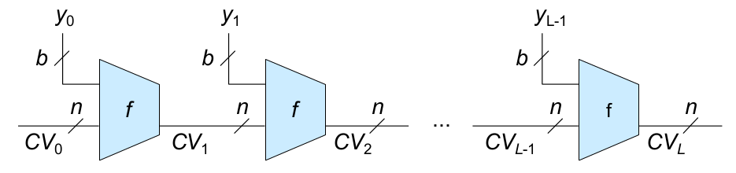
  - CV ist ein Verkettungswert, mit $CV_0:= IV$ und $MDC(y) := CV_L$
  - f ist eine spezifische Kompressionsfunktion, die $(n+b)$ Bit auf n Bit komprimiert
- Die Hash-Funktion H lässt sich wie folgt zusammenfassen:
  - $CV_0 = IV =$ anfänglicher n-Bit-Wert
  - $CV_i = f(CV_{i -1}, y_{i-1}) \quad\quad 1\leq i \leq L$
  - $H(y) = CV_L$
- Es wurde gezeigt [Mer89a], dass, wenn die Kompressionsfunktion f kollisionssicher ist, die resultierende iterierte Hash-Funktion H ebenfalls kollisionssicher ist.
- Die Kryptoanalyse kryptographischer Hash-Funktionen konzentriert sich daher auf die interne Struktur der Funktion f und die Suche nach effizienten Techniken zur Erzeugung von Kollisionen bei einer einzigen Ausführung von f
- In erster Linie durch Geburtstagsangriffe motiviert, ist ein gängiger Mindestvorschlag für n , die Bitlänge des Hashwerts, 160 Bit, da dies einen Aufwand der Größenordnung $2^{80}$ für einen Angriff impliziert, der heute als undurchführbar gilt

## Der Message Digest 5
- MD5 folgt der zuvor skizzierten allgemeinen Struktur (z. B. [Riv92a]):
  - Die Nachricht y wird mit einer ,,1'' aufgefüllt, gefolgt von 0 bis 511 ,,0'' Bits, so dass die Länge der resultierenden Nachricht kongruent 448 modulo 512 ist
  - Die Länge der ursprünglichen Nachricht wird als 64-Bit-Wert hinzugefügt, so dass eine Nachricht entsteht, deren Länge ein ganzzahliges Vielfaches von 512 Bit ist.
  - Diese neue Nachricht wird in Blöcke der Länge $b=512$ Bit unterteilt.
  - Die Länge des Verkettungswertes ist $n=128$ Bit
    - Der Verkettungswert ist ,,strukturiert'' als vier 32-Bit-Register A, B, C, D
    - Initialisierung: 
      - A := 0x 01 23 45 67 
      - B := 0x 89 AB CD EF
      - C := 0x FE DC BA 98 
      - D := 0x 76 54 32 10
  - Jeder Block der Nachricht $y_i$ wird mit dem Verkettungswert $CV_i$ mit der Funktion f verarbeitet, die intern durch 4 Runden zu je 16 Schritten realisiert ist
    - Jede Runde ist ähnlich aufgebaut und verwendet eine Tabelle T, die 64 konstante Werte von je 32 Bit enthält,
    - Jede der vier Runden verwendet eine bestimmte logische Funktion g
- 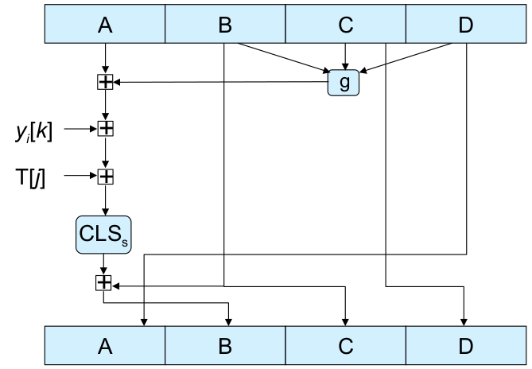 
  - Die Funktion g ist eine von vier verschiedenen logischen Funktionen
  - $y_i[k]$ bezeichnet das k-te$ 32-Bit-Wort des Nachrichtenblocks i
  - $T[j]$ ist der j-te Eintrag der Tabelle t, wobei j bei jedem Schritt modulo 64 inkrementiert wird
  - CLS s bezeichnet die zyklische Linksverschiebung um s Bits, wobei s einem bestimmten Schema folgt.
- Der MD5-MDC über eine Nachricht ist der Inhalt des Verkettungswertes CV nach Verarbeitung des letzten Nachrichtenblocks.
- Sicherheit von MD5:
  - Jedes Bit des 128-Bit-Hash-Codes ist eine Funktion eines jeden Eingabebits
  - 1996 veröffentlichte H. Dobbertin einen Angriff, der es erlaubt, eine Kollision für die Funktion f zu erzeugen (realisiert durch die oben beschriebenen 64 Schritte).
  - Es dauerte bis 2004, bis eine erste Kollision gefunden wurde [WLYF04].
  - Inzwischen ist es möglich, Kollisionen innerhalb von Sekunden auf allgemeiner Hardware zu erzeugen [Kl06].
  - MD5 darf nicht in Betracht gezogen werden, wenn Kollisionssicherheit erforderlich ist!
    - Dies ist oft der Fall!
    - Beispiele: Zwei Postskripte mit unterschiedlichen Texten, aber gleichen Hashes [LD05], Zertifikate, eines für eine gesicherte Domain und eines für eine eigene Zertifizierungsstelle [LWW05], Jede Nachricht, die erweiterbar ist [KK06]
  - Die Resistenz gegen Preimage-Angriffe ist mit 2123.4 Berechnungen noch o.k[SA09]

## Der sichere Hash-Algorithmus SHA-1
- Auch SHA-1 folgt der gleichen Struktur wie oben beschrieben:
  - SHA-1 arbeitet mit 512-Bit-Blöcken und erzeugt einen 160-Bit-Hash-Wert.
  - Da sein Design auch vom MD4-Algorithmus inspiriert wurde, ist seine Initialisierung im Grunde dieselbe wie die von MD5:
    - Die Daten werden aufgefüllt, ein Längenfeld wird hinzugefügt und die resultierende Nachricht wird als Blöcke der Länge 512 Bit verarbeitet.
    - Der Verkettungswert ist als fünf 32-Bit-Register A, B, C, D, E strukturiert
    - Initialisierung: 
        - A = 0x 67 45 23 01 
        - B = 0x EF CD AB 89
        - C = 0x 98 BA DC FE 
        - D = 0x 10 32 54 76
        - E = 0x C3 D2 E1 F0
    - Die Werte werden im Big-Endian-Format gespeichert.
  - Jeder Block yi der Nachricht wird zusammen mit CVi in einem Modul verarbeitet, das die Kompressionsfunktion f in vier Runden zu je 20 Schritten realisiert.
    - Die Runden haben eine ähnliche Struktur, aber jede Runde verwendet eine andere primitive logische Funktion $f_1, f_2, f_3, f_4$.
    - Bei jedem Schritt wird eine feste additive Konstante $K_t$ verwendet, die während einer Runde unverändert bleibt
- 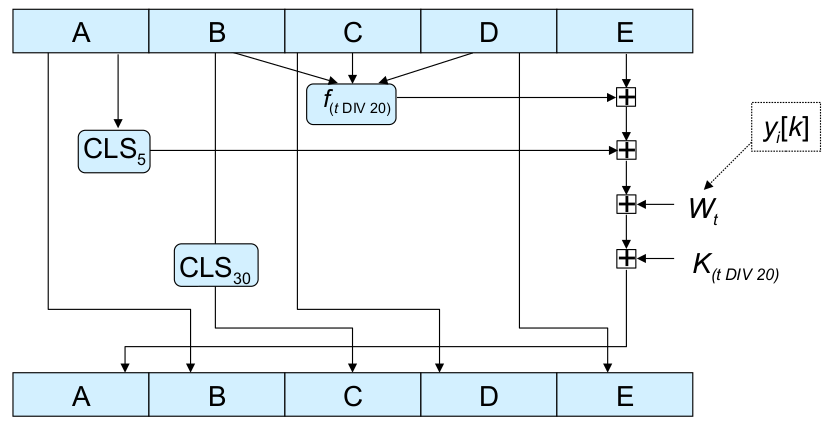
  - $t\in\{0,...,15\}\\Rightarrow  W_t:= y_i[t]$
  - $t\in\{16,...,79\}\Rightarrow W_t:=CLS_1(W_{t-16}\oplus W_{t-14}\oplus W_{t-8} \oplus W_{t-3})$
  - Nach Schritt 79 wird jedes Register A, B, C, D, E modulo $2^{32}$ mit dem Wert des entsprechenden Registers vor Schritt 0 addiert, um $CV_{i+1}$ zu berechnen
- Der SHA-1-MDC über eine Nachricht ist der Inhalt des Verkettungswertes CV nach Verarbeitung des letzten Nachrichtenblocks.
- Vergleich zwischen SHA-1 und MD5:
  - Geschwindigkeit: SHA-1 ist etwa 25% langsamer als MD5 (CV ist etwa 25% größer)
  - Einfachheit und Kompaktheit: beide Algorithmen sind einfach zu beschreiben und zu implementieren und erfordern keine großen Programme oder Ersetzungstabellen
- Sicherheit von SHA-1:
  - Da SHA-1 MDCs der Länge 160 Bit erzeugt, wird erwartet, dass es eine bessere Sicherheit gegen Brute-Force- und Geburtstagsangriffe bietet als MD5.
  - Einige inhärente Schwächen von Merkle-Dåmgard-Konstruktionen, z. B. [KK06], sind vorhanden
  - Im Februar 2005 veröffentlichten X. Wang et. al. einen Angriff, der es erlaubt, eine Kollision mit einem Aufwand von $2^{69}$ zu finden, der in den folgenden Monaten auf $2^{63}$ verbessert und in [WYY05a] veröffentlicht wurde
  - Die Forschung ging weiter (z.B. [Man11]), und im Februar 2017 wurde die erste tatsächliche Kollision gefunden (demonstriert mit einem veränderten PDF-Dokument)
- SHA-2-Familie
  - Im Jahr 2001 veröffentlichte das NIST einen neuen Standard FIPS PUB 180-2, der neue Varianten mit den Bezeichnungen SHA-256, SHA-384 und SHA-512 [NIST02] mit 256, 384 und 512 Bits enthält.
    - SHA-224 wurde im Jahr 2004 hinzugefügt.
  - SHA-224 und SHA-384 sind verkürzte Versionen von SHA-256 und SHA-512 mit unterschiedlichen Initialisierungswerten
  - SHA-2 verwendet ebenfalls die Merkle-Dåmgard-Konstruktion mit einer Blockgröße von 512 Bit (SHA-256) und 1024 Bit (SHA-512)
  - Der interne Zustand ist in 8 Registern von 32 Bit (SHA-256) und 64 Bit (SHA-512) organisiert
  - 64 Runden (SHA-256) oder 80 Runden (SHA-512)
- Ein Schritt
  - 
  - $t\in\{0, ..., 15\}\\Rightarrow  W_t:=y_i[t]$
  - $t\in\{16, ..., r\}\Rightarrow W_t:=W_{t-16}\oplus \delta_0(W_{t-15})\oplus W_{t-7}\oplus\delta_1(W_{t-2})$
  - $K_t$ ist der gebrochene Teil der Kubikwurzel aus der t-ten Primzahl
  - Die ROTR- und Funktionen XOR-verknüpfen verschiedene Verschiebungen des Eingangswertes
  - Ch und Maj sind logische Kombinationen der Eingabewerte
- SHA-2-Familie
  - Alles in allem sehr ähnlich zu SHA-1
  - Aufgrund der Größe und der komplizierteren Rundungsfunktionen etwa 30-50 Prozent langsamer als SHA-1 (variiert für 64-Bit- und 32-Bit-Systeme!)
  - Sicherheitsdiskussion:
    - Bereits 2004 wurde entdeckt, dass eine vereinfachte Version des Algorithmus (mit XOR statt Addition und symmetrischen Konstanten) hochkorrelierte Ausgaben erzeugt [GH04]
    - Für rundenreduzierte Versionen von SHA-2 gibt es Pre-Image-Angriffe, die schneller sind als Brute-Force, aber sehr unpraktisch (z.B. [AGM09])
    - Auch wenn Größe und Komplexität derzeit keine Angriffe zulassen, ist die Situation unangenehm
    - Dies führte zur Notwendigkeit eines neuen SHA-3-Standards

## Der sichere Hash-Algorithmus SHA-3
- Sicherheitsbedenken bezüglich SHA-1 und SHA-2 führten zu einem offenen Wettbewerb des NIST, der 2007 begann
  - 5 Finalisten ohne nennenswerte Schwächen
  - Oktober 2012: NIST gibt bekannt, dass Keccak zu SHA-3 wird
  - 4 europäische Erfinder
  - Einer davon ist Joan Daemen, der AES mitentwickelt hat
  - SHA-3 ist sehr schnell, besonders in der Hardware
  - Sehr gut dokumentiert und analysierbar
- Keccak basiert auf einer so genannten Schwammkonstruktion anstelle der früheren Merkle-Dåmgard-Konstruktionen
  - Vielseitiges Design, um fast alle symmetrischen kryptographischen Funktionen zu implementieren (allerdings ist nur das Hashing standardisiert)
- Arbeitet normalerweise in 2 Phasen
  - ,,Absorbieren'' von Informationen beliebiger Länge in 1600 Bit des internen Zustands
  - ,,Auspressen'' (d.h. Ausgeben) von Hash-Daten beliebiger Länge (nur 224, 256, 384 und 512 Bit standardisiert)
- Der interne Zustand ist in 2 Registern organisiert
  - Ein Register der Größe r ist ,,public'': Eingabedaten werden in der Absorptionsphase mit XOR verknüpft, Ausgabedaten werden in der Quetschungsphase daraus abgeleitet
  - Das Register der Größe c ist ,,privat''; Ein- und Ausgabe wirken sich nicht direkt auf es aus.
  - In Keccak ist die Größe der Register 1600 Bits (d.h. $c+r=1600$ Bits)
  - Die Größe von c ist doppelt so groß wie die Länge des Ausgangsblocks
  - Beide Register werden mit ,,0'' initialisiert
- Das Hashing erfolgt durch eine Funktion f, die die Register liest und einen neuen Zustand ausgibt
- Sponge-Konstruktion
  - 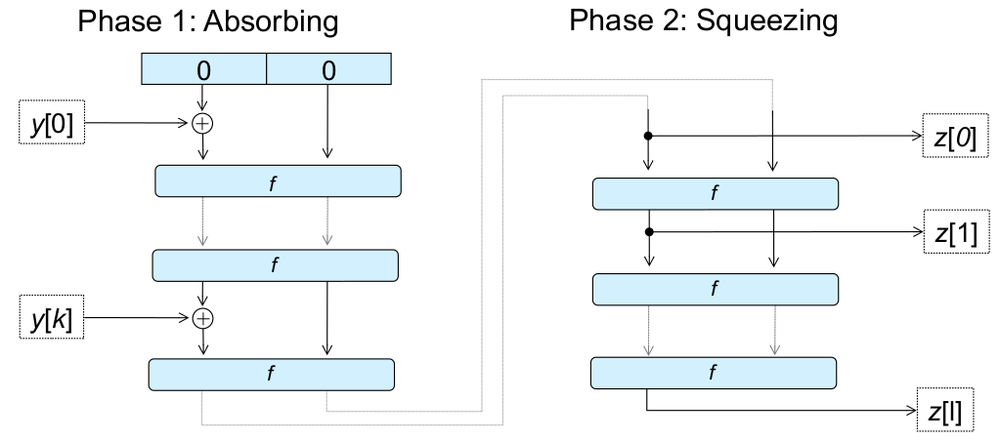
  - Absorptionsphase: $k + 1$ Eingabeblöcke der Größe r werden in den Zustand gemischt
  - Quetschphase: $l + 1$ Ausgangsblöcke der Größe r werden erzeugt (oft nur einer)
  - Der letzte Eingabe- und Ausgabeblock kann aufgefüllt oder abgeschnitten werden.
- Die Funktion f
  - Offensichtlich hängt die Sicherheit einer Sponge-Konstruktion von der Sicherheit von f
  - Keccak verwendet 24 Runden von 5 verschiedenen Unterfunktionen $(\Sigma, \ro,\pi,𝜒,ɩ)$, um f zu implementieren.
  - Die Unterfunktionen operieren auf einem ,,dreidimensionalen'' Bit-Array a $[5][5][w]$, wobei w entsprechend der Größe r und c gewählt wird
  - Alle Operationen werden über $GF(2^n)$ durchgeführt.
  - Jede der Unterfunktionen gewährleistet bestimmte Eigenschaften, z.B,
    - Schnelle Diffusion der geänderten Bits im gesamten Zustand ($\Sigma$)
    - Langfristige Diffusion ($\pi$)
    - Sicherstellung, dass f nichtlinear wird (𝜒)
    - Rundenspezifische Substitution (ɩ)
- $\Sigma$ wird zuerst ausgeführt, um sicherzustellen, dass sich der geheime und der öffentliche Zustand schnell vermischen, bevor andere Unterfunktionen angewendet werden.
- Sicherheit
  - Derzeit gibt es keine nennenswerten Schwachstellen in SHA-3
    - Die bekanntesten Pre-Image-Angriffe funktionieren nur mit einer Funktion f mit bis zu 8 Runden
    - Zum Schutz vor internen Kollisionen sollten 11 Runden ausreichen.
  - Im Vergleich zu SHA-1 und SHA-2 werden zusätzliche Sicherheitseigenschaften garantiert, da der interne Zustand nie öffentlich gemacht wird
    - Verhindert Angriffe, bei denen beliebige Informationen zu einer gültigen geheimen Nachricht hinzugefügt werden
    - Bietet Chosen Target Forced Prefix (CTFP) Preimage-Resistenz [KK06], d.h. es ist nicht möglich, eine Nachricht $m=P||S$ zu konstruieren, wobei P fest und S beliebig gewählt ist, s.t., $H(m)=y$
    - Für Merkle-Dåmgard-Konstruktionen ist dies nur so schwer wie die Kollisionssicherheit
    - Keine schnelle Möglichkeit, Multikollisionen schnell zu erzeugen [Jou04]

## Cipher Block Chaining Message Authentication Codes
- Ein CBC-MAC wird berechnet, indem eine Nachricht im CBC-Modus verschlüsselt wird und der letzte Chiffretextblock oder ein Teil davon als MAC verwendet wird:
  - 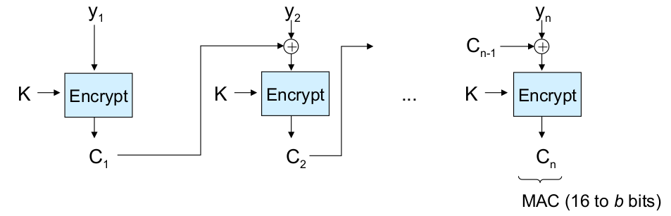
- Dieser MAC muss nicht mehr signiert werden, da er bereits mit einem gemeinsamen Geheimnis K erzeugt wurde.
  - Es ist jedoch nicht möglich zu sagen, wer genau einen MAC erstellt hat, da jeder (Sender, Empfänger), der den geheimen Schlüssel K kennt, dies tun kann
- Dieses Verfahren funktioniert mit jeder Blockchiffre (DES, IDEA, ...)
- Sicherheit von CBC-MAC:
  - Da ein Angreifer K nicht kennt, ist ein Geburtstagsangriff sehr viel schwieriger (wenn nicht gar unmöglich) zu starten
  - Ein Angriff auf einen CBC-MAC erfordert bekannte Paare (Nachricht, MAC)
  - Dies ermöglicht kürzere MACs
  - Ein CBC-MAC kann optional verstärkt werden, indem man sich auf einen zweiten Schlüssel $K'\not= K$ einigt und eine dreifache Verschlüsselung des letzten Blocks durchführt: $MAC:=E(K,D(K',E(K,C_{n-1})))$
  - Dadurch verdoppelt sich der Schlüsselraum bei nur geringem Rechenaufwand
  - Die Konstruktion ist nicht sicher, wenn die Nachrichtenlängen variieren!
- Es gibt auch einige Vorschläge, MDCs aus symmetrischen Blockchiffren zu erzeugen, indem der Schlüssel auf einen festen (bekannten) Wert gesetzt wird:
  - Wegen der relativ kleinen Blockgröße von 64 Bit der meisten gängigen Blockchiffren bieten diese Verfahren keine ausreichende Sicherheit gegen Geburtstagsangriffe.
  - Da symmetrische Blockchiffren mehr Rechenaufwand erfordern als spezielle kryptografische Hash-Funktionen, sind diese Verfahren relativ langsam.

## Konstruktion eines MAC aus einem MDC
- Grund für die Konstruktion von MACs aus MDCs Kryptografische Hash-Funktionen laufen im Allgemeinen schneller ab als symmetrische Blockchiffren
- Grundidee: ,,mix'' einen geheimen Schlüssel K mit der Eingabe und berechne einen MDC
- Die Annahme, dass ein Angreifer K kennen muss, um einen gültigen MAC zu erzeugen, wirft dennoch einige kryptografische Probleme auf (zumindest für Merkle-Dåmgard-Hash-Funktionen):
  - Die Konstruktion $H(K||m)$ ist nicht sicher (siehe Anmerkung 9.64 in [Men97a])
  - Die Konstruktion $H(m||K)$ ist nicht sicher (siehe Bemerkung 9.65 in [Men97a])
  - Die Konstruktion $H(K||p||m||K)$, bei der p ein zusätzliches Auffüllfeld bezeichnet, bietet keine ausreichende Sicherheit (siehe Anmerkung 9.66 in [Men97a])
- Die am häufigsten verwendete Konstruktion ist: $H(K\oplus p_1|| H(K\oplus p_2|| m))$
  - Der Schlüssel wird mit 0's aufgefüllt, um den Schlüssel zu einem Eingabeblock der kryptographischen Hashfunktion aufzufüllen
  - Zwei verschiedene konstante Muster $p_1$ und $p_2$ werden mit dem aufgefüllten Schlüssel XOR-verknüpft
  - Dieses Schema scheint sicher zu sein (siehe Anmerkung 9.67 in [Men97a])
  - Es wurde in RFC 2104 [Kra97a] standardisiert und wird HMAC genannt.

## Authentifizierte Verschlüsselung mit zugehörigen Daten (AEAD) Modi
- Normalerweise sind die Daten nicht authentifiziert oder verschlüsselt, sondern verschlüsselt UND authentifiziert (Blöcke $P_0...P_n$)
- Manchmal müssen zusätzliche Daten authentifiziert werden (z.B. Paketköpfe), im Folgenden mit $A_0...A_m$ bezeichnet
- führte zur Entwicklung von AEAD-Betriebsarten
- Beispiele hierfür sind
  - Galois/Zähler-Modus (GCM)
  - Zähler mit CBC-MAC (CCM)
  - Offset-Codebuch-Modus (OCM)
  - SpongeWrap - eine Methode zur Verwendung von Keccak für den AEAD-Betrieb

### Galois/Zähler-Modus (GCM) [MV04]
- Beliebter AEAD-Modus
- NIST-Standard, Teil von IEEE 802.1AE, IPsec, TLS, SSH usw.
- Frei von Patenten
- Wird wegen seiner hohen Geschwindigkeit hauptsächlich in Netzwerkanwendungen eingesetzt
  - Äußerst effizient in der Hardware
  - Prozessorunterstützung auf neueren x86-CPUs
  - Zeitintensive Aufgaben können vorberechnet und parallelisiert werden
  - Keine Notwendigkeit für Auffüllungen
- Verwendet konventionelle Blockchiffre mit 128-Bit-Blockgröße (z. B. AES)
- Berechnet MAC durch Multiplikationen und Additionen in $GF(2^{128})$ über das irreduzible Polynom $x^{128}+x^{7}+x^{2}+x+1$
- Erfordert nur $n+1$ Blockchiffre-Aufrufe pro Paket (n = Länge der verschlüsselten und authentifizierten Daten)
- 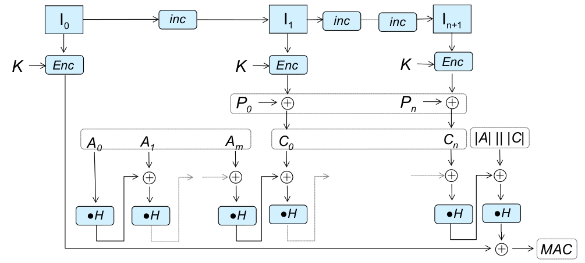
  - $I_0$ wird mit dem IV und einem Padding oder einem Hash des IV initialisiert (wenn er nicht 96 Bit beträgt)
  - $\circ H$ ist $GF(2^{128})$ Multiplikation mit $H=E(K,0^{128})$
  - Die Eingabeblöcke $A_m$ und $P_n$ werden auf 128 Bit aufgefüllt
  - $A_m$ und $C_n$ werden vor der Ausgabe auf die Originalgröße gekürzt
  - Die letzte Authentifizierung verwendet 64 Bit kodierte Bitlängen von A und C
- Sicherheit
  - Schneller Modus, erfordert aber einige Sorgfalt:
    - Erwiesenermaßen sicher (unter bestimmten Voraussetzungen, z. B. wenn die verwendete Blockchiffre nicht von Zufallszahlen unterscheidbar ist), aber die Konstruktion ist anfällig:
  - IVs MÜSSEN NICHT wiederverwendet werden, da sonst Datenströme XOR-verknüpft werden können und das XOR der Datenströme wiederhergestellt werden kann, was zu einer sofortigen Wiederherstellung des geheimen Werts ,,H'' führen kann
  - H hat einen möglichen schwachen Wert $0^{128}$, in diesem Fall wird die Authentifizierung nicht funktionieren, und wenn IVs mit einer anderen Länge als 96 Bits verwendet werden, wird $C_0$ immer gleich sein!
  - Einige andere Schlüssel erzeugen Hash-Schlüssel mit einer niedrigen Ordnung, was vermieden werden muss... [Saa11]
  - Erfolgreiche Fälschungsversuche können Informationen über H durchsickern lassen, daher MÜSSEN kurze MAC-Längen vermieden oder risikominimiert werden [Dwo07]
  - Die erreichte Sicherheit ist nur $2^{t-k}$ und nicht $2^t$ (für MAC-Länge t und Anzahl der Blöcke $2^k$), da Blöcke modifiziert werden können, um nur Teile des MAC zu ändern [Fer05]

### Kleiner Exkurs: Rechenoperationen in $GF(2^n)$
- Galoisfeld-Arithmetik definiert über Termen (z.B. $a_3x^3+a_2x^2+a_1x+a_0$)
- Koeffizienten sind Elemente des Feldes $\matbb{Z}_2$, d.h. entweder 0 oder 1
- Oft werden nur die Koeffizienten gespeichert, so wird aus x^4 +x^2 +x^1 0x16
- Die Addition in $GF(2^n)$ ist einfach die Addition von Termen
  - Da gleiche Koeffizienten auf 0 abbilden, einfach XOR der Werte!
  - Extrem schnell in Hard- und Software!
- Multiplikation in $GF(2^n)$ ist Polynommultiplikation und anschließende Modulodivision durch ein irreduzibles Polynom vom Grad n
  - Irreduzible Polynome sind nicht ohne Rest durch irgendein anderes Polynom teilbar, außer durch ,,1'', ähnlich wie Primzahlen in GF
  - Kann durch eine Reihe von Verschiebe- und XOR-Operationen implementiert werden
  - Sehr schnell in Hardware oder auf neueren Intel-CPUs (mit CLMUL-Operationen)
  - Modulo-Operation kann wie bei einer regulären CRC-Berechnung durchgeführt werden
- Addition Beispiel:
  - $x^3 +x+1 x\oplus x^2+x = x^3 +x^2 +1 \leftrightarrow$ 0x0B XOR 0x06 = 0x0D
- Multiplikationsbeispiel (über $x^4 +x+1$):
  - $x^3 +x+1\circ x^2+x = x^5+x^3+x^2\oplus x^4+x^2+x\ MOD\ x^4+x+1=x^5+x^4+x^3+x\ MOD\ x^4+x+1 = x^3 +x^2 +x+1$
- Elemente von $GF(2^n)$ (mit Ausnahme von 1 und dem irreduziblen Polynom) können ein Generator für die Gruppe sein
- Beispiel für x und das Polynom $x^4+x+1:x,x^2,x^3,x+1,x^2+x,x^3+x^2,x^3+x+1,x^2 +1,x^3+x,x^2+x+1,x^3+x^2+x,x^3+x^2+x+1,x^3+x^2+1,x^3+1,1,x,...$
- Andere Konzepte endlicher Gruppen gelten ebenfalls, z. B. hat jedes Element ein multiplikatives inverses Element
  - Kann durch eine angepasste Version des Erweiterten Euklidischen Algorithmus gefunden werden

## SpongeWrap
- Durch Verwendung von SHA-3 ist es auch möglich, ein AEAD-Konstrukt zu implementieren [BDP11a]
- Die Konstruktion ist sehr einfach und vergleichsweise leicht zu verstehen
- Verwendet den sogenannten Duplex-Modus für Sponge-Funktionen, bei dem Schreib- und Leseoperationen verschachtelt werden
- Erfordert kein Auffüllen der Daten auf eine bestimmte Blockgröße
- Kann nicht parallelisiert werden
- Sicherheit:
  - Noch nicht weit verbreitet, aber mehrere Aspekte haben sich als genauso sicher wie SHA-3 im standardisierten Modus erwiesen
  - Wenn die authentifizierten Daten A keine eindeutige IV enthalten, wird derselbe Schlüsselstrom erzeugt (ermöglicht die Wiederherstellung eines Blocks XOR-verschlüsselter Daten)
- 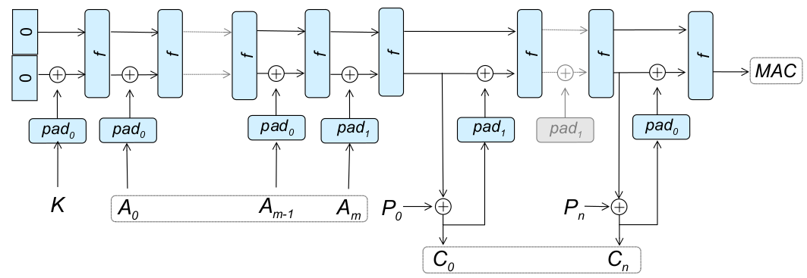
  - Vereinfachte Version, bei der die Länge von Schlüssel und MAC kleiner sein muss als die Blockgröße
  - Auffüllungen mit einem einzelnen ,,0''- oder ,,1''-Bit stellen sicher, dass verschiedene Datenblocktypen gut voneinander getrennt sind

# Zufallszahlengenerierung
## Aufgaben der Schlüsselverwaltung
- Erzeugung:
  - Für die Sicherheit ist es von entscheidender Bedeutung, dass die Schlüssel mit einem wirklich zufälligen oder zumindest pseudozufälligen Generierungsverfahren erzeugt werden (siehe unten).
  - Andernfalls könnte ein Angreifer den Schlüsselgenerierungsprozess reproduzieren und den zur Sicherung einer bestimmten Kommunikation verwendeten Schlüssel leicht finden.
- Verteilung:
  - Die Verteilung einiger anfänglicher Schlüssel muss in der Regel manuell / "out of band" erfolgen.
  - Die Verteilung von Sitzungsschlüsseln wird in der Regel während eines Authentifizierungsaustauschs durchgeführt.
  - Beispiele: Diffie-Hellman, Otway-Rees, Kerberos, X.
- Speicherung:
  - Schlüssel, insbesondere Authentifizierungsschlüssel, sollten sicher gespeichert werden:
    - entweder verschlüsselt mit einer schwer zu erratenden Passphrase, oder besser
    - in einem sicheren Gerät wie einer Smart-Card
- Entzug:
  - Wenn ein Schlüssel kompromittiert wurde, sollte es möglich sein, diesen Schlüssel zu widerrufen, damit er nicht mehr missbraucht werden kann (vgl. X.509).
- Vernichtung:
  - Schlüssel, die nicht mehr verwendet werden (z. B. alte Sitzungsschlüssel), sollten sicher vernichtet werden.
- Wiederherstellung:
  - Wenn ein Schlüssel verloren gegangen ist (z. B. defekte Chipkarte, Diskette, versehentliches Löschen), sollte er wiederhergestellt werden können, um Datenverluste zu vermeiden.
  - Die Wiederherstellung von Schlüsseln ist nicht zu verwechseln mit der Schlüsselhinterlegung
- Hinterlegung:
  - Mechanismen und Architekturen, die es staatlichen Stellen (und nur diesen) ermöglichen sollen, Sitzungsschlüssel zu erhalten, um zu Strafverfolgungszwecken die Kommunikation abzuhören / gespeicherte Daten zu lesen
    - Wenn ich meinen Schlüssel zurückbekomme, ist es Schlüsselwiederherstellung, wenn du meinen Schlüssel zurückbekommst, ist es Schlüsselhinterlegung...'')

## Zufalls- und Pseudo-Zufallszahlengenerierung
- Definition: ,,Ein Zufallsbitgenerator ist ein Gerät oder ein Algorithmus, der eine Folge statistisch unabhängiger und unverfälschter Binärziffern ausgibt.''
- Bemerkung: Ein Zufallsbitgenerator kann zur Erzeugung gleichmäßig verteilter Zufallszahlen verwendet werden, z. B. kann eine zufällige ganze Zahl im Intervall $[0,n]$ erhalten werden, indem eine zufällige Bitfolge der Länge $\lfloor lg n\rfloor+1$ erzeugt und in eine Zahl umgewandelt wird. Ist die resultierende ganze Zahl größer als n, so kann sie verworfen werden, und der Vorgang wird so lange wiederholt, bis eine ganze Zahl im gewünschten Bereich erzeugt worden ist.
- Definition: Ein Pseudo-Zufallsbitgenerator (PRBG) ist ein deterministischer Algorithmus, der bei einer wirklich zufälligen Binärfolge der Länge k eine Binärfolge der Länge $m>>k$ ausgibt, die ,,zufällig'' erscheint. Die Eingabe in den PRBG wird als Seed bezeichnet, die Ausgabe als pseudozufällige Bitfolge.
- Bemerkungen:
  - Die Ausgabe eines PRBG ist nicht zufällig, tatsächlich ist die Anzahl der möglichen Ausgabesequenzen der Länge m höchstens ein kleiner Bruchteil $2^k/2^m$, da der PRBG immer dieselbe Ausgabesequenz für einen (festen) Seed erzeugt
  - Die Motivation für die Verwendung einer PRBG ist, dass es zu teuer sein könnte, echte Zufallszahlen der Länge m zu erzeugen, z. B. durch Münzwurf, so dass nur eine kleinere Menge von Zufallsbits erzeugt wird und dann aus den k echten Zufallsbits eine pseudozufällige Bitfolge erzeugt wird
  - Um Vertrauen in die ,,Zufälligkeit'' einer Pseudo-Zufallsfolge zu gewinnen, werden statistische Tests mit den erzeugten Folgen durchgeführt
- Beispiel:
  - Ein linearer Kongruenzgenerator erzeugt eine Pseudo-Zufallsfolge von Zahlen $y_1,y_2, ...$ gemäß der linearen Rekursion $y_i= a\times y_{i-1} + b\ mod\ q$, wobei $a, b, q$ Parameter sind, die den PRBG charakterisieren
  - Leider ist dieser Generator auch dann vorhersehbar, wenn $a, b$ und $q$ unbekannt sind, und sollte daher nicht für kryptographische Zwecke verwendet werden
- Sicherheitsanforderungen an PRBGs für die Verwendung in der Kryptographie:
  - Als Mindestsicherheitsanforderung sollte die Länge k des Seeds einer PRBG so groß sein, dass eine Brute-Force-Suche über alle Seeds für einen Angreifer nicht durchführbar ist
  - Die Ausgabe einer PRBG sollte statistisch nicht von echten Zufallssequenzen unterscheidbar sein.
  - Die Ausgabebits sollten für einen Angreifer mit begrenzten Ressourcen unvorhersehbar sein, wenn er den Seed nicht kennt.
- Definition: Ein PRBG besteht alle statistischen Polynomialzeit-Tests, wenn kein deterministischer Polynomialzeit-Algorithmus zwischen einer Ausgangssequenz des Generators und einer echten Zufallssequenz derselben Länge mit einer Wahrscheinlichkeit deutlich größer als 0 unterscheiden kann.
  - Polynomialzeit-Algorithmus bedeutet, dass die Laufzeit des Algorithmus durch ein Polynom in der Länge m der Sequenz begrenzt ist
- Definition: Ein PRBG besteht den Next-Bit-Test, wenn es keinen deterministischen Polynomialzeit-Algorithmus gibt, der bei Eingabe der ersten m Bits einer Ausgangssequenz $s$ das $(m+1)$-te Bit $s_{m+1}$ der Ausgangssequenz mit einer Wahrscheinlichkeit deutlich größer als 0 vorhersagen kann.
- Theorem (Universalität des Next-Bit-Tests): Wenn eine PRBG den Next-Bit-Test $\Leftrightarrow$ besteht, dann besteht sie alle statistischen Polynomialzeittests
- Definition: Ein PRBG, der den Next-Bit-Test besteht - möglicherweise unter einer plausiblen, aber unbewiesenen mathematischen Annahme wie der Unlösbarkeit des Faktorisierungsproblems für große ganze Zahlen - wird als kryptographisch sicherer Pseudo-Zufallsgenerator (CSPRBG) bezeichnet

## Zufallszahlengenerierung
- Hardware-basierte Zufallsbit-Generatoren basieren auf physikalischen Phänomenen, wie:
  - die verstrichene Zeit zwischen der Emission von Teilchen beim radioaktiven Zerfall,
  - thermisches Rauschen einer Halbleiterdiode oder eines Widerstandes,
  - Frequenzinstabilität eines frei laufenden Oszillators,
  - der Betrag, um den ein Metall-Isolator-Halbleiter-Kondensator während eines bestimmten Zeitraums aufgeladen wird,
  - Luftturbulenzen in einem versiegelten Festplattenlaufwerk, die zufällige Schwankungen in den Sektor-Lese-Latenzen des Festplattenlaufwerks verursachen, und
  - Ton von einem Mikrofon oder Videoeingang von einer Kamera
  - der Zustand einer ungeraden Anzahl von kreisförmig verbundenen NOT-Gattern
- Ein hardwarebasierter Zufallsbitgenerator sollte idealerweise in einer manipulationssicheren Vorrichtung untergebracht und so vor möglichen Angreifern geschützt sein.
- Softwarebasierte Zufallsbit-Generatoren können auf Prozessen basieren wie
  - der Systemuhr,
  - der verstrichenen Zeit zwischen Tastenanschlägen oder Mausbewegungen,
  - Inhalt von Eingabe-/Ausgabepuffern
  - Benutzereingaben und
  - Werte des Betriebssystems wie Systemauslastung und Netzwerkstatistiken
- Idealerweise sollten mehrere Zufallsquellen ,,gemischt'' werden, z. B. durch Verkettung ihrer Werte und Berechnung eines kryptografischen Hashwerts für den kombinierten Wert, um zu verhindern, dass ein Angreifer den Zufallswert erraten kann
  - Wird z. B. nur die Systemuhr als Zufallsquelle verwendet, könnte ein Angreifer die aus dieser Zufallsquelle gewonnenen Zufallszahlen erraten, wenn er weiß, wann sie erzeugt wurden.
- Verzerrung:
  - Betrachten wir einen Zufallsgenerator, der verzerrte, aber unkorrelierte Bits erzeugt, z. B. 1en mit der Wahrscheinlichkeit $p\not= 0,5$ und 0en mit der Wahrscheinlichkeit $1-p$, wobei p unbekannt, aber fest ist
- Die folgende Technik kann verwendet werden, um eine Zufallsfolge zu erhalten, die unkorreliert und unverzerrt ist:
  - Die Ausgangssequenz des Generators wird in Bitpaare gruppiert
  - Alle Paare 00 und 11 werden verworfen.
  - Für jedes Paar 10 erzeugt der unvoreingenommene Generator eine 1 und für jedes Paar 01 eine 0.
- Ein weiteres praktisches (wenn auch nicht beweisbares) Verfahren zur Entzerrung ist die Weiterleitung von Sequenzen, deren Bits korreliert oder verzerrt sind, durch eine kryptografische Hash-Funktion wie MD5 oder SHA-1

## Statistische Tests für Zufallszahlen
- Mit den folgenden Tests lässt sich überprüfen, ob eine generierte Zufalls- oder Pseudozufallsfolge bestimmte statistische Eigenschaften nicht erfüllt:
  - Monobit-Test: Gibt es gleich viele 1en wie 0en?
  - Serieller Test (Zwei-Bit-Test): Gibt es gleich viele 00-, 01-, 10-, 11-Paare?
  - Poker-Test: Gibt es gleich viele Sequenzen ni der Länge q, die mit $q$ den gleichen Wert haben, so dass $\lfloor m/q\rfloor\geq 5\times (2^q)$
  - Test auf Durchläufe: Entspricht die Anzahl der Läufe (Sequenzen, die nur entweder 0 oder 1 enthalten) unterschiedlicher Länge den Erwartungen für Zufallszahlen?
  - Autokorrelationstest: Gibt es Korrelationen zwischen der Sequenz und (nicht-zyklischen) verschobenen Versionen davon?
  - Maurer's Universal Test: Kann die Sequenz komprimiert werden?
  - NIST SP 800-22: Standardisierte Testsuite, umfasst die oben genannten und weitere fortgeschrittene Tests

## Sichere Pseudo-Zufallszahlengenerierung
- Es gibt eine Reihe von Algorithmen, die kryptografische Hash-Funktionen oder Verschlüsselungsalgorithmen zur Erzeugung von kryptografisch sicheren Pseudozufallszahlen verwenden.
  - Obwohl diese Verfahren nicht als sicher bewiesen werden können, scheinen sie
für die meisten praktischen Situationen ausreichend
- Ein solcher Ansatz ist der Generator ANSI X9.17:
  - Eingabe: ein zufälliger und geheimer 64-Bit-Seed s, eine ganze Zahl m und ein 3-DES-Schlüssel K
  - Ausgabe: m pseudo-zufällige 64-Bit-Strings $y_1,y_2,...Y_m$
      1. $q = E(K, Date\_Time)$
      2. For i von 1 bis m do
         1. $x_i = E(K, (q\oplus s)$
         2. $s = E(K, (x_i\oplus q)$
      3. $Return(x_1,x_2,...x_m)$
  - Diese Methode ist eine vom U.S. Federal Information Processing Standard (FIPS) zugelassene Methode zur pseudozufälligen Erzeugung von Schlüsseln und Initialisierungsvektoren zur Verwendung mit DES
- Das RSA-PRBG ist ein CSPRBG unter der Annahme, dass das RSA-Problem unlösbar ist:
  - Ausgabe: eine pseudo-zufällige Bitfolge $z_1,z_2,...,z_k$ der Länge k
  1. Setup-Prozedur: Erzeuge zwei geheime Primzahlen $p, q$, die für die Verwendung mit RSA geeignet sind. Berechne $n=p\times q$ und $\phi=(p-1)\times(q-1)$. Wähle eine zufällige ganze Zahl e so, dass $1<e<\phi$ und $gcd(e,\phi)=1$
  2. Wähle eine zufällige ganze Zahl $y_0$ (den Keim) so, dass $y_0\in [1,n]$
  3. Für i von 1 bis k tun
     1. $y_i=(y_{i-1})^e\ mod\ n$
     2. $z_i =$ das niedrigstwertige Bit von $y_i$
  - Die Effizienz des Generators kann leicht verbessert werden, indem man die letzten j Bits von jedem $y_i$ nimmt, wobei $j=c\times lg(lg(n))$ und c eine Konstante ist
  - Für eine gegebene Bitlänge m von n wurde jedoch noch kein Wertebereich für die Konstante c ermittelt, in dem der Algorithmus noch einen CSPRBG ergibt
- Der Blum-Blum-Shub-PRBG ist ein CSPRBG unter der Annahme, dass das Problem der ganzzahligen Faktorisierung unlösbar ist:
  - Ausgabe: eine pseudo-zufällige Bitfolge $z_1,z_2,...,z_k$ der Länge k
  1. Setup-Prozedur: Erzeuge zwei große geheime und unterschiedliche Primzahlen $p,q$, so dass $p,q$ jeweils kongruent 3 modulo 4 sind, und lass $n=p\times q$
  2. Wähle eine zufällige ganze Zahl s (den Keim) so, dass $s\in [1, n-1]$ liegt, so dass $gcd(s,n)=1$ und $y_0=s^2\ mod\ n$
  3. Für i von 1 bis k tun
     1. $y_i = (y_{i-1})^2\ mod\ n$
     2. $z_i =$ das niedrigstwertige Bit von $y_i$
  - Die Effizienz des Generators kann mit der gleichen Methode wie beim RSA-Generator verbessert werden, wobei ähnliche Einschränkungen für die Konstante c gelten
- Dualer deterministischer Zufallsbitgenerator mit elliptischer Kurve:
  - Basierend auf der Unlösbarkeit des Problems des diskreten Logarithmus elliptischer Kurven
  - Vereinfachte Version: 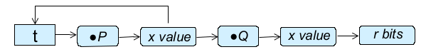
  - Der Zustand t wird mit einem Generator P multipliziert, der x-Wert des neuen Punktes wird zu t'
  - Multiplikation mit einem anderen Punkt Q r Bits der Ausgabe können erzeugt werden, die Anzahl der Bits hängt von der Kurve ab (zwischen 240 und 504 Bits)
  - Teil der Norm NIST 800-90A
  - Sicherheit:
    - Es wurde gezeigt, dass Angreifer den Zustand t ableiten können, wenn P für eine Konstante e gleich eQ gewählt wird.
    - Wir wissen nicht, wie die vordefinierten Punkte P und Q in NIST 800-90A abgeleitet werden, also Vorsicht

## CSPRNG-Sicherheit ist eine große Sache!
- Im September 2006 wurde Debian versehentlich so verändert, dass nur die Prozess-ID verwendet wurde, um den OpenSSL CSPRNG zu füttern
  - Nur 32.768 mögliche Werte!
  - Wurde bis Mai 2008 nicht entdeckt
- Ein Scan von etwa 23 Millionen TLS- und SSH-Hosts zeigte, dass
  - Mindestens 0,34% der Hosts teilten Schlüssel aufgrund fehlerhafter RNGs
  - 0,50% der gescannten TLS-Schlüssel aufgrund einer geringen Zufälligkeit kompromittiert werden konnten
  - und 1,06% der SSH-Hosts...
- Überwachen Sie Ihren CSPRNG!
  - Generieren Sie keine Zufallszahlen direkt nach dem Booten Ihres Systems
  - Verwenden Sie blockierende RNGs, d.h. solche, die nicht fortfahren, bis sie genügend Entropie haben

# Kryptographische Protokolle
- Definition: Ein kryptographisches Protokoll ist definiert als eine Reihe von Schritten und der Austausch von Nachrichten zwischen mehreren Einheiten, um ein bestimmtes Sicherheitsziel zu erreichen.
- Eigenschaften eines Protokolls (im Allgemeinen):
  - Jeder, der an dem Protokoll beteiligt ist, muss das Protokoll und alle zu befolgenden Schritte im Voraus kennen
  - Jeder, der an dem Protokoll beteiligt ist, muss zustimmen, es zu befolgen.
  - Das Protokoll muss eindeutig sein, d.h. jeder Schritt ist genau definiert, und es gibt keine Möglichkeit für Missverständnisse
  - Das Protokoll muss vollständig sein, d. h. es gibt für jede mögliche Situation eine bestimmte Aktion.
- Zusätzliche Eigenschaft eines kryptographischen Protokolls:
  - Es sollte nicht möglich sein, mehr zu tun oder zu erfahren als das, was im Protokoll angegeben ist.

## Anwendungen von kryptographischen Protokollen
- Schlüsselaustausch
- Authentifizierung
  - Authentifizierung der Datenherkunft
  - Authentifizierung von Entitäten
- Kombinierte Authentifizierung und Schlüsselaustausch
- Aufteilung des Geheimnisses (alle Teile werden für die Rekonstruktion benötigt)
- Gemeinsame Nutzung des Geheimnisses (m von n Teilen werden für die Rekonstruktion benötigt)
- Zeitstempelung
- Schlüsselhinterlegung (Sicherstellung, dass nur eine befugte Stelle Schlüssel wiederherstellen kann)
- Zero-Knowledge-Beweise (Nachweis der Kenntnis einer Information ohne Offenlegung der Information)
- Blindsignaturen (nützlich für die Wahrung der Privatsphäre bei Zeitstempeldiensten)
- Sichere Wahlen
- Elektronisches Geld

## Schlüsselaustausch
- Das vorgestellte Diffie-Hellman-Protokoll ist unser erstes Beispiel für ein kryptographisches Protokoll zum Schlüsselaustausch
- Bitte beachten Sie, dass es keine Authentifizierung realisiert:
  - Weder Alice noch Bob wissen nach einem Protokolldurchlauf, mit wem sie einen Schlüssel ausgetauscht haben
  - Da dieser reine Schlüsselaustausch ohne Authentifizierung nicht einmal die Vertraulichkeit der Kommunikation nach dem Austausch garantieren kann, muss er mit Authentifizierung kombiniert werden
- Diese Trennung von Schlüsselaustausch und Authentifizierung des Austauschs hat jedoch einen großen Vorteil, da sie es ermöglicht, die Eigenschaft des perfekten Vorwärtsgeheimnisses (Perfect Forward Secrecy, PFS) zu gewährleisten:
  - Wenn ein Schlüsselaustausch PFS gewährleistet, kann die Kompromittierung eines Schlüssels in der Zukunft keine Daten kompromittieren, die mit anderen Schlüsseln geschützt wurden, die vor dieser Kompromittierung ausgetauscht wurden.
  - Beispiel: Stellen Sie sich vor, Alice und Bob signieren beide die zur Berechnung von sk ausgetauschten Daten mit ihren privaten Schlüsseln. Selbst die Kompromittierung eines privaten Schlüssels in der Zukunft wird es nicht ermöglichen, aufgezeichnete Daten zu entschlüsseln, die mit sk geschützt wurden.

## Authentifizierung der Datenherkunft
Definition: Die Datenursprungsauthentifizierung ist der Sicherheitsdienst, der es Entitäten ermöglicht, zu überprüfen, ob eine Nachricht von einer bestimmten Entität stammt und nicht nachträglich verändert wurde. Ein Synonym für diesen Dienst ist Datenintegrität.
- Die Beziehung zwischen Datenintegrität und kryptografischen Protokollen ist zweifach:
  - Es gibt kryptografische Protokolle zur Sicherstellung der Datenintegrität. Sie umfassen in der Regel nur einen Protokollschritt und sind daher nicht sehr ,,spannend'':
    - Beispiel 1: Angenommen, jeder kennt den öffentlichen RSA-Schlüssel von Alice und kann sicher sein, dass er den Schlüssel von Alice wirklich kennt, dann kann Alice die Datenintegrität ihrer Nachrichten sicherstellen, indem sie sie mit ihrem privaten Schlüssel verschlüsselt.
    - Beispiel 2: Alice kann auch einen MDC über ihre Nachricht berechnen und den mit ihrem privaten Schlüssel verschlüsselten MDC an die Nachricht anhängen
  - Die Datenintegrität der ausgetauschten Nachrichten ist oft eine wichtige Eigenschaft in kryptografischen Protokollen, daher ist die Datenintegrität ein Baustein für kryptografische Protokolle

## Authentifizierung von Entitäten
Definition: Entitätsauthentifizierung ist der Sicherheitsdienst, der es Kommunikationspartnern ermöglicht, die Identität ihrer Peer-Entitäten zu überprüfen.
- Die Entitätsauthentifizierung ist der grundlegendste Sicherheitsdienst, da alle anderen Sicherheitsdienste auf ihr aufbauen.
- Im Allgemeinen kann sie durch verschiedene Mittel erreicht werden:
  - Wissen: z. B. Passwörter
  - Besitz: z. B. physische Schlüssel oder Karten
  - Unveränderliches Merkmal: z. B. biometrische Eigenschaften wie Fingerabdruck usw.
  - Ort: Es wird der Nachweis erbracht, dass sich eine Entität an einem bestimmten Ort befindet (Beispiel: Menschen überprüfen selten die Authentizität von Agenten in einer Bank)
  - Delegation der Authentizität: Die überprüfende Stelle akzeptiert, dass eine vertrauenswürdige Person die Authentifizierung bereits vorgenommen hat.
- In Kommunikationsnetzen ist die direkte Überprüfung der oben genannten Mittel schwierig oder unsicher, weshalb kryptographische Protokolle erforderlich sind.
- Der Hauptgrund, warum die Authentifizierung von Entitäten mehr ist als ein Austausch von (datenherkunfts-) authentischen Nachrichten, ist die Aktualität:
  - Selbst wenn Bob während einer Kommunikation authentische Nachrichten von Alice erhält, kann er nicht sicher sein, ob:
    - Alice zu diesem Zeitpunkt tatsächlich an der Kommunikation teilnimmt, oder ob
    - Eve alte Nachrichten von Alice abspielt
  - Dies ist von besonderer Bedeutung, wenn die Authentifizierung nur zum Zeitpunkt des Verbindungsaufbaus erfolgt:
    - Beispiel: Übermittlung einer (möglicherweise verschlüsselten) PIN beim Einloggen
  - Zwei grundsätzliche Mittel zur Sicherstellung der Aktualität in kryptographischen Protokollen:
    - Zeitstempel (erfordern mehr oder weniger synchronisierte Uhren)
    - Zufallszahlen (Challenge-Response-Austausch)
- Die meisten Authentifizierungsprotokolle erstellen auch einen geheimen Sitzungsschlüssel zur Sicherung der Sitzung nach dem Authentifizierungsaustausch
- Zwei Hauptkategorien von Protokollen für die Authentifizierung von Entitäten:
  - Arbitrierte Authentifizierung: ein Arbiter, auch vertrauenswürdige dritte Partei (TTP) genannt, ist direkt an jedem Authentifizierungsaustausch beteiligt
    - Vorteile:
      - Dies ermöglicht es zwei Parteien A und B, sich gegenseitig zu authentifizieren, ohne ein vorher festgelegtes Geheimnis zu kennen.
      - Selbst wenn sich A und B nicht kennen, kann die symmetrische Kryptographie verwendet werden.
    - Nachteilig:
      - Das TTP kann zu einem Engpass werden, die Verfügbarkeit des TTP ist entscheidend
      - Der TTP kann alle Authentifizierungsaktivitäten überwachen.
  - Direkte Authentifizierung: A und B authentifizieren sich direkt gegenseitig
    - Vorteile: keine Online-Teilnahme einer dritten Partei erforderlich und kein möglicher Leistungsengpass wird eingeführt
    - Nachteile: erfordert asymmetrische Kryptographie oder im Voraus festgelegte geheime Schlüssel

## Notation kryptographischer Protokolle
| Notation                | Bedeutung                                                                                                                    |
| ----------------------- | ---------------------------------------------------------------------------------------------------------------------------- |
| $A$                     | Name von A , analog für B, E, TTP, CA                                                                                        |
| $CA_A$                  | Zertifizierungsstelle von A                                                                                                  |
| $r_A$                   | Zufallswert, gewählt von A                                                                                                   |
| $t_A$                   | Zeitstempel erzeugt von A                                                                                                    |
| $(m_1,...,m_m)$         | Verkettung von Nachrichten $m_1, ...,m_n$                                                                                    |
| $A\rightarrow B:m$      | A sendet Nachricht m an B                                                                                                    |
| $K_{A,B}$               | Geheimer Schlüssel, nur A und B bekannt                                                                                      |
| $+K_A$                  | Öffentlicher Schlüssel von A                                                                                                 |
| $-K_A$                  | Privater Schlüssel von A                                                                                                     |
| $\{m\}_K$               | Nachricht m verschlüsselt mit Schlüssel K , Synonym für $E(K, m)$                                                            |
| $H(m)$                  | MDC über Nachricht m, berechnet mit Funktion H                                                                               |
| $A[m]$                  | Kurzschreibweise für $(m,\{H(m)\}_{-K_A})$                                                                                   |
| $Cert_{-CK_{CA}}(+K_A)$ | Zertifikat der CA für den öffentlichen Schlüssel $+K_A$ von A, signiert mit dem privaten Zertifizierungsschlüssel $-CK_{CA}$ |
| $CA<<A>>$               | Kurzschreibweise für $Cert_{-CK_{CA}}(+K_A)$                                                                                 |

## Das Needham-Schroeder-Protokoll
- Erfunden im Jahr 1978 von Roger Needham und Michael Schroeder [Nee78a]
- Das Protokoll basiert auf symmetrischer Verschlüsselung und nutzt eine vertrauenswürdige dritte Partei (TTP)
- Angenommen, TTP teilt die geheimen Schlüssel KA,TTP und KB,TTP mit Alice bzw. Bob:
  - A erzeugt eine Zufallszahl rA und sendet die folgende Nachricht: 
    1. $A\rightarrow TTP: (A, B, r_A)$
  - TTP erzeugt einen Sitzungsschlüssel KA,B für die sichere Kommunikation zwischen A und B und antwortet A: 
    2. $TTP\rightarrow A:\{r_A, B, K_{A,B}, \{K_{A,B}, A\}_{K_{B,TTP}}\}_{K_{A,TTP}}$
  - A entschlüsselt die Nachricht und extrahiert $K_{A,B}$. Sie bestätigt, dass $r_A$ mit der von ihr im ersten Schritt generierten Zahl identisch ist, so dass sie weiß, dass die Antwort eine neue Antwort von TTP ist. Dann sendet sie an B: 3.) $A\rightarrow B:\{K_{A,B}, A\}_{K_{B,TTP}}$
  - Bob entschlüsselt die Nachricht und erhält $K_{A,B}$. Er erzeugt dann eine Zufallszahl $r_B$ und antwortet Alice: 4.) $B\rightarrow A:\{r_B\}_{K_{A,B}}$
  - Alice entschlüsselt die Nachricht, errechnet $r_{B}-1$ und antwortet mit: 5.) $A\rightarrow B:\{r_B-1\}_{K_{A,B}}$
  - Bob entschlüsselt die Nachricht und prüft, ob sie $r_B-1$ enthält.
- Diskussion:
  - Der Austausch von $r_B$ und $r_{B-1}$ soll sicherstellen, dass ein Angreifer, der versucht, sich als Alice auszugeben, keinen vollständigen Protokolldurchlauf mit nachgespielten Nachrichten durchführen kann
  - Da jedoch alte Sitzungsschlüssel $K_{A,B}$ gültig bleiben, kann ein Angreifer, Eve, der es schafft, einen Sitzungsschlüssel $K_{A,B}$ in Erfahrung zu bringen, diesen später dazu verwenden, sich als Alice auszugeben:
    1. $E\rightarrow B:\{K_{A,B}, A\}_{K_{B,TTP}}$
    2. $B\rightarrow A:\{r_B\}_{K_{A,B}}$ Eve muss diese Nachricht abfangen
    3. $E\rightarrow B:\{r_B -1\}_{K_{A,B}}$
    - Eve gibt sich also als Alice aus, obwohl sie weder $K_{A,TTP}$ noch $K_{B,TTP}$ kennt!

## Das Otway-Rees-Protokoll
- Das oben beschriebene Sicherheitsproblem sowie einige andere wurden von Needham und Schroeder behandelt. Ihre Lösung [Nee87a] ist im Wesentlichen die gleiche wie die von Otway und Rees in der gleichen Zeitschrift [Otw87a] vorgeschlagene:
  - Alice generiert eine Nachricht, die eine Indexzahl $i_A$, ihren Namen A, Bobs Namen B und die gleichen Informationen plus eine zusätzliche Zufallszahl $r_A$ enthält, die mit dem Schlüssel $K_{A,TTP}$ verschlüsselt ist, den sie mit TTP teilt, und sendet diese Nachricht an Bob:
    1. $A\rightarrow B:(i_A, A, B,\{r_A, i_A, A, B\}_{K_{A,TTP}})$
  - Bob erzeugt eine Zufallszahl $r_B$, verschlüsselt sie zusammen mit $i_A$, A und B mit dem Schlüssel $K_{B,TTP}$, den er mit TTP teilt, und sendet die Nachricht an TTP:
    2. $B\rightarrow TTP:(i_A, A, B,\{r_A,i_A,A,B\}_{K_{A,TTP}},\{r_B,i_A,A,B\}_{K_{B,TTP}})$
  - TTP erzeugt einen neuen Sitzungsschlüssel KA,B und erstellt zwei verschlüsselte Nachrichten, eine für Alice und eine für Bob, und sendet sie an Bob:
    3. $TTP\rightarrow B:(i_A,\{r_A,K_{A,B}\}_{K_{A,TTP}},\{r_B, K_{A,B}\}_{K_{B,TTP}})$
  - Bob entschlüsselt seinen Teil der Nachricht, verifiziert rB und sendet Alices Teil der Nachricht an sie:
    4. $B\rightarrow A:(i_A,\{r_A,K_{A,B}\}_{K_{A,TTP}})$
  - Alice entschlüsselt die Nachricht und überprüft, ob sich $i_A$ und $r_A$ während des Austauschs nicht geändert haben. Wenn nicht, kann sie sicher sein, dass TTP ihr einen neuen Sitzungsschlüssel $K_{A,B}$ für die Kommunikation mit Bob geschickt hat. Wenn sie nun diesen Schlüssel in einer verschlüsselten Kommunikation mit Bob verwendet, kann sie sich seiner Authentizität sicher sein.
- Diskussion:
  - Die Indexzahl $i_A$ schützt vor Replay-Attacken. Dies erfordert jedoch, dass TTP überprüft, ob $i_A$ größer ist als das letzte $i_A$, das er von Alice erhalten hat.
  - Da TTP nur dann zwei Nachrichten generiert, wenn beide Teile der Nachricht, die er erhält, die gleiche Indexnummer $i_A$ und die Namen $A, B,$ enthalten, können Alice und Bob sicher sein, dass sie sich beide während des Protokolllaufs gegenüber TTP authentifiziert haben.

## Kerberos
- Kerberos ist ein Authentifizierungs- und Zugangskontrolldienst für Workstation-Cluster, der in den späten 1980er Jahren am MIT entwickelt wurde.
- Entwurfsziele:
  - Sicherheit: Abhörer oder aktive Angreifer sollten nicht in der Lage sein, die notwendigen Informationen zu erhalten, um sich beim Zugriff auf einen Dienst als ein Benutzer auszugeben
  - Zuverlässigkeit: Da jede Nutzung eines Dienstes eine vorherige Authentifizierung erfordert, sollte Kerberos höchst zuverlässig und verfügbar sein.
  - Transparenz: Der Authentifizierungsprozess sollte für den Benutzer transparent sein und nicht nur die Eingabe eines Passworts erfordern.
  - Skalierbarkeit: Das System sollte in der Lage sein, eine große Anzahl von Clients und Servern zu unterstützen.
- Das Kerberos zugrunde liegende kryptografische Verfahren ist die symmetrische Verschlüsselung (Kerberos V. 4 verwendet DES, V. 5 erlaubt andere Algorithmen).
- Eine gute Anleitung zu den Überlegungen hinter dem Kerberos-Design findet sich in [Bry88a], wo das Protokoll in einer Reihe von fiktiven Dialogen entwickelt wird
- Das grundlegende Anwendungsszenario von Kerberos ist ein Benutzer, Alice, der auf einen oder mehrere verschiedene Dienste zugreifen möchte, die von verschiedenen Servern $S_1, S_2, ...$ bereitgestellt werden, die über ein unsicheres Netzwerk verbunden sind
- Kerberos befasst sich mit den folgenden Sicherheitsaspekten in diesem Szenario:
  - Authentifizierung: Alice authentifiziert sich bei einem Authentifizierungsserver (AS), der eine zeitlich begrenzte Genehmigung für den Zugang zu Diensten erteilt. Diese Erlaubnis wird Ticket-granting ticket (TicketTGS) genannt und ist vergleichbar mit einem zeitlich begrenzten Reisepass.
  - Zugangskontrolle: Durch Vorlage ihres TicketTGS kann Alice einen Ticket-gewährenden Server (TGS) anfordern, um Zugang zu einem Dienst zu erhalten, der von einem bestimmten Server S1 bereitgestellt wird. Der TGS entscheidet, ob der Zugang erlaubt wird und antwortet mit einem TicketS1 für den Server S.
  - Schlüsselaustausch: Der Authentifizierungsserver stellt einen Sitzungsschlüssel für die Kommunikation zwischen Alice und TGS bereit, und der TGS stellt einen Sitzungsschlüssel für die Kommunikation zwischen Alice und S1 bereit. Die Verwendung dieser Sitzungsschlüssel dient auch der Authentifizierung.

Zugriff auf einen Dienst mit Kerberos - Protokollübersicht
- 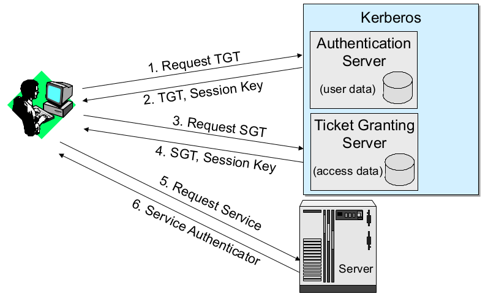
- Der Benutzer meldet sich an seiner Arbeitsstation an und fordert den Zugriff auf einen Dienst an:
  - Die Workstation repräsentiert ihn im Kerberos-Protokoll und sendet die erste Nachricht an den Authentifizierungsserver AS, die seinen Namen, den Namen eines geeigneten Ticket-Granting-Servers TGS und einen Zeitstempel $t_A$ enthält:
  1. $A\rightarrow AS:(A, TGS, t_A)$
- Der AS prüft, ob A sich für den Zugang zu den Diensten authentifizieren darf, generiert aus A's Passwort (das ihm bekannt ist) den Schlüssel KA, extrahiert die Arbeitsplatzadresse $Addr_A$ der Anfrage, erstellt ein Ticket $Ticket_{TGS}$ und einen Sitzungsschlüssel $K_{A,TGS}$ und sendet die folgende Nachricht an A:
  2. $AS\rightarrow A:\{K_{A,TGS}, TGS, t_{AS}, LifetimeTicket_{TGS}, Ticket_{TGS}\}_{K_A}$ mit $Ticket_{TGS}=\{K_{A,TGS},A, Addr_A, TGS, t_{AS}, LifetimeTicket_{TGS}\}_{K_{AS,TGS}}$
- Nach Erhalt dieser Nachricht fordert die Workstation Alice auf, ihr Passwort einzugeben, berechnet daraus den Schlüssel $K_A$ und entschlüsselt die Nachricht mit diesem Schlüssel. Wenn Alice nicht ihr ,,authentisches'' Passwort angibt, sind die extrahierten Werte ,,Müll'' und der Rest des Protokolls schlägt fehl.
- Alice erstellt einen sogenannten Authenticator und sendet ihn zusammen mit dem Ticket und dem Namen des Servers $S1$ an TGS:
  3. $A\rightarrow TGS:(S1, Ticket_{TGS}, Authenticator_{A,TGS})$ mit Authenticator $A,TGS=\{A,Addr_A,t'_A\}_{K_{A,TGS}}$
- Nach Erhalt entschlüsselt TGS $Ticket_{TGS}$, extrahiert daraus den Schlüssel $K_{A,TGS}$ und verwendet diesen Schlüssel zur Entschlüsselung von $Authenticator_{A,TGS}$. Wenn Name und Adresse des Authentifikators und des Tickets übereinstimmen und der Zeitstempel $t'_A$ noch frisch ist, wird geprüft, ob A auf den Dienst S1 zugreifen darf, und die folgende Nachricht erstellt:
  4. $TGS\rightarrow A:\{K_{A,S1}, S1, t_{TGS}, Ticket_{S1}\}_{K_{A,TGS}}$ mit $Ticket_{S1}=\{K_{A,S1}, A, Addr_A, S1, t_{TGS}, LifetimeTicket_{S1}\}_{K_{TGS,S}}$
- Alice entschlüsselt die Nachricht und verfügt nun über einen Sitzungsschlüssel für die sichere Kommunikation mit S1. Sie sendet nun eine Nachricht an S1, um ihm ihr Ticket und einen neuen Authentifikator zu zeigen:
  5. $A\rightarrow S1:(Ticket_{S1}, Authenticator_{A,S1})$ mit $Authenticator_{A,S1}=\{A,Addr_A, t''_A\}_{K_{A,S1}}$
- Nach Erhalt entschlüsselt S1 das Ticket mit dem Schlüssel $K_{TGS,S1}$, den er mit TGS teilt, und erhält den Sitzungsschlüssel $K_{A,S1}$ für die sichere Kommunikation mit A. Mit diesem Schlüssel überprüft er den Authentifikator und antwortet A:
  6. $S1\rightarrow A:\{t’’_A+1\}_{K_{A,S}}$
- Durch Entschlüsselung dieser Nachricht und Überprüfung des enthaltenen Wertes kann Alice nachweisen, dass sie wirklich mit S1 kommuniziert, da nur er (neben TGS) den Schlüssel $K_{TGS,S1}$ zur Entschlüsselung von $Ticket_{S1}$ kennt, der den Sitzungsschlüssel $K_{A,S1}$ enthält, und somit nur er in der Lage ist, $Authenticator_{A,S1}$ zu entschlüsseln und mit $t''_{A+1}$ verschlüsselt mit $K_{A,S}$ zu antworten
- Das oben beschriebene Protokoll ist der Kerberos-Dialog der Version 4.
  - In diesem Protokoll wurden eine Reihe von Mängeln festgestellt, so dass eine neue Version 5 des Protokolls definiert wurde, auf die wir später eingehen werden...
  - Wo liegt eigentlich das Problem?

### Kerberos für mehrere Domänen
- Stellen Sie sich eine Organisation mit Workstation-Clustern an zwei verschiedenen Standorten vor, und stellen Sie sich vor, dass Benutzer A von Standort 1 einen Server von Standort 2 benutzen möchte:
  - Wenn beide Standorte ihre eigenen Kerberos-Server und Benutzerdatenbanken (mit Passwörtern) verwenden, gibt es in der Tat zwei verschiedene Domänen, in der Kerberos-Terminologie auch Realms genannt.
  - Um zu vermeiden, dass der Benutzer A in beiden Realms registriert sein muss, ermöglicht Kerberos eine Inter-Realm-Authentifizierung.
- Die Inter-Realm-Authentifizierung erfordert, dass die Ticket-erteilenden Server beider Domänen einen geheimen Schlüssel $K_{TGS1,TGS2}$ teilen.
  - Die Grundidee ist, dass der TGS eines anderen Realms als normaler Server angesehen wird, für den der TGS des lokalen Realms ein Ticket ausstellen kann.
  - Nachdem Alice das Ticket für den entfernten Realm erhalten hat, fordert sie ein Ticket für den Dienst beim entfernten TGS an.
  - Dies bedeutet jedoch, dass der entfernte Realm dem Kerberos-Authentifizierungsdienst der Heimatdomäne eines ,,besuchenden'' Benutzers vertrauen muss!
  - Skalierbarkeitsproblem: n Realms benötigen $n\times(n-1)/2$ geheime Schlüssel!
- 
- Nachrichten, die während eines Protokolllaufs mit mehreren Domänen ausgetauscht werden:
  1. $A\rightarrow AS1:(A,TGS1, t_A)$
  2. $AS1\rightarrow A:\{K_{A,TGS1}, TGS1, t_{AS}, LifetimeTicket_{TGS1}, Ticket_{TGS1}\}_{K_A}$ mit $Ticket_{TGS1}=\{K_{A,TGS1}, A, Addr_A, TGS1, t_{AS}, LifetimeTicket_{TGS1}\}_{K_{AS,TGS1}}$
  3. $A\rightarrow TGS1:(TGS2,Ticket_{TGS1},Authenticator_{A,TGS1})$ mit $Authenticator_{A,TGS1}=\{A,Addr_A,t'_A\}_{K_{A,TGS1}}$
  4. $TGS1:\{K_{A,TGS2}, TGS2, t_{TGS1}, Ticket_{TGS2}\}_{K_{A,TGS1}}$ mit $Ticket_{TGS2}=\{K_{A,TGS2}, A, Addr_A, TGS2, t_{TGS1}, LifetimeTicket_{TGS2}\}_{K_{TGS1,TGS2}}$
  5. $A\rightarrow TGS2:(S2,Ticket_{TGS2},Authenticator_{A,TGS2})$ mit $Authenticator_{A,TGS2}=\{A,Addr_A,t''_A\}_{K_{A,TGS2}}$
  6. $TGS2\rightarrow A:\{K_{A,S2},S2,t_{TGS2},Ticket_{S2}\}_{K_{A,TGS2}}$ with $Ticket_{S2}=\{K_{A,S2},A,Addr_A,S2,t_{TGS2}, LifetimeTicket_{S2}\}_{K_{TGS2,S2}}$
  7. S2:(Ticket_{S2}, Authentifikator_{A,S2})$ mit $Authentifikator_{A,S2}=\{A,Addr_A,t'''_A\}_{K_{A,S2}}$
  8. $S2\rightarrow A:\{t’’’_A+1\}_{K_{A,S2}}$

### Kerberos Version 5
- Letzter Standard von 2005 (RFC 4120)
- Entwickelt als Reaktion auf Schwachstellen, die bei Kerberos v4 bekannt wurden
  - Enthält explizite Prüfsummen, um zu verifizieren, dass die Nachrichten nicht verändert wurden
  - Unterstützt mehrere Chiffren (andere als das unsichere DES)
- Einheitliches Nachrichtenformat - Nachrichten an den Authentifizierungsserver und den Ticketvergabeserver sind sehr ähnlich
- Flexible ASN.1-Kodierung der Nachrichten, ermöglicht spätere Erweiterungen
- Im Folgenden wird nur eine vereinfachte Version gezeigt, weit mehr Funktionen sind standardisiert, z.B:
  - Client-zu-Client gegenseitige Authentifizierung
  - Vorauthentifizierte Tickets
  - Erneuerung von Tickets
  - Multidomain Kerberos
- Der Authentifizierungsdialog in Kerberos Version 5 ist ähnlich wie in Version 4
- Der Austausch des Authentifizierungsdienstes: Bei der ersten Kontaktaufnahme sendet der Client A nicht nur Namen und Zeitstempel, sondern auch eine Nonce n , die hilft, Wiederholungen zu vermeiden, wenn sich die Zeit geändert hat; es ist auch möglich, mehrere Adressen anzugeben
  1. $A\rightarrow AS:(A,TGS,t_{start},t_{end},n,Addr_A, ...)$
- Die Antwort enthält ein Klartext-Ticket und verschlüsselte Informationen:
  2. $AS\rightarrow A: (A,Ticket_{TGS},\{K_{A,TGS}, LastRequest,n,t_{expire},t_{AS},t_{start},t_{end},t_{renew},TGS, Addr_A\}_{K_A})$ mit $Ticket_{TGS}=(TGS, \{K_{A,TGS},A,transited, t_{AS}, t_{start},t_{end},t_{renew},Addr_A,restrictions\}_{K_{AS,TGS}})$
  - LastRequest gibt den letzten Login des Benutzers an transited enthält die Vertrauenskette Multidomain Kerberos Restriktionen für den Benutzer können dem TGS und den Servern übergeben werden $t_{expire}$ und $t_{end}$ enthalten verschiedene Zeiten, um die Erneuerung von Tickets zu ermöglichen (wobei die Start- und Endzeit einfach aktualisiert werden können)
- Der Dialog zum TGS ist mit dem Ausgangsdialog harmonisiert: Er enthält zusätzlich Tickets und einen Authentifikator, der beweist, dass A $K_{A,TGS}$ kennt
  3. $Aufrechtes TGS:(A,S1,t_{start},t_{end},n',Addr_A,Authenticator_{A,TGS}, Tickets,...)$ mit $Authenticator_{A,TGS}=\{A, CheckSum, t_{A'}, K_{A,TGS'}, Seq\#,...\}_{K_{A,TGS}}$
  Hinweis: Der Authentifikator enthält jetzt eine kryptographische Prüfsumme!
- Die Antwort an A ist völlig analog zu Nachricht 2:
  4. $TGS\rightarrow A:(A,Ticket_{S1},\{K_{A,S1},LastRequest, n',t_{expire},t_{TGS},t_{start},t_{end},t_{renew},S1,Addr_A\}_{K_{A,TGS}})$
- Der Austausch mit dem Server ist ebenfalls ähnlich wie bei Version 4, aber mit dem Authentifikator ist eine explizite Prüfsumme möglich:
  5. $A\rightarrow S1:(Ticket_{S1}, Authenticator_{A,S1})$ mit $Authenticator_{A,S1}=\{A,CheckSum,t_{A''},K_{A,S1}', Seq\#, ...\}_{K_{A,S1}}$
- Nach Erhalt entschlüsselt S1 das Ticket mit dem Schlüssel $K_{TGS,S1}$, den er mit TGS teilt, und erhält den Sitzungsschlüssel $K_{A,S1}$ für die sichere Kommunikation mit A. Mit diesem Schlüssel überprüft er den Authentifikator und antwortet A:
  6. $S1\rightarrow A:\{t_{S1},K_{A,S1}’,Seq\#,...\}_{K_{A,S1}}$
- Alles in allem behebt der Dialog mehrere potenzielle Schwachstellen, während andere bestehen bleiben:
  - Sequenznummern und Nonces ermöglichen eine zusätzliche Replay-Prüfung, wenn sich die Zeitbasis ändert
  - Explizite Prüfsummen verhindern die Änderung von Daten innerhalb von Tickets
  - Zentrale Server sind immer noch potentielle Single-Points-of-Failure
  - Für den ersten Austausch ist immer noch eine gewisse Zeitsynchronisierung erforderlich.

## Fortgeschrittene Methoden zur Passwortauthentifizierung
- Alle gezeigten Protokolle haben eine gemeinsame Schwäche:
  - Passwörter müssen leicht zu merken und leicht einzugeben sein $\rightarrow$ Geringe Entropie
  - Angreifer können schnell alle möglichen Kombinationen ausprobieren
  - Offline, über Grafikkarten, Cloud-Computer, spezielle Hardware...
  - Asymmetrische Situation
- Mögliche Lösungen:
  - Schlüsselableitungsfunktionen
    - Erschweren Brute-Force-Angriffe durch extrem häufiges Hashing
    - Erfordert auch Aufwand durch legitime Geräte
    - Nur linearer Sicherheitsgewinn
    - Bessere Funktionen verbrauchen viel Speicher, um Angriffe mit Grafikkarten und spezieller Hardware undurchführbar zu machen
  - Passwort-authentifizierter Schlüsselaustausch (PAKE)
- Passwortauthentifizierter Schlüsselaustausch (PAKE) - Grundlegende Idee
  - Durchführen eines Schlüsselaustauschs mit asymmetrischer Kryptographie
  - Authentifizierung von Peers mit einem Passwort unter Verwendung eines Zero Knowledge Proofs
  - Die Peers können nur feststellen, ob die Passwörter übereinstimmen oder nicht
  - Keine weiteren Informationen, um effiziente Bruteforce-Suchen durchzuführen
    - Würde das Lösen schwieriger Probleme erfordern, z. B. eine Art DH-Problem
    - Macht Offline-Angriffe undurchführbar
  - Online-Angriffe möglich, können aber entdeckt werden

## PAKE-Schemata: EKE
- Ein einfaches erstes Protokoll ist Encrypted Key Exchange (EKE) [BM92]
- Der Dialog beginnt damit, dass A ein privates/öffentliches Schlüsselpaar zur einmaligen Verwendung erzeugt und den öffentlichen Schlüssel $+K_{ar}$ verschlüsselt mit dem Passwort $K_{A,B}$ an B sendet
    1. $A\rightarrow B:A,\{+K_{ar}\}_{K_{A,B}}$
- B wählt einen symmetrischen Sitzungsschlüssel $K_r$ und sendet ihn verschlüsselt mit dem öffentlichen Schlüssel und dem Passwort zurück an A
    1. $B\rightarrow A:\{\{K_r\}_{+K_{ar}}\}_{K_{A,B}}$
- A und B teilen sich nun einen gemeinsamen Sitzungsschlüssel und beweisen ihr Wissen darüber durch den Austausch von Nonces
    1. $A\rightarrow B:\{r_A\}_{K_r}$
    2. $B\rightarrow A:\{r_A,r_B\}_{K_r}$
    3. $A\rightarrow B:\{r_B\}_{K_r}$
- Nach diesem Schritt ist sichergestellt, dass beide $K_{A,B}$ gekannt haben müssen und es keinen Man-in-the-Middle-Angriff gegeben hat


### Sicherheitsdiskussion
- Resistenz gegen Offline-Angriffe hängt davon ab, dass $+K_{ar}$ nicht von Zufallszahlen zu unterscheiden ist
  - Was bedeutet das für ECC?
  - Für RSA schlagen die Autoren vor, e zu verschlüsseln und n im Klartext zu senden
    - n hat keine kleinen Primfaktoren und ist daher von Zufallszahlen unterscheidbar
    - Immer noch unsicher gegen Man-in-the-Middle-Angriffe, da Angreifer n mit besonderen Eigenschaften wählen können (z.B. $p-1$ und $q-1$ teilbar durch 3)
    - Antwort von B ist von Zufallszahlen unterscheidbar
    - Details sind in [Par97] oder [SR14] zu finden.
- Bietet keine perfekte Vorwärtsverschwiegenheit...
- Aber es gibt ein anderes Protokoll von den Autoren namens DH-EKE

### DH-EKE
- DH-EKE ist im Grunde ein DH-Austausch mit cleverer Authentifizierung
- A sendet DH-Austausch verschlüsselt mit dem Passwort $K_{A,B}$
  1. $A\rightarrow B:\{g^{ra}\ mod\ p\}_{K_{A,B}}$
- B antwortet mit seinem Teil des DH-Austauschs (verschlüsselt mit dem Passwort $K_{A,B}$) und verwendet den Sitzungsschlüssel $K_S=g^{ra*rb}\ mod\ p$, um eine verschlüsselte Nonce $c_b$ zu senden
  2. $B\rightarrow A:\{g^{rb}\ mod\ p\}_{K_{A,B}}\{c_b\}_{K_s}$
- Beide Parteien beweisen ihre Kenntnis von $K_S$
  3. $A\rightarrow B:\{c_a||c_b\}_{K_s}
  4. $B\rightarrow A:\{c_a\}_{K_s}$

### Sicherheitsdiskussion 2
- Wiederum müssen verschlüsselte Daten von Zufallsdaten ununterscheidbar sein
  - Der Wert p muss klug gewählt werden, d.h. $p-1$ muss nahe bei $2^{8*n}$ für ausreichend große natürliche Zahlen n liegen
  - Um Angriffe auf kleine Gruppen leicht zu verhindern, sollte $(p-1)/2$ ebenfalls eine Primzahl sein.
  - ECC ist immer noch schwierig zu realisieren
- Bietet perfektes Vorwärtsgeheimnis
- Alles in allem ein nettes Verfahren, das jedoch patentiert werden musste
  - Keine breite Anpassung
  - Führte zur Entwicklung zahlreicher anderer Verfahren

### SRP
- Das heute am weitesten verbreitete Protokoll: Sicheres Fernkennwort (SRP)
- Mehrere Versionen: Hier SRP-6a [Wu02]
- Initialisierung:
  - Server B wählt eine Zufallszahl $s_{A,B}$
  - berechnet $x=H(s_{A,B} || Benutzername || Passwort)$ und $v=g^x\ mod\ p$
  - Benutzer werden durch $(Benutzername, s_{A,B}, v)$ authentifiziert
  - Der Server braucht das Passwort nicht zu speichern $\rightarrow$ kann nicht leicht erlangt werden, wenn der Server kompromittiert wird!
  - Server kann diese Werte auch nicht verwenden, um sich als Benutzer auf anderen Servern auszugeben
  - Die Eigenschaft wird als erweitertes PAKE-Schema bezeichnet

### SRP - Dialog
- A initiiert die Verbindung durch Senden seines Benutzernamens
  1. $A\rightarrow B: A$
- B antwortet mit ausgewählten kryptographischen Parametern und einem Verifizierer v, der durch einen DH-Austausch ,,geblendet'' ist
  2. $B\rightarrow A: p, g, s_{A,B}, (H(g || p)*v + g^{rb})\ mod\ p$
- A berechnet den gemeinsamen Sitzungsschlüssel durch $K_S=(Y_B-H(g || p)*g^x)^{ra+u*x}\ mod\ p$, mit $u=H(Y_A||Y_B)$, und sendet seinen Teil des DH-Austauschs und eine Bestätigung zurück, dass er $K_S$ kennt
  3. $A\rightarrow B:g^{ra}\ mod\ p, H(Y_A,Y_B,K_S)$
- B berechnet $K_S'=(Y_A v^u)^{rb}\ mod\ p$ und beweist seine Kenntnis
  4. $B\rightarrow A:H(Y_A, H(Y_A,Y_B,K_S),K_S')$
- $K_S'$ und $K_S$ stimmen überein, wenn es keinen Man-in-the-Middle-Angriff gegeben hat

### SRP - Diskussion
- Sicheres Schema
  - Gegenseitige Authentifizierung zwischen Server und Client
  - Erweiterung erhöht die Sicherheit in Client/Server-Szenarien
  - Keine Unterstützung für ECC, da es Feldarithmetik erfordert
- Patentiert, aber frei zu verwenden
- Unterstützung für TLS, IPsec, ...

## X.509 - Einführung
- X.509 ist eine internationale Empfehlung der ITU-T und gehört zur X.500-Reihe, die Verzeichnisdienste definiert:
  - Die erste Version von X.509 wurde 1988 standardisiert.
  - Eine zweite Version, die 1993 standardisiert wurde, löste einige Sicherheitsbedenken
  - Eine dritte Version von X.509 wird derzeit von der IETF in RFC 4211 gepflegt.
- X.509 definiert einen Rahmen für die Bereitstellung von Authentifizierungsdiensten, der Folgendes umfasst:
  - Zertifizierung von öffentlichen Schlüsseln und Handhabung von Zertifikaten:
    - Zertifikatsformat
    - Zertifikats-Hierarchie
    - Zertifikatswiderrufslisten
  - Drei verschiedene Dialoge für die direkte Authentifizierung:
    - Einseitige Authentifizierung, erfordert synchronisierte Uhren
    - Gegenseitige Zwei-Wege-Authentifizierung, erfordert immer noch synchronisierte Uhren
    - Gegenseitige Drei-Wege-Authentifizierung, die vollständig auf Zufallszahlen basiert

### X.509 - Zertifikate mit öffentlichem Schlüssel
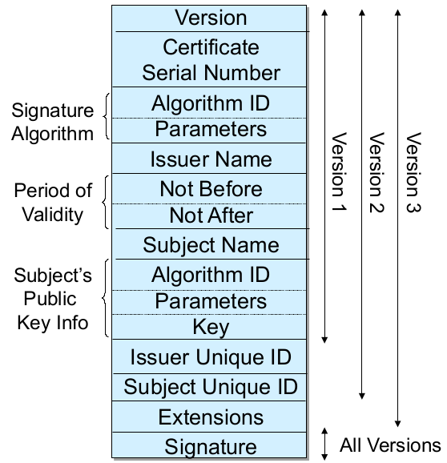
- Ein Public-Key-Zertifikat ist eine Art Reisepass, der bescheinigt, dass ein öffentlicher Schlüssel zu einem bestimmten Namen gehört
- Zertifikate werden von Zertifizierungsstellen (CA) ausgestellt.
- Wenn alle Nutzer den öffentlichen Schlüssel der CA kennen, kann jeder Nutzer jedes von dieser CA ausgestellte Zertifikat überprüfen.
- Zertifikate können die Online-Teilnahme eines TTP verhindern
- Die Sicherheit des privaten Schlüssels der CA ist entscheidend für die Sicherheit aller Nutzer!
- Notation eines Zertifikats, das einen öffentlichen Schlüssel $+K_A$ an Benutzer A bindet, ausgestellt von der Zertifizierungsstelle CA unter Verwendung ihres privaten Schlüssels $-CK_{CA}$:
  - $Cert_{-CK_{CA}}(+K_A) = CA[V, SN, AI, CA, T_{CA}, A, +K_A]$ mit: 
    - V = Versionsnummer
    - SN = Seriennummer
    - AI = Algorithmus-Bezeichner des verwendeten Signatur-Algorithmus
    - CA = Name der Zertifizierungsstelle
    - $T_{CA}$ = Gültigkeitsdauer dieses Zertifikats
    - A = Name, an den der öffentliche Schlüssel in diesem Zertifikat gebunden ist
    - $+K_A$ = öffentlicher Schlüssel, der an einen Namen gebunden wird
  - Die Kurzschreibweise $CA[m]$ steht für $(m,\{H(m)\}_{-CK_{CA}})$
  - Eine andere Kurzschreibweise für $Cert_{-CK_{CA}}(+K_A)$ ist $CA<<A>>$

### X.509 - Zertifikatsketten & Zertifikatshierarchie
- Betrachten wir nun zwei Benutzer Alice und Bob, die in verschiedenen Ländern leben und sicher kommunizieren wollen:
  - Die Wahrscheinlichkeit ist recht hoch, dass ihre öffentlichen Schlüssel von verschiedenen CAs zertifiziert sind
  - Nennen wir die Zertifizierungsstelle von Alice CA und die von Bob CB
  - Wenn Alice CB nicht vertraut oder gar kennt, dann ist Bobs Zertifikat $CB<<B>>$ für sie nutzlos, dasselbe gilt in der anderen Richtung
- Eine Lösung für dieses Problem ist die Konstruktion von Zertifikatsketten:
  - Stellen Sie sich einmal vor, dass CA und CB einander kennen und einander vertrauen.
    - Ein Beispiel aus der realen Welt für dieses Konzept ist das gegenseitige Vertrauen zwischen Ländern hinsichtlich ihrer Passausgabestellen
  - Wenn CA den öffentlichen Schlüssel von CB mit einem Zertifikat $CA<<CB>>$ und CB den öffentlichen Schlüssel von CA mit einem Zertifikat $CB<<CA>>$ beglaubigt, können A und B ihre Zertifikate anhand einer Zertifikatskette überprüfen:
    - Nachdem ihr $CB<<B>>$ vorgelegt wurde, versucht Alice herauszufinden, ob es ein Zertifikat $CA<<CB>>$ gibt.
    - Sie überprüft dann die Kette: $CA<<CB>>, CB<<B>>$
- Zertifikatsketten müssen nicht auf eine Länge von zwei Zertifikaten beschränkt sein:
  - $CA<<CC>>, CC<<CD>>, CD<<CE>>, CE<<CG>>, CG<<G>$ würde es Alice erlauben, das von CG ausgestellte Zertifikat des Benutzers G zu überprüfen, auch wenn sie nur ihre eigene Zertifizierungsstelle CA kennt und ihr vertraut.
  - Tatsächlich wird das Vertrauen von A in den Schlüssel +KG durch eine Vertrauenskette zwischen Zertifizierungsstellen hergestellt.
  - Wenn Alice jedoch $CG<<G>>$ vorgelegt wird, ist es nicht offensichtlich, welche Zertifikate sie zur Überprüfung benötigt
- X.509 schlägt daher vor, dass die Zertifizierungsstellen in einer Zertifizierungshierarchie angeordnet werden, so dass die Navigation einfach ist:
  - 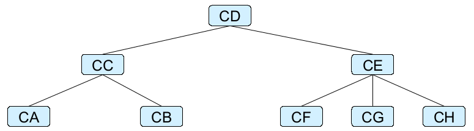
- Verbleibendes Problem:
  - Zertifizierungspfade können ziemlich lang werden
  - Die Kompromittierung eines einzigen Zwischenzertifikats reicht aus, um die Sicherheit zu brechen
- Führt zu zwei Entwicklungen
  - Kreuzzertifizierung:
    - Ermöglicht das Signieren von Stammzertifikaten untereinander
    - Erlaubt aber auch ,,Abkürzungen'' im Zertifikatswald
    - Macht die Navigation komplexer, aber potenziell mehrwegfähig
  - Anheften von Zertifikaten:
    - Ermöglicht Anwendungen, z. B. Webbrowsern, zu lernen, dass Peers nur Zertifikate von einer bestimmten CA verwenden
    - Wird z. B. von Google Chrome verwendet, nachdem Man-in-the-Middle-Angriffe auf google.com bekannt wurden

### X.509 - Zertifikatssperrung
- Nehmen wir nun an, dass der private Schlüssel von Alice kompromittiert wurde, z.B. weil Eve in ihren Computer eingebrochen ist, ihren privaten Schlüssel aus einer Datei gelesen und das Passwort geknackt hat, das sie zum Schutz des privaten Schlüssels verwendet hat:
  - Wenn Alice feststellt, dass ihr privater Schlüssel kompromittiert wurde, möchte sie unbedingt den Widerruf des entsprechenden Zertifikats für den öffentlichen Schlüssel beantragen.
  - Wenn das Zertifikat nicht widerrufen wird, könnte sich Eve bis zum Ende der Gültigkeitsdauer des Zertifikats weiterhin als Alice ausgeben.
- Eine noch schlimmere Situation tritt ein, wenn der private Schlüssel einer Zertifizierungsstelle kompromittiert wird:
  - Dies bedeutet, dass alle mit diesem Schlüssel signierten Zertifikate widerrufen werden müssen!
- Der Widerruf von Zertifikaten wird durch das Führen von Zertifikatswiderrufslisten (CRL) realisiert:
  - CRLs werden im X.500-Verzeichnis gespeichert, oder Erweiterungen können auf eine URL verweisen
  - Bei der Überprüfung eines Zertifikats muss auch geprüft werden, ob das Zertifikat noch nicht widerrufen wurde (Suche nach dem Zertifikat in der CRL) 
  - Der Widerruf von Zertifikaten ist ein relativ langsamer und teurer Vorgang

### X.509 - Authentifizierungsprotokolle
- Einweg-Authentifizierung:
  - Wenn nur Alice sich gegenüber Bob authentifizieren will, sendet sie folgende Nachricht an Bob:
  1. $(A[t_A, r_A, B, sgnData_A, \{K_{A,B}\}_{+KB}], CA<<A>>)$, wobei $sgnData_A$ optionale Daten darstellt, die von $A signiert werden sollen, \{K_{A,B}\}_{+K_B}$ ein optionaler Sitzungsschlüssel ist, der mit Bobs öffentlichem Schlüssel verschlüsselt wird, und $CA<<A>>$ ebenfalls optional ist
  - Beim Empfang dieser Nachricht verifiziert Bob mit $+K_{CA}$ das enthaltene Zertifikat, extrahiert Alices öffentlichen Schlüssel, überprüft Alices Signatur der Nachricht und die Aktualität der Nachricht $(t_A)$ und entschlüsselt optional den enthaltenen Sitzungsschlüssel $K_{A,B}$, den Alice vorgeschlagen hat
- Zwei-Wege-Authentifizierung:
  - Wenn eine gegenseitige Authentifizierung erwünscht ist, dann erstellt Bob eine ähnliche Nachricht:
  2. $(B[t_B, r_B, A, r_A, sgnData_B,\{K_{B,A}\}_{+K_A}], CA<<B>>)$ der enthaltene Zeitstempel $t_B$ ist nicht wirklich erforderlich, da Alice überprüfen kann, ob die signierte Nachricht die Zufallszahl $r_A$ enthält
- Drei-Wege-Authentifizierung:
  - Wenn Alice und Bob nicht sicher sind, ob sie synchrone Uhren haben, sendet Alice die folgende Nachricht an Bob:
  3. $A[r_B]$
  - Die Rechtzeitigkeit der Teilnahme von Alice am Authentifizierungsdialog wird also durch die Unterzeichnung der ,,frischen'' Zufallszahl $r_B$ nachgewiesen.
- Anmerkung zum Signaturalgorithmus:
  - Wie aus der Verwendung von Zertifikaten ersichtlich, schlägt X.509 vor, die Authentifizierungsnachrichten mit asymmetrischer Kryptographie zu signieren.
  - Das Authentifizierungsprotokoll selbst kann jedoch auch mit symmetrischer Kryptographie eingesetzt werden:
    - In diesem Fall müssen sich A und B vor jedem Protokolldurchlauf auf einen geheimen Authentifizierungsschlüssel $AK_{A,B}$ geeinigt haben, und
    - die Nachrichten werden durch Anhängen eines mit diesem Schlüssel berechneten MAC signiert.

## Formale Validierung von kryptographischen Protokollen
- Wie wir am Beispiel des Needham-Schroeder-Protokolls gesehen haben, ist die Sicherheit eines kryptografischen Protokolls nicht einfach zu beurteilen:
  - Es gibt viele weitere Beispiele für Protokollfehler in kryptografischen Protokollen, die manchmal erst Jahre nach der Veröffentlichung des Protokolls entdeckt wurden
    - Eine frühe Version des X.509-Standards enthielt einen Fehler, der dem Fehler im Needham-Schroeder-Protokoll ähnlich war.
  - Daraus ergibt sich der Bedarf an formalen Methoden zur Analyse der Eigenschaften von kryptographischen Protokollen
- Kategorien von formalen Validierungsmethoden für kryptografische Protokolle:
  - Allgemeine Ansätze zur Analyse spezifischer Protokolleigenschaften:
    - Beispiele: Finite-State-Machine-basierte Ansätze, Prädikatenkalkül erster Ordnung, Allzweck-Spezifikationssprachen
    - Hauptnachteil: Sicherheit unterscheidet sich wesentlich von Korrektheit, da für letztere keine böswillige Manipulation angenommen werden muss
- Kategorien von formalen Validierungsmethoden für kryptographische Protokolle:
  - Expertensystembasierte Ansätze:
    - Das Wissen menschlicher Experten wird in deduktive Regeln formalisiert, die von einem Protokolldesigner zur Untersuchung verschiedener Szenarien verwendet werden können.
    - Hauptnachteil: nicht gut geeignet, um Schwachstellen in kryptografischen Protokollen zu finden, die auf unbekannten Angriffstechniken beruhen
  - Algebraische Ansätze:
    - Kryptografische Protokolle werden als algebraische Systeme spezifiziert
    - Die Analyse wird durchgeführt, indem algebraische Termumschreibungseigenschaften des Modells untersucht werden und geprüft wird, ob das Modell bestimmte erwünschte oder unerwünschte Zustände erreichen kann
  - Spezifische logikbasierte Ansätze:
    - Ansätze dieser Klasse definieren einen Satz von Prädikaten und eine Abbildung der während eines Protokolllaufs ausgetauschten Nachrichten auf einen Satz von Formeln
    - Ein generischer Satz von Regeln erlaubt es dann, das Wissen und den Glauben zu analysieren, der von den Peer-Entitäten eines kryptographischen Protokolls während eines Protokolllaufs erlangt wird (recht erfolgreicher Ansatz: GNY-Logik [GNY90a])

# Zugriffskontrolle
## Was ist Zugangskontrolle?
- Definition:  Die Zugriffskontrolle umfasst die Mechanismen, die die Vermittlung von Subjektanfragen für den Zugriff auf Objekte, wie sie in einer bestimmten Sicherheitspolitik definiert sind, erzwingen.
- Ein wichtiges konzeptuelles Modell in diesem Zusammenhang ist der Referenzmonitor: 
- 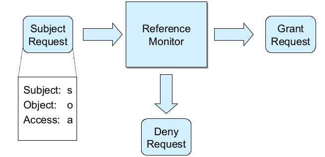

## Sicherheitspolitik
- Um Entscheidungen über die Zugriffskontrolle treffen zu können, muss der Referenzmonitor die Sicherheitspolitik des Systems kennen
- Definition: Die Sicherheitspolitik eines Systems definiert die Bedingungen, unter denen Subjektzugriffe auf Objekte durch die Funktionalität des Systemreferenzmonitors vermittelt werden
- Bemerkungen:
  - Die obige Definition wird gewöhnlich im Zusammenhang mit der Sicherheit von Computern und Betriebssystemen gegeben.
  - Der Referenzmonitor ist nur eine konzeptionelle Einheit, er muss nicht unbedingt ein physisches oder logisches Gegenstück in einem bestimmten System haben.
  - Der Begriff Sicherheitspolitik wird oft auch in einem weiteren Sinne verwendet, um eine Spezifikation aller Sicherheitsaspekte eines Systems einschließlich Bedrohungen, Risiken, Sicherheitsziele, Gegenmaßnahmen usw. zu beschreiben.

## Klassische Computersubjekte, Objekte und Zugriffsarten
- Definition: Ein Subjekt ist eine aktive Entität, die eine Anfrage nach Ressourcen initiieren und diese Ressourcen nutzen kann, um eine Aufgabe zu erfüllen.
- Definition: Ein Objekt ist ein passives Repository, das zur Speicherung von Informationen dient
- Die beiden obigen Definitionen stammen aus der klassischen Computerwissenschaft:
  - Subjekte sind Prozesse, und Dateien, Verzeichnisse usw. sind Objekte.
- Es ist jedoch nicht immer offensichtlich, Subjekte und Objekte im Zusammenhang mit der Kommunikation zu identifizieren:
  - Stellen Sie sich vor, eine Einheit sendet eine Nachricht an eine andere Einheit: Ist die empfangende Einheit als Objekt zu betrachten?
- Außerdem müssen wir wissen, was ein Zugriff ist und welche Arten von Zugriffen es gibt:
  - Beispiele aus der klassischen Informatik für Zugriffsarten: Lesen, Schreiben, Ausführen
  - Objektorientierte Sichtweise: Jede Methode eines Objekts definiert eine Art des Zugriffs

## Sicherheitskennzeichen
- Definition: Eine Sicherheitsstufe wird als hierarchisches Attribut zu Entitäten eines Systems definiert, um deren Sensibilitätsgrad zu kennzeichnen
  - Beispiele:
    - Militär: unklassifiziert < vertraulich < geheim < streng geheim
    - Kommerziell: öffentlich < sensibel < proprietär < eingeschränkt
- Definition: Eine Sicherheitskategorie ist definiert als eine nicht-hierarchische Gruppierung von Entitäten, um den Grad ihrer Sensibilität zu kennzeichnen.
  - Beispiel (Wirtschaft): Abteilung A, Abteilung B, Verwaltung usw.
- Definition: Eine Sicherheitskennzeichnung ist definiert als ein Attribut, das mit Systemeinheiten verbunden ist, um deren hierarchische Sensibilitätsstufe und Sicherheitskategorien zu kennzeichnen.
  - In Form von mathematischen Mengen: $Labels = Levels \times Powerset(Categories)$
- Sicherheitslabels, die die Sicherheitsempfindlichkeit von:
  - Subjekte werden Freigaben genannt
  - Objekte werden Klassifizierungen genannt
- Ein wichtiges Konzept für die Spezifikation von Sicherheitspolitiken sind binäre Relationen auf der Menge der Kennzeichnungen:
  - Eine binäre Relation auf einer Menge S ist eine Teilmenge des Kreuzprodukts $S\times S$
  - Beispiel:
    - Dominiert: $Labels \times Labels$
    - Dominiert $=\{(b1,b2) | b1, b2 \in Labels \wedge level(b1) \geq level(b2) \wedge categories(b2) \subseteq categories(b1)\}$
    - Wenn $(b1, b2) \in Dominates$, schreiben wir auch b1 dominates b

## Spezifikation der Sicherheitspolitik
- Formale Ausdrücke für Regeln der Sicherheitspolitik:
- Betrachten Sie die folgenden Zuordnungen:
  - $allow: Subjects \times  Accesses \times  Objects \rightarrow boolean$
  - $own: Subjects \times  Objects \rightarrow boolean$
  - $admin: Subjects \rightarrow boolean$
  - $dominates: Labels \times  Labels \rightarrow boolean$
- Die oben genannten Zuordnungen können verwendet werden, um bekannte Sicherheitsrichtlinien zu spezifizieren:
  - $ownership: \forall s \in Subjects, o \in Objects, a \in Accesses: allow(s, o, a) \Leftrightarrow own(s, o)$
  - $own_admin: \forall s \in Subjects, o \in Objects, a \in Accesses: allow(s, o, a) \Leftrightarrow own(s, o) \wedge admin(s)$
  - $dom: \forall s \in Subjects, o \in Objects, a \in Accesses: allow(s, o, a) \Leftrightarrow dominates(label(s), label(o))$
- Die dom-Policy erfordert ein System zur Speicherung und Verarbeitung von Sicherheitskennzeichnungen für jede Entität, erlaubt aber komplexere Zugriffskontrollschemata als die ownership- und own_admin-Policy

## Arten von Zugriffskontrollmechanismen
- Ein Zugriffskontrollmechanismus ist eine konkrete Umsetzung des Referenzmonitor-Konzepts
- Es gibt zwei Haupttypen von Zugriffskontrollmechanismen:
  - Diskretionäre Zugriffskontrolle umfasst diejenigen Verfahren und Mechanismen, die die spezifizierte Vermittlung nach dem Ermessen der einzelnen Benutzer durchsetzen
    - Beispiel: Das Unix-Betriebssystem ermöglicht es den Benutzern, die Zugriffsrechte für Dateien, die ihnen gehören, zu erteilen oder zu entziehen (Lesen, Schreiben, Ausführen).
  - Die obligatorische Zugriffskontrolle umfasst die Verfahren und Mechanismen, die die angegebene Vermittlung nach dem Ermessen einer zentralen Systemverwaltung durchsetzen.
- Beide Arten können kombiniert werden, wobei die obligatorischen Zugriffskontrollentscheidungen in den meisten Fällen Vorrang vor den diskretionären Entscheidungen haben
  - Beispiel:
    - Verwendung einer diskretionären Zugangskontrolle auf Personalcomputern kombiniert mit einer obligatorischen Zugangskontrolle für die Kommunikation ($\rightarrow$ Firewalls)

## Zugriffsmatrizen
- Ein nützliches Konzept für die Beschreibung von Zugangskontrollmechanismen ist die Zugangsmatrix:
  - In einer Zugriffsmatrix für zwei Mengen von Subjekten und Objekten entspricht jede Zeile einem Subjekt und jede Spalte einem Objekt
  - Jede Zelle der Matrix definiert die Zugriffsrechte des entsprechenden Subjekts auf das entsprechende Objekt

|           | Object 1 | Object 2 | ...             | Object M |
| --------- | -------- | -------- | --------------- | -------- |
| Subject 1 |          |          | ...             |
| Subject 2 |          |          | ...             |
| ...       | ...      | ...      | (Access Rights) |
| Subject N |

## Gemeinsame Zugriffskontrollschemata
- Zugriffskontroll-Listen (ACL):
  - ACLs sind die Grundlage für ein Zugriffskontrollschema, bei dem für jedes Objekt eine Liste gültiger Subjekte gespeichert wird, die Zugriff auf dieses Objekt haben könnten (möglicherweise zusammen mit der Art des erlaubten Zugriffs).
  - ACLs werden in der Regel bei der diskretionären Zugriffskontrolle verwendet, da es zu viele ACLs gibt, als dass sie von einer zentralen Verwaltungseinrichtung verwaltet werden könnten.
- Fähigkeiten:
  - Capabilities sind gewissermaßen das Gegenkonzept zu ACLs, da bei Capabilities jedes Subjekt eine Liste von Zugriffsrechten auf Objekte besitzt
  - Der Vorteil (und die Gefahr) von Capabilities ist, dass ein Subjekt einige seiner Capabilities an andere Subjekte weitergeben kann
- Label-basierte Zugriffskontrolle:
  - Wenn Sicherheitslabels mit den Entitäten eines Systems gespeichert und verarbeitet werden, können sie zur Durchführung einer label-basierten Zugriffskontrolle verwendet werden
  - Dieses Verfahren wird in der Regel als obligatorischer Zugriffskontrollmechanismus verwendet. 
- $\rightarrow$ Die Datenintegrität von Zugriffskontrolldatenstrukturen ist entscheidend!

# Integration von Sicherheitsdiensten in Kommunikationsarchitekturen
## Motivation: Was ist wo zu tun?
- Analog zur Methodik der Sicherheitsanalyse gibt es zwei Dimensionen, die bei der Integration von Sicherheitsdiensten in Kommunikationsarchitekturen zu beachten sind:
- Dimension 1: Welcher Sicherheitsdienst soll in welchem Knoten realisiert werden?
  - 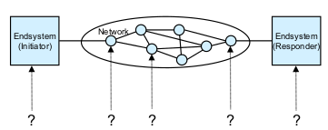
- Dimension 2: Welcher Sicherheitsdienst sollte in welcher Schicht realisiert werden?
  - 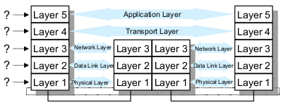

## Ein pragmatisches Modell für sicheres und vernetztes Rechnen
- 
- Anwendung:
  - Ein Stück Software, das eine bestimmte Aufgabe erfüllt, z. B. elektronische E-Mail, Webdienst, Textverarbeitung, Datenspeicherung usw.
- Endsystem:
  - Ein Gerät, das vom Personal Computer über den Server bis zum Großrechner reicht.
  - Für Sicherheitszwecke hat ein Endsystem in der Regel eine einzige Richtlinienautorität.
- Teilnetz:
  - Eine Sammlung von Kommunikationseinrichtungen, die unter der Kontrolle einer Verwaltungsorganisation stehen, z. B. ein LAN, ein Campusnetz, ein WAN usw.
  - Für Sicherheitszwecke hat ein Teilnetz in der Regel eine Richtlinienkompetenz.
- Internet:
  - Eine Sammlung von miteinander verbundenen Teilnetzen
  - Im Allgemeinen haben die Teilnetze, die in einem Inter-Netzwerk verbunden sind, unterschiedliche Richtlinienautoritäten

- Es gibt vier Ebenen, auf denen unterschiedliche Anforderungen an Sicherheitsprotokollelemente gestellt werden:
  - Anwendungsebene:
    - Sicherheitsprotokollelemente, die anwendungsabhängig sind
  - Endsystem-Ebene:
    - Bereitstellung von Schutz auf einer Endsystem-zu-Endsystem-Basis
  - Teilnetzebene:
    - Bereitstellung von Schutz über ein Teilnetz oder ein Zwischennetz, das als weniger sicher gilt als andere Teile der Netzumgebung
  - Verbindungsebene:
    - Bereitstellung von Schutz innerhalb eines Teilnetzes, z. B. über eine Verbindung, die als weniger vertrauenswürdig gilt als andere Teile der Teilnetzumgebung

## Beziehungen zwischen Schichten und Anforderungsniveaus
- Die Beziehungen zwischen den Protokollschichten und den Stufen der Sicherheitsanforderungen für die Protokollelemente sind nicht eins-zu-eins:
  - Sicherheitsmechanismen, die sowohl die Anforderungen der Endsystem- als auch der Teilnetzebene erfüllen, können entweder in der Transport- und/oder in der Netzwerkschicht realisiert werden.
  - Die Anforderungen der Verbindungsebene können durch die Integration von Sicherheitsmechanismen oder durch die Verwendung von ,,speziellen Funktionen'' der Verbindungsschicht und/oder der physikalischen Schicht erfüllt werden.
  - 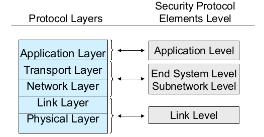

## Allgemeine Überlegungen zur architektonischen Platzierung
- Verkehrsvermischung:
  - Infolge des Multiplexing besteht auf niedrigeren Ebenen eine größere Tendenz, Datenelemente von verschiedenen Quell-/Ziel-Benutzern und/oder Anwendungen in einem Datenstrom zu vermischen
  - Ein Sicherheitsdienst, der auf einer Schicht/Ebene realisiert wird, behandelt den Verkehr dieser Schicht/Ebene gleich, was zu einer unzureichenden Kontrolle der Sicherheitsmechanismen für Benutzer und Anwendungen führt.
  - Wenn eine Sicherheitspolitik eine differenziertere Behandlung erfordert, sollte sie besser auf einer höheren Ebene realisiert werden
- Wissen über die Route:
  - Auf niedrigeren Ebenen ist in der Regel mehr Wissen über die Sicherheitseigenschaften der verschiedenen Routen und Verbindungen vorhanden.
  - In Umgebungen, in denen diese Merkmale stark variieren, kann die Platzierung von Sicherheit auf niedrigeren Ebenen Vorteile in Bezug auf Effektivität und Effizienz haben
  - Geeignete Sicherheitsdienste können auf der Basis von Teilnetzen oder Verbindungen ausgewählt werden, so dass keine Kosten für Sicherheit anfallen, wenn der Schutz unnötig ist.
- Anzahl der Schutzpunkte:
  - Wenn die Sicherheit auf der Anwendungsebene angesiedelt wird, muss die Sicherheit in jeder sensiblen Anwendung und jedem Endsystem implementiert werden.
  - Sicherheit auf der Verbindungsebene bedeutet, dass am Ende jeder Netzverbindung, die als weniger vertrauenswürdig gilt, Sicherheit implementiert werden muss.
  - Wenn die Sicherheit in der Mitte der Architektur angesiedelt wird, müssen die Sicherheitsmerkmale an weniger Stellen installiert werden.
- Schutz der Protokoll-Header:
  - Der Sicherheitsschutz auf höheren Ebenen kann die Protokollköpfe der unteren Protokollschichten nicht schützen.
  - Die Netzwerkinfrastruktur muss möglicherweise ebenfalls geschützt werden.
- Quelle/Senke-Bindung:
  - Sicherheitsdienste wie die Authentifizierung der Datenherkunft und die Unleugbarkeit hängen von der Zuordnung der Daten zu ihrer Quelle oder Senke ab.
  - Dies wird am effizientesten auf höheren Ebenen erreicht, insbesondere auf der Anwendungsebene.

## Überlegungen zu bestimmten Ebenen
- Anwendungsebene:
  - Diese Stufe kann die einzige geeignete Stufe sein, zum Beispiel weil:
    - Ein Sicherheitsdienst ist anwendungsspezifisch, z.B. die Zugriffskontrolle für einen vernetzten Dateispeicher
    - Ein Sicherheitsdienst muss Anwendungs-Gateways durchqueren, z.B. Integrität und/oder Vertraulichkeit von elektronischer Post
    - Die Semantik der Daten ist wichtig, z.B. für Nichtabstreitbarkeitsdienste - Es liegt außerhalb der Reichweite eines Benutzers/Anwendungsprogrammierers, Sicherheit auf einer niedrigeren Ebene zu integrieren
- Endsystem-Ebene:
  - Diese Ebene ist geeignet, wenn davon ausgegangen wird, dass die Endsysteme vertrauenswürdig sind und das Kommunikationsnetz als nicht vertrauenswürdig angesehen wird.
  - Weitere Vorteile der Sicherheit auf Endsystemebene:
    - Die Sicherheitsdienste sind für die Anwendungen transparent.
    - Die Verwaltung von Sicherheitsdiensten kann leichter in die Hände eines Systemadministrators gelegt werden.
- Teilnetzebene:
  - Auch wenn die auf dieser Ebene implementierte Sicherheit in der gleichen Protokollschicht wie auf der Endsystemebene implementiert werden kann, sollten diese nicht verwechselt werden:
    - Mit der auf der Subnetzebene implementierten Sicherheit wird in der Regel der gleiche Schutz für alle Endsysteme dieses Subnetzes realisiert
  - Es ist sehr üblich, dass ein Teilnetz in der Nähe eines Endsystems als ebenso vertrauenswürdig angesehen wird, da es sich in denselben Räumlichkeiten befindet und von denselben Behörden verwaltet wird.
  - In den meisten Fällen gibt es weit weniger zu sichernde Teilnetz-Gateways als Endsysteme.
- Verbindungsebene:
  - Wenn es relativ wenige nicht vertrauenswürdige Verbindungen gibt, kann es ausreichend und zudem einfacher und kostengünstiger sein, das Netz auf der Verbindungsebene zu schützen.
  - Darüber hinaus können auf der Verbindungsebene spezielle Schutztechniken eingesetzt werden, z. B. Spreizspektrum oder Frequenzsprungverfahren.
  - Die Vertraulichkeit des Verkehrsflusses erfordert in der Regel einen Schutz auf Verbindungsebene.

## Interaktionen zwischen menschlichen Nutzern
- Einige Netzsicherheitsdienste beinhalten eine direkte Interaktion mit einem menschlichen Benutzer, der wichtigste davon ist die Authentifizierung.
- Solche Interaktionen passen in keine der bisher vorgestellten Architekturoptionen, da der Benutzer außerhalb der Kommunikationseinrichtungen steht.
- Die Kommunikation zur Unterstützung der Authentifizierung kann auf eine der folgenden Weisen erfolgen:
  - Örtlich:
    - Der menschliche Benutzer authentifiziert sich gegenüber dem lokalen Endsystem
    - Das Endsystem authentifiziert sich gegenüber dem entfernten Endsystem und teilt die Identität des Benutzers mit
    - Das entfernte System muss dem lokalen Endsystem vertrauen
  - Unter Einbeziehung von Protokollelementen auf der Anwendungsschicht:
    - Der Benutzer gibt einige Authentifizierungsinformationen an das lokale System weiter, die sicher an das entfernte System weitergeleitet werden
  - Kombination der oben genannten Mittel:
    - Beispiel: Kerberos

## Integration in untere Protokollschichten vs. Anwendungen
- Vorteile der Integration von Sicherheitsdiensten in niedrigere Netzwerkschichten:
  - Sicherheit:
    - Auch das Netz selbst muss geschützt werden
    - Sicherheitsmechanismen, die in den Netzelementen (insbesondere in der Hardware) realisiert sind, sind für die Netznutzer oft schwerer angreifbar
  - Anwendungsunabhängigkeit:
    - Grundlegende Netzsicherheitsdienste müssen nicht in jede einzelne Anwendung integriert werden
  - Dienstgüte (QoS):
    - Die QoS-erhaltende Planung des Kommunikationssubsystems kann auch die Verschlüsselung nebeneinander bestehender Datenströme planen.
    - Beispiel: gleichzeitiger Sprachanruf und FTP-Übertragung
  - Effizienz:
    - Hardware-Unterstützung für rechenintensive Ver-/Entschlüsselung kann leichter in die Protokollverarbeitung integriert werden

## Integration in Endsysteme vs. Zwischensysteme
- Integration in Endsysteme:
  - Kann im Allgemeinen entweder auf der Anwendungs- oder der Endsystemebene erfolgen
  - In einigen speziellen Fällen kann auch ein Schutz auf Verbindungsebene angebracht sein, z. B. bei der Verwendung eines Modems zur Verbindung mit einem bestimmten Gerät
- Integration in Zwischensysteme
  - Kann auf allen vier Ebenen erfolgen:
    - Anwendungs-/,,Endsystem"-Ebene: zur Sicherung der Verwaltungsschnittstellen von Zwischenknoten, nicht zur Sicherung des Nutzdatenverkehrs
    - Teilnetz-/Link-Ebene: zur Sicherung des Nutzdatenverkehrs
- Je nach den Sicherheitszielen kann eine Integration sowohl in Endsystemen als auch in Zwischensystemen sinnvoll sein

## Beispiel: Authentifizierungsbeziehungen in Inter-Netzwerken
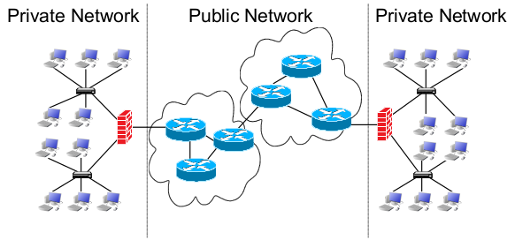

| Authentication Relation                            | Application for securing                               |
| -------------------------------------------------- | ------------------------------------------------------ |
| Endsystem $\leftrightarrow$ Endsystem              | User Channels                                          |
| Endsystem $\leftrightarrow$ Intermediate System    | Management Interfaces, Accounting                      |
| Intermediate $\leftrightarrow$ Intermediate System | Network Operation: Signaling, Routing, Accounting, ... |

## Schlussfolgerung
- Die Integration von Sicherheitsdiensten in Kommunikationsarchitekturen wird von zwei Hauptfragen geleitet:
  - Welcher Sicherheitsdienst in welchem Knoten?
  - Welcher Sicherheitsdienst in welcher Schicht?
- Diese Design-Entscheidungen können auch durch einen Blick auf ein pragmatisches Modell der vernetzten Datenverarbeitung geleitet werden, das vier verschiedene Ebenen unterscheidet, auf denen Sicherheitsdienste realisiert werden können:
  - Anwendungs-/Endsystem-/Subnetz-/Link-Ebene
- Da es verschiedene Gründe für und gegen jede Option gibt, gibt es keine einheitliche Lösung für dieses Designproblem.
- In diesem Kurs werden wir daher einige Beispiele für die Integration von Sicherheitsdiensten in Netzarchitekturen untersuchen, um die Auswirkungen der getroffenen Designentscheidungen besser zu verstehen

# Sicherheitsprotokolle der Datenübertragungsschicht
- IEEE 802.1Q, IEEE 802.1X & IEEE 802.1AE
- Point-to-Point Protocol (PPP)
- Point-to-Point Tunneling Protocol (PPTP)
- Layer 2 Tunneling Protocol (L2TP)
- Virtual Private Networks (VPN)

## Anwendungsbereich von Sicherheitsprotokollen der Verbindungsschicht
- Nach dem klassischen Verständnis des OSI-Modells stellt die Verbindungsschicht einen gesicherten Datenübertragungsdienst zwischen zwei gleichrangigen Einheiten bereit, die direkt über ein Kommunikationsmedium miteinander verbunden sind.
- Ihre Hauptaufgaben sind:
  - Fehlererkennung und -korrektur
  - Medium Access Control (MAC, nicht zu verwechseln mit Message Authentication Code) für gemeinsam genutzte Medien, z. B. Ethernet usw.
- Nicht alle heutigen Netzwerktechnologien passen in dieses Modell:
  - Einwahlverbindungen zu einem Internetdienstanbieter
  - Lösungen für virtuelle private Netzwerke (VPN)
- In diesem Kurs geben wir uns mit der folgenden Definition zufrieden:
  - Der Zweck eines Link-Layer-Sicherheitsprotokolls besteht darin, bestimmte Sicherheitseigenschaften der Link-Layer-PDUs zu gewährleisten, d. h. der PDUs der Protokollschicht, die die PDUs der Netzwerkschicht (z. B. IP) tragen.

## IEEE 802.1
### Die IEEE 802.1 Standardfamilie: Hintergrund und Ziele
- Das Institute of Electrical and Electronics Engineers (IEEE) 802 LAN/MAN Standards Committee entwickelt Standards für lokale Netzwerke und Metropolitan Area Networks.
- Die am weitesten verbreiteten Standards sind:
  - Ethernet-Familie (802.3, allgemein als CSMA/CD bezeichnet),
  - Drahtloses LAN (802.11)
  - WIMAX (802.16)
- Die IEEE 802.1-Standards:
  - Können mit verschiedenen IEEE 802.x Technologien verwendet werden
  - Definieren unter anderem verschiedene explizite Sicherheitsdienste oder Dienste, die zur Erreichung von Sicherheitszielen verwendet werden können

### IEEE 802.1Q
Ziele und Dienste
- Der Standard IEEE 802.1Q:
  - Ermöglicht die Schaffung von ,,miteinander verbundenen IEEE-802-Standard-LANs mit unterschiedlichen oder identischen Methoden der Medienzugriffskontrolle'', d. h. die Schaffung separater virtueller lokaler Netzwerke (VLANs) über eine physische Infrastruktur
  - Obwohl es sich nicht um einen echten Sicherheitsstandard handelt, wird er häufig verwendet, um verschiedene Benutzer und Dienste voneinander zu trennen, z. B. nicht vertrauenswürdige Gastcomputer von Unternehmensservern, ohne eine neue Infrastruktur einzurichten
  - Wird verwendet, um Zugangskontrolle auf Verbindungsebene zu realisieren

Grundlegende Funktionsweise
- Jedes Netzwerkpaket wird mit einem VLAN-Tag versehen, der eine 12-Bit-VLAN-ID enthält, die ein virtuelles Netzwerk identifiziert
- Switches stellen sicher, dass Pakete mit bestimmten VLAN-IDs nur an bestimmte Netzwerk-Ports zugestellt werden, z.B. wird ein VLAN mit internen Firmeninformationen nicht an einen öffentlich zugänglichen Port zugestellt
- Die VLAN-ID ist nicht kryptografisch geschützt!
  - VLAN IDs müssen auf andere Weise, d.h. physikalisch, gesichert werden!
  - Normalerweise werden VLAN-IDs am ersten vertrauenswürdigen Switch eingefügt und am letzten vertrauenswürdigen Switch auf dem Weg durch das Netzwerk entfernt

Typisches Einführungsszenario
- Normalerweise wird das vertrauenswürdige innere Netzwerk durch physische Mittel geschützt
- Verschiedene Ports zum vertrauenswürdigen Kern werden VLANs zugeordnet
- VLANs sind virtuell verbunden, dürfen aber nicht auf andere VLANs zugreifen
- VLANs werden normalerweise gekoppelt durch
  - Router, die mehrere Schnittstellen in den verschiedenen VLANs haben
  - Router, die selbst zum vertrauenswürdigen Netzwerk gehören und selbst getaggte Frames empfangen und senden können (kann gefährlich sein, Wechselwirkung zwischen Routing und VLANs, siehe unten)
- 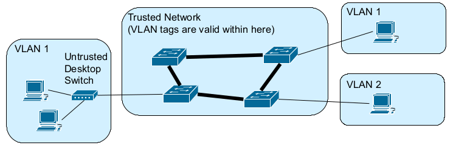

Weitere Diskussion
- 802.1Q ermöglicht eine einfache Trennung verschiedener Sicherheitsdomänen innerhalb eines vertrauenswürdigen Netzwerks
  - Ermöglicht auch die Priorisierung bestimmter VLANs (z. B. um die Verwaltung von Geräten zu ermöglichen, wenn der Rest des Netzes von einem Angreifer überflutet wird)
  - VLAN-Tags können gestapelt werden, z. B. um verschiedene Kunden zu trennen, die eigene VLANs einrichten
- Diskussion über die Sicherheit:
  - Die Sicherheit hängt davon ab, dass kein einziges Gerät in der vertrauenswürdigen Domäne kompromittiert wird!
  - Alle Switches müssen korrekt konfiguriert sein, d.h. kein einziger Switch darf eingehenden Verkehr aus einem nicht vertrauenswürdigen Netz zulassen, der bereits getaggt ist
  - Paketfluten in einem VLAN können sich auch auf andere VLANs auswirken
  - Router, die an mehreren VLANs teilnehmen, können auf einer Schnittstelle Pakete aus verschiedenen VLANs empfangen, aber
  - Anstatt ein striktes Routing zu einer anderen Schnittstelle (z. B. dem Internet) durchzuführen, könnte ein Angreifer diesen Router nutzen, um über dieselbe Schnittstelle zurück in ein anderes VLAN zu routen (sogenannter Layer-2-Proxy-Angriff)
  - Kann sogar funktionieren, wenn VLAN 1 und VLAN 2 das gleiche IP-Subnetz nutzen!

### IEEE 802.1X
Ziele
- Der Standard IEEE 802.1X:
  - Ziel ist es, ,,den Zugang zu den von einem LAN angebotenen Diensten auf diejenigen Benutzer und Geräte zu beschränken, die diese Dienste nutzen dürfen''
- Definiert eine portbasierte Netzwerkzugriffskontrolle, um ein Mittel zur ,,Authentifizierung und Autorisierung von Geräten bereitzustellen, die an einen LAN-Port mit Punkt-zu-Punkt-Verbindungseigenschaften angeschlossen sind''.

Kontrollierte und unkontrollierte Ports
- IEEE 802.1X führt den Begriff der zwei logischen Ports ein:
  - Der unkontrollierte Port ermöglicht die Authentifizierung eines Geräts
  - Der kontrollierte Port ermöglicht es einem authentifizierten Gerät, auf LAN-Dienste zuzugreifen
- 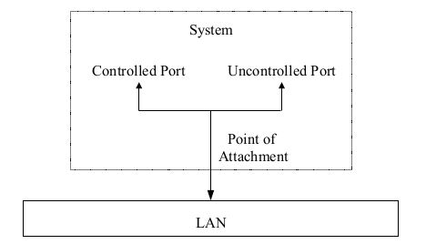

Rollen
- Es werden drei Hauptrollen unterschieden:
  - Ein Gerät, das den von einem IEEE 802.1X LAN angebotenen Dienst nutzen möchte, agiert als Supplicant, der den Zugriff auf den kontrollierten Port anfordert
  - Der Anschlusspunkt an die LAN-Infrastruktur (z. B. eine MAC-Brücke) fungiert als Authentifikator, der den Supplicant auffordert, sich zu authentifizieren.
  - Der Authentifikator prüft die vom Antragsteller vorgelegten Anmeldeinformationen nicht selbst, sondern leitet sie zur Überprüfung an seinen Authentifizierungsserver weiter.
- Zugriff auf ein LAN mit IEEE 802.1X Sicherheitsmaßnahmen:
  - Vor einer erfolgreichen Authentifizierung kann der Antragsteller auf den unkontrollierten Port zugreifen:
    - Der Port ist unkontrolliert in dem Sinne, dass er den Zugriff vor der Authentifizierung erlaubt.
    - Dieser Port erlaubt jedoch nur einen eingeschränkten Zugriff
  - Die Authentifizierung kann durch den Supplicant oder den Authenticator initiiert werden.
  - Nach erfolgreicher Authentifizierung wird der kontrollierte Port geöffnet.

Sicherheitsprotokolle und Nachrichtenaustausch
- IEEE 802.1X definiert keine eigenen Sicherheitsprotokolle, sondern befürwortet die Verwendung bestehender Protokolle:
  - Das Extensible Authentication Protocol (EAP) kann eine grundlegende Geräteauthentifizierung realisieren [RFC 3748].
  - Wenn die Aushandlung eines Sitzungsschlüssels während der Authentifizierung erforderlich ist, wird die Verwendung des EAP TLS Authentication Protocol empfohlen [RFC 5216].
  - Außerdem wird empfohlen, den Authentifizierungsserver mit dem Remote Authentication Dial In User Service (RADIUS) [RFC 2865] zu realisieren.
- Der Austausch von EAP Nachrichten zwischen Supplicant und Authenticator wird mit dem EAP over LANs (EAPOL) Protokoll realisiert:
  - EAPOL definiert die Verkapselungstechniken, die verwendet werden sollen, um EAP-Pakete zwischen Supplicant Port Access Entities (PAE) und Authenticator PAEs in einer LAN-Umgebung zu übertragen.
  - EAPOL-Rahmenformate wurden für verschiedene Mitglieder der 802.x-Protokollfamilie definiert, z. B. EAPOL für Ethernet, ...
  - Zwischen Supplicant und Authenticator können RADIUS-Nachrichten verwendet werden

Beispiel für eine 802.1X-Authentifizierung](Assets/NetworkSecurity-ieee802.1X-example.png)

### IEEE 802.1AE
Ziele
- Der Standard IEEE 802.1AE wird auch als MAC-Sicherheit (MACsec) bezeichnet:
  - Ermöglicht autorisierten Systemen, die sich an LANs in einem Netzwerk anschließen und diese miteinander verbinden, die Vertraulichkeit der übertragenen Daten zu wahren und Maßnahmen gegen Frames zu ergreifen, die von nicht autorisierten Geräten übertragen oder verändert werden. ''
  - Schützt Pakete durch kryptografische Mittel zwischen Geräten, z. B. zwischen Switches oder einem Computer und einem Switch
  - Setzt eine gültige Authentifizierung voraus und ist somit eine Erweiterung von 802.1X
  - Kryptografische Schlüssel werden auch während der 802.1X-Authentifizierungsphase abgeleitet
  - Kann Datenursprungsauthentifizierung und optional Vertraulichkeit durchführen
  - Unterstützt AES-128 und AES-256 in GCM, wobei die Unterstützung von AES-128-GCM obligatorisch ist!

Frame-Format
- 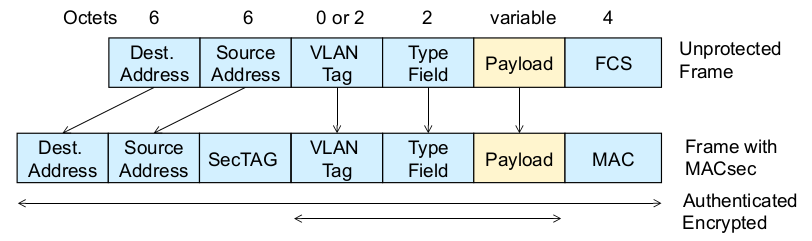
- Quell- und Zieladressen werden im Klartext gesendet
- VLAN-Tag, Typfeld und Nutzdaten werden ebenfalls verschlüsselt
- Ein neuer 8-16 Byte langer SecTAG wird eingefügt
  - Beginnt mit 0x88e5, um ein Protokoll für ältere Geräte zu emulieren
  - Enthält einen 4-Byte-Paketzähler (wird als IV verwendet, auch um Replay-Angriffe abzuwehren)
- FCS wird durch einen kryptografischen MAC von 8-16 Byte ersetzt und von MACsec berechnet, optional kann ein zusätzlicher CRC-FCS für ältere Geräte hinzugefügt werden

Diskussion über Sicherheit
- MACsec erlaubt es, Verbindungen zu sichern, z.B. zwischen Gebäuden auf einem Campus
- Es bietet keinen Schutz gegen kompromittierte Geräte!
  - Wenn es in Kombination mit 802.1Q verwendet wird, kann die vertrauenswürdige Computerbasis immer noch ziemlich groß sein...
  - Die Verwendung des GCM unterliegt den in Kapitel 5 beschriebenen potenziellen Problemen
  - Derzeit unterstützen nur hochwertige Switches MACsec!

## Punkt-zu-Punkt-Protokoll
Zweck und Aufgaben
- Große Teile des Internets beruhen auf Punkt-zu-Punkt-Verbindungen:
  - Wide Area Network (WAN)-Verbindungen zwischen Routern
  - Einwahlverbindungen von Hosts über Modems und Telefonleitungen
- Protokolle für diesen Zweck:
  - Serial Line IP (SLIP): keine Fehlererkennung, unterstützt nur IP, keine dynamische Adressvergabe, keine Authentifizierung [RFC 1055]
  - Point-to-Point Protocol (PPP): Nachfolger von SLIP, unterstützt IP, IPX, ...
  - 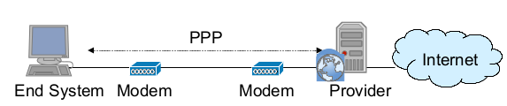
- PPP [RFC 1661/1662]
  - Schicht-2-Rahmenformat mit Rahmenbegrenzung und Fehlererkennung
  - Kontrollprotokoll (Link Control Protocol, LCP) für Verbindungsaufbau, -test, -aushandlung und -abbau
  - Separate Netzwerkkontrollprotokolle (NCP) für unterstützte Schicht-3-Protokolle

Packet Format
- Zeichenorientierte (statt bitorientierte) $\Rightarrow$ byteausgerichtete Rahmen
- Code-Transparenz wird durch Zeichenstuffing erreicht
- Normalerweise werden nur unnummerierte Frames übertragen, in Szenarien mit hoher Fehlerwahrscheinlichkeit (drahtlose Kommunikation) kann jedoch ein zuverlässigerer Modus mit Sequenznummern und erneuten Übertragungen ausgehandelt werden
- Unterstützte Protokolle für das Nutzdatenfeld sind u.a.: IP, IPX, Appletalk
- Wenn nicht anders ausgehandelt, beträgt die maximale Nutzdatengröße 1500 Byte.
- Zusätzliche Aushandlung unterstützt kleinere Paketköpfe
- 

Eine typische PPP-Verbindung
- Nutzungsszenario ,,Internetzugang eines PCs über Modem'':
  - Der Benutzer ruft den Internet Service Provider (ISP) über ein Modem an und stellt eine ,,physikalische'' Verbindung über den ,,Plain Old Telephone Service'' (POTS) her.
  - Anrufer sendet mehrere LCP-Pakete in PPP-Frames, um die gewünschten PPP-Parameter auszuwählen
  - Sicherheitsspezifische Aushandlung (siehe unten)
  - Austausch von NCP-Paketen zur Konfiguration der Netzwerkschicht:
    - z.B. Konfiguration von IP einschließlich dynamischer Zuweisung einer IP-Adresse über Dynamic Host Configuration Protocol (DHCP)
  - Der Anrufer kann wie jeder andere Host mit einer festen Verbindung zum Internet beliebige Internetdienste nutzen
  - Beim Verbindungsabbau werden die zugewiesene IP-Adresse und die Netzschichtverbindung freigegeben
  - Die Schicht-2-Verbindung wird über LCP freigegeben und das Modem baut die ,,physikalische'' Verbindung ab

Link Control Protocol
- Rahmenformat des Link Control Protocol (LCP):
  - Code: configure-request, configure-ack, configure-nack, configure-reject, terminate-request, terminate-ack, code-reject, protocol-reject, echo-request, echo-reply, discard-request
  - Länge: gibt die Länge des LCP-Pakets einschließlich des Codefelds usw. an
  - Daten: null oder mehr Oktette befehlsspezifischer Daten
  - 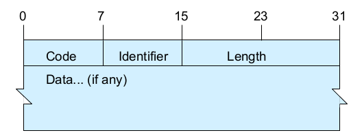
- Die Konfigurationsprimitive von LCP ermöglichen die Konfiguration der Verbindungsschicht:
  - Es gibt verschiedene Optionen für dieses Primitiv zur Konfiguration verschiedener Aspekte (max. Empfangseinheit, Protokollkompression, Authentifizierung, ...)

Sicherheitsdienste
- Die ursprüngliche Version von PPP [RFC 1661] schlägt die optionale Ausführung eines Authentifizierungsprotokolls nach der Verbindungsaufbauphase vor:
  - Falls erforderlich, wird die Authentifizierung von einer Peer-Entität über einen LCP Configuration-Request am Ende der Verbindungsaufbauphase gefordert
  - Ursprünglich sind zwei Authentifizierungsprotokolle definiert worden:
    - Passwort-Authentifizierungsprotokoll (PAP)
    - Challenge-Handshake-Authentifizierungsprotokoll (CHAP)
  - Inzwischen ist ein erweiterbares Protokoll definiert worden:
    - Erweiterbares Authentifizierungsprotokoll (EAP)
    - PPP EAP Transport Level Security Protocol (PPP-EAP-TLS)
- Außerdem kann nach der Authentifizierung eine Verschlüsselung ausgehandelt werden:
  - Protokolle:
    - Encryption Control Protocol (ECP) zur Aushandlung
    - PPP DES-Verschlüsselungsprotokoll (DESE)
    - PPP-Dreifach-DES-Verschlüsselungsprotokoll (3DESE)

Authentifizierungsprotokolle
- Passwort-Authentifizierungs-Protokoll (PAP):
  - PAP wurde 1992 in RFC 1334 definiert.
  - Das Protokoll ist sehr einfach:
    - Voraussetzung: der Authentifikator kennt das Passwort der Peer-Entität
    - Am Ende der Verbindungsaufbauphase fordert eine Entität, Authenticator genannt, die Peer-Entität auf, sich mit PAP zu authentifizieren
    - Die Peer-Entität sendet eine Authenticate-Request-Nachricht mit ihrer Peer-ID und ihrem Passwort
    - Der Authentifikator prüft, ob die bereitgestellten Informationen korrekt sind und antwortet entweder mit einem Authenticate-ack oder einem Authenticate-nack
  - Da das Protokoll keinen kryptographischen Schutz bietet, ist es unsicher.
  - PAP wird in den aktualisierten RFCs für die PPP-Authentifizierung nicht erwähnt [RFC1994].
- Challenge Handshake Authentication Protocol (CHAP):
  - CHAP ist ebenfalls in RFC 1334 und RFC 1994 definiert.
  - Es verwirklicht ein einfaches Challenge-Response-Protokoll:
    - Voraussetzung: Authentifikator und Peer-Entität teilen ein Geheimnis
    - Nach der Verbindungsaufbauphase sendet der Authentifikator (A) eine Challenge-Nachricht, die einen Identifikator für diese Challenge, eine Zufallszahl $r_A$ und seinen Namen enthält, an die Peer-Entität (B): $A \rightarrow B: (1, Identifikator, r_A, A)$
    - Die Peer-Entität berechnet eine kryptografische Hash-Funktion über ihren Namen, das gemeinsame Geheimnis $K_{A,B}$ und die Zufallszahl $r_A$ und sendet die folgende Nachricht: $B \rightarrow A: (2, Kennung, H(B, K_{A,B}, r_A), B)$
    - Beim Empfang dieser Nachricht berechnet der Authentifikator den Hashwert neu und vergleicht ihn mit dem empfangenen Wert; wenn beide Werte übereinstimmen, antwortet er mit einer Erfolgsmeldung
    - RFC 1994 legt fest, dass MD5 als Hash-Funktion unterstützt werden muss, aber die Verwendung anderer Hash-Funktionen kann ausgehandelt werden
- CHAP-Nachrichtenformat:
  - Code: 1 ~ Herausforderung / 2 ~ Antwort / 3 ~ Erfolg / 4 ~ Fehler
  - Identifier: ein Oktett, das bei jeder gesendeten Challenge geändert werden muss
  - Länge: die Gesamtlänge der CHAP-Nachricht in Oktetten
  - Value Size: ein Oktett, das die Länge des Wertes angibt
  - Wert: enthält die zufällige Herausforderung / die Antwort auf die Herausforderung
  - Name: ein oder mehrere Oktette, die das System identifizieren, das das Paket erstellt hat; die Größe des Namens wird anhand des Längenfeldes berechnet
  - 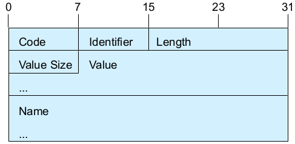
  - Nachricht:
    - Null oder mehr Oktette mit implementierungsabhängigem Inhalt
    - Der Inhalt soll für den Menschen lesbar sein und hat keinen Einfluss auf die Funktionsweise des Protokolls
  - 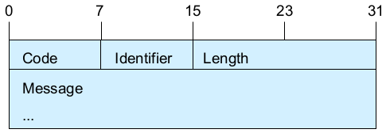
- Erweiterbares Authentifizierungsprotokoll (EAP):
  - EAP ist ein allgemeines Protokoll für die PPP-Authentifizierung, das mehrere Authentifizierungsmethoden unterstützt [RFC2284].
  - Die Hauptidee hinter EAP ist es, ein gemeinsames Protokoll bereitzustellen, um komplexere Authentifizierungsmethoden als ,,1 Frage + 1 Antwort'' durchzuführen.
  - Das Protokoll bietet grundlegende Primitive:
    - Anfrage, Antwort: weiter verfeinert durch Typfeld + typspezifische Daten
    - Success, Failure: zur Angabe des Ergebnisses eines Authentifizierungsaustauschs
  - Typ-Felder:
    - Identität
    - Benachrichtigung
    - Nak (nur Antwort, zur Beantwortung inakzeptabler Anfragetypen)
    - MD5 Challenge (dies entspricht CHAP)
    - One-Time Password (OTP): definiert in [RFC2289]
    - Generische Token-Karte
    - EAP-TLS
- Einmaliges Kennwort (One-Time Password, OTP):
  - Die Grundidee von OTP besteht darin, ein ,,Passwort'' zu übermitteln, das nur für einen Durchlauf eines Authentifizierungsdialogs verwendet werden kann
  - Erstmalige Einrichtung:
    - Der Authentifikator A sendet einen Seed-Wert rA und die Peer-Entität B verkettet diesen mit seinem Passwort und berechnet einen Hash-Wert: $PW_N = H^N(r_A, password_B)$
    - Das Paar $(N, PW_N)$ wird ,,sicher'' an den Authentifikator übertragen und beim Authentifikator gespeichert.
  - Dialog zur Authentifizierung:
    - $A\rightarrow B: N - 1$
    - $B\rightarrow A: PW_{N-1} := H^{N-1}(r_A, Passwort_B)$
    - A prüft, ob $H(PW_{N-1}) = PW_N$, und speichert $(N-1, PW_{N-1})$ als neue Authentifizierungsinformation für B
  - Sicherheit: Um dieses Verfahren zu brechen, müsste ein Angreifer ein PWN abhören und $H^{-1}(PW_N)$ berechnen, was unpraktisch ist.
- Generische Token-Karte:
  - Im Grunde ein Challenge-Response-Dialog
  - Eine Token-Karte wird verwendet, um eine Antwort auf eine Herausforderung zu berechnen:
    - Die Herausforderung wird dem Benutzer präsentiert, der sie in sein Token-Card-Gerät eintippen muss.
    - Die Token-Karte berechnet die Antwort und zeigt sie an.
    - Der Benutzer gibt die Antwort in das System ein, das sie als Antwort auf die Aufforderungsnachricht sendet.
- PPP-EAP-TLS:
  - TLS steht für Transport Layer Security [RFC 2246].
  - Es wird also der Authentifizierungsdialog von TLS ausgeführt
  - Dieser Dialog wird in Kapitel 12 über die Sicherheit der Transportschicht im Detail erläutert.

Verschlüsselungsprotokolle
- Nach dem Verbindungsaufbau und der Authentifizierungsphase kann die Verschlüsselung für eine PPP-Verbindung ausgehandelt werden:
  - Das Encryption Control Protocol (ECP) [RFC1968] ist für die Konfiguration und Aktivierung von Datenverschlüsselungsalgorithmen an beiden Enden der PPP-Verbindung zuständig:
    - ECP verwendet das gleiche Rahmenformat wie LCP und führt zwei neue Primitive ein: Reset-Request und Reset-Ack zur Anzeige von Entschlüsselungsfehlern unabhängig für jede Richtung (nützlich für die kryptographische Resynchronisation)
    - Eine bestimmte Verschlüsselungsmethode wird mit dem configure-Primitiv ausgehandelt, das eine Option zur Angabe von DESE, 3DESE, Proprietär usw. enthält.
    - Proprietäre Verschlüsselungsprotokolle werden durch einen registrierten OUI (Organizational Unit Identifier) + einen herstellerspezifischen Wert identifiziert.
    - Genau ein ECP-Paket wird im PPP-Informationsfeld eines Link-Layer-Pakets transportiert
    - ECP-Pakete werden durch das PPP-Protokollfeld identifiziert:
      - 0x8053 für ,,Standard'' Betrieb
      - 0x8055 für die Verschlüsselung einzelner Verbindungsdaten auf mehreren Verbindungen zum selben Ziel
- Das PPP DES Encryption Protocol (DESE):
  - In diesem Kurs wird nur die aktualisierte Version DESEv2 [RFC2419] behandelt
  - 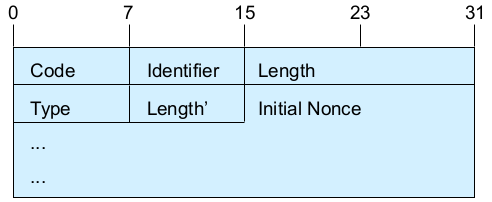
  - DESEv2 wird mit einer ECP-Konfigurationsanforderungsnachricht ausgehandelt:
    - Code: 1 ~ configure request
    - Identifier: ändert sich mit jeder neuen Anfrage
    - Länge: Gesamtlänge der Configure-Request-Nachricht
    - Type: 3 ~ DESEv2
    - Länge': 10 (die Länge dieser Konfigurationsoption)
    - Initial Nonce: ein Initialisierungsvektor für DES im CBC-Modus (8 Oktette)
- PPP DESE v2 Nachrichtenformat:
  - Adresse: 0x11111111 (bei HDLC-ähnlichem Framing)
  - Steuerung: 0x00000011 (bei HDLC-ähnlicher Rahmung)
  - Protokoll-ID: 0x0053 ~ DESE (Standard) / 0x0055 ~ DESE (individuelle Verbindung)
  - Sequenznummer: anfänglich 0, diese Nummer wird von der verschlüsselnden Stelle bei jedem gesendeten Paket erhöht
  - Chiffriertext: die verschlüsselten Protokoll- und Informationsfelder eines PPP-Pakets
    - Nachrichten werden vor der Verschlüsselung auf ein Vielfaches von 8 Oktetten aufgefüllt
    - die Verschlüsselung erfolgt mit DES im CBC-Modus
  - 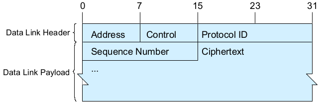
- PPP 3DES Encryption Protocol (3DESE):
  - PPP 3DESE [RFC2420] ist dem PPP DESE sehr ähnlich
  - PPP 3DESE wird mit einer Configure-Request-Nachricht ausgehandelt, wobei das Type-Feld der Option auf 2 gesetzt ist (~ 3DESE)
  - Die Verschlüsselung der PPP-Nutzdaten erfolgt wie bei DESE, mit dem Unterschied, dass 3DES mit 3 verschiedenen Schlüsseln verwendet wird
- Alle PPP-Verschlüsselungsprotokolle gehen davon aus, dass vor der Verschlüsselungsphase ein Sitzungsschlüssel für die Verschlüsselung/Entschlüsselung von PPP-Paketen vereinbart wurde:
  - Diese Annahme ist sinnvoll, da die Festlegung des Sitzungsschlüssels eine Aufgabe ist, die während der Authentifizierungsphase erfüllt werden sollte.
  - Allerdings unterstützt nur das PPP-EAP-TLS-Authentifizierungsprotokoll den Aufbau von Sitzungsschlüsseln.

### Punkt-zu-Punkt-Tunneling-Protokoll (PPTP)
- PPP wurde ursprünglich für den Betrieb zwischen ,,direkt'' verbundenen Einheiten entwickelt, d.h. Einheiten, die eine gemeinsame Schicht-2-Verbindung haben
  - Beispiel: ein PC und ein Einwahlrouter eines Internetanbieters, die über das Telefonnetz mittels Modem verbunden sind
- Die Grundidee von PPTP besteht darin, die Reichweite des Protokolls auf das gesamte Internet auszudehnen, indem der Transport von PPP-PDUs in IP-Paketen definiert wird
  - Die Nutzlast von PPTP-PDUs sind also PPP-Pakete (ohne schicht-2-spezifische Felder wie HDLC-Flags, Bit-Einfügungen, Steuerzeichen, CRC-Fehlerprüfwerte usw.)
  - PPP-Pakete werden in GRE-Pakete (generische Routing-Kapselung) eingekapselt, die wiederum in IP-Pakete eingekapselt werden:

|                                         |
| --------------------------------------- |
| Media Header (e.g. Ethernet MAC header) |
| IP Header                               |
| GRE V.2 Header                          |
| PPP Packet                              |

### PPTP: Freiwilliges vs. obligatorisches Tunneling
- PPTP realisiert einen ,,Tunnel'' über das Internet, der PPP-Pakete überträgt.
- Ein solcher Tunnel kann zwischen verschiedenen Einheiten realisiert werden:
  - Einem Client-PC und einem PPTP Remote Access Server (RAS):
    - Dies wird auch als freiwilliges Tunneling bezeichnet, da der Client-PC aktiv an der PPTP-Verarbeitung beteiligt ist.
    - Diese Variante ermöglicht die sichere Kommunikation zwischen einem Client-PC und einem bestimmten Subnetz unter Verwendung beliebiger Zugangs- und Zwischennetze
  - Ein Point of Presence (POP) eines ISP und ein PPTP-Fernzugangsserver:
    - Dies wird auch als obligatorisches Tunneling bezeichnet, da der Client-PC nicht an der Entscheidung beteiligt ist, ob PPTP verwendet wird oder nicht.
    - Auf diese Weise lässt sich Sicherheit auf Subnetzebene realisieren, aber keine echte End-to-End-Sicherheit zwischen dem Client-PC und dem RAS
    - Beim obligatorischen Tunneling fungiert der ISP POP als Proxy-Client für den RAS

Obligatorische Tunneling-Protokollschichten
- 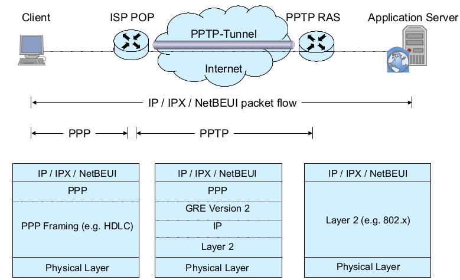
- 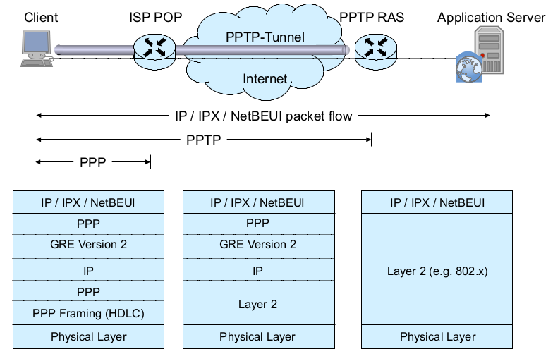
- 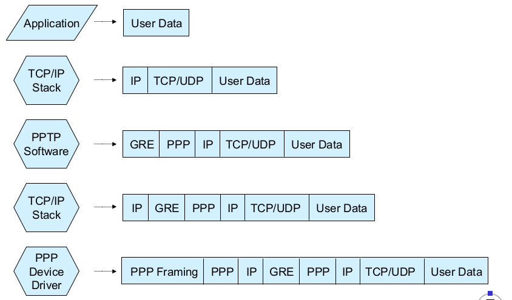
  
### PPTP / PPP Proprietäre Erweiterungen und einige ,,Geschichte''
- PPTP hat sich vor allem aufgrund der Unterstützung durch Microsoft durchgesetzt:
  - Es wurde unter aktiver Beteiligung von Microsoft entwickelt und ist in [RFC2637] dokumentiert.
  - Microsoft implementierte es als Teil seines Remote Access Service (RAS)
- Microsoft hat weitere ,,proprietäre'' Erweiterungen für PPP spezifiziert:
  - Microsoft PPP CHAP-Erweiterungen [RFC2433]
  - Microsoft Point to Point Encryption Protocol [RFC3078]
- Allerdings wurde eine Reihe von Schwachstellen in PPTP Version 1 und auch in einer verbesserten Version 2 entdeckt [SM98a, SMW99a]:
  - Ein allgemeiner Konsens, PPTP als Standardprotokoll zu übernehmen, konnte in den
in den IETF-Arbeitsgruppen nicht erreicht werden.
  - Außerdem wurde ein ähnliches Protokoll (Layer 2 Forwarding, L2F) von Cisco als konkurrierender Ansatz vorgeschlagen
  - Infolgedessen wurde ein Kompromiss gefunden, der die Vorteile beider Vorschläge in einem einzigen Protokoll zusammenfasst: Layer 2 Tunneling Protocol (L2TP)

### Vergleich von PPTP und L2TP
- Beide Protokolle:
  - verwenden PPP, um eine anfängliche Umhüllung für Benutzerpakete bereitzustellen
  - erweitern das PPP-Modell, indem sie erlauben, dass die Layer-2- und PPP-Endpunkte
sich auf verschiedenen Geräten befinden
  - unterstützen freiwilliges und obligatorisches Tunneling
- Zugrundeliegendes Netzwerk:
  - PPTP benötigt ein IP-Netzwerk für den Transport seiner PDUs
  - L2TP unterstützt verschiedene Technologien: IP (unter Verwendung von UDP), permanente virtuelle Schaltungen (PVCs) von Frame Relay, virtuelle Schaltungen (VCs) von X.25 oder ATM VCs
- PPTP kann nur einen einzigen Tunnel zwischen Endpunkten unterstützen, L2TP ermöglicht die Verwendung mehrerer Tunnel zwischen Endpunkten
  - L2TP ermöglicht z. B. die Erstellung verschiedener Tunnel für unterschiedliche Dienstqualitäten
- Beide Protokolle bieten eine Header-Kompression:
  - Mit Header-Kompression kommt L2TP mit 4 Byte Overhead aus, im Vergleich zu 6 Byte bei PPTP.
- L2TP ermöglicht eine Tunnelauthentifizierung, während PPTP dies nicht tut.

## Virtuelle private Netzwerke
- Verschiedene Definitionen des Begriffs virtuelles privates Netzwerk (VPN):
  - Ein privates Netz, das innerhalb einer öffentlichen Netzinfrastruktur, wie dem globalen Internet, aufgebaut ist.
  - Eine Kommunikationsumgebung, in der der Zugang kontrolliert wird, um Peer-Verbindungen nur innerhalb einer definierten Interessengemeinschaft zuzulassen, und die durch eine Form der Partitionierung eines gemeinsamen zugrundeliegenden Kommunikationsmediums aufgebaut ist, wobei dieses zugrundeliegende Kommunikationsmedium dem Netz Dienste auf nicht-exklusiver Basis bereitstellt
  - Ein logisches Computernetzwerk mit eingeschränkter Nutzung, das aus den Systemressourcen eines relativ öffentlichen, physischen Netzwerks (z. B. dem Internet) aufgebaut ist, oft unter Verwendung von Verschlüsselung und oft durch Tunneln von Verbindungen des virtuellen Netzwerks über das reale Netzwerk [RFC2828].
  - Anmerkung: Die beiden letzteren Definitionen beinhalten explizit Sicherheitseigenschaften (kontrollierter Zugriff, Verschlüsselung), die erste hingegen nicht.

> ,,Sicher, es ist viel billiger als eigene Frame-Relay-Verbindungen, aber es funktioniert ungefähr so gut, wie wenn man sich auf dem Times Square Watte in die Ohren steckt und so tut, als wäre sonst niemand da.'' (Wired Magazine Feb. 1998)

Techniken zum Aufbau virtueller privater Netze
- Nutzung dedizierter Verbindungen (Cut-Through-Mechanismen):
  - Virtuelle Verbindungen über ATM oder Frame Relay
  - Multi-Protokoll über ATM (MPOA)
  - Multiprotokoll-Etiketten-Vermittlung (MPLS)
  - Sicherheitsdienste für Link Layer VPNs können effizient im Link Layer Protokoll realisiert werden; ein Beispiel ist die ATM Security Specification [ATM99a]
- Kontrolliertes Routenleck / Routenfilterung:
  - Grundidee: Kontrolle der Routenausbreitung dahingehend, dass nur bestimmte Netze Routen für andere Netze erhalten
  - Damit soll ,,security by obscurity'' realisiert werden (also kein wirklicher Schutz!)
- Tunneln:
  - Generische Routing-Kapselung (GRE)
  - PPP / PPTP / L2TP
  - IPSec-Sicherheitsarchitektur für das Internet-Protokoll

# Die IPsec-Architektur für das Internet-Protokoll
## Überblick
- Kurze Einführung in das Internet-Protokoll (IP)
- Sicherheitsprobleme von IP und Ziele von IPsec
- Die IPsec-Architektur:
  - Modi des IPsec-Sicherheitsprotokolls:
    - Transportmodus
    - Tunnel-Modus
  - Alternativen zur Implementierung
  - IP-Sicherheitsrichtlinien-Datenbank (SPD)
  - Sicherheitsvereinigungen (SA) und die SA-Datenbank (SADB)
- IPsec Sicherheitsprotokolle:
  - Authentifizierungs-Header (AH)
  - Encapsulating Security Payload (ESP)
- Entitätsauthentifizierung und der Internet-Schlüsselaustausch (IKE)

## Die TCP/IP-Protokollsuite
- IP (Internet Protocol): unzuverlässiges, verbindungsloses Netzwerkprotokoll
- TCP (Transmission Control Protocol): zuverlässiges, verbindungsorientiertes Transportprotokoll, realisiert über IP
- UDP (User Datagram Protocol): unzuverlässiges, verbindungsloses Transportprotokoll, bietet eine Anwendungsschnittstelle zu IP
- Beispiele für Anwendungsprotokolle :
  - HTTP: Hypertext-Übertragungsprotokoll
  - SMTP: Einfaches Mail-Übertragungsprotokoll
- 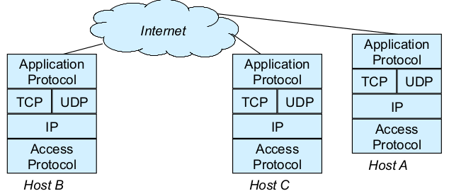

## Das IPv4-Paketformat
- 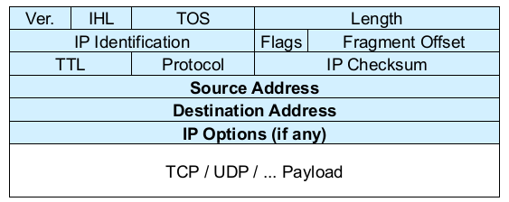
- Version (Ver.): 4 bit
  - Derzeit ist Version 4 weit verbreitet
  - Version 6 ist bereits spezifiziert, aber es ist noch nicht klar, ob sie jemals zum Einsatz kommen wird
- IP-Header-Länge (IHL): 4 Bit
  - Länge des IP-Headers in 32-Bit-Wörtern
- Art des Dienstes (TOS): 8 Bit
  - Dieses Feld könnte verwendet werden, um die Verkehrsanforderungen eines Pakets anzugeben.
  - Jetzt: DCSP und Explicit Congestion (EC) Indication
- Länge: 16 Bit
  - Die Länge des Pakets einschließlich des Headers in Oktetten
  - Dieses Feld ist, wie alle anderen Felder in der IP-Suite, in ,,big endian'' Darstellung
- Kennung: 16 Bit
  - Dient der ,,eindeutigen'' Identifizierung eines IP-Datagramms
  - Wichtig für das Wiederzusammensetzen von fragmentierten IP-Datagrammen
- Flaggen: 3 Bit
  - Bit 1: nicht fragmentieren
  - Bit 2: Datagramm fragmentiert
  - Bit 3: reserviert für zukünftige Verwendung
- Fragmentierungs-Offset: 13 Bit
  - Die Position dieses Pakets im entsprechenden IP-Datagramm
- Lebenszeit (TTL): 8 Bit
  - An jedem verarbeitenden Netzknoten wird dieses Feld um eins dekrementiert
  - Wenn die TTL 0 erreicht, wird das Paket verworfen, um Paketschleifen zu vermeiden.
- Protokoll: 8 Bit
  - Gibt das (Transport-)Protokoll der Nutzlast an
  - Wird vom empfangenden Endsystem verwendet, um Pakete zwischen verschiedenen Transportprotokollen wie TCP, UDP, ... zu entmultiplexen.
- Prüfsumme: 16 Bit
  - Schutz vor Übertragungsfehlern
  - Da es sich nicht um eine kryptografische Prüfsumme handelt, kann sie leicht gefälscht werden.
- Quelladresse: 32 Bit
  - Die IP-Adresse des Absenders dieses Pakets
- Zieladresse: 32 Bit
  - Die IP-Adresse des vorgesehenen Empfängers dieses Pakets
- IP-Optionen: variable Länge
  - Ein IP-Header kann optional zusätzliche Informationen enthalten.
  - Da sie nicht Bestandteil von IPsec sind, werden sie in diesem Kurs nicht behandelt.

## Sicherheitsprobleme des Internet-Protokolls
- Wenn eine Einheit ein IP-Paket empfängt, hat sie keine Garantie für:
  - Authentifizierung der Datenherkunft / Datenintegrität:
    - Das Paket wurde tatsächlich von der Einrichtung gesendet, auf die die Quelladresse des Pakets verweist.
    - Das Paket enthält den ursprünglichen Inhalt des Absenders, so dass es während des Transports nicht verändert worden ist.
    - Die empfangende Einrichtung ist tatsächlich die Einrichtung, an die der Absender das Paket senden wollte.
  - Vertraulichkeit:
    - Die ursprünglichen Daten wurden auf dem Weg vom Absender zum Empfänger nicht von Dritten eingesehen.

## Sicherheitsziele von IPsec
- IPsec zielt darauf ab, die folgenden Sicherheitsziele zu gewährleisten:
  - Authentifizierung der Datenherkunft / Verbindungslose Datenintegrität:
    - Es ist nicht möglich, ein IP-Datagramm mit einer maskierten IP-Quell- oder Zieladresse zu senden, ohne dass der Empfänger dies erkennen kann.
    - Es ist nicht möglich, ein IP-Datagramm während der Übertragung zu verändern, ohne dass der Empfänger diese Veränderung feststellen kann.
    - Wiedergabeschutz: Es ist nicht möglich, ein aufgezeichnetes IP-Paket zu einem späteren Zeitpunkt erneut abzuspielen, ohne dass der Empfänger dies erkennen kann.
  - Vertraulichkeit:
    - Es ist nicht möglich, den Inhalt von IP-Datagrammen zu belauschen
    - Begrenzte Vertraulichkeit des Verkehrsflusses
- Sicherheitspolitik:
  - Sender, Empfänger und Zwischenknoten können den erforderlichen Schutz für ein IP-Paket gemäß einer lokalen Sicherheitsrichtlinie festlegen
  - Zwischenknoten und der Empfänger verwerfen IP-Pakete, die diese Anforderungen nicht erfüllen

## Überblick über die IPsec-Standardisierung
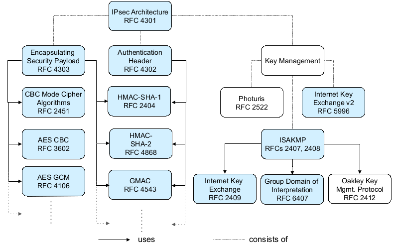

## Überblick über die IPsec-Architektur
- RFC 4301 definiert die grundlegende Architektur von IPsec:
  - Konzepte:
    - Sicherheitsvereinigung (SA), Sicherheitsvereinigungsdatenbank (SADB)
    - Sicherheitsrichtlinien, Sicherheitsrichtlinien-Datenbank (SPD)
  - Grundlegende IPsec-Protokolle:
    - Authentifizierungs-Header (AH)
    - Encapsulating Security Payload (ESP)
  - Protokoll-Modi:
    - Transport-Modus
    - Tunnel-Modus
  - Schlüsselmanagement-Verfahren:
    - IKE & IKEv
- RFC 4301 definiert die grundlegende Architektur von IPsec:
  - Verwendung von verschiedenen kryptographischen Primitiven mit AH und ESP:
    - Verschlüsselung: 3DES-CBC, AES und andere CBC-Verschlüsselungsalgorithmen, AES-Zählermodus
    - Integrität: HMAC-MD5, HMAC-SHA-1, HMAC-SHA-2, HMAC- RIPEMD-160, AES-GMAC, AES-CMAC, AES-XCBC...
    - Authentifizierte Verschlüsselung: GCM und "Zähler mit CBC-MAC" (CCM), beide für AES definiert
- Eine Sicherheitsassoziation (SA) ist eine Simplex- ,,Verbindung'', die Sicherheitsdienste für den von ihr beförderten Verkehr bereitstellt.
  - Sicherheitsdienste werden für eine SA entweder mit AH oder ESP bereitgestellt, jedoch nicht mit beiden.
  - Für bidirektionale Kommunikation sind zwei Sicherheitsverbindungen erforderlich.
  - Eine SA wird eindeutig durch ein Tripel identifiziert, das aus einem Sicherheitsparameterindex (SPI), einer IP-Zieladresse und einer Sicherheitsprotokollkennung (AH / ESP) besteht.
  - Eine SA kann zwischen den folgenden Gegenstellen eingerichtet werden:
    - Host $\leftrightarrow$ Host
    - Host $\leftrightarrow$ Gateway (oder andersherum)
    - Gateway $\leftrightarrow$ Gateway
  - Es gibt zwei konzeptionelle Datenbanken, die mit SAs verbunden sind:
    - Die Sicherheitsrichtliniendatenbank (SPD) legt fest, welche Sicherheitsdienste für welche IP-Pakete auf welche Weise bereitgestellt werden sollen.
    - Die Sicherheitsassoziationsdatenbank (SADB)
- Protokollmodi - Eine SA ist immer von einem der folgenden Typen:
  - Der Transportmodus kann nur zwischen den Endpunkten einer Kommunikation verwendet werden:
    - host $\leftrightarrow$ host, oder
    - Host $\leftrightarrow$-Gateway, wenn das Gateway ein Kommunikationsendpunkt ist (z. B. für die Netzverwaltung)
  - Der Tunnelmodus kann für beliebige Peers verwendet werden.
- Der Unterschied zwischen den beiden Modi ist, dass:
  - Im Transportmodus wird lediglich ein sicherheitsspezifischer Header (+ eventueller Trailer) hinzugefügt:
    - 
  - Der Tunnelmodus kapselt IP-Pakete ein: Die Verkapselung von IP-Paketen ermöglicht es einem Gateway, den Verkehr im Namen anderer Entitäten zu schützen (z. B. Hosts eines Subnetzes usw.)
    - 
- Der Authentifizierungs-Header (AH):
  - Bietet Authentifizierung der Datenherkunft und Schutz vor Wiederholung
  - Wird als Header realisiert, der zwischen dem IP-Header und den zu schützenden Daten eingefügt wird
  - 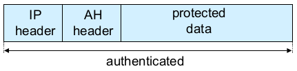
- Die einkapselnde Sicherheitsnutzlast (ESP):
  - Bietet Authentifizierung der Datenherkunft, Vertraulichkeit und Schutz vor Wiederholung
  - Wird mit einem Header und einem Trailer realisiert, der die zu schützenden Daten einkapselt
  - 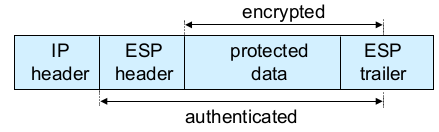
- Die Einrichtung von Sicherheitsvereinigungen wird mit:
  - Internet Security Association Key Management Protocol (ISAKMP):
    - Definiert einen generischen Rahmen für die Schlüsselauthentifizierung, den Schlüsselaustausch und die Aushandlung von Sicherheitsassoziationsparametern [RFC2408].
    - Definiert kein spezifisches Authentifizierungsprotokoll, aber spezifiziert:
      - Paketformate
      - Zeitgeber für die Weiterleitung
      - Anforderungen an den Nachrichtenaufbau
    - Die Verwendung von ISAKMP für IPsec wird in [RFC2407] näher beschrieben.
  - Internet-Schlüsselaustausch (IKE):
    - Definiert ein Authentifizierungs- und Schlüsselaustauschprotokoll [RFC2409].
    - Ist konform zu ISAKMP und kann für verschiedene Anwendungen verwendet werden
    - Der Aufbau von IPsec SAs zwischen zwei Entitäten wird in zwei Phasen realisiert:
      - Einrichtung einer IKE SA (definiert, wie man IPsec SAs einrichtet)
      - Einrichtung von IPsec SAs

## IPsec-Wiedergabeschutz (Replay protection)
- Sowohl AH- als auch ESP-geschützte IP-Pakete tragen eine Sequenznummer, die einen Wiedergabeschutz realisiert:
  - Beim Einrichten einer SA wird diese Sequenznummer auf Null initialisiert.
  - Die Sequenznummer wird mit jedem gesendeten IP-Paket erhöht
  - Die Sequenznummer ist 32 Bit lang, es wird ein neuer Sitzungsschlüssel benötigt, bevor ein Wrap-around erfolgt
  - Der Empfänger eines IP-Pakets prüft, ob die Sequenznummer in einem Fenster zulässiger Nummern enthalten ist
  - 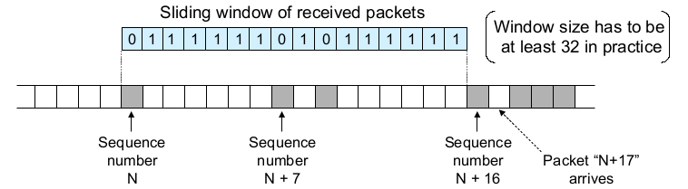 
    - (Paket mit Sequenznummer N kann noch akzeptiert werden)
- Wenn ein empfangenes Paket eine Sequenznummer hat, die:
  - links vom aktuellen Fenster $\Rightarrow$ liegt, lehnt der Empfänger das Paket ab
  - innerhalb des aktuellen Fensters $\Rightarrow$ liegt, nimmt der Empfänger das Paket an
  - liegt rechts vom aktuellen Fenster $\Rightarrow$ der Empfänger nimmt das Paket an und schiebt das Fenster weiter 
  - Natürlich werden IP-Pakete nur akzeptiert, wenn sie die Authentifizierungsprüfung bestehen und das Fenster wird niemals vor dieser Prüfung weitergeschaltet
- Die minimale Fenstergröße beträgt 32 Pakete (64 Pakete werden empfohlen)
  - 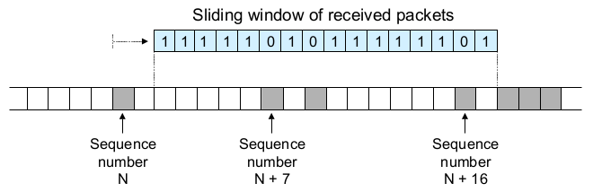
    - Paket mit Sequenznummer N kann nicht mehr akzeptiert werden

## IPsec-Implementierungsalternativen: Host-Implementierung
- Vorteile der IPsec-Implementierung in Endsystemen:
  - Bereitstellung von End-to-End-Sicherheitsdiensten
  - Bereitstellung von Sicherheitsdiensten auf einer Per-Flow-Basis
  - Fähigkeit, alle IPsec-Modi zu implementieren
- Zwei Hauptalternativen zur Integration:
  | Integriertes Betriebssystem                                                                                    | ,,Bump'' im Stack                                                                                         |
  | -------------------------------------------------------------------------------------------------------------- | --------------------------------------------------------------------------------------------------------- |
  | Anwendung                                                                                                      | Anwendung                                                                                                 |
  | Transport                                                                                                      | Transport                                                                                                 |
  | Netzwerk + IPsec                                                                                               | Netzwerk                                                                                                  |
  | IPsec                                                                                                          |
  | Data Link                                                                                                      | Data Link                                                                                                 |
  |                                                                                                                |
  | Echte Betriebssystemintegration ist die Methode der Wahl, da sie die Duplizierung von Funktionalität vermeidet | Wenn das Betriebssystem nicht geändert werden kann, wird IPsec über den Datenverbindungstreiber eingefügt |

## IPsec-Implementierungsalternativen: Router-Implementierung
- Vorteile der IPsec-Implementierung in Routern:
  - Möglichkeit, IP-Pakete zu sichern, die zwischen zwei Netzen über ein öffentliches Netz wie das Internet fließen:
    - Ermöglicht die Einrichtung virtueller privater Netzwerke (VPNs)
    - Keine Notwendigkeit, IPsec in jedes Endsystem zu integrieren
  - Fähigkeit zur Authentifizierung und Autorisierung des IP-Verkehrs, der von entfernten Benutzern eingeht
- Zwei Hauptalternativen für die Implementierung:
  - 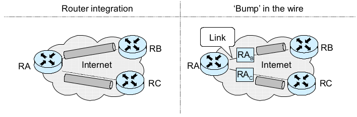

## Wann sollte welcher IPsec-Modus verwendet werden?
- In den meisten Fällen handelt es sich bei den Kommunikationsendpunkten um Hosts (Workstations, Server), aber das ist nicht unbedingt der Fall:
  - Beispiel: ein Gateway wird über SNMP von einer Workstation verwaltet
- Der Transportmodus wird verwendet, wenn die ,,kryptografischen Endpunkte'' auch die ,,Kommunikationsendpunkte'' der gesicherten IP-Pakete sind
  - Kryptografische Endpunkte: die Entitäten, die einen IPsec-Header (AH oder ESP) erzeugen/verarbeiten
  - Kommunikationsendpunkte: Quelle und Ziel eines IP-Pakets
    - 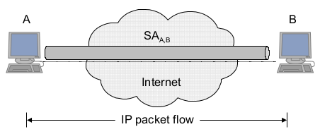 
- Der Tunnelmodus wird verwendet, wenn mindestens ein ,,kryptographischer Endpunkt'' nicht ein ,,Kommunikationsendpunkt'' der gesicherten IP-Pakete ist
  - Dies ermöglicht Gateways, die den IP-Verkehr im Namen anderer Stellen sichern
  - 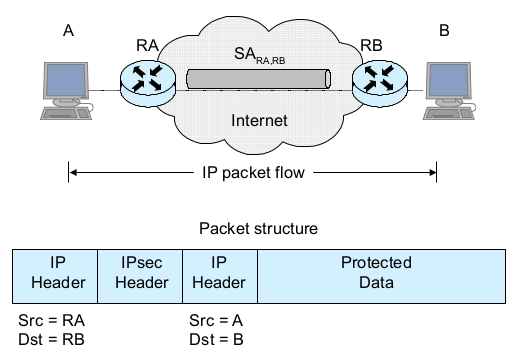
- Die obige Beschreibung der Anwendungsszenarien für den Tunnelmodus umfasst auch den Fall, dass nur ein kryptografischer Endpunkt kein Kommunikationsendpunkt ist:
  - Beispiel: ein Sicherheitsgateway, das die Authentifizierung und/oder die Vertraulichkeit des IP-Verkehrs zwischen einem lokalen Teilnetz und einem über das Internet verbundenen Host sicherstellt (,,Road Warrior Szenario'')
  - 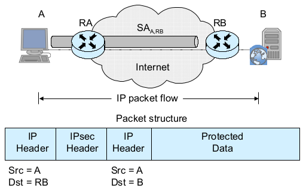

## Verschachtelung von Sicherheitsassoziationen
- Sicherheitsassoziationen können verschachtelt werden:
  - Beispiel: Host A und Gateway RB führen eine Authentifizierung der Datenherkunft durch und die Gateways RA und RB führen eine Vertraulichkeit von Subnetz zu Subnetz durch
  - 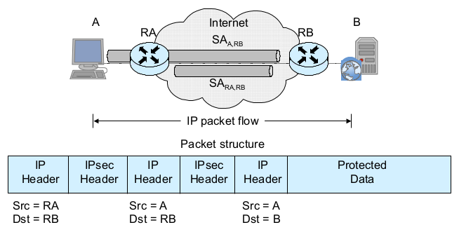
- Bei der Verschachtelung von SAs muss jedoch darauf geachtet werden, dass keine ,,falsche Klammerung'' von SAs erfolgt, wie z. B. ,,[(])''
  - Ein Beispiel für eine gültige SA-Schachtelung:
    - 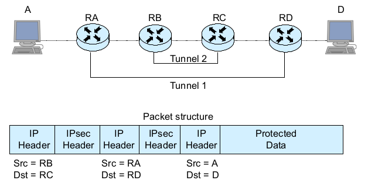
  - Ein Beispiel für ungültige SA-Schachtelungen:
    - 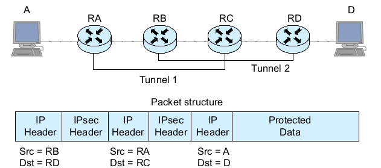
    - Da das Paket von RB nach RD getunnelt wird, kann das Gateway RC den inneren IPsec-Header nicht verarbeiten
    - Ein mögliches Ergebnis dieser fehlerhaften Konfiguration könnte sein, dass das Paket zurück nach RC geroutet wird

## Grundschema der IPsec-Verarbeitung: Ausgehende Pakete
- Nehmen wir an, die IP-Schicht eines Knotens (Host/Gateway) wird angewiesen, ein IP-Paket an einen anderen Knoten (Host/Gateway) zu senden
- Um IPsec zu unterstützen, muss sie die folgenden Schritte durchführen:
  - Feststellen, ob und wie das ausgehende Paket gesichert werden muss:
    - Dies wird durch einen Lookup im SPD realisiert
    - Wenn die Richtlinie ,,verwerfen'' vorschreibt, wird das Paket verworfen $\Rightarrow$ done
    - Wenn das Paket nicht gesichert werden muss, dann sende es $\Rightarrow$ done
  - Ermitteln, welche SA auf das Paket angewendet werden soll:
    - Wenn es noch keine passende SA mit dem entsprechenden Knoten gibt, dann fordere den Key Management Demon auf, einen IKE durchzuführen
  - Die ermittelte (und eventuell neu erstellte) SA in der SADB nachschlagen
  - Führen Sie die von der SA festgelegte Sicherheitstransformation durch, indem Sie den Algorithmus, seine Parameter und den Schlüssel, wie in der SA angegeben, verwenden.
    - Dies resultiert in der Konstruktion eines AH- oder ESP-Headers
    - Eventuell wird auch ein neuer (äußerer) IP-Header erstellt (Tunnelmodus)
  - Senden Sie das resultierende IP-Paket $\Rightarrow$ done

## Grundschema der IPsec-Verarbeitung: Eingehende Pakete
- Nehmen wir an, die IP-Schicht eines Knotens (Host/Gateway) empfängt ein IP-Paket von einem anderen Knoten (Host/Gateway)
- Um IPsec zu unterstützen, muss sie die folgenden Schritte durchführen:
  - Feststellen, ob das Paket einen IPsec-Header enthält, den diese Einheit verarbeiten soll:
    - Wenn es einen solchen IPsec-Header gibt, dann suchen Sie die SA in der SADB, die durch den SPI des IPsec-Headers spezifiziert ist, und führen Sie die entsprechende IPsec-Verarbeitung durch
    - Wenn die SA, auf die der SPI verweist, (noch) nicht existiert, verwerfen Sie das Paket
  - Ermitteln, ob und wie das Paket hätte geschützt werden sollen:
    - Dies wird wiederum durch einen Lookup im SPD realisiert, wobei der Lookup im Falle von getunnelten Paketen durch Auswertung des inneren IP-Headers durchgeführt wird
    - Wenn die Richtlinie ,,Verwerfen'' vorschreibt, wird das Paket verworfen.
    - Wenn der Schutz des Pakets nicht mit der Richtlinie übereinstimmt, wird das Paket verworfen.
    - Wenn das Paket ordnungsgemäß gesichert wurde, dann übergebe es an die entsprechende Protokollinstanz (Netzwerk-/Transportschicht)

## Auswahl der IPsec-Sicherheitspolitik
Die folgenden Selektoren, die aus den Headern der Netzwerk- und Transportschicht extrahiert werden, ermöglichen die Auswahl einer bestimmten Richtlinie im SPD:
- IP-Quelladresse:
    - Bestimmter Host, Netzwerkpräfix, Adressbereich oder Platzhalter
- IP-Zieladresse:
    - Bestimmter Host, Netzwerk-Präfix, Adressbereich oder Platzhalter
    - Im Falle eingehender getunnelter Pakete wird der innere Header ausgewertet
- Protokoll:
    - Der Protokoll-Identifikator des Transportprotokolls für dieses Paket
    - Dies ist möglicherweise nicht zugänglich, wenn ein Paket mit ESP gesichert ist.
- Ports der oberen Schicht:
    - Falls zugänglich, die Ports der oberen Schicht für die sitzungsorientierte Policy-Auswahl

## IPsec Security Policy Definition
- Policy Selectors werden verwendet, um spezifische Policy-Definitionen auszuwählen, spezifiziert:
  - Wie die Einrichtung einer IKE SA zwischen zwei Knoten durchgeführt werden soll:
    - Identifizierung: DNS-Name oder andere Namenstypen, wie in der IPsec-Domäne der Interpretation eines Protokolls zur Einrichtung von SAs definiert
    - Phase I-Modus: Hauptmodus oder aggressiver Modus (siehe unten)
    - Schutzsuite(n): Angabe, wie die IKE-Authentifizierung durchgeführt wird
  - Welche und wie Sicherheitsdienste für IP-Pakete bereitgestellt werden sollen:
    - Selektoren, die bestimmte Flüsse identifizieren
    - Sicherheitsattribute für jeden Fluss:
      - Sicherheitsprotokoll: AH oder ESP
      - Protokollmodus: Transport- oder Tunnelmodus
      - Sicherheitstransformationen: kryptografische Algorithmen und Parameter
      - Andere Parameter: SA-Lebensdauer, Replay-Fenster
    - Aktion: Verwerfen, Sichern, Umgehen
- Wenn bereits eine SA mit einem entsprechenden Sicherheitsendpunkt eingerichtet ist, wird im SPD auf diese verwiesen.

## Die Encapsulating Security Payload
- ESP ist ein allgemeines Sicherheitsprotokoll, das IP-Paketen einen Wiederholungsschutz und einen oder beide der folgenden Sicherheitsdienste bietet:
  - Vertraulichkeit durch Verschlüsselung der eingekapselten Pakete oder nur ihrer Nutzlast
  - Authentifizierung der Datenherkunft durch Erstellung und Hinzufügung von MACs zu Paketen
- Die ESP-Definition gliedert sich in zwei Teile:
  - Die Definition des Basisprotokolls [RFC4303]:
    - Definition des Header- und Trailer-Formats
    - Verarbeitung des Basisprotokolls
    - Tunnel- und Transportmodusbetrieb
  - Die Verwendung spezifischer kryptographischer Algorithmen mit ESP:
    - Verschlüsselung: 3DES-CBC, AES-CBC, AES-Zählmodus, Verwendung anderer Chiffren im CBC-Modus
    - Authentifizierung: HMAC-MD5-96, HMAC-SHA-96,...
- 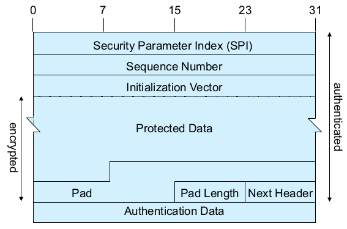
  - Der ESP-Header folgt unmittelbar auf einen IP-Header oder einen AH-Header
  - Das Next-Header-Feld des vorangehenden Headers zeigt ,,50'' für ESP an
  - Das SPI-Feld gibt die SA an, die für dieses Paket verwendet werden soll:
    - Der SPI-Wert wird immer von der empfangenden Seite während der SA-Aushandlung bestimmt, da der Empfänger das Paket verarbeiten muss.
  - Die Sequenznummer bietet, wie bereits erläutert, Schutz vor Wiederholung.
  - Wenn der verwendete kryptographische Algorithmus einen Initialisierungsvektor benötigt, wird dieser in jedem Paket am Anfang der Nutzlast im Klartext übertragen
  - Das Pad-Feld dient der Sicherstellung:
    - Auffüllen der Nutzlast bis zur erforderlichen Blocklänge der verwendeten Chiffre
    - Auffüllen der Nutzlast, um die Felder pad-length und next-header rechtsbündig in die höherwertigen 16 Bit eines 32-Bit-Wortes einzupassen
  - Die Auffülllänge gibt die Anzahl der hinzugefügten Auffüllbytes an.
  - Das next-header-Feld des ESP-Headers gibt die eingekapselte Nutzlast an:
    - Im Falle des Tunnelmodus: IP
    - Im Falle des Transportmodus: ein beliebiges Protokoll der höheren Schicht wie TCP, UDP, ...
  - Das optionale Feld authentication-data enthält eine MAC, falls vorhanden
- 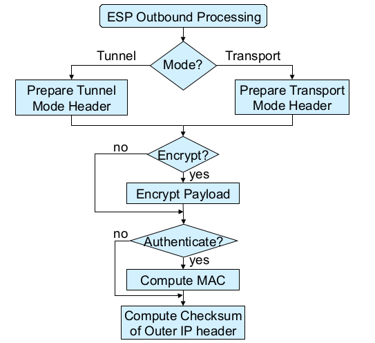
- 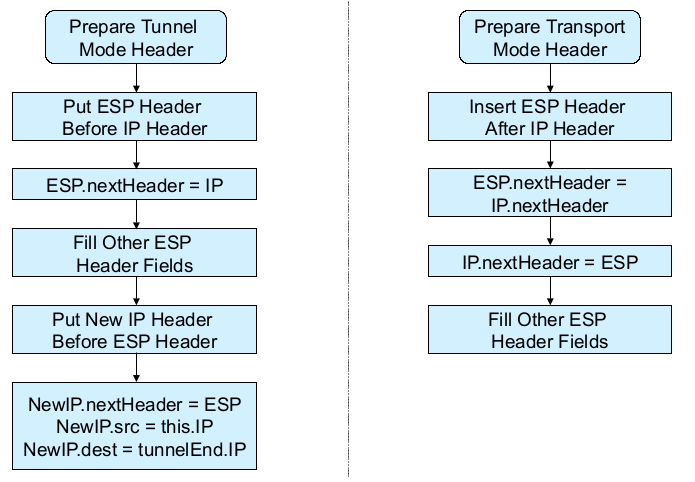
- 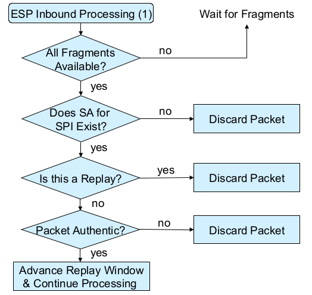
- 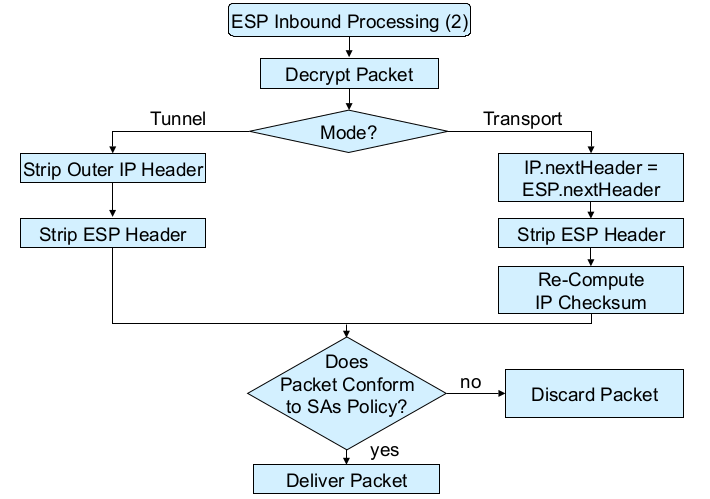
- Beachten Sie, dass das entkapselte IP-Paket ein fragmentiertes Paket sein kann:
  - Dies kann vorkommen, wenn ESP von einem Router im Tunnelmodus angewendet wurde.
  - Um die Konformität mit der SA-Policy korrekt zu prüfen, müssen alle zu diesem Paket gehörenden Fragmente vom Router empfangen werden, bevor die Prüfung durchgeführt werden kann
  - Beispiel: In einer SA sind nur Pakete an einen bestimmten Port erlaubt
    - Die erforderliche Port-Information ist nur im ersten Fragment des IP-Pakets vorhanden
- Paketzustellung bedeutet Zustellung an die entsprechende Verarbeitungseinheit:
  - Wenn ein anderer IPsec-Header für diese Entität vorhanden ist $\Rightarrow$ IPsec-Verarbeitung
  - Im Tunnelmodus $\Rightarrow$ Übermittlung des Pakets
  - Im Transportmodus $\Rightarrow$ Aufruf des entsprechenden Protokoll-Headers (TCP, UDP, etc.)
- Wenn ESP sowohl Vertraulichkeit als auch Authentifizierung bietet, können für beide Dienste unterschiedliche Schlüssel verwendet werden.
  - Dies muss während der Einrichtung der ESP-SA ausgehandelt werden.
- Beachten Sie, dass die Verwendung von ESP ohne Authentifizierung unsicher ist...
  - Kein zuverlässiger Schutz vor Wiederholungen
  - Zumindest, wenn im CBC-Modus verwendet:
    - Aktive Angriffe ermöglichen die Wiederherstellung von Nachrichten
    - Beispiel: Bits umdrehen und prüfen, ob Fehlermeldungen erzeugt werden
    - Vollständige Wiederherstellung von Klartextblöcken

## Der Authentifizierungs-Header
- AH ist ein allgemeines Sicherheitsprotokoll, das IP-Paketen Schutz bietet:
  - Wiedergabeschutz
  - Authentifizierung der Datenherkunft durch Erstellung und Hinzufügung von MACs zu den Paketen
- Wie bei ESP ist die AH-Definition in zwei Teile aufgeteilt:
  - Die Definition des Basisprotokolls [RFC4302]:
    - Definition des Header-Formats
    - Verarbeitung des Basisprotokolls
    - Tunnel- und Transportmodusbetrieb
  - Die Verwendung spezifischer kryptographischer Algorithmen bei AH:
    - Authentifizierung: HMAC-MD5-96, HMAC-SHA1-96, HMAC-SHA2, ...
    - Wenn sowohl ESP als auch AH von einer Stelle angewendet werden sollen, wird immer zuerst ESP angewendet:
  - Dies führt dazu, dass AH der äußere Header ist.
  - ,,Vorteil'': der IP-Header kann auch durch AH geschützt werden
  - Anmerkung: Für jede Richtung werden zwei SAs (je eine für AH, ESP) benötigt.
- Im Tunnelmodus stellt die Nutzlast ein vollständiges IP-Paket dar
  - 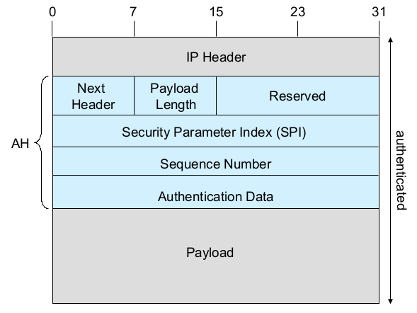
- Obwohl AH auch den äußeren IP-Header schützt, dürfen einige seiner Felder nicht geschützt werden, da sie sich während der Übertragung ändern können:
  - Dies gilt auch für veränderliche IPv4-Optionen oder IPv6-Erweiterungen.
  - Solche Felder werden bei der Berechnung des MAC als Null angenommen
  - 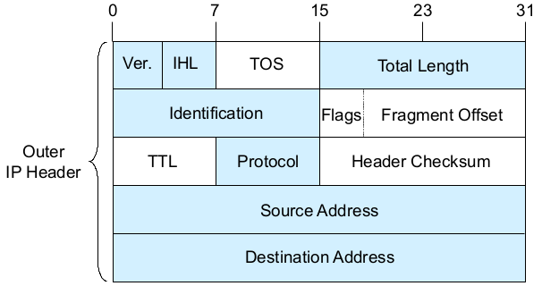
- Alle unveränderlichen Felder, Optionen und Erweiterungen (grau) sind geschützt
- 
- 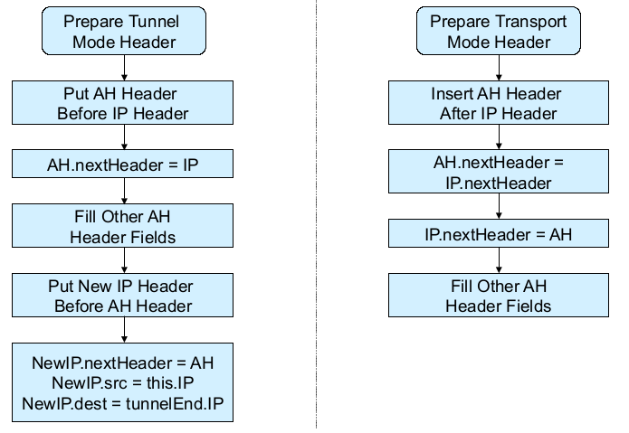
- 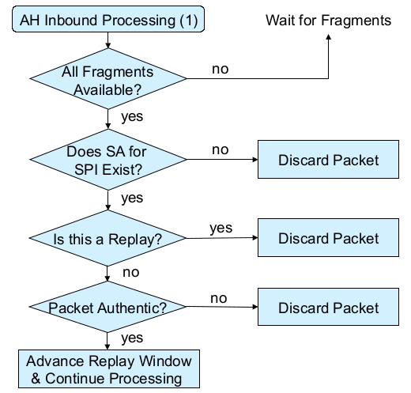
- 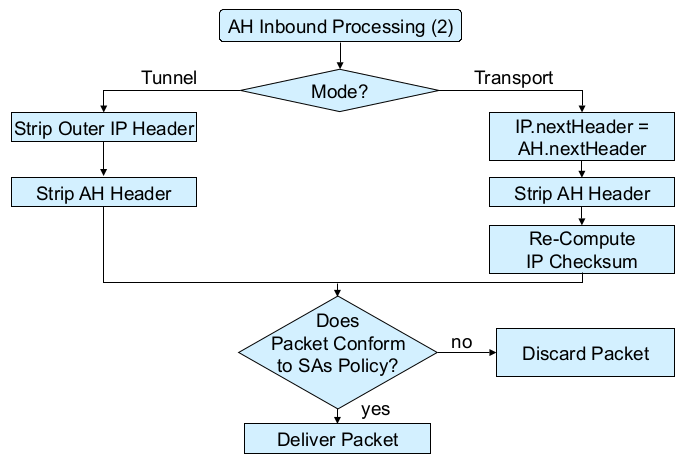

## IPsec's Verwendung von kryptographischen Algorithmen 
- Vertraulichkeit (nur ESP):
  - Die Verwendung von DES mit ESP [RFC4303] wird nicht mehr empfohlen
  - AES-CBC, definiert in RFC 3602, ist vielleicht "der" Standardalgorithmus
  - Der Initialisierungsvektor (IV) ist immer im Klartext enthalten, um Synchronisationsprobleme zu vermeiden.
  - Der gesamte IV soll zufällig sein
  - Nehmen Sie KEINE weiteren IVs aus früheren Chiffretexten!
    - Sicherheitsprobleme
    - Synchronisationsprobleme
  - 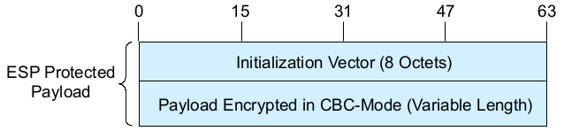
- Authentifizierung der Datenherkunft (AH und ESP):
  - Einige der Algorithmen zur Authentifizierung sind bereits definiert:
    - HMAC-MD5-96 mit Schlüssellänge 128 Bit
    - HMAC-SHA1-96 mit Schlüssellänge 160 Bit
    - HMAC-RIPEMD160-96 mit einer Schlüssellänge von 160 Bit
    - HMAC-SHA2 mit Schlüssellängen von 256, 384 und 512 Bit
  - Alle diese Algorithmen verwenden die in [RFC2104] definierte HMAC-Konstruktion:
    - ipad = 0x36 wiederholt B mal (B = 64 für die oben genannten Algorithmen)
    - opad = 0x5C, B-mal wiederholt
    - HMAC = H(Key XOR opad, H(Key XOR ipad, data)), wobei H die verwendete kryptografische Hash-Funktion angibt
  - Das ,,-96'' in den oben genannten Algorithmen bedeutet, dass die Ausgabe der Hash-Funktion auf die 96 ganz linken Bits gekürzt wird
  - SHA2 abgeschnitten auf die Hälfte der Schlüssellänge
  - Dieser Wert erfüllt die meisten Sicherheitsanforderungen gut

## Aufbau von Sicherheitsassoziationen
- Bevor ein Paket durch IPsec geschützt werden kann, muss eine SA zwischen den beiden ,,kryptographischen Endpunkten'', die den Schutz bieten, eingerichtet werden
- Der Aufbau einer SA kann realisiert werden:
  - Manuell, durch proprietäre Methoden der Systemverwaltung
  - Dynamisch, durch ein standardisiertes Authentifizierungs- und Schlüsselverwaltungsprotokoll
  - Die manuelle Einrichtung sollte nur in sehr eingeschränkten Konfigurationen (z.B. zwischen zwei verschlüsselnden Firewalls eines VPN) und während einer Übergangsphase verwendet werden
- IPsec definiert eine standardisierte Methode für den SA-Aufbau:
  - Internet Security Association and Key Management Protocol (ISAKMP)
    - Definiert Protokollformate und Verfahren für die Sicherheitsaushandlung
  - Internet-Schlüsselaustausch (IKE)
    - Definiert das Standard-Authentifizierungs- und Schlüsselaustauschprotokoll von IPsec

## ISAKMP - Einführung
- Die IETF hat zwei RFCs zu ISAKMP für IPsec verabschiedet:
  - RFC 2408, der das ISAKMP-Basisprotokoll definiert
  - RFC 2407, der die ,,domain of interpretation'' (DOI) von IPsec für ISAKMP definiert und die für IPsec spezifischen Nachrichtenformate näher beschreibt
- Das ISAKMP-Basisprotokoll ist ein generisches Protokoll, das für verschiedene Zwecke verwendet werden kann:
  - Die für eine Anwendung von ISAKMP spezifischen Verfahren werden in einem DOI-Dokument detailliert beschrieben.
  - Es wurden weitere DOI-Dokumente erstellt:
    - Group DOI für sichere Gruppenkommunikation [RFC6407]
    - MAP DOI für die Verwendung von ISAKMP zum Aufbau von SAs zur Sicherung des Mobile Application Protocol (MAP) von GSM (Internet Draft, Nov. 2000)
- ISAKMP definiert zwei grundlegende Kategorien von Austauschvorgängen:
  - Phase 1 Austausch, bei dem eine Art von ,,Master SA'' ausgehandelt wird
  - Phase 2 Austausch, der die ,,Master SA'' verwendet, um andere SAs zu etablieren

### ISAKMP - Grundlegendes Nachrichtenformat
- 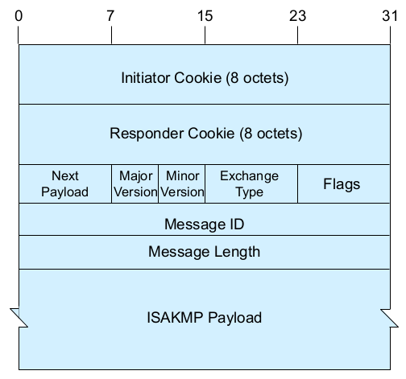
- Initiator & Responder Cookie:
  - Identifizieren einen ISAKMP-Austausch bzw. eine Sicherheitsassoziation
  - Dienen auch als begrenzter Schutz gegen Denial-of-Service-Angriffe (siehe unten)
- Nächste Nutzlast: gibt an, welcher ISAKMP-Nutzlasttyp die erste Nutzlast der Nachricht ist
- Major & Minor Version: gibt die Version des ISAKMP-Protokolls an
- Austausch-Typ:
  - Gibt die Art des verwendeten Austauschs an
  - Es gibt fünf vordefinierte generische Austauschtypen, weitere Typen können pro DOI definiert werden
- Flags:
  - Encrypt: wenn auf eins gesetzt, wird die Nutzlast nach dem Header verschlüsselt
  - Commit: wird für die Schlüsselsynchronisation verwendet
  - Authenticate only: wenn auf eins gesetzt, wird nur der Schutz der Datenursprungsauthentifizierung auf die ISAKMP-Nutzdaten angewendet und keine Verschlüsselung durchgeführt
- Nachrichten-ID:
  - Dient zur Identifizierung von Nachrichten, die zu verschiedenen Austauschen gehören
- Nachrichtenlänge:
  - Gesamtlänge der Nachricht (Header + Payload)
- Nutzlast:
  - Die Nutzlast einer ISAKMP-Nachricht kann tatsächlich mehrere ,,verkettete'' Nutzlasten enthalten
  - Der Nutzlasttyp der ersten Nutzlast in der Nachricht wird im nächsten Nutzlastfeld des ISAKMP-Headers angegeben
  - Alle ISAKMP-Nutzdaten haben einen gemeinsamen Nutzdaten-Header:
    - 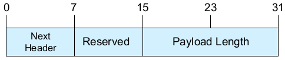
    - Next Header: der Payload-Typ des nächsten Payloads in der Nachricht
    - Payload Length: Gesamtlänge der aktuellen Payload (einschließlich dieses Headers)

### ISAKMP - Begrenzter Schutz vor Denial of Service
- Die Initiator- und Responder-Cookies dienen auch als Schutz gegen einfache Denial-of-Service-Angriffe:
  - Authentifizierung und Schlüsselaustausch erfordern oft ,,teure'' Berechnungen, z.B. Potenzierung (für Diffie-Hellman Schlüsselaustausch)
  - Um zu verhindern, dass ein Angreifer eine ISAKMP-Einheit mit gefälschten Nachrichten von gefälschten Quelladressen überschwemmen und diese teuren Operationen verursachen kann, wird das folgende Schema verwendet:
    - Die initiierende ISAKMP-Entität erzeugt einen Initiator-Cookie: $CKY-I = H(Secret_{Initiator}, Address_{Responder}, t_{Initiator})$
    - Der Responder generiert sein eigenes Cookie: $CKY-R = H(Secret_{Responder}, Address_{Initiator}, t_{Responder})$
    - Beide Entitäten schließen immer beide Cookies ein und überprüfen immer ihr eigenes Cookie, bevor sie eine teure Operation durchführen
    - Der oben erwähnte Angriff wird daher nicht erfolgreich sein, da der Angreifer eine Antwort von dem angegriffenen System erhalten muss, um ein Cookie von ihm zu erhalten
  - ISAKMP spezifiziert die genaue Cookie-Erzeugungsmethode nicht

### ISAKMP - Nutzdatenarten
- RFC 2408 definiert verschiedene Nutzdaten von ISAKMP (Liste ist nicht vollständig):
  - Generische Payloads: Hash, Signatur, Nonce, Vendor ID, Schlüsselaustausch
  - Spezifische Payloads: SA, Zertifikat, Zertifikatsanforderung, Identifikation
  - Abhängige und gekapselte Nutzdaten:
    - Proposal-Payload: beschreibt einen Vorschlag für die SA-Verhandlung
    - Transform-Payload: beschreibt eine Transformation eines Proposals
  - Außerdem gibt es eine generische Attribut-Nutzlast:
    - Dies ist eigentlich kein ISAKMP-Payload, sondern ein Payload, der innerhalb der ISAKMP-Payloads erscheint.
    - Alle Attribut-Payloads haben eine gemeinsame Struktur:
    - 

### ISAKMP - Die Sicherheits-Assoziations-Nutzdaten
- 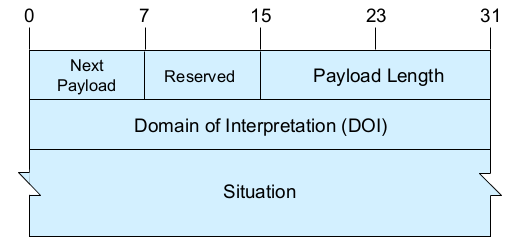
- Domain of Interpretation definiert die Anwendungsdomäne für die auszuhandelnde SA, z.B. IPsec
- Situation ist ein DOI-spezifisches Feld, das die Situation angibt, in der die aktuelle Verhandlung stattfindet (z. B. Notruf vs. normaler Anruf)
- Auf den SA-Payload folgen ein oder mehrere Proposal-Payloads

### ISAKMP - Die Vorschlagsnutzdaten
- 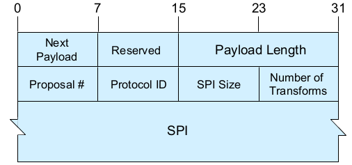
- Proposal # wird verwendet, um Richtlinien auszudrücken und Vorschläge auszuhandeln:
  - Wenn zwei oder mehr Vorschläge die gleiche Nummer tragen, wird ein logisches UND realisiert.
  - Unterschiedliche Werte für Proposal # realisieren logisches OR mit absteigender Priorität
- Protocol ID gibt den Protokoll-Identifikator der aktuellen Verhandlung an, z. B. AH oder ESP (für IPsec)
- SPI Size gibt die Länge des enthaltenen SPI-Wertes an
- Number of Transforms (Anzahl der Transformationen) gibt an, wie viele Transformationen zu diesem Vorschlag gehören (diese folgen unmittelbar auf die Nutzlast des Vorschlags)

### ISAKMP - Die Transformations-Nutzdaten
- 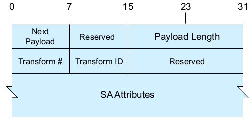
- Eine Transform-Payload spezifiziert einen bestimmten Sicherheitsmechanismus, auch Transform genannt, der zur Sicherung des Kommunikationskanals verwendet werden soll.
- Jede in einem Vorschlag aufgeführte Transformation hat eine eindeutige Transform #
- Jede Transformation wird durch eine Transform-ID eindeutig identifiziert, z.B. 3DES, AES, MD5, SHA-1, etc.
  - Die Transformations-IDs werden in einem DOI-Dokument angegeben.
- Die SA-Attribute geben die Attribute an, die für die im Feld Transform ID angegebene Transformation definiert sind.

### ISAKMP - SA-Verhandlung
- Inhalt des Next Payload-Feldes von SA-, Proposal- und Transform-Payloads:
  - Das Next-Payload-Feld einer SA-Payload gibt nicht die unmittelbar folgende Proposal-Payload an, da diese implizit ist.
  - Das Gleiche gilt für Proposal- und Transform-Payloads
- Die Proposal-Payload gibt der initiierenden Entität die Möglichkeit, der antwortenden Entität die Sicherheitsprotokolle und zugehörigen Sicherheitsmechanismen zur Verwendung mit der auszuhandelnden Sicherheitsassoziation zu präsentieren.
- Wenn die SA-Etablierung für eine kombinierte Schutzsuite ausgehandelt wird, die aus mehreren Protokollen besteht, muss es mehrere Proposal-Payloads geben, die jeweils die gleiche Proposal-Nummer haben.
- Diese Vorschläge müssen als eine Einheit betrachtet werden und dürfen nicht durch einen Vorschlag mit einer anderen Vorschlagsnummer getrennt werden.
- Dieses erste Beispiel zeigt eine ESP- UND AH-Schutzsuite:
  - Das erste Protokoll wird mit zwei von der vorschlagenden Stelle unterstützten Transformationen dargestellt, ESP mit:
    - Transformation 1 als 3DES
    - Umwandlung 2 als AES
    - Der Responder muss zwischen den beiden für ESP vorgeschlagenen Transformationen wählen.
  - Das zweite Protokoll ist AH und wird mit einer einzigen Transformation angeboten:
    - Umwandlung 1 als SHA
  - Die resultierende Schutzsuite ist entweder
    - 3DES und SHA, oder
    - AES und SHA, je nachdem, welche ESP-Transformation vom Responder gewählt wurde
  - In diesem Fall folgen auf die SA-Nutzdaten die folgenden Nutzdaten:
    - [Vorschlag 1, ESP, (Transform 1, 3DES, ...), (Transform 2, AES)] [Vorschlag 1, AH, (Transform 1, SHA)]
  - Bitte beachten Sie, dass dies zu zwei SAs pro Richtung führt!
- Dieses zweite Beispiel zeigt einen Vorschlag für zwei verschiedene Schutzsuiten:
  - Die erste Schutzsuite wird vorgestellt mit:
    - einer Transformation (MD5) für das erste Protokoll (AH), und
    - eine Umwandlung (3DES) für das zweite Protokoll (ESP)
  - Die zweite Schutzsuite wird mit zwei Transformationen für ein einziges Protokoll (ESP) vorgestellt:
    - 3DES, oder
    - AES
  - Bitte beachten Sie, dass es nicht möglich ist, festzulegen, dass Transformation 1 und Transformation 2 für eine Instanz einer Protokollspezifikation verwendet werden müssen.
  - In diesem Fall folgen auf den SA-Payload die folgenden Payloads:
    - [Vorschlag 1, AH, (Transform 1, MD5, ...)] [Vorschlag 1, ESP, (Transform 1, 3DES, ...)] [Vorschlag 2, ESP, (Transform1, 3DES, ...), (Transform 2, AES, ...)]
  - Bitte beachten Sie, dass Vorschlag 1 zu zwei SAs pro Richtung führt.
- Bei der Beantwortung einer Security-Association-Nutzlast muss der Antwortende eine Security-Association-Nutzlast mit dem ausgewählten Vorschlag senden, der aus mehreren Proposal-Nutzlasten und den zugehörigen Transform-Nutzlasten bestehen kann
- Jede der Proposal-Payloads muss eine einzelne Transform-Payload enthalten, die dem Protokoll zugeordnet ist.
- Der Antwortende sollte das Feld Proposal # in der Proposal-Payload und das Feld Transform # in jeder Transform-Payload des ausgewählten Vorschlags beibehalten.
  - Die Beibehaltung der Vorschlags- und Transformationsnummern sollte die Protokollverarbeitung des Initiators beschleunigen, da die Auswahl des Antwortenden nicht mit jeder angebotenen Option verglichen werden muss.
  - Diese Werte ermöglichen es dem Initiator, den Vergleich direkt und schnell durchzuführen.
- Der Initiator muss überprüfen, ob die vom Responder empfangene SA-Nutzlast mit einem der ursprünglich gesendeten Vorschläge übereinstimmt

### ISAKMP - Session Key Establishment
- ISAKMP baut 4 verschiedene Schlüssel mit einem Authentifizierungsaustausch auf:
  - SKEYID ist eine Zeichenkette, die aus geheimem Material abgeleitet wird, das nur den aktiven Teilnehmern des Austauschs bekannt ist und als ,,Hauptschlüssel'' dient.
    - Die Berechnung von SKEYID ist abhängig von der Authentifizierungsmethode
  - SKEYID_e ist das Schlüsselmaterial, das von der ISAKMP SA zum Schutz der Vertraulichkeit ihrer Nachrichten verwendet wird
  - SKEYID_a ist das Schlüsselmaterial, das von der ISAKMP SA zur Authentifizierung ihrer Nachrichten verwendet wird
  - SKEYID_d ist das Verschlüsselungsmaterial, das zur Ableitung von Schlüsseln für Nicht-ISAKMP-Sicherheitsassoziationen verwendet wird.

## IKE - Einführung
- Während ISAKMP die grundlegenden Datenformate und Verfahren zur Aushandlung beliebiger SAs definiert, spezifiziert der Internet Key Exchange das standardisierte Protokoll zur Aushandlung von IPsec SAs
- IKE definiert fünf Austauschvorgänge:
  - Phase-1-Austausch für die Einrichtung einer IKE SA :
    - Main-Mode-Austausch, der durch 6 ausgetauschte Nachrichten realisiert wird
    - Aggressive mode exchange, der nur 3 Nachrichten benötigt
  - Phase 2 Austausch für die Einrichtung von IPsec SAs:
    - Quick-Mode-Austausch, der mit 3 Nachrichten realisiert wird
  - Andere Austausche:
    - Informationsaustausch zur Übermittlung von Status- und Fehlermeldungen
    - Neuer Gruppenaustausch zur Vereinbarung von privaten Diffie-Hellman-Gruppen
- Hinweis: Auf den folgenden Folien steht HMAC(K, x | y | ...) für H(K, p 1 , H(K, p 2 , x, y, ...)), wobei p 1 und p 2 Auffüllmuster bezeichnen 

### IKE - Berechnung von IKE-Sitzungsschlüsseln
- IKE baut vier verschiedene Schlüssel mit einem Authentifizierungsaustausch auf:
  - SKEYID ist eine Zeichenkette, die aus geheimem Material abgeleitet wird, das nur den aktiven Teilnehmern des Austauschs bekannt ist, und die als ,,Hauptschlüssel'' dient.
    - Die Berechnung von SKEYID ist abhängig von der Authentifizierungsmethode
  - SKEYID_d ist das Keying-Material, das zur Ableitung von Schlüsseln für Nicht-IKE-SAs verwendet wird
    - SKEYID_d = $HMAC(SKEYID, g^{xy} | CKY-I | CKY-R | 0)$, wobei $g^{xy}$ das gemeinsame Diffie-Hellman-Geheimnis bezeichnet
  - SKEYID_a ist das Schlüsselmaterial, das von der IKE SA zur Authentifizierung ihrer Nachrichten verwendet wird
    - SKEYID_a = $HMAC(SKEYID, SKEYID_d | g^{xy} | CKY-I | CKY-R | 1)$
  - SKEYID_e ist das Schlüsselmaterial, das von der IKE SA zum Schutz der Vertraulichkeit ihrer Nachrichten verwendet wird
    - SKEYID_e = $HMAC(SKEYID, SKEYID_a | g^{xy} | CKY-I | CKY-R | 2)$
- Falls erforderlich, werden die Schlüssel nach der folgenden Methode erweitert:
  - $K=(K_1 | K_2 | ...)$ mit $K_i = HMAC(SKEYID, K_{i-1})$ und $K_0 = 0$

### IKE - Authentifizierungsmethoden
- Phase 1 IKE-Austausche werden mit Hilfe von zwei Hash-Werten Hash-I und Hash-R authentifiziert, die vom Initiator und vom Responder erstellt werden:
  - Hash-I = HMAC(SKEYID, gx | gy | CKY-I | CKY-R | SA-Angebot | ID-I)
  - Hash-R = HMAC(SKEYID, gy | gx | CKY-R | CKY-I | SA-offer | ID-R) wobei gx, gy die ausgetauschten öffentlichen Diffie-Hellman-Werte bezeichnen ID-I, ID-R bezeichnen die Identität des Initiators und des Responders SA-offer bezeichnet die Nutzdaten bezüglich der SA-Verhandlung
- IKE unterstützt vier verschiedene Methoden der Authentifizierung:
  - Pre-shared Key:
    - SKYEID = $HMAC(K_{Initiator}, Responder , r_{Initiator} | r_{Responder})$
  - Zwei verschiedene Formen der Authentifizierung mit Public-Key-Verschlüsselung:
    - SKEYID = $HMAC(H(r_{Initiator}, r_{Responder}), CKY-I | CKY-R)
  - Digitale Unterschrift:
    - SKEYID = $HMAC((r_{Initiator} | r_{Responder}), g^{xy})$
    - Da in diesem Fall SKEYID selbst keine Authentifizierung bietet, werden die Werte Hash-I und Hash-R vom Initiator/Responder signiert

### IKE - Main Mode Austausch mit Pre-Shared Key
- Die folgenden Beschreibungen listen die ausgetauschten ISAKMP- und IKE-Payloads auf, wenn verschiedene ,,Flavors'' der IKE-Authentifizierung durchgeführt werden:
  - 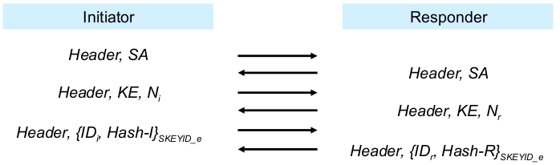
  - $N_i, N_r$ bezeichnen $r_{Initiiator}, r_{Responder}$ (IKE-Notation) 
  - $ID_i, ID_r$ bezeichnen die Identität des Initiators und des Responders 
  - $KE$ bezeichnet die öffentlichen Werte eines DH-Austausches
- Bitte beachten Sie, dass Hash-I und Hash-R nicht signiert werden müssen, da sie bereits ,,ein authentisches Geheimnis'' (Pre-Shared Key) enthalten

### IKE - Hauptmodus Austausch mit Signaturen
- 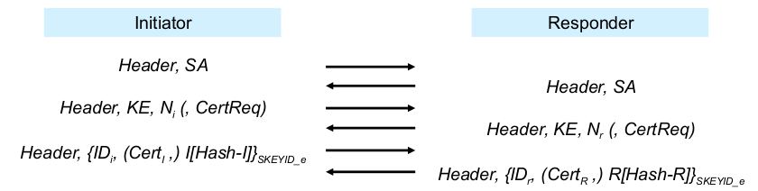
  - $(m)$ gibt an, dass m optional ist 
  - $I[m]$ bedeutet, dass I m signiert
- Bitte beachten Sie, dass Hash-I und Hash-R signiert werden müssen, da sie nichts enthalten, von dem bekannt ist, dass es authentisch ist

### IKE - Main Mode Exchange mit Public Key Encryption
- 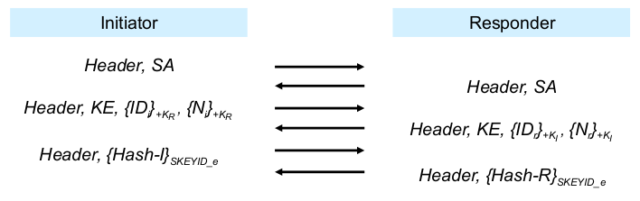
  - wobei: $\{m\}_{+KI}$ bedeutet, dass m mit dem öffentlichen Schlüssel $+K_I$ verschlüsselt ist
  - Bitte beachten Sie, dass Hash-I und Hash-R nicht signiert werden müssen, da sie die ausgetauschten Zufallszahlen Ni bzw. Nr ,,enthalten''.
    - Jede Entität beweist also ihre Authentizität, indem sie die empfangene Zufallszahl ( Ni oder Nr ) mit ihrem privaten Schlüssel entschlüsselt
- 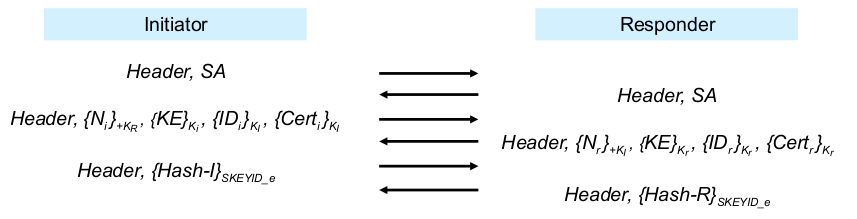
  - wobei: $\{m\}_{+KI}$ bedeutet, dass m mit dem öffentlichen Schlüssel $+K_I$ verschlüsselt ist 
  - $\{m\}_{K_i}$ bedeutet, dass m mit dem symmetrischen Schlüssel $K_i$ mit $K_i=H(N_i, CKY-I)$ und $K_r=H(N_r,CKY-R)$ verschlüsselt ist
  - Bitte beachten Sie, dass alle bisher beschriebenen Schemata einen Schutz der Identität vor Abhörern im Internet bieten, da die IDs und Zertifikate nicht im Klartext gesendet werden:
  - Die IP-Adressen der ausgetauschten Pakete sind jedoch immer lesbar...

### IKE - Aggressiver Modus Austausch mit Pre-Shared Key
- 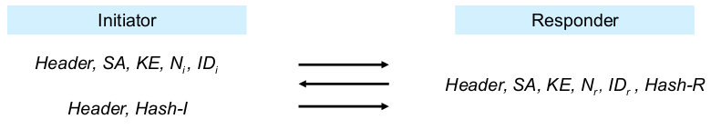
- Da die Identität des Initiators und des Responders gesendet werden muss, bevor ein Sitzungsschlüssel erstellt werden kann, kann der Austausch im aggressiven Modus keinen Identitätsschutz vor Abhörern bieten
- Ähnliche Varianten des aggressiven Modus gibt es auch für die Authentifizierung mit:
  - Digitale Signatur
  - Verschlüsselung mit öffentlichem Schlüssel

### IKE - Quick Mode Exchange
- 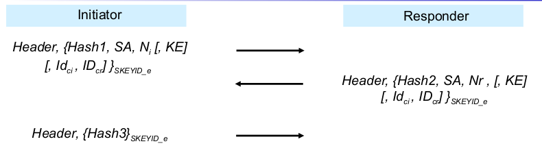
- $Hash1 = HMAC(SKEYID_a, M-ID | SA | Ni | [ | KE ] [ | ID_{ci} | ID_{cr}] )$
- $Hash2 = HMAC(SKEYID_a, M-ID | N_i | SA | N_r | [ | KE ] [ | ID_{ci} | ID_{cr}] ) 
- $Hash3 = HMAC(SKEYID_a, 0 | M-ID | N_i | N_r)$
- Die optionale Einbeziehung der Identitäten $ID_{ci}$ und $ID_{cr}$ ermöglicht es ISAKMP-Entitäten, eine SA im Namen anderer Clients einzurichten (Gateway-Szenario)
- Die optionalen Schlüsselaustausch-Payloads KE ermöglichen die Durchführung eines neuen DH-Austauschs, wenn perfekte Forward Secrecy gewünscht ist
- Sitzungsschlüsselmaterial $= HMAC(SKEYID\_d, [ g^{xy} | ] protocol | SPI | N_i | N_r)$

## Weitere Probleme mit IPsec
- Komprimierung:
  - Wenn Verschlüsselung verwendet wird, dann können die resultierenden IP-Pakete nicht in der Verbindungsschicht komprimiert werden, z.B. bei einer Verbindung zu einem ISP über Modem
  - Daher wurde das IP Payload Compression Protocol (PCP) definiert
  - PCP kann mit IPsec verwendet werden:
    - In der IPsec-Policy-Definition kann PCP festgelegt werden.
    - Die IKE SA-Verhandlung ermöglicht die Aufnahme von PCP in die Vorschläge
- Interoperabilitätsprobleme bei End-to-End-Sicherheit mit Header-Verarbeitung in Zwischenknoten:
  - Interoperabilität mit Firewalls:
    - Die Ende-zu-Ende-Verschlüsselung kollidiert mit der Notwendigkeit von Firewalls, die Protokoll-Header der oberen Schichten in IP-Paketen zu prüfen.
  - Interoperabilität mit Network Address Translation (NAT):
    - Verschlüsselte Pakete lassen weder eine Analyse noch eine Änderung der Adressen zu.
    - Authentifizierte Pakete werden verworfen, wenn die Quell- oder Zieladresse geändert wird.

## Schlussfolgerung
- IPsec ist die Sicherheitsarchitektur der IETF für das Internet-Protokoll
- Sie bietet die folgenden Sicherheitsdienste für IP-Pakete:
  - Authentifizierung der Datenherkunft
  - Schutz vor Wiederholung
  - Vertraulichkeit
- Es kann in Endsystemen oder Zwischensystemen realisiert werden:
  - Implementierung im Endsystem: Integriertes Betriebssystem oder ,,bump in the stack''
  - Gateway-Implementierung: Integrierter Router oder ,,bump in the wire''
- Es wurden zwei grundlegende Sicherheitsprotokolle definiert:
  - Authentifizierungs-Header (AH)
  - Encapsulating security payload (ESP)
- SA-Verhandlung und Schlüsselverwaltung werden mit folgenden Protokollen realisiert:
  - Internet security association key management protocol (ISAKMP)
  - Internet-Schlüsselaustausch (IKE)

## Neue Wege in der IPsec-Entwicklung
- Internet-Schlüsselaustausch Version 2
  - Basierend auf den Erkenntnissen aus IKEv1
  - Wesentliche Vereinfachungen
- Netzwerkadressübersetzung (NAT)
  - Beispiel für Probleme mit NAT und IPsec
  - NAT-Überwindung
  - Bound-End-to-End Tunnel Mode (BEET)
- Konfiguration von großen IPsec-Infrastrukturen

## Internet Key Exchange Protocol Version 2 [RFC5996]
Zusätzliche Designziele zu IKEv1
- Konsolidierung von mehreren IKEv1-RFCs (und mehreren Erweiterungen)
  - Erleichterung für Entwickler und Prüfer
  - Klärung mehrerer unspezifischer Punkte
- Vereinfachungen
  - Anzahl der verschiedenen Schlüsselaustauschverfahren auf eines reduziert
  - Verschlüsselung wie in ESP
  - Einfacher Anfrage/Antwort-Mechanismus
- Verringerung der Latenzzeit
- Aushandlung von Verkehrsselektoren
- Graceful Changes, damit bestehende IKEv1-Software aufgerüstet werden kann

### IKEv2 - Schlüsselaustauschverfahren 
- 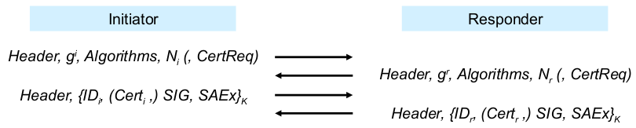 
  - $K$ Schlüssel abgeleitet durch $PRF(PRF(N_i || N_r, g^{ir}), N_i || N_r || SPI_i || SPI_r)$
  - $PRF$ ,,irgendeine'' Pseudozufallsfunktion - in der Regel eine asymmetrische HMAC SIG-Signatur oder MAC über die ersten beiden Nachrichten 
  - $SAEx$ ein Huckepack- ,,Quick-Mode-Austausch''
- Nur ein einziger Austauschtyp
- Vier Nachrichten werden ausgetauscht $(= 2 * RTT)$
- Initiator löst alle erneuten Übertragungen aus

### IKEv2 - Eigenschaften des Schlüsselaustauschverfahrens
- Der erste SA-Austausch erfolgt huckepack
  - Geringere Latenz, da eine RTT eingespart wird
- Nachricht 4 sollte huckepack mit Nachricht 2 ausgetauscht werden, aber
  - Nachricht 3 verifiziert, dass Initiator Nachricht 2 erhalten hat (SPI ~ Cookie)
    - Dient als DoS-Schutz, wenn anschließend rechenintensive Aufgaben durchgeführt werden
  - Identität des Responders wird erst nach Verifizierung des Initiators offengelegt
    - Schützt vor dem Scannen nach einer Partei mit einer bestimmten ID
  - Initiator weiß nicht, wann es sicher ist, Daten zu senden
    - (Pakete können in falscher Reihenfolge empfangen werden)
  - Würde eine kompliziertere Strategie zur erneuten Übertragung erfordern
  - Responder kann nicht über eine Policy für die Child SA entscheiden

### IKEv2 - Zusätzliche Funktionen
- Zusätzlicher DoS-Schutz
  - Im Falle eines DoS-Angriffs kann der Responder den Initiator auffordern, ein zustandsloses Cookie zu senden
  - Fügt dem Austausch 2 zusätzliche Nachrichten hinzu
- Dead Peer Detection
  - Regelmäßige IKE-Anfragen, um festzustellen, ob die SA gelöscht werden kann
- Flexiblere Verhandlungstechniken
  - Möglichkeit der Angabe: ,,Verwenden Sie eine dieser Chiffren mit einem dieser Authentifizierungsalgorithmen'' (es müssen nicht mehr alle Kombinationen aufgezählt werden)
  - Verkehrsselektoren können eingegrenzt werden
    - Initiator: ,,Ich möchte 192.168.0.0/16 für meinen Tunnelmodus verwenden''
    - Antwortgeber: ,,OK, aber Sie dürfen nur 192.168.78.0/24 verwenden''
    - Kann verwendet werden, um den Responder dem Initiator einen Adressbereich zuweisen zu lassen (in einfachen Situationen ohne / mit Hilfe von DHCP; siehe auch unten)

## Netzwerk-Adressübersetzung (NAT)
- Heutzutage ein häufiges Problem: ISP stellt nur eine einzige IP-Adresse zur Verfügung, es sollen aber mehrere Geräte angeschlossen werden
- Lösung: Ein Router wird verwendet, um mehrere interne (private) Adressen auf eine einzige externe (öffentliche) Adresse abzubilden
- Häufigster Ansatz (vereinfacht):
  - Für Pakete, die von der privaten Seite kommen:
    - Der Router schreibt die TCP/UDP-Quellports auf einen eindeutigen Wert pro IP-Flow um
    - Speichert den neuen Quellport in einer Tabelle mit der Quelladresse und dem alten Quellport
    - Ersetzt die Quell-IP-Adresse durch die externe Adresse
  - Für Pakete, die von der öffentlichen Seite kommen:
    - Der Router sucht den IP-Fluss nach dem TCP/UDP-Zielport ab
    - Ersetzt die Zieladresse und den Port durch die alten Werte

### NAT - Ein Beispiel
- 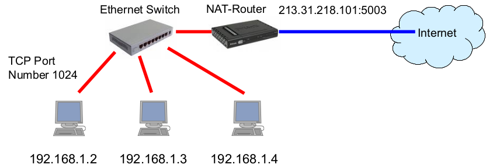
- NAT ändert die Quelladresse eines jeden Pakets in eine öffentliche IP-Adresse mit anderen ("umgeschriebenen") Quellports

### Probleme mit NAT und IPsec - NAT-Traversal
- Probleme:
  - AH kann per Definition nicht mit NAT verwendet werden
  - ESP bietet kein ,,wiederbeschreibbares Feld'' (wie Portnummer)
  - TCP/UDP-Portnummern werden verschlüsselt oder authentifiziert (oder beides)
- Lösung für ESP: ESP-Pakete in normale UDP-Pakete einkapseln [RFC3948] 
  - 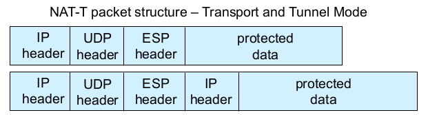
- UDP-Header enthält nur Portnummern und leere Prüfsumme
  - Fügt 8 Byte Overhead hinzu
  - Einziger Zweck: dem NAT-Gerät etwas zum ,,Umschreiben'' geben (um die Empfänger der Pakete in der Antwort unterscheiden zu können)
  - Port 4500 reserviert für NAT-T (NAT-Traversal)
- Im Transport-Modus:
  - Innere UDP/TCP-Prüfsumme hängt von der ursprünglichen Quelladresse ab (Layering-Verletzung in der ursprünglichen TCP/IP-Suite)
  - Muss wiederhergestellt werden
- Wann ist NAT-T zu verwenden?
  - NAT-Situation muss von IKE erkannt werden
  - Erfolgt durch IKEv1-Erweiterung [RFC3947] und IKEv2
  - IKE verwendet NAT-T, wenn der IKE-Quellport nicht 500 ist
  - Funktioniert nicht immer, dann ist eine manuelle Konfiguration erforderlich
- Timeout-Probleme und Keep-Alives
  - ESP-Pakete werden nicht periodisch ausgetauscht
  - NAT-T-Ströme können im Router eine Zeitüberschreitung verursachen
  - Eingehende Pakete können dann nicht zugestellt werden
  - Regelmäßige Keep-Alive-Pakete stellen sicher, dass der Router seinen Status beibehält
  - Einfaches UDP-Paket an Port 4500 mit einem einzigen 0xFF-Oktett

### Probleme mit NAT und IPsec - BEET-Modus
- Welche Adressen soll Alice verwenden, um Pakete an Bob, Charlie und Dave zu senden? 
- Weder die externen noch die internen Adressen dürfen eindeutig sein!
  - Bobs und Charlies Pakete haben beide die gleiche externe Adresse
  - Bobs und Daves Pakete haben beide dieselbe interne Adresse
  - 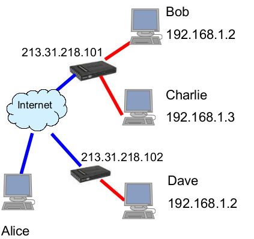
  - Die Verwendung interner oder externer Adressen ist unsicher (Warum?)
  - Die Unterscheidung erfordert virtuelle Adressen...
- Virtuelle IP-Adressen zuweisen oder aushandeln
  - Alice muss jedem ihrer Peers eindeutige virtuelle Adressen zuweisen
  - Dies kann manuell geschehen, oder
  - durch DHCP über IKE, oder
  - durch Aushandlung von Verkehrsselektoren (IKEv2)
  - L2TP über IPsec ausführen
- IPsec-Tunnelmodus ist erforderlich
  - Externer IP-Header trägt entweder eine öffentliche IP-Adresse oder eine private NAT-Adresse
  - Interner IP Header trägt virtuelle IP-Adresse
  - Führt zu (mindestens!) 28 Bytes Overhead pro Paket in NAT-Situationen
  - | IP Header | UDP Header | ESP Header | IP Header | geschützte Daten |
- Aber eigentlich sind nur Adressfelder im inneren IP-Header erforderlich (alle anderen Felder können vom externen Header abgeleitet werden)
- Beide virtuellen Adressfelder verwenden immer dieselben Adressen (kein Multiplexing wie in üblichen Tunnelmodusszenarien)
- Die Beschränkung auf zwei Adressen im Tunnel ermöglicht eine statische Bindung während der IKE-Aushandlung
- Der Bound-End-to-End-Tunnel (BEET)-Modus [NiMe08] verhält sich semantisch wie eine Tunnelmodus-Assoziation mit einem Verkehrsselektor für einen einzelnen Host (/32)
- Die übertragenen ESP-Pakete sind äquivalent zu Transport (!)-Modus-Paketen (virtuelle Adressen werden nie in Paketen übertragen)
- Der innere Header wird durch den ESP-Entkapselungsprozess wiederhergestellt.
- Unterscheidet zwischen der Erreichbarkeit eines Hosts (externe IP-Adresse) und seiner Identität (virtuelle IP-Adresse)
- Hosts können nun zwischen verschiedenen Standorten hin- und herwandern und ihre virtuelle IP-Adresse beibehalten (dies ermöglicht zusätzlich eine bessere Unterstützung der Mobilität)

## Konfiguration großer IPsec-Infrastrukturen
- Kommunikationsinfrastrukturen von Unternehmen und Behörden:
- Kann komplexe Overlay-Topologien bilden
  - Verschachtelt
  - Kreisläufe
  - Mehrere Sicherheitsgateways pro privatem Netzwerk
  - Mehrere private Netze pro Gateway
  - Private Adressbereiche in privaten Netzen
  - QoS und sicheres IP-Multicast können erforderlich sein
- Kann bis zu Tausende von Sicherheits-Gateways haben
- Kann sich dynamisch ändern
  - Hinzufügen und Entfernen von Sicherheitsgateways
  - Ausfälle von Verbindungen und Knoten
  - Denial-of-Service-Angriffe
  - Mobile Sicherheitsgateways (z. B. für die Kommunikation im Katastrophenfall)
- Muss natürlich sicher sein ...

## Probleme bei der manuellen Konfiguration der IPsec-Infrastruktur
- Die IETF hat keine Methode zur automatischen Konfiguration und zum Einsatz von IPsec in großen Szenarien definiert
- Daher werden Sicherheits-Gateways in der Regel manuell konfiguriert
  - Die Anzahl der Sicherheitsrichtlinieneinträge wächst quadratisch mit der Anzahl der Sicherheitsgateways
  - Problem der Skalierbarkeit
    - Der Administrationsaufwand wächst $\Rightarrow$ Die Kosten steigen
    - Administratoren machen potenziell mehr Konfigurationsfehler, z.B. vergessen, einen Eintrag aus einem SPD zu löschen oder einen zu großen IP-Bereich zuzulassen, usw. $\Rightarrow$ Mögliche Sicherheitsprobleme
- Problem der Agilität
    - Keine dynamische Anpassung der VPN-Topologie
    - Begrenzte Unterstützung mobiler Sicherheits-Gateways

## Automatische IPsec-Konfiguration - einige Anforderungen
- Funktionelle Anforderungen
  - Muss manuelle Eingriffe minimieren
  - Muss auch komplexe Infrastrukturen unterstützen (verschachtelte Topologien mit privaten Adressbereichen usw.)
  - Muss nur Unicast verwenden (da Multicast usw. nicht weit verbreitet ist)
- Nicht-funktionale Anforderungen
  - Muss robust sein, d. h. stabil auf schwierige Netzbedingungen reagieren
  - Sie muss sicher sein, insbesondere darf sie nicht schwächer sein als eine manuell konfigurierte IPsec-Infrastruktur
  - Sie muss in Bezug auf die Anzahl der Sicherheits-Gateways skalierbar sein
  - Es muss sich schnell an neue Topologien anpassen können.

## Verschiedene Ansätze für die automatische IPsec-Konfiguration
- IPsec-Richtlinienverteilung über zentrale Server
- Gruppenverschlüsseltes Transport-VPN (GET)
- Tunnel-Endpunkt-Erkennung (TED)
- Dynamisches Mehrpunkt-VPN (DMVPN)
- Proaktives Multicast-basiertes IPsec-Erkennungsprotokoll
- Soziales VPN
- Sicheres OverLay für IPsec-Erkennung (SOLID)

### IPsec-Richtlinienverteilung durch zentrale Server
- Einfacher, gemeinsamer Ansatz zur Konfiguration einer großen Anzahl von Sicherheits-Gateways
- Zentraler Policy Server statisch in jedem Gateway konfiguriert
- Jedes Gateway kontaktiert den Policy Server, um SPD zu aktualisieren
- Beispiel: Microsoft Active Directory, verschiedene Militärprodukte
- Einige offensichtliche Probleme:
  - Administratoren müssen die zentrale Datenbank manuell bearbeiten
  - Verschachtelte Topologien sind schwer zu realisieren
  - Skalierbarkeitsprobleme aufgrund von Engpässen
  - Verfügbarkeit ist schwer zu garantieren (Single Point of Failure)
  - Dynamische Topologien erfordern, dass neue Richtlinien proaktiv an die Sicherheitsgateways übermittelt werden (auch wenn sie derzeit vielleicht nicht verwendet werden)
  - Viele Richtlinieneinträge werden höchstwahrscheinlich nie verwendet (kein Verkehr)

### Tunnel Endpoint Discovery (TED)
- Proprietärer Ansatz von Cisco [Fluh01]
- Sicherheitsassoziationen werden reaktiv erstellt
  - Alice sendet Paket an Bob
  - Gateway A erkennt, dass keine gültige SA vorhanden ist
  - Verwerfen des Pakets und Senden des IKE-Pakets an Bob
  - Gateway B fängt IKE-Paket ab
  - Richtet SA zu Gateway A ein
  - Nachfolgende Pakete zwischen Alice und Bob können übertragen werden
- Ziemlich leistungsfähiger, sicherer Ansatz, aber
  - Routing muss im Transportnetz durchgeführt werden
  - Keine privaten IP-Adressbereiche
  - Keine verschachtelten Topologien
- 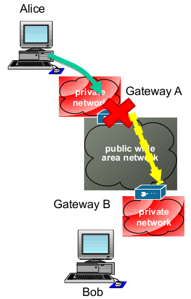

### Gruppenverschlüsseltes Transport-VPN (GET)
- Cisco Produktbranding mehrerer IPsec-Komponenten [Bhai08]
- Sicherheits-Gateways kontaktieren zentralen IKE-Server
- IKE-Server verteilt symmetrische Schlüssel (bevorzugt über Multicast)
- Alle Sicherheitsgateways einer Gruppe verwenden dieselbe SA (einschließlich SPI, Schlüssel)
- Wiederholungsschutz durch Zeitfenster (1-100 Sekunden)
  - Sliding-Window-Mechanismus funktioniert nicht, da mehrere Absender denselben SPI verwenden
- Zusätzliche Probleme mit zentralen Policy-Servern:
  - schwacher Wiedergabeschutz
  - Die Kompromittierung eines einzelnen Gateways beeinträchtigt das gesamte VPN
  - Rekeying durch symmetrischen Austausch $\Rightarrow$ kann nicht von kompromittierten Schlüsseln wiederhergestellt werden
  - Perfektes Vorwärtsgeheimnis nicht verfügbar
- Einziger Vorteil: Ermöglicht Multicast-Netzwerkprivatisierung
- 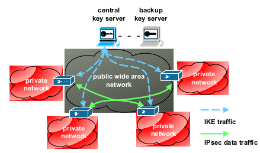

### Proaktives Multicast-basiertes IPsec-Erkennungsprotokoll
- Ansatz wurde für militärische Anwendungen entwickelt [Tran06]
- Sicherheits-Gateways kündigen periodisch private Netzwerke an
- Erfolgt durch Transportnetzwerk-Multicast
- Nachrichten werden durch einen vorab geteilten symmetrischen Schlüssel geschützt
- Vorteile: Unterstützt private Adressbereiche, Multicast innerhalb des VPN
- Probleme:
  - Erfordert Transportnetz-Multicast
  - Verschachtelte Topologien funktionieren nicht
  - Anzahl der empfangenen Nachrichten kann ziemlich groß sein
  - Ein kompromittiertes Gateway führt zu einer nicht wiederherstellbaren Kompromittierung des VPN
  - Replay-Schutz nicht berücksichtigt
- 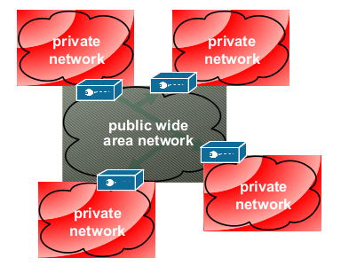

### Soziales VPN
- Akademischer Ansatz [FBJW08]
- Verwendet Facebook als ,,policy'' Server zum Austausch von IKE Zertifikaten
  - Man kann mit Freunden kommunizieren
- Agilität durch Peer-to-Peer-Netzwerk
  - Schaut in einer verteilten Hash-Tabelle nach der externen IP-Adresse des Ziels
- Probleme
  - Keine Gateway-Funktionalität (nur Ende-zu-Ende)
  - Keine verschachtelten Topologien
  - Ziemlich großer Paket-Overhead
  - Schlechte Skalierbarkeit im Falle vieler potentieller Kommunikationspartner
  - Sicherheit
    - Vertrauen Sie Facebook?
    - Wissen Sie, ob die Person in Facebook wirklich die ist, die sie behauptet?
    - Überhaupt keine Verifizierung möglich

### Dynamisches Mehrpunkt-VPN (DMVPN)
- Ein weiterer Ansatz von Cisco [Bhai08]
- VPN ist aufgeteilt in
  - Statische Kern-Gateways (,,Hubs'')
  - Dynamische periphere Gateways (,,Spokes'')
- Hubs können OSPF-Routing zwischen den anderen nutzen
- Spokes kontaktieren vorkonfigurierte Hubs für den Zugang zum VPN
- Dynamische ,,Spoke-to-Spoke''-Verbindungen optimieren den Datenfluss 
- 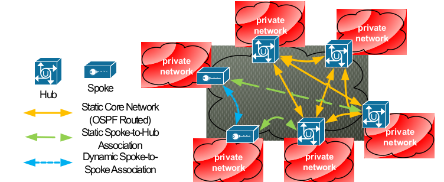

#### Dynamisches Mehrpunkt-VPN (DMVPN) - Diskussion
- Vorteile
  - Ansatz ermöglicht dynamischere Topologien
  - Kann private Adressen verwenden
- Nachteilig
  - Erfordert immer noch erheblichen Konfigurationsaufwand
    - Kernnetz muss manuell konfiguriert werden
    - Spokes müssen mit den Adressen der Hubs konfiguriert werden
    - Macht z.B. einen einfachen Wechsel zu einem neuen ISP unmöglich
  - Spokes können nicht verschachtelt werden
  - Spokes können sich nicht zwischen ,,Hubs'' bewegen
    - Hub verhält sich wie MobileIP Home Agent für Spoke
  - Ausfall von ,,Hubs'' kritisch für deren ,,Spokes''

### Sicheres OverLay für IPsec-Erkennung (SOLID)
- Komplexer Ansatz, verspricht einfache Implementierung [RSS10]
- Sicherheitsgateways bilden ein strukturiertes Overlay-Netzwerk
  - Verbindet Sicherheitsgateways so, dass das VPN effizient nach einer Zieladresse durchsucht werden kann
- Erfordert nur sehr wenige proaktiv erstellte IPsec-Verbindungen
  - Minimale Konnektivität ermöglicht eine reaktive Erkennung von Sicherheitsgateways
  - Sich bewegende Sicherheitsgateways müssen nicht alle anderen über die aktuelle externe IP-Adresse informieren
- Drei Aufgaben zu erfüllen
  - Topologie-Kontrolle
    - Proaktiver Aufbau einer VPN-Struktur zur schnellen Erkennung
  - Erkennung von Sicherheitsgateways
    - Jedes Mal, wenn ein Client-Computer ein Paket sendet und keine gültige SA gefunden wird
    - Muss das entsprechende Sicherheits-Gateway finden, um reaktiv eine SA zu erstellen
  - Weiterleitung von Datenpaketen
    - Suche nach einem effizienten Weg zur Weiterleitung von Paketen durch das Overlay

#### SOLID - Topologie-Kontrolle
- Mechanismen zur Topologiekontrolle
  - Kontinuierliche Aktualisierung der VPN-Struktur zur Anpassung an Veränderungen
- In SOLID werden proaktiv SAs erstellt, um eine künstliche Ringstruktur zu bilden
- Sicherheitsgateways sind nach inneren Adressen geordnet
- Gateways, die nicht direkt im Transportnetz kommunizieren können, werden durch virtuelle Pfade verbunden $\Rightarrow$ Verschachtelte Strukturen werden abgeflacht, um eine einfache Erkennung zu ermöglichen
- 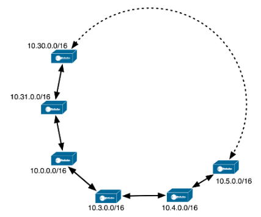

#### SOLID - Erkennung
- Reaktive Erkennung, um ein Sicherheits-Gateway für eine bestimmte Client-IP-Adresse zu finden
- Suchanfragen werden an das (bereits zugeordnete) Gateway weitergeleitet, dessen innere IP-Adresse der gesuchten IP-Adresse ,,am ähnlichsten'' ist
  - Ein einfacher Mechanismus stellt sicher, dass das korrekte entsprechende Sicherheits-Gateway gefunden wird
  - Die Pakete werden entlang der Ringstruktur gesendet
  - Benötigt $O(n)$ Overlay Hops, um das Ziel zu erreichen (wobei n die Anzahl der Netzwerke in der VPN-Topologie ist)
- $\Rightarrow$ Kürzere ,,Suchpfade'' erforderlich

#### SOLID - Mehr Topologiekontrolle
- Erweiterte Topologiekontrolle schafft zusätzliche SAs
- IP-Adressraum des VPN wird in Bereiche unterteilt
  - Exponentiell wachsende Größe der Bereiche
- Zu jedem Bereich wird mindestens eine SA proaktiv von jedem Gateway gehalten
- Anzahl der zusätzlichen SAs wächst in $O(log\ n)$
- Aufgrund der Konstruktionstechnik Entdeckung in $O(log\ n)$ Overlay Hops $\Rightarrow$ Ansatz skaliert gut mit Anzahl der Netzwerke
- 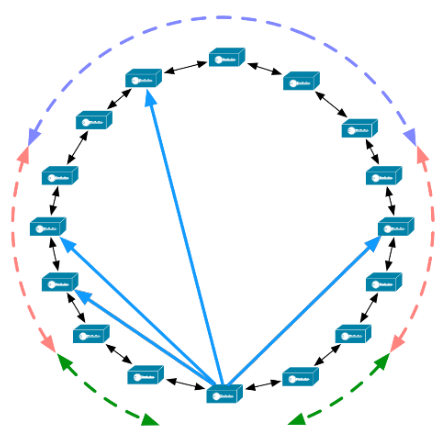

#### SOLID - Weiterleitung von Datenpaketen
- Nach der anfänglichen Erkennung müssen die Datenpakete weitergeleitet werden
- Senden von Daten entlang des Entdeckungspfades möglich
  - Länge wieder $O(log\ n)$ Overlay-Hops
  - Zu ineffizient, wenn viele Pakete geroutet werden müssen
  - Wird nur anfangs verwendet
- Nachfolgend wird der Pfad optimiert
  - Optimierung erfolgt, wenn Gateway feststellt, dass es Pakete für zwei Gateways weiterleitet, die sich im gleichen Netz befinden
  - Führt in zyklusfreien VPNs zu optimalen Routen in Bezug auf die Anzahl der Overlay-Sprünge
  - Kleine Zyklen können lokal umgangen werden

#### SOLID - Eigenschaften und Ergebnisse
- Kann komplexe Infrastrukturen innerhalb von Sekunden oder Minuten konfigurieren
- Erfordert keine manuelle Interaktion
- Erfordert keine besonderen Eigenschaften des Transportnetzes
- Robustheit
  - Kein einzelner Ausfallpunkt
  - Wenn das Netzwerk aufgeteilt wird, können die Teile unabhängig voneinander arbeiten
- Keine Schwächung der von Standard-IPsec gebotenen Sicherheit
- Gute Skalierbarkeit mit der Anzahl der privaten Netze, keine Engpässe
- Wenn Sicherheitsgateways umziehen, müssen nur zwei SAs wiederhergestellt werden, um die Erreichbarkeit zu gewährleisten

#### SOLID - Simulative Bewertung
- SOLID kann in OMNeT++ evaluiert werden
- Ermöglicht Tests von komplexen Szenarien

#### SOLID - Sonstige Forschung
- SOLID wird in der Gruppe Telematik/Computernetzwerke erforscht
- Entwicklung von Prototypen
- Verfügbarkeit
  - Schutz des wichtigeren Kernnetzes vor DoS-Angriffen
  - Schaffung eines mehrschichtigen VPN, das bestimmte Verkehrsflüsse zwischen Sicherheits-Gateways verhindert
- Zugriffskontrolle
- Robustheit
  - Proaktive Wiederherstellung bei Netzwerkausfällen
- Anwendungsschicht-Multicast
  - Ermöglicht sicheres Multicast über reine Unicast-Netze

# Sicherheitsprotokolle der Transportschicht
## Anwendungsbereich von Sicherheitsprotokollen der Transportschicht
- Die Transportschicht sorgt für die Kommunikation zwischen Anwendungsprozessen (anstelle der Kommunikation zwischen Endsystemen) und ihre Hauptaufgaben sind:
  - Isolierung höherer Protokollschichten von der Technologie, der Struktur und den Unzulänglichkeiten der eingesetzten Kommunikationstechnik
  - Transparente Übertragung von Nutzdaten
  - Globale Adressierung von Anwendungsprozessen, unabhängig von Adressen der unteren Schichten (Ethernet-Adressen, Telefonnummern usw.)
  - Gesamtziel: Bereitstellung eines effizienten und zuverlässigen Dienstes
- Sicherheitsprotokolle der Transportschicht zielen darauf ab, den Dienst der Transportschicht zu verbessern, indem sie zusätzliche Sicherheitseigenschaften gewährleisten
  - Da sie in der Regel einen zuverlässigen Transportdienst voraussetzen und darauf aufbauen, stellen sie nach der Terminologie des OSI-Referenzmodells (Open Systems Interconnection) eigentlich Sitzungsschichtprotokolle dar.
  - Da OSI jedoch nicht mehr ,,en vogue'' ist, werden sie als Sicherheitsprotokolle der Transportschicht bezeichnet

## Das Secure Socket Layer (SSL) Protokoll
- SSL wurde ursprünglich in erster Linie zum Schutz von HTTP-Sitzungen entwickelt:
  - In den frühen 1990er Jahren gab es ein ähnliches Protokoll namens S-HTTP
  - Da jedoch S-HTTP-fähige Browser nicht kostenlos waren und SSL Version 2.0 in den Browsern von Netscape Communications enthalten war, setzte es sich schnell durch.
  - SSL v.2 enthielt einige Schwachstellen, weshalb die Microsoft Corporation ein konkurrierendes Protokoll namens Private Communication Technology (PCT) entwickelte.
  - Netscape verbesserte das Protokoll und SSL v.3 wurde zum De-facto-Standardprotokoll für die Sicherung des HTTP-Verkehrs.
  - Dennoch kann SSL eingesetzt werden, um beliebige Anwendungen zu sichern, die über TCP laufen.
  - 1996 beschloss die IETF, ein allgemeines Transport Layer Security (TLS) Protokoll zu spezifizieren, das auf SSL basiert

## SSL-Sicherheitsdienste
- Peer-Entity-Authentifizierung:
  - Vor jeder Kommunikation zwischen einem Client und einem Server wird ein Authentifizierungsprotokoll ausgeführt, um die Peer-Entitäten zu authentifizieren.
  - Nach erfolgreichem Abschluss des Authentifizierungsdialogs wird eine SSL-Sitzung zwischen den Peer-Entities aufgebaut.
- Vertraulichkeit der Benutzerdaten:
  - Falls beim Aufbau der Sitzung vereinbart, werden die Benutzerdaten verschlüsselt.
  - Es können verschiedene Verschlüsselungsalgorithmen ausgehandelt werden: RC4, DES, 3DES, IDEA
- Integrität der Benutzerdaten:
  - Ein MAC, der auf einer kryptografischen Hash-Funktion basiert, wird an die Benutzerdaten angehängt.
  - Der MAC wird mit einem ausgehandelten Geheimnis im Präfix-Suffix-Modus errechnet.
  - Für die MAC-Berechnung kann entweder MD5 oder SHA ausgehandelt werden.

## SSL-Sitzungs- und Verbindungsstatus
- Sitzungsstatus:
  - Sitzungskennzeichen: eine vom Server gewählte Bytefolge
  - Peer-Zertifikat: X.509 v.3 Zertifikat der Gegenstelle (optional)
  - Komprimierungsmethode: Algorithmus zur Komprimierung der Daten vor der Verschlüsselung
  - Cipher spec: spezifiziert kryptographische Algorithmen und Parameter
  - Hauptgeheimnis: ein ausgehandeltes gemeinsames Geheimnis mit einer Länge von 48 Byte
  - Ist wiederaufnehmbar: ein Kennzeichen, das angibt, ob die Sitzung neue Verbindungen unterstützt
- Verbindungsstatus:
  - Server und Client random: von Server und Client gewählte Bytefolgen
  - Server write MAC secret: wird in MAC-Berechnungen des Servers verwendet
  - Client write MAC secret: wird bei MAC-Berechnungen durch den Client verwendet
  - Server-Schreibschlüssel: wird für die Verschlüsselung durch den Server und die Entschlüsselung durch den Client verwendet
  - Client write key: wird für die Verschlüsselung durch den Client und die Entschlüsselung durch den Server verwendet

## Architektur des SSL-Protokolls
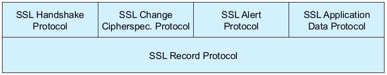
- SSL ist als eine mehrschichtige und modulare Protokollarchitektur aufgebaut:
  - Handshake: Authentifizierung und Aushandlung von Parametern
  - Change Cipherspec: Signalisierung von Übergängen in der Verschlüsselungsstrategie
  - Alert: Signalisierung von Fehlerzuständen
  - Application Data: Schnittstelle für den transparenten Zugriff auf das Record-Protokoll
  - Aufzeichnung:
    - Fragmentierung der Nutzdaten in Klartextsätze der Länge $< 2^{14}$
    - Komprimierung (optional) von Klartextsätzen
    - Verschlüsselung und Integritätsschutz (beides optional)

## SSL-Record-Protokoll
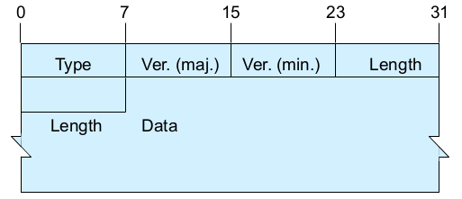
- Inhaltstyp:
  - Ändern Cipherspec. (20)
  - Warnung (21)
  - Handshake (22)
  - Anwendungsdaten (23)
- Version: die Protokollversion von SSL (major = 3, minor = 0)
- Länge: die Länge der Daten in Bytes, darf nicht größer sein als $2^{14} + 2^{10}$

## Verarbeitung des SSL-Datensatzprotokolls
- Absendende Seite:
  - Die Datensatzschicht fragmentiert zunächst die Nutzdaten in Datensätze mit einer maximalen Länge von $2^{14}$ Oktetten, wobei mehrere Nachrichten desselben Inhaltstyps zu einem Datensatz zusammengefasst werden können
  - Nach der Fragmentierung werden die Daten des Datensatzes komprimiert, der Standardalgorithmus hierfür ist null (~ keine Komprimierung), und er darf die Länge des Datensatzes nicht um mehr als $2^{10}$ Oktette erhöhen
  - Ein Nachrichtenauthentifizierungscode wird an die Datensatzdaten angehängt:
    - $MAC = H(MAC_write_secret + pad_2 + H(MAC_write_secret + pad_1 + seqnum + length + data))$
    - Man beachte, dass seqnum nicht übertragen wird, da es implizit bekannt ist und das zugrundeliegende TCP einen gesicherten Dienst bietet
  - Die Daten des Datensatzes und der MAC werden mit dem in der aktuellen Chiffriervorschrift definierten Verschlüsselungsalgorithmus verschlüsselt (dies kann ein vorheriges Auffüllen erfordern)
- Empfängerseite:
  - Der Datensatz wird entschlüsselt, auf Integrität geprüft, dekomprimiert, de-fragmentiert und an die Anwendung oder das SSL-Protokoll der höheren Schicht übergeben

## SSL Handshake Protokoll: Einführung
- Das SSL-Handshake-Protokoll wird verwendet, um die Peer-Authentifizierung und die kryptographischen Parameter für eine SSL-Sitzung festzulegen.
- Eine SSL-Sitzung kann so ausgehandelt werden, dass sie wieder aufgenommen werden kann:
  - Die Wiederaufnahme und Duplizierung von SSL-Sitzungen ermöglicht die Wiederverwendung des etablierten Sicherheitskontextes.
  - Dies ist für die Absicherung des HTTP-Verkehrs sehr wichtig, da in der Regel für jedes Element einer Webseite eine eigene TCP-Verbindung aufgebaut wird.
    - Seit HTTP 1.1 werden persistente TCP-Verbindungen verwendet.
    - Dennoch ist die Wiederaufnahme von SSL-Sitzungen sehr sinnvoll, da persistente TCP-Verbindungen nach dem Herunterladen aller Elemente, die zu einer Seite gehören, und einer gewissen Zeit der Inaktivität des Benutzers geschlossen werden können.
  - Bei der Wiederaufnahme / Duplizierung einer bestehenden Sitzung wird ein abgekürzter Handshake durchgeführt

## SSL Handshake Protokoll: Vollständiger Handshake
| Client              |      | Server               |
| ------------------- | ---- | -------------------- |
| ClientHello         | ---> |                      |
|                     |      | ServerHello          |
|                     |      | [ServerCertificate]  |
|                     |      | [CertificateRequest] |
|                     |      | [ServerKeyExchange]  |
|                     | <--- | ServerHelloDone      |
| [ClientCertificate] |      |
| ClientKeyExchange   |      |
| [CertificateVerify] |      |
| ChangeCipherSpec    |      |
| Finished            | ---> |
|                     |      | ChangeCipherSpec     |
|                     | <--- | Finished             |

[...] kennzeichnet optionale Nachrichten

## SSL Handshake Protokoll: Abgekürzter Handshake
| Client                 |      | Server                 |
| ---------------------- | ---- | ---------------------- |
| ClientHello(SessionID) | ---> |
|                        |      | ServerHello(SessionID) |
|                        |      | ChangeCipherSpec       |
|                        | <--- | Finished               |
| ChangeCipherSpec       |      |
| Finished               | ---> |

- Die Nachricht "Finished" enthält eine MAC, die entweder auf MD5 oder SHA basiert und das Master-Secret enthält, das zuvor zwischen Client und Server festgelegt wurde.
- Wenn der Server die Sitzung nicht fortsetzen kann / beschließt, sie nicht fortzusetzen, antwortet er mit den Nachrichten des vollständigen Handshake

## SSL-Handshake-Protokoll: Kryptografische Aspekte
- SSL unterstützt drei Methoden zur Erstellung von Sitzungsschlüsseln:
  - RSA: ein Pre-Master-Geheimnis wird vom Client zufällig generiert und mit dem öffentlichen Schlüssel des Servers verschlüsselt an den Server gesendet
  - Diffie-Hellman: Es wird ein Standard-Diffie-Hellman-Austausch durchgeführt, und das ermittelte gemeinsame Geheimnis wird als Pre-Master-Secret verwendet.
  - Fortezza: eine unveröffentlichte, von der NSA entwickelte Sicherheitstechnologie, die eine Schlüsselhinterlegung unterstützt und in diesem Kurs nicht behandelt wird
- Da SSL in erster Linie für die Sicherung des HTTP-Verkehrs entwickelt wurde, ist das ,,Standardanwendungsszenario'' ein Client, der auf einen authentischen Webserver zugreifen möchte:
  - In diesem Fall sendet der Webserver sein Zertifikat mit dem öffentlichen Schlüssel nach der ServerHello-Nachricht
  - Das Server-Zertifikat kann die öffentlichen DH-Werte des Servers enthalten oder der Server kann sie in der optionalen ServerKeyExchange-Nachricht senden
  - Der Client verwendet das Zertifikat des Servers / die empfangenen DH-Werte / seine Fortezza-Karte, um einen RSA- / DH- / Fortezza-basierten Schlüsselaustausch durchzuführen.
- Das Pre-Master-Secret und die Zufallszahlen, die der Client und der Server in ihren Hallo-Nachrichten angeben, werden verwendet, um das Master-Secret der Länge 48 Byte zu generieren.
- Berechnung des Master-Geheimnisses:
  - Master-Geheimnis = 
      MD5(vor-Master-Geheimnis + SHA('A' + vor-Master-Geheimnis + ClientHello.random + ServerHello.random)) +
      MD5(Vor-Hauptgeheimnis + SHA('BB' + Vor-Hauptgeheimnis + ClientHello.random + ServerHello.random)) +
      MD5(pre-master-secret + SHA('CCC' + pre-master-secret + ClientHello.random + ServerHello.random))
- Die Verwendung von MD5 und SHA zur Generierung des Master-Geheimnisses wird als sicher angesehen, selbst wenn eine der kryptografischen Hash-Funktionen ,,defekt'' ist.
- Um die Sitzungsschlüssel aus dem Master-Secret zu berechnen, wird in einem ersten Schritt eine ausreichende Menge an Schlüsselmaterial aus dem Master-Secret und den Zufallszahlen von Client und Server erzeugt:
  - key_block = 
      MD5(master-secret + SHA('A' + master-secret + ClientHello.random + ServerHello.random)) +
      MD5(master-secret + SHA('BB' + master-secret + ClientHello.random + ServerHello.random)) +
      [...]
- Anschließend wird das Material des Sitzungsschlüssels fortlaufend aus dem key_block entnommen:
  - client_write_MAC_secret = key_block[1, CipherSpec.hash_size]
  - server_write_MAC_secret = key_block[i 1 , i 1 + CipherSpec.hash_size - 1]
  - client_write_key = key_block[i 2 , i 2 + CipherSpec.key_material - 1]
  - server_write_key = key_block[i 3 , i 3 + CipherSpec.key_material - 1]
  - client_write_IV = key_block[i 4 , i 4 + CipherSpec.IV_size - 1]
  - server_write_IV = key_block[i 5 , i 5 + CipherSpec.IV_size - 1]
- Authentifizierung von und mit dem Pre-Master-Secret:
  - SSL unterstützt Schlüsselerstellung ohne Authentifizierung (anonym), in diesem Fall können Man-in-the-Middle-Angriffe nicht abgewehrt werden
  - Bei Verwendung des RSA-basierten Schlüsselaustauschs:
    - Der Client verschlüsselt das Pre-Master-Secret mit dem öffentlichen Schlüssel des Servers, der durch eine Zertifikatskette überprüft werden kann.
    - Der Client weiß, dass nur der Server das Pre-Master-Secret entschlüsseln kann. Wenn der Server also die fertige Nachricht mit dem Master-Secret sendet, kann der Client die Server-Authentizität ableiten.
    - Der Server kann aus dem empfangenen Pre-Master-Secret keine Client-Authentizität ableiten.
    - Wenn Client-Authentizität erforderlich ist, sendet der Client zusätzlich sein Zertifikat und eine CertificateVerify-Nachricht, die eine Signatur über einen Hash (MD5 oder SHA) des Master-Geheimnisses und aller vor der CertificateVerify-Nachricht ausgetauschten Handshake-Nachrichten enthält
  - Beim DH-Key-Austausch wird die Authentizität aus den DH-Werten abgeleitet, die im Zertifikat des Servers (und des Clients) enthalten und signiert sind

## SSL Handshake Protokoll: Eine Sicherheitslücke
- 1998 entdeckte D. Bleichenbacher eine Schwachstelle im Verschlüsselungsstandard PKCS #1 (v.1.5), der im SSL-Handshake-Verfahren verwendet wird
- Wenn der Client das Pre-Master-Secret mit dem öffentlichen Schlüssel des Servers verschlüsselt, verwendet er PKCS #1, um es vor der Verschlüsselung zu formatieren:
  - EM = 0x02 | PS | 0x00 | M
    - wobei PS eine Auffüllzeichenfolge von mindestens 8 pseudozufällig erzeugten Nicht-Null-Oktetts und M die zu verschlüsselnde Nachricht (= Pre-Master-Secret) bezeichnet
    - (PS wird verwendet, um eine Zufallskomponente hinzuzufügen und M auf die Modulusgröße des verwendeten Schlüssels aufzufüllen)
  - Dann wird EM verschlüsselt: $C = E(+K_{Server}, EM)$
  - Nachdem der Server C entschlüsselt hat, prüft er, ob das erste Oktett gleich 0x ist und ob es ein 0x00-Oktett gibt; wenn diese Prüfung fehlschlägt, antwortet er mit einer Fehlermeldung
  - Diese Fehlermeldung kann von einem Angreifer genutzt werden, um einen ,,Orakel-Angriff'' zu starten.
- Ein Orakel-Angriff gegen das SSL-Handshake-Protokoll [BKS98a]:
  - Betrachten wir einen Angreifer (Eve), der einen SSL-Handshake-Dialog belauscht hat und das Pre-Master-Secret (und damit alle anderen abgeleiteten Geheimnisse), das zwischen Alice (Client) und Bob (Server) ausgetauscht wurde, wiederherstellen möchte
  - Eve hat die verschlüsselte Nachricht C, die das Pre-Master-Secret enthält, erfolgreich abgehört und möchte nun den Klartext wiederherstellen
  - Eve generiert eine Reihe zusammenhängender Chiffretexte $C_1 , C_2 , ...$:
    - $C_i = C\times R_i^e\ mod\ n$, wobei $(e, n)$ der öffentliche Schlüssel von Bob ist
    - Die $R_i$ werden adaptiv ausgewählt, abhängig von älteren ,,guten'' $R_i$, die von Bob verarbeitet wurden, ohne Fehlermeldungen zu erzeugen (was anzeigt, dass sie zu einer gültigen PKCS-1-Nachricht entschlüsselt wurden)
    - Die $C_i$ werden an Bob übermittelt, und es werden entsprechend neue $C_i$ erzeugt
    - Aus dem ,,guten'' $R_i$ leitet Eve bestimmte Bits der entsprechenden Nachricht $M_i= C_i^d = M\times R_i\ mod\ n$ ab, basierend auf der PKCS #1 Verschlüsselungsmethode
  - Aus den abgeleiteten Bits von $M\times R_i\ mod\ n$ für hinreichend viele $R_i$ kann Eve die Größe des Intervalls reduzieren, das die unbekannte Nachricht M enthalten muss
  - Im Wesentlichen halbiert jeder ,,gute'' Chiffretext das betreffende Intervall, so dass Eve mit genügend ,,guten'' Chiffretexten in der Lage ist, M
  - Mit PKCS #1 Version 1.5 (wie ursprünglich in SSL V.3.0 verwendet) wird ungefähr einer von $2^{16}$ bis $2^{18}$ zufällig ausgewählten Chiffretexten ,,gut'' sein.
  - Typischerweise beträgt die Gesamtzahl der erforderlichen Chiffretexte bei einem $1024$-Bit-Modul etwa $2^{20}$, und dies ist auch die Anzahl der Abfragen an Bob
  - Nach der Durchführung von etwa 1 Million gefälschter SSL-Handshake-Dialoge (die alle entweder von Bob oder Eve unterbrochen werden) ist Eve also in der Lage, das Pre-Master-Secret und alle abgeleiteten Schlüssel einer zuvor eingerichteten SSL-Sitzung zwischen Alice und Bob wiederherzustellen. Subtile Protokollinteraktionen (hier: SSL und PKCS #1) können zum Versagen eines Sicherheitsprotokolls führen, selbst wenn der grundlegende kryptographische Algorithmus (hier: RSA) selbst nicht gebrochen ist!
- Gegenmassnahmen:
  - Regelmäßiger Wechsel der öffentlichen Schlüsselpaare ($\Rightarrow$-Overhead)
  - Verringerung der Wahrscheinlichkeit, ,,gute'' Chiffriertexte zu erhalten, indem das Format der entschlüsselten Chiffriertexte gründlich überprüft und dem Client ein identisches Verhalten (Fehlermeldung, Zeitverhalten usw.) gezeigt wird
  - Der Kunde muss den Klartext kennen, bevor er antwortet, ob die Nachricht erfolgreich entschlüsselt werden konnte.
  - Hinzufügen einer Struktur zum Klartext, z. B. durch Hinzufügen eines Hashwerts zum Klartext:
    - Achtung: Es ist eine gewisse Vorsicht geboten, um Anfälligkeiten für eine andere Klasse von Angriffen zu vermeiden [Cop96a].
  - Änderung des Verschlüsselungsprotokolls für öffentliche Schlüssel, d.h. Überarbeitung von PKCS #1:
    - PKCS #1 Version 2.1 bereitet den Klartext vor der Verschlüsselung mit einer Methode vor, die als optimales asymmetrisches Verschlüsselungs-Padding (OAEP) bezeichnet wird, um die PKCS #1 Entschlüsselungsprozedur ,,plaintext aware'' zu machen, was bedeutet, dass es nicht möglich ist, einen gültigen Chiffretext zu konstruieren, ohne den entsprechenden Klartext zu kennen

## SSL-Chiffre-Suiten
- Kein Schutz (Standard-Suite):
  - CipherSuite SSL_NULL_WITH_NULL_NULL = { 0x00,0x00 }
- Der Server stellt einen für die Verschlüsselung geeigneten RSA-Schlüssel bereit:
  - SSL_RSA_WITH_NULL_MD5 = { 0x00,0x01 }
  - SSL_RSA_WITH_NULL_SHA = { 0x00,0x02 }
  - SSL_RSA_EXPORT_WITH_RC4_40_MD5 = { 0x00,0x03 }
  - SSL_RSA_WITH_RC4_128_MD5 = { 0x00,0x04 }
  - SSL_RSA_WITH_RC4_128_SHA = { 0x00,0x05 }
  - SSL_RSA_EXPORT_WITH_RC2_CBC_40_MD5 = { 0x00,0x06 }
  - SSL_RSA_WITH_IDEA_CBC_SHA = { 0x00,0x07 }
  - SSL_RSA_EXPORT_WITH_DES40_CBC_SHA = { 0x00,0x08 }
  - SSL_RSA_WITH_DES_CBC_SHA = { 0x00,0x09 }
  - SSL_RSA_WITH_3DES_EDE_CBC_SHA = { 0x00,0x0A }
- Cipher-Suites mit authentifiziertem DH-Schlüssel-Austausch
  - SSL_DH_DSS_EXPORT_WITH_DES40_CBC_SHA = { 0x00,0x0B }
  - SSL_DH_DSS_WITH_DES_CBC_SHA = { 0x00,0x0C }
  - SSL_DH_DSS_WITH_3DES_EDE_CBC_SHA = { 0x00,0x0D }
  - SSL_DH_RSA_EXPORT_WITH_DES40_CBC_SHA = { 0x00,0x0E }
  - SSL_DH_RSA_WITH_DES_CBC_SHA = { 0x00,0x0F }
  - SSL_DH_RSA_WITH_3DES_EDE_CBC_SHA = { 0x00,0x10 }
  - SSL_DHE_DSS_EXPORT_WITH_DES40_CBC_SHA = { 0x00,0x11 }
  - SSL_DHE_DSS_WITH_DES_CBC_SHA = { 0x00,0x12 }
  - SSL_DHE_DSS_WITH_3DES_EDE_CBC_SHA = { 0x00,0x13 }
  - SSL_DHE_RSA_EXPORT_WITH_DES40_CBC_SHA = { 0x00,0x14 }
  - SSL_DHE_RSA_WITH_DES_CBC_SHA = { 0x00,0x15 }
  - SSL_DHE_RSA_WITH_3DES_EDE_CBC_SHA = { 0x00,0x16 }

(DH steht für Suites, bei denen die öffentlichen DH-Werte in einem von einer CA signierten Zertifikat enthalten sind, DHE für Suites, bei denen sie mit einem öffentlichen Schlüssel signiert sind, der von einer CA zertifiziert ist)

- Von der Verwendung der folgenden Chiffriersuiten ohne jegliche Authentifizierung der Entität wird dringend abgeraten, da sie anfällig für Man-in-the-Middle-Angriffe sind:
  - SSL_DH_anon_EXPORT_WITH_RC4_40_MD5 = { 0x00,0x17 }
  - SSL_DH_anon_WITH_RC4_128_MD5 = { 0x00,0x18 }
  - SSL_DH_anon_EXPORT_WITH_DES40_CBC_SHA = { 0x00,0x19 }
  - SSL_DH_anon_WITH_DES_CBC_SHA = { 0x00,0x1A }
  - SSL_DH_anon_WITH_3DES_EDE_CBC_SHA = { 0x00,0x1B }
- Die letzte Cipher Suite ist für den Fortezza-Token:
  - SSL_FORTEZZA_DMS_WITH_NULL_SHA = { 0x00,0x1C }
  - SSL_FORTEZZA_DMS_WITH_FORTEZZA_CBC_SHA = { 0x00,0x1D }

(Diese Cipher-Suites müssen natürlich nicht auswendig gelernt werden und werden hier nur aufgeführt, um die Flexibilität des SSL-Protokolls zu verdeutlichen)

## Das Transport Layer Security-Protokoll
- 1996 gründete die IETF eine Arbeitsgruppe zur Definition eines Transport Layer Security (TLS) Protokolls:
  - Offiziell wurde angekündigt, die Protokolle SSL, SSH und PCT als Input zu nehmen.
  - Der im Dezember 1996 veröffentlichte Entwurf der TLS V.1.0-Spezifikation war jedoch im Wesentlichen identisch mit der SSL V.3.0-Spezifikation
- Eigentlich war es von Anfang an die Absicht der Arbeitsgruppe, TLS auf SSL V.3.0 mit den folgenden Änderungen aufzubauen:
  - Die HMAC-Konstruktion zur Berechnung kryptographischer Hash-Werte sollte anstelle von Hashing im Präfix- und Suffix-Modus übernommen werden.
  - Die auf Fortezza basierenden Chiffrier-Suiten von SSL sollten entfernt werden, da sie eine unveröffentlichte Technologie enthalten
  - Ein auf dem DSS (Digital Signature Standard) basierender Dialog zur Authentifizierung und zum Schlüsselaustausch sollte aufgenommen werden.
  - Das TLS-Record-Protokoll und das Handshake-Protokoll sollten getrennt und in separaten Dokumenten klarer spezifiziert werden, was bisher nicht geschehen ist.
- Um die Exportfähigkeit von TLS-konformen Produkten zu erreichen, wurde in einigen Chiffriersuiten die Verwendung von Schlüsseln mit einer auf 40 Bit reduzierten Entropie vorgeschrieben.
  - Von der Verwendung dieser Cipher-Suites wird dringend abgeraten, da sie praktisch keinen Schutz der Vertraulichkeit von Daten bieten.
- Ab TLS 1.2 (RFC 5246):
  - Schlüsselaustausch-Algorithmen:
    - DH oder ECDH Austausch ohne oder mit DSS / RSA / ECDSA Signaturen
    - DH-Austausch mit zertifizierten öffentlichen DH-Parametern
    - RSA-basierter Schlüsselaustausch
    - keine
  - Verschlüsselungsalgorithmen: AES / 3DES in CBC / CCM /GCM, RC4, null
  - Hash-Algorithmen: MD5, SHA-1, SHA-256, SHA-384, SHA-512, null
  - Premaster Secret: Keine MD5/SHA-1 Kombination, sondern nur SHA-256!
- Was die Protokollfunktionen betrifft, ist TLS im Wesentlichen dasselbe wie SSL
- Sicherheit:
  - In SSL 3.0 und TLS 1.0 ist der Initialisierungsvektor eines im CBC-Modus verschlüsselten Datensatzes der letzte Block des vorherigen Datensatzes
  - Wenn ein Angreifer den Inhalt des vorherigen Datensatzes kontrolliert, kann er einen adaptiven Klartextangriff durchführen, um den Inhalt des nächsten Datensatzes herauszufinden.
  - Durchführbar für Webverkehr, d. h. Erzeugen von Verkehr mit JavaScript und Beobachten von außen, führt zum sogenannten BEAST-Angriff (Browser Exploit Against SSL/TLS) [RD10].
  - Auch für VPN-Verkehr machbar
  - Abgeschwächt durch TLS 1.1, wo explizite IVs verwendet werden
  - 2009 wurde eine sogenannte TLS-Neuverhandlungsschwachstelle identifiziert
    - Angreifer können sie nutzen, um einer legitimen Sitzung durch einen Man-in-the-Middle-Angriff Daten voranzustellen (Details in [Zo11])
    - Die Auswirkungen hängen stark von dem verwendeten Anwendungsprotokoll ab
  - Bei HTTPS führt dies zu mehreren Ausnutzungsmöglichkeiten, z. B,
    - Angreifer injeziert: `GET /ebanking/transfer?what=LotsOfMoney&to=eve HTTP/1.1 <crlf> X-Ignore: <no crlf>`
    - Alice sendet: `GET /ebanking/start.html HTTP/1.1`
    - Die Anfrage wird in eine valide HTTP Anfrage umgewandelt: `GET /ebanking/transfer?what=LotsOfMoney&to=eve HTTP/1.1 <crlf> X-Ignore: GET /ebanking/start.html HTTP/1.1`
  - Abgeschwächt durch Identifizierung neu ausgehandelter Sitzungen mit einer anderen ID [RRDO10]

## Das Datagram Transport Layer Security Protokoll
- TLS bietet sichere Kommunikation über ein zuverlässiges Transportprotokoll
- DTLS ist so angepasst, dass es über unzuverlässige Transportprotokolle wie z.B. UDP funktioniert
- Wird zum Schutz verwendet:
  - Sprach- und Videodaten in Echtzeit, insbesondere Voice-over-IP
  - Getunnelte TCP-Daten (da TCP über TCP eine schlechte Idee für die Leistung ist)
- DTLS basiert derzeit auf TLS 1.2, enthält jedoch einige Änderungen:
  - Bietet
    - Nachrichtenwiederholungen, um verlorenen Handshake-Paketen entgegenzuwirken
    - Eigener Fragmentierungsmechanismus, um große Handshake-Pakete zu ermöglichen
  - Hinzufügen von Sequenznummern, um neu geordnete Datenpakete zu ermöglichen (und Verbot von Stromchiffren, z. B. RC4)
  - Fügt einen Mechanismus hinzu, um zu erkennen, dass ein Client die ,,Verbindung'' mit denselben Ports neu gestartet hat (z. B. nach einem Anwendungsabsturz)
  - Fügt einen Wiedergabeschutz durch ein gleitendes Fenster hinzu (wie bei IPsec)
  - Fügt eine Cookie-basierte DoS-Abwehr hinzu (wie bei IKEv2)

## Das Secure Shell-Protokoll
- Secure Shell (SSH) Version 1 wurde ursprünglich von Tatu Ylönen an der Universität Helsinki in Finnland entwickelt.
- Da der Autor auch eine kostenlose Implementierung mit Quellcode zur Verfügung stellte, fand das Protokoll weite Verbreitung im Internet
- Später wurde die Entwicklung von SSH durch den Autor kommerzialisiert. 
- Nichtsdestotrotz sind immer noch kostenlose Versionen verfügbar, wobei die am weitesten verbreitete Version OpenSSH ist
- 1997 wurde eine Spezifikation der Version 2.0 von SSH bei der IETF eingereicht und seitdem in einer Reihe von Internet-Entwürfen verfeinert
- SSH wurde ursprünglich entwickelt, um einen sicheren Ersatz für die Unix r-Tools (rlogin, rsh, rcp und rdist) zu bieten, und stellt somit ein Protokoll der Anwendungs- oder Sitzungsschicht dar.
- Da SSH jedoch auch ein allgemeines Sicherheitsprotokoll der Transportschicht enthält und Tunneling-Fähigkeiten bietet, wird es in diesem Kapitel als Sicherheitsprotokoll der Transportschicht behandelt

## SSH Version 2
- SSH Version 2 ist in mehreren separaten Dokumenten spezifiziert, z.B.:
  - SSH Protocol Assigned Numbers [LL06]
  - SSH-Protokollarchitektur [YL06a]
  - SSH-Authentifizierungsprotokoll [YL06b]
  - SSH-Transportschichtprotokoll [YL06c]
  - SSH-Verbindungsprotokoll [YL06d]
- SSH-Architektur:
  - SSH verfolgt einen Client-Server-Ansatz
  - Jeder SSH-Server hat mindestens einen Host-Schlüssel
  - SSH Version 2 bietet zwei verschiedene Vertrauensmodelle:
    - Jeder Client hat eine lokale Datenbank, die jeden Hostnamen mit dem entsprechenden öffentlichen Hostschlüssel verknüpft
    - Die Zuordnung von Hostname zu öffentlichem Schlüssel wird von einer Zertifizierungsstelle zertifiziert, und jeder Client kennt den öffentlichen Schlüssel der Zertifizierungsstelle
  - Das Protokoll ermöglicht die vollständige Aushandlung von Algorithmen und Formaten für Verschlüsselung, Integrität, Schlüsselaustausch, Komprimierung und öffentliche Schlüssel

## SSH-Transportprotokoll 
- SSH verwendet ein zuverlässiges Transportprotokoll (normalerweise TCP).
- Es bietet die folgenden Dienste:
  - Verschlüsselung von Benutzerdaten
  - Authentifizierung der Datenherkunft (Integrität)
  - Server-Authentifizierung (nur Host-Authentifizierung)
  - Komprimierung der Benutzerdaten vor der Verschlüsselung
- Unterstützte Algorithmen:
  - Verschlüsselung:
    - AES, 3DES, Blowfish, Twofish, Serpent, IDEA und CAST in CBC
    - AES in GCM [IS09]
    - Arcfour (,,vermutlich'' kompatibel mit dem ,,unveröffentlichten'' RC4)
    - keine (nicht empfohlen)
  - Integrität:
    - HMAC mit MD5, SHA-1, SHA-256 oder SHA-512
    - keine (nicht empfohlen)
  - Schlüsselaustausch:
    - Diffie-Hellman mit SHA-1 und zwei vordefinierten Gruppen
    - ECDH mit mehreren vordefinierten NIST-Gruppen [SG09] (obligatorisch drei Kurven über ℤp)
    - Öffentlicher Schlüssel: RSA, DSS, ECC (in mehreren Varianten [SG09])
  - Komprimierung: keine, zlib (siehe RFCs 1950, 1951)

## SSH-Transportprotokoll Paketformat
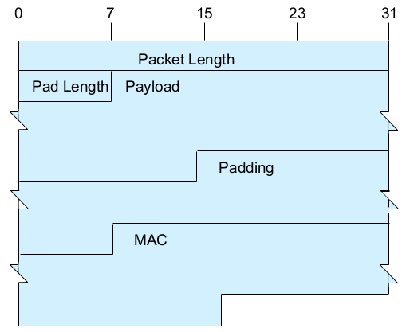
- Das Paketformat ist nicht 32-Bit-wortorientiert
- Felder des Pakets:
  - Paketlänge: die Länge des Pakets selbst, ohne dieses Längenfeld und den MAC
  - Padding length: Länge des Padding-Feldes, muss zwischen vier und 255 liegen
  - Payload: die eigentliche Nutzlast des Pakets, wenn Komprimierung ausgehandelt wurde, wird dieses Feld komprimiert
  - Padding: dieses Feld besteht aus zufällig ausgewählten Oktetten, um die Nutzlast auf ein ganzzahliges Vielfaches von 8 oder der Blockgröße des Verschlüsselungsalgorithmus aufzufüllen, je nachdem, welcher Wert größer ist
  - MAC: Wurde die Nachrichtenauthentifizierung ausgehandelt, enthält dieses Feld den MAC des gesamten Pakets ohne das MAC-Feld selbst; soll das Paket verschlüsselt werden, wird der MAC vor der Verschlüsselung wie folgt berechnet
    - MAC = HMAC(shared_secret, seq_number || unencrypted_packet), wobei seq_number eine 32-Bit-Sequenznummer für jedes Paket bezeichnet
- Verschlüsselung: wenn Verschlüsselung ausgehandelt wird, wird das gesamte Paket ohne MAC nach der MAC-Berechnung verschlüsselt

## SSH-Aushandlung, Schlüsselaustausch und Server-Authentifizierung
- Algorithmus-Aushandlung:
  - Jede Entität sendet ein Paket (bezeichnet als kexinit ) mit einer Spezifikation der von ihr unterstützten Methoden in der Reihenfolge ihrer Präferenz
  - Beide Entitäten iterieren über die Liste des Clients und wählen den ersten Algorithmus, der auch vom Server unterstützt wird
  - Diese Methode wird verwendet, um Folgendes auszuhandeln: Server-Host-Schlüssel-Algorithmus (~ Server-Authentifizierung) sowie Verschlüsselungs-, MAC- und Kompressionsalgorithmus
  - Zusätzlich kann jede Entität ein Schlüsselaustauschpaket entsprechend einer Vermutung über den bevorzugten Schlüsselaustauschalgorithmus der anderen Entität anhängen
  - Ist eine Vermutung richtig, wird das entsprechende Schlüsselaustauschpaket als erstes Schlüsselaustauschpaket der anderen Entität akzeptiert
  - Falsche Vermutungen werden ignoriert und neue Schlüsselaustauschpakete werden nach Aushandlung des Algorithmus gesendet
- Für den Schlüsselaustausch definiert [YL06c] nur eine Methode:
  - Diffie-Hellman mit SHA-1 und zwei vordefinierten Gruppen (1024 und 2048 Bit)
  - Z.B. $p = 2^{1024} -2^{960} - 1 + (2^{64}\times \lfloor 2894 \times \pi + 129093\rfloor); g = 2$
- Wenn der Schlüsselaustausch mit der vordefinierten DH-Gruppe durchgeführt wird:
  - Der Client wählt eine Zufallszahl $x$, berechnet $e=g^x\ mod\ p$ und sendet $e$ an den Server
  - Der Server wählt eine Zufallszahl $y$, errechnet $f=g^y\ mod\ p$
  - Nach dem Empfang von $e$ berechnet der Server ferner $K=e^y\ mod\ p$ und einen Hash-Wert $h = Hash(version_C, version_S, kexinit_C, kexinit_S, +K_S, e, f, K)$, wobei version und kexinit die Versionsinformationen des Clients und des Servers sowie die anfänglichen Algorithmus-Aushandlungsmeldungen bezeichnen
  - Der Server signiert h mit seinem privaten Host-Schlüssel - KS und sendet dem Client eine Nachricht mit $(+K_S, f, s)$.
  - Beim Empfang prüft der Client den Host-Schlüssel $+K_S$, berechnet $K=f^x\ mod\ p$ sowie den Hash-Wert $h$ und prüft dann die Signatur $s$ über $h$
- Nach diesen Prüfungen kann der Client sicher sein, dass er tatsächlich ein geheimes K mit dem Host ausgehandelt hat, der $-K_S$ kennt.
- Der Server-Host kann jedoch keine Rückschlüsse auf die Authentizität des Clients ziehen; zu diesem Zweck wird das SSH-Authentifizierungsprotokoll verwendet

## SSH-Sitzungsschlüssel-Ableitung
- Die Methode des Schlüsselaustauschs ermöglicht es, ein gemeinsames Geheimnis K und den Hash-Wert h zu ermitteln, die zur Ableitung der SSH-Sitzungsschlüssel verwendet werden:
  - Der Hashwert h des anfänglichen Schlüsselaustauschs wird auch als session_id verwendet
  - $IV_{Client2Server}$ = Hash(K, h, ,,A'', session_id) // Initialisierungsvektor
  - $IV_{Server2Client}$ = Hash(K, h, ,,B'', session_id) // Initialisierungsvektor
  - $EK_{Client2Server}$ = Hash(K, h, ,,C'', session_id) // Verschlüsselungsschlüssel
  - $EK_{Server2Client}$ = Hash(K, h, ,,D'', session_id) // Chiffrierschlüssel
  - $IK_{Client2Server}$ = Hash(K, h, ,,E'', session_id) // Integritätsschlüssel
  - $IK_{Server2Client}$ = Hash(K, h, ,,F'', session_id) // Integritätsschlüssel
- Die Schlüsseldaten werden am Anfang der Hash-Ausgabe entnommen
- Wenn mehr Schlüsselbits benötigt werden als von der Hash-Funktion erzeugt werden:
  - K1 = Hash(K, h, x, session_id) // x = ,,A'', ,,B'', usw.
  - K2 = Hash(K, h, K1)
  - K2 = Hash(K, h, K1, K2)
  - XK = K1 || K2 || ...

## SSH-Authentifizierungsprotokoll
- Das SSH-Authentifizierungsprotokoll dient zur Überprüfung der Identität des Clients und ist für die Ausführung über das SSH-Transportprotokoll vorgesehen
- Das Protokoll unterstützt standardmäßig die folgenden Authentifizierungsmethoden:
  - Öffentlicher Schlüssel: Der Benutzer erzeugt und sendet eine Signatur mit einem öffentlichen Schlüssel pro Benutzer an den Server
  - $Client\rightarrow Server: E(-K_{Benutzer}, (session\_id, 50, Name_{Benutzer}, Service, ,,publickey'', True, PublicKeyAlgorithmName, +K_{Benutzer}))$
  - Kennwort: Übertragung eines Kennworts pro Benutzer in der verschlüsselten SSH-Sitzung (das Kennwort wird dem Server im Klartext präsentiert, aber mit Verschlüsselung des SSH-Transportprotokolls übertragen)
  - Host-basiert: analog zum öffentlichen Schlüssel, aber mit einem öffentlichen Schlüssel pro Host
  - Keine: wird verwendet, um den Server nach unterstützten Methoden zu fragen und wenn keine Authentifizierung erforderlich ist (der Server antwortet direkt mit einer Erfolgsmeldung)
- Wenn die Authentifizierungsnachricht des Clients erfolgreich geprüft wurde, antwortet der Server mit einer ssh_msg_userauth_success-Nachricht

## SSH-Verbindungsprotokoll
- Das SSH-Verbindungsprotokoll läuft auf dem SSH-Transportprotokoll und bietet folgende Dienste:
  - Interaktive Anmeldesitzungen
  - Fernausführung von Befehlen
  - Weitergeleitete TCP/IP-Verbindungen
  - Weitergeleitete X11-Verbindungen
- Für jeden der oben genannten Dienste werden ein oder mehrere ,,Kanäle'' eingerichtet, und alle Kanäle werden in eine einzige verschlüsselte und integritätsgeschützte SSH-Transportprotokollverbindung gemultiplext:
  - Beide Seiten können die Eröffnung eines Kanals beantragen, und die Kanäle werden durch Nummern beim Sender und beim Empfänger gekennzeichnet.
  - Kanäle sind typisiert, z. B. ,,session'', ,,x11'', ,,forwarded-tcpip'', ,,direct-tcpip'' ...
  - Kanäle werden durch einen Fenstermechanismus kontrolliert, und es dürfen keine Daten über einen Kanal gesendet werden, bevor ,,window space'' verfügbar ist
- Öffnen eines Kanals:
  - Beide Seiten können die Nachricht ssh_msg_channel_open senden, die mit dem Nachrichtencode 90 und den folgenden Parametern signalisiert wird:
    - Kanaltyp: ist vom Datentyp String, z.B. ,,session'', ,,x11'', etc.
    - Absenderkanal: ist ein lokaler Bezeichner vom Typ uint32 und wird vom Anforderer dieses Kanals gewählt
    - initial window size: ist vom Typ uint32 und gibt an, wie viele Bytes an den Initiator gesendet werden dürfen, bevor das Fenster vergrößert werden muss
    - maximale Paketgröße: ist vom Typ uint32 und legt die maximale Paketgröße fest, die der Initiator für diesen Kanal zu akzeptieren bereit ist
    - weitere Parameter, die vom Typ des Kanals abhängen, können folgen
  - Wenn der Empfänger dieser Nachricht die Kanalanfrage nicht annehmen will, antwortet er mit der Nachricht ssh_msg_channel_open_failure (Code 92):
    - Empfängerkanal: die vom Absender in der Öffnungsanfrage angegebene ID
    - reason code: ist vom Typ uint32 und gibt den Grund für die Ablehnung an
    - additional textual information: ist vom Typ string
    - language tag: ist vom Typ string und entspricht dem RFC 1766
  - Wenn der Empfänger dieser Nachricht die Kanalanfrage annehmen will, antwortet er mit der Nachricht ssh_msg_channel_open_confirmation (Code 91) und den folgenden Parametern
    - Empfänger-Kanal: die vom Absender in der Öffnungsanforderung angegebene ID
    - Absenderkanal: die dem Kanal vom Antwortenden gegebene Kennung
    - initial window size: ist vom Typ uint32 und gibt an, wie viele Bytes an den Responder gesendet werden können, bevor das Fenster vergrößert werden muss
    - maximum packet size: ist vom Typ uint32 und legt die maximale Paketgröße fest, die der Responder für diesen Kanal zu akzeptieren bereit ist
    - weitere Parameter, die vom Kanaltyp abhängen, können folgen
- Sobald ein Kanal geöffnet ist, sind die folgenden Aktionen möglich:
  - Datenübertragung (allerdings sollte die empfangende Seite wissen, ,,was mit den Daten zu tun ist'', was eine weitere vorherige Aushandlung erfordern kann)
  - Kanaltypspezifische Anfragen
  - Schließung des Kanals
- Für die Datenübertragung sind die folgenden Nachrichten definiert:
  - ssh_msg_channel_data: mit den beiden Parametern Empfängerkanal, Daten
  - ssh_msg_channel_extended_data: erlaubt die zusätzliche Angabe eines Datentypcodes und ist nützlich, um Fehler zu signalisieren, z.B. bei interaktiven Shells
  - ssh_msg_channel_window_adjust: erlaubt es, das Flusskontrollfenster des Empfängerkanals um die angegebene Anzahl von Bytes zu erweitern
- Schließen von Kanälen:
  - Wenn eine Peer-Entität keine Daten mehr an einen Kanal senden will, sollte sie dies der anderen Seite mit der Nachricht ssh_msg_channel_eof signalisieren
  - Wenn eine der beiden Seiten einen Kanal beenden möchte, sendet sie die Nachricht ssh_msg_channel_close mit dem Parameter recipient channel
  - Beim Empfang der Nachricht ssh_msg_channel_close muss eine Peer-Entität mit einer ähnlichen Nachricht antworten, es sei denn, sie hat bereits die Schließung dieses Kanals beantragt.
  - Sowohl nach dem Empfang als auch nach dem Senden der Nachricht ssh_msg_channel_close für einen bestimmten Kanal kann die ID dieses Kanals wiederverwendet werden.
- Kanaltypspezifische Anfragen erlauben es, bestimmte Eigenschaften eines Kanals anzufordern, z. B. dass die empfangende Seite weiß, wie sie die über diesen Kanal gesendeten Daten verarbeiten soll, und werden mit signalisiert:
  - ssh_msg_channel_request: mit den Parametern recipient channel, request type (string), want reply (bool) und weiteren anfragespezifischen Parametern
  - ssh_msg_channel_success: mit dem Parameter recipient channel
  - ssh_msg_channel_failure: mit dem Parameter recipient channel
- Beispiel 1 - Anfordern einer interaktiven Sitzung und Starten einer Shell darin:
  - Zunächst wird ein Kanal vom Typ ,,session'' geöffnet
  - Ein Pseudo-Terminal wird angefordert, indem eine ssh_msg_channel_request-Nachricht gesendet wird, wobei der Anforderungstyp auf ,,pty-req'' gesetzt wird
  - Falls erforderlich, können Umgebungsvariablen gesetzt werden, indem ssh_msg_channel_request-Nachrichten mit dem Anforderungstyp ,,env'' gesendet werden.
  - Dann wird der Start eines Shell-Prozesses über eine ssh_msg_channel_request-Nachricht mit dem Request-Typ ,,shell'' gefordert (dies führt normalerweise zum Start der Standard-Shell für den Benutzer, wie sie in /etc/passwd definiert ist)
  - Anfordern einer interaktiven Sitzung und Starten einer Shell darin:
    | SSH Client                                                                 |      | SSH Server                                           |
    | -------------------------------------------------------------------------- | ---- | ---------------------------------------------------- |
    | ssh_msg_channel_open (,,session'', 20, 2048, 512)                          | ---> |
    |                                                                            | <--- | ssh_msg_channel_open_confirmation(20, 31, 1024, 256) |
    | ssh_msg_channel_request (31, ,,pty-req'', false, ...)                      | ---> |
    | ssh_msg_channel_request (31, ,,env'', false, ,,home'', ,,/home/username'') | ---> |
    | ssh_msg_channel_request (31, ,,shell'', true, ...)                         | ---> |
    |                                                                            | <--- | ssh_msg_channel_success(20)                          |

    [Nutzdatenaustausch findet ab jetzt statt...]

## SSH-Verbindungsprotokoll II
- Beispiel 2 - Anforderung der X11-Weiterleitung:
  - Zuerst wird ein Kanal des Typs ,,session'' geöffnet
  - Die X11-Weiterleitung wird durch Senden einer ssh_msg_channel_request-Nachricht mit dem Anforderungstyp ,,x11-req'' angefordert
  - Wenn später eine Anwendung auf dem Server gestartet wird, die auf das Terminal des Client-Rechners zugreifen muss (der X11-Server, der auf dem Client-Rechner läuft), wird ein neuer Kanal über ssh_msg_channel_open geöffnet, wobei der Kanaltyp auf ,,x11'' und die IP-Adresse und Portnummer des Absenders als zusätzliche Parameter gesetzt werden
- Beispiel 3 - Einrichtung einer TCP/IP-Portweiterleitung:
  - Eine Partei muss die Portweiterleitung von ihrem eigenen Ende in die andere Richtung nicht explizit anfordern. Wenn sie jedoch Verbindungen zu einem Port auf der anderen Seite an ihre eigene Seite weiterleiten lassen möchte, muss sie dies explizit über eine ssh_msg_global_request-Nachricht mit den Parametern ,,tcpip-forward'', want-reply, zu bindende Adresse (,,0.0.0.0'' für jede Quelladresse) und zu bindende Portnummer anfordern (diese Anforderung wird normalerweise vom Client gesendet)
  - Wenn eine Verbindung zu einem Port kommt, für den eine Weiterleitung angefordert wurde, wird ein neuer Kanal über ssh_msg_channel_open mit dem Typ ,,forwarded-tcpip'' und den Adressen des Ports, der verbunden wurde, sowie des ursprünglichen Quellports als Parameter geöffnet (diese Nachricht wird normalerweise vom Server gesendet)
  - Wenn eine Verbindung zu einem (Client-)Port kommt, der lokal als weitergeleitet eingestellt ist, wird ein neuer Kanal angefordert, wobei der Typ auf ,,direct-tcpip'' gesetzt wird und die folgenden Adressinformationen in zusätzlichen Parametern angegeben werden:
    - host to connect, port to connect: Adresse, mit der der Empfänger diesen Kanal verbinden soll
    - Absender-IP-Adresse, Absender-Port: Quelladresse der Verbindung

## Schlussfolgerung
- Sowohl SSL, TLS als auch SSH eignen sich für die Sicherung der Internet-Kommunikation in der (oberen) Transportschicht:
  - Alle drei Sicherheitsprotokolle arbeiten mit einem zuverlässigen Transportdienst, z. B. TCP, und benötigen diesen.
  - Es gibt eine datagrammorientierte Variante von TLS, genannt DTLS
  - Obwohl SSH in / oberhalb der Transportschicht arbeitet, ist die Server-Authentifizierung hostbasiert und nicht anwendungsbasiert.
  - Sicherheitsprotokolle der Transportschicht bieten echten End-to-End-Schutz für Benutzerdaten, die zwischen Anwendungsprozessen ausgetauscht werden.
  - Außerdem können sie mit der Paketfilterung der heutigen Firewalls zusammenarbeiten.
  - Die Protokoll-Header-Felder von Protokollen der unteren Schicht können jedoch nicht auf diese Weise geschützt werden, so dass sie keine Gegenmaßnahmen für Bedrohungen der Netzinfrastruktur selbst bieten.

# Sicherheitsaspekte der mobilen Kommunikation
- Die mobile Kommunikation ist mit den gleichen Bedrohungen konfrontiert wie ihr stationäres Pendant:
  - Maskerade, Abhören, Verletzung von Berechtigungen, Verlust oder Veränderung von übertragenen Informationen, Ablehnung von Kommunikationsakten, Fälschung von Informationen, Sabotage
  - Es müssen also ähnliche Maßnahmen wie in Festnetzen ergriffen werden.
- Es gibt jedoch einige spezifische Probleme, die sich aus der Mobilität von Benutzern und/oder Geräten ergeben:
  - Einige bereits bestehende Bedrohungen werden noch gefährlicher:
    - Die drahtlose Kommunikation ist für Abhörmaßnahmen leichter zugänglich.
    - Das Fehlen einer physischen Verbindung macht den Zugang zu Diensten einfacher
  - Einige neue Schwierigkeiten bei der Realisierung von Sicherheitsdiensten:
    - Die Authentifizierung muss neu eingerichtet werden, wenn das mobile Gerät umzieht.
    - Die Schlüsselverwaltung wird schwieriger, da die Identitäten der Peers nicht im Voraus festgelegt werden können.
  - Eine völlig neue Bedrohung:
    - Der Standort eines Geräts/Nutzers wird zu einer wichtigeren Information, die abzuhören und damit zu schützen sich lohnt

## Standortdatenschutz in Mobilfunknetzen
- In den heutigen Mobilfunknetzen gibt es keinen angemessenen Schutz des Standortes:
  - GSM / UMTS / LTE:
    - Aktive Angreifer können IMSIs auf der Luftschnittstelle sammeln
    - Die Betreiber des besuchten Netzes können den Standort der Nutzer teilweise verfolgen.
    - Die Betreiber des Heimatnetzes können den Standort des Nutzers vollständig verfolgen.
    - Zumindest kommunizierende Endsysteme können den Standort eines mobilen Geräts jedoch nicht in Erfahrung bringen
- Drahtloses LAN:
    - Kein Datenschutz für den Standort, da die (weltweit eindeutige) MAC-Adresse in jedem MAC-Frame immer im Klartext enthalten ist
- Das grundlegende Problem des Datenschutzes:
  - Ein mobiles Gerät sollte erreichbar sein
  - Keine (einzelne) Entität im Netz sollte in der Lage sein, den Standort eines mobilen Geräts zu verfolgen
- Einige grundlegende Ansätze zur Lösung dieses Problems [Müller99a]:
  - Broadcast von Nachrichten:
    - Jede Nachricht wird an jeden möglichen Empfänger gesendet
    - Wenn Vertraulichkeit erforderlich ist, wird die Nachricht asymmetrisch verschlüsselt
    - Dieser Ansatz ist nicht gut skalierbar für große Netzwerke / hohe Last
  - Temporäre Pseudonyme:
    - Mobile Geräte verwenden Pseudonyme, die regelmäßig gewechselt werden
    - Um das mobile Gerät zu erreichen, ist jedoch eine Abbildungsinstanz erforderlich, die die Geschichte der Pseudonyme des Mobiltelefons verfolgen kann.
  - Gemischte Netzwerke:
    - Nachrichten werden über verschiedene Entitäten (Mixes) geleitet und jede Entität kann nur einen Teil der Nachrichtenroute erfahren (siehe unten)
- Adressierungsschemata für standortbezogenen Datenschutz mit Broadcast:
  - Explizite Adressen:
    - Jede Entität, die eine explizite Adresse "sieht", kann die adressierte Entität bestimmen
  - Implizite Adressen:
    - Eine implizite Adresse identifiziert kein bestimmtes Gerät oder einen bestimmten Ort, sondern benennt lediglich eine Einheit, ohne dass dem Namen eine weitere Bedeutung beigemessen wird.
    - Sichtbare implizite Adressen:
      - Entitäten, die mehrere Vorkommen einer Adresse sehen, können auf Gleichheit prüfen
    - Unsichtbare implizite Adressen:
      - Nur die adressierte Einheit kann die Gleichheit der Adresse überprüfen.
      - Dies erfordert Operationen mit öffentlichen Schlüsseln: $ImplAddr_A =\{r_B, r_A\}_{+K_A}$ wobei $r_A$ von der adressierten Entität gewählt wird und $r_B$ ein Zufallswert ist, der von einer Entität $B$ erzeugt wird, die unsichtbar auf die Entität $A$ verweisen will
- Vorübergehende Pseudonyme:
  - Der Standort eines Gerätes A wird nicht mehr mit seiner Kennung $ID_A$, sondern mit einem wechselnden Pseudonym $P_A(t)$ gespeichert.
    - Beispiel: VLRs in GSM kennen und speichern möglicherweise nur die TMSI (die eine Art temporäres Pseudonym ist)
  - Die Zuordnung einer IDA zum aktuellen Pseudonym $P_A(t)$ wird in einem vertrauenswürdigen Gerät gespeichert
    - Beispiel: GSM HLRs könnten als vertrauenswürdige Geräte realisiert werden
  - Wenn ein eingehender Anruf an den aktuellen Standort von Gerät A weitergeleitet werden muss:
    - Der Netzbetreiber von Gerät A fragt das vertrauenswürdige Gerät nach dem aktuellen Pseudonym $P_A(t)$
    - Das Netz leitet den Anruf dann an den aktuellen Standort von A weiter, indem es das temporäre Pseudonym in einer Standortdatenbank nachschlägt.
    - Es ist wichtig, dass die Einrichtungen, die einen Anruf weiterleiten, nichts über die ursprüngliche Adresse der Rufaufbau-Nachricht erfahren können ($\rightarrow$ implizite Adressen)
    - Die Verwendung von Mischungen (siehe unten) kann einen zusätzlichen Schutz gegen Angriffe von kolludierenden Netzeinheiten bieten
- Kommunikations-Mixe:
  - Das Konzept wurde 1981 von D. Chaum für nicht zurückverfolgbare E-Mail-Kommunikation erfunden
  - Ein Mix verbirgt die Kommunikationsbeziehungen zwischen Absendern und Empfängern:
    - Er puffert eingehende Nachrichten, die asymmetrisch verschlüsselt sind, so dass nur der Mix sie entschlüsseln kann.
    - Er verändert das "Aussehen" von Nachrichten, indem er sie entschlüsselt
    - Er ändert die Reihenfolge der Nachrichten und leitet sie in Stapeln weiter.
    - Wenn jedoch der Mix kompromittiert wird, kann ein Angreifer "alles" erfahren.
  - Die Sicherheit kann durch kaskadierende Mixe erhöht werden.
  - Beispiel: A sendet eine Nachricht m an B über zwei Mixe M1 und M2
    - $A\rightarrow M1: \{r_1 ,\{r_2 ,\{r_3 , m\}_{+K_B}\}_{+K_{M2}}\}_{+K_{M1}}$
    - $M1\rightarrow M2:\{r_2 ,\{r_3 , m\}_{+K_B}\}_{+K{M2}}$
    - $M2\rightarrow B: \{r_3 , m\}_{+K_B}$
    - Es ist wichtig, dass die Mischungen "genug" Nachrichten verarbeiten
  - Dieses Konzept lässt sich auf die mobile Kommunikation übertragen [Müller99a]

# Sicherheit von drahtlosen lokalen Netzen
## IEEE 802.11
- IEEE 802.11 [IEEE12] standardisiert die Medienzugriffskontrolle (MAC) und die physikalischen Eigenschaften eines drahtlosen lokalen Netzwerks (LAN).
- Der Standard umfasst mehrere physikalische Schichteinheiten:
  - Derzeit zwischen 1-300 Mbit/s
  - 2,4-GHz-Band und 5-GHz-Band
  - Viele verschiedene Modulationsverfahren
- Die Übertragung im lizenzfreien 2,4-GHz-Band impliziert:
  - Medium-Sharing mit unfreiwilligen 802.11-Geräten
  - Überlappung von logisch getrennten Wireless LANs
  - Überlappung mit Nicht-802.11-Geräten
- Die Medienzugriffskontrolle (MAC) unterstützt sowohl den Betrieb unter Kontrolle eines Access Points als auch zwischen unabhängigen Stationen.
- In diesem Kurs werden wir uns hauptsächlich auf die (Un-)Sicherheitsaspekte des Standards konzentrieren!

802.11 - Architektur eines Infrastrukturnetzes
- 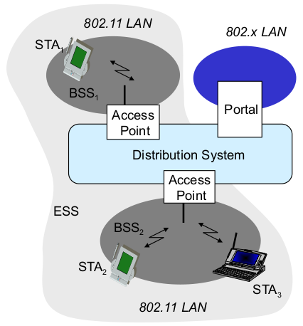
- Station (STA): Endgerät mit Zugriffsmechanismen auf das drahtlose Medium und Funkkontakt zum Access Point
- Basic Service Set (BSS): Gruppe von Stationen, die dieselbe Funkfrequenz verwenden
- Zugangspunkt: Station, die in das drahtlose LAN und das Verteilungssystem integriert ist
- Portal: Brücke zu anderen (kabelgebundenen) Netzwerken
- Verteilungssystem: Verbindungsnetz zur Bildung eines logischen Netzes (Extended Service Set, ESS), das auf mehreren BSS basiert

802.11 - Architektur eines Ad-Hoc-Netzes
- 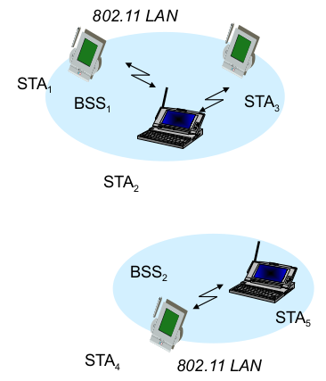
- Station (STA): Endgerät mit Zugriffsmechanismen auf das drahtlose Medium
- Basic Service Set (BSS): Gruppe von Stationen, die dieselbe Funkfrequenz verwenden
- Ad-Hoc-Netze ermöglichen die direkte Kommunikation zwischen Endsystemen innerhalb einer begrenzten Reichweite
- Da es keine Infrastruktur gibt, ist keine Kommunikation zwischen verschiedenen BSSs möglich

Sicherheitsdienste von IEEE 802.11
- Die Sicherheitsdienste von IEEE 802.11 wurden ursprünglich wie folgt realisiert:
  - Authentifizierungsdienst für Entitäten
  - Wired Equivalent Privacy (WEP) Mechanismus
- WEP soll die folgenden Sicherheitsdienste bieten
  - Vertraulichkeit
  - Authentifizierung der Datenherkunft / Datenintegrität
  - Zugangskontrolle in Verbindung mit Schichtenmanagement
- WEP verwendet die folgenden Algorithmen:
  - Die RC4-Stromchiffre (siehe Kapitel 3)
  - Die CRC-Prüfsumme (Cyclic Redundancy Code) zur Fehlererkennung

## Der zyklische Redundanzcode
- Der zyklische Redundanzcode (CRC) ist ein Fehlererkennungscode
- Mathematische Grundlage:
  - Bitstrings werden als Darstellungen von Polynomen mit den Koeffizienten 0 und 1 behandelt $\Rightarrow$ Ein Bitstring, der eine Nachricht M darstellt, wird als M(x) interpretiert
  - Polynomarithmetik wird modulo 2 durchgeführt $\Rightarrow$ Addition und Subtraktion sind identisch mit XOR
- CRC-Berechnung für eine Nachricht $M(x)$:
  - A und B einigen sich auf ein Polynom $G(x)$; üblicherweise ist $G(x)$ standardisiert
  - Sei $n$ der Grad von $G(x)$, d.h. die Länge von $G(x)$ sei $n+1$
  - Wenn dann $\frac{M(x)\times 2^n}{G(x)}=Q(x)+\frac{R(x)}{G(x)}$ gilt $\frac{M(x)\times 2^n +R(x)}{G(x)}$ wobei $R(x)$ der Rest von $M(x)$ geteilt durch $G(x)$ ist
  - Normalerweise wird $R(x)$ vor der Übertragung an $M(x)$ angehängt, und $Q(x)$ ist nicht von Interesse, da es nur geprüft wird, wenn $\frac{M(x)\times 2^n+R(x)}{G(x)}$ mit Rest $0$ dividiert
- Betrachten wir nun zwei Nachrichten $M_1$ und $M_2$ mit CRCs $R_1$ und $R_2$:
  - Da $\frac{M_1(x)\times 2^n+R_1(x)}{G(x)}$ und $\frac{M_2(x)\times 2^n+R_2(x)}{G(x)}$ mit dem Rest $0$ teilen, teilt sich auch $\frac{M_1(x)\times 2^n +R_1(x)+M_2(x)\times 2^n +R_2(x)}{G(x)} =\frac{(M_1(x)+M_2(x))\times 2^n +(R_1(x)+R_2(x))}{G(x)}$ teilt mit Rest $0$
  - $\Rightarrow$ CRC ist linear, d.h. $CRC(M_1 + M_2) = CRC(M_1) + CRC(M_2)$
- Diese Eigenschaft macht CRC schwach für kryptographische Zwecke!

## IEEE 802.11 Entity-Authentifizierung
- Ursprünglich gibt es die IEEE 802.11-Authentifizierung in zwei ,,Geschmacksrichtungen'':
  - Offene System-Authentifizierung: ,,Im Wesentlichen handelt es sich um einen Null-Authentifizierungsalgorithmus.'' (IEEE 802.11)
  - Shared-Key-Authentifizierung:
    - Die ,,Shared-Key-Authentifizierung unterstützt die Authentifizierung von STAs entweder als Mitglied derer, die einen gemeinsamen geheimen Schlüssel kennen, oder als Mitglied derer, die ihn nicht kennen.'' (IEEE 802.11, Abschnitt 8.1.2)
    - Es wird davon ausgegangen, dass der erforderliche geheime, gemeinsam genutzte Schlüssel den teilnehmenden STAs über einen sicheren, von IEEE 802.11 unabhängigen Kanal übermittelt wurde.

IEEE 802.11's Shared Key Authentication Dialog:
- Die Authentifizierung sollte zwischen Stationen und Zugangspunkten erfolgen und könnte auch zwischen beliebigen Stationen durchgeführt werden.
- Bei der Authentifizierung fungiert eine Station als Requestor (A) und die andere als Responder (B)
- Der Authentifizierungsdialog:
  1. $A \rightarrow B: (Authentifizierung, 1, ID_A)$
  2. $B \rightarrow A: (Authentifizierung, 2, r_B)$
  3. $A \rightarrow B: \{Authentifizierung, 3, r_B\}_{K_{A,B}}$
  4. $B \rightarrow A: (Authentifizierung, 4, erfolgreich)$
- Die gegenseitige Authentifizierung erfordert zwei unabhängige Protokolldurchläufe, einen in jeder Richtung
- Aber: ein Angreifer kann sich nach dem Abhören eines Protokolldurchlaufs ausgeben, da er einen gültigen Schlüsselstrom aus den Nachrichten 2 und 3 erhalten kann!

## IEEE 802.11's Wired Equivalence Privacy
- IEEE 802.11's WEP verwendet RC4 als Pseudo-Zufallsbit-Generator (PRNG):
  - Für jede zu schützende Nachricht M wird ein 24-Bit-Initialisierungsvektor (IV) mit dem gemeinsamen Schlüssel $K_{BSS}$ verkettet, um den Seed des PRNG zu bilden.
  - Der Integritätsprüfwert (ICV) von M wird mit CRC berechnet und an die Nachricht angehängt (,,||'')
  - Die resultierende Nachricht $(M || ICV)$ wird mit dem von $RC4(IV || K_{BSS})$ erzeugten Schlüsselstrom XOR-verknüpft (,,$\oplus$'')
  - 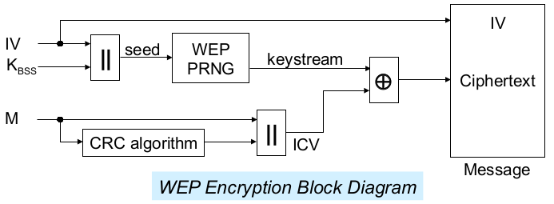
- Da die IV mit jeder Nachricht im Klartext gesendet wird, kann jeder Empfänger, der $K_{BSS}$ kennt, den entsprechenden Schlüsselstrom zur Entschlüsselung einer Nachricht erzeugen.
  - Dadurch wird die wichtige Eigenschaft der Selbstsynchronisation von WEP gewährleistet
  - Der Entschlüsselungsprozess ist im Grunde die Umkehrung der Verschlüsselung:
  - 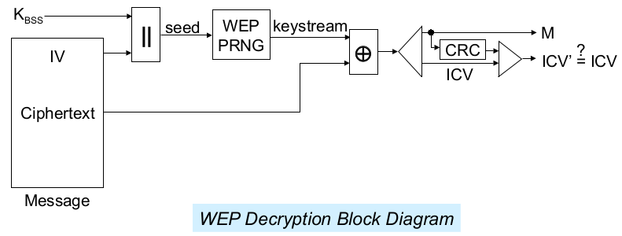

## Die Sicherheitsansprüche von IEEE 802.11
- WEP wurde entwickelt, um die folgenden Sicherheitseigenschaften zu gewährleisten:
  - Vertraulichkeit:
    - Nur Stationen, die über $K_{BSS}$ verfügen, können mit WEP geschützte Nachrichten lesen
  - Authentifizierung der Datenherkunft / Datenintegrität:
    - Böswillige Veränderungen von WEP-geschützten Nachrichten können erkannt werden
  - Zugriffskontrolle in Verbindung mit Schichtenmanagement:
    - Wenn in der Schichtenverwaltung so eingestellt, werden nur WEP-geschützte Nachrichten von Empfängern akzeptiert
    - Somit können Stationen, die $K_{BSS}$ nicht kennen, nicht an solche Empfänger senden
- Leider trifft keine der obigen Behauptungen zu...

### Schwachstelle #1: Die Schlüssel
- IEEE 802.11 sieht keine Schlüsselverwaltung vor:
  - Manuelle Verwaltung ist fehleranfällig und unsicher
  - Die gemeinsame Verwendung eines Schlüssels für alle Stationen eines BSS führt zu zusätzlichen Sicherheitsproblemen
  - Als Folge der manuellen Schlüsselverwaltung werden die Schlüssel selten geändert.
  - Eine weitere Folge ist, dass die ,,Sicherheit'' oft sogar ausgeschaltet ist!
- Schlüssellänge:
  - Die im ursprünglichen Standard festgelegte Schlüssellänge von 40 Bit bietet nur geringe Sicherheit
  - Der Grund dafür war die Exportierbarkeit
  - Wireless LAN-Karten erlauben oft auch Schlüssel der Länge 104 Bit, aber das macht die Situation nicht besser, wie wir später sehen werden

### Schwachstelle #2: WEP-Vertraulichkeit ist unsicher
- Selbst mit gut verteilten und langen Schlüsseln ist WEP unsicher
- Der Grund dafür ist die Wiederverwendung des Schlüsselstroms:
  - Erinnern Sie sich, dass die Verschlüsselung mit jeder Nachricht neu synchronisiert wird, indem eine IV der Länge 24 Bit an $K_{BSS}$ angehängt und der PRNG neu initialisiert wird
  - Betrachten wir zwei Klartexte M 1 und M 2, die mit demselben IV 1 verschlüsselt wurden:
    - $C_1 = P_1 \oplus RC4 (IV_1 , K_{BSS})$
    - $C_2 = P_2 \oplus RC4 (IV_1 , K_{BSS})$ dann:
    - $C_1 \oplus C_2 = (P_1 \oplus RC4 (IV_1, K_{BSS})) \oplus (P_2\oplus RC4 (IV_1 , K_{BSS})) = P_1 \oplus P_2$
  - Wenn also ein Angreifer z.B. $P_1$ und $C_1$ kennt, kann er $P_2$ aus $C_2$ wiederherstellen, ohne den Schlüssel $K_{BSS}$ zu kennen.
    - Kryptographen nennen dies einen Angriff mit bekanntem Klartext
- Wie oft kommt die Wiederverwendung des Schlüsselstroms vor?
  - In der Praxis recht häufig, da viele Implementierungen die IV schlecht wählen
  - Selbst bei optimaler Wahl, da die IV-Länge 24 Bit beträgt, wird eine stark ausgelastete Basisstation eines 11-Mbit/s-WLAN den verfügbaren Speicherplatz in einem halben Tag erschöpfen

### Schwachstelle #3: WEP-Datenintegrität ist unsicher
- Erinnern Sie sich, dass CRC eine lineare Funktion ist und RC4 ebenfalls linear ist
- Nehmen wir an, A sendet eine verschlüsselte Nachricht an B, die von einem Angreifer E abgefangen wird:
  - $A \rightarrow B: (IV, C) mit C = RC4(IV, K_{BSS}) \oplus (M, CRC(M))$
- Der Angreifer E kann einen neuen Chiffretext $C'$ konstruieren, der zu einer Nachricht $M'$ mit einer gültigen Prüfsumme $CRC(M')$ entschlüsselt wird:
  - E wählt eine beliebige Nachricht $\delta$ mit der gleichen Länge
  - $C' = C \oplus (\delta, CRC(\delta)) = RC4(IV, K_{BSS}) \oplus (M, CRC(M)) \oplus (\delta, CRC(\delta))$
  - $= RC4(IV, K_{BSS}) \oplus (M \oplus \delta, CRC(M) \oplus CRC(\delta))$
  - $= RC4(IV, K_{BSS}) \oplus (M \oplus \delta, CRC(M \oplus \delta))$
  - $= RC4(IV, K_{BSS}) \oplus (M', CRC(M'))$
  - Man beachte, dass $E$ $M'$ nicht kennt, da es $M$ nicht kennt.
  - Dennoch führt ein ,,1'' an Position $n$ in $\delta$ zu einem umgedrehten Bit an Position n in $M'$, so dass E kontrollierte Änderungen an $M$ vornehmen kann
  - $\Rightarrow$ Datenherkunftsauthentifizierung / Datenintegrität von WEP ist unsicher!

### Schwachstelle #4: WEP-Zugangskontrolle ist unsicher
- Erinnern Sie sich, dass die Integritätsfunktion ohne einen Schlüssel berechnet wird
- Betrachten wir einen Angreifer, der ein Klartext-Chiffretext-Paar in Erfahrung bringt:
  - Da der Angreifer $M$ und $C=RC4(IV, K_{BSS})\oplus (M, CRC(M))$ kennt, kann er den zur Erzeugung von $C$ verwendeten Schlüsselstrom berechnen
  - Wenn $E$ später eine Nachricht $M'$ senden will, kann er $C' = RC4(IV, K_{BSS})\oplus (M', CRC(M'))$ berechnen und die Nachricht $(IV, C')$ senden.
  - Da die Wiederverwendung alter IV-Werte möglich ist, ohne beim Empfänger einen Alarm auszulösen, handelt es sich um eine gültige Nachricht
  - Eine ,,Anwendung'' für diesen Angriff ist die unbefugte Nutzung von Netzwerkressourcen:
    - Der Angreifer sendet IP-Pakete, die für das Internet bestimmt sind, an den Zugangspunkt, der sie entsprechend weiterleitet und dem Angreifer freien Zugang zum Internet gewährt
- $\Rightarrow$ WEP Access Control kann mit bekanntem Klartext umgangen werden

### Schwachstelle Nr. 5: Schwachstelle in der RC4-Schlüsselberechnung
- Anfang August 2001 wurde ein weiterer Angriff auf WEP entdeckt:
  - Der gemeinsame Schlüssel kann in weniger als 15 Minuten wiederhergestellt werden, vorausgesetzt, dass etwa 4 bis 6 Millionen Pakete wiederhergestellt wurden.
  - Bei dem Angriff handelt es sich um einen Angriff mit verwandten Schlüsseln, bei dem die Verwendung von RC4 durch WEP ausgenutzt wird:
    - RC4 ist anfällig für die Ableitung von Bits eines Schlüssels, wenn:
      - viele Nachrichten mit einem Schlüsselstrom verschlüsselt werden, der aus einem variablen Initialisierungsvektor und einem festen Schlüssel erzeugt wird, und
      - die Initialisierungsvektoren und der Klartext der ersten beiden Oktette für die verschlüsselten Nachrichten bekannt sind
    - Die IV für den Schlüsselstrom wird mit jedem Paket im Klartext übertragen.
    - Die ersten beiden Oktette eines verschlüsselten Datenpakets können erraten werden
  - Der Angriff ist in [SMF01a] und [SIR01a] beschrieben und wurde später so verfeinert, dass er noch schneller funktioniert [TWP07].
  - R. Rivest kommentiert dies [Riv01a]: ,,Diejenigen, die die RC4-basierten WEP- oder WEP2-Protokolle verwenden, um die Vertraulichkeit ihrer 802.11-Kommunikation zu gewährleisten, sollten diese Protokolle als gebrochen betrachten [...]''

## Schlussfolgerungen zu den Unzulänglichkeiten von IEEE 802.11
- Das ursprüngliche IEEE 802.11 bietet keine ausreichende Sicherheit:
  - Fehlende Schlüsselverwaltung macht die Nutzung der Sicherheitsmechanismen mühsam und führt dazu, dass die Schlüssel selten gewechselt werden oder sogar die Sicherheit ausgeschaltet ist
  - Sowohl die Entity-Authentifizierung als auch die Verschlüsselung beruhen auf einem Schlüssel, der von allen Stationen eines Basisdienstes gemeinsam genutzt wird
  - Unsicheres Protokoll zur Entitätsauthentifizierung
  - Wiederverwendung des Schlüsselstroms ermöglicht Angriffe mit bekanntem Klartext
  - Lineare Integritätsfunktion ermöglicht die Fälschung von ICVs
  - Unverschlüsselte Integritätsfunktion ermöglicht die Umgehung der Zugangskontrolle durch Erstellung gültiger Nachrichten aus einem bekannten Klartext-Chiffretext-Paar
  - Schwachstelle in der RC4-Schlüsselplanung ermöglicht die Kryptoanalyse von Schlüsseln
- Selbst mit IEEE 802.1X und individuellen Schlüsseln bleibt das Protokoll schwach
- Einige vorgeschlagene Gegenmaßnahmen:
  - Platzieren Sie Ihr IEEE 802.11 Netzwerk außerhalb Ihrer Internet Firewall
  - Vertrauen Sie keinem Host, der über IEEE 802.11 verbunden ist.
  - Verwenden Sie zusätzlich andere Sicherheitsprotokolle, z. B. PPTP, L2TP, IPSec, SSH, ...

## Interlude: Sicherheit in öffentlichen WLAN-Hotspots
Welche Sicherheit können Sie in einem öffentlichen WLAN-Hotspot erwarten?
- Bei den meisten Hotspots: Leider fast keine!
- Wenn Sie außer der Eingabe eines Benutzernamens und eines Passworts auf einer Webseite keine weiteren Sicherheitsparameter konfigurieren müssen, können Sie Folgendes erwarten:
  - Der Hotspot-Betreiber prüft Ihre Authentizität bei der Anmeldung (oft mit SSL geschützt, um das Abhören Ihres Passworts zu verhindern)
  - Nur authentifizierte Clients erhalten den Dienst, da die Paketfilterung den Zugriff auf die Anmeldeseite nur bei erfolgreicher Authentifizierung zulässt.
  - Nach Überprüfung der Anmeldeauthentifizierung: keine weiteren Sicherheitsmaßnahmen
  - Kein Schutz für Ihre Benutzerdaten:
    - Alles kann abgefangen und manipuliert werden
    - Sie können zwar eigene Maßnahmen ergreifen, z.B. VPN oder SSL, aber die Konfiguration ist oft mühsam oder wird vom Kommunikationspartner gar nicht unterstützt und die Leistung wird durch zusätzlichen (pro-Paket-) Overhead beeinträchtigt
  - Plus: Ihre Sitzung kann durch die Verwendung Ihrer MAC- und IP-Adressen gestohlen werden!
- Konsequenz: bessere WLAN-Sicherheit ist dringend erforderlich

## Fixing WLAN Security: IEEE 802.11i, WPA und WPA
- Umfang: Definition der Interaktion zwischen 802.1X und 802.11 Standards
- TGi definiert zwei Klassen von Sicherheitsalgorithmen für 802.11:
  - Pre-RSN Sicherheitsnetzwerk (\rightarrow WEP)
  - Robustes Sicherheitsnetzwerk (RSN)
- Die RSN-Sicherheit besteht aus zwei grundlegenden Teilsystemen:
  - Mechanismen zum Schutz der Daten:
    - TKIP - schnelles Re-Keying, um WEP für ein Minimum an Datenschutz zu verbessern (Marketingname WPA)
    - AES-Verschlüsselung - robuster Datenschutz für lange Zeit (Marketingname WPA2)
- Verwaltung von Sicherheitsvereinbarungen:
  - Unternehmensmodus - basierend auf 802.1X
  - Persönlicher Modus - basierend auf Pre-Shared Keys

(das meiste Material über 802.11i ist aus [WM02a] entnommen)

## WPA-Schlüsselverwaltung
- Im Gegensatz zum ursprünglichen 802.11: paarweise Schlüssel zwischen STA und BS, zusätzliche Gruppenschlüssel für Multi- und Broadcast-Pakete sowie Station-to-Station-Link (STSL)-Schlüssel
- Das erste Geheimnis: der 256 Bit Pairwise Master Key (PMK)
  - Unternehmensmodus: Verwendet 802.1X-Authentifizierung und installiert einen neuen Schlüssel, der BS und Client bekannt ist, z. B. durch EAP-TTLS
  - Persönlicher Modus: Verwendet einen Pre-Shared Key (PSK), der dem BS und vielen STAs bekannt ist.
    - Explizit durch 64 zufällige Hex-Zeichen oder implizit durch ein Passwort gegeben
    - Wenn Passwort: PMK = PBKDF2(Passwort, SSID, 4096, 256)
    - Wobei PBKDF2 die passwortbasierte Schlüsselableitungsfunktion 2 aus [RFC2898] mit einer Salz-SSID und einer Ausgangslänge von 256 Bit ist
    - impliziert 2 * 4096 Berechnungen von HMAC-SHA1, um Brute-Force zu verlangsamen
- PMK ist ein Vertrauensanker für die Authentifizierung per EAPOL (EAP over LAN) Handshake, wird aber nie direkt verwendet...
- Für aktuelle kryptographische Protokolle wird ein kurzzeitiger 512 Bit Pairwise Transient Key (PTK) wie folgt generiert
  - $PTK = PRF(PMK, ,,Paarweise Schlüsselerweiterung'', min(Addr_{BS}, Addr_{STA}) || max(Addr_{BS}, Addr_{STA}) || min(r_{BS}, r_{STA}) || max(r_{BS}, r_{STA}))$
  - Dabei ist $PRF(K, A, B)$ die verkettete Ausgabe von $HMAC-SHA1(K, A || '0' || B || i)$ über einen laufenden Index i
- Der PTK wird aufgeteilt in:
  - EAPOL-Schlüssel-Bestätigungsschlüssel (KCK, erste 128 Bits),
    - Wird zum Schutz der Integrität von EAPOL-Nachrichten verwendet
    - Durch HMAC-MD5 (veraltet), HMAC-SHA1-128, AES-128-CMAC
  - EAPOL Key Encryption Key (KEK, zweite 128 Bits),
    - Wird zur Verschlüsselung neuer Schlüssel in EAPOL-Nachrichten verwendet
    - Mit RC4 (veraltet), AES im Key Wrap Mode [RFC3394]
  - Ein Temporal Key (TK) zum Schutz des Datenverkehrs (ab Bit 256)!
- Initialer Dialog mit BS:
  - EAPOL (EAP over LAN) 4-Wege-Handshake wird verwendet, um
    - Überprüfung der gegenseitigen Kenntnis des PMK
    - Initiiert durch BS, um Schlüssel zu installieren (gruppenweise und paarweise)
  - Vereinfachter Handshake funktioniert wie folgt:
    1. $BS\rightarrow STA: (1, r_{BS} , PMKID, install\ new\ PTK)$
    2. $STA BS: (2, r_{STA}, MAC_{KCK})$
    3. $BS STA: (3, r_{BS}, MAC_{KCK}, \{TK\}_{KEK})$
    4. $STA BS: (4, r_{STA}, MAC_{KCK})$
  - Wobei PMKID den PMK identifiziert: obere 128 Bit von $HMAC-SHA-256(PMK, "PMK Name" || Addr_{BS} || Addr_{STA} )$

## Eine Zwischenlösung: Temporal Key Integrity Protokoll
- Ziele des Entwurfs:
  - Schnelle Lösung für das bestehende WEP-Problem, betreibt WEP als Unterkomponente
  - Kann in Software implementiert werden, nutzt vorhandene WEP-Hardware wieder
  - Anforderungen an vorhandene AP-Hardware:
    - 33 oder 25 MHz ARM7 oder i486, die bereits vor TKIP mit 90% CPU-Auslastung laufen
    - Nur als Software/Firmware-Upgrade gedacht
    - Keine unangemessene Beeinträchtigung der Leistung
- Wichtigste Konzepte:
  - Nachrichtenintegritätscode (MIC)
  - Gegenmaßnahmen im Falle von MIC-Fehlern
  - Sequenzzähler
  - Dynamische Schlüsselverwaltung (Re-Keying)
  - Schlüsselmischung
- TKIP erfüllt die Kriterien für einen guten Standard: alle sind damit unzufrieden...
- 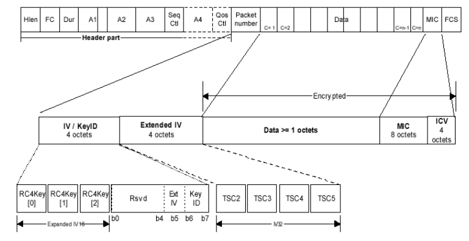

Message Integrity Code Funktion Michael
- Schützt vor Fälschungen:
  - Muss billig sein: CPU-Budget 5 Anweisungen / Byte
  - Leider schwach: ein $2^{29}$ Nachrichtenangriff existiert
  - Wird über MSDUs berechnet, während WEP über MPDUs läuft
  - Verwendet zwei 64-Bit-Schlüssel, einen in jeder Verbindungsrichtung
  - Erfordert Gegenmaßnahmen:
    - Rekey on active attack (nur wenige Fehlalarme, da CRC zuerst geprüft wird)
    - Ratenbegrenzung auf eine Neuverschlüsselung pro Minute
  - 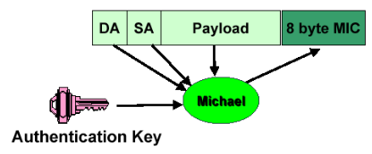

Wiederholungsschutz und RC4-Schlüsselplanung
- Replay-Schutz:
  - Zurücksetzen der Paket-Sequenz # auf 0 bei Wiederholung
  - Erhöhen der Sequenz # um 1 bei jedem Paket
  - Verwerfen aller Pakete, die außerhalb der Sequenz empfangen werden
- Umgehen Sie die Schwächen der WEP-Verschlüsselung:
  - Erstellen Sie einen besseren paketweisen Verschlüsselungsschlüssel, indem Sie Angriffe mit schwachen Schlüsseln verhindern und WEP IV und paketweisen Schlüssel dekorrelieren
  - muss auf vorhandener Hardware effizient sein
- 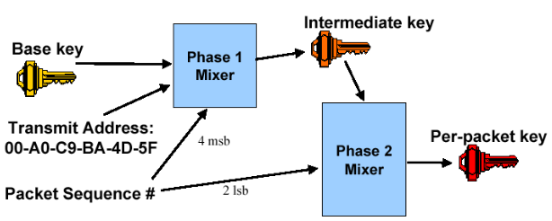

TKIP-Verarbeitung beim Sender
- 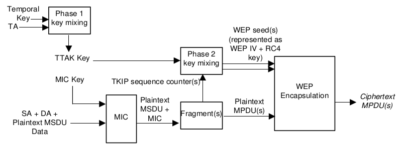

TKIP-Verarbeitung auf der Empfängerseite
- 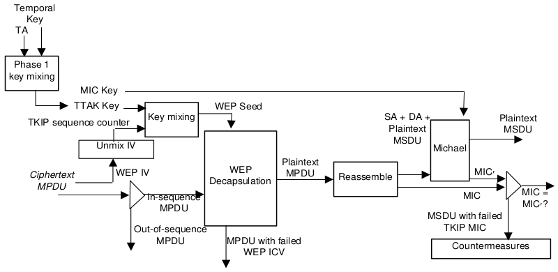

## Die langfristige Lösung: AES-basierter WLAN-Schutz
- Zählermodus mit CBC-MAC (CCMP):
  - Obligatorisch zu implementieren: die langfristige Lösung
  - Ein völlig neues Protokoll mit wenigen Zugeständnissen an WEP
  - Bietet: Datenvertraulichkeit, Authentifizierung der Datenherkunft, Schutz vor Wiederholungen
  - Basiert auf AES in Counter Mode Encryption mit CBC-MAC (CCM)
    - Verwendung von CBC-MAC zur Berechnung einer MIC für den Klartext-Header, die Länge des Klartext-Headers und die Nutzdaten
    - Verwenden Sie den CTR-Modus, um die Payload mit den Zählerwerten 1, 2, 3, ... zu verschlüsseln.
    - Verwenden Sie den CTR-Modus, um die MIC mit dem Zählerwert 0 zu verschlüsseln.
  - AES-Overhead erfordert neue AP-Hardware
  - Der AES-Overhead erfordert möglicherweise neue STA-Hardware für Handheld-Geräte, aber theoretisch nicht für PCs (dies erhöht jedoch die CPU-Last und den Energieverbrauch), praktisch aufgrund fehlender Treiber für beide
- 

## Vergleich WEP, TKIP und CCMP
|            | WEP             | TKIP        | CCMP                           |
| ---------- | --------------- | ----------- | ------------------------------ |
| Cipher     | RC4             | RC4         | AES                            |
| Key Size   | 40 or 104 bits  | 104 bits    | 128 bits encrypt, 64 bit auth. |
| Key Life   | 24-bit IV, wrap | 48-bit IV   | 48-bit IV                      |
| Packet Key | Concat.         | Mixing Fnc. | Not Needed                     |
| Integrity  |                 |             |                                |
| Data       | CRC-32          | Michael     | CCM                            |
| Header     | None            | Michael     | CCM                            |
| Replay     | None            | Use IV      | Use IV                         |
| Key Mgmt.  | None            | EAP-based   | EAP-based                      |

TKIP ist derzeit veraltet, AES wird empfohlen.

# Sicherheit von GSM- und UMTS-Netzen
## GSM-Übersicht
- Die GSM-Normen:
  - Akronym:
    - früher: Groupe Spéciale Mobile (gegründet 1982)
    - jetzt: Globales System für mobile Kommunikation
  - Gesamteuropäische Norm (ETSI)
  - Gleichzeitige Einführung wesentlicher Dienste in drei Phasen (1991, 1994, 1996) durch die europäischen Telekommunikationsverwaltungen (Deutschland: D1 und D2) $\rightarrow$ nahtloses Roaming innerhalb Europas möglich
  - Heute nutzen viele Anbieter in der ganzen Welt GSM (mehr als 130 Länder in Asien, Afrika, Europa, Australien, Amerika)
- Merkmale:
  - Echte mobile, drahtlose Kommunikation mit Unterstützung für Sprache und Daten
  - Weltweite Konnektivität und internationale Mobilität mit eindeutigen Adressen
  - Sicherheitsfunktionen:
    - Vertraulichkeit auf der Luftschnittstelle
    - Zugangskontrolle und Benutzerauthentifizierung
- GSM bietet die folgenden Sicherheitsfunktionen [ETSI93a, ETSI94a]:
  - Vertraulichkeit der Identität des Teilnehmers:
    - Schutz vor einem Eindringling, der versucht zu identifizieren, welcher Teilnehmer eine bestimmte Ressource auf dem Funkpfad benutzt (z.B. Verkehrskanal oder Signalisierungsressourcen), indem er den Signalisierungsaustausch auf dem Funkpfad abhört
    - Vertraulichkeit für Signalisierungs- und Benutzerdaten
    - Schutz gegen die Rückverfolgung des Standorts eines Teilnehmers
  - Authentifizierung der Identität des Teilnehmers: Schutz des Netzes vor unbefugter Nutzung
  - Vertraulichkeit des Signalisierungsinformations-Elements: Geheimhaltung von Signalisierungsdaten auf der Funkstrecke
  - Vertraulichkeit der Benutzerdaten: Geheimhaltung von Nutzdaten auf der Funkstrecke
  - Es werden jedoch nur Lauschangriffe auf die Funkverbindung zwischen dem Mobiltelefon und den Basisstationen berücksichtigt!

Einige GSM-Abkürzungen
|        |                                             |
| ------ | ------------------------------------------- |
| AuC    | Authentication center                       |
| BSC    | Basisstations-Controller                    |
| BTS    | Basis-Transceiver-Station                   |
| IMSI   | Internationale mobile Teilnehmerkennung     |
| HLR    | Heimatstandortregister                      |
| LAI    | Standortbereichskennung                     |
| MS     | Mobile Station (z. B. ein Mobiltelefon)     |
| MSC    | Mobile Vermittlungsstelle                   |
| MSISDN | Mobile subscriber international ISDN number |
| TMSI   | Temporäre mobile Teilnehmerkennung          |
| VLR    | Register für Besucherstandorte              |

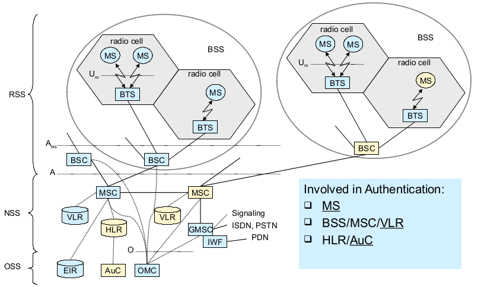

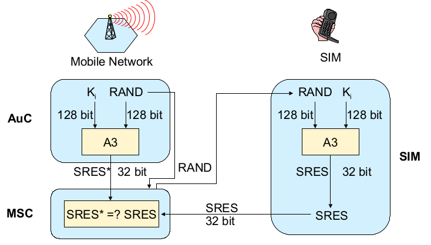
- $K_i$: Authentifizierungsschlüssel des einzelnen Teilnehmers 
- $SRES$: Signierte Antwort

Der grundlegende (anfängliche) Authentifizierungsdialog:
1. $MS \rightarrow VLR: (IMSI_{MS})$
2. $VLR \rightarrow AuC: (IMSI_{MS})$
3. $AuC \rightarrow VLR: (IMSI_{MS}, K_{BSC,MS}, R_{AUC}, SRES_{AUC})$
4. $VLR \rightarrow MS: (R_{AUC:1})$
5. $MS \rightarrow VLR: (SRES_{AUC:1})$
6. $VLR \rightarrow MS: (LAI_1 , TMSI_{MS:1})$

- Bemerkungen:
  - $SRES_{AUC} = A3(K_{AUC,MS}, R_{AUC});$ A3 ist ein Algorithmus
  - $K_{BSC,MS} = A8(K_{AUC,MS}, R_{AUC});$ A8 ist ein Algorithmus
  - $R_{AUC}, SRES_{AUC}$ sind Arrays mit mehreren Werten
- Dialog zur Wiederauthentifizierung mit demselben VLR:
  1. $MS \rightarrow VLR: (LAI_1 , TMSI_{MS:n})$
  2. $VLR \rightarrow MS: (R_{AUC:i})$
  3. $MS \rightarrow VLR: (SRES_{AUC:i})$
  4. $VLR \rightarrow MS: (LAI_1, TMSI_{MS:n+1})$
- Bemerkungen:
  - Die Standortbereichskennung $LAI_1$ ermöglicht die Erkennung eines MS ,,coming in'' aus einem anderen Bereich
  - Nach erfolgreicher Authentifizierung wird eine neue temporäre mobile Teilnehmeridentität $TMSI_{MS:n+1}$ zugewiesen
- Re-Authentifizierungsdialog mit Übergabe an das neue $VLR_2$:
  1. $MS \rightarrow VLR_2: (LAI_1, TMSI_{MS:n})$
  2. $VLR_2$Rechtspfeil VLR_1: (LAI_1, TMSI_{MS:n})$
  3. $VLR_1 \rightarrow VLR_2: (TMSI_{MS:n}, IMSI_{MS}, K_{BSC,MS}, R_{AUC}, SRES_{AUC})$
  4. $VLR_2 \rightarrow MS: (R_{AUC:i})$
  5. $MS \rightarrow VLR_2: (SRES_{AUC:i})$
  6. $VLR_2 \rightarrow MS: (LAI_2, TMSI_{MS:n+1})$
- Bemerkungen:
  - Nur unbenutzte $R_{AUC}, ...$ werden an $VLR_2$ übertragen
  - Dieses Schema kann nicht verwendet werden, und es ist ein Anfangsdialog erforderlich:
    - Wenn $TMSI_{MS:n}$ bei $VLR_1$ nicht verfügbar ist, oder
    - wenn $VLR_2$ nicht in der Lage ist, $VLR_1$ zu kontaktieren
  - Wenn $VLR_1$ und $VLR_2$ zu verschiedenen Netzbetreibern gehören, kann der Handover nicht durchgeführt werden und die Verbindung wird unterbrochen
- Nur das Mobiltelefon authentifiziert sich gegenüber dem Netz
- Die Authentifizierung basiert auf einem Challenge-Response-Verfahren:
  - Das AuC im Heimatnetz erzeugt Challenge-Response-Paare
  - Der MSC/VLR im besuchten Netz prüft diese
  - Challenge-Response-Vektoren werden ungeschützt im Signalisierungsnetz übertragen
- Die permanente Identifikation des Mobiltelefons (IMSI) wird nur dann über die Funkverbindung gesendet, wenn dies unvermeidlich ist:
  - Dies ermöglicht einen teilweisen Schutz des Standorts.
  - Da die IMSI manchmal im Klartext gesendet wird, ist es dennoch möglich, den Standort einiger Einheiten zu erfahren
  - Ein Angreifer könnte sich als Basisstation ausgeben und die Handys ausdrücklich auffordern, ihre IMSI zu senden!
- Grundsätzlich besteht Vertrauen zwischen allen Betreibern!

## General Packet Radio Service (GPRS)
- GPRS (General Packet Radio Service, allgemeiner Paketfunkdienst):
  - Datenübertragung in GSM-Netzen auf der Basis von Paketvermittlung
  - Nutzung freier Slots der Funkkanäle nur bei sendebereiten Datenpaketen (z.B. 115 kbit/s bei temporärer Nutzung von 8 Slots)
- GPRS-Netzelemente:
  - GGSN (Gateway GPRS Support Node): Interworking-Einheit zwischen GPRS und PDN (Packet Data Network)
  - SGSN (Serving GPRS Support Node): Unterstützt die MS (Standort, Abrechnung, Sicherheit, entspricht im Grunde dem MSC)
  - GR (GPRS Register): Verwaltet Benutzeradressen (entspricht HLR)

(allgemeine GPRS-Beschreibung entnommen aus [Sch03a])


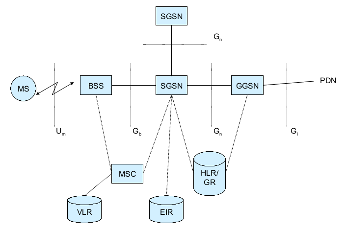

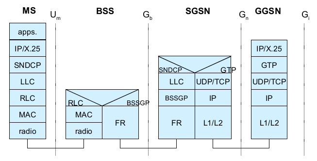
- SNDCP: Subnetwork Dependent Convergence Protocol
- GTP: GPRS Tunnelling Protocol

GPRS-Sicherheit
- Sicherheitsziele:
  - Schutz vor unbefugter Nutzung des GPRS-Dienstes (Authentifizierung)
  - Gewährleistung der Vertraulichkeit der Benutzeridentität (temporäre Identifizierung und Verschlüsselung)
  - Gewährleistung der Vertraulichkeit von Benutzerdaten (Verschlüsselung)
- Realisierung von Sicherheitsdiensten:
  - Die Authentifizierung ist grundsätzlich identisch mit der GSM-Authentifizierung:
    - SGSN ist die Peer-Entität
    - Zwei separate temporäre Identitäten werden für GSM/GPRS verwendet
    - Nach erfolgreicher Authentifizierung wird die Verschlüsselung eingeschaltet
  - Die Vertraulichkeit der Benutzeridentität ist ähnlich wie bei GSM:
    - Die meiste Zeit wird nur die Paket-TMSI (P-TMSI) über die Luft gesendet.
    - Optional können P-TMSI ,,Signaturen'' zwischen MS und SGSN verwendet werden, um die Re-Authentifizierung zu beschleunigen
  - Die Vertraulichkeit der Benutzerdaten wird zwischen MS und SGSN realisiert:
    - Unterschied zu GSM, wo nur zwischen MS und BTS verschlüsselt wird
    - Die Verschlüsselung wird in der LLC-Protokollschicht realisiert

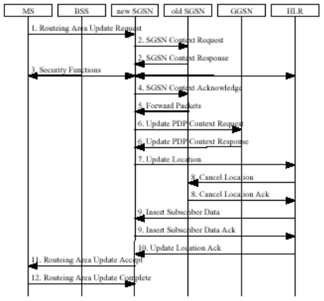
- GPRS unterstützt ein ,,optimiertes Handover'' einschließlich Re-Authentifizierung (dies könnte jedoch eine Schwäche der P-TMSI ,,Signatur'' verhindern)

## UMTS Sicherheits Architektur
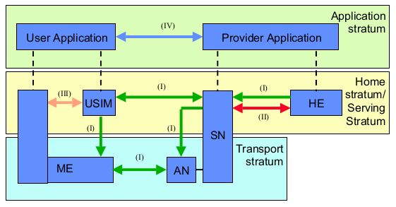
1. Netzzugangssicherheit: Schutz vor Angriffen auf die Funkschnittstelle
2. Sicherheit der Netzdomäne: Schutz vor Angriffen auf das drahtgebundene Netz
3. Sicherheit der Benutzerdomäne: sicherer Zugang zu den Mobilstationen
4. Sicherheit der Anwendungsdomäne: sicherer Nachrichtenaustausch für Anwendungen
5. Sichtbarkeit und Konfigurierbarkeit der Sicherheit: Information des Benutzers über den sicheren Betrieb

### Aktueller Stand der UMTS-Sicherheitsarchitektur
- Sicherheit beim Netzzugang: Derzeit der am weitesten entwickelte Teil der UMTS-Sicherheit (siehe unten)
- Netzbereichssicherheit: Dieser Teil ist größtenteils noch ausbaufähig (in Spezifikationen bis Release 5)
- Sicherheit der Benutzerdomäne:
  - Verlangt grundsätzlich, dass sich der Benutzer gegenüber seinem User Services Identity Module (USIM) authentifiziert, z.B. durch Eingabe einer PIN
  - Optional kann ein Terminal die Authentifizierung des USIM verlangen.
- Anwendungsbereichssicherheit:
  - Definiert ein Sicherheitsprotokoll, das zwischen den auf dem Endgerät/USIM laufenden Anwendungen und einem System im Netz verwendet wird (3GPP TS 23.048)
  - Liegt etwas außerhalb des Bereichs der Mobilfunksicherheit
- Sichtbarkeit und Konfigurierbarkeit der Sicherheit: Definiert Anforderungen, damit der Benutzer die Kontrolle über die Sicherheitsmerkmale hat
- Im Folgenden konzentrieren wir uns auf die Netzzugangssicherheit

### UMTS-Netzzugangssicherheitsdienste
- Vertraulichkeit der Benutzeridentität:
  - Vertraulichkeit der Benutzeridentität: die Eigenschaft, dass die permanente Benutzeridentität (IMSI) eines Benutzers, dem ein Dienst bereitgestellt wird, auf der Funkzugangsverbindung nicht abgehört werden kann
  - Vertraulichkeit des Benutzerstandorts: die Eigenschaft, dass die Anwesenheit oder die Ankunft eines Benutzers in einem bestimmten Gebiet nicht durch Abhören der Funkzugangsverbindung ermittelt werden kann
  - Unverfolgbarkeit des Benutzers: die Eigenschaft, dass ein Eindringling durch Abhören der Funkzugangsverbindung nicht ableiten kann, ob verschiedene Dienste an denselben Benutzer geliefert werden
- Authentifizierung der Entität:
  - Benutzerauthentifizierung: die Eigenschaft, dass das dienende Netz die Identität des Benutzers bestätigt
  - Netzauthentifizierung: die Eigenschaft, dass der Benutzer bestätigt, dass er mit einem dienenden Netz verbunden ist, das von dem HE des Benutzers autorisiert ist, ihm Dienste zu liefern; dies schließt die Garantie ein, dass diese Autorisierung aktuell ist.
- Vertraulichkeit:
  - Vereinbarung über den Chiffrieralgorithmus: die Eigenschaft, dass der MS und der SN den Algorithmus, den sie später verwenden sollen, sicher aushandeln können
  - Chiffrierschlüssel-Vereinbarung: die Eigenschaft, dass der MS und der SN sich auf einen Chiffrierschlüssel einigen, den sie später verwenden können
  - Vertraulichkeit der Nutzdaten: die Eigenschaft, dass Nutzdaten an der Funkzugangsschnittstelle nicht abgehört werden können
  - Vertraulichkeit der Signalisierungsdaten: die Eigenschaft, dass Signalisierungsdaten auf der Funkzugangsschnittstelle nicht abgehört werden können
- Integrität der Daten:
  - Vereinbarung eines Integritätsalgorithmus
  - Integritätsschlüssel-Vereinbarung
  - Datenintegrität und Ursprungsauthentifizierung von Signalisierungsdaten: die Eigenschaft, dass die empfangende Einheit (MS oder SN) in der Lage ist, zu überprüfen, dass Signalisierungsdaten seit dem Versand durch die sendende Einheit (SN oder MS) nicht auf unautorisierte Weise verändert wurden und dass der Datenursprung der empfangenen Signalisierungsdaten tatsächlich der behauptete ist

Einige UMTS-Authentifizierungsabkürzungen

|      |                                    |
| ---- | ---------------------------------- |
| AK   | Anonymitätsschlüssel               |
| AMF  | Authentifizierungs-Management-Feld |
| AUTN | Authentifizierungs-Token           |
| AV   | Authentifizierungsvektor           |
| CK   | Cipher Key                         |
| HE   | Heimatumgebung                     |
| IK   | Integritätsschlüssel               |
| RAND | Zufällige Herausforderung          |
| SQN  | Sequenznummer                      |
| SN   | Dienendes Netzwerk                 |
| USIM | Benutzerdienste-Identitätsmodul    |
| XRES | Erwartete Antwort                  |

### Überblick über den UMTS-Authentifizierungsmechanismus
- 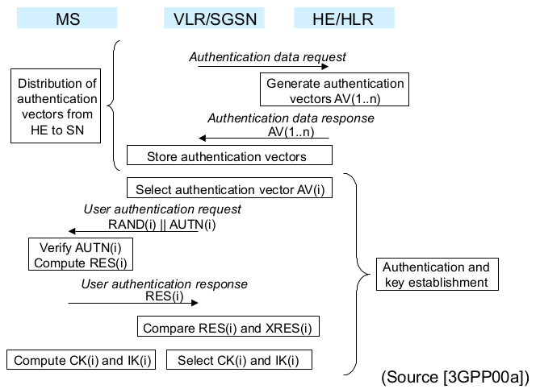
- 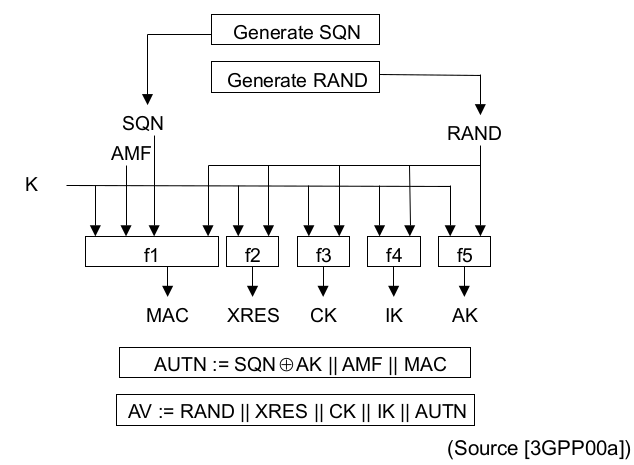
  - Der HE/AuC beginnt mit der Erzeugung einer neuen Sequenznummer SQN und einer unvorhersehbaren Herausforderung RAND
    - Für jeden Benutzer führt die HE/AuC einen Zähler $SQN_{HE}$
  - Ein Authentifizierungs- und Schlüsselverwaltungsfeld AMF ist im Authentifizierungs-Token jedes Authentifizierungsvektors enthalten.
  - Anschließend werden die folgenden Werte berechnet:
    - ein Nachrichtenauthentifizierungscode $MAC = f1_K(SQN || RAND || AMF)$, wobei f1 eine Nachrichtenauthentifizierungsfunktion ist
    - eine erwartete Antwort $XRES = f2_K(RAND)$, wobei f2 eine (möglicherweise verkürzte) Nachrichtenauthentifizierungsfunktion ist
    - ein Chiffrierschlüssel $CK = f3_K(RAND)$, wobei f3 eine Schlüsselerzeugungsfunktion ist
    - ein Integritätsschlüssel $IK = f4_K(RAND)$, wobei f4 eine Schlüsselerzeugungsfunktion ist
    - ein Anonymitätsschlüssel $AK = f5_K(RAND)$, wobei f5 eine Schlüsselerzeugungsfunktion ist
  - Schließlich wird das Authentifizierungstoken $AUTN = SQN \oplus AK || AMF || MAC$ konstruiert
- 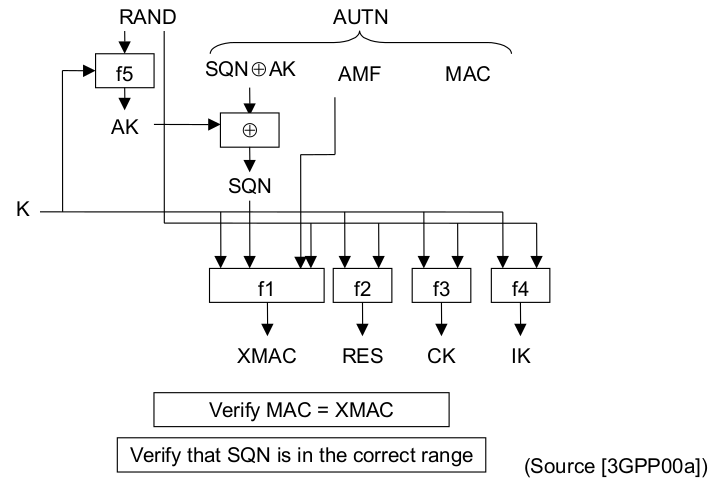
  - Nach Erhalt von RAND und AUTN berechnet das USIM:
  - berechnet es den Anonymitätsschlüssel $AK = f5_K (RAND)$
  - ruft die Sequenznummer $SQN = (SQN \oplus AK) \oplus AK$ ab
  - errechnet $XMAC = f1_K (SQN || RAND || AMF)$ und
  - vergleicht dies mit MAC, das in AUTN enthalten ist
  - Wenn sie unterschiedlich sind, sendet der Benutzer die Ablehnung der Benutzerauthentifizierung mit Angabe der Ursache an den VLR/SGSN zurück, und der Benutzer bricht das Verfahren ab.
  - Wenn die MAC korrekt ist, prüft das USIM, ob die empfangene Sequenznummer SQN im richtigen Bereich liegt:
    - Liegt die Sequenznummer nicht im korrekten Bereich, sendet das USIM einen Synchronisationsfehler an den VLR/SGSN zurück, einschließlich eines entsprechenden Parameters, und bricht das Verfahren ab.
  - Wenn die Sequenznummer im korrekten Bereich liegt, berechnet das USIM:
    - die Authentifizierungsantwort $RES = f2_K(RAND)$
    - den Chiffrierschlüssel $CK = f3_K(RAND)$ und den Integritätsschlüssel $IK = f4_K(RAND)$

### Schlussfolgerungen zur Sicherheit in UMTS Release'99
- Die Sicherheit von UMTS Release '99 ist der Sicherheit von GSM sehr ähnlich:
  - Der Heimat-AUC generiert Challenge-Response-Vektoren
  - Die Challenge-Response-Vektoren werden ungeschützt über das Signalisierungsnetz an ein besuchtes Netz übertragen, das die Authentizität eines Handys überprüfen muss.
  - Anders als bei GSM authentifiziert sich das Netz auch gegenüber dem Mobiltelefon
  - Die IMSI, die einen Benutzer eindeutig identifiziert:
    - wird immer noch dem besuchten Netz offenbart
    - kann immer noch von einem Angreifer, der sich als Basisstation ausgibt, abgefragt werden, da es in diesem Fall keine Netzauthentifizierung gibt!
  - Das Sicherheitsmodell setzt weiterhin Vertrauen zwischen allen Netzbetreibern voraus
  - Vertraulichkeit ist nur auf der Funkstrecke gegeben
- Zusammenfassend lässt sich sagen, dass UMTS Release'99 genauso sicher sein soll wie ein unsicheres Festnetz

## Sicherheit in LTE-Netzen
- Eine Weiterentwicklung von UMTS, so dass viele der Sicherheitskonzepte gleich geblieben sind
  - Das Protokoll zur Authentifizierung und Schlüsselvereinbarung (AKA) ist im Wesentlichen dasselbe wie bei UMTS.
  - Allerdings wird ein Master Key KASME abgeleitet, der dann zur Ableitung von Integritäts- und Verschlüsselungsschlüsseln verwendet wird
- Bemerkenswerte Unterschiede:
  - GSM-SIMs dürfen nicht mehr auf das Netz zugreifen
  - KASUMI wird nicht mehr verwendet, stattdessen werden SNOW, AES oder ZUC (ein chinesischer Stream Cipher, der für LTE entwickelt wurde) eingesetzt
  - Das zugehörige Festnetz (Evolved Packet Core genannt) ist vollständig paketvermittelt und normalerweise durch IPsec und IKEv2 geschützt.
  - Heim-eNBs
- Allerdings oft neue Namen für sehr ähnliche Dinge, z.B.,
  - Anstelle der TMSI wird eine Globally Unique Temporary Identity (GUTI) verwendet, die aus Folgendem besteht:
    - Einer PLMN-ID, MMEI und einer M-TMSI
    - Damit werden das Public Land Mobile Network (PLMN), die Mobility Management Entity (MME), vergleichbar mit der MSC in GSM/UMTS, und das mobile Gerät (M-TMSI) identifiziert


# Referenzen
- [AES01a] National Institute of Standards and Technology - Specification for the Advanced Encryption Standard (AES)
- [DR97a] J. Daemen, V. Rijmen - AES Proposal: Rijndael http://csrc.nist.gov/encryption/aes/rijndael/Rijndael.pdf
- [FMS01a] S. Fluhrer, I. Mantin, A. Shamir - Weaknesses in the Key Scheduling Algorithm of RC4. Eighth Annual Workshop on Selected Areas in Cryptography
- [Riv01a] R. Rivest. - RSA Security Response to Weaknesses in Key Scheduling Algorithm of RC4. http://www.rsa.com/rsalabs/node.asp
- [SIR01a] A. Stubblefield, J. Ioannidis, A. D. Rubin. - Using the Fluhrer, Mantin, and Shamir Attack to Break WEP. AT&T Labs Technical Report TD-4ZCPZZ
- [FKLS00] N. Ferguson, J. Kelsey, S. Lucks, B. Schneier, M. Stay, D.Wagner, D. Whiting - Improved cryptanalysis of Rijndael. In FSE’00, volume 1978 of Lecture Notes in Computer Science. Springer, 2000.
- [GM00] H. Gilbert and M. Minier - A Collision Attack on 7 Rounds of Rijndael. In AES Candidate Conference, 2000.
- [BKR11] A. Bogdanov, D. Khovratovich, C. Rechberger - Biclique cryptanalysis of the full AES. In ASIACRYPT’11, 2001.
- [Mir02] I. Mironov - (Not so) random shuffles of RC4. In Advances in Cryptology - CRYPTO 2002
- [Kle08] A.Klein. - Attacks on the RC4 stream cipher. In Designs, Codes and Cryptography
- [ETS12] ETSI/SAGE - Specification of the 3GPP confidentiality and integrity algorithms; Document 2: Kasumi specification
- [Kue01] U. Kühn. - Cryptanalysis of Reduced-Round MISTY. In Advances in Cryptology - EUROCRYPT 2001
- [BDN05] E. Biham, O. Dunkelman, N. Keller - A Related-Key Rectangle Attack on the Full KASUMI , In ASIACRYPT 2005
- [DKS10] O. Dunkelman, N. Keller, A. Shamir - A practical-time related-key attack on the KASUMI cryptosystem used in GSM and 3G telephony. In CRYPTO'10
- [ETS06] ETSI/SAGE - Specification of the 3GPP Confidentiality and Integrity Algorithms UEA2 & UIA2. Document 2: SNOW 3G Specification
- [KY11] A. Kircanski A.M. Youssef. - On the Sliding Property of SNOW 3G and SNOW 2.0 IET Inf. Secur.
- [Amo94] E. G. Amorosi. - Fundamentals of Computer Security Technology
- [Cha95] Brent Chapman and Elizabeth Zwicky - Building Internet Firewalls
- [For94b] Warwick Ford. - Computer Communications Security - Principles, Standard Protocols and Techniques.
- [Gar96] Simson Garfinkel and Gene Spafford - Practical Internet & Unix Security
- [Men97a] A. J. Menezes, P. C. Van Oorschot, S. A. Vanstone - Handbook of Applied Cryptography. CRC Press Series on Discrete Mathematics and Its Applications
- [SR14] G. Schäfer, M. Rossberg - Netzsicherheit
- [Sch96] B. Schneier - Applied Cryptography Second Edition: Protocols, Algorithms and Source Code in C
- [Sta13] W. Stallings - Cryptography and Network Security: Principles and Practice
- [Sti05] D. R. Stinson - Cryptography: Theory and Practice (Discrete Mathematics and Its Applications)
- [Bre88a] D. M. Bressoud. - Factorization and Primality Testing
- [Cor90a] T. H. Cormen, C. E. Leiserson, R. L. Rivest. Introduction to Algorithms.
- [DH76] W. Diffie, M. E. Hellman - New Directions in Cryptography
- [ElG85a] T. ElGamal - A Public Key Cryptosystem and a Signature Scheme based on Discrete Logarithms.
- [Kob87a] N. Koblitz - A Course in Number Theory and Cryptography
- [Men93a] A. J. Menezes - Elliptic Curve Public Key Cryptosystems.
- [Niv80a] I. Niven, H. Zuckerman - An Introduction to the Theory of Numbers
- [RSA78] R. Rivest, A. Shamir und L. Adleman - A Method for Obtaining Digital Signatures and Public Key Cryptosystems
- [KAFL10] T. Kleinjung, K. Aoki, J. Franke, A. Lenstra, E. Thomé, J. Bos, P. Gaudry, A. Kruppa, P. Montgomery, D. Osvik, H. Te Riele, A.Timofeev, P. Zimmermann - Factorization of a 768-bit RSA modulus
- [LM10] M. Lochter, J. Merkle - Elliptic Curve Cryptography (ECC) Brainpool Standard Curves and Curve Generation 
- [NIST99] NIST - Recommended Elliptic Curves for Federal Government Use
- [NIST12] NIST - Recommendation for Key Management: Part 1: General (Revision 3)
- [Ko87] N. Koblitz - Elliptic Curve Cryptosystems
- [BBP12] B.B. Brumley, M. Barbosa, D. Page, F. Vercauteren - Practical realisation and elimination of an ECC-related software bug attack
- [BT11] B.B. Brumley, N. Tuveri - Remote timing attacks are still practical
- [BLR08] D. Bernstein, T. Lange, R. Rezaeian Farashahi - Binary Edwards Curves
- [NIST09] NIST - Digital Signature Standard (DSS)
- [SM09] A. Sorniotti, R. Molva - A provably secure secret handshake with dynamic controlled matching
- [BF03] D. Boneh, M. Franklin - Identity-Based Encryption from the Weil Pairing
- [Sch85] R. Schoof - Elliptic Curves over Finite Fields and the Computation of Square Roots mod p
- [Kra97a] H. Krawczyk, M. Bellare, R. Canetti. HMAC: Keyed-Hashing for Message Authentication. Internet RFC 2104, February 1997.
- [Mer89a] R. Merkle. One Way Hash Functions and DES. Proceedings of Crypto ‘89, Springer, 1989
- [Men97a] A. J. Menezes, P. C. Van Oorschot, S. A. Vanstone. Handbook of Applied Cryptography, CRC Press Series on Discrete Mathematics and Its Applications, Hardcover, 816 pages, CRC Press, 1997
- [NIST02] National Institute of Standards and Technology (NIST). Secure Hash Standard. Federal Information Processing Standards Publication (FIPS PUB), 180-2, 2002
- [Riv92a] R. L. Rivest. The MD5 Message Digest Algorithm. Internet RFC 1321, April 1992
- [Rob96a] M. Robshaw. On Recent Results for MD2, MD4 and MD5. RSA Laboratories' Bulletin, No. 4, November 1996
- [WYY05a] X. Wang, Y. L. Yin, H. Yu. Finding collisions in the full SHA-1. In Advances in Cryptology - CRYPTO'05, pages 18-36, 2005
- [Yuv79a] G. Yuval. How to Swindle Rabin. Cryptologia, July 1979.
- [WLYF04] X. Wang, D. Feng, X. Lai, H. Yu. Collisions for Hash Functions MD4, MD5, HAVAL-128 and RIPEMD. IACR Eprint archive, 2004.
- [LWW05] A. Lenstra, X. Wang, B. de Weger. Colliding X.509 Certificates. Cryptology ePrint Archive: Report 2005/067. 2005
- [LD05] S. Lucks, M. Daum. The Story of Alice and her Boss. In Rump session of Eurocrypt’05. 2005.
- [Kl06] V. Klima. Tunnels in Hash Functions: MD5 Collisions Within a Minute (extended abstract), Cryptology ePrint Archive: Report 2006/105, 2006
- [SA09] Y. Sasaki, K. Aoki. Finding Preimages in Full MD5 Faster Than Exhaustive Search. Advances in Cryptology - EUROCRYPT’09. 2009
- [Man11] M. Manuel. Classification and Generation of Disturbance Vectors for Collision Attacks against SHA-1. Journal Designs, Codes and Cryptography. Volume 59, Issue 1-3, pages 247-263, 2011
- [GH04] H. Gilbert, H. Handschuh. Security Analysis of SHA-256 and Sisters. Lecture Notes in Computer Science, 2004, Volume 3006/2004, pages 175-193. 2004
- [AGM09] K. Aoki, J. Guo, K. Matusiewicz, V. Sasaki, L. Wang. Preimages for Step-Reduced SHA-2. Advances in Cryptology - ASIACRYPT 2009. pages 578-597, 2009
- [KK06] J. Kelsey, T. Kohno. Herding Hash Functions and the Nostradamus Attack. Advances in Cryptology - EUROCRYPT’06. 2006
- [Jou04] A. Joux: Multicollisions in Iterated Hash Functions. Application to Cascaded Constructions. CRYPTO 2004: pages 306-316. 2004
- [MV04] D. McGrew, J. Viega. The Security and Performance of the Galois/Counter Mode (GCM) of Operation (Full Version). [http://eprint.iacr.org/2004/193.](http://eprint.iacr.org/2004/193.)
- [Fer05] N. Ferguson. Authentication weaknesses in GCM. 2005
- [Dwo07] M. Dworkin. Recommendation for Block Cipher Modes of Operation: Galois/Counter Mode (GCM) and GMAC. NIST Special Publication 800-38D. 2007
- [Saa11] M. Saarinen. GCM, GHASH and Weak Keys. Cryptology ePrint Archive, Report 2011/202, [http://eprint.iacr.org/2011/202,](http://eprint.iacr.org/2011/202,) 2011
- [BDP07] G. Bertoni, J. Daemen, M. Peeters, G. Van Assche. Sponge Functions. Ecrypt Hash Workshop 2007
- [BDP11a] G. Bertoni, J. Daemen, M. Peeters, G. Van Assche. Cryptographic sponge functions. Research report. Version 0.1. 2011
- [BDP11b] G. Bertoni, J. Daemen, M. Peeters, G. Van Assche. The Keccak reference. Research report. Version 3.0. 2011
- [BM92] BELLOVIN, S.; MERRITT, M.: Encrypted Key Exchange: Password-Based Protocols Secure Against Dictionary Attacks. In: IEEE Computer Society Symposium on Research in Security and Privacy, 1992
- [Bry88] BRYANT, R.: Designing an Authentication System: A Dialogue in Four Scenes. 1988. Project Athena, Massachusetts Institute of Technology, Cambridge, USA 
- [GNY90] GONG, L.; NEEDHAM, R. M.; YAHALOM, R.: Reasoning About Belief in Cryptographic Protocols. In: Symposium on Research in Security and Privacy IEEE Computer Society, IEEE Computer Society Press, May 1990
- [KNT94] KOHL, J.; NEUMAN, B.; TS’O, T.: The Evolution of the Kerberos Authentication Service. In: BRAZIER, F.; JOHANSEN, D. (Eds): Distributed Open Systems, IEEE Computer Society Press, 1994
- [NS78] NEEDHAM, R. M.; SCHROEDER, M. D.: Using Encryption for Authentication in Large Networks of Computers. In: Communications of the ACM, 1978
- [NS87] NEEDHAM, R.; SCHROEDER, M.: Authentication Revisited. In: Operating Systems Review, 1987
- [NYH+05] NEUMAN, C.; YU, T.; HARTMAN, S. ; RAEBURN, K.: The Kerberos Network Authentication Service (V5)_. 2005. - RFC 4120, IETF, Status: Standard, https://tools.ietf.org/html/rfc4120
- [OR87] OTWAY, D.; REES, O.: Efficient and Timely Mutual Authentication. In: Operating Systems Review, 1987
- [Pat97] PATEL, S.: Number Theoretic Attacks On Secure Password Schemes. In: IEEE Symposium on Security and Privacy, 1997
- [Sch05] SCHAAD, J.: Internet X.509 Public Key Infrastructure Certificate Request Message Format (CRMF). September 2005. - RFC 4211, IETF, Status: Proposed Standard, https://tools.ietf.org/html/rfc4211
- [RFC1661] W. Simpson. _The Point-to-Point Protocol (PPP)._ RFC 1661, 1994.
- [RFC1968] G. Meyer. _The PPP Encryption Control Protocol (ECP)._ RFC 1968, 1996.
- [RFC1994] W. Simpson. _PPP Challenge Handshake Authentication Protocol (CHAP)._ RFC 1994 (obsoletes RFC 1334), 1996.
- [RFC2284] L. Blunk, J. Vollbrecht. _PPP Extensible Authentication Protocol (EAP)._ RFC 2284, 1998.
- [RFC2289] N. Haller, C. Metz, P. Nesser, M. Straw. _A One-Time Password System._ RFC 2289, 1998.
- [RFC2341] A. Valencia, M. Littlewood, T. Kolar. _Cisco Layer Two Forwarding Protocol (L2F)._ RFC 2341, 1998.
- [RFC2419] K. Sklower, G. Meyer. _The PPP DES Encryption Protocol, Version 2 (DESE-bis)._ RFC 2419 (obsoletes RFC 1969), 1998.
- [RFC2420] H. Kummert. _The PPP Triple-DES Encryption Protocol (3DESE)._ RFC 2420, 1998.
- [RFC2433] G. Zorn, S. Cobb. _Microsoft PPP CHAP Extensions._ RFC 2433, 1998.
- [RFC2637] K. Hamzeh, G. Pall , W. Verthein, J. Taarud, W. Little, G. Zorn. _Point-to-Point Tunneling Protocol (PPTP)._ RFC 2637, 1999.
- [RFC2661] W. Townsley, A. Valencia, A. Rubens, G. Pall, G. Zorn, B. Palter. _Layer Two Tunneling Protocol (L2TP)._ RFC 2661, 1999.
- [RFC2828] R. Shirey. _Internet Security Glossary._ RFC 2828, 2000. 
- [RFC3078] G. Pall, G. Zorn. _Microsoft Point to Point Encryption Protocol (MPPE)._ RFC 3078, 2001.
- [SM98a] B. Schneier, Mudge. _Cryptanalysis of Microsoft’s Point-to-Point Tunneling Protocol (PPTP)._ Proceedings of the 5th ACM Conference on Communications and Computer Security, ACM Press, 1998.
- [SMW99a] B. Schneier, Mudge, D. Wagner. _Cryptanalysis of Microsoft's PPTP Authentication Extensions (MSCHAPv2)._ Counterpane Systems, 1999.
- [FH98a] P. Ferguson, G. Huston. _What is a VPN?_ The Internet Protocol Journal, Cisco Systems. 1998.
- [ATM99a] ATM Forum. _ATM Security Specification Version 1.0._ AF-SEC-0100.000,
- [RFC2401] R. Atkinson, S. Kent. Security Architecture for the Internet Protocol. RFC 2401, Internet Engineering Taskforce (IETF), 1998.
- [RFC2402] R. Atkinson, S. Kent. IP Authentication Header (AH). RFC 2402, IETF, 1998. [RFC2403] C. Madson, R. Glenn. The Use of HMAC-MD5-96 within ESP and AH. RFC 2403, IETF, 1998.
- [RFC2404] C. Madson, R. Glenn. The Use of HMAC-SHA-1-96 within ESP and AH. RFC 2404, IETF, 1998.
- [RFC2405] C. Madson, N. Doraswami. The ESP DES-CBC Cipher Algorithm With Explicit IV. RFC 2405, IETF, 1998.
- [RFC2406] R. Atkinson, S. Kent. IP Encapsulating Security Payload (ESP). RFC 2406, IETF, 1998.
- [RFC2407] D. Piper. The Internet IP Security Domain of Interpretation for ISAKMP. RFC 2407, IETF, 1998.
- [RFC2408] D. Maughan, M. Schertler, M. Schneider, J. Turner. Internet Security Association and Key Management Protocol (ISAKMP). RFC 2408, - IETF, 1998.
- [RFC2409] D. Harkins, D. Carrel. The Internet Key Exchange (IKE). RFC 2409, IETF, 1998.
- [RFC2857] A. Keromytis, N. Provos. The Use of HMAC-RIPEMD-160-96 within ESP and AH. RFC 2857, IETF, 2000.
- [RFC3947] T. Kivinen, B. Swander, A. Huttunen, V. Volpe: _Negotiation of NAT-Traversal in the IKE._ RFC 3947, IETF, 2005.
- [RFC3948] A. Huttunen, B. Swander, V. Volpe, L. DiBurro, M. Stenberg: _UDP Encapsulation of IPsec ESP Packets._ RFC 3948, IETF, 2005.
- [RFC4306] C. Kaufman: _Internet Key Exchange (IKEv2) Protocol._ RFC 4306, Internet Engineering Taskforce (IETF), 2005.
- [NiMe08] P. Nikander, J. Melen: _A Bound End-to-End Tunnel (BEET) mode for ESP._ Internet-Draft, IETF Network Working Group, 2008.
- [Bhai08] Y. Bhaiji: _Network Security Technologies and Solutions_ , Cisco Press, 2008.
- [Fluh01] S. Fluhrer: _Tunnel Endpoint Discovery._ Expired Internet-Draft, IETF IPSP Working Group, 2001.
- [Tran06] T.H. Tran: _Proactive Multicast-Based IPSEC Discovery Protocol and Multicast Extension._ Military Communications Conference, 2006.
- [FBJW08] R. Figueiredo, P. O. Boykin, P. St. Juste, D. Wolinsky: _Social VPNs: Integrating Overlay and Social Networks for Seamless P2P Networking’._ IEEE WETICE/COPS, 2008.
- [RSS10] M. Rossberg, T. Strufe, G. Schaefer: _Distributed Automatic Configuration of Complex IPsec-Infrastructures._ Journal of Network and Systems Management, Volume 18, Issue 3, 2010.
- [RSSM09] M. Rossberg, W. Steudel, G.Schaefer, M. Martius: _Eine Software-Architektur zur Konstruktion flexibler IPsec-Infrastrukturen._ BSI 11. Deutscher IT-Sicherheitskongress, 2009.
- [BKS98a] D. Bleichenbacher, B. Kaliski, J. Staddon. _Recent Results on PKCS #1: RSA Encryption Standard._ RSA Laboratories' Bulletin 7, 1998
- [Cop96a] D. Coppersmith, M. K. Franklin, J. Patarin, M. K. Reiter. _Low Exponent RSA with Related Messages._ In Advance in Cryptology -- Eurocrypt'96, U. Maurer, Ed., vol. 1070 of Lectures Notes in Computer Science, Springer-Verlag, 1996
- [FKK96a] A. O. Freier, P. Karlton, P. C. Kocher. _The SSL Protocol Version 3.0._ Netscape Communications Corporation, 1996
- [DA99] T. Dierks, C. Allen. _The TLS Protocol Version 1.0._ RFC 2246, 1999
- [DR08] T. Dierks, E. Rescorla. _The Transport Layer Security (TLS) Protocol Version 1.2._ RFC 5246, 2008
- [RD10] J. Rizzo, T. Duong, Practical Padding Oracle Attacks, 4th USENIX conference on Offensive technologies (WOOT), 2010
- [RRDO10] E. Rescorla, M. Ray, S. Dispensa, N. Oskov. _Transport Layer Security (TLS) Renegotiation Indication Extension_ , RFC 5746. 2010
- [Zo11] T. Zoller. _TLS & SSLv3 renegotiation vulnerability._ Technical report, G-SEC. 2011
- [RM12] E. Rescorla, N. Modadugu. _Datagram Transport Layer Security Version 1.2._ RFC 6347, 2012
- [LL06] S. Lehtinen, C. Lonvick. _The Secure Shell (SSH) Protocol Assigned Numbers._ RFC 4250, 2006
- [YL06a] T. Ylonen, C. Lonvick. _The Secure Shell (SSH) Protocol Architecture._ RFC 4251, 2006
- [YL06b] T. Ylonen, C. Lonvick. _The Secure Shell (SSH) Authentication Protocol._ RFC 4252, 2006
 -[YL06c] T. Ylonen, C. Lonvick. _The Secure Shell (SSH) Transport Layer Protocol_ , RFC 4253, 2006
 -[YL06d] T. Ylonen, C. Lonvick. _The Secure Shell (SSH) Connection Protocol._ RFC 4254, 2006
 -[SG09] D. Stebila, J. Green. _Elliptic Curve Algorithm Integration in the Secure Shell Transport Layer_ , RFC 5656. 2009
 -[IS09] K. Igoe, J. Solinas. _AES Galois Counter Mode for the Secure Shell Transport Layer Protocol._ RFC 5647. 2009
- [Müller99a] G. Müller, K. Rannenberg (Ed.). _Multilateral Security in Communications._ Addison-Wesley-Longman, 1999
- [BGW01a] N. Borisov, I. Goldberg, D. Wagner. Intercepting Mobile Communications: The Insecurity of 802.11. 7th ACM SIGMOBILE Annual International Conference on Mobile Computing and Networking (MOBICOM), Rome, Italy, July 2001
- [FMS01a] S. Fluhrer, I. Mantin, A. Shamir. Weaknesses in the Key Scheduling Algorithm of RC4. Eighth Annual Workshop on Selected Areas in Cryptography, August 2001
[IEEE12] IEEE. Wireless LAN Medium Access Control (MAC) and Physical Layer (PHY) Specifications. IEEE Std 802.11-2012, The Institute of Electrical and Electronics Engineers (IEEE), 2012
- [Riv01a] R. Rivest. RSA Security Response to Weaknesses in Key Scheduling Algorithm of RC4. http://www.rsa.com/rsalabs/technotes/wep.html, 2001
- [SIR01a] A. Stubblefield, J. Ioannidis, A. D. Rubin. Using the Fluhrer, Mantin, and Shamir Attack to Break WEP. AT&T Labs Technical Report TD-4ZCPZZ, August 2001
- [TWP07] E. Tews, R. P. Weinmann, A. Pyshkin. Breaking 104 bit WEP in less than 60 seconds. Information Security Applications, 188-202, 2007
- [WM02a] N. C. Winget, T. Moore, D. Stanley, J. Walker. IEEE 802.11i Overview. NIST 802.11 Wireless LAN Security Workshop, Falls Church, Virginia, December 4-5, 2002
- [RFC2898]B. Kaliski. PKCS #5: Password-Based Cryptography Specification Version 2.0. IETF Request for Comments 2898, 2000
- [RFC3394]J. Schaad, R. Housley. Advanced Encryption Standard (AES) Key Wrap Algorithm. IETF Request for Comments 3394, 2002
- [3GPP00a] 3GPP. 3G Security: Security Architecture (Release 1999). 3rd Generation Partnership Project, Technical Specification Group Services and System Aspects, 2000
- [3GPP02a] 3GPP. 3G Security: Security Architecture (Release 5), 2002
- [3GPP02b] 3GPP. Security Mechanisms for the (U)SIM application toolkit, December 2002
- [ETSI93a] ETSI TC-GSM. GSM Security Aspects (GSM 02.09). Recommendation GSM, European Telecommunications Standards Institute (ETSI), 1993
- [ETSI94a] ETSI TC-SMG. European Digital Cellular Telecommunications System (Phase 2): Security Related Network Functions (GSM 03.20). ETS 300 534, European Telecommunications Standards Institute (ETSI), 1994
- [Les02a] Lescuyer, P. UMTS – Grundlagen, Architektur und Standard. dpunkt.verlag, 2002
- [Sch03a] J. Schiller. Mobile Communications - The Course. [http://www.inf.fu-berlin.de/inst/ag-tech/resources/mobilecommunications.htm](http://www.inf.fu-berlin.de/inst/ag-tech/resources/mobilecommunications.htm)
- [Sch03b] J. Schiller. Mobile Communications. second edition, Addison-Wesley, 2003