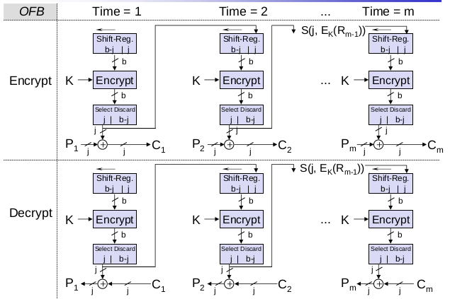

- [Einleitung](#einleitung)
  - [Was ist eine Bedrohung in einem Kommunikationsnetz?](#was-ist-eine-bedrohung-in-einem-kommunikationsnetz)
  - [Sicherheitsziele in Abhängigkeit von der Anwendungsumgebung](#sicherheitsziele-in-abhängigkeit-von-der-anwendungsumgebung)
  - [Sicherheitsziele technisch definiert](#sicherheitsziele-technisch-definiert)
  - [Technisch definierte Bedrohungen](#technisch-definierte-bedrohungen)
  - [Bedrohungen und technische Sicherheitsziele](#bedrohungen-und-technische-sicherheitsziele)
  - [Analyse der Netzwerksicherheit](#analyse-der-netzwerksicherheit)
  - [Angriffe auf die Kommunikation auf der Nachrichtenebene](#angriffe-auf-die-kommunikation-auf-der-nachrichtenebene)
  - [Schutzmaßnahmen gegen Bedrohungen der Informationssicherheit](#schutzmaßnahmen-gegen-bedrohungen-der-informationssicherheit)
  - [Kommunikationssicherheit: Einige Terminologie](#kommunikationssicherheit-einige-terminologie)
  - [Sicherheitsdienste - Überblick](#sicherheitsdienste---überblick)
  - [Sicherheitsunterstützende Mechanismen](#sicherheitsunterstützende-mechanismen)
  - [Kryptologie - Definition und Terminologie](#kryptologie---definition-und-terminologie)
  - [Kryptologie - einige historische Anmerkungen](#kryptologie---einige-historische-anmerkungen)
- [Grundlagen der Kryptographie](#grundlagen-der-kryptographie)
  - [Kryptographische Algorithmen: Überblick](#kryptographische-algorithmen-überblick)
  - [Angriff auf die Kryptographie](#angriff-auf-die-kryptographie)
  - [Kryptoanalyse](#kryptoanalyse)
    - [Brute-Force-Angriff](#brute-force-angriff)
    - [Wie groß ist groß?](#wie-groß-ist-groß)
    - [Wichtige Eigenschaften von Verschlüsselungsalgorithmen](#wichtige-eigenschaften-von-verschlüsselungsalgorithmen)
  - [Klassifizierung von Verschlüsselungsalgorithmen: Drei Dimensionen](#klassifizierung-von-verschlüsselungsalgorithmen-drei-dimensionen)
  - [Kryptographische Algorithmen - Überblick](#kryptographische-algorithmen---überblick)
- [Symmetrische Kryptographie](#symmetrische-kryptographie)
  - [Symmetrische Verschlüsselung](#symmetrische-verschlüsselung)
  - [Symmetrische Blockchiffren - Verschlüsselungsarten](#symmetrische-blockchiffren---verschlüsselungsarten)
  - [Der Datenverschlüsselungsstandard (DES)](#der-datenverschlüsselungsstandard-des)
    - [DES - Einzelne Iteration](#des---einzelne-iteration)
    - [DES - Entschlüsselung](#des---entschlüsselung)
    - [DES - Sicherheit](#des---sicherheit)
    - [Erweiterung der Schlüssellänge von DES durch Mehrfachverschlüsselung](#erweiterung-der-schlüssellänge-von-des-durch-mehrfachverschlüsselung)
  - [Der fortgeschrittene Verschlüsselungsstandard AES](#der-fortgeschrittene-verschlüsselungsstandard-aes)
    - [AES - Sicherheit](#aes---sicherheit)
  - [Der Stromchiffre-Algorithmus RC4](#der-stromchiffre-algorithmus-rc4)
  - [KASUMI](#kasumi)
    - [KASUMI - Sicherheitsdiskussion](#kasumi---sicherheitsdiskussion)
- [Asymmetrische Kryptographie](#asymmetrische-kryptographie)
  - [Einige mathematische Hintergründe](#einige-mathematische-hintergründe)
  - [Der RSA Public Key Algorithmus](#der-rsa-public-key-algorithmus)
  - [Einige weitere mathematische Hintergründe](#einige-weitere-mathematische-hintergründe)
  - [Diffie-Hellman-Schlüsselaustausch](#diffie-hellman-schlüsselaustausch)
  - [ElGamal Algorithmus](#elgamal-algorithmus)
  - [Elliptische Kurven Kryptographie](#elliptische-kurven-kryptographie)
    - [Gruppenelemente](#gruppenelemente)
    - [Punktaddition](#punktaddition)
    - [Grundlagen des ECC - Algebraische Addition](#grundlagen-des-ecc---algebraische-addition)
    - [Multiplikation](#multiplikation)
    - [Kurven über $\mathbb{Z}_p$](#kurven-über-mathbbz_p)
    - [Berechnen Sie die y-Werte in $\mathbb{Z}_p$](#berechnen-sie-die-y-werte-in-mathbbz_p)
    - [Addition und Multiplikation in $\mathbb{Z}_p$](#addition-und-multiplikation-in-mathbbz_p)
    - [Foundations of ECC - Größe der erzeugten Gruppen](#foundations-of-ecc---größe-der-erzeugten-gruppen)
    - [ECDH](#ecdh)
    - [EC-Version des ElGamal-Algorithmus](#ec-version-des-elgamal-algorithmus)
    - [Sicherheit](#sicherheit)
    - [Weitere Anmerkungen](#weitere-anmerkungen)
  - [Schlussfolgerung](#schlussfolgerung)
- [Modifikationsprüfwerte](#modifikationsprüfwerte)
- [Zufallszahlengenerierung](#zufallszahlengenerierung)
- [Kryptographische Protokolle](#kryptographische-protokolle)
- [Sichere Gruppenkommunikation](#sichere-gruppenkommunikation)
- [Zugriffskontrolle](#zugriffskontrolle)
- [Integration von Sicherheitsdiensten in Kommunikationsarchitekturen](#integration-von-sicherheitsdiensten-in-kommunikationsarchitekturen)
- [Sicherheitsprotokolle der Datenübertragungsschicht](#sicherheitsprotokolle-der-datenübertragungsschicht)
- [Die IPsec-Architektur für das Internet-Protokoll](#die-ipsec-architektur-für-das-internet-protokoll)
- [Security protocols of the transport layer](#security-protocols-of-the-transport-layer)
- [Sicherheitsaspekte der mobilen Kommunikation](#sicherheitsaspekte-der-mobilen-kommunikation)
- [Sicherheit von drahtlosen lokalen Netzen](#sicherheit-von-drahtlosen-lokalen-netzen)
- [Sicherheit von GSM- und UMTS-Netzen](#sicherheit-von-gsm--und-umts-netzen)
- [References](#references)


# Einleitung
## Was ist eine Bedrohung in einem Kommunikationsnetz?
- Abstrakte Definition
    - Eine Bedrohung in einem Kommunikationsnetz ist ein mögliches Ereignis oder eine Folge von Aktionen, die zu einer Verletzung eines oder mehrerer Sicherheitsziele führen können.
    - Die tatsächliche Realisierung einer Bedrohung wird als Angriff bezeichnet.
- Beispiele
    - Ein Hacker bricht in einen Firmencomputer ein
    - Offenlegung von E-Mails während der Übertragung
    - Jemand ändert Finanzbuchhaltungsdaten
    - Ein Hacker, der eine Website vorübergehend außer Betrieb setzt
    - Jemand, der Dienstleistungen in Anspruch nimmt oder Waren im Namen anderer bestellt
- Was sind Sicherheitsziele?
    - Sicherheitsziele können definiert werden
    - in Abhängigkeit von der Anwendungsumgebung oder
    - auf eine allgemeinere, technische Weise

## Sicherheitsziele in Abhängigkeit von der Anwendungsumgebung
- Bankwesen
    - Schutz vor betrügerischen oder versehentlichen Änderungen von Transaktionen
    - Identifizierung von Kunden bei Privatkundentransaktionen
    - Schutz von PINs vor Offenlegung
    - Sicherstellung der Privatsphäre der Kunden
- Elektronischer Handel
    - Sicherstellung der Herkunft und Integrität von Transaktionen
    - Schutz der Privatsphäre von Unternehmen
    - Rechtsverbindliche elektronische Signaturen für Transaktionen bereitstellen
- Regierung
    - Schutz vor Offenlegung sensibler Informationen
    - Bereitstellung elektronischer Signaturen für Regierungsdokumente
- Öffentliche Telekommunikationsanbieter
    - Beschränken Sie den Zugang zu Verwaltungsfunktionen auf autorisiertes Personal
    - Schutz vor Dienstunterbrechungen
    - Schutz der Privatsphäre der Teilnehmer
- Firmen-/Privatnetzwerke
    - Schutz der Privatsphäre von Unternehmen/Personen
    - Sicherstellung der Authentizität von Nachrichten
- Alle Netzwerke
    - Verhinderung des Eindringens von außen (wer will schon Hacker?)
- Manchmal werden Sicherheitsziele auch als Sicherheitsvorgaben bezeichnet

## Sicherheitsziele technisch definiert
- **Vertraulichkeit (Confidentiality)**
    - Übertragene oder gespeicherte Daten sollten nur einem bestimmten Personenkreis zugänglich gemacht werden.
    - Die Vertraulichkeit von Entitäten wird auch als Anonymität bezeichnet.
- **Integrität der Daten (Data Integrity)**
    - Es sollte möglich sein, jede Veränderung von Daten zu erkennen.
    - Dies setzt voraus, dass der Ersteller bestimmter Daten identifiziert werden kann.
- **Rechenschaftspflicht (Accountability)**
    - Es sollte möglich sein, die für ein Kommunikationsereignis verantwortliche Stelle zu identifizieren.
- **Verfügbarkeit (Availability)**
    - Die Dienste sollten verfügbar sein und korrekt funktionieren.
- **Kontrollierter Zugang (Controlled Access)**
    - Nur autorisierte Stellen sollten auf bestimmte Dienste oder Informationen zugreifen können.

## Technisch definierte Bedrohungen
- **Maskerade (oder Man-in-the-Middle-Angriff, Masquerade)**
    - Eine Entität gibt sich als eine andere Entität aus
- **Lauschangriff (Eavesdropping)**
    - Eine Entität liest Informationen, die sie nicht lesen soll
- **Verletzung der Berechtigung (Authorization Violation)**
    - Eine Entität nutzt einen Dienst oder Ressourcen, für die sie nicht vorgesehen ist
- **Verlust oder Veränderung** von (übertragenen) Informationen (Loss or Modification of (transmitted) Information)
    - Daten werden verändert oder zerstört
- **Verweigerung von Kommunikationsakten (Denial of Communication Acts, Repudiation)**
    - Ein Unternehmen leugnet fälschlicherweise seine Teilnahme an einer Kommunikationshandlung
- **Fälschung von Informationen (Forgery of Information)**
    - Ein Unternehmen erstellt neue Informationen im Namen eines anderen Unternehmens
- **Sabotage (oder Denial-of-Service-Angriffe)**
    - Jede Aktion, die darauf abzielt, die Verfügbarkeit und/oder das ordnungsgemäße Funktionieren von Diensten oder Systemen zu beeinträchtigen.

## Bedrohungen und technische Sicherheitsziele
Diese Bedrohungen werden oft kombiniert, um einen Angriff durchzuführen!

| Technische Sicherheitsziele | Maskerade | Abhören | Autorisierungsverletzung | Verlust oder Modifikation von (übertragenen) Informationen | Denial of Communication-Aktionen | Fälschung von Informationen | Sabotage (z.B. durch Überlastung) |
| --------------------------- | --------- | ------- | ------------------------ | ---------------------------------------------------------- | -------------------------------- | --------------------------- | --------------------------------- |
| Vertraulichkeit             | x         | x       | x                        |
| Datenintegrität             | x         |         | x                        | x                                                          | x                                | x                           |
| Rechenschaftspflicht        | x         |         | x                        |                                                            | x                                | x                           |                                   |
| Verfügbarkeit               | x         |         | x                        | x                                                          |                                  |                             | x                                 |  |
| Kontrollierter Zugriff      | x         |         | x                        |                                                            |                                  | x                           |                                   |

## Analyse der Netzwerksicherheit
- Um geeignete Gegenmaßnahmen gegen Bedrohungen ergreifen zu können, müssen diese für eine gegebene Netzkonfiguration angemessen bewertet werden.
- Daher ist eine detaillierte Netzsicherheitsanalyse erforderlich, die
    - das Risikopotenzial der allgemeinen Bedrohungen für die ein Netz nutzenden Einheiten bewertet und
    - den Aufwand (Ressourcen, Zeit usw.) abschätzt, der zur Durchführung bekannter Angriffe erforderlich ist.
    - Achtung! Es ist im Allgemeinen unmöglich, unbekannte Angriffe zu bewerten!
- Eine detaillierte Sicherheitsanalyse einer bestimmten Netzkonfiguration / spezifischen Protokollarchitektur
    - kann auch erforderlich sein, um die Finanzkontrolleure eines Unternehmens davon zu überzeugen, Mittel für Sicherheitsverbesserungen bereitzustellen, und
    - kann besser nach den feinkörnigeren Angriffen auf der Nachrichtenebene strukturiert werden.

## Angriffe auf die Kommunikation auf der Nachrichtenebene
- Passive Angriffe
    - Lauschangriff
- Aktive Angriffe
    - Verzögerung von PDUs (Protocol Data Units)
    - Wiederholung von PDUs
    - Löschung von PDUs
    - Modifikation von PDUs
    - Einfügung von PDUs
- Die erfolgreiche Durchführung eines der oben genannten Angriffe erfordert
    - Es gibt keine erkennbaren Nebeneffekte auf andere Kommunikationen (Verbindungen/verbindungslose Übertragungen)
    - Es gibt keine Nebenwirkungen auf andere PDUs der gleichen Verbindung/verbindungslosen Datenübertragung zwischen den gleichen Entitäten
- Eine Sicherheitsanalyse einer Protokollarchitektur muss diese Angriffe entsprechend den Schichten der Architektur analysieren

## Schutzmaßnahmen gegen Bedrohungen der Informationssicherheit
- Physische Sicherheit
    - Schlösser oder andere physische Zugangskontrollen
    - Manipulationssicherung empfindlicher Geräte
    - Umweltkontrollen
- Personelle Sicherheit
    - Identifizierung von sensiblen Positionen
    - Verfahren zur Überprüfung der Mitarbeiter
    - Sicherheitsschulung und -bewusstsein
- Administrative Sicherheit
    - Kontrolle des Imports von Fremdsoftware
    - Verfahren zur Untersuchung von Sicherheitsverstößen
    - Überprüfung von Prüfpfaden
    - Überprüfung von Kontrollen der Rechenschaftspflicht
- Strahlungssicherheit
    - Kontrolle von Funkfrequenzen und anderen elektromagnetischen Abstrahlungen
    - Bezeichnet als TEMPEST-Schutz
- Mediensicherheit
    - Absicherung der Speicherung von Informationen
    - Kontrolle der Kennzeichnung, Vervielfältigung und Vernichtung von sensiblen Informationen
    - Sicherstellen, dass Medien mit sensiblen Informationen sicher vernichtet werden
    - Scannen von Medien auf Viren
- Lebenszyklus-Kontrollen
    - Vertrauenswürdiger Systementwurf, -implementierung, -bewertung und -übernahme
    - Programmierstandards und -kontrollen
    - Kontrollen der Dokumentation
- Computer-Sicherheit
    - Schutz von Informationen während der Speicherung/Verarbeitung in einem Computersystem
    - Schutz der Datenverarbeitungsgeräte selbst
- Sicherheit der Kommunikation
    - Schutz von Informationen während des Transports von einem System zu einem anderen
    - Schutz der Kommunikationsinfrastruktur selbst

## Kommunikationssicherheit: Einige Terminologie
- Sicherheitsdienst
    - Ein abstrakter Dienst, der eine bestimmte Sicherheitseigenschaft gewährleisten soll.
    - Ein Sicherheitsdienst kann sowohl mit Hilfe von kryptografischen Algorithmen und Protokollen als auch mit herkömmlichen Mitteln realisiert werden
        - Man kann ein elektronisches Dokument auf einem USB-Stick vertraulich halten, indem man es in einem verschlüsselten Format auf dem Datenträger speichert und den Datenträger in einem Tresor wegschließt.
        - In der Regel ist eine Kombination aus kryptografischen und anderen Mitteln am effektivsten
- Kryptographischer Algorithmus
    - Eine mathematische Umwandlung von Eingabedaten (z. B. Daten, Schlüssel) in Ausgabedaten
    - Kryptografische Algorithmen werden in kryptografischen Protokollen verwendet.
- Kryptografisches Protokoll
    - Eine Reihe von Schritten und der Austausch von Nachrichten zwischen mehreren Einheiten, um ein bestimmtes Sicherheitsziel zu erreichen

## Sicherheitsdienste - Überblick
- **Authentifizierung (Authentication)**
    - Der grundlegendste Sicherheitsdienst, der sicherstellt, dass eine Entität tatsächlich die Identität besitzt, die sie vorgibt zu haben
- **Integrität (Integrity)**
    - In gewisser Weise der "kleine Bruder" des Authentifizierungsdienstes, da er sicherstellt, dass Daten, die von bestimmten Entitäten erstellt wurden, nicht unentdeckt verändert werden können
- **Vertraulichkeit (Confidentiality)**
    - Der beliebteste Sicherheitsdienst, der die Geheimhaltung der geschützten Daten gewährleistet
- **Zugriffskontrolle (Access Control)**
    - Kontrolliert, dass jede Identität nur auf die Dienste und Informationen zugreift, zu denen sie berechtigt ist
- **Nicht-Abstreitbarkeit (Non Repudiation)**
    - Schützt davor, dass an einem Kommunikationsaustausch beteiligte Entitäten später fälschlicherweise abstreiten können, dass der Austausch stattgefunden hat

## Sicherheitsunterstützende Mechanismen
- Allgemeine Mechanismen
    - Schlüsselverwaltung: Alle Aspekte des Lebenszyklus von kryptografischen Schlüsseln
    - Zufallszahlengenerierung: Generierung von kryptographisch sicheren Zufallszahlen
    - Ereigniserkennung / Sicherheitsprüfpfad: Erkennung und Aufzeichnung von Ereignissen, die zur Erkennung von Angriffen oder Bedingungen, die von Angriffen ausgenutzt werden könnten, verwendet werden können
    - Erkennung von Eindringlingen: Analyse der aufgezeichneten Sicherheitsdaten, um erfolgreiche Einbrüche oder Angriffe zu erkennen
    - Beglaubigung: Registrierung von Daten durch eine vertrauenswürdige dritte Partei, die später bestimmte Eigenschaften (Inhalt, Ersteller, Erstellungszeitpunkt) der Daten bestätigen kann
- Kommunikationsspezifische Mechanismen
    - Traffic Padding & Cover Traffic: Erzeugung von gefälschtem Verkehr, um die Analyse des Verkehrsflusses zu verhindern
    - Routing-Kontrolle: Beeinflussung des Routings von PDUs in einem Netzwerk

## Kryptologie - Definition und Terminologie
- Kryptologie
    - Wissenschaft, die sich mit sicherer und meist geheimer Kommunikation beschäftigt
    - Der Begriff leitet sich von den griechischen Wörtern kryptós (verborgen) und lógos (Wort) ab.
    - Kryptologie umfasst
        - Kryptographie ( gráphein = schreiben): die Lehre von den Prinzipien und Techniken, mit denen Informationen in verschlüsseltem Text verborgen und später von legitimen Nutzern mit Hilfe eines geheimen Schlüssels offengelegt werden können
        - Kryptoanalyse ( analýein = lýsen, losbinden): die Wissenschaft (und Kunst) der Wiedergewinnung von Informationen aus Chiffren ohne Kenntnis des Schlýssels
- Chiffre (Quelle Encyclopaedia Britannica)
    - Methode zur Umwandlung einer Nachricht (Klartext), um ihre Bedeutung zu verschleiern
    - Wird auch als Synonym für den verborgenen Chiffretext verwendet.
    - Chiffren sind eine Klasse von kryptografischen Algorithmen
    - Die Umwandlung erfolgt in der Regel mit der Nachricht und einem (geheimen) Schlüssel als Eingabe

## Kryptologie - einige historische Anmerkungen
- 400 v. Chr.: Die Spartaner verwenden ein Chiffriergerät namens Scytale für die Kommunikation zwischen militärischen Befehlshabern.
    - Die Scytale bestand aus einem spitz zulaufenden Stab, um den spiralförmig ein Streifen Pergament oder Leder gewickelt war, auf den die Nachricht geschrieben wurde
    - Beim Aufwickeln wurden die Buchstaben der Reihe nach durcheinander gewürfelt und bildeten die Chiffre.
    - Wurde der Streifen um einen anderen Stab mit den gleichen Proportionen wie das Original gewickelt, kam der Klartext wieder zum Vorschein
- Im 4. Jahrhundert v. Chr:
    - Aeneas Tacticus (Grieche) schreibt "Über die Verteidigung von Festungen", wobei ein Kapitel der Kryptographie gewidmet ist
    - Polybius (Grieche) erfindet eine Methode zur Kodierung von Buchstaben in Symbolpaaren mit Hilfe eines Geräts namens Polybius-Schachbrett, das eine bi-literale Substitution ermöglicht und viele Elemente späterer Kryptosysteme vorwegnimmt
- Die Römer verwendeten eine monoalphabetische Substitution mit einfacher zyklischer Verschiebung des Alphabets:
    - Julius Caesar verwendete eine Verschiebung von drei Buchstaben (A ergibt D, ..., Z ergibt C)
    - Augustus Caesar verwendete eine einzige Verschiebung (A ergibt B, ...)
- Die Araber waren die ersten, die die Prinzipien der Kryptographie verstanden und die Anfänge der Kryptoanalyse entdeckten:
    - Entwurf und Verwendung von Substitutions- und Transpositions-Chiffren
    - Entdeckung der Verwendung von Buchstabenhäufigkeitsverteilungen und wahrscheinlichen Klartexten in der Kryptoanalyse
    - Bis 1412 n. Chr. enthält Al-Kalka-Shandi in seiner Enzyklopädie Subh al-a'sha eine elementare und respektable Behandlung mehrerer kryptographischer Systeme und ihrer Kryptoanalyse
- Europäische Kryptographie:
    - Die Entwicklung begann im Kirchenstaat und in den italienischen Stadtstaaten im Mittelalter
    - Die ersten Chiffren verwendeten nur Vokalsubstitutionen
    - 1397: Gabriele de Lavinde von Parma verfasst das erste europäische Handbuch zur Kryptographie, das eine Zusammenstellung von Chiffren sowie eine Reihe von Schlüsseln für 24 Korrespondenten enthält und Symbole für Buchstaben, Zahlen und mehrere zweistellige Codeäquivalente für Wörter und Namen umfasst
    - Code-Vokabulare, Nomenklatoren genannt, wurden für mehrere Jahrhunderte zur Hauptstütze der diplomatischen Kommunikation der meisten europäischen Regierungen
    - 1470: Leon Battista Alberti veröffentlicht Trattati In Cifra, in denen er die erste Chiffrierscheibe beschreibt und bereits vorschreibt, die Scheibe regelmäßig neu einzustellen, wobei er den Begriff der Polyalphabetizität entwickelt
    - 1563: Giambattista della Porta liefert eine abgewandelte Form einer quadratischen Tabelle und das früheste Beispiel einer digraphischen Chiffre (2-Buchstaben-Substitution)
    - 1586: Blaise de Vigenère veröffentlicht Traicté des chiffres, das die ihm zugeschriebene quadratische Tabelle enthält
    - Bis 1860 wurden große Codes für die diplomatische Kommunikation verwendet, und Chiffren wurden nur in der militärischen Kommunikation eingesetzt (außer auf hoher Kommandoebene), da es schwierig war, Codebücher im Feld zu schützen.
- Entwicklungen während der Weltkriege 1 und 2:
    - Während des 1. Weltkriegs: Chiffriersysteme wurden hauptsächlich für die taktische Kommunikation verwendet und die Kommunikation auf hoher Ebene wurde durch Codes geschützt.
    - 1920: Die Kommunikationsbedürfnisse der Telekommunikation und die Weiterentwicklung der elektromechanischen Technik führen zu einer wahren Revolution bei den Verschlüsselungsgeräten - der Entwicklung von Rotor-Chiffriermaschinen:
      - Das Rotorprinzip wird unabhängig voneinander von E. E. Hebern (USA), H. A. Koch (Niederlande) und A. Scherbius (Deutschland) entdeckt
      - Rotor-Chiffriermaschinen kaskadieren eine Sammlung von Chiffrierscheiben, um eine polyalphabetische Substitution von hoher Komplexität zu realisieren
      - Die Kryptoanalyse der taktischen Kommunikation spielt während des Zweiten Weltkriegs eine sehr wichtige Rolle. Die größten Erfolge sind die britische und polnische Lösung der deutschen Enigma- und der beiden Fernschreiber-Chiffren sowie die amerikanische Kryptoanalyse der japanischen Chiffren.
- Entwicklungen nach dem 2. Weltkrieg:
    - Die moderne Elektronik ermöglicht noch komplexere Chiffren, die zunächst den Rotorprinzipien folgen (und deren Schwächen einbeziehen)
    - Die meisten Informationen über elektronische Chiffriermaschinen, die von verschiedenen nationalen Kryptodiensten verwendet wurden, sind nicht öffentlich zugänglich.
    - Ende der 1960er Jahre war die kommerziell verfügbare Kryptographie kaum bekannt, und starke Kryptographie war den nationalen Behörden vorbehalten
    - 1973-1977: Entwicklung des Data Encryption Standard (DES)
    - 1976-1978: Entdeckung der Public-Key-Kryptografie
    - 1976: W. Diffie und M. Hellman veröffentlichen "New Directions in Cryptography" (Neue Wege in der Kryptographie), in dem sie die Konzepte der Public-Key-Kryptographie einführen und ein Verfahren zum Austausch von Schlüsseln über unsichere Kanäle beschreiben.
    - R. Merkle entdeckt unabhängig das Prinzip des öffentlichen Schlüssels, seine ersten Veröffentlichungen erscheinen jedoch erst 1978, da der Veröffentlichungsprozess langsam ist
    - 1978: R. L. Rivest, A. Shamir und A. M. Adleman veröffentlichen "A Method for Obtaining Digital Signatures and Public Key Cryptosystems", das den ersten funktionierenden und sicheren Public-Key-Algorithmus RSA enthält
 
# Grundlagen der Kryptographie
- Überblick über kryptografische Algorithmen
- Angriffe auf die Kryptographie
- Eigenschaften von Verschlüsselungsalgorithmen
- Klassifizierung von Verschlüsselungsalgorithmen

## Kryptographische Algorithmen: Überblick
- In diesem Kurs stehen zwei Hauptanwendungen kryptographischer Algorithmen im Mittelpunkt des Interesses
    - Verschlüsselung von Daten: Umwandlung von Klartextdaten in Chiffretext, um deren Bedeutung zu verbergen
    - Signierung von Daten: Berechnung eines Prüfwerts oder einer digitalen Signatur für einen gegebenen Klartext oder Geheimtext, der von einigen oder allen Stellen, die auf die signierten Daten zugreifen können, überprüft werden kann
- Einige kryptografische Algorithmen können für beide Zwecke verwendet werden, andere sind nur für einen der beiden Zwecke sicher und/oder effizient.
- Hauptkategorien von kryptografischen Algorithmen
    - Symmetrische Kryptografie, die 1 Schlüssel für die Ver-/Entschlüsselung oder die Signierung/Prüfung verwendet
    - Asymmetrische Kryptografie mit 2 verschiedenen Schlüsseln für die Ver-/Entschlüsselung oder die Unterzeichnung/Prüfung
    - Kryptografische Hash-Funktionen mit 0 Schlüsseln (der "Schlüssel" ist keine separate Eingabe, sondern wird an die Daten "angehängt" oder mit ihnen "vermischt").

## Angriff auf die Kryptographie
## Kryptoanalyse
- Kryptoanalyse ist der Versuch, den Klartext und/oder den Schlüssel herauszufinden.
- Arten der Kryptoanalyse
    - Nur Chiffretext: bestimmte Muster des Klartextes können im Chiffretext erhalten bleiben (Häufigkeit von Buchstaben, Digraphen usw.)
    - Bekannte Chiffretext-Klartext-Paare
    - Gewählter Klartext oder gewählter Chiffretext
    - Differentielle Kryptoanalyse und lineare Kryptoanalyse
    - Neuere Entwicklung: verwandte Schlüsselanalyse
- Kryptoanalyse der Public-Key-Kryptographie
    - Die Tatsache, dass ein Schlüssel öffentlich zugänglich ist, kann ausgenutzt werden
    - Die Kryptoanalyse öffentlicher Schlüssel zielt eher darauf ab, das Kryptosystem selbst zu knacken und ist näher an der reinen mathematischen Forschung als an der klassischen Kryptoanalyse.
    - Wichtige Richtungen
        - Berechnung von diskreten Logarithmen
        - Faktorisierung von großen ganzen Zahlen

### Brute-Force-Angriff
- Der Brute-Force-Angriff probiert alle möglichen Schlüssel aus, bis er einen verständlichen Klartext findet
    - Jeder kryptographische Algorithmus kann theoretisch mit Brute Force angegriffen werden
    - Im Durchschnitt muss die Hälfte aller möglichen Schlüssel ausprobiert werden

Durchschnittlich benötigte Zeit für erschöpfende Schlüsselsuche

| Schlüsselgröße [bit] | Anzahl der Schlüssel         | Benötigte Zeit bei 1 $Verschlüsselung/\mu$s | Zeitbedarf bei 10^6 Verschlüsselung /$\mu$s |
| -------------------- | ---------------------------- | ------------------------------------------- | ------------------------------------------- |
| 56                   | $2^{56} = 7,2\times 10^{16}$ | $2^{55}\mu s = 1142$ Jahre                  | $10,01$ Stunden                             |
| 128                  | $2^{128} = 3,4 x 10^{38}$    | $2^{127}\mu s = 5,4 x 10^{24}$ Jahre        | $5,4 x 10^{18}$ Jahre                       |
| 256                  | $2^{256} = 1.2 x 10^{77}     | $2^{255}\mu s = 3,7 x 10^{63}$ Jahre        | $3,7 x 10^{57}$ Jahre                       |

### Wie groß ist groß?
Referenzzahlen zum Vergleich relativer Größenordnungen
| Referenz                                       | Größe                         |
| ---------------------------------------------- | ----------------------------- |
| Sekunden in einem Jahr                         | ca. $3 x 10^7$                |
| Sekunden seit der Entstehung des Sonnensystems | ca. $2 x 10^{17}$             |
| Taktzyklen pro Jahr (50 MHz Computer)          | ca. $1,6 x 10^{15}$           |
| Binäre Zeichenketten der Länge 64              | $2^{64}$ ca. $1,8 x 10^{19}$  |
| Binäre Zeichenfolgen der Länge 128             | $2^{128}$ ca. $3,4 x 10^{38}$ |
| Binäre Zeichenfolgen der Länge 256             | $2^{256}$ ca. $1,2 x 10^{77}$ |
| Anzahl der 75-stelligen Primzahlen             | $5,2 x 10^{72}$               |
| Elektronen im Universum                        | $8,37 x 10^{77}$              |

### Wichtige Eigenschaften von Verschlüsselungsalgorithmen
Nehmen wir an, ein Absender verschlüsselt Klartextnachrichten $P_1, P_2, ...$ zu Chiffretextnachrichten $C_1, C_2, ...$

Dann sind die folgenden Eigenschaften des Verschlüsselungsalgorithmus von besonderem Interesse
- Die Fehlerfortpflanzung charakterisiert die Auswirkungen von Bit-Fehlern bei der Übertragung von Chiffretext zu rekonstruiertem Klartext $P_1', P_2', ...$
    - Je nach Verschlüsselungsalgorithmus können pro fehlerhaftem Chiffretext-Bit ein oder mehrere fehlerhafte Bits im rekonstruierten Klartext vorhanden sein
- Die Synchronisierung charakterisiert die Auswirkungen verlorener Chiffretext-Dateneinheiten auf den rekonstruierten Klartext
    - Einige Verschlüsselungsalgorithmen können sich nicht von verlorenem Chiffretext erholen und benötigen daher eine explizite Neusynchronisierung im Falle verlorener Nachrichten
    - Andere Algorithmen führen eine automatische Neusynchronisierung nach 0 bis n (n je nach Algorithmus) Chiffretextbits durch.

## Klassifizierung von Verschlüsselungsalgorithmen: Drei Dimensionen
- Die Art der Operationen, die zur Umwandlung von Klartext in Chiffretext verwendet werden
    - Substitution, die jedes Element des Klartextes (Bit, Buchstabe, Gruppe von Bits oder Buchstaben) in ein anderes Element umwandelt
    - Transposition, die die Elemente des Klartextes neu anordnet
- Die Anzahl der verwendeten Schlüssel
    - Symmetrische Chiffren, die denselben Schlüssel für die Ver- und Entschlüsselung verwenden
    - Asymmetrische Chiffren, bei denen unterschiedliche Schlüssel für die Ver- und Entschlüsselung verwendet werden
- Die Art und Weise, in der der Klartext verarbeitet wird
    - Stromchiffren arbeiten mit Bitströmen und verschlüsseln ein Bit nach dem anderen
        - Viele Stromchiffren basieren auf der Idee der linearen rückgekoppelten Schieberegister, und bei vielen Algorithmen dieser Klasse wurden Schwachstellen entdeckt, da es eine tiefgreifende mathematische Theorie zu diesem Thema gibt.
        - Die meisten Stromchiffren verbreiten keine Fehler, sind aber anfällig für den Verlust der Synchronisation.
    - Blockchiffren arbeiten mit Blöcken der Breite b, wobei b vom jeweiligen Algorithmus abhängt.

## Kryptographische Algorithmen - Überblick
Kryptografische Algorithmen
- Überblick
    - Eigenschaften
    - Kryptoanalyse
- Symmetrische Ver-/Entschlüsselung
    - Funktionsweisen
    - DES
    - AES
    - RC4
    - KASUMI
- Asymmetrische Ver-/Entschlüsselung
    - Hintergrund
    - RSA
    - Diffie-Hellman
    - ElGamal
    - ECC
- Kryptographische Hash-Funktionen
    - MDCs/MACs
    - MD
    - SHA-1/2/
    - CBC-MAC
    - GCM-MAC

# Symmetrische Kryptographie
- Modi der Verschlüsselung
- Datenverschlüsselungsstandard (DES)
- Erweiterter Verschlüsselungsstandard (AES)
- Die Blockchiffre RC
- KASUMI

## Symmetrische Verschlüsselung
- Allgemeine Beschreibung
    - Derselbe Schlüssel KA,B wird für die Verschlüsselung und Entschlüsselung von Nachrichten verwendet
- Schreibweise
    - Wenn P die Klartextnachricht bezeichnet, bezeichnet $E(K_{A,B}, P)$ den Chiffretext und es gilt $D(K_{A,B}, E(K_{A,B}, P)) = P$
    - Alternativ schreibt man manchmal $\{P\}_{K_{A,B}}$ oder $E_{K_{A,B}}(P)$ für $E(K_{A,B}, P)$
- Beispiele: DES, 3DES, AES, ...

## Symmetrische Blockchiffren - Verschlüsselungsarten
Allgemeine Bemerkungen & Notation
- Ein Klartext P wird in Blöcke $P_1, P_2, ...$ der Länge b bzw. j zerlegt, wobei b die Blockgröße des Verschlüsselungsalgorithmus bezeichnet und j < b
- Der Chiffretext C ist die Kombination von $C_1, C_2, ...$, wobei $c_i$ das Ergebnis der Verschlüsselung des i-ten Blocks der Klartextnachricht bezeichnet
- Die Stellen, die eine Nachricht verschlüsseln und entschlüsseln, haben sich auf einen Schlüssel K geeinigt.

Elektronischer Codebuch-Modus (Electronic Code Book Mode: ECB)
- Jeder Block Pi der Länge b wird unabhängig verschlüsselt: $C_i = E(K, p_i)$
- Ein Bitfehler in einem Chiffretextblock $C_i$ führt zu einem völlig falsch wiederhergestellten Klartextblock $P_i'$
- Der Verlust der Synchronisation hat keine Auswirkungen, wenn ganzzahlige Vielfache der Blockgröße b verloren gehen. Geht eine andere Anzahl von Bits verloren, ist eine explizite Neusynchronisation erforderlich.
- Nachteil: identische Klartextblöcke werden zu identischem Chiffretext verschlüsselt!
- 

Cipher Block Chaining Modus (Cipher Block Chaining Mode: CBC)
- Vor der Verschlüsselung eines Klartextblocks pi wird dieser mit dem vorangegangenen Chiffretextblock $C_{i-1}$ XOR-verknüpft ()
    - $C_i = E(K, C_{i-1} \oplus p_i)$
    - $P_{i'} = C_{i-1} \oplus D(K, C_i)$
    - Um $C_1$ zu berechnen, einigen sich beide Parteien auf einen Anfangswert (IV) für $C_0$
- Eigenschaften
    - Fehlerfortpflanzung: Ein verfälschter Chiffretextblock führt zu zwei verfälschten Klartextblöcken, da $P_i'$ mit $C_{i-1}$ und $C_i$ berechnet wird
    - Synchronisation: Wenn die Anzahl der verlorenen Bits ein ganzzahliges Vielfaches von b ist, wird ein zusätzlicher Block $P_{i+1}$ verzerrt, bevor die Synchronisation wiederhergestellt wird. Wenn eine andere Anzahl von Bits verloren geht, ist eine explizite Neusynchronisation erforderlich.
    - Vorteil: identische Klartextblöcke werden zu nicht-identischem Chiffretext verschlüsselt.
- 

Chiffretext-Feedback-Modus (Ciphertext Feedback Mode: CFB)
- Ein Blockverschlüsselungsalgorithmus, der mit Blöcken der Größe b arbeitet, kann in einen Algorithmus umgewandelt werden, der mit Blöcken der Größe $j (j<b)$ arbeitet.
  - $S(j, x)$ bezeichnen die $j$ höherwertigen Bits von $x$
  - $P_i$, $C_i$ den $i$-ten Block von Klartext und Geheimtext der Länge $j$ bezeichnen
  - IV ist ein Anfangswert, auf den sich beide Parteien geeinigt haben
  - $R_1 = IV$
  - $R_n = (R_{n-1}*2^j\ mod\ 2^b)\oplus C_{n-1}$
  - $C_n = S(j,E_K(R_n))\oplus P_n$
  - $S(j,E_K(R_n))\oplus C_n = S(j,E_K(R_n))\oplus S(j,E_K(R_n))\oplus P_n$
  - $S(j,E_K(R_n))\oplus C_n = P_n$
- Ein gängiger Wert für j ist 8 für die Verschlüsselung von einem Zeichen pro Schritt
- Eigenschaften von CFB
    - Fehlerfortpflanzung: Da die Chiffretextblöcke schrittweise durch das Register geschoben werden, verfälscht ein fehlerhafter Block $C_i$ den wiederhergestellten Klartextblock $P_i'$ sowie die folgenden $\lceil b / j\rceil$-Blöcke
    - Synchronisation: Wenn die Anzahl der verlorenen Bits ein ganzzahliges Vielfaches von j ist, werden $\lceil b / j\rceil$ zusätzliche Blöcke verfälscht, bevor die Synchronisation wiederhergestellt ist. Wenn eine beliebige andere Anzahl von Bits verloren geht, ist eine explizite Neusynchronisierung erforderlich.
    - Nachteil: Die Verschlüsselungsfunktion E muss häufiger berechnet werden, da eine Verschlüsselung von b Bit durchgeführt werden muss, um j Bit des Klartextes zu verbergen. Beispiel: Bei Verwendung von DES mit Verschlüsselung von jeweils einem Zeichen $\Rightarrow$ muss die Verschlüsselung 8-mal häufiger durchgeführt werden

Output-Feedback-Modus (OFB)
- Der Blockverschlüsselungsalgorithmus wird zur Erzeugung einer Pseudozufallsfolge $R_i$ verwendet, die nur von $K$ und $IV$ abhängt.
    - $S(j, x)$ bezeichnen die $j$ höherwertigen Bits von $x$
    - $P_i$, $C_i$ bezeichnen den $i$-ten Block von Klartext und Chiffretext der Länge $j$
    - $IV$ sei ein Anfangswert, auf den sich beide Parteien geeinigt haben
    - $R_1 = IV$
    - $R_n = (R_{n-1}* 2^j\ mod\ 2^b )\oplus S(j,E_K(R_{n-1}))$ // j-bit Linksverschiebung + verschlüsselter alter Wert
    - $C_n = S(j,E_K(R_n))\oplus P_n$
    - $S(j,E_K(R_n))\oplus C_n = S(j,E_K(R_n))\oplus S(j,E_K(R_n))\oplus P_n$
    - $S(j,E_K(R_n))\oplus C_n = P_n$
- Der Klartext wird mit der Pseudo-Zufallssequenz XOR-verknüpft, um den Chiffretext zu erhalten und umgekehrt
- Eigenschaften von OFB
    - Fehlerfortpflanzung: Einzelbitfehler führen nur zu Einzelbitfehlern $\rightarrow$ keine Fehlermultiplikation
    - Synchronisierung: Wenn einige Bits verloren gehen, ist eine explizite Re-Synchronisation erforderlich.
    - Vorteil: Die Pseudo-Zufallsfolge kann vorberechnet werden, um die Auswirkungen der Verschlüsselung auf die Ende-zu-Ende-Verzögerung gering zu halten
    - Nachteile
      - Wie bei CFB muss die Verschlüsselungsfunktion E häufiger berechnet werden, da eine Verschlüsselung von b Bit durchgeführt werden muss, um j Bit des Klartextes zu verbergen
      - Es ist für einen Angreifer möglich, bestimmte Bits des Klartextes zu manipulieren
- 

Algorithmus-Übersicht
- Datenverschlüsselungsstandard (DES)
  - Alter amerikanischer Standard aus den 70er Jahren
  - Unsicher wegen der Schlüssel- und Blocklänge
  - Grundlegender Aufbau
  - Dreifache Verschlüsselung mit einer Blockchiffre, z.B. Triple-DES
- Erweiterter Verschlüsselungsstandard (AES)
  - Offener Standardisierungsprozess mit internationaler Beteiligung
  - Im Oktober 2000 wurde ein Algorithmus namens Rijndael für AES vorgeschlagen
  - Ankündigung des AES-Standards im November 2001
  - Siehe auch http://www.nist.gov/aes/
- Andere populäre Algorithmen
    - RC
    - KASUMI

## Der Datenverschlüsselungsstandard (DES)
Geschichte
- 1973 veröffentlichte das National Bureau of Standards (NBS, heute National Institute of Standards and Technology, NIST) eine Aufforderung zur Einreichung von Vorschlägen für einen nationalen Verschlüsselungsstandard und forderte von dem Algorithmus, dass er
  - ein hohes Maß an Sicherheit bieten,
  - vollständig spezifiziert und leicht zu verstehen sein,
  - Sicherheit nur durch seinen Schlüssel und nicht durch seine eigene Geheimhaltung bieten,
  - für alle Benutzer verfügbar sein,
  - für den Einsatz in verschiedenen Anwendungen anpassbar sein,
  - wirtschaftlich in elektronischen Geräten implementierbar sein,
  - effizient in der Anwendung sein,
  - validiert werden können und
  - exportierbar sein.
- Keine der Einreichungen auf diese erste Aufforderung erfüllte diese Kriterien auch nur annähernd.
- Auf eine zweite Aufforderung hin reichte IBM seinen Algorithmus LUCIFER ein, eine symmetrische Blockchiffre, die mit Blöcken der Länge 128 Bit unter Verwendung von Schlüsseln der Länge 128 Bit arbeitet; dies war der einzige vielversprechende Kandidat.
- Die NBS bat die National Security Agency (NSA) um Hilfe bei der Bewertung der Sicherheit des Algorithmus
  - Die NSA reduzierte die Blockgröße auf 64 Bit, die Größe des Schlüssels auf 56 Bit und änderte Details in den Substitutionsfeldern des Algorithmus.
  - Viele der Gründe der NSA für diese Änderungen wurden erst in den frühen 1990er Jahren deutlich, lösten aber in den späten 1970er Jahren große Besorgnis aus.
- Trotz aller Kritik wurde der Algorithmus 1977 als ,,Data Encryption Standard'' in die Reihe der Federal Information Processing Standards (FIPS PUB 46) aufgenommen und für die Verwendung in der gesamten nicht klassifizierten Regierungskommunikation zugelassen.
- DES hat sich in den folgenden Jahren weithin durchgesetzt


### DES - Einzelne Iteration
- Die rechten 32 Bit der zu verschlüsselnden Daten werden mit Hilfe einer Expansions-/Permutationstabelle auf 48 Bit erweitert.
- Sowohl die linken als auch die rechten 28 Bit des Schlüssels (auch Subkeys genannt) werden zirkulär nach links verschoben und der resultierende Wert wird mit Hilfe einer Permutations-/Kontraktionstabelle auf 48 Bit verkürzt.
- Die beiden oben genannten Werte werden XOR-verknüpft und in eine Auswahl- und Ersetzungsbox eingegeben
  - Intern wird diese Operation durch 8 so genannte s-Boxen realisiert, von denen jede einen Sechs-Bit-Wert auf einen Vier-Bit-Wert gemäß einer boxspezifischen Tabelle abbildet, was insgesamt zu einem 32-Bit-Ausgang führt
  - Das Design dieser s-boxes wurde von der NSA verstärkt, was in den 1970er Jahren zu intensiven Diskussionen führte und in den 1990er Jahren nach der Entdeckung der differentiellen Kryptoanalyse verstanden wurde
- Der Ausgang des obigen Schritts wird erneut permutiert und mit den linken 32 Bit der Daten XOR-verknüpft, was zu den neuen rechten 32 Bit der Daten führt
- Die neuen linken 32 Bit der Daten sind der rechte Wert der vorherigen Iteration

### DES - Entschlüsselung
- Unter Verwendung der Abkürzung f(R, K) kann der Verschlüsselungsprozess wie folgt geschrieben werden
    - $L_i = R_{i-1}$
    - $R_i = L_{i-1}\oplus f(R_{i-1}, K_i)$
    - Dieses Konzept (Aufteilung der Daten in zwei Hälften und Organisation der Verschlüsselung gemäß den obigen Gleichungen) wird in vielen Blockchiffren verwendet und wird als Feistel-Netzwerk bezeichnet (nach seinem Erfinder H. Feistel)
- Der DES-Entschlüsselungsprozess ist im Wesentlichen derselbe wie die Verschlüsselung. Er verwendet den Chiffretext als Eingabe für den Verschlüsselungsalgorithmus, wendet aber die Unterschlüssel in umgekehrter Reihenfolge an
- Die Ausgangswerte sind also
    - $L_0' || R_0' =$ InitialPermutation (Chiffretext)
    - chiffretext = InverseInitialPermutation ($R_{16} || L_{16}$)
    - $L_0' || R_0' =$ InitialPermutation (InverseInitialPermutation ($R_{16}||L_{16}))=R_{16}||L_{16}$
- Nach einem Schritt der Entschlüsselung
    - $L_1' = R_0' = L_{16} = R_{15}$
    - $R_1' = L_0' \oplus f(R_0', K_{16})=R_{16}\oplus f(R_{15},K_{16})=[L_{15}\oplus f(R_{15},K_{16})]\oplus f(R_{15},K_{16}) =L_{15}$
- Diese Beziehung gilt für den gesamten Prozess als
    - $R_{i-1} = L_i$
    - $L_{i-1} = R_i\oplus f(R_{i-1}, K_i) = R_i\oplus f(L_i, K_i)$
- Der Ausgang der letzten Runde ist schließlich
    - $L_{16}' || R_{16}' = R_0 || L_0$
- Nach der letzten Runde führt DES einen 32-Bit-Tausch und die inverse Anfangspermutation durch
  - InverseInitialPermutation($L_0||R_0$) = InverseInitialPermutation(InitialPermutation(Klartext)) = Klartext

### DES - Sicherheit
- Schwächen der Schlüssel
    - Schwache Schlüssel: Vier Schlüssel sind schwach, da sie Unterschlüssel erzeugen, die entweder alle 0 oder alle 1 enthalten.
    - Halbschwache Schlüssel: Es gibt sechs Schlüsselpaare, die Klartext zu identischem Chiffriertext verschlüsseln, da sie nur zwei verschiedene Unterschlüssel erzeugen
    - Möglicherweise schwache Schlüssel: Es gibt 48 Schlüssel, die nur vier verschiedene Unterschlüssel erzeugen
    - Insgesamt werden 64 Schlüssel von $72057594037927936$ als schwach angesehen
- Algebraische Struktur
    - Wäre DES geschlossen, dann gäbe es für jedes $K_1,K_2$ ein $K_3$, so dass: $E(K_2,E(K_1,M))=E(K_3,M)$, also wäre die doppelte Verschlüsselung nutzlos
    - Wäre DES rein, dann gäbe es für jedes $K_1,K_2,K_3$ ein $K_4$, so dass $E(K_3,E(K_2,E(K_1,M)))=E(K_4,M)$, also wäre die dreifache Verschlüsselung nutzlos
    - DES ist weder geschlossen noch rein, daher kann ein Mehrfachverschlüsselungsschema verwendet werden, um die Schlüssellänge zu erhöhen
- Differentielle Kryptoanalyse
    - Im Jahr 1990 veröffentlichten E. Biham und A. Shamir diese Analysemethode
    - Sie sucht gezielt nach Unterschieden in Chiffretexten, deren Klartexte bestimmte Unterschiede aufweisen, und versucht, daraus den richtigen Schlüssel zu erraten
    - Der grundlegende Ansatz benötigt einen ausgewählten Klartext zusammen mit seinem Chiffretext
    - DES mit 16 Runden ist gegen diesen Angriff immun, da der Angriff $2^{47}$ gewählte Klartexte oder (bei "Umwandlung" in einen Angriff mit bekannten Klartexten) $2^55$ bekannte Klartexte benötigt.
    - Die Entwickler von DES erklärten in den 1990er Jahren, dass sie in den 1970er Jahren über diese Art von Angriffen Bescheid wussten und dass die s-Boxen entsprechend entworfen wurden
- Schlüssellänge
    - Da ein 56-Bit-Schlüssel in $10,01$ Stunden durchsucht werden kann, wenn man $10^6$ Verschlüsselungen / $\mu s$ durchführen kann (was heute möglich ist), kann DES nicht mehr als ausreichend sicher angesehen werden.

### Erweiterung der Schlüssellänge von DES durch Mehrfachverschlüsselung
- Doppelter DES: Da DES nicht geschlossen ist, führt die doppelte Verschlüsselung zu einer Chiffre, die 112-Bit-Schlüssel verwendet
  - Leider kann sie mit einem Aufwand von $2^{56}$ angegriffen werden.
  - Da $C=E(K_2,E(K_1,P))$ haben wir $X:=E(K_1,P)=D(K_2,C)$
  - Wenn ein Angreifer ein bekanntes Klartext/Chiffretext-Paar erhalten kann, kann er zwei Tabellen erstellen (meet-in-the-middle-attack)
    - Tabelle 1 enthält die Werte von $X$, wenn $P$ mit allen möglichen Werten von $K$ verschlüsselt ist
    - Tabelle 2 enthält die Werte von $X$, wenn $C$ mit allen möglichen Werten von $K$ entschlüsselt wird
    - Sortiere die beiden Tabellen und konstruiere Schlüssel $K_{T1}||K_{T2}$ für alle Kombinationen von Einträgen, die den gleichen Wert ergeben.
- Da es für jeden beliebigen Klartext $2^64$ mögliche Chiffretext-Werte gibt, die mit Double-DES erzeugt werden könnten, gibt es beim ersten bekannten Klartext/Chiffretext-Paar durchschnittlich $2^{112}/2^{64}=2^{48}$ Fehlalarme.
- Jedes weitere Klartext/Chiffretext-Paar verringert die Chance, einen falschen Schlüssel zu erhalten, um den Faktor $1/2^{64}$, so dass bei zwei bekannten Blöcken die Chance $2^{-16}$ beträgt.
- Der Aufwand, der erforderlich ist, um Double DES zu knacken, liegt also in der Größenordnung von $2^{56}$, was nur geringfügig besser ist als der Aufwand von $2^{55}$, der erforderlich ist, um Single DES mit einem Angriff mit bekanntem Klartext zu knacken, und weit entfernt von den $2^{111}$, die wir von einer Chiffre mit einer Schlüssellänge von 112 Bit erwarten würden!
- Diese Art von Angriff kann durch die Verwendung eines dreifachen Verschlüsselungsschemas umgangen werden, wie es 1979 von W. Tuchman vorgeschlagen wurde
    - $C=E(K_3,D(K_2,E(K_1,P)))$
    - Die Verwendung der Entschlüsselungsfunktion D in der Mitte ermöglicht die Verwendung von Dreifachverschlüsselungsgeräten mit Gegenstellen, die nur Einfachverschlüsselungsgeräte besitzen, indem $K_1=K_2=K_3$ gesetzt wird.
    - Dreifachverschlüsselung kann mit zwei (Einstellung $K_1=K_3$) oder drei verschiedenen Schlüsseln verwendet werden
    - Bislang sind keine praktischen Angriffe gegen dieses Verfahren bekannt
    - Nachteil: die Leistung beträgt nur $1/3$ der einfachen Verschlüsselung, so dass es besser sein könnte, gleich eine andere Chiffre zu verwenden, die eine größere Schlüssellänge bietet

## Der fortgeschrittene Verschlüsselungsstandard AES
- Jan. 1997: Das National Institute of Standards and Technology (NIST) der USA kündigt die Entwicklung des AES an.
    - Das übergeordnete Ziel ist die Entwicklung eines Federal Information Processing Standard (FIPS), der einen Verschlüsselungsalgorithmus spezifiziert, der in der Lage ist, sensible Regierungsinformationen bis weit ins nächste Jahrhundert hinein zu schützen.
- Sep. 1997: Offizieller Aufruf zur Einreichung von Algorithmen, offen für jeden auf der Welt
    - AES würde einen nicht klassifizierten, öffentlich zugänglichen Verschlüsselungsalgorithmus bzw. -algorithmen spezifizieren, der weltweit lizenzgebührenfrei erhältlich ist.
- Aug. 1998: Erste AES-Kandidatenkonferenz
    - NIST gibt die Auswahl von 15 Kandidatenalgorithmen bekannt
    - Aufforderung zu öffentlichen Kommentaren
- April 1999:
    - Anhand der eingegangenen Analysen und Kommentare wählt das NIST fünf Algorithmen als Kandidaten für die Endauswahl aus: MARS, RC6, Rijndael, Serpent und Twofish
- Oktober 2000: Rijndael wird als Vorschlag des NIST für AES bekannt gegeben
    - 26. November 2001: offizielle Ankündigung des AES-Standards

- Rundenbasierte symmetrische Chiffre
- Keine Feistel-Struktur (unterschiedliche Verschlüsselungs- und Entschlüsselungsfunktionen)
- Schlüssel- und Blocklängen
    - Schlüssellänge: 128, 192, oder 256 Bit
    - Blocklänge: 128, 192 oder 256 Bit (nur 128-Bit-Version standardisiert)
    - Anzahl der Runden: 10, 12, 14

Standardisierte AES-Konfigurationen
| Schlüsselgröße [bit] | Blocklänge [bit] | # Runden |
| -------------------- | ---------------- | -------- |
| 128                  | 128              | 10       |
| 192                  | 128              | 12       |
| 256                  | 128              | 14       |

- Der Algorithmus arbeitet mit
  - $state[4, 4]$: ein Byte-Array mit 4 Zeilen und 4 Spalten (für 128-Bit-Blockgröße)
  - $key[4, 4]$: ein Array mit 4 Zeilen und 4 Spalten (für 128-Bit-Schlüsselgröße)
- Verschlüsselung: (für eine Block- und Schlüsselgröße von 128 Bit) in den Runden $1-9$ werden vier verschiedene Operationen verwendet
    - ByteSub: eine nicht-lineare Byte-Substitution durch eine feste Tabelle (im Grunde eine s-Box)
    - ShiftRow: die Zeilen des Zustands werden zyklisch um verschiedene Offsets verschoben
    - MixColumn: die Spalten von $state[]$ werden als Polynome über $GF(2^8)$ betrachtet und modulo $x^4+1$ mit einer festen Matrix multipliziert: $\begin{pmatrix} 02&03&01&01\\01&02&03&01\\\ 01&01&02&03\\\ 03&01&01&02\end{pmatrix}$
    - RoundKey: ein Round-Key wird mit dem Status XORiert
- Round 10 macht keinen Gebrauch von der Operation MixColumn


- Entschlüsselung
  - Rundenschlüssel und Operationen werden in umgekehrter Reihenfolge angewendet
  - Der MixColumn-Schritt kann nur durch Multiplikation mit der inversen Matrix (auch über $GF(2^8)$) invertiert werden
  - $\begin{pmatrix} 0e&0b&0d&09\\ 09&0e&0b&0d\\ 0d&09&0e&0b\\ 0b&0d&09&0e \end{pmatrix}$
  - Oft werden tabellarische vorberechnete Lösungen verwendet, die aber mehr Platz benötigen

### AES - Sicherheit
- Die einfache mathematische Struktur von AES ist der Hauptgrund für seine Geschwindigkeit, führte aber auch zu Kritik
- Nur die ByteSub-Funktion ist wirklich nichtlinear und verhindert eine effektive Analyse
- AES kann als eine große Matrix-Operation beschrieben werden
- Bereits während der Standardisierung wurden Angriffe für reduzierte Versionen entwickelt
    - Ein Angriff mit $2^{32}$ gewähltem Klartext gegen eine 7-Runden-Version von AES [GM00]
    - Signifikante Reduktion der Komplexität auch für eine 9-Runden-Version von AES mit 256-Schlüsselgröße mit einem zugehörigen Schlüsselangriff
- 2011 wurde der erste Angriff gegen einen vollständigen AES bekannt [BKR11]
    - Schlüsselwiederherstellung in $2^{126.1}$ für AES mit 128 Bit, $2^{189.7}$ für AES mit 192 Bit, $2^{254.4}$ für AES mit 256 Bit
    - "Praktischer" Angriff (geht nicht von verwandten Schlüsseln aus), aber
    - nur ein kleiner Kratzer in Anbetracht von 10 Jahren kryptographischer Forschung

## Der Stromchiffre-Algorithmus RC4
- RC4 ist eine Stromchiffre, die 1987 von Ron Rivest erfunden wurde.
- Sie war bis 1994 urheberrechtlich geschützt, als jemand sie anonym in eine Mailingliste einstellte.
- RC4 wird im Output-Feedback-Modus (OFB) betrieben
  - Der Verschlüsselungsalgorithmus erzeugt eine Pseudozufallsfolge $RC4(IV,K)$, die nur vom Schlüssel K und einem Initialisierungsvektor IV abhängt
  - Der Klartext $P_i$ wird dann mit der Pseudozufallssequenz XOR-verknüpft, um den Chiffretext zu erhalten und umgekehrt
    - $C_1 = P_1\oplus RC4 (IV_1,K)$
    - $P_1 = C_1\oplus RC4 (IV_1,K)$
  - Die Pseudo-Zufallsfolge wird oft auch als Keystream bezeichnet
  - Entscheidend für die Sicherheit ist, dass der Keystream niemals wiederverwendet wird!!!
    - Wenn der Keystream wiederverwendet wird (d.h. $IV_1=IV_2$ mit demselben $K$), dann kann das XOR zweier Klartexte erhalten werden: $C_1\oplus C_2= P_1\oplus RC4(IV, K)\oplus P_2\oplus RC4(IV,K) = P_1\oplus P_2$
- RC4 verwendet einen Schlüssel variabler Länge bis zu 2048 Bit
    - Eigentlich dient der Schlüssel als Seed für einen Pseudo-Zufallsgenerator
- RC4 arbeitet mit zwei 256-Byte-Arrays: $S[0,255], K[0,255]$
    - Schritt 1: Initialisierung der Arrays
        ```cpp
        for (i = 0; i < 256; i++){
            S[i] = i; // Array S[] mit 0 bis 255 füllen
        }
        // Füllen des Arrays K[] mit dem Schlüssel und IV durch Wiederholung, bis K[] gefüllt ist
        n = 0;
        for (i =0; i < 256; i++) {
            n = (n + S[i] + K[i]) MOD 256; swap(S[i], S[n]); 
        }
        ```
    - Schritt 2: Erzeugen des Schlüsselstroms (nach Initialisierung $i = 0; n = 0;$)
        ```cpp
        i = (i + 1) MOD 256; n = (n + S[i]) MOD 256;
        swap(S[i], S[n]);
        t = (S[i] + S[n]) MOD 256;
        Z = S[t]; // Z enthält 8 Bit des durch eine Iteration erzeugten Schlüsselstroms
        ```
    - Schritt 3: XOR-Verknüpfung des Schlüsselstroms mit dem Klartext oder Chiffretext
- Sicherheit von RC4
  - Sicherheit gegen Brute-Force-Angriffe (Ausprobieren aller möglichen Schlüssel)
    - Die variable Schlüssellänge von bis zu 2048 Bit erlaubt es, sie unpraktisch zu machen (zumindest mit den in unserem Universum verfügbaren Ressourcen)
    - Allerdings kann RC4 durch Verringerung der Schlüssellänge auch beliebig unsicher gemacht werden!
  - RSA Data Security, Inc. behauptet, RC4 sei immun gegen differentielle und lineare Kryptoanalyse, und es seien keine kleinen Zyklen bekannt
- RC4 mit 40-Bit-Schlüsseln hatte einen besonderen Exportstatus, selbst als andere Chiffren nicht aus den USA exportiert werden durften
  - Secure Socket Layer (SSL) verwendet RC4 mit 40-Bit-Schlüsseln als Standardalgorithmus
  - Die Schlüssellänge von 40 Bit ist nicht immun gegen Brute-Force-Angriffe.
- Je nach Schlüsselplanungsmethode kann RC4 jedoch stark verwundbar sein! [FMS01a, Riv01a, SIR01a]
- Es wird empfohlen, mindestens die ersten 3072 Bytes des Schlüsselstroms zu verwerfen [Mir02, Kle08]
- Sollte eigentlich nicht mehr verwendet werden, auch nicht bei längeren Schlüsseln

## KASUMI
- Verwendet zur Verschlüsselung von Anrufen in GSM und UMTS, implementiert f(8) und f(9) (auch A5/3, UEA1, UIA1 genannt)
- Ursprünglich standardisiert durch 3GPP im Jahr 2000 [ETS12] und basierend auf MISTY1 von Mitsubishi
- Entwickelt für Hardware-Implementierung
  - Schnelle Implementierung möglich
  - $<10k$ Gatter
- 64-Bit-Blockgröße
- 128-Bit-Schlüssellänge
- 8 Runden Feistel-Netzwerk
- Sicherheitsspanne nicht sehr groß


- Die linken 32 Bit der zu verschlüsselnden Daten werden durch zwei nichtlineare Funktionen FO und FL verändert, die beide Schlüsselmaterial verwenden
- Die Reihenfolge, in der FO und FL angewendet werden, hängt von der Rundenzahl ab
- FL teilt die Daten in 16-Bit-Wörter auf, die mit Schlüsselmaterial kombiniert, permutiert und mit den Originalwerten XOR-verknüpft werden
- FO ist ein 3-Runden-Feistel-Netzwerk mit einer Modifizierungsfunktion FI, die selbst ein Feistel-ähnliches Netzwerk ist, das zwei s-Boxen verwendet.
- Der Ausgang des obigen Schritts wird mit den rechten 32 Bit der Daten XOR-verknüpft, was zu den neuen rechten 32 Bit der Daten führt
- Das neue linke 32-Bit der Daten ist der rechte Wert der vorherigen Iteration

### KASUMI - Sicherheitsdiskussion
- Eine reduzierte Version von KASUMI (6 Runden) kann durch sogenannte unmögliche differentielle Kryptoanalyse angegriffen werden, bei der unmögliche Zustände der Chiffre aus Chiffretext/Klartext-Paaren abgeleitet werden
  - Erste Veröffentlichung bereits ein Jahr nach der Standardisierung
  - Zeitkomplexität von $2^{100}$ [Kue01]
- Für eine Vollversion von KASUMI sind verwandte Schlüsselangriffe möglich
  - Ausgewählter Klartextangriff, bei dem der Angreifer dieselben Daten mit mehreren "verwandten" Schlüsseln verschlüsseln kann
  - Zeitkomplexität von $2^{76.1}$ [BDN05] und $2^{32}$ im besten Fall [DKS10]
  - Allerdings sind die Bedingungen, unter denen Angreifer Zugang zu verwandten Schlüsseln in 3G-Netzen haben, sehr selten
  - Interessanterweise ist MISTY von diesen Angriffen nicht betroffen!
- ETSI hat jedoch SNOW 3G (UEA2 und UIA2) [ETS06] eingeführt, um auf eine vollständige Verletzung von KASUMI vorbereitet zu sein
  - Stromchiffre basierend auf LFSR, kann in 7.500 ASIC-Gattern implementiert werden
  - Aber auch anfällig für verwandte Schlüsselangriffe [KY11].

# Asymmetrische Kryptographie
Eine vorherige Beschäftigung mit der diskreten Mathematik wird dem Leser jedoch helfen, die hier vorgestellten Konzepte zu verstehen.'' E. Amoroso in einem anderen Zusammenhang [Amo94]

- Allgemeine Idee:
  - Verwenden Sie zwei verschiedene Schlüssel $-K$ und $+K$ für die Ver- und Entschlüsselung
  - Bei einem zufälligen Chiffretext $c=E(+K, m)$ und $+K$ sollte es nicht möglich sein, $m = D(-K, c) = D(-K, E(+K, m))$ zu berechnen.
    - Dies impliziert, dass die Berechnung von $-K$ bei $+K$ nicht möglich sein sollte.
  - Der Schlüssel $-K$ ist nur einer Entität A bekannt und wird A's privater Schlüssel $-K_A$ genannt
  - Der Schlüssel $+K$ kann öffentlich bekannt gegeben werden und wird A's öffentlicher Schlüssel $+K_A$ genannt
- Anwendungen:
  - Verschlüsselung:
    - Wenn B eine Nachricht mit dem öffentlichen Schlüssel $+K_A$ von A verschlüsselt, kann er sicher sein, dass nur A sie mit $-K_A$ entschlüsseln kann.
  - Signieren:
    - Wenn A eine Nachricht mit seinem eigenen privaten Schlüssel $-K_A$ verschlüsselt, kann jeder diese Signatur verifizieren, indem er sie mit A's öffentlichem Schlüssel $+K_A$ entschlüsselt
  - Achtung! Entscheidend ist, dass jeder nachprüfen kann, dass er wirklich den öffentlichen Schlüssel von A kennt und nicht den Schlüssel eines Gegners!
- Entwurf von asymmetrischen Kryptosystemen:
  - Schwierigkeit: Finde einen Algorithmus und eine Methode, zwei Schlüssel $-K$, $+K$ so zu konstruieren, dass es nicht möglich ist, $E(+K, m)$ mit der Kenntnis von $+K$ zu entschlüsseln
  - Beschränkungen:
    - Die Schlüssellänge sollte ,,überschaubar'' sein
    - Verschlüsselte Nachrichten sollten nicht beliebig länger sein als unverschlüsselte Nachrichten (wir würden einen kleinen konstanten Faktor tolerieren)
    - Ver- und Entschlüsselung sollten nicht zu viele Ressourcen verbrauchen (Zeit, Speicher)
  - Grundlegende Idee: Man nehme ein Problem aus dem Bereich der Mathematik/Informatik, das schwer zu lösen ist, wenn man nur $+K$ kennt, aber leicht zu lösen, wenn man $-K$ kennt
    - Knapsack-Probleme: Grundlage der ersten funktionierenden Algorithmen, die sich leider fast alle als unsicher erwiesen haben
    - Faktorisierungsproblem: Grundlage des RSA-Algorithmus
    - Diskreter-Logarithmus-Problem: Grundlage von Diffie-Hellman und ElGamal

##                 Einige mathematische Hintergründe
- Sei $\mathbb{Z}$ die Menge der ganzen Zahlen, und $a,b,n\in\mathbb{Z}$
- Wir sagen, $a$ teilt $b(,,a|b'')$, wenn es eine ganze Zahl $k\in\mathbb{Z}$ gibt, so dass $a\mal k=b$
- $a$ ist prim, wenn es positiv ist und die einzigen Teiler von a $1$ und $a$ sind.
- $r$ ist der Rest von a geteilt durch $n$, wenn $r=a-\lfloor a / n \rfloor\times n$, wobei $\lfloor x\rfloor$ die größte ganze Zahl kleiner oder gleich $x$ ist.
    - Beispiel: 4 ist der Rest von 11 geteilt durch 7 als $4=11-\lfloor 11/7\rfloor\times 7$
    - Wir können dies auch anders schreiben: $a=q\mal n + r$ mit $q=\lfloor a/n\rfloor$
- Für den Rest $r$ der Division von a durch n schreiben wir $a\ MOD\ n$
- Wir sagen, b ist kongruent $a\ mod\ n$, wenn es bei der Division durch n den gleichen Rest wie a hat. Also teilt n $(a-b)$, und wir schreiben $b\equiv a\ mod\ n$
  - Beispiele: $4\equiv 11\ mod\ 7$, $25\equiv 11\ mod\ 7$, $11\equiv 25\ mod\ 7$, $11\equiv 4\ mod\ 7$, $-10\equiv 4\ mod\ 7$
- Da der Rest r der Division durch n immer kleiner als n ist, stellt man manchmal die Menge $\{x\ MOD\ n | x\in\mathbb{Z}\}$ durch Elemente der Menge $\mathbb{Z}_n=\{0, 1, ..., n-1\}$ dar

| Eigenschaft | Ausdruck |
| ------------------------------------------------------------------------------------------------------------------- | -------------------------------------------------------------------------------------- |
| Kommutativgesetze           
                                                                       | $(a + b)\ MOD\ n = (b + a)\ MOD\ n$                                                    |
| $(a \times b)\ MOD\ n = (b \times a)\ MOD\ n$                                                                       |
| Assoziativgesetze                                                                                                   | $[(a + b) + c]\ MOD\ n = [a + (b + c)]\ MOD\ n$                                        |
| $[(a \times b) \times c]\ MOD\ n = [a \times (b \times c)]\ MOD\ n$                                                 |
| Distributivgesetz                                                                                                    | $[a \times (b + c)]\ MOD\ n = [(a \times b) + (a \times c)]\ MOD\ n$                   |
| Identitäten                                                                                                          | $(0 + a)\ MOD\ n = a\ MOD\ n$                                                          |
| $(1 \times a)\ MOD\ n = a\ MOD\ n$                                                                                  |
| Inverse                                                                                                            | $\forall  a \in \mathbb{Z}n: \exists (-a) \in \mathbb{Z}n : a + (-a) \equiv 0\ mod\ n$ |
| $p is prime \Rightarrow \forall  a \in \mathbb{Z}p: \exists (a-1) \in \mathbb{Z}p: a \times (a-1) \equiv 1\ mod\ p$ |

Größter gemeinsamer Teiler
- $c = gcd(a, b) :\Leftrightarrow ( c | a) \wedge ( c | b) \wedge [\forall d: ( d | a ) \wedge ( d | b) \Rightarrow ( d | c )]$ und $gcd(a, 0 ) : = | a |$
- Der gcd-Rekursionssatz :
  - $\für alle a, b \in \mathbb{Z}^+: gcd(a, b) = gcd(b, a\ MOD\ b)$
  - Beweis:
    - Da $gcd(a, b)$ sowohl a als auch b teilt, teilt es auch jede Linearkombination von ihnen, insbesondere $(a- \lfloor a / b \rfloor \times b) = a\ MOD\ b$, also $gcd(a, b) | gcd(b, a\ MOD\ b)$
    - Da $gcd(b, a\ MOD\ b)$ sowohl b als auch $a\ MOD\ b$ teilt, teilt es auch jede Linearkombination von beiden, insbesondere $\lfloor a / b \rfloor \times b + (a\ MOD\ b) = a$, also $gcd(b, a\ MOD\ b) | gcd(a, b)$
- Euklidischer Algorithmus:
  - Der euklidische Algorithmus berechnet aus a, b $gcd(a, b)$
  ```cpp
  int Euclid(int a, b){
    if (b = 0) { return(a); }
    {return(Euclid(b, a\ MOD\ b);} 
  }
  ```
- Erweiterter euklidischer Algorithmus:
  - Der Algorithmus ExtendedEuclid berechnet für a, b d, m, n so, dass: $d = gcd(a, b) = m \times a + n \times b$
  ```cpp
  struct{int d, m, n} ExtendedEuclid(int a, b)
  { int d, d', m, m', n, n';
    if (b = 0) {return(a, 1, 0); }
    (d', m', n') = ExtendedEuclid(b, a MOD b);
    (d, m, n) = (d', n', m' - \lfloor a / b \rfloor \times n');
    return(d, m, n); }
  ```
  - Beweis: (durch Induktion)
    - Grundfall $(a,0): gcd(a, 0) = a = 1 \Zeiten a + 0 \Zeiten 0$
    - Induktion von $(b, a\ MOD\ b)$ auf $(a, b)$:
      - ExtendedEuclid berechnet $d', m', n'$ korrekt (Induktionshypothese)
      - $d=d'=m'\Zeiten b+n'\Zeiten (a\ MOD\ b)=m'\Zeiten b+n'\Zeiten(a-\lfloor a/b\rfloor\Zeiten b)=n'\Zeiten a+(m'-\lfloor a/b\rfloor\Zeiten n')\Zeiten b$
  - Die Laufzeit von $Euclid(a, b)$ und $ExtendedEuclid(a, b)$ ist von $O(log\ b)$
    - Beweis: siehe [Cor90a], Abschnitt 33.
  - Lemma 1: Sei $a,b\in\mathbb{N}$ und $d=gcd(a,b)$. Dann gibt es $m,n\in\mathbb{N}$ so, dass: $d=m\mal a+n \mal b$
- Theorem 1 (Euklid): Wenn eine Primzahl das Produkt zweier ganzer Zahlen teilt, dann teilt sie mindestens eine der ganzen Zahlen: $p|(a\mal b)\Rechtspfeil (p|a) \vier (p|b)$
    - Der Beweis: Es sei $p|(a\mal b)$
      - Wenn $p|a$ dann sind wir fertig.
      - Wenn nicht, dann $gcd(p,a) = 1 \Rightarrow\existiert m, n\in\mathbb{N}:1=m\mal p+n\mal a \Leftrightarrow b=m\mal p \mal b + n \mal a \mal b$
      - Da $p|(a\mal b)$, teilt p beide Summanden der Gleichung und somit auch die Summe, die b ist 
- Theorem 2 (Fundamentalsatz der Arithmetik): Die Faktorisierung in Primzahlen ist bis zur Ordnung eindeutig.
    - Der Beweis:
        - Wir werden zeigen, dass jede ganze Zahl mit einer nicht eindeutigen Faktorisierung einen eigenen Teiler mit einer nicht eindeutigen Faktorisierung hat, was zu einem klaren Widerspruch führt, wenn wir schließlich auf eine Primzahl reduziert haben.
        - Nehmen wir an, dass n eine ganze Zahl mit einer nicht eindeutigen Faktorisierung ist: $n=p_1\mal p_2\mal ...\mal p_r=q_1 \mal q_2\mal ... \times q_s$. Die Primzahlen sind nicht notwendigerweise verschieden, aber die zweite Faktorisierung ist nicht einfach eine Umordnung der ersten. Da $p_1$ n dividiert, dividiert es auch das Produkt $q_1\mal q_2\mal ... \times q_s$. Durch wiederholte Anwendung von Satz 1 zeigen wir, dass es mindestens ein $q_i$ gibt, das durch $p_1$ teilbar ist. Gegebenenfalls ordnen wir die $q_i$'s so, dass es $q_1$ ist. Da sowohl $p_1$ als auch $q_1$ Primzahlen sind, müssen sie gleich sein. Wir können also durch $p_1$ dividieren und haben, dass $n/p_1$ eine nicht-eindeutige Faktorisierung hat.
  - Wir verwenden Theorem 2, um die folgende Korollarie 1 zu beweisen
    - Wenn $gcd(c,m)=1$ und $(a\mal c)\equiv(b\mal c)mod\ m$, dann $a\equiv b\ mod\ m$
    - Der Beweis: Da $(a\times c)\equiv(b\times c)mod\ m\Rightarrow\existiert n\in\mathbb{N}:(a\times c)-(b\times c)=n\times m$
    - $\Leftrightarrow ( a - b ) \Zeiten c = n \Zeiten m$
    - $\Leftrightarrow p_1\Zeiten ...\Zeiten p_i\Zeiten q_1\Zeiten ...\Zeiten q_j=r_1\Zeiten ...\Zeiten r_k\Zeiten s_1\Zeiten ...\Zeiten s_l$
    - Man beachte, dass die $p$'s, $q$'s, $r$'s und $s$'s Primzahlen sind und nicht verschieden sein müssen, aber da $gcd(c,m)=1$, gibt es keine Indizes g, h, so dass $q_g = s_h$.
    - Wir können also die Gleichung fortlaufend durch alle q's teilen, ohne jemals ein $s$ zu ,,eliminieren'' und erhalten schließlich etwas wie $\Leftrightarrow p_1\mal ...\mal p_i=r_1\mal ...\mal r_o\mal s_1\mal ...\mal s_l$ (beachten Sie, dass es weniger r's geben wird)
    - $\Leftrightarrow(a-b)=r_1\Zeiten ...\Zeiten r_o\Zeiten m\Rightarrow a \equiv b\ mod\ m$
  - Bezeichne $\phi(n)$ die Anzahl der positiven ganzen Zahlen, die kleiner als n und relativ zu n prim sind
    - Beispiele: $\phi(4) = 2$, \phi(6)=2$, $\phi(7)=6$, $\phi(15)=8$
    - Wenn p eine Primzahl ist $\Rightarrow\phi(p)=p-1$
- Theorem 3 (Euler): Seien n und b positive und relativ primäre ganze Zahlen, d.h. $gcd(n, b) = 1 \Rightarrow b \phi(n) \equiv 1\ mod\ n$
  - Beweis:
    - Sei $t=\phi(n)$ und $a_1,...a_t$ seien die positiven ganzen Zahlen kleiner als $n$, die relativ zu $n$ prim sind. Definieren Sie $r_1,...,r_t$ als die Residuen von $b\mal a_1\ mod\ n , ..., b\mal a_t\ mod\ n$, d.h.: $b\mal a_i \equiv r_i\ mod\ n$.
    - Beachten Sie, dass $i\not= j \Rightarrow r_i\not= r_j$. Wäre dies nicht der Fall, hätten wir $b\mal a_i\equiv b\mal a_j\ mod\ n$ und da $gcd(b,n)=1$, würde Korollar 1 $a_i\equiv a_j\ mod\ n$ implizieren, was nicht sein kann, da $a_i$ und $a_j$ per Definition verschiedene ganze Zahlen zwischen 0 und n sind
    - Wir wissen auch, dass jedes $r_i$ relativ prim zu n ist, denn jeder gemeinsame Teiler k von $r_i$ und $n$ , d.h. $n=k\mal m$ und $r_i=p_i\mal k$, müsste auch $a_i$ teilen,
    - da $b\mal a_i$gleich (p_i\mal k)\ mod\ (k\mal m)\Rightarrow\existiert s\in\mathbb{N}:(b\mal a_i)-(p_i\mal k)=s\mal k\mal m \Leftrightarrow (b\mal a_i)=s\mal k\mal m+(p_i\mal k)$
    - Da k jeden der Summanden auf der rechten Seite dividiert und k nicht durch b dividiert (n und b sind relativ prim), müsste es auch $a_i$ dividieren, das relativ prim zu n sein soll
    - Somit ist $r_1, ...,r_t$ eine Menge von $\phi(n)$ verschiedenen ganzen Zahlen, die relativ prim zu $n$ sind. Das bedeutet, dass sie genau dasselbe sind wie $a_1,...a_t$, nur dass sie in einer anderen Reihenfolge stehen. Insbesondere wissen wir, dass $r_1\mal...\mal r_t=a_1\mal...\mal a_t$
    - Wir verwenden nun die Kongruenz $r_1\Zeiten...\Zeiten r_t\equiv b\Zeiten a_1\Zeiten...\Zeiten b\Zeiten a_t\ mod\ n$
        $\Leftrightarrow r_1\Zeiten...\Zeiten r_t\equiv b_t\Zeiten a_1\Zeiten...\Zeiten a_t\ mod\ n$
        $\Leftrightarrow r_1\Zeiten...\Zeiten r_t\equiv b_\Zeiten r_1\Zeiten...\Zeiten r_t\ mod\ n$
    - Da alle $r_i$ relativ prim zu $n$ sind, können wir Korollar 1 anwenden und durch ihr Produkt dividieren: $1\equiv b_t\ mod\ n \Leftrightarrow 1\equiv b\phi(n)\ mod n$ 
- Satz 4 (Chinese Remainder Theorem):
  - Seien $m_1,...,m_r$ positive ganze Zahlen, die paarweise relativ prim sind,
  - d.h. $ganz i\not= j:gcd(m_i, m_j) = 1$. Seien $a_1,...,a_r$ beliebige ganze Zahlen.
  - Dann gibt es eine ganze Zahl a derart, dass:
    - $a\equiv a_1\ mod\ m_1$
    - $a\equiv a_2\ mod\ m_2$
    - ...
    - $a\equiv a_r\ mod\ m_r$
  - Außerdem ist a eindeutig modulo $M := m_1\mal...\mal m_r$
  - Beweis:
    - Für alle $i\in\{1,...,r\}$ definieren wir $M_i:=(M/m_i)\phi(m_i)$
    - Da $M_i$ per Definition relativ prim zu $m_i$ ist, können wir Theorem 3 anwenden und wissen, dass $M_i\equiv 1\ mod\ m_i$
    - Da $M_i$ durch $m_j$ für jedes $j\not= i$ teilbar ist, haben wir $\füralle j\not= i:M_i\equiv 0\ mod\ m_j$
    - Wir können nun die Lösung konstruieren, indem wir definieren: $a:= a_1\mal M_1+a_2\mal M_2+...+a_r\mal M_r$
    - Die beiden oben angeführten Argumente bezüglich der Kongruenzen der $M_i$ implizieren, dass a tatsächlich alle Kongruenzen erfüllt.
    - Um zu sehen, dass a eindeutig modulo $M$ ist, sei b eine beliebige andere ganze Zahl, die die r Kongruenzen erfüllt. Da $a\equiv c\ mod\ n$ und $b\equiv c\ mod\ n \Rightarrow a \equiv b\ mod\ n$ haben wir $\für alle i\in\{1,...,r\}:a\equiv b\ mod\ m_i\Rightarrow\für alle i\in\{1,. ...,r\}:m_i|(a-b) \Rightarrow M|(a-b)$, da die $m_i$ paarweise relativ prim sind $\Leftrightarrow a\equiv b\ mod\ M$
- Lemma 2:
  - Wenn $gcd(m,n)=1$, dann ist $\phi(m\mal n)=\phi(m)\mal\phi(n)$
  - Der Beweis:
    - Sei a eine positive ganze Zahl, die kleiner als und relativ prim zu $m\mal n$ ist. Mit anderen Worten: a ist eine der ganzen Zahlen, die von $\phi(m\mal n)$ gezählt werden.
    - Betrachten Sie die Entsprechung $a\rightarrow(a\ MOD\ m, a\ MOD\ n)$. Die ganze Zahl a ist relativ prim zu m und relativ prim zu n (andernfalls würde sie $m \mal n$ teilen). Also ist $(a\ MOD\ m)$ relativ prim zu m und $(a\ MOD\ n)$ ist relativ prim zu n, da: $a=\lfloor a/m\rfloor\times m + (a\ MOD\ m)$, wenn es also einen gemeinsamen Teiler von $m$ und $(a\ MOD\ m)$ gäbe, würde dieser Teiler auch a teilen. Somit entspricht jede Zahl a, die durch $\phi(m\mal n )$ gezählt wird, einem Paar von zwei ganzen Zahlen $(a\ MOD\ m,a\ MOD\ n)$, wobei die erste durch $\phi(m)$ und die zweite durch $\phi(n)$ gezählt wird.
    - Aufgrund des zweiten Teils von Satz 4 ist die Einzigartigkeit der Lösung $a\ mod\ (m\mal n)$ der simultanen Kongruenzen:
        $a \equiv(a\ mod\ m)\ mod\ m$
        $a \equiv(a\ MOD\ n)\ mod\ n$
      können wir ableiten, dass verschiedene ganze Zahlen, die durch $\phi(m\mal n)$ gezählt werden, verschiedenen Paaren entsprechen:
      - Um dies zu sehen, nehmen wir an, dass $a\not=b$, gezählt durch $\phi(m\mal n)$, demselben Paar $(a\ MOD\ m, a\ MOD\ n)$ entspricht. Dies führt zu einem Widerspruch, da b auch die Kongruenzen erfüllen würde:
        $b\equiv (a\ MOD\ m)\ mod\ m$
        $b\equiv (a\ MOD\ n)\ mod\ n$
        aber die Lösung dieser Kongruenzen ist eindeutig modulo $(m \mal n)$ 
      - Daher ist $\phi(m \mal n)$ höchstens die Anzahl solcher Paare: $\phi(m \mal n)\leq \phi(m)\mal\phi(n)$
    - Betrachten wir nun ein Paar von ganzen Zahlen $(b,c)$, von denen eine mit $\phi(m)$ und die andere mit $\phi(n)$ gezählt wird: Mit Hilfe des ersten Teils von Satz 4 können wir eine einzige positive ganze Zahl a konstruieren, die kleiner als und relativ prim zu $m\times n$ ist: $a\equiv b\ mod\ m$ und $a\equiv c\ mod\ n$. Die Anzahl solcher Paare ist also höchstens $\phi(m \times n):\phi(m \times n)\leq\phi(m)\times\phi(n)$

## Der RSA Public Key Algorithmus
- Der RSA-Algorithmus wurde 1977 von R. Rivest, A. Shamir und L. Adleman [RSA78] erfunden und basiert auf Theorem 3.
- Seien $p, q$ verschiedene große Primzahlen und $n=p\times q$. Nehmen wir an, wir haben auch zwei ganze Zahlen e und d, so dass: $d\times e \equiv 1\ mod\ \phi(n)$
- M sei eine ganze Zahl, die die zu verschlüsselnde Nachricht darstellt, wobei M positiv, kleiner als und relativ prim zu n ist.
  - Beispiel: Verschlüsseln mit <blank> = 99, A = 10, B = 11, ..., Z = 35. Somit würde ,,HELLO'' als 1714212124 kodiert werden. Falls erforderlich, ist M in Blöcke kleinerer Nachrichten aufzuteilen: 17142 12124
- Zum Verschlüsseln berechnen Sie: $E = M^e\ MOD\ n$
    - Dies kann mit dem Quadrat- und Multiplikationsalgorithmus effizient durchgeführt werden
- Zum Entschlüsseln berechnet man: $M'=E^d\ MOD\ n$
    - Da $d\times e\equiv 1\ mod\ \phi(n)\Rightarrow\existiert k\in\mathbb{Z}:(d\times e)-1=k\times\phi(n)\Leftrightarrow(d\times e)=k\times\phi(n)+1$
    - haben wir: $M'\equiv E^d\equiv M^{e\times d}\equiv M^{k\times\phi(n)+1}\equiv 1^k\times M\equiv M\ mod\ n$ 
- Da $(d\times e)=(e\times d)$ funktioniert die Operation auch in umgekehrter Richtung, d.h. man kann mit d verschlüsseln und mit e entschlüsseln
  - Diese Eigenschaft erlaubt es, die gleichen Schlüssel d und e zu verwenden:
  - den Empfang von Nachrichten, die mit dem eigenen öffentlichen Schlüssel verschlüsselt wurden
  - Senden von Nachrichten, die mit dem eigenen privaten Schlüssel signiert wurden
- So richten Sie ein Schlüsselpaar für RSA ein:
  - Wählen Sie zufällig zwei Primzahlen $p$ und $q$ (mit jeweils 100 bis 200 Ziffern)
  - Berechne $n=p\mal q,\phi(n)=(p-1)\mal (q-1)$ (Lemma 2)
  - Wähle zufällig $e$, so dass $gcd(e,\phi(n))=1$
  - Berechne mit dem erweiterten euklidischen Algorithmus d und c, so dass: $e\mal d+\phi(n)\mal c = 1$, wobei zu beachten ist, dass dies impliziert, dass $e\mal d\equiv 1\ mod\ \phi(n)$
  - Der öffentliche Schlüssel ist das Paar $(e, n)$
  - Der private Schlüssel ist das Paar $(d, n)$
- Die Sicherheit des Verfahrens liegt in der Schwierigkeit der Faktorisierung von $n=p\mal q$, da es einfach ist, $\phi(n)$ und dann $d$ zu berechnen, wenn $p$ und $q$ bekannt sind.
- In diesem Kurs wird nicht gelehrt, warum es schwierig ist, große n zu faktorisieren, da dies einen tiefen Einblick in die Mathematik erfordern würde.
  - Wenn p und q bestimmte Eigenschaften erfüllen, sind die besten bekannten Algorithmen exponentiell zur Anzahl der Ziffern von n
  - Bitte beachten Sie, dass es bei einer unglücklichen Wahl von p und q Algorithmen geben könnte, die effizienter faktorisieren können, und dass Ihre RSA-Verschlüsselung dann nicht mehr sicher ist:
    - Daher sollten p und q ungefähr die gleiche Bitlänge haben und ausreichend groß sein
    - $(p-q)$ sollte nicht zu klein sein
    - Wenn man einen kleinen Verschlüsselungsexponenten, z.B. 3, wählen will, kann es zusätzliche Einschränkungen geben, z.B. $gcd(p-1, 3) = 1$ und $gcd(q-1,3)=1$
  - Die Sicherheit von RSA hängt auch davon ab, dass die erzeugten Primzahlen wirklich zufällig sind (wie jede Methode zur Schlüsselerzeugung bei jedem Algorithmus).
  - Moral: Wenn Sie RSA selbst implementieren wollen, bitten Sie einen Mathematiker oder besser einen Kryptographen, Ihren Entwurf zu überprüfen.

## Einige weitere mathematische Hintergründe
- Definition: endliche Gruppen
  - Eine Gruppe ( S , \oplus) ist eine Menge S zusammen mit einer binären Operation \oplus, für die die
  folgende Eigenschaften gelten:
      - Geschlossenheit: Für alle a, b \in S , haben wir a \oplus b \in S
      - Identität: Es gibt ein Element e \in S , so dass e \oplus a = a \oplus e = a für alle
  a \in S
      - Assoziativität: Für alle a, b, c \in S , gilt ( a \oplus b ) \oplus c = a \oplus ( b \oplus c )
      - Inversen: Für jedes a \in S , gibt es ein einziges Element b \in S , so dass
  dass a \oplus b = b \oplus a = e
  - Erfüllt eine Gruppe ( S , \oplus) das Kommutativgesetz \für alle a, b \in S : a \oplus b = b \oplus a
  dann nennt man sie eine abelsche Gruppe
  - Wenn eine Gruppe ( S , \oplus) nur eine endliche Menge von Elementen hat, d.h. |S| < \infty, dann wird sie
  eine endliche Gruppe genannt
- Beispiele:
  - $(\mathbb{Z}_n , +_n)$
    - mit $\mathbb{Z}_n:=\{[0]_n,[1]_n,...,[n-1]_n\}$
    - wobei $[a]_n:=\{b \in \mathbb{Z} | b \equiv a mod n\}$ und
    - $+_n$ ist so definiert, dass $[a]_n+_n[b]_n=[a+b]_n$
    - eine endliche abelsche Gruppe ist. Für den Beweis siehe die Tabelle mit den Eigenschaften der modularen Arithmetik
  - $(\mathbb{Z}^*_n , \times_n)$
    - mit $\mathbb{Z}^*_n :=\{[a]_n\in \mathbb{Z}_n | gcd(a,n)=1\}$, und
    - $\times_n$ ist so definiert, dass $[a]_n\times_n [b]_n=[a\times b]_n$
    - eine endliche abelsche Gruppe ist. Man beachte, dass $\mathbb{Z}^*_n$ nur die Elemente von $\mathbb{Z}_n$ enthält, die eine multiplikative Inverse modulo n haben. Zum Beweis siehe Eigenschaften der modularen Arithmetik
    - Beispiel: $\mathbb{Z}^*_{15}=\{[1]_{15},[2]_{15},[4]_{15},[7]_{15},[8]_{15},[11]_{15},[13]_{15},[14]_{15}\}$, als $1\times 1\equiv 1 mod 15$, $2 \Zeiten 8 \equiv 1 mod 15$, $4 \Zeiten 4 \equiv 1 mod 15$, $7 \Zeiten 13 \equiv 1 mod 15$, $11 \Zeiten 11 \equiv 1 mod 15$, $14 \Zeiten 14 \equiv 1 mod 15$
- Wenn klar ist, dass es sich um $(\mathbb{Z}_n, +_n)$ oder $(\mathbb{Z}^*_n, \times_n)$ handelt, werden Äquivalenzklassen $[a]_n$ oft durch ihre repräsentativen Elemente a dargestellt und $+_n$ und $\times_n$ durch $+$ bzw. $\times$ bezeichnet.
  - Definition: endliche Felder
    - Ein Feld $(S,\oplus, \otimes)$ ist eine Menge S zusammen mit zwei Operationen $\oplus$, $\otimes$, so dass
      - $(S,\oplus)$ und $(S\backslash\{e_{\oplus}\},\otimes)$ sind kommutative Gruppen, d.h. nur das Identitätselement bezüglich der Operation $\oplus$ muss kein Inverses bezüglich der Operation $\otimes$ haben
      - Für alle $a,b,c\in S$ haben wir ein $\otimes(b\oplus c)=(a\otimes b)\oplus(a\otimes c)$
  - Wenn $|S|<\infty$ dann heißt $(S,\oplus,\otimes)$ ein endliches Feld
- Beispiel: $(\mathbb{Z}_p, +_p, \times_p)$ ist ein endliches Feld für jede Primzahl p
- Definition: Primitive Wurzel, Generator
  - Sei $(S,\circ)$ eine Gruppe, $g\in S$ und $g^a:=g\circ g\circ...\circ g$ (a mal mit $a\in\mathbb{Z}^+$)
  - Dann heißt g eine primitive Wurzel oder ein Generator von $(S,\circ):\Leftrightarrow\{g^a|1\leq a\leq |S|\}=S$
  - Beispiele:
    - 1 ist eine primitive Wurzel von $(\mathbb{Z}_n, +_n)$
    - 3 ist eine Primitivwurzel von $(\mathbb{Z}^*_7, \times_7)$
  - Nicht alle Gruppen haben Primitivwurzeln, und diejenigen, die sie haben, nennt man zyklische Gruppen
- Theorem 5:
  - $(\mathbb{Z}^*_n, \times_n)$ hat eine primitive Wurzel $\Leftrightarrow n\in\{2,4,p,2\times p^e\}$, wobei p eine ungerade Primzahl ist und $e\in\mathbb{Z}^+$
- Theorem 6:
  - Wenn $(S,\circ)$ eine Gruppe ist und $b\in S$, dann ist $(S',\circ)$ mit $S'=\{b^a|a\in\mathbb{Z}^+\}$ ebenfalls eine Gruppe.
  - Da $S'\subseteq S, heißt (S',\circ)$ eine Untergruppe von $(S,\circ)$
  - Wenn b eine Urwurzel von $(S,\circ)$ ist, dann ist $S'=S$
- Definition: Ordnung einer Gruppe und eines Elements
  - Sei $(S,\circ)$ eine Gruppe, $e\in S$ ihr Identitätselement und $b\in S$ irgendein Element von $S$:
    - Dann heiße $|S|$ die Ordnung von $(S,\circ)$
    - Sei $c\in\mathbb{Z}^+$ das kleinste Element, so dass $b^c=e$ ist (falls ein solches c existiert, falls nicht, setze $c=\infty$). Dann wird c die Ordnung von b genannt.
- Theorem 7 (Lagrange):
  - Ist G eine endliche Gruppe und H eine Untergruppe von G , so ist $|H|$ Teiler von $|G|$.
  - Wenn also $b in G$ ist, dann ist die Ordnung von b Teiler von $|G|$.
- Theorem 8:
  - Ist G eine zyklische endliche Gruppe der Ordnung n und d ist Teiler von n, dann hat G genau $\phi(d)$ Elemente der Ordnung $d$. Insbesondere hat G $\phi(n)$-Elemente der Ordnung n.
- Die Theoreme 5, 7 und 8 sind die Grundlage des folgenden Algorithmus, der eine zyklische Gruppe $\mathbb{Z}^*_p$ und eine Urwurzel g davon findet:
  - Man wählt eine große Primzahl q, so dass $p=2q+1$ eine Primzahl ist.
    - Da $p$ prim ist, besagt Satz 5, dass $\mathbb{Z}^*_p$ zyklisch ist.
    - Die Ordnung von $\mathbb{Z}^*_p$ ist $2\-mal q$ und $\phi(2\-mal q)=\phi(2)\-mal\phi(q)=q-1$, da $q$ prim ist.
    - Die Wahrscheinlichkeit, dass eine Primitivwurzel zufällig ausgewählt wird, beträgt also $(q-1)/2q \ca. 1/2$.
    - Um effizient zu prüfen, ob ein zufällig gewähltes g eine Urwurzel ist, müssen wir nur prüfen, ob $g^2\equiv 1 mod p$ oder $g^q\equiv 1 mod p$ ist. Wenn nicht, dann muss seine Ordnung $|\mathbb{Z}^*_p|$ sein, da Satz 7 besagt, dass die Ordnung von g $|\mathbb{Z}^*_p|$ teilen muss
- Definition: diskreter Logarithmus
  - Sei p eine Primzahl, g eine Urwurzel von $(\mathbb{Z}^*_p,\times_p)$ und c ein beliebiges Element von $\mathbb{Z}^*_p$. Dann gibt es z so, dass: $g^z\equiv c mod p$
  - z wird der diskrete Logarithmus von c modulo p zur Basis g genannt
  - Beispiel 6 ist der diskrete Logarithmus von 1 modulo 7 zur Basis 3 als $3^6\equiv 1 mod 7$
  - Die Berechnung des diskreten Logarithmus z bei gegebenem g, c und p ist ein rechnerisch schwieriges Problem, und die asymptotische Laufzeit der besten bekannten Algorithmen für dieses Problem ist exponentiell zur Bitlänge von p

## Diffie-Hellman-Schlüsselaustausch
- Der Diffie-Hellman-Schlüsselaustausch wurde erstmals in der bahnbrechenden Arbeit [DH76] veröffentlicht, in der auch die Grundidee der asymmetrischen Kryptographie vorgestellt wurde
- Der DH-Austausch in seiner Grundform ermöglicht es zwei Parteien A und B, sich über einen öffentlichen Kanal auf ein gemeinsames Geheimnis zu einigen:
  - Öffentlicher Kanal bedeutet, dass ein potentieller Angreifer E (E steht für Eavesdropper) alle zwischen A und B ausgetauschten Nachrichten lesen kann
  - Es ist wichtig, dass A und B sicher sein können, dass der Angreifer nicht in der Lage ist, Nachrichten zu verändern, da er in diesem Fall einen Man-in-the-Middle-Angriff starten könnte
  - Die mathematische Grundlage für den DH-Austausch ist das Problem, diskrete Logarithmen in endlichen Feldern zu finden.
  - Der DH-Austausch ist kein asymmetrischer Verschlüsselungsalgorithmus, wird aber dennoch hier vorgestellt, da er gut zum mathematischen Charakter dieser Vorlesung passt...
- Wenn Alice (A) und Bob (B) sich auf ein gemeinsames Geheimnis s einigen wollen und ihr einziges Kommunikationsmittel ein öffentlicher Kanal ist, können sie wie folgt vorgehen:
  - A wählt eine Primzahl p, eine primitive Wurzel g von $\mathbb{Z}^*_p$ und eine Zufallszahl q:
    - A und B können sich vor der Kommunikation auf die Werte p und g einigen, oder A wählt p und g und sendet sie mit seiner ersten Nachricht
    - A berechnet $v=g^q\ MOD\ p$ und sendet an $B:\{p,g,v\}$
  - B wählt eine Zufallszahl r:
    - B berechnet $w=g^r\ MOD\ p$ und sendet an $A:\{p,g,w\}$ (oder einfach $\{w\}$)
  - Beide Seiten errechnen das gemeinsame Geheimnis:
    - A errechnet $s=w^q\ MOD\ p$
    - B errechnet $s'=v^r\ MOD\ p$
    - Da $g^{q\mal r}\ MOD\ p = g^{r \mal q}\ MOD\ p$ ist, gilt: $s=s'$
  - Ein Angreifer Eve, der den öffentlichen Kanal abhört, kann das Geheimnis s nur berechnen, wenn er entweder q oder r berechnen kann, die die diskreten Logarithmen von v, w modulo p zur Basis g sind.
- Wenn der Angreifer Eve in der Lage ist, Nachrichten auf dem öffentlichen Kanal zu verändern, kann er einen Man-in-the-Middle-Angriff starten:
  - Eve generiert zwei Zufallszahlen $q'$ und $r'$: Eve berechnet $v'=g^{q'}\ MOD\ p$ und $w'=g^{r'}\ MOD\ p$
  - Wenn A $\{p,g,v\}$ sendet, fängt sie die Nachricht ab und sendet an $B:\{p,g,v'\}$
  - Wenn B $\{p,g,w\}$ sendet, fängt sie die Nachricht ab und sendet an $A:\{p,g,w'\}$
  - Wenn das angebliche ,,gemeinsame Geheimnis'' berechnet wird, erhalten wir:
    - A berechnet $s_1=w'^q\ MOD\ p = v^{r'}\ MOD\ p$, letzteres berechnet von E
    - B berechnet $s_2=v'^r\ MOD\ p = w^{q'}\ MOD\ p$, letzteres berechnet von E
    - A und E haben sich also auf ein gemeinsames Geheimnis $s_1$ geeinigt, und E und B haben sich auf ein gemeinsames Geheimnis $s_2$ geeinigt.
  - Wenn das ,,gemeinsame Geheimnis'' nun von A und B verwendet wird, um Nachrichten zu verschlüsseln, die über den öffentlichen Kanal ausgetauscht werden sollen, kann E alle Nachrichten abfangen und ent- bzw. wiederverschlüsseln, bevor er sie zwischen A und B weiterleitet.
- Zwei Gegenmaßnahmen gegen den Man-in-the-Middle-Angriff:
  - Das gemeinsame Geheimnis wird ,,authentifiziert'', nachdem es vereinbart worden ist.
    - Wir werden dies im Abschnitt über die Schlüsselverwaltung behandeln
  - A und B verwenden ein sogenanntes Interlock-Protokoll, nachdem sie sich auf ein gemeinsames Geheimnis geeinigt haben:
    - Dazu müssen sie Nachrichten austauschen, die E weiterleiten muss, bevor sie sie entschlüsseln bzw. wieder verschlüsseln kann.
    - Der Inhalt dieser Nachrichten muss von A und B überprüfbar sein.
    - Dies zwingt E dazu, Nachrichten zu erfinden, und sie kann entdeckt werden.
    - Eine Technik, um zu verhindern, dass E die Nachrichten entschlüsselt, besteht darin, sie in zwei Teile aufzuteilen und den zweiten Teil vor dem ersten zu senden.
      - Wenn der verwendete Verschlüsselungsalgorithmus bestimmte Eigenschaften verhindert, kann E den zweiten Teil nicht verschlüsseln, bevor sie den ersten erhält.
      - Da A den ersten Teil erst senden wird, nachdem er eine Antwort (den zweiten Teil) von B erhalten hat, ist E gezwungen, zwei Nachrichten zu erfinden, bevor sie die ersten Teile erhalten kann.
- Bemerkung: In der Praxis muss die Zahl g nicht unbedingt eine Urwurzel von p sein, es genügt, wenn sie eine große Untergruppe von $\mathbb{Z}^*_p$ erzeugt

## ElGamal Algorithmus
- Der ElGamal-Algorithmus kann sowohl für die Verschlüsselung als auch für digitale Signaturen verwendet werden (siehe auch [ElG85a]).
- Wie der DH-Austausch basiert er auf der Schwierigkeit, diskrete Logarithmen in endlichen Feldern zu berechnen
- Um ein Schlüsselpaar zu erstellen:
  - Wähle eine große Primzahl p, einen Generator g der multiplikativen Gruppe $\mathbb{Z}^*_p$ und eine Zufallszahl v, so dass $1\leq v\leq p - 2$. Berechnen Sie: $y=g^v mod p$
  - Der öffentliche Schlüssel ist $( y, g, p )$
  - Der private Schlüssel ist v
- So signieren Sie eine Nachricht m :
  - Wähle eine Zufallszahl k so, dass k relativ prim zu $p-1$ ist.
  - Berechne $r=g^k mod p$
  - Berechne mit dem erweiterten euklidischen Algorithmus $k^{-1}$, den Kehrwert von $k mod (p - 1)$
  - Berechne $s=k^{-1} \mal ( m - v \mal r) mod ( p - 1)$
  - Die Signatur über die Nachricht ist $( r, s )$
- Überprüfen einer Signatur $( r , s )$ über eine Nachricht m:
  - Bestätige, dass $y^r \times r^s\ MOD\ p = g^m\ MOD\ p$
  - Der Beweis: Wir benötigen Folgendes
    - Lemma 3: Sei p eine Primzahl und g ein Generator von $\mathbb{Z}^*_p$. Dann sei $i \equiv j mod ( p -1) \Rightarrow g i \equiv g j mod p$
    - Beweis: $i \equiv j mod (p-1) \Rightarrow$ es gibt $k\in \mathbb{Z}^+$ so, dass $(i-j)=(p-1)\mal k$
    - Also $g^{(i-j)}=g^{(p-1)\mal k} \equiv 1^k\equiv 1 mod p$, wegen Theorem 3 (Euler) $\Rightarrow g^i \equiv g^j mod p$
  - Als $s\equiv k^{-1}\times(m-v\times r) mod (p-1)$
    - $\Leftrightarrow k \times s\equiv m-v\times r mod (p-1)$
    - $\Leftrightarrow m \equiv v\times r+k\times s mod (p-1)$
    - $\Rightarrow g^m \equiv g^{(v\Zeiten r+ k\Zeiten s)} mod p$ mit Lemma 3
    - $\Leftrightarrow g^m \equiv g^{(v\Zeiten r)}\Zeiten g^{(k\Zeiten s)} mod p$
    - $\Leftrightarrow g^m \equiv y^r\Zeiten r^s mod p$
- Sicherheit von ElGamal-Signaturen:
  - Da der private Schlüssel v benötigt wird, um s berechnen zu können, müsste ein Angreifer den diskreten Logarithmus von y modulo p zur Basis g berechnen, um Signaturen zu fälschen
  - Entscheidend für die Sicherheit ist, dass für jede Nachricht eine neue Zufallszahl k gewählt wird, denn ein Angreifer kann das Geheimnis v berechnen, wenn er zwei Nachrichten zusammen mit ihren Signaturen auf der Basis des gleichen k erhält (siehe [Men97a], Anmerkung 11.66.ii)
  - Um zu verhindern, dass ein Angreifer eine Nachricht M mit einer passenden Signatur erstellen kann, ist es notwendig, die Nachricht M nicht direkt zu signieren, sondern einen kryptographischen Hashwert $m=h(M)$ davon zu signieren (diese werden bald behandelt, siehe auch [Men97a], Anmerkung 11.66.iii)
- Um eine Nachricht m mit dem öffentlichen Schlüssel $(y,g,p)$ zu verschlüsseln:
  - Wähle einen zufälligen $k\in\mathbb{Z}^+$ mit $k<p-1$
  - Berechne $r=g^k\ MOD\ p$
  - Berechne $s=m\mal y^k\ MOD\ p$
  - Der verschlüsselte Text ist $(r,s)$, der doppelt so lang ist wie m
- Entschlüsseln der Nachricht $(r,s)$ mit v:
  - Verwenden Sie den privaten Schlüssel v zur Berechnung von $r^{(p-1-v)}\ MOD\ p=r^{(-v)}\ MOD\ p$
  - Wiederherstellung von m durch Berechnung von $m=r^{(-v)}\mal s\ MOD\ p$
  - Beweis: $r^{(-v)}\times s\equiv r^{(-v)} \Zeiten m \Zeiten y^k\equiv g^{(-vk)}\Zeiten m \Zeiten y^k\equiv g^{(-v \Zeiten k)} \Zeiten m\Zeiten g^{(v \Zeiten k)} \equiv m mod p$
- Sicherheit:
  - Die einzige bekannte Möglichkeit für einen Angreifer, m wiederherzustellen, ist die Berechnung des diskreten Logarithmus v von y modulo p zur Basis g
  - Für jede Nachricht wird ein neues zufälliges k benötigt ([Men97a], Anmerkung 8.23.ii)

## Elliptische Kurven Kryptographie
- Die bisher vorgestellten Algorithmen wurden für die multiplikative Gruppe $(\mathbb{Z}^*_p,\times p)$ bzw. das Feld $(\mathbb{Z}_p, +_p, \times_p)$ entwickelt.
- In den 1980er Jahren wurde festgestellt, dass sie verallgemeinert und auch für andere Gruppen und Felder verwendet werden können
- Die Hauptmotivation für diese Verallgemeinerung ist:
  - Zahlreiche mathematische Forschungen auf dem Gebiet der Primzahlprüfung, der Faktorisierung und der Berechnung diskreter Logarithmen haben zu Techniken geführt, mit denen diese Probleme effizienter gelöst werden können, wenn bestimmte Eigenschaften erfüllt sind:
    - Als 1977 die RSA-129-Aufgabe gestellt wurde, ging man davon aus, dass es etwa 40 Billiarden Jahre dauern würde, die 129-stellige Zahl ($\approx 428$ Bit) zu faktorisieren.
    - Im Jahr 1994 benötigte eine Gruppe von Computern, die über das Internet vernetzt waren, 8 Monate, um die Zahl zu faktorisieren, was etwa 5000 MIPS-Jahre entsprach.
    - Fortschritte bei den Faktorisierungsalgorithmen ermöglichten 2009 die Faktorisierung einer 232-stelligen Zahl (768 Bit) in etwa 1500 AMD64-Jahren [KAFL10].
    - $\Rightarrow$ die Schlüssellänge muss erhöht werden (derzeit etwa 2048 Bit)
  - Einige der effizienteren Verfahren beruhen auf bestimmten Eigenschaften der algebraischen Strukturen $(\mathbb{Z}^*_p,\times p)$ und $(\mathbb{Z}_p, +_p, \times_p)$
  - Verschiedene algebraische Strukturen können daher die gleiche Sicherheit mit kürzeren Schlüssellängen bieten
- Eine sehr vielversprechende Struktur für die Kryptographie lässt sich aus der Gruppe der Punkte auf einer elliptischen Kurve über einem endlichen Feld gewinnen
  - Die mathematischen Operationen in diesen Gruppen können sowohl in Hardware als auch in Software effizient implementiert werden.
  - Das Problem des diskreten Logarithmus gilt in der allgemeinen Klasse, die sich aus der Gruppe der Punkte auf einer elliptischen Kurve über einem endlichen Feld ergibt, als schwierig

### Gruppenelemente
- Algebraische Gruppe bestehend aus
  - Punkte auf der Weierstraß'schen Gleichung: $y^2 = x^3 + ax + b$
  - Zusätzlicher Punkt O im ,,Unendlichen''
- Kann über $\mathbb{R}$ berechnet werden, aber in der Kryptographie werden $\mathbb{Z}_p$ und $GF(2^n)$ verwendet
  - Schon in $\mathbb{R}$ beeinflussen Argumente die Form erheblich:
    - $y^2 = x^3-3x+5$ 
    - $y^2 = x^3-40x+5$ 

### Punktaddition
- Addition von Elementen = Addition von Punkten auf der Kurve
- Geometrische Interpretation:
  - Jeder Punkt $P:(x,y)$ hat einen Kehrwert $-P:(x,-y)$
  - Eine Linie durch zwei Punkte P und Q schneidet sich normalerweise mit einem dritten Punkt R
  - Im Allgemeinen ist die Summe von zwei Punkten P und Q gleich $-R$
  - 
- Addition (Sonderfälle)
  - Der zusätzliche Punkt O ist das neutrale Element, d.h. $P+O=P$
  - $P + (-P)$:
    - Wird der inverse Punkt zu P addiert, schneiden sich Linie und Kurve im ,,Unendlichen''
    - Per Definition: $P+(-P) = O$
  - $P+P$: Die Summe zweier identischer Punkte P ist der Kehrwert des Schnittpunkts mit der Tangente durch P:
    - 

### Grundlagen des ECC - Algebraische Addition
- Wenn einer der Summanden O ist, ist die Summe der andere Summand
- Wenn die Summanden zueinander invers sind, ist die Summe O
- Für die allgemeineren Fälle ist die Steigung der Geraden: $\alpha=\begin{cases} \frac{y_Q-y_P}{x_Q-x_P} \quad\text{ for } P\not=-Q \keil P\not=Q \\ \frac{3x^2_P +a}{2y_P} \quad\text{ for } P=Q \end{cases}$
- Ergebnis der Punktaddition, wobei $(x_r,y_r)$ bereits der Spiegelpunkt $(-R)$ ist

### Multiplikation
- Multiplikation von natürlicher Zahl n und Punkt P durch mehrfache wiederholte Additionen
- Zahlen werden in 2er-Potenzen gruppiert, um eine logarithmische Laufzeit zu erreichen, z.B. $25P = P + 8P + 16P$
- Dies ist nur möglich, wenn das n bekannt ist!
- Wenn n für $nP = Q$ unbekannt ist, muss ein Logarithmus gelöst werden, was möglich ist, wenn die Koordinatenwerte aus $\mathbb{R}$ gewählt werden
- Für $\mathbb{Z}_p$ und $GF(2^n)$ muss das diskrete Logarithmusproblem für elliptische Kurven gelöst werden, was nicht effizient durchgeführt werden kann!
- Hinweis: Es ist nicht definiert, wie zwei Punkte multipliziert werden, sondern nur eine natürliche Zahl n und der Punkt P

### Kurven über $\mathbb{Z}_p$
- Über $\mathbb{Z}_p$ zerfällt die Kurve in eine Menge von Punkten
- Für: $y^2=x^3-3x+5\ mod\ 19$
  - 
  - Hinweis: Für einige x-Werte gibt es keinen y-Wert!

### Berechnen Sie die y-Werte in $\mathbb{Z}_p$
- Im Allgemeinen etwas problematischer: Bestimmen Sie die y-Werte für ein gegebenes x (da sein quadratischer Wert berechnet wird) durch $y^2\equiv f(x)\ mod\ p$
- Daher wird p oft s.t. gewählt $p\equiv 3\ mod\ 4$
- Dann wird y durch $y_1\equiv f(x)^{\frac{p+1}{4}}$ und $y_2\equiv -f(x)^{\frac{p+1}{4}}$ berechnet, wenn und nur wenn überhaupt eine Lösung existiert
- Kurzer Beweis:
  - Aus dem Euler-Theorem 3 wissen wir, dass $f(x)^{p-1}\equiv 1\ mod\ p$
  - Die Quadratwurzel muss also 1 oder -1 sein $f(x)^{\frac{p-1}{2}}\equiv\pm 1\ mod\ p$
- Fall 1: $f(x)^{\frac{p-1}{2}}\equiv1\ mod\ p$
    - Multiplizieren Sie beide Seiten mit f(x): $f(x)^{\frac{p-1}{2}}\equiv f(x)\equiv y^2\ mod\ p$
    - Da $p + 1$ durch 4 teilbar ist, können wir die Quadratwurzel ziehen, so dass $f(x)^{\frac{p-1}{2}}\equiv y\ mod\ p$
- Fall 2: In diesem Fall existiert keine Lösung für den gegebenen x-Wert (wie von Euler gezeigt)

### Addition und Multiplikation in $\mathbb{Z}_p$
- Aufgrund des diskreten Strukturpunktes haben mathematische Operationen keine geometrische Interpretation mehr, sondern
- Algebraische Addition ähnlich der Addition über $\mathbb{R}$
- Wird der inverse Punkt zu P addiert, schneiden sich Linie und ,,Kurve'' immer noch im ,,Unendlichen''
- Alle x- und y-Werte werden mod p berechnet
- Division wird durch Multiplikation mit dem inversen Element des Nenners ersetzt
  - Verwendung des erweiterten euklidischen Algorithmus mit w und p zur Ableitung der Inversen $-w$
- Die algebraische Multiplikation einer natürlichen Zahl n und eines Punktes P erfolgt ebenfalls durch wiederholte Addition von Summanden der Potenz von 2
- Das Problem des diskreten Logarithmus ist die Bestimmung einer natürlichen Zahl n in $nP=Q$ für zwei bekannte Punkte P und Q

### Foundations of ECC - Größe der erzeugten Gruppen
- Bitte beachten Sie, dass die Ordnung einer durch einen Punkt auf einer Kurve über $\mathbb{Z}_p$ erzeugten Gruppe nicht $p-1$ ist!
- Die Bestimmung der exakten Ordnung ist nicht einfach, kann aber mit Schoofs Algorithmus [Sch85] in logarithmischer Zeit durchgeführt werden (erfordert viel mehr mathematischen Hintergrund als hier gewünscht)
- Der Satz von Hasse über elliptische Kurven besagt jedoch, dass die Gruppengröße n zwischen: $p+1 - 2\sqrt{p}\leq n\leq p+1+2\sqrt{p}$ liegen muss
- Wie bereits erwähnt: Es genügt, relativ große Gruppen zu erzeugen

### ECDH
- Der Diffie-Hellman-Algorithmus kann leicht an elliptische Kurven angepasst werden
- Wenn Alice (A) und Bob (B) sich auf ein gemeinsames Geheimnis s einigen wollen:
  - A und B einigen sich auf eine kryptographisch sichere elliptische Kurve und einen Punkt P auf dieser Kurve
  - A wählt eine Zufallszahl q:
    - A berechnet $Q=qP$ und überträgt Q an Bob
  - B wählt eine Zufallszahl r:
    - B berechnet $R=rP$ und überträgt P an Alice
  - Beide Seiten errechnen das gemeinsame Geheimnis:
    - A errechnet $S=qR$
    - B errechnet $S'=rQ$
    - Da $qrP=rqP$ der geheime Punkt $S=S'$
- Angreifer, die den öffentlichen Kanal abhören, können S nur berechnen, wenn sie entweder q oder r berechnen können, die die diskreten Logarithmen von Q und R für den Punkt P sind

### EC-Version des ElGamal-Algorithmus
- Die Anpassung von ElGamal für elliptische Kurven ist für die Verschlüsselungsroutine recht einfach
- Ein Schlüsselpaar einrichten:
  - Wählen Sie eine elliptische Kurve über einem endlichen Feld, einen Punkt G, der eine große Gruppe erzeugt, und eine Zufallszahl v, so dass $1 < v < n$, wobei n die Größe der induzierten Gruppe bezeichnet, Berechnen Sie: $Y = vG$
  - Der öffentliche Schlüssel ist $(Y,G,Kurve)$
  - Der private Schlüssel ist v
- Um eine Nachricht zu verschlüsseln:
  - Wähle eine zufällige $k\in\mathbb{Z}^+$ mit $k<n-1$, berechne $R=kG$
  - Berechne $S=M+kY$, wobei M ein von der Nachricht abgeleiteter Punkt ist
    - Problem: Die Interpretation der Nachricht m als x-Koordinate von M ist nicht ausreichend, da der y-Wert nicht existieren muss
    - Lösung aus [Ko87]: Wähle eine Konstante c (z.B. 100) und prüfe, ob $cm$ die x-Koordinate eines gültigen Punktes ist, wenn nicht, versuche $cm+1$, dann $cm+2$ usw.
    - Um m zu entschlüsseln: nimm den x-Wert von M und führe eine ganzzahlige Division durch c durch (der Empfänger muss c ebenfalls kennen)
  - Der Chiffretext sind die Punkte $(R,S)$
  - Doppelt so lang wie m, wenn sie in so genannter komprimierter Form gespeichert werden, d.h. nur die x-Koordinaten werden gespeichert und ein einziges Bit, das angibt, ob die größere oder kleinere entsprechende y-Koordinate verwendet werden soll
- Um eine Nachricht zu entschlüsseln:
  - Ableitung von M durch Berechnung von $S-vR$
  - Beweis: $S-vR=M+kY-vR =M+kvG-vkG= M+O= M$
- Eine Nachricht signieren:
  - Wähle ein zufälliges $k\in\mathbb{Z}^+$ mit $k<n-1$, berechne $R = kG$
  - Berechne $s=k^{-1}(m+rv) mod\ n$, wobei $r$ der x-Wert von R ist
  - Die Signatur ist $(r,s)$, wiederum etwa doppelt so lang wie n
- Überprüfen einer signierten Nachricht:
  - Prüfen, ob der Punkt $P=ms^{-1}G+rs^{-1}Y$ die x-Koordinate r hat
  - Anmerkung: $s^{-1}$ wird durch den Erweiterten Euklidischen Algorithmus mit den Eingaben s und n (der Ordnung der Gruppe) berechnet.
  - Beweis: $ms^{-1}G+rs^{-1}Y = ms^{-1}G+rs^{-1}vG = (m+rv)(s^{-1})G = (ks)(s^{-1})G = kG = R$
- Diskussion zur Sicherheit:
  - Wie in der ursprünglichen Version von ElGamal ist es entscheidend, k nicht zweimal zu verwenden
  - Nachrichten sollten nicht direkt signiert werden
  - Weitere Prüfungen können erforderlich sein, d.h. G darf nicht O sein, ein gültiger Punkt auf der Kurve usw. (siehe [NIST09] für weitere Details)

### Sicherheit
- Die Sicherheit hängt stark von der gewählten Kurve und dem Punkt ab:
- Die Diskriminante der Kurve darf nicht Null sein, d.h. $4a^3+27b^2\not\equiv 0\ mod\ p$ sonst ist die Kurve degradiert (eine sogenannte ,,singuläre Kurve'' )
- Menezes et. al. haben einen subexponentiellen Algorithmus für sogenannte ,,supersinguläre elliptische Kurven'' gefunden, der aber im allgemeinen Fall nicht funktioniert [Men93a]
- Die konstruierten algebraischen Gruppen sollten so viele Elemente wie möglich haben.
- In diesem Kurs wird nicht näher auf die Kryptographie elliptischer Kurven eingegangen, da dies viel mehr Mathematik erfordert, als für diesen Kurs erwünscht ist...
- Für Nicht-Kryptographen ist es am besten, sich auf vordefinierte Kurven zu verlassen, z.B. [LM10] oder [NIST99] und Standards wie ECDSA
- Viele Veröffentlichungen wählen die Parameter a und b so, dass sie nachweislich durch einen Zufallsprozess gewählt werden (z.B. veröffentlichen Sie x für $h(x)=a$ und $y$ für $h(y) = b$); so soll sichergestellt werden, dass die Kurven keine kryptographische Schwäche enthalten, die nur den Autoren bekannt ist
- Die Sicherheit ist abhängig von der Länge von p
  - Schlüssellängen mit vergleichbaren Stärken nach [NIST12]:
    | Symmetrische Algorithmen | RSA | ECC |
    | -------------------- | ----- | ------- |
    | 112 | 2048 | 224-255 |
    | 128 | 3072 | 256-383 |
    | 192 | 7680 | 384-511 |
    | 256 | 15360 | > 512 |
- Die Sicherheit hängt auch stark von der Implementierung ab!
  - Die verschiedenen Fälle (z.B. mit O) in der ECC-Berechnung können beobachtbar sein, d.h. Stromverbrauch und Zeitunterschiede
  - Angreifer können Seitenkanalangriffe ableiten, wie in OpenSSL 0.9.8o [BT11]
    - Ein Angreifer kann die Bitlänge eines Wertes k in $kP$ ableiten, indem er die für den Quadrat- und Multiplikationsalgorithmus benötigte Zeit misst
    - Der Algorithmus wurde in OpenSSL frühzeitig abgebrochen, wenn keine weiteren Bits auf ,,1'' gesetzt wurden
  - Angreifer könnten versuchen, ungültige Punkte zu generieren, um Fakten über den verwendeten Schlüssel abzuleiten, wie in OpenSSL 0.9.8g, was zu einer Wiederherstellung eines vollen 256-Bit ECC-Schlüssels nach nur 633 Abfragen führte [BBP12]
- Lektion gelernt: Machen Sie es nicht selbst, es sei denn, Sie müssen es tun und wissen, was Sie tun!

### Weitere Anmerkungen
- Wie bereits erwähnt, ist es möglich, kryptographische elliptische Kurven über $G(2^n)$ zu konstruieren, was in Hardware-Implementierungen schneller sein kann.
  - Wir haben auf Details verzichtet, da dies nicht viele neue Erkenntnisse gebracht hätte!
- Elliptische Kurven und ähnliche algebraische Gruppen sind ein aktives Forschungsgebiet und ermöglichen weitere fortgeschrittene Anwendungen, z.B:
  - Sogenannte Edwards-Kurven werden derzeit diskutiert, da sie robuster gegen Seitenkanalangriffe zu sein scheinen (z.B. [BLR08])
  - Bilineare Paarungen ermöglichen
    - Programme zu verifizieren, dass sie zur selben Gruppe gehören, ohne ihre Identität preiszugeben (Secret Handshakes, z.B. [SM09])
    - Öffentliche Schlüssel können strukturiert werden, z.B. ,,Alice'' als öffentlicher Schlüssel für Alice verwenden (Identitätsbasierte Verschlüsselung, Grundlagen in [BF03])
- Bevor Sie elliptische Kurvenkryptographie in einem Produkt einsetzen, stellen Sie sicher, dass Sie keine Patente verletzen, da es noch viele gültige Patente in diesem Bereich gibt!

## Schlussfolgerung
- Asymmetrische Kryptographie erlaubt es, zwei verschiedene Schlüssel zu verwenden:
  - Verschlüsselung / Entschlüsselung
  - Signieren / Überprüfen
- Die praktischsten Algorithmen, die immer noch als sicher gelten, sind:
  - RSA, basierend auf der Schwierigkeit, diskrete Logarithmen zu faktorisieren und zu lösen
  - Diffie-Hellman (kein asymmetrischer Algorithmus, sondern ein Schlüsselvereinbarungsprotokoll)
  - ElGamal, wie DH basierend auf der Schwierigkeit, diskrete Logarithmen zu berechnen
- Da ihre Sicherheit vollständig auf der Schwierigkeit bestimmter mathematischer Probleme beruht, stellt der algorithmische Fortschritt ihre größte Bedrohung dar.
- Praktische Überlegungen:
  - Asymmetrische kryptografische Operationen sind um Größenordnungen langsamer als symmetrische Operationen.
  - Daher werden sie oft nicht für die Verschlüsselung/Signierung von Massendaten verwendet.
  - Symmetrische Verfahren werden zur Verschlüsselung / Berechnung eines kryptografischen Hashwerts verwendet, während die asymmetrische Kryptografie nur zur Verschlüsselung eines Schlüssels / Hashwerts eingesetzt wird.


# Modifikationsprüfwerte
# Zufallszahlengenerierung
# Kryptographische Protokolle
# Sichere Gruppenkommunikation
# Zugriffskontrolle
# Integration von Sicherheitsdiensten in Kommunikationsarchitekturen
# Sicherheitsprotokolle der Datenübertragungsschicht
# Die IPsec-Architektur für das Internet-Protokoll
# Security protocols of the transport layer
# Sicherheitsaspekte der mobilen Kommunikation
# Sicherheit von drahtlosen lokalen Netzen
# Sicherheit von GSM- und UMTS-Netzen

# References
- [AES01a] National Institute of Standards and Technology - Specification for the Advanced Encryption Standard (AES)
- [DR97a] J. Daemen, V. Rijmen - AES Proposal: Rijndael http://csrc.nist.gov/encryption/aes/rijndael/Rijndael.pdf
- [FMS01a] S. Fluhrer, I. Mantin, A. Shamir - Weaknesses in the Key Scheduling Algorithm of RC4. Eighth Annual Workshop on Selected Areas in Cryptography
- [Riv01a] R. Rivest. - RSA Security Response to Weaknesses in Key Scheduling Algorithm of RC4. http://www.rsa.com/rsalabs/node.asp
- [SIR01a] A. Stubblefield, J. Ioannidis, A. D. Rubin. - Using the Fluhrer, Mantin, and Shamir Attack to Break WEP. AT&T Labs Technical Report TD-4ZCPZZ
- [FKLS00] N. Ferguson, J. Kelsey, S. Lucks, B. Schneier, M. Stay, D.Wagner, D. Whiting - Improved cryptanalysis of Rijndael. In FSE’00, volume 1978 of Lecture Notes in Computer Science. Springer, 2000.
- [GM00] H. Gilbert and M. Minier - A Collision Attack on 7 Rounds of Rijndael. In AES Candidate Conference, 2000.
- [BKR11] A. Bogdanov, D. Khovratovich, C. Rechberger - Biclique cryptanalysis of the full AES. In ASIACRYPT’11, 2001.
- [Mir02] I. Mironov - (Not so) random shuffles of RC4. In Advances in Cryptology - CRYPTO 2002
- [Kle08] A.Klein. - Attacks on the RC4 stream cipher. In Designs, Codes and Cryptography
- [ETS12] ETSI/SAGE - Specification of the 3GPP confidentiality and integrity algorithms; Document 2: Kasumi specification
- [Kue01] U. Kühn. - Cryptanalysis of Reduced-Round MISTY. In Advances in Cryptology - EUROCRYPT 2001
- [BDN05] E. Biham, O. Dunkelman, N. Keller - A Related-Key Rectangle Attack on the Full KASUMI , In ASIACRYPT 2005
- [DKS10] O. Dunkelman, N. Keller, A. Shamir - A practical-time related-key attack on the KASUMI cryptosystem used in GSM and 3G telephony. In CRYPTO'10
- [ETS06] ETSI/SAGE - Specification of the 3GPP Confidentiality and Integrity Algorithms UEA2 & UIA2. Document 2: SNOW 3G Specification
- [KY11] A. Kircanski A.M. Youssef. - On the Sliding Property of SNOW 3G and SNOW 2.0 IET Inf. Secur.
- [Amo94] E. G. Amorosi. - Fundamentals of Computer Security Technology
- [Cha95] Brent Chapman and Elizabeth Zwicky - Building Internet Firewalls
- [For94b] Warwick Ford. - Computer Communications Security - Principles, Standard Protocols and Techniques.
- [Gar96] Simson Garfinkel and Gene Spafford - Practical Internet & Unix Security
- [Men97a] A. J. Menezes, P. C. Van Oorschot, S. A. Vanstone - Handbook of Applied Cryptography. CRC Press Series on Discrete Mathematics and Its Applications
- [SR14] G. Schäfer, M. Rossberg - Netzsicherheit
- [Sch96] B. Schneier - Applied Cryptography Second Edition: Protocols, Algorithms and Source Code in C
- [Sta13] W. Stallings - Cryptography and Network Security: Principles and Practice
- [Sti05] D. R. Stinson - Cryptography: Theory and Practice (Discrete Mathematics and Its Applications)
- [Bre88a] D. M. Bressoud. - Factorization and Primality Testing
- [Cor90a] T. H. Cormen, C. E. Leiserson, R. L. Rivest. Introduction to Algorithms.
- [DH76] W. Diffie, M. E. Hellman - New Directions in Cryptography
- [ElG85a] T. ElGamal - A Public Key Cryptosystem and a Signature Scheme based on Discrete Logarithms.
- [Kob87a] N. Koblitz - A Course in Number Theory and Cryptography
- [Men93a] A. J. Menezes - Elliptic Curve Public Key Cryptosystems.
- [Niv80a] I. Niven, H. Zuckerman - An Introduction to the Theory of Numbers
- [RSA78] R. Rivest, A. Shamir und L. Adleman - A Method for Obtaining Digital Signatures and Public Key Cryptosystems
- [KAFL10] T. Kleinjung, K. Aoki, J. Franke, A. Lenstra, E. Thomé, J. Bos, P. Gaudry, A. Kruppa, P. Montgomery, D. Osvik, H. Te Riele, A.Timofeev, P. Zimmermann - Factorization of a 768-bit RSA modulus
- [LM10] M. Lochter, J. Merkle - Elliptic Curve Cryptography (ECC) Brainpool Standard Curves and Curve Generation 
- [NIST99] NIST - Recommended Elliptic Curves for Federal Government Use
- [NIST12] NIST - Recommendation for Key Management: Part 1: General (Revision 3)
- [Ko87] N. Koblitz - Elliptic Curve Cryptosystems
- [BBP12] B.B. Brumley, M. Barbosa, D. Page, F. Vercauteren - Practical realisation and elimination of an ECC-related software bug attack
- [BT11] B.B. Brumley, N. Tuveri - Remote timing attacks are still practical
- [BLR08] D. Bernstein, T. Lange, R. Rezaeian Farashahi - Binary Edwards Curves
- [NIST09] NIST - Digital Signature Standard (DSS)
- [SM09] A. Sorniotti, R. Molva - A provably secure secret handshake with dynamic controlled matching
- [BF03] D. Boneh, M. Franklin - Identity-Based Encryption from the Weil Pairing
- [Sch85] R. Schoof - Elliptic Curves over Finite Fields and the Computation of Square Roots mod p