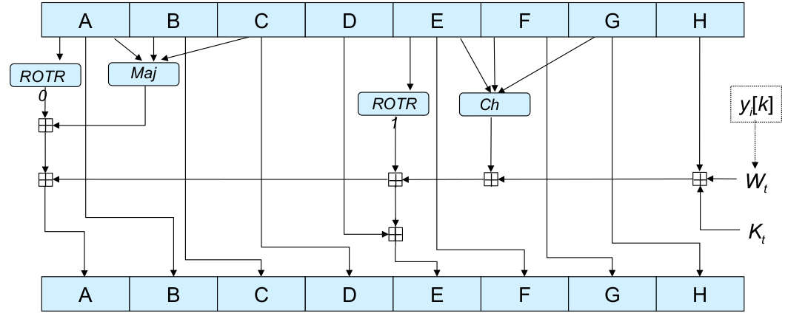
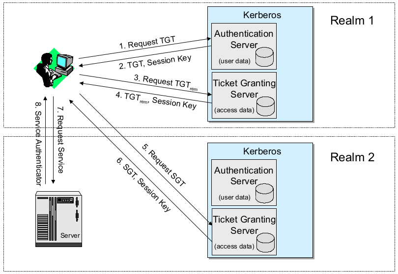

- [Einleitung](#einleitung)
  - [Was ist eine Bedrohung in einem Kommunikationsnetz?](#was-ist-eine-bedrohung-in-einem-kommunikationsnetz)
  - [Sicherheitsziele in Abhängigkeit von der Anwendungsumgebung](#sicherheitsziele-in-abhängigkeit-von-der-anwendungsumgebung)
  - [Sicherheitsziele technisch definiert](#sicherheitsziele-technisch-definiert)
  - [Technisch definierte Bedrohungen](#technisch-definierte-bedrohungen)
  - [Bedrohungen und technische Sicherheitsziele](#bedrohungen-und-technische-sicherheitsziele)
  - [Analyse der Netzwerksicherheit](#analyse-der-netzwerksicherheit)
  - [Angriffe auf die Kommunikation auf der Nachrichtenebene](#angriffe-auf-die-kommunikation-auf-der-nachrichtenebene)
  - [Schutzmaßnahmen gegen Bedrohungen der Informationssicherheit](#schutzmaßnahmen-gegen-bedrohungen-der-informationssicherheit)
  - [Kommunikationssicherheit: Einige Terminologie](#kommunikationssicherheit-einige-terminologie)
  - [Sicherheitsdienste - Überblick](#sicherheitsdienste---überblick)
  - [Sicherheitsunterstützende Mechanismen](#sicherheitsunterstützende-mechanismen)
  - [Kryptologie - Definition und Terminologie](#kryptologie---definition-und-terminologie)
  - [Kryptologie - einige historische Anmerkungen](#kryptologie---einige-historische-anmerkungen)
- [Grundlagen der Kryptographie](#grundlagen-der-kryptographie)
  - [Kryptographische Algorithmen: Überblick](#kryptographische-algorithmen-überblick)
  - [Angriff auf die Kryptographie](#angriff-auf-die-kryptographie)
  - [Kryptoanalyse](#kryptoanalyse)
    - [Brute-Force-Angriff](#brute-force-angriff)
    - [Wie groß ist groß?](#wie-groß-ist-groß)
    - [Wichtige Eigenschaften von Verschlüsselungsalgorithmen](#wichtige-eigenschaften-von-verschlüsselungsalgorithmen)
  - [Klassifizierung von Verschlüsselungsalgorithmen: Drei Dimensionen](#klassifizierung-von-verschlüsselungsalgorithmen-drei-dimensionen)
  - [Kryptographische Algorithmen - Überblick](#kryptographische-algorithmen---überblick)
- [Symmetrische Kryptographie](#symmetrische-kryptographie)
  - [Symmetrische Verschlüsselung](#symmetrische-verschlüsselung)
  - [Symmetrische Blockchiffren - Verschlüsselungsarten](#symmetrische-blockchiffren---verschlüsselungsarten)
  - [Der Datenverschlüsselungsstandard (DES)](#der-datenverschlüsselungsstandard-des)
    - [DES - Einzelne Iteration](#des---einzelne-iteration)
    - [DES - Entschlüsselung](#des---entschlüsselung)
    - [DES - Sicherheit](#des---sicherheit)
    - [Erweiterung der Schlüssellänge von DES durch Mehrfachverschlüsselung](#erweiterung-der-schlüssellänge-von-des-durch-mehrfachverschlüsselung)
  - [Der fortgeschrittene Verschlüsselungsstandard AES](#der-fortgeschrittene-verschlüsselungsstandard-aes)
    - [AES - Sicherheit](#aes---sicherheit)
  - [Der Stromchiffre-Algorithmus RC4](#der-stromchiffre-algorithmus-rc4)
  - [KASUMI](#kasumi)
    - [KASUMI - Sicherheitsdiskussion](#kasumi---sicherheitsdiskussion)
- [Asymmetrische Kryptographie](#asymmetrische-kryptographie)
  - [Einige mathematische Hintergründe](#einige-mathematische-hintergründe)
  - [Der RSA Public Key Algorithmus](#der-rsa-public-key-algorithmus)
  - [Einige weitere mathematische Hintergründe](#einige-weitere-mathematische-hintergründe)
  - [Diffie-Hellman-Schlüsselaustausch](#diffie-hellman-schlüsselaustausch)
  - [ElGamal Algorithmus](#elgamal-algorithmus)
  - [Elliptische Kurven Kryptographie](#elliptische-kurven-kryptographie)
    - [Gruppenelemente](#gruppenelemente)
    - [Punktaddition](#punktaddition)
    - [Grundlagen des ECC - Algebraische Addition](#grundlagen-des-ecc---algebraische-addition)
    - [Multiplikation](#multiplikation)
    - [Kurven über $\mathbb{Z}_p$](#kurven-über-mathbbz_p)
    - [Berechnen Sie die y-Werte in $\mathbb{Z}_p$](#berechnen-sie-die-y-werte-in-mathbbz_p)
    - [Addition und Multiplikation in $\mathbb{Z}_p$](#addition-und-multiplikation-in-mathbbz_p)
    - [Foundations of ECC - Größe der erzeugten Gruppen](#foundations-of-ecc---größe-der-erzeugten-gruppen)
    - [ECDH](#ecdh)
    - [EC-Version des ElGamal-Algorithmus](#ec-version-des-elgamal-algorithmus)
    - [Sicherheit](#sicherheit)
    - [Weitere Anmerkungen](#weitere-anmerkungen)
  - [Schlussfolgerung](#schlussfolgerung)
- [Modifikationsprüfwerte](#modifikationsprüfwerte)
  - [Motivation](#motivation)
  - [Kryptographische Hash-Funktionen](#kryptographische-hash-funktionen)
  - [Nachrichten-Authentifizierungs-Codes (MAC)](#nachrichten-authentifizierungs-codes-mac)
  - [Ein einfacher Angriff gegen einen unsicheren MAC](#ein-einfacher-angriff-gegen-einen-unsicheren-mac)
  - [Anwendungen für kryptographische Hash-Funktionen und MACs](#anwendungen-für-kryptographische-hash-funktionen-und-macs)
  - [Angriffe basierend auf dem Geburtstagsphänomen](#angriffe-basierend-auf-dem-geburtstagsphänomen)
  - [Übersicht über die gebräuchlichen MDCs](#übersicht-über-die-gebräuchlichen-mdcs)
  - [Gemeinsame Struktur von kryptografischen Hash-Funktionen](#gemeinsame-struktur-von-kryptografischen-hash-funktionen)
  - [Der Message Digest 5](#der-message-digest-5)
  - [Der sichere Hash-Algorithmus SHA-1](#der-sichere-hash-algorithmus-sha-1)
  - [Der sichere Hash-Algorithmus SHA-3](#der-sichere-hash-algorithmus-sha-3)
  - [Cipher Block Chaining Message Authentication Codes](#cipher-block-chaining-message-authentication-codes)
  - [Konstruktion eines MAC aus einem MDC](#konstruktion-eines-mac-aus-einem-mdc)
  - [Authentifizierte Verschlüsselung mit zugehörigen Daten (AEAD) Modi](#authentifizierte-verschlüsselung-mit-zugehörigen-daten-aead-modi)
    - [Galois/Zähler-Modus (GCM) [MV04]](#galoiszähler-modus-gcm-mv04)
    - [Kleiner Exkurs: Rechenoperationen in $GF(2^n)$](#kleiner-exkurs-rechenoperationen-in-gf2n)
  - [SpongeWrap](#spongewrap)
- [Zufallszahlengenerierung](#zufallszahlengenerierung)
  - [Aufgaben der Schlüsselverwaltung](#aufgaben-der-schlüsselverwaltung)
  - [Zufalls- und Pseudo-Zufallszahlengenerierung](#zufalls--und-pseudo-zufallszahlengenerierung)
  - [Zufallszahlengenerierung](#zufallszahlengenerierung-1)
  - [Statistische Tests für Zufallszahlen](#statistische-tests-für-zufallszahlen)
  - [Sichere Pseudo-Zufallszahlengenerierung](#sichere-pseudo-zufallszahlengenerierung)
  - [CSPRNG-Sicherheit ist eine große Sache!](#csprng-sicherheit-ist-eine-große-sache)
- [Kryptographische Protokolle](#kryptographische-protokolle)
  - [Anwendungen von kryptographischen Protokollen](#anwendungen-von-kryptographischen-protokollen)
  - [Schlüsselaustausch](#schlüsselaustausch)
  - [Authentifizierung der Datenherkunft](#authentifizierung-der-datenherkunft)
  - [Authentifizierung von Entitäten](#authentifizierung-von-entitäten)
  - [Notation kryptographischer Protokolle](#notation-kryptographischer-protokolle)
  - [Das Needham-Schroeder-Protokoll](#das-needham-schroeder-protokoll)
  - [Das Otway-Rees-Protokoll](#das-otway-rees-protokoll)
  - [Kerberos](#kerberos)
    - [Kerberos für mehrere Domänen](#kerberos-für-mehrere-domänen)
    - [Kerberos Version 5](#kerberos-version-5)
  - [Fortgeschrittene Methoden zur Passwortauthentifizierung](#fortgeschrittene-methoden-zur-passwortauthentifizierung)
  - [PAKE-Schemata: EKE](#pake-schemata-eke)
    - [Sicherheitsdiskussion](#sicherheitsdiskussion)
    - [DH-EKE](#dh-eke)
    - [Sicherheitsdiskussion 2](#sicherheitsdiskussion-2)
    - [SRP](#srp)
    - [SRP - Dialog](#srp---dialog)
    - [SRP - Diskussion](#srp---diskussion)
  - [X.509 - Einführung](#x509---einführung)
    - [X.509 - Zertifikate mit öffentlichem Schlüssel](#x509---zertifikate-mit-öffentlichem-schlüssel)
    - [X.509 - Zertifikatsketten & Zertifikatshierarchie](#x509---zertifikatsketten--zertifikatshierarchie)
    - [X.509 - Zertifikatssperrung](#x509---zertifikatssperrung)
    - [X.509 - Authentifizierungsprotokolle](#x509---authentifizierungsprotokolle)
  - [Formale Validierung von kryptographischen Protokollen](#formale-validierung-von-kryptographischen-protokollen)
- [Sichere Gruppenkommunikation](#sichere-gruppenkommunikation)
- [Zugriffskontrolle](#zugriffskontrolle)
- [Integration von Sicherheitsdiensten in Kommunikationsarchitekturen](#integration-von-sicherheitsdiensten-in-kommunikationsarchitekturen)
- [Sicherheitsprotokolle der Datenübertragungsschicht](#sicherheitsprotokolle-der-datenübertragungsschicht)
- [Die IPsec-Architektur für das Internet-Protokoll](#die-ipsec-architektur-für-das-internet-protokoll)
- [Security protocols of the transport layer](#security-protocols-of-the-transport-layer)
- [Sicherheitsaspekte der mobilen Kommunikation](#sicherheitsaspekte-der-mobilen-kommunikation)
- [Sicherheit von drahtlosen lokalen Netzen](#sicherheit-von-drahtlosen-lokalen-netzen)
- [Sicherheit von GSM- und UMTS-Netzen](#sicherheit-von-gsm--und-umts-netzen)
- [References](#references)


# Einleitung
## Was ist eine Bedrohung in einem Kommunikationsnetz?
- Abstrakte Definition
    - Eine Bedrohung in einem Kommunikationsnetz ist ein mögliches Ereignis oder eine Folge von Aktionen, die zu einer Verletzung eines oder mehrerer Sicherheitsziele führen können.
    - Die tatsächliche Realisierung einer Bedrohung wird als Angriff bezeichnet.
- Beispiele
    - Ein Hacker bricht in einen Firmencomputer ein
    - Offenlegung von E-Mails während der Übertragung
    - Jemand ändert Finanzbuchhaltungsdaten
    - Ein Hacker, der eine Website vorübergehend außer Betrieb setzt
    - Jemand, der Dienstleistungen in Anspruch nimmt oder Waren im Namen anderer bestellt
- Was sind Sicherheitsziele?
    - Sicherheitsziele können definiert werden
    - in Abhängigkeit von der Anwendungsumgebung oder
    - auf eine allgemeinere, technische Weise

## Sicherheitsziele in Abhängigkeit von der Anwendungsumgebung
- Bankwesen
    - Schutz vor betrügerischen oder versehentlichen Änderungen von Transaktionen
    - Identifizierung von Kunden bei Privatkundentransaktionen
    - Schutz von PINs vor Offenlegung
    - Sicherstellung der Privatsphäre der Kunden
- Elektronischer Handel
    - Sicherstellung der Herkunft und Integrität von Transaktionen
    - Schutz der Privatsphäre von Unternehmen
    - Rechtsverbindliche elektronische Signaturen für Transaktionen bereitstellen
- Regierung
    - Schutz vor Offenlegung sensibler Informationen
    - Bereitstellung elektronischer Signaturen für Regierungsdokumente
- Öffentliche Telekommunikationsanbieter
    - Beschränken Sie den Zugang zu Verwaltungsfunktionen auf autorisiertes Personal
    - Schutz vor Dienstunterbrechungen
    - Schutz der Privatsphäre der Teilnehmer
- Firmen-/Privatnetzwerke
    - Schutz der Privatsphäre von Unternehmen/Personen
    - Sicherstellung der Authentizität von Nachrichten
- Alle Netzwerke
    - Verhinderung des Eindringens von außen (wer will schon Hacker?)
- Manchmal werden Sicherheitsziele auch als Sicherheitsvorgaben bezeichnet

## Sicherheitsziele technisch definiert
- **Vertraulichkeit (Confidentiality)**
    - Übertragene oder gespeicherte Daten sollten nur einem bestimmten Personenkreis zugänglich gemacht werden.
    - Die Vertraulichkeit von Entitäten wird auch als Anonymität bezeichnet.
- **Integrität der Daten (Data Integrity)**
    - Es sollte möglich sein, jede Veränderung von Daten zu erkennen.
    - Dies setzt voraus, dass der Ersteller bestimmter Daten identifiziert werden kann.
- **Rechenschaftspflicht (Accountability)**
    - Es sollte möglich sein, die für ein Kommunikationsereignis verantwortliche Stelle zu identifizieren.
- **Verfügbarkeit (Availability)**
    - Die Dienste sollten verfügbar sein und korrekt funktionieren.
- **Kontrollierter Zugang (Controlled Access)**
    - Nur autorisierte Stellen sollten auf bestimmte Dienste oder Informationen zugreifen können.

## Technisch definierte Bedrohungen
- **Maskerade (oder Man-in-the-Middle-Angriff, Masquerade)**
    - Eine Entität gibt sich als eine andere Entität aus
- **Lauschangriff (Eavesdropping)**
    - Eine Entität liest Informationen, die sie nicht lesen soll
- **Verletzung der Berechtigung (Authorization Violation)**
    - Eine Entität nutzt einen Dienst oder Ressourcen, für die sie nicht vorgesehen ist
- **Verlust oder Veränderung** von (übertragenen) Informationen (Loss or Modification of (transmitted) Information)
    - Daten werden verändert oder zerstört
- **Verweigerung von Kommunikationsakten (Denial of Communication Acts, Repudiation)**
    - Ein Unternehmen leugnet fälschlicherweise seine Teilnahme an einer Kommunikationshandlung
- **Fälschung von Informationen (Forgery of Information)**
    - Ein Unternehmen erstellt neue Informationen im Namen eines anderen Unternehmens
- **Sabotage (oder Denial-of-Service-Angriffe)**
    - Jede Aktion, die darauf abzielt, die Verfügbarkeit und/oder das ordnungsgemäße Funktionieren von Diensten oder Systemen zu beeinträchtigen.

## Bedrohungen und technische Sicherheitsziele
Diese Bedrohungen werden oft kombiniert, um einen Angriff durchzuführen!

| Technische Sicherheitsziele | Maskerade | Abhören | Autorisierungsverletzung | Verlust oder Modifikation von (übertragenen) Informationen | Denial of Communication-Aktionen | Fälschung von Informationen | Sabotage (z.B. durch Überlastung) |
| --------------------------- | --------- | ------- | ------------------------ | ---------------------------------------------------------- | -------------------------------- | --------------------------- | --------------------------------- |
| Vertraulichkeit             | x         | x       | x                        |
| Datenintegrität             | x         |         | x                        | x                                                          | x                                | x                           |
| Rechenschaftspflicht        | x         |         | x                        |                                                            | x                                | x                           |                                   |
| Verfügbarkeit               | x         |         | x                        | x                                                          |                                  |                             | x                                 |  |
| Kontrollierter Zugriff      | x         |         | x                        |                                                            |                                  | x                           |                                   |

## Analyse der Netzwerksicherheit
- Um geeignete Gegenmaßnahmen gegen Bedrohungen ergreifen zu können, müssen diese für eine gegebene Netzkonfiguration angemessen bewertet werden.
- Daher ist eine detaillierte Netzsicherheitsanalyse erforderlich, die
    - das Risikopotenzial der allgemeinen Bedrohungen für die ein Netz nutzenden Einheiten bewertet und
    - den Aufwand (Ressourcen, Zeit usw.) abschätzt, der zur Durchführung bekannter Angriffe erforderlich ist.
    - Achtung! Es ist im Allgemeinen unmöglich, unbekannte Angriffe zu bewerten!
- Eine detaillierte Sicherheitsanalyse einer bestimmten Netzkonfiguration / spezifischen Protokollarchitektur
    - kann auch erforderlich sein, um die Finanzkontrolleure eines Unternehmens davon zu überzeugen, Mittel für Sicherheitsverbesserungen bereitzustellen, und
    - kann besser nach den feinkörnigeren Angriffen auf der Nachrichtenebene strukturiert werden.

## Angriffe auf die Kommunikation auf der Nachrichtenebene
- Passive Angriffe
    - Lauschangriff
- Aktive Angriffe
    - Verzögerung von PDUs (Protocol Data Units)
    - Wiederholung von PDUs
    - Löschung von PDUs
    - Modifikation von PDUs
    - Einfügung von PDUs
- Die erfolgreiche Durchführung eines der oben genannten Angriffe erfordert
    - Es gibt keine erkennbaren Nebeneffekte auf andere Kommunikationen (Verbindungen/verbindungslose Übertragungen)
    - Es gibt keine Nebenwirkungen auf andere PDUs der gleichen Verbindung/verbindungslosen Datenübertragung zwischen den gleichen Entitäten
- Eine Sicherheitsanalyse einer Protokollarchitektur muss diese Angriffe entsprechend den Schichten der Architektur analysieren

## Schutzmaßnahmen gegen Bedrohungen der Informationssicherheit
- Physische Sicherheit
    - Schlösser oder andere physische Zugangskontrollen
    - Manipulationssicherung empfindlicher Geräte
    - Umweltkontrollen
- Personelle Sicherheit
    - Identifizierung von sensiblen Positionen
    - Verfahren zur Überprüfung der Mitarbeiter
    - Sicherheitsschulung und -bewusstsein
- Administrative Sicherheit
    - Kontrolle des Imports von Fremdsoftware
    - Verfahren zur Untersuchung von Sicherheitsverstößen
    - Überprüfung von Prüfpfaden
    - Überprüfung von Kontrollen der Rechenschaftspflicht
- Strahlungssicherheit
    - Kontrolle von Funkfrequenzen und anderen elektromagnetischen Abstrahlungen
    - Bezeichnet als TEMPEST-Schutz
- Mediensicherheit
    - Absicherung der Speicherung von Informationen
    - Kontrolle der Kennzeichnung, Vervielfältigung und Vernichtung von sensiblen Informationen
    - Sicherstellen, dass Medien mit sensiblen Informationen sicher vernichtet werden
    - Scannen von Medien auf Viren
- Lebenszyklus-Kontrollen
    - Vertrauenswürdiger Systementwurf, -implementierung, -bewertung und -übernahme
    - Programmierstandards und -kontrollen
    - Kontrollen der Dokumentation
- Computer-Sicherheit
    - Schutz von Informationen während der Speicherung/Verarbeitung in einem Computersystem
    - Schutz der Datenverarbeitungsgeräte selbst
- Sicherheit der Kommunikation
    - Schutz von Informationen während des Transports von einem System zu einem anderen
    - Schutz der Kommunikationsinfrastruktur selbst

## Kommunikationssicherheit: Einige Terminologie
- Sicherheitsdienst
    - Ein abstrakter Dienst, der eine bestimmte Sicherheitseigenschaft gewährleisten soll.
    - Ein Sicherheitsdienst kann sowohl mit Hilfe von kryptografischen Algorithmen und Protokollen als auch mit herkömmlichen Mitteln realisiert werden
        - Man kann ein elektronisches Dokument auf einem USB-Stick vertraulich halten, indem man es in einem verschlüsselten Format auf dem Datenträger speichert und den Datenträger in einem Tresor wegschließt.
        - In der Regel ist eine Kombination aus kryptografischen und anderen Mitteln am effektivsten
- Kryptographischer Algorithmus
    - Eine mathematische Umwandlung von Eingabedaten (z. B. Daten, Schlüssel) in Ausgabedaten
    - Kryptografische Algorithmen werden in kryptografischen Protokollen verwendet.
- Kryptografisches Protokoll
    - Eine Reihe von Schritten und der Austausch von Nachrichten zwischen mehreren Einheiten, um ein bestimmtes Sicherheitsziel zu erreichen

## Sicherheitsdienste - Überblick
- **Authentifizierung (Authentication)**
    - Der grundlegendste Sicherheitsdienst, der sicherstellt, dass eine Entität tatsächlich die Identität besitzt, die sie vorgibt zu haben
- **Integrität (Integrity)**
    - In gewisser Weise der "kleine Bruder" des Authentifizierungsdienstes, da er sicherstellt, dass Daten, die von bestimmten Entitäten erstellt wurden, nicht unentdeckt verändert werden können
- **Vertraulichkeit (Confidentiality)**
    - Der beliebteste Sicherheitsdienst, der die Geheimhaltung der geschützten Daten gewährleistet
- **Zugriffskontrolle (Access Control)**
    - Kontrolliert, dass jede Identität nur auf die Dienste und Informationen zugreift, zu denen sie berechtigt ist
- **Nicht-Abstreitbarkeit (Non Repudiation)**
    - Schützt davor, dass an einem Kommunikationsaustausch beteiligte Entitäten später fälschlicherweise abstreiten können, dass der Austausch stattgefunden hat

## Sicherheitsunterstützende Mechanismen
- Allgemeine Mechanismen
    - Schlüsselverwaltung: Alle Aspekte des Lebenszyklus von kryptografischen Schlüsseln
    - Zufallszahlengenerierung: Generierung von kryptographisch sicheren Zufallszahlen
    - Ereigniserkennung / Sicherheitsprüfpfad: Erkennung und Aufzeichnung von Ereignissen, die zur Erkennung von Angriffen oder Bedingungen, die von Angriffen ausgenutzt werden könnten, verwendet werden können
    - Erkennung von Eindringlingen: Analyse der aufgezeichneten Sicherheitsdaten, um erfolgreiche Einbrüche oder Angriffe zu erkennen
    - Beglaubigung: Registrierung von Daten durch eine vertrauenswürdige dritte Partei, die später bestimmte Eigenschaften (Inhalt, Ersteller, Erstellungszeitpunkt) der Daten bestätigen kann
- Kommunikationsspezifische Mechanismen
    - Traffic Padding & Cover Traffic: Erzeugung von gefälschtem Verkehr, um die Analyse des Verkehrsflusses zu verhindern
    - Routing-Kontrolle: Beeinflussung des Routings von PDUs in einem Netzwerk

## Kryptologie - Definition und Terminologie
- Kryptologie
    - Wissenschaft, die sich mit sicherer und meist geheimer Kommunikation beschäftigt
    - Der Begriff leitet sich von den griechischen Wörtern kryptós (verborgen) und lógos (Wort) ab.
    - Kryptologie umfasst
        - Kryptographie ( gráphein = schreiben): die Lehre von den Prinzipien und Techniken, mit denen Informationen in verschlüsseltem Text verborgen und später von legitimen Nutzern mit Hilfe eines geheimen Schlüssels offengelegt werden können
        - Kryptoanalyse ( analýein = lýsen, losbinden): die Wissenschaft (und Kunst) der Wiedergewinnung von Informationen aus Chiffren ohne Kenntnis des Schlýssels
- Chiffre (Quelle Encyclopaedia Britannica)
    - Methode zur Umwandlung einer Nachricht (Klartext), um ihre Bedeutung zu verschleiern
    - Wird auch als Synonym für den verborgenen Chiffretext verwendet.
    - Chiffren sind eine Klasse von kryptografischen Algorithmen
    - Die Umwandlung erfolgt in der Regel mit der Nachricht und einem (geheimen) Schlüssel als Eingabe

## Kryptologie - einige historische Anmerkungen
- 400 v. Chr.: Die Spartaner verwenden ein Chiffriergerät namens Scytale für die Kommunikation zwischen militärischen Befehlshabern.
    - Die Scytale bestand aus einem spitz zulaufenden Stab, um den spiralförmig ein Streifen Pergament oder Leder gewickelt war, auf den die Nachricht geschrieben wurde
    - Beim Aufwickeln wurden die Buchstaben der Reihe nach durcheinander gewürfelt und bildeten die Chiffre.
    - Wurde der Streifen um einen anderen Stab mit den gleichen Proportionen wie das Original gewickelt, kam der Klartext wieder zum Vorschein
- Im 4. Jahrhundert v. Chr:
    - Aeneas Tacticus (Grieche) schreibt "Über die Verteidigung von Festungen", wobei ein Kapitel der Kryptographie gewidmet ist
    - Polybius (Grieche) erfindet eine Methode zur Kodierung von Buchstaben in Symbolpaaren mit Hilfe eines Geräts namens Polybius-Schachbrett, das eine bi-literale Substitution ermöglicht und viele Elemente späterer Kryptosysteme vorwegnimmt
- Die Römer verwendeten eine monoalphabetische Substitution mit einfacher zyklischer Verschiebung des Alphabets:
    - Julius Caesar verwendete eine Verschiebung von drei Buchstaben (A ergibt D, ..., Z ergibt C)
    - Augustus Caesar verwendete eine einzige Verschiebung (A ergibt B, ...)
- Die Araber waren die ersten, die die Prinzipien der Kryptographie verstanden und die Anfänge der Kryptoanalyse entdeckten:
    - Entwurf und Verwendung von Substitutions- und Transpositions-Chiffren
    - Entdeckung der Verwendung von Buchstabenhäufigkeitsverteilungen und wahrscheinlichen Klartexten in der Kryptoanalyse
    - Bis 1412 n. Chr. enthält Al-Kalka-Shandi in seiner Enzyklopädie Subh al-a'sha eine elementare und respektable Behandlung mehrerer kryptographischer Systeme und ihrer Kryptoanalyse
- Europäische Kryptographie:
    - Die Entwicklung begann im Kirchenstaat und in den italienischen Stadtstaaten im Mittelalter
    - Die ersten Chiffren verwendeten nur Vokalsubstitutionen
    - 1397: Gabriele de Lavinde von Parma verfasst das erste europäische Handbuch zur Kryptographie, das eine Zusammenstellung von Chiffren sowie eine Reihe von Schlüsseln für 24 Korrespondenten enthält und Symbole für Buchstaben, Zahlen und mehrere zweistellige Codeäquivalente für Wörter und Namen umfasst
    - Code-Vokabulare, Nomenklatoren genannt, wurden für mehrere Jahrhunderte zur Hauptstütze der diplomatischen Kommunikation der meisten europäischen Regierungen
    - 1470: Leon Battista Alberti veröffentlicht Trattati In Cifra, in denen er die erste Chiffrierscheibe beschreibt und bereits vorschreibt, die Scheibe regelmäßig neu einzustellen, wobei er den Begriff der Polyalphabetizität entwickelt
    - 1563: Giambattista della Porta liefert eine abgewandelte Form einer quadratischen Tabelle und das früheste Beispiel einer digraphischen Chiffre (2-Buchstaben-Substitution)
    - 1586: Blaise de Vigenère veröffentlicht Traicté des chiffres, das die ihm zugeschriebene quadratische Tabelle enthält
    - Bis 1860 wurden große Codes für die diplomatische Kommunikation verwendet, und Chiffren wurden nur in der militärischen Kommunikation eingesetzt (außer auf hoher Kommandoebene), da es schwierig war, Codebücher im Feld zu schützen.
- Entwicklungen während der Weltkriege 1 und 2:
    - Während des 1. Weltkriegs: Chiffriersysteme wurden hauptsächlich für die taktische Kommunikation verwendet und die Kommunikation auf hoher Ebene wurde durch Codes geschützt.
    - 1920: Die Kommunikationsbedürfnisse der Telekommunikation und die Weiterentwicklung der elektromechanischen Technik führen zu einer wahren Revolution bei den Verschlüsselungsgeräten - der Entwicklung von Rotor-Chiffriermaschinen:
      - Das Rotorprinzip wird unabhängig voneinander von E. E. Hebern (USA), H. A. Koch (Niederlande) und A. Scherbius (Deutschland) entdeckt
      - Rotor-Chiffriermaschinen kaskadieren eine Sammlung von Chiffrierscheiben, um eine polyalphabetische Substitution von hoher Komplexität zu realisieren
      - Die Kryptoanalyse der taktischen Kommunikation spielt während des Zweiten Weltkriegs eine sehr wichtige Rolle. Die größten Erfolge sind die britische und polnische Lösung der deutschen Enigma- und der beiden Fernschreiber-Chiffren sowie die amerikanische Kryptoanalyse der japanischen Chiffren.
- Entwicklungen nach dem 2. Weltkrieg:
    - Die moderne Elektronik ermöglicht noch komplexere Chiffren, die zunächst den Rotorprinzipien folgen (und deren Schwächen einbeziehen)
    - Die meisten Informationen über elektronische Chiffriermaschinen, die von verschiedenen nationalen Kryptodiensten verwendet wurden, sind nicht öffentlich zugänglich.
    - Ende der 1960er Jahre war die kommerziell verfügbare Kryptographie kaum bekannt, und starke Kryptographie war den nationalen Behörden vorbehalten
    - 1973-1977: Entwicklung des Data Encryption Standard (DES)
    - 1976-1978: Entdeckung der Public-Key-Kryptografie
    - 1976: W. Diffie und M. Hellman veröffentlichen "New Directions in Cryptography" (Neue Wege in der Kryptographie), in dem sie die Konzepte der Public-Key-Kryptographie einführen und ein Verfahren zum Austausch von Schlüsseln über unsichere Kanäle beschreiben.
    - R. Merkle entdeckt unabhängig das Prinzip des öffentlichen Schlüssels, seine ersten Veröffentlichungen erscheinen jedoch erst 1978, da der Veröffentlichungsprozess langsam ist
    - 1978: R. L. Rivest, A. Shamir und A. M. Adleman veröffentlichen "A Method for Obtaining Digital Signatures and Public Key Cryptosystems", das den ersten funktionierenden und sicheren Public-Key-Algorithmus RSA enthält
 
# Grundlagen der Kryptographie
- Überblick über kryptografische Algorithmen
- Angriffe auf die Kryptographie
- Eigenschaften von Verschlüsselungsalgorithmen
- Klassifizierung von Verschlüsselungsalgorithmen

## Kryptographische Algorithmen: Überblick
- In diesem Kurs stehen zwei Hauptanwendungen kryptographischer Algorithmen im Mittelpunkt des Interesses
    - Verschlüsselung von Daten: Umwandlung von Klartextdaten in Chiffretext, um deren Bedeutung zu verbergen
    - Signierung von Daten: Berechnung eines Prüfwerts oder einer digitalen Signatur für einen gegebenen Klartext oder Geheimtext, der von einigen oder allen Stellen, die auf die signierten Daten zugreifen können, überprüft werden kann
- Einige kryptografische Algorithmen können für beide Zwecke verwendet werden, andere sind nur für einen der beiden Zwecke sicher und/oder effizient.
- Hauptkategorien von kryptografischen Algorithmen
    - Symmetrische Kryptografie, die 1 Schlüssel für die Ver-/Entschlüsselung oder die Signierung/Prüfung verwendet
    - Asymmetrische Kryptografie mit 2 verschiedenen Schlüsseln für die Ver-/Entschlüsselung oder die Unterzeichnung/Prüfung
    - Kryptografische Hash-Funktionen mit 0 Schlüsseln (der "Schlüssel" ist keine separate Eingabe, sondern wird an die Daten "angehängt" oder mit ihnen "vermischt").

## Angriff auf die Kryptographie
## Kryptoanalyse
- Kryptoanalyse ist der Versuch, den Klartext und/oder den Schlüssel herauszufinden.
- Arten der Kryptoanalyse
    - Nur Chiffretext: bestimmte Muster des Klartextes können im Chiffretext erhalten bleiben (Häufigkeit von Buchstaben, Digraphen usw.)
    - Bekannte Chiffretext-Klartext-Paare
    - Gewählter Klartext oder gewählter Chiffretext
    - Differentielle Kryptoanalyse und lineare Kryptoanalyse
    - Neuere Entwicklung: verwandte Schlüsselanalyse
- Kryptoanalyse der Public-Key-Kryptographie
    - Die Tatsache, dass ein Schlüssel öffentlich zugänglich ist, kann ausgenutzt werden
    - Die Kryptoanalyse öffentlicher Schlüssel zielt eher darauf ab, das Kryptosystem selbst zu knacken und ist näher an der reinen mathematischen Forschung als an der klassischen Kryptoanalyse.
    - Wichtige Richtungen
        - Berechnung von diskreten Logarithmen
        - Faktorisierung von großen ganzen Zahlen

### Brute-Force-Angriff
- Der Brute-Force-Angriff probiert alle möglichen Schlüssel aus, bis er einen verständlichen Klartext findet
    - Jeder kryptographische Algorithmus kann theoretisch mit Brute Force angegriffen werden
    - Im Durchschnitt muss die Hälfte aller möglichen Schlüssel ausprobiert werden

Durchschnittlich benötigte Zeit für erschöpfende Schlüsselsuche

| Schlüsselgröße [bit] | Anzahl der Schlüssel         | Benötigte Zeit bei 1 $Verschlüsselung/\mu$s | Zeitbedarf bei 10^6 Verschlüsselung /$\mu$s |
| -------------------- | ---------------------------- | ------------------------------------------- | ------------------------------------------- |
| 56                   | $2^{56} = 7,2\times 10^{16}$ | $2^{55}\mu s = 1142$ Jahre                  | $10,01$ Stunden                             |
| 128                  | $2^{128} = 3,4 x 10^{38}$    | $2^{127}\mu s = 5,4 x 10^{24}$ Jahre        | $5,4 x 10^{18}$ Jahre                       |
| 256                  | $2^{256} = 1.2 x 10^{77}     | $2^{255}\mu s = 3,7 x 10^{63}$ Jahre        | $3,7 x 10^{57}$ Jahre                       |

### Wie groß ist groß?
Referenzzahlen zum Vergleich relativer Größenordnungen
| Referenz                                       | Größe                         |
| ---------------------------------------------- | ----------------------------- |
| Sekunden in einem Jahr                         | ca. $3 x 10^7$                |
| Sekunden seit der Entstehung des Sonnensystems | ca. $2 x 10^{17}$             |
| Taktzyklen pro Jahr (50 MHz Computer)          | ca. $1,6 x 10^{15}$           |
| Binäre Zeichenketten der Länge 64              | $2^{64}$ ca. $1,8 x 10^{19}$  |
| Binäre Zeichenfolgen der Länge 128             | $2^{128}$ ca. $3,4 x 10^{38}$ |
| Binäre Zeichenfolgen der Länge 256             | $2^{256}$ ca. $1,2 x 10^{77}$ |
| Anzahl der 75-stelligen Primzahlen             | $5,2 x 10^{72}$               |
| Elektronen im Universum                        | $8,37 x 10^{77}$              |

### Wichtige Eigenschaften von Verschlüsselungsalgorithmen
Nehmen wir an, ein Absender verschlüsselt Klartextnachrichten $P_1, P_2, ...$ zu Chiffretextnachrichten $C_1, C_2, ...$

Dann sind die folgenden Eigenschaften des Verschlüsselungsalgorithmus von besonderem Interesse
- Die Fehlerfortpflanzung charakterisiert die Auswirkungen von Bit-Fehlern bei der Übertragung von Chiffretext zu rekonstruiertem Klartext $P_1', P_2', ...$
    - Je nach Verschlüsselungsalgorithmus können pro fehlerhaftem Chiffretext-Bit ein oder mehrere fehlerhafte Bits im rekonstruierten Klartext vorhanden sein
- Die Synchronisierung charakterisiert die Auswirkungen verlorener Chiffretext-Dateneinheiten auf den rekonstruierten Klartext
    - Einige Verschlüsselungsalgorithmen können sich nicht von verlorenem Chiffretext erholen und benötigen daher eine explizite Neusynchronisierung im Falle verlorener Nachrichten
    - Andere Algorithmen führen eine automatische Neusynchronisierung nach 0 bis n (n je nach Algorithmus) Chiffretextbits durch.

## Klassifizierung von Verschlüsselungsalgorithmen: Drei Dimensionen
- Die Art der Operationen, die zur Umwandlung von Klartext in Chiffretext verwendet werden
    - Substitution, die jedes Element des Klartextes (Bit, Buchstabe, Gruppe von Bits oder Buchstaben) in ein anderes Element umwandelt
    - Transposition, die die Elemente des Klartextes neu anordnet
- Die Anzahl der verwendeten Schlüssel
    - Symmetrische Chiffren, die denselben Schlüssel für die Ver- und Entschlüsselung verwenden
    - Asymmetrische Chiffren, bei denen unterschiedliche Schlüssel für die Ver- und Entschlüsselung verwendet werden
- Die Art und Weise, in der der Klartext verarbeitet wird
    - Stromchiffren arbeiten mit Bitströmen und verschlüsseln ein Bit nach dem anderen
        - Viele Stromchiffren basieren auf der Idee der linearen rückgekoppelten Schieberegister, und bei vielen Algorithmen dieser Klasse wurden Schwachstellen entdeckt, da es eine tiefgreifende mathematische Theorie zu diesem Thema gibt.
        - Die meisten Stromchiffren verbreiten keine Fehler, sind aber anfällig für den Verlust der Synchronisation.
    - Blockchiffren arbeiten mit Blöcken der Breite b, wobei b vom jeweiligen Algorithmus abhängt.

## Kryptographische Algorithmen - Überblick
Kryptografische Algorithmen
- Überblick
    - Eigenschaften
    - Kryptoanalyse
- Symmetrische Ver-/Entschlüsselung
    - Funktionsweisen
    - DES
    - AES
    - RC4
    - KASUMI
- Asymmetrische Ver-/Entschlüsselung
    - Hintergrund
    - RSA
    - Diffie-Hellman
    - ElGamal
    - ECC
- Kryptographische Hash-Funktionen
    - MDCs/MACs
    - MD
    - SHA-1/2/
    - CBC-MAC
    - GCM-MAC

# Symmetrische Kryptographie
- Modi der Verschlüsselung
- Datenverschlüsselungsstandard (DES)
- Erweiterter Verschlüsselungsstandard (AES)
- Die Blockchiffre RC
- KASUMI

## Symmetrische Verschlüsselung
- Allgemeine Beschreibung
    - Derselbe Schlüssel KA,B wird für die Verschlüsselung und Entschlüsselung von Nachrichten verwendet
- Schreibweise
    - Wenn P die Klartextnachricht bezeichnet, bezeichnet $E(K_{A,B}, P)$ den Chiffretext und es gilt $D(K_{A,B}, E(K_{A,B}, P)) = P$
    - Alternativ schreibt man manchmal $\{P\}_{K_{A,B}}$ oder $E_{K_{A,B}}(P)$ für $E(K_{A,B}, P)$
- Beispiele: DES, 3DES, AES, ...

## Symmetrische Blockchiffren - Verschlüsselungsarten
Allgemeine Bemerkungen & Notation
- Ein Klartext P wird in Blöcke $P_1, P_2, ...$ der Länge b bzw. j zerlegt, wobei b die Blockgröße des Verschlüsselungsalgorithmus bezeichnet und j < b
- Der Chiffretext C ist die Kombination von $C_1, C_2, ...$, wobei $c_i$ das Ergebnis der Verschlüsselung des i-ten Blocks der Klartextnachricht bezeichnet
- Die Stellen, die eine Nachricht verschlüsseln und entschlüsseln, haben sich auf einen Schlüssel K geeinigt.

Elektronischer Codebuch-Modus (Electronic Code Book Mode: ECB)
- Jeder Block Pi der Länge b wird unabhängig verschlüsselt: $C_i = E(K, p_i)$
- Ein Bitfehler in einem Chiffretextblock $C_i$ führt zu einem völlig falsch wiederhergestellten Klartextblock $P_i'$
- Der Verlust der Synchronisation hat keine Auswirkungen, wenn ganzzahlige Vielfache der Blockgröße b verloren gehen. Geht eine andere Anzahl von Bits verloren, ist eine explizite Neusynchronisation erforderlich.
- Nachteil: identische Klartextblöcke werden zu identischem Chiffretext verschlüsselt!
- 

Cipher Block Chaining Modus (Cipher Block Chaining Mode: CBC)
- Vor der Verschlüsselung eines Klartextblocks pi wird dieser mit dem vorangegangenen Chiffretextblock $C_{i-1}$ XOR-verknüpft ()
    - $C_i = E(K, C_{i-1} \oplus p_i)$
    - $P_{i'} = C_{i-1} \oplus D(K, C_i)$
    - Um $C_1$ zu berechnen, einigen sich beide Parteien auf einen Anfangswert (IV) für $C_0$
- Eigenschaften
    - Fehlerfortpflanzung: Ein verfälschter Chiffretextblock führt zu zwei verfälschten Klartextblöcken, da $P_i'$ mit $C_{i-1}$ und $C_i$ berechnet wird
    - Synchronisation: Wenn die Anzahl der verlorenen Bits ein ganzzahliges Vielfaches von b ist, wird ein zusätzlicher Block $P_{i+1}$ verzerrt, bevor die Synchronisation wiederhergestellt wird. Wenn eine andere Anzahl von Bits verloren geht, ist eine explizite Neusynchronisation erforderlich.
    - Vorteil: identische Klartextblöcke werden zu nicht-identischem Chiffretext verschlüsselt.
- 

Chiffretext-Feedback-Modus (Ciphertext Feedback Mode: CFB)
- Ein Blockverschlüsselungsalgorithmus, der mit Blöcken der Größe b arbeitet, kann in einen Algorithmus umgewandelt werden, der mit Blöcken der Größe $j (j<b)$ arbeitet.
  - $S(j, x)$ bezeichnen die $j$ höherwertigen Bits von $x$
  - $P_i$, $C_i$ den $i$-ten Block von Klartext und Geheimtext der Länge $j$ bezeichnen
  - IV ist ein Anfangswert, auf den sich beide Parteien geeinigt haben
  - $R_1 = IV$
  - $R_n = (R_{n-1}*2^j\ mod\ 2^b)\oplus C_{n-1}$
  - $C_n = S(j,E_K(R_n))\oplus P_n$
  - $S(j,E_K(R_n))\oplus C_n = S(j,E_K(R_n))\oplus S(j,E_K(R_n))\oplus P_n$
  - $S(j,E_K(R_n))\oplus C_n = P_n$
- Ein gängiger Wert für j ist 8 für die Verschlüsselung von einem Zeichen pro Schritt
- Eigenschaften von CFB
    - Fehlerfortpflanzung: Da die Chiffretextblöcke schrittweise durch das Register geschoben werden, verfälscht ein fehlerhafter Block $C_i$ den wiederhergestellten Klartextblock $P_i'$ sowie die folgenden $\lceil b / j\rceil$-Blöcke
    - Synchronisation: Wenn die Anzahl der verlorenen Bits ein ganzzahliges Vielfaches von j ist, werden $\lceil b / j\rceil$ zusätzliche Blöcke verfälscht, bevor die Synchronisation wiederhergestellt ist. Wenn eine beliebige andere Anzahl von Bits verloren geht, ist eine explizite Neusynchronisierung erforderlich.
    - Nachteil: Die Verschlüsselungsfunktion E muss häufiger berechnet werden, da eine Verschlüsselung von b Bit durchgeführt werden muss, um j Bit des Klartextes zu verbergen. Beispiel: Bei Verwendung von DES mit Verschlüsselung von jeweils einem Zeichen $\Rightarrow$ muss die Verschlüsselung 8-mal häufiger durchgeführt werden

Output-Feedback-Modus (OFB)
- Der Blockverschlüsselungsalgorithmus wird zur Erzeugung einer Pseudozufallsfolge $R_i$ verwendet, die nur von $K$ und $IV$ abhängt.
    - $S(j, x)$ bezeichnen die $j$ höherwertigen Bits von $x$
    - $P_i$, $C_i$ bezeichnen den $i$-ten Block von Klartext und Chiffretext der Länge $j$
    - $IV$ sei ein Anfangswert, auf den sich beide Parteien geeinigt haben
    - $R_1 = IV$
    - $R_n = (R_{n-1}* 2^j\ mod\ 2^b )\oplus S(j,E_K(R_{n-1}))$ // j-bit Linksverschiebung + verschlüsselter alter Wert
    - $C_n = S(j,E_K(R_n))\oplus P_n$
    - $S(j,E_K(R_n))\oplus C_n = S(j,E_K(R_n))\oplus S(j,E_K(R_n))\oplus P_n$
    - $S(j,E_K(R_n))\oplus C_n = P_n$
- Der Klartext wird mit der Pseudo-Zufallssequenz XOR-verknüpft, um den Chiffretext zu erhalten und umgekehrt
- Eigenschaften von OFB
    - Fehlerfortpflanzung: Einzelbitfehler führen nur zu Einzelbitfehlern $\rightarrow$ keine Fehlermultiplikation
    - Synchronisierung: Wenn einige Bits verloren gehen, ist eine explizite Re-Synchronisation erforderlich.
    - Vorteil: Die Pseudo-Zufallsfolge kann vorberechnet werden, um die Auswirkungen der Verschlüsselung auf die Ende-zu-Ende-Verzögerung gering zu halten
    - Nachteile
      - Wie bei CFB muss die Verschlüsselungsfunktion E häufiger berechnet werden, da eine Verschlüsselung von b Bit durchgeführt werden muss, um j Bit des Klartextes zu verbergen
      - Es ist für einen Angreifer möglich, bestimmte Bits des Klartextes zu manipulieren
- 

Algorithmus-Übersicht
- Datenverschlüsselungsstandard (DES)
  - Alter amerikanischer Standard aus den 70er Jahren
  - Unsicher wegen der Schlüssel- und Blocklänge
  - Grundlegender Aufbau
  - Dreifache Verschlüsselung mit einer Blockchiffre, z.B. Triple-DES
- Erweiterter Verschlüsselungsstandard (AES)
  - Offener Standardisierungsprozess mit internationaler Beteiligung
  - Im Oktober 2000 wurde ein Algorithmus namens Rijndael für AES vorgeschlagen
  - Ankündigung des AES-Standards im November 2001
  - Siehe auch http://www.nist.gov/aes/
- Andere populäre Algorithmen
    - RC
    - KASUMI

## Der Datenverschlüsselungsstandard (DES)
Geschichte
- 1973 veröffentlichte das National Bureau of Standards (NBS, heute National Institute of Standards and Technology, NIST) eine Aufforderung zur Einreichung von Vorschlägen für einen nationalen Verschlüsselungsstandard und forderte von dem Algorithmus, dass er
  - ein hohes Maß an Sicherheit bieten,
  - vollständig spezifiziert und leicht zu verstehen sein,
  - Sicherheit nur durch seinen Schlüssel und nicht durch seine eigene Geheimhaltung bieten,
  - für alle Benutzer verfügbar sein,
  - für den Einsatz in verschiedenen Anwendungen anpassbar sein,
  - wirtschaftlich in elektronischen Geräten implementierbar sein,
  - effizient in der Anwendung sein,
  - validiert werden können und
  - exportierbar sein.
- Keine der Einreichungen auf diese erste Aufforderung erfüllte diese Kriterien auch nur annähernd.
- Auf eine zweite Aufforderung hin reichte IBM seinen Algorithmus LUCIFER ein, eine symmetrische Blockchiffre, die mit Blöcken der Länge 128 Bit unter Verwendung von Schlüsseln der Länge 128 Bit arbeitet; dies war der einzige vielversprechende Kandidat.
- Die NBS bat die National Security Agency (NSA) um Hilfe bei der Bewertung der Sicherheit des Algorithmus
  - Die NSA reduzierte die Blockgröße auf 64 Bit, die Größe des Schlüssels auf 56 Bit und änderte Details in den Substitutionsfeldern des Algorithmus.
  - Viele der Gründe der NSA für diese Änderungen wurden erst in den frühen 1990er Jahren deutlich, lösten aber in den späten 1970er Jahren große Besorgnis aus.
- Trotz aller Kritik wurde der Algorithmus 1977 als ,,Data Encryption Standard'' in die Reihe der Federal Information Processing Standards (FIPS PUB 46) aufgenommen und für die Verwendung in der gesamten nicht klassifizierten Regierungskommunikation zugelassen.
- DES hat sich in den folgenden Jahren weithin durchgesetzt


### DES - Einzelne Iteration
- Die rechten 32 Bit der zu verschlüsselnden Daten werden mit Hilfe einer Expansions-/Permutationstabelle auf 48 Bit erweitert.
- Sowohl die linken als auch die rechten 28 Bit des Schlüssels (auch Subkeys genannt) werden zirkulär nach links verschoben und der resultierende Wert wird mit Hilfe einer Permutations-/Kontraktionstabelle auf 48 Bit verkürzt.
- Die beiden oben genannten Werte werden XOR-verknüpft und in eine Auswahl- und Ersetzungsbox eingegeben
  - Intern wird diese Operation durch 8 so genannte s-Boxen realisiert, von denen jede einen Sechs-Bit-Wert auf einen Vier-Bit-Wert gemäß einer boxspezifischen Tabelle abbildet, was insgesamt zu einem 32-Bit-Ausgang führt
  - Das Design dieser s-boxes wurde von der NSA verstärkt, was in den 1970er Jahren zu intensiven Diskussionen führte und in den 1990er Jahren nach der Entdeckung der differentiellen Kryptoanalyse verstanden wurde
- Der Ausgang des obigen Schritts wird erneut permutiert und mit den linken 32 Bit der Daten XOR-verknüpft, was zu den neuen rechten 32 Bit der Daten führt
- Die neuen linken 32 Bit der Daten sind der rechte Wert der vorherigen Iteration

### DES - Entschlüsselung
- Unter Verwendung der Abkürzung f(R, K) kann der Verschlüsselungsprozess wie folgt geschrieben werden
    - $L_i = R_{i-1}$
    - $R_i = L_{i-1}\oplus f(R_{i-1}, K_i)$
    - Dieses Konzept (Aufteilung der Daten in zwei Hälften und Organisation der Verschlüsselung gemäß den obigen Gleichungen) wird in vielen Blockchiffren verwendet und wird als Feistel-Netzwerk bezeichnet (nach seinem Erfinder H. Feistel)
- Der DES-Entschlüsselungsprozess ist im Wesentlichen derselbe wie die Verschlüsselung. Er verwendet den Chiffretext als Eingabe für den Verschlüsselungsalgorithmus, wendet aber die Unterschlüssel in umgekehrter Reihenfolge an
- Die Ausgangswerte sind also
    - $L_0' || R_0' =$ InitialPermutation (Chiffretext)
    - chiffretext = InverseInitialPermutation ($R_{16} || L_{16}$)
    - $L_0' || R_0' =$ InitialPermutation (InverseInitialPermutation ($R_{16}||L_{16}))=R_{16}||L_{16}$
- Nach einem Schritt der Entschlüsselung
    - $L_1' = R_0' = L_{16} = R_{15}$
    - $R_1' = L_0' \oplus f(R_0', K_{16})=R_{16}\oplus f(R_{15},K_{16})=[L_{15}\oplus f(R_{15},K_{16})]\oplus f(R_{15},K_{16}) =L_{15}$
- Diese Beziehung gilt für den gesamten Prozess als
    - $R_{i-1} = L_i$
    - $L_{i-1} = R_i\oplus f(R_{i-1}, K_i) = R_i\oplus f(L_i, K_i)$
- Der Ausgang der letzten Runde ist schließlich
    - $L_{16}' || R_{16}' = R_0 || L_0$
- Nach der letzten Runde führt DES einen 32-Bit-Tausch und die inverse Anfangspermutation durch
  - InverseInitialPermutation($L_0||R_0$) = InverseInitialPermutation(InitialPermutation(Klartext)) = Klartext

### DES - Sicherheit
- Schwächen der Schlüssel
    - Schwache Schlüssel: Vier Schlüssel sind schwach, da sie Unterschlüssel erzeugen, die entweder alle 0 oder alle 1 enthalten.
    - Halbschwache Schlüssel: Es gibt sechs Schlüsselpaare, die Klartext zu identischem Chiffriertext verschlüsseln, da sie nur zwei verschiedene Unterschlüssel erzeugen
    - Möglicherweise schwache Schlüssel: Es gibt 48 Schlüssel, die nur vier verschiedene Unterschlüssel erzeugen
    - Insgesamt werden 64 Schlüssel von $72057594037927936$ als schwach angesehen
- Algebraische Struktur
    - Wäre DES geschlossen, dann gäbe es für jedes $K_1,K_2$ ein $K_3$, so dass: $E(K_2,E(K_1,M))=E(K_3,M)$, also wäre die doppelte Verschlüsselung nutzlos
    - Wäre DES rein, dann gäbe es für jedes $K_1,K_2,K_3$ ein $K_4$, so dass $E(K_3,E(K_2,E(K_1,M)))=E(K_4,M)$, also wäre die dreifache Verschlüsselung nutzlos
    - DES ist weder geschlossen noch rein, daher kann ein Mehrfachverschlüsselungsschema verwendet werden, um die Schlüssellänge zu erhöhen
- Differentielle Kryptoanalyse
    - Im Jahr 1990 veröffentlichten E. Biham und A. Shamir diese Analysemethode
    - Sie sucht gezielt nach Unterschieden in Chiffretexten, deren Klartexte bestimmte Unterschiede aufweisen, und versucht, daraus den richtigen Schlüssel zu erraten
    - Der grundlegende Ansatz benötigt einen ausgewählten Klartext zusammen mit seinem Chiffretext
    - DES mit 16 Runden ist gegen diesen Angriff immun, da der Angriff $2^{47}$ gewählte Klartexte oder (bei "Umwandlung" in einen Angriff mit bekannten Klartexten) $2^55$ bekannte Klartexte benötigt.
    - Die Entwickler von DES erklärten in den 1990er Jahren, dass sie in den 1970er Jahren über diese Art von Angriffen Bescheid wussten und dass die s-Boxen entsprechend entworfen wurden
- Schlüssellänge
    - Da ein 56-Bit-Schlüssel in $10,01$ Stunden durchsucht werden kann, wenn man $10^6$ Verschlüsselungen / $\mu s$ durchführen kann (was heute möglich ist), kann DES nicht mehr als ausreichend sicher angesehen werden.

### Erweiterung der Schlüssellänge von DES durch Mehrfachverschlüsselung
- Doppelter DES: Da DES nicht geschlossen ist, führt die doppelte Verschlüsselung zu einer Chiffre, die 112-Bit-Schlüssel verwendet
  - Leider kann sie mit einem Aufwand von $2^{56}$ angegriffen werden.
  - Da $C=E(K_2,E(K_1,P))$ haben wir $X:=E(K_1,P)=D(K_2,C)$
  - Wenn ein Angreifer ein bekanntes Klartext/Chiffretext-Paar erhalten kann, kann er zwei Tabellen erstellen (meet-in-the-middle-attack)
    - Tabelle 1 enthält die Werte von $X$, wenn $P$ mit allen möglichen Werten von $K$ verschlüsselt ist
    - Tabelle 2 enthält die Werte von $X$, wenn $C$ mit allen möglichen Werten von $K$ entschlüsselt wird
    - Sortiere die beiden Tabellen und konstruiere Schlüssel $K_{T1}||K_{T2}$ für alle Kombinationen von Einträgen, die den gleichen Wert ergeben.
- Da es für jeden beliebigen Klartext $2^{64}$ mögliche Chiffretext-Werte gibt, die mit Double-DES erzeugt werden könnten, gibt es beim ersten bekannten Klartext/Chiffretext-Paar durchschnittlich $2^{112}/2^{64}=2^{48}$ Fehlalarme.
- Jedes weitere Klartext/Chiffretext-Paar verringert die Chance, einen falschen Schlüssel zu erhalten, um den Faktor $1/2^{64}$, so dass bei zwei bekannten Blöcken die Chance $2^{-16}$ beträgt.
- Der Aufwand, der erforderlich ist, um Double DES zu knacken, liegt also in der Größenordnung von $2^{56}$, was nur geringfügig besser ist als der Aufwand von $2^{55}$, der erforderlich ist, um Single DES mit einem Angriff mit bekanntem Klartext zu knacken, und weit entfernt von den $2^{111}$, die wir von einer Chiffre mit einer Schlüssellänge von 112 Bit erwarten würden!
- Diese Art von Angriff kann durch die Verwendung eines dreifachen Verschlüsselungsschemas umgangen werden, wie es 1979 von W. Tuchman vorgeschlagen wurde
    - $C=E(K_3,D(K_2,E(K_1,P)))$
    - Die Verwendung der Entschlüsselungsfunktion D in der Mitte ermöglicht die Verwendung von Dreifachverschlüsselungsgeräten mit Gegenstellen, die nur Einfachverschlüsselungsgeräte besitzen, indem $K_1=K_2=K_3$ gesetzt wird.
    - Dreifachverschlüsselung kann mit zwei (Einstellung $K_1=K_3$) oder drei verschiedenen Schlüsseln verwendet werden
    - Bislang sind keine praktischen Angriffe gegen dieses Verfahren bekannt
    - Nachteil: die Leistung beträgt nur $1/3$ der einfachen Verschlüsselung, so dass es besser sein könnte, gleich eine andere Chiffre zu verwenden, die eine größere Schlüssellänge bietet

## Der fortgeschrittene Verschlüsselungsstandard AES
- Jan. 1997: Das National Institute of Standards and Technology (NIST) der USA kündigt die Entwicklung des AES an.
    - Das übergeordnete Ziel ist die Entwicklung eines Federal Information Processing Standard (FIPS), der einen Verschlüsselungsalgorithmus spezifiziert, der in der Lage ist, sensible Regierungsinformationen bis weit ins nächste Jahrhundert hinein zu schützen.
- Sep. 1997: Offizieller Aufruf zur Einreichung von Algorithmen, offen für jeden auf der Welt
    - AES würde einen nicht klassifizierten, öffentlich zugänglichen Verschlüsselungsalgorithmus bzw. -algorithmen spezifizieren, der weltweit lizenzgebührenfrei erhältlich ist.
- Aug. 1998: Erste AES-Kandidatenkonferenz
    - NIST gibt die Auswahl von 15 Kandidatenalgorithmen bekannt
    - Aufforderung zu öffentlichen Kommentaren
- April 1999:
    - Anhand der eingegangenen Analysen und Kommentare wählt das NIST fünf Algorithmen als Kandidaten für die Endauswahl aus: MARS, RC6, Rijndael, Serpent und Twofish
- Oktober 2000: Rijndael wird als Vorschlag des NIST für AES bekannt gegeben
    - 26. November 2001: offizielle Ankündigung des AES-Standards

- Rundenbasierte symmetrische Chiffre
- Keine Feistel-Struktur (unterschiedliche Verschlüsselungs- und Entschlüsselungsfunktionen)
- Schlüssel- und Blocklängen
    - Schlüssellänge: 128, 192, oder 256 Bit
    - Blocklänge: 128, 192 oder 256 Bit (nur 128-Bit-Version standardisiert)
    - Anzahl der Runden: 10, 12, 14

Standardisierte AES-Konfigurationen
| Schlüsselgröße [bit] | Blocklänge [bit] | # Runden |
| -------------------- | ---------------- | -------- |
| 128                  | 128              | 10       |
| 192                  | 128              | 12       |
| 256                  | 128              | 14       |

- Der Algorithmus arbeitet mit
  - $state[4, 4]$: ein Byte-Array mit 4 Zeilen und 4 Spalten (für 128-Bit-Blockgröße)
  - $key[4, 4]$: ein Array mit 4 Zeilen und 4 Spalten (für 128-Bit-Schlüsselgröße)
- Verschlüsselung: (für eine Block- und Schlüsselgröße von 128 Bit) in den Runden $1-9$ werden vier verschiedene Operationen verwendet
    - ByteSub: eine nicht-lineare Byte-Substitution durch eine feste Tabelle (im Grunde eine s-Box)
    - ShiftRow: die Zeilen des Zustands werden zyklisch um verschiedene Offsets verschoben
    - MixColumn: die Spalten von $state[]$ werden als Polynome über $GF(2^8)$ betrachtet und modulo $x^4+1$ mit einer festen Matrix multipliziert: $\begin{pmatrix} 02&03&01&01\\01&02&03&01\\\ 01&01&02&03\\\ 03&01&01&02\end{pmatrix}$
    - RoundKey: ein Round-Key wird mit dem Status XORiert
- Round 10 macht keinen Gebrauch von der Operation MixColumn


- Entschlüsselung
  - Rundenschlüssel und Operationen werden in umgekehrter Reihenfolge angewendet
  - Der MixColumn-Schritt kann nur durch Multiplikation mit der inversen Matrix (auch über $GF(2^8)$) invertiert werden
  - $\begin{pmatrix} 0e&0b&0d&09\\ 09&0e&0b&0d\\ 0d&09&0e&0b\\ 0b&0d&09&0e \end{pmatrix}$
  - Oft werden tabellarische vorberechnete Lösungen verwendet, die aber mehr Platz benötigen

### AES - Sicherheit
- Die einfache mathematische Struktur von AES ist der Hauptgrund für seine Geschwindigkeit, führte aber auch zu Kritik
- Nur die ByteSub-Funktion ist wirklich nichtlinear und verhindert eine effektive Analyse
- AES kann als eine große Matrix-Operation beschrieben werden
- Bereits während der Standardisierung wurden Angriffe für reduzierte Versionen entwickelt
    - Ein Angriff mit $2^{32}$ gewähltem Klartext gegen eine 7-Runden-Version von AES [GM00]
    - Signifikante Reduktion der Komplexität auch für eine 9-Runden-Version von AES mit 256-Schlüsselgröße mit einem zugehörigen Schlüsselangriff
- 2011 wurde der erste Angriff gegen einen vollständigen AES bekannt [BKR11]
    - Schlüsselwiederherstellung in $2^{126.1}$ für AES mit 128 Bit, $2^{189.7}$ für AES mit 192 Bit, $2^{254.4}$ für AES mit 256 Bit
    - "Praktischer" Angriff (geht nicht von verwandten Schlüsseln aus), aber
    - nur ein kleiner Kratzer in Anbetracht von 10 Jahren kryptographischer Forschung

## Der Stromchiffre-Algorithmus RC4
- RC4 ist eine Stromchiffre, die 1987 von Ron Rivest erfunden wurde.
- Sie war bis 1994 urheberrechtlich geschützt, als jemand sie anonym in eine Mailingliste einstellte.
- RC4 wird im Output-Feedback-Modus (OFB) betrieben
  - Der Verschlüsselungsalgorithmus erzeugt eine Pseudozufallsfolge $RC4(IV,K)$, die nur vom Schlüssel K und einem Initialisierungsvektor IV abhängt
  - Der Klartext $P_i$ wird dann mit der Pseudozufallssequenz XOR-verknüpft, um den Chiffretext zu erhalten und umgekehrt
    - $C_1 = P_1\oplus RC4 (IV_1,K)$
    - $P_1 = C_1\oplus RC4 (IV_1,K)$
  - Die Pseudo-Zufallsfolge wird oft auch als Keystream bezeichnet
  - Entscheidend für die Sicherheit ist, dass der Keystream niemals wiederverwendet wird!!!
    - Wenn der Keystream wiederverwendet wird (d.h. $IV_1=IV_2$ mit demselben $K$), dann kann das XOR zweier Klartexte erhalten werden: $C_1\oplus C_2= P_1\oplus RC4(IV, K)\oplus P_2\oplus RC4(IV,K) = P_1\oplus P_2$
- RC4 verwendet einen Schlüssel variabler Länge bis zu 2048 Bit
    - Eigentlich dient der Schlüssel als Seed für einen Pseudo-Zufallsgenerator
- RC4 arbeitet mit zwei 256-Byte-Arrays: $S[0,255], K[0,255]$
    - Schritt 1: Initialisierung der Arrays
        ```cpp
        for (i = 0; i < 256; i++){
            S[i] = i; // Array S[] mit 0 bis 255 füllen
        }
        // Füllen des Arrays K[] mit dem Schlüssel und IV durch Wiederholung, bis K[] gefüllt ist
        n = 0;
        for (i =0; i < 256; i++) {
            n = (n + S[i] + K[i]) MOD 256; swap(S[i], S[n]); 
        }
        ```
    - Schritt 2: Erzeugen des Schlüsselstroms (nach Initialisierung $i = 0; n = 0;$)
        ```cpp
        i = (i + 1) MOD 256; n = (n + S[i]) MOD 256;
        swap(S[i], S[n]);
        t = (S[i] + S[n]) MOD 256;
        Z = S[t]; // Z enthält 8 Bit des durch eine Iteration erzeugten Schlüsselstroms
        ```
    - Schritt 3: XOR-Verknüpfung des Schlüsselstroms mit dem Klartext oder Chiffretext
- Sicherheit von RC4
  - Sicherheit gegen Brute-Force-Angriffe (Ausprobieren aller möglichen Schlüssel)
    - Die variable Schlüssellänge von bis zu 2048 Bit erlaubt es, sie unpraktisch zu machen (zumindest mit den in unserem Universum verfügbaren Ressourcen)
    - Allerdings kann RC4 durch Verringerung der Schlüssellänge auch beliebig unsicher gemacht werden!
  - RSA Data Security, Inc. behauptet, RC4 sei immun gegen differentielle und lineare Kryptoanalyse, und es seien keine kleinen Zyklen bekannt
- RC4 mit 40-Bit-Schlüsseln hatte einen besonderen Exportstatus, selbst als andere Chiffren nicht aus den USA exportiert werden durften
  - Secure Socket Layer (SSL) verwendet RC4 mit 40-Bit-Schlüsseln als Standardalgorithmus
  - Die Schlüssellänge von 40 Bit ist nicht immun gegen Brute-Force-Angriffe.
- Je nach Schlüsselplanungsmethode kann RC4 jedoch stark verwundbar sein! [FMS01a, Riv01a, SIR01a]
- Es wird empfohlen, mindestens die ersten 3072 Bytes des Schlüsselstroms zu verwerfen [Mir02, Kle08]
- Sollte eigentlich nicht mehr verwendet werden, auch nicht bei längeren Schlüsseln

## KASUMI
- Verwendet zur Verschlüsselung von Anrufen in GSM und UMTS, implementiert f(8) und f(9) (auch A5/3, UEA1, UIA1 genannt)
- Ursprünglich standardisiert durch 3GPP im Jahr 2000 [ETS12] und basierend auf MISTY1 von Mitsubishi
- Entwickelt für Hardware-Implementierung
  - Schnelle Implementierung möglich
  - $<10k$ Gatter
- 64-Bit-Blockgröße
- 128-Bit-Schlüssellänge
- 8 Runden Feistel-Netzwerk
- Sicherheitsspanne nicht sehr groß


- Die linken 32 Bit der zu verschlüsselnden Daten werden durch zwei nichtlineare Funktionen FO und FL verändert, die beide Schlüsselmaterial verwenden
- Die Reihenfolge, in der FO und FL angewendet werden, hängt von der Rundenzahl ab
- FL teilt die Daten in 16-Bit-Wörter auf, die mit Schlüsselmaterial kombiniert, permutiert und mit den Originalwerten XOR-verknüpft werden
- FO ist ein 3-Runden-Feistel-Netzwerk mit einer Modifizierungsfunktion FI, die selbst ein Feistel-ähnliches Netzwerk ist, das zwei s-Boxen verwendet.
- Der Ausgang des obigen Schritts wird mit den rechten 32 Bit der Daten XOR-verknüpft, was zu den neuen rechten 32 Bit der Daten führt
- Das neue linke 32-Bit der Daten ist der rechte Wert der vorherigen Iteration

### KASUMI - Sicherheitsdiskussion
- Eine reduzierte Version von KASUMI (6 Runden) kann durch sogenannte unmögliche differentielle Kryptoanalyse angegriffen werden, bei der unmögliche Zustände der Chiffre aus Chiffretext/Klartext-Paaren abgeleitet werden
  - Erste Veröffentlichung bereits ein Jahr nach der Standardisierung
  - Zeitkomplexität von $2^{100}$ [Kue01]
- Für eine Vollversion von KASUMI sind verwandte Schlüsselangriffe möglich
  - Ausgewählter Klartextangriff, bei dem der Angreifer dieselben Daten mit mehreren "verwandten" Schlüsseln verschlüsseln kann
  - Zeitkomplexität von $2^{76.1}$ [BDN05] und $2^{32}$ im besten Fall [DKS10]
  - Allerdings sind die Bedingungen, unter denen Angreifer Zugang zu verwandten Schlüsseln in 3G-Netzen haben, sehr selten
  - Interessanterweise ist MISTY von diesen Angriffen nicht betroffen!
- ETSI hat jedoch SNOW 3G (UEA2 und UIA2) [ETS06] eingeführt, um auf eine vollständige Verletzung von KASUMI vorbereitet zu sein
  - Stromchiffre basierend auf LFSR, kann in 7.500 ASIC-Gattern implementiert werden
  - Aber auch anfällig für verwandte Schlüsselangriffe [KY11].

# Asymmetrische Kryptographie
Eine vorherige Beschäftigung mit der diskreten Mathematik wird dem Leser jedoch helfen, die hier vorgestellten Konzepte zu verstehen.'' E. Amoroso in einem anderen Zusammenhang [Amo94]

- Allgemeine Idee:
  - Verwenden Sie zwei verschiedene Schlüssel $-K$ und $+K$ für die Ver- und Entschlüsselung
  - Bei einem zufälligen Chiffretext $c=E(+K, m)$ und $+K$ sollte es nicht möglich sein, $m = D(-K, c) = D(-K, E(+K, m))$ zu berechnen.
    - Dies impliziert, dass die Berechnung von $-K$ bei $+K$ nicht möglich sein sollte.
  - Der Schlüssel $-K$ ist nur einer Entität A bekannt und wird A's privater Schlüssel $-K_A$ genannt
  - Der Schlüssel $+K$ kann öffentlich bekannt gegeben werden und wird A's öffentlicher Schlüssel $+K_A$ genannt
- Anwendungen:
  - Verschlüsselung:
    - Wenn B eine Nachricht mit dem öffentlichen Schlüssel $+K_A$ von A verschlüsselt, kann er sicher sein, dass nur A sie mit $-K_A$ entschlüsseln kann.
  - Signieren:
    - Wenn A eine Nachricht mit seinem eigenen privaten Schlüssel $-K_A$ verschlüsselt, kann jeder diese Signatur verifizieren, indem er sie mit A's öffentlichem Schlüssel $+K_A$ entschlüsselt
  - Achtung! Entscheidend ist, dass jeder nachprüfen kann, dass er wirklich den öffentlichen Schlüssel von A kennt und nicht den Schlüssel eines Gegners!
- Entwurf von asymmetrischen Kryptosystemen:
  - Schwierigkeit: Finde einen Algorithmus und eine Methode, zwei Schlüssel $-K$, $+K$ so zu konstruieren, dass es nicht möglich ist, $E(+K, m)$ mit der Kenntnis von $+K$ zu entschlüsseln
  - Beschränkungen:
    - Die Schlüssellänge sollte ,,überschaubar'' sein
    - Verschlüsselte Nachrichten sollten nicht beliebig länger sein als unverschlüsselte Nachrichten (wir würden einen kleinen konstanten Faktor tolerieren)
    - Ver- und Entschlüsselung sollten nicht zu viele Ressourcen verbrauchen (Zeit, Speicher)
  - Grundlegende Idee: Man nehme ein Problem aus dem Bereich der Mathematik/Informatik, das schwer zu lösen ist, wenn man nur $+K$ kennt, aber leicht zu lösen, wenn man $-K$ kennt
    - Knapsack-Probleme: Grundlage der ersten funktionierenden Algorithmen, die sich leider fast alle als unsicher erwiesen haben
    - Faktorisierungsproblem: Grundlage des RSA-Algorithmus
    - Diskreter-Logarithmus-Problem: Grundlage von Diffie-Hellman und ElGamal

## Einige mathematische Hintergründe
- Sei $\mathbb{Z}$ die Menge der ganzen Zahlen, und $a,b,n\in\mathbb{Z}$
- Wir sagen, $a$ teilt $b(a|b)$, wenn es eine ganze Zahl $k\in\mathbb{Z}$ gibt, so dass $a\times k=b$
- $a$ ist prim, wenn es positiv ist und die einzigen Teiler von a $1$ und $a$ sind.
- $r$ ist der Rest von a geteilt durch $n$, wenn $r=a-\lfloor a / n \rfloor\times n$, wobei $\lfloor x\rfloor$ die größte ganze Zahl kleiner oder gleich $x$ ist.
    - Beispiel: 4 ist der Rest von 11 geteilt durch 7 als $4=11-\lfloor 11/7\rfloor\times 7$
    - Wir können dies auch anders schreiben: $a=q\times n + r$ mit $q=\lfloor a/n\rfloor$
- Für den Rest $r$ der Division von a durch n schreiben wir $a\ MOD\ n$
- Wir sagen, b ist kongruent $a\ mod\ n$, wenn es bei der Division durch n den gleichen Rest wie a hat. Also teilt n $(a-b)$, und wir schreiben $b\equiv a\ mod\ n$
  - Beispiele: $4\equiv 11\ mod\ 7$, $25\equiv 11\ mod\ 7$, $11\equiv 25\ mod\ 7$, $11\equiv 4\ mod\ 7$, $-10\equiv 4\ mod\ 7$
- Da der Rest r der Division durch n immer kleiner als n ist, stellt man manchmal die Menge $\{x\ MOD\ n | x\in\mathbb{Z}\}$ durch Elemente der Menge $\mathbb{Z}_n=\{0, 1, ..., n-1\}$ dar

| Eigenschaft       | Ausdruck                                                                                                            |
| ----------------- | ------------------------------------------------------------------------------------------------------------------- |
| Kommutativgesetze | $(a + b)\ MOD\ n = (b + a)\ MOD\ n$                                                                                 |
|                   | $(a \times b)\ MOD\ n = (b \times a)\ MOD\ n$                                                                       |
| Assoziativgesetze | $[(a + b) + c]\ MOD\ n = [a + (b + c)]\ MOD\ n$                                                                     |
|                   | $[(a \times b) \times c]\ MOD\ n = [a \times (b \times c)]\ MOD\ n$                                                 |
| Distributivgesetz | $[a \times (b + c)]\ MOD\ n = [(a \times b) + (a \times c)]\ MOD\ n$                                                |
| Identitäten       | $(0 + a)\ MOD\ n = a\ MOD\ n$                                                                                       |
|                   | $(1 \times a)\ MOD\ n = a\ MOD\ n$                                                                                  |
| Inverse           | $\forall  a \in \mathbb{Z}n: \exists (-a) \in \mathbb{Z}n : a + (-a) \equiv 0\ mod\ n$                              |
|                   | p is prime $\Rightarrow \forall  a \in \mathbb{Z}p: \exists (a-1) \in \mathbb{Z}p: a \times (a-1) \equiv 1\ mod\ p$ |

Größter gemeinsamer Teiler
- $c = gcd(a, b) :\Leftrightarrow ( c | a) \wedge ( c | b) \wedge [\forall d: ( d | a ) \wedge ( d | b) \Rightarrow ( d | c )]$ und $gcd(a, 0 ) : = | a |$
- Der gcd-Rekursionssatz :
  - $\forall a, b \in \mathbb{Z}^+: gcd(a, b) = gcd(b, a\ MOD\ b)$
  - Beweis:
    - Da $gcd(a, b)$ sowohl a als auch b teilt, teilt es auch jede Linearkombination von ihnen, insbesondere $(a- \lfloor a / b \rfloor \times b) = a\ MOD\ b$, also $gcd(a, b) | gcd(b, a\ MOD\ b)$
    - Da $gcd(b, a\ MOD\ b)$ sowohl b als auch $a\ MOD\ b$ teilt, teilt es auch jede Linearkombination von beiden, insbesondere $\lfloor a / b \rfloor \times b + (a\ MOD\ b) = a$, also $gcd(b, a\ MOD\ b) | gcd(a, b)$
- Euklidischer Algorithmus:
  - Der euklidische Algorithmus berechnet aus a, b $gcd(a, b)$
  ```cpp
  int Euclid(int a, b){
    if (b = 0) { return(a); }
    {return(Euclid(b, a\ MOD\ b);} 
  }
  ```
- Erweiterter euklidischer Algorithmus:
  - Der Algorithmus ExtendedEuclid berechnet für a, b d, m, n so, dass: $d = gcd(a, b) = m \times a + n \times b$
  ```cpp
  struct{int d, m, n} ExtendedEuclid(int a, b)
  { int d, d', m, m', n, n';
    if (b = 0) {return(a, 1, 0); }
    (d', m', n') = ExtendedEuclid(b, a MOD b);
    (d, m, n) = (d', n', m' - \lfloor a / b \rfloor \times n');
    return(d, m, n); }
  ```
  - Beweis: (durch Induktion)
    - Grundfall $(a,0): gcd(a, 0) = a = 1 \times  a + 0 \times  0$
    - Induktion von $(b, a\ MOD\ b)$ auf $(a, b)$:
      - ExtendedEuclid berechnet $d', m', n'$ korrekt (Induktionshypothese)
      - $d=d'=m'\times  b+n'\times  (a\ MOD\ b)=m'\times  b+n'\times (a-\lfloor a/b\rfloor\times  b)=n'\times  a+(m'-\lfloor a/b\rfloor\times  n')\times  b$
  - Die Laufzeit von $Euclid(a, b)$ und $ExtendedEuclid(a, b)$ ist von $O(log\ b)$
    - Beweis: siehe [Cor90a], Abschnitt 33.
  - Lemma 1: Sei $a,b\in\mathbb{N}$ und $d=gcd(a,b)$. Dann gibt es $m,n\in\mathbb{N}$ so, dass: $d=m\times a+n \times b$
- Theorem 1 (Euklid): Wenn eine Primzahl das Produkt zweier ganzer Zahlen teilt, dann teilt sie mindestens eine der ganzen Zahlen: $p|(a\times b)\Rightarrow (p|a)\times(p|b)$
    - Der Beweis: Es sei $p|(a\times b)$
      - Wenn $p|a$ dann sind wir fertig.
      - Wenn nicht, dann $gcd(p,a) = 1 \Rightarrow\exists m, n\in\mathbb{N}:1=m\times p+n\times a \Leftrightarrow b=m\times p \times b + n \times a \times b$
      - Da $p|(a\times b)$, teilt p beide Summanden der Gleichung und somit auch die Summe, die b ist 
- Theorem 2 (Fundamentalsatz der Arithmetik): Die Faktorisierung in Primzahlen ist bis zur Ordnung eindeutig.
    - Der Beweis:
        - Wir werden zeigen, dass jede ganze Zahl mit einer nicht eindeutigen Faktorisierung einen eigenen Teiler mit einer nicht eindeutigen Faktorisierung hat, was zu einem klaren Widerspruch führt, wenn wir schließlich auf eine Primzahl reduziert haben.
        - Nehmen wir an, dass n eine ganze Zahl mit einer nicht eindeutigen Faktorisierung ist: $n=p_1\times p_2\times ...\times p_r=q_1 \times q_2\times ... \times q_s$. Die Primzahlen sind nicht notwendigerweise verschieden, aber die zweite Faktorisierung ist nicht einfach eine Umordnung der ersten. Da $p_1$ n dividiert, dividiert es auch das Produkt $q_1\times q_2\times ... \times q_s$. Durch wiederholte Anwendung von Satz 1 zeigen wir, dass es mindestens ein $q_i$ gibt, das durch $p_1$ teilbar ist. Gegebenenfalls ordnen wir die $q_i$'s so, dass es $q_1$ ist. Da sowohl $p_1$ als auch $q_1$ Primzahlen sind, müssen sie gleich sein. Wir können also durch $p_1$ dividieren und haben, dass $n/p_1$ eine nicht-eindeutige Faktorisierung hat.
  - Wir verwenden Theorem 2, um die folgende Korollarie 1 zu beweisen
    - Wenn $gcd(c,m)=1$ und $(a\times c)\equiv(b\times c)mod\ m$, dann $a\equiv b\ mod\ m$
    - Der Beweis: Da $(a\times c)\equiv(b\times c)mod\ m\Rightarrow\exists n\in\mathbb{N}:(a\times c)-(b\times c)=n\times m$
    - $\Leftrightarrow ( a - b ) \times  c = n \times  m$
    - $\Leftrightarrow p_1\times  ...\times  p_i\times  q_1\times  ...\times  q_j=r_1\times  ...\times  r_k\times  s_1\times  ...\times  s_l$
    - Man beachte, dass die $p$'s, $q$'s, $r$'s und $s$'s Primzahlen sind und nicht verschieden sein müssen, aber da $gcd(c,m)=1$, gibt es keine Indizes g, h, so dass $q_g = s_h$.
    - Wir können also die Gleichung fortlaufend durch alle q's teilen, ohne jemals ein $s$ zu ,,eliminieren'' und erhalten schließlich etwas wie $\Leftrightarrow p_1\times ...\times p_i=r_1\times ...\times r_o\times s_1\times ...\times s_l$ (beachten Sie, dass es weniger r's geben wird)
    - $\Leftrightarrow(a-b)=r_1\times  ...\times  r_o\times  m\Rightarrow a \equiv b\ mod\ m$
  - Bezeichne $\phi(n)$ die Anzahl der positiven ganzen Zahlen, die kleiner als n und relativ zu n prim sind
    - Beispiele: $\phi(4) = 2$, \phi(6)=2$, $\phi(7)=6$, $\phi(15)=8$
    - Wenn p eine Primzahl ist $\Rightarrow\phi(p)=p-1$
- Theorem 3 (Euler): Seien n und b positive und relativ primäre ganze Zahlen, d.h. $gcd(n, b) = 1 \Rightarrow b \phi(n) \equiv 1\ mod\ n$
  - Beweis:
    - Sei $t=\phi(n)$ und $a_1,...a_t$ seien die positiven ganzen Zahlen kleiner als $n$, die relativ zu $n$ prim sind. Definieren Sie $r_1,...,r_t$ als die Residuen von $b\times a_1\ mod\ n , ..., b\times a_t\ mod\ n$, d.h.: $b\times a_i \equiv r_i\ mod\ n$.
    - Beachten Sie, dass $i\not= j \Rightarrow r_i\not= r_j$. Wäre dies nicht der Fall, hätten wir $b\times a_i\equiv b\times a_j\ mod\ n$ und da $gcd(b,n)=1$, würde Korollar 1 $a_i\equiv a_j\ mod\ n$ implizieren, was nicht sein kann, da $a_i$ und $a_j$ per Definition verschiedene ganze Zahlen zwischen 0 und n sind
    - Wir wissen auch, dass jedes $r_i$ relativ prim zu n ist, denn jeder gemeinsame Teiler k von $r_i$ und $n$ , d.h. $n=k\times m$ und $r_i=p_i\times k$, müsste auch $a_i$ teilen,
    - da $b\times a_i$gleich (p_i\times k)\ mod\ (k\times m)\Rightarrow\exists s\in\mathbb{N}:(b\times a_i)-(p_i\times k)=s\times k\times m \Leftrightarrow (b\times a_i)=s\times k\times m+(p_i\times k)$
    - Da k jeden der Summanden auf der rechten Seite dividiert und k nicht durch b dividiert (n und b sind relativ prim), müsste es auch $a_i$ dividieren, das relativ prim zu n sein soll
    - Somit ist $r_1, ...,r_t$ eine Menge von $\phi(n)$ verschiedenen ganzen Zahlen, die relativ prim zu $n$ sind. Das bedeutet, dass sie genau dasselbe sind wie $a_1,...a_t$, nur dass sie in einer anderen Reihenfolge stehen. Insbesondere wissen wir, dass $r_1\times ...\times r_t=a_1\times ...\times a_t$
    - Wir verwenden nun die Kongruenz $r_1\times ...\times  r_t\equiv b\times  a_1\times ...\times  b\times  a_t\ mod\ n$
        $\Leftrightarrow r_1\times ...\times  r_t\equiv b_t\times  a_1\times ...\times  a_t\ mod\ n$
        $\Leftrightarrow r_1\times ...\times  r_t\equiv b_\times  r_1\times ...\times  r_t\ mod\ n$
    - Da alle $r_i$ relativ prim zu $n$ sind, können wir Korollar 1 anwenden und durch ihr Produkt dividieren: $1\equiv b_t\ mod\ n \Leftrightarrow 1\equiv b\phi(n)\ mod n$ 
- Satz 4 (Chinese Remainder Theorem):
  - Seien $m_1,...,m_r$ positive ganze Zahlen, die paarweise relativ prim sind,
  - d.h. $ganz i\not= j:gcd(m_i, m_j) = 1$. Seien $a_1,...,a_r$ beliebige ganze Zahlen.
  - Dann gibt es eine ganze Zahl a derart, dass:
    - $a\equiv a_1\ mod\ m_1$
    - $a\equiv a_2\ mod\ m_2$
    - ...
    - $a\equiv a_r\ mod\ m_r$
  - Außerdem ist a eindeutig modulo $M := m_1\times ...\times m_r$
  - Beweis:
    - Für alle $i\in\{1,...,r\}$ definieren wir $M_i:=(M/m_i)\phi(m_i)$
    - Da $M_i$ per Definition relativ prim zu $m_i$ ist, können wir Theorem 3 anwenden und wissen, dass $M_i\equiv 1\ mod\ m_i$
    - Da $M_i$ durch $m_j$ für jedes $j\not= i$ teilbar ist, haben wir $\forall j\not= i:M_i\equiv 0\ mod\ m_j$
    - Wir können nun die Lösung konstruieren, indem wir definieren: $a:= a_1\times M_1+a_2\times M_2+...+a_r\times M_r$
    - Die beiden oben angeführten Argumente bezüglich der Kongruenzen der $M_i$ implizieren, dass a tatsächlich alle Kongruenzen erfüllt.
    - Um zu sehen, dass a eindeutig modulo $M$ ist, sei b eine beliebige andere ganze Zahl, die die r Kongruenzen erfüllt. Da $a\equiv c\ mod\ n$ und $b\equiv c\ mod\ n \Rightarrow a \equiv b\ mod\ n$ haben wir $\forall i\in\{1,...,r\}:a\equiv b\ mod\ m_i\Rightarrow\forall i\in\{1,. ...,r\}:m_i|(a-b) \Rightarrow M|(a-b)$, da die $m_i$ paarweise relativ prim sind $\Leftrightarrow a\equiv b\ mod\ M$
- Lemma 2:
  - Wenn $gcd(m,n)=1$, dann ist $\phi(m\times n)=\phi(m)\times \phi(n)$
  - Der Beweis:
    - Sei a eine positive ganze Zahl, die kleiner als und relativ prim zu $m\times n$ ist. Mit anderen Worten: a ist eine der ganzen Zahlen, die von $\phi(m\times n)$ gezählt werden.
    - Betrachten Sie die Entsprechung $a\rightarrow(a\ MOD\ m, a\ MOD\ n)$. Die ganze Zahl a ist relativ prim zu m und relativ prim zu n (andernfalls würde sie $m \times n$ teilen). Also ist $(a\ MOD\ m)$ relativ prim zu m und $(a\ MOD\ n)$ ist relativ prim zu n, da: $a=\lfloor a/m\rfloor\times m + (a\ MOD\ m)$, wenn es also einen gemeinsamen Teiler von $m$ und $(a\ MOD\ m)$ gäbe, würde dieser Teiler auch a teilen. Somit entspricht jede Zahl a, die durch $\phi(m\times n )$ gezählt wird, einem Paar von zwei ganzen Zahlen $(a\ MOD\ m,a\ MOD\ n)$, wobei die erste durch $\phi(m)$ und die zweite durch $\phi(n)$ gezählt wird.
    - Aufgrund des zweiten Teils von Satz 4 ist die Einzigartigkeit der Lösung $a\ mod\ (m\times n)$ der simultanen Kongruenzen:
        $a \equiv(a\ mod\ m)\ mod\ m$
        $a \equiv(a\ MOD\ n)\ mod\ n$
      können wir ableiten, dass verschiedene ganze Zahlen, die durch $\phi(m\times n)$ gezählt werden, verschiedenen Paaren entsprechen:
      - Um dies zu sehen, nehmen wir an, dass $a\not=b$, gezählt durch $\phi(m\times n)$, demselben Paar $(a\ MOD\ m, a\ MOD\ n)$ entspricht. Dies führt zu einem Widerspruch, da b auch die Kongruenzen erfüllen würde:
        $b\equiv (a\ MOD\ m)\ mod\ m$
        $b\equiv (a\ MOD\ n)\ mod\ n$
        aber die Lösung dieser Kongruenzen ist eindeutig modulo $(m \times n)$ 
      - Daher ist $\phi(m \times n)$ höchstens die Anzahl solcher Paare: $\phi(m \times n)\leq \phi(m)\times \phi(n)$
    - Betrachten wir nun ein Paar von ganzen Zahlen $(b,c)$, von denen eine mit $\phi(m)$ und die andere mit $\phi(n)$ gezählt wird: Mit Hilfe des ersten Teils von Satz 4 können wir eine einzige positive ganze Zahl a konstruieren, die kleiner als und relativ prim zu $m\times n$ ist: $a\equiv b\ mod\ m$ und $a\equiv c\ mod\ n$. Die Anzahl solcher Paare ist also höchstens $\phi(m \times n):\phi(m \times n)\leq\phi(m)\times\phi(n)$

## Der RSA Public Key Algorithmus
- Der RSA-Algorithmus wurde 1977 von R. Rivest, A. Shamir und L. Adleman [RSA78] erfunden und basiert auf Theorem 3.
- Seien $p, q$ verschiedene große Primzahlen und $n=p\times q$. Nehmen wir an, wir haben auch zwei ganze Zahlen e und d, so dass: $d\times e \equiv 1\ mod\ \phi(n)$
- M sei eine ganze Zahl, die die zu verschlüsselnde Nachricht darstellt, wobei M positiv, kleiner als und relativ prim zu n ist.
  - Beispiel: Verschlüsseln mit <blank> = 99, A = 10, B = 11, ..., Z = 35. Somit würde ,,HELLO'' als 1714212124 kodiert werden. Falls erforderlich, ist M in Blöcke kleinerer Nachrichten aufzuteilen: 17142 12124
- Zum Verschlüsseln berechnen Sie: $E = M^e\ MOD\ n$
    - Dies kann mit dem Quadrat- und Multiplikationsalgorithmus effizient durchgeführt werden
- Zum Entschlüsseln berechnet man: $M'=E^d\ MOD\ n$
    - Da $d\times e\equiv 1\ mod\ \phi(n)\Rightarrow\exists k\in\mathbb{Z}:(d\times e)-1=k\times\phi(n)\Leftrightarrow(d\times e)=k\times\phi(n)+1$
    - haben wir: $M'\equiv E^d\equiv M^{e\times d}\equiv M^{k\times\phi(n)+1}\equiv 1^k\times M\equiv M\ mod\ n$ 
- Da $(d\times e)=(e\times d)$ funktioniert die Operation auch in umgekehrter Richtung, d.h. man kann mit d verschlüsseln und mit e entschlüsseln
  - Diese Eigenschaft erlaubt es, die gleichen Schlüssel d und e zu verwenden:
  - den Empfang von Nachrichten, die mit dem eigenen öffentlichen Schlüssel verschlüsselt wurden
  - Senden von Nachrichten, die mit dem eigenen privaten Schlüssel signiert wurden
- So richten Sie ein Schlüsselpaar für RSA ein:
  - Wählen Sie zufällig zwei Primzahlen $p$ und $q$ (mit jeweils 100 bis 200 Ziffern)
  - Berechne $n=p\times q,\phi(n)=(p-1)\times (q-1)$ (Lemma 2)
  - Wähle zufällig $e$, so dass $gcd(e,\phi(n))=1$
  - Berechne mit dem erweiterten euklidischen Algorithmus d und c, so dass: $e\times d+\phi(n)\times c = 1$, wobei zu beachten ist, dass dies impliziert, dass $e\times d\equiv 1\ mod\ \phi(n)$
  - Der öffentliche Schlüssel ist das Paar $(e, n)$
  - Der private Schlüssel ist das Paar $(d, n)$
- Die Sicherheit des Verfahrens liegt in der Schwierigkeit der Faktorisierung von $n=p\times q$, da es einfach ist, $\phi(n)$ und dann $d$ zu berechnen, wenn $p$ und $q$ bekannt sind.
- In diesem Kurs wird nicht gelehrt, warum es schwierig ist, große n zu faktorisieren, da dies einen tiefen Einblick in die Mathematik erfordern würde.
  - Wenn p und q bestimmte Eigenschaften erfüllen, sind die besten bekannten Algorithmen exponentiell zur Anzahl der Ziffern von n
  - Bitte beachten Sie, dass es bei einer unglücklichen Wahl von p und q Algorithmen geben könnte, die effizienter faktorisieren können, und dass Ihre RSA-Verschlüsselung dann nicht mehr sicher ist:
    - Daher sollten p und q ungefähr die gleiche Bitlänge haben und ausreichend groß sein
    - $(p-q)$ sollte nicht zu klein sein
    - Wenn man einen kleinen Verschlüsselungsexponenten, z.B. 3, wählen will, kann es zusätzliche Einschränkungen geben, z.B. $gcd(p-1, 3) = 1$ und $gcd(q-1,3)=1$
  - Die Sicherheit von RSA hängt auch davon ab, dass die erzeugten Primzahlen wirklich zufällig sind (wie jede Methode zur Schlüsselerzeugung bei jedem Algorithmus).
  - Moral: Wenn Sie RSA selbst implementieren wollen, bitten Sie einen Mathematiker oder besser einen Kryptographen, Ihren Entwurf zu überprüfen.

## Einige weitere mathematische Hintergründe
- Definition: endliche Gruppen
  - Eine Gruppe ( S , \oplus) ist eine Menge S zusammen mit einer binären Operation \oplus, für die die
  folgende Eigenschaften gelten:
      - Geschlossenheit: Für alle a, b \in S , haben wir a \oplus b \in S
      - Identität: Es gibt ein Element e \in S , so dass e \oplus a = a \oplus e = a für alle
  a \in S
      - Assoziativität: Für alle a, b, c \in S , gilt ( a \oplus b ) \oplus c = a \oplus ( b \oplus c )
      - Inversen: Für jedes a \in S , gibt es ein einziges Element b \in S , so dass
  dass a \oplus b = b \oplus a = e
  - Erfüllt eine Gruppe ( S , \oplus) das Kommutativgesetz \forall a, b \in S : a \oplus b = b \oplus a
  dann nennt man sie eine abelsche Gruppe
  - Wenn eine Gruppe ( S , \oplus) nur eine endliche Menge von Elementen hat, d.h. |S| < \infty, dann wird sie
  eine endliche Gruppe genannt
- Beispiele:
  - $(\mathbb{Z}_n , +_n)$
    - mit $\mathbb{Z}_n:=\{[0]_n,[1]_n,...,[n-1]_n\}$
    - wobei $[a]_n:=\{b \in \mathbb{Z} | b \equiv a mod n\}$ und
    - $+_n$ ist so definiert, dass $[a]_n+_n[b]_n=[a+b]_n$
    - eine endliche abelsche Gruppe ist. Für den Beweis siehe die Tabelle mit den Eigenschaften der modularen Arithmetik
  - $(\mathbb{Z}^*_n , \times_n)$
    - mit $\mathbb{Z}^*_n :=\{[a]_n\in \mathbb{Z}_n | gcd(a,n)=1\}$, und
    - $\times_n$ ist so definiert, dass $[a]_n\times_n [b]_n=[a\times b]_n$
    - eine endliche abelsche Gruppe ist. Man beachte, dass $\mathbb{Z}^*_n$ nur die Elemente von $\mathbb{Z}_n$ enthält, die eine multiplikative Inverse modulo n haben. Zum Beweis siehe Eigenschaften der modularen Arithmetik
    - Beispiel: $\mathbb{Z}^*_{15}=\{[1]_{15},[2]_{15},[4]_{15},[7]_{15},[8]_{15},[11]_{15},[13]_{15},[14]_{15}\}$, als $1\times 1\equiv 1 mod 15$, $2 \times  8 \equiv 1 mod 15$, $4 \times  4 \equiv 1 mod 15$, $7 \times  13 \equiv 1 mod 15$, $11 \times  11 \equiv 1 mod 15$, $14 \times  14 \equiv 1 mod 15$
- Wenn klar ist, dass es sich um $(\mathbb{Z}_n, +_n)$ oder $(\mathbb{Z}^*_n, \times_n)$ handelt, werden Äquivalenzklassen $[a]_n$ oft durch ihre repräsentativen Elemente a dargestellt und $+_n$ und $\times_n$ durch $+$ bzw. $\times$ bezeichnet.
  - Definition: endliche Felder
    - Ein Feld $(S,\oplus, \otimes)$ ist eine Menge S zusammen mit zwei Operationen $\oplus$, $\otimes$, so dass
      - $(S,\oplus)$ und $(S\backslash\{e_{\oplus}\},\otimes)$ sind kommutative Gruppen, d.h. nur das Identitätselement bezüglich der Operation $\oplus$ muss kein Inverses bezüglich der Operation $\otimes$ haben
      - Für alle $a,b,c\in S$ haben wir ein $\otimes(b\oplus c)=(a\otimes b)\oplus(a\otimes c)$
  - Wenn $|S|<\infty$ dann heißt $(S,\oplus,\otimes)$ ein endliches Feld
- Beispiel: $(\mathbb{Z}_p, +_p, \times_p)$ ist ein endliches Feld für jede Primzahl p
- Definition: Primitive Wurzel, Generator
  - Sei $(S,\circ)$ eine Gruppe, $g\in S$ und $g^a:=g\circ g\circ...\circ g$ (a mal mit $a\in\mathbb{Z}^+$)
  - Dann heißt g eine primitive Wurzel oder ein Generator von $(S,\circ):\Leftrightarrow\{g^a|1\leq a\leq |S|\}=S$
  - Beispiele:
    - 1 ist eine primitive Wurzel von $(\mathbb{Z}_n, +_n)$
    - 3 ist eine Primitivwurzel von $(\mathbb{Z}^*_7, \times_7)$
  - Nicht alle Gruppen haben Primitivwurzeln, und diejenigen, die sie haben, nennt man zyklische Gruppen
- Theorem 5:
  - $(\mathbb{Z}^*_n, \times_n)$ hat eine primitive Wurzel $\Leftrightarrow n\in\{2,4,p,2\times p^e\}$, wobei p eine ungerade Primzahl ist und $e\in\mathbb{Z}^+$
- Theorem 6:
  - Wenn $(S,\circ)$ eine Gruppe ist und $b\in S$, dann ist $(S',\circ)$ mit $S'=\{b^a|a\in\mathbb{Z}^+\}$ ebenfalls eine Gruppe.
  - Da $S'\subseteq S, heißt (S',\circ)$ eine Untergruppe von $(S,\circ)$
  - Wenn b eine Urwurzel von $(S,\circ)$ ist, dann ist $S'=S$
- Definition: Ordnung einer Gruppe und eines Elements
  - Sei $(S,\circ)$ eine Gruppe, $e\in S$ ihr Identitätselement und $b\in S$ irgendein Element von $S$:
    - Dann heiße $|S|$ die Ordnung von $(S,\circ)$
    - Sei $c\in\mathbb{Z}^+$ das kleinste Element, so dass $b^c=e$ ist (falls ein solches c existiert, falls nicht, setze $c=\infty$). Dann wird c die Ordnung von b genannt.
- Theorem 7 (Lagrange):
  - Ist G eine endliche Gruppe und H eine Untergruppe von G , so ist $|H|$ Teiler von $|G|$.
  - Wenn also $b in G$ ist, dann ist die Ordnung von b Teiler von $|G|$.
- Theorem 8:
  - Ist G eine zyklische endliche Gruppe der Ordnung n und d ist Teiler von n, dann hat G genau $\phi(d)$ Elemente der Ordnung $d$. Insbesondere hat G $\phi(n)$-Elemente der Ordnung n.
- Die Theoreme 5, 7 und 8 sind die Grundlage des folgenden Algorithmus, der eine zyklische Gruppe $\mathbb{Z}^*_p$ und eine Urwurzel g davon findet:
  - Man wählt eine große Primzahl q, so dass $p=2q+1$ eine Primzahl ist.
    - Da $p$ prim ist, besagt Satz 5, dass $\mathbb{Z}^*_p$ zyklisch ist.
    - Die Ordnung von $\mathbb{Z}^*_p$ ist $2\times  q$ und $\phi(2\times  q)=\phi(2)\times \phi(q)=q-1$, da $q$ prim ist.
    - Die Wahrscheinlichkeit, dass eine Primitivwurzel zufällig ausgewählt wird, beträgt also $(q-1)/2q \approx 1/2$.
    - Um effizient zu prüfen, ob ein zufällig gewähltes g eine Urwurzel ist, müssen wir nur prüfen, ob $g^2\equiv 1 mod p$ oder $g^q\equiv 1 mod p$ ist. Wenn nicht, dann muss seine Ordnung $|\mathbb{Z}^*_p|$ sein, da Satz 7 besagt, dass die Ordnung von g $|\mathbb{Z}^*_p|$ teilen muss
- Definition: diskreter Logarithmus
  - Sei p eine Primzahl, g eine Urwurzel von $(\mathbb{Z}^*_p,\times_p)$ und c ein beliebiges Element von $\mathbb{Z}^*_p$. Dann gibt es z so, dass: $g^z\equiv c mod p$
  - z wird der diskrete Logarithmus von c modulo p zur Basis g genannt
  - Beispiel 6 ist der diskrete Logarithmus von 1 modulo 7 zur Basis 3 als $3^6\equiv 1 mod 7$
  - Die Berechnung des diskreten Logarithmus z bei gegebenem g, c und p ist ein rechnerisch schwieriges Problem, und die asymptotische Laufzeit der besten bekannten Algorithmen für dieses Problem ist exponentiell zur Bitlänge von p

## Diffie-Hellman-Schlüsselaustausch
- Der Diffie-Hellman-Schlüsselaustausch wurde erstmals in der bahnbrechenden Arbeit [DH76] veröffentlicht, in der auch die Grundidee der asymmetrischen Kryptographie vorgestellt wurde
- Der DH-Austausch in seiner Grundform ermöglicht es zwei Parteien A und B, sich über einen öffentlichen Kanal auf ein gemeinsames Geheimnis zu einigen:
  - Öffentlicher Kanal bedeutet, dass ein potentieller Angreifer E (E steht für Eavesdropper) alle zwischen A und B ausgetauschten Nachrichten lesen kann
  - Es ist wichtig, dass A und B sicher sein können, dass der Angreifer nicht in der Lage ist, Nachrichten zu verändern, da er in diesem Fall einen Man-in-the-Middle-Angriff starten könnte
  - Die mathematische Grundlage für den DH-Austausch ist das Problem, diskrete Logarithmen in endlichen Feldern zu finden.
  - Der DH-Austausch ist kein asymmetrischer Verschlüsselungsalgorithmus, wird aber dennoch hier vorgestellt, da er gut zum mathematischen Charakter dieser Vorlesung passt...
- Wenn Alice (A) und Bob (B) sich auf ein gemeinsames Geheimnis s einigen wollen und ihr einziges Kommunikationsmittel ein öffentlicher Kanal ist, können sie wie folgt vorgehen:
  - A wählt eine Primzahl p, eine primitive Wurzel g von $\mathbb{Z}^*_p$ und eine Zufallszahl q:
    - A und B können sich vor der Kommunikation auf die Werte p und g einigen, oder A wählt p und g und sendet sie mit seiner ersten Nachricht
    - A berechnet $v=g^q\ MOD\ p$ und sendet an $B:\{p,g,v\}$
  - B wählt eine Zufallszahl r:
    - B berechnet $w=g^r\ MOD\ p$ und sendet an $A:\{p,g,w\}$ (oder einfach $\{w\}$)
  - Beide Seiten errechnen das gemeinsame Geheimnis:
    - A errechnet $s=w^q\ MOD\ p$
    - B errechnet $s'=v^r\ MOD\ p$
    - Da $g^{q\times r}\ MOD\ p = g^{r \times q}\ MOD\ p$ ist, gilt: $s=s'$
  - Ein Angreifer Eve, der den öffentlichen Kanal abhört, kann das Geheimnis s nur berechnen, wenn er entweder q oder r berechnen kann, die die diskreten Logarithmen von v, w modulo p zur Basis g sind.
- Wenn der Angreifer Eve in der Lage ist, Nachrichten auf dem öffentlichen Kanal zu verändern, kann er einen Man-in-the-Middle-Angriff starten:
  - Eve generiert zwei Zufallszahlen $q'$ und $r'$: Eve berechnet $v'=g^{q'}\ MOD\ p$ und $w'=g^{r'}\ MOD\ p$
  - Wenn A $\{p,g,v\}$ sendet, fängt sie die Nachricht ab und sendet an $B:\{p,g,v'\}$
  - Wenn B $\{p,g,w\}$ sendet, fängt sie die Nachricht ab und sendet an $A:\{p,g,w'\}$
  - Wenn das angebliche ,,gemeinsame Geheimnis'' berechnet wird, erhalten wir:
    - A berechnet $s_1=w'^q\ MOD\ p = v^{r'}\ MOD\ p$, letzteres berechnet von E
    - B berechnet $s_2=v'^r\ MOD\ p = w^{q'}\ MOD\ p$, letzteres berechnet von E
    - A und E haben sich also auf ein gemeinsames Geheimnis $s_1$ geeinigt, und E und B haben sich auf ein gemeinsames Geheimnis $s_2$ geeinigt.
  - Wenn das ,,gemeinsame Geheimnis'' nun von A und B verwendet wird, um Nachrichten zu verschlüsseln, die über den öffentlichen Kanal ausgetauscht werden sollen, kann E alle Nachrichten abfangen und ent- bzw. wiederverschlüsseln, bevor er sie zwischen A und B weiterleitet.
- Zwei Gegenmaßnahmen gegen den Man-in-the-Middle-Angriff:
  - Das gemeinsame Geheimnis wird ,,authentifiziert'', nachdem es vereinbart worden ist.
    - Wir werden dies im Abschnitt über die Schlüsselverwaltung behandeln
  - A und B verwenden ein sogenanntes Interlock-Protokoll, nachdem sie sich auf ein gemeinsames Geheimnis geeinigt haben:
    - Dazu müssen sie Nachrichten austauschen, die E weiterleiten muss, bevor sie sie entschlüsseln bzw. wieder verschlüsseln kann.
    - Der Inhalt dieser Nachrichten muss von A und B überprüfbar sein.
    - Dies zwingt E dazu, Nachrichten zu erfinden, und sie kann entdeckt werden.
    - Eine Technik, um zu verhindern, dass E die Nachrichten entschlüsselt, besteht darin, sie in zwei Teile aufzuteilen und den zweiten Teil vor dem ersten zu senden.
      - Wenn der verwendete Verschlüsselungsalgorithmus bestimmte Eigenschaften verhindert, kann E den zweiten Teil nicht verschlüsseln, bevor sie den ersten erhält.
      - Da A den ersten Teil erst senden wird, nachdem er eine Antwort (den zweiten Teil) von B erhalten hat, ist E gezwungen, zwei Nachrichten zu erfinden, bevor sie die ersten Teile erhalten kann.
- Bemerkung: In der Praxis muss die Zahl g nicht unbedingt eine Urwurzel von p sein, es genügt, wenn sie eine große Untergruppe von $\mathbb{Z}^*_p$ erzeugt

## ElGamal Algorithmus
- Der ElGamal-Algorithmus kann sowohl für die Verschlüsselung als auch für digitale Signaturen verwendet werden (siehe auch [ElG85a]).
- Wie der DH-Austausch basiert er auf der Schwierigkeit, diskrete Logarithmen in endlichen Feldern zu berechnen
- Um ein Schlüsselpaar zu erstellen:
  - Wähle eine große Primzahl p, einen Generator g der multiplikativen Gruppe $\mathbb{Z}^*_p$ und eine Zufallszahl v, so dass $1\leq v\leq p - 2$. Berechnen Sie: $y=g^v mod p$
  - Der öffentliche Schlüssel ist $( y, g, p )$
  - Der private Schlüssel ist v
- So signieren Sie eine Nachricht m :
  - Wähle eine Zufallszahl k so, dass k relativ prim zu $p-1$ ist.
  - Berechne $r=g^k mod p$
  - Berechne mit dem erweiterten euklidischen Algorithmus $k^{-1}$, den Kehrwert von $k mod (p - 1)$
  - Berechne $s=k^{-1} \times ( m - v \times r) mod ( p - 1)$
  - Die Signatur über die Nachricht ist $( r, s )$
- Überprüfen einer Signatur $( r , s )$ über eine Nachricht m:
  - Bestätige, dass $y^r \times r^s\ MOD\ p = g^m\ MOD\ p$
  - Der Beweis: Wir benötigen Folgendes
    - Lemma 3: Sei p eine Primzahl und g ein Generator von $\mathbb{Z}^*_p$. Dann sei $i \equiv j mod ( p -1) \Rightarrow g i \equiv g j mod p$
    - Beweis: $i \equiv j mod (p-1) \Rightarrow$ es gibt $k\in \mathbb{Z}^+$ so, dass $(i-j)=(p-1)\times k$
    - Also $g^{(i-j)}=g^{(p-1)\times k} \equiv 1^k\equiv 1 mod p$, wegen Theorem 3 (Euler) $\Rightarrow g^i \equiv g^j mod p$
  - Als $s\equiv k^{-1}\times(m-v\times r) mod (p-1)$
    - $\Leftrightarrow k \times s\equiv m-v\times r mod (p-1)$
    - $\Leftrightarrow m \equiv v\times r+k\times s mod (p-1)$
    - $\Rightarrow g^m \equiv g^{(v\times  r+ k\times  s)} mod p$ mit Lemma 3
    - $\Leftrightarrow g^m \equiv g^{(v\times  r)}\times  g^{(k\times  s)} mod p$
    - $\Leftrightarrow g^m \equiv y^r\times  r^s mod p$
- Sicherheit von ElGamal-Signaturen:
  - Da der private Schlüssel v benötigt wird, um s berechnen zu können, müsste ein Angreifer den diskreten Logarithmus von y modulo p zur Basis g berechnen, um Signaturen zu fälschen
  - Entscheidend für die Sicherheit ist, dass für jede Nachricht eine neue Zufallszahl k gewählt wird, denn ein Angreifer kann das Geheimnis v berechnen, wenn er zwei Nachrichten zusammen mit ihren Signaturen auf der Basis des gleichen k erhält (siehe [Men97a], Anmerkung 11.66.ii)
  - Um zu verhindern, dass ein Angreifer eine Nachricht M mit einer passenden Signatur erstellen kann, ist es notwendig, die Nachricht M nicht direkt zu signieren, sondern einen kryptographischen Hashwert $m=h(M)$ davon zu signieren (diese werden bald behandelt, siehe auch [Men97a], Anmerkung 11.66.iii)
- Um eine Nachricht m mit dem öffentlichen Schlüssel $(y,g,p)$ zu verschlüsseln:
  - Wähle einen zufälligen $k\in\mathbb{Z}^+$ mit $k<p-1$
  - Berechne $r=g^k\ MOD\ p$
  - Berechne $s=m\times y^k\ MOD\ p$
  - Der verschlüsselte Text ist $(r,s)$, der doppelt so lang ist wie m
- Entschlüsseln der Nachricht $(r,s)$ mit v:
  - Verwenden Sie den privaten Schlüssel v zur Berechnung von $r^{(p-1-v)}\ MOD\ p=r^{(-v)}\ MOD\ p$
  - Wiederherstellung von m durch Berechnung von $m=r^{(-v)}\times s\ MOD\ p$
  - Beweis: $r^{(-v)}\times s\equiv r^{(-v)} \times  m \times  y^k\equiv g^{(-vk)}\times  m \times  y^k\equiv g^{(-v \times  k)} \times  m\times  g^{(v \times  k)} \equiv m mod p$
- Sicherheit:
  - Die einzige bekannte Möglichkeit für einen Angreifer, m wiederherzustellen, ist die Berechnung des diskreten Logarithmus v von y modulo p zur Basis g
  - Für jede Nachricht wird ein neues zufälliges k benötigt ([Men97a], Anmerkung 8.23.ii)

## Elliptische Kurven Kryptographie
- Die bisher vorgestellten Algorithmen wurden für die multiplikative Gruppe $(\mathbb{Z}^*_p,\times p)$ bzw. das Feld $(\mathbb{Z}_p, +_p, \times_p)$ entwickelt.
- In den 1980er Jahren wurde festgestellt, dass sie verallgemeinert und auch für andere Gruppen und Felder verwendet werden können
- Die Hauptmotivation für diese Verallgemeinerung ist:
  - Zahlreiche mathematische Forschungen auf dem Gebiet der Primzahlprüfung, der Faktorisierung und der Berechnung diskreter Logarithmen haben zu Techniken geführt, mit denen diese Probleme effizienter gelöst werden können, wenn bestimmte Eigenschaften erfüllt sind:
    - Als 1977 die RSA-129-Aufgabe gestellt wurde, ging man davon aus, dass es etwa 40 Billiarden Jahre dauern würde, die 129-stellige Zahl ($\approx 428$ Bit) zu faktorisieren.
    - Im Jahr 1994 benötigte eine Gruppe von Computern, die über das Internet vernetzt waren, 8 Monate, um die Zahl zu faktorisieren, was etwa 5000 MIPS-Jahre entsprach.
    - Fortschritte bei den Faktorisierungsalgorithmen ermöglichten 2009 die Faktorisierung einer 232-stelligen Zahl (768 Bit) in etwa 1500 AMD64-Jahren [KAFL10].
    - $\Rightarrow$ die Schlüssellänge muss erhöht werden (derzeit etwa 2048 Bit)
  - Einige der effizienteren Verfahren beruhen auf bestimmten Eigenschaften der algebraischen Strukturen $(\mathbb{Z}^*_p,\times p)$ und $(\mathbb{Z}_p, +_p, \times_p)$
  - Verschiedene algebraische Strukturen können daher die gleiche Sicherheit mit kürzeren Schlüssellängen bieten
- Eine sehr vielversprechende Struktur für die Kryptographie lässt sich aus der Gruppe der Punkte auf einer elliptischen Kurve über einem endlichen Feld gewinnen
  - Die mathematischen Operationen in diesen Gruppen können sowohl in Hardware als auch in Software effizient implementiert werden.
  - Das Problem des diskreten Logarithmus gilt in der allgemeinen Klasse, die sich aus der Gruppe der Punkte auf einer elliptischen Kurve über einem endlichen Feld ergibt, als schwierig

### Gruppenelemente
- Algebraische Gruppe bestehend aus
  - Punkte auf der Weierstraß'schen Gleichung: $y^2 = x^3 + ax + b$
  - Zusätzlicher Punkt O im ,,Unendlichen''
- Kann über $\mathbb{R}$ berechnet werden, aber in der Kryptographie werden $\mathbb{Z}_p$ und $GF(2^n)$ verwendet
  - Schon in $\mathbb{R}$ beeinflussen Argumente die Form erheblich:
    - $y^2 = x^3-3x+5$ 
    - $y^2 = x^3-40x+5$ 

### Punktaddition
- Addition von Elementen = Addition von Punkten auf der Kurve
- Geometrische Interpretation:
  - Jeder Punkt $P:(x,y)$ hat einen Kehrwert $-P:(x,-y)$
  - Eine Linie durch zwei Punkte P und Q schneidet sich normalerweise mit einem dritten Punkt R
  - Im Allgemeinen ist die Summe von zwei Punkten P und Q gleich $-R$
  - 
- Addition (Sonderfälle)
  - Der zusätzliche Punkt O ist das neutrale Element, d.h. $P+O=P$
  - $P + (-P)$:
    - Wird der inverse Punkt zu P addiert, schneiden sich Linie und Kurve im ,,Unendlichen''
    - Per Definition: $P+(-P) = O$
  - $P+P$: Die Summe zweier identischer Punkte P ist der Kehrwert des Schnittpunkts mit der Tangente durch P:
    - 

### Grundlagen des ECC - Algebraische Addition
- Wenn einer der Summanden O ist, ist die Summe der andere Summand
- Wenn die Summanden zueinander invers sind, ist die Summe O
- Für die allgemeineren Fälle ist die Steigung der Geraden: $\alpha=\begin{cases} \frac{y_Q-y_P}{x_Q-x_P} \quad\text{ for } P\not=-Q \keil P\not=Q \\ \frac{3x^2_P +a}{2y_P} \quad\text{ for } P=Q \end{cases}$
- Ergebnis der Punktaddition, wobei $(x_r,y_r)$ bereits der Spiegelpunkt $(-R)$ ist

### Multiplikation
- Multiplikation von natürlicher Zahl n und Punkt P durch mehrfache wiederholte Additionen
- Zahlen werden in 2er-Potenzen gruppiert, um eine logarithmische Laufzeit zu erreichen, z.B. $25P = P + 8P + 16P$
- Dies ist nur möglich, wenn das n bekannt ist!
- Wenn n für $nP = Q$ unbekannt ist, muss ein Logarithmus gelöst werden, was möglich ist, wenn die Koordinatenwerte aus $\mathbb{R}$ gewählt werden
- Für $\mathbb{Z}_p$ und $GF(2^n)$ muss das diskrete Logarithmusproblem für elliptische Kurven gelöst werden, was nicht effizient durchgeführt werden kann!
- Hinweis: Es ist nicht definiert, wie zwei Punkte multipliziert werden, sondern nur eine natürliche Zahl n und der Punkt P

### Kurven über $\mathbb{Z}_p$
- Über $\mathbb{Z}_p$ zerfällt die Kurve in eine Menge von Punkten
- Für: $y^2=x^3-3x+5\ mod\ 19$
  - 
  - Hinweis: Für einige x-Werte gibt es keinen y-Wert!

### Berechnen Sie die y-Werte in $\mathbb{Z}_p$
- Im Allgemeinen etwas problematischer: Bestimmen Sie die y-Werte für ein gegebenes x (da sein quadratischer Wert berechnet wird) durch $y^2\equiv f(x)\ mod\ p$
- Daher wird p oft s.t. gewählt $p\equiv 3\ mod\ 4$
- Dann wird y durch $y_1\equiv f(x)^{\frac{p+1}{4}}$ und $y_2\equiv -f(x)^{\frac{p+1}{4}}$ berechnet, wenn und nur wenn überhaupt eine Lösung existiert
- Kurzer Beweis:
  - Aus dem Euler-Theorem 3 wissen wir, dass $f(x)^{p-1}\equiv 1\ mod\ p$
  - Die Quadratwurzel muss also 1 oder -1 sein $f(x)^{\frac{p-1}{2}}\equiv\pm 1\ mod\ p$
- Fall 1: $f(x)^{\frac{p-1}{2}}\equiv1\ mod\ p$
    - Multiplizieren Sie beide Seiten mit f(x): $f(x)^{\frac{p-1}{2}}\equiv f(x)\equiv y^2\ mod\ p$
    - Da $p + 1$ durch 4 teilbar ist, können wir die Quadratwurzel ziehen, so dass $f(x)^{\frac{p-1}{2}}\equiv y\ mod\ p$
- Fall 2: In diesem Fall existiert keine Lösung für den gegebenen x-Wert (wie von Euler gezeigt)

### Addition und Multiplikation in $\mathbb{Z}_p$
- Aufgrund des diskreten Strukturpunktes haben mathematische Operationen keine geometrische Interpretation mehr, sondern
- Algebraische Addition ähnlich der Addition über $\mathbb{R}$
- Wird der inverse Punkt zu P addiert, schneiden sich Linie und ,,Kurve'' immer noch im ,,Unendlichen''
- Alle x- und y-Werte werden mod p berechnet
- Division wird durch Multiplikation mit dem inversen Element des Nenners ersetzt
  - Verwendung des erweiterten euklidischen Algorithmus mit w und p zur Ableitung der Inversen $-w$
- Die algebraische Multiplikation einer natürlichen Zahl n und eines Punktes P erfolgt ebenfalls durch wiederholte Addition von Summanden der Potenz von 2
- Das Problem des diskreten Logarithmus ist die Bestimmung einer natürlichen Zahl n in $nP=Q$ für zwei bekannte Punkte P und Q

### Foundations of ECC - Größe der erzeugten Gruppen
- Bitte beachten Sie, dass die Ordnung einer durch einen Punkt auf einer Kurve über $\mathbb{Z}_p$ erzeugten Gruppe nicht $p-1$ ist!
- Die Bestimmung der exakten Ordnung ist nicht einfach, kann aber mit Schoofs Algorithmus [Sch85] in logarithmischer Zeit durchgeführt werden (erfordert viel mehr mathematischen Hintergrund als hier gewünscht)
- Der Satz von Hasse über elliptische Kurven besagt jedoch, dass die Gruppengröße n zwischen: $p+1 - 2\sqrt{p}\leq n\leq p+1+2\sqrt{p}$ liegen muss
- Wie bereits erwähnt: Es genügt, relativ große Gruppen zu erzeugen

### ECDH
- Der Diffie-Hellman-Algorithmus kann leicht an elliptische Kurven angepasst werden
- Wenn Alice (A) und Bob (B) sich auf ein gemeinsames Geheimnis s einigen wollen:
  - A und B einigen sich auf eine kryptographisch sichere elliptische Kurve und einen Punkt P auf dieser Kurve
  - A wählt eine Zufallszahl q:
    - A berechnet $Q=qP$ und überträgt Q an Bob
  - B wählt eine Zufallszahl r:
    - B berechnet $R=rP$ und überträgt P an Alice
  - Beide Seiten errechnen das gemeinsame Geheimnis:
    - A errechnet $S=qR$
    - B errechnet $S'=rQ$
    - Da $qrP=rqP$ der geheime Punkt $S=S'$
- Angreifer, die den öffentlichen Kanal abhören, können S nur berechnen, wenn sie entweder q oder r berechnen können, die die diskreten Logarithmen von Q und R für den Punkt P sind

### EC-Version des ElGamal-Algorithmus
- Die Anpassung von ElGamal für elliptische Kurven ist für die Verschlüsselungsroutine recht einfach
- Ein Schlüsselpaar einrichten:
  - Wählen Sie eine elliptische Kurve über einem endlichen Feld, einen Punkt G, der eine große Gruppe erzeugt, und eine Zufallszahl v, so dass $1 < v < n$, wobei n die Größe der induzierten Gruppe bezeichnet, Berechnen Sie: $Y = vG$
  - Der öffentliche Schlüssel ist $(Y,G,Kurve)$
  - Der private Schlüssel ist v
- Um eine Nachricht zu verschlüsseln:
  - Wähle eine zufällige $k\in\mathbb{Z}^+$ mit $k<n-1$, berechne $R=kG$
  - Berechne $S=M+kY$, wobei M ein von der Nachricht abgeleiteter Punkt ist
    - Problem: Die Interpretation der Nachricht m als x-Koordinate von M ist nicht ausreichend, da der y-Wert nicht existieren muss
    - Lösung aus [Ko87]: Wähle eine Konstante c (z.B. 100) und prüfe, ob $cm$ die x-Koordinate eines gültigen Punktes ist, wenn nicht, versuche $cm+1$, dann $cm+2$ usw.
    - Um m zu entschlüsseln: nimm den x-Wert von M und führe eine ganzzahlige Division durch c durch (der Empfänger muss c ebenfalls kennen)
  - Der Chiffretext sind die Punkte $(R,S)$
  - Doppelt so lang wie m, wenn sie in so genannter komprimierter Form gespeichert werden, d.h. nur die x-Koordinaten werden gespeichert und ein einziges Bit, das angibt, ob die größere oder kleinere entsprechende y-Koordinate verwendet werden soll
- Um eine Nachricht zu entschlüsseln:
  - Ableitung von M durch Berechnung von $S-vR$
  - Beweis: $S-vR=M+kY-vR =M+kvG-vkG= M+O= M$
- Eine Nachricht signieren:
  - Wähle ein zufälliges $k\in\mathbb{Z}^+$ mit $k<n-1$, berechne $R = kG$
  - Berechne $s=k^{-1}(m+rv) mod\ n$, wobei $r$ der x-Wert von R ist
  - Die Signatur ist $(r,s)$, wiederum etwa doppelt so lang wie n
- Überprüfen einer signierten Nachricht:
  - Prüfen, ob der Punkt $P=ms^{-1}G+rs^{-1}Y$ die x-Koordinate r hat
  - Anmerkung: $s^{-1}$ wird durch den Erweiterten Euklidischen Algorithmus mit den Eingaben s und n (der Ordnung der Gruppe) berechnet.
  - Beweis: $ms^{-1}G+rs^{-1}Y = ms^{-1}G+rs^{-1}vG = (m+rv)(s^{-1})G = (ks)(s^{-1})G = kG = R$
- Diskussion zur Sicherheit:
  - Wie in der ursprünglichen Version von ElGamal ist es entscheidend, k nicht zweimal zu verwenden
  - Nachrichten sollten nicht direkt signiert werden
  - Weitere Prüfungen können erforderlich sein, d.h. G darf nicht O sein, ein gültiger Punkt auf der Kurve usw. (siehe [NIST09] für weitere Details)

### Sicherheit
- Die Sicherheit hängt stark von der gewählten Kurve und dem Punkt ab:
- Die Diskriminante der Kurve darf nicht Null sein, d.h. $4a^3+27b^2\not\equiv 0\ mod\ p$ sonst ist die Kurve degradiert (eine sogenannte ,,singuläre Kurve'' )
- Menezes et. al. haben einen subexponentiellen Algorithmus für sogenannte ,,supersinguläre elliptische Kurven'' gefunden, der aber im allgemeinen Fall nicht funktioniert [Men93a]
- Die konstruierten algebraischen Gruppen sollten so viele Elemente wie möglich haben.
- In diesem Kurs wird nicht näher auf die Kryptographie elliptischer Kurven eingegangen, da dies viel mehr Mathematik erfordert, als für diesen Kurs erwünscht ist...
- Für Nicht-Kryptographen ist es am besten, sich auf vordefinierte Kurven zu verlassen, z.B. [LM10] oder [NIST99] und Standards wie ECDSA
- Viele Veröffentlichungen wählen die Parameter a und b so, dass sie nachweislich durch einen Zufallsprozess gewählt werden (z.B. veröffentlichen Sie x für $h(x)=a$ und $y$ für $h(y) = b$); so soll sichergestellt werden, dass die Kurven keine kryptographische Schwäche enthalten, die nur den Autoren bekannt ist
- Die Sicherheit ist abhängig von der Länge von p
  - Schlüssellängen mit vergleichbaren Stärken nach [NIST12]:
    | Symmetrische Algorithmen | RSA   | ECC     |
    | ------------------------ | ----- | ------- |
    | 112                      | 2048  | 224-255 |
    | 128                      | 3072  | 256-383 |
    | 192                      | 7680  | 384-511 |
    | 256                      | 15360 | > 512   |
- Die Sicherheit hängt auch stark von der Implementierung ab!
  - Die verschiedenen Fälle (z.B. mit O) in der ECC-Berechnung können beobachtbar sein, d.h. Stromverbrauch und Zeitunterschiede
  - Angreifer können Seitenkanalangriffe ableiten, wie in OpenSSL 0.9.8o [BT11]
    - Ein Angreifer kann die Bitlänge eines Wertes k in $kP$ ableiten, indem er die für den Quadrat- und Multiplikationsalgorithmus benötigte Zeit misst
    - Der Algorithmus wurde in OpenSSL frühzeitig abgebrochen, wenn keine weiteren Bits auf ,,1'' gesetzt wurden
  - Angreifer könnten versuchen, ungültige Punkte zu generieren, um Fakten über den verwendeten Schlüssel abzuleiten, wie in OpenSSL 0.9.8g, was zu einer Wiederherstellung eines vollen 256-Bit ECC-Schlüssels nach nur 633 Abfragen führte [BBP12]
- Lektion gelernt: Machen Sie es nicht selbst, es sei denn, Sie müssen es tun und wissen, was Sie tun!

### Weitere Anmerkungen
- Wie bereits erwähnt, ist es möglich, kryptographische elliptische Kurven über $G(2^n)$ zu konstruieren, was in Hardware-Implementierungen schneller sein kann.
  - Wir haben auf Details verzichtet, da dies nicht viele neue Erkenntnisse gebracht hätte!
- Elliptische Kurven und ähnliche algebraische Gruppen sind ein aktives Forschungsgebiet und ermöglichen weitere fortgeschrittene Anwendungen, z.B:
  - Sogenannte Edwards-Kurven werden derzeit diskutiert, da sie robuster gegen Seitenkanalangriffe zu sein scheinen (z.B. [BLR08])
  - Bilineare Paarungen ermöglichen
    - Programme zu verifizieren, dass sie zur selben Gruppe gehören, ohne ihre Identität preiszugeben (Secret Handshakes, z.B. [SM09])
    - Öffentliche Schlüssel können strukturiert werden, z.B. ,,Alice'' als öffentlicher Schlüssel für Alice verwenden (Identitätsbasierte Verschlüsselung, Grundlagen in [BF03])
- Bevor Sie elliptische Kurvenkryptographie in einem Produkt einsetzen, stellen Sie sicher, dass Sie keine Patente verletzen, da es noch viele gültige Patente in diesem Bereich gibt!

## Schlussfolgerung
- Asymmetrische Kryptographie erlaubt es, zwei verschiedene Schlüssel zu verwenden:
  - Verschlüsselung / Entschlüsselung
  - Signieren / Überprüfen
- Die praktischsten Algorithmen, die immer noch als sicher gelten, sind:
  - RSA, basierend auf der Schwierigkeit, diskrete Logarithmen zu faktorisieren und zu lösen
  - Diffie-Hellman (kein asymmetrischer Algorithmus, sondern ein Schlüsselvereinbarungsprotokoll)
  - ElGamal, wie DH basierend auf der Schwierigkeit, diskrete Logarithmen zu berechnen
- Da ihre Sicherheit vollständig auf der Schwierigkeit bestimmter mathematischer Probleme beruht, stellt der algorithmische Fortschritt ihre größte Bedrohung dar.
- Praktische Überlegungen:
  - Asymmetrische kryptografische Operationen sind um Größenordnungen langsamer als symmetrische Operationen.
  - Daher werden sie oft nicht für die Verschlüsselung/Signierung von Massendaten verwendet.
  - Symmetrische Verfahren werden zur Verschlüsselung / Berechnung eines kryptografischen Hashwerts verwendet, während die asymmetrische Kryptografie nur zur Verschlüsselung eines Schlüssels / Hashwerts eingesetzt wird.

# Modifikationsprüfwerte
## Motivation
- In der Datenkommunikation ist es üblich, eine Art Fehlererkennungscode für Nachrichten zu berechnen, mit dem der Empfänger überprüfen kann, ob eine Nachricht während der Übertragung verändert wurde.
  - Beispiele: Parität, Bit-Interleaved Parity, Cyclic Redundancy Check (CRC)
- Dies führt zu dem Wunsch, einen ähnlichen Wert zu haben, der es ermöglicht zu überprüfen, ob eine Nachricht während der Übertragung verändert wurde.
- Es ist jedoch ein großer Unterschied, ob man davon ausgeht, dass die Nachricht durch mehr oder weniger zufällige Fehler oder absichtlich verändert wird:
  - Wenn jemand eine Nachricht, die mit einem CRC-Wert geschützt ist, absichtlich verändern will, kann er den CRC-Wert nach der Veränderung neu berechnen oder die Nachricht so verändern, dass sie den gleichen CRC-Wert ergibt.
- Ein Änderungsprüfwert muss also einige zusätzliche Eigenschaften erfüllen, die es Angreifern unmöglich machen, ihn zu fälschen
  - Zwei Hauptkategorien von Modifikationsprüfwerten:
    - Modifikationserkennungscode (MDC)
    - Nachrichten-Authentifizierungs-Code (MAC)

## Kryptographische Hash-Funktionen
- Definition: Hash-Funktion
  - Eine Hash-Funktion ist eine Funktion h, die die folgenden zwei Eigenschaften hat:
     - Komprimierung: h bildet eine Eingabe x mit beliebiger endlicher Bitlänge auf eine Ausgabe $h(x)$ mit fester Bitlänge n ab.
     - Einfachheit der Berechnung: Bei h und x ist es einfach, $h(x)$ zu berechnen.
- Definition: kryptografische Hash-Funktion
  - Eine kryptografische Hash-Funktion h ist eine Hash-Funktion, die zusätzlich unter anderem die folgenden Eigenschaften erfüllt:
    - Pre-Image-Resistenz: für im Wesentlichen alle vorgegebenen Ausgaben y ist es rechnerisch nicht möglich, ein x zu finden, so dass $h(x)=y$
    - 2. Vorabbild-Resistenz: Bei x ist es rechnerisch nicht möglich, eine zweite Eingabe $x'$ mit $x\not= x'$ zu finden, so dass $h(x)=h(x')$
    - Kollisionssicherheit: Es ist rechnerisch nicht möglich, ein beliebiges Paar $(x,x')$ mit $x\not= x'$ zu finden, so dass $h(x)=h(x')$
  - Kryptographische Hash-Funktionen werden zur Berechnung von Modification Detection Codes (MDC) verwendet

## Nachrichten-Authentifizierungs-Codes (MAC)
- Definition: Nachrichten-Authentifizierungs-Code
  - Ein Message-Authentication-Code-Algorithmus ist eine Familie von Funktionen $h_k$, die durch einen geheimen Schlüssel k parametrisiert sind und die folgenden Eigenschaften aufweisen:
    - Komprimierung: hk bildet eine Eingabe x beliebiger endlicher Bitlänge auf eine Ausgabe $h_k(x)$ fester Bitlänge ab, genannt MAC
    - Einfache Berechnung: Bei k, x und einer bekannten Funktionsfamilie $h_k$ ist der Wert $h_k(x)$ einfach zu berechnen
    - Berechnungsresistenz: für jeden festen, erlaubten, aber unbekannten Wert von k ist es bei null oder mehr Text-MAC-Paaren $(x_i, h_k(x_i))$ rechnerisch nicht möglich, ein Text-MAC-Paar $(x, h_k(x))$ für jede neue Eingabe $x\not= x_i$ zu berechnen
  - Bitte beachten Sie, dass Rechenresistenz die Eigenschaft der Nicht-Wiederherstellung des Schlüssels impliziert, d.h. k kann nicht aus Paaren $(x_i,h_k(x_i))$ wiederhergestellt werden, aber Rechenresistenz kann nicht aus der Nicht-Wiederherstellung des Schlüssels abgeleitet werden, da der Schlüssel k nicht immer wiederhergestellt werden muss, um neue MACs zu fälschen

## Ein einfacher Angriff gegen einen unsicheren MAC
- Betrachten wir zur Veranschaulichung die folgende MAC-Definition:
  - Eingabe: Nachricht $m=(x_1,x_2,...,x_n)$, wobei $x_i$ 64-Bit-Werte sind, und Schlüssel k
  - Berechne $\delta(m):= x_1\oplus x_2\oplus...\oplus x_n$, wobei $\oplus$ die bitweise Exklusiv-Oder-Verknüpfung bezeichnet
  - Ausgabe: MAC $C_k(m):= E_k(\delta(m))$ mit $E_k(x)$ für die DES-Verschlüsselung
- Die Schlüssellänge beträgt 56 Bit und die MAC-Länge 64 Bit, so dass wir einen Aufwand von etwa $2^{55}$ Operationen erwarten würden, um den Schlüssel k zu erhalten und den MAC zu knacken (= Nachrichten fälschen zu können).
- Leider ist die MAC-Definition unsicher:
  - Angenommen, ein Angreifer Eve, der die zwischen Alice und Bob ausgetauschten Nachrichten fälschen will, erhält eine Nachricht $(m,C_k(m))$, die von Alice mit dem mit Bob geteilten geheimen Schlüssel k ,,geschützt'' wurde
  - Eve kann eine Nachricht $m'$ konstruieren, die denselben MAC ergibt:
    - Sei $y_1,y_2,...,y_{n-1}$ ein beliebiger 64-Bit-Wert
    - Definiere $y_n:= y_1\oplus y_2\oplus...\oplus y_{n-1}\oplus \delta(m)$, und $m':=(y_1,y_2,...,y_n)$
    - Wenn Bob $(m',C_k(m))$ von Eve erhält, die vorgibt, Alice zu sein, wird er es als von Alice stammend akzeptieren, da $C_k(m)$ ein gültiger MAC für $m'$ ist

## Anwendungen für kryptographische Hash-Funktionen und MACs
- Wichtigste Anwendung, die zum ursprünglichen Entwurf führte: Integrität von Nachrichten
   - Ein MDC stellt einen digitalen Fingerabdruck dar, der mit einem privaten Schlüssel signiert werden kann, z. B. mit dem RSA- oder ElGamal-Algorithmus, und es ist nicht möglich, zwei Nachrichten mit demselben Fingerabdruck zu erstellen, so dass ein bestimmter signierter Fingerabdruck von einem Angreifer nicht wiederverwendet werden kann
   - Ein MAC über eine Nachricht m bescheinigt direkt, dass der Absender der Nachricht im Besitz des geheimen Schlüssels k ist und die Nachricht ohne Kenntnis dieses Schlüssels nicht verändert worden sein kann.
- Andere Anwendungen, die eine gewisse Vorsicht erfordern:
  - Bestätigung von Wissen
  - Schlüsselableitung
  - Pseudo-Zufallszahlengenerierung
- Je nach Anwendung müssen weitere Anforderungen erfüllt werden:
  - Partielle Vorabbild-Resistenz: auch wenn nur ein Teil der Eingabe, z.B. t Bit, unbekannt ist, sollte es im Durchschnitt $2^{t-1}$ Operationen benötigen, um diese Bits zu finden

## Angriffe basierend auf dem Geburtstagsphänomen
- Das Geburtstagsphänomen:
  - Wie viele Personen müssen sich in einem Raum befinden, damit die Wahrscheinlichkeit, dass es mindestens zwei Personen mit demselben Geburtstag gibt, größer als 0,5 ist?
  - Der Einfachheit halber lassen wir den 29. Februar beiseite und nehmen an, dass jeder Geburtstag gleich wahrscheinlich ist
- Definieren Sie $P(n,k):= Pr$[mindestens ein Duplikat in k Elementen, wobei jedes Element einen von n gleich wahrscheinlichen Werten zwischen 1 und n annehmen kann ]
- Definieren Sie $Q(n,k):= Pr$[kein Duplikat in k Artikeln, jeder Artikel zwischen 1 und n ]
  - Wir können das erste Element aus n möglichen Werten wählen, das zweite Element aus $n-1$ möglichen Werten, usw.
  - Die Anzahl der verschiedenen Möglichkeiten, k Elemente aus n Werten ohne Duplikate auszuwählen, ist also: $N=n \times (n-1)\times ...\times (n-k+1)= n!\backslash(n-k)!$
  - Die Anzahl der verschiedenen Möglichkeiten, k Elemente aus n Werten auszuwählen, mit oder ohne Duplikate, ist: $n^k$
  - Also, $Q(n,k)=N\backslash n^k=n!\backslash((n-k)! \times n^k)$
- Wir haben: $P(n,k)=1-Q(n,k)=1-\frac{n!}{(n-k)!\times n^k}=1-\frac{n\times(n-1)\times...\times(n-k+1)}{n^k}=1-[(1-\frac{1}{n})\times(1-\frac{2}{n})\times...\times(1-\frac{k-1}{n})]$
- Wir werden die folgende Ungleichung verwenden: $(1-x) \leq e^{-x}$ für alle $x \geq 0$
- So: $P(n,k)>1-[(e^{-1/n})\times(e^{-2/n})\times...\times(e^{-(k-1)/n})]=1-e^{\frac{-k\times(k-1)}{2n}}$
- Im letzten Schritt haben wir die Gleichheit: $1+2+...+(k-1)=(k^2 - k)\backslash 2$
  - Übung: Beweisen Sie die obige Gleichheit durch Induktion
- Kehren wir zu unserer ursprünglichen Frage zurück: Wie viele Personen k müssen sich in einem Raum befinden, damit mindestens zwei Personen mit demselben Geburtstag (von $n=365$ möglichen) mit der Wahrscheinlichkeit $\geq 0,5$ vorhanden sind?
  - Wir wollen also lösen: $\frac{1}{2}=1-e^{\frac{-k\times(k-1)}{2n}}\Leftrightarrow 2=e^{\frac{k\times(k-1)}{2n}}\Leftrightarrow ln(2)=\frac{k\times(k-1)}{2n}$
  - Für große k können wir $k\times(k-1)$ durch $k^2$ approximieren, und wir erhalten: $k=\sqrt{2 ln(2)n}\approx  1,18\sqrt{n}$
  - Für $n=365$ erhalten wir $k=22,54$, was der richtigen Antwort recht nahe kommt 23
- Was hat das mit MDCs zu tun?
- Wir haben gezeigt, dass bei n möglichen unterschiedlichen Werten die Anzahl k der Werte, die man zufällig wählen muss, um mindestens ein Paar identischer Werte zu erhalten, in der Größenordnung von $\sqrt{n}$ liegt.
- Betrachten wir nun den folgenden Angriff [Yuv79a]:
  - Eve möchte, dass Alice eine Nachricht m1 signiert, die Alice normalerweise nie signieren würde. Eve weiß, dass Alice die Funktion MDC1(m) verwendet, um eine MDC von m zu berechnen, die eine Länge von r Bit hat, bevor sie diese MDC mit ihrem privaten Schlüssel signiert, was ihre digitale Signatur ergibt.
  - Zunächst erzeugt Eve ihre Nachricht m1. Würde sie nun MDC1(m1) berechnen und dann versuchen, eine zweite harmlose Nachricht m2 zu finden, die zu demselben MDC führt, wäre ihr Suchaufwand im durchschnittlichen Fall in der Größenordnung von $2^{(r-1)}$.
  - Stattdessen nimmt sie eine beliebige harmlose Nachricht m2 und beginnt, Variationen m1' und m2' der beiden Nachrichten zu produzieren, z.B. durch Hinzufügen von <space> <backspace>-Kombinationen oder Variationen mit semantisch identischen Wörtern.
- Wie wir aus dem Geburtstagsphänomen gelernt haben, muss sie nur etwa $\sqrt{2^r}=2^{r/2}$ Variationen von jeder der beiden Nachrichten produzieren, so dass die Wahrscheinlichkeit, dass sie zwei Nachrichten m1' und m2' mit demselben MDC erhält, mindestens 0,5 beträgt
- Da sie die Nachrichten zusammen mit ihren MDCs speichern muss, um eine Übereinstimmung zu finden, liegt der Speicherbedarf ihres Angriffs in der Größenordnung von $2^{\frac{r}{2}}$ und der Rechenzeitbedarf in der gleichen Größenordnung
- Nachdem sie m1' und m2' mit $MDC1(m1')=MDC1(m2')$ gefunden hat, fordert sie Alice auf, $m2'$ zu signieren. Eve kann dann diese Unterschrift nehmen und behaupten, dass Alice $m1'$ unterschrieben hat.
- Angriffe nach dieser Methode werden Geburtstagsangriffe genannt.
- Nehmen wir nun an, dass Alice RSA mit Schlüsseln der Länge 2048 Bit und eine kryptographische Hashfunktion verwendet, die MDCs der Länge 96 Bit erzeugt.
  - Eves durchschnittlicher Aufwand, zwei Nachrichten m1' und m2' wie oben beschrieben zu erzeugen, liegt in der Größenordnung von $2^{48}$, was heute machbar ist. Das Knacken von RSA-Schlüsseln der Länge 2048 Bit ist mit den heutigen Algorithmen und Technologien bei weitem nicht möglich.

## Übersicht über die gebräuchlichen MDCs
- Kryptografische Hash-Funktionen zur Erstellung von MDCs:
  - Message Digest 5 (MD5):
    - Erfunden von R. Rivest
    - Nachfolger von MD
  - Sicherer Hash-Algorithmus 1 (SHA-1):
    - Erfunden von der National Security Agency (NSA)
    - Der Entwurf wurde von MD inspiriert.
  - Sicherer Hash-Algorithmus 2 (SHA-2, auch SHA-256 und SHA-512)
    - Ebenfalls von der National Security Agency (NSA) entwickelt
    - Auch Merkle-Dåmgard-Verfahren
    - Größere Blockgröße & komplexere Rundenfunktion
  - Sicherer Hash-Algorithmus 3 (SHA-3, Keccak)
    - Gewinner eines offenen Wettbewerbs
    - Sogenannte Sponge-Konstruktion
    - Vielseitiger als frühere Hash-Funktionen
- Nachrichten-Authentifizierungs-Codes (MACs):
  - DES-CBC-MAC:
    - Verwendet den Data Encryption Standard im Cipher Block Chaining Modus
    - Im Allgemeinen kann die CBC-MAC-Konstruktion mit jeder Blockchiffre verwendet werden.
  - MACs, die aus MDCs aufgebaut sind:
    - Dieser sehr verbreitete Ansatz wirft einige kryptografische Bedenken auf, da er einige implizite, aber nicht verifizierte Annahmen über die Eigenschaften der MDCs trifft.
- Authentifizierte Verschlüsselung mit zugehörigen Daten (AEAD)
  - Galois-Counter-Verfahren (GCM)
    - Verwendet eine Blockchiffre zur Verschlüsselung und Authentifizierung von Daten
    - Schnell in Netzwerkanwendungen
  - Sponge Wrap
    - Verwendet eine SHA-3 ähnliche Hash-Funktion zur Verschlüsselung und Authentifizierung von Daten

## Gemeinsame Struktur von kryptografischen Hash-Funktionen
- So wie viele der heutigen Blockchiffren der allgemeinen Struktur eines Feistel-Netzwerks folgen, folgen auch viele der heute verwendeten kryptografischen Hash-Funktionen einer gemeinsamen Struktur, der sogenannten Merkle-Dåmgard-Struktur:
  - Sei y eine beliebige Nachricht. Normalerweise wird die Länge der Nachricht an die Nachricht angehängt und auf ein Vielfaches einer Blockgröße b aufgefüllt. Bezeichnen wir $(y_0,y_1,...,y_{L-1})$ die resultierende Nachricht, die aus L Blöcken der Größe b
  - Die allgemeine Struktur ist wie folgt abgebildet: 
  - CV ist ein Verkettungswert, mit $CV_0:= IV$ und $MDC(y) := CV_L$
  - f ist eine spezifische Kompressionsfunktion, die $(n+b)$ Bit auf n Bit komprimiert
- Die Hash-Funktion H lässt sich wie folgt zusammenfassen:
  - $CV_0 = IV =$ anfänglicher n-Bit-Wert
  - $CV_i = f(CV_{i -1}, y_{i-1}) \quad\quad 1\leq i \leq L$
  - $H(y) = CV_L$
- Es wurde gezeigt [Mer89a], dass, wenn die Kompressionsfunktion f kollisionssicher ist, die resultierende iterierte Hash-Funktion H ebenfalls kollisionssicher ist.
- Die Kryptoanalyse kryptographischer Hash-Funktionen konzentriert sich daher auf die interne Struktur der Funktion f und die Suche nach effizienten Techniken zur Erzeugung von Kollisionen bei einer einzigen Ausführung von f
- In erster Linie durch Geburtstagsangriffe motiviert, ist ein gängiger Mindestvorschlag für n , die Bitlänge des Hashwerts, 160 Bit, da dies einen Aufwand der Größenordnung $2^{80}$ für einen Angriff impliziert, der heute als undurchführbar gilt

## Der Message Digest 5
- MD5 folgt der zuvor skizzierten allgemeinen Struktur (z. B. [Riv92a]):
  - Die Nachricht y wird mit einer ,,1'' aufgefüllt, gefolgt von 0 bis 511 ,,0'' Bits, so dass die Länge der resultierenden Nachricht kongruent 448 modulo 512 ist
  - Die Länge der ursprünglichen Nachricht wird als 64-Bit-Wert hinzugefügt, so dass eine Nachricht entsteht, deren Länge ein ganzzahliges Vielfaches von 512 Bit ist.
  - Diese neue Nachricht wird in Blöcke der Länge $b=512$ Bit unterteilt.
  - Die Länge des Verkettungswertes ist $n=128$ Bit
    - Der Verkettungswert ist ,,strukturiert'' als vier 32-Bit-Register A, B, C, D
    - Initialisierung: 
      - A := 0x 01 23 45 67 
      - B := 0x 89 AB CD EF
      - C := 0x FE DC BA 98 
      - D := 0x 76 54 32 10
  - Jeder Block der Nachricht $y_i$ wird mit dem Verkettungswert $CV_i$ mit der Funktion f verarbeitet, die intern durch 4 Runden zu je 16 Schritten realisiert ist
    - Jede Runde ist ähnlich aufgebaut und verwendet eine Tabelle T, die 64 konstante Werte von je 32 Bit enthält,
    - Jede der vier Runden verwendet eine bestimmte logische Funktion g
-  
  - Die Funktion g ist eine von vier verschiedenen logischen Funktionen
  - $y_i[k]$ bezeichnet das k-te$ 32-Bit-Wort des Nachrichtenblocks i
  - $T[j]$ ist der j-te Eintrag der Tabelle t, wobei j bei jedem Schritt modulo 64 inkrementiert wird
  - CLS s bezeichnet die zyklische Linksverschiebung um s Bits, wobei s einem bestimmten Schema folgt.
- Der MD5-MDC über eine Nachricht ist der Inhalt des Verkettungswertes CV nach Verarbeitung des letzten Nachrichtenblocks.
- Sicherheit von MD5:
  - Jedes Bit des 128-Bit-Hash-Codes ist eine Funktion eines jeden Eingabebits
  - 1996 veröffentlichte H. Dobbertin einen Angriff, der es erlaubt, eine Kollision für die Funktion f zu erzeugen (realisiert durch die oben beschriebenen 64 Schritte).
  - Es dauerte bis 2004, bis eine erste Kollision gefunden wurde [WLYF04].
  - Inzwischen ist es möglich, Kollisionen innerhalb von Sekunden auf allgemeiner Hardware zu erzeugen [Kl06].
  - MD5 darf nicht in Betracht gezogen werden, wenn Kollisionssicherheit erforderlich ist!
    - Dies ist oft der Fall!
    - Beispiele: Zwei Postskripte mit unterschiedlichen Texten, aber gleichen Hashes [LD05], Zertifikate, eines für eine gesicherte Domain und eines für eine eigene Zertifizierungsstelle [LWW05], Jede Nachricht, die erweiterbar ist [KK06]
  - Die Resistenz gegen Preimage-Angriffe ist mit 2123.4 Berechnungen noch o.k[SA09]

## Der sichere Hash-Algorithmus SHA-1
- Auch SHA-1 folgt der gleichen Struktur wie oben beschrieben:
  - SHA-1 arbeitet mit 512-Bit-Blöcken und erzeugt einen 160-Bit-Hash-Wert.
  - Da sein Design auch vom MD4-Algorithmus inspiriert wurde, ist seine Initialisierung im Grunde dieselbe wie die von MD5:
    - Die Daten werden aufgefüllt, ein Längenfeld wird hinzugefügt und die resultierende Nachricht wird als Blöcke der Länge 512 Bit verarbeitet.
    - Der Verkettungswert ist als fünf 32-Bit-Register A, B, C, D, E strukturiert
    - Initialisierung: 
        - A = 0x 67 45 23 01 
        - B = 0x EF CD AB 89
        - C = 0x 98 BA DC FE 
        - D = 0x 10 32 54 76
        - E = 0x C3 D2 E1 F
    - Die Werte werden im Big-Endian-Format gespeichert.
  - Jeder Block yi der Nachricht wird zusammen mit CVi in einem Modul verarbeitet, das die Kompressionsfunktion f in vier Runden zu je 20 Schritten realisiert.
    - Die Runden haben eine ähnliche Struktur, aber jede Runde verwendet eine andere primitive logische Funktion $f_1, f_2, f_3, f_4$.
    - Bei jedem Schritt wird eine feste additive Konstante $K_t$ verwendet, die während einer Runde unverändert bleibt
- 
  - $t\in\{0,...,15\}\\Rightarrow  W_t:= y_i[t]$
  - $t\in\{16,...,79\}\Rightarrow W_t:=CLS_1(W_{t-16}\oplus W_{t-14}\oplus W_{t-8} \oplus W_{t-3})$
  - Nach Schritt 79 wird jedes Register A, B, C, D, E modulo $2^{32}$ mit dem Wert des entsprechenden Registers vor Schritt 0 addiert, um $CV_{i+1}$ zu berechnen
- Der SHA-1-MDC über eine Nachricht ist der Inhalt des Verkettungswertes CV nach Verarbeitung des letzten Nachrichtenblocks.
- Vergleich zwischen SHA-1 und MD5:
  - Geschwindigkeit: SHA-1 ist etwa 25% langsamer als MD5 (CV ist etwa 25% größer)
  - Einfachheit und Kompaktheit: beide Algorithmen sind einfach zu beschreiben und zu implementieren und erfordern keine großen Programme oder Ersetzungstabellen
- Sicherheit von SHA-1:
  - Da SHA-1 MDCs der Länge 160 Bit erzeugt, wird erwartet, dass es eine bessere Sicherheit gegen Brute-Force- und Geburtstagsangriffe bietet als MD5.
  - Einige inhärente Schwächen von Merkle-Dåmgard-Konstruktionen, z. B. [KK06], sind vorhanden
  - Im Februar 2005 veröffentlichten X. Wang et. al. einen Angriff, der es erlaubt, eine Kollision mit einem Aufwand von $2^{69}$ zu finden, der in den folgenden Monaten auf $2^{63}$ verbessert und in [WYY05a] veröffentlicht wurde
  - Die Forschung ging weiter (z.B. [Man11]), und im Februar 2017 wurde die erste tatsächliche Kollision gefunden (demonstriert mit einem veränderten PDF-Dokument)
- SHA-2-Familie
  - Im Jahr 2001 veröffentlichte das NIST einen neuen Standard FIPS PUB 180-2, der neue Varianten mit den Bezeichnungen SHA-256, SHA-384 und SHA-512 [NIST02] mit 256, 384 und 512 Bits enthält.
    - SHA-224 wurde im Jahr 2004 hinzugefügt.
  - SHA-224 und SHA-384 sind verkürzte Versionen von SHA-256 und SHA-512 mit unterschiedlichen Initialisierungswerten
  - SHA-2 verwendet ebenfalls die Merkle-Dåmgard-Konstruktion mit einer Blockgröße von 512 Bit (SHA-256) und 1024 Bit (SHA-512)
  - Der interne Zustand ist in 8 Registern von 32 Bit (SHA-256) und 64 Bit (SHA-512) organisiert
  - 64 Runden (SHA-256) oder 80 Runden (SHA-512)
- Ein Schritt
  - 
  - $t\in\{0, ..., 15\}\\Rightarrow  W_t:=y_i[t]$
  - $t\in\{16, ..., r\}\Rightarrow W_t:=W_{t-16}\oplus \delta_0(W_{t-15})\oplus W_{t-7}\oplus\delta_1(W_{t-2})$
  - $K_t$ ist der gebrochene Teil der Kubikwurzel aus der t-ten Primzahl
  - Die ROTR- und Funktionen XOR-verknüpfen verschiedene Verschiebungen des Eingangswertes
  - Ch und Maj sind logische Kombinationen der Eingabewerte
- SHA-2-Familie
  - Alles in allem sehr ähnlich zu SHA-1
  - Aufgrund der Größe und der komplizierteren Rundungsfunktionen etwa 30-50 Prozent langsamer als SHA-1 (variiert für 64-Bit- und 32-Bit-Systeme!)
  - Sicherheitsdiskussion:
    - Bereits 2004 wurde entdeckt, dass eine vereinfachte Version des Algorithmus (mit XOR statt Addition und symmetrischen Konstanten) hochkorrelierte Ausgaben erzeugt [GH04]
    - Für rundenreduzierte Versionen von SHA-2 gibt es Pre-Image-Angriffe, die schneller sind als Brute-Force, aber sehr unpraktisch (z.B. [AGM09])
    - Auch wenn Größe und Komplexität derzeit keine Angriffe zulassen, ist die Situation unangenehm
    - Dies führte zur Notwendigkeit eines neuen SHA-3-Standards

## Der sichere Hash-Algorithmus SHA-3
- Sicherheitsbedenken bezüglich SHA-1 und SHA-2 führten zu einem offenen Wettbewerb des NIST, der 2007 begann
  - 5 Finalisten ohne nennenswerte Schwächen
  - Oktober 2012: NIST gibt bekannt, dass Keccak zu SHA-3 wird
  - 4 europäische Erfinder
  - Einer davon ist Joan Daemen, der AES mitentwickelt hat
  - SHA-3 ist sehr schnell, besonders in der Hardware
  - Sehr gut dokumentiert und analysierbar
- Keccak basiert auf einer so genannten Schwammkonstruktion anstelle der früheren Merkle-Dåmgard-Konstruktionen
  - Vielseitiges Design, um fast alle symmetrischen kryptographischen Funktionen zu implementieren (allerdings ist nur das Hashing standardisiert)
- Arbeitet normalerweise in 2 Phasen
  - ,,Absorbieren'' von Informationen beliebiger Länge in 1600 Bit des internen Zustands
  - ,,Auspressen'' (d.h. Ausgeben) von Hash-Daten beliebiger Länge (nur 224, 256, 384 und 512 Bit standardisiert)
- Der interne Zustand ist in 2 Registern organisiert
  - Ein Register der Größe r ist ,,public'': Eingabedaten werden in der Absorptionsphase mit XOR verknüpft, Ausgabedaten werden in der Quetschungsphase daraus abgeleitet
  - Das Register der Größe c ist ,,privat''; Ein- und Ausgabe wirken sich nicht direkt auf es aus.
  - In Keccak ist die Größe der Register 1600 Bits (d.h. $c+r=1600$ Bits)
  - Die Größe von c ist doppelt so groß wie die Länge des Ausgangsblocks
  - Beide Register werden mit ,,0'' initialisiert
- Das Hashing erfolgt durch eine Funktion f, die die Register liest und einen neuen Zustand ausgibt
- Sponge-Konstruktion
  - 
  - Absorptionsphase: $k + 1$ Eingabeblöcke der Größe r werden in den Zustand gemischt
  - Quetschphase: $l + 1$ Ausgangsblöcke der Größe r werden erzeugt (oft nur einer)
  - Der letzte Eingabe- und Ausgabeblock kann aufgefüllt oder abgeschnitten werden.
- Die Funktion f
  - Offensichtlich hängt die Sicherheit einer Sponge-Konstruktion von der Sicherheit von f
  - Keccak verwendet 24 Runden von 5 verschiedenen Unterfunktionen $(\Sigma, \ro,\pi,𝜒,ɩ)$, um f zu implementieren.
  - Die Unterfunktionen operieren auf einem ,,dreidimensionalen'' Bit-Array a $[5][5][w]$, wobei w entsprechend der Größe r und c gewählt wird
  - Alle Operationen werden über $GF(2^n)$ durchgeführt.
  - Jede der Unterfunktionen gewährleistet bestimmte Eigenschaften, z.B,
    - Schnelle Diffusion der geänderten Bits im gesamten Zustand ($\Sigma$)
    - Langfristige Diffusion ($\pi$)
    - Sicherstellung, dass f nichtlinear wird (𝜒)
    - Rundenspezifische Substitution (ɩ)
- $\Sigma$ wird zuerst ausgeführt, um sicherzustellen, dass sich der geheime und der öffentliche Zustand schnell vermischen, bevor andere Unterfunktionen angewendet werden.
- Sicherheit
  - Derzeit gibt es keine nennenswerten Schwachstellen in SHA-3
    - Die bekanntesten Pre-Image-Angriffe funktionieren nur mit einer Funktion f mit bis zu 8 Runden
    - Zum Schutz vor internen Kollisionen sollten 11 Runden ausreichen.
  - Im Vergleich zu SHA-1 und SHA-2 werden zusätzliche Sicherheitseigenschaften garantiert, da der interne Zustand nie öffentlich gemacht wird
    - Verhindert Angriffe, bei denen beliebige Informationen zu einer gültigen geheimen Nachricht hinzugefügt werden
    - Bietet Chosen Target Forced Prefix (CTFP) Preimage-Resistenz [KK06], d.h. es ist nicht möglich, eine Nachricht $m=P||S$ zu konstruieren, wobei P fest und S beliebig gewählt ist, s.t., $H(m)=y$
    - Für Merkle-Dåmgard-Konstruktionen ist dies nur so schwer wie die Kollisionssicherheit
    - Keine schnelle Möglichkeit, Multikollisionen schnell zu erzeugen [Jou04]

## Cipher Block Chaining Message Authentication Codes
- Ein CBC-MAC wird berechnet, indem eine Nachricht im CBC-Modus verschlüsselt wird und der letzte Chiffretextblock oder ein Teil davon als MAC verwendet wird:
  - 
- Dieser MAC muss nicht mehr signiert werden, da er bereits mit einem gemeinsamen Geheimnis K erzeugt wurde.
  - Es ist jedoch nicht möglich zu sagen, wer genau einen MAC erstellt hat, da jeder (Sender, Empfänger), der den geheimen Schlüssel K kennt, dies tun kann
- Dieses Verfahren funktioniert mit jeder Blockchiffre (DES, IDEA, ...)
- Sicherheit von CBC-MAC:
  - Da ein Angreifer K nicht kennt, ist ein Geburtstagsangriff sehr viel schwieriger (wenn nicht gar unmöglich) zu starten
  - Ein Angriff auf einen CBC-MAC erfordert bekannte Paare (Nachricht, MAC)
  - Dies ermöglicht kürzere MACs
  - Ein CBC-MAC kann optional verstärkt werden, indem man sich auf einen zweiten Schlüssel $K'\not= K$ einigt und eine dreifache Verschlüsselung des letzten Blocks durchführt: $MAC:=E(K,D(K',E(K,C_{n-1})))$
  - Dadurch verdoppelt sich der Schlüsselraum bei nur geringem Rechenaufwand
  - Die Konstruktion ist nicht sicher, wenn die Nachrichtenlängen variieren!
- Es gibt auch einige Vorschläge, MDCs aus symmetrischen Blockchiffren zu erzeugen, indem der Schlüssel auf einen festen (bekannten) Wert gesetzt wird:
  - Wegen der relativ kleinen Blockgröße von 64 Bit der meisten gängigen Blockchiffren bieten diese Verfahren keine ausreichende Sicherheit gegen Geburtstagsangriffe.
  - Da symmetrische Blockchiffren mehr Rechenaufwand erfordern als spezielle kryptografische Hash-Funktionen, sind diese Verfahren relativ langsam.

## Konstruktion eines MAC aus einem MDC
- Grund für die Konstruktion von MACs aus MDCs Kryptografische Hash-Funktionen laufen im Allgemeinen schneller ab als symmetrische Blockchiffren
- Grundidee: ,,mix'' einen geheimen Schlüssel K mit der Eingabe und berechne einen MDC
- Die Annahme, dass ein Angreifer K kennen muss, um einen gültigen MAC zu erzeugen, wirft dennoch einige kryptografische Probleme auf (zumindest für Merkle-Dåmgard-Hash-Funktionen):
  - Die Konstruktion $H(K||m)$ ist nicht sicher (siehe Anmerkung 9.64 in [Men97a])
  - Die Konstruktion $H(m||K)$ ist nicht sicher (siehe Bemerkung 9.65 in [Men97a])
  - Die Konstruktion $H(K||p||m||K)$, bei der p ein zusätzliches Auffüllfeld bezeichnet, bietet keine ausreichende Sicherheit (siehe Anmerkung 9.66 in [Men97a])
- Die am häufigsten verwendete Konstruktion ist: $H(K\oplus p_1|| H(K\oplus p_2|| m))$
  - Der Schlüssel wird mit 0's aufgefüllt, um den Schlüssel zu einem Eingabeblock der kryptographischen Hashfunktion aufzufüllen
  - Zwei verschiedene konstante Muster $p_1$ und $p_2$ werden mit dem aufgefüllten Schlüssel XOR-verknüpft
  - Dieses Schema scheint sicher zu sein (siehe Anmerkung 9.67 in [Men97a])
  - Es wurde in RFC 2104 [Kra97a] standardisiert und wird HMAC genannt.

## Authentifizierte Verschlüsselung mit zugehörigen Daten (AEAD) Modi
- Normalerweise sind die Daten nicht authentifiziert oder verschlüsselt, sondern verschlüsselt UND authentifiziert (Blöcke $P_0...P_n$)
- Manchmal müssen zusätzliche Daten authentifiziert werden (z.B. Paketköpfe), im Folgenden mit $A_0...A_m$ bezeichnet
- führte zur Entwicklung von AEAD-Betriebsarten
- Beispiele hierfür sind
  - Galois/Zähler-Modus (GCM)
  - Zähler mit CBC-MAC (CCM)
  - Offset-Codebuch-Modus (OCM)
  - SpongeWrap - eine Methode zur Verwendung von Keccak für den AEAD-Betrieb

### Galois/Zähler-Modus (GCM) [MV04]
- Beliebter AEAD-Modus
- NIST-Standard, Teil von IEEE 802.1AE, IPsec, TLS, SSH usw.
- Frei von Patenten
- Wird wegen seiner hohen Geschwindigkeit hauptsächlich in Netzwerkanwendungen eingesetzt
  - Äußerst effizient in der Hardware
  - Prozessorunterstützung auf neueren x86-CPUs
  - Zeitintensive Aufgaben können vorberechnet und parallelisiert werden
  - Keine Notwendigkeit für Auffüllungen
- Verwendet konventionelle Blockchiffre mit 128-Bit-Blockgröße (z. B. AES)
- Berechnet MAC durch Multiplikationen und Additionen in $GF(2^{128})$ über das irreduzible Polynom $x^{128}+x^{7}+x^{2}+x+1$
- Erfordert nur $n+1$ Blockchiffre-Aufrufe pro Paket (n = Länge der verschlüsselten und authentifizierten Daten)
- 
  - $I_0$ wird mit dem IV und einem Padding oder einem Hash des IV initialisiert (wenn er nicht 96 Bit beträgt)
  - $\circ H$ ist $GF(2^{128})$ Multiplikation mit $H=E(K,0^{128})$
  - Die Eingabeblöcke $A_m$ und $P_n$ werden auf 128 Bit aufgefüllt
  - $A_m$ und $C_n$ werden vor der Ausgabe auf die Originalgröße gekürzt
  - Die letzte Authentifizierung verwendet 64 Bit kodierte Bitlängen von A und C
- Sicherheit
  - Schneller Modus, erfordert aber einige Sorgfalt:
    - Erwiesenermaßen sicher (unter bestimmten Voraussetzungen, z. B. wenn die verwendete Blockchiffre nicht von Zufallszahlen unterscheidbar ist), aber die Konstruktion ist anfällig:
  - IVs MÜSSEN NICHT wiederverwendet werden, da sonst Datenströme XOR-verknüpft werden können und das XOR der Datenströme wiederhergestellt werden kann, was zu einer sofortigen Wiederherstellung des geheimen Werts ,,H'' führen kann
  - H hat einen möglichen schwachen Wert $0^{128}$, in diesem Fall wird die Authentifizierung nicht funktionieren, und wenn IVs mit einer anderen Länge als 96 Bits verwendet werden, wird $C_0$ immer gleich sein!
  - Einige andere Schlüssel erzeugen Hash-Schlüssel mit einer niedrigen Ordnung, was vermieden werden muss... [Saa11]
  - Erfolgreiche Fälschungsversuche können Informationen über H durchsickern lassen, daher MÜSSEN kurze MAC-Längen vermieden oder risikominimiert werden [Dwo07]
  - Die erreichte Sicherheit ist nur $2^{t-k}$ und nicht $2^t$ (für MAC-Länge t und Anzahl der Blöcke $2^k$), da Blöcke modifiziert werden können, um nur Teile des MAC zu ändern [Fer05]

### Kleiner Exkurs: Rechenoperationen in $GF(2^n)$
- Galoisfeld-Arithmetik definiert über Termen (z.B. $a_3x^3+a_2x^2+a_1x+a_0$)
- Koeffizienten sind Elemente des Feldes $\matbb{Z}_2$, d.h. entweder 0 oder 1
- Oft werden nur die Koeffizienten gespeichert, so wird aus x^4 +x^2 +x^1 0x16
- Die Addition in $GF(2^n)$ ist einfach die Addition von Termen
  - Da gleiche Koeffizienten auf 0 abbilden, einfach XOR der Werte!
  - Extrem schnell in Hard- und Software!
- Multiplikation in $GF(2^n)$ ist Polynommultiplikation und anschließende Modulodivision durch ein irreduzibles Polynom vom Grad n
  - Irreduzible Polynome sind nicht ohne Rest durch irgendein anderes Polynom teilbar, außer durch ,,1'', ähnlich wie Primzahlen in GF
  - Kann durch eine Reihe von Verschiebe- und XOR-Operationen implementiert werden
  - Sehr schnell in Hardware oder auf neueren Intel-CPUs (mit CLMUL-Operationen)
  - Modulo-Operation kann wie bei einer regulären CRC-Berechnung durchgeführt werden
- Addition Beispiel:
  - $x^3 +x+1 x\oplus x^2+x = x^3 +x^2 +1 \leftrightarrow$ 0x0B XOR 0x06 = 0x0D
- Multiplikationsbeispiel (über $x^4 +x+1$):
  - $x^3 +x+1\circ x^2+x = x^5+x^3+x^2\oplus x^4+x^2+x\ MOD\ x^4+x+1=x^5+x^4+x^3+x\ MOD\ x^4+x+1 = x^3 +x^2 +x+1$
- Elemente von $GF(2^n)$ (mit Ausnahme von 1 und dem irreduziblen Polynom) können ein Generator für die Gruppe sein
- Beispiel für x und das Polynom $x^4+x+1:x,x^2,x^3,x+1,x^2+x,x^3+x^2,x^3+x+1,x^2 +1,x^3+x,x^2+x+1,x^3+x^2+x,x^3+x^2+x+1,x^3+x^2+1,x^3+1,1,x,...$
- Andere Konzepte endlicher Gruppen gelten ebenfalls, z. B. hat jedes Element ein multiplikatives inverses Element
  - Kann durch eine angepasste Version des Erweiterten Euklidischen Algorithmus gefunden werden

## SpongeWrap
- Durch Verwendung von SHA-3 ist es auch möglich, ein AEAD-Konstrukt zu implementieren [BDP11a]
- Die Konstruktion ist sehr einfach und vergleichsweise leicht zu verstehen
- Verwendet den sogenannten Duplex-Modus für Sponge-Funktionen, bei dem Schreib- und Leseoperationen verschachtelt werden
- Erfordert kein Auffüllen der Daten auf eine bestimmte Blockgröße
- Kann nicht parallelisiert werden
- Sicherheit:
  - Noch nicht weit verbreitet, aber mehrere Aspekte haben sich als genauso sicher wie SHA-3 im standardisierten Modus erwiesen
  - Wenn die authentifizierten Daten A keine eindeutige IV enthalten, wird derselbe Schlüsselstrom erzeugt (ermöglicht die Wiederherstellung eines Blocks XOR-verschlüsselter Daten)
- 
  - Vereinfachte Version, bei der die Länge von Schlüssel und MAC kleiner sein muss als die Blockgröße
  - Auffüllungen mit einem einzelnen ,,0''- oder ,,1''-Bit stellen sicher, dass verschiedene Datenblocktypen gut voneinander getrennt sind

# Zufallszahlengenerierung
## Aufgaben der Schlüsselverwaltung
- Erzeugung:
  - Für die Sicherheit ist es von entscheidender Bedeutung, dass die Schlüssel mit einem wirklich zufälligen oder zumindest pseudozufälligen Generierungsverfahren erzeugt werden (siehe unten).
  - Andernfalls könnte ein Angreifer den Schlüsselgenerierungsprozess reproduzieren und den zur Sicherung einer bestimmten Kommunikation verwendeten Schlüssel leicht finden.
- Verteilung:
  - Die Verteilung einiger anfänglicher Schlüssel muss in der Regel manuell / "out of band" erfolgen.
  - Die Verteilung von Sitzungsschlüsseln wird in der Regel während eines Authentifizierungsaustauschs durchgeführt.
  - Beispiele: Diffie-Hellman, Otway-Rees, Kerberos, X.
- Speicherung:
  - Schlüssel, insbesondere Authentifizierungsschlüssel, sollten sicher gespeichert werden:
    - entweder verschlüsselt mit einer schwer zu erratenden Passphrase, oder besser
    - in einem sicheren Gerät wie einer Smart-Card
- Entzug:
  - Wenn ein Schlüssel kompromittiert wurde, sollte es möglich sein, diesen Schlüssel zu widerrufen, damit er nicht mehr missbraucht werden kann (vgl. X.509).
- Vernichtung:
  - Schlüssel, die nicht mehr verwendet werden (z. B. alte Sitzungsschlüssel), sollten sicher vernichtet werden.
- Wiederherstellung:
  - Wenn ein Schlüssel verloren gegangen ist (z. B. defekte Chipkarte, Diskette, versehentliches Löschen), sollte er wiederhergestellt werden können, um Datenverluste zu vermeiden.
  - Die Wiederherstellung von Schlüsseln ist nicht zu verwechseln mit der Schlüsselhinterlegung
- Hinterlegung:
  - Mechanismen und Architekturen, die es staatlichen Stellen (und nur diesen) ermöglichen sollen, Sitzungsschlüssel zu erhalten, um zu Strafverfolgungszwecken die Kommunikation abzuhören / gespeicherte Daten zu lesen
    - Wenn ich meinen Schlüssel zurückbekomme, ist es Schlüsselwiederherstellung, wenn du meinen Schlüssel zurückbekommst, ist es Schlüsselhinterlegung...'')

## Zufalls- und Pseudo-Zufallszahlengenerierung
- Definition: ,,Ein Zufallsbitgenerator ist ein Gerät oder ein Algorithmus, der eine Folge statistisch unabhängiger und unverfälschter Binärziffern ausgibt.''
- Bemerkung: Ein Zufallsbitgenerator kann zur Erzeugung gleichmäßig verteilter Zufallszahlen verwendet werden, z. B. kann eine zufällige ganze Zahl im Intervall $[0,n]$ erhalten werden, indem eine zufällige Bitfolge der Länge $\lfloor lg n\rfloor+1$ erzeugt und in eine Zahl umgewandelt wird. Ist die resultierende ganze Zahl größer als n, so kann sie verworfen werden, und der Vorgang wird so lange wiederholt, bis eine ganze Zahl im gewünschten Bereich erzeugt worden ist.
- Definition: Ein Pseudo-Zufallsbitgenerator (PRBG) ist ein deterministischer Algorithmus, der bei einer wirklich zufälligen Binärfolge der Länge k eine Binärfolge der Länge $m>>k$ ausgibt, die ,,zufällig'' erscheint. Die Eingabe in den PRBG wird als Seed bezeichnet, die Ausgabe als pseudozufällige Bitfolge.
- Bemerkungen:
  - Die Ausgabe eines PRBG ist nicht zufällig, tatsächlich ist die Anzahl der möglichen Ausgabesequenzen der Länge m höchstens ein kleiner Bruchteil $2^k/2^m$, da der PRBG immer dieselbe Ausgabesequenz für einen (festen) Seed erzeugt
  - Die Motivation für die Verwendung einer PRBG ist, dass es zu teuer sein könnte, echte Zufallszahlen der Länge m zu erzeugen, z. B. durch Münzwurf, so dass nur eine kleinere Menge von Zufallsbits erzeugt wird und dann aus den k echten Zufallsbits eine pseudozufällige Bitfolge erzeugt wird
  - Um Vertrauen in die ,,Zufälligkeit'' einer Pseudo-Zufallsfolge zu gewinnen, werden statistische Tests mit den erzeugten Folgen durchgeführt
- Beispiel:
  - Ein linearer Kongruenzgenerator erzeugt eine Pseudo-Zufallsfolge von Zahlen $y_1,y_2, ...$ gemäß der linearen Rekursion $y_i= a\times y_{i-1} + b\ mod\ q$, wobei $a, b, q$ Parameter sind, die den PRBG charakterisieren
  - Leider ist dieser Generator auch dann vorhersehbar, wenn $a, b$ und $q$ unbekannt sind, und sollte daher nicht für kryptographische Zwecke verwendet werden
- Sicherheitsanforderungen an PRBGs für die Verwendung in der Kryptographie:
  - Als Mindestsicherheitsanforderung sollte die Länge k des Seeds einer PRBG so groß sein, dass eine Brute-Force-Suche über alle Seeds für einen Angreifer nicht durchführbar ist
  - Die Ausgabe einer PRBG sollte statistisch nicht von echten Zufallssequenzen unterscheidbar sein.
  - Die Ausgabebits sollten für einen Angreifer mit begrenzten Ressourcen unvorhersehbar sein, wenn er den Seed nicht kennt.
- Definition: Ein PRBG besteht alle statistischen Polynomialzeit-Tests, wenn kein deterministischer Polynomialzeit-Algorithmus zwischen einer Ausgangssequenz des Generators und einer echten Zufallssequenz derselben Länge mit einer Wahrscheinlichkeit deutlich größer als 0 unterscheiden kann.
  - Polynomialzeit-Algorithmus bedeutet, dass die Laufzeit des Algorithmus durch ein Polynom in der Länge m der Sequenz begrenzt ist
- Definition: Ein PRBG besteht den Next-Bit-Test, wenn es keinen deterministischen Polynomialzeit-Algorithmus gibt, der bei Eingabe der ersten m Bits einer Ausgangssequenz $s$ das $(m+1)$-te Bit $s_{m+1}$ der Ausgangssequenz mit einer Wahrscheinlichkeit deutlich größer als 0 vorhersagen kann.
- Theorem (Universalität des Next-Bit-Tests): Wenn eine PRBG den Next-Bit-Test $\Leftrightarrow$ besteht, dann besteht sie alle statistischen Polynomialzeittests
- Definition: Ein PRBG, der den Next-Bit-Test besteht - möglicherweise unter einer plausiblen, aber unbewiesenen mathematischen Annahme wie der Unlösbarkeit des Faktorisierungsproblems für große ganze Zahlen - wird als kryptographisch sicherer Pseudo-Zufallsgenerator (CSPRBG) bezeichnet

## Zufallszahlengenerierung
- Hardware-basierte Zufallsbit-Generatoren basieren auf physikalischen Phänomenen, wie:
  - die verstrichene Zeit zwischen der Emission von Teilchen beim radioaktiven Zerfall,
  - thermisches Rauschen einer Halbleiterdiode oder eines Widerstandes,
  - Frequenzinstabilität eines frei laufenden Oszillators,
  - der Betrag, um den ein Metall-Isolator-Halbleiter-Kondensator während eines bestimmten Zeitraums aufgeladen wird,
  - Luftturbulenzen in einem versiegelten Festplattenlaufwerk, die zufällige Schwankungen in den Sektor-Lese-Latenzen des Festplattenlaufwerks verursachen, und
  - Ton von einem Mikrofon oder Videoeingang von einer Kamera
  - der Zustand einer ungeraden Anzahl von kreisförmig verbundenen NOT-Gattern
- Ein hardwarebasierter Zufallsbitgenerator sollte idealerweise in einer manipulationssicheren Vorrichtung untergebracht und so vor möglichen Angreifern geschützt sein.
- Softwarebasierte Zufallsbit-Generatoren können auf Prozessen basieren wie
  - der Systemuhr,
  - der verstrichenen Zeit zwischen Tastenanschlägen oder Mausbewegungen,
  - Inhalt von Eingabe-/Ausgabepuffern
  - Benutzereingaben und
  - Werte des Betriebssystems wie Systemauslastung und Netzwerkstatistiken
- Idealerweise sollten mehrere Zufallsquellen ,,gemischt'' werden, z. B. durch Verkettung ihrer Werte und Berechnung eines kryptografischen Hashwerts für den kombinierten Wert, um zu verhindern, dass ein Angreifer den Zufallswert erraten kann
  - Wird z. B. nur die Systemuhr als Zufallsquelle verwendet, könnte ein Angreifer die aus dieser Zufallsquelle gewonnenen Zufallszahlen erraten, wenn er weiß, wann sie erzeugt wurden.
- Verzerrung:
  - Betrachten wir einen Zufallsgenerator, der verzerrte, aber unkorrelierte Bits erzeugt, z. B. 1en mit der Wahrscheinlichkeit $p\not= 0,5$ und 0en mit der Wahrscheinlichkeit $1-p$, wobei p unbekannt, aber fest ist
- Die folgende Technik kann verwendet werden, um eine Zufallsfolge zu erhalten, die unkorreliert und unverzerrt ist:
  - Die Ausgangssequenz des Generators wird in Bitpaare gruppiert
  - Alle Paare 00 und 11 werden verworfen.
  - Für jedes Paar 10 erzeugt der unvoreingenommene Generator eine 1 und für jedes Paar 01 eine 0.
- Ein weiteres praktisches (wenn auch nicht beweisbares) Verfahren zur Entzerrung ist die Weiterleitung von Sequenzen, deren Bits korreliert oder verzerrt sind, durch eine kryptografische Hash-Funktion wie MD5 oder SHA-1

## Statistische Tests für Zufallszahlen
- Mit den folgenden Tests lässt sich überprüfen, ob eine generierte Zufalls- oder Pseudozufallsfolge bestimmte statistische Eigenschaften nicht erfüllt:
  - Monobit-Test: Gibt es gleich viele 1en wie 0en?
  - Serieller Test (Zwei-Bit-Test): Gibt es gleich viele 00-, 01-, 10-, 11-Paare?
  - Poker-Test: Gibt es gleich viele Sequenzen ni der Länge q, die mit $q$ den gleichen Wert haben, so dass $\lfloor m/q\rfloor\geq 5\times (2^q)$
  - Test auf Durchläufe: Entspricht die Anzahl der Läufe (Sequenzen, die nur entweder 0 oder 1 enthalten) unterschiedlicher Länge den Erwartungen für Zufallszahlen?
  - Autokorrelationstest: Gibt es Korrelationen zwischen der Sequenz und (nicht-zyklischen) verschobenen Versionen davon?
  - Maurer's Universal Test: Kann die Sequenz komprimiert werden?
  - NIST SP 800-22: Standardisierte Testsuite, umfasst die oben genannten und weitere fortgeschrittene Tests

## Sichere Pseudo-Zufallszahlengenerierung
- Es gibt eine Reihe von Algorithmen, die kryptografische Hash-Funktionen oder Verschlüsselungsalgorithmen zur Erzeugung von kryptografisch sicheren Pseudozufallszahlen verwenden.
  - Obwohl diese Verfahren nicht als sicher bewiesen werden können, scheinen sie
für die meisten praktischen Situationen ausreichend
- Ein solcher Ansatz ist der Generator ANSI X9.17:
  - Eingabe: ein zufälliger und geheimer 64-Bit-Seed s, eine ganze Zahl m und ein 3-DES-Schlüssel K
  - Ausgabe: m pseudo-zufällige 64-Bit-Strings $y_1,y_2,...Y_m$
      1. $q = E(K, Date\_Time)$
      2. For i von 1 bis m do
         1. $x_i = E(K, (q\oplus s)$
         2. $s = E(K, (x_i\oplus q)$
      3. $Return(x_1,x_2,...x_m)$
  - Diese Methode ist eine vom U.S. Federal Information Processing Standard (FIPS) zugelassene Methode zur pseudozufälligen Erzeugung von Schlüsseln und Initialisierungsvektoren zur Verwendung mit DES
- Das RSA-PRBG ist ein CSPRBG unter der Annahme, dass das RSA-Problem unlösbar ist:
  - Ausgabe: eine pseudo-zufällige Bitfolge $z_1,z_2,...,z_k$ der Länge k
  1. Setup-Prozedur: Erzeuge zwei geheime Primzahlen $p, q$, die für die Verwendung mit RSA geeignet sind. Berechne $n=p\times q$ und $\phi=(p-1)\times(q-1)$. Wähle eine zufällige ganze Zahl e so, dass $1<e<\phi$ und $gcd(e,\phi)=1$
  2. Wähle eine zufällige ganze Zahl $y_0$ (den Keim) so, dass $y_0\in [1,n]$
  3. Für i von 1 bis k tun
     1. $y_i=(y_{i-1})^e\ mod\ n$
     2. $z_i =$ das niedrigstwertige Bit von $y_i$
  - Die Effizienz des Generators kann leicht verbessert werden, indem man die letzten j Bits von jedem $y_i$ nimmt, wobei $j=c\times lg(lg(n))$ und c eine Konstante ist
  - Für eine gegebene Bitlänge m von n wurde jedoch noch kein Wertebereich für die Konstante c ermittelt, in dem der Algorithmus noch einen CSPRBG ergibt
- Der Blum-Blum-Shub-PRBG ist ein CSPRBG unter der Annahme, dass das Problem der ganzzahligen Faktorisierung unlösbar ist:
  - Ausgabe: eine pseudo-zufällige Bitfolge $z_1,z_2,...,z_k$ der Länge k
  1. Setup-Prozedur: Erzeuge zwei große geheime und unterschiedliche Primzahlen $p,q$, so dass $p,q$ jeweils kongruent 3 modulo 4 sind, und lass $n=p\times q$
  2. Wähle eine zufällige ganze Zahl s (den Keim) so, dass $s\in [1, n-1]$ liegt, so dass $gcd(s,n)=1$ und $y_0=s^2\ mod\ n$
  3. Für i von 1 bis k tun
     1. $y_i = (y_{i-1})^2\ mod\ n$
     2. $z_i =$ das niedrigstwertige Bit von $y_i$
  - Die Effizienz des Generators kann mit der gleichen Methode wie beim RSA-Generator verbessert werden, wobei ähnliche Einschränkungen für die Konstante c gelten
- Dualer deterministischer Zufallsbitgenerator mit elliptischer Kurve:
  - Basierend auf der Unlösbarkeit des Problems des diskreten Logarithmus elliptischer Kurven
  - Vereinfachte Version: 
  - Der Zustand t wird mit einem Generator P multipliziert, der x-Wert des neuen Punktes wird zu t'
  - Multiplikation mit einem anderen Punkt Q r Bits der Ausgabe können erzeugt werden, die Anzahl der Bits hängt von der Kurve ab (zwischen 240 und 504 Bits)
  - Teil der Norm NIST 800-90A
  - Sicherheit:
    - Es wurde gezeigt, dass Angreifer den Zustand t ableiten können, wenn P für eine Konstante e gleich eQ gewählt wird.
    - Wir wissen nicht, wie die vordefinierten Punkte P und Q in NIST 800-90A abgeleitet werden, also Vorsicht

## CSPRNG-Sicherheit ist eine große Sache!
- Im September 2006 wurde Debian versehentlich so verändert, dass nur die Prozess-ID verwendet wurde, um den OpenSSL CSPRNG zu füttern
  - Nur 32.768 mögliche Werte!
  - Wurde bis Mai 2008 nicht entdeckt
- Ein Scan von etwa 23 Millionen TLS- und SSH-Hosts zeigte, dass
  - Mindestens 0,34% der Hosts teilten Schlüssel aufgrund fehlerhafter RNGs
  - 0,50% der gescannten TLS-Schlüssel aufgrund einer geringen Zufälligkeit kompromittiert werden konnten
  - und 1,06% der SSH-Hosts...
- Überwachen Sie Ihren CSPRNG!
  - Generieren Sie keine Zufallszahlen direkt nach dem Booten Ihres Systems
  - Verwenden Sie blockierende RNGs, d.h. solche, die nicht fortfahren, bis sie genügend Entropie haben

# Kryptographische Protokolle
- Definition: Ein kryptographisches Protokoll ist definiert als eine Reihe von Schritten und der Austausch von Nachrichten zwischen mehreren Einheiten, um ein bestimmtes Sicherheitsziel zu erreichen.
- Eigenschaften eines Protokolls (im Allgemeinen):
  - Jeder, der an dem Protokoll beteiligt ist, muss das Protokoll und alle zu befolgenden Schritte im Voraus kennen
  - Jeder, der an dem Protokoll beteiligt ist, muss zustimmen, es zu befolgen.
  - Das Protokoll muss eindeutig sein, d.h. jeder Schritt ist genau definiert, und es gibt keine Möglichkeit für Missverständnisse
  - Das Protokoll muss vollständig sein, d. h. es gibt für jede mögliche Situation eine bestimmte Aktion.
- Zusätzliche Eigenschaft eines kryptographischen Protokolls:
  - Es sollte nicht möglich sein, mehr zu tun oder zu erfahren als das, was im Protokoll angegeben ist.

## Anwendungen von kryptographischen Protokollen
- Schlüsselaustausch
- Authentifizierung
  - Authentifizierung der Datenherkunft
  - Authentifizierung von Entitäten
- Kombinierte Authentifizierung und Schlüsselaustausch
- Aufteilung des Geheimnisses (alle Teile werden für die Rekonstruktion benötigt)
- Gemeinsame Nutzung des Geheimnisses (m von n Teilen werden für die Rekonstruktion benötigt)
- Zeitstempelung
- Schlüsselhinterlegung (Sicherstellung, dass nur eine befugte Stelle Schlüssel wiederherstellen kann)
- Zero-Knowledge-Beweise (Nachweis der Kenntnis einer Information ohne Offenlegung der Information)
- Blindsignaturen (nützlich für die Wahrung der Privatsphäre bei Zeitstempeldiensten)
- Sichere Wahlen
- Elektronisches Geld

## Schlüsselaustausch
- Das vorgestellte Diffie-Hellman-Protokoll ist unser erstes Beispiel für ein kryptographisches Protokoll zum Schlüsselaustausch
- Bitte beachten Sie, dass es keine Authentifizierung realisiert:
  - Weder Alice noch Bob wissen nach einem Protokolldurchlauf, mit wem sie einen Schlüssel ausgetauscht haben
  - Da dieser reine Schlüsselaustausch ohne Authentifizierung nicht einmal die Vertraulichkeit der Kommunikation nach dem Austausch garantieren kann, muss er mit Authentifizierung kombiniert werden
- Diese Trennung von Schlüsselaustausch und Authentifizierung des Austauschs hat jedoch einen großen Vorteil, da sie es ermöglicht, die Eigenschaft des perfekten Vorwärtsgeheimnisses (Perfect Forward Secrecy, PFS) zu gewährleisten:
  - Wenn ein Schlüsselaustausch PFS gewährleistet, kann die Kompromittierung eines Schlüssels in der Zukunft keine Daten kompromittieren, die mit anderen Schlüsseln geschützt wurden, die vor dieser Kompromittierung ausgetauscht wurden.
  - Beispiel: Stellen Sie sich vor, Alice und Bob signieren beide die zur Berechnung von sk ausgetauschten Daten mit ihren privaten Schlüsseln. Selbst die Kompromittierung eines privaten Schlüssels in der Zukunft wird es nicht ermöglichen, aufgezeichnete Daten zu entschlüsseln, die mit sk geschützt wurden.

## Authentifizierung der Datenherkunft
Definition: Die Datenursprungsauthentifizierung ist der Sicherheitsdienst, der es Entitäten ermöglicht, zu überprüfen, ob eine Nachricht von einer bestimmten Entität stammt und nicht nachträglich verändert wurde. Ein Synonym für diesen Dienst ist Datenintegrität.
- Die Beziehung zwischen Datenintegrität und kryptografischen Protokollen ist zweifach:
  - Es gibt kryptografische Protokolle zur Sicherstellung der Datenintegrität. Sie umfassen in der Regel nur einen Protokollschritt und sind daher nicht sehr ,,spannend'':
    - Beispiel 1: Angenommen, jeder kennt den öffentlichen RSA-Schlüssel von Alice und kann sicher sein, dass er den Schlüssel von Alice wirklich kennt, dann kann Alice die Datenintegrität ihrer Nachrichten sicherstellen, indem sie sie mit ihrem privaten Schlüssel verschlüsselt.
    - Beispiel 2: Alice kann auch einen MDC über ihre Nachricht berechnen und den mit ihrem privaten Schlüssel verschlüsselten MDC an die Nachricht anhängen
  - Die Datenintegrität der ausgetauschten Nachrichten ist oft eine wichtige Eigenschaft in kryptografischen Protokollen, daher ist die Datenintegrität ein Baustein für kryptografische Protokolle

## Authentifizierung von Entitäten
Definition: Entitätsauthentifizierung ist der Sicherheitsdienst, der es Kommunikationspartnern ermöglicht, die Identität ihrer Peer-Entitäten zu überprüfen.
- Die Entitätsauthentifizierung ist der grundlegendste Sicherheitsdienst, da alle anderen Sicherheitsdienste auf ihr aufbauen.
- Im Allgemeinen kann sie durch verschiedene Mittel erreicht werden:
  - Wissen: z. B. Passwörter
  - Besitz: z. B. physische Schlüssel oder Karten
  - Unveränderliches Merkmal: z. B. biometrische Eigenschaften wie Fingerabdruck usw.
  - Ort: Es wird der Nachweis erbracht, dass sich eine Entität an einem bestimmten Ort befindet (Beispiel: Menschen überprüfen selten die Authentizität von Agenten in einer Bank)
  - Delegation der Authentizität: Die überprüfende Stelle akzeptiert, dass eine vertrauenswürdige Person die Authentifizierung bereits vorgenommen hat.
- In Kommunikationsnetzen ist die direkte Überprüfung der oben genannten Mittel schwierig oder unsicher, weshalb kryptographische Protokolle erforderlich sind.
- Der Hauptgrund, warum die Authentifizierung von Entitäten mehr ist als ein Austausch von (datenherkunfts-) authentischen Nachrichten, ist die Aktualität:
  - Selbst wenn Bob während einer Kommunikation authentische Nachrichten von Alice erhält, kann er nicht sicher sein, ob:
    - Alice zu diesem Zeitpunkt tatsächlich an der Kommunikation teilnimmt, oder ob
    - Eve alte Nachrichten von Alice abspielt
  - Dies ist von besonderer Bedeutung, wenn die Authentifizierung nur zum Zeitpunkt des Verbindungsaufbaus erfolgt:
    - Beispiel: Übermittlung einer (möglicherweise verschlüsselten) PIN beim Einloggen
  - Zwei grundsätzliche Mittel zur Sicherstellung der Aktualität in kryptographischen Protokollen:
    - Zeitstempel (erfordern mehr oder weniger synchronisierte Uhren)
    - Zufallszahlen (Challenge-Response-Austausch)
- Die meisten Authentifizierungsprotokolle erstellen auch einen geheimen Sitzungsschlüssel zur Sicherung der Sitzung nach dem Authentifizierungsaustausch
- Zwei Hauptkategorien von Protokollen für die Authentifizierung von Entitäten:
  - Arbitrierte Authentifizierung: ein Arbiter, auch vertrauenswürdige dritte Partei (TTP) genannt, ist direkt an jedem Authentifizierungsaustausch beteiligt
    - Vorteile:
      - Dies ermöglicht es zwei Parteien A und B, sich gegenseitig zu authentifizieren, ohne ein vorher festgelegtes Geheimnis zu kennen.
      - Selbst wenn sich A und B nicht kennen, kann die symmetrische Kryptographie verwendet werden.
    - Nachteilig:
      - Das TTP kann zu einem Engpass werden, die Verfügbarkeit des TTP ist entscheidend
      - Der TTP kann alle Authentifizierungsaktivitäten überwachen.
  - Direkte Authentifizierung: A und B authentifizieren sich direkt gegenseitig
    - Vorteile: keine Online-Teilnahme einer dritten Partei erforderlich und kein möglicher Leistungsengpass wird eingeführt
    - Nachteile: erfordert asymmetrische Kryptographie oder im Voraus festgelegte geheime Schlüssel

## Notation kryptographischer Protokolle
| Notation               | Bedeutung                                                                                                                    |
| ---------------------- | ---------------------------------------------------------------------------------------------------------------------------- |
| $A$                    | Name von A , analog für B, E, TTP, CA                                                                                        |
| $CA_A$                 | Zertifizierungsstelle von A                                                                                                  |
| $r_A$                  | Zufallswert, gewählt von A                                                                                                   |
| $t_A$                  | Zeitstempel erzeugt von A                                                                                                    |
| $(m_1,...,m_m)$        | Verkettung von Nachrichten $m_1, ...,m_n$                                                                                    |
| $A\rightarrow B:m$     | A sendet Nachricht m an B                                                                                                    |
| $K_{A,B}$              | Geheimer Schlüssel, nur A und B bekannt                                                                                      |
| $+K_A$                 | Öffentlicher Schlüssel von A                                                                                                 |
| $-K_A$                 | Privater Schlüssel von A                                                                                                     |
| $\{m\}_K$              | Nachricht m verschlüsselt mit Schlüssel K , Synonym für $E(K, m)$                                                            |
| $H(m)$                 | MDC über Nachricht m, berechnet mit Funktion H                                                                               |
| $A[m]$                 | Kurzschreibweise für $(m,\{H(m)\}_{-K_A})$                                                                                   |
| $Cert_{-CK_{CA}}(+K_A)$ | Zertifikat der CA für den öffentlichen Schlüssel $+K_A$ von A, signiert mit dem privaten Zertifizierungsschlüssel $-CK_{CA}$ |
| $CA<<A>>$              | Kurzschreibweise für $Cert_{-CK_{CA}}(+K_A)$                                                                                 |

## Das Needham-Schroeder-Protokoll
- Erfunden im Jahr 1978 von Roger Needham und Michael Schroeder [Nee78a]
- Das Protokoll basiert auf symmetrischer Verschlüsselung und nutzt eine vertrauenswürdige dritte Partei (TTP)
- Angenommen, TTP teilt die geheimen Schlüssel KA,TTP und KB,TTP mit Alice bzw. Bob:
  - A erzeugt eine Zufallszahl rA und sendet die folgende Nachricht: 
    1. $A\rightarrow TTP: (A, B, r_A)$
  - TTP erzeugt einen Sitzungsschlüssel KA,B für die sichere Kommunikation zwischen A und B und antwortet A: 
    2. $TTP\rightarrow A:\{r_A, B, K_{A,B}, \{K_{A,B}, A\}_{K_{B,TTP}}\}_{K_{A,TTP}}$
  - A entschlüsselt die Nachricht und extrahiert $K_{A,B}$. Sie bestätigt, dass $r_A$ mit der von ihr im ersten Schritt generierten Zahl identisch ist, so dass sie weiß, dass die Antwort eine neue Antwort von TTP ist. Dann sendet sie an B: 3.) $A\rightarrow B:\{K_{A,B}, A\}_{K_{B,TTP}}$
  - Bob entschlüsselt die Nachricht und erhält $K_{A,B}$. Er erzeugt dann eine Zufallszahl $r_B$ und antwortet Alice: 4.) $B\rightarrow A:\{r_B\}_{K_{A,B}}$
  - Alice entschlüsselt die Nachricht, errechnet $r_{B}-1$ und antwortet mit: 5.) $A\rightarrow B:\{r_B-1\}_{K_{A,B}}$
  - Bob entschlüsselt die Nachricht und prüft, ob sie $r_B-1$ enthält.
- Diskussion:
  - Der Austausch von $r_B$ und $r_{B-1}$ soll sicherstellen, dass ein Angreifer, der versucht, sich als Alice auszugeben, keinen vollständigen Protokolldurchlauf mit nachgespielten Nachrichten durchführen kann
  - Da jedoch alte Sitzungsschlüssel $K_{A,B}$ gültig bleiben, kann ein Angreifer, Eve, der es schafft, einen Sitzungsschlüssel $K_{A,B}$ in Erfahrung zu bringen, diesen später dazu verwenden, sich als Alice auszugeben:
    1. $E\rightarrow B:\{K_{A,B}, A\}_{K_{B,TTP}}$
    2. $B\rightarrow A:\{r_B\}_{K_{A,B}}$ Eve muss diese Nachricht abfangen
    3. $E\rightarrow B:\{r_B -1\}_{K_{A,B}}$
    - Eve gibt sich also als Alice aus, obwohl sie weder $K_{A,TTP}$ noch $K_{B,TTP}$ kennt!

## Das Otway-Rees-Protokoll
- Das oben beschriebene Sicherheitsproblem sowie einige andere wurden von Needham und Schroeder behandelt. Ihre Lösung [Nee87a] ist im Wesentlichen die gleiche wie die von Otway und Rees in der gleichen Zeitschrift [Otw87a] vorgeschlagene:
  - Alice generiert eine Nachricht, die eine Indexzahl $i_A$, ihren Namen A, Bobs Namen B und die gleichen Informationen plus eine zusätzliche Zufallszahl $r_A$ enthält, die mit dem Schlüssel $K_{A,TTP}$ verschlüsselt ist, den sie mit TTP teilt, und sendet diese Nachricht an Bob:
    1. $A\rightarrow B:(i_A, A, B,\{r_A, i_A, A, B\}_{K_{A,TTP}})$
  - Bob erzeugt eine Zufallszahl $r_B$, verschlüsselt sie zusammen mit $i_A$, A und B mit dem Schlüssel $K_{B,TTP}$, den er mit TTP teilt, und sendet die Nachricht an TTP:
    2. $B\rightarrow TTP:(i_A, A, B,\{r_A,i_A,A,B\}_{K_{A,TTP}},\{r_B,i_A,A,B\}_{K_{B,TTP}})$
  - TTP erzeugt einen neuen Sitzungsschlüssel KA,B und erstellt zwei verschlüsselte Nachrichten, eine für Alice und eine für Bob, und sendet sie an Bob:
    3. $TTP\rightarrow B:(i_A,\{r_A,K_{A,B}\}_{K_{A,TTP}},\{r_B, K_{A,B}\}_{K_{B,TTP}})$
  - Bob entschlüsselt seinen Teil der Nachricht, verifiziert rB und sendet Alices Teil der Nachricht an sie:
    4. $B\rightarrow A:(i_A,\{r_A,K_{A,B}\}_{K_{A,TTP}})$
  - Alice entschlüsselt die Nachricht und überprüft, ob sich $i_A$ und $r_A$ während des Austauschs nicht geändert haben. Wenn nicht, kann sie sicher sein, dass TTP ihr einen neuen Sitzungsschlüssel $K_{A,B}$ für die Kommunikation mit Bob geschickt hat. Wenn sie nun diesen Schlüssel in einer verschlüsselten Kommunikation mit Bob verwendet, kann sie sich seiner Authentizität sicher sein.
- Diskussion:
  - Die Indexzahl $i_A$ schützt vor Replay-Attacken. Dies erfordert jedoch, dass TTP überprüft, ob $i_A$ größer ist als das letzte $i_A$, das er von Alice erhalten hat.
  - Da TTP nur dann zwei Nachrichten generiert, wenn beide Teile der Nachricht, die er erhält, die gleiche Indexnummer $i_A$ und die Namen $A, B,$ enthalten, können Alice und Bob sicher sein, dass sie sich beide während des Protokolllaufs gegenüber TTP authentifiziert haben.

## Kerberos
- Kerberos ist ein Authentifizierungs- und Zugangskontrolldienst für Workstation-Cluster, der in den späten 1980er Jahren am MIT entwickelt wurde.
- Entwurfsziele:
  - Sicherheit: Abhörer oder aktive Angreifer sollten nicht in der Lage sein, die notwendigen Informationen zu erhalten, um sich beim Zugriff auf einen Dienst als ein Benutzer auszugeben
  - Zuverlässigkeit: Da jede Nutzung eines Dienstes eine vorherige Authentifizierung erfordert, sollte Kerberos höchst zuverlässig und verfügbar sein.
  - Transparenz: Der Authentifizierungsprozess sollte für den Benutzer transparent sein und nicht nur die Eingabe eines Passworts erfordern.
  - Skalierbarkeit: Das System sollte in der Lage sein, eine große Anzahl von Clients und Servern zu unterstützen.
- Das Kerberos zugrunde liegende kryptografische Verfahren ist die symmetrische Verschlüsselung (Kerberos V. 4 verwendet DES, V. 5 erlaubt andere Algorithmen).
- Eine gute Anleitung zu den Überlegungen hinter dem Kerberos-Design findet sich in [Bry88a], wo das Protokoll in einer Reihe von fiktiven Dialogen entwickelt wird
- Das grundlegende Anwendungsszenario von Kerberos ist ein Benutzer, Alice, der auf einen oder mehrere verschiedene Dienste zugreifen möchte, die von verschiedenen Servern $S_1, S_2, ...$ bereitgestellt werden, die über ein unsicheres Netzwerk verbunden sind
- Kerberos befasst sich mit den folgenden Sicherheitsaspekten in diesem Szenario:
  - Authentifizierung: Alice authentifiziert sich bei einem Authentifizierungsserver (AS), der eine zeitlich begrenzte Genehmigung für den Zugang zu Diensten erteilt. Diese Erlaubnis wird Ticket-granting ticket (TicketTGS) genannt und ist vergleichbar mit einem zeitlich begrenzten Reisepass.
  - Zugangskontrolle: Durch Vorlage ihres TicketTGS kann Alice einen Ticket-gewährenden Server (TGS) anfordern, um Zugang zu einem Dienst zu erhalten, der von einem bestimmten Server S1 bereitgestellt wird. Der TGS entscheidet, ob der Zugang erlaubt wird und antwortet mit einem TicketS1 für den Server S.
  - Schlüsselaustausch: Der Authentifizierungsserver stellt einen Sitzungsschlüssel für die Kommunikation zwischen Alice und TGS bereit, und der TGS stellt einen Sitzungsschlüssel für die Kommunikation zwischen Alice und S1 bereit. Die Verwendung dieser Sitzungsschlüssel dient auch der Authentifizierung.

Zugriff auf einen Dienst mit Kerberos - Protokollübersicht
- 
- Der Benutzer meldet sich an seiner Arbeitsstation an und fordert den Zugriff auf einen Dienst an:
  - Die Workstation repräsentiert ihn im Kerberos-Protokoll und sendet die erste Nachricht an den Authentifizierungsserver AS, die seinen Namen, den Namen eines geeigneten Ticket-Granting-Servers TGS und einen Zeitstempel $t_A$ enthält:
  1. $A\rightarrow AS:(A, TGS, t_A)$
- Der AS prüft, ob A sich für den Zugang zu den Diensten authentifizieren darf, generiert aus A's Passwort (das ihm bekannt ist) den Schlüssel KA, extrahiert die Arbeitsplatzadresse $Addr_A$ der Anfrage, erstellt ein Ticket $Ticket_{TGS}$ und einen Sitzungsschlüssel $K_{A,TGS}$ und sendet die folgende Nachricht an A:
  2. $AS\rightarrow A:\{K_{A,TGS}, TGS, t_{AS}, LifetimeTicket_{TGS}, Ticket_{TGS}\}_{K_A}$ mit $Ticket_{TGS}=\{K_{A,TGS},A, Addr_A, TGS, t_{AS}, LifetimeTicket_{TGS}\}_{K_{AS,TGS}}$
- Nach Erhalt dieser Nachricht fordert die Workstation Alice auf, ihr Passwort einzugeben, berechnet daraus den Schlüssel $K_A$ und entschlüsselt die Nachricht mit diesem Schlüssel. Wenn Alice nicht ihr ,,authentisches'' Passwort angibt, sind die extrahierten Werte ,,Müll'' und der Rest des Protokolls schlägt fehl.
- Alice erstellt einen sogenannten Authenticator und sendet ihn zusammen mit dem Ticket und dem Namen des Servers $S1$ an TGS:
  3. $A\rightarrow TGS:(S1, Ticket_{TGS}, Authenticator_{A,TGS})$ mit Authenticator $A,TGS=\{A,Addr_A,t'_A\}_{K_{A,TGS}}$
- Nach Erhalt entschlüsselt TGS $Ticket_{TGS}$, extrahiert daraus den Schlüssel $K_{A,TGS}$ und verwendet diesen Schlüssel zur Entschlüsselung von $Authenticator_{A,TGS}$. Wenn Name und Adresse des Authentifikators und des Tickets übereinstimmen und der Zeitstempel $t'_A$ noch frisch ist, wird geprüft, ob A auf den Dienst S1 zugreifen darf, und die folgende Nachricht erstellt:
  4. $TGS\rightarrow A:\{K_{A,S1}, S1, t_{TGS}, Ticket_{S1}\}_{K_{A,TGS}}$ mit $Ticket_{S1}=\{K_{A,S1}, A, Addr_A, S1, t_{TGS}, LifetimeTicket_{S1}\}_{K_{TGS,S}}$
- Alice entschlüsselt die Nachricht und verfügt nun über einen Sitzungsschlüssel für die sichere Kommunikation mit S1. Sie sendet nun eine Nachricht an S1, um ihm ihr Ticket und einen neuen Authentifikator zu zeigen:
  5. $A\rightarrow S1:(Ticket_{S1}, Authenticator_{A,S1})$ mit $Authenticator_{A,S1}=\{A,Addr_A, t''_A\}_{K_{A,S1}}$
- Nach Erhalt entschlüsselt S1 das Ticket mit dem Schlüssel $K_{TGS,S1}$, den er mit TGS teilt, und erhält den Sitzungsschlüssel $K_{A,S1}$ für die sichere Kommunikation mit A. Mit diesem Schlüssel überprüft er den Authentifikator und antwortet A:
  6. $S1\rightarrow A:\{t’’_A+1\}_{K_{A,S}}$
- Durch Entschlüsselung dieser Nachricht und Überprüfung des enthaltenen Wertes kann Alice nachweisen, dass sie wirklich mit S1 kommuniziert, da nur er (neben TGS) den Schlüssel $K_{TGS,S1}$ zur Entschlüsselung von $Ticket_{S1}$ kennt, der den Sitzungsschlüssel $K_{A,S1}$ enthält, und somit nur er in der Lage ist, $Authenticator_{A,S1}$ zu entschlüsseln und mit $t''_{A+1}$ verschlüsselt mit $K_{A,S}$ zu antworten
- Das oben beschriebene Protokoll ist der Kerberos-Dialog der Version 4.
  - In diesem Protokoll wurden eine Reihe von Mängeln festgestellt, so dass eine neue Version 5 des Protokolls definiert wurde, auf die wir später eingehen werden...
  - Wo liegt eigentlich das Problem?

### Kerberos für mehrere Domänen
- Stellen Sie sich eine Organisation mit Workstation-Clustern an zwei verschiedenen Standorten vor, und stellen Sie sich vor, dass Benutzer A von Standort 1 einen Server von Standort 2 benutzen möchte:
  - Wenn beide Standorte ihre eigenen Kerberos-Server und Benutzerdatenbanken (mit Passwörtern) verwenden, gibt es in der Tat zwei verschiedene Domänen, in der Kerberos-Terminologie auch Realms genannt.
  - Um zu vermeiden, dass der Benutzer A in beiden Realms registriert sein muss, ermöglicht Kerberos eine Inter-Realm-Authentifizierung.
- Die Inter-Realm-Authentifizierung erfordert, dass die Ticket-erteilenden Server beider Domänen einen geheimen Schlüssel $K_{TGS1,TGS2}$ teilen.
  - Die Grundidee ist, dass der TGS eines anderen Realms als normaler Server angesehen wird, für den der TGS des lokalen Realms ein Ticket ausstellen kann.
  - Nachdem Alice das Ticket für den entfernten Realm erhalten hat, fordert sie ein Ticket für den Dienst beim entfernten TGS an.
  - Dies bedeutet jedoch, dass der entfernte Realm dem Kerberos-Authentifizierungsdienst der Heimatdomäne eines ,,besuchenden'' Benutzers vertrauen muss!
  - Skalierbarkeitsproblem: n Realms benötigen $n\times(n-1)/2$ geheime Schlüssel!
- 
- Nachrichten, die während eines Protokolllaufs mit mehreren Domänen ausgetauscht werden:
  1. $A\rightarrow AS1:(A,TGS1, t_A)$
  2. $AS1\rightarrow A:\{K_{A,TGS1}, TGS1, t_{AS}, LifetimeTicket_{TGS1}, Ticket_{TGS1}\}_{K_A}$ mit $Ticket_{TGS1}=\{K_{A,TGS1}, A, Addr_A, TGS1, t_{AS}, LifetimeTicket_{TGS1}\}_{K_{AS,TGS1}}$
  3. $A\rightarrow TGS1:(TGS2,Ticket_{TGS1},Authenticator_{A,TGS1})$ mit $Authenticator_{A,TGS1}=\{A,Addr_A,t'_A\}_{K_{A,TGS1}}$
  4. $TGS1:\{K_{A,TGS2}, TGS2, t_{TGS1}, Ticket_{TGS2}\}_{K_{A,TGS1}}$ mit $Ticket_{TGS2}=\{K_{A,TGS2}, A, Addr_A, TGS2, t_{TGS1}, LifetimeTicket_{TGS2}\}_{K_{TGS1,TGS2}}$
  5. $A\rightarrow TGS2:(S2,Ticket_{TGS2},Authenticator_{A,TGS2})$ mit $Authenticator_{A,TGS2}=\{A,Addr_A,t''_A\}_{K_{A,TGS2}}$
  6. $TGS2\rightarrow A:\{K_{A,S2},S2,t_{TGS2},Ticket_{S2}\}_{K_{A,TGS2}}$ with $Ticket_{S2}=\{K_{A,S2},A,Addr_A,S2,t_{TGS2}, LifetimeTicket_{S2}\}_{K_{TGS2,S2}}$
  7. S2:(Ticket_{S2}, Authentifikator_{A,S2})$ mit $Authentifikator_{A,S2}=\{A,Addr_A,t'''_A\}_{K_{A,S2}}$
  8. $S2\rightarrow A:\{t’’’_A+1\}_{K_{A,S2}}$

### Kerberos Version 5
- Letzter Standard von 2005 (RFC 4120)
- Entwickelt als Reaktion auf Schwachstellen, die bei Kerberos v4 bekannt wurden
  - Enthält explizite Prüfsummen, um zu verifizieren, dass die Nachrichten nicht verändert wurden
  - Unterstützt mehrere Chiffren (andere als das unsichere DES)
- Einheitliches Nachrichtenformat - Nachrichten an den Authentifizierungsserver und den Ticketvergabeserver sind sehr ähnlich
- Flexible ASN.1-Kodierung der Nachrichten, ermöglicht spätere Erweiterungen
- Im Folgenden wird nur eine vereinfachte Version gezeigt, weit mehr Funktionen sind standardisiert, z.B:
  - Client-zu-Client gegenseitige Authentifizierung
  - Vorauthentifizierte Tickets
  - Erneuerung von Tickets
  - Multidomain Kerberos
- Der Authentifizierungsdialog in Kerberos Version 5 ist ähnlich wie in Version 4
- Der Austausch des Authentifizierungsdienstes: Bei der ersten Kontaktaufnahme sendet der Client A nicht nur Namen und Zeitstempel, sondern auch eine Nonce n , die hilft, Wiederholungen zu vermeiden, wenn sich die Zeit geändert hat; es ist auch möglich, mehrere Adressen anzugeben
  1. $A\rightarrow AS:(A,TGS,t_{start},t_{end},n,Addr_A, ...)$
- Die Antwort enthält ein Klartext-Ticket und verschlüsselte Informationen:
  2. $AS\rightarrow A: (A,Ticket_{TGS},\{K_{A,TGS}, LastRequest,n,t_{expire},t_{AS},t_{start},t_{end},t_{renew},TGS, Addr_A\}_{K_A})$ mit $Ticket_{TGS}=(TGS, \{K_{A,TGS},A,transited, t_{AS}, t_{start},t_{end},t_{renew},Addr_A,restrictions\}_{K_{AS,TGS}})$
  - LastRequest gibt den letzten Login des Benutzers an transited enthält die Vertrauenskette Multidomain Kerberos Restriktionen für den Benutzer können dem TGS und den Servern übergeben werden $t_{expire}$ und $t_{end}$ enthalten verschiedene Zeiten, um die Erneuerung von Tickets zu ermöglichen (wobei die Start- und Endzeit einfach aktualisiert werden können)
- Der Dialog zum TGS ist mit dem Ausgangsdialog harmonisiert: Er enthält zusätzlich Tickets und einen Authentifikator, der beweist, dass A $K_{A,TGS}$ kennt
  3. $Aufrechtes TGS:(A,S1,t_{start},t_{end},n',Addr_A,Authenticator_{A,TGS}, Tickets,...)$ mit $Authenticator_{A,TGS}=\{A, CheckSum, t_{A'}, K_{A,TGS'}, Seq\#,...\}_{K_{A,TGS}}$
  Hinweis: Der Authentifikator enthält jetzt eine kryptographische Prüfsumme!
- Die Antwort an A ist völlig analog zu Nachricht 2:
  4. $TGS\rightarrow A:(A,Ticket_{S1},\{K_{A,S1},LastRequest, n',t_{expire},t_{TGS},t_{start},t_{end},t_{renew},S1,Addr_A\}_{K_{A,TGS}})$
- Der Austausch mit dem Server ist ebenfalls ähnlich wie bei Version 4, aber mit dem Authentifikator ist eine explizite Prüfsumme möglich:
  5. $A\rightarrow S1:(Ticket_{S1}, Authenticator_{A,S1})$ mit $Authenticator_{A,S1}=\{A,CheckSum,t_{A''},K_{A,S1}', Seq\#, ...\}_{K_{A,S1}}$
- Nach Erhalt entschlüsselt S1 das Ticket mit dem Schlüssel $K_{TGS,S1}$, den er mit TGS teilt, und erhält den Sitzungsschlüssel $K_{A,S1}$ für die sichere Kommunikation mit A. Mit diesem Schlüssel überprüft er den Authentifikator und antwortet A:
  6. $S1\rightarrow A:\{t_{S1},K_{A,S1}’,Seq\#,...\}_{K_{A,S1}}$
- Alles in allem behebt der Dialog mehrere potenzielle Schwachstellen, während andere bestehen bleiben:
  - Sequenznummern und Nonces ermöglichen eine zusätzliche Replay-Prüfung, wenn sich die Zeitbasis ändert
  - Explizite Prüfsummen verhindern die Änderung von Daten innerhalb von Tickets
  - Zentrale Server sind immer noch potentielle Single-Points-of-Failure
  - Für den ersten Austausch ist immer noch eine gewisse Zeitsynchronisierung erforderlich.

## Fortgeschrittene Methoden zur Passwortauthentifizierung
- Alle gezeigten Protokolle haben eine gemeinsame Schwäche:
  - Passwörter müssen leicht zu merken und leicht einzugeben sein $\rightarrow$ Geringe Entropie
  - Angreifer können schnell alle möglichen Kombinationen ausprobieren
  - Offline, über Grafikkarten, Cloud-Computer, spezielle Hardware...
  - Asymmetrische Situation
- Mögliche Lösungen:
  - Schlüsselableitungsfunktionen
    - Erschweren Brute-Force-Angriffe durch extrem häufiges Hashing
    - Erfordert auch Aufwand durch legitime Geräte
    - Nur linearer Sicherheitsgewinn
    - Bessere Funktionen verbrauchen viel Speicher, um Angriffe mit Grafikkarten und spezieller Hardware undurchführbar zu machen
  - Passwort-authentifizierter Schlüsselaustausch (PAKE)
- Passwortauthentifizierter Schlüsselaustausch (PAKE) - Grundlegende Idee
  - Durchführen eines Schlüsselaustauschs mit asymmetrischer Kryptographie
  - Authentifizierung von Peers mit einem Passwort unter Verwendung eines Zero Knowledge Proofs
  - Die Peers können nur feststellen, ob die Passwörter übereinstimmen oder nicht
  - Keine weiteren Informationen, um effiziente Bruteforce-Suchen durchzuführen
    - Würde das Lösen schwieriger Probleme erfordern, z. B. eine Art DH-Problem
    - Macht Offline-Angriffe undurchführbar
  - Online-Angriffe möglich, können aber entdeckt werden

## PAKE-Schemata: EKE
- Ein einfaches erstes Protokoll ist Encrypted Key Exchange (EKE) [BM92]
- Der Dialog beginnt damit, dass A ein privates/öffentliches Schlüsselpaar zur einmaligen Verwendung erzeugt und den öffentlichen Schlüssel $+K_{ar}$ verschlüsselt mit dem Passwort $K_{A,B}$ an B sendet
    1. $A\rightarrow B:A,\{+K_{ar}\}_{K_{A,B}}$
- B wählt einen symmetrischen Sitzungsschlüssel $K_r$ und sendet ihn verschlüsselt mit dem öffentlichen Schlüssel und dem Passwort zurück an A
    1. $B\rightarrow A:\{\{K_r\}_{+K_{ar}}\}_{K_{A,B}}$
- A und B teilen sich nun einen gemeinsamen Sitzungsschlüssel und beweisen ihr Wissen darüber durch den Austausch von Nonces
    1. $A\rightarrow B:\{r_A\}_{K_r}$
    2. $B\rightarrow A:\{r_A,r_B\}_{K_r}$
    3. $A\rightarrow B:\{r_B\}_{K_r}$
- Nach diesem Schritt ist sichergestellt, dass beide $K_{A,B}$ gekannt haben müssen und es keinen Man-in-the-Middle-Angriff gegeben hat


### Sicherheitsdiskussion
- Resistenz gegen Offline-Angriffe hängt davon ab, dass $+K_{ar}$ nicht von Zufallszahlen zu unterscheiden ist
  - Was bedeutet das für ECC?
  - Für RSA schlagen die Autoren vor, e zu verschlüsseln und n im Klartext zu senden
    - n hat keine kleinen Primfaktoren und ist daher von Zufallszahlen unterscheidbar
    - Immer noch unsicher gegen Man-in-the-Middle-Angriffe, da Angreifer n mit besonderen Eigenschaften wählen können (z.B. $p-1$ und $q-1$ teilbar durch 3)
    - Antwort von B ist von Zufallszahlen unterscheidbar
    - Details sind in [Par97] oder [SR14] zu finden.
- Bietet keine perfekte Vorwärtsverschwiegenheit...
- Aber es gibt ein anderes Protokoll von den Autoren namens DH-EKE

### DH-EKE
- DH-EKE ist im Grunde ein DH-Austausch mit cleverer Authentifizierung
- A sendet DH-Austausch verschlüsselt mit dem Passwort $K_{A,B}$
  1. $A\rightarrow B:\{g^{ra}\ mod\ p\}_{K_{A,B}}$
- B antwortet mit seinem Teil des DH-Austauschs (verschlüsselt mit dem Passwort $K_{A,B}$) und verwendet den Sitzungsschlüssel $K_S=g^{ra*rb}\ mod\ p$, um eine verschlüsselte Nonce $c_b$ zu senden
  2. $B\rightarrow A:\{g^{rb}\ mod\ p\}_{K_{A,B}}\{c_b\}_{K_s}$
- Beide Parteien beweisen ihre Kenntnis von $K_S$
  3. $A\rightarrow B:\{c_a||c_b\}_{K_s}
  4. $B\rightarrow A:\{c_a\}_{K_s}$

### Sicherheitsdiskussion 2
- Wiederum müssen verschlüsselte Daten von Zufallsdaten ununterscheidbar sein
  - Der Wert p muss klug gewählt werden, d.h. $p-1$ muss nahe bei $2^{8*n}$ für ausreichend große natürliche Zahlen n liegen
  - Um Angriffe auf kleine Gruppen leicht zu verhindern, sollte $(p-1)/2$ ebenfalls eine Primzahl sein.
  - ECC ist immer noch schwierig zu realisieren
- Bietet perfektes Vorwärtsgeheimnis
- Alles in allem ein nettes Verfahren, das jedoch patentiert werden musste
  - Keine breite Anpassung
  - Führte zur Entwicklung zahlreicher anderer Verfahren

### SRP
- Das heute am weitesten verbreitete Protokoll: Sicheres Fernkennwort (SRP)
- Mehrere Versionen: Hier SRP-6a [Wu02]
- Initialisierung:
  - Server B wählt eine Zufallszahl $s_{A,B}$
  - berechnet $x=H(s_{A,B} || Benutzername || Passwort)$ und $v=g^x\ mod\ p$
  - Benutzer werden durch $(Benutzername, s_{A,B}, v)$ authentifiziert
  - Der Server braucht das Passwort nicht zu speichern $\rightarrow$ kann nicht leicht erlangt werden, wenn der Server kompromittiert wird!
  - Server kann diese Werte auch nicht verwenden, um sich als Benutzer auf anderen Servern auszugeben
  - Die Eigenschaft wird als erweitertes PAKE-Schema bezeichnet

### SRP - Dialog
- A initiiert die Verbindung durch Senden seines Benutzernamens
  1. $A\rightarrow B: A$
- B antwortet mit ausgewählten kryptographischen Parametern und einem Verifizierer v, der durch einen DH-Austausch ,,geblendet'' ist
  2. $B\rightarrow A: p, g, s_{A,B}, (H(g || p)*v + g^{rb})\ mod\ p$
- A berechnet den gemeinsamen Sitzungsschlüssel durch $K_S=(Y_B-H(g || p)*g^x)^{ra+u*x}\ mod\ p$, mit $u=H(Y_A||Y_B)$, und sendet seinen Teil des DH-Austauschs und eine Bestätigung zurück, dass er $K_S$ kennt
  3. $A\rightarrow B:g^{ra}\ mod\ p, H(Y_A,Y_B,K_S)$
- B berechnet $K_S'=(Y_A v^u)^{rb}\ mod\ p$ und beweist seine Kenntnis
  4. $B\rightarrow A:H(Y_A, H(Y_A,Y_B,K_S),K_S')$
- $K_S'$ und $K_S$ stimmen überein, wenn es keinen Man-in-the-Middle-Angriff gegeben hat

### SRP - Diskussion
- Sicheres Schema
  - Gegenseitige Authentifizierung zwischen Server und Client
  - Erweiterung erhöht die Sicherheit in Client/Server-Szenarien
  - Keine Unterstützung für ECC, da es Feldarithmetik erfordert
- Patentiert, aber frei zu verwenden
- Unterstützung für TLS, IPsec, ...

## X.509 - Einführung
- X.509 ist eine internationale Empfehlung der ITU-T und gehört zur X.500-Reihe, die Verzeichnisdienste definiert:
  - Die erste Version von X.509 wurde 1988 standardisiert.
  - Eine zweite Version, die 1993 standardisiert wurde, löste einige Sicherheitsbedenken
  - Eine dritte Version von X.509 wird derzeit von der IETF in RFC 4211 gepflegt.
- X.509 definiert einen Rahmen für die Bereitstellung von Authentifizierungsdiensten, der Folgendes umfasst:
  - Zertifizierung von öffentlichen Schlüsseln und Handhabung von Zertifikaten:
    - Zertifikatsformat
    - Zertifikats-Hierarchie
    - Zertifikatswiderrufslisten
  - Drei verschiedene Dialoge für die direkte Authentifizierung:
    - Einseitige Authentifizierung, erfordert synchronisierte Uhren
    - Gegenseitige Zwei-Wege-Authentifizierung, erfordert immer noch synchronisierte Uhren
    - Gegenseitige Drei-Wege-Authentifizierung, die vollständig auf Zufallszahlen basiert

### X.509 - Zertifikate mit öffentlichem Schlüssel

- Ein Public-Key-Zertifikat ist eine Art Reisepass, der bescheinigt, dass ein öffentlicher Schlüssel zu einem bestimmten Namen gehört
- Zertifikate werden von Zertifizierungsstellen (CA) ausgestellt.
- Wenn alle Nutzer den öffentlichen Schlüssel der CA kennen, kann jeder Nutzer jedes von dieser CA ausgestellte Zertifikat überprüfen.
- Zertifikate können die Online-Teilnahme eines TTP verhindern
- Die Sicherheit des privaten Schlüssels der CA ist entscheidend für die Sicherheit aller Nutzer!
- Notation eines Zertifikats, das einen öffentlichen Schlüssel $+K_A$ an Benutzer A bindet, ausgestellt von der Zertifizierungsstelle CA unter Verwendung ihres privaten Schlüssels $-CK_{CA}$:
  - $Cert_{-CK_{CA}}(+K_A) = CA[V, SN, AI, CA, T_{CA}, A, +K_A]$ mit: 
    - V = Versionsnummer
    - SN = Seriennummer
    - AI = Algorithmus-Bezeichner des verwendeten Signatur-Algorithmus
    - CA = Name der Zertifizierungsstelle
    - $T_{CA}$ = Gültigkeitsdauer dieses Zertifikats
    - A = Name, an den der öffentliche Schlüssel in diesem Zertifikat gebunden ist
    - $+K_A$ = öffentlicher Schlüssel, der an einen Namen gebunden wird
  - Die Kurzschreibweise $CA[m]$ steht für $(m,\{H(m)\}_{-CK_{CA}})$
  - Eine andere Kurzschreibweise für $Cert_{-CK_{CA}}(+K_A)$ ist $CA<<A>>$

### X.509 - Zertifikatsketten & Zertifikatshierarchie
- Betrachten wir nun zwei Benutzer Alice und Bob, die in verschiedenen Ländern leben und sicher kommunizieren wollen:
  - Die Wahrscheinlichkeit ist recht hoch, dass ihre öffentlichen Schlüssel von verschiedenen CAs zertifiziert sind
  - Nennen wir die Zertifizierungsstelle von Alice CA und die von Bob CB
  - Wenn Alice CB nicht vertraut oder gar kennt, dann ist Bobs Zertifikat $CB<<B>>$ für sie nutzlos, dasselbe gilt in der anderen Richtung
- Eine Lösung für dieses Problem ist die Konstruktion von Zertifikatsketten:
  - Stellen Sie sich einmal vor, dass CA und CB einander kennen und einander vertrauen.
    - Ein Beispiel aus der realen Welt für dieses Konzept ist das gegenseitige Vertrauen zwischen Ländern hinsichtlich ihrer Passausgabestellen
  - Wenn CA den öffentlichen Schlüssel von CB mit einem Zertifikat $CA<<CB>>$ und CB den öffentlichen Schlüssel von CA mit einem Zertifikat $CB<<CA>>$ beglaubigt, können A und B ihre Zertifikate anhand einer Zertifikatskette überprüfen:
    - Nachdem ihr $CB<<B>>$ vorgelegt wurde, versucht Alice herauszufinden, ob es ein Zertifikat $CA<<CB>>$ gibt.
    - Sie überprüft dann die Kette: $CA<<CB>>, CB<<B>>$
- Zertifikatsketten müssen nicht auf eine Länge von zwei Zertifikaten beschränkt sein:
  - $CA<<CC>>, CC<<CD>>, CD<<CE>>, CE<<CG>>, CG<<G>$ würde es Alice erlauben, das von CG ausgestellte Zertifikat des Benutzers G zu überprüfen, auch wenn sie nur ihre eigene Zertifizierungsstelle CA kennt und ihr vertraut.
  - Tatsächlich wird das Vertrauen von A in den Schlüssel +KG durch eine Vertrauenskette zwischen Zertifizierungsstellen hergestellt.
  - Wenn Alice jedoch $CG<<G>>$ vorgelegt wird, ist es nicht offensichtlich, welche Zertifikate sie zur Überprüfung benötigt
- X.509 schlägt daher vor, dass die Zertifizierungsstellen in einer Zertifizierungshierarchie angeordnet werden, so dass die Navigation einfach ist:
  - 
- Verbleibendes Problem:
  - Zertifizierungspfade können ziemlich lang werden
  - Die Kompromittierung eines einzigen Zwischenzertifikats reicht aus, um die Sicherheit zu brechen
- Führt zu zwei Entwicklungen
  - Kreuzzertifizierung:
    - Ermöglicht das Signieren von Stammzertifikaten untereinander
    - Erlaubt aber auch ,,Abkürzungen'' im Zertifikatswald
    - Macht die Navigation komplexer, aber potenziell mehrwegfähig
  - Anheften von Zertifikaten:
    - Ermöglicht Anwendungen, z. B. Webbrowsern, zu lernen, dass Peers nur Zertifikate von einer bestimmten CA verwenden
    - Wird z. B. von Google Chrome verwendet, nachdem Man-in-the-Middle-Angriffe auf google.com bekannt wurden

### X.509 - Zertifikatssperrung
- Nehmen wir nun an, dass der private Schlüssel von Alice kompromittiert wurde, z.B. weil Eve in ihren Computer eingebrochen ist, ihren privaten Schlüssel aus einer Datei gelesen und das Passwort geknackt hat, das sie zum Schutz des privaten Schlüssels verwendet hat:
  - Wenn Alice feststellt, dass ihr privater Schlüssel kompromittiert wurde, möchte sie unbedingt den Widerruf des entsprechenden Zertifikats für den öffentlichen Schlüssel beantragen.
  - Wenn das Zertifikat nicht widerrufen wird, könnte sich Eve bis zum Ende der Gültigkeitsdauer des Zertifikats weiterhin als Alice ausgeben.
- Eine noch schlimmere Situation tritt ein, wenn der private Schlüssel einer Zertifizierungsstelle kompromittiert wird:
  - Dies bedeutet, dass alle mit diesem Schlüssel signierten Zertifikate widerrufen werden müssen!
- Der Widerruf von Zertifikaten wird durch das Führen von Zertifikatswiderrufslisten (CRL) realisiert:
  - CRLs werden im X.500-Verzeichnis gespeichert, oder Erweiterungen können auf eine URL verweisen
  - Bei der Überprüfung eines Zertifikats muss auch geprüft werden, ob das Zertifikat noch nicht widerrufen wurde (Suche nach dem Zertifikat in der CRL) 
  - Der Widerruf von Zertifikaten ist ein relativ langsamer und teurer Vorgang

### X.509 - Authentifizierungsprotokolle
- Einweg-Authentifizierung:
  - Wenn nur Alice sich gegenüber Bob authentifizieren will, sendet sie folgende Nachricht an Bob:
  1. $(A[t_A, r_A, B, sgnData_A, \{K_{A,B}\}_{+KB}], CA<<A>>)$, wobei $sgnData_A$ optionale Daten darstellt, die von $A signiert werden sollen, \{K_{A,B}\}_{+K_B}$ ein optionaler Sitzungsschlüssel ist, der mit Bobs öffentlichem Schlüssel verschlüsselt wird, und $CA<<A>>$ ebenfalls optional ist
  - Beim Empfang dieser Nachricht verifiziert Bob mit $+K_{CA}$ das enthaltene Zertifikat, extrahiert Alices öffentlichen Schlüssel, überprüft Alices Signatur der Nachricht und die Aktualität der Nachricht $(t_A)$ und entschlüsselt optional den enthaltenen Sitzungsschlüssel $K_{A,B}$, den Alice vorgeschlagen hat
- Zwei-Wege-Authentifizierung:
  - Wenn eine gegenseitige Authentifizierung erwünscht ist, dann erstellt Bob eine ähnliche Nachricht:
  2. $(B[t_B, r_B, A, r_A, sgnData_B,\{K_{B,A}\}_{+K_A}], CA<<B>>)$ der enthaltene Zeitstempel $t_B$ ist nicht wirklich erforderlich, da Alice überprüfen kann, ob die signierte Nachricht die Zufallszahl $r_A$ enthält
- Drei-Wege-Authentifizierung:
  - Wenn Alice und Bob nicht sicher sind, ob sie synchrone Uhren haben, sendet Alice die folgende Nachricht an Bob:
  3. $A[r_B]$
  - Die Rechtzeitigkeit der Teilnahme von Alice am Authentifizierungsdialog wird also durch die Unterzeichnung der ,,frischen'' Zufallszahl $r_B$ nachgewiesen.
- Anmerkung zum Signaturalgorithmus:
  - Wie aus der Verwendung von Zertifikaten ersichtlich, schlägt X.509 vor, die Authentifizierungsnachrichten mit asymmetrischer Kryptographie zu signieren.
  - Das Authentifizierungsprotokoll selbst kann jedoch auch mit symmetrischer Kryptographie eingesetzt werden:
    - In diesem Fall müssen sich A und B vor jedem Protokolldurchlauf auf einen geheimen Authentifizierungsschlüssel $AK_{A,B}$ geeinigt haben, und
    - die Nachrichten werden durch Anhängen eines mit diesem Schlüssel berechneten MAC signiert.

## Formale Validierung von kryptographischen Protokollen
- Wie wir am Beispiel des Needham-Schroeder-Protokolls gesehen haben, ist die Sicherheit eines kryptografischen Protokolls nicht einfach zu beurteilen:
  - Es gibt viele weitere Beispiele für Protokollfehler in kryptografischen Protokollen, die manchmal erst Jahre nach der Veröffentlichung des Protokolls entdeckt wurden
    - Eine frühe Version des X.509-Standards enthielt einen Fehler, der dem Fehler im Needham-Schroeder-Protokoll ähnlich war.
  - Daraus ergibt sich der Bedarf an formalen Methoden zur Analyse der Eigenschaften von kryptographischen Protokollen
- Kategorien von formalen Validierungsmethoden für kryptografische Protokolle:
  - Allgemeine Ansätze zur Analyse spezifischer Protokolleigenschaften:
    - Beispiele: Finite-State-Machine-basierte Ansätze, Prädikatenkalkül erster Ordnung, Allzweck-Spezifikationssprachen
    - Hauptnachteil: Sicherheit unterscheidet sich wesentlich von Korrektheit, da für letztere keine böswillige Manipulation angenommen werden muss
- Kategorien von formalen Validierungsmethoden für kryptographische Protokolle:
  - Expertensystembasierte Ansätze:
    - Das Wissen menschlicher Experten wird in deduktive Regeln formalisiert, die von einem Protokolldesigner zur Untersuchung verschiedener Szenarien verwendet werden können.
    - Hauptnachteil: nicht gut geeignet, um Schwachstellen in kryptografischen Protokollen zu finden, die auf unbekannten Angriffstechniken beruhen
  - Algebraische Ansätze:
    - Kryptografische Protokolle werden als algebraische Systeme spezifiziert
    - Die Analyse wird durchgeführt, indem algebraische Termumschreibungseigenschaften des Modells untersucht werden und geprüft wird, ob das Modell bestimmte erwünschte oder unerwünschte Zustände erreichen kann
  - Spezifische logikbasierte Ansätze:
    - Ansätze dieser Klasse definieren einen Satz von Prädikaten und eine Abbildung der während eines Protokolllaufs ausgetauschten Nachrichten auf einen Satz von Formeln
    - Ein generischer Satz von Regeln erlaubt es dann, das Wissen und den Glauben zu analysieren, der von den Peer-Entitäten eines kryptographischen Protokolls während eines Protokolllaufs erlangt wird (recht erfolgreicher Ansatz: GNY-Logik [GNY90a])


# Sichere Gruppenkommunikation
# Zugriffskontrolle
# Integration von Sicherheitsdiensten in Kommunikationsarchitekturen
# Sicherheitsprotokolle der Datenübertragungsschicht
# Die IPsec-Architektur für das Internet-Protokoll
# Security protocols of the transport layer
# Sicherheitsaspekte der mobilen Kommunikation
# Sicherheit von drahtlosen lokalen Netzen
# Sicherheit von GSM- und UMTS-Netzen

# References
- [AES01a] National Institute of Standards and Technology - Specification for the Advanced Encryption Standard (AES)
- [DR97a] J. Daemen, V. Rijmen - AES Proposal: Rijndael http://csrc.nist.gov/encryption/aes/rijndael/Rijndael.pdf
- [FMS01a] S. Fluhrer, I. Mantin, A. Shamir - Weaknesses in the Key Scheduling Algorithm of RC4. Eighth Annual Workshop on Selected Areas in Cryptography
- [Riv01a] R. Rivest. - RSA Security Response to Weaknesses in Key Scheduling Algorithm of RC4. http://www.rsa.com/rsalabs/node.asp
- [SIR01a] A. Stubblefield, J. Ioannidis, A. D. Rubin. - Using the Fluhrer, Mantin, and Shamir Attack to Break WEP. AT&T Labs Technical Report TD-4ZCPZZ
- [FKLS00] N. Ferguson, J. Kelsey, S. Lucks, B. Schneier, M. Stay, D.Wagner, D. Whiting - Improved cryptanalysis of Rijndael. In FSE’00, volume 1978 of Lecture Notes in Computer Science. Springer, 2000.
- [GM00] H. Gilbert and M. Minier - A Collision Attack on 7 Rounds of Rijndael. In AES Candidate Conference, 2000.
- [BKR11] A. Bogdanov, D. Khovratovich, C. Rechberger - Biclique cryptanalysis of the full AES. In ASIACRYPT’11, 2001.
- [Mir02] I. Mironov - (Not so) random shuffles of RC4. In Advances in Cryptology - CRYPTO 2002
- [Kle08] A.Klein. - Attacks on the RC4 stream cipher. In Designs, Codes and Cryptography
- [ETS12] ETSI/SAGE - Specification of the 3GPP confidentiality and integrity algorithms; Document 2: Kasumi specification
- [Kue01] U. Kühn. - Cryptanalysis of Reduced-Round MISTY. In Advances in Cryptology - EUROCRYPT 2001
- [BDN05] E. Biham, O. Dunkelman, N. Keller - A Related-Key Rectangle Attack on the Full KASUMI , In ASIACRYPT 2005
- [DKS10] O. Dunkelman, N. Keller, A. Shamir - A practical-time related-key attack on the KASUMI cryptosystem used in GSM and 3G telephony. In CRYPTO'10
- [ETS06] ETSI/SAGE - Specification of the 3GPP Confidentiality and Integrity Algorithms UEA2 & UIA2. Document 2: SNOW 3G Specification
- [KY11] A. Kircanski A.M. Youssef. - On the Sliding Property of SNOW 3G and SNOW 2.0 IET Inf. Secur.
- [Amo94] E. G. Amorosi. - Fundamentals of Computer Security Technology
- [Cha95] Brent Chapman and Elizabeth Zwicky - Building Internet Firewalls
- [For94b] Warwick Ford. - Computer Communications Security - Principles, Standard Protocols and Techniques.
- [Gar96] Simson Garfinkel and Gene Spafford - Practical Internet & Unix Security
- [Men97a] A. J. Menezes, P. C. Van Oorschot, S. A. Vanstone - Handbook of Applied Cryptography. CRC Press Series on Discrete Mathematics and Its Applications
- [SR14] G. Schäfer, M. Rossberg - Netzsicherheit
- [Sch96] B. Schneier - Applied Cryptography Second Edition: Protocols, Algorithms and Source Code in C
- [Sta13] W. Stallings - Cryptography and Network Security: Principles and Practice
- [Sti05] D. R. Stinson - Cryptography: Theory and Practice (Discrete Mathematics and Its Applications)
- [Bre88a] D. M. Bressoud. - Factorization and Primality Testing
- [Cor90a] T. H. Cormen, C. E. Leiserson, R. L. Rivest. Introduction to Algorithms.
- [DH76] W. Diffie, M. E. Hellman - New Directions in Cryptography
- [ElG85a] T. ElGamal - A Public Key Cryptosystem and a Signature Scheme based on Discrete Logarithms.
- [Kob87a] N. Koblitz - A Course in Number Theory and Cryptography
- [Men93a] A. J. Menezes - Elliptic Curve Public Key Cryptosystems.
- [Niv80a] I. Niven, H. Zuckerman - An Introduction to the Theory of Numbers
- [RSA78] R. Rivest, A. Shamir und L. Adleman - A Method for Obtaining Digital Signatures and Public Key Cryptosystems
- [KAFL10] T. Kleinjung, K. Aoki, J. Franke, A. Lenstra, E. Thomé, J. Bos, P. Gaudry, A. Kruppa, P. Montgomery, D. Osvik, H. Te Riele, A.Timofeev, P. Zimmermann - Factorization of a 768-bit RSA modulus
- [LM10] M. Lochter, J. Merkle - Elliptic Curve Cryptography (ECC) Brainpool Standard Curves and Curve Generation 
- [NIST99] NIST - Recommended Elliptic Curves for Federal Government Use
- [NIST12] NIST - Recommendation for Key Management: Part 1: General (Revision 3)
- [Ko87] N. Koblitz - Elliptic Curve Cryptosystems
- [BBP12] B.B. Brumley, M. Barbosa, D. Page, F. Vercauteren - Practical realisation and elimination of an ECC-related software bug attack
- [BT11] B.B. Brumley, N. Tuveri - Remote timing attacks are still practical
- [BLR08] D. Bernstein, T. Lange, R. Rezaeian Farashahi - Binary Edwards Curves
- [NIST09] NIST - Digital Signature Standard (DSS)
- [SM09] A. Sorniotti, R. Molva - A provably secure secret handshake with dynamic controlled matching
- [BF03] D. Boneh, M. Franklin - Identity-Based Encryption from the Weil Pairing
- [Sch85] R. Schoof - Elliptic Curves over Finite Fields and the Computation of Square Roots mod p
- [Kra97a] H. Krawczyk, M. Bellare, R. Canetti. HMAC: Keyed-Hashing for Message Authentication. Internet RFC 2104, February 1997.
- [Mer89a] R. Merkle. One Way Hash Functions and DES. Proceedings of Crypto ‘89, Springer, 1989
- [Men97a] A. J. Menezes, P. C. Van Oorschot, S. A. Vanstone. Handbook of Applied Cryptography, CRC Press Series on Discrete Mathematics and Its Applications, Hardcover, 816 pages, CRC Press, 1997
- [NIST02] National Institute of Standards and Technology (NIST). Secure Hash Standard. Federal Information Processing Standards Publication (FIPS PUB), 180-2, 2002
- [Riv92a] R. L. Rivest. The MD5 Message Digest Algorithm. Internet RFC 1321, April 1992
- [Rob96a] M. Robshaw. On Recent Results for MD2, MD4 and MD5. RSA Laboratories' Bulletin, No. 4, November 1996
- [WYY05a] X. Wang, Y. L. Yin, H. Yu. Finding collisions in the full SHA-1. In Advances in Cryptology - CRYPTO'05, pages 18-36, 2005
- [Yuv79a] G. Yuval. How to Swindle Rabin. Cryptologia, July 1979.
- [WLYF04] X. Wang, D. Feng, X. Lai, H. Yu. Collisions for Hash Functions MD4, MD5, HAVAL-128 and RIPEMD. IACR Eprint archive, 2004.
- [LWW05] A. Lenstra, X. Wang, B. de Weger. Colliding X.509 Certificates. Cryptology ePrint Archive: Report 2005/067. 2005
- [LD05] S. Lucks, M. Daum. The Story of Alice and her Boss. In Rump session of Eurocrypt’05. 2005.
- [Kl06] V. Klima. Tunnels in Hash Functions: MD5 Collisions Within a Minute (extended abstract), Cryptology ePrint Archive: Report 2006/105, 2006
- [SA09] Y. Sasaki, K. Aoki. Finding Preimages in Full MD5 Faster Than Exhaustive Search. Advances in Cryptology - EUROCRYPT’09. 2009
- [Man11] M. Manuel. Classification and Generation of Disturbance Vectors for Collision Attacks against SHA-1. Journal Designs, Codes and Cryptography. Volume 59, Issue 1-3, pages 247-263, 2011
- [GH04] H. Gilbert, H. Handschuh. Security Analysis of SHA-256 and Sisters. Lecture Notes in Computer Science, 2004, Volume 3006/2004, pages 175-193. 2004
- [AGM09] K. Aoki, J. Guo, K. Matusiewicz, V. Sasaki, L. Wang. Preimages for Step-Reduced SHA-2. Advances in Cryptology - ASIACRYPT 2009. pages 578-597, 2009
- [KK06] J. Kelsey, T. Kohno. Herding Hash Functions and the Nostradamus Attack. Advances in Cryptology - EUROCRYPT’06. 2006
- [Jou04] A. Joux: Multicollisions in Iterated Hash Functions. Application to Cascaded Constructions. CRYPTO 2004: pages 306-316. 2004
- [MV04] D. McGrew, J. Viega. The Security and Performance of the Galois/Counter Mode (GCM) of Operation (Full Version). [http://eprint.iacr.org/2004/193.](http://eprint.iacr.org/2004/193.)
- [Fer05] N. Ferguson. Authentication weaknesses in GCM. 2005
- [Dwo07] M. Dworkin. Recommendation for Block Cipher Modes of Operation: Galois/Counter Mode (GCM) and GMAC. NIST Special Publication 800-38D. 2007
- [Saa11] M. Saarinen. GCM, GHASH and Weak Keys. Cryptology ePrint Archive, Report 2011/202, [http://eprint.iacr.org/2011/202,](http://eprint.iacr.org/2011/202,) 2011
- [BDP07] G. Bertoni, J. Daemen, M. Peeters, G. Van Assche. Sponge Functions. Ecrypt Hash Workshop 2007
- [BDP11a] G. Bertoni, J. Daemen, M. Peeters, G. Van Assche. Cryptographic sponge functions. Research report. Version 0.1. 2011
- [BDP11b] G. Bertoni, J. Daemen, M. Peeters, G. Van Assche. The Keccak reference. Research report. Version 3.0. 2011
- [BM92] BELLOVIN, S.; MERRITT, M.: Encrypted Key Exchange: Password-Based Protocols Secure Against Dictionary Attacks. In: IEEE Computer Society Symposium on Research in Security and Privacy, 1992
- [Bry88] BRYANT, R.: Designing an Authentication System: A Dialogue in Four Scenes. 1988. Project Athena, Massachusetts Institute of Technology, Cambridge, USA 
- [GNY90] GONG, L.; NEEDHAM, R. M.; YAHALOM, R.: Reasoning About Belief in Cryptographic Protocols. In: Symposium on Research in Security and Privacy IEEE Computer Society, IEEE Computer Society Press, May 1990
- [KNT94] KOHL, J.; NEUMAN, B.; TS’O, T.: The Evolution of the Kerberos Authentication Service. In: BRAZIER, F.; JOHANSEN, D. (Eds): Distributed Open Systems, IEEE Computer Society Press, 1994
- [NS78] NEEDHAM, R. M.; SCHROEDER, M. D.: Using Encryption for Authentication in Large Networks of Computers. In: Communications of the ACM, 1978
- [NS87] NEEDHAM, R.; SCHROEDER, M.: Authentication Revisited. In: Operating Systems Review, 1987
- [NYH+05] NEUMAN, C.; YU, T.; HARTMAN, S. ; RAEBURN, K.: The Kerberos Network Authentication Service (V5)_. 2005. - RFC 4120, IETF, Status: Standard, https://tools.ietf.org/html/rfc4120
- [OR87] OTWAY, D.; REES, O.: Efficient and Timely Mutual Authentication. In: Operating Systems Review, 1987
- [Pat97] PATEL, S.: Number Theoretic Attacks On Secure Password Schemes. In: IEEE Symposium on Security and Privacy, 1997
- [Sch05] SCHAAD, J.: _Internet X.509 Public Key Infrastructure Certificate Request Message Format (CRMF)_. September 2005. - RFC 4211, IETF, Status: Proposed Standard, https://tools.ietf.org/html/rfc4211