# Einführung
> Rechnerarchitektur = Programmierschnittstelle + Interner Aufbau\\
> Einheit von Struktur und Funktion

- Programmierschnittstelle
    - Schnittstelle zwischen Rechner und Benutzer bzw. der Hardware und der untersten Softwareschicht
    - Befehlssatzarchitektur (Instruction Set Architecture)
- Interner Aufbau
    - Hardware-Aufbau von Komponenten, die die Rechnerarchitektur realisieren
    - Speichereinheiten, Recheneinheiten, Verbindungssysteme,

Grundarchitekturen:
- Harvard (Zugriff direkt durch Prozessor)
- Princton/von-Neumann (Zugriff über Systembus)

|||
| -- | -- |
| Speicher | Daten und Instruktionen speichern |
| Steuerwerk | beinhaltet Programmzähler um Ausführung zu steuern |
| Rechenwerk | auch ALU (Arithmetic and Logic Unit) um Berechnung durchzuführen |

Üblicherweise besitzt eine Recheneinheit (CPU) Daten- oder Rechenregister (Registermaschine). Berechnungen werden ausschließlich mit den Registern vorgenommen. Die Hauptaufgabe der Recheneinheit besteht darin,
- Daten aus Hauptspeicher in Register laden
- Berechnungsaufgaben durchführen
- Ergebnisse in Hauptspeicher ablegen

Klassifikation von Befehlssatzarchitekturen
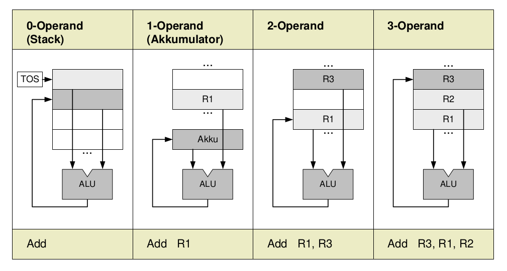


# Prozessorarchitektur
Programmiermodelle, Instruction Set Architectures (ISAs): 
Klassifikation von Befehlssätzen nach der Gestaltung/Ausprägung der vorhandenen Maschinenbefehle

| CISC | RISC | MIPS |
| -- | -- | -- |
| Complex Instruction Set Computing | Reduced Instruction Set Computing | Microprocessor without interlocked pipeline stages |
| Einfache und komplexe Befehle | wenige, einfache Befehle | 32-bit Architektur/64-bit Erweiterung|
| Heterogener Befehlssatz | Orthogonaler Befehlssatz | |
| Verschiedene Taktzahl pro Befehl | Meist 1 Takt pro Befehl | |
| Viele Befehlscode-Formate mit unterschiedlicher Länge | Wenige Befehlscode-Formate mit einheitlicher Länge | |
| Mikroprogrammwerk | Direktverdrahtung | |
| Vermischung von Verarbeitungs- und Speicherbefehlen | Trennung von Verarbeitungs- und Speicherbefehlen | |
| schwierig, unter CPI = 2 zu kommen | Hohe Ausführungsgeschwindigkeit $(CPI \leq 1)$ | |

> Unter dem CPI (cycles per instruction) -Wert einer Menge von Maschinenbefehlen versteht man die mittlere Anszahl der Taktzyklen pro Maschinenbefehl


## Einzelzyklusmaschine
- Programmzähler (32 bit, PZ, engl. Program Counter, PC)
  - Speichert und liefert die aktuelle auszuführende Instruktionsadresse
  - an den Instruktionsspeicher (b) und das Addierwerk (a)
  - übernimmt die Adresse der Folgeinstruktion (c)
- Addierwerk
  - Fortlaufende Addition mit 4, da 4-Byte Instruktionen
  - Der neue Wert für PZ wird im Register gespeichert (c)
  - Die hintersten 2 Bit im PZ sind immer Null
- Instruktionsspeicher
  - Liefert die auszuführende Maschineninstruktion
- Instruktionswort (32 bit)
  - Gelesener Wert erscheint am Ausgang des Speichers
  - Instruktionsformat bestimmt den weiteren Ablauf
- Master-Slave Flip-Flops
  - Master übernimmt Wert bei steigender Taktflanke
  - Slave übernimmt Wert bei fallender Taktflanke
  - Instruktionszyklus beginnt bei fallender Taktflanke
- Ansteuerung des Registersatzes
  - Register immer auslesen (kein Takt) und Transport zur ALU
  - Schreiben des Zielregisters Register[rd] am Ende der Taktperiode
  - Zeit für Speicherzugriff und für die primäre ALU muss eingeplant werden
  - Ausgabe des Instruktionsspeichers wird über die ganze Dauer gehalten
- Vorzeichenerweiterung des Direktoperanden von 16 auf 32 Bit
  - Erleichtert die Unterbringung kleiner Konstanten im Befehlswort
  - Vom Steuerwerk aus abschaltbar für „unsigned“ Befehle

### Decodierphase
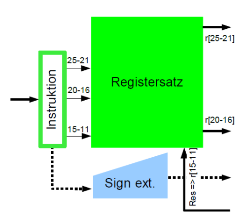
Zwei Register lesen, eines schreibt
- Gelesene Register weiter zur ALU
- Drei Instruktionsfelder à 5 Bit
- Resultat zurück von ALU

z.B. R-Format Instruction `opcode rs rt rd shamt func`
- rt = IR[20-16] selektiert Register[rt] zur ALU
- rs = IR[25-21] selektiert Register[rs] zur ALU
- rd = IR[15-11] wählt Register[rd] für Resultat

z.B. I-Format Instruction `opcode rs rt Direktoperand`
- Ein Basis-/Indexregister: rs = IR[25-21]
- Ein Ziel-/Quellregister: rt = IR[20-16]
- Direktoperand: imm = IR[15-0]

Zeitverhalten:
- Register immer auslesen (kein Takt) und Transport zur ALU
- Schreiben des Zielregisters Register[rd] am Ende der Taktperiode
- Zeit für Speicherzugriff und für die primäre ALU muss eingeplant werden
- Ausgabe des Instruktionsspeichers wird über die ganze Dauer gehalten

Multiport-Registersatz
- Zwei gleichzeitige Lesezugriffe im selben Taktzyklus
- Kein Schreibzugriff bei Store-Operationen (Mem-Write)
- Zwei Lesebusse, ein Schreibbus zu den Registern

### Ausführungsphase
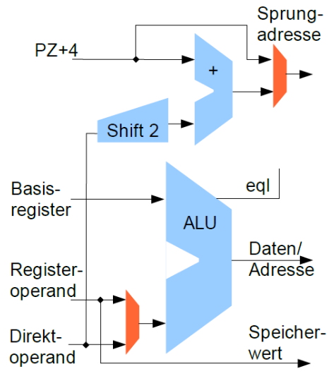
- ALU-Registeroperationen
  - Operanden im Register oder als Direktoperand
  - Üblicher Satz an ALU-Operationen
  - Register $0 liefert Wert 0
- Adressierung von Variablen im Speicher
  - Adressrechnung in der primären ALU
  - Basisregister plus Direktoperand
  - Registerinhalt lesen/schreiben
- Load/Store-Architektur
  - Speicheroperationen können keine Arithmetik
  - ALU schon zur Adressberechnung benötigt
- Separater Addierer zur Sprungzielberechnung
  - Prüfschaltung auf Gleichheit zweier Register in der primären ALU ("eql") 
  - Bedingte Sprünge mit einem 16-bit Direktoperanden
  - Maximal möglicher Offset von $\pm 17$ Bit nach einer 2-bit Verschiebung
  - Unbedingte Sprünge mit 28-bit Adresse später

### Speicherzugriff
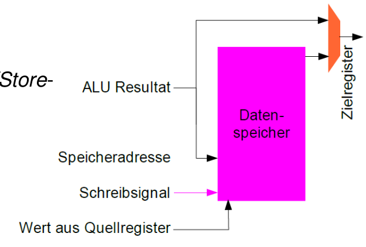
- Getrennte Speicher für Code & Daten
  - Aktuelle Instruktion wird bis zum Ende des Gesamtzyklus gehalten
  - Kein zweiter Zugriff im gleichen Taktzyklus möglich 
- Quellregister speichern, falls Store
  - Speichersteuerung durch besonderes Schreibsignal
- Zielregister laden
  - Falls Ladebefehl aus dem Speicher
  - Falls Rücksprungadresse (PC-magic)
  - Falls Resultat aus ALU
- ALU-Resultat nutzen
  - Für „Register Write-Back“
  - Als Datenspeicheradresse
  - Nicht direkt speichern, wg. Load/Store-Architektur!

### Register zurückschreiben (Write Back)
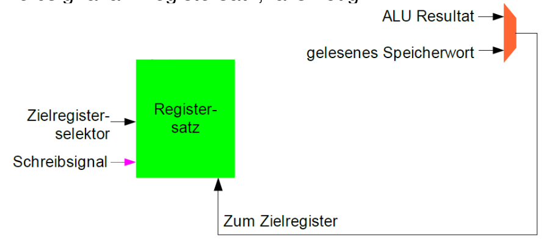
- Nummer des Zielregisters (Zielregisterselektor)
  - Stammt aus IR[15-11] oder IR[20-16], 5-bit Bereich für Werte 0-31
- Steuersignal
  - Zielregister zum Ende des Instruktionszyklus schreiben
  - Schreibsignal an Registersatz, falls nötig

### weitere Sprungbefehle
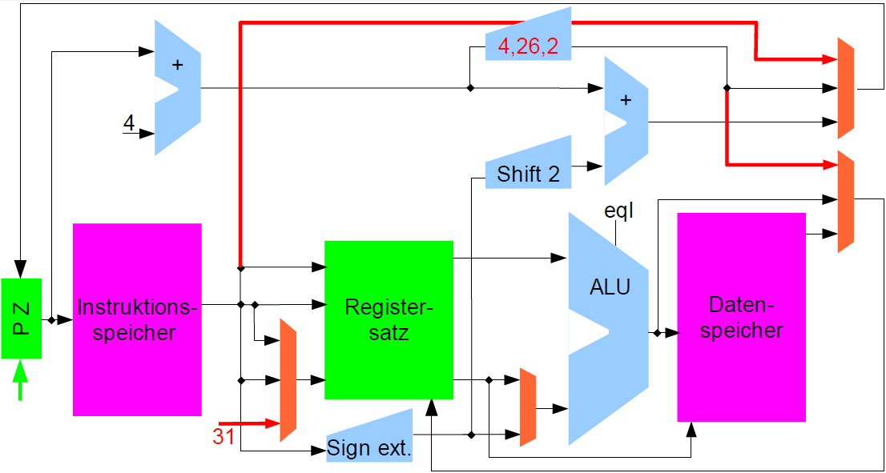
- Pseudorelative Sprünge (jump xLabel)
  - Kein separater Addierer erforderlich, nur ein zusätzlicher MUX-Eingang
  - Oberste 4 Bits unverändert, untere 28 Bits werden ersetzt (4, 26, 2)
  - Jump-and-Link (jal) sichert alten Programmzähler in $31 (Subroutine)

erforderliche Steuerleitung
- Für Speicher
  - 2-bit Steuersignal: 0/8/16/32 Bit zum Datenspeicher schreiben
  - Instruktionsspeicher liest immer
- Für Registersatz
  - 2-bit Steuersignal: 0/8/16/32 Bit zum Registerfile schreiben
- Für 4 Multiplexer
  - 2-bit Steuersignal: Auswahl des Zielregisters (1 aus 3)
  - 2-bit Steuersignal: Datenquelle für Zielregister
  - 2-bit Steuersignal: Sprungziel wählen
  - 1-bit Steuersignal: Direkt- oder Registeroperand für ALU
- Für Arithmetik
  - 1-bit Steuersignal: Vorzeichenerweiterung ja/nein
  - 6-bit Steuersignal: ALU-Operation
- Ca. 20 Steuersignale sind erforderlich: Mittelgroßes PLA auf Chip

Einzyklusmaschine ist unwirtschaftlich
- Komponenten arbeiten jeweils nur einen kleinen Teil der Gesamtzeit
- Zeitverlust bei potentiell kurzen Instruktionen

## Mehrzyklen CPU
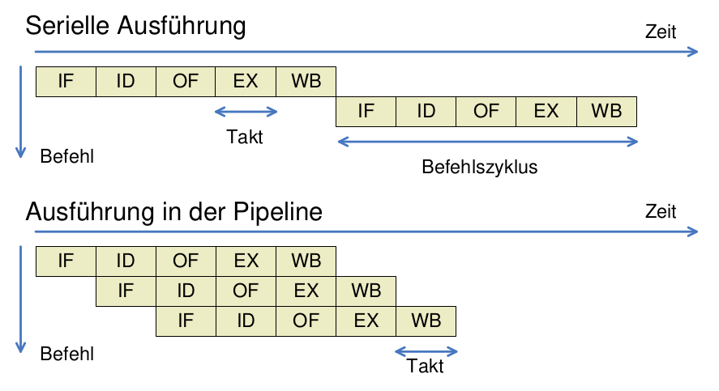
- Gesamtzyklus der bisherigen MIPS
  - Dauer des Instruktionszyklus ist die Summe der Einzelverzögerungen
  - Unteraktivitäten müssen abwarten, bis die Parameter sicher vorliegen
  - Anderenfalls können sich „spurious writes“ ergeben
  - z.B. in Registersatz oder in den Speicher
- Mehrzyklen-CPU als Überleitung zum Fließbandprinzip
  - Aufteilung der Befehlsausführung auf mehrere gleich lange Taktzyklen
  - Einfügen von Registern für in den Stufen entstandene Zwischenresultate
  - Noch immer nur eine Instruktion zu einem Zeitpunkt in Ausführung
  - CPU-Zustand bezieht sich auf eine einzelne aktuelle Instruktion
- Pipelined CPU - mit Fließbandprinzip
  - In jedem Taktzyklus beginnt eine neue Maschineninstruktion
  - Mehrere Instruktionen gleichzeitig in Ausführung
  - Aber unterschiedlicher Fertigstellungsgrad
  - Bessere Auslastung der Hardware
  - Höherer Durchsatz
  - Große Pipeline-Tiefe:
    - Zusätzliche Ressourcen, höherer Energieaufwand (Taktfrequenz!)
    - Längere Instruktionssequenzen für gleichen oder besseren Speedup (→ Registeroverhead!)
    - Bei unterschiedlichen Stufenverzögerungen bestimmt die langsamste Stufe die Taktfrequenz
  - Lange Instruktionssequenzen:
    - Meist wegen Daten- und Kontrollabhängigkeiten nicht machbar
    - Hohe Latenz – Füllen und Leeren der Pipeline!
  - Warum geht die Anzahl der Pipeline-Stufen zurück?
    - hoher Energieverbrauch
    - hohe Leistungseinbußen durch Kontroll- und Datenabhängigkeiten (Füllen/Leeren der Pipeline)
    - mehr Parallelität in den einzelnen Pipeline-Stufen → superskalare Prozessoren
    - mehr Prozessorkerne mit geringerer Leistungsaufnahme pro Kern
  - Fließband-Architektur (engl. pipeline architecture): Bearbeitung mehrerer Befehle gleichzeitig, analog zu Fertigungsfließbändern.
    - Aufteilung des Rechenwerks in Fließbandstufen, Trennung durch Pufferregister (IF/ID,ID/EX,EX/MEM, MEM/WB)

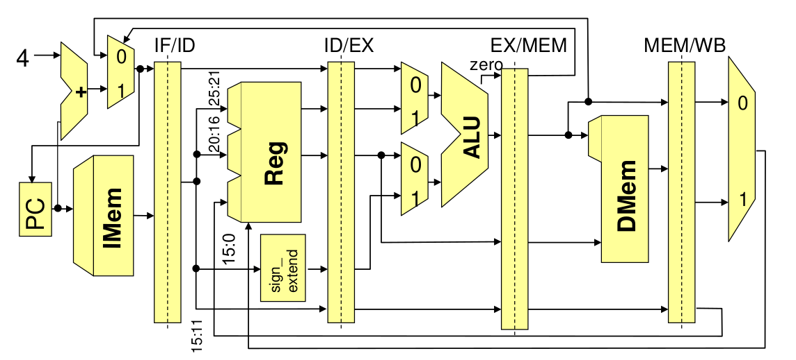

Aufgaben der einzelnen Phasen
- Befehlsholphase
  - Lesen des aktuellen Befehls; separater Speicher, zur Vermeidung von Konflikten mit Datenzugriffen
- Dekodier- und Register-Lese-Phase
  - Lesen der Register möglich wegen fester Plätze für Nr. im Befehlswort
- Ausführungs- und Adressberechnungsphase
  - Berechnung arithmetischer Funktion bzw. Adresse für Speicherzugriff
- Speicherzugriffsphase
  - Wird nur bei Lade- und Speicherbefehlen benötigt
- Abspeicherungsphase
  - Speichern in Register, bei Speicherbefehlen nicht benötigt

## Pipeline-Hazards
> Structural Hazards ("strukturelle Abhängigkeiten oder Gefährdungen"): Verschiedene Fließbandstufen müssen auf dieselbe Hardware-Komponente zugreifen, weil diese nur sehr aufwändig oder überhaupt nicht zu duplizieren ist.

- resource hazards
- data hazards: Datenabhängigkeiten
  - **Antidatenabhängig**: falls Befehl j eine Speicherzelle beschreibt, die von i noch gelesen werden müsste.
    - WAR (write after read) Abhängigkeit
  - **Ausgabeabhängig**: falls Befehle i und j die selbe Speicherzelle beschreiben
    - WAW (write after write) Abhängigkeit
  - **Datenabhängigkeit**: Operation hängt von der vorhergehenden Operation ab
    - RAW (read after write) Abhängigkeit
- control hazards: Kontrollabhängigkeiten
  - Gleichheit der Register wird schon in der instruction decode-Stufe geprüft
  - Sprungziel wird in separatem Adressaddierer ebenfalls bereits in der instruction decode-Stufe berechnet

Gegenmaßnahmen
  - pipeline stall (Anhalten des Fließbandes, NOOPS(s) einfügen)
  - branch prediction
  - forwarding / bypassing
  - delayed branches (nächsten Befehl einfach ausführen)
  - out-of-order execution
  - dynamic sched

## Sprungvorhersage
Je mehr die Parallelität ausgenützt werden soll, desto mehr sind Kontrollkonflikte der limitierender Faktor!
- wichtig für single-issue Prozessoren (pro Takt ein Befehl ausgegeben)
- aber essentiell für multiple-issue (n Befehle pro Takt ausgegeben)

Dynamische Sprungvorhersage
- Zur Laufzeit durch Prozessor-Hardware
- Vorhersage, ob ein bedingter Sprung genommen wird oder nicht
- Abhängig von der Vorhersage: Füllen der Prozessor-Pipeline mit Befehlen ab der vorhergesagten Programm-Stelle
- Reduktion der branch penalty, falls vorhergesagtes Programm-Verhalten mit tatsächlichem übereinstimmt
- jedoch: Vorhersagen sind schwierig

Einfache lokale Prädiktoren
- Liefern Vorhersage, ob bedingter Sprung genommen wird oder nicht
- Prädiktion allein anhand der Historie des betrachteten, aktuellen Sprungs
- Historie eines Sprungs wird mit 1, 2 oder n Bits gepuffert

### Einfache Sprungvorhersage (1 Bit)
- Sprungvorhersage-Puffer
  - Branch prediction buffer oder branch history table
  - Kleiner Speicher, der mit (Teil der) Adresse des Sprungbefehls indiziert wird
    - Verwendet nur wenige untere Bits der Adresse
    - Enthält 1 Bit: Sprung beim letzten Mal ausgeführt (taken) oder nicht (not taken)
  - Prädiktion: Sprung verhält sich wie beim letzten Mal
  - Nachfolgebefehle ab vorhergesagter Adresse holen
  - Falls Prädiktion fehlerhaft: Prädiktionsbit invertieren
  - Alle Sprünge, deren Adressen im Indexteil übereinstimmen, werden derselben Zelle im branch prediction buffer zugeordnet.
- Einfachste Art von Puffer (keine Tags, d.h. keine Überprüfung, ob Adresse tatsächlich im Puffer)
  - Entspricht sehr einfachem Cache
  - Hat eine bestimmte Kapazität
  - Kann nicht für alle Sprünge (aktuelle) Einträge enthalten
- Reduziert branch penalty nur, wenn branch delay länger als Berechnung der Zieladresse mit branch prediction buffer dauert
  - Prädiktion kann fehlerhaft sein
  - Prädiktion kann von anderem Sprungbefehl stammen (mit gleichen Bits im Indexteil der Adressen)

### Einführung von Tag Bits
- Nachteile des einfachen 1-Bit Vorhersageschemas
  - Höhere Fehlerrate als überhaupt möglich, wenn Häufigkeit der Sprungentscheidungen betrachtet wird
  - D.h. auch wenn Sprung fast immer ausgeführt (taken) wird, entstehen 2 Fehler anstatt 1
- Tag beseitigt eines der Probleme: gültiger Eintrag, falls Tag-Bits gleich sind
- Alle Sprünge, deren Adressen im Indexteil übereinstimmen, werden derselben Zelle im branch prediction buffer zugeordnet. Überprüfung mittels tags, ob es der richtige Eintrag ist.
- Allgemein: Fehlerrate von 1-Bit Prädiktor ist für Sprünge in Schleifenkonstrukten doppelt so hoch wie die Anzahl ausgeführter Sprünge

### 2 Bit Vorhersagen
- Änderung der Vorhersage nur, wenn 2 falsche Vorhersagen in Folge
- 2-Bit Branch-Prediction Buffer: Speicherung der Historie, Befehlsadressen als Zugriffsschlüssel

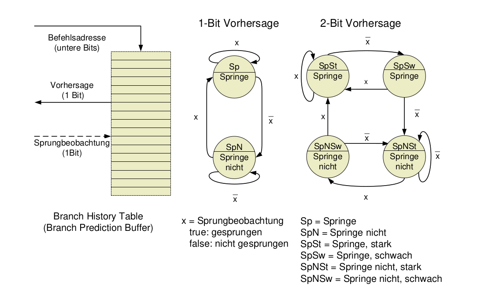

Vorhersagequalität für 2-Bit Prädiktor
- Studie von 1992 für SPEC89 auf IBM Power-Architektur
- Qualität nicht durch die Größe des Speichers beschränkt
- Fehlerwahrscheinlichkeit höher für Integer-Programme (gcc, eqntott)

### n-Bit Prädikator
Allgemein: n-Bit Prädiktor (Spezialfall: 2-Bit)
- Verwendet n-Bit Zähler
  - Sättigungsarithmetik (kein wrap around bei Überlauf)
  - Kann Werte zwischen 0 und $2^{n-1}$ annehmen
  - Wenn Zähler größer als Hälfte des Maximums $(2^{n-1})$: Vorhersagen, dass Sprung ausgeführt wird; ansonsten vorhersagen, dass Sprung nicht genommen wird
  - Zähler wird bei ausgeführtem Sprung inkrementiert und bei nicht ausgeführtem dekrementiert
- In der Praxis: 2-Bit Prädiktor ähnlich gut wie n-Bit Prädiktor
  - In den meisten Prozessoren heute: 2-Bit Prädiktor für (lokale) Vorhersage

### Korrelierende Prädikatoren
- Einschränkung des n-Bit (bzw. 2-Bit) Prädiktors:
  - Betrachtet nur (vergangenes) Verhalten eines Sprungs, um dessen (zukünftiges) Verhalten vorherzusagen.
  - Arbeitet rein lokal!
- Idee: Verbesserung durch Betrachtung des Verhaltens anderer Sprünge
  - Man erhält so genannten korrelierenden Prädiktor (correlating predictor) oder zweistufigen Prädiktor
  - Prinzip: Aufgrund globaler Information (anderer Sprünge) wird einer von mehreren lokalen Prädiktoren ausgewählt
- Beziehen zur Vorhersage des Verhaltens eines Sprungs Kontext-Information mit ein, d.h. die Historie anderer Sprungbefehle
- Prädiktor benutzt globale Kontext-Bits, um einen von mehreren lokalen Prädiktoren auszuwählen
- Betrachten wiederholte Ausführung des Codefragments (ignorieren dabei alle anderen Sprünge, inkl. dem für Wiederholung)

Zweistufiger Prädiktor
- Verwendet 1 Bit Kontextinformation
- Es existieren 2 lokale Prädiktoren, beide je 1-Bit
  - Kontext: Letzter (i.a. anderer) Sprung wurde ausgeführt/nicht ausgeführt (1 Bit)
  - Vorhersage des zweistufigen Prädiktors: Anhand des Kontexts wird lokaler Prädiktor für die Vorhersage des aktuell betrachteten Sprungs ausgewählt
  - Letzter Sprung ist i.a. nicht gleich aktuellem, vorherzusagendem Sprung (nur in einfachen Schleifen)
- Notation des Prädiktorstatus: `<X>/<Y>` mit
  - `<X>`: Vorhersage, falls letzter Sprung not taken, d.h. Kontext = NT
  - `<Y>`: Vorhersage, falls letzter Sprung taken, d.h. Kontext = T
  - `<X>` und `<Y>` Vorhersagen: jeweils entweder T oder NT

(m,n)-Prädiktor
- Betrachtet als Kontext das Verhalten der letzten m Sprünge, um aus $2^m$ vielen lokalen Prädiktoren einen n-Bit Prädiktor auszuwählen
- Vorteil gegenüber (rein lokalem) 2-Bit Prädiktor
  - Höhere Vorhersagegenauigkeit
  - Erfordert kaum Hardwareaufwand
  - Sprunggeschichte (Kontext, „Ausgang“ vorangegangener Sprünge) kann in m-Bit Schieberegister gespeichert werden (1 Bit für jeden der m vielen letzten Sprünge im Kontext, Bit gleich 1 wenn Sprung taken)
- Vorhersagepuffer adressiert via Konkatenation von
  - Unteren Adressbits der Sprungbefehlsadresse
  - m Bit globaler Sprunggeschichte

### High Performance Befehlsdekodierung
In Hochleistungs-Pipelines ist reine Vorhersage eines Sprungs i.d.R. nicht ausreichend
- Insbesondere: Falls mehrere Befehle pro Takt auszugeben sind
  - Befehlsstrom mit großer Bandbreite erforderlich!
  - Kontrollflussabhängigkeiten dürfen nicht „wahrnehmbar“ sein 
- Maßnahmen hierfür
  - Pufferung von Sprungzielen, und nicht nur Vorhersage des Sprungverhaltens (branch target buffer)
  - Integrierte Einheit für das Holen der Befehle (d.h. nicht nur [relativ] einfache erste Stufe der Pipeline)
  - Vorhersage von Rücksprungadressen (bei Prozeduraufruf)

### Branch Target Buffer
5-stufige Pipeline, Auswertung von Sprungbedingungen in EX:
- Branch delay von 2 Takten
- Mit Sprungvorhersage (branch prediction buffer)
  - Zugriff erfolgt in ID (Adresse des Sprungbefehls schon in IF bekannt; aber:
  - evtl. angesprungenes Ziel erst nach Befehlsdecodierung [ID])
  - Nächste vorhergesagte Instruktion kann erst nach ID geholt werden
  - Branch delay = 1, falls Prädiktion korrekt
- Mit Pufferung des Sprungziels (branch target buffer)
  - Zugriff auf branch target buffer erfolgt in IF. Verhalten wie „echter“ Cache,
  - adressiert mit Sprungbefehlsadresse (überprüft, ob Cache-Hit)
  - Liefert vorhergesagte Adresse als Ergebnis, d.h. nächsten PC (d.h. nicht nur Vorhersage über Sprungverhalten)
  - Keine Verzögerung, falls Prädiktion korrekt!

Zusätzliche Speicherung auch des Sprungziels, z.B. Kombination mit branch prediction buffer

Bei geschickter Organisation kann das Fließband immer gefüllt bleiben; die Sprünge kosten dann effektiv keine Zeit; CPI <1 möglich.

Eigenschaften
- Verzögerung durch Sprung kann vollständig vermieden werden (sofern Vorhersage korrekt), da bereits in IF Entscheidung über nächsten Befehlszähler (PC) getroffen wird.
- Da Entscheidung allein auf Basis des PC getroffen wird, muss überprüft werden, ob Adresse im Puffer (impliziert, dass Sprungbefehl vorliegt)
- Speicherung im Prinzip nur für Sprünge notwendig, die als ausgeführt vorhergesagt werden (not taken = normale sequentielle Dekodierung geht weiter)
- Achtung – bei falscher Vorhersage
  - Entsteht ursprüngliche Sprung-Verzögerung, plus
  - Aufwand zur Aktualisierung des Vorhersagepuffers

### Integrierte Befehls-Hol-Einheit (IF Unit)
Insbesondere mit Blick auf multiple-issue Prozessoren eigene (autonome) funktionale Einheit für Befehlsholphase
- Führt Befehlscodes in Pipeline ein
- Integrierte Funktionalitäten
  - Sprungvorhersage: Wird Teil der Befehlsholphase
  - Instruction Pre-fetch: Insbes. um mehrere Befehle pro Takt liefern (und später ausgeben) zu können, läuft Befehlsholen weiterer Dekodierung voraus (= pre-fetch)
  - Zugriff auf Befehlsspeicher: Bei mehreren Befehlen pro Takt mehrere Zugriffe erforderlich (bei Cache auf ggfs. mehrere cache lines). Werden hier koordiniert/geplant
  - Befehlspuffer: Befehle können hier (lokal im Prozessor!) von Issue-Stufe nach Bedarf abgerufen werden

### Vorhersage von Rücksprungadressen
Allgemeines Ziel: Vorhersage indirekter Sprünge (d.h. bzgl. Basisadresse in Register)
- Hauptverwendung: Rückkehr aus Prozeduraufrufen
  - MIPS: Prozeduraufruf per jal proc, Rückkehr per jr $31
  - Vorhersage mit branch target buffer schlecht, da Aufruf aus unterschiedlichen Codeteilen heraus möglich
- Methode: (Stack-) Speicher für Rücksprungadressen
  - Push bei Prozeduraufruf (call), und
  - Pop bei Rücksprung (return)
- Vorhersagequalität „perfekt“, wenn Stack-Puffer größer als maximale Aufruftiefe


# Multiple-Issue-Architekturen
## Mehrere Ausführungseinheiten
- Techniken der vorangegangenen Abschnitte geeignet, um Daten- und Kontrollkonflikte zu lösen
  - Idealer CPI ~1
- Weitere Leistungssteigerung: 
  - CPI < 1
- Mehrere Befehle pro Takt ausgeben (fertigstellen)
- Zwei Grundtypen von multiple-issue Prozessoren:
  - Superskalar
    - Geben variable Anzahl von Befehlen pro Takt aus
    - Mit statischem (vom Compiler erzeugtem) oder dynamischem Scheduling in Hardware
  - VLIW/EPIC
    - Feste Anzahl von Befehlen ausgegeben, definiert durch Befehlscode (weitgehende Planung der Issue-Phase durch Compiler)

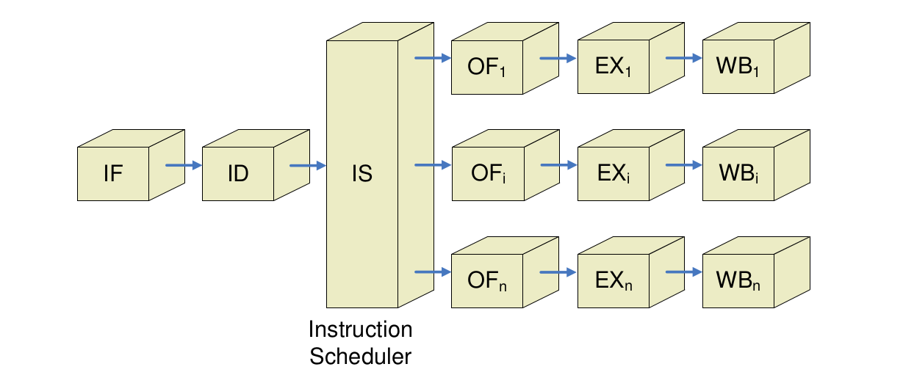

## Superskalar
statisch: Details der Befehlsausgabe
- In IF werden 1-n Befehle von Instruction Fetch Unit geholt (ggfs. Max. von n nicht immer möglich, z.B. bei Sprüngen)
- Befehlsgruppe, die potentiell ausgegeben werden kann = issue packet
- Konflikte bzgl. Befehlen im issue packet werden in Issue-Stufe in Programmreihenfolge (d.h. in-order) geprüft
  - Befehl ggfs. nicht ausgegeben (und alle weiteren)
- Aufwand für Prüfung in Issue-Stufe groß!
  - Wegen Ausgewogenheit der Pipeline-Stufen ggfs. Issue weiter „pipelinen“, d.h. in mehrere Stufen unterteilen = nicht-trivial
- Parallele Ausgabe von Befehlen limitierender Faktor superskalarer Prozessoren!

MIPS mit statischem Scheduling
- Annahme: 2 Befehle pro Takt können ausgegeben werden (1x ALU, Load/Store plus 1x FP)
  - Einfacher als 2 beliebige Befehle (wegen „Entflechtung“)
- Befehlsstart umfasst
  - 2 Befehlsworte holen (64-Bit Zugriff, d.h. komplexer als bei nur 1 Befehl - ggfs. Pre-fetch?)
  - Prüfen, ob 0, 1 oder 2 Befehle ausgegeben werden können
  - Befehl(e) ausgeben an korrespondierende funktionale Einheiten
- Prüfen auf Konflikte durch Entflechtung vereinfacht
  - Integer und FP-Operationen nahezu unabhängig (verschiedene Registersätze)
  - Abhängigkeiten nur bei Speichertransfers möglich (von Integer-ALU für FP ausgeführt) - Einschränkung des issue 
- Leistungssteigerung nur bei „geeignetem“ Anteil von FP-Operationen im Programm sowie geeigneter „Verflechtung“ durch Compiler!

## Dynamisches Befehlsscheduling – in-order execution
Bislang
- Reihenfolge der Befehlsabarbeitung = Reihenfolge der Befehle im Speicher, abgesehen von Sprüngen
- Behindert schnelle Ausführung

Scoreboarding
- Jeder Befehl, der aus der Instruction fetch-Einheit kommt, durchläuft das Scoreboard.
- Wenn für einen Befehl alle Daten/Operanden bekannt sind und die Ausführungseinheit frei ist, wird der Befehl gestartet.
- Alle Ausführungseinheiten melden abgeschlossene Berechnungen dem Scoreboard.
- Dieses erteilt Befehlen die Berechtigung zum Abspeichern von Ergebnissen, sofern
  - Speichereinheit frei ist und
  - Antidaten- und Ausgabeabhängigkeiten berücksichtigt sind und prüft, ob dadurch neue Befehle ausführbereit werd
- Zentrale Datenstruktur hierfür: Scoreboard (deutsch etwa „Anzeigetafel“ [für Befehlsstatus])
  - Ursprünglich realisiert für CDC 6600 (1964):
    - load/store-Architektur
    - mehrere funktionale Einheiten (4xFP, 6xMem, 7xInteger ALU)
  - Scoreboarding für MIPS nur sinnvoll
    - für FP-Pipeline (Operationen mit mehreren Taktzyklen)
    - und mehrere funktionale Einheiten (hier: 2 x Mult, Div, Add, Int)

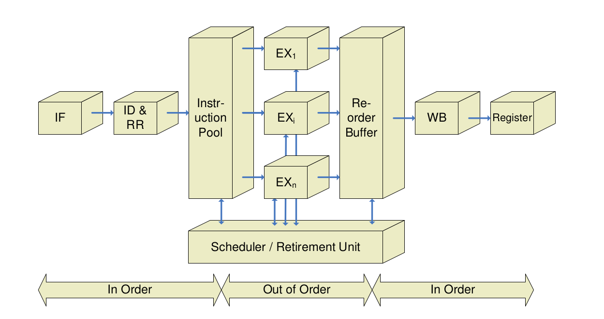


### Verfahren von Tomasulo
- Erdacht für IBM 360
- Verfahren von Tomasulo erlaubt auch bei Ausgabe- und Antidatenabhängigkeiten, die Reihenfolge zu vertauschen
- Umbenennung der Register; verschiedenen Benutzungen eines Registers werden verschiedene Speicherzellen zugeordnet
- Jeder funktionalen Einheit wird eine Reservation Station zugeordnet
- Reservation Stations enthalten die auszuführende Operation und, soweit bekannt, die Operanden bzw. eine Kennzeichnung in Form von tag bits des Operanden
- Sind alle Operanden bekannt und ist die funktionale Einheit frei, so kann die Bearbeitung beginnen
- Am Ende der Bearbeitung wird das Ergebnis von allen Einheiten übernommen, die das Ergebnis benötigen
- Verteilen der Daten erfolgt vor der Abspeicherung im Registerspeicher
- Aus den tag bits geht hervor, aus welcher Einheit der Operand kommen muss
- Registeradressen werden dynamisch auf größere Anzahl von Plätzen in den Reservation Stations abgebildet, d.h. Register effektiv umbenannt. Performance-Beschränkungen wegen weniger Register werden so umgangen

### Register Renaming
- Prinzip: Verwendung temporärer Register für (logisch) neue möglicherweise interferierende Belegung
- Beispiel
  - Annahme: es existieren zwei temporäre Register S und T
  - Kollidierende Belegungen von F8 durch `sub.d` bzw. F6 durch `add.d` in (eindeutige) temporäre Register „umleiten“
    ```cpp
    div.d $F0,$F2,$F4 
    add.d $T,$F0,$F8   // Lesen von F8, Schreiben von T (F6)
    s.d   $T,0($R1)    // Lesen von T (F6)
    sub.d S,$F10,$F14  // Schreiben von S (F8)
    mul.d $F6,$F10,S   // Schreiben von F6
    ```
- Alle Namenskonflikte durch Umbenennung auflösbar (Voraussetzung: genügend temporäre Register)
- Weitere Verwendung von F8/F6 durch S/T ersetzen!
- Wichtige Hardwarestruktur: Reservation Stations
  - Zugeordnet zu funktionalen Einheiten (i.d.R. eine pro Einheit)
- Arbeitsweise von Reservation Stations
  - Puffern Operanden für Befehle (sobald verfügbar/geladen)
    - Müssen nicht aus Registern gelesen werden!
  - Ausstehende Operanden verweisen auf Reservation Station, die Eingabe bereitstellen wird
  - Bei aufeinander folgenden Schreibzugriffen auf Register: Nur letzter für Aktualisierung des Inhalts verwendet
- Wichtige Eigenschaften der Verwendung von Reservation Stations anstelle des zentralen Registersatzes
  - Konfliktdetektion und Ausführungskontrolle verteilt
    - Informationen in Reservation Stations bei den funktionalen Einheiten bestimmen, wann Ausführung eines Befehls möglich ist
  - Ergebnisse werden direkt zu den funktionalen Einheiten (in jeweiliger Reservation Station) weitergereicht
    - Erweiterte Form des Forwarding
    - Realisiert implizit Register Renaming
    - Möglich durch gemeinsamen Ergebnisbus (common data bus)


## Multiple-Issue mit dynamischem Scheduling
- Wesentlicher Nachteil von statischem Scheduling für superskalare Prozessoren: Latenzzeiten werden ca. mit Länge des issue packets skaliert
- „Längere“ Verzögerung (in Anzahl Befehlen) für Load/Stores bzw. Branches
- Lösung: Erweiterung des Tomasulo-Algorithmus auf Multiple-Issue durch
  - Sequentielles Ausgeben mehrerer Befehle an Reservation Stations innerhalb eines Taktes, oder
  - „Verbreiterung“ der Ausgabe-Logik (issue logic) zur Behandlung mehrerer Operationen parallel
  - (alle Abhängigkeiten gleichzeitig überprüfen!)

### VLIW - Very Long Instruction Word
VLIW (Very Long Instruction Word)-Prozessor
- verschiedene parallele Ausführungseinheiten
- Verteilung von Maschinencode direkt vom Befehlswort im Speicher vorgegeben
- Sieht für jede Ausführungseinheit dezidierte Anweisungen vor
- keine Abhängigkeiten daher geringere Komplexität in Hardware
- Meist für stark parallelisierbare Aufgaben verwendet (Signalverarbeitung, Vektorrechner, DSP)

- Vorteile:
  - Die parallele Architektur des Prozessors kann schon während der der Programmerstellung (Kompilieren) zur Optimierung genutzt werden.
  - Keine aufwendige Prozessorhardware zur Befehlsverteilung/Abhängigkeitsanalyse erforderlich (einfacherer Prozessor)
  - Ausführungszeiten sind im wesentlichen bekannt
- Nachteile:
  - Aufwendigere Compiler
  - Schlechte Prozessorauslastung bei ungünstigem Code
  - Rekompilierung für den Prozessor erforderlich (kein Universalrechner)
  - Größerer Speicherbedarf (Programm), wenn Code nicht parallelisiert werden kann.

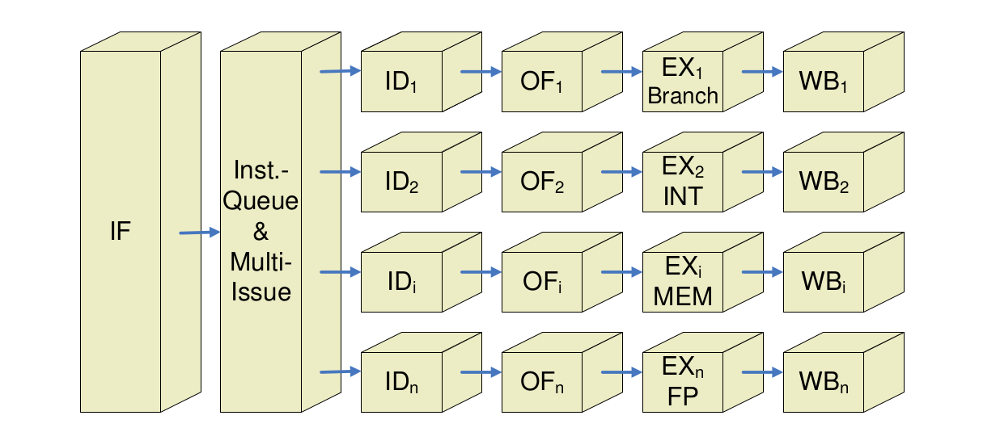

EPIC = Explicitely Parallel Instruction Computing = IA64
- Im wesentlichen Prinzip des VLIW-Prozessors
- Umsortieren der Befehle und Auflösung der Abhängigkeiten werden durch den Compiler durchgeführt
  - Hauptnachteil; Neukompilierung erforderlich)
- Keine statische Aufteilung auf Funktionseinheiten
- Effizienteres Befehlswort - Keine Verwendung von zwangsweise NOPs

Bei der IA64-Architektur werden verschiedene Ansätze verfolgt, um die Prozessorlogik zu vereinfachen.
1. Bedingte Befehlsverarbeitung
    - Ein Befehl wird abhängig von einem Statusbit ausgeführt
    - Dadurch kann die Sprungvorhersage bei einfachen if-then-else Zweigen entfallen
    - Die then und else Befehle sind parallel, wobei jeweils nur einer ausgeführt wird
2. Statische Sprungvorhersage (Compiler)
3. Die Optimierung (Finden paralleler Befehle) wird im wesentlichen dem Compiler überlassen.
4. Spekulatives Laden von Operanden
    - Möglichst geringe Wartezeit auf Operanden
    - Schon im Compiler werden entsprechende Ladebefehle vorgezogen.

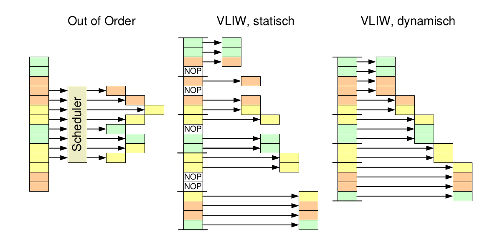

## Simultaneous Multithreading (SMT)
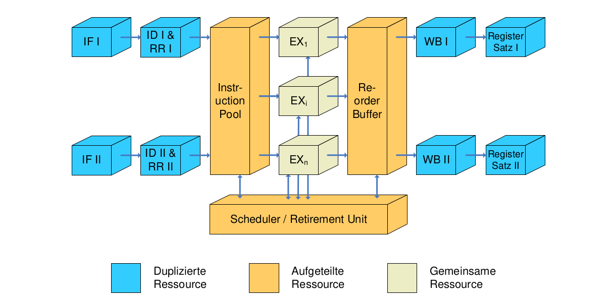

- Modellprozessor I (2-fach Superskalar)
- Modellprozessor II (2-fach Out-of-Order)

Ansätze zur Effizienzsteigerung durch Mikroparallelität
| Bezeichnung | Konflikterkennung | Issue-Struktur | Scheduling | Hauptmerkmal | Beispiele |
| -- | -- | -- | -- | -- | -- |
| Superskalar (statisch) | Hardware | Dynamisch | Statisch | In-order Execution | Sun UltraSPARC II/ III |
| Out of Order | Hardware | Dynamisch | Dynamisch mit Spekulation | Out of Order mit Spekulation | Pentium III, Pentium 4, MIPS 10000 | 
| VLIW | Software | Statisch | Statisch | Keine Konflikte | Trimedia, diverse DSPs |

# Speicherarchitektur
## Speicherhierarchie
- Große Speicher sind langsam
- Anwendung verhalten sich üblicherweise lokal
- Häufig benötigte Speicherinhalte in kleinen Speichern, seltener benötigte Inhalte in großen Speichern ablegen!
- Einführung einer „Speicherhierarchie“
- Illusion eines großen Speichers mit (durchschnittlich) kleinen Zugriffszeiten
- Bis zu sechs Ebenen in modernen Systemen unterscheidbar
  Ebene | Latenz | Kapazität 
  -- | -- | --
   Register | 100ps | 1 KByte
   Cache | 1ns | 12 MByte
   Hauptspeicher/RAM | 10ns | 8 GByte
   Festplatte | 10ms | 1 TByte
   CD-ROM/DVD/BlueRay | 100ms | 50 GByte
   Magnetbänder | 100s | 5 TByte
- Adresspipelining
    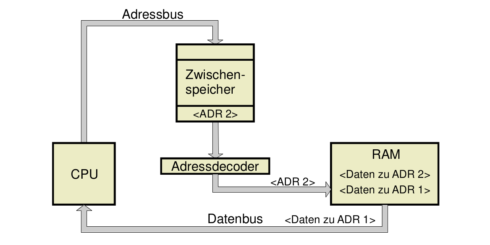
- Matrixaufbau eines Speichers
  - Aufteilen der Speicheradresse in Zeilen- und Spaltenadresse
  - Lesezugriff auf Speicher
    - Dekodierung der Zeilenadresse bestimmt Select-Leitung
    - Komplette Zeile wird in den Zeilenpuffer geschrieben
    - Durch Dekodierung der Spaltenadresse wird das gewünscht Datenwort ausgewählt
  - Blocktransfer (Burst): Auslesen des kompletten Zeilenpuffers durch automatisches Inkrementieren der Spaltenadresse

Typischer DRAM-Speicher
- Matrixaufbau eines DRAM-Speichers
- Adressleitungen werden i.d.R. gemultiplext
  - Die gleichen Adressleitungen werden einmal zur Auswahl der Zeile verwendet, danach zur Auswahl der Spalte
  - Einsparung von Leitungen, gerade für große Speicher wichtig
- Steuerleitungen RAS/CAS codieren, ob Adressleitungen Zeile oder Spalte auswählen
  - RAS (Row Address Strobe): Bei einer fallenden Flanke auf RAS wird die anliegende Adresse als Zeilenadresse interpretiert
  - CAS (Column Address Strobe): Bei einer fallenden Flanke auf CAS wird die anliegende Adresse als Spaltenadresse interpretiert
- Zugriff auf DRAM
  - Erster Schritt
    - Zeilenadressdecoder liefert Select-Leitung für eine Zeile
    - Komplette Zeile wird in einen Zwischenpuffer übernommen
    - Und zurückgeschrieben!
  - Zweiter Schritt
    - Aus dem Zwischenpuffer wird ein Wort ausgelesen
    - Schritt kann mehrfach wiederholt werden (mehrere aufeinanderfolgende Wörter können gelesen werden)
- Auffrischung
  - Heute auf dem DRAM-Speicher integriert
  - Früher durch externe Bausteine ausgelöst
- DRAM-Eigenschaften
  - Weniger Platzbedarf
  - Nur 1 Transistor und 1 Kondensator pro Speicherzelle, statt 6 Transistoren bei SRAM
  - Integrationsdichte Faktor 4 höher als bei SRAMs
- Langsamerer Zugriff
  - Insbes. Lesezugriff wegen Zwischenspeicherung und Auffrischung
  - Multiplexen der Adressleitungen
  - Auf DRAM-Zeile kann während Auffrischung nicht zugegriffen werden
- Hoher Energieverbrauch sowohl bei Aktivität als auch bei Inaktivität
  - Ausgleich des Ladungsverlusts durch periodische Auffrischung
  - Zwischenpuffer und Logik zur Auffrischung

Interleaving
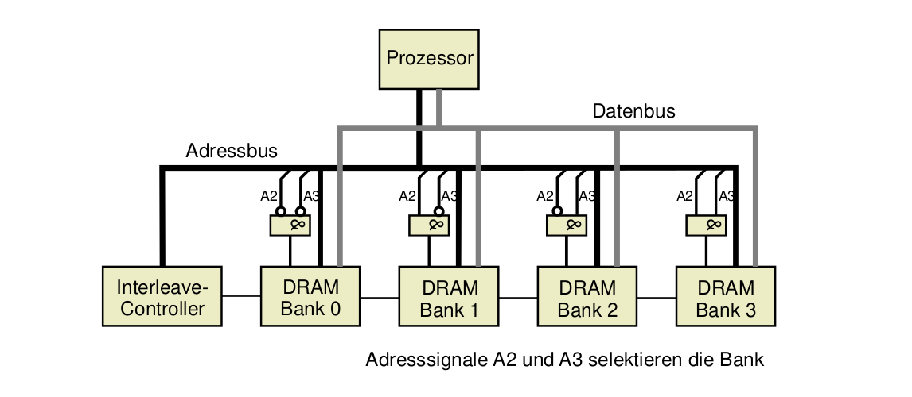

Caches
- Cache = schneller Speicher, der vor einen größeren, langsamen Speicher geschaltet wird
- Im weiteren Sinn: Puffer zur Aufnahme häufig benötigter Daten
  - Für Daten die schon mal gelesen wurden oder in der Nähe von diesen liegen
  - 90% der Zeit verbringt ein Programm in 10% des Codes
- Im engeren Sinn: Puffer zwischen Hauptspeicher und Prozessor
- Ursprung: cacher (frz.) – verstecken („versteckter Speicher“)
- Organisation von Caches
  - Prüfung anhand der Adresse, ob benötigte Daten im Cache vorhanden sind („Treffer“; cache hit)
  - Falls nicht (cache miss): Zugriff auf den (Haupt-) Speicher, Eintrag in den Cache
  - Prinzip eines Cache (Hit) 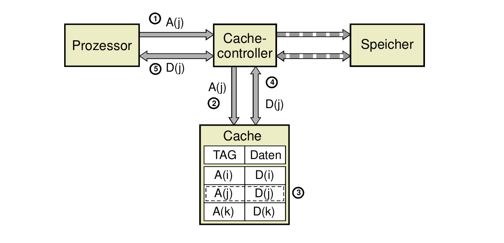
- Cache-Strategien und Organisationen
  - Wo kann ein Block im Cache abgelegt werden?
    - Platzierung abhängig von der Organisationsform
    - Organisationsform: direkt, mengenassoziativ, vollassoziativ
  - Welcher Speicherblock sollte bei einem Fehlzugriff ersetzt werden?
    - Ersetzungsstrategie: Zufällig, FIFO, LRU
  - Was passiert beim Schreiben von Daten in den Cache?
    - Schreibstrategie: write-back, write-through
- Direkt abgebildeter Cache
  - Such-Einheit im Cache: Cache-Zeile (cache line).
  - Weniger tag bits, als wenn man jedem Wort tag bits zuordnen würde.
- Cache-Blöcke, cache blocks
  - Die Blockgröße ist die Anzahl der Worte, die im Fall eines cache misses aus dem Speicher nachgeladen werden.
  - Beispiel: (Blockgröße = line size)
  - Wenn block size < line size, dann sind zusätzliche Gültigkeitsbits erforderlich. Beispiel: (Blockgröße = line size / 2)
  - Wenn block size > line size, dann werden bei jedem miss mehrere Zeilen nachgeladen.
  - Stets wird zuerst das gesuchte Wort, dann der Rest des Blocks geladen.
  - Verbindung Speicher ↔ Cache ist so entworfen, dass der Speicher durch das zusätzliche Lesen nicht langsamer wird.
  - Methoden dazu:
      1. Schnelles Lesen aufeinanderfolgender Speicherzellen (Burst-Modus der Speicher)
      2. Interleaving (mehrere Speicher ICs mit überlappenden Zugriffen)
      3. Fließbandzugriff auf den Speicher (EDO-RAM, SDRAM)
      4. Breite Speicher, die mehrere Worte parallel übertragen können
- 2-Wege Cache (Datensicht)
    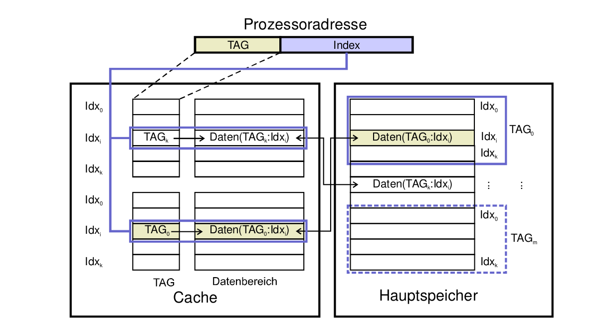
  - 2-fach satz-assoziativer Cache
- Organisationsformen von Caches
  - Direkt abgebildet (Direct mapping): Für caching von Befehlen besonders sinnvoll, weil bei Befehlen Aliasing sehr unwahrscheinlich ist
  - Satz-assoziativ abgebildet (Set-associative mapping): Sehr häufige Organisationsform, mit Set-Größe = 2, 4 oder 8
  - Vollassoziativ abgebildet (Associative mapping): Wegen der Größe moderner Caches kommt diese Organisationsform kaum in Frage
- Ersetzungs-Strategien
  - Zufallsverfahren: Hier wird der zu ersetzende Block innerhalb des Satzes zufällig ausgewählt.
  - FIFO-Verfahren: Beim FIFO-Verfahren (engl. First In, First Out) wird der älteste Block ersetzt, auch wenn auf diesem gerade erst noch zugegriffen wurde
  - LRU-Verfahren: Beim LRU-Verfahren (engl. least recently used ) wird der Block ersetzt, auf den am längsten nicht mehr zugegriffen wurde
  - LFU-Verfahren: Beim LFU-Verfahren (engl. least frequently used ) wird der am seltensten gelesene Block ersetzt
  - CLOCK-Verfahren: Hier werden alle Platzierungen gedanklich im Kreis auf einem Ziffernblatt angeordnet. Ein Zeiger wird im Uhrzeigersinn weiterbewegt und zeigt den zu ersetzenden Eintrag an.
 
Schreibverfahren: Strategien zum Rückschreiben Cache → (Haupt-) Speicher
- Write-Through (Durchschreiben): 
   -  Jeder Schreibvorgang in den Cache führt zu einer unmittelbaren Aktualisierung des (Haupt-) Speichers
   -  Speicher wird Engpass, es sei denn, der Anteil an Schreiboperationen ist klein oder der (Haupt-) Speicher ist nur wenig langsamer als der Cache.
- Copy-Back, conflicting use write back
  - Rückschreiben erfolgt erst, wenn Cache-Zeile bei Miss verdrängt wird
  - Funktioniert auch bei großen Geschwindigkeitsunterschieden zwischen Cache und Speicher. Vorkehrungen erforderlich, damit keine veralteten Werte aus dem Speicher kopiert werden.
  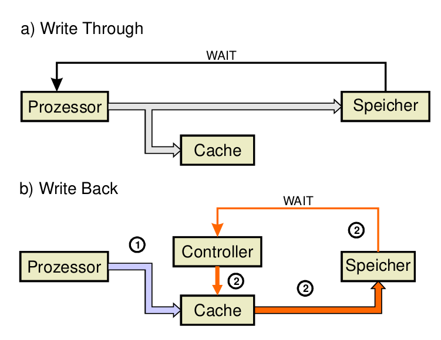

Trefferquote $T=\frac{N_C}{N_G}$ mit $N_G$ Gesamtzahl der Zugriffe auf Speicher und $N_C$ Anzahl der Zugriffe mit Hit auf Cache


# Microcontroller und Digitale Signalprozessoren


# Parallele Architekturen


# Leistungsbewertung
