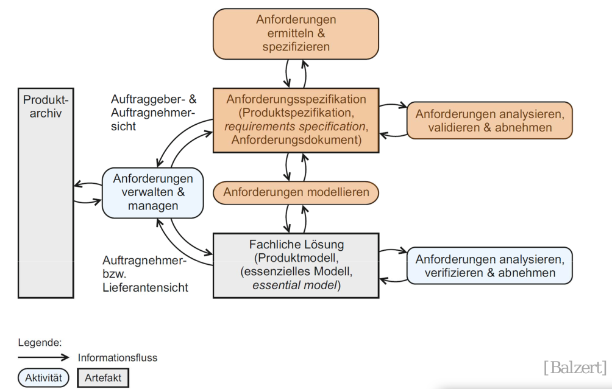
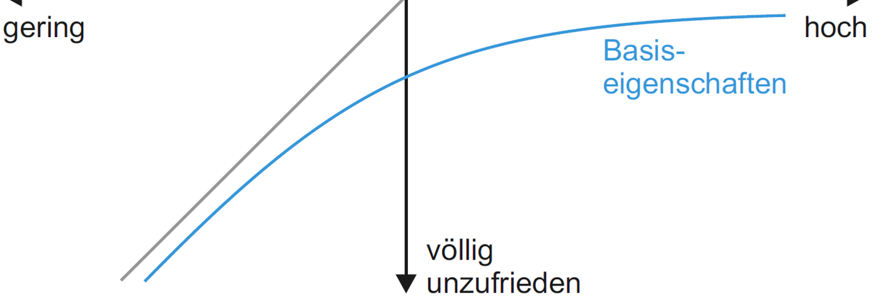
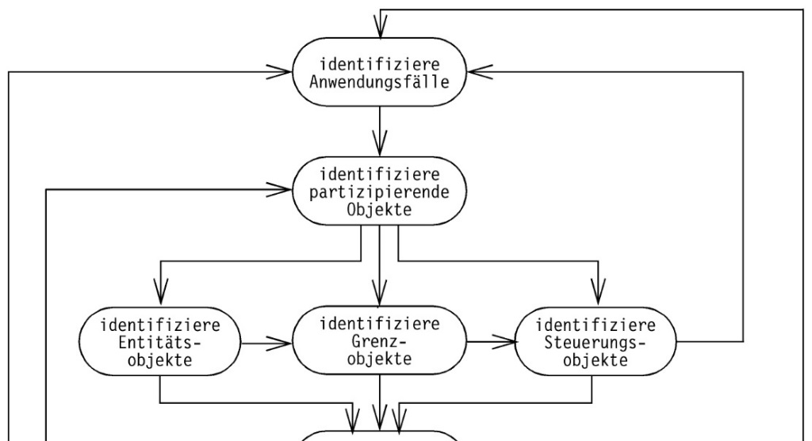
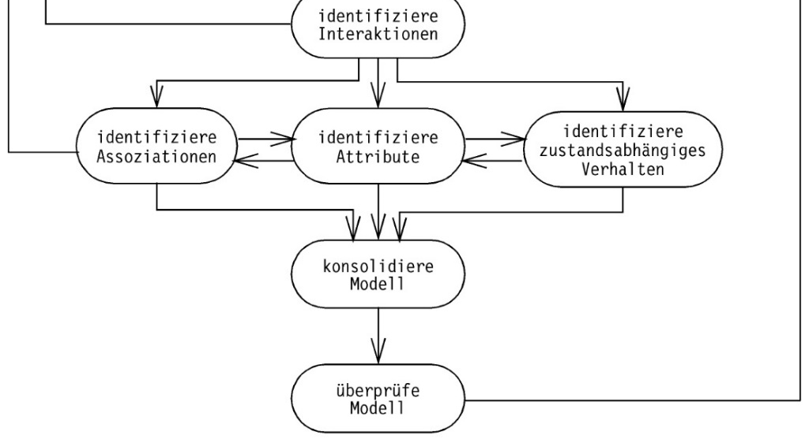

> Software: Menge von Programmen oder Daten zusammen mit begleitenden Dokumenten, die für Ihre Anwendung notwendig oder hilfreich sind [Hesse]

Gute Software ist schwer herzustellen
- Entspricht Kundenwünsche, Vollständigkeit
- Funktioniert Korrekt
- Kosten- und Termintreue bei der Erstellung
- weitere nicht-funktionale Qualitätsforderungen
  - Benutzerfreundlichkeit, Ergonomie
  - Sicherheit
  - Zuverlässigkeit, Fehlertoleranz
  - Performanz
  - Ressourcen-Effizienz, Skalierbarkeit, Übertragbarkeit
  - Wartbarkeit, Änder- und Erweiterbarkeit

Softwaretechnik
- Technische Disziplin der Software Herstellung
- Zielorientierte Bereitstellung uns systematische Verwendung von Prinzipien, Methoden und Werkzeugen für die arbeitsteilige, ingenieurmäßige Entwicklung und Anwendung von umfangreichen Softwaresystemen [Balzert]

Wie kann man Software besser entwickeln?
- Ingenieursmäßige Herangehensweise
  - Verwendung bekannter Prinzipien und Methoden
  - Systematische Vorgehensweise
- Verwendung von: 
  - Abstraktion, Modelle, Notation, Simulation
  - Wiederverwendung:Muster, Komponenten, Framework
- Organisation
  - Arbeitsteilung, Integration, Planung
- Verwendung von Werkzeugen
  - IDE (Integrated Development Environment)
  - Versionierung, Bugtracker, Modellierungswerkzeug

# Modellierungskonzepte
> Modell: ist eine Abstraktion eines Systems mit der Zielsetzung, das Nachdenken über ein System zu vereinfachen, indem irrelevante Details ausgelassen werden [Brügge]
$\rightarrow$ Beschreibung eines Ausschnitts der Realität

- erstellen einer Abstraktion
- abbilden signifikanter Eigenschaften
- Deskriptiv/präskriptiv (real oder geplant)
- Sichtweise auf ein System (Struktur, Verhalten, Zustand,...)
- heißt Weglassen
- setzt Verstehen voraus
- ist nicht automatisierbar

Verschiedene Modelle:
- Analysemodell
- Entwurfsmodell
- Implementierung (-smodell)
- Vorgehensmodell
- Produktmodell
- Dokumentation, Alternativen-Auswahl

Modelle für:
- Sichten
- Funktionen
- Daten
- Algorithmen
- Systemumgebung
- Dynamisches Verhalten
- Objektorientierte Modelle

## Klassische Modelle
- Funktionen: 
  - Funktionsbaum
    - Hierarchische Dekomosition der Fkt
    - nummerieren der Ebenen/Funktionen möglich
    - Bsp: Abonnement Verwaltung
  - Blockschaltbild
    - eingebettetes System, HW/SW
- Daten
  - Data Dictionary
    - Verzeichnis von Daten mit Strukturinformationen
    - Backus-Naur-Form, kontextfreie Grammatik
  - Entity Relationship Diagram
    - Daten und ihre Beziehungen
- Systemumgebung
  - Datenflussdiagramm
    - Fluss und Transformation von Daten zwischen Funktionen, Speichern und Schnittstellen
    - kein Kontrollfluss
- Algorithmen
  - Entscheidungstabelle
    - Regelbasierte Beschreibung
    - Bedingung
    - Aktionen
    - Reduktionsregeln
  - Pseudocode
    - von Programmiersprache abstrahierende, detaillierte Beschreibung eines Algorithmus
  - Programmablaufplan
    - Grafische Beschreibung des Kontrollflusses
    - DIN 66001
    - Unstrukturiert
  - Struktogramm
    - Nassi-Shneidermann-Diagramm
    - keine Sprünge
- Dynamisches Verhalten (diskrete Zustände und atomare zustandübergänge)
  - Zustandsautomat
    - Verhalten mit Zuständen und -übergängen
    - Automatenmodelle und -theorie
    - Ggf zerlegung oder kommunizierende Automaten
  - Flow-Chart
  - Ereignisgesteuerte Prozesskette (EPK)
    - Geschäftsprozesse
    - BPM
  - Petri-Netz (ggf. mit Zeitmodell)
    - Grafische Beschreibung von Nebenläufigkeit und Synchronisation
- Objektorientierte Modelle
  - Klassendiagramme
  - UML

## Objektorientierung
- bessere Strukturierung für komplexe Zusammenhänge
- Abstraktere Sichtweise
- Grundprinzip: Zerlegung; Teile und Herrsche
- ein System besteht aus vielen Objekten
- ein Objekt hat
  - definiertes Verhalten
    - Menge genau definierter Operationen
    - Operation wird beim Empfang einer Nachricht ausgeführt
  - inneren Zustand
    - Zustand des Objekts ist Privatsache
    - Resultat einer Operation hängt vom aktuellen Zustand ab
  - eindeutige Identität
    - Identität ist unabhängig von anderen Eigenschaften
    - Mehrere verschiedene Objekte mit identischem Verhalten und identischem inneren Zustand im gleichen System möglich
- Klasse
  - Gleichartige Objekte mit ggf. verschiedenen Zuständen
  - Verhaltensschema – Operationen
  - Innere Struktur – Attribute

Vorteile der Objektorientierung
- Zuständigkeitsbereiche
  - Daten, Operationen und Zustand: lokal und gekapselt
- Klare Schnittstellen
  - Definiertes Objektverhalten, Nachrichten
- Hierarchie
  - Vererbung und Polymorphie (Spezialisierung), Klassenschachtelung
- Baukastenprinzip
  - Benutzung vorgefertigter Klassenbibliotheken, Anpassung durch Spezialisierung (mittels Vererbung)

## Unified Modeling Language
- Grafisches Beschreibungsmittel für Aspekte des Softwareentwurfs diskreter Systeme
  - Spezifikation, Entwurf, Visualisierung, Konstruktion, Dokumentation von Software
  - Für OO-Softwareentwicklung und -prozess geeignet
  - UML ist weder Methode noch Prozess

Warum UML?
- Objektorientierung ist zur Zeit das vorherrschende Modellierungs-Paradigma, Industrie-Standard
- Kombination von Struktur-, Verhaltens-, Interaktions-, und Verteilungsmodellen
- Für Analyse, Entwurf, Implementierung und Test einsetzbar
- Gute Werkzeugunterstützung für Editieren, Versionierung, Codegenerierung
- Erweiterbarkeit der UML mit Stereotypen und Tags
- Semi-formale Modelle, z.T. verschiedene Interpretationen
- Offenheit: Erweiterung mit stereotypes, tags, constraints

Nachteile UML
- UML ist in vielen Facetten nicht präzise festgelegt
- Werkzeuge für Transformation, Analyse etc. fehlen noch
- UML ist keine „kleine Sprache“: Lernaufwand notwendig
- Komponenten sind nicht adäquat darstellbar
- Sprachen wie die UML werden erlernt durch Übung!
- Aber: LV SWT ist kein kompletter UML-Kurs

### Überblick über Modelle
- 14 Diagrammarten
- Struktur-Diagramme
  - Klassen-, Objekt-, Komponenten-, Kompositions-Struktur-,
  - Paket- und Verteilungsdiagramm
  - Profildiagramm – zur UML-Erweiterung
- Verhaltens-Diagramme
  - Use-Case-, Aktivitäts- und Zustandsdiagramms
  - Interaktionsdiagramme: Sequenz-, Kommunikations-, Timing- und Interaktionsübersichts-Diagramm

#### Use-Case-Diagramm
- Beschreiben Systemfunktion aus Benutzersicht (Was, nicht Wie)
- Erste Anforderungsspezifikation (requirements)
- Planbare Einheiten als Inkremente für die Entwicklung
- Keine Modellierung eines Ablaufs!
- Erstellen von Testfällen (test case generation)
- Grundelemente
  - Anwendungsfall: Use Case
  - Beteiligte: Aktor
- Verfeinerung mittels Use-Case-Realisierung notwendig
  - Textuelle Beschreibung
  - Verhaltensdiagramme

#### Klassendiagramm
- Modellierung der Struktur (Aufbau) eines Systems
- Modellierung von statischen Aspekten
- Modellierung der Struktur von Daten
- Klasse im Mittelpunkt
  - Aufbau: Attribute, Operationen
  - Beziehungen zueinander: Assoziationen, Vererbung
- Verbreitetstes und bekanntestes Diagramm der UML

#### Objektdiagramm
- Struktur des Systems zur Laufzeit zu einem Zeitpunkt
- Tatsächliche Zusammenhänge und Belegungen von Attributen von Objekten zu einem Zeitpunkt
- Eine detaillierte Sicht auf einen Aspekt
  - Keine vollständige Beschreibung (zu komplex)
  - Für kompliziertere Abhängigkeiten (z.B. Rekursion)
- Objektdiagramm für alle Arten von Exemplaren
  - z.B.: Klasse (Objekt), Komponente, Knoten, ...
- Keine Exemplare von Operationen -> Ablauf -> Verhaltensdiagramme / Interaktionsdiagramme
- Kein Verlauf der Wertebelegung über die Zeit

#### Paketdiagramm
- Gliederung (Strukturierung) des Systems in Teile (Pakete)
- Zuordnung von Elementen zu einem Paket
- Bildung von Hierarchien (Enthält-Beziehung)
- Abhängigkeiten zwischen den Paketen
  - "Include" von Quellcode-Dateien (<<import>>)
- Anwendung:
  - Zum Grobentwurf von Systemen
  - Definition von Schichten

#### Komponentendiagramm
- Strukturierung des Systems durch Komponenten
- Komponente: Modulare, austauschbare Einheit (Substitution)
- Modellierung der Abhängigkeiten zwischen Komponenten
- Modellierung der inneren Struktur von Komponenten
- Definition von Schnittstellen

#### Kompositionsstrukturdiagramm
- Teile-Ganzes-Strukturen -> Kompositionsstruktur
- Strukturell statische Kompositionsstrukturen:
  - Kurzschreibweise bei vielen Kompositionen
  - Modellierung des Aufbaus komplexer Systeme
- Strukturell dynamische Kompositionsstrukturen:
  - Notwendige Strukturen zur Realisierung eines Verhaltens
  - Definition von Rollen, zur Lösung wiederkehrender Probleme -> Modellierung von Mustern
- Starke Verwandtschaft mit dem Klassendiagramm
- Spezialisierte Kompositionsbeziehung -> erweiterte Semantik

#### Aktivitätsdiagramm
- Modellierung von
  - Kontrollflüssen
  - Datenflüssen
  - Parallelem Verhalten
  - Verzweigungen, bedingten und gewichteten Abläufen
- Geschäftsprozessmodellierung möglich
- Abstrakte und detaillierte Verhaltensbeschreibung möglich
- Grundlage zur Codegenerierung
- Zur Verfeinerung von
  - Use-Cases
  - Operationen / Interaktionen
  - anderen Aktionen und Aktivitäten

#### Interaktionsdiagramme
- Modellierung von
  - Kommunikation zwischen Kommunikationspartnern (Lebenslinie)
  - Operationen (Modellierung eines Programms)
  - Informationsaustausch / Nachrichten
- Gemeinsames Grundkonzept der Interaktionsdiagramme
- Sehr detaillierte Diagramme
  - Meist nicht zur vollständigen Beschreibung eines Systems
  - Betrachtung eines wichtigen Teilaspekts
- Grundlage zur Codegenerierung

#### Sequenzdiagramm
- Genaue zeitliche Abfolge von Nachrichten
- Umfangreichstes Interaktionsdiagramm
- Kontrollelemente möglich (Schleifen, Verzweigungen)

#### Kommunikationsdiagramm
- Kommunikationsbeziehungen der Kommunikationspartner stehen im Vordergrund
- Welche Komponenten arbeiten wie zusammen, um eine Funktion zu erfüllen

#### Timing-Diagramm
- Genaue zeitliche Darstellung von Zustandsübergängen
- Kommunikation abhängiger Zustandsautomaten
- Modellierung einzelner Interaktion

##### Prinzipieller Aufbau
- Zeitlicher Verlauf senkrecht
- Kommunikationspartner waagerecht (unsortiert)
- Lebenslinie
  - Rechteck mit gestrichelter senkrechter Linie
  - Start, Ende und Dauer der Ausführung einer Operation
  - Rekursive Aufrufe möglich
- Ereignisspezifikation
  - Stelle des Sendens / Empfangens der Nachricht
  - Definition der Reihenfolge des Auftretens
  - Trace: Folge von Sende- und Empfangsereignissen

##### Weitere Elemente des Sequenzdiagramms
- Nachrichten ohne Sender
  - z.B. am Beginn einer Interaktion
- Verlorene Nachrichten (ohne Empfänger)
  - Nachricht ohne dargestellten Empfänger
  - z. B. am Ende einer Interaktion
- Erzeugen von Lebenslinien
  - Gestrichelte Linie mit geöffnetem Pfeil
  - Keine Rückgabenachricht
  - Zeitliche Einrückung des Rechtecks
- Zerstören von Lebenslinien
  - Durchgezogene Linie mit Dreieckende
  - Kann Rückgabenachricht erzeugen

##### Nachrichten in Interaktionsdiagrammen
- Ereignis des Sendens bzw. Empfangens von Nachrichten
- Typen:
  - Operationsaufruf (synchron / asynchron)
  - Antwort Nachricht
  - Signal (asynchron), Create-/ Delete Message
- Operationsaufruf: Parameterliste muss kompatibel sein
- Nachrichtentypen

#### Zustandsdiagramm
- Modellierung des (vollständigen?) Verhaltens
  - Zustände von Klassen / Objekten / Komponenten
  - Übergänge zwischen den Zuständen
  - Ereignisse, die Zustandswechsel auslösen
- Modellierung von endlichen Automaten (Zustandsmaschinen)
  - Deterministische
  - Nichtdeterministische
- Verfeinerung von Zuständen möglich
- Modellierung von verteilten Systemen / parallelem Verhalten
- Grundlage zur Codegenerierung

# Analyse
- Einordnung in den Projektablauf
- Was ist eine Anforderung?
  - Merkmal, Eigenschaft, Bedingung oder Einschränkung eines Systems
  - Notwendig für die Akzeptanz vom Kunden
  - Definition (IEEE 610.12-1990)
    - Dokumentierte Darstellung einer Fähigkeit oder Eigenschaft 
    - von Anwender benötigt zur Problemlösung bzw. um Ziel zu erreichen
    - Muss von System oder Komponente erfüllt werden, um Vertrag oder Standard zu erfüllen

- Funktionale Anforderungen - Was soll es tun?
  - „...Legt eine vom Softwaresystem oder einer seiner Komponenten bereitzustellende Funktion oder Service dar“ [Balzert]
  - Was leistet das System
  - Welche Funktionen bietet es
  - Wie interagiert es mit der Umgebung
  - Anforderungen an:
    - Verhalten
    - Struktur
    - (Alternativ: Statik, Dynamik, Logik)
- Nichtfunktionale Anforderungen – Wie?
  - „...legen qualitative oder quantitative Eigenschaften des Softwareprojektes oder einer Komponente fest“ [Balzert]
  - Auch Bezeichnet als:
    - Quality of Service
    - Qualitätsanforderungen
  - Arten - FURPS (ISO 9126):
    - Functionality (Funktionalität)
    - Usability (Benutzbarkeit)
    - Reliability (Zuverlässigkeit)
    - Performance (Effizienz) / Portability (Übertragbarkeit)
    - Supportability (Änderbarkeit/ Wartbarkeit)

- Funktionalität
  - Angemessen, Genauigkeit
  - Sicherheit: Vertraulichkeit, Informationssicherheit, Datenintegrität, Verfügbarkeit
  - (Nicht ausreichend spezifizierte funktionale Anforderung)
- Benutzbarkeit
  - Verständlichkeit, Erlernbarkeit, Bedienbarkeit, Attraktivität
- Zuverlässigkeit
  - Reife (Fehler-Anzahl), Fehlertoleranz, Wiederherstellbarkeit
- Effizient/ Leistungsanforderungen
  - Zeitverhalten, Verbrauchsverhalten, Wirtschaftlichkeit
- Portabilität
  - Anpassbarkeit, Installierbarkeit, Koexistenz, Austauschbarkeit
- Wartbarkeit
  - Analysierbarkeit, Änder- und Erweiterbarkeit, Stabilität (bei Änderungen), Testbarkeit
- Weitere:
  - Konformität zu Konventionen und Bestimmungen
  - Interoperabilität zu anderen Systemen
  - Implementierungsanforderungen
  - Schnittstellenanforderungen
  - Skalierbarkeit (Änderungen des Problemumfangs)
  - Betriebliche und rechtliche Rahmenbedingungen
  - Liefer- und Verpackungsanforderungen

### Nichtfunktionale Anforderungen
Schwierigkeit nichtfunktionaler Anforderungen
- Hängen oft von Verhalten ab: daher komplex und nicht direkt sichtbar
- „Das Auto hat vier Räder“ (Struktur)
- „Wenn der Blinker betätigt wird, blinkt das Auto dreimal wenn die Zündung an ist; ansonsten wird das Standlicht einseitig eingeschaltet“ (Korrektes Verhalten)
- „Das Motorsteuergerät darf innerhalb von 5 Jahren und 150.000km Laufleistung höchstens mit 0.1% Wahrscheinlichkeit ausfallen“ (Zuverlässigkeit)

Umgang mit nichtfunktionalen Eigenschaften
- Nicht direkt „by construction“ zu realisieren
- Naive Herangehensweise: Ignorieren!
  - Entwerfen und Implementieren der Software ohne
  - Berücksichtigung nichtfunktionaler Eigenschaften
  - Testen der nichtfunktionalen Eigenschaften
  - Wenn nicht erfüllt: Entwurf und Implementierung ändern!
- Funktioniert nur bei sehr einfachen Systemen, bzw. wenn nichtfunktionale Eigenschaften nicht wichtig sind!

Sinnvoller Umgang mit nichtfunktionalen Eigenschaften
- Untersuchung der Projektrisiken bereits in der Analysephase
    - größte Risiken zuerst betrachten!
  - Immer fragen: Geht das so überhaupt?
  - Festlegungen des Entwurfs möglichst früh gegen Anforderungen prüfen – aber wie?
- Modellbasierter Entwurf
  - Modellierung des Systems und seiner Umwelt
  - Bewertung des Modells (Simulation)
  - Lehrveranstaltungen Systementwurf, KIS, LTS

Randbedingungen
- „... Eine Randbedingung ist eine organisatorische oder technologische Vorgabe, die die Art und Weise einschränkt, wie das betrachtete System realisiert werden kann.“ 
- Werden nicht umgesetzt
- Schränken Lösungsraum ein
- Beispiele:
  - Kosten
  - Durchlaufzeit: Time to Market
  - Vorgaben durch Marketing und Vertrieb
  - Technische Randbedingungen (nichtfunktionale Anforderung)

Geforderte (Meta-)Eigenschaften
- Vollständig: alle Szenarien sind beschrieben
- Konsistent: keine Widersprüche
- Eindeutig: nur eine Interpretation möglich
- Korrekt: genaue und richtige Darstellung
- Realistisch: unter geg. Einschränkungen implementierbar
- Überprüfbar: durch Tests am Endprodukt nachweisbar
- Rückverfolgbar: Auswirkungen bis zur Implementierung nachvollziehbar (Testfälle, Auswirkung von Änderungen)
- Klassifizierbar (Risiko, Priorität, Dringlichkeit, Nutzen ...)
- Validierung mit dem Kunden

- Requirements Engineering
  - Ermittlung, Analyse und Verwaltung von Anforderungen
  - Ausgangspunkt: Projektidee
- Anforderungsermittlung
  - requirements elicitation, requirements definition
  - Bestimmen und dokumentieren der Anforderungen an das geplante System
  - Beteiligt: Entwickler, Kunde, Benutzer
  - Ergebnis: Anforderungsspezifikation - Glossar, Vertrag, Lastenheft
- Anforderungs-Analyse
  - requirements analysis, system modeling
  - Beschreibung im Detail und formal strukturiert
  - Beteiligt: Entwickler
  - Ergebnis: funktionale Spezifikation - Produktdefinition, Analysemodell, Pflichtenheft

| | Anforderungsermittlung | Systemmodellierung |
| -- | -- | -- |
| Ergebnis | Anforderungsspezifikation im Lastenheft, Glossar, Lastenheft | funktionale Spezifikation in Produktdefinition, Analysemodell, Pflichtenheft |
| Notation | Text | Text + (semi-) formales Modell |
| Kommunikation | mit dem Kunden | zwischen Entwicklern |
| Sichtweise | des Anwenders | äußere Systemaspekte |
Vor allem: Kommunikationsleistung!

Bedeutung:
- Falsche Anforderungen führen zu falschem System
- Frühe Fehler im Entwicklungsprozess sind teuer!

Fehlerentstehung und Fehlerquellen bei Anforderungserfassung
- 83% sprachliche Fehler (Un- bzw. Missverständlich)
- 75% Logische Fehler (Widersprüchlichkeit, Redundanz)
- 73% Inhaltliche Fehler (Falsche Sachverhalte, Unvollständig)

## Ermiteln von Anforderungen
Woher kommen Anforderungen?
- Ausgangspunkt
  - Projektidee, schriftliche Skizze
  - Kurz und knapp
  - Stichpunkte der wichtigsten Funktionen
  - Lastenheft (falls schon existiert)
- Interessenhalter (stakeholder)
  - Identifizieren, Wichtigkeit bewerten (berücksichtigen?)
  - Ansprechpartner? Interessen und Erwartungen
  - Fachexperten, Verantwortliche, Betroffene

Beteiligte Rollen
- Endbenutzer
  - Aufnahme Ist-Zustand, Domänenwissen, Anforderungen
- Kunde
  - Definiert Ziel des Systems, Vertragsverhandlung
- Konfigurationsmanager
  - Revisionsgeschichte der Dokumente, Nachvollziehbarkeit
- Architekt
  - Integration von Anwendungsfall- und Objektmodellen
- Analytiker 
  - Modelliert das System und erstellt Anwendungsfälle
- Redakteur
- Prüfer

Wie ermittelt man Anforderungen?
- Problem: Entwickler müssen sich in Begriffs- und Denkwelt des Kunden einarbeiten, sonst Kommunikationsprobleme
- Systematische Vorgehensweise
- Kommunikation mit Kunden
- Geschäftsprozess (business process)
  - fachlicher Ablauf, der Wert oder Kosten verursacht
- Akteur (actor)
  - Benutzer, Schnittstelle nach außen
- Szenario (scenario)
  - Interaktion mit System als Ablauf
- Anwendungsfall (use case)
  - Automatisierter Arbeitsschritt, vom System ausgeführt
- Interviews mit Fachanwendern
  - Mitschrift, später strukturierter Text und Tabelle
- Strukturierte Spezifikation
  - Vorlagen / sprachliche Anforderungsschablonen
  - Formulare
  - Reduzierung sprachlicher Mehrdeutigkeiten
- Anwendungsfalldiagramm (Use-Case-Diagramm)
  - Arbeitsschritt eines Geschäftsprozesses, der durch das System ausgeführt wird
  - Anforderungen an das System modellieren – was soll das System leisten
  - Systemgrenzen / Systemkontext festlegen
  - Systembeteiligte modellieren
  - Planbare Einheiten als Schritte für die Entwicklung
  - Verwendung bereits ab Projektbeginn
  - Keine Modellierung eines Ablaufs!
- Umgang mit Szenarien und Anwendungsfällen
  - Zunächst nur zum Verständnis kurz aufstellen
  - Systemgrenze definieren
  - Beschreibungen verfeinern
  - Änderungen mit Kunden abstimmen
  - Prototypen nur zur visuellen Unterstützung
  - Benutzungsschnittstelle erst beginnen, wenn funktionale Anforderungen in etwa klar sind

Leitfaden für Anwendungsfälle
- Benennen mit Verbalphrasen, die Anwendersicht beschreiben (Simuliere)
- Akteure mit Substantiven benennen (Anwender)
- Systemgrenzen klären. Arbeitsschritte von Akteuren und System kennzeichnen
- Schritte im aktiven Stil beschreiben (Auto bremst)
- Ursächliche Beziehung zwischen Folgeschritten
- 1 Anwendungsfall = 1 vollständige Transaktion
- Normalfall darstellen; Ausnahmen gesondert beschreiben
- Nicht die Benutzungsschnittstelle beschreiben (statt dessen visuellen Prototypen verwenden)
- Übersichtlichkeit (max. 2-3 Seiten), sonst zerlegen

- Typische Probleme
  - Kommunikations- und Verständnisprobleme
  - Viele verschiedene Beteiligte
  - Kunden wissen nicht, was sie genau wollen und was geht
  - Verwendung von Fachsprachen
  - Widersprüchliche Anforderungen, verschiedene Interessen
  - Nicht-technische organisatorische, historische oder rechtliche Rahmenbedingungen
  - Zusätzliche Beteiligte können auftauchen
  - Anforderungen ändern sich während der Entwicklung
- Anforderungsänderungen
  - Sind die Regel
- Tätigkeiten der Anforderungsanalyse
  - Anforderungen strukturieren
  - Eigenschaften der Anforderungen bestimmen
  - Anforderungen priorisieren
  - Anforderungen in Textform, Grafiken, Modellen dokumentieren
  - Anforderungen modellieren
  - Anforderungen auf inhaltliche Qualität prüfen
  - Auf Übereinstimmung mit den Zielen prüfen
    - Ziel Abnahme der Anforderung
  - Hängt mit Analyse des Systems zusammen
- Anforderungen strukturieren
  - Unterteilung
    - Funktional, Nichtfunktional
    - Muss, Kann,... oder Haupt- und Nebenanforderung
  - Hierarchische Zerlegung
    - Unterteilen, Verfeinern
  - Ordnung festlegen, eindeutig Nummerieren
    - auf Einmaligkeit achten
  - Beziehungen festhalten
  - Verwendung von Werkzeugen
    - MS-Project, Doors, Git issues, Trac, Bugzilla, MKS,...
    - Modellierungswerkzeuge
- Eigenschaften bestimmen
  - Wahl der Eigenschaften firmen- bzw. projektspezifisch
  - Wichtige Eigenschaften
    - Identifikationsnummer
    - Kurzbezeichnung
    - Beschreibung (Text, ggf. Grafik, Modell)
    - Aufwand
    - Priorität der Anforderung
    - Bearbeitungsstatus / Restaufwand
    - Zugeordnet (wer ist verantwortlich / bearbeitet)
    - Querverbindungen zu anderen Anforderungen
    - Ggf. zusätzliche Dokumente oder Bemerkungen
    - Stabilität der Anforderung (Änderungswkt.)
    - Kritikalität der Anforderung: Schäden bei Fehlern?
    - Entwicklungsrisiko: Erfolgsaussichten der Umsetzung
    - Abnahmekriterien / Erfüllungsnachweis durch?
    - Anforderungstyp: Funktional, nicht funktional ,...
    - Anforderungssicht: Dynamik, Statik, Logik, Struktur, Funktion
    - Mögliche Konflikte
    - Autor
    - Quelle: Wer möchte die Anforderung umgesetzt haben?
    - Status der Beschreibung: Idee, grober Inhalt, detailliert
    - Anforderungsversion
- Anforderungen priorisieren
  - MuSCoW-Priorisierung
  - Muss-, Kann-, Optional, Nicht (Abgrenzungskriterien) (must, should, could, won‘t)
  - Ad-hoc: Stakeholder priorisiert Anforderungen
  - Priorisierungsmatrix / Kosten-Wert-Analyse
    - Eigenschaften bewerten (Punkte vergeben)
    - Werte gewichten
    - Priorität berechnen $Prioritäten = \frac{Nutzen - Nachteil}{Kosten + Risiko}$
  - Kano-Klassifikation
    - Basiseigenschaften: Werden vorausgesetzt (fehlen stört, wenig zusätzliche Zufriedenheit)
    - Leistungseigenschaften: Sonderwünsche
    - Begeisterungseigenschaften: Wird nicht erwartet
    - Abfragen per Fragenkatalog
  - Reihenfolge festlegen

## Objektorientierte Analyse und Systemmodellierung
- Übersicht
  - Aufgabe: Systemmodell erstellen, funktionale Spezifikation
  - Beschreibung der Systembenutzung und des Verhaltens
  - Was, nicht wie – Implementierungsaspekte ausklammern
    - Nicht: Datenhaltung, Verteilung, Technologien, Architektur, ..
  - Zusammenhang mit Anforderungsspezifikation
  - OO: Modell des Anwendungsbereichs
- Analysemodell
  - Korrekt, vollständig, konsistent und nachprüfbar
  - Struktur und Verhalten
  - Verschiedene Sichten (OO, Strukturiert, ...)
- Eingangsdokumente
  - Lastenheft, Anforderungsspezifikation
- Typische Ergebnisse
  - Funktionales Modell
    - Geschäftsprozesse und Anwendungsfälle
  - Objektmodell
  - Dynamisches Modell – Systemverhalten
    - Zustands- und Sequenzdiagramme
  - Vor- und Nachbedingungen von Systemoperationen
  - Prototyp / Spezifikation Benutzungsschnittstelle
  - Pflichtenheft
- Objektorientierte Analyse nach [Brügge / Dutoit]
  - Verdeutlicht iterativen Ablauf
  - Unterteilung des Analysemodells in:
    - Funktionales Modell (Anwendungsfälle)
    - Objektmodell (Klassen und Objektdiagramme)
    - Dynamisches Modell (Zustands- und Sequenzdiagramme)
    - Unterscheidung der Objekttypen

- Heuristik Sprache $\rightarrow$ OO-Modell
- Objektarten im Systemmodell
  - Entitätsobjekte – vom System verwaltete Informationen
  - Grenzobjekte – Interaktion zwischen System und Akteuren
  - Steuerungsobjekte – Durchführung der Anwendungsfälle
- Identifizierung von Entitätsobjekten
  - Begriffe, die klargestellt werden müssen
  - Wiederkehrende Substantive in Anwendungsfällen
    - Heuristiken
  - Reale Objekte, die das System kennen muss
  - Reale Prozesse, die das System verfolgen muss
  - Anwendungsfälle
  - Datenquellen und -senken
  - Artefakte, mit denen der Nutzer interagiert
- Identifizierung von Grenzobjekten
  - Elemente der Benutzungsschnittstelle
  - Formulare für Eingaben
  - Nachrichten, Rückmeldungen
  - Endgeräte
  - In der Begriffswelt des Anwenders bleiben!
  - Schnittstellen grafisch skizzieren bzw. Prototyp!
- Identifizierung von Steuerungsobjekten
  - Koordination von Grenz- und Entitätsobjekten
  - Abarbeitung von Anwendungsfällen
    - Reihenfolge von Schritten
    - Informationen übernehmen und weiterleiten
    - Oft ein Steuerungsobjekt pro Anwendungsfall
  - Beispiel: Simulationsszenario
  - Verhaltensmodell sinnvoll! Im folgenden: dynamische Modelle

- Abläufe der Anwendungsfälle modellieren
  - Ziel - Objekte finden
  - Klassen identifizieren
  - Verhalten / Operationen finden
- Use Case durch Interaktion verfeinern
  - einfacher kurzer Ablauf: textuelle Beschreibung, Aktivitätsdiagramm
  - Ablauf mit Verzweigungen, Parallelitäten: Aktivitätsdiagramm (Kontrollflussmodellierung)
  - datengetriebener Ablauf: Aktivitätsdiagramm (Objektflussmodellierung)
  - Interaktion zwischen den Objekten wichtig: Kommunikationsdiagramm, Aktivitätsdiagramm (Aktivitätsbereiche), Sequenzdiagramm
  - zeitliche Abfolge steht im Mittelpunkt: Sequenzdiagramm
  - Zustandswechsel / zeitliche Abfolge von Zuständen: Zustandsdiagramm / Timing-Diagramm
  - komplexe Abläufe mit Verzweigungen und Parallelitäten: Interaktionsübersichtsdiagramm
  - komplexe Abläufe ohne Verzweigungen und Parallelitäten: weitere Verfeinerung durch Use-Case-Diagramm
  - komplexer strukturierter Ablauf: Kollaboration aus dem Kompositionsstrukturdiagramm

- Dynamische UML-Modelle
  - Abläufe
    - Aktivitätsdiagramm (activity diagram)
    - Kommunikationsdiagramm (communication diagram)
    - Sequenzdiagram (sequence diagram)
    - Zeitdiagramm (timing diagram)
  - Zustandsabhängiges Verhalten von Objekten
    - Zustandsautomat (state chart diagram)

- Aktivitätsdiagramm
  - Aktion – einzelner Schritt
  - Aktivität
    - Beschreibt einen Ablauf / repräsentiert ein Verhalten
      - Beinhaltet eine Folge Aktionen, Kontroll- oder Objektknoten
    - Schachtelung von Aktivitäten und Aktionen
      - Aktionen in Aktivitäten enthalten
      - Aktionen durch Aktivitäten verfeinerbar
    - Aktivitäten beschreiben / verfeinern
      - Aktionen, Use Cases, Interaktionen, Operationen ...
  - Ein- und Ausgabeparameter in Form von Objekten
    - Parameterknoten entsprechend Pins der aufrufenden Aktion
    - Alternativ: Parameterangabe mit Name und Typ
  - Angabe von Vor- und Nachbedingungen möglich
  - Optional: Parameter unter Aktivitätsnamen

- Verfeinerung der Aktionen durch Aktivitäten
- Aktion durch Interaktionen verfeinern
  - Detaillierte Diagramme
  - Meist entwurfsnah
- Verfeinerung der Aktionen durch StateChart
- Objekte zusammenstellen und klassifizieren
  - Toolunterstützung (Möglichkeiten stark toolabhängig)
  - Objekte Ergebnis der Verhaltensmodellierung
  - Ergebnis Verhaltensdiagramm: Operationen der Klassen
  - Klassen generalisieren / spezialisieren $\rightarrow$ Klassenhierarchie
- Übergang zum Entwurf
  - Klassenstruktur festlegen
- Spezifikation von Benutzungsschnittstellen
  - Skizzieren, Prototyp generieren, Spezialwerkzeuge
  - Klassen und Operationen in Funktionen
  - Gestaltung MMI, style guides, Standards

## Dokumentation von Anforderungen
- Lastenheft
  - Gesamtheit der Forderungen eines Auftraggebers (AG) an die Lieferungen und Leistungen eines Auftragnehmers (AN), manchmal Vertragsbasis
  - Muss-Kriterien, Kann-Kriterien, Abgrenzungskriterien
- Pflichtenheft
  - Entwurf aus AN-Sicht, Umsetzung des Lastenhefts
  - Meist Vertragsbasis
- Inhalt Anforderungsspezifikation
  - Zielsetzung
  - Allgemeine Beschreibung
    - Umgebung, generelle Funktion, Restriktionen, Benutzer
  - Spezifische funktionale Anforderungen
    - möglichst quantitativ (z.B. Tabellenform)
    - eindeutig identifizierbar (Nummern)
  - Spezifische nicht-funktionale Anforderungen
    - z.B. Antwortzeit, Speicherbedarf, HW/SW-Plattform
    - Entwicklungs- und Produkt-Standards
  - Qualitäts-Zielbestimmung
  - Zu erwartende Evolution des Systems, Versionen
  - Abkürzungsverzeichnis, Glossar, Index, Referenzen

Pflichtenheft (Beispiel)
1. Einleitung, Zielbestimmung
2. Übersicht
    - Einsatzbereich, Zielgruppen
    - Produkt-Umgebung
    - Produkt-Funktionen
    - Restriktionen
    - Annahmen und Abhängigkeiten
    - Vorhandenes System (ggf.)
3. Vorgeschlagenes System
    - Übersicht
    - Funktionale Anforderungen
    - Benutzungsschnittstelle
    - Nichtfunktionale Anforderungen
    - Systembeschreibung
      - Szenarien
      - Anwendungsfälle
4. Glossar

# Grobentwurf
# Feinentwurf
# Implementierung
# Vorgehensweise
# Projektmanagement