- Fachkompetenz: Die  Studierenden  verfügen  über anwendungs-orientiertes Wissen  zu  Werkzeugen  der  Anforderungserhebung  und -modellierung, der Prozessmodellierung und -anpassung, der Aufwandsschätzung,  des  Softwaretests,  der  Produktlinien-entwicklung und der Wartung von Software.
- Methodenkompetenz: Die Studierenden kennen den methodischen Hintergrund zu den vorgestellten  Werkzeugen  /  Verfahren  und  sind  daher  in  der Lage auch neue Problemstellungen zu lösen. Sie können aus den vorgestellten Methoden jeweils die passenden auswählen.
- Systemkompetenz: Die Studierenden können die vorgestellten Methoden und Werkzeuge in Projekten unterschiedlicher Domänen an-wenden.
- Sozialkompetenz: Die Studierenden kennen die Bedeutung und den Einfluss der erlernten Methoden und Werkzeuge innerhalb einen Firma. Sie können daher Ihr jeweiliges Vorgehen und dieErgebnisse auf die Erfordernisse eines Projektes in einer Organisation abstimmen.

- [Motivation](#motivation)
  - [Software Development Challenges](#software-development-challenges)
- [Software Development Processes](#software-development-processes)
  - [Motivation](#motivation-1)
  - [Software Processes](#software-processes)
    - [Arten von Entwicklungsprozessen](#arten-von-entwicklungsprozessen)
    - [Certification of Project Managers](#certification-of-project-managers)
      - [PMP Example Question 1 (taken from the PMP website)](#pmp-example-question-1-taken-from-the-pmp-website)
      - [PMP Example Question 2 (taken from the PMP website)](#pmp-example-question-2-taken-from-the-pmp-website)
      - [PMP Example Questions 3 (taken from the PMP website)](#pmp-example-questions-3-taken-from-the-pmp-website)
  - [OpenUP](#openup)
    - [Core Principles](#core-principles)
    - [Collaboration: Some key practices](#collaboration-some-key-practices)
    - [Evolve: Some key practices](#evolve-some-key-practices)
    - [Balance: Some key practices](#balance-some-key-practices)
    - [Focus: Some key practices](#focus-some-key-practices)
    - [OpenUP is Agile and Unified](#openup-is-agile-and-unified)
    - [OpenUP Project Lifecycle](#openup-project-lifecycle)
    - [OpenUP Iteration Lifecycle](#openup-iteration-lifecycle)
    - [OpenUP Lifecycle - Inception Phase](#openup-lifecycle---inception-phase)
    - [OpenUP Lifecycle - Elaboration Phase](#openup-lifecycle---elaboration-phase)
    - [OpenUP Lifecycle - Construction Phase](#openup-lifecycle---construction-phase)
    - [OpenUP Lifecycle - Transition Phase](#openup-lifecycle---transition-phase)
    - [OpenUP Disciplines](#openup-disciplines)
    - [Example: OpenUp](#example-openup)
    - [The four Phases of OpenUP](#the-four-phases-of-openup)
  - [SCRUM](#scrum)
    - [Product Backlog](#product-backlog)
    - [Sprint Backlog](#sprint-backlog)
    - [Daily Scrum](#daily-scrum)
    - [Where do changes come from?](#where-do-changes-come-from)
  - [Example: Change Control Process](#example-change-control-process)
    - [Impact Analysis Questionaire](#impact-analysis-questionaire)
  - [Metamodelle](#metamodelle)
    - [What is Model Driven Development?](#what-is-model-driven-development)
    - [Meta-meta model ...](#meta-meta-model-)
- [Requirements Engineering](#requirements-engineering)
  - [Definition: Requirements Engineering](#definition-requirements-engineering)
  - [Definition: Requirement](#definition-requirement)
  - [Requirement Types](#requirement-types)
    - [Different Requirement Types](#different-requirement-types)
  - [Struktur einer Anforderung](#struktur-einer-anforderung)
    - [Anforderungsschablonen](#anforderungsschablonen)
  - [Anforderungserhebung / Elicitation Techniques](#anforderungserhebung--elicitation-techniques)
    - [Stakeholder Model](#stakeholder-model)
    - [Elicitation Techniques](#elicitation-techniques)
    - [Web-Search](#web-search)
    - [Patentrecherche](#patentrecherche)
    - [Interviews](#interviews)
      - [MindMaps](#mindmaps)
      - [Questionaire: ... ilities](#questionaire--ilities)
      - [SEI Risk Taxonomy](#sei-risk-taxonomy)
    - [Repertory Grid](#repertory-grid)
      - [Repertory Grid: How to](#repertory-grid-how-to)
      - [Repertory Grid: Analysis](#repertory-grid-analysis)
    - [Goal Question Metric](#goal-question-metric)
    - [Requirements Document Structure](#requirements-document-structure)
- [Software Estimation](#software-estimation)
  - [A Little Estimation Game [McCo 2006]](#a-little-estimation-game-mcco-2006)
      - [Ten Key Characteristics of Software Executives](#ten-key-characteristics-of-software-executives)
    - [Estimation Improvement with the Capability Maturity Model](#estimation-improvement-with-the-capability-maturity-model)
  - [Accuracy and Precision](#accuracy-and-precision)
  - [Productivity Rates](#productivity-rates)
  - [Randbedingungen, Fallstricke](#randbedingungen-fallstricke)
        - [Over- / Underestimation](#over---underestimation)
        - [Project Outcomes by Project Size](#project-outcomes-by-project-size)
        - [Communication Paths](#communication-paths)
        - [Communication Paths cont.](#communication-paths-cont)
    - [The Cone of Uncertainty](#the-cone-of-uncertainty)
        - [Accuracy vs. Project Length](#accuracy-vs-project-length)
    - [Commonly Missing Activities](#commonly-missing-activities)
    - [Einflussgröße: Personal](#einflussgröße-personal)
    - [Einflussgröße: Programmiersprache](#einflussgröße-programmiersprache)
  - [Estimation Techniques](#estimation-techniques)
    - [Zählen](#zählen)
    - [Historische Daten](#historische-daten)
    - [Expert Judgement](#expert-judgement)
    - [Proxy-Based Estimates](#proxy-based-estimates)
    - [Function Points](#function-points)
        - [Conversion of FP to LOC](#conversion-of-fp-to-loc)
        - [Examples of Productivity](#examples-of-productivity)
    - [Checklist for individual estimates](#checklist-for-individual-estimates)
- [Testen](#testen)
  - [Motivation](#motivation-2)
  - [Definition: Error](#definition-error)
  - [Testprozess](#testprozess)
  - [W-Model](#w-model)
    - [Develop Requirements Test Cases](#develop-requirements-test-cases)
    - [Plan System Test](#plan-system-test)
    - [Plan Integration Test](#plan-integration-test)
    - [Plan Unit Test](#plan-unit-test)
    - [Test Implementation](#test-implementation)
        - [MISRA](#misra)
    - [Unit Testing](#unit-testing)
        - [Check for Memory Leaks](#check-for-memory-leaks)
        - [Invalid Pointers](#invalid-pointers)
        - [Use Of Uninitialized Variables](#use-of-uninitialized-variables)
        - [Unit Testing](#unit-testing-1)
    - [Integration Testing](#integration-testing)
        - [Time Measurement](#time-measurement)
    - [System Testing](#system-testing)
    - [System Testing](#system-testing-1)
        - [Statistical Testing](#statistical-testing)
    - [Acceptance Testing](#acceptance-testing)
  - [Beispiel: Testen eines Softstarters](#beispiel-testen-eines-softstarters)
        - [Development of Embedded Systems](#development-of-embedded-systems)
        - [Conclusion](#conclusion)
- [Software Product Lines](#software-product-lines)
  - [Beispiel: Cycling Computers ...](#beispiel-cycling-computers-)
  - [History of Terms](#history-of-terms)
  - [Currently available Software Product Lines](#currently-available-software-product-lines)
  - [Product Line Development Cycle](#product-line-development-cycle)
  - [The Concept of Variability](#the-concept-of-variability)
  - [Modeling of Product Lines using Features](#modeling-of-product-lines-using-features)
    - [Features](#features)
        - [Feature Modeling: Example](#feature-modeling-example)
        - [Example Tool: PureVariants](#example-tool-purevariants)
        - [Example online-tool:](#example-online-tool)
  - [Handling Variability](#handling-variability)
    - [Design Time](#design-time)
        - [Factory Pattern](#factory-pattern)
        - [Factory Method](#factory-method)
        - [Abstract Factory Pattern](#abstract-factory-pattern)
        - [Decorator](#decorator)
    - [Compile Time](#compile-time)
      - [Variabiliy at Compile Time](#variabiliy-at-compile-time)
    - [Startup Time](#startup-time)
    - [Runtime](#runtime)
  - [Aspect-Oriented Programming](#aspect-oriented-programming)
    - [AOP / AspectJ](#aop--aspectj)
    - [Example: _Authentication_](#example-authentication)
  - [Domain Specific Languages](#domain-specific-languages)
    - [Types of DSLs](#types-of-dsls)
    - [Example: Test Case Generation](#example-test-case-generation)
    - [Scanner](#scanner)
- [Software Maintenance](#software-maintenance)
  - [Motivation](#motivation-3)
  - [Reengineering](#reengineering)
  - [Code Smells](#code-smells)
    - [Code - Hard to read](#code---hard-to-read)
  - [Metrics](#metrics)
    - [The Law of Demeter](#the-law-of-demeter)
    - [What is the simplest design?](#what-is-the-simplest-design)
  - [Refactoring](#refactoring)
    - [Refactoring Overview](#refactoring-overview)
    - [Refactoring Howto](#refactoring-howto)
    - [Composing Methods](#composing-methods)
      - [Extract Method](#extract-method)
      - [Inline Method](#inline-method)
      - [Remove Assignments to Parameters](#remove-assignments-to-parameters)
      - [Moving Features between Objects](#moving-features-between-objects)
      - [Extract Class](#extract-class)
    - [Organizing Data](#organizing-data)
      - [Simplifying Conditional Expressions](#simplifying-conditional-expressions)
    - [Making Method Calls Simpler](#making-method-calls-simpler)
    - [Dealing with Generalization](#dealing-with-generalization)
    - [Other Refactorings](#other-refactorings)
  - [Long Living Software](#long-living-software)
    - [Compiler Compiler](#compiler-compiler)
    - [Long Living Systems](#long-living-systems)

# Motivation
## Software Development Challenges
- Introduction of New Technologies
- Tool Chain
- Multi Domain Knowledge
- Certification
- Corporate Culture

Automatisierung
- basiert auf Logik
- Deterministisch

# Software Development Processes
## Motivation
- Warum sind Entwicklungsprozesse sinnvoll?
- Softwareentwicklungsrozesse erzeugen folgende Artefakte
    - Dokumente, die jeweils einer bestimmten Struktur entsprechen!
       - Requirements Dokument
       - Architekturdokument (Bauplan)
       - Projektplan
       - Risiken
    - Quellcode, der der Architektur entsprechen muss
       - ... der das System implementiert
       - ... der Testfälle
       - ... des Installationsprogramms
       - ... der Wartungssoftware (-> Extra Entwicklungsprojekt)
    - Testfälle

Why development processes?
- Development Processes are needed to know
    - How do we develop systems?
    - When to do what in a development team?
- Development Processes need to be _implemented_ per company and/or project
    - Tailor the process!
    - Establish the knowledge of the process in the development team
    - Development Processes are a key competence for Project Managers

## Software Processes
1. Background
2. OpenUP
3. SCRUM
4. Metamodels


### Arten von Entwicklungsprozessen
Phase-, Waterfall-, Loop-Models
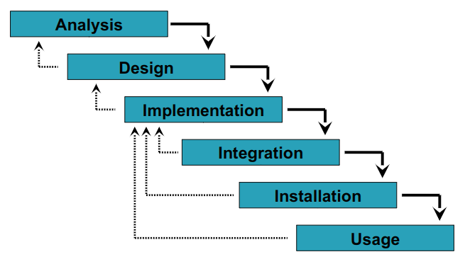

Prototype-Models
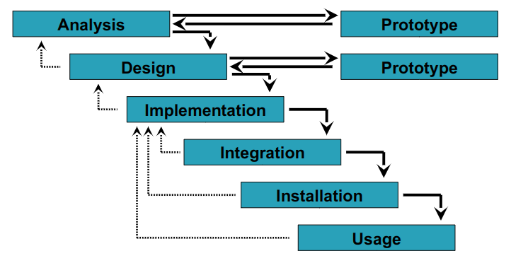

Incremental-, Evolutionary, Recursive-, Iterative-Models
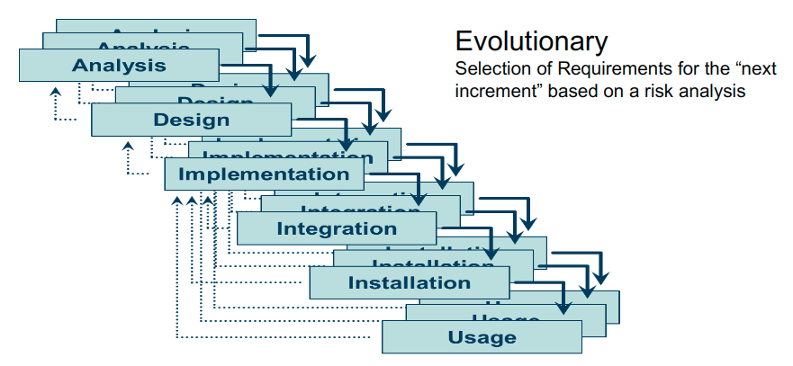

Spiral-Model
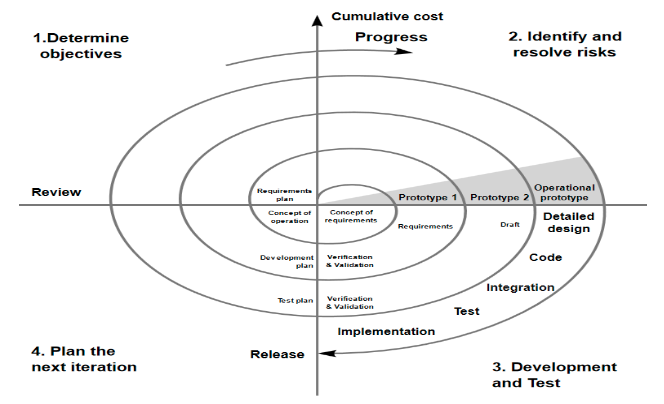

### Certification of Project Managers
- Project Management Professional (PMP)®
- Industry-recognized certification [http://www.pmi.org](http://www.pmi.org)
- PMP Requirements
    - "... three years of project management experience, with 4500 hours leading and directing projects and 35 hours of project management education." (Erfolgreich und/oder bezahlt?)

PMP background
- Examination for Project Managers
    - 200 multiple-choice questions in 4hrs -> 1min 12sec per question
    - 2-3 weeks of preparation
- Paid renewal every three years

#### PMP Example Question 1 (taken from the PMP website)
An accepted deadline for a project approaches. However, the project manager realizes only 75% percent of the work has been completed. The project manager then issues a change request. What should the change request authorize? 
1. Additional resources using the contingency fund
2. Escalation approval to use contingency funding
3. Team overtime to meet schedule
4. Corrective action based on causes

#### PMP Example Question 2 (taken from the PMP website)
The project manager develops a process improvement plan to encourage continuous process improvement during the life of the project. Which of the following is a valid tool or technique to assist the project manager to assure the success of the process improvement plan?
1. Change control system
2. Process analysis
3. Benchmarking
4. Configuration management system

#### PMP Example Questions 3 (taken from the PMP website)
The project manager meets with the project team to review lessons learned from previous projects. In what activity is the team involved?
1. Performance management
2. Scope identification
3. Risk identification
4. Project team status meeting


## OpenUP
### Core Principles
(Made available under EPL v1.0)
OpenUP is based on a set of mutually supporting core principles:
- Collaborate to align interests and share understanding
- Evolve to continuously obtain feedback and improve
- Balance competing priorities to maximize stakeholder value
- Focus on articulating the architecture

### Collaboration: Some key practices
- Maintain a common understanding
    - Key artifacts: Vision, requirements, architecture notebook, iteration plan
- Foster a high-trust environment
    - Manage by intent, tear down walls, understand the perspectives of others
- Share responsibility
    - Everybody owns the product, help each other
- Learn continuously
    - Develop technical and interpersonal skills, be a student and a teacher
- Organize around the architecture
    - The architecture provides a shared understanding of the solution and forms the
       basis for partitioning work.

### Evolve: Some key practices
- Develop your project in iterations
    - Use time-boxed iterations that deliver incremental value and provide frequent feedback.
- Focus iterations on meeting the next management milestone
    - Divide the project into phases with clear goals and focus iterations on meeting those goals.
    - Manage risks
    - Identify and eliminate risk early.
- Embrace and manage change
    - Adapt to changes.
- Measure progress objectively
    - Deliver working software, get daily status, and use metrics.
- Continuously re-evaluate what you do
    - Assess each iteration and perform process retrospectives.

### Balance: Some key practices
- Know your audience & create a shared understanding of the domain.
    - Identify stakeholders early and establish a common language
- Separate the problem from the solution
    - Understand the problem before rushing into a solution.
- Use scenarios and use cases to capture requirements
    - Capture requirements in a form that stakeholders understand
- Establish and maintain agreement on priorities
    - Prioritize work to maximize value and minimize risk early
- Make trade-offs to maximize value
    - Investigate alternative designs and re-factor to maximize value
- Manage scope
    - Assess the impact of changes and set expectations accordingly.

### Focus: Some key practices
- Create the architecture for what you know today
    - Keep it as simple as possible and anticipate change
- Leverage the architecture as a collaborative tool
    - A good architecture facilitates collaboration by communicating the "big-picture" and enabling parallelism in development.
- Cope with complexity by raising the level of abstraction
  - Use models to raise the level of abstraction to focus on important high-level decisions.
- Organize the architecture into loosely coupled, highly cohesive components
  - Design the system to maximize cohesion and minimize coupling to improve comprehension and increase flexibility.
- Reuse existing assets
    - Don’t re-invent the wheel. Made available under EPL v1.0

### OpenUP is Agile and Unified
- OpenUP incorporates a number of agile practices...
  - Test-First Design
  - Continuous Integration
  - Agile Estimation
  - Daily Standup, Iteration Assessment, Iteration Retrospective
  - Self-organizing teams
- ...within the context of an iterative, incremental lifecycle (UP).

Core principles mapping to Agile manifesto

| OpenUP/Basic Key principles                                | Agile manifesto                                     |
| ---------------------------------------------------------- | --------------------------------------------------- |
| Collaborate to align interests and share understanding     | Individuals and interactions over process and tools |
| Evolve to continuously obtain feedback and improve         | Responding to change over following a plan          |
| Balance competing priorities to maximize stakeholder value | Customer collaboration over contract negotiation    |
| Focus on articulating the architecture                     | Working software over comprehensive documentation   |

Governance Model - Balancing Agility and Discipline
- OpenUP incorporates a three-tiered governance model to plan, execute, and monitor progress.
- These tiers correspond to personal, team and stakeholder concerns and each operates at a different time scale and level of detail.

### OpenUP Project Lifecycle
- OpenUP uses an iterative, incremental lifecycle.
- Proper application of this lifecycle directly addresses the first core principle (Evolve).
- The lifecycle is divided into 4 phases, each with a particular purpose and milestone criteria to exit the phase:
       - Inception: To understand the problem.
       - Elaboration: To validate the solution architecture.
       - Construction: To build and verify the solution in increments.
       - Transition: To transition the solution to the operational environment and validate the solution.

### OpenUP Iteration Lifecycle
- Phases are further decomposed into a number of iterations.
- At the end of each iteration a verified build of the system increment is available.
- Each iteration has its own lifecycle, beginning with planning and ending in a stable system increment, Iteration Review (did we achieve the iteration objectives) and a Retrospective (is there a better process).
- Progress on completion of micro-increments is monitored daily via "Scrums" and the iteration burndown chart to provide timely feedback.
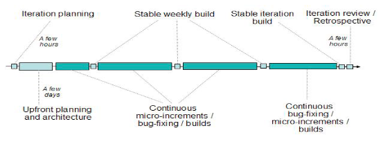

Micro-Increments
- Micro-increments are small steps towards the goals of the iteration.
- Should be small enough to be completed in a day or two
    - Identify Stakeholders is a micro-increment (one step of a task).
    - Determine Technical Approach for Persistency is a micro-increment (a task with a specific
       focus)
    - Develop Solution Increment for UC 1 Main Flow is a micro-increment (a task with a
       specific focus)
- Micro-increments are defined and tracked via the work items list.
- Work items reference requirements and process tasks as needed to provide
    required inputs to complete the micro-increment.

### OpenUP Lifecycle - Inception Phase
- The primary purpose of the Inception Phase is to understand the scope of the problem and feasibility of a solution.
- At the Lifecycle Objectives Milestone, progress towards meeting these objectives are assessed and a decision to proceed with the same scope, change the scope, or terminate the project is made.
- More specifically, the objectives and associated process activities are:

| Phase objectives                                                     | Activities that address objectives          |
| -------------------------------------------------------------------- | ------------------------------------------- |
| Define a Vision                                                      | Initiate Project                            |
| Identify key system functionality                                    | Identify and Refine Requirements            |
| Determine at least one possible solution                             | Agree on Technical Approach                 |
| Understand the cost, schedule, and risks associated with the project | Initiate Project, Plan and Manage Iteration |

### OpenUP Lifecycle - Elaboration Phase
- The primary purpose of the Elaboration Phase is to validate the solution architecture (feasibility and trade-offs).
- At the Lifecycle Architecture Milestone, progress towards meeting these objectives are assessed and a decision to proceed with the same scope, change the scope, or terminate the project is made.
- More specifically, the objectives and associated process activities are:

| Phase objectives                                                           | Activities that address objectives                                  |
| -------------------------------------------------------------------------- | ------------------------------------------------------------------- |
| Get a more detailed understanding of the requirements                      | Identify and Refine Requirements                                    |
| Design, implement, validate, and baseline an architecture                  | Develop the Architecture, Develop Solution Increment, Test Solution |
| Mitigate essential risks, and produce accurate schedule and cost estimates | Plan and Manage Iteration, Ongoing Tasks                            |

### OpenUP Lifecycle - Construction Phase
- The primary purpose of the Construction Phase is to develop and verify the solution incrementally.
- At the Initial Operational Capability Milestone, progress towards meeting these objectives is assessed and a decision to deploy the solution to the operation environment is made.
- More specifically, the objectives and associated process activities are:

| Phase objectives                                                                         | Activities that address objectives                                          |
| ---------------------------------------------------------------------------------------- | --------------------------------------------------------------------------- |
| Iteratively develop a complete product that is ready to transition to the user community | Identify and Refine Requirements; Develop Solution Increment; Test Solution |
| Minimize development costs and achieve some degree of parallelism                        | Plan and Manage Iteration Ongoing Tasks                                     |

### OpenUP Lifecycle - Transition Phase
- The primary purpose of the Transition Phase is to deploy the solution to the operational environment and validate it.
- At the Product Release Milestone, progress towards meeting these objectives are assessed and a decision to make the product generally available is made.
- More specifically, the objectives and associated process activities are:

| Phase objectives                                            | Activities that address objectives                       |
| ----------------------------------------------------------- | -------------------------------------------------------- |
| Beta test to validate that user expectations are met        | Ongoing Tasks; Develop Solution Increment; Test Solution |
| Achieve stakeholder concurrence that deployment is complete | Plan and Manage Iteration; Test Solution                 |
| Improve future project performance through lessons learned  | Plan and Manage Iteration                                |

### OpenUP Disciplines
- A discipline is a collection of tasks that are related to a major "area of concern" within the overall project.
- Within the lifecycle, tasks are performed concurrently across several disciplines.
- Separating tasks into distinct disciplines is simply an effective way to organize content that makes comprehension easier.
- OpenUP defines the following Disciplines:

### Example: OpenUp
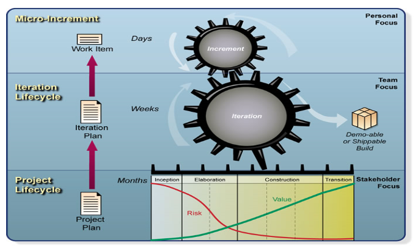

[http://www.eclipse.org/epf/general/An_Introduction_to_EPF.zip](http://www.eclipse.org/epf/general/An_Introduction_to_EPF.zip)

### The four Phases of OpenUP
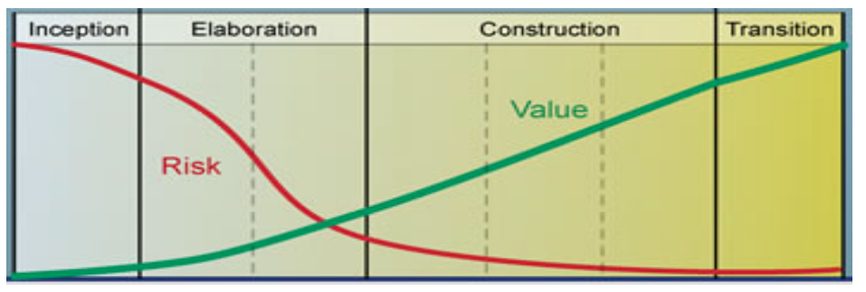

Decomposition of a Phase


1. Inception
   - Glossary
   - Vision
   - Work Items List
   - Project Plan
   - Risk List
   - Supporting Requirements Spec
   - Use Case, Use Case Model
   - Architecture Notebook
   - Iteration Plan
2. Elaboration
   - Architecture
   - Design
   - Developer Tests
   - Build
   - Implementation
   - Test Log
   - Test Scripts
3. Construction
4. Transition


Inhalte

## SCRUM
Example: SCRUM
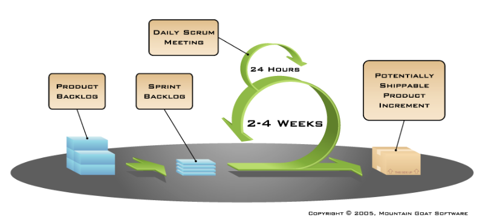

### Product Backlog
- Requirements
- Each item will be refined by the -> Sprint Backlog

### Sprint Backlog
- Prioritized workitems
- 2-4 weeks
- Daily tracking of the progress (remaining work in days or h)

Sprint Burndown Chart


### Daily Scrum
Short daily meeting
1. What did you do yesterday?
2. What will you do today?
3. Are there any impediments in your way?

### Where do changes come from?
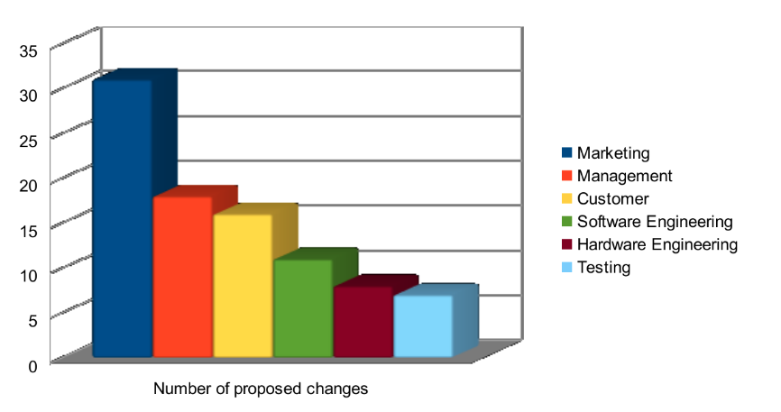

## Example: Change Control Process
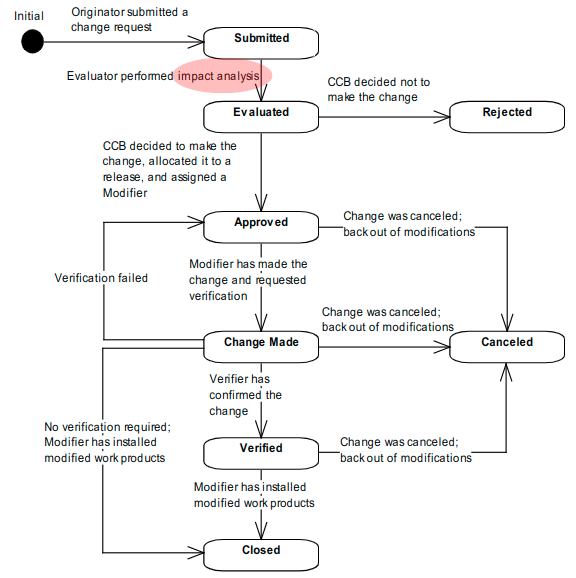
Everyone needs to know about
- The owner of each document
- The access rights to each document
- The change procedure

### Impact Analysis Questionaire
[Wieg 1999, p346]
- Do any existing requirements in the baseline conflict with the proposed change?
- Do any other pending requirements changes conflict with the proposed change?
- What are the business or technical consequences of not making the change?
- What are possible adverse side effects or other risks of making the proposed change?
- Will the proposed change adversely affect performance requirements or other quality attributes?
- Is the proposed change feasible within known technical constraints and current staff skills?
- Will the proposed change place unacceptable demand on any computer resources required for the development, test, or operating environments?
- Must any tools be acquired to implement and test the change?
- How will the proposed change affect the sequence, dependencies, effort, or duration of any tasks currently in the project plan?
- Will prototyping or other user input be required to verify the proposed change?
- How much effort that has already been invested in the project will be lost it this change is accepted?
- Will the proposed change cause an increase in product unit cost, such as by increasingg third-party product licensing fees?
- Will the change affect any marketing, manufacturing, training, or customer support plans?
- Identify any user interface changes, additions, or deletions required.
- Identify any changes, additions, or deletions required in reports, databases, or files.
- Identify the design components that must be created, modified, or deleted.
- Identify the source code files that must be created, modified, or deleted.
- Identify any changes required in build files or procedures.
- Identify existing unit, integration, system, and acceptance test cases that must be modified or deleted.
- Estimate the number of new unit, integration, system, and acceptance test cases that will be required.
- Identify any help screens, training materials, or other user documentation that must be created or modified.
- Identify any other applications, libraries, or hardware components affected by the change.
- Identify any third-party software that must be purchased or licensed.
- Identify any impact the proposed change will have on the project‘s software project management plan, quality assurance plan, configuration management plan, or other plans. [Wieg 1999], p346


## Metamodelle
### What is Model Driven Development?
MDD proposes the usage of "models at different levels of abstraction and performs
transformations between them in order to derive a concrete application implementation " [1]

Model
- Everything can be a representation of a model
  - Source Code
  - Word, Excel
  - ...
- Conforms to a meta-model
- -> Manage complexity with a higher/smarter abstraction

### Meta-meta model ...
- Object Management Group (OMG)
- Meta Object Facility (MOF)
- Commonly used 4 layer abstraction
- MDD tools are based on this structure!

Meta Levels
- M3: z.B. MOF
- M2: z.B. UML Meta Model
- M1: z.B. UML Model
- M0: z.B. Source Code


# Requirements Engineering
## Definition: Requirements Engineering


Definition ([Bere 2009] → [DoD 1991]): "Requirements engineering involves all lifecycle activities devoted to (1) identification of user requirements, (2) analysis of the requirements to derive additional requirements, documentation of the requirements as a specification, and (3) validation of the documented requirements against user needs, as well as (4) processes that support these activities."

- Professionelles Requirements Engineering
    - (1) Erheben Um was geht es?
    - (2) Modellieren Analyse / Verfeinerung ...
    - (3) Validieren Prüfen
    - (4) Verwalten Nutzung / Wiederverwendung

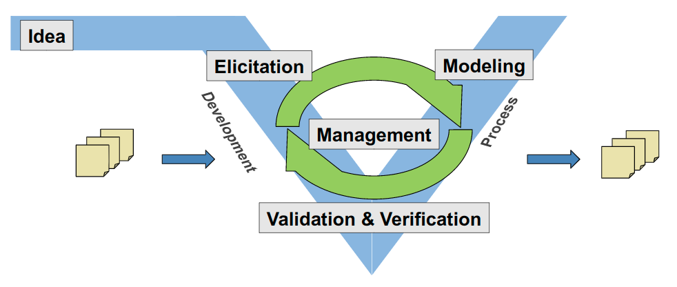

## Definition: Requirement
What is a requirement? "requirement", IEEE 610.12 - 1990, p62
1. A condition or capability needed by a user to solve a problem or achieve an objective.
2.  A condition or capability that must be met or possessed by a system or system component to satisfy a contract, standard, specification, or other formally imposed documents.
3.  A documented representation of a condition or capability as in (1) or (2).

See also: design requirement; functional requirement; implementation requirement; interface requirement; performance requirement; physical requirement.

Requirement vs. Goal ( "a hot topic in the community"):
A goal is an objective the system under consideration should achieve. (intended properties of the system) [Lams 2001].

## Requirement Types
### Different Requirement Types
Requirements
- Functional 
    - Data
    - Processes / Functions
    - Behaviour
- Non-functional
  - Process
    - Shipment
    - Implementation
    - Standards
    - Organisation
  - Product
    - Reliability
    - Usability
    - Efficiency
    - Maintainability
    - Protability
    - Safety
    - Performance
    - Ergonomy
  - External
    - Law
    - Economy
    - Interoperability
    - Cultural
    - Physics
    - IT Technology
   

## Struktur einer Anforderung
Strukturelemente
  - Id
  - Description
  - Rationale
  - Satisfaction
  - Origin
  - References
  - Validation

What a Requirement Looks Like
- Unique Requirements ID
    - Mostly numbers or alphanumeric combinations are being used.
    - Prevent redundancies -> automatic generation of this ID
    - System-wide identification of a requirement / workitem
- Document Structure (-> Specification Document, -> Requirement Types)
    - We need to know how to sort the requirements. Where to sort in a new requirement? Where to find requirements to a given topic?
    - "Checklist" missing requirements / redundancies
    - Wide / complete scope of the requirements document
- Relations
    - ... to one/more use-case(s)
    - ... to other requirements
       - Use Interaction (one requirement refers to the implemented functionality of another requirement, e.g. Scrolling through a list of videos might make use of the immediate play-video functionality)
       - Share Interaction (two requirements share the same resource, e.g. memory)
    - ... to a component (off-the-shelf) of the system. (This is a relation to the system design)
    - ... to a specific system variant (of a system family).
    - Conflicts between requirements (should be resolved before the design phase)
    - Conflicting requirements, side effects
    - Analysis of the requirements, coverage metrics, automated traceability matrices
- Description
    - A single sentence describing the requirement
    - Textual frames / boiler plates [Rupp 2002], p229...
    - UML (Activity, Sequence, Use-Cases, Statecharts), _legacy model types ??_
    - Without a description we don‘t understand a requirement
    - Developers are forced to think about the requirement
- Rationale
    - Why is this requirement important?
    - Unneeded / unnecessary requirements have no rationale
    - Reduction of the requirements specification to the essentially needed requirements
- Origin
    - Who came up with this requirement? Where does it come from?
    - Without a source there is no "personal" reason to have a requirement
    - The origin is always the source for more information about the requirement
- Validation / Test-Case
    - How could we quantify this requirement to test/validate it?
    - Un-testable requirements have no means to be approved by the customer
    - Project management (planning, scope, partitioning) is possible
- Customer Satisfaction
    - What is the level of customer-interest in this requirement? How important is this requirement to the customer?
    - What if this requirment won‘t be realized ...?
    - Could also be seen as priority of this requirement (see Kano Model)
       - I like it that way
       - It must be that way
       - I am neutral
       - I can live with it that way
       - I dislike it that whay
    - Without the analysis of the customer satisfaction, the acceptance of the final result is unknown.
    - Customer Satisfaction
- References
    - To Domain-Knowledge or other information important to understand the requirement
    - The learning curve for new employees or new stakeholders will be prolonged.
    - Understanding of the system is sped up.

###  Anforderungsschablonen
für die Beschreibung von Anforderungen [Rupp 2002]
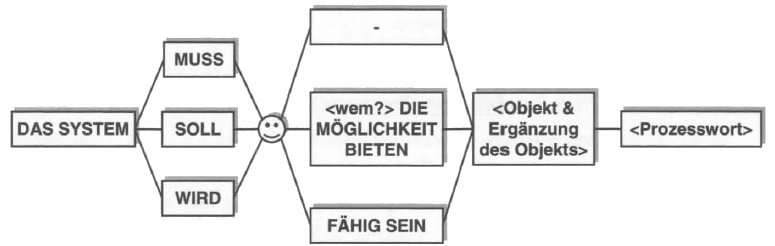
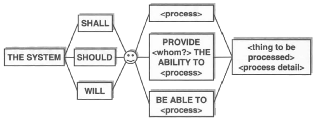
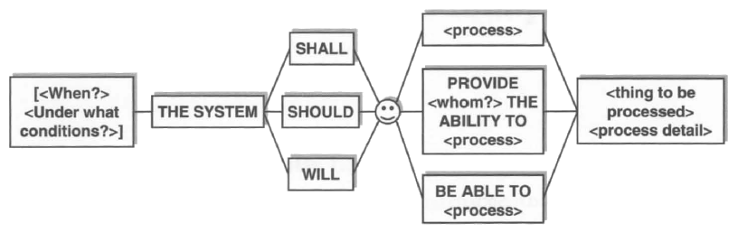

Kano Model
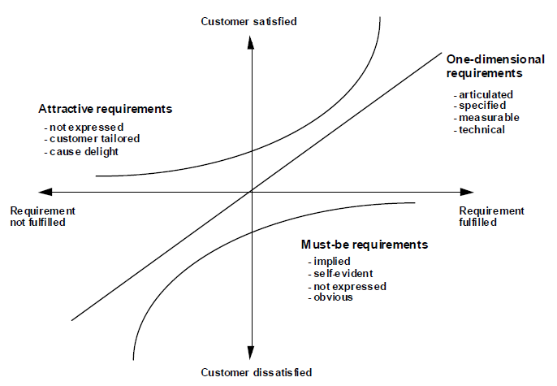
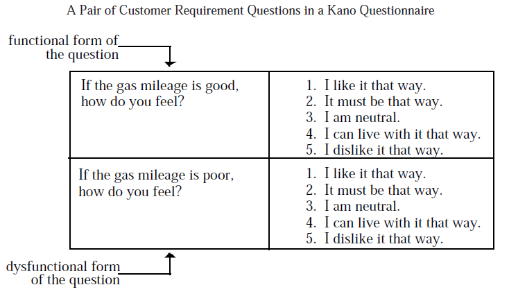

## Anforderungserhebung / Elicitation Techniques
### Stakeholder Model
- Sponsor
    - Customer
    - Marketing
    - Productdesign
- User
    - Enduser
    - Maintenance
- Contractor (Someone delivering something)
- Projectmanager
- Softwareengineer
- Qualityengineer
- Technical Writer

### Elicitation Techniques


- Own Participation ...
  - Internship
  - Job-Rotation
  - "Hospitanz"
- Ethnographic Observation
  - Other cultures ...
- Introspection
  - Explicitly try to think as a different individual (e. g. customers)
  - ... change your ViewPoint [Rupp 2002], p111
- Document Analysis
    - Market Studies, Books, Papers
    - Standards
    - System Documentation, User Manuals (of competitors)
    - Web-Search ...
    - Patent Search
- Interviews (with/for statistical analysis)
    - In person, Telco
    - (Web-based) questionaire (e.g. Sharepoint)
    - Structured / not structured
    - Feedback round, [Rupp 2002], p120
    - Brainstorming
    - MindMaps
    - With domain experts, developers, ...
- Protocol Analysis
    - Learn about business processes
    - Input / Output of process steps (Observation)
    - Apprenticing, Job-Rotation / "Hospitanz
- Knowledge Engineering ...
    - Repertory Grid
    - Goal Question Metric

### Web-Search
Example: Literature Search

| Name              | Weblink                                     |
| ----------------- | ------------------------------------------- |
| Web of Knowledge  | http://www.webofknowledge.com/              |
| IEEE explore      | http://ieeexplore.ieee.org                  |
| ACM               | http://dl.acm.org/                          |
| Scirus            | http://www.scirus.com                       |
| DBLP              | http://www.informatik.uni-trier.de/~ley/db/ |
| Citeseer(X)       | http://citeseerx.ist.psu.edu                |
| Google Scholar    | http://scholar.google.de/                   |
| Patentdatenbanken | http://worldwide.espacenet.com/             |

### Patentrecherche
- Viele Informationen sind nur in Patenten verfügbar
- An anderer Stelle veröffentlicht <-> In Patenten veröffentlicht
- 80% finden sich nur in Patenten!
- Wo veröffentlichen um Geheimhaltung bemühte Wettbewerber ihre Forschungs- und Entwicklungsergebnisse?

Lösungen aus Patentdokumenten... doch es bedarf gewisser Grundkenntnisse!
- Hüten Sie sich vor "naiven" Schlagwortsuchen wie ... "Feder" -> "Energiespeichermittel"
- Manchmal will der Anmelder einfach vermeiden, dass sein Patent gefunden wird ... 
    - "Spielzeugball" -> "Kugelförmiges Objekt mit biegsamen Fäden" 
    - "Kugellager" -> "Vielzahl von Kugeln"

Lernen Sie, wie man nach Patenten sucht!
- http://www.epo.org/wbt/pi-tour
- http://www.epo.org/patents/learning/e-learning.html


### Interviews
[Pohl 2008]
- Vorbereitung
  - Ziel definieren/kommunizieren, Teilnehmer auswählen/einladen/kennenlernen, Ort wählen, Fragen vorbereiten, Domänensprache erlernen
- Durchführung
  - Einleitung: Ziele und erwartete Ergebnisse, Einstiegsfrage
  - Zusammenfassungen, Pausen, Protokoll
- Nachbereitung
  - Protokoll, Anforderungen, To-Do-Liste
  - ->Prüfung / Review

#### MindMaps
- freemind.sourceforge.net
- MindManager (http://www.mindjet.com)
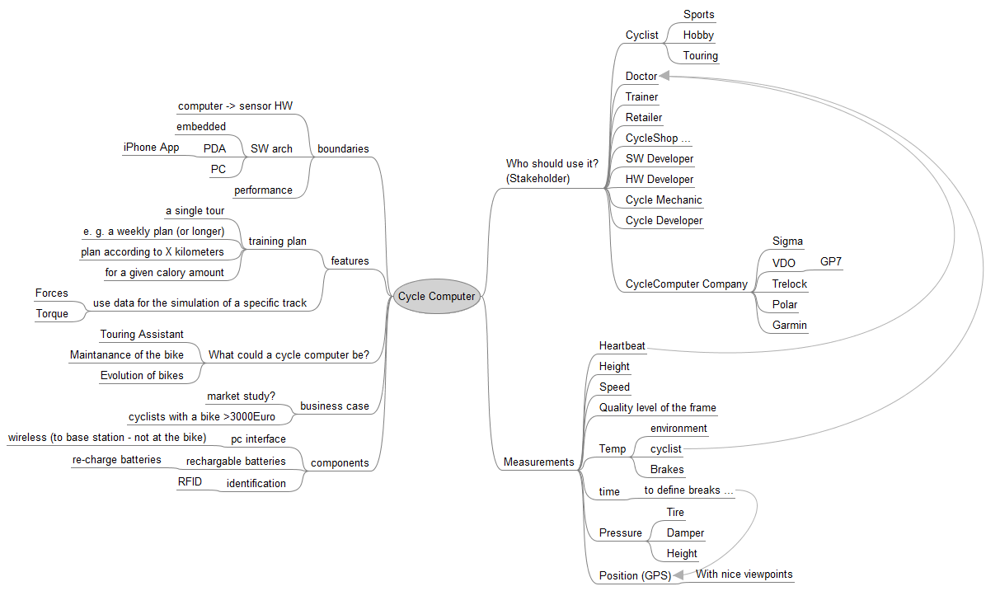

#### Questionaire: ... ilities
- ISO 9126
- ISO 25010
- ISO 25051
- ...

#### SEI Risk Taxonomy

### Repertory Grid
- Based on the _Personal Construct Theory_ by George Kelly, 1955
- Repertory Grid - Auswahltabelle
    - lat. Repertorium Bibliographie eines Fachbereiches,
    - reperire = "wiederfinden"
    - franz. Repertoire = Verzeichnis
- Interview technique: -> The interviewee creates his own interview!
- Goal: Understand someones ideas by similarities
- Elements: ... the items for the reasoning process
- Construct
    - Single dimension of meaning for a person to identify two pheonomena as similar
    - Two poles represent the extreme viewpoints (with a typical scale of 1 ... 5)

#### Repertory Grid: How to
+ What is the question to be answered?
+ Elicit the elements
+ Elaborate the constructs
    - By comparing triads -> How are two of these similar and the third one different?
+ Organize the elements and constructs in a table (-> grid) and rate (1...5) each element according to the constructs

Example: "What is the best car brand for me?"
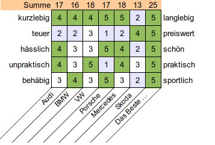

#### Repertory Grid: Analysis
1. Best fit ...
2. What is closest to the optimum?
3. Clustering to refine the constructs


### Goal Question Metric
1. Robert E. Park, Wolfhart B Goethert, William A. Florac,"Goal-Driven Software Measurement - A Guidebook", SEI Bericht, CMZ/SEI-96-HB-002, 1996.
2. Danilo Assmann, Ralf Kalmar, Dr Teade Punter, "Handbuch, Messen und Bewerten von WebApplikationen mit der Goal/Question/Metric Methode", IESE-Report Nr. 087.02/D ver. 1.2, 2002

Motivation
- Messen und Bewerten von
    - Softwareentwicklungsprozessen
    - Produkten / Artefakten / Komponenten
- Ziel: Quantitative Aussagen
    - In einem Projektkontext
    - Für die beteiligten Personen

GQM
- Zielorientiertes Messen
    - Ziele sind organisations- / projektspezifisch
       1. Planung der Messung
       2. Instrumentierung
       3. Datenerfassung
       4. Datenanalyse mit Ergebnisbericht

GQM Abstraction Sheet
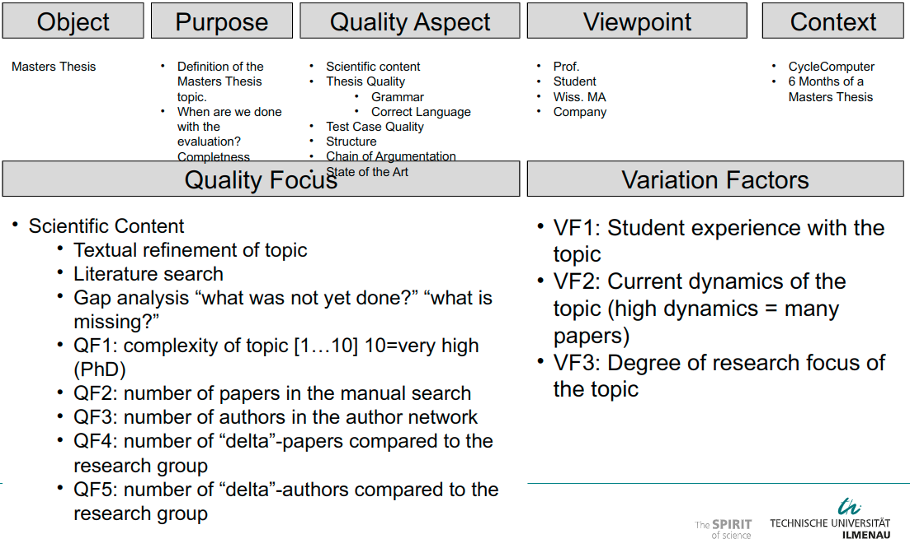
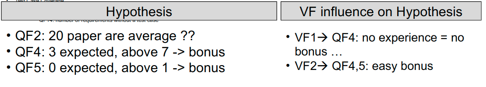

Elicitation Techniques
- Team Building
    - Kick-Off
    - Workshops
       - Business Event Workshop (-> people/employees describe their work)
       - Future Workshop
          - Identify and group problems. Work in smaller teams on the groups.
          - Find and describe visionary solutions to problems. Think without constraints.
          - Estimate the needed resources and the feasibility for/of the proposed solutions.
- Focus Groups
    - Sub-Teams for specific issues / topics


### Requirements Document Structure
Document Structure 
- Volere Schema
- Sections, Sub-Sections, ...
- Examples ...
- Requirements
- Design
- Use-Cases
- Relation of documents amongst each other?
- ...

(Project) Document Setup
- Lastenheft
- Pflichtenheft
- System Tests
- Testresults
- Standards
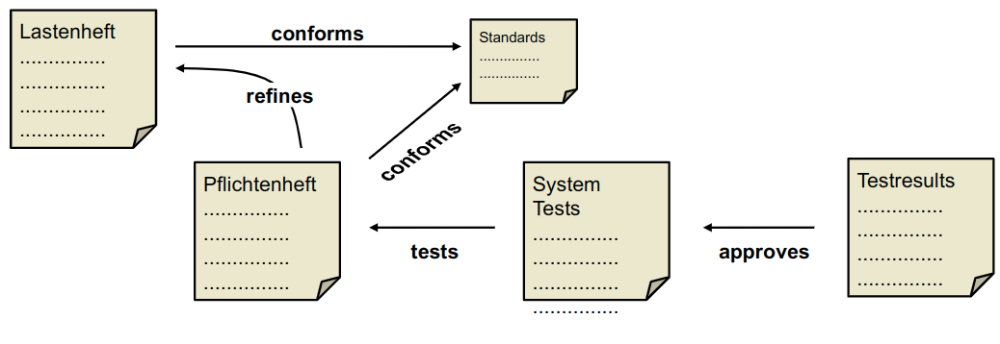

# Software Estimation
## A Little Estimation Game [McCo 2006]
Please read and observe the following directions carefully:
"For each question, fill in the upper and lower bounds that, in your opinion, give you a 90% chance of including the correct value. Be careful not to make your ranges either too wide or too narrow. Make them wide enough so that, in your best judgment, the ranges give you a 90% chance of including the correct answer. Please do not research any of the answers-this quiz is intended to assess your estimation skills, not your research skills. You must fill in an answer [or each item; an omitted item will be scored as an incorrect item. Please limit your time on this exercise to 10 minutes."

| Low Estimate | Question                                               |
| ------------ | ------------------------------------------------------ |
|              | Surface temperature of the sun                         |
|              | Latitude of Shanghai                                   |
|              | Area of the Asian continent                            |
|              | The year of Alexander the Great‘s birth                |
|              | Total value of U.S. currency in circulation in 2004    |
|              | Total volume of the Great Lakes                        |
|              | Worldwide box office receipts for the movie _Titanic_  |
|              | Total length of the coastline of the Pacific Ocean     |
|              | Number of book titles published in the U.S. since 1976 |
|              | Heaviest blue whale ever recorded                      |

Results: A Little Estimation Game
| Low Estimate    | Question                                               |
| --------------- | ------------------------------------------------------ |
| 6000 ºC         | Surface temperature of the sun                         |
| 31º             | North Latitude of Shanghai                             |
| 44.390.000 km^2 | Area of the Asian continent                            |
| 356 BC          | The year of Alexander the Great‘s birth                |
| $719.9 billion  | Total value of U.S. currency in circulation in 2004    |
| 23000 km^3      | Total volume of the Great Lakes                        |
| 1,834 x 10^9 $  | Worldwide box office receipts for the movie Titanic    |
| 135663 km       | Total length of the coastline of the Pacific Ocean     |
| 22 million      | Number of book titles published in the U.S. since 1976 |
| 170 metric tons | Heaviest blue whale ever recorded                      |

-> Most people reach a 30% confidence level if they believe it is a 90% confidence level!

#### Ten Key Characteristics of Software Executives
1. Executives will always ask for what they want.
2. Executives will always probe to get what they want if they don't get it initially.
3. Executives will tend to probe until they discover your point of discomfort.
4. Executives won't always know what's possible, but they will know what would be good for the business if it were possible.
5. Executives will be assertive. That's how they got to be executives in the first place.
6. Executives will respect you when you are being assertive. In fact, they assume you will be assertive if you need to be.
7. Executives want you to operate with the organization's best interests at heart.
8. Executives will want to explore lots of variations to maximize business _value._
9. Executives know things about the business, the market, and the company that you don't know , and they may prioritize your project's goals differently than you would.
10. Executives will always want visibility and commitment early (which would indeed _have_ great business _value,_ if it were possible). [McCo 2006], p260

### Estimation Improvement with the Capability Maturity Model
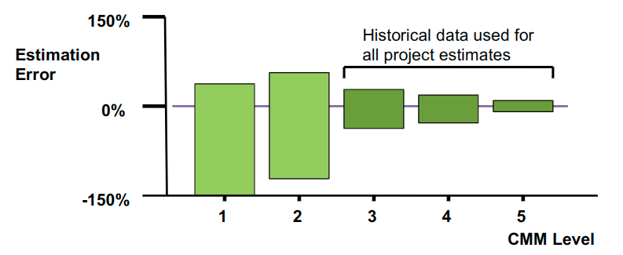

Improvement in estimation at the Boeing Company. As with the U.S. Air Force projects, the predictability of the projects improved dramatically at higher CMM levels. [McCo 2006, p10]


## Accuracy and Precision
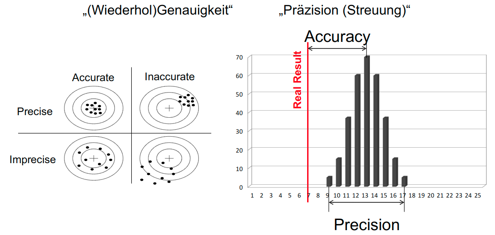

## Productivity Rates
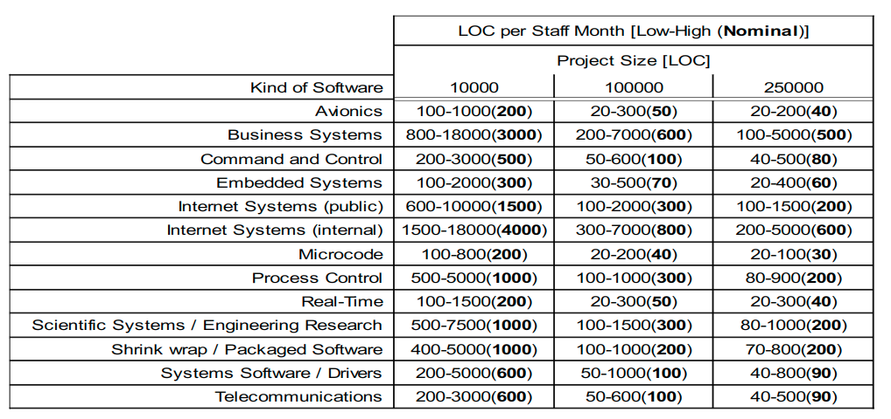

## Randbedingungen, Fallstricke
##### Over- / Underestimation
- Cyril Northcote Parkinson, 1955 in _The Economist_
    - "Work expands so as to fill the time available for its completion. "
- -> Parkinson's Law
- Developers have a tendency to: Best Case Estimates

##### Project Outcomes by Project Size
| Size in Function Points (and Approximate Lines of Code) | Early | On Time | Late | Failed (Canceled) |
| ------------------------------------------------------- | ----- | ------- | ---- | ----------------- |
| 10 FP (1,000 LOC)                                       | 11%   | 81%     | 6%   | 2%                |
| 100 FP (10,000 LOC)                                     | 6%    | 75%     | 12%  | 7%                |
| 1,000 FP (100,000 LOC)                                  | 1%    | 61%     | 18%  | 20%               |
| 10,000 FP (1,000,000 LOC)                               | <1%   | 28%     | 24%  | 48%               |
| 100,000 FP (10,000,000 LOC)                             | 0%    | 14%     | 21%  | 65%               |

[McCo 2006], p25, Source: Estimating Software Costs (Jones 1998).


##### Communication Paths
| Paths (P) | 0   | 1   | 3   | 6   | ... | 15  |
| --------- | --- | --- | --- | --- | --- | --- |
| Nodes (n) | 1   | 2   | 3   | 4   | ... | 6   |

$$P=\sum_{i=1}^{n-1} i=\frac{(n-1)*((n-1)+1)}{2}=\frac{2*(n-1)}{2}$$
Gaußsche Summenformel: $\sum_{i=1}^n = 1+2+3+...+n=\frac{n(n+1)}{2}$

##### Communication Paths cont.
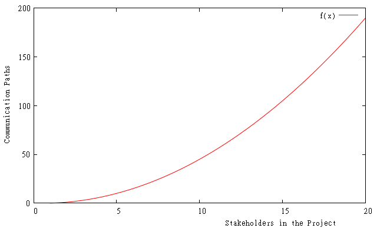
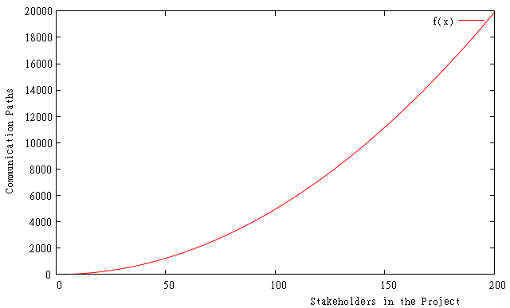


### The Cone of Uncertainty
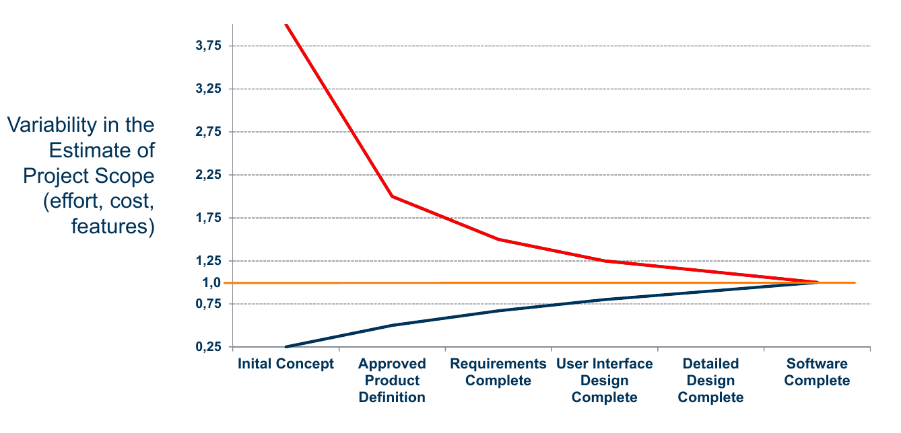

##### Accuracy vs. Project Length
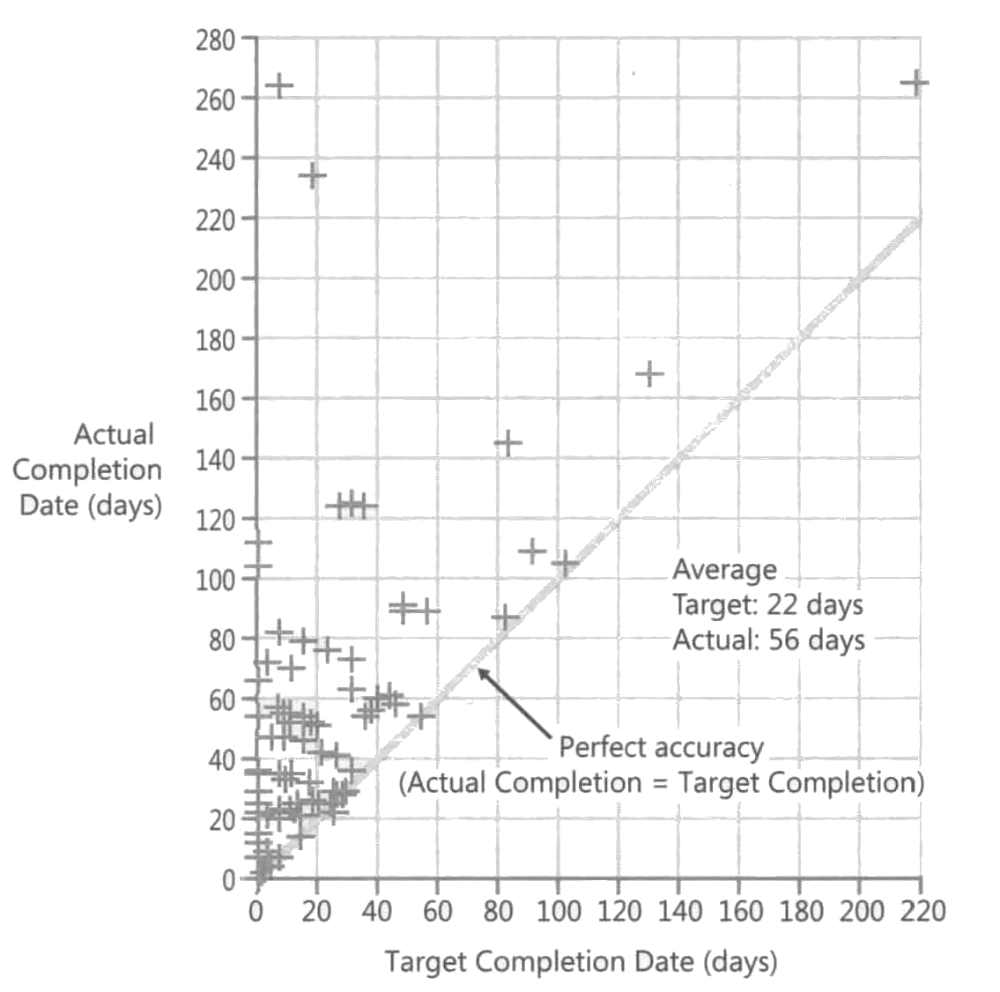
Estimation results from one organization.

### Commonly Missing Activities
- Functional Requirement Areas
  - Setup/installation program
  - Data conversion utility
  - Glue code needed to use third-party or open-source software
  - Help system
  - Deployment modes
  - Interfaces with external systems
- Non-Functional Requirements
    - ...ilities
- SW Development Activities
  - Ramp-up time for new team members
  - Mentoring of new team members
  - Management coordination/manager meetings
  - Cutover/deployment
  - Data conversion (own development)
  - Installation
  - Customization
  - Requirements clarifications
  - Maintaining the revision control system
  - Supporting the build
  - Maintaining the scripts required to run the daily build
  - Maintaining the automated smoke test used in conjunction with the daily build
  - Installation of test builds at user location(s)
  - Creation of test data
  - Management of beta test program
  - Participation in technical reviews
  - Integration work
  - Processing change requests
  - Attendance at change-control/triage meetings
  - Coordinating with subcontractors

### Einflussgröße: Personal
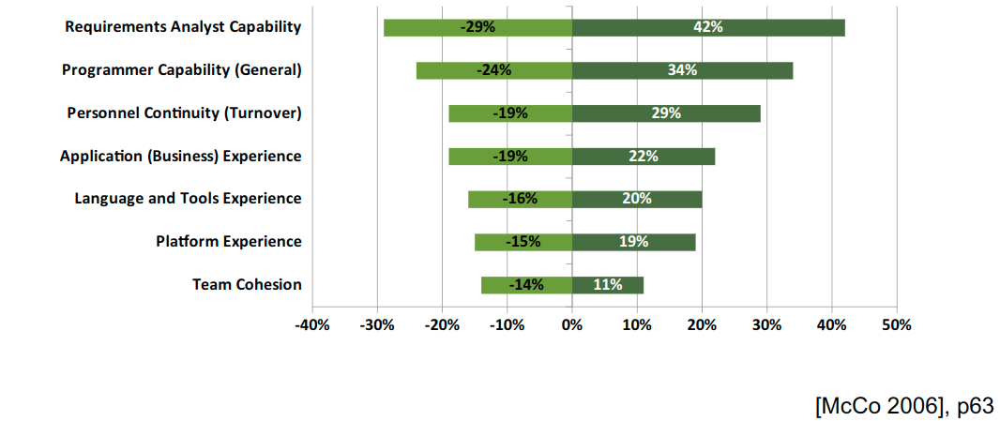

### Einflussgröße: Programmiersprache
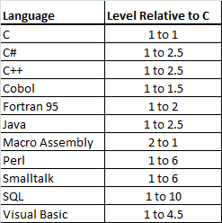

Ratio of High-Level-Language Statements to Equivalent C Code

Source: Adapted from Estimating Software Costs (Jones 1998) and Software Cost Estimation with Cocomo II (Boehm 2000).

## Estimation Techniques
### Zählen
Which quantities to count? [McCo 2006, p86..88]

| Quantity to Count             | Historical Data Needed to Convert the Count to an Estimate                                                                                                                                                       |
| ----------------------------- | ---------------------------------------------------------------------------------------------------------------------------------------------------------------------------------------------------------------- |
| Marketing requirements        | Average effort hours per requirement for development                                                                                                                                                             |
|                               | Average effort hours per requirement for independent testing                                                                                                                                                     |
|                               | Average effort hours per requirement for documentation                                                                                                                                                           |
|                               | Average effort hours per requirement to create engineering requirements from marketing requirements                                                                                                              |
| Features                      | Average effort hours per feature for development and/or testing                                                                                                                                                  |
| Use cases                     | Average total effort hours per use case                                                                                                                                                                          |
|                               | Average number of use cases that can be delivered in a particular amount of calendar time                                                                                                                        |
| Stories                       | Average total effort hours per story                                                                                                                                                                             |
|                               | Average number of stories that can be delivered in a particular amount of calendar time                                                                                                                          |
| Engineering Requirements      | Average number of engineering requirements that can be formally inspected per hour                                                                                                                               |
|                               | Average effort hours per requirement for development/test/documentation                                                                                                                                          |
| Function Points               | Average development/test/documentation effort per Function Point                                                                                                                                                 |
|                               | Average lines of code in the target language per Function Point                                                                                                                                                  |
| Change requests               | Average development/test/documentation effort per change request (depending on variability of the change requests, the data might be decomposed into average effort per small, medium, and large change request) |
| Web pages                     | Average effort per Web page for user interface work                                                                                                                                                              |
|                               | Average whole-project effort per Web page (less reliable, but can be an interesting data point)                                                                                                                  |
| Reports                       | Average effort per report for report work                                                                                                                                                                        |
| Dialog Boxes                  | Average effort per dialog for user interface work                                                                                                                                                                |
| Database Tables               | Average effort per table for database work                                                                                                                                                                       |
|                               | Average whole-project effort per table (less reliable, but can be an interesting data point)                                                                                                                     |
| Classes                       | Average effort hours per class for development                                                                                                                                                                   |
|                               | Average effort hours to formally inspect a class                                                                                                                                                                 |
|                               | Average effort hours per class for testing                                                                                                                                                                       |
| Defects found                 | Average effort hours per defect to fix                                                                                                                                                                           |
|                               | Average effort hours per defect to regression test                                                                                                                                                               |
|                               | Average number of defects that can be corrected in a particular amount of calendar time                                                                                                                          |
| Configurations settings       | Average effort per configuration setting                                                                                                                                                                         |
| Lines of code already written | Average number of defects per line of code                                                                                                                                                                       |
|                               | Average lines of code that can be formally inspected per hour                                                                                                                                                    |
|                               | Average new lines of code from one release to the next                                                                                                                                                           |

### Historische Daten
- The organization‘s historical data
    - Not personalized!
- Check: working days ≠ calendar days!
- Calibrate by building own charts
- Use _recent_ data of your project to refine estimations

### Expert Judgement
- Ask people who will do the work
- $ExpectedCase = \frac{BestCase+(4*MostLikelyCase)+WorstCase}{6}$

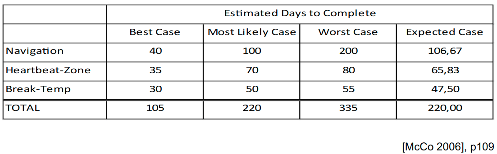

De- / Recomposition
- Divide and Conquer
    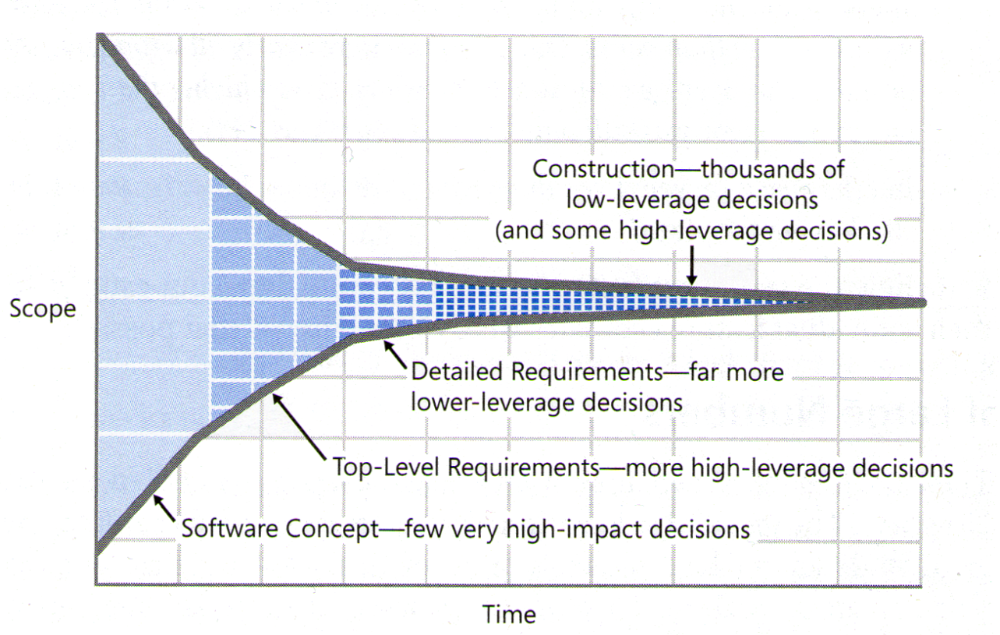
- Example
    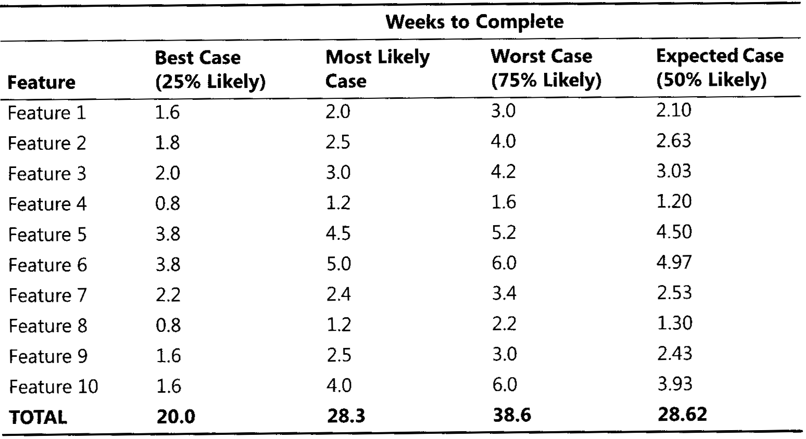


Expert Judgement in Groups [McCo 2006, p151]
1. The Delphi coordinator presents each estimator with the specification and an estimation form.
2. Estimators prepare initial estimates individually. (Optionally, this step can be performed after step 3.)
3. The coordinator calls a group meeting in which the estimators discuss estimation issues related to the project at hand. If the group agrees on a single estimate without much discussion, the coordinator assigns someone to play devil's advocate.
4. Estimators give their individual estimates to the coordinator anonymously.
5. The coordinator prepares a summary of the estimates on an iteration form and presents the iteration form to the estimators so that they can see how their estimates compare with other estimators' estimates.
6. The coordinator has estimators meet to discuss variations in their estimates.
7. Estimators vote anonymously on whether they want to accept the average estimate. If any of the estimators votes "no," they return to step 3.
8. The final estimate is the single-point estimate stemming from the Delphi exercise. Or, the final estimate is the range created through the Delphi discussion and the single-point Delphi estimate is the expected case.

### Proxy-Based Estimates
Classify existing components/features ... (small, medium, large) ... and estimate new features by these classes
[McCo 2006, p138]

| Example        | Size       | Average Staff Days per Feature | Number of Features | Estimated Effort (Staff Days) |
| -------------- | ---------- | ------------------------------ | ------------------ | ----------------------------- |
| Temp           | Very Small | 48                             | 6                  | 288                           |
| Speed          | Small      | 53                             | 20                 | 1060                          |
| Daytrip        | Medium     | 60                             | 4                  | 240                           |
| Heartbeat Zone | Large      | 66                             | 5                  | 330                           |
| Navigation     | Very Large | 107                            | 3                  | 321                           |
| Total          |            | -                              | 38                 | 2239                          |

### Function Points
- Developed by Allan Albrecht, IBM, 1970
- Assess each functional requirement
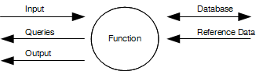

 | Category       | Criterion                                                                                                         | Simple | Middle             | Complex                        |
 | -------------- | ----------------------------------------------------------------------------------------------------------------- | ------ | ------------------ | ------------------------------ |
 | Input          | Number of different data Elements                                                                                 | 1-5    | 6-10               | >10                            |
 |                | Validate Input                                                                                                    | Formal | Formal & logically | Formal & logically & DB-access |
 |                | Required complexity of the user interface                                                                         | low    | average            | high                           |
 | Queries        | Number of different keys                                                                                          | 1      | 2                  | >2                             |
 |                | Required complexity of the user interface                                                                         | low    | average            | high                           |
 | Output         | Number of colums                                                                                                  | 1-6    | 7-15               | >15                            |
 |                | different data elements                                                                                           | 1-5    | 6-10               | >10                            |
 |                | Change of output groups (e.g. three data items to be printed but in two different groups -> grouped GUI elements) | 1      | 2-3                | >3                             |
 |                | Preparation for printing data elements                                                                            | none   | some               | many                           |
 | Database       | Number of Keys                                                                                                    | 1      | 2                  | >2                             |
 |                | Different data elements                                                                                           | 1-20   | 21-40              | >40                            |
 |                | Use existing data? (can be re-used)                                                                               | yes    | -                  | no                             |
 |                | Change of an already implemented data(structure)                                                                  | no     | yes                | -                              |
 | Reference Data | Read-only-files: Number of different data elements                                                                | 1-5    | 6-10               | >10                            |
 |                | Read-only-files: Number of keys                                                                                   | 1      | 2                  | >2                             |
 |                | Tables: Number of different data elements                                                                         | 1-5    | 6-10               | >10                            |
 |                | Tables: Dimensions                                                                                                | 1      | 2                  | 3                              |

| Category       | Classification | Weight |
| -------------- | -------------- | ------ |
| Input          | simple         | 3      |
|                | middle         | 4      |
|                | complex        | 6      |
| Queries        | simple         | 3      |
|                | middle         | 4      |
|                | complex        | 6      |
| Output         | simple         | 3      |
|                | middle         | 5      |
|                | complex        | 7      |
| Database       | simple         | 3      |
|                | middle         | 10     |
|                | complex        | 15     |
| Reference Data | simple         | 3      |
|                | middle         | 7      |
|                | complex        | 10     |

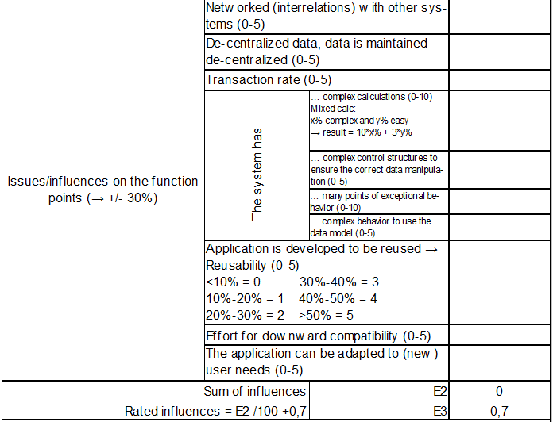

##### Conversion of FP to LOC
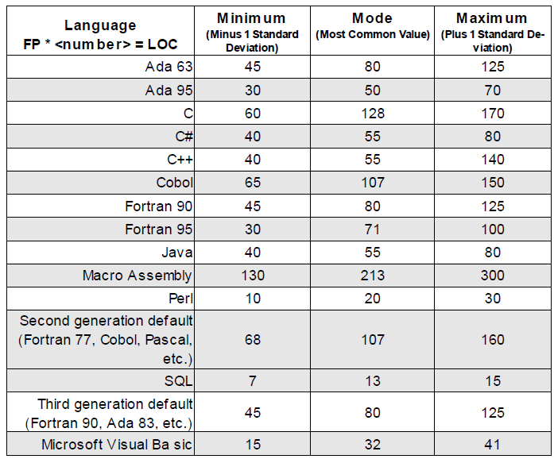

##### Examples of Productivity
| Product                           | New Lines of Code Equivalent | Staff Years | Year Built | Approx. Cost in 2006 Dollars | $/LOC | LOC/Staff Year |
| --------------------------------- | ---------------------------- | ----------- | ---------- | ---------------------------- | ----- | -------------- |
| IBM Chief Programmer Team Project | 83,000                       | 9           | 1968       | 1,400,000*                   | $17   | 9,200          |
| Lincoln Continental               | 83,000                       | 35          | 1989       | 2,900,000                    | $35   | 2,400          |
| IBM Checkout Scanner              | 90,000                       | 58          | 1989       | 4,900,000                    | $55   | 1,600          |
| Microsoft Word for Windows 1.0    | 249,000                      | 55          | 1989       | 8,500,000*                   | $34   | 4,500          |
| NASA SEL Project                  | 249,000                      | 24          | 2002       | 3,700,000*                   | $15   | 10,000         |
| Lotus 123 v. 3                    | 400,000                      | 263         | 1989       | 36,000,000                   | $90   | 1,500          |
| Microsoft Excel 3.0               | 649,000                      | 50*         | 1990       | 7,700,000                    | $12   | 13,000         |
| Citibank Teller Machine           | 780,000                      | 150         | 1989       | 22,000,000                   | $28   | 5,200          |
| Windows NT 3.1 (first version)    | 2,880,000                    | 2,000*      | 1994       | 200,000,000                  | $70   | 1,400          |
| Space Shuttle                     | 25,600,000                   | 22,096      | 1989       | 2,000,000,000                | $77   | 1,200          |

*Estimated

Sources: "Chief Programmer Team Management of Production Programming" (Baker 1972),
"Microsoft Corporation: Office Business Unit" (iansiti 1994), "How to Break the Software
Logjam" (Schlender 1989), "Software Engineering Laboratory (SEL) Relationships, Models,
and Management Rules" (NASA, 1991), Microsoft Secrets (Cusumano and Selby 1995).


### Checklist for individual estimates
1. Is what's being estimated clearly defined?
2. Does the estimate include all the kinds of work needed to complete the task?
3. Does the estimate include all the functionality areas needed to complete the task?
4. Is the estimate broken down into enough detail to expose hidden work?
5. Did you look at documented facts (written notes) from past work rather than estimating purely from memory?
6. Is the estimate approved by the person who will actually do the work?
7. Is the productivity assumed in the estimate similar to what has been achieved on similar assignments?
8. Does the estimate include a Best Case, Worst Case, and Most Likely Case?
9. Is the Worst Case really the worst case? Does it need to be made even worse?
10. Is the Expected Case computed appropriately from the other cases?
11. Have the assumptions in the estimate been documented?
12. Has the situation changed since the estimate was prepared?
[McCo 2006, p110]

# Testen
## Motivation
Software Testing
- Operate/use a system with a set of known inputs and/or a set of (environmental) conditions
- Observe the reaction of the system and compare against the expected reaction
- -> Test against the requirements
- Measure the quality of a System
- Keep the quality of a system
    - While changing the system (-> maintenance)
       - Regression Testing

Reference: ISTQB® Glossary of Testing Terms v2.2 (ANSI/IEEE 610.12-1990)

## Definition: Error
- Difference between _actual_ and _desired_ behavior (Istverhalten <-> Sollverhalten)

- Failure: Deviation of the component or system from its expected delivery, service or result.
- Fehlerwirkung: Abweichung einer Komponente/eines Systems von der erwarteten (Daten)Übergabe, Leistung oder dem Ergebnis. (auch: äußerer Fehler, Ausfall)
- Fault -> Defect: A flaw in a component or system that can cause the component or system to fail to perform its required function, e.g. an incorrect statement or data definition. A defect, if encountered during execution, may cause a failure of the component or system.
- Fehlerzustand: Defekt (innerer Fehlerzustand) in einer Komponente oder einem System, der eine geforderte Funktion des Produkts beeinträchtigen kann, z.B. inkorrekte Anweisung oder Datendefinition. Ein Fehlerzustand, der zur Laufzeit angetroffen wird, kann eine Fehlerwirkung einer Komponente oder Systems verursachen. (auch: innerer Fehler)

## Testprozess
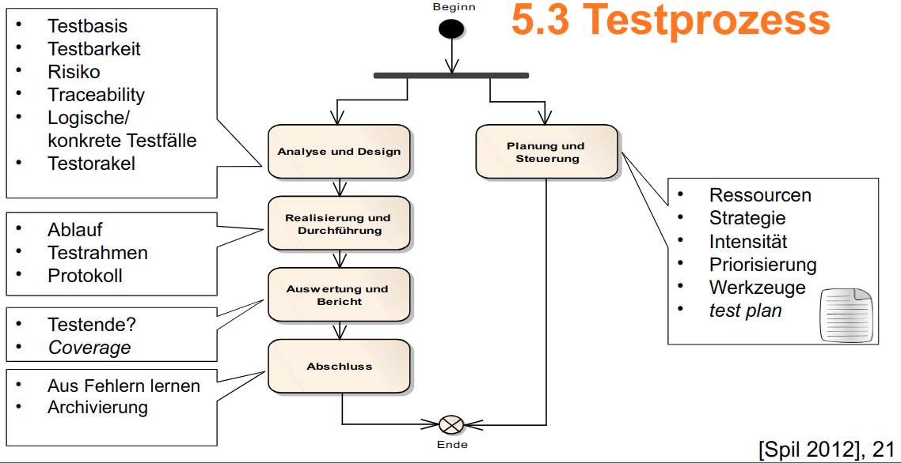

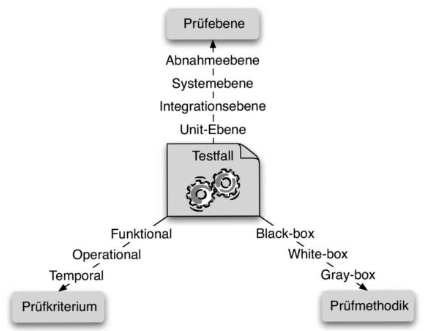

Initial V-Model
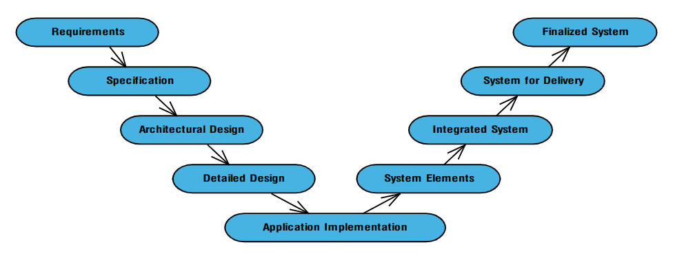

## W-Model
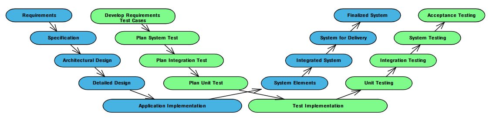

Testing Overview mit W-Model z.B. mit SCRUM: jeder Release eine W-model Phase

### Develop Requirements Test Cases
- Tasks
    - Develop Test Case(s) for each requirement
    - Setup a _test plan_ , e. g., IEEE 829
- Check
    - Requirements <--> Test Cases
- Review
    - Execution Environment
       - Test SW (Tessy, LDRA,...), Web-Servers, CAN-Bus / Fieldbus, USB, Scope, ...
    - Feasibility
       - Do all test cases make sense?
       - Requirements tested completely?


Test Software: Example, _Tessy_
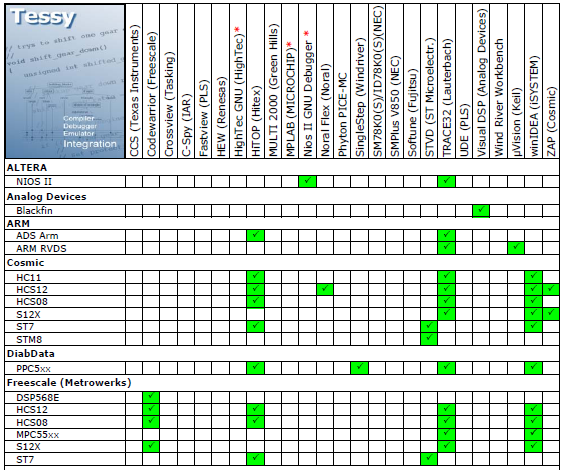

Classification Trees
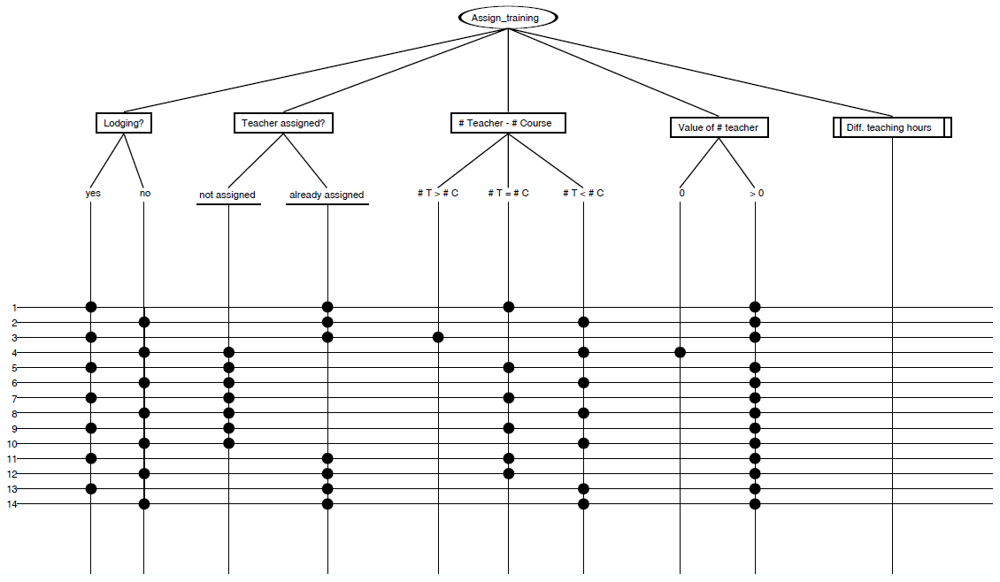

### Plan System Test
- Task
    - Refine Requirements / Test Cases
    - Develop Test Model(s)
- Check
    - Requirements refined?
    - Test Cases refined?
- Review
    - Refinement ok / feasible?
    - Completeness?
    - Test Case Execution
       - Possible?
       - Manual / automated execution?
       - Estimation of test case execution time


Test Plan (IEEE829) [https://cabig.nci.nih.gov/archive/CTMS/Templates]
1. INTRODUCTION
    1. SCOPE
    2. QUALITY OBJECTIVE
    3. ROLES AND RESPONSIBILITIES
    4. ASSUMPTIONS FOR TEST EXECUTION
    5. CONSTRAINTS FOR TEST EXECUTION
    6. DEFINITIONS
2. TEST METHODOLOGY
    1. PURPOSE
    2. TEST LEVELS
    3. BUG REGRESSION
    4. BUG TRIAGE
    5. SUSPENSION CRITERIA AND RESUMPTION REQUIREMENTS
    6. TEST COMPLETENESS
3. TEST DELIVERABLES
    1. DELIVERABLES MATRIX
    2. DOCUMENTS
    3. DEFECT TRACKING & DEBUGGING
    4. REPORTS
    5. RESPONSIBILITY MATRIX
4. RESOURCE & ENVIRONMENT NEEDS
    1. TESTING TOOLS
    2. TEST ENVIRONMENT
    3. BUG SEVERITY AND PRIORITY DEFINITION
    4. BUG REPORTING
5. TERMS/ACRONYMS

Example: Testmodell (Statechart)
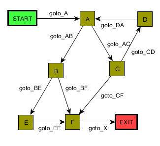

Behavioral Test Model
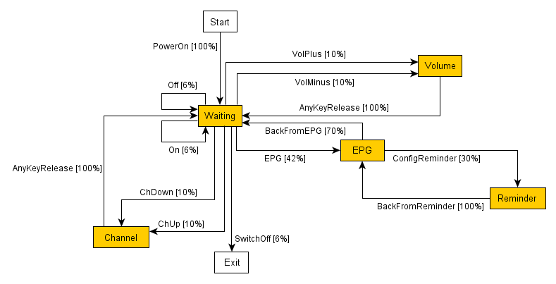

### Plan Integration Test
- Task
    - Refine Test Model(s)
- Check
    - Traces
       Requirements <--> Design Elements
    - Test Cases refined
- Review
    - Test Case Refinement feasible?
    - Completeness of Interface Test Cases
       - Communication protocols (USB,
          fieldbus, SCSI, ...)
       - Component interfaces, plug-in APIs

### Plan Unit Test
- Check
    - Traces
       Design Element <--> Code
       thus, Test Cases <--> Code
    - Unit Tests refined (for each function)
- Review
    - Unit Tests complete?


### Test Implementation
- Check
    - Coding style
    - Static Analysis
       - Metrics, LOC, Cohesion, McCabe ...
       - e. g., SPLINT: Null-Pointer
          dereferencing, storage, information
          hiding, ...
- Review
    - Implementation of Test Cases / Test Steps
       (-> Test Scripts)


Splint: Null pointer dereferencing
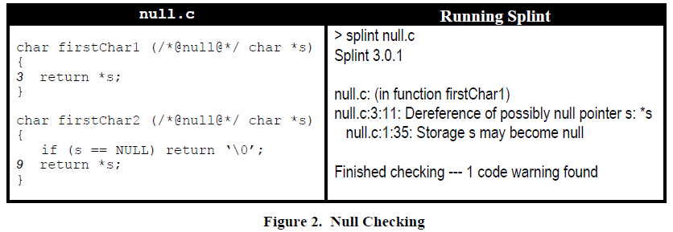

Splint: Variable Usage
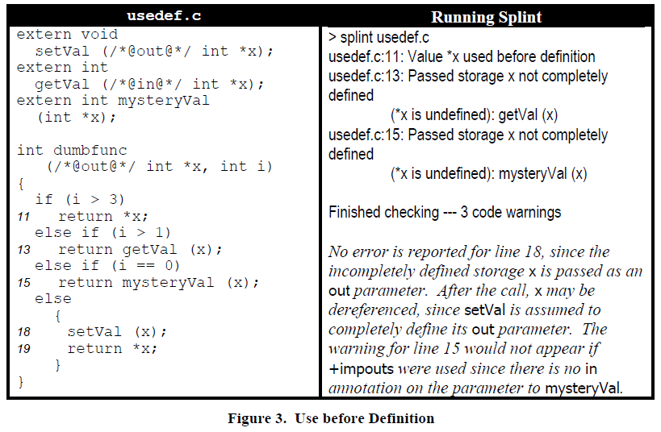

Splint: Information Hiding
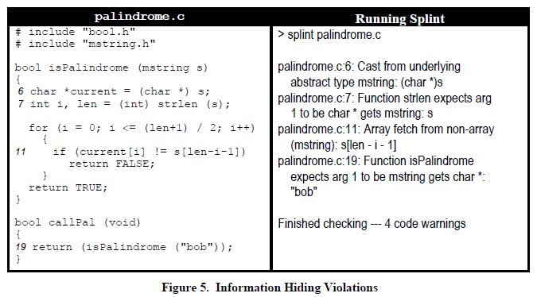

Example: [PC-LINT](http://www.gimpel.com/html/lintchks.htm)
- Order of initialization dependencies
- Pointer members not deleted by destructors
- Missing destructors from classes using dynamic allocation
- Creation of temporaries
- Operator delete not checking argument for NULL
- Conflicting function specifiers
- ...
- -> Could also check MISRA rules

##### MISRA
[Motor Industry Software Reliability Association](http://www.misra.org.uk)
- Conform to ISO 9899 standard (C-Language)
- Multibyte characters and wide string literals shall not be used
- Sections of code should not be commented out
- In an enumerator list the = construct shall not be used to explicitly initialise members other than the first unless it is used to initialise all items
- Bitwise operations shall not be performed on signed integer types
- The _goto_ statement shall not be used
- The _continue_ statement shall not be used
- The _break_ statement shall not be used, except to terminate the cases of a _switch_ statement
- ....


### Unit Testing
- Single functions / methods
    - ~30min pro Comp.Point (McCabe)
    - Priorisierung
       - Nach McCabe
       - Benutzungshäufigkeit
       - Kritikalität
- Equivalence class testing
- Pre- / Post-conditions, Invariants
- "White-Box" testing
- Timing on a fine granularity level (-> functions)


Equivalence Class Testing
- A function F has a number of variables
  - `void setdate(int day, int month, int year)`
- The variables have the following boundaries and intervalls
    ```cpp
    1 ≤ day ≤ 31, for month in (1,3,5,7,8,10,12)
    1 ≤ day ≤ 30, for month in (4,6,9,11)
    1 ≤ day ≤ 28, for month=2 && year%4!=0
    1 ≤ day ≤ 29, for month=2 && year%4==0
    1 ≤ month ≤ 12
    -1000 ≤ year ≤ 3000
    ```

Equivalence Class Testing
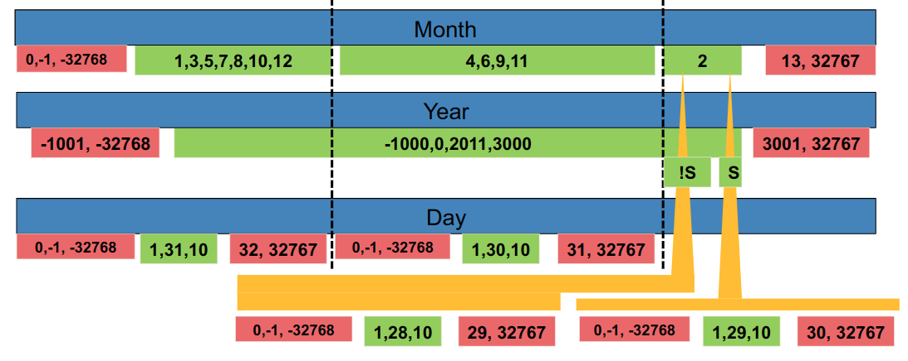

Document Pre-/Postconditions
- E.g. with doxygen
    - \pre Pre-condition
    - \post Post-condition
    - \invariant Invariant
    - \test Test Case
    - \todo todo‘s left ...

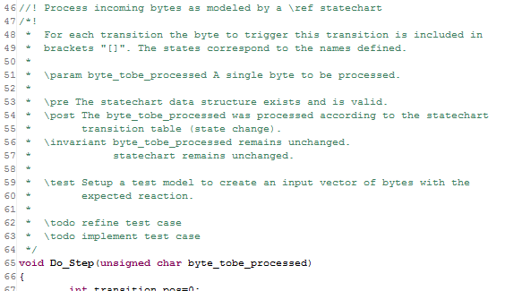
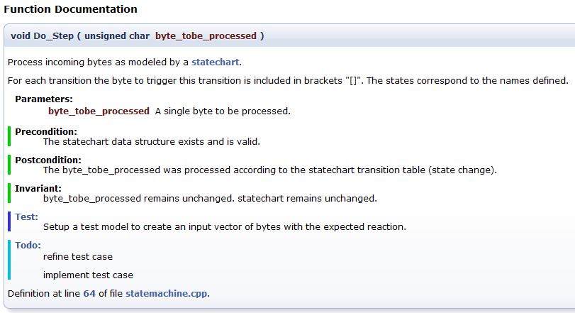
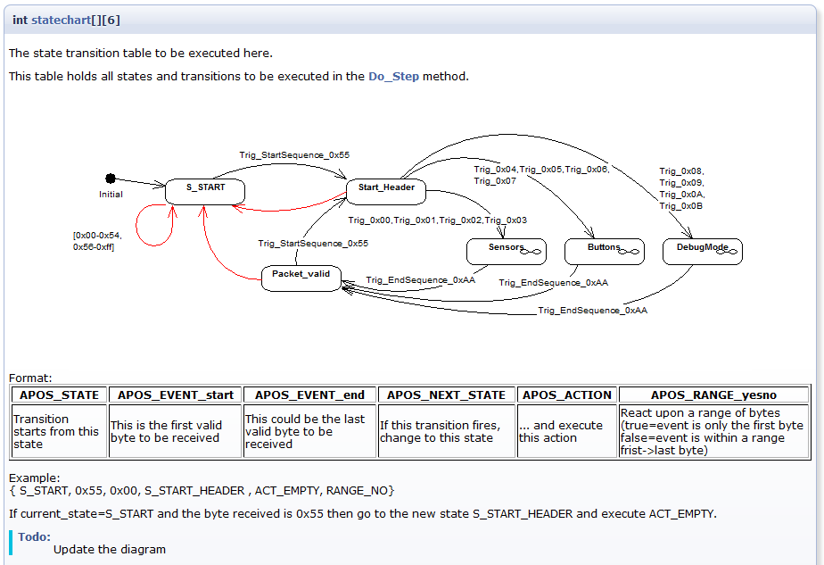

##### Check for Memory Leaks
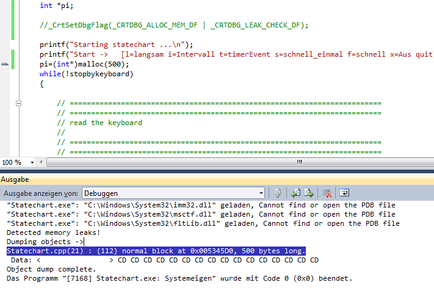

Check for Memory Leaks
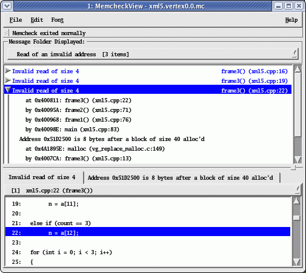

[Memory Leak](http://www.cprogramming.com/debugging/valgrind.html)
```cpp
#include <stdlib.h>
int main()
{
    char *x = malloc(100); // or, in C++,
    //"char *x = new char[100]
    return 0;
}
```
- ==2330== 100 bytes in 1 blocks are definitely lost in loss record 1 of 1
- ==2330== at 0x1B900DD0: malloc (vg_replace_malloc.c:a131)
- ==2330== by 0x804840F: main (example1.c:5)

##### Invalid Pointers
(http://www.cprogramming.com/debugging/valgrind.html)
```cpp
#include <stdlib.h>

int main()
{
    char *x = malloc(10);
    x[10] = 'a';
    return 0;
}
```
- ==9814== Invalid write of size 1}
- ==9814== at 0x804841E: main (example2.c:6)
- ==9814== Address 0x1BA3607A is 0 bytes after a block of size 10 alloc'd
- ==9814== at 0x1B900DD0: malloc (vg_replace_malloc.c:131)
- ==9814== by 0x804840F: main (example2.c:5)

No Bounds Checking!

##### Use Of Uninitialized Variables
(http://www.cprogramming.com/debugging/valgrind.html)
```cpp
#include <stdio.h>
int main()
{
    int x;
    if(x == 0)
    {
        printf("X is zero");
    }
    return 0;
```
- ==17943== Conditional jump or move depends on uninitialised value(s)}
- ==17943== at 0x804840A: main (example3.c:6)

##### Unit Testing
- A TestCase holds the code of what to test
  - ... with the _runTest_ method
  - _TestFixture_ ( _TestCase_ + setUP / tearDown methods)
  - _RepeatedTest_ -> Test + times to repeat ...
- A TestSuite contains many single Tests
  - ... _run()_ all Tests
- A TestListener is implemented as observer pattern to follow the testing progress
- The TestRunner manages the lifecycle of all tests added

Unit Testing: embUnit ...
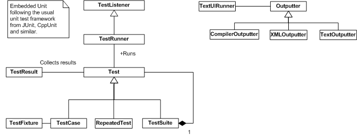

Example: _counter_
```cpp
typedef struct __Counter Counter;
typedef struct __Counter* CounterRef;

struct __Counter {
    int value;
};

CounterRef  Counter_alloc(void);
void        Counter_dealloc(CounterRef);
CounterRef  Counter_init(CounterRef);
CounterRef  Counter_counter(void);
int         Counter_value(CounterRef);
void        Counter_setValue(CounterRef,int);
int         Counter_inc(CounterRef);
int         Counter_dec(CounterRef);
void        Counter_clr(CounterRef);

CounterRef Counter_alloc(void){
    return (CounterRef)malloc(sizeof(Counter));
}

CounterRef Counter_init(CounterRef self){
    self->value = 0;
    return self;
}

CounterRef Counter_counter(void){
    return Counter_init(Counter_alloc());
}

int Counter_inc(CounterRef self){
    self->value++;
    return self->value;
}

int Counter_dec(CounterRef self){
    self->value--;
    return self->value;
}
```

Example: _testcounter.c
```cpp
#include <embUnit/embUnit.h>
#include "counter.h"
#include "stdio.h"

CounterRef counterRef;

static void setUp(void){
    counterRef = Counter_counter();
}

static void tearDown(void){
    Counter_dealloc(counterRef);
}

static void testSetValue(void){
    Counter_setValue(counterRef,1);
    TEST_ASSERT_EQUAL_INT(1, Counter_value(counterRef));

    Counter_setValue(counterRef,-1);
    TEST_ASSERT_EQUAL_INT(-1, Counter_value(counterRef));
}

static void testInc(void){
    Counter_inc(counterRef);
    TEST_ASSERT_EQUAL_INT(1, Counter_value(counterRef));

    Counter_inc(counterRef);
    TEST_ASSERT_EQUAL_INT(2, Counter_value(counterRef));
}

TestRef CounterTest_tests(void){
    EMB_UNIT_TESTFIXTURES(fixtures) {
        new_TestFixture("testInit",testInit),
        new_TestFixture("testSetValue",testSetValue),
        new_TestFixture("testInc",testInc),
        new_TestFixture("testDec",testDec),
        new_TestFixture("testClr",testClr),
    };
    EMB_UNIT_TESTCALLER(CounterTest,"CounterTest", setUp,tearDown,fixtures);
    return (TestRef)&CounterTest;
}
```

Example: _main.c_
```cpp
#include <embUnit/embUnit.h>
#include "stdio.h"

TestRef CounterTest_tests(void);
TestRef PersonTest_tests(void);

int main (int argc, const char* argv[]){
    TestRunner_start();
    TestRunner_runTest(CounterTest_tests());
    TestRunner_runTest(PersonTest_tests());
    TestRunner_end();
    return 0;
}
```

### Integration Testing
- Test the correct behavior of interacting components
- Interfaces are the main focus
- "White/Grey-Box" testing
- Correct timing behavior


##### Time Measurement
Profiling (e. g., GNU Profiler)

```cpp
start=clock();
myfunc();
clocks=clock()-start;
Seconds = clocks / CLOCKS_PER_SEC;

*io_pin = 1;
myfunc();
*io_pin = 0;
```

[In-Circuit Debugger](http://www.ghs.com)
[chronSIM](http://www.inchron.de)

### System Testing
- Test the system against the specification (the test cases of each requirement)
- "Black-Box" testing
- Test before the final delivery
- Testing at the development site
- Testing with testdata (can be formerly "real" data) and/or mock-up data


### System Testing
- Requirements Coverage
- Test Model Coverage
    - Path Coverage


[Coverage](http://en.wikipedia.org/wiki/Code_coverage)
- Function Coverage `foo() called`
- Statement Coverage `foo(1,1)`
- Decision Coverage `foo(1,1); foo(0,1)`
- Condition Coverage `foo(1,1); foo(1,0); foo(0,0)`

```cpp
int foo(int x, int y){
    int z = 0;
    if ((x>0) && (y>0)) {
        z = x;
    }
    return z;
}
```

##### Statistical Testing
Paths through the model ...
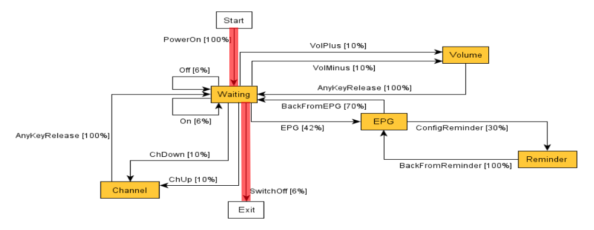

### Acceptance Testing
- Testing at the customer site (by the customer)
- Testing with "real" data and/or online testing
- "Black-Box" testing
- ->Decision to finalize the project (Payment ... $$)

## Beispiel: Testen eines Softstarters
Quelle: Florian Kantz, Thomas Ruschival, Philipp Nenninger, Detlef Streitferdt, "Testing with Large Parameter Sets for the Development of Embedded Systems in the Automation Domain", 2nd IEEE International Workshop on Component-Based Design of Resource-Constrained Systems (CORCS) at the 33rd IEEE International Computer Software and
 Applications Conference (COMPSAC), Seattle / Washington, 2009.

##### Development of Embedded Systems
Levels of testing
- Coding / Debugging level
- Functional level
- Component level
- Integration level / black-box testing

Testing of Embedded Systems
- Behavior of a Softstarter
    - Start / stop a motor, "single button" operation
    - Monitoring
- Parameters for the Configuration
    - Softstarter has about 150 parameters for configuration

Size of the Task ...
-> $1.0 * 10^{110}$ permutations ($1.9*10^104$ years)

Goal: Reduce the number of permutations to test -> Identify a feasible subset of permutations

Reduction of the Resulting Test Cases
- Clustering of parameters
    - Independent subsets of parameters
- Introducing constraints between parameters
    - To reduce the permutations of the parameters being part of a constraint rule.
- Pairwise Testing
    - Finally reduce to a feasible number of permutations

Clustering of Parameters
- Group parameters having no interaction with parameters outside the group
- Based on expert knowledge
- ... and a manual code analysis (-> unit testing)

Constraints Between Parameters
- Mutual Exclusion
- Function Switching Parameters
- Selection of Ranges

Pairwise Testing
- n-Way Testing
    - Assumption: There are 3 parameters with 2 possible values each
    - 8 possible parameter settings are reduced to 4
- 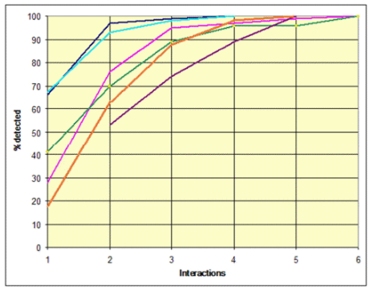
- Anwendung
    - Medical Devices
    - Web Browser
    - Server
    - Distr. Database
    - Traffic Collision Avoid.

##### Conclusion
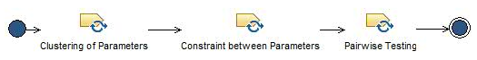
- Structured way of handling complexity
- Approach is used in addition to the manually developed test cases
- Calculated reduction down to 7.5*10-27% (0,000000000000000000000000000075%)
    - Means, if _Roadrunner_ (1456 TFlops) would have an assignment to calculate for 290382 years this approach would reduce it to one single instruction!
    - But we would still have 2.26*10^69 to test ... (opposed to 1.0*10^110 )
- Lessons learned
    - Approach has to be _smartly adapted_ to black-box test the complete system
    - Approach is very good for sub-systems / sub-problems


Pairwise Testing tools
- Jenny (cmd-line tool, C-Code)
- [NIST Tool](http://csrc.nist.gov/groups/SNS/acts/index.html) (open source)
- [http://www.testersdesk.com](http://www.testersdesk.com) (open source)


# Software Product Lines
## Beispiel: Cycling Computers ...
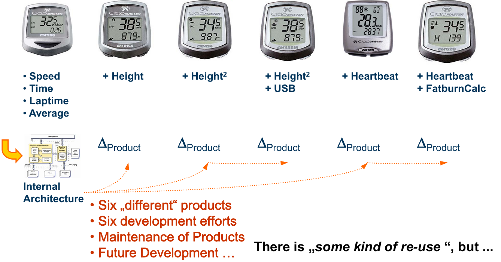

## History of Terms
Both terms, Systemfamily and Product Line, refer to the same idea with different perspectives!

- Systemfamily -> Technical Term
    - How are the products developed / built?
- Product Line -> Business Term
    - What are differences / features for selling the products?

The term "product line" is now well established for both ideas within the software development domain.

What is behind Product Lines?
- Make use of Commonalities & Variabilities
- Based on Feature Oriented-Domain Analysis [Kang 1990,1998,2002]
- Reference Architecture for the common parts (and all future products)
- Components for the variable parts (variabilities of each individual product)
- Automated derivation of variants based on the _features_ of a desired product
- SW Product Lines are between mass products and single products
- -> A customizable mass product

Costs of a Product Line
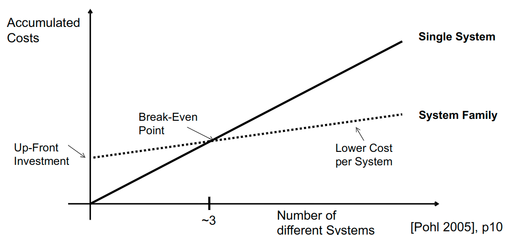

Time to Market of a Product Line
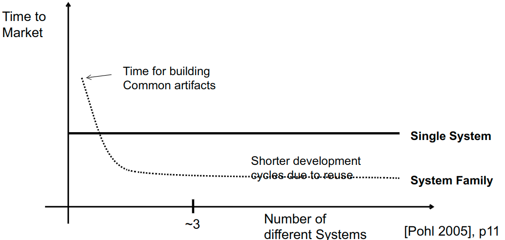

## Currently available Software Product Lines
Product Line Examples
- ABB, Gas Turbine Family, 35-270MW, Semantic Graphics Framework, Train Control Product Line
- Boeing, Bold Stroke (operational flight program software)
- CelsiusTech Systems AB, Naval Control Software
- Cummins Inc., Motor Control Software
- Hewlett-Packard, Printer Firmware
- Lucent Technologies, Telephone Switching SW
- Philips, Consumer Electronics
- Philips Medical, X-ray, ultrasonic, tomography
- Bosch, Driver Assistance Systems (e.g., parking pilot)
- Siemens Medical, X-ray, Magnetic Resonance, CT [Pohl 2005], pp.414-434


## Product Line Development Cycle
Product Line Development Concept
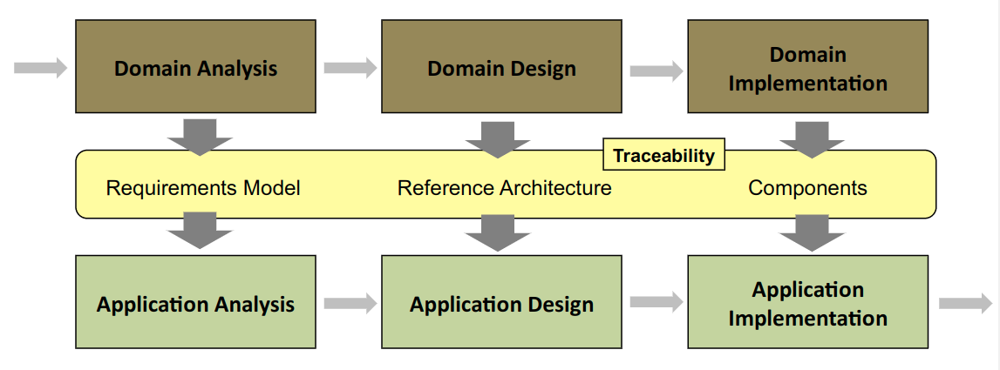
- Domain Engineering: Domain engineering is the process of software product line engineering to define and realize the commonality and the variability of the product line.
- Application Engineering: Application engineering is the process of software product line engineering to build the applications of the product line by reusing domain artifacts and exploiting the product line variability.

## The Concept of Variability
- Variation Point (of development/design elements): A variation point is a representation of a variability subject within domain artifacts enriched by contextual information.
- Variant (core + set of elements with variation points): A variant is a representation of a variability object within domain artifacts.
- Variability in Time: Variability in time is the existence of different versions of an artifact valid at different (application lifecycle) times. (-> roadmap )
- Variability in Space: Variability in space is the existence of an artifact in different shapes at the same time. (-> binding time )
- External Variability: External variability is the variability of domain artifacts that is visible to customers.
- Internal Variability: Internal variability is the variability of domain artifacts that is hidden from customers.
[Pohl 2005]

## Modeling of Product Lines using Features
### Features
A feature is a user visible property of a product -> the user is willing to pay for such a property
- Functional Features
- Interface Features
- Parameter Features
- Structural Features
Depicted as ... Feature

Feature Modeling
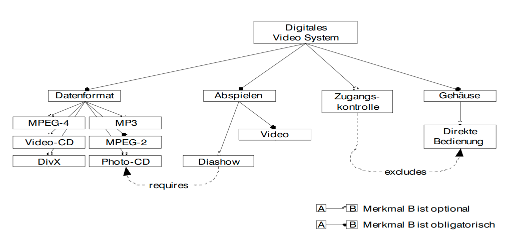
- mandatory 
    - 
    - $Variants = \prod_{i=1}^S Variants(f_i)$
    - $Variants(f_i) = 1 \text{ if } isLeaf(f_i) == true$
- optional
    - 
    - $Variants = \prod_{i=1}^S (Variants(f_i) + 1)$
    - $Variants(f_i) = 1 \text{ if } isLeaf(f_i) ==true$
- XOR
    - 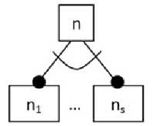
    - $Variants = \sum_{i=1}^S Variants(f_i)$
    - $Variants(f_i) = 1 \text{ if } isLeaf(f_i) ==true$
- OR
    - 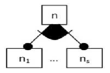
    - $Variants = (\prod_{i=1}^S (Variants(f_i)+1) ) - 1$
    - $Variants(f_i) = 1 \text{ if } isLeaf(f_i) == true$

##### Feature Modeling: Example
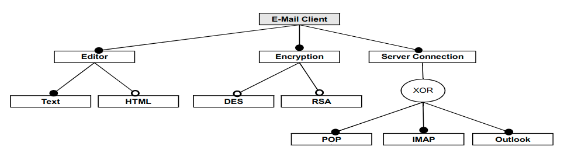

- $Variants_{Editor} = \prod_{i=1}^S Variants(f_i) = 1*2 = 2$
- $Variants_{Encryption} = \prod_{i=1}^S (Variants(f_i) +1 ) = 2*2 = 4$
- $Variants_{Server_Connection} = \sum_{i=1}^S Variants(f_i)=3$
- $Variants_{Email_Client} = \prod_{i=1}^S Variants(f_i) = 2*4*3 = 24$

##### Example Tool: PureVariants
[Cycle Computer Model](http://www.pure-systems.com)
```java
public void onCreate(Bundle savedInstanceState) {
    super.onCreate(savedInstanceState);
    setContentView(R.layout.start_screen);
    ...

    PV:IFCOND(pv:hasFeature('Geschwindigkeitszeigen'))
        TextView tv = (TextView)findViewById(R.id.start_digi_speed);
        tv.setTypeface(tf);
    PV:ENDCOND
    ...
}
```
-> Managed preprocessor directives!

##### Example online-tool:
[http://www.splot-research.org](http://www.splot-research.org)


## Handling Variability
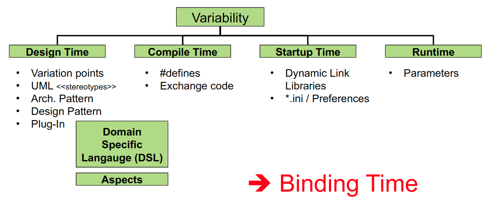

### Design Time
Variability of Use Cases
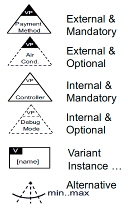
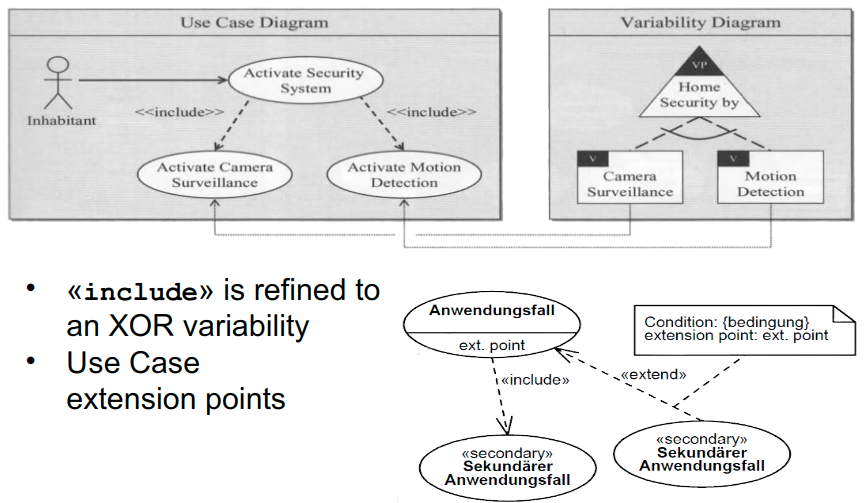

Variability _Traces_ to the Architecture
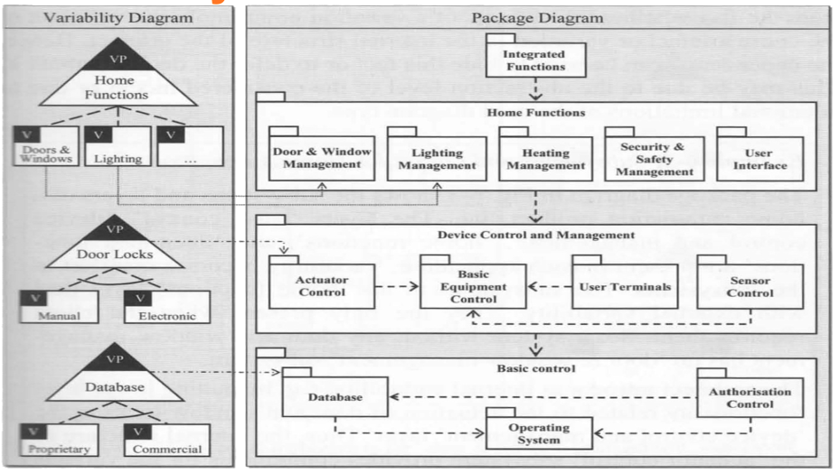

Modeling Variability by Design Patterns
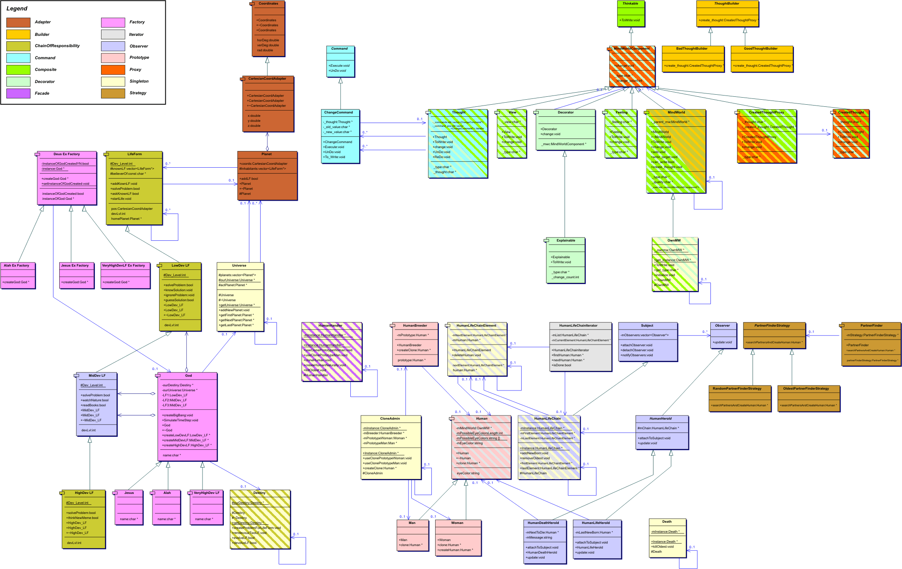

Patterns:
- Implemented/~ing Design Variability
- Structural Patterns
    - E. g., Adapter, Decorator, Facade, Proxy, ...
- Behavioral Patterns
    - E. g., Strategy
- Creational Patterns
    - E. g., Abstract Factory

##### Factory Pattern
sourcemaking.com
- Intent
    - Define an interface for creating an object, but let subclasses decide which classto instantiate. Factory Method lets a class defer instantiation to subclasses.
    - Defining a "virtual" constructor
    - The new operator considered harmful
- Problem
    - A framework needs to standardize the architectural model for a range of applications, but allow for individual applications to define their own domain objects and provide for their instantiation

##### Factory Method
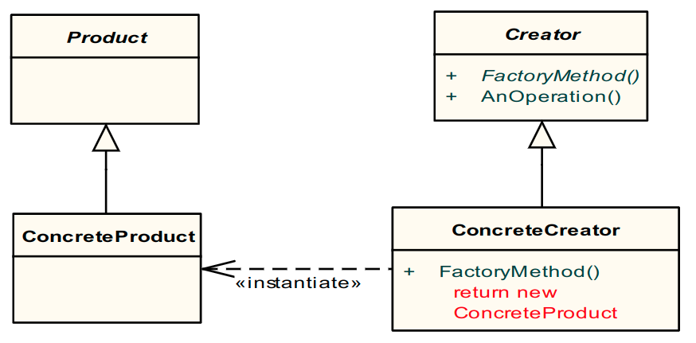

Example: Pocket Coffee Machine
- One-Button Operation, -> prepare coffee
    - ... one machine per pad type ...
- The machine type shall be "jumpered" at production time
- [http://www.handpresso.com](http://www.handpresso.com)
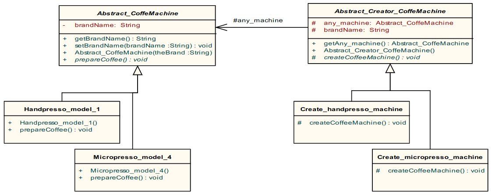
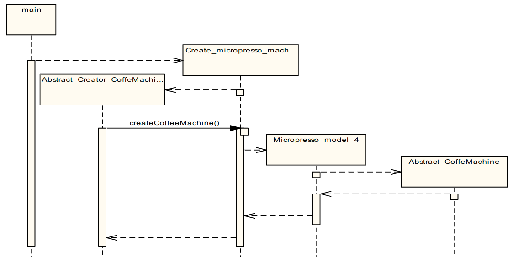

```cpp
public static void main(String[] args){
    Abstract_Creator_CoffeMachine theMachineCreator;
    switch( getJumperedVersion()){
    case 1:
        theMachineCreator = new Create_handpresso_machine();
        theMachineCreator.getAny_machine().prepareCoffee();
        break;
    case 2:
        theMachineCreator = new Create_micropresso_machine();
        theMachineCreator.getAny_machine().prepareCoffee();
        break;
    default:
        break;
    }
}
```

##### Abstract Factory Pattern
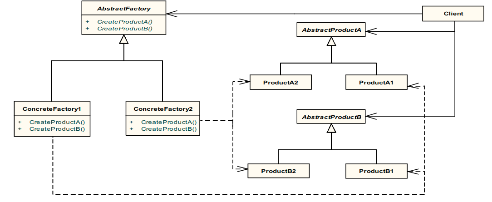

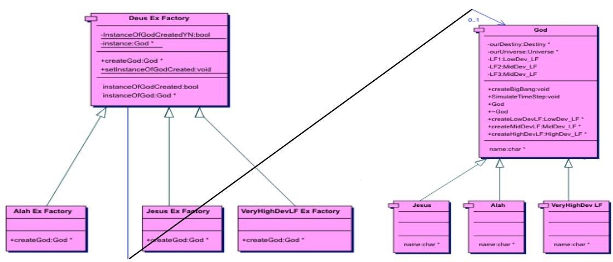
```cpp
Deus_Ex_Factory* _factory;
God* _god;
_factory=new VeryHighDevLF_Ex_Factory;
_god=_factory->createGod();
_god->createBigBang();

God* VeryHighDevLF_Ex_Factory::createGod(){
    Deus_Ex_Factory::setInstanceOfGod(new VeryHighDev_LF);
    return Deus_Ex_Factory::getInstanceOfGod();
}
```

##### Decorator
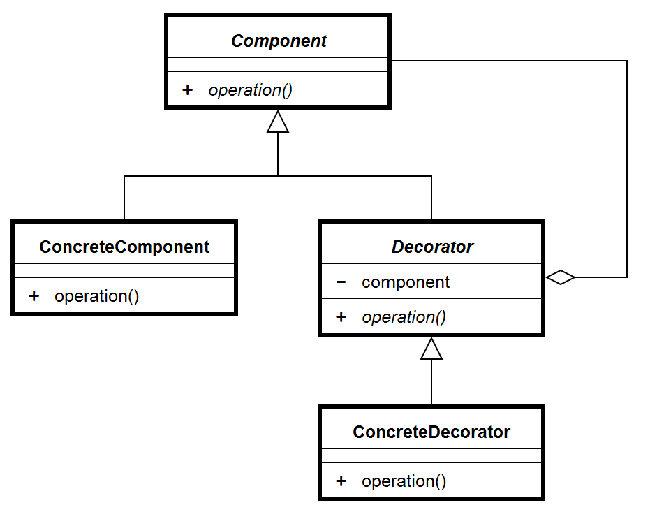

### Compile Time
#### Variabiliy at Compile Time
- Exchange C-files before compilation
    - "Enabled" in the design
    - Replacement / extension
- #ifdef directives
    - In the code ... (pre-processor)
    - High effort to maintain the code
- Defines
    - As environment variable for "make"

Variability at Linking Time
- Use different libraries (libraries with the same interface)
    - Update (-> replace libraries)
    - Static linking
- Linker directives, #ifdef

### Startup Time
Deliver different systems

### Runtime
Variability at Runtime
- Use different libraries
    - Update (-> replace libraries at system startup)
- Configuration files
    - switch/if , based on config-files
- Virtual Machines / Scripts, Interpreter

## Aspect-Oriented Programming
AOP was developed in the mid 90ies by Gregor Kiczales at the Xerox Palo Alto Research Lab (PARC) (now: Professor at the University of British Columbia, Canada)
- Handle cross-cutting concerns in software systems to increase the code maintainability and reusability
- E.g., persistency, authentication/security, error handling
- Cross-Cutting Concern <-->Feature

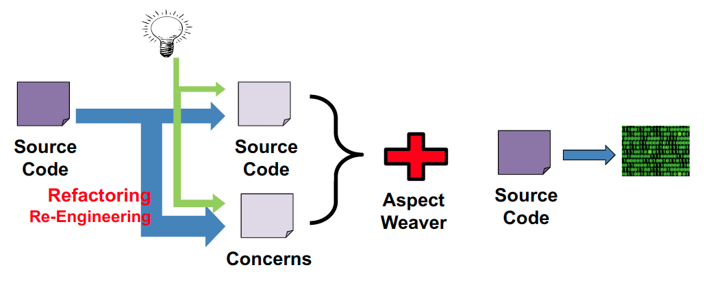

### AOP / AspectJ
New Concepts
- Pointcut
    - Choose the methods of the software system
    - Select values for several Join Points (hosting the resulting methods) in the program flow
    - Execute the code specified in an Advice for each join point
       - As replacement for the original method
       - To extend the original method (before/after the original method)
- Inter-type declarations
    - For the modification of the static structure of the software system (class members and class relationships)
- Aspects
    - Are the modules to host crosscutting concerns (e. g., serialization, security) and may include pointcuts, advices, and inter-type declarations

### Example: _Authentication_
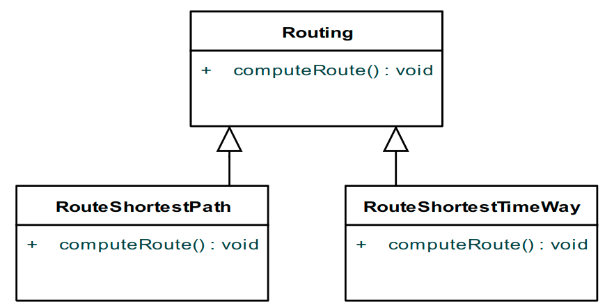
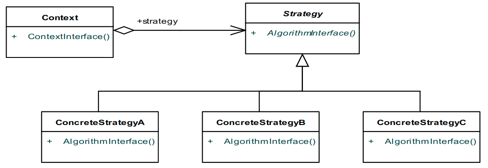

```java
public static void main(String[] args) {
    System. _out.println("Starting Navigation ...");_
    Routing route0 = new Routing();
    Routing route1 = new RouteShortestTimeWay();
    Routing route2= new RouteShortestPath();
    route0.computeRoute();
    route1.computeRoute();
    route2.computeRoute();
    System. out.println("... shutting down system.");
}
```
```java
public aspect Asp_Authentication {
    pointcut AuthPayment(Routing ep) : 
    target(ep) && ( call(* Routing+.computeRoute()) );
    before(Routing ep) : AuthPayment(ep){
        if(ep instanceof RouteShortestPath){
            System.out.println(" -- payment by path");
        }
        if(ep instanceof RouteShortestTimeWay){
            System.out.println(" -- payment by time");
            }
        }
    }
}
```

- Within the AuthPayment pointcut, ep refers to the object of the adviced method
- call : method call
- execution: execution of the method content
- get/set : reading / writing of attributes
- initialization : ... of the object
- handler : exception handler
- Signature of the method being part of the aspect.
- Wildcards:
    - * An arbitrary number of characters
    - .. An arbitrary number of characters with the point ‚.‘
    - + Includes the subtypes (here: subtypes of Routing)
- When to inject code?
    - before the base method is executed
    - after the base method is executed
    - around new behavior with existing method referred by proceed()

Summary: Aspect Oriented Programming
- Very good _separation of concerns_
- Design of aspects is vital for the success of the development
- Only parts of the system behavior are in the code, all others are in aspects.
- Hard to (statically) analyze the system.
- Testing of such systems ...

## Domain Specific Languages
Definition: A Domain Specific Language (DSL) is a computer programming language (-> grammar and syntax) to formulate / implement solutions for problems in a specified (limited) domain.

### Types of DSLs
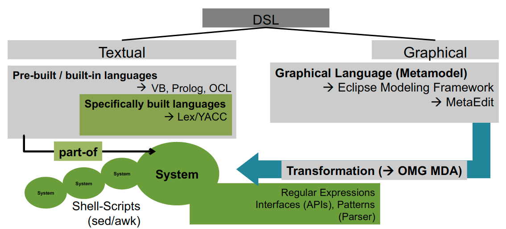

Example: Graphviz dot
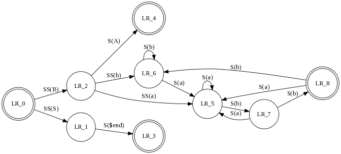
```cpp
digraph finite_state_machine{
    rankdir=LR;
    size="8,5"
    node [shape = doublecircle]; LR_0 LR_3 LR_4 LR_8;
    node [shape = circle];
    LR_0 -> LR_2 [ label = "SS(B)" ]; LR_0 -> LR_1 [ label = "SS(S)" ];
    LR_1 -> LR_3 [ label = "S($end)" ]; LR_2 -> LR_6 [ label = "SS(b)" ];
    LR_2 -> LR_5 [ label = "SS(a)" ]; LR_2 -> LR_4 [ label = "S(A)" ];
    LR_5 -> LR_7 [ label = "S(b)" ]; LR_5 -> LR_5 [ label = "S(a)" ];
    LR_6 -> LR_6 [ label = "S(b)" ]; LR_6 -> LR_5 [ label = "S(a)" ];
    LR_7 -> LR_8 [ label = "S(b)" ]; LR_7 -> LR_5 [ label = "S(a)" ];
    LR_8 -> LR_6 [ label = "S(b)" ]; LR_8 -> LR_5 [ label = "S(a)" ];
}
```

### Example: Test Case Generation
```cpp
model simple_model
tc: |$ // access to the test-api |$
    |$ extern void addtostream(int);
    ...
    |$ #define SENSOR_SPEED 0x0000 |$ void
testcase_1()
    |$ {
    |$

source [START]
    "init"
    [S_START]

[S_START]
    "0x55"
    tc:|$ addtostream(0x55);
[startheader]
...
```
```cpp
extern void addtostream(int);
...
#define SENSOR_SPEED 0x0000
...
void testcase_1()
{
    addtostream(0x55);
    addtostream(0x04);
    ...
    addtostream(0x02);
}
```

Example: Compiler Generators
flex/bison the former lex/yacc duo
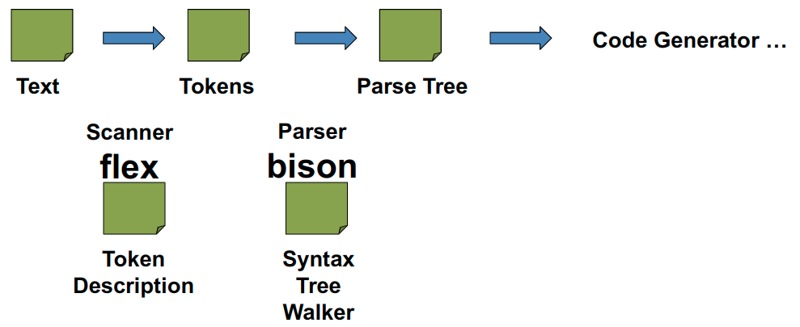

### Scanner
```
digit [0-9]
number {digit}+\.?|{digit}*\.{digit}+
identifier [a-zA-Z]+
%%[ ] { /* Skip blanks. */ }
{number} { sscanf(yytext, "%lf", &yylval);
        return NUMBER; }
\n|. { return yytext[0]; }
```

```
%token NUMBER
%left '+' '-‘
%left '*' '/‘
%right UMINUS

%%lines:lines expr '\n‘ { printf("%.12g\n", $2) }
    | lines '\n‘
    | /* empty */
    | error '\n' { yyerror("Re-enter: ");
            yyerrok; }
    ;

expr: expr '+' expr { $$ = $1 + $3; }
    | expr '-' expr { $$ = $1 - $3; }
    | expr '*' expr { $$ = $1 * $3; }
    | expr '/' expr { $$ = $1 / $3; }
    | '(' expr ')' { $$ = $2; }
    | '-' expr %prec UMINUS { $$ = -$2; }
    | NUMBER
;
```


# Software Maintenance
## Motivation
- Software won‘t wear out!
    - It gets old when it is changed by developers -> Architectural Decay

Product Life Cycle: months ... many years

Background 
- Why?
    - Maintenance: Fix broken software (-> bugs)
    - Evolution
        - Extend existing software (-> new features/functions)
        - Develop (bad ->)good software
        - Long Living Software (changes in HW/SW)
        - Re-develop software
- When? Product Strategy, Business Rules
- Goals? Changeability, Maintainability, Comprehension

## Reengineering
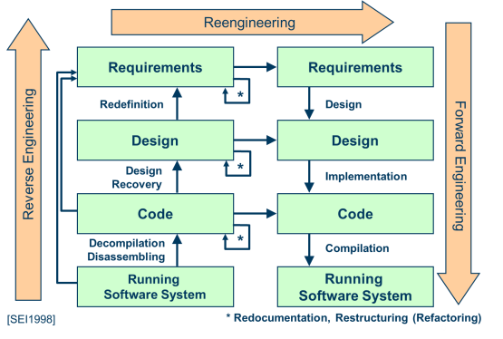

Terms
- Reverse Engineering
    - Reconstruct the plan / the requirements of the ready made software
- Reengineering
    - Change a Software System to enhance its Quality (at a higher abstraction level than -> Refactoring)
- Forward Engineering
    - Opposite of -> Reverse Engineering. Standard development cycle, e. g., OpenUP, SCRUM, V-Model,...

System Analysis
- How does the current system look like?
- What do we want to change
- Which rules do we want to follow and which rules are broken?

- Running Software System
    - Observation of the externally visible behavior + reaction
    - Use Cases
    - Requirements
- Code
    - Disassembling / decompilation (not allowed by law!)
        - Only for scientific work! OpenRCE (Rerverse Code Engineering, http://www.openrce.org)
    - Counterpart: Obfuscation
        - Transformation (-5...+5)
        - Re-Order Code
        - Change Variable Names
        - Add branches (if (true) ...), each instruction as subroutine ...
        - NOPs
        - Encryption (of code)
    - Obfuscator vermeiden
- Design & Requirements
    - Design by observation (marginal)
    - Requriements by observation (as above)
    - Manual tasks
        - Interview former / current employees
        - Interview users of the system
        - Deep Search of Documents
        - -> Assess ~~the Feasibility of the Project~~ Reverse-Engineering might become Re-Development


## Code Smells
### Code - Hard to read 
- Rules/Hints for Good Code - Naming
    - Names want to tell their intention
        - `int x; // average speed ->int averageSpeed;`
        - ```cpp
        void strcpy(char *a, char *b) -> 
        strcpy(char *destination, char *source)
        strcpy(char *to, char *from)
        ```
        - Be careful with e.g., btevhdl -> buttonEventHandler
        - Don‘t ...: String noOfWayPoints;
        - Where (in different types of lists) to add() / insert(), or how to sort()?
    - Names that tell the intention
        - List (alphabetically) of (global) variables in the code documentation
    - Character similarities (-> the font question ...)
        - "Ohhh Zero" O0
        - "Ihh One" I1, I1
        - "smallEL.. largeiI" lI
- Rules/Hints for Good Code - Functions
    - Functions have a single, simple and clear behavior
    - Don‘t duplicate code (code redundancy)
    - Agree, enforce and live a project wide coding style
    - Hard to follow call graphs if using function pointers
        - Specifically document such occurences
    - Don‘t use switch to access different class types
        - -> use Polymorphism instead
        - switch(typeof(object)) or switch(object.type)
    - Reduce the number of arguments of a function/method
        - ->use objects for more than three arguments
- Rules/Hints for Good Code - Comments
    - Don‘t forget the Copyright Notice
    - Comments do not only repeat the function name ...
    - Keep comments in sync with the code (-> Review)
    - Use exception handling
- Rules/Hints for Good Code - Global ...
    - Exchange hand written parsers with -> DSL technology
    - Start with non-threaded code, improve towards threads/parallelism
    - Carefully select global variables (-> Singletons)

## Metrics
### The Law of Demeter
- Proposed by Karl J. Lieberherrs research group in 1987
    - Northeastern University, College of Computer and Information Science, Boston, Massachusetts (http://www.ccs.neu.edu/home/lieber/)
    - Style rule for the development of a good system design
- Law of Demeter (http://en.wikipedia.org/wiki/Law_of_Demeter)
    - Method M of Object O
        1. may only invoke methods of O
        2. use parameters of M
        3. use/call methods of any object created in M
        4. may invoke methods of O‘s direct component objects
        5. may access a global variable accessible by O, in the scope of M


@ Design Level
- Overall Architecture
- Use -> static / dynamic analyses to asses
    - Cohesion : A class strongly focussing on a single goal has a high cohesion.
    - Coupling : A component which highly depends (by method calls) on another component is strongly coupled.
    - ... of the architectural components
- Goal: low coupling and STRONG COHESION

Calculate Cohesion
- *L*ack of *CO*hesion in *M*ethods for a class C
    $$LCOM=1-\frac{1}{M*F} \sum_{i=1}^F count(f_i \leftarrow m)$$
    - M = Number of Methods in C
    - F = number of fields in C (or attributes)
    - fi = field i in the set (i=1...F) of the fields in a given class C
    - count(fk <- m) = how many methods m use field fk
    $$LCOM_{HS} = \frac{1}{M-1}(M-\frac{1}{F} \sum_{i=1}^F count(f_i\leftarrow m))$$
    - HS = Henderson-Sellers
- $LCOM_{HS}=1$ 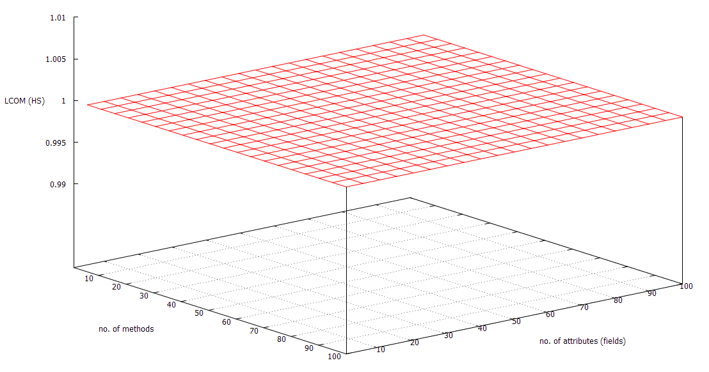
- $M\rightarrow \infty, LCOM_{HS}\rightarrow 1$ 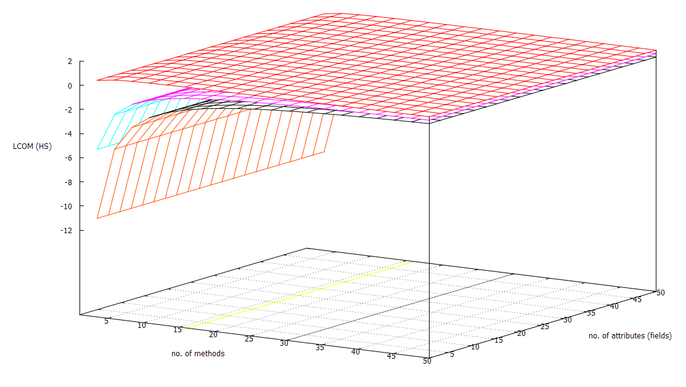
- $F\rightarrow \infty, LCOM_{HS}\rightarrow 1$ 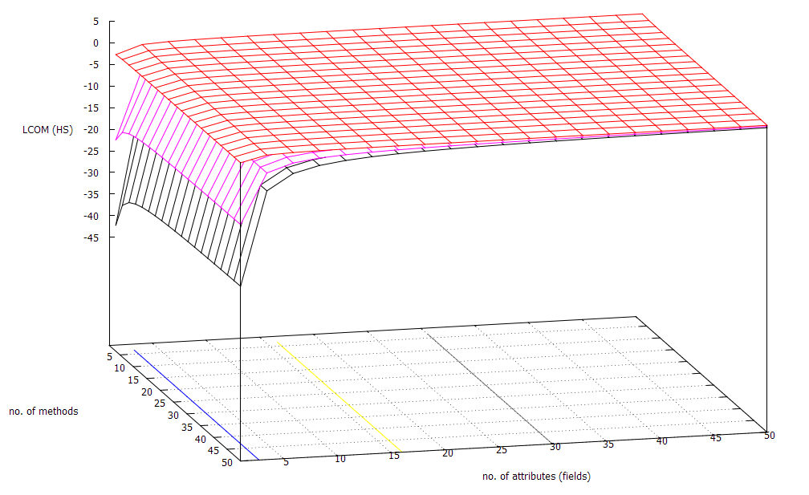
- $M, F\rightarrow \infty, LCOM_{HS}\rightarrow 1$ 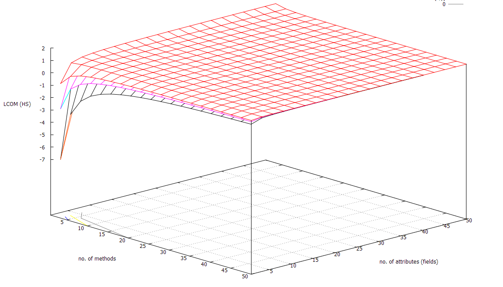


Cohesion
- As used in the Eclipse Metrics Plugin
    $$LCOM *= \frac{\frac{\sum_{A=1}^n m(A)}{n} -m}{(1-m)}$$
    - $m(A)$ is the number of methods accessing an attribute A
    - $n$ is the number of attributes
    - $m$ is the number of methods m
    - ($LCOM >> 1$ is alarming), small values ($<1$) are better.
    - Hint: The class could be split into a number of (sub)classes.
- 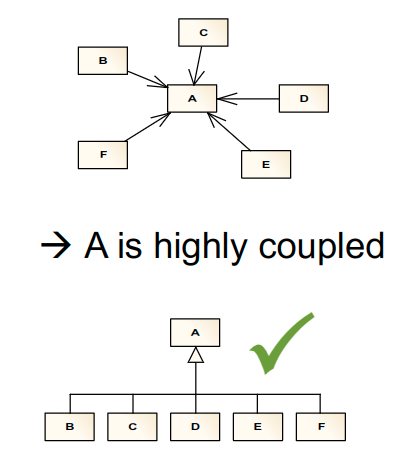
    - Changes in A cause the need to check B, C, D, E, F
    - The interface of A might be hard to reuse in future/other projects
    - Coupling : A component which highly depends (by method calls) on another component is strongly coupled.
- Afferent Coupling = #Classes outside a package that depend on classes inside the package.
- Efferent Coupling = #Classes inside a package that depend on classes outside the package.


Design Level
- "Tell, don‘t ask!"
    - Bad: car.getSteeringWheel().getAngle()
    - Better: car.getDirectionOfTravel()
- Start with reference architectures and refine ...
    - Layers, pipes and filters, plug-in, client / server, MVC
- Use design patterns, (or at least) their concepts
- A class / component interface should hide most of the complexity underneath (-> Facade Pattern)
- 30-Rule, [Rooc 2004], p35
    - Methods <= 30LLOC
    - #Methods per Class < 30
    - #Classes per Package < 30
    - #Packages per Subsystem < 30
    - System < 30 subsystems
    - #Layers 3 ... 10

- Usage / Inheritance Relations
    - Inheritance hierarchy < 10
- In and between Packages
    - Keep a small hierarchy (<5)
- In and between Subsystems
    - Keep APIs small
- In and between Layers
    - Use layers at all!
    - Calls should follow the layer structure
- Don‘t use/allow cycles

### What is the simplest design?
By Kent Beck, [Beck 2000], page 109
1. The system (code and tests together) must communicate everything you want to communicate.
2. The system must contain no duplicate code.
3. The system should have the fewest possible classes.
4. The system should have the fewest possible methods.

Requirements Level
- Sometimes hard to find but easy to change at very low costs!
    - Inconsistencies
    - Redundancy
    - Contradictions
    - Misspellings
    - Wording (domain specific)
    - Constraints (missing ~)
    - Missing requirements vs. "goldplating"
    - ...

## Refactoring
### Refactoring Overview
- Software changes (beautifying) without changing the behavior!
- "Refactoring (noun): a change made to the internal structure of software to make it easier to understand and cheaper to modify without changing its observable behavior." [Fowl 1999, Martin Fowler, "Refactoring - Improving the Design of Existing Code", Addison Wesley, 1999, page 53.]
- (Highly) dependant on the tool support (-> IDE)
    - Reduced errors while refactoring

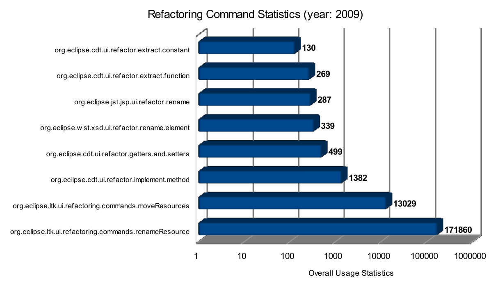

### Refactoring Howto
1. Set up the test cases for your code
2. Review the test cases
3. Identify the _smells_
4. Refactor the code - Stepwise!!
5. Execute all test cases
6. Fix errors
    - Go back to 6. unless the test result is green
7. Go to 4. and continue refactoring

### Composing Methods
#### Extract Method 
```cpp
void printMainScreen() {
    System. out.println("Main Screen");
    // print details
    System. out.println("Speed");
    System. out.println("curr Temp");
}
```
zu
```cpp
void printMainScreen () {
    System. out.println("Main Screen");
    printMainScreenDetails();
}
private void printMainScreenDetails() {
    System. out.println("Speed");
    System. out.println("curr Temp");
}
```
#### Inline Method 
```cpp
int getRating(){
    return(hasMoreThanFiveDeliveries())?2:1;
}
boolean hasMoreThanFiveDeliveries(){
    return(noOfDeliveries>5);
}
```
zu
```cpp
int getRating(){
    return(noOfDeliveries>5)?2:1;
}
```

#### Remove Assignments to Parameters
```cpp
int discount(int inputVal, in quantity, in yearToDate){
    if(inputVal>50) inputVal -= 2;
    ...
```
zu
```cpp
int discount(int inputVal, in quantity, in yearToDate){
    int result = inputVal;
    if(inputVal>50) result -= 2;
    ...
```

#### Moving Features between Objects
```cpp
public class SmallCycle{
    DataModel myDM = new DataModel();
    int localValue;
    public void calcHeight() { myDM.height = 45; localValue = 100; }
    public void calcSurface() { myDM.surface = 452; calcHeight(); }
    ...
```
zu
```cpp
public class SmallCycle {
...
    public void calcSurface(){
    myDM.surface = 452;
    myDM.calcHeight( this);
    }
...

public class DataModel {
    public int height;
    public int surface;
    public void calcHeight(SmallCycle smallCycle){
        height = 45;
        smallCycle.localValue = 100;
    }
```

#### Extract Class
```cpp
public class BigCycle {
...
    String owner;
    String ownerBirthday;
    public BigCycle(){
        owner = "Harry";
    }
```
zu
```cpp
public class BigCycle {
    ...
    Owner localOwner = new Owner();
    public BigCycle(){
        localOwner.setName("Harry");
    }
}
...
public class Owner{
    private String name;
    private String birthday;
    ...
    public void setName(String name){
        this.name = name;
    }
    ...
}
```

### Organizing Data
Replace Magic Number with Symbolic Constant
```cpp
double getLengthPerTireTick(int tiresize){
    return ((tiresize*25.4)/2)*2*3.141
}
```
zu
```cpp
... return ((tiresize*MMPERINCH)/2)*2*Math.PI
static final double MMPERINCH = 25.4
```

#### Simplifying Conditional Expressions
- Decompose Conditional
- Consolidate Conditional Expression
    ```cpp
    double disabilityAmount(){
        if(_seniority <2) return 0;
        if(_monthsDisabled >12) return 0;
        if(_isPartTime) return 0;
        //compute disability amount
    }
    double disabilityAmount(){
        if(isNotEligableForDisability()) return 0;
        //compute the disability amount
    }
    ```
- Consolidate Duplicate Conditional Fragments
    ```cpp
    if(isSpecialDeal()){
        total = price * 0.95;
        send();
    }
    else {
        total = price * 0.98;
        send()
    }
    ```
    zu
    ```cpp
    if(isSpecialDeal())
        total = price * 0.95;
    else
        total = price * 0.98;
    send();
    ```
- Replace Nested Conditional with Guard Clauses
    ```cpp
    double getPayAmount(){
        double result;
        if(_isDead) result = deadAmount();
        else {
            if(_isSeperated) result = seperatedAmount();
            else {
                if(_isRetired) result = retiredAmount();
                else result = normalPayAmount();
            }
        }
        return result;
    }
    ```
    zu
    ```cpp
    double getPayAmount(){
        if(_isDead) return deadAmount();
        if(_isSeperated) return separatedAmount();
        if(_isRetired) return retiredAmount();
        return normalPayAmount();
    }
    ```
- Replace Conditional with Polymorphism
    ```cpp
    double getSpeed(){
        switch(type){
            case EUROPEAN:
                return getBaseSpeed();
            case AFRICAN:
                return getBaseSpeed() - getLoadFactor() * _numberOfCoconuts;
            case NORWEGIAN_BLUE:
                return (_isNailed) ? 0 : getBaseSpeed(_voltage);
        }
    }
    ```

### Making Method Calls Simpler
- Rename Method
- Separate Query from Modifier

### Dealing with Generalization
- Pull Up Field
- Push Down / Pull Up

### Other Refactorings
- Change Method Signature
- Extract Local Variable
- Extract Local Variable to Field
- Convert Anonymous Class to Nested
- Move Type to new File
- Extract Superclass
- Extract Interface

## Long Living Software
Mars Rover Software Coding Guidelines
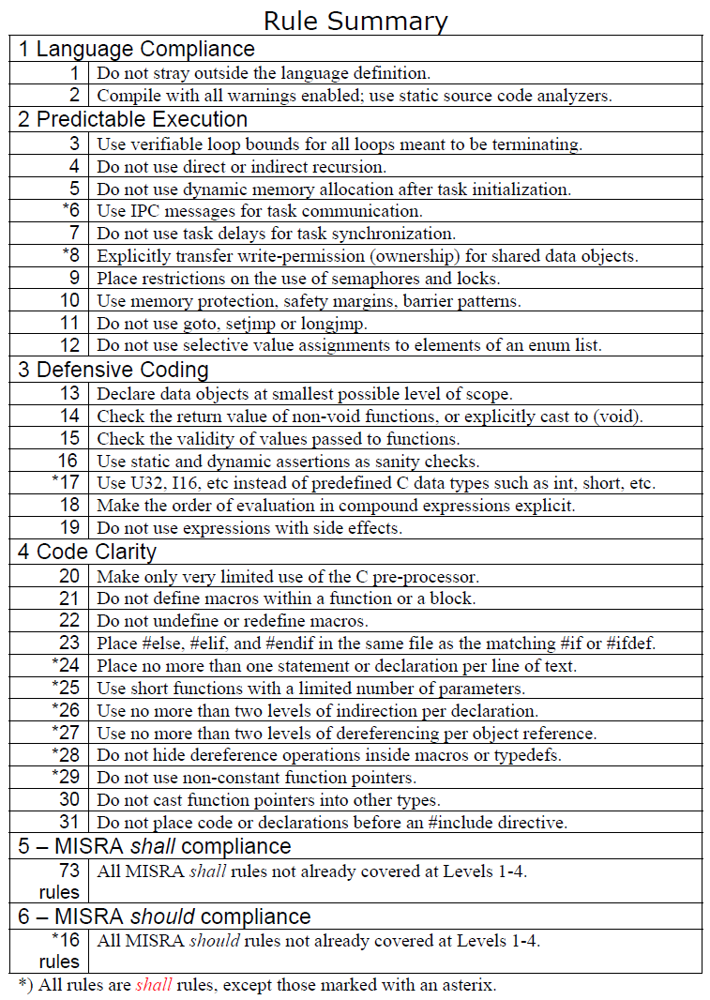

[Moodle](A. Brown and G. Wilson, The Architecture of Open Source Applications, Volume II , lulu.com, 2012.)
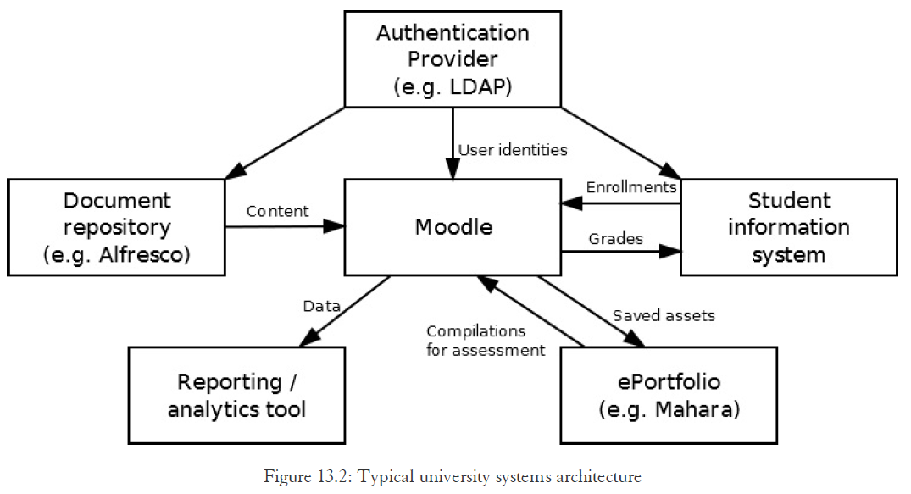
- Core: Web-Server (e. g., Apache) hosting the PHP-code
    - Server: /var/www/moodle/category.php
    - Client: https://moodle2.tu-ilmenau.de/course/category.php?id=92
- Connects to a database (e. g., MySQL)
- _moodledata_ folder (outside the web root)
- Extensible: moodle Plug-In API (according to plugin types)
    - = a folder <plugin-type>/<plugin-name>
- Documentation @ https://moodle.org/

### Compiler Compiler 
(e. g., flex/bison)
- Lexer, Yet Another Compiler Compiler
- First compiler-compiler 1960 by Tony Brooker
- YACC initially developed 1970 by Stephen C. Johnson (AT&T Corporation) for Unix
- **L**ook-**A**head **L**eft to right **R**ightmost derivation - Parser
    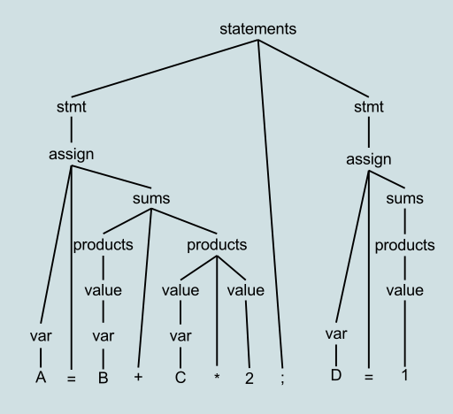
    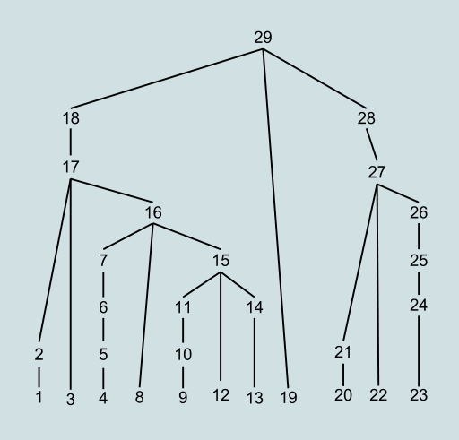
- 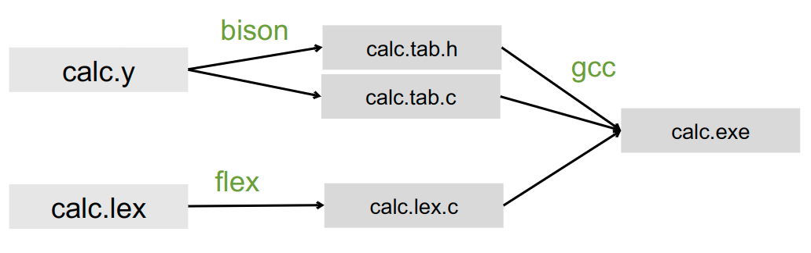


### Long Living Systems
How to build long living system in the first place?
- Very broad/extensive requirements engineering phase
- Capture (the needed) Variabilities, (e. g.: Future Workshop)
    - Product Lines
- Clear and Understood SW(/HW)-Architecture
    - Remove the _smells (periodically)_ , -> Reviews, Refactoring
    - Standard Architectures, Design Patterns, COTS
- Prepare all documents and the development environment for "newcomers" and "strangers"
- Good Estimation of ...
    - ... the efforts over time
    - ... the efforts for changes
    - ... the limits of the architecture
    - ... the expected SW END OF LIFE + reengineering costs
- ... never touch a running system

Key Attributes of Long Living Systems
1. Keep your system focussed on what it is(was) supposed to do.
2. Take your time to design your APIs with pride and keep them stable. (-> if at all, only extensions are feasible!)
3. Design the core architecture with well defined extension mechanisms to tailor the application to user needs. (-> Plug-Ins, DSL, DLLs)
4. Take maintenance serious , in terms of the needed/planned effort and the trageted/desired quality.
