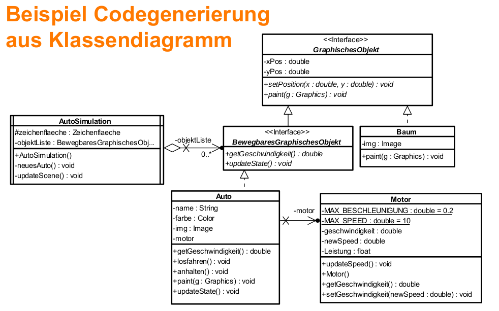

> Software: Menge von Programmen oder Daten zusammen mit begleitenden Dokumenten, die für Ihre Anwendung notwendig oder hilfreich sind [Hesse]

Gute Software ist schwer herzustellen
- Entspricht Kundenwünsche, Vollständigkeit
- Funktioniert Korrekt
- Kosten- und Termintreue bei der Erstellung
- weitere nicht-funktionale Qualitätsforderungen
  - Benutzerfreundlichkeit, Ergonomie
  - Sicherheit
  - Zuverlässigkeit, Fehlertoleranz
  - Performanz
  - Ressourcen-Effizienz, Skalierbarkeit, Übertragbarkeit
  - Wartbarkeit, Änder- und Erweiterbarkeit

Softwaretechnik
- Technische Disziplin der Software Herstellung
- Zielorientierte Bereitstellung uns systematische Verwendung von Prinzipien, Methoden und Werkzeugen für die arbeitsteilige, ingenieurmäßige Entwicklung und Anwendung von umfangreichen Softwaresystemen [Balzert]

Wie kann man Software besser entwickeln?
- Ingenieursmäßige Herangehensweise
  - Verwendung bekannter Prinzipien und Methoden
  - Systematische Vorgehensweise
- Verwendung von: 
  - Abstraktion, Modelle, Notation, Simulation
  - Wiederverwendung:Muster, Komponenten, Framework
- Organisation
  - Arbeitsteilung, Integration, Planung
- Verwendung von Werkzeugen
  - IDE (Integrated Development Environment)
  - Versionierung, Bugtracker, Modellierungswerkzeug

# Modellierungskonzepte
> Modell: ist eine Abstraktion eines Systems mit der Zielsetzung, das Nachdenken über ein System zu vereinfachen, indem irrelevante Details ausgelassen werden [Brügge]
$\rightarrow$ Beschreibung eines Ausschnitts der Realität

- erstellen einer Abstraktion
- abbilden signifikanter Eigenschaften
- Deskriptiv/präskriptiv (real oder geplant)
- Sichtweise auf ein System (Struktur, Verhalten, Zustand,...)
- heißt Weglassen
- setzt Verstehen voraus
- ist nicht automatisierbar

Verschiedene Modelle:
- Analysemodell
- Entwurfsmodell
- Implementierung (-smodell)
- Vorgehensmodell
- Produktmodell
- Dokumentation, Alternativen-Auswahl

Modelle für:
- Sichten
- Funktionen
- Daten
- Algorithmen
- Systemumgebung
- Dynamisches Verhalten
- Objektorientierte Modelle

## Klassische Modelle
- Funktionen: 
  - Funktionsbaum
    - Hierarchische Dekomosition der Fkt
    - nummerieren der Ebenen/Funktionen möglich
    - Bsp: Abonnement Verwaltung
  - Blockschaltbild
    - eingebettetes System, HW/SW
- Daten
  - Data Dictionary
    - Verzeichnis von Daten mit Strukturinformationen
    - Backus-Naur-Form, kontextfreie Grammatik
  - Entity Relationship Diagram
    - Daten und ihre Beziehungen
- Systemumgebung
  - Datenflussdiagramm
    - Fluss und Transformation von Daten zwischen Funktionen, Speichern und Schnittstellen
    - kein Kontrollfluss
- Algorithmen
  - Entscheidungstabelle
    - Regelbasierte Beschreibung
    - Bedingung
    - Aktionen
    - Reduktionsregeln
  - Pseudocode
    - von Programmiersprache abstrahierende, detaillierte Beschreibung eines Algorithmus
  - Programmablaufplan
    - Grafische Beschreibung des Kontrollflusses
    - DIN 66001
    - Unstrukturiert
  - Struktogramm
    - Nassi-Shneidermann-Diagramm
    - keine Sprünge
- Dynamisches Verhalten (diskrete Zustände und atomare zustandübergänge)
  - Zustandsautomat
    - Verhalten mit Zuständen und -übergängen
    - Automatenmodelle und -theorie
    - Ggf zerlegung oder kommunizierende Automaten
  - Flow-Chart
  - Ereignisgesteuerte Prozesskette (EPK)
    - Geschäftsprozesse
    - BPM
  - Petri-Netz (ggf. mit Zeitmodell)
    - Grafische Beschreibung von Nebenläufigkeit und Synchronisation
- Objektorientierte Modelle
  - Klassendiagramme
  - UML


## Objektorientierung
- bessere Strukturierung für komplexe Zusammenhänge
- Abstraktere Sichtweise
- Grundprinzip: Zerlegung; Teile und Herrsche
- ein System besteht aus vielen Objekten
- ein Objekt hat
  - definiertes Verhalten
    - Menge genau definierter Operationen
    - Operation wird beim Empfang einer Nachricht ausgeführt
  - inneren Zustand
    - Zustand des Objekts ist Privatsache
    - Resultat einer Operation hängt vom aktuellen Zustand ab
  - eindeutige Identität
    - Identität ist unabhängig von anderen Eigenschaften
    - Mehrere verschiedene Objekte mit identischem Verhalten und identischem inneren Zustand im gleichen System möglich
- Klasse
  - Gleichartige Objekte mit ggf. verschiedenen Zuständen
  - Verhaltensschema – Operationen
  - Innere Struktur – Attribute

Vorteile der Objektorientierung
- Zuständigkeitsbereiche
  - Daten, Operationen und Zustand: lokal und gekapselt
- Klare Schnittstellen
  - Definiertes Objektverhalten, Nachrichten
- Hierarchie
  - Vererbung und Polymorphie (Spezialisierung), Klassenschachtelung
- Baukastenprinzip
  - Benutzung vorgefertigter Klassenbibliotheken, Anpassung durch Spezialisierung (mittels Vererbung)


## Unified Modeling Language
- Grafisches Beschreibungsmittel für Aspekte des Softwareentwurfs diskreter Systeme
  - Spezifikation, Entwurf, Visualisierung, Konstruktion, Dokumentation von Software
  - Für OO-Softwareentwicklung und -prozess geeignet
  - UML ist weder Methode noch Prozess

Warum UML?
- Objektorientierung ist zur Zeit das vorherrschende Modellierungs-Paradigma, Industrie-Standard
- Kombination von Struktur-, Verhaltens-, Interaktions-, und Verteilungsmodellen
- Für Analyse, Entwurf, Implementierung und Test einsetzbar
- Gute Werkzeugunterstützung für Editieren, Versionierung, Codegenerierung
- Erweiterbarkeit der UML mit Stereotypen und Tags
- Semi-formale Modelle, z.T. verschiedene Interpretationen
- Offenheit: Erweiterung mit stereotypes, tags, constraints

Nachteile UML
- UML ist in vielen Facetten nicht präzise festgelegt
- Werkzeuge für Transformation, Analyse etc. fehlen noch
- UML ist keine „kleine Sprache“: Lernaufwand notwendig
- Komponenten sind nicht adäquat darstellbar
- Sprachen wie die UML werden erlernt durch Übung!
- Aber: LV SWT ist kein kompletter UML-Kurs

### Überblick über Modelle
- 14 Diagrammarten
- Struktur-Diagramme
  - Klassen-, Objekt-, Komponenten-, Kompositions-Struktur-,
  - Paket- und Verteilungsdiagramm
  - Profildiagramm – zur UML-Erweiterung
- Verhaltens-Diagramme
  - Use-Case-, Aktivitäts- und Zustandsdiagramms
  - Interaktionsdiagramme: Sequenz-, Kommunikations-, Timing- und Interaktionsübersichts-Diagramm

#### Use-Case-Diagramm
- Beschreiben Systemfunktion aus Benutzersicht (Was, nicht Wie)
- Erste Anforderungsspezifikation (requirements)
- Planbare Einheiten als Inkremente für die Entwicklung
- Keine Modellierung eines Ablaufs!
- Erstellen von Testfällen (test case generation)
- Grundelemente
  - Anwendungsfall: Use Case
  - Beteiligte: Aktor
- Verfeinerung mittels Use-Case-Realisierung notwendig
  - Textuelle Beschreibung
  - Verhaltensdiagramme

#### Klassendiagramm
- Modellierung der Struktur (Aufbau) eines Systems
- Modellierung von statischen Aspekten
- Modellierung der Struktur von Daten
- Klasse im Mittelpunkt
  - Aufbau: Attribute, Operationen
  - Beziehungen zueinander: Assoziationen, Vererbung
- Verbreitetstes und bekanntestes Diagramm der UML

#### Objektdiagramm
- Struktur des Systems zur Laufzeit zu einem Zeitpunkt
- Tatsächliche Zusammenhänge und Belegungen von Attributen von Objekten zu einem Zeitpunkt
- Eine detaillierte Sicht auf einen Aspekt
  - Keine vollständige Beschreibung (zu komplex)
  - Für kompliziertere Abhängigkeiten (z.B. Rekursion)
- Objektdiagramm für alle Arten von Exemplaren
  - z.B.: Klasse (Objekt), Komponente, Knoten, ...
- Keine Exemplare von Operationen -> Ablauf -> Verhaltensdiagramme / Interaktionsdiagramme
- Kein Verlauf der Wertebelegung über die Zeit

#### Paketdiagramm
- Gliederung (Strukturierung) des Systems in Teile (Pakete)
- Zuordnung von Elementen zu einem Paket
- Bildung von Hierarchien (Enthält-Beziehung)
- Abhängigkeiten zwischen den Paketen
  - "Include" von Quellcode-Dateien (<<import>>)
- Anwendung:
  - Zum Grobentwurf von Systemen
  - Definition von Schichten

#### Komponentendiagramm
- Strukturierung des Systems durch Komponenten
- Komponente: Modulare, austauschbare Einheit (Substitution)
- Modellierung der Abhängigkeiten zwischen Komponenten
- Modellierung der inneren Struktur von Komponenten
- Definition von Schnittstellen

#### Kompositionsstrukturdiagramm
- Teile-Ganzes-Strukturen -> Kompositionsstruktur
- Strukturell statische Kompositionsstrukturen:
  - Kurzschreibweise bei vielen Kompositionen
  - Modellierung des Aufbaus komplexer Systeme
- Strukturell dynamische Kompositionsstrukturen:
  - Notwendige Strukturen zur Realisierung eines Verhaltens
  - Definition von Rollen, zur Lösung wiederkehrender Probleme -> Modellierung von Mustern
- Starke Verwandtschaft mit dem Klassendiagramm
- Spezialisierte Kompositionsbeziehung -> erweiterte Semantik

#### Aktivitätsdiagramm
- Modellierung von
  - Kontrollflüssen
  - Datenflüssen
  - Parallelem Verhalten
  - Verzweigungen, bedingten und gewichteten Abläufen
- Geschäftsprozessmodellierung möglich
- Abstrakte und detaillierte Verhaltensbeschreibung möglich
- Grundlage zur Codegenerierung
- Zur Verfeinerung von
  - Use-Cases
  - Operationen / Interaktionen
  - anderen Aktionen und Aktivitäten

#### Interaktionsdiagramme
- Modellierung von
  - Kommunikation zwischen Kommunikationspartnern (Lebenslinie)
  - Operationen (Modellierung eines Programms)
  - Informationsaustausch / Nachrichten
- Gemeinsames Grundkonzept der Interaktionsdiagramme
- Sehr detaillierte Diagramme
  - Meist nicht zur vollständigen Beschreibung eines Systems
  - Betrachtung eines wichtigen Teilaspekts
- Grundlage zur Codegenerierung

#### Sequenzdiagramm
- Genaue zeitliche Abfolge von Nachrichten
- Umfangreichstes Interaktionsdiagramm
- Kontrollelemente möglich (Schleifen, Verzweigungen)

#### Kommunikationsdiagramm
- Kommunikationsbeziehungen der Kommunikationspartner stehen im Vordergrund
- Welche Komponenten arbeiten wie zusammen, um eine Funktion zu erfüllen

#### Timing-Diagramm
- Genaue zeitliche Darstellung von Zustandsübergängen
- Kommunikation abhängiger Zustandsautomaten
- Modellierung einzelner Interaktion

##### Prinzipieller Aufbau
- Zeitlicher Verlauf senkrecht
- Kommunikationspartner waagerecht (unsortiert)
- Lebenslinie
  - Rechteck mit gestrichelter senkrechter Linie
  - Start, Ende und Dauer der Ausführung einer Operation
  - Rekursive Aufrufe möglich
- Ereignisspezifikation
  - Stelle des Sendens / Empfangens der Nachricht
  - Definition der Reihenfolge des Auftretens
  - Trace: Folge von Sende- und Empfangsereignissen

##### Weitere Elemente des Sequenzdiagramms
- Nachrichten ohne Sender
  - z.B. am Beginn einer Interaktion
- Verlorene Nachrichten (ohne Empfänger)
  - Nachricht ohne dargestellten Empfänger
  - z. B. am Ende einer Interaktion
- Erzeugen von Lebenslinien
  - Gestrichelte Linie mit geöffnetem Pfeil
  - Keine Rückgabenachricht
  - Zeitliche Einrückung des Rechtecks
- Zerstören von Lebenslinien
  - Durchgezogene Linie mit Dreieckende
  - Kann Rückgabenachricht erzeugen

##### Nachrichten in Interaktionsdiagrammen
- Ereignis des Sendens bzw. Empfangens von Nachrichten
- Typen:
  - Operationsaufruf (synchron / asynchron)
  - Antwort Nachricht
  - Signal (asynchron), Create-/ Delete Message
- Operationsaufruf: Parameterliste muss kompatibel sein
- Nachrichtentypen

#### Zustandsdiagramm
- Modellierung des (vollständigen?) Verhaltens
  - Zustände von Klassen / Objekten / Komponenten
  - Übergänge zwischen den Zuständen
  - Ereignisse, die Zustandswechsel auslösen
- Modellierung von endlichen Automaten (Zustandsmaschinen)
  - Deterministische
  - Nichtdeterministische
- Verfeinerung von Zuständen möglich
- Modellierung von verteilten Systemen / parallelem Verhalten
- Grundlage zur Codegenerierung


# Analyse
- Einordnung in den Projektablauf
- Was ist eine Anforderung?
  - Merkmal, Eigenschaft, Bedingung oder Einschränkung eines Systems
  - Notwendig für die Akzeptanz vom Kunden
  - Definition (IEEE 610.12-1990)
    - Dokumentierte Darstellung einer Fähigkeit oder Eigenschaft 
    - von Anwender benötigt zur Problemlösung bzw. um Ziel zu erreichen
    - Muss von System oder Komponente erfüllt werden, um Vertrag oder Standard zu erfüllen

- Funktionale Anforderungen - Was soll es tun?
  - „...Legt eine vom Softwaresystem oder einer seiner Komponenten bereitzustellende Funktion oder Service dar“ [Balzert]
  - Was leistet das System
  - Welche Funktionen bietet es
  - Wie interagiert es mit der Umgebung
  - Anforderungen an:
    - Verhalten
    - Struktur
    - (Alternativ: Statik, Dynamik, Logik)
- Nichtfunktionale Anforderungen – Wie?
  - „...legen qualitative oder quantitative Eigenschaften des Softwareprojektes oder einer Komponente fest“ [Balzert]
  - Auch Bezeichnet als:
    - Quality of Service
    - Qualitätsanforderungen
  - Arten - FURPS (ISO 9126):
    - Functionality (Funktionalität)
    - Usability (Benutzbarkeit)
    - Reliability (Zuverlässigkeit)
    - Performance (Effizienz) / Portability (Übertragbarkeit)
    - Supportability (Änderbarkeit/ Wartbarkeit)

- Funktionalität
  - Angemessen, Genauigkeit
  - Sicherheit: Vertraulichkeit, Informationssicherheit, Datenintegrität, Verfügbarkeit
  - (Nicht ausreichend spezifizierte funktionale Anforderung)
- Benutzbarkeit
  - Verständlichkeit, Erlernbarkeit, Bedienbarkeit, Attraktivität
- Zuverlässigkeit
  - Reife (Fehler-Anzahl), Fehlertoleranz, Wiederherstellbarkeit
- Effizient/ Leistungsanforderungen
  - Zeitverhalten, Verbrauchsverhalten, Wirtschaftlichkeit
- Portabilität
  - Anpassbarkeit, Installierbarkeit, Koexistenz, Austauschbarkeit
- Wartbarkeit
  - Analysierbarkeit, Änder- und Erweiterbarkeit, Stabilität (bei Änderungen), Testbarkeit
- Weitere:
  - Konformität zu Konventionen und Bestimmungen
  - Interoperabilität zu anderen Systemen
  - Implementierungsanforderungen
  - Schnittstellenanforderungen
  - Skalierbarkeit (Änderungen des Problemumfangs)
  - Betriebliche und rechtliche Rahmenbedingungen
  - Liefer- und Verpackungsanforderungen

### Nichtfunktionale Anforderungen
Schwierigkeit nichtfunktionaler Anforderungen
- Hängen oft von Verhalten ab: daher komplex und nicht direkt sichtbar
- „Das Auto hat vier Räder“ (Struktur)
- „Wenn der Blinker betätigt wird, blinkt das Auto dreimal wenn die Zündung an ist; ansonsten wird das Standlicht einseitig eingeschaltet“ (Korrektes Verhalten)
- „Das Motorsteuergerät darf innerhalb von 5 Jahren und 150.000km Laufleistung höchstens mit 0.1% Wahrscheinlichkeit ausfallen“ (Zuverlässigkeit)

Umgang mit nichtfunktionalen Eigenschaften
- Nicht direkt „by construction“ zu realisieren
- Naive Herangehensweise: Ignorieren!
  - Entwerfen und Implementieren der Software ohne Berücksichtigung nichtfunktionaler Eigenschaften
  - Testen der nichtfunktionalen Eigenschaften
  - Wenn nicht erfüllt: Entwurf und Implementierung ändern!
- Funktioniert nur bei sehr einfachen Systemen, bzw. wenn nichtfunktionale Eigenschaften nicht wichtig sind!

Sinnvoller Umgang mit nichtfunktionalen Eigenschaften
- Untersuchung der Projektrisiken bereits in der Analysephase
    - größte Risiken zuerst betrachten!
  - Immer fragen: Geht das so überhaupt?
  - Festlegungen des Entwurfs möglichst früh gegen Anforderungen prüfen – aber wie?
- Modellbasierter Entwurf
  - Modellierung des Systems und seiner Umwelt
  - Bewertung des Modells (Simulation)
  - Lehrveranstaltungen Systementwurf, KIS, LTS

Randbedingungen
- „... Eine Randbedingung ist eine organisatorische oder technologische Vorgabe, die die Art und Weise einschränkt, wie das betrachtete System realisiert werden kann.“ 
- Werden nicht umgesetzt
- Schränken Lösungsraum ein
- Beispiele:
  - Kosten
  - Durchlaufzeit: Time to Market
  - Vorgaben durch Marketing und Vertrieb
  - Technische Randbedingungen (nichtfunktionale Anforderung)


Geforderte (Meta-)Eigenschaften
- Vollständig: alle Szenarien sind beschrieben
- Konsistent: keine Widersprüche
- Eindeutig: nur eine Interpretation möglich
- Korrekt: genaue und richtige Darstellung
- Realistisch: unter geg. Einschränkungen implementierbar
- Überprüfbar: durch Tests am Endprodukt nachweisbar
- Rückverfolgbar: Auswirkungen bis zur Implementierung nachvollziehbar (Testfälle, Auswirkung von Änderungen)
- Klassifizierbar (Risiko, Priorität, Dringlichkeit, Nutzen ...)
- Validierung mit dem Kunden

- Requirements Engineering
  - Ermittlung, Analyse und Verwaltung von Anforderungen
  - Ausgangspunkt: Projektidee
- Anforderungsermittlung
  - requirements elicitation, requirements definition
  - Bestimmen und dokumentieren der Anforderungen an das geplante System
  - Beteiligt: Entwickler, Kunde, Benutzer
  - Ergebnis: Anforderungsspezifikation - Glossar, Vertrag, Lastenheft
- Anforderungs-Analyse
  - requirements analysis, system modeling
  - Beschreibung im Detail und formal strukturiert
  - Beteiligt: Entwickler
  - Ergebnis: funktionale Spezifikation - Produktdefinition, Analysemodell, Pflichtenheft


| | Anforderungsermittlung | Systemmodellierung |
| -- | -- | -- |
| Ergebnis | Anforderungsspezifikation im Lastenheft, Glossar, Lastenheft | funktionale Spezifikation in Produktdefinition, Analysemodell, Pflichtenheft |
| Notation | Text | Text + (semi-) formales Modell |
| Kommunikation | mit dem Kunden | zwischen Entwicklern |
| Sichtweise | des Anwenders | äußere Systemaspekte |
Vor allem: Kommunikationsleistung!

Bedeutung:
- Falsche Anforderungen führen zu falschem System
- Frühe Fehler im Entwicklungsprozess sind teuer!

Fehlerentstehung und Fehlerquellen bei Anforderungserfassung
- 83% sprachliche Fehler (Un- bzw. Missverständlich)
- 75% Logische Fehler (Widersprüchlichkeit, Redundanz)
- 73% Inhaltliche Fehler (Falsche Sachverhalte, Unvollständig)

## Ermiteln von Anforderungen
Woher kommen Anforderungen?
- Ausgangspunkt
  - Projektidee, schriftliche Skizze
  - Kurz und knapp
  - Stichpunkte der wichtigsten Funktionen
  - Lastenheft (falls schon existiert)
- Interessenhalter (stakeholder)
  - Identifizieren, Wichtigkeit bewerten (berücksichtigen?)
  - Ansprechpartner? Interessen und Erwartungen
  - Fachexperten, Verantwortliche, Betroffene

Beteiligte Rollen
- Endbenutzer
  - Aufnahme Ist-Zustand, Domänenwissen, Anforderungen
- Kunde
  - Definiert Ziel des Systems, Vertragsverhandlung
- Konfigurationsmanager
  - Revisionsgeschichte der Dokumente, Nachvollziehbarkeit
- Architekt
  - Integration von Anwendungsfall- und Objektmodellen
- Analytiker 
  - Modelliert das System und erstellt Anwendungsfälle
- Redakteur
- Prüfer

Wie ermittelt man Anforderungen?
- Problem: Entwickler müssen sich in Begriffs- und Denkwelt des Kunden einarbeiten, sonst Kommunikationsprobleme
- Systematische Vorgehensweise
- Kommunikation mit Kunden
- Geschäftsprozess (business process)
  - fachlicher Ablauf, der Wert oder Kosten verursacht
- Akteur (actor)
  - Benutzer, Schnittstelle nach außen
- Szenario (scenario)
  - Interaktion mit System als Ablauf
- Anwendungsfall (use case)
  - Automatisierter Arbeitsschritt, vom System ausgeführt
- Interviews mit Fachanwendern
  - Mitschrift, später strukturierter Text und Tabelle
- Strukturierte Spezifikation
  - Vorlagen / sprachliche Anforderungsschablonen
  - Formulare
  - Reduzierung sprachlicher Mehrdeutigkeiten
- Anwendungsfalldiagramm (Use-Case-Diagramm)
  - Arbeitsschritt eines Geschäftsprozesses, der durch das System ausgeführt wird
  - Anforderungen an das System modellieren – was soll das System leisten
  - Systemgrenzen / Systemkontext festlegen
  - Systembeteiligte modellieren
  - Planbare Einheiten als Schritte für die Entwicklung
  - Verwendung bereits ab Projektbeginn
  - Keine Modellierung eines Ablaufs!
- Umgang mit Szenarien und Anwendungsfällen
  - Zunächst nur zum Verständnis kurz aufstellen
  - Systemgrenze definieren
  - Beschreibungen verfeinern
  - Änderungen mit Kunden abstimmen
  - Prototypen nur zur visuellen Unterstützung
  - Benutzungsschnittstelle erst beginnen, wenn funktionale Anforderungen in etwa klar sind

Leitfaden für Anwendungsfälle
- Benennen mit Verbalphrasen, die Anwendersicht beschreiben (Simuliere)
- Akteure mit Substantiven benennen (Anwender)
- Systemgrenzen klären. Arbeitsschritte von Akteuren und System kennzeichnen
- Schritte im aktiven Stil beschreiben (Auto bremst)
- Ursächliche Beziehung zwischen Folgeschritten
- 1 Anwendungsfall = 1 vollständige Transaktion
- Normalfall darstellen; Ausnahmen gesondert beschreiben
- Nicht die Benutzungsschnittstelle beschreiben (statt dessen visuellen Prototypen verwenden)
- Übersichtlichkeit (max. 2-3 Seiten), sonst zerlegen

- Typische Probleme
  - Kommunikations- und Verständnisprobleme
  - Viele verschiedene Beteiligte
  - Kunden wissen nicht, was sie genau wollen und was geht
  - Verwendung von Fachsprachen
  - Widersprüchliche Anforderungen, verschiedene Interessen
  - Nicht-technische organisatorische, historische oder rechtliche Rahmenbedingungen
  - Zusätzliche Beteiligte können auftauchen
  - Anforderungen ändern sich während der Entwicklung
- Anforderungsänderungen
  - Sind die Regel
- Tätigkeiten der Anforderungsanalyse
  - Anforderungen strukturieren
  - Eigenschaften der Anforderungen bestimmen
  - Anforderungen priorisieren
  - Anforderungen in Textform, Grafiken, Modellen dokumentieren
  - Anforderungen modellieren
  - Anforderungen auf inhaltliche Qualität prüfen
  - Auf Übereinstimmung mit den Zielen prüfen
    - Ziel Abnahme der Anforderung
  - Hängt mit Analyse des Systems zusammen
- Anforderungen strukturieren
  - Unterteilung
    - Funktional, Nichtfunktional
    - Muss, Kann,... oder Haupt- und Nebenanforderung
  - Hierarchische Zerlegung
    - Unterteilen, Verfeinern
  - Ordnung festlegen, eindeutig Nummerieren
    - auf Einmaligkeit achten
  - Beziehungen festhalten
  - Verwendung von Werkzeugen
    - MS-Project, Doors, Git issues, Trac, Bugzilla, MKS,...
    - Modellierungswerkzeuge
- Eigenschaften bestimmen
  - Wahl der Eigenschaften firmen- bzw. projektspezifisch
  - Wichtige Eigenschaften
    - Identifikationsnummer
    - Kurzbezeichnung
    - Beschreibung (Text, ggf. Grafik, Modell)
    - Aufwand
    - Priorität der Anforderung
    - Bearbeitungsstatus / Restaufwand
    - Zugeordnet (wer ist verantwortlich / bearbeitet)
    - Querverbindungen zu anderen Anforderungen
    - Ggf. zusätzliche Dokumente oder Bemerkungen
    - Stabilität der Anforderung (Änderungswkt.)
    - Kritikalität der Anforderung: Schäden bei Fehlern?
    - Entwicklungsrisiko: Erfolgsaussichten der Umsetzung
    - Abnahmekriterien / Erfüllungsnachweis durch?
    - Anforderungstyp: Funktional, nicht funktional ,...
    - Anforderungssicht: Dynamik, Statik, Logik, Struktur, Funktion
    - Mögliche Konflikte
    - Autor
    - Quelle: Wer möchte die Anforderung umgesetzt haben?
    - Status der Beschreibung: Idee, grober Inhalt, detailliert
    - Anforderungsversion
- Anforderungen priorisieren
  - MuSCoW-Priorisierung
  - Muss-, Kann-, Optional, Nicht (Abgrenzungskriterien) (must, should, could, won‘t)
  - Ad-hoc: Stakeholder priorisiert Anforderungen
  - Priorisierungsmatrix / Kosten-Wert-Analyse
    - Eigenschaften bewerten (Punkte vergeben)
    - Werte gewichten
    - Priorität berechnen $Prioritäten = \frac{Nutzen - Nachteil}{Kosten + Risiko}$
  - Kano-Klassifikation
    - Basiseigenschaften: Werden vorausgesetzt (fehlen stört, wenig zusätzliche Zufriedenheit)
    - Leistungseigenschaften: Sonderwünsche
    - Begeisterungseigenschaften: Wird nicht erwartet
    - Abfragen per Fragenkatalog
  - Reihenfolge festlegen


## Objektorientierte Analyse und Systemmodellierung
- Übersicht
  - Aufgabe: Systemmodell erstellen, funktionale Spezifikation
  - Beschreibung der Systembenutzung und des Verhaltens
  - Was, nicht wie – Implementierungsaspekte ausklammern
    - Nicht: Datenhaltung, Verteilung, Technologien, Architektur, ..
  - Zusammenhang mit Anforderungsspezifikation
  - OO: Modell des Anwendungsbereichs
- Analysemodell
  - Korrekt, vollständig, konsistent und nachprüfbar
  - Struktur und Verhalten
  - Verschiedene Sichten (OO, Strukturiert, ...)
- Eingangsdokumente
  - Lastenheft, Anforderungsspezifikation
- Typische Ergebnisse
  - Funktionales Modell
    - Geschäftsprozesse und Anwendungsfälle
  - Objektmodell
  - Dynamisches Modell – Systemverhalten
    - Zustands- und Sequenzdiagramme
  - Vor- und Nachbedingungen von Systemoperationen
  - Prototyp / Spezifikation Benutzungsschnittstelle
  - Pflichtenheft
- Objektorientierte Analyse nach [Brügge / Dutoit]
  - Verdeutlicht iterativen Ablauf
  - Unterteilung des Analysemodells in:
    - Funktionales Modell (Anwendungsfälle)
    - Objektmodell (Klassen und Objektdiagramme)
    - Dynamisches Modell (Zustands- und Sequenzdiagramme)
    - Unterscheidung der Objekttypen


- Heuristik Sprache $\rightarrow$ OO-Modell
- Objektarten im Systemmodell
  - Entitätsobjekte – vom System verwaltete Informationen
  - Grenzobjekte – Interaktion zwischen System und Akteuren
  - Steuerungsobjekte – Durchführung der Anwendungsfälle
- Identifizierung von Entitätsobjekten
  - Begriffe, die klargestellt werden müssen
  - Wiederkehrende Substantive in Anwendungsfällen
    - Heuristiken
  - Reale Objekte, die das System kennen muss
  - Reale Prozesse, die das System verfolgen muss
  - Anwendungsfälle
  - Datenquellen und -senken
  - Artefakte, mit denen der Nutzer interagiert
- Identifizierung von Grenzobjekten
  - Elemente der Benutzungsschnittstelle
  - Formulare für Eingaben
  - Nachrichten, Rückmeldungen
  - Endgeräte
  - In der Begriffswelt des Anwenders bleiben!
  - Schnittstellen grafisch skizzieren bzw. Prototyp!
- Identifizierung von Steuerungsobjekten
  - Koordination von Grenz- und Entitätsobjekten
  - Abarbeitung von Anwendungsfällen
    - Reihenfolge von Schritten
    - Informationen übernehmen und weiterleiten
    - Oft ein Steuerungsobjekt pro Anwendungsfall
  - Beispiel: Simulationsszenario
  - Verhaltensmodell sinnvoll! Im folgenden: dynamische Modelle

- Abläufe der Anwendungsfälle modellieren
  - Ziel - Objekte finden
  - Klassen identifizieren
  - Verhalten / Operationen finden
- Use Case durch Interaktion verfeinern
  - einfacher kurzer Ablauf: textuelle Beschreibung, Aktivitätsdiagramm
  - Ablauf mit Verzweigungen, Parallelitäten: Aktivitätsdiagramm (Kontrollflussmodellierung)
  - datengetriebener Ablauf: Aktivitätsdiagramm (Objektflussmodellierung)
  - Interaktion zwischen den Objekten wichtig: Kommunikationsdiagramm, Aktivitätsdiagramm (Aktivitätsbereiche), Sequenzdiagramm
  - zeitliche Abfolge steht im Mittelpunkt: Sequenzdiagramm
  - Zustandswechsel / zeitliche Abfolge von Zuständen: Zustandsdiagramm / Timing-Diagramm
  - komplexe Abläufe mit Verzweigungen und Parallelitäten: Interaktionsübersichtsdiagramm
  - komplexe Abläufe ohne Verzweigungen und Parallelitäten: weitere Verfeinerung durch Use-Case-Diagramm
  - komplexer strukturierter Ablauf: Kollaboration aus dem Kompositionsstrukturdiagramm

- Dynamische UML-Modelle
  - Abläufe
    - Aktivitätsdiagramm (activity diagram)
    - Kommunikationsdiagramm (communication diagram)
    - Sequenzdiagram (sequence diagram)
    - Zeitdiagramm (timing diagram)
  - Zustandsabhängiges Verhalten von Objekten
    - Zustandsautomat (state chart diagram)

- Aktivitätsdiagramm
  - Aktion – einzelner Schritt
  - Aktivität
    - Beschreibt einen Ablauf / repräsentiert ein Verhalten
      - Beinhaltet eine Folge Aktionen, Kontroll- oder Objektknoten
    - Schachtelung von Aktivitäten und Aktionen
      - Aktionen in Aktivitäten enthalten
      - Aktionen durch Aktivitäten verfeinerbar
    - Aktivitäten beschreiben / verfeinern
      - Aktionen, Use Cases, Interaktionen, Operationen ...
  - Ein- und Ausgabeparameter in Form von Objekten
    - Parameterknoten entsprechend Pins der aufrufenden Aktion
    - Alternativ: Parameterangabe mit Name und Typ
  - Angabe von Vor- und Nachbedingungen möglich
  - Optional: Parameter unter Aktivitätsnamen

- Verfeinerung der Aktionen durch Aktivitäten
- Aktion durch Interaktionen verfeinern
  - Detaillierte Diagramme
  - Meist entwurfsnah
- Verfeinerung der Aktionen durch StateChart
- Objekte zusammenstellen und klassifizieren
  - Toolunterstützung (Möglichkeiten stark toolabhängig)
  - Objekte Ergebnis der Verhaltensmodellierung
  - Ergebnis Verhaltensdiagramm: Operationen der Klassen
  - Klassen generalisieren / spezialisieren $\rightarrow$ Klassenhierarchie
- Übergang zum Entwurf
  - Klassenstruktur festlegen
- Spezifikation von Benutzungsschnittstellen
  - Skizzieren, Prototyp generieren, Spezialwerkzeuge
  - Klassen und Operationen in Funktionen
  - Gestaltung MMI, style guides, Standards

## Dokumentation von Anforderungen
- Lastenheft
  - Gesamtheit der Forderungen eines Auftraggebers (AG) an die Lieferungen und Leistungen eines Auftragnehmers (AN), manchmal Vertragsbasis
  - Muss-Kriterien, Kann-Kriterien, Abgrenzungskriterien
- Pflichtenheft
  - Entwurf aus AN-Sicht, Umsetzung des Lastenhefts
  - Meist Vertragsbasis
- Inhalt Anforderungsspezifikation
  - Zielsetzung
  - Allgemeine Beschreibung
    - Umgebung, generelle Funktion, Restriktionen, Benutzer
  - Spezifische funktionale Anforderungen
    - möglichst quantitativ (z.B. Tabellenform)
    - eindeutig identifizierbar (Nummern)
  - Spezifische nicht-funktionale Anforderungen
    - z.B. Antwortzeit, Speicherbedarf, HW/SW-Plattform
    - Entwicklungs- und Produkt-Standards
  - Qualitäts-Zielbestimmung
  - Zu erwartende Evolution des Systems, Versionen
  - Abkürzungsverzeichnis, Glossar, Index, Referenzen


Pflichtenheft (Beispiel)
1. Einleitung, Zielbestimmung
2. Übersicht
    - Einsatzbereich, Zielgruppen
    - Produkt-Umgebung
    - Produkt-Funktionen
    - Restriktionen
    - Annahmen und Abhängigkeiten
    - Vorhandenes System (ggf.)
3. Vorgeschlagenes System
    - Übersicht
    - Funktionale Anforderungen
    - Benutzungsschnittstelle
    - Nichtfunktionale Anforderungen
    - Systembeschreibung
      - Szenarien
      - Anwendungsfälle
4. Glossar


# Grobentwurf
## Einführung
Systementwurf – Aufgabe
- Sicht des geplanten Systems von innen (Entwickler)
- Wie sollen vereinbartes Verhalten und Funktionen (Analysemodell) intern realisiert werden?
- Von Spezifikation von Anforderungen und Funktionen -> Vorbereitung der Implementierung
- Formal: Transformation des Analysemodells in ein Systementwurfsmodell
- System(grob)entwurf, Feinentwurf/Objektentwurf

Teile und herrsche
- Grobentwurf
  - Entwurfsziele identifizieren
  - Grobe Systemstruktur festlegen (Architektur)
  - Zerlegung in Subsysteme, Spezifikation
    - Schichten, Pakete, Komponenten
  - Bewerten der Zerlegung anhand der Entwurfsziele
  - Schnittstellen festlegen
- Feinentwurf
  - Subsysteme im Detail entwerfen
    - Strukturierung der Komponenten
    - Klassen, Objekte, Funktionen, Datenstrukturen
    - Verhalten, Algorithmen – Teillösungen


## Systemzerlegung
Vorgehen
- Zerlegung eines Systems in Subsysteme
- Betrachtung der Lösungsdomäne!
- Subsysteme weiter zerlegen bis Komplexität ausreichend klein ist z.B. für Arbeitspakete

Was macht ein Subsystem aus?
- Schnittstellen, Funktionen, „Verantwortung“
- Was bietet es an?
- Was benutzt es?
- Was tut es intern?

Operation
- Name und Parameter
- Funktion, Prozedur, Methode, Eintrittspunkt ...

Dienst
- Satz von Operationen, die bereitgestellt werden

Abhängigkeiten von Subsystemen
- Subsysteme untereinander: Kopplung (coupling)
- Maß für die Abhängigkeit von Subsystemen

Möglichst lose Kopplung
- Änderungen in einem beteiligten Subsystem haben geringe Auswirkungen (Stabilität)
- Erleichtert Wartbarkeit und Arbeitsteilung

Mittel zur Verringerung der Kopplung
- Zusätzliche Unterteilung in Subsysteme
- Aber: dann größere Komplexität!

Abhängigkeiten von Subsystemen
| Kopplungsart | Bemerkung |
| -- | -- |
| Datenkopplung (gemeinsame Daten) | Möglichst vermeiden! Wenn nicht möglich, Verwaltung zentralisieren und Zugriff über Schnittstelle |
| Schnittstellenkopplung (gegenseitiger Aufruf) | Akzeptabel |
| Strukturkopplung (gemeinsame Strukturelemente) | Vermeiden! (z.B. keine Vererbung über Paketgrenzen hinweg) |

- Elemente eines Subsystems: Kohäsion (cohesion)
- Maß für Zusammengehörigkeit der Elemente
- Möglichst hohe Kohäsion
  - Enge Beziehung oder ähnliche Aufgaben der Elemente
  - Erleichtert Verständnis, Wartung und Anpassung
- Mittel zum Erreichen hoher Kohäsion
  - Datenkapselung, Objektorientierung
  - Benutzung geeigneter Patterns (Kapitel 5)

Metriken für modulare Entwürfe
- Fan-in / fan-out-Metrik [S.Henry, D. Kafura 1981]:
  - Fan-in: Anzahl der Stellen, wo Kontrollfluss auf das betrachtete Modul M übergeht (Aufrufe von Funktionen / Prozeduren in M) + Anzahl globaler Variablen, die in M zugänglich sind
  - Fan-out: Anzahl von Stellen, an denen M andere Module aufruft + Anzahl der globalen Variablen, die von M verändert werden
- Heuristik Kopplung / Kohäsion
  - Hoher Fan-out bedeutet hohe Kopplung, minimieren
  - Hoher Fan-in kann auf geringe Kohäsion von M hindeuten

Komplexität beherrschen: "Wenn Du es nicht in fünf Minuten erklären kannst, hast Du es entweder selbst nicht verstanden oder es funktioniert nicht." [Rechtin, Maier: The Art of Systems Architecting 2000]

Vorgehen: Heuristiken und Erfahrungen
- „Erfahrung ist die härteste Lehrerin. Sie gibt Dir zuerst den Test und anschließend den Unterricht.“ [Ruth 1993]
- „Ein Architekt der zu Beginn seiner Arbeit vollständige und konsistente Anforderungen benötigt, mag ein brillanter Entwickler sein – aber er ist kein Architekt“ [Rechtin 2000]
- „Das Leben von Software-Architekten besteht aus einer langen und schnellen Abfolge suboptimaler Entwurfs-entscheidungen, die teilweise im Dunkeln getroffen werden.“ [Kruchten2001]

Wie organisiert man Subsysteme?
- Innerhalb einer Verfeinerungsstufe: fachlich orientierte Zerlegung
- Mehrfache Zerlegung: Hierarchie-Graph der Verfeinerung

Schicht
- Gruppe von Subsystemen in der Zerlegungshierarchie
- Verwandte Dienste
- Ähnlicher Abstraktionsgrad
- Abhängigkeit nur von darunter liegenden!

- Geschlossene Schichtenarchitektur
  - Beispiel: OSI-Modell für Kommunikationssysteme
- Offene Schichtenarchitektur
  - Beispiel: Java Swing auf X11-Plattform

Prinzipien des OO-Entwurfs
- So-einfach-wie-möglich-Prinzip (KISS)
- Fehler berücksichtigen (Strukturierung, Kapselung, Modularisierung, Wiederverwendung)
- Entwerfen nach Verantwortlichkeiten
- Hohe Kohäsion / Geringe Kopplung
- Zyklische Abhängigkeiten vermeiden
- Auf Schnittstellen konzentrieren
  - Abhängigkeiten nur von Schnittstellen
  - Abtrennung von Schnittstellen (eher viele kleine als eine große)
  - Umkehr der Abhängigkeiten (dependency inversion-Prinzip)
- Offen / Geschlossen Prinzip

Zyklische Abhängigkeiten vermeiden
- Änderungen wirken sich auf beide Komponenten aus
- Probleme beim Löschen und Initialisieren
- Auflösen durch
  - Gemeinsame Klassen in separates Paket
  - Gemeinsame Schnittstellen definieren

Symptome schlechten Designs
- Starrheit
  - Einfache Änderungen schwierig realisierbar
  - Einfache Änderungen führen zur Modifikation einer Vielzahl von Komponenten
- Zerbrechlichkeit
  - Änderungen an einer Stelle führen zu Fehlern an völlig anderer Stelle
- Schlechte Wiederverwendbarkeit
  - Komponenten können Aufgrund spezieller Anhängigkeiten kaum wiederverwendet werden

Wann ist ein Entwurf „gut“?
- Korrekt
  - Erfüllung der Anforderungen
  - Wiedergabe aller Funktionen des Systemmodells
  - Sicherstellung der nichtfunktionalen Anforderungen
- Verständlich und präzise, gut dokumentiert
- Anpassbar
- Hohe Kohäsion innerhalb der Komponenten
- Schwache Kopplung zwischen den Komponenten
- Wiederverwendung
- Kriterien gelten auf allen Ebenen des Entwurfs! (Architektur, Subsysteme, Komponenten)

## Architekturmodelle
- Modellierung mit UML
  - Bisher: logische Sicht
  - Technisch: Organisation in Paketen, Namensraum, Import
- Paketdiagramm
  - Gliederung (Strukturierung) des Systems in Teile
  - Zuordnung von Elementen zu einem Paket
  - Hierarchien und Abhängigkeiten zwischen den Paketen
  - Anwendung: Definition von Schichten
- Enthält-Beziehung
  - Definiert, in welchem Paket ein Element enthalten ist
  - Ermöglicht qualifizierten Zugriff auf enthaltene Elemente
  - Löschen des Pakets bewirkt Löschen beinhalteter Elemente
  - Definition von Sichtbarkeit / Zugriffsrechte
    - Auswirkung auf weitere Enthält-Beziehung
    - '+' - public (default)
    - '-' - private
- Paket- / Element-Import
  - Unqualifizierter Zugriff auf Elemente eines anderen Namensraums (Paketes)
- Komponentendiagramm
  - Komponente – modulare, austauschbare Einheit
  - Strukturierung des Systems durch Komponenten
  - Modellierung der
    - Abhängigkeiten zwischen Komponenten
    - inneren Struktur von Komponenten
  - Definition von Schnittstellen
  - Verwendung von Elementen aus Klassen- und Objektdiagramm
  - Stärkere dynamische Sicht -> kein Verhalten
  - Komponente <<component>>
    - Kapselt Funktionalitäten (Physisch gruppierte Klassen)
    - „Spezialisierte“ Klasse (Vererbung, Exemplare möglich)
    - Stellt Funktionalitäten über Schnittstellen bereit
    - Definiert benötigte Schnittstellen
    - Enthält Klassen oder weitere Komponenten
    - Modulares Element: Substitution (Austauschbarkeit) steht im Vordergrund
  - Black-Box-Darstellung
    - Zur Verfügung gestellte Funktionalität `<<provided interfaces>>`
    - Benötigte Funktionalität `<<required interfaces>>`‚
  - White-Box-Darstellung
    - Interner Aufbau der Komponente `<<realization>>`
    - Artefakte `<<artifacts>>`‚ Realisierende physische Einheit (z.B.: .dll)

Schnittstellen / Interfaces
- Definition Diagrammunabhängig
  - Meist Klassendiagramm 
- Ähnlich Semantik einer Klasse
  - Nur public-Attribute und Operationen
- Definiert Verpflichtung zur Implementierung von
  - Operationen
  - Merkmale -> Attribute dürfen definiert werden
  - Verpflichtungen (z.B.: Vor- / Nachbedingungen)
- Meist abstrakte Klassen mit abstrakten Operationen
- Abstrakt – muss überschrieben werden
- Notation
  - Stereotyp: <<Interface>>
  - Meist kursiv geschrieben, da abstrakte Klasse

Schnittstellenrealisierung, Implementierungsbeziehung
- Schnittstellen werden realisiert, nicht instanziiert
- Schnittstellenkonform
  - Klasse realisiert alle Attribute und Operationen
- Schnittstelle kann von anderen Schnittstellen erben
- Keine Schnittstellenrealisierung zwischen zwei Interface-Klassen -> Generalisierung verwenden
- Darstellung
  - Gestrichelte Linie mit nicht gefülltem Dreieck an der Seite der Superklasse
  - Alternativ: Lollipop-Darstellung


## Softwarearchitekturmuster
- Wiederverwendung auf sehr hoher Abstraktionsstufe
- Falls geplante Anwendung passt, anwenden!

Schichten-Architektur (layers)
- Problem
  - Komplexität: Strukturierung des Systems, unterschiedliche Abstraktionsebenen
  - Änderungen sollen möglichst lokal bleiben
  - Teilsysteme sollen austauschbar, wiederverwendbar und getrennt entwickelbar sein
  - Schnittstellen sollen stabil sein
- Lösung
  - Zuordnung von Subsystemen zu horizontalen Schichten gleicher Abstraktionsebene
  - Komponenten einer Schicht bieten Dienste der darüber liegenden Schicht an

Client-Server (Klient/Anbieter)
- Client (front-end)
  - Benutzungsschnittstelle
  - Einbindung in Geschäftsprozesse
  - Entkoppelt von Netztechnologie und Datenhaltung
- Server (back-end)
  - Datenhaltung, evtl. Fachlogik
- Genauer: Two-tier client/server architecture
- Asynchroner Kontrollfluss
- Aufteilung Funktionen Client / Server
  - Mehr Funktionen im Server:
    - zentrale Verwaltung, Wartungsaufwand geringer, Portabilität, einfache Client-Hardware (Net PC)
    - „Thin Client“ – nur GUI
  - Mehr Funktionen im Client: Flaschenhals Server wird entlastet, individuellere Client-Funktionen
    - „Fat Client“ – Teil der Anwendung im Client
  - Entscheidet mit über Umsetzung (Java Script, ...)

Three-Tier / Four-Tier Architecture
- Client/Server mit weiterer Aufteilung ähnlich Repository

Bewertung Client-Server
- Vorteile
  - Leicht verständlich
  - Änderungen bleiben lokal
  - Geringere Kopplung zwischen den Schichten
  - Schichten austauschbar und wiederverwendbar
  - Getrennte Entwicklung der Schichten möglich
  - Vorhandene / stabilere Schnittstellen
- Nachteile
  - Geringere Performance
  - Zusätzlicher Verwaltungs- oder Datenoverhead
  - Manche Änderungen führen zu Änderungen in allen Schichten (z.B. neues Datenfeld)

Pipes and Filters
- Datenstrom- oder Kontrollflussorientiertes System
- Lose verbundene Berechnungskomponenten
- Kombination der Berechnungskomponenten nur vom Typ der Ein- und Ausgabedaten abhängig
- Leicht erweiterbar System gewünscht
- Parallele Verarbeitung vorteilhaft
- Verwendung von globalen Steuerungskontrollstrukturen (Parallelisierung, Verzweigung, Schleifen) gewünscht
- Vorteile
  - Stark entkoppelte Komponenten
  - Hohe Flexibilität gegenüber Änderungen & Erweiterungen
  - Hoher Wiederverwendungsgrad der Komponenten
  - Unabhängige Entwicklung der Komponenten
  - Leichte Parallelisierung der Berechnungen möglich
  - Überprüfung der Datenkompatibilität dynamisch / statisch
- Nachteile
  - Schwierige Fehlerbehandlung, kein expliziter Kontrollfluss
  - Fehler durch inkompatible Datentypfehler erst zur Laufzeit
  - Häufig zusätzliche Datenkonvertierungen notwendig


Plug-In Architektur (Microkernel)
- Zielstellung
  - Stabile, verbreitete Standard-Anwendung (Kern)
  - Funktionalität soll durch Komponenten leicht erweiterbar sein
  - Dritte sollen Komponenten leicht erstellen können
- Lösung
  - Möglichst schlanker zentraler Kern
  - Plugin-Manager verwaltet Komponenten: Laden, Entladen, Zugriffskontrolle, Konfiguration
- Plugin
  - Komponente mit Standard-Schnittstelle
  - Erweitert Funktionalität (extension point)
- Vorteile
  - Robustes Verhalten
  - Trennung der Zuständigkeiten
  - Erweiterbar, Austauschbar, Wiederverwendbar
  - Geringe Kopplung zu den Komponenten
  - Anpassung an eigene Bedürfnisse möglich
  - Leichte Aufteilung der Entwicklung der Arbeitspakete
- Nachteile
  - Höherer initialer Aufwand
  - Verwaltungsoverhead zur Laufzeit
  - Versionsverwaltung der Komponenten nötig
  - Abhängigkeiten unter den Komponenten schwierig realisierbar
  - Geschickte Definition der Extension Points nötig

Repository (Depot, blackboard)
- Zentrale Datenhaltung
  - Datenbankmanagementsystem, Dateisystem
- Anwendungen tauschen Daten nur über Repository aus
- Kontrollfluss z.B. über Signale oder Semaphore
- Gut für datenintensive Verarbeitungsaufgaben geeignet

Peer-to-peer
- Gleichberechtigte Partner, “Föderation”
- Verteilte kommunizierende Subsysteme
- Orts- und Umgebungsunabhängigkeit

Model-View-Controller (MVC)
- Modell / Sicht / Steuerung
- Trennung verschiedener Aufgabengebiete:
  - Model: verwaltet Domänenwissen, Daten und Zustand; häufig Datenbank
  - View: Darstellung, Anzeige, GUI
  - Controller: Steuerung der Interaktion, Nutzerbefehle
- Erlauben Austausch von Anzeige- und Speichersystem 
- Kontrollfluss
  - Controller steuert
  - View wird über Datenänderungen benachrichtigt (callback)
- Geeignet für interaktive Systeme
- Problem
  - Lose Kopplung zwischen verschiedenen Komponenten
  - Daten werden in verschiedenen Sichten dargestellt
  - Realisierung von GUI‘s
- Lösung durch drei Komponenten
  - Daten (Model) enthält die Kernfunktionalität / Durchführung der Geschäftsprozesse, kapselt und Speichert die Daten
  - Sichten bzw. Dialoge (View) stellt die Daten für den Anwender in unterschiedlicher Art dar
  - Logik bzw. Steuerung (Controller) Realisiert die Interaktion mit dem Benutzer, übernimmt die Eingaben vom View und ändert die Daten im Modell, legt die Darstellungsart der Sichten fest
- Vorteile
  - Unabhängige Entwicklung der Komponenten
  - Änderung der Oberfläche ohne Änderung des Modells
  - Unterschiedliche Oberflächen für das selbe Modell
- Nachteile
  - Performance
  - Erhöhter initialer Entwicklungsaufwand


## Frameworks
Was ist ein Framework?
- A framework is a set of prefabricated software building blocks that programmers can use, extend, or customize for specific computing solutions [Taligent]
- Ein framework (Rahmenwerk, Anwendungsgerüst) ist eine Menge von zusammengehörigen Klassen, die einen abstrakten Entwurf für eine Problemfamilie darstellen [nach Pomberger/Blaschek]

Ziele
- Wiederverwendung von Code, Architektur, Entwurfsprinzipien und Verhaltensschema
- Ähnliche Benutzungsschnittstelle

Klassifikation I
- Anwendungs-Framework (application framework)
  - Gibt Systemarchitektur für typische Anwendungsstruktur vor
  - GUI-Framework: Motif, Qt, Swing, ...
- Bereichsspezifisches Framework (domain framework)
  - Expertenwissen für Anwendungsbereich
  - für typische Anwendungen u.a. in den Bereichen Luftfahrt, Produktion, Finanzwesen, Automotive, ...
  - Beispiel: AUTOSAR
- Infrastrukturgerüst (support framework)
  - Gerätetreiber, Anpassung an Hardware
  - Middleware: DCOM, Java RMI, CORBA, WebSphere, ...

Klassifikation II
- Offene Programmgerüste (white box)
  - Erweiterbarkeit durch Vererbung und dynamische Bindung
  - Funktionen konkretisieren durch Ableitung von Basisklassen des Programmgerüsts und Überschreiben vordefinierter Methoden
- Geschlossene Programmgerüste (black box)
  - Erweiterbarkeit durch Definition von Schnittstellen für Module, die für eine konkrete Anwendung in das Gerüst eingesetzt werden können
  - Wiederverwendung durch Komponenten, die sich an Schnittstellen halten; Aufruf über Delegation


Webframeworks – Angular JS
- Clientseitiges Webframework von Google
- Frei verwendbar (Open Source)
- Erstellung von Single-Page-Webanwendungen
- Model View Prinzip

- Vorteile
  - Weitergabe von Expertenwissen
  - Durchdachtes Design: langfristige Aufwandsersparnis
  - Wartungsaufwand reduziert, systematische Tests möglich
  - Prinzipiell sehr hohe Produktivität möglich
  - Erleichtert Integration und Konsistenz verwandter Anforderungen
- Nachteile
  - Erstellung und Einarbeitung aufwändig
  - Zusätzlicher Dokumentations- und Wartungsaufwand
  - Fehlersuche erschwert durch Overhead des Frameworks
  - Kombination verschiedener Frameworks sehr schwierig

## Systemarchitektur und Verteilung
Systemarchitektur
- Aufbau und Elemente der Ablaufumgebung, Hardware
- Häufig enger Zusammenhang mit Softwarearchitektur
  - Architekturmuster
  - Ablaufmuster
- Besonders bei eingebetteten Systemen
- Systemarchitektur hat Einfluss auf Softwarearchitektur
  - Grenzobjekte, Schnittstellen, ...
- Gute Systemarchitektur?
  - Nichtfunktionale Anforderungen
  - Modellierung und Simulation, Lastmessungen
  - 
Typische Strukturen
- Zentralrechner (mainframe) mit Terminals
- Server und einfache Stationen
- PCs und Server
- Kommunikationsverbindungen, Sensoren, Speicher, ...


- Blockdiagramm
  - Klassisches Beschreibungsmittel für Systemaufbau
  - Nicht Teil von UML
- Konfigurationsdiagramm
  - meistverbreitetes Hilfsmittel zur Beschreibung der physikalischen Verteilung von System-Komponenten
  - Nicht Teil von UML
- Verteilungsdiagramm (UML deployment diagram)
  - Darstellung der Hardwaretopologie
  - Zuordnung von Artefakten zu Hardwareeinheiten (Knoten)
    - Verteilung von Systembestandteilen auf Hardware
  - Kommunikationsverbindung und Abhängigkeiten zwischen Knoten
  - Relativ spät im Projekt Installation / Wartung des Systems

## Globaler Kontrollfluss
Globaler Kontrollfluss
- Ablaufsicht der Architektur
  - Definition nebenläufiger Systemeinheiten (z.B. Prozesse)
  - Steuerung der Abfolge von Einzelfunktionen
  - Synchronisation und Koordination
  - Reaktion auf externe Ereignisse  
  - Darstellung z.B. durch Sequenzdiagramme
- Nebenläufigkeit auf Architekturebene
  - Threads , Prozesse, verteiltes System
  - Asynchroner Nachrichtenaustausch
- Einfluss auf Architektur / abhängig von Architektur!
- Ablaufmuster
  - Zentral
    - Call/Return (prozedural, synchron)
    - Master/Slave (nebenläufig mit zentraler Steuerung)
  - Dezentral
    - Ereignisgesteuert (event-driven)
      - interrupts
      - publish-subscribe (ähnlich observer)
      - (selective) broadcast
    - Datenflussgesteuert (data flow architecture)

## Sonstiges
Ablauf des OO-Systementwurfs [B. Oesterreich]
- Schichtenmodell definieren
- Verteilungsmodell definieren
- Fachliches Subsystemmodell definieren
- Ablaufverantwortlichkeiten definieren
- Komponentenspezifisches Klassenmodell entwickeln
- Komponentenschnittstelle entwerfen
- Zustandsmodelle weiterentwickeln
- Objektfluss modellieren
- Interaktionsmodelle entwickeln, Attribute definieren
- Dialoge spezifizieren
- Design-Diskurs
- Testgetriebene Entwicklung

Weitere Aufgaben beim Grobentwurf
- Entwurf einer persistenten Datenverwaltung
  - Dateisystem, Datenbank
- Sicherheit
  - Zugriffskontrolle
  - Fehlertoleranz (Daten und Hardware)
  - Protokollfunktionen
- Kontrollfluss
  - Ausnahmen
  - Starten, Initialisieren und Beenden der Anwendung
  - „Randanwendungsfälle“

Notwendigkeit der Architekturdokumentation
- Quellcode aufgrund niedrigen Abstraktionsniveaus ungünstig für Dokumentation
- Überblick und Arbeitsteilung
- Lebensdauer von Systemen länger als geplant
- Fehler und Probleme leichter finden und beseitigen
- Neue Anforderungen mit angemessenem Aufwand erfüllen
- Vereinfachung der Wartung, Pflege, Erweiterung, Wiederverwendung

## Dokumentation
- Grundprinzipien
  - Verständlich aus Sicht des Lesers formulieren (Glossar)
  - Das Warum beschreiben (Entwurfsentscheidungen)
  - Annahmen, Voraussetzungen, Randbedingungen dokumentieren
  - Wiederholungen vermeiden
  - Notation erklären oder Standards verwenden (UML)
    - Legende hinzufügen
  - Auf Zweckdienlichkeit prüfen, Reviews durchführen (Inhalt, Qualität)
  - Verschiedene Sichten für verschiedene Zielgruppen

# Feinentwurf

| Analyse-Modell | Entwurfs-Modell |
| -- | -- |
| Fachliche Domäne  | Lösungsdomäne |
| Teilweise unvollständig in Attributen und Operationen | Vollständige Angabe aller Attribute und Operationen |
| Datentypen und Parameter können noch fehlen | Vollständige Angabe von Datentypen und Parametern |
| Noch kaum Bezug zur Realisierungssprache | Auf Umsetzung in gewählter Programmiersprache bezogen |
| Keine Überlegungen zur Realisierung von Assoziationen | Navigationsangaben, Qualifikation, Ordnung, Verwaltungsklassen |
| | Entscheidung über Datenstrukturen, Anbindung GUI |

Schließen der Lücke zwischen Grobentwurf und Implementierung
- Identifizieren und Entwerfen von Klassen der Lösungsdomäne
- Identifikation und Verwendung von Entwurfsmustern
- Detaillierte Beschreibung der Klassen
- Beschreibung von Schnittstellen
- Iterativer Prozess!
  - Verbesserung des Entwurfs – Refactoring
  - Optimieren des Entwurfsmodells zur Erfüllung nichtfunktionaler Anforderungen

Objektorientierter Feinentwurf
- Ausgangspunkt
  - Grobdefinition der Architektur, Zerlegung in Subsysteme (evtl. unter Verwendung von Standardarchitekturen)
  - Verteilungskonzept
  - Ablaufmodell
- Ergebnis
  - OO-Modell für jedes Subsystem der Architektur
  - OO-Modell für unterstützende Subsysteme unter Berücksichtigung gewählter Technologien
  - Spezifikationen der Klassen
  - Spezifikationen von externen Schnittstellen

## Klassen- und Objektentwurf
- Klassen der Lösungsdomäne
  - Klassen, die nicht durch objektorientierte Analyse der Anwendungsdomäne entstehen
- Entstehungsgründe
  - Architektur von Software und System
  - nichtfunktionale Anforderungen
  - Beispiele: Kommunikation, Fehlertoleranz, Adapter, Datenhaltung, Effizienz, Benutzerschnittstellenobjekte, Middleware, ...
  - Sichtbare (Grenz- und Steuerungsobjekte) werden schon in der Analyse identifiziert

Klassen identifizieren (responsibility-driven design (Wirfs-Brock, McKean))
> Verantwortlichkeits-Prinzip: Sichtweise: Objekte und Klassen sind nicht nur Behälter für Verhalten und Daten, sondern erfüllen in Zusammenarbeit mit anderen Objekten bestimmte Aufgaben eigenverantwortlich

Responsibility-Driven Design – Begriffe
- Sichtweise auf Softwaresystem
- Application = set of interacting objects
- Object = implementation of role(s)
- Role = set of related responsibilities
- Responsibility = obligation to perform a task or know information
- Collaboration = interaction of objects or roles 
- Contract = agreement outlining collaboration terms

Arten von Rollen
|||
|--|--|
| Information holder  | knows and provides information |
| Structurer | maintains relationship between objects and information about relationships |
| Service provider | performs work, offers computing services |
| Coordinator | reacts to events by delegating tasks to others |
| Controller | makes decisions and directs other’s actions |
| Interfacer | transforms information and requests between system parts |

Hilfsmittel: CRC-Karten
- Candidate (or class), Responsibility, Collaboration
- Informelles Mittel zum
  - Finden,
  - Beschreiben und
  - iterativen Verändern von Klassen

Ein Objekt
- implementiert eine Schnittstelle und beeinflusst andere Objekte
- wird in drei Teilen entworfen
  - Öffentliche Schnittstelle
  - Art und Weise der Benutzung
  - Innere Details der Funktionsweise
- Kohärenz: zusammengehörende Verantwortlichkeiten in einer Klasse konzentrieren!


## Entwurfsprinzipien
- Kapselung
  - Probleme: Zugriff auf private oder ebenen-fremde Attribute
  - Verwenden von get- und set-Operationen
  - Zusicherungen einhalten
  - Zugriffe zentralisieren
  - Verbalisierung
  - Zugriffsbeschränkung
- Zerlegung
  - Teile und Herrsche
  - Zerlegen in Komponenten
  - Verantwortlichkeitsprinzip: Komponente ist klar für eine Aufgabe verantwortlich
  - Eigenschaften und Schnittstellen im Klassendiagramm
  - Beziehungen zwischen Klassen: Assoziationen
  - Aggregation
    - „besteht aus“, „ist Teil von“ oder „Ganzes-/Teile-Beziehung“
    - Schwache Bindung der Teile mit dem Ganzen
    - Notation: ungefüllte Raute am Ganzen
  - Komposition
    - Wie Aggregation, jedoch stärkere Bindung
    - Teil nur einem Ganzen zugeordnet
    - Nur Multiplizität von 1 oder 0..1 möglich!
    - Gefüllte Raute am Ganzen
- Polymorphie
  - Reaktion auf eine Nachricht abhängig vom Typ des Objektes
  - Variablen können Objekte verschiedener Klassen aufnehmen (Voraussetzung: Typ der Variablen ist eine gemeinsame Basisklasse der (davon) abgeleiteten Klasse(n) der Objekte)
  - Überladen von Operationen
    - gleicher Operationsname, unterschiedliche Signatur
  - abstrakte Operationen: Virtuelle Operationen ohne Implementierung
  - abstrakte Klasse: Klasse mit abstrakten Operationen
  - Folgen
    - von abstrakten Klassen können keine Objekte angelegt werden (Implementierung fehlt)
    - Abgeleitete Klassen müssen Operation implementieren, damit Objekte angelegt werden können

Vererbung im Entwurf
- In der Analyse: Klassifikation von Objekten, Taxonomie, Spezialisierung/Verallgemeinerung, Organisation von Klassen in Hierarchien
- Verringerung von Redundanz und damit Inkonsistenzen
  - Funktionalität nur einmal implementieren!
  - Spezifikations-Wiederverwendung
  - Implementierungs-Wiederverwendung
- Verbesserung der Erweiterbarkeit
  - Abstrakte Schnittstellen einsetzen!

Vererbung oder Assoziation
- Schlüsselwort Vererbung: ist ein
- Schlüsselwort Assoziation: besteht aus, ist Teil, hat,...
- Vererbung: Unterscheidungsmerkmal definierbar (Diskriminator)
- Vermeide Vererbung, wenn es Alternativen gibt
- Mehrfachvererbung
  - Problem: Unabhängige Aspekte der Vererbungshierarchie
  - Vermeidung: abstrakte Klassen oder Komposition

Abstrakte Klassen
- Nur Unterklassen, keine Instanzen
- Attribute in Unterklassen füllen
- Notation: Kursiv oder Stereotyp <<abstract>>

Offen / Geschlossen-Prinzip [Meyer 1988]
- Erweiterbarkeit eines Entwurfs
- Offen für Erweiterungen,
  - z.B. durch Vererbung / Polymorphie
  - Virtuelle Operationen verwenden
  - Verändert vorhandenes Verhalten nicht
  - Erweiterung um zusätzliche Funktionen oder Daten
- Geschlossen für Änderungen
  - private Attribute
  - Möglichst protected Operationen
- Beschränkung der Erweiterbarkeit
  - Keine Einschränkungen der Funktionalität der Basisklasse!

Liskovsches Ersetzungsprinzip
- Wenn S eine Unterklasse von T ist, dann können Objekte des Typs T in einem Programm durch Objekte des Typs S ersetzt werden, ohne die Funktion des Programms zu verändern. [Barbara Liskov 1987]
- Engere Definition als „ist-ein“-Beziehung
- Kein unerwartetes Verhalten eines Objektes eines Subtyps
- Methoden, die Objekte der Basisklasse erwarten, müssen auch mit Objekten der abgeleiteten Klasse funktionieren
- Zusicherungen der Basisklasse müssen von der abgeleiteten Klasse erfüllt werden!

Gesetz von Demeter (LoD)
- Gesetz von „schüchternen“ Objekten
- Objekte sollen nur mit Objekten in ihrer unmittelbaren Umgebung kommunizieren
- Aus einer Methode M dürfen (sollten) nur Nachrichten an Objekte gesendet werden, die ...
  - unmittelbarer Bestandteil des Objekts von M sind (super)
  - M als Argument übergeben wurden
  - direkt in M erzeugt wurden
  - (oder sich in globalen Variablen befinden)
- Als Metrik überprüfbar

Ein Objekt sollte
- Nur Methoden aufrufen, die zur eigenen Klasse gehören
- Nur Methoden von Objekten aufrufen, die:
  - Von Attributen referenziert werden
  - Als Parameter übergeben wurden
  - Selbst erzeugt wurden


## Entwurfsmodelle
Klassendiagramm
- Eigenschaften
  - Modellierung der statischen Struktur (Aufbau)
  - Modellierung der Struktur von Daten
  - Klasse im Mittelpunkt (Aufbau, Beziehungen zueinander)
  - Wichtigstes und bekanntestes Diagramm der UML!
- Elemente des Klassendiagramms
  - Klasse (Attribute, Operationen)
  - Vererbung / Realisierung
  - Assoziationen
  - Beziehungen / Abhängigkeiten
- Attribute
  - Klassenattribut: "X" static – statisch, nur einmal pro Klasse vorhanden
  - Sichtbarkeit
    - "+" public – im Namensraum sichtbar
    - "#" protected – nur in abgeleiteten Klassen sichtbar
    - "~" package – im Paket sichtbar
    - "-" private – nur in der Klasse selbst sichtbar
  - Ableitung "/" derived – abgeleitetes Attribut
- Weitere Eigenschaften
  - readOnly – nach Initialisierung nicht änderbar
  - composite – Aggregation: Composition
  - redefines X – überschreibe Attr. der Oberklasse
  - subsets X – Teilmenge
  - union – Attribut ist Vereinigung der subsets
  - unique – Elemente eindeutig (Schlüsselattribut)
  - ordered – Elemente sind geordnet (unordered)
  - sequence – Speicherung der Elemente als Liste
  - bag – Elemente sind Multimenge
- Parameterlisten
  - in: Eingangsparameter
  - out: Ausgangsparameter
  - inout: Eingangs- und Ausgangsparameter
  - return: Rückgabewert
- Beziehungen
  - navigierbar/unspezifiziert/nicht-navigierbar
  - ungerichtete/gerichtete Relation/assoziation

Aktive Klassen
- Reagieren nicht nur, sondern werden von sich aus aktiv
- Z.B. Steuerobjekte
- Als Thread oder Prozess realisiert

## Schnittstellen
- Vereinbarung über Art des Aufrufs
  - Homogenität gleicher Funktionen
  - Enthält
    - Spezifikation von Operationen
    - keine Implementierung ( Java, nicht UML!)
    - keine Attribute
  - In Java außerdem anstelle von Mehrfachvererbung
- Schnittstellen in UML
  - Funktion ähnlich abstrakter Klasse
  - Meist für technische Aspekte
  - Notation: Stereotyp <<interface>> oder grafisch (lollipop notation)
- Verträge („design by contract“)
  - Schnittstelle sagt bisher nichts über Effekt der Klasse aus
  - Vollständige Beschreibung wäre Programm?
  - Vereinfachte Beschreibung für Abfolgen:
    - Vorbedingung: Prädikat, das vor Aufruf gelten muss <<precondition>>
    - Nachbedingung: Prädikat, das nach Aufruf gelten muss <<postcondition>>
    - Invariante: Prädikat, das immer gilt <<invariant>>
  - Jeweils Einschränkungen!

Protokollrollen - Dynamisches Verhalten von Schnittstellen
- Ohne Sicht auf innere Implementierung (anders als beim Objektlebenszyklus)
- Protokoll = Kollaboration von Protokollrollen (protocol, protocol role)
- Modell: Zustandsautomat
  - Genauer: Spezialisierung
  - Beschreibung der Synchronisation von Objekten

## Entwurfsmuster
- Warum Wiederverwendung?
  - Geringerer Aufwand
  - Das Rad nicht noch einmal neu erfinden
  - Verwenden üblicher, aus Erfahrung gewachsener Strukturen
- ... und warum nicht?
  - Aufwand für Anpassung kann hoch sein!
  - Einarbeiten in teilweise komplexe Schnittstellen
  - Abhängigkeit von externen Komponenten, Zwang zu späterer Portierung

> Was ist ein Entwurfsmuster? Eine schematische Lösung für eine Klasse verwandter Probleme (Höhere Ebene: Architekturmuster)
- Wie helfen Muster im Entwurf?
  - Identifizieren von Klassen (Anwendungs- und Lösungsdomäne)
  - Regeln sind abstrakt oder an realen Objekten orientiert
  - Muster: Arten von Rollen bzw. Lösungshinweise für typische Strukturierungsaufgaben
  - Änderbarkeit und Lesbarkeit des Entwurfs verbessern
- Arten von Entwurfsmustern
  - Erzeugungsmuster
  - Strukturmuster
  - Verhaltensmuster
- Erzeugungsmuster
  - Factory Method, Fabrikmethode
    - Implementierungsvarianten; Erzeugung von Objekten wird an Unterklassen delegiert
  - Abstract Factory, Abstrakte Fabrik
    - Schnittstelle zur Erzeugung von Familien verwandter Objekte
  - Prototype, Prototyp
    - Objekterzeugung durch Vorlage und Kopie
  - Builder, Erbauer
    - Trennung von Erzeugung und Repräsentation komplexer Objekte, für Erzeugung unterschiedlicher Repräsentationen
  - Singleton
    - Sicherstellung, dass nur ein Objekt einer Klasse erzeugt wird, die einen globalen Zugriff bietet

Strukturmuster
- Adapter
  - Anpassung der (inkompatiblen) Schnittstelle einer Klasse oder eines Objekts an eine erwartete Schnittstelle
- Bridge, Brücke
  - Abstraktion (Schnittstelle) von Implementierung entkoppeln, um beide unabhängig zu ändern; Impl.-Klasse nur als Verweis
- Decorator, Dekorierer
  - Objekt dynamisch um Zuständigkeiten erweitern (Alternative zur Bildung von Unterklassen)
- Facade, Fassade
  - Einheitliche Schnittstelle zu einer Schnittstellenmenge, vereinfacht Zugriff
- Flyweight, Fliegengewicht
  - Gemeinsame Nutzung kleiner Objekte zur effizienten Verwendung großer Mengen davon (Speicheraufwand)
- Composite, Verbund, Kompositum
  - Zusammenfügen verschiedener Objekte zur Repräsentation von Teil-Ganzes-Beziehungen; Objekte und Kompositionen können einheitlich behandelt werden, Baumstruktur
- Proxy, Stellvertreter
  - Kontrollierter Zugriff auf Objekt durch vorgeschaltetes Stellvertreterobjekt
  - Gründe: Schutz, entfernter Zugriff (remote proxy), smart pointer, Erzeugung on demand

Adapter
- Vorteile
  - Kommunikation unabhängiger Softwarekomponenten
  - Einfache Erweiterung um zusätzliche Funktionalität
  - Austausch der Komponente durch Änderung des Adapters leicht möglich
- Nachteile
  - Zusätzlicher Adaptierungsschritt benötigt Zeit
  - Schlechte Wiederverwendbarkeit der Adapter
- Bekannte Verwendung, Spezialfälle
  - Fassade: Adapter eines Teilsystems
  - Proxy: erweitert die Funktionalität bei gleicher Schnittstelle
  - Brücke: keine Anpassung, sondern vorherige Strukturierung

Verhaltensmuster 
- Command, Befehl
  - Befehl / Operation als Objekt kapseln (Parameterübergabe, Operations-Warteschlangen, logging, Rückgängig machen)
- Observer, Beobachter
  - 1-zu-n-Beziehung zwischen Objekten, so dass die Änderung des zentralen Objekts zu einer Benachrichtigung und Aktualisierung der n (abhängigen) Zustände führt
- Visitor, Besucher
  - Beschreibung und Kapselung einer zu definierenden Operation, die auf einer Objektmenge ausgeführt wird
- Interpreter
  - Repräsentation der Grammatik einer Sprache sowie Interpreter zur Analyse von Sätzen der Sprache
- Iterator
  - Sequentieller Zugriff auf die Elemente einer Sammlung ohne Kenntnis der Implementierung der Sammlung
- Memento
  - Internen Zustand eines Objekts erfassen und speichern, um Objektzustand wiederherstellen zu können
- Template Method, Schablonenmethode
  - Beschreibung des Skeletts eines Algorithmus mit Delegation der Einzelschritte an Unterklassen; Teilschritte können von Unterklassen geändert werden
- Strategy, Strategie
  - Ermöglicht Austausch verschiedener Implementierungen einer Aufgabe ohne Beeinflussung der sie benutzenden Objekte
- Mediator, Vermittler
  - Objekt, welches das Zusammenspiel einer lose gekoppelten Objektmenge in sich kapselt. Vermeidet direkten Bezug der Objekte untereinander und ermöglicht unabhängige Änderung des Zusammenspiels
- State, Zustand
  - Ermöglicht Objekt, sein Verhalten abhängig von seinem inneren Zustand zu ändern, als ob es die Klasse wechselt
- Chain of Responsibility, Zuständigkeitskette
  - Vermeidet direkte Kopplung von Auslöser und Empfänger einer Anfrage bzw. Operation. Mehrere Objekte werden nacheinander benachrichtigt, bis die Anfrage erledigt ist

Bewertung Observer
- Vorteile
  - Entkopplung von Komponenten und Schichten möglich
  - Broadcast und selective Broadcast möglich
- Nachteile
  - Bei vielen Beobachtern: Benachrichtigung aufwendig
  - Unerwartete Änderung, Änderungskaskaden und Rekursion
  - Abmelden der Beobachter vor dem Löschen
- Bekannte Verwendung, Spezialfälle
  - Verwendung im Model-View-Controller Muster
  - Qt: Signal / Slot-Prinzip ähnlich

Anwendung von Entwurfsmustern
- Untersuche Anwendbarkeit und Konsequenzen
- Analysiere Struktur, Teilnehmer und Kollaborationen
- Wähle aus dem Anwendungskontext Namen für Teilnehmer
- Spezifiziere die teilnehmenden Klassen
  - Deklariere Schnittstellen, Vererbung und Variablen
  - Identifiziere existierende Entwurfsklassen, die durch das Muster beeinflusst werden
- Wähle anwendungsspezifische Namen für Operationen
- Implementiere Operationen entsprechend den Verantwortlichkeiten und Kollaborationen des Musters

## Klassenbibliotheken und Komponenten
Klassenbibliotheken
- Zusammenfassung von Modulen, Klassen, etc.
- Mit einem bestimmten (abstrakten) Zweck
  - Abstrakte Datenverwaltung, Templates
  - Grundlegende System-Aufgaben
  - Untere Kapselungs-Schicht des Laufzeitsystems oder der Programmierumgebung
  - Numerische Routinen, Simulation, ...
- Wird in Anwendung eingebunden (importiert), API
  - Objekte instanziieren oder Klassen ableiten
- Meist passiv: Kontrollfluss wird von Anwendung gesteuert
- Beispiele: stdlib, MFC, GNU scientific library, Java 3D, IPP

Komponentenbasierte Entwicklung
- Bausteinorientierte Programmierung (component-ware)
- Softwareentwicklung: Konstruktion aus vorgegebenen Bausteinen
- Entsprechung für Wiederverwendung: Generische Bausteine (components)
  - Anpassbar, zusammensetzbar
- Werkzeuggestützte bzw. grafische Kompositionsmechanismen
- Beispiele: Java Beans, Enterprise Java Beans (EJBs), Microsoft COM+
- Komponenten-Entwicklung oft auch projektspezifisch
- Warum Komponenten
  - Monolithische, proprietäre Software führt zunehmend zu Problemen
  - Zunehmend verteilte Anwendungen mit offener Struktur und Internet-Anbindung
  - Zusammensetzen der Funktionalität aus standardisierten Elementen, die über offene Schnittstellen kommunizieren
  - Komponenten sollen Flexibilität bei sich ändernden Anforderungen erhöhen
  - Weg aus der „Software-Krise“?
- Eigenschaften von Komponenten
  - müssen von ihrer Umgebung und anderen Komponenten unabhängig und getrennt sein
    - Kontextabhängigkeiten: benötigte Komponenten-Infrastruktur und Systemressourcen
    - Kapseln ihre angebotenen Funktionen
  - Werden immer als ganze Einheit eingesetzt; alle Bestandteile sind enthalten (Archiv-Datei)
  - Sind nicht von Kopien ihrer selbst unterscheidbar
  - Klare Spezifikation der Schnittstelle nötig; explizit definierte Interaktionen mit Komponenten und Umgebung
  - Komposition durch Dritte: Endbenutzer, Komponenten-Hersteller und Komponenten-Integrator; meist nur kompilierter Code verfügbar

Komponenten für Client/Server-Architekturen
- Wichtige Aspekte
  - Transaktionen
  - Sicherheit
  - Ressourcenverwaltung
  - Persistenz
- Komponentenkonzept für Server-Komponenten
  - meist unsichtbare Komponenten
  - standardisierte Realisierung der wichtigen Eigenschaften für Client/Server-Anwendungen
  - Realisierung: Enterprise Java Beans (EJBs) innerhalb eines Java Enterprise Edition Servers

## Dokumentation
Dokumentation des Feinentwurfs
- Möglichkeiten
  - Eigenständiges Dokument
  - Erweiterung des Lastenhefts / Grobkonzepts
  - Eingebettet in den Quellcode (Werkzeug, z.B. Javadoc)
- Inhalt
  - Ähnlich Grobkonzept
  - Zusätzlich detaillierte Modelle
  - Abwägungen des Objektentwurfs
  - Klassenschnittstellen

# Implementierung
Aufgaben der Implementierung
- Aus Spezifikationen Programm(code) erzeugen
- Aufbauend auf Ergebnissen des Feinentwurfs
  - Algorithmen konzipieren
  - Datenstrukturen realisieren
  - Umsetzen in konkreter Programmiersprache
  - Dokumentation
  - Untersuchung des Zeit- und Speicherbedarfs
  - Test und Verifikation
- „Programmieren im Kleinen“

## Konventionen und Werkzeuge
Konventionen beim Programmieren
- (Coding Rules, -conventions, -standards)
- Regeln für verständliche Programme
  - „wie“ sollte Quellcode formal und strukturell gestaltet sein
  - Bezeichner, Einrückungen, Dokumentation, Dateien, ...
  - Strukturierung: Block, Methode, Klasse, Package
- Firmenspezifische Regeln
  - Festlegung Entwurfsprinzipien (z.B. keine Mehrfachvererbung)

Namenskonventionen
- Klasse
  - (mit) Substantiv, „UpperCamelCase“
  - Beispiele: Account, StandardTemplate
- Methode
  - (mit) Verb, Imperativ (Aufforderung), „lowerCamelCase“
  - Beispiele: checkAvailability(), getDate()
- Attribut, Variable
  - (mit) Substantiv, „lowerCamelCase“
  - Beispiele: anzahlAutos, fensterBreite
- Konstante
  - Nur Großbuchstaben, Worte mit "_" zusammengesetzt
  - Standardpräfixe: "MIN_", "MAX_", "DEFAULT_", ...
  - Beispiele: NORTH, BLUE, MIN_WIDTH, DEFAULT_SIZE

Formatierungs-Richtlinien
- Entsprechend Schachtelungstiefe einrücken, aber nicht zu weit
- Einheitliche Verwendung von Leerzeilen und Leerzeichen
- Einheitliche Dateistruktur verwenden
  - Eine .java-Datei pro Klasse
  - Ein Verzeichnis für jedes package
- Werkzeuge: source beautifier, oft in IDEs enthalten
- Editor: syntax highlighting
- Navigationswerkzeuge
  - Auf- und Zuklappen, Inhaltsverzeichnis, tagging
  - doxygen, Eclipse etc.

Änderungsfreundlicher Code
- Wahl von Variablen, Konstanten und Typen orientiert an der fachlichen Aufgabe, nicht an der Implementierung:
  - `typedef char name [NAME_LENGTH]`
  - `typedef char firstName [FIRST_NAME_LENGTH]`
- Symbolische Konstanten statt literaler Werte verwenden, wenn spätere Änderung denkbar
- Algorithmen, Formeln, Standardkonzepte in Methoden/Prozeduren kapseln
- Übersichtlichkeit: Zusammenhängende Einheit nicht größer als Editorfenster (40-60 Zeilen, 70 Zeichen breit)
- Strukturierte Programmierung (Regeln je nach Schärfe)
  - Kein goto verwenden (in anderen Sprachen als Java)
  - switch nur mit break-Anweisung nach jedem Fall
  - break nur in switch-Anweisungen verwenden
  - continue nicht verwenden (Effekt ähnlich goto)
  - return nur am Ende zur Rückgabe des Werts
- Übersichtliche Ausdrücke
  - Seiteneffektfreie Ausdrücke, schlecht: y += 12*x++;
- Variablen möglichst lokal und immer private deklarieren
- Wiederverwendung "äußerer" Namen vermeiden

Werkzeuge
- Integrated Development Environments (Eclipse, KDevelop)
- Compiler, Linker; Build / Make; Versionskontrolle (git, svn)

## Code-Qualität
Portierbarer Code
- Code, den man ohne Änderungen in ein anderes System (Compiler, Betriebssystem, Rechner) übertragen kann
  - Kein implementierungsabhängiges Verhalten!
- ANSI C++ Standard ist nicht vollständig definiert
- Ist das Verhalten nicht festgelegt, unterscheidet der ANSI C++ Standard zwischen:
  - Implementierungsabhängigem, unspezifiziertem oder undefiniertem Verhalten
- Code, welcher auf implementierungsabhängigem, unspezifiziertem oder undefiniertem Verhalten basiert, ist
  - Nicht portabel und somit häufig verboten
  - Wird unter Umständen ungewollt wegoptimiert

Implementierungsabhängiges Verhalten
- Compiler übersetzen bestimmte Sprachkonstrukte unterschiedlich, Ergebnis unterscheidet sich 
- Voraussetzung
  - Verhalten ist konsistent festgelegt und dokumentiert
  - Kompilierung von standardkonformem Code ist erfolgreich
- Beispiel: Speichergröße von Integer-Typen
  - char kann signed oder unsigned sein: Nicht damit rechnen!
  - 32 Bit System ist wie erwartet
  - 16 Bit System: Multiplikation wird mit int durchgeführt -> Überlauf -> undefiniertes Verhalten

- Unspezifiziertes Verhalten
  - Wie implementierungsabhängiges Verhalten
  - Compiler muss sich für ein bestimmtes Verhalten entscheiden
  - Muss nicht dokumentiert sein
  - Beispiel: Evaluierungsreihenfolge von Funktionsargumenten `tuWas(zuerstDas(),oderDochLieberDas());`
- Undefiniertes Verhalten
  - Keinerlei Vorgaben
  - Compiler muss mögliches Problem nicht melden
  - Keine Voraussage welches Resultat eintritt
  - Bereits die Kompilierung kann fehlschlagen
  - Oder das laufende Programm kann falsche Resultate liefern.
  - Effekt: „Bei mir läuft es aber!?“
  - „undefiniertes Verhalten nutzen grenzt an Sabotage!“

Sicherer Code mit const
- Const Variable – Konstante
  - Stellt sicher, dass sich der Wert nicht verändert
- Const Parameter
  - Übergabeparameter ändert sich nicht innerhalb der Operation
  - Z.B. bei Übergabe komplexer Daten als Referenz bzw. Zeiger `long calcMeanValue(const image &i){...}`
- Const Operationen
  - Sicherstellen, dass Operation das Exemplar nicht ändert
  - Aufruf der const Operation bei const Variablen möglich
- Verwende const wenn möglich


## Dokumentation
- Selbstdokumentierende Programme?
  - 2001 Int. Obfuscated C Code Contest Winner, Short Program

Integrierte Dokumentation
- Verständlichkeit, Wartbarkeit – auch für Programmierer!
- Code selbst sollte möglichst verständlich sein
- Dokumentation in Programm schreiben und aktualisieren
- Beschreibung der Bedeutung des Codes!
- Als Konventionen festschreiben
- Programmvorspann
- Kurzbeschreibung Datei / Klasse / Funktion ...
- Verwaltungsinformationen
  - Autor, Datum, Version, Projekt, ToDo, FixMe, ...
  - Zustand: geplant, in Bearbeitung, vorgelegt, akzeptiert
- Laufende Kommentare im Quellcode

Programmierer-Dokumentation
- Als eigenes Dokument elektronisch oder gedruckt
- Einstieg in Programmverständnis (z.B. Bachelor-Arbeit)
- Konsistenz mit Quelltext? Verweise?
- Technische Unterstützung: JavaDoc (Java), doxygen (C++)
- Ergänztes Java-Programm  Dokumentation HTML, PDF,
  ```js
  /** @author name Mustermann */
  /** @param name description */
  /** @return description */
  ```

Benutzerdokumentation
- Benutzer-Handbuch, Online-Dokumentation
- Unterstützung ohne Support?
- Vollständige und fehlerfreie Beschreibung der Benutzung
  - Beispiele, screen shots
- Arten: Tutorial, Beschreibung, Referenz

Benutzer-Unterstützungssysteme
- Integrierte Hilfe (Suchfunktion, balloon help / tool tips)
- Assistenz-System (Zustandsabhängige Anleitung)
- Tutor-System zum Erlernen
- Bug-Listen, Mailinglisten, Diskussionsforen

## Codegenerierung
Bezug zwischen Modell und Programmcode
- Vorwärtsmodellierung: Modell - Code
- Rückwärtsmodellierung: Code - Modell
  - Außerdem: Modelltransformation, Refaktorisierung
- Idealfall: Automatische Übersetzung durch SW-Werkzeug (in beiden Richtungen)
  - „Modellbasierte Entwicklung“
- Statisch: Beispiel Klassendiagramm - Quelltext der Klassen mit allen Vererbungsbeziehungen, Attributen und Methodensignaturen (Klassen-Stümpfe mit leeren Methodenrümpfen zum Ausfüllen)
- Dynamisch: Beispiel Zustandsdiagramm - Quelltext der Zustandssteuerung einer Klasse



Weitere statische Transformationen
- Abbildung von Assoziationen auf Sammlungen
- Abbildung von Verträgen auf Ausnahmen
- Abbildung von Objektmodellen auf Datenbankschemata
- Abbildung von Entwurfsmustern auf Codefragmente

Optimierung des Entwurfsmodells
- Grund: nichtfunktionale Eigenschaften
- Zugriffspfade
- Klassen in Attribute umwandeln
- Verzögerung von Berechnungen
- Zwischenspeicherung aufwändiger Ergebnisse

Codegenerierung aus StateCharts
- Einfachste Möglichkeit: Switch (Case) Statement
- Zustände werden durch Datenwerte repräsentiert
  - Aktueller Zustand: einzelne skalare Variable
- Jedes Ereignis wird durch Methode implementiert
- Ausgehend von aktivem Zustand wird bei Eintreffen eines Ereignisses der entsprechende Programmcode ausgeführt
- Abhängig von Zustandsvariable wird Aktion ausgeführt und der Folgezustand eingestellt
- Wird in einer Klasse realisiert
- Sinnvoll für einfache, “flache” Modelle
  - Sonst Logik für Hierarchie nötig

Anpassung der Generierung
- Verschiedene Zielsprachen (Java, C++, ...)
- Model2Text-Transformationen
  - Verschiedene Generatoren, z.B. Eclipse Modelling Project
- Generierung aus dem Modellierungswerkzeug
  - Parametrisierung der Codegenerierung
  - Generierungsvorlagen

Weitere Werkzeuge
- Compiler-Compiler: Syntaxbeschreibung wird in lexikalische Analyse (tokenizer) und Syntaxanalyse-Programm transformiert (lex & yacc / flex & bison / antlr)
- Codegenerierung für grafische Benutzungsoberflächen aus grafischer Beschreibung: GUI toolkits
- XML-Parser
  - XSLT, DOM, SAX, ...

## Implementierung aktiver Objekte
Realisierung aktiver Entwurfsobjekte
- Reagieren nicht nur (Methodenaufruf), sondern implementieren eigenes Verhalten
- Aktive Klassen, z.B. Steuerobjekte

Arten von Programmabarbeitung
- Sequentiell: es gibt immer genau einen nächsten Schritt, alle Schritte werden nacheinander ausgeführt
- Parallel: Spezielle Hardware bzw. Mehrkernprozessor, mehrere Befehlsfolgen werden echt parallel bearbeitet
- Quasi-parallel: Ein Prozessor arbeitet mehrere Befehlsfolgen in freier Einteilung ab
- Nebenläufig: Oberbegriff für Parallel und Quasi-parallel
  - concurrent

Vorteile
- Höhere Geschwindigkeit
- Kein aktives Warten auf Ereignisse
- Getrennte Implementierung unabhängiger Aspekte

Ergebnisse eines Programms
- Ein Programm, dessen Ablauf eindeutig vorherbestimmt ist, nennt man deterministisch (deterministic)
- Ein Programm, das bei gleichen Eingaben gleiche Ausgaben produziert, heißt determiniert (determined)
- Programme in üblichen Programmiersprachen sind sequentiell, deterministisch und determiniert
- Grund: Herkömmliche Programmiersprachen sind durch das von-Neumann-Modell geprägt
- Determinismus nicht notwendig für Determiniertheit!
  - Determiniertheit nebenläufiger Programme: Synchronisation
  - Vermeidung von Schreib/Schreib und Schreib/Lese-Konflikten

Java Threads
- Verwaltung durch die Java Virtuelle Maschine (JVM)
- Realisierung der Threads ist je nach Implementierung der JVM unterschiedlich
  - Abbildung auf Betriebssystem-Threads (z.B. unter Windows weitverbreitet)
  - Realisierung durch die JVM (z.B. unter Unix und in Java-fähigen Browsern)
  - Nachteile: Keine Ausnutzung von Multiprozessorsystemen durch die VM; Zuteilungsstrategie für Threads ist in derzeitigen Implementierungen unterschiedlich
- Threads arbeiten immer im Adressraum der JVM (eigener Prozess) und sind außerhalb dieser nicht sichtbar

Erzeugung eines Threads
- Unterklasse der Basisklasse „Thread“ bilden `class MyThread extends Thread`
- Problem: keine Mehrfachvererbung, daher Alternative nötig (Beispiel: Applet):
  - Schnittstelle „Runnable“ implementieren
  - `class MyThread implements Runnable`
- Die vordefinierte Schnittstelle Runnable ist definiert als
  ```java
  public interface Runnable
  { public abstract void run(); }
  ```

Starten eines Threads
- Eine Klasse, die Runnable implementiert, muss wie Unterklassen von Thread immer eine run()-Methode definieren
- Seiteneffekt der Runnable-Schnittstelle
  - Instanzen der Klasse werden nebenläufig zu den anderen laufenden Threads ausgeführt
  - Ausführung beginnt mit der Methode run ()
- Ablauf
  - Thread-Objekt erzeugen
  - Thread starten mit t.start()
  - start() ruft implizit run() auf

Synchronisation von Threads
- Gezielte Einschränkung der Nebenläufigkeit
- Gründe
  - Zugriffsbeschränkung, gegenseitiger Ausschluss
  - Abhängigkeiten, einseitige Synchronisation
- Methoden: Semaphore, Monitore, Schlossvariablen, ...

Java: Monitore
- Zugriffsoperationen werden in Klassen zusammengefasst
- Gegenseitiger Ausschluss: Spezifikation der betroffenen Zugriffsoperation als synchronized

## Verifikation und Testen
Wie erreicht man qualitativ hochwertige Software?
- Wissen, Erfahrung und Methodenkompetenz der Programmierer
- Projektstruktur, klare Verantwortlichkeiten
- Kosten- und Zeitdruck? Änderungen?
- Programmier- und Testmethoden
  - pair programming, code reading etc.
  - Qualitätsverantwortlicher, automatisiertes Testen
- Technische Unterstützung
  - Z.B. Versionierung, Dokumentation, Testen, Entwicklungsumgebung

Begriffe
- Zuverlässigkeit: Maß für Übereinstimmung des Systemverhaltens mit Spezifikation
- Grund für Unzuverlässigkeit:
  - Fehler (bug, fault): fehlerhafter Programmcode o.ä.
    - Der Begriff „Bug“: 
      - Schon vor Computern als Begriff für Fehler benutzt 
      - Motte im Relais des Computers Mark II Aiken (1947)
  - Fehlerhafter Zustand (error): Fehler hat zur Laufzeit zu einem internen fehlerhaften Zustand geführt, der möglicherweise zu einem Ausfall führt
  - Störfall, Ausfall (failure): Abweichung vom spezifizierten Verhalten, meist mit negativen Folgen

Vergleich System / Systemmodell
- Anspruch guter Software: System entspricht Systemmodell (Korrektheit)
- Problem: System nicht vollständig automatisch erzeugbar!
- Auswege
  - Fehlervermeidung (Inspektion, pair programming, ...)
  - Nachweis, dass System dem Modell entspricht - Verifikation
  - Überprüfen, ob System dem Modell entspricht - Testen
  - Fehlertoleranz (durch Redundanz)

Verifikation
- Mathematisch formaler Beweis, dass ein Programm einer Spezifikation genügt
- Vorteil: wenn anwendbar, dann vollständiger Beweis
- Problem: für viele (realistisch große) Fälle nicht anwendbar
  - Zu aufwändig
  - Umgebung muss ebenfalls verifiziert werden
  - Auch in der Theorie nicht immer entscheidbar: Halteproblem, Gödelscher Unvollständigkeitssatz
- Theoretische Informatik: Berechenbarkeitstheorie, formale Semantik; aktives Forschungsgebiet
  - model checking

Testen
- Systematischer Versuch, Defekte in der Software zu finden
- Ingenieurtechnik zur Erhöhung des Vertrauens in Softwaresysteme, aber: unvollständig!
  - Kann nur die Anwesenheit von Fehlern nachweisen, aber nicht Korrektheit (Abwesenheit von Fehlern)!
- Aufgabe: Unterschiede zwischen Modell und System finden
- Destruktiv im Gegensatz zu sonstigen SWE-Aufgaben
  - Daher sollten nicht (nur) Entwickler selbst testen

Testplanung
- Testen ist aufwändig, deshalb ist gute Planung nötig!
- Testplanung sollte bereits mit der Anforderungsanalyse beginnen und im Entwurf verfeinert werden (V-Modell, Test-First-Ansatz)!
- Typische Bestandteile einer Test-Spezifikation (Testdrehbuch)
  - Phasenmodell des Testprozesses
  - Zusammenhang zur Anforderungsspezifikation, z.B. dort festgelegte Qualitätsziele
  - Zu testende Produkte
  - Zeitplan für die Tests
  - Abhängigkeiten der Testphasen
  - Aufzeichnung der Testergebnisse
  - Hardware- und Softwareanforderungen

Arten von Tests
- Komponententest: Fehler in einzelnen Objekten oder Subsystemen, losgelöst vom umgebenden System
  - Umgebung muss nachgebildet werden
- Integrationstest: Zusammenspiel von Komponenten
  - Vollständiges System: Systemtest; Szenarios
- Strukturtest: innere Zustände, Interaktionen
- Funktionstest: Anforderungen aus Lastenheft
- Leistungstest: nichtfunktionale Anforderungen
- Benutzbarkeitstest: Fehler in der Benutzungsschnittstelle, Verständlichkeit, Akzeptanz bei Anwendern
  - Prototypen
- Akzeptanztest, Installationstest: Kunde, Abnahme

Komponententests
- Überprüft Verhalten einer Systemkomponenten im Vergleich zur Spezifikation
- Da Tests bereits frühzeitig stattfinden sollten, ist Umgebung meist nicht vollständig implementiert
  - Teststumpf (stub, dummy) simuliert aufgerufene Komponenten
  - Testtreiber simuliert aufrufende Komponenten
- Vorgehensweisen
  - Bottom-up
  - Top-down
  - Sandwich
  - Schichtenweises Testen

Systematisches Testen
- Testfall
  - Beschreibung, Name
  - Zu testende Komponente, Testgegenstand (Pfad, Aufrufart)
  - Eingabedaten (Testdaten)
  - Erwartete Ergebnisse („Orakel“)
  - Protokoll (erzeugte Ausgaben)
  - Bewertung des Ergebnisses
- Weitere Begriffe
  - Regressionstest: erneute Durchführung eines Tests anhand einer geänderten Version des Testgegenstands
  - Alphatest: Test eines Prototypen durch Benutzer
  - Betatest: Test der vollständigen Software durch Benutzer

Funktionaler Test (black box test)
- Testfallauswahl beruht auf Spezifikation
- Ohne Wissen über inneren Aufbau
- E/A-Zusammenhang

Äquivalenzklassen im funktionalen Test
- Problem: alle Kombinationsmöglichkeiten der Eingangsdaten sind zu umfangreich für vollständigen Test
- Mögliche Einschränkung: Bildung von Äquivalenzklassen der Eingangsdaten, für die ähnliches Verhalten erwartet wird
- Basierend auf Anwendungsdomäne
- Äquivalenzklasse = Teilmenge der möglichen Datenwerte der Eingabeparameter
- Test je eines Repräsentanten jeder Äquivalenzklasse
- Finden von Äquivalenzklassen
  - Zulässige / unzulässige Teilbereiche der Datenwerte
  - Unterteilung der Bereiche nach erwarteten Ausgabewerten

Grenztests
- Ergänzung von Äquivalenztests: Spezialfälle
- Rand der Äquivalenzklasse
- Außerdem: Sonderfälle, erwartete Problemfälle (technisch)

Strukturtest (white box test, glass box test)
- Testfallauswahl beruht auf Programmstruktur
- Wie erreicht man möglichst vollständige Abdeckung?
- Kontrollflussorientiert
  - Anweisungsüberdeckung anhand Quellcode
  - Zweigüberdeckung und
  - Pfadüberdeckung anhand des Flussgraphen reduzierte Variante: bounded interior Pfadtest
- Datenflussorientiert
  - defines / uses-Verfahren: Abarbeitungspfade von Definition zu jeder Verwendung von Variable oder Objekt durchlaufen
- Zustandsorientiert

## Testaktivitäten und Werkzeuge


## Softwareverteilung

# Vorgehensweise


# Projektmanagement