- [Introduction](#introduction)
  - [Risk Scenarios](#risk-scenarios)
  - [Security Goals](#security-goals)
    - [Message](#message)
  - [Security Engineering](#security-engineering)
  - [Lecture Roadmap](#lecture-roadmap)
- [Security Requirements](#security-requirements)
  - [Motivation](#motivation)
  - [Vulnerability Analysis](#vulnerability-analysis)
    - [Human Vulnerabilities](#human-vulnerabilities)
      - [Indirect Information Flow in Access Control Systems](#indirect-information-flow-in-access-control-systems)
    - [Organizational Vulnerabilities](#organizational-vulnerabilities)
    - [Technical Vulnerabilities](#technical-vulnerabilities)
      - [Buffer Overflow Attacks](#buffer-overflow-attacks)
        - [Necessary Knowledge and Skills](#necessary-knowledge-and-skills)
        - [Preparing the Attack](#preparing-the-attack)
        - [Result:](#result)
        - [Self-Study Task](#self-study-task)
    - [Summary](#summary)
  - [Threat Analysis](#threat-analysis)
    - [Attack Objectives and Attackers](#attack-objectives-and-attackers)
    - [Attack Methods](#attack-methods)
      - [Examples](#examples)
      - [Root Kits](#root-kits)
    - [Damage Potential](#damage-potential)
    - [Summary](#summary-1)
  - [Risk Analysis](#risk-analysis)
    - [Examples](#examples-1)
    - [Risk Classification](#risk-classification)
    - [Risk Matrix](#risk-matrix)
      - [General Fact: Damage potential is highly scenario-specific](#general-fact-damage-potential-is-highly-scenario-specific)
      - [Occurrence Probability Assessment](#occurrence-probability-assessment)
      - [Advisory Board Output Example](#advisory-board-output-example)
- [Security Policies and Models](#security-policies-and-models)
  - [Security Policies](#security-policies)
    - [Terminology](#terminology)
        - [Example 1: Excerpt from the Unix Security Policy](#example-1-excerpt-from-the-unix-security-policy)
        - [Example 2: Excerpt from the AlphaCompany Security Policy](#example-2-excerpt-from-the-alphacompany-security-policy)
    - [Implementation Alternative A](#implementation-alternative-a)
    - [Implementation Alternative B](#implementation-alternative-b)
  - [Security Models](#security-models)
    - [Access Control Models](#access-control-models)
        - [DAC vs. MAC](#dac-vs-mac)
      - [Identity-based Access Control Models (IBAC)](#identity-based-access-control-models-ibac)
        - [Access Control Matrix](#access-control-matrix)
        - [The Harrison-Ruzzo-Ullman Model (HRU)](#the-harrison-ruzzo-ullman-model-hru)
        - [Deterministic Automata](#deterministic-automata)
    - [HRU Security Model](#hru-security-model)
      - [State Transition Scheme (STS)](#state-transition-scheme-sts)
    - [HRU Model Analysis](#hru-model-analysis)
      - [HRU Safety](#hru-safety)
        - [Proof of Theorem](#proof-of-theorem)
  - [Security Policies](#security-policies-1)
  - [Security Models](#security-models-1)
    - [Access Control Models](#access-control-models-1)
      - [IBAC](#ibac)
      - [RBAC](#rbac)
      - [ABAC](#abac)
      - [Summary](#summary-2)
    - [Information Flow Models](#information-flow-models)
      - [Denning](#denning)
      - [MLS](#mls)
      - [BLP](#blp)
      - [Biba](#biba)
      - [Summary](#summary-3)
    - [Non-interference Models](#non-interference-models)
    - [Hybrid Models](#hybrid-models)
      - [Brewer-Nash](#brewer-nash)
      - [LR-CW](#lr-cw)
      - [MLS-CW](#mls-cw)
- [Practical Security Engineering](#practical-security-engineering)
  - [Model Engineering](#model-engineering)
  - [Model Specification](#model-specification)
    - [CorPS](#corps)
    - [SELinux Policy Language](#selinux-policy-language)
  - [Summary](#summary-4)
- [Security Mechanisms](#security-mechanisms)
  - [Authorization](#authorization)
    - [Access Control Lists](#access-control-lists)
    - [Capability Lists](#capability-lists)
    - [Interceptors](#interceptors)
    - [Summary](#summary-5)
  - [Cryptographic Mechanisms](#cryptographic-mechanisms)
    - [Encryption](#encryption)
      - [Symmetric](#symmetric)
      - [Asymmetric](#asymmetric)
    - [Cryptographic Hashing](#cryptographic-hashing)
    - [Digital Signatures](#digital-signatures)
    - [Cryptographic Attacks](#cryptographic-attacks)
  - [Identification and Authentication](#identification-and-authentication)
    - [Passwords](#passwords)
    - [Biometrics](#biometrics)
    - [Cryptographic Protocols](#cryptographic-protocols)
      - [SmartCards](#smartcards)
      - [Authentication Protocols](#authentication-protocols)
  - [Summary](#summary-6)
- [Security Architectures](#security-architectures)
  - [Design Principles](#design-principles)
  - [Operating Systems Architectures](#operating-systems-architectures)
    - [Nizza](#nizza)
    - [SELinux](#selinux)
  - [Distributed Systems Architectures](#distributed-systems-architectures)
    - [CORBA](#corba)
    - [Web Services](#web-services)
    - [Kerberos](#kerberos)
  - [Summary](#summary-7)

# Introduction
## Risk Scenarios
Reducing Operational Risks: What responsibilities can we bear?

Critical Properties
- Security + Safety
- Reliability
- Correctness
- Availability
- Real Time
- Scalability
- Openness

Examples:
- Information Systems
- Communication Systems
- Energy Grid Management
- Traffic Management
- Consumer Technology

Responsibility for risks -> guaranteed properties!

Relevance of Security: Security properties if any IT system are mission-critial - independet of its application domain

## Security Goals
Our Faculty's Education and Examination Management System
- Maintains:
  - Course profiles (examination form/date, credit points)
  - Students records (personal data, registration to examinations, grades)
- Services:
  - Enrolment/expulsion of students
  - Registration to examination
  - Registration of examination marks
  - Information and attestations desk
- Operational Risks
  - Conditio sine qua non: Provability of information properties
  - Fake registration to examinations: integrity, non-repudiability ("nicht-abstreitbar")
  - Leakage of grades, personal data: confidentiality, integrity
  - Forgery of attestations: authenticity, integrity

Industry Control Systems
- e.g. Factorys, energy and water plants (public infrastructure)
  - "Chinese Hacking Team Caught Takin over decoy water plant"
  - "Internet Attack shuts off the Heat in Finland"
- Operational risks: Integrity & Availability of public community support systems

[Self Study Task]() Read about these two scenarios. Find one or more recent examples for attacks on public infrastructure, including some technical details, in the news. Keep all these scenarios in mind, we will come back to them in the next chapter:
- [Hacker breached 63 universities and government agencies](https://www.computerworld.com/article/3170724/hacker-breached-63-universities-and-government-agencies.html)
- [Ransomeware attacks on public services](https://www.nytimes.com/2019/08/22/us/ransomware-attacks-hacking.html)
- [Unsecured Databases](https://www.cnet.com/news/2019-data-breach-hall-of-shame-these-were-the-biggest-data-breaches-of-the-year/)
- [Worst data leaks and breaches in the last decade](https://www.cnet.com/how-to/14-of-the-worst-data-leaks-breaches-scrapes-and-security-snafus-in-the-last-decade/)

### Message
- Goal of IT Security: **Reduction of Operational Risks of IT Systems**
- Elementary: Protection of
  - Confidentiality
  - Integrity
  - Availability
  - Non-repudiability

Specific Security Goals (Terms)
- **Confidentiality**: the property of information to be available only to anauthorized user group
- **Integrity**: the property of information to be protected against unauthorized modification
- **Availability**: the property of information to be available in an reasonable time frame
- **Authenticity**: the property to be able to identify the author of an information
- **Non-repudiability**: the combination of integrity and authenticity

|                            | Safety                                                           | Security                                                          |
| -------------------------- | ---------------------------------------------------------------- | ----------------------------------------------------------------- |
| Goal                       | To protect environment against hazards caused by system failures | To protect IT systems against hazards caused by malicious attacks |
|                            | Technical failures: power failure, ageing, dirt                  | Industrial espionage, fraud, blackmailing                         |
|                            | Human errors: stupidity, lacking education, carelessness         | Terrorism, vandalism                                              |
|                            | Force majeure: fire, lightning, earth quakes                     |
| => making sure things work | in the presence of system failures                               | in the face of an intelligent and maliciousadversary              |

## Security Engineering
Security Goals in Practice
- ... are diverse and complex to achieve
- ... require multiple stakeholders to cooperate
- ... involve cross-domain expertise

Security Engineering:
- Is a methodology that tries to tackle this complexity.
- Goal: Engineering IT systems that are *secure by design*.
- Approach: Stepwise increase of guarantees -> formal methods required!

Steps in Security Engineering:
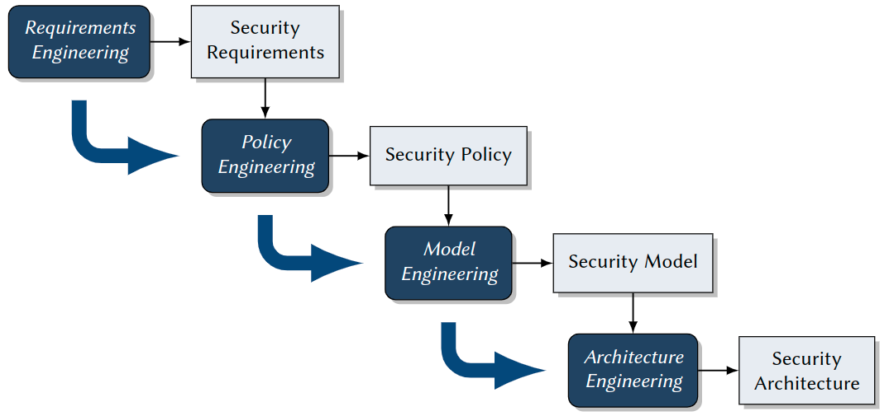

## Lecture Roadmap
1. Security Requirements: Vulnerabilites, Threats, Risks
2. Security Policies and Models: Access Control, Information Flow, Non-Interference
3. Practical Security Engineering: Model Engineering, Model, Specification, Model Implementation
4. Security Mechanisms: FYI Authorization, Authentication, Cryptography
5. Security Architectures: TCBs and Reference Monitors, Nizza,SELinux, Kerberos


# Security Requirements
## Motivation
Goal of Requirements Engineering:

Methodology for 
- identifying
- specifying

the desired security properties of an IT system.

Result:
- Security requirements, which definewhatsecurity properties a system should have.
- These again are the basis of asecurity policy: Defineshowthese properties are achieved

Influencing Factors
- Codes and acts (depending on applicable law)
  - EU General Data Protection Regulation (GDPR)
  - US Sarbanes-Oxley Act (SarbOx)
- Contracts with customers
- Certification
  - For information security management systems (ISO 27001)
  - Subject to German Digital Signature Act (Signaturgesetz), toCommon
- Criteria
- Company-specific guidelines and regulations
  - Access to critical data
  - Permission assignment
- Company-specific infrastructure and technical requirements
  - System architecture
  - Application systems (such as OSs, Database Information Systems)

General Methodology: How to Come up with Security Requirements

Specialized steps in regular software requirements engineering:
1. Identify and classifyvulnerabilities.
2. Identify and classifythreats.
3. Match both, where relevant, to yieldrisks.
4. Analyze and decide which risks should bedealt with.
    -> Fine-grained Security Requirements

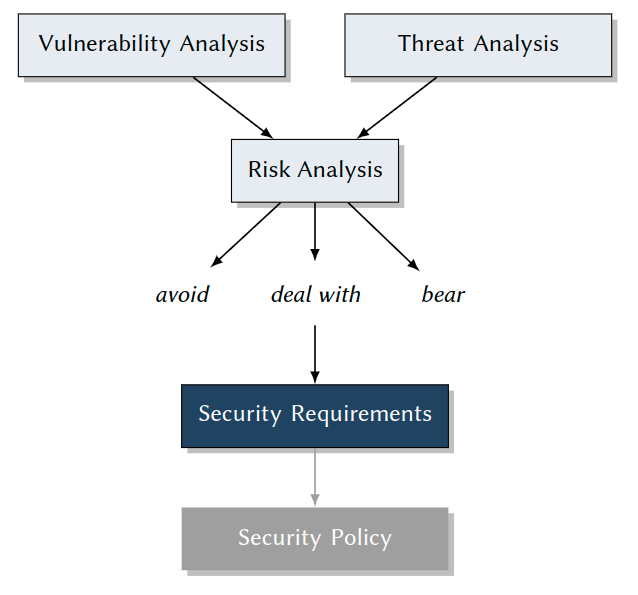
## Vulnerability Analysis
Goal: Identification of
  - technical
  - organizational
  - human
vulnerabilities of IT systems.
> Vulnerability
> 
> Feature of hardware and software constituting, an organization running, or a human operating an IT system, which is a necessary precondition for any attack in that system, with the goal to compromise one of its security properties. Set of all vulnerabilities = a system’sattack surface.

### Human Vulnerabilities
Examples:
- Laziness
  - Passwords on Post-It
  - Fast-clicking exercise: Windows UAC pop-up boxes
- Social Engineering
  - Pressure from your boss
  - A favor for your friend
  - Blackmailing: The poisoned daughter, ...
  - An important-seeming email
- Lack of knowledge
  - Importing and executing malware
  - Indirect, hidden information flowin access control systems

> Social Engineering
> 
> Influencing people into acting against their own interest or the interest of an organisation is often a simpler solution than resorting to malware or hacking.
> Both law enforcement and the financial industry indicate that social engineering continues to enable attackers who lack the technical skills, motivation to use them or the resources to purchase or hire them. Additionally, targeted social engineering allows those technically gifted to orchestrate blended attacks bypassing both human and hardware or software lines of defence. [Europol](https://www.europol.europa.eu/crime-areas-and-trends/crime-areas/cybercrime/social-engineering)

Real Cases
> Self Study Task
> 
> Investigate the following real-world media (all linked from moodle). Find any potential security vulnerabilities there and give advice how to avoid them. 
> - Watch (no listening  required) the interview with staff of the French TV station TV5Monde
> - Read the lifehacker article about Windows UAC
> - Read the Washington Times article about Facebook Scam
> - Read the two eMails I received lately. 

#### Indirect Information Flow in Access Control Systems
A More Detailed Scenario
- AlphaCompany has two departments: Research & Development(R&D) and Sales
- Ann is project manager and Bob is developer working in R&D on ProjectX, Chris is a busybody sales manager writing a marketing flyer about ProjectX
- All R&D developers communicate via an electronic bulletin board, including any preliminary product features not yet ready for release
- Bob is responsible for informing sales about release-ready features, using ashared web document
> Security Requirement
> 
> No internal information about a project, which is not approved by the project manager, should ever go into the product flyer.


Access Control Configuration
- 3 users:ann,bob,chris
- 2 groups:
  - crewx: ann, bob, ...
  - sales: ann, bob
- Settings:
  ```
  drw- --- --- 1 ann crewx 2020-04-14 15:10 ProjectXFiles
  -rw- r-- --- 1 ann crewx 2020-04-14 15:10 ProjectXBoard
  -rw- r-- --- 1 bob sales 2020-04-14 14:22 NotesToSales
  -rw- --- --- 1 chris sales 2020-04-13 23:58 SalesFlyer.pdf
  ```
- Result:
  - all users apparently set their permissions perfectly – from their own point of view
  - all three together createda severe information flow vulnerability...

- Ann has read access to the folder ProjectX Files
- Ann legitimately writes news from these files to the ProjectX Board
- Bob legitimately updates NotesToSales with these news
- Human vulnerability: Bob’s laziness, friendship with Chris, blackmailing by Chris, ... (see above) make him write about unapproved new features
- ->  Chris misuses this information in the Sales Flyer...
> Forbidden Information Flow
>
> Internal information about ProjectX goes into the product flyer!

Problem Analysis:
- Limited knowledge ofusers
  - limited horizon: knowledge about the rest of a system configuration for making a sound decision about permissions
  - limited problem awareness: see “lack of knowledge”
  - limited skills
- Problem complexity ->  effects ofindividualpermission assignments by users
  (= discretionary) tosystem-widesecurity properties
- Limited configuration options and granularity: archaic and inapt security mechanisms in system and application software
  - no isolation of non-trusted software
  - no enforcement of global security policies
- ->  Effectiveness of discretionary access control (DAC), configured by users?

### Organizational Vulnerabilities
Examples:
- Access to rooms (servers!)
- Assignment of permission on organizational level, e. g.
  - 4-eyes principle
  - need-to-know principle
  - definition of roles and hierarchies
- Management of cryptographic keys
  - ->  e. g. for issuing certificates
- ->  Master course on “IT-Sicherheitsmanagement” (in German)

### Technical Vulnerabilities
The Problem: Complexity of IT Systems
- ... will in foreseeable timenotbe
- Completely, consistently, unambiguously, correctly specified
  - ->  contain specification errors
- Correctly implemented
  - ->  contain programming errors
- Re-designed on a daily basis(many security mechanisms of today’s systems are older than 40 years)
  - ->  contain conceptual weaknesses and vulnerabilities

#### Buffer Overflow Attacks
Example for Exploitation of Implementation Errors

in privileged system software:
- Operating Systems (OSs)
- SSH demons
- Web servers
- Database servers

Consequence: Privileged software can be tricked into executing attacker’s code

Approach: Cleverly forged parameters overwrite procedure activation frames in
memory
- ->  exploitation of missing length checks on input buffers
- -> buffer overflow

What an Attacker Needs to Know

##### Necessary Knowledge and Skills
- Source code of the target program (e. g. a privileged server), obtained by disassembling
- Better: symbol table, as with an executable not stripped from debugging information
- Even better: most precise knowledge about the compiler used w.r.t. runtime management
  - how call conventions affect the stack layout
  - degree to which stack layout is deterministic, which eases experimentation

Sketch of the Attack Approach (Observations during program execution)
- Stack grows towards the small addresses
  - ->  small whenever a procedure is called, all its information is stored in aprocedure frame = subsequent addresses below those of previously stored procedure frames
- in each procedure frame: address of the next instruction to call after the current procedure returns (ReturnIP)
- after storing the ReturnIP, compilers reserve stack space for local variables ->  these occupy lower addresses

##### Preparing the Attack
Attacker carefully prepares an input argument msg:`\0 ...\0 /bin/shell#system `
```cpp
void processSomeMsg(char *msg, int msgSize){ 
  char localBuffer[1024];
  int i=0;
  while (i<msgSize) {
    localBuffer[i] = msg[i];
    i++;
  }
  ...
}
```

##### Result:
- Attacker made victim program overwrite runtime-critical parts of its stack:
  - by counting up to the length of msg
  - at the same time writing back over previously save runtime information ->  ReturnIP
- After finishing processSomeMsg: victim program executes code at address of ReturnIP =address of a forged call to execute arbitrary programs!
- Additional parameter to this call: file system location of a shell

> Security Breach
> 
> The attacker can remotely communicate, upload, download, and execute anything– with cooperation of the OS, since all of this runs with the original privileges of the victim program!

##### Self-Study Task
Do an internet research: Find a (more or less) recent example of a successful buffer overflow attack. Describe as precise as possible what happened during the attack and which programming error made it possible!
Commonplace search engines for news articles, but also web databases of software vulnerabilities such as https://cve.mitre.org/ may help you.


### Summary
Vulnerabilities
- Human
  - Laziness
  - Social engineering
  - Lack of knowledge (e. g. malware execution, DAC shortcoming)
- Organizational
  - Key management
  - Physical access to rooms, hardware
- Technical
  - Weak security paradigms
  - Specification and implementation errors
- -> A whole zoo of vulnerabilities!

How can we identify all during systems design and engineering...?
- Vulnerabilities catalogues: ISO 27001, ISO 27002
- Vulnerabilities databases, such as CVE
- Tools (we will see...)

## Threat Analysis
Goal: Identification of
- Attack objectives and attackers
- Attack methods and practices (a.k.a. “Tactics, Techniques, and Procedures (TTPs)”)
- -> know your enemy

Approach: Compilation of a threat catalog, content:
- identified attack objectives
- identified potential attackers
- identified attack methods & techniques
- damage potential of attacks


### Attack Objectives and Attackers
Attack Objectives
- Economical and political power
- Profit
- Wreak havoc (energy infrastructure, water plants, air traffic ...)
- Meet a challenge
 
Attackers
- Professional organizations (which may be hired by anyone, incl. competitors or governments)
- Active and former employees (“Remember that IT guy we fired last year ...?”)
- Terrorists
- Hackers (both good or evil)

Examples
- Economic Espionage
  - Objective: economic and political power, profit
  - Victims: high tech industry(companies that rely on the secrecy of their know-how to successfully compete)
  - Attackers:
    - Competitors, (foreign) governments -> professional organizations
    - Insiders
      - regular, often privileged users of IT systems
      - statistically large share(> 40 %)
      - often indirect ->  social engineering (“Only amateurs target systems; professional target people.”)
      - statistical profile: age 30–40, executive function (department heads, system administrators, lead programmers, ...)
      - weapons: technical and organisational insider knowledge, technical skills
      - -> Your own people.
- Personal Profit
  - Objective: becoming rich(er)(expensive life style, ambitious projects, medical conditions)
  - Attackers:
    - Competitors
    - Insiders
      - profile: age 40–50, management function
      - typically: career peak reached, midlife crisis, new boat, new house, new partner, ...
      - weapons: organisational insider knowledge, organisational authority, management and leadership skills
- Wreak Havoc
  - Objective: damaging or destroying things or lives, blackmailing, meeting a challenge (egomania, narcissism, sportive challange)
  - Attackers:
    - Terrorists: motivated by faith and philosophy, paid by organisations and governments
    - Avengers: see insiders
    - Psychos: all ages, all types, personality disorder (egomania, narcissism, paranoia, ...)
    - ->  No regular access to IT systems, no insider knowledge, butskills and tools.

### Attack Methods
Exploitation of Vulnerabilities
- Human: Social engineering, laziness, lack of knowledge
- Organizational: Rights management, key management, room access
- Technical: Weak protection paradigms, specification and implementation errors

#### Examples
Scenario 1: Insider Attack
- Social Engineering, plus
- Exploitation of conceptual vulnerabilities (DAC),plus
- Professionally tailored malware

Scenario 2: Malware(a family heirloom ...)
- Trojan horses: Executable code with hidden functionality.
- Viruses: Code for self-modification and self-duplication, often coupled with damaging the host.
- Logical bombs: Code that is activated by some event recognizable from the host (e. g. time, date, temperature, pressure, geographic location, ...).
- Backdoors: Code that is activated through undocumented interfaces (mostly remote).
- Ransomware: Code for encrypting possibly all user data found on the host, used for blackmailing the victims (to pay for decryption).
- Worms and worm segments: Autonomous, self-duplicating programs. Originally designed for good: to make use of free computing power in local networks.

Scenario 3: Outsider Attack
- Attack Method: Buffer Overflow
- Exploitation of implementation errors

Scenario 4: High-end Malware:Root Kits
- Goal: Invisible, total, sustainable takeover of a complete IT system
- Method: Comprehensive tool kit for fully automated attacks
  1. automatic analysis of technical vulnerabilities
  2. automated attack execution
  3. automated installation of backdoors
  4. automated installation and activation of stealth mechanisms
- Target: Attacks on all levels of the software stack:
  - firmware
  - bootloader
  - operating system (e. g. drivers, file system, network interface)
  - system applications (e. g. file and process managers)
  - user applications (e. g. web servers, email, office)
- tailored to specific software and software versions found there!


> Self-Study Task
> 
> Read about the following malware examples, both historical and up to date. Identify each as a virus, logical bomb, backdoor, ransomware, or worm; think about which necessary vulnerabilit(y|ies) make all of these threats so dangerous.
> - One of the most sophisticated pieces of malware ever discovered:Stuxnet
> - One of the first large-scale malware threats in history:Michelangelo
> - Two cooperating pieces of malware that put at risk numerous public institutional IT systems:Emotet and Ryuk.

#### Root Kits
Step 1: Vulnerability Analysis
- Tools look for vulnerabilities in
  - Active privileged services and demons (from inside a network:nmap, from outside: by port scans) -> Discovers:web server, remote access server (sshd), file server (ftpd), time server (ntpd), print server (cupsd),bluetoothd,smbd, ...
  - Configuration files -> Discovers: weak passwords, open ports
  - Operating systems -> Discovers: kernel and system tool versions with known implementation errors
- Using built-in knowledge base: an automatable vulnerability database
- Result: System-specific collection of vulnerabilities ->  choice of attack method andtools to execute

Step 2: Attack Execution
- Fabrication oftailored softwareto exploit vulnerabilities in
  - Server processes or system tool processes (demons)
  - OS kernel itself
  to execute code of attacker withroot privileges
- This code
  - First installs smoke-bombs for obscuring attack
  - Then replaces original system software by pre-fabricated modules
      - servers and demons
    - utilities and libraries
    - OS modules
  - containing
    - backdoors (->  step 3)
    - smoke bombs for future attacks (->  step 4)
- Results:
  - Backdoors allow forhigh-privilege access within fractions of seconds
  - System modified with attacker’s servers, demons, utilities, OS modules
  - Obfuscation of modifications and future access

Step 3: Attack Sustainability
- Backdoors for any further control & command in
  - Servers (e. g.sshdemon)
  - Utilities (e. g.login)
  - Libraries (e. g.PAM, pluggable authentication modules)
  - OS (system calls used by programs likesudo)
- Modificationsof utilities and OS to prevent
  - Killing root kit processes and connections (kill,signal)
  - Removal of root kit files (rm,unlink)
- Results: Unnoticed access for attacker
  - Anytime
  - Highly privileged
  - Extremely fast
  - Virtually unpreventable

Step 4: Stealth Mechanisms (Smoke Bombs)
- Clean logfiles (entries for root kit processes, network connections), e.g. syslog,kern.log,user.log,daemon.log,auth.log, ...
- Modify system admin utilities
  - Process management(hide running root kit processes), e.g. ps,top,ksysguard,taskman
  - File system (hide root kit files), e.g. ls,explorer,finder
  - Network (hide active root kit connections), e.g. netstat,ifconfig,ipconfig,iwconfig
- Substitute OS kernel modules and drivers (hide root kit processes, files, network connections), e.g. /proc/...,stat,fstat,pstat
- Result:Processes, files and communication of root kit become invisible

Risk and Damage Potential:
- Likeliness of success: extremely highin today’s commodity OSs
  - High number of vulnerabilities
  - Speed
  - Refined methodology
  - Fully automated
- Fighting the dark arts:extremely difficult
  - Number and cause of vulnerabilities
  - number of “security updates” last month?
  - specification/implementation errors, weak security mechanisms
  - Speed
  - Smoke bombs
- Prospects for recovering the system after successful attack:near zero

Countermeasures - Options:
- Reactive: Well ...(even your OS might have become your enemy)
- Preventive:
  - Counter with same tools for vulnerability analysis (we do this for years now ->  50 Billions € damage taken...)
  - Write correct software (we try this for years now ->  50 Billions € damage taken...)

> Security Engineering
> 
> - New paradigms:policy-controlled systems ->  powerful software platforms
> - New provable guarantees: formal security models ->  reducing specification errors and faultsby design
> - New security architectures -> limiting bad effectsof implementation errors and faults

### Damage Potential
Industrial Espionage:
- Loss of control over critical knowledge ->  loss of economical or political power(high-risk technologies!)
- Economical damage (contract penalties, loss of profit, image damage)
Quantity: 50 000 000 000 €, 40%caused by IT⁶

Personal Profit: Individual loss of money(zero sum game)

Terrorism, hackers:
- Loss of critical infrastructures (energy, water, communication)
- Loss of sea, air, land transport infrastructure
- Damage of financial systems

### Summary
Know Your Enemy
- Attack goals and attackers
  - Economical and political power, financial gain
  - Professional organizations, insiders
- Attack methods und techniques: exploiting vulnerabilities
  - human
  - organizational
  - technical
- ->  A zoo of threats, practical assistance:
  - National (Germany): BSI IT-Grundschutz standards and catalogues
  - International:Common Criteria


Attacks on Public Infrastructure revisited:
> Self-Study Task
> 
> Take a close look at those example scenarios for attacks on public infrastructure you read and researched about in chapter 1. For all of them, try to answer the following questions:
> - Who was the presumed attacker mentioned in the article? Classify them according to what you learned about attacker types.
> - What was the attack objective? Again, classify based on what you learned in this chapter.
> - How was the attack made possible? Identify the types of vulnerabilities exploited.


## Risk Analysis
Goal: Identification and Classification of scenario-specific risks when designing an IT system

Approach:
- Risks $\subseteq$ Vulnerabilities $\times$ Threats
- Correlation of vulnerabilities and matching threats
  - ->  Risk catalogue
- Classification of risks
  - ->  Complexity reduction
- -> Risk matrix

Correlation of Vulnerabilities and Threats
- Goal: Risk catalogue: $n:m$ correlation

### Examples
- Vulnerability: Implementation error in database access control ->  Contents can be accessed by unauthorized users
- Threat: Professional team of attackers, contracted by competitor
- -> Risk: Confidentiality breach


- Vulnerability: Conceptual vulnerability: discretionary access control configuration only
- Threat: Employee in critical financial situation
- -> Risk:
  - Disclosure and sale of corporate secrets
  - Redirection of funds

- n Vulnerabilities 
- m Threats
- -> x Risks

Usually: $max(n,m)≪ x ≤ nm$ -> quite largerisk catalogue!


### Risk Classification
Goal: Catalogue reduction -> major and minor risks

Approach: Qualitative risk matrix; dimensions:

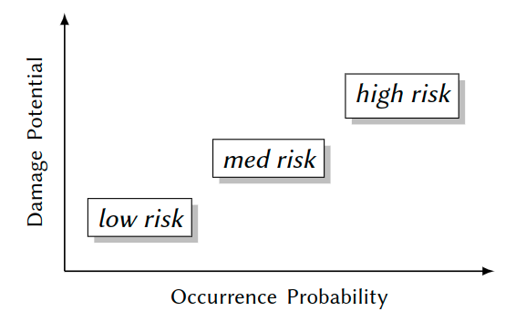

### Risk Matrix
Damage Potential Assessment

Examples for risks:
- Cloud computing:“Loss of VM integrity” ->  contract penalties, loss of confidence/reputation
- Industrial plant control:“Tampering with frequency converters” ->  damage or destruction of facility
- Critical public infrastructure:“Loss of availability due to DoS attacks” ->  interrupted services, possible impact on public safety (cf. Finnish heating plant)
- Traffic management:“Loss of GPS data integrity” ->  maximum credible accident w. r. t. safety

#### General Fact: Damage potential is highly scenario-specific
Example: “Confidentiality breach of database contents”
- Articles in online newspapers
  - -> small to mediumdamage due to lost paywall revenues
- Account data of banks
  - -> mission-criticalloss of trust
- Plant control data of industrial production facility
  - -> mission-criticalloss of market leadership

Depends on diverse, mostly non-technical side conditions
  - ->  advisory board needed for assessment:engineers, managers, users, ...

#### Occurrence Probability Assessment
Examples for risks:
- Cloud computing:“Loss of VM integrity”
  - ->  depending on client data sensitivity
- Industrial plant control:“Tampering with frequency converters”
  - ->  depending on plant sensitivity(cf.Stuxnet: nuclear centifuges)
- Critical public infrastructure:“Loss of availability due to DoS attacks”
  - ->  depending on terroristic threat level
- Traffic management:“Loss of GPS data integrity”
  - ->  depending on terroristic threat level

General Fact: Occurrence probability ishighly scenario-specific

Example: “Confidentiality breach of database contents”
- Articles in online newspapers
  - -> smallfor articles that are publicly available anyway
- Account data of banks
  - -> medium, due to high attack costs compared to potential gain
- Plant control data of industrial production facility
  - -> high, due to high financial or political gain

Depends on diverse, mostly non-technical side conditions
- ->  advisory board needed for assessment:engineers, managers, users, ...


#### Advisory Board Output Example
| Object                       | Risk                    | Dmg. Pot. | Rationale                                                     |
| ---------------------------- | ----------------------- | --------- | ------------------------------------------------------------- |
| Personal Data (PD)           | Loss of Confidentiality | medium    | (1) Data protection acts, (2) Violation of personal rights    |
|                              | Loss of Integrity       | low       | Errors fast and easily detectable and correctable             |
|                              | Loss of Availability    | low       | Failures up to one week can be tolerated by manual procedures |
| Technical Control Data (TCD) | Loss of Confidentiality | high      | Loss of market leadership                                     |
|                              | Loss of Integrity       | high      | Production downtime                                           |
|                              | Loss of Availability    | low       | Minimal production delay, since backups are available         |

| Object                       | Risk                    | Dmg. Pot. | Rationale                                           |
| ---------------------------- | ----------------------- | --------- | --------------------------------------------------- |
| Personal Data (PD)           | Loss of Confidentiality | medium    | Certified software                                  |
|                              | Loss of Integrity       | low       | Certified software, small incentive                 |
|                              | Loss of Availability    | medium    | Certified software                                  |
| Technical Control Data (TCD) | Loss of Confidentiality | high      | Huge financial gain by competitors                  |
|                              | Loss of Integrity       | medium    | Medium gain by competitors or terroristic attackers |
|                              | Loss of Availability    | low       | Small gain by competitors or terroristic attackers  |

Resulting Risk Matrix
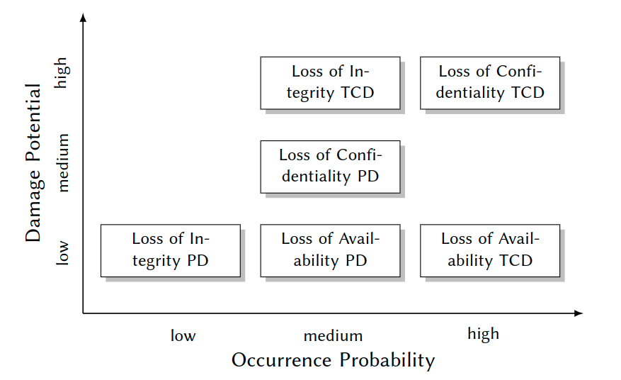

Identify 3 Regions
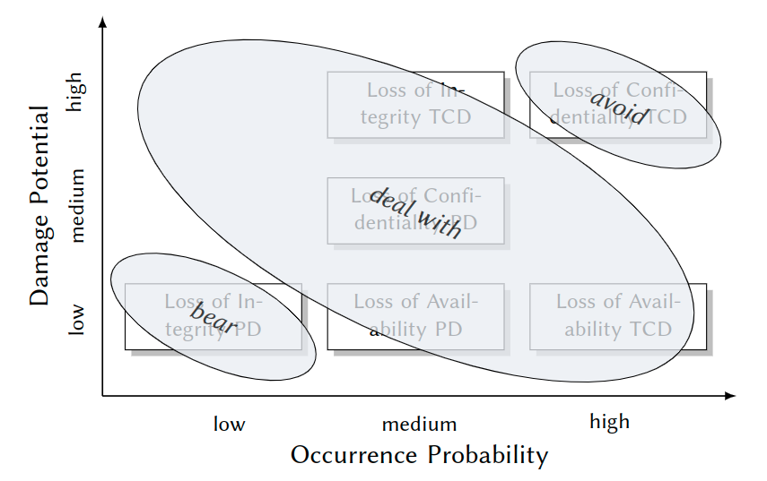

Form Risks to Security Requirements
- avoid: Intolerable risk, no reasonable proportionality of costs and benefits
  - -> Don’t implement such functionality!
- bear: Acceptable risk
  - -> Reduce economical damage, e. g. by insurance.
- deal with: Risks that yieldsecurity requirements
  - -> Prevent or control by system-enforced security policies.

Additional Criteria:
- Again, non-technical side conditions may apply:
  - Expenses for human resources and IT
  - Feasibility from organizational and technological viewpoints
- ->  Cost-benefit ratio:management and business experts involved


# Security Policies and Models
## Security Policies
Motivation - A Traditional Scenario:
- Similarity to systems security:protecting valued assets from threats (human life, cargo, ship)
- Difference: thousands of years of experience
- $\rightarrow$  We may learn something here!

- What Protects these Assets?
    - Navigation lights:protect against collisions
    - Cannons/Guns:protect against pirates
    - Reefs, drift anchors:protect against bad weather
  - $\rightarrow$  Security Mechanisms
    - Watch:protect against collisions
    - The art of sailing, regulations:protect against & comply with special marine conditions(climate, traffic, canal navigation rules)
  - $\rightarrow$  Competent & coordinated operation of mechanisms
  - $\rightarrow$  Security Policies
    - Construction of hull
    - Placement of security mechanisms(nav lights in hold)
  - $\rightarrow$  Effectiveness of mechanisms and enforcement of security policies
  - $\rightarrow$  Security Architecture

### Terminology
Security Policies: A Preliminary Definition
- We have risks:
  - Gales $\rightarrow$  ship capsizes, pirates $\rightarrow$  ship captured
  - Malware attack $\rightarrow$  violation of confidentiality and integrity of patient’s medical records
- We infer security requirements:
  - Protect against gale force 12
  - Valid information flows
- We design a security policy:
  - Rules for dealing with storms, pirates
  - Rules for controlling information flows

> Security Policy
> 
> A set of rules designed to meet a set of security objectives.

> Security Objective
> 
> A statement of intent to counter a given threat or to enforce a given security
policy. 
(Common Criteria for Information Technology Security Evaluation, since 1996)

Policy representations:
- informal (natural language) text
- formal model
- functional software specification
- executable code

##### Example 1: Excerpt from the Unix Security Policy
- $\exists$ subjects(humans, processes) and objects(files, sockets, ...)
- Each object has an owner
- Owners control access permissions for their objects ($\rightarrow$  DAC)
- $\exists$ 3 permissions: read, write, execute
- $\forall$ objects: specific permissions can be granted for 3 subject classes: owner, group, others
- Example: `- rw- r-- r-- 1 peter vsbs 2020-04-19 23:59 syssec-03.pdf`
- Result:
  - $\rightarrow$  identity based + discretionary access control (IBAC + DAC)
  - $\rightarrow$  high degree of individual freedom
  - $\rightarrow$  global responsibility, limited individual horizon (see 2.1.1)

##### Example 2: Excerpt from the AlphaCompany Security Policy
- Authentication:
  1. Each user must be identified based on key certificates issued by Airbus
- Authorization:
  2. Access to ProjectX files is granted only to the project staff (role-based access control)
  3. Changes to files are allowed only if both, the responsible engineer as well as the project leader, approve (“four eyes principle”)
  4. No information must flow from ProjectX to sales department
- Communication:
  5. For protecting integrity, confidentiality and authenticity, every communication is encrypted and digitally signed.

How to Implement Security Policies - Some Previews
- A Integrated insystems software
  - Operating systems
  - Database systems
  - Middleware platforms
- B Integrated inapplication systems

### Implementation Alternative A
The security policy is handled anOS abstractionon its own $\rightarrow$  implemented inside the kernel
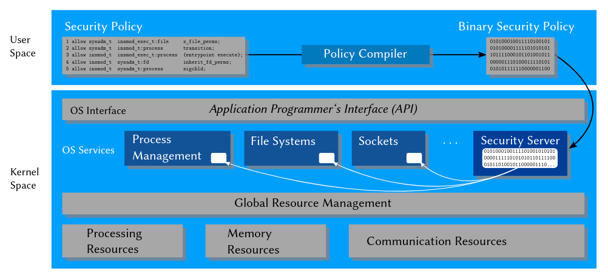

Policy Enforcement in SELinux
- Security Server: Policy runtime environment (protected in kernel space)
- Interceptors:Total control of critical interactions
- Policy Compiler: Translates human-readable policy modules in kernel-readable binary modules
- Security Server: Manages and evaluates these modules

### Implementation Alternative B
Application-embedded Policy: The security policy is only known and enforced by oneuser program $\rightarrow$  implemented in a user-space application

Application-level Security Architecture: The security policy is known and enforced by several collaborating user programs in anapplication systems $\rightarrow$ implemented in a local, user-space security architecture

Policy Server Embedded in Middleware: The security policy is communicated and enforced by several collaborating user programs in adistributed application systems $\rightarrow$ implemented in a distributed, user-space security architecture

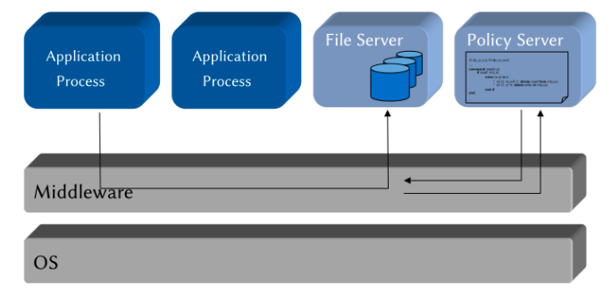


## Security Models
Why We Use Formal Models

> Self-Study Task
> 
> Please read each of the following scenarios. Then select the statement you intuitively think is most likely:
> 1. Linda is a young student with a vision. She fights against environmental pollution and volunteers in an NGO for climate protection. After finishing her studies ...
>   - ... she becomes an attorney for tax law.
>   - ... she becomes an attorney for tax law, but in her spare time consults environmental activists and NGOs.
> 2. Suppose during the 2022 football world cup, Germany reaches the knockout phase after easily winning any game in the previous group phase.
>   - Germany wins the semi-final.
>   - Germany wins the world cup.
> Think twice about your choices. Can you imagine what other people chose, and why?

Goal of Formal Security Models
- Complete, unambiguous representation of security policies for
1. analyzing and explaining its behavior:
  - $\rightarrow$  “This security policy will never allow that ...”
  - $\rightarrow$  “This security policy authorizes/denies an access under conditions ... because ...”
2. enabling its correct implementation:
  - $\rightarrow$ “This rule is enforced by a C++ method ...”

How We Use Formal Models: Model-based Methodology
- Abstraction from (usually too complex) reality $\rightarrow$  get rid of insignificant details e. g.: allows statements about computability and computation complexity
- Precisionin describing what is significant $\rightarrow$  Model analysis and implementation

> Security Model
> 
> A security model is a precise, generally formal representation of a security policy.

Model Spectrum
- Models for access control policies:
  - identity-based access control (IBAC)
  - role-based access control (RBAC)
  - attribute-based access control (ABAC)
- Models for information flow policies
  - $\rightarrow$ multilevel security(MLS)
- Models for non-interference/domain isolation policies
  - $\rightarrow$ non-interference(NI)
- In Practice: Most oftenhybrid models


### Access Control Models
Formal representations of permissions to execute operations on objects, e. g.:
- Reading files
- Issuing payments
- Controlling industrial centrifuges
Security policies describeaccess rules $\rightarrow$  security models formalize them

Taxonomy
> Identity-based access control models (IBAC)
> 
> Rules based on the identity of individual subjects (users, apps, processes, ...) or objects (files, directories, database tables, ...) $\rightarrow$  “Ann may read ProjectX Files.”

> Role-based access control models (RBAC)
> 
> Rules based on roles of subjects in an organization $\rightarrow$  “Ward physicians may modify electronic patient records (EPRs) in their ward.”

> Attribute-based access control models (ABAC)
> 
> Rules based on attributes of subjects and objects $\rightarrow$  “PEGI 18 rated movies may only be streamed to users aged 18 and over.”

> Discretionary Access Control (DAC)
> 
> Individual users specify access rules to objects within their area of responsibility (“at their discretion”).

Example: Access control in many OS (e. g. Unix(oids), Windows)

Consequence: Individual users
- enjoy freedom w. r. t. granting access permissions as individually needed
- need to collectively enforce their organization’s security policy:
  - competency problem
  - responsibility problem
  - malware problem

> Mandatory Access Control (MAC)
> 
> System designers and administrators specify system-wide rules, that apply for all users and cannot be sidestepped.

Examples:
- Organizational: airport security check
- Technical: medical information systems, policy-controlled operating systems(e. g. SELinux)

Consequence:
- Limited individual freedom
- Enforced by central instance:
  - clearly identified
  - competent (security experts)
  - responsible (organizationally & legally)

##### DAC vs. MAC
In Real-world Scenarios: Mostly hybrid models enforced by both discretionary and mandatory components, e. g.:
- DAC: locally within a project, team members individually define permissions w. r. t. documents (implemented in project management software and workstation OSs) inside this closed scope;
- MAC:globally for the organization, such that e. g. only documents approved for release by organizational policy rules (implemented in servers and their communication middleware) may be accessed from outside a project’s scope.


#### Identity-based Access Control Models (IBAC)
Goal: To precisely specify the rights ofindividual, acting entities.

Basic IBAC Paradigm 
- User named s reads file named o
- Client s transfers money to bank account o
- Process with ID s sends over socket with ID o

There are
- Subjects, i. e. active and identifiable entities, that execute 
- operations on
- passive and identifiable objects, requiring
- rights (also: permissions, privileges) which
  - control (restrict) execution of operations,
  - are checked against identity of subjects and objects.

Access Control Functions [Lampson, 1974]
- A really basic model to define access rights:
  - Who (subject) is allowed to do what (operation) on which object
  - Fundamental to OS access control since 1965 (Multics OS)
  - Formal paradigms: sets and functions
- Access Control Function (ACF)
  - $f:S \times O \times OP \rightarrow \{true,false\}$ where
  - S is a set of subjects (e. g. users, processes),
  - O is a set of objects(e. g. files, sockets, EPRs),
  - OP is a finite set of operations(e. g. reading, writing, deleting).
- Interpretation: Rights to execute operations are modeled by the ACF:
  - any $s\in S$ represents an authenticated active entity (e. g. a user or process) which potentially executes operations on objects
  - any $o\in O$ represents an authenticated passive entity (e. g. a file or a database table) on which operations are executed
  - for any $s\in S$,$o\in O$,$op\in OP$:s is allowed to execute op on o iff f(s,o,op)=true.
  - Model making: finding a $tuple⟨S,O,OP,f⟩$
    - $\rightarrow$  Definition of S,O, and OP
    - $\rightarrow$  Definition of f

iff = “if and only if”

Example: Implementation of f in a Unix OS (heavily simplified):
- S: set of identifiers for users who execute processes
- O: set of identifiers for system objects, e. g. files, directories, sockets, ...
- OP: set of system call identifiers

Example for f(caller,file,read):
```cpp
read ( caller , file ) {
  if !(caller.uid == 0) {/* is caller == root? */
    if !(R_MODE in file.inode.othersRWX) {/* check “other”-rights */
      if !(caller.gid == file.inode.group && R_MODE in file.inode.groupRWX) {/* check “group”-rights */
        if !(caller.uid == file.inode.owner && R_MODE in file.inode.ownerRWX) {/* check “group”-rights */
          return ERR_ACCESS_DENIED;/* insufficient rights: deny access */
} } }
/* execute syscall ”read” */
}
```

Systems Security(Peter Amthor, ST 2021) 3–35 3.2.1.1 IBAC | ACF, ACM


> Self-Study Task
> 
> Have a look at your (or any) operating system’s API documentation. Find a few examples for 
> - operations executable by user processes (e. g. Linuxsyscalls), 
> - their arguments,
> - the operating systems resources they work with.
> Try to distinguish between subjects, objects and operations as defined in the classical ACF model. Can you see any ambiguities or inconsistencies w. r. t. the model?
> If you have never worked with an OS API, stick to the simple things (such as reading/writing a file). For Linux, you may find help insection 2 of the online manpages.a ahttp://man7.org/linux/man-pages/dir_section_2.html

##### Access Control Matrix
Access Control Functions in Practice
Lampson [1974] already addresses the questions how to ...
- store in a well-structured way,
- efficiently evaluate, and
- completely analyze an ACF:

> Access Control Matrix (ACM)
> 
> An ACM is a matrix $m:S\times O \rightarrow 2^{OP}$, such that $\forall s\in S,\forall o\in O:op\in m(s,o)\Leftrightarrow f(s,o,op)$.

An ACM is a rewriting of the definition of an ACF: nothing is added, nothing is left out (“$\Leftrightarrow$”). Despite a purely theoretical model: paved the way for practically implementing AC meta-informationas
- tables
- 2-dimensional lists
- distributed arrays and lists

Example
- $S=\{s_1 ,...,s_n\}$
- $O=\{o_1 ,...,o_k\}$
- $OP=\{read,write\}$
- $2^{OP}=\{\varnothing,\{read\},\{write\},\{read,write\}\}^2$
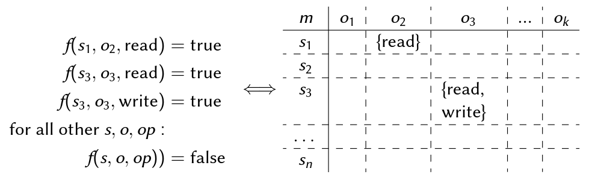

Implementation Notes
- ACMs are implemented in most
  - Operating systems
  - Database information systems
  - Middleware platforms(CORBA, Jini/Apache River, Web Services)
  - Distributed security architectures (Kerberos)
- whose security mechanisms use one of two implementations:

Access Control Lists (ACLs)
- Columns of the ACM: `char*o3[N] = { ”-”, ”-”, ”rw”, ...};`
- Found in I-Nodes of Unix(oids), Windows, Mac OS

Capability Lists
- Rows of the ACM: `char* s1[K] = { ”-”, ”r”, ”-”, ...};`
- Found in distributed OSs, middleware, Kerberos 

What we Actually Model:
> Protection State
> 
> A fixed-time snapshot of all active entities, passive entities, and any meta-information used for making access decisions is called theprotection state of an access control system.

> Goal of ACFs/ACMs
> 
> To precisely specify a protection state of an AC system.

##### The Harrison-Ruzzo-Ullman Model (HRU)
Our HIS scenario ... modeled by an ACM:
- $S=\{cox, kelso, carla,...\}$
- $O=\{patId, diag, medic,...\}$

| m     | parId         | diag          | medic         | ... |
| ----- | ------------- | ------------- | ------------- | --- |
| cox   | {read, write} | {read, write} | {read, write} | ... |
| kelso | {read}        | {read}        | {read}        | ... |
| carla | {read}        | $\varnothing$ | {read}        | ... |
| ...   |

We might do it like this, but ... Privilege escalation question:
“Can it ever happen that in a given state, some specific subject obtains a specific permission?”
$\varnothing \Rightarrow \{r,w\}$
- ACM models a single state ⟨S,O,OP,m⟩
- ACM does not tell us anything about what might happen in the future
- Behavior prediction $\rightarrow$  proliferation of rights $\rightarrow$ HRU safety

Why “safety”, not “security”? Well, historical ...

We need a model which allows statements about
- Dynamic behavior of right assignments
- Complexity of such an analysis

Idea [Harrison et al., 1976]: A (more complex) security model combining
- Lampson’s ACM $\rightarrow$  for modeling single protection state (snapshots) of an AC system
- Deterministic automata (state machines) $\rightarrow$  for modeling runtime changes of a protection state

This idea was pretty awesome. We need to understand automata, since from then on they were used for most security models. $\rightarrow$  Small excursus 

##### Deterministic Automata
Mealy Automaton: $⟨Q,\sum,\Omega,\delta,\lambda,q_0⟩$
- $Q$ is a finite set of states (state space), e. g. $Q=\{q_0 ,q_1 ,q_2\}$
- $\sum$ is a finite set of input words (input alphabet), e. g. $\sum=\{a,b\}$
- $\Omega$ is a finite set of output words (output alphabet), e. g. $\Omega=\{yes,no\}$
- $\delta:Q\times\sum\rightarrow Q$ is the state transition function
- $\lambda:Q\times\sum\rightarrow\Omega$ is the output function
- $q_0\in Q$ is the initial state
- $\delta(q,\sigma)=q′$ and $\lambda(q,\sigma)=\omega$ can be expressed through thestate diagram: a directed graph $⟨Q,E⟩$, where each edge $e\in E$ is represented by a state transition’s predecessor node $q$, its successor node $q′$, and a string “$\sigma|\omega$” of its input and output, respectively.
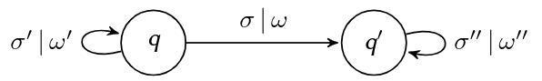

Example: Return “yes” for any input in an unbroken sequence of “a” or “b”, “no” otherwise.
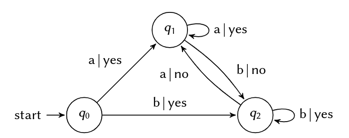

> Self-Study Task
> 
> I bought a new bluetooth headset for giving this lecture. It has just one button and an LED, and this is what the manual says:
> - Turn the device on by holding the button for 1 sec.
> - Turn the device off at any time by holding for 5 sec.
> - Turn the device on in bluetooth pairing mode by holding for 5 sec.
> - Switch to pairing mode when on, but not in a phone call, by holding for 1 sec.
> - Leave pairing mode by clicking the button.
> - Click to start a call. While in a call, click to hang up.
> - While on, the LED indicates modes: red during a call, yellow during pairing, green otherwise.
> Define a mealy automaton for using this headset by defining $Q,\sum,\Omega$,and $q_0$ and draw the state diagram for $\sigma$ and $\lambda$.

### HRU Security Model
How we use Deterministic Automata
- Snapshot of an ACMis the automaton’s state
- Changes of the ACMduring system usage are modeled by state transitions of the automaton
- Effects ofoperationsthat cause such transitions are described by the state transition function
- Analyses ofright proliferation($\rightarrow$  privilege escalation)are enabled by state reachability analysis methods

An HRU model is a deterministic automaton $⟨Q,\sum,\delta,q_0 ,R⟩$ where 
- $Q= 2^S\times 2^O\times  M$ is the state space where
  - S is a (not necessarily finite) set of subjects,
  - O is a (not necessarily finite) set of objects,
  - $M=\{m|m:S\times O\rightarrow 2^R\}$ is a (not necessarily finite) set of possible ACMs,
- $\sum=OP\times X$ is the (finite) input alphabet where
  - $OP$ is a set of operations,
  - $X=(S\cup O)^k$ is a set of k-dimensional vectors of arguments (subjects or objects) of these operations,
- $\sigma:Q\times\sum\rightarrow Q$ is the state transition function,
- $q_0\in Q$ is the initial state,
- R is a (finite) set of access rights.


Interpretation
- Each $q=S_q,O_q,m_q\in Q$ models a system’s protection state:
  - current subjects set $S_q\subseteq S$
  - current objects set $O_q\subseteq O$
  - current ACM $m_q\in M$ where $m_q:S_q\times O_q\rightarrow 2^R$
- State transitions modeled by $\delta$ based on
  - the current automaton state
  - an input word $⟨op,(x_1,...,x_k)⟩\in\sum$ where $op$
    - may modify $S_q$ (create a user $x_i$, kill a process $x_i$ etc.),
    - may modify $O_q$ (create/delete a file $x_i$, open a socket $x_i$ etc.),
    - may modify the contents of a matrix cell $m_q(x_i,x_j)$ (enter or remove rights) where $1\leq i,j\leq k$.
  - $\rightarrow$  We also call $\delta$ the state transition scheme (STS) of a model.
  - Historically: “authorization scheme” [Harrison et al., 1976].

#### State Transition Scheme (STS)
Using the STS, $\sigma:Q\times\sum\rightarrow Q$ is defined by a set of specifications in the normalized form
$\sigma(q,⟨op,(x_1,...,x_k)⟩)$=if $r_1\in m_q(x_{s1},x_{o1}) \wedge ... \wedge r_m\in m_q(x_{sm},x_{om})$ then $p_1\circle ...\circle p_n$ where
- $q=\{S_q,O_q,m_q\}\in Q,op\in OP$
- $r_1 ...r_m\in R$
- $x_{s1},...,x_{sm}\in S_q$ and $x_{o1},...,x_{om}\in O_q$ where $s_i$ and $o_i$, $1\leq i\leq m$, are vector indices of the input arguments: $1\leq s_i,o_i\leqk$
- $p_1,...,p_n$ are HRU primitives
- Note: $\circle$ is the (transitive) function composition operator: $(f\circle g)(x)=g(f(x))$

Whenever $q$ is obvious or irrelevant, we use a programming-style notation

Interpretation: The structure of STS definitions is fixed in HRU:
- “if”: A conjunction of condition clauses (or just conditions) with the sole semantics “is some right in some matrix cell”.
- “then”: A concatenation (sequential execution) of HRU primitives.

Conditions:
Expressions that need to evaluate “true” for state q as a necessary precondition for command $op$ to be executable (= can be successfully called). 

Primitives:
Short, formal macros that describe differences between $q$ and $a$ successor state $q′=\sigma(q,⟨op,(x_1 ,...,x_k)⟩)$ that result from a complete execution of op:
- enter r into $m(x_s,x_o)$
- delete r from $m(x_s,x_o)$
- create subject $x_s$
- create object $x_o$
- destroy subject $x_s$
- destroy object $x_o$
- $\rightarrow$  Each of these with the intuitive semantics for manipulating $S_q, O_q$ or $m_q$.

Note the atomic semantics: the HRU model assumes that each command successfully called is always completely executed!

How to Design an HRU Security Model:
1. Model Sets: Subjects, objects, operations, rights $\rightarrow$  define the basic sets $S,O,OP,R$
2. STS: Semantics of operations (e. g. the future API of the system to model) that modify the protection state $\rightarrow$  define $\sigma$ using the normalized form/programming syntax of the STS
3. Initialization: Define a well-known initial stateq $0 =⟨S_0 ,O_0 ,m_0 ⟩$ of the system to model

An Open University Information System
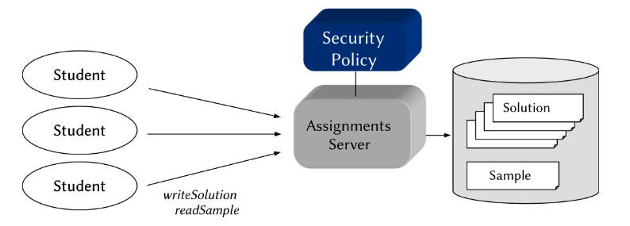
- Informal security policy (heavily simplified):2 rules
  - “A sample solution for home assignments can be downloaded by students only after submitting their own solution.”
    - a condition for readSample
    - a effect of writeSolution
  - “Student solutions can be submitted only before downloading any sample solution.”
    - a condition for writeSolution
    - a effect of readSample


Model Making
1. Sets
  - Subjects, objects, operations, rights:
    - Subjects: An unlimited number of possible students: $S\congruent\mathbb{N}$ (S is isomorphic to $N$)
    - Objects: An unlimited number of possible solutions: $O\congruent\mathbb{N}$
    - Operations:
      - (a) Submit own solution: $writeSolution(s_{student},o_{solution})$
      - (b) Download sample solution: $readSample(s_{student},o_{sample})$
      - $\rightarrow OP=\{writeSolution, readSample\}$
    - Rights: Exactly one right allows to execute each operation: $R\congruent OP$
      - $\rightarrow R=\{write, read\}$
2. State Transition Scheme
  - Effects of operations on protection state:
    - writeSolution
      Informal Policy: “A sample solution (...) can be downloaded by students only after submitting their own solution.” $\Leftrightarrow$  “If the automaton receives an input ⟨writeSolution,(s,o)⟩ and the conditions are satisfied, it transitions to a state where s is allowed to download the sample solution.”
      ```
      command writeSolution(s,o) ::= if write $\in$ m(s,o) 
        then 
          enter read into m(s,o);
        fi
      ```
    - readSample
      Informal Policy: “Student solutions can be submitted only before downloading any sample solution.” $\Leftrightarrow$  “If the automaton receives an input⟨readSample,(s,o)⟩and the conditions are satisfied, it transitions to a state wheresis denied to submit a solution.”
      ```
      command readSample(s,o) ::= if read$\in$ m(s,o)
        then
          delete write from m(s,o);
        fi
      ```
3. Initialization
  - By model definition: $q_0 =⟨S_0 ,O_0 ,m_0 ⟩$
  - For a course with (initially) three students:
    - $S_0 =\{sAnn, sBob, sChris\}$
    - $O_0 =\{oAnn, oBob, oChris\}$
    - $m_0$:
      - $m_0(sAnn,oAnn)=\{write\}$
      - $m_0(sBob,oBob)=\{write\}$
      - $m_0(sChris,oChris)=\{write\}$
      - $m_0(s,o)=\varnothing \Leftrightarrow s\not= o$
    - Interpretation: “There is a course with three students, each of whom has their own workspace to which she is allowed to submit (write) a solution.”

Model Behavior
- Initial Protection State
    | m      | oAnn          | oBob          | oChris        |
    | ------ | ------------- | ------------- | ------------- |
    | sAnn   | {write}       | $\varnothing$ | $\varnothing$ |
    | sBob   | $\varnothing$ | {write}       | $\varnothing$ |
    | sChris | $\varnothing$ | $\varnothing$ | {write}       |
- After $writeSolution(sChris, oChris)$
    | m      | oAnn          | oBob          | oChris        |
    | ------ | ------------- | ------------- | ------------- |
    | sAnn   | {write}       | $\varnothing$ | $\varnothing$ |
    | sBob   | $\varnothing$ | {write}       | $\varnothing$ |
    | sChris | $\varnothing$ | $\varnothing$ | {write, read} |
- After $readSample(sChris, oChris)$
    | m      | oAnn          | oBob          | oChris        |
    | ------ | ------------- | ------------- | ------------- |
    | sAnn   | {write}       | $\varnothing$ | $\varnothing$ |
    | sBob   | $\varnothing$ | {write}       | $\varnothing$ |
    | sChris | $\varnothing$ | $\varnothing$ | {read}        |

Summary
- Model Behavior
  - The model’sinputis a sequence of actions from OP together with their respective arguments.
  - The automaton changes its state according to the STS and the semantics of HRU primitives (here: enter and delete).
  - In the initial state, each student may (repeatedly) submit her respective solution.
- Tricks in this Example
  - The sample solution is not represented by a separate object $\rightarrow$  no separate column in the ACM.
  - Instead, we smuggled thereadright for it into the cell of each student’s solution ...
- Where Do We Stand?
  - We can now model a security policy for particular IBAC scenarios
  - We can formally express them through an automaton-based framework.
- What’s Next? Why all this?
  - Correct specification and implementation of the modeled policy
  - Analysis of security properties $\rightarrow$  Next ...

### HRU Model Analysis
- Reminder: “For a given security model, is it possible that a subjecteverobtains a specific permission with respect to a specific object?”
- Analysis of Right Proliferation $\rightarrow$  The HRU safety problem.

InputSequences
- “What is the effect of an input in a given state?” $\rightarrow$  asingle state transitionas defined by $\delta$
- “What is the effect of an input sequence in a given state?” $\rightarrow$  a composition ofsequential state transitionsas defined by $\delta*$

> Transitive State Transition Functionδ∗
>
> Let $\sigma\sigma\in\sum^*$ be a sequence of inputs consisting of a single input $\sigma\in\sum\cup\{\epsilon\}$ followed by a sequence $\sigma\in\sum^∗$, where $\epsilon$ denotes an empty input sequence. Then, $\delta∗:Q\times\sum^∗\rightarrow Q$ is defined by
> - $\delta∗(q,\sigma\sigma^∗)=\delta^∗(\delta(q,\sigma),\sigma^∗)$
> - $\delta^∗(q,\epsilon)=q$.

HRU Safety
A state q of an HRU model is called HRU safe with respect to a right $r\in R$ iff, beginning with q, there is no sequence of commands that enters r in an ACM cell where it did not exist in q.
According to Tripunitara and Li [2013], this property (Due to more technical details, it’s called simple-safety there.) is defined as:
> HRU Safety
> 
> For a state $q=\{S_q,O_q,m_q\}\in Q$ and a right $r\in R$ of an HRU model $⟨Q,\sum,\delta,q_0,R⟩$, the predicate $safe(q,r)$ holds iff 
> $\forall q′= S_{q′},O_{q′},m_{q′} \in \{\delta^∗(q,\sigma^∗)|\sigma^∗\in\sum^∗\},\forall s\in S_{q′},\forall o\in O_{q′}: r\in m_{q′}(s,o)\Rightarrow s\in S_q \wedge o\in O_q \wedge r\in m_q(s,o)$.
> 
> We say that an HRU model is safe w.r.t. r iff $safe(q_0 ,r)$.

#### HRU Safety
Examples
- Assume all states in ${\delta^∗(q,\sigma^∗)|\sigma^∗\in\sum^∗\}$ have been validated except for $q′$:
  - State transfer 1
    | $m_q$ | $o_1$         | $o_2$         | $o_3$     |
    | ----- | ------------- | ------------- | --------- |
    | $s_1$ | $\{r_1,r_3\}$ | $\{r_1,r_3\}$ | $\{r_2\}$ |
    | $s_2$ | $\{r_1\}      | $\{r_1\}$     | $\{r_2\}$ |
    | $s_3$ | $\varnothing$ | $\varnothing$ | $\{r_2\}$ |

    $\Rightarrow \delta^*(q,\sigma^*)$

    | $m_{q'}$ | $o_1$         | $o_2$         | $o_3$         |
    | -------- | ------------- | ------------- | ------------- |
    | $s_1$    | $\{r_1,r_3\}$ | $\{r_1\}$     | $\{r_2\}$     |
    | $s_2$    | $\{r_1,r_2\}  | $\{r_1\}$     | $\{r_2\}$     |
    | $s_3$    | $\varnothing$ | $\varnothing$ | $\varnothing$ |

    - $r_3\not\in m_{q′}(s_1,o_2)\wedge r_3\in m_q(s_1,o_1)\Rightarrow safe(q,r_3)$
    - $r_2\in m_{q′}(s_2,o_1)\wedge r_2 \not\in m_q(s_2,o_1)\Rightarrow\lnot safe(q,r_2)$
  - State transfer 2
    | $m_q$ | $o_1$         | $o_2$         | $o_3$     |
    | ----- | ------------- | ------------- | --------- |
    | $s_1$ | $\{r_1,r_3\}$ | $\{r_1,r_3\}$ | $\{r_2\}$ |
    | $s_2$ | $\{r_1\}      | $\{r_1\}$     | $\{r_2\}$ |
    | $s_3$ | $\varnothing$ | $\varnothing$ | $\{r_2\}$ |

    $\Rightarrow \delta^*(q,\sigma^*)$

    | $m_{q'}$ | $o_1$         | $o_2$         | $o_3$     | $o_4$         |
    | -------- | ------------- | ------------- | --------- | ------------- |
    | $s_1$    | $\{r_1,r_3\}$ | $\{r_1,r_3\}$ | $\{r_2\}$ | $\varnothing$ |
    | $s_2$    | $\{r_1\}      | $\{r_1\}$     | $\{r_2\}$ | $\{r_2\}$     |
    | $s_3$    | $\varnothing$ | $\varnothing$ | $\{r_2\}$ | $\varnothing$ |
    - $\forall s\in S_{q′}:r_3\not\in m_{q′}(s,o_4)\wedge r_3\in m_q(s_1,o_1)\wedge r_3\in m_q(s_1,o_2)\Rightarrow safe(q,r_3)$
    - $r_2\in m_{q′}(s_2,o_4)\wedge o_4\not\in O_q\Rightarrow\lnot safe(q,r_2)$

Let’s dissect the previous definitions: from a practical perspective, showing that an HRU model is safe w.r.t. r means to
1. Search for any possible (reachable) successor state $q′$ of $q_0$ (“$\{\delta(q_0,\sigma)|\sigma\in\sum\}$”)
2. Visit all cells in $m_{q′}$ (“$\forall s\in S_{q′},\forall o\in O_{q′}:...$”)
3. If r is found in one of these cells (“$r\in m_{q′}(s,o)$”), check if 
    - $m_q$ is defined for this very cell (“$s\in S_q\wedge o\in O_q$”),
    - $r$ was already contained in this very cell in $m_q$ (“$r\in m_q(s,o)$”).
4. Recursively proceed with 2. for any possible successor state $q′′$ of $q′$ (“$\{\delta^∗(q_0,\sigma^∗)|\sigma^∗\in\sum^∗\}$”)

Safety Decidability
> Theorem 1 [Harrison et al., 1976]
> 
> Ingeneral, HRU safety is not decidable.

> Theorem 2 (also Harrison et al. [1976])
> 
> For mono-operational models, HRU safety is decidable.

“So ... what is amono-operational HRU model?” $\rightarrow$  exactly one primitive for each operation in the STS:
```
command op(x_1 , ...,x_k) ::= if r_1 \in m(x_s1 ,x_o1 ) \wedge
    ... \wedge
    r_m \in m(x_sm,x_om)
  then
    p_1;
  fi
```

- Theorem 1: See Harrison et al. [1976], reduction to the Halteproblem.
- Theorem 2: We’ll have a closer look at this one ...
  - Insights into the operational principles modeled by HRU models
  - Demonstrates a method to prove safety property for a particular, given model
  - $\rightarrow$ “Proofs teach us how to build things so nothing more needs to be proven.” (W. E. Kühnhauser) 

##### Proof of Theorem
- Proof Sketch
  1. Find an upper bound for the length of all input sequences with different effects on the protection state w.r.t. safety 
    If such can be found: $\exists$ a finite number of input sequences with different effects
  2. All these inputs can be tested whether they violate safety. This test terminates because:
    - each input sequence is finite
    - there is only a finite number of relevant sequences
  - $\rightarrow$ safety is decidable

Given a mono-operational HRU model.
Let $\sigma_1...\sigma_n$ be any sequence of inputs in $\sum^*$ that violates $safe(q,r)$, and let $p_1...p_n$ be the corresponding sequence of primitives (same length, since mono-operational).

Proposition: For each such sequence, there is a corresponding finite sequence that
- Still violates $safe(q,r)$
- Consists only of enter and two initial create primitives

In other words: For any input sequence,$\exists$ a finite sequence with the same effect.

Proof:
- We construct these finite sequences ...$\rightarrow$
- Transform $\sigma_1...\sigma_n$ into shorter sequences with the same effect:
  1. Remove all input operations that contain delete or destroy primitives. The sequence still violates $safe(q,r)$, because conditions of successive commands must still be satisfied (no absence, only presence of rights is checked).
  2. Prepend the sequence with an initial create subject $s_{init}$ operation. This won’t change its netto effect, because the new subject isn’t used anywhere.
  3. Prune the last create subject s operation and substitute each following reference to s with $s_{init}$. Repeat until allcreate subjectoperations are removed, except from the initialcreate subject sinit.
  4. Same as steps 2 and 3 for objects.
  5. Remove all redundant enter operations (remember: each matrix cell is a set $\rightarrow$ unique elements).

Example:
| init                     | 1.                      | 2.                         | 3.                              | 4.                                    | 5.                                    |
| ------------------------ | ----------------------- | -------------------------- | ------------------------------- | ------------------------------------- | ------------------------------------- |
| ...                      | ...                     | create subject $s_{init}$; | create subject $s_{init}$;      | create subject $s_{init}$;            | create subject $s_{init}$;            |
| ...                      | ...                     | ...                        | ...                             | create object $o_{init}$              | create object $o_{init}$              |
| create subject x2;       | create subject x2;      | create subject x2;         | -                               | -                                     | -                                     |
| create object x5;        | create object x5;       | create object x5;          | create object x5;               | -                                     | -                                     |
| enter r1 into m(x2,x5);  | enter r1 into m(x2,x5); | enter r1 into m(x2,x5);    | enter r1 into $m(s_{init},x5)$; | enter r1 into $m(s_{init},o_{init})$; | enter r1 into $m(s_{init},o_{init})$; |
| enter r2 into m(x2,x5);  | enter r2 into m(x2,x5); | enter r2 into m(x2,x5);    | enter r2 into $m(s_{init},x5)$; | enter r2 into $m(s_{init},o_{init})$; | enter r2 into $m(s_{init},o_{init})$; |
| create subject x7;       | create subject x7;      | create subject x7;         | -                               | -                                     | -                                     |
| delete r1 from m(x2,x5); | -                       | -                          | -                               | -                                     | -                                     |
| destroy subject x2;      | -                       | -                          | -                               | -                                     | -                                     |
| enter r1 into m(x7,x5);  | enter r1 into m(x7,x5); | enter r1 into m(x7,x5);    | enter r1 into $m(s_{init},x5)$; | enter r1 into $m(s_{init},o_{init})$; | -                                     |
| ...                      | ...                     | ...                        | ...                             | ...                                   | ...                                   |

Observations
- after step 3:
  - Except for $s_{init}$, the sequence creates no more subjects
  - All rights of the formerly created subjects are accumulated in $s_{init}\rightarrow$ for the evaluation of $safe(q,r)$, nothing has changed:
    - generally: $\forall s\in S_{q′},\forall o\in O_{q′}:r\in m_{q′}(s,o)\Rightarrow s\in S_q\wedge o\in O_q\wedge r\in m_q(s,o)$
    - in this case: $\forall s\in S_{q′},\forall o\in O_{q′}:r\in m_{q′}(s,o)\Rightarrow s\not=s_{init}\wedge o\in O_q\wedge r\in m_q(s,o)$
  - The sequence is generally shorter (never longer) than before
- Final Observations
  - Except for $s_{init}$ and $o_{init}$, the sequence creates no subjects or objects
  - All entered rights are accumulated in $m_{q′}(s_{init},o_{init})$:
    - generally: $\forall s\in S_{q′},\forall o\in O_{q′}:r\in m_{q′}(s,o)\Rightarrow s\in S_q\wedge o\in O_q\wedge r\in m_q(s,o)$
    - here: $\forall s\in S_{q′},\forall o\in O_{q′}:r\in m_{q′}(s,o)\Rightarrow s\not=s_{init}\wedge o\not=o_{init}\wedge r\in m_q(s,o)$
  - This sequence still violates $safe(q,r)$, but its length is restricted to $(|S_q| + 1)(|O_q|+1)|R|+2$ because
    - Each enter must enter a new right into a cell
    - The number of cells is restricted to $(|S_q| + 1)(|O_q|+1)$

Conclusions from these Theorems
- Dilemma:
  - General (unrestricted) HRU models
    - have strong expressiveness $\rightarrow$  can model a broad range of AC policies
    - are hard to analyze: algorithms and tools for safety analysis
      - $\rightarrow$  cannot certainly produce accurate results
      - $\rightarrow$  are hard to design for approximative results
  - Mono-operational HRU models
    - have weak expressiveness $\rightarrow$  goes as far as uselessness: e. g. for modeling Unix creat(can only create files, sockets, IPC, ... that no user process can access!)
    - are efficient to analyze: algorithms and tools for safety analysis
    - $\rightarrow$  are always guaranteed to terminate
    - $\rightarrow$  are straight-forward to design

Consequences:
- Model variants with restricted yet usable expressiveness have been proposed
- Heuristic analysis methods try to provide educated guesses about safety of unrestricted HRU


## Security Policies
## Security Models
### Access Control Models
#### IBAC
#### RBAC
#### ABAC
#### Summary
### Information Flow Models
#### Denning
#### MLS
#### BLP
#### Biba
#### Summary
### Non-interference Models
### Hybrid Models
#### Brewer-Nash
#### LR-CW
#### MLS-CW

# Practical Security Engineering
## Model Engineering 
## Model Specification 
### CorPS
### SELinux Policy Language
## Summary

# Security Mechanisms
## Authorization
### Access Control Lists
### Capability Lists
### Interceptors
### Summary
## Cryptographic Mechanisms
### Encryption
#### Symmetric
#### Asymmetric
### Cryptographic Hashing
### Digital Signatures
### Cryptographic Attacks
## Identification and Authentication
### Passwords
### Biometrics
### Cryptographic Protocols
#### SmartCards
#### Authentication Protocols
## Summary

# Security Architectures
## Design Principles
## Operating Systems Architectures
### Nizza
### SELinux 
## Distributed Systems Architectures
### CORBA 
### Web Services 
### Kerberos 
## Summary 