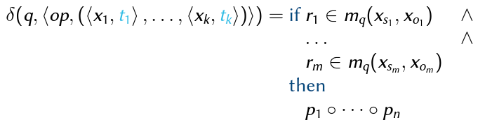
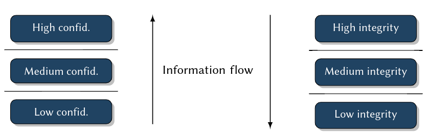

- [Introduction](#introduction)
  - [Risk Scenarios](#risk-scenarios)
  - [Security Goals](#security-goals)
    - [Message](#message)
  - [Security Engineering](#security-engineering)
  - [Lecture Roadmap](#lecture-roadmap)
- [Security Requirements](#security-requirements)
  - [Motivation](#motivation)
  - [Vulnerability Analysis](#vulnerability-analysis)
    - [Human Vulnerabilities](#human-vulnerabilities)
      - [Indirect Information Flow in Access Control Systems](#indirect-information-flow-in-access-control-systems)
    - [Organizational Vulnerabilities](#organizational-vulnerabilities)
    - [Technical Vulnerabilities](#technical-vulnerabilities)
      - [Buffer Overflow Attacks](#buffer-overflow-attacks)
        - [Necessary Knowledge and Skills](#necessary-knowledge-and-skills)
        - [Preparing the Attack](#preparing-the-attack)
        - [Result:](#result)
        - [Self-Study Task](#self-study-task)
    - [Summary](#summary)
  - [Threat Analysis](#threat-analysis)
    - [Attack Objectives and Attackers](#attack-objectives-and-attackers)
    - [Attack Methods](#attack-methods)
      - [Examples](#examples)
      - [Root Kits](#root-kits)
    - [Damage Potential](#damage-potential)
    - [Summary](#summary-1)
  - [Risk Analysis](#risk-analysis)
    - [Examples](#examples-1)
    - [Risk Classification](#risk-classification)
    - [Risk Matrix](#risk-matrix)
      - [General Fact: Damage potential is highly scenario-specific](#general-fact-damage-potential-is-highly-scenario-specific)
      - [Occurrence Probability Assessment](#occurrence-probability-assessment)
      - [Advisory Board Output Example](#advisory-board-output-example)
- [Security Policies and Models](#security-policies-and-models)
  - [Security Policies](#security-policies)
    - [Terminology](#terminology)
        - [Example 1: Excerpt from the Unix Security Policy](#example-1-excerpt-from-the-unix-security-policy)
        - [Example 2: Excerpt from the AlphaCompany Security Policy](#example-2-excerpt-from-the-alphacompany-security-policy)
    - [Implementation Alternative A](#implementation-alternative-a)
    - [Implementation Alternative B](#implementation-alternative-b)
  - [Security Models](#security-models)
    - [Access Control Models](#access-control-models)
        - [DAC vs. MAC](#dac-vs-mac)
      - [Identity-based Access Control Models (IBAC)](#identity-based-access-control-models-ibac)
        - [Access Control Matrix](#access-control-matrix)
        - [The Harrison-Ruzzo-Ullman Model (HRU)](#the-harrison-ruzzo-ullman-model-hru)
        - [Deterministic Automata](#deterministic-automata)
        - [HRU Security Model](#hru-security-model)
        - [State Transition Scheme (STS)](#state-transition-scheme-sts)
        - [HRU Model Analysis](#hru-model-analysis)
        - [HRU Safety](#hru-safety)
        - [Proof of Theorem](#proof-of-theorem)
        - [(A) Restricted Model Variants](#a-restricted-model-variants)
        - [(B) Heuristic Analysis Methods](#b-heuristic-analysis-methods)
        - [Summary HRU Models](#summary-hru-models)
        - [The Typed-Access-Matrix Model (TAM)](#the-typed-access-matrix-model-tam)
        - [TAM Safety Decidability](#tam-safety-decidability)
        - [Acyclic TAM Models](#acyclic-tam-models)
      - [Roles-based Access Control Models (RBAC)](#roles-based-access-control-models-rbac)
        - [RBAC Access Control Function](#rbac-access-control-function)
        - [RBAC96 Model Family](#rbac96-model-family)
        - [RBAC Summary](#rbac-summary)
      - [Attribute-based Access Control Models](#attribute-based-access-control-models)
        - [ABAC Access Control Function](#abac-access-control-function)
        - [ABAC Security Model](#abac-security-model)
        - [ABAC Access Control Function](#abac-access-control-function-1)
        - [ABAC Summary](#abac-summary)
    - [Information Flow Models](#information-flow-models)
      - [The Denning Model](#the-denning-model)
      - [Multilevel Security (MLS)](#multilevel-security-mls)
      - [The Bell-LaPadula Model](#the-bell-lapadula-model)
        - [Lattice vs. ACM](#lattice-vs-acm)
        - [Consistency of L,cl, and m](#consistency-of-lcl-and-m)
        - [BLP Security](#blp-security)
        - [BLP Model Summary](#blp-model-summary)
      - [The Biba Model](#the-biba-model)
    - [Non-interference Models](#non-interference-models)
        - [Example 1: Multi-application Smart Cards](#example-1-multi-application-smart-cards)
        - [Example 2: Server System](#example-2-server-system)
        - [NI Security Policies](#ni-security-policies)
        - [NI Model Analysis](#ni-model-analysis)
        - [Comparison to HRU and IF Models](#comparison-to-hru-and-if-models)
    - [Hybrid Models](#hybrid-models)
      - [Chinese-Wall Policies](#chinese-wall-policies)
      - [The Brewer-Nash Model](#the-brewer-nash-model)
        - [Brewer-Nash STS](#brewer-nash-sts)
        - [Brewer-Nash Model](#brewer-nash-model)
        - [Summary Brewer-Nash](#summary-brewer-nash)
      - [The Least-Restrictive-CW Model](#the-least-restrictive-cw-model)
      - [An MLS Model for Chinese-Wall Policies](#an-mls-model-for-chinese-wall-policies)
        - [Summary CW](#summary-cw)
  - [Summary](#summary-2)
- [Practical Security Engineering](#practical-security-engineering)
  - [Model Engineering](#model-engineering)
    - [Model Family](#model-family)
  - [Model Specification](#model-specification)
    - [DYNAMO: A Dynamic-Model-Specification Language](#dynamo-a-dynamic-model-specification-language)
        - [Example: Specification of a DRBAC_0 Model](#example-specification-of-a-drbac_0-model)
    - [SELinux Policy Language](#selinux-policy-language)
      - [Idea only: SELinux RBAC](#idea-only-selinux-rbac)
      - [Summary SELinux Policy Specification Language](#summary-selinux-policy-specification-language)
    - [Summary](#summary-3)
    - [Next Step: Policy Implementation & Integration](#next-step-policy-implementation--integration)

# Introduction
## Risk Scenarios
Reducing Operational Risks: What responsibilities can we bear?

Critical Properties
- Security + Safety
- Reliability
- Correctness
- Availability
- Real Time
- Scalability
- Openness

Examples:
- Information Systems
- Communication Systems
- Energy Grid Management
- Traffic Management
- Consumer Technology

Responsibility for risks -> guaranteed properties!

Relevance of Security: Security properties if any IT system are mission-critial - independet of its application domain

## Security Goals
Our Faculty's Education and Examination Management System
- Maintains:
  - Course profiles (examination form/date, credit points)
  - Students records (personal data, registration to examinations, grades)
- Services:
  - Enrolment/expulsion of students
  - Registration to examination
  - Registration of examination marks
  - Information and attestations desk
- Operational Risks
  - Conditio sine qua non: Provability of information properties
  - Fake registration to examinations: integrity, non-repudiability ("nicht-abstreitbar")
  - Leakage of grades, personal data: confidentiality, integrity
  - Forgery of attestations: authenticity, integrity

Industry Control Systems
- e.g. Factorys, energy and water plants (public infrastructure)
  - "Chinese Hacking Team Caught Takin over decoy water plant"
  - "Internet Attack shuts off the Heat in Finland"
- Operational risks: Integrity & Availability of public community support systems

[Self Study Task]() Read about these two scenarios. Find one or more recent examples for attacks on public infrastructure, including some technical details, in the news. Keep all these scenarios in mind, we will come back to them in the next chapter:
- [Hacker breached 63 universities and government agencies](https://www.computerworld.com/article/3170724/hacker-breached-63-universities-and-government-agencies.html)
- [Ransomeware attacks on public services](https://www.nytimes.com/2019/08/22/us/ransomware-attacks-hacking.html)
- [Unsecured Databases](https://www.cnet.com/news/2019-data-breach-hall-of-shame-these-were-the-biggest-data-breaches-of-the-year/)
- [Worst data leaks and breaches in the last decade](https://www.cnet.com/how-to/14-of-the-worst-data-leaks-breaches-scrapes-and-security-snafus-in-the-last-decade/)

### Message
- Goal of IT Security: **Reduction of Operational Risks of IT Systems**
- Elementary: Protection of
  - Confidentiality
  - Integrity
  - Availability
  - Non-repudiability

Specific Security Goals (Terms)
- **Confidentiality**: the property of information to be available only to anauthorized user group
- **Integrity**: the property of information to be protected against unauthorized modification
- **Availability**: the property of information to be available in an reasonable time frame
- **Authenticity**: the property to be able to identify the author of an information
- **Non-repudiability**: the combination of integrity and authenticity

|                            | Safety                                                           | Security                                                          |
| -------------------------- | ---------------------------------------------------------------- | ----------------------------------------------------------------- |
| Goal                       | To protect environment against hazards caused by system failures | To protect IT systems against hazards caused by malicious attacks |
|                            | Technical failures: power failure, ageing, dirt                  | Industrial espionage, fraud, blackmailing                         |
|                            | Human errors: stupidity, lacking education, carelessness         | Terrorism, vandalism                                              |
|                            | Force majeure: fire, lightning, earth quakes                     |
| => making sure things work | in the presence of system failures                               | in the face of an intelligent and maliciousadversary              |

## Security Engineering
Security Goals in Practice
- ... are diverse and complex to achieve
- ... require multiple stakeholders to cooperate
- ... involve cross-domain expertise

Security Engineering:
- Is a methodology that tries to tackle this complexity.
- Goal: Engineering IT systems that are *secure by design*.
- Approach: Stepwise increase of guarantees -> formal methods required!

Steps in Security Engineering:


## Lecture Roadmap
1. Security Requirements: Vulnerabilites, Threats, Risks
2. Security Policies and Models: Access Control, Information Flow, Non-Interference
3. Practical Security Engineering: Model Engineering, Model, Specification, Model Implementation
4. Security Mechanisms: FYI Authorization, Authentication, Cryptography
5. Security Architectures: TCBs and Reference Monitors, Nizza,SELinux, Kerberos


# Security Requirements
## Motivation
Goal of Requirements Engineering:

Methodology for 
- identifying
- specifying

the desired security properties of an IT system.

Result:
- Security requirements, which definewhatsecurity properties a system should have.
- These again are the basis of asecurity policy: Defineshowthese properties are achieved

Influencing Factors
- Codes and acts (depending on applicable law)
  - EU General Data Protection Regulation (GDPR)
  - US Sarbanes-Oxley Act (SarbOx)
- Contracts with customers
- Certification
  - For information security management systems (ISO 27001)
  - Subject to German Digital Signature Act (Signaturgesetz), toCommon
- Criteria
- Company-specific guidelines and regulations
  - Access to critical data
  - Permission assignment
- Company-specific infrastructure and technical requirements
  - System architecture
  - Application systems (such as OSs, Database Information Systems)

General Methodology: How to Come up with Security Requirements

Specialized steps in regular software requirements engineering:
1. Identify and classifyvulnerabilities.
2. Identify and classifythreats.
3. Match both, where relevant, to yieldrisks.
4. Analyze and decide which risks should bedealt with.
    -> Fine-grained Security Requirements


## Vulnerability Analysis
Goal: Identification of
  - technical
  - organizational
  - human
vulnerabilities of IT systems.
> Vulnerability
> 
> Feature of hardware and software constituting, an organization running, or a human operating an IT system, which is a necessary precondition for any attack in that system, with the goal to compromise one of its security properties. Set of all vulnerabilities = a system’sattack surface.

### Human Vulnerabilities
Examples:
- Laziness
  - Passwords on Post-It
  - Fast-clicking exercise: Windows UAC pop-up boxes
- Social Engineering
  - Pressure from your boss
  - A favor for your friend
  - Blackmailing: The poisoned daughter, ...
  - An important-seeming email
- Lack of knowledge
  - Importing and executing malware
  - Indirect, hidden information flowin access control systems

> Social Engineering
> 
> Influencing people into acting against their own interest or the interest of an organisation is often a simpler solution than resorting to malware or hacking.
> Both law enforcement and the financial industry indicate that social engineering continues to enable attackers who lack the technical skills, motivation to use them or the resources to purchase or hire them. Additionally, targeted social engineering allows those technically gifted to orchestrate blended attacks bypassing both human and hardware or software lines of defence. [Europol](https://www.europol.europa.eu/crime-areas-and-trends/crime-areas/cybercrime/social-engineering)

Real Cases
> Self Study Task
> 
> Investigate the following real-world media (all linked from moodle). Find any potential security vulnerabilities there and give advice how to avoid them. 
> - Watch (no listening  required) the interview with staff of the French TV station TV5Monde
> - Read the lifehacker article about Windows UAC
> - Read the Washington Times article about Facebook Scam
> - Read the two eMails I received lately. 

#### Indirect Information Flow in Access Control Systems
A More Detailed Scenario
- AlphaCompany has two departments: Research & Development(R&D) and Sales
- Ann is project manager and Bob is developer working in R&D on ProjectX, Chris is a busybody sales manager writing a marketing flyer about ProjectX
- All R&D developers communicate via an electronic bulletin board, including any preliminary product features not yet ready for release
- Bob is responsible for informing sales about release-ready features, using ashared web document
> Security Requirement
> 
> No internal information about a project, which is not approved by the project manager, should ever go into the product flyer.


Access Control Configuration
- 3 users:ann,bob,chris
- 2 groups:
  - crewx: ann, bob, ...
  - sales: ann, bob
- Settings:
  ```
  drw- --- --- 1 ann crewx 2020-04-14 15:10 ProjectXFiles
  -rw- r-- --- 1 ann crewx 2020-04-14 15:10 ProjectXBoard
  -rw- r-- --- 1 bob sales 2020-04-14 14:22 NotesToSales
  -rw- --- --- 1 chris sales 2020-04-13 23:58 SalesFlyer.pdf
  ```
- Result:
  - all users apparently set their permissions perfectly - from their own point of view
  - all three together createda severe information flow vulnerability...

- Ann has read access to the folder ProjectX Files
- Ann legitimately writes news from these files to the ProjectX Board
- Bob legitimately updates NotesToSales with these news
- Human vulnerability: Bob’s laziness, friendship with Chris, blackmailing by Chris, ... (see above) make him write about unapproved new features
- ->  Chris misuses this information in the Sales Flyer...
> Forbidden Information Flow
>
> Internal information about ProjectX goes into the product flyer!

Problem Analysis:
- Limited knowledge ofusers
  - limited horizon: knowledge about the rest of a system configuration for making a sound decision about permissions
  - limited problem awareness: see "lack of knowledge"
  - limited skills
- Problem complexity ->  effects ofindividualpermission assignments by users
  (= discretionary) tosystem-widesecurity properties
- Limited configuration options and granularity: archaic and inapt security mechanisms in system and application software
  - no isolation of non-trusted software
  - no enforcement of global security policies
- ->  Effectiveness of discretionary access control (DAC), configured by users?

### Organizational Vulnerabilities
Examples:
- Access to rooms (servers!)
- Assignment of permission on organizational level, e. g.
  - 4-eyes principle
  - need-to-know principle
  - definition of roles and hierarchies
- Management of cryptographic keys
  - ->  e. g. for issuing certificates
- ->  Master course on "IT-Sicherheitsmanagement" (in German)

### Technical Vulnerabilities
The Problem: Complexity of IT Systems
- ... will in foreseeable timenotbe
- Completely, consistently, unambiguously, correctly specified
  - ->  contain specification errors
- Correctly implemented
  - ->  contain programming errors
- Re-designed on a daily basis(many security mechanisms of today’s systems are older than 40 years)
  - ->  contain conceptual weaknesses and vulnerabilities

#### Buffer Overflow Attacks
Example for Exploitation of Implementation Errors

in privileged system software:
- Operating Systems (OSs)
- SSH demons
- Web servers
- Database servers

Consequence: Privileged software can be tricked into executing attacker’s code

Approach: Cleverly forged parameters overwrite procedure activation frames in
memory
- ->  exploitation of missing length checks on input buffers
- -> buffer overflow

What an Attacker Needs to Know

##### Necessary Knowledge and Skills
- Source code of the target program (e. g. a privileged server), obtained by disassembling
- Better: symbol table, as with an executable not stripped from debugging information
- Even better: most precise knowledge about the compiler used w.r.t. runtime management
  - how call conventions affect the stack layout
  - degree to which stack layout is deterministic, which eases experimentation

Sketch of the Attack Approach (Observations during program execution)
- Stack grows towards the small addresses
  - ->  small whenever a procedure is called, all its information is stored in aprocedure frame = subsequent addresses below those of previously stored procedure frames
- in each procedure frame: address of the next instruction to call after the current procedure returns (ReturnIP)
- after storing the ReturnIP, compilers reserve stack space for local variables ->  these occupy lower addresses

##### Preparing the Attack
Attacker carefully prepares an input argument msg:`\0 ...\0 /bin/shell#system `
```cpp
void processSomeMsg(char *msg, int msgSize){ 
  char localBuffer[1024];
  int i=0;
  while (i<msgSize) {
    localBuffer[i] = msg[i];
    i++;
  }
  ...
}
```

##### Result:
- Attacker made victim program overwrite runtime-critical parts of its stack:
  - by counting up to the length of msg
  - at the same time writing back over previously save runtime information ->  ReturnIP
- After finishing processSomeMsg: victim program executes code at address of ReturnIP =address of a forged call to execute arbitrary programs!
- Additional parameter to this call: file system location of a shell

> Security Breach
> 
> The attacker can remotely communicate, upload, download, and execute anything- with cooperation of the OS, since all of this runs with the original privileges of the victim program!

##### Self-Study Task
Do an internet research: Find a (more or less) recent example of a successful buffer overflow attack. Describe as precise as possible what happened during the attack and which programming error made it possible!
Commonplace search engines for news articles, but also web databases of software vulnerabilities such as https://cve.mitre.org/ may help you.


### Summary
Vulnerabilities
- Human
  - Laziness
  - Social engineering
  - Lack of knowledge (e. g. malware execution, DAC shortcoming)
- Organizational
  - Key management
  - Physical access to rooms, hardware
- Technical
  - Weak security paradigms
  - Specification and implementation errors
- -> A whole zoo of vulnerabilities!

How can we identify all during systems design and engineering...?
- Vulnerabilities catalogues: ISO 27001, ISO 27002
- Vulnerabilities databases, such as CVE
- Tools (we will see...)

## Threat Analysis
Goal: Identification of
- Attack objectives and attackers
- Attack methods and practices (a.k.a. "Tactics, Techniques, and Procedures (TTPs)")
- -> know your enemy

Approach: Compilation of a threat catalog, content:
- identified attack objectives
- identified potential attackers
- identified attack methods & techniques
- damage potential of attacks


### Attack Objectives and Attackers
Attack Objectives
- Economical and political power
- Profit
- Wreak havoc (energy infrastructure, water plants, air traffic ...)
- Meet a challenge
 
Attackers
- Professional organizations (which may be hired by anyone, incl. competitors or governments)
- Active and former employees ("Remember that IT guy we fired last year ...?")
- Terrorists
- Hackers (both good or evil)

Examples
- Economic Espionage
  - Objective: economic and political power, profit
  - Victims: high tech industry(companies that rely on the secrecy of their know-how to successfully compete)
  - Attackers:
    - Competitors, (foreign) governments -> professional organizations
    - Insiders
      - regular, often privileged users of IT systems
      - statistically large share(> 40 %)
      - often indirect ->  social engineering ("Only amateurs target systems; professional target people.")
      - statistical profile: age 30-40, executive function (department heads, system administrators, lead programmers, ...)
      - weapons: technical and organisational insider knowledge, technical skills
      - -> Your own people.
- Personal Profit
  - Objective: becoming rich(er)(expensive life style, ambitious projects, medical conditions)
  - Attackers:
    - Competitors
    - Insiders
      - profile: age 40-50, management function
      - typically: career peak reached, midlife crisis, new boat, new house, new partner, ...
      - weapons: organisational insider knowledge, organisational authority, management and leadership skills
- Wreak Havoc
  - Objective: damaging or destroying things or lives, blackmailing, meeting a challenge (egomania, narcissism, sportive challange)
  - Attackers:
    - Terrorists: motivated by faith and philosophy, paid by organisations and governments
    - Avengers: see insiders
    - Psychos: all ages, all types, personality disorder (egomania, narcissism, paranoia, ...)
    - ->  No regular access to IT systems, no insider knowledge, butskills and tools.

### Attack Methods
Exploitation of Vulnerabilities
- Human: Social engineering, laziness, lack of knowledge
- Organizational: Rights management, key management, room access
- Technical: Weak protection paradigms, specification and implementation errors

#### Examples
Scenario 1: Insider Attack
- Social Engineering, plus
- Exploitation of conceptual vulnerabilities (DAC),plus
- Professionally tailored malware

Scenario 2: Malware(a family heirloom ...)
- Trojan horses: Executable code with hidden functionality.
- Viruses: Code for self-modification and self-duplication, often coupled with damaging the host.
- Logical bombs: Code that is activated by some event recognizable from the host (e. g. time, date, temperature, pressure, geographic location, ...).
- Backdoors: Code that is activated through undocumented interfaces (mostly remote).
- Ransomware: Code for encrypting possibly all user data found on the host, used for blackmailing the victims (to pay for decryption).
- Worms and worm segments: Autonomous, self-duplicating programs. Originally designed for good: to make use of free computing power in local networks.

Scenario 3: Outsider Attack
- Attack Method: Buffer Overflow
- Exploitation of implementation errors

Scenario 4: High-end Malware:Root Kits
- Goal: Invisible, total, sustainable takeover of a complete IT system
- Method: Comprehensive tool kit for fully automated attacks
  1. automatic analysis of technical vulnerabilities
  2. automated attack execution
  3. automated installation of backdoors
  4. automated installation and activation of stealth mechanisms
- Target: Attacks on all levels of the software stack:
  - firmware
  - bootloader
  - operating system (e. g. drivers, file system, network interface)
  - system applications (e. g. file and process managers)
  - user applications (e. g. web servers, email, office)
- tailored to specific software and software versions found there!


> Self-Study Task
> 
> Read about the following malware examples, both historical and up to date. Identify each as a virus, logical bomb, backdoor, ransomware, or worm; think about which necessary vulnerabilit(y|ies) make all of these threats so dangerous.
> - One of the most sophisticated pieces of malware ever discovered:Stuxnet
> - One of the first large-scale malware threats in history:Michelangelo
> - Two cooperating pieces of malware that put at risk numerous public institutional IT systems:Emotet and Ryuk.

#### Root Kits
Step 1: Vulnerability Analysis
- Tools look for vulnerabilities in
  - Active privileged services and demons (from inside a network:nmap, from outside: by port scans) -> Discovers:web server, remote access server (sshd), file server (ftpd), time server (ntpd), print server (cupsd),bluetoothd,smbd, ...
  - Configuration files -> Discovers: weak passwords, open ports
  - Operating systems -> Discovers: kernel and system tool versions with known implementation errors
- Using built-in knowledge base: an automatable vulnerability database
- Result: System-specific collection of vulnerabilities ->  choice of attack method andtools to execute

Step 2: Attack Execution
- Fabrication oftailored softwareto exploit vulnerabilities in
  - Server processes or system tool processes (demons)
  - OS kernel itself
  to execute code of attacker withroot privileges
- This code
  - First installs smoke-bombs for obscuring attack
  - Then replaces original system software by pre-fabricated modules
      - servers and demons
    - utilities and libraries
    - OS modules
  - containing
    - backdoors (->  step 3)
    - smoke bombs for future attacks (->  step 4)
- Results:
  - Backdoors allow forhigh-privilege access within fractions of seconds
  - System modified with attacker’s servers, demons, utilities, OS modules
  - Obfuscation of modifications and future access

Step 3: Attack Sustainability
- Backdoors for any further control & command in
  - Servers (e. g.sshdemon)
  - Utilities (e. g.login)
  - Libraries (e. g.PAM, pluggable authentication modules)
  - OS (system calls used by programs likesudo)
- Modificationsof utilities and OS to prevent
  - Killing root kit processes and connections (kill,signal)
  - Removal of root kit files (rm,unlink)
- Results: Unnoticed access for attacker
  - Anytime
  - Highly privileged
  - Extremely fast
  - Virtually unpreventable

Step 4: Stealth Mechanisms (Smoke Bombs)
- Clean logfiles (entries for root kit processes, network connections), e.g. syslog,kern.log,user.log,daemon.log,auth.log, ...
- Modify system admin utilities
  - Process management(hide running root kit processes), e.g. ps,top,ksysguard,taskman
  - File system (hide root kit files), e.g. ls,explorer,finder
  - Network (hide active root kit connections), e.g. netstat,ifconfig,ipconfig,iwconfig
- Substitute OS kernel modules and drivers (hide root kit processes, files, network connections), e.g. /proc/...,stat,fstat,pstat
- Result:Processes, files and communication of root kit become invisible

Risk and Damage Potential:
- Likeliness of success: extremely highin today’s commodity OSs
  - High number of vulnerabilities
  - Speed
  - Refined methodology
  - Fully automated
- Fighting the dark arts:extremely difficult
  - Number and cause of vulnerabilities
  - number of "security updates" last month?
  - specification/implementation errors, weak security mechanisms
  - Speed
  - Smoke bombs
- Prospects for recovering the system after successful attack:near zero

Countermeasures - Options:
- Reactive: Well ...(even your OS might have become your enemy)
- Preventive:
  - Counter with same tools for vulnerability analysis (we do this for years now ->  50 Billions € damage taken...)
  - Write correct software (we try this for years now ->  50 Billions € damage taken...)

> Security Engineering
> 
> - New paradigms:policy-controlled systems ->  powerful software platforms
> - New provable guarantees: formal security models ->  reducing specification errors and faultsby design
> - New security architectures -> limiting bad effectsof implementation errors and faults

### Damage Potential
Industrial Espionage:
- Loss of control over critical knowledge ->  loss of economical or political power(high-risk technologies!)
- Economical damage (contract penalties, loss of profit, image damage)
Quantity: 50 000 000 000 €, 40%caused by IT⁶

Personal Profit: Individual loss of money(zero sum game)

Terrorism, hackers:
- Loss of critical infrastructures (energy, water, communication)
- Loss of sea, air, land transport infrastructure
- Damage of financial systems

### Summary
Know Your Enemy
- Attack goals and attackers
  - Economical and political power, financial gain
  - Professional organizations, insiders
- Attack methods und techniques: exploiting vulnerabilities
  - human
  - organizational
  - technical
- ->  A zoo of threats, practical assistance:
  - National (Germany): BSI IT-Grundschutz standards and catalogues
  - International:Common Criteria


Attacks on Public Infrastructure revisited:
> Self-Study Task
> 
> Take a close look at those example scenarios for attacks on public infrastructure you read and researched about in chapter 1. For all of them, try to answer the following questions:
> - Who was the presumed attacker mentioned in the article? Classify them according to what you learned about attacker types.
> - What was the attack objective? Again, classify based on what you learned in this chapter.
> - How was the attack made possible? Identify the types of vulnerabilities exploited.


## Risk Analysis
Goal: Identification and Classification of scenario-specific risks when designing an IT system

Approach:
- Risks $\subseteq$ Vulnerabilities $\times$ Threats
- Correlation of vulnerabilities and matching threats
  - ->  Risk catalogue
- Classification of risks
  - ->  Complexity reduction
- -> Risk matrix

Correlation of Vulnerabilities and Threats
- Goal: Risk catalogue: $n:m$ correlation

### Examples
- Vulnerability: Implementation error in database access control ->  Contents can be accessed by unauthorized users
- Threat: Professional team of attackers, contracted by competitor
- -> Risk: Confidentiality breach


- Vulnerability: Conceptual vulnerability: discretionary access control configuration only
- Threat: Employee in critical financial situation
- -> Risk:
  - Disclosure and sale of corporate secrets
  - Redirection of funds

- n Vulnerabilities 
- m Threats
- -> x Risks

Usually: $max(n,m)≪ x $\leq$ nm$ -> quite largerisk catalogue!


### Risk Classification
Goal: Catalogue reduction -> major and minor risks

Approach: Qualitative risk matrix; dimensions:


### Risk Matrix
Damage Potential Assessment

Examples for risks:
- Cloud computing:"Loss of VM integrity" ->  contract penalties, loss of confidence/reputation
- Industrial plant control:"Tampering with frequency converters" ->  damage or destruction of facility
- Critical public infrastructure:"Loss of availability due to DoS attacks" ->  interrupted services, possible impact on public safety (cf. Finnish heating plant)
- Traffic management:"Loss of GPS data integrity" ->  maximum credible accident w. r. t. safety

#### General Fact: Damage potential is highly scenario-specific
Example: "Confidentiality breach of database contents"
- Articles in online newspapers
  - -> small to mediumdamage due to lost paywall revenues
- Account data of banks
  - -> mission-criticalloss of trust
- Plant control data of industrial production facility
  - -> mission-criticalloss of market leadership

Depends on diverse, mostly non-technical side conditions
  - ->  advisory board needed for assessment:engineers, managers, users, ...

#### Occurrence Probability Assessment
Examples for risks:
- Cloud computing:"Loss of VM integrity"
  - ->  depending on client data sensitivity
- Industrial plant control:"Tampering with frequency converters"
  - ->  depending on plant sensitivity(cf.Stuxnet: nuclear centifuges)
- Critical public infrastructure:"Loss of availability due to DoS attacks"
  - ->  depending on terroristic threat level
- Traffic management:"Loss of GPS data integrity"
  - ->  depending on terroristic threat level

General Fact: Occurrence probability ishighly scenario-specific

Example: "Confidentiality breach of database contents"
- Articles in online newspapers
  - -> smallfor articles that are publicly available anyway
- Account data of banks
  - -> medium, due to high attack costs compared to potential gain
- Plant control data of industrial production facility
  - -> high, due to high financial or political gain

Depends on diverse, mostly non-technical side conditions
- ->  advisory board needed for assessment:engineers, managers, users, ...


#### Advisory Board Output Example
| Object                       | Risk                    | Dmg. Pot. | Rationale                                                     |
| ---------------------------- | ----------------------- | --------- | ------------------------------------------------------------- |
| Personal Data (PD)           | Loss of Confidentiality | medium    | (1) Data protection acts, (2) Violation of personal rights    |
|                              | Loss of Integrity       | low       | Errors fast and easily detectable and correctable             |
|                              | Loss of Availability    | low       | Failures up to one week can be tolerated by manual procedures |
| Technical Control Data (TCD) | Loss of Confidentiality | high      | Loss of market leadership                                     |
|                              | Loss of Integrity       | high      | Production downtime                                           |
|                              | Loss of Availability    | low       | Minimal production delay, since backups are available         |

| Object                       | Risk                    | Dmg. Pot. | Rationale                                           |
| ---------------------------- | ----------------------- | --------- | --------------------------------------------------- |
| Personal Data (PD)           | Loss of Confidentiality | medium    | Certified software                                  |
|                              | Loss of Integrity       | low       | Certified software, small incentive                 |
|                              | Loss of Availability    | medium    | Certified software                                  |
| Technical Control Data (TCD) | Loss of Confidentiality | high      | Huge financial gain by competitors                  |
|                              | Loss of Integrity       | medium    | Medium gain by competitors or terroristic attackers |
|                              | Loss of Availability    | low       | Small gain by competitors or terroristic attackers  |

Resulting Risk Matrix


Identify 3 Regions


Form Risks to Security Requirements
- avoid: Intolerable risk, no reasonable proportionality of costs and benefits
  - -> Don’t implement such functionality!
- bear: Acceptable risk
  - -> Reduce economical damage, e. g. by insurance.
- deal with: Risks that yieldsecurity requirements
  - -> Prevent or control by system-enforced security policies.

Additional Criteria:
- Again, non-technical side conditions may apply:
  - Expenses for human resources and IT
  - Feasibility from organizational and technological viewpoints
- ->  Cost-benefit ratio:management and business experts involved


# Security Policies and Models
## Security Policies
Motivation - A Traditional Scenario:
- Similarity to systems security:protecting valued assets from threats (human life, cargo, ship)
- Difference: thousands of years of experience
- $\rightarrow$  We may learn something here!

- What Protects these Assets?
    - Navigation lights:protect against collisions
    - Cannons/Guns:protect against pirates
    - Reefs, drift anchors:protect against bad weather
  - $\rightarrow$  Security Mechanisms
    - Watch:protect against collisions
    - The art of sailing, regulations:protect against & comply with special marine conditions(climate, traffic, canal navigation rules)
  - $\rightarrow$  Competent & coordinated operation of mechanisms
  - $\rightarrow$  Security Policies
    - Construction of hull
    - Placement of security mechanisms(nav lights in hold)
  - $\rightarrow$  Effectiveness of mechanisms and enforcement of security policies
  - $\rightarrow$  Security Architecture

### Terminology
Security Policies: A Preliminary Definition
- We have risks:
  - Gales $\rightarrow$  ship capsizes, pirates $\rightarrow$  ship captured
  - Malware attack $\rightarrow$  violation of confidentiality and integrity of patient’s medical records
- We infer security requirements:
  - Protect against gale force 12
  - Valid information flows
- We design a security policy:
  - Rules for dealing with storms, pirates
  - Rules for controlling information flows

> Security Policy
> 
> A set of rules designed to meet a set of security objectives.

> Security Objective
> 
> A statement of intent to counter a given threat or to enforce a given security
policy. 
(Common Criteria for Information Technology Security Evaluation, since 1996)

Policy representations:
- informal (natural language) text
- formal model
- functional software specification
- executable code

##### Example 1: Excerpt from the Unix Security Policy
- $\exists$ subjects(humans, processes) and objects(files, sockets, ...)
- Each object has an owner
- Owners control access permissions for their objects ($\rightarrow$  DAC)
- $\exists$ 3 permissions: read, write, execute
- $\forall$ objects: specific permissions can be granted for 3 subject classes: owner, group, others
- Example: `- rw- r-- r-- 1 peter vsbs 2020-04-19 23:59 syssec-03.pdf`
- Result:
  - $\rightarrow$  identity based + discretionary access control (IBAC + DAC)
  - $\rightarrow$  high degree of individual freedom
  - $\rightarrow$  global responsibility, limited individual horizon (see 2.1.1)

##### Example 2: Excerpt from the AlphaCompany Security Policy
- Authentication:
  1. Each user must be identified based on key certificates issued by Airbus
- Authorization:
  2. Access to ProjectX files is granted only to the project staff (role-based access control)
  3. Changes to files are allowed only if both, the responsible engineer as well as the project leader, approve ("four eyes principle")
  4. No information must flow from ProjectX to sales department
- Communication:
  5. For protecting integrity, confidentiality and authenticity, every communication is encrypted and digitally signed.

How to Implement Security Policies - Some Previews
- A Integrated insystems software
  - Operating systems
  - Database systems
  - Middleware platforms
- B Integrated inapplication systems

### Implementation Alternative A
The security policy is handled anOS abstractionon its own $\rightarrow$  implemented inside the kernel


Policy Enforcement in SELinux
- Security Server: Policy runtime environment (protected in kernel space)
- Interceptors:Total control of critical interactions
- Policy Compiler: Translates human-readable policy modules in kernel-readable binary modules
- Security Server: Manages and evaluates these modules

### Implementation Alternative B
Application-embedded Policy: The security policy is only known and enforced by oneuser program $\rightarrow$  implemented in a user-space application

Application-level Security Architecture: The security policy is known and enforced by several collaborating user programs in anapplication systems $\rightarrow$ implemented in a local, user-space security architecture

Policy Server Embedded in Middleware: The security policy is communicated and enforced by several collaborating user programs in adistributed application systems $\rightarrow$ implemented in a distributed, user-space security architecture


## Security Models
Why We Use Formal Models

> Self-Study Task
> 
> Please read each of the following scenarios. Then select the statement you intuitively think is most likely:
> 1. Linda is a young student with a vision. She fights against environmental pollution and volunteers in an NGO for climate protection. After finishing her studies ...
>   - ... she becomes an attorney for tax law.
>   - ... she becomes an attorney for tax law, but in her spare time consults environmental activists and NGOs.
> 2. Suppose during the 2022 football world cup, Germany reaches the knockout phase after easily winning any game in the previous group phase.
>   - Germany wins the semi-final.
>   - Germany wins the world cup.
> Think twice about your choices. Can you imagine what other people chose, and why?

Goal of Formal Security Models
- Complete, unambiguous representation of security policies for
1. analyzing and explaining its behavior:
  - $\rightarrow$  "This security policy will never allow that ..."
  - $\rightarrow$  "This security policy authorizes/denies an access under conditions ... because ..."
2. enabling its correct implementation:
  - $\rightarrow$ "This rule is enforced by a C++ method ..."

How We Use Formal Models: Model-based Methodology
- Abstraction from (usually too complex) reality $\rightarrow$  get rid of insignificant details e. g.: allows statements about computability and computation complexity
- Precisionin describing what is significant $\rightarrow$  Model analysis and implementation

> Security Model
> 
> A security model is a precise, generally formal representation of a security policy.

Model Spectrum
- Models for access control policies:
  - identity-based access control (IBAC)
  - role-based access control (RBAC)
  - attribute-based access control (ABAC)
- Models for information flow policies
  - $\rightarrow$ multilevel security(MLS)
- Models for non-interference/domain isolation policies
  - $\rightarrow$ non-interference(NI)
- In Practice: Most oftenhybrid models


### Access Control Models
Formal representations of permissions to execute operations on objects, e. g.:
- Reading files
- Issuing payments
- Controlling industrial centrifuges
Security policies describeaccess rules $\rightarrow$  security models formalize them

Taxonomy
> Identity-based access control models (IBAC)
> 
> Rules based on the identity of individual subjects (users, apps, processes, ...) or objects (files, directories, database tables, ...) $\rightarrow$  "Ann may read ProjectX Files."

> Role-based access control models (RBAC)
> 
> Rules based on roles of subjects in an organization $\rightarrow$  "Ward physicians may modify electronic patient records (EPRs) in their ward."

> Attribute-based access control models (ABAC)
> 
> Rules based on attributes of subjects and objects $\rightarrow$  "PEGI 18 rated movies may only be streamed to users aged 18 and over."

> Discretionary Access Control (DAC)
> 
> Individual users specify access rules to objects within their area of responsibility ("at their discretion").

Example: Access control in many OS (e. g. Unix(oids), Windows)

Consequence: Individual users
- enjoy freedom w. r. t. granting access permissions as individually needed
- need to collectively enforce their organization’s security policy:
  - competency problem
  - responsibility problem
  - malware problem

> Mandatory Access Control (MAC)
> 
> System designers and administrators specify system-wide rules, that apply for all users and cannot be sidestepped.

Examples:
- Organizational: airport security check
- Technical: medical information systems, policy-controlled operating systems(e. g. SELinux)

Consequence:
- Limited individual freedom
- Enforced by central instance:
  - clearly identified
  - competent (security experts)
  - responsible (organizationally & legally)

##### DAC vs. MAC
In Real-world Scenarios: Mostly hybrid models enforced by both discretionary and mandatory components, e. g.:
- DAC: locally within a project, team members individually define permissions w. r. t. documents (implemented in project management software and workstation OSs) inside this closed scope;
- MAC:globally for the organization, such that e. g. only documents approved for release by organizational policy rules (implemented in servers and their communication middleware) may be accessed from outside a project’s scope.


#### Identity-based Access Control Models (IBAC)
Goal: To precisely specify the rights ofindividual, acting entities.

Basic IBAC Paradigm 
- User named s reads file named o
- Client s transfers money to bank account o
- Process with ID s sends over socket with ID o

There are
- Subjects, i. e. active and identifiable entities, that execute 
- operations on
- passive and identifiable objects, requiring
- rights (also: permissions, privileges) which
  - control (restrict) execution of operations,
  - are checked against identity of subjects and objects.

Access Control Functions [Lampson, 1974]
- A really basic model to define access rights:
  - Who (subject) is allowed to do what (operation) on which object
  - Fundamental to OS access control since 1965 (Multics OS)
  - Formal paradigms: sets and functions
- Access Control Function (ACF)
  - $f:S \times O \times OP \rightarrow \{true,false\}$ where
  - S is a set of subjects (e. g. users, processes),
  - O is a set of objects(e. g. files, sockets, EPRs),
  - OP is a finite set of operations(e. g. reading, writing, deleting).
- Interpretation: Rights to execute operations are modeled by the ACF:
  - any $s\in S$ represents an authenticated active entity (e. g. a user or process) which potentially executes operations on objects
  - any $o\in O$ represents an authenticated passive entity (e. g. a file or a database table) on which operations are executed
  - for any $s\in S$,$o\in O$,$op\in OP$:s is allowed to execute op on o iff f(s,o,op)=true.
  - Model making: finding a $tuple⟨S,O,OP,f⟩$
    - $\rightarrow$  Definition of S,O, and OP
    - $\rightarrow$  Definition of f

iff = "if and only if"

Example: Implementation of f in a Unix OS (heavily simplified):
- S: set of identifiers for users who execute processes
- O: set of identifiers for system objects, e. g. files, directories, sockets, ...
- OP: set of system call identifiers

Example for f(caller,file,read):
```cpp
read ( caller , file ) {
  if !(caller.uid == 0) {/* is caller == root? */
    if !(R_MODE in file.inode.othersRWX) {/* check "other"-rights */
      if !(caller.gid == file.inode.group && R_MODE in file.inode.groupRWX) {/* check "group"-rights */
        if !(caller.uid == file.inode.owner && R_MODE in file.inode.ownerRWX) {/* check "group"-rights */
          return ERR_ACCESS_DENIED;/* insufficient rights: deny access */
} } }
/* execute syscall "read" */
}
```


> Self-Study Task
> 
> Have a look at your (or any) operating system’s API documentation. Find a few examples for 
> - operations executable by user processes (e. g. Linuxsyscalls), 
> - their arguments,
> - the operating systems resources they work with.
> Try to distinguish between subjects, objects and operations as defined in the classical ACF model. Can you see any ambiguities or inconsistencies w. r. t. the model?
> If you have never worked with an OS API, stick to the simple things (such as reading/writing a file). For Linux, you may find help insection 2 of the online manpages.a ahttp://man7.org/linux/man-pages/dir_section_2.html

##### Access Control Matrix
Access Control Functions in Practice
Lampson [1974] already addresses the questions how to ...
- store in a well-structured way,
- efficiently evaluate, and
- completely analyze an ACF:

> Access Control Matrix (ACM)
> 
> An ACM is a matrix $m:S\times O \rightarrow 2^{OP}$, such that $\forall s\in S,\forall o\in O:op\in m(s,o)\Leftrightarrow f(s,o,op)$.

An ACM is a rewriting of the definition of an ACF: nothing is added, nothing is left out ("$\Leftrightarrow$"). Despite a purely theoretical model: paved the way for practically implementing AC meta-informationas
- tables
- 2-dimensional lists
- distributed arrays and lists

Example
- $S=\{s_1 ,...,s_n\}$
- $O=\{o_1 ,...,o_k\}$
- $OP=\{read,write\}$
- $2^{OP}=\{\varnothing,\{read\},\{write\},\{read,write\}\}^2$


Implementation Notes
- ACMs are implemented in most
  - Operating systems
  - Database information systems
  - Middleware platforms(CORBA, Jini/Apache River, Web Services)
  - Distributed security architectures (Kerberos)
- whose security mechanisms use one of two implementations:

Access Control Lists (ACLs)
- Columns of the ACM: `char*o3[N] = { "-", "-", "rw", ...};`
- Found in I-Nodes of Unix(oids), Windows, Mac OS

Capability Lists
- Rows of the ACM: `char* s1[K] = { "-", "r", "-", ...};`
- Found in distributed OSs, middleware, Kerberos 

What we Actually Model:
> Protection State
> 
> A fixed-time snapshot of all active entities, passive entities, and any meta-information used for making access decisions is called theprotection state of an access control system.

> Goal of ACFs/ACMs
> 
> To precisely specify a protection state of an AC system.

##### The Harrison-Ruzzo-Ullman Model (HRU)
Our HIS scenario ... modeled by an ACM:
- $S=\{cox, kelso, carla,...\}$
- $O=\{patId, diag, medic,...\}$

| m     | parId         | diag          | medic         | ... |
| ----- | ------------- | ------------- | ------------- | --- |
| cox   | {read, write} | {read, write} | {read, write} | ... |
| kelso | {read}        | {read}        | {read}        | ... |
| carla | {read}        | $\varnothing$ | {read}        | ... |
| ...   |

We might do it like this, but ... Privilege escalation question:
"Can it ever happen that in a given state, some specific subject obtains a specific permission?"
$\varnothing \Rightarrow \{r,w\}$
- ACM models a single state ⟨S,O,OP,m⟩
- ACM does not tell us anything about what might happen in the future
- Behavior prediction $\rightarrow$  proliferation of rights $\rightarrow$ HRU safety

Why "safety", not "security"? Well, historical ...

We need a model which allows statements about
- Dynamic behavior of right assignments
- Complexity of such an analysis

Idea [Harrison et al., 1976]: A (more complex) security model combining
- Lampson’s ACM $\rightarrow$  for modeling single protection state (snapshots) of an AC system
- Deterministic automata (state machines) $\rightarrow$  for modeling runtime changes of a protection state

This idea was pretty awesome. We need to understand automata, since from then on they were used for most security models. $\rightarrow$  Small excursus 

##### Deterministic Automata
Mealy Automaton: $⟨Q,\sum,\Omega,\delta,\lambda,q_0⟩$
- $Q$ is a finite set of states (state space), e. g. $Q=\{q_0 ,q_1 ,q_2\}$
- $\sum$ is a finite set of input words (input alphabet), e. g. $\sum=\{a,b\}$
- $\Omega$ is a finite set of output words (output alphabet), e. g. $\Omega=\{yes,no\}$
- $\delta:Q\times\sum\rightarrow Q$ is the state transition function
- $\lambda:Q\times\sum\rightarrow\Omega$ is the output function
- $q_0\in Q$ is the initial state
- $\delta(q,\sigma)=q′$ and $\lambda(q,\sigma)=\omega$ can be expressed through thestate diagram: a directed graph $⟨Q,E⟩$, where each edge $e\in E$ is represented by a state transition’s predecessor node $q$, its successor node $q′$, and a string "$\sigma|\omega$" of its input and output, respectively.


Example: Return "yes" for any input in an unbroken sequence of "a" or "b", "no" otherwise.


> Self-Study Task
> 
> I bought a new bluetooth headset for giving this lecture. It has just one button and an LED, and this is what the manual says:
> - Turn the device on by holding the button for 1 sec.
> - Turn the device off at any time by holding for 5 sec.
> - Turn the device on in bluetooth pairing mode by holding for 5 sec.
> - Switch to pairing mode when on, but not in a phone call, by holding for 1 sec.
> - Leave pairing mode by clicking the button.
> - Click to start a call. While in a call, click to hang up.
> - While on, the LED indicates modes: red during a call, yellow during pairing, green otherwise.
> Define a mealy automaton for using this headset by defining $Q,\sum,\Omega$,and $q_0$ and draw the state diagram for $\sigma$ and $\lambda$.

##### HRU Security Model
How we use Deterministic Automata
- Snapshot of an ACMis the automaton’s state
- Changes of the ACMduring system usage are modeled by state transitions of the automaton
- Effects ofoperationsthat cause such transitions are described by the state transition function
- Analyses ofright proliferation($\rightarrow$  privilege escalation)are enabled by state reachability analysis methods

An HRU model is a deterministic automaton $⟨Q,\sum,\delta,q_0 ,R⟩$ where 
- $Q= 2^S\times 2^O\times  M$ is the state space where
  - S is a (not necessarily finite) set of subjects,
  - O is a (not necessarily finite) set of objects,
  - $M=\{m|m:S\times O\rightarrow 2^R\}$ is a (not necessarily finite) set of possible ACMs,
- $\sum=OP\times X$ is the (finite) input alphabet where
  - $OP$ is a set of operations,
  - $X=(S\cup O)^k$ is a set of k-dimensional vectors of arguments (subjects or objects) of these operations,
- $\sigma:Q\times\sum\rightarrow Q$ is the state transition function,
- $q_0\in Q$ is the initial state,
- R is a (finite) set of access rights.


Interpretation
- Each $q=S_q,O_q,m_q\in Q$ models a system’s protection state:
  - current subjects set $S_q\subseteq S$
  - current objects set $O_q\subseteq O$
  - current ACM $m_q\in M$ where $m_q:S_q\times O_q\rightarrow 2^R$
- State transitions modeled by $\delta$ based on
  - the current automaton state
  - an input word $⟨op,(x_1,...,x_k)⟩\in\sum$ where $op$
    - may modify $S_q$ (create a user $x_i$, kill a process $x_i$ etc.),
    - may modify $O_q$ (create/delete a file $x_i$, open a socket $x_i$ etc.),
    - may modify the contents of a matrix cell $m_q(x_i,x_j)$ (enter or remove rights) where $1\leq i,j\leq k$.
  - $\rightarrow$  We also call $\delta$ the state transition scheme (STS) of a model.
  - Historically: "authorization scheme" [Harrison et al., 1976].

##### State Transition Scheme (STS)
Using the STS, $\sigma:Q\times\sum\rightarrow Q$ is defined by a set of specifications in the normalized form
$\sigma(q,⟨op,(x_1,...,x_k)⟩)$=if $r_1\in m_q(x_{s1},x_{o1}) \wedge ... \wedge r_m\in m_q(x_{sm},x_{om})$ then $p_1\circle ...\circle p_n$ where
- $q=\{S_q,O_q,m_q\}\in Q,op\in OP$
- $r_1 ...r_m\in R$
- $x_{s1},...,x_{sm}\in S_q$ and $x_{o1},...,x_{om}\in O_q$ where $s_i$ and $o_i$, $1\leq i\leq m$, are vector indices of the input arguments: $1\leq s_i,o_i\leqk$
- $p_1,...,p_n$ are HRU primitives
- Note: $\circle$ is the (transitive) function composition operator: $(f\circle g)(x)=g(f(x))$

Whenever $q$ is obvious or irrelevant, we use a programming-style notation

Interpretation: The structure of STS definitions is fixed in HRU:
- "if": A conjunction of condition clauses (or just conditions) with the sole semantics "is some right in some matrix cell".
- "then": A concatenation (sequential execution) of HRU primitives.

Conditions:
Expressions that need to evaluate "true" for state q as a necessary precondition for command $op$ to be executable (= can be successfully called). 

Primitives:
Short, formal macros that describe differences between $q$ and $a$ successor state $q′=\sigma(q,⟨op,(x_1 ,...,x_k)⟩)$ that result from a complete execution of op:
- enter r into $m(x_s,x_o)$
- delete r from $m(x_s,x_o)$
- create subject $x_s$
- create object $x_o$
- destroy subject $x_s$
- destroy object $x_o$
- $\rightarrow$  Each of these with the intuitive semantics for manipulating $S_q, O_q$ or $m_q$.

Note the atomic semantics: the HRU model assumes that each command successfully called is always completely executed!

How to Design an HRU Security Model:
1. Model Sets: Subjects, objects, operations, rights $\rightarrow$  define the basic sets $S,O,OP,R$
2. STS: Semantics of operations (e. g. the future API of the system to model) that modify the protection state $\rightarrow$  define $\sigma$ using the normalized form/programming syntax of the STS
3. Initialization: Define a well-known initial stateq $0 =⟨S_0 ,O_0 ,m_0 ⟩$ of the system to model

An Open University Information System

- Informal security policy (heavily simplified):2 rules
  - "A sample solution for home assignments can be downloaded by students only after submitting their own solution."
    - a condition for readSample
    - a effect of writeSolution
  - "Student solutions can be submitted only before downloading any sample solution."
    - a condition for writeSolution
    - a effect of readSample


Model Making
1. Sets
  - Subjects, objects, operations, rights:
    - Subjects: An unlimited number of possible students: $S\congruent\mathbb{N}$ (S is isomorphic to $N$)
    - Objects: An unlimited number of possible solutions: $O\congruent\mathbb{N}$
    - Operations:
      - (a) Submit own solution: $writeSolution(s_{student},o_{solution})$
      - (b) Download sample solution: $readSample(s_{student},o_{sample})$
      - $\rightarrow OP=\{writeSolution, readSample\}$
    - Rights: Exactly one right allows to execute each operation: $R\congruent OP$
      - $\rightarrow R=\{write, read\}$
2. State Transition Scheme
  - Effects of operations on protection state:
    - writeSolution
      Informal Policy: "A sample solution (...) can be downloaded by students only after submitting their own solution." $\Leftrightarrow$  "If the automaton receives an input ⟨writeSolution,(s,o)⟩ and the conditions are satisfied, it transitions to a state where s is allowed to download the sample solution."
      ```
      command writeSolution(s,o) ::= if write $\in$ m(s,o) 
        then 
          enter read into m(s,o);
        fi
      ```
    - readSample
      Informal Policy: "Student solutions can be submitted only before downloading any sample solution." $\Leftrightarrow$  "If the automaton receives an input⟨readSample,(s,o)⟩and the conditions are satisfied, it transitions to a state wheresis denied to submit a solution."
      ```
      command readSample(s,o) ::= if read$\in$ m(s,o)
        then
          delete write from m(s,o);
        fi
      ```
3. Initialization
  - By model definition: $q_0 =⟨S_0 ,O_0 ,m_0 ⟩$
  - For a course with (initially) three students:
    - $S_0 =\{sAnn, sBob, sChris\}$
    - $O_0 =\{oAnn, oBob, oChris\}$
    - $m_0$:
      - $m_0(sAnn,oAnn)=\{write\}$
      - $m_0(sBob,oBob)=\{write\}$
      - $m_0(sChris,oChris)=\{write\}$
      - $m_0(s,o)=\varnothing \Leftrightarrow s\not= o$
    - Interpretation: "There is a course with three students, each of whom has their own workspace to which she is allowed to submit (write) a solution."

Model Behavior
- Initial Protection State
    | m      | oAnn          | oBob          | oChris        |
    | ------ | ------------- | ------------- | ------------- |
    | sAnn   | {write}       | $\varnothing$ | $\varnothing$ |
    | sBob   | $\varnothing$ | {write}       | $\varnothing$ |
    | sChris | $\varnothing$ | $\varnothing$ | {write}       |
- After $writeSolution(sChris, oChris)$
    | m      | oAnn          | oBob          | oChris        |
    | ------ | ------------- | ------------- | ------------- |
    | sAnn   | {write}       | $\varnothing$ | $\varnothing$ |
    | sBob   | $\varnothing$ | {write}       | $\varnothing$ |
    | sChris | $\varnothing$ | $\varnothing$ | {write, read} |
- After $readSample(sChris, oChris)$
    | m      | oAnn          | oBob          | oChris        |
    | ------ | ------------- | ------------- | ------------- |
    | sAnn   | {write}       | $\varnothing$ | $\varnothing$ |
    | sBob   | $\varnothing$ | {write}       | $\varnothing$ |
    | sChris | $\varnothing$ | $\varnothing$ | {read}        |

Summary
- Model Behavior
  - The model’sinputis a sequence of actions from OP together with their respective arguments.
  - The automaton changes its state according to the STS and the semantics of HRU primitives (here: enter and delete).
  - In the initial state, each student may (repeatedly) submit her respective solution.
- Tricks in this Example
  - The sample solution is not represented by a separate object $\rightarrow$  no separate column in the ACM.
  - Instead, we smuggled thereadright for it into the cell of each student’s solution ...
- Where Do We Stand?
  - We can now model a security policy for particular IBAC scenarios
  - We can formally express them through an automaton-based framework.
- What’s Next? Why all this?
  - Correct specification and implementation of the modeled policy
  - Analysis of security properties $\rightarrow$  Next ...

##### HRU Model Analysis
- Reminder: "For a given security model, is it possible that a subjecteverobtains a specific permission with respect to a specific object?"
- Analysis of Right Proliferation $\rightarrow$  The HRU safety problem.

InputSequences
- "What is the effect of an input in a given state?" $\rightarrow$  asingle state transitionas defined by $\delta$
- "What is the effect of an input sequence in a given state?" $\rightarrow$  a composition ofsequential state transitionsas defined by $\delta*$

> Transitive State Transition Function$\delta$^*
>
> Let $\sigma\sigma\in\sum^*$ be a sequence of inputs consisting of a single input $\sigma\in\sum\cup\{\epsilon\}$ followed by a sequence $\sigma\in\sum^^*$, where $\epsilon$ denotes an empty input sequence. Then, $\delta^*:Q\times\sum^^*\rightarrow Q$ is defined by
> - $\delta^*(q,\sigma\sigma^^*)=\delta^^*(\delta(q,\sigma),\sigma^^*)$
> - $\delta^^*(q,\epsilon)=q$.

HRU Safety
A state q of an HRU model is called HRU safe with respect to a right $r\in R$ iff, beginning with q, there is no sequence of commands that enters r in an ACM cell where it did not exist in q.
According to Tripunitara and Li [2013], this property (Due to more technical details, it’s called simple-safety there.) is defined as:
> HRU Safety
> 
> For a state $q=\{S_q,O_q,m_q\}\in Q$ and a right $r\in R$ of an HRU model $⟨Q,\sum,\delta,q_0,R⟩$, the predicate $safe(q,r)$ holds iff 
> $\forall q′= S_{q′},O_{q′},m_{q′} \in \{\delta^^*(q,\sigma^^*)|\sigma^^*\in\sum^^*\},\forall s\in S_{q′},\forall o\in O_{q′}: r\in m_{q′}(s,o)\Rightarrow s\in S_q \wedge o\in O_q \wedge r\in m_q(s,o)$.
> 
> We say that an HRU model is safe w.r.t. r iff $safe(q_0 ,r)$.

##### HRU Safety
Examples
- Assume all states in ${\delta^^*(q,\sigma^^*)|\sigma^^*\in\sum^^*\}$ have been validated except for $q′$:
  - State transfer 1
    | $m_q$ | $o_1$         | $o_2$         | $o_3$     |
    | ----- | ------------- | ------------- | --------- |
    | $s_1$ | $\{r_1,r_3\}$ | $\{r_1,r_3\}$ | $\{r_2\}$ |
    | $s_2$ | $\{r_1\}      | $\{r_1\}$     | $\{r_2\}$ |
    | $s_3$ | $\varnothing$ | $\varnothing$ | $\{r_2\}$ |

    $\Rightarrow \delta^*(q,\sigma^*)$

    | $m_{q'}$ | $o_1$         | $o_2$         | $o_3$         |
    | -------- | ------------- | ------------- | ------------- |
    | $s_1$    | $\{r_1,r_3\}$ | $\{r_1\}$     | $\{r_2\}$     |
    | $s_2$    | $\{r_1,r_2\}  | $\{r_1\}$     | $\{r_2\}$     |
    | $s_3$    | $\varnothing$ | $\varnothing$ | $\varnothing$ |

    - $r_3\not\in m_{q′}(s_1,o_2)\wedge r_3\in m_q(s_1,o_1)\Rightarrow safe(q,r_3)$
    - $r_2\in m_{q′}(s_2,o_1)\wedge r_2 \not\in m_q(s_2,o_1)\Rightarrow\lnot safe(q,r_2)$
  - State transfer 2
    | $m_q$ | $o_1$         | $o_2$         | $o_3$     |
    | ----- | ------------- | ------------- | --------- |
    | $s_1$ | $\{r_1,r_3\}$ | $\{r_1,r_3\}$ | $\{r_2\}$ |
    | $s_2$ | $\{r_1\}      | $\{r_1\}$     | $\{r_2\}$ |
    | $s_3$ | $\varnothing$ | $\varnothing$ | $\{r_2\}$ |

    $\Rightarrow \delta^*(q,\sigma^*)$

    | $m_{q'}$ | $o_1$         | $o_2$         | $o_3$     | $o_4$         |
    | -------- | ------------- | ------------- | --------- | ------------- |
    | $s_1$    | $\{r_1,r_3\}$ | $\{r_1,r_3\}$ | $\{r_2\}$ | $\varnothing$ |
    | $s_2$    | $\{r_1\}      | $\{r_1\}$     | $\{r_2\}$ | $\{r_2\}$     |
    | $s_3$    | $\varnothing$ | $\varnothing$ | $\{r_2\}$ | $\varnothing$ |
    - $\forall s\in S_{q′}:r_3\not\in m_{q′}(s,o_4)\wedge r_3\in m_q(s_1,o_1)\wedge r_3\in m_q(s_1,o_2)\Rightarrow safe(q,r_3)$
    - $r_2\in m_{q′}(s_2,o_4)\wedge o_4\not\in O_q\Rightarrow\lnot safe(q,r_2)$

Let’s dissect the previous definitions: from a practical perspective, showing that an HRU model is safe w.r.t. r means to
1. Search for any possible (reachable) successor state $q′$ of $q_0$ ("$\{\delta(q_0,\sigma)|\sigma\in\sum\}$")
2. Visit all cells in $m_{q′}$ ("$\forall s\in S_{q′},\forall o\in O_{q′}:...$")
3. If r is found in one of these cells ("$r\in m_{q′}(s,o)$"), check if 
    - $m_q$ is defined for this very cell ("$s\in S_q\wedge o\in O_q$"),
    - $r$ was already contained in this very cell in $m_q$ ("$r\in m_q(s,o)$").
4. Recursively proceed with 2. for any possible successor state $q′′$ of $q′$ ("$\{\delta^^*(q_0,\sigma^^*)|\sigma^^*\in\sum^^*\}$")

Safety Decidability
> Theorem 1 [Harrison et al., 1976]
> 
> Ingeneral, HRU safety is not decidable.

> Theorem 2 (also Harrison et al. [1976])
> 
> For mono-operational models, HRU safety is decidable.

"So ... what is amono-operational HRU model?" $\rightarrow$  exactly one primitive for each operation in the STS:
```cpp
command op(x_1 , ...,x_k) ::= if r_1 \in m(x_s1 ,x_o1 ) \wedge
    ... \wedge
    r_m \in m(x_sm,x_om)
  then
    p_1;
  fi
```
- Theorem 1: See Harrison et al. [1976], reduction to the Halteproblem.
- Theorem 2: We’ll have a closer look at this one ...
  - Insights into the operational principles modeled by HRU models
  - Demonstrates a method to prove safety property for a particular, given model
  - $\rightarrow$ "Proofs teach us how to build things so nothing more needs to be proven." (W. E. Kühnhauser) 

##### Proof of Theorem
- Proof Sketch
  1. Find an upper bound for the length of all input sequences with different effects on the protection state w.r.t. safety 
    If such can be found: $\exists$ a finite number of input sequences with different effects
  2. All these inputs can be tested whether they violate safety. This test terminates because:
    - each input sequence is finite
    - there is only a finite number of relevant sequences
  - $\rightarrow$ safety is decidable

Given a mono-operational HRU model.
Let $\sigma_1...\sigma_n$ be any sequence of inputs in $\sum^*$ that violates $safe(q,r)$, and let $p_1...p_n$ be the corresponding sequence of primitives (same length, since mono-operational).

Proposition: For each such sequence, there is a corresponding finite sequence that
- Still violates $safe(q,r)$
- Consists only of enter and two initial create primitives

In other words: For any input sequence,$\exists$ a finite sequence with the same effect.

Proof:
- We construct these finite sequences ...$\rightarrow$
- Transform $\sigma_1...\sigma_n$ into shorter sequences with the same effect:
  1. Remove all input operations that contain delete or destroy primitives. The sequence still violates $safe(q,r)$, because conditions of successive commands must still be satisfied (no absence, only presence of rights is checked).
  2. Prepend the sequence with an initial create subject $s_{init}$ operation. This won’t change its netto effect, because the new subject isn’t used anywhere.
  3. Prune the last create subject s operation and substitute each following reference to s with $s_{init}$. Repeat until allcreate subjectoperations are removed, except from the initialcreate subject sinit.
  4. Same as steps 2 and 3 for objects.
  5. Remove all redundant enter operations (remember: each matrix cell is a set $\rightarrow$ unique elements).

Example:
| init                     | 1.                      | 2.                         | 3.                              | 4.                                    | 5.                                    |
| ------------------------ | ----------------------- | -------------------------- | ------------------------------- | ------------------------------------- | ------------------------------------- |
| ...                      | ...                     | create subject $s_{init}$; | create subject $s_{init}$;      | create subject $s_{init}$;            | create subject $s_{init}$;            |
| ...                      | ...                     | ...                        | ...                             | create object $o_{init}$              | create object $o_{init}$              |
| create subject x2;       | create subject x2;      | create subject x2;         | -                               | -                                     | -                                     |
| create object x5;        | create object x5;       | create object x5;          | create object x5;               | -                                     | -                                     |
| enter r1 into m(x2,x5);  | enter r1 into m(x2,x5); | enter r1 into m(x2,x5);    | enter r1 into $m(s_{init},x5)$; | enter r1 into $m(s_{init},o_{init})$; | enter r1 into $m(s_{init},o_{init})$; |
| enter r2 into m(x2,x5);  | enter r2 into m(x2,x5); | enter r2 into m(x2,x5);    | enter r2 into $m(s_{init},x5)$; | enter r2 into $m(s_{init},o_{init})$; | enter r2 into $m(s_{init},o_{init})$; |
| create subject x7;       | create subject x7;      | create subject x7;         | -                               | -                                     | -                                     |
| delete r1 from m(x2,x5); | -                       | -                          | -                               | -                                     | -                                     |
| destroy subject x2;      | -                       | -                          | -                               | -                                     | -                                     |
| enter r1 into m(x7,x5);  | enter r1 into m(x7,x5); | enter r1 into m(x7,x5);    | enter r1 into $m(s_{init},x5)$; | enter r1 into $m(s_{init},o_{init})$; | -                                     |
| ...                      | ...                     | ...                        | ...                             | ...                                   | ...                                   |

Observations
- after step 3:
  - Except for $s_{init}$, the sequence creates no more subjects
  - All rights of the formerly created subjects are accumulated in $s_{init}\rightarrow$ for the evaluation of $safe(q,r)$, nothing has changed:
    - generally: $\forall s\in S_{q′},\forall o\in O_{q′}:r\in m_{q′}(s,o)\Rightarrow s\in S_q\wedge o\in O_q\wedge r\in m_q(s,o)$
    - in this case: $\forall s\in S_{q′},\forall o\in O_{q′}:r\in m_{q′}(s,o)\Rightarrow s\not=s_{init}\wedge o\in O_q\wedge r\in m_q(s,o)$
  - The sequence is generally shorter (never longer) than before
- Final Observations
  - Except for $s_{init}$ and $o_{init}$, the sequence creates no subjects or objects
  - All entered rights are accumulated in $m_{q′}(s_{init},o_{init})$:
    - generally: $\forall s\in S_{q′},\forall o\in O_{q′}:r\in m_{q′}(s,o)\Rightarrow s\in S_q\wedge o\in O_q\wedge r\in m_q(s,o)$
    - here: $\forall s\in S_{q′},\forall o\in O_{q′}:r\in m_{q′}(s,o)\Rightarrow s\not=s_{init}\wedge o\not=o_{init}\wedge r\in m_q(s,o)$
  - This sequence still violates $safe(q,r)$, but its length is restricted to $(|S_q| + 1)(|O_q|+1)|R|+2$ because
    - Each enter must enter a new right into a cell
    - The number of cells is restricted to $(|S_q| + 1)(|O_q|+1)$

Conclusions from these Theorems
- Dilemma:
  - General (unrestricted) HRU models
    - have strong expressiveness $\rightarrow$  can model a broad range of AC policies
    - are hard to analyze: algorithms and tools for safety analysis
      - $\rightarrow$  cannot certainly produce accurate results
      - $\rightarrow$  are hard to design for approximative results
  - Mono-operational HRU models
    - have weak expressiveness $\rightarrow$  goes as far as uselessness: e. g. for modeling Unix creat(can only create files, sockets, IPC, ... that no user process can access!)
    - are efficient to analyze: algorithms and tools for safety analysis
    - $\rightarrow$  are always guaranteed to terminate
    - $\rightarrow$  are straight-forward to design

Consequences:
- Model variants with restricted yet usable expressiveness have been proposed
- Heuristic analysis methods try to provide educated guesses about safety of unrestricted HRU


##### (A) Restricted Model Variants
Static HRU Models
- Static: no create primitives allowed
- safe(q,r) decidable, but NP-complete problem
- Applications: (static) real-time systems, closed embedded systems

Monotonous Mono-conditional HRU Models
- Monotonous (MHRU): no delete or destroy primitives
- Mono-conditional: at most one clause in conditions part (For monotonous bi-conditional models, safety is already undecidable ...)
- safe(q,r) efficiently decidable
- Applications: Archiving/logging systems (where nothing is ever deleted)

Finite Subject Set
- $\forall q\in Q,\exists n\in N: |S_q|\leq n$
- $safe(q,r)$ decidable, but high computational complexity

Fixed STS
- All STS commands are fixed, match particular application domain (e.g. OS access control [Lipton and Snyder, 1977]) $\rightarrow$  no model reusability
- For Lipton and Snyder [1977]: $safe(q,r)$ decidable in linear time (!)

Strong Type System
- Special model that generalizes HRU: Typed Access Matrix (TAM) [Sandhu, 1992]
- $safe(q,r)$ decidable in polynomial time for ternary, acyclic, monotonous variants
- high, though not unrestricted expressiveness in practice

##### (B) Heuristic Analysis Methods
Motivation:
- Restricted model variants: often too weak for real-world applications
- General HRU models: safety property cannot be guaranteed $\rightarrow$ Let’s try to get a piece from both cakes: Heuristically guided safety estimation [Amthor et al., 2013]

Idea:
- State-space exploration by model simulation
- Task of heuristic: generating input sequences ("educated guessing") 

Outline: Two-phase-algorithm to analyze $safe(q_0,r)$:
1. Static phase: Infer knowledge from the model that helps heuristic to make "good" decisions.
    - $\rightarrow$  Runtime: polynomial in model size ($q_0 + STS$)
2. Simulation phase: The automaton is implemented and, starting with $q_0$, fed with inputs $\sigma=⟨op,x⟩$
    - $\rightarrow$  For each $\sigma$, the heuristic has to decide:
      - which operation op to use
      - which vector of arguments x to pass
      - which $q_i$ to use from the states in $Q$ known so far
    - Termination: As soon as $\sigma(q_i,\sigma)$ violates $safe(q_0,r)$.

Goal: Iteratively build up the (possibly infinite!) $Q$ for a model to falsify safety by example (finding a violating, but possible protection state).

Results:
- Termination: Well ... we only have a semi-decidable problem here: It can be guaranteed that a model is unsafe if we terminate. We cannot ever prove the opposite, however! ($\rightarrow$ safety undecidability)
- Performance: A few results
  - 2013:Model size 10 000 ≈2215 s
  - 2018:Model size 10 000 ≈0,36 s
  - 2018:Model size 10 000 000 ≈417 s

Achievements:
- Find typical errors in security policies: Guide their designers, who might know there’s something wrong w. r. t. right proliferation, but not what and why!
- Increase our understanding of unsafety origins: By building clever heuristics, we started to understand how we might design specialized HRU models ($\rightarrow$ fixed STS, type system) that are safety-decidable yet practically (re-) usable [Amthor and Rabe, 2020].

##### Summary HRU Models
Goal
- Analysis of right proliferation in AC models
- Assessing the computational complexity of such analyses

Method
- Combining ACMs and deterministic automata
- Defining $safe(q,r)$ based on this formalism

Conclusions
- Potential right proliferation (privilege escalation): Generally undecidable problem
- $\rightarrow$  HRUmodel family, consisting of application-tailored, safety-decidable variants
- $\rightarrow$  Heuristic analysis methods for practical error-finding 

##### The Typed-Access-Matrix Model (TAM)
Goal
- AC model, similar expressiveness to HRU
- $\rightarrow$  can be directly mapped to implementations of an ACM: OS ACLs, DB permission assignment tables
- Better suited for safety analyses: precisely statemodel properties for decidable safety

Idea [Sandhu, 1992]
- Adopted from HRU: subjects, objects, ACM, automaton
- New:leverage the principle of strong typing known from programming
- $\rightarrow$  safety decidability properties relate to type-based restrictions 

How it Works:
- Foundation of a TAM model is an HRU model $⟨Q,\sum,\delta,q_0 ,R⟩$, where $Q= 2^S\times 2^O\times M$
- However: $S\subseteq O$, i. e.:
  - all subjects can also act as objects (=targets of an access)
  - $\rightarrow$  useful for modeling e. g. delegation ("s has the right to grant s′ her read-right")
  - objects in $O\backslash S$: pure objects
- Each $o\in O$ has a type from a type set $T$ assigned through a mapping $type:O\rightarrow T$
- An HRU model is a special case of a TAM model:
  - $T=\{tSubject,tObject\}$
  - $\forall s\in S:type(s)=tSubject; \forall o\in O\backslash S:type(o)=tObject$

> TAM Security Model
> 
> A TAM model is a deterministic automaton $⟨Q,\sum,\delta,q_0 ,T,R⟩$ where
> - $Q= 2^S\times 2^O\times TYPE\times M$ is the state space where $S$ and $O$ are subjects set and objects set as in HRU, where $S\subseteq O$, $TYPE=\{type|type:O\rightarrow T\}$ is a set of possible type functions, $M$ is the set of possible $ACMs$ as in HRU,
> - $\sum=OP\times X$ is the (finite) input alphabet where $OP$ is a set of operations as in HRU, $X=O^k$ is a set of $k$-dimensional vectors of arguments (objects) of these operations,
> - $\delta:Q\times\sum\rightarrow Q$ is the state transition function,
> - $q_0\in Q$ is the initial state,
> - $T$ is a static (finite) set of types,
> - $R$ is a (finite) set of access rights.

State Transition Scheme (STS)
$\delta:Q\times\sum\rightarrow Q$ is defined by a set of specifications: 

where
  - $q= (S_q,O_q,type_q,m_q)\in Q,op\in OP$
  - $r_1,...,r_m\in R$
  - $x_{s1},...,x_{sm}\in S_q,x_{o1},...,x_{om}\in Oq\backslash S_q$, and $t_1,...,t_k\in T$ where $s_i$ and $o_i, 1\leq i\leq m$ , are vector indices of the input arguments: $1\leq s_i,o_i\leq k$
  - $p_1,...,p_n$ are TAM primitives 
- Convenience Notation where
  - 
  - $q\in Q$ is implicit
  - $op,r_1 ,...,r_m,s_1 ,...,s_m,o_1 ,...,o_m$ as before
  - $t_1 ,...,t_k$ are argument types
  - $p_1 ,...,p_n$ are TAM-specific primitives
- TAM-specific
  - Implicit Add-on:Type Checking
  - 
  - where $t_i$ are the types of the arguments $x_i, 1\leq i\leq k$. 

TAM-specific
- Primitives:
  - enter r into m(x_s,x_o)
  - delete r from m(x_s,x_o)
  - create subject x_s of type t_s
  - create object x_o of type t_o
  - destroy subject x_s
  - destroy object x_o
- Observation: $S$ and $O$ are dynamic (as in HRU), thus $type:O\rightarrow T$ must be dynamic too (cf. definition of $Q$ in TAM). 

TAM Example: The ORCON Policy
- Example Scenario: Originator Controlled Access Rights (ORCON Policy)
- Goal: To illustrate usefulness/convenience of type system
  - ORCON describes sub-problem of larger policies
  - Information flow confinement required by ORCON is tricky to do in HRU ("This information may not flow beyond ...") 
- The Problem
  - Creator/owner of a document shouldpermanently retain controlover its accesses
  - Neither direct nor indirect (by copying) right proliferation
  - Application scenarios: Digital rights management, confidential sharing (online social networks!)
  - 
- Solution with TAM
  - Idea: A _confined subject_ type that can never execute any operation other than reading
  - Model Initialization:
    - Subjects: $S_0=\{ann,bob,chris\}$
    - Objects: $O_0 =S_0\cup\{projectX\}$
    - Operations: $\rightarrow$ next ...
    - Rights: $R=\{read,write,cread,own,parent\}$
    - Types: $T=\{s,cs,co\}$ (regular subject,confined subject/object)
    - $type_0$:
      - $type_0(ann)=s$
      - $type_0(bob)=s$
      - $type_0(projectX)=co$
- Model Behavior (Example)
  - ann creates ORCON object _projectX_ (STS command createOrconObject)
  - ann grants cread ("confined read") right for projectX to bob (STS command grantCRead)
  - bob uses cread to create confined subject chris with permission to read projectX (STS command useCRead)
  | m        | ann:s         | bob:s         | projectX:co            | chris:cs      |
  | -------- | ------------- | ------------- | ---------------------- | ------------- |
  | ann:s    | $\varnothing$ | $\varnothing$ | $\{own, read, write\}$ | $\varnothing$ |
  | bob:s    | $\varnothing$ | $\varnothing$ | $\{cread\}$            | $\{parent\}$  |
  | chris:cs | $\varnothing$ | $\varnothing$ | $\{read\}$             | $\varnothing$ |
- Model Behavior (STS)
  - The State Transition Scheme
    1. createOrconObject
        ```bash
        command createOrconObject(s_1:s, o_1:co) ::=
          if true
          then
            create object o_1 of type co;
            enter own into m(s_1 ,o_1);
            enter read into m(s_1 ,o_1);
            enter write into m(s_1 ,o_1);
          fi
        ```
    2. grantCRead
        ```bash
        command grantCRead(s 1 :s,s 2 :s,o 1 :co) ::=
          if own ∈ m(s_1 ,o_1)
          then
            enter cread into m(s_2 ,o_1);
          fi 
        ```
    3. useCRead
        ```bash
        command useCRead(s_1:s, o_1:co, s_2:cs) ::=
          if cread ∈ m(s_1 ,o_1)
          then
            create subject s_2 of type cs;
            enter parent into m(s_1 ,s_2);
            enter readinto m(s_2 ,o_1);
          fi
        ```
    4. Enable ann to revoke cread from bob:
        ```bash
        command revokeCRead(s_1:s, s_2:s, o_1:co) ::=
          if own ∈ m(s_1, o_1)
          then
            delete cread from m(s_2, o_1);
          fi
        ```
    5. Enable ann to destroy conf. object projectX:
        ```bash
        command destroyOrconObject(s_1:s, o_1:co) ::=
          if own ∈ m(s_1 ,o_1)
          then
            destroy object o_1;
          fi 
        ```
    6. Enable ann to destroy conf. subject chris:
        ```bash
        command revokeRead(s_1:s, s_2:cs, o_1:co) ::= 
          if own ∈ m(s_1 ,o_1) ∧ read ∈ m(s_2 ,o_1)
          then
            destroy subject s_2;
          fi
        ```
    7. Enable bob to destroy conf. subject chris:
        ```bash
        command finishOrconRead(s_1:s, s_2:cs) ::= 
          if parent ∈ m(s_1, s_2)
          then
            destroy subject s_2;
          fi 
        ```
  - Commands 1.-3.:
    - Authorize the steps in the example above
    - Are monotonic
  - Commands 4.-7.:
    - Will control right revocation $\rightarrow$  essence of originator control
    - Are not monotonic (consequences ...) 
- Summary
  - Contributions of ORCON Example
    - Owner ("originator") retains full control over
      - Use of her confined objects by third parties $\rightarrow$ transitive right revocation
      - Subjects using (or misusing) these objects $\rightarrow$ destruction of these subjects
    - Subjects using such objects are confined: cannot forward read information 

##### TAM Safety Decidability
Why all this?
- General TAM models (cf. previous definition) $\rightarrow$  safety not decidable (no surprise, since generalization of HRU)
- MTAM:monotonous TAM models; STS without delete or destroy primitives $\rightarrow$  safety decidable if mono-conditional only
- AMTAM:acyclic MTAM models $\rightarrow$ safety decidable, but (most likely) not efficiently: NP-hardproblem
- TAMTAM: ternaryAMTAM models; each STS command requires max. 3 arguments $\rightarrow$  provably same computational power and thus expressive power as AMTAM; safety decidable in polynomial time

##### Acyclic TAM Models
Auxiliary analysis tools for TAM models:

> Parent- and Child-Types
> 
> For any operation $op$ with arguments $⟨x_1,t_1⟩,⟨x_2,t_2⟩,...,⟨x_k,t_k⟩$ in an STS of a TAM model, it holds that $t_i, 1\leq i\leq k$
> - is a child type in op if one of its primitives creates a subject or object $x_i$ of type $t_i$,
> - is a parent type in op if none of its primitives creates a subject or object $x_i$ of type $t_i$.

> Type Creation Graph
> 
> The type creation graph $TCG=⟨T,E=T\times T⟩$ for the STS of a TAM model is a directed graph with vertex set $T$ and an $edge⟨u,v⟩\in E$ iff $\exists op\in OP:u$ is a parent type in $op\wedge v$ is a child type in op. 

Example STS:
```bash
command foo(s_1:u, o_1:w, o_2:v) ::=
  if r_1 ∈ m(s_1 ,o_1)
  then
    create object o_2 of type v;
  fi

command bar(s_1:u, s_2:u, s_3:v, o_1:w) ::=
  if r_2 ∈ m(s_1 ,o_1)
  then
    create subject s_2 of type u;
    create subject s_3 of type v;
  fi
```


Note:In bar,u is both a parent type (because of $s_1$) and a child type (because of $s_2$) $\rightarrow$  hence the loop edge. 

Safety Decidability
- We call a TAM model acyclic, iff its TCG is acyclic.

> Theorem [Sandhu, 1992, Theorem 5]
> 
> Safety of a ternary, acyclic, monotonous TAM model (TAMTAM) is decidable in polynomial time in the size of $m_0$.

- Crucial property acyclic, intuitively:
  - Evolution of the system (protection state transitions) checks both rights in the ACMas well as argument types
  - TCG is acyclic $\Rightarrow\exists$ a finite sequence of possible state transitions after which no input tuple with argument types, that were not already considered before, can be found
  - One may prove that an algorithm, which tries to expandall possible different follow-up states from $q_0$, may terminate after this finite sequence
  - Proof details: SeeSandhu [1992].

Expressive Power of TAMTAM
- MTAM: obviously same expressive power as monotonic HRU (MHRU) $\rightarrow$  cannot model:
  - transfer of rights: "take r from ... and in turn grant r to ..."
  - countdown rights: "r can only be used n times"
- ORCON example (and many others): allow to ignore non-monotonic command $s$ from STS, e.g. 4.-7., since they
  - only remove rights
  - are reversible (e. g.: undo 4. by 2.; compensate 7. by 3. where the new subject takes roles of the destroyed one)
- AMTAM: most MTAM STS may be re-written as acyclic(cf. ORCON example)
- TAMTAM: expressive power equivalent to AMTAM 

IBAC Model Comparison
- So far: family of IBAC models to describe different ranges of security policies they are able to express(depicted as an Euler diagram):
- 

IBAC Summary
- We May Now
  - Model identity-based AC policies (IBAC)
  - Analyze them w. r. t. basic security properties (right proliferation)
  - $\rightarrow$  Minimize specification errors
  - $\rightarrow$  Minimize implementation errors
- Approach
  - Unambiguous policy representation through formal notation
  - Prediction and/or verification of mission-critical properties
  - Derivation of implementation concepts 
- Model Range
  - Static models:
    - Access control function (ACF): $f:S\times O\times OP\rightarrow \{true,false\}$
    - Access control matrix (ACM): $m:S\times O\rightarrow 2^{OP}$
    - $\rightarrow$ Static analysis: Which rights are assigned to whom, which (indirect) information flows are possible
    - $\rightarrow$ Implementation: Access control lists (ACLs), e.g. in OS, (DB)IS 
  - Dynamic models:
    - ACM plus deterministic automaton $\rightarrow$ Analysis of dynamic behavior: HRU safety
      - generally undecidable
      - decidable under specific restrictions: monotonous mono-conditional, static, typed, etc.
      - identifying and explaining safety-violations, in case such (are assumed to) exists: heuristic analysis algorithms 
- Limitations
  - IBAC models are fundamental: KISS
  - IBAC models provide basic expressiveness only:
    - Comparable to "assembler programs for writing AC policies"
    - Imagine writing a sophisticated end-user application in assembler:
      - reserve and keep track of memory layout and addresses ≈ create and maintain individual rights for thousands of subjects, billions of objects
      - display comfortable GUI by writing to the video card framebuffer ≈ specify sophisticated workflows through an HRU STS
  - For more application-oriented policy semantics:
    - Large information systems: many users, many databases, files, ... $\rightarrow$ Scalability problem
    - Access decisions not just based on subjects, objects, and operations $\rightarrow$ Abstraction problem

$\rightarrow$ "New" paradigm (early-mid 90s): Role-based Access Control

#### Roles-based Access Control Models (RBAC)

> Self-Study Task
> 
> Have a look at the syscall API of Linux as a typical file server operating system. Roughly count the number of operations and estimate their average number of arguments based on a few samples. Then try to estimate the average number of files that each user keeps in her home directory. A good sample is your own user directory, which you can count (including subdirectories) as follows: `find ~ -type f | wc -l`
> 
> If 200 employees of a medium-sized company have user accounts:
> - How many ACLs must be saved to encode the IBAC policy of this server as a classical ACM?
> - If each ACL take 12 bits, how big is the resulting storage overhead in total?
> - If you had to heuristically analyze safety of this policy: how many different inputs would you have to simulate in the worst case just for the first state transition? 

Problems of IBAC Models:
- Scalability w.r.t. the number of controlled entities
- Level of abstraction: System-oriented policy semantics (processes, files, databases, ...) instead of problem-oriented (management levels, user accounts, quota, ...)

Goals of RBAC:
- Solving these problems results in smaller modeling effort results in smaller chance of human errors made in the process:
  - Improved scalability and manageability
  - Improved, application-oriented semantics: roles≈functions in organizations

RBAC Application Domains
- Public health care systems
  - Roles: Patient, physician, therapist, pharmacist, insurer, legislator, ...
- Financial services
  - Roles: Client, consultant, analyst, product manager, ...
- Operating systems
  - Roles: System admin, webserver admin, database admin, key account user, user, ...

RBAC Idea
- Models include smart abstraction: roles
- Access control rules are specified based on roles instead of identities:
  - "All ward physiciansare allowed to read EPRs."
  - "Allnursesare allowed to log body temperature."
- Compared to IBAC
  - IBAC Semantics:
    - Subjects, objects, and rights for executing operations
    - Access rules are based onidentity of individualsubjects and objects
  - RBAC Semantics:
    - Users, roles, and rights for executing operations
    - Access rules are based onrolesof users $\rightarrow$ on assignments:


RBAC Security Model Definition
> Basic RBAC model: "$RBAC_0$" [Sandhu, 1994]:
> 
> An RBAC 0 model is a tuple $⟨U,R,P,S,UA,PA,user,roles⟩$ where
> - U is a set of user identifiers,
> - R is a set of role identifiers,
> - P is a set of permission identifiers,
> - S is a set of session identifiers,
> - $UA\subseteq U\times R$ is a many-to-many user-role-relation,
> - $PA\subseteq P\times R$ is a many-to-many permission-role-relation,
> - $user:S\rightarrow U$ is a total function mapping sessions to users,
> - $roles:S\rightarrow 2^R$ is a total function mapping sessions to sets of roles such that $\forall s\in S:r\in roles(s)\Rightarrow ⟨user(s),r⟩\in UA$.

Interpretation
- Users U model people: actual humans that operate the AC system
- Roles R model functions (accumulations of tasks), that originate from the workflows and areas of responsibility in organizations
- Permissions P model rights for any particular access to a particular document (e. g. read project documentation, transfer money, write into EPR, ...)
- The user-role-relation $UA\subseteq U\times R$ defines which roles are available to users at any given time $\rightarrow$ must be assumed during runtime first, before they are usable!
- The permission-role-relation $PA\subseteq P\times R$ defines which permissions are associate with roles
- $UA$ and $PA$ describe static policy rules: Roles available to a user are not considered to possibly change, same with permissions associated with a role. Examples: 
  - "Bob may assume the role of a developer; Ann may assume the role of a developer or a project manager; ..."
  - "A developer may read and write the project documentation; a project manager may create branches of a source code repository; ..."
- Sessions $S$ describe dynamic assignments of roles $\rightarrow$ a session $s\in S$ models when a user is logged in(where she may use some role(s) available to her as per $UA$):
  - The session-user-mapping user: $S\rightarrow U$ associates a session with its ("owning") user
  - The session-roles-mapping roles: $S\rightarrow 2^R$ associates a session with the set of roles currently assumed by that user (active roles)


Remark:
Note the difference between users in RBAC and subjects in IBAC: the latter usually represent a technical abstraction, such as an OS process, while RBAC users always model an organizational abstraction, such as an employee, a patient, etc.!

##### RBAC Access Control Function
- Authorization in practice: access rules have to be defined for operations on objects (cf. IBAC)
- IBAC approach: access control function $f:S\times O\times OP\rightarrow \{true,false\}$
- RBAC approach: implicitly defined through $P\rightarrow$ made explicit: $P\subseteq O\times OP$ is a set of permission tuples $⟨o,op⟩$ where
  - $o\in O$ is an object from a set of object identifiers,
  - $op\in OP$ is an operation from a set of operation identifiers.
- We may now define the $ACF$ for $RBAC_0$:

> $RBAC_0$ ACF
> 
> $f_{RBAC_0}:U \times O\times OP\rightarrow\{true,false\}$ where
> $f_{RBAC_0} (u,o,op)= \begin{cases} true, \quad \exists r\in R,s\in S:u=user(s)\wedge r\in roles(s)\wedge ⟨⟨o,op⟩,r⟩ \in PA \\ false, \quad\text{ otherwise\end{cases}$.

##### RBAC96 Model Family
Sandhu et al. [1996]

In practice, organizations have more requirements that need to be expressed in their security policy:
- Roles are often hierarchical: "Any project manager is also a developer, any medical director is also a doctor, ..." $\rightarrow$ $RBAC_1 = RBAC_0 + hierarchies$
- Role association and activation are often constrained: "No purchasing manager may be head of internal auditing, no product manager may be logged in as a project manager for more than one project at a time, ..." $\rightarrow$ $RBAC_2 = RBAC_0 + constraints$
- Both may be needed: $\rightarrow$ $RBAC_3$ = consolidation: $RBAC_0 + RBAC_1 + RBAC_2$

RBAC 1 : Role Hierarchies
- Observation: Roles in organizations often overlap:
  - Users in different roles havecommon permissions: "Any project manager must have the same permissions as any developer in the same project."
  - Approach 1: disjoint permissions for roles proManager and proDev $\rightarrow$ any proManager user must always have proDev assigned and activated for any of her workflows $\rightarrow$ role assignment redundancy
  - Approach 2: overlapping permissions: $\forall p\in P:⟨p,proDev⟩ \in PA\Rightarrow ⟨p,proManager⟩ \in PA\rightarrow$ any permission for project developers must be assigned to two different roles $\rightarrow$ role definition redundancy
  - Two types of redundancy $\rightarrow$ undermines scalability goal of RBAC!
- Solution
  - Role hierarchy: Eliminates role definition redundancy through permissions inheritance 
- Modeling Role Hierarchies
  - Lattice here: $⟨R,\leq⟩$
  - Hierarchy expressed through dominance relation: $r_1\leq r_2 \Leftrightarrow r_2$ inherits any permissions from $r_1$
  - Interpretation
    - Reflexivity: any role consists of ("inherits") its own permissions $\forall r\in R:r\leq r$
    - Antisymmetry: no two different roles may mutually inherit their respective permissions $\forall r_1 ,r_2\in R:r_1\leq r_2\wedge r_2\leq r_1\Rightarrow r_1=r_2$
    - Transitivity: permissions may be inherited indirectly $\forall r_1,r_2,r_3\in R:r_1\leq r_2 \wedge r_2\leq r_3\Rightarrow r_1\leq r_3$

> $RBAC_1$ Security Model
> 
> An $RBAC_1$ model is a tuple $⟨U,R,P,S,UA,PA,user,roles,RH⟩$ where
> - $U,R,P,S,UA,PA$ and $user$ are defined as for $RBAC_0$,
> - $RH\subseteq R\times R$ is a partial order that represents a role hierarchy where $⟨r,r′⟩\in RH\Leftrightarrow r\leq r′$ such that $⟨R,\leq⟩$ is a lattice,
> - roles is defined as for $RBAC_0$, while additionally holds: $\forall r,r′\in R,\exists s\in S:r\leq r′\wedge r′\in roles(s)\Rightarrow r\in roles(s)$.

In prose: When activating any role that inherits permissions from another role, this other role isautomatically(by definition) active as well.
- $\rightarrow$ no role assignment redundancy in defining the STS
- $\rightarrow$ no role definition redundancy in defining PA


RBAC 2 : Constraints
- Observation: Assuming and activating roles in organizations is often more restricted:
  - Certain roles may not beactive at the same time(same session)for any user: "A payment initiator may not be a payment authorizer at the same time (in the same session)."
  - Certain roles may not be together assigned to any user: "A purchasing manager never be the same person as the head of internal auditing."
  - $\rightarrow$ separation of duty (SoD)
  - While SoD constraints are a more fine-grained type of security requirements to avoid mission-critical risks, there are other types represented by RBAC constraints.
- Constraint Types
  - Separation of duty: mutually exclusive roles
  - Quantitative constraints: maximum number of roles per user
  - Temporal constraints: time/date/week/... of role activation (advanced RBAC models, e.g. Bertino et al. [2001])
  - Factual constraints: assigning or activating roles for specific permissions causally depends on any roles for a certain, other permissions (e.g. only allow user $u$ to activate auditingDelegator role if audit payments permission is usable by $u$)
- Modeling Constraints:(idea only)
  - $RBAC_2 : ⟨U,R,P,S,UA,PA,user,roles,RE⟩$
  - $RBAC_3 : ⟨U,R,P,S,UA,PA,user,roles,RH,RE⟩$
  - where $RE$ is aset of logical expressions over the other model components (such as $UA,PA,user,roles$).

##### RBAC Summary
- Scalability
- Application-oriented model abstractions
- Standardization (RBAC96) $\rightarrow$ tool-support for:
  - role engineering (identifying and modeling roles)
  - model engineering (specifying and validating a model configuration)
  - static model checking (verifying consistency and plausibility of a model configuration)
- Still weak OS-support
  - $\rightarrow$ application-level integrations (e. g. hospital IS, DBIS, ERP systems)
  - $\rightarrow$ middleware integrations (e. g. XACML, NGAC[Ferraiolo et al., 2016])
- Limited dynamic analyses w.r.t. automaton-based models
  - cf. HRU:safety properties?
  - solution approach: automaton-based RBAC96 model
    - $\rightarrow$ DRBAC 0 ... 3 [Schlegel and Amthor, 2020]


#### Attribute-based Access Control Models
Goals of ABAC:
- Providing a more versatile solution than RBAC for these problems, especially for open and distributed systems.
  - Scalability and manageability
  - Application-oriented model abstractions
  - Model semantics meet functional requirements of open systems:
    - user IDs, INode IDs, ... only available locally, scaling bad
    - roles that gather permissions model functions limited to specific organizational structure; only assignable to users
  - $\rightarrow$ Consider application-specific context of an access: attributes of subjects and objects(e. g. age, location, trust level, ...)

Idea: Generalizing the principle of indirection already known from RBAC
- IBAC: no indirection between subjects and objects
- RBAC: indirection via roles assigned to subjects
- ABAC: indirection via arbitrary attributes assigned to subjects or objects
- Attributes model application-specific properties of the system entities involved in any access, e. g.:
  - Age, location, trustworthiness of a application/user/device/...
  - Size, creation time, premium-access classification of web resource/multimedia content/document/...
  - Risk quantification involved with these subjects and objects (e. g. access from an IP address/proxy domain reportedly belonging to a TOR network)
  
##### ABAC Access Control Function
- $f_{IBAC}:S\times O\times OP\rightarrow\{true,false\}$
- $f_{RBAC}:U\times O\times OP\rightarrow\{true,false\}$
- $f_{ABAC}:S\times O\times OP\rightarrow\{true,false\}$
- $\rightarrow$ Evaluates attribute values for $⟨s,o,op⟩$, e. g.: $f_{ABAC}(user,game,download)=game.pegi \leq user.age$

##### ABAC Security Model
- Note: There is no such thing (yet) like a standard ABAC model (such as RBAC96).
- Instead: Many highly specialized, application-specific models.
- Here: minimal common formalism, based on Servos and Osborn [2017]

> ABAC Security Model
> 
> An ABAC security model is a tuple $⟨S,O,AS,AO,attS,attO,OP,AAR⟩$ where
> - $S$ is a set of subject identifiers and $O$ is a set of object identifiers,
> - $A_S=V_S^1 \times...\times V_S^n$ is a set of subject attributes, where each attribute is an n-tuple of values from arbitrary domains $V_S^i$, $1\leq i \leq n$,
> - $A_O=V_O^1\times...\times V_O^m$ is a corresponding set of object attributes, based on values from arbitrary domains $V_O^j$, $1\leq j \leq m$,
> - $att_S:S\rightarrow A_S$ is the subject attribute assignment function,
> - $att_O:O\rightarrow A_O$ is the object attribute assignment function,
> - $OP$ is a set of operation identifiers,
> - $AAR\subseteq \Phi\times OP$ is the authorization relation.

Interpretation
- Active and passive entities are modeled by $S$ and $O$, respectively
- Attributes in $AS,AO$ are index-referenced tuples of values, which are specific to some property of subjects $V_S^i$ (e.g. age) or of objects $V_O^j$ (e. g. PEGI rating)
- Attributes are assigned to subjects and objects via $att_S,att_O$
- Access control rules w.r.t. the execution of operations in $OP$ are modeled by the $AAR$ relation $\rightarrow$ determines ACF!
- $AAR$ is based on aset of first-order logic predicates $\Phi$: $\Phi=\{\phi_1 (x_{s1},x_{o1}),\phi_2 (x_{s2},x_{o2}),...\}$. Each $\phi_i\in\Phi$ is a binary predicate (a logical statement with two arguments), where $x_{si}$ is a subject variable and $x_{oi}$ is an object variable.


##### ABAC Access Control Function
With conditions from $\Phi$ for executing operations in $OP,AAR$ determines the ACF of the model:

> ABAC ACF
>
> $f_{ABAC}:S\times O\times OP\rightarrow\{true,false\}$ where
> $f_{ABAC}(s,o,op)= \begin{cases} true, \quad\exists ⟨\phi,op⟩\in AAR:\phi(s,o)=true\\ false, \quad\text{ otherwise }$.
> We call $\phi$ an authorization predicate for $op$.

Example 1: Online Game Store
- Policy goal: Enforce PEGI age restrictions for video game access
- S: set of client IDs
- O: set of video game titles
- $A_S=\mathbb{N}(where\ n=1)$: one subject attribute (age)
- $A_O=\{0,3,7,12,14,18\}(where\ m=1)$: one object attribute (PEGI rating)
- $att_S:S\rightarrow A_S$: assigns age attribute to clients
- $att_O:O\rightarrow A_O$: assigns PEGI rating attribute to games
- $OP=\{download\}$: sole operation
- One simpleauthorization rule: $AAR=\{⟨att_O(o) \leq att_S(s),download⟩\}$

Example 2: Document Management System
- Policy goal: Enforce document confidentiality
- $S$: set of user IDs
- $O$: set of document IDs
- $A_S=\mathbb{N}(where\ n=1)$: subject attribute (trustworthiness value)
- $A_O=\mathbb{N}(where\ m=1)$: object attribute (confidentiality level)
- $att_S:S\rightarrow A_S$: assigns trustworthiness value to user (e. g. based on management level)
- $att_O:O\rightarrow A_O$: assigns confidentiality level to documents
- $OP=\{read,write,append,...\}$: operations
- Authorization rules: $AAR=\{⟨att_O(o)\leq att_S(s),read⟩,⟨att_S(s) \leq att_O(o),write⟩,...\}$

##### ABAC Summary
- Scalability
- Application-oriented model abstractions
- Universality: ABAC can conveniently express
  - IBAC (attributes: IDs)
  - RBAC (attributes: roles)
  - MLS (attributes: sensitivity levels $\rightarrow$ next topic)
- Still weak OS-support $\rightarrow$ application-level integrations (increasingly replacing RBAC)
- Attribute semantics highly diverse, not normalizable $\rightarrow$ no common "standard ABAC" to expect (all too soon ...)
- Limited dynamic analyses w.r.t. automaton-based models
  - cf. HRU:safety properties?
  - solution approach: automaton-based ABAC model ...


### Information Flow Models
Abstraction Level of AC Models: rules about subjects accessing objects

Adequate for
- Workflow systems
- Document/information management systems
- ... that’s it.

Goal of Information Flow (IF) Models: Problem-oriented definition of policy rules for scenarios based on information flows(rather than access rights)


Lattices (refreshment)
- Terms:
  - $inf_C$: "systemlow"
  - $sup_C$: "systemhigh"
- $\rightarrow$ notably, a graph described by a lattice
- is connected
- has a source: $deg^-(inf_C)= 0$
- has a sink: $deg^+(sup_C)= 0$

> Self-Study Task
>
> I work on six days in a $week:W=\{Mo,Tu,We,Th,Fr,Sa\}$. On each of these days, I can decide to procrastinate work from daywtow′: the same or a day later that week $(w\rightarrow w′)$. For a lattice $⟨W,\rightarrow⟩$:
> - Draw the lattice as a graph.
> - Determine $inf_W$ and $sup_W$.
> Let’s assume that Saturday is exclusively reserved for work I was unable to do on Monday. Is $⟨W,\rightarrow⟩$ still a lattice now? Why (not)?

Implementation of Information Flow Models
- Background: Information flows and read/write operations are isomorphic
  - s has read permission w.r.t. o $\Leftrightarrow$ information may flow from o to s
  - s has write permission w.r.t. o $\Leftrightarrow$ information may flow from s to o
- $\rightarrow$ Implementation by standard AC mechanisms!

Analysis of Information Flow Models
- IF Transitivity $\rightarrow$ analysis goal: covert information flows
  - Question: "Is there a possible, sequential usage of read- and write-permissions that ultimately leads to an unintended information flow?"
- IF Antisymmetry $\rightarrow$ analysis goal: redundancy
  - Question: "Which subjects/object share the same possible information flows and are therefore redundant?"
  
#### The Denning Model
On of the first information flow models [Denning, 1976]:

> Denning Security Model
> 
> A Denning information flow model is a tuple $⟨S,O,L,cl,\bigoplus⟩$ where
> - S is a set of subjects,
> - O is a set of objects,
> - $L=⟨C,\leq⟩$ is a lattice where
>   - C is a set of classes,
>   - $\leq$ is a dominance relation wherec $\leq d \Leftrightarrow$ information may flow from c to d,
> - $cl:S\cup O\rightarrow C$ is a classification function, and
> - $\bigoplus:C\times C\rightarrow C$ is a reclassification function.

Interpretation
- Subject set S models active entities, which information flows originate from
- Object set O models passive entities, which may receive information flows (e.g. documents)
- Classes set C used to label entities with identical information flow properties, e.g. $C=\{Physician,Patient\}$
- Classification function $cl$ assigns a class to each entity, e.g. $cl(cox)=Physician$
- Reclassification function $\bigoplus$ determines which class an entity is assigned after receiving certain a information flow; e.g. for Physician to Patient: $\bigoplus (Physician,Patient)=sup_{\{Physician,Patient\}}$

Example $⟨S,O,L,cl,\bigoplus⟩$ mit $L=⟨C,\leq⟩$:
- $S=O=\{cox,kelso,carla,...\}$
- $C=\{Physician, Anamnesis, Pharmacy, Medication,...\}$
- dominance relation $\leq$:
  - rule "information may flow from any ward physician to an anamnesis record" $\Leftrightarrow$ Physician $\leq$ Anamnesis
  - rule "information may flow from a medication record to the pharmacy" $\Leftrightarrow$ Medication $\leq$ Pharmacy
- classification cl:
  - $cox=Physician$
  - $carla=Medication$

We can now ...
- precisely define all information flows valid for a given policy
- define analysis goals for an IF model w.r.t.
  - Correctness: $\exists$ covert information flows? (transitivity of $\leq$, automation: graph analysis tools)
  - Redundancy: $\exists$ sets of subjects and objects with (transitively) equivalent information contents? (antisymmetry of $\leq$, automation: graph analysis tools)
- implement a model: through an automatically generated, isomorphic ACM(using already-present ACLs!)


#### Multilevel Security (MLS)
Motivation
- Introducing a hierarchy of information flow classes: levels of trust
- Subjects and objects are classified:
  - Subjects w.r.t. their trust worthiness
  - Objects w.r.t. their criticality
- Within this hierarchy, information may flow only in one direction $\rightarrow$ "secure" according to these levels!
- $\rightarrow \exists$ MLS models for different security goals!

Modeling Confidentiality Levels
- Class set: levels of confidentiality e.g. $C=\{public,confidential,secret\}$
- Dominance relation: hierarchy between confidentiality levels e.g. $\{public \leq confidential,confidential \leq secret\}$
- Classification of subjects and objects: $cl:S\cup O\rightarrow C$ e.g. $cl(BulletinBoard)=public,cl(Timetable)=confidential$
- Note: In contrast du Denning, $\leq$ in MLS models is a total order.

Example
- Lattice $⟨\{public,confidential,secret\},\leq⟩$ where $\leq=\{⟨public,confidential⟩,⟨confidential,secret⟩\}$
- Objects $O=\{ProjectXFiles, Timetable, BulletinBoard\}$
- Subjects $S=\{Ann, Bob\}$
- Classification of objects (classification level): 
  - $cl(ProjectXFiles)=secret$
  - $cl(Timetable)=confidential$
  - $cl(BulletinBoard)=pulic$
- Classification of subjects (clearance level):
  - $cl(Ann)=confidential$
  - $cl(Bob)=public$
- Neither Ann nor Bob can readProjectXFiles
- Ann can
  - write to ProjectXFiles and Timetable
  - read from Timetable and BulletinBoard
- Bob can
  - write to all objects
  - read from BulletinBoard


#### The Bell-LaPadula Model
Goal: MLS-Model for Preserving Information Confidentiality

Incorporates impacts on model design ...
- from the application domain: hierarchy of trust
- from the Denning model: information flow and lattices
- from the MLS models: information flow hierarchy
- from the HRU model:
  - Modeling dynamic behavior: state machine and STS
  - Model implementation: ACM
- $\rightarrow$ application-oriented model engineering by composition of known abstractions

Idea:
- entity sets S,O
- $lattice⟨C,\leq⟩$ defines information flows by
  - C: classification/clearance levels
  - $\leq$: hierarchy of trust
- classification function $cl$ assigns
  - clearance level from C to subjects
  - classification level from C to objects
- Model’s runtime behavior is specified by a deterministic automaton

> BLP Security Model
>
> A BLP model is a deterministic automaton $⟨S,O,L,Q,\sum,\sigma,q_0,R⟩$ where
> - S and O are (static) subject and object sets,
> - $L=⟨C,\leq⟩$ is a (static) lattice consisting of
>   - the classes set C,
>   - the dominance relation $\leq$,
> - $Q=M\times CL$ is the state space where
>   - $M=\{m|m:S\times O\rightarrow 2^R\}$ is the set ofpossible ACMs,
>   - $CL=\{cl|cl:S\cup O\rightarrow C\}$ is a set offunctions that classify entities in $S\cup O$,
> - $\sum$ is the input alphabet,
> - $\sigma:Q\times \sum\rightarrow Q$ is the state transition function,
> - $q_0\in Q$ is the initial state,
> - $R=\{read,write\}$ is the set of access rights.

Interpretation
- $S,O,M,\sum,\sigma,q_0,R$: same as HRU
- L: models confidentiality hierarchy
- cl: models classification meta-information about subjects and objects
- $Q=M\times CL$ models dynamic protection states; includes
  - rights in the ACM,
  - classification of subjects/objects,
  - not: S and O (different to HRU $\rightarrow$ consequences for safety analysis?)
- Commands in the STS may therefore
  - change rights in the ACM,
  - reclassify subjects and objects.

##### Lattice vs. ACM
Given an exemplary BLP model where
- $S=\{s_1,s_2\}, O=\{o_1,o_2\}$
- $C=\{public,confidential\}$
- $\leq=\{⟨public,confidential⟩\}$
- $cl(s_1)=cl(o_1)=public$, $cl(s_2)=cl(o_2)=confidential$
- 
- Observation: L and m are isomorphic $\rightarrow$ redundancy?
- $\rightarrow$ So, why do we need both model components?

Rationale
- L is an application-oriented abstraction
  - Supports convenient for model specification
  - Supports easy model correctness analysis ($\rightarrow$ reachability analyses in graphs)
  - $\rightarrow$ easy to specify and to analyze
- m can be directly implemented by standard OS/DBIS access control mechanisms (ACLs, Capabilities) $\rightarrow$ easy to implement
- m is determined (= restricted) by L and cl, not vice-versa!

> Rationale for L and m
> - L and cl control m
> - m provides an easy specification for model implementation

##### Consistency of L,cl, and m
We know: IF rules specificed by L and cl are implemented by an ACM m...

So: What are the conditions for m to be a correct representation of L and cl?

Intuition: An ACM m is a correct representation of a lattice L iff information flows granted by m do not exceed those defined by L and cl. $\rightarrow$ BLP security property

Consequence: If we can prove this property for a given model, then its implementation (by m) is consistent with the rules given by L and cl.

##### BLP Security
Help Definitions
> Read-Security Rule
> A BLP model state $⟨m,cl⟩$ is called read-secure iff $\forall s\in S,o\in O:read\in m(s,o)\Rightarrow cl(o) \leq cl(s)$.

> Write-Security Rule
> A BLP model state $⟨m,cl⟩$ is called write-secure iff $\forall s\in S,o\in O:write\in m(s,o)\Rightarrow cl(s)\leq cl(o)$.

Note: In some literature, read-security is called "simple security", while write-security is called "^*-property". Reasons are obscure-historical.

> State Security
> A BLP model state is called secure iff it is both read- and write-secure.

> Model Security
> A BLP model with initial state $q_0$ is called secure iff
> 1. $q_0$ is secure and
> 2. each state reachable from $q_0$ by a finite input sequence is secure.

The above definition is
- intuitive
- difficult to verify: state reachability...

Auxiliary Definition: The Basic Security Theorem for BLP (BLP BST)
- A convenient tool for proving BLP security
- Idea: let’s look at properties of the finite and small model components $\rightarrow\sigma\rightarrow$ STS


> The BLP Basic Security Theorem
>
> A BLP model $⟨S,O,L,Q,\sum,\sigma,q_0,R⟩$ is secure iff both of the following holds:
> 1. $q_0$ is secure
> 2. $\sigma$ is build such that for each state q reachable from $q_0$ by a finite input sequence, where $q=⟨m,cl⟩$ and $q′=\sigma(q,\delta)=m′,cl′,\forall s\in S, o\inO,\delta\in\sum$ the following holds:
>   - Read-security conformity:
>     - read $\not\in m(s,o)\wedge read\in m′(s,o)\Rightarrow cl′(o)\leq cl′(s)$
>     - read $\in m(s,o) \wedge\lnot (cl′(o)\leq cl′(s)) \Rightarrow read \not\in m′(s,o)$
>   - Write-security conformity:
>     - write $\not\in m(s,o)\wedge write \in m′(s,o)\Rightarrow cl′(s)\leq cl′(o)$
>     - write $\in m(s,o)\wedge\lnot(cl′(s)\leq cl′(o)) \Rightarrow write \not\in m′(s,o)$

Proof of Read Security
- Technique: Term rewriting
  Let $q=\sigma*(q_0 ,\sigma^+),\sigma^+\in\sigma^+,q′=\delta(q,\sigma),\sigma\in\sigma,s\in S,o\in O$. With $q=⟨m,cl⟩$ and $q′=m′,cl′$, the BLP BST for read-security is
  - (a1) $read \not\in m(s,o) \wedge read\in m′(s,o) \Rightarrow cl′(o) \leq cl′(s)$
  - (a2) $read \in m(s,o) \wedge\lnot (cl′(o)\leq cl′(s)) \Rightarrow read \not\in m′(s,o)$
  - Let’s first introduce some convenient abbreviations for this:
    - $R:=read\in m(s,o)$
    - $R′:=read\in m′(s,o)$
    - $C′:=cl′(o) \leq cl′(s)$
    - $\sigma^+$ is the set of finite, non-empty input sequences.
- Proposition: $(a1) \wedge (a2)\equiv read-security$
- Proof: $(a1) \wedge (a2)= R′ \Rightarrow C′\equiv read\in m′(s,o) \Rightarrow cl′(o)\leq cl′(s)$, which exactly matches the definition of read-security for $q′$. 
- Write-security: Same steps for $(b1)\wedge (b2)$.

Where Do We Stand?
- Precision: necessary and sufficient conditions for BLP security property
- Analytical power: statements about dynamic model behavior based on static analysis of the (finite and generally small) STS $\rightarrow$ tool support
- Insights: shows that BLP security is an inductive property

Problem: Larger systems: only source of access rules is the trust hierarchy $\rightarrow$ too coarse-grained!

Idea: Encode an additional, more fine-grained type of access restriction in the ACM $\rightarrow$ compartments
- Comp: set of compartments
- $co:S\cup O\rightarrow 2^{Comp}$: assigns a set of compartments to an entity as an (additional) attribute
- Refined state security rules:
  - $⟨m,cl,co⟩$ is read-secure $\Leftrightarrow\forall s\in S,o\in O:read \in m(s,o)\Rightarrow cl(o)\leq cl(s)\wedge co(o) \subseteq co(s)$
  - $⟨m,cl,co⟩$ is write-secure $\Leftrightarrow\forall s\in S,o\in O:write\in m(s,o)\Rightarrow cl(s)\leq cl(o)\wedge co(o) \subseteq co(s)$
  - Good ol’ BLP: $⟨S,O,L,Q,\sigma,\delta,q_0⟩$
  - With compartments: $⟨S,O,L,Comp,Q_{co},\sigma,\delta,q_0⟩ where $Q_{co}=M\times CL\times CO$ and $CO=\{co|co:S\cup O\rightarrow 2^{Comp}\}$

Example
- Let $co(o)=secret,co(o)=airforce$
- $s_1$ where $cl(s_1)=public,co(s_1)=\{airforce,navy\}$ can write o
- $s_2$ where $cl(s_2)=secret,co(s_2)=\{airforce,navy\}$ can read and write o
- $s_3$ where $cl(s_3)=secret,co(s_3)=\{navy\}$ can do neither
- 


##### BLP Model Summary
Model Achievements
- Application-oriented modeling $\rightarrow$ hierarchical information flow (goal: preserve confidentiality)
- Scalability $\rightarrow$ attributes: trust levels
- Modeling dynamic behavior $\rightarrow$ automaton with STS
- Correctness guarantees
  - Of model specification: analysis of
    - consistency: BLP security, BST
    - completeness of IF: IFG path finding
    - presence of unintended, transitive IF: IFG path finding
    - unwanted redundancy: IF cycles $\rightarrow$ information equivalence classes
    - safety properties:decidable!
    - $\rightarrow$ tool-supportpossible!
  - Of model implementation: good ol’ ACM $\rightarrow$ ACLs, capabilities
- Implementation
  - ACM is a standard AC mechanism in contemporary implementation platforms (cf. prev. slide)
  - Contemporary standard OSs need this: do not support mechanisms for
    - entity classification
    - arbitrary STSs
  - $\rightarrow$ newer platforms may do: SELinux, SEAndroid, TrustedBSD, Solaris, Trusted Extensions, PostgreSQL
- Is an example of a hybrid model: IF + AC + ABAC

Lessons Learned - What we can learn from BLP for designing and using security models:
- Model composition from known model abstractions
  - Denning: IF modeling
  - ABAC: IF classes and compartments as attributes
  - MSL: modeling trust as a linear hierarchy
  - HRU: modeling dynamic behavior
  - ACM: implementing application-oriented policy semantics
- Consistency is an important property of composed models
- BLP is further extensible and refinable $\rightarrow$ starting point for later models, e. g. Biba


#### The Biba Model
BLP upside down [Biba, 1977]:

- BLP $\rightarrow$ preserves confidentiality 
- Biba $\rightarrow$ preserves integrity

Applications Example: On-board Airplane Passenger Information Systems
- Goal: Provide in-flight information in cabin network
  - Flight instruments data
  - Outboard camera video streams
  - communication pilot - tower
- Integrity: no information flow from cabin to flight deck!
- As employed in Boeing 787: common network for cabin and flight deck + software firewall + Biba implementation

Windows Vista UAC
- An application of the Biba model for OS access control:
- Integrity: Protect system files from malicious user (software) tampering
- Class hierarchy: 
  - system: OS level objects
  - high: services
  - medium: user level objects
  - low: untrusted processes e. g. web browser, setup application, ...
- Consequence: every file, process, ... created by the web browser is classified low $\rightarrow$ cannot violate integrity of system- and user-objects
- Manual user involvement ($\rightarrow$ DAC portion of the policy):resolving intended exceptions, e. g. to install trusted application software


### Non-interference Models
Problem No. 1: Covert Channels

> Covert Channel [Lampson, 1973]
> Channels [...] not intended for information transfer at all, such as the service program’s effect on the system load.

- AC policies (ACM, HRU, TAM, RBAC, ABAC): colluding malware agents, escalation of common privileges
  - Process 1: only read permissions on user files
  - Process 2: only permission to create an internet socket
  - both:communication via covert channel(e. g. swapping behavior)
- MLS policies (Denning, BLP, Biba): indirect information flow exploitation (Note: We can never prohibitany possible transitive IF ...)
  - Test for existence of a file
  - Volume control on smartphones
  - Timing channels from server response times

Problem No. 2: Damage Range
  How to substantiate a statement like: "Corruption of privileged system software will never have any impact on other system components." $\rightarrow$ Attack perimeter

Idea of NI models:
- Once more: higher level of abstraction
- Policy semantics: which domains should be isolated based on their mutual impact

Consequences:
- Easier policy modeling
- More difficult policy implementation ...($\rightarrow$ higher degree of abstraction!)


##### Example 1: Multi-application Smart Cards
- Different services, different providers, different levels of trust
- Shared resources: Runtime software, OS, hardware (processor, memory, I/O interfaces, ...)
- Needed:Total isolation of services (program code, security-critical information e. g. private keys)
- $\rightarrow$ Guarantee of total non-interference between domains

##### Example 2: Server System
- Different services: web hosting, mail service, file sharing
- Shared resources (see example 1)
- Needed:Precisely defined and restricted cross-domain interactions (e. g. file up-/downloads, socket communication, shared memory read/write, ...)
- $\rightarrow$ Guarantee of limited non-interferenc ebetween domains

##### NI Security Policies
NI-Policies Specify
- Security domains
- Cross-domain (inter)actions $\rightarrow$ interference
From convert channels to domain interference:
> Non-Interference
>
> Two domains do not interfere with each other iff no action in one domain can be observed by the other.

$\rightarrow$ NI Model Abstractions:
- Set of domains D
- A non-interference relation $≈_{NI}\subseteq D\times D$, such that $d_1 ≈_{NI} d_2\Leftrightarrow d_1$ does not interfere with $d_2$
- Subjects executeactions $a\in A$
- Effects of actions on domains defined by a mapping $dom:A\rightarrow 2^D$

> NI Security Model
> An NI model is a det. automaton $⟨Q,\sigma,\delta,\lambda,q_0,D,A,dom,≈_{NI},Out⟩$ where
> - Q is the set of (abstract) states,
> - $\sigma=A$ is the input alphabet where A is the set of (abstract) actions,
> - $\delta:Q\times\sigma\rightarrow Q$ is the state transition function,
> - $\lambda:Q\times\sigma\rightarrow Out$ is the output function,
> - $q_0\in Q$ is the initial state,
> - $D$ is a set of domains,
> - $dom:A\rightarrow 2^D$ is adomain function that completely defines the set of domains affected by an action,
> - $≈_{NI}\subseteq D\times D$ is a non-interference relation,
> - $Out$ is a set of (abstract) outputs.

NI Security Model is also called Goguen/Meseguer-Model [Goguen and Meseguer, 1982].

BLP written as an NI Model
- BLP Rules:
  - write in class public may affect public and confidential
  - write in class confidential may only affect confidential
- NI Model:
  - $D=\{d_{pub},d_{conf}\}$
  - write in $d_{conf}$ does not affect $d_{pub}$, so $d_{conf} ≈_{NI} d_{pub}$
  - $A=\{writeInPub, writeInConf\}$
  - $dom(writeInPub)=\{d_{pub},d_{conf}\}$
  - $dom(writeInConf)=\{d_{conf}\}$

##### NI Model Analysis
Goal
- AC models: privilege escalation ($\rightarrow$ HRU safety)
- BLP models:model consistency ($\rightarrow$ BLP security)
- NI models:Non-interference between domains

Non-Interference Intuitively: 
Is there a sequence of actions $a^*\in A^*$ that violates $≈_{NI}$? $\rightarrow$ A model is called $NI$-secure iff there is no sequence of actions that results in an illegal domain interference. Now what does this meansprecisely...?

Before we define what NI-secure is, assume we could remove all actions from an action sequence that have no effect on a given set of domains:
> Purge Function
>
> Let $aa^*\in A^*$ be a sequence of actions consisting of a single action $a\in A\cup\{\epsilon\}$ followed by a sequence $a^*\in A^*$, where $\epsilon$ denotes an empty sequence. Let $D′\in 2^D$ be any set of domains. Then, purge: $A^*\times 2^D \rightarrow A^*$ computes a subsequence of $aa^*$ by removing such actions without an observable effect on any element of $D′:
> - $purge(aa^*,D′)=\begin{cases} a\circ purge(a^*,D′), \quad\exists d_a\in dom(a),d′\in D′:d_a≈_I d′ \\ purge(a^*,D′), \quad\text{ otherwise }\end{cases}$
> - $purge(\epsilon,D′)=\epsilon$
> where $≈_I$ is the complement of $≈_{NI}:d_1 ≈_I d_2\Leftrightarrow \lnot(d_1 ≈_{NI} d_2)$.

> NI Security
>
> For a state $q\in Q$ of an NI model $⟨Q,\sigma,\delta,\lambda,q_0,D,A,dom,≈_{NI},Out⟩$, the predicate ni-secure(q) holds iff $\forall a\in A,\forall a^*\in A^*:\lambda (\delta^*(q,a^*),a)=\lambda(\delta^*(q,purge(a^*,dom(a))),a)$

Interpretation
1. Running an NI model on $⟨q,a^*⟩$ yields $q′=\delta^*(q,a^*)$.
2. Running the model on the purged input sequence so that it contains only actions that, according to $≈_{NI}$, actually have impact on $dom(a)$ yields $q′_{clean}=\delta^*(q,purge(a^*,dom(a)))$
3. If $\forall a\in A:\lambda(q′,a)=\lambda(q′_{clean},a)$, than the model is called NI-secure w.r.t. q($ni-secure(q)$).

##### Comparison to HRU and IF Models
- HRU Models
  - Policies describe rules that control subjects accessing objects
  - Analysis goal: right proliferation
  - Covert channels analysis: only based on model implementation
- IF Models
  - Policies describe rules about legal information flows
  - Analysis goals: indirect IFs, redundancy, inner consistency
  - Covert channel analysis: same as HRU
- NI Models
  - Rules about mutual interference between domains
  - Analysis goal: consistency of $≈_{NI}$ and $dom$
  - Implementation needs rigorous domain isolation (more rigorous than MLS, e.g. object encryption is not sufficient!) $\rightarrow$ expensive
  - State of the Art w.r.t. isolation completeness: VMs > OS domains (SELinux) > Containers

### Hybrid Models
Real-world Scenarios e.g. workflow modeling: IBAC plus RBAC plus IF plus time... $\rightarrow$ Hybrid models by composing pure models

#### Chinese-Wall Policies
Security policy family for consulting companies
- Clients of any such company
  - Companies, including their business data
  - Often: mutual competitors
- Employees of consulting companies
  - Are assigned to clients they consult (decided by management)
  - Work for many clients $\rightarrow$ gather insider information
- $\rightarrow$ Policy goal: No flow of (insider) information between competing clients

Why look at specifically these policies?
- Modeling
  - Composition of
    - Discretionary IBAC components
    - Mandatory ABAC components
  - Driven by real-world demands: iterative refinements of a model over time
    - Brewer-Nash model [Brewer and Nash, 1989]
    - Information flow model [Sandhu, 1992a]
    - Attribute-based model [Sharifi and Tripunitara, 2013]
- Application areas: consulting, cloud computing

#### The Brewer-Nash Model
Specialized model: Explicitly tailored towards Chinese Wall (CW) policies

Model Abstractions
- Consultants represented by subjects
- Client companies represented by objects, which comprise a company’s business data
- Modeling of competition by conflict classes: two different clients are competitors $\Leftrightarrow$ their objects belong to the same class
- No information flow between competing objects $\rightarrow$ a "wall" separating any two objects from the same conflict class
- Additional ACM for refined management settings of access permissions

Example
- Consultancy clients
  - Banks: HSBC, Deutsche Bank, Citigroup
  - Oil companies: Shell, Exxon Mobil/Esso
- Conflicts: business-crucial information flows between banks and oil companies


Representation of Conflict Classes
- Client company data: object set O
- Competition: conflict relation $C\subseteq O\times O:⟨o,o′⟩\in C\Leftrightarrow o$ and $o′$ belong to competing companies (non-reflexive, symmetric, generally not transitive)
- In terms of ABAC:object attribute $att_O:O\rightarrow 2^O$, such that $att_O(o)=\{o′\in O|⟨o,o′⟩\in C\}$.

Representation of a Consultant’s History
- Consultants: subject set S
- History relation $H\subseteq S\times O:⟨s,o⟩\in H\Leftrightarrow s$ has previously consulted $o$
- In terms of ABAC: subject attribute $att_S:S\rightarrow 2^O$, such that $att_S(s)=\{o\in O|⟨s,o⟩\in H\}$.

> Brewer-Nash Security Model
> 
> The Brewer-Nash model of the CW policy is a det. $automaton⟨S,O,Q,\sigma,\delta,q_0,R⟩$ where
> - $S$ and $O$ are sets of subjects (consultants) and (company data) objects,
> - $Q=M\times 2^C\times 2^H$ is the state space where
>   - $M=\{m|m:S\times O\rightarrow 2^R\}$ is the set ofpossible ACMs,
>   - $C\subseteq O\times O$ is the conflict relation: $⟨o,o′⟩\in C\Leftrightarrow o$ and $o′$ are competitors,
>   - $H\subseteq S\times O$ is the history relation: $⟨s,o⟩\in H\Leftrightarrow s$ has previously
consulted $o$,
> - $\sigma=OP \times X$ is the input alphabet where
>   - $OP=\{read,write\}$ is a set of operations,
>   - $X=S \times O$ is the set of arguments of these operations,
> - $\delta:Q \times\sigma\rightarrow Q$ is the state transition function,
> - $q_0\in Q$ is the initial state,
> - $R=\{read,write\}$ is the set of access rights.


At the time depicted:
- Conflict relation: $C=\{⟨HSBC,DB⟩,⟨HSBC,Citi⟩,⟨DB,Citi⟩,⟨Shell,Esso⟩\}$
- History relation: $H=\{⟨Ann,DB⟩,⟨Bob,Citi⟩,⟨Bob,Esso⟩\}$


##### Brewer-Nash STS
- Read (here: similar to HRU notation)
    $command read(s,o)::=if read \in m(s,o) \wedge\forall ⟨o′,o⟩\in C:⟨s,o′⟩\not\in H$
    $then$
      $H:=H\cup\{⟨s,o⟩\}$
    $fi$
- Write
    $command write(s,o)::=if write \in m(s,o) \wedge\forall o′\in O:o'\not=o \Rightarrow ⟨s,o′⟩\not\in H$
    $then$
      $H:=H\cup\{⟨s,o⟩\}$
    $fi$

Not shown: Discretionary policy portion $\rightarrow$ modifications in m to enable fine-grained rights management.

Restrictiveness
- Write Command: s is allowed to write $o\Leftrightarrow write\in m(s,o)\wedge\forall o′\in O:o′\not=o\Rightarrow⟨s,o′⟩\not\in H$
- Why so restrictive? $\rightarrow$ No transitive information flow!
  - $\rightarrow$ s must never have previously consulted any other client!
  - $\Rightarrow$ any consultant is stuck with her client on first read access
  - $\Rightarrow$ not (yet) a professional model!

##### Brewer-Nash Model
Instantiation of a Model
- Initial State $q_0$
  - $m_0$: consultant assignments to clients, issued by management
  - $C_0$: according to real-life competition
  - $H_0 =\varnothing$ 

> Secure State
> $\forall o,o′ \in O,s\in S:⟨s,o⟩\in H_q\wedge⟨s,o′⟩\in H_q\Rightarrow⟨o,o′⟩\not\in C_q$
> Corollary: $\forall o,o′\in O,s\in S:⟨o,o′⟩\in C_q\wedge⟨s,o⟩\in H_q\Rightarrow ⟨s,o′⟩\not\in H_q$

> Secure Brewer-Nash Model
> Similar to "secure BLP model".

In the exercises: STS, transformation into pure HRU calculus, dynamic subject and object sets.

##### Summary Brewer-Nash
What’s remarkable with this model?
- Composes DAC and MAC components
- Simple model paradigms
  - Sets (subjects, objects)
  - ACM (DAC)
  - Relations (company conflicts, consultants history)
  - Simple "read" and "write" rule
  - $\rightarrow$ easy to implement
- Analysis goals
  - MAC: Model security
  - DAC: safety properties
- Drawback: Restrictive write-rule

Professionalization
- Remember the difference: trusting humans (consultants) vs. trusting software agents (subjects)
  - Consultants are assumed to be trusted
  - Systems (processes, sessions, etc.) may fail, e. g. due to a malware attack
- $\rightarrow$ Write-rule applied not to humans, but to (shorter-lived) software agents $\rightarrow$ mitigating malware effectiveness
- $\rightarrow$ Subject set S models consultant’s subjects (e. g. processes) in a group model:
  - All processes of one consultant form a group
  - Group members
    - have the same rights in m
    - have individual histories
    - are strictly isolated w.r.t. IF
- Solution approach: as we already know $\rightarrow$ model refinement!


#### The Least-Restrictive-CW Model
Restrictiveness of Brewer-Nash Model:
- If $⟨o_i,o_k⟩\in C$: no transitive information flow $o_i \rightarrow o_j\rightarrow o_k$, i.e. consultant(s) of $o_i$ must never write to any $o_j\not=o_i$
- This is actually more restrictive than necessary: $o_j\rightarrow o_k$ and afterwards $o_i\rightarrow o_j$ would be fine! (no information can actually flow from $o_i$ to $o_k$)
- In other words: Criticality of an IF depends on existence of earlier flows.

Idea LR-CW[Sharifi and Tripunitara, 2013]: Include time as a model abstraction!

Approach:
- $\forall s\in S,o\in O$: remember, which information has flown to an entity
- $\rightarrow$ subject-/object-specific history, $≈$attributes ("lables")

> LR-CW Model
>
> The Least-Restrictive model of the CW policy is a deterministic $automaton ⟨S,O,F,\zeta,Q,\sigma,\delta,q_0⟩$ where
> - S and O are sets of subjects (consultants) and data objects,
> - F is the set of client companies,
> - $\zeta:O\rightarrow F$ ("zeta") is a function mapping each object to its company,
> - $Q=2^C \times 2^H$ is the state space where
>   - $C\subseteq F\times F$ is the conflict relation: $⟨f,f′⟩\in C\Leftrightarrow f$ and $f′$ are competitors,
>   - $H=\{Z_e\subseteq F|e\in S\cup O\}$ is the history set: $f\in Z_e\Leftrightarrow e$ contains information about $f(Z_e$ is the "history label" of $e$),
> - $\sigma=OP\times X$ is the input alphabet where
>   - $OP=\{read,write\}$ is the set of operations,
>   - $X=S\times O$ is the set of arguments of these operations,
> - $\delta:Q\times\sigma\rightarrow Q$ is the state transition function,
> - $q_0\in Q$ is the initial state


- At the time depicted (before the first write):
  - Client companies: $F=\{HSBC,DB,Citi,Shell,Esso\}$
  - History set: $H=\{Z_{Ann},Z_{Bob},Z_{o1} ,...,Z_{o|O|}\}$ with history labels
    - $Z_{Ann}=\{DB\}$
    - $Z_{Bob}=\{Citi,Esso\}$,
    - $Z_{oi}=\{\zeta(o_i)}, 1\leq i\leq |O|$.

Inside the STS
- a reading operation
  - requires that no conflicting information is accumulated in the subject potentially increases the amount of information in the subject 
  - command read(s,o) ::= if $\forall f,f′\in Z_s \cup Z_o:⟨f,f′⟩\not\in C$ then $Z_s:=Z_s\cup Z_o$ fi
- a writing operation
  - requires that no conflicting information is accumulated in the object potentially increases the amount of information in the object
  - command write(s,o) ::= if $\forall f,f′\in Z_s\cup Z_o:⟨f,f′⟩\not\in C$ then $Z_o:=Z_o\cup Z_s$ fi

Model Achievements
- Applicability: more writes allowed in comparison to Brewer-Nash (note that this still complies with the general CW policy)
- Paid for with
  - Need to store individual attributes of all entities (their history labels $Z_e$)
  - Dependency of write permissions on earlier actions of other subjects
- More extensions:
  - Operations to modify conflict relation
  - Operations to create/destroy entities

#### An MLS Model for Chinese-Wall Policies
Problems
- Modeling of conflict relation
- Modeling of consultants history

Conflict relation is
- non-reflexive: no company is a competitor of itself
- symmetric: competition is always mutual
- not necessarily transitive: any company might belong to more than one conflict class $\Rightarrow$ if a competes with b and b competes with c, then a and c might still be in different conflict classes (= no competitors) $\rightarrow$ Cannot be modeled by a lattice!

Reminder:In a lattice$⟨C,\leq⟩$,$\leq$ is a partial order:
1. reflexive $(\forall a\in C:a \leq a)$
2. anti-symmetric $(\forall a,b \in C:a \leq b \wedge b \leq a\Rightarrow a=b)$
3. transitive $(a,b,c \in C:a \leq b \wedge b \leq c \Rightarrow a \leq c)$

MLS-CW Example:
- Two conflict classes: 
  - 
- Resulting valid information flows: 
  - 
- Problem: How to express this more directly, by allowed information flows rather than (forbidden) conflicts?

Idea: Labeling of entities
- Class of an entity (subject or object) reflects information it carries
- Consultant reclassified whenever a company data object is read
- $\rightarrow$ Classes and labels:
- Class set of a lattice $C=\{DB,Citi,Shell,Esso\}$
- Entity label: vector of information already present in each business branch (formerly known as conflict classin Brewer-Nash!)
- In our example, a vector consists of 2 elements $\in C$; resulting in labels such as:
  - $[\epsilon,\epsilon]$ (exclusively for $inf_C$)
  - $[DB,\epsilon]$ (for DB-objects or -consultants)
  - $[DB,Shell]$ (for subjects or objects containing information from both DB and Shell)
  - $[Esso,Shell]$ (illegal label!)
  - ...

##### Summary CW
Why is the "Chinese Wall" policy interesting?
- One policy, multiple models:
  - The Brewer-Nash model demonstrates hybrid DAC-/MAC-/IFC-approach
  - The Least-Restrictive CW model demonstrates a more practical professionalization
  - The MLS-CW model demonstrates applicability of lattice-based IF modeling $\rightarrow$ semantically cleaner approach
- Applications: Far beyond traditional consulting scenarios...$\rightarrow$ current problems in cloud computing!


## Summary
Security Models
- Formalize informal security policies for the sake of
  - objectification by unambiguous calculi
  - explanation and (possibly) proof of security properties (e.g. HRU safety, BLP security, NI security) by formal analysis techniques
  - foundation for correct implementations
- Are composed of simple building blocks
  - E.g. ACMs, sets, relations, functions, lattices, state machines
  - ... that are combined and interrelated to form more complex models
  - $\rightarrow$ (D)RBAC, (D)ABAC, BLP, Brewer-Nash, LR-CW, MLS-CW

Remember: Goals of Security Models
- Unambiguous policy formalization to
1. reason about policy correctness
2.  correctly implement a policy


# Practical Security Engineering
Problem: Off-the-shelf models not always a perfect match for real-world scenarios

Goal: Design of new, application-specific models
- Identify common components found in many models $\rightarrow$ generic model core
- Core specialization
- Core extension
- Glue between model components

## Model Engineering 
### Model Family
What we have


In Formal Words ...
- HRU: $⟨ Q, \sum , \delta, q_0  , R ⟩$
- $DRBAC_0$ : $⟨ Q, \sum , \delta, q_0  , R, P, PA ⟩$
- DABAC: $⟨ A , Q ,\sum , \delta, q_0  ⟩$
- TAM: $⟨ Q , \sum , \delta, q_0  , T, R ⟩$
- BLP: $⟨ S, O, L, Q , \sum , \delta, q_0  , R ⟩$
- NI: $⟨ Q , \sum , \delta, \lambda ,q_0  , D, A, dom, =_{NI} , Out ⟩$

Core Model (Common Model Core)
- HRU: $⟨ Q, \sum , \delta, q_0  , \not R ⟩$
- $DRBAC_0$ : $⟨ Q, \sum , \delta, q_0  , \not R, \not P, \not PA ⟩$
- DABAC: $⟨ \not A , Q ,\sum , \delta, q_0  ⟩$
- TAM: $⟨ Q , \sum , \delta, q_0  , \not T, \not R ⟩$
- BLP: $⟨ \not S, \not O, \not L, Q , \sum , \delta, q_0  , \not R ⟩$
- NI: $⟨ Q , \sum , \delta, \not \lambda ,q_0  , \not D, \not A, \not dom, \not =_{NI} , \not Out ⟩$
- $\rightarrow  ⟨ Q ,\sum , \delta, q_0  ⟩$

Core Specialization
- HRU: $⟨ Q, \sum , \delta, q_0  , R ⟩ \Rightarrow Q = 2^S \times  2^O \times M$
- $DRBAC_0$ : $⟨ Q, \sum , \delta, q_0  , R, P, PA ⟩ \Rightarrow Q = 2^U\times 2^{UA}\times 2^S \times  USER \times  ROLES$
- DABAC: $⟨ A , Q ,\sum , \delta, q_0  ⟩ \Rightarrow Q = 2^S\times 2^O \times M\times ATT$
- TAM: $⟨ Q , \sum , \delta, q_0  , T, R ⟩ \Rightarrow Q = 2^S\times 2^O\times TYPE \times M$
- BLP: $⟨ S, O, L, Q , \sum , \delta, q_0  , R ⟩ \Rightarrow Q = M \times CL$
- NI: $⟨ Q , \sum , \delta, \lambda ,q_0  , D, A, dom, =_{NI} , Out ⟩$

Core Extensions
- HRU: $⟨ Q, \sum , \delta, q_0  , R ⟩ \Rightarrow R$
- $DRBAC_0$ : $⟨ Q, \sum , \delta, q_0  , R, P, PA ⟩ \Rightarrow R,P,PA$
- DABAC: $⟨ A , Q ,\sum , \delta, q_0  ⟩ \Rightarrow A$
- TAM: $⟨ Q , \sum , \delta, q_0  , T, R ⟩ \Rightarrow T,R$
- BLP: $⟨ S, O, L, Q , \sum , \delta, q_0  , R ⟩ \Rightarrow S,O,L,R$
- NI: $⟨ Q , \sum , \delta, \lambda ,q_0  , D, A, dom, =_{NI} , Out ⟩ \Rightarrow \lambda,D,A,dom,=_{NI},Out$
- $\rightarrow R, P, PA, A , T , S , O , L , D , dom , =_{NI} , ...$

Glue
- E.g. TAM: State transition scheme (types)
- E.g. DABAC: State transition scheme (matrix and predicates)
- E.g. Brewer/Nash Chinese Wall model: "$\wedge$" (simple, because $H+C\not= m$)
- E.g. BLP
  - BLP read rule
  - BLP write rule
  - BST
  - (much more complex, because rules restrict m by L and cl )

$\rightarrow$  Model Engineering Principles
-  Core model
-  Core specialization, e.g.
  - $Q = 2^S\times 2^O \times M$ (HRU)
  - $Q = M\times CL$ (BLP)
- Core extension, e.g.
  - e.g. $L$ (BLP)
  - $T$ (TAM)
  - $D, dom ,=_{NI}$ (NI)
- Component glue, e.g.
  - Chinese Wall: DAC "$\wedge$" MAC in AS
  - BLP: complex relation between ACM and lattice
  - $\rightarrow$  BLP security, BLP BST

You should have mastered now: A basic tool set for model-based security policy engineering
- A stock of basic security model abstractions
  - ACFs and ACMs
  - Model states and transitions defined by an STS
  - Attributes (roles, confidentiality classes, information contents, location, ...)
  - Information flows
- A stock of formal model building blocks
  - Sets, functions, relations
  - Deterministic automatons
  - Graphs and lattices
- A stock of standard, off-the-shelf security models
- Methods and techniques
  - for model-based proof of policy properties properties
  - for combining basic model building blocks into new, application-oriented security models

## Model Specification
Policy Implementation
- We want: A system controlled by a security policy
- We have: A (satisfying) formal model of this policy

To Do
- How to convert a formal model into an executable policy?
  - $\rightarrow$  Policy specification languages
- How to enforce an executable policy in a system?
  - $\rightarrow$  security mechanisms and architectures (Chapters 5 and 6)

Role of Specification Languages: Same as in software engineering
- To bridge the gap between
  - Abstractions of security models (sets, relations, ...)
  - Abstractions of implementation platforms (security mechanisms such as ACLs, krypto-algorithms, Security Server ...)
- Foundation for
  - Code verification
  - Or even more convenient: Automated code generation

Approach
- Abstraction level:
  - Step stone between model and security mechanisms
  - $\rightarrow$  More concrete than models
  - $\rightarrow$  More abstract than programming languages ("what" instead of "how")
- Expressive power:
  - Domain-specific; for representing security models only
  - $\rightarrow$  Necessary: adequate language paradigms
  - $\rightarrow$  Sufficient: not more than necessary (no dead weight)

Domains
- Model domain
  - e.g. AC models (TAM, RBAC, ABAC)
  - e.g. IF models (MLS)
  - e.g. NI models
- Implementation domain
  - OS
  - Middleware
  - Applications

### DYNAMO: A Dynamic-Model-Specification Language
formerly known as "CorPS: Core-based Policy Specification Language"

Language Domain: RBACmodels
- RBAC 0 - 3
- DRBAC 0 - 3
- DABAC (with some restrictions)

Language Paradigms: Abstractions of (D)RBAC models
- Users, roles, permissions, sessions
- State transition scheme (STS)

Language Features: Re-usability and inheritance
- Base Classes: Model family (e.g. $DRBAC_0 , DRBAC_1 , ...$)
  - Model components
  - Conditions
  - Primitives
- Policy Classes : Inherit definitions from Base Classes
  - State space
  - State transition scheme
  - Extensions

Tools
- DYNAMO compiler("corps2cpp"): Translates specification into
  - XML $\rightarrow$ analysis by WORSE algorithms
  - C++ classes $\rightarrow$ integration into TCB (OS/Middleware/Application)

##### Example: Specification of a DRBAC_0 Model
$DRBAC_0 = RBAC_0 + Automaton \rightarrow$
$RBAC_0 = ⟨ U , R , P , S , UA , PA , user , roles ⟩$
$DRBAC_0 = ⟨ Q , \sum, \delta, q_0 , R , P , PA ⟩$
$Q = 2^U \times 2^S \times 2^{UA}\times ...$

Policy Specification in EBNF
```cpp
policy =
  "begin" "policy" string ":" string ":"
    "state-space" ":" "{" state_space "}" ";"     // Q
    "input-vector" ":" "{" input_vector "}" ";"   // SUM
    "begin" "authorisation-scheme" ":"            // delta
      authorisation_scheme
    "end" "authorisation-scheme" ";"              // q_0
    "begin" "initial-state" ":"
      inital_state
    "end" "initial-state" ";"
    "begin" "extension-vector" ":"                // E
      extension_vector
    "end" "extension-vector" ";"
"end" "policy" ";"
```

OpenMRS: A DRBAC_0 Policy Specification Example
```cpp
begin policy openRMS: DRBAC_0 :
  state-space : {U, O, S, UA, PA, user, roles};
  input-vector : {OP, U, O, S , R};
  begin authorisation-scheme :
    read_medical_record(U u, O o, OP op):
      condition : f_rbac(u, o, ’read_medical_record’);
    write_medical_record(U u, O o, OP op):
      condition : f_rbac(u, o, ’write_medical_record’);
    activate_role_in_session(S s, R r):
      condition : can_activate_role(s, r);
      begin body :
        activate_role(s, r);
      end body ;
  end authorisation-scheme ;
  begin initial-state :
    U = {’Cox’, ’Reid’};
    O = {‘epr1’, ‘epr2’, ...}; S = {‘s1’, ‘s2’};
    UA = {[’Cox’, ’doctor’], [’Reid’, ’doctor’]};
    user = {(’s1’ : ‘Cox’), (‘s2’ : ’Reid’)}; ...
  end initial-state;
  begin extension-vector :
    OP = {’read_medical_record’, ’write_medical_record’, ’activate_role_in_session’};
    R = {’doctor’, ’nurse’, ’researcher’};
  end extension-vector ;
end policy ;
```

What Can We Do Now?
DYNAMO specification $\rightarrow$ corps2cpp $\rightarrow$ C++-Classes $\rightarrow$ Security Server

DYNAMO Summary
- Specification language for (D)RBAC security models
- Base classes: $DRBAC_0 ... DRBAC_3$
- Conditions
  - $f_rbac$
  - $can_activate_role$
  - $can_assign_user_to_role$
- Primitives
  - $create_user , destroy_user$
  - $create_object , destroy_object$
  - $create_role , destroy_role$
  - $create_session , destroy_session$
  - $activate_role$
  - ...
- Tools
  - Compiler: XML, C++ generation


### SELinux Policy Language
Language Domain
- I/R/A-BAC models
- IF models
- NI models

Implementation Domain
- Operating systems accesscontrol

Language paradigms
- OS Abstractions: Users, processes, files, directories, sockets, pipes, ...
- I/R/ABAC, TAM, MLS, NI model paradigms: Users, rights, roles, types, attributes, security domains, ...

Tools
- Specification: Policy creating and validation
- Policy compiler: Translates policy specifications
- Security server: Policy runtime environment (RTE) in OS kernel’s security architecture
- LSM hooks: Support policy enforcement in OS kernel’s security architecture

Technology
- Policy compiler $\rightarrow$ translates specifications into loadable binaries (ACM)
- Security architecture $\rightarrow$ implementation of Flask architecture

Fundamental Flask Security Architecture as found in SELinux:


Basic Language Concepts
- Definition of types (a.k.a. "domains")
- Labeling of subjects (e.g. processes) with "domains" $\rightarrow passwd_t$: all processes managing passwords
- Labeling of objects (e.g. files, sockets) with "types" $\rightarrow shadow_t$: all files containing password info
- AC: defined by permissions between pairs of types ("type enforcement") $\rightarrow allow\ passwd_t\ shadow_t:file \{read\ write\}$
- Dynamic interactions: transitions between domains $\rightarrow allow\ user_t\ passwd_t:process {\transition\}$

Policy Rules
- Grant permissions: allow rules
    "allow" <source type> <target type> ":" <target class> <permissions>
- Typical domains: $user_t$, $bin_t$, $passwd_t$, $insmod_t$, $tomCat_t$, ...
- Classes: OS abstractions (process, file, socket, ...)
- Permissions: read, write, execute, getattr, signal, transition, ... (≈ 1000)

The Model Behind: 3 Mappings
- Classification
  $cl : S\cup O \rightarrow$ C where C $=\{ process , file , dir , pipe, socket , ...\}$
- Types
  $type: S\cup O \rightarrow$ T where T $=\{ user_t , passwd_t , bin_t , ...\}$
- Access Control Function ( Type Enforcement , TE )
  $te : T\times T \times C \rightarrow 2^R$
- $\rightarrow ACM : T\times( T \times C ) \rightarrow 2^R$

#### Idea only: SELinux RBAC
Users and Roles
- User ID assigned on login
- RBAC rules confine type associations "Only users in role $doctor_r$ may transit to domain $edit-epr_t$"
- $\rightarrow$ fine-grained domain transitions
- $\rightarrow$ Attributes in SELinux-style RBAC:
  - User ID ($\not =$ Linux UID)
  - Role ID

What we can do now: Specification $\rightarrow$ Tool $\rightarrow$ Binary $\rightarrow$ Security Server

#### Summary SELinux Policy Specification Language
Application Domain
- OS-level security policies

Model Domain
- ∗BAC, MLS, NI

Model abstractions
- TE: MAC rules based on types
- ABAC:MAC rules based on attributes
- RBAC: MAC rules based on roles
- Additionally: BLP-style MLS

Other Policy Specification Languages
- XACML ( eXtensibleAccess Control Markup Language )
- NGAC ( Next Generation Access Control Language )
- SEAL (Label-based AC policies)
- Ponder (Event-based condition/action rules)
- GrapPS (Graphical Policy Specification Language)
- GemRBAC (Role-based AC models)
- PTaCL (Policy re-use by composition)

### Summary
Security Models in Practice
- Model abstractions
  - Subjects, objects, rights
  - ACMs and state transition schemes
  - Types, roles, attributes
  - Information flow, non-interference domains
- Model languages
  - Sets, functions, relations, lattices/IFGs
  - Deterministic automata
- Model engineering
  - Generic model core
  - Core specialization and extension

### Next Step: Policy Implementation & Integration
Models expect
- Confidentiality, integrity, and authenticity of
  - Model entities
  - Entity communication
- Tamperproofness of policy implementation
- Total access mediation for policy
